# ÁLLAMI   SZÁMVEVŐSZÉK 

## JELENTÉS

a magyar központi közigazgatás modernizációjának ellenőrzéséről

---

2. Államháztartás Központi Szintjét Ellenőrző Igazgatóság
2.3. Átfogó Ellenőrzési Főcsoport

Iktatószám: V-23-037/2007-2008.
Témaszám: 893.
Vizsgálat-azonosító szám: V0359

# Az ellenőrzést felügyelte: 

Bihary Zsigmond
föigazgató
Az ellenőrzés végrehajtásáért felelős:
Hegedűsné dr. Müllern Veronika
főcsoportfőnök
Az ellenőrzést vezette:
dr. Horváth Margit
osztályvezető főtanácsos
Az ellenőrzést végezték:
Szilas István
számvevő tanácsos,
Gombás István
tanácsadó
A témához kapcsolódó eddig készített számvevőszéki jelentések:
címe
sorszáma
Jelentés a Magyar Köztársaság 2005. évi költségvetése végrehajtásának ellenőrzéséről
Jelentés a minisztériumok és országos hatáskörű szervek elhelyezésének és tárgyieszköz-ellátottságának ellenőrzéséről
Jelentés az elektronikus kormányzati szolgáltatások fejlesztésének ellenőrzéséről
Jelentés a Magyar Köztársaság 2006. évi költségvetése végrehajtásának ellenőrzéséről
Jelentés a központi költségvetés intézményrendszerének ellenőrzéséről
Jelentés a Nemzeti Fejlesztési Ügynökség működésének ellenőrzéséről
Jelentés a Magyar Köztársaság 2007. évi költségvetése végrehajtásának ellenőrzéséről
Tájékoztató az európai uniós támogatások 2007. évi felhasználásának ellenőrzéséről

Jelentéseink az Országgyűlés számítógépes hálózatán és az Interneten a www.asz.hu címen is olvashatók.

---

# TARTALOMJEGYZÉK 

BEVEZETÉS ..... 5
I. ÖSSZEGZŐ MEGÁLLAPÍTÁSOK, KÖVETKEZTETÉSEK, JAVASLATOK ..... 10
II. RÉSZLETES MEGÁLLAPÍTÁSOK ..... 23

1. A közigazgatás fogalma, 2006-ig megtett intézkedések ..... 23
1.1. A közigazgatás fogalmának meghatározása ..... 23
1.2. A közigazgatás modernizációja 2006-ig ..... 25
2. A közigazgatás modernizációjára 2006-tól megtett intézkedések ..... 29
2.1. A létszámleépítések eszközének alkalmazása ..... 35
2.2. A közigazgatás intézményrendszerének változása ..... 38
2.3. A kormányzási képesség javítására tett intézkedések ..... 46
2.3.1. A közfeladatok felülvizsgálata ..... 53
2.3.2. A minőségi jogalkotás feladatai ..... 56
2.4. Az emberi erőforrások minőségfejlesztése ..... 58
3. A közigazgatás modernizációját szolgáló projektek végrehajtása ..... 62
4. Utóellenőrzés ..... 71
MELLÉKLETEK
5. számú Észrevételek, válaszok
6. számú A közigazgatás fejlesztése 2005-ig
7. számú A közigazgatás fejlesztése 2006-tól
4/a. számú Az államháztartás létszámviszonyai az alrendszerei szerint (2007. év)
4/b. számú A központi kormányzat létszámának megoszlása a foglalkoztatási jogviszonyok szerint (2007. év)
4/c. számú Az önkormányzati szektor létszámának megoszlása a foglalkoztatási jogviszonyok szerint (2007. év)
8. számú A kérdőíves felmérés adatainak értékelése
FÜGGELÉKEK
9. számú A „jó kormányzás" nemzetközi megközelítése és értékelése

---

.

---

# RÖVIDÍTÉSEK JEGYZÉKE 

| Áht. | 1992. évi XXXVIII. törvény az államháztartásról |
| :--: | :--: |
| Ámr. | 217/1998. (XII. 30.) Korm. rendelet az államháztartás működési rendjéről |
| APEH | Adó- és Pénzügyi Ellenőrzési Hivatal |
| ÁRB | Államreform Bizottság |
| ÁROP | Államreform Operatív Program |
| ÁSZ | Állami Számvevőszék |
| CAF | Közös Értékelési Keretrendszer |
| e-Fiz | Elektronikus Fizetési Program |
| EKK | Elektronikus Közszolgáltatások Központja a Miniszterelnöki Hivatalban |
| EKOP | Elektronikus Közigazgatás Operatív Program |
| EU | Európai Unió |
| EüM | Egészségügyi Minisztérium |
| FVM | Földművelésügyi és Vidékfejlesztési Minisztérium |
| GKM | Gazdasági és Közlekedési Minisztérium |
| GVH | Gazdasági Versenyhivatal |
| Hjt. | 2001. évi XCV. törvény a Magyar Honvédség hivatásos és szerződéses állományú katonáinak jogállásáról |
| HM | Honvédelmi Minisztérium |
| Hszt. | 1996. évi XLIII. törvény a fegyveres szervek hivatásos állományú tagjainak szolgálati viszonyáról |
| IH | Közigazgatási Reform Programok Irányító Hatósága, Nemzeti Fejlesztési Ügynökség |
| IKT | információs és telekommunikációs technológiák |
| IM | Igazságügyi Minisztérium |
| IRM | Igazságügyi és Rendészeti Minisztérium |
| Jat. | 1987. évi XI. törvény a jogalkotásról |
| Jt. | 1997. évi LXXIX. törvény a Kormány tagjai és az államtitkárok jogállásáról |
| Ket. | 2004. évi CXL. törvény a közigazgatási hatósági eljárás és szolgáltatás általános szabályairól |
| KGR | Költségvetési Gazdálkodási Rendszer |
| KIB | Közigazgatási Informatikai Bizottság |
| Kincstár | Magyar Államkincstár |
| KIÖFTNM | Kormányzati igazgatás összehangolásáért felelős tárca nélküli miniszter |
| KIR | Központosított Illetményszámfejtési Rendszer |
| KÖZIGDAT | Központi közszolgálati nyilvántartás |
| KSH | Központi Statisztikai Hivatal |
| KSZF | Központi Szolgáltatási Föigazgatóság |
| KSZK | Kormányzati Személyügyi Szolgáltató és Közigazgatási Képzési Központ |

---

| Ksztv. | A központi államigazgatási szervekről, valamint a Kormány tagjai és az államtitkárok jogállásáról szóló 2006. évi LVII. törvény |
| :--: | :--: |
| Ktv. | A köztisztviselők jogállásáról szóló 1992. évi XXIII. törvény |
| KüM | Külügyminisztérium |
| KVI | Kincstári Vagyoni Igazgatóság |
| MB | Monitoring Bizottság |
| MeH | Miniszterelnöki Hivatal |
| MeHVM | Miniszterelnöki Hivatalt vezető miniszter |
| MgSzH | Mezőgazdasági Szakigazgatási Hivatal |
| MÁV | Magyar Államvasutak |
| MH | Magyar Honvédség |
| MK | Magyar Köztársaság |
| MKI | Magyar Közigazgatási Intézet |
| MNV Zrt. | Magyar Nemzeti Vagyonkezelő Zrt. |
| NFGM | Nemzeti Fejlesztési és Gazdasági Minisztérium |
| NFÜ | Nemzeti Fejlesztési Ügynökség |
| OGY | Országgyűlés |
| ONYF | Országos Nyugdíjbiztosítási Főigazgatóság |
| OVSZ | Országos Vérellátó Szolgálat |
| PM | Pénzügyminisztérium |
| SzEAT | Szolgáltatási és Ellátási Alapadat Tár |
| SZMM | Szociális és Munkaügyi Minisztérium |
| SzMSz | Szervezeti és Működési Szabályzat |
| Tb. | Társadalombiztosítás |
| TEÁOR | Gazdasági tevékenységek egységes ágazati osztályozási rendszere |
| TÉR | Egyéni teljesítményértékelési rendszer |
| ÚMFT | Új Magyarország Fejlesztési Terv |
| VP | Vám- és Pénzügyőrség |

---

# JELENTÉS 

## a magyar központi közigazgatás modernizációjának ellenőrzéséről

## BEVEZETÉS

Az utóbbi évtizedekben, különösen az ezredforduló táján világszerte egyre nagyobb hangsúlyt kapott az állam hagyományos szerepének átértékelése úgy a tudományos elemzésekben, mint a közpolitikai vitákban, a konkrét kormányzati intézkedésekben. E változások mozgatórugója, hogy a lakosság adófizetőként és ügyfélként egyaránt olcsó és átláthatóan működő államot kíván. A folyamatot erősítik a költségvetési hiány és az államadósság nyomásai, a növekvő globális verseny kényszerei. Az igények kielégítését támogatják a fejlett információs és telekommunikációs technológiák.

A Kormányok az utóbbi másfél évtizedben folyamatosan foglalkoztak a közigazgatás egésze, illetve egyes területei megújításának kérdésével. 1990-től $54^{1}$, a közigazgatás ${ }^{2}$, illetve annak egyes területei átalakítását megcélzó határozatot fogadtak el, melyekben visszatérően jelent meg azonos értelemben a közigazgatás „korszerűsítése", „modernizációja", vagy „továbbfejlesztése", lényegében ismétlődő feladatokkal ${ }^{3}$ (A továbbiakban egységesen a közigazgatás modernizációja megfogalmazást használjuk.). Ezekben tükröződik annak felismerése, hogy egy ország versenyképességének egyre fontosabb tényezője a közigazgatás, ezen belül különösen a kormányzat működésének színvonala, minősége, teljesítménye.

A modernizációs folyamatban több szakterületen [pl. az államháztartás technikai működtetése, egyes informatikai fejlesztések, jogharmonizáció, a közigazgatási hatósági eljárás és szolgáltatás általános szabályairól szóló 2004. évi CXL. törvény (Ket.) elfogadása] születtek részeredmények, ezek azonban elszigeteltek maradtak, nem terjedtek ki az állami feladatellátás és az intézményrend-

[^0]
[^0]:    ${ }^{1}$ Ebből ezres kormányhatározat 31 db , kétezres 23 db .
    ${ }^{2}$ A közigazgatás a klasszikus államelméleti funkciók (törvényhozó, végrehajtó, igazságszolgáltatási) közül a végrehajtó hatalom gyakorlását, annak intézményrendszerét jelenti. Részei az államigazgatás központi és területi szervei, valamint az önkormányzatok szervezetei. A nemzetközi statisztika a kormányzati szektorhoz a központi kormányzatot (beleértve a kötelező társadalombiztosítási alapokat, valamint egyes gazdasági és nonprofit szervezeteket), illetve az önkormányzatokat sorolja. A központi közigazgatás szervezetei a központi kormányzat részei.
    ${ }^{3}$ A feladatok ismétlődését az 1990-2005-ig terjedő időszakot átfogó feladattérkép mutatja be (2. sz. melléklet).

---

szer egészére. Erre a hiányosságra az ÁSZ több jelentésében felhívta a figyelmet ${ }^{4}$.

A 2006 nyarán hivatalba lépett Kormány - programja szerint - egyidejűleg kívánta a gazdasági stabilizációt megteremteni és a fenntartható fejlődést megalapozni.

A Kormány számára készült elemzések szerint a magyar közigazgatás - a hasonló fejlettségű országokhoz viszonyítva - az összes foglalkoztatotthoz képest azonos létszámaránnyal, viszont fajlagosan magasabb költséggel működik. Ebből következően rendelkezik olyan költséghatékonysági tartalékokkal, amelyek az eredményesebb működés szolgálatába állíthatók.

A kormányzat szerint a tartós kiadáscsökkenést megalapozó reformokat a közszférában több intézkedés szolgálja. Ezeken belül cél, hogy már rövidtávon csökkentsék a központi igazgatásban foglalkoztatottak létszámát. A kiadáscsökkenés fenntarthatóvá tételét részben szervezeti változások (a méretgazdaságosság javítása), részben a teljesítménykövetelmények egyértelmű meghatározása, érvényesítése szolgálja. A „méretgazdaságosság" ${ }^{5}$ javítását jelenti a szervezetek, kiemelten a minisztériumok számának csökkentése, a párhuzamos funkcionális területek - humánpolitika, informatika, vagyonkezelés, üzemeltetés - központosítása. Az átszervezések hatására a létszám a minisztériumokban 20\%-kal, a központi közigazgatásban 10\%-kal csökken. A teljesítménykövetelmények érvényesítését segíti a közigazgatás egészében a teljesítménykövetelmények meghatározásának, mérésének általánossá, valamint az előrejutási és bérrendszer rugalmasabbá tétele, a versenyvizsgán alapuló kiválasztási rendszer bevezetése. A kormányzati elképzelések szerint a közszféra folyó működési kiadásai összességében 2006-tól 2009-ig a GDP 15,2\%-ára, majd a következő két évben 14,5\%-a közelébe mérséklődnek ${ }^{6}$.

A Kormány a 2006 szeptemberében elkészült Konvergencia Programjában a 2007-2009 közötti időszakra meghatározta a közigazgatás kiemelt fejlesztési területeit. Ugyancsak 2006-ban fogadta el, az Európai Bizottság pedig 2007-ben jóváhagyta - a 2007-2013 közötti időszakra szóló - Új Magyarország Fejlesztési Tervet (ÚMFT), az Államreform Operatív Programot (ÁROP), illetve Elektronikus Közigazgatás Operatív Programot (EKOP). Ezzel a közigazgatás megújítását az uniós támogatáspolitika szélesebb összefüggéseibe illesztette.

[^0]
[^0]:    ${ }^{4}$ Például a Magyar Köztársaság 2004. évi költségvetésének végrehajtásáról szóló 0540 sz. jelentésünkben több kormányzati cikluson átívelő problémaként neveztük meg, hogy „az állami feladatok meghatározása helyett a mindenkori kormányok a költségvetés összeállításához kapcsoltan részintézkedésekkel kívánják kikényszeríteni a költségvetés kiadási oldalának mérséklését, amelyek nem hozzák meg az elvárt eredményt. Az államháztartás hosszú távú egyensúlyi követelményeinek biztosítása megkerülhetetlenné teszi az állami feladatok tartalmának és finanszírozási mértékének meghatározását, ami az átláthatóan működő és ellenőrizhető államháztartás alapját jelenti."
    ${ }^{5}$ A méretgazdaságosság általánosságban azt jelenti, hogy a mennyiség növekedésével a termékek/szolgáltatások előállításának egységköltsége csökken. A méretgazdaságosság alapvető forrása az állandó költségek egységköltségeken belüli arányának mérséklése.
    ${ }^{6}$ A kormányzati szektor működési kiadásai 2006-ban a GDP 19,2\%-át tették ki.

---

Az ÁROP prioritási rendszeréből levezethetően három terület (prioritási tengely ${ }^{7}$ ) fejlesztése áll a központi közigazgatás modernizációjának középpontjában:

- a kormányzási képesség javítása, amely magába foglalja a minisztériumi munka és vezetés átalakítását, a minőségi jogalkotás megteremtését, továbbá a társadalmi partnerek intézményesített bevonását;
- az eljárások és munkafolyamatok megújítása, amelybe beletartozik a szervezetfejlesztés, az állampolgárok által leginkább igénybe vett eljárások egyszerűsítése, jogszabályi felülvizsgálata, az érintett ügymenetek ügyfélszolgálati elemeinek közös szabványosítása, az elektronikus ügyintézésre való alkalmassá tétele;
- az emberi erőforrás minőségének javítása, amelynek központi eleme a közigazgatásban eltöltött évek tapasztalatain alapuló előremeneteli rendszer helyébe egy munkakör alapú, az egyéni tudáson, kompetencián és teljesítményen nyugvó rendszer ütemezett bevezetése.

Az EKOP két prioritási tengellyel rendelkezik ${ }^{8}$ :

- a közigazgatás és a közigazgatási szolgáltatások belső folyamatainak megújítása: a közigazgatási szolgáltatások folyamatainak elektronizálása, tranzakciós szintjeinek emelése és a közigazgatás hatékony működéséhez szükséges központi elektronikus szolgáltatások kialakítása;
- a közigazgatási szolgáltatásokhoz történő hozzáférést biztosító fejlesztések.

A közigazgatás megújítására a 2007-2013-as uniós programozási időszakra az ÁROP feladataira (folyó áron, a 15%-os hazai társfinanszírozással együtt) több mint 172 millió euró ( 45 Mrd Ft); az EKOP céljára 472 millió euró ( 120 Mrd Ft) áll rendelkezésre. Az ÁROP 2007-2008. évi akciótervében
 szereplő projektekre 16 Mrd Ft-ot, az EKOP projektjeire 29 Mrd Ft-ot terveztek.

A közigazgatás modernizációjának jelentőségét az adja, hogy annak színvonala közvetlen és közvetett pénzügyi hatásokkal jár, ezáltal az államháztartás egészének működését befolyásolja. A modernizációs intézkedések egyrészt jelentős forrásokat igényelnek, másrészt azok célszerű felhasználása, a közpénzügyi menedzsment minőségének javítása középtávon hatékonyabb működéshez vezethet és megtakarításokat eredményezhet. Ezért az ÁSZ indokoltnak tartotta a központi közigazgatás modernizációs folyamatainak áttekintését, a tendenciák elemzését, a hosszabb távon is érvényes javaslatok megfogalmazását, amelyek végrehajtása biztosítja a negatív jelenségek megszüntetését, a pozitívumok erősítését.

[^0]
[^0]:    ${ }^{7}$ Az ÚMFT az átfogó fejlesztési célok megvalósítására tematikus és területi prioritásokat határozott meg. A prioritások tartalmilag összetartozó beavatkozási területeihez (prioritási tengely) egy-egy fejlesztési programot (operatív program) rendelt hozzá.
    ${ }^{8}$ Ezeken kívül a két operatív programhoz finanszírozási-technikai okokból külön-külön prioritási tengelyek kerültek kialakításra a Közép-magyarországi régió (közigazgatási) jelentőségére tekintettel a többi prioritási tengely céljainak megvalósítását szolgáló itteni fejlesztésekre, illetve külön prioritást képez a technikai segítségnyújtás.

---

# Ellenőrzésünk célja annak értékelése volt, hogy 

- a központi közigazgatás továbbfejlesztését, korszerűsítését megalapozták-e szakmai döntés-előkészítő anyagokkal; a Kormány által elrendelt közfeladat-felülvizsgálat ${ }^{9}$ hozzájárult-e az állami feladatellátás kereteinek meghatározásához;
- a modernizációs törekvésekhez hozzárendelték-e a szükséges forrásokat; a közszféra humánerőforrás-gazdálkodásának átalakításánál a központi közigazgatásra vonatkozóan megalapozottan történt-e a célok (rugalmas és teljesítményelvű díjazás, a kompetencia alapú értékelés bevezetése) meghatározása, a végrehajtás eredményes volt-e;
- a Kormány által meghatározott fejlesztési célok megvalósulását nyomon követték-e; a központi közigazgatás korszerűsítése révén biztosították-e a feladatok és a kompetenciák egyensúlyát, összhangját;
- a korábbi ÁSZ ellenőrzések megállapításai, javaslatai hasznosultak-e.

A központi közigazgatás modernizációjának átfogó ellenőrzése a 2006-2008. évek korszerűsítési folyamatának központi, illetve minisztériumi szintjének vizsgálatára irányult ${ }^{10}$, az ellenőrzés befejezéséig tartó időszak releváns intézkedései hatásának figyelembevételével. Így nem volt mód a 2008 őszén meghozott, a közigazgatás modernizációjának feltételeit befolyásoló további intézkedések hatásainak számbavételére ${ }^{11}$.

Ellenőrzésünk során támaszkodtunk a korábbi ÁSZ jelentésekben tett megállapításokra. Az elektronikus kormányzati szolgáltatások fejlesztéséről (2007. év), továbbá a Pénzügyminisztérium fejezet működéséről (2008. év) szóló jelentéseink megállapításainak hasznosulását az utóellenőrzés keretében értékeltük.

Az ellenőrzést a Miniszterelnöki Hivatalra (MeH), valamint az összes minisztériumra kiterjedő kérdőíves felméréssel ${ }^{12}$ alapoztuk meg. A felmérés átfogta a kormányzási képesség alakulásának, a munkafolyamatok megújításának, az

[^0]
[^0]:    ${ }^{9}$ A közfeladatok felülvizsgálatáról szóló 2229/2006. (XII. 20.) Korm. határozat szerint: „A közfeladatok felülvizsgálatának célja, hogy az állam a megfelelő tevékenységeket optimális szinten és a leghatékonyabban végezze el. A kulcsfontosságú feladatokra koncentrálva növelje azok elvégzésének hatékonyságát, míg az ebbe a körbe nem tartozó feladatok, tevékenységek kiszerződésre, privatizálásra, decentralizálásra vagy adott esetben elhagyásra kerüljenek."
    ${ }^{10}$ A közigazgatási reformnak a központi költségvetés intézményi rendszere átalakításával kapcsolatos témakörét az ÁSZ a központi költségvetés intézményrendszerének ellenőrzéséről szóló 0808 sz. jelentésében tekintette át.
    ${ }^{11}$ Például az állami vezetők és a köztisztviselők jutalmazásának egyes átmeneti szabályairól szóló 260/2008. (XI. 3.) Korm. rendelet, amely a köztisztviselők teljesítményértékelési rendszerének 2008. évi alkalmazásáról is rendelkezik.
    ${ }^{12}$ Az ellenőrzés részeként a minisztériumok kitöltöttek egy 84 kérdésből álló kérdőívet. A kérdések a kormányzati képesség javítására ( 30 kérdés), az eljárások a munkafolyamatok megújítására (14), illetve az emberi erőforrások fejlesztésére (40) vonatkozóan kérték a tárcák véleményét vagy konkrét adatokat. Egyes, minisztériumonként nem teljesen egyező kérdéseknél a tárcák szakértői személyes konzultációk során biztosítottak háttér információkat.

---

emberi erőforrások minősége fejlesztésének főbb elemeit. Az ellenőrzés keretében a kormányzat 2006-2008. évi intézkedéseinek főbb dokumentumaira, bizonyítékaira helyeztük a hangsúlyt.

A helyszíni ellenőrzés a minisztériumokra, a MeH-re (beleértve az informatikáért felelős kormánybiztos ${ }^{13}$ munkaszervezetét), a Kormányzati Személyügyi Szolgáltató és Közigazgatási Képzési Központra (KSZK), a Központi Szolgáltatási Főigazgatóságra (KSZF), továbbá az NFÜ Közigazgatási Reform Programok Irányító Hatóságára (IH) terjedt ki.

Az ellenőrzés végrehajtásának jogszabályi alapját az Állami Számvevőszékről szóló 1989. évi XXXVIII. törvény 2. § (3), valamint a 17. § (3) bekezdésében foglaltak képezték.

A jelentést egyeztettük a miniszterekkel. Észrevételeiket és az arra adott válaszainkat a jelentés 1. számú melléklete tartalmazza.

[^0]
[^0]:    ${ }^{13}$ A kormánybiztos megnevezése az 1075/2008. (XI. 28.) Korm. határozat szerint 2008. december 1-jétől infokommunikációért felelős kormánybiztos.

---

# I. ÖSSZEGZŐ MEGÁLLAPÍTÁSOK, KÖVETKEZTETÉSEK, JAVASLATOK 

A közgondolkodásban, a Kormány(ok) cselekvési programjaiban folyamatosan jelen volt és van a közigazgatás modernizációjának igénye és szándéka. Ugyanakkor az állami feladatok rendszerének felülvizsgálata ezekhez a törekvésekhez nem kapcsolódott szervesen, annak ellenére, hogy az állami feladatrendszer determinálja az állami intézményrendszer nagyságát, a működtetés sokoldalú forrásigényét.

A közigazgatás fogalmát sem rögzítik egyértelműen a magyar jogszabályok. Eltérő kört ölel fel a közigazgatás alkotmányjogi, statisztikai, költségvetési gazdálkodási, illetve a foglalkoztatási jogviszonyok szempontjából. Ezzel megnehezíti a különböző kormányzati intézkedések összehasonlító statisztikai adatokkal történő megalapozását, illetve a szabályozásokban növeli a kivételek számát.

A közigazgatás fejlesztését 2006-ig a stratégiai szemlélet hiánya jellemezte, nem kerültek meghatározásra a prioritások, továbbá a logikai-szakmai összefüggések a más területeken elrendelt, illetve a közigazgatás modernizációjának egyes intézkedései között. Az átalakítási célok meghatározásakor nem mérték fel reálisan a szükséges költségvetési, időbeli, humán, vezetői elszántság stb. erőforrások nagyságát. A döntés-előkészítésben nem elemezték az okokat, nem történt meg a tapasztalatok hasznosítása a korábban teljes körűen végre nem hajtott intézkedések ismételt elrendelésekor.

A Kormány 2006-ban a közigazgatás modernizációjának irányait a korábbi közigazgatás-fejlesztési intézkedésekre támaszkodva, az uniós iránymutatásokkal összhangban határozta meg. Az uniós források felhasználására jóváhagyott és tervezett projektek hozzájárulnak a közigazgatás (egyes) területeinek megújításához. Ugyanakkor kockázatot jelent, hogy elmaradt a közigazgatás modernizációjához kapcsolódó feladatok teljes körű megvalósításához az elfogadott beavatkozási területek részfeladatainak, azok prioritásainak, felelőseinek, ütemezésének, forrásaiknak a meghatározása, továbbá a különböző projektek közötti szakmai-időbeli összhang megteremtése.

Ez is szerepet játszott abban, hogy a kialakított munkamódszerek, koordinációs mechanizmusok nem tudták elejét venni a korábbi években is tapasztalt hiányosságok ismételt megjelenésének. Az egyes intézkedések ütemezése, megvalósulása között szükséges szakmai összefüggések feltárása nem rendszerszerűen valósult meg. A tervezett intézkedések időigényét, a programok beindításának, befejezésének idejét gyakran helytelenül mérték fel. Nem számoltak azzal, hogy a döntések konkrét megvalósításához esetenként hiányoznak a technikai-eljárási szabályok, amelyeket normatív szabályozással, illetve egyedi döntéssel pótolni szükséges.

A közigazgatás modernizációját az állami működés egészének megújítását célzó államreform részeként határozták meg. A kormányzat az államre-

---

form alapvető keretfeltételének tekintette, hogy a feladatok ellátásában biztosítani kell a kormányzás legmagasabb szintjén született politikai döntések határozott érvényesülését, az ezt biztosító szabályozási környezetet és az új intézményi megoldások megteremtését. Az államreform egyes lépéseinek összehangolt kidolgozása és végrehajtása érdekében - javaslattevő, véleményező, döntés-előkészítő szervként - a Kormány létrehozta az Államreform Bizottságot (ÁRB). Az ÁRB, a munkacsoportjai, valamint az államreform előkészítő munkáinak operatív irányítására 2006-ban kinevezett kormánybiztos és munkaszervezete kiemelt figyelmet fordított a reform keretén belül a közigazgatás átalakításával kapcsolatban szükséges változtatások irányainak kijelölésére. Az ÁRB azonban anélkül szűnt meg egy évvel később, hogy egyértelműen szabályozták volna az államreformhoz tartozó területek kormányzati koordinációját.

A kormányzatnak a közigazgatás megújításával kapcsolatos, a korábbi kutatások, felmérések eredményeit összegző anyagai reális, bár több ponton nem kellően differenciált képet vázoltak fel 2006-ban. Az államreform részeként megjelenő, a közigazgatás átalakításához kapcsolódó feladatok a stratégiai jelentőségű dokumentumokban azonos módon, konzisztensen jelentek meg, összhangban voltak a „jó kormányzás" biztosításához szükséges modernizációs követelményekkel, az Unió kohéziós politikájában megfogalmazott fejlesztési irányokkal.

A közigazgatás modernizációjának legfontosabb intézkedései az uniós fejlesztések keretei között, uniós támogatásokkal valósulnak meg. Ugyanakkor vannak olyan fejlesztési feladatok, amelyek nem projektek keretében teljesülnek (például az államháztartás reformjához kapcsolódó szabályozási feladatok). Szükséges lenne, hogy az eltérő jellegű intézkedéseket a stratégia szintjén folyamatosan összehangolják.

Az ÚMFT ${ }^{14}$ a 2007-2013 közötti időszakra vonatkozóan kijelölte az átfogó fejlesztési célokat, amelyek megvalósítására tematikus és területi prioritásokat határozott meg. A prioritások egyike az „Államreform", amely az uniós támogatási előírások miatt két operatív programból áll (ÁROP, EKOP). Az Operatív Programok átfogják a kormányzati szektor egészét.

Az ÁROP prioritási tengelyei közé tartozott a folyamatok megújítása és a szervezetfejlesztés, beleértve a kormányzási képesség és a jogalkotás minőségének emelését, illetve az emberi erőforrás minőségének javítását. Az EKOP két prioritási tengelye a közigazgatás, illetve a közigazgatási szolgáltatások belső folyamatainak megújítása informatikai projektekkel, továbbá a közigazgatási szolgáltatásokhoz történő hozzáférést biztosító fejlesztések.

[^0]
[^0]:    ${ }^{14}$ Az ÚMFT azokat a legfontosabb fejlesztési feladatokat jelölte ki, amelyek fenntartható módon biztosítják az ország társadalmi, gazdasági és környezeti viszonyainak javítását, a foglalkoztatás bővülését és a gazdaság növekedését biztosító fejlesztési stratégiába illeszkedő fejlesztési programok megvalósításával. Az ÚMFT prioritásai: az államreform, a gazdaság fejlesztése, a közlekedés fejlesztése, a társadalom megújulása, a környezet- és energiafejlesztés, a területfejlesztés.

---

A közigazgatás megújítását célzó projektszerű intézkedésekre alapvetően az ÚMFT biztosít forrást ${ }^{15}$. A 2007-2013 közötti uniós fejlesztési forrásból az EKOP 1,6%-kal, míg az ÁROP 0,7%-kal részesül. Az Operatív Programok projektjeinek előkészítése a Kormány 2007. februári döntése után indult. A 2008 augusztusáig megkötött 23 szerződés, valamint az elbírálás alatt lévő projektek együttes összege a rendelkezésre álló támogatás harmadát (44 Mrd Ft) tette ki ${ }^{16}$.

A 2007-2013 közötti programozási időszak közösségi támogatásai felhasználásának intézményi kereteit eljárási, illetve pénzügyi szabályait - az uniós előírásokon túlmenően - három hazai jogszabály részletesen meghatározza. A kialakított intézményi keretek és az eljárásjogi szabályok az Operatív Programok előkészítésében, a végrehajtás nyomon követésében biztosítják a Kormány, az illetékes közigazgatási szervek, a civil szervezetek, valamint az Európai Unió (EU) bevonását, továbbá az előírások szintjén a szakmai színvonalat ${ }^{17}$. A 2007-2013 közötti időszak uniós és hazai forrásai felhasználásával kapcsolatos Kormányprogram, továbbá a stratégiai jelentőségű dokumentumokat konkretizáló kormányzati stratégiák hiányát részben pótolják az NFÜ illetékes Irányító Hatósága, illetve az EKK által végzett koherencia-vizsgálatok, továbbá a döntés-előkészítés, döntés, monitoring kialakított rendszere, amelyben az érintettek (rész)érdekei megjelentek.

A közigazgatásban a jelentős informatikai projekteknek 2006 után az EKOP a legfontosabb forrása. Az ÚMFT informatikai és információs társadalmi célú fejlesztésekre fordított összegeinek mintegy negyedét teszi ki az EKOP részesedése. A kormányzati szektor szervezetei a korábbi, forráshiány miatt meg nem valósított informatikai fejlesztési elgondolásaikat aktualizálták, az EKOP lehetőségeit kihasználva képesek voltak rövid idő alatt informatikai projekteket kidolgozni. A fejlesztések egy része önmagában is hozzájárul az e-közigazgatás megvalósulásához a különböző ügyintézések esetén. Az egyes projektek kínálta lehetőségek teljes körű kihasználhatóságához hiányoztak a különböző fejlesztések összekapcsolását vagy azok (nemcsak informatikai értelemben vett) hátterét biztosító, önmagukban ugyancsak indokolt konstrukciók. Az EKOP projektjei jellemzően milliárdos nagyságrendűek ${ }^{18}$, szervezetileg-műszakilag

[^0]
[^0]:    ${ }^{15}$ Az
 ÁSZ Fejlesztési és Módszertani Intézetének 2008. októberében nyilvánosságra hozott tanulmánya (A 2009. évi költségvetés makrogazdasági kockázatainak elemzése) szélesebb összefüggésekbe ágyazva állapítja meg, hogy „mára a magyar gazdaság legfontosabb növekedési tényezője az EU-források hatékony és időarányos felhasználása lett".
    ${ }^{16}$ Az európai uniós támogatások 2007. évi felhasználásának ellenőrzéséről szóló 0830 sz. Tájékoztatónk megállapította, hogy a „kormánydöntéssel támogatott kiemelt programok tervezett összege 2008. év elejére elérte az 1400 Mrd Ft-ot, ami az ÚMFT hét éves keretének a negyede. A kiemelt projektek vonatkozásában az ÁROP és EKOP esetében volt leginkább előrehaladás, míg a többi OP esetében a jóváhagyás vagy a felhívás kibocsátásának fázisában voltak."
    ${ }^{17}$ Ezt a területet részletesen értékelte az ÁSZ a 0812 számú, a Nemzeti Fejlesztési Ügynökség működésének ellenőrzéséről készült jelentésében.
    ${ }^{18}$ A támogatási szerződések alapján a jogügyletek biztonsága projekt képezi az egyik szélső értéket (150 M Ft), a másikat a Költségvetési Gazdálkodási Rendszer (11 831 M Ft).

---

komplexek, egymással összefüggőek. A közöttük levő szakmai-technikai koherencia intézményesített biztosítása teljes körűen nem történt meg.

A központi államigazgatási szervekre vonatkozó szabályozás egységesítése érdekében fontos előrelépést jelentett, hogy 2006-ban törvényi szinten ${ }^{19}$ (Ksztv.) határozták meg a központi államigazgatás körét és annak legfontosabb működési szabályait. Ugyanakkor a költségvetési szervekre vonatkozó teljes körű szabályozáshoz álláspontunk szerint hiányzott a jogállásukról és gazdálkodásukról szóló törvény megalkotása, amelyet az OGY 2008. decemberében elfogadott ${ }^{20}$. A törvény rendezte a Kormány irányítása és felügyelete alatt álló nem közhatalmi feladatot ellátó szervezetek működésének és gazdálkodásának speciális szabályait.

A Ksztv. az állami vezetői tisztségeknek a korábbi szabályozástól eltérő rendszerét adja. A törvény nem tesz különbséget a minisztérium politikai és szakmai vezetői között, ennek jegyében megszüntette a közigazgatási államtitkári pozíciót, így a minisztériumot a miniszter, mint egyszemélyi vezető irányítja, akit az államtitkár helyettesít. A megelőző szabályozástól eltérően a törvény a hivatali szervezet vezetéséhez nem tekinti szükségesnek az iskolai végzettséggel megalapozott szakmai kompetenciát. A Kormány megbízatásával együtt szűnik meg a szakállamtitkárok, államtitkárok megbízatása ${ }^{21}$. Ez kockázatot jelent a működés színvonalára kiható vezetői munka folyamatossága szempontjából.

A törvény szerint a minisztériumok szervezeti és működési szabályzatát (SzMSz) a miniszterelnök hagyja jóvá, és - a korábbi szabályozástól eltérően - ő nevezi ki a szakállamtitkárokat. Az SzMSz-k jóváhagyásával, a jóváhagyott szabályzatokban a változások átvezetésével kapcsolatos határidőket, eljárásjogi szabályokat viszont továbbra sem határozták meg ${ }^{22}$.

A közigazgatás fejlesztésének kormányzati felelősségi rendszere 2006 nyarától folyamatosan változott, a MeH mellett az a kormánybiztostól tárca nélküli miniszterhez, majd az igazságügyi és rendészeti miniszterhez került, aminek indokoltságát, célszerűségét dokumentumokkal nem támasztották alá. Ez is közrejátszott abban, hogy egyes feladatokhoz kapcsolódó projektek (így például a minőségi jogalkotás támogatása, illetve a dereguláció és az eljárások egyszerűsítése projekt) elindítása késedelmet szenvedett.

[^0]
[^0]:    ${ }^{19}$ A központi államigazgatási szervekről, valamint a Kormány tagjai és az államtitkárok jogállásáról szóló 2006. évi LVII. törvény (Ksztv.).
    ${ }^{20}$ A költségvetési szervek jogállásáról és gazdálkodásáról szóló 2008. évi CV. törvény.
    ${ }^{21}$ A törvény általános indokolása szerint az állami vezetők megbízatása „a kormányzati ciklushoz kötött: a kormány megbízatásának megszünésével minden állami vezető megbízatása megszünik. Az elmúlt évtized tényleges gyakorlatának megfelelően a szakmai munka folyamatosságáért, annak magas színvonalú ellátásáért a főosztályvezetők, főosztályvezető-helyettesek és osztályvezetők fognak felelni, az állami vezetők pedig a kormányon keresztül az Országgyűlés bizalmától függnek majd."
    ${ }^{22}$ A hivatali szervezetek felépítését, működésük alapvető szabályait meghatározó dokumentum, az SzMSz tartalmára vonatkozó szabályokról csak az államháztartás működési rendjéről szóló 217/1998. (XII. 30.) Korm. rendelet (Ámr.) intézkedett.

---

A közigazgatás reformjával kapcsolatos kormányzati dokumentumokban a hiányosságok, a megújításra váró területek között nem kapott kiemelt szerepet a Kormány, mint szervezet munkájának elemzése. Nem végezték el a kormány munkaszerveként működő MeH átvilágítását abból a szempontból, hogy a szervezet a szabályozás, az erőforrások stb. alapján képes-e ellátni az összkormányzati érdekek integrálójának, a kormányzati stratégia alkotójának szerepét. Elmaradt a kormányzati stratégia, illetve az ezen alapuló szakmai tervezési munka szabályozása, az ezt megalapozó felmérés. A különböző szintű tervek, illetve stratégiák összeállítására vonatkozó eljárási szabályokat nem rögzítették, így a tárcák - a szabályozás hiányára hivatkozva - nem készítettek a felelősségi körükbe tartozó teljes területre ágazati-, illetve intézményi stratégiákat ${ }^{23}$.

A modernizációs törekvések között kiemelt szerepet kap az információs társadalommal összefüggő kormányzati tevékenység, amelynek irányítására kormánybiztost neveztek ki. A szakmai-technikai koherenciáért az uniós támogatásból megvalósuló projekteknél nem a kormánybiztos, hanem az NFÜ a felelős. Ez a szabályozási következetlenség az érintett szervezetek között kialakult jó együttműködés, az egyeztető fórumok működése mellett is kockázatot jelent. Ezért a terület megfelelő horizontális kormányzati kezeléséhez elengedhetetlen, hogy az informatikáért felelős kormánybiztos ${ }^{24}$ koordinációs szerepe - megfelelő jogosítványok biztosítása révén - erősödjön az uniós források felhasználásának területén is.

A kormánybiztos egyetértési és véleményezési jogot gyakorol a Kormány irányítása, illetve felügyelete alatt álló központi közigazgatási szervek által kötelezően elkészített informatikai stratégia, éves informatikai terv és az éves informatikai beszerzési terv vonatkozásában. Az egyetértési jog gyakorlásával kapcsolatban gondot okoz, hogy annak elmaradása nem jár következménnyel, nincs szankciója. Az adatszolgáltatást az arra kötelezett költségvetési szervek 11%-a (2006), illetve 30%-a (2007) nem teljesítette, továbbá a kormányzati szektorhoz tartozó költségvetési körön kívüli szervezetek nem kötelezettek információt szolgáltatni.

A Kormányok a „bürokrácia" visszaszorítása, az „államháztartás egyensúlyának megteremtése" során mindig meghatározó szerepet tulajdonítottak a költségvetési szervek személyzetének és számának csökkentésére. Ugyanakkor a közigazgatásban foglalkoztatottak létszáma csak közvetve befolyásolja a működés színvonalát, annak hatékonyságát. A kormányzatnak a „kisebb, hatékonyabb állam" megteremtése iránti elkötelezettsége mércéjének tekintették az állami vezetők, illetve a minisztériumok számának csökkentését, bár

[^0]
[^0]:    ${ }^{23}$ Az ÁSZ a gazdaságfejlesztés állami eszközrendszere működésének ellenőrzéséről készített 0802 sz. jelentésében javasolta a Kormánynak, hogy „rendelje el a fejezetek felügyeletét ellátó szervezetek részére a MeH által készített módszertani útmutató - a Kormányzati Stratégia-alkotási Követelményrendszer (KSaK) - általános alkalmazását a stratégiai tervezés, a célok, eszközök és források, valamint a végrehajtó intézmények feladatainak összehangolt és átlátható megtervezése érdekében."
    ${ }^{24}$ A kormánybiztos megnevezése az 1075/2008. (XI. 28.) Korm. határozat szerint 2008. december 1-jétől infokommunikációért felelős kormánybiztos.

---

annak költségvetési hatása nem jelentős. Nem terjedt ki a kormányzati döntéshozók figyelme a központi közigazgatás intézményrendszerével, illetve az egyes intézmények belső szervezetével kapcsolatos gyakori átalakítások, a szabályozási- és szervezeti változások hatásainak (beleértve azok költségeit és kockázatait) felmérésére, a stabilitásból adódó előnyök értékelésére ${ }^{25}$.

A Kormány 2006-tól a minisztériumi létszámokon túlmenően már az egyéb igazgatási és igazgatási jellegű tevékenységet ellátó központi költségvetési szerveknél foglalkoztatottak létszámának felső határát (engedélyezett létszámkeretét) is meghatározta. A közszféra egyes területein (közigazgatás, védelem, kötelező társadalombiztosítás) foglalkoztatottak aránya az összes foglalkoztatottban belül az alacsony hazai foglalkoztatottság következtében magas, egyébként az uniós tagállamokéhoz viszonyítva átlagos ${ }^{26}$.

A Kormány 2006-ban fontos szervezeti változásokról döntött. A döntést a feladatellátás oldaláról nem alapozták meg. A jelentős, korábban nem tapasztalt nagyságrendű átalakítások következtében a központi államigazgatási intézmények száma átlagosan harmadával csökkent, miközben 7 országos hálózattal rendelkező szervezetnél megvalósult a regionalizáció, ennek keretében a szervezetek 70%-os csökkentése. A tartós megtakarítások összegét a PM 75 Mrd Ft-ban állapította meg. A PM szerint megtakarítások közel harmada nem a központi közigazgatásban, hanem az egészségügy intézményrendszerében jelentkezett.

A Kormány 2006-ban elrendelte a minisztériumok humánerőforrás-menedzsment feladatainak, továbbá a könyvelési tevékenységének, valamint az üzemeltetési-ellátási feladataik külön szervezetekbe történő központosítását, melyek közül csak az üzemeltetési feladatok centralizálása valósult meg.

Az elrendelt intézkedések eredményességét kedvezőtlenül befolyásolta, hogy nem készültek a tevékenységek központosítására, az új szervek felállítására gazdaságossági számítások, hatástanulmányok ${ }^{27}$, a Kormány az addig ismert kockázatok kezelését is elmulasztotta. A hatályos előírások nem rögzítik az intézmények közötti szervezetátadás, illetve új szervezet létrehozása esetén követendő eljárásrendet.

[^0]
[^0]:    ${ }^{25}$ A szabályozási-szervezeti rendszerek megalapozott értékelése csak hosszabb időszakra vetítve, a működés feltételeinek alapvető stabilitása mellett lehetséges. Ennek a szempontnak a figyelmen kívül hagyása gátolja a meglévő, illetve a változtatás után kialakuló rendszer előnyeinek és hátrányainak összevetését, minősítését.
    ${ }^{26}$ A közszféra adott területein foglalkoztatottak aránya 2007-ben Magyarországon 7,0%, míg az uniós átlag 7,1% volt. Ugyanebben az évben azonban a 15-64 éves népesség foglalkoztatottsági rátája nálunk 57,3%, az EU-27 esetében pedig 65,4% volt. (Ha a hazai foglalkoztatottság mértéke elérte volna ezt az uniós átlagot, az a hazai foglalkoztatottak számának 14%-kal magasabb szintjét, pótlólagosan 551 ezer fő foglalkoztatását jelentette volna.)
    ${ }^{27}$ A jogalkotásról szóló 1987. évi XI. törvény (Jat.) 18. §-a előírja, hogy a jogszabály megalkotása előtt meg kell vizsgálni a szabályozás várható hatását és a végrehajtás feltételeit.

---

Az üzemeltetési-ellátási feladatokat átvevő MeH KSZF reálisan kitűzött célja az volt, hogy az egyes minisztériumok rendkívül eltérő tartalmú és színvonalú ellátási rendszerei konszolidálásának 2007. évi megkezdésével 2-3 éves távon, a Kormányzati Negyedbe történő költözésig egy hatékonyabb, az integrált működést normatív alapon lehetővé tevő központi rendszer kialakítása történjen meg. Eközben biztosítani kellett az első átmeneti évben a minisztériumok folyamatos működőképességét. A Kormányzati Negyed ${ }^{28}$ projektet a Kormány 2008-ban felfüggesztette, de nem vizsgálta meg, hogy ez miként befolyásolja a rendszer működését.

A körülményeket, a rendelkezésre álló időt, a feladat komplexitását figyelembe véve, az üzemeltetési-ellátási feladatok központosítása megvalósult. A KSZF és a tárcák között létrejött megállapodások alapján a központosításához szükséges eszközök, előirányzatok átadás-átvétele nem volt teljes körű. Egyes területeken megvalósult az integrált rendszerek kialakítása a minisztériumok ellátásának egyidejű biztosítása mellett. A zökkenőmentes működést akadályozták az előkészítettség hiányosságai, a feltételek nem megfelelő szintű biztosítása, a költségvetési gazdálkodás strukturális problémái (például a vagyonnyilvántartások helyzete, a működési módszerek, az eszközök, a személyzet minőségének különbözősége). A tevékenységek központosításától várt költséghatékonyság 2008. augusztusáig több területen nem érvényesült. Nem működik a tárcák ellátására rendelkezésre álló forrásokat egységesen kezelő gazdálkodás, nem került kiadásra a KSZF által nyújtott szolgáltatások körét, terjedelmét, valamint az igénybevétel rendjét szabályozó ún. „normarendelet". Nem történt döntés a tartós bérlettel kombinált flottaüzemeltetési szolgáltatás ${ }^{29}$ igénybevételével megvalósított gépjármű üzemeltetés ügyében sem. Nem készült el az állami vagyon kezeléséért felelős szervezet és a KSZF megállapodása a vagyonkezelésről. Nem történt eredményhirdetés az ingatlanüzemeltetési szolgáltatások nyújtására kiírt pályázatnál. A Kormány részéről 2006-tól elmaradt a HM-nek és a KüM-nek az ellátási-üzemeltetési rendszerbe történő bevonása kapcsán az
 intézkedés indokoltságának és a célszerűségének mérlegelése, amit a két tárca szabályozási-működési sajátosságai (nemzetközi előírások szerint kialakított informatikai rendszerek) tesznek szükségessé.

A KSZF és a minisztériumok között 2008-ban megkötendő megállapodások előkészítésénél célszerű a tapasztalatok alapján az együttműködés területeinek részletes és normatív szabályozása, valamint a KSZF által biztosított szolgáltatások körére vonatkozóan a központosítás kialakított formája indokoltságának megvizsgálása.

[^0]
[^0]:    ${ }^{28}$ Az MK 2007. évi költségvetése végrehajtásának ellenőrzéséről készült 0824 sz. jelentésünkben részletesen bemutatjuk a Kormányzati Negyed projekt előkészítését, a felfüggesztés körülményeit és a források felhasználását.
    ${ }^{29}$ A KSZF szerint a gépjármű üzemeltetéshez kapcsolódó szolgáltatások „kiszervezésével" a kapacitáskihasználás (piachoz, továbbá a saját lehetőségekhez viszonyított) 10-15\%-os mértékéhez kapcsolódó jelentős megtakarítás mellett a gépjárművek beszerzésének ciklikus költségigénye a havi szolgáltatási díj fizetésével időben egyenletesen eloszlik, továbbá az ellátási szinteknek megfelelően biztosítható a szolgáltatásnyújtás minőségi, formai és tartalmi objektivitása, valamint a központosított közbeszerzés rendszerében a flottaüzemeltetési kiemelt szolgáltatássá válik.

---

A közigazgatás megújítása során - a belső szakmai folyamatok újraszervezése érdekében - cél volt a költségvetésben jelentős kiadási előirányzattal és intézményi hálózattal rendelkező egyes költségvetési szervek tevékenységének komplex átvilágítása. A benyújtott négy pályázatból visszavonták az Állami Népegészségügyi és Tisztiorvosi Szolgálat (ÁNTSZ) és az Országos Vérellátó Szolgálat (OVSZ) átvilágítására vonatkozó projektet ${ }^{30}$. A 2007-ben több mint 60 szervezet integrációjával létrejött Mezőgazdasági Szakigazgatási Hivatal esetében a komplex átvilágítás folyamatban van. A Határőrség és Rendőrség integrációjával létrejött új Rendőrség gazdasági ellátó szervezetének kialakítására vonatkozó projektnél a tanácsadó cég javaslatainak hasznosulásából megtakarítás 2008 augusztusáig még nem volt kimutatható.

A tárcáknál nem működik intézményesítetten a minőség-, illetve a szervezetfejlesztés. A közigazgatás megújításával kapcsolatos ÁRB előterjesztések, illetve korábbi kormánydöntések tervbe vették a Közös Értékelési Keretrendszer (CAF) bevezetését, melyet a tárcák nem alkalmaztak, kétharmaduk még a bevezetés lehetőségeit sem vizsgálta meg. A felügyelt szervezeteknél működtetett rendszer tapasztalatait a minisztériumok nem hasznosították a feladatellátásukban. A tárcák az ügyfél-elégedettség mérésével kapcsolatban nem adtak ki útmutatót a felügyelt szerveknél és általában azok eredményeit sem hasznosították.

A kormányzat felismerte, hogy a közigazgatás korszerűsítésének egyik kulcskérdése a minőségi jogalkotás elveinek érvényesítése. A jogalkotás minőségének fejlesztésénél korlátként jelentkezik a jelenlegitől teljesen eltérő államszervezet-jogi modellre készült, a Jt., amelynek gyökeres megújításához, újrakodifikálásához nem sikerült a szükséges parlamenti támogatást biztosítani. A Kormány a minőségi jogalkotás feladatait két nagy, egymással több ponton is szorosan összefüggő területre osztotta, az egyik terület a dereguláció és az eljárások egyszerűsítése, a másik terület a szűkebb értelemben vett minőségi jogalkotás. A feladatok szakmai megalapozása megtörtént, de az ÁROP támogatásával megvalósítani tervezett két projekt közül - összefüggésben a MeH és az Igazságügyi és Rendészeti Minisztérium (IRM) közötti 2008-as feladatátcsoportosítással - az egyik (már előkészítés alatt álló) pályázatot a felelős IRM a kitűzött időpontig nem nyújtotta be, a másik pedig az eredeti elgondolásokhoz képest késésbe került ${ }^{31}$. Ezt részben ellensúlyozza, hogy a Kormány 2008 szeptemberében az adminisztratív terhek csökkentésére, valamint az eljárások egyszerűsítésére és gyorsítására vonatkozó programról döntött ${ }^{32}$. A kockázato-

[^0]
[^0]:    ${ }^{30}$ Az NFÜ 2008 októberében ismételten meghirdette az ÁNTSZ és az OVSZ szervezetfejlesztésére irányuló támogatási konstrukciót, amelyhez az IRM 2008. október 31-én a korábbi tartalomnak megfelelő pályázatot nyújtott be.
    ${ }^{31}$ Az ÁROP 2009-2010. évi akciótervének 2008. októberi tervezete a kormányzati működés eredményességének javítása keretében a központi államigazgatási szervek részére egyfordulós pályázati célként nevesíti a piaci és nem piaci szereplők adminisztratív terhei mérésének, csökkentésének támogatását.
    ${ }^{32}$ A piaci és a nem piaci szereplők adminisztratív terheinek csökkentéséről, valamint az eljárások egyszerűsítésére és gyorsítására irányuló kormányzati programról szóló 1058/2008. (IX. 9.) Korm. határozat.

---

kat növeli, hogy a program irreális határidőket ${ }^{33}$, illetve a kormányzati felelősségi rendszernek ellentmondó feladatmegosztást is tartalmaz.

A Kormány a közszféra korszerűsítésében kiemelt feladatként kezelte a központi közigazgatási szervek által ellátott közfeladatok felülvizsgálatát ${ }^{34}$, illetve a humánerőforrás-gazdálkodás rendszerének eredményorientált megújítását.

A közfeladatok felülvizsgálatának elvileg 2006-ban is meg kellett volna előznie a létszámokra és szervezetekre vonatkozó intézkedéseket. Ez a rövid távú stabilizációs intézkedések azonnali meglépésének szükségessége miatt nem így történt. A közfeladatok felülvizsgálatának céljaként az ÁRB azt jelölte ki, hogy a magyar közigazgatás történetében először rendszerszemléletű megközelítéssel tekintse át és értékelje a közfeladatok ellátását. A felülvizsgálat a Kormány irányítása/felügyelete alatt álló költségvetési szervekre terjedt ki, ezért a felülvizsgálat az állami feladatok teljes körét nem fogta át, de még a központi közigazgatás által ellátott feladatokat sem. Az ÁROP projektjeként 2007-ben megvalósult intézkedések eredményeként a Kormány tárcánként eltérő számú, összesen 85 feladatot írt elő a minisztériumok számára. Ezek költségvetési hatását - többnyire a minisztériumok adatainak, illetve az adatok alátámasztásának hiánya miatt - nem összegezték teljes körűen. A számba vett szervezeti változások, intézkedések hatása többszörösen meghaladja a projektre kifizetett 96 M Ft-ot (pl. a HM által számszerűsített hatás 2,1 Mrd Ft). Az állami feladatellátás megalapozását célzó közfeladat-kataszter ${ }^{35}$ elkészült, azt sem a Kormány további intézkedéseiben, sem a költségvetési tervezésnél nem hasznosították.

A közigazgatás fejlesztésében a Kormányok a személyzet (kiemelten a köztisztviselői kar) minőségének emelését fontos elemnek tekintették. A kormányzat 2006-ban már kifejezetten kulcsterületnek minősítette a humánerőforrás fejlesztését. A stabilizációs költségcsökkentések fenntarthatóvá tételének egyik elemeként a teljesítménykövetelmények meghatározását és érvényesítését jelölte meg. Mindezt azonban csak az egyéni munkavállaló szintjén értelmezték. A Kormány nem mérte fel, hogy a szükséges és előremutató változások képesek-e, és mikor nyújtani az elvárt, kimutatható, költségvetési megtakarítást is biztosító eredményeket. A humánerőforrás-gazdálkodás fejlesztésének programjában a köztisztviselői teljesítményértékelés középponti szerepe

[^0]
[^0]:    ${ }^{33}$ Az IRM államtitkára a 2008. október 28-án kelt levelében tájékoztatást adott a 2008. szeptember 30-ai határidős feladatokkal kapcsolatban megtett intézkedésekről, ennek keretében például a hatásvizsgálat módszertani és szervezeti kereteinek kialakításáról szóló előterjesztést a Kormánykabinet 2008. október 7-én megtárgyalta; a Ket. felülvizsgálata megtörtént, a jogszabály tervezetet a 2008. október 22-ei kormányülés megtárgyalta.
    ${ }^{34}$ Az ÁSZ ellenőrzéseiben visszatérően javasolta a Kormánynak az állami feladatok meghatározásának, rendszerének felülvizsgálatát (Például az államháztartáson kívüli állami feladatellátás rendszerének ellenőrzéséről szóló 0467 . sz. ÁSZ jelentés; a központi költségvetés intézményrendszerének ellenőrzéséről szóló 0808 sz. ÁSZ jelentés).
    ${ }^{35}$ A közfeladat-kataszter a www.allamreform.hu weboldalon megtalálható lista, amely az egyes minisztériumok szerint részletesen lebontva sorolja fel a tárcák és a hozzájuk tartozó intézmények által ellátott állami tevékenységeket.

---

mellett a szigorúbb kiválasztási rendszer és rugalmasabb jogviszonymegszüntetést szolgáló intézkedések közé sorolták a pályázati kötelezettség kiszélesítését, a versenyalapú kiválasztás bevezetését, a próbaidő kötelező előírását, a felmentési szabályok harmonizálását.

A humán-erőforrás fejlesztésére vonatkozó kormányzati program intézkedéseinek kidolgozására, bevezetésére, a kialakított intézményi megoldások működtetésére a Kormány új szervezet létrehozásáról döntött. A humánpolitikai feladatok koordinálására, a meglévő humánpolitikai feladatok összevonására 2007-ben megalakult a MeH-ben a KSZK a Magyar Közigazgatási Intézet bázisán. Ennek felállításához, feladatainak ellátásához (beleértve annak informatikai támogatását) az ÁROP két projektje is hozzájárult, összesen 3,8 Mrd Fttal.

A teljesítményértékelés 2001-től bevezetett rendszere, egységesítésre és megújításra szorult. Az egyéni teljesítmény és a teljesítmény-alapú jutalom között nem volt ok-okozati összefüggés, így a teljesítményértékelés a szervezetek részére alapvetően formalitás, adminisztratív feladat volt. A tevékenységet egységes és részletes előírások alapján szabályozó, új típusú fejlesztésközpontú, kompetencia alapú egyéni teljesítményértékelési rendszert (TÉR) 2007-től fokozatosan, technikailag jól előkészítve vezették be. Alapelve, hogy a teljesítményalapú jutalom csak a TÉR alapján lehetséges. (Kivételt képez az összkormányzati projektekben való részvétel alapján fizetett jutalom.)

A minisztériumok véleménye a TÉR eredményességéről megoszlott. Legfőbb előnyeként a korábbi lehetőségeiket meghaladó központi forrás biztosítását tartották. A TÉR bevezetését segítette, hogy 2007-ben a szükséges többletigény (1,2 Mrd Ft) közel felét a költségvetés központi céltartalékából biztosították. A korábbiaktól eltérően 2007-ben a tárcáknál szinte teljes egészében elvégezték a kötelezett körre az értékelést.

A TÉR mellett a humánerőforrás fejlesztés egyéb elemei terén is megindult a célok megvalósítása: köztisztviselőknél és közalkalmazottaknál - a korábbiaktól eltérően már nem csak a vezetői körre vonatkozóan - 2007-től kötelező pályáztatás a megürülő állások betöltésére, majd 2008-tól fokozatosan bevezetésre kerül a pályáztatás és kiválasztás keretében előszűrés és kompetencia-vizsgálat. Rugalmasabbá váltak a köztisztviselőkre vonatkozó bizonyos előírások (kötelező próbaidő, differenciált felmentési idő stb.), közelítve más jogviszonyok szabályozásához.

A humánerőforrás-fejlesztéshez kapcsolódóan elkezdődött az új, munkaköralapú a központi közigazgatás köztisztviselői illetményrendszer bevezetésének előkészítése. A vezetői munkakörök elemzése és értékelése 2008 márciusában megtörtént, a továbblépés irányaira vonatkozó kormányzati döntés azonban elmaradt. A közszolgálati etikai rendszer bázisaként szolgáló Köztisztviselői Etikai Kódex szabályozási koncepciója 2007 végére elkészült. A bevezetéssel kapcsolatos kormányzati döntés hiányzik.

A Kormánynak a tartós kiadáscsökkenés megalapozására 2006-ban meghirdetett intézkedései közül teljesült az intézményi rendszer átalakítása. Ugyanakkor a létszám-leépítési célok részben és késedelmesen valósultak meg.

---

A minisztériumok létszáma - a technikai átsorolástól és feladatátadástól eltekintve - nem változott. 2006 első féléve és 2008 első féléve között az alkalmazásban állók átlagos statisztikai állományi létszáma a költségvetési intézményekben 9%-kal, míg a központi közigazgatásban 18%-kal csökkent ${ }^{36}$. A TÉR fokozatos bevezetése folyamatban van, de az ezzel összefüggő hatékonyságnövekedés, költségvetési megtakarítás 2008-ig nem jelentkezett.

A közszféra működési kiadásai - és ezen belül a központi közigazgatás - GDP-ben mért arányának mérsékléséhez a terület létszámának, szervezeteinek csökkentése is hozzájárult, de nem a Kormány által tervezett nagyságrendben. Ennek oka, hogy a közszféra, és ezen belül a központi szervek létszámának alakulása a költségvetés pozícióját, vagy a gazdaság teljesítményét csak áttételesen, és késleltetve befolyásolja. Az előző évhez képest 2007-ben a GDP közel 1,3%-ával kevesebb volt a kormányzati szektor működési kiadása (17,9%), ami 320 Mrd Ft-tal kisebb kiadást jelentett. A csökkenés elsősorban az önkormányzati szektort érintette és nem a hatékonyság-növelésén, hanem a források szűkítésén alapult. Ez kockázatossá teszi a Kormány által meghatározott hasonló ütemű csökkentés fenntarthatóságát 2008-2009-ben.

A vizsgálati tapasztalataink összegzése alapján a közigazgatásról 2008-ra felvázolható helyzetkép a 2006. évihez képest előrelépést mutat. A „jó kormányzás" ${ }^{37}$ jegyében számos területen születtek a központi közigazgatás modernizációját támogató intézkedések. Ugyanakkor a modernizációt akadályozó hiányosságot a Kormány 2006 közepén kezdeményezett intézkedései a következő két évben csak részben pótolták, illetve a megkezdett fejlesztések hatására a jövőben várható azok megoldása. A kormányzati irányítás és koordináció hatékonyságának fejlesztése, továbbá a kormányzati döntések hatásainak előzetes és utólagos vizsgálata terén nem történt érdemi előrelépés. Továbbra is hiányzik a megújuláshoz szükséges szemléletváltás meghirdetése mellett azok intézményesítésére (pl.: stratégiai megalapozás, minőségbiztosítás) irányuló szabályozási környezet kialakítása. Ugyanakkor áttekinthetőbbé vált a szervezeti rendszer. A humánerőforrás megújítására
 vonatkozó intézkedések végrehajtása alapvetően az előzetesen meghatározott keretek között folyik. Az e-közigazgatás továbbfejlesztéséhez szükséges projektek előkészítése, a megvalósítás megkezdése alapul szolgálhat az e-közigazgatás minőségileg magasabb szintű működéséhez.

[^0]
[^0]:    ${ }^{36}$ Ugyanerre az időszakra vonatkozó KSH adatok szerint a foglalkoztatottság színvonala nem változott, viszont a munkanélküliség aránya 0,3-0,4 százalékponttal emelkedett.
    ${ }^{37}$ A szakirodalom, valamint a nemzetközi szervezetek dokumentumai alapján a „jó kormányzás" jellemzői: a problémaérzékenység (fogékonyság a társadalmi szükségletek iránt); az érintettek (stakeholders) legszélesebb körének bevonása; konszenzusorientáltság; az emberi jogokat érvényesítő szabályok érvényesülése/érvényesítése a pártatlan, nem-korrupt igazságszolgáltatás által, a méltányosság szempontjainak figyelembevételével; átláthatóság (az igazgatási dokumentumokhoz való hozzájutás és a döntésekben való részvétel lehetősége); a döntést hozók és végrehajtók elszámoltathatósága az érintettek által, például az intézkedések, az állami szervek hatékonyságának és eredményességének minősítésével; a megvalósuláshoz/megvalósításhoz szükséges szabályozási-intézményi-működési feltételek megteremtése (beleértve a megfelelő kapacitás és kompetencia biztosítása, a célravezetően hatékony eredményesség).

---

Utóellenőrzés keretében megvizsgáltuk három jelentésünk javaslatainak hasznosulását. A minisztériumok és országos hatáskörű szervek elhelyezésének és tárgyieszköz-ellátottságának, valamint az elektronikus kormányzati szolgáltatások fejlesztésének ellenőrzéséről készített jelentéseinkben a Kormánynak tett javaslatok közül nem valósult meg a tárgyieszköz-ellátottság normatíváinak kidolgozása, az e-kormányzati szolgáltatások fejlesztésére és működtetésére fordított kiadások teljes körű kimutatása, valamint a közszolgálat eredményességének teljesítménymérésére alkalmas információs rendszer kialakítása.

Az elektronikus kormányzati szolgáltatások fejlesztésének ellenőrzéséről készült jelentésben a MeHVM részére tett javaslatok döntően koncepcionális szinten teljesültek. Így az e-közigazgatás költség-hatékonysági módszertanával és monitoring rendszerével kapcsolatos ajánlás-tervezet előkészítését megkezdték. Az e-közigazgatási szolgáltatások marketing-kommunikációs tervezetei elkészültek, azok megvalósítását azonban forráshiány nehezíti. Az EKK-nál a multicsantos e-ügyfélszolgálat kialakítása koncepciójának kidolgozása folyamatban van.

A PM fejezet működésének ellenőrzéséről készített jelentésben a pénzügyminiszternek tett javaslatok ${ }^{38}$ közül nem történt érdemi előrelépés az államháztartás, illetve annak alrendszerei működésére kiható jogszabályok és az állami irányítás egyéb jogi eszközei előkészítésénél szükséges hatásvizsgálatok terén.

A helyszíni ellenőrzés megállapításainak hasznosítása mellett javasoljuk:

# a Kormánynak 

## 1. A közigazgatás modernizációjának stratégiai megalapozása érdekében:

a) gondoskodjon a költségvetési tervezésen túlmutató komplex szakmai-pénzügyi tervezésre vonatkozó szabályozás kialakításáról a stratégiai jellegű dokumentumok szakmai és időbeni koherenciájának biztosítása érdekében;
b) intézkedjen a közigazgatás modernizációjához kapcsolódó feladatok teljes körű megvalósításához az ÚMFT-ben és más stratégiai jelentőségű dokumentumokban elfogadott beavatkozási területek részfeladatai, azok prioritásai, felelősei, ütemezésük, forrásaik meghatározásáról és a különböző projektek közötti szakmai-időbeli összhang megteremtéséről, kiemelt figyelemmel az ÚMFT forrásainak felhasználására.

## 2. A kormányzási képesség javítása érdekében:

a) gondoskodjon a minőségi jogalkotás érvényesüléséhez (dereguláció, előzetes és utólagos hatásvizsgálatok) szükséges feltételek biztosításáról;

[^0]
[^0]:    ${ }^{38}$ Az államháztartás információs rendszerének egészére kiható Költségvetés Gazdálkodási Rendszer (KGR) projektet, beleértve a korábbi vizsgálataink javaslatainak hasznosulását a kincstári rendszer működésének ellenőrzése során tekintjük át 2009-ben.

---

b) kezdeményezze a Ksztv.-nek az állami vezetőkre vonatkozó előírásai módosítását annak érdekében, hogy a Kormány megbízatásának megszűnésekor a minisztériumi szervezet vezetői szintjeinek folyamatos működtetése biztosított legyen;
c) határozza meg a meglévő szabályozások áttekintésével és egységesítésével a minisztériumi SzMSz-ek kötelező elemeit;
d) készíttessen átvilágításon alapuló elemzést a MeH erőforrásairól a kormányzati munkavégzés feltételeinek hatékonyabb biztosítása szempontjából;
e) hangolja össze az informatikáért felelős kormánybiztos, valamint az uniós programok végrehajtásáért felelős NFÜ döntési jogosítványait;
f) biztosítsa az informatikai kormánybiztos egyetértési jogának teljes körű gyakorlásához szükséges feltételrendszert, illetve tekintse át az egyetértési jog kiterjesztésének indokoltságát a központi kormányzat nem költségvetési szervezeteire is.

# 3. A „kisebb, olcsóbb állam" megteremtése érdekében: 

a) alakítsa ki a meglévő szabályozások áttekintésével, egységesítésével és kiegészítésével a költségvetési szervek legfontosabb szervezeti változásaira (alapítás, összevonás, szétválás stb.) vonatkozó normatív eljárásrendet (határidők, felelősségi rend stb.);
b) intézkedjen a KSZF-hez központosított feladatok méretgazdaságossági előnyei teljes körű kihasználásához szükséges szabályozások és döntések meghozataláról (a HM és a KüM bevonása indokoltságának, célszerűségének tisztázása, a „normarendelet" kiadása, az ellátott minisztériumokkal való együttműködés, a Magyar Nemzeti Vagyonkezelő ZRt.-vel kötendő megállapodás, a „flottabeszerzés");
c) határozza meg a KSZF-hez történt feladatcentralizálás további működésére vonatkozó követelményeit a tárcák, illetve a KSZF tapasztalatainak összegzése, elemzése alapján;
d) tegye kötelezővé a Kormány és a minisztériumok szintjén a szervezeti teljesítmény monitoringján alapuló folyamat- és szervezetfejlesztést;
e) készíttessen a jövőbeni szervezeti változásokkal és a létszám-leépítésekkel kapcsolatban a rövid távú költségvetési hatáson túlmutató előzetes és utólagos elemzést.

---

# II. RÉSZLETES MEGÁLLAPÍTÁSOK 

## 1. A KÖZIGAZGATÁS FOGALMA, 2006-IG MEGTETT INTÉZKEDÉSEK

### 1.1. A közigazgatás fogalmának meghatározása

A jogszabályok nem rögzítik egyértelműen a közigazgatás fogalmát. A közigazgatás statisztikai, funkcionális, alkotmányjogi, költségvetési gazdálkodási, illetve a foglalkoztatási jogviszonyok szempontjából eltérő kört jelent. Nincsenek olyan jogszabályi előírások, kormányzati intézkedések, amelyek specifikusan a központi közigazgatásra vagy annak a Kormány irányítása/felügyelete alá tartozó részére vonatkoznának.

A központi államigazgatási szervekről, valamint a Kormány tagjai és az államtitkárok jogállásáról szóló 2006. évi LVII. törvény átfogóan kívánta rendezni a központi közigazgatási szervek körét ${ }^{39}$. Egyértelművé vált, hogy ide tartoznak a rendvédelmi szervek (fegyveres szervek) is, de a Magyar Honvédség (MH) nem minősül a központi államigazgatás részének ${ }^{40}$.

A központi államigazgatási szervek közé tartozik a Kormány, a kormánybizottságok, a MeH és a minisztériumok (együtt: minisztériumok vagy tárcák), az autonóm államigazgatási szervek, a kormányhivatalok, a központi hivatalok ${ }^{41}$, a rendvédelmi szervek (a rendőrség, a polgári védelem, a vám- és pénzügyőrség, a büntetés-végrehajtási szervezet, az állami és hivatásos önkormányzati tűzoltóság, a polgári nemzetbiztonsági szolgálatok) országos parancsnokságai.

A törvény létrehozta továbbá az - a tudományos irodalomból átvett - autonóm (a végrehajtó hatalomtól független) államigazgatási szerv kategóriát.

2008-ban az I. Országgyúlés fejezetben található Közbeszerzések Tanácsa, az Országos Rádió és Televízió Testület és az önálló fejezetet alkotó Gazdasági Versenyhivatal tartozott ebbe a körbe.

A törvény meghatározta a Kormány irányítása, illetőleg a miniszterelnök által kijelölt miniszter által felügyelt kormányhivatalok (korábbi elnevezésük: országos hatáskörű szervek) körét, egyben a Ksztv. hatályba lépését megelőző korábbi 13 -ról 7 -re csökkentve számukat.

[^0]
[^0]:    ${ }^{39}$ Továbbra is hiányzik pl. a „területi szerv" ismérveinek meghatározása.
    ${ }^{40}$ A honvédelemről és a Magyar Honvédségről szóló 2004. évi CV. törvény szerint (73. § (3) bekezdés) az MH szervezeti felépítését a HM és a Honvédség hadrendje szerinti szervezetek összessége képezi. Az utóbbi szervezetek nem tartoznak a központi államigazgatáshoz, mivel itt az irányítási funkciók megoszlanak az OGY, a köztársasági elnök és a Kormány között.
    ${ }^{41}$ Számuk 2008-ban 29 volt.

---

A Ksztv. szerint kormányhivatal a Központi Statisztikai Hivatal (KSH), a Nemzeti Hírközlési Hatóság, a Pénzügyi Szervezetek Állami Felügyelete, a Magyar Energia Hivatal, az Országos Atomenergia Hivatal, a Magyar Szabadalmi Hivatal és az Egészségbiztosítási Felügyelet.

A közigazgatási szervek a működési-gazdálkodási formáik szerint költségvetési intézmények. A központi költségvetési intézményeknek azonban csak egy része tartozik a közigazgatási szervek közé. A költségvetési gazdálkodás szempontjából kategorizált központi költségvetési szervek közé tartoznak azok is, amelyek más államhatalmi ág intézményei. Az állami költségvetés I-VIII. fejezetei, az ún. „alkotmányos fejezetek" nem tartoznak a Kormány irányítása/felügyelete alá. Nem tartozik ide a XXX. Gazdasági Versenyhivatal és a XXXIII. Magyar Tudományos Akadémia fejezet ${ }^{42}$.

Az „alkotmányos fejezetek" az I. Országgyúlés, II. Köztársasági Elnökség, a III. Alkotmánybíróság, a IV. Országgyúlési Biztosok Hivatala, az V. Állami Számvevőszék, a VI. Bíróságok és a VIII. Magyar Köztársaság Úgyészsége fejezet. Az alkotmányos fejezetek a gazdálkodás jellemző adatait tekintve még kevésbé tekinthetők homogén csoportnak, mint a tárcák. Körükben a munkaidőben foglalkoztatottaknál az egy főre jutó személyi juttatások, illetve az egy főre jutó működési költségek mutatói esetében nagyobb a relatív szórás értéke ${ }^{43}$.

A költségvetési szervekre vonatkozó szabályozás teljessé tételéhez szükség volt a Kormányok által már korábban is szorgalmazott feladat végrehajtása keretében a költségvetési szervek jogállásáról és gazdálkodásáról szóló törvény megalkotására. Ennek az OGY a 2008. évi CV. törvény elfogadásával eleget tett. A területeket újszerűen és hiánypótlóan rendező, egyúttal a makrofiskális keretekhez való mikroszintű költségvetési alkalmazkodást is elősegítő törvény az állami szervezetek és feladataik felülvizsgálatából következő intézkedések stabil intézményi alapra helyezéséhez is hozzájárul, egyúttal rendezi a nem közhatalmi feladatokat végző, ugyancsak a Kormány által irányított, illetve felügyelt intézmények működésének, gazdálkodásának speciális előírásait.

A PM korábbi szakmai anyagaira, kutatásokra támaszkodva dolgozta ki 2007-ben a törvény normaszövegének első - azóta a többszöri szakmai-államigazgatási egyeztetések alapján módosított - tervezetét. A tervezet a költségvetési szervek létrehozásának, átalakításának, megszüntetésének szabályozása mellett bővítené a költségvetési szervek működésére vonatkozó előírásokat, például a szerv vezetője felelős lenne a belső kontroll, a minőségbiztosítás megszervezéséért és hatékony működtetéséért, érvényesíthetné a költségvetési szerv működésében és gazdálkodásában a gazdaságosság, a hatékonyság és eredményesség alapkövetelményét.

[^0]
[^0]:    ${ }^{42}$ Az Áht. ezért a "központi költségvetésben fejezetet alkotó, de a Kormány irányítási és felügyeleti jogkörébe nem tartozó szervek és testületek" terminológiát használja (39. § (5) bekezdés).
    ${ }^{43}$ A szórás az egyes értékeknek a számtani átlagtól való átlagos eltérése. A relatív szórás átlaghoz viszonyított aránya, amely azt is mutatja, hogy az egyes értékek az átlagtól átlagosan (%-ban kifejezve) mennyivel térnek el.

---

A közigazgatással kapcsolatos fogalmi pontatlanságok továbbra is megtalálhatók a kormányzati dokumentumokban, illetve a tudományos munkákban.

Ilyen például a „közszféra" nem következetes használata. Nem mindig egyértelmű, hogy szűkebben csak az államháztartás, esetleg annak az önkormányzati alrendszeren kívüli része, vagy tágabban a „kormányzati szektor" értendő alatta.

A közbeszerzésekről szóló 2003. évi CXXIX. törvény alkalmazza a „közjogi szervezet ${ }^{44}$ fogalmát.

Közjogi szervezetnek minősülnek a közfeladatokat ellátó azon szervezetek, amelyek közvetlenül vagy közvetve az állam szervei alapították, nagyobb részben finanszírozzák tevékenységüket, és az állami szervek meghatározó befolyást képesek felettük gyakorolni.

Az állami tevékenységeket ellátó szervezetek funkcionális elhatárolása elvi és esetenként viszonylagos. A cégbíróságok például ellátnak közigazgatási feladatokat.

Az államelméleti szakirodalomban az állami tevékenységet hagyományosan törvényhozó, végrehajtó és igazságszolgáltató funkcióra osztják. A közigazgatás nemcsak a végrehajtó hatalom részeként az állami működés egyik alrendszere a képviseleti szervek jogalkotása és a bírói szervezet által nyújtott igazságszolgáltatás mellett, hanem a végrehajtó hatalom működését is jelenti. Azon szervezetek összessége, amelyek közhatalmat gyakorolva, az állam vagy a területi, helyi önkormányzat nevében közfeladatokat látnak el és jogszabályokat hajtanak végre. A helyi közügyekben az önkormányzati közigazgatás, az országos jelentőségű ügyekben a központi közigazgatás jár el. Az egyes közigazgatási szervek, szervezetek feladatát területi szempontból az illetékességük, az általuk lefolytatható eljárások típusa szempontjából a hatáskörük határozza meg.

# 1.2. A közigazgatás modernizációja 2006-ig 

A rendszerváltozást megelőző törekvésekre is támaszkodva Magyarországon a Kormányok az utóbbi másfél évtizedben folyamatosan foglalkoztak a közigazgatás egésze vagy egyes területei megújításának, modernizálásának kérdésével, lényegében összhangban a nemzetközi tendenciákkal, követelményekkel. Ezt a folyamatot hangsúlyosabbá tette, az uniós tagság miatt az uniós vívmányok
 (acquis communautaire) átvételének követelménye. Magyarországon az utóbbi két évtizedben kiépültek, illetve fejlődtek a demokratikus jogállam, a modern közigazgatás alapvető intézményei.

Az Unió közösségi vívmányainak része az igazgatási elvek, szabályok, eljárások kialakult alapelveinek rendszere az Európai Közigazgatási Tér (European Administrative Space), amely annak biztosítását jelenti, hogy az Unió állampolgárai a konvergencia során azonos elvek alapján jussanak hozzá a közigazgatás

[^0]
[^0]:    ${ }^{44}$ Ennek feltétele, hogy a szervezetet olyan célra hozták létre, amely közérdekű, de nem ipari vagy kereskedelmi jellegű, továbbá jogi személyiséggel rendelkezik. Az állam, a regionális, a helyi „hatóságok", illetve más közjogi szervezetek többségi részben finanszírozzák, illetve jogosultak a menedzsment ellenőrzésére, valamint ezek a szervezetek jelölik ki a vezető tisztségviselők vagy a felügyelő bizottság tagjainak többségét.

---

által biztosított - egyre inkább egységesülő színvonalú - szolgáltatásokhoz. (A kifejezés 1999-től jelent meg az Európai Unió Bizottságának SIGMA programja kapcsán.)

A Kormányok eltérő részletezettséggel, lényegében hasonlóan jelölték meg a közigazgatás korszerűsítésének ${ }^{45}$, modernizációjának főbb területeit. ${ }^{46}$

A Kormány határozatai 1992-től visszatérően fogalmaztak meg feladatokat a központi közigazgatás korszerűsítése kapcsán, amelyek elsősorban a kormányzási képesség javítását szolgálták. A célok és az intézkedések azonban nem különültek el világosan és hiányzott a megvalósításhoz a helyzetfelmérésen alapuló komplex megközelítés.

A Kormányok által elrendelt feladatok között szerepelt a Kormányok döntéshozatali mechanizmusának, munkamódszerének, az összkormányzati szempontok érvényesítésének javítása; a minisztériumok stratégiai szerepének növelése; a feladatok és hatáskörök felülvizsgálata; a szervezetek tipizálása, feladat- és hatáskörük meghatározására egységes rendezőelvek kidolgozása; a dereguláció, az eljárások egyszerűsítése, előzetes és utólagos hatásvizsgálat; a teljesítménymérő és hatékonyságot értékelő rendszerek alkalmazása a szervezetek és a közigazgatásban alkalmazottak szintjén; az elektronikus közigazgatás (e-közigazgatás) ${ }^{47}$ információs rendszerének fejlesztése.

A kormányhatározatokban az eljárások korszerűsítésének egyes elemei is megtalálhatóak voltak, így az ügyfélelégedettség javítása, rendszeres mérése, tájékoztató programok indítása. A feladatokat kevésbé konkretizálták, egyes esetekben nagy általánosságban csak a célokat fogalmazták meg.

A 2198/2003. (IX.1.) Korm. határozatban rögzítették, hogy: „Minden állampolgár számára legyen elérhető a minőségi szolgáltatás, továbbá mérséklődjön az indokolatlan társadalmi és területi egyenlőtlenség", továbbá „meg kell teremteni a közigazgatási rendszer kohézióját biztosítani képes középszintet, valamint az állampolgári kontroll érvényesülését".

A kormányhatározatok a humán erőforrás kérdésével lényegében a létszámcsökkentés szempontjából foglalkoztak, ugyanakkor a feladatok szintjén megjelent a képzés, továbbképzés, a teljesítményértékelés is, ezek érdekében a Magyar Közigazgatási Intézet (MKI) feladatainak módosítása.

A kormányzási képességgel kapcsolatban számos feladatot határoztak meg, amelyek súlya, aránya, végrehajtási módja eltérő volt. Az eszközökben kulcsfontosságot tulajdonítottak a szabályozásnak, emellett megjelentek a különböző korszerűsítési programok, felülvizsgálatok, módszertanok, közöttük olyanok

[^0]
[^0]:    ${ }^{45}$ A kormányzati dokumentumok azonos értelemben használják a közigazgatás „korszerűsítése", „reformja", vagy „továbbfejlesztése", esetleg „modernizációja" kifejezéseket.
    ${ }^{46}$ A rendszerváltozás után először a közigazgatás korszerűsítéséről szóló 1026/1992. (V. 12.) Korm. határozat részletezte a teendőket.
    ${ }^{47}$ Az e-közigazgatás az elektronikus eszközök széleskörű alkalmazásával lehetővé teszi a közigazgatás működésének, szolgáltatásainak minőségi megváltoztatását, beleértve a szabályozási, szervezeti és humán dimenziókat is.

---

is, amelyek feladatokra nehezen lebonthatók (javaslat kidolgozása a központi közigazgatásban a stratégiai szemlélet erősítésére, előterjesztés készítése a bürokrácia csökkentésének módszereire és mértékére ${ }^{48}$, korszerűsítési program kidolgozása a közigazgatás modernizációja, a közszolgáltatások intézményi háttere és az EU-s csatlakozás közötti összhang érdekében).

Az utóbbi néhány évben a közigazgatás (hatósági) működésére, szerveinek tevékenységére vonatkozó adatok hozzáférhetőségével kapcsolatban több fontos törvényt fogadtak el. Megszületett a közigazgatási hatósági eljárás és szolgáltatás általános szabályairól szóló 2004. évi CXL. törvény. A Ket. nemcsak az államigazgatás eljárási szabályairól szóló 1957. évi IV. törvényt váltja ki, modernizálja annak előírásait, figyelembe véve a törvény utolsó átfogó felülvizsgálata (1981) óta eltelt társadalmi-jogi és technikai fejlődést ${ }^{49}$. A Ket. átfogó jellege folytán a közigazgatási (anyagi) jog eddig hiányzó kódexszerű szabályozásaként szolgál.

A költségvetési szervek működésére, gazdálkodására vonatkozó közérdekű információk széles köréhez való hozzájutást biztosította az „üvegzseb" törvény (az adatnyilvánosság biztosítása érdekében a közpénzek felhasználásával, a köztulajdon használatának nyilvánosságával, átláthatóbbá tételével és ellenőrzésének bővítésével összefüggő egyes törvények módosításáról szóló 2003. évi XXIV. törvény). Még teljesebb körű volt az elektronikus információszabadságról szóló 2005. évi XC. törvény szabályozása. A törvény célja az volt, hogy a közérdekű adatok széles körét elektronikus úton (honlapokon) bárki számára személyazonosítás és adatigénylési eljárás nélkül, folyamatosan és díjmentesen közzétegyék.

Módszertani mutatókkal kívánták támogatni a minisztériumok és a központi költségvetési szervek szervezeti és működési szabályzatainak egységesítését, a kormány-előterjesztések, OGY-döntések követelményeit, a közigazgatási szervek tervező, végrehajtó, ellenőrző és teljesítményértékelő tevékenységét.

Az 1990-es években megvalósult szervezeti intézkedések következtében a központi költségvetési intézmények száma az 1992-1999 között közel felére (1488-ról 806-ra) csökkent, miközben a foglalkoztatottak száma csak 17%-kal mérséklődött. Ugyanakkor az ÁSZ ellenőrzései alapján megállapította, hogy a 90-es évek második felében a tárcák nem vállaltak kezdeményező szerepet a szervezet- és intézményrendszer korszerűsítésében, az egyes szervezetek átalakításában, megszüntetésében ${ }^{50}$. Az intézményi rendszernek a fejezetek vezetőitől elvárt további szűkítése a következő években sem valósult meg, a létszámgazdálkodás nem igazodott a feladatokhoz ${ }^{51}$.

A 2004-es kormányprogramban stratégiai célként megjelölt - kisebb és hatékonyabb állam megteremtésével kapcsolatban hozott - a kormánydöntések elrendelték az állami feladatok és intézmények felülvizsgálatát, a tipikus feladatokhoz célszerű intézményi formák meghatározását, a működés gazdaságossá-

[^0]
[^0]:    ${ }^{48}$ 1052/2005. (V. 23.) Korm. határozat
    ${ }^{49}$ Már a közigazgatás korszerűsítéséről szóló 1026/1992. (V. 12.) Korm. határozat előírta, hogy „felül kell vizsgálni és egyszerűsíteni kell az államigazgatási eljárás általános szabályairól szóló törvényt, valamint a különös eljárási szabályokat tartalmazó normákat.".
    ${ }^{50}$ Vélemény a Magyar Köztársaság 1999. évi költségvetéséről (9839, 2. sz. füzet).
    ${ }^{51}$ Vélemény a Kormány takarékossági intézkedéseinek megalapozásához, ÁSZ 2004. január.

---

gának és hatékonyságának értékelését, a kiadások csökkenését eredményező fejezeti javaslatok, intézkedési tervek kidolgozását és végrehajtását. A feladatok többségének végrehajtása azonban elmaradt, a várt költségvetési megtakarítások nem jelentkeztek.

A tárcák intézkedéseinek elmaradása miatt 2005 márciusában újabb kormányhatározat rendelkezett az intézkedési tervek megújításáról ${ }^{52}$, majd a legnagyobb kiadási előirányzattal rendelkező szervek átalakításához javaslatok kidolgozásáról 2006. május végén ${ }^{53}$. A konkrét, nevesített szervezeti intézkedéseket végrehajtották (például az IM-nél az Igazságügyi Hivatal létrehozása, közalapítványok megszüntetése). A felülvizsgálatok elvégzése, a feladat többszöri előírása ellenére, jellemzően elmaradt, 2005 februárjáig ${ }^{54}$ a Kormány által felülvizsgálatra megjelölt 93 szervezet-megszüntetésből 5 valósult meg. Az előírások határidőbeni végrehajtását a teljesítésre nyitva álló időszak rövidsége (az intézkedési tervek 1-2 hónapos határideje) eleve kétségessé tette.

A nemzetközi és uniós fejlődéssel lépést tartva a Kormány már 2001-ben döntött az elektronikus kormányzás mielőbbi elterjesztéséről ${ }^{55}$.

A végrehajtás során mindegyik területen történtek előrelépések, de ezek részlegesek, szigetszerűek maradtak, nem hatottak ki az állami feladatellátás és intézményrendszer egészének megújítására.

A legsúlyosabb hiányosság a stratégiai szemlélet hiánya volt. Nem került sor a prioritások, a más területeken elrendelt intézkedések, illetve a közigazgatás fejlesztésének egyes intézkedései közötti logikai-szakmai összefüggések meghatározására. (Nem kapcsolták össze az államháztartási reformot és a közigazgatás modernizációját.) Az átalakítási célok meghatározásakor nem mérték fel reálisan a szükséges időbeni, humán, erőforrások, vezetői elszántság mértékét. A döntés-előkészítésben nem elemezték az okokat, nem történt meg a tapasztalatok hasznosítása az újabb, a korábban már elrendelt, de teljes körűen végre nem hajtott intézkedések ismételt elrendelésekor.

Az államháztartási reform kapcsán a PM fejezet működéséről készült, 2008 márciusában közzétett 0801 sz. ÁSZ jelentés állapította meg, hogy a Kormány 2000-ben, majd 2004-ben is célul tűzte ki az államháztartási reform átfogó előkészítését ${ }^{56}$. A kijelölt feladatok azonban nem teljesültek, 2007-ben is aktuálisak marad-

[^0]
[^0]:    ${ }^{52}$ 2044/2005. (III. 23.) Korm. határozat az államháztartás egyensúlyi helyzetének javításához szükséges rövid és hosszabb távú intézkedésekről szóló 2050/2004. (III. 11.) Korm. határozat módosításáról, továbbá a közszférát érintő szervezeti átalakítások folytatásáról.
    ${ }^{53}$ 1054/2006. (V. 26.) Korm. határozat a közigazgatás átalakításának előkészítésével kapcsolatos egyes feladatokról.
    ${ }^{54}$ Előterjesztés a Kormány részére a közszféra szervezeti átalakítása helyzetéről és folytatásáról (2005. február).
    ${ }^{55}$ A közigazgatás továbbfejlesztésének 2001-2002. évekre szóló kormányzati feladattervéről szóló 1057/2001. (VI. 21.) Korm. határozat.
    ${ }^{56}$ Az államháztartás pénzügyi rendszerének továbbfejlesztési irányairól és a kincstári rendszer új szervezeti rendjének kialakításáról szóló 2064/2000. (III. 29.) Korm. határo-

---

tak ${ }^{57}$. A 2064/2000. (III. 29.) Korm. határozatot 2004. július 8-ától hatályon kívül helyezték anélkül, hogy az abban megfogalmazott feladatokat végrehajtották volna, bár az ÁSZ az előző hónapban javasolta a Kormánynak ${ }^{58}$, hogy „tekintse át és értékelje az államháztartási reform kapcsán a 2064/2000. (III. 29.) Korm. határozatban, továbbá a közigazgatás továbbfejlesztése terén az 1052/1999. (V. 21.) Korm. határozatban előírt feladatok teljesítését, tárja fel az egyes feladatok elmaradásának, vagy részleges megvalósulásának okait, és intézkedjen azok szükség szerinti pótlásáról".

# 2. A KÖZIGAZGATÁS MODERNIZÁCIÓJÁRA 2006-TÓL MEGTETT INTÉZKEDÉSEK 

A központi közigazgatás létszámának, szervezeteinek csökkentése is hozzájárult a közszféra működési kiadásai GDP-ben mért arányának mérsékléséhez.

A kormányzati szektor működési kiadásai 2000-től 2003-ig 14,7%-kal nőttek, utána trendszerűen csökkentek. (A legmagasabb értéke 2003-ban volt, amely a GDP 19,7%-át tette ki.) A csökkenés az előző évhez képest különösen jelentős volt 2007-ben: 6,6% ${ }^{59}$, de még így is a 2000-es szint fölött maradt. Az előző évhez képest 2007-ben a GDP közel 1,3%-ával kevesebb volt a kormányzati szektor működési kiadása, ami 320 Mrd Ft-tal kisebb kiadást jelentett.

A köztisztviselők a közigazgatásban, a központi közigazgatásban és a Kormány irányítása/felügyelete alatt álló intézményi körben sem alkotják a többséget. A köztisztviselők a költségvetési szférában alkalmazottak mintegy nyolcadát tették ki. A központi költségvetési szervek létszámának mintegy kilenctizedét teszik ki a Kormány irányítása/felügyelete alatt álló intézményekben foglalkoztatottak. Ezen belül a köztisztviselők aránya létszám kevesebb mint felét jelentette. A közszféra közel kétharmadát az önkormányzatok és intézményeik foglalkoztatták 2007-ben (4. a., c. melléklet).

Jellemző a többféle jogviszony: 83,6% közalkalmazott, 8,8% köztisztviselő, 5,5% egyéb alkalmazott (Munka tv. hatálya alatt), 1,6% hivatásos (tűzoltó) ${ }^{60}$.
zat, illetve az államháztartás egyensúlyi helyzetének javításához szükséges rövid és hosszabb távú intézkedésekről szóló 2050/2004. (III. 11.) Korm. határozat.
${ }^{57}$ Az ÁSZ ellenőrzési tapasztalatai szerint a reform-koncepciók, elgondolások időszakonként államháztartási reformnak nevesített kormányzati feladatként jelennek meg. A végrehajtás során - jó esetben - megvalósul az elgondolások egy része, de sohasem az eredetileg eltervezett intézkedések egésze, ezért a megtett intézkedések hatása korlátozott. A kormányzati elkötelezettség mérséklődésével általában a „reform" is kifullad mind a Kormány szintjén, mind a feladat első helyen megjelölt felelősénél, a

 PM-ben is. A végrehajtás elmaradásának okait, körülményeit jellemzően nem elemzik, így a levonható tanulságok sem hasznosulnak.
${ }^{58}$ A PM fejezet működésének ellenőrzéséről szóló 0431 sz. jelentés.
${ }^{59}$ A második nagyobb mértékű csökkenésre 2004-ben került sor: 3,5\%.
${ }^{60}$ A választott tisztségviselők aránya 0,5\% volt.

---

A köztisztviselők száma 1993 óta nem változott jelentősen. 1993-2001 között, az ügykezelők és a fizikaiak kiszervezése előtt 7,4\%-kal nőtt 116 ezer főre, míg 2007-ben 100 ezer fő alá csökkent.

A központi költségvetési szerveknél a teljes és részmunkaidőben foglalkoztatottak létszáma az éves zárszámadási törvényjavaslat általános indokolásának melléklete szerint 2000-2004 között 8,6\%-kal növekedett. Ezt követően egyenletesen, évi 5,5\%-kal csökkent ${ }^{61}$. A teljes közszféra létszámának alakulása és a részmunkaidőben foglalkoztatottak létszáma 2000-hez viszonyítva 2007-ben is hasonló trendet követ.
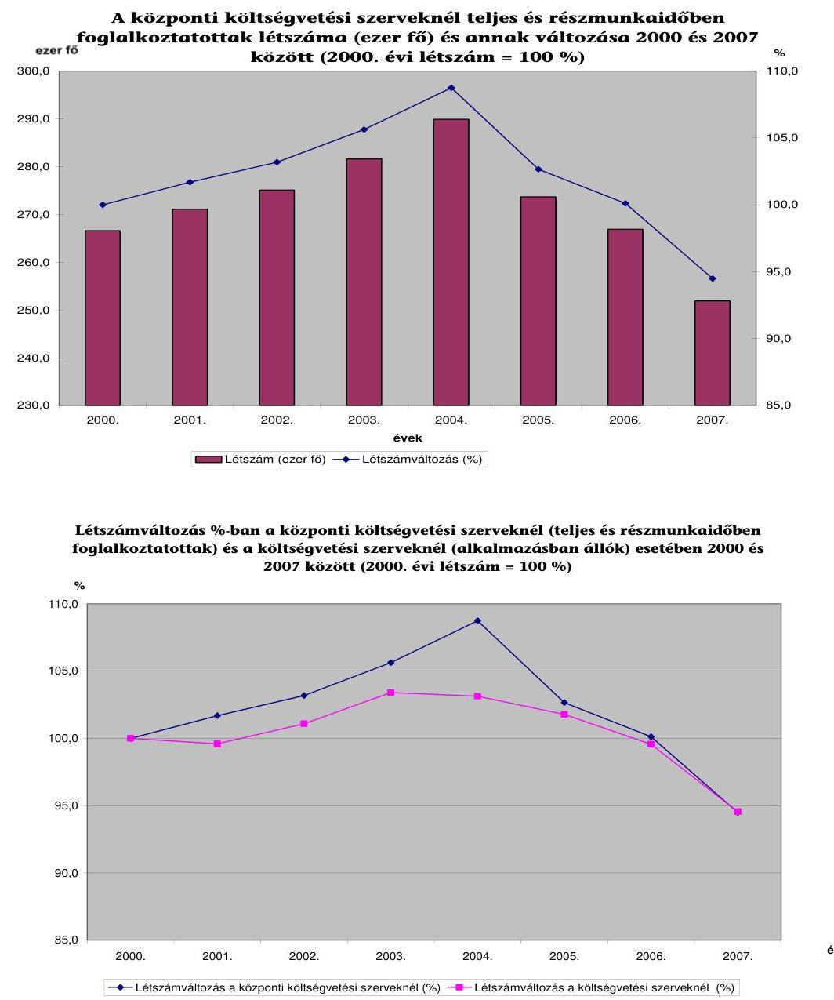
${ }^{61}$ A közszféra egyes területein (közigazgatás, védelem, kötelező társadalombiztosítás) foglalkoztatottak aránya az Eurostat adatai szerint nem kiugróan magas az uniós tagállamok között. Magyarországon 2007-ben például az ebbe a körbe tartozó 273,4 ezer fő a foglalkoztatottak 7,0\%-át jelentette, míg az uniós átlag 7,1\% volt.

---

Az összes foglalkoztatotton belül a közigazgatásban foglalkoztatottak száma az uniós átlagban alacsony foglalkoztatottsághoz viszonyítva tekinthető magasnak ${ }^{62}$. A foglalkoztatottak aránya és a kormányzati kiadások között általában nincs közvetlen összefüggés. Magyarországon a két változó között ugyan már van kimutatható kapcsolat (késleltetett hatás), amely azonban statisztikailag nem jelentős, így önmagában nem alapozza meg a létszámcsökkentésektől várt kormányzati megtakarításokat.
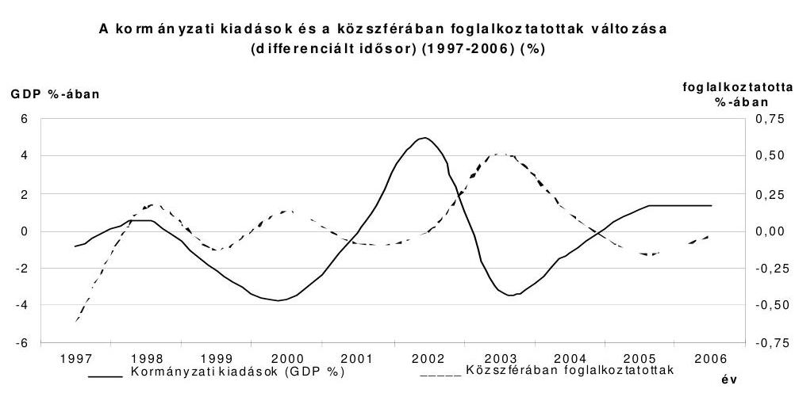

A KSH által végzett, a 27 európai országra vonatkozó modellszámítások alapján a közszférában foglalkoztatottak aránya 2000-2007 között a kormányzati kiadások arányát nem befolyásolta meghatározó módon. A kamatkiadások nélkül mért állami működési kiadásokra statisztikailag jelentős hatást nem gyakorolt ${ }^{63}$.
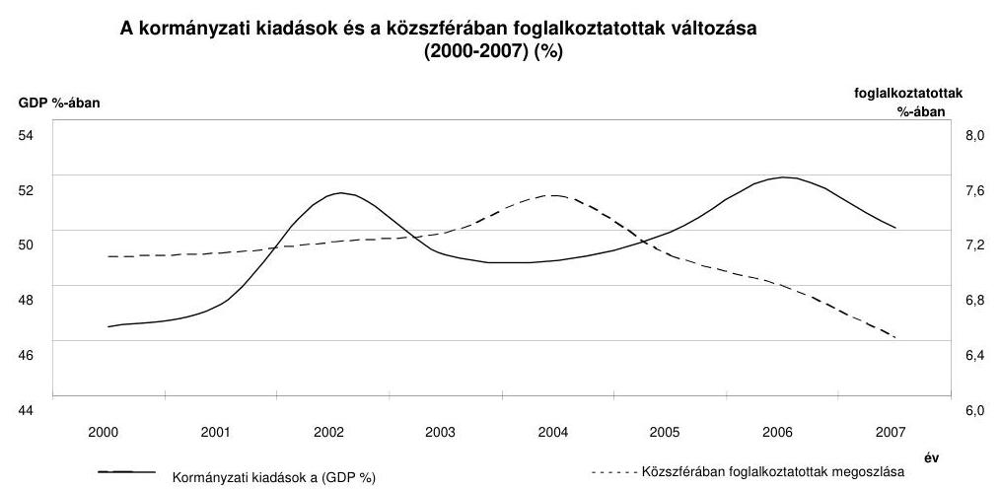

[^0]
[^0]:    ${ }^{62}$ A 15-64 éves népesség foglalkoztatási rátáját tekintve az EU-25 és Magyarország közötti mutatójában 2000-2007 között jelentős - és egyre inkább szélesedő - volt a különbség. Az eltérés 2000-ben még 6,3 százalékpont volt, ez 2007-ben már 8,5 százalékpontra nőtt. (Az EU-15 csoporttal összevetve még nagyobb Magyarország elmaradása.)
    ${ }^{63}$ Figyelembe kell venni, hogy a vizsgált időintervallum (2006-2008.) rövid, így feltehetően módosulnának az eredmények, amennyiben az elemzés hosszabb idősorokra terjedne ki.

---

A központi kormányzati szektorban mindig is többféle jogviszonyban foglalkoztatott állománycsoport (köztisztviselők, közalkalmazottak, MH hivatásos és szerződéses állományú katonái, fegyveres szervek hivatásos állományú tagjai, fizikai besorolású munkavállalók) dolgozott (4. b. sz. melléklet). A szabályozásban csak az intézmények besorolása szempontjából rendezett, hogy általános szabályként melyik jogviszonyban állókkal kell az adott közfeladatot ellátni. Hiányzik annak szabályozása, hogy az intézményen belül az egyes beosztásokat milyen feltételek esetén kell a különböző jogviszonyban foglalkoztatottakkal ellátni ${ }^{64}$, illetve miként kell kezelni az általános szabálytól eltérő besorolású intézményeket.

A központi közigazgatásban a különböző foglalkoztatási jogviszonyban állók aránya 2000-2007 között lényegében nem változott: a köztisztviselőké 20-22\%, a hivatásosoké (Hjt. és Hszt. hatálya alatt állók) közel 29\% volt. A közalkalmazottak aránya enyhén csökkent 45,2\%-ról 42,7\%-ra, a bírák, ügyészek, igazságügyi alkalmazottaké pedig 4,5\%-ról 6\%-ra emelkedett. ${ }^{65}$

Az állománycsoportok aránya egyszerű technikai okok miatt is változhat: például a fizikaiak 1993-2001 között köztisztviselők voltak, majd az ügykezelőkkel együtt megszűntek köztisztviselők lenni. (Az ügykezelők 2003-ban ismét köztisztviselőkké lettek átminősítve.)

A közszférában foglalkoztatottakról, ezen belül a köztisztviselők számáról nincs naprakész információs bázis, mely arra vezethető vissza, hogy a Központosított Illetményszámfejtési Rendszer (KIR) bér és munkaügyi adatbázisa nem teljes körű, ${ }^{66}$ a központi közszolgálati nyilvántartás (KÖZIGDAT) működtetőjének (2006-tól a MeH) adatai a szeptember 1-jei adatszolgáltatási időpont, valamint a tartalmi eltérések miatt nehezen vethetők össze az egyéb adatbázisokkal, a Ksztv. által meghatározott központi államigazgatási szerveknél foglalkoztatottakra vonatkozóan rendszerszerűen nem készülnek statisztikák.

A KÖZIGDAT-ban 2007-ben elmaradt az adatgyűjtés. 2008. januárban egyszerűsített formában történt az adatszolgáltatás. A KÖZIGDAT számítógépes információs rendszeréből adatszolgáltatást kell teljesíteni a következő évi illetményalapnak és képzési költségeknek az állami költségvetésről szóló törvényben történő megállapításához, a kormányzati személyzetpolitikai döntések előkészítéséhez, nemzetközi szervezetek összehasonlító elemzéseihez, valamint a létszám- és bér-

[^0]
[^0]:    ${ }^{64}$ Legáltalánosabb megfogalmazás szerint a köztisztviselők azok, akik közhatalmi funkciót látnak el. Nem tisztázott, hogy ide értendők-e például a támogató feladatok. Ezenkívül az állam legrégebbi feladatai közé tartozik, és egyértelműen a közhatalom gyakorlásának tekinthető a Honvédség és a rendészeti szervek hivatásos állományú tagjainak, a bírák és ügyészek tevékenysége, de ők mégsem köztisztviselők.
    ${ }^{65}$ A fennmaradó kevesebb, mint 2\%-ot az egyéb foglalkoztatási jogviszonyban állók és a választott tisztségviselők tették ki. Ezen belül a választott tisztségviselők száma folyamatosan nőtt: 2000-ben 402 fő, míg 2006-ban 437 fő volt.
    ${ }^{66}$ Több adatbázis (PM, Kincstár, KSH) a KIR-re épül. Nem része a KIR-nek 2008-ban az „alkotmányos fejezetek" nagy része, két minisztérium, a megyei egészségbiztosítási pénztárak, a regionális nyugdíjbiztosítási igazgatóságok stb., továbbá az nem tartalmazza a Ktv. hatálya alá nem tartozó költségvetési szervek adatait.

---

gazdálkodással összefüggő döntések megalapozásához a 233/2001. (XII. 10.) Korm. rendelet 23. §-a alapján.

A PM az éves tervezésnél és beszámolásnál rendelkezésére állnak a költségvetési szervek létszámadataival.

A közigazgatás modernizációjának a korábbi kutatások, felmérések eredményeit összegző anyagok ${ }^{67}$ a közszféra működéséről - az ÁSZ vizsgálat megállapításaival összhangban - alapvetően reális, bár több területen nem kellően differenciált képet vázoltak fel.

A (központi) közigazgatásról adott - az ÁSZ vizsgálat megállapításaival összhangban levő - helyzetkép szerint a szakpolitika alkotás folyamatában nem a társadalmi igényekre adott válasz, hanem a szervezeti érdekek dominálnak. Az egységes kormányzati cselekvés helyett a kormányzat teljesítménye széttöredezett, erőforrás-hasznosítása nem hatékony. Ehhez hozzájárult a döntési pontok nagy száma mellett a hatékony irányítás és koordináció hiánya; a szakmai és pénzügyi tervezés nem megfelelő színvonala (beleértve a szakmai és a pénzügyi tervezés módszertani összhangjának hiányát). Hiányzik a kormányzat politikai célkitűzéseinek szakmai stratégiává formálása, majd annak további lebontása és az éves költségvetések feladatalapú megtervezése. Ebben szerepet játszottak a tárcák közötti koordináció és kommunikáció problémái, melyek kiküszöböléséhez erősíteni kell a minisztériumok stratégiai szerepét és az ehhez szükséges kompetenciáikat. A minisztériumok sokkal inkább működnek az adott ágazat csúcs érdekérvényesítő szerveként, mint az egységes kormányprogram következetes képviselőiként és megvalósítóiként. A jelenlegi kormányzati működésnek nem szerves része az intézkedések következetes kontrollja.

A szakpolitikai tervezés megalapozásánál kockázatot jelent, hogy sok területen nem álltak rendelkezésre az állami tevékenység hatásainak nyomon követésére alkalmas összehasonlítható adatok, adatrendszerek. A társadalmi partnerek döntés-előkészítésbe történő minisztériumi szintű bevonása nem teljes körű, és nem mindig tekinthető érdeminek ${ }^{68}$. Az utólagos hatásvizsgálat, az intézkedések teljes körű végrehajtása elmaradásának okait rendszerszerű elemzése elmaradt ${ }^{69}$. A szabályozás minőségét rontja, hogy a jogalkotás mennyiségi szem-

[^0]
[^0]:    ${ }^{67}$ Például az államreform koordinációjáért felelős kormánybiztos által 2006 júliusában az ÁRB részére a közigazgatási reform víziójáról és feladatainak ütemezéséről szóló tájékoztatója, valamint az ÁROP helyzetelemzése.
    ${ }^{68}$ A makroszintű társadalmi, ágazati kérdések esetében a társadalmi partnerek bevonásának számos működő fóruma létezik, amelyek a tárcák szerint változó hatékonysággal, de folyamatosan működnek (például az Országos Érdekegyeztető Tanács, az Országos Közszolgálati Érdekegyeztető Tanács, a Kulturális Ágazati Érdekegyeztető Tanács stb.)
    ${ }^{69}$ A hatásvizsgálatokra vonatkozó nemzetközi módszertanok hazai adaptációját az akkori IM-ben 2006 előtt elvégezték, de követelményként nem jelent meg, bár a jogalkotásról szóló 1987. évi XI. törvény (Jat.) 18. §-a előírja, hogy a jogszabály megalkotása előtt meg kell vizsgálni a szabályozás várható hatását és a végrehajtás feltételeit.

---

léletű, továbbá a szükséges hatásvizsgálatokat legfeljebb formailag végzik el ${ }^{70}$. A normaalkotási folyamatban a dereguláció nincs rendszerszerűen intézményesítve ${ }^{71}$, technikai jellegű, nem szolgálja a szabályozás egyszerűsítését, az adminisztratív terhek csökkentését.

A jogi értelemben vett dereguláció keretében a végrehajtott vagy párhuzamos jogszabályok és jogszabályi rendelkezések hatályon kívül helyezésével formai értelemben csökkenthető a jogi szabályozás, így a hatályosuló joganyag nem változik. Ide tartozik az is, ha jogalkotó magasabb szintű jogszabályban rögzített szabályozást általános jelleggel alacsonyabb szabályozási szintre utal. A jogi dereguláció másik formája az érdemi dereguláció, amelynek keretében a jogalkotó megváltoztatja, lecsökkenti a hatályosuló joganyagot. Az érdemi dereguláció formája a jogi szabályozásból eredő adminisztratív terhek csökkentése. Az érdemi dereguláció harmadik formája a közfeladatok csökkentése. A technikai dereguláció sajátos formája az úgynevezett „plain regulation" szemléletű kodifikáció. Ennek során a jogalkotó a már létező jogszabályi rendelkezéseket fogalmazza újra úgy, hogy az kisebb terjedelmű és a jogszabály címzettjei számára átláthatóbb, egyszerűbb legyen.

A korábbi informatikai fejlesztések ellenére a modern távügyintézési formák még kevéssé éreztetik hatásukat az ügyfelek elégedettségében, a szervezeti kultúra változásában. A közigazgatási szervek általában nem alkalmaztak minőségbiztosítást.

A helyzetkép szerint az államigazgatásban a feladatok ellátására az indokoltnál heterogénebb és tagoltabb szervezetrendszer alakult ki 2006-ra. A magyar közigazgatás a hasonló fejlettségű országokéhoz képest azonos létszámmal, de fajlagosan magasabb költségekkel működik, ami költséghatékonysági tartalékok meglétére utal. A magyar közigazgatási kultúrára a jogalkotás- és jogszabályközpontú működés, a formalizált, hierarchikus jelleg (vertikális információ-áramlás, a horizontális koordináció gyengesége), stabilitásra törekvés, a munkatársak közötti viszonyban az alacsony fokú bizalom a jellemző. A szükséges szemléletváltás (a stratégiai megközelítés elterjesztése, a szakpolitikai összefüggésekben történő gondolkodás, nagyobb teljesítmény elérése, illetve az ügyfelek jobb minőségű kiszolgálása) olyan új képességeket és készségeket (pl. hosszú távú gondolkodás, társadalmi összefüggések figyelembevétele, projektek lebonyolítása) követel meg a köztisztviselőktől, amivel azok alig rendelkeznek, vagy nem tudják azokat kihasználni.

Ennek oka, hogy a közigazgatáson belül meghatározó köztisztviselői kör minőségi javulása (például felsőfokú végzettséggel rendelkezők aránya, nyelvismeret szintje) mellett is hiányzik a feladathoz és az egyéni készségekhez kötött ismeretek megszerzésének az intézményesített lehetősége, illetve a nem megfelelő vezetői hozzáállás miatt a megszerzett tudás általában nem, csak elvétve hasznosul.

[^0]
[^0]:    ${ }^{70}$ Az IRM által kialakított indikátor szerint Kormányhoz benyújtott törvénytervezetekhez elkészített előzetes hatásvizsgálatok aránya az összes törvénytervezethez képest 2006-ban 8\%, 2007-ben pedig 6\% volt.
    ${ }^{71}$ A tárcák négyötöde válaszolt nemlegesen 2008 májusában arra a kérdésére, hogy készült-e deregulációs intézkedések hatásaira vonatkozó előzetes vagy utólagos vizsgálat (beleértve, de nem kizárólagosan a költségvetési hatást).

---

A magas fluktuáció mellett a köztisztviselők továbbképzési rendszere vagy nem képes e hiányosságok pontos beazonosítására, vagy pedig a célszerűnél több erőforrást összpontosít egyes képességek fejlesztésére, ezzel elvonva a szűkös forrásokat új tudás széleskörű átadásától, vagy új képesség megszerzésétől. A helyzetkép alapján közigazgatás modernizációja célszerűen az állami működés egészének megújítását célzó államreform részeként került meghatározásra.

A Kormány által meghirdetett államreform alapvető célja „a közszolgáltatások fenntartható finanszírozásának biztosítása, minőségének javítása és hozzáférésük igazságosabbá tétele."72

Az
 államreform részeként megjelenő, a közigazgatás modernizációjához kapcsolódó feladatok a stratégiai jelentőségű dokumentumokban azonos módon jelentek meg, összhangban voltak a „jó kormányzás" biztosításához szükséges modernizációs követelményekkel (1. sz. függelék), az Unió kohéziós politikájában megfogalmazott fejlesztési irányokkal, továbbá a 2020-ig kitekintő Országos Fejlesztéspolitikai Koncepcióról szóló 96/2005. (XII. 25.) OGY határozattal is.

# 2.1. A létszámleépítések eszközének alkalmazása 

A Kormányok a „bürokrácia visszaszorítása", az „államháztartás egyensúlyának megteremtése" a „kisebb, hatékonyabb állam" megteremtése iránti elkötelezettsége mércéjének tekintették a(z állami) vezetők, illetve a minisztériumok számának csökkentését.

A 2006-os kormányzati dokumentumok szerint a tartós kiadáscsökkenést megalapozó reformokhoz a közszférában a hagyományos eszközökön túl - külön nevesítve a minisztériumok számának csökkentését - a teljesítmény-követelmények érvényesítésére vonatkozó intézkedések járulnak hozzá döntően. Ezek hatását a közszféra folyó működési kiadásainak GDP-ben mért aránya változásában kívánják mérni.

A minisztériumok számának változása, közvetlenül csekély érdemi hatással van a tartós kiadáscsökkenésre.

Az állami vezetők száma 2005 szeptemberében a 15 minisztériumban 23 államtitkár, 64 helyettes államtitkár (számuk minisztériumként 2-8 között változott), a 2 címzetes államtitkárral, illetve a 6 államtitkárnak minősülő vezetővel és a miniszterelnökkel együtt összesen 100 fő volt. 2006 első félévében jelentősen (41%) csökkent: 127 főről 74 főre (12 minisztérium). Ezután ismét növekedett a számuk, a 2008. június 30-ai állapot szerint 28,4%-kal, 95 főre a 13 minisztériumban.

A tárcák által kitöltött tanúsítványok szerint a minisztériumokban a köztisztviselőkön belül a vezetők aránya 2005-2007 között átlagosan 18,8%-ról 19,9%-ra változott. Ugyanakkor egyes minisztériumokban a vezetői létszám határozottan csökkent, sokban viszont egyértelműen nőtt. Erre utal, hogy a mutató relatív szórása 16,1%-ról 19,3%-ra emelkedett.

[^0]
[^0]:    ${ }^{72}$ Az államreform előkészítésével és megvalósításával összefüggő egyes szervezeti és személyi kérdésekről szóló 1061/2006. (VI. 15.) Korm. határozat.

---

A Kormány már 2006 előtt különös figyelmet fordított az irányítása/felügyelete alá tartozó központi közigazgatási szervek létszámának szabályozására, elsősorban a minisztériumok, valamint a kormányhivatalok és központi hivatalok vonatkozásában.

Az Áht. alapján (36. § (2) bekezdés) a Kormány jogosult az igazgatása/felügyelete alá nem tartozó szervek kivételével a központi közigazgatási szervek, és ezek üzemeltetési, támogatás-lebonyolítási feladatait ellátó költségvetési szervek létszámkeretének meghatározására.

A honvédelemről és az MH-ről szóló 2004. évi CV. törvény alapján az MH részletes bontású (állománycsoportok szerinti) létszámáról az OGY határozatban dönt ${ }^{73}$. Az MH-ba tartozik a HM is, amelynek létszámát azonban a Kormány határozza meg.

A Kormány 2002-től külön határozatokban szabályozta a minisztériumokban, majd 2006-tól az egyéb igazgatási és igazgatási jellegű tevékenységet ellátó központi költségvetési szerveknél is a foglalkoztatottak létszámának felső határát, engedélyezett létszámkeretét.

A 2002-es előterjesztés szerint a szabályozás indoka, hogy az EU csatlakozás minden országban 10-30%-kal növelte a köztisztviselői létszámot. Ezt a folyamatot kívánta a Kormány ellenőrzött módon levezényelni, az indokolásban például a PM 3 fős (0,5%) létszámfejlesztési igényét is említve.

A 2242/2002. (VIII. 12.) Korm. határozat a minisztériumokban foglalkoztatott köztisztviselők és munkavállalók létszámáról három és fél évig volt hatályban. Ez idő alatt tíz alkalommal módosították. (A központilag elrendelt, a szervezetek szélesebb körét érintő intézkedések ezen kormányhatározaton kívül történtek ${ }^{74}$.)

Például a kormányhatározatot 2002. október 1-jét követően november 6-án azért kellett módosítani, mert a KüM létszáma 4 fővel (0,2%) növekedett.

Ezt követően a MeH-ben és a minisztériumokban foglalkoztatott köztisztviselők (ügykezelők) létszámáról szóló 2287/2005. (XII. 22.) Korm. határozat jelentősen (19%) csökkentette a létszámot.

A december 22-ei kormányhatározat visszamenőlegesen a létszám 2005. szeptember 30-ai felső határáról rendelkezett.

A 2117/2006. (VI. 30.) Korm. határozat szerint a minisztériumok megengedett létszáma 6203 fő, az igazgatási és az igazgatás jellegű tevékenységet ellátó központi költségvetési szerveknél foglalkoztatottak létszáma pedig 63469 fő. Az utóbbi intézményeknél a létszámok kialakításának módja, a 2006. évi engedélyezett létszámkeret 10%-kos csökkentése nem mutatja a szakmai szempontok szerinti differenciálást.

[^0]
[^0]:    ${ }^{73}$ 2008-ban az 106/2007. (XII. 6.) OGY határozat volt érvényes.
    ${ }^{74}$ Például a kormányzati létszámcsökkentésekről szóló 1106/2003. (X. 31.) Korm. határozat közel száz intézmény vagy intézménycsoport esetében határozta meg tételesen a csökkentés mértékét (0 és 1988 fő között), összesen 6940 főt érintett.

---

A Kormány a 2229/2007. (XII. 5.) Korm. határozatban a 2006. június 30-ai állapothoz képest összesen 4,8%-kal (a minisztériumoknál 6,3%, a többi szervezetnél 5,0%) csökkentette a létszámot. A helyszíni ellenőrzés befejezésekor hatályos szabályozás ${ }^{75}$ viszont a létszámoknál 1,1%-os növekedést engedélyezett.

Az adatok mechanikus összevetése félrevezető, hiszen a tárcák létszáma 2006-2007-ben nemcsak a tényleges leépítések miatt változott.

A 2287/2005. (XII. 22.) Korm. határozat alapján a KüM létszáma 1603 fő, a 2117/2006. (VI. 30.) Korm. határozat szerint csak 409 fő volt, mert a „Külképviseletek igazgatása" az igazgatási és igazgatási jellegű szerveknél szerepelt. Ez szakmailag elfedte ${ }^{76}$ azt a tényt, hogy a KüM teljes létszáma a 2117/2006. (VI. 30.) Korm. határozat szerint a korábbihoz képest 7,5%-kal nőtt.

Az egyes minisztériumi ellátási és üzemeltetési feladatok 2007-ben átadásra kerültek a KSZF-hez, a tárcák összlétszámának (státusz) több mint tizedével (661 fő) együtt. A KSZF ugyanakkor nem tartozik a vonatkozó kormányhatározatok hatálya alá.

A Kormány 2007-től már a területi szervek létszámát is intézményeként határozták meg, ezzel a szabályozott szervezetek száma több mint kétszeresre (56-ról 134-re) nőtt. A Kormánynak a létszámgazdálkodással kapcsolatos szabályozási tevékenysége célszerűtlen formában kívánta ellensúlyozni a költségvetési tervezés vonatkozó hiányosságait.

A költségvetési tervezési köriratok részletes szabályokat adnak a létszám tervezésére, az ennek alapján kialakított előirányzatok pedig - a munka díjazására vonatkozó jogszabályi előírások mellett - elvileg meghatározzák azt a sávot, amelyen belül az intézmény létszáma mozoghat.

A kormányhatározatok alanyi hatálya is következetlen. A minisztériumok, valamint - 2006-tól - az igazgatási és igazgatási jellegű szervek létszáma a Kormány irányítása/felügyelete alá tartozó szerveknél foglalkoztatottak alig harmada. Az egy-két százalékos változás hatása a központi költségvetésre nem, de az adott szervezet működőképességére jelentős lehet. A Kormány irányítása/felügyelete alá tartozó központi közigazgatás működésére jelentős hatással van a kormányhatározatok hatálya alá nem tartozó Vám- és Pénzügyőrség vagy a KSZF és a KSZK.

# A létszámcsökkentések hatása az egyes minisztériumokra eltérő 

volt. A tárcáknál a teljes munkaidőben foglalkoztatottak egy főre jutó rendszeres személyi juttatások relatív szórása 2005-2007. években 14,5%-ról 10,1%-ra

[^0]
[^0]:    ${ }^{75}$ A 2057/2008. (V. 14.) Korm. határozat, amelyet a következő 2,5 hónap alatt már négyszer módosítottak.
    ${ }^{76}$ A KüM fejezet működésének ellenőrzéséről készült, 2007. júniusban közzétett 0711 sz. Jelentésében az ÁSZ megállapította, hogy a „külképviseletek is betagolódtak 2002-ben a minisztérium szervezetébe, amely így a Magyarországon, illetve a külföldön működő szervezeti egységekből, azaz a Központból és a külképviseleti hálózatból állt." Továbbá a „szakmai és funkcionális szervezeti egységek - a költségvetési alcímek elkülönültségétől függetlenül - egységes szervezetként működtették a minisztériumot."

---

csökkent. Ugyanakkor az egy főre jutó működési költség esetében a relatív szórás alakulása ellentétes, az 16,7%-ról 35,8%-ra emelkedett.

A létszámcsökkentések is hozzájárultak ahhoz, hogy a tárcáknál az eszközök minősége kedvezőbbé vált. A gépek, berendezések használhatósági foka ${ }^{77}$ 2005 és 2007 között 31%-ról 62%-ra nőtt, a 0-ra leírtak aránya pedig 32%-ról 14%-ra csökkent.

Ugyanakkor a csökkenés döntően a működési költségek nem hatékonyságnövekedésen alapuló visszafogására vezethető vissza, elsősorban nem a központi kormányzatot, hanem az önkormányzati szektort érintette. Ez kockázatossá teszi a működési kiadások a Kormány által meghatározott színvonalának eléréséhez szükséges további, hasonló ütemű csökkentés fenntarthatóságát.

A működési költségeken belül 2007-ben az előző évhez képest a teljes kormányzati szektorban a munkavállalói jövedelmek 6,0%-kal, a folyó termelő felhasználás 7,7%-kal volt kevesebb. A központi kormányzatnál, illetve az önkormányzatoknál a megfelelő adatok: 3,0% és 8,7%, valamint 5,8% és 10,4%. Ennek eredményeként az önkormányzatoknál a kormányzati szektornál 40%-kal nagyobb arányban, 9,2%-kal csökkentek a működési kiadások.

A KSH adatai szerint a kormányzati szektor működési kiadásain belül az önkormányzatok aránya 2000-2005 között magasabb vagy egyenlő volt, mint a központi kormányzaté. 2006-tól az önkormányzatok aránya fokozatosan csökkent: 2007-ben a központi kormányzat aránya (51,4%) már 4 százalékponttal haladta meg az önkormányzatokét. (A szektor harmadik összetevője, a Tb. alapok aránya 2000-2007 között 1,6%-ról 1,2%-ra csökkent.)

# 2.2. A közigazgatás intézményrendszerének változása 

A Kormány a programjának megfelelően ${ }^{78}$ a 2118/2006. (VI. 30.) Korm. határozatban jelentős szervezeti változásokról döntött a központi közigazgatás, ezen belül a központi kormányzat szerveit érintően.
A 2008 májusában nyilvánosságra hozott, a központi költségvetés intézményrendszerének ellenőrzéséről készített 0808 sz. Jelentésében az ÁSZ vizsgálta a 2118/2006. (VI. 30.) Korm. határozat intézkedéseinek végrehajtását, illetve a korábbi évek hasonló jellegű kormányzati intézkedéseinek megvalósulását.
A 2118/2006. (VI. 30.) Korm. határozatot pénzügyi és szervezet-gazdaságossági szempontból előkészítették, ugyanakkor nem vették számba a feladatellátásra gyakorolt hatást. Egyúttal a PM-ben az államháztartási reform kapcsán készített korábbi előkészítő anyagok, felmérések részlegesen hasznosultak.

[^0]
[^0]:    ${ }^{77}$ Az eszközök elhasználódását kifejező mutató, amelynek mértékét a „nettó érték/bruttó érték × 100" képlet határozza meg.
    ${ }^{78}$ A kormányprogram szerint: „Felülvizsgáljuk és átvilágítjuk több mint nyolcszáz állami szerv és háromszáznál több állami részvétellel működő gazdasági társaság és alapítvány tevékenységét, feladataik indokoltságát. Kialakítjuk az állami szervek új, a jelenleginél kisebb, hatékonyabb rendszerét."

---

Az ÁSZ 2006. évi tevékenységéről szóló 0705 sz. Jelentés megállapította, hogy a „2006. évi kormányváltást követő minisztériumi feladat-újraelosztást, átszervezéseket a kormányzati munka hatékonyságára, a költségek csökkentésére irányuló törekvésre utaló dokumentumok nem támasztották alá, az évközi feladat- és előirányzatátadások problémát okoztak a feladatok folyamatos, jó minőségű ellátásában."

A Jelentés alapvető hiányosságként értékelte, hogy elmaradt az állami feladatok körének, terjedelmének ${ }^{79}$, finanszírozásának előzetes felülvizsgálata ${ }^{80}$, intézményi modellek, feladat- és teljesítménymutatók, kritériumok meghatározása. Mindezek hiányában - a döntően a PM tapasztalatain alapuló intézkedések - magukban hordozzák a visszarendeződés veszélyét ${ }^{81}$, ami kockázatot jelenthet a tartós kiadáscsökkenés megvalósulása, az intézményi struktúra és a költségvetés hosszabb távú stabilitása szempontjából.

A Jelentés ugyanakkor kiemelte, hogy a magyar közigazgatásban ilyen nagyságrendű, a központi és a helyi, területi államigazgatási szervek, valamint az irányításuk alá tartozó (köz)alapítványok, gazdasági társaságok széles körét érintő szervezeti átalakítás az utóbbi évtizedben nem volt ${ }^{82}$. A Kormány - az előkészítés és a végrehajtás hiányosságaival együtt - határozottan fellépett a vizsgálatok, elemzések nélkül is megállapíthatóan széttagolt, egyszerű összevonásokkal és megszüntetésekkel is ésszerűsíthető intézményrendszer kialakítása érdekében.

# A központi államigazgatási intézmények száma átlagosan harmadával csökkent ${ }^{83}$. Az átlagnál jobban csökkentették az intézmények számát a GKM-nél 44%-ra is, az FVM-nél 48%-ra, a PM-nél 52%-ra, az ÖTM-nél 54%-ra és
 a HM-nél 56%-ra.

A 2118/2006. (VI. 30.) Korm. határozat alapján több szervezet intézményrendszerének átalakítása regionális alapra helyezte a területi hálózatát is. Ezzel a 4 minisztériumhoz (EüM, GKM, PM, Szociális és Munkaügyi Minisztérium) tartozó 7 országos hálózattal rendelkező szervezet a korábbi 175 intézmény helyett - 70%-os csökkentéssel - 51 intézménnyel folytatta a kibővült feladatainak ellátását.

Az Adó- és Pénzügyi Ellenőrzési Hivatal 42 szervezete helyett - beleértve az átvett Szerencsejáték Felügyeletet és a 20 fővárosi és megyei illetékhivatalt - 11 szervezetté alakult át.

[^0]
[^0]:    ${ }^{79}$ „A közfinanszírozás parttalanná és átláthatatlanná válik, ha az állam nem dönt egyértelműen arról, hogy konkrétan melyek azok a javak, szolgáltatások, amelyekről maga kíván gondoskodni." - A közpénzügyek szabályozásának tézisei (ÁSZ, 2007. április).
    ${ }^{80}$ A PM nem tartotta indokoltnak az állami feladatok előzetes felülvizsgálatának hiányára tett számvevőszéki megállapítást.
    ${ }^{81}$ A MeH és a PM nem tartott a visszarendeződés veszélyétől.
    ${ }^{82}$ Az előírt 264 feladat több mint félszáz költségvetési intézményt és államháztartáson kívüli szervezetet érintett.
    ${ }^{83}$ A helyi önkormányzatok igazgatási szerveinek száma is csökkent, de jóval kisebb (8,5%) mértékben.

---

A 20 megyei és fővárosi hadkiegészítő parancsnokság helyett 2 regionális parancsnokság; a 20 fővárosi és megyei közigazgatási hivatal jogutódja 7 regionális közigazgatási hivatal lett, amelynek része a korábbi 8 területi főépítészi hivatal is; a Kincstárban a központi hivatal mellett a korábbi 20 fővárosi és megyei területi igazgatóságból 7 regionális igazgatóság alakult.

Az ÁNTSZ esetében 21 helyett 8 szervezet: központi szervek (Országos Tisztifőorvosi Hivatal, illetve az alá tartozó országos intézetek), valamint 7 területi szerv (a korábbi 1 központ és a 20 fővárosi és megyei helyett).

Az Állami Foglalkoztatási Szolgálat 21 helyett 8 intézmény: Foglalkoztatási és Szociális Hivatal, valamint 7 regionális munkaügyi központból áll (a korábbi 20 fővárosi és megyei helyett).

Az Országos Nyugdíjbiztosítási Főigazgatóság igazgatási szervei a korábbi 22 helyett 7 regionális nyugdíjbiztosítási igazgatóság (a korábbi 20 fővárosi és megyei nyugdíjbiztosítási igazgatóságok helyett), valamint a Nyugdíjfolyósító Igazgatóság.

A kormányhatározatban elrendelt intézkedések végrehajtását az ÁRB és a Kormány is figyelemmel kísérte. A végrehajtás monitoringja alapján az átalakítások 2007-re vonatkozó egyszeri hatása a PM számítása szerint 40,5 Mrd Ft többletkiadást jelentett, amely alapvetően a szervezeti átalakításokhoz és az elrendelt létszámleépítésekhez kapcsolódó felmentési illetményből, végkielégítésekből és járulékaikból állt. A tartós megtakarítások összegét a PM 75 Mrd Ft-ban állapította meg. Ez magába foglalja a létszámcsökkenés miatti személyi juttatás és járulékaik csökkenését, továbbá a dologi kiadások mérséklődését. A PM nem tért ki a tartós megtakarítás időhorizontjára, illetve a nettó megtakarítás nagyságára (a járulékbevétel kiesése a költségvetés számára nem jelent megtakarítást).

A 2007. évi zárszámadás szerint a megtakarítások nagyobb része az egészségügy terén jelentkezett. A megtakarítás mintegy 28%-a (20,8 milliárd forint) az EüM-nél az Állami Egészségügyi Központ létrehozásával és az országos egészségügyi intézetek feladatmegszűnésével és átrendezésével kapcsolatban. A GKM 5 Mrd Ft-os megtakarításának közel fele a MÁV Kórház megszüntetésének következménye.

A 2118/2006. (VI. 30.) Korm. határozat konkrét intézkedéseket tartalmazott a funkcionális feladatok centralizációja kapcsán szükséges szervezeti rendszer létrehozására.

A közigazgatás átalakításának előkészítésével kapcsolatos egyes feladatokról szóló 1054/2006. (V. 26.) Korm. határozatban született döntés a KSZF feladat- és hatáskörének bővítésére, az Elektronikus Közszolgáltatások Központja, valamint a KSZK kialakítására.

Eszerint 2007. január 1-jéig végre kell hajtani a minisztériumok egyes informatikai feladatainak átcsoportosítását (kivéve a PM funkcionális célú informatikai feladatai) a MeH EKK-ba, illetve a KSZF-be; egyes humánerőforrás-menedzsment feladatainak átcsoportosítását a KSZK-ba; a könyvelési tevékenység átcsoportosítását a Kincstárhoz; az ingatlan vagyonkezelési- és üzemeltetési feladatok átadását a Kincstári Vagyonkezelő Igazgatóságba; az ingatlan vagyonkezelési- és üze-

---

meltetési feladatok kivételével az ellátási és a rendezvényszervezési feladatok, oktatás, üdültetés átvételét a KSZF által ${ }^{84}$.

Az elrendelt intézkedések eredményességét kedvezőtlenül befolyásolta, hogy nem készültek a tevékenységek központosítására, az új szervek felállítására gazdaságossági számítások, hatástanulmányok, a Kormány az objektíve ismert kockázatok kezelését elmulasztotta. A Kormány a változások indokolásaként a hatékonyságot nevezte meg az időtartam, az intézményi szintű mutatók költségvetési erőforrásának megtakarítása nélkül.

A(z informatikai) rendszerek, a működési módok, a munkatársak, az eszközök típusa, színvonala a tárcáknál rendkívül eltérő volt. A költségvetési gazdálkodás finanszírozási, nyilvántartási, elszámolási rendszere sem támogatja az egyes tevékenységek ráfordításainak pontos kimutatását, mérhetőségét.

A HM, illetve a KüM informatikai rendszerei, beilleszthetőségének problémamentességét adottnak feltételezték. A két tárca olyan informatikai rendszereket üzemeltet, amelyeknél a - nemzetközi szervezetek, így különösen a NATO által is megfogalmazott, számon kért és rendszeresen ellenőrzött - követelmények jelentősen különböznek a többi minisztérium informatikai rendszereitől. (A HM esetében kormányhatározatban rendelkeztek a kétharmados honvédelmi törvény ${ }^{85}$ hatálya alá tartozó témáról.)

A minisztériumoknál a szakmai feladatellátás átalakításával együtt járó kockázatot fokozta a támogató területek jelentős mértékű átszervezése.

A tárcák könyvelési feladatainak átvételére kijelölt Kincstár számára a 2118/2006. (VI. 30.) Korm. határozat ugyancsak területi szerveinek regionális átszervezését meghatározta, miközben a Kincstár a meglévő feladatainak ellátását is nehezítette például a működésében kulcsterületnek számító informatika helyzete. A PM fejezet működésének ellenőrzéséről készített 0801 sz. jelentésében az ÁSZ megállapította, hogy a „Kincstár informatikai rendszerei rendkívül heterogének mind technológiai szempontból, mind az adattartalom és működési jellemzők szempontjából. Az informatikai alkalmazásokon belül jelentős részt képviselnek az elavult technológián alapuló, hiányosan dokumentált rendszerek."

Az intézkedések kidolgozatlanságát mutatja, hogy az informatikai feladatok terén nem határozták meg a feladatok megosztását az Elektronikus Közszolgáltatások Központja, illetve a KSZF között ${ }^{86}$. A KVI és a KSZF közötti megállapodás szerint a vagyonkezelési feladatok (ideiglenesen) kerültek a KSZF-hez. A 2007 januárjától KSZF-re háruló új szakmai-gazdasági ellátó funkciók a költségvetés tervezésekor szakmai és pénzügyi oldalról kidolgozatlanok voltak.

A Kormánynak a végrehajtás részleteire, ütemezésére vonatkozó egyértelmű és kötelező erejű döntésének hiánya nehezítette az egymással korábban kapcso-

[^0]
[^0]:    ${ }^{84}$ A KSZF ekkor az ME fejezet egyes intézményeinek ellátását végezte.
    ${ }^{85}$ A honvédelemről és a Magyar Honvédségről szóló 2004. évi CV. törvény.
    ${ }^{86}$ Az Elektronikus Közszolgáltatások Központja az eredeti feladatkörrel nem került létrehozásra, a feladatokat megosztották a KSZF, illetve a Közigazgatási és Elektronikus Közszolgáltatások Központi Hivatala között.

---

latban nem álló KSZF és a tárcák között az egyébként is bonyolult feladat végrehajtásának előkészítését.

A hatályos előírások nem rögzítik, hogy az intézmények közötti szervezetátadás, illetve új szervezet létrehozása esetén milyen eljárásrendet kell követni ${ }^{87}$. A feladatok átvételével járó kockázatokat növelte, hogy a Kormány nem pontosította az átvétellel kapcsolatos felelősséget, ütemezést. A KSZF és a tárcák közötti érdemi egyeztetések csak 2006. október elején indultak el, még inkább szűkítve az átállásra rendelkezésre álló időt.

Az üzemeltetési-ellátási feladatok központosítása megvalósult. A KSZF átvette a tárcák üzemeltetésével foglalkozó önálló intézményeket és szervezeti egységeket, valamint a kormányhatározatban nevesített üdülőket. A tárcákkal 2007 elején megkötött szolgáltatási és a költségvetési megállapodások alapján megtörtént a feladatok, eszközök, szerződések, a személyi állomány és az üzemeltetéshez, beruházásokhoz rendelt 2007-2008. évi előirányzatok átadása. A vagyon átadása-átvétele leltáron alapult.

A megállapodásokban a KSZF nem teljesítésének esetére nem írtak elő szankciókat. A KSZF-nél sem kerültek kidolgozásra a tervbe vett felelősségi szabályok.

Nem kerültek átadásra a képzőművészeti alkotások ${ }^{88}$, az információs és telekommunikációs technológiák (IKT) eszközöknél az átvétel nem azonos kört érintett. A KüM a szakmai informatikai rendszerei és az informatikai alapinfrastruktúra egymástól logikailag-műszakilag el nem választható jellegére hivatkozva, nem adta át az informatikához kapcsolódó feladatokat. A HM ellátási rendszerének átvétele az MH logisztikai szervezetébe való integráltságával érvelve, teljesen kimaradt a központosításból ${ }^{89}$.

A KSZF létrehozásának célja az volt, hogy az egyes minisztériumok rendkívül eltérő tartalmú és színvonalú ellátási rendszerei konszolidálásának 2007. évi megkezdésével 2-3 éves távon, a Kormányzati Negyedbe történő költözésig egy hatékonyabb, az integrált működést normatív alapon lehetővé tevő központi rendszer kialakítása történjen meg. Eközben biztosítani kellett az első átmeneti évben minisztériumok folyamatos működőképességét.

Az üzemeltetési feladatok integrációja szempontjából jelentős feltétel, a minisztériumok nagyobbik részének közös elhelyezése a Kormányzati Negyedben, ez azonban nem történt meg, mivel a projektek megvalósítását a Kormány 2008 elején felfüggesztette. A KSZF által működtetett rendszer vonatkozásában a Kormány ennek következményeit nem vette számba.

[^0]
[^0]:    ${ }^{87}$ Célszerű lenne a folyamat normatív szabályozása, hogy a feladat zökkenőmentes lebonyolításának feltétele ne csak a résztvevők szakmai gyakorlata, tapasztalata legyen.
    ${ }^{88}$ Az átlagos nagyságú PM kezelésében maradt 296 db műalkotás, amelyek bruttó értéke 100 M Ft.
    ${ }^{89}$ A HM-nek erre a sajátosságára, a fejezet integrált humánpolitikai, személyi, pénzbeni járandóságok, pénzügyi-számviteli, üzemeltetési, gazdálkodási, munkaügyi vezetői alrendszerekből álló költségvetés gazdálkodási információs rendszerének (KGIR) meglétére az egyéb támogató funkciók központosítása során is tekintettel kell lenni.

---

A Kormány az új Kormányzati Negyed létrehozásáról az 1001/2007. (I. 16.) Korm. határozatban döntött, legkésőbb 2009. május 31-éig történő átadással.

A zökkenőmentes működést több kedvezőtlen jelenség akadályozta. A KSZF a nagy volumenű feladat- és vagyonnövekedésre, elsősorban a gazdálkodás adminisztratív terheinek kezelésére - pótlólagos erőforrások hiányában - nem volt felkészülve.

A KSZF engedélyezett létszáma 2007-ben 308 főről 885 főre növekedett. (Az üdülőkkel kapcsolatos feladatokat végző 138 fő átadásra került üdülőket üzemeltetető HUMÁN-JÖVŐ 2000 Kht. állományába.) A 2007. évi eredeti kiadási előirányzata 5,9 Mrd Ft-ról 21,6 Mrd Ft-ra változott (a növekedésből a feladatkör változása 9,1 Mrd Ft-ot tett ki). A KSZF mérleg főösszege közel 140%-kal 62,2 Mrd Ft-ra emelkedett (253 ezer vagyonelem). A KSZF 2006. december 31-én kb. 160 szerződést kezelt, amelyhez további 900 került átvételre. A KSZF használatában lévő gépkocsiállomány (141 darab) háromszorosára nőtt.

Megállapításunk szerint az új típusú ellátási forma megnövelte a beszerzésekhez, szolgáltatásokhoz kapcsolódó adminisztrációt. A KSZF feladatellátásának egyes hiányosságai - elsősorban a minisztériumok működését érintő információk átadásának elmulasztása - a gazdálkodási folyamatban fennakadásokat idéztek elő ${ }^{90}$. A KSZF a megállapodásokban előírt, az átadott előirányzatok felhasználásáról szóló rendszeres havi adatszolgáltatási kötelezettségének nem vagy csak jelentős késedelemmel tett eleget, ami a tárcák számára megnehezítette a pénzeszközök ésszerű felhasználásának tervezését.

A tárcáktól átvett köztisztviselői állomány közalkalmazotti átminősítése mellett feszültséget okozott, hogy a különböző minisztériumoktól eltérő jövedelmi viszonyokkal, bérszínvonallal került át az állomány.

Az átvett létszámból - az üdültetéssel foglalkozókat nem számítva - csak 3,5% a vezető (beleértve a csoportvezetőket is), miközben a minisztériumokban a vezetők aránya ennek többszöröse volt, és maradt.

A vagyon átadásakor a vagyonnyilvántartás - az ÁSZ által visszatérően kifogásolt - hiányosságai gyakorlati problémaként jelentkeztek. A KVI, amelynek engedélyére szükség lett volna,
 a 2008. január 1-jével történő megszüntetésével kapcsolatos feladatai mellett kevesebb figyelmet fordított erre a kérdésre. 2008-ban pedig az állami vagyonról szóló 2006. évi CVI. törvény 28. §-ának, valamint az általános forgalmi adóról szóló 2007. évi CXXVII. törvény 11. §-ának előírásai miatt nem lehetséges térítésmentes átadás, illetve áfa-fizetési kötelezettség keletkezne. Ezekre a kiadásokra a KSZF nem rendelkezik fedezettel. Emiatt az eszközök egy része - a Kormány döntésével ellentétesen - jelenleg is a minisztériumok vagyonnyilvántartásában szerepel, miközben a vagyongazdálkodást biztosító forrásokat már átcsoportosították a KSZF-hez. A

[^0]
[^0]:    90 A KSZF-et irányító államtitkár 2007 októberében tájékoztatást kért a minisztériumoktól a központosított ellátás helyzetéről. A KSZF a közel 60 db észrevétel 40%-át a kommunikáció hiányára vezette vissza.

---

köztulajdon védelme, vagyonkezeléssel kapcsolatos feladatok ellátása szempontjából; központi megoldásra van szükség ${ }^{91}$.

Az átvett eszközök és a kiszolgáló személyzet szabályozási, minőségi heterogenitása különösen szélsőségesen mutatkozott meg az IKT területén, mind az eszközök, mind az alkalmazások oldaláról.

A KSZF 2007 júliusában az ITIL módszertan ${ }^{92}$ alapján felmérte az átvett informatikai rendszereket és a munkatársak szakmai kompetenciáját. Csak 2 minisztérium volt a KSZF színvonalán vagy fölötte.

Az EKK 2007-ben megállapította, hogy 8 minisztérium nem rendelkezik középtávú (3-5 éves) informatikai tervvel.

A minisztériumok informatikai menedzsmentjével, irányításával kapcsolatos tevékenységeknek - a volt GKM-hez tartozó tárcák kivételével - nem volt felelőse, az üzemeltetés folyamatainak és előírásainak szabályozottsága és dokumentáltsága egyik minisztériumnál sem volt teljes körű.
A KSZF által nyújtott szolgáltatások körét, terjedelmét, valamint az igénybevétel rendjét meghatározó 7/2007. (III. 19.) MeHVM rendelet - a minisztériumi szolgáltatási megállapodásokban rögzített szolgáltatáslistákkal együtt sem - felel meg az igényelhető szolgáltatások pontos tartalmát, minőségét, a rendelkezésre állás határidejét, az igények kielégítésének prioritásait magába foglaló szolgáltatási katalógusnak.
Létrejött az integrált gépjármű üzemeltetés. A nyomatmenedzsment és központosított irodaszer-beszerzés 2008 végéig megvalósul. Az ellátás működtetéséhez szükséges Szolgáltatási és Ellátási Alapadat Tár (SzEAT) ${ }^{93}$ feltöltése 2008 szeptemberében megtörtént, elkészült a kézikönyv, folynak az oktatások. A központi kormányzati címtár és levelezési rendszer feltöltését az ME fejezet intézményeinél elvégezték ${ }^{94}$.

A tevékenységek központosításától várt költséghatékonyság 2008 augusztusáig több területen még nem érvényesült. A tárcák ellátására rendelkezésre álló forrásokat egységesen kezelő normarendelet nem került kiadásra. A normarendelet hiánya kockázatot jelent a tervezés megalapozottságának

[^0]
[^0]:    ${ }^{91}$ A Magyar Köztársaság 2007. évi költségvetése végrehajtásának ellenőrzéséről készített 0824 sz. ÁSZ jelentésünkben is megállapítottuk, hogy a vagyonátadás nem volt teljes körű.
    ${ }^{92}$ Az ITIL egy informatikai rendszerek (infrastruktúra) üzemeltetésére és fejlesztésére szolgáló módszertan, illetve szabvány- és ajánlás-gyűjtemény neve. A betűszó az informatikai infrastruktúra-könyvtár (Information Technology Infrastructure Library) angol nyelvű rövidítése.
    ${ }^{93}$ A SzEAT az ellátott szervezetek és személyek, illetve a nekik járó szolgáltatások azonosítását, valamint a nyújtott szolgáltatások költségfelosztását, majd az ellátott szervezetek számára készítendő pénzügyi beszámoló elkészítését támogató adatnyilvántartó rendszer. A Service Desk 2008-ban már ezen a rendszeren fut.
    ${ }^{94}$ Már 1999-ben elindult egy Kormányzati Iratkezelő Rendszer projekt, de nem tudott érdemi eredményeket felmutatni.

---

biztosítására és hátráltatja a tárcákkal az új szolgáltatási szerződések megkötését.

A KSZF által benyújtott SzMSz-t nem hagyták jóvá. A kiadásra kerülő SzMSz alkalmas a meglévő rendszer működtetésének hatékonyabbá tételére, például központi beszerző egység, a logisztikai raktár létrehozásával, továbbá biztosítja a normarendelet bevezetésével szükséges változásokra való felkészülést is.

A KSZF az MNV ZRt.-vel nem kötötte meg a megállapodást a vagyonkezelésről.
A KSZF az államtitkot vagy szolgálati titkot, illetőleg alapvető biztonsági, nemzetbiztonsági érdeket érintő vagy különleges biztonsági intézkedést igénylő beszerzések sajátos szabályairól szóló 143/2004. (IV. 29.) Korm. rendelet alapján közbeszerzést írt ki a kezelésében lévő épületekben ingatlanüzemeltetési szolgáltatások nyújtására 12 hónap időtartamra. A közbeszerzésben megjelölt időpontok (beleértve a szerződéskötés) 2008 júniusában lejártak, de döntés nem született a pályázatokban szereplő - a bíráló bizottság álláspontja szerint magas vállalási árak miatt ${ }^{95}$.

Az egységes gazdálkodás hiánya miatt nem történt meg az átvett szerződések konszolidációja ${ }^{96}$. Nem döntöttek a szoftverlicencek egységes rendszerének kialakítására vonatkozóan.

A szoftverek beszerzését részben - esetenként jogszabálysértő módon - egyedi szerződések alapján, részben a központosított közbeszerzés rendszerében önállóan lebonyolított beszerzések keretében valósítják meg. Az egyedileg elérhető árkedvezményt a nagyszámú kis intézmény nem tudja érvényesíteni. Ez jelentős költségterhet jelent, amelyet a helyi adminisztráció költségei tovább növelnek.

Nem döntöttek a gépjármű „flottabeszerzés" ${ }^{97}$ ügyében sem. A döntés késlekedése a gépkocsiállomány ütemezett pótlását akadályozza.

A KSZF szerint a minisztériumoktól átvett gépjárműpark és a kapcsolódó szolgáltatások olyan mértékű inhomogenitást mutatnak, amelynek egységesítése és normarendszerbe történő integrálása csak hosszú idő alatt és rendkívül nagy

[^0]
[^0]:    ${ }^{95}$ A KSZF álláspontja szerint az árak csak a korábbi színvonalon ellátott, a tényleges ráfordításokat nem tükröző minisztériumi költségekhez képest magasabbak.
    ${ }^{96}$ Vannak egyéb akadályok is: például a licencszerződések csak a szállító jóváhagyásával ruházhatók át harmadik félre.
    ${ }^{97}$ A KSZF szerint ebben a konstrukcióban gépjárműtípustól függően 100-900 ezer Ft megtakarítás érhető el évente, amely az üzemeltetendő járműpark egészére vetítve 100-200 millió Ft közötti értéket is elérhet. A gépjármű üzemeltetéshez kapcsolódó szolgáltatások „kiszervezésével" a kapacitáskihasználás 10-15%-os mértékéhez kapcsolódó jelentős megtakarítás mellett a gépjárművek beszerzésének ciklikus költségigénye a havi szolgáltatási díj fizetésével időben egyenletesen eloszlik, továbbá az ellátási szinteknek megfelelően biztosítható a szolgáltatásnyújtás minőségi, formai és tartalmi objektivitása is. A központosított közbeszerzés rendszerében a flottaüzemeltetés kiemelt szolgáltatássá válik és az intézmények számára a saját tulajdonban végzett üzemeltetés alternatívájaként jelenik meg. Magyarországon a flottakezelt nyugat-európai gépjárműpark 25-30 %-os arányával szemben csupán a gépjárművek 1-2 %-át érinti a költségverseny alapú flottaszolgáltatás.

---

költségráfordítással lehetséges. A szakértői elemzések azt mutatják, hogy a gépjármű üzemeltetési megoldások közül mind a kiemelten hangsúlyos költséghatékonysági, mind pedig egyéb vizsgált szempontok alapján a tartós bérlettel kombinált flottaüzemeltetési szolgáltatás igénybevétele bizonyul a legkedvezőbb alternatívának.

A személygépkocsik átlagos állománya a minisztériumokban (kivéve a HM és a KüM) 2005. és 2007. január 1-je között mintegy negyedével csökkent: $46,0 \mathrm{db} /$ hóról és $33,6 \mathrm{db} /$ hóra. Ugyanakkor a vezetők használatában lévő személygépkocsik aránya 43,3%-ról 50,2%-ra nőtt. A személygépjárművek használhatósági foka azonban 2005-2008. között 32,7%-ról 24,9%-ra csökkent.

Az ÁSZ már 2006-ban kifejezte fenntartásait a funkcionális feladatok centralizált ellátásának 2007. évi indulásával kapcsolatban. Az indulás évét korainak tartotta a feladatok előkészítetlensége miatt.

Az ÁSZ az MK 2007. évi költségvetési javaslatáról szóló véleménye (0641, 2006. november) szerint „a KSZF-re háruló új szakmai gazdasági ellátó funkciók jelenleg szakmai és pénzügyi oldalról is kidolgozatlanok. Az új szervezet felállításának vonatkozásában gazdaságossági számítások és hatástanulmányok nem készültek. Kizárólag a tárcák közötti megállapodásokkal e feladat centralizálását nem lehet végigvinni, mivel ezen intézkedések kihatással vannak a jövőbeni tervezés-gazdálkodás-beszámolás hatás és felelősségi körének rendszerére is."

A humán-erőforrás fejlesztésére vonatkozó kormányzati program intézkedéseinek kidolgozására, bevezetésére, a kialakított intézményi megoldások működtetésére a Kormány új szervezetek létrehozásáról döntött. A humánpolitikai feladatok koordinálására erős jogosítványokkal rendelkező szervezetet alakított ki a MeH-ben, illetve a meglévő humánpolitikai feladatok összevonására új szervezetet hozott létre az MKI szervezeti- és feladatstruktúrájának átalakításával. Az MKI kutatási tevékenysége átkerült az ECOSTAT Kormányzati Gazdaság- és Társadalom-stratégiai Kutató Intézethez (ME fejezet). Így megszűnt a közigazgatással kapcsolatos intézményesített kormányzati kutatásokkal 1938-tól fennálló szervezeti folytonosság.

A KSZK megalakulásakor is tapasztalhatóak voltak az új szervezet létrehozásához/meglévő szétválással történő átalakuláshoz kapcsolódó eljárási szabályok hiányából fakadó nehézségek (elhelyezési feltételek, személyzet kialakítása, felkészülés az új feladatrendszer ellátására stb.).

# 2.3. A kormányzási képesség javítására tett intézkedések 

A kormányzat 2006-ban a programja szerint az államreform alapvető keretfeltételének tekintette, hogy a feladatok ellátásában biztosítani kell a kormányzás legmagasabb szintjén született politikai döntések határozott érvényesülését, az ezt biztosító szabályozási környezetet és új intézményi megoldások megteremtését.

---

Ebből a célból 2006. július 2-án elfogadásra került a Ksztv., amely irányultsága szerint átfogóan, kódexként szabályozza a kormányzati szervezetet $^{98}$. Az elfogadott törvény több területen jelentős változást okozott.

A törvényjavaslatot ugyanakkor a miniszterelnök-jelölt és a kormánypártok frakcióvezetői terjesztették be önálló képviselői indítványként. Ez az eljárás jelentősen korlátozta a minisztériumok szakapparátusát, hogy érdemi álláspontjukat kialakíthassák, javaslataikat ütköztethessék. (A tárcák 2/3-ának a véleménye az volt, hogy nem tudtak a törvényjavaslattal kapcsolatban érdemi álláspontot kialakítani).

A központi államigazgatás körének törvényi szabályozása mellett egységes definíciót ad az irányítás és a felügyelet fogalmára, meghatározza azok tartalmát, más jogszabályokban azonban a fogalomhasználat még nem vált következetessé.

A szabályozás az irányító mellett védi az irányított hatáskörét is. Kimondja, hogy az irányított szervek hatásköre nem vonható el, és döntése az irányító által érdemben nem változtatható meg, legfeljebb megsemmisíthető, illetve az irányított szerv új eljárásra utasítható. A felügyeleti jogosítványok nem foglalják magukba az egyedi utasításadás jogát.

Ezzel szemben az Ámr. szerint például a „fejezet felügyeletét ellátó szerv" a költségvetési fejezet irányításáért felelős szerv [2. § (1) bekezdése], amely „az állami feladatellátás szakmai irányítására, szervezésére, szabályozására, ellenőrzésére kiterjedő feladatai mellett ellátja az azzal kapcsolatos költségvetési gazdálkodási - tervezési, előirányzat-gazdálkodási, előirányzat-módosítási, beszámolási, pénzügyi, ellenőrzési - teendőket is". A Ksztv. a kormányrendeletben foglaltaktól eltérően az utóbbi jogköröket nem az irányítási hatáskörökön kívül, hanem annak részeként határozza meg, és nem használja a „szakmai irányítás" kategóriát.

A Ksztv. az állami vezetői tisztségeknek a korábbi szabályozástól eltérő rendszerét adja. Átalakul a politikai és szakmai vezetés szerint tagozódó felsővezetői struktúra, megszűnik a közigazgatási államtitkári és a címzetes államtitkári pozíció. A miniszter, mint egyszemélyi vezető vezeti a minisztériumot. A miniszterek helyettesítését a politikai államtitkár helyett a jelző nélküli államtitkár látja el, míg a korábbi helyettes államtitkárok helyébe lépő szakállamtitkárok alkotják az állami vezetői struktúra legalacsonyabb szintjét.

A törvény hatályon kívül helyezte a Kormány tagjai és az államtitkárok jogállásáról és felelősségéről szóló 1997. évi LXXIX. törvényt (Jt.). A Jt. az állami vezetők között megkülönböztette a politikai és a szakmai vezetőket. A politikai vezetők (miniszterelnök, miniszter és politikai államtitkár), akik megbízatásának megszűnése a különleges helyzetektől (lemondás, felmentés, elhalálozás, a választójog elvesztése, az összeférhetetlenségének megállapítása) eltekintve egybeesik a

[^0]
[^0]:    ${ }^{98}$ Több terület (újra)szabályozását már a közigazgatás korszerűsítéséről szóló 1026/1992. (V. 12.) Korm. határozat is előírta: „Ki kell dolgozni a minisztériumoknak alárendelten működő országos hatáskörű hivatalok, valamint a háttérintézmények feladat és hatáskörének rendező elveit.")

---

Kormány megbízásának megszűnésével ${ }^{99}$. A szakmai vezetők (közigazgatási államtitkár, a MeH-ben címzetes államtitkár, helyettes államtitkár) kinevezése határozatlan időre szól, megbízatásuk megszűnése nincs összekapcsolva Kormány megbízásának megszűnésével.

A törvény nem tesz különbséget a minisztérium politikai és szakmai vezetői között; minden állami
 vezető megbízatása hasonló elvek alapján szűnik meg. Így a kormány megbízatásának megszűnésekor az apparátus (felső) állami vezetők nélkül maradt.

A Jt. valamennyi szakmai vezetőtől megkövetelte a felsőfokú iskolai végzettséget, valamint a közigazgatási szakvizsgát vagy az azzal egyenértékű képesítést. A Ksztv. előírása szerint csak a szakállamtitkár esetében maradt meg a végzettségi követelmény.

A tárcák véleménye szerint a közigazgatási államtitkári beosztás megszüntetése a feladatellátásra semleges vagy kedvezőtlen volt.

A Ksztv. meghatározza a kinevezhető tárca nélküli miniszterek, kormánybiztosok, miniszteri biztosok számát, az utóbbiaknál a kinevezés időtartamát is. Szemben a korábbi gyakorlattal, amikor egyfajta személyi illetmény megteremtése érdekében miniszteri biztosi, főcsoportfőnöki megbízatásokat alkalmaztak.

A törvény az ettől való eltérés lehetősége nélkül hierarchikus, főosztályközpontú szervezetként határozza meg a minisztérium szervezetének alapvető elemeit. Ezzel egységes szervezeti hátteret biztosít a minisztériumok működéséhez.

A Ksztv. 66. § (1) bekezdése szerint a „minisztérium a miniszteri kabinetre, főosztályokra és titkárságokra, a főosztály osztályokra tagozódik."

A törvény egyértelművé teszi a miniszterelnök szerepét a Kormány tevékenységében, kimondva, hogy - az Alkotmány 33. § (3) bekezdése alapján - a kormányprogram keretei között meghatározza a Kormány politikájának általános irányát. A miniszterelnök irányítási jogosítványát a minisztériumok SzMSz-ét jóváhagyásával gyakorolja. A szakállamtitkárokat - a korábbi szabályozástól eltérően - nem az illetékes miniszter, hanem a miniszterelnök nevezi ki.

A közigazgatás modernizációjával kapcsolatos kormányzati dokumentumokban nem kapott hangsúlyos szerepet a Kormány, mint szervezet munkájának elemzése ${ }^{100}$.

[^0]
[^0]:    ${ }^{99}$ Az Alkotmány szerint (33/A. §) a Kormány megbízatása megszűnik az újonnan megválasztott OGY megalakulásával, a miniszterelnök, illetőleg a Kormány lemondásával, vagy a miniszterelnök megbízatásának megszűnésével.
    ${ }^{100}$ A közigazgatás korszerűsítéséről átfogóan és 1989 után első alkalommal rendelkező 1026/1992. (V. 12.) Korm. határozat szerint: „Felül kell vizsgálni a Kormány döntéshozatali mechanizmusát, munkamódszerét, az összkormányzati szempontok fokozott érvényesítési lehetőségét és a kormányzati ellenőrzés helyzetét, s ennek alapján javaslatokat kell kidolgozni a

---

Az ÚMFT alapdokumentuma még nagy jelentőséget tulajdonított neki, de az ÁROP már a „kormányzási képesség javítása" alatt a minisztériumi munka és vezetés átalakítását, a minőségi jogalkotás megteremtését, továbbá a társadalmi partnerek intézményesített bevonását értette.

A Kormány nem kezdeményezett a kormányzati működés megújításának területén átfogó intézkedéseket. Nem értékelte a kormány ügyrendjének ${ }^{101}$, a kormányszintű döntés-előkészítési és döntési mechanizmusoknak, a Kormány munkamódszereinek, a döntések monitoringjának, az elrendelt intézkedések számonkérésének helyzetét. Nem végezték el a Kormány munkaszerveként működő MeH átvilágítását a szervezet a szabályozás, az erőforrások oldaláról az összkormányzati érdekek integrálása, a kormányzati stratégia alkotása szempontjából.

Nem tárták fel a kormányzati stratégia alkotás helyzetét a stratégiai menedzsment kormány- és minisztériumi szintű fejlesztésére, illetve a tervezésre vonatkozó jogszabály megalkotására. Ennek hiányát nem pótolja a MeH által 2004-ben kiadott stratégiai módszertani útmutató.

Az ÁSZ a gazdaságfejlesztés állami eszközrendszere működésének ellenőrzéséről szóló 0802 sz. jelentésében javasolta a Kormánynak, hogy „Rendelje el a fejezetek felügyeletét ellátó szervezetek részére a MeH által készített módszertani útmutató - a Kormányzati Stratégia-alkotási Követelményrendszer (KSaK) - általános alkalmazását a stratégiai tervezés, a célok, eszközök és források, valamint a végrehajtó intézmények feladatainak összehangolt és átlátható megtervezése érdekében."

A jogi előírás hiányára hivatkozva, a minisztériumok általában nem készítettek a felelősségi körükbe tartozó teljes területre ágazati, illetve intézményi stratégiát.

A GKM ugyanakkor 2007 áprilisában nyilvánosságra hozta a minisztérium ágazati és intézményi céljait integráló 2007-2010 közötti időszakra vonatkozó stratégiáját. A dokumentum a szakpolitikák területén kijelölte stratégiai pilléreket (a versenyképesség növeléséhez a gazdaság dinamizálása, infrastruktúra, energetika, gazdasági diplomácia).

Nem került sor a központi közigazgatás intézményrendszerének, illetve az egyes intézmények belső szervezetének folyamatos változtatását követő hatásainak felmérésére. Ugyanakkor kiadták a miniszterek feladat- és hatáskörére vonatkozó kormányrendeletek megjelenését követően a minisztériumok SzMSz-eit is ${ }^{102}$.

Az SzMSz a hivatali szervezetek felépítését, működésének alapvető szabályait meghatározó dokumentum. Tartalmára vonatkozó szabályokat a Ksztv. kiadásá-
kormányzati pénzügyi, illetve a kormányzati döntések végrehajtásának ellenőrzési rendszerére."
${ }^{101}$ A Kormány ügyrendjéről szóló 1088/1994. (IX. 20.) Korm. határozat.
${ }^{102}$ A MeH SzMSz-ét a miniszterelnök 2006. július 27-én adta ki.

---

ig csak a gazdálkodás részletes szabályait meghatározó Ámr. (10. §; 145/A §) tartalmazott.

A Ksztv. előírásai egyértelművé tették, hogy vezetői megbízatás csak a hatályos SzMSz-ben meghatározott szervezeti egység tekintetében adható, tartalmazza a szervezet létszámkeretét, továbbá az SzMSz-et az adott intézmény honlapján a módosításokkal egységes szerkezetben közzé kell tenni.

Az Ámr. szerint az SzMSz-ben az alapító okirat keltét, számát, az állami feladatként ellátott alaptevékenység, benne elhatároltan a kisegítő, kiegészítő tevékenységek, valamint az azokat meghatározó jogszabály(ok) megjelölését, a vállalkozási feladatoknak és gazdálkodó szervezetben való részvételnek a részletes - alaptevékenységtől elhatárolt - felsorolását, valamint a költségvetési szerv, illetve szervezeti egységei vezetőinek ezzel kapcsolatos feladatait, pontokban megjelölt feladatok, tevékenységek forrásait, a feladatmutatók megnevezését, körét, a költségvetési szerv szervezeti felépítését és működésének rendszerét, a szervezeti egységek (ezen belül a gazdasági szervezet), telephelyek megnevezését, a költségvetési szerv költségvetésének végrehajtására szolgáló számlaszámot, a költségvetési szervhez rendelt részben önállóan gazdálkodó költségvetési szervek felsorolását, valamint ezen szerveknél, illetve saját szervezeti egységeinél a pénzügyigazdasági tevékenységet ellátó személyek feladatkörének, munkakörének meghatározását, a költségvetés tervezésével és végrehajtásával kapcsolatos különleges előírásokat, feltételeket, a szervezeti egységek vezetőjének azon jogosítványait, amelyek körében a költségvetési szerv képviselőjeként járhat el [10. § (5) bek.), valamint a gazdálkodási szabálytalanságok kezelésének eljárásrendjét (145/A. §) kell meghatározni.

A MeH a statútumoknál követett gyakorlattal ellentétben nem adott ki központi iránymutatást az SzMSz-ekre vonatkozóan, bár egyes elveket igyekezett érvényesíteni (például a kis létszámú szervezeti egységek nem lehetnek főosztályok, a főosztályok legalább két osztályból állnak, nem lehet főosztályi besorolású osztály).

2008-ban is törekedtek egységesítésre, pl. a kiadmányozás terén, a koordinációs feladatokat ellátó, a minisztert helyettesítő államtitkár által irányított szakállamtitkár feladatainak meghatározásánál. Ugyanakkor a Kormány normatív módon nem szabályozta az SzMSz-ekre vonatkozó kötelező és diszkrecionális előírásokat, beleértve a változások átvezetésére, illetve a miniszterelnöki jóváhagyásra vonatkozó határidőket.

A miniszterelnöki jóváhagyás előkészítésében a MeH a szervezeti egységek számának korlátozására törekedtek. Az összevonás következtében a minisztériumoknál esetenként nagy létszámú és/vagy szakmailag indokolatlanul heterogén egységek jöttek létre.

A közigazgatás modernizációjának korábbi kormányzati felelősségi rendszere is megváltozott 2006-ban az új Kormány hivatalba lépésével.

A közigazgatás modernizációjának egyes csoportjai 2006 nyarától át-, illetve visszaadásra kerültek a MeH-et vezető miniszter (MeHVM), az államreform koordinációjáért felelős kormánybiztos/ kormányzati igazgatás összehangolásáért felelős tárca nélküli miniszter (KIÖFTNM), valamint az igazságügyi és rendészeti miniszter között, lényegében a kormánybiztos pozíciójának alakulása szerint. A statútumok módosításaihoz nem készültek a változtatásokat leg-

---

alább formailag indokoló kormány-előterjesztések. Ugyanakkor a 2008. februári igazságügyi és rendészeti miniszterváltás miatt bekövetkező feladat- és hatáskör változás az Operatív Programok több projektjére kihatott, megindításuk késedelmet szenvedett.

A kialakított munkamódszerek, koordinációs mechanizmusok nem tudták elejét venni a korábbi években is tapasztalt hiányosságok ismételt megjelenésének.

A tervezett intézkedések időigényét, a programok beindításának, befejezésének időigényét több esetben helytelenül mérték fel. A döntések konkrét megvalósításához hiányoztak a technikai-eljárási szabályok. Az előterjesztésekből nem derült ki, hogy a feladatok végrehajthatóságára vonatkozó hiányosságok a mélyebb helyzetismeret és a szakmai kompetencia gyengeségeire vezethetők vissza, vagy a hátrányok és előnyök mérlegelése alapján a döntéshozók részéről a változtatások gyors végigvitelével együtt járó kockázatok felvállalását jelentették.

Az ÁRB kiemelt figyelmet fordított a közigazgatás modernizációjával kapcsolatos kérdésekre. A közigazgatás megújítása egyes területeinek jelentőségére utal, hogy külön munkacsoportot alakítottak ki a deregulációval, valamint a közszolgálattal kapcsolatban.

Az ÁRB alelnöke az államreform előkészítő munkáinak operatív irányítására 2006. június 12-i hatállyal kétéves időtartamra kinevezett kormánybiztos ${ }^{103}$ volt, tagjai az igazságügyi és rendészeti miniszter, a pénzügyminiszter, MeHVM, a szociális és munkaügyi miniszter, a MeH koalíciós koordinációért felelős államtitkára, állandó meghívottként a fejlesztéspolitikáért felelős kormánybiztos, a tagok és a meghívottak között a közigazgatáson belüli és kívüli szakértők. Az ÁRB az ellenőrzés részére átadott emlékeztetők szerint 2006. július 6-a és 2007. május 2-a között 13 ülést tartott.

Az ÁRB mellett az illetékes tárcák, illetve egyéb állami és más szervezetek képviselőiből, személyre szólóan meghívott külső szakértőkből és a kormánybiztos munkaszervezete, az Államreform Koordinációjáért Felelős Kormánybiztosság munkatársaiból álló munkacsoportok működtek. Az IRM és a PM képviselője minden munkacsoportban jelen volt.

Ugyanakkor a minisztériumok végezték el a felelősségi körükbe tartozó tárgykörökben a konkrét kidolgozói-szabályozási feladatokat, a jogszabályelőkészítő tevékenységet. Kérdőíves felmérésünk alapján a minisztériumok túlnyomó részben szabályozottnak látták feladatukat az államreform munkálatai során. Esetenként előfordult, hogy a minisztérium és az ÁRB Titkársága közötti munkamegosztás nem volt pontosan elhatárolt.

A PM fejezet működésére vonatkozó 2008-as ÁSZ jelentés megállapítása szerint az „államreform és az államháztartással kapcsolatos feladatok, felelősségi körök megosztása ugyanakkor a Bizottság és a PM között nem volt tisztázott".

[^0]
[^0]:    ${ }^{103}$ A kormánybiztos az 1061/2006. (VI. 15.) Korm. határozat szerint a kormányülések állandó meghívottja volt, továbbá meg kellett hívni a Gazdasági Kabinet és a fejlesztéspolitikával foglalkozó kabinet ülésére a feladatkörét érintő előterjesztések megtárgyalásakor.

---

A Kormány az államreform koordinációjára kinevezett kormánybiztost egy évvel később felmentette ${ }^{104}$ egyúttal a KIÖFTNM kinevezte, az államreformmal kapcsolatos további kormányzati feladatok intézményesített kereteinek tisztázása nélkül ${ }^{105}$. Egyidejűleg az ÁRB létrehozását elrendelő kormányhatározatot hatálytalanították. Ez félév alatt jelentős kormányzati koncepcióváltásra utal, az ÁRB megőrzésével vagy akár szerepének erősítésével szemben. Az ÁRB-t megszüntették anélkül, hogy az államreform folytatásának, irányításának tartalmi és szervezeti kereteiről rendelkeztek volna.

A Kormány 2006 decemberében döntött a 2007. évi reformprogramjáról. Ebben megállapította, hogy a 2006-os reformlépések elsősorban a kiadáscsökkentésre irányultak, míg 2007-ben a hangsúly a hosszabb távú, szélesebb bázisú koncepcionális előkészítést igénylő lépésekre helyeződik át. Ez indokolja a kormányzati munka normál mechanizmusain túlmutató szervezeti megoldások alkalmazását.

A szakmai folytonosság fenntartását segítette, hogy a KIÖFTNM a kormányzati igazgatás összehangolásáért felelős tárca nélküli miniszter feladat- és hatásköréről szóló 178/2007. (VII. 1.) Korm. rendeletben meghatározott közreműködői feladatkörein túlmenően, az egyértelmű szabályozás hiányában is ellátta a kormánybiztos államreformmal kapcsolatos korábbi feladatait.

2008-ban a KIÖFTNM igazságügyi és rendészeti miniszterré történő kinevezésével a MeHVM közigazgatás-fejlesztéssel kapcsolatos feladatköre átkerült az igazságügyi és rendészeti miniszterhez.

Az informatikai terület koordinációja az Operatív Programok kapcsán kiemelt szerepet kapott. Az EKOP-nál a megvalósuló projektek súlyára tekintettel a kormánybiztos látja el a szakminiszter feladatait. A kormánybiztos informatikai irányítási felelőssége gyakorlásának további eszközét jelenti, hogy eljár az e-közigazgatással kapcsolatos stratégiai kérdésekben koordináló, ajánlástevő szerv, a Közigazgatási Informatikai Bizottság (KIB) ${ }^{106}$ elnökeként.

Az E-közigazgatás 2010 Stratégiáját és a kapcsolódó programtervet az EKK elkészítette, azt a KIB 2007 júliusában megtárgyalta. Ezt követően azonban csak egy év múlva, 2008. július 2-án tárgyalt róla, és vette jelentés formájában tudomásul a Kormány.

Az EKK is véleményezi az EKOP projektjavaslatait, és végez koherenciavizsgálatokat.

Az IH és az EKK véleménye a benyújtott javaslatok szakmai támogathatóságát illetően az
 esetek túlnyomó részében megegyezett.

Az EKK részt vesz a kiemelt EKOP projekteknél a bíráló bizottságban is, illetve az EKK megkeresésére a projektgazdák nem zárkóztak el attól, hogy biztosítsák az EKK képviseletét a projektirányító szervezetben.

[^0]
[^0]:    ${ }^{104}$ A 1047/2007. (VII. 1.) Korm. határozat.
    ${ }^{105}$ A 178/2007. (VII. 1.) Korm. rendelet. A statútum nem említi a „reform" szót.
    ${ }^{106}$ Létrehozásáról, feladatairól és összetételéről a közigazgatási informatikai feladatok kormányzati koordinációjáról szóló 1026/2007. (IV. 11.) Korm. határozat döntött.

---

Az EKOP projektjeinél a szakmai-technikai koherenciáért az IH az általános és végső felelős. A kormányzati informatika koordinációjáért a MeHVM volt 2002 óta a felelős, aki ezt a feladatát kormánybiztos útján látja el ${ }^{107}$. A kormánybiztos a közigazgatási informatika terén jogszabály által előírt széles jogosítványokkal rendelkezik.

A 1026/2008. (IV. 29.) Korm. határozat szerint a GKM-től az informatikai kormánybiztoshoz kerültek a kormányzati mellett a nem-kormányzati informatikával összefüggő területek is. Ezzel szervezetileg megvalósult a közigazgatási informatika egységes irányítása. A kormánybiztos korábbi munkaszervezete előzőleg főosztályi szintű, de főigazgató által vezetett szervezeti egységként a MeH része volt, mint EKK. A szervezeti változások ellenére - MeH-ben főosztályokként tagozódtak be - a továbbiakban is EKK megnevezéssel jelöljük a kormánybiztos munkaszervezetét.

A kormánybiztos a kormányzati informatika koordinációjáról és a kapcsolódó eljárási rendről szóló 44/2005. (III. 11.) Korm. rendelet alapján egyetértési, illetve véleményezési jogot gyakorol a Kormány irányítása/felügyelete alatt álló központi közigazgatási szervek és - a nemzetbiztonsági szolgálatok kivételével - az irányításuk, felügyeletük alatt működő közigazgatási szervek által kötelezően elkészített informatikai stratégia, éves informatikai terv és éves informatikai beszerzési terv vonatkozásában. A BM, illetve a HM és szervei esetében a kormánybiztos egyetértési jogát csak az informatikai stratégia vonatkozásában gyakorolja.

Az egyetértési jog gyakorlásával kapcsolatban koordinációs és tájékoztatási problémák jelentkeznek. Az EKK által évente megkeresett szervek 11%-a 2006-ban, illetve 30%-a 2007-ben nem válaszolt. 2006-ban az intézmények 37%-a, 2007-ben 27%-a juttatta el teljes körűen az előírt dokumentumokat. Az adatszolgáltatás hiányosságai erősen korlátozták az egyetértési jog eredményes gyakorlását.

A kormányrendelet hatálya a kormányzati szektorhoz tartozó társaságokra nem terjed ki (pl.: az MNV Zrt.-re, az operatív programokban közreműködő VÁTI Kht.-re). Így róluk semmiféle információ nem jutott el az EKK-hoz, jóllehet szerepük a közigazgatás feladatellátásában lényeges. A 143/2004. (IV.29.) Korm. rendelet szerinti közbeszerzések sem kerültek hiánytalanul felterjesztésre. Az egyetértési jog gyakorlásához szükséges dokumentumok benyújtásának elmulasztása nem járt jogkövetkezménnyel, hiányzik a szankció.

# 2.3.1. A közfeladatok felülvizsgálata 

Az ÁRB azzal az igénnyel fogott hozzá a közfeladatok felülvizsgálatához, hogy a magyar közigazgatás történetében átfogóan ${ }^{108}$ áttekintse és értékelje a köz-

[^0]
[^0]:    ${ }^{107}$ A feladatot ugyanaz a személy, 2008-ig a kormányzati informatikával összefüggő feladatai gyakorlásával megbízott politikai államtitkárként, mint kormánymegbízott, majd a közigazgatási informatikáért felelős kormánybiztosként látta el.
    ${ }^{108}$ Az elmúlt másfél évtizedben számos, összességében sikertelen kísérlet történt az állami feladatok felülvizsgálatát is magába foglaló kormányzati programokra és intézkedésekre.

---

feladatok ellátását. A felülvizsgálat nem terjedt ki az állami feladatok teljes körére sem, még a központi közigazgatására sem, csak a Kormány irányítása/felügyelete alatt álló költségvetési szervekre vonatkozott.

A 2229/2006. (XII. 20.) Korm. határozat szerint a közfeladat-felülvizsgálat célja, hogy az állam a megfelelő tevékenységeket optimális szinten és a leghatékonyabban végezze el. A kulcsfontosságú feladatokra koncentrálva, növelje azok elvégzésének hatékonyságát, míg az ebbe a körbe nem tartozó feladatok, tevékenységek kiszerződésre, privatizálásra, decentralizálásra, vagy adott esetben elhagyásra kerüljenek.

A feladatra nyílt közbeszerzési pályázaton a kormányzat intézményei részére korábban tanácsadást, felméréseket végző vállalkozásokból álló konzorciumot bíztak meg, amely biztosította a szemlélet egységességét, a kialakított feladatcsoportok homogenitását. (A felülvizsgálat egyik eleme a közfeladatok kiadásainak összegyűjtése volt.)

A projekt a minisztériumi szakértők intenzív bevonásával rendkívül rövid idő, alig fél év alatt elkészült ${ }^{109}$. A projekteknél a támogatási szerződésében vállalt indikátorok tekintetében az indikátorok túlteljesültek, viszont a kitűzött célok csak részben valósultak meg.

A 2700 feladatot magába foglaló 760 feladatcsoportot vizsgáltak felül a kitűzött 300-hoz képest. Az átalakításra javasolt feladatoknál a kitűzött 80-hoz viszonyítva 126-ot határoztak meg. A célzott 50-hez képest 57 jogszabálytervezetet dolgoztak ki.

A célok maradéktalan végrehajtásának elmaradásában közrejátszott, hogy az állam szerepét, a közfeladatok ideális körét a projekt túl szűken határozta meg: a maradékelv alapján azokat a tevékenységeket soroltak ebbe a körbe, ahol a piaci kudarc vagy a társadalmi egyenlőtlenségek csökkentése miatt van szükség az állam beavatkozására. A közhatalmi feladatok állami ellátásának indokoltsága azonban többnyire nem ezekre vezethető vissza.

A tanácsadó cég megfogalmazása szerint „a közigazgatás meghatározó szereplőinek fejében nincs világos 'értékválasztás', nincs egyértelmű, ágazatokon átívelő, koherens felfogás az állam szerepéről".

A közfeladatok ellátása és a költségvetés kategóriái között nincs egyértelmű kapcsolódás. A költségvetési gazdálkodásban a költségvetési szervek költségvetései a bevételeket és kiadásokat jellemzően intézményi, és nem feladatok szerinti bontásban tartalmazzák. A feladatkataszter logikája, felépítése és mélysége különbözött az alkalmazott statisztikai kategóriáktól [szakfeladatrend, gazdasági tevékenységek egységes ágazati osztályozási rendszere (TEÁOR)].

A költségvetés feladatalapú megtervezéséhez szükséges szakfeladatrend továbbfejlesztése a KSH által használt, nemzetközi előírásokon alapuló nómenklatúrák (például TEÁOR) felé való közelítést jelenti, viszont a KSH-t, mint szakmai szerve-

[^0]
[^0]:    ${ }^{109}$ A tanácsadó cég munkáját a tárcák túlnyomó része kedvezően ítélte meg. A projekt eredményeit azonban csak a minisztériumok fele találta a befektetett munkájukkal arányban állnak.

---

zetet nem vonták be a munkába. A PM hasonló jellegű korábbi eredményeit sem hasznosították.

A támogató feladatok (az intézményi és felügyeleti irányítás, igazgatás, az intézményi gazdálkodás, a humán erőforrás menedzsment, az informatikai, a jog, a vagyongazdálkodás, a belső ellenőrzés és a kommunikáció feladatai) költségeit külön nem mutatták ki, hanem - vitatható módszertani megközelítéssel - a szakmai feladatkataszterben szereplő közfeladatokra terhelték.

A változatlanul intézményi szemléletű 2008. évi tervezés során a tárcák, illetve a PM csak igen korlátozottan hasznosították a közfeladat felülvizsgálat eredményeit. A külső szakértő cég megállapította, hogy a „2007. évi költségvetés feladatalapú felosztása, illetve az abból kialakított adatbázis a projekt során értékes segítséget nyújtott a munkához, de önmagában hamar elavulttá válik, ha nem sikerül gondoskodni az adatszolgáltatás rendszeressé tételéről. Ez pedig csak akkor lehetséges, ha a költségvetési intézmények rendszeresen, mindennapi működésük során gyűjtik ebben a struktúrában az adatokat."

A közigazgatás modernizációja során cél volt a költségvetésben jelentős kiadási előirányzattal és intézményi hálózattal rendelkező egyes költségvetési szervek tevékenységének komplex átvilágítása, ezek alapján a belső szakmai folyamatok újraszervezése. A Kormány a közfeladatok felülvizsgálatáról szóló 2229/2006. (XII. 20) Korm. határozatában rendelkezett erről a feladatról. A cél az volt, hogy az eredmények más intézmények/intézménycsoportok számára adaptálhatók legyenek, illetve hozzájáruljanak a speciális működésigazdálkodási szabályozó-rendszer kidolgozásához.

Az átvilágítás következménye eltérő volt. A 2118/2006. (VI. 30.) Korm. határozatnak megfelelően az állategészségügyi, növény-egészségügyi, földművelésügyi szakigazgatás, valamint az Országos Borminősítő Intézet, az Országos Élelmiszervizsgáló Intézet, az Országos Mezőgazdasági Minősítő Intézet, az Állami Erdészeti Szolgálat és a Földművelésügyi Költségvetési Iroda, 67 szervezet integrációjával 2007. január 1-jével alakult meg az MgSzH.

Az integrált Rendőrség létrehozását segítő szervezetfejlesztési projekt a tervezettnél később és a célok mérséklésével indult. A Rendőrség integrációja 2008. január 1-jével megvalósult. A gazdasági ellátórendszer viszont nem a tervezett formában került kialakításra. A javaslatok hasznosulásából megtakarítás 2008 augusztusáig nem volt kimutatható.

A közigazgatás modernizációjával kapcsolatos ÁRB előterjesztések tervbe vették a CAF bevezetését ${ }^{110}$. A CAF teljes körű minőségirányítási eszköz, amely a szervezetfejlesztést az önértékelésen keresztül kívánja elérni. A CAF hazai adaptációja 2006 óta rendelkezésre áll. A kérdőíves felmérésünk eredménye alapján

[^0]
[^0]:    ${ }^{110}$ A közigazgatás továbbfejlesztésének 2001-2002. évekre szóló kormányzati feladattervéről szóló 1057/2001. (VI. 21.) Korm. határozat a közigazgatás egészére érvényesíthető egységes minőségbiztosítási-, fejlesztési rendszer bevezetésének középpontjába a CAF hazai adaptációját és alkalmazását állította. A közigazgatási reform víziójáról és feladatainak ütemezéséről szóló előterjesztés (2006. július 6.) szerint a CAF teljes körű elterjesztését 2008-ban meg kell valósítani.

---

a CAF-ot a tárcák nem alkalmazzák, kétharmaduk még a bevezetés lehetőségeit sem vizsgálta meg. A minisztériumok nem elemezték a CAF-ot alkalmazó intézményeik tapasztalatait, nem hasznosították a feladatellátásban. A minisztériumok stratégiájában, éves munkatervében, szabályzatában nem szerepelt a szervezeti teljesítmény fejlesztése. A tárcák nem adtak ki intézkedést a szervezeteiknek az ügyfél-elégedettség mérésével kapcsolatban. Az intézmények eseti jelleggel végeztek ilyen tevékenységet, de azok eredményeit a minisztériumok ${ }^{111}$ általában nem hasznosították.

Az általános gyakorlattól eltérően az EKK például 2007 augusztusában közvélemény-kutatást végeztetett a magyar lakosság körében a közigazgatás ügyfélszolgálataival kapcsolatos vélemények felderítésére. A Kormányzati Ügyfeltájékoztató Központ (KÜK) működésére vonatkozóan 2007 nyara óta évente 2 alkalommal végeztetnek közvélemény-kutatást. (Az utolsó mérésre 2008 szeptemberében került sor.) Az eredményeket az ügyfélszolgálati ügyintézők kommunikációs készségeinek fejlesztésében, továbbá az ügyfélszolgálati működés minőségbiztosítási rendszerének kialakításában hasznosították, illetve kívánják hasznosítani.

# 2.3.2. A minőségi jogalkotás feladatai 

A közigazgatás modernizációjának egyik kulcskérdése a minőségi jogalkotás elveinek érvényesítése.

Az ÁRB 2006 októberében összegezte a hatályos magyar jogrendszer jellemzőit és kijelölte a változtatásokhoz szükséges lépéseket. Megállapításuk szerint jellemző a hiánya az előzetes és utólagos hatásvizsgálatnak, a hatályos jogszabály-anyag folyamatos felülvizsgálatát eredményező mechanizmusoknak, továbbá tipikus a jogi túlszabályozottság, a belső és külső koherenciának, az átláthatóságnak, egyértelműségnek, a jelentős mértékű párhuzamosság és a jogforrási szintek kiegyensúlyozatlansága.

A minőségi jogalkotás új alapokra helyezéséhez szükséges az eltérő államszervezeti-jogi modellre készült jogalkotásról szóló 1987. évi XI. törvény (Jat.) gyökeres megújítása.

A Kormány álláspontja szerint a Jat. számos rendelkezése elavulttá és meghaladottá vált. Hatályos szövegében több olyan szerv, jogintézmény és fogalom található, amely jelen formájában értelmezhetetlen vagy alkalmazhatatlan. Az Alkotmány és a Jat. nem egységesen tartalmazza a jogalkotásra jogosult szervek körét. A Jat. az Alkotmány alapján ki nem bocsátható jogforrás kiadását teszi lehetővé. A Jat. megújítása keretében meg kell határozni az uniós tagsággal összefüggésben a hatékony jogalkotási folyamat egyes követelményeit, továbbá ki kell térni az előzetes és utólagos hatásvizsgálat elvégzésének kötelezettségére, szempontrendszerének meghatározására és a jogalkotási eljárásban történő intézményesítésére, a jogszabály-szerkesztési követelményeinek meghatározására.

[^0]
[^0]:    ${ }^{111}$ Az ügyfél-elégedettség mérés rendszeres, átfogó rendszerének kialakítását a közigazgatási szolgáltatások korszerűsítési programjáról szóló 1113/2003. (XI. 11.) Korm. határozat, illetve a közigazgatás teljesítményének növelését szolgáló rövid távú intézkedésekről és átalakításának középtávú feladatairól szóló 1052/2005. (V. 23.) Korm. határozat is előírta.

---

A Kormány 2003. július 18-án nyújtotta be a jogalkotásról szóló T/4488. számú törvényjavaslatot az OGY elé, amelyet 2004. március 8-án bocsátottak részletes vitára. Elfogadására azonban nem került sor, és a Kormány 2006. május 18-án a törvényjavaslatot visszavonta.

A minőségi jogalkotás fontos része a dereguláció. A deregulációs program I. üteme (születés-halál-házassággal kapcsolatos
 ügyek, gépjárművel kapcsolatos ügyek és a vállalkozásokat érintő ÁNTSZ és telepengedélyezési eljárások) az eredeti tervek szerint 2008. december 31-éig tart.

A közigazgatás modernizációjának része a hatályos elektronikus szabályozási környezet jogi akadálymentesítése ${ }^{112}$. Ennek keretében a leggyakoribb ügytípusok meghatározása, a hatósági eljárások ügycsoportok szerinti felülvizsgálata, ezt követően az eljárások egyszerűsítése az adminisztratív terhek csökkentése érdekében. Ehhez szükséges az eljárások elektronizálása, amelyet a Központi Elektronikus Szolgáltató Rendszerhez csatlakoztathatóság műszaki feltételeinek érvényesítésével, paramétereinek kialakításával kell elvégezni. A feladatok meghatározása célszerűen történt, az ütemezés azonban irreális határidőket rögzített.

Az ÁRB számára készült tájékoztató szerint a jogalkotás számítástechnikai megalapozottságú rendszer kidolgozásának 2007. december 31-éig, a hatásvizsgálatok alkalmazása bevezetésének a jogalkotásban pedig 2007. december 31-éig kell megtörténnie.

A minőségi jogalkotás, illetve a jogszabály-előkészítés folyamatának korszerűsítése érdekében szükséges a különböző érdekeket képviselő érintettek szabályozási döntéshozatalba való bevonását biztosító konzultációs jogok technikai és eljárási feltételeinek kialakítása is, fokozatosan meg kell teremteni a jogszabályokról, illetve azok rendelkezéseiről a jogszabály szövegén kívüli információkat (indokolások, Alkotmánybírósági határozatok, bírósági jogegységi döntések) tartalmazó állami jogszabály-nyilvántartások összekapcsolhatóságának lehetőségét.

Átfogó hazai felmérés az adminisztratív terhekre vonatkozóan nem készült ${ }^{113}$. Becslés szintjén sem tudható, hogy Magyarországon a különböző területre vonatkozó információs költségek milyen adminisztratív terheket jelentenek ${ }^{114}$.

[^0]
[^0]:    ${ }^{112}$ Az elektronikus szabályozási környezet jogi akadálymentesítése akkor indokolt, ha a hagyományos kommunikációs módozatokhoz képest az elektronikus eszközök igénybevétele kellő indok nélkül kizárt, korlátozott vagy olyan feltételekhez kötött, amelyek teljesítése az elérni kívánt jogi céllal nincs arányban.
    ${ }^{113}$ Az Európai Tanács a Bizottság kezdeményezésére 2007 márciusában programot fogadott el az uniós és a nemzeti szabályozásból következő adminisztratív terhek 25\%-os csökkentéséről 2012-ig. A projekt feladata felmérni, hogy az egyes adminisztratív kötelezettségek mekkora terhet jelentenek a vállalkozások részére, illetve hogyan lehetne ezeket az adminisztrációs folyamatokat egyszerűsíteni.
    ${ }^{114}$ Az 1058/2008. (IX. 9.) Korm. határozat rendelte el, hogy 2009. június 30-áig fel kell tárni a 2007. december 31-ei eszmei időpontra vonatkozóan az adminisztratív terheket, azok jogszabályi hátterét, fajlagos, illetve nemzetgazdasági szintű költségkihatásait.

---

A piaci és a nem piaci szereplők adminisztratív terheinek csökkentéséről, valamint az eljárások egyszerűsítésére és gyorsítására irányuló kormányzati programról szóló 1058/2008. (IX. 9.) Korm. határozat is irreálisan rövid határidőket tartalmaz ${ }^{115}$. Az egyes feladatoknál a felelősök kijelölése nem minden esetben felel meg a statútumokban foglalt kormányzati feladat- és hatásköröknek. Az adminisztratív terhek csökkentésére vonatkozó kormányzati tevékenység koordinációjáért felelős igazságügyi és rendészeti miniszter több ilyen jellegű intézkedés esetében még másodfelelősként sincs kijelölve.

Az ÁROP 2009-2010. évi akciótervének 2008. októberi tervezete a kormányzati működés eredményességének javítása keretében a központi államigazgatási szervek részére egyfordulós pályázati célként nevesíti a piaci és nem piaci szereplők adminisztratív terhei mérésének, csökkentésének támogatását.

A minőségi jogalkotás hiányosságainak következményei egyes esetekben számszerúsíthetők. Például az előrehozott öregségi nyugdíjjogosultság feltételeivel rendelkező köztisztviselők saját kérelmükre történő felmentésével kapcsolatos előírások változásainál. A köztisztviselők jogállásáról szóló 1992. évi XXIII. törvény (Ktv.) módosításáról szóló 2007. évi LXXXIII. törvény, illetve a Társadalombiztosítási nyugellátásról szóló 2007. évi CLVI. törvény (Tny.) módosítása a köztisztviselők mintegy 1,5\%-át (862 fő) érintette, és a központi költségvetésnek 7 Mrd Ft pótlólagos kiadást okozott, mivel 2008. január 1-jét követően az előrehozott öregségi nyugdíjjogosultság feltételeivel rendelkező és ennek alapján saját kérelmükre felmentett köztisztviselők a korábbi szabályozástól eltérően végkielégítésre voltak jogosultak.

A Ktv. vonatkozó rendelkezését a 2008. X. törvénnyel kiiktatták. A Kormány a fejezetek részére a költségvetés általános tartaléka terhére biztosította ${ }^{116}$ a felmentéssel, végkielégítéssel kapcsolatos - nem tervezett - költségek fedezetét.

# 2.4. Az emberi erőforrások minőségfejlesztése 

A közigazgatás modernizációjában a kormányzat 2006-ban kiemelt területnek minősítette a humánerőforrás fejlesztését. A humánerőforrásgazdálkodás fejlesztésének programjában a teljesítményértékelés középponti szerepe mellett a szigorúbb kiválasztási rendszer és rugalmasabb jogviszony-megszüntetést szolgáló intézkedések szerepeltek. A MeHben ezt a területet államtitkár irányította. Emellett ellátta a MeH, mint hivatal, az általa felügyelt szervek, továbbá a Kormány, a miniszterelnök tisztségéhez kapcsolódó munka- és személyügyi feladatait. Az államtitkár alá tartozott 2006-ban a MeH létszámának 31\%-a. Nem volt célszerű a nagy létszámú, egy új rendszer kialakításának elvi-kidolgozói, illetve az egészen más jellegű adminisztrációs feladatok ellátását is szolgáló heterogén szervezeti rendszer vezetési feladatait egy vezető alá rendelni.

[^0]
[^0]:    ${ }^{115}$ Az IRM államtitkára a 2008. október 28-án kelt levelében tájékoztatást adott a szeptember 30-ai határidős feladatokkal kapcsolatban megtett intézkedésekről, ennek keretében például a hatásvizsgálat módszertani és szervezeti kereteinek kialakításáról szóló előterjesztést a Kormánykabinet 2008. október 7-én megtárgyalta; a Ket. felülvizsgálata megtörtént, a jogszabály tervezetet a 2008. október 22-ei kormányülés megtárgyalta.
    ${ }^{116}$ A 2103/2008. (VIII. 5.) Korm. határozat rendelkezései szerint.

---

Az államtitkári beosztás megszűnésekor (2008. február) a 2006-os feladatok jelentős leépítésével a létszám is negyedére csökkent. Ezt követően szakállamtitkári szinten látták el a kormányzati személyügy irányítását.

A Kormány a stabilizációs költségcsökkentések fenntarthatóvá tételének egyik elemeként a teljesítménykövetelmények meghatározását és érvényesítését jelölte meg. Ezt azonban az intézkedésekben, jogszabályokban csak az egyéni munkavállaló szintjén értelmezték annak ellenére, hogy a közfeladat felülvizsgálatánál a tanácsadó cég is a szervezeti szintű teljesítménymenedzsmentet javasolta.

A teljesítményértékelést a Ktv. 2001-től előírta a munkáltatói jogokat gyakorló vezetők részére. Az értékelés tényezői azonban nem voltak pontosan rögzítve. A jutalom mértékéről sem rendelkezett a törvény. A teljesítményértékelésnek jellemzően nem volt következménye, az értékelt személy nem kapott visszajelzést. A fejlesztendő személyi kompetenciák és célok nem kerültek rögzítésre, nem jelentek meg az oktatási-képzési feladatokban. Az egyéni teljesítmény és a teljesítmény-alapú jutalom között nem volt ok-okozati összefüggés. Ezek miatt a teljesítményértékelés a szervezetek részére alapvetően formális, adminisztratív feladat volt.

A közigazgatás egyéb foglalkoztatási jogviszonyaiban nem volt ilyen jellegű teljesítményértékelés (Kjt., Munka tv.), vagy részletesebben, illetve szigorúbb következményekkel szabályozott (Hjt., Hszt.). A TÉR ezen a területen nem jelentett változást.

A MeH által 2006 nyarán végzett felmérés alapján a 12 minisztériumból teljesítmény-értékeléssel kapcsolatos módszertannal csak 9 tárca, formális belső szabályozással 6 rendelkezett, ezek is eltérőek (például a skálák többfélék, 3-5 fokozatúak) voltak. Ahol volt értékelési skála, ott 2005-ben általában a köztisztviselők 75\%-a kiválóan teljesített, a fennmaradó rész is szinte teljes egészében az átlag feletti kategóriába került. A vezetők nagyobb arányban (82\%) és nagyobb mértékben (átlagban 2,16 havi illetmény) kaptak jutalmat, mint a nem-vezető beosztásúak (70\% és 1,77 havi illetmény).

A tevékenységet egységes és részletes előírások alapján szabályozó, új típusú, fejlesztésközpontú, kompetencia alapú egyéni teljesítményértékelési rendszert (TÉR) a 301/2006. (XII. 23.) Korm. rendelet vezette be 2007-től fokozatosan.

A köztisztviselői teljesítményértékelés és jutalmazás szabályairól szóló 301/2006. (XII. 23.) Korm. rendelet mellékletében a munkavállalók kötelező eloszlásáról rendelkező részben a Kivételes teljesítményt nyújtók aránya 0-10\% közötti, a magas szintű teljesítményt nyújtók aránya 20-30\% közötti, az elvárt, jó teljesítményt nyújtók aránya 50-60\%-os, így csak 0-10\% esetében van szükség fejlesztésre.

A TÉR bevezetése technikailag előkészített volt. 2007 őszén a tárcák vezetői állományának oktatását és tréningjét szervezték. A vezetői tréningen a meghívottak 89\%-a vett részt. A nem-vezető munkatársak részére 4 órás képzést szerveztek.

A TÉR 2007. január 1-jétől a minisztériumok vezetői állományára (szakállamtitkároktól osztályvezetőkig) vonatkozott, ami mintegy ezer főt jelentett. Július 1-jével a minisztériumok teljes köztisztviselői állománya és a kormányhivatalok

---

vezetői kerültek bevonásra, azaz további több mint ötezer fő. 2008. január 1-jétől a központi hivatalok és kormányhivatalok központi állományával már összesen 18 ezer fő került a TÉR hatálya alá ${ }^{117}$. Az ütemezés szerint 2009-ben a központi hivatalok és kormányhivatalok területi szervei is bekerülnek a rendszerbe, ami további 36 ezer főt jelent.

A TÉR alapján az értékelés évente, strukturált formában történik a vezető és a minősített együttműködésén alapul, a kiemelt kormányzati célokat ágazati stratégiai, szervezeti, majd az egyes szervezeti egység céljaira, ezt követően pedig az egyes munkakörök szintjén is értelmezhető, egyéni teljesítménykövetelményekké alakított célmeghatározás alapján. Teljesítményalapú jutalom alapvetően csak a TÉR alapján lehetséges. (Kivételt képez az összkormányzati projektekben való részvétel alapján fizetett jutalom ${ }^{118}$.) A korábbiaktól eltérően a TÉR nagyobb elvárásokat és adminisztratív terhet támaszt a vezetőkkel szemben.

A TÉR bevezetését támogatta, hogy a Kormány a tárcák bérkeretének teljesítményelvet támogató módosításáról szóló 2135/2007. (VII. 17.) Korm. határozatban központi forrást biztosított, amely a minisztériumok tervezett többletkiadásainak közel felét (590 M Ft) biztosította.

A kérdőíves felmérésünk alapján a tárcák szerint a TÉR legfőbb előnye a központi forrás biztosítása volt.

A minisztériumok értékelésének összegzése arra utal, hogy a TÉR csak részben érte el a célját, a tárcák véleménye annak eredményességéről ${ }^{119}$ megoszlik.

A TÉR működésének másfél éves tapasztalatai alapján a tárcák 42\%-ának véleménye szerint annak bevezetése összességében javította a feladatellátást; 25\%-a szerint nehezítette, 33\%-a szerint nem befolyásolta.

A TÉR tapasztalatait a MeH és a KSZK folyamatosan értékelte, ennek alapján módosították a rendszert. A kötelező eloszlási szintek tekintetében, különösen a kisebb létszámú szervezeti egységeknél a szervezeti sajátosságok érvényesítésére nagyobb lehetőséget biztosít az új szabályozás. A beosztásra és a teljesítményre vonatkozó kategóriák differenciáltabbak lettek.

[^0]
[^0]:    ${ }^{117}$ Kivéve azokat a szervezeteket (APEH, OEP, NFÜ, NHH, PSZÁF), amelyeknél a már működő teljesítményértékelési rendszereiket a MeH a TÉR-rel egyenértékűnek fogadta el.
    ${ }^{118}$ A stratégiai kormányzati célok elérése érdekében - a Ktv. alapján - a miniszterelnök dönthet összkormányzati projekt indításáról (meglévő projekt összkormányzati projektté minősítéséről), ha a projekt legalább három központi államigazgatási szervet érint, és időtartama legalább három hónap. A köztisztviselő számára tárgyévben megállapított projekt-prémium együttes összege nem haladhatja meg a köztisztviselő egyévi illetményének 50\%-át. 2007-ben 4 ilyen projekt volt (közfeladatok felülvizsgálata, középtávú költségvetési program, kötelező egészségbiztosítási törvény előkészítése, a diplomás pályakezdők ösztöndíjas foglalkoztatása), amelyek 338 főt érintettek, az összállomány kevesebb, mint 0,5\%-át. Részükbe bruttó 254 M Ft került kifizetésre.
    ${ }^{119}$ A TÉR alkalmazása során az ellentmondó hatású gyakorlatokra a Magyar Köztársaság 2007. évi költségvetése végrehajtásának ellenőrzéséről készített 0824 sz. ÁSZ jelentés több példát is bemutat.

---

A korábbi két kategória (vezető, nem-vezető) helyett 4 kategória, illetve a kötelező eloszlásnál 4 helyett 5 kategória került kialakításra. Külön kerülnek értékelésre a szakállamtitkárok/kabinetfőnökök, kevésbé torzítva a vezetői csoport kialakítását. Az egyes teljesítményszinteken adható jutalmak mértéke változott, szűkült az „A" és „C" kategóriában adható legnagyobb jutalmak közötti arány. A korábbi „elvárt, jó teljesítmény" kategória megosztásra került: „jó szintű teljesítmény" és „megfelelő teljesítmény". A korábbi „C" kötelező eloszlása 50-60\% helyett az új „C" és „D" együttesen 40-60\%-ra változott, miközben az „A" és „B" együttes aránya 20-40\%-ról
 30-50%-ra emelkedett.

Maradtak megoldásra váró problémák a TÉR-ben, amelyek az alapvető működést nem befolyásolják. Például továbbra sem egyértelmű a szabályozás az intézmények közötti létszám-mozgások, továbbá a köztisztviselői álláshelyeken foglalkoztatott hivatásos állományúak, berendelt bírók, ügyészek esetében.

# A TÉR-hez kapcsolódtak a humánerőforrás fejlesztés egyéb elemei, így a pályáztatás és a kompetencia vizsgálat, amelynek bevezetésére fokozatosan került sor. 

A kormányzati személyügyi igazgatási feladatokat ellátó szerv által lefolytatott pályáztatás rendjéről, annak szervezéséről és lebonyolításáról, a pályázati eljárás alól adott mentesítésről, a kompetencia-vizsgálatról és a toborzási adatbázisról, valamint a pályázati eljáráshoz kapcsolódó nyilvántartás szabályairól szóló 406/2007. (XII. 27.) Korm. rendelet alapján a pályáztatás és kiválasztás keretében az előszűrést és kompetencia-vizsgálatot fokozatosan kell bevezetni. 2008. január 1-jétől a minisztériumok és a kormányhivatal vezetőire, július 1-jétől a központi hivatalok és kormányhivatalok vezetőire, 2009. január 1-jétől a minisztériumok és a kormányhivatal köztisztviselőire, majd július 1-jétől a központi államigazgatási szervek területi szerveinek vezetői.

A munkáltatói jogkör gyakorlójának kérésére a MeHVM felmentést adhat a KSZK-nál adott évben lefolytatott kiválasztási eljárások 3%-ának mértékéig, ha az adott beosztás betöltéséhez speciális, egyedi tapasztalattal vagy készséggel rendelkező jelölt kiválasztására van szükség.

A változtatásokat támogatják a középtávú közigazgatási továbbképzési és vezetőképzési feladatok is ${ }^{120}$.

A jelenleg hatályos középtávú terv a közigazgatási továbbképzés rendszerében jelentős módszertani fejlesztéseket tartalmaz a tervezési és közigazgatási vizsgarendszer átalakításában, a távoktatásos képzési forma elterjesztésében, a vezetőképzés, vezető-utánpótlásképzés modulrendszerű kialakításában, a kompetenciaalapú képzési rendszer létrehozásában.

A vezető- és továbbképzések eredményei a közigazgatási versenyvizsga szakmai tartalmainak kialakításában, a közigazgatási szakvizsga átalakítását célzó kérdőíves felmérés alapján összeállított javaslatcsomagban, a távoktatás módszertanára épülő tananyagok fejlesztésében és a tervezési rendszer átalakításának lehetséges irányait feltérképező kérdőív összesített javaslataiban, továbbá a központi programként kidolgozott modulrendszerű vezetőképzés- és vezetőutánpótlás tananyagában mutatkoznak.

[^0]
[^0]:    ${ }^{120}$ A közigazgatási továbbképzés és vezetőképzés 2008-2010. évekre szóló középtávú tervéről szóló 2020/2008. (II.23.) Korm. határozat.

---

Az ÁRB 2007 áprilisában egyetértett az új, munkaköralapú illetményrendszernek a központi közigazgatás köztisztviselői körére való bevezetésével.

A Kormánykabinet 2007 októberében elfogadta a részletes szakmai tartalmat magába foglaló javaslatot. Ennek alapelvei: a munkakör értéke a feladat komplexitásától, a munkakörhöz szükséges kompetenciáktól és a piaci referenciáktól függ. Az illetményemelést alapvetően a teljesítmény befolyásolja. A rendszer célja a miniszteriális szervezetekben a létező különbségek érvényesítése az egyes munkakörök között úgy, hogy ezeknek a munkaköröknek az értéke összevethető legyen a versenyszféra azonos szintekre sorolt munkaköreivel. A rendszer szigorítja a vezetői kinevezési feltételeket, az összeférhetetlenséget, megkönnyíti a vezetői munkakörben foglalkoztatottak felmentését.

A vezetői munkakörök elemzése és értékelése 2008 márciusában megtörtént, a továbblépés irányairól kormányzati döntés nem született.

A bevezetéskori illetmények nem csökkennének, de a különféle pótlékok beépítésre kerülnek. A MeH számításai szerint a felzárkóztatás költségei 2008-2010 között 813 M Ft-ot tennének ki (járulékok nélkül), ami az összes vezetőre vetítve 2009-2010 között 6-7%-os, a felzárkóztatásban részesültek vonatkozásában 11-13%-os átlagemelést jelentene. (A munkaköri szintekhez illetménysávok tartoznának, amelyek középértékeit az éves költségvetési törvények határozzák meg.)

A már 1997-ben kezdeményezett, a közszolgálati etikai rendszer bázisaként szolgáló Köztisztviselői Etikai Kódex szabályozási koncepciója 2007. végére elkészült. Fő és leszűkített célként a feketegazdaság jelenségeinek (összefonódás, korrupció) visszaszorítását jelölte meg. A Kódex kiadására 2008. októberéig nem került sor.

A Ktv. próbaidőre, felmentési időre vonatkozó előírásainak változásai a foglalkoztatási jogviszonyok rugalmasabbá válását segítették elő.

A 2007. július 15-étől hatályos 2007. évi LXXXIII. törvény kötelező jelleggel előírta a közszolgálati jogviszony létesítésekor legalább három, de legfeljebb hat hónapig terjedő próbaidőt kikötését. A módosítást megelőzően a felmentési idő egységesen hat hónap volt. Az új szabályozás szerint legalább két hónap, amely a közszolgálati jogviszonyban töltött idő alapján meghosszabbodik, de a nyolc hónapot nem haladhatja meg.

# 3. A KÖZIGAZGATÁS MODERNIZÁCIÓJÁT SZOLGÁLÓ PROJEKTEK VÉGREHAJTÁSA 

Az államreform során a közigazgatás modernizációját célzó projektszerű intézkedésekre ${ }^{121}$ alapvetően az ÜMFT biztosított forrást. Az ÜMFT sze-

[^0]
[^0]:    ${ }^{121}$ Beleértve az igazságügyi szerveknek és feladataiknak a rendelkezésre álló forrásokból jóval kisebb arányt képviselő fejlesztését is.

---

rint 2007-2013 között az EU kohéziós politikája keretében Magyarország 22,4 milliárd euró uniós fejlesztési forrásra jogosult ${ }^{122}$.

Az ÚMFT a 2007-2013. időszakra kijelölte a legfontosabb fejlesztési feladatokat, amelyek fenntartható módon biztosítják az ország társadalmi, gazdasági és környezeti viszonyainak javítását, a foglalkoztatás bővülését és a gazdaság növekedését a stratégiába illeszkedő fejlesztési programok megvalósításával, amelyekhez fő vonalakban vázolta a szükséges intézményrendszert, valamint a források felosztását a célok és évek szerint ${ }^{123}$ ütemezve.

Ennek eszközei:

- a kormányzás megújítása, s ennek keretében a közpolitika-alkotás - kiemelten a jogalkotás - és a végrehajtás társadalmi eredményességének javítása;
- a civil társadalom közügyekben való részvételének erősítése;
- a közigazgatás szolgáltatóvá tétele, az elektronikus ügyintézés elterjesztése;
- a közigazgatási intézmények költséghatékonyabb működése és a magasabb szervezeti teljesítmény elérése;
- a humánerőforrás felkészültségének javítása; valamint
- az integrált kistérségi és a regionális döntési szint megerősítése a szubszidiaritás elvének érvényesítése érdekében.

Az ÚMFT az átfogó fejlesztési célok megvalósítására tematikus és területi prioritásokat határozott meg, majd a prioritások tartalmilag összetartozó beavatkozási területeihez (prioritási tengely) egy-egy fejlesztési programot (Operatív Program) rendelt hozzá. Egy-egy prioritáshoz egy vagy több Operatív Program tartozik, összesen 15${ }^{124}$.

Az ÚMFT-ben meghatározott hat prioritás egyike az Államreform, amely két Operatív Programból áll, ezek egyike az ÁROP a másik az EKOP.

Ezen belül a közigazgatás modernizációját szolgáló Operatív Programok nem képviselnek jelentős arányt: az EKOP nem egészen 360 millió euró (1,6%), míg az ÁROP mintegy 150 millió euró (0,7%). Az ÚMFT keretében az informatikai és információs társadalmi célú fejlesztésekre fordított összegekből az EKOP 2007-2008-ban 28,0%-kal, 2009-2013 között legalább 23%-ban részesült (az

[^0]
[^0]:    ${ }^{122}$ Ezen felül az Európai Mezőgazdasági és Vidékfejlesztési Alapból további mintegy 3 milliárd euró fejlesztési forrás áll rendelkezésre az Új Magyarország Vidékfejlesztési Stratégiai Tervben meghatározott célokra.
    ${ }^{123}$ A Kormány az 1103/2006. (X. 30.) Korm. határozatban döntött az Új Magyarország Fejlesztési Tervről. Az Európai Bizottság 2007 májusában fogadta el.
    ${ }^{124}$ Az ÚMFT ágazati operatív programjainak elfogadásáról 1120/2006. (XII. 8.) Korm. határozat döntött.
    ${ }^{125}$ Az Operatív Programok 2007-2008. évi felülvizsgált akciótervében szereplő tervezési árfolyam (1 euró = 248 Ft) alapján az EKOP uniós támogatása 89,3 Mrd Ft-ot, az ÁROP-é pedig 37,2 Mrd Ft-ot tesz ki. Az összegek nem tartalmazzák a 15%-os hazai társfinanszírozást.

---

időszak egészében mintegy negyedét használhatja fel), az ÁROP részesedése 1%-nál kevesebb volt.

Ugyanakkor a két Operatív Programokban meghatározott célokra fordított hazai forrásokhoz viszonyítva jelentős összegekről van szó. Például az EKOP által igénybe vehető források nagyságrendjének megítélésénél figyelembe kell venni, hogy a kormányzati informatikáért felelős kormánymegbízott munkaszervezetének, az EKK-nak adatszolgáltatást biztosító szervezetek informatikai fejlesztéseinek összege 2004-2006 között - csökkenő tendencia mellett - évi 40-50 Mrd Ft között mozgott. A 2007-re tervezett informatikai beruházásaik előirányzata - az uniós projektek megkezdésének is köszönhetően - az előző évhez képest 55,4%-os emelkedést mutatva 66,5 Mrd Ft-ra emelkedett.

A két közigazgatás fejlesztési Operatív Program a beavatkozás céljait, területeit tekintve szorosan összetartozik. A megosztás oka, hogy az ÁROP az Európai Szociális Alap adminisztratív kapacitások bővítése elnevezésű eszközrendszere, míg az EKOP az Európai Regionális Fejlesztési Alapé.

Az ÁROP prioritási tengelyei közé tartozik a kormányzási képesség és a jogalkotás minőségének javítása; az eljárások és munkafolyamatok megújítása, beleértve a szervezetfejlesztést; az emberi erőforrások minőségének javítása.

Ehhez a prioritási tengelyhez az ÁROP támogatási összegeinek 54,7%-a használható fel.

A KSZK felállításához, feladatainak ellátásához az ÁROP két projektje is hozzájárult.

A Személyügyi központ szervezetfejlesztése és teljesítmény-értékelés kiemelt projekt 1,8 Mrd Ft-os támogatása is finanszírozta a KSZK, mint egységes kormányzati személyügyi szervezet felállásának az informatikai és telephely kialakítási feltételeit, a TÉR, a munkakörelemzés- és értékelés, a kiválasztási reform, és kapcsolódó képzés, kompetenciafejlesztési feladatokat.

Ehhez szorosan kapcsolódik a KSZK feladatellátását is támogató „Humánerőforrás gazdálkodás a központi közigazgatásban" című kiemelt projekt 2 Mrd Ft uniós finanszírozásban. Célja az átfogó közigazgatási HR reform kiteljesítése annak érdekében, hogy a soros elnökség résztvevő magyar köztisztviselők megfelelő színvonalon lássák el feladataikat. A projekt több szakmai modulból épül fel, amelyek a humánerőforrás-gazdálkodás fejlesztését szolgálják: külső- és belső kiválasztás, pályáztatás, versenyvizsga; vonzó, pozitív közigazgatási pályakép kialakítása és utánpótlási programok; munkakör-elemzés és értékelés kiterjesztése.

Az uniós döntéshozatalban való részvételhez szükséges ismeretek és kompetenciák fejlesztése keretében a projektben döntő súllyal szerepeltek a 2011-es EU-elnökségi felkészülési feladatok. (A versenyképes közigazgatás megteremtését szolgáló fejlesztések, képzési feladatok EU-tagság közigazgatási kihívásainak való megfelelés kiemelkedő jelentőségű.) A projekt a Magyarország 2011. évi uniós elnökségével járó nagy volumenű és különleges kvalitású feladatok ellátásához biztosít az átalakuló toborzási, kiválasztási, képzési rendszeren keresztül megfelelő szakember gárdát.

A 2006. decemberi kormány-előterjesztés szerint a KSZK 2007 októberétől átveszi (havonta 1 minisztérium integrálásával) „a munkaügyi és HR funkciók ésszerűen központosítható részét", (jogviszony létesítése-megszüntetése, személyügyi adminisztráció, okmánykezelés, információszolgáltatás, teljesítményértékelés-jutalmazás, kitüntetések kezelése, oktatás, képzés, cafetéria ${ }^{126}$ ). Ennek akadályát képezik a minisztériumoknál működésleg és szervezetileg eltérő személyügyi informatikai rendszerek ${ }^{127}$.

A célul tűzött intézményi szervezetfejlesztést technikailag az ÁROP 2 projektjében tervezték kialakítani. Az első az MgSzH, és a(z integrált) Rendőrség gazdasági ellátó területére, a második az ÁNTSZ-re és az OVSZ-re vonatkozott.

Az első projekt (ÁROP-2007/311) támogatási összege 143,2 M Ft volt. A második pályázata (tervezett támogatás 120 M Ft) a MeH által a 2008. februári feladatváltozás követően visszavonásra került ${ }^{128}$.

Konvergencia-célkitűzés másrészt az emberi erőforrás minőségének javítása: a humánerőforrás-gazdálkodás új szemléletű átalakítása ${ }^{129}$, amelynek központi eleme a közigazgatásban eltöltött éveken alapuló előremeneteli rendszer helyébe egy munkakör alapú, az egyéni tudáson, és teljesítményen nyugvó rendszer ütemezett bevezetése.

A prioritási tengely az ÁROP forrásaiból 14,4%-ban részesedik.
Az EKOP is két prioritási tengellyel rendelkezett, egyrészt a közigazgatás és a közigazgatási szolgáltatások belső folyamatainak megújításával beleértve a közigazgatási szolgáltatások folyamatainak elektronizálását, a közigazgatási szervek és egyes szakrendszereik informatikai fejlesztését.

A tengelyhez tartozó projektekre az EKOP támogatási forrásainak 35,7%-a áll rendelkezésre.

Kiemelt terület másrészt a közigazgatási szolgáltatásokhoz történő hozzáférést biztosító fejlesztések területe a felhasználói elérési felületek megteremtése, ehhez a hálózati és biztonsági infrastruktúra, illetve az ügyfelek azonosításához szükséges rendszer kiépítése.

Az ide tartozó projektekre (támogatási konstrukciók) a támogatások 41,5%-a biztosított.

[^0]
[^0]:    ${ }^{126}$ Béren kívüli juttatások
    ${ }^{127}$ A feladatellátás centralizációja azt jelenti, hogy az informatikailag összekacsolt decentralizált rendszerben a KSZK szakmai támogató és működtető szerepet vállal a help desk és a call center működtetésével.
    ${ }^{128}$ Az új felelős, az IRM a helyszíni ellenőrzés végéig nem adott be hasonló jellegű

 pályázatot. Az NFÜ 2008. októberében ismételten meghirdette az ÁNTSZ és az OVSZ szervezetfejlesztésére irányuló támogatási konstrukciót, amelyhez az IRM pályázatot nyújt be.
    ${ }^{129}$ A minisztériumok 2/3-a 2008-ban nem rendelkezett humán erőforrás stratégiával.

---

Az EKOP programjai jellemzően milliárdos nagyságrendűek ${ }^{130}$, szervezetileg-műszakilag komplexek, egymással összefüggőek. A közöttük levő szakmai-technikai koherencia, a megvalósításuk és üzemelésük összehangolásának folyamatos biztosítása rendkívül fontos feladat. Az EKOP révén tovább erősödik az informatikai fejlesztések koncentrációja. 2006-ban a 100 M Ft feletti projektek számszerinti aránya a nagyobb projektek között mindössze 25% körül alakul, értékben viszont ezek a projektek adják az összérték 90%-át.

Az Operatív Programok projektjeinek előkészítése a Kormány 2007. februári döntése után indult, ezért 2008. augusztusáig csak 2 projekt, a közfeladatok felülvizsgálata (ÁROP, 96 M Ft), illetve a jogügyletek biztonsága (EKOP, 150 M Ft) fejeződött be. Az Operatív Programok projektjeinek helyzete 2008. augusztus 31-én:

|  | ÁROP | EKOP |
| :-- | :--: | :--: |
| 1. a megkötött támogatási szerződések száma | 8 | 6 |
| összege Mrd Ft | 4,5 | 24,0 |
| 2. a folyamatban lévő szerződéskötések száma | 1 | 2 |
| összege Mrd Ft | 0,7 | 3,6 |
| 3. az elbírálás alatt lévő projektek száma | 2 | 4 |
| összege Mrd Ft | 2,4 | 5,9 |
| 4. az érintett projektek/szerződések száma | 11 | 12 |
| összege Mrd Ft | 7,6 | 33,5 |

A 2007-2013 közötti programozási időszak közösségi támogatásai felhasználásának intézményi kereteit, eljárási, illetve pénzügyi szabályait - az uniós előírásokon túlmenően - három hazai jogszabály részletesen szabályozta${ }^{131}$.

[^0]
[^0]:    ${ }^{130}$ A támogatási szerződések alapján a jogügyletek biztonsága projekt képezi az egyik szélső értéket (150 M Ft), a másikat a Költségvetési Gazdálkodási Rendszer (11 831 M Ft).
    ${ }^{131}$ A 2007-2013 programozási időszakban az Európai Regionális Fejlesztési Alapból, az Európai Szociális Alapból és a Kohéziós Alapból származó támogatások felhasználásának alapvető szabályairól és felelős intézményeiről szóló 255/2006. (XII. 8.) Korm. rendelet rendelkezik a monitoring bizottság összetételéről, feladatairól.
    A 2007-2013 programozási időszakban az Európai Regionális Fejlesztési Alapból, az Európai Szociális Alapból és a Kohéziós Alapból származó támogatások felhasználásának általános eljárási szabályairól szóló 16/2006. (XII. 28.) MeHVM-PM együttes rendelet tartalmazza a bíráló bizottságokra, illetve tagjaikra vonatkozó előírásokat.
    A harmadik jogszabály az Európai Regionális Fejlesztési Alapból, az Európai Szociális Alapból és a Kohéziós Alapból származó támogatások fogadásához kapcsolódó pénzügyi lebonyolítási és ellenőrzési rendszerek kialakításáról szóló 281/2006. (XII. 23.) Korm. rendelet.

---

A döntési mechanizmusok szakaszolása hozzájárul, hogy az egyes projektekre eredetileg tervezett költségek megalapozott szinten történő megállapítását és egyben a kormányzati elgondolások kereteibe való illeszkedését.

Az akciótervekbe kerülő projektekről a Kormány többszintű egyeztetés után döntött ${ }^{132}$. Ennek során a társadalmi partnerek bevonása a honlapon való közzétételt követő szabad véleményezés mellett a Monitoring Bizottságban (MB) valósult meg.

Az akciótervek nevesítése során a Kormány, a szakmai értékelések alapján jelentősen (esetenként 30-50%-kal) csökkentette a javaslattevő eredeti támogatási igényét. ${ }^{133}$

Az akciótervekben meghirdetett kiemelt projektekre csak a kijelölt szervek adhatnak be pályázatot. A pályázatnak meg kell felelnie az MB által - az uniós előírások alapján - normatívan elfogadott 14 (ÁROP), illetve 17 (EKOP) kiválasztási kritériumnak, különben elutasításra kerül ${ }^{134}$.

A projekt elfogadása után megkötött támogatási szerződésben a Bíráló Bizottság általában további mértékben (5-10%) mérsékli a támogatási összeget. A kiemelt projekteknél, ha a támogatott központi költségvetési szerv, a támogatás a szerződések szerint 100%-os támogatás intenzitással valósul meg.

Megállapításunk szerint az Operatív Programok projektjeinek előkészítésében, a végrehajtás nyomon követésében a kialakított intézményi keretek, az eljárásjogi szabályok formailag biztosítják a Kormány, az illetékes közigazgatási szervek, a civil szervezetek, valamint az EU bevonását, a projektek szakmai tartalmának megvalósítását, ugyanakkor a 2007-2013 közötti időszak uniós és hazai forrásai felhasználásával kapcsolatos Kormányprogram, továbbá a stratégiai jelentőségű dokumentumokat konkretizáló kormányzati stratégiák hiányát részben pótolják az NFÜ illetékes Irányító Hatósága, illetve az EKK által végzett koherencia-vizsgálatok, továbbá a döntési rendszerkontrolljai. Az IH${ }^{135}$ tapasztalatai szerint a projektgazdaként érintett tárcák projektmenedzsmentjénél a humán kapacitásai, a folyamatos javulás ellenére még nem elégségesek a követelményeknek való zökkenőmentes megfeleléshez.

Az ÚMFT, és az Operatív Programok elfogadásával az Unió kijelölte a fejlesztés irányainak, prioritásainak és források kereteit. Az Operatív Programok monitoring bizottságában (MB) az EU két illetékes főigazgatóságának képviselői tanácskozási joggal részt vesznek. Az Operatív Programok célszerűen közös IH az előírások szerint, az MB által elfogadott jelentésben évente beszámol az Európai Bizottságnak az ÁROP és az EKOP előrehaladásának helyzetéről ${ }^{136}$. (Ez első alkalommal 2008. júniusában történt meg ${ }^{137}$.)

2008. augusztusáig az EU részéről az Operatív Programok kapcsolatban még nem voltak helyszíni ellenőrzések, de a következő évtől - más országok tapasztalatai alapján - már várhatóak.

Az Operatív Programok végrehajtásának nyomon követésére 2007. márciusában közös MB-ot állítottak fel.

Az MB-ban a jogszabály előírása szerint vesznek részt az érintett miniszterek, a közreműködő és a forráskezelő szervezetek, az érintett regionális fejlesztési tanácsok (RFT)${ }^{138}$, az önkormányzati szövetségek közösen jelölt egy képviselője, a környezetvédelmi, a romákat, a fogyatékossággal élő embereket és a nők és férfiak esélyegyenlőségét képviselő civil szervezetek, az Országos Érdekegyeztető Tanács munkavállalói és munkáltatói oldalának, továbbá egyéb szakmai szervezetek képviselői.

A 3-4 havonta összeülő MB-ban a bevont szakemberek ${ }^{139}$ - az üléseikről készült emlékeztetők szerint - aktívan részt vettek, képviselték a delegáló szervezetek érdekeit.

Az IH 2007-ben a támogatási összeg 5-7%-át engedélyezte projektmenedzsment költségként elszámolni, 2008-ban az EKOP esetében 3-4%-ra, ÁROP-nál pedig legfeljebb 5%-ra csökkentette a mértékét. Az EU technikai segítségnyújtás címén 4%-ot engedélyez.

Az ÚMFT, az Operatív Programok és projektjeik rendelkeznek indikátorokkal, amelyek a folyamatos értékelés rendszerének elemeként a beavatkozások hatására történő változást hivatottak mérni.

Az ÁROP céljainak teljesülését általános indikátorént az állampolgárok és a vállalkozások közigazgatási tevékenységgel való országos szintű elégedettsége méri háromévente. Az indikátor azonban csak a közszolgáltatások eredményességének, színvonalának változását képes megragadni, a közszolgáltatásokat nyújtó szervezetek belső működéséről, a közigazgatás hatékonyságáról nem ad képet.

Az EKOP esetében az általános indikátor a program hatására az e-közigazgatási szolgáltatások használatának változása a lakosság/vállalkozások körében. A 2006-os arány 17/45 volt, amelynek 2015-re 50/90-re kell emelkednie.

[^0]
[^0]:    ${ }^{132}$ Az 1006/2007. (II. 12.) Korm. határozat, a 2142/2007. (VII. 27.) Korm. határozat és az 1095/2007. (XII. 5.) Korm. határozat.
    ${ }^{133}$ Esetenként előfordultak még ennél is nagyobb mértékű csökkentések. A műszaki tartalom jelentős csökkentése miatt az elektronikus anyakönyvi ügyintézés (proaktív ügyfélkiszolgálás) projektre a Kormány az eredetileg javasolt 7 Mrd Ft helyett csak 1 Mrd Ft-ot hagyott jóvá.
    ${ }^{134}$ Az érvényesítendő közösségi politikák: az esélyegyenlőség, a fenntartható fejlődés, a partnerség és a nyilvánosság.
    ${ }^{135}$ A Közigazgatási Reform Programok Irányító Hatósága a NFÜ szervezeti egysége.

---

ságnak az ÁROP és az EKOP előrehaladásának helyzetéről ${ }^{136}$. (Ez első alkalommal 2008. júniusában történt meg ${ }^{137}$.)

2008. augusztusáig az EU részéről az Operatív Programok kapcsolatban még nem voltak helyszíni ellenőrzések, de a következő évtől - más országok tapasztalatai alapján - már várhatóak.

Az Operatív Programok végrehajtásának nyomon követésére 2007. márciusában közös MB-ot állítottak fel.

Az MB-ban a jogszabály előírása szerint vesznek részt az érintett miniszterek, a közreműködő és a forráskezelő szervezetek, az érintett regionális fejlesztési tanácsok (RFT)${ }^{138}$, az önkormányzati szövetségek közösen jelölt egy képviselője, a környezetvédelmi, a romákat, a fogyatékossággal élő embereket és a nők és férfiak esélyegyenlőségét képviselő civil szervezetek, az Országos Érdekegyeztető Tanács munkavállalói és munkáltatói oldalának, továbbá egyéb szakmai szervezetek képviselői.

A 3-4 havonta összeülő MB-ban a bevont szakemberek ${ }^{139}$ - az üléseikről készült emlékeztetők szerint - aktívan részt vettek, képviselték a delegáló szervezetek érdekeit.

Az IH 2007-ben a támogatási összeg 5-7%-át engedélyezte projektmenedzsment költségként elszámolni, 2008-ban az EKOP esetében 3-4%-ra, ÁROP-nál pedig legfeljebb 5%-ra csökkentette a mértékét. Az EU technikai segítségnyújtás címén 4%-ot engedélyez.

Az ÚMFT, az Operatív Programok és projektjeik rendelkeznek indikátorokkal, amelyek a folyamatos értékelés rendszerének elemeként a beavatkozások hatására történő változást hivatottak mérni.

Az ÁROP céljainak teljesülését általános indikátorént az állampolgárok és a vállalkozások közigazgatási tevékenységgel való országos szintű elégedettsége méri háromévente. Az indikátor azonban csak a közszolgáltatások eredményességének, színvonalának változását képes megragadni, a közszolgáltatásokat nyújtó szervezetek belső működéséről, a közigazgatás hatékonyságáról nem ad képet.

Az EKOP esetében az általános indikátor a program hatására az e-közigazgatási szolgáltatások használatának változása a lakosság/vállalkozások körében. A 2006-os arány 17/45 volt, amelynek 2015-re 50/90-re kell emelkednie.

[^0]
[^0]:    ${ }^{136}$ Az IH a kiemelt projektek előrehaladásáról a kormánynak negyedévente is beszámol.
    ${ }^{137}$ Hivatalosan 2008. augusztusáig nem érkezett válasz, de a nem hivatalosan kapott információ szerint az előzetesen jelzett korrekciókkal kiegészített jelentést a Bizottság elfogadja.
    ${ }^{138}$ Az RFT-kben a parlamenti ellenzék van többségben, így az OP-k tekintetében bizonyos parlamenti (ellenzéki) kontroll is megvalósul.
    ${ }^{139}$ Például az egyik szakmai szervezet képviselője a közigazgatás korszerűsítésének volt kormánybiztosa, a téma elismert szakértője.

---

Általános kockázati tényezőként jelentkezik, hogy a meghatározott indikátorok - a beavatkozás jellege és nem szakmai-módszertani hiányosságok miatt - a kibocsátást képesek mérni és nem a minőséget, az elért hatást ${ }^{140}$. A kockázatokat fokozzák, hogy a beavatkozások eredményeit megragadni hivatott indikátoroknak a projektek befejezési idejére - legkésőbb 2015-re - számszerűsített értéke a tapasztalatok és a rendelkezésre álló információk alapján nem lehetett megalapozott.

Az „Államreform koncepcionális megalapozása" projekt keretében 2008. közepéig az 504 M Ft támogatási összeg 45%-a került felhasználásra, amelynek több mint a fele (127 M Ft) a dereguláció I. szakaszának előkészítését szolgálta.

A helyszíni ellenőrzés befejezéséig a projektből a MeH-IRM közötti feladatátadást követően nem került sor további szerződéskötésre, mivel a projekt átadás-átvétele még nem zárult le.

Az ügyfelek jobb kiszolgálásához járul hozzá az EKOP vámeljárásokhoz és árumozgáshoz kapcsolódó magyarországi egyablakos ügyintézése megteremtésének mintegy 2,4 Mrd Ft-os projektje.

Az egyablakos ügyintézés lényege, hogy az ügyfél több hatóságot érintő tevékenységét, eljárását egyetlen üzenettel, egyetlen standardizált egységes inputtal kezdeményezheti, függetlenül attól, hogy az egyes résztevékenységek lebonyolítását különféle jogszabályok határozzák meg.

A fejlesztések egy része önmagában is hozzájárul az e-közigazgatás megvalósulásához a különböző ügyintézések területén. Az egyes projektek kínálta lehetőségek teljes körű kihasználhatóságához szükségesek a különböző fejlesztések összekapcsolását biztosító programok is, egyablakos ügyintézés a közügyekben, ehhez e-fizetés és e-azonosító bevezetése.

A vámügyintézés során az ügyfél ügye elintézése során nemcsak a VP-vel, hanem összesen 14 hatósággal kerülhet kapcsolatba, egyszerre akár többel is. A kapcsolatok hatóságonként egyediek, nem standardizáltak. Az egyablakos szolgáltatásba integrált hatósági folyamatok párhuzamosítása miatt bekövetkező sebességnövekedésből adódóan az ügyfél számára az eljárás olcsóbbá válik, hiszen a több hatósággal fenntartott kapcsolatok járulékos költségei eltűnnek, illetve a gyorsabb eljárás gazdasági hasznot is eredményez. Ez nem csupán az ügyfél részére kedvező, hanem az egyablakos rendszer bevezetésével az összegszerű vámbevétel-növekedés mellett versenyelőnyhöz is juthat az ország. De nemcsak előny a bevezetése, hanem kényszer is, mert a projekt elmaradása esetén a hazai vámkezelések száma jelentősen csökkenhet a környező országok egyablakos rendszereinek bevezetésének következtében. Ennek következtében

[^0]
[^0]:    ${ }^{140}$ Az e-Közigazgatás Stratégiájához kapcsolódva a MeH olyan monitoring rendszert tervez bevezetni, amely a hatásindikátorok szintjén méri az előrehaladást, biztosítva a nemzetközi összehasonlítást. Az adatszolgáltatásban érintett intézmények köre, illetve az adatfelvétel a hazai és EU-s finanszírozású projektekre is vonatkozik. A monitoring rendszer lehetővé tesz egy magasabb szintű értékelést, a projektek, programok hatását képes hosszú távon vizsgálni, összehasonlítani a nemzetközi adatokkal. Az alapokat teremti meg az e-közigazgatási fejlesztések áttekinthetőbbé tételéhez.

---

költségvetés néhány éven belül jelentős kárt szenvedhet, az éves vámkezeléshez kapcsolható 270 Mrd Ft-os bevételek 5-10%-os csökkenésével.

Az egyablakos ügyintézés nélkül a teljes ügy elintézéséhez szükséges idő jelentős, és az egyes hatóságok által megkövetelt információk sokszor redundánsak, holott a Ket. szerint olyan információk ismételt bekérésének nincs jogalapja, amelyek a közigazgatás bármely más hatóságánál már rendelkezésre állnak.

Az egyablakos ügyintézés bevezetése jelentősen bővíti az elektronikus közigazgatási szolgáltatások jelenlegi körét. Az üzemszerű működés tapasztalatai alapján
 a rendszer bevezetésével az érintett hatóságok szervezete legalább részben modernizálható, hatékonyabbá és költségtakarékosabbá tehető, illetve a további fejlesztések alapjául szolgálhat. Az eljárás teljes automatizálásából adódóan jól mérhetővé válik az egyes részmozzanatok időszükséglete, az érintett hatóságok teljesítménye.

A rendszer működésének teljes körű kihasználásához szükséges az Elektronikus Fizetés Program (e-Fiz), amely az elektronikus ügyintézéshez illeszkedő elektronikus fizetési szolgáltatást nyújt. Lehetővé teszi, hogy az egy ügyhöz tartozó, de különböző jogosultaknak történő befizetések egy fizetési tranzakcióval történjenek, így csökkenti a tranzakciók számát, a tranzakciós költségeket. A rendszer nemcsak az egyablakos ügyintézéshez, hanem egyéb, például az okmányirodákhoz tartozó ügyek intézéséhez is használható, illetve az egyablakos ügyintézés kiépítése nélkül is növeli az e-közigazgatás működtetésének színvonalát. Együttes megvalósulásuk azonban növeli a szinergia hatást ${ }^{141}$.

Jelenleg a közigazgatási ügyintézésben az elektronikus fizetés nem megoldott. A pénzforgalom jelentős része hagyományos fizetéssel (jellemzően postai készpénzátutalási megbízás felhasználásával) folyik. A hagyományos fizetési folyamat időbeli lefutása és bizonylatolása akadálya a személyes megjelenést nem igénylő elektronikus ügyintézés kialakításának. A fizetés adatai alapján nem lehet egyértelműen azonosítani a befizetés jogcímét, központilag elszámolni a bevételt. Az e-Fiz ezenkívül a fizetési és elszámolási rendszer pontos, intézményhez köthető adatokat biztosít a központi gazdálkodási rendszer számára, láthatóvá teszi a fizetési rendszer működésének költségeit, így a valós gazdálkodás körébe helyezi azokat.

Az e-közigazgatás kiszélesítésének fontos eleme az elektronikus azonosító rendszer fejlesztése. Magyarországon jelenleg - az elektronikus aláírás lassú terjedése és az elektronikus ügyintézést túlnyomó részben biztosító ügyfélkapu azonosítási és dokumentumhitelesítési modelljének korlátai miatt - kevés lehetőség van összetettebb ügyek távolról történő, hiteles dokumentumokon, közléseken alapuló intézésére.

A természetes személyek azonosítása jelentős részben még ma is személyes megjelenéssel, a személyazonosításra alkalmas dokumentumok bemutatásával történik, a jogi személyek vonatkozásában pedig a különböző módon hitelesített meghatalmazások, aláírási címpéldányok használata a jellemző.

[^0]
[^0]:    ${ }^{141}$ A részek közötti kapcsolat javítása révén többleteredmény elérése.

---

A korszerű technológia lehetőséget nyújt arra, hogy garantálja a megfelelő hordozóra telepített egyéb alkalmazások és funkciók az elektronikus ügyintézéshez nélkülözhetetlen személyes azonosítókat kezelő alkalmazástól biztonságosan elkülönített használatát. Biztosítja, hogy minden adat csak az arra feljogosított szervek által (megvalósítását tekintve csak az érintett adat olvasására feljogosított eszközökről) legyen hozzáférhető.

Az elektronikus azonosítás továbbfejlesztésével az ügyfél oldaláról válik könnyebbé a közszolgáltatásokhoz való elektronikus hozzáférés. Ennek feltétele, hogy a különböző közigazgatási szervek között lehetővé váljon az adatok az adatvédelmi követelményeknek megfelelő elektronikus átadása a Közigazgatási és Elektronikus Közszolgáltatások Központi Hivatala egyes nyilvántartásai vonatkozásában.

A nyilvántartások konszolidációjának célja, hogy az állampolgárokról, illetve egyéb objektumokról elektronikus ügyintézés esetén a központi elektronikus szolgáltató rendszeren keresztül elérhetően, hagyományos ügyintézés esetén a hatóságok által - a jogszabályi felhatalmazásaiknak megfelelően - nyilvántartott vagy kezelt adatai a különböző hatóságok számára egyaránt értelmezhetőek és a valóságnak megfelelőek legyenek. Ennek objektív feltétele a nyilvántartások olyan rendszerének kialakítása, amelyben ki van jelölve minden adat vonatkozásában a hitelességi bázis, amelyhez kétely esetén az érintett adatért fordulni lehet, ha arra jogszabály vagy az adat tulajdonosa (az esetek többségében az ügyfél) engedélyt ad.

# 4. UTÓELLENŐRZÉS 

A minisztériumok és országos hatáskörű szervek elhelyezésének és tárgyieszköz-ellátottságának ellenőrzéséről készített 0642 sz. jelentésünkben javasoltuk a Kormánynak, hogy dolgoztassa ki - széles körű felmérésekre és elemzésekre alapozva - az igazgatási tevékenységet ellátó központi költségvetési szervek tárgyieszköz-ellátottságának normatíváit, továbbá gondoskodjon a kialakított normatíváknak a költségvetési tervezési folyamatokban történő alkalmazásáról. A javaslat nem valósult meg.

Ugyanakkor a MeHVM által kiadandó, a javaslatban foglaltaknál szűkebb körre, csak a KSZF ellátási körébe tartozó szervezetekre és eszközökre kiterjedő normarendelet tervezete elkészült, 2008 augusztusában aláírás alatt volt.

Az elektronikus kormányzati szolgáltatások fejlesztésének ellenőrzéséről készített 0713 sz. jelentésünkben javasoltuk a Kormánynak, hogy gondoskodjon az e-kormányzati szolgáltatások fejlesztésére és működtetésére fordított kiadások teljes körű kimutatására, valamint a közszolgálat eredményességének teljesítménymérésére alkalmas információs rendszer és az ellenőrzést is magába foglaló monitoring rendszer kialakításáról. A javaslat nem valósult meg.

Ugyanebben a vizsgálatban több javaslatot is megfogalmaztunk a MeHVM részére. Javasoltuk, hogy gondoskodjon az e-kormányzati szolgáltatások költség-hatékony megvalósítását segítő elemzési módszerek és módszertanok kidolgozásáról; az elektronikus közigazgatási szolgáltatások fejlettségének érdemi

---

mérésére alkalmas értékelési szempontrendszer kidolgozásáról és a monitoring rendszer kialakításáról; az e-szolgáltatások használatát szorgalmazó program kidolgozásáról, különös figyelemmel az ösztönző, illetve kockázati tényezők feltárására, a marketing központi koordinációjára, az ügyfélközpontú megközelítés erősítésére. A javaslatok alapvetően teljesültek.

Az e-kormányzat fejlesztésének, működtetésének elméleti és gyakorlati oldalát egyaránt jól ismerő külső vállalkozás 2007 decemberében elkészítette az eközigazgatási költség-hatékonysági módszertanaival és benchmarking/monitoring rendszerének kidolgozásával kapcsolatos tanulmányt. Az anyag alapján az informatikai kormánybiztos munkaszervezete megkezdte a KIB által elfogadásra kerülő ajánlás-tervezetének előkészítését.

Az e-közigazgatás programterv felülvizsgálatáról és monitoring jelentéséről 2008. július 1-jével elkészült tanulmány stratégiai szinten meghatározott átfogó programok szerinti megosztásban, illetve a véglegesített projekt adatok alapján mutatja a stratégiai monitoring rendszerbe kiválasztott projekt indikátorokat.

A tervek szerint 2008 végéig véglegesítésre kerül a stratégiai szintű monitoringhoz szükséges hatásindikátorok köre. A 9-12 kiválasztott hatásindikátort és definícióját a hazai környezethez és a projektekhez illeszkedve, valamint az azokhoz kapcsolódó adatforrásokat (intézmények) rögzíti. A stratégiai monitoring rendszer magasabb szintű értékelést tesz lehetővé a projektek, programok hosszú távú hatásának vizsgálatával nemzetközi adatokkal történő összehasonlítással.

Az e-közigazgatási szolgáltatások elkövetkező évekre vonatkozó pr-stratégiája 2007-ben elkészült a kapcsolódó marketingkommunikációs tervekkel. A tervekben foglaltak megvalósításához szükséges források hiánya miatt azonban elsősorban hagyományos pr-eszközök (reklámok, szórólapok stb.) segítségével valósulhatott meg az e-közszolgáltatások népszerűsítése. Az EKK 2008-ban megkezdte a multicsanél e-ügyfélszolgálat (telefonos, személyes és internet alapú csatornák egysége) kialakítására vonatkozó koncepció kidolgozását.

Célja, hogy az informatikában kevésbé járatos felhasználók az ügysegédek segítő-támogató közreműködésén keresztül könnyen, rugalmasan használják az ügyfélszolgálat különböző csatornáit. Ehhez kapcsolódva további cél, a jelenleg működő Kormányzati Ügyféltájékoztató Központ ügyfélszolgálatának Call Center szolgáltatása helyett egy multicsanél Contact Center platform létrehozása.

A PM fejezet működésének ellenőrzéséről készített 0801 sz. jelentésünkben javasoltuk a pénzügyminiszternek, hogy tegyen javaslatot a költségvetési szerveket és tevékenységüket jellemző államigazgatási és statisztikai információk összehasonlítható adattartalmára. A szakfeladatrend korszerűsítésére a PM-ben már korábban - a KSH-val egyeztetetten - elkezdett munkálatok eredményeként az Ámr. módosításáról 279/2008. (XI. 28.) Korm. rendelet megteremtette a jogszabályi alapját az új államháztartási szakfeladatrend bevezetésének. A szakfeladatrend alkalmazására való felkészülés egyes feladatairól szóló 2164/2008. (XI. 28.) Korm. határozat előírta a végrehajtás egyes feladatait, továbbá a PM tájékoztató formájában 2008 decemberében kiadta a szakfeladatrend struktúrát.

---

A szakfeladatos osztályozási rend a szakágazati szintig döntően megegyezik az uniós jogszabályon alapuló TEÁOR-ral, azonban azt a statisztikai céloktól eltérő államháztartási tervezési-finanszírozási célokat szem előtt tartva egészíti ki és bontja tovább.

Az államháztartás üzemgazdasági típusú tevékenység-struktúrájáról nem biztosított a megbízható kimutatás. Az államháztartásnak az állami feladatkörre, annak költségeire-bevételeire, méreteire, teljesítményére, finanszírozási és gazdálkodási rendjére kiterjedő reformja ugyanakkor szükségessé teszi a tevékenységszemléletű osztályozást. Az e szemléletet tükröző szakfeladatrendet alkalmassá kell tenni a tervezés és finanszírozás (allokáció), prezentáció, valamint a szabályozás megalapozására. A szakfeladatrend működtetésének kettős célja a tájékoztatás, a folyamatértékelés, illetve a pénzügyi szabályozás, tervezés, finanszírozás és gazdálkodás, valamint a teljesítményértékelés megalapozása a szabályozás és a végrehajtás valamennyi szintjén.

A PM véleménye szerint a rendszer szemléletében és tartalmilag is összhangban van a párhuzamosan készült, a költségvetési szervek jogállásáról és gazdálkodásáról szóló törvény tervezetével, valamint az új bevételi rendszer kialakításával.

Ugyancsak javasoltuk a pénzügyminiszternek, hogy fordítson kiemelt figyelmet az államháztartás, illetve annak alrendszerei működésére kiható jogszabályok és az állami irányítás egyéb jogi eszközei előkészítésénél a szükséges hatástanulmányok, elemzések elkészítésére. A javaslat nem valósult meg, a hatásvizsgálatok terén nem történt érdemi előrelépés.

Budapest, 2009. január" 13 "

| Melléklet: | 5 db | 19 lap |
| :-- | :-- | --: |
| Függelék: | 1 db | 3 lap |

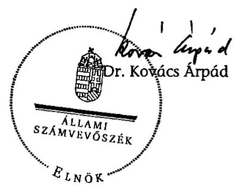

---

Mellékletek

---

# A jelentésre tett miniszteri észrevételek és az ÁSZ elnökének válaszai. 

| Tárcavezető | Észrevétel | Elnöki válasz |
| :--: | :--: | :--: |
| Miniszterelnöki Hivatalt vezető miniszter | X | X |
| egészségügyi miniszter | - | - |
| földművelésügyi és vidékfejlesztési miniszter | - | - |
| közlekedési, hírközlési és energiaügyi miniszter | - | - |
| honvédelmi miniszter | - | - |
| igazságügyi és rendészeti miniszter | - | - |
| környezetvédelmi és vízügyi miniszter | - | - |
| külügyminiszter | X | X |
| oktatási és kulturális miniszter | - | - |
| önkormányzati miniszter | - | - |
| nemzeti fejlesztési és gazdasági miniszter | - | - |
| szociális és munkaügyi miniszter | - | - |
| pénzügyminiszter | - | - |

---

VI-Kössz/33/05/2008.

Dr. Kovács Árpád elnök úr részére Állami Számvevőszék

Budapest

# Tisztelt Elnök Úr! 

Hivatkozva a V-23-034/2007-2008. számú megkeresésére tájékoztatom, hogy a magyar központi közigazgatás modernizációjának ellenőrzéséről készült jelentés tervezetével alapvetően egyetértek, a jelentésben foglaltak összességében elősegítik a közigazgatás és a közszolgálat megújítására irányuló kormányzati törekvéseket.

A Kormány számára megfogalmazott javaslatok végrehajtása érdekében az Intézkedési Terv készítése folyamatban van. Az Intézkedési Tervet a jóváhagyást követően haladéktalanul megküldöm Elnök úr részére.

Pontatlanság észrevételként jelzem, hogy a 105/2008. (XI. 28.) Korm. határozat értelmében az „informatikáért felelős kormánybiztos” helyett az „információkommunikációért felelős kormánybiztos” szerepeltetése indokolt.

Az ellenőrzési jelentés megállapításaival kapcsolatos észrevételeim a következők:

1. A jelentés-tervezet 13. oldalán, a költségvetési szervek szabályozására vonatkozó bekezdés pontosítani szükséges, figyelemmel arra, hogy a jogállásukról és gazdálkodásukról szóló törvény megalkotása már nem hiányzik. A költségvetési szervek jogállásáról és gazdálkodásáról szóló törvényjavaslat benyújtásának ténye helyesen szerepel a lábjegyzetben, azonban ezt a jelentés érdemi részében is rögzíteni kell.
2. A jelentés-tervezet 37. oldalán, a létszámot érintő kormánydöntésekre vonatkozó megállapítással kapcsolatban - amennyiben az a szabályozás célszerűségére kívánt megállapítást tenni - javasoljuk, hogy e szövegrész ennek megfelelően kerüljön megfogalmazásra.
3. A jelentés-tervezet 46. oldalán szerepel az a megállapítás, amely szerint a központi államigazgatási szervekről, valamint a Kormány tagjai és az államtitkárok jogállásáról szóló törvénnyel kapcsolatban a tárcák szakapparátusai nem tudtak érdemi álláspontot kialakítani.

---

Figyelemmel arra, hogy a törvényjavaslatot önálló kérelmező indítványként nyújtották be, nem körülírták a hagyományos értelemben vett államigazgatási egyeztetést. Maga az eljárási mód a Ksztv-nek a jelen és által is elismert és hangsúlyozott eredményeit, újításait érdemben nem befolyásolta, így a tekezdés szerepeltetése nem indokolt.

4. A jelentés-tervezet 48. oldalán található, a közigazgatási államtitkári pozíció megszüntetését minősítő megállapítás álláspontunk szerint a kérdőívből sem vezethető le. Továbbra is hangsúlyozandó, hogy a közigazgatási államtitkári poszt megszüntetésének a szükségességét nem a tárcák álláspontja, hanem az államszervezet működésének
 szélesebb körű, hosszabb távú áttanintése során lehet értékelni. Erre egy kérdőívcs felmérés nem feltétlenül megfelelő eszköz.

5 A jelentés-tervezet 58. oldalán, a minőségi jogalkotás fejezetrészben továbbra is indokoltnak tartjuk, hogy ne az előrehozott öregségi nyugdíjjogosultsággal kapcsolatos kifizetési kötelezettség szerepeljen példaként.

Elnök úr és munkatársai együttműködését ezúton is köszönöm.

Budapest, 2008. december $8^{\circ} \mathrm{C}$ "
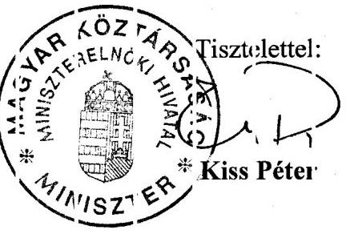

---

# Kitis Péter úr 

miniszter
Miniszterelnöki Hivatal

## Budapest

## Tisztelt Miniszter Úr!

A magyar központi közigazgatás modernizációjának ellenőrzéséről készült jelentésünkre adott észrevételeit köszönöm.

Mindenekelőtt örömmel nyugtázom, hogy Miniszter úr alapvetően egyetért a jelentésben foglaltakkal és folyamatban van az Intézkedési Terv készítése.

Az informatikáért felelős kormánybiztos megnevezésének 2008. december 1-jétől „információkommunikációért felelős kormánybiztosra” történő változtatását a jelentés 9. és 14. oldalán külön lábjegyzetben szerepeltetjük.

A jelentésünkben az OGY által - a miniszteri egyeztetésre történt elküldést követően elfogadott - törvényt (a költségvetési szervek jogállásáról és gazdálkodásáról szóló 2008. évi CV. törvény) a 13. és a 24. oldalon rögzítjük.

A létszámokat érintő kormánydöntésekkel (3. oldal) kapcsolatban az észrevétele alapján a megállapításunkat módosítjuk: „A Kormánynak a létszámgazdálkodással kapcsolatos szabályozási tevékenysége célszerűen formai módon kívánta ellensúlyozni a költségvetési tervezés vonatkozó hiányosságait.”

A központi állami igazgatási szervekről, valamint a Kormány tagjai és az államtitkárok jogállásáról szóló -- egy önálló képviselői indítvány alapján elfogadott - 2006. évi LVII. törvénnyel kapcsolatos megállapításunk arra irányul, hogy az eljárás jelentősen korlátozta a minisztériumok szűk apparátusát az érdemi álláspontjuk kialakítása tekintetében (47. oldal).

---

A jelentésünk a közigazgatási államtitkári pozíció megszüntetésének tényszerű közlését tartalmazza, nem minősíti a közigazgatási államtitkári pozíció megszüntetését, mindössze tényszerűen összegzi a tárcák államtitkári/kormányfőnöki szinten helyettesített véleményét (48. oldal).

A jogalkotás hiányosságainak következményeként került nevesítésre a jelentés 58. oldalán - a MNB szabályozási felelősségi körébe tartozó - az előre hozott öregségi nyugdíjjogosultsággal kapcsolatos példa, amely a szóban forgó költségvetésnek 7 milliárd forint pótlólagos kiadást okozott, így a példa szerepeltetése változatlanul indokoltnak tartjuk.

Kérem Miniszter urat, hogy a levelében foglaltakat tudomásul venni szíveskedjék.
Végezetül tájékoztatom Miniszter urat, hogy az ellenőrzésről készült jelentést - kialakult gyakorlatunk szerint - észrevételeivel és az azokra adott válaszaimmal együtt küldöm meg az Országgyűlés elnökének, az illetékes bizottsági elnököknek és a miniszterelnöknek.

Budapest, 2009. január „ 12 „
Tisztelettel:
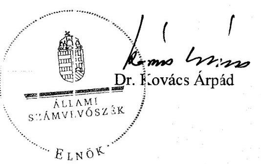

---

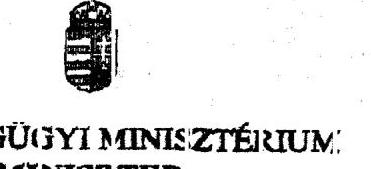

Ikt. szám: 495-0/2008-0011BESZ

Dr. Kovács Árpád
elnök úr
részére

Állami Számvevőszék

Budapest

Tisztelt Elnök Úr!

Az Állami Számvevőszék V-23-034/2007-2008. számú „A magyar központi közigazgatás modernizációjának ellenőrzése” témájú jelentését köszönettel megkaptam.

A jelentésre észrevételt nem teszek.

A megfogalmazott javaslatokra a témát érintően intézkedési terv készítése nem szükséges.

Budapest, 2009. január „12.”

Tisztelettel:

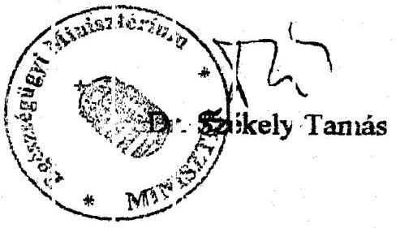

---

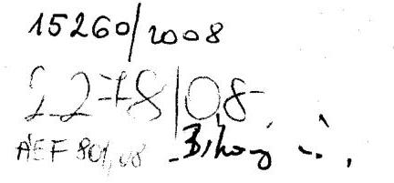

Földművelésügyi és Vidékfejlesztési Miniszter

Cgyiratszám: 36.033/8/2008.
12.23.

Fivatkozási szám: V-23-034/2007-2008.

Dr. Kovács Árpád úr
elnök
Állami Számvevőszék
Budapest
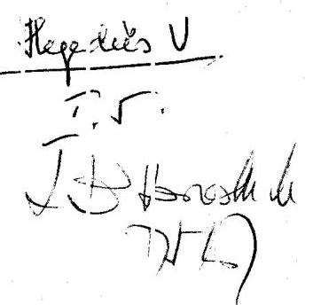

# Tisztelt Elnök Úr!

Hivatkozott levelére válaszolva tájékoztatom, hogy a magyar központi közigazgatás modernizációjáról készített jelentéssel kapcsolatosan észrevételt nem teszek.

Budapest, 2008. december „19.”

## Tisztelettel:

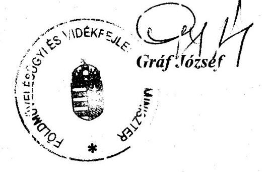

---

Közlekedési, Hírközlési és Energiaügyi Minisztérium Miniszter

15224/208
2281/08
het 562/08

3. oldal
12.23.

**Kovács Árpád**
elnök úr
részére
Állami Számvevőszék

Budapest

Iktatószám: KHEM/5820/2/2008.
Hiv. szám: V-23-034/2007-2008.

Megadás: U

5.5.

15/20.08.2018
7:58

**Tisztelt Elnök Úr!**

Köszönettel megkaptam a „magyar központi közigazgatás modernizációjának ellenőrzéséről” készített jelentés-tervezetet.

„Tájékoztatom, hogy a jelentésre észrevételt nem teszek, egyben köszönöm, hogy munkájukkal hozzájárultak a közigazgatás hatékonyabb működéséhez.”

Budapest, 2008. december „22.”

Üdvözlettel:

Dr. Molnár Csaba
miniszter

---

# A MAGYAR KÖZTÁRSASÁG HONVÉDELMI MINISZTERE

Nyilv. szám:55-1/2009.
Hiv. szám: V-23-034/2007-2008.

## Dr. Kovács Árpád úr   az Állami Számvevőszék elnöke részére

## Budapest

## Tisztelt Elnök Úr!

Elnök Úr részéről történt hivatkozási számom megküldött, a ,,magyar központi közigazgatás modernizációjáról” szóló jelentést köszönettel megkaptam.

Tájékoztatom Elnök Úrt, a jelentéssel kapcsolatosan észrevételt, javaslatot nem teszek, illetve az abban foglaltak alapján a Honvédelmi Minisztérium részéről az ellenőrzéssel kapcsolatosan intézkedés elrendelése nem vált szükségessé.

Budapest, 2009. január 12.

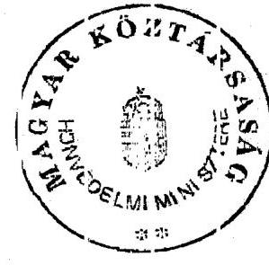

Tisztelettel:

---

# 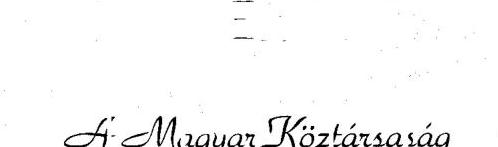 

Dr. Kovács Árpád elnök úr
Állami Számvevőszék

Budapest
Apáczai Csere János utca 10. 1052

Bihari u.
224008. júl.
K 83 thrualadi 12.18.
luty 0
Iktatószám: IRM/KKFO/95-8/2008
Hiv. szám: V-23-034/2007-2008
AEF-712/08
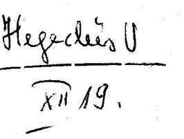

## Tisztelt Elnök Úr!

A magyar központi közigazgatás modernizációjának ellenőrzéséről készült jelentésüket köszönettel megkaptam. Örömömre szolgál, hogy Igazságügyi és Rendészeti Minisztérium részéről tett kiegészítő, pontosító észrevételek megjelenítésre kerültek a jelentésben.

Megítélésem szerint a jelentés alapos áttekintést nyújt a központi közigazgatás továbbfejlesztését és korszerűsítését célzó kormányzati intézkedésekről és azok hatásairól. A megállapítások az ellenőrzés céljaival összhangban vannak, a megfogalmazott javaslatok szakszerűek és előremutatóak, így hozzájárulnak a közigazgatás modernizációjának hatékony és eredményes folytatásához.

Budapest, 2008. december „28.”
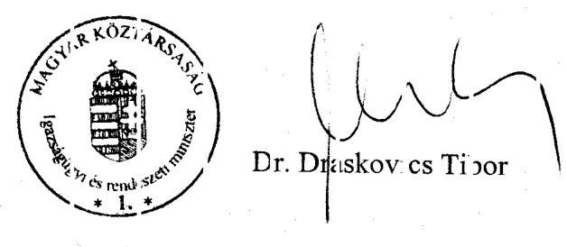

---

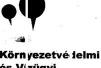

Környezetvédelmi és Vízügyi Minisztérium

MAGYAR KÖZTÁRSASÁG
KÖRNYEZETVÉDELMI ÉS VÍZÜGYI MINISZTÉRIUMA

Ht 12301 2 Ht 65/2009.
12.2008.
0015/2009

Dr. Kovács Árpád részére,
elnök
Állami Számvevőszék

Budapest

Tisztelt Elnök Úr!

Tájékoztatom, hogy a magyar központi közigazgatás modernizációjának ellenőrzéséről készített ÁSZ jelentés vonatkozóan észrevételt nem teszek.

Budapest, 2008. december 17.

Üdvözlettel:

1011 Budapest, 6 utca - 4-50.
1394 Budapest, Pf. 351.

E: ÚJRAHASZNOSÍTOTT PAPÍR!
e-mail: ur@mai.uvvm.hu
telefon: 467 3300
telefax: 201 2361

---

Dr. Kovács Árpád úr elnök
ÁLLAMI SZÁMVEVŐSZÉK

Budapest

Tisztelt Elnök Úr!
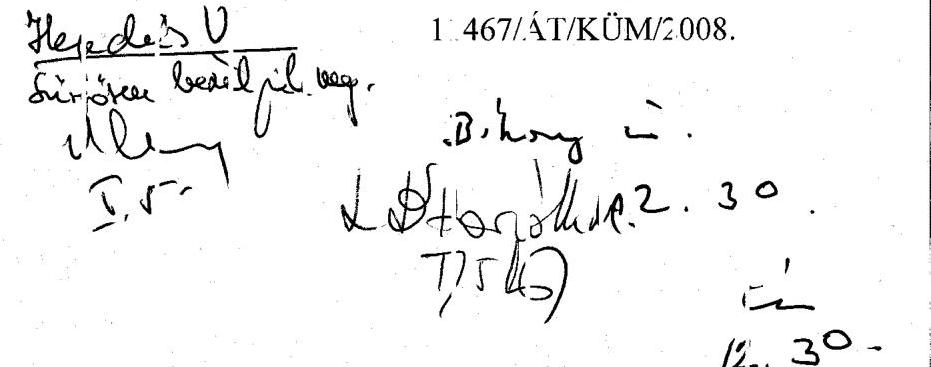

12. 30.

Lozid 12.31

Hivatkozással V-23-034/2007-2008. számú, 2008. december 3-án kelt megkeresésére a magyar központi közigazgatás modernizációjának ellenőrzéséről szóló jelentés tárgyában, az alábbiakról szeretném tájékoztatni:

A jelentés megállapításaival, valamint a megfogalmazott javaslatokkal egyetértek, azokra észrevételt nem teszek.

A jelentés KSZF-re vonatkozó megállapításai és javaslatai vonatkozásában, tekintettel arra, hogy a Külügyminisztériumot kiemelten nevezi, az alábbiakat szeretném jelezni:

A Külügyminisztérium már a KSZF létrehozására vonatkozó tárgyalások során jelezte, hogy a Külügyminisztérium számos olyan speciális feladatokat lát el, amelyek vonatkozásában megfontolandó a Külügyminisztérium egységes ellátási rendszerbe történő bevonása. Ezen indokok között szerepel többek között:

- az Európai Unió intézményeivel való kapcsolattartást az európai uniós tagsághoz kapcsolódó kormányzati koordinációs rendszer működtetéséhez szükséges zártláncú informatikai hálózat és az EU és NATO által minősített és akkreditált minősítési rendszerekre tekintettel a Külügyminisztérium nem csatlakozhat a KSZF informatikai és telekommunikációs szolgáltatásaihoz,
- a Külügyminisztérium őrzését a védett személyek és a kijelölt létesítmények védelméről szóló 160/1996. (XI. 5.) Korm. rendelet alapján a Köztársasági Őrezred látja el, ennek megfelelően a Külügyminisztérium nem csatlakozhat a KSZF biztonsági, személy- és vagyonvédelmi szolgáltatásaihoz;
- a diplomáciai és állami protokoll feladatokra tekintettel a Külügyminisztérium nem csatlakozhat a KSZF gépjármű-szolgáltatásaihoz.

A fenti indokok miatt a KSZF és a Külügyminisztérium között olyan szűkített hatályú Szolgáltatás-Megállapodás jött létre, amely alapján a Külügyminisztérium kizárólag az épületüzemeltetéssel, az irodaszer- és nyomtatványrendeléssel kapcsolatos szolgáltatásokat veszi igénybe.

---

Figyelemmel arra, hogy ezen körülmények és nemzetközi kötelezettségek a jövőben is változatlanul fennállnak, a Külügyminisztérium nem integrálható az egységes ellátási rendszerbe. Ennek megfelelően a jövőben olyan KSZF és Külügyminisztérium közötti Szolgáltatás-Megállapodás létrehozását tartom indokoltnak, amely továbbra is biztosítja a Külügyminisztérium fent bemutatott speciális feladataira tekintettel, a szűkített körű szolgáltatások igénybevételét.

A fentiek alapján kérem Elnök urat, hogy szíveskedjék felülvizsgálni a jelentés azon megállapítását, mely szerint „A Kormány döntésével ellentétesen nem rendeződött a HM-nek és a KüM-nek az ellátási-üzemeltetési rendszerbe történő teljes bevonása.” továbbá a 3. Javaslati pont b) pontját.

E két pont vonatkozásában olyan megfogalmazás kialakítását javaslom, amely olyan tartalmú rendezésre tesz javaslatot, amely lehetővé teszi, hogy a Külügyminisztérium ne kerüljön teljes bevonásra a KSZF által biztosított szolgáltatási rendszerbe, hanem a Külügyminisztérium csak azon szolgáltatásokba kerüljön bevonásra, amelyek nem sértik ki a speciális működési feltételek és feladatok nemzetközi kötelezettségeknek megfelelő elvégzését.

Budapest, 2008. december 18.

Tisztelettel:

---

# Göncz Kinga asszony

miniszter
Külügyminisztérium

## Budapest

## Tisztelt Miniszter Asszony!

A magyar központi közigazgatás modernizációjának ellenőrzéséről készített jelentésünkre adott észrevételeiket köszönöm. Azzal kapcsolatban a következőkről tájékoztatom:
A jelentés 41. oldal 3. bekezdése tartalmazza, hogy a KüM üzemeltetési és ellátási feladatainak integrálásánál figyelembe kell venni a tárca működésének specialitásait, így különösen az informatikai rendszerek beilleszthetőségének célszerűségét. Ennek hangsúlyosabbá tétele érdekében az összegzés részben az alábbi szövegmódosítást vezetjük át: ,,A Kormány részéről 2006-tól elmaradt a HM-nek és a KüM-nek az ellátási-üzemeltetési rendszerbe történő bevonása kapcsán az intézkedés indokoltságának és célszerűségének mérlegelése, amit a két tárca szabályozási-működési sajátosságai (nemzetközi előírások szerint kialakított informatikai rendszerek) tesznek szükségessé.”
Egyúttal a jelentés 3/b. javaslatát az alábbiak szerint módosítjuk: „(a Kormány) intézkedjen a KSZF-hez központosított feladatok méretgazdaságossági előnyeinek teljes körű kihasználásához szükséges szabályozások és döntések meghozataláról! (a HM és a KüM bevonása indokoltságának, célszerűségének tisztázása a „normatíva” kiadása, az érintett minisztériumokkal való együttműködés, a Magyar Nemzeti Vagyonkezelő Zrt.-vel kötendő megállapodás a „flottaszerzés”).”
Kérem Miniszter asszonyt, hogy a levelében foglaltakat tudomásul venni szíveskedjék.
Végezetül tájékoztatom Miniszter asszonyt, hogy az ellenőrzésről készült jelentést - kialakult gyakorlatunk szerint - észrevételeivel és az azokra adott válaszaimmal együtt küldöm meg az Országgyűlés elnökének, az illetékes bizottsági elnököknek és a miniszterelnöknek.

Budapest, 2009. január „12.”
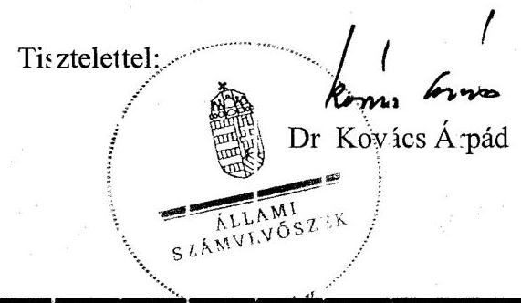

---

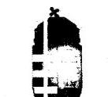

# 11-25-035-00110:1-61 

## 14891/2008

## 2206108   AEF 716/68

Bihari u.
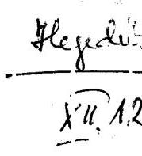

## Dr. Kovács Árpád úr részére

## Elnök

## Állami Számvevőszék

## Tisztelt Elnök Úr!

Az Állami Számvevőszék V-23-034/2007-2008. számú „Jelentés a magyar központi közigazgatás modernizációjának ellenőrzéséről” tárgyú jelentést köszönettel megkaptam, arra észrevételt nem teszek.

Budapest, 2008. december
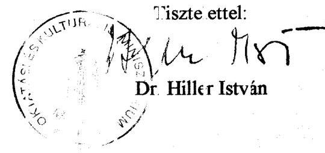

---

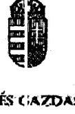

Nemzeti Fejlesztési és Gazdasági Minisztérium Miniszter

Dr. Kovács Árpád
Elnök úr részére
Állami Számvevőszék

# Budapest 

Apáczai Csere János u. 10.
1352

## Tisztelt Elnök Úr!

Köszönettel vettem a „magyar központi közigazgatás modernizációjának ellenőrzéséről” készült jelentést.

Tájékoztatom Elnök Úrat, hogy az abban foglaltakra észrevételt nem kívánok tenni.

Budapest, 2009. január „15.”

Tisztelettel:
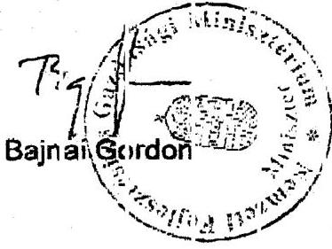

---

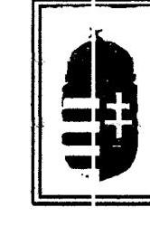

# Önkormányzati Miniszter

Iktatószám: OM/45/2/2009.
Hivatkozási szám: V-23-034/2007-2008.

Dr. Kovács Árpád úr
elnök
Állami Számvevőszék
Budapest

## Tisztelt Elnök Úr!

Köszönettel megkaptam a magyar központi közigazgatás modernizációjának ellenőrzéséről készült számvevőszéki jelentést.

Tekintettel arra, hogy a jelentés megállapításai, következtetései és javaslatai közvetlenül nem érintik az Önkormányzati Minisztériumot - valamint arra, hogy a korábbi szakmai egyeztetések során közreműködésre kijelölt munkatársaink véleményét a végleges jelentés kialakításakor figyelembe vették -, ezért a jelentésben foglaltakra észrevételt nem teszek.

Kérem, hogy tolmácsolja köszönetünket munkatársai felé az ellenőrzés folyamán tanúsított szakszerű és korrekt feladatellátásért.

Budapest, 2009. január
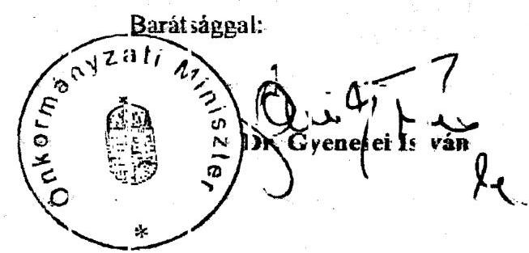

---

# Szociális és Munkaügyi Minisztérium Miniszter 

## Dr. Kovács Árpád úr

elnök

Állami Számvevőszék

Budapest

Tisztelt Elnök Úr!
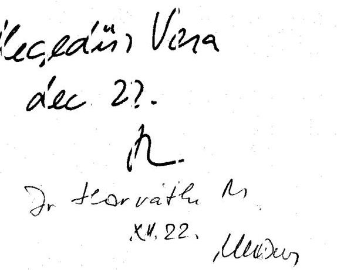

A magyar központi közigazgatás modernizációjának ellenőrzéséről készített jelentéshez észrevételt nem teszek, egyúttal jelzem, hogy a vizsgálat során a tárcára vonatkozóan nem születtek olyan megállapítások, amelyek külön intézkedések elrendelését indokolnák.

Budapest, 2008. december „22.”
Üdvözlettel
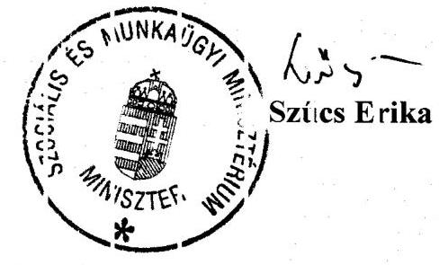

---

H-1051 BUDAPEST V., JÓZSEF NADOR TÉR 2-4, POSTACÍM: 1369 BUDAPEST, POSTAFIOK 48.

TELEFON: (06-1) 327 2159, (06-1) 327-2141
FAX: (06-1) 317-0738
E-MAIL: janos.veres@pm.gov.hu

Pénzügyminiszter

Dr. Kovács Árpád
Állami Számvevőszék
elnök

Tisztelt Elnök Úr!
A megküldött jelentés-tervezetet köszönettel megkaptam.
Keller László államtitkár úr 2008. október 30-án kelt levelében foglaltakkal megegyezően a jelentés-tervezettel kapcsolatban észrevételt nem teszek. A megküldött tervezetet

 ennek megfelelően előfordul:

Indokoltnak tartom azonban felhívni a figyelmét, hogy az ellenőrzés lezárása óta jelentős előrelépés történt két fontos területen is, megfontolandónak tartom ezért a Jelentés kiegészítését, hiszen annak megjelenésekor így lényegesen tisztább képet alkothat az olvasó.
a) A költségvetési szerv jogállásáról és gazdálkodásáról szóló törvényt (amely döntően átalakítja, modernizálja a közfeladatokat ellátó szervrendszer szabályozási környezetét) a napokban elfogadta az Országgyűlés. Javaslom annak rövid bemutatásával a Jelentést kiegészíteni. (A törvényjavaslatra a 13. és 24. oldalon történik rövid hivatkozás).
b) Az új szakfeladatrend időközben szintén elkészült (hivatkozás: 72. oldal). Az államháztartás működési rendjéről szóló 217/1998. (XI. 30.) Korm. rendelet módosításáról szóló 279/2008. (XI. 28.) Korm. rendelet a jogszabályi alapot teremti meg, az új államháztartás szakfeladatrend alkalmazására való felkészülés egyes feladatairól szóló 2164/2008. (XI. 28.) Korm. határozat a kapcsolódó feladatokat írja elő. A PM honlapján napokban kerül közzé maga a szakfeladatrend (PM tájékoztatóként), illetve megjelenik Magyar Közlöny mellékletében, valamint a Pénzügyi Közlönyben.

Törvényi kötelezettségemnek megfelelően a pénzügyminiszter úr által előírt javaslatról 30 napon belül tájékoztatást adok.

Budapest, 2008. december 15.
Tisztelettel:
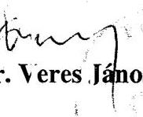

---

# A közigazgatás fejlesztése 2005-ig

(az azonos és hasonló tartalmú feladatokat azonos színnel jelöltük)

|  1026/1992. (V. 12.) Korm.
hat. | 2039/1997. (II. 12.) Korm.
hat. | 1057/2001. (VI. 21.) Korm.
hat. | 2198/2003. (IX. 1.) Korm.
hat. | 1052/2005. (V. 23.) Korm.
hat.  |
| --- | --- | --- | --- | --- |
|  A Kormány döntéshozatali mechanizmusának, munkamódszerének felülvizsgálata, javaslat kidolgozása a kormányzati pénzügyi, illetve a kormányzati döntések végrehajtásának ellenőrzésére. | Az új jogalkotási törvényekben ki kell alakítani a jogszabályok és ellátandó feladatok és hatáskörök felülvizsgálatát, valamint a háttér intézményi struktúra áttekintését |  | A korszerűsítési program feladata, hogy összhangot teremtsen a közigazgatás modernizációja és a közszolgáltatások intézményi hátterének fejlesztése, valamint az EU-hoz való csatlakozásból eredő követelmények között. | A közigazgatási Ügyfélszolgálati Kártya feltételeinek megteremtése  |
|  Kormányzati struktúra áttekintése, meg kell vizsgálni az egyes szervek jogállása, funkciója, feladata, hatásköre megfelel-e a modern közigazgatás követelményeinek, a szükséges intézkedésekre javaslatot kell kidolgozni. | Az államigazgatási eljárás általános szabályairól szóló 1957. évi IV. törvény átfogó vizsgálatát követően el kell készíteni az új törvény tervezetét. | Módszertani mutatókkal kell támogatni a minisztériumok és központi közigazgatási szervek szervezeti és működési szabályzatainak egységes és összkormányzati szempontú, reformirányokat érvényesítő korszerűsítését. |  | Javaslatot kell kidolgozni a központi közigazgatásban a stratégiai szemlélet megerősítésére  |
|  Felül kell vizsgálni és egyszerűsíteni kell az államigazgatási eljárás általános és különös eljárási szabályait. | Felül kell vizsgálni a minisztériumok és a miniszterek hatósági jogkörét, valamint javaslatot kell tenni a hatáskör-átrendezés új rendszerére. | A tárcáknak gondoskodniuk kell a saját szervezetük és irányításuk, felügyeletük alatt működő szervek feladat- és hatásköri jegyzékének összeállításáról, folyamatos karbantartásáról, közzétételéről. |  | Előterjesztést kell benyújtani a jogi szabályozás minőségének fejlesztésével összefüggő kormányzati feladatokról, a hatásvizsgálati módszerek további alkalmazásáról.  |
|  A közigazgatási információs rendszereiben lévő párhuzamosságok feltárása, e rendszerek összehangolása, fejlesztése, kapcsolatok intézményesítése. | A Kormánynak javaslatot kell tenni az új, korszerű okmánycsaládok kidolgozásával és bevezetésével kapcsolatosan, valamint az érintett háttér okmánytárak korszerűsítésére. | El kell készíteni a közigazgatást érintő átfogó informatikai fejlesztési programot. |  | A bürokrácia csökkentésének módszereit és mértékét tartalmazó előterjesztést kell benyújtani a Kormánynak, figyelemmel az Európai Unióban is javasolt terhecsökkentési módszerek átvételére és a hazai sajátosságokhoz illesztésére.  |

---

|   | 1026/1992. (V. 12.) Korm. hat. | 2039/1997. (II. 12.) Korm. hat. | 1057/2001. (VI. 21.) Korm. hat. | 2198/2003. (IX. 1.) Korm. hat. | 1052/2005. (V. 23.) Korm. hat.  |
| --- | --- | --- | --- | --- | --- |
|   |  | Ki kell dolgozni az állami közterhek beszedésének, valamint a társadalombiztosítási jogosultság ellenőrzésére alkalmas nyilvántartási rendszer koncepcióját, amelyet össze kell hangolni a többi nagy nyilvántartó rendszerrel, és ennek keretében a jogszabály-módosításokat is el kell végezni. | Felül kell vizsgálni az államigazgatási eljárás általános szabályairól szóló törvényt, a témakör újraszabályozása során ki kell dolgozni az új egységes közigazgatási eljárási törvénytervezetet, amelyben alapfogalmak, illetve az államigazgatási szervek felügyeleti ellenőrzésének új rendszeréről szóló részletes szabályok is kapjanak helyet. |  | Fel kell dolgozni a közigazgatási teljesítmény mérésének nemzetközi módszertanát, és javaslatot kell tenni a magyar közigazgatásban alkalmazható mutatószámrendszerre, a nemzetközi összehasonlíthatóság biztosítására, az OECD keretében folyó munkák eredményeinek hasznosításával.  |
|   |  | Módszertani útmutatót kell kiadni a Kormányhoz benyújtandó előterjesztések, valamint döntéstervezetek, illetve az Országgyűlés elé kerülő törvényjavaslatok, országgyűlési határozatok előkészítésének követelményeire. |  |  |   |
|   |  | A hazai és a nemzetközi tapasztalatokat felhasználva összegző elemzést kell készíteni a központi közigazgatási szervek rendszerének továbbfejlesztési lehetőségeiről. |  |  |   |
|   |  | El kell készíteni a közigazgatási továbbképzésre és vezetőképzésre vonatkozó kormányrendeletet. |  |  |   |
|   |  | A Magyar Közigazgatási Intézet feladatainak újszabályozásával alkalmassá kell tenni a közigazgatási vezetőképzés, valamint továbbképzés módszertani központ szerepkörére. |  |  |   |

---

|   | 1026/1992. (V. 12.) Korm. hat. | 2039/1997. (II. 12.) Korm. hat. | 1057/2001. (VI. 21.) Korm. hat. | 2198/2003. (IX. 1.) Korm. hat. | 1052/2005. (V. 23.) Korm. hat.  |
| --- | --- | --- | --- | --- | --- |
|  I. | Ki kell dolgozni a minisztériumok belső felépítésére és működésére és az irányítási viszonyokra az átfogó korszerűsítési programot, amelynek során törekedni kell a hatékony munkaszervezési módszerek alkalmazására. | Javaslatot kell kidolgozni az ügyfélszolgálati irodák továbbfejlesztésére. | Kerüljön sor a háttér intézményi struktúra áttekintésére, a miniszteriális feladatok kiszervezése minden esetben az érintett létszám és pénzügyi előirányzatok csökkenésével, illetve a feladatok egyedi hatósági jogkört ellátó szervezetnek történő átadásával járjon. | Minden állampolgár számára legyen elérhető a minőségi szolgáltatás, továbbá mérséklődjön az indokolatlan társadalmi és területi egyenlőtlenség | Ügyfél-elégedettség javítása  |
|   | Dereguláció | A hatósági ügyintézést végző hivatalokban meg kell kezdeni az ügyfelek elégedettségét vizsgáló reprezentatív felméréseket. | Támogatni kell a minisztériumok és központi közigazgatási szervek szervezeti és működési szabályzatainak egységes kormányzati szempontú, reformirányokat érvényesítő korszerűsítését. | Meg kell teremteni a közigazgatási rendszer kohézióját biztosítani képes középszintet, valamint állampolgári kontroll érvényesülését. | Tájékoztató programot kell indítani az állampolgárok, az állampolgárok szervezetei és a vállalkozások számára az őket érintő főbb közigazgatási ügyek intézéséről  |
|   |  | Módszertani útmutatók és intézkedési tervek kidolgozásával kell erősíteni a közigazgatási szervek tervező, döntéselőkészítő, végrehajtó, teljesítményértékelő tevékenységének a megjavítását. | Módszertani segítséget kell nyújtani a költség-haszon elemzés és a szervezeti teljesítményértékelés továbbfejlesztéséhez és szélesebb körű alkalmazásának támogatásához. |  | Be kell vezetni az ügyfél-elégedettség rendszeres mérését  |
|   |  | Vizsgálni kell, hogy minisztériumok szervezeti és működési rendszerében az egymástól elkülönült szervezeti egységek gazdasági és műszaki ellátó feladataiban milyen költségkímélő megoldások valósíthatók meg. | A Kormányzati Iratkezelő Rendszerre alapozva ki kell dolgozni az iratkezelés egységes szabványát. |  | A közigazgatás személyi feltételeinek fejlesztése  |
|   |  |  | Ki kell dolgozni a minőségbiztosítási rendszerek államigazgatási szerveken történő bevezetésének országos programját. |  |   |
|   |  |  | A szabályozási reform körében ki kell dolgozni a jogszabályok folyamatos deregulációs vizsgálatára vonatkozó szervezeti és eljárási rend főbb szabályait. |  |   |

---

|   | 1026/1992. (V. 12.) Korm. hat. | 2039/1997. (II. 12.) Korm. hat. | 1057/2001. (VI. 21.) Korm. hat. | 2198/2003. (IX. 1.) Korm. hat. | 1052/2005. (V. 23.) Korm. hat.  |
| --- | --- | --- | --- | --- | --- |
|  |   |   |   |   |   |
|  |   |   |   |   |   |
|  |   |   |   |   |   |
|  |   |   |   |   |   |
|  |   |   |   |   |   |
|  |   |   |   |   |   |
|  |   |   |   |   |   |
|  |   |   |   |   |   |
|  |   |   |   |   |   |
|  |   |   |   |   |   |
|  |   |   |   |   |   |
|  |   |   |   |   |   |
|  |   |   |   |   |   |
|  |   |   |   |   |   |
|  |   |   |   |   |   |
|  |   |   |   |   |   |
|  |   |   |   |   |   |
|  |   |   |   |   |   |
|  |   |   |   |   |   |
|  |   |   |   |   |   |
|  |   |   |   |   |   |
|  |   |   

  |   |   |   |
|  |   |   |   |   |   |
|  |   |   |   |   |   |
|  |   |   |   |   |   |
|  |   |   |   |   |   |
|  |   |   |   |   |   |
|  |   |   |   |   |   |
|  |   |   |   |   |   |
|  |   |   |   |   |   |
|  |   |   |   |   |   |

---

# A közigazgatás fejlesztése 2006-tól

(az azonos és hasonló tartalmú feladatokat azonos színnel jelöltük)

|   | 2117/2006. (VI. 30.)
Korm. hat. | 2118/2006. (VI. 30.)
Korm. hat. | 2229/2006. (XII. 20.)
Korm. hat. | 2241/2006. (XII. 23.)
Korm. hat. | 2229/2007. (XII. 5.)
Korm. hat. | 2135/2007. (VII. 17.)
Korm. hat.  |
| --- | --- | --- | --- | --- | --- | --- |
|  I. Kormányzási képesség javítása |  | Központi költségvetési rendszer átalakításakor - új költségvetési szerv alapítása, összeolvadás, beolvadás, szakmai, gazdasági, ellátó funkciók vagy egyes részei átcsoportosítása, fejezetektől átvétel - gondoskodjanak az előkészítés és megvalósítás feltételeiről. | Miniszterek módszertani útmutató alapján vizsgálják felül feladat- és hatáskörükbe tartozó közfeladatok körét, ellátásuk formáját és követelményrendszerét, valamint az ágazati jogszabályok hatáskörtelepítési rendszerét és ezek alapján tegyenek átfogó javaslatot a szükséges módosításokra. | A Kormány felkéri a Miniszterelnöki Hivatal vezető miniszterét, hogy a jogintézményre vonatkozó hatásvizsgálat alapján készítse elő a köztisztviselők teljesítményértékelés és juttatás szabályairól szóló kormányrendelet módosítását. |  |   |
|   |  |  | Készüljön javaslat egyes nagy kiadási előirányzattal rendelkező központi költségvetési szervek, illetve hálózatok belső szakmai folyamatainak hatékony és eredményorientált újraszervezésére. |  |  |   |
|   |  |  | A javaslatokat a felülvizsgálati munkacsoport ajánlásai alapján az államreform előkészítő munkáinak operatív irányításáért felelős kormánybiztos az érintett miniszterrel közösen terjessze a Kormány elé. |  |  |   |

---

|   | 2117/2006. (VI. 30.)
Korm. hat. | 2118/2006. (VI. 30.)
Korm. hat. | 2229/2006. (XII. 20.)
Korm. hat. | 2241/2006. (XII. 23.)
Korm. hat. | 2229/2007. (XII. 5.)
Korm. hat. | 2135/2007. (VII. 17.)
Korm. hat.  |
| --- | --- | --- | --- | --- | --- | --- |
|  II. Eljárások a munkafolyamatok megújításában |  |  | A feladatfelhívás vizsgálat lebonyolításának összehangolására, a beérkezett javaslatok áttekintésére, a szükséges egyeztetések lefolytatására és a döntés-előkészítő javaslatok kidolgozására felhívásvizsgálati munkacsoportot kell létrehozni. |  |  |   |
|  III. Emberi erőforrások minőségének fejlesztése | A költségvetési szervek létszámát a fejezet felügyeletét ellátó, illetve ilyen jogosítvánnyal rendelkező szerv vezetője javaslata alapján a Kormány külön határozatban állapítja meg. | Az átalakulások és változtatások alkalmával haladéktalanul tegyék meg a realizálható létszámcsökkentéssel kapcsolatos intézkedéseket. |  |  | A Miniszterelnöki Hivatalban, a minisztériumokban, az igazgatási és az igazgatás jellegű tevékenységet ellátó költségvetési szerveknél foglalkoztatottak létszámának rögzítése | A miniszterek gondoskodjanak a teljesítményértékelési és jutalmazási rendszerhez kapcsolódó átcsoportosításról, és az állami költségvetésben szereplő nem rendszeres személyi juttatás, normatív jutalom előirányzatának megneveléséről |

---

**Az államháztartás létszámviszonyai az alrendszerei szerint**

**2007. év**

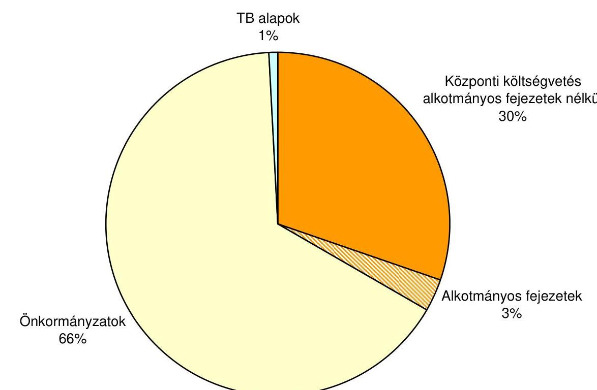

---

**4/b. sz. melléklet**

a V-23-037/2007-2008. sz. jelentéshez

## **A központi kormányzat létszámának megoszlása a foglalkoztatási jogviszonyok szerint 2007. év**

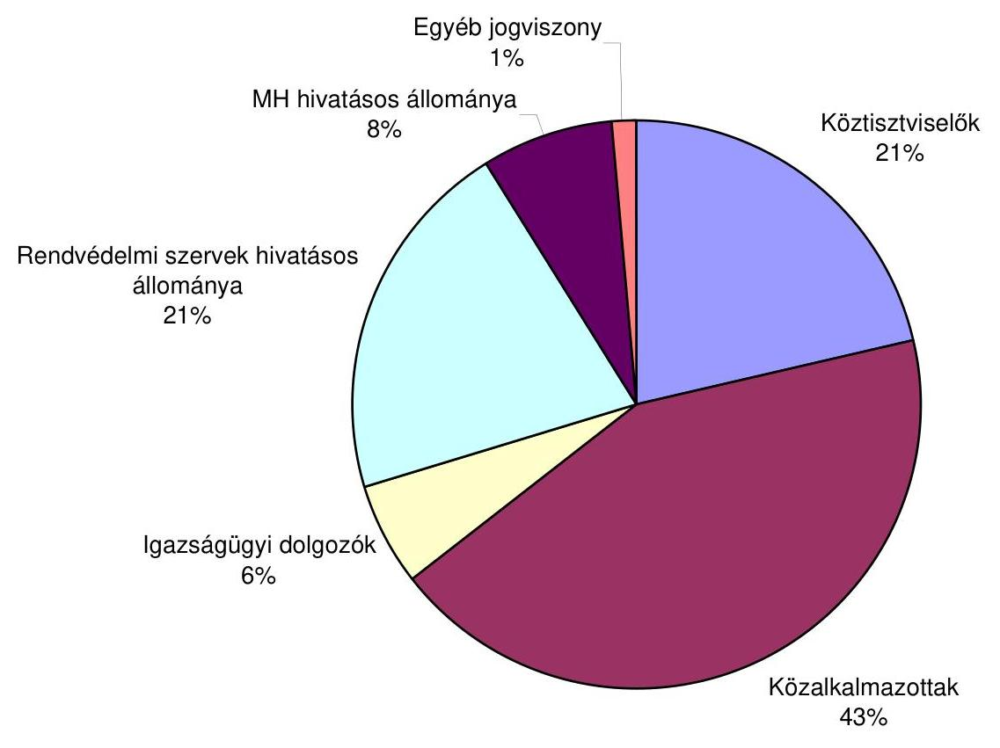

---

**Az önkormányzati szektor létszámának megoszlása a foglalkoztatási jogviszonyok szerint**

**2007. év**

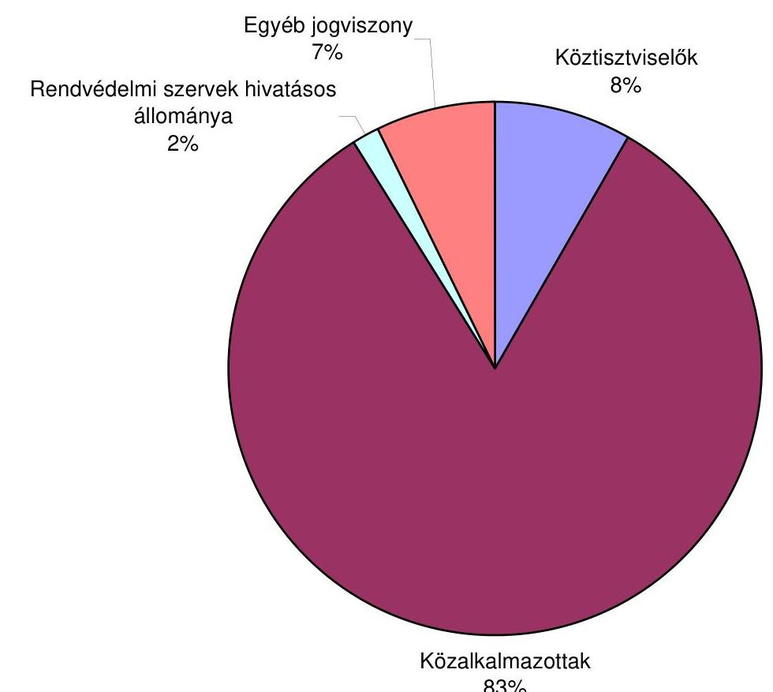

---

# A KÉRDŐÍVES FELMÉRÉS ADATAINAK ÉRTÉKELÉSE 

## A.)

## A kormányzási képesség javítása területén

A központi államigazgatási szervekről, valamint a Kormány tagjai és az államtitkárok jogállásáról szóló 2006. évi LVII. törvény előkészítése során csupán a tárcák egyharmadának állt elegendő idő és információ a rendelkezésére az érdemi álláspont kialakításához a tervezettel kapcsolatban.

A közigazgatási államtitkári pozíció megszüntetése a válaszadók egynegyede szerint negatívan hatott a tárca feladatellátására, míg háromnegyed részben semlegesnek érzékelték az intézkedés hatását.

A válaszok alapján az államreform munkálataiban egyértelműen szabályozott volt minden esetben - 2006-ban és 2007-ben is - a tárcák feladata.

Az államreform előkészítésében, intézkedéseinek végrehajtásában kialakított szabályozási- és szervezeti rendszer a válaszadók több mint 85%-a szerint - 2006-ban és 2007-ben is - biztosította a tárcák számára az illetékességi körükbe tartozó kérdésekben a megalapozott álláspont kialakítását.

A kormányzati monitoring rendszer a tárcák több mint 80%-ánál biztosította a feladatok végrehajtásáról, a felmerült problémákról a legkisebb adminisztrációs terhek melletti információszolgáltatást.

A közfeladatok felülvizsgálatáról szóló 2229/2006. (XII. 20.) Korm. határozat alapján a tárcák felülvizsgálati tevékenységének támogatására bevont külső tanácsadó tevékenysége a tárcák kétharmad részénél kedvezően hatott a végrehajtásra, míg egynegyedénél nem volt kimutatható hatása. Negatív tapasztalatot csak egy tárca jelzett.

A közfeladatok felülvizsgálatával kapcsolatos további feladatokról szóló 2233/2007. (XII. 12.) Korm. határozatban a tárcák számára meghatározott feladatok végrehajtása csupán a tárcák felében történt meg határidőre és teljes körűen. Az intézkedések várható egyszeri költségvetési hatását a tárcák háromnegyed része nem tudta pénzértékben számszerűen értékelni. A tartós, illetve a 2010-ig számszerűsíthető költségvetési hatást csupán egy tárca tudta (becsléssel) számszerűsíteni.

A tárcák több mint 80%-a hasznosította a közfeladat-felülvizsgálatból származó eredményeket (kivéve a 2233/2007. (XII. 12.) Korm. határozat előírásainak végrehajtását) és csupán egy adott nemleges választ.

---

A válaszadók fele szerint a közfeladat-felülvizsgálatból származó eredmények (beleértve a 2233/2007. (XII. 12.) Korm. határozat előírásainak végrehajtását) hasznosítása arányban állt a tárca által ráfordított munkával.

Igen nagy eltérések voltak a tárcák szabályozási felelősségi körében 2007-ben kidolgozott legfontosabb jogszabályok számában. Egy tárcánál 119 db jogszabály kidolgozását jelezték, további egy-egy tárcánál 21, 13 és 10 darabét. Három-három tárcánál 8 illetve 7 db, egynél-egynél 5 és 1 db jogszabály kidolgozásáról számoltak be.

Az elkészült jogszabályokhoz 6 tárcánál - az összes vizsgált fejezet felénél - egyáltalán nem készültek hatástanulmányok. A többi tárcánál 1-8 közötti hatástanulmány készült, de egyetlen tárcát sem találni, ahol az összes jogszabályt hatástanulmánnyal készítették volna elő.

A tárcák csupán 40%-ának stratégiájában, éves munkatervében, szabályzataiban jelent meg 2006-tól a fejezethez tartozó intézmények rendelkezésére álló adatbázisok felmérése (feladatként, értékelésként, hasznosításként).

Csupán egy tárca szerint változott kedvezően a KSZF által a vagyongazdálkodás területén biztosított ellátások/szolgáltatások színvonala (beleértve az információk áramlását) a korábbiakhoz képest 2007-től. Három tárca romlást jelzett, míg a többiek (a válaszadók kétharmada) nem érzékelt változást. A műszaki feltételek biztosítása területén szintén csak egy tárca jelzett javulást, míg a válaszadók fele romlást és közel fele pedig nem tapasztalt változást. Az informatikai feltételek biztosítása terén egy tárca sem jelzett javulást, míg a válaszadók negyede romlást jelzett, a többiek (a válaszadók háromnegyede) nem tapasztalt változást. Az egyéb szolgáltatások, feltételek biztosítása terén csak egy tárca jelzett javulást, míg a válaszadók harmada romlást és mintegy 40%-a pedig változatlanságot jelzett.

Egyes ellátások/szolgáltatások átadása a KSZF-nek 1 tárca szerint befolyásolta kedvezően a közpénzek felhasználásával, a köztulajdon használatának nyilvánosságával, átláthatóbbá tételével és ellenőrzésének bővítésével összefüggő egyes törvények módosításáról szóló 2003. évi XXIV. törvénnyel elrendelt közzétételi kötelezettségei teljesítését, míg két tárca úgy vélte, hogy a hatása kedvezőtlen volt. A válaszadók háromnegyede nem érzékelt semmilyen hatást.

Egy kivételével valamennyi tárcának volt vagyonkezelési szerződése a Kincstári Vagyoni Igazgatósággal, ugyanakkor csupán egy tárca (FVM) kötött vagyonkezelési szerződést a Magyar Nemzeti Vagyonkezelő Zrt.-vel.

Egy kivételével valamennyi tárca készített 2006-tól új/módosított belső szabályozást a minisztériumi jogalkotási feladatok eljárásrendjére vonatkozóan, hasonlóképpen egy kivételével valamennyi tárca áttekintette 2006-tól a tárca szabályozási felelősségi körébe tartozó jogszabályokat tartalmi szempontból (a technikai kiegészítések, módosítások kivételével), teljes körűen vagy egy szabályozási területre vonatkozóan.

Igen jelentős eltérések voltak az évenként (2006 és 2008 között) felülvizsgált jogszabályok számában. Ez egy-egy évre vonatkozóan nullától 1551 darabig terjedt. Jellemző volt azonban az 50 alatti felülvizsgált jogszabály évenként és tárcánként.

A deregulációs intézkedések hatásaira vonatkozó előzetes vagy utólagos vizsgálat (beleértve, de nem kizárólagosan a költségvetési hatást) mindösszesen a vizsgált tárcák egynegyedében készült, míg kétharmadában nem.

# B.) 

## Eljárások a munkafolyamatok megújítása területén

A tárcák mintegy 40%-ának stratégiájában, éves munkatervében, szabályzataiban jelent meg 2006-tól a minőségbiztosítás (fejlesztése). A tárcák csupán felének stratégiájában, éves munkatervében, szabályzataiban jelent meg 2006-tól a szervezeti teljesítmény mérése (fejlesztése). A tárcák megközelítőleg kétharmadának stratégiájában, éves munkatervében, szabályzataiban jelent meg 2006-tól a szervezetfejlesztés.

Egyetlen tárca sem pályázott 2006-tól szervezetfejlesztési forrásokra. Csupán két tárca (a MeH és az ÖTM) adott ki a Közös Értékelési Keretrendszerre (CAF) vonatkozó szabályozást, míg négy tárca (a válaszadók harmada) vizsgálta csak az alkalmazás lehetőségének, célszerűségének kérdését, ugyanakkor egyetlen tárca sem alkalmazza a CAF-ot. A tárcák kétharmada rendelkezik információval az intézményeire vonatkozóan a CAF alkalmazásáról, ugyanakkor egyetlen tárca sem elemezte a CAF tapasztalatait.

A tárcák felének stratégiájában, éves munkatervében, szabályzataiban 2006-tól megjelent - az irányítása/felügyelete alá tartozó intézményekre vonatkozóan is - az ügyfél-elégedettség mérésének kérdése, ugyanakkor csupán a tárcák harmada értékelte az ügyfél-elégedettség méréséből származó tapasztalatokat.

A normaalkotás során a társadalmi partnerek bevonására (kit, a folyamat milyen szakaszában, milyen módon stb.) vonatkozó szabályozást a tárcák háromnegyed részénél elkészítették és hasonló arány tapasztalható az elektronikus információszabadságról szóló 2005. évi XC. törvény 4. § (3) bekezdése szerinti részletes szabályok kialakítása tekintetében is. A tárcák több mint 80%-ánál kialakítottak eljárásrendet a 2005. évi XC. törvény 10. §-a alapján a jogszabályok előkészítése során tett vélemények értékelésére, hasznosítására vonatkozóan.

## C.)

## Az emberi erőforrások fejlesztése területén

A tárcák csupán egyharmada rendelkezik humánerőforrás-fejlesztési stratégiával.

A fejezetek több mint 80%-ánál a köztisztviselői teljesítményértékelés és jutalmazás szabályairól szóló 301/2006. (XII. 23.) Korm. rendelet előkészítése

---

során a tárcának elegendő idő és információ állt a rendelkezésére az érdemi álláspont kialakításához a tervezettel kapcsolatban.

Valamennyi tárca tapasztalatai megerősítik a 301/2006. (XII. 23.) Korm. rendeletben meghatározott teljesítmény-értékelési rendszer (TÉR) legfőbb előnyeként (a megelőző előírások alapján végzett teljesítmény-értékeléssel szemben) a 2007. évi végrehajtásra a korábbi lehetőségeiket meghaladó központi forrás biztosítását. Hasonlóképpen valamennyi tárca elegendő szakmai segítséget kapott a TÉR végrehajtására a MeH illetékes szervezeteitől. A TÉR végrehajtására csupán a tárcák csupán mintegy 40%-a alakított ki saját szabályozást. A tárcák mintegy 40%-a szerint a TÉR bevezetése összességében kedvezően hatott a

 feladatellátásra, további egyharmaduk nem érzékelt befolyást, míg negatív hatást jelzett a tárcák egynegyede.

Egy kivétellel valamennyi tárca úgy vélekedett, hogy a köztisztviselői teljesítményértékelés és jutalmazás szabályairól szóló 301/2006. (XII. 23.) Korm. rendelettel, valamint a módosításáról szóló 31/2008. (II. 21.) Korm. rendelettel kapcsolatban a tárcának elegendő idő és információ állt a rendelkezésére az érdemi álláspont kialakításához.

A tárcák egyhatoda szerint a TÉR-nek nem voltak alapvető, a hatékonyságot korlátozó előírásai, ezzel szemben a tárcák több mint 80%-ának véleménye szerint voltak ilyenek. Az utóbbi tárcák fele úgy ítéli meg, hogy a TÉR alapvető, a hatékonyságot korlátozó előírásait a jogszabály 2008. februári módosítása kiiktatta, ugyanakkor a tárcák másik fele szerint, bár történt előrelépés, de az alapvetően hatékonyságot korlátozó előírások megmaradtak.

Az egyéni teljesítményértékeléssel rendelkező köztisztviselők aránya a 2006. december 31-ei köztisztviselői állományon belül csupán a tárcák hatodánál volt 100%, míg másik hatodánál nem volt értékelés. A tárcák további felénél ez az arány 50% feletti és ezen belül a fele 90% feletti.

Az egyéni teljesítményértékeléssel rendelkező köztisztviselők aránya a 2007. december 31-ei köztisztviselői állományon belül csupán a tárcák negyedénél volt 100%, ugyanakkor az összes többi tárcánál 89% feletti.

Az egyéni teljesítményértékeléssel rendelkező vezetők aránya a 2006. december 31-ei vezetői állományon belül csupán a tárcák negyedénél volt 100%, míg hatodánál nem volt értékelés. A tárcák mintegy 40%-ánál ez az arány 50% feletti és ezen belül egy tárcánál 90% feletti.

Az egyéni teljesítményértékeléssel rendelkező vezetők aránya a 2007. december 31-ei vezetői állományon belül csupán a tárcák felénél volt 100%, ugyanakkor az összes többi tárcánál 92% feletti.

A 2006. december 31-ei köztisztviselői állományon belül csak felfelé történő illetményeltérítést jeleztek, amelynek aránya az állományon belül 5,9-40% közötti. A 2007. december 31-ei köztisztviselői állományon belül szintén csak felfelé történő illetményeltérítést jeleztek, amelynek aránya az állományon belül 14-60,4% közötti.

---

2006-ban az egy főnek kifizetett legmagasabb jutalom (bruttó) összege 5090 ezer Ft volt, ami a jutalmazott havi illetményének 740%-át jelentette. Ugyanebben az évben két olyan tárca is volt, ahol voltak jutalmazatlan munkatársak is, a többi tárcánál pedig a minimum jutalom összeg 10 ezer és 162 ezer Ft között mozgott. A legalacsonyabb jutalmak aránya a jutalmazottak havi illetményéhez viszonyítva 1,8 és 72,7% között mozogtak.

A TÉR alapján kifizetett legmagasabb jutalom összege 4629 ezer Ft volt, ami a jutalmazott havi illetményének 654,5%, ugyanakkor két olyan tárca is volt, ahol voltak jutalmazatlan munkatársak is, a többi tárcánál pedig a minimum jutalom összeg 17800 és 84 ezer Ft között mozgott. A legalacsonyabb jutalmak aránya a jutalmazottak havi illetményéhez viszonyítva 4,1 és 108% között mozogtak.

Az összkormányzati projektekben résztvevők aránya a 2007. december 31-ei köztisztviselői állományon belül az egyes tárcáknál 0 és 16,6% között mozgott.

Az összkormányzati projektekben résztvevők részére összesen kifizetett jutalom összege az egyes tárcáknál 0 és 192,3 M Ft között mozgott. Egy tárcánál nem fizettek ilyen címen jutalmat, a tárcák egyharmadánál 10 M Ft alatt volt a jutalmazás összege, másik egyharmadánál 10 és 20 M Ft között.

Az összkormányzati projektekben részt vevők részére kifizetett legmagasabb jutalom összege 2872 ezer Ft volt, ami a jutalmazott havi illetményének 520%-át jelentette. Ugyanakkor egy tárcánál voltak jutalmazatlan munkatársak is, a többi tárcánál pedig a minimum jutalom összeg 146 ezer és 200 ezer Ft között mozgott. A legalacsonyabb jutalmak aránya a jutalmazottak havi illetményéhez viszonyítva 25,6 és 100% között mozogtak.

Az összkormányzati projektekben és a TÉR „Kivételes teljesítmény" kategóriájába került köztisztviselők aránya a tárcáknál 0 és 42% között mozgott. Egy tárcánál volt nulla, a tárcák hatodánál 10% alatti, a tárcák felénél 10 és 20% közötti, a tárcák negyedénél 20% feletti.

Az összkormányzati projektekben és a TÉR „Elvárt, jó szintű teljesítmény" kategóriájába került köztisztviselők aránya a tárcáknál 0 és 57% között mozgott. Egy tárcánál volt nulla, a tárcák negyedénél 10% alatti, a tárcák hatodánál 20 és 30% közötti, a tárcák másik hatodánál 30 és 40% közötti, a tárcák negyedénél 40% feletti.

A tárcák kétharmada a feladatellátást segítő eszköznek tekinti a (tervezett) munkakör értékelési rendszer bevezetését teljes körűen, valamennyi köztisztviselői munkakörre. Emellett a tárcák mintegy 40%-a csak a vezetői munkakörökre tekinti a feladatellátást segítő eszköznek a (tervezett) munkakör értékelési rendszer bevezetését, ugyanakkor negyedük nem tartja annak, másik negyedük pedig még nem tudja megítélni a kérdést. Hasonlóan vélekednek (több mint 40% hasznosnak tartja, negyede nem, negyede bizonytalan) csak az érdemi ügyintézői munkakörökre történő bevezetését a (tervezett) munkakör értékelési rendszernek.

---

A tárcák több mint 80%-a szerint a kormányzati személyügyi igazgatási feladatokat ellátó szerv által lefolytatott pályáztatás rendjéről, annak szervezéséről és lebonyolításáról, a pályázati eljárás alól adott mentesítésről, a kompe-tencia-vizsgálatról és a toborzási adatbázisról, valamint a pályázati eljáráshoz kapcsolódó nyilvántartás szabályairól szóló 406/2007. (XII. 27.) Korm. rendelettel kapcsolatos érdemi álláspont kialakításához a tárcának elegendő idő és információ állt a rendelkezésére.

A tárcák háromnegyede szerint a tárca feladatellátását a jelenlegi ismereteik, tapasztalataik alapján a 406/2007. (XII. 27.) Korm. rendelet előírásai segítik.

Valamennyi tárcánál létesítettek 2008-ban munkavégzésre irányuló jogviszonyt. Arra a kérdésre, hogy hány munkakört és melyeket töltöttek be pályázat útján, a tárcák egyhatoda egy pályázatot sem jelzett, másik egyhatodának a válasza értékelhetetlen volt. A többi tárca 1 és 35 közötti pályázattal betöltött álláshelyet jelzett. Az a tárca, amelyik egy pályázatos munkakör betöltést jelzett, emellett 11 pályázat nélkülit is végrehajtott (köztük a legmagasabb munkakör főosztályvezető-helyettes.) a vizsgált évben. Annál a tárcánál, ahol 35 munkatársat (2 vezető, 33 beosztott) alkalmaztak pályázat útján 2008-ban emellett csak két állást töltöttek be pályázat nélkül (mindkettő vezető).

A tárcáknak csupán egynegyedénél működik gyakornoki képzési rendszer. Azoknak a tárcáknak a kétharmada is szükségesnek tartja a gyakornoki rendszer működtetését, ahol ezt nem vezették be. Csupán egy tárcánál van belső szabályozás a gyakornoki rendszerre vonatkozóan.

# A köztisztviselők (tovább)képzésére biztosított kormányzati keretet 

csupán a tárcák egyharmada tartotta elégségesnek 2006-ban, míg 2007-ben már csak egynegyede. 2006-ban csupán két tárca nem egészítette ki a tárca saját forrásaiból a (tovább)képzésre biztosított központi keretet, egy tárca pedig nem adott a kérdésre választ. A tárcák egynegyede bár kiegészítette azt, de annak mértékét, illetve a teljes forrásfelhasználáshoz mért arányát nem jelezte. A tárcák másik egyhatoda szintén kiegészítette a központi keretet, de annak összegét nem jelölte meg csak a forrásfelhasználáshoz mért arányát (61,6-100%), de annak a tárcának, aki 100%-ot jelzett nem értelmezhető a válasza. 2007-ben csupán egy tárca nem egészítette ki a tárca saját forrásaiból a (tovább)képzésre biztosított központi keretet, egy tárca pedig nem adott a kérdésre választ. A tárcák egynegyede bár kiegészítette azt, de annak mértékét, illetve a teljes forrásfelhasználáshoz mért arányát nem jelezte. A tárcák másik mintegy kétharmada szintén kiegészítette a központi keretet, de annak összegét nem jelölte meg csak a forrásfelhasználáshoz mért arányát (72,2-100%), de annak a tárcának, aki 100%-ot jelzett nem értelmezhető a válasza.

A (tovább)képzéseken részt vevők¹ aránya a 2006. december 31-ei köztisztviselői állományon belül 5,8 és 172% között mozgott. Egy tárca nem közölt adatot, egy 10% alatti értéket, mintegy 40%-uk 10 és 20% közötti adatot, egy 20 és 30% közöttit, egynegyedük 40% feletti értéket. A (tovább)képzéseken részt vevők aránya a 2007. december 31-ei köztisztviselői állományon belül 9,9 és

[^0]
[^0]: ¹ Halmozódás lehetséges, mert ugyanazon személy többféle (tovább)képzésen is részt vehetett.

---

220% között mozgott. Egy tárca 10% alatti értéket közölt, mintegy 40%-uk 10 és 20% közötti adatot, egy 20 és 30% közöttit, egy 30 és 40% közöttit, míg egynegyedük 40% feletti értéket.

A vezetői kompetenciák fejlesztését célzó képzéseken részt vevők létszáma a 2006. december 31-ei vezetői állományon belül 0 és 72% között mozgott. Két tárca nem közölt adatot, a tárcák felénél nem vettek részt ilyen képzésen, a tárcák egyhatodánál a résztvevők aránya 12%, illetve az alatti, másik egyhatodánál 60% feletti. A vezetői kompetenciák fejlesztését célzó képzéseken részt vevők létszáma a 2007. december 31-ei vezetői állományon belül 0 és 126% között mozgott. Egy tárcánál nem vettek részt ilyen képzésen, egy tárcánál a részvétel 13%, a tárcák egynegyedénél a résztvevők aránya 70 és 90% közötti, másik mintegy 40%-ánál 90% feletti.

Budapest, 2009. január

---

FÜGGELÉK

---

# A „jó kormányzás" nemzetközi megközelítése és értékelése 

Az ezredforduló táján egyre nagyobb hangsúlyt kapott az állam hagyományos szerepének átértékelése a tudományos elemzésekben, a közpolitikai vitákban, a konkrét kormányzati intézkedésekben. A változások mozgatórugói: a költségvetési hiány, az államadósság nyomása, a növekvő globális verseny szükségessége, az információs és telekommunikációs technológiák lehetőségei.

A társadalmi-gazdasági problémák megoldásához szükség van a társadalmi szereplők bevonására az állami döntések előkészítése, végrehajtásának monitoringja, továbbá ezen a feladatok ellátása során, mind a szabályozásban (a jogi normák helyett önszabályozás), mind a végrehajtásban (a közszolgálatok ellátásában a civil szervezetek, illetve a piaci szereplők bevonása).

A társadalmi partnerek bevonása növeli az állami működés demokratizmusát. Az államhatalom nem önkényesen, hanem korlátok között működik, az állampolgárok közvetlenül vagy választott képviselőik (testületei) révén előzetes és utólagos kontrollt gyakorolhatnak. A végső kontroll szerepét a társadalmi nyilvánosság játssza. Ebből a szempontból a kormányzati intézkedés minősítésének végső mércéje a szubjektív, a közvetlenül nehezen mérhető társadalmi elégedettség. Ugyanakkor ez erősíti az állampolgári bizalmat.

A 21. század elején a közigazgatás modernizációjának célja hozzájárulni a „jó kormányzás" megteremtéséhez, melyet az állampolgárok mellett elvárnak többek között az euró-atlanti szövetségeseink és a legfontosabb nemzetközi szervezetek is. A kritériumai kölcsönösen összefüggnek, valamelyikük megvalósulása erősíti, elmaradása gyengíti a többi működését.

A jó kormányzás jellemzői: a problémaérzékenység (fogékonyság a társadalmi szükségletek iránt); az érintettek (stakeholders) legszélesebb körének bevonása; konszenzus-orientáltság; az emberi jogokat érvényesítő szabályok érvényesülése/érvényesítése a pártatlan, nem-korrupt igazságszolgáltatás által, a méltányosság szempontjainak figyelembevételével; átláthatóság (az igazgatási dokumentumokhoz való hozzájutás és a döntésekben való részvétel lehetősége); a döntést hozók és végrehajtók elszámoltathatósága az érintettek által, például az intézkedések, az állami szervek hatékonyságának és eredményességének minősítésével; a megvalósuláshoz/megvalósításhoz szükséges szabályozási-intézményi működési feltételek megteremtése (beleértve a megfelelő kapacitás és kompetencia biztosítása, a célravezetően hatékony eredményesség).

A kormányzati tevékenységek számbavételére szolgáló nemzetközi statisztikai szabványok kétféle megoldást javasolnak, a szervezeti- vagy a funkcionális megközelítést. A kormányzati tevékenységek terjedelmét és összetételét jellemzően a kormányzati szektoron belüli intézményi szervezeti egységek vagy a költségvetésben szereplő programegységek főtevékenység
 szerinti szakágazati besorolásával mérik, ez az általánosan elterjedt megoldás. Kevésbé használa-

---

tos, de a nemzetközi szervezetek által javasolt és a jövőben még inkább szorgalmazott eljárás az intézményi szervezeti egységtől függetlenül a kormányzati funkciók megfigyelése.

A magyar osztályozási rend a Classification of the Functions of the Government (COFOG) ${ }^{1}$ adaptációja. A kialakított magyar államháztartási funkcionális osztályozási rend az államháztartási kiadások konszolidált pénzforgalmi adatain túl az összetartozó bevételek és kiadások együttes bemutatására is alkalmas. Továbbá a magyar nómenklatúra „Általános közösségi szolgáltatások" kategóriája a COFOG ugyanezen csoportjának csak általánosságban feleltethető meg. Lényeges, hogy amíg a COFOG eredményszemléletű, a magyar, a PM által adaptált hazai osztályozási rendszer pénzforgalmi megközelítésű.

A magyar makrotervezési és prezentációs nómenklatúra az államháztartás funkcionális osztályozási rendjét az intézményi egység, program- vagy előirányzati egység szerinti bontásban tartalmazza. A besorolás az államháztartási egyedi azonosító számmal ellátott, törvényben, fejezeti indokolásokban megjelenő előirányzatok, majd a költségvetési szervek, szervezeti egységek szintjén történik.

Az állami működés kiadásainak országok szerinti összehasonlításánál lényeges, hogy az „általános közszolgáltatások" kategória tartalmazza az államadósággal összefüggő kiadásokat is. A korrekció hiánya félrevezető képet eredményez.

Ezt a hibát elkövette például a közfeladatok felülvizsgálatáról szóló kormányelőterjesztés 2006 decemberében. Az előterjesztés szerint 2003-ban Magyarország az EU-25 átlagát meghaladóan, a GDP 11,4%-át fordította az állami működésre. Ha ezt az értéket a magyar államadósság adatainak korrigáljuk, a mutató 8,3%-ra csökkent ${ }^{2}$.

A nemzetközi statisztika az állami tevékenység szervezeti körének legszélesebb kategóriájaként a „kormányzati szektor" fogalmát ${ }^{3}$ használja, amely magába foglalja a kötelező társadalombiztosítási alapokat, a helyi önkormányzatokat és a központi kormányzatot.

A központi kormányzat része a központi költségvetés, valamint a vállalati, illetve a non-profit szférához tartozó egyes szervezetek. Ebben a megközelítésben köz-

[^0]
[^0]:    ${ }^{1}$ Kormányzati Funkciók Osztályozása.
    ${ }^{2}$ A magyar érték azonban általában még így is jelentősen meghaladja az uniós országok hasonló mutatóját. 2006-ban a hazai mutató 8,7\% volt, míg Csehországé például 7,1\%, Lengyelországé 6,2\%. Csak néhány skandináv ország, illetve Hollandia mutatott a magyarhoz közelítő, vagy magasabb értéket: Finnország 8,4\%, Hollandia 8,4\%, Svédország 8,9\%.
    ${ }^{3}$ A Nemzeti Számlák Európai Rendszere szerint a kormányzati szektor magába foglalja mindazokat a szervezeti egységeket, amelyek egyéb, nem piaci termelők, kibocsátásuk egyéni vagy közösségi fogyasztásra kerül, és amelyeket főleg a többi szektorhoz tartozó egységek által teljesített kötelező hozzájárulással finanszíroznak, és/vagy mindazokat a szervezeti egységeket, amelyek főtevékenysége a nemzeti jövedelem és vagyon újraelosztása.

---

ponti költségvetés része az államháztartásról szóló 1992. évi XXXVIII. törvényben (Áht.) meghatározott elkülönített állami pénzalapok is.

A nemzetközi szervezetek (ENSZ, OECD, Világbank, EU) is kiemelt figyelmet fordítottak a kormányzás mérhetőségére, területi és időbeni összehasonlíthatóságára.

Az Európai Bizottság 2000-ben a négy stratégiai célja egyikeként határozta meg a kormányzás európai, azaz uniós és nemzeti szinten egyaránt szükséges reformját. Ennek keretében 2001. július 25-én kiadta az „Európai kormányzás" című dokumentumot ${ }^{4}$. A dokumentum megállapításai, ajánlásai később a különböző uniós célok, jogszabályok (hivatkozási) alapjául szolgáltak.

Az OECD a tagállamok közigazgatásának utóbbi két évtizedben történt fejlesztésével kapcsolatos eredményei kapcsán ${ }^{5}$ a modernizáció legfontosabb elemeiként az elektronikus információszabadság, az ombudsman, a létszámcsökkentés, az egyéni szerződések, a teljesítmény-arányos illetmények, az elszámoltathatóság és a költségvetési ciklus (tervezés-végrehajtás-beszámolás) során működő kontrollok korszerűsítése mellett a végrehajtó hatalomtól független legfőbb ellenőrző szervezet (supreme audit institution) ${ }^{6}$ szerepét, a belső ellenőrzés, valamint a pénzügyi-szabályszerűségi-, illetve a teljesítmény ellenőrzés minőségének javítását emelte ki.

A felmérések alapvetően az üzleti élettel összefüggő területekre terjedt ki, külön módszertan szerint súlyozottan kombinálva a „kemény adatok"-at (pl. a makrogazdasági mutatók, stb.) a „puha adatok"-kal (pl. a korrupció elterjedtségének érzékelése a külföldi befektetők körében végzett - nem mindig reprezentatív - felmérés alapján), ezzel is segítve a külföldi befektetőket döntéseikben.

A svájci IMD 1981 óta teszi közzé az egyes gazdaságok versenyképességének értékelését, rangsorolását tartalmazó elemzését: World Competitiveness Yearbook (WCY). Ez legutóbb már közel 70 ország és régió adatait elemzi a gazdasági teljesítmény (77 kritérium), a kormányzati hatékonyság (72), a gazdasági-üzleti hatékonyság (68) és az infrastruktúra (95) dimenzióban. A kormányzati hatékonyság területei: közpénzügyek; költségvetési politika; intézményi keretek (központi bank és az állam hatékonysága); gazdasági jogalkotás (nyitottság, versenyszabályozás; foglalkoztatási szabályozás; tőkepiaci szabályozás); társadalmi keretek. Az országok közötti sorrend megállapításához használt kritériumok 53%-a „kemény adat", a többi felmérés eredménye.

Ilyen jellegű felmérés például a Világbank által megvalósított Worldwide Governance Indicators (WGI) project ${ }^{7}$, mely 1999. óta hatodik alkalommal 2007-ben 212 ország és egyéb terület vonatkozásában mérte fel a kormányzás

[^0]
[^0]:    ${ }^{4}$ European Governance A White Paper, COM(2001) 428.
    ${ }^{5}$ Az erre vonatkozó tanulmányok (Policy Brief) összegzéseként jelent meg „A kormányzat modernizálása: az út előre" (Modernising Government: The Way Forward, Paris, 2005) címú kiadvány.
    ${ }^{6}$ Ez Magyarországon az Állami Számvevőszék (ÁSZ).
    ${ }^{7}$ A projekttel kapcsolatos anyagok a http://info.worldbank.org/governance/wgi2007/ honlapon találhatók.

---

helyzetét hat indikátorral az 1996-2006. közötti időszakban. A 2006-os adatok 31 nemzetközi szervezet, $\mathrm{NGO}^{8}$ és közvélemény-kutató 33 adatbázisán alapultak.

Az indikátorok a következők:

- a véleménynyilvánítás szabadság, az államhatalom elszámoltathatósága: az állampolgárok részvételének lehetősége a kormány megválasztásában, a szólás- és gyülekezési szabadság, valamint a sajtószabadság érvényesülése;
- a politikai stabilitás és az erőszakmentesség a közéletben: annak valószínűsége, hogy a kormány destabilizálása vagy leváltása nem alkotmányos eszközökkel történik;
- a kormány(zás) hatékonysága: a közszolgáltatások és a közszolgálat minősége; az utóbbi függetlensége a politikai befolyásolástól; a szakpolitikák kialakításának és végrehajtásának minősége; a kormányzat elkötelezettsége a meghirdetett szakpolitikák végrehajtására;
- a szabályozás minősége: a kormányzat képessége a magánszektor fejlődését biztosító ágazati politikák és szabályozók kidolgozására, végrehajtására;
- a jogállamiság: a jogszabályi előírások érvényesülésébe/érvényesítésébe vetett bizalom, különösen a szerződésekkel, a rendőrség és a bíróságok tevékenységével, a(z erőszakos) bűnözés előfordulásának valószínűségével kapcsolatban;
- a korrupció kezelése: a klasszikus korrupción túlmenően annak mértéke, hogy egyes érdekcsoportok az államot a magánérdekeik kielégítése céljából használják${ }^{9}$.

Az adatok alapján Magyarország mutatója a 1998-2006. között a jogállamiságot illetően nem változott, a szabályozás minőségét és a korrupció kezelését tekintve jelentősen ${ }^{10}$, a kormányzás hatékonyságában pedig közel tizedével esett. A „visegrádi négyek" csoportjának tagjai közül Szlovákia mutatta a legnagyobb előrelépést: a kormányzás hatékonysága 2006-ra meghaladta a magyar mutatót, a szabályozás minőségében pedig utolérte. A cseh adatok is javulást mutatnak, de még ezzel együtt is a magyar mutatók szintjén álltak, vagy kis mértékben annál gyengébbek voltak. Lengyelország mutatói viszont - a magyar értékeknél eleve alacsonyabb szintről indulva - minden területen drasztikusan (10-15%-os) romlottak.

A mutatók 0-100% közötti tartományban mozognak. Minél magasabb az érték, annál kedvezőbb a minősítés. A skandináv országok mutatói voltak jellemzően

[^0]
[^0]:    ${ }^{8}$ A nem kormányzati szervek (Non-governmental Organisations - NGO) vagy civilszervezetek olyan minden kormánytól független, civilekből álló szervezetek, amelyek saját költségvetéssel rendelkeznek.
    ${ }^{9}$ Capture of the state by elites and private interests.
    ${ }^{10}$ De a szabályozás minőségére vonatkozó indikátor még így is jobb volt 2006-ban, mint például hagyományosan az egyik leginkább „etatista" államé, Franciaországé (85.9 és 82.9 ).

---

90% fölött, általában igen közel a legmagasabb értékhez (100) ${ }^{11}$. Magyarország mutatója 1998-2006. között a kormány(zás) hatékonyságát tekintve 80,1%-ról 72,5%-ra változott; a szabályozás minősége esetében a megfelelő adatok 88,3% és 85,9%, a korrupció kezelésénél pedig 74,8% és 69,9%.

Ez összhangban van a WCY rangsorolásának változásaival, mely szerint 2003-ban Magyarország a 34. helyen állt, 55,794 értékkel (minden évben az Egyesült Államok versenyképessége =100,000). Ennél 13%-kal volt kevesebb Szlovákia mutatója (46. hely). 2005-ben Magyarország a 37. helyre csúszott (59,867), míg Szlovákia elmaradása a magyar mutatóhoz képest már csak 2% volt, amellyel a 40. helyre jött fel. 2008-ban Szlovákia megelőzte Magyarországot (34., illetve 38. hely), miközben mutatója 12%-kal volt a magyar értéknél magasabb.

Budapest, 2009. január

[^0]
[^0]:    ${ }^{11}$ Esetenként kivételek előfordultak: a politikai stabilitás esetében kapott 2006-ban alacsonyabb értéket Dánia (74.0) és Svédország (88.0), illetve Norvégia 2002-ben a szabályozás minősége területén (86.3).

