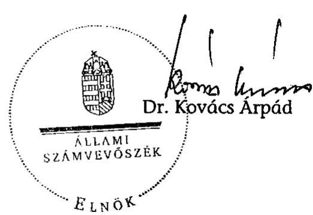

# JELENTÉS 

a Magyar Igazság és Élet Pártja 2005-2006. évi gazdálkodása törvényességének ellenőrzéséről

---

3. Önkormányzati és Területi Ellenőrzési Igazgatóság
3.1. Szabályszerűségi Ellenőrzési Főcsoport
Iktatószám: V-1009-061/2007-2008.
Témaszám: 853
Vizsgálat-azonosító szám: V-348
Az ellenőrzést felügyelte:
Dr. Lóránt Zoltán
főigazgató
Az ellenőrzés végrehajtásáért felelős:
Dr. Elek János
általános főigazgató-helyettes
Az ellenőrzést vezette:
Horváth Balázs
főcsoportfőnök-helyettes
Az összefoglaló jelentést készítette:
Dr. Faragóné Tóth Mária
tanácsos
Az ellenőrzést végezték:
Dr. Faragóné Tóth Mária
számvevő tanácsos
Szendrey Lajos
számvevő

Dr. Veress Tiborné
számvevő
Vincze Béla Róbert
számvevő

# A témához kapcsolódó eddig készített számvevőszéki jelentések: 

címe
sorszáma
Jelentés a Magyar Igazság és Élet Pártja 1995-1996. évi gazdálkodása törvényességének ellenőrzéséről 369
Jelentés a Magyar Igazság és Élet Pártja 1997-1998. évi gazdálkodása törvényességének ellenőrzéséről 0009
Jelentés a Magyar Igazság és Élet Pártja 1999-2000. évi gazdálkodása törvényességének ellenőrzéséről 0130
Jelentés a Magyar Igazság és Élet Pártja 2001-2002. évi gazdálkodása törvényességének ellenőrzéséről 0337
Jelentés a Magyar Igazság és Élet Pártja 2003-2004. évi gazdálkodása törvényességének ellenőrzéséről 0548

---

# TARTALOMJEGYZÉK 

BEVEZETÉS ..... 5
I. ÖSSZEGZŐ MEGÁLLAPÍTÁSOK, KÖVETKEZTETÉSEK, JAVASLATOK ..... 7
II. RÉSZLETES MEGÁLLAPÍTÁSOK ..... 9

1. Teljes időszakra érvényes megállapítások ..... 9
2. A 2005-2006. évi beszámoló megjelentetése ..... 9
3. A Párt gazdálkodási és számviteli szabályozása ..... 10
4. A könyvvezetés gyakorlata, bizonylatolási követelménye ..... 11
5. A Párt bevételszerző, gazdálkodó tevékenysége ..... 11
6. A gazdálkodással összefüggő egyéb előírások ..... 12
7. A Párt belső ellenőrzési rendszere ..... 12
8. Az előző ellenőrzés megállapításaira tett intézkedések ..... 13
MELLÉKLETEK
9. számú A Magyar Igazság és Élet Pártja 2005. évi pénzügyi beszámolója
10. számú A Magyar Igazság és Élet Pártja újra megjelentetett 2005. évi pénzügyi beszámolója
11. számú A Magyar Igazság és Élet Pártja 2006. évi pénzügyi beszámolója

---

.

---

# RÖVIDÍTÉSEK JEGYZÉKE 

| ÁSZ | Állami Számvevőszék |
| :-- | :-- |
| OE | Országos Elnökség |
| OI | Országos Iroda |
| OSZB | Országos Számvizsgáló Bizottság |
| Párt | Magyar Igazság és Élet Pártja |
| Párttörvény | A pártok működéséről és gazdálkodásáról szóló - többször   módosított - 1989. évi XXXIII. törvény |
| Számviteli törvény | A számvitelről szóló - többször módosított - 2000. évi C.   törvény |

---

.

---

# JELENTÉS 

## a Magyar Igazság és Élet Pártja 2005-2006. évi gazdálkodása törvényességének ellenőrzéséről

## BEVEZETÉS

Az Állami Számvevőszékről szóló 1989. évi XXXVIII. törvény 5. §-a, a 16. § (2) és a 17. § (2) bekezdése, valamint a pártok működéséről és gazdálkodásáról szóló - többször módosított - 1989. évi XXXIII. törvény (párttörvény) 10. § (1) és (3) bekezdése alapján a pártok gazdálkodása törvényességének ellenőrzésére az Állami Számvevőszék (ÁSZ) jogosult. E törvényi felhatalmazásokra figyelemmel az ÁSZ 2008. évi ellenőrzési tervének megfelelően vizsgálta a Magyar Igazság és Élet Pártja (Párt) 2005-2006. évi gazdálkodása törvényességét.

Az ellenőrzés célja arra irányult, hogy megállapítsa:

- a Párt által készített és a Magyar Közlönyben közzétett éves beszámolók a törvényi előírásoknak megfelelnek-e, a könyvvezetéssel és a valósággal megegyező adatokat tartalmaznak-e;
- a könyvvezetés, a gazdálkodás során betartották-e a számvitelről szóló többször módosított - 2000. évi C. tv. (számviteli törvény) és az egyéb jogszabályok rendelkezéseit, a belső előírásokat;
- a Párt a működéséhez szabályszerűen igénybe vehető forrásokat használt-e fel, nem folytatott-e a párttörvény által tiltott gazdálkodó tevékenységet, nem fogadott-e el tiltott vagyoni hozzájárulást, illetőleg adományt.

Az ellenőrzés körülményeit illetően rögzíteni szükséges ${ }^{1}$, hogy:

- a párttörvény 1. sz. melléklete szerinti beszámoló-mintához magyarázatot, útmutatót nem készítettek a jogalkotók, így ennek kitöltése pártonként - kialakított számviteli politikájuknak megfelelően - eltérő lehet;
- a beszámolóminta a számviteli törvény rendelkezéseivel nem harmonizál, nem felel meg sem a mérleg, sem az eredmény-kimutatás követelményeinek.

A korábbi pártellenőrzések alapján tett jelzésekre is figyelemmel elengedhetetlenül szükséges a pártok működéséről és gazdálkodásáról szóló - többször módosított - 1989. évi XXXIII. törvény, valamint a számviteli törvény előírásainak összehangolása, amely a pártfinanszírozás átláthatóvá tételére benyújtott törvényjavaslatnak szerves része (száma: T-4190).

[^0]
[^0]:    ${ }^{1}$ Az ÁSZ évek óta javasolja a Kormánynak a pártok ellenőrzéséről készített jelentéseiben a párttörvény módosítását.

---

Az ÁSZ a párttörvény módosításáig a jelenleg hatályos rendelkezéseknek megfelelő - egységes módszertani alapokra helyezett - gyakorlattal folytatja a pártok gazdálkodása törvényességének ellenőrzését. Az ellenőrzést a pénzügyiszabályszerűségi ellenőrzés módszertani szabályai szerint, a pártellenőrzésre kiadott segédletbe foglalt egységes követelmények alapján végeztük.

A Párt 2005-2006. évi gazdálkodása törvényességének ellenőrzését eredetileg az ÁSZ a 2007. évi ellenőrzési tervében 2007. május hónapra ütemezte, amelyet a Párt kérésére - a működési és gazdálkodási dokumentumok teljes körű rendelkezésre állása érdekében - 2007. június 1-jére halasztott. Tekintettel arra, hogy a szükséges 2005-2006. évi működési és gazdálkodási dokumentációk hiányában nem volt adott a vizsgálat program szerinti, határidőben történő végrehajtásának feltétele az ÁSZ átütemezte az ellenőrzés időpontját, lehetőséget biztosítva az eredményes vizsgálat lefolytatásához szükséges felkészülésre. A Párt 2005-2006. évi gazdálkodásának helyszíni ellenőrzése a 2008. évi ellenőrzési tervben 2007. évről áthúzódó ellenőrzésként került ismételten betervezésre.

A pénzügyi-szabályszerűségi ellenőrzésre - többszöri megszakítással - 2008. október 17. és 2008. november 6. között, a Párt 1123 Budapest, Greguss u. 6. szám alatti irodájában került sor.

---

# I. ÖSSZEGZŐ MEGÁLLAPÍTÁSOK, KÖVETKEZTETÉSEK, JAVASLATOK 

A Párt a 2005. évi beszámolóját a párttörvényben előírt határidőben, a Magyar Közlönyben megjelentette, amit más bevételi és kiadási összegekkel, belső tartalommal 2008. novemberben a Magyar Közlöny hivatalos mellékletében újra közzétett. Egyidejűleg - másfél éves késedelemmel - pótolta a 2006. évi beszámoló nyilvánossá tételét. A Párt a párttörvény előírása ellenére az éves beszámolóit saját honlapján nem jelenítette meg, az egyéb hozzájárulásokat, adományokat nem megfelelően részletezte, továbbá 2005. évben a 3000 ezer Ft magánszemélytől származó értékhatár feletti adományt elmulasztotta nevesíteni. A szabálytalanságokat a jelenleg hatályos párttörvényi előírások nem szankcionálják. Az ÁSZ erre is figyelemmel támogatja a pártfinanszírozás átláthatóvá tételét szolgáló törvénymódosító javaslatok elfogadását.

A Párt a 2005-2006. évi gazdálkodás törvényességi ellenőrzéséhez nem tudta rendelkezésre bocsátani az eredeti pénzügyi bizonylatokat, hiteles könyvviteli nyilvántartásokat. A Párt nem biztosította az eredeti bizonylatok megőrzésére vonatkozó számviteli törvényi előírásokat. A gazdálkodási dokumentumok hiányában az ellenőrzés által nem volt megítélhető a 2005. és 2006. évi beszámolók megbízhatósága és valódisága, a beszámolók alapjául szolgáló könyvvezetés szabályszerűsége, illetve egyezősége; a bizonylati elv és fegyelem előírásainak érvényesülése; a gazdálkodó és bevételszerző tevékenység jogszerűsége, valamint a gazdálkodással összefüggő egyéb jogszabályok betartása.

A Pártnál 2005. március 1-jei hatállyal módosult a gazdálkodás rendje. A megváltozott hatásköri és feladat-megosztási szabályozásnak megfelelően elmaradt a számviteli szabályzatok aktualizálása. A vizsgált időszak gazdasági eseményeinek könyvelésére utólag, 2007. áprilisában kötöttek megbízási szerződést. A megállapodás nem a párttörvényben meghatározott beszámoló elkészítésére, hanem a pártokra nem vonatkozó „számviteli törvény szerinti egyéb szervezetek" beszámolójára szólt. A hiba összefüggött azzal, hogy a Párt a gazdálkodási rendjében a pártbeszámoló összeállítása kapcsán indokolatlanul kihagyta a párttörvényre való hivatkozást.

A belső ellenőrzési rendszer szabályozott működését, illetve az ÁSZ előző felhívása alapján készült intézkedési terv végrehajtását dokumentumok nem igazolták.

A helyszíni ellenőrzés megállapításainak hasznosítása mellett az ÁSZ elnöke felhívja

## a Párt elnökét:

1. Tegye meg a szükséges intézkedéseket a Párt 2005-2006. évi gazdálkodása hiányzó, eredeti pénzügyi dokumentumainak pótlására, figyelemmel a számviteli törvény 4. § (1)-(2), 15. § (3) bekezdésére.

---

2. Biztosítsa az éves beszámoló elkészítése és közzététele során a párttörvény 9. § (1) (2) bekezdésében foglaltak betartását.
3. Gondoskodjon a számviteli törvény 14. § (10) bekezdésében előírt kötelezettsége alapján a hatályos gazdálkodási renddel összhangban álló számviteli szabályozásról.
4. Szerezzen érvényt a számviteli törvény 169. § (1)-(2) bekezdésében foglaltaknak, gondoskodjon a könyvelési dokumentáció és kapcsolódó bizonylatok határidős megőrzéséről.
5. Intézkedjen a belső ellenőrzési rendszer működésének szabályszerű dokumentálására.

---

# II. RÉSZLETES MEGÁLLAPÍTÁSOK 

## 1. TELJES IDŐSZAKRA ÉRVÉNYES MEGÁLLAPÍTÁSOK

A Párt a számviteli törvény 169. § (1) - (2) bekezdésben előírtak szerint nem őrizte meg a 2005-2006. évi gazdálkodás szabályszerűségét bizonyító eredeti pénzügyi bizonylatait, hiteles könyvviteli nyilvántartásait. A dokumentumok hiányára az ellenőrzés írásbeli magyarázatot kért a Párt elnökétől.

A Párt elnöke nyilatkozott, amely szerint az ÁSZ részére összeállított iratcsomagot ismeretlen személy elvitte a Párttól 2008. június 2-án.

A gazdálkodási dokumentumok hiányában az ellenőrzés által nem volt megítélhető a 2005. és 2006. évi beszámolók megbízhatósága és valódisága, a beszámolók alapjául szolgáló könyvvezetés szabályszerűsége, illetve egyezősége, a bizonylati elv és fegyelem előírásainak érvényesülése, a gazdálkodó és bevételszerző tevékenység jogszerűsége, valamint a gazdálkodással összefüggő egyéb jogszabályok betartása.

## 2. A 2005-2006. ÉVI BESZÁMOLÓ MEGJELENTETÉSE

A Párt a vizsgált időszaki beszámolók közül a 2005. évi beszámolóját jelentette meg a párttörvény 9. § (1) bekezdésben előírt határidőben, a 2006. április 29-i Magyar Közlöny 51. számában (1. számú melléklet).

A 2006. évi pénzügyi beszámolóját a 2007. április 30-i határidővel szemben a számvevőszéki helyszíni vizsgálat befejezését követő napon - 2008. november 7-én - hozta nyilvánosságra a Magyar Közlöny hivatalos értesítőjének 2008/45. számában, egyidejűleg ismételten közzétette a 2005. évi pénzügyi beszámolóját is (2-3. számú melléklet) az alábbi korrekciókkal:

Adatok ezer Ft-ban

| Megnevezés | 2006.   április | Korrekció | 2008.   november |
| :-- | :--: | :--: | :--: |
| 1. Tagdíjak | 3607 | -3607 | 0 |
| 2. Állami támogatás | 87000 | 0 | 87000 |
| 4. Egyéb hozzájárulások, adományok | 120 | +2951 | 3071 |
| 4.2. Jogi személyeknek nem minősülő gazdasági társaságoktól | 0 | +66 | 66 |
| 4.3.1. Belföldiektől (500 eFt feletti) | 0 | +3000 | 3000 |
| 6. Egyéb bevétel | 0 | +360 | 360 |
| Összes bevétel | $\mathbf{90} \mathbf{727}$ | $\mathbf{-296}$ | $\mathbf{90431}$ |

---

| 2. Támogatás egyéb szervezeteknek | 59000 | -7500 | 51500 |
| :-- | --: | --: | --: |
| 4. Működési kiadások | 14000 | +400 | 14400 |
| 6. Politikai kiadások | 17727 | -27 | 17700 |
| 7. Egyéb kiadások | 0 | +8441 | 8441 |
| Összes kiadás | $\mathbf{90727}$ | $\mathbf{+1314}$ | $\mathbf{92041}$ |

A Párt megjelentetett beszámolóinak valódisága, törvényi és belső előírásokkal való összhangja az eredeti pénzügyi bizonylatok és hiteles könyvviteli nyilvántartások hiányában nem volt ellenőrizhető.

A vizsgálat kizárólag az állami költségvetésből származó támogatás közlését ítélte megbízhatónak a Magyar Köztársaság 2005. évi költségvetésének végrehajtásáról szóló 2006. évi XCIX. törvény és a Magyar Köztársaság 2006. évi költségvetésének végrehajtásáról szóló 2007. évi CXXVIII. törvény adatai alapján (2005. évben 87 millió Ft, 2006. évben 36,2 millió Ft).

Az egyéb hozzájárulások adományok részletezése egyik évben sem felelt meg a párttörvény 1. számú mellékletében foglalt részletezésnek, továbbá 2005. évben a 3000 ezer Ft magánszemélytől származó értékhatár feletti adományt elmulasztották nevesíteni.

A Párt elmulasztotta az éves beszámolók internetes honlapon való nyilvánossá tételét, figyelemmel
 a párttörvény 9. § (1) bekezdésében foglaltakra.

Az ellenőrzés nem tudott meggyőződni a számviteli törvény 4. § (1)-(2) és a 15. § (3) bekezdésekben foglaltak teljesüléséről. A törvény előírásai szerint a Párt könyvvezetéssel alátámasztott beszámolót köteles készíteni és a beszámolónak megbízható és valós összképet kell adnia a gazdálkodó vagyonáról, annak összetételéről, pénzügyi helyzetéről. A beszámolóban szereplő tételeket a valóságban is megtalálható bizonylatokkal kell alátámasztani, így az ellenőrzést is eredeti bizonylatok alapján kell lefolytatni.

# 3. A PÁRT GAZDÁLKODÁSI ÉS SZÁMVITELI SZABÁLYOZÁSA 

A vizsgált időszakban a számviteli törvény 14. § (3)-(4) bekezdése, valamint 161. § alapján 2001. január 1-jei hatállyal kiadott számviteli szabályozást a Párt - képviselője által adott nyilatkozat szerint - nem aktualizálta.

A számviteli szabályozást annak ellenére nem módosították, hogy 2005. március 1-jén megváltozott a Párt gazdálkodási rendje, amelynek főbb jellemzői a következőkben összegezhetők.

- A gazdálkodásért a Párt elnöke a felelős, míg a korábbi szabályzatban az Országos Iroda (OI) vezetője és a főkönyvelő is nevesítve volt. Az OI vezetőjének feladata korlátozva lett az Országos Elnökség (OE) munkájának segítésére. A főkönyvelő irányítása alá tartozó feladatok a gazdálkodásért felelős hatáskörébe kerültek.

---

- A kötelezettségvállalás rendjénél az OI vezetőjének ellenjegyzését, az utalványozási szabályzat keretében a helyi szervezetekre vonatkozó eljárást már nem tartalmazza az új szabályzat.
- A pénztár és pénzkezelési szabályzat rögzíti, hogy a pénzkezelési szabályzat a központi pénztárra vonatkozik, amelyik a korábban a helyi szervezetekre is hatályos volt. A gazdálkodási szabályozásban indokolatlanul elhagyták a párttörvényre való hivatkozást a pártbeszámolóval való összhang megteremtésére vonatkozóan.

A gazdálkodási rendben bekövetkezett módosítások számviteli szabályzatban való átvezetéséről a Párt elnöke a számviteli törvény 14. § (9) bekezdésében meghatározott felelősségi körében nem gondoskodott.

# 4. A KÖNYVVEZETÉS GYAKORLATA, BIZONYLATOLÁSI KÖVETELMÉNYEK 

A Párt számviteli politikája rögzíti, hogy könyvvezetési kötelezettségének a kettős könyvviteli rendszer alkalmazásával tesz eleget, amelynek eredeti dokumentumai a Párt elnökének nyilatkozata szerint nem állnak rendelkezésre. A 2005. és 2006. évi főkönyvi és analitikus nyilvántartás hiányának indokát a Párt elnöke levelében a könyvelő által adott nyilatkozattal összhangban adta meg.

A Párt a könyvelési tevékenység pótlólagos végrehajtására 2007. április 17-én kötött megbízási szerződést külső vállalkozóval. A szerződés a gazdasági események eredeti bizonylatok alapján történő rögzítésére szólt. A főkönyvi könyvelés adataira épülő beszámoló összeállítására nem a párttörvény 1. számú melléklete szerinti formáról állapodtak meg, hanem a pártokra nem vonatkozó „a számviteli törvény szerinti egyéb szervezetek" beszámolójának elkészítésére.

A könyvelő nyilatkozata szerint a könyvelést alátámasztó adatokkal már nem rendelkezik, mivel 2008 áprilisában a könyvelést tartalmazó számítógépét eltulajdonították, a mentést tartalmazó merevlemezes tárolója 2008 októberében tönkrement. A 2005-2006. évi eredeti bizonylatokat a Pártnak 2007-ben visszaszolgáltatta a megbízási szerződésben foglaltak szerint.

A Párt bizonylatkezelési szabályzata a számviteli törvény 169. § (1)-(2) bekezdéssel szinkronban rendelkezett arról, hogy „a beszámolót alátámasztó bizonylatokat, nyilvántartásokat (leltár, főkönyvi kivonat, analitikus és kiegészítő nyilvántartások, értékelések, egyéb nyilvántartások) 10 évig kell megőrizni, és 8 évig a számviteli bizonylatokat a könyvelési feljegyzések hivatkozása alapján visszakereshető módon". A szabályozás ellenére az eredeti bizonylatokat az ellenőrzésnek az 1. pontban hivatkozottak miatt bemutatni nem tudták.

## 5. A PÁRT BEVÉTELSZERZŐ, GAZDÁLKODÓ TEVÉKENYSÉGE

A Párt bevételszerző tevékenységét a hatályos számviteli politika szabályozta. Az állami támogatás mellett saját forrásait jogcím szerint meghatározta. A szabályozás összhangban állt a párttörvény 4. § (1) bekezdésében engedélyezett bevételekkel, valamint a 6. § (1) és (3)-(4) bekezdéseiben foglalt gazdálkodó te-

---

vékenységekkel. A szabályozás kitért a Párt bevételei tekintetében a párttörvény 4. § (2)-(3), valamint 6. § (3)-(4) bekezdéseiben foglalt korlátozásokra.

A Párt 2005-2006. évi gazdálkodó tevékenységének törvényességét hiteles nyilvántartásokkal, bizonylatokkal nem igazolta.

A Párt elnökének nyilatkozata szerint a Párt nem alapított sem vállalatot, sem egyszemélyes Kft.-t, az állam által ingyenesen átadott ingatlanokkal nem rendelkezik, az állami támogatáson felül végintézkedés alapján magánszemélytől pénzbeli örökséget kapott, melyet feltüntetett könyvelésében. A Pártnak bevétele nem származott sem állami vállalattól, sem állami részvétellel működő gazdasági társaságtól, sem más államtól, sem névtelen adományból.

# 6. A GAZDÁLKODÁSSAL ÖSSZEFÜGGŐ EGYÉB ELŐÍRÁSOK 

Az adózással összefüggő dokumentumok hiánya miatt a vizsgált időszakban hatályos személyi jövedelemadóról, az adózás rendjéről, a társadalombiztosításról szóló törvényekben meghatározott bejelentési, nyilvántartási, levonási és befizetési kötelezettségek nem minősíthetők.

Hasonlóan az adóköteles/adómentes kifizetések, költségtérítések, természetbeni juttatások elszámolása sem.

A Párt elnökének nyilatkozata szerint a pártnak nem volt fizetett alkalmazottja, így személyi jövedelemadó fizetési kötelezettsége nem keletkezett, sem társadalombiztosítási bejelentési, nyilvántartási, levonási és befizetési kötelezettsége. Adóköteles kifizetések nem történtek. Adóköteles költségtérítést vagy természetbeni juttatásokat a párt nem adott.

## 7. A PÁRT BELSŐ ELLENŐRZÉSI RENDSZERE

A Párt gazdálkodásának, pénzügyi és számviteli tevékenységének belső ellenőrzési rendszerét az alapszabály, a számvizsgáló bizottsági, a gazdálkodási, ügyviteli és pénzkezelési szabályzatok foglalták magukban.

A gazdálkodási rend 2005. március 1-jei módosításával a belső ellenőrzés rendszerét az Országos Gyűlés és az OE hatáskörébe rendelte. A változtatásokat nem vezették át a számviteli szabályzatokban és az alapszabályban.

A Párt alapszabálya rögzítette az OSZB működésének és feladatának szabályait. Az OSZB 2005. évi munkatervet készített, de végrehajtását iratokkal nem igazolták. Az OE volt jogosult ellenőrizni a Párt tevékenységét és a feladatokról beszámoltatni. A Párt gazdálkodásáért egy személyben a Párt elnöke volt felelős.

A munkafolyamatba épített ellenőrzés részeként a Párt elnöke belső utasításban jelölte ki az utalványozásra, érvényesítésre és ellenőrzésre jogosultak körét.

A pénztárellenőri feladatokat a pénzkezelési szabályzat rögzítette. A pénztárellenőr személyét a Párt elnöke megbízólevéllel jelölte ki, felelősségi nyilatkozata nem állt rendelkezésre.

---

A vezetői és munkafolyamatba épített ellenőrzés működését igazoló eredeti dokumentumokat az ellenőrzés részére nem adtak át.

# 8. AZ ELŐZŐ ELLENŐRZÉS MEGÁLLAPÍTÁSAIRA TETT INTÉZKEDÉSEK 

Az előző ÁSZ jelentésben tett javaslatokra intézkedési terv készült, azonban végrehajtását, az ÁSZ felhívás teljesülését dokumentumokkal nem igazolták.

Budapest, 2009. március 2.

---

# A Magyar Igazság és Élet Pártja 2005. évi pénzügyi beszámolója 

## Bevételek

1. Tagdijak ..... 3607
2. Állami költségvetésből származó támogatás ..... 87000
3. Képviselőcsoportnak nyújtott állami támogatás
4. Egyéb hozzájárulások, adományok ..... 120
4.1. Jogi személyektől
4.1.1. Belföldiektől ( 500000 Ft feletti)
4.1.2. Külföldiektől ( 100000 Ft feletti)
4.2. Jogi személynek nem minősülő gazdasági társaságoktól
4.2.1. Belföldiektől ( 500000 Ft feletti)
4.2.2. Külföldiektől ( 100000 Ft feletti)
4.3. Magánszemélyektől
4.3.1. Belföldiektől ( 500000 Ft feletti)
4.3.2. Külföldiektől ( 100000 Ft feletti)
5. A párt által alapított vállalat és kft. nyereségéből származó bevétel
6. Egyéb bevételek
Összes bevétel a gazdasági évben: ..... 90727
Kiadások
7. Támogatás a párt országgyűlési csoportja számára
8. Támogatás egyéb szervezeteknek ..... 59000
9. Vállalkozások alapítására fordított összegek
10. Működési kiadások ..... 14000
11. Eszközbeszerzések
12. Politikai tevékenység kiadásai ..... 17727
13. Egyéb kiadások
Összes kiadás a gazdasági évben: ..... 90727
Csurka István s. k.,
a Magyar Igazság és Élet Pártja elnöke

---

# IX. Hirdetmények 

## MÉRLEGBESZÁMOLÓ

## A Magyar Igazság és Élet Pártja 2005. évi beszámolója

## BEVÉTELEK

Adatok ezer forintban

1. Tagdijak
2. Állami költségvetésből származó támogatás 87000
3. Képviselőcsoportnak nyújtott állami támogatás 0
4. Egyéb hozzájárulások, adományok 3071
4.1. Jogi személyektől 0
4.1.1. Belföldiektől ( 500000 Ft feletti) 0
4.1.2. Külföldiektől ( 100000 Ft feletti) 0
4.2. Jogi személyeknek nem minősülő gazdasági társaságoktól 66
4.2.1. Belföldiektől ( 500000 Ft feletti) 0
4.2.2. Külföldiektől ( 100000 Ft feletti) 0
4.3. Magánszemélyektől
4.3.1. Belföldiektől ( 500000 Ft feletti) 3000
4.3.2. Külföldiektől ( 100000 Ft feletti) 0
5. A párt által alapított vállalat és kft. nyereségéből származó bevétel 0
6. Egyéb bevétel 360

Összes bevétel
90431

## KIADÁSOK

Adatok ezer forintban

1. Támogatás a párt országgyűlési csoportja számára 0
2. Támogatás egyéb szervezetnek 51500
3. Vállalkozás alapítására fordított összegek 0
4. Működési kiadások 14400
5. Eszközbeszerzés 0
6. Politikai tevékenység kiadása 17700
7. Egyéb kiadások 8441

Összes kiadás
92041

---

# A Magyar Igazság és Élet Pártja 2006. évi beszámolója 

## BEVÉTELEK

Adatok ezer forintban

1. Tagdijak
2. Állami költségvetésből származó támogatás ..... 36250
3. Képviselői csoportoknak nyújtott állami támogatás ..... 0
4. Egyéb hozzájárulások, adományok ..... 82
4.1.1. Belföldiektől ( 500000 Ft feletti) ..... 0
4.1.2. Külföldiektől ( 100000 Ft feletti) ..... 0
4.2. Jogi személyeknek nem minősülő gazdasági társaságoktól ..... 0
4.2.1. Belföldiektől ( 500000 Ft feletti) ..... 0
4.2.2. Külföldiektől ( 100000 Ft feletti) ..... 0
4.3. Magánszemélyektől
4.3.1. Belföldiektől ( 500000 Ft feletti) ..... 0
4.3.2. Külföldiektől ( 100000 Ft feletti) ..... 0
5. A párt által alapított vállalat és kft. nyereségéből származó bevétel
6. Egyéb bevétel ..... 87
Összes bevétel ..... 36419
KIADÁSOK
Adatok ezer forintban
7. Támogatás a párt országgyűlési csoportja számára ..... 0
8. Támogatás egyéb szervezetnek ..... 26500
9. Vállalkozás alapítására fordított összegek ..... 0
10. Működési kiadások ..... 655
11. Eszközbeszerzés ..... 0
12. Politikai tevékenység kiadása ..... 17600
13. Egyéb kiadások ..... 42
Összes kiadás ..... 44797
