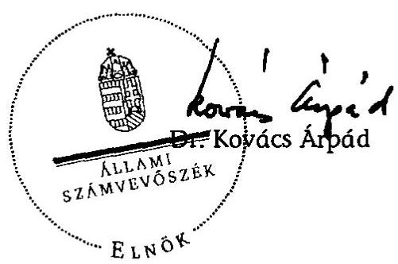

# JELENTÉS 

a 2008. évi februári időközi országgyűlési képviselőválasztási kampányra fordított pénzeszközök elszámolásának ellenőrzéséről a képviselethez jutott jelölő szervezetnél

---

3. Önkormányzati és Területi Ellenőrzési Igazgatóság
3.1. Szabályszerűségi Ellenőrzési Főcsoport

Iktatószám: V-3020-021/2008.
Témaszám: 932
Vizsgálat-azonosító szám: V-0434

# Az ellenőrzést felügyelte: 

Dr. Lóránt Zoltán
főigazgató
Az ellenőrzés végrehajtásáért felelős:
Dr. Elek János
általános főigazgató-helyettes
Az ellenőrzést vezette:
Horváth Balázs
főcsoportfőnök-helyettes
Az összefoglaló jelentést készítette:
Szakmányné Bilik Mária
számvevő tanácsos
Az ellenőrzést végezték:
Szakmányné Bilik Mária Tóth István
számvevő tanácsos
számvevő tanácsadó

---

# TARTALOMJEGYZÉK 

BEVEZETÉS ..... 3
I. ÖSSZEGZŐ MEGÁLLAPÍTÁSOK, KÖVETKEZTETÉSEK, JAVASLATOK ..... 6
II. RÉSZLETES MEGÁLLAPÍTÁSOK ..... 8

1. A beszámoló közzététele és tartalma ..... 8
2. A választásokkal kapcsolatos speciális nyilvántartási és gazdálkodási teendők szabályozása, a választási bevételek és kiadások nyilvántartásban történő elkülönítése ..... 9
3. A választásra fordítható összeghatár és a párttörvényben meghatározott korlátozó előírások betartása ..... 9
4. A beszámolóban közzétett adatok bizonylati alátámasztottsága ..... 10
MELLÉKLET
5. számú A Kereszténydemokrata Néppárt és a Fidesz - Magyar Polgári Szövetség által 2008. évi Budapest, XI. kerületi időközi országgyűlési képviselőválasztásra fordított pénzeszközök forrásai és felhasználása

---

# RÖVIDÍTÉSEK JEGYZÉKE 

| ÁSZ | Állami Számvevőszék |
| :-- | :-- |
| Fidesz-MPSZ | Fidesz-Magyar Polgári Szövetség |
| Jelölő szervezet | Kereszténydemokrata Néppárt és Fidesz-Magyar Polgári |
|  | Szövetség jelölő szervezet |
| KDNP | Kereszténydemokrata Néppárt |
| Párttörvény | A pártok működéséről és gazdálkodásáról szóló - többször |
|  | módosított - 1989. évi XXXIII. törvény |
| OVB | Országos Választási Bizottság |
| Számv. tv. | A számvitelről szóló - többször módosított - 2000. évi C. |
|  | törvény |
| Ve. | A választási eljárásról szóló - többször módosított - 1997. |
|  | évi C. törvény |

---

# JELENTÉS 

## a 2008. évi februári időközi országgyűlési képviselőválasztási kampányra fordított pénzeszközök elszámolásának ellenőrzéséről a képviselethez jutott jelölő szervezetnél

## BEVEZETÉS

A választási eljárásról szóló - többször módosított - 1997. évi C. törvény (Ve.) 92. § (3) bekezdésében kapott felhatalmazás alapján az országgyűlési képviselőválasztásra fordított állami és más pénzeszközök, anyagi támogatások felhasználásának ellenőrzése az Állami Számvevőszék (ÁSZ) feladata, amelyet „a választás második fordulóját követő egy éven belül az országgyűlési képviselethez jutott jelölő szervezetek és független jelöltek tekintetében hivatalból, egyéb jelölő szervezetek és független jelöltek tekintetében más jelölt, jelölő szervezetek kérelmére" ellenőriz. A Ve. 115. § (1) bekezdés utolsó mondata szerint: „Az időközi választásra az általános választás szabályait kell alkalmazni."

Az ÁSZ hivatalból ellenőrizte a Kereszténydemokrata Néppárt és a Fidesz-Magyar Polgári Szövetség (jelölő szervezet) kampányelszámolását, mivel közös jelöltjük a Budapest 15. számú országgyűlési egyéni választókerületben, 2008. február 10-én mandátumhoz jutott. Egyéb jelölő szervezetek és független jelöltek vizsgálatát a törvényes határidőn belül az ÁSZ-nál nem kérelmezték. Tekintettel arra, hogy a két párt között létrejött megállapodás alapján a kampány finanszírozása és a kampánybeszámoló közzététele a Kereszténydemokrata Néppárt (KDNP) feladata volt, helyszíni ellenőrzést csak ennél a pártnál végeztünk. A Ve. 49. § (2) bekezdésének rendelkezése szerint: „Ha több jelölő szervezet közösen állít jelöltet, a továbbiakban - a választás szempontjából - egy jelölő szervezetnek számítanak."

Az ellenőrzött időszak: a 2008. februári időközi országgyűlési képviselőválasztási kampány az elszámolási időpontig.

Az ellenőrzés célja annak megállapítása volt, hogy a 2008. februári időközi országgyűlési képviselőválasztáson mandátumhoz jutott jelölő szervezet:

- a Ve. 92. § (2) bekezdésének rendelkezése alapján a választás második fordulóját követő 60 napon belül a Magyar Közlönyben nyilvánosságra hozta-e a választásra fordított állami és más pénzeszközök, anyagi támogatások összegét, forrását és felhasználásának módját, valamint gondoskodott-e azok szabályszerű nyilvántartásáról és bizonylatolásáról;

---

- betartotta-e a Ve. 92. § (1) bekezdésében meghatározott költséghatárt, amely szerint „a jelölő szervezetek a választásra a 91. §-ban foglalt költségvetési támogatáson felül jelöltenként legfeljebb egymillió forintot fordíthatnak."

Az ellenőrzés feltételeiről és körülményeiről szükséges rögzíteni, hogy a Ve. 1998 óta hatályos rendelkezései, valamint a párttörvény előírásai jelenleg sem biztosították a feltételeket a választási kampánypénzek eredetének és felhasználásának teljes átláthatóságához.

Így 1998 óta a választási elszámolások ellenőrzéséről kiadott jelentéseinkben jeleztük, hogy az ÁSZ nem tudja teljes mértékben betölteni a választási kampány átláthatóságával kapcsolatosan azt a szerepet, amelyet az alkotmányos szabályozás megkívánna, valamint külön részleteztük az ÁSZ hatásköri korlátait is. ${ }^{1}$

Rendszeresen felhívtuk a figyelmet továbbá arra, hogy a választási kampányra fordítható kiadásokra, ezek ellenőrzésére vonatkozó hatályos szabályok korrupciós kockázatot jelentenek, nem segítik maradéktalanul a Ve. 3. §-ban rögzített alapelvek érvényesítését. ${ }^{2}$

Az ÁSZ visszatérően javasolta a Kormánynak, hogy kezdeményezze az Országgyűlésnél a Ve. oly módon való módosítását, amely biztosítja a kampányfinanszírozás átláthatóságát, ellenőrizhetőségét és egyértelműen meghatározza:

- a választási költségek elszámolása szempontjából mely időszak, illetve tevékenység forrásait és ráfordításait kell figyelembe venni;
- a jelöltek száma alapján, normatív módon juttatott állami támogatás felhasználása tekintetében mi a dologi költségek fogalma, a felhasználás elszámolásának formája, tartalma és kifizetőhelye;
- a választási költségek forrásai körében az egyéb anyagi támogatások között milyen formában nyújtott és kiktől származó juttatásokat kell figyelembe venni;
- milyen legyen az országgyűlési választásra fordított állami és más pénzeszközök, anyagi támogatások összegét, forrását és a felhasználás módját bemutató, a Magyar Közlönyben megjelentetett választási beszámoló formája és részletes tartalma;
- hogyan történjen az egyéni jelöltek választási költségei és azok forrásai ellenőrizhetőbb nyilvántartási kötelezettségének érvényesítése;
- mennyi legyen a költségvetési támogatáson felüli egy jelöltre átlagosan fordítható kiadás reális értékhatára;

[^0]
[^0]:    ${ }^{1}$ A témához kapcsolódóan kiadott számvevőszéki jelentések sorszáma: 9916; 039; 0135; 0307; 0562; 0718 és 0737 .
    ${ }^{2}$ A témakör részletes kifejtése megtalálható „A korrupció elleni küzdelem a számvevőszéki közreműködés és bemutatásán keresztül" című 2002. októberi ÁSZ tanulmányban. A tanulmány olvasható az ÁSZ internetes honlapján.

---

- milyen tartalmú írásos megállapodást kössenek a közös jelöltet állító szervezetek a kampányfinanszírozásra, a nyilvántartásra és az elszámolásra vonatkozóan;
- milyen szankciókkal járjon a határidős elszámolási és beszámolási kötelezettségek elmulasztása.

Az ÁSZ, mint jogalkalmazó szerv csak a jelenlegi jogszabályban biztosított keretek között végezhette ellenőrzését, kiterjesztő jogértelmezésre nem volt lehetősége, többletellenőrzési jogosítványokat nem alkalmazhatott. Az ÁSZ-nak a jelen vizsgálatnál is tudomásul kellett vennie, hogy dokumentális ellenőrzést végezhet, továbbá ellenőrzési jogosultsága az elszámolási határidőig a jelölő szervezet nyilvántartásában megjelent kampányforrásokra és ráfordításokra terjed ki.

A helyszíni ellenőrzést a közvetlen részletes vizsgálatok módszerével végeztük. A 2007. november 12-e és 2008. március 21-e között teljesült gazdasági eseményeket tételesen ellenőriztük tekintettel arra, hogy a jelölő szervezet a 2008. februári időközi országgyűlési képviselőválasztási kampányra fordított pénzeszközöket utólagosan különítette el az éves kiadásoktól. A pénzügyi szabályszerűségi ellenőrzést a számvevőszéki ellenőrzés szabályai szerint készítettük elő és folytattuk le.

Az ellenőrzés módszere: A jelölő szervezet által rendelkezésre bocsátott iratok és a Magyar Közlönyben közzétett választási beszámoló tartalmi összevetésével, valamint az alkalmazott eljárások és a jogszabályi követelmények egybevetésével történt.

A helyszíni ellenőrzést: 2008. december 1-5. között a KDNP országos központjában végeztük.

---

# I. ÖSSZEGZŐ MEGÁLLAPÍTÁSOK, KÖVETKEZTETÉSEK, JAVASLATOK 

A közös jelöltállításra tekintettel kötött megállapodás értelmében mind a finanszírozás, mind az elszámolás - a jelölő szervezet nevében - a KDNP feladata volt. A KDNP, a jelölő szervezet Ve. törvényben előírt beszámolási kötelezettségét a törvény által előírt határidőn belül teljesítette. A 2008. februári időközi országgyűlési képviselőválasztással kapcsolatos forrásokról és ráfordításokról beszámolóját a Magyar Közlöny 2008. évi 47. számában, 2008. március 21-én hozta nyilvánosságra. A közzétett beszámolót megalapozó számviteli nyilvántartásban az időközi választásra fordított pénzeszközök ráfordításait a KDNP munkaszámmal különítette el a működéssel összefüggő kiadásoktól, így a beszámolóban közölt 908 ezer Ft ráfordítási adat a munkaszámos főkönyvi kivonatból, valamint a nyilvántartás alapját képező bizonylatokból levezethető volt.

Belső szabályozást vagy utasítást, az elszámolást teljesítő KDNP nem léptetett hatályba a választásokkal kapcsolatos speciális nyilvántartási és gazdálkodási teendők ellátásához. A gazdálkodási jogköröket az általános működésre vonatkozó hatásköri szabályok szerint gyakorolta. A jelölő szervezet - a közös jelöltállításra vonatkozó megállapodáson kívül - az időközi választással kapcsolatos gazdasági döntést nem hozott.

A jelölő szervezet a szankció nélkül felhasználható egymillió forintos költséghatárt a rendelkezésre bocsátott dokumentációk szerint nem lépte túl, 908 ezer Ft-ot fordított a Budapest 15. számú egyéni választókerület időközi országgyűlési képviselőválasztási kampányára. A párttörvényben rögzített forrásszerzést korlátozó előírásokat a KDNP - a nyilvántartások szerint - a beszámolóban feltüntetett országgyűlési képviselőválasztásra fordított összeg forrásai vonatkozásában betartotta, forrásként kizárólag működési célú költségvetési támogatást jelölt meg.

A kampánytevékenységre vonatkozó, annak jogszerűségét igazoló szerződések, egyéb kötelezettségvállalási dokumentumok rendelkezésre álltak. A nyilvántartott kampányköltségek bizonylatai a könyvelési adatok alapján visszakereshetők voltak. Tartalmuk szerint a könyvelt gazdasági eseményt támasztották alá. A bizonylatok alaki és tartalmi követelményei - a könyvelési dátum rögzítése kivételével - megfeleltek a Számv. tv-ben rögzített, a szabályszerű bizonylatra vonatkozó előírásoknak.

A helyszíni ellenőrzés megállapításainak hasznosítása mellett javasoljuk

## a Kormánynak

Ismételten kezdeményezze a választási eljárásról szóló törvény módosítását - figyelemmel az Állami Számvevőszék korábbi jelentéseiben is megfogalmazott javaslataira - annak érdekében, hogy a választási kampány finanszírozása átlátható, ellenőrizhető legyen.

---

## a KDNP elnökének 

1. Gondoskodjon a Ve. 92. § (1) bekezdésben meghatározott ráfordítási korlát betartásának ellenőrizhetősége céljából a választással kapcsolatos források és ráfordítások elkülönített nyilvántartásának szabályozásáról.
2. Intézkedjen, hogy a könyvviteli nyilvántartásokban rögzített bizonylatokon kerüljön feltüntetésre a Számv. tv. 167. § (1) bekezdés i) pont előírásával összhangban a könyvelés dátuma.

---

# II. RÉSZLETES MEGÁLLAPÍTÁSOK 

## 1. A beszámoló közzététele és tartalma

A Ve. 92. § (2) bekezdés előírása szerint minden jelölő szervezetnek és független jelöltnek a választás második fordulóját követő 60 napon belül a Magyar Közlönyben nyilvánosságra kell hoznia a választásra fordított állami és más pénzeszközök, anyagi támogatások összegét, forrását és felhasználásának módját. Figyelemmel arra, hogy a Ve. a nyilvánosságra hozandó beszámoló tartalmát, részletezettségét nem szabályozta, az OVB a Választási füzetek 1998. évi 44. száma függelékében az ÁSZ ajánlását tette közzé. Jelezni szükséges, hogy a nyilvánosságra hozatali kötelezettség elmulasztását a törvény nem szankcionálja, így annak elmulasztása vagy késedelmes teljesítése esetén intézkedésre nincs lehetőség.

A KDNP és a Fidesz-MPSZ a közös jelöltállításra tekintettel megállapodást kötött a kampányköltségek finanszírozására, valamint a források és kampányráfordítások elszámolására. Ennek értelmében mind a finanszírozás, mind az elszámolás - a jelölő szervezet nevében - a KDNP feladata volt. A KDNP a megállapodásnak megfelelően "A Kereszténydemokrata Néppárt és a Fidesz - Magyar Polgári Szövetség által a 2008. évi Budapest XI. kerületi időközi országgyűlési képviselőválasztásra fordított pénzeszközök forrásai és felhasználása" címmel, a törvényes határidőn belül tette közzé elszámolását - az ÁSZ ajánlásának megfelelő szerkezetben és tartalommal - a Magyar Közlöny 2008. március 21-i, 47. számában (1. számú melléklet).

A jelölő szervezet a beszámolóban kampányforrásként 908 ezer Ft állami költségvetési támogatást nevezett meg, valamint ugyanilyen összegű anyagjellegű ráfordítást közölt. A kampányköltségek között hirdetési és nyomdai költségeket számoltak
 el. A beszámolóban közölt adat a könyvelésből kinyomtatott munkaszámos lista anyagjellegű ráfordítások összegével megegyezett. Az utólagos elkülönítésre figyelemmel az ellenőrzés a 2007. november 12. és a kampányelszámolás megjelentetése közötti időszakban a KDNP számviteli nyilvántartásában szerepeltetett ráfordításokat tételesen ellenőrizte. A beszámolóban közölt ráfordítás összege nem tartalmazta a Budapest Főváros XI. kerület Újbuda Önkormányzat által 2008. február 2-án teljesített, névjegyzéki adatszolgáltatás díját 105 ezer Ft összegben. Az időközi országgyűlési képviselő-választási kampánnyal egyidejűleg népszavazási kampány is folyt, így a kampányráfordítások összegének egyértelmű megállapítása céljából nyilatkozatot kértünk a KDNP képviselőjétől. A KDNP képviselőjének nyilatkozata szerint a névjegyzéki adatszolgáltatást a 2008. március 9-i népszavazással kapcsolatban vették igénybe.

A kampány finanszírozására kizárólag működési költségvetési támogatást használtak fel. A könyvvezetés során érvényesítették a Számv. tv-ben meghatározott számviteli alapelveket. A közös jelöltállításra tekintettel összeállított beszámoló megfelelt a megállapodásban rögzített beszámolási, nyilvántartási és elszámolási kötelezettségnek.

---

# 2. A VÁLASZTÁSOKKAL KAPCSOLATOS SPECIÁLIS NYILVÁNTARTÁSI ÉS GAZDÁLKODÁSI TEENDŐK SZABÁLYOZÁSA, A VÁLASZTÁSI BEVÉTELEK ÉS KIADÁSOK NYILVÁNTARTÁSBAN TÖRTÉNŐ ELKÜLÖNÍTÉSE 

A választási kampányforrások, és ráfordítások elszámolásért felelős KDNP belső előírásban nem rögzítette a kampánytevékenység, a kampányköltség fogalmát, a kampányra fordítható összeget, a választási költségek elszámolása szempontjából az elszámolási időszak terjedelmét, a nyilvánosságra hozandó beszámoló tartalmát. Ennek a körülménynek, valamint az OVB 4/2002. (II. 7.) számú állásfoglalásának megfelelően az ellenőrzés az elszámolt kampányráfordításokat a jelölt nyilvántartásba vételétől kezdődött kampányidőszakban, 2007. november 12-e és 2008. február 10-e között vette figyelembe. A KDNP a teljesítés időpontja tekintetében betartotta a választásra fordított állami pénzeszközök felhasználása során a Ve. 40. § (1) bekezdésben meghatározott kampányidőszakot.

A Ve. nem ad eligazítást arra vonatkozóan, hogy a kampányidőszakban felmerült kampányráfordításokra vonatkozó kötelezettségvállalásnak, a termék, szolgáltatás igénybevételének, illetve pénzügyi teljesítésnek együttesen kell, illetve elegendő-e a fizikai teljesítésnek a Ve-ben szabályozott kampányidőszakra esni.

A jelölő szervezet - a közös jelöltállításra vonatkozó megállapodáson kívül - az időközi választással kapcsolatos gazdasági döntést nem hozott. A KDNP rendelkezett hatályos számviteli politikával és számlarenddel, ezek azonban a választással kapcsolatos speciális nyilvántartási előírásokat nem tartalmazták. A szabályozási hiányosságok annak ellenére fennálltak, hogy az ÁSZ elnöke a korábbi ellenőrzés megállapításai alapján, azok megszüntetésére felhívta a KDNP elnökét. A KDNP választással kapcsolatos speciális gazdálkodási jogköröket nem határozott meg, azokat az általános működésre vonatkozó hatásköri szabályok szerint gyakorolta.

A KDNP a Ve. 92. § (1) bekezdésében meghatározott ráfordítási korlátok betartásának ellenőrizhetősége céljából munkaszám segítségével különítette el a könyvvezetésben az időközi választással kapcsolatos kampányráfordításokat, a működéssel összefüggő kiadásoktól. A nyilvántartásban való elkülönítést azonban nem a költségek felmerülésével egyidejűleg, hanem utólagos átvezetéssel biztosították.

## 3. A VÁLASZTÁSRA FORDÍTHATÓ ÖSSZEGHATÁR ÉS A PÁRTTÖRVÉNYBEN MEGHATÁROZOTT KORLÁTOZÓ ELŐÍRÁSOK BETARTÁSA

A Ve. 92. § (1) bekezdése szerint "a jelölő szervezetek a választásra a 91. §-ban foglalt költségvetési támogatáson felül jelöltenként legfeljebb egymillió forintot fordíthatnak." Az OVB 7/1998. (IV. 1.) állásfoglalása szerint közös jelölés esetén is összesen egymillió forint fordítható egy jelöltre. Az időközi választásra jelöltarányos állami támogatás a költségvetésben nem állt rendelkezésre, ennek megfelelően a jelölő szervezet összesen egymillió forintot fordíthatott szankció nélkül kampánycélokra.

A jelölő szervezet a Ve. 92. § (1) bekezdésében foglalt költséghatárt a KDNP számviteli nyilvántartása, gazdálkodási dokumentumai szerint, valamint kép-

---

viselőjének nyilatkozatát figyelembe véve betartotta. A rendelkezésre bocsátott dokumentumok, továbbá a nyilatkozat szerint az időközi országgyűlési képviselő-választáshoz kapcsolódó kampányköltségek összege 908 ezer Ft volt.

A párttörvény 4. § (2)-(3) bekezdése értelemszerűen a választási kampányra vonatkozóan is korlátokat határoz meg a pártok részére a vagyoni hozzájárulások, adományok elfogadhatóságát illetően. A KDNP a kampányfinanszírozás forrásaként működési célú költségvetési támogatást jelölt meg. A bemutatott forrás megfelelt a párttörvény 4. § (2)-(3) bekezdésében foglalt korlátozásnak.

A kampányköltségek összegét a megállapodásban nem rögzítették, a törvényes összeghez képest nem korlátozták.

# 4. A BESZÁMOLÓBAN KÖZZÉTETETT ADATOK BIZONYLATI ALÁTÁMASZTOTTSÁGA 

A kampánytevékenységre vonatkozó, annak jogszerűségét igazoló szerződések, egyéb kötelezettségvállalási illetve teljesítésigazolási dokumentumok rendelkezésre álltak. A választásokkal kapcsolatos gazdasági események alapbizonylatai a könyvelési adatok alapján visszakereshetők voltak. Tartalmuk szerint a könyvelt gazdasági eseményt támasztották alá.

A bizonylatok alaki és tartalmi követelményei - a könyvelés dátumának rögzítése kivételével - megfeleltek a Számv. tv. 167. § (1) bekezdésben rögzített előírásoknak, a bizonylatok megőrzéséről gondoskodtak. A könyvelési dátum rögzítésének elmulasztásával sérült a Számv. tv. 165. § (1) bekezdés i) pont előírása.

A KDNP Számvizsgáló Bizottsága nem ellenőrizte a 2008. februári időközi országgyűlési képviselő-választás kampányköltségeinek alakulását.

Budapest, 2009. február " 24 "

Melléklet: $\quad 1 \mathrm{db}$

---

A Kereszténydemokrata Néppárt és a Fidesz - Magyar Polgári Szövetség által 2008. évi Budapest, XI. kerületi időközi országgyűlési képviselő-választásra fordított pénzeszközök forrásai és felhasználása

1. A jelölt szervezet neve: Kereszténydemokrata Néppárt

Fidesz - Magyar Polgári Szövetség
2. A jelölő szervezet által állított jelöltek száma: 1 fő
3. Az országgyűlési képviselő-választásra fordított összeg
3.1. Forrásai összesen
3.1.1. Állami költségvetési támogatás
3.1.2. Egyéb források 908
ebből:

- választási célra
- hitel és engedményezés
- saját források
3.2. Jogcímek szerinti felhasználás összege
3.2.1. Az állami költségvetési támogatás terhére 908
ebből:
- anyagjellegű ráfordítás
- nem anyagi jellegű ráfordítás
- egyéb ráfordítás
3.2.2. Egyéb források terhére
ebből:
- anyagjellegű ráfordítás
- személyi jellegű ráfordítás
- nem anyagi jellegű ráfordítás
- egyéb ráfordítás

Csorba Béla s. k., gazdasági igazgató
