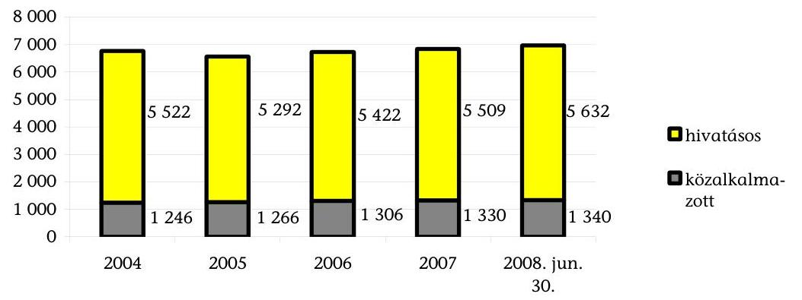
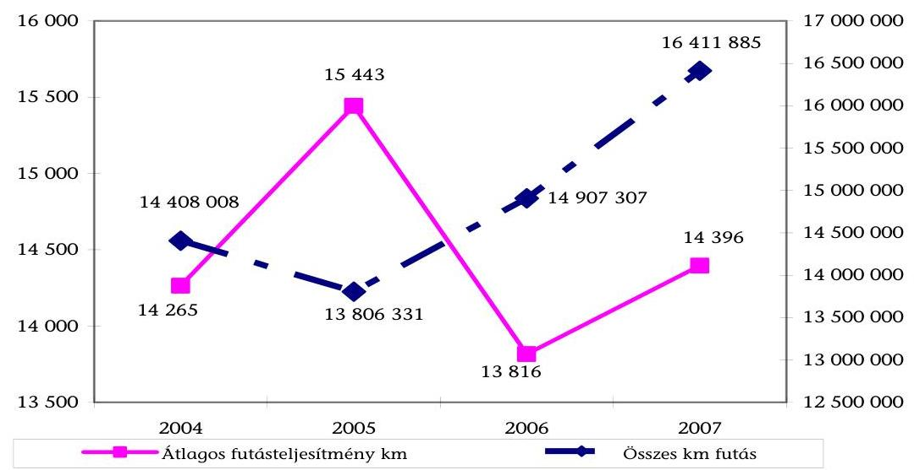
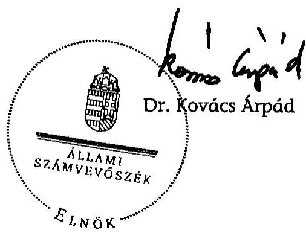
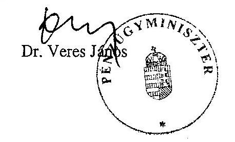
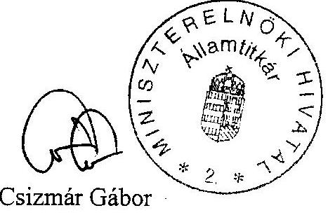
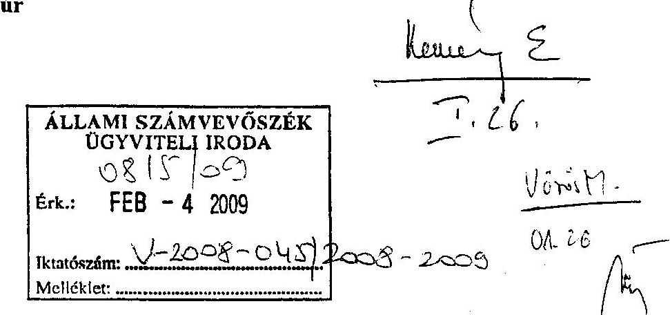
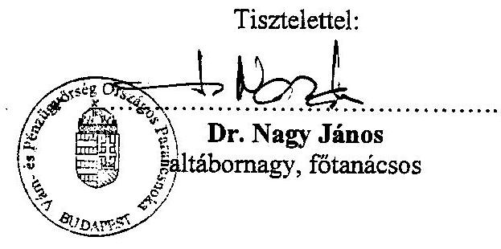
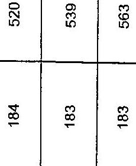
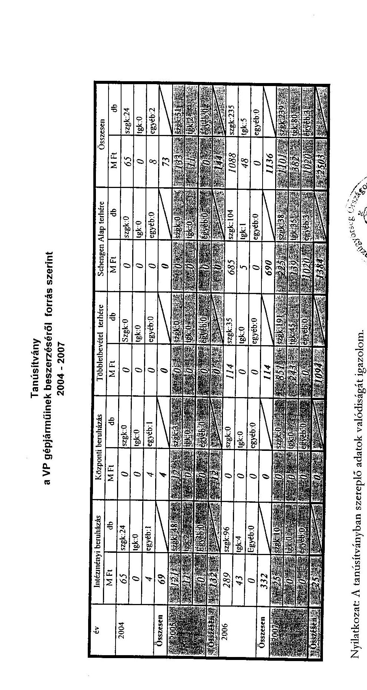
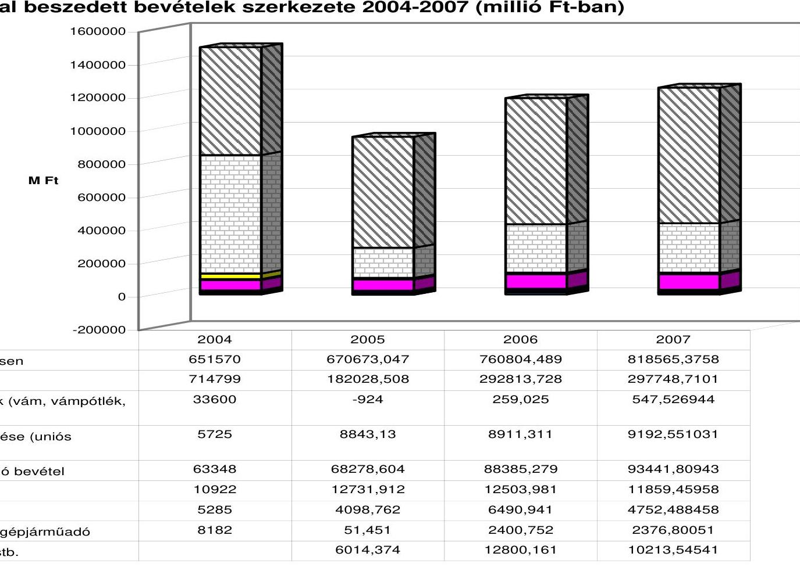

# ÁLLAMI   SZÁMVEVŐSZÉK 

## JELENTÉS

a Vám- és Pénzügyőrség múködésének ellenőrzéséről

---

2. Államháztartás Központi Szintjét Ellenőrző Igazgatóság
2.1. Teljesítmény Ellenőrzési Főcsoport
Iktatószám: V-2008-051/2008-2009.
Témaszám: 910
Vizsgálat-azonosító szám: V0412
Az ellenőrzést felügyelte:
Bihary Zsigmond
főigazgató
Az ellenőrzés végrehajtásáért felelős:
Kemény Emil
főigazgató-helyettes
Az ellenőrzést vezette:
Vörös Mária
osztályvezető főtanácsos
Az ellenőrzést végezték:
Dr. Földvári Gábor Józsa Ferencné
számvevő tanácsos
Kapronczai Gabriella
számvevő tanácsos,
tanácsadó
Temesváry Miklós
számvevő tanácsos
Uram Ferenc
számvevő tanácsos

# A témához kapcsolódó eddig készített számvevőszéki jelentések: 

címe
sorszáma
A központi költségvetést megillető 2001-2002. évi jövedéki adóbe-
vételek realizálása hatékonyságának és eredményességének ellen-
őrzése (2003)
A Magyar Köztársaság 2004. évi költségvetése végrehajtásának
0357
ellenőrzése (2005)
A Vám- és Pénzügyőrség múködésének ellenőrzése (2005)
0540
A Magyar Köztársaság 2005. évi költségvetése végrehajtásának
0511
ellenőrzése (2006)
A közösségi és a hazai költségvetést megillető vámbevételek
0628
realizálása feltételeinek és a vámeljárások eredményességének
ellenőrzése (2006)
A költségvetést megillető áfabevételek realizálásának ellenőrzése
0648
A Magyar Köztársaság 2006. évi költségvetése végrehajtásának
0717
ellenőrzése (2007)
A Pénzügyminisztérium fejezet múködésének ellenőrzése (2008)
0724
A Magyar Köztársaság 2007. évi költségvetése végrehajtásának
0801
ellenőrzése (2008)

---

# TARTALOMJEGYZÉK 

BEVEZETÉS ..... 5
I. ÖSSZEGZŐ MEGÁLLAPÍTÁSOK, KÖVETKEZTETÉSEK, JAVASLATOK ..... 7
II. RÉSZLETES MEGÁLLAPÍTÁSOK ..... 11

1. A VP feladatainak, szervezeti, személyi és tárgyi feltételeinek összhangja ..... 11
1.1. A feladatellátás érdekében kialakított szervezeti struktúra értékelése ..... 12
1.2. A humánerőforrás-felhasználás a feladatellátás szempontjából ..... 14
1.3. A szakterületek teljesítményének értékelésére kialakított módszerek és gyakorlat ..... 21
1.4. A feladatellátáshoz szükséges ingatlanállomány biztosítása ..... 23
1.5. A feladatellátáshoz szükséges jármúállomány biztosítása ..... 27
1.6. A vezetői döntéseket megalapozó információs rendszerek értékelése ..... 31
1.7. A VP ellenőrzési rendszere ..... 33
2. A pénzügyminiszter felügyeleti jogköre gyakorlása a VP szervezeti felépítésének, személyi feltételeinek és ösztönzési-értékelési rendszerének terén ..... 35
MELLÉKLETEK
3. sz. Észrevételek
4. sz. Tanúsítványok
5. sz. A VP által beszedett bevételek szerkezete (2004-2007)

---

.

---

# RÖVIDÍTÉSEK JEGYZÉKE 

| áfa | Általános forgalmi adó |
| :--: | :--: |
| Áht. | Az államháztartásról szóló 1992. évi XXXVIII. törvény |
| Ámr. | Az államháztartás múködésének rendjéről szóló 217/1998. (XII. 30.) Korm. rendelet |
| APEH | Adó- és Pénzügyi Ellenőrzési Hivatal |
| ÁSZ | Állami Számvevőszék |
| BM | Belügyminisztérium |
| EMOGA | Európai Mezőgazdasági Orientációs és Garancia Alap |
| Europol | Európai Rendőrség Hivatala |
| EüM | Egészségügyi Minisztérium |
| FEUVE | Folyamatba épített, előzetes és utólagos vezetői ellenőrzés |
| Hszt. | A fegyveres szervek hivatásos állományú tagjainak szolgálati viszonyáról szóló 1996. évi XLIII. törvény |
| IM | Igazságügyi Minisztérium |
| KIR | Központosított Illetményszámfejtési Rendszer |
| KSZF | Központi Szolgáltatási Főigazgatóság |
| KVI | Kincstári Vagyoni Igazgatóság |
| MNV Zrt. | Magyar Nemzeti Vagyonkezelő Zrt. |
| OLAF | Európai Csalás Elleni Hivatal |
| PM | Pénzügyminisztérium |
| SzCsM | Szociális és Családügyi Minisztérium |
| SZEBEK | Szervezett Bűnözés Elleni Koordinációs Központ |
| SZMSZ | Szervezeti és Múködési Szabályzat |
| VIR | Vezetői információs rendszer |
| VP | Vám- és Pénzügyőrség |
| VPOP | Vám- és Pénzügyőrség Országos Parancsnoksága |

---

.

---

# JELENTÉS   a Vám- és Pénzügyőrség múködésének ellenőrzéséről 

## BEVEZETÉS

Az Állami Számvevőszék (továbbiakban: ÁSZ) a stratégiájában célul tűzte ki az állami költségvetés bevételeit realizáló szervezetek, valamint a bevételek beszedésére kialakított rendszerek múködtetésének ellenőrzését. A stratégia végrehajtása során 2002 és 2008 között elvégeztük ${ }^{1}$ a legjelentősebb költségvetési bevételeket képező adónemek beszedésének, továbbá 2005-ben a Vám- és Pénzügyőrég (továbbiakban: VP, Testület) ${ }^{2}$, 2006-ban az Adó- és Pénzügyi Ellenőrzési Hivatal (APEH) ${ }^{3}$ múködésének átfogó ellenőrzését.

A VP jogállását, feladatait a vizsgált időszakban a Vám- és Pénzügyőrségről szóló 2004. évi XIX. tv. határozta meg. Szakmai és gazdálkodási tevékenységének felügyeletét a Pénzügyminisztérium (továbbiakban: PM) látja el.

A VP által beszedett költségvetési bevételek 66\%-a jövedéki adókból, 24\%-a áfából, 8\%-a regisztrációs és fogyasztási adóból, 1,25\%-a egyéb adókból (bérfőzési szeszadó, energiaadó, gépjármúadó, környezetvédelmi termékdíj), illetékekből és bírságokból, 0,75\%-a vámbeszedési költség megtérítésből származott. A VP 2004-ben 1496 Mrd Ft-ot, 2005-ben 949 Mrd Ft-ot, 2006-ban 1176 Mrd Ft-ot, 2007-ben 1241 Mrd Ft-ot szedett be, amely a központi költségvetés bevételeinek évi átlagban 20\%-át jelentette. A VP által beszedett költségvetési bevételek öszszetételét a 3. sz. melléklet mutatja be.

A VP létszáma a vizsgált időszakban 6558 és 6972 fő között váltakozott, amelynek átlagosan $80 \%$-át a hivatásos állomány ${ }^{4}$ teszi ki. Múködési kiadásainak összege 2004-ben 36,3 Mrd Ft, 2005-ben 37,8 Mrd Ft, 2006-ban 39,0 Mrd Ft, 2007-ben 46,9 Mrd Ft volt. Az összes kiadáson belül a személyi jut-

[^0]
[^0]:    ${ }^{1}$ 2002-ben az általános forgalmi adó (továbbiakban: áfa) visszaigénylési rendszert, 2003-ban a jövedéki adóbevételek realizálását, 2004-ben a személyi jövedelemadó bevallási és visszaigénylési rendszert, 2005-ben a társasági adó, 2006-ban az áfa, 2008ban a játékadó beszedésére kialakított rendszereket értékeltük.
    ${ }^{2}$ A Vám- és Pénzügyőrség múködésének ellenőrzéséről készített jelentésünket (0511) 2005 áprilisában terjesztettük az Országgyúlés elé.
    ${ }^{3}$ Az Adó- és Pénzügyi Ellenőrzési Hivatal múködésének ellenőrzéséről készített jelentésünket (0616) 2006 júniusában terjesztettük az Országgyúlés elé.
    ${ }^{4}$ Jogviszonyukat a fegyveres szervek hivatásos állományú tagjainak szolgálati viszonyáról szóló 1996. évi XLIII. tv. (továbbiakban: Hszt.) szabályozza.

---

tatások összege 2004-ben 20,7 Mrd Ft, 2005-ben 22,0 Mrd Ft, 2006-ban 23,2 Mrd Ft, 2007-ben pedig 25,4 Mrd Ft volt.

Az ÁSZ az állami költségvetés végrehajtásának ellenőrzése keretében vizsgálja a bevételi előirányzatok teljesítését, és minősíti a bevételek elszámolásának megbízhatóságát, ezért ellenőrzésünk nem terjedt ki a VP folyószámlavezetésének pénzügyi-szabályszerúségi vizsgálatára, de figyelembe vettük az ellenőrzések megállapításait.

Az ÁSZ 2007-ben ellenőrizte a PM fejezet múködését. Az ellenőrzés a fejezet intézményeinek, így a VP-nek a 2004-2007. I. féléve közötti időszakra jellemző felügyeleti, irányítási és gazdálkodási folyamataira is kiterjedt. Utóellenőrzésként vizsgálta, hogy a PM hasznosította-e a korábbi számvevőszéki ellenőrzések megállapításait, javaslatait. A jelentés a VP-vel kapcsolatosan nem tartalmazott olyan megállapítást, illetve javaslatot, amely jelen ellenőrzés kiterjesztését erre a területre indokolttá tette volna.

A VP-nél végzett, az egyes szakterületeket érintő korábbi ellenőrzések értékelték a feladat-végrehajtás eredményességét, de az erőforrás-felhasználás hatékonyságának meghatározása csak egy átfogó ellenőrzés keretében lehetséges, ezért az ellenőrzés elsősorban a feladatellátás érdekében felhasznált erőforrások allokációjára, valamint a szakterületek teljesítményének mérésére és értékelésére kialakított módszerekre és gyakorlatra irányult. Figyelembe vettük, hogy nemzetközi tapasztalatok alapján, Magyarországon is egyre nagyobb szerepet kap a közigazgatásban a teljesítmény-menedzsment bevezetése, a teljesítménycélok és követelmények mérhetővé és ezáltal számonkérhetővé tétele.

Az ellenőrzés célja annak értékelése volt, hogy

- a PM felügyeleti jogköre gyakorlásának keretében segítette-e a VP szervezeti átalakításának végrehajtását, személyi feltételeinek, eszközellátottságának biztosítását és ösztönzési-értékelési rendszerének fejlesztését és múködtetését;
- a VP biztosította-e feladatainak és személyi, tárgyi, szervezeti feltételeinek összhangját;
- a VP hogyan alakította ki és múködtette a szakterületek teljesítményeinek értékelésére alkalmazott módszereket, a vezetői döntéseket megalapozó információs rendszereket, valamint a belső kontroll-rendszerét.

Az ellenőrzésre az Állami Számvevőszékről szóló 1989. évi XXXVIII. tv. 2. § (4) bekezdése alapján került sor.

Az ellenőrzés a 2004. május 1 - 2008. június 30. közötti időszakot foglalta magában, figyelemmel kísérve a helyszíni ellenőrzés lezárásáig bekövetkezett változásokat.

Az ellenőrzés szempontrendszerét előtanulmánnyal alapoztuk meg. Az ellenőrzéshez a rendszerellenőrzés módszerét alkalmaztuk.

A jelentés-tervezetet megküldtük a pénzügyminiszternek, a MEH államtitkárának és a VP országos parancsnokának. Válaszlevelüket az 1. számú melléklet tartalmazza.

---

# I. ÖSSZEGZŐ MEGÁLLAPÍTÁSOK, KÖVETKEZTETÉSEK, JAVASLATOK 

A VP ellátta a jogszabályokban meghatározott feladatait, kialakította a közösségi és a hazai költségvetési bevételek beszedésének szervezeti és múködési feltételeit, intézkedéseivel megteremtette feladatainak és személyi, tárgyi, szervezeti feltételeinek összhangját. Folyamatosan fejlesztette informatikai rendszereit, és már részben kidolgozta a feladatellátás értékelésének módszereit. Két legfontosabb szakterületén a költségvetési törvényekben meghatározott bevételi előirányzatait 2004-ben és 2005-ben alulteljesítette, 2006-ban és 2007-ben pedig túlteljesítette. A vámbeszedési költségmegtérítés esetében a bevételelmaradást a tervezettnél alacsonyabb átlagvám, a túlteljesítést a vámköteles importforgalom emelkedése okozta, a jövedéki adóbevétel elmaradását a dohánytermékek forgalmának visszaesése, többletbevételét az adómértékek emelése és a jövedéki termékek forgalmának növekedése eredményezte.

Magyarország és a szomszédos országok EU csatlakozása megváltoztatta a VP feladatait, amelyek hatékony ellátása szükségessé tette szervezeti struktúrájának átalakítását, humán erőforrásának részleges átcsoportosítását. A vizsgált időszakban létszáma nőtt, ennek következtében kiadásain belül folyamatosan emelkedett a személyi juttatások összege.

A pénzügyminiszter minden alkalommal jóváhagyta a VP szervezeti felépítésének átalakítására, valamint a szükséges létszámfejlesztésekre vonatkozó előterjesztését. Nem követelte meg a javaslatok elemzésekkel, számításokkal való előzetes alátámasztását, továbbá azok utólagos értékelését.

A VP a szervezeti átalakításokat megelőzően meghatározta azok általános célját, azonban öt esetből négyben nem készített elemzéseket azok célszerűségéről, számításokat várható költségkihatásairól. Nem határozott meg mutatószámokat, mérhető kritériumokat az átszervezések várható hatásaira a feladatellátás eredményessége és hatékonysága értékeléséhez. Utólagos értékelést csak a bűnügyi szakterület átalakítását követően végzett.

A feladatváltozásokkal és a szervezeti átalakításokkal összefüggésben a VP humán erőforrás átcsoportosítást hajtott végre. Ennek során csökkent a szakmai ismerettel és gyakorlattal rendelkező munkatársak száma, ami egyes alsó fokú szervek esetében rontotta a feladatellátás eredményességét, a hatósági munka és szolgáltatás színvonalát. A problémák megoldása érdekében intézkedéseket (túlmunka elrendelése, vezénylések, illetve szabadságok ki nem adása) tett. A nyomozati jogkör kibővítése és a környezetvédelmi termékdíjjal kapcsolatos adóztatási feladatok kivételével számításokkal, elemzésekkel nem alapozta meg a feladatokhoz, feladatváltozásokhoz rendelten az egyes szakterületek, illetve szervezeti egységek humánerőforrás mennyiségi és minőségi szükségletét, nem vizsgálta továbbá, hogy a létszámnövekedéssel milyen mértékű eredményességi és hatékonysági javulás várható el a feladatok ellátása terén.

---

A Hszt. a hivatásos szolgálat felső korhatárát az öregségi nyugdíjkorhatárnál 5 évvel alacsonyabb életkorban határozza meg. Ezenfelüli kedvezményt jelent, hogy 25 éves szolgálati viszony megléte esetén az 50 . életév betöltésével, valamint átszervezés esetében lehetővé teszi teljes összegű szolgálati nyugdíj megállapítását, miközben az átlagéletkor növekedésével, a nyugdíjrendszer hosszú távú fenntarthatósága érdekében szigorodtak a nyugdijba vonulás általános feltételei és szűkült a kedvezmények köre. A Hszt. alapján 43-48 éves korú, hivatásos állományúak részére 10-14 évvel korábban folyósítják a nyugdíjat. A Hszt. szerinti nyugdíjazási rendszerbe épített kedvezmények mértékének meghatározása egyrészt célszerűtlen a feladatellátás szempontjából, mert a szakmai ismerettel és tapasztalattal rendelkező középkorú munkatársak távozása nehézségeket okoz, másrészt többletköltséget jelent mind a testület, mind a költségvetés számára. A vizsgált időszakban összesen 842 fő ment a szolgálat felső korhatárának ( 57 év) betöltése előtt nyugdíjba, amelyre az adott években a VP 11-57 M Ft többletkiadást fordított.

A pénzügyminiszter folyamatosan fejlesztette a VP számára az érdekeltségi jutalom kifizetésének feltételeit, bővítette ezek körét, szakmai megalapozottságát. Mindezekkel ösztönözte a VP-t a feladatellátás eredményességének növelésére. Ugyanakkor olyan követelményeket is megfogalmazott, amelyek végrehajtását törvény írja elő, illetve amelyekhez nem határozott meg számszerú kritériumokat, így azok teljesítése nem mérhető. A VP az ÁSZ korábbi ellenőrzési javaslata alapján intézkedéseket tett teljesítményértékelési rendszere kialakítása érdekében. Bővítette a számszerú és mérhető mutatószámok körét és az értékelésbe folyamatosan vonja be az egyes szakterületeket.

A PM nem konzisztens döntéseket hozott a VP ingatlan- és gépjármú ellátottsága tekintetében, továbbá elvárásait nem érvényesítette következetesen a VP-vel szemben.

A VP kialakította az alapfeladatai ellátásához szükséges ingatlanellátásra vonatkozó átfogó koncepcióját, amelyet elemzésekkel, számításokkal megalapozott. Felmérése szerint ingatlanai többségükben nem felelnek meg a feladatellátás követelményeinek. A VP a vizsgált időszakban a budapesti és vidéki irodák elhelyezésével kapcsolatosan folyamatosan tájékoztatta a pénzügyminisztert és a KVI-t, egyben kérte a feladatellátáshoz szükséges ingatlanok biztosítását. A KVI által felajánlott ingatlanokat e szempontból nem találta megfelelőnek.

A pénzügyminiszter a VP budapesti székhelyú szervezeti egységei elhelyezésére a 2004-2006. években három, eltérő irányú koncepció szerinti döntést hozott. Az eltérő irányú intézkedések nem oldották meg az egy székházban való elhelyezés problémáját, továbbá közel 10 M Ft többletkiadást eredményeztek.

A VP ingatlan nyilvántartása hiányos, nem pontos és nem naprakész, így nem biztosított, hogy a jogszabályban előírt pontos és megbízható adatok szolgáltatására vonatkozó kötelezettségének eleget tegyen.

Az ÁSZ korábbi ellenőrzési javaslata alapján a pénzügyminiszter intézkedett a VP lakásgazdálkodásáról szóló 10/2001. (III. 1.) PM rendelet módosításáról arra vonatkozóan, hogy az eladási ár megegyezzen az ingatlan piaci árával. A mó-

---

dosítás azonban lehetővé teszi, hogy egyrészt a vételár egyösszegű megfizetése esetén a VP $40 \%$ kedvezményt nyújtson a vevő részére az eladási árból, másrészt legfeljebb 25 évre részletfizetési kedvezményt adjon évi $8 \%$-os kamat felszámítása mellett. Tekintettel arra, hogy a rendelet nem szűkíti le a kedvezményezettek körét a VP munkatársaira, a vásárlás ezen feltételei jelentős mértékben eltéríthetik az ingatlan vételárát a piaci ártól, ami kedvezőtlen a költségvetés szempontjából.

A VP gépjármúállománya a vizsgált időszakban folyamatosan nőtt, biztosítva a feladatok ellátását. A pénzügyminiszter 2004-ben utasítást adott a jármúszám csökkentésére, amelyet a VP nem hajtott végre azzal az indokolással, hogy számításai szerint az általa optimálisnak ítélt gépjármúállomány kialakításához további mintegy 100 db beszerzésére lenne szüksége. Sem a pénzügyminiszter utasítása, sem a VP felmérése szerinti mennyiségi igény nem megalapozott, mivel nem dolgoztak ki normákat a VP feladatellátásához szükséges gépjármúvek mennyiségi és minőségi követelményeire.

A leselejtezett gépjármúvek esetében az értékbecslést az értékesítéssel megbízott gazdasági társaság által felkért igazságügyi szakértő készíti el. A vállalkozás ugyanakkor érdekelt a becsült érték alacsony meghatározásában, mivel a szerződés szerint köteles az el nem adott gépjármúveket az érték 70\%-án megvásárolni. Az elkobzott gépjárművek értékesítésére kialakított eljárás (árverés) kevésbé átlátható és nyilvános, mint az APEH internetes árverési rendszer. Az értékesítésekre kialakított eljárásrend egyik esetben sem kezeli az esetleges visszaélések kockázatát.

A szakterületek által alkalmazott informatikai rendszerek segítik a feladatok eredményes ellátását. A vezetői döntések előkészítésének támogatására a testület nem alakított ki integrált vezetői információs rendszert, a szakterületek által alkalmazott rendszerek, amelyek között az adatkapcsolat nem teljes körű, erre nem alkalmasak. A VP a korábban elkészített megvalósíthatósági tanulmány alapján a helyszíni ellenőrzés lezárását követően az adattárház és az azon alapuló vezetői információs rendszer kialakítására vonatkozóan közbeszerzési eljárást indított el.

A VP kialakította és múködteti a folyamatba épített, előzetes és utólagos vezetői ellenőrzések rendszerét. A független, valamint szakmai belső ellenőrzési egységei együttesen biztosították a szakmai és a gazdálkodási feladatok ellátásának folyamatos ellenőrzését a testület mindhárom szervezeti szintjén.

A helyszíni ellenőrzés megállapításainak hasznosítása mellett javasoljuk:

# a kormánynak 

Vizsgálja felül a Hszt. nyugdíjazással kapcsolatos rendelkezéseit annak érdekében, hogy a hivatásos állományúak nyugállományba vonulása feltételei közelítsenek az általános feltételekhez. Készítsen számításokat, elemzéseket arra vonatkozóan, hogy a kedvezmények különböző mértékei - figyelembe véve a humánerőforrásgazdálkodás szempontjait - milyen költségvetési kihatással járnak, és ennek alapján kezdeményezze a jogszabály módosítását.

---

# a pénzügyminiszternek 

1. Tegyen intézkedéseket annak érdekében, hogy a VP által lefoglalt ingóságok értékesítése internetes árverési rendszeren keresztül történjen, figyelembe véve a költségvetési szempontokat és az APEH által már kialakított rendszer múködését.
2. Intézkedjen a 10/2001. (III. 1.) PM rendelet módosításáról annak érdekében, hogy a VP rendelkezése alatt álló lakások, helyiségek értékesítésének valamennyi feltétele közelítsen a piaci viszonyokhoz, figyelembe véve a vonatkozó törvény rendelkezéseit.
3. Írja elő a Vám- és Pénzügyőrség országos parancsnoka számára, hogy
a) a szervezeti átalakításokat és a humánerőforrás-fejlesztéseket és -átcsoportosításokat számításokkal, elemzésekkel alapozza meg;
b) alakítson ki integrált vezetői információs rendszert, amely alkalmas a vezetői döntések megalapozására, a teljesítmények mérésére és értékelésére, továbbá a szolgálatszervezés támogatására;
c) tegyen intézkedéseket annak érdekében, hogy ingatlan-nyilvántartása az ingatlanokról az adatokat teljes körűen, pontosan és naprakészen tartalmazza.

---

# II. RÉSZLETES MEGÁLLAPÍTÁSOK 

## 1. A VP feladatainak, SZERVEZeti, SZEMÉlyi És TÁrGyi feltÉtELEINEK ÖSSZHANGJA

A VP ellátta a jogszabályokban meghatározott feladatait, kialakította a közösségi és a hazai költségvetési bevételek beszedésének szervezeti és múködési feltételeit. Folyamatosan fejlesztette informatikai rendszereit, és már részben kidolgozta a feladatellátás értékelésének módszereit. A feladatok és a humánerő-forrás-elosztás összhangját segítő számítások, elemzések elkészítésével, ehhez egy integrált, vezetői információs rendszer kialakításával a testület müködésének hatékonysága és eredményessége terén további javulás válik lehetővé.

A VP a két legfontosabb szakterületén a költségvetési törvényekben meghatározott bevételi előirányzatokat (a vámbeszedési költségmegtérítést és a jövedéki adó bevételeket) 2004-ben és 2005-ben alulteljesítette, 2006-ban és 2007-ben pedig túlteljesítette (1. és 2. számú táblázatok). Az előirányzatok teljesítését rajta kívül álló okok is befolyásolják, mint pl. a PM költségvetési bevételek tervezésének megalapozottsága, az adómértékek és a gazdaság folyamatainak alakulása, továbbá az a tény, hogy a bevételek jelentős részét az adóalanyok önbevallásos rendszerben teljesítik.

A vámbeszedési költségmegtérítés esetében 2004. és 2005. években a bevételek elmaradását a tervezettnél alacsonyabb átlagvám okozta. ${ }^{5}$ A túlteljesítés 2006ban a vámköteles importforgalom emelkedésének, 2007-ben a 2006. évi forgalomnövekedés áthúzódó hatásának eredménye. ${ }^{6}$

|  | 1. sz. táblázat   A költségvetés vámbeszedési költségmegtérítési elöirányzata teljesítésének alakulása |  |  |
| :--: | :--: | :--: | :--: |
| Év | Költségvetési bevételi előirányzat | Tényleges bevétel | Teljesítés az előirányzat \%-ában |
|  | (Mrd Ft) |  |  |
| 2004. május 1-től | 11,0 | 5,7 | $51,8 \%$ |
| 2005 | 10,0 | 8,8 | 88,0\% |
| 2006 | 7,0 | 8,9 | 127,1\% |
| 2007 | 9,0 | 9,2 | 102,2\% |

Forrás: ÁSZ jelentések a Magyar Köztársaság éves költségvetésének végrehajtásáról

[^0]
[^0]:    ${ }^{5}$ A részletes megállapításokat a Magyar Köztársaság 2004. évi költségvetése végrehajtásának ellenőrzéséről (0540). (2005. augusztus) és a Magyar Köztársaság 2005. évi költségvetése végrehajtásának ellenőrzéséről (0628) (2006. augusztus) készített ÁSZ jelentések tartalmazzák.
    ${ }^{6}$ A részletes megállapításokat a Magyar Köztársaság 2006. évi költségvetése végrehajtásának ellenőrzéséről (0724) (2007. augusztus) és a Magyar Köztársaság 2007. évi költségvetése végrehajtásának ellenőrzéséről (0824) (2008. augusztus) készített ÁSZ jelentések tartalmazzák.

---

A jövedéki adó esetében az alulteljesítést 2004. és 2005. években a dohánytermékek forgalmának visszaesése okozta. ${ }^{7}$ A többletteljesítést 2006-ban és 2007ben az adóemelések és a jövedéki termékek forgalmának növekedése eredményezte. ${ }^{8}$
2. sz. táblázat

A költségvetés jövedéki adó bevételi előirányzata teljesítésének alakulása

| Év | Költségvetési bevételi   előirányzat | Tényleges bevétel | Teljesítés az   elöirányzat \%-ában |
| :--: | :--: | :--: | :--: |
|  | (Mrd Ft) |  |  |
| 2004 | 655,0 | 651,6 | $99,5 \%$ |
| 2005 | 672,3 | 670,7 | $99,8 \%$ |
| 2006 | 735,0 | 760,8 | $103,5 \%$ |
| 2007 | 743,0 | 818,6 | $110,2 \%$ |

Forrás: ÁSZ jelentések a Magyar Köztársaság éves költségvetésének végrehajtásáról
A VP nyomozati szakterülete a vizsgált időszakban 2007-ig növekvő számú szabálysértést és bűncselekményt tárt fel. A feltárt és a lefoglalt érték a vizsgált időszakban folyamatosan nőtt (3. számú táblázat), amelyhez hozzájárult, hogy a VP nyomozati hatásköre kibővült, amelynek ellátásához létszámfejlesztést hajtottak végre.
3. sz. táblázat

| A nyomozati szakterület fontosabb adatai |  |  |  |
| :--: | :--: | :--: | :--: |
| Év | Felderített szabálysértések és bűncselekmények |  | Lefoglalt érték (Mrd |
|  | száma (db) | értéke (Mrd Ft) | Ft) |
| 2004 | 11350 | 42,13 | 7,39 |
| 2005 | 61169 | 44,08 | 12,13 |
| 2006 | 70337 | 80,85 | 12,02 |
| 2007 | 37470 | 116,89 | 25,07 |
| 2008. I. félév | 18677 | 53,59 | 7,37 |

Forrás: VP tanúsítvány

# 1.1. A feladatellátás érdekében kialakított szervezeti struktúra értékelése 

Magyarország és a szomszédos országok EU csatlakozása megváltoztatta a VP feladatait, amelyek hatékony ellátása szükségessé tette szervezeti struktúrájának átalakítását, humán erőforrásának részleges átcsoportosítását.

[^0]
[^0]:    ${ }^{7}$ A részletes megállapításokat a Magyar Köztársaság 2004. évi költségvetése végrehajtásának ellenőrzéséről (0540) (2005. augusztus) és a Magyar Köztársaság 2005. évi költségvetése végrehajtásának ellenőrzéséről (0628) (2006. augusztus) készített ÁSZ jelentések tartalmazzák.
    ${ }^{8}$ A részletes megállapításokat a Magyar Köztársaság 2006. évi költségvetése végrehajtásának ellenőrzéséről (0724) (2007. augusztus) és a Magyar Köztársaság 2007. évi költségvetése végrehajtásának ellenőrzéséről (0824) (2008. augusztus) készített ÁSZ jelentések tartalmazzák.

---

A vizsgált időszakban a VP feladatainak bővülését jelentette 2005. július 1-től az import utáni áfa kivetése, 2006. január 1-től a környezetvédelmi termékdíj beszedése, a nyomozati jogkör folyamatos kibővítése. A vámeljárási feladatok mennyiségének csökkenését okozta Románia 2007. január 1-i EU-csatlakozása azzal, hogy a román határszakaszon a vámellenőrzések megszűntek.

A VP - az ellenőrzés számára átadott tanúsítványok alapján - a vizsgált időszakban 5 jelentősebb szervezeti átalakítást hajtott végre, amelyek közül kettőt külső körülmények (Románia EU csatlakozása, VP nyomozati jogkörének kibővítése) indokoltak, a további három szervezeti átalakítás indokaként a VP humánerőforrásainak optimalizálását, illetve a feladatok hatékonyabb ellátását jelölte meg.

# A VP a vizsgált időszakban a szervezeti átalakításokat megelőzően meghatározta azok általános célját, azonban - Románia és Bulgária EU csatlakozására való felkészülést kivéve - nem készített elemzéseket azok célszerúségéről, számításokat várható költségkihatásukról. 

Nem határozott meg mutatószámokat, mérhető kritériumokat az átszervezések várható hatásaira a feladatellátás eredményessége és hatékonysága értékeléséhez, valamint annak a költségvetésre gyakorolt hatásuk tekintetében.

Az egyes átszervezések céljaként a VP a következőket fogalmazta meg: a 2006. október 6-án elrendelt átszervezéssel kapcsolatban a nyomozó hatósági jogkör kiterjesztésének megfelelő humánerőforrással és szervezeti felépítéssel történő kielégítése; a 2006. október 20-án és 2006. december 21-én elrendelt szervezeti átalakításokkal kapcsolatban a VP-re háruló feladatok humán erőforrásainak optimalizálása; a 2007. október 15-i paranccsal előírt átszervezés esetében pedig az ellenőrzési szakterület megerősítése és egységesítése az adóellenőrzés, az utólagos ellenőrzés, a testületi szintű, egységes kockázatelemzés területén.

## A VP az átszervezéseket követően nem értékelte teljes körűen az

egyes átszervezések célszerúségét, azok hatását a költségvetési bevételekre, illetve kiadásokra, továbbá a feladatellátás eredményességére és hatékonyságára.

A VP Bűnügyi Igazgatósága 2006 októberében beszámolót készített a nyomozó hatósági jogkör bővítése óta eltelt időszak eredményeiről, amelyben statisztikai adatok és gyakorlati tapasztalatok alapján ismertette a VP nyomozati hatáskörébe átcsoportosított bűncselekmények feltárásával kapcsolatos tevékenységét. A VP Központi Ellenőrzési Parancsnoksága és a VP Jövedéki Kapcsolattartó és Kockázatkezelési Központjának összevonásával kapcsolatban jelen ellenőrzés számára összehasonlította az egy főre jutó dologi kiadások alakulását.

A feladatellátás hatékonyságának és eredményességének növelése érdekében végrehajtott átszervezések - a VP által a vizsgálat számára rendelkezésre bocsátott, a kiadásokra vonatkozó adatok alapján - a költségvetés szempontjából többletkiadással jártak. Az átszervezések hatását a költségvetés bevételi oldalára ugyanakkor a VP nem tudta kimutatni. A VP által a vizsgálat számára szolgáltatott adatok alapján megállapítható, hogy a többletkiadások összege 2006-ban összesen 437,11 M Ft-tal, 2007-ben 84,42 M Ft-tal haladta meg a megtakarítások összegét (4. számú táblázat). A többletköltségek jelentős része személyi juttatás, elsősorban a korhatár

---

alatti nyugdíjazáshoz kapcsolódó kiadás, amelyet a VP saját költségvetése terhére biztosított. A korhatár alatt nyugdíjba vonulók számára fizetendő nyugdíjak összege hosszabb távon további költségvetési kiadást jelent.
4. sz. táblázat

Az EU csatlakozást követő szervezeti átalakítások hatása

| Átszervezés elrendelésének kelte | $\begin{aligned} & 2006 . \\ & \text { október } 2 . \end{aligned}$ | $\begin{aligned} & 2006 . \\ & \text { október } 6 . \end{aligned}$ | $\begin{aligned} & 2006 . \\ & \text { október } 20 . \end{aligned}$ | $\begin{aligned} & 2006 . \\ & \text { december } 21 . \end{aligned}$ | $\begin{aligned} & 2007 . \\ & \text { október } 15 . \end{aligned}$ | Összesen |
| :--: | :--: | :--: | :--: | :--: | :--: | :--: |
| Érintett létszám ebből korhatár előtt nyug-dijba vonultak száma | 451 | 688 | 105 | 155 | 488 | 1887 |
| Átszervezés eredménye-ként elért megtakarítások összege összesen (M Ft) | 79,58 | 0,00 | 9,14 | 11,19 | 2,80 | 102,72 |
| Személyi juttatások (M Ft) | 60,29 | 0,00 | 6,93 | 8,47 | 0,00 | 75,69 |
| Munkaadói járulék (M Ft) | 19,29 | 0,00 | 2,22 | 2,71 | 0,00 | 24,22 |
| Dologi kiadások (M Ft) | 0,00 | 0,00 | 0,00 | 0,00 | 2,80 | 2,80 |
| Átszervezés következtében felmerült többlet-kiadás összesen (M Ft) | 278,38 | 112,67 | 91,71 | 54,27 | 87,22 | 624,24 |
| Személyi juttatások (M Ft) | 198,18 | 47,40 | 69,36 | 41,02 | 49,93 | 405,89 |
| Munkaadói járulék (M Ft) | 61,16 | 15,17 | 22,20 | 13,13 | 15,98 | 127,63 |
| Dologi kiadások (M Ft) | 19,03 | 50,10 | 0,15 | 0,13 | 21,31 | 90,72 |

Forrás: VP tanúsítványok

# 1.2. A humánerőforrás-felhasználás a feladatellátás szempontjából 

A VP a feladatváltozásokkal és a szervezeti átalakításokkal összefüggésben humánerőforrás-átcsoportosítást hajtott végre. A humánerőforrás alakulásáról szolgáltatott adatok nem megbízhatóak. A feladatok eredményes ellátásához szükséges humánerőforrás tervezéséhez, allokációjához és elemzések készítéséhez a VP nem rendelkezik humánpolitikai feladatokat segítő informatikai rendszerrel (részletesen 1.6. fejezet). Nem elemzi a humánerőforrás mennyiségi és minőségi összefüggéseit, a feladatellátás és szolgálatszervezés hatékonyságát és eredményességét.

A vizsgálat számára többszöri javítás után, csak külön eseti/egyénenkénti kigyűjtéssel tudott adatokat szolgáltatni. Az egyes tanúsítványokon az egymással összefüggő (vagy azonos összesített) adatok közti megfeleltetések hiányoztak. A mun-kaerő-kapacitás kihasználására (erőveszteség, erőnyereség, összes kapacitás) vonatkozó adatokat csak 2007. évre és 2008. I. félévére adták meg arra hivatkozással, hogy azokat csak kézi kigyűjtéssel, nagy időráfordítással tudják elkészíteni.

Központi nyilvántartás hiányában a mintaként kiválasztott szervezeti egységek a vizsgálat számára manuális úton készítettek kimutatást a munkaerőfelhasználásról. A kigyűjtés munkaigénye miatt csak 2007. évre és 2008. I. félévére szolgáltattak adatokat. A kimutatásban szereplő adatok nem megbízhatóak, értékelésüket tovább nehezítette a helyenként hiányos, illetve ellentmondásokat tartalmazó kitöltés. Például a VPOP Jövedéki Igazgatósága és több fővámhivatal hibásan összesítette az erőveszteség összesen és a tényleges munkaidő összesen adatokat; a Központi Bűnüldözési Parancsnokság 2007. évre a 107 munkatársnak összesen 107,5 munkanap munkaidőt mutatott ki, amelyből

---

2649 munkanap szabadságot, 1098 munkanap betegszabadságot és 1177 munkanap illetmény nélküli szabadságot vettek igénybe.

# A vizsgált időszakban a VP - a nyomozati jogkör kibővítése és a környezetvédelmi termékdíjjal kapcsolatos adóztatási feladatok kivételével - számításokkal, elemzésekkel nem alapozta meg a feladatokhoz, feladatváltozásokhoz rendelten az egyes szakterületek, illetve szervezeti egységek humánerőforrás mennyiségi és minőségi szükségletét. 

A VP a környezetvédelmi termékdíjjal kapcsolatos feladatok átvételét és a nyomozati jogkör kibővítését megelőzően javaslatot tett a PM részére a szükséges többletlétszámra.

A VP engedélyezett és ténylegesen betöltött létszáma 2004-ről 2005-re csökkent, azt követően folyamatosan nőtt (5. számú táblázat). A 2005. évi csökkenés a 2004. évi létszámleépítés áthúzódó hatása. ${ }^{9}$ A PM a 2006. évi mintegy 200 fős létszámnövekedést a VP nyomozati jogkörének kiterjesztése miatt rendelte el, 2007. évben pedig a nyomozati tevékenység eredményesebb ellátása érdekében további 50 fő, a környezetvédelmi adóztatási feladatok biztosítására 50 fő, a hulladékszállítás ellenőrzésére 30 fő létszámnövelést engedélyezett.
5. sz. táblázat

| A VP létszámának alakulása |  |  |  |  |  |  |  |  |  |
| :--: | :--: | :--: | :--: | :--: | :--: | :--: | :--: | :--: | :--: |
| Megnevezés | $\begin{gathered} 2004 . \\ \text { dec. } \\ 31 . \end{gathered}$ | $\begin{gathered} 2005 . \\ \text { dec. } 31 . \end{gathered}$ | $\begin{gathered} 2005 / \\ 2004 \end{gathered}$ | $\begin{gathered} 2006 . \\ \text { dec. } \\ 31 . \end{gathered}$ | $\begin{gathered} 2006 / \\ 2005 \end{gathered}$ | $\begin{gathered} 2007 . \\ \text { dec. } 31 . \end{gathered}$ | $\begin{gathered} 2007 / \\ 2006 \end{gathered}$ | $\begin{gathered} 2008 . \\ \text { jún. } 30 . \end{gathered}$ | $\begin{gathered} 2008 / \\ 2007 \end{gathered}$ |
|  | fő | fő | \% | fő | \% | fő | \% | fő | \% |
| Engedélyezett létszám | 7042 | 6736 | 95,7\% | 6936 | 103,0\% | 7066 | 101,9\% | 7131 | 100,9\% |
| Tényleges létszám | 6768 | 6558 | 96,9\% | 6728 | 102,6\% | 6839 | 101,6\% | 6972 | 101,9\% |
| Engedélyezett és tényleges létszám közötti különbség | 274 | 178 | 65,0\% | 208 | 116,9\% | 227 | 109,1\% | 159 | 70,0\% |
| Feltöltöttségi szint | 96,1\% | 97,4\% |  | 97,0\% |  | 96,8\% |  | 97,8\% |  |

A vizsgált időszakban a VP létszámának átlagosan a 80\%-át a hivatásos állományúak jelentették (1. számú diagram). A pénzügyminiszter a Vám- és Pénzügyőrség hivatásos állományú tagjainak szolgálati viszonyával kapcsolatos egyes szabályokról szóló 15/1997. (V. 8.) PM rendelet 1. számú mellékletében határozta meg a VP hivatásos állományú tagjainak szolgálati viszonyával kapcsolatos szabályokat. A rendelet felsorolja azon munkaköröket, amelyek hivatásos állományú munkatársakkal tölthetők be. A felsorolásban a vizsgált időszakban a testület alaptevékenységén kívüli funkcionális munkakörök is szerepeltek. A rendelet 2008. március 30-i módosítása célszerűen (pl. ügyrendi titkár, sajtótitkár, főmérnök, rendszergazda, rendszerfelügyelő), de nem teljes körüen szükítette az említett beosztások körét. Továbbra

[^0]
[^0]:    ${ }^{9}$ A létszámleépítés részletes értékelését a Vám- és Pénzügyőrség múködésének ellenőrzéséről készített jelentés (0511) tartalmazza (2005. április).

---

is szerepelnek a felsorolásban olyan munkakörök, amelyek nem kapcsolódnak közvetlenül az alaptevékenységekhez (pl. kottatáros, karmester, zenész, szóvivő), továbbá a vezető beosztások esetén nem határozza meg, hogy milyen szakterületen kell hivatásos jogviszonyt létesíteni. A jogszabály továbbra is lehetőséget biztosít, hogy a funkcionális területeken a vezetői munkakörök esetén szabadon döntsön, hogy azt hivatásos vagy közalkalmazotti jogviszonyban lévő munkatárssal töltse be.

Költségvetési szempontból a hivatásos állománnyal betölthető munkakörök meghatározása elsősorban azért lényeges, mivel az állomány tagjai a közalkalmazottaknál lényegesen kedvezőbb feltételekkel szerezhetnek nyugdíjjogosultságot.

1. sz. diagram

A VP hivatásos és közalkalmazotti létszámának alakulása

Forrás: VP tanúsítványok
Az üres álláshelyek és a fluktuáció miatt a feladatok ellátását általában túlmunka elrendelésével, vezénylésekkel, illetve szabadságok ki nem adásával biztosították, a nyomozati szakterületen és az alsó fokú szerveknél ez az átlagosnál nagyobb mértékű többletterhelést jelentett. A betöltetlen álláshelyek száma és a fluktuáció szakterületenként, szervezeti szintenként, továbbá földrajzi elhelyezkedés szerint eltérően alakult.

A mintaként kiválasztott szervezeti egységek ${ }^{10}$ a kérdőívekre adott válaszok szerint a betöltetlen álláshelyek és a fluktuáció miatt a jövedéki szakterületen 1 regionális parancsnokság és 1 fövámhivatal kevesebb helyszíni ellenőrzést végzett, a nyomozati szakterületen az eljárások határidejét meghosszabbították, a munkatársakat kevesebb szakmai továbbképzésre tudták elküldeni. Jellemző volt, hogy a munkatársak részére az éves szabadságukat nem tudták teljes egészében kiadni. A feladatellátás biztosítása érdekében túlmunkát rendeltek el, a középfokú szervek az alsó fokú szervektől vezényeltek munkatársakat.

[^0]
[^0]:    ${ }^{10}$ A kérdőíveket a VPOP Országos Parancsnoki Hivatal, Vámigazgatóság, Jövedéki igazgatóság, Bűnügyi Igazgatóság, Határügyi és Ügyeleti Főosztály, Informatikai Főosztály, Humánpolitikai Főosztály, OLAF Koordinációs Iroda, 7 regionális parancsnokság, 4 regionális nyomozó hivatal és 15 fővámhivatal töltötte ki.

---

A VP a vizsgált időszakban az engedélyezett létszám 96-98\%-át töltötte fel (5. számú táblázat), így az egyes években a be nem töltött létszám 159-274 fő között alakult.

A mintaként kiválasztott szervezeti egységek által a kérdőívekre adott válaszok alapján megállapítható, hogy a vámszakterületen üres álláshely nem volt jellemző. A jövedéki szakterületen pl. a jövedéki termékek (bor, alkoholtermék illegális előállítása, forgalomba hozatala) szempontjából kiemelt fontosságú területen, a kecskeméti fővámhivatal illetékességi területén 2007-ben átlagosan 13,5 fő betöltetlen állás volt; a békéscsabai fővámhivatal illetékességi területén - az átszervezések következtében - 2007-ben átlagosan 52, 2008-ban 47 fő munkatárs hiányzott. A nyomozati szakterületen pl. a VPOP Bűnügyi Igazgatóságán 2006ban 7-9 fő, 2007-ben és 2008-ban 3-5 fő létszámhiány volt a külföldre, illetve belföldön más szervekhez (pl. Europol, SZEBEK) történő vezénylések miatt. A VP Kö-zép-Magyarországi Regionális Nyomozó Hivatalánál 2007-ben 15, 2008-ban 32; a Dél-Alföldi Regionális Nyomozó Hivatalánál 2006-ban 15 munkatárs hiányzott. A VPOP-én és egyéb területen létszámhiány nem volt.

A vizsgált időszakban az egyes években a fluktuáció $3,2 \%$ és $14,0 \%$, ezen belül a hivatásos állományé $2,2 \%$ és $14,0 \%$, míg a közalkalmazotti állományé $6,3 \%$ és $14,1 \%$ között alakult (6. számú táblázat). A viszonylag jelentős fluktuációt Magyarország, valamint Románia EU csatlakozása miatti szervezeti átalakítások és létszámleépítések, a VP nyomozati jogkörének kibővítése, a hivatásos állomány esetében a felső korhatár alatti nyugdijba vonulás lehetősége, továbbá a testület alacsony munkaerő-megtartó képessége okozta.

A mintaként kiválasztott szervezeti egységek közül a kérdőívre adott válaszok szerint a vámszakmai területen pl. a békéscsabai fővámhivatal esetében 2004-ben a 16,1 fős átlagos statisztikai létszámból 7 fő, a Buda-térségi fővámhivatal esetében pedig 2008. I. félévében a 42,5 főből 8 fő lépett ki. A jövedéki szakterületen pl. a pécsi fővámhivatalnál 2004-ben 17 főből 17, 2006-ben 24 főből 9 fő, a debreceni fővámhivatalnál 2004-ben 45 főből 11 fő, 2007-ben 125 főből 25 fő, a békéscsabai fővámhivatalnál 2004-ben 21 főből 12 fő, 2005-ben 23 főből 8 fő és 2007-ben 98 főből 42 fő lépett ki. A nyomozati szakterületen pl. a Közép-Magyarországi Regionális Nyomozóhivatal esetében 2007-ben 119 főből 56 fő, 2008-ban pedig 140 főből 21 fő lépett ki.

A mintaként kiválasztott szervezeti egységek a kérdőívekben a fluktuáció okaként elsősorban a nem versenyképes jövedelmet, a korlátozott karrier-lehetőséget és az alacsony társadalmi presztizst jelölték meg. A VPOP Bűnügyi Igazgatósága a helyszíni ellenőrzés során tartott interjú keretében a fluktuáció fő okaként a versenyképes jövedelem hiányát jelölte meg, mivel a hasonló költségvetési intézményeknél (rendőrség, nemzetbiztonsági szolgálatok) az azonos szakképzettséggel és gyakorlattal rendelkező munkatársak magasabb jövedelem mellett tudnak elhelyezkedni. A pénzügyőrök esetében pl. a nyomozati pótlék 20\%, ugyanakkor a rendőrnyomozóknál $65 \%$.

---

| Ev | A fluktuáció alakulása |  |  |  |  |  |  |  |  |  |  |  |
| :--: | :--: | :--: | :--: | :--: | :--: | :--: | :--: | :--: | :--: | :--: | :--: | :--: |
|  | Szolgálati/munkaviszonyt létesítettek |  |  |  |  |  | Szolgálati/munkaviszonyt megszüntetők |  |  |  |  |  |
|  | száma (fő) |  |  | tényleges létszámhoz viszonyított aránya |  |  | száma (fő) |  |  | tényleges létszámhoz viszonyított aránya |  |  |
|  | Hiva-   tásos | Közal-kalma-   zott | Össze-   sen | Hiva-   tásos | Közal-   kalma-   zott | Össze-   sen | Hiva-   tásos | Közal-   kalma-   zott | Össze-   sen | Hiva-   tásos | Közal-   kalma-   zott | Össze-   sen |
| 2004 | 228 | 93 | 321 | 3,7\% | 6,5\% | 4,2\% | 859 | 201 | 1060 | 14,0\% | 14,1\% | 14,0\% |
| 2005 | 120 | 99 | 219 | 2,2\% | 7,9\% | 3,2\% | 349 | 123 | 472 | 6,3\% | 9,9\% | 7,0\% |
| 2006 | 322 | 120 | 442 | 6,1\% | 9,5\% | 6,7\% | 192 | 80 | 272 | 3,6\% | 6,3\% | 4,1\% |
| 2007 | 539 | 176 | 715 | 9,9\% | 13,5\% | 10,6\% | 452 | 152 | 604 | 8,3\% | 11,6\% | 9,0\% |
| 2008.   június   30. | 255 | 86 | 341 | 4,6\% | 6,5\% | 5,0\% | 147 | 94 | 241 | 2,7\% | 7,1\% | 3,5\% |

Forrás: VP tanúsítványok

A VP - a fluktuáció és az újonnan felvettek szakmai képzésének időigénye következtében - nem tudta teljes körűen biztosítani az alsó fokú szerveknél a feladatellátáshoz szükséges szakismerettel és gyakorlattal rendelkező humánerőforrást, ami rontotta a feladatellátás eredményességét és hatékonyságát, ennek következtében a hatósági munka és a szolgáltatás színvonalát. A humánerőforrás-elosztás megalapozottságának hiányosságai következtében a feladat-ellátás érdekében az egyes szervezeti egységeknél vezényléseket, valamint túlmunkákat rendeltek el.

A kérdőívekre adott válaszok alapján:

- a vámszakterületen pl. a békéscsabai fővámhivatalnál 2006-ban 11 főből 3 munkatárs esetében a szakmai gyakorlat hiánya miatt csak túlszolgálat elrendelése mellett tudták a határidőhöz kötött felterjesztéseket elküldeni, a vám-visszatérítési kérelmeket elbírálni, a folyószámlákkal kapcsolatos feladatokat ellátni. A Buda-térségi Fővámhivatalnál a vizsgált időszakban megfelelő felsőfokú szakmai végzettség és gyakorlat hiányában a végrehajtási és utólagos eljárási területen nem tudták a megfelelő vámhivatali szerkezetet kialakítani. A 17. számú Fővámhivatalnál az egyes években 29-66 főből 15-17 fő esetében a szakmai gyakorlat hiánya miatt csak túlszolgálattal tudtak ellátni egyes speciális vámeljárási feladatokat. A záhonyi vámhivatalnál olyan pénzügyőröket alkalmaztak az áruforgalom ellenőrzésére, akik sem szakmai végzettséggel, sem gyakorlattal nem rendelkeztek;
- a jövedéki szakterületen a győri fővámhivatalnál 2004-ben és 2005-ben (összlétszámot nem adott meg) 23-26 munkatárs esetében hiányzott a feladatellátáshoz szükséges szakmai gyakorlat, ennek következtében az ügyintézés elhúzódott, nem tudták minden esetben betartani a határidőket, emelkedett a hibaszázalék. A VP ezt azzal indokolja, hogy a jövedéki szakmai gyakorlattal nem rendelkező munkatársak az EU csatlakozásig határátkelőhelyen, vámszakterületen teljesítettek szolgálatot;
A békéscsabai fővámhivatalnál 2005-2008. években 23-98 főből 5-10 munkatárs esetében a szaktanfolyami végzettség és gyakorlat hiánya nehezítette a mezőgazdaságban felhasznált gázolaj jövedéki adója visszatérítésével kapcsolatos számlaellenőrzéseket és a mezőgazdasági területek helyszíni ellenőrzéseit;

---

- a nyomozati szakterületen általános problémát jelentett a megfelelő végzettségű és gyakorlati szakemberek (pl. bűnügyi technikus, nyomozati tapasztalat, nyelvvizsgával rendelkező vezető) hiánya;
- az OLAF Koordinációs Iroda esetében a tárgyalóképes angol nyelvtudás, valamint szakmai-közigazgatási gyakorlat hiányzott 2 munkatárs esetében. A Számlavezető Parancsnokságnál a 2004-2007. években 137-140 főből 10-15 munkatárs nem rendelkezett közép-, illetve felsőfokú pénzügyi végzettséggel, gyakorlattal. A szükséges ismeretek megszerzése érdekében 11-15 fővel tanulmányi szerződést kötöttek, ami munkaerő-veszteséget okozott. A helyszíni vizsgálat lezárását követően az Iroda közlése szerint a fenti problémák megoldódtak.

A VP álláspontja szerint a megfelelő szakemberek hiányát az okozza, hogy az alsó fokú szerveknél a fluktuáció miatt felvett új munkatársakat folyamatosan iskolázzák be a szakismeretek megszerzése érdekében. A VPOP Humánpolitikai Főosztálya magyarázata szerint a szakember hiányt a kedvezőtlen fizetési feltételek okozzák.

A kérdőívre adott válaszok alapján a vezénylések jellemzően a fővámhivataloktól a regionális parancsnokságokra és a VPOP-ra irányultak, a túlmunka viszont a fővámhivataloknál volt jellemző. Pl. 2007-ben a szabadság, betegszabadság, illetmény nélküli szabadság és felmentés miatt kiesett munkaerőt a VPOP Vámigazgatóságán 52\%-ban, a Jövedéki Igazgatóságon pedig 96\%-ban vezénylésekkel pótolták, továbbá tájékoztatásuk szerint a munkatársak szükséges esetben a határidők betartása érdekében túlmunkát végeztek, ezeket azonban elrendelés hiányában nem mutatják ki. A regionális parancsnokságok esetében a túlmunka összmennyisége éves szinten általában nem éri el a 100 munkanapot, ugyanakkor a keletkezett erőveszteségeket - beleértve az elvezényléseket is - alsó fokú szervektől történő vezénylésekkel csökkentették úgy, hogy a tényleges munkaidő az engedélyezett létszám alapján számított munkaidő jellemzően 70-85\%-át tette ki. Az alsó fokú szerveknél jelentős erőveszteséget okoznak a vezénylések (pl. 2007-ben a jövedéki szakterületen a miskolci fővámhivatalnál 1802 munkanap, a békéscsabai fővámhivatalnál 1173 munkanap, a vámszakterületen a Budatérségi Fővámhivatalnál 554 munkanap, a 17. sz. Fővámhivatalnál 437 munkanap). A keletkezett erőveszteséget kisebb részben más szervezeti egységektől történő vezénylésekkel (pl. 2007-ben a jövedéki szakterületen a miskolci fővámhivatalhoz nem vezényeltek, a békéscsabai fővámhivatalhoz 461 munkanap, a vámszakterületen a Buda-térségi Fővámhivatalhoz 206 munkanap, a 17. sz. Fővámhivatalhoz 18 munkanap), nagyobb részt túlmunkával (pl. 2007-ben a jövedéki szakterületen a miskolci fővámhivatalnál 416 munkanap, a békéscsabai fővámhivatalnál 1060 munkanap, a vámszakterületen a Buda-térségi Fővámhivatalnál 426 munkanap, a 17. sz. Fővámhivatalnál 259 munkanap) pótolták.

További vezényléseket indokoltak az országosan elrendelt akciók (pl. TABAC, Bereg akció, szerb határszakasz megerősítése).

# A VP 2007-ben a vám és a nyomozati szakterületre dolgozott ki 

leterheltségi mutatókat a szervezeti egységek leterheltségének mérésére a humánerőforrás-allokáció megalapozásához. Az intézkedések óta eltelt idő rövidsége miatt azok eredménye még nem értékelhető.

---

A VPOP Vámigazgatósága korábbi ÁSZ vizsgálatok ${ }^{11}$ megállapításai és javaslatai alapján 2007-ben egyrészt kialakította a vámszervek tevékenysége mérésének rendszerét, másrészt átalakította és folyamatosan korszerűsíti a vámeljárások technológiai rendjét. A mérési rendszer múködésének eredményeként kimutatható, hogy az egyes vámhivatalokban hogyan alakult a feladatok által indokolt és a tényleges létszám közötti különbség. A kimutatás adatai alapján a Vámigazgatóság az egyenletesebb leterheltség érdekében létszám-átcsoportosításokat hajtott végre.

A jövedéki szakterületen nem alakítottak ki leterheltség mérését segítő egységes rendszert. Ennek következtében a humánerőforrás allokációját számításokkal, mutatószámokkal, elemzésekkel nem alapozták meg. Az egyes regionális parancsnokságok eltérő gyakorlatot alakítottak ki a leterheltség értékelésére és a humánerőforrás elosztására.

A VP a nyomozati szakterületen 2007-től az állomány leterheltségét az ügyiratok mennyisége alapján negyedévente méri az egyes nyomozó hivatalok szintjén. A leterheltség kimutatását segíti a Robotzsaru program azzal, hogy vizsgálókra lebontva is tud adatokat szolgáltatni.

# A VP elkülöníti szakterületenként a személyi juttatásokat, ugyanakkor nem vizsgálja, hogy egységnyi ráfordítással milyen eredményességgel látja el a feladatokat az egyes szakterületeken és az egyes szervezeti egységek szintjén. 

A személyi juttatásokkal kapcsolatos kiadások a vizsgált években folyamatosan növekedtek (7. számú táblázat). A növekedés mértékét befolyásolta, hogy a szervezeti struktúra átalakítása következtében nőtt a felsővezetők (82-ről 99-re) és a vezetők száma (255-ről 275-re), továbbá nőtt a magasabb beosztási illetményt jelentő tisztek (1459-ről 1710-re) és csökkent az alacsonyabb illetményű tiszthelyettesek száma (3452-ről 2987-re).
7. sz. táblázat

| A VP személyi juttatásainak alakulása |  |  |  |  |  |  |  |
| :--: | :--: | :--: | :--: | :--: | :--: | :--: | :--: |
| Megnevezés | 2004 | 2005 |  | 2006 |  | 2007 |  |
|  | M Ft | M Ft | Előző   évhez   (\%) | M Ft | Előző   évhez   (\%) | M Ft | Előző   évhez   (\%) |
| VP összes kiadása   Ebből:   személyi juttatás   Személyi juttatás   aránya az összes   kiadáson belül (\%) | 39773 | 39453 | 99,2\% | 44636 | 113,1\% | 55715 | 124,8\% |
|  | 20771 | 22029 | 106,1\% | 23217 | 105,4\% | 25423 | 109,5\% |
|  | 52,2\% | 55,8\% |  | 52,0\% |  | 45,6\% |  |

A Hsz.t. a hivatásos szolgálat felső korhatárát az öregségi nyugdíjkorhatárnál 5 évvel alacsonyabb életkorban határozza meg. Ezenfelüli kedvezményt jelent, hogy 25 éves szolgálati viszony megléte esetén az 50. életév betöltésével, vala-

[^0]
[^0]:    ${ }^{11}$ Jelentés a Vám- és Pénzügyőrség múködésének ellenőrzéséről (0511) (2005. április) Jelentés a közösségi és a hazai költségvetést megillető vámbevételek realizálása feltételeinek és a vámeljárások eredményességének ellenőrzéséről (0648) (2006. december)

---

mint átszervezés esetében lehetővé teszi teljes összegű szolgálati nyugdíj megállapítását, miközben az átlagéletkor növekedésével, a nyugdíjrendszer hosszú távú fenntarthatósága érdekében szigorodtak a nyugdijba vonulás általános feltételei és szűkült a kedvezmények köre. A Hszt. szerinti nyugdíjazási rendszerbe épített kedvezmények mértékének meghatározása egyrészt célszerütlen a feladatellátás szempontjából, mert a szakmai ismerettel és tapasztalattal rendelkező középkorú munkatársak távozása nehézségeket okoz, másrészt többletköltséget jelent mind a testület, mind a költségvetés számára. A vizsgált időszakban a VP-től összesen 842 fő ment a szolgálat felső korhatárának (57 év) betöltése előtt nyugdíjba, amelyből 429 fő az EU csatlakozáshoz kapcsolódó létszámcsökkentés keretén belül távozott. A költségvetés számára többletkiadást jelent, hogy ezen munkatársak részére átlagosan 10-14 évvel korábban kell nyugdíjat folyósítani, mivel átlagosan 43-48 éves korban mentek nyugdijba. A nyugdíjazások nem eredményeztek létszámcsökkenést, ezáltal megtakarítást a személyi juttatásoknál, mivel a VP a nyugdíjba vonultakat új munkatársakkal pótolta. A nyugdíjazások a nyugdíjba vonulás évében 10,94-57,13 M Ft kiadást jelentettek. Az átlagos nyugdíjat, a nyugdíjba vonultak számát és átlagos életkorát alapul véve a számukra folyósítandó nyugdíj egyre növekvő kiadást jelent a költségvetés számára (8. számú táblázat).

A VP-nek nincs arra ráhatása, hogy a Hszt.-ben biztosított nyugdijba vonulási lehetőségekkel a hivatásos állományúak mennyiben kívánnak élni.
8. sz. táblázat

| A nyugállományba vonulások költségkihatásai |  |  |  |  |  |
| :-- | :--: | :--: | :--: | :--: | :--: |
| Megnevezés | 2004 | 2005 | 2006 | 2007 | 2008. jun.   30 -ig |
| Felső korhatár alatt nyugdíjba   vonulok száma (fó) | 429 | 117 | 66 | 185 | 45 |
| Átlagéletkora (év)   Átlagos 1 fóre jutó nyugdij   (Ft/hó) | 132559 | 159666 | 165754 | 177546 | 167299 |
| Nyugdijazás évére járó   nyugdij összege összesen   (M Ft) | $\mathbf{5 7 , 1 3}$ | $\mathbf{1 8 , 6 8}$ | $\mathbf{1 0 , 9 4}$ | $\mathbf{3 3 , 0 2}$ | $\mathbf{7 , 8 6}$ |
| Nyugdijba vonulást követő   évre vonatkozó, költségve-   tést terhelő nyugdij (M Ft) | $\mathbf{7 3 9 , 2 8}$ | $\mathbf{2 4 2 , 8 5}$ | $\mathbf{1 4 2 , 2 2}$ | $\mathbf{4 2 7 , 0 0}$ | $\mathbf{9 7 , 8 7}$ |

Forrás: VP tanúsítványok

# 1.3. A szakterületek teljesítményének értékelésére kialakított módszerek és gyakorlat 

A VP 2007-től intézkedéseket tett teljesítményértékelési rendszere kialakítása érdekében. Bővítette a számszerú és mérhető mutatószámok és az értékelésbe bevont szakterületek körét, azonban értékelési rendszere továbbra sem teljes körü, nem minden területre határoz meg előzetes elvárásokat az eredményesebb feladatellátás érdekében.

A VP a regionális parancsnokságok részére teljesítményértékelési rendszert alakított ki 18 mutatószám felhasználásával a pénzügyminiszter által meghatáro-

---

zott érdekeltségi jutalom feltételek figyelembe vételével. A követelmények meghatározásakor a testület az éves költségvetési törvényekben a VP részére megfogalmazott bevételi előirányzatok teljesítését határozta meg alapvető célként. Az egyes szakterületek ezen felül önállóan határoztak meg elvárásokat és értékelési szempontokat, amelyek kidolgozottságukban és tartalmukban eltérőek.

A VP a vámszakterületre vonatkozóan korábbi ÁSZ vizsgálat ${ }^{12}$ javaslata alapján 2007-től elvárásokat és értékelési szempontokat fogalmazott meg. A teljesítmény értékelését az egyes szakterületi tevékenységekhez, feladatokhoz rendelt mennyiségi és/vagy minőségi mutatók alapján végzi el, azonban a követelményeket számszerúen - a következőkben felsorolt kivételektől eltekintve - nem fogalmazta meg, még olyan feladatokra sem, amelyek teljesítése mennyiségi és minőségi mutatószámokkal mérhető.

A VP meghatározott elvárásokat az utólagos ellenőrzések darabszámára vonatkozóan, az ellenőrzések eredményességét értékeli.

Nem határozott meg sem mennyiségi, sem minőségi követelményeket pl. a vámeljárások lefolytatására, végrehajtási tevékenységre, tarifa szakterületre.

A VP álláspontja szerint

- A vám szakterületen előzetes minőségi mutatószámok meghatározása nem lehetséges, mivel elsődleges követelmény az eljárások jogszerú és szakszerú lefolytatása, illetve az egyes eljárások között - azok sajátosságai miatt - jelentősek az eltérések.
- A VP a feladatellátás minőségének biztosítása érdekében a folyamatokat egészében átfogó összetett rendszert üzemeltet (pl. az eljárást szabályozó vámeljárások eljárási rendje (folyamatba épített szakmai felülvizsgálattal, utólagos vezetői ellenőrzéssel), az egyes tevékenységeket részletesen szabályozó normatív utasítások, számítógépes feldolgozó rendszerek beépített ellenőrzési funkciói, automatikus kockázatelemzési rendszer, e-revizori tevékenység, rendszeres felügyeleti ellenőrzések, adatbázis elemzések).
- A vámeljárások mennyiségére vonatkozóan nem lehet mérőszámokat előre meghatározni, mert a vámeljárások száma a gazdasági folyamatok függvénye, ugyanakkor az adatokat a szakterület negyedévente értékeli.

A VP a jövedéki szakterületen nem határozott meg minőségi mutatószámokat, a feladatok közül csak az ellenőrzési tevékenység egy részére fogalmazott meg mennyiségi követelményeket. A nyomozati szakterületen nem írt elő előzetesen a feladatellátás értékeléséhez számszerú adatokon alapuló kritériumokat, a nyomozó hivatalok feladatellátását ugyanakkor mennyiségi és minőségi adatok alapján negyedévente értékeli.

A nyomozati szakterületen az értékelés kiterjed a felderítési hatékonyságra (a szakterület által realizált felderítések számának és értékének emelkedése vagy csökkenése), a hátralékos ügyek feldolgozottságára (egy éven túli nyomozások száma, illetve a folyamatban lévő ügyek száma és e két érték aránya), továbbá a váderedményességre (az ügyészségek által képviselt vád, illetve a bíróságok elmarasztaló ítélete).

[^0]
[^0]:    ${ }^{12}$ Jelentés a Vám- és Pénzügyőrség múködésének ellenőrzéséről (0511) (2005. április)

---

A VP az egyéb szakterületekre (pl. határügy, gazdálkodás, nemzetközi tevékenység, humánpolitika, jogi szakterület) azok sajátosságai miatt nem ír elő mennyiségi és/vagy minőségi elvárásokat. A feladatok teljesítését szövegesen értékelik, egyes területeken mennyiségi mutatószámokat is alkalmaznak.

Pl. a határügyi szakterületen figyelemmel kísérik a határvámhivatalok forgalmi adatait, a végrehajtott ellenőrzések, az ellenőrzött járművek, a kábítószer és pszichotróp anyagok, veszélyes szállítmányok ellenőrzésének számát; az Országos Parancsnok Hivatala - a feladatok jellegéből adódóan - szöveges értékelést végez.

# 1.4. A feladatellátáshoz szükséges ingatlanállomány biztosítása 

A VP 2006 és 2008 júniusa között alakította ki az alapfeladatai ellátásához szükséges ingatlanellátásra vonatkozó átfogó koncepcióját. A korábbi években a szervezeti egységek elhelyezésére szolgáló ingatlanok kialakítására, illetve a feleslegessé vált ingatlanok hasznosítására egyedi döntéseket hozott. A koncepciót a régiók javaslataival összhangban alakította ki, azokat elemzésekkel, számításokkal megalapozta. A feladatváltozással kapcsolatosan feleslegessé vált ingatlanok hasznosítására a regionális parancsnokságok írásos javaslatot készítettek, ezeket a VPOP elfogadta. Az eladásokat, illetve bérbeadásokat 7 régió közül 5-ben nem tudta megvalósítani, amit a VPOP a fizetőképes kereslet hiányával magyarázott.

Nem történt elidegenítés az Észak-magyarországi Regionális Parancsnokság, a Dél-alföldi Regionális Parancsnokság, az Észak-alföldi Regionális Parancsnokság, a Nyugat-dunántúli Regionális Parancsnokság és a Dél-dunántúli Regionális Parancsnokság feleslegessé vált ingatlanjainak esetében. A kihasználatlan szolgálati férőhelyeket a 7 régióból 5-ben (Dél-alföldi, Észak-alföldi, Nyugat-dunántúli, Közép-magyarországi, Dél-dunántúli) egyáltalán nem hasznosítják.

A vizsgált időszakban a feladatok ellátását nehezítette, hogy az ingatlanok múszaki paraméterei, területi nagysága, elhelyezkedése - a VP felmérése szerint - többségükben nem felelnek meg a feladatellátás követelményeinek. A VP a vizsgált időszakban a budapesti és vidéki irodák elhelyezésével kapcsolatosan folyamatosan tájékoztatta a pénzügyminisztert és a KVI-t, egyben kérte a feladatellátáshoz szükséges ingatlanok biztosítását. A KVI által felajánlott ingatlanokat e szempontból nem találta megfelelőnek.

A kérdőívben feltett kérdésre adott válaszok alapján a hét Regionális Parancsnokság közül csak a Dél-alföldi Regionális Parancsnokság ingatlanállománya alkalmas teljes mértékben a feladatok ellátására. Háromnak (Észak-alföldi Regionális Parancsnokság, Észak-magyarországi Regionális Parancsnokság, Középmagyarországi Regionális Parancsnokság), az épületei részben, kettőnek (Nyu-gat-dunántúli Regionális Parancsnokság, Közép-dunántúli Regionális Parancsnokság), az épületei egyáltalán nem, egynek (Dél-dunántúli Regionális Parancsnokság) pedig a saját kezelésben levő ingatlan állománya megfelelő, a bérelt ingatlanok pedig nem alkalmasak a feladatok ellátására.

A Közép-magyarországi Regionális parancsnokság nyilatkozata szerint a felügyelete alá tartozó alsó fokú szervek elhelyezése az objektumhoz igazodik, és nem a feladathoz. A Nyugat-dunántúli Regionális Parancsnokság a kérdőívben feltett

---

kérdésre úgy válaszolt, hogy az épület a szakmai feladatok megoldására és a létszám elhelyezésére alkalmatlan. A Dél-dunántúli Regionális Parancsnokság szerint az irodái felújításra szorulnak, zsúfoltak, a funkcionális helyiségek hiányosak a raktárkapacitás kevés. A létszámbővítések miatt az irodahelyiségek száma nem elegendő.

A helyiségek kialakításakor régiónként eltérően vették figyelembe a munkahelyek munkavédelmi követelményeinek minimális szintjéről szóló 3/2002. (II. 8.) SzCsM-EüM együttes rendelet 15. §-ában foglaltakat. Négy Regionális Parancsnokságon meghatározták ugyan az 1 főre jutó elhelyezési mutatószámokat, de azok nem egységesek (beosztástól függően is eltérő, ügyintézőkre általában 6-7m²). Három régióban azonban nem alakítottak ki ilyen normatívát.

A rendelet 15. § foglalkozik a helyiségek légterével, a szabad mozgás biztosításával. A (2) bekezdés úgy fogalmaz, hogy valamennyi munkavállalónak a munkahelyén történő mozgásához legalább $2 \mathrm{~m}^{2}$ szabad területet kell biztosítani. Ha ez műszaki okokból nem valósítható meg, és legalább $1 \mathrm{~m}^{2}$ mozgási területet sem lehet kialakítani, úgy a munkavállaló részére a munkahelye közvetlen közelében legalább $1,5 \mathrm{~m}^{2}$ méretű, mozgását lehetővé tevő helyet kell biztosítani.

Az Észak-magyarországi, a Közép-magyarországi, a Közép-dunántúli, a Déldunántúli Regionális Parancsnokságok meghatároztak; a Dél-alföldi, az Északalföldi és a Nyugat-dunántúli Regionális Parancsnokságok pedig nem határoztak meg mutatószámokat.

A Budapest, II. Horvát utcai irodaházban bérelt helyiségek esetében 2 iroda nem felel meg a VPOP által előírt követelményeknek, mivel az egy ügyintézőre meghatározott $7 \mathrm{~m}^{2}$ helyett még $6 \mathrm{~m}^{2}$ sem áll rendelkezésre.

# A pénzügyminiszternek a VP budapesti székhelyú szervezeti egységei elhelyezésére vonatkozó döntései nem voltak sem eredményesek, sem gazdaságosak, a költségvetés számára vagyonvesztést okoztak. A VP

2004-ben a munkaszervezés és az ingatlanok üzemeltetési költségeinek csökkentése érdekében javaslatot dolgozott ki a pénzügyminiszter részére az egyes budapesti székhelyű szervezeti egységek - beleértve VPOP-t is - egy székházban történő elhelyezésére. A pénzügyminiszter a 2004-2006. években az elhelyezésre vonatkozóan három, eltérő irányú koncepció szerinti döntést hozott.

A pénzügyminiszter 2004 áprilisában azt a koncepciót fogadta el, hogy a VP a budapesti székhelyű szervezeti egységeinek egy székházban való elhelyezését ingatlanok értékesítésével és új ingatlan vásárlásával valósítsa meg. A VP az értékesítendő ingatlanokra a javaslatát a KVI-nek átadta. A pénzügyminiszter 2004 novemberében a koncepciót úgy módosította, hogy az említett elhelyezési problémát a VP-nek az ingatlanok eladása mellett tartós bérlet konstrukcióval kell megoldania. 2006-ban újabb koncepcióként a Mester u-i székház bővítését hagyta jóvá, ennek költségfedezete a korábban eladásra kiválasztott ingatlanok értékesítési árbevétele.

A VP pénzügyi főigazgatója 2005. augusztus 8-i levelében kérte a KVI vezetőjét, hogy a testület állami feladatainak folyamatos és megnyugtató ellátásának biztosítása érdekében a testületi ingatlanok csak az új székház beszerzését követően kerüljenek értékesítésre. A kéréssel ellentétben a KVI 2006-ban értékesítette a testület Budapest, IX. Vaskapu u. 9. szám alatti ingatlanát.

---

A KVI a VP által eladásra javasolt ingatlanok (2004-ben 9 db, 2008-ban 6 db ) közül egy darabot (Budapest, IX. Vaskapu utca) értékesített. A VP az eladásból származó bevételből - a PM jóváhagyásával - az átköltözések, egy meglévő létesítmény átalakításának és egy újonnan bérelt ingatlanrész bérleti dijának költségeit fedezte. Ez a döntés egyrészt nem oldotta meg az egy székházban való elhelyezés problémáját, másrészt az értékesítésből származó bevételt meghaladó többletkiadást eredményezett. Az intézkedésekkel kapcsolatos kiadások a helyszíni vizsgálat lezárásáig közel 10 M Ft-tal haladták meg a bevételeket és további folyamatos kiadásokat jelentenek ( 9 . számú táblázat).

Az adásvételi szerződés alapján az ingatlan vételára $444,2 \mathrm{M} \mathrm{Ft}+20 \%$ áfa ( $88,84 \mathrm{MFt}$ ), összesen 533,04 M Ft. A vevő a vételárat négy részletben fizette meg, az utolsó részletet 2007. október 11-én.
9. sz. táblázat

Budapesti székhelyú szervezti egységek egy székházban történő elhelyezésére tett intézkedések bevételei és kiadásai

| Jogcímek | Pénzügyi teljesítés éve | $\begin{gathered} \text { Osszeg } \\ \text { Ft) } \end{gathered}$ |
| :--: | :--: | :--: |
| Kiadások összesen: |  | 453,7 |
| ebből: |  |  |
| Megbízási szerződés a központi székház bővítés előkészítésére | 2006-2008 | 8,7 |
| Hajnóczy utcai irodaház átalakítása | 2007-2008 | 57,9 |
| Költöztetés kiadásai Hajnóczy utcából | 2007. dec.-2008 | 257,8 |
| Horváth utcába |  |  |
| Horváth utcai irodák bérleti díja* | 2007-2008 | 129,3 |
| Bevétel összesen: | 2006-2008 | 444,2 |
| Különbség |  | $-9,5$ |

* Folyamatos, inflációt követő költség

Forrás: VP főkönyvi kimutatásai, valamint bérleti szerződés
Magas kockázatot jelent az egy székházban való elhelyezés - bármelyik koncepció szerinti - megvalósítására, hogy - a helyszíni vizsgálat lezárásáig - a beruházás pénzügyi fedezeteként megjelölt ingatlanokat egy kivételével - a KVI, illetve jogutódja, a Magyar Nemzeti Vagyonkezelö Zrt. (továbbiakban: MNV Zrt.) még nem értékesítette.

A VP 2004-ben - a pénzügyminiszter első koncepciója szerinti megvalósítás érdekében - a székház beruházással kapcsolatban szaktanácsadói feladatok ellátására megbízási szerződést kötött egy Kft.-vel. A megbízott cég kiválasztásánál nem tartotta be a Vám- és Pénzügyőrség beszerzési szabályairól szóló 130/2004. (09. 06.) VPOP utasítás 2.2 pontjában foglaltakat, mivel három árajánlat bekérése helyett közvetlenül egy Kft-t kért fel a tevékenység elvégzésére. Ezt a hiányosságot a VPOP Ellenőrzési Igazgatósága által a „VP Országos Parancsnoksága egy székházba költözésével kapcsolatban eddig tett testületi intézkedések értékeléséről" tárgyú lefolytatott ellenőrzés feltárta.

---

Az összes rendelkezésre álló ingatlanból a VP vagyonkezelésében, az alapfeladat ellátását szolgáló ingatlanok száma 2004. december 31-én 336 db, 2007. december 31-én pedig 386 db volt (10. számú táblázat).

A rendelkezésére álló ingatlanok száma 2004. december 31-én 589 db, 2005. december 31-én 595 db, 2006. december 31.-én 626 db, 2007. december 31-én pedig 648 db volt. Ebből a bérelt ingatlanok száma 2004-ben 69 db (11,71\%), 2005-ben $56 \mathrm{db}(9,41 \%)$, 2006-ban $63 \mathrm{db}(10,06 \%), 2007$-ben $65 \mathrm{db}(10,03 \%)$ volt.

A VP által bérelt, az alapfeladat ellátását szolgáló ingatlanok száma a vizsgált időszakban nem folyamatosan ugyan, de a 2004. évi 56 db-ról 2007-re 53 db-ra csökkent. A bérelt ingatlanok aránya az alapfeladat ellátását biztosító ingatlanok tekintetében 2004-2007 években alig változott; 2004-ben ez az arány $81,16 \%, 2007$-ben pedig $81,54 \%$ volt. (1. számú tanúsítvány)
10. sz. táblázat

Az összes rendelkezésre álló ingatlanból a VP vagyonkezelésében lévő, alapfeladatok ellátását biztosító ingatlanok száma és aránya 2004-2007

|  | összes rendelkezésre   álló ingatlan száma | ebből VP vagyonkezelésében lévő,   alapfeladat ellátását biztosító ingatlanok |  |
| :--: | :--: | :--: | :--: |
|  |  |  |  |
| év |  |  |  |
|  | (db) |  |  |
| 2004. december 31. | 589 | 336 | $57,0 \%$ |
| 2005. december 31. | 595 | 356 | $59,8 \%$ |
| 2006. december 31. | 626 | 380 | $60,7 \%$ |
| 2007. december 31. | 648 | 386 | $59,6 \%$ |

Forrás: 1. számú tanúsítvány adatai
A VP a jogszabályok előírásainak megfelelően kialakította ingatlannyilvántartását, annak vezetése azonban hiányos és nem pontos, így nem felel meg az állami vagyonnal való gazdálkodásról szóló 254/2007. (X. 4.) Korm. rendelet 14. § (1) bekezdésben foglaltaknak. Így nem biztosított, hogy a jogszabályban elöírt pontos és megbízható adatok szolgáltatására vonatkozó kötelezettségének eleget tegyen. Ennek következtében a KVI felé olyan ingatlant is felajánlott értékesítésre, amelynek tulajdonviszonya rendezetlen volt. Az ingatlanok adataiban bekövetkezett változásokat nem követi nyomon annak ellenére, hogy az ÁSZ korábbi ellenőrzése ${ }^{13}$ során már javasolta a VP országos parancsnokának, hogy intézkedjen egységes ingatlan-nyilvántartási rendszer kialakításáról, amely tartalmazza a különböző felhasználók által igényelt adatokat. A VP a hiányosság megszüntetése érdekében nem intézkedett.

A VP által alkalmazott program lehetőséget ad az ingatlanok adatainak teljes körű nyilvántartására, de ezt a lehetőséget a VP nem használja ki, ezért ebből az adatbázisból csak a főkönyvi könyveléshez nélkülözhetetlen adatokról állnak rendelkezésre információk.

A helyszíni ellenőrzés során mintavételezéssel az analitikus nyilvántartásból az ingatlanok 3,43\%-át vizsgáltuk meg. A vizsgált esetek mindegyikénél találtunk

[^0]
[^0]:    ${ }^{13}$ A Vám- és Pénzügyőrség múködésének ellenőrzéséről készített jelentés (0511) (2005. április).

---

nyilvántartási hiányosságot: pl. hiányzik a tulajdonos megjelölése, helyrajzi szám, telekkönyvi szám, építményjegyzék szám, a beszerzés kelte. A helyszíni vizsgálat számára átadott 20 eszköz-nyilvántartási karton adatai azt támasztják alá, hogy valamennyi ingatlan esetében a beszerzés kelte egységesen 2002. január 1., miközben a nyilvántartásba vételi dátumuk ennél korábbi vagy későbbi, de azzal nem azonos. A kitöltés hiányosságára utal továbbá, hogy pl. Budapest. X. Gyömrői út 118. szám alatti ingatlan nem csak a VP a vagyonkezelő, de a tulajdonosi arányt a nyilvántartás nem tartalmazza, a Ságvár, Fő utca 2 esetében a tulajdonos neve nincs kitöltve. A nyilvántartási rendszer további hiányossága, hogy a VP a vagyonkezelésében lévő ingatlanoknál nem tudja elkülöníteni az alapfeladat ellátását, valamint a szociális, jóléti célokat szolgáló ingatlanokat.

A pénzügyminiszter - az ÁSZ korábbi ellenőrzése ${ }^{14}$ során tett javasolta alapján - intézkedett a Vám- és Pénzügyőrség rendelkezése alatt álló lakásokkal, helyiségekkel való gazdálkodásról szóló 10/2001. (III. 1.) PM rendelet módosításáról arra vonatkozóan, hogy az eladási ár megegyezzen az ingatlan piaci árával. A módosítás azonban lehetővé teszi, hogy egyrészt a vételár egyösszegü megfizetése esetén a VP 40\% kedvezményt nyújtson a vevő részére az eladási árból, másrészt legfeljebb 25 évre részletfizetési kedvezményt adjon évi $\mathbf{8 \%}$-os kamat felszámítása mellett. Tekintettel arra, hogy a rendelet nem szükíti le a kedvezményezettek körét a VP munkatársaira, a vásárlás ezen feltételei jelentős mértékben eltéríthetik az ingatlan vételárát a piaci ártól, ami kedvezőtlen a költségvetés szempontjából.

A módosított rendelet 21-22. §-ai értelmében: „Az elidegenitésre kijelölt lakások és helyiségek értékét hivatalos értékbecslés útján kell megállapítani. Ha a vevő a szerződés megkötésekor a vételárat egy összegben megfizeti, a vételárból $40 \%$ kedvezmény illeti meg. Ugyanilyen engedményre jogosult az is, aki a vásárláskor fennmaradó hátralékot a vállalt határidő előtt fizeti meg."

# 1.5. A feladatellátáshoz szükséges jármúállomány biztosítása 

A vizsgált időszakban a VP gépjármúállománya folyamatosan nőtt, mennyiségében és összetételében biztosította a feladatok ellátását. A gépjármúvek üzemeltetéséhez megfelelő pénzügyi forrással rendelkezett, pénzügyi okokból - a VP nyilatkozata szerint - gépjárművet nem kellett leállítani, általános, a testület egészére érvényes korlátozó intézkedést bevezetni.

A VP nem dolgozott ki normákat az egyes szervezeti egységek feladatellátásához szükséges gépjármúvek mennyiségi és minőségi követelményeire. Sem a jelenlegi, sem az általa optimálisnak meghatározott gépjármúállomány nagyságrendje nem megalapozott. Felmérte a létszámarányos gépjárműszükségletet szakfeladatonkénti bontásban a középfokú szervezeti egységek szintjén, de a gépjárművek területi elosztása egyedi vezetői döntés alapján történik.

[^0]
[^0]:    ${ }^{14}$ A Vám- és Pénzügyőrség múködésének ellenőrzéséről készített jelentés (0511) (2005. április).

---

A létszámarányos szükséglet nem veszi figyelembe a területi sajátosságokat (pl. a régió földrajzi adottságait, felügyeleti jogkörébe tartozó alsó fokú szervek számát és nagyságát) és a szakfeladatok (vám, jövedéki, nyomozat stb.) összetételét.

A PM 2004-ben Korm. határozat alapján személygépjármú-normatívát határozott meg a VP számára és azt a vezetői kört, amely részére szolgálati gépjármú biztosítható. A normatíva 17 fő/gépjármű mértéket ír elő, ugyanakkor a VP átlagosan 8-9 fő/gépjárművel rendelkezik. A vizsgált időszakban a VP nem intézkedett a PM utasítás végrehajtásáról, a PM nem módosította a normatívát és nem is kérte számon az intézkedése végrehajtását. A VP 2008. évi felmérése szerint az adott évi meglévő gépjármúállománya sem éri el az optimális mértéket.

Az államháztartás egyensúlyi helyzetének javításához szükséges rövid és hoszszabb távú intézkedésekről szóló 2050/2004. (III. 11.) Korm. határozat többek között előírta a fejezetek felügyeletét ellátó szervezetek vezetői számára, hogy az irányításuk alá tartozó szervezetek múködési költségeit csökkentsék és „ellátásuk normativitásának céljából"az egyes juttatásokat a pénzügyminiszter által meghatározott követelményszint alapján szabályozzák.

A PM - tájékoztatása szerint - 2008 februárjában megkezdte a fejezet alá tartozó költségvetési szervek gépjármúhasználata egységes alapelveken nyugvó szabályozásának előkészítését, amelyet a helyszíni ellenőrzés lezárásáig (2008 októberéig) még nem adott ki.

A VP szintjén az egy személygépjárműre jutó létszám (pick up-ok nélkül számolva) 2004-ben 9,1 fó/db, 2005-ben 8,9 fó/db, 2006-ban 7,6 fó $/ \mathrm{db}$, 2007-ben 9 fó $/ \mathrm{db}$ volt. A Központi Bűnüldözési Parancsnokság feladat és létszám bővülését figyelembe véve a nyomozati feladatokon kívül a vám, jövedék és egyéb szakhatósági feladatok ellátására 2004-ben 9,6 fó/db, 2005-ben 9,3 fó/db, 2006-ban 8,4 fó $/ \mathrm{db}$, 2007-ben 9,7 fó $/ \mathrm{db}$ ellátási szint érvényesült, amely $75 \%$-al (pick up-okkal kiegészítve mintegy $100 \%$-al) meghaladja a fejezeti előírást. A VPOP-n 2004-ben 6,6 fôre, 2005-ben 7 fôre, 2006-ban 6 fôre, 2007-ben 5,9 fôre jutott egy személygépjármú ( $2 / a-2 / d$ számú tanúsítvány).

A VP 2008. áprilisban végzett felmérése szerint az optimális szint eléréséhez a személygépjárművek számának $10 \%$-os, a tehergépjárművek $31 \%$-os növelése szükséges. Ezen belül részletesen: 826 db személygépjármú és terepjáró pick up ${ }^{15}$ állt a VP rendelkezésére, az optimális mérték 913 db lenne. Tehergépjárműből 48 db -bal rendelkezett a testület 63 db helyett, továbbá 1 db busz, 37 db motorkerékpár és 3 db vízi jármú tartozott a gépjármúparkba, amelynek száma a felmérés szerint elegendő volt.

# A VP az elhasználódott gépjármúvek pótlására csak részben rendel- 

kezett tervekkel. Az ÁSZ korábbi ellenőrzésének ${ }^{16}$ megállapításai alapján 2005 áprilisában három éves tervet készített, de azt évente nem aktualizálta, il-

[^0]
[^0]:    ${ }^{15}$ A pick up gépjárművek a főkönyvi nyilvántartás szerint tehergépjárműnek minősülnek, ugyanakkor használati jellegük alkalmassá teszi azokat terepjáró gépjárművek helyettesítésére, így a VP felmérésiben személygépjárművekként, főkönyvében és a bekért tanúsítványokban tehergépjárművekként szerepelnek.
    ${ }^{16}$ A Vám- és Pénzügyőrség múködésének ellenőrzéséről készített jelentés (0511) (2005. április).

---

letve a vizsgálat lezárásáig újat nem készített. 2004. és 2005. években összeállított éves beszerzési terveket, de 2006-tól már nem. A VP ezt azzal indokolta, hogy intézményi költségvetésében gépjármú beszerzésre nem volt fedezete. A beszerzések előre nem tervezhető többletforrásokból, más előirányzatokon keletkezett maradványból, valamint a Schengen Alapból történtek (3. számú tanúsítvány).

A jármúállomány állagának fejlesztését 2006-ban és 2007-ben a VP által beszedett többletbevételekből felhasználásra engedélyezett 20\%-os hányad (4,67 Mrd Ft, illetve 10,36 Mrd Ft), valamint külső forrás, a Schengen Alap által a VP részére biztosított támogatás ( 24 M Euro, vagyis 6,19+1,33 Mrd Ft hazai társfinanszírozás, összesen 7,52 Mrd Ft) tette lehetővé, amelyből összesen 2006-ban 0,8 Mrd Ft-ot, 2007-ben 2,48 Mrd Ft-ot fordítottak jármúbeszerzésre.

Az így rendelkezésre álló forrásokból a VP a jármúpark közel 80\%-át lecserélte újabb, korszerűbb típusokra. (2004-ben 26 db, 2005-ben 53 db, 2006-ban 240 db , 2007-ben 322 db, 2008. május 31-ig 36 db gépjármúvet szerezett be, amelyből 10 eljárás keretében 181 db-ot a Schengen Alap finanszírozott.) A személy és tehergépjármúveken kívül a Schengen Alap további 3 vámőrhajó beszerzésének fedezetét is biztosította. A különböző forrásokból beszerzésekre fordított összeg 2004ben 73 M Ft, 2005-ben 144 M Ft, 2006-ban 1136 M Ft, 2007-ben 2.503 M Ft-volt.

A gépjármúvek száma a vizsgált időszakban 6,5\%-kal nőtt, ezen belül a személygépjármúveké 3\%-kal csökkent, a tehergépjármúveké 73\%-kal nőtt, a vízi és az egyéb jármúvek (pl. röntgen gépjármú, irodabusz, mobillaboratórium, segéd-motorkerékpárok) száma mintegy megháromszorozódott (11. számú táblázat).

11. sz. táblázat

VP gépjármúállományának alakulása

| Gépjármúkategória | 2004 | 2005 | 2006 | 2007 |
| :-- | --: | --: | --: | --: |
|  |  | (db) |  |  |
| személygépjármú | 725 | 688 | 744 | 704 |
| autóbusz | 2 | 2 | 6 | 2 |
| tehergépjármú | 73 | 73 | 75 | 127 |
| vízi jármú | 3 | 2 | 2 | 5 |
| egyéb jármú | 8 | 10 | 31 | 26 |
| jármúvek összesen | $\mathbf{8 1 1}$ | $\mathbf{7 7 5}$ | $\mathbf{8 5 8}$ | $\mathbf{8 6 4}$ |

Forrás: VP tanúsítvány
A VP meghatározta a gépjármúvekkel szembeni minőségi elvárásait, múszaki követelményeket, ezeket azonban nem minden esetben tudta érvényesíteni beszerzései során. Ennek oka, hogy - Miniszterelnöki Hivatal irányítása alá tartozó - Központi Szolgáltatási Főigazgatóság (továbbiakban: KSZF) 17 gépjármú kategória helyett csak 4-ben kötött közbeszerzési eljárás eredményeként keretszerződést. Ennek következménye, hogy a VP nem tudta a műszakilag legmegfelelőbb gépjármúveket minden esetben beszerezni, illetve a beszerzett gépjármúvek sem feltétlenül rendelkeztek az optimális paraméterekkel. Ezekben az esetekben a szükségesnél jobban felszerelt, illetve nagyobb kategóriájú gépjármúvekkel pótolta a leselejtezett gépjármúveket.

---

A kérdőívre adott válaszok alapján például 2007-ben a Suzuki Vitara típusú terepjárók pótlására nem volt megfelelő tenderkiírás, ezért a terepjáró képességgel rendelkező és nagyobb kategóriájú Ford Ranger típusú pick up-okkal pótolta a testület a hiányt. 2004-2007 években a 3-as kategóriába tartozó személygépjárművek és mikrobuszok tekintetében a KSZF tenderek szerződéseiben rögzített és lehívható keretmennyiségek kimerülését követően a szükségesnél drágább és magasabb felszereltségű Skoda Fabia és Volkswagen T5 gépjárművek beszerzésére került sor.

A vizsgált időszakban a VP gépjármúállományának kihasználtsága alacsony (2. számú grafikon). Ennek oka egyrészt, hogy a gépjárműveket a VP szakaszosan üzemelteti, azokat általában a feladatellátás helyének megközelítésére használja, a munkavégzés időszaka alatt (pl. ellenőrzés, vámkezelés) a gépjárművek általában állnak. A VP-nél a gépjárművek évente átlagosan közel 13-14 E km-t teljesítenek (naponta átlagosan $35-40 \mathrm{~km}$-t). A gépkocsipark által teljesített kilométerek száma 2005-től folyamatosan emelkedett. 2007-ben 14\%kal több kilométert teljesítettek, mint 2004-ben. A gépjárműpark futásszerkezetének változását elsősorban az EU csatlakozást követően a határoknál végzett vámkezelések megszűnésével egyidejűleg jelentkező mélységi ellenőrzési feladatok sajátossága, illetve a nyomozati feladatok bővülése jelentették.
2. sz. grafikon

A VP gépkocsiparkja által teljesített összfutásteljesítmény, valamint az egy gépjármú által teljesített átlagos futásteljesítmény alakulása 2004-2007 években (km-ben)

A megnövekedett számú beszerzések és az alacsony futásteljesítmény következtében a VP gépjármúállománya összességében újszerú múszaki állapotú. A 3,7 év átlagéletkor (2007. évi adat) mellett a vizsgálat időpontjában a személygépjárművek $88 \%$-a $100 \mathrm{E} \mathrm{km}, 61 \%$-a 50 E km alatti futásteljesítménnyel rendelkezik. A 150 E km-t meghaladó futásteljesítményű gépjárművek aránya 5\%-ot tesz ki. Az alacsony futásteljesítmény következménye, hogy a VP gépjárműparkja hamarabb elöregszik, mint ahogy elhasználódik. Az ellenőrzött időszakban a nem törés miatt leselejtezett gépjárművek 2004-

---

ben $37 \%-a, 2005$-ben $34 \%-a, 2006$-ban $44 \%-a, 2007$-ben $55 \%-a 7$ évnél idősebb volt ugyan, de nem teljesítette a 150 E km-t.

A nem törés miatt selejtezett gépjármúveknek 2004-ben 5\%-a, 2005ben $8 \%$-a, 2006-ban $6 \%$-a, 2007-ben $9 \%$-a sem a 7 éves, sem a 150 E km-es előírt selejtezési kritériumnak nem felelt meg. Ezen gépjárművek selejtezését a VP az államháztartás múködésének rendjéről szóló 217/1998. (XII. 30.) Korm. rendelet (továbbiakban: Ámr.) 63. § (4) bekezdésében foglalt feltételek teljesülésével indokolta. ${ }^{17}$

A VP által a leselejtezett gépjármúvek, valamint a hatósági tevékenység során elkobzott gépjárművek és egyéb ingóságok értékesítésére kialakított eljárásrend kockázatot jelent az eladásokból származó bevételek maximalizálása szempontjából. Ennek oka egyrészt, hogy a leselejtezett gépjárművek esetében az értékbecslést az értékesítésre közbeszerzési eljárás alapján kiválasztott gazdasági társaság által felkért igazságügyi szakértő készíti el, amely vállalkozás érdekelt egyes gépjárművek vásárlásában. Az elkobzott gépjármúvek esetében az árverési eljárás kevésbé átlátható és nyilvános, mint az APEH internetes árverési rendszere. Az értékesítés a VP esetében jellemzően engedély-köteles (meghatározott vevőkör számára érhető el), kizárólag bontásra alkalma gépkocsik eladását jelenti, ellentétben az APEH nyílt internetes árverési rendszerével. Az értékesítésekre kialakított eljárásrend egyik esetben sem kezeli az esetleges visszaélések kockázatát. A VP vizsgálta az APEH internetes árverési rendszerét, de csak annak adaptálása céljából. A lehetséges megoldások költségvonzatát nem vizsgálta, hanem saját eljárás kialakításáról döntött és annak megvalósítására a szükséges jogszabály-módosítások figyelembevételével intézkedési tervet dolgozott ki.

A leselejtezett gépjárművek értékesítésére kötött szerződés értelmében a vállalkozás az árverésen el nem kelt, vagy elkelt, de át nem vett gépjárműveket a becsült ár $70 \%$-ért (kikiáltási ár) vásárolja meg. A gazdasági társaság 2006-ban 110 db , 2007-ben 280 db gépjárművet vett át értékesítésre, ebből - a VP nyilatkozata szerint - 8 esetben történt eredménytelenség miatt megvásárlás, ami a gépjárművek $2 \%$-át jelenti.)

A VP az elkobzott gépjárművek tárolására, értékesítésére közbeszerzési eljárás alapján 2001-ben határozatlan időre egy vállalkozással kötött szerződést. A járművek kikiáltási árának meghatározásához nem vesz igénybe külső szakértőt, az árat a gazdálkodó képviselőivel közösen állapítják meg.

# 1.6. A vezetői döntéseket megalapozó információs rendszerek értékelése 

A VP a vizsgált időszakban nem rendelkezett integrált vezetői információs rendszerrel. Az információs rendszer hiányát az ÁSZ már korábbi

[^0]
[^0]:    ${ }^{17}$ A hivatkozott jogszabályi hely szerint meglévő tárgyi eszköz helyett csak akkor szerezhető be új tárgyi eszköz, ha a meglévő tárgyi eszköz nulláig leíródott (nettó érték=0), vagy megsemmisült, továbbá, ha rendeltetésszerú használatra alkalmatlanná vált, elavult, vagy üzemeltetése gazdaságtalan a költségvetési szerv minősítése szerint.

---

jelentésében is kifogásolta. ${ }^{18}$ Ennek oka, hogy az informatikai fejlesztések az egyes szakterületek tevékenységének támogatását tűzték ki célul, azonban nem biztosították az egymástól függetlenül múködő informatikai rendszerek közötti olyan adatkapcsolatot, amely lehetővé teszi egy integrált vezetői információs rendszer kialakítását. A VP a korábban elkészített megvalósíthatósági tanulmány alapján a helyszíni ellenőrzés lezárását követően az adattárház és az azon alapuló vezetői információs rendszer kialakítására vonatkozóan közbeszerzési eljárást indított el.

A vám- és a jövedéki szakterület rendelkezik egységes rendszerrel. A rendészeti szakterület több egymástól független informatikai rendszert alkalmaz a tevékenységének támogatására, amelynek legfontosabb eleme a rendőrség által kifejlesztett és a VP számára átadott Robotzsaru rendszer. A folyószámla-vezetés és a kiegészítő tevékenységek (pl. humánpolitikai adatok nyilvántartása és feldolgozása, közösségi bevételek kimutatása) támogatására múködtetett informatikai rendszerek számossága és eltérő jellege nem teszik lehetővé egy egységes vezetői információs rendszer múködtetését.

A VP álláspontja szerint az integrált vezetői információs rendszer kialakítását az ehhez szükséges alrendszerek és adatbázisok hiánya akadályozza. Az VP az egységes adatbázis kialakítása érdekében 2008 márciusára megvalósíthatósági tanulmányt készített, amely során felmérte a VP és a PM információs igényeit.

A VP által müködtetett informatikai rendszerek alapjaiban segítik a szakfeladatok eredményes ellátását. A VP az informatikai fejlesztéseket elsősorban a VPOP szakigazgatóságai által meghatározott elvárások figyelembe vételével tervezte, középtávú stratégiájában 2005-ben célul tűzte ki egy vezetői információs rendszer kialakítását. Ennek hiányában nem mérhető a célkitűzések megvalósításának mérése meghatározott mutatószámok segítségével, a célok teljesítése illetve meghiúsulása okainak feltárása, a célok felülvizsgálata, valamint a szükséges intézkedések megtétele.

A vezetői igényeknek megfelelően biztosított az adatok időszaki és területi összehasonlítása, valamint a váminformatikai és jövedéki rendszerben az adatok naprakészsége. A VP folyamatosan fejleszti az egyes szakterületek feladatainak ellátását támogató informatikai rendszereket, de az önálló fejlesztések következtében nem minden esetben biztosított az azok közötti adatkapcsolat. A kimutatások elkészítése hosszabb időt vesz igénybe, valamint többlet munkaerő-ráfordítást igényel, ezáltal csökkenti a feladatellátás hatékonyságát, továbbá kockázatot jelent a vezetői döntések időbeni meghozatalára.

Pl. egy adóalanyra teljes körű kimutatás nem készíthető, az adatokat több informatikai rendszerből kell kigyújteni. A humánpolitikai és bérszámfejtő rendszer között nincs informatikai kapcsolat.

A vámszakmai területen az informatikai rendszerek a VP felső szintű vezetői számára teljes körűen, közép- és alsó fokú szervek szintjén pedig korlátozottan segítik a vezetői döntések előkészítését. A vámin-

[^0]
[^0]:    ${ }^{18}$ Jelentés a közösségi és hazai költségvetést megillető vámbevételek realizálása feltételeinek és a vámeljárások eredményességének ellenőrzéséről (0648) (2006. december)

---

formatikai rendszer adataiból rendszeres leválogatást végeznek, amelyekből kialakított táblázatok a testületi intranet hálózaton az arra jogosultak számára hozzáférhetők. Ezek a kimutatások a legjellemzőbb forgalmi adatokra korlátozódnak. Ezeket az adatokat a döntés előkészítéshez felhasználhatóságuk szempontjából a VPOP Vámigazgatósága, illetve a közép- és alsó fokú szervek eltérően minősítik. A VPOP Vámigazgatósága az informatikai rendszereket minden szempontból megfelelőnek, vagyis az általuk megfogalmazott igényeket kielégítőnek tartja, ugyanakkor a közép- és alsó fokú szervek véleménye szerint, a statisztika készítési lehetőségek nem minden szempontból elégítik ki a vezetői döntés előkészítésének igényeit, továbbá a rendszerek kezelhetősége sem felel meg a felhasználóbarát követelményeknek.

A jövedéki szakterületen az informatikai rendszer csak részben segíti a feladatok tervezését, a munkaszervezést, valamint az elvégzett feladatok teljesítményértékelését. Részben elégíti ki a VPOP Jövedéki Igazgatósága, valamint a közép- és alsó fokú szervek elvárásait a döntés előkészítések tekintetében.

A nyomozati szakterületen az alkalmazott informatikai rendszerek támogatják a vezetői döntések előkészítését, ezzel a munkaszervezést, a feladatok eredményességének nyomon követését, továbbá a nemzetközi nyomozati információk eredményes felhasználását. A szakterület irányítása nem fogalmazott meg további vezetői információs igényeket az informatikai fejlesztés felé.

A VP nem rendelkezik egységes - valamennyi szakterületet átfogó, illetve szervezeti egységet magában foglaló - menedzsmentet támogató informatikai rendszerrel a humánerőforrás gazdálkodás, a munkaszervezés, valamint a teljesítményértékelés terén. A testület a 20052007. évekre vonatkozó középtávú stratégiájában célként fogalmazta meg a humánerőforrás-gazdálkodás minőségbiztosító rendszerének kialakítását a hatékony erőforrás gazdálkodás elősegítése érdekében, azonban a rendszer kifejlesztése a vizsgált időszakban nem valósult meg. A 2008-2011. évi középtávú stratégiájában a VP ismét célként fogalmazta meg a humánerőforrás gazdálkodást támogató nyilvántartási rendszerek folyamatos karbantartásának, korszerűsítésének szükségességét. A helyszíni ellenőrzés lezárását követően a VP projektszervezetet hozott létre új humánerőforrás rendszer kialakításának megvalósítására.

Többlet munkaerő- és idő-ráfordítást igényel, valamint növeli az adatok pontatlanságának kockázatát, hogy az Egységes Munkaügyi és Nyilvántartó rendszer (JDolber) és a bérszámfejtő rendszer (KIR) között - a VP-én kívül álló okok miatt nincs informatikai adatkapcsolat. Ez annak a következménye, hogy a két rendszert egymástól függetlenül, eltérő platformon fejlesztették ki. A bérszámfejtő rendszert a Magyar Államkincstár fejlesztette ki és bocsátotta a VP rendelkezésére.

# 1.7. A VP ellenőrzési rendszere 

A VP független, valamint szakmai belső ellenőrzési egységei együttesen biztosították mind a szakmai, mind a gazdálkodási feladatok el-

---

# látásának folyamatos ellenőrzését a VP mindhárom szervezeti szint- 

jén. Az ÁSZ a Magyar Köztársaság költségvetése végrehajtásának évenkénti ellenőrzése keretében ${ }^{19}$ vizsgálja a VP belső kontrolljainak múködését, amelyet a vizsgált években - kisebb hiányosságok mellett - megfelelőnek talált.

Az ellenőrzések a bizonylati rend és okmányfegyelem szabályozásának pontosítására hívták fel a figyelmet, amelynek a VP eleget tett.

A VP mind az alaptevékenységére, mind a gazdálkodására elkészítette az ellenőrzési nyomvonalat, amelynek keretében felsorolta a folyamatokat és az azokban rejlő esetleges kockázatokat, meghatározta továbbá az ellenőrzési pontokat, a felelősségi köröket, lehetővé téve annak nyomon követhetőségét és ellenőrizhetőségét.

A jogszabályi előírásoknak megfelelően szabályozta a szabálytalanságok kezelésének eljárásrendjét és vezeti a szabálytalanságok nyilvántartását. A nyilvántartás a gazdálkodás területén megállapított szabálytalanságokra korlátozódik, a vizsgálat időpontjában előkészületi szakaszban volt a szakmai tevékenységet magában foglaló nyilvántartási rend kialakítása. A nemzetgazdasági számlák vezetésével kapcsolatos szabálytalanságokra a VP kialakította a jogszabályi előírásoknak megfelelő nyilvántartást, azonban az ellenőrzéssel és nyilvántartásokkal kapcsolatos előírásokat az Ámr. 145/A. § (5) bek.-től eltérően nem a Szervezeti és Működési Szabályzatában (továbbiakban: SZMSZ), hanem a végrehajtó szervezet (VP Számlavezető Parancsnokság) belső utasításában szabályozta.

2006-ban 179 db , 2007-ben 175 db szabálytalanságot jegyeztek a pénzügyigazdasági szabálytalanságok nyilvántartásába.

## A VP a vonatkozó jogszabályok alapján kialakította a folyamatba

épített, előzetes és utólagos vezetői ellenőrzések (továbbiakban: FEUVE) rendszerét. Ennek keretében kidolgozta mindazon elveket, eljárásokat, belső szabályzatokat, amelyek alapján nyomon követhető a feladatai ellátására szolgáló előirányzatokkal, létszámmal és vagyonnal való szabályszerű, gazdaságos, hatékony és eredményes gazdálkodás követelményeinek betartása, továbbá az illetékességébe tartozó nemzeti és közösségi bevételek mind teljesebb körű beszedése.

A VP országos parancsnokának szakmai helyettese felügyeli a szakági ellenőrzést és a szakigazgatást koordináló, valamint a bevételi folyószámla felügyeleti tevékenységet, továbbá szakterülete vonatkozásában a szakmai tevékenységet érintő folyamatba épített előzetes és utólagos vezetői ellenőrzés rendszerét (internal control).

[^0]
[^0]:    ${ }^{19}$ A részletes megállapításokat a Magyar Köztársaság 2004. évi költségvetése végrehajtásának ellenőrzéséről (0540) (2005. augusztus) és a Magyar Köztársaság 2005. évi költségvetése végrehajtásának ellenőrzéséről (0628) (2006. augusztus), a Magyar Köztársaság 2006. évi költségvetése végrehajtásának ellenőrzéséről (0724) (2007. augusztus) és a Magyar Köztársaság 2007. évi költségvetése végrehajtásának ellenőrzéséről (0824) (2008. augusztus) készített ÁSZ jelentések tartalmazzák.

---

A szakmai helyettes felelős a vám, adóhatósági, jövedéki, környezetvédelmi termékdíjjal kapcsolatos, továbbá a bűnügyi, szabálysértési és a rendészeti szakmai feladatok végrehajtásáért. Az általa ellátandó vezetői ellenőrzési és irányítási feladatokat a VPOP Országos Parancsnok Hivatala Felügyeleti Osztálya segíti, amely cél-, téma-, és utóellenőrzéseket végez.

Különleges belső ellenőrzési feladatot lát el a Központi Ellenőrzési Parancsnokság, amely többek közt végzi a közösségi vámjog végrehajtásáról szóló 2003. évi CXXVI. törvény 7/D. §-a szerinti felülellenőrzést, valamint a vámhatóság hatáskörébe tartozó adók tekintetében lefolytatja az adózás rendjéről szóló 2003. évi XCII. törvény szerinti felülellenőrzést és az ahhoz kapcsolódó adóigazgatási eljárást. A felülellenőrzés keretében ellenőrzi az eljáró vámhatóság szakmai munkájának megalapozottságát, az eljárási rend betartását.

A 2004. június 1-óta független belső ellenőri szervezetként múködő VPOP Ellenőrzési Igazgatóság a feladatait az államháztartásról szóló 1992. évi XXXVIII. törvény (továbbiakban: Áht.) 121/A. §-ában meghatározott belső ellenőrzésként, a költségvetési szervek belső ellenőrzéséről szóló 193/2003. (XI. 26.) Korm. rendeletben szabályozott eljárásrend szerint folytatja le, a rendeletben megfogalmazott hatókörrel, céllal és ellenőrzési módszerekkel.

Az Ellenőrzési Igazgatóság VP országos parancsnokának a közvetlen felügyelete alatt múködik.

Az Ellenőrzési Igazgatóság ellenőrzéseinek hatóköre (internal audit) kiterjed egyrészt a testület múködését biztosító költségvetési és egyéb források eredményes és hatékony felhasználására (gazdálkodás), másrészt valamennyi munkafolyamat belső kontrollrendszerének átfogó ellenőrzésére.

A VPOP Ellenőrzési Igazgatóság vizsgálatainak 2004-ben 62,5\%-a, 2005-ben $39,1 \%-a$, 2006-ban $36 \%$-a 2007-ben $38 \%$-a szakterületek belső kontrolljainak ellenőrzésére irányult, ami 2006-ban az ellenőrzési kapacitások 34,4\%-át, 2007ben $52,6 \%$-át kötötték le.

# 2. A PÉNZÜGYMINISZTER FELÜGYELETI JOGKÖRE GYAKORLÁSA A VP SZERVEZETI FELÉPÍTÉSÉNEK, SZEMÉLYI FELTÉTELEINEK ÉS ÖSZ-TÖNZÉSI-ÉRTÉKELÉSI RENDSZERÉNEK TERÉN 

A pénzügyminiszter a vizsgált időszakban minden alkalommal jóváhagyta a VP szervezeti felépítésének átalakítására, valamint a szükséges létszámfejlesztésekre vonatkozó előterjesztését. Nem követelte meg a javaslatok elemzésekkel, számításokkal való előzetes alátámasztását.

Az előterjesztések közül egyedül a nyomozati tevékenység kibővítése miatti szervezeti átalakításra és létszámigényre vonatkozóan tartalmazott részletesebb indoklást, ugyanakkor a költségvetési várható hatásokat ez sem számszerúsítette. A többi átszervezés és létszámbővítés megalapozásáról a PM nem adott át dokumentumokat a vizsgálat számára.

A szervezeti átalakítások értékelését az 1.1. fejezet tartalmazza.

---

A PM a szervezeti átalakítások és a létszámbővítések hatásának utólagos elemzéséről a vizsgálat számára nem adott át dokumentumokat, a kérdőívre adott válaszában azokat a bevételi adatok alapján eredményesnek minősítette.

Pl. a regionális ellenőrzési központok 2007. évi kialakítását a PM azzal az indoklással minősítette eredményesnek, hogy a VP a bevételi előirányzatban szereplő elvárásokat túlteljesítette (110\%).

A VP részére az éves érdekeltségi jutalom kifizetésének feltétele egyrészt a költségvetési törvényben meghatározott „bevételi összeg"20, másrészt a pénzügyminiszter által megfogalmazott szakmai követelmények teljesítése.

A vizsgált időszakban a PM - az ÁSZ korábbi jelentésében ${ }^{21}$ tett javaslat alapján - folyamatosan fejlesztette a VP számára meghatározott érdekeltségi jutalom kifizetésének feltételeit, bővítette a feltételek körét, szakmai megalapozottságát.

Az ÁSZ korábbi vizsgálatában értékelte a 2004. és 2005. évi érdekeltségi jutalom feltételeket és megállapította, hogy „a kialakított érdekeltségi rendszer nem minden eleme ösztönözte a VP-t hatékonyabb és eredményesebb feladatellátásra". Ez alapján javaslatot tett pénzügyminiszternek: „Alakítsa át a VP részére megfogalmazott, az érdekeltségi jutalom kifizetésének feltételeként meghatározott teljesítmény-elvárásokat oly módon, hogy valamennyi elvárás hatékonyabb és eredményesebb munkavégzésre ösztönözzön, valamint azok teljesítése mérhető legyen".

Az ÁSZ a PM fejezet múködésének ellenőrzése ${ }^{22}$ keretében vizsgálta a VP számára meghatározott érdekeltségi jutalom feltételeket. Ennek során megállapította, hogy „a követelményeken belül az ÁSZ ajánlásával összhangban növekedtek, mind nagyobb arányt képviseltek a számszerúsített, mutatókkal kifejezhető előirások".

A feltételek pl. a következő feladatokkal bővültek: 2006-ban meghatározta, hogy a preferenciális vámok alkalmazásának ellenőrzése során a származási igazolásra visszaküldött összes okmányhoz viszonyítva a kockázatelemzés alapján viszszaküldött okmányok aránya érje el legalább a $91 \%$-ot és a kockázatelemzés alapján visszaküldött okmányok száma az előző évhez képest legalább 1\%-kal növekedjen. A kockázatelemzés alapján visszaküldött okmányok arányát 2007ben $92 \%$-ban, 2008-ban $96 \%$-ban írta elő. 2007 -re meghatározta, hogy a Romániából belépő forgalomban a belépést követően végzett jövedéki ellenőrzés alá vont gépjármúvek darabszámának aránya érje el a 7,5\%-ot és az ellenőrzésre kiválasztás találati aránya ${ }^{23}$ érje el a $2 \%$-ot. 2008-ra ezeket az arányokat $15 \%$-ra, illetve $5 \%$-ra emelte.

[^0]
[^0]:    ${ }^{20}$ Az érdekeltségi jutalom feltételeként meghatározott „bevételi összeg" meghaladja a bevételi előirányzatot. Mindkettőt a Magyar Köztársaság adott évi költségvetéséről szóló törvény határozza meg.
    ${ }^{21}$ Jelentés a közösségi és a hazai költségvetést megillető vámbevételek realizálása feltételeinek és a vámeljárások eredményességének ellenőrzéséről (0648) (2006. december)
    ${ }^{22}$ Jelentés a Pénzügyminisztérium múködésének ellenőrzéséről ((0801) (2008. március)
    ${ }^{23}$ Találati arány: a végrehajtott ellenőrzések során adózás alóli elvonás címén feltárt azon jogsértéseknek az aránya, amelyekről hozott határozat jogerőre emelkedett.

---

# A pénzügyminiszter ugyanakkor egyes feltételekhez nem írt elő számszerú kritériumokat, továbbá olyan feladatokat is meghatározott, amelyek végrehajtása egyrészt törvényben meghatározott, másrészt az alapfeladatok folyamatos ellátásának feltétele. Nem határozta meg továbbá, hogy az egyes feladatok milyen súllyal szerepelnek a jutalom kifizetésénél. 

Például:

- 2007-ben az éves létszámbővítés hatékony végrehajtását írta elő anélkül, hogy meghatározta volna annak kritériumait. Álláspontunk szerint az üres álláshelyek feltöltése nem jelent többlet teljesítményt, ezért nem indokolt érdekeltségi jutalom feltételeként meghatározni.
- 2008-ban előírta a Közösségi Vámjog végrehajtásáról szóló 2003. évi CXXVI. tv. 75. § (1) i) pontjában foglalt kötelezettség 100\%-os végrehajtását. Álláspontunk szerint a törvényi előírások végrehajtása a VP alapvető feladata, nem többlet teljesítmény. A PM álláspontja szerint a feladatnak érdekeltségi kritériumkénti meghatározását az indokolta, hogy a csatlakozás előtti függő tételek rendezését előíró rendelkezés $100 \%$-os végrehajtása nemcsak a rendezetlen tételek feldolgozását, hanem a 2007-ben módosított jogi szabályozás betartását is szolgálta.
- 2008. I. félévére feltételként szabta meg, hogy az alkoholtermékek zárjegyének adatfeldolgozása teljesen zökkenőmentesen múködhessen. Megítélésünk szerint alapkövetelmény az adatfeldolgozás zökkenőmentes múködése. A PM a feltétel előírásának szükségességét azzal magyarázza, hogy az adatszolgáltatás tesztidőszak nélküli bevezetése egy teljesen új informatikai fejlesztést igénylő feladatot jelentett a VP számára.

A pénzügyminiszter által a VP humánerőforrás-, ingatlan- és gépjármú ellátottságának biztosítása érdekében hozott intézkedéseinek értékelését a jelentés 1.2., 1.4. és 1.5. fejezetei tartalmazzák.

A pénzügyminiszter nem kérte számon a VP-től az „Üvegzseb" törvény ${ }^{24}$ azon előírásának betartását, hogy a testület honlapján biztosítani kell a közérdekú gazdálkodási adatok hozzáférhetőségét, azok frissítését és naprakészségét. A testület megsértette a törvényt azzal, hogy ezen adatokat 2006-ot követően, a helyszíni ellenőrzés lezárásáig nem tette közzéé ${ }^{25}$.

A helyszíni ellenőrzés ideje alatt a VP honlapján a nettó 5 millió Ft-ot elérő, illetve meghaladó szerződések 2007. novemberig voltak nyomon követhetők. A közbeszerzési ajánlati felhívások utolsó bejegyzése 2006. május hónapban került fel a honlapra. A költségvetési beszámoló szöveges indoklása 2005. évi gazdálkodási évre vonatkozott. Az éves költségvetési alapokmányt 2007-ben és 2008-ban a VP már nem tette közzé. A közérdekú adatok cím alatt a honlap 2006. III. negyedévig közölt költségvetési adatokat, a múködés ellenőrzéséről az utolsó bejegyzés

[^0]
[^0]:    ${ }^{24}$ A közpénzek felhasználásával, a köztulajdon használatának nyilvánosságával, átláthatóbbá tételével és ellenőrzésének bővítésével összefüggő egyes törvények módosításáról szóló 2003. évi XXIV. törvény.
    ${ }^{25}$ A VP 2008. decemberi tájékoztatása szerint intézkedett az adatok közzétételéről. A közbeszerzési eljárások adatait kivéve a közérdekú információkat honlapjára feltette.

---

2005-ben történt. A törvény előírásaitól eltérően a VP nem tette közzé továbbá az általa nyújtott céljellegủ múködési és fejlesztési támogatásokat.

A helyszíni ellenőrzés lezárását követően a VP intézkedett az adatok közzétételéről.

Budapest, 2009. március 16 .

Melléklet: $\quad 3 \mathrm{db} \quad 10$ lap

---

# MELLÉKLETEK

---

# ÉSZREVÉTELEK

---

H-1051 BUDAPEST V., JÓZSEF NÁDOR TÉR 2-4. POSTACÍM: 1369 BUDAPEST, POSTAFIÓK 481.
TELEFON: (36-1) 327-2159, (36-1) 327-2141
E-MAIL: janos.veres@pm.gov.hu
FAX: (36-1) 318-0738

PÉNZÜGYMINISZTER

Dr. Kovács Árpád úr elnök

Állami Számvevőszék

Budapest

Tisztelt Elnök Úr!

A Vám- és Pénzügyőrség müködésének ellenőrzéséről készített V-2008-049/2008-2009. számú jelentéshez - tekintettel arra, hogy korábbi észrevételeink átvezetésre kerültek további észrevételt nem teszek.

Budapest, 2009. március 2.

Üdvözlettel:

---

# Miniszterelnöki Hivatal 

Államtitkár

Bihary Zsigmond úrnak, föigazgató

Állami Számvevőszék

Budapest

I-1/356/2/2009
Hiv.sz.: V-2008-035/2008.

ÁLLAMI SZ.: V:VÖNZEK
ÜGYVITLLI IRODA
0185/09
Erk.: JAN 162009
Iktatószám: $1-2008-040$
Melléklet:

## Tisztelt Föigazgató Úr!

Megköszönöm az ÁSZ Vám- és Pénzügyőrség müködésének ellenőrzéséről szóló jelentésének megküldését.

A jelentésben foglaltak - álláspontom szerint - a pozitívumok mellett, pontosan tükrözik a Vám- és Pénzügyőrség müködésével kapcsolatos hiányosságokat, problémákat.

A hivatásos állományúak nyugdíjba vonulási feltételeinek felülvizsgálata - különösen a Nyugdijbiztosítási Alap jövőbeni kifizetési nehézségei miatt - 2006-tól a kormányzati munka részét képezi. Ennek keretében a fegyveres szervek nyugdíjrendszerének egységes átalakítására törekszünk valamennyi érintett terület bevonásával. Az átalakítás érdekében már bizonyos kezdeti lépések történtek, és a további átalakítások pedig folyamatban vannak.

Egyéb megállapításaira, javaslataira tett intézkedéseket a Vám- és Pénzügyőrség felügyeletét ellátó Pénzügyminisztérium fejezet tájékoztatása alapján figyelemmel kísérjük.

Segítő észrevételeit köszönöm.
Budapest, 2009. január , 8".

Tisztelettel:

---

# VÁM- ÉS PÉNZÜGYŐRSÉG ORSZÁGOS PARANCSNOKA 

Szám: XI. 12 - 2 / 2009.
Hiv. sz.: V-2008-042/2008

Tárgy: A Vám- és Pénzügyőrség átfogó ellenőrzése

Bihary Zsigmond föigazgató úr részére

Állami Számvevőszék

Budapest

Tisztelt Főigazgató Úr!

Tájékoztatom, hogy a Vám- és Pénzügyőrség müködésének ellenőrzéséről szóló jelentés-tervezetre tett észrevételekkel kapcsolatban 2009. január 20-án megtartott egyeztető megbeszélésről készült Emlékeztető dr. Mózs Elek vezérőrnagy, országos parancsnokhelyettes úr által aláirt példányát, valamint annak mellékleteit mellékelten visszaküldöm.

Tájékoztatom továbbá, hogy a hivatkozott Emlékeztető mellékleteként megküldött jelentés-tervezetben foglaltakkal kapcsolatban - tekintettel arra, hogy a jelentés-tervezet a szakértői egyeztetések során, valamint a 2009. január 20-án megtartott egyeztető megbeszélésen elhangzottaknak megfelelően módosításra, kiegészítésre került - további észrevételt nem teszek.

Budapest, 2009. január 22.

Melléklet: 3 db

---

# TANÚSÍTVÁNYOK $(1-3)$

---

# Tanúsítvány

a VP vagyonkezelésében lévő és bérelt ingatlanállományának szerkezeti megoszlásáról 2004 - 2007

|  Időpont | VP vagyonkezelésében lévő* |  |  |  | VP által bérelt |  |  |   |
| --- | --- | --- | --- | --- | --- | --- | --- | --- |
|   | Alapítal | Szociális, jóléti | Szolgálati lakás ** | Összesen | Alapítal | Szociális, jóléti | Szolgálati lakás | Összesen  |
|  2004. dec. 31. | 336 | - | 184 | 520 | 56 | 4 | 9 | 69  |
|  2005. dec. 31. | 356 | - | 183 | 539 | 44 | 5 | 7 | 56  |
|  2006. dec. 31. | 380 | - | 183 | 563 | 50 | 5 | 8 | 63  |
|  2007. dec. 31. | 386 | - | 197 | 583 | 53 | 5 | 7 | 65  |

A tanúsítványban szereplő adatok valódiságát igazolom.

Budapest, 2008. augusztus 7.

Hagadós Szabolcs bármides mb. líbesztálykezelő

Az eszközanalitikai nyilvántartás 12131000 (épület akitvált értéke) főkönyvi számon szereplő adatokat tartalmazza a szolgáltatónak kivételével.

Az eszközanalitikai nyilvántartás 50990001 (ékszámon szereplő adatokat tartalmazza.)

---

2/a sz. tanúsítvány

tanúsítvány a Vám- és Pénzügyőrség személygépjárműveinek kihasználtság szerinti megoszlásáról 2004.

|  szervezet | személygépjármű
szikóa (db) | személygépj
ármű
megoszlás
(%) | halott
köonálat | kilométer
megoszlás
(%) | üzemeset | üzemeset
megoszlás
(%) | Megoszlás
előzés halott
köonálat
(krény alapján*
(0-4) | Megoszlás
előzés halott
köonálat
(kegyeset
szágy)
(5-1) | állapot
köonány
(10-10) | Mészlet
megoszlás
(%) | Mészlet
megoszlás
(%) | egy
személygépjárm
zésre jutó
őre jutó először
betöltni átlagáti
veit elöbítve | személygépjárművein
átlagátottan  |
| --- | --- | --- | --- | --- | --- | --- | --- | --- | --- | --- | --- | --- | --- |
|   | a | b | c | d | e | f | g | h | i | j | k | l | m  |
|  Vám- és Pénzügyőrség Országos
Parancsokulagi | 74 | 10,21% | 1.328 121 | 11,66% | 8.982 | 6,10% | -1,46% | 4,11% | 488 | 7,39% | 6,59 | 2,51 | 3,9  |
|  Dát-Affiót-Registrála Parancsokulagi | 86 | 11,86% | 1.214 432 | 8,80% | 10.695 | 9,34% | 2,96% | 2,10% | 824 | 10,48% | 9,59 | 0,48 | 5,5  |
|  Dát-Öznérküt Registrála
Parancsokulagi | 82 | 9,90% | 993 172 | 8,47% | 8.996 | 8,73% | -1,57% | -1,65% | 428 | 8,48% | 8,56 | 0,54 | 5  |
|  Fozak-Affiót Registrála
Parancsokulagi | 68 | 9,52% | 949 680 | 8,33% | 10.116 | 8,83% | 1,18% | 0,85% | 791 | 11,86% | 11,46 | -2,36 | 5,56  |
|  Fozak-Magyonviszági Registrála
Parancsokulagi | 55 | 6,90% | 851 486 | 8,33% | 8.841 | 7,72% | -1,45% | -0,92% | 363 | 5,02% | 7,28 | 1,84 | 6  |
|  Kivép-Öznérküt Registrála
Parancsokulagi | 42 | 5,79% | 462 337 | 4,00% | 5.804 | 5,14% | 1,74% | 0,66% | 298 | 4,51% | 7,10 | 2,21 | 4,87  |
|  Kivép-Magyonviszák Registrála
Parancsokulagi | 82 | 11,31% | 728 106 | 8,39% | 11.263 | 9,83% | 4,50% | 1,48% | 750 | 11,36% | 9,15 | -0,04 | 5  |
|  Penges Öznérküt Registrála
Parancsokulagi | 76 | 10,49% | 1.216 628 | 10,68% | 10.998 | 9,85% | -0,15% | 0,89% | 856 | 12,88% | 11,18 | -2,08 | 3  |
|  Központi RegisZilép Parancsokulagi | 12 | 1,79% | 182 544 | 1,65% | 3.511 | 3,06% | 0,10% | -1,27% | 221 | 3,30% | 17,00 | -7,90 | 5  |
|  Szikróművelő Parancsokulagi | 5 | 0,89% | 47 700 | 0,42% | 597 | 0,52% | 0,27% | 0,77% | 104 | 2,23% | 30,84 | 21,76 | 5,56  |
|  Végvizsgálat indulat | 2 | 0,29% | 36 879 | 0,32% | 63 | 0,09% | -0,01% | 0,19% | 81 | 1,23% | 40,50 | -31,40 | 5,2  |
|  Központi Skótakhozó Parancsokulagi | 101 | 13,93% | 1.938 342 | 16,13% | 16.792 | 14,62% | -2,29% | -0,69% | 626 | 9,48% | 6,20 | 2,91 | 5,56  |
|  Központi Szakózási Parancsokulagi | 4 | 0,55% | 71 270 | 0,63% | 541 | 0,47% | -0,07% | 0,08% | 335 | 1,57% | 25,56 | -10,96 | 6  |
|  Központi Járómenépítési
Parancsokulagi | 1 | 0,00% | 0,00% | 0,00% | 0,00% | 0,00% | 0,00% | 0,00% | 0,00% | 0,00% | 0,00 | 0,00 | 0,00  |
|  Vám-és Pénzügyűr bérés
Kizziális Egészségügyi és Kulturális
Központ | 1 | 5,66% | 1.075 133 | 8,44% | 5.205 | 4,54% | -3,78% | 1,11% | 270 | 4,09% | 6,59 | 2,52 | 3,82  |
|  Központi Egészségügyi és Kulturális
Központ | 1 | 5,64% | 57 719 | 0,65% | 5.487 | 6,28% | -0,16% | -1,59% | 98 | 1,50% | 11,25 | -4,10 | 3,9  |
|  Szakózási Egészségügyi és Kulturális
Központ | 1 | 0,00% | 148 030 | 1,29% | 1.145 | 1,00% | -0,32% | -0,64% | 166 | 3,80% | 26,37 | -17,47 | 5,11  |
|  Szakózási Központi
Parancsokulagi Központ | 9 | 1,24% | 102 721 | 1,16% | 1.498 | 1,31% | 0,08% | -0,07% | 30 | 1,44% | 10,56 | -1,45 | 4,6  |
|  Parancsokulagi Központi
Vármazási Uranosztalai Központ |  |  |  |  |  |  |  |  |  |  |  |  |   |
|  Parancsokulagi Személyi Vérdete
Szabálytás | 9 | 1,24% | 139 418 | 1,22% | 961 | 0,64% | 0,02% | 0,40% | nincs adat |  |  |  | 3,1  |
|  Közelgő ESSO Nyilvázat-16-dalát
Összesen | 735 | 100,00% | 11.384 837 | 100,00% | 114 355 | 100,00% | 0,00 |  | 6601 | 100 | 8,10 | 0,00 | 4,67  |

*Megjegyzés: amennyiben a müködésben megett az azt mutató húgá az adott műszázszágyított szempontjából a szervezet gépjárművölésmüge elváltozomása

Nyilatkozat: a tanúsítványban szereplő adatok valódizágát igazolom.

Összellátotta: Szabó Regina Szabó Regina

Kovács István fizés. Kivétt

Hegedüs Szabolcs átszredes mű. főoszlályvezető

Budapest, 2008. augusztus 67.

---

# Tanúsítvány a Vám- és Pénzügyőrség személygépjárműveinek kihasználtság szerinti megoszlásáról 2005.

|  semvezet | személygépjármű
száma (db) | személygépj
ármű
megszabja
(%) | futott
követése | következő
megszabja
(%) | önvesség | önvesség
megszabja
(%) | Megoszlás
allásta futott
bőszöz (db) | Megoszlás
allásta
bőszöz (db) | átlagos
gőszabajt
őrszám (N) | Veszülési
megszabja (N) | Vezetési
megszabja (N) | Vezetési
megszabja (N) | Vezetési
megszabja (N) | Vezetési
megszabja (N)  |
| --- | --- | --- | --- | --- | --- | --- | --- | --- | --- | --- | --- | --- | --- | --- |
|  Vám- és Pénzügyőrség Örszágya |  |  |  |  |  |  |  |  |  |  |  |  |  |   |
|  Feltesetésősége |  |  |  |  |  |  |  |  |  |  |  |  |  |   |
|  100-10000 Fegesítés Partnerevkölg. | 50 | 15,07% | 1 298 949 | 12,24% | 12 704 | 12,06% | 1,22% | 1,20% | 825 | 15,02% | 10,05 | 1,27 | 1,30 | 1,30  |
|  100-20000 Fegesítés | 54 | 7,85% | 956 094 | 8,38% | 10 832 | 10,08% | -0,83% | -2,23% | 435 | 7,11% | 8,11 | 0,94 | 0 | 0,94  |
|  200-30000 Fegesítés Partnerevkölg. | 67 | 8,74% | 1 067 236 | 8,35% | 10 465 | 9,92% | 0,39% | -0,16% | 623 | 13,31% | 12,28 | -3,35 | 3,4 | 3,4  |
|  300-40000 Fegesítés | 43 | 6,23% | 756 437 | 8,63% | 8 939 | 6,57% | -0,39% | -0,32% | 304 | 4,94% | 7,07 | 1,95 | 4 | 4,9  |
|  400-50000 Fegesítés | 47 | 6,10% | 504 947 | 4,43% | 5 968 | 5,60% | 1,66% | 0,45% | 318 | 4,52% | 6,62 | 2,33 | 4,30 | 4,30  |
|  500-60000 Fegesítés | 72 | 10,47% | 766 858 | 6,72% | 11 142 | 10,36% | 2,75% | -0,10% | 962 | 8,15% | 7,81 | 1,14 | 0 | 0,14  |
|  600-70000 Fegesítés |  |  |  |  |  |  |  |  |  |  |  |  |  |   |
|  700-80000 Fegesítés | 21 | 10,33% | 1 115 552 | 8,78% | 10 598 | 10,05% | 0,54% | 0,21% | 588 | 8,50% | 8,58 | 0,97 | 0 | 0,97  |
|  800-90000 Fegesítés | 14 | 3,33% | 265 760 | 1,80% | 3 520 | 3,15% | 0,04% | -1,12% | 259 | 3,39% | 14,93 | -3,98 | 5,10 | 5,10  |
|  900-10000 Fegesítés | 5 | 6,12% | 45 216 | 2,46% | 598 | 2,54% | 0,02% | -2,10% | 534 | 2,61% | 24,80 | -10,85 | 5,35 | 5,35  |
|  1000-11000 Fegesítés | 2 | 2,38% | 47 522 | 0,52% | 140 | 0,13% | -0,12% | 0,16% | 79 | 1,07% | 10,07 | -10,07 | 2,0 | 2,0  |
|  1100-12000 Fegesítés | 96 | 13,95% | 2 176 878 | 18,67% | 17 581 | 16,67% | -5,12% | -2,72% | 634 | 10,30% | 9,98 | 2,34 | 6,55 | 6,55  |
|  1200-13000 Fegesítés | 4 | 3,38% | 186 284 | 8,66% | 347 | 3,61% | -2,32% | -3,02% | 38 | 1,86% | 25,00 | -12,00 | 0 | 0,00  |
|  1300-14000 Fegesítés | 2 | 3,28% | 8 557 | 0,08% | 185 | 0,18% | 0,01% | 0,12% | 7 | 0,12% | 0,00 | 4,55 | 0 | 4,55  |
|  1400-15000 Fegesítés | 10 | 4,65% | 400 592 | 4,38% | 3 978 | 3,77% | 0,27% | 0,86% | 190 | 3,72% | 6,16 | 2,76 | 4,65 | 4,65  |
|  1500-16000 Fegesítés | 2 | 3,72% | 96 636 | 5,74% | 974 | 5,93% | -0,07% | -0,20% | 99 | 1,07% | 13,20 | -4,20 | 6,0 | 6,0  |
|  1600-17000 Fegesítés | 4 | 0,58% | 95 409 | 0,04% | 951 | 0,01% | 0,04% | 0,11% | 151 | 2,36% | 45,54 | 10,33 | 0,31 | 0,31  |
|  1700-18000 Fegesítés | 1 | 1,02% | 118 511 | 1,02% | 1 347 | 1,08% | 0,00% | -0,26% | 95 | 1,00% | 11,51 | -2,08 | 5,42 | 5,42  |
|  1800-19000 Fegesítés |  |  |  |  |  |  |  |  |  |  |  |  |  |  |   |
|  1900-20000 Fegesítés | 8 | 1,31% | 210 426 | 1,84% | 1 346 | 1,28% | -0,54% | 0,03% | 101 | 1,04% |  |  |  | 4,11  |
|  2000-21000 Fegesítés |  |  |  |  |  |  |  |  |  |  |  |  |  |  |   |
|  2100-22000 Fegesítés |  |  |  |  |  |  |  |  |  |  |  |  |  |  |   |
|  2200-23000 Fegesítés |  |  |  |  |  |  |  |  |  |  |  |  |  |  |   |
|  2300-24000 Fegesítés |  |  |  |  |  |  |  |  |  |  |  |  |  |  |   |

*Feltesetés, személyben a módonásban segíthet a vonás vagy a vonás teljesítésére. A vonás megelőző a vonás megelőzőbbégé (100-10000) állítva. A vonás megelőző a vonás megelőzőbbégé (100-10000) állítva. A vonás megelőző a vonás megelőzőbbégé (100-10000) állítva. A vonás megelőző a vonás megelőzőbbégé (100-10000) állítva. A vonás megelőző a vonás megelőzőbbégé (100-10000) állítva. A vonás megelőző a vonás megelőzőbbégé (100-10000) állítva. A vonás megelőző a vonás megelőzőbbégé (100-10000) állítva. A vonás megelőző a vonás megelőzőbbégé (100-10000) állítva. A vonás megelőző a vonás megelőzőbbégé (100-10000) állítva.

Nyilatkozat: a tanúsítványban szereplő adatok valódiságát igazolom.

Összállás: Szabó Regina Kovács István Székesfehérvár TYOP-GP1-10

Budapest, 2005. évpontos 07.

---

2/c sz. tanistivány

Tanisítvány a Vám- és Pánztigyőrség személygépjárművelnek kihasználtság szerinti megosztásáról 2008.

|  szervezet | személygépjármű
száma (dk) | személygépj
ármű
megosztás
(%) | tanút
kibocsátás | kibocsátás
megosztás
(%) | Szecsnap | Szecsnap
megosztás
(%) | Megosztás
száma, tanút
kibocsátás
(ekv./t. átsegés*
(5-6) | Megosztás
száma,
Szecsnap
mikro
tárgyok
(5-6) | Alagoz
Minnányi
Kiszám (dk) | Alagoz
Minnányi
Kiszám (dk) | Hítszám
megosztás (%) | KÉP
væzerlegiégtől
múre jutó
tárgyok
(ekv./t. átsegés*
(50gk) | KÉP
væzerlegiégtől
múre jutó
tárgyok
(ekv./t. átsegés*
(50gk) | KÉP
væzerlegiégtől
múre jutó
tárgyok
(ekv./t. átsegés*
(50gk)  |
| --- | --- | --- | --- | --- | --- | --- | --- | --- | --- | --- | --- | --- | --- | --- |
|  Vám- és Pánztigyőrség Összögne
Panszámolssága | 76 | 10,22% | 1 510 964 | 12,56% | 7 500 | 7,26% | -2,72% | 2 93% | 452 | 7,96% | 5,95 | 1,68 | 4,1 |   |
|  Sás Adóok Megoszlás Panszámolsság | 91 | 12,22% | 1 444 832 | 15,66% | 10 885 | 10,61% | 1,56% | 1,56% | 938 | 14,76% | 9,21 | 1,58 | 0 |   |
|  Sás Dombrád Megoszlás
Panszámolsság | 49 | 8,58% | 894 185 | 7,94% | 10 964 | 8,76% | -1,05% | -3,16% | 381 | 6,84% | 7,95 | -2,01 | 0 |   |
|  Szadó Adóok Megoszlás Panszámolsság | 94 | 8,60% | 1 109 570 | 8,81% | 10 088 | 9,80% | -1,21% | -1,16% | 763 | 13,44% | 11,92 | -4,01 | 4,36 |   |
|  Szadó Megszemrészég Megoszlás
Panszámolsság | 44 | 5,91% | 882 722 | 7,93% | 7 760 | 7,55% | -1,71% | -1,63% | 278 | 4,86% | 6,27 | 1,36 | 0 |   |
|  Miózás Dombrád Megoszlás
Panszámolsság | 41 | 5,57% | 868 090 | 5,89% | 6 429 | 6,24% | -0,18% | -0,77% | 245 | 4,29% | 6,07 | 1,56 | 4,02 |   |
|  Miózás Megszemrécség Megoszlás
Panszámolsság | 72 | 9,68% | 838 170 | 7,15% | 11 608 | 11,61% | 2,52% | 1,94% | 542 | 9,55% | 7,57 | 0,15 | 0 |   |
|  Pongók Dombrád Megoszlás
Panszámolsság | 67 | 8,01% | 969 636 | 8,21% | 9 032 | 8,77% | 0,90% | 0,23% | 363 | 8,75% | 5,72 | 1,81 | 0 |   |
|  Központi Állapdrább Panszámolsság | 14 | 1,86% | 297 818 | 2,26% | 3 781 | 3,07% | -0,50% | -1,79% | 161 | 3,36% | 13,64 | -0,51 | 3,15 |   |
|  Számbocsátás Panszámolsság | 2 | 0,67% | 38 647 | 2,83% | 550 | 3,51% | 0,59% | 0,18% | 130 | 2,38% | 27,50 | -10,51 | 6,67 |   |
|  Megvizsgálás számok | 2 | 0,27% | 110 841 | 7,98% | 244 | 0,28% | -1,17% | 0,03% | 12 | 1,27% | 36,80 | -26,51 | 4,7 |   |
|  Központi Bűnszabylán Panszámolsság | 143 | 18,32% | 2 022 124 | 17,28% | 16 179 | 15,71% | 1,94% | 3,31% | 614 | 10,62% | 4,29 | 3,34 | 3,98 |   |
|  Központi Bűnszabylán Panszámolsság | 4 | 0,54% | 32 336 | 0,45% | 355 | 0,35% | 0,09% | 0,19% | 93 | 1,64% | 23,25 | -15,62 | 0 |   |
|  KÉP | 0 | 0,00% | 25 111 | 0,22% | 469 | 0,38% | 0,18% | 0,01% | 0 | 0,07% | 1,22 | 6,36 | 0 |   |
|  Központi Járószentgálatán Panszámolsság | 36 | 4,94% | 582 629 | 3,27% | 2 939 | 2,85% | 1,57% | 1,99% | 234 | 4,12% | 6,50 | 1,13 | 1,03 |   |
|  Vám-és Pánztigyék Vérde | 0 | 0,07% | 82 656 | 0,70% | 848 | 0,62% | -0,03% | -0,22% | 61 | 1,07% | 12,33 | -4,57 | 0 |   |
|  Szemlélet, Tájéveszűjság és Szépedés
Panszám | 9 | 1,21% | 337 908 | 1,34% | 956 | 0,92% | -0,15% | 0,28% | 166 | 2,90% | 16,44 | -10,81 | 7,57 |   |
|  Végészég Központ | 7 | 0,64% | 163 562 | 1,42% | 1 117 | 1,05% | -0,48% | -0,14% | 78 | 1,34% | 10,80 | -3,22 | 3,74 |   |
|  Panszámolsság és Központ | 3 | 0,48% | 41 172 | 0,32% | 427 | 0,41% | 0,08% | -0,01% | 88 | 1,74% | 33,00 | -25,31 | 3,4 |   |
|  Pánczaphatá Szemléletben Központ | 0 | 0,00% | 0 | 0,00% | 0 | 0,00% | 0,00% | 0,00% | 0 | 0,07% | 0 | 0,00 | 0 |   |
|  Pánczaphatás Szemlélet Vérdekre
Szemléletet | 9 | 1,21% | 169 998 | 1,60% | 1 272 | 1,24% | -0,39% | -0,03% | nincs adat |  |  |  |  |   |
|  Biztosító Tájéveszűjság Térdép |  |  |  |  |  |  |  |  |  |  |  |  |  |  |   |
|  Társzáma | 144 | 149 | 11 750 530 | 100 | 162 856 | 100,00% | 0,00% |  | 3477 | 149 | 7,83 | 0,00 | 0,17 |   |

*Képszerint: amenziókat a múredetelen enged, az azt mondta hogy az adott időszámaimyőnök szempontjából a szervom gépjárműtőszemrégs alafézzomom.

Nyilatkozat: a tanisítványban szereplő adatok valódiságát igazolom.

Összállószáma: Szabó Regész Kovárcs István fev. 10.01.2017 KÉP

Hegedőn Szabolcs ájszredes mb. főszemrészég és

Budapesti, 2008. augusztus 07.

---

# Tanúsítvány a Vám- és Pénzügyőrség személygépjárműveinek kihasználtság szerinti megoszlásáról 2007.

|  számossá |  |  |  |  |  |  |  |  |  |  |  |  |  |   |
| --- | --- | --- | --- | --- | --- | --- | --- | --- | --- | --- | --- | --- | --- | --- |
|   |  |  |  |  |  |  |  |  |  |  |  |  |  |   |
|   |  |  |  |  |  |  |  |  |  |  |  |  |  |   |
|  Személyeség |  |  |  |  |  |  |  |  |  |  |  |  |  |   |
|  Személyeség |  |  |  |  |  |  |  |  |  |  |  |  |  |   |
|  Személyeség |  |  |  |  |  |  |  |  |  |  |  |  |  |   |
|  Személyeség |  |  |  |  |  |  |  |  |  |  |  |  |  |   |
|  Személyeség |  |  |  |  |  |  |  |  |  |  |  |  |  |   |
|  Személyeség |  |  |  |  |  |  |  |  |  |  |  |  |  |   |
|  Személyeség |  |  |  |  |  |  |  |  |  |  |  |  |  |   |
|  Személyeség |  |  |  |  |  |  |  |  |  |  |  |  |  |   |
|  Személyeség |  |  |  |  |  |  |  |  |  |  |  |  |  |   |
|  Személyeség |  |  |  |  |  |  |  |  |  |  |  |  |  |   |
|  Személyeség |  |  |  |  |  |  |  |  |  |  |  |  |  |   |
|  Személyeség |  |  |  |  |  |  |  |  |  |  |  |  |  |   |
|  Személyeség |  |  |  |  |  |  |  |  |  |  |  |  |  |   |
|  Személyeség |  |  |  |  |  |  |  |  |  |  |  |  |  |   |
|  Személyeség |  |  |  |  |  |  |  |  |  |  |  |  |  |   |
|  Személyeség |  |  |  |  |  |  |  |  |  |  |  |  |  |   |
|  Személyeség |  |  |  |  |  |  |  |  |  |  |  |  |  |   |
|  Személyeség |  |  |  |  |  |  |  |  |  |  |  |  |  |   |
|  Személyeség |  |  |  |  |  |  |  |  |  |  |  |  |  |   |
|  Személyeség |  |  |  |  |  |  |  |  |  |  |  |  |  |   |
|  Személyeség |  |  |  |  |  |  |  |  |  |  |  |  |  |   |
|  Személyeség |  |  |  |  |  |  |  |  |  |  |  |  |  |   |
|  Személyeség |  |  |  |  |  |  |  |  |  |  |  |  |  |   |
|  Személyeség |  |  |  |  |  |  |  |  |  |  |  |  |  |   |
|  Személyeség |  |  |  |  |  |  |  |  |  |  |  |  |  |   |
|  Személyeség |  |  |  |  |  |  |  |  |  |  |  |  |  |   |
|  Személyeség |  |  |  |  |  |  |  |  |  |  |  |  |  |   |
|  Személyeség |  |  |  |  |  |  |  |  |  |  |  |  |  |   |
|  Személyeség |  |  |  |  |  |  |  |  |  |  |  |  |  |   |
|  Személyeség |  |  |  |  |  |  |  |  |  |  |  |  |  |   |
|  Személyeség |  |  |  |  |  |  |  |  |  |  |  |  |  |   |
|  Sz

---

Nyilatkozat: A tanúsítványban szereplő adatok valódiságát igazolom. Budapest, 2008. november 13.

---

# 3. SZ. MELLÉKLET

---

# **VP által beszedett bevételek szerkezete 2004-2007 (millió Ft-ban)**

|   | 2004 | 2005 | 2006 | 2007  |
| --- | --- | --- | --- | --- |
|  Jövedéki adók bevételek összesen | 651570 | 670673,047 | 760804,489 | 818565,3758  |
|  ÁFA bevételek | 714799 | 182028,508 | 292813,728 | 297748,7101  |
|  2004.05.01. előtti vámbevételek (vám, vámpótlék, stat. illeték) | 33600 | -924 | 259,025 | 547,526,944  |
|  Vámbeszedési költség megtérítése (uniós vámbevételekből) | 5725 | 8843,13 | 8911,311 | 9192,551,031  |
|  Regisztrációs és fogyasztási adó bevétel | 63348 | 68278,604 | 88385,279 | 93441,809,43  |
|  Energia adó bevétel | 10922 | 12731,912 | 12503,981 | 11859,459,58  |
|  Bérfőzési szeszadó bevétel | 5285 | 4098,762 | 6490,941 | 4752,488,458  |
|  Környezetvédelmi termékdíj és gépjárműadó | 8182 | 51,451 | 2400,752 | 2376,800,51  |
|  Egyéb adók, illetékek, bírságok stb. |  | 6014,374 | 12800,161 | 10213,545,41  |

Budapest, 2009. március