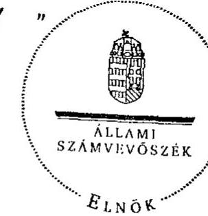
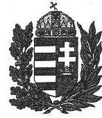
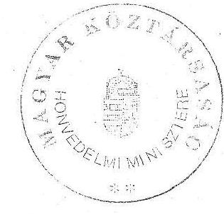
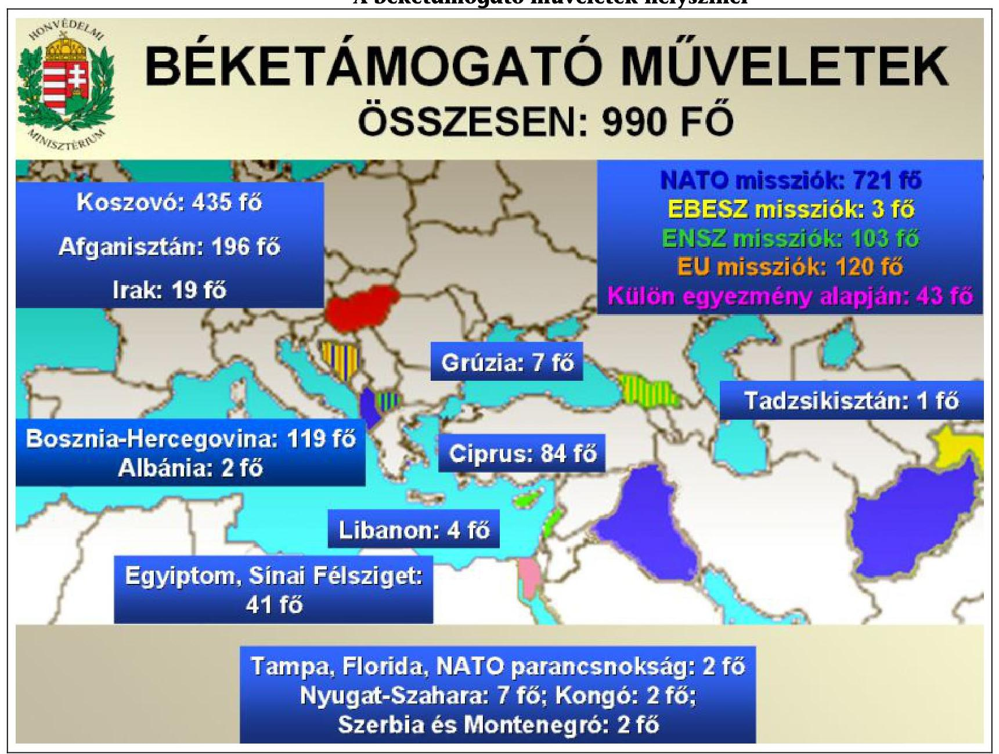
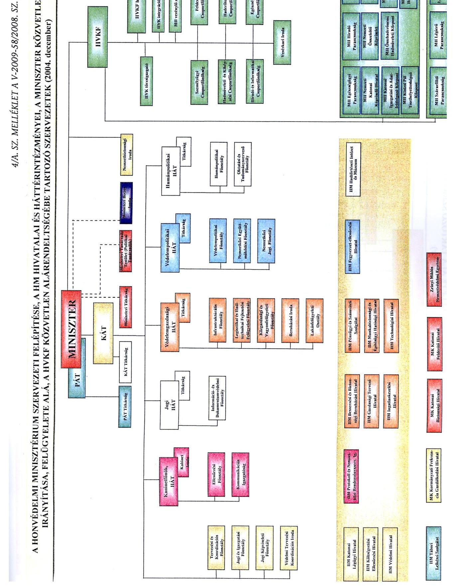
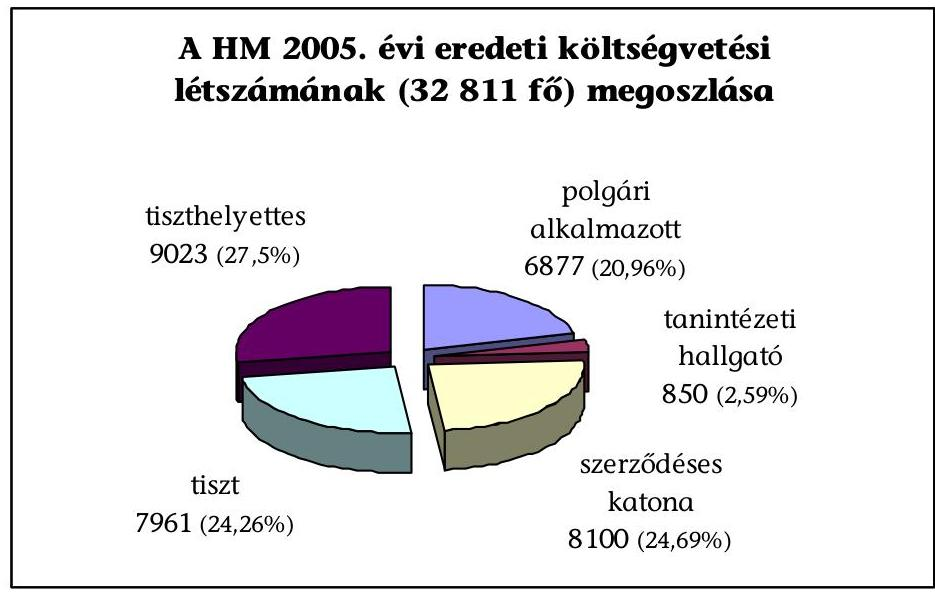
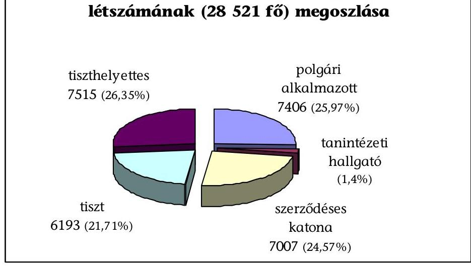
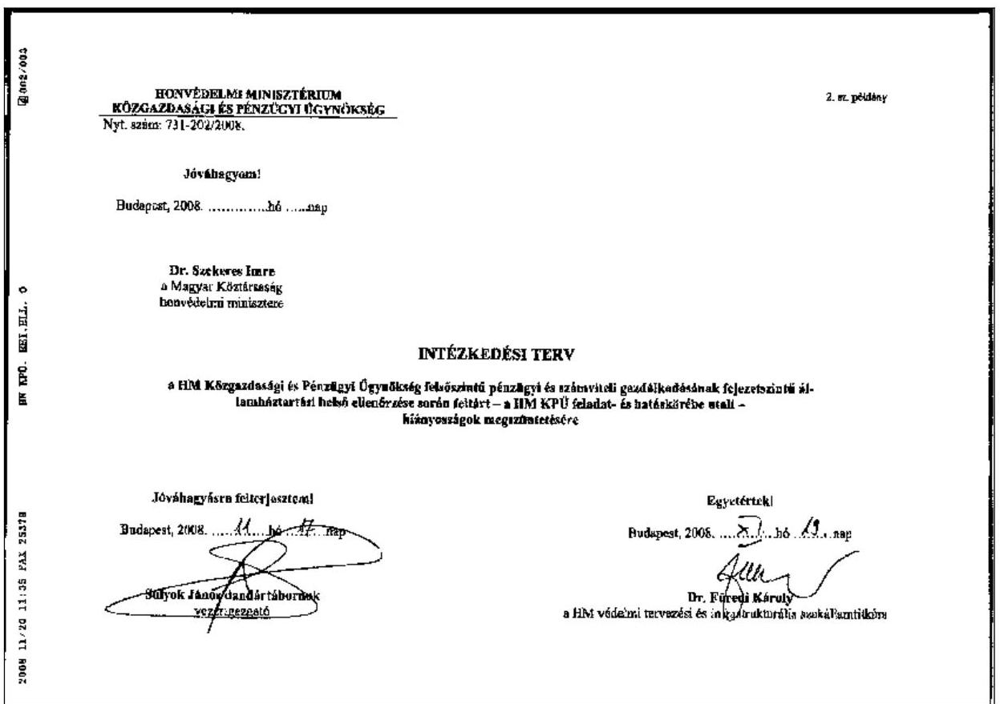
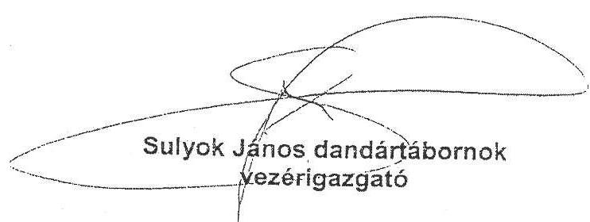

# ÁLLAMI   SZÁMVEVŐSZÉK 

## JELENTÉS

a Honvédelmi Minisztérium fejezet múködésének ellenőrzéséről

---

# 2. Államháztartás Központi Szintjét Ellenőrző Igazgatóság 

2.3. Átfogó Ellenőrzési Főcsoport

Iktatószám: V-2009-58/2008.
Témaszám: 911
Vizsgálat-azonosító szám: V-0417

## Az ellenőrzést felügyelte:

Bihari Zsigmond
föigazgató
Az ellenőrzés végrehajtásáért felelős:
Hegedüsné dr. Müllern Veronika
főcsoportfőnök
Az ellenőrzést vezette:
Hudik Zoltán
főcsoportfőnök-helyettes
Az ellenőrzést végezték:

| Balkay Attila számvevő tanácsos, tanácsadó | Domonkosné Kurilla Edit számvevő tanácsos | Dr. Jártas Ágnes számvevő tanácsos |
| :--: | :--: | :--: |
| Jeszenkovits Tamás számvevő tanácsos | Dr. Király László számvevő tanácsos, tanácsadó | Dr. Pataki Magdolna számvevő tanácsos, főtanácsadó |
| Tóth Bálint számvevő tanácsos, főtanácsadó | Trenovszki István számvevő tanácsos, főtanácsadó | Vásárhelyi Zoltán számvevő tanácsos, tanácsadó |

## A témához kapcsolódó eddig készített számvevőszéki jelentések:

| címe | sorszáma |
| :-- | :-- |
| Jelentés a Honvédelmi Minisztérium egyes gazdálkodási kérdései- | $[78]$ |
| nek vizsgálatáról |  |
| Jelentés a Honvédelmi Minisztérium fejezet pénzügyi-gazdasági | $[151]$ |
| ellenőrzéséről |  |
| Jelentés a Honvédelmi Minisztérium fejezet 1994-95. évi költségve- | $[313]$ |
| tésében és gazdálkodásában a haderőfejlesztési célok érvényesülé- |  |
| sének pénzügyi-gazdasági ellenőrzéséről |  |
| Jelentés a Magyar Honvédségnél a repülőcsapatok múködésének | $[9821]$ |
| pénzügyi-gazdasági ellenőrzéséről |  |
| Jelentés a Honvédelmi Minisztérium fejezet múködésének ellenőr- | $[0017]$ |
| zéséről |  |
| Jelentés a NATO Biztonsági Beruházási Programja (NSIP) keretében | $[0217]$ |

---

Magyarországon megvalósuló fejlesztések ellenőrzéséről
Jelentés a katonai védelmi beruházások ellenőrzéséről ..... [0333]
Jelentés a Magyar Honvédség szárazföldi csapatai múködését szol- ..... [0424]
gáló pénzeszközök hasznosulásának ellenőrzéséről
Jelentés a Magyar Honvédség közbeszerzési rendszerének ellenőrzé- séről
Jelentés a Honvédelmi Minisztérium fejezet múködésének ellenőr- ..... [0535)
zéséről
Éves jelentések központi költségvetés előirányzatai megalapozott- ..... [0338][0449]
ságáról (évente) [0550][0641] ..... [0736]
Éves jelentések a központi költségvetés zárszámadásainak ellenőr- ..... [0443][0540]
zéséről (évente) [0628][0724]

---

# TARTALOMJEGYZÉK 

BEVEZETÉS ..... 9
I. ÖSSZEGZŐ MEGÁLLAPÍTÁSOK, KÖVETKEZTETÉSEK, JAVASLATOK ..... 13
II. RÉSZLETES MEGÁLLAPÍTÁSOK ..... 21

1. A feladatellátás körülményei és kockázatai ..... 21
1.1. A strukturális korszerűsítés eredményessége ..... 21
1.1.1. A szervezeti feltételek átalakulása ..... 21
1.1.2. A létszám változása és kockázatai ..... 25
1.2. A döntéshozatal információs rendszere ..... 28
1.3. A feladatellátás költségvetési háttere és kockázatai ..... 33
1.3.1. A költségvetési gazdálkodás működési mechanizmusa ..... 33
1.3.2. A Tárca Védelmi Tervező Rendszer működtetése ..... 38
1.3.3. A személyi, a múködési és a fejlesztési kiadások megoszlása ..... 42
2. A fejezeti vagyongazdálkodás célszerűsége ..... 48
2.1. A vagyongazdálkodási terv és az ingatlanok értékesítése ..... 48
2.2. A használatból kivont tárgyi eszközök hasznosítása ..... 50
2.3. A HM gazdasági társaságok működtetése ..... 56
2.3.1. A társaságok alaprendeltetése, múködési jellemzői ..... 56
2.3.2. A tulajdonosi felügyelet eszközrendszere ..... 62
2.4. A védelmi beszerzések kontrollrendszere ..... 64
2.4.1. A szabályozás és végrehajtás jellemzői ..... 64
2.4.2. A magyarországi NSIP projektek kontrollja ..... 68
3. A fejezeti irányítás és felügyelet belső kontrollja ..... 71
3.1. A fejezeti irányítás és felügyelet belső kontrollja ..... 71
3.2. Az államháztartási belső ellenőrzés és a FEUVE ..... 73

## MELLÉKLETEK

1. sz. melléklet Észrevétel
2. sz. melléklet A béketámogató múveletek helyszínei
3. sz. melléklet A különböző nemzetközi válságkezelő és béketámogató misz-
sziókban részt vevő erők múködési helyszínei 2007-ben
4./A-B sz. melléklet A HM szervezeti felépítése 2004-ben ill. 2008-ban
4. sz. melléklet A HM fejezet költségvetési létszámának állománycsoporton-

---

|  | kénti megoszlása |
| :--: | :--: |
| 6. sz. melléklet | A honvédelmi tárcától kivált állomány létszámadatai 20052008. |
| 7. sz. melléklet | A HM fejezet létszámának alakulása |
| 8. sz. melléklet | A létszámleépítés állományi kategóriánként és a létszámcsökkentés többletköltsége 2005-2007. években |
| 9. /A-B. sz. melléklet | A HM KPÜ intézkedési terve és a HM KPÜ vezérigazgatói intézkedése |
| 10. sz. melléklet | A HM védelmi beruházási kiadásainak aránya az összkiadásokon belül 2004-2008. években |
| 11. sz. melléklet | A HM költségvetésének GDP arányos alakulása 2004-2009. között |
| 12. sz. melléklet | Kimutatás a HM, MH egyes nemzetközi tevékenységekben való részvételéről 2004-2008. |
| 13. sz. melléklet | A HM társaságok jellemzői 2005-2007. években |
| 14. sz. melléklet | Kimutatás a magyarországi NATO Biztonsági Beruházási Program keretében 2008. márciusig megvalósított, COFFA eljárásban részt vett programokról |

---

# RÖVIDÍTÉSEK JEGYZÉKE 

| ÁEK | Honvédelmi Minisztérium Állami Egészségügyi Központ |
| :--: | :--: |
| AGRA | anyagraktár |
| $A G S$ | Alliance Ground Surveillance (AGS) - NATO Földi Felderítő rendszer |
| Áht. | 1992. évi XXXVIII. törvény az államháztartásról |
| ALTHEA | EU military operation in Bosnia and Herzegovina (Operation EUFOR ALTHEA) - Az Európai Unió irányítása alatt végrehajtott balkáni katonai békefenntartó (ALTHEA) múvelet |
| Ámr. | 217/1998. (XII. 30.) Korm. rendelet az államháztartás múködési rendjéről |
| ARMCOM | HM ARMCOM Kommunikációtechnikai Rt. |
| Arzenál | HM ARZENÁL Elektromechanikai Rt. |
| Ber. | 193/2003. (XI. 26.) Korm. rendelet a költségvetési szervek belső ellenőrzéséről |
| BTR | Páncélozott szállító harcjármú (orosz nyelvű megnevezéséből, rövidítve) |
| BV intézet | Büntetés-végrehajtási intézet |
| COFFA | Certificate of Final Financial Acceptance - Pénzügyi Teljesítésről szóló Záró Igazolás |
| CREVAL | Combat Readiness Evaluation - NATO Szövetséges Európai Fóparancsnokságának alárendeltségébe tartozó, szövetségi múveletekre felajánlott és kijelölt, zászlóaljszintú szárazföldi alegységek alkalmazási készenlétének felmérési és értékelési rendszere. |
| Ctv. | 2006. évi V. törvény a cégnyilvánosságról, a bírósági cégeljárásról és a végelszámolásról |
| CURRUS | HM CURRUS Gödöllői Harcjármútechnikai Rt. |
| EBESZ | Európai Biztonsági és Együttmúködési Szervezet (Organization for Security and Cooperation in Europe - OSCE) |
| ÉBT | éves beszerzési terv |
| ENSz | Egyesült Nemzetek Szervezete |
| EU | Európai Unió |
| EUFOR | European Union Force - az Európai Tanács felügyelete alatt múködő nemzetközi haderő |
| FEUVE | Folyamatba épített, előzetes és utólagos vezetői ellenőrzés |
| FLÚ ATKI | FLÚ Anyagi-Technikai és Közlekedési Igazgatóság. |
| FLÚ ATKI BBO | FLÚ ATKI Biztonsági Beruházási Osztály |
| FLÚ BI | FLÚ Beszerzési Igazgatóság |
| FLÚ GI | FLÚ Gazdasági Igazgatóság |
| FLÚ PTVI | FLÚ Program Tervezési és Vezetési Igazgatóság |
| FLÚ PTVI PIKO | FLÚ PTVI Program Irányító és Követő Osztály |
| GDP | Gross Domestic Product (Bruttó Hazai Termék) |
| GKM | Gazdasági és Közlekedési Minisztérium |
| GSZ | Gazdálkodó szervezet |

---

| HM | Honvédelmi Minisztérium |
| :--: | :--: |
| HM BBBH | HM Beszerzési és Biztonsági Beruházási Hivatal |
| HM Eil Zrt. | HM Elektronikai, Logisztikai és Vagyonkezelő Zrt. |
| HM FLÜ | HM Fejlesztési és Logisztikai Ügynökség |
| HM IÜ | Honvédelmi Minisztérium Infrastrukturális Ügynökség |
| HM JSZÁT | HM jogi szakállamtitkár |
| HM KEHH | HM Központi Ellenőrzési és Hatósági Hivatal |
| HM KPÜ | HM Közgazdasági és Pénzügyi Ügynökség |
| HM KVEH | HM Költségvetési Ellenőrzési Hivatal |
| HM TKF | HM Tervezési és Koordinációs Főosztály |
| HM VGF | HM Védelemgazdasági Főosztály |
| HVK | Honvéd Vezérkar |
| HVKF | Honvéd Vezérkar Főnöke |
| Hvt. | 2004. évi CV. törvény a honvédelemről és a Magyar Honvédségről |
| IAJI | Illetményszámfejtő, Adó- és Járulékelszámoló Igazgatóság |
| IKH | Ingatlankezelési Hivatal |
| IRM | Igazságügyi és Rendészeti Minisztérium |
| ISAF | International Security Assistance Force (Nemzetközi Biztonsági Támogató Erő) |
| JFAI | Joint Final Acceptance Inspection - Közös Záró Átvételi Szemle |
| Kapos BR. | Kapos Bázis repülőtér |
| Kbt. | 2003. évi CXXIX. törvény a közbeszerzésekről |
| KFOR | Kosovo Force (Koszovói kötelék erő) |
| KGIR | A HM költségvetés gazdálkodási információs rendszere |
| KHEM | Közlekedési, Hírközlési és Energiaügyi Minisztérium |
| Ksztv. | 2006. évi LVII. törvény a központi államigazgatási szervekről, valamint a Kormány tagjai és az államtitkárok jogállásáról |
| KVI | Kincstári Vagyoni Igazgatóság |
| LRP | Laktanya Rekonstrukciós Program |
| MFO | Többnemzetiségű Erők és Megfigyelők - Multinational Force and Observers |
| MH | Magyar Honvédség |
| MH ŐBZ | MH Őr- és Biztosító Zászlóalj; a KFOR kötelékében szolgáló önálló, ideiglenes, magyar katonai kontingens |
| MH ÖHP | MH Összhaderőnemi Parancsnokság |
| MH ÖLTP | MH Összhaderőnemi Logisztikai és Támogató Parancsnokság |
| MH SKK | Savaria Kiképző Központ |
| MH TKK | Tapolcai Kiképző Központ |
| MNV Zrt. | Magyar Nemzeti Vagyonkezelő Zártkörűen múködő Részvénytársaság |
| NATO | North Atlantic Treaty Organisation (Észak-atlanti Szerződés Szervezete) |
| NSIP | NATO Security Investment Programme (NATO Biztonsági Beruházási Program) |

---

| NVT | Nemzeti Vagyongazdálkodási Tanács |
| :-- | :-- |
| OGY | Országgyúlés |
| OGY HB | Országgyúlés Honvédelmi Bizottsága |
| OPEVAL | alegység értékelő módszer - Operational Evaluation |
| PM | Pénzügyminisztérium |
| PRT | Tartományi Ujjáépítési Csoport (Provincial Reconsruction Team) |
| RTF | Rendőrtiszti Főiskola |
| SFOR | Stabilization Forces (Stabilizációs kötelék erő) |
| STANAG | Standardization Agreement for procedures and systems and |
|  | equipment components - NATO Egységesítési Egyezmény |
| SZÁT | Szakállamtitkár |
| SZMSZ | Szervezeti és Múködési Szabályzat |
| Szvt. | 2000. évi C. törvény a számvitelről |
| TACEVAL | Alegység felmérő és értékelő program - Tactical Evaluation |
| tü. e. | tüzér ezred |
| TVTR | Tárca Védelmi Tervező Rendszer |
| UNFICYP | ENSz Békefenntartó Erők Cipruson - United Nations Peacekeeping |
|  | Force in Cyprus |
| Vb. e | Vezetés-biztosító ezred |
| Vhr. | 254/2007. (X. 4.) Korm. rendelet az állami vagyonnal való gaz- |
|  | dálkodásról végrehajtási rendelet |
| VTISZÁT | védelmi tervezési és infrastrukturális szakállamtitkár |
| Vtv. | 2007. évi CVI. törvény az állami vagyonról |
| ZMNE | Zrínyi Miklós Nemzetvédelmi Egyetem |

---

.

---

# ÉRTELMEZŐ SZÓTÁR 

| Diszlokáció | egy ország katonai szervezeteinek települése béke időszakban.   Esetenként a szervezet új helyre történő költözését is jelenti. |
| :--: | :--: |
| Feltölthető   létszám | a rendszeresített létszámnak az a része, amellyel a kiképzési, napi   feladatait a szervezet szükségszerúen végre tudja hajtani, nagyságrendjét a fejezet költségvetési helyzete is befolyásolja. |
| Fogyasztói   logisztika | a logisztika alrendszere, amely a késztermék átvételével, raktározásával, szállitásával, karbantartásával (beleértve az állagmegóvást szolgáló javításokat), múködtetésével, valamint a tárcához újonnan beérkezett állománytáblás anyagok és eszközök kiadásával és az egyéb anyagok elosztásával foglalkozik. A fogyasztói logisztikához tartozik a készletek ellenőrzése, az eszközökkel és anyagokkal való ellátás, mozgatás-szállítás,a kapcsolatos kiképzés. |
| Hideg   kapacitás | a gazdaságmozgósítási feladatra kijelölt szolgáltató békeidőszakban nem üzemelő hadiipari szolgáltató kapacitása. |
| Host Nation | az a NATO tagország, melynek területén a biztonsági beruházást megvalósítják (kivételesen lehet valamelyik NATO ügynökség is) |
| Költségvetési   létszám | a fejezet éves költségvetését meghatározó törvényjavaslat előkészítése során alapul vett létszámkeret, melynek foglalkoztatásához szükséges előirányzatot a költségvetési törvény biztosítja. |
| Rendszeresített létszám | állománytáblában, munkaköri jegyzékben meghatározott, konkrét beosztások, munkakörök összessége, azt mutatja, hogy az adott katonai szervezet békeidőszaki feladatát milyen létszámmal és összetétellel (tiszt, tiszthelyettes, tisztes, szerződéses legénységi, polgári) tudja végrehajtani. |
| Szakirányítás | a szakmai elöljáró (felettes) azon joga és kötelezettsége, amely alapján szakterületén normatív intézkedéseket ad ki a jogszabályokban és az állami irányítás egyéb jogi eszközeiben meghatározottak végrehajtására; a szakterületéhez tartozó, általa irányított tevékenység egységes gyakorlatának kialakítása érdekében dönt a végrehajtás során felmerült vitás kérdésekben, illetve állásfoglalás kiadásával biztosítja a szakmai feladatok egyöntetú végrehajtását |
| Termelői   logisztika | a logisztikának azon alrendszere, amely a hadfelszerelés kutatásával, tervezésével, fejlesztésével, gyártásával, ipari javításával, a meglévő hadfelszerelés felújításával és a hadfelszerelés beszerzésével, a tárcához újonnan beérkezett állománytáblás anyagok és eszközök elosztásával, rendszerbe állításával és rendszerből való kivonásával, megsemmisítésének előkészítésével foglalkozik. |
| TVTR -   Tárca   Védelmi   Tervező   Rendszer | a HM olyan képesség- és feladatorientált tervezési rendszere, amely biztosítja a biztonsági és védelempolitikai alapdokumentumokban támasztott igényeknek, követelményeknek, valamint a nemzeti és nemzetközi elvárásoknak megfelelő, múködőképes magyar haderő fejlesztési, kiképzési, múködés-fenntartási és alkalmazási feladatainak, illetve a feladatok végrehajtásához szükséges erőforrásoknak a teljes körú számbavételét, a rendelkezésre |

---

álló erőforrások képességekhez, illetve feladatokhoz történő rendelését, továbbá az erőforrások célszerű és gazdaságos felhasználásával biztosítja a feladatok eredményes végrehajtását.

---

# JELENTÉS   a Honvédelmi Minisztérium fejezet múködésének ellenőrzéséről 

## BEVEZETÉS

Az Országgyűlés (OGY) 1998-ban hozott, a Magyar Köztársaság biztonság- és védelempolitikájának alapelveiről szóló határozata országunk biztonságát két alapvető pillérre építette: egyfelől nemzeti önerejére, másfelől az euroatlanti integrációra és a nemzetközi együttműködésre. ${ }^{1}$ Miközben $a$ biztonság értelmezése átfogóvá vált, bővült a biztonsági kockázatok köre (terrorizmus, illegális migráció, szegénység stb.), melyeket globális, regionális és belső kihívásokként határozott meg a Nemzeti Biztonsági Stratégia. ${ }^{2}$ Az OGY ezekre, valamint a költségvetési forrás-lehetőségekre figyelemmel, és építve NATO csatlakozásunk tapasztalataira, 2004-ben határozott a Magyar Honvédség (MH) hosszú távú átalakításának fő irányairól. ${ }^{3}$ E célok mentén rögzítette a honvédelemről és a Magyar Honvédségről szóló - 2005. január 1-jétől hatályos - új törvény ${ }^{4}$ (Hvt.) a honvédelem alapjait és a honvédelmi képesség biztosítékait, egyúttal meghatározta a honvédelem irányítására és múködésére vonatkozó szabályokat is.

2006 májusában a kisebb és hatékonyabb állam stratégiai célja keretében Kormányprogram ${ }^{5}$ rögzítette, hogy négy éven belül „a Magyar Honvédség egy modern, expedíciós feladatokat tartósan ellátni képes szervezet legyen, amely vezetői létszámában, háttérintézményeiben jelentősen karcsúbb, de hatékonyabb struktúrában, a „nemzet intézményeként" biztosítsa állampolgárai biztonságát, országhatáron belül és kívül egyaránt."

A Magyar Honvédség (MH) felső szintű vezetési rendjét a Hvt. hatályba lépése után 2005-ben, majd a Kormányprogramot követően 2006-ban kormányhatározatok módosították. A honvédelmi miniszter, az államháztartás konvergencia követelményeknek is megfelelő egyensúlyi helyzete megalapozására vonatkozó 2118/2006. (VI. 30.) Korm. határozat alapján, utasításban határozta meg

[^0]
[^0]:    ${ }^{1}$ 94/1998. (XII. 29.) OGY határozat a Magyar Köztársaság biztonság- és védelempolitikájának alapelveiről
    ${ }^{2}$ 2073/2004. (IV. 15.) Korm. határozat a Magyar Köztársaság nemzeti biztonsági stratégiájáról
    ${ }^{3}$ 14/2004. (III. 24.) OGY határozat a Magyar Honvédség hosszú távú átalakításának fő irányairól, valamint a NATO szervezetébe integrálható fegyveres erő létrehozásáról.
    ${ }^{4}$ 2004. évi CV. törvény a honvédelemről és a Magyar Honvédségről (Hvt.)
    ${ }^{5}$ Új Magyarország. Szabadság és szolidaritás. A Magyar Köztársaság Kormányának programja 2006-2010. 2006. 05. 30. H/64. OGY Iromány. 14-15.o.

---

az MH feladataihoz igazodó, kisebb létszámú, hatékonyabb és költségtakarékosabb szervezeti struktúra kialakításához szükséges lépéseket, a Honvédelmi Minisztérium (HM) új felépítését. ${ }^{6}$

A változó kormányzati elképzelések és intézkedések, a Kormány által meghirdetett államreform és a közigazgatás korszerűsítése, a költségvetés egyensúlyának megbomlása és az emiatt bekövetkező megszorítások a Magyar Honvédség fejlesztési feladatainak átütemezését tették szükségessé. Az MH további fejlesztésének irányait az 51/2007. (VI. 6.) OGY határozat állapította meg, további határozatok rögzítették az átalakítás időszakában elérhető rendszeresített létszám felső határát. (Legutóbb a 83/2008. (IX. 18.) OGY határozat 2008. december 1-jei hatállyal 24950 fóben határozta meg azt.) Az egymást követő intézkedések hatására az elmúlt öt évben összesen közel egyharmadával csökkent az MH és közel felével a HM létszáma.

A Kormány 2006-ban az államháztartás hatékony működését elősegítő szervezeti átalakításokról döntött, ${ }^{7}$ ami többek között az üzemeltetési-ellátási feladatok központosítását szolgálta. A honvédelmi tárca tekintetében azonban elmaradt a központosításba történő bevonás célszerűségének mérlegelése, amit a szabályozási-múködési sajátosságai tesznek indokolttá. Ezzel összefüggésben a közelmúltban befejezett, a magyar közigazgatás modernizációját áttekintő számvevőszéki ellenőrzés jelentésében ${ }^{8}$ fogalmaztunk meg javaslatot a Kormány részére.

Magyarország nemzetközi katonai kötelezettségvállalása 1995-től folyamatos, jelenleg az ENSZ, az EBESZ, az MFO, a NATO vezette békemissziókban vesz részt. A nemzetközi szerepvállalásban érintett létszám közel 1000 fő (2. és 3. sz. mellékletek). A NATO Biztonsági Beruházási Programja (NSIP) keretében a Magyarországon megvalósított, illetve tervezett, jóváhagyott költségvetéssel rendelkező projektek száma 51, melyek költségvetéséből a NATO-t 39700 M Ft terheli, a már megvalósított NSIP beruházásokra 26356 M Ft került eddig kifizetésre. Magyarország a NATO összes tagországbeli biztonsági beruházásához eddig 8262 M Ft-tal járult hozzá.

Az államháztartásról szóló 1992. évi XXXVIII. törvény felhatalmazást adott a Kormány részére az általánostól eltérő részletes szabályok meghatározására. A honvédelmi szervek, a HM és a felügyelete alá tartozó szervezetekre vonatkozóan az államháztartás múködési rendjétől eltérő gazdálkodás szabályairól a Kormány 2004-ben rendelkezett (226/2004. (VII. 27.) Korm. rendelet).

[^0]
[^0]:    ${ }^{6}$ 114/2006. (HK 21.) HM utasítás az államháztartás hatékony működését elősegítő szervezeti átalakításokról és az azokat megalapozó intézkedésekről szóló 2118/2006. (VI. 30.) Korm. határozatban foglalt feladatok, továbbá az MH katonai szervezetei ezzel összefüggő egyes feladatainak végrehajtásáról
    ${ }^{7}$ 2118/2006. (VI. 30.) Korm. határozat az államháztartás hatékony múködését elősegítő szervezeti átalakításokról és az azokat megalapozó intézkedésekről
    ${ }^{8}$ Lásd: Jelentés a magyar közigazgatás modernizációjának ellenőrzéséről [9101] 2009. január

---

A honvédelmi szervek gazdálkodása alapvetően természetbeni ellátáson alapuló központi gazdálkodás keretében valósul meg. A központi gazdálkodás a honvédelmi szervek feladatai ellátásához szükséges erőforrások tervezésére, beszerzésére és kezelésére, valamint a HM költségvetési fejezet költségvetési előirányzatai tervezésére, teljesítésére és elszámolására irányuló gazdálkodási tevékenységek összessége.

Az Állami Számvevőszék 2005-ben végzett átfogó pénzügyi-gazdasági ellenőrzést a HM fejezetnél. Ezt megelőzően 2002-ben a NATO NSIP keretében Magyarországon megvalósuló fejlesztéseket, 2003-ban a katonai védelmi beruházások rendszerét, 2004-ben a Magyar Honvédség Szárazföldi csapatai múködtetését szolgáló pénzeszközök hasznosulását, valamint a Magyar Honvédség közbeszerzési rendszerének múködését teljesítmény-ellenőrzés keretei között értékelte. Emellett az Állami Számvevőszék a fejezeti költségvetés tervezését, valamint a zárszámadását évente ellenőrizte.

A jelen ellenőrzés célja annak értékelése volt, hogy a Honvédelmi Minisztérium fejezet:

- irányítási, múködtetési rendje és szervezeti kialakítása megfelelően igazo-dott-e a jogszabályokban, az állami irányítás egyéb szabályzóiban meghatározott feladatokhoz és a szövetségi feladatvállalásokhoz;
- költségvetési gazdálkodás rendje (a költségvetés tervezési, végrehajtási és beszámolási gyakorlata, forráselosztási, döntési és belső ellenőrzési rendszere) megfelelően támogatta-e a honvédség feladatainak végrehajtását, biztosítékot jelentett-e a gazdálkodási előírások betartásához, az erőforrások valamint a vagyon védelméhez; a vezetői irányítási, felügyeleti tevékenységeket kiszolgáló pénzügyi-gazdasági információs rendszerek kialakítása, informatikai támogatottsága segítette-e a teljesítések, illetve az erőforrásfelhasználás figyelemmel kísérését;
- védelmi beszerzésekre, valamint a magyarországi NSIP projektekre kiterjedő belső kontrollrendszere biztosította-e az érintett honvédelmi szervezetek eljárásaiban a hazai és nemzetközi előírások betartását, a feladataik gazdaságos megvalósítását;
- szervezetei belső kontrollrendszerük fejlesztésében hasznosították-e a korábbi számvevőszéki ellenőrzések megállapításait, ajánlásait.

Az átfogó ellenőrzés a HM fejezet belső kontroll (szabályozási, irányítási, ellenőrzési), továbbá információs-informatikai, számviteli rendszerére irányult, annak rendszerszemléletű értékelése céljából, hogy kiépítése, múködtetése megfelelően igazodott-e a gazdálkodási feladatok ellátásához, az erőforrások védelméhez, a megbízható információ-szolgáltatási, valamint beszámolási kötelezettségek teljesítéséhez.

Áttekintettük a HM fejezet felügyeletét ellátó szerv főbb (ágazatirányító, döntéshozatali, forráselosztó, belső ellenőrzési) funkcióit, az olyan tényezők, kontrollhiányosságok (együtt: kockázatok), illetve hibák feltárása érdekében, amelyek közvetlenül vagy hosszabb távon veszélyeztethetik a honvédelmi feladatok teljesítését. Vizsgáltuk a gazdasági tevékenységet támogató informatikai háttér

---

kiépítettségét, múködési feltételeit, szabályozási környezetét, az informatikai rendszer alkalmazásával nyert információk megbízhatóságát, a vezetői döntés előkészítésben, a kontrollmechanizmusban való hasznosulását.

Az ellenőrzés a minisztérium szervezeti egységeinél, hivatalainál, háttérintézményeinél és az MH érintett szervezeteinél kiterjedt a tevékenységük szabályozottságára, a szervezeti és személyi feltételek kialakításának célszerűségére, az államháztartási belső ellenőrzés rendszerének működtetésére. Az ellenőrzés kitért a védelmi beszerzések eljárási rendje szabályozásának, végrehajtásának, valamint a közbeszerzési tevékenységet végző szervezetek magatartását befolyásoló kontrollok rendszerszemléletű értékelésére. Érintette továbbá a magyarországi NSIP projektek megvalósításában közreműködő szakterületek feladatellátását, együttműködését, a NATO ellenőrzések pozitív értékelése érdekében az eljárási és elszámolási rend alkalmasságát.

Az ellenőrzés a fejezeti irányítás és gazdálkodás 2005-2008. közötti időszakát fogta át, ezen belül hangsúlyozottan az utóbbi két év feladatellátására irányult. Az átfogó ellenőrzés időszakában készítettük elő a fejezet 2009. évi költségvetése tervezésének ellenőrzését az ÁSZ hatáskörébe tartozó területeken.

Az átfogó ellenőrzés keretében előkészítettük a HM fejezet 2008. évi költségvetése végrehajtásának pénzügyi-szabályszerúségi (megbízhatósági) ellenőrzését. A külön program alapján végrehajtásra kerülő megbízhatósági ellenőrzés megállapításait a Magyar Köztársaság 2008. évi költségvetése végrehajtásának ellenőrzéséről szóló jelentés fogja tartalmazni.

Az ellenőrzés végrehajtására az Állami Számvevőszékről szóló 1989. évi XXXVIII. törvény 2. § (3), és (5), valamint a 17. § (3) bekezdésben foglaltak adtak jogszabályi alapot.

A jelentést az Állami Számvevőszékről szóló 1989. évi XXXVIII. törvény III. fejezet 25. § (1) bekezdésének megfelelően észrevételezésre megküldtük Dr. Szekeres Imre miniszter úrnak, aki észrevételt nem tett. A Miniszter úr levelében (1. sz. melléklet) jelezte továbbá, hogy az ellenőrzés alapján elrendelt intézkedéseiről a törvényes határidőn belül tájékoztatást ad.

---

# I. ÖSSZEGZŐ MEGÁLLAPÍTÁSOK, KÖVETKEZTETÉSEK, JAVASLATOK 

A honvédelmi tárca a rendszerváltás óta múködésének legmozgalmasabb periódusát élte át az utóbbi öt évben, ami - a több lépcsőben végrehajtott átszervezések nyomán - az irányítási és végrehajtási rendszere egészét átfogó strukturális és múködési korszerűsítését eredményezte. A változások hátterében egyrészt a haderő átalakítás keretében elhatározott, saját kezdeményezésű egyszerűsítési törekvései, másrészt - ezek mellett és ezektől függetlenül - a Kormány konvergencia követelményeket követő, közigazgatási hatékonyságot fokozó célkitűzései ${ }^{9}$ álltak. A szervezeti átalakítások azonban 2009-ig még nem támaszkodhattak elfogadott katonai stratégiára, ${ }^{10}$ továbbá a kormányzati előírások sem alapultak megfelelő, előzetes hatásvizsgálatokon.

Az ágazati (honvédelmi) sajátosságok érvényesítésére a központi kormányzati szervezetek új modellje ${ }^{11}$ nem tért ki, azt a honvédelmi törvény alapján külön kormányhatározat szabályozta. A minisztériumi vezetői hatáskörök gondos szabályozásával a hatás- és jogkörök tekintetében alapvetően működőképes megoldások jöttek létre. A hatékonyságot növelő átalakítások eredményeként a kabinetfőnök - nem állami vezetői jogállásban - koordinálja az állami vezetők tevékenységét, irányítja a miniszter hatáskörébe tartozó döntések előkészítését, valamint végrehajtásuk tervezését, szervezését, illetve felelős a minisztérium egészének koordinált múködéséért.

A racionalizálási folyamat során a fejezet felügyeletét ellátó szerv belső ellenőrzési feladatait végző - a jogi szakállamtitkár irányítása alatt álló - hivatali szervezethez hatósági feladatokat is rendeltek. Ez ugyan nem sérti a belső ellenőrzés függetlenségét a gazdálkodástól, azonban nem elégíti ki az ellenőrzési tevékenység kizárólagosságára vonatkozó hatályos jogszabályi követelményt. ${ }^{12}$

A tárca struktúrája átláthatóbbá vált: a korábbi 32 hivatal és intézmény 7 szervezetben látja el feladatait, csökkentek a minisztériumi vezetői szintek (4/A., 4/B. sz. mellékletek), a termelői és fogyasztói logisztika hatásköreinek rendezésével megszüntették a gazdálkodási jogköröknek a korábbi időszakot jellemző HM-MH párhuzamosságait. Ugyanakkor az átalakításoktól várt megtakarítás mértéke nem volt számottevő, így nem válhatott a fejlesztés, illetve múködés

[^0]
[^0]:    ${ }^{9}$ Pl. a 2118/2006. (VI. 30.) Korm. határozat az államháztartás hatékony múködését elősegítő szervezeti átalakításokról és az azokat megalapozó intézkedésekről
    ${ }^{10}$ A tárca 2005-ben elkészítette a Nemzeti Katonai Stratégia (NKS) tervezetét, a HM Kollégium és a Nemzetbiztonsági Kabinet megtárgyalta és további egyeztetésre alkalmasnak találta. Az NKS elfogadása elhúzódott, arról az 1009/2009. (I. 30.) Korm. határozat rendelkezett.
    ${ }^{11}$ 2006. évi LVII. törvény a központi államigazgatási szervekről, valamint a Kormány tagjai és az államtitkárok jogállásáról
    ${ }^{12}$ 67/2007. (IV. 11.) Korm. rendelettel módosított 193/2003. (XI. 26.) Korm. rendelet a költségvetési szervek belső ellenőrzéséről 4. § (5) bek.

---

hiánypótló forrásává. A változatlan feladatellátáshoz rendelt szervezetek számának és ezek létszámának csökkentése úgy a fejezeti irányítás (minisztérium), mint a Magyar Honvédség alakulatainál túlterheltséget, túlmunkát eredményezett, a megbízással foglalkoztatottak növekedését hozta magával, ezek pedig növelték a költségeket.

A források kiszámíthatósága, stabilizálódása a nemzeti költségvetés kedvezőtlen irányú változásai következtében nem valósult meg, így a 10 éves tervek az aktualizálás, a gördítés mellett sem adhattak megbízható alapot az éves költségvetési tervek elkészítéséhez. A Tárca Védelmi Tervező Rendszer alkalmazása és fokozatos finomítása sem tudta a források módosulásából adódó kockázatot minimalizálni, illetve megszüntetni. A kormányhatározattal 2006. évvel kezdődően tervezett 1,81\%-os GDP arányos védelmi kiadások vállalásának - ezzel a haderő technikai felszereltsége, infrastruktúrája, illetve az állomány élet- és munkakörülményei NATO-haderők átlagszínvonalához való közelítésének - nem volt realitása.

A hiányzó erőforrást a tárca oly módon igyekezett „kiegyesúlyozni", hogy az adott időtávra annyi priorizált feladatot tervesítettek, ami a kötelezettségvállalásoknak éppen megfelelt. A kritikus helyzeteket részben a fejezeti egyensúlyi tartalék felhasználásával, részben a kért, illetve kapott évközi póttámogatásokkal tudta a tárca áthidalni. Ezek gyakorisága azonban nem a tervszerű költségvetési gazdálkodás jellemzője. (Szemléletváltozást tükröz az ez év február 4étől hatályos Nemzeti Katonai Stratégia, miszerint a Kormány tervszerűen úgy kívánja növelni a védelmi kiadások költségvetési támogatását, hogy az 2013ban meghaladja a GDP 1,3\%-át.)

Az OGY, illetve a kormányzati szabályozások keretein belül meghatározott honvédségi létszám alapvetően a finanszírozási lehetőségek mentén alakult (5. sz. melléklet). Ugyanakkor a kiáramlás - elsősorban a folyamatos átszervezés miatt érintetteknél, a bizonytalan élethelyzetek elkerülése érdekében - nagyobb mértékű volt, mint ahogy azt a szervezeti változások szükségessé tették (6. sz. melléklet). Emellett az állományarányok is kedvezőtlenül alakultak (tisztek, tiszthelyettesek nyugdíjba vonulása következtében), aminek egyenes következményeként a honvédségi egységeknél jelentkezett a tapasztalt vezetés hiánya. Ezek összességükben az állományt és a felkészítés (ezek között a nemzetközi szolgálatra alkalmas csapatok gazdaságos kiképzésének) eredményességét veszélyeztető tényezőkké váltak, ami az MH képességei romlását, egyben az OGY költségtakarékossági követelményeivel ${ }^{13}$ való ellentmondást váltotta ki.

Különösen kritikus méretűre csökkent az élőerő kulcsfontosságú eleme, a legénységi állomány, alapvetően a honvédség vonzerejének csökkenése (versenyképtelen jövedelem és juttatások) következtében. A szükséges méretű létszám ${ }^{14}$ toborzásához és megtartásához a honvédelmi tárca cselekvési lehetőségei korlátozottak (toborzási stratégia készítése, érdekvédelem elősegítése stb.). A

[^0]
[^0]:    ${ }^{13}$ 51/2007. (VI. 6.) OGY határozat a Magyar Honvédség további fejlesztésének irányairól, 5. a) pont
    ${ }^{14}$ A legénységi állomány négy éven belüli pótlásához - egyúttal a védelmi képességek teljesíthetőségéhez - évi 1900 fő toborzási igényt kell kielégíteni.

---

honvédség vonzerejének növelése koordinált - munkaerő-piaci, társadalombiztosítási, oktatási - kormányzati szintű megoldások ${ }^{15}$ mérlegelésének szükségességét igényli, aminél napjainkban az ország (nem a honvédség) szövetségi kötelezettségei szembesülnek a nemzetgazdaság egyébként is beszűkült lehetőségeivel. (A témakörrel szorosan összefügg az önkéntes tartalékos rendszer múködésével kapcsolatos szabályozás rendezése is, mely folyamatban van.)

A honvédség logisztikai támogatása több esetben (pl. szállítási infrastruktúra, mérőmúszerek, missziós felszerelések, karbantartások területén) a minimálisra korlátozódott, olykor a katonai tevékenységet is hátráltatóan hiányos volt (pl. gyakorlat elmaradása üzemanyaghiány miatt). A költségvetési támogatás visszafogása következtében a fejlesztések halasztása a meglévő eszközök üzemeltetésére, rendszerben tartására fordított kiadások növekedésében éreztette (érezteti) hatását. Az esedékes karbantartási és felújítási munkák, továbbá a munkabiztonsági feladatok elhalasztása - az infláció és a korszerűsödés hatásait is figyelembe véve - nyilvánvalóan többlet költségeket indukál a jövőre nézve, a felhalmozódott logisztikai szükségletek egyidejű, sürgető kielégítésének igénye miatt.

Az igények és lehetőségek vonatkozásában rendre megbomló költségvetési egyensúly helyreállítása jellemzően a haderő- és képesség-csökkentéssel járt együtt. A kormányzat átfogó takarékossági és szerkezet módosítási programjainak hatásai a korábban megkezdett haderőreformot olyan kényszerpályákra terelték, melyeken a hazai védelmi erő visszafogottabb fejlesztése mellett a korábbi szövetségi vállalások elhalasztására (pl. földfelszíni felderítő rendszerek) is sor került. Ezzel együtt a honvédelmi tárca a nemzetközi feladatai teljesítését kiemelt prioritással kezelte, ami a gyakorlatokon rendszeresen elért jó és megfelelt minősítéseivel, a nemzetközi missziók sikereivel volt mérhető. A NATO biztonsági beruházásai (NSIP) magyarországi projektjeinek szabályosságát a szervezeti átalakítások nem veszélyeztették. Az ez évi COFFA ellenőrzésre való felkészülés keretében a kifizetések dokumentumai valóságnak megfeleltek, a nyilvántartásokat folyamatosan, áttekinthetően vezetették.

A tárca működési kockázatai - feladatainak sajátosságai miatt - egyben stratégiai kockázatokként is értékelhetőek, mivel a fejlesztési forrásokhoz igazodás általában megváltoztatta a koncepciókat (az MH korábbi vezetésének megfogalmazásában: „felborították a tervek egyensúlyát, törékennyé tették a programok konzisztenciáját"). ${ }^{16}$ A 2009-2018. évek stratégiai céljait a tárca kizárólag a tervezett tartalék lehívhatósága esetén látja teljesíthetőnek. Mindezek tükrében a tárca kockázatkezelő képessége az elmúlt időszakban - a belső szervezési/vezetési eszközeinek korszerűsítésén túl - lényegében nem változott, lehetőségei korlátozottak maradtak (a honvédelmi miniszter az adott évi költségvetési törvényekben rendszeresen felhatalmazást kapott az előirányzatok általános szabályoktól eltérő, a pénzügyminiszter előzetes egyetértése alapján történő átcsoportosítására). Előrehaladás volt érzékelhető abban, hogy a jellemzően passzív - a bekövetkezett kockázatokat eltűrő, illetve utólag korrigáló - kocká-

[^0]
[^0]:    ${ }^{15}$ Más országoknál alkalmazott gyakorlat: nyugdíj kiegészítő járadék, támogatott vagy ingyenes továbbtanulás, lakhatási vagy lakástámogatás stb.
    ${ }^{16}$ Szenes Zoltán: Magyar Honvédség a NATO-ban. Hadtudomány 2006. 4. sz.

---

zatkezelés a megelőzés irányába mozdult el (miniszteri szintű kockázatkezelési szabályzat kiadásával, feladatok következetes számonkérésével, a NATO-nak tett, a hazai költségeket kímélő javaslattal). Ugyanakkor az egyensúlyi tartalékok felhasználására épülő hosszú távú stratégia veszélyes és tarthatatlan. Ezért az időtálló nemzeti és szövetségi feladatvállalások teljesíthetősége megkívánja, hogy azokat a realitások talaján álló Nemzeti Katonai Stratégia alapozza meg (amire csak az NKS elfogadását követően nyílt lehetőség).

A katonai és a gazdasági kérdéseket egymással való összefüggésükben, kölcsönhatásukban vizsgáló tárcaszintű kontrolling ellátásához szükséges adatbázist még nem sikerült létrehozni. A tárcánál folyó kontrolling tevékenység részterületekhez kötődött. Így például a honvédség képességeinek két kulcsterületét - a humán és személyügyi állapot változást valamint a haderő-átalakítást - folyamatos és színvonalasan végzett monitoring és kontrolling tevékenység kísérte kiemelt figyelemmel. Ezzel együtt a folyamatok még nem kerültek abba a stádiumba, hogy a nemkívánatos jelenségeket (pl. a tiszti állomány kiáramlását, a toborzás alacsony eredményességét) a vezetés időben megelőzze, vagy kellő időben kezelje. (Az MH megtartó képességének erősítését szolgáló programcsomag alapján, a 2008 októberében, kabinetfőnök által jóváhagyott feladatterv végrehajtását megkezdték.)

A vezetői információs rendszer részeként a feladattervezéshez kapcsolódó információszolgáltatás mechanizmusa biztosította a vezetői döntéshozatalhoz szükséges információkat, informatikai támogatottsága azonban még számos területen fejlesztésre, kiegészítésre szorul. Az informatikai szakterület feladatellátását hátrányosan érintette az irányításáért, felügyeletéért felelős szervezeti egységek többszöri, hatásköri átalakítása. Azáltal, hogy a HM informatikai rendszerét nagyszámú önálló hálózat együttesen alkotja, kevésbé átlátható, nehezen menedzselhető, magas az erőforrás igénye. Az informatikai területen továbbra is jelentős szakadék van az igények és a lehetőségek között (2008-ban a forrásigény harmada vált tervezhetővé).

Pozitív áttörést jelentett (a korábbi számvevőszéki ellenőrzés óta), hogy megfelelő szemléletben elkészült a HM informatikai célkitűzéseit, fejlesztéseit, helyzetértékelését, jövőképét, a tárca átfogó informatikai problémáira megoldásokat tartalmazó informatikai stratégia. A megvalósíthatóságát azonban bizonytalanná teszi, hogy az előremutató célok között a 10 éves tervben nem szerepeltek egyes új, magas prioritású feladatok, mint például az e-kormányzati fejlesztések, a Logisztikai Információs Rendszer pénzügyi forrásai.

Az informatikai szabályozórendszer összességében - a korábbi számvevőszéki ellenőrzés óta - mégsem korszerűsödött a tárca intézkedési tervében 2006ra ütemezett mértékben, annak végrehajtását a szervezeti átalakítások előkészítése háttérbe szorította. Az informatikai tevékenységek vonatkozásában továbbra sem rendelkeztek megfelelő átfogó szabályozással, követelményrendszerrel (az 1993. évben kiadott MH Informatikai Szabályzat elavult és hiányos). A tárcaszintű átfogó információrendszer kialakítását, az egyes szakmai rendszerek egymás közötti adatcseréjét mindeddig a központi fejlesztés és irányítás egységes felsőszintű vezetőszervének, valamint az egységes adatmodellnek a hiánya hátráltatta. A döntéshozatal számára korlátozottan hasznosulhatott a Költségvetés Gazdálkodási Információs Rendszer (KGIR), mivel nincs védelmi

---

tervezési modulja, ami közvetlen kapcsolatot teremthetne a rövid távú és a hosszú távú tervezés között, a toborzási modul elavult adatai pedig korlátozottan alkalmas információkat szolgáltatnak a feltölthető beosztásokról.

A tárca vagyongazdálkodása megalapozottságát kedvezőtlenül befolyásolták a haderő-átalakítás folyamatának forrásfüggő módosításai, lényegében egy hosszú távú, stabil fejlesztési koncepció hiánya, ami nem vezetett időtávokban konzisztensen megalapozott tervekhez. Előfordult, hogy megkezdett rekonstrukciók, fejlesztések rövidebb-hosszabb idő után - a haderőátalakítással összefüggésben - feleslegessé váltak (pl. veszélyeshulladék-gyűjtő kialakítása, Pétervására; BTR lőtér rekonstrukciója, Csorna,). Jelentős volt az az összeg ( $733,4 \mathrm{M} \mathrm{Ft}$ ), amely az időközben felszámolásra került honvédségi objektumokban került felhasználásra (pl. MH Kapos BR, Taszár; MH SKK, Szombathely; MH TKK, Tapolca).

Az állami vagyonról szóló törvényi szabályozás ${ }^{17}$ az állami vagyon feletti tulajdonosi jogokat és kötelezettségeket új alapokra helyezte. A törvény a költségvetési szervek egyes típusai - ezek között a honvédelmi szervek - állami vagyonnal való speciális gazdálkodási feladataira vonatkozóan az eltérő szabályozás lehetőségét is biztosította (Vtv. 71. § (1) bek. h) pont), ez azonban kiadásra még nem került.

A tárca szakmai feladatai ellátásához szükséges vagyonelemek (ingó- és ingatlan vagyon, gazdasági társaságok stb.) kezeléséhez igazodó együttmúködési megállapodást a HM és az MNV Zrt. megkötötte, a törvényi előírásnak megfelelő vagyonkezelői szerződést 2008-ban aláírták. Az önkéntes haderőre történt átállással és a Honvédség létszámának csökkentésével összefüggésben megnőtt a feleslegessé vált ingatlanok száma, amelyek értékesítése minden esetben értékbecslés alapján, szabályosan, dokumentáltan történt. Ugyanakkor az új helyzetben lebonyolított értékesítés tapasztalatai alapján a szabályozási háttér még nem nyújt megfelelő eligazítást a feleslegessé vált ingatlanok őrzési, állagmegóvási kötelezettségével, valamint az átadás-átvétel rendjével kapcsolatos kérdések általánostól eltérő kezeléséhez, elmaradt a tárca szintű szabályozás aktualizálása is.

Az eszközök, anyagok feleslegessé - inkurrenssé - nyilvánítása szabályos keretek között történt, értékesítésük viszont - speciális jellegük miatt - nem haladt a szándékolt ütemezéssel, az eladások mennyisége és bevételei nem igazolták a tervezett megtakarítást, illetve nem tették lehetővé az inkurrencia raktárként használt ingatlanok kiürítését, feleslegessé való nyilvánítását. Ebben szerepe volt úgy az értékesítési rendszer, az értékbecslő foglalkoztatás hiányosságainak (nyilvántartási és raktározási hibák, informatikai támogatás hiányosságai, összeférhetetlenség kikötésének hiánya, pályázatokban az alulbecsült értékesítési ár közlése), mint a piaci szereplők reagálásának. Az inkurrencia értékesítés bevételeinek úgy a felhasználás, mint az elszámolás terén megmutatkozó következetlensége az egyértelmú szabályozás hiányára utalt, ami a gazdaságossági szempontokat tekintve mielőbbi rendezést indokol. A felhasználás a veszé-

[^0]
[^0]:    ${ }^{17}$ Az állami vagyonról szóló 2007. évi CVI. törvény (Vtv.)

---

lyes hulladék megsemmisítése mellett célfeladat finanszírozását is szolgálta, a bevételek könyvelése nem a jogosult szervezeteknél történt.

A HM alapítású részvénytársaságok átlagosan 2600 fő foglalkoztatásával, számottevő forgalmi változás nélkül - 35-37 Mrd Ft körül - teljesítettek megrendeléseket a HM részére. Múködésükben érzékelhető volt az átalakított haderő következtében csökkent alapítói megrendelés, amit a szabad piacra fordulással - tevékenységük sajátosságaira tekintettel - kevéssé tudtak kompenzálni (az erdőgazdaságok kivételével). A társaságok rentábilis múködésének egyik pillére az MH logisztikai támogatás rendszerébe integrálható feladatrendszer újbóli megfogalmazása és pontos meghatározása, a korszerű szervezeti struktúra és termelési platform kialakítása. Ennek előmunkálatait a HM-nél a társaságok átvilágításával megkezdték, mely során változatlanul szükségesnek tartják a polgári tevékenységek felé történő piacnyitást, a HM részéről pedig a stratégiai irányítás keretében a tulajdonosi és a megrendelői szerepkör követelményrendszerének összeegyeztetését.

A védelmi beszerzések terén az alapvető biztonsági érdeket érintő beszerzések sajátos szabályait a Kbt. felhatalmazása alapján a Kormány önálló rendelettel állapította meg mind a haditechnikai eszközök, ${ }^{18}$ mind az államtitkot, szolgálati titkot, illetőleg alapvető biztonsági, nemzetbiztonsági érdeket érintő vagy különleges biztonsági intézkedést igénylő beszerzések vonatkozásában. ${ }^{19}$ A haditechnikai eszközökre megállapított szabályozással teljesült az Unió azon elvárása, hogy ezek a beszerzések ne általánosságban legyenek kivéve a közbeszerzési szabályok (irányelvek, törvény) alól, hanem csak az indokolható esetekben. A rendeletek egyöntetűen előírták a Kbt. alapelveinek (a közpénzek észszerű felhasználása, a verseny tisztasága, nyilvánossága, az ajánlattevők esélyegyenlősége, az egyenlő bánásmód) biztosítását az eljárások menetében. Mindez annak ellenére történt, hogy a haditechnikai eszközök Kbt. alóli kivételét az EKSZ ${ }^{20}$ 296. cikke alapozta meg, az alapvető biztonsági, nemzetbiztonsági érdeket érintő beszerzésekre pedig az EK közbeszerzésekre vonatkozó irányelve (14. cikke) szerint ezt egyáltalán nem kell alkalmazni. A szabályozások egyértelmú kezelhetősége érdekében azok további pontosítását tartotta szükségesnek a korábbi számvevőszéki ellenőrzés, ${ }^{21}$ amire a MeH intézkedési terve szerint 2009 júniusát követően, a Kbt. következő módosításához igazodva kerül sor.

A tárca közbeszerzései átláthatóságát a vonatkozó HM rendelkezések biztosították, amelyet az ajánlatkérői jogkörök két szervezetre szűkítése tovább növelt. Ugyanakkor az ajánlatkérőktől érkező adatbázisok eltérő adattartalma miatt szükségessé vált a beszerzés-nyilvántartó szoftver (Beszerzés Információs Rendszer) fejlesztése és általánossá tétele. A HM a közbeszerzéseit szabályozó minisz-

[^0]
[^0]:    ${ }^{18}$ 228/2004. (VII. 30.) Korm. rendelet a védelem terén alapvető biztonsági érdeket érintő, kifejezetten katonai, rendvédelmi, rendészeti célokra szánt áruk beszerzésére, illetőleg szolgáltatások megrendelésére vonatkozó sajátos szabályokról
    ${ }^{19}$ 143/2004. (IV. 29.) Korm. rendelet az államtitkot vagy szolgálati titkot, illetőleg alapvető biztonsági, nemzetbiztonsági érdeket érintő vagy különleges biztonsági intézkedést igénylő beszerzések sajátos szabályairól
    ${ }^{20}$ Az Európai Unióról szóló szerződés és az Európai Közösséget létrehozó szerződés
    ${ }^{21}$ Jelentés a közbeszerzési rendszer múködésének ellenőrzéséről [0831] 2008. szeptember

---

teri utasítás átdolgozását megkezdte, ami lehetőséget ad az ütemesebb beszerzési folyamatokat garantálni hivatott, ugyanakkor az engedélyezési folyamatot egyszerűsítő, a jelenleginél kevésbé bürokratikus eljárási rend kialakítására.

A tárca ellenőrzési rendszere a miniszter hatáskörébe tartozó ágazati, funkcionális hatósági ellenőrzésekre, a miniszter által elrendelt fejezetszintű ellenőrzésekre, az elöljárói felügyeleti ellenőrzésekre, továbbá a vezetők, parancsnokok által a vezetésük alatt álló szervek, szervezetek belső ellenőrzéseire tagozódott. A miniszter hatáskörébe tartozó, az alaprendeltetéssel összefüggő fejezetszintű ellenőrzéseket, az ágazati, funkcionális hatósági ellenőrzéseket, valamint a fejezet felügyeletének belső ellenőrzési egységére háruló államháztartási belső ellenőrzéseket a korábban különálló költségvetési szervek egy önálló költségvetési szervezetbe koncentrálásával 2005 áprilisától a HM Központi ellenőrzési és Hatósági Hivatal (HM KEHH) látja el. Ezzel azonban a múködés rendje nem teljesen igazodott az államháztartási belső ellenőrzés szabályaihoz (Áht., Ber.), ugyanakkor megfelelt a Kszt. és a Hvt. előírásainak, ami a szabályozási háttér összhangjának hiányára utal.

A kormányzati struktúra 2006 közepétől végrehajtott átalakításával kapcsolatos intézkedések (ellenőri létszám csökkenése) a honvédelmi tárcánál is rontották az államháztartási belső ellenőrzés helyzetét. A korábbi évekhez képest javuló tendencia ellenére a központi gazdálkodó szerv (HM KPÜ) belső kontrollrendszerének hiányosságai növelték a működés kockázatait. Többek között az államháztartási gazdálkodásra vonatkozó követelmények, illetve a számviteli alapelvek sérülése a személyi juttatások vonatkozásában rendezetlen egyenlegek kialakulásához vezetett, melyek jövőbeni megelőzése, a rendszerhibák felszámolása érdekében a tárca 2008-ban határozott intézkedéseket hozott.

A FEUVE rendszer kialakítása a hatályos jogszabályoknak megfelelően a honvédelmi szervezeteknél 2005-ben - a tárca figyelemfelhívó intézkedései nyomán, vezetői hatáskörben - megkezdődött. A fejezeti ellenőrzések tapasztalatai szerint a kialakított intézményi szabályozók többsége csak részleges volt, ami indokolttá tette részletesebb, a fejezet múködéséhez illeszkedő iránymutatás elkészítését. A 2006. januárban hatályba lépett (majd 2007. évben módosított) miniszteri utasítás egységes keretül szolgáló útmutatást adott a már kidolgozott helyi FEUVE rendszer szabályainak jogszabályban előírt további fejlesztéséhez, ami egy 2008 végén kiadott új HM utasításban megtörtént. A szabályozásban foglalt feladatok teljesülésének folyamatos figyelemmel kísérését a HM továbbra is kiemelt feladatnak tartja.

A helyszíni ellenőrzés megállapításainak hasznosítása mellett javasoljuk:

# a Kormánynak: 

1. Kísérje figyelemmel, hogy a Magyar Honvédség megtartó képességének erősítésére - a Magyar Köztársaság Nemzeti Katonai Stratégiájában rögzítettek teljesülése érdekében - a honvédelmi tárca hatáskörét meghaladóan, operatívan milyen kormány-

---

zati (munkaerő-piaci, oktatási, társadalombiztosítási és egyéb) intézkedések megtételére nyílik lehetőség a nemzetgazdaság teherbíró képességének függvényében.
2. Vizsgálja meg a költségvetési szervek egyes típusai - ideértve a honvédelmi, rendvédelmi szerveket és a nemzetbiztonsági szolgálatokat - állami vagyonnal való gazdálkodását érintő speciális szabályok megalkotásának feltételét.

# a honvédelmi miniszternek: 

1. Intézkedjen
a) a feladatellátás eredményességét megalapozó vezetői döntések információs rendszerének javítása és a preventív kockázatkezelés érvényesülésének további elősegítése érdekében a tárca szintű kontrolling továbbfejlesztésére és a fejezeti szintű kockázati térkép kialakítására;
b) a toborzási stratégia kidolgozására a létszámarányok javítása érdekében, továbbá a szerződéses legénységi állomány megtartási képességét tárca szintjén biztosító eszközök alkalmazására;
c) a tárca szintű informatikai rendszer működési biztonságát és hatékonyságát érintő szabályozási és fejlesztési feladatok megoldására, ennek keretében a szabályzatok kidolgozására, a toborzási modul frissítésére, a Beszerzés Információs Rendszer fejlesztésére és használatának általánossá tételére;
d) a vagyongazdálkodás ésszerűbbé tétele érdekében a feleslegessé vált ingatlanok értékesítésének stratégiai szempontú felülvizsgálatára, az inkurrencia hasznosításának rövid távú sikere érdekében az értékesítési árbevételt befolyásoló körülmények felülvizsgálatára;
e) a logisztikai ellátás rendszere működésének felülvizsgálatára és a szükséges intézkedések megtételére az MH szükségleteinek zavartalan ellátása érdekében;
f) az államháztartási belső ellenőrzés funkcionális függetlensége biztosításának érdekében a szabályozási háttér harmonizációjának biztosítására, a szükséges (szabályozási, szervezeti) korrekciók végrehajtására;
g) a számviteli elszámolások folyamatos felülvizsgálatára, kiemelt figyelemmel a munkabérek és járulékaik elszámolásának szabályosságára;
2. Gondoskodjon
a) a munkabiztonsági követelmények feltételeinek megteremtéséről, azok költségvetési forrásainak biztosításáról;
b) az inkurrencia bevételek veszélyes hulladék megsemmisítésére fordításának megszervezéséről és megvalósításáról; a befolyt bevételek teljes körű és szabályos kezeléséről.

---

# II. RÉSZLETES MEGÁLLAPÍTÁSOK 

## 1. A feladATELLÁTÁs KÖRÜLMÉNYEI ÉS KOCKÁZATAI

### 1.1. A strukturális korszerűsítés eredményessége

### 1.1.1. A szervezeti feltételek átalakulása

A 2329/2004. (XII. 21.) Korm. határozat rendelte el a HM és a minisztériumnak alárendelt, továbbá a miniszter által közvetlenül irányított (felügyelt) szervezetek struktúrájának korszerűsítését és létszámcsökkentését, amely alapját képezte a 2005. évi átszervezéseknek.

Az átalakítás végrehajtása miatt számos HM főosztály (csoportfőnökség), hivatal és háttérintézmény szűnt meg, illetőleg került összevonásra. Az MH ÖLTP létszáma csökkent, a logisztikai ellátásban egyes ellátó központok és raktárak megszűntek, az állományuk és a feladataik részben átcsoportosításra kerültek más szervezeti elemekhez. Megszűnt a Tapolcai Kiképző Központ és az MH Kapos Bázisrepülőtér (Taszár) is. Megalakult a három Kiképzési-Oktatási és Regeneráló Központ, a közhasznú társaságoknál csökkent a foglalkoztatottak létszáma és a költségvetésből adott támogatásuk.

Megváltoztak a közigazgatási és katonai szervek közötti létszámarányok is, továbbra is megmaradt a hivatali és a katonai vezetés alá tartozó területek elkülönültsége és eltérő szervezeti felépítése. A főosztályvezetői és az osztályvezetői státuszok száma közel 40\%-kal csökkent. A köztisztviselői létszám 17\%-kal, a katonai beosztások száma $25 \%$-kal lett kevesebb. Az összlétszám 891 -ről 650 lett. A minisztérium 2005. április 1-jére beállt a 2006. dec. 31-ig tervezett létszámra.

2006-ban ismét jelentős átalakítási hullám következett. A Ksztv. ${ }^{22}$ állapította meg a költségvetési intézmények körén belül a központi államigazgatási szervek típusait, azok irányításának, felügyeletének jellegzetességeit és szervezeti sémát határozott meg a minisztériumokra. Ezzel összefüggésben kormányhatározat ${ }^{23}$ írt elő tételes szervezet-átalakítási feladatokat, döntően 2007. január 1-jei határidővel, azonban az intézkedés előtt az intézmények feladatrendszerét nem vizsgálták, ${ }^{24}$ az MH-t érintő kormányzati döntéseket pedig 2009-ig nem alapozta meg katona-szakmai stratégia.

[^0]
[^0]:    ${ }^{22}$ 2006. évi LVII. törvény a központi államigazgatási szervekről, valamint a Kormány tagjai és az államtitkárok jogállásáról
    ${ }^{23}$ 2118/2006. (VI. 30.) Korm. határozat az államháztartás hatékony működését elősegítő szervezeti átalakításokról és az azokat megalapozó intézkedésekről
    ${ }^{24}$ Lásd: Jelentés a központi költségvetés intézményrendszerének működéséről [0808] 2008. május. A közigazgatás átalakítását, ezen belül a Ksztv. múködési tapasztalatait külön számvevőszéki ellenőrzés összegezte (Jelentés a magyar központi közigazgatás modernizációjának ellenőrzéséről [0901] 2009. január)

---

A közfeladatok rendszerezése csak az átszervezések után történt meg, amikor az állami feladatok kataszterével áttekintették az állami és önkormányzati feladatokat, ${ }^{25}$ azonban azt nem értékelték, hogy a 2118/2006. (VI. 30.) kormányhatározatban megjelölt szervezeti intézkedések nyomán kialakult új struktúrában a központi költségvetési szervek milyen hatásfokkal látják el a feladatokat. A Kormány a korszerűbb intézményi struktúra kialakításával párhuzamosan a minisztériumok, az igazgatási és igazgatás jellegű központi költségvetési szervek összlétszámának felső határáról is rendelkezett. ${ }^{26}$ A Nemzeti Katonai Stratégia véglegezése 1998 óta húzódott a körülmények folyamatos változása miatt, 2009. február 4-ei hatállyal a 1009/2009. (I. 30.) Korm. határozattal történt meg kiadása.

A 2118/2006. (VI. 30.) Korm. határozat (Átalhat.) célja - az olcsóbb állam kialakításának jegyében - a feladatok vagy szervezetek más fejezethez történő átadása, más intézménnyel történő összevonása, a regionalizálás, illetve a gazdasági társaságok privatizálása volt. Az intézkedések egy részét - a HM-et érintően is - 2007 végén hatályon kívül helyezték vagy módosították, másik hányadát a HM végrehajtotta, vagy költség- és létszámcsökkentésre intézkedett.

A 2236/2007. (XII. 15.) Korm. határozat az Átalhat. katonai nemzetbiztonsági szolgálatokra vonatkozó pontját hatályon kívül helyezte, további elemzések nem készültek, a szolgálatok a hatályos Nbtv. ${ }^{27}$ által megállapított szervezeti rendben múködnek. (A rendszeresített létszám összességében 123 fővel csökkent.) A Katonai Ügyészségek nem katonai ügyészi szervezetbe integrálására vonatkozó intézkedés, továbbá a HM Védelmi Hivatal Miniszterelnökség fejezethez történő átadása is törlésre került 2007 végén. Nem valósult meg a Rendőrtiszti Főiskola (RTF) és Zrínyi Miklós Nemzetvédelmi Egyetem (ZMNE) összevonása, ugyanakkor a ZMNE 2007-ben jelentős létszámcsökkentést is eredményező szervezeti és oktatási korszerűsítést hajtott végre. Az Átalhat. által előírt HM Armcom Zrt., a HM Arzenál Zrt. és a HM Currus Zrt. 50+1 szavazatot meghaladó üzletrészének értékesítése mindhárom privatizációs pályázat eredménytelensége miatt nem valósult meg. A HM EI Zrt. külső cég általi átvilágítása nyomán viszont 2007-ben megkezdődött a társaság tevékenységének ésszerűsítése, mely 2008-ra pozitív eredményeket hozott.

A MH Katonai Fogháznak a tököli BV intézetbe történő integrálása 2007. január 1jei határidővel megtörtént, továbbá a Kormányzati Frekvenciagazdálkodási Hivatal is átkerült az Közigazgatási és Elektronikus Közszolgáltatások Központi Hivatalába. A HM Katonai Légügyi Hivatal a közlekedéssel összefüggő egyes törvények módosításáról szóló 2007. évi XLV. törvény elfogadása után integrálódott a Nemzeti Közlekedési Hatóságba és a Közlekedésbiztonsági Szervezetbe, ezzel az állami légiközlekedéssel összefüggő hatósági- és balesetvizsgálati feladatok a GKM szakmai alárendeltségébe tartozó szervezethez kerültek. A fővárosi és megyei hadkiegészítő parancsnokságok átalakultak 2 regionális szervezetté. Létrejött az Állami Egészségügyi Központ is 2007. július 1-jével a HM, a GKM és az IRM alárendeltségébe tartozó egyes egészségügyi szervezetekből, a HM felügyeletével.

A 2006-os kormányzati döntések és a Ksztv. hatályba lépése miatt 2006-ban az MH/HM felső szintjét újból átalakították, aminek során 32 hivatalt

[^0]
[^0]:    ${ }^{25}$ 2229/2006. (XII. 20.) Korm. határozat a közfeladatok felülvizsgálatáról
    ${ }^{26}$ 2117/2006. (VI. 30.) Korm. határozat a Miniszterelnöki Hivatalban, a minisztériumokban, az igazgatási és az igazgatás jellegű tevékenységet ellátó központi költségvetési szerveknél foglalkoztatottak létszámáról
    ${ }^{27}$ 1995. évi CXXV. törvény a nemzetbiztonsági szolgálatokról

---

és intézményt 7 szervezetbe vontak össze, a hadrendbe tartozó szervezetek száma 77-ről 33-ra, a HM és háttérintézményeinek létszáma 4500 fővel csökkent. A gyökeresen módosult logisztikai szervezetekkel, a hatáskörök újrarendezésével megszüntették a korábbi időszakban meglévő HM-MH párhuzamos gazdálkodási jogköröket
2007. január 1-jével felállt és megkezdte múködését az MH Összhaderőnemi Parancsnokság - MH ÖHP - (az MH Szárazföldi Parancsnokság és az MH Légierő Parancsnokság teljes, valamint az MH ÖLTP, az MH Híradó és Informatikai Parancsnokság, az MH Budapesti Helyőrségparancsnokság, az MH Múvelet Irányító Központ és az MH Egészségügyi Parancsnokság egyes részei összeolvadásával). Szintén 2007. január 1-jével kezdte meg múködését a HM Fejlesztési és Logisztikai Ügynökség - HM FLÚ - (a HM Haditechnikai és Fejlesztési Főosztály, a HM Nemzetközi és Rendezvényszervező Hivatal, a HM Technológiai Hivatal, a HM Beszerzési és Biztonsági Beruházási Hivatal teljes, valamint az MH ÖLTP egyes részei összeolvadásával.) Elkülönültek a termelői és fogyasztói logisztika feladatai, a fogyasztói oldal integrálódott az MH ÖHP szervezetébe. A HM Pénzügyi és Számviteli Szolgálat egyes elemeinek integrálásával 2007. január 1-jével felállt a HM Közgazdasági és Pénzügyi Ügynökség - HM KPÜ (egyrészt a HM KPSZH, másrészt a HM Pénzügyi Számító és Nyugdíjszámító Igazgatóság, valamint a HM 1. és 2. számú Területi Pénzügyi és Számviteli Igazgatóság összevonásával).

A szervezési intézkedések eredményeképpen a korábban önálló költségvetési szervekként működő szervezetek összevonásával új szervezetek jöttek létre (MH ÖHP, HM KPÜ, valamint a HM FLÜ, HM IÜ, MH Támogató Dandár), átalakult a hadkiegészítő parancsnokságok szervezete, illetve az MH egészségügyi intézményrendszere, többek között az ÁEK létrehozásával.

Az ÁEK személyi állománya - az MH létszámkeretét nem terhelve - a HM költségvetési létszámkeretébe tartozik (2991 fő).

A minisztérium 22 szervezeti egysége 18-ra csökkent (11 főosztály és 7 titkárság), egységes vezetői szintek és szervezeti elemek jöttek létre, új szervezeti elemként alakult meg a Miniszteri Kabinet. A 2005-2008 közötti időszakban a minisztérium létszáma összességében közel a felére, 891-ről 499 fôre csökkent (44\%). A létszám meghatározása nem kapcsolódott össze a feladatrendszer áttekintésével. ${ }^{28}$

Egy minisztérium szervezete - a Kormány tagjai és az államtitkárok jogállásáról szóló törvényi szabályozás (Ksztv.) szerint - a miniszteri kabinetre, főosztályokra és titkárságokra, főosztályi osztályokra tagozódik; a miniszteri kabinetet szakállamtitkárként vagy főosztályvezetőként a kabinetfőnök közvetlenül vezeti, tevékenységét a miniszter irányítja (66. § (1) bek., illetve 68. § (1) bek.). A szakmai munkát - a miniszter feladat- és hatáskörének a minisztérium SZMSZ-ében meghatározott része tekintetében - szakállamtitkár irányítja, valamint dönt a hatáskörébe utalt ügyekben (54. § (1) bek.).

[^0]
[^0]:    ${ }^{28}$ 2117/2006. (VI.30.) Korm. határozat a Miniszterelnöki Hivatalban, a minisztériumokban, az igazgatási és az igazgatás jellegű tevékenységet ellátó központi költségvetési szerveknél foglalkoztatottak létszámáról

---

A honvédelemről és a Magyar Honvédségről szóló törvényi szabályozás (Hvt.) tette lehetővé a Magyar Honvédség irányításának és felsőszintú vezetésének egyedi szabályozását (kormányhatározatban, miniszteri utasításban, illetve a HM SZMSZ-ében). Így a honvédelmi tárcánál a kabinetfőnök a Hvt.ből levezethetően kapott az általánosan megfogalmazottól szélesebbi feladatkört. A honvédelmi miniszter a szakállamtitkárokéhoz hasonló szakirányítási jogkörrel és a hivatali szervezet vezetői jogosítványával, valamint kifejezetten a tárca múködésének általános koordinációs jogkörével ruházta fel a kabinetfőnököt, aki főosztályvezetői jogállású személy.

A kormányzati szervezet-átalakítással összefüggő módosításokról szóló 2006. évi CIX. törvény több ponton is módosította a Hvt.-nek a honvédség felső szintű irányításáról és vezetéséről szóló fejezetét. A részletszabályokat megállapító 2134/2006. (VII. 27.) Korm. határozat a Magyar Honvédség irányításának és felsőszintű vezetésének rendjéről, 2006. augusztus 1-jén lépett hatályba, mely szerint a honvédelmi miniszter a kabinetfőnök közremúködésével irányítja a szakállamtitkárok és a vezérkar főnök tevékenységét.

A honvédelmi miniszter - a Hvt. 100. § (1) bek. alapján, a 22/2007. (HK 4) HM utasításban - a kabinetfőnököt jelölte ki a hivatali szervezet vezetésére. A kabinetfőnök koordinálja a minisztérium szerveinek tevékenységét, a miniszteri döntések előkészítését, valamennyi felterjesztést és döntési javaslatot a kabinetfőnök útján kell a miniszter elé terjeszteni. A miniszter az ő közremúködésével 2007. január 1-jétől delegált miniszteri jogkörben irányítja a hatáskörébe utalt, a honvédelmi miniszternek alárendelt szervezeteket. ${ }^{29}$

A Hvt.-n alapuló szabályozás a szakállamtitkárok között hatáskörök szerint megosztott szakirányítás felső szintű felelősségét a hivatal vezetésére kijelölt személyhez, a kabinetfőnökhöz rendelte (a korábbi hivatalvezető közigazgatási államtitkárhoz hasonlóan). A kabinetfőnök gyakorlatilag a Ksztv. által megszüntetett, de az irányítási és vezetési rendszerből lényegében hiányzó közigazgatási államtitkári feladatokat látja el, ellenben a korábban törvényben meghatározott hatáskört és jogosítványokat alacsonyabb szintű szabályzók (pl. kormányhatározat, SZMSZ) biztosítják számára.

A honvédelmi tárca, amellett, hogy központi közigazgatási szerv, egyben a Magyar Honvédség felsőszintű szakirányítását és vezetését megvalósító szervezet, ezért elfogadható a tárca érvelése, hogy a kabinetfőnök a hivatali szervezet vezetői funkciójából eredően - a szakirányítás általános koordinátoraként szélesebb jogkörök gyakorlását igényli.

A honvédelmi miniszter a kabinetfőnök „közremüködésével" irányítja a szakállamtitkárok és a vezérkar főnök „tevékenységét". A közreműködés tartalmát a 2134/2006. (VII. 27.) kormányhatározat nem írja le. A vezérkar főnökének katonai vezetési tevékenysége vonatkozásában a minisztérium hivatalvezetőjének nincsenek vezetési jogosítványai (Hvt. 100. § (1) bek.), ezen kívül a HM SZMSZ szerint a vezérkar főnök közvetlenül a miniszternek van alárendelve. A hivatali szervezet részéről a szakirányítási tevékenység terjed ki a vezérkarra, amely során

[^0]
[^0]:    ${ }^{29}$ 2091/2007. (V. 23.) Korm. határozat a Magyar Honvédség irányításának és felsőszintű vezetésének rendjéről szóló 2134/2006. (VII. 27.) Korm. határozat módosításáról

---

a szakirányításra jogosultaknak (államtitkár, szakállamtitkár) és a vezérkar főnökének együttműködési kötelezettsége van (Hvt. 100. § (4) bek.).

A HVKF vezeti a HVK-t és a hadrendbe tartozó katonai szervezeteket. A kormányhatározat szerint egyben a miniszter legfőbb katonai tanácsadója, a szakállamtitkárokkal azonos egyeztetési jogok illetik meg. A vezérkar főnöke nem állami vezető, ezért a 2134/2006. (VII. 27.) Korm. határozat nem sorolja az államtitkári juttatásokra jogosultak közé. A vezérkari főnök és a két katonai nemzetbiztonsági szolgálat főigazgatóinak juttatásait külön HM utasítás szabályozza. A miniszter, az államtitkár és a szakállamtitkárok állami vezetők, a kabinetfőnök és a vezérkar főnök minisztériumi vezetőnek minősül.

# 1.1.2. A létszám változása és kockázatai 

A Magyar Honvédség részletes bontású létszámáról szóló 15/2004. (III. 24.) OGY határozat a rendszeresített békelétszámot legfeljebb 40 ezer föben határozta meg, (ebbe a HM, a HM-nek közvetlenül alárendelt szervezetek, a miniszter közvetlen irányítása és felügyelete alá tartozó szervezetek, a katonai szervezetek és a katonai ügyészség létszáma tartozott bele). A 106/2007. (XII. 6.) OGY határozat az MH részletes bontású létszámát 23950 fóben határozta meg, amelybe a Hvt. definíciója alapján a korábbi OGY határozattól eltérően nem tartoznak bele a miniszter közvetlen irányítása és felügyelete alá tartozó szervezetek (7. sz. melléklet). Ezt a létszámot a 83/2008. (IX. 18.) OGY határozat 24950 före emelte 2008. december 1-jei hatállyal.

A feltölthető létszámot a tárca a vonatkozó OGY határozatban szereplő 40 ezres kereten belül 34 ezerben határozta meg, azonban ennek finanszírozása nem valósult meg. 2004-2008 között összesen mintegy 9000 fővel, közel egyharmadával csökkent a költségvetési, vagyis a finanszírozott létszám. A tárca feltöltöttsége azonban a létszámcsökkentések ellenére sem javult.

2008 elején a katonai állománynál átlagosan a státuszok 18,6\%-a feltöltetlen, míg a polgáriaknál 12\%-os (849) többlet volt. A katonai állományon belül legnagyobb hiány a legénységi állománynál van, a feltölthető létszámhoz képest 1589, a rendszeresítetthez képest 2945 fő hiányzik. A tiszti, főtiszti kategóriákban 1142, a zászlósi és tiszthelyettesiben 1357 státusz feltöltetlen.

A leépítések eredményeképpen a tervezettnél jóval korábban, 2007 végére kisebb haderő jött létre. A tárca statisztikai átlaglétszáma 2005. január 1jétől 2007. december 31-ére 8027 fővel kevesebb, 24872 fő lett. Összességében három év alatt háromnegyedére csökkent a haderő.

A 2004-2013-as 10 éves tervhez képest a tárca létszáma 73\%-a a 2013-ra felvázolt haderőnek. A gördített terv (2005-2014) ütemezésében is eltért a mintegy háromnegyed évvel korábban elfogadott tervtől, mert az új keretlétszámot az eredeti tervidőszak közepére, 2008-ig kellett elérni.

Ugyanakkor a létszám kiáramlás mindössze egyharmadát tették ki a létszámleépítések. A kiáramlás oka egyrészt a természetes kiválás, másrészt a folyamatos átalakítások miatti bizonytalanság (a bizonytalan nyugdíjfeltételek miatt is nagyszámban vonultak szolgálati nyugdíjba). A honvédelmi tárcától a vizsgált

---

években több mint 18 ezren távoztak (6 sz. melléklet), ebből mintegy 7 ezren a létszámleépítések következtében (8. sz. melléklet).

Az állományokat tekintve a legnagyobb arányban a polgári (36\%), és a legénységi állomány (27\%) csökkent.

A katonák létszáma közel 4 ezer fővel csökkent, ezen belül a tisztek aránya $42 \%$, a szerződéses állományé $30 \%$, tiszthelyetteseké $28 \%$ volt. A tiszteknél a jogviszony $81 \%$-ban (a tábornokok esetében $95 \%$-ban) szolgálati nyugdíjba helyezéssel, $12 \%$-ban jogviszony megszüntetéssel szűnt meg. Az elhagyók 25 vagy több szolgálati évvel rendelkeztek, általában a 45-50 fölötti és a 38-40 éves állományúak körében. A tiszti állomány ilyen arányú kiválása kedvezőtlenül hatott a honvédség korösszetételére és előmeneteli rendszerére. A tiszthelyettesi állománynál nyugdíjba vonulás és a jogviszony megszüntetésének aránya $74-7 \%$, a zászlósok között $58-11 \%$ volt, ami egyúttal a Honvédségnél nélkülözhetetlen tapasztalat hiányát idézte elő.

A tiszti állomány 20\%-a hagyta el a pályát, ennek következményeként a nyugdíj közeli korosztály szinte eltűnt a Honvédségből. A 40 év feletti korosztályba tartozók száma is a felére csökkent, és érzékelhető a szolgálati nyugdíjlehetőséget szerzők kiválási szándéka is. A 40 év felettiek tömeges kiválása miatt a fiatalabb, kevesebb tapasztalattal rendelkező korosztály mozgott felfelé, és ez egyben az előmeneteli lehetőségek hosszabb távú beszűkülését is jelentette.

A tiszthelyettesi állományi kategóriában is lehetővé válik az aktív életpálya közepén a nyugdíjjogosultság megszerzése, ezért alig található 45 évesnél idősebb tiszthelyettes. A 45 év feletti tiszthelyettesek között magas az adminisztratív beosztásúak és egészségügyben dolgozó nők aránya, akik még nem szerezték meg a nyugdíj-jogosultságot. „A fennmaradó létszám már nem elegendő arra, hogy minden alegység napi életében jelen legyen a tapasztalat is, ami a szervezetek többségénél feszültséget okozott." ${ }^{30}$

A vizsgált időszakban összesen 4805 legénységi állományú személy lépett ki, átlagosan 3,5 év szolgálat után. (A HM eredetileg 10 éves szolgálattal számolt.) A feltöltöttségi adatok szerint 7119-ból 5500 státusz van feltöltve. 2008 szeptemberében 1589 fő, a státuszok $22 \%$-a hiányzik a rendszerből, ebben az állományi kategóriában mutatkozik a legnagyobb hiány. A legénységi állomány négy éven belüli pótlásához évi 1900 fő toborzási igényt kell kielégíteni, ${ }^{31}$ ami ha nem sikerül, a védelmi képességek csökkenéséhez vezethet.

Az alacsony feltöltöttség nem biztosítja a szervezetszerű kötelékek műveletei alkalmazását és cseréjét. Kiemelkedő, és az erők alkalmazhatósága szempontjából kritikus hatású a harc- és gépjármú vezetők hiánya. Nincs elegendő, külföldön is bevethető önkéntes tartalékos, akikkel a feltöltési hiányok alkalmazás esetén megszűntethetőek lennének. Magas intenzitású dandár szintű műveleti részvétel esetén nem megoldott a személyi veszteségek pótlása. ${ }^{32}$

[^0]
[^0]:    ${ }^{30}$ HM TKF: Nyt.sz: 372/65/2007.
    ${ }^{31}$ 2007-ben 878 fő újonnan toborzott és alapkiképzésben részesült szerződéses katonát tudtak elhelyezni alakulatnál, ami az akkori igények $71 \%$-ának felelt meg.
    ${ }^{32}$ HM HTF 069/2/2007. sz. dokumentum alapján.

---

A megfelelő felkészültségű és felszereltségű létszám hiánya az MH értékelése szerint nem teszi lehetővé a nemzetközi szolgálatra alkalmas csapatok gazdaságos kiképzését, ami az OGY követelményeivel ${ }^{33}$ is ellentétben áll.
„Az alegységek hatékony felkészitését igen negatívan befolyásolja az a tény, hogy még mindig nem kivitelezhető az egy misszió egy alegység elve alapján az alegységek egyben történő felkészítése és misszióba történő vezénylése. Ezáltal a többi alegységet kell még továbbra is „feldarabolni", s a maradék részek kiképzési feltételei és esélye így igen lecsökkennek, az ilyen nehézségek árán végrehajtott foglalkozások sok esetben nem költséghatékonyak, a megszerzett tapasztalat a feladat végrehajtását követően szertefoszlik." ${ }^{34}$

A szükséges méretű állomány toborzásához és általában a legénység megtartásához a HM cselekvési lehetőségei korlátozottak, mert a problémakör megoldásához kormányzati szintű döntések is szükségesek.

Az önkéntes haderőre történő áttéréssel az MH kilépett a munkaerő piacra, ebből következően olyan feltételeket és perspektívát kell kínálnia a szerződéses állománynak, amely versenyképessé teszi a katonai pályát. A tapasztalatok alapján azonban a civil szférában elérhető fizetés (különösen valamely szakmai képesítés megléte esetén) magasabb, mint amit az MH nyújtani tud, ezen kívül a honvédség által korábban nyújtott egyéb juttatások és ellátások is lecsökkentek.

A HM a tárca szintjén javíthatja a toborzás és megtartás eredményességét (pl. toborzási stratégia megalkotása, humáninformatika tökéletesítése, alkalmassági vizsgálatok feltételeinek javítása, katona-szakmai szervezési, szabályozási intézkedések összehangolása, érdekvédelmi tevékenység szélesítése stb.). Ugyanakkor a legénységi állomány megtartásához olyan anyagi juttatások, illetve életpályamodell elemek - pl. a más országoknál bevezetett nyugdíj kiegészítő járadék, támogatott vagy ingyenes továbbtanulás, lakhatási vagy lakástámogatás stb. - alkalmazása szükséges, amelyekről való döntés meghaladja kompetenciáját.

A legénységi állomány problémakörének kiemelt jelentősége miatt 2008 szeptemberében a kérdés átfogó felülvizsgálatára került sor, ${ }^{35}$ melynek következtetéseit és javaslatait a HM Kollégiuma megtárgyalta és egy 15 pontból álló javaslatcsomagot fogadott el. A program alapján Feladat- és Ütemterv készült, amelyet a HM kabinetfőnök 2008. október 27-én jóváhagyott.

A programcsomag feladatul határozta meg többek között

- a szerződéses állomány lakhatási támogatási rendszerének a felülvizsgálatát,
- az új MH Toborzási Stratégia elkészítését,
- egy előképzési rendszer kidolgozását a hiányszakmák csökkentése, a munka-erő-piaci pozíció javítása érdekében,

[^0]
[^0]:    ${ }^{33}$ 51/2007. (VI. 6.) OGY határozat a Magyar Honvédség további fejlesztésének irányairól, 5. a) pont: „költségtakarékosan müködtethető haderőt kell kialakítani és fenntartani".
    ${ }^{34}$ MH ÖHP. Itsz.: 0516 Az MH ÖHP javaslatai a honvédelmi tárca 2007. évi tevékenységének értékeléséhez. Székesfehérvár, 2007. december 20.
    ${ }^{35}$ Előterjesztés a HM Kollégium részére a toborzó rendszer és az MH megtartó képességének felülvizsgálatáról. 2008. szeptember. Kidolgozó: HM TKF

---

- a megtartó képesség javítása érdekében az MH kompenzációs rendszerének felülvizsgálatát és hosszú távú program készítését a munkaerő-piacon versenyképes jövedelmek fenntartása érdekében stb.

A feladatok változatlansága (esetenként növekedése) és a létszám csökkenése több területen - úgy a HM, mint az MH feladatai vonatkozásában - a túlterhelést, ezen keresztül a tervek szerinti feladat-végrehajtást, végső soron a honvédelmi képességeket illetően vet fel kockázatokat.

Például a HM FLÜ-nél az ÁEK beszerzéseinek átvétele következtében az egészségügyi közbeszerzés biztosítása érdekében kényszermegoldásként az értékesítő munkaköröket ellátók folyamatosan közbeszerző feladatköröket is kaptak. A kezdeti 58 fő létszám 65 főre bővült

A HM 2008. évi Feladattervében meghatározottak teljesítése szeptemberig csak 58\%-ban haladt a terv szerint, ${ }^{36}$ melynek egyik jelentős oka az, hogy a feladattervek kidolgozását jelentős részben megbízottként azok végzik, akiknek nem ez a feladat a fő tevékenységi területük, ami a létszámhiány következménye.

Az MH ÖHP témafelelősségi, témakezelői körébe tartozó NATO egységesítési egyezmények (STANAG-ek), szabványok és szövetségi kiadványok feldolgozottságában jelentős elmaradás mutatkozik (az összes 240-ből ratifikált 61\%, alkalmazásba vett a ratifikáltak $37 \%$-a, elmaradt bevezetés az összes bevezetendő 52\%a). Ennek fő oka, hogy a doktrínák, szabályozó okmányok megalkotói feladataikat elsődleges szolgálati feladataikkal párhuzamosan látják el.

A HM illetékes főosztályai felmérése szerint a katonai szervezetek csak a személyi állomány fokozott leterhelésével képesek teljesíteni a napi feladatokat, ami a szabadságok felhalmozódását, túlszolgálat elrendelését és kifizetését jelenti. „A szabadságok felhalmozódása, valamint a többletmunka kényszere a személyi állomány állandó fáradtságához, szélsőséges és állandó túlterheléséhez, a feladat-végrehajtás hatékonyságának romlásához, távlatokban a Magyar Honvédség képességcsökkenéséhez vezet." ${ }^{37}$

A tárca beszámolói szerint a 2007-tel befejeződött leépítések óta 2008 szeptemberéig közel 2000 fő hagyta el a honvédelmi tárcát, a kilépők 94\%ban jogviszony megszüntetéssel távoztak (ennek $82 \%$-a a legénységből és a polgári alkalmazottak közül kerültek ki), a szolgálati nyugdíjazás $3 \%$-ra esett vissza.

# 1.2. A döntéshozatal információs rendszere 

A HM/MH törvények szerinti feladatainak következetes ellátása érdekében feladattervezést végez, melyet miniszteri utasítás ${ }^{38}$ szabályoz. A tervekben olyan feladat nem szerepelhet, amely a védelmi tervezési okmányokban nincs

[^0]
[^0]:    ${ }^{36}$ HM TKF TO: Feljegyzés a HM éves feladattervében tervezett feladatok végrehajtásának helyzetéről. 2008. szeptember
    ${ }^{37}$ HM TKF, HM HTF. Nyt. sz.: 1003/7/2007.
    ${ }^{38}$ 87/2006. (HK 17/L) HM utasítás a Honvédelmi Minisztérium szervei és a miniszter alárendeltségébe tartozó egyes szervezetek éves és havi feladatterveinek elkészítésével összefüggő feladatokról

---

tervesítve, illetve nincs költségfedezete. A szabályozás hatékonyságát évente értékelték, mely következtében a TKF elemzései és javaslatai alapján a vonatkozó utasítást a 34/2008. (HK 8.) és 35/2008. (HK 8.) HM utasításokkal a miniszter módosította.

A feladattervezés a TVTR szerves részét képezi. A kettő közötti kapcsolat megmutatkozik a védelmi tervezés, illetve az MH 10 éves, valamint az 1(+2) éves tervei kidolgozásának, pontosításának aktuális feladatai és a haderő-fejlesztés érdekében végrehajtandó tevékenységsor konkrét teendőinek éves és havi feladattervekben történő megjelenítésében.

Az éves és havi feladattervek összhangban vannak a honvédelmi miniszter védelmi tervezési utasításában meghatározott feladatokkal, gyakorlatilag a feladatszabás és számonkérés eszközeiként vezetési okmányként funkcionálnak. A feladattervezéshez kapcsolódó információszolgáltatás rendszere - az SZMSZ ${ }^{39}$ szerinti, különböző szintű vezetői és testületi értekezletek rendszerén keresztül - biztosítja a vezetői döntéshozatalhoz szükséges információkat, egyúttal a kockázatkezelés feltételeit is megteremti.

A 2008. évi Feladattervben ${ }^{40}$ nevesítetten jelenik meg a katona-szakmai és költségvetési kockázatkezeléshez fűződő feladatok ellátásának javítása, a kockázati tényezők és értékelési rendjük meghatározásával, pontosításával kapcsolatos adatgyűjtés, elemzés végrehajtása. Ugyanakkor tárcaszintű kockázat nyilvántartás, amelyben a költségvetési és a katonai erőforrás szükségletek kielégíthetőségének kockázatai „összevezetődnének", és amely révén a források felhasználásának hatékonysága és gazdaságossága megítélhető lenne, nincs, illetve erre vonatkozó feladat nem jelenik meg. Ugyanakkor előrehaladásként értékelhető, hogy az általában jellemző passzív - a bekövetkezett kockázatokat eltűrő, illetve utólag korrigáló - kockázatkezelés az aktív kockázatkezelés (megelőzés) irányába mozdult el.

Ennek egyik megnyilvánulása az a NATO felé tett javaslat, ${ }^{41}$ hogy a nemzetközi missziókban részt vevő országok vonatkozó költségeit a NATO a missziós létszám és a nemzeti teljes haderő létszámának arányában határozza meg ahelyett, hogy az egyes országok a teljes missziós költségeket saját forrásaik terhére finanszíroznák. Ennek elfogadása jelentős költségcsökkenést eredményezhet az MH-nál, mivel a missziós és a teljes haderő aránya Magyarországon az átlagosnál magasabb, ezzel kompenzálva a NATO-nak felajánlott egyéb képességek hiányát.

A költségvetési kockázatok tárcaszintú fokozott figyelembevételét jelzi a HM, mint intézmény gazdálkodásához kapcsolódó új kockázatkezelési szabályzat ${ }^{42}$ miniszteri szinten történt kiadása a korábbi közigazgatási államtitká-

[^0]
[^0]:    ${ }^{39}$ A Honvédelmi Minisztérium Szervezeti és Működési Szabályzata (hatályba lépett a 82/2006. (MK 94.) HM utasítással és módosult a 82/2007. (MK 108.) HM utasítással)
    ${ }^{40}$ Nyt. sz: 11/2008. MK HM
    ${ }^{41}$ Informális NATO konferencia. Budapest, 2008. október 9-10.
    ${ }^{42}$ A Honvédelmi Minisztérium, mint intézmény Kockázatkezelési Szabályzata kiadásáról szóló 48/2006. (HK 11.) HM KÁT szakutasítás (hatálytalan: 2007. VI. 22-től); 48/2007. (HK 11.) HM utasítás a Honvédelmi Minisztérium, mint intézmény Kockázatkezelési Szabályzata kiadásáról

---

ri szint helyett, előírásai végrehajtásának következetes számon kérése, továbbá a szabályozás korszerüsítésének napirenden tartása.

A kabinetfőnök következetesen beszámoltatja a HM Kockázatkezelési Bizottság vezetőjét (VGF), aki felelős a kockázat nyilvántartások aktualizálásáért. Elkészült a 2007. év kockázatkezelési tevékenysége során nyert tapasztalatok elemzése, öszszegzése, melynek alapján előkészületek történtek a Kockázatkezelési Szabályzat módosítására, ${ }^{43}$ amely még magán viseli az előző szabályozás bizonyos hiányosságait (pl. nem alapult hatáselemzésen, módszertani, fogalmi ellentmondásokat tartalmazott, nélkülözte a rendszerszemléletet stb.), amelyek miatt „végrehajtásával csak a már bekövetkezett kockázati esetek definiálhatók és legfeljebb az azok során elkövetett hibák szankcionálhatók." ${ }^{44}$

A 2003-ban megalakított Kontrolling Munkacsoport (6 fő szakmai és 2 fő technikai munkatárs) 2006 júniusában megszűnt, a tárcaszintű kontrolling ellátásához szükséges adatbázis nem jött létre. Azóta a HM Miniszteri Kabinet Titkárságán 2 fő szakmai és 1 fő technikai munkatárs végez kontrolling jellegű tevékenységet, ami a HM SZMSZ-től eltérően nem tárcaszintú kontrolling, hanem - a korlátozott létszám és a lehatárolt ellenőrzési-vizsgálati terület következtében - kizárólag a HM alapítású társaságok múködésének elméleti igényességgel végzett gazdasági elemzése és értékelése. Az SZMSZ vonatkozó pontosítására a tárca vezetése intézkedett.

Az SZMSZ IV. fejezet 3/A. (14) bek. alapján a Miniszteri Kabinet Titkárság (MKT) egyik feladata a tárcaszintű kontrolling tevékenység (a humán és személyügyi kontrolling kivételével) végzése. A két szakemberből álló csoport a HM alapítású gazdasági társaságoknál a HM kabinetfőnök képviseletét látja el, a társaságok működéséről készít elemzéseket, értékeléseket és javaslatokat, ajánlásokat dolgoz ki eredményességük fokozása érdekében. ${ }^{45}$ A HM SZMSZ III. fejezet 3. pont (5) bekezdésének pontosítása egyértelművé teheti, hogy ugyanezen fejezet 3. pont (53) bekezdésében foglalt feladatokkal összefüggésben szükséges kontrolling tevékenységeket irányítja a HM kabinetfőnök, illetve a IV. fejezet 3./A (14) bekezdésének pontosítása az MKT által végzendő kontrolling tevékenység tényleges irányát illetve korlátait fogalmazhatja meg.

Tárcaszintű kontrolling helyett egyes rész- - önmagukban jelentős - területeket érintően széles körű, alapos és színvonalas elemző, értékelő, a folyamatok monitoringjára épülő tevékenység folyik, azaz a kontrolling jellegű tevékenység több szervezeti egység szakmai munkájának szerves részét képezi.

A Védelmi Tervezési Főosztályon belül a Szakmai Irányító és Koordinációs Osztály alapfeladataival összefüggésben a 10 éves tervben megjelenő programok (projektek), beszerzési tervek és részletei indokoltságának áttekintésével a beszerzési folyamat kontrollingját látja el csakúgy, mint az Erőforrás- és Költségtervező Osztály, amely többek között a tárcaszintű erőforrás és költség, valamint költség-

[^0]
[^0]:    ${ }^{43}$ HM TKF Nyt. sz: 162/13/2008.
    ${ }^{44}$ HM MKT. Észrevétel a HM, mint intézmény kockázatkezelési szabályzatáról. 2007.
    ${ }^{45}$ Pl. Az új összetételű igazgatóságok múködésének tapasztalatai. 2008. március. Elgondolás a HM technikai részvénytársaságai és a HM El Zrt. múködésének stratégiai kitörési lehetőségeiről. 2008. július

---

vetési előirányzat felhasználás elemzés végrehajtása során a veszteségpontok feltárását végzi el. Az IÜ-n a beszerzésekhez kapcsolódóan végeznek kontrollingot.

A tárcánál folyó kontrolling tevékenység az MH képességeinek két kulcsterületét érintő folyamat - humán és személyügyi állapot változás, haderőátalakítás - tekintetében külön szabályozott. ${ }^{46}$ Mindkettő végrehajtó szervezete a HM TKF, miközben a humán ügyek közvetlen felügyeletét és irányítását a kabinetfőnök (korábban a humánpolitikai helyettes államtitkár), az MH átalakításának monitoring és kontrolling tevékenységét a HM államtitkára valósítja meg. A monitoring tevékenység hasznosulása mindkét területen új szabályok létrehozásában, intézkedések meghozatalában nyilvánult meg.

A vezetői információs rendszer részeként korlátozottan hasznosul a KGIR, melynek frissített szabályai ${ }^{47}$ az adatszolgáltatások biztonságának és minőségének javítását szolgálják. A KGIR-nak nincs védelmi tervezési modulja, ami közvetlen kapcsolatot teremthetne a rövid távú és a hosszú távú tervezés között. Ennek létrehozása - a költségvetési lehetőségek függvényében többek között - a KGIR továbbfejlesztésének egyik kiemelkedő számon tartott feladata. Korszerűsítésre, frissítésre szorul a toborzási modul a toborzási hatékonyság elsősorban tervezhetőségének - elősegítése érdekében.

A toborzó modul adatbázisát külső helyszínről (pl. toborzó rendezvények) nem lehet elérni. A toborzó állománynak nincs információja arról, ha valaki már szerepel a KGIR-ben. Előfordult, hogy katonaként már szolgáltaknak külön igazolásokat kellett beszerezni, ugyanakkor olyanok adatai benne vannak, akik már máshol, külföldön dolgoznak, alkalmatlanok, vagy elhaláloztak. Legnagyobb probléma a feltöltetlen, a toborzás szempontjából számításba vehető beosztások pontatlansága.

Az informatikai szakterület tárca szintű irányításáért, felügyeletéért felelős szervezeti egységeket többször érintette szervezeti, vagy hatásköri átalakítás, ami eredményes feladatellátásukat hátráltatta.

A HM átfogó informatikai szabályozórendszere elavult és hiányos. Az informatikai utóellenőrzés megállapította, hogy az informatikai infrastruktúra biztonságos működése, fejlesztése érdekében az ÁSZ által javasolt átfogó szabályozási háttér végrehajtására a miniszter 2006. március 31 -ével szabott határidőt (Nyt. szám: 100/12/2005), azonban a szervezeti átalakítások előkészítése és végrehajtása a hiányosságok megoldását, az intézkedési terv végrehajtását háttérbe szorította. Az informatikai tevékenység vonatkozásában a HM továbbra sem

[^0]
[^0]:    ${ }^{46}$ 7/2002. (HK 5.) HM utasítás a humán és személyügyi kontrolling tevékenység rendjéről; 47/2007. (HK 11.) HM utasítás a Magyar Honvédség átalakításával összefüggő koordinációs és kontrolling feladatok ellátásáról (hatálytalan 2008. II. 22-től); 5/2008. (HK 4.) HM utasítás a Magyar Honvédség múködésével, egyes kiemelt feladatai megvalósulásával összefüggő elemző feladatok végzéséről
    ${ }^{47}$ 58/2006. (HK 12.) HM utasítás a Honvédelmi Minisztérium fejezet költségvetés gazdálkodási információs rendszer felépítéséről, múködési rendjéről, üzemeltetéséről és továbbfejlesztéséről (hatálytalan: 2007. IX. 6-ától); 97/2007. (HK 17.) HM utasítás a Honvédelmi Minisztérium fejezet költségvetés gazdálkodási információs rendszer felépítéséről, múködési rendjéről, üzemeltetéséről és továbbfejlesztéséről

---

rendelkezik megfelelő átfogó szabályozással, követelményrendszerrel, informatikai tevékenységének rendjét az 1993. évben kiadott elavult és hiányos MH Informatikai Szabályzat határozza meg. A HM az informatikai stratégiának megfelelően az Informatikai Szabályzata kidolgozását - a HM KEHH által 2008-ban lezárt informatikai rendszerellenőrzés javaslataival összhangban, a HM JSZÁT által 2008 májusában alakított munkacsoportban - megkezdte.

A HM KGIR üzemeltetői állománya 2007-ig nem rendelkezett megfelelő eljárásrendekkel annak érdekében, hogy minimálisra csökkentsék az előre nem látható üzemzavarok kockázatát és hatását, de 2007. decemberben a HM KPÚ a szabályozási hiányosságokat a HM KGIR tekintetében pótolta.

A központi fejlesztés és irányítás (egységes felsőszintű vezető szerv), valamint az egységes adatmodell hiánya hátráltatja az átfogó informatikai fejlesztéseket, megnehezíti az egyes szakmai rendszerek egymás közötti adatcseréjét a tárcaszintű átfogó információrendszer kialakítását. Ugyanakkor az informatikai stratégia (Nyt. Sz.: 441/22/2008) a 2007-et megelőzően készült fejlesztési anyagok színvonalát messze meghaladva tartalmazza a HM informatikai célkitűzéseit, fejlesztéseit, helyzetértékelését, jövőképét, a tárca átfogó informatikai problémáit.

A stratégia kiemelt célkitűzései között több lényeges, a HM működését, és gazdálkodását érintő feladat is szerepel, például:

- az informatikai terület szabályozási problémáinak megoldása, szabályozó rendszerének megújítása;
- a logisztikai terület informatikai támogatásának biztosítása (LIR);
- a költségvetés gazdálkodási feladatokat támogató információs rendszerek továbbfejlesztése (HM KGIR);
- a haderőtervezés, szervezés informatikai támogatásának korszerűsítése (MSZIR);
- a védelmi tervezési terület informatikai támogatásának javítása, a Tárcaszintű Védelmi Tervező Rendszer információ-technológiai alapokra helyezése (TVTR IT);
- az irányítási terület kontrolling és ellenőrzési tevékenységének erősítése.

# A stratégiában szereplő fejlesztések végrehajtása nem függetleníthető a tárca költségvetési kockázataitól. 

A HM a stratégia végrehajtását a kialakult tervezési rendbe illesztve, annak fázisaihoz igazodóan igyekszik megvalósítani, de a 10 éves tervben nem szerepelnek egyes magas prioritású feladatok (e-kormányzati fejlesztések, LIR) pénzügyi forrásai. A stratégia a tárca 10 éves tervében szereplő informatikai költségvetési előirányzatait 2007-2009 évekre mintegy 3,5 Mrd Ft-ban javasolta az igényekhez illeszkedve megnövelni, ami azonban nem realizálódott.

A jelenlegi 10 éves tervben 2007-2009 között 19715 M Ft volt tervezve a híradó, informatikai és elektronikus információvédelmi fejlesztésekre. 2007-ben 5079 M Ft költségvetési forrást használtak fel a tervezett 8081 M Ft-tal szemben. A 2008ban tárca szinten felmerült összesített 14261 M Ft forrásigény mellett, felhasználásra 5171 M Ft-ot terveztek a költségvetésben.

---

A HM értékelése szerint a stratégia 2007-2009 közötti időszakra tervezett megvalósítása a források bizonytalansága miatt eddig nem sikeres, ezért várhatóan a stratégiai célkitűzések nem, vagy nem a tervezett időben valósulhatnak meg. Az informatikai területen továbbra is jelentős szakadék van az igények és a lehetőségek között.

A HM informatikai fejlesztéseinek irányítását és koordinációját megnehezíti az ágazati informatikai rendszerek (pl. HM KGIR) összetettsége, melyeknél csak a fejlesztésben, üzemeltetésben közvetlenül érintett szervezetek rendelkeznek a reális helyzetértékelést biztosító információkkal. Emellett a fejlesztésekkel kapcsolatos felső vezetői döntések és a források jóváhagyása jellemzően nem az egyes fejlesztések megkezdését megelőzően előzetesen kialakított prioritások alapján, hanem a végrehajtási feladatokat közvetlenül megelőzve a költségvetési források egyedi biztosításával összefüggésben születtek meg.

# 1.3. A feladatellátás költségvetési háttere és kockázatai 

### 1.3.1. A költségvetési gazdálkodás múködési mechanizmusa

A fejezet sajátos gazdálkodási szabályait meghatározó 226/2004. (VII. 27.) Korm. rendelet előírásainak figyelembevétele a részletes, tárcaszintű eljárási szabályokat tartalmazó, a Honvédelmi Minisztérium fejezet központi és intézményi gazdálkodásának rendjéről szóló 102/2007. (HK 18.) HM utasítás kiadásával 2007-ben realizálódott. A honvédelmi szervek sajátosságát kifejező gazdálkodási rendet a részben természetbeni ellátáson alapuló központi, részben az intézményi gazdálkodást folytató szervezetek egymásra épülő, részletes szabályozása határozza meg.

A fejezethez tartozó költségvetési szervek részben intézményi gazdálkodást folytatnak, illetve a központosított gazdálkodást folytató szervezetek természetbeni ellátást nyújtanak számukra, melyben az ellátás részletesen kialakított utaltsági rendje szerint a központi gazdálkodást folytató szerv ellátóként, az utalt honvédelmi szerv ellátottként vesz részt. A központi hatáskörbe vont gazdálkodás kiterjed pl. a létszám és illetménygazdálkodása, a haditechnikai eszközök rendszerbe állítására, kivonására, a haditechnikai fejlesztés, a beruházás, a felújítás, az eszközbeszerzés, az ingatlan, a hadfelszerelési cikkek, valamint a szolgáltatásokkal történő ellátásra és az ezekhez kapcsolódó közbeszerzési feladatokra stb.

A tárca gazdasági feladatait, többek között a költségtervezési, költségvetési, a pénzügyi és a számviteli gazdálkodási tevékenység szakirányítását a védelmi tervezési és infrastrukturális szakállamtitkár (VTISZÁT) látja el.

A VTISZÁT közvetlenül irányítja a Védelmi Tervezési, valamint a Védelemgazdasági Főosztályt, melyek a szakirányítás, a szabályozás, a koordináció végzésében segítik az irányítási és a felügyeleti feladatok végrehajtását, továbbá a HM KPÚ-t, a pénzügyi és számviteli szakfeladatokat ellátó szervezetet, és a HM FLÚ-t, a termelő logisztikai feladatok, valamint a HM IÜ-t, az elhelyezés, ingatlangazdálkodás felelősét.

A HM Igazgatás mint költségvetési szerv, gazdasági szervezettel nem rendelkezik (utalt szervezet), gazdálkodásának irányításáért a 2007. április 6-ától hatályos 33/2007. (HK 8.) HM utasítás alapján a HM kabinetfőnök felelős, pénz-

---

ügyi-számviteli ellátását a HM KPÜ szervezetébe tartozó gazdálkodást támogató és pénzügyi ellátó referatúra végzi. Mindezzel összefüggésben a HM Igazgatás, mint költségvetési szerv esetében a fejezeti szintü szabályozás nem egységesen határozza meg a gazdasági vezetői feladatokat, mivel azokat több területre (logisztikai, pénzügyi-számviteli, személyügyi és infrastrukturális), ezzel több személyre osztotta fel, mint ahogy azt a 226/2004. (VII. 27.) Korm. rendelet megengedi (logisztikai, pénzügyi-számviteli). A gazdasági vezetői jog- és hatáskörök megosztása nincs szinkronban a Honvédelmi Minisztérium fejezet központi és intézményi gazdálkodásának rendjéről szóló 9/1998. (HK 4.), majd a helyébe lépő 102/2007. (HK 18.) HM utasítás előírásával sem, amely a gazdasági vezetői funkció megosztását szintén a pénzügyi és a logisztikai terület vonatkozásában tette lehetővé.

A honvédelmi szervek múködésének az államháztartás múködési rendjétől eltérő szabályairól szóló 226/2004. VII. 27.) Korm. rendelet 5. § (2) bek. rögzíti, hogy a logisztikai biztosítás, ellátás tekintetében a szervezet logisztikai főnöke (vezetője), a pénzügyi és számviteli feladatok tekintetében az illetékes pénzügyi és számviteli szervezet vezetője minősül gazdasági vezetőnek. A gazdasági vezetői feladatok további megosztását a kormányrendelet nem határozza meg (de nem is tiltja), illetve jogszabály megfogalmazása - a szervezet logisztikai vezetője - utal arra, hogy a logisztikai terület a költségvetési szervezeten belül helyezkedik el. Az Igazgatás címnél a gazdasági vezetői feladat megosztását szabályozó miniszteri utasítás ${ }^{48}$ a gazdasági vezetői jog- és hatáskört a logisztikai feladatokkal összefüggő szakterület tekintetében az MH Támogató Dandár (MH TD) parancsnoka, a pénzügyi és számviteli szakterület tekintetében a HM KPÜ vezérigazgatója, a munkaerő gazdálkodással kapcsolatos szakterület tekintetében a HM Személyügyi Osztály osztályvezetője részére delegálta.

A különböző szervezethez delegált gazdasági vezetői feladatok mellett a minisztérium infrastrukturális ellátását a HM IÜ, a logisztikai ellátást az MH TD intézményi és központi költségvetési előirányzatai terhére, a HM IÜ Anyagi és Koordinációs Osztály a minisztérium elemi költségvetéséből biztosított költségvetési előirányzat keret terhére végzi. A minisztérium eszközei analitikus nyilvántartásának a vezetését és az azzal kapcsolatos tevékenységet a HM KPÜ, valamint az MH TD és az MH ÖHP végzi (33/2007. (HK 8.) HM utasítás 16. §), 21. §).

A HM Személyügyi Osztály a gazdasági vezetői feladatkörét nem a HM Igazgatás, a minisztériumi szervezet teljes állománya esetében gyakorolja, a VKF irányításához tartozó Személyzeti Főosztály felelős a Vezérkari Főnökség, továbbá az MH teljes állományának személyzeti ügyeiért, továbbá hatáskörébe tartozik az oktatási ügyek fejezet egészére vonatkozó intézése.

Az ellenőrzött időszakban a tárca saját bevétellel kapcsolatos kötelezettségeit a 2004., 2005., 2006. évi költségvetési törvények szabályozták, melyek a tárcánál maradó, új bevételre adtak lehetőséget. E szerint a HM vagyonkezelésében lévő és a honvédelmi miniszter által honvédelmi célra feleslegessé nyilvánított ingatlanok értékesítéséből származó bevétel a fejezet saját bevételét képezi, ugyanakkor ennek tervezési kötelezettségét a jogszabályok nem határozták

[^0]
[^0]:    ${ }^{48}$ 33/2007. (HK 8.) HM utasítás a Honvédelmi Minisztérium, mint intézmény gazdálkodásának általános szabályairól. (A gazdasági vezetői funkciók megosztásáról korábban a Honvédelmi Minisztérium, mint intézmény gazdálkodásának általános szabályairól szóló 3/2006. (HK 8.) HM közigazgatási államtitkári szakutasítás rendelkezett.)

---

meg. Ez annak elismerését jelenti, hogy a központi költségvetés nem tudja a tárca feladataihoz szükséges forrást biztosítani, ugyanakkor az ingatlan eladások bevételeinek felhasználását meghatározott célokra engedélyezi (laktanya rekonstrukciós program, lakásépítés, ingatlan felújítása).

A bevételek alakulását a tárca kiemelt figyelemmel kezelte, amelynek keretében például a ZMNE előnytelen szerződéskötési gyakorlata átvilágításra és felszámolásra került.

A honvédelmi miniszter által 2008-ban elrendelt soron kívüli vizsgálat a ZMNE által oktatási tevékenység végzésére, külső szervezetekkel kötött szerződéseket, együttmúködési megállapodásokat ellenőrizte. Az ellenőrzés a térítéses oktatással kapcsolatban megkötött megállapodásokkal kapcsolatban visszaélést nem, viszont egyéb hiányosságokat állapított meg, melyek alapvetően a tárca belső szabályozásától eltérő gazdálkodásában mutatkoztak. A HM KEHH által végrehajtott megbízhatósági ellenőrzés feltárta a megállapodás alapján végzett térítéses oktatás keretében beszedett térítési díjaknak az egyetem részére kedvezőtlen megosztását. A feltárt hiányosságok megszüntetésére és megelőzésére felhívták az egyetem vezetésének figyelmét, a megtett intézkedéseket számon kérték.

A Bolyai János Katonai Műszaki Főiskola „Együttmüködési Megállapodás"-t kötött 1998. január 27-ei dátummal az E+S Biztonságtechnikai és Elektronikai Kft. biztonságtechnikai szakos, a Volán Humán Oktatási és Szolgáltató Rt.-vel a főiskolai szintű gazdász és közlekedésmérnöki szakos, valamint 1999. július 31-ei keltezéssel a Perfekt Gazdasági Tanácsadó, Oktató és Kiadó Rt.-vel a vállalkozásszervező és gazdálkodási szakon levelező tagozatú főiskolai képzés végzésére. A Megállapodás rendelkezett a hallgatói befizetésekből származó bevétel megosztására. E szerint a ZMNE-ét illeti a bruttó költségtérítési dijból származó bevétel 20\%-a, továbbá a számított tanári óra és vizsgadíjak (nettó óradíj+munkáltatót terhelő járulékok) összege. Az E+S Kft.-t, a Perfekt Rt.-t és Volán Rt.-t a teljes bruttó költségtérítési dijból származó bevétel ZMNE részesedésével csökkentett része illeti meg.

Megállapodás rögzítette, hogy a feleket megillető hányad mértékét, figyelemmel a beiskolázott hallgatói létszámra és feladatokra, szükség szerint időszakonként kötelesek felülvizsgálni és az indokolt esetben a mindenkor tényleges gazdasági helyzetnek megfelelően kötelesek módosítani. Erre figyelemmel a ZMNE részesedése a beszedett dijból a 2005-2006-os tanév második felétől - 2006. február 1jétől - növekedett. A módosítás a díjak megosztására vonatkozó, korábban rögzített 20\%-os arányt a ZMNE tekintetében 25\%-ra növelte. A Megállapodások alapján végzett költségtérítéses képzésből 2007-ben 284,2 M Ft bevételt ért el a ZMNE, melyből az oktatásszervező cégek részére 159 M Ft-ot utalt át, amely a bruttó bevétel $56 \%$-át tette ki. A ZMNE-t 71,1 M Ft (25\%) illette meg, továbbá az egyetem elszámolta az oktatással kapcsolatos költségeket (pl. vizsgadíjak, munkáltatót terhelő járulékok, amelyek 54,2 M Ft-ot (19\%) tettek ki).

A költségvetés, az elöirányzat-gazdálkodás a tárcánál központilag, fejezeti szintű belső rendelkezések által szabályozott keretek között valósult meg, általában összhangban a vonatkozó jogszabályok (Áht., Ámr., 226/2004. (VII. 27.) Korm. rendelet) előírásaival. A személyi juttatások elszámolásánál azonban egy több éve húzódó - elsősorban a gazdálkodás irányítási, felügyeleti, ellenőrzési rendszerének hiányosságaival, a nem megfelelő gazdálkodási és számviteli fegyelemmel, valamint elszámolási szabálytalanságokkal összefüggő - problémakör még csak 2008 végén közeledett a szabályos megoldás felé. (A könyvviteli nyilvántartás a pénzforgalmi gazdasági műveleteket és ezeknek az eszkö-

---

zökre és forrásokra gyakorolt hatását nem a valóságnak megfelelően, nem zárt rendszerben mutatta be.)

A személyi juttatások és járulékaik főkönyvi központosított cím/alcím szintű elszámolása során az illetmények, illetve az azokhoz kapcsolódó közterhek könyvviteli elszámolása során használt függő, átfutó számlákon 1998-2006 között - a HM adatai alapján - 753 M Ft rendezetlen egyenleg halmozódott fel, mely mögött a tárca mintegy 2,1 Mrd Ft-ot nem tudott analitikával alátámasztani. A rendezetlen egyenleg összegét 2001-ben mintegy 1,2 Mrd Ft-tal növelte a gazdálkodáshoz kapcsolódó informatikai rendszerek - HM KGIR 1998. évi, illetve a HM KGIR HRMS 2001. évi - teljes körűen nem tesztelt, nem ellenőrzött és nem dokumentált múködtetése.

A HM VTISZÁT 2007-ben vizsgálatot rendelt el, azonban a tételes ellenőrzések gazdálkodási szabályok megsértésének megállapításán túl az eltéréseket okozó, rendszer szinten átfogóan jelentkező típushibákat nem tudtak feltárni, emiatt az 1998-tól kimutatott egyenleg teljes körű tételes rendezését elvetették, ami - tekintettel a szervezeti változásokra és az eltelt időre - aránytalan munka- és költségráfordítást igényelt volna. A HM fejezet 2007. évi költségvetésének teljesítéséről szóló beszámolójelentésben az átfutó számlák analitikával nem alátámasztott egyenlegének kivezetéséhez biztosított költségvetési előirányzat felhasználása - a probléma valós ismertetése nélkül-, mint az előző éveket terhelően kimutatható, de nem tényleges keresetnövekedést eredményező tételként került bemutatásra. ${ }^{49}$

A HM KPÜ vezérigazgatója az illetmények, illetve a kapcsolódó közterhek könyvviteli elszámolásához használt átfutó főkönyvi számlák további rendezetlen egyenlegeinek megelőzése érdekében 2007. december 21-én rendszeres célellenőrzések végrehajtásáról intézkedett. ${ }^{50}$ A HM a KGIR rendszerfejlesztésének (ún. verzióváltás) elindításával egyidejűleg, $34,9 \mathrm{M}$ Ft értékben újabb szerződést ${ }^{51}$ kötött a rendezetlen egyenlegek ellenőrzésének automatizálására, amely nem tudja ugyan megakadályozni a rendezetlen egyenlegek további kialakulását, de azok ellenőrzését megkönnyítheti.

A HM KPÜ felsőszintű pénzügyi és számviteli gazdálkodásának fejezetszintű államháztartási belső ellenőrzéséről 2008. szeptemberében készült HM KEHH összefoglaló jelentés „a vonatkozó jogszabályokat sértő, megfelelő dokumentumokkal alá nem támasztott függő, átfutó tételeket érintő könyvelések ismételt előfordulásának megakadályozására a szükséges intézkedések megtételé"-re tett javaslatot. A HM KPÜ által 2008 novemberében készített intézkedési terv vonatkozó részei a szabályozás módosítását és rendszeres egyeztetéseket, az esetleges eltérések haladéktalan kivizsgálását és rendezését írják elő (9./A sz. melléklet). Emellett a KPÜ vezérigazgató a rendezetlen egyenlegek kialakulásának megelőzése, illetve időbeni észlelése, rendezése érdekében a korábbinál célszerűbb egyeztetési mechanizmusokat, valamint az elvégzett feladatok ellenőrzését megszabó új intézkedést adott ki (9./B sz. melléklet), melynek végrehajtását segíti az ellenőrzések automatizálására megrendelt, szeptember 30-ára elkészített KGIR szoftverfejlesztés.

[^0]
[^0]:    ${ }^{49}$ Nyt. szám: 322/51/2008.
    ${ }^{50}$ A Honvédelmi Minisztérium Közgazdasági és Pénzügyi Ügynökség Vezérigazgatójának 444/2007 (XII. 21.) intézkedése a rendszeres célellenőrzés elrendeléséről
    ${ }^{51}$ Szerződés azonosító: 31580/08-72/01-0110-01-01-0HA

---

A HM és PM a GDP arányos támogatásra tett nemzeti vállalások teljesítését nem azonos súllyal értékelték. A HM részére megadott tervezhető keret nem bővülhetett olyan mértékben, hogy reális célkitúzés legyen a NATO tagországok átlagához való közelítés rövid távon, illetve annak elérése középtávon. A nemzetközi kötelezettségek operatív teljesítése, a haderő-átalakítás végrehajtása, továbbá a NATO felé vállalt haderő-fejlesztési célkitűzések megfelelő ütemben történő végrehajtása érdekében a honvédelmi miniszter az adott évi költségvetési törvényekben rendszeresen felhatalmazást kapott az elöirányzatok általános szabályoktól eltérő - a pénzügyminiszter előzetes egyetértése alapján történő - átcsoportosítására.

A fejezeti szinten tervezhető előirányzat a 2005-2007 közötti csökkenése nem biztosította a fejezet valamennyi, a hosszú távú tervek szerinti aktuális év feladatainak teljes körű finanszírozását, megvalósítását. A hosszú távú tervekben prognosztizált forrás mintegy 44-47\%-át a személyi juttatás és járulékai alkotják. A tárca törekvései a forrás optimális arányainak (személyi juttatás, múködés, fejlesztés 40-30-30\%) elérése rendre megfogalmazódott a hosszú távú tervekben, ugyanakkor a lecsökkent tárca létszám a létszámleépítések többletkiadásai miatt - melyek egy része még 2008. évre is áthúzódott - a személyi juttatások költségvetési arányában lényegi csökkenést nem eredményezett, kisebb elmozdulás tapasztalható a fejlesztési kiadások javára (10. sz. melléklet). Az optimálisnak tartott személyi juttatás arány elérését a 2009-2018 évekre szóló 10 éves terv készítésénél a tervidőszak hatodik évére prognosztizálta a tárca.

A hosszú távú tervek célkitűzése 2000-től, hogy a tárca költségvetésén belül a személyi kiadások aránya folyamatosan csökkenjen a felhalmozási kiadások javára, a dologi kiadások arányának változatlanul maradása mellett, közelítve a $40-30-30 \%$-os arányhoz.

A személyi juttatás és járulékai az éves költségvetés több mint 40\%-át képezi, ami a szervezeti intézkedések hatására bekövetkezett létszámcsökkentés, az ÁEK HM fejezethez történő sorolása, a jogszabályban meghatározott bérfejlesztés, hivatásos állomány kedvezményes nyugdíjazással kapcsolatos befizetés együttes hatására nem csökkent az optimálisnak tartott 40\%-ra. A felhasználási adatok szerint az arány 2005 -től, az évek sorrendjében 48,0, 50,0, 46,8, illetve 2008-ban és 2009-ben a tervezett arány 41,3 és $42,3 \%$.

A védelmi- és a költségvetés tervezésben a személyi állomány juttatásaival és azok járulékaival összefüggő előirányzatok és a múködtetés biztosítása kaptak elsődlegességet. A személyi juttatások arányának csökkenését akadályozta a személyi juttatás fejlesztése, továbbá 2008-ban a szolgálati törvény hatálya alá tartozó állománynál - az 1996. évi megszüntetését követően a 2008. január 1-jével ismételten bevezetett szolgálati időpótlékhoz kapcsolódó kiadás.

A fegyveres szervek hivatásos állományú tagjainak szolgálati viszonyáról szóló 1996. évi XLIII. törvény hatálybalépésétől megszűnt a szolgálati időpótlék, az beépítésre került a beosztási illetménybe. A szolgálati időpótlék a Hjt. 2008. január

---

1-jétől hatályos módosításával jelent meg ismét a hivatásos és szerződéses katonák illetményrendszerében. ${ }^{52}$

# 1.3.2. A Tárca Védelmi Tervező Rendszer múködtetése 

A Magyar Köztársaság biztonság- és védelempolitikájának alapelveiről szóló 94/1998. (XII. 29.) OGY határozat - többek között - követelményként határozta meg a Kormány felelőssége mellett a nemzeti biztonsági stratégia és a nemzeti katonai stratégia kidolgozását, valamint a stratégiákból fakadó feladatok végrehajtását. A Kormány 2004-ben kiadott nemzeti biztonsági stratégiájában ${ }^{53}$ a honvédelmi miniszter számára írta elő a katonai stratégia elkészítését, azonban az időközben bekövetkezett változások (NATO, EU stratégia felülvizsgálata), illetve a nemzetközi és hazai körülmények további módosulása következtében - az elkészült tervezet ellenére - a katonai stratégia csak 2009. január 30án lett kiadva. ${ }^{54}$

A honvédelmi tárca 2005-ben elkészítette és a Kormány részére beterjesztette a Nemzeti Katonai Stratégia (NKS) tervezetét, a Kormány azonban a tervezetet akkor nem tárgyalta meg. Az NKS kidolgozási feladatait meghatározó, 2008-ban kiadott miniszteri utasítás ${ }^{55}$ 2008. július 31-ei határidővel határozta meg a stratégia HM Kollégium elé terjesztését, ami megtörtént, a HM Kollégiuma megtárgyalta és elfogadta azt.

Fentiekkel összefüggésben a tárca 10 éves stratégia tervei, valamint a közép és az éves költségvetés tervezése - bár a jogszabályokban meghatározott követelmények figyelembevételével készültek -, nem támaszkodhattak nemzeti katonai stratégiára. A nemzeti költségvetés kedvezőtlen irányú változásai pedig abban játszottak szerepet, hogy a költségvetési források kiszámíthatósága, stabilizálódása sem következett be. A honvédelmi tárca kiadásainak összege növekedett, ugyanakkor a GDP (\%-os) arány bekövetkezett visszaesése miatt nem közelíti a NATO által optimálisnak tartott, illetve a tagországok védelmi kiadásainak átlagát, késleltetve a haderő képességek kialakítását (11. sz. melléklet). A 2009-ben kiadott NKS azonban már azt rögzíti, hogy a Kormány 2009-től 2013-ig 0,2\%-kal kívánja növelni a költségvetési támogatást, hogy az 2013-ban meghaladja a GDP 1,3\%-át.

A Magyar Honvédség 2004-2013 közötti időszakra vonatkozó átalakításának és új szervezeti struktúrájának kialakításáról szóló - 2006. október 26-ig hatályos 2236/2003. (X. 1.) Korm. határozat alapján a haderőre a Kormány 2004-ben a GDP 1,71\%-át, 2005-ben az 1,76\%-át, 2006-tal kezdődően pedig az 1,81\%-át tervezte biztosítani. (A határozat előzménye az volt, hogy a NATO 2002-ben, Prá-

[^0]
[^0]:    ${ }^{52}$ A Magyar Honvédség hivatásos és szerződéses állományú katonáinak jogállásáról szóló 2001. évi XCV. törvény módosításáról, valamint egyes törvényeknek az egészségkárosodás mértékére vonatkozó új minősítési rendszer és a rehabilitációs járadék bevezetésével összefüggő módosításáról szóló 2007. évi CLXX. törvény
    ${ }^{53}$ A Magyar Köztársaság nemzeti biztonsági stratégiájáról szóló 2073/2004. (IV. 15.) Korm. határozat
    ${ }^{54}$ 1009/2009. (I. 30.) Korm. határozat a Magyar Köztársaság Nemzeti Katonai Stratégiájáról
    ${ }^{55}$ 44/2008. (HK 10.) HM utasítás a Nemzeti Katonai Stratégia kidolgozásáról

---

gában tartott csúcsértekezletén hazánk többek között a védelmi kiadások GDP részesedésének növelése területén tette azt a felajánlást, hogy 2003-2006 között a védelmi költségvetés részesedése 1,81-ről 2,01\%-ra emelkedik.) 2008-ban ez az arány $1,10 \%$ volt, és még a nemzetközi pénzügyi válság előtt 2009-re 1,11\% volt a tervezett. (T/6380. sz. törvényjavaslat a Magyar Köztársaság 2009. évi költségvetéséről).

A 2005. évi költségvetés tervezésekor azonban a 288,1 Mrd Ft-ban megállapított költségvetési kiadás több mint 3\%-kal alacsonyabb volt (1,27\%). A 2009-2011. évek fejezeti költségvetési keretszámait meghatározó 2032/2008. (III. 11.) Korm. határozat a HM fejezet részére a 2009. évre 323,4 Mrd Ft támogatási keretszámot határozott meg. Az OGY elé beterjesztett költségvetés 323,8 Mrd Ft összeget tartalmazott, míg az elfogadott költségvetési törvény szerint 307,4 Mrd Ft-ot. ${ }^{56}$

A 2009-2018 közötti időszakot átfogó 10 éves terv készítése során a HM fejezet a PM GDP előrejelzését vette figyelembe.

A 10 éves időszakra tervezett feladatokhoz a költségvetési irányszámok összeállításnál a tárca abból a feltevésből indult ki, hogy a védelmi kiadás korábbi időszakban érzékelt GDP arányos csökkenését a Kormány a további időszakban megállítja. A tervezésben azt is alapelvként vették figyelembe, hogy a védelmi kiadás GDP arányának (1,1\%) felzárkóztatása a NATO tagországok átlagához (1,8\%) 2009-től megkezdődik. A 2009-ben elfogadott NKS gyakorlatilag igazodott a bukaresti NATO csúcsértekezleten megfogalmazódott igényhez, mely szerint amelyik ország GDP-je 2\%-át nem fordítja védelemre, az egy ötéves peridusban $0,2 \%$-kal növelje a védelmi kiadások támogatását.

A védelmi költségvetés tervezésével kapcsolatos részletes tárcaszabályozás biztosította a költségvetési előirányzatoknak a hosszú távú tervekben megfogalmazott ambíciószintre, illetve a megtartásukra tervezett képességcélok szerinti tervezését. A tervezhető keretek módosulása - csökkenés, tervezettől alacsonyabb mértékű növekedés - következtében azonban a hosszú távú, 10 éves tervek az aktualizálás, a gördítés mellett sem adhattak kockázatmentes alapot az éves költségvetési tervek készítéséhez, TVTR, valamint a feladatalapú tervezés alkalmazása és fokozatos finomítása sem tudta a forrás módosulásából adódó kockázatot minimalizálni, illetve megszüntetni.
2007. év végén - 2008. évi visszapótlási kötelezettséggel - 5,2 Mrd Ft átcsoportosítására került sor a HM FLÚ központi logisztikai költségvetéséből a HM IÚ központi költségvetésébe az ott jelentkező gazdálkodási feszültségek enyhítése és a fejezet részére előírt előirányzat megtakarítási kötelezettség tartása érdekében.

A TVTR alkalmazásával az adott (hosszú távú, és éves) időszakra tervezhető összeget (előirányzatot) meghaladó erőforrás igényt a priorizált feladatok visszatervezésével „kiegyesúlyozta" a tárca, amely lehetővé tette, hogy az adott időtávra annyi priorizált feladat legyen tervezve, amennyi a jogszabályban meghatározott feladatok végrehajtáshoz, a NATO-nak felajánlott katonai képesség kialakításához, a vállalt nemzetközi feladatok végrehajtásához feltétlenül szükséges. A költségvetési forrás tervezett bővülésének elmaradása miatt a tízéves tervekben meghatározott feladatokat a tervek fe-

[^0]
[^0]:    ${ }^{56}$ 2008. évi CII. törvény a Magyar Köztársaság 2009. évi költségvetéséről

---

lülvizsgálatakor a várható költségvetési forrásra tekintettel később időpontra ütemezték (laktanya rekonstrukciós program, gépjármú beszerzési program, lakásépítés stb.).

Az MH felajánlott katonai szervezeteivel szemben támasztott szövetségi követelmények szerinti képesség és állapot felmérését követően az eltérések megszüntetésének folyamata már több mint öt éve zajlik. A tervezés rendje szerint elkészített hosszú távú tervek és az éves fejezeti költségvetések a PM által megadott keretszámokat tartalmazta, ezért az nem tartalmazhatta a jóváhagyott 10 éves tervből levezethető, a tervezett képességek elérése érdekében ütemezett nemzeti, a NATO felajánlásokat figyelembevevő valamennyi szükségletet.

A HM Védelmi Tervező Bizottság által elfogadott tervek alapján összeállított erőforrás és költségvetési terv a priorizált feladatokkal a PM által megadott összeget tartalmazta. Ebből adódóan az egyes, szükséges feladatok végrehajtásához csak a rendelkezésre álló forrás szerepel a tervben (pl. laktanya rekonstrukciós, gépjármú beszerzési program, stb.).

A TVTR kísérleti múködését elrendelő 51/2004. (HK 12.) HM utasítás alapján a 2004-2013 időszakra vonatkozó 10 éves alapterv ún. gördítésével alakították volna ki a 2005-2014. évi tízéves tervet. A feladat alapú tervezésre vonatkozó TVTR elv alkalmazását, azt, hogy az alrendszerek egymással együttmúködve, a védelmi feladatokból levezetve készítsék el a tízéves erőforrás tervet, majd abból a költségtervet, a költségvetési előirányzat változása nem tette lehetővé.

A 2005-re lényegesen alacsonyabb arányszámmal számított GDP arány) miatt kisebb összeg képezhette a tervezés bázisát, amely szükségessé tette az alaptervben 2005. évre meghatározott feladatok visszatervezését. A többszöri módosítást követően a 2005-re tervezhető támogatás korrekciójára mindössze öt nap állt a tárca rendelkezésérre, amely már nem tette lehetővé a TVTR eljárásrendben maghatározott feladat alapú tervezést.

A 2005. évtől megkezdődött, majd évente megismétlődő kormányzati szigorítás azt igazolta, hogy a NATO csatlakozás időszakában a 1,81\%-os GDP arányos védelmi kiadások vállalásának, a haderő technikai felszereltsége, infrastruktúrája, illetve az állomány élet- és munkakörülményei NATOhaderők átlagszínvonalához való közelítésének belátható időn belül nincs realitása. Ezzel is összefüggésbe hozható, hogy a fejlesztés prioritásai változó sorrendet mutattak a tízéves tervek irányelveinél.

A 2007-2016 időszak védelmi tervezéséhez kiadott Miniszteri Irányelv a védelempolitikai prioritások között első helyen fogalmazta meg a „Magyar Honvédség expedíciós jellegének erősitését". További prioritásként „a Magyar Honvédség professzionális jellegének erősitése" fogalmazódott meg. A 2009-2018 időszak tízéves védelmi tervezéshez kiadott miniszteri irányelvek az interoperabilitás erősítésének átfogó követelményének szem előtt tartása mellett elsődleges prioritásként az MH professzionális jellegének erősítését, illetve azon belül a vezetési rendszer racionalizálását, fejlesztését, a kiképzés színvonalának növelését stb. írták elő. Ezt követte a prioritások sorrendjében az MH expedíciós jellegének erősítése. (85/2007. (HK 16.) HM utasítás melléklete).

A TVTR fő fórumát a HM Védelmi Tervező Bizottság (VTB) jelentette. A VTB személyi összetételéből adódóan, a döntés előkészítési tevékenysége mel-

---

lett a tárca felső szintű vezetői ellenőrzési fórumaként múködött. A VTB döntései beépültek a haderő- és a költségvetés tervezés folyamatába.

A TVTR alkalmazása biztosítja a tárcához tartozó szervezetek védelmi erőforrás-igényének feladatorientált tervezését, a hosszú távú (10 éves), valamint a rövidtávú, gördülő, program-bázisú védelmi költségvetési tervek kidolgozását, a védelmi költségvetés átláthatóságának növelését, valamint a NATO tervezó rendszerével való harmonizálást. Emellett a rendszer múködése a tárcavezetés több szintjén biztosít kontrollt a költségvetési források tervezése, valamint a tervezett feladatok végrehajtása, a költségvetési források felhasználása folyamatában.

A TVTR múködtetéséhez kapcsolódó szabályok minden esetben előírták a katonai és gazdasági kockázatok feltárását, ${ }^{57}$ a vonatkozó kormányhatározatnak ${ }^{58}$ megfelelően a 10 éves tervek tartalmazzák a várható kockázatok értékelését, továbbá a vezetői döntést szolgáló megoldási opciókat.

A 2009-2018. időszakra jelentős kockázati tényezőként értékelték a minden évre kötelezően képzett - növekvő mértékű - fejezeti egyensúlyi tartalék lehívhatóságát, melyet teljes egészében felhasználható forrásként vettek figyelembe. „Így az előterjesztésben bemutatott stratégiai célok maradéktalan megvalósítása kizárólag a fejezeti egyensúlyi tartalék felhasználásával biztosított." ${ }^{59}$ A támogatási főösszegből a tárcának fejezeti egyensúlyi tartalékképzésre évente növekvő összeg van előírva, amely a 2009. évi 29,4 Mrd Ft-ról 2018-ra 48,8 Mrd Ft-ra emelkedik. A 2008. évi pénzügyi válság valószínűleg igazolni fogja a tárca kockázatértékelését és kétségessé teszi a tartalékok lehívhatóságát.

Az MH képességeinek fejlesztésére vonatkozó 2007. évi koncepció miniszteri utasítások ${ }^{60}$ alapján került kidolgozásra, egyúttal figyelembe vette a NATO haderő képességekre vonatkozó útmutatásait is. A dokumentum részletesen rámutatott az akkori képességhiányokra - azok kezelésének szándékával -, amelyek szinte valamennyi főbb területen jelentkeztek. Ilyenek például a feltöltöttség, a doktrínák, kiképzettség, a kiképzés-technika, a hatékony felderítés, a telepíthetőség és

[^0]
[^0]:    ${ }^{57}$ 46/2005. (HK 10.) HM utasítás a Tárca Védelmi Tervező Rendszer működéséről és a rendszer fejlesztéséről (hatálytalan 2006. I. 9-től); 6/2006. (HK 4.) HM utasítás az MH 10 éves tervének kidolgozásáról, valamint a NATO védelmi tervezési és áttekintési eljárás nemzeti feladatainak végrehajtásáról (hatálytalan: 2007. VI. 11-től); 59/2007. (HK 12.) HM utasítás a Tárca Védelmi Tervező Rendszer alkalmazásáról és a rendszer fejlesztéséről
    ${ }^{58}$ 2204/2006. (XI. 27.) Korm. határozat a Magyar Honvédség fejlesztésének egyes elveiről, feladatairól
    ${ }^{59}$ MEH 581. számú előterjesztés a Magyar Honvédség 2009-2018 közötti időszak 10 éves stratégiai terve fő irányairól. 2008. június. HM.
    ${ }^{60}$ 58/2007. (HK 12.) HM utasítás az MH 2009-2018. közötti időszak 10 éves stratégiai tervének kidolgozásáról, valamint a NATO védelmi tervezési és áttekintési eljárás nemzeti feladatainak végrehajtásáról, 59/2007. (HK 12.) HM utasítás a Tárca Védelmi Tervező Rendszer alkalmazásáról és a rendszer fejlesztéséről, 85/2007. (HK 16.) HM utasítás miniszteri irányelvek a védelmi tervezéshez (2009-2018)

---

mobilitás, a harci hatékonyság stb. 2008 közepén a 2009-2018 közötti időszak fő stratégiai feladatai is e képességhiányok mentén határozták meg. ${ }^{61}$

A nemzeti hosszú távú tervezés eredményeit elfogadva kormányhatározatok rögzítik, hogy a Magyar Honvédségnek mindenkor a hatályos 10 éves stratégiai terve alapján kell a NATO védelmi tervezési, illetve az EU kiemelt célkitűzések kérdőíveire a válaszokat kidolgozni és megküldeni a NATO, illetve az EU részére (2246/2006. (XII. 23.) Korm. határozat, 2084/2008. (VII. 8.) Korm. határozat).

# 1.3.3. A személyi, a múködési és a fejlesztési kiadások megoszlása 

A tárca a 2005-2007. időszakban az éves költségvetés készítésekor, az akkor rendelkezésre álló, ismert döntésekhez igazodóan fokozatosan csökkenő lét-szám-előirányzatot vett figyelembe a személyi juttatás előirányzatának meghatározásához. A tárca költségvetési létszáma ez idő alatt több mint 14,3\%$\mathbf{k a l}$ ( 9548 fő) csökkent. Ugyanezen időszakban a személyi juttatás teljesítése - összefüggésben a NATO/EU tagság kapcsán megnövekedett külföldi feladatokkal, továbbá az engedélyezett fejlesztés hatására, szolgálati időpótlék ismételt bevezetésével - több mint 64\%-kal (39,3 Mrd Ft-tal) emelkedett.

A HM fejezetnél a létszámleépítés 2006-2007 évben mintegy 4500 főt érintett, és 9,4 Mrd Ft tartós megtakarítást eredményezett a személyi juttatások és járulékaik vonatkozásában. A létszámleépítés többletköltsége a 2004-ről áthúzódó kifizetésekkel és a korengedményes nyugdíjak figyelembevételével meghaladta a 20 Mrd Ft-ot, melynek mintegy háromnegyedét a központi költségvetés fedezte. ${ }^{62}$ Előzetes számítások szerint a 2007. év 2008-ra áthúzódó hatása 500 M Ft körül várható, ezzel együtt a leépítés többletköltségei megközelítik a 20,7 Mrd Ft-ot (8. sz. melléklet).

A HM, valamint a fejezethez tartozó szervezetek és a működésükhöz szükséges költségvetés közötti összhang megteremtése alapvetően azt is jelentette, hogy a rendelkezésre álló (tervezhető) előirányzathoz igazodtak, ugyanakkor a költségvetés tervezése és gazdálkodása során törekedek arra, hogy a reálisan feltölthető létszám alapján állapítsák meg a költségvetési létszámot.

A HM megbízási szerződések útján próbálta teljesíteni azokat a feladatokat, amelyek ellátása a létszámleépítések miatt nehézségekbe ütközött. A HM igazgatás külső megbízási díjkerete 2008-ban 220 M Ft volt, ezen kívül 66,5 M Ft állt rendelkezésre időszaki- és részfoglalkoztatásra. A szerződéssel történő foglalkoztatás 2006-2008 években megközelítőleg azonos szinten volt, a megbízási szerződések száma 125-130 között volt évente.

Az átalakítások, a bizonytalan nyugdíjazási feltételek, egyes katonai beosztások polgárivá történő minősítése miatt kiváltak, szolgálati nyugállományt vá-

[^0]
[^0]:    ${ }^{61}$ MEH 581. számú előterjesztés a Magyar Honvédség 2009-2018 közötti időszak 10 éves stratégiai terve fő irányairól. 2008. június. HM.
    ${ }^{62}$ 29/2005. (II. 15.) Korm. rendelet a központi költségvetési szerveknél 2005. évben megvalósuló létszámcsökkentések többletkiadásainak finanszírozásáról és a 13/2007. (II. 6.) Korm. rendelet a 2007. évi központi költségvetés céltartaléka terhére a központi költségvetési szervek létszámcsökkentési kiadásainak támogatásáról

---

lasztók szakmai (igazgatási, szervezői, pénzügyi, logisztikai, oktatói, stb.) tapasztalatainak hasznosítása motiválta a tárcát a nyugdíjasok polgári (köztisztviselő, közalkalmazott) állományúként teljes, rész-, illetve meghatározott idejű munkaidőben történő foglalkoztatására, amit a foglalkoztatást érintő vonatkozó jogszabályok ${ }^{63}$, illetve további szakmai jogszabályok ${ }^{64}$ nem tiltottak. A nyugdíjasok foglalkoztatása a HM szervezeteinél (főosztály, titkárság), valamint a fejezethez tartozó költségvetési szervezeteknél (HM KPÜ, HM FLÜ, ZMNE stb.) szabályozott keretek között múködött, melyet az éves költségvetésben jóváhagyott létszám és személyi juttatás támasztott alá.

A 2006. december és 2008. november között a HM fejezetnél mintegy 1220 fő nyugdíjas volt polgári alkalmazottként, teljes munkaidősként foglalkoztatva. A HM szervezeteinél ugyanezen időszakban, a főállásban foglalkoztatott nyugdíjasok száma 62 fő volt. A felső oktatási tévékénységet végző ZMNE a jelzett időszakban összesen 170 nyugdíjasat alkalmazott alap- és vállalkozási tevékenységének végrehajtásához.

A nyugdíjasok további foglalkoztatási formáját jelentette a konkrét feladatra (tanácsadás, értékbecslés, ügyviteli feladat) történő megbízás, de előfordult részletesen meg nem jelölt, „miniszteri biztos által meghatározott feladatokra" történő megbízás is. A jelzett időszakban a fejezethez tartozó szervezetek 3990 esetben kötöttek megbízási szerződést a tárca az állományában lévő, illetve külső személyekkel, közöttük nyugdíjasokkal. A személyi juttatás, közte a megbízási díj felhasználását, a kapcsolódó foglalkoztatást a zárszámadás során az ÁSZ a minisztériumi Igazgatás, a fejezet államháztartási belső ellenőrzési szervezete pedig a megbízhatósági ellenőrzés keretében - a vonatkozó módszertannak megfelelő minta nagyság alapján - továbbá a rendszer- és a szabályszerűségi ellenőrzések során szintén mintavétel alkalmazásával ellenőrizte a költségvetési szerveknél. Az ellenőrzések az eljárási rendben tártak fel kisebb hiányosságokat, amelyek a beszámoló megbízhatóságát, alátámasztottságát nem befolyásolták.

A HM Igazgatásnál a 2007. évi zárszámadás keretében ellenőrzött személyi juttatás vizsgált mintáinál a besorolások szabályosak, iratokkal alátámasztottak voltak. A rendszeres személyi juttatások elszámolása a besorolásoknak, a szabályozásoknak megfelelően, dokumentáltan történt. A 2007. évben kifizetett megbízási díj, jellemzően a HM-mel hivatásos, illetve köztisztviselői állományban nem álló személyekkel, illetve nyugállományú hivatásos tisztekkel kötött megbízási szerződéshez kapcsolódott. A 2007. évi megbízhatósági ellenőrzés ezen a téren az alkalmazott, jogszabálytól eltérő - éves feladatellátásra kötött megbízási - gyakorlatra hívta fel a figyelmet. A szolgálati, közszolgálati, közalkalmazotti jogviszonyon és munkaviszonyon kívüli tevékenységek díjazásáról szóló 99/2006. (HK 19.) HM utasítás módosítása (2008. november 3-ai hatálybalépéssel) a HM szervei részére előírta, hogy a külső megbízási díjkeret terhére előkészített szerződéseket a pénzügyi ellenjegyzést megelőzően a HM Jogi Főosztály részére jogi véleményezésre meg kell küldeni.

[^0]
[^0]:    ${ }^{63}$ 1992. évi XXIII. törvény a köztisztviselők jogállásáról, 1992. évi XXXIII. törvény a közalkalmazottak jogállásáról, 1992. évi XXII. törvény a Munka Törvénykönyvéről ${ }^{64}$ 2005. évi CXXXIX. törvény a felsőoktatásról

---

A HM KEHH a ZMNE költségvetési beszámolójának megbízhatóságát évente ellenőrizte, mely során - a meghatározott mintavétel alapján - az ellenőrzés érintette az állományába tartozó, továbbá a külső személyekkel kötött megbízási szerződéseket és az azok alapján történt pénzügyi teljesítéseket. A megbízások elrendelése rektori határozatban történt. Az ellenőrzés a feladások és a számfejtések végrehajtásának szabályszerűsége mellett a ZMNE 2007. évre jóváhagyott megbízási, helyettesítési díjkeretének felhasználásáról vezetett, nyilvántartási szám nélküli analitika hiányosságát tárta fel, amelynek megszüntetésére intézkedtek. Eljárási hiányosságot tártak fel a felmentési idejüket töltő hivatásos katonák esetében, akikkel közalkalmazotti jogviszonyt létesítettek (2007. november 30.). A szerződést a vonatkozó előirások szerint bejelentették a humán szervezet részére, továbbá a pénzügyi szervezet a felmentési időre járó illetményt visszavonta, de a visszavonásra alapdokumentum, rektori határozat nélkül került sor. (A hiba korrigálására az ellenőrzés jelzése alapján intézkedtek).

A személyi, múködési, fejlesztési kiadások megoszlása - a Gripen bérleti díj, a fejlesztés, a segélyek és a hivatásos katonák kedvezményes nyugellátásához való hozzájárulás személyi arányszámon belüli figyelembe vétele mellett - a 2007. évi teljesítések alapján 46,8-32,4-20,8\%. A személyi jellegű kiadás a 2006. évi megoszláshoz viszonyított aránya - a létszámleépítéshez kapcsolódó átmeneti többletkiadás és a bővülő nemzetközi feladatok devizaellátmány kiadásai elszámolásának ellenére - csökkent.

A fejezet a költségvetés készítésekor az OGY által meghatározott feltölthető létszámot nem automatikusan emeli át a költségvetési létszámként. A létszámgazdálkodásban feladattal rendelkező minisztériumi szervezetek és háttérintézmények együttes javaslata alapján a miniszter határozza meg - az egyes foglalkoztatási (hivatásos, köztisztviselő, közalkalmazott, stb.) kategóriáknál tervezethető - költségvetési létszámot.

A fejezet költségvetésében jóváhagyott, a fegyveres testületek kedvezményes nyugellátásainak kiadásaihoz hozzájárulás előirányzata növelte a kiadási előirányzat összegét és GDP arányát.

A kiadási előirányzat nem jelentett gazdálkodási lehetőséget a tárca számára, tekintettel arra, hogy a költségvetési törvény kötelező jelleggel határozta meg, hogy a jóváhagyott előirányzatból havonta átutalást teljesít az Nyugdíjbiztosítási Alap részére az éves előirányzat havi időarányos mértékének megfelelően.

A hosszú távú fejlesztési irányokat meghatározó 2007. évi OGY határozat, a korábban megkezdett fejlesztések továbbvitelét biztosítva rögzítette az elérendő célokat, néhány tekintetben - a költségvetési korlátokra figyelemmel - visszalépve célozta meg a technikai eszközrendszer megújítását.

A Magyar Honvédség további fejlesztésének irányairól szóló 51/2007. (VI. 6.) OGY határozat a haderő fejlesztés főhangsúlyának a nemzeti és nemzetközi keretek közötti alkalmazás követelményeinek egyaránt megfelelő katonai képességek kialakítását tekintette. Ehhez illeszkedve rögzítette a haderő kialakítás és fejlesztés főbb követelményeit és feladatait, meghatározva továbbá a kihívások és kockázatok kezeléséhez nem szükséges képességek megszüntetetését.

Döntően a költségvetési forráshiány játszott szerepet abban, hogy a hosszú távú fejlesztési tervekben a költségigényes haditechnikai fejlesztések jelentették a haderő-korszerúsítés szük keresztmetszetét, a stratégiai tervek-

---

ben (2004-2013., 2005-2014.) a technikai korszerűsítés a tervidőszak egyes éveiben nem azonos ütemben, hanem kényszerűen, összefüggésben a forráskorláttal, általában az adott tervidőszak utolsó hónapjaiban realizálódott.

A technikai avulás kedvezőtlenül befolyásolta az eszközök alkalmazhatóságát, hadrafoghatóságát. A használatban lévő haditechnikai eszközök állapota az ellenőrzött időszakban beszerzett eszközök hatására egyes esetekben (gépjármű, repülő) javult, amely azonban nem jellemző a teljes logisztikai területen. A gazdálkodásban bizonytalanságot okozott, illetve rontotta a feladatellátáshoz tervezett eszközök beszerzését, felújítását, hogy a múködés fenntartás érdekében, továbbá az adott évre nem tervezett, elsősorban nemzetközi feladatokhoz szükségessé vált többletkiadás forrása a korábban tervezett feladatok előirányzata terhére volt biztosítható.

A központi logisztikai terület 2007-ben jelezte a felsőszintű pénzügyi szervezet felé, hogy "források hiányában az alulfinanszírozottság a központi logisztikai területen már kezelhetetlenséget eredményez a feladatok végrehajthatóságában".

A PRT (Afganisztán) múködéséhez soron kívül, sürgős szükségletként jelentkezett a további életképesség megóvását biztosító eszközök beszerzése, amelyhez forrás a múködési kiadásokból, átcsoportosítással volt biztosítható.

A 2007. évi gazdálkodás során a Gripen fedélzeti fegyverhez a lőszerbeszerzés előlegének rendezéséhez előirányzat ( 500 M Ft ) nem állt rendelkezésre, emiatt a Kincstárnál az előirányzat lekötés módosítása (törlése) sem volt elkerülhető.

Az ellenőrzött időszakban a haditechnikai eszközgazdálkodás költségvetési feltételeiben, a beruházásra, beszerzésre, felújításra, javításra, karbantartásra fordítható költségvetési előirányzat összege nominálértékének növekedéséből adódó pozitív irányú elmozdulás alapvetően abban jelent meg, hogy mérséklődött a szakterület általános forráshiányának nagysága, az azonnali, kényszerú döntések meghozatalának szükségessége.

A logisztikai terület részére, az adott költségvetési évben rendelkezésre álló források - kiadási előirányzatok - meghatározásának, az esetleges módosítások jóváhagyásának elhúzódásából adódóan az éves tervek nem jelentettek biztos alapot a feladatok végrehajtásának indításához. Az ellátásnak a kijelölteken túli prioritásait a működőképességgel összefüggő, valamint az évközben rendre megjelenő, terven felüli feladatok teljesítése jelentették.

A haditechnikai eszközökkel kapcsolatos szükséges feladatok (javítás, felújítás, beszerzés) ütemezését az ismert pénzügyi lehetőségeknek megfelelően, a fokozatosság elvét alkalmazva készítették el. A tervezett képességek kialakításához a rendszeresített, de már technikailag, erkölcsileg elavult eszközök tervezett kiváltására források korlátozottan állnak rendelkezésre. Ugyanakkor a fejlesztések halasztása, későbbi időben való indítása a meglévő eszközök üzemeltetésére, rendszerben tartására fordított kiadásokat növeli.

Az MH ÖHP jelentése szerint a szállítási szükségletek minden vonatkozásban a minimális szinten lettek kielégítve (kapacitás-kiegészítő szállítások közúton és vasúton; csak a kiemelt helyőrségek és feladatok vonatkozásában végrehajtott közlekedés infrastrukturális feladatok). A közlekedés szaktechnikai eszközök karbantartási feladatainak végrehajtása minimális mértékben volt biztosított. A

---

szaktechnikai eszközök felújítása elmaradt, továbbá pótlásuk nem történt meg. Hadinormás eszközbeszerzés nem történt. A meteorológiai mérőműszerek adatainak pontosságát befolyásoló kalibrálási és karbantartási feladatok elvégzése a vonatkozó szerződések megkötésének késedelme miatt késett. A béketámogató katonai rendész századnál problémát jelentett a katonai rendész és a „tömegkezelő" felszerelések biztosítása. ${ }^{65}$

Az MH ÖHP által elrendelt ellenőrzések megállapították, hogy a szolgálati és munkahelyek jelentős része csak korlátozottan felel meg az egészséget nem veszélyeztető és biztonságos munkavégzés minimális feltételeinek.

Az egymásra épülő, egymást követő 10 éves tervekben fontos szerepet kapott a szervezeti és a meglévő eszközrendszerek modernizálásával, új eszközök alkalmazásba vételével, rendszerbeállításával az új képességek fejlesztése (gyorsan alkalmazható, gyorsan reagáló, könnyen szállítható és telepíthető erők) kialakítása. A fejezet működtetésének és fejlesztésének erőforrás igénye - a létszám- és a szervezetcsökkentések után is - meghaladta a költségvetési támogatás lehetőségeit. A 2004-2013 időszakra szóló tervben szerepeltetett feladatok végrehajtását már az indulás évében (2005.) befolyásolta a kormányzati megszorító intézkedés (forrás elvonás). Ennek elsődleges vesztese a haditechnikai terület lett, mely a NATO vállalások viszszavonását is eredményezte.

Függetlenül attól, hogy Magyarország a NATO tervezési gyakorlatával nem minden vonatkozásban azonosult, ${ }^{66}$ már 2005-ben bejelentette, hogy a földfelszín felderítő rendszerek (AGS) finanszírozását költségvetési korlátai miatt nem vállalhatja. „...we are not in te position to finance the AGS Programme..."67 (Nem vagyunk abban a helyzetben, hogy finanszírozzuk az AGS Programot.)

A tervezési rendszer keretei között - a határidők változatlansága mellett - kereste a tárca azokat a lehetőségeket (forrásátcsoportosítás, beszerzés átütemezése, halasztása), amelyekkel elkerülheti az eszközök beszerzése és fenntartása területén mutatkozó forráshiányt. A képességek tervezett kialakítási ütemének fenntartása azonban azzal járt, hogy egyes eszközök beszerzése az eredeti tervidőszakon (2004-2013) túlnyúlik (járművek, löveg stb.).

A 2004. március végétől 2007 júniusáig hatályos országgyűlési határozat ${ }^{68}$ hoszszabb távú célok között rendelkezett arról, hogy 2010-ig történjen meg a Szövetség részére felajánlott erők új páncélozott és szállító harcjárművekkel és a szükséges anyagi eszközökkel történő ellátása.

[^0]
[^0]:    ${ }^{65}$ MH ÖHP. Itsz.: 0516 Az MH ÖHP javaslatai a honvédelmi tárca 2007. évi tevékenységének értékeléséhez. Székesfehérvár, 2007. december 20.
    ${ }^{66}$ „A differenciált haderő-fejlesztési koncepcióval kiiktatható lenne a NATO-tervezési gyakorlatból az az irracionalitás, amely jelenleg minden tagországot high-end haderő-fejlesztésre ösztönöz (precíziós fegyverek, földfelszín felderítő (AGS) rendszerek, különleges múveletek, stb.), függetlenül az ország és az adott haderő helyzetétől." Szenes Zoltán: A NATO jövője. Hadtudomány 2005. 2. sz.
    ${ }^{67}$ A honvédelmi miniszter levele a NATO Védelmi Beruházások vezetőjének. Budapest, 2005. február 26.
    ${ }^{68}$ 14/2004. (III. 24.) OGY határozat a Magyar Honvédség hosszú távú fejlesztésének irányairól

---

A 2009-2018 közötti időszak 10 éves terve - építve a korábbi tervekre, az időközben bekövetkezett változásokra, a NATO haderő-fejlesztési javaslatokra - a tervet pontosította. A NATO és az EU katonai műveleteihez a magyar hozzájárulásokat részletesen megtervezték. A képesség biztosítása, a tervezett új eszközök beszerzése egyértelműen megköveteli a forrás idöben történő rendelkezésre állását, figyelemmel a kötelezettségvállalási előírásokra, a beszerzési eljárás indítására, így a képességek megőrzését a források rendelkezésre állásáig egy bizonyos hányadban a rendelkezésre álló eszközök korszerűsítésével (radar, BTR, helikopter, úszó aljzatú hadihidak, stb.) tervezték megvalósítani. Összességében a haderő feladatai, a NATO részére fejajánlott erők alkalmazásához szükséges eszközök rendelkezésére állása és a tervezhető költségvetési forrás között a tervidőszakban markáns ellentmondás tapasztalható.

A 2009-2018 időszakra vonatkozó 10 éves terv a tárca által szükségesnek tartott fedezet hiányában elsősorban a felajánlásokat (NATO, EU), valamint az elavult haditechnikai eszközök egy részének cseréjét biztosítja, a további feladatokhoz forrás kevésbé áll rendelkezésre. A fedezet hiányában előreláthatólag a hosszabb ideje folyó laktanya rekonstrukciós program folytatása nem a szükségletek szerint, hanem - lassan javuló tendencia mellett - a forráskorlátra tekintettel szerepel a tervben, amely a professzionális haderő korszerű elhelyezési feltételeivel az állomány megtartását hivatott biztosítani.

A védelmi felülvizsgálat alapján összeállított tízéves tervben megfogalmazott ambíció szint egyes feladatainak határidőben történő teljesítését a rendelkezésre álló forrás nem teszi lehetővé. A forráshiány további kedvezőtlen hatásaként jelentkezhet, hogy az 51/2007. (VI. 6.) OGY határozatban megfogalmazott ambíció szint teljesítése a 2009-2018. időszakban nem valósul meg. Ez látszik tükröződni abban is, hogy a 2009-2018. időszakra vonatkozó 10 éves terv indításának évében a forrás-megvonás prognosztizálhatóvá tette, hogy az összes vállalt feladat nem teljesíthető változatlan időben, ami szükségessé teheti a vállalások áttekintését, végső esetben azok csökkentését.

Az MH fokozódó költségvetési és szervezeti nehézségei ellenére nemzetközi feladatait teljesítette ${ }^{69}$ (2-3. sz. és 12. sz. mellékletek).

Az MH nemzetközi feladatokra kijelölt szervezetei eredményesen (megfelelt és jó szinten) hajtották végre a felkészítési és kiképzési feladataikat. A béketámogatással kapcsolatos feladatok kapcsán az MH ÖHP a nemzeti vállalásokban a 2007. évre meghatározott képességeket, szervezeti elemeket biztosította. Az MH nemzetközi megállapodások keretében szervezett válságkezelési programokban való részvétele minden esetben megfelelt a vele szemben támasztott követelményeknek. A békemissziós erők híradó és informatikai rendszerei megbízhatóan üzemeltek, biztosították a feladatok eredményes végrehajtását. A 2007-ben végrehajtott 14 különböző NATO gyakorlat mindegyikén megfelelt az MH, alakulatai egy esetben megfelelt, egy alkalommal jól megfelelt és 12 gyakorlat esetén jó minősítést kaptak. A tíz alkalommal megtartott két- és többoldalú gyakorlatokon minden esetben jó minősítést kapott a magyar fél.

A tervezett, de elmaradt NATO, illetve két és többoldalú nemzetközi gyakorlatok közül egy sem a magyar fél bármiféle mulasztása, képesség- vagy eszközhiánya

[^0]
[^0]:    ${ }^{69}$ MH ÖHP. (Itsz.: 0516) adatai alapján

---

miatt került törlésre. Ugyanakkor a törölt hazai gyakorlatok közül kettő a repülő hajtóanyag ideiglenes hiánya miatt maradt el.

# 2. A FEJEZETI VAGYONGAZDÁLKODÁs CÉLSZERŰSÉGE 

### 2.1. A vagyongazdálkodási terv és az ingatlanok értékesítése

Az állami vagyonról szóló 2007. évi CVI. törvény (Vtv.) 3. §-a értelmében az állami vagyon feletti tulajdonosi jogokat és kötelezettségeket - ha törvény eltérően nem rendelkezik - a Magyar Állam nevében a Nemzeti Vagyongazdálkodási Tanács (NVT) gyakorolja. Az NVT a feladatait az MNV Zrt. útján látja el.

A honvédelmi szervek működésének az államháztartás működési rendjétől eltérő szabályairól szóló 226/2004. (VII. 27.) Korm. rendelet a fejezet vagyongazdálkodását illetően a 9-10. §-okban - alapjaiban - nem fogalmazott meg az Ámr.-től eltérő előírásokat. Mindezek ellenére a HM az Ámr.-ben előírt (63/A. § (2) bek.) vagyongazdálkodási tervet a vizsgált időszakban nem készített. A Védelemgazdasági Főosztály (VGF) Vagyonfelügyeleti Osztálya (VFO) a bekért összesített adatok alapján a KVI, illetve az MNV Zrt. felé a Kincstári Vagyon Nyilvántartási Szabályzatában előírt formában adatszolgáltatási kötelezettségének - az adatbázisok összekapcsolhatóságának hiánya miatt, manuális feldolgozás után - eleget tett, mely nem helyettesítette az előírt vagyongazdálkodási terv elkészítését és megküldését.

A HM álláspontja szerint a vagyongazdálkodási terv megküldéséhez alkalmazott, a KVI, illetve MNV Zrt. által kidolgozott szoftver (FORRÁS Integrált Ügyviteli Rendszer Vagyonkataszteri Jelentés modul) kötött formátumú, amely szöveges kiegészítés, indoklás rögzítését nem engedélyezi.

A haderő átalakítással, illetve a haderő-fejlesztéssel összefüggő koncepciók megváltozása esetenként nemcsak korábbi elképzeléseket írta felül, hanem a már - szintén hosszú távú terveken alapuló - megkezdett rekonstrukciók, fejlesztések, beruházások hasznosulását befolyásolta negatívan, mert jelentős mértékű költségvetési források felesleges elköltését eredményezte.

Az 1999. évi stratégiai felülvizsgálat során döntés született egyes laktanyák megszüntetéséről, melyek már megkezdett katonai védelmi beruházások leállítását vonták maguk után (Pl. Pétervására, veszélyes hulladékgyűjtő kialakítása; Csorna, BTR lőtér rekonstrukciója; AGRA építési munkái, Budapest Folyami Flottilla rekonstrukciós munkái stb.), illetve már elkészült beruházások hasznosulását hiúsították meg (pl. Mezőfalva, daruzott csarnok építése stb.).

A 2003. évi védelmi képesség felülvizsgálatot követően pl. a harckocsi zászlóaljak diszlokációjának nagymértékű szűkítése, illetve más képességek előtérbe helyezése miatt a 2002. évi 855,5 M Ft összköltségű hódmezővásárhelyi TTF beruházás jelentős része, közte a 122 M Ft értékben elkészült görgős lánctalp tisztító, sárrázó berendezés feleslegessé vált. Hasonló sorsra jutott a debreceni technikai eszköz is.

A Kormány 2001-ben a Magyar Köztársaság honvédelmének egészét érintő stratégiai felülvizsgálat koncepciójához kapcsolódó laktanya-rekonstrukciós feladatok, valamint a lakás- és szállóvásárlási, illetve építési program indításáról döntött (2056/2001. (IV. 2.) Korm. hat.). A HM a vagyonkezelésében, az MH

---

használatában lévő, kijelölt laktanyák felújítására középtávú laktanyarekonstrukciós programot (LRP) indított, melynek a 2001-2006. évek közötti feladatainak tervezését a HM Ingatlankezelési Hivatal (HM IKH) az LRP az egyes években az MH-t érintő haderőreform követelményeire is tekintettel, a katonai szervezetek prioritási besorolásával hajtotta végre. Az LRP feladatai teljesítésére előirányzott közel 49 Mrd Ft költségvetési támogatással szemben 2001. és 2005. június 30. között összesen 25,7 Mrd Ft (52,4\%) került biztosításra. Ennek hasznosulását negatívan befolyásolta, hogy 733,4 M Ft-ot olyan honvédségi objektumokban használták fel, amelyeket a haderő átalakítás keretében időközben felszámoltak. (MH 101. tü. e., Pécs; MH Kapos BR, Taszár; MH 40. Vb. e., Aszód; MH SKK, Szombathely; MH TKK, Tapolca). Ez mintegy 3,2\%-os veszteséget eredményezett az LRP forrásaiból.

A közel két évtizede tartó haderő átalakítás következtében jelentős mennyiségü ingatlan vált katonai szempontból feleslegessé. Ezen ingatlanok HM általi, saját hatáskörben történő elidegenítésének lehetőségét és a bevételek felhasználásának módját a vizsgált időszakban elsősorban a 2004. évi költségvetési törvény ${ }^{70}$ alapozta meg, míg a közvetlen, ingyenes önkormányzati tulajdonba adás lehetőségét az Áht. 2003. november 27 -ei módosítása ${ }^{71}$ teremtette meg, a végrehajtást HM utasítás szabályozta. ${ }^{72}$ 2004. január 1. és 2008. június 30. között 13 db Korm. határozat és a közúti közlekedésről szóló 1988. évi I. törvény 32. § (3) bekezdés alapján 106 önkormányzat részére ingyenes átadásra bruttó 35,3 Mrd Ft értékben, 304 db önálló helyrajzi számmal rendelkező - összesen 2111 ha mértékű - ingatlan került. Ugyanezen idő alatt 15 feleslegessé vált ingatlan értékesítéséből 14,1 Mrd Ft bevétel folyt be, és közel 100 ingatlant - döntően ingyenesen - vagyonkezelői joggal adtak át különböző költségvetési szerveknek. ${ }^{73}$ Az ingatlanok értékesítése minden esetben értékbecslés alapján, dokumentáltan történt.

Megjegyzendő, hogy a Büntetés-végrehajtás Országos Parancsnoksága részére börtönépítés céljából 2004. október 18-án született - vagyonkezelői jog átadásával kapcsolatos - megállapodás (Nyt. sz.: 104/329/2004) alapján az elhelyezési szakanyagokkal együtt (Nyt. sz.: 131/35/2004) ingyenesen átadott MH Savaria Kiképző Központot érintően 2002-ben, az LRP keretében 138,8 M Ft értékű felújítást végeztetett a HM.

Az ingatlanértékesítési (kezelői jog átadási, stb.) gyakorlatban a Vtv. és a végrehajtására kiadott Korm. rendelet ${ }^{74}$ (Vhr.) új helyzetet teremtett. A

[^0]
[^0]:    ${ }^{70}$ A Magyar Köztársaság 2004. évi költségvetéséről és az államháztartás három éves kereteiről szóló 2003. évi CXVI. törvény 12. § (6) és 15. § (3) bekezdései
    ${ }^{71}$ Az államháztartásról szóló 1992. évi XXXVIII. törvény 109/K § (9) bekezdése
    ${ }^{72}$ 35/2004. (HK 9.) HM utasítás a Magyar Állam tulajdonában és a Honvédelmi Minisztérium vagyonkezelésében lévő, honvédelmi célra feleslegessé vált ingatlanok értékesítésének, és az értékesítésre nem tervezett felesleges ingatlanok vagyonkezelői jogának vagyonkezelésre jogosult más szervek részére történő átruházása, valamint ingyenes önkormányzati tulajdonba adása előkészítésének rendjéről
    ${ }^{73}$ Pl. Kiskunsági-, Hortobágyi-, Kőrös-Maros-, Balaton-felvidéki-, Duna-Ipoly Nemzeti Park Igazgatóság; Büntetés-végrehajtás Országos Parancsnoksága stb.
    ${ }^{74}$ 254/2007. (X. 4.) Korm. rendelet az állami vagyonnal való gazdálkodásról

---

HM által vagyonkezelt ingatlanok a Hvt. 89. § (1) bekezdés hatálya alóli kikerüléséről a honvédelmi miniszter jogosult dönteni. ${ }^{75} \mathrm{Az}$ írásban meghozott, feleslegessé nyilvánításról szóló döntéséről a vagyonkezelési szerződésben vállalt kötelezettsége alapján 30 napon belül értesíti az MNV Zrt.-t. A vagyonkezelő javaslata alapján az értékesítésről az MNV Zrt. dönt, azt saját maga bonyolítja (HM hatáskörben történő értékesítés kizárólag megbízás alapján történhet, melyet a vagyonkezelő is kezdeményezhet) és a bevétel az MNV Zrt.-t illeti meg.

Tekintve, hogy a Vagyontörvény az állami vagyonnal való gazdálkodás általános szabályait határozta meg, a Vtv. felhatalmazta a Kormányt, hogy szabályozza a költségvetési szervek egyes típusai állami vagyonnal való gazdálkodásának speciális szabályait (71. § (1) bek. h) pont). ${ }^{76}$ A honvédelmi szervek állami vagyonnal való gazdálkodásának speciális szabályairól szóló kormányrendelet tervezetét a HM 2008 februárjában kidolgozta, a szükséges egyeztetéseket elvégezte, azonban a rendelet kiadására nem került sor.

A honvédség szakmai feladatai ellátásának folyamatossága - különösen a szükséges vagyonelemek speciális vagyonkezelésére, illetve hasznosítására figyelemmel - a rendelet hiányában is megoldást igényelt. A HM és az MNV Zrt. a 2008. március 3-i együttműködési megállapodásukon alapuló vagyonkezelési szerződést kötött 2008. május 29-én. A szerződés a KVI és a HM között az 1998-ban létrejött és többször módosított vagyonkezelési szerződés jogfolytonosságával, a hatályos jogszabályoknak megfelelően átdolgozott megállapodás.

A speciális helyzetekre vonatkozó kormányzati útmutatás hiányában azonban a szerződő felek között adott esetekben rendezetlen maradt az ingatlanok őrzés-védelmének, állagmegóvásának kötelezettsége, illetve a kapcsolódó költségek megosztása, mivel a vagyonkezelési szerződésben nem tértek ki a feleslegessé vált ingatlanok átadás-átvételének részletes eljárási rendjére, a járulékos költségek viselésének esetleges megosztására. Itt azt is meg kell említeni, hogy az ingatlanok vagyonkezelését szabályozó, elavult, - a Vtv. hatálybalépése óta nem létező szervezetekre és jogszabályi helyekre hivatkozó 35/2004. (HK 9.) HM utasítás megújítása sem történt meg. Ebben a helyzetben a HM költségvetési gazdálkodására nézve jelentett kockázati elemet, hogy egy ingatlan teljes kiürítéséhez, illetve egyes tevékenységek más helyen történő folytatásához szükséges áttelepítés feltételeinek (pl. beruházási források) biztosításában a tárca magára maradt.

# 2.2. A használatból kivont tárgyi eszközök hasznosítása 

Az MH átalakítása, a sorkatonai szolgálat megszüntetésének következtében több év (évtized) alatt honvédelmi célra feleslegessé vált - inkurrens - ingó-

[^0]
[^0]:    ${ }^{75} 35 / 2004$. (HK 9.) HM utasítás 3. § (4) bek.
    ${ }^{76}$ Az egyes típusokat az állami vagyonnal való gazdálkodásról szóló 254/2007. (X. 4.) Korm. rendelet, 1. § (4) bek. részletezi, melyek a honvédelmi, rendvédelmi szervek és a nemzetbiztonsági szolgálatok.

---

ságok is felhalmozódtak az MH raktáraiban (inkurrencia tároló raktárak). Ezek őrzése, tárolása, kezelése folyamatosan erőforrásokat von el az alapfeladatoktól, ezért a HM vezetése a mindenkori jogszabályi feltételek által meghatározott módon, de különböző intenzitással és eredményességgel törekedett ezek hasznosítására, illetve a veszélyes hulladékok ártalmatlanítására, megsemmisítésére.

A honvédelmi miniszter az inkurrens ingóságok kezelésére vonatkozó szabályozás kidolgozására 2004. augusztus 1-jétől miniszteri biztost nevezett ki, majd 2004. decembertől az inkurrens ingó vagyon vagyonkezelési és hasznosítási tevékenységét is a HM miniszteri biztos tervezi, szervezi, irányítja és felügyeli. ${ }^{77}$

A Vtv. 33. § (2) bekezdésében foglalt rendelkezések felhatalmazzák a HM-et a működéséhez már nem szükséges ingó tárgyi eszközök és készletek értékesítésére, amennyiben azok egyedi, könyv szerinti, bruttó értéke nem haladja meg a költségvetési törvényben meghatározott (2007-ben 20, 2008-ban 25 M Ft ) összeget. A Vtv. 35. § (2) bekezdése szerinti versenyeztetés mellőzésével a HM egyszer élt, 5 db MTLB-U típusú páncélozott szállító harcjármú HM Currus Zrt. részére történt értékesítése során.

A HM Kollégium által 2006. decemberben megtárgyalt ütemtervben meghatározott határidőre (2007. július) a 2006 végéig nyilvántartásba vett teljes inkurrencia értékesítése nem történt meg. Az eljárások lassan indultak el, a piaci szereplők nem a várakozásoknak megfelelően reagáltak a nagy tömegú, felajánlott eszközökre. A sikertelen jegyzékek tekintetében a megismételt eljárások többnyire eredményesek voltak. A 2233/2007. (XII. 12.) Korm. határozat 2. 4. pontja szerint a feleslegessé vált HM ingóságok megsemmisítését 2009 végéig el kell végezni, elsősorban az őrzés-védelmi költségek csökkentése érdekében. Az elmúlt másfél év értékesítési tapasztalatai előrevetítették a terv eredményes teljesítésének lehetőségét, így a feladatok teljesítésének 2008. év végi felülvizsgálatakor a Kormány a korábban meghatározott határidőt nem módosította. ${ }^{78}$ Ugyanakkor az őrzés-védelmi költségekben az értékesítés felgyorsulása még nem eredményezett megtakarítást.

Az inkurrencia raktárak őrzés-védelmi költsége 2007-ben 850,5 M Ft-ot tett ki, 2008-ban július végéig 606,1 M Ft kifizetése történt erre a feladatra.. A MeH részére a Korm. határozat teljesítéséről rendszeresen megküldött tájékoztatás azonban a várható megtakarításokat tévesen mutatja be, az őrzés-védelmi költségeket pl. egész évre számítva 204,47 M Ft-ban kalkulálta, a januári becslést a tényadatok ismeretében a HM VGF nem módosította.

A honvédelmi célra szolgáló eszközök, anyagok feleslegessé nyilvánítása szabályos keretek között, értékbecslés és a szakállamtitkár által elfogadott ármegállapítás alapján történt.

[^0]
[^0]:    ${ }^{77}$ 71/2004. (HK 20.) HM utasítás miniszteri biztos kinevezéséről, feladat- és hatásköréről, illetve ennek módosítása a 106/2004. (HK 1/2005.) HM utasítással
    ${ }^{78}$ 2171/2008. (XII. 12.) Korm. határozat a közfeladatok felülvizsgálatával kapcsolatos további feladatokról

---

A 2007-2008. évi értékesítéseket vizsgálva megállapítottuk, hogy az elért bevételek nagyon szoros összefüggésben álltak az értékbecsült árakkal, így az értékbecslés folyamata jelentős kockázatot hordoz az értékesítés sikeressége, másfelől a várható bevételek szempontjából. Az értékbecslőkkel szemben támasztott követelményeket a vonatkozó HM utasítás nem határozta meg, a miniszteri biztos az „értékbecslés alaki és tartalmi követelményeit" egy önálló, részletesen kidolgozott dokumentumban határozta meg, melyet legutóbb 2008. év januárban adott ki, a 25-706/2008. számon.

Az értékbecslők megbízásakor a miniszteri biztos az ellenőrzött időszakban nem győződött meg arról, hogy az értékbecslőnek semmilyen anyagi érdekeltsége nem volt az értékesítésben részt vevő cégeknél, illetve nem zárta ki az öszszeférhetetlenséget. A helyszínen megfontolásra javasoltuk a Kbt. 10. § (1) bekezdés szerinti, az ajánlatkérő nevében eljáró személyekre vonatkozóan megállapított összeférhetetlenségi szabályok alkalmazását az értékbecslőkre is, ami alapján a miniszteri biztos valamennyi értékbecslővel egy általa kialakított formájú összeférhetetlenségi nyilatkozatot íratott alá.

Az értékbecslők függetlenségét, befolyásmentes döntését zavaró tényező lehet a foglalkoztatásuk módja is, mivel a miniszteri biztos mellett megbízási szerződéssel alkalmazott műszaki szakértők értékbecslés mellett más feladatokat is ellátnak.

Nem indokolható, hogy függetlenül az ellátandó értékbecslési feladatoktól, folyamatos munkavégzés céljára alkalmaz a miniszteri biztos műszaki szakértőket. A helyszíni ellenőrzés időszakában 5 főnek volt élő megbízási szerződése folyamatos munkavégzésre, számukra a HM-ben biztosítottak irodát munkavégzésre, közülük került ki a karitatív célra átadott inkurrencia előkészítését folyamatosan végző munkatárs is. A helyszíni ellenőrzést követően ez utóbbi munkatárs szerződéséből az értékbecslési feladatokat törölte a HM.

A KPÜ-nél fellelhető iratokból arra lehetett következtetni, hogy 2005-ben az inkurrencia bevételek 60 M Ft-ot, 2006-ban 440 M Ft-ot értek el. A HM FLÚ az előd (HM BBBH) szervezettől átvett folyamatban lévő ügyekkel együtt 2007. évben az 1937,0 M Ft-ra becsült, eladásra kínált inkurrens eszközök, anyagok közül 1451,9 M Ft értékú csomagok sikeres értékesítéséből nettó 1752,1 M FT összegű szerződést kötött. 2008 januárjától szeptember végéig a miniszteri biztos összesen 2172,7 M Ft-ra becsült inkurrens eszközök, anyagok értékesítésével bízta meg a HM FLÜ-t (melyből 1169,7 M Ft tárgyévi értékbecslés volt), 872,2 M Ft-ra becsült eszközöket értékesítettek 1103,4 M Ft-ért, az értékesítési ár így 24\%-kal haladta meg az értékbecslés összegét.

A pályázati felhívások a Vtv. hatálybalépéséig tartalmazták az értékesítési árat, annak érdekében, hogy a pályázók árajánlatai legalább ezt az értéket elérjék. ${ }^{79}$ Ez a gyakorlat nem inspirálta a pályázókat a becsült árakat lényegesen meghaladó árajánlatok megtételére. Ugyanakkor az ár közlésével elérhető alacsonyabb, de biztos árbevétel célul tűzésével a miniszteri biztos a raktárak mi-

[^0]
[^0]:    ${ }^{79}$ Az akkor érvényes jogszabályok szerint a pályázat eredménytelennek minősül, ha egyik ajánlat sem éri el a becsült forgalmi értéket

---

előbbi kiürítését próbálta elérni, a HM Zrt.-k meghívásával pedig a kieső honvédségi megrendelések miatti bevételük elmaradásának részbeni pótlásához kívánt hozzájárulni. Az esetek többségében az árak alulbecsültek voltak.

Több pályázó esetén a HM Zrt.-k többnyire az ún. értékesítési árat, vagy ahhoz közel eső összeget, míg a civil vállalkozások annál magasabb árat ajánlottak.

Az egyik eljárás során tapasztalt - több mint harmincszoros - eltérés az értékbecslés megalapozatlanságát támasztotta alá.

A HM FLÚ a miniszteri biztos által 188/5/2008. számon megküldött értékesítési engedély alapján zártkörű értékesítési eljárást kezdeményezett, melynek nyertese a 2. sz. jegyzék (repülőműszaki szakanyagok) tekintetében az értékbecslés alapján megállapított 3658 E Ft értékesítési árral szemben 120000 E Ft-os ajánlatával nyerte el a szerződéskötés jogát, mely közel 33-szorosa az értékbecslésnek.

Az értékesítésből származó bevételek nettó (ÁFA nélküli) összegét a szabályozásnak megfelelően az ellátó központok átfutó bevételként számolják el, melyet a fejezet bevételeinek kezelésére vonatkozó HM utasítások alapján negyedévente átutalnak a HM KPÚ számlájára. A fejezet központosított bevételeként, átfutó számlán kezelt összeg - negyedévenként, indokolt esetben soron kívül kezdeményezve - miniszteri döntést követően kerül előirányzatosításra és egyidejűleg átutalásra a felhasználó szervezethez.

Az inkurrencia bevételek előirányzatosítása a 2007. év végére nem történt meg teljes körűen, mivel a jogosult szervezetek azt nem kezdeményezték, a HM KPÚ pedig azt nem szorgalmazta. Ez oda vezetett, hogy a fel nem használt összeget év végén is átfutó számlán mutatták ki, így a 2007. évi zárszámadásban nem mutattak ki 1050 483,9 E Ft összegú bevételt, ami a pénzmaradvány elszámolásba sem kerülhetett be. Ezzel figyelmen kívül maradtak az Szvt. 15. § (7) bekezdésében, valamint az államháztartás szervezetei beszámolási és könyvvezetési kötelezettségének sajátosságairól szóló 249/2000. (XII. 24.) Korm. rendelet 26. § (10) bekezdésében foglalt előírások.

A HM KPÚ álláspontja szerint, amennyiben ez a bevétel teljesítésként a HM KPÜnél elszámolásra kerülne, az jelentősen torzítaná az intézmény beszámolóját, tekintve, hogy az nem az adott szervezet tevékenységének eredménye. Emellett a 19/2007. (HK 3.) HM utasítás 7. § (2) bekezdésében felsorolt szervezetek kezdeményezésének elmaradása miatt az év végén nem volt ismert, melyik gazdálkodó szerv részére és milyen feladathoz kapcsolódó forrásként biztosítja a miniszter a következő évben az év végén kimutatott központosított bevételt. A bevétel miniszteri döntés nélküli előirányzatosítása véleményük szerint jelentősen torzítaná az 1/2 HM hivatalai alcímen a HM KPÚ beszámolóját, ezért azt nem tudná a tárca kötelezettség-vállalással terhelt maradványként visszaigényelni.

A HM VGF által előkészített, a 2233/2007. (XII. 12.) Korm. határozat teljesítéséről a MeH részére 2 havonta készített monitoring jelentésekben visszatérően 1,5 Mrd Ft többletigényt fogalmaztak meg a veszélyes anyagok megsemmisítésére, ugyanakkor az erre a célra felhasználható inkurrencia bevételekből más feladatokat is finanszíroztak.

A miniszteri biztos folyamatosan (pl. a 2006. decemberi HM kollégiumi előterjesztésben) szorgalmazta az inkurrencia értékesítésből befolyó bevételeknek a

---

nem értékesíthető veszélyes anyagok megsemmisítésére történő felhasználását, amivel a miniszter elvileg egyetértett, de a tényleges döntéseiben más célokra történő felhasználást is engedélyezett, pl. a Felderítő Hivatal többletfeladatai ellátására 2008. augusztusban 200 M Ft-ot.

Az értékesítés folyamatát nem támogatta megfelelő informatikai megoldásokat alkalmazó kontrollmechanizmus.

Arra nézve nincs szabályozás, hogy az értékesítés engedélyezésének folyamatában valamely szervezetnek feladata lenne az értékesítendő eszköz egyedi bruttó beszerzési értékének vizsgálata. Ezt elvileg az inkurrencia nyilvántartó program segítené, azonban a szúrópróbaszerű ellenőrzés alapján megállapítható volt, hogy esetenként a valós érték helyett 0,01 E Ft-ot jegyeztek be a feleslegessé nyilvánításra tett javaslat felterjesztésével ${ }^{80}$ egyidejűleg. Ezt a gyakorlatot sem a felterjesztő ellátó központ parancsnokok, az ÖHP szakági vezetője, parancsnokhelyettese, a HM FLÚ igazgatója és vezérigazgatója, a vezérkari főnök, sem a miniszteri biztos nem kifogásolta. (A program nulla érték bejegyzését nem fogadta el, a HM VGF tájékoztatása szerint feltehetően ennek áthidalása érdekében alkalmazták a 0,01 érték beírását.) A HM VGF az adatbázis körültekintőbb feltöltését és a helytelen helyi értékkel vagy üres adattal feltöltött adatok helyesbítését több alkalommal, kezdetben ügyintézői hatáskörben, majd hivatalos formában kezdeményezte az MH Logisztikai Ellátó Központ, az MH ÖHP, a HM IÜ részére (2008. áprilisban, majd júniusban) küldött átiratokban.

Két értékesítés esetében - szervezeti, személyi figyelmetlenségre visszavezethetően -, az Áht.-ban meghatározottnál magasabb beszerzési értékű eszköz értékesítéséhez a miniszteri biztos nem kérte a KVI hozzájárulását, annak ellenére, hogy a nyilvántartás egyértelmúen tartalmazta a bruttó értéket.

A 305/117/2006. számú értékesítési engedély alapján lefolytatott értékesítési eljárás eredményeként 2006. augusztus 10-én a vásárló részére átadott „K9Mvez.pont fpótk." megnevezésű eszköz bruttó beszerzési értéke az átadás-átvételi jegyzőkönyv és az inkurrencia nyilvántartás szerint egyaránt $23396,37 \mathrm{E} F \mathrm{~F}$, az adásvételi szerződésben az eladási ára 60 E Ft volt. A 2006. augusztus 7-én a vásárló részére átadott „5N-87E Kabina-66 felderitő lokátor állomás" bruttó beszerzési értéke a jegyzőkönyv és a nyilvántartás szerint $92854,56 \mathrm{E} F \mathrm{~F}$, a szerződés melléklete szerint az értékbecslés 432 E Ft-os árat állapított meg. Mindkét eszköz egyedi beszerzési értéke meghaladta a 2006. évben meghatározott 20 M Ft-ot.

Tekintve, hogy az MH és a HM informatikai hálózatának összekapcsolása direkt módon nem lehetséges, így az értékesítés engedélyezését előkészítő miniszteri biztosi iroda az inkurrencia nyilvántartásban nem az aktuális adatokat látja. Ezek a tapasztalatok felvetik - még a további értékesítéseket megelőzően - a nyilvántartásban szereplő beszerzési értékek felülvizsgálatának szükségességét, az eszközöket ismerő szakemberek bevonásával. Ezen probléma megoldása a miniszter intézkedése nyomán csak a helyszíni ellenőrzés időszakában körvonalazódott.

Az értékesítési szerződések előkészítését és a szerződésszerú teljesítést egyaránt akadályozták a raktári nyilvántartás pontatlanságai.

[^0]
[^0]:    ${ }^{80}$ Pl. az ÖHP LEK 215/16/2008., 329/48/2008/EI., az MH Katonai Közlekedési Központ 222/4/2008. számú szakanyag listákban

---

Egy esetben az értékesítési listába felvett eszközök újabb egyeztetése során a listán szereplő mennyiségek korrekciója, majd szerződés módosítás vált szükségessé. Volt arra is példa, hogy ugyanazon lista minden egyes ellenőrzéskor módosult. Ezek az esetek az elmúlt években kialakult alkalmatlan tárolási körülményekre, az átszervezések, szervezet megszüntetések során a logisztikai feladatokra jutó erőforrások és figyelem szűkösségére utalnak.

Korábban, a HM BBBH értékesítési gyakorlatában is előfordultak eltérések a felterjesztett listák és a valós raktári helyzet között, melyeket a Haditechnikai Ellátó Központ Parancsnoka 2006 novemberében a nyilvántartás hanyag vezetésével, az adatrögzítés pontatlanságával, a felterjesztések hibás összeállításával indokolt. A feltárt hiányosságok felszámolása terén a vagyontárgyak nyilvántartásáért felelős szervek jelentős erőfeszítéseket tettek a HM fejezet 2007. évi általános és teljes körű vagyonfelmérő leltározásának végrehajtása keretében, melynek eredményeként a nyilvántartási hiányosságok közel háromnegyedét 2008 tavaszára korrigálták ugyan, de ezek az eredmények az inkurrencia nyilvántartó program használatában nem tapasztalhatók.

A miniszteri biztos az újabb eltérések előfordulását tapasztalva 2008. július végén kérte az MH LEK parancsnokát az eltérések kivizsgálására, személyi felelősség megállapítására. A helyszíni ellenőrzés lezárásáig nem érkezett válasz a megkeresésre.

A 2005. évi költségvetésről szóló 2004. évi CXXXV. tv. 10. § (1) bek., valamint a 2004. évi költségvetésről szóló CXVI. törvényt ${ }^{81}$ módosító, a Magyar Köztársaság 2003. évi költségvetésének végrehajtásáról szóló 2004. évi C. tv. 28. § (5) bek. tette lehetővé 2004 végétől a honvédelmi célra feleslegesnek minősített és az államháztartás alrendszerében más központi költségvetési szerv által hasznosításra nem kerülő ingó tárgyi eszközök és készletek térítés ellenében történő értékesítését, valamint karitatív célra átadását. A törvényalkotással párhuzamosan az inkurrens ingóságok kezelésének, és értékesítésének folyamatait miniszteri utasításokkal szabályozták, melyeket a kezdeti tapasztalatok alapján felváltott a feladatokat teljes körűen szabályozó, kisebb módosításokkal azóta is alkalmazott HM utasítás. ${ }^{82}$ Az utasítás Vtv. hatályba lépéséig a vonatkozó jogszabályokkal - így pl. az Áht. 109/K. §-sal, a kincstári vagyonnal való gazdálkodásról szóló 58/2005. (IV. 4.) Korm. rendelettel - összhangban állapította meg a hasznosítás szabályait.

A miniszteri utasításon a 2007. okt. 27-én hatályba lépő 109/2007. (HK 19.) HM utasítás ${ }^{83}$ csak a 10 hónappal korábban, 2007. január 1-jétől életbe lépett szerve-

[^0]
[^0]:    ${ }^{81}$ 2003. évi CXVI. törvény a Magyar Köztársaság 2004. évi költségvetéséről és az államháztartás hároméves kereteiről
    ${ }^{82}$ 98/2005. (HK 21.) HM utasítás a Magyar Állam tulajdonában, a Honvédelmi Minisztérium vagyonkezelésében lévő ingó vagyon feleslegesnek minősítésének, vagyonkezelésének és hasznosításának szabályairól, valamint a miniszteri biztos feladat- és hatásköréről
    ${ }^{83}$ 109/2007. (HK 19.) HM utasítás a Magyar Állam tulajdonában, a Honvédelmi Minisztérium vagyonkezelésében lévő ingó vagyon feleslegesnek minősítésének, vagyonkezelésének és hasznosításának szabályairól, valamint a miniszteri biztos feladat- és hatásköréről szóló 98/2005. (HK 21.) HM utasítás módosításáról

---

zeti változásokat vezette át, annak ellenére, hogy kiadásakor már életbe lépett a Vtv. és annak végrehajtási rendelete. Így a vagyontörvénnyel már mintegy egy évvel korábban hatálytalanított jogszabályi helyek még jelenleg is szerepelnek az utasításban. Az utasítás módosításának elmaradása nem okozott zavart, jogszabályokkal ellentétes értékesítésre nem került sor. A HM Jogi Főosztály a 98/2005. (HK 21.) HM utasítás módosítására vonatkozó tervezet elkészítésére az SZMSZ szerint illetékes VGF részére 2008. szeptember 10-i határidőt szabott augusztus végén.

A beszerzési értéke alapján a KVI, majd MNV Zrt. engedélyéhez kötött értékesítés 2007. június óta akadozik, gyakorlatilag leállt. A KVI, majd az MNV Zrt. munkatársa az előterjesztések újabb és újabb átdolgozását, illetve kiegészítését kérte.

Lokátortechnikai anyagok értékesítése érdekében az első dokumentumcsomagot 2007. június 20 -án küldte meg a HM a KVI részére. Ezt követően a KVI szeptemberben, majd decemberben kért kiegészítő információkat, majd a 2008. januárban személyes konzultáción kért, a HM által elvégzett módosításokat -már az MNV Zrt. - júliusban írásban kifogásolta meg. A MiG-29 típ. vadászrepülőgépek valamint RD-33 típ. vadászrepülőgép hajtóművek értékesítését 2007. augusztus 14-én kezdeményezte a HM a KVI-nél, a kért módosításoknak megfelelő kérelem 2008. májusi elküldését követően az MNV Zrt. a helyszíni ellenőrzés lezárásáig nem válaszolt.
2007. szeptemberben az inkurrens anyagok értékesítésével kapcsolatban polgári személyek okirat hamisításai jutottak a miniszteri biztos tudomására, amelyről az illetékes vezetőket és az MK Katonai Biztonsági Hivatalt tájékoztatta. A HM feljelentést tett, mely alapján a Budapesti Katonai Ügyészség - a B. XXI.706/2007. számon 2008. január 29-én küldött tájékoztatása szerint - nyomozást folytatott. A későbbi ügyészségi tájékoztatás szerint törvényességi vizsgálatot is folytattak a korábbi inkurrencia értékesítések körülményeiről.

# 2.3. A HM gazdasági társaságok múködtetése 

### 2.3.1. A társaságok alaprendeltetése, múködési jellemzői

A hadiipari, ipari gazdasági társaságok alaprendeltetése a hadsereg kiképzési, harckészültségi, hadmúveleti feladatának, anyagi-technikai biztosításának segítése. A társaságok tevékenysége része a HM-nek a Hvt.ből eredő feladatai logisztikai támogatásának, valamint a haditechnikai kiszolgálás rendszerének.

A HM felügyelete alatt múködő gazdasági társaságok közül négy hadiipari, ipari szolgáltatást (javítást, felújítást, ehhez kapcsolódó gyártást, objektumüzemeltetést, őrzést és logisztikai támogatást) végez.

A három erdőgazdaság területei a Hvt.-ben meghatározott békeidőbeni, illetve minősített időszaki védelmi feladatokat közvetlenül ellátó gyakorló tereken, lőtereken, felvonulási területeken, bázisokon helyezkednek el, másik részük ezen objektumok közvetlen környezetében, véderdőként szolgálnak. Az erdőgazdaságok a HM kezelésű erdőterületek (törzsterület és alakulati terület) hasznosítása keretében az alaptevékenységet jelentő erdő- és vadgazdálkodás mellett fafeldolgozást, üdültetést, hőszolgáltatást, bányászatot és egyéb szolgáltatást is végez.

---

Az 1999-2000. években hozott OGY és kormányhatározatok alapján kiadott HM utasításokkal megalapított közhasznú társaságok tevékenysége a kulturális-, média és művelődési szolgáltatások nyújtására, az üdültetési és rekreációs tevékenységet végző intézmények működtetésére, valamint a térképészeti szakfeladatok és a kapcsolódó nyomdai tevékenységek ellátására terjedt ki.

A HM az általa felügyelt társaságoktól 2005. májusban középtávú (2005-2007.) stratégiai terv elkészítését kérte kidolgozni, melyhez az egységes tartalom érdekében segédletet adott ki.

A stratégia 2005. évi elkészítését segítette a társaságok felé támasztott általános és speciális - az alapfeladatok szerződés szerinti elvégzésén túli - követelmények meghatározása a HM vezetése részéről, melyek a következők voltak:

- a hadiipari szolgáltatási igény volumenének csökkenését új piacok, partnerek felkutatásával ellentételezni, a marketing tevékenységet javítani,
- az eredményességi szint emelése érdekében a költség-gazdálkodás javítása,
- a pályázatokon, tendereken való részvétel növelése,
- a megrendelés állományhoz igazodó létszám kialakítása,
- a hitelszükséglet minimalizálása,
- az informatikai, a minőségbiztosítási rendszerek továbbfejlesztése,
- az engedélyezett mértékű keresetfejlesztés ésszerű felhasználása.

Új követelményként került megfogalmazásra 2005-től - a középtávú stratégiai terv-készítés mellett - a felesleges haditechnikai eszközök, készletek (inkurrencia) hasznosításában, megsemmisítésében való fokozottabb társasági szerepvállalás, valamint egyes tevékenységek (gépjármú-javítás, raktározás, stb.) költségvetési körből való kiszervezése esetén ezek átvétele lehetőségének vizsgálata.

A CURRUS Zrt.-nél az inkurrencia-hasznosítás árbevétele 2006-ban 92M Ft, 2007ben 311M Ft, az ARZENÁL Zrt.-nél 2007-ben 543M Ft, az ARMCOM Zrt.-nél pedig 2005-ben 18M Ft, 2006-ban 36M Ft, 2007-ben 44M Ft volt.

A társaságok rentábilis múködésének egyik pillére az MH logisztikai támogatás rendszerébe integrálható feladatrendszer - a küldetés - újbóli megfogalmazása és pontos meghatározása. Ennek figyelembevétele nélkül a társaságok középtávú stratégiájukat kidolgozni nem tudják. A másik pillért az jelentheti, hogy a HM mint vagyonkezelő ösztönözze a gazdasági társaságok menedzsmentjeit a jövedelemtermelő képesség és a múködés hatékonyságának fokozására, mivel az új kihívásokhoz történő rugalmas alkalmazkodás érdekében korszerü szervezeti struktúra és termelési platform kialakítása szükséges. A szervezeti változás lehetőségét, feltételeit célszerű a feladatrendszer pontos meghatározása után vizsgálni.

A HM vagyonkezelésében lévő ingatlanok, illetve ingóságok speciális honvédségi célokat szolgálnak, így e vagyontárgyak megóvása, őrzése és üzemeltetése sajátos biztonsági, illetve nemzetbiztonsági szempontok figyelembevételét is igénylik. Ezen túlmenően a HM-nek a Hvt.-ből eredő feladatai ellátása információvédelmi és biztonságtechnikai rendszerek, hírközlési és speciális távközlési eszközök, valamint kiképzés-technikai eszközök és berendezések fej-

---

lesztését, gyártását és telepítését, illetve a nemzetközi gyakorlatok logisztikai támogatását is igényli.

A társaságok nettó árbevétele a vizsgált időszakban 47-49 Mrd Ft között változott, amiből a honvédségi megrendelések részesedése átlagosan 75\%-ot tett ki (ami 0 és $92 \%$ közötti szélsőértékekből adódik).

A HM alapítású részvénytársaságok 2005-ben mintegy 36,5 Mrd Ft, 2006-ban, mintegy 37,3 Mrd Ft, 2007-ben 35,8 Mrd Ft HM megrendelést teljesítettek, átlagosan 2600 fő foglalkoztatásával.

A társaságok összesített saját tőkéje növekvő (8 Mrd Ft-ról 9 Mrd Ft-ra nőtt), azonban a saját tőke megtérülési mutatója az ÁPV Rt. kezelésében lévő kizárólagos tulajdonú társaságok átlagának alatta maradt (13. sz. melléklet).

Az ipari tevékenységet végző társaságok közül az ARMCOM, az Arzenál és a CURRUS halmozott árbevétele a vizsgált időszakban 6,0-6,8 Mrd Ft között változott, amiből a honvédségi megrendelések részaránya 50-63\%-ot tett ki. Nagyfokú visszaesés tapasztalható 2007-ben, amikor a haderőreformból adódó leépítések kapcsán a honvédségi rendelésállomány 50\%-ra esett vissza. Ezt a polgári piacon való jelenlét csak részben kompenzálta, ami a nyereség és a saját tőkearányos hatékonysági mutató csökkenésével járt együtt).

A vizsgált időszakban megtörtént a társaságoknál az ún. „hideg kapacitások" felülvizsgálata.

Ez korábban a CURRUS-nál jelentett évi 10 M Ft nagyságrendű támogatást, ami a páncélos technika (és a szükséges javítókapacitás) leépítésével, a felhalmozott javítókészletek inkurrenciaként történő értékesítésével csökkent, de ezzel együtt nem szűnt meg a hidegkapacitásra vonatkozó igény és a folyó megrendelések volumene közötti különbség.

Jelenleg a HM Védelmi Hivatal koordinációjával és 2008. végi határidővel folyik annak vizsgálata, hogy az ipari tevékenységet végző gazdasági társaság feladatai közé hogyan illeszthetők a Nemzeti Befogadó Támogatásból adódó vállalások.

Az ipari tevékenységet végző gazdasági társaságok közül gazdasági jellemzői miatt kiemelendő a HM El Zrt. A vizsgált időszak elején mutatkozó rossz hatékonysági mutatók indokolták, hogy a társaságnál 2006-ban külső céggel átvilágítást hajtsanak végre, ami megtörtént.

Az ajánlások alapján végrehajtott szervezeti változások és a veszteséges tevékenységek leépítése nyomán a társaság hatékonysági mutatói jelentősen javultak (tőkearányos jövedelmezőség 2,9\%-ről 5,9\%-ra).

A HM 2008. június 30-ig megvizsgálja a HM ARMCOM Zrt. és a Currus Zrt. öszszevonásának lehetőségét (összeolvadás vagy beolvadás), és ha kifejezett honvédelmi érdek nem akadályozza, akkor 2008. július 31-ig - az MNV Zrt. egyetértésével - dönt a két gazdasági társaság egyesüléséről, továbbá megvizsgálja az Arzenál Zrt. további múködésének feltételeit.

---

A Vtv. és az ezen alapuló SZT-28425 számú vagyonkezelési szerződés hatályba lépésével azok rendelkezéseinek figyelembevételével kell a társaságok szervezetiés múködési rendjét felülvizsgálni, illetve feladatrendszerét kiegészíteni (MNV Zrt. kontrolling rendszerébe történő integrált adatszolgáltatás). A megváltozott vagyonkezelési helyzetből adódóan a HM alapítású társaságok múködését más, a Magyar Állam tulajdonában lévő társaságok múködéséhez hasonlítják az MNV Zrt. adatszolgáltatási rendszerén keresztül, gazdasági mutatószámok alapján.

A gazdasági társaságok vezetésének, múködtetésének megítélésében elsődleges fontosságú a tőkearányos jövedelmezőségi mutató, amely a saját tőke arányos megtérülést fejezi ki. Ez az ipari társaságoknál a három év átlagában 7,7\% volt, amely alulról közelíti az ÁPV Rt. kezelésében lévő, kizárólagos tulajdonú társaságok hasonló mutatószámát, és az évek során csökkenő tendenciájú.

Ennél kedvezőbb az EI Zrt.-re vonatkozó mutató, amely a 2005. évi 2,85\%-ról 2007-re 5,87\%-ra nőtt. Ez egyben jelzi a 2006-ban végzett átvilágítás nyomán végrehajtott reorganizáció eredményességét is.

A HM ARMCOM Zrt. és a HM CURRUS Zrt. összevonásának lehetősége, illetve a HM ARZENÁL Zrt. további múködésével kapcsolatos feltételek vizsgálata rámutatott, hogy a társaságok múködésében megjelenő gazdasági folyamatokról a jelenlegi számviteli, illetve vezetői információs rendszer nem szolgáltat kellő pontosságú primer adatokat ahhoz, hogy a tevékenységek, folyamatok gazdaságosságát (pl. a múködési költségek között milyen többlettel jár egy-egy tevékenység végzése) pontosan meg lehessen állapítani. A rendelkezésre álló információk azonban arra már utaltak, hogy a két társaság szervezeti átalakítása lehetséges.

A két társaság szervezeti felépítését, tevékenységi körét figyelembe véve nem jelentkezik olyan sajátosság, akadályozó tényező, illetve aránytalan többletköltség, ami az összevonást, beolvadást, mint társasági jogi aktust kizárná, illetve irracionálissá tenné. Az összeolvadás, beolvadás esetén az adminisztráció költségei csökkenthetőek már egy éven belül, a szinergia hatások kihasználása esetén a gazdasági folyamatokat hatékonyabban lehet szervezni. Eldöntendő a tevékenységek végzésének helyszíne, amely vagy jelenlegi múködési helyükön folytatódik tovább, vagy egy telephelyen összevonva.

A HM VGF véleménye az, hogy a két gödöllői székhelyű társaság jogilag történő egybeolvadását - a belátható előnyök miatt - kezdeményezni célszerű. A tevékenységek - rövidtávon történő - egy telephelyre költöztetése viszont több gazdasági, védelmi kockázattal jár együtt, amely nem, vagy aránytalan menynyiségű forrás bevonásával lenne kompenzálható. Ezen a területen javasolt a tevékenységek helyben történő folytatása, amely kockázatot nem vet fel, de az összeolvadásból adódó szinergia-hatásokat ebben az esetben is ki lehet aknázni, a múködést hatékonyabbá lehet tenni.

Az erdőgazdaságoknak kiemelkedő szerepük van a honvédelmi felkészítés részét képező hadszíntér előkészítésben. Ezek a HM Budapesti Erdőgazdaság Zrt., HM VERGA Erdőgazdaság Zrt., HM Kaszó Erdőgazdaság Zrt.

Az erdőgazdaságok a 2005-2007. években folyamatosan tudták növelni árbevételüket úgy, hogy honvédségi megrendeléseket nem kaptak. Adózás előtti eredményük pozitív volt és saját tőkéjüket is mintegy 20\%-kal növelték,

---

tőkearányos jövedelmezőségi mutatójuk is 3,8\%-ról közel 6\%-ra nőtt. Múködésük jelenleg kiegyensúlyozott, az ezredforduló elejei nehézségeiket (pl. árbevételi tervek elmaradása a túzifa kereslet visszaesése miatt) követően sikerült önállóan megoldaniuk, ezért tulajdonosi beavatkozást nem igényeltek. A részvénytársaságok által kezelt, összességében mintegy 97 ezer ha területú vadászatra alkalmas állami tulajdonú terület $82 \%$-a haszonbérleti és hasznosítási szerződésekkel lefedett. A fennmaradó $18 \%$-nyi terület génrezervátum, így fokozott védelem alatt áll.

A jelenlegi kiegyensúlyozott gazdasági helyzet ellenére a feladatrendszer újbóli meghatározása, tisztázása az erdőgazdaságoknál is szükséges, ugyanis az erdőterületeket érintő védelmi feladatok átstrukturálódtak, az igénybevételük mértéke megváltozott.

A HM részvénytársaságok felügyeletének utóellenőrzése keretében megállapítottuk, hogy előző ÁSZ ellenőrzés során meghatározott javaslatnak megfelelően 2005-ben átdolgozásra és Részvényesi Határozatban kiadásra került a társaságok beszámolási és adatszolgáltatási rendje, majd a tapasztalatok alapján 2006-ban módosítva is lett. A felügyeleti ellenőrzés keretében 2006-ban a társaságok részére előírták Kontrolling Szabályzat készítését, melyhez mintaszabályzatot is kiadtak. Felülvizsgálták 2006-ban továbbá a társaságoknál a kintlévőségek kezelésének rendjét, belső szabályozottságát, és a vizsgálat alapján intézkedtek a hiányosságok megszüntetésére.

A HM alapítói felügyelete alatt álló közhasznú társaságok közül a vizsgált időszak kezdetén négy közhasznú társaságnál volt a HM a tulajdonosi jogok gyakorlója. A korábbi ÁSZ jelentés ${ }^{84}$ javaslata alapján készült intézkedési tervet végrehajtva az alapító a HM Honvéd Kht. és a HM ReCreatív Kht. egyesüléséről döntött (933/56/2005. HMVGF). Ennek kapcsán történt meg az a létszámleépítés, melynek nyomán a közhasznú társaságoknál foglalkoztatottak létszáma közel felére csökkent.

A közhasznú társaságok száma a vizsgált időszakban a hatékonyságot és gazdaságosságot növelő (jelentős létszámcsökkenéssel járó) átszervezések nyomán 5-ről 3-ra csökkent. A HM három - állami tulajdonban lévő - közhasznú társaság (HM Zrínyi Kommunikációs Szolgáltató Kht., HM Honvéd Kulturális Szolgáltató Kht., HM Térképészeti Kht.) egyszemélyes tulajdonosi joggyakorlója. Ezen kívül 17,09\%-os részesedéssel rendelkezett a tárca a Monostori Erőd Hadkultúra Központ Múemlék helyreállító, Ingatlanfenntartó és Hasznosító Kht.ban.

A közhasznú társaságok bevételeinek nagy részét az alapítótól származó közhasznúsági szerződés alapján folyósított - támogatás képezi.

A közhasznú társaságokkal kötött keret-megállapodások alapján az alapító a megállapodásokban szereplő közhasznú tevékenységet 2005-ben 4,5 Mrd Ft-tal, 2006-ban 4,3 Mrd Ft-tal, 2007-ben 5,7 Mrd Ft-tal támogatta. A vizsgált időszakban a közhasznú társaságok kevesebb, mint 900 főt foglalkoztattak.

[^0]
[^0]:    ${ }^{84}$ Jelentés a Honvédelmi Minisztérium fejezet múködésének ellenőrzéséről [0535]

---

A társaságok az alapító okirataikban nevesített közhasznú feladataik ellátásához, a múködésükhöz szükséges ingatlanokat és az apportálásra nem került ingó vagyoni elemeket (tárgyi eszközöket és készleteket) az Ámr. 61. § (1) bek. szerint és a 183/1996. (XII. 11.) Korm. rendelet ${ }^{85}$ 3. §-ban foglaltak betartásával, a kincstári vagyonnal történő gazdálkodásra vonatkozó jogszabályok előírásai szerinti eljárási rendben megkötött szerződésekkel használatba kapták.

A vagyonhasználat feltételeinek lényegi eleme, hogy a társaságok az állami vagyonnal az államháztartásról szóló 1992. évi XXXVIII. törvény (Áht.) és végrehajtási rendeletei, különös tekintettel a kincstári vagyon kezeléséről és az e vagyonnal kapcsolatos egyéb kötelezettségekről szóló 183/1996. (XII. 11.) Korm. rendelet, és az egyéb kapcsolódó jogszabályok, valamint HM utasítások betartásával kötelesek gazdálkodni.

Az ingatlanok vonatkozásában a tárca hosszú távon a vagyonkezelési jog fenntartásával számolt, ezért azokat használatba adási szerződéssel adta a Kht. használatába, míg az ingó vagyoni elemek részben, a kincstári vagyoni körből történő kivonási eljárást követően törzstőke emelés formájában apportálásra kerültek, illetve esetleges további apportálásukig szintén használatba adási szerződéssel kerültek a társaságok használatába. A Kht.-k a 2001-2005. időszakra a múködésükhöz használatba adott vagyonnal, illetve a használatukban lévő ingó és ingatlan vagyonelemek bérleti díjaival elszámoltak.

A Kht.-k az alapítói okiratokban meghatározott feladataikat a jogszabályi előírásoknak, illetve a HM által jóváhagyott üzleti terveiknek megfelelően teljesítik. 2008. évben az üdültetési tevékenység felülvizsgálata folyik, mivel az elmúlt években ez a tevékenység folyamatosan veszít a piacképességéből, csökken a színvonala, apad a rendelkezésre álló kapacitás kihasználtsága az ingatlanállomány állapotának romlása miatt.

A felülvizsgálat eredményeként vezetői döntések meghozatala van folyamatban, mely a HM Honvéd KSZ Kht. forráshiányának megoldására, az érdemi fejlesztések megvalósíthatóságára, összességében a gazdálkodás stabilitásának kialakítására irányul.

A HM Honvéd KSZ Kht. az elmúlt időszakban szervezeti és feladatrendszerre vonatkozó átszervezést, illetve jelentős kapacitás leépítést hajtott végre. 2008-ban a Kht. központi irányításának racionalizálása és a számviteli tevékenység kiszervezése ad korlátozott lehetőséget költség-megtakarításra. A bevételek jelentős növelésére nincs lehetőség, további kapacitás leépítésre pedig - az üdültetési rendszer alapjainak változatlansága esetén - csak korlátozott lehetőség van. Az üdülők üzemeltetésére vonatkozóan döntés szerint a HM Honvéd KSZ Kht. a használatba kapott üdülőket saját maga üzemelteti. Az üzemeltetés szükséges forrásának (2008-ban 660 M Ft ) biztosítására később kerül sor.

A HM Térképészeti Kht.-nál futó programok pénzügyi forrásai minimális követelmények érvényesítését lehetővé teszik. Szigorú korlátot jelent viszont a nyomdai tevékenységre fordítható támogatás előző évihez viszonyított megfelel-

[^0]
[^0]:    ${ }^{85}$ Hatálytalanította a kincstári vagyonnal való gazdálkodásról szóló 58/2005. (IV. 4.) Korm. rendelet, hatálytalan 2005. IV. 19-től

---

lezése. Ezen felül a HM Térképészeti Kht. alaptevékenységi feladatokra biztosított támogatás összege nem fedezi a feladatok teljes költségeit.

A HM vagyonkezelésében lévő 3 közhasznú társaság előtt álló legfontosabb feladat, hogy a múködés folyamatosságának fenntartása érdekében 2009. június 30-ig a cégbíróságnál nonprofit korlátolt felelősségú társaságként nyilvántartásba vetesse magát.

A közhasznú társaság 2007. július 1-jét követő két éven belül társasági szerződése módosításával nonprofit korlátolt felelősségű társaságként múködhet tovább, más nonprofit gazdasági társasággá alakulhat át vagy jogutód nélküli megszủnését határozhatja el. A közhasznú társaság 2009. június 30-ig köteles a cégbíróságnál nonprofit gazdasági társaságként történő nyilvántartásba vételét kérni, vagy jogutód nélküli megszűnését a cégbíróságnak bejelenteni. E határidő eredménytelen eltelte után a cégbíróság a társasággal szemben a megszűntnek nyilvánítás törvényességi felügyeleti intézkedést alkalmazza (Ctv. 72. § (1) bek.).

Mindhárom Kht. múködését alapvetően meghatározza az MH 10 éves tervéből és egyes ágazati stratégiáiból (pl. Humánstratégia, Idősügyi stratégia) adódó, alaprendeltetésüknek megfelelő feladatok és a hozzájuk rendelt források tervezése, melynek folyamatában tapasztalható, hogy a feladatok végrehajtásához szükséges forrásigény és a szükséglet nincs összhangban.

# 2.3.2. A tulajdonosi felügyelet eszközrendszere 

Az egyszemélyes társaságként múködő szervezetek Alapító okirataiban részletesen meghatározták az Alapító kizárólagos hatáskörébe tartozó döntéseket, amelyek az irányítás és felügyelet legfontosabb eszközei (pl. a mérleg és a beszámoló elfogadása, az eredmény felhasználása, az ügyvezetők kinevezése, a felügyelő-bizottságok, a könyvvizsgáló választása, az SZMSZ stb.).

A társaságokban a vagyonkezelői jog gyakorlására a Vtv. és az állami vagyonnal való gazdálkodásról szóló 254/2007. (X. 4.) Korm. rendelet (Vhr.) szabályai szerint kerülhet sor azzal, hogy a cégvezetés felelősségének, valamint a közérdek érvényesülését biztosító vagyongazdálkodás Vtv. 30. § (1) bekezdésében előírt követelményének érvényesítése érdekében, a gazdasági társaságok Igazgatóságaiba és Felügyelő Bizottságaiba az MNV Zrt. - társaságonként - egy-egy tagot delegál. Az MNV Zrt. csak olyan tagot delegálhat, aki a nemzetbiztonsági vizsgálaton megfelelt. Az MNV Zrt. által a vezető testületekbe delegált tag megválasztását és visszahívását a HM nem tagadhatja meg.

A Vhr. 6. § (5) bekezdése alapján a HM az MNV Zrt. jóváhagyását köteles kérni az érintett társaságok vonatkozásában abban az esetben, ha a közgyűlési döntéshozatal tőkeemelésre, tőkeleszállításra, végelszámolással történő megszüntetésre, vagy a társaság átalakulására vonatkozik. Az MNV Zrt. jóváhagyása nélkül döntés a fenti kérdésekben nem hozható, kivéve, ha a törvény ezen ügyletekhez a Kormány előzetes engedélyét írja elő.

Az irányítás lényeges eszköze a társaságok vezetői prémium feladatának kitűzése, a teljesítés ellenőrzése és a kifizetés engedélyezése. A vezérigazgató részére szóló prémiumfeladatok meghatározásának, elbírálásának rendjét, kifizetésének feltételeit a tulajdonosi jogkört gyakorló miniszter által kiadott Javadalmazási Szabályzat tartalmazza.

---

A gyakorlatban a társaságoknál általában 3-4 feladat került meghatározásra, melyek közül az első az éves eredmény realizálásához kapcsolódik, a többi konkrét, kiemelt feladatok (pl. szervezeti átalakítás, beruházás, BTR program, C-2 program, erdészeteknél a hatóság által megadott feladat) elvégzéséhez. Az első feladathoz a kitűzött teljes összeg kb. 50\%-a, a többi feladathoz egyenként 10-20\%-a kötődik. Ennek megfelelően eredményes gazdálkodás mellett is megtörtént, hogy egy-egy konkrét feladat elmaradása miatt a vezérigazgató részére csak a kitűzött összeg $90 \%$-át fizették ki.

A Kht. ügyvezetői prémiumkiírásának kiadási folyamata a tárgyévet megelőző év közhasznúsági jelentésének elfogadásával egyidőben kezdődik.

A prémiumfeladatok meghatározásának - többek között - szempontja, hogy ösztönözze a racionális, költségtakarékos gazdálkodást, a vállalkozói eredmény növekedését. A prémium kifizetését kizáró okok a gazdálkodásra és a számviteli fegyelemre vonatkozó alapvető jogszabályi és gazdasági követelmények megsértését szankcionálják. A támogatás alapfeladatokra való felhasználásának biztosítéka az, hogy költségvetési támogatás terhére nem fizethető prémium, még a kitüzött feladatok maradéktalan teljesítése esetén sem.

A társaságok éves tevékenysége értékelésének szempontjai:

- a realizált árbevétel és adózás előtti eredmény alakulása az előző évhez és a tervezetthez viszonyítva,
- a létszám alakulása az árbevételhez képest,
- a pénzügyi helyzet éven belüli alakulása (hitel igénybevétel, kintlévőségek) és előző évhez viszonyítása,
- egyéb, az adott évben aktuális, rendkívüli feladat (pl. szervezeti átalakítás, kiemelt beruházás) elvégzése, vagy elmaradása.

A szempontok figyelembe vételével 2005-ben egy „közepes" cégen kívül a többi Zrt. „jó" minősítést kapott, 2006-ban és 2007-ben 1-1 „közepes" és „kiváló" minősítés mellett a többi társaság „jó" szinten múködött.

Az ÁSZ 2005-2006. évi ellenőrzése a 2000-2004. között tartósan veszteségesen múködő állami tulajdonú gazdasági társaságok gazdálkodásáról a HM Zrt.-kre nem terjedt ki, mert egyikük sem volt „tartósan veszteséges"-nek minősíthető és az elmúlt 3 évben sem volt köztük veszteséges.

Az állami vagyon nyilvántartása és az állami vagyonnal való gazdálkodás tulajdonosi ellenőrzése érdekében a HM-et az általa kezelt vagyonelemek tekintetében a Vtv.-ben és a Vhr. 9. § (4) bekezdése szerint adatszolgáltatási, nyilvántartási kötelezettség terheli az MNV Zrt. felé. Köteles továbbá túrni, hogy az őt megillető jogok gyakorlását, az állami vagyonnal való gazdálkodás célszerűségét és szabályszerűségét az MNV Zrt. ellenőrizze azzal, hogy az ellenőrzés nem terjedhet ki a honvédelemi szervek titkos információgyűjtéssel, adatnyilvántartással, állam- és szolgálati titokkal kapcsolatos dokumentumaira, informatikai rendszereire és tevékenységére (Vhr. 21. § (3) bekezdés). A nyilvántartás egységessége, pontossága és az adatellenőrzések biztosítása érdekében a HM az MNV Zrt.-vel együttműködik.

A HM-nek a közhasznú társaságokkal kapcsolatos adatszolgáltatási kötelezettsége a társaságok számviteli beszámolói és közhasznúsági jelentéseire terjed ki. A

---

részvénytársaságokkal kapcsolatos adatszolgáltatás elemei a mérleg, az ered-mény-kimutatás, a kiegészítő melléklet és a független könyvvizsgálói jelentés.

A HM a részesedéssel kapcsolatos kontrolling adatokat a társaságoktól folyamatosan bekéri és továbbítja az MNV Zrt. részére. Az MNV Zrt. felé történő adatszolgáltatásra a gazdasági társaságok közvetlenül nem kötelezhetőek.

# 2.4. A védelmi beszerzések kontrollrendszere 

### 2.4.1. A szabályozás és végrehajtás jellemzői

A közbeszerzések átláthatóságához a vonatkozó HM utasítások a jogszabályi előírásokkal összhangban megfelelő keretet biztosítottak a beszerzési eljárásokban érintett valamennyi honvédelmi szerv részére. A szabályzatokban egyrészt a Kbt. szerinti, másrészt a speciális (védelmi, nemzetbiztonsági, NSIP stb.) beszerzések folyamata alapvetően a haderő átalakítás szervezeti, vezetési és irányítási rendszerében történő változásaira is figyelemmel került megfogalmazásra.

A beszerzési eljárások „egységes" - infrastrukturális szakterülettel együtt történő szabályozása a 102/2005. (HK 22.) HM utasítás alapján valósult meg. Az utasítás egyértelműen megszabta a beszerzésekben érintett szervezetek feladatait, felelősségét, hatáskörét, a tervezés és a végrehajtás részletkérdéseit. A Kbt. és a közbeszerzésekkel kapcsolatos kormányrendeletek végrehajtására kiadott honvédelmi miniszteri utasításoknak a Nemzetbiztonsági Kabinetre, illetve a mentesítésre vonatkozó pontjait - az intézkedési terv szerinti ütemezésnek megfelelően, összhangban a védelem terén alapvető biztonsági érdeket érintő, kifejezetten katonai, rendvédelmi, rendészeti célokra szánt áruk beszerzésére, illetőleg szolgáltatások megrendelésére vonatkozó sajátos szabályokról szóló 228/2004. (VII. 30.) Korm. rendelet (a továbbiakban R1.) 2005. májusi módosításával - a 2005. novemberben kiadott 102/2005. HM utasítás hatálytalanította, ezzel a NATO biztonsági beruházások kivételével teljessé vált a védelmi célú beszerzések szabályozottsága. Az MH, illetve a HM irányítása és felügyelete alá tartozó szervezetek tekintetében.

Az R1 2005. májusi módosítását követően, 2006. évben 2, 2007. évben 4 esetben a Nemzetbiztonsági Kabinet korábbi döntésére hivatkozva kiegészítő megállapodásokat kötött a HM a korábban a Kabinet felmentése alapján megkötött, a MIG-29 repülőgépek állapot szerinti üzemeltetését biztosító, hosszabb távú alapszerződéshez kapcsolódóan.

A honvédelmi szervezetek beszerzéseinek eljárási rendjéről szóló 120/2007. (HK 20.) HM utasítás 2008. január 1-jétől hatályos, amely a szervezeti változásokat közel 1 év késedelemmel követte. Az utasítás kiterjesztette az éves beszerzési tervek készítésére vonatkozó szabályozást az NSIP-ra is, így az ÉBT elkészítéséért a HM szintjén felelős HM VGF megköveteli az NSIP beszerzések beépítését az ÉBT-be annak ellenére, hogy ezek nem teljes körűen a HM beszerzései. Ugyanakkor a NATO Biztonsági Beruházási Program keretében megvalósuló beszerzésekre vonatkozó részletes szabályokról szóló 40/2005. (III. 10.) Korm. rendeletben (a továbbiakban R3.) meghatározott feladatok részletesebb kibontása, a folyamatok, a felelősség szervezetekhez rendelése az utasításban nem történt meg.

---

Az R3. 6. §.(2) szerint az éves közbeszerzési tervre vonatkozó Kbt. 5. §-t nem kell alkalmazni a rendelet hatálya alá tartozó beszerzések esetében. Az NSIP beszerzéseket - néhány, a képességcsomaghoz, önálló feladathoz vagy kis munkához kapcsolódó, a HM költségvetését terhelő, nemzeti felelősség keretében megvalósítandó programok kivételével - a NATO finanszírozza, a bonyolítás végrehajtását a Kormány megbízásából végzi a HM kijelölt szerve.

2006-ban még több szervezet (pl. HM BBH, HM IKH, MH ÖLTP stb.) végezhetett beszerzési tevékenységet, 2007-ben viszont tárcaszinten - a szervezeti átalakulás miatt - már csak a HM FLÚ és a HM IÜ számára volt biztosítva ez a hatáskör. A tárcaszintű közbeszerzések fő bonyolítója a HM FLÚ Beszerzési Igazgatóság (HM FLÚ BI). A HM közbeszerzéseinek túlnyomó többségét végző HM BBBH jogutódjaként létrehozott HM FLÚ közbeszerzési szabályzatát (Nyt. sz.: 54/1) a szervezet megalakulását követően hamarosan, már januárban elkészítette. A szabályzat kellően részletes, azonban az időközben módosult jogszabályokat, illetve miniszteri utasításokat nem követte.

A HM FLÚ megalakulásakor a HM BBBH összesen 85 Mrd Ft értékú teljesítés alatt álló szerződést ( 263 db ), folyamatban lévő eljárást ( 50 db ) és befogadott megbízást ( 15 db ) adott át. A beszerzési feladatok alapvetően az éves tervben kerültek meghatározásra, azonban a 2007. évi végrehajtás során a beszerzések mintegy egyharmada egyedi engedélyezéssel történt.

A HM FLÚ BI 2007-ben mintegy 72,4 Mrd Ft értékben, 532 kezdeményezést fogadott be. A megbízás alapján bonyolított eljárások eredményeként - a 2006. évről áthúzódó folyamatban lévő 50 eljárással együtt - 451 db szerződést kötöttek meg, 27,7 Mrd Ft értékben. Az R1 alkalmazásával 2007-ben 83, 2008. I. félévben mindössze 5 eljárást folytatott le a HM FLÚ.

A HM IÜ 2007. évben 192 db közbeszerzés lebonyolítására fogadott be megbízást, összesen 3,12 Mrd Ft értékben. Az eljárások eredményeként, beleértve az előző évről áthúzódó folyamatban lévő 3 eljárást is, 2,8 Mrd Ft értékben 168 db szerződést kötöttek meg. (Nyt.sz.: 466/18/2008)

2008-ban a HM FLÚ, a helyszíni ellenőrzés végéig (szeptember 22.), 484 db megbízást fogadott be 106 Mrd Ft értékben és 499 db szerződést kötött, amelyek összértéke meghaladta a 17 Mrd Ft-ot. A szerződések nagy számát az indokolja, hogy néhány megbízás alapján több szerződést is kötött a Beszerzési Igazgatóság.

Az ajánlatkérői jogkörök két szervezetre szűkítése növelte a közbeszerzések átláthatóságát, ellenőrizhetőségét, ugyanakkor - mint ahogy a HM VGF jelentése is megállapítja -, az ajánlatkérőktől érkező adatbázisok nem azonos adattartalma miatt szükséges a HM FLÚ által használt beszerzés-nyilvántartó szoftver (Beszerzés Információs Rendszer - BIR) fejlesztése és célszerű annak kiterjesztése a HM Védelmi Tervezési Főosztály (HM VTF), a HM VGF, valamint a HM IÚ felé is. (Nyt. sz.: 466/18/2008)

A beszerzések mindkét ügynökségnél egyrészt saját belső ellenőrzési szerveik, másrészt a HM KEHH által végzett ellenőrzések mellett valósulnak meg. A vizsgálatok jogellenes magatartásra utaló észrevételeket nem tettek, azonban olykor az ügyintézés kisebb mértékű elhúzódását, illetve a költségvetési számvetések hiányát állapították meg. (Nyt. sz.: 1/167/2007/BI; 1/40/2008/BI; 675/64/2005/KEHH; 46/94/2007/KEHH). Megjegyzendő, hogy gazdaságossági

---

követelmények - az ÁSZ korábbi megállapításával is megegyezően - nincsenek külön megfogalmazva a beszerzési szabályzatokban, ugyanakkor a HM FLÚ BI az új szervezet kialakítását követően figyelmet fordított a múködési rend alkalmasságának vizsgálatára. Összegzett véleményük szerint a közbeszerzési feladatok végzése szabályozott körülmények között zajlik, de a szakmai és jogszerűségi megalapozottság indoklása túlzott adminisztráció végzésével párosul. Ezt szúrópróbaszerű ellenőrzésünk is alátámasztotta, mely során megállapítottuk, hogy az eljárások elhúzódása, a beszerzések késedelmes megvalósítása - többek között a túlszabályozásra visszavezethetően - a honvédelmi szervezetek folyamatos munkavégzését akadályozza.

A HM FLÚ BI munkatársainak rendkívüli leterheltségével indokolja ezen helyzet kialakulását. Emellett többletfeladatot okozott számukra 2007. szeptember 1. után a HM ÁEK speciális, a hagyományos katonai beszerzésekhez képest bonyolultabb, magas számú beszerzéseinek bonyolítása. Az erre a feladatra 2007. évben biztosított 5 fős többletlétszám a beszerzések növekedése mellett 2008. évben 2 főre csökkent. Az ütemes munkavégzést akadályozza a BI-nél, hogy az eljárások kezdeményezése aránytalanul az év utolsó hónapjaira koncentrálódik, a megbízók az ÉBT-ben meghatározott kezdeményezési határidőt rendszeresen figyelmen kívül hagyják. A BI tapasztalata szerint a megbízók nyári szabadságuk előtt küldik el a BI részére a megbízást, így azt követően emiatt hetekig nincs lehetőség az eljárás előkészítésének azonnali megkezdésére.

Hasonlóan, az MH ÖHP által indított beszerzések indítási ideje - az élelmezési anyagok kivételével - az év második illetve harmadik harmadába csúszott át, ami a működőképességre negatív hatást gyakorolt.

A tárca közbeszerzéseit illetően, a 10 éves tervvel összhangban Éves Beszerzési Tervet (ÉBT) készít, amelyet a HM szervek adatszolgáltatása alapján azok saját ÉBT-jeinek egyesítésével - a HM VGF állít össze. 2005-ben az ÉBT föösszege 110,4 Mrd Ft volt, 2006-ban és 2007-ben 90,9 illetve 115,9 Mrd Ft, míg 2008-ra 109,8 Mrd Ft-tal számol a tárca.

A szervezeti korszerűsítések eredményeképpen változott a beszerzések tervezésének és végrehajtásának rendje is. A folyamatot jelenleg a hatályos 120/2007. (HK 20.) HM utasítás szabályozza, mely megfelelő keretet biztosít arra, hogy széles körűen egyeztetett, indokolt és a Kbt. szabályait követő beszerzéseket tervezzenek meg.

A HM tárca 10 éves terve tárgyidőszakra vonatkozó részének lebontása után, a költségvetési előirányzatok tervezésével egyidőben, a pályázatkérői jogosultsággal felruházott honvédelmi szervezetek ${ }^{86}$ az erőforrás terveik alapján, a felsőszintű gazdálkodó szervek ${ }^{87}$ szakmai irányítása mellett a tárgyévet megelőző év október 25-ig összeállítják a szervezetszintű ÉBT-t. A HM FLÚ és a HM IÚ a saját

[^0]
[^0]:    ${ }^{86}$ a közbeszerzési értékhatárt el nem érő értékű beszerzési eljárás kezdeményezésére és lefolytatására önállóan jogosult minden költségvetési előirányzattal rendelkező honvédelmi szervezet, a ZMNE és az ÁEK kivételével
    ${ }^{87}$ minden honvédelmi szerv irányában szakmai irányítást biztosító, továbbá ezen feladatok ellátásához hatáskörébe utalt központi és intézményi költségvetési előirányzatok felett rendelkező, koordináló és javaslattételi jogkörrel bíró felsőszintű irányító szerv

---

igényterveik és a honvédelmi szervezetek tervei alapján elkészítik szakterületük vonatkozásában az ÉBT-t, majd az esetleges összevonásokat követően november 15 -ig megküldik a HM VGF részére. A HM VGF az egyeztetett, HM VTB által megtárgyalt ÉBT-t minden év december 10-ig a HM HVKF, a HM VTISZÁT, a HM JSZÁT, a HM kabinetfőnök és a HM államtitkár útján jóváhagyásra felterjeszti a honvédelmi miniszter részére.

A HM VGF, a HM FLÜ és a HM IÜ a jóváhagyott ÉBT alapján a hatáskörébe tartozóan visszaigazolja a pályázatkérői jogosultsággal felruházott honvédelmi szervezetek saját beszerzési terveiben szereplő feladatokat, intézkedik az esetleges módosításokra. A HM FLÜ és a HM IÜ az ÉBT alapján, a honvédelmi szervezetek a visszaigazolt saját beszerzési terveik alapján február 10-ig kidolgozzák a Kbt. szerinti Éves Közbeszerzési Tervüket. A HM FLÜ-t, illetve a HM IÜ-t ajánlatkérőként megbízó honvédelmi szervezetek ÉBT-jük egy példányát február 25-ig megküldik a HM FLÜ, illetve a HM IÜ részére. (A jóváhagyott ÉBT-ben szereplő beszerzési eljárások külön engedélyeztetés nélkül kezdeményezhetők.)

A HM VGF - a fejezet közbeszerzési rendszerének adminisztratív működtetője felelős a beszerzési eljárások szabályozásának aktualizálásáért is. A vonatkozó HM utasítás módosítása, pontosítása és korszerúsítése folyamatban van, a tervezet egyeztetése a helyszíni ellenőrzés idején még nem fejeződött be.

A Kbt. alóli kivételek egyik köre a védelem terén alapvető biztonsági érdeket érintő, kifejezetten katonai, rendvédelmi, rendészeti célokra szánt áruk beszerzésére, illetőleg szolgáltatások megrendelésére vonatkozik.

Ezen termékek és szolgáltatások beszerzésének a törvény hatálya alóli kivételét az alapozza meg, hogy az Európai Unióról szóló szerződés és az európai közösséget létrehozó szerződés (EKSZ) 296. cikke megengedi a tagállamok számára, hogy az alapvető biztonsági érdekeik védelme érdekében a fegyverek, lőszerek és hadianyagok közbeszerzését mentesítsék a közösségi szabályok alól.

A Kbt. 2004. május 1-jei általános hatálybalépéséhez képest mintegy 3 hónapos késéssel került kiadásra az R1., így ez a speciális terület a szabályozás tárcaszintű előkészítésének elhúzódása következtében átmenetileg szabályozatlan maradt.

A rendelet előírásait a Kbt. szerinti egyszerű közbeszerzési eljárás értékhatárait elérő vagy azt meghaladó értékű, a rendelet 1. számú mellékletében felsorolt haditechnikai eszközök illetve a kapcsolódó szolgáltatások beszerzésekor kell alkalmazni a Kbt. helyett, kivéve, ha az államtitkot vagy szolgálati titkot, illetőleg alapvető biztonsági, nemzetbiztonsági érdeket érintő vagy különleges biztonsági intézkedést igénylő beszerzések sajátos szabályairól szóló 143/2004. (IV. 29.) Korm. rendeletet (a továbbiakban R2.) kell alkalmazni.

Az R1. előírja a Kbt., illetve a vonatkozó uniós irányelvekben megfogalmazott alapelvek (verseny tisztasága, nyilvánossága, az ajánlattevők esélyegyenlősége, egyenlő bánásmód ) biztosítása mellett a gazdaságosság, a honvédelem és a nemzetbiztonság, az állami és szolgálati titok védelme szempontjainak figyelembe vételét. Részletesen szabályozza a tárgyalásos eljárásra feljogosító körülményeket, azon belül is a hirdetmény közzététele nélküli tárgyalásos eljárás alkalmazásának feltételeit.

---

Az R1.-et módosító 87/2005. (V. 5.) Korm. rendelet vezette be a különleges eljárás fogalmát a katonai eszközök beszerzése területén. Ilyen eljárást az ajánlatkérő a fegyveres szervezet alkalmazási képességét befolyásoló, külföldi kormányok, minisztériumok, más állami szervek, egyéb külföldi szervezetek (a továbbiakban együttesen: felajánló szervezet) által előnyös feltételek mellett felajánlott haditechnikai eszközök beszerzésére alkalmazhat, ha a felajánlás nemzetközi megállapodásban, jegyzőkönyvben, egyetértési nyilatkozatban vagy más egyéb hivatalos felajánlás formájában került rögzítésre, és a Kormány vagy az illetékes miniszter döntött a felajánlás elfogadásáról.

Az R1-ben foglalt szabályozással teljesült az Uniónak az az elvárása, hogy a katonai eszközök beszerzése ne általánosságban legyen kivéve a közbeszerzési szabályok alól, hanem csak az indokolható esetekben. Az R1 alkalmazásával 2007-ben 83, 2008. I. félévben mindössze 5 eljárást folytatott le a HM FLÜ.

Az államtitkot vagy a szolgálati titkot, illetőleg alapvető biztonsági, nemzetbiztonsági érdeket érintő vagy különleges biztonsági intézkedést igénylő beszerzések sajátos szabályairól szóló rendeletet (R2.) a Kormány időben megalkotta, így az új Kbt.-vel együtt 2004. május 1-jén hatályba léphetett. A jogszabály az uniós irányelvek alapulvételével, de annál szigorúbban szabályozta ezen beszerzéseket, ugyanis az Európai Parlament és a Tanács 2004. március 31-i 2004/18/EK Irányelve 14. cikke szerint ezeknél az Irányelvet nem kell alkalmazni. A Kbt.-ben kapott felhatalmazás alapján megalkotott sajátos szabályokban a Kbt. alapelvei (a közpénzek ésszerű felhasználása, a verseny tisztasága) teljesülnek, viszont az eljárásokban a speciális, biztonságot garantáló szigorítások is érvényesíthetők (pl. az ajánlattevők előzetes nemzetbiztonsági ellenőrzése, a minősített adatok védelme). A rendelet alkalmazói elsősorban a nemzetbiztonsági szolgálatok.

Az R2. alapján az OGY Honvédelmi és Rendészeti Bizottságához (HRB) az elmúlt 4 év alatt összesen kétszer fordult a HM. A NATO informális védelmi miniszteri találkozó lebonyolításához szükséges eszközök beszerzését az OGY HRB felmentése alapján azonnali eljárás keretében végezték, valamint a laktanyák élőerős őr-zés-védelmi rendszeréhez kapcsolódó beszerzések tárgyában a korábbi szerződés lejárta miatt szükséges beszerzési eljárás nemzetbiztonsági szempontokat is figyelembe vevő lebonyolításához kérte a HM az OGY illetékes bizottságától a Kbt. alkalmazása alóli felmentését.

A NATO Biztonsági Beruházási Program keretében megvalósuló beszerzésekre vonatkozó részletes szabályokról szóló R3. első ízben határozta meg a NATO NSIP keretében történő beszerzések szabályait kormányrendeleti szinten, melyre a Kbt. 404. § (1) j. pontja adott felhatalmazást. Az R3. a NATO vonatkozó, biztonsági, titokvédelmi és egyéb előírásaival összhangban, alapvetően az abban foglaltak alkalmazását írta elő.

# 2.4.2. A magyarországi NSIP projektek kontrollja 

A HM FLÜ 2007. január 1-jei megalakítását követően az NSIP magyarországi megvalósításának felelőssége teljes körűen a HM FLÜ vezérigazgatót terheli. Az előkészítés, megvalósítás, elszámolás feladatait a szervezeten belül a korábbinál is szélesebb körben osztották szét, mellyel egyfelől a védelmi képességfejlesztések programok útján történő megvalósítását, másfelől a

---

programok életciklusának menedzselését igyekeztek megoldani. Ezek a célkitűzések a NATO és a hazai fejlesztések összekapcsolását, a fejlesztések minél többoldalú átgondolását szolgálták.

A kifejezetten NSIP-vel foglalkozó munkatársak száma az átszervezéssel kényszerűségből lényegesen tovább csökkent, a HM BBBH Biztonsági Beruházási Igazgatóságon szervezetszerűen foglalkoztatott 14 fő helyett a HM FLÜ ATKI Biztonsági Beruházási Osztályon (BBO) állománytáblás helyen 5 főt, megbízási, illetve tanácsadói szerződéssel 2 főt, a HM FLÜ Gazdasági Igazgatóságon (GI) 2 főt foglalkoztatnak, valamint a beszerzések bonyolítása a HM FLÚ Beszerzési Igazgatóság (BI) feladatkörébe került.

A korábban elkülönült programirodák megszüntetésével a HM FLÚ Program Tervezési és Vezetési Igazgatóságon (PTVI) belül, a HM FLÚ Program Irányító és Követő Osztály (PIKO) állományában dolgozó programfelelősök feladata az elektronikus, illetve az infrastrukturális-építési munkákon kívüli valamennyi beszerzés, fejlesztés koordinálása, a hazai képességfejlesztési programokkal az összhang biztosítása. Az Integrált Programtörzsek vezetőit mint programfelelősöket a vezérigazgató jelöli ki. Az FLÚ PTVI PIKO szervezetében beosztottként dolgoznak, önálló döntési jogkörük nincs, működési feltételeiket nem dolgozták ki, erre vonatkozóan külön vezérigazgatói intézkedés nem történt, feladatukat a HM FLÚ SZMSZ tartalmazza.

A BBO számára meghatározott feladatok alapján a jelenlegi szervezeti besorolása (HM FLÚ ATKI) nem indokolt, helyette célszerűbb lenne a HM FLÚ PTVI alárendeltségébe helyezni - tekintettel a PTVI-nek az SZMSZ-ben megfogalmazott rendeltetésére. Emellett a programfelelősök és a BBO munkáját egyaránt megnehezíti, hogy a különböző igazgatóságokhoz tartozó osztályokra az átláthatóság biztosítása céljából széttelepített feladatkörök ellátásához jelen helyzetben csak az osztályvezetők és az igazgatók közbeiktatásával lehetséges a kapcsolattartás, ami lassítja az ügymenetet.

A HM FLÚ - annak érdekében, hogy a Beszerzési bizottságban érvényesíteni tudja az építési követelményeket -, már a követelmények megfogalmazásába bevonja a HM IÜ-t, mivel ez a szervezet felelős a Magyarországon megvalósított NATO beruházások műszaki átadás-átvételétől kezdődően azok működtetésért, fenntartásáért.

Az NSIP beszerzések és ezzel együtt az azokkal kapcsolatban keletkező okmányok kezelése, tárolása átkerült a BI-hez, ami egyfelől javíthatja a beszerzések szakszerűségét, ugyanakkor esetenként - részben a 120/2007. (HK 20.) HM utasításból következően - jelentősen meghosszabbítja az eljárások lebonyolításának idejét, továbbá az ajánlatok, bírálati jegyzőkönyvek, szerződések nem a szükséges mértékben és időben állnak az ATKI, illetve a PTVI igazgatóságok NSIP programokért felelős szervezetei, munkatársai valamint a mérnök-műszaki tanácsadó rendelkezésére. Az árajánlatok elbírálását segítő mérnök-tanácsadó szervezet bírálati munkáját, valamint a későbbiekben a beruházás kivitelezését szolgáló szerződés teljesítésének ellenőrzését akadályozhatja a BI esetenként bürokratikus hozzáállása.

Összességében a 2007. évi szervezeti átalakítás a 2008. szeptemberi COFFA eljárásban nem jelentett kockázatot, egyúttal a jövőbeli JFAI és COFFA eljárások sikeressége is előrevetíthető az említett nehézségek felszámolá-

---

sa, az egy-egy programhoz tartozó valamennyi információ és dokumentáció egy helyen történő tárolásának megoldása esetén.

Jelen számvevőszéki ellenőrzés keretében áttekintett „Tubes radarállomás építési munkái" beszerzési eljárás lebonyolítása a vonatkozó jogszabálynak megfelelően, szabályosan történt. A szerződésben a HM kikötötte azon jogát, miszerint bármikor, indoklás nélkül elállhat a szerződéstől. A kialakult helyzetben a szerződést a HM határozatlan időre felfüggesztette, az elvégzett munkával a vállalkozó elszámolt, kifizetése megtörtént.

A COFFA ellenőrzésre való felkészülés keretében az ATKI/BBO illetve a GI elkészített egy listát, mely egyfelől tartalmazta az ellenőrzésre kerülő projektek valamennyi kifizetését, valamint a több projektet is érintő kifizetések szétbontását. A helyszíni ellenőrzésünk megállapította, hogy a kifizetések dokumentumai valós gazdasági eseményeken alapultak, a nyilvántartásokat folyamatosan, áttekinthetően vezették. A KPÚ, az ATKI, illetve a GI is vezet nyilvántartásokat az egyes képességcsomagok és azon belül a projektek helyzetéről, melyeket félévente egyeztetnek. Ezek alkalmasak arra, hogy a HM a NATO-val folyamatosan el tudjon számolni, a megvalósításhoz szükséges NATO finanszírozást le tudja kérni, valamint a készre jelentést követő műszaki átvétel (JFAI) utáni COFFA eljárás sikeres legyen. Az NSIP-ben történő részvételünk óta Magyarországon 2005. 11. 16-án tartott a NATO Számvevő testülete (IBAN) COFFA ellenőrzést a CP5A0035 képességcsomag 5WI 17004 számú projektjét érintően, mely sikeres volt. Jelen ellenőrzésünk ideje alatt a 2008. szeptember 8-12-ig tartó időszakban a NATO IBAN számvevője elvégezte a felterjesztett 9 projekt ellenőrzését (14. sz. melléklet).

A 9 projekt kifizetései az 1999. és 2006. közötti időszakot érintették. Az ellenőrzés eredményeként 6 projekt esetében (3AF17101, 3AF17102, 3AF17104, 3AF17105, 3AF17106, 3AF17114) várhatóan kiadásra kerül a pénzügyi teljesítésről szóló igazolás, míg a 3AF17107 számú projektnél értelmezési probléma, a 3AF17103, 3AF17112 projektek esetében pedig pótmunkák elvégzésével kapcsolatos feladatok merültek fel.

Az értelmezési különbség abból adódott, hogy a projekt engedélyezési eljárása során jóváhagytak korábbi időszakban elvégzett munkákra is visszatérítést, melyet a HM részére át is utaltak, de a NATO Infrastrukturális Bizottság (IC) nem határozott meg erre az összegre költségmegosztást. A NATO számvevő szerint pedig az átutalt összegre is érvényes a projekt többi részére vonatkozó költségmegosztás. Ezért az ezzel kapcsolatos egyeztetéseket folytatja a HM a NATO illetékes szerveivel. A másik két projekt esetében pótmunkák elvégzésére van szükség.

Mivel a projektek egységesen ellenőrizhetők, a fennmaradó részekre vonatkozóan a beruházás végrehajtása illetve az egyeztetések lezárása után az IBAN gyorsított eljárású JFAI és COFFA ellenőrzést fog elvégezni. Erre vonatkozóan az IBAN munkatársa a HM FLÚ vezérigazgatója részére ígéretet tett.

Az elfogadott projektek NATO-t terhelő költségeinek indoklása során gondot okozott, hogy a B típusú költségbecslésben a NATO és a megvalósító tagállam (Host Nation, jelen esetben Magyarország) közötti költségmegosztás, az árajánlattal, illetve a megkötött szerződésekkel nem volt összhangban, így az egy számlával kifizetett egyes összegeket utólag kellett megosztani munkafázisokra,

---

mivel a költségmegosztási arányok egy-egy projekten belül munkafázisonként is eltérőek voltak. A problémát felismerve, a HM FLÚ már a 2007-ben indított beszerzési eljárásban oly módon kérte be a pályázóktól az árajánlatokat, hogy a beárazott munkafázisok a B típusú költségbecslésben szereplő feladatokkal beazonosíthatók legyenek, így azok jövőbeli COFFA ellenőrzésekor feltehetően nem lesz szükség utólagos számítások végzésére.

# 3. A FEJEZETI IRÁNYÍTÁs ÉS FELÜGYELET BELSŐ KONTROLLJA 

### 3.1. A fejezeti irányítás és felügyelet belső kontrollja

A HM ellenőrzési rendjéről miniszteri utasítások rendelkeztek, melyeknél figyelembe vették úgy a nemzeti sajátosságokat, mint a szövetségi elvárásokat. ${ }^{88}$ A tárca ellenőrzési rendszerének főbb területei elsősorban a honvédelmi szervek rendeltetésével és a szakfeladataik ellátásával összefüggő ellenőrzések, az alaprendeltetési feladatok végrehajtására való alkalmasság tekintetében végzett 12 féle szakellenőrzés, másodsorban a Szövetséges Műveleti Parancsnokság fegyveres erőire vonatkozó Harcászati Értékelő Programok előírásai alapján a NATO és nemzeti TACEVAL/CREVAL ellenőrzések és harmadsorban az államháztartási belső pénzügyi ellenőrzés. Ezen belül pedig a folyamatba épített előzetes és utólagos vezetői ellenőrzés és az államháztartási belső ellenőrzés.

A honvédelmi miniszter hatáskörében elrendelt szakmai ellenőrzési típusok (komplex ellenőrzés, átfogó ellenőrzés, témavizsgálat, célellenőrzés vagy utóellenőrzés), valamint az államháztartási belső ellenőrzések megszervezését, előkészítését és a végrehajtás koordinálását a HM KEHH végezte.

Komplex ellenőrzés az állami feladatként ellátandó alaptevékenységként (rendeltetésként) meghatározott feladatok végrehajtására való alkalmasság mérése több szakterületre kiterjedően a honvédelmi miniszter hatáskörében, ami a honvédelmi szervek helyzete felmérésének, tevékenységük ellenőrzésének, feladataik végrehajtása segítésének és a számonkérésnek a legmagasabb formáját jelenti.

2004 végétől a honvédelmi miniszter az Áht.-ban előírt felügyeleti szerv és költségvetési szerv vezetői felelősségi körébe utalt feladatai, kötelezettségei ellátása, valamint a költségvetési szervek belső ellenőrzéséről szóló 193/2003. (XI. 26.) Korm. rendeletben (Ber.), valamint az Ámr.-ben előírt kötelezettségei végrehajtása érdekében külön miniszteri utasításban határozta meg az államháztartási belső ellenőrzés fejezeti szintű egységes rendjét, melyet a jogszabályi, valamint a szervezeti változásokhoz igazítva módosítottak.

Az államháztartási belső ellenőrzési belső szabályozók, a fejezet egységes államháztartási belső ellenőrzési kézikönyve kialakítása során az Áht., az Ámr. és a Ber. előírásain túl figyelembe vették, és megfelelően alkalmazták a pénzügyminiszter által közzétett módszertani útmutatókat, valamint a nemzetközi belső ellenőrzésre vonatkozó standardokat.

[^0]
[^0]:    ${ }^{88}$ A honvédelmi tárca ellenőrzési rendjét a 94/2004. (HK. 26.), majd 2007. június 30-tól az 52/2007. (HK. 11.) HM utasítás határozta meg.

---

A HM belső ellenőrzési funkcióit 1994. november 1-jétől kezdődően külön hivatal látta el, amelyet az akkor hatályos szabályozás ${ }^{89}$ 2003. november 26-ig lehetővé tett. A HM fejezet felügyeletét ellátó szerv belső ellenőrzési egysége 2005. április 1-jéig a HM Költségvetési Ellenőrzési Hivatal (HM KVEH) volt, mely szervezet a fejezetszintű államháztartási belső ellenőrzési tevékenységét általános érvénnyel végezte.
2005. április 1-jei hatállyal az addig önálló szervezetként múködő HM KVEH, a HM Munkabiztonsági és Építésügyi Hatósági Hivatal, valamint a HM Ellenőrzési Főosztály feladat- és hatásköreinek, létszámának összevonásával hozták létre a jelenleg is ebben a szervezeti formában működő HM Központi Ellenőrzési és Hatósági Hivatalt (HM KEHH).

A HM KEHH végzi a honvédelmi miniszter hatáskörében elrendelt szakmai ellenőrzési típusok (komplex ellenőrzés, átfogó ellenőrzés, témavizsgálat, célellenőrzés vagy utóellenőrzés), valamint az államháztartási belső ellenőrzések megszervezését, előkészítését és a végrehajtás koordinálását. A HM KEHH a fejezet irányítása és felügyelete alá tartozó szervezetek és kedvezményezettek egészére kiterjedően kapott jogosultságot fejezetszintű (felügyeleti) államháztartási belső ellenőrzés végzésére. Felhatalmazása emellett kiterjed az átruházott hatáskörrel rendelkező honvédelmi szervek fejezetszintű, valamint a honvédelmi szervek intézményi szintű belső ellenőrzési tevékenységének koordinálására, továbbá az államháztartási belső ellenőrzés fejezetszintű normáinak kidolgozására, jóváhagyásra, kiadásra történő előkészítésére és folyamatos fejlesztésére.

A HM KEHH múködése 2005-2007 között eltért az általános szabályozástól. Ugyanis a Ber. a HM KEHH létrehozatalának időpontjában nem, csak két évvel későbbi módosítása után (2007. április 19-étől) tette lehetővé, hogy a fejezet felügyeletét ellátó szerv belső ellenőrzési feladatait a szerv vezetőjének közvetlen irányítása alá tartozó, külön költségvetési szerv lássa el. Továbbra sem teljesült azonban az a jogszabályi előírás, hogy ez a belső ellenőrzési szervezet kizárólag e feladatokat láthatja el, mivel a hivatalhoz más - munkavédelmi, tűzvédelmi és építésügyi hatósági - feladatokat is csatoltak. A szervezet létrehozásakor megfogalmazott takarékossági, célszerűségi szempontokat a működés visszaigazolta, de ez akkor lenne az előírásnak is megfelelő megoldás, amennyiben a Ber. csak a gazdálkodáshoz kapcsolódó összeférhetetlenségről rendelkezett volna.

A szervezeti keretek 2005. évi változásán túlmenően 2006. évben megváltozott a belső ellenőrzés felső szintű irányítási rendje is. Ezt megelőzően a HM KVEH közvetlen irányítója a jogszabályoknak megfelelően a honvédelmi miniszter volt, aki szakmai és gazdálkodás felügyeleti, irányítási és ellenőrzési jogkörét a HM közigazgatási államtitkár útján gyakorolta. A Ksztv. hatályba lépésével, a közigazgatási államtitkári szint megszüntetése után a HM KEHH-et a HM SZMSZ-e a fejezet felügyeletét ellátó szerven kívüli önálló költségvetési szervként - a korábbi közvetlen miniszteri alárendeltség helyett - a miniszter alárendeltségébe tartozó szervezetek közé sorolta, a jogi szakállamtitkár közvet-

[^0]
[^0]:    ${ }^{89}$ 15/1999. (II. 5.) Korm. rendelet a központi, a társadalombiztosítási és a köztestületi költségvetési szervek kormányzati, felügyeleti, valamint belső költségvetési ellenőrzéséről

---

len irányításával. Ezzel a tárcánál a fejezet felügyeletét ellátó szerv belső ellenőrzésének irányítása a hatályos jogszabályban (Ber. 35. § (3) bek.) meghatározott miniszteri vagy államtitkári szint helyett annál alacsonyabb állami vezetői szintre került. Ez egyébként arra utal, hogy a tárcára vonatkozó eltérő szabályozások és az általános érvényű szabályozási háttér e tekintetben nincs összhangban.

A Honvédség felső szintű irányítását és vezetését a Hvt., a Honvédség felső szintű irányítása és vezetése rendjének részletes szabályairól szóló kormányhatározat, továbbá a HM SZMSZ-e határozta meg. A Hvt. szerint a miniszter a törvényben felsorolt hatáskörének gyakorlását a szakirányításra jogosult személy útján látja el. A vonatkozó kormányhatározat megfogalmazásában a jogi szakállamtitkár szakirányítja a tárca szintű ellenőrzési tevékenységet, a HM SZMSZ-ben rögzítettek szerint közvetlenül irányítja a HM KEHH tevékenységét is. Ugyanakkor ez a szakirányítás a HM SZMSZ előírásait tekintve részleges, mivel az államháztartási belső ellenőrzés vonatkozásában - a jogszabályoknak megfelelően - a szervezet vezetőjére háruló feladatokat (stratégiai, éves tervek, éves jelentések jóváhagyása, az ellenőrzési jelentések jóváhagyása, lezárása, az intézkedési tervek jóváhagyása) a honvédelmi miniszter saját hatáskörében tartotta.

A honvédelmi miniszter, mint a fejezet felügyeletét ellátó szerv vezetőjének ellenőrzési feladatait általános érvénnyel az államháztartási gazdálkodásra és ellenőrzésre vonatkozó jogszabályok határozták meg. A Ber. 35. § (3) bekezdése szerint a költségvetési szerv vezetőjének a belső ellenőrzéssel kapcsolatos jogait és kötelezettségeit a minisztériumoknál a miniszter, vagy a miniszter döntése alapján államtitkár gyakorolja, a feladat szakállamtitkári szintre történő delegálási lehetőségéről a jogszabály nem rendelkezett.

A HM KEHH az éves jelentéseket, valamint a HM igazgatása költségvetési alcímre vonatkozó éves belső ellenőrzési jelentéseit az érintett szakállamtitkárok tájékoztatása, valamint a jogi szakállamtitkár és a HM Honvéd Vezérkar főnök egyetértésével az államtitkár útján terjesztette a honvédelmi miniszterhez. Ebben az eljárási rendben a miniszter információt kapott a felső vezetői kör - jelentésben foglaltakkal kapcsolatos - egyetértéséről. Ilyenformán azonban nem érvényesült a törvényi rendelkezés azon eleme, hogy a belső ellenőrzést végző szervezet a jelentéseit közvetlenül a költségvetési szerv vezetőjének küldi meg (Áht. 121/A. § (3) bek.).

A PM 2006-ban és 2007-ben is jelzéssel élt a honvédelmi tárca vezetői felé, hogy a HM SZMSZ belső ellenőrzésre vonatkozó leírásaiban a hatályos jogszabályokkal ellentétes rendelkezéseket tapasztaltak.

# 3.2. Az államháztartási belső ellenőrzés és a FEUVE 

A fejezetszintű, valamint a honvédelmi szervek belső ellenőrzési tevékenysége összességében hozzájárult az előfordult szabálytalanságok, hibák, esetenként gazdaságtalan helyzetek feltárásához. A fejezetszintű ellenőrzések általánosítható tapasztalatai új utasítások, szabályzók kibocsátásával, vagy a meglévők módosításával hasznosultak. Ezáltal az államháztartási belső ellenőrzés - a vizsgált időszakban végrehajtott átalakítások mellett is - megfelelően hozzájárult a honvédelmi szervek szabályszerűbb és eredményesebb működéséhez, segítette a honvédelmi vezetés munkáját.

---

A fejezethez tartozó honvédelmi szervek államháztartási belső ellenőrzésével szemben támasztott követelményeket, feladatokat és jogokat a jogszabályi előírásokkal összhangban, megfelelő részletezettséggel állapították meg miniszteri utasításban. ${ }^{90}$ A fejezet a vizsgált időszak alatt a 2005. évi számvevőszéki ellenőrzés során tapasztalt ellenőrzési hiányosságok megszüntetését - a személyi és tárgyi feltételek javítását - követően a hatályos szabályozásnak megfelelő belső ellenőrzési rendszert alakított ki a honvédelmi szerveknél. Az ellenőrzések megállapításai és javaslatai nyomán született intézkedési tervekben elrendelt feladatok teljesülésének nyomon követését a határidő lejártához kötött vezetői tájékoztatáson keresztül biztosították, az intézkedések nyilvántartására a jogszabályban 2007. végétől előírt új formát bevezették.

A kormányzati struktúra 2006 közepétől végrehajtott átalakításával kapcsolatos intézkedések a honvédelmi tárcánál is rontották az államháztartási belső ellenőrzés helyzetét, amennyiben a kötelező létszámcsökkentés keretében a felügyeleti szerv hatáskörébe tartozó fejezetszintű államháztartási belső ellenőrzések végzésére jogosult központi ellenőrző szervezet létszámát csökkentették.

A felügyeleti szerv hatáskörébe tartozó fejezetszintű államháztartási belső ellenőrzések végzésére jogosult HM KEHH-nél az ellenőri létszámot 29 főről 2007. január 1-jei hatállyal 25főre (14\%-kal) csökkentették.

Az egyéb szervezeti korszerűsítések keretében a honvédelmi szervek számának csökkenése a korábbiakhoz képest funkciójukban szélesebb területet felölelő és nagyságukban jelentősebb honvédelmi szervek ellenőrzését igényelte, ezért az egyes fejezetszintú ellenőrzések nagyobb kapacitásigényével számoltak. Az átruházott hatáskörrel rendelkező középirányító szerv (MH ÖHP) a szervezeti változások eredményeképpen kialakuló szervezeti struktúrában 45 honvédelmi szerv közül 15 esetében bővítette a fejezetszintű rendszer-, szabályszerűségi, valamint pénzügyi ellenőrzések kapacitását.

A fejezetszintű belső ellenőrzéseket (rendszer-, teljesítmény-, informatikai rend-szer-, szabályszerűségi és pénzügyi ellenőrzési típusok eszközeivel) kockázatelemzés alapján magas kockázat esetén 3 évenkénti, a közepesnél 4 évenkénti, az alacsonynál 5 évenkénti ütemezéssel vették számításba az ellenőrzések tervezésénél. Az elvégzett kapacitás-felmérések azt vetítették előre, hogy ezen elvárások hiánytalan teljesítését nem tudják teljes körűen megoldani az említett típusú ellenőrzések végzésére kialakított két ellenőrzési osztály 8 , illetve 6 fős ellenőri állományával, mint ahogy a költségvetési beszámoló megbízhatósági, pénzügyi szabályszerűségi ellenőrzésének végrehajtását sem a 7 fős ellenőrzési osztállyal.

A Ber. előírásai alapján a megbízhatósági ellenőrzések 2010-ig történő teljes körűvé tételének követelményével kapcsolatban a 2006. évi átszervezési és létszámcsökkentési intézkedések hatására azonban azzal számoltak, hogy a 2007-re elvárt időarányos kiterjesztés, valamint a jogszabály által megkívánt teljes körű kiterjesztés a rendelkezésre álló ellenőri kapacitásokkal nem lesz biztosítható. 2007-

[^0]
[^0]:    ${ }^{90}$ 81/2007. (HK 15.) HM utasítás a HM fejezet államháztartási belső ellenőrzési rendjének szabályairól, és a HM fejezet egységes államháztartási belső ellenőrzési kézikönyvének kiadásáról

---

ben 32, 2008-ban 48, 2009. évben 62, 2010. évben 78 intézmény megbízhatósági vizsgálatát prognosztizálták.

A HM fejezet intézményi szintjén, a honvédelmi szervek belső ellenőrzési rendszere és múködése a vizsgált időszakban lényegesen javult. Míg 2004ben 103 honvédelmi szerv közül 56 szervezet (57\%) rendelkezett függetlenített államháztartási belső ellenőrrel, addig a 2007. év végén múködött 45 honvédelmi szerv $96 \%$-ánál ( 43 szervezetnél) teremtették meg a belső ellenőrzés feltételeit. Jelentős előrelépést a 2005. évi intézkedések hoztak. A szükséges személyi-tárgyi feltételeket - folyamatosan változó feltételek és környezet mellett - a költségvetési lehetőségeknek megfelelően tudták biztosítani. A kisebb költségvetési szervek belső ellenőrzése vonatkozásában a személyi feltételek biztosítása nehézségeket jelentett, melyet részfoglalkoztatás, vagy külső megbízás, majd külső szolgáltató bevonásával oldottak meg.

A belső ellenőrzés kialakítása 91 költségvetési szerv közül 42 honvédelmi szerv esetében a 2005. év során történt meg és az év végére 83 szervnél jöttek létre a személyi feltételek és folyt érdemi ellenőrzési tevékenység. A 83 honvédelmi szervezetnél összességében a rendszeresített 69 fő ellenőri beosztás $90 \%$-át, 62 fő létszámhelyét töltötték be.

A honvédelmi szervek belső ellenőrei tevékenységében előrelépés mutatkozott az előírt ellenőrzési módszerek alkalmazásában (pl. kockázatelemzésen és kapacitás-számvetésen alapuló stratégiai ellenőrzési tervek készítése). A speciális központosított gazdálkodási rendszer, illetve központosított informatikai rendszer következtében a honvédelmi szervek - többek közt a HM KPÜ - ellenőrzési terveiben szintén nem szerepeltek az informatikai rendszerellenörzések, így a rendszerellenőrzések ellenőrzési kötelezettsége, elvégzése további terheket rótt a központi ellenőrző szervezet szűkös ellenőrzési kapacitásaira.

A HM KPÜ 2007. évi megalakítása óta függetlenített belső ellenőri létszámmal nem rendelkezik, a feladatok ellátását megbízással, vagy állományon kívüli béralap terhére foglalkoztatott külső személyekre bízták (2006ban esetenként 1 fő, 2007-ben éves átlagban 2 fő). Azzal, hogy a belső ellenőrzést ténylegesen végzők száma aránytalanul alacsony, nem tettek eleget a Ber. 4. § (6) bekezdésében foglaltaknak, miszerint az ellátott feladatokkal, a kezelt eszközök nagyságával összhangban kell gondoskodni a létszámfeltételekről. Ezen túl belső ellenőreinek függetlensége csak részben biztosított, mivel a belső ellenőrzés megszervezését a vezérigazgató helyettese koordinálja, a belső ellenőrök feladatainak vezetését pedig egy külön intézkedésben meghatározott vezető beosztású személy végzi. Tevékenységük során szabályszerűségi, pénzügyi, rendszer- és teljesítményellenőrzéseket végeznek, azonban feladatkörük nem terjed ki a jogszabályban előírt informatikai rendszerellenőrzések végzésére.

A korábbi évekhez képest javuló tendencia ellenére a HM KPÜ belső ellenőrzési rendszerének kontrollhiányosságai növelik a szervezet, ezzel együtt a központosított ellátás múködésének kockázatait.

A HM fejezet éves költségvetési forrásai közel felének felhasználásában részt vevő honvédelmi szervnek az államháztartási belső ellenőrzési rendszert úgy kell kialakítani és múködtetni, hogy az a honvédelmi szerv vezetője számára bizonyosságot nyújtson a kontrollrendszerek megfelelőségét illetően.

---

A személyi juttatások és egyéb járandóságok, valamint az ezzel kapcsolatos járulékok, adók számfejtésével, elszámolásával kapcsolatos - közel tíz éve fennálló hiányosságok utaltak (többek között) a HM KPSZH, majd a HM KPÜ hatékony belső ellenőrzési rendszerének hiányára és szükségességére a fejezeti központosított ellátás területein az elszámolás, beszámolás, a kincstári számlakezelés, a számviteli folyamatok, valamint az informatikai rendszerek (KGIR, HRMS stb.) figyelemmel kísérése terén.

Az államháztartási belső pénzügyi ellenőrzés részeként a FEUVE kialakítása a honvédelmi szervezetek vezetőinek hatáskörében alapvetően a 2005. év során, folyamatosan történt, az új típusú feladatokra való felkészülést, illetve a feladat végrehajtását közigazgatási államtitkári figyelemfelhívó intézkedések szorgalmazták. A HM saját ellenőrzéseinek tapasztalatai szerint a FEUVE rendszer alapjainak lerakása megtörtént, a kialakított szabályozók többsége viszont részlegesnek volt tekinthető. A honvédelmi szervek többsége - saját SZMSZ mellékleteként - elkészítette a szabálytalanságok kezelésének eljárásrendjét és az ellenőrzési nyomvonalat, de ezek alkalmazása a kezdetekben nehézkesen, nem teljes körűen történt meg.

Igény merült fel a PM útmutatóknál részletesebb, a fejezet múködéséhez illeszkedő központi iránymutatásra, amelyet miniszteri utasítás tervezeteként munkabizottság dolgozott ki 2005 végén. A jellemzően központosított gazdálkodási rendre figyelemmel a FEUVE fejezeti szabályozását ${ }^{91} 2006$ januárjában adták ki, ezért a honvédelmi szervek részére ez az utasítás egységes keretül szolgáló útmutatást adott a már kidolgozott helyi FEUVE rendszer szabályainak jogszabályban előírt - éves felülvizsgálat utáni - további fejlesztéséhez. A fejezeti kezelésű előirányzatokra a költségvetési gazdálkodás sajátosságai miatt külön FEUVE szabályzat nem készült. A FEUVE rendszer fejezetszintű szabályait 2007-ben módosították ${ }^{92}$ a szervezeti változások, valamint egyes dokumentációs követelmények pontosítása miatt, azonban a PM által időközben megújított módszertani útmutatók és a FEUVE rendszert érintő jogszabályi változások a belső szabályozás ismételt felülvizsgálatát és módosítását indokolták, melv 2008 novemberében új HM utasítás kiadásával ${ }^{93}$ meavalósult.

Budapest, 2009. április " 1

Melléklet: $\quad 14 \mathrm{db} \quad 12$ lap

[^0]
[^0]:    ${ }^{91}$ 114/2005. (HK 1/2006.) HM utasítás a folyamatba épített előzetes és utólagos vezetői ellenőrzési rendszer kialakításával kapcsolatos feladatokról
    ${ }^{92}$ 95/2007 (HK 17.) HM utasítás
    ${ }^{93}$ 86/2008. (HK 17.) HM utasítás

---

# MELLÉKLETEK 

A V-2009-58/2008. SZ. JELENTÉSHEZ

---

1. sz. melléklet
2. sz. melléklet
3. sz. melléklet
4./A-B sz. melléklet
4. sz. melléklet
5. sz. melléklet
6. sz. melléklet
7. sz. melléklet
8. sz. melléklet
9. /A-B. sz. melléklet
10. sz. melléklet
11. sz. melléklet
12. sz. melléklet
13. sz. melléklet
14. sz. melléklet

Észrevétel
A béketámogató múveletek helyszínei
A különböző nemzetközi válságkezelő és béketámogató missziókban részt vevő erők múködési helyszínei 2007ben

A HM szervezeti felépítése 2004-ben ill. 2008-ban
A HM fejezet költségvetési létszámának állománycsoportonkénti megoszlása
A honvédelmi tárcától kivált állomány létszámadatai 2005-2008.

A HM fejezet létszámának alakulása
A létszámleépítés állományi kategóriánként és a létszámcsökkentés többletköltsége 2005-2007. években

A HM KPÜ intézkedési terve és a HM KPÜ vezérigazgatói intézkedése

A HM védelmi beruházási kiadásainak aránya az összkiadásokon belül 2004-2008. években

A HM költségvetésének GDP arányos alakulása 2004-2009. között

Kimutatás a HM, MH egyes nemzetközi tevékenységekben való részvételéről 2004-2008.

A HM társaságok jellemzői 2005-2007. években
Kimutatás a magyarországi NATO Biztonsági Beruházási Program keretében 2008. márciusig megvalósított, COFFA eljárásban részt vett programokról

---

MAGYAR KÖZTÁRSASÁG
HONVÉDELMI MINISZTERE

Nyt.szám: 820-76/2008.
Hiv.szám: V-2009-56/2008-09.

Dr. Kovács Árpád
Állami Számvevőszék
elnök

Bihany umut
Kegedüs Vera
márc. 27.

Budapest

Tisztelt Elnök Úr!
A hivatkozott számú levelével megküldött - a Honvédelmi Minisztérium működésének ellenőrzéséről készített - jelentés megállapításaira észrevételt nem teszek.

Az ellenőrzés alapján elrendelt intézkedéseimről a törvényben előírt határidőn belül tájékoztatást adok.

Budapest, 2009. március 8 -n.

Tisztelettel:
Dr. Szekeres Imre

# ALLAMI SZÁMVEVÖSZÉK 

Erkezett: 2009.09.27
Iktatószám: V-2009-57/2008-09
Melléklet: $\qquad$
H-1885 BUDAPEST, Pf.: 25 - TEL.: (36-1) 474-1104 - FAX: (36-1) 474-1285

---

A béketámogató műveletek helyszínei

Forrás: www.honvedelem.hu (2007.10.14.)

---

# A különböző nemzetközi válságkezelő és béketámogató missziókban részt vevő erők múködési helyszínei 2007-ben 

| ISAF, PRT | Pol-e Khomri, Baghlan, Maza-e Sharif, Kunduz |
| :-- | :-- |
| NATO Kiképző Misszió | Irak, Bagdad |
| KFOR | Pristina*, Pec |
| EUFOR | Szarajevó, Potsdam |
| Egyéb balkáni | Tirana, Szarajevó |
| ENSZ | Ciprus, Ny-Szahara, Koszovó, Grúzia |
| EBESZ | Grúzia, Tadzsikisztán, Bosznia-Hercegovina |
| EU | Kinshasa, Potsdam |
| MFO | Sínai félsziget |

* Megjegyzés: A NATO KFOR keretében a Pristinában múködő MH ŐBZ 9 év után, 2008. július 16-án befejezte múködését, de - az eddigi tapasztalatokat hasznosítva - szeptembertől a magyar erők Pec-ben maradnak, minőségileg más feladattal.

---

4/A. SZ. MELLÉKLET A V-2009-58/2008. SZ. JELENTÉSHEZ

A HONVÉDELMI MINISZTÉRIUM SZERVEZETI FELÉPÍTÉSE, A HM HIVATALAI ÉS HÁTTÉRINTÉZMÉNYEL A MINISZTER KÖZVETLEN IRÁNYÍTÁSA, FELÜGYELETE ALÁ, A HVKF KÖZVETLEN ALÁRENDELTSÉGÉBE TARTOZÓ SZERVEZETEK (2004. december)

---

4/B. SZ. MELLÉKLET A V-2009-58/2008. SZ. JELENTÉSHEZ

A HONVÉDELMI MINISZTÉRIUM SZERVEZETI FELÉPÍTÉSE, A MINISZTER KÖZVETLEN ALÁRENDELTSÉGÉBE, KÖZVETLEN ÉS FENNTARTÓI IRÁNYÍTÁSA, VALAMINT FELÜGYELETE ALÁ TARTOZÓ SZERVEZETEK, KATONAI ÜGYÉSZSÉGEK (2008. január)

|  |   |   |   |   |   |
| --- | --- | --- | --- | --- | --- |
|  KABINETFÖNÖK |  |  | MINISZTER |  | ÁLLAMTITKÁR  |
|   | Miniszteri Kabinet |  |  |  |   |
|   |  |  |  |  | Nemzetbiztonsági  |
|   |  |  |  |  | Titkárság (Ósztály)  |
|   |  |  |  |  | Államtitkári Titkárság  |
|   |  |  |  |  | Nemzetbiztonsági  |
|   |  |  |  |  | Titkárság (Ósztály)  |
|  JOGI SZÁT |  |  | VÉDELEMPOLITIKAI |  |   |
|   |  |  | SZÁT |  |   |
|   |  |  |  |  | VÉDELMI TERVEZÉSI ÉS  |
|   |  |  |  |  | INFRASTRUKTURÁLIS SZÁT  |
|   |  |  |  |  | SZÁT Titkárság  |
|  Jogi |  |  | Védelempolitikai |  |   |
|  Főosztály |  |  | Főosztály |  |   |
|   |  |  |  |  | Védelmi Tervezési  |
|   |  |  |  |  | Főosztály  |
|   |  |  |  |  | Védelmegazdasági  |
|   |  |  |  |  | Főosztály  |
|  Informatikai és |  |  | Nemzetközi |  |   |
|  Informatiká |  |  | Együtimüködési |  |   |
|  Főosztály |  |  | Főosztály |  |   |
|   |  |  |  |  | VÉDELMI TERVEZÉSI ÉS  |
|   |  |  |  |  | INFRASTRUKTURÁLIS SZÁT  |
|   |  |  |  |  | SZÁT Titkárság  |
|  Jogi |  |  | Védelempolitikai |  |   |
|  Főosztály |  |  | Főosztály |  |   |
|   |  |  |  |  | Védelmegazdasági  |
|   |  |  |  |  | Főosztály  |
|  Informatikai és |  |  | Nemzetközi |  |   |
|  Főosztály |  |  | Főosztály |  |   |
|   |  |  |  |  | VÉDELMI TERVEZÉSI ÉS  |
|   |  |  |  |  | INFRASTRUKTURÁLIS SZÁT  |
|   |  |  |  |  | SZÁT Titkárság  |
|  Jogi |  |  | Védelempolitikai |  |   |
|  Főosztály |  |  | Főosztály |  |   |
|   |  |  |  |  | Védelmegazdasági  |
|   |  |  |  |  | Főosztály  |
|  Informatikai és |  |  | Nemzetközi |  |   |
|  Főosztály |  |  | Főosztály |  |   |
|   |  |  |  |  | VÉDELMI TERVEZÉSI ÉS  |
|   |  |  |  |  | INFRASTRUKTURÁLIS SZÁT  |
|   |  |  |  |  | SZÁT Titkárság  |
|  Jogi |  |  | Védelempolitikai |  |   |
|  Főosztály |  |  | Főosztály |  |   |
|   |  |  |  |  | Védelmegazdasági  |
|   |  |  |  |  | Főosztály  |
|  Informatikai és |  |  | Nemzetközi |  |   |
|  Főosztály |  |  | Főosztály |  |   |
|   |  |  |  |  | VÉDELMI TERVEZÉSI ÉS  |
|   |  |  |  |  | INFRASTRUKTURÁLIS SZÁT  |
|   |  |  |  |  | SZÁT Titkárság  |
|  Jogi |  |  | Védelempolitikai |  |   |
|  Főosztály |  |  | Főosztály |  |   |
|   |  |  |  |  | Védelmegazdasági  |
|   |  |  |  |  | Főosztály  |
|  Informatikai és |  |  | Nemzetközi |  |   |
|  Főosztály |  |  | Főosztály |  |   |
|   |  |  |  |  | VÉDELMI TERVEZÉSI ÉS  |
|   |  |  |  |  | INFRASTRUKTURÁLIS SZÁT  |
|   |  |  |  |  | SZÁT Titkárság  |
|  Jogi |  |  | Védelempolitikai |  |   |
|  Főosztály |  |  | Főosztály |  |   |
|   |  |  |  |  | Védelmegazdasági  |
|   |  |  |  |  | Főosztály  |
|  Informatikai és |  |  | Nemzetközi |  |   |
|  Főosztály |  |  | Főosztály |  |   |
|   |  |  |  |  | VÉDELMI TERVEZÉSI ÉS  |
|   |  |  |  |  | INFRASTRUKTURÁLIS SZÁT  |
|   |  |  |  |  | SZÁT Titkárság  |
|  Jogi |  |  | Védelempolitikai |  |   |
|  Főosztály |  |  | Főosztály |  |   |
|   |  |  |  |  | VÉDELMI TERVEZÉSI ÉS  |
|   |  |  |  |  | INFRASTRUKTURÁLIS SZÁT  |
|   |  |  |  |  | SZÁT Titkárság  |
|  Jogi |  |  | Védelempolitikai |  |   |
|  Főosztály |  |  | Főosztály |  |   |
|   |  |  |  |  | VÉDELMI TERVEZÉSI ÉS  |
|   |  |  |  |  | INFRASTRUKTURÁLIS SZÁT  |
|   |  |  |  |  | SZÁT Titkárság  |
|  Jogi |  |  | Védelempolitikai |  |   |
|  Főosztály |  |  | Főosztály |  |   |
|   |  |  |  |  | VÉDELMI TERVEZÉSI ÉS  |
|   |  |  |  |  | INFRASTRUKTURÁLIS SZÁT  |
|   |  |  |  |  | SZÁT Titkárság  |
|  Jogi |  |  | Védelempolitikai |  |   |
|  Főosztály |  |  | Főosztály |  |   |
|   |  |  |  |  | VÉDELMI TERVEZÉSI ÉS  |
|   |  |  |  |  | INFRASTRUKTURÁLIS SZÁT  |
|   |  |  |  |  | SZÁT Titkárság  |
|  Jogi |  |  | Védelempolitikai |  |   |
|  Főosztály |  |  | Főosztály |  |   |
|   |  |  |  |  | VÉDELMI TERVEZÉSI ÉS  |
|   |  |  |  |  | INFRASTRUKTURÁLIS SZÁT  |
|   |  |  |  |  | SZÁT Titkárság  |
|  Jogi |  |  | Védelempolitikai |  |   |
|  Főosztály |  |  | Főosztály |  |   |
|   |  |  |  |  | VÉDELMI TERVEZÉSI ÉS  |
|   |  |  |  |  | INFRASTRUKTURÁLIS SZÁT  |
|   |  |  |  |  | SZÁT Titkárság  |
|  Jogi |  |  | Védelempolitikai |  |   |
|  Főosztály |  |  | Főosztály |  |   |
|   |  |  |  |  | VÉDELMI TERVEZÉSI ÉS  |
|   |  |  |  |  | INFRASTRUKTURÁLIS SZÁT  |
|   |  |  |  |  | SZÁT Titkárság  |
|  Jogi |  |  | Védelempolitikai |  |   |
|  Főosztály |  |  | Főosztály |  |   |
|   |  |  |  |  | VÉDELMI TERVEZÉSI ÉS  |
|   |  |  |  |  | INFRASTRUKTURÁLIS SZÁT  |
|   |  |  |  |  | SZÁT Titkárság  |
|  Jogi |  |  | Védelempolitikai |  |   |
|  Főosztály |  |  | Főosztály |  |   |
|   |  |  |  |  | VÉDELMI TERVEZÉSI ÉS  |
|   |  |  |  |  | INFRASTRUKTURÁLIS SZÁT  |
|   |  |  |  |  | SZÁT Titkárság  |
|  Jogi |  |  | Védelempolitikai |  |   |
|  Főosztály |  |  | Főosztály |  |   |
|   |  |  |  |  | VÉDELMI TERVEZÉSI ÉS  |
|   |  |  |  |  | INFRASTRUKTURÁLIS SZÁT  |
|   |  |  |  |  | SZÁT Titkárság  |
|  Jogi |  |  | Védelempolitikai |  |   |
|  Főosztály |  |  | Főosztály |  |   |
|   |  |  |  |  | VÉDELMI TERVEZÉSI ÉS  |
|   |  |  |  |  | INFRASTRUKTURÁLIS SZÁT  |
|   |  |  |  |  | SZÁT Titkárság  |
|  Jogi |  |  | Védelempolitikai |  |   |
|  Főosztály |  |  | Főosztály |  |   |
|   |  |  |  |  | VÉDELMI TERVEZÉSI ÉS  |
|   |  |  |  |  | INFRASTRUKTURÁLIS SZÁT  |
|   |  |  |  |  | SZÁT Titkárság  |
|  Jogi |  |  | Védelempolitikai |  |   |
|  Főosztály |  |  | Főosztály |  |   |
|   |  |  |  |  | VÉDELMI TERVEZÉSI ÉS  |
|   |  |  |  |  | INFRASTRUKTURÁLIS SZÁT  |
|   |  |  |  |  | SZÁT Titkárság  |
|  Jogi |  |  | Védelempolitikai |  |   |
|  Főosztály |  |  | Főosztály |  |   |
|   |  |  |  |  | VÉDELMI TERVEZÉSI ÉS  |
|   |  |  |  |  | INFRASTRUKTURÁLIS SZÁT  |
|   |  |  |  |  | SZÁT Titkárság  |
|  Jogi |  |  | Védelempolitikai |  |   |
|  Főosztály |  |  | Főosztály |  |   |
|   |  |  |  |  | VÉDELMI TERVEZÉSI ÉS  |
|   |  |  |  |  | INFRASTRUKTURÁLIS SZÁT  |
|   |  |  |  |  | SZÁT Titkárság  |
|  Jogi |  |  | Védelempolitikai |  |   |
|  Főosztály |  |  | Főosztály |  |   |
|   |  |  |  |  | VÉDELMI TERVEZÉSI ÉS  |
|   |  |  |  |  | INFRASTRUKTURÁLIS SZÁT  |
|   |  |  |  |  | SZÁT Titkárság  |
|  Jogi |  |  | Védelempolitikai |  |   |
|  Főosztály |  |  | Főosztály |  |   |
|   |  |  |  |  | VÉDELMI TERVEZÉSI ÉS  |
|   |  |  |  |  | INFRASTRUKTURÁLIS SZÁT  |
|   |  |  |  |  | SZÁT Titkárság  |
|  Jogi |  |  | Védelempolitikai |  |   |
|  Főosztály |  |  | Főosztály |  |   |
|   |  |  |  |  | VÉDELMI TERVEZÉSI ÉS  |
|   |  |  |  |  | INFRASTRUKTURÁLIS SZÁT  |
|   |  |  |  |  | SZÁT Titkárság  |
|  Jogi |  |  | Védelempolitikai |  |   |
|  Főosztály |  |  | Főosztály |  |   |
|   |  |  |  |  | VÉDELMI TERVEZÉSI ÉS  |
|   |  |  |  |  | INFRASTRUKTURÁLIS SZÁT  |
|   |  |  |  |  | SZÁT Titkárság  |
|  Jogi |  |  | Védelempolitikai |  |   |
|  Főosztály |  |  | Főosztály |  |   |
|   |  |  |  |  | VÉDELMI TERVEZÉSI ÉS  |
|   |  |  |  |  | INFRASTRUKTURÁLIS SZÁT  |
|   |  |  |  |  | SZÁT Titkárság  |
|  Jogi |  |  | Védelempolitikai |  |   |
|  Főosztály |  |  | Főosztály |  |   |
|   |  |  |  |  | VÉDELMI TERVEZÉSI ÉS  |
|   |  |  |  |  | INFRASTRUKTURÁLIS SZÁT  |
|   |  |  |  |  | SZÁT Titkárság  |
|  Jogi |  |  | Védelempolitikai |  |   |
|  Főosztály |  |  | Főosztály |  |   |
|   |  |  |  |  | VÉDELMI TERVEZÉSI ÉS  |
|   |  |  |  |  | INFRASTRUKTURÁLIS SZÁT  |
|   |  |  |  |  | SZÁT Titkárság  |
|  Jogi |  |  | Védelempolitikai |  |   |
|  Főosztály |  |  | Főosztály |  |   |
|   |  |  |  |  | VÉDELMI TERVEZÉSI ÉS  |
|   |  |  |  |  | INFRASTRUKTURÁLIS SZÁT  |
|   |  |  |  |  | SZÁT Titkárság  |
|  Jogi |  |  | Védelempolitikai |  |   |
|  Főosztály |  |  | Főosztály |  |   |
|   |  |  |  |  | VÉDELMI TERVEZÉSI ÉS  |
|   |  |  |  |  | INFRASTRUKTURÁLIS SZÁT  |
|   |  |  |  |  | SZÁT Titkárság  |
|  Jogi |  |  | Védelempolitikai |  |   |
|  Főosztály |  |  | Főosztály |  |   |
|   |  |  |  |  | VÉDELMI TERVEZÉSI ÉS  |
|   |  |  |  |  | INFRASTRUKTURÁLIS SZÁT  |
|   |  |  |  |  | SZÁT Titkárság  |
|  Jogi |  |  | Védelempolitikai |  |   |
|  Főosztály |  |  | Főosztály |  |   |
|   |  |  |  |  | VÉDELMI TERVEZÉSI ÉS  |
|   |  |  |  |  | INFRASTRUKTURÁLIS SZÁT  |
|   |  |  |  |  | SZÁT Titkárság  |
|  Jogi |  |  | Védelempolitikai |  |   |
|  Főosztály |  |  | Főosztály |  |   |
|   |  |  |  |  | VÉDELMI TERVEZÉSI ÉS  |
|   |  |  |  |  | INFRASTRUKTURÁLIS SZÁT  |
|   |  |  |  |  | SZÁT Titkárság  |
|  Jogi |  |  | Védelempolitikai |  |   |
|  Főosztály |  |  | Főosztály |  |   |
|   |  |  |  |  | VÉDELMI TERVEZÉSI ÉS  |
|   |  |  |  |  | INFRASTRUKTURÁLIS SZÁT  |
|   |  |  |  |  | SZÁT Titkárság  |
|  Jogi |  |  | Védelempolitikai |  |   |
|  Főosztály |  |  | Főosztály |  |   |
|   |  |  |  |  | VÉDELMI TERVEZÉSI ÉS  |
|   |  |  |  |  | INFRASTRUKTURÁLIS SZÁT  |
|   |  |  |  |  | SZÁT Titkárság  |
|  Jogi |  |  | Védelempolitikai |  |   |
|  Főosztály |  |  | Főosztály |  |   |
|   |  |  |  |  | VÉDELMI TERVEZÉSI ÉS  |
|   |  |  |  |  | INFRASTRUKTURÁLIS SZÁT  |
|   |  |  |  |  | SZÁT Titkárság  |
|  Jogi |  |  | Védelempolitikai |  |   |
|  Főosztály |  |  | Főosztály |  |   |
|   |  |  |  |  | VÉDELMI TERVEZÉSI ÉS  |
|   |  |  |  |  | INFRASTRUKTURÁLIS SZÁT  |
|   |  |  |  |  | SZÁT Titkárság  |
|  Jogi |  |  | Védelempolitikai |  |   |
|  Főosztály |  |  | Főosztály |  |   |
|   |  |  |  |  | VÉDELMI TERVEZÉSI ÉS  |
|   |  |  |  |  | INFRASTRUKTURÁLIS SZÁT  |
|   |  |  |  |  | SZÁT Titkárság  |
|  Jogi |  |  | Védelempolitikai |  |   |
|  Főosztály |  |  | Főosztály |  |   |
|   |  |  |  |  | VÉDELMI TERVEZÉSI ÉS  |
|   |  |  |  |  | INFRASTRUKTURÁLIS SZÁT  |
|   |  |  |  |  | SZÁT Titkárság  |
|  Jogi |  |  | Védelempolitikai |  |   |
|  Főosztály |  |  | Főosztály |  |   |
|   |  |  |  |  | VÉDELMI TERVEZÉSI ÉS  |
|   |  |  |  |  | INFRASTRUKTURÁLIS SZÁT  |
|   |  |  |  |  | SZÁT Titkárság  |
|  Jogi |  |  | Védelempolitikai |  |   |
|  Főosztály |  |  | Főosztály |  |   |
|   |  |  |  |  | VÉDELMI TERVEZÉSI ÉS  |
|   |  |  |  |  | INFRASTRUKTURÁLIS SZÁT  |
|   |  |  |  |  | SZÁT Titkárság  |
|  Jogi |  |  | Védelempolitikai |  |   |
|  Főosztály |  |  | Főosztály |  |   |
|   |  |  |  |  | VÉDELMI TERVEZÉSI ÉS  |
|   |  |  |  |  | INFRASTRUKTURÁLIS SZÁT  |
|   |  |  |  |  | SZÁT Titkárság  |
|  Jogi |  |  | Védelempolitikai |  |   |
|  Főosztály |  |  | Főosztály |  |   |
|   |  |  |  |  | VÉDELMI TERVEZÉSI ÉS  |
|   |  |  |  |  | INFRASTRUKTURÁLIS SZÁT  |
|   |  |  |  |  | SZÁT Titkárság  |
|  Jogi |  |  | Védelempolitikai |  |   |
|  Főosztály |  |  | Főosztály |  |   |
|   |  |  |  |  | VÉDELMI TERVEZÉSI ÉS  |
|   |  |  |  |  | INFRASTRUKTURÁLIS SZÁT  |
|   |  |  |  |  | SZÁT Titkárság  |
|  Jogi |  |  | Védelempolitikai |  |   |
|  Főosztály |  |  | Főosztály |  |   |
|   |  |  |  |  | VÉDELMI TERVEZÉSI ÉS  |
|   |  |  |  |  | INFRASTRUKTURÁLIS SZÁT  |
|   |  |  |  |  | SZÁT Titkárság  |
|  Jogi |  |  | Védelempolitikai |  |   |
|  Főosztály |  |  | Főosztály |  |   |
|   |  |  |  |  | VÉDELMI TERVEZÉSI ÉS  |
|   |  |  |  |  | INFRASTRUKTURÁLIS SZÁT  |
|   |  |  |  |  | SZÁT Titkárság  |
|  Jogi |  |  | Védelempolitikai |  |   |
|  Főosztály |  |  | Főosztály |  |   |
|   |  |  |  |  | VÉDELMI TERVEZÉSI ÉS  |
|   |  |  |  |  | INFRASTRUKTURÁLIS SZÁT  |
|   |  |  |  |  | SZÁT Titkárság  |
|  Jogi |  |  | Védelempolitikai |  |   |
|  Főosztály |  |  | Főosztály |  |   |
|   |  |  |  |  | VÉDELMI TERVEZÉSI ÉS  |
|   |  |  |  |  | INFRASTRUKTURÁLIS SZÁT  |
|   |  |  |  |  | SZÁT Titkárság  |
|  Jogi |  |  | Védelempolitikai |  |   |
|  Főosztály |  |  | Főosztály |  |   |
|   |  |  |  |  | VÉDELMI TERVEZÉSI ÉS  |
|   |  |  |  |  | INFRASTRUKTURÁLIS SZÁT  |
|   |  |  |  |  | SZÁT Titkárság  |
|  Jogi |  |  | Védelempolitikai |  |   |
|  Főosztály |  |  | Főosztály |  |   |
|   |  |  |  |  | VÉDELMI TERVEZÉSI ÉS  |
|   |  |  |  |  | INFRASTRUKTURÁLIS SZÁT  |
|   |  |  |  |  | SZÁT Titkárság  |
|  Jogi |  |  | Védelempolitikai |  |   |
|  Főosztály |  |  | Főosztály |  |   |
|   |  |  |  |  | VÉDELMI TERVEZÉSI ÉS  |
|   |  |  |  |  | INFRASTRUKTURÁLIS SZÁT  |
|   |  |  |  |  | SZÁT Titkárság  |
|  Jogi |  |  | Védelempolitikai |  |   |
|  Főosztály |  |  | Főosztály |  |   |
|   |  |  |  |  | VÉDELMI TERVEZÉSI ÉS  |
|   |  |  |  |  | INFRASTRUKTURÁLIS SZÁT  |
|   |  |  |  |  | SZÁT Titkárság  |
|  Jogi |  |  | Védelempolitikai |  |   |
|  Főosztály |  |  | Főosztály |  |   |
|   |  |  |  |  | VÉDELMI TERVEZÉSI ÉS  |
|   |  |  |  |  | INFRASTRUKTURÁLIS SZÁT  |
|   |  |  |  |  | SZÁT Titkárság  |
|  Jogi |  |  | Védelempolitikai |  |   |
|  Főosztály |  |  | Főosztály |  |   |
|   |  |  |  |  | VÉDELMI TERVEZÉSI ÉS  |
|   |  |  |  |  | INFRASTRUKTURÁLIS SZÁT  |
|   |  |  |  |  | SZÁT Titkárság  |
|  Jogi |  |  | Védelempolitikai |  |   |
|  Főosztály |  |  | Főosztály |  |   |
|   |  |  |  |  | VÉDELMI TERVEZÉSI ÉS  |
|   |  |  |  |  | INFRASTRUKTURÁLIS SZÁT  |
|   |  |  |  |  | SZÁT Titkárság  |
|  Jogi |  |  | Védelempolitikai |  |   |
|  Főosztály |  |  | Főosztály |  |   |
|   |  |  |  |  | VÉDELMI TERVEZÉSI ÉS  |
|   |  |  |  |  | INFRASTRUKTURÁLIS SZÁT  |
|   |  |  |  |  | SZÁT Titkárság  |
|  Jogi |  |  | Védelempolitikai |  |   |
|  Főosztály |  |  | Főosztály |  |   |
|   |  |  |  |  | VÉDELMI TERVEZÉSI ÉS  |
|   |  |  |  |  | INFRASTRUKTURÁLIS SZÁT  |
|   |  |  |  |  | SZÁT Titkárság  |
|  Jogi |  |  | Védelempolitikai |  |   |
|  Főosztály |  |  | Főosztály |  |   |
|   |  |  |  |  | VÉDELMI TERVEZÉSI ÉS  |
|   |  |  |  |  | INFRASTRUKTURÁLIS SZÁT  |
|   |  |  |  |  | SZÁT Titkárság  |
|  Jogi |  |  | Védelempolitikai |  |   |
|  Főosztály |  |  | Főosztály |  |   |
|   |  |  |  |  | VÉDELMI TERVEZÉSI ÉS  |
|   |  |  |  |  | INFRASTRUKTURÁLIS SZÁT  |
|   |  |  |  |  | SZÁT Titkárság  |
|  Jogi |  |  | Védelempolitikai |  |   |
|  Főosztály |  |  | Főosztály |  |   |
|   |  |  |  |  | VÉDELMI TERVEZÉSI ÉS  |
|   |  |  |  |  | SZÁT Titkárság  |
|  Jogi |  |  | Védelempolitikai |  |   |
|  Főosztály |  |  | Főosztály |  |   |
|   |  |  |  |  | VÉDELMI TERVEZÉSI ÉS  |
|   |  |  |  |  | SZÁT Titkárság  |
|  Jogi |  |  | Védelempolitikai |  |   |
|  Főosztály |  |  | Főosztály |  |   |
|   |  |  |  |  | VÉDELMI TERVEZÉSI ÉS  |
|   |  |  |  |  | SZÁT Titkárság  |
|  Jogi |  |  | Védelempolitikai |  |   |
|  Főosztály |  |  | Főosztály |  |   |
|   |  |  |  |  | VÉDELMI TERVEZÉSI ÉS  |
|   |  |  |  |  | SZÁT Titkárság  |
|  Jogi |  |  | Védelempolitikai |  |   |
|  Főosztály |  |  | Főosztály |  |   |
|   |  |  |  |  | VÉDELMI TERVEZÉSI ÉS  |
|   |  |  |  |  | SZÁT Titkárság  |
|  Jogi |  |  | Védelempolitikai |  |   |
|  Főosztály |  |  | Főosztály |  |   |
|   |  |  |  |  | VÉDELMI TERVEZÉSI ÉS  |
|   |  |  |  |  | SZÁT Titkárság  |
|  Jogi |  |  | Védelempolitikai |  |   |
|  Főosztály |  |  | Főosztály |  |   |
|   |  |  |  |  | VÉDELMI TERVEZÉSI ÉS  |
|   |  |  |  |  | SZÁT Titkárság  |
|  Jogi |  |  | Védelempolitikai |  |   |
|  Főosztály |  |  | Főosztály |  |   |
|   |  |  |  |  | VÉDELMI TERVEZÉSI ÉS  |
|   |  |  |  |  | SZÁT Titkárság  |
|  Jogi |  |  | Védelempolitikai |  |   |
|  Főosztály |  |  | Főosztály |  |   |
|   |  |  |  |  | VÉDELMI TERVEZÉSI ÉS  |
|   |  |  |  |  | SZÁT Titkárság  |
|  Jogi |  |  | Védelempolitikai |  |   |
|  Főosztály |  |  | Főosztály |  |   |
|   |  |  |  |  | VÉDELMI TERVEZÉSI ÉS  |
|   |  |  |  |  | SZÁT Titkárság  |
|  Jogi |  |  | Védelempolitikai |  |   |
|  Főosztály |  |  | Főosztály |  |   |
|   |  |  |  |  | VÉDELMI TERVEZÉSI ÉS  |
|   |  |  |  |  | SZÁT Titkárság  |
|  Jogi |  |  | Védelempolitikai |  |   |
|  Főosztály |  |  | Főosztály |  |   |
|   |  |  |  |  | VÉDELMI TERVEZÉSI ÉS  |
|   |  |  |  |  | SZÁT Titkárság  |
|  Jogi |  |  | Védelempolitikai |  |   |
|  Főosztály |  |  | Főosztály |  |   |
|   |  |  |  |  | VÉDELMI TERVEZÉSI ÉS  |
|   |  |  |  |  | SZÁT Titkárság  |
|  Jogi |  |  | Védelempolitikai |  |   |
|  Főosztály |  |  | Főosztály |  |   |
|   |  |  |  |  | VÉDELMI TERVEZÉSI ÉS  |
|   |  |  |  |  | SZÁT Titkárság  |
|  Jogi |  |  | Védelempolitikai |  |   |
|  Főosztály |  |  | Főosztály |  |   |
|   |  |  |  |  | VÉDELMI TERVEZÉSI ÉS  |
|   |  |  |  |  | SZÁT Titkárság  |
|  Jogi |  |  | Védelempolitikai |  |   |
|  Főosztály |  |  | Főosztály |  |   |
|   |  |  |  |  | VÉDELMI TERVEZÉSI ÉS  |
|   |  |  |  |  | SZÁT Titkárság  |
|  Jogi |  |  | Védelempolitikai |  |   |
|  Főosztály |  |  | Főosztály |  |   |
|   |  |  |  |  | VÉDELMI TERVEZÉSI ÉS  |
|   |  |  |  |  | SZÁT Titkárság  |
|  Jogi |  |  | Védelempolitikai |  |   |
|  Főosztály |  |  | Főosztály |  |   |
|   |  |  |  |  | VÉDELMI TERVEZÉSI ÉS  |
|   |  |  |  |  | SZÁT Titkárság  |
|  Jogi |  |  | Védelempolitikai |  |   |
|  Főosztály |  |  | Főosztály |  |   |
|   |  |  |  |  | VÉDELMI TERVEZÉSI ÉS  |
|   |  |  |  |  | SZÁT Titkárság  |
|  Jogi |  |  | Védelempolitikai |  |   |
|  Főosztály |  |  | Főosztály |  |   |
|   |  |  |  |  | VÉDELMI TERVEZÉSI ÉS  |
|   |  |  |  |  | SZÁT Titkárság  |
|  Jogi |  |  | Védelempolitikai |  |   |
|  Főosztály |  |  | Főosztály |  |   |
|   |  |  |  |  | VÉDELMI TERVEZÉSI ÉS  |
|   |  |  |  |  | SZÁT Titkárság  |
|  Jogi |  |  | Védelempolitikai |  |   |
|  Főosztály |  |  | Főosztály |  |   |
|   |  |  |  |  | SZÁT Titkárság  |
|  Jogi |  |  | Védelempolitikai |  |   |
|  Főosztály |  |  | Főosztály |  |   |
|   |  |  |  |  | VÉDELMI TERVEZÉSI ÉS  |
|   |  |  |  |  | SZÁT Titkárság  |
|  Jogi |  |  | Védelempolitikai |  |   |
|  Főosztály |  |  | Főosztály |  |   |
|   |  |  |  | VÉDELMI TERVEZÉSI ÉS  |
|   |  |  |  |  | SZÁT Titkárság  |
|  Jogi |  |  | Védelempolitikai |  |   |
|  Főosztály |  |  | Főosztály |  |   |
|   |  |  |  | VÉDELMI TERVEZÉSI ÉS  |
|   |  |  |  |  | SZÁT Titkárság  |
|  Jogi |  |  | Védelempolitikai |  |   |
|  Főosztály |  |  | Főosztály |  |   |
|   |  |  |  | VÉDELMI TERVEZÉSI ÉS  |
|   |  |  |  | VÉDELMI TERVEZÉSI ÉS  |
|   |  |  |  | VÉDELMI TERVEZÉSI ÉS  |
|   |  |  | VÉDELMI TERVEZÉSI ÉS  |
|   |  |  | VÉDELMI TERVEZÉSI ÉS  |
|   |  |  | VÉDELMI TERVEZÉSI ÉS  |
|   |  |  | VÉDELMI TERVEZÉSI ÉS  |
|   |  | VÉDELMI TERVEZÉSI ÉS  |
|   |  | VÉDELMI TERVEZÉSI ÉS  |
|   |  | VÉDELMI TERVEZÉSI ÉS  |
|   |  | VÉDELMI TERVEZÉSI ÉS  |
|   |  | VÉDELMI TERVEZÉSI ÉS  |
|   |  | VÉDELMI TERVEZÉSI ÉS  |
|   |  | VÉDELMI TERVEZÉSI ÉS  |
|   |  | VÉDELMI TERVEZÉSI ÉS  |
|   |  | VÉDELMI TERVEZÉSI ÉS  |
|   |  | VÉDELMI TERVEZÉSI ÉS  |
|   |  | VÉDELMI TERVEZÉSI ÉS  |
|   |  | VÉDELMI TERVEZÉSI ÉS  |
|   |  | VÉDELMI TERVEZÉSI ÉS  |
|   |  | VÉDELMI TERVEZÉSI ÉS  |
|   |  | VÉDELMI TERVEZÉSI ÉS  |
|   |  | VÉDELMI TERVEZÉSI ÉS  |
|   |  | VÉDELMI TERVEZÉSI ÉS  |
|   |  | VÉDELMI TERVEZÉSI ÉS  |
|   |  | VÉDELMI TERVEZÉSI ÉS  |
|   |  | VÉDELMI TERVEZÉSI ÉS  |
|   |  | VÉDELMI TERVEZÉSI ÉS  |
|   |  | VÉDELMI TERVEZÉSI ÉS  |
|   |  | VÉDELMI TERVEZÉSI ÉS  |
|   |  | VÉDELMI TERVEZÉSI ÉS  |
|   |  | VÉDELMI TERVEZÉSI ÉS  |
|   |  | VÉDELMI TERVEZÉSI ÉS  |
|   |  | VÉDELMI TERVEZÉSI ÉS  |
|   |  | VÉDELMI TERVEZÉSI ÉS  |
|   |  | VÉDELMI TERVEZÉSI ÉS  |
|   |  | VÉDELMI TERVEZÉSI ÉS  |
|   |  | VÉDELMI TERVEZÉSI ÉS  |
|  

---

# A HM fejezet költségvetési létszámának állománycsoportonkénti megoszlása 

A HM 2008. évi eredeti költségvetési létszámának (28 521 fő) megoszlása

---

# A honvédelmi tárcától kivált állomány 

## létszámadatai

2005-2008.

|  | 2005 | 2006 | 2007 | 2008   szept. | Összesen |
| :-- | --: | --: | --: | --: | --: |
| tábornok | 9 | 17 | 13 | 0 | 39 |
| tiszt | 1378 | 549 | 1212 | 141 | 3280 |
| zászlós | 560 | 202 | 638 | 55 | 1455 |
| tiszthelyettes | 668 | 434 | 677 | 228 | 2007 |
| legénység | 1271 | 1187 | 1677 | 670 | 4805 |
| polgári | 1845 | 1422 | 2293 | 887 | 6560 |
| összesen | $\mathbf{5 7 3 1}$ | $\mathbf{3 8 1 1}$ | $\mathbf{6 5 1 0}$ | $\mathbf{1 9 8 1}$ | $\mathbf{1 8 0 3 3}$ |

Forrás: KGIR HRMS rendszer adatai

---

# A HM fejezet létszámának alakulása 

|  | 2005.   dec. | 2006.   dec. | 2007.   dec. | 2008.   szept. |
| :-- | :--: | :--: | :--: | :--: |
| Feltölthető létszám | 34385 | 34385 | 28569 | 28624 |
| Költségvetési létszám | 32811 | 29682 | 26552 | 28521 |
| Meglévő létszám | 30681 | 28211 | 24671 | 25299 |
| Átlagos feltöltöttségi   arány (meglévő   l./feltölthető l.) | $89 \%$ | $82 \%$ | $86 \%$ | $88 \%$ |
| OGY hat.-ok szerint az   MH rendszeresített bé-   kelétszáma ${ }^{1}$ | $\mathbf{4 0} \mathbf{0 0 0}^{2}$ | 40000 | 23950 | $\mathbf{2 4} \mathbf{9 5 0}^{3}$ |

[^0]
[^0]:    ${ }^{1}$ Az OGY. hat szerint „a Magyar Honvédség 1. pont szerinti létszámába a Honvédelmi Minisztérium, a honvédelemért felelős miniszter közvetlen alárendeltségébe tartozó, valamint a Magyar Honvédség hadrendje szerinti szervezetek, továbbá a katonai ügyészségek tartoznak. A létszám nem tartalmazza a honvédelemért felelős miniszter közvetlen irányítása, illetve felügyelete alá rendelt szervezetek - jelenleg a ZMNE, HM ÁEK, MK KBH, MK KFH - létszámát, valamint a Magyar Honvédség rendelkezési állományát.
    ${ }^{2}$ Az OGY hat. szerint a 2003. bázisév létszámának fokozatos csökkentésével 2006. dec. 31-ig legfeljebb ezt a létszámot érheti el.
    ${ }^{3}$ 2008. december 1-jei hatállyal

---

# A létszámleépítés állományi kategóriánként 2005-2007. években 

| Állománycsoport | 2005.   fó | 2006.   fó | 2007.   fó | Összesen   fó | Megoszlás   \% |
| :-- | :--: | :--: | :--: | :--: | :--: |
| Tiszt | 787 | 137 | 732 | 1656 | 24 |
| Tiszthelyettes | 322 | 74 | 716 | 1112 | 16 |
| Szerződéses | 254 | 119 | 841 | 1214 | 18 |
| Köztisztviselő | 43 | 9 | 1 | 53 | 1 |
| Közalkalmazott | 849 | 307 | 1612 | 2768 | 41 |
| Összesen | $\mathbf{2 2 5 5}$ | $\mathbf{6 4 6}$ | $\mathbf{3 9 0 2}$ | $\mathbf{6 8 0 3}$ | $\mathbf{1 0 0}$ |
| Forrás: költségvetési beszámolók 2005-2007. |  |  |  |  |  |

## A létszámcsökkentés többletköltsége 2005-2007. években

M Ft

|  | 2005. | 2006. | 2007. | Összesen |
| :-- | --: | --: | --: | --: |
| Központi költségvetés   céltartalékából | 6937,5 | 825,6 | 7326,0 | 15089,1 |
| Tárca saját forrása | 1832,4 | 1150,6 | 2135,0 | 5118,0 |
| Összesen: | $\mathbf{8 7 6 9 , 9}$ | $\mathbf{1 9 7 6 , 2}$ | $\mathbf{9 4 6 1 , 0}$ | $\mathbf{2 0 2 0 7 , 1}$ |
| Létszám (fó) | $\mathbf{2 2 5 5}$ | $\mathbf{6 4 6}$ | $\mathbf{3 9 0 2}$ | $\mathbf{6 8 0 3}$ |

Forrás: költségvetési beszámolók 2005-2007.

---

# Kivonat a HM KPÜ intézkedési tervéből 

| Fsz. | Végrehajtandó feladat | Felelős | Együttmüködő | Határidő | Megjegyzés |
| :--: | :--: | :--: | :--: | :--: | :--: |
| 7. | A vonatkozó jogszabályokat sértő, megfelelő dokumentumokkal alá nem támasztott függő, átfutó tételeket érintő könyvelések ismételt előfordulásának megakadályozására a szükséges intézkedések megtétele:   A 2000. évi C. törvény, valamint a 249/2000. Korm. rendelet előírásainak megfelelően az éves beszámolók mérlege, valamint a negyedéves mérlegjelentések sorai alátámasztottságát analitikus nyilvántartás vezetésével kell biztosítani, ennek érdekében a HM Szándarend II. Rész (Főkönyvi számlák tartalma) módosításának végrehajtása. | HM KPÚ KSZI   SZO |  | 2009. 03. 31. |  |
| 7.2. | Az illetmények könyvviteli elszámolásához használt átfutó főkönyvi számlák egyenlegének félévente történő összevezetése, egyeztetése, illetve az esetleges eltérések haladéktalan kivizsgálása, rendezése. | HM KPÚ IAH SZSJO | belső ellenőrzési egység | Félévente, a félévet követő hónap 20-ig | A feladat első alkalommal 2009. 07. 20-ig kerül végrehajtásra. |
| 7.3. | A kiadások és bevételek főkönyvi könyveléssel, valamint a MÁK által elkészített információs táblák KTK-ival történő egyeztetése, az eltérések rendezése. | HM KPÚ IAH SZSJO | belső ellenőrzési egység | Évente a tárgyévet követő január 31-ig | A rendezési követően fennmaradó eltéréseket szövegesen indokolni kell. |

---

# A HONVÉDELMI MINISZTÉRIUM   KÖZGAZDASÁGI ÉS PÉNZÜGYI ÜGYNÖKSÉG   „Outlook rendszeren továbbítandó!" 

## A HONVÉDELMI MINISZTÉRIUM KÖZGAZDASÁGI ÉS PÉNZÜGYI ÜGYNÖKSÉG VEZÉRIGAZGATÓJÁNAK   1.1.1/2009. HM KPÜ VIG   intézkedése

## rendszeres célellenőrzés elrendeléséröl

A HM Központi Ellenőrzési és Hatósági Hivatal 271-42/2007. sz., a HM KPÜ felsőszintű pénzügyi és számviteli gazdálkodásának fejezetszintű államháztartási belső ellenőrzéséről szóló összefoglaló jelentésében foglaltak végrehajtására kiadott 731-202/2008. sz. Intézkedési Terv 21. pontja szerinti feladatok végrehajtása kapcsán a személyi juttatások és azokat terhelő munkaadói járulékok központi számfejtő, folyósító (átutaló) szerv szintű átfutó főkönyvi számlákhoz közvetetten és közvetlenül kapcsolódó ellenőrzési feladatok végrehajtására az alábbiak szerint

## intézkedem:

## Általános szabályok, értelmező rendelkezések

1.) Az intézkedés a Honvédelmi Minisztérium Közgazdasági és Pénzügyi Ügynökség (a továbbiakban: HM KPÜ), a Katonai Nemzetbiztonsági Szolgálatok, a Zrínyi Miklós Nemzetvédelmi Egyetem, a HM Állami Egészségügyi Központ, valamint a Katonai Ügyészségek (a továbbiakban együtt: sajátosan gazdálkodó szervezetek) pénzügyi és számviteli szervezeti elemeire terjed ki.
2.) Az intézkedés célja:
a) a személyi juttatások és azokat terhelő munkaadói járulékok könyvviteli elszámolásához használt átfutó főkönyvi számlák rendezetlen egyenlege kialakulásának megelőzése,
b) további automatizmusok kialakítása,
c) az intézményi szintű könyvelések folyamatos ellenőrzésével a jogtalan kifizetések korai kiszűrése és a hibás könyvelési tételek év közbeni folyamatos helyesbítésével az év végi zárási feladatok során jelentkező nagyszámú korrekciós tételek számának csökkentése.
3.) A 2. pont szerinti célok elérése érdekében végrehajtandó feladatok:
a) A tárgyhóban a központosított jövedelem számfejtés, folyósítás és elszámolás rendszerében kifizetett, elszámolt illetmények, járandóságok, társadalombiztosítások, stb. havi illetményösszesítővel, számfejtés alapbizonylataival történő egyeztetése, illetve a könyvelés helyességének (GSZLA, FSZLA, CRK, SZAKF, GSZ, stb.) ellenőrzése, helyesbítések kezdeményezése.
Felelős: HM KPÜ vezető pénzügyi referensek és a sajátosan gazdálkodó szervezetek pénzügyi és számviteli szervezeti elemeinek vezetői.
Határidő: tárgyhónapot követő 20-ig.

---

b) A személyi szintű költségképzések helyes beállításának felülvizsgálata.

Felelős: HM KPÜ vezető pénzügyi referensek és a sajátosan gazdálkodó szervezetek pénzügyi és számviteli szervezeti elemeinek vezetői.
Határidő: minden negyedév első hó 20-ig tételesen, hibás könyvelés esetén azonnal.
c) A 39212. „Személyi juttatások és azokat terhelő munkaadói járulékok központi számfejtő, folyósító (átutaló) szerv szintű átfutó kiadások forgalma" és a 482928ÉV. „Személyi juttatások és azokat terhelő munkaadói járulékok központi számfejtő, folyósító (átutaló) szerv szintű átfutó bevételek forgalma" főkönyvi számlák összevezetése.
Felelős: HM KPÜ Illetményszámfejtő, Adó- és Járulékelszámoló Igazgatóság (a továbbiakban: IAJI) Számviteli, Statisztikai és Járulékelszámolási Osztály (továbbiakban: IAJI SZSJO) vezetője.
Határidő: a félévi számszaki költségvetési beszámoló elkészítéséhez kapcsolódva a tárgyév július 15.-e, az éves számszaki költségvetési beszámoló elkészítéséhez kapcsolódva a tárgyévet követő február 05.-e.
d) Az átfutó számlák összevezetését követően az esetleges eltérések vizsgálata.
Felelős: IAJI igazgató.
Határidő: beszámolók elkészítésével egyezően
e) Az esetleges eltérések felülvizsgálatát követően, annak végrehajtásáról jelentés készítése a HM KPÜ vezérigazgatója részére.
Felelős: IAJI igazgató
Közremüködő: KSZI SZVO vezetője
Határidő: a d) pontban meghatározott határidőt követő 10 napon belül
f) A követelés állományok (családalapítási előleg, központi illetményelőleg, túlfizetések negatív pénztárbizonylatai) folyamatos előírása, a címek közötti áthelyezések során fennálló tartozások visszapótlása.
Felelős: IAJI SZSJO vezetője
Határidő: folyamatos.
g) Az egyéb levonások (pl.: illetménytartozások, letétbe helyezett, illetve kézbesítetlen tételek, stb.) analitikus nyilvántartásba vétele a Honvédelmi Minisztérium fejezet költségvetés gazdálkodási információs rendszerben.
Felelős: IAJI SZSJO vezetője.
Határidő: 2009. január 01.-től folyamatosan.
h) A 2009. I. félévi tapasztalatok alapján beszámoló jelentés készítése a „HM KGIR pénzügyi alrendszeréhez kapcsolódó szoftverfejlesztés, bővítés, kiegészítés" müködéséről.
Felelős: IAJI igazgató.
Határidő: 2009. augusztus 31.-ig.

---

i) A HM KPÜ érintett igazgatóságai tekintsék át a személyi juttatások és azokat terhelő munkaadói járulékok könyvviteli elszámolásával kapcsolatos, a szakterületükre vonatkozó HM KPÜ Folyamatba Épített Elözetes Utólagos és Vezetői Ellenörzési folyamatlistát és gondoskodjanak annak módosításáról.
Felelős: HM KPÜ KSZI Igazgató.
Közremüködök: a HM KPÜ igazgatói
Koordinátor: HM KPÜ Ellenörzési és Ellenjegyzési Igazgatóság FEUVE osztály vezetője
Határidő: 2009. március 31.-ig.
j) A fentiekben meghatározott feladatok végrehajtásának - az intézményi szintű államháztartási belső ellenőrzés keretében - vizsgálata.
Felelős: HM KPÜ Államháztartási Belső Ellenőrzési egység vezető.
Határidő: 2009. évi ellenőrzési terv alapján.
4.) A HM KPÜ KSZI SZVO a számviteli politika, a számlarend karbantartásánál, fokozott figyelmet fordítson a bizonylati rend, bizonylati fegyelem szabályainak meghatározásakor a könyvviteli elszámolások bizonylati alátámasztottságának előírásaira, valamint a főkönyvi nyilvántartásokhoz kapcsolódó analitikus nyilvántartások vezetésének meghatározására. Az időközi mérlegjelentések és a költségvetési beszámolók elkészítéséről kiadásra kerülő vezérigazgatói intézkedésekben írja elő, hogy a mérlegjelentésekben, beszámolókban kimutatott függő, átfutó, kiegyenlítő kiadások alapján képező, leltáron alapuló hiteles analitikus nyilvántartásokat is csatolják a mérlegjelentésekhez, beszámolókhoz.

Felelős: HM KPÜ KSZI SZVO
Határidő: folyamatos
5.) A HM KPÜ EEI Ellenőrzési Osztály ellenőrzései során kiemelt figyelmet fordítson - a személyi juttatásokhoz és azokat terhelő munkaadói járulékokhoz kapcsolódóan - a bizonylati rend, bizonylati fegyelem, az analitikus nyilvántartások vezetésének, a beszámolók, mérlegjelentések leltáron alapuló analitikus alátámasztottságának ellenőrzésére.

Felelős: HM KPÜ EEI igazgató
Határidő: az ellenőrzési terv alapján
6.) Ez az intézkedés az aláírás napján lép hatályba és visszavonásig hatályos. Egyidejűleg a rendszeres célellenőrzés elrendeléséről szóló 444/2007. HM KPÜ vezérigazgatói intézkedés hatályát veszti.

Budapest, 2009. február 12. n

---

# A HM védelmi beruházási kiadásainak aránya az összkiadásokon belül 2004-2008. években

|  Év | Intézményi
beruházás |  | Honvéd kór-
ház |  | Katonai vé-
delmi beruhá-
zások |  | NSIP hozzájárulás |  | Védelmi beru-
házások ösz-
szesen |  | Összkiadás  |
| --- | --- | --- | --- | --- | --- | --- | --- | --- | --- | --- | --- |
|  2004 | 23777 | 7,6\% | 670 | 0,2\% | 5400 | 1,7\% | 5878 | 1,9\% | 35725 | 11,46\% | 311677  |
|  2005 | 20888 | 6,6\% | 113 | 0\% | 3244 | 1\% | 3048 | 1\% | 27293 | 8,6\% | 317411  |
|  2006 | 12731 | 4,3\% | 10273 | 3,5\% | 2385 | 0,8\% | 2543 | 0,9\% | 27932 | 9,44\% | 296037  |
|  2007 | 29903 | 10\% | 11230 | 3,7\% | 655 | 0,2\% | 3607 | 1,2\% | 45395 | 15,12\% | 300215  |
|  2008 | 35062 | 11\% |  | 0\% |  | 0\% | 2324 | 0,7\% | 37387 | 11,69\% | 319690  |

Megjegyzés: A 2008. évi adatok költségvetési előirányzatok

---

# A HM költségvetésének GDP arányos 

alakulása 2004-2009. között

|  | 2004. | 2005. | 2006. | 2007. | 2008. | 2009.* |
| :-- | :--: | :--: | :--: | :--: | :--: | :--: |
| Költségvetési törvény   szerinti költségvetés   (Mrd Ft-ban) | 346,9 | 288,1 | 283,1 | 278,2 | 319,7 | 338,4 |
| GDP \% | 1,69 | 1,27 | 1,15 | 1,1 | 1,14 | 1,16 |

* Az Országgyűlés elé benyújtott, visszavonás előtti költségvetés

---

# KIMUTATÁS 

## a Honvédelmi Minisztérium, a Magyar Honvédség egyes nemzetközi tevékenységekben való részvételéről 2004-2008.

65/2003. (VI. 3.) OGY határozat alapján szállító zászlóalj Irakban 300 fő részvétel;

99/2003. (X. 10.) OGY határozat alapján egyidejúleg, legfeljebb 50 fő - egyéni beosztás alapján - az ISAF vagy az azt felváltó, feladatait átvevő, NATO által vezetett szervezetekben a NATO múveletek befejezéséig való részvétel;

128/2004. (XI. 23.) OGY határozat alapján az Európai Unió irányítása alatt végrehajtott balkáni katonai békefenntartó (ALTHEA) EU múveletben 300 fő (amely a váltási periódusokban sem haladhatja meg a 450 főt) részvétele;

A 94/2001. (XII. 21.) OGY határozat adott lehetőséget a délszláv válság rendezésének végrehajtását biztosító erőkben (SFOR- és KFOR-, illetve Task Force Fox erők) való részvételre, 850 fővel (amely a váltási periódusokban sem haladhatta meg az 1000 főt);

99/2003. (X. 10.) OGY határozattal összefüggésben kiadott 2191/2004. (VII. 29.) Korm. határozat alapján az afganisztáni Nemzetközi Biztonsági Közremúködő Erők (ISAF) múveleteiben való részvétel

- egy század, legfeljebb 125 fő - váltási időszakban legfeljebb 250 fő - az ISAF vagy az azt felváltó, feladatait átvevő, NATO által vezetett tevékenységben való részvétel;
- egyidejúleg legfeljebb 25 fő egyéni beosztás alapján az ISAF vagy az azt felváltó, feladatait átvevő, NATO által vezetett szervezetek munkájában való részvétel;

2191/2004. (VII. 29.) Korm. határozat alapján az afganisztáni Nemzetközi Biztonsági Közreműködő Erők (ISAF) műveleteiben legfeljebb 125 fő - váltási időszakban legfeljebb 250 fő - részvétel;

1091/2006. (IX. 28.) Korm. határozat alapján a NATO iraki Kiképző 20 fő (váltási időszakban legfeljebb 30 fő);

2115/2006. (VI. 29.) Korm. határozat alapján a NATO-vezetésű afganisztáni Nemzetközi Biztonsági Támogató Erő (International Security Assistance Force, ISAF) 2006. október 1-jétől, hároméves időtartamú ISAF-művelet vagy az azt felváltó, annak feladatait átvevő NATO által vezetett múvelet irányítása alatt legfeljebb 210 fő (váltási vagy megerősítési időszakban legfeljebb 420 fő) részvétele;

2200/2007. (X. 29.) Korm. határozat alapján a csádi és közép-afrikai köztársaságbeli EU katonai múveletben történő magyar közreműködés (legfeljebb 6 fő).

---

# A HM társaságok összesített jellemzői 2005-2007-ben 

|  | 2005. | 2006. | 2007. |
| :--: | :--: | :--: | :--: |
| Nettó árbevétel (M Ft) | 49032 | 48557 | 47238 |
| - ebből belföldi | 46951 | 46952 | 45681 |
| export | 2081 | 1605 | 1557 |
| Honvédségi megrendelés árbev. | 36561 | 37300 | 35805 |
| Adózás előtti eredmény (M Ft) | 504 | 575 | 459 |
| Mérleg Főösszeg (MFt) | 19903 | 24222 | 18796 |
| Saját tőke (M Ft) | 8027 | 8686 | 9113 |
| Átlag létszám (fő) | 2716 | 2580 | 2625 |
| Tőkearányos jövedelmezőség* | $6,28 \%$ | $6,62 \%$ | $5,04 \%$ |

* Tőkearányos jövedelmezőség = Adózás előtti eredmény/Saját tőke

---

# A HM ipari társaságok 

(HM Armcom Zrt., HM Arzenál Zrt., HM Currus Zrt.)

|  | 2005. | 2006. | 2007. |
| :--: | :--: | :--: | :--: |
| Nettó árbevétel (M Ft) | 6860 | 6024 | 6215 |
| - ebből belföldi | 5893 | 5701 | 6104 |
| export | 967 | 323 | 111 |
| Honvédségi megrendelés árbev. | 4198 | 3797 | 3124 |
| Adózás előtti eredmény (M Ft) | 325 | 263 | 108 |
| Mérleg Főösszeg (MFt) | 3919 | 4595 | 4571 |
| Saját tőke (M Ft) | 2880 | 3103 | 3200 |
| Átlag létszám (fő) | 774 | 731 | 616 |
| Tőkearányos jövedelmezőség* | 11,28\% | 8,48\% | 3,38\% |

## HM Elektronikai, Logisztikai és Vagyonkezelő Zrt.

|  | 2005. | 2006. | 2007. |
| :--: | :--: | :--: | :--: |
| Nettó árbevétel (M Ft) | 37863 | 37466 | 35478 |
| -ebből belföldi | 37835 | 37461 | 35478 |
| export | 28 | 5 | 0 |
| Honvédségi megrendelés árbev. | 32363 | 33503 | 32681 |
| Adózás előtti eredmény (M Ft) | 50 | 99 | 114 |
| Mérleg Főösszeg (MFt) | 10786 | 14003 | 8592 |
| Saját tőke (M Ft) | 1757 | 1837 | 1942 |
| Átlag létszám (fő) | 1569 | 1487 | 1603 |
| Tőkearányos jövedelmezőség* | 2,85\% | 5,39\% | 5,87\% |

* Tőkearányos jövedelmezőség = Adózás előtti eredmény/Saját tőke

---

# Erdőgazdaságok 

|  | 2005. | 2006. | 2007. |
| :--: | :--: | :--: | :--: |
| Nettó árbevétel (M Ft) | 4309 | 5067 | 5545 |
| -ebből belföldi | 3223 | 3790 | 4099 |
| export | 1086 | 1277 | 1446 |
| Honvédségi megrendelés árbev. | 0 | 0 | 0 |
| Adózás előtti eredmény (M Ft) | 129 | 213 | 237 |
| Mérleg Főösszeg (MFt) | 5198 | 5624 | 5633 |
| Saját tőke (M Ft) | 3390 | 3746 | 3971 |
| Átlag létszám (fő) | 373 | 362 | 406 |
| Tőkearányos jövedelmezőség* | $3,81 \%$ | $5,69 \%$ | $5,97 \%$ |

## Közhasznú társaságok

|  | 2005. | 2006. | 2007. |
| :--: | :--: | :--: | :--: |
| Nettó árbevétel (M Ft) | 4173 | 5238 | 6626 |
| közhasznú | 3113 | 4136 | 5671 |
| vállalkozási | 1060 | 1102 | 955 |
| Alapítói támogatás | 4483 | 4292 | 5714 |
| Adózás előtti eredmény (M Ft) | -289 | 197 | 192 |
| Mérleg Főösszeg (MFt) | 6255 | 5374 | 6232 |
| Saját tőke (M Ft) | 3912 | 3071 | 3264 |
| Átlag létszám (fő) | 1284 | 604 | 723 |
| HM Tárca éves ktgv. (évközi módosításokkal) | 341822600 | 321961400 | 341946300 |
| Támogatás aránya a fejezeti ktgv.-hez viszonyítva | $0,00131 \%$ | $0,00133 \%$ | $0,00167 \%$ |

* Tőkearányos jövedelmezőség = Adózás előtti eredmény/Saját tőke

---

# KIMUTATÁS 

## a magyarországi NATO Biztonsági Beruházási Program keretében 2008. márciusig megvalósított, COFFA eljárásban részt vett programokról

| Fsz. | Projekt   szám | Megnevezés | NATO összeg   (EUR) |
| :-- | :-- | :-- | --: |
| 1. | 3AF17101 | Felszállópálya hosszabbítás | 2630091 |
| 2. | 3AF17102 | Kábeles repülőgép fékező rendszer | 1795353 |
| 3. | 3AF17103 | Állóhely vadászgépek és szállító-   repülőgépek számára | 4641054 |
| 4. | 3AF17104 | Fegyverélesítő zóna | 397150 |
| 5. | 3AF17105 | Karbantartó állóhely repülőgépek   számára | 773723 |
| 6. | 3AF17106 | Hajtómű ellenőrző hely | 153232 |
| 7. | 3AF17107 | Repülőtér világítási rendszer | 232230 |
| 8. | 3AF17112 | Javító hangár és műhelyek | 1240277 |
| 9. | 3AF17114 | Folyékony-oxigén tároló | 3738610 |
|  |  | Összesen: | 15601720 |

Budapest, 2009. április