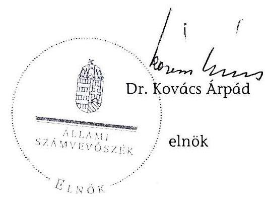
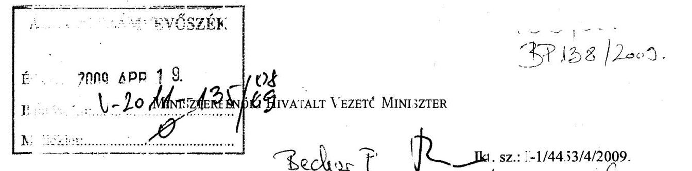
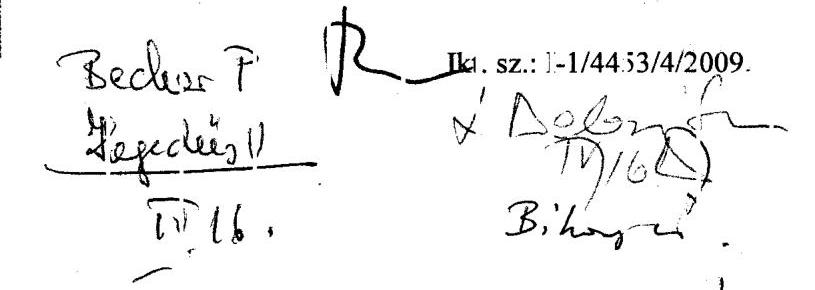
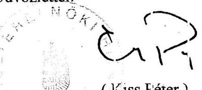
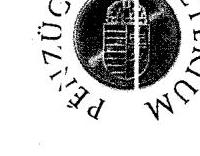
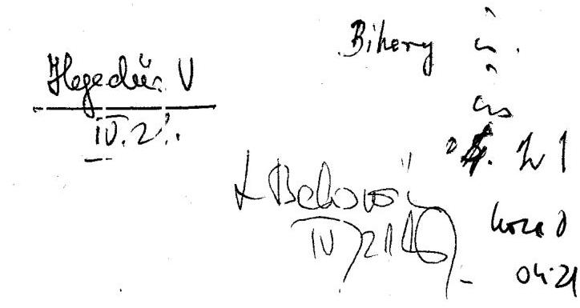
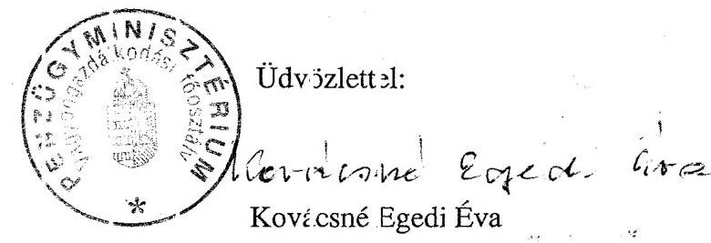
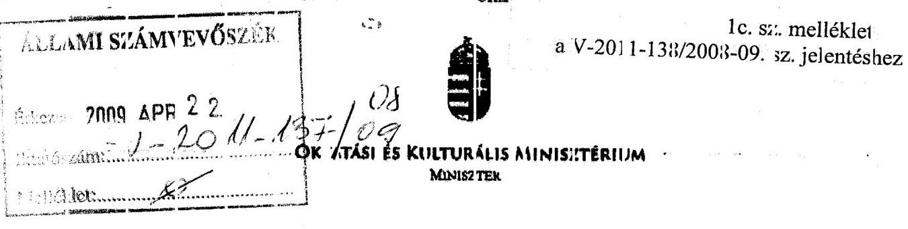
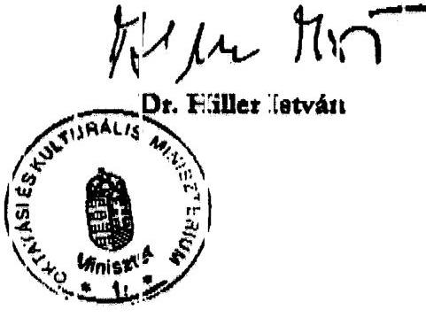

# ÁLLAMI   SZÁMVEVŐSZÉK 

## JELENTÉS

a nemzeti audiovizuális vagyon múködtetésére fordított pénzeszközök hasznosulásának ellenőrzéséről

---

2. Államháztartás Központi Szintjét Ellenőrző Igazgatóság
2.3. Átfogó Ellenőrzési Főcsoport

Iktatószám: V-2011-138/2008-09.
Témaszám: 914
Vizsgálat-azonosító szám: V-0426

# Az ellenőrzést felügyelte: 

Bihary Zsigmond
főigazgató
Az ellenőrzés végrehajtásáért felelős:
Hegedúsné dr. Müllern Veronika
főcsoportfőnök
Az ellenőrzést vezette:
Belovai Sándorné
osztályvezető főtanácsos
Az ellenőrzést végezték:
Bátory Béláné György Mária
számvevő tanácsos, főta- számvevő tanácsos
nácsadó
Tóth Árpád
számvevő tanácsos, ta-
nácsadó

## A témához kapcsolódó eddig készített számvevőszéki jelentések:

| címe | sorszáma |
| :-- | :-- |
| Jelentés a Magyar Televízió Közalapítvány és az MTV Rt. ellenőrzé- | 0315 |
| séről |  |
| Jelentés a Hungária Televízió Közalapítvány és Duna Televízió Rt. | 0408 |
| működésének ellenőrzéséről |  |
| Jelentés a Magyar Távirati Iroda Rt. 2003. évi gazdálkodásának | 0425 |
| ellenőrzéséről |  |
| Jelentés a kulturális közgyűjtemények kezelésére fordított pénzesz- | 0701 |
| közök hasznosulásának ellenőrzéséről |  |
| Jelentés a nemzeti hírügynökségről szóló törvényben, valamint a | 0743 |
| rádiózásról és televíziózásról szóló törvényben meghatározott köz- |  |
| szolgálati feladatellátás rendszerének ellenőrzéséről |  |

---

# TARTALOMJEGYZÉK 

BEVEZETÉS ..... 7
I. ÖSSZEGZŐ MEGÁLLAPÍTÁSOK, KÖVETKEZTETÉSEK, JAVASLATOK ..... 10
II. RÉSZLETES MEGÁLLAPÍTÁSOK ..... 16

1. Az audiovizuális vagyonkezelés jogi szabályozása, intézményrendszerének kialakítása ..... 16
1.1. Az audiovizuális vagyon körébe tartozó kulturális javak meghatározása, szabályozásának kialakítása ..... 16
1.2. A jogszabályokban előírt tulajdonjogi rendezés ..... 20
1.3. A feladatellátás biztosításának intézményrendszere, az audiovizuális vagyon múködtetéséhez és fejlesztéséhez biztosított források elosztásának átláthatósága ..... 23
2. Az audiovizuális vagyon kezelésével kapcsolatos felügyeleti irányítás eredményessége ..... 26
2.1. A döntéshozatali rendszer változása, a monitoring rendszer működése ..... 26
2.2. A Nemzeti Audiovizuális Archívumról szóló törvényben megfogalmazott feladatok megvalósulása ..... 29
2.2.1. A rádiós és televíziós műsorszámok nyilvántartásba vétele ..... 29
2.2.2. A köteles példányok gyűjtése, archiválása ..... 30
2.2.3. A műsorszámok hozzáférhetővé válásának biztosítása, tájékoztatási kötelezettségnek való megfelelés ..... 32
2.3. A magyar nemzeti filmvagyon védelme ..... 33
3. A kiemelt szervezetek hang- és képvagyonának szabályozása, a rendelkezésre bocsátott források célszerű és eredményes felhasználása ..... 34
3.1. A vagyon kezelését ellátó szervezetek által hozott intézkedések és döntéshozói beavatkozások ..... 34
3.2. A kezelő szervezetek által kezelt archívum kialakítása, nyilvántartása és értékelése ..... 39
3.3. A vagyon múködtetésének, felújításának és megőrzésének eredményessége ..... 41
3.4. Az audiovizuális vagyon elhelyezése ..... 45
3.5. A vagyon kezelésére, múködtetésére fordított saját bevételek, illetve állami támogatáson kívüli pályázati és egyéb források felhasználása ..... 46

---

4. Az ÁSZ korábbi - műsorszolgáltatókat és közgyűjteményeket érintő ellenőrzései során az audiovizuális vagyon kezelését érintő lényegesebb megállapításainak hasznosulása

# MELLÉKLETEK 

1. sz. melléklet Észrevételek
2. sz. melléklet A nemzeti audiovizuális vagyon kezelésére - a vonatkozó jogszabályokban - kijelölt és a tevékenységüket támogató kiemelt szervezetek
3/a sz. melléklet A nemzeti audiovizuális vagyon múködtetésére fordított költségek és ráfordítások alakulása 2004-ben
3/b sz. melléklet A nemzeti audiovizuális vagyon múködtetésére fordított költségek és ráfordítások alakulása 2005-ben
3/c sz. melléklet A nemzeti audiovizuális vagyon múködtetésére fordított költségek és ráfordítások alakulása 2006-ben
3/d sz. melléklet A nemzeti audiovizuális vagyon működtetésére fordított költségek és ráfordítások alakulása 2007-ben
3. sz. melléklet Az intézményeknek nyújtott teljes költségvetési juttatások alakulása 2004-2007. években
4. sz. melléklet Az állami tulajdonú filmtársaságok tulajdoni szerkezetének alakulása
5. sz. melléklet Az állami tulajdonban lévő filmtársaságok vagyona a vagyonértékelés szerint

---

# RÖVIDÍTÉSEK JEGYZÉKE 

| Áht. | Az államháztartásról szóló 1992. évi XXXVIII. törvény |
| :--: | :--: |
| ÁPV Zrt. | Állami Privatizációs Vagyonkezelő Zártkörűen múködő részvénytársaság |
| DÁS | Digitális Átállás Stratégiája |
| DTV Zrt. | Duna Televízió Zártkörűen múködő részvénytársaság |
| Egyezmény | Az audiovizuális örökség védelméről szóló ET Egyezmény |
| ET | Európa Tanács |
| EU | Európai Unió |
| Filmtv. | A mozgóképről szóló 2004. évi II. törvény |
| GKM | Gazdasági és Közlekedési Minisztérium |
| IHM | Informatikai és Hírközlési Minisztérium |
| INFOSOC | Az információs társadalomban érvényesülő szerzői és kapcsolódó jogok |
| KA | Közalapítvány |
| Kövtv. | A kulturális örökség védelméről szóló 2001. évi LXIV. tv. |
| KVI | Kincstári Vagyoni Igazgatóság |
| M Ft | Millió forint |
| MAFILM Rt. | Magyar Filmgyártó Részvénytársaság |
| MeH | Miniszterelnöki Hivatal |
| Média tv. | A rádiózásról és televíziózásról szóló 1996. évi I. törvény |
| MMKA | Magyar Mozgókép Közalapítvány |
| MNFA | Magyar Nemzeti Filmarchívum |
| MNV Zrt. | Magyar Nemzeti Vagyonkezelő Zárkörűen múködő részvénytársaság |
| MOKÉP Rt. | Mozgókép-forgalmazási Részvénytársaság |
| MR Zrt. | Magyar Rádió Zártkörűen múködő részvénytársaság |
| Mrd Ft | Milliárd forint |
| MTI Zrt. | Magyar Távirati Iroda Zártkörűen múködő részvénytársaság |
| MTV Zrt. | Magyar Televízió Zártkörűen múködő részvénytársaság |
| NAMS | Nemzeti Audiovizuális Média Stratégia |
| NAVA tv. | A Nemzeti Audiovizuális Archívumról szóló 2004. évi CXXXVII. törvény |
| NDA | Nemzeti Digitális Adattár |
| NKA | Nemzeti Kulturális Alap |
| NKÖM | Nemzeti Kulturális Örökség Minisztériuma |
| NVT | Nemzeti Vagyongazdálkodási Tanács |
| OKM | Oktatási és Kulturális Minisztérium |
| ORTT | Országos Rádió és Televízió Testület |
| OSZK | Országos Széchenyi Könyvtár |

---

Priv.tv.

Számviteli tv.

Az állam tulajdonában lévő vállalkozói vagyon értékesítéséről szóló 1995. évi XXXIX. törvény (hat. kívül helyezte a 2007. évi CVI. tv.)
A számvitelről szóló 2000. évi C. törvény

---

# ÉRTELMEZŐ SZÓTÁR 

archiválás
audiovizuális
kötelespéldány
audiovizuális örökség
audiovizuális örökség
részét képező filmalkotások
felhasználó
felújítás
filmalkotás
multiplex szolgáltatás
művek magáncélú másolása
mozgóképanyag

A műsorszámnak az archívum gyűjteményében történő tartós rögzítése, amelynek során a műsorszámhoz hozzárendelik az előállítására és azonosítására vonatkozó információkat. ** A közszolgálati műsorszolgáltatók és az országos földfelszíni terjesztésű televíziós műsorszolgáltatók által nyilvánossághoz közvetített, e törvény hatálya alá tartozó műsorszám.**
Eredetileg magyar nyelven készült, illetve egyéb magyar vonatkozású mozgókép. (Egyezmény, NAVA tv.)
Olyan filmalkotások - a tagállamokkal és/vagy harmadik országokkal közösen készített koprodukciókat is ideértve -, amelyeket a tagállamok, vagy az általuk kijelölt testületek objektív, átlátható és megkülönböztetés-mentes kritériumok alapján ilyennek minősítettek. A tagállamok audiovizuális öröksége alkotja az európai audiovizuális örökséget. (Az Audiovizuális örökség védelméről szóló ET Egyezmény (Egyezmény) és a 2001/29/EK irányelv.)
Aki a művek, illetve kapcsolódó jogi teljesítmények felhasználására a szerzőtől vagy a szerzői jog más jogosultjától jogot szerez.
A mű felhasználási jogának két alaptípusa létezik: a művek anyagi formában és a nem anyagi formában történő felhasználása. Ugyanakkor az Szjt. a szerző vagyoni jogait elismerő főszabályt a legjellemzőbb felhasználási módok példálózó felsorolásával is kiegészíti.*
Az archivált példányok állagának - a külön jogszabályban meghatározott módon és feltételek mellett történő - javítása, eredeti állapotának helyreállítása, ideértve az archiválási célból történő másolatkészítést is.**
Bármilyen hosszúságú mozgóképanyag, különösen a filmszínházakban történő bemutatásra szánt játékfilm, rajzfilm vagy dokumentumfilm.*
Olyan elektronikus hírközlési szolgáltatás, amely során több rádió-, illetőleg televízió-műsorjelből, valamint egyéb adatjelekből egyetlen szabványos digitális jelfolyamot állítanak elő a műsorterjesztőhöz való - hálózaton történő - továbbítás céljából (Az elektronikus hírközlésről szóló 2003. évi C. tv. 188. § 73. pontja szerint).

A szabad felhasználás alapesete kimondja, hogy természetes személy magáncélra a múről másolatot készíthet, ha az jövedelemszerzés vagy jövedelemfokozás célját közvetve sem szolgálja. *
Bármilyen eszközzel, bármilyen médiumra rögzített mozgóképsorozat, amely - hangkísérettel vagy anélkül - képes mozgás benyomását közvetíteni.*

---

multimédia múvek jogosítása
műsorszámhoz kapcsolódó dokumentum
szabad felhasználás
szerzői jog
szomszédos jogi jogosultak
terjesztés

A multimédia egy olyan sajátos mútípus, amelyben képi, zenei, szöveges és filmes anyagok, mú́részletek vagy önálló művek egyaránt megtalálhatók. *
A műsorszám előállításához, bemutatásához szükséges dokumentum és a műsorszám azonosító adatait rögzítő dokumentum.*
A szerzői jog korlátjai között tartják számon a szabad felhasználás egyes eseteit, melyek közös jellemzője, hogy csak a vagyoni jogokat érintik és kizárólag a nyilvánosságra hozott művekre vonatkoznak.*
Szerzői jog - az iparjogvédelem mellett - a szellemi tulajdon külön ága, amely védi a szerzői műveket és a kapcsolódó jogi teljesítményeket. A szerzői jogi szabályozás célja az irodalmi, tudományos és múvészeti alkotások védelme, megnevezésüktől és bármiféle mennyiségi, minőségi, esztétikai jellemzőtől vagy az alkotás színvonalára vonatkozó értékítélettől függetlenül. A szerzői jog a szerzők és egyéb jogosultak személyhez fúződő és vagyoni jogait, valamint a szerzői művek felhasználásának formáit, feltételeit szabályozza. Szit. 4. §.

Az előadóművészek, a hangfelvétel-előállítók, a rádió- és a televízió-szervezetek, a filmelőállítók teljesítményei, valamint a szerzői jogi eredetiséggel nem rendelkező adatbázisok előállítói. *
A terjesztés a szerzők kizárólagos joga, hogy engedélyezzék műveik eredetijének és másolatainak a közönség számára adásvétel vagy egyéb tulajdon-átruházás révén történő hozzáférhetővé tételét. ${ }^{* 1}$

[^0]
[^0]:    ${ }^{1 *}$ A 2004. évi, a Nemzeti Audiovizuális Archívumról szóló CXXXVII. törvény,
    ** Kiss Zoltán: A művek digitális archiválásának és felhasználásának szerzői jogi szabályai

---

# JELENTÉS 

## a nemzeti audiovizuális vagyon múködtetésére fordított pénzeszközök hasznosulásának ellenőrzéséről

## BEVEZETÉS

A nemzeti audiovizuális vagyon kulturális jelenünk és örökségünk közös kincse. Alapvetően a hazai hang- és mozgókép kultúra tárgyainak és szellemi javainak összessége függetlenül attól, hogy azok mikor keletkeztek és kinek a tulajdonában állnak.

Az Európa Tanács (ET) 2001. november 1-jén létrehozta az audiovizuális örökség védelméről szóló Európai Egyezményt. Az ET Egyezmény alapján született meg a Nemzeti Audiovizuális Archívumról szóló 2004. évi CXXXVII. törvény (NAVA tv.), amely kiterjesztette a gyűjtés kötelezettségét a rádiós és televíziós műsorszámokra, azok megőrzésére, a nyilvánosság számára történő hozzáférhetővé tételükre, egyben meghatározott egyes alapvető fogalmakat is (műsorszámhoz kapcsolódó dokumentum, archiválás, felújítás, audiovizuális köteles példány).

A rádiózásról és televíziózásról szóló 1996. évi I. törvény 27. § (Média tv.) ${ }^{2}$, valamint a mozgóképről szóló 2004. évi II. törvény (Filmtv.) állapítja az audiovizuális hang- és képarchívumok kezelésének legfontosabb szabályait és határozta meg a vagyon kezelésének intézményi hátterét. A kulturális örökség védelméről szóló 2001. évi LXIV. tv. (Kövtv.) szerint a nemzeti audiovizuális képés hangarchívum a közgyűjtemények körébe tartozó kulturális javak közé tartozik. A Kormány az államháztartásról szóló 1992. évi XXXVIII. törvény (Áht.) 124. § (2) bekezdésének v) pontjában kapott felhatalmazás alapján - a kultúrát és a kulturális örökség megőrzését előmozdító állami támogatásokról szóló 28/2008. (II. 15.) Korm. rendeletben - meghatározta a kulturális javak megőrzéséhez nyújtható támogatások szabályait.

A digitális adatvagyon könnyebb elérhetősége érdekében az ET Egyezményéből kiindulva indult el a Nemzeti Audiovizuális Archívum (NAVA) és a Nemzeti

[^0]
[^0]:    ${ }^{2}$ A Média tv. 27. §-a állapítja meg a közszolgálati műsorszolgáltatók archiválási kötelezettségét, amelynek feltételeit a és szabályozását a Testület egyetértésével a kuratórium által jóváhagyott szabályzat tartalmazza.

---

Digitális Adattár (NDA) ${ }^{3}$ program is. A NAVA és az NDA egymást kiegészítve teremti meg a nemzeti kulturális örökség részét képező digitális audiovizuális vagyon megőrzésének és múködtetésének alapvető kereteit.

Az audiovizuális kulturális örökség megőrzése érdekében a vagyon kezelésére kijelölt kiemelt szervezeteknél a vizsgált időszak alatt felhasznált 40,3 Mrd Ft nagyobb része, $83 \%$-a költségvetési támogatásból, a fennmaradó rész pályázati és EU forrásból, saját és egyéb forrásból származtak. A pályázat útján, illetve pályázaton kívül elnyerhető pénzeszközöket a Nemzeti Kulturális Alapon, a Magyar Mozgókép Közalapítványon és a Músorszolgáltatási Alapon keresztül biztosították. A központi források terhére adott támogatásokat a Magyar Köztársaság mindenkori éves költségvetése tartalmazta.

Az ellenőrzés célja annak értékelése volt, hogy

- a nemzeti audiovizuális archívumot kezelő szervezetek, valamint a műsorszolgáltatók hatékonyan és eredményesen használták-e fel a rendelkezésre álló pénzforrásokat;
- a nemzeti audiovizuális vagyon hatékony és eredményes múködtetésére vonatkozó elvárások érvényesültek-e, mennyiben járultak hozzá az audiovizuális vagyon megőrzéséhez, működtetéséhez és fejlesztéséhez;
- a támogatásokat átlátható és takarékos módon használták-e fel, eredményes volt-e a különböző jogcímen rendelkezésre álló források felhasználása;
- hasznosultak-e az ÁSZ korábbi ellenőrzéseinek javaslatai.

Vizsgálatunkat a 2004-2007. évekre vonatkozóan a teljesítmény-ellenőrzés rendszerellenőrzés módszerével, az audiovizuális vagyonról szóló jogi szabályozás szerinti vagyon kezelésére kijelölt és a tevékenységüket támogató (a 2. sz. mellékletben felsorolt) kiemelt szervezeteknél, valamint az irányítás szervezeti működési hátterét az OKM-nél (jogelőd NKÖM-nél) és a MEH-nél (jogelőd GKM-nél, IHM-nél) végeztük el. Értékeltük a beavatkozás és végrehajtás rendszerét, a jogi szabályozás, a felhasznált források célszerűségét, a felügyeleti irányítás eredményességét és hatékonyságát, valamint a korábbi - témát érintő ÁSZ ellenőrzésekben tett javaslatok teljesülését.

Az ellenőrzés során a kulturális alapokban és a fejezetek éves költségvetésében rendelkezésre álló pénzforrások adataira, a jogszabályokban vagyon kezelésére kijelölt intézményektől bekért tanúsítványokra, valamint az ÁSZ korábbi vizsgálatainak az archívumokat érintő megállapításaira, tapasztalataira támaszkodtunk. Nehezítette az ellenőrzést, hogy az archívumokra fordított kiadások megfelelő elkülönítése nem minden esetben állt rendelkezésre.

A jelen ellenőrzés végrehajtására az Állami Számvevőszékről szóló 1989. évi XXXVIII. törvény 2. § (3), (5), (6), (9), a 17. § (3) bekezdéseiben, valamint az ál-

[^0]
[^0]:    ${ }^{3}$ Az NDA az interneten elérhető magyar nyelvű és magyar vonatkozású tartalmak leíró adatait (metaadatokat) gyűjti, rendszerezi és teszi kereshetővé. A metaadatok a digitálisan elérhető dokumentumok (kép, hang, szöveg, film) leíró adatai.

---

lamháztartásról szóló 1992. évi XXXVIII. törvény 120 /A. § (1) bekezdéseiben foglaltak adtak jogszabályi alapot.

A jelentést egyeztettük a Miniszterelnöki Hivatalt vezető-, a pénzügy-, valamint az oktatási és kulturális miniszter urakkal, az észrevételeket az 1. sz. melléklet tartalmazza.

---

# I. ÖSSZEGZŐ MEGÁLLAPÍTÁSOK, KÖVETKEZTETÉSEK, JAVASLATOK 

A nemzeti kulturális örökség audiovizuális részének megőrzése és gyűjtése a társadalom kiemelten fontos érdeke. A nemzeti audiovizuális vagyon megőrzése érdekében az ellenőrzött időszakban felhasznált 40,3 Mrd Ft nagyobb része, $83 \%$-a költségvetési támogatásból származott. A költségvetési forrás felhasználására a „nemzeti audiovizuális vagyon", az „audiovizuális kulturális örökség" pontos meghatározása, az ehhez tartozó alkotások körének felmérése nélkül került sor. Az állam tulajdonában álló társaságoktól költségvetési támogatással megvásárolt audiovizuális alkotások az állami nyilvántartási rendszerbe jelentős késéssel, vagy egyáltalán nem kerültek átvezetésre. A nemzeti audiovizuális vagyon nyilvántartása, értékelése és a mérlegekben történő kimutatásának hiánya miatt a közpénzek átlátható módon történő felhasználása és eredményessége, valamint a vagyon védelme és az állományban bekövetkező változások nyomon követése nem volt biztosított.

A nemzet kulturális örökségébe tartozó - gyakran a megsemmisülés határán álló - alkotások akkor válhatnak az audiovizuális vagyon részévé és az utókor számára elérhetővé, ha azok a kor technikai adottságainak megfelelően digitalizálásra kerülnek. Az ellenőrzés során tapasztaltak szerint még a kulturális hagyaték felmérése sem történt meg abból a szempontból, hogy milyen alkotások tartoznak a legveszélyeztetettebb kategóriába és milyen kapacitások állnak rendelkezésre ezek megmentésére.

A közfeladatok hatékony és eredményes ellátása a döntéshozók beavatkozásának egyik lényeges eleme. A hatályos jogszabályi háttér azonban nem szabályozta egységesen a nemzeti örökség részét képező audiovizuális értékek megőrzését, nyilvántartását és nincs meg a jogszabályok közötti összhang. A hatályos jogszabályokban alkalmazott fogalmi meghatározások nem egységesek a tekintetben, hogy mi számít archiválásnak, mi tartozik a „nemzeti audiovizuális vagyon" vagy az „audiovizuális kulturális örökség" fogalomkörébe. A kultúráért felelős miniszter hatáskörébe tartozó feladatokra - mint pl.: a nemzeti kulturális örökség részét képező kép- és hangrögzítés országos nyilvántartási rendszerének a kialakítása, a törvényben megfogalmazott feladatok ellátása - funkcióját és célját tekintve megfelelő intézmény a helyszíni ellenőrzés befejezéséig nem jött létre. Az archívummal rendelkező társaságok kötelesek ${ }^{4}$ a tevékenységük során birtokukba került kulturális értékek és történelmi jelentőségű dokumentumok tartós megőrzéséről és védelméről gondoskodni, azokat szakszerűen tárolni, gondozni és az azokhoz való hozzáférhetőséget biztosítani. Azonban a feladat ellátásának sem technikai, sem anyagi feltételei nem állnak rendelkezésre.

A televíziós műsorterjesztés lehetőségének szélesítése, minőségének javítása érdekében alkották meg a televíziózás és a rádiózás digitális átállásáról szóló

[^0]
[^0]:    ${ }^{4}$ Filmtv., NAVA tv., Média tv., a Kövtv.

---

törvényt, amely a 2007-2012-es időszakra tűzte célul a magas hozzáadott érték tartalmú, interaktív szolgáltatások terjedését és a televíziós és rádiós archívumok digitalizálását. A törvényben a digitálás átállás céljára meghatározott forrásokat a Kormány határozatban zárolta.

A társaságok költségeinek fedezetéhez szükséges forrást a költségvetés biztosította és biztosítja. Tekintettel arra, hogy az audiovizuális archívumok a kulturális közjavak körébe tartoznak, így állami feladat az analóg módon rögzített músorok digitalizálása, amely az érintett músorok állagmegóvásának és jövőbeni felhasználásuknak alapfeltétele. Az Új Magyarország Fejlesztési Terv egyik kiemelt célja a kulturális örökség megőrzése, ennek ellenére az audiovizuális örökség tartós megőrzését és széleskörű hozzáférhetőségét biztosító digitalizálásra nem különítettek el forrásokat.

A NAVA tv.-ben megfogalmazottak nem következetesek és nem egyértelmúek, ugyanis a NAVA, mint archívum, a megfelelő forrás és a jogszabályi háttér hiányában nem tudja megszerezni, rendszerezni és tárolni a más archívumok által már összegyújtött és őrzött músorszámokat. A NAVA alapszolgáltatása és ezért fontos feladata az audiovizuális örökség digitalizálása és egységes rendszerbe foglalása. A feladat értelmezése és végrehajtása aggályos az adatszolgáltatási kör egyértelmú meghatározása („más archívumok") ${ }^{5}$ és a számukra előírt - a szabad felhasználási körbe tartozó - kötelező adatszolgáltatás jogszabályi hátterének megteremtése nélkül. A szabályozásban meglévő hiányosságok és a megalakulástól szűkösen rendelkezésre álló források ellenére a NAVA folyamatosan törekedett kapcsolatait kiépíteni azokkal az intézményekkel, amelyek az állami tulajdonba tartozó, kulturális örökség archiválásában részt vesznek.
„A NAVA-t az informatikáért felelős miniszter (MeH) müködteti, szakmai felügyeletét a miniszter és a kultúráért felelős miniszter közösen látja el."6 A NAVA-t múködtető Neumann János Digitális Könyvtár és Multimédia Központ Kht. (Neumann Kht.) a helyszíni ellenőrzés ideje alatt már az MNV Zrt. tulajdonában állt. A változó szakmai felügyeleti jogkör, valamint szerződés hiányában nem volt tisztázott, hogy melyik szervezet felelős a vagyonkezelésért. A felügyeleti irányítás többszöri változása, valamint a döntéshozói beavatkozások rendszere nem volt egységes. Az audiovizuális vagyon kezelése és az erre fordított források hatékony hasznosulása nem volt biztosított. Az audiovizuális közvagyon jelentős része nem köthető egyetlen intézménytípushoz, őrzésére nem alakult ki szakmailag tiszta profilú intézményrendszer, amely megnehezítette az audiovizuális kulturális közvagyon helyzetének áttekintését. A nemzeti vagyonnak tekintett audiovizuális közgyűjteményekkel rendelkező szervezetek ${ }^{7}$ egységes szakmai koncepció, irányítási, szabályozási és finanszírozási elveken alapuló stratégia és évenkénti feladatterv nélkül múködnek. Ezért a nemzeti audiovizuális vagyon kezelése során kialakult párhuzamosságok, valamint a szétta-

[^0]
[^0]:    ${ }^{5}$ NAVA tv. 9. § együttműködés kezdeményezése a köteles-példány szolgáltatásra kötelezett műsorszolgáltatókkal és archívumokkal, könyvtárakkal.
    ${ }^{6}$ NAVA tv. 4. §-a szerint.
    ${ }^{7}$ Pl.: MNFA, NAVA, OSZK, Duna TV Zrt., MTV Zrt.,MR Zrt., MNV Zrt. - filmstúdiók, MTI Zrt.

---

golt elhelyezés megnehezíti a rendelkezésre álló pénzforrások koncentrált és eredményes felhasználását is. Az ellenőrzött szervezeteknél, az audiovizuális vagyon megőrzése céljára felhasznált pénzek, a felhasználók oldaláról sem tervezhetőek, ami gátolja az egyébként is szűkös források hatékony felhasználását.

A kulturális örökség megóvása szempontjából meghatározó - a minőségi paramétereket, az azonos kategóriákban bevezethető archiválási eljárásokat és technológiát tartalmazó, egységes ágazati irányítást és vagyonkezelést lehetővé tevő - központilag kiadott kötelező archiválási szabályrendszer nem készült. Nem volt egyértelmű az audiovizuális örökség védelmében érdekelt szereplők feladata. Az audiovizuális örökség részét képező alkotások hasznosításából származó bevételek elosztását, illetve felhasználását tekintve az ágazati irányítás és a végrehajtásban résztvevők - vagyonkezelők, média - között nem volt meg az összhang. Az ellenőrzésben részt vevő intézmények saját archiválási szabályzataiban- az archiválás tárgyára, módjára, nyilvántartására, kezelésére, fenntartására vonatkozó egységes szabályozási elvek hiányában - az archiválás folyamata, az eljárás rendje és a vagyon kezelése intézményenként különböző.

Az audiovizuális örökség megőrzését, felújítását elősegítő pénzeszközök felhasználása nem szabályozott. A szabályozás hiányosságai, az archívumokban őrzött kordokumentumok átfogó felmérése és nyilvántartása, valamint a múködéshez szükséges és elégséges források meghatározásának hiányában a NAVA és az NDA létrehozására és fenntartását szolgáló rendszer nem hatékony.

A közszolgálati műsorszolgáltatók által gyártott műsorokat jelenleg három helyen gyűjtik és az ORTT hatósági feladatainak ellátása keretében rögzíti. A négy eltérő hely közül, eltérő minőségben, de közel azonos tartalommal gyűjtött műsorszámok közül egyedül a NAVA rendelkezik visszakereshető nyilvántartási rendszerrel és biztosít az ún. NAVA pontokon ${ }^{8}$ keresztül széles körű elérhetőséget a nagyközönség számára. Az eltérő minőségi paraméterek miatt és az egységesen meghatározott archiválási minőség hiányában mindegyik helyen archiválásnak tekintik a műsorszámok gyűjtését.

A NAVA működését meghatározó törvény az audiovizuális köteles példány gyűjtési kötelezettségét a minőségi paraméterek meghatározása nélkül írja elő, szemben a filmtörvénnyel, ahol a köteles példány fogalma és minősége meghatározott. A NAVA tv. az audiovizuális köteles példány gyűjtését kötelezően csak a műsorszámokra írja elő, a törvényben használt audiovizuális örökség, illetve az audiovizuális nemzeti vagyon fogalmi körbe a filmalkotások és más audiovizuális gyűjtemények anyagai is beletartoznak, amelyekre viszont a törvény hatálya nem terjed ki.

A műsorszolgáltatók által sugárzott műsorszámok közül a NAVA archívumába kerülő műsorszámok meghatározása és kiválasztása az Audiovizuális Örökség

[^0]
[^0]:    ${ }^{8}$ NAVA pontok: a nemzeti audiovizuális archívumban lévő adatok elérésére szolgáló, országosan 701 db helyen kiépített elektronikus hozzáférési lehetőség.

---

Tanácsadó Testület feladata lenne, amelynek létrehozásáról és tagjainak kinevezéséről - a törvényi rendelkezés ellenére - 2006 óta nem született döntés.

Az MNV Zrt. ${ }^{9}$ tulajdonában álló filmszakmai társaságok nem tartoznak a tartósan állami tulajdonban maradó vagyoni körbe. Egységes ágazati koncepció és irányítás hiányában a filmes portfolióval kapcsolatos, többször változtatott tulajdonosi döntésekhez kapcsolódó állami pénzeszközök felhasználása célszerűtlen volt. A filmjogok megvásárlásával és egy stúdióba történő átcsoportosításával kezdődő folyamat az állam szempontjából nem volt eredményes döntés és hosszú távon egy bonyolult jogi folyamatot indított el, ami 2004 óta nem zárult le. A Kormány által megfogalmazott célok - a filmjogok 2005. évi átadása az MNFA részére és a folyamatos forrásbiztosítás megszüntetése nem valósultak meg. A filmjogok hasznosításából származó bevétel jövedelem tartalma a privatizáció előtt álló társaságokat gyarapította, anélkül, hogy az archív filmek hasznosításából származó bevételek a filmarchívum fenntartását elősegítették volna. Ezen időszakban az archív filmek DVD formátumban való megjelentetése a többszöri alvállalkozói közreműködés következtében nem volt zártrendszerű, korlátozta a kiadásban érdekelt stúdiók tevékenységének kontroll lehetőségét.

Az ÁPV Zrt., majd az MNV Zrt. 100\%-os, egyszemélyi tulajdonosa a filmstúdióknak, ezáltal a társaságok vagyoni helyzetét alapítói határozattal megváltoztathatja, a törzstőkét felemelheti, illetve a vagyont elvonhatja. A 2004. évi privatizációs koncepció kidolgozásakor a filmes társaságok értékesítésének a célja az volt, hogy a folyamatos tőkepótlás és forrásbiztosítás alól mentesüljön az ÁPV Zrt. és ezáltal az állam. A filmstúdiók 2004-re vagyonukat felélték, tevékenységet alig, vagy egyáltalán nem végeztek, tőkéjük a társasági törvényben előírt minimál szinten volt, amelyet az egyes évek veszteségének függvényében az ÁPV Rt., mint tulajdonos pótolt. A 2000-ben megkezdett privatizációs folyamatban 2004-ig a társaságoknál lévő filmvagyon felmérése és ismerete nélkül hoztak döntéseket. A filmekhez kapcsolódó vagyonértékű jogokat sem a társaságok mérlegében, sem a kincstári vagyon részeként nem mutatták ki, nyilvántartása nem teljes körú.

A 2004-ben végrehajtott - a Dialóg Filmstúdió Kft. és a filmstúdiók közötti filmjog vásárlási szerződéseket a Kormány féléves késéssel, utólag hagyta jóvá (2005. VII. 14-én). A kormányhatározat tartalmazta, hogy az ÁPV Zrt. hozzárendelt vagyonába kerülő, a nemzeti filmvagyonba tartozó jogok az állam kincstári vagyonába, a Kincstári Vagyoni Igazgatósághoz (KVI) kerüljenek átcsoportosításra és a KVI kössön vagyonkezelési megállapodást - a Filmtv.-ben foglaltaknak megfelelően - az MNFA-val 2005. december 1-jéig. A határozat végrehajtása elmaradt. A Filmtv.-ben nincs konkrét határidő az állam tulajdonában álló, de különböző szervezetek birtokában, illetve vagyonkezelésében lévő filmvagyon MNFA részére történő átadására. A kultúráért felelős miniszter a Filmtv.-ben kapott felhatalmazása alapján jogkörében később járt el, amikor kiadásra került a nemzeti filmvagyonba tartozó filmalkotások terjesztésének

[^0]
[^0]:    ${ }^{9}$ 2006. február 1-jéig ÁPV Rt., 2006. február 2-ától 2007. szeptember 25-éig ÁPV Zrt., 2007. szeptember 26-ától 2007.dec. 31-ig ÁPV Zrt. vagyonkezelés, 2008. január 1-jétől MNV Zrt.

---

részletes szabályairól szóló 2006. évi Korm. rendelet. Ezért jogszabályi hivatkozás hiányában 2006. december 31-éig a filmstúdiók rendelkeztek az állami tulajdonú filmek hasznosítási jogával és a forgalmazási bevételekkel. Az ÁPV Zrt. igazgatósági előterjesztései nem terjedtek ki arra, hogy a filmjogok forgalmazásával elért jövedelem milyen pótlólagos forrást jelent a forgalmazó társaságok, és milyen elmaradt hasznot az ÁPV Zrt. számára.

Az archívumok fenntartása és üzemeltetése, a kötelező közszolgálati feladatellátáson belül, döntően a költségvetésből származó források felhasználásával történt és történik. A feladat ellátása olyan többletköltséget eredményez a társaságoknak, amelyet az archívumok árbevétel szerző tevékenysége, profittermelő képessége nem tud kompenzálni. A meglévő szabályozásban rejlő hiányosságok és a forrásfelhasználás ellenőrzésének az elmaradása miatt, a társaságok archiválással kapcsolatos többletkiadásait ellensúlyozni kívánó tranzakciók bevételei csak közvetve, részlegesen vagy egyáltalán nem az audiovizuális vagyonra kerültek felhasználásra, hanem múködési kiadások fedezetére.

A közmédiumok archívumai a nemzeti audiovizuális vagyon megőrzése szempontjából jelentős értéket képviselnek. Ennek megőrzése és a felhasználói jogok MTV Zrt. archívumában őrzött műsorszámainak részbeni - NAVA számára történő - megszerzésére az OKM (NKÖM) 2005. évi, valamint a 2006. évi költségvetésében biztosított 9,989 Mrd Ft-ból 7,023 Mrd Ft összegű forrást használt fel. A műsorszámok átadásának módjáról és határidejéről a szerződésekben nem rendelkeztek, a Neumann Kht. információja szerint az átadás 2008. november 30-ig 40\%-ban teljesült. Az MNV Zrt. nyilatkozata alapján a felhasználási jogok az állami vagyonkezelő nyilvántartásában nem szerepelnek, a költségvetési támogatás biztosítása ellenére a felhasználási jogok állami tulajdonba vétele nem teljesült.

A helyszíni ellenőrzés megállapításainak hasznosítása mellett javasoljuk:

# A Kormánynak: 

1. intézkedjen az audiovizuális kulturális örökség megmentése, megtartása és gyarapítása érdekében, a szükséges források mellérendelésével egy közép- és hosszú távú feladatterv elkészítéséről;
2. kezdeményezze a nemzeti kulturális örökség megóvásával, gyarapításával kapcsolatos jogszabályok közötti átfedések és fogalmi pontatlanságok megszüntetését;
3. intézkedjen az audiovizuális archívumokban őrzött kulturális vagyon átfogó felméréséről és egységes nyilvántartási rendszerének kialakításáról.

## A Miniszterelnöki Hivatalt vezető miniszternek:

intézkedjen annak érdekében, hogy a törvényi rendelkezéseknek megfelelően jöjjön létre az Audiovizuális Örökség Tanácsadó Testület.

---

# A pénzügyminiszternek 

intézkedjen a Filmtv.-nek megfelelően az MNV Zrt. rábízott nemzeti filmvagyon MNFA részére történő átadásáról, valamint egységes és hosszú távú hasznosításáról.

---

# II. RÉSZLETES MEGÁLLAPÍTÁSOK 

## 1. Az audiOVIZUÁLIS VAGYONKEZELÉS JOGI SZABÁLYOZÁSA, INTÉZMÉNYRENDSZERÉNEK KIALAKÍTÁSA

### 1.1. Az audiovizuális vagyon körébe tartozó kulturális javak meghatározása, szabályozásának kialakítása

Az audiovizuális vagyon témakörben megszületett legjelentősebb jogszabályok egyike sem határozta meg egzakt módon a nemzeti audiovizuális vagyon fogalmát, definícióját.

A közfeladatok hatékonysága és eredményes ellátása a döntéshozók beavatkozásának egyik lényeges eleme. A hatályos jogszabályi háttér nem egységesen szabályozza a nemzeti örökség részét képező audiovizuális értékek megőrzését, nyilvántartását, hiányzik a jogszabályok közötti koordináció és összhang. Ennek következtében az sincs egyértelműen meghatározva, mit nevezünk archívumnak vagy gyűjteménynek, mi számít archiválásnak, valamint mi tartozik a „nemzeti audiovizuális vagyon" vagy az „audiovizuális kulturális örökség" fogalomkörébe. A muzeális intézményekről, a nyilvános könyvtári ellátásról és a közművelődésről szóló, a 2005. évi LXXXIX. törvénnyel módosított 1997. évi CXL tv. a kultúráért felelős miniszter hatáskörébe utalta a nemzeti kulturális örökség részét képező kép- és hangrögzítés országos nyilvántartási rendszerének a kialakítását. A törvényben megfogalmazott feladatok ellátásának megfelelő, funkcióját és célját tekintve eleget tévő intézmény a mai napig nem jött létre.

A Magyar Rádió hangarchívumával kapcsolatban a nemzeti filmvagyonnal analóg szabályozás nem született, az MR Rt. archívumában tárolt, hang formában létező jelentős történelmi emlékeink és nemzeti kulturális örökségünk a Magyar Rádió Közalapítvány birtokában van, így pl. az 1956-os Nagy Imre beszéd; a Rajk per anyaga; stb.

A Filmtv. 35. § (1) szerint a nemzeti filmvagyonra vonatkozó vagyonkezelői jog a Magyar Nemzeti Filmarchívumhoz (továbbiakban: MNFA) kerül. A törvény indoklásában szerepel, hogy az állam tulajdonában lévő vállalkozói vagyon értékesítéséről szóló 1995. évi XXXIX. törvény (Priv. tv.) 35. § szerint az éves költségvetési törvény rendelkezése alapján az ÁPV Zrt. (jelenleg MNV Zrt.) térítésmentesen átadhatja a tulajdonában lévő filmszakmai társaságoknál ${ }^{10}$ lévő filmek vagyoni értékű jogait a KVI részére annak érdekében, hogy azokat az MNFA vagyonkezelésébe adja. Tehát a Filmtv. a Priv. tv. keretei között kívánta rendezni a kincstári tulajdonba vételt és a jogoknak az MNFA-hoz kerülését megoldani. A filmjogok részbeni állami tulajdonba vétele helyszíni ellenőrzésünk lezárásakor folyamatban volt.

[^0]
[^0]:    ${ }^{10}$ Budapest Filmstúdió Kft., Dialóg Filmstúdió Kft., Hunnia Filmstúdió Kft., Objektív Filmstúdió Kft., Pannoniafilm Kft., MOKÉP Rt., MÁFILM Rt.

---

A szabályozás egyidejúleg azt is jelentette, hogy korábbi - rendszerváltást követően kialakult - társasági tulajdonlás helyett a filmek közvetlen állami tulajdonba vétele valósult meg.

A Filmtv. 35. § (3) szerint - amelyet a 2006. évi XLV. tv. hatályon kívül helyezett a nemzeti filmvagyonba tartozó filmalkotások eredeti negatív példányai, illetve ennek hiányában a filmalkotások legalább egy múpéldánya - ha a köteles példányszolgáltatásról szóló jogszabály másként nem rendelkezik - a Filmarchívum tulajdonát (értsd: vagyonkezelésében álló állami tulajdont) képezik. A hatályon kívül helyezett rendelkezés helyébe 2007. szeptember 26-ig új rendelkezés nem lépett. Az (5) szerint a megőrzésre átvett, illetve a köteles példány szolgáltatás keretében vagy egyéb módon a gyűjteményébe került filmeket kizárólag a szerzői jogi törvényben foglaltak szerint használhatja fel az MNFA.

A nemzeti filmvagyon rendezésével kapcsolatos egyes feladatokról szóló 2140/2005. (VII. 14.) Korm. határozat 2005. december 1-jei határidővel írta elő a pénzügyminiszternek, hogy a nemzeti filmvagyonba tartozó filmeken fennálló szerzői jogokat és a filmek kópiáin fennálló tulajdonjogokat az állam kincstári vagyonába helyezze, és az ezekkel kapcsolatos kezelői jogot a MNFA részére biztosítsa. A filmjogok részbeni állami tulajdonba vétele a határidő módosítások ellenére - a helyszíni ellenőrzés befejezésekor még folyamatban volt.

Az ÁPV Zrt. a nemzeti filmvagyon felmérését és vagyonértékelését a hozzárendelt vagyonban álló társaságok körében értelmezte. A filmalkotások közvetlen állami tulajdonba kerülésével foglalkozó kormányhatározatok is csak az ÁPV Rt. teendőit írták elő. A nemzeti filmvagyon körében jelentős filmmúfajok, alkotóműhelyek filmjei nem kerültek figyelembevételre.

A 90-es évek szervezeti átalakulásai, tulajdonosváltásai következtében pl. a nemzeti filmvagyonnal kapcsolatos intézkedések látókörébe sem kerültek be például a Mozgókép Innovációs Társulás és Alapítvány, a Kecskeméti Animációs Filmstúdió, a Hétfői Műhely alkotásai, a főiskolás filmek stb., amelyek vitathatatlanul a nemzeti filmvagyon fogalomkörbe és a törvény hatálya alá tartoznak..

A MAFILM vezérigazgatója szerint: A nemzeti filmvagyon így egyfajta skanzen és nem rendelkezik jövőképpel. Nem tartalmazza az 1990 óta előállított filmalkotások döntő részét, amelyek a nem állami tulajdonú filmelőállító társaságoknál készültek jelentős állami támogatással, nem bővíthető, hiszen az állami támogatás nem keletkeztetett jogokat, a magántulajdonú filmelőállítóktól pedig nem várható el, hogy önként felajánlják ezeket a műveket a nemzeti filmvagyon bővítésére.

A filmjogok jogi felmérése és vagyonértékelése a Budapest, Dialóg, Hunnia, Objektív és Pannónia Filmstúdiók filmvagyonára terjedt ki, amely 2004 decemberére készült el (részletesen lásd a 3. fejezetben). A 2004. évi felmérésből és értékelésből a MOKÉP Rt. és a MAFILM Rt. azonban kimaradt, így nem volt teljes körű a felmérés. A MOKÉP filmvagyonának felmérésére vonatkozó szerződést a Nemzeti Vagyongazdálkodási Tanács döntésének megfelelően 2008. novemberében írták alá.

---

A nemzeti filmvagyonba tartozó filmalkotások terjesztésének részletes szabályait ${ }^{11}$ (a forgalmazás módját, mikéntjét), továbbá a terjesztésből befolyt árbevétel felhasználását a 203/2006 (X. 5.) Korm. rendelet ${ }^{12}$ állapította meg. A fogalomhoz kötődő vagyon részei felett a rendelkezési jog több szereplő kezében van. Különböző állami tulajdonú alapítványok, közalapítványok tulajdonában álló társaságok, magántársaságok, közgyűjtemények, költségvetési szervek rendelkeznek hang- és képarchívumokkal. A magántulajdon mellett az állami tulajdonlás is több csatornán keresztül érvényesül, több tulajdonos kezében vannak ugyanazon csoportba tartozó vagyonelemek, illetve az állami tulajdonlás mértéke a vagyon számszerúségét és a jog terjedelmét tekintve is nagyon heterogén képet mutat.

Az EU 2001/29/EK irányelvében foglaltak iránymutatásával az Európai Bizottság 2006 augusztusában fogadta el a digitalizálásra és digitális megőrzésre vonatkozó, a mozgókép örökségről és a kapcsolódó ágazati tevékenységek versenyképességéről szóló 2006/585/EK Ajánlást. Ebben meghatározták az audiovizuális örökség részét képező filmalkotások körét. Ezek olyan filmalkotások - a tagállamokkal és/vagy harmadik országokkal közösen készített koprodukciókat is ideértve -, amelyeket a tagállamok, vagy az általuk kijelölt testületek objektív, átlátható és megkülönböztetés mentes kritériumok alapján ilyennek minősítettek. A tagállamok audiovizuális öröksége alkotja az európai audiovizuális örökséget.

Az uniós szabályozás különbséget tesz a kulturális örökség ágazati formáinak szabályozását tekintve. (Pl. külön iránymutatás vonatkozik a mozgóképörökség védelmére (2005/865/EK Ajánlás), vagy a digitális könyvtárakra (Bizottság i2010 Ajánlás)

A Nemzeti Audiovizuális Archívumról szóló törvény (a továbbiakban: NAVA tv.) preambulumában megfogalmazottak szerint a törvény célja a rádiós és televíziós műsorszámok gyűjtése, nyilvántartása, megőrzése és a nyilvánosság számára történő hozzáférhetővé tétele. A NAVA közgyűjteményi státusszal rendelkező szervezet - amelynek létrehozása az Európa Tanács által az audiovizuális örökség védelméről szóló, 2001-ben elfogadott Európai Egyezmény (a továbbiakban: Egyezmény) rendelkezésein alapul.

Az Európa Tanács keretében 2001. november 8-án létrejött, az audiovizuális örökség védelméről szóló Európai Egyezmény kihirdetéséről szóló 2007. évi CXLIV. törvény léptette hatályba. Az Egyezmény szabályozza a köteles példányok, illetve az önkéntes példányok szolgáltatását. A kötelespéldányszolgáltatási kötelezettség mindazon mozgóképi anyagokra kiterjed, amelyeket önállóan vagy koprodukcióban állítottak elő az adott tagországban.

[^0]
[^0]:    ${ }^{11}$ Ez nem érinti a szerzői jogi törvény alapján a jogosultakat megillető jogok érvényesítését (pl. díjigény a filmek bérbeadása vagy kábeltelevíziós továbbközvetítése után).
    12 Bizonyos felhasználási jogok maguknál a filmszerzőknél, vagy jogutódjaiknál maradtak. Ezekre a bonyolult kérdésekre az ÁPV Rt. megbízásából számtalan elemzés, jogi tanulmány kereste a választ; - 2003 decemberében - a Szerzői Jogi Szakértő Testület is foglalkozott a témával.

---

A sajtótermékek köteles példányainak szolgáltatásáról és hasznosításáról szóló 60/1998. (III. 27.) Korm. rendelet hatálya nem terjedt ki a rádiós és televíziós műsorszolgáltatók műsoraira. Így a NAVA tv. hatályba lépése előtt, 2006. január 1-jéig a rendelet szerint a belföldön forgalomba hozott filmből, a videó- és elektronikus dokumentumból kellett csak köteles példányokat szolgáltatni az Országos Széchényi Könyvtár (OSZK), illetve a Magyar Nemzeti Filmarchívum számára.

Az információs társadalomban érvényesülő szerzői és kapcsolódó jogok egyes kérdésekben történő összehangolásáról szóló 2001/29/EK irányelv (továbbiakban INFOSOC irányelv) a tagállamok jogszabályainak összehangolási kötelezettségét irányozta elő a szerzői joggal és egyéb kapcsolódó jogokkal összefüggő alapvető kérdésekben. Szabályozza a szerzői és kapcsolódó jogok jogosultjainak a többszörözéshez, a nyilvánossághoz való közvetítéshez és a terjesztéshez fűződő jogait. Az irányelvet a 2003. évi CII. törvény II. fejezete illesztette be 2004. május 1-jei hatállyal a szerzői jogról szóló 1999. évi LXXVI. törvénybe (továbbiakban Szitv.). A jogharmonizációs célú módosítás során a NAVA tevékenységéhez szükséges módosításokat is elvégezték.

A televíziós műsorterjesztés lehetőségének szélesítése, minőségének javítása érdekében született a televíziózás és a rádiózás digitális átállásáról szóló 1014/2007. (III. 13.) Korm. határozat. Tekintettel arra, hogy az audiovizuális archívumok a kulturális közjavak körébe tartoznak, így állami feladat is az analóg módon rögzített tartalmak digitalizálása, ami az érintett tartalmak állagmegóvásának és jövőbeni felhasználásuknak alapfeltétele. Az újonnan készülő audiovizuális alkotások jellemzően már digitális formátumban kerülnek előállításra. A digitális technológiaváltás előtti időszakban készült művek azonban analóg hordozókon rögzítettek, így az átállást követő hasznosításuk technikai előfeltétele a digitalizálás.

A Digitális Átállás Stratégiája (továbbiakban: DÁS) a 2007-2012-es időszakra segíti elő a médiapluralizmus erősödését, a magas hozzáadott érték tartalmú, interaktív szolgáltatások terjedését és a televíziós és rádiós archívumok digitalizálását. Az Európai Bizottság 2005. május 24-én, „az analógról a digitális müsorszórásra történő áttérés felgyorsításáról" címmel kiadott közleményében 2012. január 1-jét jelölte meg az analóg földfelszíni műsorszórás beszüntetésére. A kormányprogram ezzel összhangban a digitális átállás felgyorsítását tűzte ki célul. Magyarországnak ennek értelmében 2011. december 31-éig a digitális átállás folyamatát be kell fejezni. A rádiózás digitális átállására 2014. december 31. a meghatározott lekapcsolási céldátum $94 \%$-os lefedettség és a lakosság $75 \%$ának alkalmas készülékekkel történt felszerelkezése esetén. Amennyiben ez a feltétel nem teljesülhet, úgy a céldátum módosításra kerül. (2007. évi LXXIV. tv., továbbiakban: Dtv. 38. § (2))
2007. május 17-én került kihirdetésre a NAVA tv. végrehajtási rendelete, az 52/2007. (V. 17.) GKM-OKM együttes rendelet az audiovizuális műsorszámok felújításának, valamint szolgáltatásának műszaki, minőségi és egyéb követelményeiről. (E rendeletben határozza meg továbbá a NAVA-pontok létesítésének részletes szabályait.)

---

A digitális átállás stratégiájához szorosan kapcsolódik a Nemzeti Audiovizuális Média Stratégia (továbbiakban: NAMS). A NAMS az európai médiaszabályozással összhangban lévő olyan, a hazai média szabályozását és múködését meghatározó átfogó koncepció, nemzeti program, amely mind tartalmában, mind pedig infrastrukturálisan egyenlő eséllyel biztosítja minden állampolgár számára a médiaszolgáltatásokhoz való hozzáférést. A NAMS szakmai vitája a politikai pártokkal, a parlamenti frakciókkal való egyeztetése megtörtént ${ }^{13}$, amelynek alapján elkészült a jogalkotási koncepció, amely az új média szabályozás alapjául is szolgál.

# 1.2. A jogszabályokban előírt tulajdonjogi rendezés 

A Filmtv. a Magyar Nemzeti Filmarchívumot (MNFA) jelölte meg a nemzeti filmvagyon vagyonkezelőjeként.

A Filmtv. végrehajtása érdekében megszületett, a nemzeti filmvagyon rendezésével kapcsolatos egyes feladatokról szóló 2140/2005. (VII. 14.) Korm. határozat előírta a nemzeti filmvagyonba tartozó 5 filmstúdió ${ }^{14}$, majd a módosítása a MAFILM Rt. tulajdonában álló filmeken fennálló szerzői vagyoni jogok, felhasználási jogok, szomszédos jogok, valamint az érintett filmek negatívjain fennálló tulajdonjogok állami tulajdonba megszerzését a Dialóg Filmstúdió Kft.-n keresztül. (A jogoknak a Dialóg Filmstúdió Kft. általi megszerzését követően azoknak a hozzárendelt vagyonba, majd a kincstári vagyonba történő átcsoportosítását írja elő.) Ezt követően a KVI-nek a nemzeti filmvagyonra vonatkozóan vagyonkezelési megállapodást kellett volna kötnie a Magyar Nemzeti Filmarchívummal.

Az ÁPV Zrt. részvényesi jogok gyakorlója által jóváhagyott 2005. évi operatív terve tartalmazta a 100\%-ban a hozzárendelt vagyonba tartozó Pannoniafilm, a Budapest, a Hunnia és az Objektív Filmstúdió Kft.-k tulajdon és egyéb vagyoni értékű jogait a szintén a hozzárendelt vagyonba tartozó Dialóg Filmstúdió Kft.-vel történő felvásárlását, amelyhez a tőkét tőkeemelés útján biztosították. A módosított üzleti terv a MOKÉP Rt. filmjogainak megszerzését is tartalmazta.

A módosított üzleti tervben rögzítették, hogy „a filmjogok Magyar Nemzeti Filmarchívumnak történő majdani átadása teljesíthetővé válik az ÁPV Rt. részéről olyan módon is, hogy magát a jogokat tulajdonló társaságot adja át." Ezenkívül a terv szerint a filmportfolió privatizációjára a jogátruházást követően kerülhet sor.

A Pannoniafilm, a Budapest, a Hunnia és az Objektív Filmstúdió Kft.-kkel kapcsolatos, Dialóg Filmstúdió Kft. javára szóló jogátruházási szerződések 2004. december 23-án és 27-én aláírásra kerültek, de ezzel a filmjogok átadása a KVI részére nem történt meg.

[^0]
[^0]:    ${ }^{13}$ Megállapította a nemzeti hírügynökségről szóló törvényben, valamint a rádiózásról és televíziózásról szóló törvényben meghatározott közszolgálati feladatellátás rendszerének ellenőrzéséről szóló 0743 sz. ÁSZ jelentés.
    ${ }^{14}$ A Pannoniafilm, a Budapest, a Hunnia, az Objektív Filmstúdió Kft.-k és a MOKÉP Rt.

---

A MAFILM Rt. 13,97\%-os üzletrésze a MMKA tulajdonában állt, amelyet az ÁPV Rt. a Magyar Filmlaboratórium Kft. 100\% tulajdonrészével, cserével kívánt a 2005. évi üzleti terv szerint megszerezni. Az előzetes tervvel szemben azonban a MAFILM Rt. és a Magyar Filmlabor Kft.-t 2007. évben az ÁPV Zrt. átadta az MMKA részére ${ }^{15}$. A MAFILM Rt. MMKA-nak történt átadása bizonyítja, hogy viszonylag rövid idő alatt az előzetes koncepció sérült, vagyis a közalapítványnak történő átadással nem az állami tulajdonba kerülést, hanem ellenkezőjét szolgálta. A jogi lehetőséget a költségvetési tv. teremtette meg ${ }^{16}$.

Az alapítvány támogatása az SZT/26960. sz. szerződéssel 2007. január 29-én történt meg a MAFILM Rt. 86,03\%-os, 0,51 Mrd Ft névértékú részvénypakettje (pakettra eső saját tőke 1,08 Mrd Ft) és a Magyar Filmlaboratórium Kft. 100\%-os, 0,16 Mrd Ft jegyzett tőkéjú (saját tőke: $0,40 \mathrm{Mrd}$ Ft) részesedéseinek ingyenes átadásával. Ezzel a hozzárendelt vagyon saját tőkeértéken 1,48 Mrd Ft-tal csökkent.

Az átadással ráadásul olyan társaság került az MMKA tulajdonába, amelynek 50\%-os tulajdonában áll az MMKA 27 alapítója között szereplő MAFILM Média Center Egyesülés. Az Egyesülés másik 50\%-a az MMKA tulajdona. Így a tranzakcióval az MMKA-nak egyik alapító társasága 100\%-ban befolyásába került.

A Magyar Mozgókép Közalapítvány 27 alapítója között több olyan filmkészítéssel foglalkozó társaság van, amelyek a támogatások alanyaiként is szerepelhetnek. Pl. a 2007. évi közhasznúsági jelentésben támogatottként is szereplő alapítók: Hunnia, Budapest Filmstúdiók. Az egyéb támogatottak és az alapítók közötti gazdasági kapcsolatokat nem vizsgáltuk.

A koncepció egyéb részei sem kerültek 2007 végéig teljes körúen végrehajtásra. A filmstúdiók nemzeti filmvagyonba tartozó filmjogainak, majd a Dialóg Filmstúdió Kft.-t illető jogok KVI-nek történő átadása az MNV Zrt. 2007. évi beszámolója szerint az állami vagyonról szóló 2007. évi CVI. tv. életbe lépése miatt nem történt meg.

A MAFILM Rt. és a Magyar Filmlabor Kft. átadás, átvételére vonatkozó ÁPV Zrt. és az MMKA között létrejött megállapodás a III./13. pontban tartalmazza a 2140/2005. (VII. 14.) és a 2151/2006 (IX. 4.) Korm. határozat szerinti a Dialóg Filmstúdió javára a nemzeti filmvagyonba tartozó filmjogok „átruházásáról" szóló szerződés megkötését, erre vonatkozóan azonban semmilyen határidőt és szankciót nem tartalmaz.

# A MAFILM Rt.-nél lévő filmjogok Dialóg Filmstúdiónak átadása helyszíni vizsgálatunk lezárásáig nem történt meg. 

A MAFILM Rt. feletti tulajdonjoggal kapcsolatban megtett döntéshozói intézkedések nem felelnek meg a jogszabályi előírásoknak. Az ÁPV Zrt. 2007. január 29-én értesítette a MAFILM Rt. igazgatóságát a tulajdonosváltásról, a részvények üres forgatmánnyal történt átadásáról, és felkérte a részvények részvénykönyvbe történő bevezetésére, amely alapfeltétele annak, hogy

15 Hivatkozás: a Magyar Köztársaság 2007. évi költségvetéséről szóló 2006. évi CXXVII. törvény 6. § (11) bek.-re és a 2250/2006. (XII. 23.) Korm. határozatra.
${ }^{16}$ Az ÁPV Rt. ennek hiányában a Priv. tv. előírásai miatt ingyenesen nem adhatott volna át vagyont.

---

az új tulajdonos a társasággal szemben részvényesi jogait gyakorolhassa. Ennek ellenére a MAFILM Rt. részvény könyvébe helyszíni ellenőrzésünk időpontjában a bevezetés csak ceruzával, ideiglenes bejegyzésként történt meg. A társaság szerint a késedelem oka, hogy többszöri reklamációjukra az új tulajdonos, az MMKA a részvénycsomagot csak 2008. szeptember 2-ai levelével mutatta be (küldte meg) a MAFILM Zrt.-nek.

# A Közalapítvány 2007. év végi, könyvvizsgáló által auditált mérlegében a 2007 januárjában átvett részesedések nem szerepelnek. 

#### Abstract

A részvénytársasággal fennálló jogviszonyban valamennyi, a részvényest megillető tagsági jog gyakorlásának előfeltétele a részvénykönyvbe való bejegyzés, de a részvény megvásárlása, tulajdonlása és eladása nem függ a részvénykönyvbe történő bejegyzéstől. Ennek alapján az MMKA 2007. évi mérlege nem felel meg a számvitelről szóló 2000. évi C. tv.-ben foglalt „teljesség elvének", amely szerint a könyvvitelben rögzítésre kell kerüljön valamennyi gazdasági esemény, amely az eszközökre és a forrásokra, illetve a tárgyévi eredményre hatást gyakorolt és azt a beszámolóban be kell mutatni a törvény szerint.

A Magyar Filmlaboratórium Kft.-nek az ÁPV Zrt.-től ingyenesen átvett 100\%-os tulajdonrésze nem szerepelt az MMKA mérlegében, amely hiánynyal kapcsolatban a Közalapítvány a Kft.-vel szemben fennálló, annak tőkéjét meghaladó összegű peres követelésre, a számvitelről szóló 2000. évi C. tv.-ben foglalt „óvatosság" elvére hivatkozott. A hivatkozás nem helytálló, a Közalapítvány kötelessége lett volna a Kft.-t a befektetett eszközei között a könyveiben és a mérlegben megjeleníteni. A folyamatban lévő per olyan, a befektetett eszköz megszerzéséhez kapcsolódó mérlegen kívüli, függő kötelezettséget jelent, amelyre céltartalékot kell képezni ${ }^{17}$.

A kormányhatározat előírta a MOKÉP Rt. filmjogainak megszerzését is, amelyet az ÁPV Rt. 2005. évi terve és a 448/2005. IG határozat mellett 2008-ig egyetlen dokumentum sem tartalmazott.

Az MNV Zrt. 2008. évi vagyonkezelési terve, amelyet 2008. március 19-én a Nemzeti Vagyongazdálkodási Tanács a 144/2008. (III. 19.) NVT sz. határozattal jóváhagyott, a 6. melléklet 15. oldalán a Pannóniafilm Kft.-vel kapcsolatban az tartalmazza, hogy „2008. évben elöreláthatólag a Társaság végelszámolásáról kell dönteni".

A Nemzeti Vagyongazdálkodási Tanács 346/2008. (V. 28.) NVT sz. határozata alapján a MOKÉP Zrt. és a Pannóniafilm Kft. - a MOKÉP Zrt. beolvadásával -MOKÉP-Pannónia Kft. néven egyesült. Az egyesülést a Cégbíróság 2008. szeptember 3-i dátummal bejegyezte, ettől a naptól a MOKÉP Zrt. megszűnt, az egyesült társaság MOKÉP-Pannónia Kft. néven múködik tovább.

Az MNV Zrt. Nemzeti Vagyongazdálkodási Tanácsa 638/2008. (X. 15.) NVT sz. határozatával döntött a Dialóg Filmstúdió Kft. és a MOKÉP-Pannónia Kft. között filmjogok átruházására vonatkozó szerződésről, illetve arról, hogy a Dialóg Filmstúdió Kft.-től tőkeleszállítással kerüljenek az MNV Zrt.-hez a mozgóképről

[^0]
[^0]:    ${ }^{17}$ Jelentésünkre adott válaszuk szerint az MMKA módosítani fogja mérlegét a Magyar Filmlaboratórium Kft. részesedéssel.

---

szóló 2004. évi II. törvény 2. § 26. pontja szerint a nemzeti filmvagyonba tartozó azon szerzői vagyoni jogok és film-előállítói szomszédos jogok, valamint a filmek negatívjain fennálló tulajdonjogok, amelyeket a Magyar Nemzeti Filmarchívum részére kell vagyonkezelésbe adni.

A Dialóg által készített, saját tulajdonú filmek az ÁPV Zrt. hozzárendelt vagyonába kerültek, nem elvonással (tőkeleszállítással), vagy a társaság KVI-nek történő átadásával, hanem vétellel. Erre a szerződést az ÁPV Zrt. 2006. december 20-án kötötte meg 152600450 Ft + áfa értékben. Az ÁPV Zrt. a forgalmazási jogokat keretszerződés alapján 2007-ben a Dialógnak visszaadta. ${ }^{18}$

Az érintett alkotások pl. Nyár a hegyen, A tanú (Bacsó Péter); Fényes szelek, Égi bárány (Jancsó Miklós); Húsz óra, Isten hozta őrnagy úr (Fábri Zoltán).

# 1.3. A feladatellátás biztosításának intézményrendszere, az audiovizuális vagyon múködtetéséhez és fejlesztéséhez biztosított források elosztásának átláthatósága 

A nemzeti audiovizuális vagyon működtetésére és fejlesztésére 2004-2007 között a vizsgálat alá vont intézmények összesen 40,3 Mrd Ft-ot használtak fel. Az összeg nagyobb hányadát $82,9 \%$-át, 33,4 Mrd Ft-ot költségvetési támogatásból biztosították, és mindössze a fennmaradó források származtak az intézmények saját bevételéből, pályázati vagy egyéb forrásból.(3/a-3/d. sz. melléklet)

A támogatások összegéből 9,4 Mrd Ft-ot ${ }^{19}$ a Nemzeti Audiovizuális Archívum (NAVA) és a Nemzeti Digitális Adattár (NDA) megvalósítására, intézményi és szakmai hátterének megteremtésére, az archívum létrehozására és digitalizálására használtak fel. A nemzeti filmvagyon kezelésére: az intézmény működtetésének biztosítására, a filmvagyon megőrzésére, felújítására 2,2 Mrd Ft-ot ${ }^{20}$ fordítottak, míg a műsorszolgáltatók - a kötelezően létrehozott - saját archívumuk működését és fejlesztését túlnyomó részben saját erőből finanszírozták.

A műsorszolgáltatók saját archívumának létrehozásáról a rádiózásról és televíziózásról szóló 1996. évi I. törvény 27. § (1) bekezdése szerint a közszolgálati műsorszolgáltató köteles a tevékenység során birtokába került kulturális értékek és történelmi jelentőségű dokumentumok tartós megőrzéséről archívumában gondoskodni, azokat szakszerűen gyűjteni, tárolni és gondozni.

A NAVA és az NDA létrehozásának előkészítési munkálatai az Informatikai és Hírközlési Minisztérium (IHM) irányításával 2003-ban kezdődtek el, 2006-ban

[^0]
[^0]:    ${ }^{18}$ Nemcsak a Dialóg, hanem a többi állami tulajdonú filmstúdió is forgalmazta a saját filmjeit az ÁPV Zrt. felhatalmazása alapján - a Dialóg Filmstúdió - tájékoztatása szerint. A forgalmazási szerződéseket az MNFA 2007-ben és 2008-ban ellenjegyezte.
    ${ }^{19}$ Az összeg tartalmazza azt a 7 Mrd Ft-ot is, amelyet az MTV Zrt. archívuma egy részének megvásárlására fordított az NKÖM/OKM.
    ${ }^{20}$ Az összeg tartalmazza az ÁPV Zrt. által 2004-ben a Dialóg Filmstúdió tőkeemelésére fordított 900 M Ft összeget, mivel fedezetül szolgált a filmstúdiók tulajdonában lévő nemzeti filmvagyon körébe tartozó javak kivásárlására.

---

a GKM irányítása mellett folytatódtak és a Neumann Kht.-ba történő integrálásával fejeződött be.

A NAVA kép- és hangarchívumának létrehozásához 2004 és 2007 között a pénzforrások 14\%-át az Informatikai és Hírközlési Minisztérium, 7\%-át a Gazdasági és Közlekedési Minisztérium, 79\%-át a NKÖM/OKM a fejezeti kezelésű előirányzataik terhére biztosították. A programok megvalósításának előkészítésére és múködtetésére: az IHM 1245,3 M Ft, a GKM 626 M Ft, a NKÖM 7095 M Ft támogatást folyósított, míg a MeH 2008-ban 200 M Ft hozzájárulást biztosított.

Az IHM 2003. 12. 05-én az előkészítésben való közreműködés címén 40 M Ft öszszegű szerződést kötött az IT Információs Társadalom Információs és Távközlési Szolgáltatató Kht.-val (IT Kht.). A közreműködői feladatok végzését (számítógéppark beszerzést, a NAVA / NDA közös intézmény létrehozását, NDA tartalom bővítését, az NDA és NAVA működtetését, a digitális tartalom létrehozását) 2003 novembere és 2005 áprilisa között a Nemzetközi Technológiai Kht.-val kötött szerződés szerint (NT Kht.) 611,9 M Ft-tal támogatta.

Az IHM és a GKM együtt a Neumann Kht.-vel kötött támogatási szerződés keretében 2005-2007 között 1219,4 M Ft-tal támogatta a NAVA és NDA működtetését.

A GKM 2006 decemberétől átvette a program irányítási feladatait és a megvalósítás finanszírozását, amelynek kapcsán 2007. decemberig a Neumann Kht. részére (NAVA és NDA hozzáférés kiterjesztésére, a feladatellátás támogatására, tartalombővítésre és az MTV archívumának a NAVA rendszerébe történő archiválására) fejezeti kezelésű előirányzatai terhére 626,0 M Ft támogatást biztosított.

A nemzeti filmvagyon megőrzése, gyarapítása - az OKM irányítása alatt álló, közgyűjteménynek minősülő önálló, költségvetési szerv - a Magyar Nemzeti Filmarchívum feladatát képezi. A NKÖM/OKM 2004-2007. évek között 1184,0 M Ft intézményi múködési költségvetési támogatást nyújtott az MNFA-nak.

Az intézmény működési és fenntartásai kiadásai 2156,6 M Ft-ot tettek ki. A felhasznált források alig több mint fele (54,7\%-a) 1179,3, M Ft származott közvetlen költségvetési támogatásból, az összeg 8,5\%-a 183,2 M Ft, valamint további 8,6\%-a 185,4 M Ft pályázati forrásból, 28,2\%-a 608,7 M Ft egyéb - a szolgáltatások ellenértékeként befolyt - bevételből származott.

A nemzeti filmvagyon megőrzését a Magyar Mozgókép Közalapítvány és a Nemzeti Kulturális Alap - pályázati úton - az igényekhez mérten támogatta.

Az MNFA értékmentő tevékenységéhez a Magyar Mozgókép Közalapítvány a támogatási keretéből mindössze 65,9 M Ft-tal, a keret 0,003\%-ával, a Nemzeti Kulturális Alap 87,9 M Ft-tal járult hozzá. A filmek felújítására a támogatások szűkössége miatt évente átlagosan 20,0 M Ft-ot fordítottak. Kivételt jelentett a 2004. év, amikor az Informatikai és Hírközlési Minisztérium 72,0 M Ft-tal 100 játékfilm és 590 magyar heti híradó digitalizálását támogatta.

A NKÖM/OKM a Magyar Mozgókép Közalapítvány feladatainak ellátásához -2004-2007 között - 19 418,5 M Ft támogatást biztosított. A szerződésben a támogatási célok között a filmtörténet értékeinek megőrzése szerepel, de nem határozta meg a cél megvalósításához a keretből felhasználható támogatás összegét,

---

vagy arányát. Ennek következtében az MNFA értékmentő tevékenységéhez szükséges forrásokhoz automatikusan nem, csak pályázat útján juthat hozzá. A nemzeti filmvagyon megőrzéséhez szükséges források tervezhetőbbé tételét szükségessé teszi az a tény, hogy az OKM a gyűjtemény megőrzésével, gyarapításával kapcsolatos feladatok végzését nem támogatja.

Az audiovizuális közvagyon jelentős része nem köthető egyetlen intézménytípushoz, őrzésére nem alakult ki szakmailag tiszta profilú intézményrendszer, amely megnehezíti az audiovizuális kulturális közvagyon helyzetének áttekintését. A közgyűjteményekhez tartozó kulturális vagyon a közszolgálati műsorszolgáltatóknál, a filmstúdióknál is megtalálhatóak. A gyűjtemények széttagolt elhelyezése megnehezíti a rendelkezésre álló pénzforrások koncentrált és eredményes felhasználását is.

Az audiovizuális vagyon megőrzésének kialakult jelenlegi intézményrendszere nem minden tekintetben mondható megfelelőnek. Az állami archívumok gyűjtőköre meghatározott, a gyűjtési kötelezettség nem terjedhet ki arra a körre, amelyet nem engedéllyel rendelkezők terjesztenek (illegális forgalmazás).

A közgyűjteményekben a kulturális örökség tulajdonosai kötelesek lehetővé tenni az örökség egészének, vagy meghatározott részének tanulmányozását, megtekintését és dokumentálását.

A műsorszolgáltatók által készített műsorszámok archiválását a NAVA - 2006tól - a Neumann János Digitális Könyvtár és Multimédia Központ Kht.-n keresztül látja el. A közszolgálati műsorszolgáltatók - MR Zrt., MTV Zrt. és Duna Televízió Zrt. - a rádiózásról és televíziózásról szóló 1996. évi I. törvény alapján - közgyűjteménynek nem minősülő - saját archívumot működtetnek.

Az audiovizuális vagyon kezelését ellátó intézményi kör a hatáskört, a finanszírozás módját és a költségvetéshez való kapcsolódását illetően is széttagolt. A gyűjtemények eltérő felügyeleti rendszerben, forráslehetőségek és feltételek mellett múködnek. Az archívumot kezelő intézmények nem mindegyike rendelkezik megfelelő infrastruktúrával az azonos szintű, egységes archiválási tevékenység folytatásához, eltérőek az archívumok nyilvántartási és kereső rendszerei is.

A közszolgálati televíziók és a rádió saját kép- és hangarchívumaira jellemző, hogy rendszereik nem kapcsolhatók össze. A közszolgálati múisorszolgáltatók külön archívumainak egységes rendszerré fejlesztése hatékonyabbá és olcsóbbá tenné a saját archívumok müködtetését és elősegítené a források koncentrált felhasználását.

A három közszolgálati műsorszolgáltató a 2004-2007. évek között összesen 187,5 Mrd Ft költségvetési juttatást és egyéb támogatást kapott (4. sz. melléklet).

---

# 2. Az audiOVIZUÁLIS VAGYON KEZELÉSÉVEL KAPCSOLATOS FELÜGYELETI IRÁNYÍTÁS EREDMÉNYESSEGE 

### 2.1. A döntéshozatali rendszer változása, a monitoring rendszer múködése

Az audiovizuális vagyon kezelésével kapcsolatos felügyeleti irányítás szervezeti háttere a vizsgált időszak során többször átalakult, több tárca irányítása alá tartozott (IHM, NKÖM, GKM, OKM, MeH).
2002. év végén döntés született arról, hogy a Nemzeti Kulturális Örökség Minisztériuma (NKÖM) helyett az IHM gondozza a Nemzeti Audiovizuális Archívum (NAVA) programot. 2005. november 15 -től a Neumann Kht.-ba került a szakmai program megvalósítása, a társaság az NKÖM és az IHM közös tulajdona, utóbbi 2/3-os többségével. 2006-ban az IHM jogutódja a GKM lett. 2008-ban a GKM-től a MeH vette át a NAVA program szakmai felügyeletét, finanszírozza a programot, miközben a NAVA tv. értelmében az OKM is szakmai felügyeletet gyakorol a program felett.
„A NAVA-t az informatikáért felelős miniszter (MeH) müködteti, szakmai felügyeletét a miniszter és a kultúráért felelős miniszter közösen látja el." ${ }^{21}$ A NAVA-t múködtető Neumann János Digitális Könyvtár és Multimédia Központ Kht. (Neumann Kht.) a helyszíni ellenőrzés ideje alatt már az MNV Zrt. tulajdonában állt. A változó szakmai felügyeleti jogkör, valamint szerződés hiányában nem volt tisztázott, hogy melyik szervezet felelős a vagyonkezelésért. A felügyeleti irányítás többszöri változása, valamint a döntéshozói beavatkozások rendszere nem volt egységes. Az audiovizuális vagyon kezelése és az erre fordított források hatékony hasznosulása nem volt biztosított.

Az NKÖM 2005. április 1-jei SZMSZ-e alapján az „Audiovizuális Főosztály figyelemmel kíséri a magyar média- és audiovizuális piac müködését, részt vesz az audiovizuális kérdésekkel kapcsolatos kormányzati feladatok... összehangolásában és végrehajtásában". A vizsgált időszak alatt nem készült egységes felügyeleti irányítást lehetővé tevő stratégiai terv, a közgyűjtemények számára központilag kiadott kötelező archiválási szabályzatrendszer, amelyek alapján egységes felügyeleti irányításról beszélhetnénk.

A felügyeleti irányítás többszöri változása, valamint a döntéshozói beavatkozások rendszere nem volt egységes. A nemzeti vagyon körébe tartozó, audiovizuális közgyűjteményeket gyűjtő szervezetek egységes szakmai koncepció, irányítási, szabályozási és finanszírozási elveken alapuló stratégia és évekre lebontott feladatterv nélkül múködtek, ezért a nemzeti audiovizuális vagyon kezelése során párhuzamosságok alakultak ki.

A szakmai célkitűzések jogszabályok által történő meghatározása mellett hiányzott azonban a végrehajtásához szükséges, megfelelő értékelési rendszer kialakítása a tevékenységek, programok megvalósításának értékeléséhez és el-

[^0]
[^0]:    ${ }^{21}$ NAVA tv. 4. §-a szerint.

---

lenőrzéséhez. A tevékenységek és programok hatékonysága és eredményessége nem értékelhető.

Az összehangolt múködés biztosítását sürgeti, hogy Magyarországon több állami és magán intézmény is foglalkozik audiovizuális dokumentumok archiválásával és végez - részben párhuzamosan - közgyűjteményi archiválási feladatokat. Az OKM SzMSz-e alapján a Művészeti Főosztály „gondoskodik az audiovizuális örökség védelmével kapcsolatos kormányzati feladatok ellátásáról..." és „... kialakítja a szakterület fejlesztési terveinek koncepcionális alapjait, kormányzati szintü stratégiai terveket, ajánlásokat dolgoz ki, elemzi a szakterület állapotát, és szükség esetén javaslatot tesz kormányzati intézkedések megtételére." Az intézmények archiválási munkája központi koordinálás hiányában nem a rendszerek összehangolása szempontjából meghatározó egységes szabványon alapul.

A 701 db „NAVA ponton" meglévő kb. 6000 számítógépen elérhető szolgáltatásokat 2008. szeptemberben 2343, októberben 2743 látogató vette igénybe, ami átlagban napi 80-90 igénybe vételt jelent. (A NAVA pontok mintegy 56\%-a oktatási intézményekben múködik, $42 \%$ pedig könyvtárakban található.) Az alacsony látogatottságot az internetes elérhetőség bővítésével, a felhasználók igényéhez illeszkedő metaadat kategóriák fejlesztésével, a tárolt adatok gyorsabb és rugalmasabb kereshetőségével kívánják megszüntetni.

A NAVA-ra vonatkozó látogatottsági adatok 2008 utolsó hetében jelentősen megnőttek, a NAVA nyitott akciója keretében 75000 látogató, 450000 oldalt töltött le, és kb. 100000 filmletöltést kezdeményezett. Az akció során nem csak a NAVA pontokról lehetett hozzáférni a 77 tárolt dokumentumhoz. A nyitás előtt egyetlen műsorszám megnyitására jutó költség kb. 10000 Ft volt, a nyitással a Neumann Kht. elérte, hogy két hét alatt többen fértek hozzá az archívumhoz, mint azt megelőzően összesen. Az akció bizonyítékot szolgáltatott a kihasználtság javításának egyik módjára.

Kötelező egységes archiválási szabályzatrendszer hiányában nem teljesül az ET egyezmény ${ }^{22}$ - az archívum és az önkéntes archívumok közötti együttműködéséről szóló - 14. cikkének (C) pontja „a mozgóképanyag és az arra vonatkozó információk tárolására, megosztására és frissítésére irányuló, egységes eljárás kidolgozása".

A digitális adatvagyon könnyebb elérhetősége érdekében az ET egyezményéből kiindulva indult el a Nemzeti Digitális Adattár (NDA) ${ }^{23}$ program is. A NAVA és az NDA egymást kiegészítve teremti meg a nemzeti kulturális örökség részét képező digitális audiovizuális vagyon megőrzésének és működtetésének alapvető feltételeit.

Az NDA olyan központi metaarchívum, amely a különböző, az NDA-hoz csatlakozó intézmények adatai között egységes kereshetőséget biztosít. Az

[^0]
[^0]:    ${ }^{22}$ Az Európa Tanács keretében 2001. november 8-án létrejött, az audiovizuális örökség védelméről szóló Európai Egyezmény kihirdetéséről szóló 2007. évi CXLIV. törvény
    ${ }^{23}$ Az NDA az interneten elérhető magyar nyelvű és magyar vonatkozású tartalmak leíró adatait (metaadatokat) gyűjti, rendszerezi és teszi kereshetővé.

---

OSZK, a Szabadtéri Néprajzi Múzeum, a Magyar Mozgókép Közalapítvány, valamint Magyar Nemzeti Galéria metaadataiban (szöveges tartalmak, képek, filmek, tárgyak, hanganyagok leíró adataiban) történő keresést teszi lehetővé, ezáltal támogatja a digitális adatbázisokban tárolt műsorszámok egyre szélesebb körének könnyebb megtalálását. A magyarországi audiovizuális gyűjtemény NDA-hoz való csatlakoztatása által a nemzeti audiovizuális vagyon elemeinek felmérése és a gyűjteményekben való egyszerűbb kereshetősége valósul meg. Az NDA programjához jelenleg önkéntes alapon csatlakoznak az intézmények, az NDA által kínált szolgáltatások, előnyök elnyerése érdekében.

Az NDA jelenleg kb. 500000 magyar nyelvű és magyar vonatkozású online digitális tartalom (műsorszám, film, kép, dokumentum, stb.) leíró adatait tartalmazza, és teszi lehetővé azok keresését. A közös leíró szabvány nem csak a keresést, hanem a tartalmak újrahasznosítását is lehetővé teszi. Az NDA rendszere az alapja az összes nagy európai közös keresőnek, ezáltal tudtunk csatlakozni olyan uniós kezdeményezéshez, mint pl. az Európai Digitális Könyvtár. A cél, hogy ez a rendszer segítse, koordinálja a hazai digitalizálási munkát.

# A közgyűjteményi rendszer múködésének értékeléséhez nem hoztak létre olyan monitoring rendszert, amely értékelési módszereket is 

tartalmaz. A NAVA felügyeletét ellátó OKM és MeH jelenleg ilyen rendszerrel nem rendelkezik és kialakítását sem tervezi.

A MeH-nél összesen 2 fő foglalkozik a NAVA, NDA felügyeletével részmunkaidőben. Az OKM nem látja el szakmai felügyeleti funkcióját a NAVA felügyeletében, annak ellenére, hogy az OKM az SzMSz-e szerint „Gondoskodik az audiovizuális örökség védelmével kapcsolatos kormányzati feladatok ellátásáról, az ezzel összefüggő nemzetközi egyezményekből eredő kötelezettségek teljesítéséről".

Az NKÖM/OKM - amely a NAVA tv. szerint a NAVA tevékenysége felett a szakmai felügyeletet kell, hogy ellássa - gyakorlatilag nem látja el. Az Audiovizuális Főosztály megszűnt, az OKM részéről kapcsolattartót nem jelöltek ki, szakmai ügyekben megkeresés az utóbbi 1,5-2 évben a minisztérium részéről nem történt a Neumann Kht. felé.

Ezek alapján lényegében nincs olyan felelős szervezet, aki meghatározza és számon kéri a kulturális közgyűjteményi célok (beleértve az elvárt eredményeket) pontos meghatározását, a feladatok következetes lebontását, felméri a társadalom szükségleteit.

A Neumann Kht. az elszámolásait havi rendszerességgel küldi meg a MeH-nek, a 2008. június 12-én aláírt támogatási szerződésben (a keretszerződés összege $200,0 \mathrm{M} \mathrm{Ft}$ ) vállalt feladatainak megvalósításáról szóló pénzügyi és szakmai beszámolót, melyeket a MeH munkatársai - a NAVA törvényben foglalt előírások, valamint a pénzügyi követelmények teljesülése szempontjából - ellenőriznek.

A Neumann Kht. által üzemeltetett NAVA archívum legfontosabb üzemszerú tevékenysége nem csupán a műsorszolgáltatók NAVA gyűjtőköre szerinti műsorszámainak gyűjtését, digitalizálását, tárolását, tartalmi feldolgozását jelenti, hanem gyűjteményeinek a közönség számára való hozzáférhetővé tételét a zárt hálózatot alkotó NAVA-pontok, valamint a fizetős szolgáltatást igénybe vevő

---

felhasználók számára. Ehhez hozzájárul a műszaki rendszer folyamatos működtetése, karbantartása és az igényeknek megfelelő bővítése.

A NAVA törvény által előírt gyűjtési és feldolgozási kapacitása évente mintegy 22000 óra tévéműsor, azaz körülbelül 80000 darab műsorszám és ugyanennyi rádiós műsorszám. A jogszabályi kötelezettségek alapján folyamatos volt a köteles példányszolgáltatás, ennek értelmében havonta 2000-2200 órányi műsorszám került rögzítésre, digitális tárolásra és feldolgozásra. Így augusztus hó végére a NAVA köteles példány gyűjteménye megközelítőleg 70800 órányi anyagot tartalmazott.

# 2.2. A Nemzeti Audiovizuális Archívumról szóló törvényben megfogalmazott feladatok megvalósulása 

### 2.2.1. A rádiós és televíziós műsorszámok nyilvántartásba vétele

Az Európa Tanács támogatási politikáját elősegítő átfogó jogalkotási folyamatba szervesen illeszkedő, az audiovizuális örökség védelméről szóló ET Egyezmény (Egyezmény) a szerződő felek számára meghatározza azon kötelezettségek és lehetőségek körét, amelyek elősegítik az európai audiovizuális örökség megóvását, a mozgóképek kulturális, tudományos és kutatási célú felhasználását és hozzáférhetővé válását mind szélesebb közönség számára. Az Egyezmény elválasztja a köteles példányok szolgáltatására, valamint az önkéntes példányok gyűjtésére vonatkozó szabályozást. A köteles példányok elhelyezésére a köteles példányarchívum szolgál, amelynek feladata a mozgóképi anyagok nyilvántartása, megóvása, felújítása, valamint a hozzáférés biztosítása konzultációs célból.

Az EU 2001/29/EK irányelvében foglaltakat kiegészítve a Bizottság 2006/585/EK Ajánlása sürgeti a csatlakozott államokat, hogy hozzanak létre digitalizáló kapacitásokat. A digitalizálás és on-line elérhetőség lehetővé teszi a polgárok számára Európa szerte, hogy tanulmányokhoz, munkájához, vagy csak szórakozás céljára hozzáférhetővé váljanak a kulturális örökség részét jelentő alkotások. Bizonyos esetekben csak a digitalizálás révén biztosítható a jövő nemzedéke számára az adott anyag fennmaradása. A Tanács következtetései szerint a tartalom digitalizálása, megőrzése és hozzáférhetősége érdekében felkérte a tagállamokat arra, hogy foglalkozzanak a kulturális anyagok digitalizálásához és on-line hozzáférés biztosításához szükséges szervezetek létrehozásával.

A NAVA törvény hatálya a Média tv.-ben meghatározott, eredetileg magyar nyelven készülő műsorszámokra, valamint egyéb magyar vonatkozású műsorszámokra terjed ki. Nem terjed ki azokra a művekre, amelyek a mozgóképről szóló 2004. évi II. tv. 34. § (3) bekezdése alapján esnek archiválási kötelezettség alá, azaz a MNFA gyűjt. A nemzeti filmvagyonba tartozó vagyonkezelői jogok az MNFA-hoz tartoznak. A NAVA tv. megalkotásakor a NAVA-t, mint intézményt nem hatalmazták fel az MNFA-hoz hasonló vagyonkezelői jogosultsággal, így a NAVA által gyűjtött anyagok üzleti célú felhasználása és az abból származó bevételeknek az archívum gyarapítására, működési költségeire való ráfordítása sem lehetséges. A NAVA múködési költségeit az állam fedezi.

---

A törvények értelmezése szempontjából lényeges, hogy a különböző jogszabályokban nincs egységes fogalmi meghatározás és rendelkezés az azonos tartalommal rendelkező tevékenységekre vonatkozóan, ami gátolja a NAVA tv-ben megfogalmazott „más archívumokkal történő kapcsolattartást".

A NAVA tv. szerint a NAVA, mint intézmény a muzeális intézményekről, a nyilvános könyvtári ellátásról és a közművelődésről szóló többször módosított 1997. évi CXL. tv. 59. § (5) alapján közgyűjteményként látja el az audiovizuális kulturális örökség védelmével összefüggő feladatokat, s amely szerint a Neumann János Közhasznú Társaság a multimédia és elektronikus dokumentumok szolgáltató központja. A NAVA a műsorszolgáltatók adataira is kiterjedő országos nyilvántartást vezet a műsorszámokról és azonosító adatairól, valamint más archívumok által gyűjtött és őrzött műsorszámok azonosító adatairól, amennyiben azok rendelkezésre állnak.

A NAVA tv.-ben megfogalmazottak nem egyértelműek és nem konzekvensek, ugyanis a NAVA, mint archívum, a megfelelő forrás és a jogszabályi háttér hiányában nem tudja megszerezni, rendszerezni és tárolni a más archívumok által már összegyűjtött és őrzött műsorszámokat. Az archívumok nem érdekeltek az általuk gyűjtött és őrzött archív adatok NAVA-val történő térítés nélkül vagy térítés ellenében történő megosztásában. A NAVA alapszolgáltatása és ezért fontos feladata az audiovizuális örökség digitalizálása és egységes rendszerbe foglalása. A feladat értelmezése és végrehajtása aggályos az adatszolgáltatási kör egyértelmű meghatározása („más archívumok") ${ }^{24}$ és a számukra előírt - a szabad felhasználási körbe tartozó - kötelező adatszolgáltatás jogszabályi hátterének megteremtése nélkül. A szabályozásban meglévő hiányosságok és a megalakulástól szűkösen rendelkezésre álló források ellenére a NAVA folyamatosan építi kapcsolatait azokkal az intézményekkel, amelyek az állami tulajdonba tartozó, kulturális örökség archiválásában részt vesznek.

# 2.2.2. A köteles példányok gyüjtése, archiválása 

A magyarországi műsorszolgáltatók által sugárzott és gyártott műsorszámok nem tartoznak ugyanabba a kulturális örökség kategóriába, mint a nyomtatványok vagy a filmek, nem vonatkozik rájuk a sajtótermékek köteles példányainak szolgáltatásáról és hasznosításáról szóló 60/1998. (III. 27.) Korm rendelet. Azok az archívumok, amelyek ezen műsorszámok gyűjtésével foglalkoznak, a nyilvánosság számára nehezen hozzáférhetőek.

Az uniós szabályozás szerint a köteles példányszolgáltatási kötelezettség mindazon mozgóképi anyagokra kiterjed, amelyeket önállóan, vagy koprodukcióban állítottak elő az adott országban.

A filmtörvény hatálya a magyar, illetve a magyar részvétellel készülő filmalkotások előállítására, terjesztésére és archiválására, valamint a magyarországi filmterjesztésre vonatkozik. A törvény hatálya nem terjed ki a külön törvény-

[^0]
[^0]:    ${ }^{24}$ NAVA tv. 9. §: együttműködés kezdeményezése a köteles-példány szolgáltatásra kötelezett műsorszolgáltatókkal és archívumokkal, könyvtárakkal.

---

ben meghatározott televíziós műsorszolgáltatási tevékenységre, valamint a játék céljára forgalomba hozott multimédiaalkotásokra.

A filmtörvény meghatározza a nemzeti filmvagyon fogalmát és a nemzeti filmvagyonba kerülő köteles példány minőségi paraméterét. A NAVA tv. az audiovizuális köteles példány fogalmát a minőség meghatározása nélkül használja és a törvényben szereplő audiovizuális köteles példány fogalom mindössze a műsorszámokra vonatkozik. Az audiovizuális örökség, vagy az audiovizuális nemzeti vagyon fogalmi körbe a filmalkotások, és az audiovizuális gyűjtemények anyagai is beletartoznak.

A Filmtv. szerint az MNFA gondozza a sajtótermékek köteles példányainak szolgáltatásáról és hasznosításáról szóló 60/1998. (III. 27.) Korm. rendelet alapján részére átadott filmalkotásokat, videó- és elektronikus dokumentumokat, de a megőrzésre átvett, vagy a gyűjteményébe került filmeket kizárólag a szerzői jogi törvényben foglaltak szerint használhatja fel.

A Filmtv. azt deklarálja - mivel csak ez tartozik szabályozási tárgykörébe -, hogy az értelmező rendelkezésekben meghatározott nemzeti filmvagyonra vonatkozó vagyonkezelői jog az MNFA-hoz kerül. Más-más felhasználási jogok illetik meg, illetve kötelezettségek terhelik a költségvetési törvény alapján tulajdonába került és a köteles példány szolgáltatás keretében átvett filmek tekintetében.

A filmtörvény módosítása a korábbiakhoz képest pontosítja, és egyben kiterjeszti a nemzeti filmvagyon fogalmát. A nemzeti filmvagyonról szóló korábbi fogalom meghatározás ugyanis eredetileg nem foglalta magában az 1884. évi és az 1921. évi szerzői jogi törvény hatálya alá tartozó mindazon filmalkotásokat, amelyeken a védelmi idő még fennáll, és amelyek ugyanúgy a nemzeti filmvagyon védett körébe kell, hogy tartozzanak, mint az állami stúdiókban később keletkezett művek. A definíció ezért kiegészült az államot az 1921. évi LIV. törvénycikk 3. §-a és 74. §-a alapján megillető szerzői vagyoni jogok körével. Ugyancsak kiegészült a meghatározás az e jogokat magukban foglaló filmalkotások eredeti negatív példányaival, amelyek kincstári vagyoni körbe vonása és tartós megőrzése ugyancsak kulturális érdek.

Az NAVA tv. kihirdetésének napja 2004. december 28-a és 2006. január 1-jén lépett hatályba. Az audiovizuális köteles példányok szolgáltatásának részletes szabályairól szóló 15/2005. (XI. 29.) IHM-NKÖM együttes rendelet 1. §-a szerint a NAVA az audiovizuális köteles példányt archiválásig elektronikus formában, sugárzási minőségben tárolja. Minden műsorszolgáltató saját műsorszolgáltatási technológiával rendelkezik, amelyek egymással nem kompatibilisek. A NAVA által kidolgozott és alkalmazott szabványt viszont egyik helyen sem alkalmazzák, ezért a nemzeti audiovizuális archívum részére át kell a műsorszámokat archiválás előtt konvertálni.

Koordináció hiányában a NAVA tv. és az abban foglalt köteles példány gyűjtési kötelezettség azt eredményezte, hogy a közszolgálati műsorszolgáltatók által gyártott műsorokat jelenleg három helyen gyűjtik valamint az ORTT hatósági feladatai körében rögzíti (műsorszolgáltatók újraszerkeszthető minőségben 50250 Mbit/sec, NAVA 8 Mbit/sec, ORTT 2001-től VHS minőségben, 2006-től digitális formában 215 Kbit/sec és az Országos Széchenyi Könyvtár 215 Kbit/sec). A

---

kialakult gyakorlat nem felel meg az ET egyezmény ${ }^{25} 8$. cikkének (1) pontjával „...Különösen azt biztosítják, hogy a köteles példány archívumok az eredeti példányt vagy olyan anyagot kapnak meg, amelyből az eredeti minőség reprodukálható." , tehát az archívumban tárolt anyagoknak is alkalmasnak kell lennie az eredeti minőség előállítására. A NAVA műsorarchívumában tárolt anyagok meghaladják a DVD minőségét és megegyeznek a digitális műsorszórás felbontásával és minőségével. A 2008. január 1-jét megelőzően készült anyagok vonatkozásában ez a minőség megfelelő, az Egyezmény kihirdetését követően azonban már nem.

A négy eltérő hely közül - eltérő minőségben, de közel azonos tartalommal gyűjtött műsorszámok közül - egyedül a NAVA rendelkezik katalogizált rendszerrel és a NAVA biztosít a NAVA pontokon keresztül széleskörű elérhetőséget a nagyközönség számára. Az eltérő minőségi paraméterek miatt és az egységesen meghatározott archiválási minőség hiányában mindegyik helyen archiválásnak tekintik a műsorszámok gyűjtését. Az MTV Zrt. archiválási szabályzata - összhangban a Média tv. 27. §-ában foglaltakkal, az abban foglalat kritériumok szerint - kötelezettségként írja elő a kulturális vagy történelmi értéket jelentő műsorszámok archiválását. Az ORTT felügyeleti és ellenőrzési feladatainak megkönnyítése érdekében 2001-től kezdte meg VHS kazettán, 2006-tól digitális minőségben a műsorszámok rögzítését.

A NAVA tv.-ben az Audiovizuális Örökség Tanácsadó Testület feladatai között határozták meg a műsorszolgáltatók által sugárzott műsorszámok archívumba kerülésének, gyűjtendő körének, az audiovizuális kulturális örökség megőrzésének és védelme érdekében kialakított szakmai programokra történő javaslattételét, műsorszámok meghatározását, kiválasztását. További feladata lenne az audiovizuális kulturális örökség védelmének helyzetéről éves jelentést készíteni. A testületet azonban a mai napig nem hozták létre, tagjait nem nevezték ki.

# 2.2.3. A műsorszámok hozzáférhetővé válásának biztosítása, tájékoztatási kötelezettségnek való megfelelés 

A NAVA technológiai szempontból egy jelentős méretű médiatároló és média-vagyon-kezelő műszaki rendszer, amely gyűjti, tárolja és a nyilvánosság számára hozzáférhetővé teszi az audiovizuális anyagokat. A NAVA, a tv.-ben megfogalmazott feladatainak eleget téve építette ki a tájékoztatáshoz elengedhetetlen hálózatát. A rendszer digitális és on-line elérhető a hozzá kapcsolt NAVA pontokon keresztül.

A NAVA által felállított NAVA pontok lehetővé teszik nemcsak a NAVA-ban lévő műsorszámok kutatási, oktatási, tudományos célokra történő terjesztését, hanem, más - a kulturális örökség többi ágazati részét képező - alkotások hasonló célú közvetítését is, amelyet a NAVA tv. műsorszámokra vonatkozó korlátozása gátol. A képi megjelenítésen túl, a NAVA egyedülállóan rendelkezik az általa archivált műsorok leíró adatait is tartalmazó adatbázissal, amelynek fenntartása és bővítése 10-12 M Ft költséget jelent havonta. A piacosítható fel-

[^0]
[^0]:    ${ }^{25}$ Az Európa Tanács keretében 2001. november 8-án létrejött, az audiovizuális örökség védelméről szóló Európai Egyezmény, amelyet a 2007. évi CXLIV. törvény hirdette ki.

---

használási jogokon kívül a NAVA gyűjteménye a rögzített músorok és az adatbázis miatt komoly értéket képvisel, ami a jogi akadályok - akár részleges - elhárítása után hasznosítható.

A Magyar Információs Társadalom Stratégia készítéséről, a további feladatok ütemezéséről és tárcaközi bizottság létrehozásáról szóló 1214/2002. (XII. 28.) Korm határozat döntött az Információs Társadalom Koordinációs Bizottság felállításáról, egyben meghatározta az információs társadalom fejlesztésének főbb stratégiai területeit, az un. „e-programokat". Mint egy államilag finanszírozott program és mint meghatározott tartalmakkal rendelkező folyamatosan bővülő internetes hálózati információs rendszer indult el a Nemzeti Digitális Adattár (NDA). Működési kereteit a NAVA-val azonos módon a Neumann János Kht. határozza meg. Az NDA létrehozásával, támogatási, hozzáférési politikájával az Europe kezdeményezés keretében megfogalmazott EU-s kultúrgolitikai és technológia-fejlesztési irányoknak kíván Magyarország megfelelni.

# 2.3. A magyar nemzeti filmvagyon védelme 

A Magyar Nemzeti Filmarchívum (MNFA) - kezdetben a Színház és Filmtudományi Intézet részeként - látta el a filmalkotások jogszabályon alapuló gyűjtését, megőrzését. Több évtizede kezeli a magyarországi előállítású filmalkotásokat és kapcsolódó archiválandó anyagokat, fotókat, plakátokat, szakkönyveket. Feladatát többek között a filmalkotások katalogizálása megőrzése, helyreállítása mellett a sajtótermékek és kötelespéldányok szolgáltatásáról és hasznosításáról szóló 60/1998. (III. 27.) Korm. rendelet alapján a filmek utáni köteles példány gyűjtés képezi.

Az MNFA státusza szerint közgyűjtemény, ezért biztosítani kell a nemzeti filmvagyon - gyűjtésének és állagának megóvása mellett - gyűjteményi célú felhasználását is.

Az MNFA szakmai irányítását 2003-ban az OKM Audiovizuális Főosztálya látta el, majd 2006. évi megszűnésétől a Közgyűjteményi Főosztály és a Művészeti Főosztály kettős szakmai felügyelete alatt áll.

Az MNFA alapfeladata a mozgóképről szóló 2004. évi II. törvény 34. § (2) bekezdése értelmében az egyetemes és magyar filmkultúra tárgyi és írásos valamint egyéb dokumentumainak gyűjtése, feldolgozása, megőrzése, szakmai szolgáltatások, valamint hozzájárulás az oktatáshoz a következők szerint:

- A játékfilmek, dokumentum, híradó, animációs, amatőr filmek gyűjtése, megőrzése, rendszeres program szerinti felújítása hagyományos illetve digitális úton.
- A köteles példány rendelet alapján a köteles példányok film, DVD, videó, valamint fotó, plakát és egyéb dokumentumok gyűjtése és archiválása
- Az Örökmozgó Filmmúzeumban az egyetemes és a magyar filmtörténet alkotásainak bemutatása.
- A szerződés és megrendelés alapján a nemzeti filmgyűjtemény alkotásaiból szolgáltatás.
- A magyar filmtörténeti kutatások végzése.

---

Az MNFA tevékenységének finanszírozása hosszú évek óta nem megoldott, mivel a NKÖM/OKM az intézet működési kiadásait finanszírozza, a nemzeti filmvagyon megőrzésével kapcsolatos feladatok ellátását nem. A vizsgált időszakban az éves kiadások 54,6\%-át fedezte központi költségvetési támogatás, míg a filmvagyon fejlesztését, állományának védelmét, felújítását saját bevételből és pályázati támogatásból biztosították.

Az intézet túlzottan magas - 28,8\% - arányban kényszerült a feladatellátás egyéb forrásból történő finanszírozására. Az OKM a 2009. évi tervezés során az intézet bevételi kötelezettségét még emelte is.

A filmvagyon értékmentési tevékenységéhez szükséges pályázati források döntő részét a Magyar Mozgókép Közalapítvány és a Nemzeti Kulturális Alap pályázati úton biztosította.

A nemzeti filmvagyon hasznosításából a sokirányú szolgáltatás ellenértékeként realizált 608,3 M Ft bevételt az állomány védelmét biztosító felújításokra fordították.

A közgyűjtemény egyéb bevételeinek növekedését az illegális kópiák forgalmazása is veszélyezteteti, a törvényi védelem végrehajtásának hiányában a felhasználók a sugárzásáért nem fizetnek.

A filmek felújítására és állagmegóvására 2004-2007 között 184,5 M Ft pályázati forrást használtak fel, amelyből 151,8 M Ft-ot a Magyar Mozgókép Közalapítvány és a Nemzeti Kulturális Alap biztosított.

A támogatások szűkössége miatt évente átlagosan 20 M Ft fordítanak a filmalkotások felújítására. A Nemzeti Kulturális Alap az 1963-as filmhíradók és 1945 utáni játékfilmek felújítását 63,9 M Ft-tal támogatta. A Magyar Fejlesztési Bank 15 M Ft támogatásával felújításra került a Hypolit a lakáj c. film.

# 3. A KIEMELT SZERVEZETEK HANG- ÉS KÉPVAGYONÁNAK SZABÁLYOZÁSA, A RENDELKEZÉSRE BOCSÁTOTT FORRÁSOK CÉLSZERŰ ÉS EREDMÉNYES FELHASZNÁLÁSA 

### 3.1. A vagyon kezelését ellátó szervezetek által hozott intézkedések és döntéshozói beavatkozások

A Rádiózásról és televíziózásról szóló 1996. évi I. tv. 29. §-a szerint a közszolgálati műsorszolgáltató közszolgálati műsorszolgáltatási szabályzatot köteles készíteni, amelynek tervezetét a törvény hatálybalépésétől számított 9 hónapon belül jóváhagyásra meg kell küldeni a közalapítvány kuratóriumának. A kuratórium a szabályzatot az ORTT egyetértésével hagyhatja jóvá. A Magyar Rádió Zrt. és a Magyar Televízió Zrt. közszolgáltatási műsorszolgáltatási szabályzatának hatálybalépéséig a hatályos Szervezeti és múködési szabályzatot kellett alkalmazni. A közszolgálati műsorszolgáltatók jogszabály által meghatározott az ORTT egyetértésével jóváhagyott - közszolgálati műsorszolgáltatási szabályzattal rendelkeznek. (Magyar Rádió Zrt. 28/1998.(I. 29.) sz. határozat, utoljára módosítva 1348/2004. (X. 6.) sz. határozattal, Duna TV Zrt. 65/1998.(III. 3.) sz. határozat, Magyar Televízió Zrt. 472/2002. (III. 19.) sz. határozat.) A vizsgálat-

---

ban résztvevő intézmények közül az ORTT-vel egyetértésben elfogadott archiválási szabályzattal egyedül a Duna Televízió Zrt. rendelkezik. A gyűjtemények eltérő sajátosságai, valamint az archiválás tárgyára, módjára, nyilvántartására, kezelésére, fenntartására vonatkozó - a kulturális kormányzat részéről kidolgozott - egységes szabályozási elvek hiányában, az archiválás folyamata és az eljárás rendje intézményenként különböző ${ }^{26}$.

A DUNA Televízió Zrt. Archiválási Szabályzatát a tulajdonosi joggyakorló Hungária Közalapítvány Kuratórium - az Országos Rádió és Televízió Testület észrevételei (415/2008. (II. 27.) sz. határozat) alapján - fogadta el. Az MNFA nem rendelkezik Archiválási Szabályzattal.

A számítógépes adatbázis kezelési felülete, úgy került kialakításra, hogy az adatbevitel során filmtípusonként szabályozza az archiválás lépéseit. A management véleménye szerint az adatbázis kezelési útmutatója helyettesíti a szabályzatot.

A 2003. január 1-jétől érvényes Leltározási Szabályzatban az MNFA gyűjteményében lévő készletek leltározási módja és folyamata, valamint az eltérések kiértékelésének módja nem állapítható meg.

A média törvény 27. §-a rendelkezik az archiválásról, melynek szabályait és feltételeit a Kuratórium az ORTT-vel egyetértésben állapítja meg. A helyszíni ellenőrzés alatt az MR Zrt.-nél még mindig a 2003-as Archiválási Szabályzat van érvényben, mert a 2004 évi tervezetet az ORTT nem fogadta el (2008-ban) és a 2008-as tervezet készítése vizsgálatunk ideje alatt volt folyamatban. Az MR Zrt.-nél Archiválási Bizottság múködik, amelynek múködéséről alelnöki utasítás rendelkezik.

Az MNV Zrt. tulajdonában álló filmszakmai társaságok nem tartoznak a tartósan állami tulajdonban maradó vagyoni körbe. Az ágazati koncepció és irányítás hiányában a filmes portfólióval kapcsolatos, időnként változó tulajdonosi döntésekhez kapcsolódó állami pénzeszközök felhasználásának hatékonysága és célszerűsége nem biztosított.

Az alacsony tőke ellátottságú társaságok nem voltak képesek felvenni a versenyt a tőkeigényes filmiparban, ezért gazdálkodásuk - pl. a Dialóg Filmstúdió - végelszámolás közeli helyzetbe került. Az ÁPV Rt. Igazgatósága a 664/2000. (XII. 21.) határozatában döntött a filmstúdiók végelszámolásának előkészítéséről. A következő évben, ellentétben a korábbi döntéssel, a végelszámolás megszüntetéséről és a portfólió privatizációs koncepciójáról született határozat (429/2001. X. 11. IG). A privatizációs előkészítő folyamatot 2001-től 2004-ig a társaságoknál lévő filmvagyon felmérése és ismerete nélkül folytatták. Ezek a vagyonértékű jogok sem a társaságok mérlegében, így az ÁPV Zrt. vagyon részeként sem kerültek kimutatásra.

Az ÁPV Zrt. és az MNV Zrt. 100\%-os, egyszemélyi tulajdonosa a filmstúdióknak. A társaságok vagyoni helyzetét a tulajdonos alapítói határozattal megváltoztathatja, a törzstőkét felemelheti, illetve a vagyont elvonhatja. (5. sz. mellék-

[^0]
[^0]:    ${ }^{26}$ Az MR Zrt. tájékoztatása szerint a 3 közszolgálati műsorszolgáltató közös archiválási szabályzatot adott be, amelyet az ORTT nem fogadott el.

---

let). A filmes társaságok értékesítésének a célja a privatizációs folyamat 2001. évi kezdetekor az volt, hogy az amúgy „profit-termelés képesség tekintetében nem túl jól menedzselt társaságok" folyamatos tőkepótlása és forrásbiztosítása alól mentesüljön az ÁPV Zrt., és ezáltal az állam. A filmstúdiók 2004-re vagyonukat felélve, tevékenységet nem végeztek, tőkéjük a társasági törvényben előírt minimál szinten volt, amelyet az egyes évek veszteségének függvényében a tulajdonos pótolt. A stúdiók a filmjogok és a hozzá kapcsolódó használati jogokon túl, más vagyonnal nem rendelkeztek. A filmtörvény hatályba lépését követően készített, 2004. évi ÁPV Zrt. IG. előterjesztés szerint „az államnak a filmszakmával kapcsolatos elhivatottsága, illetve támogatási tevékenysége nem a tulajdonosi ágon keresztül valósul meg. Ilyen értelemben az állami tulajdonnak a fenntartása ezen a területen nem időszerü".

Az ÁPV Zrt. 2004-ben a kulturális tárcával és a filmes szakmával egyeztetve egy új koncepciót dolgozott ki az állami tulajdonban lévő társaságok privatizációjára, amelynek lényeges eleme, hogy a 100\% állami tulajdonú, az ÁPV Zrt. hozzárendelt vagyonába tartozó stúdióknál lévő filmvagyont az ÁPV Zrt. vásárolja meg, majd ezt követően, a gyakorlatilag „üres" cégek azonnal privatizálhatók.

A Társaságok „tulajdonában álló" filmvagyon összetétele és értéke a magánosítás kezdetekor nem volt ismert, ezért a Társaságoknál lévő filmek, filmköziák, és szerzői vagyoni jogok vagyonfelmérésével az ÁPV Zrt. az Economix Közgazdász Egyetemi Rt-t bízta meg. Az értékelés 2004. júniusában zárult le. (6. sz. melléklet). A mozgóképről szóló 2004. évi II. tv. úgy rendelkezett, hogy a nemzeti kulturális örökség részét képező filmvagyon - amely a filmelőállító társaságok tulajdonát képezi - a Magyar Nemzeti Filmarchívum vagyonkezelésébe kerül, azzal, hogy a terjesztés részletes szabályait miniszteri (NKÖM) rendelet fogja megállapítani, amelyet később, a 203/2006. (X. 5) sz. Korm. rendeletben szabályoztak.

2004-ben az állami tulajdonban álló filmes cégeknél lévő filmvagyon felmérését $95 \%$-ban elvégezték.

Ezzel egy időben határozták meg a Budapest, a Hunnia, az Objektív és a Pannónia Filmstúdiók 100\%-os ÁPV Rt. tulajdoni részesedés értékesítésének a 2004. évi mérleg elfogadását követő feltételeit. Az Igazgatóság a határozat végrehajtására konkrét határidőt és felelőst nem jelölt meg. A határozat gyors - 2004. évi mérleg elfogadását követően megvalósítandó - végrehajtása ellen szólt, hogy megállapodás született a kultúráért felelős miniszterrel abban, hogy már a határozattal egy időben a stúdiók piaci pozícióba helyezése érdekében, a filmtörvény alapján átadásra előírt határidőt úgy szabályozza a kultúráért felelős miniszter, hogy „két-két és fél évig a stúdiók rendelkezzenek a hasznosítási joggal". A filmtörvény nem tartalmaz konkrét határidőt az állam tulajdonában álló filmvagyon Magyar Nemzeti Filmarchívum részére történő átadására. A kultúráért felelős miniszter a filmtörvényben kapott felhatalmazása alapján jogkörében később járt el, amikor kiadásra került a nemzeti filmvagyonba tartozó filmalkotások terjesztésének részletes szabályairól szóló 203/2006. (X. 5.) Korm. rendelet. Ezért 2006. december 31-éig a filmstúdiók rendelkeztek az állami tulajdonú filmek hasznosítási jogával.

A koncepció végrehajtására - a filmjogok vagyonelvonással a Filmarchívum részére történő átadása helyett - az ÁPV Zrt. első lépcsőben a Dialóg Filmstúdió

---

tőkéjének 900 M Ft-tal történő megemeléséről határozott, egyszemélyes tulajdonosként gyakorolva az 1997. évi CXLIV. tv. 172. § (1) bek alapján a taggyúlési jogokat. Az előterjesztés szerint a Dialóg Filmstúdiónak - a 4 stúdió filmjogainak a megvásárlására - juttatott 900 M Ft-ot, a 2004. évi mérleg elfogadásakor osztalék formájában elvonja a tulajdonos a 4 filmstúdiótól.

A megvásárlást követően a filmjogok és a filmek negatívjainak a tulajdonjoga a Dialóg Filmstúdióhoz került. A Dialóg Filmstúdió saját előállítású filmjeihez kötődő vagyonértékű jogokat és a negatívok tulajdonjogát az ÁPV Zrt. 2006ban vásárolta meg, azzal az indoklással, hogy „a Dialóg Filmstúdió a saját filmjeit nem vásárolhatja meg önmagától".

A Kormány az Áht. 108. § (5) bekezdése alapján 2005. július 14-ei határozatában utólag hagyta jóvá a Dialóg és a filmstúdiók közötti jogvásárlási szerződéseket és egyben határozott arról, hogy az ÁPV Zrt. hozzárendelt vagyonába kerülő, a nemzeti filmvagyonba tartozó jogok 2005. december 1-jéig az államkincstári vagyonába (KVI) kerüljenek átcsoportosításra, és ugyanezen határidőig a KVI kössön vagyonkezelési megállapodást az MNFA-val.

A határozatban foglaltak végrehajtása - a vagyonértékeléshez szükséges információk hiányosságai miatt felmerült jogi problémák miatt - elmaradt, és a Kormány a 2151/2006. (IX. 4.) sz. határozatával módosította az előző kormányhatározatban foglaltakat. Eszerint „a Kormány egyetértett azzal, hogy a Magyar Állam - az ÁPV Zrt. közremüködésével - megszerezze a Dialóg Filmstúdiónál lévő - saját és megvásárolt - filmjogokat és negatívokon fennálló tulajdonjogokat annak érdekében, hogy az ÁPV Zrt. azokat - mint a filmtörvény értelmében a nemzeti filmvagyonba tartozó és a kincstári vagyon részét képező vagyonelemeket - 2006. november 30 -áig térítés nélkül adja át a KVI-nek. A KVI és az ÁPV Zrt. megállapodását követően a filmtörvény 35. § (1) értelmében a KVI-nek a Magyar Nemzeti Filmarchivummal a nemzeti filmvagyonra vonatkozóan vagyonkezelési megállapodást kell kötnie." A filmjogok átadása és a vagyonkezelési szerződés megkötése az újabb határidőre sem történt meg, részben a megoldatlan jogi problémák, majd 2007ben az MNV Zrt. megalakulásának átmeneti problémái miatt. A filmjogok KVI részére történő átadására a KVI megszűnéséig nem került sor, annak ellenére, hogy filmek egy részéhez kötődő jogok a Dialóg Filmstúdióval kötött SZT/26926. sz. szerződés alapján már 2006. december 20-án az ÁPV Zrt.-re átszálltak. Az ÁPV Zrt. és a KVI közötti szerződés elmaradása miatt a filmekhez kötődő jogokat a törvényben foglaltak ellenére nem adta át az ÁPV Zrt. és jogutódja (az MNV Zrt.) a jelentés lezárásáig a Magyar Nemzeti Filmarchívum részére.

A filmekhez kötődő jogok megvásárlása céljából a 2004. évi költségvetés terhére folyósított 900 M Ft-ból „közvetve és közvetlen módon 683 M Ft térült meg az ÁPV Zrt. számlájára (ebből 380 M Ft osztalékelvonás, 132 M Ft tőkeleszállítás, a többi veszteségrendezés). A korábban, a filmes társaságok filmjogainak a megvásárlására folyósított előlegeket (pl. Pannóniafilm 65 M Ft+áfa) a filmjogok megvásárlására átutalt összegből rendezte a társaság. A filmekhez kötődő vagyoni értékű és tulajdonjogok a KVI nyilvántartásába, mint az állami vagyon része, a KVI megszűnéséig nem kerültek kimutatásra.

---

Az ÁPV Zrt. a filmekhez kötődő jogok tőkeemelés útján történő megvásárlásáról szóló határozatában a vezérigazgatót hatalmazta fel a megszerzett jogok hasznosítására vonatkozó szerződés aláírására. A határozat mellékleteként jóváhagyott a Dialóggal kötött filmjog hasznosítási szerződés tartalmazza, hogy a „Dialóg Filmstúdió, mint a Filmek eredeti elóállítójával azonos jogokat élvező jogi személy jogosult a Filmek szerzői vagyoni jogai felett rendelkezni, kizárólagosan jogosult rendelkezni a Filmek felhasználásával kapcsolatos egyedileg gyakorolható jogokat" 2006. dec. 31-ig. A szerződés e pontja tette lehetővé „a stúdiók piaci pozícióba helyezését" a privatizációt megelőzően. A terjesztési jogok filmstúdióknál maradásával összefüggő kormányrendelet előterjesztésében a NKÖM miniszter hivatkozott az ÁPV Zrt. indoklására, miszerint „a privatizáció előtt álló filmstúdió vállalatok a filmjogok kötelező eladásával lényegében elvesztik vagyonuknak, azt az egyedüli részét, amelynek hasznosításából képesek bevételre szert tenni. Ily módon a privatizáció után ezen immateriális javak hiján a vállalatok minden valószínúség szerint tönkremennének, felszámolásra, ill. végelszámolásra kerülnének."

A filmjogok hasznosításából származó bevételeknek a költségek levonása után maradó része 2006. december 31-éig a filmstúdióknál maradt, azt követően az ÁPV Zrt.-vel és a MNFA-val együtt megállapított arányban kerül felosztásra. A rendelkezés csak azt követően alkalmazható az ÁPV Zrt. hozzárendelt vagyonába tartozó filmalkotásokra, amikor átadásra kerülnek az MNFA részére, amelyre a 2009 -ig nem került sor. Az „átmenetinek" tartott időszakban a társaságokhoz befolyt forgalmazási bevételek nem gyarapították a filmvagyon megőrzésére és megújítására fordítható bevételeket, és nem segítették elố a nemzeti kulturális örökség megóvásának a célját.

Az ÁPV Zrt. hozzárendelt vagyonába tartozó filmjogok Dialóg Filmstúdióhoz kerülését követően kötött felhasználási szerződések lehetővé tették a filmek addig még nem alkalmazott DVD hordozón történő kiadását és sokszorosítását, amelynek következtében az MNFA az archív filmek megőrzésére és felújítására fordítható forrástól esett el. A DVD adathordozón történő többszereplős, nem a Filmarchívum által koordinált kiadások és az abból származó bevételek elszámolása nem zárt rendszerú.

A filmek első DVD kiadása - a Filmarchívum, ill. más szakmai testület kontrollja nélkül - hosszú időn keresztül meghatározta ezeknek a filmeknek a megjelenését, anélkül, hogy annak megjelenési formáját, minőségét, illetve gazdasági vonzatát a filmtörvényben meghatározott vagyonkezelő a későbbiekben befolyásolni tudná. A filmalkotások DVD-n történő megjelenését lehetővé tevő szerződéseket megelőzően nem készítettek a kiadásra és a magtérülésre vonatkozó gazdaságossági számításokat. A szerződések nem teszik lehetővé a terjesztés folyamatos ellenőrzését, oly módon, hogy bármikor megállapítható lenne az előállított, az értékesített és a fel nem használt (eladatlan) másolatok száma, illetve nem zárják ki az utólagos sokszorosítás lehetőségét. Az öt filmstúdió filmjeinek DVD kiadásból származó bevételeire vonatkozóan nem áll rendelkezésre adat. A Dialóg Filmstúdió a kimutatása szerint, 2004-2007 közötti időszakban 42 M Ft bevételt ért el.

Az ÁPV Zrt. előterjesztései nem tartalmaztak utalást arra, hogy a filmjogok forgalmazásával kapcsolatban felmerülő költségek, illetve a forgalmazásból származó bevételek milyen pótlólagos forrást jelentenek a forgalmazó társaságok, és milyen elmaradt hasznot az ÁPV Zrt. számára. A filmjogok megvásár-

---

lása a 100\%-ban állami tulajdonú társaságoktól és egy stúdióba történő átcsoportosítása, majd évekkel később a filmtörvény szerinti vagyonkezelő részére történő átadása, az állam szempontjából célszerűtlen volt és hosszútávon egy bonyolult jogi folyamatot indított el. Az ÁPV Zrt., mint alapító és egyszemélyi tulajdonos a filmjogokat elvonhatta volna a társaságoktól és azok privatizációját azt követően lezárhatta volna. ${ }^{27}$ A megvalósított folyamat 2004 óta nem zárult le. A Kormány által megfogalmazott cél - a filmjogok átadása a Nemzeti Filmarchívum részére - nem valósult meg. Az „átmenetinek" tartott időszakban a filmjogok hasznosításából származó bevétel plusz jövedelemhez juttatta a privatizálás előtt álló társaságokat anélkül, hogy az archív filmek hasznosításából származó bevételek a filmarchívum fenntartását elősegítették volna. Ezen időszakban az archív filmek DVD formátumban való megjelenése és a kiadásban érdekelt stúdiók kontroll lehetősége korlátozott volt, mind minőségi, mind gazdasági szempontból.

A filmjogok értékbecslése során alkalmazott hozamszámításos módszer „a vagyoni jogok jövőbeni hasznai és az ezek megszerzése érdekében felmerülő kiadások különbségéből (tiszta jövedelmek) vezeti le az értéket." Az értékbecslés véleményezésére a szakma képviselőinek és az érintett Társaságoknak nem volt alkalmuk. ${ }^{28}$ Az értékbecslés úttörő szerepet töltött be, mivel korábban ilyen jellegű szakértői munkára még nincs kialakult gyakorlat.

A vagyoni étékű jog 970 M Ft-ban megállapított értéke magába foglalja mind az öt filmstúdió tulajdonában álló filmek és azokhoz kötődő jogok ellenértékét. A két lépcsőben megvásárolt filmjogokért az ÁPV Zrt. 2004-ben és 2006-ban 1052 M Ft összeget utalt át, amelyből 817 M Ft és 152 M Ft került felhasználásra a filmjogok megvásárlására, 3 M Ft a vagyonértékelés költsége, 80 M Ft lekötött bankbetétben van a Dialóg Filmstúdiónál.

Az MNV Zrt. 2008 novemberében írta ki három filmstúdió - Budapest, Hunnia, Pannónia - privatizációs pályázatát. A filmjogok megvásárlását követően a stúdiók jelentős vagyonnal nem rendelkeznek. Az MNV Zrt. a kiírást megelőzően készített vagyonértékelések alapján (11-11-30 M Ft) nem várt jelentősebb bevételt privatizációból. A privatizációs pályázatot az MNV Zrt. 2008 decemberében visszavonta.

# 3.2. A kezelő szervezetek által kezelt archívum kialakítása, nyilvántartása és értékelése 

Az intézmények az archívumok nyilvántartására különböző rendszereket vezettek be.

A Duna Televízió Zrt. archívumának tárolása a televíziós társaság székházában, légkondicionáló berendezéssel ellátott helyiségben történik. A tárolási feltételek a követelmények (hőmérséklet, páratartalom) szempontjából nem a

[^0]
[^0]:    ${ }^{27}$ Gt.(régi) $172 . \S(1)$
    ${ }^{28}$ „A filmjogokról a vagyonértékelés a tulajdonos ÁPV Rt. megrendelésére készült. Az egyes filmek értékéről, illetve a vagyonértékelés költségeiről az Objektív Filmstúdió Kft-nek nincs tudomása." (2008. nov. 10. Objektív Filmstúdió Kft.)

---

legideálisabbak, mivel a helyiség nem kizárólagosan a tárolás célját, hanem az Archívum dolgozóinak elhelyezését is szolgálja.

A Duna Televízió Zrt. nem kezdte meg az Archívum digitalizálását, mivel erre a saját forrásai nem biztosítanak elegendő fedezetet. Az archívum elsősorban a saját műsorszolgáltatásukhoz biztosít megfelelő adatbázist.

Az MNFA a gyűjtemény leltározását, a filmállomány leltárfelvételi ívre való felvezetését 2003-ban kezdte meg és 2007 decemberében fejezte be, de a leltározás kiértékelése a vizsgálat befejezéséig nem történt meg. Az MNV Zrt. tulajdonában lévő filmek MNFA részére történő átadásának hiányában az MNFA nyilvántartása nem teljes körű.

A filmek darabszámára vonatkozó (az MNFA-tól származó) információk eltérő darabszámról adnak tájékoztatást. A leltározott állományban a biztonsági pozitív és negatív kópiák darabszáma a raktárvezető nyilatkozata szerint: 63234 db kópia. A 2007. évi beszámoló szerint a pozitív raktárakban őrzött filmek, valamint a negatív filmállomány leltárfelvételi ívre történő felvezetése készült el, melynek során 48629 tételt leltároztak.

A filmállomány pozitív kópiáinak folyómétere a 2003. évi 39493053 méterről 2007. december 31-ére 44001841 méterre, míg a negatív kópiák 21106203 mről, 21695035 m-re növekedtek.

A Magyar Rádiónál az rt.-vé alakulás időpontjában az archívum érték nélkül, 1 Ft-os eszmei értéken szerepelt a mérlegben. Az átalakulás az archívum tételes leltározása nélkül valósult meg.

Az átalakulást megelőzően 1981-ben végeztek leltárnak nem minősülő felmérést a hangtárban. Az ÁSZ 1998. évi jelentésében kifogásolta, hogy az Archívum 1 Ftos értéken szerepel az MR Zrt. könyveiben. Az 1999-2000 folyamán elvégzett leltározás az ÁSZ jelentés javaslatainak megfelelő, felhívására elvégzett, vagyonértékelést megelőző számbavétel volt, ami a Magyar Rádió történetében az elsőnek, így alapleltárnak tekinthető. Ennek alapján készült a 2000. évi vagyonértékelés a műsoridő és gyártási költségek figyelembe vételével, átlagos músorperc költség alapján.

Selejtezés nem történt 1995 óta az Archívumban. Az audiovizuális anyagok leltározását a muzeális intézményekről, a nyilvános könyvtári ellátásról és a közművelődésről szóló 1997. CXL. tv. és a könyvtári állomány ellenőrzéséről (leltározásáról) és az állományból történő törlésről szóló 3/1975. (VIII. 17.) KMPM együttes rendelet alapján 12 évente tervezik elvégezni, a tárgyban az MR Zrt. nem adott ki utasítást. A társaság a hivatkozott jogszabályok alapján hanganyagainak leltározását 12 évenként végzi el, ami az aktuális - eredeti hanghordozón és részben digitalizált formában meglévő - állomány megállapításához nem elégséges.

A digitalizálás egyben folyamatos leltározásnak is minősül. A digitalizálás során derül ki, hogy mely hanganyagok vannak meg több hordozón is, így selejtezésekhez ad támpontot. A ténylegesen létező duppozitívok ${ }^{29}$ miatt is nehéz

[^0]
[^0]:    ${ }^{29}$ Sokszorosításra alkalmas kópia.

---

megbecsülni a folyamat időszükségletét. A jelenlegi humán erőforrás kapacitással számolva a feladat elvégzése akár 20 évet is igénybe vehet az Archívum vezetőjének véleménye szerint.

A társaság 2007. évi mérlegét a könyvvizsgáló korlátozással fogadta el, mert a beszámolóban „az immateriális javak 10,5 Mrd Ft-ból 6,5 Mrd Ft értékének helyességéről megbízható módon nem volt módja meggyőződni. Ezt az egyedi nyilvántartások, valamint az értékelés könyvvizsgálati módon történő alátámaszthatóságának hiánya indokolja", ezért véleményében korlátozással élt.

Az ellenőrzött szervezetek mindegyike rendelkezik a kulturális örökség részét képező archívummal. Az archívumok kialakítása, célnak megfelelő üzemeltetése tekintetében jelentős eltérések és hiányosságok tapasztalhatók. A legkorszerűbb, egyben a célnak megfelelő archívummal rendelkezik az MTI Zrt., amely társaság az elmúlt évek fejlesztései következtében elkülönülten képes a légkondicionált és „bombabiztos" helységeiben tárolni az eltérő tárolási igényű archív anyagokat.

Különböző hazai, kormányzati és külföldi pályázatokon elnyert támogatások valamint saját forrás felhasználásával, folyamatosan restaurálják, digitalizálják és katalogizálják a meglévő archív állományt. Mindemellett 1985 óta a napi tevékenység során képződő állomány már a mai kor minőségi követelményei szerint kerül archiválásra. A folyamatos munka ellenére, a mintegy 13 millió negatívot őrző fotóarchívum és a 12 millió oldalnyi információt hordozó mikrofilmarchívumból ez idáig a legrégebbi, 1927-1947 között készült képanyagnak is csak egy része ( 22000 db ) került feldolgozásra a munka-, idő- és forrásigényes tevékenység miatt. Az elkezdett munka folyamatosságát segíti elő a 2008-ban digitalizálási céllal folyósított 100 M Ft is.

Az ellenőrzött társaságok az archívumban tárolt értékek nyilvántartásában sem egységesek. Az elvégzett vagyonértékelések eredményei - a filmstúdiók kivételével - nem kerültek átvezetésre a társaságok mérlegeiben. A kulturális örökség részét képező alkotások és archívumok értékelése, valamint az értékelési módszer meghatározása nélkül a vagyonértékű jogok, illetve az azokat megtestesítő alkotások értéke a különböző időkben végzett értékelésektől függően változhat. Az elkészített vagyonértékelések nem az ország és a társaságok kulturális örökségnek tekintett vagyoni értékének a meghatározása céljából készültek. A konkrét cél érdekében elvégzett vagyonértékelések további hasznosítására, mérlegekben történő kimutatására nem került sor.

# 3.3. A vagyon múködtetésének, felújításának és megőrzésének eredményessége 

A DUNA Televízió Archívuma az adathordozók minőségének a lehető leghosszabb ideig történő megőrzésére törekszik, a szükségessé váló digitalizálást források hiányában még nem kezdték meg, bár a digitális rendszerre való átállás szükségessé teszi az önmagát szabályozó magas technikai színvonalú (tapelibrary) rendszer kialakítását.

A saját archívumra fordított kiadások a vizsgált időszakban 251 M Ft-ot tettek ki és összesen 13752 órányi műsorszámot archiváltak. Az archívum állománya - a 2004 évi 2715 óráról, 2007 év végére - közel tízszeresre 23136 órára növekedett.

---

Az MNFA feladatait eredményesen hajtotta végre. Célzott költségvetési támogatás hiányában is biztosította a gyújteményében lévő nemzeti filmvagyon megfelelő minőségben történő megőrzését, gyarapítását és sokoldalú szolgáltatások nyújtásával lehetővé tette a gyűjtemény megismerését, tanulmányozását.

Az MNFA gyújteményének őrzésére összesen $1725 \mathrm{~m}^{2}$ alapterületű, 6 saját tulajdonú és 1 bérelt raktár áll rendelkezésre. A nitró negatívot és nitró pozitívot külön raktárban tárolják. A tárolás gördülőállványon, salgó és fix polcokon történik. A kapacitás összesen 14842 fm filmszalag tárolására elegendő. A raktárak telítettsége 91,7\%-os, a kihasználás tehát csaknem 100\%.

A filmek és a biztonsági negatívok tárolása 35 mm -es szalagon történik, de a hozzáférhetőség megkönnyítése és az eredeti hordozók kímélése érdekében BETA illetve DVD másolatokon is rendelkezésre állnak. A köteles példányok a film végső állapotának eredeti hordozóján kerülnek állományba, ami nagyobb arányban 35 mm -es kópia, kisebb hányadban BETA kazetta.

A vizsgált időszakig bezárólag az MNFA jelentős számú rövid, dokumentum és animációs film, valamint heti híradó felújítását végezte el.

Felújításra került: az összes ismert némafilm (50), és 417 hangos film a kezdetektől az 1980-as évek végéig, az 1945 előtt készült filmekből 308 rövid és dokumentum, 29 animációs és 12 animációs reklámfilm, az 1924-64 között készült összes heti híradó, a felújítás alatt digitalizáltak 146 db magyar játékfilmet, 880 heti híradót és 63 főiskolás vizsgafilmet.

A nagyobb ráfordítással felújításra került jelentősebb filmalkotások a teljesség igénye nélkül: Hyppolit a lakáj, Aranyember, Az egér, Pál utcai fiúk

Az MNFA folyóirat kiadási tevékenységének eredményeképpen - a Filmkultúra, a Muszter Örökmozgó Képújság, a Filmévkönyv és a Mozgóképtár - tájékoztatást ad a magyarországi filmes eseményekről és a filmforgalmazásról.

A filmgyűjtemény tárolásának alapja a megfelelő körülmények között tartott, eredeti filmszalag. A technika fejlődése újabb és újabb technológiák megjelenésével jár, a szalagok folyamatos gondozást és idővel felújítást igényelnek. A játékfilmállomány jelentős része ma már digitális BETA adathordozón áll rendelkezésre, ezek átírása megtörtént, ezért lényegesen javult a minőség.

A kezelt filmvagyon minőségének megőrzése a körülményekhez képest biztosított. A digitalizálás az eredeti filmszalag védelmét szolgálja, amelyhez nem rendelkezik a teljes-körű szükséges infrastruktúrával. A gyűjtemény teljes digitalizálása az intézet becslése szerint 5,5 Mrd Ft forrást igényelne.

Az 1945 előtti még nitro-cellulloid adathordozóra rögzített filmek folyamatosan bomlanak, ezért idővel elkerülhetetlen a filmek biztonsági hordozóra történő átmásolása. Az MNFA tulajdonában lévő kópiákból 2007. évi beszámoló szerint 3939 celluloid kópia elektronikus hordozóra történő átírása történt meg.

A Magyar Rádió Zrt. archívuma hangmúzeumként az 50-es években alakult. Az archívum önálló szervezeti egysége a társaságnak.

Az Archívum végzi az elkészült músoranyagok ellenőrzését, az adás előtti utolsó kontrollt, az írásos músordokumentumok összegyújtését, dokumentálását, az Ar-

---

chívum anyagainak és a kapcsolódó információknak a megjelenítését az interneten, a műsorkészítéshez elengedhetetlen nyersanyagok tárolását, kölcsönzését, nyilvántartását.

A Magyar Rádió Zrt. Archívuma hangzóanyagokat, papíros alapú anyagokat, könyveket, kottákat, sajtóanyagokat kezel. Az MR Zrt. 2002-2005. évekre készített stratégiája célul tűzte ki a műsorkészítés teljes körű digitalizálását. A hangzóanyagok digitalizálásának előkészítése 2003-ban kezdődött, egy pilot rendszer kiépítésével. Ebből fejlődött ki a Digitális Archívum rendszer, amely a digitalizált hangot és a hozzá tartozó metaadatot egyszerre kezelni képes.

A feladatok ütemezésénél prioritást élvez az adásmenet kiszolgálása, azaz a feldolgozás során az archiválási szempontok háttérbe szorulnak. A Digitális Archívum (DA) feldolgozott állománya 2007-ben megközelítőleg 130000 fájllal (rekord metaadattal) gazdagodott. A feldolgozott anyagok tekintetében ma korszerű számítógépes, háttértárolókkal rendelkező rendszer lehetővé teszi az archivált anyagok számítógéppel történő adásba illesztését, már nincs szükség az eredeti hanganyag hordozók előkeresésére.

A társaságoknál múködő archívumok üzemeltetésére - működési, állagmegóvási, felújítási költségeire, illetve a gyarapításra fordítható éves összeg vonatkozó pontos adatok, az önelszámolás rendszerének a hiánya miatt nem állnak rendelkezésre. Általánosságban megállapítható, hogy az archívumok fenntartása és üzemeltetése, a kötelező közszolgálati feladatellátáson belül többlet költséget eredményez, amelyek az archívumok árbevétel szerző tevékenységéből nem kompenzálhatóak. A Nemzet Audiovizuális Vagyon megőrzését szolgálnák azok az állam által kezdeményezett egyedi tranzakciók, amelyek ellensúlyozni kívánják a társaságok archiválással kapcsolatos többlet kiadásait, viszont a meglévő szabályozásban rejlő hiányosságok és a felhasználás ellenőrzésének az elmulasztása miatt ezek a bevételek csak közvetve, részlegesen vagy egyáltalán nem az audiovizuális vagyonra kerülnek felhasználásra.

Az MTV Zrt.-ben őrzött archív anyagokat 1999-től tárolják zárt rendszerben, vagyis az eredeti kópiák nem hagyhatják el az archívumot, csak a másolatok. Az archívumban őrzött anyagokat - filmek, videók, hanganyagok, fotók - az MTV részvénytársasággá alakulásakor (1996) felmérték és a társaság induló mérlegében az akkor megállapított 3555 M Ft értéken került kimutatásra.

A Társaság megalakulásakor és az azt követő két évben (1997-1998) állományba vett archivált músorok csoportosan kerültek be a nyilvántartásba. 1999-től az archivált műsorszámok állományba vétele a számviteli törvény egyedi értékelésre vonatkozó előírása és a társaság önköltség-számítási szabályzatában leírtaknak megfelelően történik. Az induló állomány minden évben az archiválási szabályzatban meghatározottak szerint az archívumba kerülő műsorszámok értékével növekszik.

Az MTV Zrt. vezetése 2005. 06. 27-én ajánlati felhívást tett közzé, archívumának auditálására és vagyonértékelésére. A közbeszerzési pályázat nyertese Interauditor Kft. - az MTV Zrt. archívumának forgalmi értékét 26,2 Mrd Ft-ban, a szerzői jogokkal növelt szellemi értékét 35,375 Mrd Ft-ban állapította meg. 2005. 11. 03-án az MTV kérte az auditori jelentés kiegészítését a TV Híradó

---

1988. 08. 30. és 2005. 05. 01. közötti analóg Beta kazettákon tárolt belpolitikai riportgyűjtemény forgalmi értékének a pontosítására. (Forgalmi értéke 534,8 M Ft, szellemi értéke 721,9 M Ft.) Az elvégzett értékbecslés eredményét a management döntése és a könyvvizsgáló jóváhagyása értelmében a mérlegen nem vezették át, ezért nem változott a társaság vagyoni helyzete.

Az MTV Zrt. archívumának meghatározott részét képező műsorszámok korlátozott, „nem kizárólagos felhasználási jogának" az átengedésére - a Magyar Állam nevében eljáró KVI részére - a NKÖM szerződést kötött 2005. 12. 07-én.

A szerződés tárgya az Országgyűlés (1980. 09. 26.-2001. 11. 30.) 3453 M Ft értékű, a Parlamenti napló (1989. 03. 08-2004. 11. 29.) 85 M Ft. értékű, a TV Híradó (1988. 08. 30.-2005. 05. 01.) 722 M Ft értékű műsorai, összesen 4260 M Ft értékben.

A szerződésben feltüntetett - nettó forgalmi - érték megegyezik a műsorszámok vagyonértékelésben megállapított - a szerzői jogokkal növelt, korlátozás nélküli felhasználást lehetővé tevő - szellemi értékkel. A két érték egyezősége megfelel az archívum rész teljes körű, a szerzői jogokat és tulajdonjogokat is magába foglaló átengedésének. Ezzel szemben a szerződés szerint a „felhasználási jog engedése nem korlátozza az MTV Rt.-nek jogait azok bármilyen módon való felhasználásra és hasznosításra vonatkozóan". A NKÖM két részletben, 2006. január 31-éig bezárólag fizette ki a felhasználási jogok ellenértékét.

Az MTV Zrt., az OKM és a GKM 2006. 11. 28-án újabb megállapodást kötött 2763 M Ft összegben az MTV Zrt. archívumában őrzött felhasználási jogok megvásárlására. A szerződés tartalmában megegyezik a 2005. évi szerződésben foglaltakkal. A szerződésekben nem szerepel aláíróként az átvett műsorszámok végső vagyonkezelőjeként megnevezett NAVA.

A szerződések szerint a felhasználási jogokat „kizárólag az Szjt. 35-40. §-ban meghatározott szabad felhasználások körére" adta át az MTV Zrt. A szabad felhasználási jogoknak tartalmukból kifolyólag nincs értéke, azaz a szerződésben feltüntetett, egyébként közgyűjteménynek minősülő kép és hanganyag nem jövedelemszerzés célra történő átadásakor ellenérték fizetése indokolatlan.

Szabad felhasználás a saját műsorának sugárzásához jogszerűen felhasználható műről a rádió vagy televízió szervezet által saját eszközeivel készített ideiglenes rögzítés. Ha a sugárzás engedélyezésére kötött szerződés másként nem rendelkezik, e rögzítést a rögzítés elkészítésének időpontjától számított három hónapon belül meg kell semmisíteni, illetve törölni kell. E rögzítések közül azonban azok a - külön törvényben meghatározott - rögzítések, amelyeknek rendkívüli dokumentációs értéke van, közgyűjteménynek minősülő kép-, illetve hangarchívumban korlátlan ideig megőrizhetők.

A KVI jogosult „mások, különösen a NAVA müködtetőjének azonos feltételekkel és tartalommal átengedni" a felhasználási jogokat. A KVI és annak jogutódja nyilvántartása sem tartalmazza a megszerzett vagyoni értékű jogokat.

A közmédiumok archívumai a nemzeti audiovizuális vagyon megőrzése szempontjából jelentős értéket képviselnek. Ennek megőrzése és a felhasználói jogok MTV Zrt. archívumában őrzött műsorszámok részbeni - NAVA számára történő - megszerzésére biztosított az OKM (NKÖM) költségvetésében forrást a

---

2005. évi, valamint a 2006. évi költségvetés 7,023 Mrd Ft összegben. A szerződésekben nem rendelkeztek a műsorszámok átadásának módjáról és határidejéről. A szerződésben vállalt műsorszámok átadása - a Neumann Kht. tájékoztatása szerint - 2008. november 30-ig 40\%-ban teljesült.

Az archivált műsorszámok átadása a mai napig nem zárult le. A szerződésben átadott 645633 perc és a 2. szerződésben szereplő 376073 percből 2008. november végéig bezárólag 6732,51 óra, azaz 403971 percet adtak át a Neumann Kht. tájékoztatása szerint. Az MTV Zrt.-nél a szerzői jogok ellenértékét egyéb bevételként könyvelték.

Az MNV Zrt. nyilatkozata alapján a felhasználási jogokat az állami vagyonkezelő, illetve jogutódja nem regisztrálta, a költségvetési támogatás biztosítása ellenére a felhasználási jogok állami tulajdonba vétele nem teljesült.

# 3.4. Az audiovizuális vagyon elhelyezése 

Az archívum védelme szempontjából fontos digitalizálás az elöregedett hordozókon tárolt anyagok megmentését és megóvását szolgálja. A meglévő erőforrások koncentrált felhasználását a digitalizálás koordinálása, illetve egy nagyobb központi beruházással megvalósított infrastruktúra létrehozása biztosítaná.

Az MNFA gyűjteményének részét képező, de a Dialóg Filmstúdió terjesztési jogában lévő filmek darabszáma 689 db (1949 és 1988 között készült) játékfilm. A gyűjtemény $90 \%$-a köteles példányszolgáltatás révén, ezen túlmenően vásárlás, csere és adományozás mellett gyarapodott.

Az állam tulajdonát képező nemzeti filmvagyon egységes kezelése, nyilvántartása, állagának megóvása nem biztosított. Jelenleg is több egymástól elkülönült intézmény kezeli a filmalkotásokat. A közgyűjteményt múködtető MNFA archívumába jelenleg nem tartozik bele minden - a nemzeti filmvagyon részét képező - filmalkotás. A Filmtv. a nemzeti filmvagyon kizárólagos őrzési helyeként a közgyűjteményt jelöli meg, ennek ellenére a MAFILM és a Filmlabor kezelésében lévő mintegy 1500 film térítés nélkül a közgyűjtemény helyett a MMKA kezelésébe került. A nemzeti filmvagyon kezelésének szakmai és tárgyi feltételeit jelenleg az MNFA képes biztosítani.

Duna Televízió Zrt. archívuma 2007. év folyamán 11411 perc mennyiségű különböző műfajú kulturális, gazdasági és mezőgazdasági műsort dolgozott fel Az archívum bővítését tárolási kapacitás akadályozza. Az értékcsökkenési leírás nem biztosít fedezetet a technikai megújulásra, a fejlesztések finanszírozására pedig nem rendelkezik elegendő pénzforrással. A televíziós társaság beruházási forrásainak csökkenése megnehezíti a digitális átállás feltételeinek biztosítását és rontja a televíziós társaságok közötti versenyhelyzetét.

Az élő adásokról rögzített anyag 7819 percet, a forgatott anyagból 12311 percet, az archív anyagból 270 percet tett ki. Az éves összesített feldogozott anyag menynyisége 2007. évben 31811 perc volt. Az új számítógépes program segítségével 1719 kazetta digitalizálására került sor.

---

A NAVA az archivált műsorszámok minőségének jelenlegi 8 Mbit/sec paramétere a NAVA munkatársai szerint elégséges a nemzeti kulturális örökség részeként történő megőrzéshez. Jelentős technológiai fejlesztéssel elérhetővé válna a műsorszámok rögzítésén és archiválásán kívül más, a kulturális örökség kategóriába tartozó archivált anyagok digitális úton történő tárolása is. A műsorszámok archiválásához alkalmazott technológiai és minőségi paramétereket a NAVA tv. nem határozta meg, azt a NAVA belső szabályzata tartalmazza.

Az MTI Zrt. archívuma az egyik legkorszerűbb körülmények között őrzi az MTI Adatbázisok és Archívumok anyagait, ennek egy része már digitális formában feldolgozott állomány betekintést ad az elmúlt 127 éves múködés alatt összegyűjtött kordokumentumokra, visszakereshető formában (sajtó-adatbank 3 millió hír, fotóbank 900 ezer fotó, grafikai adattár).

2008-tól az MTI Zrt. könyvtára is csatlakozott a NAVA pontok közé, és elérhetővé vált ezzel a magyar nemzeti műsorszolgáltatói köteles példány archívum nyilvános terminálja. A Fotóarchívumban található mintegy 13 millió fotónegatív döntő hányadáról nem lehet tudni pontosan mit tartalmaz. A Fotóarchívum hagyományos munkafolyamatai, a kiválogatás, retusálás, alapadat bevitel, szövegezés, katalogizálás stb. a jelentős élőmunka-, idő- és költségigénye miatt csak korlátozott előrehaladást tesznek lehetővé a feldolgozásban.

Az MTV Zrt. archívuma nem elégíti ki az abban tárolt alkotások megőrzésének minőségi követelményeit. Az archívum anyagait 6 egymástól elkülönült archívumban tárolják, amelyből a Nap-kelte műsorok nem az MTV Zrt. által használt helységben találhatók. Az MTV Zrt. új székházában a kor követelményeinek megfelelő archívumot alakítottak ki, ezáltal az archívum 2008 decemberében kezdődő átköltözése és összevonása változtat a - jelenleg elégtelen tárolási körülményeken és tulajdonosi magatartáson.

A Magyar Rádió Zrt. archívuma hangmúzeumként alakult az 50-es években. Az archívum önálló szervezeti egysége a társaságnak. A Magyar Rádió Zrt. Archívum hangzóanyagokat, papíros alapú anyagokat, könyveket, kották, sajtóanyagokat kezel. A különböző típusú anyagok kezelése különböző szervezeti egységek feladata, a folyamatban lévő digitalizálás is különválik az egyes dokumentum típusok szerint.

# 3.5. A vagyon kezelésére, múködtetésére fordított saját bevételek, illetve állami támogatáson kívüli pályázati és egyéb források felhasználása 

Az audiovizuális vagyonnal kapcsolatos szerződések minden esetben kiemelik, hogy a nemzeti kulturális örökség audiovizuális részének megőrzése és gyűjtése a társadalom kiemelten fontos érdeke. Az erre a célra fordított állami források folyósítása és felhasználása nem - valamely kultúráért felelős állami szerv irányításával megvalósuló - hosszú távra tervezett folyamat mentén valósul meg. Az ellenőrzött szervezetek által az audiovizuális vagyon megőrzése céljára fordított források a felhasználók oldaláról sem tervezhetőek, ami gátolja az egyébként is szűkös források felhasználásának hatékonyságát. A nemzet kulturális örökségébe tartozó korábbi - gyakran a megsemmisülés határán álló - alkotá-

---

sok attól válhatnak az audiovizuális vagyon részévé és az utókor számára is elérhetővé, ha azok a kor technikai adottságaival feldolgozva digitalizálásra kerülnek. Az ellenőrzés során tapasztaltak szerint még a kulturális hagyaték felmérése sem történt meg abból a szempontból, milyen alkotások tartoznak a legveszélyeztetettebb kategóriába és milyen kapacitások állnak rendelkezésre ezek megmentésére. A költségigényes folyamathoz felhasznált források jelentős része az állami költségvetésből származik, ezért szükséges a jelenlegi eseti jellegű forráselosztás helyett egy közép- és hosszú távra meghatározott ütemterv és forrásallokáció elkészítése az audiovizuális kulturális örökség megmentése és gyarapítása érdekében.

Az ÁPV Zrt. mint a társaságok tulajdonosa, a működőképesség fenntartása érdekében különféle jogcímeken - előleg, pótbefizetés, tulajdonosi kölcsön - több esetben kényszerült pótlólagos forrás biztosítására 2005 előtt. Az ÁPV Zrt., mint egyszemélyes tulajdonos, a 100\% állami tulajdonú társaságoktól történő egyszeri vagyonelvonás - filmvagyon - és a privatizációs folyamat gyors lebonyolítása helyett, a társaságok működőképességének a fenntartását biztosította anélkül, hogy annak indokoltságát gazdasági számításokkal alátámasztották volna. A filmekhez kötődő vagyoni értékű és tulajdonjogok filmtörvényben meghatározott átadása az MNFA részére és a vagyon felmérése, jogi rendezése - a közvetett és közvetlen költségek figyelembevételével ( 1230 M Ft kiadás és 683 M Ft bevétel) - 550 M Ft-ba került az ÁPV Zrt számára. Az archív filmek forgalmazásának 2004-2008 közötti eredményéről a kiadásban érdekelt alvállalkozói áttételek miatt pontos kimutatás nem áll rendelkezésre. A felhasználási szerződések alapján hasznosított filmjogok bevételi elszámolásának zártkörűsége nem biztosított. A nemzeti kulturális örökség részét képező filmalkotások kiadásából származó jövedelem nem az archívum állagának megőrzését szolgálta, hanem elsőszámú haszonélvezői a kiadásban résztvevő társaságok voltak.

A műsorszolgáltatók által a tulajdonukban lévő archívumok fenntartására és gyarapítására fordított kiadások mértékét - az ORTT egyetértésével és a közszolgálati műsorszolgáltatók kuratóriumai által egységes elvek alapján jóváhagyott archiválási szabályzatok, valamint az archívumokban őrzött kordokumentumok megőrzésére a kulturális kormányzat által meghatározott irányelvek kidolgozásának hiányában - a rendelkezésre álló források nagysága határozza meg és nem a felhasználás indokoltsága.

A költségvetésből az audiovizuális örökség megőrzésére, ill. megújítására fordított források juttatása eseti jellegű, a felhasználás pedig sem célszerűség, sem hatékonyság tekintetében nem szolgálja a kitűzött célok megvalósulását.

Az állami költségvetésből a felügyeleti szerveken keresztül folyósított források a társaságok működési költségeinek finanszírozására szolgálnak, amely nem elégséges a meglévő nemzeti kulturális örökség részét képező archívumok megőrzéséhez. A pályázati és egyéb - döntően saját - bevételek nem tervezhetőek és az archívumokban lévő értékek kezelésére nem elegendők. Az elégtelen finanszírozás befolyásolja az alapfeladat ellátásának a minőségét. A filmek, fotók és műsorszámok felújítása költséges eljárás, ezért évente talán egy-két alkotás felújítására kerülhet sor.

---

Egy-egy igényesebb felújítás (digitális restaurálás) költsége elérheti a 20-25 M Ftot. A Ludas Matyi 2004. évi 25 M Ft-ot igényelő felújítását a NKÖM 19 M Ft-tal, Magyar Mozgókép közalapítvány 3,5 M Ft-tal támogatta. A Hyppolit a lakáj felújítását a Magyar Fejlesztési Bank támogatásával közel 15 M Ft ráfordítással a Filmlabor végezte.

Az Informatikai és Hírközlési Minisztérium támogatásából 100 magyar filmalkotást és 590, 1943 előtt készült filmhíradót újítottak fel. Az MNFA a digitalizált filmek egy-egy példányát a NAVA részére on-line szolgáltatás céljából átadta.

A Duna Televízió Zrt. a részére megállapított közvetlen költségvetési támogatásból mindössze 99 M Ft-ot használt fel az archívum szorosan vett müködtetésére.

Az MTI Zrt.-nek a vizsgált időszak alatt minden évben sikerült pályázati forráshoz jutnia - legutóbb 2008-ban 100 M Ft - az archívumban őrzött értékek felújítására, digitalizálására.

Az MMKA tulajdonában lévő MAFILM Zrt. által birtokolt filmjogok darabszáma nem indokolja egy önálló archívum kialakítását, az ott őrzött filmek fenntartására támogatást sem kapott.

Az MR Zrt. Archívum szervezetének éves munkájában a 2007-es évre képzett céltartalékának a felhasználásával történő hanganyagok restaurálási munkálatai jelentették a legfontosabb feladatokat. A restaurálás folyamatos. A munkafolyamat szerves része az archív hanganyagok digitalizálásának, ezért a műsorkészítői oldalról érkező igények napi kiszolgálása élvez elsőbbséget.

A 62/2004. (VI. 14.) OGY határozat alapján az MR Rt. 1200 M Ft támogatást kapott struktúraátalakítás céljából. A céle1őirányzatból a határozat értelmében az Archívum digitalizálását kellett finanszírozni 350 M Ft értékben.

# 4. Az ÁSZ KORÁBBI - MŰSORSZOLGÁltATÓKAT ÉS KÖZGYŰJTEMÉNYEKET ÉRINTŐ - ELLENŐRZÉSEI SORÁN AZ AUDIOVIZUÁLIS VAGYON KEZELÉSÉT ÉRINTŐ LÉNYEGESEBB MEGÁLLAPÍTÁSAINAK HASZNOSULÁSA 

A Magyar Televízió Közalapítvány és az MTV Rt. ellenőrzéséről szóló 0315 sz. ÁSZ jelentésben megállapítást nyert, hogy az Archívum nyilvántartása nem teljes körű, nem zárt rendszerủ, és hiányzik a folyamatos ellenőrzés lehetősége. Nincs meg az ellenőrzés lehetősége a több produkcióban közreműködő gyártók tényleges archívumhasználatának megállapítására. Megállapításunk hasznosult, a nyilvántartási rendszert 2003. évben úgy alakították át, hogy nyomon követhető legyen a közreműködő gyártók tényleges archívumhasználata.

A Hungária Televízió Közalapítvány és a Duna Televízió Rt. múködésének ellenőrzéséről készült 0408 sz. ÁSZ jelentés megállapította, hogy a Médiatörvény 75. § (7) bekezdése szerint a Duna Tv Archiválási Szabályzatát a Hungária Televízió Közalapítvány Kuratóriuma - a VI/2007 (III. 23.) Kuratóriumi határozat alapján - 2007. március 23-án jóváhagyta, de az ORTT egyetértése még nem született meg. Ezért javasolta a Hungária Közalapítvány Kuratóriuma számára, hogy kezdeményezze a Duna TV Rt. törvényes működése érdeké-

---

ben az ORTT egyetértését a szabályzat jóváhagyásához. Az ORTT a 415/2008. (II. 27.) számú határozatában egyetértett az Archiválási Szabályzat kiegészítésével. A Duna TV Rt. birtokában lévő filmek leltározása megtörtént.

A Magyar Távirati Iroda Rt. 2003. évi gazdálkodásának ellenőrzésérül készült 0425 sz. ÁSZ jelentés megállapította, hogy az 1998. évi ÁSZ vizsgálat szerint műszaki szakértői vagyonértékelés eredményével szemben a könyvvizsgáló/vagyonértékelő javaslata szerint 1000 Ft eszmei értéken kerültek a nyitómérlegben felvételre, amelyet a tulajdonos Országgyűlés elfogadott. Az MTI Rt. belső szabályozási rendszere nem szabályozta egyértelműen az archívumba kerülő szellemi termékek nyilvántartásának, elszámolásának és az értékcsökkenés elszámolásának módját. Megállapításunk nem hasznosult.

A kulturális közgyűjteményekre fordított pénzeszközök hasznosulásának ellenőrzéséről szóló 0701. sz. jelentést követően az MNFA gyűjtőkörét meghatározták az új alapító okiratban. A Filmtörvényben foglaltakat azonban nem hajtották végre a helyszíni ellenőrzés lezártáig, ugyanis a filmvagyont nem adták át a KVI-nek, ill. az ÁPV Zrt. jogutódjának, az MNV Zrt.-nek. Nem hasznosult az oktatási és kulturális miniszternek tett javaslatunk sem, hogy kezdeményezze a Magyar Nemzeti Filmarchívumnál a kép- és hangrögzítés országos nyilvántartási rendszerének, a dokumentumok védelmének, kezelésének és kutatásának törvényi szabályozását. A törvényi szabályozás megvalósítása az OKM véleménye szerint a tárca hatáskörén túlmutató kormányzati szintű összehangolást és intézkedéseket igényel.

A nemzeti hírügynökségről szóló törvényben, valamint a rádiózásról és televíziózásról szóló törvényben meghatározott közszolgálati feladatellátás rendszerének ellenőrzéséről szóló 0743 sz . ÁSZ jelentés megállapította, hogy a zrt.-k archívumai a kulturális örökség nemzetstratégiai szempontból is fontos elemei, ezért állagmegórzésük és finanszírozásuk kiemelten fontos feladat lenne. Megállapításunk nem hasznosult: az archívumokban őrzött dokumentumok biztonságos őrzése és felújítása jelentős költség. Az a megállapításunk, hogy a DTV Zrt. archívumát tartalmazó raktárak vagyonvédelem szempontjából nem megfelelőek (zárhatóság, hőmérséklet stb.), gyakorlatilag megteltek, ennek megoldására támogatásban nem részesültek, részben hasznosult. A Duna Televízió Zrt. archívumát tartalmazó raktárakat vagyonvédelmi szempontból megerősítették (kameravédelemmel, valamint az új hű-tés-fűtés rendszer kiépítése), az adás lebonyolítás aktuális anyagait leválasztották, az archívum anyagairól, így kismértékben ugyan, de megnövekedett az archívum tárolókapacitása. Nagyobb arányú bővítés a székház adottságai miatt nem történt.

Az a megállapításunk, amely szerint: az archívumok számviteli nyilvántartásai társaságonként eltérőek, továbbra is fennáll. Az Sztv. keretszabályai alapján többféle megoldás is lehetséges. Az MTV Zrt. előre meghatározott rendszer alapján számított értéken (egy árjegyzék alapján kerül nyilvántartásra a műsor értéke, műsor kategóriánként meghatározzák egy perc költségét, a helyszíni vizsgálat ideje alatt folyamatban volt az árjegyzék felülvizsgálata), az MR Zrt. munkaszámrendszer szerinti önköltségi áron, és az Sztv. előírása szerint minden évben (piaci értékelő véleménye alapján piaci értékre korrigál) piaci értéken tartja nyilván az archívum eszközeit. Az Archívum értékének nyilván-

---

tartása körül ellentét van az MTV Zrt. vezetése, a könyvvizsgáló és a Kuratórium elnökségének álláspontja között. Az Sztv. 15. §-ban foglaltakkal ellentétben az MTI Zrt. változatlanul jelképes értékkel, a DTV Zrt. pedig egyáltalán nem szerepelteti azokat a mérlegében. Az archívumokat az Sztv. 4. §-a, valamint 15. §. (3) bekezdésében foglalt valódiság elve alapján - reális, de legfeljebb a piaci értékükön - meg kell jeleníteni a mérlegbeszámolóban.

Budapest, 2009. április " 23 "

Melléklet: $\quad 6 \mathrm{db} \quad 11$ lap

---

# MELLÉKLETEK

---

.

---

MELLÉKLETEK

---

Dr. Korács Arpád úr
elnök

Allami Számvevôzzék

Budapest

Tisztelt Elnêk Úr:

I. nemzeti iudiorizuális vagyon müködtebsére forditott pénze szközôk huszno sulásának ellenôrzésérôl készített szánvevêszéki jelentést megkapta:1. A: ellenôrzêtt szervezztek revében kös tönör a jelentésben foglalt megállapításokat, iovetheztetéseket, amelyekst a remzeti audiovizuális vagyor kezelése, negóvása, mükêdtetése során a jövőben hasznos:tani tudunk.
/ megkeresott szervezetek elôzetes egyetértésére is figyelemmel, a jelentésben foglalt javaslat akkal egye érték, azol rz és revételt uèm leszek.

Elnök urat téjékoztator arról, hogy a jelentésben összefoglal t tapasztal atokat is értékcijc a Miniszterelnöki Hivatal tárgyalásol:at fo ytat : Nemzeti Audiovizuális Archívumnak (NAVA) az Oktatási és Kulturáliı Minisztérium számá: a történô iatadásáról, amely reményeink szerint a nemzeti audiovizuális értékeknek és vagy uanak a jelentésben is megkívánt eg segesebb kezelését és hasznositását eredmén: ezi.
/ fentiekre figyelemmel felhívam az ostatási és kulturális minisztert, valamirt a fénzüg:minisztert, hozy ésszerủ határidôn bellil tájékoztassanak a jelentésben foglalt feladatck végrehajtásának ütemezéséról. K:rem azonban, hogy elsösorban a NAVA átadásának le nem zárt folya natára tekintette az oktatási és sulturális riniszter vilaszáig a larmine natos határidôtôl - kivételesen . eltokinteni szıveskedjék. Az átadás-ativetel folyamatát figyele nmel kísérjük, és az elrenc:ilt intézkedésekröl mielőbb tájécoztatni fogjuk clnök u:at.

Budapest, 2009. április , 10,..

Üdvözlettel:

(Kiss Féter)

---

H-10H BUEAPEST V., JÓ:SEF NÁDOR TÉR 2-4. POSTACIM: 1369 BUDAI EST, POSTAF:OK 4\&1.

TELE:ON: (36-1) $32^{\circ}-2100$, :436) $30371-2130$, FAX: (36-1) $318-23^{\circ} 0$

ÁLLAMI SZÁMVEVŐSZIK

Erke:ci: 7919 APR 13. 108' Iklatíszám: $1 /-2011-136 / 07$ Meléklet: Dr. Kovács Arpustúr részére elnök

Állami Számvevi̇szék

Budapest

Ilt. szár: $3200 / 6 / 2009$.
Cgyintéző: dr. Bene Orsolya

# Tiszte t Elnök Ú:! 

Köszönettel megkaptak a nemzet: audiovizuális vaçyon müködtettsére forcított pénzeszközök lasznosulásának ellcnörzéséről készített jelintéstervezztet, mel,ben foglalt akkal kapcsolatban - Dr. Veres János miniszter úr meglizásából - tájékoztatom, hcgy a servezetre és zrevételt nem teszünk.

Budap:st, 2009. április, 3 ,.

---

Ügyiratszám: 6327-4/2039.
Hiv. szi m: V-2011-133/3008-09.

Dr. Kovács Árpád úr részére
elnök
Álami Sitámvovőszék

# Budapest 

Tisztelt Elnök Úzi

A nemzati audiovizuális vaç on müködtetésére fordított pínzesi közöc ha iznosilásának ellonőrzééről késztett jelentési cst köszönettel megkattam.

Az Oktacisi és Kulturális Minis :rériun szaitterülstei a jelentés elkészité re során közremüködtok, észrevételeiket a koribbi egyez: :ési szakas tban eleztik, a fenti hivatkozási :zámen mezküld:itt an'agra továbéi észrevételt ne c. kivinok tenni

Tekintettel arra, hogy a jelenté a kutúráé:t felelős miniszterhez közv:tlenül inté zett javaslatot nem fogulmaz meg, így az sok kapcsoln elendelt intizkedisekrel tájtkoztatást :sem áll médombin nyijtani.

Budapest, 2009. április 3.

Tisztelettel:

---

# A nemzeti audiovizuális vagyon kezelésére - a vonatkozó jogszabályokban - kijelölt és a tevékenységüket támogató kiemelt szervezetek 

Neumann János Digitális Könyvtár és Multimédia Központ Kht. (Neumann Kht.) Magyar Nemzeti Vagyonkezelő Zrt. (MNV Zrt.)

- Hunnia Filmstúdió Kft. (Hunnia)
- Dialóg Filmstúdió Kft. (Dialóg)
- Budapest Filmstúdió Kft. (Budapest)
- Objektív Filmstúdió Kft. (Objektív)
- Mozgóképforgalmazási Zrt. (MOKÉP)

Magyar Nemzeti Filmarchívum (MNFA)
Duna Televízió Zrt. (DTV Zrt.)
Magyar Távirati Iroda Zrt. (MTI Zrt.)
Magyar Televízió Zrt. (MTV Zrt.)
Magyar Rádió Zrt. (MR Zrt.)
Miniszterelnöki Hivatal (MeH)
Oktatási és Kulturális Minisztérium (OKM)
Magyar Mozgókép Közalapítvány (MMKA)
Nemzeti Kulturális Alap (NKA)
Műsorszolgáltatási Alap (MA)
Budapest, 2009. január 12.

---

# A nemzeti audiovizuális vagyon működtetésére fordított költségek és ráfordítások alakulása 2004. évben

Jogcímek adatok: M Ft-ban

|  Intézmény | Audiovizuális vagyon állagmegőrzésre | Archív vagyon gyarapítása | Arch. kapcs. eszközök fejlesztése | Archívum digitali-
zálása | Archívum felújítására ingatlan | Egyéb arch. kapcs. ráfordítások | Összesen  |
| --- | --- | --- | --- | --- | --- | --- | --- |
|  MNFA | 24,4 | 0,5 | 0,4 | - | 12,4 | 469,6 | 507,3  |
|  Neumann Kht | 0,0 | 0,0 | 0,0 | 0,0 | 0,0 | 0,0 | 0,0  |
|  MTI Zrt. | 59,3 | 174,5 | 2,1 | 10,1 | 0,3 | 244,0 | 246,8  |
|  Duna TV Zrt. | 0,0 | 0,0 | 0,0 | 0,0 | 0,0 | 13,0 | 13,0  |
|  MR Zrt. | 137,0 | 7622,0 | 167,0 | 185,0 | 0,0 | 243,0 | 8354,0  |
|  Bp-i Filmstúdió Kft. | 0,0 | 0,0 | 0,0 | 0,0 | 0,0 | 2,6 | 2,6  |
|  Dialóg Filmstúdió Kft. | 2,1 | 817,2 | 0,0 | 0,0 | 0,0 | 0,0 | 819,4  |
|  Hunnia Filmstúdió Kft. | 0,0 | 0,0 | 0,0 | 0,0 | 0,0 | 0,0 | 0,0  |
|  MOKÉP Zrt. | 0,0 | 8,7 | 0,6 | 0,4 | 1,4 | 398,2 | 409,3  |
|  Objektív Filmstúdió Kft. | 396,0 | 0,0 | 0,0 | 0,0 | 0,0 | 0,0 | 396,0  |
|  Összesen: | 618,8 | 8622,9 | 170,1 | 195,5 | 14,1 | 1370,4 | 10748,4  |
|  MTV Zrt. |  | Nincs ilyen bontásban adat |  |  |  |  | 385,0  |
|  Mindösszesen: |  |  |  |  |  |  | 11133,4  |

Budapest, 2009. január 12.

---

# A nemzeti audiovizuális vagyon müködtetésére fordított költségek és ráfordítások alakulása 2005. évben

Jogcímek adatok: M Ft-ban

|  Intézmény | Audiovizuális vagyon állagmegrőzése | Archív vagyon gyarapitása | Arch. kapcs. eszközök fejlesztése | Archívum digitali-
zálása | Archívum felújítására ingatlan | Egyéb arch. kapcs. ráfordítások | Összesen  |
| --- | --- | --- | --- | --- | --- | --- | --- |
|  MNFA | 19,4 | 3,1 | 0,3 | 18,0 | 0,1 | 533,5 | 574,4  |
|  Neumann Kht. | 0,0 | 153,0 | 24,0 | 12,0 | 0,0 | 16,0 | 205,0  |
|  MTI Zrt. | 62,3 | 164,9 | 6450,0 | 8,7 | 0,0 | 244,0 | 243,1  |
|  Duna TV Zrt. | 0,0 | 0,0 | 139,0 | 0,0 | 0,0 | 14,0 | 153,0  |
|  MR Zrt. | 138,0 | 7457,0 | 1,0 | 223,0 | 0,0 | 255,0 | 8074,0  |
|  Bp-i Filmstúdió Kft. | 0,0 | 0,0 | 0,0 | 0,0 | 0,0 | 0,0 | 0,0  |
|  Dialóg Filmstúdió Kft. | 5,4 | 0,0 | 0,0 | 0,0 | 0,0 | 0,0 | 5,4  |
|  Hunnia Filmstúdió Kft. | 0,0 | 0,0 | 0,0 | 0,0 | 0,0 | 0,0 | 0,0  |
|  MOKEP Zrt. | 0,0 | 8,2 | 0,2 | 3,2 | 0,6 | 486,7 | 498,9  |
|  Objektív Filmstúdió Kft. | 220,0 | 0,0 | 0,0 | 0,0 | 0,0 | 0,0 | 220,0  |
|  Összesen: | 445,1 | 7786,2 | 6614,5 | 264,9 | 0,7 | 1549,2 | 9973,8  |
|  MTV Zrt. |  | Nincs ilyen bontásban adat |  |  |  |  | 435,0  |
|  Mindösszesen: |  |  |  |  |  |  | 10408,8  |

Budapest, 2009. január 12.

---

# A nemzeti audiovizuális vagyon müködtetésére fordított költségek és ráfordítások alakulása 2006. évben

Jogcímek adatok: M Ft-ban

|  Intézmény | Audiovizu ális vagyon | Archív vagyon gyarapitása | Arch. kapcs. eszközök | Archívum digitali-zálása | Archívum felújítására ingatlan | Egyéb arch. kapcs. | Összesen  |
| --- | --- | --- | --- | --- | --- | --- | --- |
|  MNFA | 15,2 | 7,8 | 0,7 | 42,4 | 15,2 | 501,1 | 582,4  |
|  Neumann Kht. | 180,0 | 117,0 | 16,0 | 0,0 | 0,0 | 49,0 | 362,0  |
|  MTI Zrt. | 62,3 | 164,9 | 6450,0 | 8,7 | 0,0 | 244,0 | 243,1  |
|  Duna TV Zrt. | 0,0 | 0,0 | 0,0 | 0,0 | 0,0 | 36,0 | 36,0  |
|  MR Zrt. | 141,0 | 6906,0 | 2,0 | 141,0 | 0,0 | 112,0 | 7302,0  |
|  Bp-i Filmstúdió Kft. | 0,0 | 0,0 | 0,0 | 0,0 | 0,0 | 0,0 | 0,0  |
|  Dialóg Filmstúdió Kft. | 13,4 | 0,0 | 0,0 | 0,0 | 0,0 | 0,0 | 13,4  |
|  Hunnia Filmstúdió Kft. | 0,0 | 0,0 | 0,0 | 0,0 | 0,0 | 0,0 | 0,0  |
|  MOKÉP Zrt. | 0,0 | 0,8 | 0,0 | 3,9 | 1,8 | 509,4 | 515,9  |
|  Objektív Filmstúdió Kft. | 709,0 | 0,0 | 0,0 | 0,0 | 0,0 | 0,0 | 709,0  |
|  Összesen: | 1120,9 | 7196,5 | 6468,7 | 196,0 | 17,0 | 1451,5 | 9763,8  |
|  MTV Zrt. |  | Nincs ilyen bontásban adat |  |  |  |  | 434,0  |
|  Mindösszesen: |  |  |  |  |  |  | 10 197,8  |

Budapest, 2009. január 12.

---

# A nemzeti audiovizuális vagyon működtetésére fordított költségek és ráfordítások alakulása 2007. évben

Jogcímek adatok: M Ft-ban

|  Intézmény | Audiovizu
ális
vagyon | Archív
vagyon
gyarapítása | Arch. kapcs.
eszközök
fejlesztése | Archiovum
Digitalizálása | Archívum
felújítására
ingatlan | Egyéb arch. kapcs.
ráfordítások | Összesen  |
| --- | --- | --- | --- | --- | --- | --- | --- |
|  MNFA | 8,9 | 1,5 | 1,7 | 8,3 | 8,5 | 463,8 | 492,7  |
|  Neumann Kht. | 57,0 | 131,0 | 2,0 | 0,0 | 0,0 | 62,0 | 252,0  |
|  MTI Zrt. | 155,7 | 255,2 | 21,3 | 24,7 | 0,4 | 0,0 | 457,3  |
|  Duna TV Zrt. | 0,0 | 0,0 | 0,0 | 0,0 | 0,0 | 36,0 | 36,0  |
|  MR Zrt. | 133,0 | 6114,0 | 0,0 | 165,0 | 0,0 | 146,0 | 6558,0  |
|  Bp-i Filmstúdió Kft. | 0,4 | 0,0 | 0,0 | 0,0 | 0,0 | 9,9 | 10,3  |
|  Dialóg Filmstúdió Kft. | 14,7 | 44,0 | 0,0 | 0,9 | 0,0 | 0,0 | 59,6  |
|  Hunnia Filmstúdió Kft. | 0,0 | 0,0 | 0,0 | 0,0 | 0,0 | 0,0 | 0,0  |
|  MOKÉP Zrt. | 0,0 | 1,5 | 0,0 | 0,3 | 0,0 | 275,6 | 277,4  |
|  Objektív Filmstúdió Kft. | 0,0 | 0,0 | 0,0 | 0,0 | 0,0 | 0,0 | 0,0  |
|  Összesen: | 369,7 | 6547,2 | 25,0 | 199,2 | 8,9 | 993,3 | 8143,3  |
|  MTV Zrt. |  | Nincs ilyen bontásban adat |  |  |  |  | 413,0  |
|  Mindösszesen: |  |  |  |  |  |  | 8556,3  |

Budapest, 2009. január 12.

---

# Az intézményeknek nyújtott teljes költségvetési juttatások és egyéb támogatások alakulása a 2004-2007. években

|  Intézmény megnev. | adatok: M Ft-ban |  |  |  |   |
| --- | --- | --- | --- | --- | --- |
|   | 2004.év | 2005. év | 2006.év | 2007.év | Összesen  |
|  MNFA | 304,0 | 384,0 | 355,0 | 320,0 | 1363,0  |
|  Neumann Kft. | 0,0 | 205,0 | 362,0 | 252,0 | 819,0  |
|  MTI Zrt. | 2304,0 | 2167,0 | 2318,0 | 2307,0 | 9096,0  |
|  Duna TV Zrt. | 7792,0 | 7883,0 | 8046,0 | 8104,0 | 31825,0  |
|  MR Zrt. | 12343,0 | 12536,0 | 12963,0 | 13202,0 | 51044,0  |
|  MTV Zrt. | 33692,0 | 21332,0 | 22905,0 | 26673,0 | 104602,0  |
|  Bp. Filmstúdió Kft. | 131,0 | 0,0 | 0,0 | 0,0 | 131,0  |
|  Dialóg Filmstúdió Kft. | 0,0 | 12,0 | 9,0 | 8,0 | 29,0  |
|  Hunnia Filmstúdió Kft. | 208,0 | 257,0 | 216,0 | 860,0 | 1541,0  |
|  MOKÉP Zrt-MOKÉP-Pannónia Kft. | 41,0 | 18,0 | 5,0 | 4,0 | 68,0  |
|  Objektív Filmstúdió Kft. | 99,0 | 7,0 | 483,0 | 29,0 | 618,0  |
|  Összesen: | 56914,0 | 44801,0 | 47662,0 | 51759,0 | 201 136,0  |

Budapest, 2009. január 12. Megjegyzés:* A támogatások tartalmazzák az EU-s pályázatok által igénybevett, vagy egyéb belföldi (pl. ORTT, NKA) támogatást is. Egyes esetekben a támogatás pl.2006. évben, az áfa-visszafizetési kötelezettsége kisebb, mit a MK zárszámadása során kimutatott költségvetési támogatások összege.

---

# Az állami tulajdonú filmtársaságok tulajdoni szerkezetének alakulása 

|  | A Társaságok megnevezése | ÁPV Zrt. tulajdoni hányada, 2004. | MNV Zrt. tulajdoni hányada, 2008. |
| :--: | :--: | :--: | :--: |
| 1 | MAFILM Filmgyártási és Kulturális Szolgáltató Rt. | $86,03 \%{ }^{1}$ | térítésmentesen átadva az MMKA-   nak |
| 2 | Mozgókép-forgalmazási Rt. (MOKÉP, MOKÉP-   Pannóniafilm Kft) | $100 \%$ | $100 \%$ |
| 3 | Magyar Filmlaboratórium Kft. | $100 \%$ | térítésmentesen átadva az MMKA-   nak |
| 4 | PANNÓNIAFILM Kft. | $100 \%$ | egyesült a MOKÉP-pel |
| 5 | Budapest Filmstúdió Kft. | $100 \%$ | $100 \%$ |
| 6 | Dialóg Filmstúdió Kft. | $100 \%$ | $100 \%$ |
| 7 | Hunnia Filmstúdió Kft. | $100 \%$ | $100 \%$ |
| 8 | Objektív Filmstúdió Kft | $100 \%$ | $100 \%$ |

Budapest, 2009. január 12.

[^0]
[^0]:    ${ }^{1}$ MMKA tulajdoni hányada 13,97\%

---

# Az állami tulajdonban lévő filmtársaságok vagyona a vagyonértékelés szerint 

| Filmstúdió | Filmek   száma   felmérés   előtt | Filmek   száma | Teljes vagyoni   jog érték (Ft) | Stúdiót megil-   lető érték (Ft) |
| :-- | :--: | :--: | :--: | :--: |
| Dialóg | 30 | 120 | 260334769 | 157144245 |
| Budapest | 67 | 224 | 428564083 | 130320367 |
| Hunnia | 129 | 353 | 466214287 | 143479351 |
| Objektív | 119 | 152 | 314529374 | 177318141 |
| Pannónia | 900 | 732 | 309764851 | 244127353 |
| MTV-s és   egész estés   filmek | - | 648 | 233421758 | 117806973 |
| Összesen | $\mathbf{1 2 4 5}$ | $\mathbf{2 2 2 9 *}$ | $\mathbf{2 0 1 1 8 2 9 1 2 2}$ | $\mathbf{9 7 0 1 9 6 4 3 0}$ |

* A koprodukcióban előállított filmek db száma az előállító stúdióknál Forrás: ÁPV Zrt. IG előterjesztés

Budapest, 2009. április 2.