# ÁLLAMI   SZÁMVEVŐSZÉK 

## JELENTÉS

az Állami Számvevőszék 2008. évi tevékenységéről

0907
$1 / 9364$
2009. április
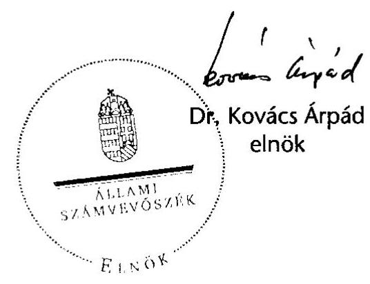

---

ISSN 1789-8773

---

# TARTALOMJEGYZÉK 

BEVEZETÉS ..... 3
ÖSSZEGZÉS ..... 4

1. AZ ÁSZ 2008. ÉVI FELADATAI ..... 7
1.1. Az éves ellenőrzési terv teljesítése ..... 7
1.2. Egyéb számvevőszéki feladatok ..... 9
1.3. További - szabályozásra váró - számvevőszéki feladat-ellátások ..... 13
2. AZ ÁSZ ELLENŐRZÉSI TAPASZTALATAI ..... 14
2.1. Főbb tapasztalatok államháztartási alrendszerenként ..... 14
2.1.1. A központi költségvetés ..... 14
2.1.2. Az elkülönített állami pénzalapok ..... 24
2.1.3. A társadalombiztosítás pénzügyi alapjai ..... 26
2.1.4. A helyi önkormányzatok ..... 28
2.2. Az állami és az önkormányzati feladatellátásra irányuló ellenőrzések főbb tapasztalatai ..... 39
2.3. Az uniós források felhasználása ..... 48
2.4. Az államháztartáson kívülre juttatott támogatások ..... 53
2.5. Az állami vagyongazdálkodás ..... 55
3. AZ ELLENŐRZÉSEK HASZNOSÍTÁSA ..... 57
3.1. A jelentések országgyűlési tárgyalása, határozatok és az országgyűlési kapcsolatok ..... 58
3.2. A számvevőszéki javaslatok érvényesülése ..... 59
3.2.1. Javaslatok hasznosítása az Országgyűlés szintjén ..... 60
3.2.2. Javaslatok hasznosítása kormányzati szinten ..... 63
3.2.3. Javaslatok hasznosítása az ellenőrzött szervezetek szintjén ..... 69
3.2.4. Meg nem valósult javaslataink ..... 71
3.3. Az ÁSZ jogi realizálással kapcsolatos tevékenysége ..... 74
3.4. A számvevőszéki tevékenység nyilvánossága ..... 76
4. AZ ELLENŐRI MUNKA MINŐSÉGÉNEK FEJLESZTÉSE ..... 78
4.1. Az ellenőrzések minőségbiztosítása ..... 78
4.2. Humán erőforrás gazdálkodás és fejlesztés ..... 79
4.3. Nemzetközi kapcsolatok ..... 83
5. A SZÁMVEVŐSZÉKI TEVÉKENYSÉGHEZ KAPCSOLÓDÓ KUTATÓ ÉS FEJLESZTŐ MUNKA ..... 89
6. AZ INTÉZMÉNY MŰKÖDÉSE ÉS GAZDÁLKODÁSA ..... 92
6.1. Költségvetési gazdálkodás ..... 92
6.2. Az infrastruktúra működtetése, fejlesztések ..... 94
6.3. Az informatika és a telekommunikáció működtetése, fejlesztése ..... 95
6.4. Belső ellenőrzés ..... 98

---

# MELLÉKLETEK 

1. számú A 2008. évi jelentések jellemzői ..... 1
2. számú ÁSZ jelentések az országgyűlési bizottságok/plenáris ülések napirendjén 2008-ban
3. számú Az ÁSZ 2008. évi jelentéseiben a fejezetek vezetőinek megfogalmazott ..... 19
javaslatok és az azokra adott válaszok
4. számú Összefoglalók a 2008-ban befejezett ellenőrzések tapasztalatairól ..... 93

---

VE-01-022/2009.

# BEVEZETÉS 

Az Állami Számvevőszék (ÁSZ) évente beszámol tevékenységéről az Országgyűlésnek. A jelentést a plenáris ülés tárgyalja meg, azt megelőzően több országgyűlési bizottság is napirendre tűzi. Az éves tevékenységről szóló jelentés megvitatását követően az Országgyűlés határozatot hoz a munka értékeléséről, illetve a jövőbeni fejlesztési irányokról. Ezen országgyűlési határozatokat figyelembe véve állítjuk össze éves ellenőrzési tervünket, folytatjuk a számvevői munkát kiegészítő kutató-tanácsadó tevékenységünket.

Intézményünk konszolidált, stabil feltételek mellett, szervezeti rendszereit folyamatosan fejlesztve, zárt technológiai rendben, az ellenőrzési eredmények által visszaigazolt értékekre építve végzi feladatait.

2008-ban 53 jelentést készítettünk. Az országgyűlési bizottságok az előző évihez hasonlóan 13 jelentésről 56 alkalommal tárgyaltak. A korábbi gyakorlatnak megfelelően néhány jelentést - a költségvetés végrehajtásának ellenőrzése, a költségvetési javaslat véleményezése, illetve az ÁSZ éves jelentése - több bizottság is napirendjére tűzte. 2008-ban közreadott jelentéseinkben összesen több mint 1100 javaslatot tettünk, amelyeket mintegy 900 szervezetnél végzett helyszíni ellenőrzés lefolytatásával alapoztunk meg.

Ellenőrzési feladataink végrehajtása mellett, közel négy év után 2008-ban korszerűsítettük a számvevőszéki ellenőrzés szakmai szabályait, így jelenhetett meg a tartalmában megújított Ellenőrzési Kézikönyvünk. Nemzetközi kapcsolataink, együttműködéseink révén eljutnak hozzánk azok a „technikai transzferek", amelyek segítségével a számvevőszéki ellenőrzés nemzetközi szinten bekövetkezett módszertani fejlődésének újabb eredményeit alkalmazhatjuk munkánk során. Ez is hozzájárult ahhoz, hogy mérsékelten csökkenő állományi létszám mellett, de tervszerű és folyamatos informatikai fejlesztéssel - egyre nagyobb ellenőrzési lefedettséget értünk el az utóbbi évek folyamán.

A számvevőszéki tevékenység sajátosságából adódóan ellenőrzési munkánk a múltra irányul, ami a jelenlegi világgazdasági és a hazai folyamatok gyors változásainak ismeretében ellentmondásosnak tűnhet, de a jelenben közreadott ajánlásainkkal, ellenőrzési tapasztalatainkkal - ahogy a korábbi évek során, úgy most is - a jövő feladatait célozzuk, s a döntések megalapozásához szándékozunk hátteret nyújtani.

Éves jelentésünk lehetőséget ad az ellenőrzési tapasztalataink rendszerszemléletű értékelésére, a javaslataink alapján kibontakozó intézkedések és azok befolyásoló tényezőinek áttekintésére. Emellett beszámolónk szervezetünk működésének, gazdálkodásának és fejlesztésének bemutatását is szolgálja.

A számvevőszéki törvény előírásának megfelelően az Országgyűlés elnöke által pályázat útján megbízott független könyvvizsgáló ellenőrzi az intézmény gazdálkodását. A könyvvizsgálat a 2008. évi gazdálkodásról készült költségvetési beszámolót hitelesítő záradékkal látta el.

---

# ÖSSZEGZÉS 

Az ÁSZ - tevékenységének kezdete óta - beleütközik abba az alapvető problémába, amit az állami feladatok meghatározatlansága jelent. Ez a hiányosság túlmutat önmagán, hiszen hatással van a stratégiai gondolkodásra, a finanszírozásra és a szervezeti struktúrára egyaránt. Szinte minden ellenőrzésünk megállapításaiban, illetve javaslataiban megjelenik az ezt célzó figyelemfelhívás. Ismétlődő ilyen tapasztalataink, illetve azok korlátozott hasznosulása arra hívja fel a figyelmet, hogy az államháztartás, illetve a nemzetgazdaság jelen problémái vélhetően messze nem lennének olyan súlyúak, ha a rendszerváltozást követően - ésszerűen rövid időn belül - konszenzussal döntés született volna az állam által vállalható és finanszírozható közfeladatok tartalmának és terjedelmének meghatározásáról.
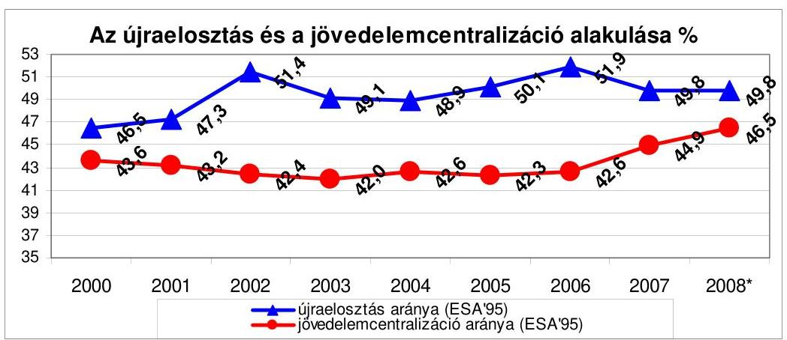

Megjegyzés: ÁSZ által számított adatok, forrás: KSH „A kormányzati szektor adatai" és „Bruttó hazai termék", * 2008 előzetes

Az elmúlt időszakban kezdeményezett ésszerűsítő jellegű, a hatékonyság javítását célzó intézkedések, és az esetenként szervezeti átalakulásokkal is együtt járó változtatások nem önálló, átfogó és teljes körű reformprogram, fejlesztési stratégia mentén történtek, így a rövidebb távú stabilizációt, a konszolidációt előmozdító bevételnövelő és kiadás-mérséklő intézkedések kerültek előtérbe. Mindez nem csupán a költségvetés helyzetét, a közszféra kiegyensúlyozott működését, hanem a nemzetgazdaság egészének versenyképességét is meghatározóan befolyásolja.

Az átlátható és következetes igazgatási működés, az elvi alapok tisztázásának és a szükséges döntéseknek a hiányában nem valósulhatott meg a feladatok és az ellátásukhoz szükséges forrásoknak az összehangolása. A központi közigazgatás fejlesztésének rendszerszemléletű ellenőrzése megállapította, hogy a legfontosabb hiányosság - a tervezés és a stratégia-alkotás, az előzetes és utólagos hatásvizsgálat szabályozási, szervezeti kereteinek megteremtése - terén nem történt érdemi előrehaladás. Az egyes intézkedések ütemezése, megvalósulása között szükséges szakmai összefüggések feltárása továbbra sem rendszerszerűen valósult meg, időigényüket, a programok beindításának, befejezésének idejét gyakran helytelenül mérték fel.

---

Nem segítette a modernizációs folyamatot, hogy annak kormányzati felelősségi rendszere folyamatosan változott, illetve a munkálatokban nem kapott kiemelt szerepet a Kormány, mint szervezet munkájának elemzése.

A „kisebb, hatékonyabb állam" megteremtésére irányuló kormányzati célrendszerben a döntéshozók figyelme nem terjedt ki a központi közigazgatás intézményrendszerével, illetve az egyes intézmények belső szervezetével kapcsolatos gyakori átalakítások, a szabályozási és szervezeti változások hatásainak (beleértve azok költségeit és kockázatait) felmérésére, a stabilitásból adódó előnyök értékelésére, valamint arra, hogy a „kiszervezések" nyomán valójában csökkentek-e a kiadások, vagy csak összetételük változott meg.

A nagy közösségi ellátórendszerek korszerűsítése is megkívánja a társadalmi összefüggések körültekintő elemzését, és olyan megközelítést igényel, ami túlmutat a szűken vett fiskális szempontokon. Ellenőrzési tapasztalataink azt mutatják, hogy ez a megközelítési mód nem érvényesült a változtatásokban.

A közelmúlt lényeges változása volt, hogy erősödött az egészségügyi szolgáltatások társadalombiztosítási jellege, a biztosításhoz kötött szolgáltatás igénybevétele, azonban a legfontosabb strukturális és finanszírozási kérdésekre, valamint a biztosítási rendszer korszerűsítésére vonatkozóan még nincsenek kiforrott és konszenzussal elfogadott válaszok. A társadalombiztosítás ugyan többlettel zárta a 2007. évet, ehhez azonban a kormányzati racionalizáló intézkedések mellett az is hozzájárult, hogy a bevételeket a központi költségvetés közel 780 Mrd Ft-tal kiegészítette, ami a teljes államháztartás tekintetében hiány-növelő tényező volt. Az előzetes adatok szerint a társadalombiztosítás 2008-ban a központi költségvetés 835 Mrd Ft-os, növekvő pénzeszközátadása mellett ismét jelentős, 67,7 Mrd Ft-os hiánnyal zárt.

Az oktatási szférában is több ésszerűsítő és kiadáscsökkentő részintézkedésre került sor, ám nem ismertek még azok a cselekvési irányok és konkrét teendők, amelyek eredményeként javulhatna az általános tudásszint, jobbak lehetnének a sajátos minőségi mutatók, és - az úgynevezett tudástársadalom irányába határozottan elmozdulva - a rendszer egésze az eddigieknél jobban megfelelne a modern gazdaság igényeinek.

Az ismétlődő ellenőrzési tapasztalatok arra intenek, hogy az egyik legfontosabb megoldandó problémakör a foglalkoztatási színvonal növelése. Erre azonban nem csak a visszaeső növekedés következményei hatnak hátrányosan, hanem a munkaerő-kínálat oldaláról is csak hosszabb távon leküzdhető strukturális és minőségi akadályai vannak.

A közigazgatás, az egészségügy és az oktatás tartalmi, valamint működési és gazdálkodási problémái az önkormányzatok és intézményeik mindennapi gyakorlatában is megjelennek. A zárszámadási ellenőrzés összességében rendezettnek találta a helyi önkormányzatok költségvetési kapcsolatait, a pénzmozgások és a felhasználások szabályszerűségét, de egyéb ellenőrzéseink és az ÁSZKUT tanulmánya azt is megerősítette, hogy egyrészt a finanszírozási rendszerrel, másrészt a terület- és településfejlesztéssel is összefüggésben egyre

---

sürgetőbb az önkormányzati rendszer reformja, beleértve a feladatok és a hatáskörök új alapokra helyezését is.

A finanszírozható állami feladatok meghatározásának hiányában jelenlegi költségvetési rendszerünk további fogyatékossága, hogy a nem megfelelően strukturált információs rendszer miatt ténylegesen nem állapítható meg az egyes feladatokra fordított pénzeszközök mennyisége, illetve a teljesítmény-mutatók hiánya miatt az sem, hogy a ráfordítások miképpen, milyen eredményességgel hasznosulnak.

A társadalmi összefüggésekkel is számoló, távlatokban is mérlegelő költségvetési tervezés feltételezi és igényli a jelenleginél teljesebben kiépített, a piacgazdaság természetéhez is igazodó makrogazdasági pénzügyi tervezési rendszer működtetését. Ez nemcsak hatékonysági és versenyképességi faktor, hanem következmény, így válik átláthatóbbá, hitelesebbé az állam működése. A különböző számvevőszéki jelentésekben, valamint kutatóműhelyünk tanulmányaiban ezért is hangsúlyoztuk, hogy szükséges és lehetséges konszenzuson alapuló stratégiára épített nemzetgazdasági fejlesztéspolitika kialakítása, ami feltételezi és igényli a nemzetgazdasági tervezési rendszer felépítését és működtetését is. Olyan rendszert szükséges kialakítani, amelynek legfontosabb sajátossága, hogy a reálfejlesztés (nemzeti fejlesztési koncepció és terv, a területfejlesztés, településfejlesztés, a gazdaságfejlesztés, a szociális és kulturális szféra fejlesztése) és a pénzügyi tervezés (konvergencia program és az éves költségvetések központi és helyi szinteken egyaránt) intézményes összhangja biztosított legyen. E rendszerrel szemben támasztott másik követelmény, hogy a fejlesztéspolitika és a gazdasági versenyképesség követelményeit szem előtt tartva illessze bele a strukturális reformokat a fejlesztési tervekbe.

Az ÁSZ tapasztalatai is megerősítik, hogy a korszerű és megbízható nemzetgazdasági tervezési rendszer nem csak a nemzetgazdaság, benne az államháztartás működése és fejlesztése szempontjából előnyös, hanem abból a szempontból is - s ez a bizalomteremtés érdekében igen lényeges -, hogy hatására jobban követhetővé, átláthatóbbá és kiszámíthatóbbá válik az állami működés, ami a közbizalom megerősítésének egyik fontos feltétele.

---

# 1. Az ÁSZ 2008. ÉVI FELADATAI 

### 1.1. Az éves ellenőrzési terv teljesítése

Az ÁSZ 2008-ban is jóváhagyott - az Országgyűlés Költségvetési, pénzügyi és számvevőszéki bizottsága által megtárgyalt - ellenőrzési tervben foglaltak szerint végezte tevékenységét.

Az éves ellenőrzési tervben összesen 78 téma szerepelt, ebből 55 ellenőrzés 2008. évi befejezéssel került megtervezésre. Év közben a terv egy feladattal kiegészült, egy feladat törlésre került, így a módosított ellenőrzési terv változatlanul 78 ellenőrzést tartalmazott.

Év közben tervbe vett új ellenőrzés: a 2008. februári időközi országgyűlési képviselőválasztási kampányra fordított pénzeszközök elszámolásának ellenőrzése.

Törölt ellenőrzés: a Gazdasági és Közlekedési Minisztérium működésének ellenőrzése, annak több szervezetbe történő, időközbeni dezintegrálása miatt.

2008-ban 53 jelentést tettünk közzé, két 2008. évi befejezéssel
 tervezett jelentés 2009. évre húzódott át.

A magyar központi közigazgatás modernizációjának ellenőrzése 2008-ban lezárult, de a jelentés 2009-ben került közzétételre.

A MIÉP 2005-2006. évi gazdálkodása törvényességének ellenőrzését - az ellenőrzött szervezet vizsgálatot akadályozó magatartása miatt - év közben meg kellett szakítani. Így a terv szerinti befejezési határidő nem volt tartható, az ellenőrzés 2009 januárjában fejeződött be.

Ellenőrzési feladatainkra 2008-ban összesen 55817 közvetlen ellenőri napot fordítottunk, 3723 nappal kevesebbet, mint az előző évben. A tényleges kapacitás 6270 nappal volt alacsonyabb a tervezettnél. A csökkenés a létszámkorlátozó, pénzügyi megtakarításokat célzó intézkedésekkel összefüggésben és a megnövekedett nyugállományba vonulás hatásaként adódik.

Az ÁSZ ellenőrzési kötelezettségeinél meghatározóak a törvényekben különféle rendszerességgel előírt (évenkénti, kétévenkénti, illetve rendszeres) feladatok. Ezek teljesítéseként összesen 32 ellenőrzésről készült jelentés, ami az előző évekhez hasonlóan - az ÁSZ ellenőrzési kapacitásának 64%-át vette igénybe.

Az évenkénti ellenőrzési kötelezettségek teljesítéseként 5 jelentés készült (a költségvetés megalapozottságának véleményezése, zárszámadásának ellenőrzése, az ÁPV Zrt. és az MTI Zrt. működésének, valamint a fővárosi önkormányzatot és a kerületi önkormányzatokat osztottan megillető bevételek megosztásának ellenőrzése).

---

E feladatok közül a legnagyobb kapacitást a 2007. évi költségvetés végrehajtásának ellenőrzése igényelte, amely az előző évhez hasonló arányban az ÁSZ ellenőrzési kapacitásának 28%-át kötötte le.

Kétévenkénti ellenőrzési kötelezettség keretében 2 párt és 2 pártalapítvány gazdálkodásának ellenőrzéséről 4 jelentés készült.

Rendszeres ellenőrzési feladatok teljesítéseként 23 jelentést adtunk közre. E feladatok meghatározó részét (több mint 80%-át) a helyi önkormányzatok gazdálkodásának átfogó ellenőrzése képezte. A 167 helyi és települési önkormányzat átfogó helyszíni ellenőrzésénél szerzett tapasztalatokat összefoglaló jelentésen kívül 17 jelentős nagyságrendű költségvetéssel, illetve vagyonnal rendelkező önkormányzatról önálló számvevőszéki jelentés készült. A központi költségvetési fejezetek közül a Pénzügyminisztérium több évre kiterjedő átfogó ellenőrzéséről készült jelentés. E körbe tartozott továbbá a Kutatási és Technológiai Innovációs Alap, a Magyar Nemzeti Bank Rt. működésének ellenőrzése, valamint 2 országos kisebbségi (örmény, ukrán) önkormányzat ellenőrzése is.
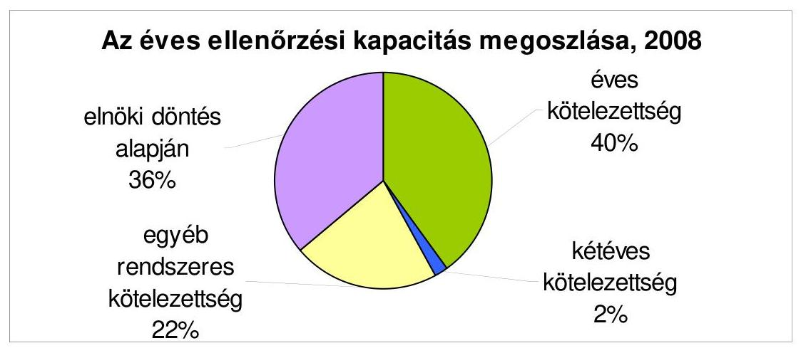

A törvényi előírások teljesítése mellett az éves ellenőrzési kapacitás 36%-át képezhették olyan témakörök, amelyek végrehajtásának gyakoriságát törvény nem rögzíti. Az ÁSZ elnökének döntése alapján végzett ellenőrzésekre az ellenőrzési kapacitás - előző évivel azonos hányada - kerülhetett felhasználásra, s 21 jelentés készült.

Az elnöki döntés alapján megvalósult ellenőrzések - az ÁSZ stratégiai céljaihoz illeszkedően - négy súlypont köré csoportosíthatóak.

Az államháztartás átlátható, szabályszerű működését, a költségvetési felelősség erősítését célozták a központi költségvetés intézményrendszere, a fejezeti kezelésű előirányzatok rendszere, a közbeszerzési rendszer és a gazdaságfejlesztés állami eszközrendszere működésére irányuló ellenőrzések.

Az uniós források igénybevételének, cél szerinti hasznosításának vizsgálata érdekében a Nemzeti Fejlesztési Ügynökség működésének és az INTERREG célú költségvetési előirányzatok hasznosulásának ellenőrzésére került sor.

Az állami fejlesztési források védelme, az államháztartás és a magángazdaság kapcsolataiban rejlő kockázatok feltárása érdekében megvalósult a 2007-ben befejeződő autópálya beruházások, egyes kiemelt önkormányzati beruházások, a vasúti közlekedés korszerűsítésének ellenőrzése.

---

Az állami feladatok hatékony és eredményes ellátására irányult az OKM fejezetnél a közoktatási feladatok finanszírozási rendszerének, az oktatási célú nonprofit szervezetek költségvetési támogatása felhasználásának, az egyes onkológiai szűrő programokra, az önkormányzati kórházak és bentlakásos szociális intézmények ápolásra, gondozásra fordított pénzeszközei felhasználásának, a szakiskolai fejlesztési programra fordított pénzeszközök eredményességének, a települési önkormányzatok többcélú kistérségi társulásainak, valamint a közgyógyellátási rendszer működésének ellenőrzése.

Az Országgyűlés, illetve a Kormány részéről 2008-ban vizsgálati felkérés az ÁSZ-hoz nem érkezett.
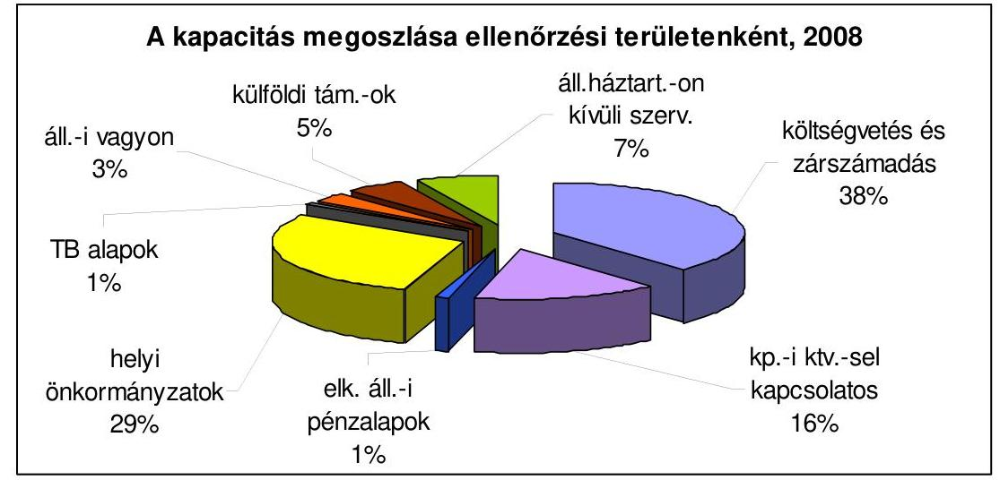

Az ÁSZ az ellenőrzéseit három fő típusba sorolja. 2008-ban az ÁSZ kapacitása 46%-át a szabályszerűségi ellenőrzésekre (költségvetés véleményezése, zárszámadás, pártok, alapítványok gazdálkodásának ellenőrzése), 29%-át az átfogó ellenőrzésekre (önkormányzatok, minisztériumok, központi költségvetés intézményrendszere és előirányzatai), 25% teljesítmény-ellenőrzésekre fordította. Ez a megoszlás lényegesen nem tér el az előző évi szerkezettől.

A 2008-ban elkészült jelentések jellemzőit (a jelentés tárgya, száma, a jelentést készítő igazgatóság, az ellenőrzés jogszabályi alapja és indoka, célja, a költségvetési nagyságrend) az 1. sz. melléklet tartalmazza.

# 1.2. Egyéb számvevőszéki feladatok 

A szervezet egyéb tevékenységi körébe számos - a szorosan vett ellenőrzési kötelezettségen és jogosítványon túlmutató - felhatalmazás, illetve feladat tartozik, amelyeket az Alkotmány, a számvevőszéki törvény és egyéb törvények írják elő.

Az ÁSZ elnöke ellenjegyzi a költségvetés hitelfelvételeire vonatkozó szerződéseket, véleményezi az államháztartás számviteli rendjének, belső pénzügyi ellenőrzési rendszer működésének továbbfejlesztésére vonatkozó javaslatokat. Javaslatot tesz az állami vagyonkezelő szervezet ellenőrző bizottsága elnökének személyére, továbbá az elkülönített állami pénzalapok könyvvizsgálóira, valamint véleményt nyilvánít a jegybank és az MFB könyvvizsgálójával kapcsolatban, előzetesen véleményezheti az APEH elnökének kinevezését.

---

A legalább többségi állami tulajdonú gazdasági társaságok esetében, ha a jegyzett tőke meghaladja a kétszáz millió forintot, a felügyelő bizottság elnökének személyére is az ÁSZ tesz javaslatot, a gazdálkodó szervezet vezetőjének megkeresése alapján.

Egyes - törvényben meghatározott - gazdálkodók (hitelintézeti, befektetési, biztosítási, költségvetési) esetében csak minősített könyvvizsgáló vagy könyvvizsgáló cég végezhet jogszabályi kötelezettségen alapuló könyvvizsgálói tevékenységet, amihez - kérelmére, hatósági eljárás keretében - a Könyvvizsgálói Kamarától kaphat minősítést. Az új könyvvizsgálói törvény alapján a kamarai tag könyvvizsgáló vagy könyvvizsgáló cég költségvetési minősítésére vonatkozó kérelmek elbírálása és a minősítések visszavonása során ki kell kérni az ÁSZ véleményét. Az ÁSZ-nak vélemény-nyilvánítási jogosultsága van a Kamara felé az összeférhetetlenség megállapítása, illetve fegyelmi vétség elkövetésének alapos gyanúja jelzésének vonatkozásában is.

Panasszal és közérdekű bejelentéssel bárki - szóban, írásban vagy elektronikus úton - fordulhat a tárgykörben eljárásra jogosult szervhez. A közérdekű bejelentések, javaslatok és kérelmek intézésének jogi alapját a 2004. évi XXIX. törvény közérdekű kérelmekkel, panaszokkal és bejelentésekkel kapcsolatos eljárásra vonatkozó szakaszai (141-143. §-ok) képezik.

# Ellenjegyzési jogkör 

A költségvetés fizetőképességének fenntartását szolgáló hitelek esetében az ÁSZ elnöke 2008-ban is eleget tett ellenjegyzési kötelezettségének.

A Magyar Köztársaság nevében a pénzügyminiszter felhatalmazta az Államadósság Kezelő Központ Zrt. vezérigazgatóját, hogy a swap ügyletek miatti fedezetnyújtás érdekében legalább 200 M euró összegben rulírozó hitelkeret szerződéseket kössön. A szerződések megkötésére 2008-ban három bankkal került sor 50, 50 és 100 M euró összegekre. A három hitelszerződéssel kapcsolatos dokumentációk szabályszerűségi áttekintése alapján a hitelszerződések ÁSZ-elnöki ellenjegyzése minden esetben megtörtént.

A korábbi évekhez hasonlóan 2008-ban sem került sor ellenjegyzésre a projektfinanszírozó hitelek esetében ${ }^{1}$. Ezek a hitelek költségvetési beruházások finanszírozását szolgálják, amelyek a Kormány által előnyben részesített területeken valósulnak meg és megvalósításukról előzőleg parlamenti, vagy kormányzati döntés születik. A fejlesztési célokra felvett nemzetközi beruházási hitelek kihelyezése a fejezeti költségvetésen keresztül történik. Ezeket a hitelviszonyokat és a lehívásuk esetén keletkező kötelezettségeket, illetve azok teljesítését minden esetben utólagos ellenőrzés keretében vizsgálja az ÁSZ.

A Nemzetközi Valutaalaptól (12,5 Mrd euró), az Európai Közösségtől (6,5 Mrd euró) és a Világbanktól (1,0 Mrd euró) lehívható hitelkeretek a Pénzügyminisztérium szakállamtitkárának írásbeli tájékoztatása szerint a folyó fizetési mérleg finanszírozását szolgálják, a lehívott összegek az ország devizatartalékait növe-

[^0]
[^0]:    ${ }^{1} 2004$ óta 35 projektfinanszírozó hitel felvételére került sor, ebből 8 hitel felvétele történt a 2008. évben.

---

lik. Az ellenjegyzésre vonatkozó kötelezettség így ezekben az esetekben sem állt fenn.

# Véleményezési jogkör 

A számviteli rend változásával összefüggésben biztosított véleményezési jogkörünket 2008-ban az egyes adó- és járulék törvények módosításáról szóló törvényjavaslat számviteli törvényt érintő része, az államháztartás szervezetei beszámolási és könyvvezetési kötelezettségének sajátosságairól szóló 249/2000. (XII. 24.) Korm. rendelet, valamint a kincstári elszámolások beszámolási és könyvvezetési kötelezettségének sajátosságairól szóló 240/2003. (XII. 17.) Korm. rendelet módosításai kapcsán gyakoroltuk.

Az új könyvvizsgálói törvényben foglaltak alapján 2008-ban összesen 182 kamarai tag könyvvizsgáló cég és 2 kamarai tag könyvvizsgáló személy költségvetési minősítéséhez adtunk véleményt. Költségvetési minősítés visszavonásának kezdeményezésére, továbbá összeférhetetlenség, illetve fegyelmi vétség elkövetése gyanújának konkrét jelzésére az év során nem került sor.

## Javaslattételi jogkör

Az ÁSZ elnöke a pénzügyminiszter megkeresésére a Wesselényi Miklós Ár- és Belvízvédelmi Kártalanítási Alapnál tett javaslatot a könyvvizsgáló személyére, a 2008-2009 üzleti évekre vonatkozóan, és - összeférhetetlenségi ok bejelentése miatt - egy esetben tett javaslatot FB-elnök személyére.

Az ÁSZ az állami gazdálkodó szervezetektől érkezett, hatáskörébe tartozó megkeresésekre főtitkári hatáskörben tett FB-elnök jelölési javaslatokat, kizárólag a névjegyzékbe bekerült, eredményes pályázók köréből.

A névjegyzék gyarapítása érdekében - a korábbi hat alkalmat követően - 2008 júniusában írtunk ki pályázatot, 32 eredményes pályázattal gyarapodott az általunk kezelt pályázati anyagok száma. Ezen pályázatok alapján 2008. december 31-én a jelölésre alkalmas személyek száma 711 fő.

2008-ban összesen 51 gazdálkodó szervezettől érkezett kérelmet intéztünk. A hiánypótlási felhívások teljesítése után a kialakított és közzétett eljárási rendnek megfelelően az ÁSZ főtitkára 49 állami gazdálkodó szervezet részére tett jelölési javaslatot.
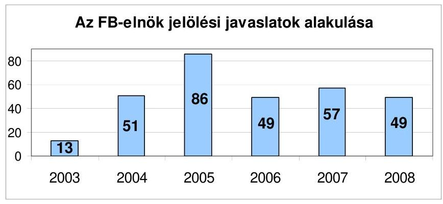

---

Az ÁSZ által jelölésre javasolt és FB-elnöknek megválasztott személy visszahívására vonatkozó javaslat 2008-ban sem volt.

Jelölésünk alapján 2008. december 31. napján 129 személy töltött be FB elnöki megbízatást.

# Közérdekű bejelentések, javaslatok és kérelmek, hivatalos megkeresések 

A közpénzek felhasználásával kapcsolatban 2008-ban is bővülő számban fordultak hozzánk állampolgárok kérdéseikkel, javaslataikkal. Tájékoztatás céljából a hivatalos szervek is minden eddiginél nagyobb számban keresték meg intézményünket.

Az ÁSZ-hoz írásban 293 közérdekű bejelentés, panasz, 115 állami és önkormányzati szervtől származó hivatalos megkeresés, valamint a telefonos ügyfélkapcsolat körében 147 hívás érkezett. A közérdekű bejelentések, megkeresések emelkedő száma azt mutatja, hogy a közérdeklődés egyre nagyobb figyelemmel fordul az állami költségvetésből, az Európai Unióból származó pénzeszközök felhasználása felé.
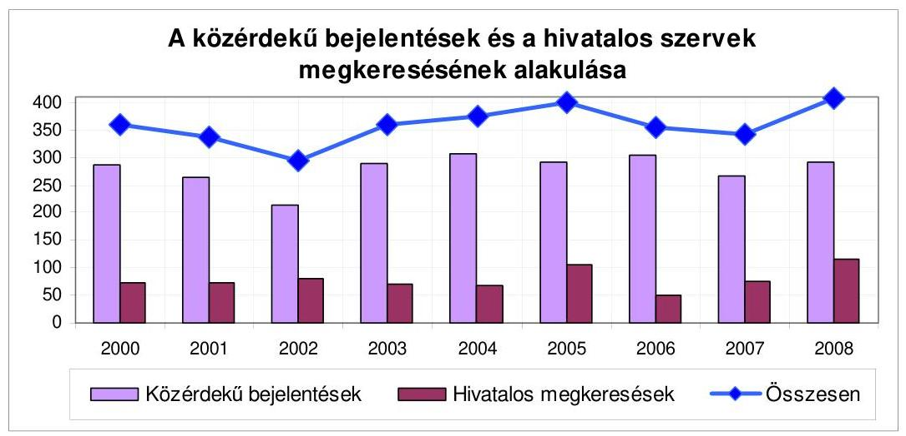

Továbbra is jelentős számú a helyi és helyi kisebbségi önkormányzatok gazdálkodásához, működéséhez kapcsolódó közérdekű bejelentés. Növekedett a különféle, részben vagy teljesen állami költségvetésből finanszírozott szervezetek pénzügyeihez, a pályázat útján elnyert állami forrásból eredő pénzeszközök felhasználásához, a közbeszerzésekhez, az uniós pénzeszközök felhasználásához és elszámolásához köthető beadványok részaránya. Gyakorta kapcsolódott a bejelentés egyes állami, vagy önkormányzati tisztségviselők vagyongyarapodásához, feltételezett visszaélésekhez.

Bűncselekmény gyanúját tartalmazó bejelentést - a bejelentő egyetértésével 11 esetben tettük át a nyomozó hatóságokhoz. Jogértelmezésre, jogalkalmazás véleményezésére való felkéréssel továbbra is nagy számban, de 2008-ban már főként az ún. szakmai bejelentők (helyi önkormányzat tisztségviselője, képviselőtestület tagja) fordultak hozzánk.

---

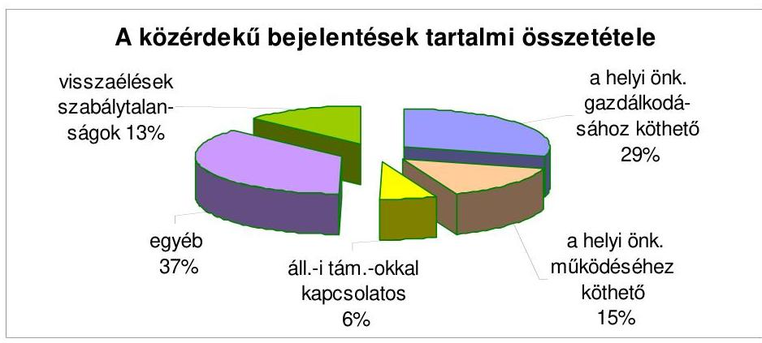

Az ÁSZ-hoz 2008-ban bejelentéssel fordulók 34%-a magánszemély, 15%-a helyi és helyi kisebbségi önkormányzat vezetője, tisztségviselője, 30%-a egyéb kategóriába sorolható személy (magán vállalkozó, különféle társadalmi szervezetek, pártok képviselője, ügyvéd stb.), és 21%-a névtelenséget választó személy volt.

A bejelentésekben foglaltakat egyrészt hasznosítjuk az ellenőrzési programok kialakítása és az ellenőrzések lefolytatása során, másrészt az igénybe vehető jogorvoslati utakról, más lehetőségekről tájékoztatjuk a levélírókat.

# 1.3. További - szabályozásra váró - számvevőszéki feladatellátások 

Az Országgyűlés a központi államigazgatási szervekről, valamint a Kormány tagjai és az államtitkárok jogállásáról szóló 2006. évi LVII. törvényt módosító 2008. évi X. törvénnyel 2008. március 27-i hatállyal az ÁSZ-ra bízta az állami vezetők vagyongyarapodásának vizsgálatát. Az új szabályozás, az adózás rendjéről szóló törvény alkalmazását elrendelve, az ÁSZ-t hatósági feladatok ellátására kötelezte. Ez a szabályozás nem vette tekintetbe az Alkotmánybíróság több határozatát, amelyek kimondják, hogy az ÁSZ nem hatóság, hanem ellenőrzési feladatokat ellátó, sajátos
 jogállású közhatalmi szerv.

Az Országgyűlés az ÁSZ 2007. évi tevékenységéről szóló jelentés elfogadásáról rendelkező 72/2008. (VI. 10.) OGY határozatában ezért felkérte a Kormányt, hogy az állami vezetők javadalmazásának átláthatóságához szükséges egyes törvénymódosításokról szóló 2008. évi X. törvény rendelkezéseit vizsgálja felül, és a vizsgálat eredményére figyelemmel nyújtson be javaslatot az állami vezetők vagyongyarapodási vizsgálata szabályozásának módosítására.

Erre a beszámoló lezárásáig nem került sor, bár az ÁSZ az általa javasolt módosítás tervezetét 2008. június 2-án eljuttatta a Miniszterelnöki Hivatalhoz. Mivel érdemi egyeztetésre nem került sor, ismételten felajánlottuk közreműködésünket egy végrehajtható szabályozás előkészítésében.

Az ÁSZ az államháztartási reform keretében javasolta az önkormányzati ellenőrzési rendszer továbbfejlesztését. Ezt is figyelembe véve az önkormányzati belső ellenőrzés rendszerében az európai normák érvényesítése érdekében előrelépés történt, de a Kormány és az Önkormányzatok Egyeztető Fóruma támogatása ellenére az önkormányzati beszámolók ÁSZ eredményfelelősségével való auditálásának kialakítása függőben maradt.

---

# 2. Az ÁSZ ELLENŐRZÉSI TAPASZTALATAI 

### 2.1. Főbb tapasztalatok államháztartási alrendszerenként

Az államháztartás egésze tekintetében a 2008-ban végzett zárszámadási ellenőrzésünk megállapította, hogy annak 2007. évi tényleges hiánya 1361,5 Mrd Ft összegben (a GDP 5,4%-a) alakult, ami 22%-kal alacsonyabb az eredetileg előirányzottnál. A hiány tervezettnél kedvezőbb alakulásának több mint 90%-a az állami költségvetés szintjén realizálódott. A Konvergencia Programban foglalt fiskális célkitűzések egyes makrogazdasági folyamatok (GDP-növekedés tervezettnél nagyobb mértékű lassulása, stagnáló beruházások, tervezettnél nagyobb infláció) kedvezőtlen alakulása mellett valósultak meg.

Az államháztartási egyensúly kedvező alakulását több tényező befolyásolta, s alapvetően a bevételi oldalon képződött többlet eredményezte. A bevételi oldalon az egyensúly javításában érvényesült az adó- és járulékbevételek többlete, illetve a kamatbevételek alakulása, továbbá a központi költségvetési szervek és fejezeti kezelésű előirányzatok bevételeinek és befizetéseinek túlteljesítése. A kiadási oldalon a tervezettnél alacsonyabban alakultak a kamatkiadások, a metróberuházás kifizetései, az előirányzottaktól elmaradtak a gyógyszer- és táppénz kiadások, valamint az uniós hozzájárulások. A pozíciót javították az olyan adósságátvállalások, amelyekre - az eredeti ütemezéshez képest - a megelőző évben került sor.

Az államháztartás nagy ellátó rendszereinek az államháztartás pozícióját javító egyenlege a 2006., illetve a 2007. évben megalkotott, az államháztartás egyensúlyi helyzetét javító (bevételnövelő, illetve kiadást mérséklő) törvényi szabályozások, kormányzati intézkedések, valamint a gazdasági folyamatok alakulásának a következménye.

### 2.1.1. A központi költségvetés

Ellenőrzéseink 2008-ban a központi költségvetés több, jól körülhatárolható területének - központi költségvetés intézményrendszere, fejezeti kezelésű előirányzatok rendszere, gazdaságfejlesztés állami eszközrendszere, közbeszerzési rendszer - rendszerszemléletű megközelítésére összpontosítottak. Az így szerzett tapasztalatok rámutatnak a központi költségvetés működésének hosszú évek óta jelzett alapvető problémáira.

A központi költségvetés intézményrendszerének modernizálására 2004-től határozott szándék jelent meg. Ennek érdekében 2004 és 2006 között több kormányhatározat tartalmazott intézkedéseket. A 2006-os kormányprogram az állam, a nagy elosztó rendszerek átfogó reformját hirdette meg. Az államháztartás finanszírozhatósága, a Konvergencia Program teljesíthetősége miatti cselekvéskényszerben a Kormány 2006-ban a központi költségvetés intézményi rendszerének átalakítását határozta el, törvényjavaslatok kidolgozását, a végrehajtás folyamatos figyelemmel kísérését írta elő. A közfeladatok felülvizsgálatával kapcsolatos további feladatokról 2007. évben kormányhatározat írta elő, hogy a pénzügyminiszter felelősségével 2008. december 31-ig ki kell dolgozni a teljesítmény-információkra is építő, programszemléletű költségvetési rendszer bevezetésének koncepcióját.

---

Az államháztartási reform munkálataiért 2006-ig az első számú felelős, a pénzügyminiszter által elkészített, az államháztartás működésének pénzügyi követelményrendszerével, az állami feladatok ellátásához szükséges források felhasználási módjával és az intézményrendszer átalakításával kapcsolatos előterjesztés tervezetet a Kormány nem tárgyalta meg. Az Államreform Bizottság munkaszervezete és a PM között nem volt tisztázott az államreform és az államháztartással kapcsolatos feladatok, felelősségi körök megosztása.

# A szervezetrendszer átalakításának előkészítése az intézményrendszer korszerűsítése megkívánta volna az állam által hosszabb távon ellátandó, finanszírozandó feladatok meghatározását, az állami intézmények szervezeti modelljeinek kidolgozását, a költségvetési szerveket jellemző államigazgatási és statisztikai információk összehasonlítható adattartalmának kialakítását. Ellenőrzéseinkben megállapítottuk, hogy bár a költségvetés intézményrendszere átalakításának elveit, szempontjait 2004. április végére kellett kidolgoznia a feladatért felelős tárcának, az intézkedési terveket megalapozó felülvizsgálatok szempontjait, rendező elveit csak 2004 nyarán határozták meg. A szervezeti javaslatok kidolgozásához és megítéléséhez nem alakítottak ki intézményi modelleket, kritériumokat. A tárcák intézkedései elmaradtak, ezért 2005 márciusában újabb kormányhatározat rendelte el az intézkedési tervek megújítását, majd 2006. május végén a legnagyobb kiadási előirányzattal rendelkező szervek átalakítására javaslatok kidolgozását.

A központi költségvetés intézményi rendszerének radikális átalakításáról történt 2006. évi döntésekor a Kormány nem vizsgálta felül az állam által ellátandó feladatokat, nem határoztak meg szervezeti típusokat, feladat- és teljesítménykritériumokat. A stratégiai megalapozás hiánya kockázatot jelenthet a hosszú távú megtakarítások elérése, valamint az intézményi struktúra és a költségvetés hosszabb távú stabilitása szempontjából. A Kormányhatározat dokumentált államigazgatási egyeztetése elmaradt, ami megelőzhette volna a szakmai vagy jogi szempontból végre nem hajtható intézkedések előírását, irreális határidők kitűzését, az elrendelt intézkedések módosításait. A Kormányhatározatot 19 alkalommal módosították.

A központi költségvetés intézményrendszere átalakítását célzó intézkedéscsomag valamennyi minisztériumra és intézményeikre tartalmazta a feladatokat (intézmények megszüntetése, országos hálózatok összevonása, regionális átszervezések, költségvetésen kívüli szervezetek feladatainak költségvetési intézményi körbe vonása). 2007 végére a feladatok vagy megvalósultak, vagy végrehajtásuk folyamatban volt. A végrehajtás 415 költségvetési intézményt és 96 államháztartáson kívüli szervezetet érintett, eredményeként a fejezetek intézményrendszere kisebb, a működés, a létszám koncentráltabb lett. A változások a 2007. évi költségvetésben 50 Mrd Ft-os - létszámcsökkentésből adódó - megtakarítást alapoztak meg.

A költségvetési intézmények körén belül a központi államigazgatási szervek típusait 2006 júniusában határozta meg az Országgyűlés. A közfeladatok jellegéhez illeszkedő szervezeti típusokat a 2008. évi CV. törvény vezette be.

A MeH, a minisztériumok havi beszámolói alapján, nyomon követte a központi költségvetés intézményi rendszere átalakítási feladatainak teljesítését. A be-

---

számoltatás rendszere az egyszeri és tartós megtakarításokról nem eredményezett megbízható adatokat, a minisztériumok 2007 novemberéig nem munkálták ki valamennyi szervezeti intézkedés pénzügyi hatását, a hiányosan közölt adatok torzító hatását a MeH nem szűrte ki. Az intézkedések alapján elvárt megtakarításokat csupán a létszám csökkentésére határozták meg, ezért a várt hatások bekövetkezése is csak ezen a területen állapítható meg.

A fejezeti kezelésű előirányzatok rendszerének ellenőrzése során megállapítottuk, hogy a finanszírozás és a felhasználás átláthatósága ellen a fejezeti kezelésű előirányzatokkal való gazdálkodásban számos tényező hatott: a költségvetési politika prioritásainak gyakori módosulása; a költségvetési törvények jóváhagyásakor a kiadások hasznosságának megítélését biztosító mutatók, mérőszámok hiánya; a fejezeti kezelésű előirányzatok nehezen áttekinthető struktúrája; a fejezetenként eltérő címrendkialakítása; az előirányzat-átcsoportosítással történő felhasználáskor a fejezeti szintű nyilvántartásokban a teljesítés nyomon követhetőségének hiánya.

Az állam és a Kormány gazdaságfejlesztési feladatainak, illetve azok ellátásának pontos meghatározása nem történt meg. Ennek hiányában nem ismert a szükséges, valamint a rendelkezésre álló források pontos mennyisége. A gazdaságfejlesztés állami eszközrendszere működésének ellenőrzése során megállapítottuk, hogy a költségvetés úgy költött el évente 1500 Mrd Ft-ot, hogy nem rendelkezett átfogó (uniós és hazai forrásokra egyaránt kiterjedő) közép- és hosszú távú, társadalmi-gazdasági stratégiával. A kormányzati ciklusokon átívelő hosszú távú stratégia hiányában az állam szerepét, eszközeit és forrásai felhasználását érintő koncepcióváltások eredményeként a fejlesztési programok megvalósításában a felfutás és a megtorpanás szakaszai váltogatták egymást. Hiányzott egy hosszú távú, fejlesztési célokat támogató adóstratégia is, amelynek része lenne az elérendő célokhoz szükséges adókedvezmények köre és mértéke.

Nem valósult meg az állami fejlesztési feladatok tervezésének erősítését célzó átfogó törvényi szabályozás. A tisztán hazai forrásból finanszírozott fejlesztési támogatásokra, támogatási típusonként eltérő jogi szabályozás, ebből következően eltérő eljárásrend, nyilvántartási és monitoring rendszer, valamint többféle, szervezetenként külön-külön fejlesztett információs rendszer volt használatban.

Ellenőrzéseink kiterjedtek a kontrollrendszer, a belső ellenőrzés hatékonyságának, szabályozottságának vizsgálatára is. Korábban megállapítottuk, hogy az elszámolások és a beszámolók megbízhatóságának kockázatát növeli, hogy a fejezeti belső kontroll rendszer oly mértékben leépült, hogy nincs meg a feltételrendszere a közpénzekkel való gazdálkodás törvényességi és hatékonysági kontrolljának. Megállapítottuk, hogy az államháztartás belső pénzügyi ellenőrzésének fejlesztésével kapcsolatos feladatok teljesítése nem történt meg. A Kormány számára, az illetékes tárca által készített éves jelentések felhívták a figyelmet a humánerőforrás mennyiségi és minőségi problémáira, de nem tettek lépéseket a megoldás érdekében. Elmaradt a belső pénzügyi ellenőrzési rendszer rendszerszemléletű újragondolása, a nemzetközi tapasztalatok adaptálása, a pénzügyi belső kontrollrendszerek és a belső ellenőr-

---

zés viszonyának tisztázása, szabályozása, a megbízhatósági ellenőrzések integrálása a belső ellenőrzési, illetve a kontrollrendszerbe.

# A fejezeti kezelésű előirányzatokkal való gazdálkodás kontrollrendszereinek visszatérően gyenge pontját a felhasználás ellenőrzésének hiányosságai jelentették. A fejezeti kezelésű előirányzatokkal kapcsolatos ellenőrzések - jellemzően létszámproblémák miatt - jelentősen csökkentek a minisztériumokban. Gyakori volt, hogy a felügyeleti szervek nem terveztek a fejezeti kezelésű előirányzatok felhasználására irányuló ellenőrzést, illetve a tervezett ellenőrzéseket nem hajtották végre. 

A közbeszerzések belső ellenőrzése mind a központi, mind a helyi önkormányzati szerveknél elhanyagolt terület, ami egyúttal korlátozta a felügyeleti kontrollok, az állami, önkormányzati érdekeltségű gazdasági társaságok tulajdonosi érdekeinek működtetését is.

## A 2007. év zárszámadásának ellenőrzése

A 2008. évi feladatok közül kiemelkedik a költségvetés végrehajtásának ellenőrzése. A központi költségvetés 2007. évi törvényben rögzített hiánya (1656,5 Mrd Ft) a tervezettnél lényegesen kisebb összegben (1398,1 Mrd Ft) teljesült, ami az elmúlt hat évben csak egyszer, 2005-ben fordult elő.

Az ÁSZ által korábban is többször jelzett, a központi költségvetés tervezési pontatlanságaira, problémáira utal azonban, hogy a hiány az elmúlt évekhez hasonlóan 2007-ben is - bár kedvező irányban - jelentős összeggel (258,4 Mrd Ft-tal, 16,6%-kal) tért el a törvényben rögzített tervezettől.

A 2007. évi hiánnyal kapcsolatban meg kell jegyeznünk, hogy nem ismétlődött meg az előző évek azon helytelen gyakorlata, hogy a költségvetési év utolsó hónapjában (az év során történt módosításokat követően) a központi költségvetés hiányát törvénymódosítás volt „hivatott” legalizálni.
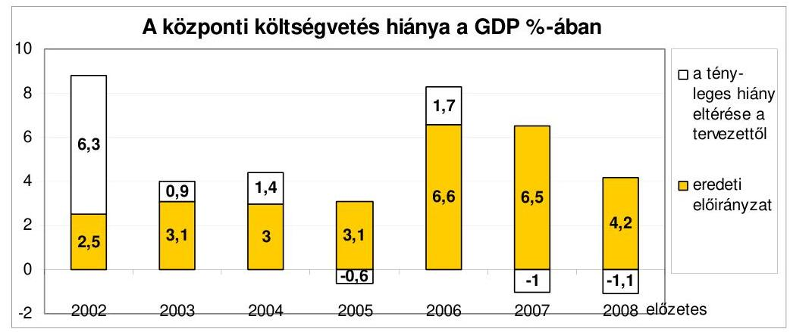

Forrás: költségvetési és zárszámadási törvények, az előzetes adat a PM 2009. január 20-i tájékoztatója alapján számított

---

A központi költségvetés törvényben rögzített 2007. évi hiányának alakulását alapvetően az adóbevételek és az adósságszolgálattal, kamatterhekkel összefüggő kiadások befolyásolták.

A kiemelt adónemek (áfa, szja, jövedéki adó, társasági és osztalékadó) előirányzatokat meghaladó teljesítése 158 Mrd Ft többletbevételt jelentett, míg a központi költségvetésben kisebb súlyt jelentő egyéb adók és illetékek előirányzattól való elmaradása 45 Mrd Ft-tal mérsékelte a bevételeket.
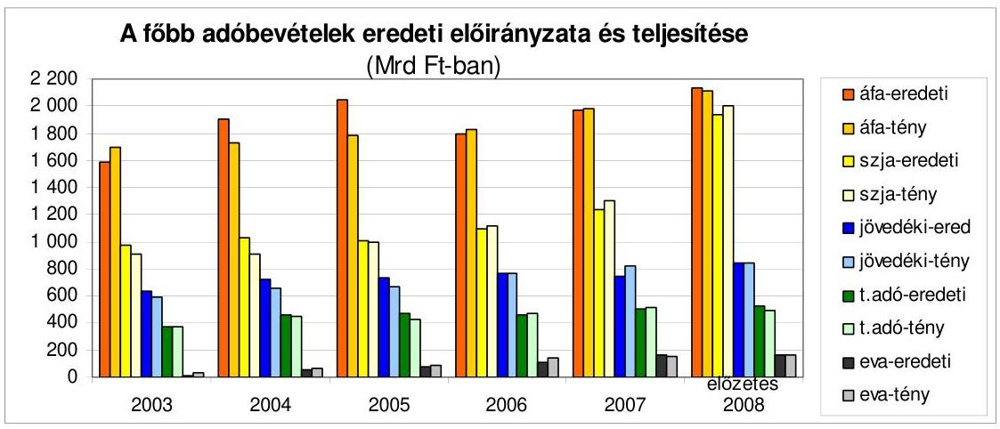

Forrás: költségvetési és zárszámadási törvények
Az adóbevételi előirányzatok és teljesítésük azt jelzik, hogy a korábbi évektől eltérően „felültervezettség” 2007-ben nem volt.

Az előirányzott összegtől az adósságszolgálattal összefüggő kiadásoknál 106,6 Mrd Ft-tal, az adósságátvállalásoknál 87,9 Mrd Ft-tal kevesebb kiadás merült fel.

A központi költségvetés pénzforgalmi hiányának a tervezettnél kedvezőbb alakulását egyszeri, a költségvetés egyensúlyi helyzetét tartósan nem javító tényezők idézték elő.

Évről-évre visszatérően javasoltuk a költségvetési tervezés módszertanának megújítását, a makrogazdasági prognózisok megalapozottá tételét, a meghatározó súlyú bevételi és kiadási előirányzatok reális - gazdasági és társadalmi folyamatokat körültekintően számba vevő - meghatározását. Ennek figyelembevétele nem történt meg.

A központi költségvetés, a társadalombiztosítás pénzügyi
 alapjai és az elkülönített állami pénzalapok finanszírozása 2007-ben biztosított volt. Az államháztartás finanszírozása a tervezettnél lényegesen kedvezőbben alakult.

A központi költségvetés adóssága a 2007. év végén a törvényben tervezetthez képest 1321,1 Mrd Ft-tal alacsonyabb (15 585,5 Mrd Ft) volt, amely azonban a 2001. december 31-i állapot kétszeresét jelenti.

---

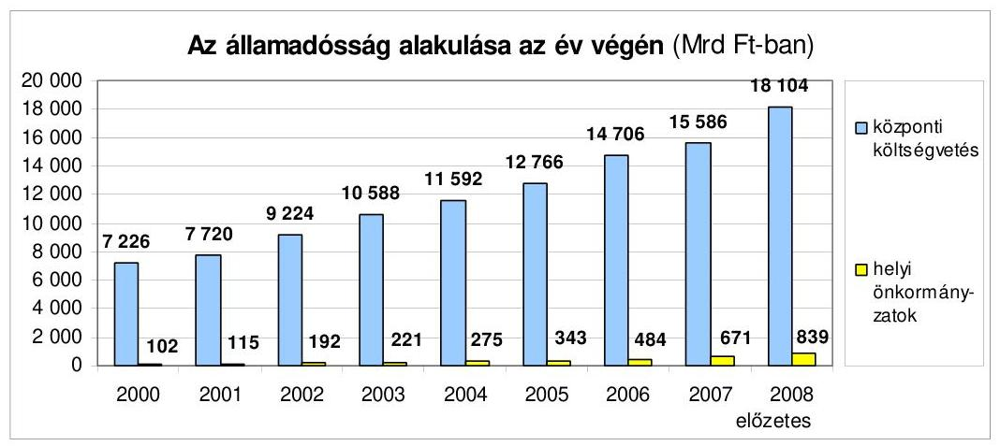

Forrás: ÁKK Zrt., PM, az önkormányzati adat a 2008. I-III. negyedévre vonatkozik
Megjegyzés: A központi költségvetés adóssága 2008-ban 2518,4 Mrd Ft-tal növekedett. A növekedésből 1034,8 Mrd Ft tényleges finanszírozási célokat szolgált, 1483,6 Mrd Ft az MNB-nél devizabetétként került elhelyezésre (IMF, EB).

Az adósság tervezettnél (15%) jelentősen kisebb mértékű (6%) emelkedését több tényező együttes hatása okozta. A 2007. évben a központi költségvetés finanszírozási igénye kedvezőbben alakult, továbbá a likviditási helyzetet az EU-tól érkező források javították. Mindezek csökkenő kibocsátásokat és magasabb adósság visszafizetéseket tettek lehetővé. A központi költségvetés adósságát csökkentette az is, hogy az átlagos devizaárfolyam (251,3 Ft/euró) elmaradt a kalkulált átlagos ( $275,5 \mathrm{Ft} /$ euró) devizaárfolyamtól.

Az adósságállomány a GDP arányában 61,3%-ot tett ki, ami 0,6%-ponttal alacsonyabb az előző évi értéknél.

A 2008. év végére a központi költségvetés adóssága - előzetes adatok alapján - 16,2%-kal növekedett, ami az előző évinél magasabb éves növekedést jelent. A központi költségvetés adóssága az év végén 18 103,9 Mrd Ft volt. Az MNB-nél elhelyezett devizabetét összege nélkül az adósság állománya 16 620,3 Mrd Ft. A devizabetét az IMF, EU és a Világbank által biztosított hitelcsomagból, a Magyar Állam által lehívható hitelekből származik. A Magyar Állam 2008. november 12-én az IMF-től összesen 4,9 Mrd euró összegű hitelt hívott le, melyet teljes egészében betétként helyezett el az MNB-nél. 2008. december 9-én 2 Mrd euró összegű hitel lehívására került sor az EU által biztosított hitelkeretből, melyből 1 Mrd eurót használt fel finanszírozásra, míg 1 Mrd eurót devizabetétként helyezett el. Az államadósság GDP-hez viszonyított aránya a 2008. év végén 66,5% volt. (Az MNB-nél elhelyezett devizabetét figyelembevételével az adósságállomány GDP-hez viszonyított aránya 61,1% volt).

Az adósságszolgálattal, kamattérítéssel összefüggő kiadások 2004-2007 között a kiadási főösszeg változó arányát jelentették és évente 11,8%-14,2% közötti, azaz 900-1100 Mrd Ft közötti összeget tettek ki.

---

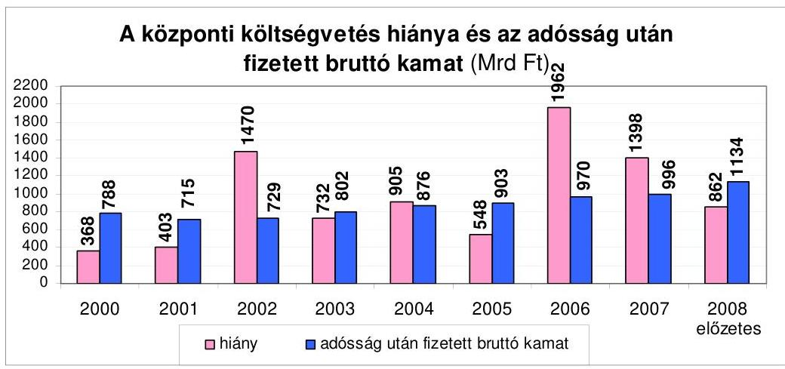

Forrás: zárszámadási törvények, PM, ÁKK Zrt.
A 2007. évben a központi költségvetés adóssága után fizetett bruttó kamat abszolút összege 25,7 Mrd Ft-tal növekedett, a 2008. évben - az előzetes adatok alapján - a kifizetett bruttó kamat növekedése 138,3 Mrd Ft volt. A megnövekedett folyó kamatkiadás - más tényezők mellett - a központi költségvetés adósságának nagyobb éves növekedési ütemével függ össze.

Az adósságszolgálattal összefüggő kiadások nagyságrendje és súlya a költségvetés politika - egyúttal a Kormány - mozgásterét jelentősen leszúkíti.

A központi költségvetési szervek finanszírozási helyzetét 2007-ben is a tartósan magas - az év végére csökkenő - tartozásállomány jellemezte. Az elmúlt évektől eltérően azonban a finanszírozási problémák nagyságrendje és aránya mérséklődött. Az elmúlt évek ismétlődő tapasztalata, hogy kormányzati intézkedések szükségesek az év végére kialakuló magas adósságállomány mérséklésére. Ez ráirányítja a figyelmet a kormányzati munka azon hiányosságaira, hogy a költségvetési intézmények feladatainak és az ezek ellátásához szükséges forrásoknak az összehangolása még mindig nem történt meg.

A központi költségvetés tartalékainak (általános tartalék, céltartalék, központi egyensúlyi tartalék) 2007. évi módosított előirányzatai összesen 139,9 Mrd Ft-ot tartalmaztak. Az év során nemcsak ezen összeg került felhasználásra, hanem jogszerűen további 73,4 Mrd Ft is.

Ennek oka az, hogy a céltartalék terhére - a költségvetési törvény módosításával - kifizetés történt a közszféra jövedelmi viszonyainak javítása céljából.

Az általános tartalék felhasználása (az előirányzat összegének 24%-ával) az elmúlt évek ellenőrzési tapasztalataihoz hasonlóan továbbra is eltért a jogszabályi előírásoktól.

A fejezetek általános tartalékból finanszírozott többletforrás igénye egyes feladatok esetében nem minősült előre nem valószínűsíthetőnek, nem tervezhetőnek, illetve előirányzott, de elháríthatatlan ok miatt elmaradó bevétel miatt pótolandónak.

---

A költségvetési törvény központi egyensúlyi tartalék címen 50 Mrd Ft-ot, majd módosítottan 45 Mrd Ft-ot tartalmazott, amely összeg felhasználásra került. A költségvetési törvény általános jellegű felhatalmazást adott a Kormánynak, hogy a központi egyensúlyi tartalék felhasználásáról a költségvetési és gazdasági folyamatok függvényében dönthet. E felhatalmazás korlátozás nélküli felhasználási lehetőséget jelentett, miután egyetlen jogszabályban sem történt rendelkezés a felhasználás céljáról, feltételeiről, igénybevételi módjáról. Következésképpen a számvevőszéki ellenőrzésnek nem volt lehetősége a költségvetés ezen kiadásainak jog- és célszerűségét megítélni.

Az adózók központi költségvetés felé fennálló tartozása - az APEH kimutatása szerint 130,3 Mrd Ft-tal - 1079,7 Mrd Ft-ra növekedett. A hátralékállomány a 2007. évi nyitóállomány tekintetében - a 2006. évben hibásan kitöltött és javítás nélkül feldolgozott bevallások adatainak figyelembevétele miatt - nem valós, a záró állomány pedig az illetékkövetelések átvétele során felmerült problémák következtében nem tekinthető hitelesnek.

A felhalmozódott hátralék összege azért érdemel kiemelt figyelmet, mert az közel azonos például az államadóssággal kapcsolatos 2007. évi kamattérítésre fordított költségvetési kiadásokkal, vagy a központi költségvetés személyi jövedelemadó bevételének háromnegyedével.

A kintlévőségi állomány több éve tapasztalt emelkedése és a bevételekhez viszonyított arányának növekedése, továbbá a behajthatóság szerinti összetételének folyamatos romlása indokolja a központi költségvetés adó- és illetékköveteléseinek a költségvetés végrehajtásáról szóló beszámoló során történő bemutatását. Ennek ellenére a zárszámadás indokolásai nem adnak számot az APEH illetékességébe tartozó bevételi nemek év végi hátralékáról, annak alakulásáról és a változások okairól.

A hátraléknövekedés közvetett oka - az adózói magatartáson és a behajthatatlanságon túlmenően - a gazdasági növekedés mérséklődése, melynek következtében a gazdasági társaságoknál likviditási problémák merültek fel. Ezért a vállalkozások a folyamatos működés biztosításához elsősorban a szállítókkal szembeni tartozások rendezésére törekednek, megelőzve az adótartozások kiegyenlítését. A gazdasági növekedés ütemének csökkenése a fizetésképtelen vállalkozások számának növekedésében is mutatkozik. A 2007. évben felszámolási eljárás alá került adózók tartozása meghaladta a 193 Mrd Ft-ot, 9147 céghez kapcsolódóan (a 2006. évben a tartozás 148,5 Mrd Ft volt, amely 8809 céget érintett). A hátralékállomány növekedését az APEH a rendelkezésre álló eszközökkel igyekezett mérsékelni. Ezek eredményeként 241 Mrd Ft-ot hajtott be, 16 Mrd Ft-tal többet, mint a megelőző évben.

Az adó-, támogatás- és illeték túlfizetések 2007. évi állománya 836,5 Mrd Ft-ot tett ki az APEH kimutatása szerint. Ezen összeg azonban nem jelenti maradéktalanul a Magyar Állam fizetési kötelezettségeit. Ennek oka az, hogy a feldolgozatlan és hibás bevallások rendezésének időtartama alatt a befizetések nyilvántartása megtörténik, továbbá számottevő arányt képviselnek a bevallás benyújtása nélkül történt befizetések, valamint az év utolsó hónapjaiban benyújtott, visszaigénylést tartalmazó bevallások, így az

---

azok ellenőrzését követő kiutalás vagy elutasítás, majd könyvelésük a következő évre húzódik át.

A zárszámadási ellenőrzés keretében végzett pénzügyi szabályszerűségi ellenőrzések köre - a fejezetek ellenőrzési szervezetei közreműködésével - 2007-ben tovább bővült, így ennek eredményeként a központi költségvetés kiadási főösszege 93%-át minősítettük megbízhatósági szempontból. A minősítések alapján azt a következtetést vontuk le, hogy a központi költségvetés tekintetében a zárszámadási törvényjavaslatban szereplő pénzforgalmi adatok összességében megbízhatóak.

Ezen belül azonban egy intézmény beszámolóját a financial audit módszerével nem lehetett felülvizsgálni, számos területen a lényegességi küszöböt meghaladó mértékű hibákat és hiányosságokat, valamint a beszámoló korlátozott véleménynyel való ellátását eredményező hibákat tártunk fel. Több területen a lényegességi küszöböt el nem érő, de potenciálisan veszélyt jelentő hibákra kellett felhívnunk a figyelmet.

A költségvetési szervek belső ellenőrzéséről szóló 2003. évi kormányrendelet rögzíti, hogy a megbízhatósági ellenőrzések évenkénti és teljes körű végrehajtását fokozatosan, 2010-re kell biztosítani. A feladat ellátásához a fejezeti belső kontrollrendszer, a tárcák belső ellenőrzési szervezeteinek fejlesztése szükséges, amihez elengedhetetlen költségvetési forrás biztosítása.

Kormányhatározat fogalmazta meg 2007. január 1-jei határidővel a minisztériumok - ingatlan üzemeltetési és vagyonkezelési feladatai kivételével - ellátási és a rendezvényszervezési feladatai átcsoportosítását a Központi Szolgáltatási Főigazgatósághoz. A vagyon átadása több ütemben történt, de a vizsgált időszak végéig sem fejeződött be. A vagyonelemek átadásának elhúzódása, illetve elmaradása a tárcák indoklása szerint a vonatkozó törvény hiányos rendelkezéseivel függött össze.

# A 2009. évi költségvetés véleményezése 

A 2009. évi költségvetési törvényjavaslatok elkészítése és az Országgyűlés általi elfogadása rendhagyó módon történt. Ezekben a dokumentumokban 30 nap alatt jelentős változások következtek be.

A 2008. szeptember 29-én benyújtott költségvetési törvényjavaslatot a Kormány visszavonta. Az új, részben átdolgozott törvényjavaslatot október 18-án újra beterjesztette, majd október 31-én a központi költségvetés meghatározó adóbevételei, a tartalékok és a fejezetek egyes előirányzatai vonatkozásában módosító indítvány benyújtására került sor.

Az újólag benyújtott, majd két hét múlva módosított költségvetési törvényjavaslatban megjelentek mindazon problémák, amelyekre évről-évre eredménytelenül hívtuk fel a figyelmet. E problémák kezelésének jelentősége fokozottá vált, tekintettel a várható kedvezőtlen reálgazdasági folyamatokra és ezek társadalmi következményeire.

Az újonnan benyújtott költségvetési törvényjavaslatról szóló véleményünkben és a módosító indítványra tett észrevételünkben rámutattunk a makrogazdasági prognózisok megvalósulásának kockázataira, mindenekelőtt a gazdasági visszaesés, a lakossági fogyasztás, a beruházások és a foglalkoztatottság tekintetében.

Ezen túlmenően felhívtuk a figyelmet a 2008. október 14-én és 26-án készített makrogazdasági adatok közötti összhang hiányára, kiemelten a GDP-változás 2,2%-os eltérése melletti változatlan foglalkoztatottságra, továbbá a mindössze 0,2%-os export csökkenésre és a mérsékelt beruházási ütemcsökkenésre.

Hangsúlyoztuk, hogy a prognosztizált makrogazdasági folyamatok kockázatából származó költségvetési hatások mérséklése indokolta volna a 2008. évinél magasabb általános és központi egyensúlyi tartalék képzését és javasoltuk ezek összegének legalább a GDP 1%-ának megfelelő összegig történő növelését, azaz további 151,7 Mrd Ft tartalékképzést. E javaslatot a Kormány és az Országgyűlés figyelmen kívül hagyta a módosító indítvány készítése és tárgyalása során is. Ennek a következménye is, hogy a miniszterelnök 2009. január közepén 100-200 Mrd Ft összegű költségvetési kiigazítás szükségességét jelentette be.

A központi költségvetés adóbevételei előirányzatainak módosítása során a makrogazdasági prognózisok megalapozottságával kapcsolatos problémák mellett tervezési hibák is megnyilvánultak.

A korábbi évekhez hasonlóan a 2009. évi visszavont és újólag benyújtott törvényjavaslatok adóbevételi előirányzatai megalapozottságának és a realizálás kockázatának megítéléséhez jellemzően nem álltak rendelkezésünkre a szükséges számítási adatok, a benyújtott módosító indítvány esetében pedig az indokolás sem.

A pénzügyi válság, az államháztartás finanszírozási problémái, valamint a még jelenleg sem megítélhető mértékű gazdasági visszaesés és ennek következményei különösen indokolták volna a költségvetési prioritások és a válság kezelésére alkalmas gazdaság- és költségvetési politikai eszközök meghatározását. Az előző évekhez hasonlóan a 2009. évi elfogadott költségvetési törvényjavaslat és a végrehajtásához szükséges további jogszabályok ezt nélkülözik.

A költségvetési fejezeteknél - az előző évhez hasonlóan - a 2009. évi költségvetés kidolgozása során sem tette lehetővé a tervező munka feltételrendszere a megalapozott költségvetési előirányzatok kidolgozását. A szakmai feladatok teljesítésére épülő tervezés helyett az alkufolyamatok során kialakult keretszámok visszatervezésének folyamatává vált a tervezési munka. A fejezetek támogatási keretszámai a törvényjavaslat Országgyűlésnek való benyújtásáig - különböző okokra (többletigények részbeni elfogadása, a kormányzati struktúraváltás fejezeti hatásai stb.) visszavezethetően
 - folyamatosan módosultak.

A fejezetek felügyeletét ellátó szervek a fejezeti előirányzatok kidolgozásakor, az előző évekhez hasonlóan, jellemzően a tervezési körirat előírásai szerint végezték munkájukat, de nem vizsgálták, hogy a különböző hatások eredőjeként kialakított előirányzatok miként befolyásolják feladataik ellátását.

Az államháztartási törvény előírásaitól eltérően a fejezetek részére a tárgyévet követő három év keretszámainak kiadása nem történt meg, így a tervezés időszakában nem került sor az aktualizált középtávú költségvetési keretszámok kialakítására.

A korábbi évektől eltérően a 2009. évi előirányzatok - a kialakult makrogazdasági folyamatok következtében - módosításra kerültek. A törvényjavaslat módosítása a központi költségvetési szervek személyi juttatásait és az ezekhez kapcsolódó munkaadókat terhelő járulékokat érintette.

# 2.1.2. Az elkülönített állami pénzalapok 

Az alapok pénzügyi helyzete a 2008-ban folytatott ellenőrzések tapasztalatai szerint 2007-ben összességében és alaponként is kiegyensúlyozott volt. Az alrendszer szintjén a bevételek a vártnál kedvezőbben alakultak, a kiadások az előirányzottaktól elmaradtak. Összességében az állami pénzalapok 62,9 Mrd Ft-tal javították az államháztartás egészének egyensúlyi helyzetét. Az elkülönített állami pénzalapok többlete államháztartási szinten megtakarításként nem jelentkezik, miután az finanszírozza a központi költségvetés hiányát, a megtakarítások évről évre kimutatásra kerülnek, de felhasználásuk források hiányában a következő évekre csak - törvényben szabályozottan - korlátozottan biztosítható, így az alapszerű gazdálkodás ebben a tekintetben formális.

A költségvetés nagyságrendjét tekintve az alrendszert alkotó alapok közül változatlanul a Munkaerőpiaci Alap a meghatározó, amely a foglalkoztatás elősegítésével és a munkanélküliség kezelésével kapcsolatos állami feladatokat az országosan kiépített munkaerőpiaci szervezeten keresztül látja el.

Ellenőrzéseink évek óta jelzik, hogy a kiadások belső szerkezetében bekövetkezett változások egy része kedvezőtlen tendenciát mutat. Az aktív foglalkoztatáspolitikai célok megvalósítását szolgáló támogatások összege 2007-ben ugyan némileg növekedett, aránya azonban - az alap költségvetési kiadásához viszonyítva - elmarad a 2006. évi szinttől. A 2009. évi költségvetésről megállapítható, hogy az aktív foglalkoztatáspolitikai eszközökre fordítandó források változatlanul háttérbe szorulnak. A foglalkoztatáspolitikai aktív eszközök a jogszabály módosítás révén átláthatóbbá váltak, azonban foglalkoztatási hatásuk továbbra is nehezen követhető.

Az MPA költségvetési kapcsolatainak, jogszabályi hátterének felülvizsgálatát célzó javaslataink csak részben találtak kedvező fogadtatásra. Az alapból mind többet fordítanak a foglalkoztatáshoz közvetlenül, vagy közvetve kötődő szervezetek, alapítványok, testületek működési kiadásainak finanszírozására.

A 2009. évi költségvetési véleményben kiemeltük a passzív ellátásokra előirányzott kiadások magas kockázatát, és észrevételeztük az álláskeresési támogatások összegének - az előző évhez képest - változatlanul hagyását.

A Szülőföld Alap bevételi előirányzata az MPA-tól és a központi költségvetés egyes fejezeteitől átvett pénzeszközökkel együtt 2349,7 M Ft volt a 2007. évben. A pénzeszközátadások az alap létrehozását kezdeményező kormányhatározatban megfogalmazott szándék (a hasonló célú források összevonása) végrehajtása érdekében valósultak meg. Ezek hiányát korábbi jelentéseink kifogásolták. A megkötött támogatási szerződések alapján 981,1 M Ft-ot folyósítottak. Az Alapkezelő működési költségekre 183,6 M Ft-ot fordított, ami a vonatkozó kormányrendelet alapján nem haladta meg a tárgyévben teljesített bevétel 5%-át. Az alap betétállományát 1128,5 M Ft-tal növelte 2007-ben, amelyet 1172,4 M Ft kötelezettség terhel a már odaítélt, de még nem folyósított támogatásokkal összefüggésben.

A Központi Nukleáris Pénzügyi Alap előirányzatai az előírások szerint teljesültek. Felhalmozott egyenlege 16,1 Mrd Ft-tal tovább emelkedett, 2007 végére megközelítette a 115 Mrd Ft-ot. Kedvezőtlen, hogy 4,6%-ponttal növekedett a működési kiadások aránya a felhalmozási kiadásokhoz viszonyítva. A KNPA költségvetésének törvényi előirányzatai évek óta lényegesen alacsonyabbak a közép- és hosszú távú szakmai tervekben kialakított összegeknél. A forráshiány szükséges feladatok elmaradását, késedelmét okozhatja. Ugyanakkor a 2007. évi munkaprogramban foglalt valamennyi feladat teljesült.

A Nemzeti Kulturális Alap részére 2007. évre a Költségvetési tv. a kiadási és bevételi előirányzatokat azonos összegben hagyta jóvá, az év többlettel zárult. Az Alap 2007. évi előirányzat-maradványát alapvetően a bevételi többlet eredményezte. Bevételének legjelentősebb forrása továbbra is a kulturális járulék. A kifizetések 89%-a a pályázatok támogatásának finanszírozására szolgált. A fennmaradó hányad az alap működtetését finanszírozza.

A Wesselényi Miklós Ár- és Belvízvédelmi Alap érdemi működésével kapcsolatos korábbi évek zárszámadási jelentéseiben felvetett - alapvetően a működés célszerűségét, eredményességét érintő - kételyeinket a 2007. évi tapasztalatok is igazolni látszanak. Az alap államháztartáson kívüli forrásai elenyészőek, kártalanítási igények kielégítésére nem képződik fedezet. A bevételek meghatározó része költségvetési támogatás. 2007-ben emelkedés következett be a WMA-val kötött szerződések számában (összesen 1007 db szerződés), de ez is messze elmarad az alap létrehozásakor várt, nagyságrendileg magasabb szerződésszámtól. Az alapot tekintve az előző években említett észrevételeink (a maradvány felhasználására nincs mód, az alapként való működés formális) továbbra is érvényesek annak ellenére, hogy az alap működési kiadásainak összegét csökkentették, ami az alap többletét eredményezte.

A Kutatási és Technológiai Innovációs Alap pénzügyi helyzete 2007-ben is stabil volt, a tárgyévet 19,6 Mrd Ft-os többlettel zárta. A kiadások 2007. évi elmaradását az EU-keretszabályhoz történő jogharmonizáció érdekében tett bejelentési eljárás elhúzódása okozta. E miatt a pályázatokat 2007. év második felében írták csak ki. A KTIA - mint minden más elkülönített alap - „tartaléka" a költségvetési hiányt finanszírozza és az alap eredeti céljának megfelelően nem használható fel. Így a Költségvetési tv. előírása korlátozza az alapszerű működést, amelynek következtében évről-évre kevesebb összeg fordítható új pályázati programok beindítására.

# 2.1.3. A társadalombiztosítás pénzügyi alapjai 

Az államháztartás társadalombiztosítási alrendszerének pénzügyi helyzete a beszámolási időszakban végzett vizsgálatok szerint 2007-ben kedvezően alakult. Az alapok összevont többlete 27,6 Mrd Ft, ami gyakorlatilag az Egészségbiztosítási Alapnál keletkezett. Előzetes adatok szerint az alapok 2008. évi 67,7 Mrd Ft-os összevont hiánya teljes egészében a Nyugdíjbiztosítási Alaptól ered.
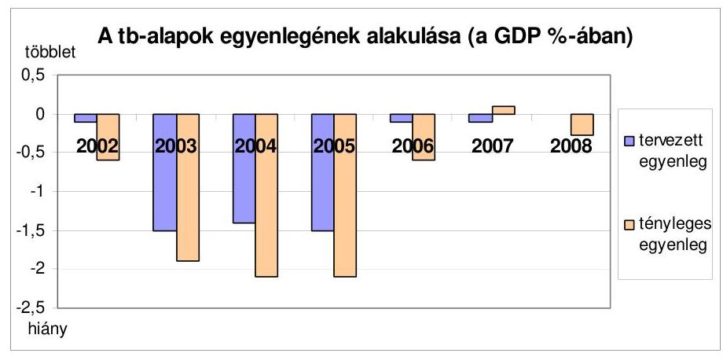

Forrás: zárszámadási törvények, KSH
A Nyugdíjbiztosítási Alap a 2007. évet egyensúlyi állapotban, 0,2 Mrd Ft-os többlettel zárta. Az egyensúlyi állapot a tervezettet 3%-kal meghaladó bevételi és kiadási főösszeg mellett jött létre. A bevételek növekedése a központi költségvetés alacsonyabb közvetlen támogatása mellett következett be.

## Az Nyugdíjbiztosítási Alap kiadása, hiánya és közvetlen költségvetési támogatása

Mrd Ft

|  | Hiánymegtérités | A kp.-i költségve-   tés pénzátadása | Együtt   (2.+3.) | Ny. Alap kiadási   főösszege | Index \%   (4./5.) |
| :--: | :--: | :--: | :--: | :--: | :--: |
| 1. | 2. | 3. | 4. | 5. | 6. |
| 2001 | $+1,5$ | 51,8 | 50,3 | 1175,1 | $4,3 \%$ |
| 2002 | $-14,2$ | 185,2 | 199,4 | 1405,9 | $14,2 \%$ |
| 2003 | $-39,0$ | 115,9 | 154,9 | 1540,1 | $10,1 \%$ |
| 2004 | $-80,2$ | 144,3 | 224,5 | 1707,0 | $13,2 \%$ |
| 2005 | $-93,5$ | 187,3 | 280,8 | 1916,0 | $14,7 \%$ |
| 2006 | $-19,5$ | 321,0 | 340,5 | 2113,1 | $16,1 \%$ |
| 2007 | 0 | 138,5 | 138,5 | 2354,1* | $5,9 \%$ |
| 2008 | $-67,7^{* *}$ | $143,4^{* * *}$ | - | 2872,2*** | - |

*A korábbi évek adattartamával azonosan, korábban az E. Alap által fedezett rokkantnyugdíjjal kapcsolatos kiadások nélkül.
** Előzetes adat.
*** A 2008. évi költségvetésben tervezett összeg.
A kiadási és bevételi főösszeg tervezettől való eltérése - évek óta változatlanul, de 2007. évben mindkét oldalt azonos mértékben érintően - mind bevételi, mind kiadási oldalon alapvetően a gazdasági folyamatoknak a tervezettől eltérő alakulására, ennek következtében kiegészítő nyugdíjemelés megvalósítására és a nyugdíjkiadás növekedését meghatározó automatizmusok vártnál nagyobb hatására vezethető vissza. Továbbra is negatív előjelű a Nyugdíjbiztosítási Alap saját tőke értéke, ami a járulék-kintlévőség értékvesztésének következménye.

A Nyugdíjbiztosítási Alappal szembeni járulék tartozás az APEH adatközlése szerint 2007-ben a 2006. évhez viszonyítva 43,2%-kal, a túlfizetés állománya 37,6%-kal csökkent. A változásokat nem a gazdasági folyamatok kedvező alakulása eredményezte. Az ellenőrzés azt tapasztalta, hogy az adatok változása összességében az APEH részére adott bevallási adatok feldolgozási szintjének javulását mutatja. A költségvetési szervek adatainak részletesebb vizsgálata igazolta, hogy e területen továbbra is problémát jelent a bevallási adatok megfelelő biztosítása, a feldolgozási szint nem teszi lehetővé, hogy a hátralékok és túlfizetések értékét tényleges adózói tartozásnak és túlfizetésnek lehessen minősíteni. A bevallások hibátlan teljesítésének és feldolgozásának hiánya akadályozza az egy APEH számlára érkező járulékbevételek megosztását, ezért kezdeményeztük, hogy járulék-nemenként önálló számlára történjen befizetés annak érdekében, hogy a munkáltatói és egyéni járulékbevételek tényleges értékei ismertek legyenek. A beszámoló időpontjáig javaslatunk megvalósulására intézkedést nem tapasztaltunk.

Az Nyugdíjbiztosítási Alapot terhelő nyugellátásoknak az eredeti kiadási előirányzathoz viszonyított 3%-os emelkedését a tervezésnél figyelembe nem vehető tényezők (pótlólagos nyugdíjemelési kötelezettség, automatizmusok) okozták. Az előző évinél 10,7%-kal magasabb nyugellátásra kifizetett összegből a januári és novemberi nyugdíjemelések 6,5%-ot, a nyugdíjkorrekciós emelések 1,6%-ot, az automatizmusok (létszámváltozás, összetétel változás, kiegészítő ellátások számának változása, a cserélődés) 2,5%-ot tettek ki. A nyugdíjkiadások mérséklése érdekében hozott jogszabályok hatása 2007-ben még nem érvényesülhetett. Ehhez hasonlóan 2007-évben még nem volt kiadási hatása a továbbdolgozó nyugdíjasok egyéni járulékfizetési kötelezettség fizetésének következtében létrehozott új jogintézmény (a nyugdíj mellett munkát végzőkre vonatkozó nyugdíj megállapítási szabály) bevezetésének sem. Az előkészítő munka értékelése során megállapítottuk, hogy a jogszabályi előírás alapján aránytalanságokat eredményező, a jogszabály kijátszására lehetőséget adó, ezért a Nyugdíjbiztosítási Alap kiadásait veszélyeztető, nagy munkaráfordítással járó rendszer alakult ki, aminek megváltoztatását kezdeményeztük.

Az alap napi likviditását, az ellátási kiadások teljesítésének zavartalanságát a KESZ-ről igénybevett kamatmentes hitel biztosítja. Az év összes napjainak közel felében a Nyugdíjbiztosítási Alap nem vett igénybe hitelt.

A Nyugdíjbiztosítási Alap 2009. évi kiadási és bevételi előirányzatait megalapozottnak értékeltük, felhívva a figyelmet a gazdasági helyzet változásából eredő kockázatokra (a járulékbevételek csökkenése), illetve a 13. havi nyugdíj kifizetésére vonatkozó korlátozások alkotmányossági aggályára.

Az Egészségbiztosítási Alap költségvetési helyzetében a 2007. év fordulópont volt. Az előző évekhez hasonlóan tervezett negatív egyenleg helyett az alap 27,4 Mrd Ft többlettel zárt. A bevételek 2,3%-kal emelkedtek, a kiadások 1%-kal csökkentek az eredeti előirányzathoz képest.

Az alap bevételeiből 22,6 Mrd Ft értékben fedezett olyan kiadásokat, amelyeket eredetileg központi költségvetési kiadásként terveztek (egészségügyi intézmények tárgyévi személyi jellegű kiadásai és annak járulékai, tizenharmadik havi illetmény, létszámcsökkentési kiadások).

Az Egészségbiztosítási Alap napi likviditásában az előző évekhez hasonlóan most is szükség volt a törvényben biztosított kamatmentes hitelre, de ennek napi összege nagyságrendileg kisebb volt a korábbiaknál.

Kiadásokat érintő, jelentős változtatások történtek az egészségügy területén. Az egyik legjelentősebb lépés a gyógyító-megelőző ellátáson belül az összevont szakellátásban végrehajtott struktúra-átalakítás volt. A kapacitásszabályozás szakmailag és pénzügyileg is indokolt volt a működőképesség érdekében. A megváltozott intézményi szerkezet és a fennálló teljesítményvolumenkorlátos rendszer nehezen volt összeegyeztethető. A teljesítményfinanszírozás „tiszta" rendszere 2007-ben már nem működött, ezért a finanszírozás optimalizálása érdekében további korrekciós tényezőket vezettek be. Az irányított betegellátási rendszer abban a formában, ahogy megvalósult, nem tudta teljesíteni
 a társadalombiztosítási szolidaritás koncepcióját és a végrehajtásnál jelentkező - korábban az ÁSZ által is kifogásolt - megoldatlan hiányosságok miatt 2009-re a költségvetési törvény már nem nevesíti azt.

A gyógyszertámogatást érintő jelentős intézkedések a kiadások számottevő mérsékléséhez vezettek, aminek köszönhetően a kassza hosszabb távon is keretek között tartható. A reformok a gyógyszergyártók versenyeztetésén keresztül az állam alkupozícióját erősítették, és - a betegek számára is - olcsóbb készítmények beszerzését tették lehetővé. Ezek az eredmények 2008-ban váltak szélesebb körben érzékelhetővé, 2007. évben a támogatáscsökkentés miatt fogyasztáscsökkenés és lakossági tehernövekedés mutatkozott.

Költségvetési véleményünkben rögzítettük, hogy az Egészségbiztosítási Alap 2009. évi bevételi előirányzatai teljesülése a makrogazdasági mutatók alakulásának függvénye, ami a jelenlegi gazdasági környezetben kockázatos. A természetbeni kiadások közül, a konvergencia-programban foglaltakkal és az ellátási rendszer átalakítására vonatkozó célkitűzésekkel összefüggésben a legérzékenyebbek a gyógyító-megelőző egészségügyi ellátás, illetve a gyógyszertámogatás kiadási előirányzatai, amit az ellenőrzés feszítettnek ítélt, de nem tartott teljesíthetetlennek. Az esetleges pénzügyi problémák kezelésére a költségvetési törvény a Kormány számára beavatkozási lehetőséget biztosít (az előirányzaton belül és azok közötti átcsoportosítások lehetőségein túlmenően az előirányzatok megemelésére is).

# 2.1.4. A helyi önkormányzatok 

Az államháztartás önkormányzati alrendszerét 2008-ban 3194 helyi önkormányzat és 174 kistérségi társulás alkotta. Az önkormányzati alrendszerben a bevételek-kiadások összege az utóbbi években folyamatosan emelkedett, az évenkénti növekedési ütem 6-12% közötti volt. Az államháztartás egészének 25-26%-át kitevő önkormányzati kiadások GDP-hez viszonyított aránya azonban az elmúlt tíz évben a GDP 12,2 és 13,5%-a között alakult, a részesedés 2008-ra 12,6%-ra csökkent. Szembetűnő a kiadások súlyának választási években történő megugrása az államháztartásban általában, és az önkormányzati alrendszerben is.

Az önkormányzati feladatok és a rendelkezésre álló források között évek óta feszültség áll fenn, amellyel már több ÁSZ-jelentés is foglalkozott. Különösen az utóbbi években irányítottuk rá a figyelmet a helyi önkormányzati rendszer pénzügyi egyensúlyát veszélyeztető okokra, a feladatok és a finanszírozás összehangolására, a pénzügyi stabilitás megteremtésére, a helyi önkormányzati alrendszer eladósodásából adódó hosszú távú kockázatokra. Ezekkel összefüggésben a kormányzatnak van feladata. Ugyanakkor ellenőrzési tapasztalataink szerint a gazdálkodási feszültségek fokozódásában szerepet játszott a feladatellátás módjának önkormányzatok általi gazdaságtalan szervezése, az intézményi kapacitások alacsony kihasználása, a teherbíró képességüket meghaladó önként vállalt feladatok elvégzése, tervezési hibák, valamint a felhalmozási célú kiadások erejükön felüli vállalása is.

Az önkormányzati gazdálkodás jellemzője, hogy jogi szempontból szinte korlátlan önállóságot élvez anélkül, hogy ennek pénzügyi feltételei következetesen megoldottak lennének. Az államháztartás meghatározóan nagy területéről, jelentős közpénzről, közvagyonról, másrészt ezek rendkívül decentralizált elköltéséről, felhasználásáról és az intézményi kör működtetéséről van szó.

A feladatok és hatáskörök kormányhatározatokban elrendelt felülvizsgálata nem történt meg. Nem valósult meg a helyi önkormányzatok kötelező feladatainak áttekintése, az állami feladatok újragondolása, pontosabb meghatározása, az önkormányzati feladatok és hatáskörök differenciált telepítése, átfogó módosítása. A középszintű önkormányzat körüli vita (régió, kötelező kistérség) még nem zárult le. Elmaradt a forrásszabályozás ezekkel összehangolt továbbfejlesztése. Változatlanul jellemző, hogy az önkormányzatok számára előírt új feladatokhoz a költségvetés nem biztosítja teljes körűen a szükséges pénzügyi fedezetet. A helyi önkormányzati szabályozás elveiben, eszközeiben az elmúlt években hangsúlyeltolódás alig következett be. A támogatások évenkénti változása nem teszi kiszámíthatóvá az önkormányzatok központi költségvetésből származó bevételeit. A transzparencia fontos feltételének, a megbízható és releváns pénzügyi információs rendszernek a csaknem minden területen jellemző hiánya is nehezítette az elszámolhatóságot, a teljesítménykövetelmények kialakítását, érvényesítését.

A szétaprózódott önkormányzati rendszer változatlan maradt. A feladatok ésszerű, szakmai és pénzügyi hatékonyságot szolgáló koncentrációjában a társulások - utóbbi években már kistérségi szinten is szerveződve - hoztak csak elmozdulást. A meghatározó szerepet a pénzügyi ösztönzők játszották, de a helyi gazdasági kényszerek is befolyásolták a döntéshozókat. A lassú - ellentmondásokkal, sokszor pazarlásokkal terhes - átalakulás csak hosszabb távon hozhat látványos javulást a közszolgáltatásokban.

A 2008. évben az előzetes adatok szerint a helyi önkormányzati bevételek, hitel- és értékpapír-műveletekkel együtt, közel 3500 milliárd Ft-ra teljesültek. Ezen belül előtérbe kerültek a helyi - saját és átengedett - bevételek, míg az állami támogatások és hozzájárulások (a normatívan elosztott átengedett személyi jövedelemadóval együttesen is) visszaestek. A saját folyó bevételek mára 30%-ot - ezen belül a helyi adók 16%-ot (az iparűzési adó ennek 85%-a) - képviselnek, a rendszerváltáskori 18%-kal, de még a tíz évvel ezelőtti 25%-kal szemben is. A támogatások és a normatív SZJA együttesen 37%-ot jelentenek a több évvel korábban jellemző 40-50% helyett. Ez a jövedelmi, vagyoni háttérrel rendelkező önkormányzatoknak kedvez (ezek részaránya mindössze 10-15%). Azonban a gazdaság teljesítményének visszaesése érzékelhető bevételkiesést hozhat. Ez nem csupán a közszolgáltatások színvonalát, de az EU támogatások lehívhatóságát is veszélyezteti.
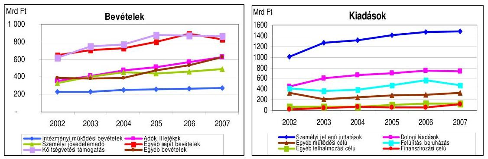

A személyi kiadások - elsősorban központi bérintézkedések miatti - közel 50%-os növelésére, valamint a dologi és a felhalmozási célú kiadások 66-42%-os emelésére 2002-2007 között a helyi adóbevételek 68%-os, a személyi jövedelemadó bevételek 48%-os, továbbá a kapott támogatásokból, illetve a hitelfelvételekből származó bevételek együttesen 34%-os növekménye nyújtott fedezetet.

A bevételeken belül folyamatosan és legnagyobb arányban - közel háromnegyedével - a helyi adók, illetékek összege emelkedett, a legkisebb mértékben mintegy egyötödével - az intézményi működési bevételek (melyek többsége a különböző szolgáltatásokért fizetett térítési díjak) bővültek.

A helyi önkormányzatok kiadásainak közel négyötödét a folyó, működési kiadások teszik ki. A személyi juttatások az összes kiadások egyharmadát, míg a járulékok egytizedét képviselik. A dologi kiadások aránya 25%. Évről-évre nagyobb a súlya a társadalom- és szociálpolitikai juttatásoknak. A felhalmozási és tőkejellegű kiadások részaránya alig 20%.

A helyi önkormányzatok könyvviteli mérleg szerinti saját vagyona a 2007. év végére a 2000. évihez viszonyítva közel háromszorosára, 236%-kal nőtt (2008-ban kis mértékben tovább emelkedett, a saját vagyon várható értéke az előzetes mérlegadatok alapján 9670 milliárd Ft). A 2000-2003 közötti kiugróan magas arányú növekedést elsősorban a korábban nem, vagy érték nélkül nyilvántartott ingatlanok értékének megállapítása okozta. Kedvező, hogy a 2004. évtől történő növekedést jellemzően a beruházások, felújítások eredményezték. Kedvezőtlen, hogy a beruházásokra fordított kiadások bővülése mellett több mint négyszeresére (330%-kal) növekedett a kötelezettségek év végi állománya, ugyanakkor a pénzügyi likviditást elősegítő forgóeszközök aránya mintegy harmadával csökkent. A kötelezettségek év végi állományán belül a hosszú lejáratú kötelezettségek a 2000. év végi 92 Mrd Ft-ról a 2007. év végére 620 Mrd Ft-ra, közel hétszeresére emelkedtek, elsősorban a fejlesztési célú hitelek és a kötvénykibocsátások miatt.

Adatok Mrd Ft-ban

| A HELYI ÖNKORMÁNYZATOK KÖNYVVITELI MÉRLEG SZERINTI VAGYONA |  |  |  |  |  |  |  |  |
| :--: | :--: | :--: | :--: | :--: | :--: | :--: | :--: | :--: |
| Eszközök | 2000 | 2001 | 2002 | 2003 | 2004 | 2005 | 2006 | 2007 |
| BEFEKTETETT ESZKÖZÖK | 2625 | 2979 | 5853 | 8664 | 9008 | 9297 | 9476 | 9992 |
| Immateriális javak | 5 | 6 | 9 | 11 | 16 | 21 | 25 | 26 |
| Tárgyi eszközök | 1687 | 1897 | 4350 | 6833 | 7021 | 7238 | 7576 | 7688 |
| Befektetett pénzügyi eszk.-ök | 533 | 586 | 564 | 566 | 575 | 556 | 558 | 557 |
| Üzemeltetésre, kezelésre átadott eszközök | 400 | 490 | 930 | 1254 | 1396 | 1482 | 1587 | 1721 |
| FORGÓESZKÖZÖK | 465 | 526 | 570 | 571 | 610 | 564 | 554 | 632 |
| ESZKÖZÖK ÖSSZESEN | 3090 | 3505 | 6423 | 9235 | 9618 | 9861 | 10300 | 10624 |
| KÖTELEZETTSÉGEK | 253 | 338 | 490 | 518 | 589 | 697 | 925 | 1088 |
| SAJÁT VAGYON | 2837 | 3167 | 5933 | 8717 | 9029 | 9164 | 9375 | 9536 |

A rövid lejáratú kötelezettségek ugyanezen időszakban 83 Mrd Ft-ról 349 Mrd Ft-ra emelkedtek elsősorban a rövid lejáratú hitelek év végi állománya mintegy ötszöröződésének, valamint a szállítói kötelezettségek év végi állománya megháromszorozódásának hatására.
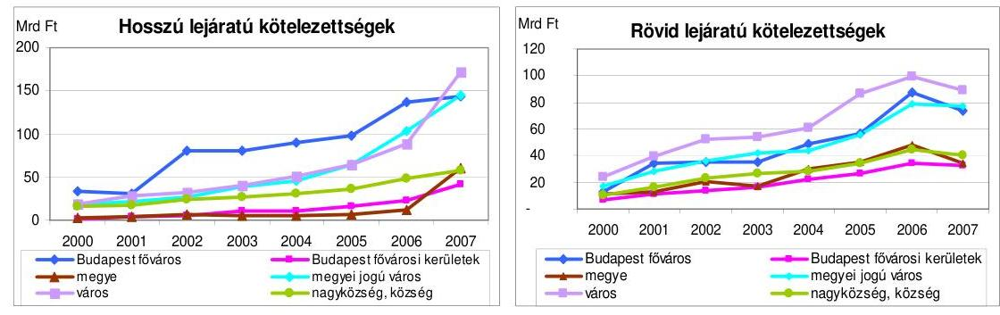

A hosszú távú kötelezettségek év végi állománya mindegyik önkormányzattípusban emelkedett, így az önkormányzatok gazdasági helyzete 2006-ig romlott, és hosszú távon tovább súlyosbodik kiugróan a megyei, és a megyei jogú városi önkormányzatoknál.

A különböző típusú hitelek és kölcsönök közül az önkormányzatok 2000-2006 között a hitelfelvételeket, ezt követően pedig a kötvénykibocsátást részesítették előnyben. Az önkormányzatok kötvényállománya a könyvviteli mérleg szerint 2000 végén még alig 23 Mrd Ft, 2008 végén azonban már várhatóan 360 Mrd Ft. A költségvetés végrehajtása során - elsősorban a 2007. évben - az önkormányzatok 4%-a deviza alapú, változó kamatozású kötvényt bocsátott ki, amelyek közel kétharmadánál a futamidő 20 év. A kötvénykibocsátás legkisebb összege 200 millió Ft, legnagyobb összege 5000 millió Ft volt, a tőketörlesztés megkezdéséhez meghatározott türelmi idő 1-6 év között változott. A kötvénykibocsátások az önkormányzatok fokozódó eladósodását jelentették.

A bevételek átlagos összetételét figyelembe véve az önkormányzatok a tőke- és kamatfizetési kötelezettségvállalások során betartották az Ötv.-ben meghatározottak szerinti felső határt, annak átlag harmadára vállaltak hosszú távú fizetési kötelezettséget. Ellenőrzési tapasztalataink szerint a kötvénykibocsátásból származó bevétel 63%-át felhalmozási célra, 15%-át működési célra, 22%-át adósságrendezésre tervezték felhasználni.

A 2008. év végén az önkormányzatok bruttó adósságállománya 835 milliárd Ft volt, ez 40%-kal haladja meg az előző év végit. A betétállomány - főként a kötvénykibocsátásból származó bevétel jó részének lekötése révén - ennél jobban, közel 70%-kal bővült egy év alatt. A gazdálkodásban jelenleg az eladósodás így nem okoz számottevő feszültséget, a betétek révén elért kamatbevételek még „fellélegzésre" is módot adnak.

Az önkormányzatok eladósodása, csődhelyzete szempontjából a jövőkép a következők figyelembevételével differenciált:

- a kockázat hosszabb távon jelentkezik és főként a nagyobb önkormányzatoknál, amit megfejel a devizában történt kötvénykibocsátás árfolyamváltozása és a vállalt változó kamatmérték miatti kockázat is;
- különösen a megyei önkormányzatok pénzügyi nehézségei erősödhetnek a következő években, mivel a türelmi évek lejárta után belépő tőketörlesztésnek (nemkülönben a folyamatosan fizetendő kamatnak) saját bevételi fedezete nem látszik a jelenlegi forrásszerkezetben;
- kisebb, de nem elhanyagolható a kockázat a megyei jogú városi önkormányzatok esetében. E körben ugyan van elegendő helyi bevétel, mégis odafigyelést igényel a nyílt eladósodás mellett a fokozódó egyéb kötelezettségvállalás (pl. kezességnyújtás) is;
- a kis önkormányzatok hitel- és kötvényállománya nem jelentős, számukra az átlag felett felhalmozódó szállítói kötelezettségek teljesítése hozhat akár már rövidtávon is ellehetetlenülést a gazdálkodásban, a közfeladatok ellátásában.

A kötvényt kibocsátó, majd a kapott pénzt betétben, állampapírban tartó önkormányzatok e pénzügyi műveletek révén rövid távon pénzügyi likviditásukat, stabilitásukat javítani tudják jövőbeni kötelezettségeik
 terhére, de az eljárás a jövő felélését is jelentheti. Az önkormányzatoknál félretett mintegy 380 milliárd Ft betét felhasználása - a teljesítés évében - összességében akár 0,3-0,7%-ponttal is megnövelheti az ESA szerinti államháztartási hiányt.

[^0]
[^0]:    ${ }^{2}$ Forrás: a Magyar Nemzeti Bank kimutatása a helyi önkormányzatok és intézményeik betét- és hitelállományának hó végi egyenlegeiről

---

Mint azt már az elmúlt évek ÁSZ beszámolóiban hangsúlyoztuk, elkerülhetetlen az önkormányzatok hatáskör-, feladat- és forrásszabályozásának teljes körű átalakítása, ezen belül is kiemelten az önkormányzati hitelfelvétel feltételeinek szabályozása, a működési kiadásoknál a deficit lehetőségének megszüntetése, és nem utolsó sorban a pénzügyi és törvényességi ellenőrzés erősítése.

# Az önkormányzatok fizetőképességének és eladósodásának alakulása 

Az ÁSZ vizsgálatai ráirányították a figyelmet az önkormányzatok fokozódó fizetésképtelenségére. A helyi önkormányzatok nem mehetnek csődbe. A világon szinte egyedülálló magyar önkormányzati adósságrendezési eljárás, az ezt szabályozó törvény 1996. évi életbelépése óta kevesebb mint 30 önkormányzatot érintett (kettőt két alkalommal). Az alacsony szám az önkormányzati szabályozásban működő kiegyenlítő mechanizmusok eredménye. Ilyen támogatások mindenütt működnek, különösen az elaprózott struktúrájú, széles feladat- és hatáskörű önkormányzati rendszerű országokban.

A 2008. évben a központi költségvetés a működési forráshiányos önkormányzatok megsegítésére 18,1 milliárd Ft-ot fordított. Ez az összeg az előző évekhez képest csökkenést mutat.

A tárgyévi forrásoknak csak mintegy 0,5%-át kitevő támogatáson belül a normatív módon számítva juttatott ún. ÖNHIKI összege az előző években teljesítettnek mindössze fele (8,6 milliárd Ft), s a kedvezményezett önkormányzatok száma is csupán 60-70%-a a korábbiaknak. A visszaesést a támogatási rendszerben a méretgazdaságossági, a társulási követelmények érvényesítését, továbbá az eladósodás, a vagyonfelélés korlátozását szolgáló szabályok eredményezték. A kormányzat által eredetileg elérni kívánt takarékosság, hatékonyság megvalósulását azonban fékezte - nyilvánvalóan a fizetésképtelenségek minimalizálása érdekében - az ún. egyéb működési támogatás év közbeni előtérbe állítása. Az előző évekhez képest ugyanis 2008-ban megtöbbszöröződve, 9,5 milliárd Ft ilyen kiegészítést kapott 1364 önkormányzat.
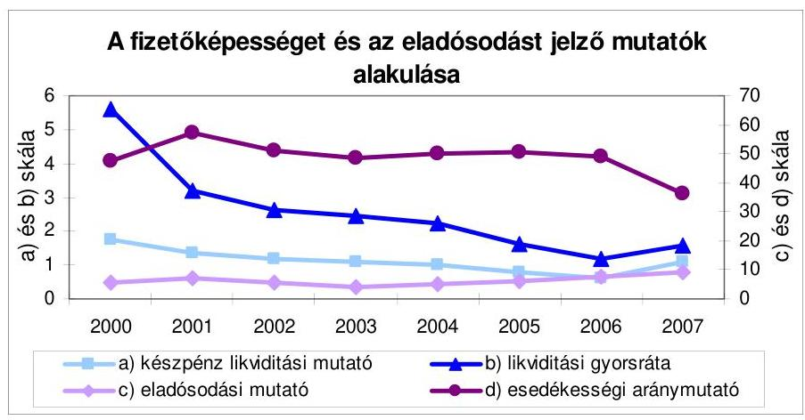

---

Az eladósodási mutató ${ }^{3}$ 2003 óta tartó folyamatos emelkedése, illetve az esedékességi mutató ${ }^{4}$ csökkenése jelzi, hogy az összes forráson belül emelkedett a hosszú és rövid lejáratú kötelezettségek aránya. Az esedékességi mutató csökkenését az eredményezte, hogy a rövid lejáratú kötelezettségek állományának növekedése kisebb mértékű volt, mint az összes fizetési kötelezettség növekedése. Az eladósodás az önkormányzatok pénzügyi helyzetét hosszú távon befolyásolja kedvezőtlenül. A likviditási mutatók ${ }^{5}$ fizetőképességi szempontból jeleznek rosszabbodó pénzügyi helyzetet. A készpénz likviditási mutató és a likviditási gyorsráta is folyamatosan csökkent, azonban a 2007. év végén mindkét mutató értéke növekedett az év utolsó hónapjaiban történt nagy összegű kötvénykibocsátások hatására, illetve azért, mert a felvett pénzeszközök nagyobb részét pénzügyi befektetésre fordították az önkormányzatok.

# A gazdálkodási rendszer ellenőrzésének tapasztalatai 

A számvevőszéki jelentések nyilvánosságra hozatala jelentős mértékben növelte az önkormányzatok önkéntes jogkövető magatartását, s lehetővé tette, hogy az önkormányzatok vezetése tudomást szerezhessen azokról a hiányosságokról akár szabályozási, akár döntéshozatali, vagy a gazdálkodási jogkörök gyakorlásával összefüggő területeken - melyek tipikusnak mondhatók az önkormányzati alrendszerben.

Az éves költségvetések megállapításakor az Áht.-ban előírtak ellenére az ellenőrzött önkormányzatok mintegy fele a költségvetési hiány finanszírozásával kapcsolatos pénzügyi műveletek bevételeit, költségvetési hiányt, illetve költségvetési többletet módosító költségvetési bevételként számolta el. Ezzel az elfogadott költségvetési rendelettervezetekben az előterjesztők nem mutatták be az önkormányzat valós pénzügyi helyzetét, a tervezett költségvetési hiány, vagy többlet összegét, valamint a finanszírozási célú pénzügyi műveletek bevételeit, kiadásait és azok egyenlegeként keletkező hiányt, vagy többletet.

A tervezett működési célú költségvetési bevételek évente egyre kevesebb ellenőrzött önkormányzatnál fedezték a működési célú költségvetési kiadásokat, míg a teljesítési adatok szerint kedvezőbben, az önkormányzatok tervezettnél nagyobb, de egyre csökkenő hányadánál nyújtottak erre fedezetet. A működési célú költségvetési bevételeken belül az intézményi bevételeket és a helyi adóbevételeket tervezték alul, valamint elmaradt, vagy az indokoltnál kisebb összegben történt a pénzmaradvány igénybevételének eredeti előirányzatként történő tervezése.

[^0]
[^0]:    ${ }^{3}$ Eladósodási mutató = összes kötelezettség-egyéb passzív pénzügyi elszámolások/összes forrás
    ${ }^{4}$ Esedékességi mutató = rövid lejáratú kötelezettségek/összes kötelezettség-egyéb passzív pénzügyi elszámolások
    ${ }^{5}$ Készpénz likviditási mutató = pénzeszközök/rövid lejáratú kötelezettségek
    Likviditási gyorsráta = követelések+forgatási célú értékpapírok+pénzeszközök/rövid lejáratú kötelezettségek

---

Az önkormányzatok mintegy kétharmadánál a felhalmozási célú költségvetési bevételeket meghaladó összegben terveztek felhalmozási célú költségvetési kiadásokat. Tapasztalataink szerint a tendencia nem változott a költségvetések végrehajtása során sem. Az összes költségvetési bevételen belül a működési célú költségvetési bevételeket az önkormányzatok kilenctizedénél alul, a felhalmozási célú költségvetési bevételeket pedig közel felénél túltervezték. A költségvetési bevételek alultervezése és a költségvetési kiadások túltervezése hatására az önkormányzatok közül többen, illetve nagyobb összegben terveztek költségvetési hiányt.

# Az e-közigazgatásra történő felkészülés, a gazdálkodási adatok 

nyilvánossága tekintetében megállapítottuk, hogy az ellenőrzött önkormányzatok ${ }^{6}$ közel háromnegyede meghatározta az informatikai és/vagy közigazgatási stratégiáját, amelyben mintegy negyedük célként a teljes közvetlen kétirányú ügyintézési folyamatot biztosító szolgáltatás elérését, harmaduk az ügyintézés elektronikus indítását biztosító szolgáltatási szint elérését tűzte ki célul. Az erre történő felkészülés érdekében az önkormányzatok mintegy harmada európai uniós, illetve más szervezet által biztosított támogatásra nyújtott be pályázatot. A városi önkormányzatok harmada több önkormányzattal összefogva társulás keretében pályázott. Az ellenőrzött megyei, megyei jogú városi, Budapest fővárosi kerületi és városi önkormányzatok mintegy tizede nyújtja jelenleg a 3. elektronikus szolgáltatási szintet az ügyintézés elektronikus indításának biztosításával. A többi általában a 2. elektronikus szolgáltatási szintnek megfelelve a honlap megnyitásával az egyes ügyek intézéséhez szükséges nyomtatványok letöltésének lehetőségét biztosítja csupán. A fejlesztéseket a pénzügyi források, az informatikához értő humán erőforrás, valamint a szükséges szoftver hiánya késleltette, és megvalósítását lakossági igény sem sürgette.

A közérdekű adatok elektronikus közzétételére 2007. január 1-jétől kötelezettek a megyei és megyei jogú városi önkormányzatok, valamint a lakosságszámtól függően a Budapest fővárosi kerületi önkormányzatok. A gazdálkodási adatok közzétételi kötelezettségét sem honlapján, sem a helyben szokásos módon nem teljesítette az önkormányzatok mintegy fele a működési és fejlesztési támogatások, valamint az Áht. hatálya alá tartozó szerződések adatai esetében, továbbá közel kétharmada elmulasztotta a költségvetési beszámolók szöveges indoklásának közzétételét. Az ellenőrzés során megállapítottuk, hogy a közérdekű adatok közzétételi kötelezettségére vonatkozó jogszabályi előírások - a közzétételi idő meghatározása tekintetében - nincsenek összhangban.

A költségvetési gazdálkodás kontrolljaira irányulóan megállapítottuk, hogy a költségvetés tervezési és a zárszámadás készítési folyamatok szabályozottsága a kiemelt önkormányzati körbe tartozó, valamint a városi önkormányzatok több mint felénél összességében alacsony kockázatot jelentett a feladatok megfelelő és szabályszerű végrehajtásában, mivel a jegyzők az Ámr. előírásainak és a helyi sajátosságoknak megfelelően kialakították a tervezési és a zárszámadás készítési feladatok belső kontrolljait, ennek során előírták az el-

[^0]
[^0]:    ${ }^{6}$ Az e-közigazgatási feladatok ellátását a nagyközségi, községi önkormányzatoknál nem vizsgáltuk.

---

lenőrzési feladatokat, határidőket és kijelölték azok felelőseit. A korábbi években tapasztaltakhoz képest a javulás jórészt annak tudható be, hogy 2003-2006 között az önkormányzatoknál az ÁSZ ellenőrizte a szabályozottságot és javaslatot tett a hibák kijavítására, amelyeket az érintett önkormányzatok hasznosítottak. A tervezési és a zárszámadás készítési feladatok szabályozottságának hiányosságai az önkormányzatok negyedénél magas kockázatot jelentettek ezen feladatok megfelelő és szabályszerű végrehajtásában.

A költségvetés tervezés és a zárszámadás készítés folyamatában kialakított belső kontrollok működésének megbízhatósága az önkormányzatok közel felénél összességében kiváló volt, a kontrollok folyamatosan működtek, teljesítették a lényeges hibák, szabálytalanságok és gyenge teljesítmények megelőzésével, feltárásával és kijavításával kapcsolatos funkciójukat. A belső kontrolleljárások az önkormányzatok ötödénél jól működtek, a megállapított hiányosságok ellenére kielégítették a célszerűségi elvárásokat a működésbeli hibák megelőzése, feltárása és kijavítása tekintetében. Ezen a téren is szoros összefüggés van a korábbi ÁSZ javaslatok hasznosítása és a megbízhatóság szintje között. Az önkormányzatok 35%-ánál a költségvetés tervezés és a zárszámadás készítés ellenőrzési feladataira vonatkozó kötelezettségük teljesítését az Áht.-ban foglalt előírások ellenére elmulasztották, a belső kontrollok működésének megbízhatósága gyenge volt, amit az önkormányzatok közel háromnegyedénél a jegyzői szabályozás hiánya okozott.

A gazdálkodási, a pénzügyi-számviteli és a folyamatba épített ellenőrzési feladatok szabályozottsága az önkormányzatok közel harmadánál összességében alacsony kockázatot jelentett a feladatok megfelelő és szabályszerű végrehajtásában, mivel a pénzügyi gazdálkodás folyamatában a belső kontrollokat a jegyzők a jogszabályi előírásoknak és a helyi sajátosságoknak megfelelően kialakították. A belső kontrollok kialakítására vonatkozó kötelezettségük teljesítését - az Áht. előírásai ellenére - az önkormányzatok közel harmadánál elmulasztották a jegyzők, ezáltal a szabályozás hiányosságai a gazdálkodási feladatok végrehajtásában magas kockázatot okoztak. Az önkormányzati hivatalok közel negyede nem rendelkezett SzMSz-szel, ötödénél a gazdasági szervezet feladatainak szabályozására nem készítettek ügyrendet. A pénzügyi-számviteli dolgozók munkaköri leírása az önkormányzati hivatalok közel felénél nem tartalmazta a gazdálkodási folyamatba épített ellenőrzési jogköröket és feladatokat. Az önkormányzatok kétötödénél a jegyzők nem rendelkeztek a pénzgazdálkodás meghatározó belső kontrollját jelentő szakmai teljesítésigazolás módjáról, valamint mintegy negyedénél az azt végző személyeket nem jelölték ki. Az érvényesítési feladatok ellátására az önkormányzati hivatalok mintegy tizedénél a jegyzők nem adtak írásban megbízást, továbbá az írásbeli megbízások ugyanilyen arányánál nem tartották be az iskolai végzettségre és a szakmai képzettségre vonatkozó előírást.

A FEUVE rendszerét az - Áht. és az Ámr. előírásai ellenére - nem, illetve nem az önkormányzati gazdálkodás folyamataira és sajátosságaira tekintettel alakították ki a jegyzők az önkormányzatok mintegy harmadánál, mivel az ellenőrzési nyomvonalat nem készítették el. Az önkormányzatok háromötödénél kockázatkezelési eljárásrendben nem rögzítették a kockázatok azonosítását, illetve folyamatgazdáit, közel háromnegyedénél az elfogadható kockázati keret meghatározását. A jegyzők közel kétötöde nem rögzítette a szabálytalanságok

---

kezelésének eljárásrendjében a szabálytalanság fogalmát, az észlelési kötelezettségét, közel fele nem írta elő a szabálytalanság esetén teendő intézkedések (eljárások) nyomon követését és nyilvántartását. A gazdálkodási, a pénzügyi-számviteli és a folyamatba épített ellenőrzési feladatok szabályozottsága - az ÁSZ korábbi javaslatainak hasznosítása eredményeként - javult, mivel az önkormányzatok évente növekvő aránya rendelkezik a jogszabályi előírásoknak és a helyi sajátosságoknak megfelelő belső szabályozásokkal.

A szakmai teljesítésigazolás és az utalvány ellenjegyzés működésének megbízhatósága az önkormányzatok közel harmadánál összességében kiváló volt, mivel a belső kontrollok folyamatosan működtek, az esetleges apróbb hiányosságok ellenére teljesítették a lényeges hibák, szabálytalanságok és gyenge teljesítmények megelőzésével, feltárásával és kijavításával kapcsolatos funkciójukat. Az önkormányzatok közel kétharmadánál azonban az operatív gazdálkodás folyamatba épített ellenőrzési feladataira vonatkozó kötelezettségük teljesítését az Ámr.-ben foglalt előírások ellenére elmulasztották, a szakmai teljesítés igazolás és az utalvány ellenjegyzés működésének megbízhatósága gyenge volt. A pénzügyi gazdálkodás során a kiadások jogosultságának, összegszerűségének, valamint a szerződések, megrendelések teljesítésének ellenőrzését a kijelölt személyek - az Ámr.-ben foglalt előírások ellenére - nem végezték el az önkormányzatok közel háromötödénél. A szakmai teljesítést a jegyző által kijelölt személyek aláírásukkal nem
 igazolták az önkormányzatok közel tizedénél. Az önkormányzatok további tizedénél a szakmai teljesítés igazolására kijelölt személyek a kifizetések alapbizonylatait aláírásukkal ugyan ellátták, azonban, mivel a szakmai teljesítés igazolásának módjáról - az Ámr.-ben előírtak ellenére - a jegyzők belső szabályzatban nem rendelkeztek, ezért ezen aláírások önmagukban nem jelentették a kiadások teljesítésének elrendelése előtti ellenőrzések elvégzésének, illetve a jogosultság, az összegszerűség, valamint a kötelezettségvállalásokban (szerződésben, megrendelésben, megállapodásban) foglaltak teljesítésének szakmai igazolását.

Az utalvány ellenjegyzés ellenőrzési feladatait az önkormányzatok közel kétharmadánál nem végezték el, az ellenjegyzők nem ellenőrizték a gazdálkodásra vonatkozó szabályok betartását, illetve mintegy felénél nem győződtek meg arról, hogy a szakmai teljesítés igazolása és az érvényesítés megtörtént-e. A belső kontrollok működésének hiányosságai következtében az önkormányzatok mintegy tizedénél előirányzat nélküli kötelezettségvállalások alapján teljesítettek kiadásokat, amelyekre pénzügyi fedezetet más előirányzatok maradványa biztosította, ezáltal nem tartották be az Áht.-ban foglalt, a jóváhagyott előirányzatokon belüli gazdálkodásra vonatkozó előírást.

Az informatikai környezet szabályozottsága az önkormányzatok kétötödénél összességében alacsony kockázatot jelentett az informatikai feladatok biztonságos végrehajtásában, mivel az önkormányzati hivatalok rendelkeztek az informatikai feladatok biztonságos végrehajtásához szükséges szabályzatokkal. Az informatikai rendszerek működtetésénél a kialakított belső kontrollok megbízhatósága az önkormányzatok kétötödénél összességében kiváló volt, közel kétötödénél jó volt, mivel a kontrollok biztosították a működésbeli hibák megelőzését és kijavítását, a feltárt hiányosságok nem veszélyeztették az eredményes, megbízható működést. A belső kontrollok megbízhatósága az önkormányzatok ötödénél gyenge volt, mivel ezen önkormányzatok hivatalaiban

---

nem biztosították a számítógépen vezetett analitikus nyilvántartás és a főkönyvi könyvelés automatikus kapcsolatát, a számlarend változásainak kezelését, a pénzügyi-számviteli adatok visszamenőleges elérhetőségét, illetve a pénzügyi-számviteli számítógépes programokban használt adatok kapcsolatait nem dokumentálták.

A belső ellenőrzés szervezeti kereteinek kialakítása és szabályozása az önkormányzatok 57%-ánál alacsony kockázatot jelentett a belső ellenőrzés szabályszerű végrehajtásában, mivel annak szervezeti és szabályozási kereteit, valamint ellátási módját meghatározták, ezáltal a kialakított belső ellenőrzési szervezet - szabályszerű működése esetén - megfelelő védelmet nyújtott a hibák bekövetkezése ellen. A belső ellenőrzés feladatainak szabályozására vonatkozó kötelezettség teljesítését az önkormányzatok ötödénél - az Ötv. és a Ber. előírásai ellenére - elmulasztották, a hiányosságok magas kockázatot jelentettek ezen feladatok megfelelő és szabályszerű végrehajtásában.

Az önkormányzatok 98%-ánál a belső ellenőrzés szervezeti kereteit kialakították, amelyet négyötödüknél társulás keretében biztosítottak. Társulási formában végezték a belső ellenőrzést a községi, nagyközségi és a városi önkormányzatok mintegy kilenctizedénél. A társulási megállapodások hiányosak voltak az önkormányzatok közel kétharmadánál, mivel a Ber.-ben foglalt előírás ellenére a belső ellenőrzési vezetői feladatokat nem tartalmazták. Ezen önkormányzatoknál a belső ellenőrzés működésében megállapított mulasztásokat a társulási megállapodások hiányosságai, a feladatok (önkormányzatok és társulások közötti) megosztásának hiánya, illetve a felelősök pontos megjelölésének elmaradása, így a végrehajtás számonkérhetőségének hiánya okozta.

A belső ellenőrzés működésének megbízhatósága az önkormányzatok közel tizedénél összességében kiváló volt, kétötödénél jó volt, mivel a belső ellenőrzés működésében feltárt hiányosságok nem veszélyeztették, hogy a belső ellenőrzés megelőzze, feltárja, kijavíttassa a lényeges hibákat, szabálytalanságokat és gyenge teljesítményeket. Az önkormányzatok 53%-ánál gyenge volt a belső ellenőrzés működésének megbízhatósága, mert a belső ellenőrzési feladatokra vonatkozó kötelezettség teljesítését az Ötv. és a Ber. előírásai ellenére elmulasztották, ezáltal a belső ellenőrzés nem teljesítette a lényeges hibák, szabálytalanságok és gyenge teljesítmények megelőzésével, feltárásával és kijavításával kapcsolatos funkcióját.

Az önkormányzatok 11%-ánál nem gondoskodtak az önkormányzati hivatal és az intézmények belső ellenőrzéséről, közel harmadánál az ellenőrzési tervben foglalt feladatokat hiányosan teljesítették. Az önkormányzatok kétharmadánál nem vették figyelembe tervezéskor a magas kockázatúnak értékelt feladatok ellenőrzését és a tervezett, magas kockázatúnak értékelt területek ellenőrzése kétharmaduknál elmaradt. A belső ellenőri kapacitás az önkormányzatok mintegy harmadánál nem volt elégséges a tervezett feladatok végrehajtására. Az elvégzett ellenőrzések tizedénél büntető, kártérítési, vagy fegyelmi eljárás megindítására okot adó cselekményt tártak fel. A feltárt hiányosságok megszüntetését az ellenőrzött szervezeteknél az önkormányzatok harmada nem kísérte figyelemmel. A jegyzők az önkormányzatok háromnegyedénél az Áht. előírása ellenére a költségvetési beszámoló keretében nem számoltak be a FEUVE rendszer, valamint a belső ellenőrzés működéséről. Az Ötv. előírása el-

---

lenére a polgármesterek harmada a zárszámadás előterjesztése során nem adott tájékoztatást a költségvetési szervek ellenőrzési tapasztalatairól.

# 2.2. Az állami és az önkormányzati feladatellátásra irányuló ellenőrzések főbb tapasztalatai 

## Egészségügy - szociális gondoskodás

Az egészségügy, a szociális ellátások az állami újraelosztás jelentős, az egész társadalmat érzékenyen érintő ágazatai. A lakosság széles körét érintő közszolgáltatások között, 1995-től kezdődően felépített stratégia mentén vizsgáltuk az alap és szakellátásokat.

Így a felnőtt háziorvosi-fogászati ellátást, a helyi önkormányzatok által fenntartott járóbeteg-szakellátást, az egészségügyi intézmények gép-műszer ellátottságát, egyes diagnosztikai részlegek teljesítményét. Ellenőriztük az önkormányzati tulajdonban levő kórházak pénzügyi helyzetét, gazdálkodását, a címzett támogatásból finanszírozott egészségügyi beruházásokat, rekonstrukciókat. Ezek mellett az önkormányzati kórházak, bentlakásos szociális otthonok ápolásra, gondozásra fordított pénzeszközeinek hasznosítását.

Tapasztalataink szerint az egészségügyi reformot, a közbenső intézkedéseket nem előzte meg szakmai felülvizsgálat, helyzetfelmérés, a hatások modellezése, vizsgálata. Első lépésként e reform a háziorvosi ellátás megerősítésével a költségesebb intézményi szakellátások tehermentesítését és a kapacitások igényekhez igazítását kívánta elérni. A háziorvosi szolgálatok finanszírozási rendszere elsődlegesen a háziorvost választó betegek számán és korösszetételén alapult, nem az orvos által ténylegesen nyújtott szolgáltatásokon. A deklarált célokkal ellentétben nem ösztönözte a megelőzést, a szűrést, a gondozást. A szabad orvosválasztás miatt egyes körzetek zsúfoltsága tovább nőtt, és elmaradt az ügyeleti ellátás átalakítása.

Az egészségügyi ellátórendszer, a progresszív betegellátás legjelentősebb intézményei, az integrált kórház-rendelőintézetek számottevő része a települési önkormányzatok tulajdonába került. A tulajdonosi jogok gyakorlásához az önkormányzatok jelentős része nem rendelkezett - napjainkban sem rendelkezik megfelelő pénzügyi forrásokkal, és a társadalombiztosítási alapú finanszírozás mellett nem mindig érzékelték felelősségüket az egészségügyi intézmények fenntartása, irányítása területén. A pénzügyi, likviditási zavarokat a kórházak és a tulajdonos önkormányzatok jelentős része nem a gazdaságosan, szakmailag összehangoltan működő kórházi struktúra és kapacitás kialakításával (ágyszám, szakrendelési óra), valamint az ellátásszervezés, együttműködés javításával igyekezett kezelni, hanem különböző központi források odaítélésétől várta a megoldást. Napjainkra a kórházak adósságállománya többszörösére nőtt, az azóta megismételt újabb adósságrendezések mellett is.

Az egyes onkológiai szűrési programokra fordított pénzeszközök hasznosulásának ellenőrzése során megállapítottuk, hogy az országos adatbázisok elkülönítetten működnek, ezért a szűrések eredményessége és hatékonysága nem mérhető és nem igazolható. A szűrésre vonatkozó mutatók, a megbetegedések, az egészségügyi ellátások és ezek finanszírozási adatai nem futnak össze, nincs

---

ellenőrzött, integrált információs rendszer, nem épült ki a szűrés minőségbiztosítási monitoring része, és az adatok validitása sem biztosított. Az ÁNTSZ a szervezett szűréssel kapcsolatban egészségügyi adatot nem gyűjthet, és nem kezelhet, ezért felügyeleti feladatait - részben adatvédelmi okok miatt - nem tudja teljes körűen ellátni.

A szűrés szervezeti háttérében nem egyértelműek az irányítási, szervezési és végrehajtási szintek, ami a feladatellátás és a felelősség kérdésének rendezetlenségét okozza. Az ágazatirányító a szűrések irányításához szükséges döntéseket - adatkezelés, módszertan, információs rendszer - nem teljes körűen hozta meg.

A szervezett szűrőprogramok bevezetésekor finanszírozásuk nem volt előre kidolgozott. A szűrési szolgáltatás költségét többletforrás bevonása nélkül a járóbeteg-szakellátás (korábban is létező) előirányzata terhére vezették be. A szűrések bonyolításában és következményes kezelésében az intézményeket ellenérdekeltté teszi a teljesítmény-volumenkorlát.

Az önkormányzati kórházak, bentlakásos szociális otthonok ápolásra, gondozásra fordított pénzeszközeinek hasznosítását 2008-ban vizsgáltuk. A két ágazat kapacitásbefogadási rendszere nem összehangolt. Az egészségügyi kapacitásigények meghatározásánál a szociális ellátórendszer régiós, térségi szintű jellemzőit (pl. alapszolgáltatások kiépítettsége és hozzáférhetősége, a kórházkiváltó ellátások) nem vették figyelembe. A két ágazatot érintő közös kapacitásszervezés igényét támasztja alá az is, hogy a szociális és egészségügyi intézmények tulajdonosai nagyrészt ugyanazok az önkormányzatok, akiknek feladata az ellátások megszervezése. A kórházi struktúraátalakítás előtt számítások készültek a krónikus kapacitások növelésére, azonban a különböző adatgyűjtések nem álltak össze komplex helyzetértékeléssé, szükségletfelméréssé és ebből kiinduló területi kapacitásigény számítássá. A megemelt számú krónikus ágyakon az ellátás szakmai tartalommal való megtöltése - a működési problémák miatt - háttérbe szorult.

A működési feltételeket meghatározó jogszabályok nem ösztönözték a két ágazatba tartozó intézmények együttműködését, az azonos tevékenységek minimumfeltételei, a működési engedélyezési eljárás és az ápolási szakfelügyelet egységes rendjének hiánya nem segítette elő az ellátásokban az indokolatlan párhuzamosságok, a koordinálatlanság megszüntetését.

A szociális törvény kinyilvánítja az egyéni szükségletekre alapozott szolgáltatások egymásra épülését, azonban az ellátások igénybevétele nem felmért gondozási szükségleteken alapult, az ellátórendszeren belüli átjárhatóság nem működött. A szociális intézményekbe felvételre várakozók száma 2007-ben 15 ezer fő volt, az ellátottak harmada azonban önellátásra képes, intézménybe kerülésük oka részben az alapszolgáltatások hiánya volt. A szociális otthonok lakóinak másik harmada folyamatos szakápolásra szorul, amelyre az intézmények sem eszközökkel, sem szakképzett ápoló személyzettel nincsenek felkészülve. Az alapszolgáltatások, az átmeneti elhelyezést nyújtó intézmények hiánya következtében az egészségügyi ellátórendszert terhelte az egész napos ápolást, gondozást igénylő, de kórházi kezelésre nem szorulók ellátása.

---

Az ápolási rendszer egységesítésének soron kívüli feladatairól szóló kormányhatározat az érintett tárcáknak hatásvizsgálat készítését és további intézkedéseket írt elő, melynek végrehajtása a rendelkezésre álló idő alatt nem hozott értékelhető eredményt.

Az egészségügy mellett az elmúlt években rendszeresen sor került a szociális és gyermekvédelmi ellátások egy-egy elemének (pénzbeli, alap- és szakosított ellátások) vizsgálatára is. A szociális és gyermekvédelmi ellátások biztosítása alapvetően az önkormányzatok feladatkörébe tartozik, ugyanakkor egyes részterületeken jelentős a nem állami szféra szerepvállalása. A vizsgálatok tapasztalata, hogy a szociális ellátórendszer és ezen belül az intézményi ellátások fejlesztési irányait magában foglaló hosszú távú koncepció, azt megalapozó hatástanulmány nem készült. Nincs információ, felmérés, számítás arra vonatkozóan, hogy mi lenne az ellátások kívánatos szintje, és ez milyen eszközökkel, intézkedésekkel forrásokkal valósítható meg. Nem készültek számítások az ellátottság különböző szintjeinek eléréséhez szükséges anyagi erőforrásokra, azok elérésének alternatíváira. A szakterület felügyeletének szervezete, hovatartozása az elmúlt években több alkalommal módosult. A szervezeti változások következtében, valamint a hosszú távú koncepciók hiányában a megkezdett folyamatok lelassultak, esetenként módosultak.

A szociális és a gyermekvédelmi törvényben szabályozott egyes szolgáltatások (családsegítés, gyermekjóléti szolgálat) feladatai közel azonosak, nehezen különíthetők el. Az egyes hasonló ellátási formákhoz (bölcsőde-családi napközi) rendelt személyi és tárgyi feltételek eltérőek. Visszatérő számvevőszéki megállapításként jelent meg a pénzügyi információs rendszer és a szakmai jogszabályok összhangjának hiánya, ami akadálya a feladatok ráfordításai kimutatásának. A szakmai törvényekben előírt ellátásokat, szolgáltatásokat az önkormányzatok -pénzügyi források hiányában - teljes körűen nem szervezték meg.

A gyermekvédelmi törvényben előírt célkitűzések csak részben valósultak meg, a szakellátó intézményrendszer átalakítása (kis létszámú lakásotthonok kialakítása) sem zajlott le teljes körűen. Ennek ellenére a módosított szakmai jogszabályok újabb feltételeket írtak elő, melyek betartása újabb forrásokat igényelt. A gyermek gondozási helyének kijelölését alapvetően a szabad férőhelyek határozzák meg. A szakmailag optimális - nevelőszülőknél történő - elhelyezés nevelőszülők, illetve a szükséges feltételek,
 elhelyezési körülmények, szakmai ismeretek hiányában nem valósítható meg. Az utógondozói ellátás megszűnésével (24. életév betöltése) a fiatalok lakhatása pénz, illetve szociális bérlakások hiányában nem megoldott. A lakóotthonok ellátási színvonala nagymértékben függ a fenntartók pénzügyi helyzetétől. Az örökbefogadó szülőkre vonatkozó alkalmassági, lélektani vizsgálati módszerek országosan nem egységesek.

A felnőttek nappali és átmeneti szociális intézményi ellátásának vizsgálata során megállapítást nyert, hogy az intézményhálózat a növekvő számban ellátásra szorulók befogadására összességében nem alkalmas. A szociális törvényben a feladatok az elvárások szintjén pontosításra kerültek, azonban a feltételek megteremtésének pénzügyi garanciáit nem sikerült a szabályozásba beépíteni.

---

A szociális törvény a pénzbeli ellátások esetében a rászorultsági elv következetes alkalmazását írja elő, és ennek bizonyítékait is nevesít. Ezen elv alkalmazása a kérelmező által benyújtott jövedelemnyilatkozat valóságtartalma alapján azonban teljes körűen nem érvényesült. Az önkormányzatok többsége a felhasználási kötöttség nélkül nyújtott szociális normatíva ötödrészét más célra használta fel. A gyermekvédelmi törvényben szabályozott rendszeres gyermekvédelmi támogatás bevezetésének hatására, mind a támogatott gyermekek száma, mind az egy gyermekre tekintettel nyújtott támogatás összege emelkedett.

A tartós szociális intézményi ellátási kötelezettség mértéke nem egyértelműen meghatározott. Nincs együttműködés az intézményfenntartó önkormányzatok között. A szakosított szociális intézményi ellátások összehangolásához szükséges hatáskör, jogosultság és információk hiányában a fővárosi, megyei önkormányzatok nem tudnak eleget tenni kötelezettségüknek. Az időskorú otthonok gondozottjainak összetétele kor, egészségi állapot szerint rendkívül heterogén (a 2008. január 1-jétől bevezetett négy órán felüli gondozási szükséglet előírásával az ápolásra szorulók aránya emelkedni fog). A szigorodó személyi és tárgyi feltételeknek a már több éve működő intézmények sem felelnek meg.

A hajléktalan-ellátás szolgáltatásainak és intézményeinek fejlesztése nem összehangolt, ugyanis a minisztérium nem rendelkezett a hajléktalan-ellátás céljait és fejlesztési irányait meghatározó hosszú és középtávú koncepcióval, az ellátó rendszerről aktuális, megbízható adatokkal, információkkal. Az önkormányzatok eltérő mennyiségű és minőségű szolgáltatásokat biztosítanak, melynek oka, hogy a szolgáltatások minimális mennyiségi és minőségi mutatói nem meghatározottak. Nem szabályozott a hajléktalan családok problémája, ugyanis a szociális törvény nem nevesít olyan szociális intézményt, ahol a hajléktalan gyermekes családok együtt elhelyezhetők. A gyermekvédelmi törvény hatálya alá tartozó gyermek-családos elhelyezést biztosító intézményi férőhelyek száma pedig nem elegendő. A hajléktalan emberek halasztást nem tűrő egészségügyi ellátási igényei miatt kiépültek, az egészségügyi ellátórendszerrel párhuzamosan, a szociális ellátórendszeren belül, a sajátos egészségügyi szolgáltatások. A hajléktalan ellátás területén kezdetektől fogva magas a nem állami fenntartók aránya. A finanszírozás jelenlegi rendszere nem igazodik rugalmasan az ellátórendszer valós szükségleteihez, bizonytalanná teszi több szolgáltatás folyamatos működését.

# Oktatás 

Hazánk gazdasági teljesítőképességének megfelelően költött közoktatásra az elmúlt időszakban, amely megfelel a hasonló fejlettségű országok átlagának. Országos szinten a diák-tanár arány csökkenését, a fajlagos közoktatási kiadások növekedését jellemzően nem kísérte a tanulói teljesítmények javulása, a közoktatás hatékonyságának erősödése. Az információs rendszer hiányosságai miatt a közoktatási pénzeszközök teljes körű átláthatósága, nyomon követése nem biztosított.

Az ÁSZ évek óta vizsgálja a közoktatás egy-egy területét. Vizsgálataink során az elmúlt években a méretgazdaságosság, a költséghatékonyság mellett kiemelt figyelmet kapott a társadalmi-gazdasági fejlődés egyik legfontosabb alkotmányos alapelve az esélyegyenlőség. A tanulólétszám csökkenése az átlagosnál nagyobb mértékben érintette a kisebb településeket, mert korlátozottabb lehetőségeik vannak a gyermeklétszám csökkenéséből adódó hatások kezelésére. A 2006. évi vizsgálatunk során az 1000 fő állandó lakónépességnél kisebb lélekszámú településeken ellenőriztük az általános iskolai oktatás feltételeit. Megállapítottuk, hogy a kistelepüléseken a gyermekek, tanulók nevelése-oktatása elaprózott intézményhálózatban, alacsony létszámú intézményekben folyt. Nem rendelkeznek a fenntartói irányításhoz megfelelő felkészültségű szakemberekkel. Az elaprózott oktatásirányításban gyenge volt a különböző irányítási szintek közötti, valamint a közoktatás irányítása és a területi regionális fejlesztéssel való kapcsolat.

A középfokú kollégiumok alapfeladata a hátránykompenzáció és a tehetséggondozás. Bár az esélyteremtést az oktatási kormányzat kiemelt területnek minősítette, a kollégiumi feladatellátás mégsem kapott helyet a közoktatási ágazat középtávú stratégiájában. Az esélykiegyenlítő Arany János Tehetséggondozó Program a tanulólétszám 5%-át sem érintette. Az esélyteremtés e formája szűk körű igénybevételének és az elhelyezés romló körülményeinek folytán fokozatosan csökkent a kollégiumi tanulólétszám. Az alacsony férőhelykihasználás sem kényszeríttette ki azonban a kapacitások integrálását, a fenntartók közötti koordinációt, ami a tevékenység gazdaságosságának romlását eredményezte. A meglévő problémák együttesen fékezték a tényleges hátránykompenzációt, ezáltal az oktatás minőségének javítását is.

Már az iskolai rendszerű szakképzéssel foglalkozó ellenőrzési jelentésünk 2003. évi közzétételekor nyilvánvaló volt, hogy szükség van a szakiskolák és a szakiskolákban folyó képzés megújulására, az általános készségek és ismeretek fejlesztésére, a munkaerőpiacra való bejutási esélyek javítására. Ezt célozta az Oktatási Minisztérium által a 2003-ban elindított hároméves Szakiskolai Fejlesztési Program (SZFP), melynek megvalósítására 13 milliárd Ft-ot terveztek felhasználni, elsősorban a tanulók általános készségeinek és ismereteinek fejlesztésére, a korszerű technika és technológiai követelmények önálló elsajátítására, a pedagógusok korszerű képzési eljárásaira, az iskola irányítási módszereinek megújítására. Az SZFP országos megvalósításának értékelését akadályozta, hogy nem volt egzakt felmérés a program által ajánlott módszerek beválásáról és azok hatásáról.

A közoktatási feladatok finanszírozására fordított pénzeszközök hasznosulásának az Oktatási és Kulturális Minisztérium fejezetnél végzett ellenőrzése során megállapítottuk, hogy a szaktárca közoktatási feladattámogatási céljai alapvetően összhangban voltak a kitűzött szakmai célokkal. Azok végrehajtása - a támogatások elosztási módja és a felhasználási követelmények hiánya miatt - csak részlegesen segítette a közoktatás eredményességét és hatékonyságát. A közoktatási célú humánszolgáltatás állami támogatása során 2005-2006. években az egyházak részére megállapított közoktatási kiegészítő támogatás összege nem felelt meg az egyház-finanszírozási törvény előírásainak, az államháztartás működési rendjéről szóló kormányrendeletben előírtaknak.

Az állami gyakorló iskolák támogatási előirányzatainál nem érvényesült az átláthatóság elve, mivel a felsőoktatási intézmények közoktatási intézményeinek normatív támogatását az „Egyetemek, főiskolák" cím tartalmazza a felsőoktatási normatív támogatással együtt. A gyakorló intézmények részére a költségvetési törvények 1998 óta a közoktatási alap-normatíva kétszeresét biztosítják, ennek megalapozottságát 2000. évben mérték utoljára, azóta nem készült ilyen megalapozó számítás.

# Többcélú kistérségi társulások 

Az önkormányzati feladatok végrehajtásának szervezeti formáit több alkalommal ellenőriztük. A helyi önkormányzatok társulásainak ellenőrzéséről 2004-ben készített jelentésünkben megállapítottuk, hogy a bár a társulás keretei között történő feladatellátást több területen (beruházások, egyes közszolgáltatások) a pénzügyi szabályozórendszer ösztönző elemei támogatták, az együttműködésben mégsem történt érdemi elmozdulás, a feladatellátás merev szervezeti keretei nem követték az ellátotti igények mennyiségi és strukturális változását.

A közigazgatási rendszer korszerűsítésével kapcsolatos intézkedések keretében ismét kiemelt hangsúlyt kapott az összehangolt fejlesztés előmozdítása, az önkormányzati közszolgáltatások színvonalának kiegyenlített emelése. Ennek érdekében elindultak a többcélú kistérségi társulások. A megalakításra, majd a társulások működésének közvetlen ösztönzésére a 2004-2008 közötti évek központi költségvetéseiben összesen 89,5 milliárd Ft-ot hagyott jóvá az Országgyűlés. Ezek a források elősegítették, hogy 2006-ban teljes körűvé vált az ország többcélú társulásokkal való lefedettsége, stabilizálódtak szervezeti kereteik.

A helyszíni ellenőrzés tapasztalatai azt mutatták, hogy az önkormányzatok törekvései elsősorban a többlettámogatások megszerzésére irányultak, a támogatási feltételek szabályozása pedig lehetővé tette azok igénybevételét a szolgáltatások közös, ésszerűbb, hatékonyabb megszervezésének hiányában is. Az ösztönző támogatás többnyire csak forráscserét jelentett azzal, hogy önkormányzati saját forrásokat váltott ki. Így nem segítette elő az adott kiemelt szolgáltatás színvonalának növekedését, a szolgáltatások színvonalának térségi kiegyenlítődését, nem szolgálta kellően a belső tartalékok feltárását sem. Közvetett hatása pedig az egyéb feladatellátás tekintetében nem volt kimutatható, nem volt átlátható.

Az ösztönző támogatás igénybevételének lényeges szabályozási problémáját jelentette, hogy a közös feladatellátást szervező tevékenységgel is biztosíthatták a többcélú társulások, miközben e tevékenység konkrét tartalmát az igénylés feltételei között nem határozták meg. Ennek következtében a többcélú társulások valós intézkedések megtétele nélkül is támogatáshoz juttathatták a települési önkormányzatokat. Ez csökkentette a társulási célok elérését támogató szabályozás hatását, és időben késleltette a változások megindulásának, a valós együttműködés kialakulásának folyamatát. A kötött támogatások cél szerinti felhasználása nem volt követhető, a támogatás kötött jellege így nem érvényesült.

---

A közszolgáltatások ellátása tekintetében az ágazati szakirányítás nem készült fel a hatékonysági és méretgazdaságossági kívánalmakat közvetíteni képes szakmai követelmények megfogalmazására, amelyek alapján a közszolgáltatások színvonalában történő eredmények kimutathatóak lennének. Indikátorok hiányában a növekvő összes ráfordítás ellenére nem mutatható ki a közszolgáltatások szélesebb körében az ellátás színvonalát, hatékonyságát érintően lényeges elmozdulás.

A közoktatásban a többcélú kistérségi társulások révén lényegesen csökkent az önálló, és megnőtt a tagintézmények száma. A szociális alapellátások körében az ellátottak egyre nagyobb hányada számára a többcélú társulások saját intézményeiben, illetve az intézményi társulásokban nyújtottak szolgáltatást. A belső ellenőrzési feladatok szervezése terén a többcélú kistérségi társulási keretek egyértelmű előrelépést hoztak.

# Az infrastruktúra fejlesztése és működtetése 

Az önkormányzatok fejlesztési támogatásának meghatározó elemét továbbra is a cél- és címzett támogatások jelentették, azonban az Európai Unió által nyújtott támogatások bővülésével az évente új induló beruházásokra fordítható előirányzat folyamatosan csökkent, majd e célra meg is szűnt. Szerepét a hazai forrásokat felváltó, az ÚMFT Operatív Programjaiban meghatározott fejlesztési célok megvalósításához kapcsolódó uniós támogatások vették át.

Az önkormányzati beruházások egyik jellemzője, hogy az önkormányzatok egyedül nem képesek a helyi projektjeik megvalósítására, mert nem rendelkeznek elegendő saját forrással. Mindezeket figyelembe véve az önkormányzatok beruházásainak megvalósításához, a közműberuházások finanszírozásához az állami támogatások mellett kedvezményes víziközmű társulati hitel, különböző lakástakarék-pénztári konstrukciók stb. is kapcsolódhatnak. Az önkormányzatok forráshiányát és a szinte már átláthatatlan, bonyolult szabályozást kihasználva jelentek meg az állami támogatások jogosulatlan igénybevételéhez kapcsolódó finanszírozási és beruházási konstrukciókat kezdeményező, szervező alapítványok.

A 2001-2006. években az önkormányzatok évente átlagosan a kiadásaik 13%-át fordították felhalmozási célú feladatokra, azonban az ellenőrzések tapasztalatai szerint a fejlesztések nem átgondolt koncepció mentén valósultak meg, és nem igazodtak megfelelően a térségi területfejlesztési elképzelésekhez. Az elmúlt években - éves zárszámadáshoz kapcsolódóan - végzett cél- és címzett támogatásból megvalósuló beruházások ellenőrzései során megállapítottuk, hogy a támogatásokat az igénybejelentésekben meghatározott célokra, feladatokra fordították az önkormányzatok, ezzel javították a feladatellátás feltételeit. Az önkormányzati beruházások szakmai-műszaki, pénzügyi előkészítése - a fejlesztési cél meghatározása, a lakossági szükségletek felmérése, a gazdaságossági számítások, a hatósági engedélyek, műszaki tervek időben rendelkezésre állása és a beruházás műszaki tartalmának módosítási szükséglete alapján értékelve - gyengült.

---

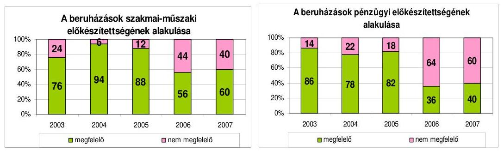

A beruházások átmeneti forráshiányának megoldásában a kivitelezők kamatmentes kölcsönnel, ideiglenes felhalmozási célú pénzeszközátadással, pénzben nyújtott garanciavállalással is segítették az önkormányzatokat. Az önkormányzatok a számukra pénzben nyújtott garanciákat (teljesítési és jótállási biztosíték) átmenetileg bevonták költségvetési kiadásaik (beruházások) finanszírozásába. A beruházások kivitelezését végző szervezetektől származó bevételek miatt - az államháztartási törvény előírása következtében - nőtt az ehhez kapcsolódóan jogtalanul igénybe vett és visszafizetésre javasolt támogatások összege.

Rendszerszemléletben tekintettük át a beruházások teljes folyamatát a kiemelt beruházások ${ }^{7}$ ellenőrzése keretében a beruházások előkészítésétől a megvalósított létesítmények üzemeltetéséig. Összehasonlítottuk az önkormányzatok és a gazdasági társaságok beruházási gyakorlatát.

A szabályozásban, a pályázati kiírásokban erősödtek azok az elemek, amelyek megvalósíthatósági
 tanulmányok, üzleti terv készítési kötelezettség előírásával a célszerűbb, előnyösebb beruházások kiválasztását segítették elő. A pályázók elsősorban az adottságok hangsúlyozására, a lehetőségek optimális bemutatására törekedtek, és nem fordítottak figyelmet a kockázati tényezők számbevételére. A beruházások megvalósításában résztvevők kiválasztásánál a tervezők, valamint a bonyolítók és a műszaki ellenőrök esetében kevésbé érvényesült a nyilvánosság. A közbeszerzési eljárás lefolytatási kötelezettségüknek a beruházók 31%-ban nem tettek eleget. A versenyeztetés hiánya akadályozta a közpénzek takarékos és átlátható felhasználását, nem tette lehetővé a vállalkozók összeférhetetlenségének, valamint a döntéshozatal folyamatában a szakmai szempontok érvényesülésének a megállapítását.

A beruházások megvalósításának folyamatában a kivitelezésre kötött szerződések több mint kétharmadát módosították, amelyek 34%-ánál nem támasztották alá megfelelően annak szükségességét. A beruházások közel felénél a műszaki tartalom változtatására irányuló szerződésmódosításoknál a kivitelezői alapszerződésekkel össze nem hasonlítható módon határozták meg a műszaki tartalmat. A szakmai-műszaki előkészítés a beruházások 41%-ánál nem volt megfelelő, mert - törvényi előírások ellenére - a kivitelezés megkezdésekor nem rendelkeztek érvényes jogerős építési, vagy vízjogi létesítési engedéllyel.

[^0]
[^0]:    ${ }^{7}$ Jelentés a kiemelt - turisztikai célú - beruházások ellenőrzéséről a helyi önkormányzatoknál (0823)

---

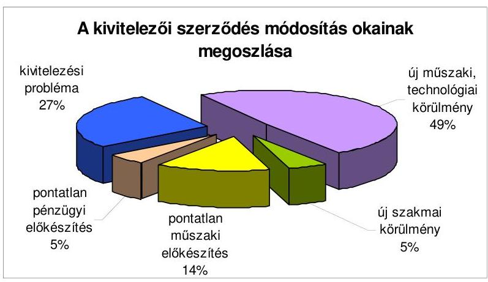

A műszaki ellenőrök által végzett folyamatos szakmai ellenőrzés a beruházások háromnegyed részénél nem, vagy csak részben járult hozzá a jogszabályokban és a kivitelezői szerződésekben előírtaknak megfelelő megvalósításához. A gazdasági társaságok nagyobb figyelmet fordítottak a kötbér igényeik érvényesítésére, míg az önkormányzatok nagyrészt eltekintettek ettől. A műszaki átadás-átvételi eljárások lezárását követően a beruházások 88%-ánál merültek fel üzemeltetési problémák.

A beruházások megvalósítása nem volt tervszerű, mert a beruházók 94%-ban eltértek a benyújtott és elfogadott pályázatokban megjelölt időtervektől, 53%-ban a műszaki tartalomtól, 82%-ban az előirányzott költségektől.

A beruházások folyamatáról az Európa Kulturális Fővárosa (EKF) projekt ellenőrzése keretében is mondtunk véleményt. Pécs Megyei Jogú Város Önkormányzata a 2006. évben nyerte el az Európa Kulturális Fővárosa 2010 címet, melynek keretében - a pályázat szerint - 34,6 milliárd Ft értékben, öt kulcsprojekt megvalósítására nyílott lehetősége, amelyek a város kulturális-turisztikai infrastruktúrájának fejlesztését célozták. A fokozott társadalmi érdeklődés is indokolttá tette, hogy az ÁSZ már az előkészítés szakaszában mondjon véleményt a projektről. A kulcsprojektekben szereplő beruházások megvalósítására európai uniós forrás vehető igénybe, azonban pályázatok kiírása csak 2008 közepétől kezdődött el. A helyszíni ellenőrzés során megállapítottuk, hogy az EKF Pécs 2010 projekt megvalósítása késésben van, a beruházások jelentős részénél az előkészítés a pályázatban tervezettnél lényegesen lassúbb, a megvalósításra ekkor már csak 18 hónap állt rendelkezésre.

# A közbeszerzési rendszer működése 

A közbeszerzések kiemelt szerepet töltenek be a közpénzek és a köztulajdon törvényes és ésszerű módon történő felhasználásának, működésének és ellenőrzésének garanciarendszerében. A közbeszerzési rendszer jó működése a korrupcióellenes tevékenység egyik stabil eszköze lehet. Az erre vonatkozó, rendszerszemléletű átfogó ellenőrzésünk alapvetően az eljárások szabályozottságára, a közbeszerzések központi intézményrendszerének és jogorvoslati rendszerének működésére, az informatikai támogatottság színvonalára, a közbeszerzések monitoringjára és ellenőrzöttségére, továbbá a közbeszerzésre kötelezettek felügyeleti, belső, illetve tulajdonosi kontrolljára irányult.

---

A közösségi előírások keretei között tagállami kompetenciába utalt közbeszerzési politika kialakítása, kijelölve a közbeszerzés fejlesztési irányait, célirányosan behatárolható feladatmegosztást eredményezhet a kormány-független központi intézmények (mint a Közbeszerzések Tanácsa - KT) és a kormányzati szektor között. Ezért tartottuk elsődlegesnek és javasoltuk a Kormánynak, hogy határozza meg a nemzeti közbeszerzési politika és a közbeszerzési rendszer fejlesztésének kormányzati felelősét, hatáskörét, feladatait, ami természetesen igényelte a KT aktív együttműködését is.

Szorgalmaztuk továbbá a közbeszerzési rendszer eredményességének, hatékonyságának mérésére alkalmas monitoring rendszer szervezését, a közbeszerzési szabálytalanságok és korrupciós kockázatok feltárását biztosító ellenőrzőjelző rendszer feltételeinek kialakítását, aminél hasznosíthatónak ítéltük az uniós források felhasználásával történő közbeszerzések megfelelőnek ítélt jogszabályi hátterét és gyakorlatát.

Kiemelt figyelmet kapott az eljárásrend törvénymódosító javaslatának előkészítése, a szabályozásokban az európai közösségi és a nemzeti célkitűzések érvényesülése és nem utolsó sorban az, hogy a korszerűsítési törekvések javították-e a szabályozás stabilitását, a gazdasági folyamatok kiszámíthatóságát és tervezhetőségét. A tapasztaltak alapján azonban nem láttunk garanciát arra, hogy teljesüljön a jogalkotói célkitűzés, miszerint hosszabb távon ne váljon szükségessé a Kbt. újabb módosítása.

Az önkormányzati területen, mind a cél- és címzett támogatások felhasználásának, mind az egyes témavizsgálatokhoz kapcsolódóan ellenőriztük a közbeszerzési törvény előírásainak érvényesülését. A közbeszerzési törvény hatályba lépését követően pedig két önálló témavizsgálat keretében értékeltük a közbeszerzési törvény célkitűzéseinek érvényre jutását.

A 2008. évi témavizsgálatunk során megállapítottuk, hogy az önkormányzatoknál a helyi szabályozás tekintetében lényeges előrelépés történt. Az ellenőrzött önkormányzatok 97%-a közbeszerzési tevékenységük eljárásrendjét szabályzatban rögzítette, a közbeszerzések személyi és tárgyi hatályát, feltételeit, az eljárások lefolytatásával kapcsolatos feladatokat meghatározta.

Az ellenőrzött önkormányzatok 21%-a nem tartotta be a törvény előírásait, mert a kötelező közbeszerzési eljárás alkalmazása nélkül valósította meg beszerzéseit. A szerződéses partnerek versenyeztetés nélküli kiválasztásával megsértették a közbeszerzési törvény alapelveit, nem biztosították a nyilvános és ellenőrzött döntéshozatalt. A közbeszerzési eljárás mellőzésére elsősorban a több intézményt érintő felújítás, árubeszerzések, banki szolgáltatás igénybevételénél és élelmezési anyagok beszerzésénél került sor. A 2001. évi jelentésünkben megállapított 15%-hoz képest 2008-ra 59%-ra nőtt az önkormányzatok ellen indított jogorvoslati eljárások aránya.

# 2.3. Az uniós források felhasználása 

Összhangban az országgyűlési határozatban előírtakkal, a harmadik alkalommal készítettük el az európai uniós támogatások felhasználásának ellenőrzéséről szóló Tájékoztatót, amely bemutatta Magyarország európai

---

uniós pénzügyi kapcsolatait és a támogatásokkal kapcsolatos ellenőrzések 2007-es tapasztalatait. A Tájékoztató elemezte Magyarország támogatás felhasználását - abszorpciós képességét - és leszögezte, hogy a strukturális alapok esetében Magyarország a felhasználható forrásokat teljes egészében lekötötte, a kifizetések tekintetében az újonnan csatlakozók mezőnyének első felében (3. helyen) volt, az EU25 között a 19. helyen állt. A Kohéziós Alap esetében hazánk a 2006. éves kötelezettségvállalási előirányzatokat teljes mértékben lekötötte, kifizetések tekintetében az új tagországok között a 2. helyet foglalta el.

A Tájékoztatóban értékeltük a lezáródó költségvetési periódusról rendelkezésre álló tapasztalatokat és tanulságokat, és összevetettük az újonnan induló időszak tevékenységéről megfogalmazott ellenőrzési megállapításokkal.

Az előcsatlakozási alapok és a Schengen Alap forrásait Magyarország sikeresen felhasználta. A SAPARD esetében a pénzügyi zárás és a pénzügyi rendezés megtörtént. A Phare esetében a 2007. évet az EU Bizottság záró auditjaira való felkészülés jellemezte.

A 2004-2006-os programozási időszakra a források felhasználásának értékelése szempontjából kedvező, hogy a Nemzeti Fejlesztési Terv megvalósítására rendelkezésre álló keret kötelezettségvállalással lefedett, a lekötések realizálásában, azaz a kifizetésekben rejlő kockázatok csökkentése érdekében a megvalósítási és kifizetési folyamatok felgyorsítására kell koncentrálni.

A támogatásközvetítő intézményrendszer és a jogszabályi környezet kialakítása a támogatási rendszer indításával párhuzamosan történt, és folyamatosan átalakult. Az EU források ellenőrzési rendszere betöltötte a szerepét, ugyanakkor nem mentes az átfedésektől és az esetenkénti egyidejű ellenőrzésektől.

A Kohéziós Alap feltételrendszerének kialakítása tekintetében az időszakot - a fentiekben bemutatott hiányosságok mellett - a projektek megvalósításának időbeli elhúzódásán túl a jelentős költségtúllépés és műszaki tartalomváltozás jellemezte.

A kifizetések növekedésével természetszerűen az EU és hazai ellenőrzési szervek által végzett ellenőrzések száma is nőtt. A vizsgálatok által feltárt szabálytalanságok pénzügyi következményekkel járhatnak.

A pénzügyi periódus zökkenőmentes zárása érdekében kiemelt figyelmet kell fordítani a szabálytalanságok lehető legnagyobb mértékű feltárására, az uniós támogatásokból megvalósult projektek kötelező működési monitoringjára. Ezek nem megfelelő működtetése jelentősen meghosszabbíthatja az EU-val való pénzügyi elszámolási és zárási folyamatot, ami kedvezőtlenül hathat a hazai költségvetés helyzetének alakulására.

A 2007-2013-as költségvetési periódus első éve gyakorlatilag a felkészülés jegyében telt el. Az agrár- és vidékfejlesztési támogatások intézményrendszerének akkreditálása már megtörtént. Az Új Magyarország Fejlesztési Terv Operatív Programjait az EU Bizottság az elsők között fogadta el, és az intézményrendszer akkreditációja az uniós előírásoknak megfelelően egy éven belül befejeződött. A támogatásközvetítő intézményrendszer és a jogszabályi környezet változásai következtében az operatív programok végrehajtása lassan és nem minden

---

program vonatkozásában indult be. A korábbiakban kiépített monitoring és ellenőrzési rendszert valamennyi szervezetben és szinten erősíteni szükséges. Az ÚMFT támogatás-felhasználást támogató informatikai rendszerének kiépítettsége 2007 végén még nem volt teljes körű. Az EU költségvetéséből forráslehívás - az agrártámogatások kiegyensúlyozott lehívásaitól és egy csekély, operatív programra kifizetett összegtől eltekintve - gyakorlatilag nem volt.

A Nemzeti Fejlesztési Ügynökséget érintő ellenőrzésünkkor értékeltük az EU-források felhasználását célzó nemzeti stratégiák, programok tervezését és végrehajtását.

Megállapítottuk, hogy a Magyarországra érkező uniós támogatások hazai szervezeti, szabályozási, végrehajtási hátterét 2006-ra kiépítették, de működését koordináltsági, hatékonysági, gazdaságossági hiányosságok jellemezték. A hatékonyság, és a gazdaságosság növelése érdekében létrejött a Nemzeti Fejlesztési Ügynökség, ide kerültek a tárcáktól az Irányító Hatóságok, ezzel átláthatóbbá, egységesebbé vált az intézményrendszer, de tevékenységét csak az EU-források vonatkozásában látta el. Egyszerűsítették a támogatási mechanizmust, a közreműködő szervezetek számát csökkentették, működésük hatékonyságát egységes eljárásrenddel biztosították, finanszírozásukban a korábbi költség elszámolásról a teljesítményalapú elszámolásra tértek át.

A fejlesztéspolitika törvényi alapja hiányzik, pedig ennek szükségességét az Országgyűlés határozata kimondta, és felelősét kormányhatározat jelölte ki. Törvény hiányában a fejlesztéspolitika szabályait alacsonyabb szintű rendeletek rögzítették, ami a párhuzamosságok és joghézagok kialakulásához vezethet. A pályázókat segítő tanácsadói tevékenység erősítésére utal az elutasított, illetve hiánypótlásra visszaadott pályázatok aránya. Hiányoltuk, hogy csak a jogszabályban foglalt panaszok körét kezelik. A közpénzek védelme az ellenőrzések, illetve visszafizetések kezdeményezése révén biztosított volt, ugyanakkor a pályázatban kikötött biztosítékot a támogatások összegére csökkentették, ami nem fedezi a ráfordításokat. Megállapítottuk, hogy a működés költségei gazdaságossági, célszerűségi szempontok alapján racionalizálhatók, például a magas tanácsadói költségek, a kommunikációs kiadások és a közreműködő szervezeteknek fizetett sikerdíj megállapításának felülvizsgálata révén.

A szakmai feladatokat a 2004-2006. évre szóló Nemzeti Fejlesztési Terv I. végrehajtása és a 2007-2013 időszakra szóló Új Magyarország Fejlesztési Terv tervezése és elindítása határozta meg. A stratégiát kutatóhelyek bevonásával készítették, majd széles társadalmi körben egyeztették. A koncepciót az EU Bizottság észrevételeit követően alapvetően át kellett dolgozni, változtak céljai és operatív programjai. Végrehajtásában új elemként jelentkezett egyes fejlesztések kiemelt projektként történő kezelése.

A fejlesztéspolitika eredményei még nem értékelhetőek. Az NFT I. megvalósulása késik. A késedelmes kifizetéseket 2007-re felszámolták, ugyanakkor több program esetében fennáll a forrásvesztés kockázata. A területi egyenlőtlenségek csak részben mérséklődtek, annak ellenére, hogy az egy főre jutó támogatás a legfejletlenebb régiókban volt a legmagasabb, viszont a legtöbb támogatást a legfejlettebb régió kapta. Pozitívum, hogy a súlyosan elmaradott térségek esélyének erősítésére a Kormány 2007-ben elindította az Új Magyarország Felzárkóztatási Programot.

A versenyszférán belül a nagyobb szervezetek kerültek előnybe. Az egyes célokra pályázók nem egyenlő esélyekkel indultak, a logisztikai beruházásoknál a tőkeerős társaságok már a pályázat benyújtásakor megkezdték a fejlesztést, a nem tőkeerős szervezetek a döntés kivárására kényszerültek. Az oktatási támogatások hatékonyságát rontották az érintett iskolákat érintő megszorító intézkedések.

Az INTERREG célú költségvetési előirányzatok hasznosulásának ellenőrzéséről szóló jelentésünkben megállapítottuk, hogy a határ menti együttműködési programok, amelyekben hazánk részt vett,
 hozzájárultak a fő célkitűzés teljesítéséhez, a határ menti régiók fejlesztéséhez, azonban a támogatási célok általánosak voltak, és nem koncentráltak a határ menti térségek főbb problémáira. A programok iránt nagy volt az érdeklődés, a források legkedvezőbb felhasználását azonban több tényező korlátozta, így a programok viszonylagos újszerűsége, a nemzetközi együttműködés időigénye és bonyolult intézményi, eljárási rendszere, a hazai intézményi feltételek kialakításának késedelme és az intézményrendszer támogatásra vetített magas működési költsége.

Az ellenőrzési rendszer működésének és a szabálytalanságok kezelésének bizonytalanságát mutatja, hogy a közbeszerzési folyamatok szabálytalansággal gyanús eseteiben nem indítottak eljárást, az időbeli késedelmek miatt beállt jogvesztő hatályra hivatkozva.

Az önkéntes alapú véleményfelmérés visszatükrözte az INTERREG program hasznosulásának erős és gyenge pontjait. A válaszadók túlnyomó többsége nem tapasztalt korrupciót, de a mintegy 10%-os arányú korrupciós jelzés mutatja a korrupcióellenes tevékenység fontosságát.

# Az európai uniós forrásokra irányuló pályázatok felülvizsgálatakor 

az önkormányzati területen végzett ellenőrzések során megállapítottuk, hogy azok a gazdasági programokban, az ágazati, szakmai és területfejlesztési koncepciókban, tervekben megfogalmazott fejlesztési célkitűzésekhez többségükben kapcsolódtak, valamint a fejlesztési célkitűzések négyötöde a kötelező feladatok ellátásához kapcsolódott. A több éven át visszatérően tett javaslatunk hatására a gazdasági programok főbb tartalmi követelményei az Ötv.-ben meghatározásra kerültek, lényegesen emelkedett a gazdasági programmal rendelkező önkormányzatok száma. Míg 5-6 évvel ezelőtt a gazdasági program általános hiányát állapítottuk meg, addig az elmúlt évben már csak az önkormányzatok mintegy tizedénél tapasztaltuk, hogy az Ötv.-ben foglaltak ellenére nem, vagy az előírt határidőnél később fogadták el a gazdasági programot. Tapasztalataink szerint a gazdasági programban a fejlesztési feladatok költségvetési kiadási szükségletét és a lehetséges pénzügyi forrásokat az önkormányzatok közel kétharmada vette számításba.

Az önkormányzatok 92%-a az európai uniós források igénybevételéhez és felhasználásához - pályázatfigyelés, pályázatkészítés, pályázatbenyújtás, a kapott támogatás felhasználása, a felhasználás ellenőrzése, elszámolás összeállí-

---

tása - szükséges szabályozottság terén, míg 17%-a a szervezettség vonatkozásában nem készült fel eredményesen. Nem rendelkeztek az európai uniós forrásokhoz kapcsolódóan a pályázatfigyelés, a pályázatkészítés, az európai uniós forrásokkal támogatott fejlesztés lebonyolítási feladatairól, felelőseiről, nem szabályozták az európai uniós forrásokra irányuló pályázatok koordinálásával összefüggő feladatokat, az önkormányzati szintű pályázatnyilvántartás vezetésének felelőseit, az európai uniós forrásokkal kapcsolatos információk áramlásának rendjét az ellenőrzési kötelezettségeket.
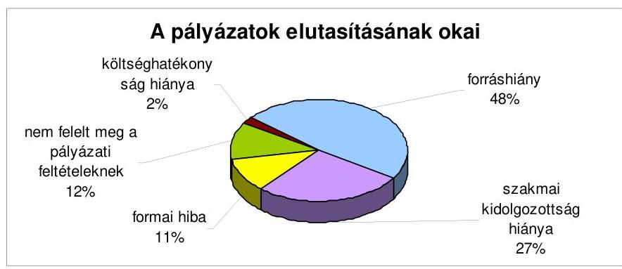

Az európai uniós forrásokkal támogatott fejlesztési feladatok finanszírozási forrásainak összetétele a következő:
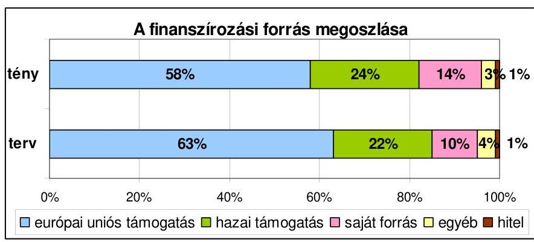

Az európai uniós forrással támogatott fejlesztési feladatok ellenőrzései során megállapítottuk, hogy a támogatott feladatok mintegy felének megvalósítása nem a támogatási szerződésben foglalt ütemezésben folyt. A támogatási szerződések közel felét módosították a határidők csúszása, a támogatás és kiadások évek közötti átütemezése, a projekt-költségvetésen belüli részösszegek átcsoportosítása, valamint a műszaki tartalom változása miatt. A kifizetési kérelmek benyújtása és azok teljesítése között az önkormányzatok közel felénél félév-háromnegyedév közötti különbség volt, elsősorban az igénylést alátámasztó dokumentumok alaki, tartalmi hiányosságai miatt. A mulasztásokhoz a felkészülés szabályozottságának, szervezettségének hiányosságai is hozzájárultak. Az önkormányzatok az európai uniós forrással támogatott fejlesztési feladataikhoz az éves költségvetési rendeleteikben a saját forrást biztosították, továbbá eleget tettek a strukturális alapok által támogatott fejlesztések esetében a megelőlegezési követelménynek. A támogatás utólagos finanszírozási rendszere az önkormányzatok mintegy ötödénél okozott pénzügyi zavarokat, amelyek áthidalására tizedük likviditási és rövid lejáratú hitelt vett fel. A fejlesztési feladatok

---

megvalósításánál az önkormányzatok közel ötödénél a pályázatokban nem szereplő, de a feladat megvalósításához kapcsolódóan saját forrásból többletkiadásokat teljesítettek.

A támogatásban részesült önkormányzatok többségénél (86%-ánál) az európai uniós források felhasználását a belső ellenőrzés nem vizsgálta. Az európai uniós forrással támogatott fejlesztési feladatok megvalósulásának külső ellenőrzései során azok háromnegyedénél hiányosságokat állapítottak meg. A közreműködő szervezetek az ellenőrzéseik tizedénél tettek olyan szabálytalanságra vonatkozó megállapításokat, melyek miatt a támogatás kifizetését felfüggesztették, illetve visszafizetési kötelezettséget állapítottak meg.

Nemzetközi együttműködés keretében 2008-ban több párhuzamos ellenőrzést végeztünk, így az EU Strukturális Alapok Munkacsoport által koordinált ellenőrzéssel vizsgáltuk az EU SA környezetvédelmi felhasználását, az európai NATURA 2000 hálózat megvalósulását, a visegrádi ország-csoport együttműködésében az EU Strukturális Alapjainak felhasználásában érintett nemzeti intézmények belső kontrollrendszerét, valamint az EUROSAI keretében a társasági adóhoz kapcsolódó adókedvezményeket.

# 2.4. Az államháztartáson kívülre juttatott támogatások 

A non-profit szervezetek társadalomban betöltött közcélú szerepe fokozódásának, kiszélesedésének eredményeként az állami támogatások finanszírozási részaránya 40% fölé emelkedett. Összegszerűségében a 2003. évi 310 Mrd Ftról, évről-évre egyenletes ütemű növekedéssel érte el 2007-re a 462 Mrd Ft teljesítést, mellyel azonos nagyságrendben lett jóváhagyva a 2008. évi költségvetési törvényi előirányzat.
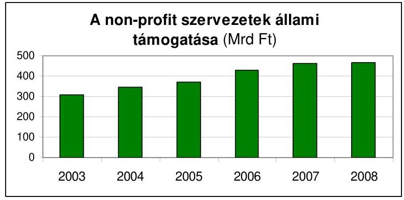

A civil szervezetek állami támogatásának dinamikus növekedése egyre nagyobb feladatot, felelősséget ró a számvevőszéki ellenőrzésekre, amelynek keretében rendszeresen vizsgáljuk a közalapítványok, a pártok és pártalapítványok gazdálkodását, valamint 2008-ban teljes körűen befejeztük az országos kisebbségi önkormányzatok négy éves gazdasági tevékenységének ellenőrzését.

A tárgyévben ellenőrzött közalapítvány az alapító okiratában megfogalmazott célok megvalósítása érdekében az oktatás, a képzés és a kutatás-fejlesztés területén valósította meg programjait egynegyed részben hazai, háromnegyed részben európai uniós támogatásokból. A kapott állami támogatást az alapító

---

okiratban meghatározott célok elérése érdekében végzett feladatokra használta fel. A kuratórium kialakította az általa nyújtott támogatások felhasználásának monitoring rendszerét, amelynek keretében szakmai és pénzügyi ellenőrzést végzett. A közalapítvány gazdálkodása a vonatkozó jogszabályoknak és belső szabályozási előírásoknak megfelelt. A gazdálkodás törvényességét és szabályosságát az alapító által kinevezett felügyelő bizottság ellenőrizte.

A Kormány által alapított közalapítványok gazdálkodása törvényességének és célszerűségének ellenőrzéséről nyilvánosságra hozott jelentéseinkben rendre feltártuk az alapítással, működtetéssel kapcsolatos szabálytalanságokat. Ennek alapján számos javaslatot tettünk az állami pénzek e különleges formájú elosztási rendszerének hatékonyabbá tételére. A közalapítványok létrehozását eredetileg motiváló szándék - nevezetesen az államháztartáson kívüli források bevonása az állami közfeladatok ellátásának finanszírozásába - eddig nem teljesült, ellenőrzéseink tapasztalatai ugyanis azt mutatták, hogy a közalapítványok által ellátott közhasznú feladatokhoz a vállalkozások és az állampolgárok adományokkal nem járulnak hozzá. A közpénzek hatékonyabb felhasználása érdekében továbbra is szükségesnek tartjuk a még jelenleg is működő közalapítványok által célszerűen és gazdaságosan ellátandó közfeladatok felülvizsgálatát, finanszírozásának tovább fejlesztését.

A rendszeres pártellenőrzések körében tervszerűen befejeztük két parlamenti párt gazdálkodásának törvényességi vizsgálatát. Terven felül végrehajtottuk a 2008. februári időközi választás képviselethez jutott jelölő szervezetének ellenőrzését. Pártellenőrzési tapasztalataink ismételten megerősítették a pártok gazdálkodását, kampányfinanszírozását és annak nyilvánossági követelményét meghatározó törvényi előírások tarthatatlanságát, mellyel összefüggésben évek óta szorgalmazzuk a pártok működését és gazdálkodását, valamint a választási eljárást szabályozó hatályos törvények módosítását. Indítványunkra a Kormány 2006-ban eredménytelenül nyújtotta be a törvénymódosító javaslatát, s hasonlóan a pártfinanszírozás átláthatóbbá tételére beterjesztett önálló képviselői indítvány kétharmados többségű elfogadásához sem sikerült a politikai konszenzust megteremteni (T/4190.).

A pártellenőrzésekkel szinkronban ellenőrzött két pártalapítvány kuratóriuma törvényesen működött, az általuk nyújtott támogatások, valamint a saját szervezeti keretek között megvalósított programok megfeleltek az alapító okiratokban megfogalmazott céloknak. Az alapítványok a jogszabályban előírt számviteli szabályzatokkal rendelkeztek, azok módosításánál azonban a korábbi ellenőrzési javaslatainkat csak részben vették figyelembe, ezért azok nem teljes körűen, és nem az alapítványi sajátosságok figyelembevételével szabályozták a számviteli elszámolás rendjét, továbbá előírásaik nem érvényesültek maradéktalanul a gyakorlatban.

A két országos kisebbségi önkormányzat vizsgálatával teljes körűen befejeztük a rendszeres költségvetési támogatásban részesült szervezetek pénzügyi-gazdasági ellenőrzését, amelynek tapasztalatai alapján ellentmondásosnak értékelhető a nemzeti és etnikai kisebbségekről szóló törvény 2005. november 25-étől hatályos módosításainak végrehajtása. Az országos kisebbségi hivatalok - legkésőbb 2008. január 1-jéig történő - költségvetési szervvé alakítása számos szervezeti és szabályozási mulasztással teljesült. Az egyik

---

kisebbségi önkormányzat az intézményalapítási 4,7 M Ft támogatást részben jogszabálysértő módon, nem rendeltetésszerűen használta fel.

Az államháztartáson kívüli támogatások rendszerében az oktatási fejezetellenőrzéshez tervszerűen kapcsolódva első alkalommal vizsgáltuk a nem állami és nem helyi önkormányzati fenntartású közoktatási intézmények normatív finanszírozásának szabályszerűségét, amelyre 2007-ben a non-profit célú források több mint egyötöde jutott.

A közoktatási intézményt fenntartó alapítványok, közhasznú társaságok és társadalmi szervezetek közoktatási célú normatív hozzájárulásának és támogatásának ellenőrzése lényeges mértékű hibákat tárt fel. A non-profit fenntartói elszámolások 83%-a nem volt megbízható, az elszámolt normatív támogatásra vetítve 13%-ot meghaladó eltérést állapítottunk meg. A hatályos szabályoktól eltérő elszámolás miatt a non-profit fenntartók 198 M Ft-ot jogalap nélkül vettek igénybe, illetve 79 M Ft további támogatásra voltak jogosultak. Egyenlegében 118 M Ft költségvetési támogatás indokolatlanul került folyósításra, amelynek 88%-a a szakképzés finanszírozásához kapcsolódott. A jogalap nélküli kifizetések illetve további támogatások rendezése érdekében, az ÁSZ javaslatára, az OKM kezdeményezte a Magyar Államkincstárnál - a 2009. évi monitoring feladatok végrehajtása keretében - utóellenőrzés elvégzését.

# 2.5. Az állami vagyongazdálkodás 

Törvényből fakadó éves ellenőrzési feladatunk az ÁPV Zrt. működésének és a központi költségvetés végrehajtásához kapcsolódó tevékenységének az ellenőrzése. Az ÁPV Zrt. 2008-as ellenőrzésének további célja volt a 2007. évi ún. vagyontörvény rendelkezéseiből fakadó feladatok végrehajtásának ellenőrzése. A 2007. évi ellenőrzési tervünknek megfelelően ellenőriztük a vasúti közlekedés korszerűsítését is.

Az Állami Privatizációs és Vagyonkezelő Zrt. 2007. évi működésében a saját vagyonnal való gazdálkodást jelentősen befolyásolta a szervezet jogállásában várható változás, a változásra való felkészülés. A Társaság 2007. IV. negyedévében jelentős többletfeladatot látott el a vagyontörvény végrehajtásából adódó egységes vagyonkezelésre való áttérés miatt. Az állami vagyonról szóló törvénnyel és az átszervezéssel kapcsolatos feladatok végrehajtása elsősorban idő hiányában nem volt megfelelően előkészítve. A vagyonelemek nyilvántartása nem megbízható. A vagyontörvénybe foglaltak eltérően, illetve hiányosan szabályozzák az általános (társasági, számviteli, cégjogi) törvényekben foglaltakat, ezért a garanciális elemek nem érvényesülnek megfelelően.

Az állami vagyonnal való gazdálkodás szabályozásában változatlanul jelentős kockázatot hordoz az állami támogatások nem EU-s szabályoknak megfelelő igénylése és felhasználása, továbbá az állami vagyon leányvállalatokba történő nem megfelelően szabályozott kivitele. A hatályos törvények egyfajta értelmezésével az állami tulajdonú társaságok valamennyi tevékenysége országgyűlési kontroll nélkül leánytársaságokba kiszervezhető. A kiszervezést követően - ugyanilyen döntési mechanizmus alapján - az állami vagyont a társasági tulajdonlás hangsúlyozása mellett privatizálják, a befolyt bevételt az anyacég feléli. Probléma a leányvállalatok vagyonának elzálogosítása is. A tartós álla-

---

mi tulajdon egy kiüresedett, vagyonát vesztett, funkció nélküli, gazdasági stratégiai jelentőségét tekintve érdektelenné vált céggé válik.

A Vagyonkezelőnek a tevékenysége összességében összhangban volt a hozzárendelt vagyonra vonatkozó jogi szabályozással 2007-ben is. Az igazgatóság működésében 2007. június 30-a és augusztus 9-e között viszont folytonossági hiány alakult ki. A vagyontörvény 2007. szeptember 25-i hatályba lépése után a Társaság működése - a nem egyértelmű jogi szabályozás, a vagyontörvény és más jogszabályok, szabályozók között meglévő összehangolási hiányosságok és ellentmondások, valamint a kettős feladatvégzés miatt - nem volt átlátható, a döntési hatáskörök nem voltak pontosítva, ami kockázatot jelentett a Társaság működésében és annak ellenőrzésében.

A hozzárendelt vagyonba tartozó társaságok előző évhez viszonyítva jelentős eredményjavulást mutattak.

Kifogásolható azonban a MALÉV Zrt. esetében, hogy teljes körűen nem teljesült a privatizációval elérni kívánt cél. Az alacsony értékesítési ár ellenére az állami
 garanciális hitelek nem rendeződtek véglegesen, valamint a szerződésben vállalt feltételeket csak részben teljesítette a vevő.

A Földhitel és Jelzálogbank Nyrt. értékesítése a korábbi bankprivatizációkhoz képest megfelelő és üzletileg sikeres volt. Kifogásolható azonban, hogy a bank jövőbeni szerepére átfogó felmérés nem készült, a gyorsított részvényértékesítést végző tanácsadó kiválasztása és a tranzakció nem volt átlátható, valamint az, hogy a „B" sorozatú részvények megvásárlásánál az ÁPV Zrt. nem érvényesítette teljes körűen az érdekeit.

Az állami vagyon kiemelt figyelemmel kísért elemei a vasúti közlekedés állami tulajdonban lévő társaságai. Harmadik alkalommal elemeztük részletesen a vasúti közlekedést. Az ellenőrzés kiterjedt a források felhasználására, a szervezeti átalakításokra, a korszerűsítés megvalósítására, a vasúti mellékvonalakra vonatkozó döntésekre.

Az ellenőrzött időszakban a vasúti korszerűsítést több átfogó fejlesztési koncepció is érintette, amelyek közös jellemzője az volt, hogy forrásokkal nem voltak megfelelően alátámasztva. A döntéseknél a vasútfejlesztés nem kapott megfelelő figyelmet. A közszolgáltatási tevékenységgel kapcsolatos feladatok és kötelezettségek szerződésben való rögzítése elmaradt. A túlbonyolított szervezeti irányítás sem biztosítja a fejlesztési források átlátható és koncentrált felhasználását, a vasútfejlesztés finanszírozásának jelenlegi rendszere nem hatékony.

A MÁV Zrt. szervezetének átalakítását nehezítette, hogy 2002-2007 között az igazgatóságában 32 személy töltött be tisztséget, az igazgatóság összetétele 7 alkalommal módosult, részben a koncepcióváltások miatt. Az időszak alatt 5 különböző Szervezeti és Működési Szabályzat határozta meg a társaság vezetői (igazgatói) körét, ahol 7-16 vezetői pozíciót mintegy 50 különböző személy, a vezérigazgatói posztot 4 személy látta el. A társaság vezetése 4 különböző stratégiai anyagot fogadott el különböző néven és különböző céllal.

A szaktárca mellékvonalakkal kapcsolatos döntés előkészítéseinél kockázatot jelent, hogy a mellékvonalak költség és eredményelemzés adatai nem megbízhatóak, nem készült hatástanulmány a térségek életének, gazdaságának hosszú távú fenntarthatóságára: a társadalmi egyeztetésre, az önkormányzati szándéknyilatkozatra rövid határidő állt rendelkezésre.

A vasúti teherfuvarozási üzletág értékesítése célszerűtlen és ellentmondásos volt. A MÁV Cargo Zrt. értékesítésénél a tartósan állami tulajdonban maradó vagyonra vonatkozóan a törvényalkotói szándék nem érvényesült. Az aláírt szerződés a MÁV Zrt. számára indokolatlan kötelezettségeket tartalmaz, míg a vevő által vállalt kötelezettségek aggályosak és több ponton célszerűtlenek a Magyar Államra vonatkozóan.

Ma nincs Magyarországon egységes vasúti járműnyilvántartás és nem kötelező az uniós országokban bevezetett időszaki hatósági járművizsga, amelyek lehetővé tennék a hazai forgalomban részt vevő vasúti járművek azonosíthatóságát, valamint az országban használt vasúti járművek rendszeres és kötelező ellenőrzését.

Az elmúlt évtizedek alatt a vasúti infrastruktúra műszaki állapota folyamatosan romlott. Az elhasználódás egyik alapvető oka, hogy a karbantartásra és a felújításokra, beruházásokra előirányzott források nem nyújtottak fedezetet a műszaki állapot szinten tartására sem.

A MÁV Zrt. ingatlangazdálkodását az ingatlanok és a felépítmények tulajdonjogi rendezésének hiánya, az áttekinthetetlen ingatlanvagyont terhelő korlátozások, az ingatlangazdálkodást érintő gyakori koncepció- és vezetőváltás jellemzi.

# 3. Az ellenőrzések hasznosítása 

A jelentésekről általánosságban elmondható, hogy megállapításaik, javaslataik elfogadása és hasznosítása - mind a politika, mind a közvélemény részéről az ÁSZ mintegy két évtizedes munkája során folyamatosan kedvező irányban változott.

Az intézmény tevékenységének, a jelentések hasznosulásának egyfajta mutatói lehetnek a közzétett jelentésekhez kapcsolódó - meghatározott szempontok szerint csoportosított - országgyűlési (bizottsági vagy plenáris) események.

Adatok a jelentések bizottsági tárgyalásairól

|  | 1998 | 1999 | 2000 | 2001 | 2002 | 2003 | 2004 | 2005 | 2006 | 2007 | 2008 | összesen |
| :--: | :--: | :--: | :--: | :--: | :--: | :--: | :--: | :--: | :--: | :--: | :--: | :--: |
| Az évben megjelent összes jelentés Bizottságok* által tárgyalt jelenté sek/tanulmányok | 44 | 37 | 43 | 37 | 46 | 57 | 69 | 72 | 63 | 59 | 53 | 580 |
| Tárgyévben készült és tárgyévben megtárgyalt jelentések | 6 | 24 | 13 | 17 | 10 | 12 | 12 | 13 | 9 | 9 | 13 | - |
| Az éves beszámolónkat megtárgyaló bizottságok száma | - | 5 | 6 | 7 | 3 | 8 | 12 | 7 | 6 | 8 | 5 | - |
| Bizottsági tárgyalási események ** | 48 | 88 | 69 | 62 | 62 | 84 | 82 | 80 | 46 | 51 | 56 | 728 |

* Az 1998-2002-es ciklus alatt 23, 2002-2006 között 25, 2006 óta 18 állandó bizottság működik. ** Bizottsági napirendek, amelyeken jelentés/tanulmány szerepelt.

---

Az ÁSZ országgyűlési és bizottsági kapcsolatait jellemző adatok alakulását az elmúlt több mint 10 évben az is döntően befolyásolta, hogy az egyes parlamenti ciklusváltások alkalmával sor került-e a korábbi bizottsági struktúra átalakítására.

# 3.1. A jelentések országgyűlési tárgyalása, határozatok és az országgyűlési kapcsolatok 

Az ÁSZ 2008 során is - jogállásából, szerepéből következően - szoros szakmai kapcsolatban működött együtt az Országgyűléssel és a bizottságokkal. A munkakapcsolat az elmúlt évek során folyamatosan fejlődött és az informatikai lehetőségek minél szélesebb körű kihasználásával egyre közvetlenebbé vált. Az ÁSZ elnöke az elmúlt években többször kapott meghívást a Bizottsági Elnökök Értekezletére, és rendszeresen találkozott a parlamenti frakciók vezetőivel is. Az Országgyűlés mellett szintén jó a kapcsolat a Köztársasági Elnöki Hivatallal és a Miniszterelnöki Hivatallal is.

Az ÁSZ határidőre eleget tett jogszabályokban előírt jelentés-készítési kötelezettségeinek (költségvetési vélemény, zárszámadási jelentés, MTI Zrt. és az MNV Zrt. gazdálkodásáról és tevékenységéről készített éves jelentések). A 2008. évi ellenőrzési tervben szereplő 55 jelentésből 53 jelentést adtunk közre 2008-ban. Ebből 12 jelentést és egy tanulmányt tűztek napirendre az Országgyűlés bizottságai. A megtárgyalt jelentések mindegyike 2008-ban közzétett jelentés volt.

A jelentésekhez fűződő bizottsági események számában 2006 óta folyamatos emelkedés figyelhető meg. 2006-ban 46, 2007-ben 51, 2008-ban pedig 56 bizottsági ülés napirendjén szerepelt ÁSZ-jelentés/tanulmány.

Az Országgyűlés plenáris ülésének napirendjén 4 jelentés szerepelt.
2008-ban a Költségvetési, pénzügyi és számvevőszéki bizottság mellett a Gazdasági és informatikai bizottság támaszkodott munkájában leginkább az ÁSZ jelentéseire (5-5 jelentésünket tűzték napirendre). Az Emberi jogi, kisebbségi, civil- és vallásügyi bizottság 4 jelentést és a cigányság helyzetével foglalkozó FEMI tanulmányt is megtárgyalta 2008. évi ülésein.

Az 1998-2002-es parlamenti ciklus alatt vált gyakorlattá, hogy az ÁSZ éves tevékenységéről szóló beszámoló jelentést az Országgyűlés plenáris ülése - és egyre több állandó bizottsága is - rendszeresen megtárgyalja, majd határozatot hoz annak elfogadásáról. A 2007. évi tevékenységről szóló ÁSZ-beszámolót öt kijelölt bizottság tűzte napirendjére.

A 2007. évi költségvetés végrehajtásának ellenőrzéséről készült jelentésünket és a 2009. évi költségvetési javaslatról szóló véleményünket - a Mentelmi bizottság kivételével - valamennyi bizottság megtárgyalta.

Az MTI Zrt. 2007. évi gazdálkodásának ellenőrzéséről készült jelentést a Kulturális és sajtóbizottság, valamint a Költségvetési, pénzügyi és számvevőszéki bizottság együtt tárgyalta az MTI Zrt. éves beszámolójával.

---

Az ÁPV Zrt. 2007. évi tevékenységének ellenőrzéséről szóló jelentést a négy kijelölt bizottság közül a Gazdasági és informatikai, valamint a Környezetvédelmi bizottság október-novemberben megtárgyalta, de az elmúlt évben sem került a plenáris ülés napirendjére.

Az európai uniós támogatások 2007. évi felhasználásának ellenőrzéséről szóló jelentést az Új Magyarország Fejlesztési terv végrehajtását felügyelő eseti bizottság a Nemzeti Fejlesztési és Gazdasági Minisztérium regionális operatív programok akcióterveiben rögzített forráskeret módosításáról szóló tájékoztatójával együtt tűzte napirendre 2008. október 7-én.

Az ÁSZ elnöke 4 alkalommal szólalt fel a parlament plenáris ülésén és 14 bizottsági ülésen vett részt az éves beszámoló, a zárszámadási jelentés, a költségvetési vélemény és az éves ellenőrzési terv megtárgyalásánál. Az ÁSZ vezetői, szakértői a jelentések bizottsági tárgyalásán túl, az intézmény feladatkörét, ellenőrzéseit érintő napirendek tárgyalásán is részt vettek és szót kaptak.

2008-ban közel 90 bizottsági ülésen képviseltette magát az ÁSZ (a bizottsági ülések több mint felén előterjesztőként szerepelt).

2008-ban 3 képviselői kérdés érkezett az ÁSZ elnökének címezve.
Az ÁSZ részt vett a - tevékenységi körét is érintő - takarékos állami gazdálkodásról szóló törvényjavaslat előkészítésében, és fokozott figyelemmel kísérte végig a közbeszerzési törvény módosítását célzó javaslat sorsát.

Az ÁSZ jelentéseivel kapcsolatos 2008. évi bizottsági és plenáris események adatait a 2. sz. melléklet tartalmazza.

# 3.2. A számvevőszéki javaslatok érvényesülése 

Az ÁSZ ellenőrzési feladatait, illetve azok eredményeként valamennyi jelentése összeállítását és közreadását szigorúan „technológizált" eljárásokat követve teljesíti. Az ÁSZ-törvény és a belső szakmai szabályozás alapján a számvevői jelentéseket és az abból készülő számvevőszéki jelentéstervezeteket az érintettekkel többszörösen egyeztetjük. Amennyiben véleményeltérés marad fenn, azt a közreadott jelentésben szerepeltetjük.

Ellenőrzéseink - nem érintve a gazdasági vezetés önállóságát és nem átvállalva felelősségét - rendszeresen felhívják a figyelmet a gazdasági döntések, az eladósodás veszélyeire, az árfolyamkockázat következményeire, amelyek helytállóságát a későbbi folyamatok vissza is igazolnak. ${ }^{8}$

[^0]
[^0]:    ${ }^{8} 0743$ Jelentés a nemzeti hírügynökségről szóló törvényben, valamint a rádiózásról és televíziózásról szóló törvényben meghatározott közszolgálati feladatellátás rendszerének ellenőrzéséről
    0609 Jelentés az egészségügyi szakellátások privatizációjának ellenőrzéséről

---

Az utóbbi időben megnövekedett azon esetek száma, amikor korábbi, egyetértő véleményével szemben az ellenőrzött a számvevőszéki jelentés közzététele után vitatja az egyeztetett megállapításokat és javaslatokat.

# 3.2.1. Javaslatok hasznosítása az Országgyűlés szintjén 

Az Országgyűlésnek címzett vagy a törvényalkotási tevékenység tartalmát érintő javaslataink nagy része 2008-ban megvalósult. Megfogalmazott javaslatainknak és korábban közzétett „téziseinknek" is köszönhetően kiegészült az államháztartás törvényi szabályozása, kétszintűvé vált az államháztartás rendszere, folyik az állami vagyonról szóló törvény felülvizsgálata, a közpénzügyi szabályozás korszerűsödött, amelynek részeként hamarosan megkezdi működését a Költségvetési Tanács.

A Magyar Köztársaság 2007. évi költségvetése végrehajtásának ellenőrzéséről készített jelentés javaslata alapján a pénzügyminiszter kezdeményezte az államháztartási törvény módosítását. A Magyar Köztársaság 2009. évi költségvetését megalapozó egyes törvények módosításáról szóló törvény rendelkezései szerint az elkülönített állami pénzalapoknál és a társadalombiztosítás pénzügyi alapjainál a zárszámadáshoz kapcsolódó könyvvizsgálatot az ÁSZ módszertana szerint végzett ellenőrzés váltja fel 2010. január 1-jétől.

A PM fejezet működésének ellenőrzéséről készült jelentésünkben javaslatot tettünk a pénzügyminiszternek a döntés-előkészítésben a hatástanulmányok, elemzések elkészítésére, az előirányzat-maradványok keletkezése okainak rendszerszerű feltárására, a szükséges szabályozási változtatásokra. A takarékos állami gazdálkodásról és a költségvetési felelősségről szóló 2008. évi LXXV. törvény 5-6. §-ai a hatástanulmányok elkészítésére részletes előírásokat tartalmaznak. E szabályok 2010. január 1-jén lépnek hatályba.

Ugyanezen ellenőrzésről készült jelentésünkben az ellenőrzések hatékonyabbá tétele érdekében javasoltuk, hogy a pénzügyminiszter vizsgálja felül az államháztartás pénzügyi belső ellenőrzési rendszerének szabályozását annak rendszerszemléletű újragondolásával. A költségvetési szervek jogállásáról és gazdálkodásáról szóló 2008. évi CV. törvényben módosításra kerültek az Áht. vonatkozó részei. Az Ámr. - szintén a 2008. év végén elfogadott - módosítása tartalmazza továbbá az egyes részletszabályokat.

A közbeszerzési rendszer működésének ellenőrzéséről készített jelentésünket - a Közbeszerzések Tanácsának éves beszámolójával együtt - napirendre vevő országgyűlési bizottságok (Gazdasági és informatikai bizottság, Költségvetési, pénzügyi
 és számvevőszéki bizottság) hasznosnak, a jogalkotás folyamatában felhasználhatónak tartották. Ezt csak részben tükrözték a Kbt. 2008. december 22-én kihirdetett módosításának - 2008. évi CVIII. törvény rendelkezései.

A közbeszerzési törvény 1999. évi módosítása óta az ÁSZ jogosult a feladata ellátása során tudomására jutott jogsértésekkel kapcsolatban jogorvoslati eljárás kezdeményezésére. A kezdeményezésére nyitva álló határidőt a 2003. évi CXXIX. törvény jelentősen - a jogsértés megtörténtétől számított egy évre, illetve a közbeszerzési eljárás jogtalan mellőzése esetén három évre - megnövelte. Ennek következményeként már a következő évben az általunk kezdeményezett jogorvoslati

---

eljárások száma a korábbi éves adatok négyszeresére emelkedett. A törvény 2009. április 1-jén hatályba lépő módosítása a jogvesztő határidőt mindössze egy évesre szűkítette, bár a törvénymódosítás tervezetének véleményezése során jeleztük a jogorvoslati eljárás kezdeményezésére rendelkezésre álló határidő szűkítésével kapcsolatos aggályainkat.

A számvevőszéki ellenőrzések jelentőségét mutatta, hogy például a 2007. évre vonatkozó adatok szerint az ellenőrzött települési önkormányzatok egynegyedénél kellett jogorvoslati eljárást kezdeményezni a közbeszerzési eljárás jogtalan mellőzése miatt. Figyelembe véve, hogy az önkormányzatok közbeszerzési eljárásait az intézményünkön kívül - egy-egy támogatáshoz kapcsolódó, megállapodásba foglalt kötelező ellenőrzési kötelezettségen túl - más szervezet nem ellenőrzi, a Kbt. módosításával különösen ezen a területen romolhatnak a közpénzek jogszabályba ütköző felhasználása feltárásának és szankcionálásának esélyei.

A helyi önkormányzatok gazdálkodási rendszere ellenőrzésének tapasztalatai alapján 2003-2008 között a Kormánynak egy, a minisztereknek negyvenhét javaslatot tettünk. Javaslatunk eredményeként az Országgyűlés meghatározta a gazdasági program tartalmi követelményeit, a versenyeztetési kötelezettség egységes értékhatárát, a helyben (önkormányzati szinten) központosított közbeszerzésekre vonatkozó szabályokat, a nem normatív céljellegű működési támogatások közzétételi kötelezettségét, teljessé tette a pénzügyi ellenőrzési rendszer szabályait, kiegészítette a kisebbségi önkormányzatokkal kötött megállapodások tartalmi követelményeit, pontosította a megyei önkormányzatok kötelező szociális feladatait.

Az ÁSZ javaslatának megfelelően az adósságot keletkeztető éves kötelezettségvállalások felső határának meghatározásakor figyelembe vették a több éven keresztül fizetési kötelezettségként jelentkező váltótartozások, illetve a szállítóknak több év alatt részletekben fizetendő összeget. Az Ötv. módosításával és a szükséges jogszabályok megalkotásával meghatározták az önkormányzatok belső ellenőrzésére vonatkozó részletes szabályokat.

Az Országgyűlés előtt van - a pénzügyminiszter tájékoztatása szerint - az Ötv. módosítására vonatkozó törvényjavaslat a hitelfelvételi korlát (adósságkorlát) szabályozásának módosításáról. Az Ötv. következő módosítása során kezdeményezik a korlátozottan forgalomképes vagyontárgyakról történő rendelkezésre vonatkozó törvényi előírások pontosítását, az önkormányzatok információs rendszerét is érintő jogszabály módosításával a pénzügyi hiány vagy többlet képviselő-testület részére történő bemutatási kötelezettségének előírását.

Az ÁSZ a költségvetési törvényjavaslatok véleményezésekor évről évre, legutóbb 2009. évre vonatkozóan fölvetette a helyi önkormányzati feladatok és a finanszírozás összehangolásának szükségességét, az ágazati törvények és a helyi önkormányzatok forrásellátottsága összhangjának hiányát. Ezekben részintézkedések születtek csak, például 2007-2008-as tanévtől kezdődően bevezetésre került a közoktatási teljesítménymutató9.

[^0]
[^0]:    ${ }^{9}$ A feladatok és a finanszírozás összehangolását segíti elő a továbbiakban a pénzügyminiszter által a 2009. évben közreadott, a korábbiaknál lényegesen részletesebben kialakított szakfeladatrend.

---

Korábban, a Magyar Köztársaság 2003. évi költségvetése végrehajtásának ellenőrzéséről készített jelentésben kifogásoltuk, hogy a helyi önkormányzatok részére átengedett személyi jövedelemadó - noha annak felhasználási módjáról rendelkeznek a költségvetési törvények, sem bevételként, sem kiadásként nem szerepelnek a költségvetési törvényekben. A költségvetésen kívüli kezelés a nyilvántartásukat és elszámolásukat bonyolulttá tette, nem segítette az átláthatóságot. Az ezzel kapcsolatos javaslatunk a 2008. évi költségvetési törvényben realizálódott, az már mind bevételként, mind kiadásként tartalmazza az átengedett személyi jövedelemadót. A támogatások és hozzájárulások nyilvántartása fejezeti és önkormányzati szinten is egyszerűsödött (nem kell forrásuktól függően elkülönítetten és együttesen is nyilvántartást vezetni és elszámolni).

A helyi önkormányzatok és a helyi kisebbségi önkormányzatok központi költségvetési kapcsolatokból származó forrásai igénybevétele és elszámolása felülvizsgálati tevékenységének ellenőrzéséről készített jelentésben javasoltuk a pénzügyminiszternek, hogy kezdeményezze az Áht. 64/D. § kiegészítését az önkormányzatok részére biztosított költségvetési támogatások elszámolása utólagos helyszíni ellenőrzésének előírásával, valamint ezzel egyidejűleg biztosítsa a helyszíni ellenőrzéshez szükséges humán erőforrás bővítés lehetőségét a Kincstár részére.

Az Áht. szabályai a 2007. év végi módosítás során kiegészítésre kerültek az önkormányzatok részére biztosított költségvetési támogatások elszámolása és a kötelező helyszíni ellenőrzés előírásával. A Kincstár részére a helyszíni ellenőrzésekhez szükséges humánerőforrás bővítés a 2007. évben megvalósult, a 2146/2007. (VII. 27.) Korm. határozat 335 fő létszámfejlesztést biztosított a feladat ellátásához.

Az önkormányzati út- és szennyvízcsatorna beruházásokhoz 2002-2005. években igénybe vett közműfejlesztési támogatások igénylésének és felhasználásának ellenőrzését követően a 2006. évi XCIX. törvény 7. §-ának (18) bekezdése előírta a 2002-2005. években jogosulatlanul igénybevett közműfejlesztési támogatások visszafizettetését, a (19) bekezdés pedig újabb szabályozást fogalmazott meg a jogosulatlan támogatás-igénybevétel megakadályozására. Javaslatunk hatására módosult az Áht. 101. § (10) bekezdése, a visszaélések elkerülése érdekében a pontosításra került a fejlesztési támogatás - kivitelezőtől közvetlenül, illetve más szervezet útján közvetve az önkormányzathoz érkező pénzeszköz miatti - arányos visszafizetésének rendje.

Megvalósult a szakképzésre irányuló vizsgálatunk során tett javaslatunk, amely a szakképzési hozzájárulást szabályozó törvény módosítására vonatkozott. Ezáltal a forrás alapvetően a szakképzési törvényben meghatározott tevékenységet és azok fejlesztését szolgálja.

A közpénzekből nyújtott támogatások átláthatóságáról elfogadott 2007. évi CLXXXI. törvény általános elvi követelménye, valamint a közpénzek hatékony felhasználása érdekében kiadott 2233/2007. (XII. 12.) Korm. határozat a korábbi számvevőszéki ellenőrzési tapasztalatok hasznosításával rendelkezett a civil szervezetek támogatási rendszereinek összehangolásáról, a nonprofit központi támogatások teljesítményelvű odaítéléséről.

---

Az Országgyűlés a 2008. évi LXXXI. törvénnyel módosította a Nemzeti Civil Alapprogramról szóló 2003. évi L. törvényt, figyelemmel a 2006. évi jelentésünk javaslataira. A szabályozásban a szakmailag indokolatlan átfedések megszüntetése érdekében pontosításra került a működési támogatásra nem jogosultak köre, illetve az összeférhetetlenségi szabályok megsértése esetén kizárja a pályázó civil szervezetet a támogathatók köréből.

A közalapítványok célszerű és gazdaságos feladatellátására vonatkozó javaslatainkra is tekintettel, az Országgyűlés az államháztartási rendszer megújítása keretében, hatályon kívül helyezte a Ptk. közalapítványokra vonatkozó 74/G. §-át. A törvény értelmében új közalapítvány 2006. augusztus 24.-től nem hozható létre, a már bejegyzett közalapítványokra átmeneti szabályok vonatkoznak.

Az Országgyűlés napirendjén lévő T/4190. számú törvényjavaslat - elfogadása esetén - szigorítaná a pártok gazdálkodásának és kampányfinanszírozásának kereteit, szélesebb körben szankcionálná a törvénysértő gazdálkodást és tiltott kampányszervezést, továbbá kibővítené a számvevőszéki ellenőrzés hatáskörét, valamint javaslatunkra a számviteli törvénnyel összhangban határozná meg a pártok éves pénzügyi beszámolásának rendjét.

# 3.2.2. Javaslatok hasznosítása kormányzati szinten 

A számvevőszéki ellenőrzések során tett ajánlások, javaslatok hasznosításának nyomon követése érdekében a korábbi évek gyakorlatának megfelelően 2008-ban is tájékoztatást kértünk a Kormánytól és a tárcák vezetőitől az ajánlások hasznosulásáról. A megkereséseknek az érintettek kivétel nélkül eleget tettek. A kapott tájékoztatás azért is fontos információ az ÁSZ számára, mert a számvevőszéki javaslatok kötelező figyelembevételére - a törvényesség helyreállítására irányuló jogi realizálás kezdeményezésén túl - nincs általános érvényű törvényi előírás.

Válaszlevelében több tárca is jelezte, hogy ellenőrzéseink során a szakmai feladatellátásukat és gazdálkodásukat javaslatainkkal nagyban segítettük, munkánk nyomán több területen értek el a szabályszerűség, a szabályozottság és a hatékonyság tekintetében előrehaladást.
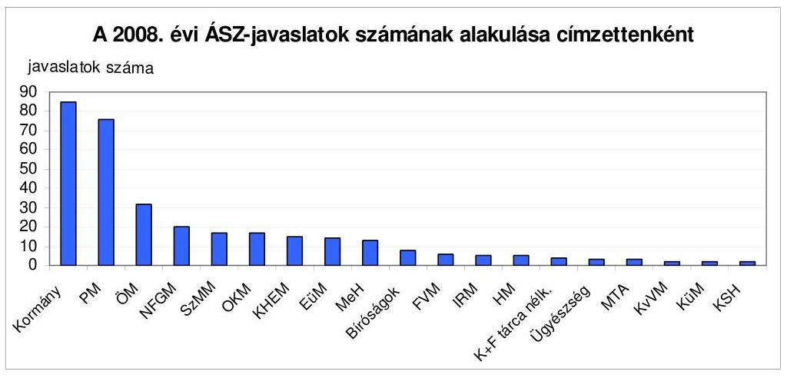

---

Ennek ellenére javaslataink fogadtatása 2007-tel szemben 2008-ban kedvezőtlenebbül alakult. Javaslataink 82%-a volt ugyan eljutott a megvalósítás különféle szakaszaiba, de a meg nem valósult javaslataink aránya - a tárcák visszajelzése szerint is - növekedett.
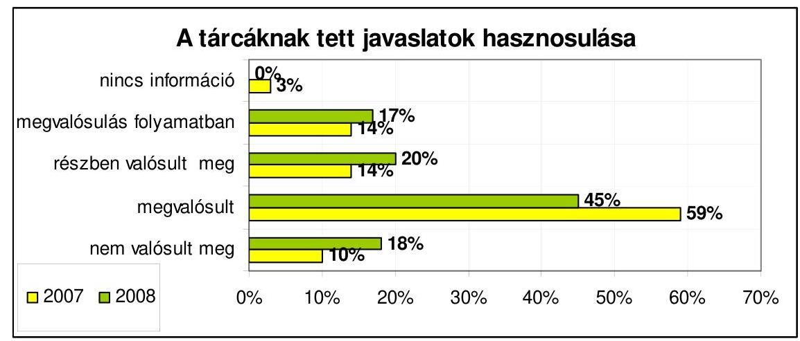

A jogszabályi változtatásokra vonatkozó kezdeményezéseink részaránya az előző évihez hasonlóan alakult. A kedvező fogadtatásuk aránya az előző évihez képest csökkent (54%-ról 37%-ra), az egyértelmű elutasítások aránya 15%-ról 26%-ra növekedett. Ezek a javaslataink jellemzően új törvények alkotására, a már meglévő törvények, illetve egyéb jogszabályok módosításaira vonatkoztak. Néhány esetben a fennálló szabályozást megfelelőnek tartották a tárcák, illetve nem tartották kompetensnek magukat a változtatásra.

A célszerűséget, hatékonyságot, eredményességet javító intézkedésre, illetve a feltárt hibák, hiányosságok megszüntetésére vonatkozó javaslataink aránya az előző évi tendenciát folytatva tovább növekedett (31%-ról 36%-ra). Ezen javaslataink 84%-a talált kedvező fogadtatásra, ebből 55% már meg is valósult.

A belső szabályozási rendszer, illetve a fejezeti és a belső ellenőrzés működésének felülvizsgálatát, továbbfejlesztését célzó javaslatok 91%-ával kapcsolatban konkrét intézkedések történtek, illetve az érintettek megkezdték a javaslatok hasznosításának előkészítését.

Az elszámolási-, finanszírozási-, nyilvántartási rendszer átalakítását célzó javaslataink aránya az összes javaslatokon belül a tavalyihoz képest változatlan volt. Ezen javaslatainkra tett pozitív intézkedések aránya 83%. Az ilyen típusú javaslataink 17%-ánál a fejezetek a fennálló gyakorlatukat megfelelőnek tekintették.

Az egyéb, egyedi jellegüknél fogva nem rendszerezhető és az előző csoportokba nem sorolható ajánlások 11%-ot tettek ki. Elfogadottságuk több mint 90%-os, és a jelentés összeállításáig 26%-uk már megvalósult, 39% részben valósult meg, 25% teljesülése folyamatban van.

---

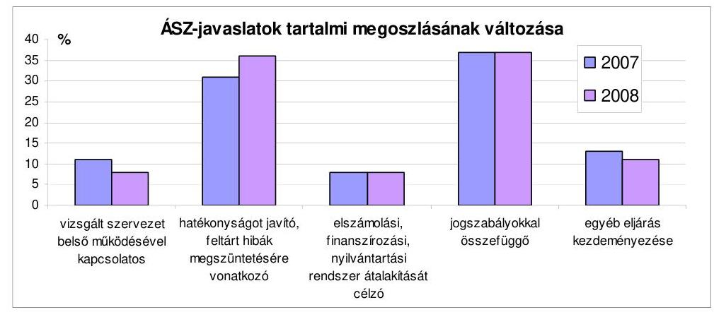

Az ÁSZ a tárcák vezetői által tett intézkedések végrehajtását további ellenőrzései során figyelemmel kíséri, jelentéseiben rendre kitér ezek megvalósítására. Az ÁSZ által tett ajánlásokat és az ezekre adott válaszokat a 3. sz. melléklet foglalja össze.

# Javaslataink hasznosításaként - többek között - a következő intézkedések valósultak meg az elmúlt évben: 

A Kutatási és Technológiai Innovációs Alap működésének ellenőrzése alapján javasoltuk a Kormánynak, hogy tárgyalja meg az Alap pénzeszközeinek felhasználásáról készített éves beszámolókat, továbbá kezdeményezze a jogi szabályozás deregulációját az Alap működése folyamatának egyszerűsítése, a hatás- és a felelősségi körök pontos, egyértelmű meghatározása érdekében. Az Alap felhasználását és a Nemzeti Kutatási és Technológiai Hivatal (NKTH) 2007. évi tevékenységét bemutató beszámoló elkészült. A 2008. évi beszámoló elkészítésének végső határidejét az NKTH irányába 2009. június végében szabta meg a tárca nélküli miniszter. Az Alap felhasználását és az NKTH működését bemutató 2007. és a 2008. évi beszámolókat egyszerre, 2009. III. negyedévében tervezik a Kormány elé terjeszteni.

Az Alap működési folyamatának egyszerűsítését is magában foglaló, deregulációs kormányrendelet-tervezet normaszövege elkészült, a munkacsoport tagjai észrevételeiket megtették. Az észrevételek, javaslatok átvezetését, valamint a még fennmaradó nyitott kérdések tisztázását követően a szöveg véglegesíthető, és a kormányrendelet tervezet szakmapolitikai egyeztetésre bocsátható. A deregulációs rendelet várhatóan 2009. II. negyedévében kerül elfogadásra.

A közbeszerzési rendszer működésének ellenőrzése alapján, a Kormánynak tett javaslatok tekintetében a Miniszterelnöki Hivatalt vezető miniszter, továbbá az ellenőrzéssel érintett tárcák miniszterei intézkedési terveket készítettek. Az elektronikus közbeszerzés terén, valamint a biztonsági, nemzetbiztonsági érdeket érintő beszerzésekkel összefüggésben megfogalmazott, logikusan felépített intézkedések megoldást nyújthatnak az ellenőrzés során tapasztalt hiányosságokra. A Kbt. elfogadott módosítása - az előterjesztéshez képest hosszabb határidőt szabott az elektronikus kommunikáció kötelezővé válására, ezzel azonban még nem oszlatta el teljesen a végrehajthatóság kockázatait.

---

A vasúti közlekedés korszerűsítésének ellenőrzése alapján a Kormánynak fogalmaztunk meg javaslatokat többek között a vasútfejlesztésre és a vasúti közlekedésre vonatkozó szabályozással kapcsolatban, valamint, hogy kezdeményezze a fővárosi és nagyvárosok elővárosi közlekedésének összehangolását figyelemmel a fejlesztésekre és a közlekedési szövetségekre. Az integrált vasúti társaságokra vonatkozó törvényi szabályozás felülvizsgálata és módosítása megtörtént.

A központi költségvetés intézményrendszerének ellenőrzésekor tett megállapításaink alapján
 javasoltuk a Kormánynak, hogy kezdeményezze az állam által hosszabb távon ellátandó, finanszírozandó feladatok meghatározását. A közfeladatok felülvizsgálatával kapcsolatos feladatokról a Kormány határozataiban intézkedett, de az általunk javasolt kezdeményezésre 2009. január végéig nem tett indítványt. Az állami intézmények szervezeti modelljei, teljesítménykritériumai kidolgoztatásával kapcsolatos javaslatunk részben megvalósult a költségvetési szervek jogállásáról és gazdálkodásáról szóló 2008. évi CV. törvény elfogadásával.

A pénzügyminiszternek szóló javaslatunk arra vonatkozott, hogy gondoskodjon a törzskönyvi nyilvántartás naprakészségéről, a nyilvántartásba vétel és az adatszolgáltatás részletes szabályainak meghatározásáról. A törzskönyvi nyilvántartás újraszabályozása az Áht.-ben és a költségvetési szervek jogállásáról és gazdálkodásáról szóló törvényben megtörtént.

# Az egyes onkológiai szűrő programokra fordított pénzeszközök 

hasznosulásának ellenőrzése kapcsán az egészségügyi miniszternek javasoltuk, hogy szerezzen érvényt a 46/2003. (IV. 16.) OGY határozatnak, és ennek keretében hozza létre az onkológiai szűrés és a betegkövetés információs rendszerét, és kezdeményezze az ehhez szükséges adatkezelési jogszabályok módosítását; az időről-időre való kontroll érdekében. Az Egészségügyi Minisztérium, OEP, OTH 2008. október 3-án tárgyalásokat kezdeményezett egymással az onkológiai szűrés és a betegkövetés információs rendszerének kialakításáról. Az információs rendszer folyamatszintű terve és a szükséges adatkezelési jogszabály módosítási javaslata elkészült, egyeztetések folyamatban vannak. A szükséges további egyeztetések az adatvédelmi ombudsmannal folyamatosan történnek.

Javasoltuk továbbá, hogy szervezze újra a méhnyak- és a vastagbél szűrés rendszerét. A méhnyak szűrés rendszerének újraszervezése a védőnői mintaprogrammal elindult. A vastagbélszűrés újraszervezése elkezdődött. A szűrési protokollok, szűrési módozatként, a szakterület mai állásának, a nemzetközi normáknak megfelelően készültek. A protokollok revíziója megtörtént, az illetékes szakmai kollégiumok külön-külön megtárgyalták, véleményezték és elfogadták.

A gazdaságfejlesztés állami eszközrendszere működésének ellenőrzése alapján a pénzügyminiszternek javasoltuk, hogy a jogi szabályozás továbbfejlesztésével kezdeményezze - a megbízható pénzügyi menedzsment uniós elvének megfelelően - a költségvetés kiadási tételeinek pénzügyi tervezése mellett az azokhoz kapcsolódó teljesítménycélok és mutatók tervezését és alkalmazását. A 8008/2008. pénzügyminiszteri tájékoztató 1.2. pontja szerint a pénz-

---

ügyminiszter 2009. március 31-ig tájékoztatóban teszi közzé a szakfeladat-rend tartalmi meghatározásait és a mutatószámrendszert.

Javasoltuk emellett, hogy fejlessze tovább az államháztartás információs rendszerét a fejlesztési jellegű kiadások nyilvántartása és nyomon követése érdekében. Az államháztartás információs rendszerét alapjaiban modernizáló KGR projekt keretein belül lesz lehetőség további kategóriák, megfigyelési szempontok kialakítására. A KGR mellett párhuzamos fejlesztések nem valósíthatók meg.

A helyi önkormányzatok gazdálkodási rendszerének ellenőrzésekor tett javaslataink alapján a Kormány módosította az Ámr. és a Vhr. előírásait, egységesítette az érvényesítési feladatokat ellátók szakmai képesítési követelményeit, meghatározta a költségvetés és a zárszámadás előterjesztésekor kötelezően bemutatandó mérlegek, kimutatások tartalmi követelményeit. Az Ámr. módosításával kiegészítésre kerültek a kisebbségi önkormányzatokra vonatkozó előirányzat-módosítási szabályok.

A pénzügyminiszter kiegészítette a belső ellenőrzési kézikönyv-mintát a céljelleggel nyújtott támogatások ellenőrzésének egységes szempontjaival. A helyi önkormányzatok feladat- és hatásköri rendszerének felülvizsgálatához kapcsolódó önkormányzati finanszírozási rendszer korszerűsítése keretében megtörtént a hatályos szakfeladat-rend átgondolása, a szakfeladat-rend 2008. évi módosításakor lényegesen bővült a szakfeladatok száma. Az FVM körlevélben felhívta a földhivatalok figyelmét, hogy forgalomképtelen ingatlanok esetében ne jegyezzék be a tulajdonosváltozást.

A transzparencia erősítése érdekében az önkormányzatok szociális alapszolgáltatási tevékenységének ellenőrzéséről szóló 2007. évi jelentésünkben javasoltuk, hogy a szociális és munkaügyi miniszter vizsgálja felül az ágazati szakmai statisztikák adattartalmát és kezdeményezze módosítását az ellátórendszer egészére vonatkozó lényeges információ biztosítása érdekében. Egyben jelezze az államháztartásért felelős miniszter felé az önkormányzatok pénzügyi információs rendszerére vonatkozó jogszabályi módosítások szükségességét annak érdekében, hogy a feladatellátás átlátható, a szociális törvényben nevesített szolgáltatások ráfordításai pedig kimutathatóak legyenek. A tárca kezdeményezésére a Foglalkoztatási és Szociális Hivatal által kezelt országos nyilvántartási rendszer kiépült, a szolgáltatók, intézmények adatbázisa elkészült. Összességében úgy látjuk, hogy a megtörtént intézkedések mellett is szükség van az önkormányzati információs rendszer fejlesztésére.

A Kormány figyelmét felhívtuk a címzett támogatásból finanszírozott egészségügyi beruházások, rekonstrukciók ellenőrzéséről készült jelentésben, hogy intézkedjen egy átfogó, szektorsemleges fejlesztéspolitika érdekében az egészségügyi fejlesztések jelenlegi tervezési gyakorlatának átalakítása, a szakmai célkitűzések megvalósításához szükséges pénzeszközök és azok forrásainak meghatározására. Az Egészségügyi Minisztérium 2005 augusztusában elkészítette az Egészségügyi Fejlesztéspolitikai Koncepciót, - az egészségügyi rendszerre vonatkozó 2020-ig meghatározó - fejlesztési stratégiai dokumentumot, a lehető legszélesebb körű szakmai és társadalmi egyeztetés alapján. A koncepció meghatározza a több évre szóló egészségügyi fejlesztések előrelátó,

---

következetes, egységes rendszerű megtervezését és végrehajtását, a progresszív ellátás elvének, valamint a regionális, térségi szemlélet összhangjának érvényesítésével.

Javasoltuk a Kormánynak - az önkormányzati kórházak és bentlakásos szociális intézmények ápolásra, gondozásra fordított pénzeszközei felhasználásának ellenőrzéséről készült jelentésünkben - az egészségügyi, a szociális és munkaügyi miniszter beszámoltatását az ápolási rendszer egységesítésének soron kívüli feladatairól szóló kormányhatározat végrehajtásáról. Javasoltuk továbbá, hogy határozza meg a tárca által elvégzendő feladatokat az ápolási feladatok egységes rendszerének megteremtése, a meglévő átfedések kiszűrése, az e célra fordított erőforrások ésszerű és átlátható felhasználása, valamint a szociális és egészségügyi feladatok összehangolása érdekében. Szakmai együttműködési megállapodás született az SZMM és EüM között egy közösen végrehajtandó „vegyes" ápolási modellkísérlet kialakításáról, a feltételrendszer lehetséges egységesítése, az ellátottak monitorozása, a vegyes finanszírozás feltételeinek kimunkálása érdekében. Ezen túlmenően a Kormány részére az ápolási rendszer egységesítésének feladatairól előterjesztés készült.

A 2008. évi jelentésünkben a többcélú kistérségi társulásokról szóló törvényben meghatározott célok elérése érdekében fogalmaztuk meg a Kormány számára, hogy határozza meg a többcélú társulások szabályozási rendszere továbbfejlesztésének feladatait, jelölje ki a közszolgáltatások struktúrájában betöltött szerepét, és gondoskodjon az ezt megalapozó szabályozás önkormányzati finanszírozással való összehangolásáról. Az Önkormányzati Minisztériumnál jelenleg folyik az önkormányzati reform előkészítése. A Kormány ezzel összefüggésben tekinti át a többcélú kistérségi társulások működésének kérdéseit, szabályozását. A Kormány álláspontja szerint az önkormányzatok pénzügyi szabályozó rendszerében a többcélú kistérségi társulások jelenlegi ösztönző rendszerének hangsúlyosabb integrálása, az önkormányzatok finanszírozásával történő összehangolása is e társulások önkormányzati rendszerben betöltött szerepének, működésének stabilizálódása után valósítható meg.

A pénzügyminiszter részére a belső ellenőrzési feladatok többcélú kistérségi társulások keretei között történő ellátásának sajátosságait figyelembe vevő eljárási és hatásköri rend szabályozásának kidolgozását, a pénzügyi információs rendszer keretében a többcélú társulások ösztönző támogatásának igénylésének és elszámolásának elemezhetővé, ellenőrizhetőbbé tételét fogalmaztuk meg. A Pénzügyminisztérium 2009. első félévében vizsgálja felül a költségvetési szervek belső ellenőrzéséről szóló kormányrendeletet, (miután az önkormányzatoknál felmérés készült a belső ellenőrzés helyzetéről). A támogatások elszámolása tekintetében a 2009. évi elemi költségvetés és beszámoló már részletesen tartalmazza a részletes előírásokat.

Javaslataink alapján a Kormány két közalapítványt megszüntetett, összevonta az oktatás területén működő közalapítványokat, továbbá a határon túli magyarság nyelvi és kulturális önazonosságának megőrzését szolgáló támogatási rendszer hatékonyabbá tétele érdekében, három közalapítvány megszüntetéséről is döntött.

---

A kormány tájékoztatása szerint a közoktatási intézményeket fenntartó non-profit szervezetek normatív hozzájárulásának és támogatásának ellenőrzési javaslatai hasznosulnak. A közoktatásról szóló 1993. évi LXXIX. törvény végrehajtásáról szóló 20/1997. (II. 13.) Korm. rendelet módosításának tervezetében szabályozásra kerül a gazdálkodással összefüggő jogosítványok köre; a nem állami, nem helyi önkormányzati intézményfenntartókra és a helyi önkormányzatokra előírt létszámmérési időpontok egységesítése; a Kincstár ellenőrzési kötelezettségének gyakorisága. A 2009. évi költségvetési törvényben a teljesítménymutatón alapuló finanszírozás szabályai között meghatározásra kerültek a vegyes, illetve összevont csoportok/osztályok finanszírozásának szabályai. Az OKM kezdeményezte a Kincstárnál a non-profit szervezetek elszámolásában feltárt eltérések utóellenőrzését, amelyre a 2009. évi monitoring keretében kerül sor.

A közoktatásra irányuló 2003. és 2008. évi ellenőrzéseinknél a kormányzati szervek részére tett javaslataink alapvetően szabályozási rendszerre és feltételrendszer javítására vonatkoztak. Ezek közül megvalósultak a tanulói teljesítmények mérésére, intézményi szintű nyilvánossága megteremtésére, a szakképzés fejlesztésére vonatkozó közép- és hosszú távú tervek kidolgozására, a szakképzési feladatok, hatáskörök újragondolására vonatkozó javaslataink. A differenciált gyakorlati képzési normatíva átalakítása a hiányszakmák szerint módosult. A szakképzési hozzájárulás rendszere átalakításra került, így megvalósult az intézményeknek közvetlenül átadott szakképzési hozzájárulás elszámoltatási és ellenőrzési kötelezettségre vonatkozó javaslatunk. Részben valósult meg a szakképzés szerkezetét bemutató oktatási statisztika és a munkaerő-piaci statisztika összehangolása.

A 2006. évi kollégiumi vizsgálatunk javaslatára az NFT-II-ben a Regionális Operatív Programokba már beépült a közoktatási intézmény - mint kedvezményezett - fogalma. Ellenőrzésünk nyomán intézkedtek az Arany János Tehetséggondozó Program tapasztalatainak összegzésére, illetve valamennyi érintett számára történő közreadására. Nem valósultak meg a kollégiumi tevékenység fejlesztésének a közoktatás fejlesztési stratégiába történő beépítésére, a tanulási centrumok létrehozására, valamint a kollégiumok helyiség- és eszközellátásának szabályozására vonatkozó javaslataink.

# 3.2.3. Javaslatok hasznosítása az ellenőrzött szervezetek szintjén 

Ellenőrzéseinket követően javaslatainkra valamennyi ellenőrzött szervezet készített megfelelő intézkedési tervet.

A PM fejezet működésének ellenőrzéséről készült jelentésünkben a KGR projektre vonatkozóan javasoltuk a kockázati tényezők értékelését, költségvetésének alátámasztását, irányítási és döntési mechanizmusának átgondolását. Szükségesnek tartottuk a fejezeti informatikai irányítási és felügyeleti funkciók PM-ben történő hatékonyabb ellátása feltételeinek biztosítását, továbbá a vám-, illetve adóhatóság közötti adatcsere rendszereinek korszerűsítését. A javaslatok megvalósítására tett PM intézkedések alapján az államháztartás információs rendszerét alapjaiban modernizáló KGR projekt keretein belül lesz lehetőség további kategóriák, megfigyelési szempontok kialakítására.

---

Ugyanezen ellenőrzésünk keretében megállapítottuk, hogy a korábbi ÁSZ ellenőrzések javaslatai annyiban hasznosultak, hogy az intézmények vezetői intézkedtek a javaslatok realizálása érdekében. Nem - vagy csak részben - valósultak meg azonban a Kormánynak, illetve a pénzügyminiszternek tett azok a javaslatok, amelyek a költségvetési tervezés szakmai megalapozottságának erősítésére, az államháztartás belső pénzügyi ellenőrzésének fejlesztésére, az előirányzat-maradványok határidőre történő felülvizsgálatára vonatkoztak.

# A Kutatási és Technológiai Innovációs Alap működésének ellenőrzé-

se alapján a gazdasági és közlekedési (jelenleg a kutatás-fejlesztésért felelős) miniszternek javasoltuk, hogy alakíttassa ki a szakmai szervezetek bevonásával a támogatási programok céljait, és rendeljen ezekhez az elért eredmények számon kérhetőségét, bemutatását biztosító, célértékkel rendelkező indikátorokat. A Kutatási és Technológiai Innovációs Alap 2009-2010. évi stratégiai akcióterv tartalmazza a meghirdetendő támogatási programok célkitűzéseit, az indikátorokat és célértékeket.

A vasúti közlekedés korszerűsítésének ellenőrzése alapján tett javaslatainkkal összhangban több gyakorlati intézkedés történt a pályavasúti társaság és a független pályakapacitás-elosztó szervezet közötti feladatmegosztás pontos meghatározása és a feladatok újraszabályozása terén. A vasúti pályahálózatra vonatkozóan a menetrend szerkesztésének feladata 2008. július 1-jei kezdettel átadásra került a pályakapacitás-elosztó szervezet részére, amely változás az érintett szereplők szervezeti és működési szabályzatában is átvezetésre került.
2009. január 1-jétől bevezetésre került Budapesten a korábbi BKV bérletet és a Budapesti Egyesített Bérletet kiváltó Budapest-bérlet, amely újabb lépés a tarifaközösség felé. A bérlet bevezetésével Budapesten belül a Volánbusz Zrt. és a MÁV-START Zrt. elővárosi járatai mindenki számára elérhetővé váltak helyi utazásra is. A továbblépés a városhatáron kívül megvalósítandó tarifaközösség, illetve a helyi és helyközi tarifák zónarendszerben történő összevonása lehet, amelyet a BKSZ Kht. munkatársai készítenek elő.

A közlekedésért felelős miniszter az egységes vasúti járműnyilvántartásra és műszaki vizsgáztatás létrehozására vonatkozó javaslataink hasznosulása érdekében intézkedési tervet készített.

Az önkormányzatok gazdálkodása törvényességének ellenőrzési irányát és rendszerességét megerősítő országgyűlési határozat elfogadását követő időben
 az önkormányzatok gazdálkodási rendszerének ellenőrzése során ezres nagyságrendben kifejezhető javaslatot tettünk. Javaslataink mintegy háromnegyedét az önkormányzatok hasznosították, amely hatására javult a költségvetés és zárszámadás készítés rendjének, a gazdálkodási és a pénzügyi-számviteli feladatok ellátásának szabályozottsága, általánossá vált a gazdasági program időbeli elfogadása és tartalmi „jelenléte”, a vagyonnyilvántartás és vagyongazdálkodás szabályszerűsége, a belső ellenőrzési feladatok ellátási feltételeinek kialakítása, fokozottabban figyelembe vették a helyi és központi előírásokat, a munkafolyamatba épített ellenőrzési feladatok ellátását a korábbiaknál szélesebb körben biztosították. A tett intézkedések hatására bővült, pontosabbá vált a képviselő-testületek tájékoztatása a költségvetési koncepció, a költségvetési és a zárszámadási rendelettervezetek esetében. Javult

---

a pénzügyi-számviteli tevékenység szabályozottsága. Jobbá váltak az ellenőrzési rendszer kialakításának, működtetésének feltételei.
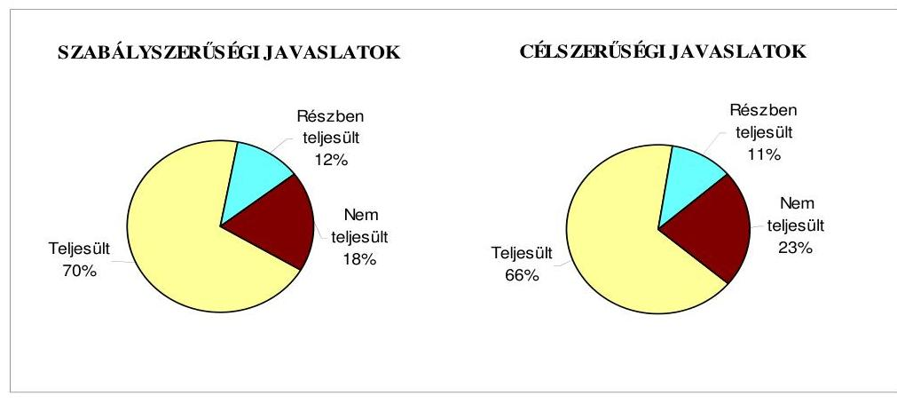

Több év óta tapasztaljuk ellenőrzéseink során, hogy a gazdálkodási rendszer ellenőrzésével érintett megyei, megyei jogú városi, Budapest fővárosi kerületi önkormányzatok elfogadták észrevételeinket, javaslatainkat, és már a helyszíni ellenőrzés lefolytatásának ideje alatt többségében kijavították a feltárt szabálytalanságot, hiányosságot. Ezekben az esetekben a jelentés rögzíti a mulasztás, hiányosság ellenőrzött időszakbeli fennállását, valamint annak megszüntetését, amire tekintettel a jövőre nézve javaslatot nem tettünk. Minden esetben - a jelentésünk átadását követően - intézkedési terv készült a feltárt hiányosságok megszüntetése érdekében, felelősök és határidők megjelölésével. A számvevőszéki jelentések nyilvánossága, a megyei és a megyei jogú városi önkormányzatok ellenőrzéséhez kapcsolódóan tartott sajtótájékoztatók is hozzájárultak a gazdálkodás általános színvonalának a javulásához.

Az ÁSZ vizsgálatai arra is ráirányították a figyelmet, hogy az egyes önkormányzatoknál a gazdálkodási feszültségek fokozódásában sok esetben szerepet játszott a feladatellátás módjának gazdaságtalan szervezése, az intézményi kapacitások alacsony kihasználása, a teherbíró képességüket meghaladóan önként vállalt feladatok, a tervezési hibák, valamint az erejüket meghaladó felhalmozási célú kiadások tervezése. Ezekben a felhívásaink nyomán az önkormányzatoknál, intézményeknél előrelépés történt.

A közoktatási intézményeknél végzett ellenőrzéseink során tett javaslataink hatására javult a feladatellátás bevételeinek és kiadásainak elszámolási színvonala, szabályosabb lett a csoportfoglalkozások és a vizsgáztatások dokumentálása. Rendszeresebbé váltak az intézményi mérések, értékelések és a képviselőtestületek előtti szakmai beszámolások.

# 3.2.4. Meg nem valósult javaslataink 

## Ezek közös jellemzője, hogy - noha azok célszerűségét és indokoltságát az érintettek nem vitatták -, realizálásuk mégis rendre elmarad.

Javaslataink megfogalmazásakor az elfogadott stratégiánknak megfelelően kiemelt figyelmet fordítottunk a közigazgatási munka korszerűsítésének, az államháztartás hatékonyabb működésének elősegítésére. Ezekhez elengedhetet-

---

len a feladatrendszer újragondolása, és a kapcsolódó tervezési és finanszírozási rendszer kidolgozása, melyek elősegítésére tett ajánlásaink egy része még megvalósításra vár.

Javasoltuk a Kormánynak, hogy készítse elő az - Országos Fejlesztéspolitikai Koncepcióról szóló 96/2005. (XII. 25.) OGY határozattal összhangban - az állami fejlesztési feladatok tervezésének erősítését célzó átfogó törvényi szabályozást, amely megteremti a feladatellátás intézményi garanciáit és magába foglalja a hazai és uniós források egységes tervezési módszertanát is. Az elmúlt években számos kezdeményezés történt a kormányzaton belül a fejlesztéspolitikára vonatkozó alapvető jogi szabályozás kialakítására. Ezek szakmai kiérleltsége, politikai támogatottsága azonban eddig nem vezetett oda, hogy azok a törvényhozás elé kerültek volna.

A központi költségvetés intézményrendszerének ellenőrzésekor tett megállapításaink alapján javasoltuk a Kormánynak, hogy kezdeményezze az állam által hosszabb távon ellátandó, finanszírozandó feladatok meghatározását. A közfeladatok felülvizsgálatával kapcsolatos feladatokról a Kormány határozataiban intézkedett, de az általunk javasolt kezdeményezésre 2009. január végéig nem tett indítványt. Az állami intézmények szervezeti modelljei, teljesítmény kritériumai kidolgoztatásával kapcsolatos javaslatunk részben megvalósult a költségvetési szervek jogállásáról és gazdálkodásáról szóló 2008. évi CV. törvény elfogadásával. A költségvetési szervekre vonatkozó államigazgatási és statisztikai információk összehasonlítható adattartalmának kialakítására vonatkozó javaslatunkra intézkedés 2009. februárig nem történt.

Nem történt meg az állami-önkormányzati kötelező feladatok újragondolása, szűkítése, a túlburjánzott szabályok egyszerűsítése. Az önkormányzati középszint (régió, kistérség) egyértelmű meghatározása, ennek megfelelő új feladat és hatáskör telepítés, a túlzott decentralizáció oldása a közszolgáltatások minőségének javítása céljából. Így hiányzik az önkormányzati struktúra és a feladattelepítés új rendjéhez igazodó, a források szétaprózottságát megszüntető a támogatási, kiegyenlítési mechanizmusokat középszintre telepítő finanszírozás kialakítása is.

A fővárosi önkormányzatot és a kerületi önkormányzatokat osztottan megillető bevételek 2007. évi megosztásáról szóló önkormányzati rendelet felülvizsgálatáról készült jelentésben javasoltuk az önkormányzati és területfejlesztési miniszternek, hogy kezdeményezze a fővárosi önkormányzat és a kerületi önkormányzatok közötti forrásmegosztásról szóló 2006. évi CXXXIII. törvény módosítását annak érdekében, hogy előírásai - a forrásmegosztási számításoknál figyelembe veendő feladatok, illetve a részesedési arányok normatív módon való meghatározása tekintetében - összhangban legyenek a helyi önkormányzatokról szóló 1990. évi LXV. törvénnyel. A javaslat realizálása érdekében érdemi intézkedés nem történt. ${ }^{10}$

[^0]
[^0]:    ${ }^{10} \mathrm{~A}$ szaktárca válaszában azt jelezte, hogy a javasolt törvénymódosítással az Ötv.-vel való összhang nem érvényesülhet, a megosztási arányszám pedig a fővárosi és kerületi önkormányzatok konszenzusán alapul.

---

Javaslataink kialakításánál figyelemmel voltunk azokra a területekre is, ahol a módosítások elősegíthetik az ellenőrzési munka eredményességét. Ezen alábbi javaslatok megvalósításához további intézkedésekre van szükség.

A törzskönyvi nyilvántartás naprakésszé tételére, a nyilvántartásba vétel és az adatszolgáltatás részletes szabályainak meghatározására tettünk javaslatot a pénzügyminiszternek. A szabályozás 2009. februárig nem jelent meg.

A transzparencia fontosságára, a pénzügyi információs rendszer hiányosságának kiküszöbölésére, az elszámoltathatóság, a teljesítmény követelmények érvényesítése érdekében több javaslatot tettünk. Így a 2007. évi költségvetési törvényjavaslathoz megfogalmaztuk, hogy a Kormány gondoskodjon arról, hogy - teljesség és zártság biztosítása érdekében - a IX. Helyi önkormányzatok támogatásai fejezet előirányzatainak, teljesítési adatainak nyilvántartását egységes informatikai rendszer kezelje. A Kormány erre intézkedést nem jelzett.

Nem történt meg a Ktv. és a költségvetési szervek belső ellenőrzésről szóló 193/2003. (XI. 26.) Korm. rendelet előírásainak annak érdekében történő összhangba hozatala sem, hogy egyértelmű legyen ki jogosult - csak köztisztviselő vagy a megbízott vállalkozó is - az önkormányzat gazdálkodásának belső ellenőrzésére.

A települési önkormányzatok több célú kistérségi társulásainak a közszolgáltatások és területfejlesztési feladatok ellátásában betöltött szerepének ellenőrzésekor javasoltuk az Önkormányzati Minisztériumnak kezdeményezze, hogy a tárcák bevonásával készüljenek méretgazdaságossági szempontokat érvényesítő mutatók, amelyek lehetővé teszik a több célú társulások munkájának és az önkormányzati közös feladatellátás eredményeinek értékelését. A Minisztérium ugyan tartalmilag egyetértett javaslatunkkal, de hatáskör hiányában azt nem látta megvalósíthatónak. ${ }^{11}$

Az ÁSZ különösen a 2008. és a 2009. évi költségvetési törvényjavaslathoz adott véleményében irányította rá a figyelmet a helyi önkormányzati rendszer pénzügyi egyensúlyát veszélyeztető okokra, a pénzügyi stabilitás megteremtésére, az eladósodásból adódó hosszú távú kockázatokra. Javasoltuk, hogy módszertani útmutatók közreadásával segítsék elő az önkormányzatok kötvénykibocsátására vonatkozó döntéseinek megalapozását, kockázatainak felmérését, megismerését. A Pénzügyminisztérium nem fogadta el ezt a javaslatunkat arra hivatkozva, hogy a költségvetési gazdálkodás korszerűbb szabályozását lehetővé tevő, a költségvetési szervek jogállását szabályozó törvény vég-

[^0]
[^0]:    ${ }^{11}$ Az önkormányzati miniszter feladat- és hatásköréről szóló 132/2008. (V. 14.) sz. Korm. rendelet: 3. § ad) pontja szerint a miniszter a helyi önkormányzatokért való felelőssége körében előkészíti különösen a helyi önkormányzatok társulásairól szóló jogszabályokat; 5. § (1) bekezdés d) pontja szerint „...biztosítja a felelősségi körébe tartozó önkormányzati feladatok egyeztetését, összehangolását"; 5. § (2) bekezdés pontja szerint összehangolási, közreműködői feladatai vannak, e bekezdés e) pontja szerint pedig „elősegíti az önkormányzati rendszer továbbfejlesztését, különös tekintettel a társult feladatellátás, így a többcélú kistérségi társulások ösztönzésére"

---

rehajtására tervezik módszertani ajánlás készítését ${ }^{12}$. A Kormány válaszában jelezte, hogy az eladósodás mértéke nem hordoz olyan kockázatot, amely az önkormányzatok működőképessége érdekében azonnali beavatkozást igényelne. Az Ötv. módosítására vonatkozó törvényjavaslatot pedig - az adósságkorlát szabályozásának módosításáról -, az Országgyűlés kétharmados támogatás híján nem vette tárgysorba.

Öt év óta évről-évre kezdeményeztük - érdemi intézkedés eddig nem történt -, hogy a belügyminiszter és jogutódai pontosítsák és egészítsék ki a működésképtelen helyi önkormányzatok egyéb támogatásának célját, ehhez munkáltassák ki az egyéb támogatás odaítélésének feltételrendszerét, és határozzák meg a támogatási igények felülvizsgálati módszereit.

Az önkormányzati alrendszer gazdálkodására vonatkozó javaslataink közül nem valósultak meg a hiány számításánál a hitel figyelembevételi módjának egyértelmű meghatározására, az önkormányzatok kötvénykibocsátására vonatkozó döntés előkészítési módszertani útmutató közreadására, a kollégiumok helyiség és eszközellátásának szabályozására vonatkozó ajánlásaink. (A pénzügyminiszter arra vonatkozó módszertani ajánlás elkészítését tervezi, hogy a költségvetési szervek a változó gazdasági környezethez milyen szigorító, megtakarítást eredményező intézkedéseket tudnak érvényesíteni). Nem határozták meg az egyéb (pénzforgalommal nem járó) gazdasági eseményekre a vezetői elrendelés és az érvényesítés kötelezettségét, valamint a kötelező és önként vállalt feladatok elkülönítését segítő számviteli nyilvántartási rendszer követelményeit. Nem intézkedtek a nem lakás céljára szolgáló helyiségek esetében az elővásárlási jog gyakorlására jogosult személy kijelölésére - a gazdálkodó szervezet bérlő részére - biztosított lehetőség megszüntetésére. A kisebbségi önkormányzatok gazdálkodásával összefüggő pénzügyi-számviteli nyilvántartási követelmények, valamint az operatív gazdálkodási és belső ellenőrzési feladatok sajátos rendjét összefoglaló kézikönyv az ÁSZ javaslata ellenére nem jelent meg.

# 3.3. Az ÁSZ jogi realizálással kapcsolatos tevékenysége 

## Büntetőeljárás kezdeményezése

A közpénzek szabályszerűtlen felhasználásához kapcsolódó büntetőjogi felelősségre vonás össztársadalmi érdek, amelynek bizonyítékokkal való alátámasztásában az ÁSZ-nak jelentős, ellenőrzési megállapításokra alapozott szerepe van. Az ÁSZ törvényben meghatározott feladata az ellenőrzési tevékenység, így a vizsgálatoknak közvetlenül nem célja a büntetőeljárás kezdeményezése, azonban az ellenőrzések során a közpénzek szabálytalan felhasználása kapcsán tett, a bűncselekmény elkövetésének alapos gyanúját alátámasztó megállapításait az ÁSZ minden esetben az illetékes nyomozó hatóság tudomására hozza.

[^0]
[^0]:    ${ }^{12}$ Mind az önkormányzatok nagy száma, mind a kötvénykibocsátás nagyságrendje miatt, figyelemmel a valódi kockázatokra megkerülhetetlen a módszertani útmutató közreadása. A költségvetési szervek jogállására vonatkozó útmutató és az önkormányzatok kötvénykibocsátása között nincs kapcsolat, ezért a válasz nem megalapozott.

---

Az ÁSZ által kezdeményezett büntetőeljárások száma - a tárgyévi ellenőrzések jellegéhez, valamint az adott ellenőrzés során a vizsgálati eszközökkel megismerhető adatokhoz és információkhoz igazodva - az elmúlt években ingadozott. A büntetőeljárás kezdeményezések számának hullámzását jól szemlélteti, hogy pl. a 2006. évi ún. ÖKOTÁM jelentést megalapozó számvevői jelentések számos olyan megállapítást tartalmaztak, melyekhez több, jogosulatlan gazdasági előny megszerzése bűncselekmény elkövetésének alapos gyanújára alapuló feljelentés kapcsolódott, azonban a 2008. évben végzett számvevőszéki ellenőrzésekben nem volt olyan megállapítás, amely a fenti bűncselekmény gyanúját megalapozta volna.

Az ÁSZ által 2002 és 2008 között kezdeményezett büntetőeljárásokban hat - tipikusan az ellenőrzési tevékenység által feltárható - bűncselekményi tényállás szerepelt.
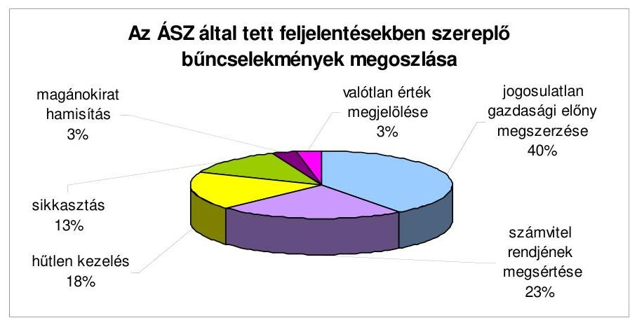

Az ÁSZ a nyomozó hatóságok munkáját nagyban elősegítette a már folyamatban lévő eljárásokhoz kapcsolódó nyomozóhatósági megkeresések teljesítésével. Ezekben az esetekben az ÁSZ az általa végzett vizsgálat során tudomására jutott tényeket tartalmazó dokumentumok megküldésével tesz eleget az adatszolgáltatási kötelezettségének.

Az elmúlt évben az ÁSZ-hoz összesen 32 megkeresés érkezett, melyek többségében (63,3%) a megkereséssel érintett ügyben az ÁSZ végzett ellenőrzést, így a helyszíni vizsgálat megállapításait tartalmazó dokumentumokat a megkereső hatóság rendelkezésére tudta bocsátani.

# Jogorvoslati eljárás kezdeményezése 

Az új közbeszerzési törvény 2004. május 1-jei hatályba lépésével a jogorvoslati eljárás
 kezdeményezésére nyitva álló határidő jelentősen megnövekedett, melynek eredményeként az ÁSZ által kezdeményezett jogorvoslati eljárások száma jelentősen emelkedett. Ez a tendencia 2008-ban is folytatódott - az eljárások száma 36 volt -, miután a számvevőszéki ellenőrzések egy része a közbeszerzési rendszer törvényességére fókuszált.

---

A fenti időszakban a Közbeszerzési Döntőbizottság az ÁSZ által kezdeményezett jogorvoslati eljárások túlnyomó többségében megállapította a jogsértés megtörténtét, és összesen 52,2 M Ft összegű bírság kiszabásáról rendelkezett.
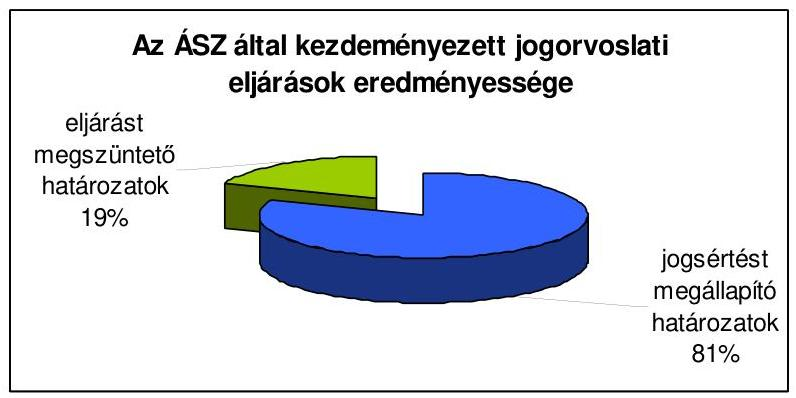

# 3.4. A számvevőszéki tevékenység nyilvánossága 

A számvevőszéki tevékenység nyilvánosságának magas szintű biztosítása az elmúlt több mint egy évtized folyamatosan kiemelt feladata volt. A kezdeteknél célul tűztük ki, hogy egyszerűen és könnyen hozzáférhessenek jelentéseinkhez, szakmai-, módszertani kiadványainkhoz a döntéshozók, a munkánk iránt érdeklődők, az állampolgárok és az ellenőrzöttek is (így biztosítva, hogy ellenőrzési tapasztalataink a lehető legszélesebb rétegekhez eljuthassanak).

Ennek jegyében (élve az internet adta lehetőséggel) hoztuk létre és üzemeltetjük honlapunkat, amelyet 2002-ben és 2007-ben is megújítottunk, illetve folyamatosan fejlesztünk.

Erre a széles nyilvánosságra, jelentéseink teljes körű hozzáférhetőségére alapozva fejlesztettük és alakítottuk kommunikációnkat az évek folyamán, szem előtt tartva a célcsoportok szerinti differenciálás szükségességét (2006-2010-es stratégiánkban már önálló részt kapott a kommunikáció).

A korábbi évek gyakorlatának megfelelően 2008-ban is az egyik legfontosabb feladatunk az Országgyűlés tájékoztatása, munkájának segítése volt. Ennek eszköze a jelentéseinkhez készített képviselői levél, amelyben összefoglaljuk megállapításainkat, de munkatársaink bizottsági üléseken is aktívan vesznek részt.

A közvélemény pontos és tényszerű tájékoztatása, az államháztartás pozícióinak széles körű megismertetése, a kialakult folyamatok összefüggéseinek bemutatása érdekében kiemelt figyelmet fordítottunk a kapcsolattartásra a médiával, illetve a sajtó munkatársaival. A szerkesztőségeknek és az újságíróknak egyre szélesebb körben küldtük meg közvetlenül jelentéseink összefoglalóját, felhasználtuk a szélesedő internet-használat lehetőségeit is.

---

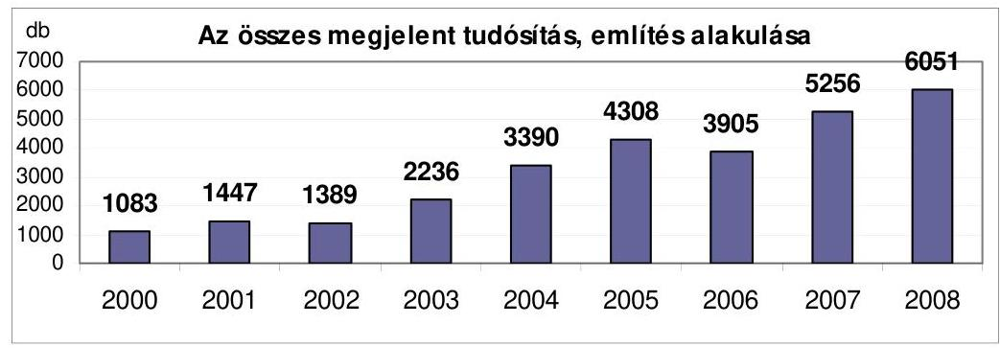

2008-ban 261 különböző forrásból összesen 6051 hírt, cikket, interjút, illetve említést regisztráltunk sajtófigyelő adatbázisunkban. Ezek az év-ről-évre növekvő tendenciát mutató értékek a gyakorlatban azt jelentik, hogy a legkülönbözőbb méretű és célközönségű médiumok foglalkoznak tevékenységünkkel, jelentéseinkkel, a társadalom egészéhez eljuttatva ellenőrzési tapasztalatainkat.

2008-ban egy alkalommal tartottunk elnöki sajtótájékoztatót: szeptemberben a Parlament épületében a 2007. évi költségvetés végrehajtásának ellenőrzéséről szóló jelentésünkről kérdezhettek az újságírók.

Tizenkétszer került sor vidéken főigazgatói sajtótájékoztatóra: januárban Egerben, Szekszárdon, Tatabányán és Szombathelyen, februárban Győrben, júliusban Nyíregyházán, szeptemberben Kecskeméten és Szekszárdon, decemberben Szolnokon, Debrecenben, Szegeden és Székesfehérvárott.

Márciusban meghívtuk a média képviselőit a „A korrupció-ellenes intézkedések továbbfejlesztésének és a korrupció-ellenes kormánystratégia végrehajtásának elősegítése" címet viselő Twinning Light típusú projekt záró konferenciájára. Júniusban könyvbemutató sajtótájékoztatót rendeztünk a „Gazdasági kormányzás - Változás és alkalmazkodás a magyar gazdaságirányítás intézményrendszerében" című tankönyv megjelenésének alkalmából, valamint meghívtuk az újságírókat a Marokkói Királyság Számvevőszéke elnökének előadására.

A már kialakult gyakorlat szerint a Hivatalos Értesítőben 2008-ban is megjelentettük jelentés-összefoglalóinkat, valamint a számvevőszék személyügyi híreit.
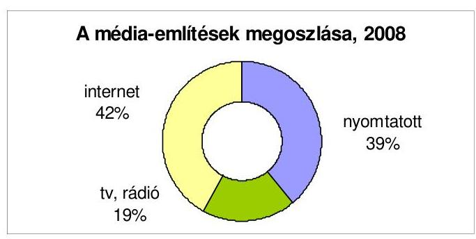

---

Honlapunk nyitóoldalán közel százezer látogatást regisztráltunk tavaly. A munkánk iránt érdeklődők 77412 alkalommal töltöttek le jelentést külső IP címről, valamint 1082-szer nyitottak meg angol nyelvű összefoglalót.

Az ÁSZ 2002-2006. évekre készült stratégiája célul tűzte ki, hogy a lakosság számára minél szélesebb körű lehetőséget biztosítsunk a kapcsolatteremtésre. Ebben az időszakban alakítottuk ki a lakossággal való kapcsolattartás új, korszerű formáit, kihasználva az egyre jobban terjedő internet-használatot.

Honlapunkon 2003. óta várja az „ÁSZ Fórum" és az „Elnöki fogadóóra" az érdeklődők kérdéseit. Azok, akik ezt a lehetőséget választják, kérdéseiket az ország nyilvánossága előtt tehetik fel. Az ÁSZ Fórum rovatra tavaly 42 kérdés érkezett. A leggyakrabban felmerült témák: az önkormányzatok belső ellenőrzése, a számlarend, az SzMSz kialakítása, a többcélú kistérségi társulások, normatív iskolai támogatások, adományok, tiszteletdíjak elfogadása, jogszabályok értelmezése, Köröshegyi-völgyhíd. Az „Elnöki fogadóóra" a megnyitás évétől (2003) kezdve összesen 14 alkalommal került megrendezésre. Az elmúlt évben érzékelve a nyilvánosság előtt megjelenő érdeklődés csökkenését - egy elnöki fogadóórát tartottunk.

2004 áprilisa óta fogadja a kérdéseket az ÁSZ központi e-mail címe. Ez a lehetőség intimitást biztosít a hozzánk fordulók részére, mivel a kérdések és válaszok csak a kérdező és válaszadó számára láthatóak. 2008-ban összesen 383 levél érkezett a központi e-mail címre. Ez 2006-hoz képest mintegy 50%-os, 2007-hez viszonyítva 27%-os növekedést mutat.

Az Országgyűlés elnöke 2002 szeptemberében írta ki első alkalommal a „Parlamenti ösztöndíj az Országgyűlés Hivatalában" c. pályázatot egyetemi és főiskolai hallgatók részére. A képzés keretében a fiatalok minden évben meglátogatják az ÁSZ-t is. 2008-ban összesen négy alkalommal fogadtuk az intézményünket felkereső ösztöndíjasokat.

# 4. AZ ELLENŐRI MUNKA MINŐSÉGÉNEK FEJLESZTÉSE 

### 4.1. Az ellenőrzések minőségbiztosítása

Az ÁSZ alkotmányos szerepének és küldetésének betöltése, az ellenőrzési tevékenység hitelességének fenntartása, valamint az ellenőrzési munka és a jelentések szakszerűségének biztosítása érdekében már évek óta szabályozott keretek között, egységes rendszert képezve működik az ellenőrzési tevékenységet átfogó minőségirányítási rendszer. Ez adja a keretet a folyamatos fejlesztéshez is, és kiemelt szerepet lát el abban, hogy egyenletesen jó minőségű, megbízható és színvonalas jelentések készüljenek és azok a jelentések felhasználóinak megelégedettségét szolgálják.

Az ellenőrzési megállapítások, következtetések és javaslatok megalapozottsága, ezáltal az ÁSZ ellenőrzési véleményének megbízhatósága terén elért eredményekhez nagyban hozzájárult az igazgatóságokon az ellenőrzési munka és a jelentések kétszintű minőségkontrollja, a minőségkövetelmények teljesítését felügyelő rendszer működése, valamint a helyszíni ellenőrzéseket végző igazgatóságoktól függetlenített Minőségbiztosítási önálló osztály által végzett folyamat-

---

ba épített és utólagos felülvizsgálati tevékenysége. A számvevőszéki jelentések elnöki aláírására csak az osztály eredményes felülvizsgálatát igazoló tanúsítvány birtokában került sor. A nemzetközi összehasonlításban is egyedülálló és élenjárónak tekintett felülvizsgálati rendszer és módszer iránt élénk nemzetközi érdeklődés tapasztalható.

A közvetlen elnöki felügyelet alá tartozó Minőségbiztosítási önálló osztály utólagos felülvizsgálati tapasztalatai a 2008-ban lezárt ellenőrzések esetében alapvetően és összességében az adott ellenőrzési típusokra vonatkozó belső szakmai és eljárási szabályok betartását, a módszertani ajánlások érvényesülését igazolták.

Az ellenőrzési munka és a jelentések jó minőségének folyamatos biztosítása érdekében az elmúlt évben is törekedtünk a minőségirányítási rendszer működése eredményességének és hatékonyságának növelésére, és a legjobb nemzetközi gyakorlat hasznosításával a lehetséges fejlesztések folyamatos megvalósítására.

# 4.2. Humán erőforrás gazdálkodás és fejlesztés 

## Személyi feltételek

Az ÁSZ 2008. évi 577 fős nyitó állományi létszáma az év végére 556 főre csökkent.
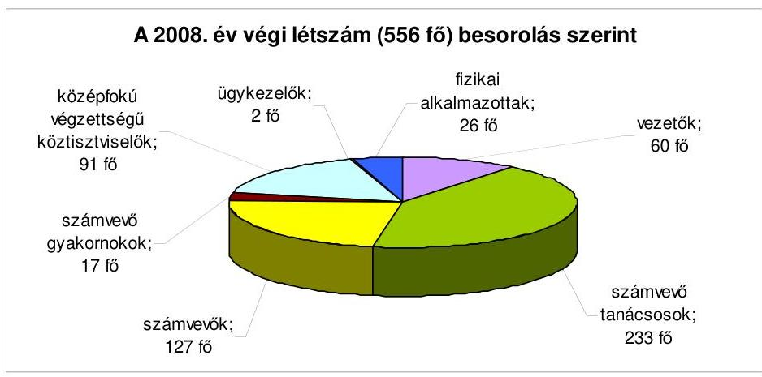

A megelőző évhez képest - főként az előrehozott nyugdíjba vonulás kedvező szabályai folytán - nőtt a nyugdíjazások száma (33). Hosszabb idejű közszolgálati jogviszonyára tekintettel a nyugalomba vonuló számvevők döntő többsége a törvény szerinti maximális, 8 havi felmentési időre jogosult, így számottevő ellenőrzési kapacitás esett ki a szakmailag, erkölcsileg megfelelő szakember-utánpótlás kiválasztásáig.

A nyugdíjazásokon túl 8 főnek közös megegyezéssel, 2 főnek határozott idejű foglalkoztatás lejártával, 2 munkatársnak elhalálozással szűnt meg a jogviszonya, 1-1 esetben pedig felmentéssel, illetőleg áthelyezéssel szűntettük meg a közszolgálati jogviszonyt. A megüresedett munkakörök betöltése során létszám-

---

és bértakarékossági szempontokat is mérlegeltünk, a kieső kapacitások egy hányadát a teljesítmények fokozásával, szervezési megoldásokkal ellensúlyoztuk.

A felvételeknél többlépcsős interjúval választjuk ki a szakmailag, erkölcsileg megfelelőnek ítélt munkatársakat. Pályakezdőket nem, rövid szakmai gyakorlattal rendelkezőket kivételesen veszünk fel. 2008-ban hárman kaptak számvevő gyakornoki kinevezést, 19-en számvevőként, ketten számvevő tanácsosként, ugyancsak ketten osztályvezető főtanácsosként léptek be.
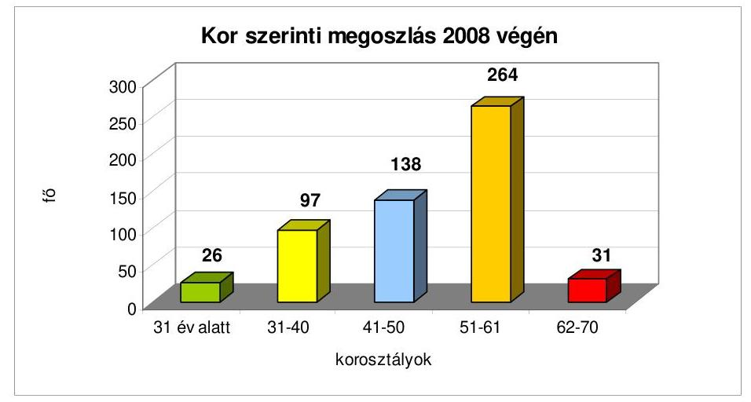

A törzsállomány főbb képzettségi adatai az utóbbi évek jelentős mértékű nyugdíjazási hulláma ellenére is figyelemre méltók, és folyamatosan bővül az idegen nyelvismerettel rendelkezők száma. Itt említjük, hogy 2008-ban - a megelőző évekhez hasonlóan - súlyosabb szakmai-etikai vétség, fegyelmi ügy nem fordult elő.
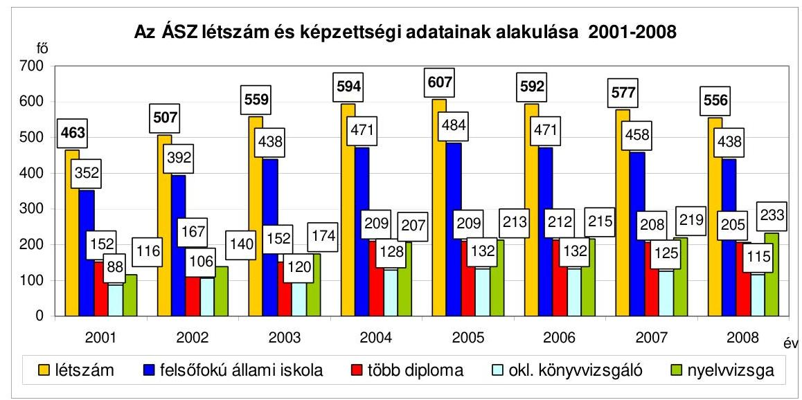

A felkészültségi mutatók és az ellenőrzési jelentések pozitív fogadtatása mellett is kiemelt jelentősége van a teljesítmények folyamatos kontrolljának. Az egyéni teljesítményértékelések és minősítések a munkaköri kompetencia mindkét oldaláról, a személyes tevékenységről, valamint a feladatellátás, a munkavégzés körülményeiről is fontos visszajelzést adnak. Az ÁSZ vezetői fórumain 2008-

---

ban kiemelten szerepelt az egyéni teljesítményértékelések tárgyszerűségének, alaposságának és indoklásának követelménye.

2008-ban a számvevői előlépésekre döntően előző évi nyugdíjazásokkal felszabaduló státuszok és bértartalékok adtak lehetőséget. Ilyen módon a Köztisztviselők Napja alkalmából 9 vezetői kinevezésre (ebből három új vezető kinevezésére), 12 főtanácsadói, 11 tanácsadói címadományozásra, továbbá 28 számvevő tanácsosi előlépésre kerülhetett sor. Emellett 16 számvevő részesült az ÁSZ elnöke által alapított „Gajzágó Salamon Díj" elismerésben.
2008. január 1-jétől új, átfogó szabályozás lépett hatályba a köztisztviselők vagyonnyilatkozat-tételi kötelezettségéről. Az ÁSZ vezetőinek, helyszíni ellenőrzést végző számvevőinek és egyes középfokú végzettségű köztisztviselőknek - összesen 380 főnek - kellett vagyonnyilatkozatot tennie. Az érintettek eleget tettek határidős nyilatkozati kötelezettségüknek.

# Továbbképzési munka 

A 2008. évi továbbképzési tervezés során széles körű képzési igényfeltáró előkészületeket tettünk, több évre visszamenőleg kigyűjtöttük és elemeztük a munkatársak részvételét a külső-belső foglalkozásokon, előadásokon. A szakmai tartalmi követelményeket hatékonysági, illetve ésszerű takarékossági tényezőkkel kellett összhangba hozni. 2008-ban 39 alkalommal 34 témakörben szerveztünk foglalkozásokat 63 oktatási napon. A témakörök lényegében nem változtak a korábbi évekhez képest, de az oktatási napok és alkalmak számát az ellenőri létszámalakulással járó vizsgálati kapacitás-csökkenés figyelembe vételével alakítottuk ki.

A belső képzések programjában szerepel az ÁSZ munkatársai által második, korszerűsített kiadásban megjelentetett „Ellenőrzési Kézikönyv" anyaga. Hat új, aktuális szakmai ismereteket közvetítő képzést szerveztünk meg, közülük a vagyontörvény módosításáról, az építési nagyberuházásokról, továbbá a FEUVE kapcsolatairól szóló előadásokat nagy szakmai tekintélynek örvendő külső előadók vezették, fokozott érdeklődés mellett. Továbbra is nagy az érdeklődés az SZJA, az ÁFA, valamint a közbeszerzési szabályok évenként aktuális módosulásait szakértő mélységben ismertető foglalkozások iránt.

Helyet kaptak az éves programban az ellenőrzések előtt, vagy azok bevezető szakaszában a hatékony ellenőri munkára felkészítő vizsgálatvezetői előadások, tájékoztatók. Az informatikai képzések többsége címében és tartalmában megújulva, átdolgozott tematikával került a munkatársak elé. Fokozatosan alakul át az informatikai továbbképzések szerkezete: a jelentkezők többségének ma már a speciális alkalmazások megismerésére van szüksége. Elkezdődött a felkészítés az ellenőrzések dokumentálását támogató VIDOR-projekt működtetésére, először a vezetők és vizsgálatvezetők kaptak részletes tájékoztatást.

---

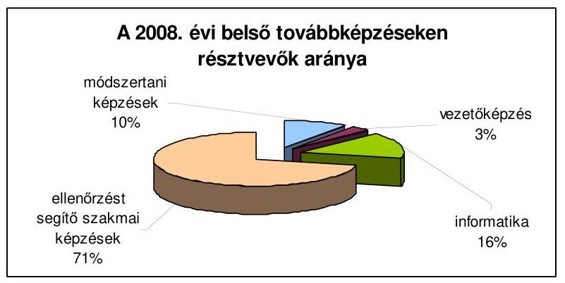

Előbbre léptünk a Magyar Könyvvizsgálói Kamarával az oktatási együttműködésben. Míg 2007-ben belső szakmai képzéseink egyharmadán szerezhettek számvevőink a kötelező könyvvizsgálói továbbképzésben kredit-pontokat, tavaly már szinte minden tanfolyamunk a kredit-körbe tartozott. Szoros munkakapcsolatban állunk a központi közigazgatási szervek személyügyi és továbbképzési tevékenységét koordináló KSZK-val. Meghirdetett kurzusaikra - önismereti és problémamegoldó tréningek, jogalkalmazási készségfejlesztők, nyelvórák - a számvevőink is gyakran jelentkeznek.

Jelentős volt munkatársaink részvétele a külső oktatási és továbbképzési formákon, összesen 62 konferencián, szakmai rendezvényen vettek részt. Irányított jelentkeztetéssel és az ilyen típusú szakmai rendezvényeken elhangzó fontosabb szakmai információk áramlásának jobb szervezésével elértük, hogy az egyébként magas, általában növekvő - részvételi díjak ellenére költségeink számottevően nem emelkedtek.

Lényegesen átalakult az idegen nyelvtudás bővítését szolgáló támogatások rendszere. A fiatalabb munkatársak többsége - mivel legalább egy nyugati nyelv igazolt ismerete alapvető kiválasztási szempont - szakmailag is értékelhető nyelvtudással érkezik. Alap- és középfokú nyelvi képzést és nyelvvizsgafelkészítést már nem támogatunk, élünk viszont nyelvi intézetek által időszakosan meghirdetett kedvezményes tanfolyami lehetőségekkel, pl. a francia nyelv esetében.
 akár a középhaladó ismeretszint terjesztése érdekében is. Néhány speciális munkakörben tandíjtámogatással is segítjük a célzott, magas szintű szaknyelvi ismeretek fejlesztését.

Az SZJA újabb rendelkezései megszabják a munkavállalók részére adómentesen adható béren kívüli juttatások legmagasabb évi összegét. Ezek az előírások kihatnak a munkáltató által adható tanulmányi támogatásokra. Vannak esetek, amikor az ÁSZ ésszerűen nem élhet a korábbi időkben megszokott 50%-os mértékű tanulmányi támogatásokkal. Lehetőségeinkhez mérten ezután is segítjük az indokolt beiskolázásokat. 2008-ban 33 új szerződést kötöttünk, ami kevesebb az előző évek új szerződéseinél.

2008-ban - az említett takarékossági és vizsgálati kapacitás-védelmi megfontolások jegyében - tovább csökkentek a továbbképzésre fordított költségek. Az egy főre eső költség 33 eFt volt, a 2007. évi 41 eFt-hoz képest. Ebben közrejátszik a legkorszerűbb - szervezési munkát tehermentesítő és költségkímélő - képzési módszerek és technikák alkalmazása. A szakmai ismerettár jelentős része (pl. a

---

szabályszerűségi, illetőleg a teljesítményellenőrzési módszertan) ma már hozzáférhető és tanulható a számítógépes hálózaton, az „e-learning" távoktató program segítségével.
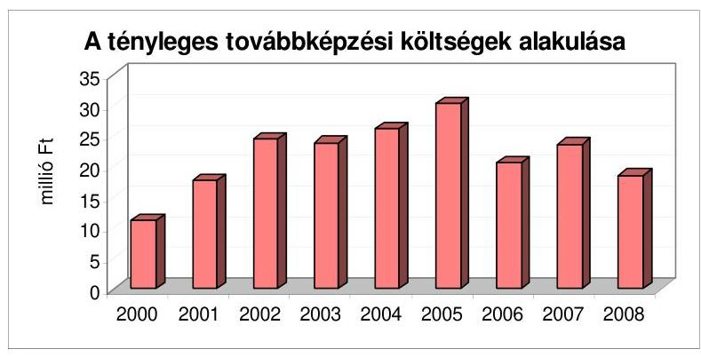

A belső oktatási formák és a külső intézmények által meghirdetett előadások, konferenciák, szakmai, nyelvi programok eredményesen segítették munkatársaink szakmai fejlődését, ösztönözték további önképző kezdeményezéseiket. Emellett azonban az ÁSZ vezető fórumain jelenleg is napirenden vannak az oktató-továbbképző munka tartalmi és szervezési korszerűsítésére vonatkozó elképzelések.

# 4.3. Nemzetközi kapcsolatok 

Nemzetközi kapcsolatrendszerünk alakítása során, stratégiai céljainkkal összhangban, 2008-ban arra törekedtünk, hogy a nemzetközi ellenőrzés-szakmai közösségben való aktív részvételünkkel támogassuk a hazai ellenőrzési kultúra színvonalának emelését, járuljunk hozzá az ellenőrzési módszertanok, technikák korszerűsítéséhez, illetve ösztönözzük a számvevőszékek közötti hatékony együttműködési formák fejlesztését.

Két- és többoldalú nemzetközi együttműködésünket 2008-ban leginkább Magyarország európai uniós tagságából származó kötelezettségeink determinálták. Meghatározó jelentőséggel bír az Európai Unió tagországainak nemzeti legfőbb ellenőrző intézményei és az Európai Számvevőszék (ECA) közös tevékenysége mind elnöki szinten, mind pedig a különböző szakmai területen létrehozott munkacsoportok keretein belül.

A Legfőbb Ellenőrzési Intézmények Nemzetközi Szervezete (INTOSAI) Kormányzótanácsában végzett aktív elnöki tevékenység (2004-2007) révén szerzett ellenőrzési módszertanokat, „technológiát" adaptáló innovációs transzfereket megtartottuk, és magunk is hozzájárultunk ezekhez a nemzetközi fejlesztésekhez, ugyanakkor a nemzetközi szervezetekben kifejtett aktivitásunk súlypontját egyre határozottabban a Számvevőszékek Európai Regionális Szervezete (EUROSAI) szakmai fórumaira helyeztük át. A nemzetközi kapcsolattartás fontos feladatává vált a nemzetközi pénzügyi és gazdasági válság hatásainak kezelésére vonatkozó szakmai tapasztalatok cseréje is.

---

# Többoldalú szakmai együttműködés 

Miután az ÁSZ 2004-ben sikeresen megrendezte az INTOSAI XVIII. Kongreszszusát, olyan elvi döntés született, hogy a világszervezet stratégia tervének megvalósításában néhány kiemelt fontosságú kérdéssel foglalkozó munkacsoport tevékenységében való közreműködéssel vegyük ki részünket a nemzetközi szakmai együttműködésben. Ezen túlmenően eleget tettünk a Kormányzótanácsi, illetve a Pénzügyi és Igazgatási Bizottsági tagságunkból eredő kötelezettségeinknek is.

Az ÁSZ folytatta aktív részvételét az INTOSAI ellenőrzési irányelvekkel, belső kontroll standardokkal, külső felülvizsgálatokkal és privatizációval foglalkozó szakmai albizottságaiban, munkacsoportjaiban.

Bekapcsolódtunk a 2008 folyamán létrehozott INTOSAI Nemzeti Teljesítménymutatók Munkacsoport tevékenységébe, amelynek célja a gazdaság, társadalom és környezetvédelem területén kidolgozandó nemzeti teljesítménymutatók alkalmazásának támogatása. Az ÁSZ Kutató Intézete egy három éves időszakot felölelő, kísérleti programot dolgoz ki és koordinál a tudásalapú gazdaság és társadalom folyamatait leíró nemzeti teljesítménymutatók területén.

Az ÁSZ aktívan részt vesz a pénzügyi és gazdasági világválságra adandó válaszok, megoldások kidolgozása céljából felállított INTOSAI Világméretű Pénzügyi Válság Munkacsoport tevékenységében. Az itt folyó munka révén nem csak olyan tapasztalatokra tehetünk szert és olyan kitekintésre van módunk, amelyek segíthetik az útkeresést a hazai megoldások kidolgozásában is, hanem lehetőséget adnak arra is, hogy a magyar sajátosságokról, pozíciókról a válságmenedzselés lépéseiről széles nemzetközi fórumokon tényszerű, bizalmat erősítő képet adjunk.

Az INTOSAI európai regionális munkacsoportja, az EUROSAI tevékenységében folytattuk aktív szerepvállalásunkat. A szervezet 2008. június 2-5-én, Krakkóban megrendezett VII. Kongresszusán intézményünk volt a rendezvény I. témájának („Minőségirányítási rendszer létrehozása a számvevőszéken belül") levezető elnöke. A kongresszusi téma előkészítéseként, a segítő számvevőszékekkel együttműködve összeállított kongresszusi vitaindító dokumentum alapján koordináltuk a téma megtárgyalását, valamint közreműködtünk a kongresszusi témák következtetéseit és ajánlásait összefoglaló kongresszusi záródokumentum kidolgozásában is. A Kongresszust követően folytatjuk a közös munkát a segítő partnerintézményekkel. Felhatalmazásunk egy, a minőségirányítás javítását célzó jó gyakorlatokat bemutató útmutató kidolgozására szól.

2008 folyamán fejeztük be tevékenységünket a VI. EUROSAI Kongresszuson (2005. május) felállított, az adókedvezmények koordinált ellenőrzésével foglalkozó munkacsoportban. A munkacsoport jelentését az idén rendezett VII. EUROSAI Kongresszuson mutatták be, amelynek kidolgozásához munkatársaink aktívan hozzájárultak a társasági adóhoz kapcsolódó adótámogatások hatékonyságát és eredményességét vizsgáló alcsoport vezetésével.

Folytattuk részvételünket az EUROSAI IT Munkacsoportjában és Környezetvédelmi Munkacsoportjában is. Utóbbi keretében közreműködtünk egy párhuzamos ellenőrzésben, amely a Natura 2000 környezetvédelmi program megvalósításának vizsgálatára fókuszált.

Az EUROSAI Képzési Bizottságának munkája során aktívan hozzájárultunk a szervezet képzési stratégiájának kialakításához, valamint folyamatosan részt veszünk a szemináriumok szervezését segítő útmutató és a képzések eredményességét értékelő kérdőívek kidolgozásában. A Bizottság közreműködésével és támogatásával megvalósuló EUROSAI szemináriumok munkatársaink számára több ízben nyújtottak lehetőséget tudásszerzésre és tapasztalatcserére pl. a társadalombiztosítási rendszerek ellenőrzése, illetve a számvevőszékek vezetése témájában.

Munkatársaink a tavalyi év során is részt vettek az európai regionális ellenőrző intézmények szervezetének (EURORAI) rendezvényein, amelyek témája a közszférát ellenőrző intézmények státusza, valamint a közpénzekből nyújtott támogatások ellenőrzése volt. Az EURORAI által az elmúlt években szervezett konferenciákon, szemináriumokon jó együttműködés alakult ki a bydgoszczi Regionális Ellenőrzési Kamara képviselői, valamint a magyar résztvevők között. A kapcsolatok erősítése végett a kamara elnöke látogatást tett Magyarországon, amelynek során a lengyel partner megismerhette az Állami Számvevőszék önkormányzatok ellenőrzésével kapcsolatos tapasztalatait.

Az Európai Unió tagországainak nemzeti legfőbb ellenőrzési intézményei, valamint az Európai Számvevőszék vezetői által létrehozott intézményes és rendszeres együttműködési hálózat, a Kapcsolattartó Bizottság célja, hogy fórumot biztosítson a Közösség működéséhez kapcsolódó ügyekkel összefüggő szakmai tapasztalatcseréhez az intézmények vezetői, az összekötők és a szakértők szintjén.

A hagyományokhoz híven részt vettünk a számvevőszéki vezetőkből álló Kapcsolattartó Bizottság éves értekezletén. Tekintettel arra, hogy a kapcsolattartó fórum soros elnöki teendőit az ÁSZ látja el, és a Bizottság 2009-ben Budapesten tartja éves megbeszélését, már 2008. év folyamán megtettük a szükséges lépéseket a megfelelő helyszín és a technikai feltételek biztosítása, valamint a szakmai program összeállítása érdekében.

Az összekötők együttműködési hálózata, a szakmai munkacsoportokban folyó munka koordinálása mellett, a hálózaton belüli együttműködés és az információcsere hatékonyabbá tételére is nagy hangsúlyt fektet. Ezzel összefüggésben a 2007-ben és 2008-ban az ÁSZ munkatársainak aktív közreműködésével végrehajtott, a munkacsoportok tevékenységének értékelésére irányuló feladat, egy elemző tanulmány elkészítésével befejeződött. Ugyanakkor a Kapcsolattartó Bizottság megbízta az értékelést végző csoportot, hogy a 2007. és 2008. év folyamán elvégzett elemzés eredményeire alapozva dolgozzon ki egy olyan dokumentumot, amely bemutatja munkacsoportok tapasztalatait, valamint összegzi a nemzeti számvevőszékek, a Kapcsolattartó Bizottság munkacsoportjai által prezentált szakmai eredmények hasznosítása területén meglévő jó gyakorlatait.

A Kapcsolattartó Bizottság keretén belül működő szakmai munkacsoportokban az EU alapok felhasználásának számvevőszéki ellenőrzése áll a középpontban. Szakértőink valamennyi szakmai munkacsoport (Strukturális Alapok, EU pénzeszközök tagállami felhasználásáról szóló számvevőszéki jelentések, ÁFA, valamint Közös ellenőrzési standardok munkacsoport) tevékenységében folyamatos és aktív szerepet vállalnak. Az EU tagországok közötti együttműködés koordinált ellenőrzések formájában is testet ölt, így például 2008-ban a Strukturális Alapok munkacsoport Budapesten véglegesítette a foglalkoztatás és a környezetvédelem területén felhasznált EU alapok koordinált ellenőrzéséről készített jelentését.

Munkatársaink szakmai ismeretük bővítése érdekében részt vettek számos, uniós intézmények és szervezetek által rendezett szemináriumon, amelyek témái például a tagállami nemzeti nyilatkozatok, korrupció a közszférában, valamint a Strukturális Alapokkal összefüggő ellenőrzések rendszere az új programozási időszakban voltak.

A visegrádi országcsoport, valamint Ausztria és Szlovénia számvevőszéki elnökei 2008-ban, Ausztriában tartották éves értekezletüket, amelynek során a kölcsönös érdeklődésre számot tartó témák megvitatása mellett - jóváhagyták a 2007-ben indított, az EU Strukturális Alapjainak felhasználásában érintett nemzeti intézmények belső kontrollrendszerére irányuló koordinált ellenőrzésről készített jelentést. Az ÁSZ által vezetett munka eredményéről, az ellenőrzés tapasztalatairól az EU Kapcsolattartó Bizottságot is tájékoztattuk.

Részt vettünk a NATO Nemzetközi Számvevő Testülete által rendezett brüsszeli értekezleten is, ahol a tagországok nemzeti számvevőszékeinek képviselői a Testület éves beszámoló jelentését vitatják meg.

Az ÁSZ elnöke 2008-ban is tartott előadást a közszféra pénzügyi gazdálkodásának fejlesztésével foglalkozó nemzetközi szervezet (ICGFM) éves konferenciáján az Egyesült Államokban, valamint első ízben részt vett a világ vezető közgazdászait tömörítő nemzetközi szervezet, a Trilaterális Globális Fórum éves értekezletén.

# Kétoldalú nemzetközi kapcsolatok 

2008-ban több, immár hagyományosnak tekinthető partnerintézmény vonatkozásában tovább mélyítettük kétoldalú szakmai kapcsolatainkat. Magyarország fejlesztési stratégiájához is igazodva, a Külügyminisztérium égisze alatt működő Magyar-Nemzetközi Fejlesztési és Segítségnyújtási (HUN-IDA) Kht-vel kooperálva folytatódott az ÁSZ és a vietnámi számvevőszék együttműködése. E program keretén belül az ázsiai ország számvevői több budapesti látogatás során megismerhették az ÁSZ szakmai munkájának részleteit.

Régóta megkülönböztetett jelentősége van az ÁSZ számára az Egyesült Királyság partnerintézményével fenntartott szakmai kapcsolatoknak. 2008-ban két alkalommal valósítottunk meg e relációban tapasztalatcserét és konzultációt, amelyek számos szakmai témára terjedtek ki (pl. ellenőrzés az oktatás és egészségügy területén, az ellenőrzés minőségbiztosítása).

A 2007. évben megkezdett, az EU által támogatott, a korrupció elleni küzdelem aktuális kérdéseit feldolgozó program sikeresen befejeződött a holland számvevőszék munkatársainak közreműködésével.

---

Elnöki, illetve alelnöki szintű küldöttségek érkeztek intézményünkhöz 2008-ban Albániából, Csehországból, Kínából, Marokkóból, Moldáviából, Mongóliából és Vietnámból. Az ellenőrzési rendszer és a számvevőszéki feladatok áttekintésére irányuló magas szintű megbeszéléseken kívül számos eseti jellegű, szakértői konzultációban vettünk részt, elsősorban a közép- és kelet-európai partnerintézmények vonatkozásában. Így például a szlovák kollégák az ÁSZ teljesítményellenőrzési gyakorlatáról, humánerőforrás gazdálkodásáról, önkormányzati ellenőrzéseiről kaptak információkat, a német kollégák pedig az ÁSZ informatikai rendszerét és egyes informatikai megoldásait ismerték meg.

# A nemzetközi kapcsolattartás költségvetési összefüggései, statisztikai adatai 

A 2008. évi nemzetközi kapcsolattartási terv 47,5 M Ft-ot irányzott elő kiutazásokra. 36,1 M Ft-ot terveztünk a külföldre utazás, szállás és biztosítás költségeire; 7,5 M Ft-ot külföldi napidíjra, továbbá 2008-ban lehetőségünk volt 3,9 M Ft nagyságú tartalék képzésére ${ }^{13}$ is. A kiutazások tényleges költségei az elvárásoknak megfelelően - a tervszámokon belül - alakultak. Az összes kiutazási ráfordítás 30,4 M Ft volt, amely a 2008. évi tervhez képest 64%-os, míg a 2007. évi tényleges kiutazási költségekhez képest 78%-os teljesülést mutat.

A nemzetközi kapcsolattartási előirányzatok és a felhasználás 2002 és 2008 közötti alakulása is tükrözi azt a fejlődési utat, amelyet az elmúlt évtizedben az ÁSZ a nemzetközi ellenőrzési szervezetekben vállalt feladataihoz kapcsolódóan bejárt.
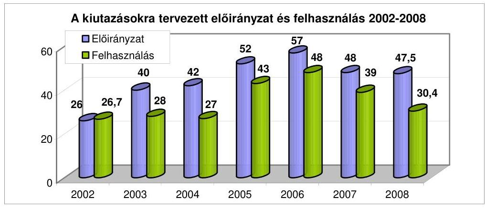

Az elmúlt évben az ÁSZ munkatársai 59 külföldi úton vettek részt, és azokon 110 kiküldött 283 napot töltött el. (A tervben 63 utazás és 133 fő kiküldése szerepelt.) 2008-ban az egy külföldi útra eső átlag munkanapszám - a hosszú időtartamú képzések nélkül ${ }^{14}-3,7$ nap volt (2007-ben 4 nap). Egy
 külföldi kikül-

[^0]
[^0]:    ${ }^{13}$ Hasonló tartalék képzése 2009-ben - a nemzetközi gazdasági válság kibontakozását követő devizaárfolyam-változások miatt - elengedhetetlen feltétele a megfontolt tervezésnek.
    ${ }^{14}$ Két külföldi kiküldetés kapcsolódott képzésen való részvételhez, időtartamuk összesen 66 nap volt.

---

detésben töltött munkanap átlagos költsége 2008-ban 140 ezer Ft-ot (2007-ben 136 ezer Ft-ot) tett ki, ami az áremelkedések hatását is figyelembe véve az erőteljes takarékoskodás eredménye.

Az ÁSZ elnöke 9 alkalommal utazott külföldre 2008-ban, ott összesen 37 napot töltött (2007-ben 15 alkalom, összesen 62 nap). A tervben 12 út, 41 nap szerepelt. Egy elnöki út átlagos költsége 2008-ban 563 ezer Ft, egy napra eső átlagos költsége 137 ezer Ft volt (2007-ben 490 ezer Ft, illetve 104 ezer Ft) a relatíve hosszabb időtartamú INTOSAI kormányzótanácsi és egyéb üléseknek tulajdoníthatóan.

Az összes kiküldetés és az elnöki utak számának alakulását a 2002 és 2008 közötti időszakban az alábbi ábra szemlélteti.
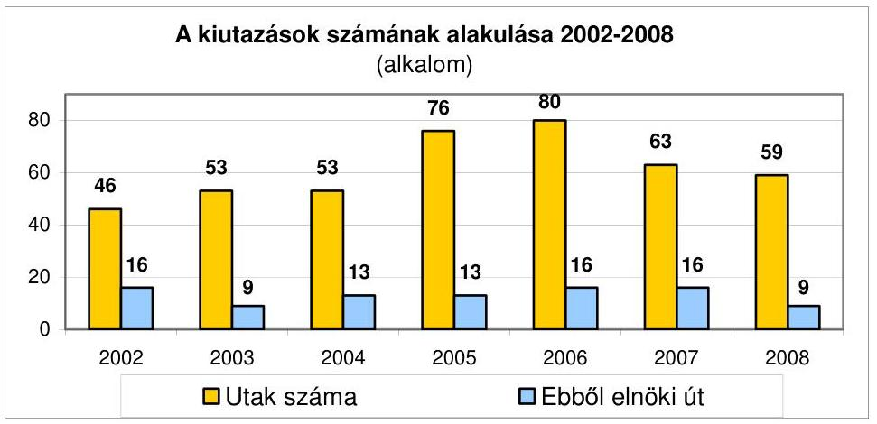

A költségek alakulását a tengeren túli utazások is befolyásolják. Ilyen utat 2008-ban 6 alkalommal szerveztünk, 7 fő részvételével (2007-ben 7 alkalommal, 16 fő részvételével). Ezekre a kiküldetésekre fordítottuk a kiutazási kiadások 18%-át, összesen 5,3 M Ft-ot (2007-ben 25%, 9,8 M Ft-ot).

A külföldi vendégek fogadására 8 M Ft-ot hagyott jóvá az ÁSZ 2008. évi költségvetése (2007-ben 10 M Ft). Az éves felhasználás $4,2 \mathrm{M}$ Ft volt, az előirányzat 52%-a.

2008-ban 2 M Ft-ot, a kiadások felét kétoldalú elnöki találkozók szervezésére fordítottuk. 25 fő érkezett elnöki delegáció tagjaként hozzánk (2007-ben 16 fő). A külföldi látogatások jelentős része a nemzetközi ellenőrzési szervezetekben végzett tevékenységünkhöz kapcsolódik. Többoldalú nemzetközi fórumok megrendezésére 1,2 M Ft-ot költöttünk 2008-ban, összesen 47 főt fogadtunk nemzetközi szervezetek képviseletében (2007-ben 70 főt). Ellenőrzési tapasztalataink átadására, szakértői szintű tapasztalatcserékre összesen 900 ezer Ft-ot költöttünk el. A társintézményektől 17 külföldi kollégát fogadtunk tapasztalatszerzési, továbbképzési és oktatási céllal (2007-ben 30 fő).

---

# 5. A SZÁMVEVŐSZÉKI TEVÉKENYSÉGHEZ KAPCSOLÓDÓ KUTATÓ ÉS FEJLESZTŐ MUNKA 

Az ÁSZ Fejlesztési és Módszertani Intézete, (a továbbiakban: Intézet), amelynek elnevezése 2009. január 1-jétől az ÁSZ Kutató Intézetre változott, kutatási tervét teljesítette. Intézet tevékenységében lényeges változást hozott, hogy 2008. július 1-jétől a módszertani feladatok az Intézettől visszakerültek az ÁSZ-hoz. Az Intézet 2008. évi kutatásai közül az alábbiak emeljük ki:

- Országgyűlési kezdeményezésre készítette el az Intézet „A magyarországi cigányság helyzetének javítására és felemelkedésére a rendszerváltás óta fordított támogatások mértékéről és hatékonyságáról" szóló tanulmányt, amelyet az Országgyűlés Emberi jogi, kisebbségi, civil- és vallásügyi bizottsága is megvitatott. A tanulmány, amit a bizottság informatívnak és hasznosnak ítélt, élénk szakmai és sajtó visszhangot váltott ki. Széles körben elfogadott megállapításai a szakmapolitikai vitákban hivatkozási pontot jelentenek.
- Az Intézet folytatta a költségvetési tervezés makrogazdasági kockázatainak elemzését. 2008 májusában értékelő tanulmány készített a 2009. évi költségvetési tervezés makrogazdasági mozgásterének néhány összefüggéséről. Az Intézet ezt követő októberi tanulmánya rámutatott a kormány által először benyújtott költségvetési törvényjavaslat súlyos makrogazdasági kockázataira. Ezért azt az ÁSZ elnöke az Országgyűlés és a kormányzat illetékes vezetőire részére annak ellenére is megküldte, hogy a Kormány a törvényjavaslatot visszavonta. Ezt követően az Intézet értékelte a második költségvetési törvényjavaslat, illetve az ahhoz a Pénzügyminisztérium által készített átfogó módosítás makrogazdasági kockázatait is. Értékelése beépült az ÁSZ hivatalos véleményébe. 2008. novemberében a két kockázatértékelést egybeszerkesztve kiadványt jelentetett meg az Intézet „A 2009. évi költségvetés makrogazdasági kockázatainak elemzése" címmel.
- „A korrupció-ellenes intézkedések továbbfejlesztésének és a korrupció-ellenes kormánystratégia végrehajtásának elősegítése" című, PHARE Twinning Light projekt keretében olyan elemzési módszertan (korrupciós kockázati térkép készítése, integritási önértékelés) került kidolgozásra, amely elősegíti a korrupciós kockázatok, illetve a korrupcióval különösen veszélyeztetett területek azonosítását.

Az Intézet 2008-ban az alábbi intézeti kiadványokat jelentette meg:

- A Balaton Régió turisztikai tárgyú tanulmányainak költségei, ezek indokoltsága és hasznosulása a rendszerváltás óta eltelt 17 esztendőben
- A magyarországi cigányság helyzetének javítására és felemelkedésére a rendszerváltás óta fordított támogatások mértéke és hatékonysága
- Értékelő tanulmány a 2009. évi költségvetési tervezés makrogazdasági mozgásterének néhány összefüggéséről
- Korrupciós kockázatok feltérképezése a magyar közszférában
- A 2009. évi költségvetési makrogazdasági kockázatainak elemzése
- Tudásalapú társadalom és gazdaság

---

A számvevőszékek tevékenységének nélkülözhetetlen velejárója a gyakorlati ellenőrzési munkát támogató, a környezeti változásokhoz és a nemzetközi trendekhez igazodó folyamatos módszertani fejlesztés, melynek célja, hogy hozzájáruljon az ellenőrzés módszereinek a nemzetközi standardokkal összhangban történő korszerűsítéséhez és a nemzetközi legjobb gyakorlat alkotó adaptációjához. Ezáltal érhető el az alkalmazott ellenőrzési módszertanok, segédletek, vizsgálati módszerek és eljárások, technikák nemzetközi fejlesztési eredményeken és a saját gyakorlati tapasztalatokon alapuló továbbfejlesztése.

Az INTOSAI-ban felgyorsult a kor követelményeihez igazodó ellenőrzésekhez szükséges korszerű szakmai szabályok, standardok kidolgozására irányuló tevékenység. A legutóbbi, 2007. novemberi, Mexikó-városban lezajlott XIX. Kongresszuson jóváhagyták a stratégiai tervnek megfelelően átalakuló, modernizálódó ellenőrzés-szakmai szabályozás, a nemzetközi standardok rendszerének új szerű felépítését, a rendszer megújítására irányuló további teendőket, ideértve azokat is, amelyek a „jó kormányzás" gyakorlatát támogatják. Az így kialakult ún. ISSAI rendszerben a már elfogadott és kidolgozni tervezett irányelvek, útmutatók együttes száma megközelíti a 80-at. Ahol az helyénvaló, az ISSAI dokumentumok kiterjed(het)nek az alkalmazott jó gyakorlatok leírására is. Az ÁSZ részt vesz az új szabályozások előkészítésében, illetőleg véleményezésében.

A szakmai követelmények nemzetközi méretű egységesítése, a nemzetközi elvárásoknak való megfelelés igénye a Számvevőszéknél is felértékelte a szakmai szabályozó tevékenységet, továbbá emellett az ÁSZ stratégiája is kiemelten kezeli az elvi-fejlesztési, minőségirányítási rendszer működtetését és a szabályozási rendszer minőségközpontú fejlesztését, továbbá a már bevezetett minőségirányítási rendszer továbbfejlesztését.

2008-ban sor került az elvi-fejlesztési és szakmai szabályozási tevékenység szervezeti kereteinek egységesítésére, mégpedig úgy, hogy a Szervezetirányítási és Működtetési Igazgatóságon belül létrejött az Elvi-módszertani Főcsoport. Így 2008 második felétől az Elvi-módszertani Főcsoport szervezeti keretei között történik az ÁSZ működéséhez szükséges elvi-fejlesztési és módszertani feladatok végzése, illetőleg ezen feladatok ellátásának koordinációja.

2008-ban az elvi-fejlesztési feladatok közül a takarékos állami gazdálkodásról és a költségvetési felelősségről szóló törvény előkészítésében való közreműködés emelkedett ki, hiszen az ÁSZ 2007-ben az Országgyűléshez benyújtott közpénzügyi szabályozás tézisei című tanulmányában foglalt javaslatok megvalósulására került sor ebben a törvényben.

Az elvi-fejlesztési feladatok közé tartozik a korrupció-ellenes küzdelemben való közreműködés is. A 2008-ban befejeződött, a holland és a magyar számvevőszék által megvalósított uniós finanszírozású projekt végeredményeként egy olyan kockázatértékelési módszer hazai adaptálására került sor, amely immár lehetővé teszi egy ún. korrupciós kockázati térkép összeállítását. Az ÁSZ tervezi, hogy az Új Magyarország Fejlesztési Terv keretében elkészíti Magyarország korrupciós kockázati térképét, mely segítséget nyújt az ellenőrzést végző szervezeteknek az ellenőrzési terveik összeállításához. Az új projekt előkészítésének munkálatai 2008-ban megkezdődtek.

---

2008-ra befejeződött az ellenőrzésre vonatkozó szakmai szabályokat, az ellenőrzés rendező elveit és alapvető követelményeit rendszerbe foglaló Ellenőrzési kézikönyv korszerűsítése.

Az Ellenőrzési kézikönyv felülvizsgálatával párhuzamosan megkezdődött a főbb ellenőrzési típusok korábbi években elkészített módszertani útmutatóinak korszerűsítése és újabbak kidolgozása, valamint az azokhoz kapcsolódó segédletek felülvizsgálata. Második átdolgozott kiadásban jelent meg a teljesítmény-ellenőrzés módszertana és az átfogó ellenőrzésről szóló módszertani útmutató. Módszertani útmutató készült továbbá a rendszerellenőrzéshez. Több segédlet is megjelentetett az ellenőrzési igazgatóságok.

A módszertani tevékenység átfogó elemzéséről 2009-ben készül részletes anyag. Ennek keretében a szükséges korszerűsítés és továbbfejlesztés érdekében rendszereztük az ÁSZ ellenőrzés-szakmai dokumentumait, továbbá a már megjelent és a várható INTOSAI szakmai dokumentumokat.

Az INTOSAI korszerűsített ellenőrzés-szakmai dokumentumrendszerével összhangban az ÁSZ honlapján is megkezdődött a hazai és nemzetközi ellenőrzésszakmai dokumentumok frissítése.

Az ÁSZ ellenőrzések dokumentálásának módszertani fejlesztése, a szervezeten belül követett gyakorlat egységesítése érdekében 2009-től a vizsgálatok dokumentálását új keretek közé helyezzük, az ehhez szükséges, megalapozó fejlesztéseket 2007 és 2008 folyamán végrehajtottuk. A fejlesztés fő irányaként kialakítottuk a vizsgálatok dokumentálását támogató informatikai rendszert, illetve a kapcsolódó belső szabályozási környezetet, amelyek együttesen fogják meghatározni az ellenőrzési típusoktól független, egységes dokumentációs gyakorlatot.

Az Elnöki Tanácsadó Testület tevékenysége elsősorban arra irányult, hogy elősegítse a Számvevőszék alkalmazkodását a gyorsan változó gazdasági feltételrendszerhez, az új kihívásokhoz, támogassa a költségvetési konszolidáció kibontakozásának előmozdítását célzó ellenőrzéseket, valamint a számvevőszéki kutató műhely kutatásait és az ÁSZ-nak a közpénzügyi rendszer (a kapcsolódó szabályozás) korszerűsítésének megalapozását szolgáló munkákban való közreműködését. A testület megkülönböztetett figyelmet fordított a 2006-2010. évi ÁSZ stratégiában foglalt kulcsfeladatok valóra váltásának értékelésére, valamint az ÁSZ éves jelentésére, a számvevőszéki kutatóintézet munkájára. Áttekintette a Pénzügyi Szemle szerkesztésének főbb tartalmi kérdéseit is.

Az egyetlen - negyedévente magyar és angol nyelven megjelenő - hazai közpénzügyi szakfolyóiratban, a Pénzügyi Szemlében 2008-ban 58 publikációt adtunk közre. Tematikai szempontból a fő törekvés a közszféra és az államháztartás folyamatainak, a költségvetési rendszer megújításának és ezek "határterületeinek" reflektorfénybe állítása volt. A fiskális rendszer mellett igyekeztünk a monetáris szférára is figyelmet fordítani. Különös időszerűségére tekintettel két számban adópolitika-adórendszer tematikai blokkot képeztünk. Akadémiai székfoglaló előadásokat is közreadtunk. A szakfolyóirat impresszumában olvasható céljának, ars poeticájának megfelelően szakkönyv-recenziókkal érzé-

---

keltettük, hogyan kezeli a hazai szakirodalom a pénzügypolitika, s a közpénzügyi rendszer problémáit.

# 6. AZ INTÉZMÉNY MŰKÖDÉSE ÉS GAZDÁLKODÁSA 

### 6.1. Költségvetési gazdálkodás

A számvevőszéki törvény 2004. évi módosítása óta az ÁSZ maga állítja össze az állami számvevőszéki fejezet költségvetésére és a költségvetés végrehajtására vonatkozó javaslatát. E javaslatokat a Kormány - változtatás nélkül - a központi költségvetési, illetve a zárszámadási törvényjavaslat részeként terjeszti elő az Országgyűlésnek.

Az Országgyűlés elnöke által közbeszerzési pályázat útján kiválasztott független könyvvizsgáló elvégezte az ÁSZ költségvetési fejezet 2008. december 31-i fordulónapra elkészített költségvetési beszámolójának könyvvizsgálatát. A könyvvizsgálatot a magyar Nemzeti Könyvvizsgálati Standardok és a könyvvizsgálatra vonatkozó törvények és egyéb jogszabályok alapján, valamint az ÁSZ Financial Audit típusú módszerének alkalmazásával hajtották végre. Az elvégzett könyvvizsgálat magába foglalta az éves költségvetési beszámoló tényszámait alátámasztó bizonylatok mintavételen alapuló vizsgálatát, emellett tartalmazta az alkalmazott számviteli alapelvek, valamint az éves költségvetési beszámoló bemutatásának értékelését. Ennek alapján a könyvvizsgálat elegendő és megfelelő bizonyosságot szerzett arról, hogy az éves költségvetési beszámolót a számviteli törvényben, illetve az államháztartás szervezetei beszámolási és könyvvezetési kötelezettségeinek sajátosságairól szóló 249/2000. (XII. 24.) Kormányrendeletben foglaltak, valamint az általános számviteli elvek szerint készítették el. Véleményük szerint az éves költségvetési beszámoló az ÁSZ költségvetési fejezet 2008. december 31-én fennálló vagyoni és pénzügyi helyzetéről megbízható és valós képet ad.

A törvény adta felhatalmazásból eredő nagyobb felelősség okán szükségesnek tartottuk és tartjuk a jövőben is, hogy a fejezet költségvetési javaslata részletesen mutassa be az ÁSZ stratégiájának alapvető céljait, az abból fakadó szakmai feladatait, külön kiemelve az ÁSZ éves ellenőrzési tervében szereplő meghatározott gyakoriságú, illetve rendszeresen teljesítendő, törvényekben előírt ellenőrzési feladatokat. Ezen túlmenően megtervezésre kerültek az elnöki döntés alapján végzett ellenőrzések, valamint önálló programként mutattuk be mindazon egyéb
 szakmai, valamint működési feladatokat, amelyek jól körülhatárolható csoportokba sorolhatók és meghatároztuk a végrehajtáshoz szükséges erőforrásokat.

Az előzőek alapján összeállított, többszörösen egyeztetett költségvetési tervjavaslatunkat, amelynek kialakításakor a Pénzügyminisztérium tervezési köriratában foglaltakon túl figyelembe vettük az ellenőrzési és egyéb feladatokat alapvetően befolyásoló törvények előírásait, a vonatkozó országgyűlési határozatokat, a Kormány a központi költségvetés részeként terjesztette elő az Országgyűlés részére. Arra törekedtünk, hogy az ÁSZ kellő körültekintéssel, takarékosan, az ország gazdasági helyzetének figyelembe vételével igyekezzen törvényi kötelezettségeinek - lehetőségeihez képest maradéktalanul - eleget tenni.

---

Az Országgyűlés az ÁSZ 2008. évi feladatainak ellátására a költségvetési törvényben 7.874,8 M Ft-ot hagyott jóvá, melynek fedezetét 7.814,6 M Ft támogatás és $60,2 \mathrm{M}$ Ft saját bevétel biztosította. Ez a megelőző év eredeti előirányzatához képest 3,4\%-os növekedést jelentett, mely az ellenőrzési feladatok körének bővülésével, az Apáczai Csere János utcai székház központi fűtési rendszerének korszerűsítésének megkezdésével, valamint két EU-s pályázat megvalósításával összefüggő feladatok következménye. A költségvetési forrásokkal való gazdálkodás mozgásterét ez évben is csökkentette az ÁSZ előtt álló szakmai feladatok mintegy kétharmadának törvényi kötöttsége, ezzel összefüggésben a személyi juttatások és a közterhek, valamint a dologi kiadások automatizmusaiból következő determináció.

Mindezek megkövetelték, hogy a szakmai és az intézményi fenntartási, üzemeltetési feladatok ellátása során a korábbiaknál még hatékonyabban érvényesítésre kerüljenek a takarékossági, gazdasági szempontok. Ennek megvalósítása érdekében törekedtünk a központosított és a saját hatáskörben lefolytatott közbeszerzési eljárások nyújtotta kedvező lehetőségek maximális kihasználására.

A kiadási főösszegből a személyi juttatások előirányzatai 4.779,1 M Ft-ot, a munkaadókat terhelő járulékok 1.492,4 M Ft-ot, a dologi kiadások 1.109,2 M Ft-ot, az intézményi beruházási kiadások 260,1 M Ft-ot, a felújítási előirányzatok 13,7 M Ft-ot, a fejezeti egyensúlyi tartalék 220,3 M Ft-ot jelentettek.

A jóváhagyott előirányzatot az évközi módosítások 1.081,1 M Ft-tal növelték, amelyből

- 354,7 M Ft a 2007. évi kötelezettség-vállalással terhelt előirányzatmaradvány igénybevétele,
- 178,0 M Ft a 13. havi illetmény második részlete,
- 26,9 M Ft az EU-s pályázat többlet bevétele miatti módosítás,
- 163,8 M Ft a 2008. évi illetményemelés összege,
- 71,2 M Ft az EU-s pályázatok elszámolási előírásai miatti technikai módosítás (amely miatt az előirányzat fejezeti szinten duplázódik),
- 3,6 M Ft a befolyt törlesztő részletek terhére folyósított lakáskölcsön,
- 26,9 M Ft a költségvetési szerveknél foglalkoztatottak 2008. évi eseti keresetkiegészítése,
- 13,3 M Ft a nemzeti szakértői foglalkoztatással kapcsolatos kiadás összege,
- 220,7 M Ft az előrehozott öregségi nyugdíjjogosultság feltételeivel rendelkező köztisztviselők felmentéséhez kapcsolódó egyes kifizetések teljesítésére biztosít fedezetet,
- 22,0 M Ft a befolyt többlet bevétel.

E módosítások után 8.955,9 M Ft állt rendelkezésre.

---

A felhasználás $8.505,7 \mathrm{M}$ Ft volt, amely a módosított előirányzat 95,0\%-a. A személyi juttatások és a munkaadókat terhelő járulékok együttes összege (6.753,3 M Ft) a kiadások 79,4\%-át tette ki. A dologi kiadások aránya 14,6\%, a felhalmozási kiadásoké $5,2 \%$, a támogatás értékű kiadásoké pedig $0,8 \%$ volt.

A tervezett 60,2 M Ft saját bevétellel szemben a teljesítés 180,5 M Ft volt. A többletbevétel, $74,3 \%$-át a két pályázattal kapcsolatos EU-s támogatás, illetve az azok elszámolására vonatkozó előírások szerinti támogatás értékű bevételek tették ki. A további rész az ÁSZ Kutató Intézete által készített tanulmányok díjaiból, kötbérekből és a feleslegessé vált eszközök értékesítéséből tevődik össze.

A költségvetési támogatás összege $8.417,3 \mathrm{M}$ Ft, az igénybe vett előirányzat maradványé $354,7 \mathrm{M}$ Ft volt.

A 2008. évben képződött maradvány összege 446,8 M Ft. Az előirányzatmaradvány 95,1\%-a kötelezettség-vállalással lekötött, a feladatok, a teljesítések 2009. évre való átütemezésének, áthúzódásának következménye, a szabad maradvány összege $21,7 \mathrm{MFt}$.

A rendelkezésre álló előirányzatok - megfelelő körültekintéssel, takarékoskodással - összességében biztosították az intézmény zavartalan feladatellátásához szükséges működési, üzemeltetési feltételeket.

# 6.2. Az infrastruktúra működtetése, fejlesztések 

A 2008. év legjelentősebb fejlesztése az Apáczai Csere János utcai székház 1930-as években kiépített központi fűtési rendszerének korszerűsítésével összefüggő munkálatok megkezdése volt. A beruházás befejezését követően (2009 vége) az ÁSZ leválik a meglévő, elöregedett, gazdaságtalan hálózatról és így az üzemeltetés a társasháztól függetlenné, korszerűbbé és olcsóbbá válik, emellett a klímatizálási igények is megoldódnak. A tárgyévben az épület IV. és V. emeletén az önálló kazánokkal működő fűtési rendszer, valamint a III., IV. és V. emelet hűtési rendszerének kiépítése valósult meg. Az év második felében került sor a fűtéskorszerűsítés következő üteme tervezési munkáinak elvégeztetésére.

Az Apáczai Csere János utcai épületben az emeleti folyosókon bővítettük a megfigyelő kamerák számát a Köztársasági Őrezred kérésére, és a nagyobb biztonság érdekében korszerűsítettük a megfigyelőrendszert.

A Lónyay utcai irodaház épületében ez évben csak kisebb felújítási munkákat végeztünk.

Befejeződött két vidéki iroda - a Borsod-Abaúj-Zemplén Megyei és a Szabolcs-Szatmár Megyei Ellenőrzési Iroda - korszerűsítése, melynek során elkészült az irodaegységek teljes elektromos hálózatának felújítása, festése, mázolása, a burkolatok javítása, valamint a vizesblokkok átépítése.

Az ingatlanok felújítási és rekonstrukciós munkáira a tárgyévben 179,3 M Ft-ot használtunk fel. A feladatok ellátását és a munkahelyi feltételek javítását segítő eszközrendszer megfelelő színvonalon tartása érdekében 34,3 M Ft-ot fordítottunk fénymásolók, bútorok beszerzésére.

---

A gépjárműpark tervszerű megújítása érdekében 6 db gépjármű cseréjére került sor, ezen túlmenően a gépjárművek üzemeltetéséhez szükséges alkatrészeket, tartozékokat szereztünk be, összességében 39,6 M Ft értékben.

# 6.3. Az informatika és a telekommunikáció működtetése, fejlesztése 

Az ÁSZ IT-tevékenységének alapvető célja, hogy informatikai és telekommunikációs eszközökkel sokoldalúan és hatékonyan támogassa az ÁSZ stratégiai küldetését és feladatainak eredményes ellátását. A Számvevőszék informatikai és telekommunikációs fejlesztései - a korábbi években megvalósult eredmények figyelembevételével - 2008-ban is az ÁSZ évente aktualizált, elnöki értekezleten jóváhagyott, részletes IT-stratégiájában meghatározott projekt-tervek szerint történtek.

Az ÁSZ - az elmúlt évek dinamikus fejlesztésének köszönhetően - a változó kommunikációs igényeket is rugalmasan követni képes, a biztonsági követelményeknek megfelelő, folyamatosan karbantartott, fejlesztett és ellenőrzött infrastruktúrával, egységes hálózati telekommunikációs rendszerrel, korszerű eszközökkel felszerelt oktató- és konferenciateremmel rendelkezik.

A 2008. évre jóváhagyott IT-költségvetés biztosította a stratégiában és az éves tervben rögzített projektek, fejlesztési feladatok végrehajtását.

Az ÁSZ 2006 óta valamennyi telephelyén az Elektronikus Kormányzati Gerinchálózathoz (EKG) kapcsolódik. Az EKG-n logikailag elkülönített és titkosított virtuális magánhálózat (VPN) rendszert az ÁSZ szakemberei felügyelik. Az elmúlt évben megoldottuk az ÁSZ országos hálózatában működő valamennyi munkaállomás távoli felügyeletét. Ezen túlmenően a hálózatban működő eszközeink és adataink védelmét szolgáló további szoftverfejlesztéseket, frissítéseket is végeztünk.

Az IT-infrastruktúra másik fontos eleme az ÁSZ hardver eszközparkjának megfelelő színvonalú kialakítása és folyamatos fejlesztése, a munkatársaknak a feladataik hatékony elvégzéséhez, valamint a korszerű informatikai szolgáltatások igénybevételéhez szükséges hardver eszközök - elsősorban asztali és/vagy notebook számítógépek - biztosítása. Stratégiai céljainknak megfelelően a notebook gépet használók aránya a helyszíni ellenőrzésben résztvevők körében évről-évre folyamatosan növekszik.

A munkavégzés hatékonyságának növelése érdekében 2008 decemberétől 100 fő notebook-ot használó ellenőr részére az ÁSZ hálózatán kívüli helyszínről is biztosítjuk a hozzáférést néhány központi szolgáltatásunkhoz (pl. levelező rendszer, távoktatás).
2008. júliusban a Symantec behatolásvédő eszközünket lecseréltük, mert a kialakított VPN zónában elhelyezett szervergépek elérési sebességéhez nagyobb hálózati sávszélességet biztosító berendezésre volt szükség.

Az elmúlt évben 105 db asztali PC, valamint 65 db notebook számítógépet vásároltunk központosított közbeszerzési eljárással. Az eszközeink terv-

---

szerű cseréje keretében 10 db közepes teljesítményű nyomtatót telepítettünk az ÁSZ különböző telephelyeire. A dinamikusan növekvő számítógépes szolgáltatások megfelelő színvonalú kiszolgálása érdekében három új szervergépet vásároltunk. Két szervergép cseréjét a Lónyay utcai és a Bécsi utcai telephelyünkön működő elavult, többször meghibásodott szervergép, valamint az ott dolgozó kollégák megnövekedett adatállományainak biztonságos tárolása és gyors elérése indokolta, míg a harmadik gép tartalékszerverként az ÁSZ központban működik.

A beszerzések mellett a szervergépek funkcióinak további átszervezésével az erőforrások optimalizálása érdekében jelentős előrelépést tettünk.

A vezetékes telefonszolgáltatásra fordított kiadásainkat 2008-ban éves szinten $42 \%$-kal tudtuk csökkenteni. A 2008 októberében kiírt közbeszerzési eljárás eredményeként 2009-ben a szolgáltatásokért fizetett díj várhatóan éves szinten átlagosan további $4 \%$-kal fog csökkenni.

Az ÁSZ kiemelt informatikai projektje a számvevői munkavégzés dokumentálásának támogatására, a vizsgálatok során keletkezett, illetve begyűjtött dokumentumok nyilvántartására, tárolására szolgáló elektronikus rendszer fejlesztése (VIDOR), melynek megvalósításához az ÁSZ 2006-ban sikeresen pályázott ún. EU Átmeneti Támogatásra.

A program megvalósításának első része a szoftverfejlesztés, melyre - az EU Átmeneti Támogatásra vonatkozó szabályok szerint - a CFCU az ÁSZ közreműködésével 2007-ben nyílt közbeszerzési eljárást folytatott le. A pályázat nyertese a Bull Magyarország Számítástechnikai Kft. lett, a fejlesztés költsége 195 836,0 euró (50 M Ft). A szerződést 2008. január 21-én írta alá a CFCU, a Bull Kft. és az ÁSZ. A szerződő felek a szerződés véghatáridejét - a Bull Kft. kérésére - 2009. január 13-án egy hónappal későbbi időpontra módosították. A projekt befejezésének határideje 2009. március vége. A program megvalósításának második szakaszában az ÁSZ szakembereinek közreműködésével a CFCU központosított közbeszerzési eljárást indított a rendszer hardver eszközeinek beszerzésére. Az 5 db szervergépet és a kapcsolódó eszközöket határidőre üzembe helyeztük, megteremtve ezzel a dokumentációs rendszer gyors és biztonságos működéséhez szükséges infrastrukturális feltételeket.

A rendszer fejlesztésének eredményeként az ellenőrzések - különösen az előkészítés - hatékonyságának javulása, az ellenőrzések előkészítésére fordított munkaidő csökkenése, az ellenőrzési bizonyítékok on-line elérhetőségével a vezetői minőségkontroll és a minőségbiztosítás hatékonyságának javulása várható. A rendszer hatékonyabb csoportmunkát, továbbá az ellenőrzések során előállított tudás széleskörű további felhasználását teszi lehetővé (ellenőri tudásbázis). A dokumentációs rendszer bevezetésének eredményeként megvalósítható lesz az ellenőrzések dokumentálási módjának egységesítése is. A rendszer kialakításánál figyelembe vettük a távoli eléréshez szükséges biztonsági feltételek megteremtését is.

Az IT-szolgáltatásokhoz kapcsolódó hibák, problémák bejelentésére, dokumentálására és kezelésére 2007-ben bevezettünk egy számítógépes HelpDesk rendszert. Az elmúlt másfél év tapasztalatai alapján kimutatható, hogy a rendszer használatával gyors és dokumentált problémakezelést és hibaelhárítást tudtunk megvalósítani. Az IT-vezetők naprakész nyilvántartással rendelkeznek a bejelentésekről, a hibaelhárítások és a munkautasítások aktuális állapotáról, a szolgáltatást nyújtó szakemberek elfoglaltságáról. A rendszert összekapcsoltuk a hálózati aktív eszköz-menedzselő szoftverrel, így a hálózat felügyeleti rendszerből érkező hibajelzések és azok kezelése is megoldott. A rendszer hatékonyan támogatja az üzemeltetésben résztvevők teljesítményértékelését is.

Intézményünk az irat-nyilvántartási feladatok támogatására 2000 óta számítógépes ügykövetési és iktatási rendszert alkalmaz. 2007-ben előkészítettük és bevezettük a közfeladatot ellátó szerveknél alkalmazható iratkezelési szoftverekkel szemben támasztott követelményekről szóló 24/2006. (IV. 29.) BM-IHM-NKÖM együttes rendeletnek megfelelő elektronikus ügykövetési és iratkezelési rendszer teljes körű tanúsítvánnyal rendelkező verzióját (OFFICE.GOV), összhangban a módosított és a Magyar Országos Levéltár által jóváhagyott iratkezelési szabályzattal.

Az ÁSZ honlapjának szolgáltatásait folyamatosan bővítjük, és naprakészen tartjuk. A honlapunkon külön menüpontban, a vonatkozó előírásoknak megfelelően, teljes körűen jelenítjük meg a törvény által előírt dokumentumokat, információkat. A vonatkozó jogszabályok szerint a Gazdasági és Közlekedési Minisztérium által működtetett Közadatkereső rendszerben is folyamatosan, az ÁSZ szakemberei által fejlesztett program segítségével automatikusan frissítjük a
 dokumentumokat.

Az ÁSZ Intranet rendszere az elmúlt évek fejlesztése eredményeként minden közérdekű információ és dokumentum elektronikus elérését, naprakészségét lehetővé teszi a munkatársak számára. A közérdekű adataink gyors, pontos nyilvánosságra hozatalát az ÁSZ honlapján, az Intranet rendszerünkbe az elmúlt évben beépített elektronikus engedélyezési illetve jóváhagyási eljárás biztosítja. Az új rendszer egy strukturális navigációs felülettel is rendelkezik, amely segíti az egyre növekvő számú, különböző típusú dokumentumok közötti gyors eligazodást.

Folyamatosan fejlesztjük, a vezetői igényeknek megfelelően módosítjuk a SZEKRETER vizsgálat-nyilvántartó és nyomon követő rendszerünket, amely 2002 óta a tervezéstől az ellenőrzésekre fordított erőforrások kimutatásán keresztül a javaslatok realizálásáig minden lényeges információt tartalmaz az ÁSZ által végzett ellenőrzésekről. Ebből a rendszerből az ÁSZ ellenőrzési terve, valamint a jelentéseinkben megfogalmazott javaslatok és az arra érkezett válaszok az ÁSZ internetes honlapján is megtekinthetők.

Az ÁSZ az ellenőrzéseihez jelenleg is rendszeresen felhasználja az ellenőrzött költségvetési intézmények tranzakciós adatait tartalmazó különböző elektronikus adatbázisokat. Az ellenőri munka hatékonyságának növelése érdekében a Magyar Államkincstár, a GIRO Zrt., és az ÁSZ együttműködésének eredményeként a jövő évtől a központi költségvetési intézményeknél egységes felépítésben, a számvevők igényeit figyelembe véve állnak majd rendelkezésre a pénzügyi ellenőrzésekhez szükséges adatok.

---

A tárgyévben alkalmazói és biztonsági szoftverbeszerzésre 63,1 M Ft-ot, számítástechnikai és telekommunikációs eszközök, gépek vásárlására 55,5 M Ft-ot fordítottunk. Az EU átmeneti támogatással jelenleg még folyamatban lévő fejlesztés hardver és szoftver elemeire 2008-ban együttesen 66,9 M Ft fordítottunk.

# 6.4. Belső ellenőrzés 

Az ÁSZ belső ellenőrzési feladatait 2008-ban egy fő belső ellenőr látta el.
A belső ellenőr a tevékenységét a vonatkozó jogszabályi előírásoknak, az ÁSZ belső irányítási eszközeinek - kiemelten az ÁSZ Belső Ellenőrzési Kézikönyvének - megfelelően, a főtitkár által jóváhagyott középtávú stratégiai és éves munkaterve alapján végezte.

A belső ellenőrzés személyi és tárgyi feltételei az év folyamán megfelelően biztosítottak voltak, a tevékenység teljes folyamatában érvényesült a funkcionális függetlenség. A belső ellenőr rendszeresen részt vesz a főtitkár által tartott vezetői értekezleten, illetve a féléves munkaterv alapján szervezett főtitkári értekezleteken. Ez jelentős mértékben elősegítette az ÁSZ gazdálkodásával kapcsolatos kérdésekben a naprakész tájékozódást és az ellenőrzési feladatok eredményesebb végrehajtását.

Az éves munkaterv ellenőrzési célkitűzései teljesültek. Többek között sor került a munkaerővel és személyi juttatásokkal való gazdálkodás, a munkavédelem, valamint az ingatlan-felújítások és az épületek tűzvédelmének ellenőrzésére. A terv szerint megtörtént az ÁSZ megelőző évi közbeszerzési tevékenységének ellenőrzése is.

A beszámolási időszak ellenőrzési tapasztalatai alapján

- az ÁSZ gazdálkodása az ellenőrzött területeken - az előző évekhez hasonlóan - a jogszabályi és belső előírásokkal összhangban, az ésszerű takarékosság szempontjainak figyelembevételével történt;
- az ellenőrzések következtében büntető-, szabálysértési, kártérítési illetve fegyelmi eljárás megindítására okot adó cselekmény, mulasztás vagy hiányosság gyanúja nem merült fel;
- az ellenőrzések során feltárt, kisebb jelentőségű hiányosságok megszüntetése, a gazdálkodási kockázatok további csökkentése érdekében a belső szabályozás néhány részterületen kiegészítésre, aktualizálásra szorul.

Az év folyamán készített belső ellenőri jelentésekben szereplő javaslatok megvalósítása folyamatban van, 2008 végéig a javaslatok egy részének realizálása megtörtént. A szabályozás-módosítás jellegű javaslatok realizálása - a külső jogszabályi környezet változásait is figyelembe véve - a jóváhagyott intézkedési tervek alapján 2009 közepéig megvalósulnak.

---

# Mellékletek

---

.

---

# 1. számú melléklet 

2008. évi jelentések jellemzői

---

.

---

# A 2008. évi jelentések jellemzői

|  Sorszám | A jelentés tárgya, száma, az ellenőrzés típusa | Az ellenőrzés alapja | Az ellenőrzés célja | Az ellenőrzött költségvetési nagyságrend  |
| --- | --- | --- | --- | --- |
|  I. 2007-BEN MEGKEZDETT, 2008-RA ÁTHÚZÓDÓ ELLENŐRZÉSEK |  |  |  |   |
|  A KÖLTSÉGVETÉS VÉGREHAJTÁSÁNAK ELLENŐRZÉSÉVEL ÉS A KÖLTSÉGVETÉS ELŐÍRÁNYZATAINAK VÉLEMÉNYEZÉSÉVEL KAPCSOLATOS ELLENŐRZÉSEK |  |  |  |   |
|  1. | A Magyar Köztársaság 2007. évi költségvetése végrehajtásának ellenőrzése (pénzügyi-szabályszerűségi) | törvényekben előírt évenkénti ellenőrzési kötelezettség | annak értékelése, hogy a 2007. évi törvényjavaslat valósághűen tükrözi-e a pénzügyi folyamatokat; a költségvetés végrehajtása törvényesen, szabályszerűen történt-e; a helyi önkormányzatokat megillető hozzájárulások, támogatások előirányzatainak módosítását szabályszerűen végezték-e, azok folyósítása a jogszabályi előírások szerint történt-e; a helyszíni vizsgálatba vont önkormányzatok a jogszabályoknak megfelelően igényelték-e, használták-e fel és számolták-e el a hozzájárulásokat és a támogatásokat; a pályázati kiírások tartalma és a hozott döntés összhangban van-e a vonatkozó költségvetési törvénnyel és a kapcsolódó jogszabályokkal. | A központi költségvetés tényleges kiadási főösszege: 8 498,1 Mrd Ft bevételi főösszege: 7 100,0 Mrd Ft hiánya: 1 398,1 Mrd Ft  |
|   | 0824 |  |  |   |
|  A KÖZPONTI KÖLTSÉGVETÉSSEL KAPCSOLATOS ELLENŐRZÉSEK |  |  |  |   |
|  2. | Az Oktatási és Kulturális Minisztérium fejezetnél a közoktatási feladatok finanszírozására fordított pénzeszközök hasznosulásának ellenőrzése (teljesítmény) | az ÁSZ elnökének döntése alapján végzett egyéb ellenőrzések | annak értékelése, hogy a fejezetnél a nem önkormányzati fenntartású közoktatási intézmények és a közoktatási feladatok finanszírozási rendszere, a költségvetési támogatások eredményesen járultak-e hozzá a közoktatás-politika céljainak megvalósításához; a fejezet közoktatási céljai eredményesen és hatékonyan teljesültek-e; a fejezet által nyújtott támogatások felhasználása a céloknak megfelelően történt-e. | Közoktatási intézmények támogatása OKM 2005-ben 89,5 Mrd Ft 2006-ban 94,0 Mrd Ft 2007-ben 98,7 Mrd Ft  |
|  3. | A központi költségvetés intézményrendszerének ellenőrzése (átfogó) | az ÁSZ elnökének döntése alapján végzett egyéb ellenőrzések | annak értékelése, hogy kimutathatók-e rendezőelvek a költségvetési szervek körében, az elvek kifejeznek-e követelményeket; az átalakítást célzó intézkedéseket megalapozta-e a feladatok, valamint az intézményi struktúra felülvizsgálata; biztosított-e a feladatok és a szervezetrendszer összhangja, megvalósult-e az általános, funkcionális tevékenységek intézményi kereteken átnyúló végrehajtása. | Létszám leépítés miatt tervezett megtakarítás 2007-ben: 50 Mrd Ft  |

---

|  Sorszám | A jelentés tárgya, száma, az ellenőrzés típusa | Az ellenőrzés alapja | Az ellenőrzés célja | Az ellenőrzött költségvetési nagyságrend  |
| --- | --- | --- | --- | --- |
|  4. | A költségvetést megillető játékadó beszedési rendszerének ellenőrzése (teljesítmény) | az ÁSZ elnökének döntése alapján végzett egyéb ellenőrzések | annak értékelése, hogy a pénzügyminiszter eleget tett-e irányítási, felügyeleti és jogalkotási kötelezettségének; eredményes volt-e az adóbeszedési feladatok végrehajtása; az SZF, az APEH, a VP ellenőrzési rendszerei biztosították-e a játékadó beszedését, elősegítették-e az adóalanyok jogkövető magatartását; az informatikai rendszerek támogatták-e a felügyeleti tevékenységet és érvényesülte az adatbiztonság. | A játékadóból származó költségvetési bevétel
2004-ben:
2005-ben:
2006-ban:
2007-ben:  |
|  5. | A Pénzügyminisztérium fejezet működésének ellenőrzése (átfogó)
0801 | törvényekben előírt rendszeres ellenőrzési kötelezettség | annak értékelése, hogy az államháztartással, kiemelten költségvetéssel és zárszámadással kapcsolatos feladatok ellátását a kontrollkörnyezet segítette-e; a fejezeti irányítás és felügyelet, kontroll, a működtetés rendje és szervezete hozzá-járultak-e az eredményes működéshez; a pénzügyi ellenőrzés fejlesztése, megalapozása, kockázatkezelő képessége megfelelő volt-e; hasznosították-e a korábbi ellenőrzéseink megállapításait. | Kiadási előirányzat
2007-ben:
151,5 Mrd Ft  |
|  6. | A fejezeti kezelésű előirányzatok rendszerének ellenőrzése (átfogó)
0821 | az ÁSZ elnökének döntése alapján végzett egyéb ellenőrzések | annak értékelése, hogy a fejezeti kezelésű előirányzatok felhasználásával megvalósított feladatok, és az ágazati célok összhangja biztosított volt-e, a prioritások támogatták-e a rendszerelvű megközelítést; a felhasználás, értékelés rendszere segítette-e az egységes és átlátható gazdálkodást; a kockázatok csökkentése érdekében tett intézkedések milyen eredménnyel jártak; az ellenőrzés és monitoring segítette-e az előirányzatok átlátható, eredményes, hatékony és költségtakarékos felhasználását; hasznosultak-e a korábbi ÁSZ ellenőrzések megállapításai, javaslatai. | Helyszíni ellenőrzésre kijelölt fejezeti kezelésű teljesített előirányzatok
2005-ben:
2006-ban:
2007-ben:  |
|  7. | A Nemzeti Fejlesztési Ügynökség működésének ellenőrzése (átfogó)
0812 | az ÁSZ elnökének döntése alapján végzett egyéb ellenőrzések | annak értékelése, hogy a jogelőd szervezet feladatait, valamint a feladatbővülést eredményesen építették-e be a létrehozott Nemzeti Fejlesztési Ügynökség feladatrendszerébe; a szervezet szabályozása, működése biztosította-e a feladatok ellátását; a nemzeti fejlesztési feladatok végrehajtását, valamint az EU források igénybevételét a szervezeti, szakmai, pénzügyi, ellenőrzési háttér segítette-e; az EU források tervezésénél, elosztásánál érvényesültek-e a hosszú távú célkitűzések, teljesültek-e a források felhasználása során kitűzött célok; hasznosultak-e az ÁSZ korábbi ellenőrzési javaslatai. | Az EU Integráció fejezet kiadási előirányzata 2007-ben 65 656 Mrd Ft  |
|  A HELYI ÉS HELYI KISEBBSÉGI ÖNKORMÁNYZATOKKAL KAPCSOLATOS ELLENŐRZÉSEK |  |  |  |   |
|  8. | A helyi önkormányzatok gazdálkodási rendszerének 2007. évi átfogó és egyéb szabályszerűségi ellenőrzése (átfogó)
0822 | törvényekben előírt rendszeres ellenőrzési kötelezettség | annak értékelése, hogy a pénzügyi egyensúly biztosított volt-e, a bevételek és kiadások eltérése feladatváltozáshoz kapcsolódott-e; felkészültek-e az uniós források igénylésére és felhasználására, az e-közigazgatás bevezetésére; kialakították-e a gazdálkodás belső kontrollrendszerét, a tervezési, végrehajtási és zárszámadási feladatok ellátásához hozzájárult-e a folyamatba épített, előzetes és utólagos vezetői ellenőrzés, a belső ellenőrzés; hasznosították-e a korábbi számvevőszéki ellenőrzések megállapításait. | Az ellenőrzött önkormányzatok előirányzatainak teljesítése
bevétel:
2004-ben:
2005-ben:
2006-ban:
555,6  |

---

|  Sorszám | A jelentés tárgya, száma, az ellenőrzés típusa | Az ellenőrzés alapja | Az ellenőrzés célja | Az ellenőrzött költségvetési nagyságrend  |
| --- | --- | --- | --- | --- |
|  9. | A szakiskolai fejlesztési programra fordított pénzeszközök felhasználása eredményességének ellenőrzése (teljesítmény)
0819 | az ÁSZ elnökének döntése alapján végzett egyéb ellenőrzések | annak megítélése, hogy milyen elmozdulás tapasztalható a szakképzés területén 2003 óta; a gazdasági környezet és a jogi szabályozás változásai, a 2003-as fejlesztési program, a stratégia végrehajtása érdekében tett intézkedések hatással voltak-e a szakképzésre; a források, a pénzügyi, statisztikai információs rendszer elősegítette-e a szakképzés megújulását; a munkaerőpiac igényeihez való alkalmazkodás és a szakképzés hatékonyságára és a költséghatékonyság mérésére kialakítottak-e szakmai kritériumokat, indikátorrendszert. | A szakiskolai fejlesztési program megvalósítására biztosított forrás 13 Mrd Ft  |
|  10. | A települési önkormányzatok többcélú kistérségi társulásainak a közszolgáltatások és területfejlesztési feladatok ellátásában betöltött szerepének ellenőrzése (teljesítmény)
0817 | az ÁSZ elnökének döntése alapján végzett egyéb ellenőrzések | annak értékelése, hogy a pénzeszközök felhasználása összhangban volt-e a közszolgáltatások megszervezésével; a személyi, tárgyi és gazdálkodási feltételek megteremtésével, a kötött felhasználású támogatások ellenőrzési rendszerének kialakításával felkészültek-e a feladatok közös ellátására; emelkedett-e az ellátás színvonala, térségi kiegyenlítődése, a kistérségek összehangolt fejlesztése. | Költségvetési támogatás:
2004-re: 9,5 Mrd Ft
2005-re: 15,4 Mrd Ft
2006-ra: 15,4 Mrd Ft
2007-re: 19,3 Mrd Ft
2008-ra: 28,1 Mrd Ft  |
|  11. | A kiemelt – turisztikai célú – beruházások ellenőrzéséről a helyi önkormányzatoknál (teljesítmény)
0823 | az ÁSZ elnökének döntése alapján végzett egyéb ellenőrzések | annak értékelése, hogy a beruházások előkészítése, a feltételek kialakítása, a

 műszaki és pénzügyi lebonyolítás hatékonyan szolgálta-e a célkitűzéseket; az erőforrásokat a gazdaságosság kritériumai szerint választották-e ki, eredményes volt-e a felhasználás, különösen a területfejlesztés, a régió turizmusfejlesztés, üzemeltetés és környezetvédelem területein; a monitoring, a belső és külső ellenőrzések hozzájárultak-e az engedélyezési dokumentumokban foglaltak betartásához. | Az ellenőrzött beruházások összes költsége:
17,1 Mrd Ft  |
|  12. | Az önkormányzati kórházak és bentlakásos szociális intézmények ápolásra, gondozásra fordított pénzeszközei felhasználásának ellenőrzése (teljesítmény)
0820 | az **ÁSZ elnökének döntése alapján** végzett egyéb ellenőrzések | annak értékelése, hogy az egészségügyi és szociális intézkedések következtében javultak-e az ápolás és gondozás feltételei; a kórházi struktúra átalakítása, a krónikus ellátások megszervezése eredményeként kiépült-e az ápolás, gondozás kapacitása; a helyi önkormányzatok intézkedései eredményeként javult-e az időskorúak, az ápolásra, gondozásra szorulók ellátása; a krónikus kórházak és szociális intézmények pénzfelhasználása gazdaságos, hatékony és eredményes volt-e. | A szociális szolgáltatások normatív állami hozzájárulása 2007-ben összesen:
175 Mrd Ft  |

---

|  Sorszám | A jelentés tárgya, száma, az ellenőrzés típusa | Az ellenőrzés alapja | Az ellenőrzés célja | Az ellenőrzött költségvetési nagyságrend  |
| --- | --- | --- | --- | --- |
|  A KÖZPONTI KÖLTSÉGVETÉSSEL ÉS A HELYI ÖNKORMÁNYZATOKKAL KAPCSOLATOS ELLENŐRZÉSEK |  |  |  |   |
|  13. | A közbeszerzési rendszer működésének ellenőrzése
(teljesítmény)
0831 | az ÁSZ elnökének döntése alapján végzett egyéb ellenőrzések | annak értékelése, hogy a szabályozottság, az intézményrendszer és jogorvoslati rendszer működése, az elektronizálás, a közbeszerzések ellenőrzöttsége és monitoringja megfelelően szolgálják-e az európai közösségi és nemzeti célkitűzések érvényesülését, hozzájárulnak-e a korrupció elleni küzdelemhez; a törvény hatálya alá tartozó szervek, helyi önkormányzatok és intézményeik, közjogi szervezetek és közszolgáltatók felügyeleti, belső, illetve tulajdonosi kontrollja hatékony eszköze-e az előírások betartatásának, a szabálytalanságok megelőzésének, jelzésének; célszerű és gazdaságos-e a közpénzfelhasználás; a szervezetek hasznosították-e a korábbi ÁSZ ellenőrzések megállapításait, ajánlásait. | Közbeszerzési eljárások 2005-2007. években
2005-ben:
2006-ban:
2007-ben:
1 686 Mrd Ft
1 521 Mrd Ft  |
|  AZ ELKÜLŐNÍTETT ÁLLAMI PÉNZALAPOKKAL KAPCSOLATOS ELLENŐRZÉSEK |  |  |  |   |
|  14. | A Kutatási és Technológiai Innovációs Alap működésének ellenőrzése
(átfogó)
0809 | törvényekben előírt rendszeres ellenőrzési kötelezettség | annak értékelése, hogy a bevételek és kiadások biztosították-e az innováció ösztönzését; a források lehetővé tették-e a kutatás és fejlesztés erősítését, az innovációs infrastruktúra és a szolgáltatás fejlesztését; a felügyeleti rendszer, a Hivatal, és az Iroda segítette-e a pályázati rendszer, a belső kontrollrendszer, valamint a monitoring működését; a korábbi ÁSZ ellenőrzések megállapításaira, javaslataira készültek-e intézkedési tervek, és megtörtént-e azok végrehajtása. | Az Alap előirányzatai 2004-2007. években
kiadás
2004-ben:
2005-ben:
2006-ban:
2007-ben:
22,5
27,7
26,5
32,3
51,9 Mrd Ft
2004-ben:
2005-ben:
2006-ban:
32,3
2007-ben:
2004-2007. években
2002-2007. években
2007-2007. években
2006-ben:
37,7 Mrd Ft
51,9 Mrd Ft  |
|  A TÁRSADALOMBIZTOSÍTÁSI ALAPOKKAL KAPCSOLATOS ELLENŐRZÉSEK |  |  |  |   |
|  15. | Az egyes onkológiai szűrő programokra fordított pénzeszközök hasznosulásának ellenőrzése
(teljesítmény)
0805 | az ÁSZ elnökének döntése alapján végzett egyéb ellenőrzések | annak értékelése, hogy megfelelően hasznosultak-e a források; érvényesült-e az egyenlő hozzáférés, a morbiditási adatokkal összhangban; az eredmény megmutatkozott-e az új betegek számában és az ellátásuk költségeiben. | E. Alap kiadása 2002-2007 között:
Emlőszürés
Méhnyak-szürés
Széklet
ÁNTSZ
4778,5 M Ft
892,1 M Ft
249,9 M Ft
1127,3 M Ft  |
|  AZ ÁLLAM VÁLLALKOZÓI ÉS KINCSTÁRI VAGYONÁVAL KAPCSOLATOS ELLENŐRZÉSEK |  |  |  |   |
|  16. | A vasúti közlekedés korszerűsítésének ellenőrzése
(átfogó)
0815 | az ÁSZ elnökének döntése alapján végzett egyéb ellenőrzések | annak értékelése, hogy az állami fejlesztési és konszolidációs források felhasználásánál, a vasút strukturális átszervezésénél figyelembe vették-e az EU követelményeit; hogyan valósultak meg a lakossági elvárások a korszerű közlekedési lehetőségek kiterjesztésénél; a közlekedéspolitika miként fogalmazta meg a vasúti közlekedés korszerűsítésének igényét, a vasúti közlekedés korszerűsítése összhangban volt-e a közúti közlekedés fejlesztésével; a vasúti mellékvonalak üzemeltetésével figyelembe vették-e a vidék népességmegtartó szerepét; hogyan alakultak a stratégiai tervekben jóváhagyott fejlesztési intézkedések; a társaságok a kezelésükben lévő vagyonnal hozzájárultak-e a fejlesztési források képződéséhez; hasznosultak-e a korábbi ÁSZ ellenőrzések megállapításai és javaslatai. | A MÁV Zrt. költségvetési finanszírozása az Rt.-vé alakulástól (1993) 2007 végéig folyó áron 1698 Mrd Ft  |

---

|  Sorszám | A jelentés tárgya, száma, az ellenőrzés típusa | Az ellenőrzés alapja | Az ellenőrzés célja | Az ellenőrzött költségvetési nagyságrend  |
| --- | --- | --- | --- | --- |
|  17. | A Magyar Távirati Iroda Zrt. 2007. évi gazdálkodásának ellenőrzése (átfogó)
0804 | törvényekben előírt évenkénti ellenőrzési kötelezettség | annak értékelése, hogy az MTI Zrt. szervezeti felépítése, működése, belső szabályozási és információs rendszere, a gazdálkodási tervek összhangban voltak-e a feladataival és a jogszabályokkal; törvényesen, célszerűen és eredményesen gazdálkodott-e az erőforrásokkal, ezen belül a központi költségvetésből működési célú és egyéb céltámogatásokkal; hasznosultak-e a korábbi ÁSZ-jelentés megállapításai, ajánlásai. | Tényleges
bevétel: költség/ráfordítás:
2006-ban: 4,3 4,3 Mrd Ft
2007-ben: 4,2 4,2 Mrd Ft  |
|  AZ ÁLLAMHÁZTARTÁSON KÍVÜLI SZERVEZETEKKEL KAPCSOLATOS ELLENŐRZÉSEK |  |  |  |   |
|  18. | A Magyar Nemzeti Bank 2007. évi működésének ellenőrzése (átfogó)
0810 | törvényekben előírt rendszeres ellenőrzési kötelezettség | annak értékelése, hogy időarányosan teljesítette-e középtávú intézményi célkitűzéseit, működése, irányítási, döntéshozatali, és ellenőrzési rendszere törvényes, szabályszerű és eredményes volt-e; gazdálkodása szabályozott, szabályszerű és gazdaságos volt-e, különösen a működési költségei, a beruházási célkitűzései és a befektetései; központi költségvetési elszámolásai szabályozottak és szabályszerűek voltak-e; hasznosította-e az előző évi ÁSZ ellenőrzés megállapításait, és tett-e intézkedéseket a javaslatok megvalósítására, figyelembe véve az MNB tv. 2007. július 3-tól hatályos módosítását. | A Bank működési költsége
2004-ben:
2005-ben:
2006-ban:
2007-ben: 13,5 Mrd Ft
14,9 Mrd Ft
14,8 Mrd Ft
14,6 Mrd Ft  |
|  19. | A 2007-ben befejeződő autópálya beruházások ellenőrzése (teljesítmény)
0813 | az ÁSZ elnökének döntése alapján végzett egyéb ellenőrzések | annak értékelése, hogy a beruházási szerződések előkészítése, a szerződéses feltételek összhangban voltak-e a jogszabályokban meghatározott követelményekkel; a határidők, minőség- és költségcélok teljesültek-e; a teljesítések elszámolásának rendszere és módja alkalmas volt-e a teljesítések nyomon követésére, a kifizetések és a tényleges teljesítések összhangjának biztosítására. | Az ellenőrzött beruházások finanszírozása
hitel:
költségvetés:
saját tőke:
201,7 Mrd Ft
151,5 Mrd Ft
2,9 Mrd Ft  |
|  20. | A Tempus Közalapítványnak juttatott költségvetési támogatás felhasználásának ellenőrzése (egyéb szabályszerűségi)
811 | az ÁSZ elnökének döntése alapján végzett egyéb ellenőrzések | annak értékelése, hogy a költségvetési támogatást szabályosan, céljai megvalósítása érdekében használta-e fel; alapító okirata és belső szabályzatai megteremtették-e a költségvetési támogatás felhasználásának törvényes kereteit; gazdálkodása megfelelte a jogszabályok, az alapító okirat és a belső szabályzatok előírásainak. | a közalapítvány
2005-ben
vagyona:
bevételei:
4,3
4,4
2006-ban
2,9 Mrd Ft
5,9 Mrd Ft
5,9 Mrd Ft  |
|  21. | A közoktatási intézményeket fenntartó non-profit szervezetek normatív hozzájárulásának és támogatásának ellenőrzése (egyéb szabályszerűségi)
0835 | az ÁSZ elnökének döntése alapján végzett egyéb ellenőrzések | annak megállapítása, hogy a közoktatási intézményeket fenntartó non-profit szervezetek fenntartói feladataikat a jogszabályi előírásoknak megfelelően látták-e el; a támogatások igénylése, elszámolása szabályszerűen történt-e; az intézmények a támogatást a feladatellátásra meghatározott feltételek betartásával használták-e fel. | Normatív hozzájárulásból és támogatásból a non-profit körbe tartozó szervezetek részesedése 2007-ben 37,7 Mrd Ft  |

---

|  Sorszám | A jelentés tárgya, száma, az ellenőrzés típusa | Az ellenőrzés alapja | Az ellenőrzés célja | Az ellenőrzött költségvetési nagyságrend  |
| --- | --- | --- | --- | --- |
|  EGYÉB ELLENŐRZÉSEK |  |  |  |   |
|  22. | A gazdaságfejlesztés állami eszközrendszere működésének ellenőrzése (teljesítmény) | az ÁSZ elnökének döntése alapján végzett egyéb ellenőrzések | annak értékelése, hogy az eszközrendszer hatékonyan támogatta-e a gazdaságfejlesztési célkitűzések megvalósulását. A feltételrendszer lehetővé tette-e a gazdaságfejlesztési stratégia eredményes megvalósítását, a területi, ágazati és országos rendszer egységét; a támogatások és adókedvezmények hasznosultak-e, a tervezés és célba juttatás hozzájárult-e a támogatások és az adókedvezmények átlátható hasznosulásához, az eredményes és hatékony gazdaságfejlesztéshez; kialakították-e a támogatások és adókedvezmények ellenőrzési, monitoring és értékelési rendszerét, az eredményeket bemutató rendszer segítette-e a stratégiai célok teljesülését. | Az államháztartás fejlesztési kiadásai 2004-ben: 1280 Mrd Ft 2005-ben: 1490 Mrd Ft 2006-ban: 1833 Mrd Ft 2007-ben: 1838 Mrd Ft  |
|  II. 2008-BAN INDULÓ, 2008-BAN BEFEJEZNI TERVEZETT ELLENŐRZÉSEK |  |  |  |   |
|  A KÖLTSÉGVETÉS VÉGREHAJTÁSÁNAK ELLENŐRZÉSÉVEL ÉS A KÖLTSÉGVETÉS ELŐIRÁNYZATAINAK VÉLEMÉNYEZÉSÉVEL KAPCSOLATOS ELLENŐRZÉSEK |  |  |  |   |
|  23. | Vélemény a Magyar Köztársaság 2009. évi költségvetési javaslatáról (egyéb szabályszerűségi) | törvényekben előírt évenkénti ellenőrzési kötelezettség | annak megállapítása, hogy a 2009. évi költségvetési törvényjavaslat és a 2010-2012. évekre szóló irányszámoknál érvényesültek-e az előírások, irányelvek, a tervezési köriratban foglaltak; a törvényjavaslat és az irányszámok harmonizál-nak-e a konvergencia programmal; megfelelően alapozzák-e azt meg a makrogazdasági prognózisok, a tervezési módszerek, az állami feladatrendszer és a szabályozók módosításai; a törvényjavaslat és az irányszámok számításba vették-e Magyarország EU-tagságának pénzügyi-gazdasági hatásait, részletesen és megalapozottan számszerűsítették-e az EU forrásokat és a társfinanszírozási követelményeket, valamint az EU költségvetésébe történő befizetési kötelezettséget. | A központi költségvetés tényleges kiadási főösszege: 8 961,0 Mrd Ft bevételi főösszege: 8 300,2 Mrd Ft hiánya: 660,8 Mrd Ft  |
|  A HELYI ÉS HELYI KISEBBSÉGI ÖNKORMÁNYZATOKKAL KAPCSOLATOS ELLENŐRZÉSEK |  |  |  |   |
|  24. | A Bács-Kiskun Megyei Önkormányzat gazdálkodási rendszerének 2008. évi ellenőrzése (átfogó) | törvényekben előírt rendszeres ellenőrzési kötelezettség | annak értékelése, hogy az Önkormányzat milyen módon biztosította a költségvetési és a pénzügyi egyensúlyt, változott-e a finanszírozási célú pénzügyi műveletek jelentősége a bevételi források pótlásában; felkészült-e az európai uniós források igénylésére és felhasználására, biztosította-e az e-közigazgatás feltételeit; kialakította-e a tervezés belső kontrollrendszerét, a folyamatba épített, előzetes és utólagos vezetői ellenőrzést, belső ellenőrzést; hasznosították-e a korábbi számvevőszéki ellenőrzések megállapításait. | A 2007. évi bevétel: 24,4 Mrd Ft kiadás: 23,9 Mrd Ft vagyon: 24,6 Mrd Ft  |

---

|  Sorszám | A jelentés tárgya, száma, az ellenőrzés típusa | Az ellenőrzés alapja | Az ellenőrzés célja | Az ellenőrzött költségvetési nagyságrend  |
| --- | --- | --- | --- | --- |
|  25. | A Szabolcs-Szatmár-Bereg Megyei Önkormányzat gazdálkodási rendszerének 2008. évi ellenőrzése (átfogó)
0818 | törvényekben előírt rendszeres ellenőrzési kötelezettség | annak értékelése, hogy az Önkormányzat milyen módon biztosította a költségvetési és a pénzügyi egyensúlyt,

 változott-e a finanszírozási célú pénzügyi műveletek jelentősége a bevételi források pótlásában; felkészült-e az európai uniós források igénylésére és felhasználására, biztosította-e az e-közigazgatás feltételeit; kialakította-e a tervezés belső kontrollrendszerét, a folyamatba épített, előzetes és utólagos vezetői ellenőrzést, belső ellenőrzést; hasznosították-e a korábbi számvevőszéki ellenőrzések megállapításait. | 2007. évi kiadás:
bevétel:
vagyon:  |
|  26. | Szekszárd Megyei Jogú Város Önkormányzata gazdálkodási rendszerének 2008. évi ellenőrzése (átfogó)
0829 | törvényekben előírt rendszeres ellenőrzési kötelezettség | annak értékelése, hogy az Önkormányzat milyen módon biztosította a költségvetési és a pénzügyi egyensúlyt, változott-e a finanszírozási célú pénzügyi műveletek jelentősége a bevételi források pótlásában; felkészült-e az európai uniós források igénylésére és felhasználására, biztosította-e az e-közigazgatás feltételeit; kialakította-e a tervezés belső kontrollrendszerét, a folyamatba épített, előzetes és utólagos vezetői ellenőrzést, belső ellenőrzést; hasznosították-e a korábbi számvevőszéki ellenőrzések megállapításait. | 2007. évi kiadás:
bevétel:
vagyon:  |
|  27. | Salgótarján Megyei Jogú Város Önkormányzata gazdálkodási rendszerének 2008. évi ellenőrzése (átfogó)
0834 | törvényekben előírt rendszeres ellenőrzési kötelezettség | annak értékelése, hogy az Önkormányzat milyen módon biztosította a költségvetési és a pénzügyi egyensúlyt, változott-e a finanszírozási célú pénzügyi műveletek jelentősége a bevételi források pótlásában; felkészült-e az európai uniós források igénylésére és felhasználására, biztosította-e az e-közigazgatás feltételeit; kialakította-e a tervezés belső kontrollrendszerét, a folyamatba épített, előzetes és utólagos vezetői ellenőrzést, belső ellenőrzést; hasznosították-e a korábbi számvevőszéki ellenőrzések megállapításait. | 2007. évi kiadás:
bevétel:
vagyon:  |
|  28. | A Jász-Nagykun-Szolnok Megyei Önkormányzat gazdálkodási rendszerének 2008. évi ellenőrzése (átfogó)
0838 | törvényekben előírt rendszeres ellenőrzési kötelezettség | annak értékelése, hogy az Önkormányzat milyen módon biztosította a költségvetési és a pénzügyi egyensúlyt, változott-e a finanszírozási célú pénzügyi műveletek jelentősége a bevételi források pótlásában; felkészült-e az európai uniós források igénylésére és felhasználására, biztosította-e az e-közigazgatás feltételeit; kialakította-e a tervezés belső kontrollrendszerét, a folyamatba épített, előzetes és utólagos vezetői ellenőrzést, belső ellenőrzést; hasznosították-e a korábbi számvevőszéki ellenőrzések megállapításait. | 2007. évi kiadás:
bevétel:
vagyon:  |
|  29. | A Pest Megyei Önkormányzat gazdálkodási rendszerének 2008. évi ellenőrzése (átfogó)
0837 | törvényekben előírt rendszeres ellenőrzési kötelezettség | annak értékelése, hogy az Önkormányzat milyen módon biztosította a költségvetési és a pénzügyi egyensúlyt, változott-e a finanszírozási célú pénzügyi műveletek jelentősége a bevételi források pótlásában; felkészült-e az európai uniós források igénylésére és felhasználására, biztosította-e az e-közigazgatás feltételeit; kialakította-e a tervezés belső kontrollrendszerét, a folyamatba épített, előzetes és utólagos vezetői ellenőrzést, belső ellenőrzést; hasznosították-e a korábbi számvevőszéki ellenőrzések megállapításait. | 2007. évi kiadás:
bevétel:
vagyon:  |

---

|  Sorszám | A jelentés tárgya, száma, az ellenőrzés típusa | Az ellenőrzés alapja | Az ellenőrzés célja | Az ellenőrzött költségvetési nagyságrend  |
| --- | --- | --- | --- | --- |
|  30. | Debrecen Megyei Jogú Város Önkormányzata gazdálkodási rendszerének 2008. évi ellenőrzése (átfogó)
0840 | törvényekben előírt rendszeres ellenőrzési kötelezettség | annak értékelése, hogy az Önkormányzat milyen módon biztosította a költségvetési és a pénzügyi egyensúlyt, változott-e a finanszírozási célú pénzügyi műveletek jelentősége a bevételi források pótlásában; felkészült-e az európai uniós források igénylésére és felhasználására, biztosította-e az e-közigazgatás feltételeit; kialakította-e a tervezés belső kontrollrendszerét, a folyamatba épített, előzetes és utólagos vezetői ellenőrzést, belső ellenőrzést; hasznosították-e a korábbi számvevőszéki ellenőrzések megállapításait. | 2007. évi kiadás:
bevétel:
vagyon:  |
|  31. | A Csongrád Megyei Önkormányzat gazdálkodási rendszerének 2008. évi ellenőrzése (átfogó)
0839 | törvényekben előírt rendszeres ellenőrzési kötelezettség | annak értékelése, hogy az Önkormányzat milyen módon biztosította a költségvetési és a pénzügyi egyensúlyt, változott-e a finanszírozási célú pénzügyi műveletek jelentősége a bevételi források pótlásában; felkészült-e az európai uniós források igénylésére és felhasználására, biztosította-e az e-közigazgatás feltételeit; kialakította-e a tervezés belső kontrollrendszerét, a folyamatba épített, előzetes és utólagos vezetői ellenőrzést, belső ellenőrzést; hasznosították-e a korábbi számvevőszéki ellenőrzések megállapításait. | 2007. évi kiadás:
bevétel:
vagyon:  |
|  32. | Székesfehérvár Megyei Jogú Város Önkormányzata gazdálkodási rendszerének 2008. évi ellenőrzése (átfogó)
0844 | törvényekben előírt rendszeres ellenőrzési kötelezettség | annak értékelése, hogy az Önkormányzat milyen módon biztosította a költségvetési és a pénzügyi egyensúlyt, változott-e a finanszírozási célú pénzügyi műveletek jelentősége a bevételi források pótlásában; felkészült-e az európai uniós források igénylésére és felhasználására, biztosította-e az e-közigazgatás feltételeit; kialakította-e a tervezés belső kontrollrendszerét, a folyamatba épített, előzetes és utólagos vezetői ellenőrzést, belső ellenőrzést; hasznosították-e a korábbi számvevőszéki ellenőrzések megállapításait. | 2007. évi kiadás:
bevétel:
vagyon:  |
|  33. | Miskolc Megyei Jogú Város Önkormányzata gazdálkodási rendszerének 2008. évi ellenőrzése (átfogó)
0851 | törvényekben előírt rendszeres ellenőrzési kötelezettség | annak értékelése, hogy az Önkormányzat milyen módon biztosította a költségvetési és a pénzügyi egyensúlyt, változott-e a finanszírozási célú pénzügyi műveletek jelentősége a bevételi források pótlásában; felkészült-e az európai uniós források igénylésére és felhasználására, biztosította-e az e-közigazgatás feltételeit; kialakította-e a tervezés belső kontrollrendszerét, a folyamatba épített, előzetes és utólagos vezetői ellenőrzést, belső ellenőrzést; hasznosították-e a korábbi számvevőszéki ellenőrzések megállapításait. | 2007. évi kiadás:
bevétel:
vagyon:  |
|  34. | Zalaegerszeg Megyei Jogú Város Önkormányzata gazdálkodási rendszerének 2008. évi ellenőrzése (átfogó)
0852 | törvényekben előírt rendszeres ellenőrzési kötelezettség | annak értékelése, hogy az Önkormányzat milyen módon biztosította a költségvetési és a pénzügyi egyensúlyt, változott-e a finanszírozási célú pénzügyi műveletek jelentősége a bevételi források pótlásában; felkészült-e az európai uniós források igénylésére és felhasználására, biztosította-e az e-közigazgatás feltételeit; kialakította-e a tervezés belső kontrollrendszerét, a folyamatba épített, előzetes és utólagos vezetői ellenőrzést, belső ellenőrzést; hasznosították-e a korábbi számvevőszéki ellenőrzések megállapításait. | 2007. évi kiadás:
bevétel:
vagyon:  |

---

|  Sorszám | A jelentés tárgya, száma, az ellenőrzés típusa | Az ellenőrzés alapja | Az ellenőrzés célja | Az ellenőrzött költségvetési nagyságrend  |
| --- | --- | --- | --- | --- |
|  35. | Budapest Főváros V. kerület Belváros-Lipótváros Önkormányzata gazdálkodási rendszerének 2008. évi ellenőrzése
(átfogó)
0827 | törvényekben előírt rendszeres ellenőrzési kötelezettség | annak értékelése, hogy az Önkormányzat milyen módon biztosította a költségvetési és a pénzügyi egyensúlyt, változott-e a finanszírozási célú pénzügyi műveletek jelentősége a bevételi források pótlásában; felkészült-e az európai uniós források igénylésére és felhasználására, biztosította-e az e-közigazgatás feltételeit; kialakította-e a tervezés belső kontrollrendszerét, a folyamatba épített, előzetes és utólagos vezetői ellenőrzést, belső ellenőrzést; hasznosították-e a korábbi számvevőszéki ellenőrzések megállapításait. | 2007. évi kiadás:
bevétel:
vagyon:  |
|  36. | Budapest Főváros IV. kerület Újpest Önkormányzata gazdálkodási rendszerének 2008. évi ellenőrzése
(átfogó)
0828 | törvényekben előírt rendszeres ellenőrzési kötelezettség | annak értékelése, hogy az Önkormányzat milyen módon biztosította a költségvetési és a pénzügyi egyensúlyt, változott-e a finanszírozási célú pénzügyi műveletek jelentősége a bevételi források pótlásában; felkészült-e az európai uniós források igénylésére és felhasználására, biztosította-e az e-közigazgatás feltételeit; kialakította-e a tervezés belső kontrollrendszerét, a folyamatba épített, előzetes és utólagos vezetői ellenőrzést, belső ellenőrzést; hasznosították-e a korábbi számvevőszéki ellenőrzések megállapításait. | 2007. évi kiadás:
bevétel:
vagyon:  |
|  37. | Budapest Főváros II. kerület Önkormányzata gazdálkodási rendszerének 2008. évi ellenőrzése
(átfogó)
0841 | törvényekben előírt rendszeres ellenőrzési kötelezettség | annak értékelése, hogy az Önkormányzat milyen módon biztosította a költségvetési és a pénzügyi egyensúlyt, változott-e a finanszírozási célú pénzügyi műveletek jelentősége a bevételi források pótlásában; felkészült-e az európai uniós források igénylésére és felhasználására, biztosította-e az e-közigazgatás feltételeit; kialakította-e a tervezés belső kontrollrendszerét, a folyamatba épített, előzetes és utólagos vezetői ellenőrzést, belső ellenőrzést; hasznosították-e a korábbi számvevőszéki ellenőrzések megállapításait. | 2007. évi kiadás:
bevétel:
vagyon:  |
|  38. | Budapest Főváros X. kerület Kőbányai Önkormányzat gazdálkodási rendszerének 2008. évi ellenőrzése
(átfogó)
0842 | törvényekben előírt rendszeres ellenőrzési kötelezettség | annak értékelése, hogy az Önkormányzat milyen módon biztosította a költségvetési és a pénzügyi egyensúlyt, változott-e a finanszírozási célú pénzügyi műveletek jelentősége a bevételi források pótlásában; felkészült-e az európai uniós források igénylésére és felhasználására, biztosította-e az e-közigazgatás feltételeit; kialakította-e a tervezés belső kontrollrendszerét, a folyamatba épített, előzetes és utólagos vezetői ellenőrzést, belső ellenőrzést; hasznosították-e a korábbi számvevőszéki ellenőrzések megállapításait. | 2007. évi kiadás:
bevétel:
vagyon:  |
|  39. | Budapest Főváros XIX. kerület Kispest Önkormányzata gazdálkodási rendszerének 2008. évi ellenőrzése
(átfogó)
0853 | törvényekben előírt rendszeres ellenőrzési kötelezettség | annak értékelése, hogy az Önkormányzat milyen módon biztosította a költségvetési és a pénzügyi egyensúlyt, változott-e a finanszírozási célú pénzügyi műveletek jelentősége a bevételi források pótlásában; felkészült-e az európai uniós források igénylésére és felhasználására, biztosította-e az e-közigazgatás feltételeit; kialakította-e a tervezés belső kontrollrendszerét, a folyamatba épített, előzetes és utólagos vezetői ellenőrzést, belső ellenőrzést; hasznosították-e a korábbi számvevőszéki ellenőrzések megállapításait. | 2007. évi kiadás:
bevétel:
vagyon:  |

---

|  Sorszám | A jelentés tárgya, száma, az ellenőrzés típusa | Az ellenőrzés alapja | Az ellenőrzés célja | Az ellenőrzött költségvetési nagyságrend  |
| --- | --- | --- | --- | --- |
|  40. | Budapest Főváros XXII. kerület Budafok-Tétény Önkormányzata gazdálkodási rendszerének 2008. évi ellenőrzése
(átfogó)
0854 | törvényekben előírt rendszeres ellenőrzési kötelezettség | annak értékelése, hogy az Önkormányzat milyen módon biztosította a költségvetési és a pénzügyi egyensúlyt, változott-e a finanszírozási célú pénzügyi műveletek jelentősége a bevételi források pótlásában; felkészült-e az európai uniós források igénylésére és felhasználására, biztosította-e az e-közigazgatás feltételeit; kialakította-e a tervezés belső kontrollrendszerét, a folyamatba épített, előzetes és utólagos vezetői ellenőrzést, belső ellenőrzést; hasznosították-e a korábbi ÁSZ ellenőrzések megállapításait. | 2007. évi kiadás:
bevétel:
vagyon:  |
|  41. | A fővárosi önkormányzatot és a kerületi önkormányzatokat osztottan megillető bevételek 2008. évi megosztásáról szóló önkormányzati rendelet felülvizsgálatáról
(egyéb szabályszerűségi)
0850 | törvényekben előírt évenkénti ellenőrzési kötelezettség | annak megállapítása, hogy a forrásmegosztási rendelet a törvény előírásainak megfelelően határozta-e meg a bevételeket és azok összegét; a felhasznált alapadatok megalapozottak voltak-e, a számítási eljárások helyesek voltak-e; az esetleges hibák miatt milyen korrekciót kell elvégezni a tárgyévet követő évben. | 2008-ban a forrásmegosztási rendelet 206,2 Mrd Ft-ról rendelkezett  |
|  A KÖZPONTI KÖLTSÉGVETÉSSEL ÉS A HELYI ÖNKORMÁNYZATOKKAL KAPCSOLATOS ELLENŐRZÉSEK |  |  |  |   |
|  42. | A közgyógyellátási rendszer működésének ellenőrzése
(teljesítmény)
0855 | az ÁSZ elnökének döntése alapján végzett egyéb ellenőrzések | annak értékelése, hogy célzottak-e a közgyógyellátási rendszer támogatásai; érvényesül-e a rászorultság elve; kiszámítható, tervezhető, értékálló-e a közgyógyellátás finanszírozása; áttekinthető-e a források elosztása és felhasználása. | $\begin{aligned} & \text { Közgyógyellátásra fordított összes } \ & \text { kiadás } \ & 2005-\text { ben: } \ & 2006-\text { ban: } \ & 2007-\text { ben: } \end{aligned}$
 & 2008-ban: \end{aligned}$
52,3 Mrd Ft
51,8 Mrd Ft
52,5 Mrd Ft
58,8 Mrd Ft  |
|  AZ ÁLLAM VÁLLALKOZÓI ÉS KINCSTÁRI VAGYONÁVAL KAPCSOLATOS ELLENŐRZÉSEK |  |  |  |   |
|  43. | Az Állami Privatizációs és Vagyonkezelő Zrt. 2007. évi működésének és a központi költségvetés végrehajtásához kapcsolódó tevékenységének ellenőrzése
(átfogó)
0825 | törvényekben előírt évenkénti ellenőrzési kötelezettség | annak értékelése, hogy megfeleltek-e a Társaság hozzárendelt vagyonának változásával, portfóliók kezelésével kapcsolatban hozott döntések a Priv. törvényben és a versenyeztetési szabályzatban leírt szempontoknak; az előirányzatok, kötelezettségek, garanciavállalások hogyan teljesültek; összhangban voltak-e a törvényi előírásokkal a bevételek és a ráfordítások, azok a törvényben előírt keretek között alakultak-e; a Társaság gazdálkodása szabályszerű és takarékos volt-e; célszerű és eredményes volt-e az állami vagyonnal való gazdálkodás új szervezeti rendjének kialakítása, az átmeneti rendelkezéseket és azok pénzügyi kihatását segítette-e az ellenőrzési rendszer, hasznosultak-e a 2007. évi ÁSZ ellenőrzés megállapításai. | A hozzárendelt vagyon 2007. évi záró állománya 618,4 Mrd Ft, saját vagyon 12,3 Mrd Ft  |

---

|  Sorszám | A jelentés tárgya, száma, az ellenőrzés típusa | Az ellenőrzés alapja | Az ellenőrzés célja | Az ellenőrzött költségvetési nagyságrend  |
| --- | --- | --- | --- | --- |
|  A KÜLFÖLDI TÁMOGATÁSOKKAL KAPCSOLATOS ELLENŐRZÉSEK |  |  |  |   |
|  44. | Az INTERREG célú költségvetési előirányzatok hasznosulásának ellenőrzése (teljesítmény) | az ÁSZ elnökének döntése alapján végzett egyéb ellenőrzések | annak értékelése, hogy az INTERREG célú költségvetési előirányzatok felhasználása eredményesen és hatékonyan szolgálta-e a célrendszer teljesítését és a rendelkezésre álló források hasznosulását. Ennek során értékeltük, hogy: a feltételrendszer kialakítása lehetővé tette-e a célrendszer teljesítését, a pénzügyi és naturális célok összhangját; a projektek kiválasztása hozzájárult-e a célrendszer eredményes és hatékony teljesítéséhez; a projektek előrehaladása és a támogatási folyamat pénzügyi lebonyolítása segítette-e a támogatási célok hatékony teljesítését, valamint a program hasznosulását a kedvezményezettek körében végzett önkéntes elégedettségi felmérés tükrében. | Támogatás a programhoz uniós: hazai:  |
|  AZ ÁLLAMHÁZTARTÁSON KÍVÜLI SZERVEZETEKKEL KAPCSOLATOS ELLENŐRZÉSEK |  |  |  |   |
|  45. | A Diákhitel Központ Zrt. működésének ellenőrzése (átfogó) | az ÁSZ elnökének döntése alapján végzett egyéb ellenőrzések | annak értékelése, hogy a Társaság létrehozása, irányítása, működése és ellenőrzése megfelel-e a jogszabályok és a belső szabályzatok előírásainak, a szabályozási környezet biztosítja-e a hosszú távú, biztonságos és költséghatékony működést; hitelnyújtási és forrásbiztosítási tevékenysége, gazdálkodása szabályozott és szabályszerű volt-e, biztosította-e a non-profit gazdálkodás feltételeit; a hallgatói hitelezés kamat- és törlesztési feltételei támogatták-e az önfinanszírozási, a felmérések eredményei alátámasztották-e a hallgatói hitelrendszer céljainak teljesülését. | mérleg hallgatói finanszírozás: összes: hitelállomány: források állománya: 2007-ben: 164,9 159,2 149,9 Mrd Ft 2008-ban: 190,5 186,6 171,8 Mrd Ft  |
|  46. | Az Országos Örmény Önkormányzat 2003-2006. évi pénzügyi-gazdasági tevékenységének ellenőrzése (pénzügyi-szabályszerűségi) | törvényekben előírt rendszeres ellenőrzési kötelezettség | annak megállapítása, hogy az Önkormányzat a támogatást a Nek. tv-ben meghatározott feladatokra a jogszabályok betartása mellett használta-e fel, törvényesen gazdálkodott-e; a tervezés, az operatív gazdálkodás, a beszámolási kötelezettség és a számviteli, bizonylati rend teljesítése során érvényesültek-e a jogszabályi és a belső szabályzati követelmények; a kialakított kontroll mechanizmusok segítették-e a feladatok végrehajtását; figyelemmel voltak-e a Nekt. tv. 2005. november 25-étől hatályos módosításaira. | bevétel: 29,1 MFt 38,5 MFt 36,8 MFt 34,2 MFt  |
|  47. | Az Ukrán Országos Önkormányzat 2003-2006. évi pénzügyi-gazdasági tevékenységének ellenőrzése (pénzügyi-szabályszerűségi) | törvényekben előírt rendszeres ellenőrzési kötelezettség | annak megállapítása, hogy az Önkormányzat a támogatást a Nek. tv-ben meghatározott feladatokra a jogszabályok betartása mellett használta-e fel, törvényesen gazdálkodott-e; a tervezés, az operatív gazdálkodás, a beszámolási kötelezettség és a számviteli, bizonylati rend teljesítése során érvényesültek-e a jogszabályi és a belső szabályzati követelmények; a kialakított kontroll mechanizmusok segítették-e a feladatok végrehajtását; figyelemmel voltak-e a Nekt. tv. 2005. november 25-étől hatályos módosításaira. | bevétel: 21,0 MFt 29,7 MFt 31,0 MFt 34,9 MFt  |

---

|  Sorszám | A jelentés tárgya, száma, az ellenőrzés típusa | Az ellenőrzés alapja | Az ellenőrzés célja | Az ellenőrzött költségvetési nagyságrend  |
| --- | --- | --- | --- | --- |
|  48. | A FIDESZ - Magyar Polgári Szövetség 2006-2007. évi gazdálkodása törvényességének ellenőrzése (pénzügyi-szabályszerűségi) 0846 | törvényekben előírt kétévenkénti ellenőrzési kötelezettség | annak megállapítása, hogy a Párt éves beszámolói a törvényi előírásoknak megfelelnek-e, a könyvvezetéssel és a valósággal megegyező adatokat tartalmaznak-e; betartották-e a számviteli és az egyéb jogszabályokat, belső előírásokat; szabályszerűen igénybe vehető forrásokat használt-e fel, folytatott-e tiltott gazdálkodó tevékenységet, elfogadott-e tiltott vagyoni hozzájárulást, adományt. | $\begin{gathered} \text { bevétel: } 2,9 \ 2007-\text { ben: } \quad 1,5 \end{gathered}$  |
|  49. | A Magyar Demokrata Fórum 2006-2007. évi gazdálkodása törvényességének ellenőrzése (pénzügyi-szabályszerűségi) 0847 | törvényekben előírt kétévenkénti ellenőrzési kötelezettség | annak megállapítása, hogy a Párt éves beszámolói a törvényi előírásoknak megfelelnek-e, a könyvvezetéssel és a valósággal megegyező adatokat tartalmaznak-e; betartották-e a számviteli és az egyéb jogszabályokat, belső előírásokat; szabályszerűen igénybe vehető forrásokat használt-e fel, folytatott-e tiltott gazdálkodó tevékenységet, elfogadott-e tiltott vagyoni hozzájárulást, adományt. | $\begin{gathered} \text { bevétel: } 510,1 \ 2007-\text { ben: } \quad 302,4 \end{gathered}$  |
|  50. | Az Antall József Alapítvány 2006-2007. évi gazdálkodása törvényességének ellenőrzése (egyéb szabályszerűségi) 0848 | törvényekben előírt kétévenkénti ellenőrzési kötelezettség | annak megállapítása, hogy az alapítvány törvényesen gazdálkodott-e; az éves beszámolói jogszabályi előírásoknak megfelelnek-e; könyvvezetésében a számviteli és egyéb jogszabályi rendelkezéseket, belső előírásokat betartották-e; a kuratórium intézkedett-e az ÁSZ előző ellenőrzése során feltárt hiányosságok megszüntetése, a megjelölt feladatok megvalósítása érdekében. | $\begin{gathered} \text { eszköz/forrás: } 29,7 \ 24,9 \ 2007-\text { ben: } \quad 101,7 \end{gathered}$  |
|  51. | A Szövetség a Polgári Magyarországért Alapítvány 2006-2007. évi gazdálkodása törvényességének ellenőrzése (egyéb szabályszerűségi) 0849 | törvényekben előírt kétévenkénti ellenőrzési kötelezettség | annak megállapítása, hogy az alapítvány törvényesen gazdálkodott-e; az éves beszámolói jogszabályi előírásoknak megfelelnek-e; könyvvezetésében a számviteli és egyéb jogszabályi rendelkezéseket, belső előírásokat betartották-e; a kuratórium intézkedett-e az ÁSZ előző ellenőrzése során feltárt hiányosságok megszüntetése, a megjelölt feladatok megvalósítása érdekében. | $\begin{gathered} \text { eszköz/forrás: } 92,9 \ 66,1 \ 95,5 \end{gathered}$  |
|  52. | Az Országos Betétbiztosítási Alap működésének ellenőrzése (átfogó) 0816 | az ÁSZ elnökének döntése alapján végzett egyéb ellenőrzések | annak értékelése, hogy az Alap működése megfelelt-e a jogszabályokban és a belső szabályzatokban előírtaknak, az általa végzett szolgáltatás alkalmas volt-e a közérdek megfelelő védelmére, hogyan hasznosultak a korábbi számvevőszéki ellenőrzés megállapításai, javaslatai. | $\begin{gathered} \text { vagyon: } 19,3 \ 2,8 \ 2007-\text { ben: } 63,1 \end{gathered}$  |
|  53. | A Befektető-védelmi Alap működésének ellenőrzése (átfogó) 0833 | az ÁSZ elnökének döntése alapján végzett egyéb ellenőrzések | annak értékelése volt, hogy az Alap működése megfelelt-e a jogszabályokban és a belső szabályzatokban előírtaknak; hogyan hasznosultak a korábbi számvevőszéki ellenőrzés megállapításai, javaslatai. | $\begin{gathered} \text { saját tőke: } 10,1 \ 10,1 \ 123,4 \end{gathered}$  |

---

# 2. számú melléklet 

ÁSZ jelentések az országgyűlési bizottságok/plenáris ülések napirendjén 2008-ban

---

.

---

ÁSZ-jelentések az országgyűlési bizottságok/plenáris ülések napirendjén 2008-ban*

|  Sorszám | ÁSZ
szám | OGY
szám | A jelentés címe | Bizottság | A bizottsági tárgyalás dátuma | A plenáris tárgyalás dátuma | Megjegyzés  |
| --- | --- | --- | --- | --- | --- | --- | --- |
|  1. | 0802 |  | Jelentés a gazdaságfejlesztés állami eszközrendszere működésének ellenőrzéséről | Új Magyarország
Fejlesztési Terv
végrehajtását
felügyelő eseti
bizottság | 04.15. |  | "Az eseti bizottság bizottsági határozatában javasolja az OGY számára az ÁSZ-nak a gazdaságfejlesztés állami eszközrendszere működésének ellenőrzéséről szóló 0802. sz. jelentésének plenáris ülésen való megtárgyalását, egyben felkéri az Országgyűlést, hogy amennyiben szükségesnek ítéli meg, végezze el a vizsgálat tárgyával kapcsolatos jogalkotási teendőket."  |
|  2. | 0803 | J/5493 | Jelentés az Állami Számvevőszék 2007. évi tevékenységéről | Környezetvédelmi
Gazdasági
Költségvetési
Önkormányzati
Emberi jogi | $\begin{aligned} & 05.06. \\ & 05.07. \\ & 05.07. \\ & 05.07. \\ & 05.13. \end{aligned}$ | $\begin{aligned} & 05.14. \\ & 05.19. \\ & 05.26. \\ & 06.02. \end{aligned}$ | A jelentést és a Költségvetési bizottság határozati javaslatát (H/5678) az Országgyűlés 364 igen szavazattal - ellenszavazat és tartózkodás nélkül fogadta el. (72/2008. (VI.10.) OGY hat.)  |
|  3. | 0804 | J/5544 | Jelentés a Magyar Távirati Iroda Zrt. 2007. évi gazdálkodásának ellenőrzéséről | Kulturális
Költségvetési | $\begin{aligned} & 05.20. \\ & 05.28. \end{aligned}$ | 06.09. | „Az ÁSZ a korábbi évekhez hasonlóan megismételte javaslatát a nemzeti hírügynökségről szóló 1996. évi CXXVII. törvény módosításának szükségességét illetően a közszolgálati feladatok és az azok ellátásához szükséges állami támogatás pontosabb meghatározása, az EU szabályok betartása érdekében."  |
|  4. | 0805 |  | Jelentés az egyes onkológiai szűrési programokra fordított pénzeszközök hasznosulásának ellenőrzéséről | Egészségügyi | 09.10. |  |   |
|  5. | 0807 |  | Jelentés az Oktatási és Kulturális Minisztérium fejezetnél a közoktatási feladatok finanszírozására fordított pénzeszközök hasznosulásának ellenőrzéséről | Emberi jogi
Oktatási | $\begin{aligned} & 06.16. \\ & 06.16. \end{aligned}$ |  |   |
|  6. | 0812 |  | Jelentés a Nemzeti Fejlesztési Ügynökség működésének ellenőrzése | Új Magyarország
Fejlesztési Terv végrehajtását felügyelő eseti bizottság | 08.12. |  | Az ülés azzal a javaslattal zárult, hogy az ÁSZ jelentésével összefüggésben parlamenti vitanap megrendezésére kerüljön sor.  |

---

|  7. | 0820 |  | Jelentés az önkormányzati kórházak és
bentlakásos szociális intézmények ápolá-
sra, gondozásra fordított pénzeszközei
felhasználásának ellenőrzéséről | Egészségügyi
Ifjúsági | $\begin{aligned} & 09.17. \\ & 09.30. \end{aligned}$ |  |   |
| --- | --- | --- | --- | --- | --- | --- | --- |
|  8. | 0824 | T/6133/1 | Jelentés a Magyar Köztársaság 2007. évi
költségvetése végrehajtásának
ellenőrzéséről | 17 bizottság | 09.15.-09.17. | $\begin{aligned} & 09.23. \\ & 09.30. \\ & 10.13. \\ & 11.03. \\ & 11.10. \end{aligned}$ |

 \end{aligned}$ | 2008. évi LXXVIII. törvény a Magyar Köztársaság
2007. évi költségvetésének végrehajtásáról  |
|  9. | 0825 | J/6127 | Jelentés az Állami Privatizációs és
Vagyonkezelő Zrt. 2007. évi működésének
és a központi költségvetés
végrehajtásához kapcsolódó | Gazdasági
Környezetvédelmi | $\begin{aligned} & 10.15 . \ & 11.26 . \end{aligned}$ |  | A jelentés leggyakrabban hivatkozott része a
Bábolna Rt. végelszámolásának megszüntetéséről
szóló fejezet.  |
|  10. | 0830 | J/6185 | Tájékoztató az európai uniós támogatások
2007. évi felhasználásának ellenőrzéséről | Új Magyarország
Fejlesztési Terv
végrehajtását
felügyelő eseti
bizottság | $\begin{aligned} & 10.07 . \ & 10.21 . \end{aligned}$ |  | A jelentést az albizottság a Nemzeti Fejlesztési és
Gazdasági Minisztérium regionális operatív prg.-
ok akcióterveiben rögzített forráskeret
módosításáról szóló tájékoztatójával együtt tűzte
napirendre.  |
|  11. | 0831 |  | Jelentés a közbeszerzési rendszer
működésének ellenőrzéséről | Alkotmányügyi
Költségvetési
Gazdasági | $\begin{aligned} & 09.22 . \ & 09.23 . \ & 09.24 . \end{aligned}$ |  | Az ÁSZ munkatársai a jelentést megtárgyaló
bizottságok ülésein kívül a törvényjavaslathoz
szükséges előkészítő, egyeztetéseket végző
Közbeszerzési albizottság ülésein is részt vettek.  |
|  12. | 0836 | T/6571/1 | Vélemény a Magyar Köztársaság 2009. évi
költségvetési javaslatáról | 17 bizottság | 10.27.-10.29. | $\begin{aligned} & 11.03 .-11.07 . \ & 11.17 .-11.18 . \ & 11.25 . \ & 12.02 . \ & 12.08 . \ & 12.15 . \end{aligned}$ | 2008. évi CII. törvény a Magyar Köztársaság 2009.
évi költségvetéséről  |
|  13. |  |  | A magyarországi cigányság helyzetének
javítására és felemelkedésére a
rendszerváltás óta fordított támogatások
mértéke és hatékonysága | Emberi jogi | 05.21. |  | A FEMI tanulmányát kihelyezett ülés keretében
tárgyalta a bizottság.  |

*a jelentések ÁSZ számának sorrendjében

---

# 3. számú melléklet 

Az ÁSZ 2008. évi jelentéseiben a fejezetek vezetőinek megfogalmazott javaslatok és az azokra adott válaszok

---

.

---

# Bíróságok fejezet vezetője 

| Jelentés a Magyar Köztársaság 2007. évi költségvetése végrehajtásának ellenőrzéséről (0824) |  |
| :--: | :--: |
| Javaslat: | 1. Egészítsék ki a megyei bíróságok Alapító Okiratát a kiegészítő tevékenységek megnevezésével (Bács-Kiskun, Békés, Csongrád, Fejér, Győr-Moson-Sopron, Hajdú-Bihar, Jász-Nagykun-Szolnok, Nógrád, Pest, Somogy, Szabolcs-Szatmár-Bereg, Tolna, Vas, Veszprém, Zala, Megyei Bíróság). |
| Válasz: | A megyei bíróságok Alapító Okirata a kiegészítő tevékenységek megnevezésével kiegészítésre került. |
| Javaslat: | 2. Kezdeményezzék az Ügyészséggel közösen használt épületek vagyonkezelői, használati jogának valóságnak megfelelő rendezését. |
| Válasz: | A szerződéskötések előkészítése, az érintettekkel történő érdemi egyeztetés folyamatban van. A fejezet írásos észrevételei alapján, az MNV Zrt. az ügyészség képviselőivel is tárgyal a vagyonkezelői, illetve használati szerződések ügyében, és ennek eredményeként a valós használat alapján kerülnek megkötésre a szerződések, külön a bíróságok és az ügyészségek vezetőivel. |
| Javaslat: | 3. Az OIT Hivatal a külföldi kiküldetések elszámolása során olyan számlát fogadjon el, amelynek kiállítása nem a kiküldött, hanem az intézmény nevére szól. |
| Válasz: | Az OIT belső határozatával elfogadta az intézmények vezetőinek intézkedését. Ez alapján az OIT Hivatala intézkedett a fenti javaslat végrehajtására. |
| Javaslat: | 4. Az intézmények szabályosan állapítsák meg a munkavállalóknak adható vezetői és munkaköri pótlékokat (OIT Hivatal, Pest Megyei Bíróság). |
| Válasz: | Az OIT belső határozata alapján az intézmények vezetői intézkedtek a vezetői és munkaköri pótlékok szabályos megállapítására. |
| Javaslat: | 5. A letétből történő szakértői, ügyvédi díjak kifizetésénél az intézmények olyan számlát fogadjanak el, amely a letevő nevére szól. |
| Válasz: | Az OIT belső határozata alapján az intézmények vezetői intézkedtek vagy folyamatosan intézkednek a megfelelő számla elfogadására. |
| Javaslat: | 6. A központi beruházások előirányzatának felhasználása a célnak megfelelően történjen (Győri Ítélőtábla). |
| Válasz: | Az OIT belső határozata alapján az intézmények vezetői a szükséges intézkedést megtették. |
| Javaslat: | 7. Készítsenek részletesebb az IT Stratégiának az ott megjelenő projektekre megfelelő részletes akciótervet, készítsék el az Informatikai Biztonsági Szabályzatot, a szervezet valamennyi lényeges működési folyamatára kiterjedő Működésfolytonossági Tervet és Katasztrófa-elhárítási Tervet. |

---

| Válasz: | Az IT Stratégiában foglaltaknak megfelelően több projekt részletes kidolgozása megkezdődött. Az OIT Hivatala Informatikai Biztonsági Szabályzatának kidolgozása folyamatban van. A Bírósági Integrált Informatikai Rendszer Katasztrófa-elhárítási Terve elkészült, elfogadása megtörtént. |
| :--: | :--: |
| Javaslat: | 8. Szigorítsák az államháztartás működési rendjéről szóló 217/1998. (XII. 30.) Korm. rendelet alapján a GIIR rendszerre vonatkozó jogosultsági rendszert, a bevitt adatok ellenőrzöttségének rendszerét. A bevitt adatok megbízhatósága, pontossága, növelése érdekében elemezzék a naplófájlokat. Alkalmazzanak adatbeviteli, ellenőrzési és jóváhagyási szerepköröket ellátó dolgozókat. A fentiekben ismertetett problémák megoldása érdekében gondoskodni kellene az informatikai rendszerek országosan egységesített, központosított kialakítására és üzemeltetésére (egy szerverközpont). |
| Válasz: | A GIIR rendszerre vonatkozó jogosultsági rendszer, a bevitt adatok rendszerének és a naplófájlok hozzáférési rendjének szigorítása megtörtént. |

# Egészségügyi miniszter 

Jelentés az egyes onkológiai szűrő programokra fordított pénzeszközök hasznosulásának ellenőrzéséről (0805)
Javaslat: 1. Szerezzen érvényt a 46/2003. (IV. 16.) számú OGY határozatnak, ennek keretében
a) hozza létre az onkológiai szűrő és a betegkövetés információs rendszerét, és kezdeményezze az ehhez szükséges adatkezelési jogszabályok módosítását; az időről időre való kontroll érdekében;

Válasz: Az Egészségügyi Minisztérium, OEP, OTH tárgyalásokat kezdeményezett egymással az onkológiai szűrő és a betegkövetés információs rendszerének kialakításáról. Az információs rendszer folyamatszintű terve és a szükséges adatkezelési jogszabály módosítási javaslata elkészült, egyeztetések folyamatban vannak. A szükséges további egyeztetések az adatvédelmi ombudsmannal folyamatosan történnek.
Javaslat: b) szervezze újra a méhnyak-, és a vastagbél szűrő rendszerét;
Válasz: A méhnyakszűrés rendszerének újraszervezése a védőnői mintaprogrammal elindult. A vastagbélszűrés újraszervezése elkezdődött, az egészségügyi kormányzat megteremtette a népegészségügyi lakosságszűrés jogszabályi beágyazottságát.
2009. év első félévében a konszenzusos módszereket alkalmazó korlátozott kiterjedésű vastagbélszűrés indul, egy meghatározott geográfiai területen élő teljes veszélyeztetett korcsoportra A rendelkezésre álló források és a kolonoszkópos kapacitás függvényében a 2010-re, vagy 2011-re teljes országos körű vastagbélszűrés kiterjesztés a cél a veszélyeztetett céllakosság körében.
Javaslat: c) a méhnyak szűrés módszertanát igazítsa a nemzetközi gyakorlathoz.
Válasz: Hosszú távú cél, hogy a méhnyakszűrés rendszere - a jól bevált nyugat-európai modellt követve - az alapellátásra alapozódjék, azaz a szűrővizsgálat az alapellátás személyzete által (háziorvos, vagy védőnő) vett kenet vizsgálatára szorítkozzék. Az egészségügyi kormányzat 2009. első félévében indítja el a védőnői mintaprogramját.
Javaslat: 2. Vizsgálja felül a mammográfiás munkahelyek és citopatológiai laboratóriumok kapacitását, kezdeményezze a felesleges kapacitások felszámolását.

Válasz: 2008 év második felében az emlőszűrő állomások ellenőrzése megkezdődött. Az ellenőr-

---

|  | zések befejezése 2009. március végére várható.   A minimum feltételekről szóló ESzCsM rendelet módosítása Radiológiai Szakmai Kollégium Emlődiagnosztikai Szekciója javaslatára megtörtént oly módon, hogy mammográfiás diagnosztikus egységek minimum feltételei emelkedtek a mammográfiás szűrés minimum feltételeihez. Ugyanakkor a minimális havi vizsgálati számot 300-ról 600-ra emelkedett, így a mammográfiás egységek mintegy fele finanszírozás hiányában ki fog esni a rendszerből. |
| :--: | :--: |
| Javaslat: | 3. Dolgozza ki, rendelje el és ellenőrizze szűrési típusonként az egységes szűrési eljárást. |
| Válasz: | A szűrési protokollok, szűrési módozatonként, a szakterület mai állásának, a nemzetközi normáknak megfelelően készültek. A protokollok reviziója megtörtént, az illetékes szakmai kollégiumok külön - külön megtárgyalták, véleményezték és elfogadták. Egészségügyi Közlönyben való megjelenésük folyamatban van (Emlőszűrési Protokoll 2008 májusában megjelent). |
| Javaslat: | 4. Az Országgyűlésnek szóló népegészségügyi beszámolóiban a szűrőprogramok eredményességét nemzetközileg alkalmazott mutatókra alapozza. |
| Válasz: | A szűrőprogramok monitorozása nemzetközileg szabályozva van, az előírt indikátorok egy hányada a személyhez kötött szövettani követést feltételez. A jelenlegi jogszabályok nem teszik lehetővé az OTH számára az egészségügyi állapotra vonatkozó adatok kezelését. Ennek kiküszöbölése érdekében jogszabály módosítást kezdeményeztünk az adatvédelmi országgyűlési biztosnál. |
| Javaslat: | 5. Biztosítsa a szűrések kommunikációjára rendelkezésre álló uniós források eredményes, hatékony, gazdaságos felhasználását. |
| Válasz: | A „Szűrőprogramok országos kommunikációja" (SZOK) kiemelt projekt átfogó célja, hogy hozzájáruljon a lakosság egészségi állapotának folyamatos javulásához, valamint az egészségesen és munkaképesen eltöltött életévek számának növekedéséhez, hogy a célcsoportok megismerjék a szűrés fontosságát és éljenek a szervezett, célzott onkológiai szűrővizsgálatok, illetve a szív-érrendszeri rizikószűrések lehetőségével. További átfogó cél, hogy a hátrányos helyzetűek életkilátásai javuljanak, egyenlőbbekké váljanak, a területi és társadalmi különbségek csökkenjenek, nőjön a társadalmi kohézió. A „Szűrőprogramok Országos Kommunikációja" című projekt két fő komponense az országos kommunikáció és a szemináriumok. A projekt részben országos kommunikációs programokat valósít meg, részben regionális és kistérségi tevékenységeket katalizál és koordinál. A projekt alkalmat kínál mind a szűrés céllakossága, mind a szolgáltató szakmai csoportok és a véleményformáló társadalmi csoportosulások befolyásolására. |
| Jelentés | az önkormányzati kórházak és bentlakásos szociális intézmények ápolásra, gondozásra fordított pénzeszközeinek felhasználásának ellenőrzéséről (0820) |
| Javaslat: | 1. Gondoskodjon a struktúraátalakítás elősegítésére biztosított pályázati támogatások elszámoltatásáról, és a pályázati célok megvalósulásának értékeléséről. |
| Válasz: | A pályázati beszámolók alapján a MEP-ek által lefolytatott ellenőrzés eredményét az OEP megküldte a minisztériumnak, és a visszavonásokra javaslatot tett a miniszternek. 2007. december 31-éig 15 szolgáltatótól került visszavonásra a teljes támogatási összeg kamataival együtt (összesen 361 millió Ft). Ápolási ágy kialakítására elnyert támogatást a visszavonás nem érintett. Az a szolgáltatófenntartó, aki a 2006. évi pályázaton elnyert támogatásáról, határidőre nem számolt el, nem nyújthatott be pályázatot a 2007. évi struktúraátalakítási pályázatra. A határidőre történő teljesítés elmulasztása, vagy csak |

---

|  | részleges teljesítése esetén a pályázótól a támogatás teljes összege visszavonásra kerül. Az egészségügyi miniszter és a pénzügyminiszter egyetértésével a pályázat keretében folyósított támogatások elszámolásának határideje ellátási érdekből kérelemre meghosszabbítható volt. A meghosszabbítás legvégső határideje kétszer került módosításra, első alkalommal 2008. december 31., majd 2009. december 31. időpontra. A pályázati célok megvalósulásának elszámoltatására és értékelésére ezen határidő lejártát követően kerül majd sor. |
| :--: | :--: |
| A szociális és munkaügyi miniszterrel közösen: |  |
| Javaslat: | 2. Gondoskodjanak az egészségügyi és szociális intézményekben az ápolás, gondozás szakmai tartalmának egyértelmű rögzítéséről, az átjárhatóság érdekében az azonos tevékenységek összehangolt minimumfeltételeinek, a működési engedélyezési eljárás és az ápolási szakfelügyelet egységes rendjének kialakításáról. |
| Válasz: | Az egészségügyi és szociális intézményekben folyó ápolás minimumfeltételei, egységes szakfelügyelet, működési engedély az ÁNTSZ-nél folyamatban van, de a megoldás a következő pontban említett modellkísérlet alapján fog megszületni. A modellkísérlet erre a kérdéskörre is vonatkozik. |
| Javaslat: | 3. Intézkedjenek a két ágazat szakmai programjai közötti kapcsolat erősítése érdekében a szociális és egészségügyi fejlesztések összehangolásáról, a két ágazat kapacitásbefogadási rendszere egységes követelményeinek kialakításáról. |
| Válasz: | Elkészült a krónikus ellátást, ezen belül orvosi rehabilitációt és kiemelten tartós ápolást nyújtó fekvőbeteg

 intézeti kapacitások térképe, valamint kidolgozásra került az idősek otthonainak, az elmebetegek és a szenvedélybetegek otthonainak területi elhelyezkedését bemutató térkép-sor, amelyekre építve kerül kimunkálásra a 2009-10. évi ROP Akciótervekben szereplő rehabilitációs és hosszú idejű (tartós ápolási) ellátások fejlesztésének szakmai koncepciója. Az ellátottság értékelésének kritériumrendszerével kapcsolatos közös egyeztetések folyamatban vannak. |
| Javaslat: | 4. Dolgozzák ki az ápolási szolgáltatást egyaránt nyújtó szociális és egészségügyi intézmények működési feltételeinek, valamint egységes, azonos tartalmú finanszírozásának rendszerét. |
| Válasz: | Szakmai együttműködési megállapodás született az SzMM és EüM között egy közösen végrehajtandó „vegyes" ápolási modellkísérlet kialakításáról, amely feladata a feltételrendszer szakmailag lehetséges egységesítése, az ellátottak monitorozása, a vegyes finanszírozás feltételeinek kimunkálása. A modellkísérlet terepének a kijelölése megtörtént (Jahn Ferenc Kórház és a Pesti úti Idősek Otthona), a résztvevőkkel az EüM szerződéskötése folyamatban van. |
| Javaslat: | 5. Dolgozzák ki a szociális ellátásban részesülők egészségügyi ellátásának monitorozási rendszerét, a szociális intézményekben lakók ápolássúlyossági fokozatba sorolásának folyamatos nyomon követését és értékelését biztosító adatszolgáltatási rendszert. |
| Válasz: | Az egészségügyben a finanszírozás alapjául szolgáló HBCS (Homogén Betegség Csoportok) analógiájára Homogén Gondozási Csoportok kerültek kialakításra. (Ez bármiféle összehangolás és vegyes finanszírozás elengedhetetlen feltétele.) Az SZMM országosan reprezentatív mintán felmérést indított 30 átlagos és emelt szintű ellátást nyújtó bentlakásos intézményekben, fogyatékos és demens ellátással foglalkozó, különböző méretű és fenntartású intézményben, valamint az eü. ellátórendszerhez tartozó krónikus- és ápolási osztályokon. |

---

# Jelentés a közgyógyellátási rendszer működésének ellenőrzéséről (0855) 

Javaslat: 1. Vizsgálja meg, hogy - az indikációhoz kötöttek kivételével -, megszüntethető-e a nulla százalékban támogatott gyógyszerek közgyógyellátás keretében történő rendelhetősége.

Válasz: A jelentésben megfogalmazott, a kizárólag normatív 0%-os támogatással rendelkező gyógyszerek közgyógyellátás keretében történő rendelhetőségének megszüntetésére tett javaslat kapcsán a hatásvizsgálat, valamint a jogszabály módosítás előkészítése folyamatban van.
Javaslat: 2. Tegye hatékonyabbá a közgyógyellátottak gyógyszer, gyógyászati segédeszköz rendelés biztosító általi szakmai ellenőrzését.

Válasz: A közgyógyellátottak számára rendelhető gyógyászati segédeszközök rendeletben történő kihirdetése körében fennálló időbeni eltérések rendezése 2009. január 1-jei hatállyal megtörtént. A módosítás szerint a miniszternek a közgyógyellátás jogcímen rendelhető eszközök rendeletben történő kihirdetési kötelezettsége megszűnt, helyette ezen eszközök az OEP határozatai alapján kiadott közleményben kerülnek kihirdetésre.

## Földművelésügyi és vidékfejlesztési miniszter

## Jelentés a Magyar Köztársaság 2007. évi költségvetése végrehajtásának ellenőrzéséről (0824)

Javaslat: 1. Intézkedjenek a Költségvetési Törvény 6. § (10) bekezdésében foglaltak alapján a központi költségvetés részére be nem fizetett együttesen 259,8 M Ft-os osztalék bevétel befizetéséről.

Válasz: A központi költségvetés részére be nem fizetett 259,8 M Ft-os osztalékot PM állásfoglalás alapján az FVM a MÁK megfelelő számlájára utalta.
Javaslat: 2. Gondoskodjanak a fejezeti kezelésű előirányzatok eljárási rendjének teljes körűvé tételéről.

Válasz: A közpénzekből nyújtott támogatások átláthatóságának biztosítása érdekében kiadásra került a fejezeti kezelésű előirányzatokból egyedi döntés alapján államháztartáson kívüli szervezeteknek nyújtott támogatások kezelésével, felhasználásával, elszámolásával kapcsolatos eljárásrendről szóló miniszteri utasítás. Az utasítás részletesen szabályozza a támogatási kérelmek benyújtásának feltételeit, elbírálásának módját, illetve a teljesítés ellenőrzésének folyamatát. A 2009. évben alkalmazandó eljárásrend kidolgozása folyamatban van.
Javaslat: 3. Együttműködési megállapodásokban rögzítsék az analitikus nyilvántartó-helyekkel (MVH, MgSzH, MÁK) kötött a követelések, kötelezettségek kezelésével kapcsolatos a fejezet számviteli politikájában rögzített követelmények érvényesítését.

Válasz: Az analitikus nyilvántartó-helyekkel kötött együttműködési megállapodások követelés- és kötelezettségkezelést érintő részeinek aktualizálásához az egyeztetések folyamatban vannak.
Javaslat: 4. Kezdeményezzék az analitikus nyilvántartóhelyek (MVH, MgSzH, MÁK) lebonyolítási körébe tartozó előirányzatokon felhalmozott behajthatatlan hátralékok rendezését, az Áht. 108. § (2) bekezdése alapján.

---

| Válasz: | Az analitikus nyilvántartóhelyek lebonyolítási körébe tartozó előirányzatokon felhalmozott behajthatatlan követelések rendezésére az Áht. 108. § (2) pontjában foglaltak figyelembevételével, a 2008. évi zárszámadási törvény keretében a 2009. év első felében tervez a tárca intézkedni. |
| :--: | :--: |
| Javaslat: | 5. Gondoskodjanak a fejezeti kezelésű előirányzatok felhasználásának évenkénti belső ellenőrzéséről. |
| Válasz: | Fejezeti kezelésű előirányzat ellenőrzése mind a 2008., mind a 2009. évi ellenőrzési tervben szerepel. 2008-ban az FVM Ellenőrzési Osztálya 4 db fejezeti kezelésű előirányzat szabályszerűségi és pénzügyi ellenőrzését végezte el. A 2009. évben összesen négy fejezeti kezelésű előirányzat ellenőrzését tervezi lefolytatni az FVM Ellenőrzési Osztálya, ezek között egy pénzügyi-szabályszerűségi és három rendszerellenőrzés szerepel. |
| Javaslat: | 6. A 2009. évi költségvetési tervezés során kezdeményezze, hogy a top-up önállóan, egy törvényi soron legyen megtervezve, előirányozva. |
| Válasz: | A jogcímet a tárca a PM tervezési köriratában foglaltak alapján a 2009. évben eredetileg külön soron jelenítette meg, de a szeptember 18-i Államtitkári értekezlet ettől eltérő döntést hozott, így a Top-up továbbra is a Folyó kiadások és jövedelem-támogatások soron belül szerepel. |

# Honvédelmi miniszter 

Jelentés a Magyar Köztársaság 2007. évi költségvetése végrehajtásának ellenőrzéséről (0824)
A HM Igazgatás alcímet érintően:
Javaslat: 1. Intézkedjenek a költségvetési alapokmány kiadásáról.
Válasz: A 2008. évi költségvetési alapokmány kiadásra került.
Javaslat: 2. Teremtsék meg az előirányzatok és a kötelezettségvállalás egyensúlyát minden előirányzatra vonatkozóan.
Válasz: A „HM igazgatása" költségvetési alcím tekintetében a vonatkozó HM utasítás módosításával a szükség szerinti pótelőirányzat igénylés lehetősége került megteremtésre, amelynek alapját az előirányzat-felhasználás keretgazdákkal történő rendszeres egyeztetése képezi.
A HM fejezet fejezeti kezelésű előirányzatokat érintően:
Javaslat: 3. A Kommunikációs és Toborzó Főosztály intézkedjen arról, hogy a Budapesti Honvéd SE támogatási szerződését úgy módosítsák, hogy abban szerepeljen az elszámolási kötelezettség;

Válasz: A HM és a Budapesti Honvéd SE közötti keretszerződés módosítása megtörtént, abban a támogatásokról történő elszámolási kötelezettség az előírásokkal összhangban megtörtént.
Javaslat: 4. A HM KPÜ pontosítsa a saját szervezetére vonatkozó, a fejezeti kezelésű előirányzatokkal való gazdálkodás szabályozását, illetve meglevő feladat- és hatásköri jegyzékét egészítse ki a feladatok teljes körének lefedése érdekében;

Válasz: A HM KPÜ a HM védelmi tervezési és infrastrukturális szakállamtitkár részére a szükséges módosító javaslatát felterjesztette, azok realizálására 2009. I. negyedévben a szervezeti változásokból következő feladat- és hatásköri módosításokkal együtt kerül sor.

---

| Javaslat: | 5. A HM IÜ aktualizálja a gazdálkodás és ezen belül a feladatfinanszírozású fejezeti kezelésű előirányzatok és a lakástámogatás kezelésére vonatkozó szabályzatát. |
| :-- | :-- |
| Válasz: | A feladat végrehajtása folyamatban van. A szükséges szabályzatok az egységes eljárásrend biztosítása érdekében a HM IÜ 2009. évi gazdálkodási intézkedésével szinkronban kerülnek kiadásra. |

# Igazságügyi és rendészeti miniszter 

| Jelentés a kiemelt - turisztikai célú - beruházások ellenőrzéséről a helyi önkormányzatoknál (0823) |  |
| :--: | :--: |
| Javaslat: | Kezdeményezze a Kbt. módosítását annak érdekében, hogy az írja elő közbeszerzési eljárás lefolytatását minden, központi költségvetési támogatásból megvalósítandó beszerzések tekintetében, ha a költségvetési támogatások összege meghaladja a közbeszerzési értékhatárt. |
| Válasz: | A javaslat más jogszabályi rendelkezés, esetleg támogatási feltétel útján lenne megvalósítható. A Kbt. ugyanis nem zárja ki, hogy az egyébként közbeszerzésre nem kötelezettek azt alkalmazzák, azzal, hogy ilyen esetben nincs lehetőség a törvény szabályaitól való önkényes „válogatásra", hanem minden egyes törvényi rendelkezést alkalmazni kell. Így például lehetséges lenne az, hogy a támogatás feltételéül szabják a felhasználás során a közbeszerzési eljárás lefolytatását, amennyiben a támogatás értéke meghaladja a vonatkozó közbeszerzési értékhatárt. |
| Jelentés a Magyar Köztársaság 2007. évi költségvetése végrehajtásának ellenőrzéséről (0824) |  |
| Javaslat: | 1. Gondoskodjon a KGF működésénél az Ámr. 18. § (1) és (3) bekezdésében foglalt előírások biztosításáról, a költségvetési szerv vezetői és a gazdasági vezetői megbízások személyi hatályának elkülönítéséről. |
| Válasz: | Az Ámr. alapján megbízásra került a szervezet gazdasági vezetője. A gazdasági vezető megbízását a költségvetési szerv vezetője 2009. január 1-jétől meghosszabbította. |
| Javaslat: | 2. Intézkedjen a BM KKI tekintetében az Állami Egészségügyi Központ létrehozása érdekében szükségessé vált egyes feladatokról szóló 2058/2007. (III.31.) Korm. határozatban foglaltak haladéktalan végrehajtásáról, a teljes körű vagyonleltár elkészíttetéséről, a vagyon szabályszerű átadásáról, továbbá a létszámleépítéshez kapcsolódó, központi költségvetésből származó többletforrások teljes körű és pontos elszámolásáról, figyelemmel az Áht., az Ámr. és az Áhsz. vonatkozó előírásainak betartására. |
| Válasz: | A Központi Kórház vagyonleltára elkészült. Az Állami Egészségügyi Központ, valamint a Magyar Nemzeti Vagyonkezelő Zrt. részére a vagyon átadása megtörtént, a számviteli nyilvántartásokból kivezetésre került. A Központi Kórház megszüntető okiratában munkáltatói jogkörben is eljáró pénzügyi jogutódként a Központi Gazdasági Főigazgatóság került kijelölésre, amelynek a megszünéskori követelések-kötelezettségek, folyamatban levő munkaügyi peres ügyek, számlaegyenleg átadásra került. A létszámleépítéshez kapcsolódó, központi költségvetésből származó többletforrások teljes körű és pontos elszámolására a fejezet a szükséges intézkedést megtette. |
| Az IRM Igazgatását érintően: |  |
| Javaslat: | 3. Vizsgálják felül a gazdasági szervezet feladatait a tárgyi eszközök állományba vételi folyamatát, nyilvántartási rendszerét és az eszközmozgások bizonylatolását, gondoskodjanak a leltározás és selejtezés az utasítás szerinti végrehajtásáról. |

---

| Válasz: | Aktualizálásra kerültek a Leltározási és a Selejtezési szabályzatok. A tárgyi eszközök állományba vételét, nyilvántartási rendszerét az eszközmozgások bizonylatolását a szabályzatban foglaltaknak megfelelően végzi a tárca. Az ÁSZ javaslatait mind a szabályzat készítésénél, mind a tárgyi eszközökhöz kapcsolódó feladatok elvégzésénél 2008. év során a minisztérium figyelembe vette. |
| :--: | :--: |
| Jelentés a közbeszerzési rendszer működésének ellenőrzéséről (0831) |  |
| Javaslat: | 1. Gondoskodjanak a felügyeleti és belső ellenőrzések hatékonyabbá tételéről a közbeszerzések terén az előírások megkerülésének és a szabálytalanságok feltárása, valamint a korrupciós veszélyeztetések visszaszorítása érdekében, továbbá a feltárt hiányosságok megszüntetéséről, a szabálytalanságok esetében a felelősségre vonás érvényesítéséről. |
| Válasz: | 2009. évtől meghirdetésre került a Belső ellenőrzési Osztály vezetői állása, továbbá az osztály létszáma 1 fővel növekedett. Ugyancsak javulást hozhat az egyes ellenőrzési feladatok külső megbízással történő ellátása is. |

# Kormány 

## Jelentés a gazdaságfejlesztés állami eszközrendszere működésének ellenőrzéséről (0802)

| Javaslat: | 1. Készítse elő az - Országos Fejlesztéspolitikai Koncepcióról szóló 96/2005. (XII. 25.) OGY határozattal összhangban - az állami fejlesztési feladatok tervezésének erősítését célzó átfogó törvényi szabályozást, amely megteremti a feladatellátás intézményi garanciáit és magába foglalja a hazai és uniós források egységes tervezési módszertanát is. |
| :--: | :--: |
| Válasz: | A pénzügyi válság közvetlen kockázatainak elhárítását követően több figyelmet kaphat a fejlesztéspolitikának a gazdaság konszolidálásában játszott szerepét erősítő törvényi szabályozás előkészítése. Lehetőséget teremtve a hatásos és hatékony fejlesztéspolitika intézményi és folyamatszabályozási feltételeinek áttekintésére.   A hazai és uniós források költségvetési tervezési módszertana, államháztartási prezentációja egységes, egyúttal lehetővé teszi az európai uniós források pontos beazonosítását és a közösségi költségvetés rendszerének való megfelelést (pl. kötelezettségvállalási keret-előirányzatok bemutatása). |
| Javaslat: | 2. Készíttesse el és terjessze az Országgyűlés elé a már elfogadott

 programokra (részstratégiákra) épülő közép- és hosszú távú átfogó társadalmi-gazdasági fejlesztés stratégiáját, különös tekintettel a különböző forrású (hazai és uniós) támogatások és - az adóstratégiával alátámasztott - kedvezmények összehangolására. |
| Válasz: | A 2006. évben elfogadott Új Magyarország Fejlesztési Terv az Országos Fejlesztéspolitikai Koncepcióban és az Országos Területfejlesztési Koncepcióban megfogalmazott stratégiai célokra épült, illetve épített az ezekhez illeszkedő ágazati fejlesztési (versenyképességi, információs, közlekedési, turizmusfejlesztési, egészségügyi, fogyatékosügyi stb.) koncepciókra. Az ÚMFT összhangban van a Konvergencia Programban foglaltakkal is. |
| Javaslat: | 3. Rendelje el a fejezetek felügyeletét ellátó szervezetek részére a MeH által készített módszertani útmutató - a Kormányzati Stratégia-alkotási Követelményrendszer (KSaK) - általános alkalmazását a stratégiai tervezés, a célok, eszközök és források, valamint a végrehajtó intézmények feladatainak összehangolt és átlátható megtervezése érdekében. |

---

| Válasz: | A Kormányzati Stratégia-alkotási Követelményrendszert számos stratégia kidolgozása tekintetében alkalmazta és alkalmazza a Kormányzat (pl. digitális átállás, külgazdasági stratégia), ugyanakkor kötelező, általános alkalmazására fokozatosan kerülhet sor. |
| :--: | :--: |
| Javaslat: | 4. Alakítsa ki, az uniós források kezelésében szerzett tapasztalatokat hasznosítva, a hazai és az uniós támogatások egységes elvű monitoring, ellenőrzési és értékelési rendszerét. |
| Válasz: | Az egységesítési munka megindult, folyamatos és különböző szinteken folyik: jogszabályok (Áht., Ámr.) módosításával, módszertanok kidolgozásával és módosításával. A hazai és uniós források államháztartási prezentációja a zárszámadási törvényjavaslatokban egységes, egyúttal lehetővé teszi az európai uniós források pontos beazonosítását és a közösségi költségvetés rendszerének való megfelelést (pl. kötelezettségvállalási ke-ret-előirányzatok alakulásának bemutatása). |
| Jelentés a Magyar Távirati Iroda Zrt. 2007. évi gazdálkodásának ellenőrzéséről (0804) |  |
| Javaslat: | 1. Kezdeményezze a 68/2002. (X. 4.) OGY határozatban az MTI Zrt. támogatásával kapcsolatban megfogalmazott átláthatósági követelmény érvényre juttatása érdekében szükséges jogalkotási és egyéb intézkedéseket, különös figyelemmel az Európai Unió közösségi előírásaira, illetve ezeknek a betartására; az Nht. 2. § (1) bekezdése h) pontjában megjelölt - a választási időszak feladataira vonatkozó - külön törvény megalkotását; a TTT működési költségeinek teljes körű szabályozását. |
| Válasz: | Az MTI Zrt. átlátható támogatásával kapcsolatban a tulajdonosi jogokat gyakorló Országgyűlés (OGY Kulturális Bizottsága) tájékoztatása bár megtörtént, az alapító részéről az ÁSZ által részére megfogalmazott javaslatnak megfelelő áttekintés és összehangolási javaslat nem érkezett a Kormányzat felé. A minősített többség szükségességére való tekintettel e megkeresés hiányában nem történt a Kormány részéről kezdeményezés. A TTT működési költségeinek szabályozására továbbra is a társaság Alapító Okiratának módosítását tartják célszerűnek. A választási időszak feladatai költségeinek kapcsán megjegyzendő, hogy a 2009. évi költségvetésben az EP választási többletfeladatokra a külön törvényi soron került beállításra előirányzat. |
| Javaslat: | 2. Gondoskodjon az MTI Zrt. jegyzett tőkéje összegének, az állami pénzügyi részesedésnek a nyilvántartásáról. |
| Válasz: | Egyetértve az állami vagyonnyilvántartás teljessé tétele érdekében megfogalmazott javaslattal, azonban az MTI jegyzett tőkéjének nyilvántartásában a jogi helyzet tisztázatlanságára - a vagyontörvény külön törvényre utal az MTI kapcsán, míg a nemzeti hírügynökségről szóló törvény nem rendelkezik annak nyilvántartásról - és a megfelelő gyakorlat hiányára tekintettel nem történt előrelépés. |
| Jelentés az egyes onkológiai szürési programokra fordított pénzeszközök hasznosulásának ellenőrzéséről (0805) |  |
| Javaslat: | 1. Számoltassa be az ágazatirányítót az onkológiai szűrőprogramok Országgyűlés által meghatározott céljainak teljesítéséről. |
| Válasz: | Az onkológiai szűrőprogramok Országgyűlés által meghatározott céljainak teljesítéséről szóló beszámoló elkészült. A beszámolót a tárca a Kormány által megadott időpontban előterjesztette. |

---

| Javaslat: | 2. Módosítsa az egészségügyi szolgáltatások Egészségbiztosítási Alapból történő finanszírozásának részletes szabályairól szóló 43/1999. (III. 3.) Korm. rendeletet a szűréseket követő kezelések finanszírozási korlátozásának megszüntetésével (TVK alóli mentesítésével). |
| :--: | :--: |
| Válasz: | Az Egészségügyi Minisztérium, OEP, OTH 2008. október 3-án tárgyalásokat kezdeményezett egymással, ahol az onkológiai szűrés és a betegkövetés információs rendszerének kialakítása mellett, első körben megtárgyalásra került a szervezett szűréseken kiemeltek további kezelésének TVK alóli mentességéről. Mivel a kiemeltek további diagnózisa és kezelése igen komplex számításokat von maga után további egyeztetések szükségesek. |
| Javaslat: | 3. Gondoskodjon a szűrési programok mérhetőségéről, átláthatóságáról és a betegutak követhetőségéről. Ezért kezdeményezze - az egészségügyi és a hozzájuk kapcsolódó személyes adatok kezeléséről és védelméről szóló 1997. évi XLVII. számú törvény módosítását. |
| Válasz: | Az Egészségügyi Minisztérium, OEP, OTH 2008. október 3-án tárgyalásokat kezdeményezett egymással az onkológiai szűrés és a betegkövetés információs rendszerének kialakításáról. Az információs rendszer folyamatszintű terve és a szükséges adatkezelési jogszabály módosítási javaslat elkészült, egyeztetések folyamatban. A szükséges további egyeztetések az adatvédelmi ombudsmannal folyamatban vannak. |
| Javaslat: | 4. Kezdeményezze az ÁSZ felhatalmazását az egészségügyi adatok ellenőrizhetőségének biztosítása érdekében az adatkezelők körének bővítését a személyazonosító jel helyébe lépő azonosítási módokról és azonosító kódok használatáról szóló 1996. évi XX. törvényben 23. §-a, illetve az egészségügyi és a hozzájuk kapcsolódó személyes adatok kezeléséről és védelméről szóló 1997. XLVII. törvényben 3. §-a módosítását. |
| Válasz: | Az adatvédelmi biztos álláspontjának kikérése folyamatban van, további egyeztetések szükségesek a válasz megérkezéséig. |
| Jelentés az Oktatási és Kulturális Minisztérium fejezetnél a közoktatási feladatok finanszírozására fordított pénzeszközök hasznosulásának ellenőrzéséről (0807) |  |
| Javaslat: | Intézkedjen annak érdekében, hogy az egyházi kiegészítő támogatás megállapítása mindenkor feleljen meg az egyház-finanszírozási törvény hatályos előírásainak. |
| Válasz: | A PM és az OKM álláspontja szerint a kiegészítő támogatás megállapítása az egyházfinanszírozási törvénnyel összhangban történik (ezt igazolja, hogy a 2007. évi elszámolást az egyházak elfogadták).   Az OKM Egyházi Kapcsolatok Titkársága elkészítette az egyházi kiegészítő támogatás megállapításaival kapcsolatos kormányrendelet-tervezetet. |
| Jelentés a központi költségvetés intézményrendszerének ellenőrzéséről (0808) |  |
| Javaslat: | 1. Tegyen javaslatot az Országgyűlés számára az állami szerepvállalás tartalmára, mértékére, az állam által tartósan ellátandó, finanszírozandó feladatokra. |
| Válasz: | Az Államreform Bizottság titkársága által koordinált külső tanácsadói konzorcium bevonásával elkészült és nyilvánosságra került az állami feladatok egységes módszertan alapján történő felmérése, rendszerezése (állami feladatlista). A felülvizsgálat során megfogalmazott javaslatok kormányhatározatokban láttak napvilágot. Ugyanakkor kijelenthető, hogy az állami szerepvállalás tartalmára és méretére vonatkozó döntések politikai értékválasztás tárgyát képezik és hosszabb távon - a külső környezethez igazodva folyamatosan változik azok tartalma és mérete. |

---

| Javaslat: | 2. Dolgoztassa ki az állami feladatok célszerű ellátásának szervezeti modelljeit, teljesítménykritériumait. |
| :--: | :--: |
| Válasz: | A javaslat részben teljesült a költségvetési szervek jogállásáról és gazdálkodásáról szóló 2008. évi CV. törvény elfogadásával.   Konkrét teljesítménykritériumokat természetesen az általános (keret-) törvény nem fogalmaz meg, létrehozta azonban a közszolgáltató szervek indokolt altípusai körében a teljesítményterv konstrukcióját, amelynek feladata éppen az irányító szerv által elvárt teljesítménykövetelmények rögzítése. |
| Javaslat: | 3. Intézkedjen a költségvetési szerveket és tevékenységüket jellemző államigazgatási és statisztikai információk összehasonlítható adattartalmának kialakítása érdekében. |
| Válasz: | A javaslatra részben megoldás a törzskönyvi nyilvántartás törvényi újraszabályozása, amely 2008. év végén megtörtént. A költségvetési szervek tekintetében ezt a költségvetési szervek jogállásáról és gazdálkodásáról szóló 2008. évi CV. törvény rendezi, a költségvetési szervek gazdálkodására vonatkozó szabályokat alkalmazó egyéb jogi személyek tekintetében pedig az államháztartásról szóló 1992. évi XXXVIII. törvény új 18/I-18/K. §-ai rendezik. |
| Jelentés a Kutatási és Technológiai Innovációs Alap működésének ellenőrzéséről (0809) |  |
| Javaslat: | 1. Tárgyalja meg az Alap pénzeszközeinek felhasználásáról készített éves beszámolót. |
| Válasz: | A 2007. évi beszámoló elkészült, a 2008. évi beszámoló elkészítésének határideje 2009. június vége. Az Alap felhasználását és a beszámolókat egyszerre, 2009. III. negyedévében tervezi miniszter úr a Kormány elé terjeszteni. |
| Javaslat: | 2. Kezdeményezze az Alap év végi maradványa felszabadítását az alapszerű működés feltételeinek megfelelően. |
| Válasz: | Az Alap gazdálkodására és felhasználására az államháztartásról szóló 1992. évi XXXVIII. törvény (a továbbiakban: Áht.) 55. § (1) bekezdését kell alkalmazni a mindenkori költségvetési törvény rendelkezésével együtt. Az Áht. a kiadások forrásául a bevételek mellett a maradványt is megjelöli. Sem a 2008. évi költségvetéséről szóló 2007. évi törvény, sem a 2009. évi költségvetéséről szóló törvény nem tartalmaz korlátozást. Amennyiben szükségessé válna a maradvány igénybevétele, akkor az alap felett rendelkező miniszter dönthet az előirányzat módosításáról (kiadási előirányzat növeléséről). |
| Javaslat: | 3. Kezdeményezze a jogi szabályozás deregulációját az Alap működése folyamatának egyszerűsítése, a hatás- és a felelősségi körök pontos, egyértelmű meghatározása érdekében. |
| Válasz: | Az Alap működési folyamatának egyszerűsítését is magában foglaló, deregulációs kormányrendelet-tervezet normaszövege elkészült, a munkacsoport tagjai észrevételeiket megtették. Az észrevételek, javaslatok átvezetését, valamint a még fennmaradó nyitott kérdések tisztázását követően a szöveg véglegesíthető, és a kormányrendelet tervezet szakmapolitikai egyeztetésre bocsátható. A deregulációs rendelet várhatóan 2009. II. negyedévében kerül elfogadásra. |
| Jelentés a Nemzeti Fejlesztési Ügynökség működésének ellenőrzéséről (0812) |  |
| Javaslat: | Intézkedjen a 2005-ben kiadott OGY határozatban foglalt elvárásnak megfelelően a fejlesztéspolitika átfogó törvényi szabályozásának előkészítéséről. |

---

| Válasz: | A pénzügyi válság közvetlen kockázatainak elhárítását követően több figyelmet kaphat a fejlesztéspolitikának a gazdaság konszolidálásában játszott szerepét erősítő törvényi szabályozás előkészítése. Lehetőséget teremtve a hatásos és hatékony fejlesztéspolitika intézményi és folyamatszabályozási feltételeinek áttekintésére.   A hazai és uniós források költségvetési tervezési módszertana, államháztartási prezentációja egységes, egyúttal lehetővé teszi az európai uniós források pontos beazonosítását és a közösségi költségvetés rendszerének való megfelelést (pl. kötelezettségvállalási keret-előirányzatok bemutatása). |
| :--: | :--: |
| Jelentés a 2007-ben befejeződő autópálya beruházások ellenőrzéséről (0813) |  |
| Javaslat: | 1. Kezdeményezze az Aptv. módosítását annak érdekében, hogy   a) az állami érdekeknek megfelelően érvényesüljenek a közpénzekkel való takarékos és átlátható gazdálkodás követelményei; |
| Válasz: | Az Aptv. 2007. évi módosítása nevesítette a gyorsforgalmi utak építtetőjét, a NIF Zrt-t. A 100%-ban állami tulajdonú cég alapító okirata tartalmazza az állami érdekek képviseletét, a közpénzekkel való felelősségteljes gazdálkodást. |
| Javaslat: | b) a gyorsforgalmi úthálózat fejlesztések prioritásai és - az előkészítettség szintjén és a reális kivitelezési időn alapuló - ütemezése jelenjen meg a törvényben. |
| Válasz: | Az Aptv. 2007. évi módosítása alapján a tv. melléklete tartalmazza a Kormány 1004/2007.(I.30.) Korm. határozatában (KözOP) szereplő, 2007-2013. között megvalósítandó gyorsforgalmi utak listáját. A KözOP-ban a tervezett kezdési idők is meg vannak határozva, a tv. ezt nem tartalmazza az ÁSZ felvetéseire alapozva. A NIF Zrt. 2007 végétől projekt ütemtervek alapján értékeli havonként a projektmenedzserekkel a projekt haladását úgy az előkészítési, mint a kivitelezési időszakban. |
| Javaslat: | 2. Tegyen eleget - az Aptv.-ben előírt - országgyűlési tájékoztatási kötelezettségének. |

 Válasz: | Az Áptv. szerint a Parlament illetékes bizottságának tájékoztatása megtörtént, a 2006/2007. évi gyorsforgalmi úthálózat fejlesztési program végrehajtásáról. |
| Javaslat: | 3. Gondoskodjon a gyorsforgalmi utak fejlesztéséhez szükséges forrásokról és követelje meg a közlekedési, hírközlési és energiaügyi minisztertől, hogy a fejlesztési döntéseket megelőzően készüljenek előzetes költségkalkulációk és a határidők megalapozottságát tartalmazó megvalósíthatósági tanulmányok. |
| Válasz: | A NIF Zrt. 2007 végétől projekt ütemtervek keretében készít megvalósíthatósági tanulmányt, előzetes költségkalkulációt. A társaság az előkészítés ütemezése alapján határozza meg a kivitelezés megkezdhetőségét és a kivitelezési idő részletes ütemtervéből - ami a kivitelezővel is egyeztetésre kerül - a befejezési határidőt. Ez a rendszer jelentős előrelépést jelent a projekt lebonyolításánál. |
| Jelentés a vasúti közlekedés korszerűsítésének ellenőrzéséről (0815) |  |
| Javaslat: | 1. Intézkedjen a vasúti közlekedés korszerűsítésével kapcsolatos döntések összhangjáról és a forrásokkal fedezhető középtávú stratégia megteremtéséről az EU-s források hatékonyabb felhasználása érdekében. |
| Válasz: | A vasúti közlekedés korszerűsítését szolgáló döntések egyik, a vállalkozói vasúti része társasági hatáskörbe tartozik, míg a másik csoportba sorolható, pályavasúti döntések az állam felelősségi körébe tartoznak. Az állami, vagy többségében állami tulajdonú vasúti társaságok rendre forráshiányosak, így fejlesztési elképzelései többszörös, közvetlen és |

---

közvetett állami kontroll (PM, KHEM, NGKF stb.) alatt állnak. A fejlesztési tervek kiindulópontját képező üzleti terveket is az állam tulajdonosi szerepében eljáró miniszter hagyja jóvá. A vasúti közlekedés többi szereplői (magán vasúti társaságok) abszolút függetlenek.
Az Egységes Közlekedésfejlesztési Stratégia (EKFS) elkészült, mely tartalmazza a vasút-közlekedés-fejlesztési rész-stratégiát is. A források fedezet-biztosítása a mindenkori költségvetési lehetőségekkel összhangban történhet.
Javaslat: 2. Vizsgáltassa felül és kezdeményezze az integrált vasúti társaságokra vonatkozó törvényi szabályozás módosítását annak érdekében, hogy a független kapacitás-elosztás és díjmegállapítás a MÁV vállalatcsoport új struktúrája esetén is biztosítva legyen.

Válasz: Az integrált vasúti társaságokra vonatkozó törvényi szabályozás felülvizsgálata és módosítása megtörtént. A módosítás előkészítése során kiemelt figyelemmel kezelték az ágazati szereplők és a közlekedési hatóság javaslatait, illetve a hatályos nemzeti és közösségi szabályozás által generált kihívásokat.
Több gyakorlati intézkedés történt a pályavasúti társaság és a független pályakapacitáselosztó szervezet közötti feladatmegosztás pontos meghatározása és a feladatok újraszabályozása terén. A vasúti pályahálózatra vonatkozóan a menetrend szerkesztésének feladata 2008. július 1.-i kezdettel átadásra került a pályakapacitás-elosztó szervezet részére, mely változás az érintett szereplők szervezeti és működési szabályzatában is átvezetésre került.
Javaslat: 3. Intézkedjen a közforgalmú személyszállítási utazási kedvezményekről szóló 85/2007. (IV. 25.) Korm. rendeletet és a fogyasztói árkiegészítésről szóló 2003. évi LXXXVII. törvény előírásainak összhangjáról.

Válasz: A kedvezményrendszer és fogyasztói árkiegészítés rendszerében rejlő eltérések látszólagosak, a két rendszer összhangját a teljes finanszírozási és szabályozási rendszer egyben biztosítja. A kedvezmények finanszírozását biztosító árkiegészítési összegek tételesen kerültek szabályozásra a fogyasztói árkiegészítésről szóló 2003. évi LXXXVII. törvényben. Időközben kidolgozásra került a szolgáltatók bevétellel nem fedezett indokolt költségeinek megtérítését szolgáló költségtérítési rendszer, amely 2008. évben a közúti közlekedési közszolgáltatást ellátó szolgáltatóknál bevezetésre is került. A 2009. évre a MÁV-START Zrt.-vel és a GySEV. Zrt.-vel megkötni tervezett közszolgáltatási szerződések már tartalmazzák a vasúti szolgáltatóknak a bevételekkel nem fedezett indokolt költségek megtérítésére vonatkozó szabályokat is, valamint többször módosításra került a finanszírozást biztosító, az egyes gazdálkodó szervezetek részére nyújtott 2008. évi egyedi támogatásokról, ellentételezésekről, valamint az egyéb vállalati támogatások keretében nyújtott termelési támogatásokról szóló 55/2008.(III.26.) Korm. rendelet.
Javaslat: 4. Szerezzen érvényt a vasúti személyszállítás és pályahálózat működtetésére vonatkozó közszolgálati szerződések megkötése törvényben rögzített előírásainak, valamint ezek finanszírozásának.

Válasz: A GySEV Zrt. és a KHEM között 2008. nyarán megkötésre került a közszolgáltatási szerződés, amelyet a pénzügyminiszter is ellenjegyzett, így 2008. július 3.-án hatályba lépett. A 2008. és a 2009. évre még egy-egy éves közszolgáltatási szerződés megkötését tervezik a vasúti szolgáltatókkal, majd 2010. évtől köt a tárca a vasúti szolgáltatókkal már több évre szóló közszolgáltatási szerződést. Rövid időn belül megkötésre kerül GySEV Zrt.-vel és a MÁV-START Zrt.-vel a 2009. évi közszolgáltatási szerződés, amely a bevétellel nem fedezett indokolt költségeinek finanszírozási rendszerét is tartalmazza.

---

| Javaslat: | 5. Kezdeményezze a fővárosi és nagyvárosok elővárosi közlekedésének összehangolását figyelemmel a fejlesztésekre és a közlekedési szövetségekre. |
| :--: | :--: |
| Válasz: | 2009. január 1-jétől bevezetésre került Budapesten a korábbi BKV bérletet és a Budapesti Egyesített Bérletet (BEB) kiváltó Budapest-bérlet. Ezzel újabb lépést sikerült megtenni a tarifaközösség felé. A bérlet bevezetésével Budapesten belül a Volánbusz Zrt. és a MÁV-START Zrt. elővárosi járatai mindenki számára elérhetővé váltak helyi utazásra is. A továbblépés a városhatáron kívül megvalósítandó tarifaközösség, illetve a helyi és helyközi tarifák zónarendszerben történő összevonása lehet, amelyet a BKSZ Kht. munkatársai készítenek elő.   Az összes ROP-ba bekerült olyan pályázat, amely helyi közlekedési szövetségek vagy tarifaközösségek megalakítását támogatja. A közlekedési szövetségek csak az ellátásért felelősök közös akaratával, együttműködésük eredményeként jöhetnek létre. |
| Javaslat: | 6. Szerezzen érvényt a tartós állami tulajdonú társasági vagyoni körre vonatkozó törvényhozói szándéknak. |
| Válasz: | Az állami vagyonról szóló 2007. évi CVI. törvény módosításával képzelhető el a tartósan állami tulajdonban tartandó MÁV leányvállalatok tulajdonosi és vagyonkezelői jogosítványainak hosszú távú szabályozására.   A KHEM a 2009. évi üzleti terv készítéséhez küldött levélében tudatta az érdekeltekkel a MÁV Csoportba tartozó leányvállalatok tervezésénél, gazdálkodásánál érvényesítendő aktuális tulajdonosi és közlekedéspolitikai kritériumokat. |
| Javaslat: | 7. Vizsgáltassa ki, hogy az FB szabálytalanságokra utaló jelzéseire a tulajdonos miért nem intézkedett megfelelően. |
| Válasz: | A KHEM felülvizsgálta a MÁV Zrt. Felügyelő Bizottságának 2007. január 1.-2008. június 30. közötti időszakban hozott határozatai végrehajtásának helyzetét.   A vizsgált időszakban hozott FB határozatokat, figyelemfelhívó levelek esetében konkrét tulajdonosi intézkedés meghozatalára nem volt szükség. A társaság menedzsmentjének végrehajtási hatáskörébe tartozó néhány FB határozat, FB állásfoglalás realizálása illetve az arról történő tájékoztatás elmaradt, aminek pótlólagos teljesítése érdekében a minisztérium 2008. augusztus 26.-án levélben hívta fel a MÁV Igazgatóság elnökének a figyelmét. |
| Javaslat: | 8. Intézkedjen a MÁV CARGO Zrt. létrehozásának és értékesítésének az ellenőrzés által feltárt és a jelentésben rögzített hiányosságai megszüntetésére. |
| Válasz: | Az Európai Bizottság a MÁV Cargo Zrt. privatizációját versenyjogi szempontból jóváhagyta, a vételár december végén a MÁV számlájára teljes egészében befolyt. |
| Javaslat: | 9. Vizsgáltassa ki a Nyugati pályaudvari ingatlan 2003. évi értékesítésénél elkövetett mulasztásokat, valamint a MÁV Zrt. Multiszolg Kft.-vel kötött szindikátusi szerződésének a MÁV Zrt.-re nézve előnytelen feltételeit és a bérleti szerződések indokoltságát. Kezdeményezze a fenti szerződésekben a MÁV Zrt. részére hátrányos feltételek megszüntetését. |
| Válasz: | A KHEM felkérte a MÁV Zrt. vezetését, hogy folytassa a Multiszolg Kft-vel szemben már megkezdett jogi eljárásokat a MÁV-ra előnytelen feltételek mielőbbi felszámolása érdekében; a Nyugati Pályaudvar melletti telek vevőivel folytatott perben a szükséges magas szintű jogi és szakértői képviseletet a társaság folyamatosan biztosítsa a nagyobb összegű anyagi követelések jogi úton történő elhárítása (minimalizálása) érdekében; a jogerős bírósági döntések és peren kívüli egyezségek eredményeit a MÁV Zrt. haladéktala- |

---

nul érvényesítse, valamint hogy a megtett intézkedésekről az Igazgatóságot minden félév végén, a tulajdonosi jog gyakorlóját év végén írásban tájékoztassa.
A MÁV Zrt. vezetése 2008. évben a fentieknek megfelelően járt el a kérdéses ügyben és minden eszközt igénybe vett a társaságot negatívan érintő anyagi követelések elhárítására. A MÁV Zrt. vezérigazgatója az ÁSZ ellenőrzés óta megtett intézkedésekről és a peres ügyek állásáról 2008. december 16.-án levélben számolt be a tulajdonosi jogokat gyakorló miniszternek.
Javaslat: 10. Az előző három pontba foglalt mulasztásokkal, hiányosságokkal összefüggésben állapítsa meg, hogy kit milyen mértékben terhel személyi felelősség és intézkedjen a felelősségre vonás iránt.

Válasz: A MÁV vezetésének felhívtuk a figyelmét, hogy a folyamatban lévő bírósági ügyekben a kárigény összegéről és érvényesíthetőségéről kapott információ alapján a kárigényt haladéktalanul be kell nyújtania, az anyagi felelősséget a vétkes személyekkel szemben érvényesítenie kell; a bírósági döntéssel elutasított, illetve az ügyészségi határozattal megszüntetett nyomozati eljárások (lezárt büntetőperek) esetén a jogorvoslat lehetőségét a társaság vegye igénybe; a szükséges munkajogi intézkedéseket a dolgozói kötelezettségszegést tanúsító, a társaságnál fellelhető valamint a büntető és polgári peres eljárások során szerzett bizonyítékok alapján a MÁV Zrt. vezetése haladéktalanul tegye meg.
Jelentés az Országos Betétbiztosítási Alap működésének ellenőrzéséről (0816)
Javaslat: 1. Tekintse át az OBA státuszát, szükség szerint kezdeményezze a szervezet feladat- és hatáskörének - közfeladatot lát-e el vagy sem - egyértelmű megfogalmazását.

Válasz: A szaktárca áttekintette az OBA státuszát és szakmai álláspontja szerint az OBA nem tekinthető közfeladatot ellátó szervezetnek, mivel nem állami vagyonnal, hanem a hitelintézetek díjbefizetéseiből gazdálkodik. Titokvédelmi szempontokra figyelemmel aggályos lehet továbbá bizonyos esetekben, ha az OBA által kezelt adatok a közfeladatot ellátó szervezetekhez hasonlóan nyilvánosak lennének. Ugyanakkor a szervezet ilyetén státuszáról nem lenne célszerű jogszabályi rendelkezést alkotni. A bíróság egyedi ügyekben, az eset összes körülményeit vizsgálva mérlegelheti, hogy közfeladatot ellátó szervnek tekinti-e az OBA-t, vagy nem.
Javaslat: 2. Kezdeményezze a Hpt. 116. § (2) bekezdésének törlését, mivel az OBA ellenőrzési feladatköre megszűnt.

Válasz: 2009 márciusában benyújtásra kerül a hitelintézetek és a pénzügyi vállalkozásokról szóló 1996. évi CXII. törvény betétbiztosítást érintő módosításáról szóló törvény tervezete, amelyben szerepelni fog a javaslat.
Jelentés a települési önkormányzatok többcélú kistérségi társulásainak a közszolgáltatások és területfejlesztési feladatok ellátásában betöltött szerepének ellenőrzéséről (0817)
Javaslat: Tekintse át a többcélú társulások működésének, ösztönzési és szabályozási rendszerének ágazati tapasztalatait, határozza meg a többcélú társulások szabályozási rendszere továbbfejlesztésének feladatait, jelölje ki a többcélú társulások közszolgáltatások struktúrájában betöltött szerepét, gondoskodjék az ezt megalapozó szabályozás önkormányzati finanszírozással való összehangolásáról, intézkedjék a szakmai és gazdaságossági követelmények egyidejű érvényesítésére.

Válasz: Az Önkormányzati Minisztériumnál jelenleg folyik az önkormányzati reform szakmai anyagának előkészítése. Ezzel összefüggésben az önkormányzatok társulási rendszerének, így a többcélú kistérségi társulások működési kérdéseinek áttekintésére is sor kerül.

---

A szabályozási témák egymással összefüggésben kezelhetők, egyidejűleg kell a javaslatokat, a szabályozást kidolgozni. A reform részeként több, kétharmados döntést igénylő törvény módosítására tesz a tárca javaslatot. Ebből következik az is, hogy a tervezetek csak politikai konszenzussal emelkedhetnek törvényi erőre, ezért a reform részeként kidolgozandó, a helyi önkormányzatok társulásait érintő elképzeléseket, javaslatokat erre figyelemmel a jelenlegi szakaszban még nem lehet részletezni.
A 2006. évi törvénymódosítással elindított, az iskolahálózat és a közoktatási feladatrendszer koncentrálásával, valamint a kistelepüléseken tanulók oktatási feltételeinek a javításával kapcsolatos reformelem eredményesen elindult, és az egyes települések vonatkozásában a nyolcnál kevesebb évfolyammal működő általános iskolák önálló továbbműködésének engedélyezése megfelelően zajlik.
Jelentés a szakiskolai fejlesztési programra fordított pénzeszközök felhasználása eredményességének ellenőrzéséről (0819)
Javaslat: 1. Tekintse át a középtávú szakképzési stratégia időarányos megvalósítását, és szükség esetén

 intézkedjen a következetes megvalósítás érdekében.

Válasz: A középtávú szakképzési stratégiában foglaltak megvalósításáról az SZMM Tájékoztató Kormány-előterjesztést készített. A stratégiában foglalt feladatok időarányosan teljesültek, egyes területeken túlteljesültek.
Javaslat: 2. Intézkedjen a mulasztásban lévő tárcák vezetői felé az új rendszerű OKJ képzés bevezetéséhez szükséges szakmai és vizsgakövetelmények, valamint a központi programok mielőbbi kiadása érdekében.

Válasz: A szakképesítésért felelős tárcák 2008. nyarán valamennyi, az Országos Képzési Jegyzékben szereplő szakképesítés szakmai és vizsgakövetelményét kiadták. A központi programok jelentős része szintén kiadásra került, a még hiányzó központi programok elkészítése folyamatban van.
Javaslat: 3. Gondoskodjon az érintett miniszterek bevonásával a pályakövetési rendszer kialakításához szükséges szabályok kidolgozásáról.

Válasz: A Kormányrendelet kodifikált munkaanyagát az SZMM az OKM-mel közösen elkészítette. Jelenleg a két tárca a jogszabály-tervezet végső egyeztetését végzi. A rendelet államigazgatási egyeztetése a közeljövőben megtörténik.
Jelentés az önkormányzati kórházak és bentlakásos szociális intézmények ápolásra, gondozásra fordított pénzeszközei felhasználásának ellenőrzéséről (0820)
Javaslat: 1. Számoltassa be az egészségügyi, a szociális és munkaügyi minisztert az ápolási rendszer egységesítésének soron kívüli feladatairól szóló 2011/2007. (I. 30.) Korm. határozat végrehajtásáról, határozza meg az ápolási feladatok egységes rendszerének megteremtése, a rendszerben meglévő átfedések kiszűrése, az e célra fordított erőforrások ésszerű és átlátható felhasználása, valamint a szociális és egészségügyi feladatok összehangolása érdekében a tárcák által elvégzendő feladatokat.

Válasz: A kormányhatározat végrehajtása érdekében Szakmai együttműködési megállapodás született az SzMM és EüM között egy közösen végrehajtandó „vegyes” ápolási modellkísérlet kialakításáról, amely feladata a feltételrendszer szakmailag lehetséges egységesítése, az ellátottak monitorozása, a vegyes finanszírozás feltételeinek kimunkálása. A modellkísérlet terepének a kijelölése megtörtént (Jahn Ferenc Kórház és a Pesti úti Idősek Otthona), a résztvevőkkel az EÜM szerződéskötése folyamatban van.
Az ápolási rendszer egységesítésének feladatairól előterjesztés készült a Kormány részé-

---

re. Az előterjesztést a Társadalompolitikai Kabinet megtárgyalta.
Elkészült a krónikus ellátást, ezen belül orvosi rehabilitációt és kiemelten tartós ápolást nyújtó fekvőbeteg intézeti kapacitások térképe, valamint kidolgozásra került az idősek otthonainak, a pszichiátriai betegek és a szenvedélybetegek otthonainak területi elhelyezkedését bemutató térkép-sor, amelyekre építve kerül kimunkálásra a 2009-10 évi ROP Akciótervekben szereplő rehabilitációs és hosszú idejű (tartós ápolási) ellátások fejlesztésének szakmai koncepciója. Az ellátottság értékelésének kritériumrendszerével kapcsolatos közös egyeztetések folyamatban vannak.
Az egészségügyben a finanszírozás alapjául szolgáló HBCS (Homogén Betegség Csoportok) analógiájára Homogén Gondozási Csoportok kerültek kialakításra. (Ez bármiféle összehangolás és vegyes finanszírozás elengedhetetlen feltétele.) Az SZMM országosan reprezentatív mintán felmérést indított, amely 30 intézmény, 1500 ellátott (kliens) gondozott besorolását és az ehhez kapcsolódó ápolási-gondozási szükséglet költségelemzését kívánja monitorozni csoportonként.
Javaslat: 2. Intézkedjen - az ÜMFT célrendszerével összhangban a regionális operatív programokban szereplő - a szociális és egészségügyi (komplex) ellátást egyaránt nyújtó intézmények fejlesztéséhez szükséges források biztosítása érdekében a pályázatok kiírásáról.

Válasz: A Regionális Operatív Programok keretében várhatóan 2009. II. negyedévében kerül megjelentetésre a fekvőbeteg egészségügyi intézmények rehabilitációs osztályainak valamint a hosszú idejű ápolási osztályainak infrastrukturális fejlesztését célzó pályázati kiírás. A kiírás keretében lehetőség nyílik szakosodott kiskórházak támogatására is, amennyiben azok rehabilitációs szakkórházként működnek.
A bentlakásos intézmények támogatására a TIOP keretében került pályázati kiírás megjelentetésre 2008-ban, amelynek tükörpályázata szintén 2008-ban megjelentetésre került a KM régióban.
A szociális alapszolgáltatások és gyermekjóléti alapellátások fejlesztését tartalmazzák a Regionális OP-k, mely területek támogatására 2007. novemberében jelent meg pályázati kiírás. A ROP-ok támogatják továbbá az alap- és járóbeteg szakellátás fejlesztését, amelynek keretében egészségházak és járóbeteg intézmények esetében opcionális betölthető funkcióként megjelenik a házi segítségnyújtás szervezése és/vagy nyújtása.

# Jelentés a fejezeti kezelésű előirányzatok rendszerének ellenőrzéséről (0821) 

Javaslat: 1. Fordítson kiemelt figyelmet - a stratégiai tervezési dokumentumokkal megalapozott (NFT, ÜMFT), EU által társfinanszírozott programok analógiájára - a költségvetési politika prioritásai és a fejezeti kezelésű előirányzatokra is kiterjedő tervezési súlypontok közötti nagyobb összhang kialakítására.

Javaslat: 2. Intézkedjen az érintett fejezetek felé a fejezeti kezelésű előirányzatok tervezésénél a kiadások várható hasznossága megítélését lehetővé tevő mérőszámok, mutatók kidolgozására, biztosítására.
Javaslat: 3. Vizsgáltassa felül a szakmai fejezeti kezelésű előirányzatok (részeik) ún. "miniszteri keretként" történő felhasználásának indokoltságát, különös tekintettel a felhasználás prioritásai meghatározásának szükségességére.
Javaslat: 4. intézkedjen a fejezeti kezelésű előirányzatok strukturális problémáinak megoldása érdekében a jogszabályok módosításáról, kiemelt figyelemmel:
a) a fejezeti kezelésű előirányzatok címrendjének egységesítésére (azonosan kezelhető és értelmezhető előirányzatok körére),
Javaslat: b) a fejezeti kezelésű előirányzatoknak a központi költségvetés alrendszeren belüli felhasználásra történő tervezése feltételeire,

---

| Válasz: | A költségvetési szervek jogállásáról és gazdálkodásáról szóló 2008. évi CV. törvény az államháztartás működési rendjéről szóló 217/2008.(XII. 30.) Korm. rendeletben foglaltak átfogó felülvizsgálatát és újrakodifikálását igényli ez évben. E munkálatok keretében lehet és kell elvégezni mindazokat a feladatokat, amelyeket a fejezeti kezelésű előirányzatokkal kapcsolatban az ÁSZ javasolt. |
| :--: | :--: |
| Javaslat: | c) a pályázatok kezelése, az egyedi elbírálások folyamata, a szakmai beszámolók és pénzügyi elszámolások tartalmi követelményeire, egységes eljárásrendjének kialakítására, valamint |
| Válasz: | 2008. év folyamán a szaktárcák bevonásával felmérés készült az általuk végzett támogatási gyakorlatról. A felmérés és annak eredményeként megalkotott javaslatok illeszkednek az egységes támogatási jogszabály kidolgozásának már korábban megkezdett folyamatába. |
| Javaslat: | d) az államháztartáson kívüli szervezetek finanszírozásánál - azok teljes körére - egységes rendező elvek érvényesítésére; |
| Válasz: | A költségvetési szervek jogállásáról és gazdálkodásáról szóló 2008. évi CV. törvény az államháztartás működési rendjéről szóló 217/2008.(XII. 30.) Korm. rendeletben foglaltak átfogó felülvizsgálatát és újrakodifikálását igényli ez évben. E munkálatok keretében lehet és kell elvégezni mindazokat a feladatokat, amelyeket a fejezeti kezelésű előirányzatokkal kapcsolatban az ÁSZ javasolt. |
| Javaslat: | e) a párhuzamos és többszörös támogatások kiszűrésére alkalmas integrált nyilvántartás kialakítására. |
| Válasz: | Az integrált nyilvántartás megvalósult a www.közpénzpályázat.hu honlappal. Az átláthatóságot szolgálja, hogy valamennyi pályázat, támogatást megítélő egyedi döntés, a nyertes pályázók és a támogatás összege is bárki számára hozzáférhető. |

# Jelentés a kiemelt - turisztikai célú - beruházások ellenőrzéséről a helyi önkormányzatoknál (0823) 

Javaslat: 1. Biztosítsa a támogatási feltételek szigorításával a fejlesztések fokozottabb területi és szakmai koordinációját a fizetőképes keresletet meghaladó, párhuzamos kapacitások kiépítésének elkerülése érdekében, továbbá írja elő meghatározott nagyságrendet elérő beruházások esetén a támogatott szervezetek helyzet- és piacfelmérési, hatástanulmánykészítési kötelezettségét a jobb előkészítés, a támogatások hatékonyabb felhasználása és a megvalósult beruházások eredményesebb működése érdekében.

Válasz: Az ÁSZ vizsgálata óta újabb egészségturisztikai pályázat meghirdetésére nem került sor. A tervezési, döntési, projektfejlesztési fázist érintő javaslatok jelentős része már beépítésre került a működési rendszerbe, a korábbinál megalapozottabb koncepciók alapján, részletesebb információkat felhasználva születnek meg a döntések.
Javaslat: 2. Kezdeményezze, hogy az oktatási és kulturális miniszter az érintett miniszterek bevonásával - az 1038/2006. (IV. 7.) Korm. határozat 4. pontjában foglaltaknak megfelelően - határozza meg az Európa Kulturális Fővárosa 2010 programhoz kapcsolódóan létrejövő új, országos vagy nemzetközi hatókörű kulturális intézmények országos szintű feladatellátásával kapcsolatos támogatásokat.

Válasz: A kormányhatározatban jelzett előkészítés alatt álló kulturális intézmények megvalósulása az előzetes tervekhez képest elhúzódott. A kivitelezési munkálatokra még nem írták ki a közbeszerzési pályázatokat, így a támogatási szerződések megkötésére még nem került sor. Várhatóan csak 2009. május illetőleg július hónapokban lesz aláírt szerző-

---

dés. Az OKM szakértői már foglalkoztak az új intézmények esetleges országos szintű feladatellátásával, azonban megalapozott véleményt, javaslatot csak akkor lehet adni, ha már a beruházás kivitelezésének befejezése is ismertté válik. Így a kivitelezővel kötött szerződés, illetőleg a beruházás vállalt befejezési határidejének ismeretében lehet arról dönteni, hogy országos szintű feladatellátáshoz kapcsolódhat-e majd támogatás.
Jelentés a Magyar Köztársaság 2007. évi költségvetése végrehajtásának ellenőrzéséről (0824)
Javaslat: 1. Követelje meg a kormányzati struktúra-változásokkal összefüggő feladatok szabályszerű teljesítését, a személyi feltételek biztosítását és az érintett tárcák vezetőit ezek végrehajtásáról számoltassa be.

Válasz: A Kormány kiemelt figyelmet fordított és fog fordítani a javaslatban jelzettekre.
Javaslat: 2. Tekintse át és értékelje az egészségügyi struktúra átalakítás eddig lezajlott folyamatát, tegye meg a szükséges kiigazító intézkedéseket.

Válasz: Az áttekintés megtörtént. Az egészségügyi ellátórendszer fejlesztéséről szóló törvény értelmében „Az egészségügyért felelős miniszter évente megvizsgálja az egészségügyi ellátórendszer működését, amely vizsgálat eredményéről beszámolóban tájékoztatja a Magyar Köztársaság Országgyűlésének Egészségügyi Bizottságát azzal, hogy ezen kötelezettségének a miniszter először 2008. május 31-ig kell, hogy eleget tegyen.” Az egészségügyi miniszter fenti törvényi kötelezettségének eleget tett.
A kiigazító intézkedések megtétele céljából került módosításra fenti törvény, illetve került kiadásra új végrehajtási rendelete (az egészségügyi ellátórendszer fejlesztéséről szóló 2006. évi CXXXII. törvény végrehajtásáról szóló 337/2008. (XII. 30.) Korm. rendelet) 2009. január 1-jei hatállyal.
Javaslat: 3. Alakítsa ki az egészségügy-finanszírozás stabil, kiszámítható és objektív rendszerét.
Válasz: Az egészségügy-finanszírozás stabilabbá, kiszámíthatóbbá és objektívabbá tételét szolgálja a finanszírozás egyik alapjául szolgáló kódok karbantartása. Közel 10 évvel ezelőtt volt utoljára tényleges költségfelmérésen alapuló átfogó kódkarbantartás. A szaktárca az elmúlt évben előkészítette és elindította a járó- és fekvőbeteg-szakellátás területére kiterjedő kódkarbantartást, melyben a progresszivitás különböző szintjeit képviselő intézmények vesznek részt. 2009. első félévében kerül sor az adatok feldolgozására, melynek eredményeként az egyes egészségügyi eljárások tényleges költségeinek megismerését, illetve az egyes eljárások költségei egymáshoz viszonyított arányainak megismerését várjuk.
A feldolgozás után kerülhet sor széleskörű egyeztetéseket követően az egyes egészségügyi finanszírozási paraméterek rendeletben történő kihirdetésére. A jogszabályi módosítások előkészítése 2009. végére, 2010 elejére várhatóak.
Javaslat: 4. Fordítson figyelmet arra, hogy a központi költségvetés általános tartalékából csak az Áht. 25. § (1) bekezdésében előírt feltételek megléte esetén kerüljön előirányzat átcsoportosításra a fejezetekhez.

Válasz: A Kormány kiemelt figyelmet fordított és fog fordítani a javaslatban jelzettekre.
Javaslat: 5. Intézkedjen a központi egyensúlyi tartalék céljának, képzésének és felhasználásának szabályozásáról.

Válasz: A központi egyensúlyi tartalék egy biztonságérzetet növelő, stabilitást elősegítő és azt megőrző, a hiteles költségvetés politika irányába ható, a mindenkori hiánycél teljesülését elősegítő garanciális elem. Az Országgyűlés a költségvetési törvény elfogadásával hagyja

---

jóvá, illetve fogadja el. Felhasználása - amennyiben sor kerül rá - kormányzati hatáskörben történik. Ez a garanciális elem beépítésére tehát az utóbbi években felmerült költségvetési problémák miatt került sor, a nemzetközi pénzügyi világnak magyar költségvetés iránti bizalmának megtartása céljából. E tartalékolási megoldást nem kívánják állandósítani, így általános szabályozást nem igényel. A továbbiakban a takarékos állami gazdálkodásról és a költségvetési felelősségről szóló törvény 2008. évi LXXV. törvény hatályba lépésével a törvény rendelkezéseinek megfelelő szabályok az irányadóak.
Javaslat: 6. Tegyen javaslatot az Országgyűlésnek a Tny. 22/A. §-ában foglalt előírás módosítására annak érdekében, hogy a szabályozásból adódó nyugdíjemelési aránytalanságok lehetősége elkerülhető legyen, és egyszerűsítse a kereső tevékenységet folytató nyugdíjasok nyugdíjemelésének eljárási rendjét.

Válasz: Az Országgyűlés tavaszi ülésszakára kerül előkészítésre a Tny 22/A. § módosítása.
Javaslat: 7. Vizsgáltassa meg az adóhatósági adómegállapítás fenntartásának indokoltságát, tekintettel a kis számú adózói igényekre.

Válasz: Az adótörvények 2008. évi módosítása révén, az adóhatósági adómegállapítás megszűnt. Ehelyett került bevezetésre az adóhatóság közreműködésével történő adóbevallás
 (egyszerűsített bevallás) rendszere, amely már a 2008. évi adóbevallásra is alkalmazható. Ezen adózási módot a korábbiaktól jelentősen szélesebb adózóikörben lehet alkalmazni, a kivételek között van mindössze: az egyéni vállalkozó, a tételes költségelszámolást alkalmazó magánszemély, az a magánszemély, akinek magánszemélytől származott adóköteles jövedelme és a mezőgazdasági őstermelő, ha adóköteles jövedelme volt.

# Jelentés a közbeszerzési rendszer működésének ellenőrzéséről (0831) 

Javaslat: 1. Határozza meg a nemzeti közbeszerzési politika, a közbeszerzési rendszer fejlesztésének és ezen belül hangsúlyozottan az elektronikus közbeszerzéshez kapcsolódó állami feladatok kormányzati felelősét, hatáskörét, feladatait.

Válasz: A közbeszerzéseket tárgykörét érintő jogszabályok előkészítésének „fő” felelőse egyértelműen az igazságügyi és rendészeti miniszter. A speciálisnak minősülő közbeszerzési területek esetében a jogszabály-előkészítésért való felelősséget a többi miniszteri statútum-rendelet határozza meg. A kormányzaton belüli együttműködés a közbeszerzések területén e rendeleteknek megfelelően működik.
A közbeszerzési politika alakításának keretét a Közbeszerzési Monitoring és Reformbizottság jelenti, amely az IRM vezetésével működik, és amelynek tagjai a közbeszerzési terület résztvevői.
Az elektronikus közbeszerzések rendszerét a nemrég elfogadott, a közbeszerzési törvényt módosító 2008. évi CVIII. törvény (törvénymódosítás) adja meg, amely fokozatosan kötelezővé teszi a közbeszerzési és az azokhoz kapcsolódó jogorvoslati eljárások elektronikus úton történő lefolytatását.
Javaslat: 2. Gondoskodjon a Közbeszerzések Tanácsával együttműködve és tapasztalatainak, véleményének hasznosításával
a) a közbeszerzési rendszer eredményességének, hatékonyságának mérésére alkalmas monitoring rendszer szervezéséről, a közbeszerzési szabálytalanságok és korrupciós kockázatok feltárását biztosító ellenőrző-jelző rendszer feltételeinek kialakításáról, az ezekhez kapcsolódó szabályozások pontosításáról és összhangjáról;

Válasz: A közbeszerzésekről szóló törvény módosítása a közbeszerzési eljárással kapcsolatos szinte minden adat (az eljárás megindításától kezdve a szerződés megkötésén keresztül

---

annak teljesüléséig kiterjedően) internetes felületen történő közzétételi kötelezettségét írja elő. Október 1-jétől létrejön egy, a Közbeszerzések Tanácsa által kezelt és a honlapján elérhető adatbázis, amely a közbeszerzési eljárások információit eljárásonkénti bontásban tartalmazza majd. Ennek a nyilvános, internetes adatbázisnak köszönhetően egyrészt a közbeszerzési eljárások mindenki által nyomon követhetővé válnak, másrészt pedig a Tanács birtokában lesz egy olyan információhalmaz, amely alapján képes lesz a közbeszerzések megalapozottabb figyelemmel kísérésére, monitoringjára. A Tanács a közbeszerzések kapcsán észlelteket, tapasztalatokat az Országgyűlés részére évente benyújtott beszámolójában foglalja össze, valamint - ha a tapasztaltak alapján szükségesnek látja - kezdeményezheti az adott jogszabály előkészítéséért felelős tárcánál a jogszabály módosítását is.
Javaslat: b) az elektronikus közbeszerzés további fejlesztéseinek koordinált, helyzetértékelésen alapuló meghatározásáról, a közbeszerzési alapelvekkel együtt az informatikai biztonság követelményeinek érvényesülése érdekében az elektronikus úton gyakorolható eljárási cselekmények jogszabályi környezetének felülvizsgálatáról, az elektronikus közbeszerzés működőképes akkreditációs rendszere feltételeinek teljes körű kialakításáról;

Válasz: Az Állami Számvevőszéknek is megküldött intézkedési tervben foglaltak szerint történik a megvalósítás.
Javaslat: c) a közbeszerzések központi intézményei (KT, KDB) szerepkörének - az adminisztratív terhek csökkentése irányába ható törvénymódosítási javaslat elfogadásával járó változása függvényében az esetlegesen elmaradó saját bevételi források pótlásáról a költségvetésben;

Válasz: A Közbeszerzések Tanácsával egyeztetve a kieső források pótlására év közben, annak szükséges mértékének tisztázása után kerül sor.
Javaslat: d) a központosított közbeszerzéseket érintően a szabályozások célszerűségi felülvizsgálatáról (egyfelől a keretmegállapodásos eljárások és az elektronikus árlejtés alkalmazásának tapasztalataira, másfelől a közbeszerzések lebonyolításával kapcsolatos szolgáltatási díjak költségvetési szervek közötti elszámolására figyelemmel), egyben a központosítás céljai érvényesülését gátló tényezők megszüntetéséről, továbbá a központosított közbeszerzés forgalmi adataival kapcsolatos információgyűjtés új - a közbeszerzések monitoring rendszeréhez illeszkedő - alapokra helyezéséről;

Válasz: A javasolt megoldások irányába mutató munkálatok folyamatban vannak.
Javaslat: e) a biztonsági, nemzetbiztonsági érdeket érintő vagy különleges biztonsági intézkedést igénylő beszerzések Kbt.-től eltérést engedő szabályozásának pontosításáról, hogy egyértelmű eligazítást adjon a mentesítések indoklásához és a kérelem elbírálásánál az illetékesség megállapításához;

Válasz: Az Állami Számvevőszéknek is megküldött intézkedési tervben foglaltak szerint történik a megvalósítás.
Javaslat: f) az állami és a magánszektor közötti fejlesztési, szolgáltatási együttműködés szabályainak kiegészítéséről, alapvetően a módszertani kérdésekben, a koordinációs, monitoring, ellenőrzési értékelési feladatokra és ezek felelőseinek kijelölésére vonatkozóan, továbbá a közbeszerzési szabályok PPP konstrukciók sajátosságait kifejező korrekciójáról, figyelemmel az EU-nak az egyértelműsítés irányába ható jogalkotási kezdeményezések támogatására vonatkozó állásfoglalására.

---

| Válasz: | A 2008. évi CVIII. törvény előkészítése során felmérésre került, hogy a PPP konstrukciók sajátosságainak figyelembevétele érdekében szükséges-e és ha igen, akkor mely pontokon módosítani a közbeszerzési szabályozást. Az említett törvény ezen áttekintés eredményeképpen szabályozza a projekttársaság jogintézményét. |
| :--: | :--: |
| Jelentés a költségvetést megillető játékadó beszedési rendszerének ellenőrzéséről (0832) |  |
| Javaslat: | 1. Intézkedjen a szerencsejáték ágazatra kidolgozott stratégia aktualizálása és az azzal, valamint az EU kötelezettségszegési eljárás befejezését követő döntéssel összhangban lévő új törvényi szabályozás előkészítése iránt. |
| Válasz: | A PM 2009 folyamán a Kormány elé terjeszti a szerencsejáték stratégia tervezetét. |
| Javaslat: | 2. Követelje meg a jogalkotásról szóló törvény előírásának betartását, így különösen azt, hogy a jogszabályok megalkotása előtt meg kell vizsgálni azok várható hatását. |
| Válasz: | A kormány-előterjesztések új formátumának, illetve tartalmi előírásainak meghatározásával részletes hatásvizsgálati lapot vezet be a Kormány várhatóan még ez évben. A 2008. évi LXXV. törvény alapján 2010. január 1-től a jogszabályok előkészítése során előzetes költségvetési hatásvizsgálat elvégzésével az előkészítőnek fel kell mérni a szabályozás költségvetésre gyakorolt várható hatásait, s ennek lényeges megállapításait és eredményeit valamennyi jogszabálytervezethez csatolni kell. |
| Javaslat: | 3. Kezdeményezze az Szjtv. módosítását annak érdekében, hogy lehetővé váljon a jelenleginél magasabb bírság összeg kiszabása, különösen az ugyanazon mulasztás többszöri elkövetése esetén. |
| Válasz: | Az egyes adó- és járuléktörvények módosításáról szóló törvényjavaslat tartalmazta az ÁSZ javaslatát. A Kormány a törvényjavaslatot október 13-án visszavonta. Szándékaik szerint a szükséges szabályozást tartalmazó törvényjavaslat a közeljövőben ismételten az Országgyűlés elé kerül. |
| Javaslat: | 4. Kezdeményezze a Btk. 267. §-ának kiegészítését a hírközlő eszközökre és szerverekre utalással, az illegális szerencsejátékok elleni eredményesebb fellépés érdekében. |
| Válasz: | Pénzügyminiszter úr felvette a kapcsolatot az IRM-el a tiltott szerencsejáték szervezése vétsége törvényi tényállásának kiegészítése érdekében. |
| Jelentés a közoktatási intézményeket fenntartó non-profit szervezetek normatív hozzájárulásának és támogatásának ellenőrzéséről (0835) |  |
| Javaslat: | 1. Módosítsa a közoktatásról szóló 1993. évi LXXIX. törvény végrehajtásáról szóló 20/1997. (II. 13.) Korm. rendeletet annak érdekében, hogy:   a) a nem állami, nem helyi önkormányzati intézményfenntartókra és a helyi önkormányzatokra előírt létszámmérési időpontok egységesek legyenek; |
| Válasz: | A közoktatásról szóló törvény végrehajtásáról rendelkező kormányrendelet áttekintése megtörtént, figyelembe véve az Állami Számvevőszék észrevételeit. A módosított Kormány-rendelet (tervezet) minisztériumon belüli egyeztetése megtörtént, államigazgatási egyeztetésre történő megküldés előtt áll. |
| Javaslat: | b) a közoktatásról szóló 1993. évi LXXIX. törvény 37. § (5) bekezdés c) pontjában meghatározott gazdálkodással összefüggő jogosítványok szabályozottá váljanak; |
| Válasz: | A gazdálkodással összefüggő jogosítványokat részletesen szabályozza a Kormányrendeletben |

---

| Javaslat: | c) a Magyar Államkincstár számára előírja a nem állami, nem helyi önkormányzati intézményfenntartóknál a normatív hozzájárulás és támogatás igénylése és elszámolása helyszíni ellenőrzési kötelezettségének körét, mértékét és gyakoriságát; |
| :--: | :--: |
| Válasz: | A Korm. rendeletben meghatározásra került, hogy a Magyar Államkincstár legalább két évenként valamennyi fenntartónál helyszíni ellenőrzést folytasson le. |
| Javaslat: | d) a kormányrendelet 16. § (1) bekezdésében a mutatószámokra meghatározott kerekítési szabályok összhangba kerüljenek a költségvetési törvény 3. számú mellékletében foglalt kerekítési előírással. |
| Válasz: | 2009. évi költségvetési törvény és a módosított Korm. rendelet az összhangot megteremti. |
| Javaslat: | 2. Kezdeményezze, hogy a következő évek költségvetési törvényei rendeljenek el összehangolt hatósági és pénzügyi ellenőrzést az Oktatási Hivatal és a Magyar Államkincstár által a 40 millió Ft-ot meghaladó normatív hozzájárulásban és támogatásban részesülő nem állami, nem helyi önkormányzati, valamint a szakképzést folytató intézményfenntartók körében. |
| Válasz: | Egyeztetések előkészítése az OKM részéről megkezdődött. Kezdeményezés történt, hogy az Oktatási Hivatal által megvizsgált intézmények kerüljenek be a Magyar Államkincstár ellenőrzési ütemtervébe, mivel így biztosítható az ellenőrzésre kijelölt fenntartók teljes körű átvilágítása. Terveik szerint az ellenőrzések gyakoriságát a 20/1997. (II. 13.) rendelet megfelelően rendezni fogja, a költségvetési törvényben nem szükséges megjeleníteni egyéb szabályokat. |
| Javaslat: | 3. Határozza meg a költségvetési törvényjavaslatban a közoktatási teljesítménymutatón alapuló finanszírozás szabályai között az 1. és a 2-3. óvodai nevelési év fogalmát, valamint az összevont általános iskolai osztályokra vonatkozó teljesítménymutató számítás szabályait. |
| Válasz: | A közoktatási törvényben szereplő átlagos óvodai csoportlétszám elvárása a 2009. szeptember 1-jétől induló nevelési évtől került érvényesítésre. |
| Vélemény a Magyar Köztársaság 2009. évi költségvetési javaslatáról (0836) |  |
| Javaslat: | 1. Gondoskodjon - az Áht. 36. § (1) bekezdés c) pontjában foglaltak megvalósítása érdekében - arról, hogy a tervezés időszakában a fejezetek rendelkezésére álljanak a költségvetési évet követő 3 év fejezeti keretszámai. |
| Válasz: | A 2009-2011. évek költségvetési keretszámairól szóló 2032/2008. (III. 11.) Korm. határozat alapján a keretszámok rendelkezésre álltak a fejezetek részére. |
| Javaslat: | 2. Intézkedjen a Miniszterelnöki Hivatalban, a minisztériumokban, az igazgatás és igazgatás jellegű tevékenységet ellátó központi költségvetési szerveknél foglalkoztatottak létszámáról szóló 2057/2008. (V. 14.) Korm. határozat módosításáról annak érdekében, hogy az abban foglalt létszámok folyamatosan összhangban legyenek a jogszabályok által meghatározott állami feladatváltozások létszámra gyakorolt hatásaival. |
| Válasz: | A Miniszterelnöki Hivatal kiemelt figyelmet fordított és fog fordítani a javaslatban jelzettekre. |
| Javaslat: | 3. Intézkedjen, hogy a társadalombiztosítási alapok pénzügyi önállóságának és a bevételek átláthatóságának biztosítása érdekében a befolyó járulékokat önálló számlákon számolják el, ezzel biztosítva, hogy a zárszámadásban a számlák állományértéke alapján közvetlenül megállapítható legyen az adott címen befolyt járulékok valós összege. |

---

| Válasz: | Az egyszerűsítési törekvésekkel kapcsolatos kormányzati koncepcióra tekintettel a javaslatot nem tartja támogathatónak a Kormány, mivel az adminisztrációs terhek növelését jelentené a társadalombiztosításon belül az alaponkénti egy-egy számla helyett több számla (munkáltatói és biztosítotti járulékszámla) bevezetése. |
| :--: | :--: |
| Javaslat: | 4. Intézkedjen a fejezeti belső kontrollrendszer fejlesztéséről, ezen belül biztosítsa a tárcák belső ellenőrzési szervezetei fejlesztésének személyi és tárgyi feltételeit. |
| Válasz: | A fejezeti belső kontroll rendszerek terén jelentős jogszabályi változások történtek 2008. év végén. Módosult az Áht. és az Ámr. A jogszabályokban megjelentek a belső kontrollok alapelvei, elemei és szabályozásra került viszonyuk az államháztartási belső pénzügyi ellenőrzési rendszerével. |
| Javaslat: | 5. Gondoskodjon arról, hogy az Állami Számvevőszék részére - a költségvetési törvényjavaslat beadását 10 munkanappal megelőzően - a központi költségvetés fő bevételi előirányzatainak és az állami vagyonnal kapcsolatos előirányzatoknak a kialakítását alátámasztó számítások teljes körűen rendelkezésre álljanak. |
| Válasz: | Az Állami Számvevőszék részére a költségvetési törvényjavaslat beadását 10 munkanappal megelőzően a központi költségvetés fő
 bevételi előirányzata teljes körűen rendelkezésre áll az előre nem tervezhető rendkívüli esetek kivételével. |
| Javaslat: | 6. Dolgozza ki a helyi önkormányzati rendszer pénzügyi egyensúlyát veszélyeztető okok átfogó elemzését, az önkormányzati feladatok és finanszírozás felülvizsgálata alapján a pénzügyi stabilitás megteremtését szolgáló intézkedéseket. |
| Válasz: | Az önkormányzatok 2009. évi működőképességének megőrzésének biztosítására a 2009. évi költségvetési törvényben 14,4 milliárd forint pénzügyi forrás áll rendelkezésre, amely év közben kiegészítő támogatás igénylésére nyújt lehetőséget. Ez az önkormányzatok működésének pénzügyi stabilitását szolgálja.   Hosszabb távon érdemi eredményt az önkormányzatok pénzügyi szabályozó rendszerének átalakítása hozhat, ez azonban az egész önkormányzati rendszer, ezen belül a feladatok és hatáskörök újbóli szabályozása esetén lehetséges. Ez alapozza meg az eddigieknél hatékonyabb feladatellátást (erős középszint, kötelező kistérségi társulás), teszi lehetővé a pénzügyi stabilitás növelését. |
| Javaslat: | 7. Kezdeményezze a különböző eladósodási formákból adódó hosszú távú kockázatok alapján a helyi önkormányzatok Ötv. szerinti adósságot keletkeztető kötelezettségvállalásainak szigorítása érdekében szükséges jogszabály módosítást. |
| Válasz: | A kezdeményezés megtörtént az önkormányzatok hosszú távú eladósodásának jogszabály-módosítására vonatkozóan. Tekintettel arra, hogy az önkormányzatok adósságot keletkeztető kötelezettségvállalásának szabályozását az önkormányzati törvény (Ötv.) tartalmazza, így a kezdeményezés az országgyűlési képviselők 2/3-ának támogatásával valósulhat meg. Sajnálatos módon a javaslat nem nyerte el a szükséges 2/3-os többségi támogatást. |
| Javaslat: | 8. Intézkedjen a területfejlesztési támogatásokról és a decentralizáció elveiről, a kedvezményezett térségek besorolásának feltételrendszeréről szóló 67/2007. (VI. 28.) OGY határozatban meghatározott feladatok végrehajtásáról szóló Intézkedési Tervet tartalmazó 2011/2008. (II. 14.) Korm. határozatban foglaltak végrehajtása érdekében a régiókkal kötendő tervszerződéses rendszer szabályainak kidolgozására és a regionális költségvetési fejezet kialakítására. |

---

Válasz: A Kormány döntése alapján ma a Nemzeti Fejlesztési és Gazdasági Minisztériumnak a feladata, hogy a területfejlesztés célkitűzéseit jól szolgáló elveket eredményesen átültesse a területfejlesztési gyakorlatba, elősegítve, hogy az ágazati fejlesztéspolitikában is érvényesüljenek az országgyűlési határozatban rögzített elvek.
A területfejlesztésről és a területrendezésről szóló 1996. évi XXI. törvény módosítása elkészült. Benyújtása, továbblépés felsővezetői döntést igényel. A tervszerződéses rendszer megvalósítására tehát törvényi felhatalmazás jelenleg nincs.
Több, nagy horderejű kérdés tisztázása (pl. felelősségi körök) és a szükséges egyeztetések lefolytatásának időigénye, a szükséges törvénymódosítások hiánya miatt a regionális fejezet létrehozását legkorábban csak 2010-re tartják megvalósíthatónak, a 2009. évben pedig csak előkészítő jelleggel történhetnek a regionális fejezet létrehozásának irányába mutató módosítások.
Jelentés a közgyógyellátási rendszer működésének ellenőrzéséről (0855)
Javaslat: 1. A végrehajtási tapasztalatok ismeretében tekintse át, hogy miként lehet a tényleges rászorultsághoz igazítani az ellátás mértékét és egységesebbé tenni a jogosultság szempontrendszerét.

Válasz: A vizsgálati anyag megállapításai az időközben eltelt rövid időszakban maradéktalanul még nem hasznosulhattak. A szociális igazgatásról és szociális ellátásokról szóló 1993. évi III. törvény soron következő módosítása keretében azonban várhatóan a közgyógyellátás rendszerének korrekciójára is sor kerül majd. A módosítás előreláthatólag a méltányosság jogcímén megállapítható közgyógyellátás jogosultsági feltételrendszerét is érinteni fogja, amelynek eredményeképpen mérséklődhetnek az ország területén jelenleg tapasztalható ellátási különbségek, s a rászorultság elve is hatékonyabban érvényesülhet.
Javaslat: 2. Kezdeményezze az adatvédelmi és a szociális törvényi szabályozás felülvizsgálatát annak érdekében, hogy az eljárás összehangoltabb, egyszerűbb és átláthatóbb legyen, valamint a működési költségek csökkenjenek.

Válasz: A jelenlegi eljárási rend kialakítását a fokozott szakmai és pénzügyi kontroll érvényesítése, a személyre szabott ellátás kialakítása, adatvédelmi követelményeknek való megfelelés, a visszaélések számának csökkentése, a központi költségvetés forrásainak védelme tette szükségessé. Ennek megteremtése szakmailag indokolt, de megvalósítása a szükséges technikai háttérfeltételek biztosításán túl a továbbításra kerülő információk hitelesítésének (elektronikus aláírás, adatvédelmi szempontok) problémáját is felveti, amely a szociális törvény keretein túlmutató jogszabályi korrekciót igényel.
Javaslat: 3. Vizsgálja felül és módosítsa az eljárás rendjét annak érdekében, hogy az egészségbiztosító által ismert tényadatok és a gyógyszertámogatási elv együttes figyelembe vétele alapján határozza meg a közgyógyellátáshoz jutás feltételeit.

Válasz: Az OEP által alkalmazott gyógyszertámogatási kategóriáknak az ÁSZ által javasolt bevezetése a közgyógyellátás rendszerét alapjaiban átrendezné, érintve a jogosultság feltételrendszerét, a jogosultak körét, a megállapításra kerülő gyógyszerkeretet, valamint a rendelhető gyógyszerkört egyaránt. A közgyógyellátás egyéni gyógyszerkeretének megállapítása során jelenleg figyelembe vett törzskönyvezési szabályok alkalmazására a 2007. évtől került sor, egyelőre kevés értékelhető, elemzésre alkalmas tapasztalat halmozódott fel. Minderre figyelemmel a javaslat további vizsgálatot, modellszámítást igényel, különös tekintettel arra, hogy mennyiben rendezné át a jogosulti kört és végül milyen módon érintené mindez a finanszírozási feltételeket. Az egészségügyi tárca, ill. az

---

# Környezetvédelmi és vízügyi miniszter 

## Jelentés a Magyar Köztársaság 2007. évi költségvetése végrehajtásának ellenőrzéséről (0824)

Javaslat: 1. Pontosítsa a 2008. évi lakossági víz- és csatornaszolgáltatás támogatás igénylésének és elbírálásának részletes feltételeiről, valamint az egészséges ivóvízzel való ellátás ideiglenes módozatainak ellentételezéséről szóló 8/2008. (III. 28.) KvVM rendelet elszámolási szabályait az azonos vízbázishoz, illetve szennyvíztisztítóhoz tartozó települések együttes kezelésének meghatározásával.

Válasz: A rendelet módosítására 2009. évben kerül sor, mivel a jogszabály jellegéből adódóan a tárgykört minden évben újra kell szabályozni. Az új jogszabály szerepel a KvVM 2009. évi I. félévi jogalkotási tervében.
Javaslat: 2. Intézkedjenek az Országos Meteorológiai Szolgálat Alapító Okiratának - az Áht. 88. § (3) bekezdésének megfelelő - módosításáról.

Válasz: A javaslat alapján miniszter által jóváhagyott intézkedési terv készült, az OMSZ ennek megfelelően elkészítette az Alapító Okirat módosításának tervezetét. A jóváhagyás folyamatban van.

## Közlekedési, hírközlési és energiaügyi miniszter

## Jelentés a 2007-ben befejeződő autópálya beruházások ellenőrzéséről (0813)

Javaslat: 1. Intézkedjen a NIF Zrt.-nél annak érdekében, hogy az ellenőrzött autópálya beruházásoknál feltárt hiányosságokat a folyamatban lévő és az induló fejlesztéseknél megszüntetéssék, illetve megelőzzék.

Válasz: A NIF Zrt. az intézkedési tervnek megfelelően a projektek előkészítésére, vállalkozásba adására, nyilvántartására és elszámolására vonatkozó belső szabályzatokat felülvizsgálta, a feltárt hiányosságok megelőzését szolgáló szükséges módosításokat elvégezte.
Javaslat: 2. Intézkedjen a NIF Zrt. igazgatóságán keresztül a beruházónál a következők megvalósításáról, illetve továbbfejlesztéséről
a) a beruházás megvalósításának valamennyi fázisában a szakszerű költségirányítás biztosított legyen;
Javaslat: b) a beruházás minden fázisára kiterjedő, részletes ütemterv készüljön;
Válasz: A NIF Zrt. az intézkedési tervnek megfelelően a vállalatirányítási-, projekt-, műszaki információs rendszerét továbbfejlesztette az elkészített informatikai stratégia alapján. A ráfordítások nyilvántartása megvalósult, így a projektek költségeinek és ráfordításainak elemzését, illetve a terv-tény adatok összehasonlítását teljes körű adattartalommal támogatják.
Javaslat: c) erőforrás adatok bekérésével szigorítsák a kivitelezőkkel szembeni követelményrendszert;

Válasz: A NIF Zrt. a Szerződéses Feltétel rendszerbe beépítette a kivitelezőkkel szembeni rendszeres havi erőforrás adatszolgáltatás követelményét.

---

Javaslat: d) fejlesszék tovább az alkalmazott szerződésstratégiát, ezen belül vizsgálják felül az átalányáras elszámolási mód kizárólagos alkalmazását, különösen a nem rutinszerű építési feladatok esetében.

Válasz: A NIF Zrt. a Szerződéses Stratégiát és a Stratégia alapján a Szerződéses Feltételeket átdolgozta, tulajdonosi elfogadásra vár. A Szerződéses Stratégiával és a Szerződéses Feltételekkel összhangban a tervezői tételrendszer és a tételek tartalmának átdolgozása, valamint a vállalkozói erőforrásokra vonatkozó adatszolgáltatás egységesítése minta előállításával megtörtént. A tervezői szerződésminta átdolgozása során előírásra került a gazdaságosság és hatékonyság követelményeinek érvényesítésére és a döntési változatok összehasonlító, gazdasági elemzése. A projekt megvalósításához kapcsolódó, a kivitelezőkkel szemben rendszeres havi erőforrás adatszolgáltatás követelménye a Szerződéses Feltételekbe beépítésre került.
Jelentés a vasúti közlekedés korszerűsítésének ellenőrzéséről (0815)
Javaslat: Intézkedjen az egységes vasúti járműnyilvántartás létrehozásáról és a vasúti járművek műszaki vizsgáztatásának rendjéről.

Válasz: A tárca a vasúti járművek egységes engedélyezési, vizsgálati és nyilvántartási szabályainak kidolgozása érdekében elkészítette a vonatkozó szabályozási anyagot. Az előkészített szakmai anyag biztosítja a közösségi joggal, illetve a vasúti törvénnyel összhangban álló új normaszöveg kodifikációs feladatainak végrehajtását, a vasúti járművek engedélyezésére, vizsgálatára, nyilvántartásba vételére vonatkozó szabályok egy miniszteri rendeletben történő meghatározását.
Jelentés a Magyar Köztársaság 2007. évi költségvetése végrehajtásának ellenőrzéséről (0824)
Javaslat: 1. Szabályozza egységesen a helyi közösségi közlekedés támogatási feltételeit az EU követelményrendszerének való megfelelés érdekében:
a) rendelkezzen a veszteségalapú támogatás mértékéről, határozza meg normatív módon a tervezhető, illetve elismerhető veszteségek (díjbevételek és költségráfordítások) számítási módját, az ehhez kapcsolódó kalkulációs irányelveket;

Válasz: A veszteségalapú térítés rendszere a Magyar Köztársaság 2008. évi költségvetési törvényben, valamint a helyi közforgalmú közlekedés normatív támogatásáról szóló KHEM-ÖM együttes rendeletben került szabályozásra. Az elismerhető veszteségek kalkulációs irányelveit KHEM tájékoztató írja elő.
Javaslat: b) írja elő a szolgáltatóval kötendő támogatási szerződés kötelező minimális tartalmát, ezen belül a támogatás elszámoltatás szabályait, az elszámoláshoz csatolandó okmányokat és nyilatkozatokat.

Válasz: A KHEM a támogatási szerződés tartalmi elemeinek szabályozását a 2009. évi költségvetési törvényben megadott felhatalmazása alapján több tárcát (PM, ÖM) érintő együttes rendelet módosításával készíti elő. A finanszírozás utólagossá vált, ezért az önkormányzatok lezárt gazdasági folyamatok alapján igénylik a támogatást, ami szükségtelenné teszi az utólagos elszámolást.
Jelentés a közbeszerzési rendszer működésének ellenőrzéséről (0831)
Javaslat: 3. Gondoskodjanak a felügyeleti és belső ellenőrzések hatékonyabbá tételéről a közbeszerzések terén az előírások megkerülésének és a szabálytalanságok feltárása, valamint a korrupciós veszélyeztetések visszaszorítása érdekében, továbbá a feltárt hiányosságok megszüntetéséről, a szabálytalanságok esetében a felelősségre vonás érvényesítéséről.

---

| Válasz: | A tárca Ellenőrzési Főosztálya Stratégia tervében kiemelt ellenőrzési célként szerepel a   közbeszerzési rendszerek éves vizsgálata, melyre a kockázatelemzés alapján összeállított   éves ellenőrzési terveknél figyelemmel van. Az intézkedési terv szerinti kézikönyv kidol-   gozás alatt. |
| :--: | :--: |
| Javaslat: | 1. Követeljék meg a költségvetési intézményektől   a) az intézményi közbeszerzések előírásszerű tervezését és végrehajtását, az ezt segítő   belső kontrollok kialakítását és működtetését; |
| Javaslat: | b) a belső szabályozásokban a közbeszerzéssel kapcsolatos hatáskörök és felelősségi   körök egyértelmű meghatározását, a közbeszerzések eljárási rendjének betartását; |
| Javaslat: | c) a nyilvánosságot kevésbé biztosító eljárástípusok - ténylegesen indokolt esetekre -   korlátozott alkalmazását; |
| Javaslat: | d) az uniós támogatásoknál az együttműködési és adatszolgáltatási kötelezettségek maradéktalan betartását. |
| Válasz: | A tárca a javaslatok alapján készített intézkedési tervet végrehajtásra megküldte az in-   tézményeknek. Az intézkedési terv végrehajtásáról az intézmények hiánytalanul beszá-   moltak, a beszámolók a tárca rendelkezésére állnak. |
| Javaslat: | 2. Intézkedjenek a közbeszerzési szabálytalanságok visszaszorítása érdekében az álla-   mi/helyi önkormányzati tulajdonú gazdasági társaságoknál a belső kontrollmechanizmus-   ok felülvizsgálatára a jogszabálysértő magatartás szankcionálási lehetőségének szám-   bavételével (a felelős vezető tisztségviselők érdekeltté tételével, pl. a teljesítményértéke-   lés, javadalmazás eszközével élve). |
| Válasz: | A tárca az intézkedési terv szerint a „javadalmazási” szabályzat felülvizsgálatát, az új   szabályzat tervezetét elkészítette. Az utasítás - a kiadást követően - megküldésre kerül a   társaságoknak, szükség esetén tulajdonosi határozat formájában kiadásra kerül szá-   mukra, cégbírósági letétbe helyezés céljából. A cégvezetők 2009. évi prémiumkiírásai   már ezen szöveggel kerülnek kiadásra. |
| Javaslat: | 3. Gondoskodjanak az állami/helyi önkormányzati tulajdonú gazdasági társaságok,   különösen a közszolgáltatók közbeszerzéseinél a tulajdonosi ellenőrzések - 254/2007.

   (X. 4.) Korm. rendelet előírásait is figyelembe vevő - kiterjesztéséről. |
| Válasz: | A társaságok alapító okirataiban megjelölt - tulajdonosi jóváhagyásra vonatkozó - közbeszerzési értékhatárok megvizsgálásra kerültek. A felülvizsgálat szerint az értékhatárok összhangban vannak az egyes társaságok méretével, feladataival, így a módosításuk nem indokolt. A társaságok alapító okiratainak módosítása a közbeszerzési szabályzatok tulajdonosi jóváhagyását illetően folyamatban, illetőleg előkészítés alatt van. A közbeszerzési szabályzatok vizsgálata - a Minisztérium közbeszerzési szakembereinek bevonásával - az okiratok cégbírósági elfogadását követően kerül napirendre. Ennek során a tárca az egységesítésre fog törekedni. |

# Központi Statisztikai Hivatal elnöke 

## Jelentés a Magyar Köztársaság 2007. évi költségvetése végrehajtásának ellenőrzéséről (0824)

Javaslat: 1. Gondoskodjanak a KSH intézménynél a beruházások, felújítások, és a szellemi termékek, vagyoni értékű jogok megfelelő tartalmi besorolásáról és elszámolásáról.

Válasz: A beruházások és felújítások megfelelő tartalmi besorolása és elszámolása a jogszabályi

---

előírásoknak megfelelően történik. A szellemi termékek és vagyoni értékű jogok besorolása módosításra került a nyilvántartásokban.
Javaslat: 2. Gondoskodjanak az előirányzat-módosítások analitikus nyilvántartásának megfelelő részletezettségben való vezetéséről a KSH Könyvtár és Levéltárnál, valamint a vevőkövetelések év végi egyeztetéséről és értékeléséről.

Válasz: A KSH Könyvtár az előirányzat-módosítások analitikus nyilvántartását 2008. évben már megfelelő részletezettséggel vezette. A vevőkövetelések év végi egyeztetése és értékelése az ÁSZ ellenőrzés megállapításai alapján kiadott intézkedési tervben a 2008. évi beszámoló készítésével egyidejűleg került előírásra, és ennek megfelelően a 2009. év elején kerül végrehajtásra.

# Kutatás-fejlesztésért felelős tárca nélküli miniszter 

## Jelentés a Kutatási és Technológiai Innovációs Alap működésének ellenőrzéséről (0809)

Javaslat: 1. Alakítsa ki a szakmai szervezetek bevonásával a támogatási programok céljait és rendeljen ezekhez az elért eredmények számon kérhetőségét, bemutatását biztosító, célértékkel rendelkező indikátorokat. Dolgoztassa ki az értékelési rendszert, valamint az ehhez szükséges informatikai támogatottságot és vizsgáltassa felül a támogatási szerződések szankcionálási rendjét.

Válasz: Az elfogadott stratégiai akcióterv megfogalmazta a meghirdetendő támogatási programok célkitűzéseit. A pályázati programok stratégiái tartalmazzák az indikátorokat és célértékeket, amelyek alapján követhetővé, mérhetővé válik a pályázati programok eredményessége. A monitoring és értékelési rendszer felülvizsgálata és átalakítása, valamint a támogató informatikai rendszer fejlesztése megkezdődött.
A támogatónak rendelkezésre állnak a jogi eszközök a szerződésszerű teljesítés kikényszerítésére, illetve a legsúlyosabb esetben a projekt leállítására. A támogatási szerződésben rögzített szankciók köre bővíthető a szerződéskezelési tapasztalatok tükrében. A szankcionálási lehetőségeket a deregulációs rendeletnek is szabályoznia kell.
Javaslat: 2. Alakítson ki a támogatási programok számának csökkentése és tartós működtetése mellett egy átlátható és kiszámítható finanszírozási és kockázatkezelő rendszert.

Válasz: Az NKTH a KTI Alap támogatási programokat négy fő programcsomagba vonta össze, az egyes kategóriákban a hasonló adottságú és kockázatú pályázati programok koncentrálódnak, amely lehetővé teszi az egyszerűbb és kockázati alapú kezelést. A stabilitást segíti elő, egyben a kockázatot is csökkenti, hogy az NKTH a 2009. évben már csak csekély számú új pályázatot hirdet meg, a kiszámíthatóság érdekében a sikeres és ismert programok folyamatosan pályázhatóak maradnak.
2008-ban jelentősen átalakult a pályázatok és szerződések kezelésének rendszere. A KTI Alap kezelésének rendszere a közreműködő szervezetek bevonásával komplexebb, ugyanakkor hatékonyabb lesz. A többszereplős modell biztosítja, hogy egy szervezetre arányosan kisebb számú szerződés kezelése jut. A Hivatal 2008. szeptemberétől külön vezetői szintű csoportot állított fel célzottan a kifizetések gyorsításával kapcsolatos feladatok irányítására. A 133/2004. (IV. 29.) Korm. rendelet módosítása, valamint a végbement létszámbővülés hozzájárult az átfutási idők lerövidítéséhez.
Javaslat: 3. Követelje meg és ellenőriztesse a támogatásokkal kapcsolatosan elvégzendő feladatokat pontosan követő monitoring rendszer kiépítését és működését, összhangban a

---

|  | FEUVE rendszer működésének követelményeivel, beleértve ennek minőségbiztosítását, és a megfelelő informatikai rendszert is. |
| :--: | :--: |
| Válasz: | A Hivatal rendelkezik érvényes FEUVE szabályzattal. Az NKTH új SzMSz-e létrehozta az önálló Monitoring és Értékelési Osztályt. A monitoring és értékelési rendszer felülvizsgálata és átalakítása, valamint a támogató informatikai rendszer fejlesztése a Hivatal tájékoztatása szerint megkezdődött. |
| Javaslat: | 4. Kezdeményezze a PKR szerződésének módosítását a jelenleg mutatkozó hátrányok megszüntetése, illetve csökkentése érdekében, ennek eredményétől függően vizsgáltassa ki a személyi felelősség kérdését. |
| Válasz: | A KTI Alap pályázatainak hatékony és átlátható kezeléséhez mindenképpen szükség van megfelelő informatikai támogatottságra, amelyet a PKR biztosít. A PKR hatékonysága növelésének érdekében több közbeszerzési eljárás is folyamatban van, amelyek révén az NKTH folyamatosan biztosítja a működéshez szükséges feltételeket.   2009. február közepére készül el a 2005. - 2008.12.31. időszakra vonatkozó belső ellenőrzési vizsgálat. A vizsgálat célja annak megállapítása volt, hogy a PKR fejlesztési projekt feladatainak végrehajtása célszerűen, és szabályszerűen történt-e, a PKR bevezetése során a résztvevők a kellő körültekintéssel, feladatorientáltan tevékenykedtek-e. |

# Külügyminiszter 

## Jelentés a Magyar Köztársaság 2007. évi költségvetése végrehajtásának ellenőrzéséről (0824)

Javaslat: 1. Gondoskodjanak a Központi igazgatás intézménynél az előirányzatok, a kötelezettségvállalások nyilvántartására és könyvelésére használt program felülvizsgálatáról.
Válasz: A program felülvizsgálata megtörtént, a feltárt hibákat a fejlesztő kijavította. Az Ellenőrzési Önálló Osztály 2009. évi ellenőrzési tervében szerepel a MANNA program külképviseleteken alkalmazható moduljának felülvizsgálata.
Javaslat: 2. Intézkedjenek annak érdekében, hogy a fejezeti kezelésű előirányzatok szakmai kezelését végző főosztályok készítsék el ügyrendjeiket, tegyék teljes körűvé és pontosítsák a munkaköri leírásokat.
Válasz: A tárca intézkedett a javaslat megvalósulása érdekében.

## A Magyar Tudományos Akadémia elnöke

## Jelentés a Magyar Köztársaság 2007. évi költségvetése végrehajtásának ellenőrzéséről (0824)

Javaslat: 1. Gondoskodjanak - a szervezet sajátosságainak figyelembevételével - a teljesítményhez kötött jutalom kifizetésének szabályozásáról.
Válasz: A köztisztviselők jogállásáról szóló törvény és az államháztartás működési rendjéről szóló kormányrendelet vonatkozó előírásai alapján teljes körűen szabályozták a teljesítményhez kötött jutalmazás pénzügyi-, számviteli elszámolásának rendjét.
Javaslat: 2. Kezdeményezzék a GSZT Titkársága és az MTA közötti Együttműködési Megállapodás aktualizálását, és gondoskodjanak az ellátandó feladatok Megállapodásban rögzítettek szerinti szabályozásáról.

---

| Válasz: | Az MTA és a GSZT közötti Együttműködési Megállapodást módosították. Abban teljes körűen szabályozták a GSZT Titkárság költségvetési gazdálkodásával kapcsolatos feladat-, és hatásköröket. |
| :-- | :-- |
| Javaslat: | 3. Szabályozzák a GSZT Titkárságának működtetésére átcsoportosított költségvetési támogatás elszámolásának eljárásrendjét, alakítsák ki ennek gyakorlatát, és az elszámoltatások alapján a zárszámadás keretében adjanak számot az előirányzat felhasználásáról. |
| Válasz: | Az MTA Fejezeti kezelésű előirányzatok 2008. évi gazdálkodási szabályzatát kiegészítették, részletesen meghatározták a GSZT titkársága működtetésére átcsoportosított költségvetési támogatás átadásának, elszámoltatásának és az elszámolások egyeztetésének eljárásrendjét. A tárca az előirányzat felhasználóit elszámoltatta. |

# Miniszterelnöki Hivatalt vezető miniszter 

## Jelentés az Országos Örmény Önkormányzat 2003-2006. évi pénzügyi-gazdasági tevékenységének ellenőrzéséről (0814)

Javaslat: Vizsgálja felül az Áht. 13/A. § (2) bekezdés előírása szerint a jogosulatlan igénybevételt és felhasználást, állapítsa meg a visszafizetendő központi költségvetési támogatás összegét.

Válasz: Az Országos Örmény Önkormányzat a MeH felszólítása alapján 2.435.500 Ft támogatási összeget, és 348.240 Ft kamat összeget fizetett vissza.
Jelentés a helyi önkormányzatok gazdálkodási rendszerének 2007. évi átfogó és egyéb szabályszerűségi ellenőrzéséről (0822)
Javaslat: Kezdeményezze az Eisztv. mellékletében a III. Gazdálkodási adatok 3. és 4. pontjainak módosítását annak érdekében, hogy azokban az Áht. 15/A. § (1) bekezdésében és 15/B. $\S$ (2) bekezdésében foglaltakkal összhangban történjen a közzétételi idő meghatározása.

Válasz: A Korm. határozati pont felelősének (IRM) tájékoztatása szerint a jogszabályi harmonizációra vonatkozó javaslat idén II. félévben kerülhet a Kormány elé, s ennek keretében kerül sor a jelzett közzétételi határidők összhangba hozására.
Jelentés a Magyar Köztársaság 2007. évi költségvetése végrehajtásának ellenőrzéséről (0824)
Javaslat: 1. Intézkedjen a K-600 beruházás keretében beszerzett eszközöknél a GKM és a KSZF közötti átadás-átvétel mielőbbi megvalósítása érdekében.

Válasz: A GKM és jogutód NFGM részére a szükséges információk biztosítva voltak, az átadás az NFGM feladata, azonban az MNV Zrt. által kiadott állásfoglalás szerint az eszközök átadásáért a KSZF-nek fizetnie kellene, mivel a vagyontörvény alapján térítésmentes átadásra nincs lehetőség. A KSZF azonban a forrást nem tudta biztosítani.
Javaslat: 2. Intézkedjen, hogy a KSZF a K-600 beruházás keretében 2007. évben beszerzett tárgyi eszközöket állományba vegye és az MNV Zrt.-vel a vagyonkezelési szerződést haladéktalanul megkösse.

Válasz: A forrás 2007. évtől a Miniszterelnökség fejezetben ún. vonal alatti tételként szerepel. A beszerzett eszközöket a KSZF-nek kell nyilvántartásba venni, melynek végrehajtása érdekében 2007. december hónapban intézkedés történt.
Javaslat: 3. Intézkedjen, hogy a MeH EKK, illetve utódszervezete általi kifizetések az Ámr. 136. § (4) bekezdése alapján a számlákhoz csatolt utalvány alapján történjenek.

---

| Válasz: | Az ajánlás figyelembevételével hozott intézkedés alapján 2008. évben az összes kifizetés ennek megfelelően történt. |
| :-- | :-- |
| Javaslat: | 4. Fordítson figyelmet arra, hogy a központi költségvetés tartalékai esetében csak a jogszabályi előírásoknak megfelelő kormányhatározatok kerüljenek kihirdetésre. |
| Válasz: | A Miniszterelnöki Hivatal kiemelt figyelmet fordított és fog fordítani a javaslatban jelzettekre. |

# Jelentés a közbeszerzési rendszer működésének ellenőrzéséről (0831) 

Javaslat: 1. Gondoskodjanak a felügyeleti és belső ellenőrzések hatékonyabbá tételéről a közbeszerzések terén az előírások megkerülésének és a szabálytalanságok feltárása, valamint a korrupciós veszélyeztetések visszaszorítása érdekében, továbbá a feltárt hiányosságok megszüntetéséről, a szabálytalanságok esetében a felelősségre vonás érvényesítéséről.
Válasz: Az intézkedési tervnek megfelelően körlevélben történt intézkedés az intézményvezetők felé, kérve haladéktalan visszajelzésüket a megtett intézkedésekről.
Javaslat: 2. Követeljék meg a költségvetési intézményektől
a) az intézményi közbeszerzések előírásszerű tervezését és végrehajtását, az ezt segítő belső kontrollok kialakítását és működtetését;
Javaslat: b) a belső szabályozásokban a közbeszerzéssel kapcsolatos hatáskörök és felelősségi körök egyértelmű meghatározását, a közbeszerzések eljárási rendjének betartását;
Javaslat: c) a nyilvánosságot kevésbé biztosító eljárástípusok - ténylegesen indokolt esetekre korlátozott alkalmazását;
Válasz: Az intézkedési tervnek megfelelően körlevélben történt intézkedés az intézményvezetők felé, kérve haladéktalan visszajelzésüket a megtett intézkedésekről.
Javaslat: d) az uniós támogatásoknál az együttműködési és adatszolgáltatási kötelezettségek maradéktalan betartását.
Válasz: Az uniós támogatásokkal kapcsolatos adatszolgáltatási kötelezettség maradéktalan teljesítése - Ámr. 22. számú mellékletének 38. pontjában foglaltak szerint - már az intézkedési terv készítésének időpontjában folyamatban volt.
Javaslat: 3. Intézkedjenek a közbeszerzési szabálytalanságok visszaszorítása érdekében az állami/helyi önkormányzati tulajdonú gazdasági társaságoknál a belső kontrollmechanizmusok felülvizsgálatára a jogszabálysértő magatartás szankcionálási lehetőségének számbavételével (a felelős vezető tisztségviselők érdekeltté tételével, pl. a teljesítményértékelés, javadalmazás eszközével élve).
Válasz: Folyamatban van a MeH tulajdonában lévő két gazdálkodó szervezet felkérése a belső kontrollmechanizmus felülvizsgálatára.
Javaslat: 4. Gondoskodjanak az állami/helyi önkormányzati tulajdonú gazdasági társaságok, különösen a közszolgáltatók közbeszerzéseinél a tulajdonosi ellenőrzések - 254/2007. (X. 4.) Korm. rendelet előírásait is figyelembe vevő - kiterjesztéséről.

Válasz: Javaslat készült a tulajdonosi jogokat gyakorló részére a tulajdonosi ellenőrzések 254/2007. (X.4.) Korm. rendelet előírásait is figyelembe vevő kiterjesztésére.

---

# Nemzeti fejlesztési és gazdasági miniszter 

## Jelentés a Nemzeti Fejlesztési Ügynökség működésének ellenőrzéséről (0812)

Javaslat: 1. Kezdeményezze a kiemelt

 projektek jogszerű, illetve célszerű összeállítása érdekében a besorolás feltételeinek, valamint az országos és regionális érdek fogalmának jogszabályi pontosítását; gondolja át a kiemelt projektek összetételét, annak célszerűségét és tegyen javaslatot átalakítására úgy, hogy azok valóban országos társadalmi, gazdasági érdekeket szolgáljanak, egyúttal biztosítva az elmaradott térségek esélyegyenlőségét.
Válasz: A 134/2008 (V. 14.) Kormányrendelet alapján a fejlesztésért felelős miniszteri hatáskörben ezeket a feladatokat a tárca folyamatosan ellátja, egyeztet társadalmi és kormányzati szinten, a jogalkotási előírások betartása mellett.
Javaslat: 2. Intézkedjen, hogy a Nemzeti Fejlesztési Ügynökség elnöke saját hatáskörében
a) alakítsa ki, illetve tegye teljes körűvé a támogatások felhasználásának teljesítményméréséhez, az elemzésekhez az indikátorok, mutatók előállításának metodológiáját, az indikátorok megfelelő specifikációját, egyértelmű értelmezését, és az ehhez szükséges útmutatókat;

Válasz: A Nemzeti Fejlesztési Ügynökség intézkedési tervet készít.
Javaslat: b) intézkedjen a kiadások racionalizálása érdekében, ennek keretében a közpénzek védelme érdekében vizsgálja felül a pályázói biztosíték mértékét, alakítsa ki a kiadások folyamatos, gazdaságossági, célszerűségi szempontú nyomon követését; vizsgálja felül egyes kiadásokat, kiemelten a sikerdíj, valamint a vezető sikerdíj megállapításának módszerét, az igénybevett tanácsadási szolgáltatások és a kommunikációs kiadások indokoltságát;

Válasz: A Nemzeti Fejlesztési Ügynökség intézkedési tervet készít.
Javaslat: c) tegyen lépéseket a pályázók segítése érdekében, ennek körében erősítse a pályázók tanácsadásának hátterét, a pályázatok meghirdetése során mérlegelje a központosított, illetve a központilag lefolytatott közbeszerzések alkalmazásának lehetőségeit; intézkedjen a szélesebb értelemben vett pályázói kifogások kezeléséről;

Válasz: A Nemzeti Fejlesztési Ügynökség intézkedési tervet készít.
Javaslat: d) kezdeményezze a nyilvántartási rendszer egységes kialakítására vonatkozó jogszabályi előírások módosítását; intézkedjen az EMIR működtetését megalapozó szabályozórendszer hiányosságainak pótlásáról, az EMIR biztonságpolitikájának kialakításáról; készítse el az üzletmenet-folytonossági tervet; a külső üzemeltetővel koordináltan alakíttassa ki az EMIR-rel kapcsolatban a hozzáférési jogosultsági rendszer működtetését.

Válasz: A Nemzeti Fejlesztési Ügynökség intézkedési tervet készít.
Jelentés a Magyar Köztársaság 2007. évi költségvetése végrehajtásának ellenőrzéséről (0824)
Javaslat: 1. Gondoskodjon arról, hogy - az Államháztartásról szóló 1992. évi XXXVIII. tv. 49. § o) pontjában előírtaknak megfelelően - a fejezeti kezelésű előirányzatok bevételeiről és kiadásairól, felhasználásáról, kezelési költségeiről, az előirányzat-maradványok jóvá-

---

|  | hagyásáról és következő évi felhasználásáról, az éven túli kötelezettségvállalásról; a visszterhesen nyújtható támogatások (kölcsönök) folyósításának és visszatérítésének, az előlegek folyósításának és elszámolásának, a behajthatatlan követelésekről való lemondásnak a rendjéről szóló szabályozás (rendelet) évente február 15-ig megjelentetésre kerüljön. |
| :--: | :--: |
| Válasz: | Intézkedési terv készült, a határidő 2009. február 15. |
| Javaslat: | 2. Intézkedjen:   a) a Közlekedésfejlesztési Integrált Közreműködő Szervezet jogállásának, az európai uniós támogatások közreműködő szervezeti feladatainak elvégzéséhez szükséges felkészültségének, a tevékenysége tárgyi és személyi feltételeinek felülvizsgálatára, illetve az annak alapján szükségessé váló döntések meghozatalára a hatékony működés feltételeinek biztosítása érdekében; |
| Válasz: | A Közlekedési Integrált Közreműködő Szervezet a Magyar Gazdaságfejlesztési Központ Zrt. alá történő kiszervezése megtörtént. |
| Javaslat: | b) az NFÜ szervezeti és működési szabályzatának felülvizsgálatára és a szükséges változtatások megtételére; |
| Válasz: | Intézkedési terv készült, a határidő 2009. február 28. |
| Javaslat: | c) az ÚMFT programjai, valamint az EGT és a Norvég Finanszírozási Mechanizmus keretében rendelkezésre álló források felhasználásának gyorsítása érdekében. |
| Válasz: | Intézkedési terv készült, a határidő 2009. február 28. |
| Jelentés a közbeszerzési rendszer működésének ellenőrzéséről (0831) |  |
| Javaslat: | 1. Gondoskodjanak a felügyeleti és belső ellenőrzések hatékonyabbá tételéről a közbeszerzések terén az előírások megkerülésének és a szabálytalanságok feltárása, valamint a korrupciós veszélyeztetések visszaszorítása érdekében, továbbá a feltárt hiányosságok megszüntetéséről, a szabálytalanságok esetében a felelősségre vonás érvényesítéséről. |
| Válasz: | A korrupciós veszélyeztetések visszaszorítására módszertan kidolgozása, a közbeszerzések ellenőrzésére kétévente kerül sor. A felügyeleti szerveknél az éves közbeszerzési tervek ellenőrzését el kell végezni. |
| Javaslat: | 2. Követeljék meg a költségvetési intézményektől   a) az intézményi közbeszerzések előírásszerű tervezését és végrehajtását, az ezt segítő belső kontrollok kialakítását és működtetését; |
| Javaslat: | b) a belső szabályozásokban a közbeszerzéssel kapcsolatos hatáskörök és felelősségi körök egyértelmű meghatározását, a közbeszerzések eljárási rendjének betartását; |
| Javaslat: | c) a nyilvánosságot kevésbé biztosító eljárástípusok - ténylegesen indokolt esetekre korlátozott alkalmazását; |
| Javaslat: | d) az uniós támogatásoknál az együttműködési és adatszolgáltatási kötelezettségek maradéktalan betartását. |
| Válasz: | A tárca véleménye alapján felül kell vizsgálni az NFGM felügyelete alá tartozó intézmények közbeszerzési szabályzatát a felelősségi körök, hatáskörök egyértelmű rögzítésének, korrupció megelőzését szolgáló intézkedések, szabályok megléte szempontjából. |
| Javaslat: | 3. Intézkedjenek a közbeszerzési szabálytalanságok visszaszorítása érdekében az állami/helyi önkormányzati tulajdonú gazdasági társaságoknál a belső kontrollmechanizmusok felülvizsgálatára a jogszabálysértő magatartás szankcionálási lehetőségének szám- |

---

|  | bavelével (a felelős vezető tisztségviselők érdekeltté tételével, pl. a teljesítményértékelés, javadalmazás eszközével élve). |
| :--: | :--: |
| Válasz: | „A gazdasági és közlekedési miniszter tulajdonosi jogkörébe tartozó, az állam többségi befolyása alatt álló gazdálkodó szervezetek vezető tisztségviselőire, felügyelőbizottsági tagjaira és más vezető állású munkavállalóira vonatkozó javadalmazási rendszerről" szóló GKM belső szabályzat felülvizsgálatra került.   Az utasítástervezet elkészült, házon belüli egyeztetése, az észrevételek feldolgozása megtörtént. Egy nyitott, felsővezetői döntést igénylő kérdés maradt fenn. Ennek lezárását követően a tervezet Miniszter úr részére felterjeszthető aláírásra. |
| Javaslat: | 4. Gondoskodjanak az állami/helyi önkormányzati tulajdonú gazdasági társaságok, különösen a közszolgáltatók közbeszerzéseinél a tulajdonosi ellenőrzések - 254/2007. (X. 4.) Korm. rendelet előírásait is figyelembe vevő - kiterjesztéséről. |
| Válasz: | Szükség esetén az alapító okiratok módosítása meg fog történni a közbeszerzési szabályzatok jóváhagyása tekintetében tulajdonosi határozatok előkészítésével. |
| Jelentés (0845) | az INTERREG célú költségvetési előirányzatok hasznosulásának ellenőrzéséről |
| Javaslat: | 1. Hasznosítsa az INTERREG III program tapasztalatait az Európai Területi Együttműködés keretében, a 2007-2013-as programozási időszakban meghirdetendő, regionális együttműködést támogató programok esetében. A pályáztatás rendszerével segítse elő a közös projektek számának növekedését. |
| Válasz: | A Nemzeti Fejlesztési Ügynökség által Intézkedési tervet készített, mely szerint a NEP IH vezetője gondoskodjon az INTERREG program tapasztalatainak hasznosításáról a 2007-2013 programidőszak területi együttműködéshez kapcsolódó programok pályázati kiírásai, kézikönyvei és végrehajtása során. |
| Javaslat: | 2. Fejlessze tovább a monitoring tevékenységet és a hozzá tartozó nyilvántartási rendszert az INTERREG III programból támogatott projektek teljes életciklusára kiterjedően, a projektek hasznosulásának nyomon követhetősége és értékelhetősége érdekében. |
| Válasz: | Az INTERREG III programok lezárultak, így a monitoring rendszer továbbfejlesztésének gazdaságossága nem indokolt. A 2007-2013 között megvalósuló programok monitoring rendszerét azonban ezen feltételnek megfelelően kell kialakítani. |
| Javaslat: | 3. Intézkedjen a VÁTI Kht. SZMSZ-ének módosítása iránt az INTERREG IIIB program szegregált és funkcionálisan független intézményi lebonyolítása érdekében. |
| Válasz: | Tekintettel az INTERREG IIIB program december 31-i zárására, a VÁTI Kht. SZMSZ-ének ilyen irányú módosítása a továbbiakban nem indokolt. |
| Javaslat: | 4. Vizsgáltassa felül a szabálytalansággyanús közbeszerzési eseteket és intézkedjen a szabálytalansági eljárások lebonyolításáról a Kbt. 327. § (1) g) pontjában foglaltak alapján. |
| Válasz: | A Nemzeti Fejlesztési Ügynökség által Intézkedési tervet készített, mely szerint a NEP IH vezetője intézkedjen a szabálytalansággyanús közbeszerzési esetek felülvizsgálatáról és a szabálytalansági eljárások lefolytatásáról. |

---

# Oktatási és kulturális miniszter 

## Jelentés az Oktatási és Kulturális Minisztérium fejezetnél a közoktatási feladatok finanszírozására fordított pénzeszközök hasznosulásának ellenőrzéséről (0807)

Javaslat: 1. Gondoskodjon a fejezeti Gazdálkodási Szabályzatban a közoktatási feladattámogatásoknál a jogcímek céljainak egyértelmű meghatározásáról, a pályáztatási rendszer szélesebb körű alkalmazásáról, a felhasználások hatékonyságának ellenőrzéséről és értékeléséről.

Válasz: A 2009. évi fejezeti Gazdálkodási Szabályzatban, melynek véglegesítése folyamatban van, a javaslat hasznosult.
Javaslat: 2. Kezdeményezze, hogy a költségvetési törvényben a felsőoktatási intézmények közoktatási támogatás előirányzatainál érvényesüljön az átláthatóság elve, továbbá vizsgálja felül a gyakorló közoktatási intézményeknek járó normatíva megalapozottságát.

Válasz: A tárca kísérletet tett arra, hogy a költségvetésben elkülönítetten jelenjen meg a közoktatási támogatás, de mivel a megtervezettektől az idei támogatás jóváhagyott összege elmarad, az elkülönítést nem lehetett vállalni. A költségvetés helyzete miatt a gyakorló közoktatási intézményeknek járó támogatást is csupán az elemi költségvetés keretében tudták biztosítani.
Javaslat: 3. Vizsgálja meg a személyi felelősséget a 2005. és 2006. évi egyházi kiegészítő támogatás jogszabálytól eltérő megállapítása miatt.

Válasz: Az ügyben különböző, egymástól eltérő jogszabályi értelmezési lehetőségek merültek fel, így a tárca nem tartotta indokoltnak eljárás megindítását személyi felelősség ügyében.
Pénzügyminiszterrel közösen:
Javaslat: 4. Gondoskodjanak arról, hogy a zárszámadási törvények indoklásában az egyházi kiegészítő támogatás számításának alapadatai teljes körűen, az egyház-finanszírozási törvényben meghatározottak szerint szerepeljenek.

Válasz: A tárca véleménye szerint PM hatáskörbe tartozik.
Jelentés a Tempus Közalapítványnak juttatott költségvetési támogatás felhasználásának ellenőrzéséről (0811)
Javaslat: 1. Tegyen javaslatot a Kormánynak az alapító okirat módosítására, ennek során
a) vizsgálja felül az alapító okiratban megfogalmazott célokat, és a TKA által kezelt programokat a közalapítványi cél elérése érdekében végzett feladatként határozza meg;

Válasz: Időközben új kuratóriumi tag kijelölésére került sor, az alapító okirat Kormány elé terjesztése folyamatban van.
Javaslat: b) kezdeményezze a kurátorok alapítótól való függetlenségének egyértelmű meghatározását.

Válasz: A jelenleg hatályos alapító okirat szerint a kuratóriumi tagok megbízatása 2009. június 30-án lejár, az ennek kapcsán szükséges módosításnál a javaslatok megvalósításának módját is megvizsgálja a tárca.
Javaslat: 2. Intézkedjék arra vonatkozóan, hogy a költségvetési támogatások felhasználására megkötött szerződésekben - az érintett támogatási programok sajátosságainak figye-

---

lembe vétele mellett - kerüljön meghatározásra a programok lebonyolítására biztosított támogatáson belül a közalapítvány alapító okirat szerinti működési költségei terhére elszámolható támogatási összeg.

Válasz: A 2009. évi költségvetési támogatás felhasználására készítendő támogatási szerződésben már elkülönítésre kerül a programokra, illetve a közalapítvány működési költségeire biztosítandó költségvetési támogatás.
Jelentés a Magyar Köztársaság 2007. évi költségvetése végrehajtásának ellenőrzéséről (0824)
Javaslat: 1. Kezdeményezze, hogy a volt egyházi ingatlanok rendezése és a kapcsolódó pénzügyi kártalanítás felgyorsításával összefüggésben a Magyarországi Zsidó Hitközségek Szövetsége, illetve a Budai Szerb Ortodox Egyházmegye rendezésére váró ingatlanai végleges jegyzékének elfogadásáról szóló 1013/2006. (II. 8.) Korm. határozat 1. számú mellékletében, illetve 2. számú mellékletében, valamint a volt egyházi ingatlanok rendezése és a kapcsolódó pénzügyi kártalanítás felgyorsításával összefüggésben a Magyar Katolikus Egyház rendezésére váró ingatlanai végleges jegyzékének elfogadásáról szóló 1040/2006. (IV. 10.) Korm. határozat 2. számú mellékletében eltérően meghatározott valorizációszámítás helyesbítésre kerüljön az alkalmazott valorizációszámítás módszere alapján.

Válasz: Az 1082/2008. (XII. 17.) Korm. határozattal megtörtént.
Javaslat: 2. Kezdeményezze annak meghatározását a következő évekre vonatkozó költségvetési törvények 3. számú melléklet Kiegészítő szabályok között, hogy a vegyes óvodai csoportban nevelt gyermekeket, valamint az összevont iskolai osztályokban oktatott tanulókat melyik nevelési éven, illetve iskolai évfolyamon kell figyelembe venni.

Válasz: A Költségvetési törvény 3. sz. mellékletének 15. Közoktatás alap-hozzájárulás, valamint IV. A többcélú kistérségi társulások támogatása Kiegészítő szabályok 2.3.3 pontjában határozta meg azt, hogy a vegyes óvodai csoportban nevelt gyermekeket, valamint az
 összevont iskolai osztályokban oktatott tanulókat melyik nevelési éven, illetve iskolai évfolyamon kell figyelembe venni.
Javaslat: 3. Gondoskodjon a múzeumok szakmai támogatás igénybevételét és felhasználását szabályozó ágazati rendeletben az önerő számításakor alkalmazandó egységes viszonyítási alap megteremtéséről.

Válasz: Az új miniszteri rendelet tervezetben az ÁSZ javaslatának megfelelően módosításra került az önerő számítására vonatkozó jogszabályi hely.
Az OKM Igazgatását érintően:
Javaslat: 4. Készítsék el az 5/2006. számú miniszteri utasításhoz kapcsolódó Intézkedési terv 6. pontja szerinti összesített jelentést az átszervezések és a létszámleépítés végrehajtásáról a 140/2006. (VI. 29.) Korm. rendeletben előírtaknak megfelelően részletezett számításokkal alátámasztottan.

Válasz: Az összesített jelentés 2009. februárjában kerül az államtitkári, majd a miniszteri értekezlet elé, mivel a részletes számításokhoz szükséges volt a munkaügyi perek okozta költségek bemutatása is, és ezek 2008. november 28-án zárultak jóváhagyásos egyezséggel.
Javaslat: 5. Tegyenek intézkedést a Nemzeti Audiovizuális Archívumhoz kapcsolódó felhasználói jogok rendezésére, a 2006. évi költségvetésről szóló 2005. évi CLIII. törvény 116. §-ban, illetve az OKM, a GKM és az MTV Rt. között létrejött megállapodásban foglaltaknak megfelelően.

---

| Válasz: | A tárca média szakemberek és jogi szakértők bevonásával munkacsoport létrehozását   kezdeményezi, melynek feladata a szerződéses viszony felülvizsgálata, az elszámoltatási   és beszámoltatási lehetőségek összegyűjtése, a felhasználói jogok helyzetének tisztázása. |
| :--: | :--: |
| Javaslat: | 6. A vagyonvédelem megfelelő biztosítása érdekében intézkedjenek a KSZF által   2007. évben át nem vett eszközök átadására, valamint mozgatásukkal kapcsolatos eljá-   rásrend rögzítésére, illetve annak betartására. |
| Válasz: | A tárca 2008 novemberében összeállította és megküldte az átadandó eszközök listáját a   KSZF-nek az átvételi szándék visszaigazolása céljából. Válasz 2008. végéig nem érke-   zett. |
| Az OKM fejezeti kezelésű előirányzatokat érintően: |  |
| Javaslat: | 7. Intézkedjenek a mérlegben - a Beruházások, felújítások soron befejezetlen állo-   mányként - kimutatott befejezett beruházás szabályszerű átadási dokumentumok alapján   2008. év végéig történő kivezetéséről. |
| Válasz: | A kivezetések megtörténtek, illetve folyamatban vannak. |
| Javaslat: | 8. Intézkedjenek arról, hogy az elszámoltatást végző szakmai szervezeti egységek a   Megállapodásban (Szerződésben) foglaltak maradéktalan és következetes betartását   kérjék számon a támogatottaktól, az elszámoltatás rendszerében érvényesítsék a sza-   bályszerűségi, gazdaságossági és hatékonysági követelményeket és gondoskodjanak a   céltól eltérő és a fel nem használt támogatás visszafizettetéséről a Gazdálkodási sza-   bályzatban foglaltaknak megfelelően. |
| Válasz: | A tárca az elszámoltatás tekintetében megtette a szükséges intézkedéseket. |
| Javaslat: | 9. Intézkedjenek, hogy a támogatási szerződések megkötése előtt a szakmai javaslatte-   vő - szükség esetén a Jogi Főosztály bevonásával - vizsgálja meg a támogatott szerve-   zet vezetője által az általános forgalmi adó elszámolására aláírt írásbeli nyilatkozat he-   lyességét, valódiságát, szükség esetén rendelje el egységes formanyomtatvány alkalma-   zását. |
| Válasz: | A különböző területek által a támogatási szerződések előzetes véleményezésre minden   esetben megküldésre kerülnek a Gazdálkodási szabályzatban leírt szakterületekre, így a   Jogi Főosztályra is. A Főosztály észrevételeit, javaslatait figyelembe véve kerül módosí-   tásra a támogatási szerződés, ezek után kerülhet csak sor annak aláírására. |
| Jelentés a közoktatási intézményeket fenntartó non-profit szervezetek normatív hozzájárulásának és támogatásának ellenőrzéséről (0835) |  |
| Javaslat: | Kezdeményezze a Magyar Államkincstár elnökénél - a jelentés 6. számú mellékletében   megállapított eltérések alapján - az érintett fenntartók 2007. évi normatív hozzájárulá-   sának és támogatásának felülvizsgálatát. |
| Válasz: | A tárca kezdeményezte a Magyar Államkincstárnál az ÁSZ által ellenőrzött intézményeknél az utóellenőrzés elvégzését, melyre a 2009. évi monitoring feladatok végrehajtása kapcsán kerül sor. |

---

# Önkormányzati miniszter 

## Jelentés a települési önkormányzatok többcélú kistérségi társulásainak a közszolgáltatások és területfejlesztési feladatok ellátásában betöltött szerepének ellenőrzéséről (0817)

Javaslat: 1. Vizsgálja felül és értékelje teljes körűen az ellenőrzési megállapítások tükrében az ösztönző támogatások feltételrendszerét annak érdekében, hogy érdemi működési célok szerepeljenek a támogatások feltételeként.

Válasz: Az önkormányzatok pénzügyi szabályozórendszerében a többcélú kistérségi társulások jelenlegi ösztönző rendszerének hangsúlyosabb beintegrálását, az önkormányzatok finanszírozásával történő összehangolását is e társulások önkormányzati rendszerben betöltött szerepének, működésének stabilizálódása után látja a tárca megvalósíthatónak. A társulások ösztönző rendszerének összehangolása az önkormányzatok normatíva rendszerével, a támogatáshoz jutás feltételrendszerének egységesítése a 2009. évi költségvetési törvény előkészítése során kiemelt figyelmet kapott.
Javaslat: 2. Kezdeményezze, hogy a tárcák bevonásával készüljenek méretgazdaságossági szempontokat érvényesítő mutatók, melyek lehetővé teszik a többcélú társulások munkájának és az önkormányzati közös feladatellátás eredményeinek értékelését.

Válasz: A tárca a javaslattal tartalmilag egyetért, de az önkormányzati miniszter a feladat végrehajtásához nem rendelkezik megfelelő eszközrendszerrel, a társtárcák vonatkozásában nincs koordinációs hatásköre. A mutatók összeállítása - a többcélú társulások működésének, ösztönzési és szabályozási rendszerének ágazati áttekintése, a Kormány számára történő előirásához hasonlóan - a tárcák közös feladata.
Javaslat: 3. Tegyen intézkedést annak érdekében, hogy a közigazgatási hivatalok a Tkt. tv. 12. § (2) bekezdésében biztosított jogkörükben eljárva fokozottabban ellenőrizzék a többcélú társulásoknál az Ötv-ben, a Tftv-ben a Tkt.tv-ben foglalt előírások betartását.

Válasz: A többcélú kistérségi társulási megállapodások törvényességi ellenőrzési tapasztalatairól összefoglaló jelent meg az Önkormányzati Minisztérium honlapján, az Önkormányzati Tájékoztató 2008/11. számában. A 131/2008. (XI. 3.) AB határozatot követően, mely a közigazgatási hivatalokról szóló kormányrendelet alkotmányellenességét állapította meg és azt 2008. december 31-ei hatállyal megsemmisítette, a Kormány a Kormány általános hatáskörű területi államigazgatási szervéről szóló kormányrendeletében döntött a regionális államigazgatási hivatalok felállításáról. Jelenleg a helyi önkormányzatok törvényességi ellenőrzését ellátó szerv jogállása nem rendezett, a törvényességi ellenőrzési tevékenység jogszerű gyakorlásának feltételei nem biztosítottak.
Javaslat: 4. Intézkedjék annak érdekében, hogy - az ágazatokkal történő egyeztetéseket követően - a normatív, kötött felhasználású támogatások igénylésére vonatkozó költségvetési szabályok egyértelműek, kiszámíthatóak és ellenőrizhetőek legyenek.

Válasz: 2008. év során országos szakmai értekezletek kerültek megszervezésre, ahol a társulások jogszerű igénylésével kapcsolatos kérdések is ismertetésre kerültek. Ezen túlmenően, az előző évek gyakorlatát követve, a minisztérium elkészítette a Többcélú kistérségi társulások 2008. évi normatív kötött támogatásainak elszámolását megalapozó analitikus nyilvántartást szolgáló táblázatot, mely az idei évtől már nem csak a költségvetési év végét követő tényleges mutatókat tartalmazza, hanem a táblázat ki is számítja a Társulás számára járó támogatások összegét is. Ezen táblázat nagymértékben segíti az ellenőrzésre jogosult Magyar Államkincstár munkáját.

---

|  | lás számára járó támogatások összegét is. Ezen táblázat nagymértékben segíti az ellenőrzésre jogosult Magyar Államkincstár munkáját. |
| :--: | :--: |
| Javaslat: | 5. a hatékony közpénzfelhasználás érdekében kezdeményezze:   a) a szociális és munkaügyi miniszternél, hogy a lakosságszámhoz és intézményszámhoz kötött állami finanszírozás helyett az ellátottak számához igazodó finanszírozás kerüljön bevezetésre; valamint határozza meg, hogy melyek azok a feladatok, amelyeket a jövőben a civil szféra, illetve külső szervezetek bevonásának mind szélesebb körben történő elterjesztésével kíván biztosítani annak érdekében, hogy az ösztönző támogatások feltételeinek kialakításánál ezt figyelembe tudják venni; |
| Válasz: | A 2009. évi költségvetési törvény 8. számú melléklet IV. Többcélú kistérségi Társulások támogatása fejezet 2.4. b) pontjában foglalt családsegítés és a 2.6. pontban foglalt gyermekjóléti alapellátás szabályai kiegészültek azzal, hogy egy település vonatkozásában csak egy ellátás-szervezési formában megszervezett feladatellátást lehet figyelembe venni. Kikerült a támogatások közül a közösségi ellátás és a támogató szolgálat. 2010. január 1-jétől a szociális igazgatásról és szociális ellátásról szóló törvény 120-122. §-a alapján kötött szerződés, vagy külön megállapodás útján ellátott feladatra támogatás nem vehető igénybe, de az érintett önkormányzatokat a többcélú kistérségi társulás szociális alapszolgáltatási feladat ellátásában részt vevő tagjaként figyelembe lehet venni. Ezen szabályt - az egyértelműség, kiszámíthatóság és ellenőrizhetőség érdekében 2009. január 1-jétől kívánta bevezetni a tárca, de annak érdekében, hogy kellő ideje legyen az érintett önkormányzatnak a feladatellátás átszervezéséhez, a határidő 2010. január 1-jére módosult. |
| Javaslat: | b) az oktatási és kulturális miniszternél, hogy tegyen intézkedéseket annak érdekében, hogy a közoktatási feladatok közös ellátását ösztönző normatív kötött felhasználású támogatások fokozottabban ösztönözzék a feladatok többcélú társulások által fenntartott intézményekben történő ellátását, a költséghatékonyabb feladat ellátási és intézményszervezési megoldásokat; |
| Válasz: | Tovább erősítették, ösztönözték a Társulásokat a közoktatási feladatok többcélú társulások által fenntartott intézményekben történő feladatellátásra. A tárca mindent megtett annak érdekében, hogy a 2009. évi Költségvetési törvény további lehetőségeket biztosítson a többcélú kistérségi társulások és az intézményi társulások keretein belül történő, az ésszerű, racionális munkaszervezésen alapuló önkormányzati feladatellátás megvalósításához. |
| Javaslat: | c) a bejáró tanulók után igényelhető ösztönző támogatások szabályainak pontosítását, annak érdekében, hogy amennyiben a tanuló lakhelyén az oktatásszervezés következtében évfolyamán oktatás nem folyik, de a településen az intézménynek székhelye, telephelye van, a támogatás igénybe vehető legyen; |
| Válasz: | A 2009. évi költségvetési törvényben a Jelentésben említett szövegrész pontosításra került. |
| Javaslat: | d) a pénzügyminiszternél a belső ellenőrzés kistérségi szintű ellátásának ösztönzését biztosító normatív, kötött felhasználású támogatások igénybevétele feltételeinek felülvizsgálatát annak érdekében, hogy a támogatások biztosítsák a feladatellátás különböző formáinak arányos ösztönzését. |

---

| Válasz: | Pénzügyminisztérium illetékes főosztálya a belső ellenőrzési feladat kistérségi szintű ellátásának segítését szolgáló útmutató elkészítését már 2008. év elején kezdeményezte, melyhez a tárca felajánlotta szakmai segítségét. |
| :--: | :--: |
| Jelentés a helyi önkormányzatok gazdálkodási rendszerének 2007. évi átfogó és egyéb szabályszerűségi ellenőrzéséről (0822) |  |
| Javaslat: | Kezdeményezze az Ötv. 8. § (2) bekezdésében foglalt önkormányzati feladat - miszerint az önkormányzatoknak meg kell határozniuk, hogy a lakosság igényei alapján, anyagi lehetőségeiktől függően, mely feladatokat, milyen mértékben és módon látnak el - pontosítását annak előírásával, hogy ezt milyen szabályozási módon, milyen tartalmi részletezettséggel kell megoldaniuk. |
| Válasz: | A javaslattal a tárca nem ért egyet, azt szakmai szempontból nem támogatja. Álláspontjuk szerint az Ötv. szerinti, az önkormányzatok által kötelezően megalkotandó gazdasági program alkalmas arra, hogy tartalmazza az önkormányzat által kötelezően, illetve fakultatívan ellátandó feladatok körét, mértékét, illetve módját. |
| A pénzügyminiszterrel közösen: |  |
| Javaslat: | 1. kezdeményezzék az önkormányzatok belső ellenőrzési feladatainak elősegítése és a jegyzők Ötv. 92. § (4)-(5) bekezdéseiben foglalt felelősségének érvényesíthetősége érdekében   a) annak előírását, hogy a belső ellenőrzést végző társulások esetében a Ber. 18. §-a rögzítsen a belső ellenőrzési feladatokat meghatározó stratégiai terv és éves ellenőrzési terv tartalmára vonatkozóan a jegyző és a társulás közötti egyeztetési kötelezettséget, valamint a jegyző egyetértési jogosultságát; |
| Válasz: | A költségvetési szervek belső ellenőrzéséről szóló kormányrendelet módosításának kezdeményezése a pénzügyminiszter feladat- és hatáskörébe tartozik, függetlenül attól, hogy a módosítások az önkormányzatokat érinthetik. |
| Javaslat: | b) annak meghatározását, hogy a társulások és az önkormányzatok együttműködve biztosítsák a belső ellenőrzési feladatok (igények) és a rendelkezésre álló belső ellenőrzési

 kapacitás összhangját a Ber. 21. § (2) és (4) bekezdéseiben előírtak betartása érdekében; |
| Válasz: | A költségvetési szervek belső ellenőrzéséről szóló kormányrendelet módosításának kezdeményezése a pénzügyminiszter feladat- és hatáskörébe tartozik, függetlenül attól, hogy a módosítások az önkormányzatokat érinthetik. |
| Javaslat: | c) annak előírását, hogy a társulások évenként készítsenek beszámolót a társulásban érintett képviselő-testületeknek a belső ellenőrzési feladatok tervszerű ellátásának értékeléséről, a tervtől való eltérés indokáról, a terven felüli ellenőrzések indokoltságáról, az ellenőrzések módjáról, fontosabb megállapításairól, javaslatairól, a megállapítások és javaslatok hasznosításáról, az ellenőrzési tevékenység fejlesztésére vonatkozó javaslatokról; |
| Válasz: | A költségvetési szervek belső ellenőrzéséről szóló kormányrendelet módosításának kezdeményezése a pénzügyminiszter feladat- és hatáskörébe tartozik, függetlenül attól, hogy a módosítások az önkormányzatokat érinthetik. |
| Javaslat: | d) annak előírását, hogy - amennyiben a belső ellenőrzési vezetői feladatokat a társulás látja el megállapodás alapján - a társulások az éves ellenőrzési terv végrehajtásáról év közben az ellenőrzések megkezdésekor és befejezésekor tájékoztassák az érintett |

---

|  | önkormányzat jegyzőjét, valamint az éves ellenőrzési tervben foglaltaktól csak a jegyző és az éves ellenőrzési tervet jóváhagyó képviselő-testület egyetértését követően térhetnek el; |
| :--: | :--: |
| Válasz: | A költségvetési szervek belső ellenőrzéséről szóló kormányrendelet módosításának kezdeményezése a pénzügyminiszter feladat- és hatáskörébe tartozik, függetlenül attól, hogy a módosítások az önkormányzatokat érinthetik. |
| Javaslat: | e) annak rögzítését, hogy a kockázatkezelési szabályzatban meghatározottak szerint elvégzett kockázatelemzés során magas kockázatúnak minősített, belső ellenőrzésre kijelölt feladatoknak a kockázatelemzést követő évben történő ellenőrzését a jegyző egyetértésével a képviselő-testület elé jóváhagyásra előterjesztett éves ellenőrzési tervnek tartalmaznia kell. |
| Válasz: | A költségvetési szervek belső ellenőrzéséről szóló kormányrendelet módosításának kezdeményezése a pénzügyminiszter feladat- és hatáskörébe tartozik, függetlenül attól, hogy a módosítások az önkormányzatokat érinthetik.   A javaslatban foglaltakkal, amennyiben a pénzügyminiszter kezdeményezi a Kormánynál a hivatkozott jogszabály módosítását, és kikéri - a feladat- és hatáskörébe tartozó kérdésekkel összefüggésben - az Önkormányzati Minisztérium véleményét a tárca egyetért. |
| Jelentés a kiemelt - turisztikai célú - beruházások ellenőrzéséről a helyi önkormányzatoknál (0823) |  |
| Javaslat: | 1. Kezdeményezze a támogatást folyósító szervezeteknél, hogy a helyi önkormányzatok támogatásokból megvalósuló beruházásainál határozzák meg a megvalósításban résztvevőkkel megkötendő szerződések minimális tartalmát, amely előírja az alapvető garanciális szabályokat, a teljesítés monitoring működtetését, és módosítás esetén biztosítja azoknak az eredetivel azonos tartalommal, szerkezetben és részletezettségben történő meghatározását. |
| Válasz: | A közreműködő szervezetek (MÁK, MAG Zrt ) részvételével módosításra került a pályázati felhívásokban rögzített támogatás igénybevételének feltételeiről (A támogatás igénylése, elszámolható számlák, rendezvényekre vonatkozó speciális szabály, támogatási szerződés módosítása, monitoring stb. ) szóló útmutató továbbá háromoldalú ( ÖMMÁK-MAG Zrt ) együttműködési megállapodást kötöttünk a pályázatkezelési feladatok ellátása során a Felek közötti együttműködés kereteinek megállapítása és az eljárás szabályozása érdekében. |
| Javaslat: | 2. Kezdeményezze, hogy a támogatást nyújtó szervezetek a helyi önkormányzatoknál éljenek ellenőrzési jogukkal és a központi támogatásokkal megvalósuló beruházásoknál a szerződésekben előírt célok megvalósulását a pénzügyi ellenőrzés mellett műszaki szempontokból fokozottabban ellenőrizzék. |
| Válasz: | A tárca módosította a Magyar Turizmus Zrt-vel kötött támogatási szerződést, amely szerint amennyiben a tárgyévet megelőző évek célfeladatai valamilyen oknál fogva részben vagy egészben meghiúsulnának, az MT Zrt. köteles soron kívül a TC. számlára visszafizetni. A jövőben előlegfizetésre megfelelő érvekkel alátámasztott indok illetve előterjesztés alapján kerülhet sor. |

---

| Jelentés a Magyar Köztársaság 2007. évi költségvetése végrehajtásának ellenőrzéséről (0824) |  |
| :--: | :--: |
| Javaslat: | 1. Intézkedjen, hogy az átláthatóság érdekében az egyéb lakástámogatások alcímen belül legalább összevont jogcímcsoportonként jelenjenek meg a speciális jogcímcsoportok előirányzatai. |
| Válasz: | Az Egyéb lakáscélú kiadások jogcímeit, egyben a lakáscélú állami támogatások jogcímeit - a lakás-takarékpénztári támogatások kivételével - a 12/2001.(I.31.) Korm. rendelet tartalmazza. A tárca véleménye szerint a költségvetésben nem indokolt ezek soronkénti önálló megjelenése. Amennyiben mégis önálló előirányzatok jönnének létre, úgy azt nem támogatják, ugyanis az egyes jogcímekre kifizetett állami támogatás jelenleg is egyértelműen megállapítható, ellenőrizhető a MÁK könyveléséből a mostani előirányzaton belül is. |
| Javaslat: | 2. Intézkedjen a lakástámogatásokkal kapcsolatos jogtalanul igénybe vett költségtérítések és kamatok mielőbbi visszafizetéséről. |
| Válasz: | A korábbi, 2008-évi felszólító levelekre csak egy hitelintézet, az FHB Földhitel és Jelzálogbank Zrt. nem reagált. Az FHB Földhitel és Jelzálogbank Zrt. részére felszólító levelet küldött ki a tárca, és kérte a hitelintézetet kötelezettsége teljesítésre. A hitelintézet a költségvetésnek korábban visszafizetett költségtérítésre járó késedelmi kamatot 2009. januárjában haladéktalanul átutalta a Magyar Államkincstár számlájára. |
| Javaslat: | 3. Gondoskodjon arról, hogy - a teljesség és zártság biztosítása érdekében - a IX. Helyi önkormányzatok támogatásai fejezet előirányzatainak, teljesítési adatainak nyilvántartását egységes informatikai rendszer kezelje. |
| Válasz: | Az önkormányzatok és többcélú kistérségi társulások normatív hozzájárulásainak és támogatásainak igénylését, és nyilvántartását kezelő információs rendszer fejlesztése folyamatban van, melynek része lesz az Önkormányzati Minisztérium feladat- és hatáskörébe tartozó központosított előirányzatok nyilvántartása is. E rendszer elsősorban az önkormányzatok és többcélú kistérségi társulások igénylésével összefüggő szakmai feladatainak segítését és a hatékonyabb kincstári ellenőrzés megvalósítását fogja szolgálni. A IX. Helyi önkormányzatok támogatásai és átengedett személyi jövedelemadója fejezet valamennyi előirányzatának nyilvántartása nem valósulhat meg egységes adatbázisban, ugyanakkor az adatok lekérdezhetősége biztosítható egységes felületen. Az ehhez szükséges fejlesztési források azonban jelenleg nem állnak maradéktalanul a tárca rendelkezésére. |
| Javaslat: | 4. Kezdeményezze a hivatásos önkormányzati tűzoltóságok támogatásának szabályozását érintően:   a) a tűzoltósági feladatok ellátásához szükséges, fűtéssel és világítással ellátott, a normatív támogatás szempontjából elismerhető tűzoltólaktanya-területek műszaki normatívák alapján történő meghatározását, a központilag el nem ismerhető, helyi önkormányzati döntéssel létrejött többlet-területek fenntartásának helyi finanszírozását; |
| Válasz: | A tűzoltólaktanyák műszaki állapotának felmérése minimálisan fél évet vesz igénybe. Figyelemmel arra, hogy a laktanya épületek és területek helyi önkormányzatok, illetve egyes helyeken a Megyei Önkormányzatok tulajdonában vannak, a felméréshez az önkormányzatok engedélye szükséges. Mindezek figyelembe vételével a feladatra vonatkozóan ütemterv készült. |

---

| Javaslat: | b) a többelemes normatíva-rendszerrel juttatott központi támogatásból az elszámoláskor visszafizetendő összeg levezetési sémáját és tartalmának meghatározását; |
| :--: | :--: |
| Válasz: | Hatáskörrel a kérdésben a Pénzügyminisztérium rendelkezik, ezért az OKF kérésére az ÁSZ elkészítette a tűzoltóság működéséhez juttatott állami támogatásból visszafizetendő támogatás sémáját és megküldte a PM Önkormányzati Gazdasági Területfejlesztési és Agrárgazdasági Főosztálya részére TANÚSÍTVÁNY formájában az önkormányzatok részére történő kiadás céljából. |
| Javaslat: | c) a 14/2008. (III. 27.) ÖTM rendelet 8. § (4) bekezdésében foglaltak módosítását annak érdekében, hogy az önkormányzatok, illetve tűzoltóságaik a november és december hónapi túlórák fedezetére biztosított kiegészítő támogatást feladattal terhelten - összhangban a kifizetést szabályozó Hszt. 88. § (5) bekezdésében előírtakkal - a következő évre átvihessék. |
| Válasz: | A fenti javaslatok vonatkozásában a tárca megkereste a szakmailag illetékes Országos Katasztrófavédelmi Főigazgatóságot a szükséges intézkedések megtétele céljából. A hivatásos önkormányzati tűzoltóság készenléti szolgálatot ellátó tűzoltó állománya által (a szolgálati időcsökkentés végrehajtásához) 2008. november - december hónapjaiban teljesített túlórák kifizetéséhez biztosított pénzügyi fedezet felhasználása megoldást nyert az által, hogy a 14/2008. (III. 27.) ÖTM rendelet módosítására (az OKF előkészítésében) kiadásra került a 13/2008. (XII. 20.) ÖM rendelet. |
| Javaslat: | 5. Kezdeményezze, hogy az Országgyűlés a Magyar Köztársaság 2007. évi költségvetésének végrehajtásáról szóló törvény elfogadása során hagyja jóvá az egyes helyi önkormányzatok által le nem mondott, jogtalanul lekötött összesen 73342 E Ft címzett támogatási előirányzat csökkentését, visszavonását, figyelemmel a képviselő-testületek döntése alapján időközben lemondott előirányzatokra. |
| Válasz: | A javaslat megvalósult, a Magyar Köztársaság 2007. évi költségvetésének végrehajtásáról szóló törvényben elfogadásra került a fenti összeg. |
| Javaslat: | 6. A fejezeti kezelésű előirányzatoknál vizsgáltassák felül valamennyi, korábbi évek maradványát terhelő kötelezettségvállalást. |
| Válasz: | A maradvány-elszámolás folyamatos. A Magyar Államkincstár és a Magyar Vállalkozásfejlesztési Zrt. közreműködésével a tárca felülvizsgálta a korábbi évek kötelezettségvállalással terhelt maradványait és törölték azokat a tételeket ahol az elszámolási határidő lejárt, a támogatottak az elszámolási határidő módosítására nem nyújtottak be kérelmet illetve egyes esetekben a támogatást nem vették igénybe. A törölt tételek összege 115373388 Ft. volt. (Turisztikai Szakállamtitkárság) |
| Javaslat: | 7. Vizsgáltassák felül a Magyar Turizmus Zrt. gazdálkodási és elszámoltatási rendszerét, alakítsák ki a marketing-tevékenység finanszírozásához igazodó támogatásütemezés és elszámoltatás rendszerét. |
| Válasz: | A felelősség kérdésében a vizsgálat alapján megállapítható, hogy a hibák alapvetően a belső szabályozottság hiányosságára vezethetők vissza, ugyanis a közreműködő MÁK és MAG Zrt. közötti munkamegosztás nem volt egyértelműen szabályozott. Ezt a hiányosságot időközben már kijavították. |

---

| Jelentés a közbeszerzési rendszer működésének ellenőrzéséről (0831) |  |
| :--: | :--: |
| Javaslat: | 1. Gondoskodjanak a felügyeleti és belső ellenőrzések hatékonyabbá tételéről a közbeszerzések terén az előírások megkerülésének és a szabálytalanságok feltárása, valamint a korrupciós veszélyeztetések visszaszorítása érdekében, továbbá a feltárt hiányosságok megszüntetéséről, a szabálytalanságok esetében a felelősségre vonás érvényesítéséről. |
| Válasz: | Az intézményenkénti FEUVE szabályzatok, valamint a Közbeszerzési Szabályzatok korszerűsítése, aktualizálása magasabb szinten biztosítja a kontrollok hatékony működését, azok jelzését, javítását és megelőzését. |
| Javaslat: | 2. Követeljék meg a költségvetési intézményektől   a) az intézményi közbeszerzések előírásszerű tervezését és végrehajtását, az ezt segítő belső kontrollok kialakítását és működtetését; |
| Válasz: | A FEUVE, valamint a szakterületi belső szabályozások fejlesztésén keresztül a tervezési és végrehajtási folyamat szabályozottsága is javult az intézményeknél. |
| Javaslat: | b) a belső szabályozásokban a közbeszerzéssel kapcsolatos hatáskörök és felelősségi körök egyértelmű meghatározását, a közbeszerzések eljárási rendjének betartását; |
| Válasz: | A szabályozás hangsúlyos részévé vált a hatáskörök és a felelősség meghatározása. A jogkörök személyre szóló megállapítása a Gazdálkodási Szabályzatban, a Pénzkezelési Szabályzatban megtörtént. |
| Javaslat: | c) a nyilvánosságot kevésbé biztosító eljárástípusok - ténylegesen indokolt esetekre korlátozott alkalmazását; |
| Válasz: | Az eljárástípusok megválasztását a jogi normák betartásával hajtják végre. |
| Javaslat: | d) az uniós támogatásoknál az együttműködési és adatszolgáltatási kötelezettségek maradéktalan betartását. |
| Válasz: | A belső szabályzatokban előírták, hogy a támogatási szerződésben kikötöttek szerint a kedvezményezett milyen együttműködési, adatszolgáltatási és ellenőrzési feladatra köteles. |
| Javaslat: | 3. Intézkedjenek a közbeszerzési szabálytalanságok visszaszorítása érdekében az állami/helyi önkormányzati tulajdonú gazdasági társaságoknál a belső kontrollmechanizmusok felülvizsgálatára a jogszabálysértő magatartás szankcionálási lehetőségének számbavételével (a felelős vezető tisztségviselők érdekeltté tételével, pl. a teljesítményértékelés, javadalmazás eszközével élve). |
| Válasz: | Tulajdonosi intézkedéssel hívják fel a Magyar Turizmus Zrt. menedzsmentjének a figyelmét a

 közbeszerzési szabálytalanságok elkerülésére, a belső kontrollmechanizmusok folyamatos felülvizsgálatára, valamint az esetlegesen felmerülő jogszabálysértő magatartás szankcionálására. |
| Javaslat: | 4. Gondoskodjanak az állami/helyi önkormányzati tulajdonú gazdasági társaságok, különösen a közszolgáltatók közbeszerzéseinél a tulajdonosi ellenőrzések - 254/2007. (X. 4.) Korm. rendelet előírásait is figyelembe vevő - kiterjesztéséről. |
| Válasz: | Tulajdonosi és felügyeleti ellenőrzéssel egyaránt figyelemmel kísérik Magyar Turizmus Zrt. közbeszerzéseit, és ha indokolttá válik intézkednek a jogszerűség biztosítása érdekében. |

---

# Pénzügyminiszter 

## Jelentés a Pénzügyminisztérium fejezet működésének ellenőrzéséről (0801)

Javaslat: 1. Fordítson kiemelt figyelmet az államháztartás, illetve annak alrendszerei működésére kiható jogszabályok és az állami irányítás egyéb jogi eszközei előkészítésénél a szükséges hatástanulmányok, elemzések elkészítésére.

Válasz: A takarékos állami gazdálkodásról és a költségvetési felelősségről szóló 2008. évi LXXV. törvény 5. és 6. §-ai a hatástanulmányok elkészítésére részletes előírásokat tartalmaznak. E szabályok 2010. január elsején lépnek hatályba.
Javaslat: 2. Gondoskodjon az államháztartás információs rendszerére, a költségvetési szervek gazdálkodására hosszú távon kiható KGR projekttel kapcsolatban - még a támogatási szerződés megkötését megelőzően -
a) a lényeges kockázati tényezők (például a külső szakértőknek, fejlesztőknek való kiszolgáltatottság; az érintett fejezetek, intézmények ellenállása; a fejezeten belüli erőforrások szükségessége és biztosítása; az EU-s finanszírozás határidőkényszerének és a szakmai tartalomnak az összefüggései) pótlólagos értékeléséről, az értékelés eredményeinek hasznosításáról;

Válasz: A projektekben teljes körű dokumentálást ír elő a tárca, azzal a szándékkal, hogy a rendszerek továbbvitele, támogatása, fejlesztése harmadik fél által is továbbvihető legyen. A szervezeti ellenállás kezelését összefoglalva a tárca az alábbi területek szerint tervezi: Változásmenedzsment: külön figyelmet kívánnak fordítani a projekt okozta folyamati, működésbeli változások kezelésére. Projekt kommunikáció: a belső kommunikációra, a nagyszámú felhasználóval és intézménnyel történő kapcsolattartásra külön eszközöket terveznek használni. Ezeket a célokat szolgálta a kormányzati szervek felső vezetői részére tartott átfogó tájékoztató, valamennyi fejezet és fejezeti jogosítványokkal rendelkező szervezet meghívásával. Valamennyi fejezetet érintő IKM modul témakörében szakmai találkozókra került sor. A konzultációkon mindhárom pályázó bemutatót tartott az általa ajánlott modellről, majd a résztvevők közös műhelymunka keretében aktív résztvevőként járulhattak hozzá a későbbiekben általuk is használt rendszer kialakításához.
A fejezeten belüli erőforrás szükséglet fedezetét egyrészt a PmISZK létrehozásával oldotta meg a pénzügyminiszter, hozzátéve, hogy szükséges a befogadó intézmények erőforrásainak bevonása. A KGR projekt pályázatának illetve közbeszerzési dokumentációjának előkészítésében komoly fejezeti erőforrás került bevonásra a PM és a Kincstár részéről, mely biztosította a szükséges hátteret. Az erőforrások bevonására ezekben az intézményekben határozott vezetői akarat mellett továbbra is lehetőség lesz. A KGR szakmai üzemeltetése a Kincstár feladata, így a bevezetés során felmerülő többlet feladatok is ott jelentkeznek elsősorban. A Kincstár elnöke folyamatosan követi és támogatja a projekt munkáját. Ennek hátterét a projektköltségvetésben figyelembevettük. A feladatok ellátására a fejezeten belül szakértői csapatok megbízására és név szerinti kinevezésére került sor, a feladatok szerint súlyozva a PM, a PmISZK és a MÁK részvételével.
Javaslat: b) a projekt költségvetésének részletes számításokkal való alátámasztásáról, a túlbecsült management költségek, illetve az alulbecsült bevezetési költségek korrekciójáról,

---

| Válasz: | A projekt javaslat lezárását követően a projekt költségvetése több fázisban lebontásra került. A megvalósíthatósági tanulmányban a költségek főbb tételekre való szétbontása megtörténik, illetve példaként bemutatásra kerülnek a lehetséges hardver architektúrák költségbecslései is. |
| :--: | :--: |
| Javaslat: | c) a projekttel kapcsolatos irányítási és döntési mechanizmus átgondolásával a projekt szakmai tartalma, illetve az államháztartási reform közötti folyamatos összhangról. |
| Válasz: | A projekt feladata a Kincstár „kiemelése" a közigazgatási térből annak érdekében, hogy a pénzforgalommal, a gazdálkodással kapcsolatos feladatok koncentrálásával elérhető legyen a Konvergencia Programban és az UMFT-ben megfogalmazott cél. Ezek indokolják a költségvetés végrehajtásának folyamatait támogató új rendszer kialakítását, bevezetését, melyet jelen projekt keretében kívánnak megvalósítani. A 2118/2006. (VI.30.) Kormányhatározat, és annak 2255/2006. (XII.25.) módosítása az államháztartási reform keretében előírja azoknak a feladatoknak a megoldását, melyek alapján kidolgozásra került a Költségvetés Gazdálkodási Rendszer (KGR) terve. |
| Javaslat: | 3. Vizsgálja felül az államháztartás pénzügyi belső ellenőrzési rendszerének szabályozását annak rendszerszemléletű újragondolása, a nemzetközi tapasztalatok adaptálása, a belső kontrollrendszerekkel való viszony tisztázása, valamint az ÁSZ módszertanával végzett megbízhatósági ellenőrzések integrálása érdekében. |
| Válasz: | A költségvetési szervek jogállásáról és gazdálkodásáról szóló 2008. évi CV. törvényben módosításra kerültek az Áht. vonatkozó részei. Az Ámr. - szintén 2008. végén elfogadott - módosítása tartalmazza továbbá az egyes részletszabályokat. |
| Javaslat: | 4. Tekintse át rendszerszerűen az előirányzat-maradványok keletkezésének okait, annak eredményeként kezdeményezze, illetve készítse el a szükséges szabályozási változtatásokat. |
| Válasz: | A maradványok keletkezése okainak vizsgálatára minden évben sor kerül a maradványelszámolás keretében. 2009. évben a vizsgálatra - tekintettel a maradvány nagyságrendjére is - különös figyelmet fordít a tárca és javaslatot tesz a szabályozás módosítására. |
| Javaslat: | 5. Erősítse meg a fejezeti informatikai irányítási és felügyeleti funkciók hatékonyabb ellátásának feltételeit, ezzel összefüggésben vizsgálja felül a PMISZK funkcióit, a fejezet érintett intézményeivel kapcsolatos feladat- és erőforrás megosztást. |
| Válasz: | A felügyeleti szerv felülvizsgálta az informatikai feladatának jelenlegi helyzetét a felügyelete alá tartozó intézmények vonatkozásában. A 2006. évben létrehozott PMISZK feladat struktúrája új alapelvek figyelembe vételével került kialakításra, elkészült az alapító okirat módosítása, illetve az SZMSZ módosítása, melyek jóváhagyása folyamatban van. |
| Javaslat: | 6. Intézkedjen a hatékonyabb adó- és járulék beszedés érdekében a vám-, illetve az adóhatóság közötti adatcsere rendszerének korszerűsítésére. |
| Válasz: | A vám- és adóbevételek hatékony beszedése, illetve az ehhez szükséges együttműködés és információcsere elősegítése céljából a VP és az APEH évente megújított megállapodásban határozza meg az együttműködés formáit, szervezeti kereteit valamint az információcsere tartalmi és technológiai jellemzőit. Az adatok átadása jellemzően a két intézmény között az Egységes Kormányzati Gerinchálón keresztül történik. A kialakítás alatt álló „Nullásigazolás rendszer" keretében a kommunikáció szintén egy MQ szerveres adatkapcsolat segítségével a Külső Kommunikációs Központon keresztül fog megvalósulni, de a feldolgozás automatizált lesz (workflow), valamint összetettebb kérel- |

---

mek elbírálása is lehetővé válik. Ezáltal az igazoláskérelem elbírálásához több támogatást tud adni a jelenlegi rendszernél. A folyószámla lekérdezési, előírási adatok felvitele a jövőben automatikus lesz. A Cégbírósági adatszolgáltatáshoz kapcsolódó információ átadás az elmúlt évben elkészült, problémamentesen működik.
Az APEH SZTADI havonta elektronikus úton a végrehajtói letéti számlán nyilvántartott VPOP megkeresésekről - vámhivatali kódonkénti bontásban - a kötelezettségek, a vh. bevételek és a hátralékok alakulásáról küld adatot a VP részére. A köztartozás adatok átadása-átvétele több éve változatlanul, minden hét keddjén on-line vonalon történik. Az adatok átadását követően az évközben felmerült problémák megoldása érdekében az APEH felvette a kapcsolatot a VPOP-val és közösen kidolgozásra került a hibák esetén követendő eljárási rend. Jogszabályváltozás következtében 2008. január 1-jétől a környezetvédelmi termékdíjjal összefüggő ellenőrzési tevékenységet a vámhatóság látja el. A feladat elvégzéshez szükséges információkat a vámhatóság az adóhatóságtól megkapta.
Javaslat: 7. Tegye teljes körűvé - az igazgatási cím kivételével - a fejezet felügyelete alá tartozó intézményeknél a megbízhatósági ellenőrzéseket, figyelemmel az éves zárszámadás számvevőszéki ellenőrzésének határidejére.

Válasz: A feladat teljesíthetősége és teljesítése átgondolást igényel, az Állami Számvevőszékkel történő egyeztetések alapján.
Jelentés a gazdaságfejlesztés állami eszközrendszere működésének ellenőrzéséről (0802)
Javaslat: 1. Kezdeményezze a jogi szabályozás továbbfejlesztésével - a megbízható pénzügyi menedzsment uniós elvének megfelelően - a költségvetés kiadási tételeinek pénzügyi tervezése mellett az azokhoz kapcsolódó teljesítménycélok- és mutatók tervezését és alkalmazását.

Válasz: A pénzügyminiszter 2009. március 31.-ig tájékoztatóban teszi közzé a szakfeladatrend tartalmi meghatározásait és a mutatószámrendszert.
Javaslat: 2. Fejlessze tovább az államháztartás információs rendszerét a fejlesztési jellegű kiadások nyilvántartása és nyomon követése érdekében.

Válasz: Az államháztartás információs rendszerét alapjaiban modernizáló KGR projekt keretein belül lesz lehetőség további kategóriák, megfigyelési szempontok kialakítására. A KGR mellett párhuzamos fejlesztések nem valósíthatók meg.
Jelentés az Oktatási és Kulturális Minisztérium fejezetnél a közoktatási feladatok finanszírozására fordított pénzeszközök hasznosulásának ellenőrzéséről (0807)
Oktatási és kulturális miniszterrel közösen:
Javaslat: Gondoskodjanak arról, hogy a zárszámadási törvények indoklásában az egyházi kiegészítő támogatás számításának alapadatai teljes körűen, az egyház-finanszírozási törvényben meghatározottak szerint szerepeljenek.

Válasz: A tárca nem látja indokoltnak a zárszámadási dokumentumok duplikálását, az egyházak - mint eddig, ezután is - közvetlenül megkapják, megismerhetik az elszámoláshoz kapcsolódó részletes adatbázist. Ezt a megoldást követte a 2007. évi elszámolás egyeztetése során az OKM 2008-ban is, az elszámolást az egyházak elfogadták.
Jelentés a központi költségvetés intézményrendszerének ellenőrzéséről (0808)
Javaslat: Gondoskodjon a törzskönyvi nyilvántartás naprakészségéről, a nyilvántartásba vétel és az adatszolgáltatás részletes szabályainak meghatározásáról.

---

| Válasz: | A törzskönyvi nyilvántartás újraszabályozása az Áht.-ban és a költségvetési szervek   jogállásáról és gazdálkodásáról szóló törvényben megtörtént. A PM rendelet egyeztetés   alatt. |
| :--: | :--: |
| Jelentés a települési önkormányzatok többcélú kistérségi társulásainak a közszolgáltatások   és területfejlesztési feladatok ellátásában betöltött szerepének ellenőrzéséről (0817) |  |
| Javaslat: | 1. Kezdeményezze a belső ellenőrzési feladatok többcélú kistérségi társulások keretei   között történő ellátásának sajátosságait figyelembe vevő eljárási és hatásköri rend sza-   bályozását. |
| Válasz: | A Pénzügyminisztérium 2009. I. félévében fogja felülvizsgálni a költségvetési szervek   belső ellenőrzéséről szóló 193/2003. (XI. 26.) Korm. rendeletet (továbbiakban: Ber.),   miután az önkormányzatoknál felmérés készült a belső ellenőrzés helyzetéről (társulá-   soknál). |
| Javaslat: | 2. Biztosítsa, hogy a pénzügyi információs rendszer keretében a többcélú társulások   ösztönző támogatásának igénylése és elszámolása feladatmutatókhoz rendelten elemez-   hető és ellenőrizhető legyen. |
| Válasz: | Az államháztartás információs rendszerét alapjaiban modernizáló KGR projekt kerete-   in belül lesz lehetőség további kategóriák, megfigyelési szempontok kialakítására. A   2009. évi elemi költségvetés és beszámoló PM kitöltési utasításában az eddigieknél   hangsúlyosabb előírásra került, hogy a támogatás felhasználásának tervezése és elszá-   molása az egyes támogatási jogcímcsoport egészére (közoktatás, szociális alapellátás   stb.) tevékenységenkénti bontásban is kimutatásra kerüljön. |
| Jelentés a fejezeti kezelésű előirányzatok rendszerének ellenőrzéséről (0821) |  |
| Javaslat: | Tegyen intézkedéseket az átláthatóság és elszámoltathatóság, továbbá a cél szerinti fel-   használás kockázatainak csökkentése érdekében a fejezeti szintű nyilvántartásokban a   teljesítések végső felhasználásig történő nyomon követhetőségének biztosítására. |
| Válasz: | A költségvetési szervek jogállásáról és gazdálkodásáról szóló törvény az államháztar-   tás működési rendjéről szóló kormányrendeletben foglaltak átfogó felülvizsgálatát és   újrakodifikálását igényli ez évben. Ezzel összefüggésben sor kerül a 217-es részekre   bontására is. E munkálatok keretében lehet és kell elvégezni mindazon feladatokat,   amelyekre az ÁSZ javaslatai irányulnak. Ezen túlmenően a KGR 2010. évi bevezetése is   az átláthatóság és a nyomonkövethetőség követelményét támogatja. |
| Jelentés a helyi önkormányzatok gazdálkodási rendszerének 2007. évi átfogó

 és egyéb szabályszerűségi ellenőrzéséről (0822) |  |
| Javaslat: | 1. Kezdeményezze, hogy az Áht. a helyi önkormányzatok költségvetési rendeleteire   vonatkozóan írja elő a finanszírozási célú pénzügyi műveletek bevételeinek-   kiadásainak egyenlegeként jelentkező (pénzügyi) hiány vagy többlet költségvetési ren-   deletben történő bemutatási kötelezettséget. |
| Válasz: | A takarékos állami gazdálkodásról és költségvetési felelősségről szóló törvény „kereté-   ben" módosult az Áht., - többek között - módosult az adósság fogalma, értelmező ren-   delkezésként definiálásra került a többlet, a hiány fogalma. E törvénnyel összhangban   kerülhet sor az önkormányzatok információs rendszerét is érintő jogszabály módosítás-   ra, amely a pénzügyi hiány vagy többlet képviselő-testület által történő bemutatási kö-   telezettségét is előírja. |

---

| Javaslat: | 2. Segítse elő az önkormányzatok kötvénykibocsátásra vonatkozó döntéseinek megalapozását, kockázatainak felmérését, megismerését döntés-előkészítési módszertani útmutató közreadásával. |
| :--: | :--: |
| Válasz: | A tárca véleménye szerint az önkormányzati kötvénykibocsátásokról külön útmutatót összeállítani felesleges, nem időszerű. A költségvetési gazdálkodás korszerűbb szabályozását lehetővé tevő, a költségvetési szervek jogállását szabályozó törvény mielőbbi végrehajtására tervez a tárca módszertani ajánlást készíteni a Kincstár bevonásával. |
| Az önkormányzati miniszterrel közösen: |  |
| Javaslat: | 3. Kezdeményezzék az önkormányzatok belső ellenőrzési feladatainak elősegítése és a jegyzők Ötv. 92. § (4)-(5) bekezdéseiben foglalt felelősségének érvényesíthetősége érdekében   a) annak előírását, hogy a belső ellenőrzést végző társulások esetében a Ber. 18. §-a rögzítsen a belső ellenőrzési feladatokat meghatározó stratégiai terv és éves ellenőrzési terv tartalmára vonatkozóan a jegyző és a társulás közötti egyeztetési kötelezettséget, valamint a jegyző egyetértési jogosultságát; |
| Válasz: | A kérdéskör szabályozása a Ber. 2009. évi módosítása során valósulhat meg. |
| Javaslat: | b) annak meghatározását, hogy a társulások és az önkormányzatok együttműködve biztosítsák a belső ellenőrzési feladatok (igények) és a rendelkezésre álló belső ellenőrzési kapacitás összhangját a Ber. 21. § (2) és (4) bekezdéseiben előírtak betartása érdekében; |
| Válasz: | A kérdéskör szabályozása a Ber. 2009. évi módosítása során valósulhat meg. |
| Javaslat: | c) annak előírását, hogy a társulások évenként készítsenek beszámolót a társulásban érintett képviselő-testületeknek a belső ellenőrzési feladatok tervszerű ellátásának értékeléséről, a tervtől való eltérés indokáról, a terven felüli ellenőrzések indokoltságáról, az ellenőrzések módjáról, fontosabb megállapításairól, javaslatairól, a megállapítások és javaslatok hasznosításáról, az ellenőrzési tevékenység fejlesztésére vonatkozó javaslatokról; |
| Válasz: | A kérdéskör szabályozása a Ber. 2009. évi módosítása során valósulhat meg. |
| Javaslat: | d) annak előírását, hogy - amennyiben a belső ellenőrzési vezetői feladatokat a társulás látja el megállapodás alapján - a társulások az éves ellenőrzési terv végrehajtásáról év közben az ellenőrzések megkezdésekor és befejezésekor tájékoztassák az érintett önkormányzat jegyzőjét, valamint az éves ellenőrzési tervben foglaltaktól csak a jegyző és az éves ellenőrzési tervet jóváhagyó képviselő-testület egyetértését követően térhetnek el; |
| Válasz: | A kérdéskör szabályozása a Ber. 2009. évi módosítása során valósulhat meg. |
| Javaslat: | e) annak rögzítését, hogy a kockázatkezelési szabályzatban meghatározottak szerint elvégzett kockázatelemzés során magas kockázatúnak minősített, belső ellenőrzésre kijelölt feladatoknak a kockázatelemzést követő évben történő ellenőrzését a jegyző egyetértésével a képviselő-testület elé jóváhagyásra előterjesztett éves ellenőrzési tervnek tartalmaznia kell. |
| Válasz: | A PM vizsgálja a kérdéskör szabályozását a Ber. 2009. évi módosításakor. |

---

| J | J |  |
| :--: | :--: | :--: |
| Javaslat: | 1. | Gondoskodjon: |
|  | a) | az önkormányzatok és a többcélú kistérségi társulások által jogtalanul igénybe vett, összesen 303775223 Ft normatív hozzájárulás központi költségvetésbe való visszafizettetéséről, illetve az őket pótlólagosan megillető, összesen 35563309 Ft kiutalásáról; |
| Javaslat: | b) | a megyei önkormányzatok által fenntartott intézményekben ellátottak után jogtalanul elszámolt, összesen 1220000 Ft személyi jövedelemadó központi költségvetésbe való visszafizettetéséről; |
| Javaslat: | c) | az önkormányzatok jövedelemdifferenciálódás mérséklésének elszámolásában szereplő jogtalanul elszámolt, összesen 8315697 Ft személyi jövedelemadó központi költségvetésbe való visszafizettetéséről, illetve az őket pótlólagosan megillető, összesen 1200000 Ft kiutalásáról; |
| Javaslat: | d) | az önkormányzatok jövedelemdifferenciálódás mérséklés elszámolásában megállapított eltérések következményeként a beruházások után a még pótlólagosan megillető, összesen 258923 Ft személyi jövedelemadó kiutalásáról; |
| Javaslat: | e) | az éves költségvetési beszámolókban jogtalanul elszámolt kötött felhasználású támogatások - központosított előirányzatok és egyéb kötött felhasználású támogatások jogcímen 23199 E Ft ; normatív kötött felhasználású támogatások jogcímen 8 910 E Ft - pénzügyi rendezéséről; |
| Javaslat: | f) | a helyi önkormányzatok által jogtalanul igénybe vett összesen 216811 E Ft címzett támogatás és 19919 E Ft céltámogatás visszafizettetéséről, figyelemmel az önkormányzatok által időközben visszafizetett címzett és céltámogatásokra. |
| Válasz: | A Magyar Köztársaság 2007. évi költségvetésének végrehajtásáról szóló 2008. évi LXXVIII. törvény 8. §-a rendezi az önkormányzatokkal kapcsolatos 2007. évre vonatkozó elszámolásokat. |  |
| Javaslat: | 2. | Kezdeményezze az előirányzatok kezelőinél az egyes helyi önkormányzatok által jogtalanul igénybe vett összesen 11580 E Ft TEKI támogatás, 11557 E Ft TRFC támogatás visszafizettetését. |
| Válasz: | A pénzügyminiszter levélben kezdeményezte a TRFC fejezeti kezelésű előirányzat felügyeletét ellátó miniszternél a támogatások visszafizetéséhez szükséges intézkedések megtételét. A TEKI-re vonatkozó javaslat realizálása az előző pontban leírtak szerint történt. |  |
| Javaslat: | 3. | Kezdeményezze |
|  | a) | az Áht. 41. §-ának pontosítását annak érdekében, hogy a jogszabály egyértelműen határozza meg - az állami költségvetés pozíciójának romlására és javulására is alkalmazhatóan - a költségvetési törvény kötelező módosításának feltételeit; |
| Válasz: | A takarékos állami gazdálkodásról és a költségvetési felelősségről szóló törvény Áht.-t módosító bekezdésében újraszabályozta ezt a kérdést. E szabályok 2010. január elsején lépnek hatályba. |  |
| Javaslat: | b) | az Áht. 49. § o) pontjának módosítását annak érdekében, hogy a jogszabály egyértelműen határozza meg a fejezeti kezelésű előirányzatok évközi változása esetén az államháztartásért felelős miniszterrel egyetértésben - a fejezeti kezelésű előirányzatok felhasználásáról szóló szabályzat módosításának kötelezettségét, továbbá a jogszabály pontosítását annak érdekében, hogy előleg csak azoknál a fejezeti kezelésű előirányzatoknál legyen folyósítható, ahol ezt a hatályos belső szabályzat egyértelműen tartalmazza; |

---

| Válasz: | Áht. 24. §-ának (9) bekezdése értelmében az előleg folyósításának rendjét tartalmaznia   kell a rendeletnek, vagy ennek hiányában a belső szabályzatnak. Az Ámr. 47. §-ának (4)   bekezdése részben rendezi a kérdést. |
| :--: | :--: |
| Javaslat: | c) az alapokról (társadalombiztosítási alapok és elkülönített állami pénzalapok) szóló   törvények módosítását annak érdekében, hogy az alapok és kezelő szerveik beszámolói megbízhatóságának ellenőrzésénél - a központi költségvetéssel azonos mó-   don - az Állami Számvevőszék módszertanát alkalmazzák. |
| Válasz: | A Magyar Köztársaság 2009. évi költségvetését megalapozó egyes törvények módosítás-   sáról szóló törvény tartalmazza az Áht. ez irányú módosítását, a rendelkezéseket a   2009. évi költségvetés végrehajtásáról szóló zárszámadás során kell először alkalmaz-   ni. |
| Javaslat: | 4. Gondoskodjon   a) az állami vagyonkezeléssel és -hasznosítással kapcsolatos, a központi költségvetést   megillető bevételeknél az előirányzat megalapozottságáról, az előirányzat és a telje-   sítés összhangjának megteremtéséről; |
| Válasz: | A pénzügyminiszter a hatályos törvényi szabályok szerint gondoskodik az éves költség-   vetés végrehajtásáról és gondoskodik a tervezés megalapozottságáról és a végrehajtás   szabályszerűségéről. |
| Javaslat: | b) arról, hogy a 2009. évi tervezés során a Pénzügyigazgatás korszerűsítése alcím fel-  használásának céljai a 2007. és a 2008. évinél részletesebben, akár jogcímcsoport   mélységben kerüljenek meghatározásra; |
| Válasz: | A PM Ellenőrzési Főosztálya 2009. évi ellenőrzési tervében feladatként szerepel az   alcím ellenőrzése. |
| Javaslat: | c) arról, hogy a központi költségvetés általános tartalékának átcsoportosítására készített   kormány-előterjesztésekben a fejezetek által jelzett forrásigények kellően me-   alapozottak és indokolással alátámasztottak legyenek; |
| Válasz: | A pénzügyminiszter a hatályos törvényi szabályok szerint gondoskodik az éves költség-   vetés végrehajtásáról és gondoskodik a tervezés megalapozottságáról és a végrehajtás   szabályszerűségéről. |
| Javaslat: | d) arról, hogy a központi költségvetés céltartalék előirányzata fejezetekhez történő   átcsoportosításának feltételét képező, jogszabályban előírt előzetes ellenőrzési köte-   lezettségüknek mind az érintett felügyeleti szervek, mind a PM dokumentált módon   tegyenek eleget. |
| Válasz: | A PM a saját hatáskörében megtehető ellenőrzési kötelezettségének eleget tesz, a feje-   zetek figyelmét permanensen felhívja a megalapozott adatszolgáltatás fontosságára,   elektronikus formában dokumentáltan. |
| Javaslat: | 5. Intézkedjen a 8005/2008. (PK. 5.) PM tájékoztató mellékletének módosításáról oly   módon, hogy az az alapján készített nyilvántartás alkalmassá váljon az előirányzatból   történt felhasználások összesítésével a még rendelkezésre álló szabad előirányzat kimu-   tatására. |
| Válasz: | A Tájékoztató átdolgozása során figyelembe vételre kerülnek az ÁSZ ez irányú javasla-   tai. |

---

| Javaslat: | 6. Vizsgálja meg, hogy az eltérő jogszabályi helyeken szabályozott (a közösségi vám-   jog végrehajtásáról szóló 2003. évi CXXVI. törvény 51. § (5) bekezdésében, illetve a   Vám- és Pénzügyőrség szervezetéről, valamint egyes szervek kijelöléséről szóló   314/2006. (XII. 23.) Korm. rendelet 10. § i. pontjában előírt) folyószámla egyenlegköz-   lők megküldése egységesíthető-e oly módon, hogy a VP egyetlen szervéhez, a Vám- és   Pénzügyőrség Számlavezető Parancsnokságához rendeljék az illetékességet. |
| :--: | :--: |
| Válasz: | A javaslat alapján tett intézkedés eredményeként a Vám- és Pénzügyőrség szervezetéről, valamint egyes szervek kijelöléséről szóló kormányrendelet módosításra került, a közlés kiadása a Vám- és Pénzügyőrség Számlavezető Parancsnoksága feladat- és hatáskörébe tartozik. |
| Javaslat: | 7. Tekintse át a VP által kezelt - az APEH részére behajtásra átadott - hátralékok alakulását, és intézkedjen az azokból származó megtérülési arány növelése érdekében. |
| Válasz: | A feladat végrehajtása során áttekintésre kerül az APEH részére 3 hónapnál régebben átadott, válasz hiányában le nem zárt ügyek darabszáma és összege, valamint az átadott ügyek vonatkozásában a tartozások megtérülésének aránya. Az értékelés eredményétől függően a behajtási tevékenység hatékonyságának növelése érdekében az APEH-VP együttműködési megállapodás esetleges módosítása válhat szükségessé. |
| Javaslat: | 8. Gondoskodjon a szakmai ellenőrzés erősítéséről a Budapest 4-es - Budapest Kelenföldi pályaudvar-Bosnyák tér közötti - metróvonal építése során a 2005. évi LXVII. törvény 2. § (2) bekezdésének megfelelő állami kontrollpozíció érvényesítése érdekében. |
| Válasz: | A metrótörvény értelmében a Magyar Állam a kontrollpozíció gyakorlását segítő szakértői szolgáltatásra évente legfeljebb 50 millió Ft nagyságú összeget felhasználhat. 2009-ben kiírják az

 állami szakértő beszerzését célzó közbeszerzési eljárást, és megkötik a szakértői szolgáltatást igénybe vevő szerződést. |
| Javaslat: | 9. Kezdeményezze, hogy - az átláthatóság érdekében - a mindenkori költségvetési törvényben a közoktatási normatívák fajlagos összege Ft/fő-ben legyen meghatározva. |
| Válasz: | Az Országgyűlés a közoktatási teljesítmény-mutatón alapuló finanszírozást a 2007. évi költségvetési törvényben vezette be a tanévváltáshoz igazodóan, és mind 2008-ra mind 2009-re ezt megerősítette. |
| Javaslat: | 10. Gondoskodjon arról, hogy a Magyar Államkincstár az Önkormányzati Minisztériummal együttműködve kidolgozott, a normatív hozzájárulás elszámolását segítő és ellenőrző programokat az önkormányzatok részére a költségvetési beszámoló készítésére vonatkozó PM Tájékoztató közzétételével egyidejűleg adja ki. |
| Válasz: | Az Önkormányzati Minisztérium kezelésében kifejlesztett és működtetett normatívamutatószám-nyilvántartó rendszer kibővült, első ütemben a többcélú kistérségi társulások elszámolását támogató analitikus nyilvántartó modullal. A PM-ÖM együttes levélben intézkedett a Magyar Államkincstáron keresztül a programrendszer országos alkalmazásáról. Az előző évihez hasonlóan a Kincstáron belül Segédtáblázat jelenleg is készül, s a 2008. évi beszámoló feldolgozását segítő Kl1-es feldolgozó programmal egyidejűleg kerülhet kiadásra. |
| Javaslat: | 11. Kezdeményezze a következő évekre vonatkozó költségvetési törvények 3. számú melléklet kiegészítő szabályok 5. A) pontjában foglalt előírás olyan módosítását, ami az évközi intézményátadás esetében a normatív hozzájárulás folyamatos folyósítását lehetővé teszi. |

---

| Válasz: | A 2008. év végi Áht. módosítás során 2009. évtől változott az önkormányzatok normatíva-   pótigénylésének lehetősége. A módosítás lehetőséget teremt arra, hogy az átvevő   önkormányzat normatíva-pótigénnyel élhessen (az átadó önkormányzat lemondásával   egyidejűleg). |
| :--: | :--: |
| Javaslat: | 12. Kezdeményezze a december 31-i kincstári zárás bevezetését az ÖM nyilvántartása,   a PM által elfogadott kincstári zárás és a költségvetési beszámolók éves szintű országos   adatai közötti eltérés csökkentése érdekében. |
| Válasz: | Az önkormányzatok felé folyósított támogatásokat illetően a 29-i esetleg 30-i utolsó   napi folyósítás még az évben képes megjelenni az önkormányzat számláján.   Az önkormányzatoktól a 31-én induló pénzbefizetések csak a következő évben tudnak a   Kincstárba megérkezni, így minden évben vannak a fordulónapokhoz kapcsolódóan   „úton levő" pénzek, amelyeket az önkormányzatok záradékolás keretében indokolnak. |
| Javaslat: | 13. Fordítson figyelmet arra, hogy az önkormányzati támogatásokkal kapcsolatos miniszteri rendeletalkotási kötelezettségek határideje az egyeztetések időigényének figyelembevételével kerüljön meghatározásra. |
| Válasz: | A mindenkori költségvetési törvényben a szaktárcákkal egyeztetett időpontra tesz a tárca javaslatot, és ennek megfelelően kerül az Országgyűlés által elfogadásra. |
| Javaslat: | 14. Kezdeményezze a Magyar Államkincstár elnökénél, hogy   a) gondoskodjon a Budapest 4-es - Budapest Kelenföldi pályaudvar-Bosnyák tér közötti - metróvonal építése finanszírozásánál a belső-, illetve a folyamatba épített ellenőrzés fokozottabb érvényesüléséről; |
| Válasz: | A PM 2008. szeptember 9-én írásban kezdeményezte a Magyar Államkincstár (MÁK)   elnökénél, hogy tegye meg a szükséges intézkedéseket a belső-, illetve a folyamatba   épített ellenőrzés fokozottabb érvényesülése vonatkozásában. A 4-es metró beruházás   finanszírozása során a folyamatba épített ellenőrzés fokozottabb érvényesülése érdekében új ellenőrzési pontként a Kincstár beépítette az átutalások indítását közvetlenül   megelőző, a Lebonyolítási Osztály munkatársai által elvégzett vizsgálatot, amely az ÖM   utalvány meglétére vonatkozik. Utalvány hiányában az átutalási megbízás nem teljesíthető. Az államháztartás működési rendjéről szóló 217/2008. (XII. 30.) Korm. rendelet   2008. decemberi módosítása értelmében ezentúl külföldi devizanemben is kiállítható   lesz az utalvány, továbbá meghatározták, hogy mi alapján kell az utalványozott deviza   forintértékét figyelembe venni, elszámolni. |
| Javaslat: | b) a Kincstár a központi költségvetés tartalékai esetében csak a jogszabályi előírásoknak megfelelően kiadott kormányhatározatok alapján vezesse át az előirányzat-   módosításokat a kincstári nyilvántartáson; |
| Válasz: | A Kincstár javaslatot tett, melyet a megfogalmazott hiányosságok rendezésére összeállított Intézkedési Terv tartalmaz. Ennek megfelelően írásbeli értesítést küld a PM részére minden olyan esetben, amikor a Kormány által kiadott határozatok előírásai és   azok melléklete között eltérés van, illetve ha egyéb hiányosságot, eltérést tapasztal,   illetve ha a Kormányhatározat és a PM értesítés között mutatkozik eltérés. |
| Javaslat: | c) intézkedjen az adó- és járulék bevallási és fizetési kötelezettség egyezőségének   megteremtése érdekében a KIR rendszer hibájának mielőbbi megszüntetésére. |
| Válasz: | Az APEH bevallási rendszerének valamint a KIR kompatibilitásának megteremtése érdekében a Kincstár folyamatosan együttműködik az APEH-el a benyújtandó bevallások, |

---

|  | adatszolgáltatások teljesítéséhez szükséges programok és az ABEV, e-BEV programok előzetes tesztelésében. Ennek következtében 2008. folyamán csökkent a hibás bevallások száma, valamint azok javításának időszükséglete. Az ABEV programban végrehajtott módosításokat az együttműködésnek köszönhetően azonnal követni és tesztelni tudja a Kincstár. Ennek eredményeként lehetővé vált a KIR programjainak folyamatos aktualizálása, szinkronizálása is. |
| :--: | :--: |
| Javaslat: | 15. Rendelje el az APEH elnökénél annak ellenőrzését, hogy a számvevőszéki ellenőrzés által jelzett társaságok a normatív termelési támogatás számítását meghatározó tényezők szabályszerű alkalmazásával igényeltek-e időarányosan, az átlagosnál magasabb dotációt. |
| Válasz: | A Pro-Rehabilitáció Kft. 2007. június 29-ei hatállyal technikai megszűntként szerepel a nyilvántartásukban. A Kft. 2007-ben volt utoljára ellenőrizve, két alkalommal egyes adókötelezettség teljesítésére irányuló, és további egy alkalommal adategyűjtésre irányuló ellenőrzés keretében. Adónem-vizsgálata még nem volt.   A Savaria-Nett-Pack Kft-t 2007. évben átfogó ellenőrzés keretében vizsgálták a revizorok, 2005. január hónapra vonatkozóan pedig normatív termelési árkiegészítés és dotáció adónemre. Megállapítás ezen adónem vonatkozásában nem történt.   Az UWYTA Kht. 2008. június 19-ei hatállyal felszámolás alatt áll. 2008. évben volt utólagos ellenőrzése valamennyi adónemre, ahol dotáció adónemben megállapítás nem történt. |
| Javaslat: | 16. Rendelje el a Vám- és Pénzügyőrség Országos Parancsnokánál, hogy   a) vizsgálja ki a végrehajtási eljárásokból befolyt összegnél jelentkező eltérések okait, továbbá intézkedjen a Vámigazgatóság, a Jövedéki Igazgatóság adatszolgáltatásának a VPSZP-vel történő egyeztetéséről; |
| Válasz: | A közölt adatok közötti eltérés oka, hogy a két adatszolgáltatás tartalma csak részben fedte át egymást. Az eltérő adatszolgáltatás jövőbeni elkerülése érdekében az egyeztetés eredményeként elrendelésre került, hogy a végrehajtói letéti számlára befolyt összegekre vonatkozó adatszolgáltatást a VPSZP fogja teljesíteni, mivel a végrehajtói letéti számla tekintetében a pénzforgalmi adatokkal kizárólag ez a testületi szerv rendelkezik. |
| Javaslat: | b) a VPSZP zárt informatikai rendszerben készítse el a jelentéseit és a kimutatásait; |
| Válasz: | A manuálisan készített nyilvántartások kiváltása érdekében az új követelményrendszer alapján készült program 2008. szeptember 4-én az éles környezetbe telepítésre került, a tényleges átálláshoz szükséges éles adatokkal történő működés tesztelése jelenleg folyamatban van. |
| Javaslat: | c) növelje jövedéki adó esetén a kiutalás előtti ellenőrzések számát, elsősorban a mezőgazdasági visszatérítéseknél; |
| Válasz: | A javaslatban foglaltak megvalósítása érdekében - a 2007. évi 3404 db kiutalás előtti ellenőrzéssel szemben - 2008. évben 3613 db ellenőrzésre került sor, amely 6,13%-os emelkedést jelent. |
| Javaslat: | d) biztosítsa a megfelelő mennyiségű és képzettségű humán erőforrást a független informatikai biztonsági terület működéséhez, az informatikai biztonsági kontrollok kidolgozásához, naprakészen tartásához és eredményes felügyeletéhez; |
| Válasz: | A VPOP Országos Parancsnok Hivatala a 2008. évben három álláspályázatot hirdetett meg, melyek sajnálatos módon eredménytelenül zárultak. Jelenleg erre a területre a testület hivatásos állományú tagjaira vonatkozó álláspályázat meghirdetése van folyamatban. |

---

| Javaslat: | e) gondoskodjon a VPOP OPH Koordinációs Osztálya és a VPIF által kidolgozott Informatikai Biztonsági Koncepció végrehajtásáról, a szükséges erőforrások biztosításáról. |
| :--: | :--: |
| Válasz: | A VPOP Informatikai Biztonsági Szabályzatának, informatikai határvédelmi rendszerének és hálózatbiztonságának külső auditor által elvégzett felülvizsgálata alapján kidolgozott Informatikai Biztonsági Koncepció a Testület Biztonsági Stratégiájába kerül beépítésre, amelyhez intézkedési tervet is kidolgoznak. Az Informatikai Biztonsági Koncepció elemeinek végrehajtása megkezdődött. |
| Javaslat: | 17. Értékelje az egyéni bevallási rendszer bevezetésének és működésének tapasztalatait, különös tekintettel a MÁK érintettségére. |
| Válasz: | Az adó és járulékbevallások elektronikus úton, havonta történő benyújtásának kötelezettsége a 2007-es évtől vált teljessé, azaz terjedt ki minden foglalkoztatónak minősülő adózóra.   A hatályos adójogszabályok által meghatározott bevallások adattartalmából adódóan azonban a hiteles, pontos, megbízható adatszolgáltatás ma is csak a korrekciók folyamatos benyújtásával, átvezetésével biztosítható. Ennek elérésére érdekében vagy a jelenlegi nyomtatvány-garnitúrák egyszerűsítése és módosítása jelentheti a megoldást vagy a korábban alkalmazott, éves egyezőséget célul kitűző rendszer ismételt alkalmazása. |
| Javaslat: | 18. Segítse elő a munkáltatói és a biztosítotti járulék összegének pontos ismerete érdekében, hogy az önálló, járulék-nemenkénti számlák (munkáltatói és biztosítotti) az APEH-nál mielőbb bevezetésre kerüljenek. |
| Válasz: | Az egyszerűsítési törekvésekkel kapcsolatos kormányzati koncepcióra tekintettel az adminisztrációs terhek növelését jelentené a társadalombiztosításon belül az alaponkénti egy-egy számla helyett több számla (munkáltatói és biztosítotti járulékszámla) bevezetése. |
| Jelentés az Állami Privatizációs és Vagyonkezelő Zrt. 2007. évi működésének és a központi költségvetés végrehajtásához kapcsolódó tevékenységének ellenőrzéséről (0825) |  |
| Javaslat: | 1. Tekintse át az állami vagyonról szóló 2007. évi CVI. törvény tapasztalatait és amennyiben szükséges - az abban lévő pontatlanságok megszüntetése, a joghézagok kiküszöbölése, a hatáskörök egyértelművé tétele érdekében - kezdeményezze annak módosítását. |
| Válasz: | Az MNV Zrt. SzMSz-ében a belső hatáskörök pontosításra kerültek, a 2009. évi költségvetési törvény is tartalmaz módosító rendelkezéseket a Kormány és a pénzügyminiszter hatásköréről. Az MNV Zrt. egyéves működését és az új jogszabályi helyzetet értékelve, folyamatban van a 254/2007. (X. 4.) Korm. rendelet módosítása. |
| Javaslat: | 2. Intézkedjen olyan módszerek kialakításáról és alkalmazásáról, amelyekkel elérhető a Vtv. általános céljaként megjelölt hatékonyságjavulás és költségtakarékosság. |
| Válasz: | Alapvetően az MNV Zrt-nél kezelhető, illetve végrehajtható feladat, a Tanács a konkrét vagyoni ügyekben, a portfoliókezelési gyakorlatában, a különböző konkrét tulajdonosi döntéseinél ezeket a szempontokat kiemelten mérlegeli. Jelenleg az egységes új állami vagyonkataszter kialakítása az elsődleges cél. |
| Javaslat: | 3. Vizsgálja felül és módosítsa az MNV Zrt. alapító okiratát, a jelentésben jelzett hiányosságok megszüntetésére. |

---

| Válasz: | Az MNV Zrt. Alapító Okiratának megfelelő módosítása megtörtént, azt a Kormány a 1080/2008. (XII. 13.) határozatával jóváhagyta. |
| :--: | :--: |
| Javaslat: | 4. Határozza meg, hogy az ÁPV Zrt. saját vagyonából melyek az MNV Zrt. működéshez szükséges tárgyi eszközök, döntse el, hogy az MNV Zrt. működéséhez szükséges eszközök milyen társaságjogi és számviteli megoldással (apportálás, ingyenes vagyonátadás) kerülnek az MNV Zrt. saját vagyonába. |
| Válasz: | Az MNV Zrt.

 és a Pénzügyminisztérium között történt egyeztetés alapján meghatározásra került az ÁPV Zrt. saját vagyonának tárgyi eszközeit érintően az MNV Zrt. saját vagyonába történő áthelyezés módja. |
| Javaslat: | 5. Vizsgáltassa ki és kezdeményezze a szükséges felelősségre vonást azokkal szemben, akik miatt az ún. „előd” szervezetek éves beszámolóinak törvényessége, hitelessége, a felelősség megállapítása nem biztosított; a megszűnt szervezetek dolgozói munkaviszonya megszüntetésével kapcsolatos eltérő jogértelmezés, a kellő időben meg nem hozott döntések miatt az alkalmazottak egy csoportját hátrány érte, az utólagos megoldások munkajogi vitákat, kárigényeket eredményezhetnek. |
| Válasz: | A pénzügyminiszter intézkedése nyomán közbeszerzési eljárás keretében kiválasztott szakértő közreműködésével konkrét intézkedések sorozatának végrehajtására kerül sor. Ennek keretében, például a jelzett beszámolókat ismételten felülvizsgálják, a szükséges módosításokra sor kerül, elkészítik a rábízott vagyon induló értékének a megállapításához szükséges vagyonátadó/átvevő mérlegeket, azt a jelzett pályázaton kiválasztott független könyvvizsgáló auditálja, majd mindezek alapján - az ÁPV vagyonból az MNV saját vagyonába kerülő vagyonelemek sorsát is rendezve - lehet megnyitni a könyveket (rábízott vagyon/MNV Zrt. saját vagyona), stb. |
| Javaslat: | 6. Intézkedjen a volt Hajógyári Sziget Vagyonkezelő Kft.-ben (jelenleg Álomsziget 2004 Ingatlanfejlesztő Kft.) lévő műemlékingatlan állami tulajdonba vétele érdekében és vizsgálja meg a jelenlegi helyzet kialakulásának okait, okozóit. |
| Válasz: | A szükséges költségvetési források rendelkezésre állnak, az intézkedések a visszavásárlás érdekében megtörténtek. A tranzakció lezárását a földhivatali rendezetlen ügyek rendezése, lezárása, megoldása hátráltatja. |
| Jelentés a közbeszerzési rendszer működésének ellenőrzéséről (0831) |  |
| Javaslat: | 1. Gondoskodjanak a felügyeleti és belső ellenőrzések hatékonyabbá tételéről a közbeszerzések terén az előírások megkerülésének és a szabálytalanságok feltárása, valamint a korrupciós veszélyeztetések visszaszorítása érdekében, továbbá a feltárt hiányosságok megszüntetéséről, a szabálytalanságok esetében a felelősségre vonás érvényesítéséről. |
| Válasz: | A PM Ellenőrzési Főosztálya a fejezet intézményeinél a financial audit típusú ellenőrzések keretében rendszeresen ellenőrzi a beruházásokhoz kapcsolódó közbeszerzési eljárások lebonyolításának szabályszerűségét, mely során felhívja a figyelmet a szabálytalanságok megszüntetésére. A fejezeti intézmények belső ellenőrzési egységeinek egy része 2009. évi ellenőrzési terveiben tervezi a közbeszerzések ellenőrzését. |
| Javaslat: | 2. Követeljék meg a költségvetési intézményektől   a) az intézményi közbeszerzések előírásszerű tervezését és végrehajtását, az ezt segítő belső kontrollok kialakítását és működtetését; |
| Javaslat: | b) a belső szabályozásokban a közbeszerzéssel kapcsolatos hatáskörök és felelősségi körök egyértelmű meghatározását, a közbeszerzések eljárási rendjének betartását; |

---

| Javaslat: | c) a nyilvánosságot kevésbé biztosító eljárástípusok - ténylegesen indokolt esetekre korlátozott alkalmazását; |
| :--: | :--: |
| Javaslat: | d) az uniós támogatásoknál az együttműködési és adatszolgáltatási kötelezettségek maradéktalan betartását. |
| Válasz: | A PM Ellenőrzési Főosztálya a fejezet intézményeinél a financial audit típusú ellenőrzések keretében rendszeresen ellenőrzi a beruházásokhoz kapcsolódó közbeszerzési eljárások lebonyolításának szabályszerűségét, mely során felhívja a figyelmet a szabálytalanságok megszüntetésére. A fejezeti intézmények belső ellenőrzési egységeinek egy része 2009. évi ellenőrzési terveiben tervezi a közbeszerzések ellenőrzését. |
| Javaslat: | 3. Intézkedjenek a közbeszerzési szabálytalanságok visszaszorítása érdekében az állami/helyi önkormányzati tulajdonú gazdasági társaságoknál a belső kontrollmechanizmusok felülvizsgálatára a jogszabálysértő magatartás szankcionálási lehetőségének számbavételével (a felelős vezető tisztségviselők érdekeltté tételével, pl. a teljesítményértékelés, javadalmazás eszközével élve). |
| Válasz: | A Nemzeti Vagyongazdálkodási Tanács, az MNV Zrt. és annak Ellenőrző Bizottsága felé írásban jelezte a tárca, hogy az ÁSZ által írtakat az állami tulajdonosi joggyakorlás során érvényesítse. |
| Javaslat: | 4. Gondoskodjanak az állami/helyi önkormányzati tulajdonú gazdasági társaságok, különösen a közszolgáltatók közbeszerzéseinél a tulajdonosi ellenőrzések - 254/2007. (X. 4.) Korm. rendelet előírásait is figyelembe vevő - kiterjesztéséről. |
| Válasz: | A Nemzeti Vagyongazdálkodási Tanács, az MNV Zrt. és annak Ellenőrző Bizottsága felé írásban jelezte a tárca, hogy az ÁSZ által írtakat az állami tulajdonosi joggyakorlás során érvényesítse. |

# Jelentés a költségvetést megillető játékadó beszedési rendszerének ellenőrzéséről (0832) 

Javaslat: 1. Intézkedjen az ÁSZ-nak az Állami Privatizációs és Vagyonkezelő Rt. 2005. évi működésének és a központi költségvetés végrehajtásához kapcsolódó tevékenységének ellenőrzéséről készített jelentésben a pénzügyminiszter részére megfogalmazott, 3. számú javaslatának végrehajtásáról: kezdeményezze a lóversenyágazat gazdaságos működési feltételeinek megteremtését a versenyszervezési és versenyrendezési tevékenység veszteségének megszüntetésével.
Válasz: A lóversenyágazat koncepcionális kérdései több ízben szerepeltek a tanács napirendjén. A lovasszakma elvárásait is kielégítő feltételekkel korábban kiírt koncessziós pályázat teljes eredménytelenségére tekintettel új koncepció mentén/feltételekkel kerülne sor az ismételt kiírásra. Az MNV Zrt-nél- ezen túlmenően- a hazai lótenyésztéssel kapcsolatos hosszabb távú stratégiai elképzelések kialakítása is folyamatban van. Továbbá folyamatban van a lóversenyeztetés helyzetének rendezéséhez szükséges intézkedési lehetőségek felmérése, ezért külön intézkedésre nincs szükség.
A koncessziós díj csökkentése 2009. február 1-jén történik meg az egyes adó- és járuléktörvények módosításáról szóló 2008. évi LXXXI. törvény vonatkozó rendelkezésének hatályba lépésével.
Javaslat: 2. Vizsgáltassa meg a költségvetési összefüggésekre figyelemmel
a) az e-kaszinó névhasználatának, valamint
Javaslat: b) a játékkaszinók Szerencsejáték Zrt. leányvállalatai által, alanyi jogon (nem koncessziós szerződés útján), nem állami tulajdonú társaság bevonásával történő üzemeltetésének célszerűségét és tegye meg a szükséges intézkedéseket.

---

| Válasz: | Az elektronikus kaszinók engedélyezhetőségének lehetővé tételével, továbbá a játékkaszinók alanyi jogon történő működtetésével kapcsolatos vizsgálatot a szerencsejáték stratégia előkészítése során indokolt lefolytatni, amely folyamatban van. A PM kezdeményezésére az MNV Zrt. elvégezte a vizsgálatot. |
| :--: | :--: |
| Javaslat: | 3. Írja elő az Adó- és Pénzügyi Ellenőrzési Hivatal elnöke számára, hogy   a) alakítsa át az adatszolgáltatások és ellenőrzések eljárásrendjét annak érdekében, hogy az adóellenőrzési, valamint a szerencsejáték felügyeleti ellenőrzési szakterületek a rendelkezésükre álló adatokat, információkat kölcsönösen és rendszerjelleggel fel tudják használni ellenőrzéseikhez; |
| Válasz: | A jelentésben megfogalmazott megállapításokkal összefüggésben az APEH érintett szakterületei között egyeztetés történt. A játékadóval összefüggő, az ellenőrzési és a szerencsejáték felügyeleti szakterület közötti adatszolgáltatások egy része jelenleg működik, illetve az adatszolgáltatások többi része megkezdődik az idei év elején. |
| Javaslat: | b) alakítsa át a pénznyerő automaták nyilvántartási rendszerét annak érdekében, hogy az alkalmas legyen a gépek életútjának nyomon követésére, és kezdeményezze az Szjtv. módosítását, amennyiben ehhez az adatok bekérése szükséges. |
| Válasz: | Az APEH elnöke megküldte az általa jóváhagyott Intézkedési Tervet. |
| Jelentés a Diákhitel Központ Zrt. működésének ellenőrzéséről (0843) |  |
| Javaslat: | Vizsgálja meg annak lehetőségét, hogy a kincstári számlavezetés, valamint a szabad pénzeszközök Magyar Államkincstáron keresztüli befektetése ne jelentsen gazdasági hátrányt a Diákhitel Zrt. számára. |
| Válasz: | A 2009. első felében aktuális Áht. módosításban jelenhet meg a kötelező MÁK számlavezetés részleges feloldása. |

# Szociális és munkaügyi miniszter 

## Jelentés a szakiskolai fejlesztési programra fordított pénzeszközök felhasználása eredményességének ellenőrzéséről (0819)

Javaslat: 1. Végeztesse el a szakiskolai fejlesztési program 2006-ban lezárult első ütemének hatásvizsgálatát.

Válasz: A Szakiskolai Fejlesztési Program (SZFP) I. ütemének beválás- és hatásvizsgálatának elvégzésére az NSZFI nyílt közbeszerzési eljárást folytatott le. A nyertes vállalkozóval megtörtént a szerződéskötés. A vizsgálat eredményéről szóló tanulmány elkészült. A tanulmány összefoglalója hozzáférhető a www.szakma.hu honlapon.
Javaslat: 2. Kezdeményezze olyan ösztönző rendszer kialakítását, amely segíti az SZFP-n kívüli intézményeket is a korszerűbb pedagógiai módszerek átvételében.

Válasz: Az SZFP 2009. évi, a szociális és munkaügyi miniszter által elfogadott feladat- és költségtervében a több kapcsolódó intézkedés szerepel.
A www.szakma.hu honlapon folyamatosan közzé teszik a program eredményeit bemutató a kiadványokat.
Javaslat: 3. Biztosítsa valamennyi szakképző intézmény számára az eddigi és jövőbeni SZFP fejlesztési eredmények elérhetőségét, a fenntartók részére a jó megoldások, kedvező tapasztalatok közreadását.

---

| Válasz: | A www.szakma.hu honlapon letölthető formában hozzáférhetőek azok a tananyagok, segédletek, tanulmányok, amelyek mérete ezt lehetővé teszi. Ezek között megtalálhatóak nyomtatható és közvetlenül felhasználható tananyagok, módszertani segédanyagok, továbbá az SZFP eredményeit bemutató tanulmányok is.   2009-ben több jó gyakorlatokat bemutató kiadvány készül, amelyek minden érdeklődő számára hozzáférhetőek lesznek.   A Programiroda munkatársai készséggel állnak rendelkezésre személyes, telefonos vagy levélben történő megkeresés esetén is. |
| :--: | :--: |
| Javaslat: | 4. Gondoskodjon arról, hogy a vállalkozások által az intézményeknek közvetlenül átadott fejlesztési támogatások ellenőrzése során feltárt jogtalanul - a szakképzési hozzájárulásról szóló törvény előírásainak meg nem felelően - felhasznált összeget fizettessék be a Munkaerőpiaci Alapba. |
| Válasz: | Az intézmények nagy része fizetési kötelezettségének részletekben tesz eleget, mivel oktatási tevékenységük egyébként ellehetetlenülne. Azok az intézmények, amelyek a felszólítás ellenére fizetési kötelezettségüket nem teljesítik, ismételt felszólítást kaptak 2008 decemberében. Az intézmények mindegyike 2009. év elején egyenlegközlést kap. Azokkal az intézményekkel szemben, amelyek egyáltalán nem teljesítik fizetési kötelezettségüket, jogi lépéseket tesznek 2009-ben.   Jelenleg egy peres eljárás van folyamatban, mert a követelést egy intézmény peresítette. |
| Javaslat: | 5. Gondoskodjon arról, hogy az NSZFI főigazgatója   a) kísérje figyelemmel a benchmarking adatbázis mutatóinak pontosítását, összehangolását az oktatási statisztikával, követelje meg feltöltését, szorgalmazza az összehasonlító adatoknak az intézmények szélesebb körében történő felhasználását; |
| Válasz: | A benchmarking adatbázis fejlesztése folyamatos. A mutatók felülvizsgálata az oktatási statisztika, az OECD indikátorok és az intézmények, illetve a partnerek visszajelzései alapján ment végbe. Újabb fejlesztések megvalósítása szerepel az NSZFI 2009. évi feladatai között. A benchmarking adatbázis mutatóinak feltöltésével kapcsolatosan a rendszer képes különböző szempontú statisztikákat készíteni, amely biztosítéka a folyamatos figyelemmel kísérésnek - az NSZFI vezetése rendszeresen kaphat riportot - és a folyamatos fejlesztésnek. |
| Javaslat: | b) folyamatosan figyelje és értékelje az új rendszerű képzés bevezetését, segédletekkel, tapasztalatok közreadásával továbbra is segítse elő az iskolák zökkenőmentes átállását, a képzés tartalmi megújítását. |
| Válasz: | Az iskolai rendszerű szakképzés megszervezéséhez az új szerkezetű, moduláris felépítésű, kompetencia alapú OKJ-ben szereplő szakképesítések vonatkozásában az újabb igényeknek, pontosításoknak megfelelően 294 db korrigált központi program készült. Az általánosan művelő szakasz kerettanterveinek a moduláris OKJ-val való harmonizálása folyamatban van.   Az érettségi vizsga szabadon választható szakmai előkészítő modulja vizsgakövetelményének a moduláris OKJ-val való harmonizálását a tárca elősegítette. |
| Jelentés | az önkormányzati kórházak és bentlakásos szociális intézmények ápolásra, gondozásra fordított pénzeszközei felhasználásának ellenőrzéséről (0820) |
| Javaslat: | 1. Dolgozza ki a szociális szolgáltatások területi összehangolásával kapcsolatos helyi önkormányzati feladatok ellátásához szükséges eszköz- és információrendszer működéséhez szükséges jogszabályi követelményeket. |

---

| Válasz: | A TÁMOP feladatkörébe tartozik a szolgáltatástervezési koncepciók módszertani támogatása, a koncepciók felülvizsgálata, s esetleges jogszabály-módosítás előkészítése. A program részeként a szolgáltatástervezési koncepciók egységesen az FSZH portáljára kerülnek majd a fejlesztés során. |
| :--: | :--: |
| Az egészségügyi miniszterrel közösen: |  |
| Javaslat: | 2. Gondoskodjanak az egészségügyi és szociális intézményekben az ápolás, gondozás szakmai tartalmának egyértelmű rögzítéséről, az átjárhatóság érdekében az azonos tevékenységek összehangolt minimumfeltételeinek,

 a működési engedélyezési eljárás és az ápolási szakfelügyelet egységes rendjének kialakításáról. |
| Válasz: | Egyeztetés kezdődött a feladatok megfogalmazásáról. A TÁMOP 5.4.1. standardizációra vonatkozó tevékenységének része az idősek bentlakást nyújtó intézményei. Ezen belül szükséges választ kapni az azonos tevékenységek összehangolt minimumfeltételeire, a működési engedélyezési eljárás és az ápolási szakfelügyelet egységes rendjének kialakítására. |
| Javaslat: | 3. Intézkedjenek a két ágazat szakmai programjai közötti kapcsolat erősítése érdekében a szociális és egészségügyi fejlesztések összehangolásáról, a két ágazat kapacitásbefogadási rendszere egységes követelményeinek kialakításáról. |
| Válasz: | Elkészült a krónikus ellátást, ezen belül orvosi rehabilitációt és kiemelten tartós ápolást nyújtó fekvőbeteg intézeti kapacitások térképe. Kimunkálásra kerül a 2009-2010. évi ROP Akciótervekben szereplő rehabilitációs és hosszú idejű (tartós ápolási) ellátások fejlesztésének szakmai koncepciója. Az ellátottság értékelésének kritériumrendszerével kapcsolatos közös egyeztetések folyamatban vannak. |
| Javaslat: | 4. Dolgozzák ki az ápolási szolgáltatást egyaránt nyújtó szociális és egészségügyi intézmények működési feltételeinek, valamint egységes, azonos tartalmú finanszírozásának rendszerét. |
| Válasz: | Szakmai együttműködési megállapodás született az SZMM és EÜM között egy közösen végrehajtandó „vegyes" ápolási modellkísérlet kialakításáról. A modellkísérlet terepének a kijelölése megtörtént (Jahn Ferenc Kórház és a Pesti úti Idősek Otthona), a résztvevőkkel az EÜM szerződéskötése folyamatban van. |
| Javaslat: | 5. Dolgozzák ki a szociális ellátásban részesülők egészségügyi ellátásának monitorozási rendszerét, a szociális intézményekben lakók ápolássúlyossági fokozatba sorolásának folyamatos nyomon követését és értékelését biztosító adatszolgáltatási rendszert. |
| Válasz: | Az egészségügyben a finanszírozás alapjául szolgáló Homogén Gondozási Csoportok kerültek kialakításra. (Ez bármiféle összehangolás és vegyes finanszírozás elengedhetetlen feltétele.) Az SZMM országosan reprezentatív mintán felmérést indított, amely 30 intézmény, 1500 ellátott (kliens) gondozott besorolását fedi le a következő intézménycsoportokban:   1. átlagos és emelt szintű ellátást nyújtó bentlakásos intézmények, fogyatékos és demens ellátással foglalkozó, különböző méretű és fenntartású intézmények,   2. az egészségügyi ellátórendszerhez tartozó krónikus- és ápolási osztályok. |
| Jelentés a Magyar Köztársaság 2007. évi költségvetése végrehajtásának ellenőrzéséről (0824) |  |
| Javaslat: | 1. Kezdeményezze a következő évekre vonatkozó költségvetési törvények 3. számú melléklet Kiegészítő szabályok 5. B) a) pontjának olyan módon történő meghatározását, hogy az, a november 30. és december 31. között jogerős működési engedélyt kapó utcai szociális munka esetében összhangban legyen a 3. számú melléklet 11. pontjában meghatározott igénylési feltételekkel. |

---

| Válasz: | Az Irányított Területi Kiegyenlítő Rendszer megszűnt, így a 2009. évben a hivatkozott ellentmondás nem áll fenn. Minden fenntartó, mely működési engedéllyel rendelkezik, és az előzetes normatíva igénylést a jogszabályoknak megfelelően teljesítette, megigényelheti a normatív állami hozzájárulás összegét. |
| :--: | :--: |
| Javaslat: | 2. Kezdeményezze a kiegészítő gyermekvédelmi támogatás szabályozását érintően:   a) az ellátottak körének kiterjesztését a tartásra nem köteles gyámokkal, vagy határozza meg a jegyzők által követendő szabályokat a gyám tartási kötelezettségének a vizsgálatához; |
| Válasz: | Jelenleg mintegy 1700 fő részesül a kiegészítő gyermekvédelmi támogatásban. A gyám jövedelme akkor vehető figyelembe, ha tartásra köteles. Ha a tartási kötelezettség már nem lenne feltétele a támogatásnak, mindenképpen jelentősen emelkedne az ellátotti kör, melynek költségvetési forrásigénye van, a pénzügyi tárcával való egyeztetést megelőzően vezetői döntés, felhatalmazás szükséges.   A javaslat második fele kormányrendeleti szintű módosítást, tisztázást igényel. |
| Javaslat: | b) a támogatásnak a rendszeres gyermekvédelmi kedvezménnyel azonos időtartamra történő megállapítását. |
| Válasz: | A kiegészítő gyermekvédelmi támogatásra jogosultságot a jegyző határozatlan időre állapítja meg. A támogatás megállapításának egyik, alapvető feltétele a rendszeres gyermekvédelmi kedvezményre való jogosultság, amit a jegyző 1 évre állapít meg. Ezért e két ellátás szorosan összefügg, és a Gyvt. alapján időben sem válik el egymástól, ezért jogszabályi módosítást nem igényel. |
| Javaslat: | 3. Kezdeményezze a normatív lakásfenntartási támogatásnál a lakásnagyság hitelt érdemlő módon történő igazolási módjának szabályozását. |
| Válasz: | 2008. január 1-jétől a szociális igazgatási eljárás során a szociális hatáskört gyakorló szerv adatot kérhet az ingatlanügyi hatóságtól is a szociális ellátásra való jogosultság megállapítása céljából. |
| Javaslat: | 4. Kezdeményezze, hogy a rendszeres szociális segély és a nettó minimálbér közötti különbözet olyan mértékű legyen, hogy az munkavállalásra ösztönözze a segélyezetteket. |
| Válasz: | A minimálbér összege az OÉT három oldalának a tárgyalásain, kompromisszumos módon alakul ki, s a Kormány nem diktálhatja az aktuális minimálbér összegét. |
| Az SZMM fejezeti kezelésű előirányzatait érintően: |  |
| Javaslat: | 5. Gondoskodjanak arról, hogy az Ámr. 134. § (8) bekezdésének megfelelően a támogatási szerződések ellenjegyzése valamennyi közreműködő szervezetnél a szerződésen történjen meg. |
| Válasz: | A tárca intézkedett valamennyi közreműködő szerve felé (intézkedési terv és felügyeleti levél formájában) annak érdekében, hogy az ellenjegyzésre vonatkozó jogszabályi előírás betartásra kerüljön. |

---

# Magyar Köztársaság Ügyészsége fejezet vezetője 

| Jelentés (0824) | a Magyar Köztársaság 2007. évi költségvetése végrehajtásának ellenőrzéséről |
| :--: | :--: |
| Javaslat: | 1. Fordítsanak figyelmet a tárgyi eszközök besorolására, az átadott-átvett eszközök elszámolására. |
| Válasz: | A 2008. évi Számviteli politika és Számlarend részletes szabályozással segíti az előírásoknak megfelelő eljárások betartását, melyet belső továbbképzéssel is támogattak. |
| Javaslat: | 2. Gondoskodjanak a jogszabályok alapján jogszerűen elszámolt értékvesztések könyvvitelben való rögzítésének pontosságáról. |
| Válasz: | A szabályozás pontosításával, a végrehajtás fokozott ellenőrzésével biztosítják a pontos elszámolást. |
| Javaslat: | 3. Kezdeményezzék a közös használatban lévő épületek vagyonkezelői, használati jogának rendezését. |
| Válasz: | Az MNV Zrt által megküldött vagyonkezelési szerződés módosítása még nem történt meg, így a kezelői illetve használati jogok sem rendeződtek. A bíróságokkal való egyeztetés még a 2009. évben is folytatódik. |

## A fejezetek, fejezeti jogosultságú költségvetési szervek felügyeletét ellátó szervek vezetői

## Jelentés a Magyar Köztársaság 2007. évi költségvetése végrehajtásának ellenőrzéséről (0824)

Javaslat: 1. Tegyék meg a szükséges intézkedéseket az ÁSZ ellenőrzések megállapításai alapján, különös tekintettel a minősített véleménnyel ellátott jelentésekre, annak érdekében, hogy a hibák, szabálytalanságok ne ismétlődjenek meg.

| EÜM: | A minősített véleménnyel ellátott jelentés kapcsán a tárca véleménye szerint intézkedés   nem volt szükséges, mivel az általuk választott módszer felelt meg legjobban a Számviteli tv. előírásainak. |
| :-- | :-- |
| FVM: | Az ÁSZ-ellenőrzések megállapításai nyomán a tárca (az érintett szervezeti egységek   bevonásával) minden esetben Intézkedési tervet dolgozott ki. Ezekben az egyes feladatok   teljesítésének határideje pontosan megjelölt. |
| HM: | A honvédelmi miniszter részére tett javaslatok alapján szükséges intézkedések elrendelésre kerültek. |
| IRM: | A fejezet írásban hívta fel a felügyelete alá tartozó intézmények figyelmét a megállapított hibák, szabálytalanságok megszüntetésére. A fejezet intézkedési terv összeállítását   és annak fejezet részére történő megküldését írta elő az intézményeknek részére. Ugyancsak szerepelt a felhívásban az intézkedési tervben foglalt feladatok végrehajtásáról   történő beszámolás, melyet az intézmények folyamatosan teljesítenek. |
| KüM: | A tárca intézkedési tervet készített, melynek végrehajtása folyamatosan zajlik. |
| KSH: | Intézkedési terv készült felelősök és határidők megjelölésével. Az intézkedési tervben   foglaltak végrehajtását a KSH Ellenőrzési osztálya negyedévenkénti rendszerességgel   monitorozza. |

---

| KvvM: | A beszámolók megbízhatóságát nem befolyásoló hiányosságokra vonatkozóan a fejezet   miniszter által jóváhagyott intézkedési terv elkészítéséről gondoskodott, azt az érintett   intézményeknek megküldte. |
| :--: | :--: |
| MTA: | Az Alapító Okiratot kiegészítették, gondoskodtak az SZMSZ kiegészítéséről, pontosításáról is. Kiegészítették a főosztályok ügyrendjeit, pontosították a munkaköri leírásokat. |
| NFGM: | Minden ÁSZ jelentéshez Intézkedési terv készül. |
| OKM: | A tárca az ÁSZ ellenőrzések megállapításait, javaslatait minden esetben figyelembe veszi és ennek megfelelően kerül sor további intézkedésre. |
| ÖM: | A Pénzügyi Erőforrás-gazdálkodási Főosztály az Állami Számvevőszék által végrehajtott   ellenőrzésekről készült jelentések megállapításait feldolgozta, az abban megfogalmazott   kritikai észrevételeket hasznosította, a feltárt hibák megszüntetésére valamint a jövőbeni elkerülésére intézkedett.   Elkészült a gazdálkodásra vonatkozó ügyrendi szabályzat, és jelenleg is kidolgozás és   véglegesítés alatt áll az értékelési és közalkalmazotti szabályzatok aktualizálása. |
| PM: | A tárca a minősített véleménnyel ellátott jelentésekkel kapcsolatban az érintett intézményektől Intézkedési Tervet kért az ÁSZ által feltárt hiányosságok korrigálása érdekében. |
| SZMM: | Az ÁSZ ellenőrzések által feltárt hiányosságok és javaslatok hasznosításra kerültek. A   hibák megszüntetése érdekében intézkedési terv került összeállításra, melynek megvalósítását a tárca figyelemmel kíséri. |
| Javaslat: | 2. Intézkedjenek a felügyeletük alá tartozó költségvetési szerveknél a működés   (SzMSz, ügyrend, munkaköri leírások stb.), a gazdálkodás (számviteli politika, számlarend, leltározás, értékelés, önköltség-számítás, kötelezettségvállalás stb.) szabályozásának aktualizálására, a beszámolás (számszaki, szöveges beszámoló, kiegészítő melléklet) jogszabályok által meghatározott időben és tartalommal való elkészítésére. |
| EÜM: | A gazdasági szabályzatok 2008-as aktualizálása határidőben megtörtént. |
| FVM: | Az FVM felügyelete alá tartozó intézmények ellenőrzését egyrészt a szakmai felügyeletet   gyakorló főosztály, másrészt az Ellenőrzési Osztály végzi.   A szakmai irányítás keretében történő ellenőrzés a FEUVE rendszer szerint történik. |
| HM: | A tárca Szervezeti és Működési Szabályzata pontosításra került, amellyel együtt megtörtént a HM szervek és szervezetek vezetőinek hatásköreit rögzítő HM Hatásköri Jegyzék   pontosítása is. |
| IRM: | A tárca a működés, a gazdálkodás, a beszámolás szabályzatainak jogszabályok által   meghatározott időben és tartalommal való elkészítésére, aktualizálására minden évben   felhívja a felügyelet alá tartozó költségvetési szervek figyelmét. |
| KHEM: | A tárca az intézkedési terv alapján minden intézményvezető figyelmét felhívta a gazdálkodásukra, működésükre vonatkozó jogszabályok változásának követésére, és a belőlük   fakadó szabályzat aktualizálási feladatok elvégzésére, valamint a beszámolók jogszabályban előírt teljesítési határidőben és tartalommal való elkészítésére. Az intézmények   a feladat végrehajtásáról szóló beszámolóikat megküldték a minisztériumnak. |
| KüM: | A tárcánál az SZMSZ, a gazdálkodás szabályozásának aktualizálása folyamatos, a beszámolás elkészítésére vonatkozóan zárlati utasítás készült, a pontos határidők megjelölésével. |
| KSH: | A jogszabályi és szervezeti változások alapján a vonatkozó szabályozások és munkaköri   leírások aktualizálása megtörtént. |
| KvvM: | A jelentésben érintett intézményekre vonatkozóan miniszter által jóváhagyott intézkedési   terv készült, amelyet a fejezet az intézmény részére megküldött. |
| MeH: | A MeH SZMSZ aktualizálása a 2008. évi módosítások során megtörtént, azonban a   Kockázatkezelési Szabályzat kiadására 2008. év végéig nem került sor. |

---

| MTA: | A Gazdasági Osztály számviteli politikáját, számlarendjét és önköltségszámítási szabályzatát pontosították, bizonylati szabályzatát és pénzkezelési szabályzatát kiegészítették. Teljes körűen szabályozták a kötelezettségvállalás, ellenjegyzés,

 a szakmai teljesítésigazolás, az érvényesítés és az utalványozás rendjét. |
| :--: | :--: |
| NFGM: | A Magyar Kereskedelmi Engedélyezési Hivatal az ÁSZ jelentésben megfogalmazott szabályzatokat felülvizsgálja, szükség esetén aktualizálja. A Hivatal Szervezeti és Működési Szabályzata aktualizálásra került. |
| OGY: | Intézkedés történt a felügyeletük alá tartozó költségvetési szerv felé a működés és a gazdálkodás szabályozásának aktualizálására, a beszámoló időben és megfelelő tartalommal történő elkészítésére. |
| OKM: | 2008. december 31.-ig valamennyi intézmény alapító okirata és SZMSZ-e felülvizsgálatra került, s néhány kivétellel az aktualizálás is megtörtént. |
| ÖM: | A Pénzügyi Erőforrás-gazdálkodási Főosztály minden évben köriratban intézkedik arról, hogy a felügyelete alá tartozó költségvetési szervek a jogszabályok által meghatározott időben és tartalommal készítsék el az időközi- és éves beszámolóikat, időközi mérlegjelentésüket és egyéb nem rendszeres adatszolgáltatásaikat. |
| PM: | Az intézményeinknél a jogszabályokban előírt feladatváltozásoknak megfelelően az SZMSZ-ek módosításra kerülnek, melyek jóváhagyása során azok folyamatos áttekintése is megtörténik. |
| SZMM: | A 2007. évi működési és gazdálkodási szabályzatok az ÁSZ financial audit típusú vizsgálata keretében felülvizsgálatra kerültek, a jelentésben megállapított hiányosságok rendezésére a tárca intézkedett. |
| Ügyészség: | A gazdálkodás szabályozásának aktualizálásában, az esetenként előforduló elmaradások felszámolásában - a javaslatok alapján - folyamatos és eredményes munkát végeznek. |
| Javaslat: | 3. Intézkedjenek a folyamatba épített, előzetes és utólagos vezetői ellenőrzések hatékonyságának növelésére, valamint a fejezeti kezelésű előirányzatok ellenőrzésére. |
| EÜM: | A folyamatba épített, előzetes és utólagos vezetői ellenőrzések az SZMSZ mellékletében szabályozott ellenőrzési nyomvonalak szerint történnek. A fejezeti kezelésű előirányzatok belső ellenőrzése a kockázatfelmérést követően az éves ellenőrzési terv ütemezése alapján történik (4-5 ellenőrzés/év). |
| FVM: | A FEUVE-szabályzat (kockázatelemzés, ellenőrzési nyomvonal, szabálytalanságkezelési útmutató) a hatályos SzMSz mellékletét képezi. Fejezeti kezelésű előirányzat ellenőrzése mind a 2008., mind a 2009. évi ellenőrzési tervben szerepel. |
| HM: | Az államháztartási belső ellenőrzés keretében folyamatosan megvalósul a FEUVE rendszer működésének ellenőrzése, amelynek során rendszeresen megfogalmazódnak a fejlesztést célzó javaslatok. A rendelkezésre álló kapacitás mellett a kockázatok függvényében az ellenőrzési stratégiában elhatározott rendben teljes körű lefedéssel valósulnak meg a fejezeti kezelésű előirányzatok fejezetszintű ellenőrzései. |
| IRM: | A tárca a folyamatba épített előzetes és utólagos vezetői ellenőrzések, valamint a fejezeti kezelésű előirányzatok ellenőrzése hatékonyságának növelésére különös figyelmet fordít. |
| KHEM: | A tárcánál folyamatban van a FEUVE szabályzat aktualizálása. A módosítást követően a tárca illetékes szervezeti egységeinél megkezdik ellenőrzési nyomvonalaik felülvizsgálatát. |
| KüM: | Az EO a FEUVE-t az adott terület vonatkozásában minden vizsgálat során kiemelten vizsgálja. Minden évben miniszteri utasítás szabályozza a fejezeti kezelésű előirányzatokkal való gazdálkodást, s annak ellenőrzését az EO feladatává teszi. |
| KSH: | A FEUVE hatékonyabbá tétele érdekében a SZMSZ mellékletét képező ellenőrzési nyomvonalak felülvizsgálatra és módosításra kerültek. |

---

| KvvM: | A jelentésben érintett intézményekre vonatkozóan miniszter által jóváhagyott intézkedési terv készült, amelyet a fejezet az intézmény részére megküldött. |
| :--: | :--: |
| MTA: | A jövőben is fokozott figyelmet fordítanak a belső kontrollok tökéletesítésére és működésük hatékonyságának növelésére. A fejezeti kezelésű előirányzatok belső ellenőrzését 2008-tól teljes körűen az Ellenőrzési Önálló Osztály látja el. |
| NFGM: | A feladat elvégzése folyamatban van. |
| OKM: | A tárcánál kiemelt szerepe van az előzetes vezetői ellenőrzésnek, melyet segített a minisztérium belső hálózatán működtetett fejezeti nyilvántartó rendszer teljes körűvé tétele. Az intézmény-felügyeleti osztály a gazdasági, valamint a közhasznú társaságoknak nyújtott támogatások felhasználásának helyszíni ellenőrzését elvégezte. |
| ÖM: | A folyamatba épített, előzetes és utólagos vezetői ellenőrzés rendszeréről szóló ÖM utasítás kiadásával hatálybaléptetésével a tárca megteremtette a vezetői ellenőrzés és a fejezeti kezelésű előirányzatok felhasználásáról szóló hatékonyabb ellenőrzések feltételeit. |
| PM: | FEUVE tárgyévi alakulásáról valamennyi intézményünk a jogszabályi előírásokban rögzítettek szerint beszámolt. |
| SZMM: | A tárcánál jelenleg zajlik a meglévő FEUVE-szabályozás átfogó felülvizsgálata. A 2009. évi ellenőrzési tervben a fejezeti kezelésű előirányzatok felhasználásával kapcsolatos vizsgálatok számát megkétszerezték, a vizsgálatok 40%-a e területre irányul. |
| Ügyészség: | A FEUVE működésének ellenőrzését az éves ellenőrzési munkaterv a kockázatelemzésre alapozva tartalmazta. |
| Javaslat: | 4. Vizsgáltassák felül a megbízási szerződéssel foglalkoztatott külső munkatársak szerződéseit a jogszabályoknak megfelelő foglalkoztatás érdekében. |
| EÜM: | A Humánpolitikai Főosztály hatáskörébe tartozó -a minisztériumban foglalkoztatott külső munkatársak esetén- foglalkoztatást a jogszabályoknak megfelelő megbízási szerződések, valamint a szerződések jogi ellenjegyzése biztosítja. |
| FVM: | A megbízási szerződéseket a jogszabályoknak történő megfeleltetés céljából - megkötésük előtt - a Humánpolitikai és Igazgatási Főosztály a Jogi Főosztállyal egyezteti, szükség esetén felülvizsgálat céljából megküldi. A megbízási szerződéseket minden esetben a Költségvetési és Gazdálkodási Főosztály ellenjegyzi. |
| HM: | A megbízási szerződések vizsgálata a HM központi ellenőrzési szervezete részéről rendszeresen megtörténik. A tapasztalt hiányosságok megszüntetését célzó javaslatok alapján a szükséges intézkedések elrendelése megtörtént. |
| IRM: | A megbízási szerződések felülvizsgálata megtörtént, a jogszabályoknak megfelelő foglalkoztatás érdekében módosításra, illetve szükség esetén megszüntetésre kerültek. A Humánigazgatási és Fejlesztési Főosztály jogi végzettségű munkatársa folyamatosan biztosítja a minőségellenőrzést az újabb megbízási szerződések kötésének kezdeményezése esetén. |
| KHEM: | Megtörtént a megbízási szerződések egyeztetett felülvizsgálata. A felülvizsgált szerződések alapján, valamint a rendelkezésre álló iratok alapján az informatikai adatbázis elkészült, amely a lejárt és hatályos megbízási szerződéseket is tartalmazza. A megbízási szerződésekről készített adatbázis kezelése folyamatos, a benne foglalt adatok megfelelnek a valóságnak, az adatbázis tartalma naprakész. A külső munkatársak jogszabályoknak megfelelő foglalkoztatása érdekében a Humánigazgatási főosztály humánigazgatási szempontból véleményezi a belső szabályzatokat. |
| KüM: | 2008. májusától nyomon követhetőbb, ellenőrizhetőbb eljárási rend került kialakításra. A szerződések megkötése egy kézben összpontosul. A tartalmi felülvizsgálatot követően a Központi Igazgatáson a megbízási szerződéssel foglalkoztatottak száma jelentősen csökkent. |

---

| KSH: | A KSH fejezet intézményeinél - a belső és külső ellenőrzések megállapításai alapján - a jogszabályoknak megfelelő foglalkoztatás biztosított. |
| :--: | :--: |
| KvvM: | A megbízási szerződések felülvizsgálata megtörtént, külső munkatársak megbízási szerződéssel történő foglalkoztatása csak olyan esetben kerül engedélyezésre, amikor az valóban szükséges és indokolt. |
| NFGM: | A vizsgálat elkezdődött. |
| OKM: | A tárcánál a megbízási szerződéssel foglalkoztatott külső munkatársak foglalkoztatásának felülvizsgálata megtörtént, illetve folyamatban van. |
| ÖM: | A NUSI-nál lefolytatott ÁSZ és felügyeleti rendszervizsgálat megállapítása és javaslata alapján a megbízási és szolgáltatási tevékenységhez kapcsolódó szerződések felülvizsgálatát az intézmény vezetése megkezdte. A vizsgálat lezárását követően és a megállapításokat figyelembe véve a szükséges intézkedések végrehajtására kerül sor. |
| PM: | A tervezés készítésekor a személyi juttatás előirányzatának meghatározásakor előírás az intézmények megbízási szerződéseinek tartalmi és jogszerűségi felülvizsgálata, annak érdekében, hogy a tervezett előirányzat a valós igényeknek megfelelően kerüljön kialakításra. |
| SZMM: | A tárca Ellenőrzési Osztálya folytatja a megbízási szerződések teljes körű felülvizsgálatát. A vizsgálat lezárásának határideje 2009. februárja. A szükséges intézkedéseket a jelentést követő intézkedési terv alapján a tárca megteszi. |
| Ügyészség: | A fejezetnél vizsgált megbízási szerződéseket az ellenőrzés szabályosnak találta. |
| Javaslat: | 5. Gondoskodjanak   a) a működés, gazdálkodás és elszámolás során bekövetkezett hibák kiszűrése, a feltárt hiányosságok időben való kijavítása érdekében a belső ellenőrzés jogszabályi előírásoknak megfelelő működéséről, továbbá intézkedjenek, hogy a belső ellenőrzés munkatervébe a kockázatosabb gazdálkodási területek kontrolljainak ellenőrzése felvételre kerüljön és a vizsgálatok megállapításai alapján a realizálások időben és maradéktalanul megvalósuljanak; |
| EÜM: | A belső ellenőrzés a kormányrendeletben előírtak alapján működik, az éves ellenőrzési tervbe rendszeresen a kockázatfelmérést követően a magasabb kockázatú gazdálkodási területek kontrolljainak ellenőrzése kerül. A vizsgálatok megállapításai alapján a realizálások megvalósulását utóellenőrzések keretében éves terv alapján végezzük, valamint ezekről teljeskörű monitoring készül. |
| FVM: | A hatályos SzMSz (A földművelésügyi és vidékfejlesztési miniszter 14/2008. FVM utasítása) szerint az Ellenőrzési Osztály továbbra is a földművelésügyi és vidékfejlesztési miniszter közvetlen alárendeltségében végzi tevékenységét. Az Ellenőrzési Osztály a feladatait a kockázatelemzések eredményeire tekintettel kialakított 2008. évi ellenőrzési terv alapján végezte. |
| HM: | Az ellenőrzési a jogszabályi előírásokkal és a fejezeti szabályozással összhangban valamennyi honvédelmi szervnél és a központi ellenőrzési szervezetnél kockázatelemzésre és kapacitásszámvetésre alapozva kerültek kidolgozásra. A tervekben az ellenőrzések ütemezése a kockázatok értékelésére figyelemmel történt. |
| IRM: | 2009. évtől javulás várható, meghirdetésre került a Belső ellenőrzési Osztály vezetői állása, továbbá az osztály létszáma 1 fővel növekedett. Ugyancsak javulást hozhat az egyes ellenőrzési feladatok külső megbízással történő ellátása is. |
| KHEM: | A Ber. alapján a tárca éves ellenőrzési terve kockázatelemzés szerint kerül összeállításra. Az ellenőrzési tervben kockázatelemzés alapján felállított prioritások szerint, illetve a mindenkor rendelkezésre álló erőforrásokkal végrehajtható ellenőrzések szerepelnek. |

---

| KüM: | Az Ellenőrzési Önálló Osztály éves munkatervét komplex, a pénzügyi-költségvetési megközelítésen túlmutató, a külügyi alaptevékenység sokrétűsége figyelembe vételével súlyozott kockázatelemzéssel alapozza meg. |
| :--: | :--: |
| KSH: | A belső ellenőrzés 2009. évi munkatervének összeállítását kockázatelemzés előzte meg, amelynek alapján a kockázatosabb gazdálkodási területek kontrolljainak ellenőrzése felvételre került a 2009. évi ellenőrzési tervbe. A belső ellenőrzés 2008. évi intézkedést igénylő megállapításai alapján valamennyi esetben intézkedési terv készült annak érdekében, hogy azok időben és maradéktalanul realizálódjanak. |
| KvvM: | A KvVM fejezetnél a belső ellenőrzés a jogszabályi előírások betartásával működik. A belső ellenőrzés munkaterve kockázatelemzésen alapul, a kockázatosabb gazdálkodási területek ellenőrzései lehetőség szerint a tervbe beállításra kerülnek. |
| MeH: | A gazdálkodásra vonatkozó belső szabályzatok pontosításával kerülnek végrehajtásra a MeH számára megfogalmazott javaslatok. |
| MTA: | A belső ellenőrzés hatékonyságának és eredményességének növelése érdekében a vizsgálandó területeket kockázatelemzés alapján választották ki. |
| NFGM: | A kockázatelemzésen alapuló 2009. évi munkaterv elkészült. |
| OGY: | Intézkedtek a kockázatosabb gazdálkodási területek arányának növelésére a belső ellenőrzés alá vont témák között, és biztosították, hogy a belső ellenőrzések megállapításai maradéktalanul és időben realizálódjanak. |
| OKM: | A tárca ellenőrzési tervébe kerülő ellenőrzési feladatok túlnyomó többsége kockázatelemzés és kisebb részben szakterületi javaslatok alapján került előírásra. Az ellenőrzési főosztály az elfogadott intézkedési tervek megvalósulását folyamatosan figyelemmel kíséri. |
| ÖM: | A vizsgálatok lefolytatását követően a belső ellenőrzés és az érintett szervezeti egység vezetője a vezetői ellenőrzés előírásainak megfelelően folyamatos kontrollt alkalmazva vizsgálja a megállapítások és javaslatok maradéktalan megvalósítását. |
| PM: | A tárca Ellenőrzési Főosztálya 2008. évben vizsgálta a fejezet intézményei belső ellenőrzési tevékenységét és azt megfelelőnek ítélte. Az éves ellenőrzési tervet az intézmények kockázatelemzés alapján állítják össze, melyet kellően dokumentálnak.

 Az intézkedési tervek megvalósítását nyomon követik. |
| SZMM: | A tárca a kockázatelemzési rendszer jelentős fejlesztése révén az ellenőrzési fókuszba kerülő intézmények kiválasztását megalapozottabbá tette. A kontrollmechanizmusok ellenőrzése valamennyi vizsgálat állandó programpontja. Az intézkedések realizálását folyamatosan figyelemmel kísérik. Jelentősen fejleszteni kívánják az intézményeik e területen végzett munkáját, s az intézményvezetők éves értékelésénél e feladatellátást is minősítő kritériumnak tekintik. |
| Ügyészség: | Az éves ellenőrzési munkaterv a kockázatelemzés alapján beazonosított valamennyi kockázatosnak ítélt gazdálkodási terület kontrolljainak vizsgálatát tartalmazta. A belső ellenőrzés javaslatainak nyomon követése folyamatos tevékenység. |
| Javaslat: | b) a teljesítményhez kötött jutalmazás jogcímén kifizetett összegek jogszabálynak megfelelő - személyre szóló - feladat-meghatározásáról, annak értékeléséről és dokumentálásáról; |
| EÜM: | A személyre szóló feladatok teljesítésének igazolása minden esetben a jogszabályoknak megfelelően írásban kerül dokumentálásra. |
| FVM: | Az FVM-ben a TÉR előírásainak megfelelően megtörtént az ágazati, szervezeti és egyéni célok meghatározása, majd az év közben belépett dolgozók egyéni célmeghatározása. Határidőre teljesült a féléves részértékelés és jutalmazás, valamint az év végi komplex értékelés és jutalmazás. A jutalmazást az érintett köztisztviselők szakmai tevékenységének, ezen belül a 2008. évre meghatározott kiemelt feladatok teljesítésének értékelése |

---

|  | előzte meg. A TÉR rendszerben nem értékelhető munkavállalók teljesítményének értékelése papír alapon történt az erre kialakított és rendszeresített formanyomtatványok segítségével, melyek szintén tartalmazták a feladatkitűzést és az értékelést. |
| :--: | :--: |
| HM: | A 2008. évben a teljesítményhez kötött jutalmazás a jogszabályban meghatározott módon végrehajtott teljesítményértékelés alapján, dokumentáltan történt. |
| IRM: | Teljesítményhez kötött jutalom fizetése csak a jogszabálynak megfelelően, teljesítményértékelés alapján történik a köztisztviselői törvényben foglaltaknak megfelelően. A személyre szóló feladat-meghatározás és az értékelés dokumentálása megtörtént. |
| KHEM: | A feladatok jogszabályszerű teljesítése a jóváhagyott részletes ütemtervnek megfelelően történik. Az év végi komplex értékelés a kormányrendeletben foglaltak szerint zajlik, a teljesítményhez kötött jutalmazással kapcsolatos nyilvántartások (elektronikus felület, minisztériumi Excel formátumú adatbázis) naprakész információkat tartalmaznak. |
| Külügyminisztérium: | A TÉR rendszer 2007. évi bevezetését követően a teljesítményhez kötött jutalom kifizetésével kapcsolatos feladatokat a tárca a jogszabályoknak megfelelően, személyre szóló módon végzi. |
| KSH: | A teljesítményhez kötött jutalmazások kifizetése - a korábbi évek gyakorlatának megfelelően - a jogszabályi előírásokkal összhangban történt. |
| Külügyi és Külgazdasági Minisztérium: | A 2008. évi lebonyolítás az előző évhez hasonlóan követte a jogszabályi előírásokat, attól való eltérés nem történt. |
| MTA: | A célfeladat meghatározása és a céljuttatás összegének megállapítása 2008-ban már egyedi kiírással történt, illetve a célfeladat eredményes teljesítésének igazolását, a kifizetésének utalványozását az arra jogosult vezető végezte. |
| Nemzetgazdasági Minisztérium: | Jogszabályban foglaltak szerint mind a feladat-meghatározás, mind az értékelés, továbbá azok dokumentálása határidőben megtörtént. |
| OKM: | A feladatok meghatározása, értékelése, dokumentálása valamennyi szakterületen határidőben megtörtént. |
| ÖM: | A NUSI gazdálkodásának vonatkozásában feladatkiírás nem valósult meg a teljesítményhez kötött jutalmazás jogcímen meghatározott összegek kifizetésére. A módosult Kjt. törvényi előírásainak megfelelően az intézmény aktualizálja a Közalkalmazotti szabályzatát és ennek során döntés szükséges a teljesítményhez kötött jutalmazás jogcímének a Közalkalmazotti szabályzatban történő szerepeltetéséről. |
| PM: | A minisztériumban a feladat meghatározások személyre bontva kerültek kialakításra, a kifizetés a jogszabályoknak megfelelően történt. Az értékelés dokumentálása is megtörtént. |
| SZMM: | Célfeladat kitűzésére egyénileg kerül sor, a feladat teljesítését a szakterületért felelős vezető, illetve a célfeladatokat meghatározó vezető igazolja, a céljuttatás kifizetését pedig a munkáltatói jogkör gyakorlója engedélyezi. |
| Javaslat: | c) a belső ellenőrzés szervezeti függetlenségének az Áht. 121/A. § (3) bekezdése valamint a költségvetési szervek belső ellenőrzéséről szóló 193/2003. (XI. 26.) Korm. rendelet 6. §-ban foglaltak szerinti megteremtéséről; |
| EÜM: | A belső ellenőrzés szervezeti függetlensége 2008. évben (az SZMSZ 1. számú melléklete szerinti szervezeti felépítésben) Belső Ellenőrzési Szervezeti Egységként megvalósult. |
| FVM: | A 2008. december 29-étől hatályban lévő SzMSz szerint az Ellenőrzési osztály továbbra is önálló, független, közvetlen miniszteri alárendeltségben működő szervezeti egység. |
| IRM: | Az Igazságügyi és Rendészeti Minisztérium Szervezeti és Működési Szabályzatában szereplő szervezeti és felügyeleti rend már a jogszabályi előírásoknak megfelelően biztosítja a Belső Ellenőrzési Osztály függetlenségét. Az új szervezeti rend szerint az Osztály közvetlenül a miniszter felügyelete alá tartozik. |

---

| KHEM: | Az Ellenőrzési főosztály Áht. és Ber. szerinti függetlensége biztosított. A jogszabályoknak megfelelő szabályozást tartalmaz a tárca Szervezeti és Működési Szabályzata. |
| :--: | :--: |
| Külügyminisztérium: | Az Ellenőrzési Önálló Osztály a Miniszter által közvetlenül irányított szervezeti egységként került meghatározásra. |
| KSH: | A belső ellenőrzés szervezeti függetlensége, valamint a fenti Korm. rend. 6. §-ában foglaltak a KSH fejezet valamennyi intézményénél biztosítottak. |
| MTA: | A fejezetnél a belső ellenőrzés szervezeti függetlensége biztosított. |
| Nemzetgazdasági Minisztérium: | A belső ellenőrzés függetlensége a jelenlegi Szervezeti és Működési Szabályzat módosítási tervezet szerint biztosított. |
| OKM: | A tárca valamennyi általa felügyelt intézmény vizsgálatánál kiemelt kérdésként kezeli a helyi ellenőrző szervezet függetlenségének megvalósulását. |
| ÖM: | A fejezeti belső ellenőrzés szervezeti és funkcionális függetlensége 2008. költségvetési év során megoldódott. A belső ellenőri kapacitások problémája a költségvetési lehetőségek függvényében rendeződhet. |
| PM: | A PM fejezet valamennyi intézményénél biztosított a belső ellenőrzés szervezeti függetlensége. |
| SZMM: | Az Ellenőrzési Osztály a vonatkozó jogszabályoknak megfelelően, közvetlen miniszteri alárendeltségben látja el feladatát. A 2008. évben lefolytatott átfogó, valamennyi intézményt érintő, a belső ellenőrzés helyzetét a vonatkozó jogszabályok előírásait tételesen számba vevő vizsgálat megállapította, hogy a hivatkozott jogszabályi megfelelés valamennyi szervezetnél biztosított. |
| Javaslat: | d) a gazdálkodásra vonatkozó jogszabályok és belső szabályzatok előírásainak betartásáról, különös tekintettel a Kbt.-ben, az Ámr.-ben, és az Áhsz.-ben foglaltakra. |
| EÜM: | A gazdálkodásra vonatkozó jogszabályok és belső szabályzatok betartása teljes körűen megvalósul, ennek következtében a külföldi kiküldetésre adott előlegek intézményi szabályzatban előírt határidőre történő elszámoltatása a Nemzetközi Főosztály aktív közreműködésével jelentősen javult. |
| FVM: | A belső szabályzatok előírásai betartásának garanciája egyrészt a teljes körűen kiépített FEUVE-rendszer, amely tartalmazza a kockázatkezelés rendjét, valamint a tervezési, pénzügyi lebonyolítási és ellenőrzési folyamatokat, az ellenőrzési nyomvonalat. Másrészt a belső ellenőrzési tevékenység, melyet az önálló, független, a miniszter közvetlen alárendeltségében működő Ellenőrzési Osztály végez az FVM felügyelete alá tartozó intézményeknél, illetve a Központi igazgatásnál (fejezeti kezelésű előirányzatok ellenőrzése). |
| HM: | A gazdálkodásra vonatkozó szabályok előírásainak érvényesítése a FEUVE rendszer és a belső ellenőrzési rendszer működtetése keretében folyamatos kontroll mellett történik, melynek jelzései alapján a szabályoktól való eltérés esetében a szükséges intézkedések, szabálymódosítások megtörténnek. |
| IRM: | A minisztérium a gazdálkodás során a FEUVE rendszer működtetésével különös figyelmet fordít a vonatkozó jogszabályok betartására és erre a felügyelet alá tartozó költségvetési szervek figyelmét is felhívja. |
| KHEM: | A tárca illetékes szervezeti egységei a feladataik ellátása során a jogszabályi előírásokban (Kbt., Ámr., Áhsz.) és annak alapján készített belső utasításokban, szabályzatokban előírtak betartásával jártak el, figyelemmel az esetlegesen bekövetkezett változásokra is. Ennek megfelelően a KHEM által kiadott új előírásokat - utasításokat, szabályzatokat - következetesen betartják, illetve betartatják a szakmai kezelőkkel. |
| Külügyminisztérium: | Betartásukat az Ellenőrzési Önálló Osztály minden vizsgálat során az adott terület vonatkozásában kiemelten vizsgálja. |

---

| KSH: | A gazdálkodásra vonatkozó jogszabályok és belső szabályzatok előírásainak betartását a folyamatba épített (vezetői) ellenőrzések, illetve a külső és belső ellenőrzések intézkedést igénylő megállapításai alapján készített intézkedési tervek és azok végrehajtása biztosította. |
| :--: | :--: |
| Külügyi és Külgazdasági Minisztérium: | A beszámolók megbízhatóságát nem befolyásoló - ilyen jellegű - hiányosságokra vonatkozóan miniszter által jóváhagyott intézkedési terv készült, amelyet a fejezet az érintett intézmények részére eljuttatott. |
| MTA: | Az akadémiai vagyonkezelés rendjét újraszabályozták. Az akadémiai költségvetésből támogatásban részesülteket írásban felszólították arra, hogy a szerződésekben vállalt határidőben és formában tegyenek eleget elszámolási és beszámolási kötelezettségüknek. |
| Nemzetgazdasági Minisztérium: | A Szervezeti és Működési Szabályzatba és az ellenőrzési munkatervbe beépítésre került, a FEUVE kialakítása folyamatban van. |
| Országgyűlés: | Folyamatosan gondoskodnak a gazdálkodásra vonatkozó jogszabályok és belső szabályzatok előírásainak betartásáról. |
| OKM: | A költségvetési és közgazdasági főosztály vezetői és munkatársai kiemelt feladatként kezelték az elmúlt időszakban is a jogszabályokban, illetve a Fejezeti Gazdálkodási Szabályzatban előírtak következetes betartását. |
| ÖM: | A Pénzügyi Erőforrás-gazdálkodási Főosztály 2008. évben is kiemelt figyelmet fordított a gazdálkodást befolyásoló jogszabályok megismerésére, a változások követésére, valamint a belső szabályzatok karbantartására, illetve azok előírásainak betartására. |
| PM: | A PM Ellenőrzési Főosztálya ellenőrzéseinek egyik rendszeresen visszatérő témája az adott területre vonatkozó jogszabályoknak, belső szabályoknak való megfelelőség ellenőrzése. |
| SZMM: | A gazdálkodásra vonatkozó jogszabályok és belső szabályzatok előírásainak betartatása érdekében a tárca folyamatosan megteszi a szükséges intézkedéseket. |
| Ügyészség: | A fejezet gazdálkodásához rendelkezik a jogszabályokban előírt szabályzatokkal, utasításokkal, ezek aktualizálásában előforduló eseti hiányosságok felszámolására fokozott figyelmet fordítanak. |

---

.

---

# 4. számú melléklet 

## ÖSSZEFOGLALÓK   a 2008-ban befejezett ellenőrzések tapasztalatairól

---

.

---

# I. A KÖLTSÉGVETÉS VÉGREHAJTÁSÁVAL ÉS A KÖLTSÉGVETÉS ELŐIRÁNYZATAINAK VÉLEMÉNYEZÉSÉVEL KAPCSOLATOS ELLENŐRZÉSEK 

## 1. A Magyar Köztársaság 2007. évi költségvetése végrehajtásának ellenőrzése

A költségvetés végrehajtásának értékelését is befolyásolja, hogy a konvergencia programban foglalt fiskális célkitűzések 2007-ben egyes makrogazdasági folyamatok kedvezőtlen alakulása mellett valósultak meg (a GDP-növekedés tervezettnél erőteljesebb mérséklődése, a vártnál nagyobb infláció, stagnáló beruházások). Az ÁSZ nem vizsgálta, így jelentésében nem is elemzi ezeket a makrogazdasági folyamatokat (miközben azért néhány területet érintően röviden utal a 2008. évre kiható összefüggésekre).
A zárszámadási jelentés a költségvetési törvény végrehajtására irányuló pénzügyi-szabályszerűségi ellenőrzés tapasztalatait foglalja össze. A jelentés azt tanúsítja, hogy a kormány beszámolója pénzügy-, illetőleg költségvetés-technikai szempontból korrekt, egészében is megbízható, elfogadható.
Maga a konkrét ellenőrzés - a minisztériumi apparátusok számvevőszéki módszertant alkalmazó közreműködésével - a központi költségvetés kiadási főösszege elszámolásának több mint 93%-át minősítette. Úgy találta, hogy a zárszámadási törvényjavaslatban a központi költségvetés pénzforgalmi adatai összességében megbízhatóak. Ez nem jelenti azt, hogy a teljes vizsgált körben minden beszámoló kifogástalan. Több területen számottevő - ellenőrzési szakkifejezéssel élve: a lényegességi küszöböt meghaladó mértékű - hiányosságok kerültek felszínre. Emellett a Számvevőszék jónéhány további intézmény és előirányzat elszámolásának viszonylag kisebb súlyú, de mindenképpen gazdasági kockázatokat hordozó hibáira
 mutatott rá.
A jelentés is rögzíti, hogy az államháztartás alrendszereinek eredetileg tervezett 2007. évi hiánya a GDP 6,9 %-ának, a tényleges hiány pedig 5,4 %-ának felelt meg. E kedvező változás alapvetően a bevételi többletre vezethető vissza. Az adónemek többsége tekintetében az előirányzatok teljesülése igazolta a korábban, a költségvetési javaslat kontrollja kapcsán kialakított számvevőszéki véleményt és egyben e vonatkozásban a pénzügyi kormányzat tervező tevékenységének javulását is megállapítja.
Az előirányzottnál mérsékeltebb hiány kialakulásában közrejátszottak a kormányzat ésszerűsítő, takarékossági intézkedései is. Emellett a tervezettnél alacsonyabb kamatkiadások, a visszaeső beruházási tevékenység, valamint az uniós hozzájárulások vártnál mérsékeltebb igénybevétele folytán csökkentek az államháztartás kiadásai. Bár a költségvetésben megjelenő uniós források elmaradtak a tervezettől, az Európai Uniótól érkezett források összességében jóval meghaladták a teljesített hazai befizetési kötelezettség összegét.
A központi költségvetés adósságállománya bővülésének fél évtizedes trendje az adósság éves növekedési üteme tekintetében mérséklődött: 2007 végén az állomány az előző évit 6%-kal haladta meg.
A társadalombiztosítás többlettel zárta a múlt évet. Ehhez a kormányzati racionalizáló intézkedések mellett az is hozzájárult, hogy a bevételeket a központi költségvetés kiegészítette. E kiegészítés a teljes államháztartás tekintetében hiány-növelő tényező volt.
A nyugdíjbiztosítási alap közvetlen költségvetési támogatással kiegészített bevételei fedezték a kiegészítő nyugdíjemelést és a nyugdíjakra ható automatizmusok tervezettnél magasabb pénzigényét is. Az alap saját tőke értéke továbbra is negatív előjelű, ami a járulék-kintlévőség értékvesztésének következménye.
Az egészségbiztosítási alap a tervezetthez képest több járulék és hozzájárulás bevétel, valamint a kormányzati intézkedések kiadás-visszafogó hatása folytán évek óta először többlettel zárt. Ennek „ára" azonban a szolgáltatások színvonalának mérséklődése, valamint a lakossági terhek növekedése volt.
Mind a zárszámadás vizsgálata, mind pedig más számvevőszéki ellenőrzések ismételten felhívták a figyelmet e körben a reformléptékű strukturális változtatások megkerülhetetlenségére.
A közigazgatás korszerűsítése, a kormányzati intézményrendszer átalakítása lépésről-lépésre halad. Az intézmények száma és a közszféra létszáma 2007-ben csökkent. A program megvalósítása azonban a tervezett ütemezéshez képest elhúzódik. Ez - olvasható a jelentésben - arra is visszavezethető, hogy továbbra sem történt meg a költségvetési intézmények feladatainak és az ellátásukhoz szükséges forrásoknak az összehangolása.
A hat elkülönített állami pénzalap pénzügyi helyzete az elmúlt évben külön-külön és együttvéve is kiegyensúlyozott volt.
A zárszámadáshoz kapcsolódóan a helyi önkormányzatok költségvetési kapcsolatait, a pénzmozgások és felhasználások szabályszerűségét is helyszíni ellenőrzésekkel értékelte az ÁSZ, összességében rendezettnek találta azokat. E mellett azonban a tapasztalatok - évek óta visszatérően - a finanszírozási rendszer korszerűsítését sürgetik.

Az ÁSZ szerint az elmúlt évre vonatkozó zárszámadási dokumentumban a törvényjavaslat normaszövege és a törvényi mellékletek összhangban állnak. Mindemellett - mutat rá a jelentés - az államháztartási törvény zárszámadási dokumentumra vonatkozó előírásainak teljesítésében évek óta nincs lényeges elmozdulás: az elszámolási, tartalmi tényszerűség mellett a dokumentum átláthatósága és a döntéselőkészítést támogató jellege tekintetében tipikus, visszatérő hiányosságok mutatkoznak.
A feladatot a 2008. évi ellenőrzési terv 01. pontja tartalmazta. A jelentés nyilvánosságra hozatalának ideje 2008. augusztus hónap, sorszáma: 0824. A jelentést 17 bizottság tárgyalta meg.
A vizsgálat előkészítésétől a jelentés-tervezet elkészítéséig ráfordított ellenőri napok száma: 17773

# 2. Vélemény a Magyar Köztársaság 2009. évi költségvetéséről 

A tervezőmunka feltételrendszere a 2009. évi költségvetés tervezésénél sem tette lehetővé a minden szempontból megalapozott költségvetési előirányzatok kialakítását. A tervezőmunka folyamata - eltekintve a világgazdasági problémák okozta (atipikusnak nevezhető) utolsó szakaszától, ahol mindez indokoltnak mondható - nem mindenben felelt meg a vonatkozó előírásoknak és a körültekintő, megalapozott tervezés követelményeinek.
A tervezőmunka hiányosságai még hangsúlyosabbá váltak annak következtében, hogy a Kormány a költségvetési törvényjavaslatot visszavonta, és a tervező szervezetek által a törvényjavaslatban szereplő előirányzatokat visszaterveztette, miközben a fejezeti indokolásokat változatlanul hagyta.
Az államháztartási egyensúly fenntarthatóságát biztosító, a gazdasági növekedést élénkítő, az adóterheket mérséklő, valamint a foglalkoztatást ösztönző intézkedések, változások 2009. évre, illetve a középtávú költségvetési tervezés időszakára érvényes gazdasági hatásainak számszerű, összefoglaló bemutatása a törvényjavaslatban nem szerepel.
A pénzügyi válság következtében előtérbe került az állami költségvetés hiányát és lejáró adósságait finanszírozó források pénzpiaci érzékenysége. Így a 2009. évi átdolgozott költségvetési törvényjavaslatban fokozottabban jelentkezik - a konvergencia programnak megfelelően - az államháztartás tartós egyensúlyának megteremtésére irányuló gazdaságpolitikai törekvés.
A kockázati tényezőkre figyelemmel, kiemelt jelentőségű és ennek ellenére továbbra is késik a költségvetési biztonságot garantáló közpénzügyi fegyelem teljes körű szabályrendszerének megalkotása, és az ezt garantáló intézmények kiépítése.
A prognosztizált makrogazdasági folyamatok kockázatából származó költségvetési hatások mérséklése megkívánta volna a 2008. évinél is magasabb tartalék képzését (2008-ban 155,5 Mrd Ft volt a tartalékok összege). E mellett kiemelt figyelmet kell fordítani a tartalékokkal való felelős gazdálkodásra is.
A 2009. évi költségvetési törvényjavaslatban szereplő adóbevételi előirányzatok megalapozottságának és teljesülésének megítélése a korábbi évek ellenőrzési megállapításain, valamint a visszavont költségvetési törvényjavaslat véleményezése során nyert tapasztalatokon alapul. A visszavont költségvetési törvényjavaslattal kapcsolatban indokolt kiemelni, hogy teljes körűen már akkor sem álltak rendelkezésre - a korábbi évekhez hasonlóan, de kisebb mértékben - részletes számítási anyagok. Véleményünk kialakításához támpontul szolgáltak továbbá a 2009-ben változatlanul hatályban lévő adótörvények, valamint a költségvetési törvényjavaslat mellékletét képező makro-paraméterek.
A kialakult helyzet következménye, hogy míg „konzervatív" kockázatelemzéssel (számításokkal, dokumentumokkal, hatástanulmányokkal való alátámasztottság, az előző évi tényleges, illetve a tárgyévi előirányzatok várható teljesítéséhez való viszony, jogszabályi háttér stb.) egyes adónemeknél a teljesítés kis és közepes kockázatú lehet, addig a reálgazdaság állapotának alakulása - a pénzügyi válság termelőkapacitásokra, fogyasztásra, beruházásokra stb. való hatásai ismeretének hiánya - az összes adónemnél indokolja a teljesítés magas kockázatúnak minősítését, ami a bevételek óvatosabb tervezésére, illetve tartalékképzésre figyelmeztet.
A visszavont törvényjavaslat áfa bevételi előirányzata 2270,0 Mrd Ft volt, ami a benyújtott törvényjavaslatban 68,9 Mrd Ft-tal csökkent, annak ellenére, hogy az áfa bevételeket meghatározó makrogazdasági paraméterek alapvetően megváltoztak. Mivel az „új" előirányzat számításai nem álltak az ellenőrzés rendelkezésére, így csak vélelmezhető, hogy az előirányzat összege magasabb a reálisnál.

A személyi jövedelemadó bevételi előirányzata 2143,4 Mrd Ft, amely a visszavont költségvetési törvényjavaslat tervezett előirányzatát 39,0 Mrd Ft-tal, a 2008. évi várható teljesítést (1980,0 Mrd Ft) 163,4 Mrd Ft-tal, a 2008. évi előirányzatot 205,1 Mrd Ft-tal haladja meg. Az Szja tv. változatlansága következtében a 2009. évi előirányzat teljesíthetősége közelítő számítással ítélhető meg, ami a 2008. évi várható bevétellel való összehasonlításon alapul, mivel a szükséges háttérszámítások nem álltak rendelkezésre.

A központi költségvetés közvetlen kiadásai a törvényjavaslatban változatlanul a kiadási főösszeg több mint 40 %-át jelentik. Egy jelentős részüknél (pl. adósságszolgálattal kapcsolatos kiadások, család-, illetve lakástámogatások) a kiadások előirányzat módosítási kötelezettség nélkül (az uniós támogatásoknál korlátozásokkal) túlteljesíthetők. Az előirányzat módosítási kötelezettség nélkül túlteljesíthető kiadások köre a költségvetési törvényjavaslatban rögzített hiány betartásánál kockázati tényezőként jelentkezhet.
A 2008. évi finanszírozási tervben esetleg bekövetkező változások, a 2009. évi magasabb nettó finanszírozási igény, a változó befektetői megtakarítási szerkezet, a külföldiek forint és deviza vásárlási hajlandóságának kedvezőtlen alakulása, valamint az állampapír-piaci hozamszint prognózistól eltérő alakulása jelentős kockázati tényezőként jelentkezhet a 2009. évi finanszírozási terv teljesülésénél.
A kiadási oldalon bekövetkezett változások - mivel egyenlegükben jelentős csökkentést jelentenek a visszavont törvényjavaslathoz képest és nagy részük előirányzat módosítási kötelezettség nélkül túlteljesíthető betarthatósága kockázatosnak tekinthető. A változtatások megalapozottságának megítélésére sem a csökkentett, sem a növelt előirányzatok esetében nem volt módunk, így minősíteni azokat nem tudjuk.
A két TB Alap együttes bevételének 2009. évi tervezett összege 4525,6 Mrd Ft. A bevételek egyötöde 923,4 Mrd Ft - a központi költségvetésből átadott pénzeszköz, amelynek túlnyomó része (törvényi előírásokon alapuló, a biztosítási elv érvényesülését célzó) különböző jogcímeken az alapokat megillető támogatás, megtérítés. A nemzeti kockázatközösségen alapuló társadalombiztosítási alapok pénzügyi egyensúlya más módon nem lenne biztosítható.
A 2009. évi költségvetési törvényjavaslatban a helyi önkormányzati költségvetések hiánya (GFS rendszerű egyenleg) a pénzügyi egyensúly romlását jelzi. A hiány a 2007. évben a tervezett 84 Mrd Ft helyett 53,9 Mrd Ft-ra csökkent az előző évi 156,5 Mrd Ft-tal szemben, de a 2008. évben várhatóan ismét 90 Mrd Ft-ra, 2009-ben 134 Mrd Ft-ra növekszik. A helyi költségvetésekben meghatározó központi források korábbi években jellemző kiszámíthatatlansága mellett tapasztalható finanszírozási feszültségekhez társult - az előző évi költségvetéssel kapcsolatos ÁSZ véleményben is jelzett - az önkormányzatok eladósodása miatti kockázat, amely kiemelt kockázatot hordoz a megyei önkormányzatok esetében (az intézmény fenntartó szerepe miatt). A pénzügyi egyensúly fenntarthatósága jelentős mértékben attól függ, hogy a megszorító intézkedések valódi megtakarításokat eredményező szervezeti, szervezési intézkedésekkel párosulnak-e a helyi önkormányzatoknál, az általuk nyújtott közszolgáltatások területén.
A helyi önkormányzatok a közös feladatellátás, az ésszerűbb létszámgazdálkodás, a közszolgáltatások hatékonyabb megszervezését szolgáló helyi intézkedések mellett - élve a pénzpiaci és a döntési önállóság biztosította lehetőségekkel - növekvő mértékben eladósodtak.
A kötvénykibocsátásból származó források e kötelezettséget vállaló önkormányzatok likviditását átmenetileg kedvezően változtatták meg, a betétállomány 136 Mrd Ft-tal növekedett. Ugyanakkor a községi önkormányzatoknál a 2008. évben adósságrendezési eljárások indultak, amely jelzi a települések differenciált pénzügyi helyzetét.
A költségvetési törvényjavaslat szerint a forrásszabályozás, illetve azon belül az önkormányzatokat a központi költségvetésből megillető források elosztásának módja 2009. évben alapvetően nem változik. A szabályozott források között azonban a személyi jövedelemadó súlya nő, egyidejűleg a 2008. évi országgyűlési előirányzathoz képest az állami támogatások részaránya, azon belül a támogatásból finanszírozott normatív hozzájárulásoké mérséklődik.
Az önhibájukon kívül hátrányos helyzetű települési önkormányzatok száma és a részükre folyósított kiegészítő támogatások összege a 2006. évi jelentős felfutást követően két év alatt több mint 40 %-kal csökkent. Megbízható információ hiányában nem ismert a rendszerből kikerült azon önkormányzatok száma (aránya), amelyek a szabályozás ösztönző elemeinek hatására sem tudták stabilizálni a gazdálkodásukat és a szigorodó feltételek teljesítésének hiányában maradtak ki a támogatásból.
A feladatot a 2008. évi ellenőrzési terv 25. pontja tartalmazta. A jelentés nyilvánosságra hozatalának ideje 2008. október hónap, sorszáma: 0836. A jelentést 17 bizottság tárgyalta meg.
A vizsgálat előkészítésétől a jelentés-tervezet elkészítéséig ráfordított ellenőri napok száma: 3390

# II. A KÖZPONTI KÖLTSÉGVETÉSSEL KAPCSOLATOS ELLENŐRZÉSEK 

## 3. Az Oktatási és Kulturális Minisztérium fejezetnél a közoktatási feladatok finanszírozására fordított pénzeszközök hasznosulásának ellenőrzése

Az OKM által kialakított közép- és hosszú távú oktatáspolitikai célok megvalósítását támogatta a közoktatás szabályozási környezetének változása. A költségvetési törvényekben meghatározott közoktatási normatívák összege, azok adott költségvetési évenkénti változása és a közoktatási kiadások alakulása között ugyanakkor nem volt közvetlen kapcsolat. A költségvetési törvények a Helyi önkormányzatok támogatásai és az OKM fejezetekben együttesen, a közoktatás finanszírozására évente csökkenő összegű állami támogatást - 2005: 603,5 Mrd Ft, 2007: 575,1 Mrd Ft - irányoztak elő (a helyi önkormányzatok közoktatási célú támogatásával együtt) a gyermeklétszám csökkenése és a finanszírozási változások alapján.
Hazánk gazdasági teljesítőképességének megfelelően költött közoktatásra, amely megfelel a hasonló fejlettségű országok átlagának. A nemzetközi tanulói teljesítményméréseken a magyar diákok a problémamegoldást
 értékelő felmérésekben (PISA) az átlagnál gyengébb eredményt értek el. Az országos kompetenciamérések során a gyenge teljesítmények stagnálása, és az érettségi vizsgadolgozatok átlageredményeinek romlása is eredményességi problémát jelez. Országos szinten a diák-tanár arány csökkenését, a fajlagos közoktatási kiadások növekedését nem kísérte a tanulói teljesítmények javulása, a közoktatás hatékonyságának erősödése - az ellenőrzött egyházi közoktatási intézmények és állami gyakorló iskolák kivételével. Az információs rendszer hiányosságai miatt a közoktatási pénzeszközök teljes körű átláthatósága, nyomon követése nem biztosított. A közoktatási pénzek felhasználása és eredményessége között nincsen egyértelmű, szoros kapcsolat.
Az OKM fejezet a magyar közoktatás állami támogatásából évi 15-17%-ot biztosít a nem önkormányzati fenntartású közoktatási intézményeknek - egyházi, non-profit és for-profit szervezeti iskolafenntartóknak, valamint állami gyakorló iskoláknak - és az országos közoktatás-szakmai feladatok ellátására. A fejezet közoktatási feladattámogatási céljai alapvetően összhangban voltak a kitűzött szakmai célokkal. Azok végrehajtása - a támogatások elosztási módja és a felhasználási követelmények hiánya miatt - csak részlegesen segítette a közoktatás eredményességét és hatékonyságát.
A közoktatási célú humánszolgáltatás állami támogatása során 2005-2006. években az egyházak részére megállapított közoktatási kiegészítő támogatás összege nem felelt meg az egyház-finanszírozási törvény előírásainak, az államháztartás működési rendjéről szóló kormányrendeletben előírtaknak, valamint az éves költségvetési törvények végrehajtásáról szóló törvények indoklásában foglaltaknak. Az ÁSZ álláspontja szerint ez közel 2,7 Mrd Ft-os elmaradt állami támogatást jelent. E kérdésben véleménykülönbség maradt fenn az ÁSZ hatályos jogszabályokon alapuló álláspontja és a jogszabályoktól eltérő értelmezést alkalmazó kormányzati álláspont között.
Az egyházi közoktatási intézményekben a vizsgált tanévekben erkölcsi alapú, értékközpontú eredményes nevelési-oktatási munka folyt. Az iskolai oktatás és a pedagógusok eredményességét a kiemelkedően jó tanulmányi átlag, az országos versenyeken elért helyezések, a sikeres érettségi- és nyelvvizsgát tevők, valamint a felsőoktatásban továbbtanulók száma mutatja. Az egyházi közoktatási intézmények tanulói az országos kompetenciaméréseken az átlag felett teljesítettek.
Az állami gyakorló iskolák támogatása előirányzatainál nem érvényesült az átláthatóság elve, mivel a felsőoktatási intézmények közoktatási intézményeinek normatív támogatását az „Egyetemek, főiskolák" cím tartalmazza a felsőoktatási normatív támogatással együtt. A gyakorló intézmények részére a költségvetési törvények 1998 óta a közoktatási alap-normatíva kétszeresét biztosítják - a közoktatásra fordított időkeret 70%-át kitevő felsőoktatási hallgatói gyakorlati felkészítés ellentételezéseként. A normatíva kétszeres összegének megalapozottságát 2000. évben mérték utoljára, az ellenőrzött időszakban nem készült ez irányú számítás. A gyakorló közoktatási intézményekben az iskolai munka eredményességének mutatói szintén magasan az országos átlag felettiek.
Az OKM fejezet által finanszírozott, nem önkormányzati fenntartású közoktatási intézmények eredményesen látták el közoktatási feladataikat. A közoktatási támogatások felhasználása az ellenőrzött egyházi szervezeteknél és állami gyakorló iskoláknál az előirányzott céloknak megfelelően történt.
A feladatot a 2008. évi ellenőrzési terv 02. pontja tartalmazta. A jelentés nyilvánosságra hozatalának ideje 2008. június hónap, sorszáma: 0807. A jelentést az Emberi jogi és Oktatási bizottság tárgyalta meg.
A vizsgálat előkészítésétől a jelentés-tervezet elkészítéséig ráfordított ellenőri napok száma: 702

# 4. A központi költségvetés intézményrendszerének ellenőrzése 

Határozott kormányzati szándék jelent meg 2004-től az intézményrendszer modernizálására, ennek érdekében 2004 és 2006 között több kormányhatározat rendelt el intézkedéseket. A kijelölt szervezeti átalakításokat, intézmények megszüntetését a tárcák végrehajtották, a strukturális átalakítást megalapozó feladatok azonban nem valósultak meg.
A pénzügyminiszternek 2004. április végére kellett kidolgoznia az intézményrendszer átalakításának elveit, szempontjait, a minisztereknek ugyanerre az időpontra már - a még el nem készült szempontokat figyelembe vevő - intézkedési terveket kellett elkészíteniük. Az intézkedési terveket megalapozó felülvizsgálatok szempontjait, rendező elveit a PM 2004 nyarán határozta meg. A szervezeti javaslatok kidolgozásához és megítéléséhez azonban nem alakítottak ki intézményi modelleket, kritériumokat, amelyek meghatározását már 2004. júniusban elrendelték. A tárcák intézkedései elmaradtak, ezért 2005 márciusában újabb kormányhatározat rendelte el az intézkedési tervek megújítását, majd 2006. május végén a legnagyobb kiadási előirányzattal rendelkező szervek átalakítására javaslatok kidolgozását.

---

A költségvetési intézmények körén belül a központi államigazgatási szervek típusait 2006. júniusban határozta meg az Országgyűlés. A közfeladatok jellegéhez illeszkedő szervezeti típusokra a PM által kidolgozott törvényjavaslat egyeztetése 2008 elején is folyamatban volt.
Az államháztartás finanszírozhatósága, a konvergencia program teljesíthetősége miatti cselekvéskényszerben a Kormány 2006. júniusban a központi költségvetés intézményi rendszerének radikális átalakításáról döntött (2118/2006. (VI. 30.) Korm. határozat, továbbiakban: Kormányhatározat). A tapasztalatok alapján határidőzött, intézményeket nevesítő szervezeti intézkedéseket, vizsgálatokat rendelt el, szervezeti és törvényjavaslatok kidolgozását, a végrehajtás folyamatos figyelemmel kísérését írta elő.
A valamennyi minisztériumra és intézményeikre kiterjedő intézkedéscsomag 264 feladatot (intézmények megszüntetése, országos hálózatok összevonása, regionális átszervezések, költségvetésen kívüli szervezetek feladatainak költségvetési intézményi körbe vonása) fogalmazott meg. 2007. november végére a feladatok 51%-a megvalósult, 40% (106) végrehajtása folyamatban volt. A végrehajtás 415 költségvetési intézményt és 96 államháztartáson kívüli szervezetet érintett, eredményeként a fejezetek intézményrendszere kisebb, a működés, a létszám koncentráltabb lett. A fejezeti feladatokat - a tanúsítványok szerint - 2006 és 2007 nyarán 677, illetve 463 intézmény végezte. Az utóbbi évtizedben nagyságrendben példa nélküli változások a 2007. évi költségvetésben 50 Mrd Ft-os - létszámcsökkentésből adódó, a központi költségvetési szervek kiadási előirányzatának 2,7%-át jelentő - megtakarítást alapoztak meg.
A Kormányhatározat előkészítéseként azonban nem vizsgálták felül az állam által ellátandó feladatokat, nem határoztak meg szervezeti típusokat, feladat- és teljesítménykritériumokat. A stratégiai megalapozás hiánya kockázatot jelenthet a hosszú távú megtakarítások elérése, valamint az intézményi struktúra és a költségvetés hosszabb távú stabilitása szempontjából. A Kormányhatározat dokumentált államigazgatási egyeztetése elmaradt, ami megelőzhette volna a szakmai vagy jogi szempontból végre nem hajtható intézkedések előírását (pl. a katasztrófa-védelem 2/3-os többséget igénylő átalakítása), irreális határidők kitűzését (pl. kulturális intézmények beszerzéseinek, adminisztratív stb. feladatainak központosítása), az elrendelt intézkedések módosításait. A Kormányhatározatot 2007 végéig 19 alkalommal módosították.
Az előírt feladat-átcsoportosítás a Kormány közvetlen irányítása alatti szervezeteknél nem valósult meg határidőre (2007. január 1.). A humánerőforrás-menedzsment feladatok központi ellátásának szabályozási, szervezeti feltételeinek kialakítása 2007 év végén is folyamatban volt. A minisztériumok könyvelésének Kincstárhoz telepítéséről rendelkező pontot 2006 végén hatályon kívül helyezték. Az iroda-ellátási, ingat-lan-üzemeltetési, informatikai és kommunikációs, gépjárművekkel kapcsolatos szolgáltatásokat 2007. év tavaszán vette át a KSZF. A feladatok központosított végzésének költségvetési hatásaira számítások nem készültek, a szolgáltatások nyújtásának normarendszerét nem dolgozták ki. A normatívákon alapuló, integrált ellátási rendszert szabályozó miniszteri rendelet egyeztetése 2008. április hó végén folyamatban volt.
A MeH a minisztériumok havi beszámolói alapján nyomon követte a feladatok teljesítését. A beszámoltatás rendszere az egyszeri és tartós megtakarításokról nem eredményezett megbízható adatokat, a minisztériumok 2007. év novemberéig nem munkálták ki valamennyi szervezeti intézkedés pénzügyi hatását, a hiányosan közölt adatok torzító hatását a MeH nem szűrte ki. Az intézkedések alapján elvárt megtakarításokat csupán a létszám csökkentésére határozták meg, ezért a várt hatások bekövetkezése is csak ezen a területen állapítható meg.
A törzskönyvből és a KSH adataiból az intézményrendszer változása részlegesen mutatható ki, a nyilvánosságot tájékoztató információk előállításának ráfordításai korlátozottan hasznosultak. A törzskönyvi nyilvántartás a változások határidőn túli bejelentése miatt nem volt naprakész. Az államháztartási és statisztikai információk rendszerezettsége különbözik, az eltérő forrásokból származó adatok nem kapcsolhatók össze.
A feladatot a 2008. évi ellenőrzési terv 03. pontja tartalmazta. A jelentés nyilvánosságra hozatalának ideje 2008. május hónap, sorszáma: 0808.
A vizsgálat előkészítésétől a jelentés-tervezet elkészítéséig ráfordított ellenőri napok száma: 966

# 5. A költségvetést megillető játékadó beszedési rendszerének ellenőrzése 

A pénzügyminiszter felügyeleti jogkörében eljárva rendszeresen beszámoltatta a Szerencsejáték Felügyeletet (SZF), illetve az APEH-ot a költségvetés játékadó-bevételeinek időarányos teljesüléséről, a szerencsejáték ágazatot érintő folyamatokról, valamint az ellenőrzések eredményeiről. Ezeket az adatokat és információkat a PM a jogszabály-módosítások előkészítéséhez részben hasznosította, a pénzügyminiszter azonban egyes intézkedései során nem érvényesítette a költségvetési érdekeket.
A PM 2004-ben szerencsejáték-stratégia tervezetet készített, amelyben indokoltnak tartotta egy új törvény kidolgozását, de azt a vizsgált időszakban nem készítette elő, ugyanakkor kezdeményezésére 2005-ben a szerencsejáték szervezéséről szóló törvényt (Szjtv.) több területre kiterjedően módosították. Az egyes új törvényi rendelkezéseket számítások, elemzések nem alapozták meg, ezáltal sérült a jogalkotásról szóló törvény. A változtatások - a költségvetési érdekek esetenkénti figyelmen kívül hagyása mellett - nem voltak a

---

gyakorlatban végrehajthatóak, így egyes rendelkezések visszavonása vagy ismételt módosítása vált szükségessé.
A szerencsejátékokat érintő jogszabályok alapvetően biztosítják a költségvetés játékadó bevételeinek realizálását. Az Szjtv. 2005. évi módosítása egyértelműbbé tette az SZF működése jogi feltételeit, valamint megteremtette az összhangot az eljárási jogszabályokkal. A szabályozás azonban nem követi a szerencsejáték piac változásait, így nem segíti az illegális on-line szerencsejátékok elleni eredményes fellépést. A külföldön folytatott szerencsejátékok magyarországi szervezése, reklámozása miatt kiszabható bírságösszegek ugyanis nem jelentenek tényleges visszatartó erőt, továbbá a tiltott szerencsejáték szervezés vétsége törvényi tényállásában nem szerepel olyan alakzat, amely büntethetővé teszi azt, aki ehhez technikai eszközöket bocsát rendelkezésre. A pénzügyi szervezetek és a hírközlési szolgáltatók tehát jogkövetkezmények nélkül segíthetik az illegális szerencsejátékok terjedését.
A lóversenyfogadásra és a játékkaszinók működtetésére vonatkozó koncessziós pályázatok ki-írását a PM nem alapozta meg számításokkal, elemzésekkel. A lóversenyágazat eredményessé tétele érdekében megtett intézkedések (koncessziós pályázatok kiírása, 2007-ben a MLSZ Kft. alaptőkéjének 900 M Ft-os emelése, a MLSZ Kft. és a NL Kft privatizációjára pályázat kiírása) nem jártak eredménnyel. 2004-2006 között a lóverseny ágazat fenntartása a költségvetés számára összesen mintegy 1,2 Mrd Ft kiadást jelentett. A Konc. tv. alapján, a pénzügyminiszter hozzájárulásával a Szerencsejáték Zrt. leányvállalata 2001-ben kapott két játékkaszinó üzemeltetésére jogot. E jog gyakorlásához a Szerencsejáték Zrt. Leányvállalata - szindikátusi szerződésben - egy nem állami többségi tulajdonú gazdasági társaság szolgáltatásait is igénybe veszi, amelynek ebben az üzleti konstrukcióban nem kell a jogszabály szerinti koncessziós díjat fizetnie. A PM nem vizsgálta, hogy ez az üzleti konstrukció előnyös-e a költségvetés szempontjából. A játékkaszinók esetében az I. kategóriájú játékkaszinó 2006. évi koncessziós pályázati kiírásáról a pénzügyminiszter a befektető üzleti terve és szándéknyilatkozata alapján döntött. A szerződés megkötésekor azonban nem kellő gondossággal járt el, mivel a játékkaszinó működtetésének megkezdésére nem határozott meg végső határidőt. Lemondott a Konc. tv.-ben foglalt felmondási jogáról, valamint nem kötött ki biztosítékot a beruházás elmaradásának vagy időbeli elhúzódásának esetére.
Az Szjtv. lehetővé teszi, hogy koncessziós díj megfizetése nélkül - a törvényben meghatározott feltételek mellett - I. kategóriájú játéktermek is használhassák a kaszinó nevet e-casino formájában. A PM a törvénymódosítás előterjesztésében az e-kaszinók működtetéséből mintegy 1 Mrd Ft költségvetési többletbevételt prognosztizált, ezzel szemben a 2007-ben kimutatott többletbevétel mindössze 45,8 M Ft volt. Ez megkérdőjelezi az e-casino megnevezés használatának célszerűségét.
A szerencsejátékok állami törvényességi felügyeletének az APEH-ba integrálása megteremtette az állami adóhatósági funkciók egységesítésének feltételét, az Szjtv. 2008. január 1-től hatályos módosítása lehetővé tette az adóellenőrök bevonását a szerencsejáték-szervezés ellenőrzésébe. A PM a jogszabályi módosítás indokolásában
 megfogalmazta az integráció átfogó céljait, de azt nem alapozta meg előzetes elemzéssel, nem határozott meg a célok teljesítéséhez részletes és mérhető elvárásokat, és nem értékelte, hogy azok megvalósultak-e.
A szerencsejáték tevékenységet végző vállalkozásoknak évente mintegy 15-20%-a adóellenőrzés, illetve adatgyűjtés címén az adóhatóság látókörébe került. A pénznyerő automatát üzemeltető szervezők közel 90%-át valamely játékterem vizsgálata során az SZF évente ellenőrzi. Az APEH az integrációt követően nem alakította át az ellenőrzések eljárásrendjét annak érdekében, hogy az adóellenőrzési területen, illetve az SZF-nél rendelkezésre álló adatokat, információkat az ellenőrzéseikhez rendszer jellegűen kölcsönösen felhasználják. Nyilvántartása - jogszabályi előírás hiányában - nem követi teljes körűen a pénznyerő automaták teljes életútját.
Az Szjtv. nem teszi lehetővé differenciált bírságolás alkalmazását abban az esetben, ha a szervező ugyanazon mulasztást már nem először követi el. Az SZF 2004-2005. években ilyen esetekben magasabb összegű bírságot szabott ki, amit a Fővárosi Bíróság az esetek 60-70%-ában az első elkövetéskor kiszabott bírság összegére mérsékelt.
A feladatot a 2008. évi ellenőrzési terv 04. pontja tartalmazta. A jelentés nyilvánosságra hozatalának ideje 2008. szeptember hónap, sorszáma: 0832
A vizsgálat előkészítésétől a jelentés-tervezet elkészítéséig ráfordított ellenőri napok száma: 697

# 6. A Pénzügyminisztérium fejezet ellenőrzése 

A Magyar Köztársaság költségvetésével kapcsolatban ellátott hagyományos tervezési, zárszámadási feladatai területén a PM az ellenőrzött időszakban sem ért el jelentős előrehaladást az átláthatóság érdekében, ami megnehezítette a közpénzek felhasználásának nyomon követhetőségét, a hasznosulás megítélését.

A PM jogszabály-előkészítő tevékenységében primátusa volt a költségvetési szervezetek jogállására, a közpénzügyekre, illetve a vagyongazdálkodásra vonatkozó jogszabály-tervezetek elkészítésének. Bevezetésük

---

alapjaiban megváltoztatná az államháztartás működését. A költségvetési felelősségről és a Törvényhozási Költségvetési Hivatalról szóló törvény tervezete célkitűzésében egyezik az ÁSZ közpénzügyi szabályozási téziseivel. Az ún. szabályalapú költségvetési politika érvényesítésének követelménye mellett a reformfolyamat teljessé tételéhez szükséges például a forrásszabályozás átalakítása, a differenciálatlan feladat- és hatáskör telepítésből fakadó hatékonysági problémák megszüntetése, az állami feladatok konkrét tartalmának meghatározása, a költségvetés elszámolási szabályainak kidolgozása, amelyek külön jogszabályok megalkotását igénylik.

A PM a vonatkozó kormányhatározatban előírt, az állami vagyonnal kapcsolatos szabályozás-előkészítési feladatot végrehajtotta. A 2007-ben elfogadott törvény szerint az egységes vagyonkezelői feladatok ellátására egy új részvénytársaságot kellett létrehozni. Ezen szervezetre vár az állami vagyongazdálkodásban tapasztalható hiányosságok megszüntetése.

Az államháztartás információs rendszerén belül kiemelt szerepe van a Kincstárnak. Az elavult, sem technológiai, sem adattartalom, sem működési jellemzők szempontjából nem egységes informatikai rendszerek helyett 2007-ben homogénebb, korszerűbb rendszer kialakítása, a fejlesztési feladatok központosítása kezdődött meg. Az államháztartás információs rendszerét hosszú távra meghatározó Költségvetési Gazdálkodási Rendszer (KGR) uniós forrásból tervezett 12 Mrd Ft-os költségvetését, az egyes részfeladatokra előirányzott költségek arányát részletes számításokkal és adatokkal nem támasztották alá, nem indokolták a projekt leszűkítését a központi költségvetésre, illetve nem elemezték az államháztartás kimaradó alrendszerei későbbi csatlakozási lehetőségét.

A PM az államháztartás belső pénzügyi ellenőrzésének fejlesztésével kapcsolatos feladatait érdemben nem oldotta meg. Elmaradt a belső pénzügyi ellenőrzési rendszer rendszerszemléletű újragondolása, a nemzetközi tapasztalatok adaptálása, a pénzügyi belső kontrollrendszerek és a belső ellenőrzés viszonyának tisztázása, szabályozása, az ÁSZ módszertanával végzett megbízhatósági ellenőrzések integrálása a belső ellenőrzési, illetve a kontrollrendszerbe.

Nem bizonyult sikeresnek az informatikai terület irányítási funkcióinak PM Informatikai Szolgáltató Központjához telepítése 2006-tól, a fejezet érintett intézményei közötti feladat-, hatáskör- és erőforrás-megosztást nem rendezték egyértelműen.

Az APEH-nél és a Kincstárnál végrehajtott regionális átszervezések alapvető célkitűzései a PM előzetes hatékonysági, megvalósítási, működtetési útmutatásának hiányában is megvalósultak. Az átszervezéssel egyidőben integrálták az APEH-be a Szerencsejáték Felügyeletet, illetve az illetékhivatalokat. Az illetékhivatalok integrálásánál nehézségek jelentkeztek az informatikai rendszerek átvételénél és működésénél, továbbá az illeték megállapításának, nyilvántartásának az adóhatóság adóügyi rendszeréhez illesztésénél. Az integrációval az ellenőrzési- és vagyongyarapodási feladatokhoz az adó- és illetékfizetés adatai összehasonlíthatókká váltak, az egységesített működéssel és a jogalkalmazással növekszik a működési és behajtási hatékonyság.

A feladatot a 2008. évi ellenőrzési terv 05. pontja tartalmazta. A jelentés nyilvánosságra hozatalának ideje 2008. március hónap, sorszáma: 0801
A vizsgálat előkészítésétől a jelentés-tervezet elkészítéséig ráfordított ellenőri napok száma: 723

# 7. A fejezeti kezelésű előirányzatok rendszerének ellenőrzése 

A fejezeti kezelésű előirányzatok közvetlenül a fejezetek felügyeletét ellátó szervek (minisztériumok) döntési és felelősségi körébe tartoznak a tervezésüktől a felhasználás ellenőrzéséig. Az éves költségvetési és zárszámadási törvényekben 1992-től szerepelnek.
Vizsgálatunk a 2005-2007. közötti időszakra terjedt ki, ez alatt közel 4500 Mrd Ft eredeti, 5600 Mrd Ft módosított és 4800 Mrd Ft teljesített kiadási előirányzatot érintett. A fejezeti kezelésű előirányzatok felülvizsgálatát a Kormány az éves költségvetések tervezésének egyik kiemelt szempontjaként írta elő. Ugyanakkor csak számbeli csökkenés következett be, a kiadások volumene nőtt, meghatározóvá vált a miniszteri feladatok megvalósulásában. Az előirányzatok teljesítésének nagyságrendje egyes fejezeteknél (ÖTM, FVM, SZMM) a 65%-ot, a GKM-nél, az EU Integráció és az NKTH fejezeteknél pedig a 80%-ot is meghaladó mértékű volt. Ugyanakkor a vizsgált időszakban jelentősen (a 2005. évi ellenőrzések 60%-ára) csökkentek a minisztériumokban a fejezeti kezelésű előirányzatokkal kapcsolatos ellenőrzések, jellemzően létszám problémák (FVM, IRM, EüM, GKM) miatt. A fejezeti kezelésű előirányzatokra vonatkozó vizsgálatok 75%-a érintette a célszerű felhasználást. A felhasználókig viszont csak a vizsgálatok 30%-a jutott el.
A fejezeti kezelésű előirányzatoknak az éves költségvetési törvényekben prezentált struktúrája nehezen áttekinthető, egyes fejezeteknél (GKM, ÖTM, OKM, SZMM) túlbonyolított volt. Az előirányzatok átláthatóságát az egyes feladatok ellátásánál előforduló átfedések és párhuzamosságok, valamint a gyakori feladatátcsoportosítások kedvezőtlenül érintették.

---

Az előirányzatok forrásainak elosztása évente más-más döntési szinten, változó tervezési metodikával, de alapvetően bázis alapon történt. A vizsgált időszakot követően a programszemléletű költségvetési rendszer bevezetését tervezi a Kormány.
Az előirányzatokkal való gazdálkodás szabályozott volt, a kezelés és ellenőrzés szabályzatai általában megfelelő keretet adtak a szabály- és célszerű felhasználásához. Ugyanakkor az államháztartáson kívüli szervezetek állami feladatellátásának fejezeti kezelésű előirányzatokkal való finanszírozását, a támogatási célú előirányzatokból történő pályázatkezelés és egyedi elbírálás folyamatát, eljárásrendjét (döntési preferenciákat), valamint az előirányzatok felhasználásával elért eredmények értékelését, monitoringját nem támogatta egységes módszer és eljárásrend, azt a minisztériumok eltérően, vagy nem alakították ki.
A fejezeti kezelésű előirányzatok kiadásainak mintegy 75%-a kezelő szervezetek közreműködésével került felhasználásra. Jelentős (65%) volt a végső felhasználásra közvetlenül az államháztartáson kívülre átadott előirányzatok nagysága. A támogatásokat nagyrészt (55%) egyedi elbírálás alapján hozott döntéssel határozták meg. Átláthatósági és elszámoltathatósági kockázatot jelent(ett) a fejezeteknél közvetlenül felhasznált előirányzatok gyakori módosítása, illetve az, hogy az előirányzat-átcsoportosítással történő felhasználáskor a fejezeti szintű nyilvántartásban a teljesítés nem volt nyomon követhető.
A támogatások egységes, integrált nyilvántartásának hiánya is szerepet játszott a párhuzamos és többszörös támogatások előfordulásában, ami nehezítette az eredményesség és hatékonyság megítélését.
A feladatot a 2008. évi ellenőrzési terv 06. pontja tartalmazta. A jelentés nyilvánosságra hozatalának ideje 2008. augusztus hónap, sorszáma: 0821.
A vizsgálat előkészítésétől a jelentés-tervezet elkészítéséig ráfordított ellenőri napok száma: 907

# 8. A Nemzeti Fejlesztési Ügynökség ellenőrzése 

A fejlesztéspolitika meghatározó az ország társadalmi-gazdasági fejlődésében, hatása, jelentősége össztársadalmi. Hazánknak 2007-től, a korábbiaknál nagyságrendekkel több, mintegy 22,4 milliárd euró uniós támogatás igénybevételére nyílik lehetősége.
Megállapítottuk, hogy a Magyarországra érkező uniós támogatások hazai szervezeti, szabályozási, végrehajtási hátterét a vizsgált időszak elejére, 2006-ra kiépítették, de működését koordináltsági, hatékonysági, gazdaságossági hiányosságok jellemezték. Ezt követően a hatékonyság, és a gazdaságosság irányába ható változások történtek. Létrejött a Nemzeti Fejlesztési Ügynökség, ide kerültek a tárcáktól az Irányító Hatóságok, ezzel átláthatóbbá, egységesebbé vált az intézményrendszer, ugyanakkor tevékenységét csak az EU-források vonatkozásában látta el. Egyszerűsítették a támogatási mechanizmust, a közreműködő szervezetek számát csökkentették, működésük hatékonyságát egységes eljárásrenddel biztosították, finanszírozásukban a korábbi költség elszámolásról a teljesítményalapú elszámolásra tértek át.
A pozitív irányú változások ellenére a szervezeti felépítés, a szabályozás, a működés területén maradtak hiányosságok, de ezek nem ellentétesek az EU elvárásaival. A fejlesztéspolitika törvényi alapja hiányzik, pedig ennek szükségességét az Országgyűlés határozata kimondta és felelősét kormányhatározat kijelölte. Törvény hiányában a fejlesztéspolitika szabályait alacsonyabb szintű rendeletek rögzítették, ami a párhuzamosságok és joghézagok kialakulásához vezethet. A pályázókat segítő tanácsadói tevékenység erősítésére utal az elutasított, illetve hiánypótlásra visszaadott pályázatok aránya. Az ellenőrzés hiányolta, hogy csak a jogszabályban foglalt panaszok körét kezelik. A közpénzek védelme az ellenőrzések, illetve visszafizetések kezdeményezése révén biztosított volt, ugyanakkor a pályázatban kikötött biztosítékot a támogatások összegére csökkentették, ami nem fedezi a ráfordításokat. Megállapítást nyert, hogy a működés költségei gazdaságossági, célszerűségi szempontok alapján racionalizálhatók, például a magas tanácsadói költségek, a kommunikációs kiadások és a közreműködő szervezeteknek fizetett sikerdíj meghatározásának felülvizsgálata révén.
A szakmai feladatokat a 2004-2006. évre szóló Nemzeti Fejlesztési Terv I. végrehajtása és a 2007-2013 időszakra szóló Új Magyarország Fejlesztési Terv tervezése és elindítása határozta meg. A stratégiát kutatóhelyek bevonásával készítették, majd széles társadalmi körben, de szűk időtartamban egyeztették. A koncepciót az EU Bizottság észrevételeit követően alapvetően át kellett dolgozni, változtak céljai és operatív programjai. Végrehajtásában új elemként jelentkezett egyes fejlesztések kiemelt projektként történő kezelése. Ezekről a Kormány dönt, összegük 2008 elejére már elérte az ÜMFT hét éves keretének a negyedét. Kiválasztásuk nem célszerű, mert közöttük a nagy projektek mellett néhány millió forintos útfelújítások is szerepelnek. Ugyancsak új elemek a 2006-tól meghirdetett „Zászlós hajó" projektek, de kormányzati felelősük, költségvetésük, ütemezésük nincs.
A fejlesztéspolitika eredményei még nem értékelhetőek. Az NFT I. megvalósulása késik. A késedelmes kifizetéseket 2007-re felszámolták, ugyanakkor több program esetében fennáll a forrásvesztés kockázata, mert 2007 végéig a szerződések 41%-át lezárták, de 12%-ára kifizetés még nem történt. A területi egyenlőtlenségek csak részben mérséklődtek, annak ellenére, hogy az egy főre jutó támogatás a legfejletlenebb régiókban volt a legmagasabb, viszont a legtöbb támogatást a legfejlettebb régió kapta. Pozitívum, hogy a súlyosan elmaradott térségek esélyének erősítésére a kormány 2007-ben elindította az Új Magyarország Felzár-

---

kóztatási Programot, valamint az, hogy hazánk hirdette meg elsőként a 2007-2013 fejlesztési időszak pályázatait.
A versenyszférán belül a nagyobb szervezetek kerültek előnybe, a Gazdasági Versenyképesség Operatív Programból a kis- és középvállalkozások 14%-a, a mikro vállalkozásokkal együtt csak 1,2%-a kapott támogatást. Az egyes célokra pályázók nem egyenlő esélyekkel indultak, a logisztikai beruházásoknál a tőkeerős társaságok már a pályázat benyújtásakor megkezdték a fejlesztést, a nem tőkeerős szervezetek a döntés kivárására kényszerültek. Az oktatási támogatások hatékonyságát rontották az érintett iskolákat érintő megszorító intézkedések. A pályázók számát alulbecsülték, ami a keretek kimerüléséhez és pályázatok felfüggesztéséhez vezetett.
A feladatot a 2008. évi ellenőrzési terv 08. pontja tartalmazta. A jelentés nyilvánosságra hozatalának ideje 2008. június hónap, sorszáma: 0812. A jelentést az Új Magyarország Fejlesztési Terv végrehajtását felügyelő eseti bizottság tárgyalta meg.
A vizsgálat előkészítésétől a jelentés-tervezet elkészítéséig ráfordított ellenőri napok száma: 1068

# III. A HELYI ÉS A HELYI KISEBBSÉGI ÖNKORMÁNYZATOKKAL KAPCSOLATOS ELLENŐRZÉSEK 

## 9. A helyi önkormányzatok gazdálkodási rendszerének 2007.
 évi átfogó és egyéb szabályszerűségi ellenőrzése

Az államháztartás önkormányzati alrendszerét 2007-ben 3194 helyi önkormányzat és 2040 települési kisebbségi önkormányzat alkotta. Az önkormányzatok könyvviteli mérlegben kimutatott vagyona 2004-2007 között 9618 milliárd Ft-ról 10624 milliárd Ft-ra nőtt, a 2004. évben 3061 milliárd Ft, a 2007. évben ennél 21%-kal magasabb összegű, 3699 milliárd Ft konszolidált költségvetési bevétellel gazdálkodtak. A feladatok ellátásában a 2007. évben 41 ezer köztisztviselő és 391 ezer teljes munkaidőben foglalkoztatott közalkalmazott vett részt.
2007. évben öt megyei, öt megyei jogú városi, hat Budapest fővárosi kerületi, 67 városi önkormányzatnál, valamint nyolc nagyközségi és 76 községi önkormányzatnál került elvégezésre a gazdálkodási rendszer átfogó és egyéb szabályszerűségi ellenőrzése. Az ellenőrzés alapvetően a 2006. évi gazdálkodásra koncentrált, de a helyszíni vizsgálat befejezéséig figyelembe vételre kerültek a pénzügyi-gazdasági folyamatok és az egyes gazdálkodási tendenciák megítélésénél a 2004-2007 közötti időszak eseményei, adatai is.
Az ellenőrzött megyei, megyei jogú városi, fővárosi kerületi és városi önkormányzatok évente közel azonos hányada - mintegy kilenctizede - nem biztosította a 2004-2006. években a tervezett költségvetési bevételek és kiadások egyensúlyát, költségvetési bevételeik nem nyújtottak fedezetet a költségvetési kiadásokra. A tervezettől eltérően az ellenőrzött önkormányzatok 20-35-40%-ánál volt a költségvetési hiány. Az ellenőrzött önkormányzatoknál a működési célú költségvetési kiadások csökkentése érdekében intézményösszevonásokról, átszervezésekről, átadásokról döntöttek. A költségvetés végrehajtása során az ellenőrzött önkormányzatok ötöde 2007. évben deviza alapú, hosszú lejáratú változó kamatozású kötvényt bocsátott ki. A tőketörlesztés megkezdéséhez meghatározott türelmi idő 1-6 év között változott. A 2007. évi bevételek összetételét figyelembe véve az önkormányzatok a tőke- és kamatfizetési kötelezettségvállalások során betartották a törvényben meghatározottak szerinti felső határt, annak átlag harmadára vállaltak hosszú távú fizetési kötelezettséget. A deviza esetleges árfolyamváltozása, valamint a változó kamatmérték miatt az önkormányzatok számára a kötvénykibocsátás kockázatot jelent.
Az összes költségvetési bevételen belül 2004-2006 között a működési célú költségvetési bevételeket az önkormányzatok kilenctizedénél alul, a felhalmozási célú költségvetési bevételeket pedig közel felénél túltervezték. Az ellenőrzött önkormányzatok kétharmadánál a felhalmozási célú költségvetési bevételeket meghaladó összegben terveztek felhalmozási célú költségvetési kiadásokat.
Az európai uniós források igénybevételére és felhasználására a szabályozottság terén az ellenőrzött megyei, megyei jogú városi, fővárosi kerületi és városi önkormányzatok kilenctizede, a szervezettség vonatkozásában közel ötöde 2004-2006 között nem készült fel eredményesen. Nem rendelkeztek az európai uniós forrásokhoz kapcsolódóan a pályázatfigyelés, a pályázatkészítés, az európai uniós forrásokkal támogatott fejlesztés lebonyolítási feladatairól, felelőseiről, nem szabályozták az európai uniós forrásokra irányuló pályázatok koordinálásával összefüggő feladatokat, az önkormányzati szintű pályázat-nyilvántartás vezetésének felelőseit. Elmaradt a pályázatfigyelést végzők és a döntési jogkörrel rendelkezők közötti információszolgáltatási kötelezettség, valamint a polgármester/elnök és a fejlesztési feladat lebonyolítója közötti kapcsolattartás rendjének előírása. Az ellenőrzött önkormányzati hivatalokon belül, valamint külső személy, szervezet igénybevételével a pályázatfigyelés, a pályázatkészítés személyi és szervezeti feltételeit, valamint a fejlesztési feladat lebonyolítását közel kilenctizednél kialakították, illetve megszervezték.

---

A szabályozási és szervezési hiányosságok is közrejátszottak abban, hogy az ellenőrzött fejlesztési feladatok mintegy felének megvalósítása nem a támogatási szerződésben foglalt ütemezésben folyt, valamint a támogatási szerződések közel felét módosították a határidők csúszása, a támogatás és kiadások évek közötti átütemezése, a projekt-költségvetésen belüli részösszegek átcsoportosítása, valamint a műszaki tartalom változása miatt. A kifizetési kérelmek benyújtása és azok teljesítése között az önkormányzatok közel felénél félév-háromnegyedév közötti különbség volt, elsősorban az igénylést alátámasztó dokumentumok alaki, tartalmi hiányosságai miatt.
Az ellenőrzött megyei, megyei jogú városi, fővárosi kerületi és városi önkormányzatok mintegy fele biztosította honlapján egyes ügykörökben az ügyintézésekhez szükséges dokumentumok ellenőrzött elektronikus kitöltésének lehetőségét, azonban az elektronikus ügyintézés széles körű kialakítását a pénzügyi források, az informatikához értő szakemberek, valamint a szükséges szoftver hiánya késleltette. A nem normatív módon nyújtott céljellegű támogatások, valamint a nettó öt millió Ft-ot elérő, vagy azt meghaladó értékű árubeszerzésre, építési beruházásra, szolgáltatás megrendelésre, vagyonértékesítésre, vagyonhasznosításra vonatkozó szerződések törvényben meghatározott adatainak közzétételi kötelezettségét az ellenőrzött megyei, megyei jogú városi, fővárosi kerületi és városi önkormányzatok mintegy fele a törvényi előírások ellenére elmulasztotta.
Az ellenőrzött önkormányzatoknál a feladatok szervezeti és szabályozási kereteinek, valamint ellátási módjának kialakítása a költségvetési tervezési és a zárszámadási folyamatok, továbbá az informatikai feladatok esetében a megyei, megyei jogú városi, Budapest fővárosi kerületi, valamint városi önkormányzatok közel mintegy felénél, a gazdálkodási, a pénzügyi-számviteli, a folyamatba épített ellenőrzési feladatok és a belső ellenőrzés esetében közel harmadánál, illetve közel kétharmadánál jelentett alacsony kockázatot. A kialakított belső kontrollok működésének megbízhatósága a költségvetési tervezés és a zárszámadás készítés folyamatában, és az informatikai rendszerek közel felénél, illetve kétötödénél összességében kiváló volt.
A gazdálkodási, a pénzügyi-számviteli és a folyamatba épített ellenőrzési feladatok végrehajtásánál a szakmai teljesítés igazolása és az utalvány ellenjegyzés működésének megbízhatósága csak az ellenőrzött önkormányzatok harmadánál minősült összességében kiválónak, mivel a továbbiaknál a szakmai teljesítés igazolása elmaradt, vagy azt a jegyző kijelölésével nem rendelkezők jogosulatlanul végezték, továbbá elmaradt az utalvány ellenjegyzése, vagy annak során az ellenjegyző nem végezte el ellenőrzési feladatát. A kialakított belső kontrollok működésének megbízhatósága a belső ellenőrzés működésénél csupán az ellenőrzött önkormányzatok közel tizedénél volt összességében kiváló, mivel a többieknél hiányosan, vagy egyáltalán nem végezték el a tervezett feladatokat, az ellenőrzés tervezésekor figyelmen kívül hagyták a magas kockázatúnak értékelt területek ellenőrzését, nem biztosítottak kapacitást a soron kívüli ellenőrzési feladatokra, a jegyzők a költségvetési beszámoló keretében nem számoltak be a folyamatba épített előzetes és utólagos vezetői ellenőrzés, valamint a belső ellenőrzés működtetéséről, a polgármesterek harmada a zárszámadás előterjesztése során nem adott tájékoztatást a költségvetési szervek ellenőrzési tapasztalatairól. A belső ellenőrzés szervezeti kereteinek kialakításánál, szabályozásánál és működésének megbízhatóságánál tapasztalt hiányosságok esetében az önkormányzati mulasztások mellett közrejátszottak a vonatkozó központi előírásokat részletező kormányrendelet hiányosságai is.
A feladatot a 2008. évi ellenőrzési terv 09. pontja tartalmazta. A jelentés nyilvánosságra hozatalának ideje 2008. augusztus hónap, sorszáma: 0822.
A vizsgálat előkészítésétől a jelentés-tervezet elkészítéséig ráfordított ellenőri napok száma: 8659

# 10. A szakiskolai fejlesztési programra fordított pénzeszközök felhasználása eredményességének ellenőrzése 

Az ellenőrzéssel érintett 2003-2007. években készült kormányprogramok a széleskörű szakmai alapot nyújtó képzési rendszert, a szakképzés intézményrendszerét, a szakképzés szerkezetének, a végzett tanulók számának és felkészültségének a gazdaság igényeihez történő rugalmasabb alkalmazkodását helyezték a szakképzés modernizációjának középpontjába. A szakképzés irányítói 2005-ben pótolták korábbi mulasztásukat és a Kormány elé terjesztették a - korábban az ÁSZ által is hiányolt - szakképzés-fejlesztési stratégiát, melynek végrehajtásához szükséges intézkedésekről kormányhatározat rendelkezett. A szakképzés tartalmi fejlesztése és feltételeinek javítása érdekében ebben részletesen meghatározták az új szakképzési szerkezet, a felhasználók igényei szerinti szakképzés kialakításának feladatait. A 2013-ig szóló elképzelések kialakításába bevonták a gazdasági kamarákat is. Ezek képzési feladatainak szélesedésével kedvezőbbek lettek a feltételek az oktatás gyakorlati jellegének erősítésére, a Magyar Kereskedelmi és Iparkamara gondozásába került szakképesítések szakmai és vizsgakövetelményeinek kidolgozásával a gazdaság igényeinek figyelembevételére.
Az SZFP megkezdéséről még a szakképzés távlati céljainak elfogadása előtt, 2003. januárjában határozott a Kormány, előkészítésekor nem készült előzetes hatástanulmány, a program forrásszükségleteként előirányzott összeg nem volt megalapozott; csaknem kétszerese volt annak, amit a program évenként jóváhagyott költségvetései a 2002-2006. évek között összesen tartalmaztak. A tervezett kiadások az SZFP I-ben 7,6 milli-

---

árdot tettek ki, a tényleges felhasználás ennek 90%-a, 6,9 milliárd Ft volt, melynek közel fele a részt vevő intézmények eszközfejlesztéseként valósult meg. A program költségvetésének évente történő megállapítása miatt az intézményeknek előzetesen nem volt információjuk a támogatásként juttatandó pénzeszközök és térítésmentesen átadásra kerülő tárgyi eszközök nagyságrendjéről, az együttműködési megállapodásokban csak az elvégzendő szakmai feladatok szerepeltek.
A szakiskolai fejlesztési program 2006-ban záruló első ütemének hatásvizsgálatára helyszíni ellenőrzésünk befejezéséig nem került sor. A monitoring fel tudta mérni a konkrét eszközfejlesztéseket és képes volt érzékeltetni a programban részt vevő pedagógusok szemléletváltozását, de a felhasznált erőforrások hasznosulásának, a kimeneti teljesítmények változásának bemutatása elmaradt. Ennek hiányában a program befejezését követően nem ismert, hogy összességében javultak-e a program hatására a pályakezdő szakmunkások munkaerő-piacra jutásának esélyei, de arról sem készült összefoglaló értékelés, hogy csökkent-e a szakiskolai tanulók lemorzsolódása. Annak érdekében, hogy a program hatása mérhető legyen, az ellenőrzött fenntartók és intézmények körében áttekintésre került a felzárkóztatás megszervezése, a lemorzsolódás és a tanulmányi eredmények alakulása. Az intézmények és fenntartók közel felénél javultak az iskolaelhagyást jelző lemorzsolódási mutatók. A tanulmányi eredményen belül a vizsgált iskolákban a 9-10. évfolyamon mutatható ki egyértelműen a bukási arányok javulása, a tanulmányi átlagok is az SZFP-s 9. évfolyamon 2-3 tizeddel magasabbak, mint a programban részt nem vevőknél. A program végrehajtása abból a szempontból mondható sikeresnek, hogy azon tanulóknak, akik az általános iskolát nem fejezték be, esélyt biztosított a szakmai képzésbe való bekapcsolódásra. Projektmódszer szerinti oktatást döntően a felzárkóztató osztályokban végeztek, ahol ez a tanulóknál kedvező fogadtatásra talált, mivel az egyénre szabott tanulás segítségével a hagyományos oktatásénál jobb eredményeket érhetnek el.
Az SZFP I. befejezését megelőzően hirdették meg az SZFP II. pályázatot. Így nem volt lehetőség az SZFP I. összegzett tapasztalatainak átvételére, ennek ellenére néhány ponton felhasználták az első ütem tanulságait. Továbbra sincs viszont a teljes időszakot átfogó, komponensekre kidolgozott, megalapozott költségvetés, így nem változott az a gyakorlat sem, hogy a program költségvetéséhez évenként hagyják jóvá a forrásokat. A nyertes intézményekkel megkötött együttműködési megállapodások a szakiskolák feladatává tették a visszatérő mérés-értékelést. Elérendő országos céladatokat azonban a II. program sem határozott meg. Az eredményesség mérésére szolgáló összehasonlító adatbázist nem érlelték ki, nem hangolták össze az oktatási statisztikai rendszerrel. Az adatbázisból nyerhető információk az eredményesség mérésére még 2008 elején sem voltak alkalmasak. A szakiskolai fejlesztési program szélesebb körű hatásairól a folyamatos mérés-értékelés hiányában nincs megalapozott információ.
Az elmúlt években a szakképzés állami támogatása differenciáltabbá vált, előnyben részesíti a gazdasági környezetben folytatott gyakorlati képzést, a szükséges iskolai végzettséggel nem rendelkezők szakképzésbe való bevonását célzó felzárkóztató oktatás megszervezését, ugyanakkor - a stratégiai célkitűzés ellenére, a pályakövetési rendszer hiányában, melynek kiépítéséhez még hiányoznak a végrehajtási szabályok - eddig nem volt megoldható a tanulók elhelyezkedési aránya alapján történő differenciálás. Az anyagi ösztönzők mellett a szakképzést megfelelően orientáló információs rendszerre is szükség van, amely a különböző statisztikai rendszerek összehasonlíthatóvá tételével szakképesítés mélységű információt szolgáltat a munkaerőpiac igényéről, valamint a végzett, a gazdaság számára rendelkezésre álló szakmunkásokról.
A szakképzés 2003-ban beindított reformfolyamata a következő években teljesedik ki. Ennek érdekében módosult a közoktatási és a szakképzési törvény, melynek eredményeként költséghatékonyabb intézményi, a munkaerő-piaci igényeket figyelembe vevő képzési struktúra kialakulása várható, a képzések moduláris rendszere lehetővé teszi a szakképesítések közötti átjárhatóságot, a gazdaságban bekövetkező változások gyors és rugalmas követését, a
 szakképesítések tartalmának gyorsabb és gazdaságosabb korszerűsítését. Mindezek eredményeként az egyén a gazdaság igényeivel összhangban, hatékonyan fejlesztheti tudását, könnyebbé válik számára meglévő kompetenciáinak a továbbfejlesztése, az egész életen át tartó tanulás.
A feladatot a 2008. évi ellenőrzési terv 10. pontja tartalmazta. A jelentés nyilvánosságra hozatalának ideje 2008. augusztus hónap, sorszáma: 0819.
A vizsgálat előkészítésétől a jelentés-tervezet elkészítéséig ráfordított ellenőri napok száma: 1513

# 11. A települési önkormányzatok többcélú kistérségi társulásainak a közszolgáltatások és területfejlesztési feladatok ellátásában betöltött szerepének ellenőrzése 

A többcélú társulások megalakításának, majd működésének közvetlen ösztönzésére a 2004-2008 közötti évek költségvetéseiben összesen 87,7 milliárd Ft-ot hagyott jóvá az Országgyűlés, amelyből 15,9 milliárd Ft a megalakulás, a bővítés és a modellkísérletek lefolytatásának az ösztönzését szolgálta. A megalakulást ösztönző támogatások felhasználása során az ÖTM elsődleges célnak tekintette, hogy a többcélú társulások minél nagyobb számban alakuljanak meg, a működés tárgyi feltételei biztosítottak legyenek. Ennek érdekében a támogatási szerződések többszöri módosítása mellett még a szerződésben foglalt céltól eltérő, lényegesen elhúzódó felhasználást is engedélyezett. A többcélú társulások megalakulására és ösztönzésére fordított források elősegítették a társulások megalakulását, - 2006. év végére teljes körűvé vált az ország

---

többcélú társulásokkal való lefedettsége - szervezeti kereteik stabilizálását, fokozták az önkormányzatok társulási hajlandóságát. Az önkormányzatok törekvései azonban elsősorban a többlettámogatások megszerzésére irányultak, a támogatás feltételei pedig lehetővé tették azok igénybevételét a szolgáltatások közös, hatékonyabb megszervezésének hiányában is. Így a támogatások a feladatellátás fedezetét bővítették ugyan, de elősegítették a saját forrás kivonását is az adott területről, ezáltal a gesztor önkormányzat anyagi helyzetét javították.
A társulási megállapodások jóváhagyásához az ellenőrzött 33 többcélú társulások 15%-a nem vagy csak részben rendelkezett a Tkt. tv. által előírt, társulásban részt vevő önkormányzatok képviselő-testületeinek minősített többséggel hozott döntésével, ennek következtében a közös feladatellátás tagönkormányzatok általi teljes körű elfogadásával, a települési önkormányzatok feladat- és hatáskörének átruházásával. A többcélú társulás tanácsára, illetve a kistérségi fejlesztési tanács eljárására vonatkozó különböző szabályok érvényesülését a többcélú társulások 18,2%-a nem biztosította.
A már megalakult többcélú társulások által ellátott közszolgáltatások működésének normatív ösztönzésére a 2005-2007. években fordított 45,9 milliárd Ft az egyes közszolgáltatási feladatok sajátosságaihoz igazodóan, évente különböző mértékű, bonyolult, folyamatosan pontosított, de alapjait tekintve azonos szabályozási feltételek mellett jutott el a többcélú társulásokhoz. Az ösztönző támogatás igénybevételének lényeges szabályozási problémáját jelentette, hogy a közös feladatellátást szervező tevékenységgel is biztosíthatták a többcélú társulások, miközben e tevékenység konkrét tartalmát az igénylés feltételei között nem határozták meg. Ennek következtében a támogatás igénylésének feltételeit már korábban is teljesítő önkormányzatok által létrehozott többcélú társulások valós intézkedések megtétele nélkül is támogatáshoz juttathatták a települési önkormányzatokat. Ez csökkentette a társulási célok elérését támogató szabályozás hatását, és időben késleltette a változások megindulásának, a valós együttműködés kialakulásának folyamatát.
Az ösztönző támogatások az éves költségvetési törvény előírásai szerint felhasználási kötöttséggel illették meg a társulásokat, miközben meghatározott körben a költségvetési törvények lehetőséget biztosítottak - a társulási tanács döntése alapján - a vállalt feladatok közötti átcsoportosításra. A többcélú társulásoknak a lehívott, kötött felhasználású támogatások összegét - a szervező tevékenység keretében - tovább kellett utalniuk a közösen vállalt közszolgáltatási feladatot ténylegesen ellátó költségvetési szervnek vagy külső szervezeteknek, ezáltal nem felhasználói, hanem újraelosztói voltak az ösztönző támogatásoknak. A kötött felhasználású támogatások cél szerinti felhasználása a többlépcsős finanszírozás és az intézményi társulásokat fenntartó önkormányzatok saját forrás kivonása miatt nem volt követhető. A támogatás felhasználásának kötött jellege nem érvényesült, így nem szolgálta a közszolgáltatások szakmai színvonalának növelésére irányuló célok elérését, nehezítette a támogatások elszámolását és ellenőrzését.
A közszolgáltatások ellátása tekintetében az ágazati szakirányítás nem készült fel a hatékonysági és méretgazdaságossági kívánalmakat közvetíteni képes szakmai követelmények megfogalmazására, amelyek alapján a közszolgáltatások színvonalában történő eredmények kimutathatóak lennének. A támogatási rendszerben alkalmazott, a forráselosztás alapját képező mutatók pedig nem voltak alkalmasak a szakmai feladatellátás színvonalának, hatékonyságának mérésére, elemzésére. A társulások a könyvviteli nyilvántartásaik vezetésekor a bevételeiket és a felmerülő kiadásaikat nem a megfelelő funkcionális számlákon számolták el. Emiatt a szakfeladatokon jelentkező kiadások nem tükrözték az egyes ágazati feladatok ráfordításait. Kisebb változás bekövetkezett ugyan a kapacitások kihasználásában, az ellátás színvonalában, de a növekvő összes ráfordítás ellenére nem mutatható ki a közszolgáltatások szélesebb körében az ellátás színvonalát, hatékonyságát érintően lényeges elmozdulás. Így az állami ráfordítások felhasználásának hatékonysága, eredményessége alacsony, az egyes ágazatokra fordított pénzeszközök nagyságrendje a pénzügyi információs rendszer hiányosságai miatt nem értékelhetők.
A közoktatási feladatok közös ellátásában a 2007. évben az ellenőrzött többcélú társulásokhoz tartozó önkormányzatok teljes köre részt vett, melynek kialakulásában a gyermek- és tanulólétszám csökkenése, az ösztönző támogatások igénybevételéhez szükséges átlaglétszám feltételek teljesítésének való megfelelés kényszere is szerepet játszott. A többcélú társulásokhoz tartozó önkormányzatok területén a 2004/2005. tanévről a 2007/2008. tanévre az óvodába beíratott gyermekek száma 3,9%-kal nőtt, de az általános iskolák 1-8. évfolyamos tanulóinak száma 7,9%-kal csökkent. A 2004-2007. évek között az óvodát saját fenntartásban működtető önkormányzatok száma 40%-kal, az iskolát fenntartó önkormányzatok száma 40,9%-kal csökkent. A közös fenntartásban történő feladatellátás azonban csak formai változás volt, az intézményi társulásokban részt vevő településeken az oktatás továbbra is helyben, tagintézményekben folyt, amelyet külön is támogattak. A tagintézményi feladatellátás támogatása azt eredményezte, hogy az önkormányzatok által közösen fenntartott intézményekben az alsótagozatosok körében 4%-kal nőtt az összevont osztályokban tanulók aránya. Nem valósult meg az a cél, hogy az ellátandó gyermeklétszámhoz jobban igazodó intézményméretek alakuljanak ki, a feladatellátásban növekvő arányban vegyenek részt a többcélú társulások által alapított, fenntartott intézmények.
A szociális alapellátások körében az ösztönző támogatások hatására - különösen a 2007. évben - átalakultak a feladatellátás szervezeti keretei, nőtt az ellátottak, az intézményi társulások és az azokhoz csatlakozó önkormányzatok száma. Az ellátottak egyre nagyobb hányadát látták el a társulások saját intézményeiben, illetve intézményi társulásokban, miközben visszaszorult az önkormányzatok önálló feladatellátása és

---

az ellátási szerződéssel, illetve külön megállapodással biztosított feladatellátás. A szociális és gyermekjóléti alapszolgáltatások területén ez a folyamat 2007. évben az erőteljesen differenciált támogatás eredményeként tovább erősödött. Ugyanakkor a szakellátások körében, - amelyben az ösztönző támogatás a többcélú társulásokat saját intézmények létrehozására ösztönözte - a közös feladatellátás kiterjesztésében és kistérségi szintű közös ellátásának felvállalásában alig történt előrelépés. Az ellenőrzött többcélú társulásoknál a családsegítést érintően az ellátást biztosító önkormányzatok lakosságszáma növekedésének felét sem érte el az ellátottak számának növekedése. A lakosságszám növekedése következtében a többcélú társulások ösztönző támogatása 57,9%-kal emelkedett, azonban ennek 44%-ára volt szükség az ellátásban újként megjelenő ellátottak finanszírozásához. A támogatás különbsége elsősorban az intézményi társulások gesztor önkormányzatainak anyagi helyzetét javította, nem ösztönözte a többcélú társulások saját intézményeiben történő feladatellátás kiterjesztését, és a pénzeszközök felhasználása nem tette lehetővé az ellátásbeli aránytalanságok mérséklését. A rászorultságot figyelmen kívül hagyó korcsoport népességszámhoz kötött finanszírozás jelentős eltéréseket okozott az egy ellátottra jutó támogatások tekintetében, ezáltal nem szolgálta a térségi kiegyenlítődést. A támogató szolgáltatás és a közösségi ellátások intézményszámhoz kötött finanszírozása sem segítette a megfelelő nagyságú és kihasználtsággal rendelkező, ezáltal gazdaságosabban működtethető intézmények kialakítását, növelte a támogatási feltételeknek éppen megfelelő költségvetési intézmények számát.
A többcélú társulásokban részt vevő önkormányzatok a belső ellenőrzési feladat finanszírozását kizárólag a központi költségvetés ösztönző támogatásából biztosították. A költségvetési szervek száma alapján történő finanszírozása azonban nem ösztönözte az önkormányzatokat a hatékony feladatellátás módjának, az optimális méretnagyságú intézmények kialakítására, a költségvetési szervek számának csökkentésére. Ugyanakkor a belső ellenőrzési feladatok többcélú társulási keretek közt történő szervezése a feladatellátás kiterjesztésében egyértelmű előrelépést jelentett az ellenőrzött többcélú társulások 87,5%-ában, mivel a társulásban résztvevő önkormányzatok 62,5%-ánál növekedett az elvégzett ellenőrzések száma. A társulások 56,3%-ánál a belső ellenőrzés szakmai szabályainak egységesítése is megtörtént.
Az Áht., a Ber. a többcélú társulások belső ellenőrzésére vonatkozó előírásokat külön nem tartalmaznak, miközben az önkormányzatokra vonatkozó szabályok a kistérségi feladatellátás speciális jellege miatt nem érvényesíthetők teljes körűen. Az ellenőri kapacitás meghatározását, annak az önkormányzatok közötti megosztásának elveit előzetesen a többcélú társulások nem alakították ki, az ellenőri kapacitást a támogatási lehetőségek figyelembevételével osztották meg az egyes önkormányzatok között. Általános hiányosságként jelentkezett, hogy társulási megállapodások nem rögzítették a társult önkormányzatok jegyzőinek általános ellenőrzési felelősségét, az ebből következő feladatokat, nem rendezték továbbá a belső ellenőrzési tevékenység folytatásához szükséges hatáskörök megosztását sem. A társulásokban a támogatások igénylésekor és elszámolásakor a települési önkormányzatok adatszolgáltatását elfogadták, az adatok valódiságát többcélú társulások négyötödében nem vizsgálták, a feladatellátást érintő változásokat nem értékelték. A társulások az önkormányzatok belső ellenőrzési tervein túlmenően további, társulási szintű feladatellátás érdekeit szolgáló ellenőrzésekre nem voltak jogosultak.
A többcélú kistérségi társulások tevékenységében a közszolgáltatások szervezése elsőbbséget élvezett területfejlesztési feladatokkal szemben. A területfejlesztés kistérségi szintje a vizsgált időszakban a kistérségekben egymástól elkülönülő, különböző ágazatokhoz tartozó szervezetek működése, valamint a hálózatokban alkalmazott éves, határozott idejű és távmunkában történő foglalkoztatással összefüggésben személyi, szakmai és szervezeti stabilitást nélkülöző, sokszereplős terület volt. A többcélú társulások fejlesztési tevékenysége ebben a környezetben a kistérségi programok elkészítésére, a LEADER programokhoz való kapcsolódás feltételeinek kialakítására, megszervezésére irányult, a forrás koordináció eredményessége csökkent.
A többcélú társulások ösztönző támogatása nem eredményezett érdemi változást a megfelelő nagyságú és kihasználtságú, ezáltal gazdaságosabban működtethető intézménystruktúra kialakításában, a térségi ellátásbeli, színvonalbeli különbségek kiegyenlítődésében. Csak néhány területen (pedagógiai szakszolgálat, szociális és gyermekjóléti alapellátás, belső ellenőrzés) eredményezték a szolgáltatás bővítését. Mindezek ellenére a közszolgáltatási feladatok többcélú társulások útján történő ellátásának létjogosultsága nem kérdőjelezhető meg. A kialakult többcélú társulások keretet adnak arra, hogy a ma még nem a célok megvalósításának irányába mutató szabályozás finomításával a takarékosabb és színvonalasabb társult feladatellátás megvalósuljon azokon a településeken is, amelyek önállóan vagy gazdaságosan nem képesek ellátni feladataikat. Az ellenőrzés tapasztalatai szerint azonban megkerülhetetlen, hogy az önkormányzati alrendszer új intézményrendszerének kezdeti szabályozási problémáinak megszüntetésével, az ösztönző szabályozás alapelveinek egyértelmű meghatározásával, a különböző nagyságú önkormányzatok érdekazonosságának erősítésével, a stabil, kiszámítható kistérségi jövőkép megfogalmazására sor kerüljön.
A feladatot a 2008. évi ellenőrzési terv 11. pontja tartalmazta. A jelentés nyilvánosságra hozatalának ideje 2008. július hónap, sorszáma: 0817.
A vizsgálat előkészítésétől a jelentés-tervezet elkészítéséig ráfordított ellenőri napok száma: 2248

---

# 12. A kiemelt - turisztikai célú - beruházások ellenőrzése a helyi önkormányzatoknál 

Az ÁSZ korábbi ellenőrzési tapasztalatai alapján az önkormányzatok fejlesztései nem átgondolt fejlesztési koncepció mentén valósultak meg, és nem igazodtak megfelelően a térségi területfejlesztési elképzelésekhez. Az ellenőrzés során vizsgáltuk - a Széchenyi Terv keretében a központi költségvetés által egészségturisztikai beruházásokra nyújtott támogatások felhasználásán keresztül - az önkormányzatok és önkormányzati többségi tulajdonban lévő gazdasági társaságok 13 nemzetközi, illetve országos jelentőségű
 fürdő létesítményéhez kapcsolódó 17 egészségturisztikai beruházását, valamint Pécs EKF 2010 projekt megvalósításának előkészítettségét. A települések helyi turizmusfejlesztési célkitűzései a képviselő-testületek által jóváhagyott gazdasági programokban, idegenforgalmi és turizmusfejlesztési programokban és koncepciókban, valamint a hosszú távú fejlesztési stratégiákban jelentek meg. A fürdőfejlesztéseket a beruházók megvalósíthatósági tanulmányokban, üzleti tervekben alapozták meg, amelyekben elsősorban az adottságok hangsúlyozására, a lehetőségek optimista bemutatására törekedtek, és nem fordítottak figyelmet a fejlesztéseket akadályozó kockázati tényezők számbavételére. Területileg közel egymáshoz párhuzamos fejlesztésekre került sor, egyéni, karakterisztikus jegyek nélkül.
A beruházások megvalósításában résztvevők kiválasztásánál a tervezők, valamint a bonyolítók és a műszaki ellenőrök esetében kevésbé érvényesült a nyilvánosság, a kivitelezők és szállítók 86,5%-át választották ki versenyeztetéssel. A közbeszerzési eljárás lefolytatási kötelezettségüknek a beruházók 31,1%-ban nem tettek eleget. A versenyeztetés hiánya akadályozta a közpénzek takarékos és átlátható felhasználását, nem tette lehetővé a vállalkozók összeférhetetlenségének, valamint a döntéshozatal folyamatában a szakmai szempontok érvényesülésének a megállapítását.
A beruházások megvalósításának folyamatában a kivitelezésre kötött szerződések több mint kétharmadát módosították, amelyek 34,4%-ánál nem támasztották alá megfelelően dokumentumokkal annak szükségességét, a beruházások közel felénél a kivitelezői alapszerződésekkel össze nem hasonlítható módon határozták meg a műszaki tartalmat. A módosítások leggyakoribb indoka a kivitelezés folyamatában felmerült műszaki, technológiai és kivitelezési problémák voltak. A szakmai-műszaki előkészítés a beruházások 41,2%-ánál nem volt megfelelő, mert az Étv. és a Vg. tv. előírásai ellenére, a kivitelezés megkezdésekor nem rendelkeztek érvényes jogerős építési és vízjogi létesítési engedéllyel. A műszaki ellenőrök által végzett folyamatos szakmai ellenőrzés a beruházások háromnegyed részénél nem vagy csak részben járult hozzá a jogszabályokban és a kivitelezői szerződésekben előírtaknak megfelelő megvalósításhoz. A gazdasági társaságok nagyobb figyelmet fordítottak Ptk. szabályainak megfelelő műszaki átadásokra és érvényesítették a kötbér igényeiket, míg az önkormányzatok nagyrészt eltekintettek ettől. A használatba vételi és vízjogi üzemeltetési eljárások a beruházások 52,9%-ánál elhúzódtak., a Vg. tv. és az Étv előírásait megsértve a létesítmények üzemeltetésének megkezdésekor egy beruházásnál sem rendelkeztek jogerős vízjogi üzemeltetési engedéllyel, a beruházások több mint a felénél jogerős használatbavételi engedéllyel. A műszaki át-adás-átvételi eljárások lezárását követően a beruházások 88,2%-ánál merültek fel üzemeltetési problémák.
A támogatások elnyerésére benyújtott pályázatok alapján az ellenőrzött szervezetek a tervezett 15,22 milliárd Ft beruházási költségekhez 7,03 milliárd Ft támogatást kaptak. A beruházási költségek a megvalósítás folyamatában 1,88 milliárd Ft-tal nőttek, és a beruházások több mint háromnegyedénél megváltozott a pénzügyi forrásösszetétel is, amiben a költségek növekedésén túl a pénzügyi források tervezettől eltérő rendelkezésre állása is szerepet játszott. A támogató szervezetek az Ámr. előírásait figyelmen kívül hagyva, a hatósági engedélyek hiánya ellenére ítélték meg és folyósították a támogatásokat a beruházások 41,2%-ánál. A kifizetésekhez a beruházások 41,2%-ánál nem csatolták az azok műszaki tartalmát megalapozó, hiteles kimutatásokat, illetve azokból nem volt megállapítható a tényleges teljesítés nagysága.
A beruházások megvalósítása nem volt tervszerű, mert a beruházók 94,1%-ban eltértek a benyújtott és elfogadott támogatási pályázatokban megjelölt időtervektől, 52,9%-ban a műszaki tartalomtól, 82,3%-ban az előirányzott költségektől. A gazdasági társaságok pontosabban tervezték meg a bekerülési költségeket, a növekedés itt átlagosan 6,4%-os volt az önkormányzati beruházások költségének 21,8%-os emelkedésével szemben. A beruházások eredményeként a fürdő létesítmények bruttó területe 1,8-szeresére, ezen belül a fedett terület több mint a kétszeresére nőtt, 79 új medence épült, befogadóképességük több mint a kétszeresére nőtt. Az egy látogatóra jutó költés átlagosan 29,8%-kal, a tényleges látogatószám összességében 43,2%-kal nőtt, utóbbi azonban elmaradt a támogatási pályázatokban tervezettől. A fürdők kapacitáskihasználtsága a 2002. évről a 2006. évre 40,7%-ról 32,4%-ra csökkent, eközben az üzemi tevékenységének bevételei 86,9%-kal, a kiadások több mint a kétszeresére emelkedtek. A beruházások megkezdését megelőzően és a megvalósítás folyamatában végrehajtott támogatói ellenőrzések döntően a pénzügyi területekre irányultak, és annak indokoltsága ellenére nem terjedtek ki a kitűzött célok műszaki-szakmai tartalmának megvalósítására.
Pécs kétfordulós pályázat keretében nyerte el a 2006. évben az EKF 2010 címet, melynek keretében öt kulcsprojekt megvalósítására nyílott lehetősége. A kulcsprojektekben szereplő beruházások megvalósítására európai uniós forrás vehető igénybe, azonban a Dél-Dunántúli Regionális Fejlesztési Úgynökség az erre vonatkozó pályázatot 2008. június hónapban írta ki, így a megvalósításra vonatkozó támogatási szerződéseket még nem írhatták alá. A beruházások jelentős részénél az előkészítés a pályázatban tervezettnél lé-

---

nyegesen lassúbb, a megvalósításra mindössze 18 hónap áll rendelkezésre. Az Önkormányzat a Kormány döntését követően nem hozta meg a szükséges döntéseket az EKF kulturális stratégiájára, a fejlesztési projektek műszaki előkészítésére, illetve ezek összehangolására vonatkozóan. A program nagyságrendje és újszerűsége mellett ehhez hozzájárult a projekt megvalósításában közreműködők gyakori szervezeti, személyi változásai is. Az EKF 2010 megvalósításáról szóló kormányhatározat alapján még nem határozták meg a létrejövő új létesítmények országos szintű feladatellátásával kapcsolatos támogatásokat. Az előkészítésre felhasznált források átláthatóságát az Önkormányzat, illetve az projekt megvalósításában közreműködő szervezetek nem biztosították. A Pécs EKF 2010 projekt indulásakor nem jelölték ki azt a személyt a kormányzati oldalról, aki biztosítja a Kormányon belüli koordinációt. Ezen túlmenően a közreműködők együttműködése nem volt megfelelő.
A feladatot a 2008. évi ellenőrzési terv 12. pontja tartalmazta. A jelentés nyilvánosságra hozatalának ideje 2008. augusztus hónap, sorszáma: 0823.
A vizsgálat előkészítésétől a jelentés-tervezet elkészítéséig ráfordított ellenőri napok száma: 1609

# 13. Az önkormányzati kórházak és bentlakásos szociális intézmények ápolásra, gondozásra fordított pénzeszközei felhasználásának ellenőrzése 

Az egészségügyi és szociális ellátórendszer ápolási, gondozási feladatait folyamatosan növelték a lakosság korösszetételéből, egészségi állapotából adódó ellátási igények, amelyek csak részlegesen voltak kielégíthetőek, a bentlakásos szociális intézményekbe felvételre várakozók száma folyamatosan emelkedett, az elhelyezés lehetőségében az ország egyes térségei között jellemzőek az egyenlőtlenségek. Valamennyi európai uniós tagállam népegészségügyének központi problémája az élettartam és a krónikus betegségek gyakoriságának emelkedése miatt tartósan korlátozottak, illetve segítségre szorulók számának növekedése. Az otthoni szakápolást végző szolgáltatások finanszírozására a fekvőbeteg-ellátáshoz képest csak egy százalékot fordított az E. Alap, az igények ellenére az ország egyes térségeiben még egyáltalán nincs ilyen ellátás, megyék kétharmadában intézményi hospice ellátás jelenleg nem működik.
Az ápolás, gondozás valamennyi eleme megtalálható a hazai egészségügyi és szociális szolgáltatások között, de ezek nem képeznek egységes rendszert sem irányítás, sem finanszírozás, sem ellátás tekintetében. A szociális intézményekbe felvettek harmada önellátó, ez utóbbiak bentlakásos intézménybe kerülésének oka részben az alapszolgáltatások hiánya volt. A szociális otthonok lakóinak másik harmada folyamatos szakápolásra szorul, amelyre az intézmények sem eszközökkel, sem szakképzett ápolószemélyzettel nincsenek felkészülve. Az egészségügyi ellátórendszert terhelték az egész napos ápolást, gondozást igénylő, de kórházi kezelésre nem szorulók ellátásának gondjai. A bentlakásos intézményekben folyó költségigényesebb ápolás, gondozás nagyobb arányt képvisel az ellátásokban, mint a települési önkormányzatok által megszervezendő szociális alapszolgáltatások, vagy az E. Alap által finanszírozott házi szakápolás. Az otthoni ápolásnál hosszabb, orvosi felügyeletet is igénylő, növekvő számú idős beteg korszerű ellátása érdekében a kórházi ápolási osztályok, ápolási otthonok kialakítása szerepelt ugyan a programokban, azonban a megvalósításhoz szükséges források nem álltak rendelkezésre.
A két ágazat kapacitásbefogadási rendszere nem összehangolt, az egészségügyi kapacitásigények meghatározásánál a szociális ellátórendszer régiós, térségi szintű jellemzőit (pl. alapszolgáltatások kiépítettsége és hozzáférhetősége, a kórházkiváltó ellátások) nem vették figyelembe. A két ágazatot érintő közös kapacitásszervezés igényét támasztja alá az is, hogy a szociális és egészségügyi intézmények tulajdonosai nagyrészt ugyanazon önkormányzatok, akiknek feladata az ellátások megszervezése.
A működési feltételeket meghatározó jogszabályok vizsgált időszakban történt módosításai nem ösztönözték a két ágazatba tartozó intézmények együttműködését, az azonos tevékenységek minimumfeltételei, a működési engedélyezési eljárás és az ápolási szakfelügyelet egységes rendjének hiánya nem segítette elő az ellátásokban az indokolatlan párhuzamosságok, koordinálatlanság megszüntetését. Hiányoztak az egymáshoz illeszkedő ágazati szakmai programok, fejlesztési stratégiák, az alapellátás és a szakellátás, az egészségügyi és szociális intézmények között az optimális betegutak kialakítását elősegítő együttműködés nem jött létre. Hiányoztak az együttműködés szervezeti keretei, a kórházak szakmai programjai, fejlesztési elképzelései és a térségi egészségügyi programok közötti kapcsolat esetleges, kidolgozatlan volt.
A kórházi struktúraátalakítás előtt számítások készültek a krónikus kapacitások növelésére, azonban a különböző adatgyűjtések nem álltak össze komplex helyzetértékeléssé, szükségletfelméréssé és ebből kiinduló területi kapacitásigény számítássá. Az elemzések a struktúraátalakítás igényét, főbb irányát megfogalmazták, de a változtatások szakmai összetételére, várható hatásaira és célszerű megvalósítási ütemezésére nem tértek ki. A megemelt számú krónikus ágyakon az ellátás szakmai tartalommal való megfeltöltése a működési problémák mellett (létszámleépítés, munkaerőhiány egyszerre volt jelen, az adósságállomány növekedése miatti kényszerű takarékossági intézkedések) háttérbe szorult.
Az ápolási rendszer egységesítésének soron kívüli feladatairól szóló kormányhatározat az érintett tárcáknak hatásvizsgálat, és a további intézkedésekről előterjesztés készítését írta elő, amelynek végrehajtása a

---

rendelkezésre álló idő alatt nem hozott értékelhető eredményt. A megkezdett munka nem zárult le, nem kerültek meghatározásra az ápolási feladatok egységes rendszere kialakításának, a rendszerben meglévő átfedések kiszűrésének, az e célra fordított erőforrások ésszerű és átlátható felhasználásának, valamint a szociális és egészségügyi feladatok összehangolásának érdekében elvégzendő feladatok.
Az egészségügyi ellátórendszer átalakítása körüli viták, bizonytalanság megnehezítette a közép- és hosszú távú stratégia kialakítását. Az ÜMFT a 2007-2013 közötti időszakra fogalmaz meg egészségügyi és szociális ellátást, humán infrastruktúrát érintő prioritásokat, a források igénybevétele azonban az ellátórendszer stratégiai célok mentén történő fejlesztését feltételezi. Az EU-s forrásokból támogatható komplex profilú intézmények fenntarthatósága igényli a finanszírozás áttekinthetővé tételét, a ma még hiányzó közös szakmai minimumfeltételek, szakfelügyeleti rendszer kialakítását.
Az ápolási és a krónikus utókezelő osztályok finanszírozása a kapacitások (a finanszírozott ágyak átlagos számának) 31%-os bővülése mellett a 2003. évi 8,4 milliárd Ft-ról 2007. évre 14,5 milliárd Ft-ra (72,9%-kal) növekedett, javult a költségek fedezettsége, de a ráfordításokat az E. Alap finanszírozása és a térítési díj együtt sem fedezte. A szociális intézmények működéséhez a fenntartó által igényelhető normatív állami hozzájárulás jogcímeinek száma növekedett, egyes normatívák fajlagos értéke csökkent a 2006. évtől kezdődően. Az idősotthonok és a pszichiátriai betegek ellátásához nyújtott normatív állami hozzájárulás összege 2003-2007 között 11,2%-kal (37,5 milliárd Ft-ról 41,7 milliárd Ft-ra), ugyanakkor a férőhely 15,4%-kal emelkedett.
Az ellátást nyújtó intézmények gazdálkodásában a takarékosság ellenére emelkedő költségeket (kiadásokat) növekvő mértékben fedezte a térítési díjból, és támogatásból származó együttes bevétel. Az ápolás, gondozás minőségének és hozzáférhetőségének javítását, a rászorultság elvének érvényesítését szolgáló intézkedések eredményeként javultak az igények kielégítésének feltételei, azonban a közfinanszírozásból származó források összehangolt felhasználása továbbra sem biztosított. Az intézmények finanszírozásában, igénybevételi szabályaiban meglévő eltérések, ellentmondások áttekinthetetlenné, nehezen összehangolhatóvá tették a két ágazatban egyaránt megjelenő igények kielégítésének hatékonyabb és célszerűbb megszervezését.
A feladatot a 2008. évi ellenőrzési terv 13. pontja tartalmazta. A jelentés nyilvánosságra hozatalának ideje 2008. augusztus hónap, sorszáma: 0820. A jelentést az Egészségügyi és az Ifjúsági bizottság tárgyalta meg.
 A vizsgálat előkészítésétől a jelentés-tervezet elkészítéséig ráfordított ellenőri napok száma: 1791

# 14. A Bács-Kiskun Megyei Önkormányzat gazdálkodási rendszerének 2008. évi ellenőrzése 

Az Önkormányzatnál 2005-2007 között a tervezett költségvetési bevételek és kiadások egyensúlya nem volt biztosított, mivel a tervezett költségvetési bevételek nem nyújtottak fedezetet a tervezett költségvetési kiadásokra. A költségvetések végrehajtásakor a tervezettől eltérően a költségvetési bevételek fedezték a költségvetési kiadásokat. A tervezettet meghaladó összegű bevétel, az előző évi pénzmaradvány nem tervezett igénybevétele, és az intézményi átszervezések hatására elért kiadási megtakarítások biztosították a pénzügyi egyensúlyt, ennek ellenére az Önkormányzat hosszú lejáratú hitelt vett fel, és kötvényt bocsátott ki.
Az Önkormányzat a belső szabályozottság és szervezettség terén összességében nem készült fel eredményesen az európai uniós források igénybevételére és felhasználására, mivel nem határozták meg az európai uniós forrásokhoz kapcsolódó pályázatfigyelés, pályázatkészítés és lebonyolítás önkormányzati szintű feladatait, a feladatok ellátásának és az információk áramlásának rendjét, valamint a támogatott fejlesztések lebonyolításának ellenőrzési kötelezettségét, feladatait és felelőseit. Az Önkormányzat a gazdálkodási, támogatási adatokkal kapcsolatos közzétételi kötelezettségének nem tett eleget.
A Közgyűlési hivatalban a költségvetés tervezési és a zárszámadás-készítési folyamatok szabályozottsága összességében alacsony kockázatot jelentett a feladatok szabályszerű végrehajtásában, mivel a belső szabályzatokban meghatározták a költségvetés tervezés és a zárszámadás elkészítés rendjét. A költségvetés tervezési és zárszámadás-készítési folyamatban a kontrollok működésének megbízhatósága jó volt, mivel a vonatkozó jogszabályokban és a belső szabályozásban foglaltaknak megfelelően ellenőrizték, hogy a költségvetési intézmények teljesítették-e a részükre meghatározott követelményeket. Az előírások ellenére azonban a 2006. évi zárszámadás-készítési folyamatában nem ellenőrizték az intézmények által közölt mutatószámok megbízhatóságát, továbbá az intézményi eredeti és módosított előirányzatok, valamint a teljesítési adatok eltérésének indokoltságát. A Közgyűlés hivatalában a gazdálkodási, a pénzügyi-számviteli és a folyamatba épített ellenőrzési feladatok szabályozottsága alacsony kockázatot jelentett a feladatok végrehajtásában, mivel szabályozták a gazdasági szervezet felépítését, feladatait és rendelkeztek az előírt és aktualizált szabályzatokkal. A kifizetések során azonban a kialakított belső kontrollok nem működtek megbízhatóan, mivel a szakmai teljesítésigazolásokat nem, vagy nem a belső szabályzatban előírt módon végezték, valamint az utalványok ellenjegyzése során nem ellenőrizték a gazdálkodásra vonatkozó szabályok betartását, a szakmai teljesítésigazolás és az érvényesítés megtörténtét.

---

A belső ellenőrzés szervezeti kereteinek kialakítása és szabályozása a belső ellenőrzés végrehajtásában alacsony kockázatot jelentett, mivel a Közgyűlés kialakította a belső ellenőrzés szervezeti kereteit és meghatározta a belső ellenőrzés ellátási módját, feladatait, valamint biztosította a belső ellenőrök függetlenségét. A belső ellenőrzés működésénél a kialakított kontrollok megbízhatósága összességében kiváló volt, mivel a 2007. évi ellenőrzési tervben tervezett ellenőrzéseket végrehajtották.

A feladatot a 2008. évi ellenőrzési terv 26. pontja tartalmazta. A jelentés nyilvánosságra hozatalának ideje 2008. szeptember hónap, sorszáma: 0826.
A vizsgálat előkészítésétől a jelentés-tervezet elkészítéséig ráfordított ellenőri napok száma: 204

# 15. A Szabolcs-Szatmár-Bereg Megyei Önkormányzat gazdálkodási rendszerének 2008. évi ellenőrzése 

Az Önkormányzatnál a tervezett költségvetési bevételek és kiadások egyensúlya 2005-2007. között nem volt biztosított, mivel a tervezett költségvetési bevételek nem nyújtottak fedezetet a tervezett kiadásokra. A költségvetés végrehajtása során a 2005. és a 2006. években a költségvetési bevételek és kiadások egyenlege többletet, a 2007. évben hiányt mutatott. Az Önkormányzat a költségvetés végrehajtása során a 2005-2007. években vett fel hosszú lejáratú hitelt, eladósodása nőtt, fizetőképessége romlott.
Az Önkormányzat által benyújtott európai uniós pályázatok összhangban voltak az Önkormányzat gazdálkodási programjaiban, fejlesztési koncepcióiban foglaltakkal. Összességében az Önkormányzat nem készült fel eredményesen az európai uniós támogatások igénybevételére és felhasználására, mivel a pályázati szabályzatot 2006. december hónapban helyezték hatályba. Az e-közigazgatási feladatokat ellátó informatikai rendszer az 1. elektronikus szolgáltatási szint követelményeinek felelt meg. Nem történt meg a fejlesztési és működési célú támogatásokkal kapcsolatos adatok, valamint a költségvetési beszámolók szöveges indoklásainak a közzététele.
A költségvetés tervezési és a zárszámadás készítési folyamatok szabályozottságának hiányosságai magas kockázatot jelentettek a feladatok szabályszerű végrehajtásában, a kialakított kontrollok működésének megbízhatósága jó volt.
A pénzügyi-számviteli és a folyamatba épített ellenőrzési feladatok szabályozottságának hiányosságai közepes kockázatot jelentettek a feladatok szabályszerű végrehajtásában, mivel 2007. december 12-ig nem rendelkeztek szervezeti és működési, önköltség-számítási és a felesleges eszközök selejtezéséről, hasznosításáról szóló szabályzatokkal. A kialakított kontrollok működésének megbízhatósága jó volt, a szakmai teljesítés igazolására kijelölt személyek a folyamatba épített ellenőrzési feladataikat összességében a szabályzatban foglaltaknak megfelelően végezték, az utalvány ellenjegyzője meggyőződött a szakmai teljesítésigazolás és az érvényesítés megtörténtéről, a gazdálkodásra vonatkozó szabályok betartását az alapítványi támogatások kivételével ellenőrizte. Az informatikai rendszer szabályozottságának hiányosságai magas kockázatot jelentettek az informatikai feladatok biztonságos végrehajtásában. A belső ellenőrzés szervezeti kereteinek kialakításának és szabályozásának hiányosságai a belső ellenőrzési feladatok végrehajtásában közepes kockázatot jelentettek, a belső ellenőrzés működésénél a kialakított kontrollok megbízhatósága összességében kiváló volt, mivel gondoskodtak a költségvetési szervek ellenőrzéséről, a hibák feltárásával, a szükséges intézkedések kezdeményezésével és a javaslatok megvalósításának ellenőrzésével megfeleltek a központi és a helyi előírásoknak. A főjegyző a 2006. és a 2007. évi költségvetési beszámolók keretében beszámolt a FEUVE és a belső ellenőrzési rendszer működtetéséről. A Közgyűlés elnöke a 2006. évi zárszámadási rendelettel egyidejűleg a Közgyűlés elé terjesztette a költségvetési szervek éves jelentései alapján a belső ellenőrzés működtetéséről készített éves összefoglaló jelentést.
A feladatot a 2008. évi ellenőrzési terv 27. pontja tartalmazta. A jelentés nyilvánosságra hozatalának ideje 2008. július hónap, sorszáma: 0818.
A vizsgálat előkészítésétől a jelentés-tervezet elkészítéséig ráfordított ellenőri napok száma: 229

## 16. Szekszárd Megyei Jogú Város Önkormányzata gazdálkodási rendszerének 2008. évi ellenőrzése

Az Önkormányzatnál a 2005-2007. években a tervezett költségvetési bevételek nem nyújtottak fedezetet a tervezett költségvetési kiadásokra, az Önkormányzat költségvetésének egyensúlya nem volt biztosított. A 2008. évben a tervezett költségvetési bevételek meghaladták a költségvetési kiadásokat. A 2005-2007. évi költségvetések végrehajtása során a költségvetési bevételek és kiadások egyenlege hiányt mutatott. Az Önkormányzat a folyamatosan fennálló pénzügyi hiányának fedezetére - folyószámla- és bérhitel igénybevétele mellett - rövid és hosszú lejáratú hitelt vett fel, majd 2007. június hónapban kötvény kibocsátására került sor.

---

Az Önkormányzat 2005-2007 között a belső szabályozottság és szervezettség terén összességében nem készült fel eredményesen az európai uniós források igénybevételére és felhasználására, mivel nem határozták meg azokkal összefüggésben az önkormányzati szintű feladatokat, az információszolgáltatás rendjét, a támogatott fejlesztések lebonyolításának ellenőrzési kötelezettségét, feladatait és felelőseit, nem szabályozták a feladatok ellátásába bevont külső szervezetek megbízási szerződéseiben a felelősségi szabályokat, valamint a feladatellátás rendjét. Nem történt meg a vagyongazdálkodással összefüggő szerződések adatainak, valamint a 2005-2006. évi költségvetési beszámolók szöveges indoklásainak a közzététele.
A Polgármesteri hivatalban a költségvetés tervezési és a zárszámadás-készítési folyamatok, valamint a gazdálkodási, a pénzügyi-számviteli és a folyamatba épített ellenőrzési feladatok szabályozottságának hiányosságai magas kockázatot jelentettek a feladatok szabályszerű végrehajtásában, a kontrollok működésének megbízhatósága - a megfelelő belső szabályozás hiányában - gyenge volt. A kifizetések során a szakmai teljesítésigazolásokat nem, vagy nem belső szabályzatban előírt módon végezték, az utalványok ellenjegyzője nem ellenőrizte a gazdálkodásra vonatkozó szabályok betartását, valamint a szakmai teljesítésigazolás és az érvényesítés előírásoknak megfelelő elvégzését. Az informatikai rendszer szabályozottsága összességében alacsony kockázatot jelentett az informatikai feladatok biztonságos végrehajtásában, a kialakított kontrollok működésének megbízhatósága kiváló volt.
A belső ellenőrzés szervezeti kereteinek kialakítása és szabályozása a belső ellenőrzés végrehajtásában közepes kockázatot jelentett, mivel a Kistérségi társulással kötött megállapodásban nem rögzítették azt, hogy a belső ellenőrzési vezetői feladatokat e szervezet látja el, továbbá a belső ellenőrzés nem rendelkezett kockázatelemzéssel alátámasztott stratégiai tervvel. A belső ellenőrzés működésénél a kialakított kontrollok megbízhatósága összességében gyenge volt, mivel a 2007. évi ellenőrzési tervben tervezett kettő ellenőrzés közül egyet nem végeztek el, továbbá a jegyző a költségvetési beszámoló keretében nem számolt be a folyamatba épített, előzetes és utólagos vezetői ellenőrzés, valamint a belső ellenőrzés működtetéséről. Az ÁSZ ellenőrzés a jegyző személyes felelősségét állapította meg a FEUVE rendszerével kapcsolatos helyi szabályozások hiánya, valamint a belső kontrollok és a belső ellenőrzés gyenge megbízhatóságú működése miatt.
A feladatot a 2008. évi ellenőrzési terv 28. pontja tartalmazta. A jelentés nyilvánosságra hozatalának ideje 2008. szeptember hónap, sorszáma: 0829.
A vizsgálat előkészítésétől a jelentés-tervezet elkészítéséig ráfordított ellenőri napok száma: 203

# 17. Salgótarján Megyei Jogú Város Önkormányzata gazdálkodási rendszerének 2008. évi ellenőrzése 

Az Önkormányzatnál 2005-2008 között a tervezett költségvetési bevételek nem nyújtottak fedezetet a tervezett költségvetési kiadásokra. A költségvetések végrehajtásakor a teljesített költségvetési bevételek meghaladták a teljesített költségvetési kiadásokat. A pénzügyi egyensúlyt a tervezettet meghaladó költségvetési bevételekből, a költségvetési intézmények szervezeti átalakításának hatására elért kiadási megtakarításokból, valamint a kamatkiadás csökkentéséből az Önkormányzat biztosította, ennek ellenére rövid-, és hosszú lejáratú hitelt vett fel.
Az Önkormányzat belső szabályozottság és szervezettség terén 2005-2007 között összességében nem készült fel eredményesen az európai uniós források igénybevételére és felhasználására, mivel teljes körűen nem szabályozták a pályázatfigyelés, a pályázatkészítés és a fejlesztési feladat lebonyolítás eljárás - nyilvántartás, kapcsolattartás, információáramlás - rendjét. Az e-közigazgatási feladatokat ellátó informatikai rendszert az Önkormányzat honlapján egyes ügykörökben az 1. és a 2. elektronikus szolgáltatási szinten működtették. Az Önkormányzat a gazdálkodási, támogatási adatokkal kapcsolatos közzétételi kötelezettségének eleget tett.
A Polgármesteri hivatalban a költségvetés tervezési és a zárszámadás-készítési folyamatok szabályozottsága összességében alacsony kockázatot jelentett a feladatok szabályszerű végrehajtásában, mivel a belső szabályzatokban meghatározták a költségvetés tervezés és a zárszámadás elkészítés rendjét. A költségvetés tervezési és zárszámadás-készítési folyamatban a kontrollok működésének megbízhatósága kiváló volt, mivel a vonatkozó jogszabályokban és a belső szabályozásban foglaltaknak megfelelően ellenőrizték, hogy a költségvetési intézmények teljesítették-e a részükre meghatározott szakmai és pénzügyi követelményeket. A pénzügyi-számviteli és a folyamatba épített ellenőrzési feladatok szabályozottsága közepes kockázatot jelentett a feladatok szabályszerű végrehajtásában, mert a Polgármesteri hivatal SzMSz-ében a Közgyűlés nem határozta meg a gazdasági szervezet felépítését, a gazdasági szervezet ügyrendje részletesen nem tartalmazta a vezetők és más dolgozók feladat-, hatás- és jogkörét. A kifizetések során a kialakított belső kontrollok nem működtek megbízhatóan, mivel az utalványok ellenjegyzése formai volt, az ellenőrzési feladat elvégzésére felhatalmazottak nem győződtek meg a gazdálkodásra vonatkozó szabályok betartásáról, a szakmai teljesítésigazolás és az érvényesítés megtörténtéről. Az informatikai rendszer szabályozottsága összességében alacsony kockázatot jelentett az informatikai feladatok biztonságos végrehajtásában. Az informatikai rendszer működtetésénél kialakított kontrollok megbízhatósága kiváló volt.

---

A belső ellenőrzés szervezeti kereteinek kialakítása és szabályozása a belső ellenőrzés végrehajtásában alacsony kockázatot jelentett, mivel a Közgyűlés kialakította a belső ellenőrzés szervezeti kereteit. A belső ellenőrzés működésénél a kialakított kontrollok megbízhatósága összességében jó volt, miután a jegyző gondoskodott a 2007. évi ellenőrzési tervben foglaltak végrehajtásáról.
A feladatot a 2008. évi ellenőrzési terv 29. pontja tartalmazta. A jelentés nyilvánosságra hozatalának ideje 2008. október hónap, sorszáma: 0834.
A vizsgálat előkészítésétől a jelentés-tervezet elkészítéséig ráfordított
 ellenőri napok száma: 238

# 18. A Jász-Nagykun-Szolnok Megyei Önkormányzat gazdálkodási rendszerének 2008. évi ellenőrzése 

Az Önkormányzatnál 2005-2008 között a tervezett költségvetési bevételek nem nyújtottak fedezetet a tervezett költségvetési kiadásokra. A költségvetések végrehajtásakor a teljesített költségvetési bevételek meghaladták a teljesített költségvetési kiadásokat. A pénzügyi egyensúlyt a tervezettet meghaladó költségvetési bevételekből, a költségvetési intézmények szervezeti átalakításának hatására elért kiadási megtakarításokból, valamint kötvénykibocsátásból, rövid- és hosszú lejáratú hitel felvételéből biztosították.
Az Önkormányzat a belső szabályozottság és szervezettség terén összességében nem készült fel eredményesen az európai uniós források igénybevételére és felhasználására, mivel nem határozták meg az európai uniós forrásokhoz kapcsolódó pályázatfigyelés és lebonyolítás önkormányzati szintű feladatait, a feladatok ellátásának és az információk áramlásának rendjét, valamint a támogatott fejlesztések lebonyolításának ellenőrzési kötelezettségét, feladatait és felelőseit. Az e-közigazgatási feladatokat ellátó informatikai rendszert az 1. elektronikus szolgáltatási szinten működtették. Az Önkormányzat a gazdálkodási, támogatási adatokkal kapcsolatos közzétételi kötelezettségének eleget tett.
Az Önkormányzati hivatalban a költségvetés tervezési és a zárszámadás-készítési folyamatok szabályozottsága összességében közepes kockázatot jelentett a feladatok szabályszerű végrehajtásában, mivel nem határozták meg a költségvetés tervezés ellenőrzési feladatait. A költségvetés tervezési és zárszámadáskészítési folyamatban a kontrollok működésének megbízhatósága kiváló volt, mivel a vonatkozó jogszabályokban és a belső szabályozásban foglaltaknak megfelelően ellenőrizték a költségvetési javaslat összeállításával és a zárszámadás készítésével kapcsolatosan meghatározott követelmények érvényesülését. A pénzügyi-számviteli és a folyamatba épített ellenőrzési feladatok szabályozottsága közepes kockázatot jelentett a feladatok szabályszerű végrehajtásában, mert a gazdasági szervezet ügyrendjében nem határozták meg a vezetők és más dolgozók feladat-, hatás- és jogkörét, belső szabályzatban nem rögzítették a szakmai teljesítés igazolásának módját. A kifizetések során a kialakított belső kontrollok nem működtek megbízhatóan, mivel a szakmai teljesítés igazolások során a kifizetés jogosultságának, összegszerűségének teljesítésének igazolását nem, vagy belső szabályozás hiányában nem megfelelően végezték el, az utalványok ellenjegyzése során az ellenőrzési feladat elvégzésére felhatalmazottak nem győződtek meg a gazdálkodásra vonatkozó szabályok betartásáról, a szakmai teljesítésigazolás és az érvényesítés megtörténtéről. Az informatikai rendszer szabályozottsága összességében közepes kockázatot jelentett az informatikai feladatok biztonságos végrehajtásában, mivel nem rendelkeztek informatikai stratégiával. Az informatikai rendszer működtetésénél kialakított kontrollok megbízhatósága kiváló volt, mert a számítógépes program biztosította a főkönyv és a költségvetési beszámoló egyezőségét, megoldották a szolgáltatott adatok rendszeres ellenőrzését.
A belső ellenőrzés szervezeti kereteinek kialakítása és szabályozása a belső ellenőrzés végrehajtásában közepes kockázatot jelentett, mivel a stratégiai és éves ellenőrzési tervek nem kockázatelemzésen alapultak. A belső ellenőrzés működésénél a kialakított kontrollok megbízhatósága összességében jó volt, mert a főjegyző gondoskodott a 2007. évi ellenőrzési tervben foglaltak végrehajtásáról.
A feladatot a 2008. évi ellenőrzési terv 30. pontja tartalmazta. A jelentés nyilvánosságra hozatalának ideje 2008. december hónap, sorszáma: 0838.
A vizsgálat előkészítésétől a jelentés-tervezet elkészítéséig ráfordított ellenőri napok száma: 161

## 19. A Pest Megyei Önkormányzat gazdálkodási rendszerének 2008. évi ellenőrzése

Az Önkormányzat a 2005-2008. évi költségvetési rendeleteiben a költségvetési bevételek és kiadások egyensúlyát nem biztosította, évről-évre növekvő összegű költségvetési hiányt tervezett. A költségvetés teljesítése során a 2005. évben költségvetési többletet értek el, míg a 2006-2007. években a tervezettől alacsonyabb összegű pénzügyi hiánnyal zárták az évet. A pénzügyi hiány finanszírozásához az Önkormányzat a 2006. évben felhalmozási célú hitelt vett fel, a 2007. évben működési célú kötvényt bocsátott ki, az évközi likviditás biztosítása céljából a 2005-2007. években folyószámla és munkabér hitelt vett igénybe.

---

Az Önkormányzat a belső szabályozottság és szervezettség terén összességében nem készült fel eredményesen az európai uniós források igénybevételére és felhasználására, mivel a pályázat nyilvántartás vezetésének felelősét nem jelölték ki, az információszolgáltatási kötelezettséget nem írták elő, valamint a pályázatfigyelés, pályázatkészítés és lebonyolítás eljárási rendjét nem határozták meg. Az Önkormányzat a gazdálkodási, támogatási adatokkal kapcsolatos közzétételi kötelezettségének nem tett eleget.
Az Önkormányzat hivatalánál a költségvetés tervezési és a zárszámadási folyamatok szabályozottságának hiányosságai közepes kockázatot jelentettek a feladatok szabályszerű végrehajtásában, mivel az ellenőrzési feladatok szabályozása hiányos volt, azonban a kialakított belső kontrollok végrehajtásuk esetén a lehetséges hibák többsége ellen védelmet nyújtottak. A költségvetés tervezési és a zárszámadás készítési folyamatban a belső kontrollok működésének megbízhatósága jó volt, mivel az előírásoknak megfelelően ellenőrizték, hogy a költségvetési intézmények teljesítették-e a követelményeket, valamint a pénzmaradvány megállapításának szabályszerűségét, azonban nem ellenőrizték a költségvetési igények teljesíthetőségét.
A gazdálkodási, a pénzügyi-számviteli és a folyamatba épített ellenőrzési feladatoknál a szabályozottság hiányosságai közepes kockázatot jelentettek a feladatok szabályszerű végrehajtásában, de a kialakított belső kontrollok végrehajtásuk esetén a lehetséges hibák többsége ellen védelmet nyújtottak. A kifizetések során a belső kontrollok működésének megbízhatósága jó volt, mivel a karbantartási, kisjavítási feladatokkal kapcsolatos kiadások teljesítését megelőzően a szakmai teljesítést igazoló és az utalványokat ellenjegyző személyek az előírásoknak megfelelően elvégezték ellenőrzési feladataikat, azonban a működési célú pénzeszközátadások kifizetései során az utalványok ellenjegyzője, valamint a gépek, berendezések, felszerelések beszerzésével kapcsolatos kiadások teljesítését megelőzően a szakmai teljesítés igazolására kijelölt személyek nem az előírásoknak megfelelően látták el munkafolyamatba épített ellenőrzési feladataikat.
A belső ellenőrzés szervezeti keretei kialakításának és szabályozásának hiányosságai közepes kockázatot jelentettek a feladatok megfelelő végrehajtásában, mivel a stratégiai terv és az éves ellenőrzési tervek nem kockázatelemzés alapján készültek. A belső ellenőrzés működésének megbízhatósága gyenge volt, mert az Önkormányzat hivatalának tervezett ellenőrzési feladatait nem végezték el, a költségvetési szerveknél nem ellenőrizték a FEUVE rendszer kiépítésének és működésének központi és helyi szabályoknak való megfelelését, a pénzügyi irányítási és ellenőrzési rendszerek működésének gazdaságosságát, hatékonyságát és eredményességét, valamint az Önkormányzat többségi irányítást biztosító befolyása alatt működő gazdasági társaságoknál, közhasznú társaságoknál sem ellenőrizték a rendelkezésre álló erőforrásokkal való gazdálkodást, a vagyon megóvását és gyarapítását. A főjegyző a költségvetési beszámoló keretében nem számolt be a FEUVE, valamint a belső ellenőrzés működtetéséről. Az ellenőrzés során megállapított hibákat, hiányosságokat a helyszíni vizsgálat ideje alatt, valamint a közbenső egyeztetés során kijavították, illetve pótolták.
A feladatot a 2008. évi ellenőrzési terv 31. pontja tartalmazta. A jelentés nyilvánosságra hozatalának ideje 2008. november hónap, sorszáma: 0837.
A vizsgálat előkészítésétől a jelentés-tervezet elkészítéséig ráfordított ellenőri napok száma: 221

# 20. Debrecen Megyei Jogú Város Önkormányzata gazdálkodási rendszerének 2008. évi ellenőrzése 

Az Önkormányzat a 2005-2008. évi költségvetési rendeleteiben a költségvetési bevételek és kiadások egyensúlyát nem biztosította. A 2005-2007. évi költségvetések végrehajtása során a teljesített költségvetési bevételek meghaladták a költségvetési kiadásokat, a pénzügyi egyensúly biztosított volt, ennek ellenére az Önkormányzat a 2005-2007. években a felhalmozási célú költségvetési kiadások finanszírozására hosszú lejáratú hiteleket vett fel, továbbá az évközi likviditás biztosítása céljából folyószámlahitelt vett igénybe. Az Önkormányzat kötvényt nem bocsátott ki, a 2007. évben a korábbi kötvénykibocsátásból esedékessé vált visszafizetési kötelezettségét (1316 millió Ft) teljesítette.
Az Önkormányzat 2005-2007 között a belső szabályozottság és szervezettség terén összességében eredményesen készült fel az európai uniós források igénybevételére és felhasználására, mivel az önkormányzati szintű feladatokat, az információszolgáltatás rendjét, a támogatott fejlesztések lebonyolításának ellenőrzési kötelezettségét, feladatait és felelőseit meghatározták, a feladatok ellátásába bevont külső szervezetek megbízási szerződéseiben a felelősségi szabályokat, valamint a feladatellátás rendjét előírták. Az Önkormányzat a gazdálkodási, támogatási adatokkal kapcsolatos közzétételi kötelezettségének a 2006. és 2007. évi költségvetési beszámolók szöveges indokolásának közzététele tekintetében nem tett eleget.
A Polgármesteri hivatalban a költségvetés tervezési és a zárszámadás-készítési folyamatok, valamint a gazdálkodási, a pénzügyi-számviteli és a folyamatba épített ellenőrzési feladatok szabályozottsága alacsony kockázatot jelentett a feladatok szabályszerű végrehajtásában. A kialakított belső kontrollok működésének megbízhatósága a költségvetés tervezési és a zárszámadás készítési folyamatokban, továbbá a pénzügyi gazdálkodás - a karbantartási, kisjavítási feladatokhoz, illetve a gépek, berendezések, felszerelé-

---

sek beszerzéséhez kapcsolódó kifizetések - során kiváló volt. A működési célú pénzeszköz átadásokhoz kapcsolódó kifizetéseknél azonban a szakmai teljesítésigazolás és az utalvány ellenjegyzés nem működött megbízhatóan, mivel az utólagos számadási kötelezettséggel nyújtott támogatások esetében a kiadások teljesítését megelőzően a jogosultság és az összegszerűség ellenőrzését a jegyző által kijelölt személyek aláírásukkal nem igazolták és ennek elmaradását az utalványok ellenjegyzője nem észrevételezte. Az informatikai rendszer szabályozottsága alacsony kockázatot jelentett az informatikai feladatok biztonságos végrehajtásában, a kialakított kontrollok működésének megbízhatósága összességében kiváló volt.
A belső ellenőrzés szervezeti kereteinek kialakítása és szabályozása a feladatok megfelelő végrehajtásában összességében alacsony kockázatot jelentett, mivel az Önkormányzat a belső ellenőrzési kötelezettség teljesítéséhez szükséges szervezeti kereteket kialakította, a belső ellenőrzési csoport feladatait meghatározta. A belső ellenőrzés működésénél a kialakított kontrollok megbízhatósága jó volt, mivel a 2007. évi ellenőrzési tervben előírt ellenőrzések kilenctizedét elvégezték, a belső ellenőrzés működésénél megállapított hiányosságok nem veszélyeztették, hogy a belső ellenőrzés megelőzze, feltárja, kijavíttassa a lényeges hibákat és szabálytalanságokat.
A feladatot a 2008. évi ellenőrzési terv 32. pontja tartalmazta. A jelentés nyilvánosságra hozatalának ideje 2008. december hónap, sorszáma: 0840.
A vizsgálat előkészítésétől a jelentés-tervezet elkészítéséig ráfordított ellenőri napok száma: 226

# 21. A Csongrád Megyei Önkormányzat gazdálkodási rendszerének 2008. évi ellenőrzése 

Az Önkormányzatnál a 2005-2008. évek költségvetési rendeleteiben a költségvetési bevételek és kiadások nem voltak egyensúlyban, mivel a tervezett költségvetési bevételek - évről évre növekvő összegben - nem nyújtottak fedezetet a tervezett költségvetési kiadásokra. A költségvetés végrehajtása során a 2005-2007. években a pénzügyi egyensúlyt biztosították, a költségvetési bevételek fedezetet biztosítottak a költségvetési kiadásokra, ennek ellenére az Önkormányzat eladósodottsága növekedett, mivel rövid és hosszú lejáratú hitelt vett fel és 5000 millió Ft összegű kötvényt bocsátott ki.
Az Önkormányzat a belső szabályozottság és szervezettség terén összességében nem készült fel eredményesen az európai források igénybevételére és felhasználására, mivel nem határozták meg a 2005-2007. években a pályázatfigyelést végzők és a döntési jogkörrel rendelkezők közötti információ-szolgáltatási kötelezettséget, a Közgyűlés elnöke és a fejlesztési feladat lebonyolítója közötti kapcsolattartás rendjét, nem írták elő a munkaköri leírásban az európai uniós pályázatok nyilvántartási kötelezettségét, nem határozták meg a feladatok végrehajtásának eljárási rendjét. Az Önkormányzat a gazdálkodási, támogatási adatokkal kapcsolatos közzétételi kötelezettségének csak részben tett eleget, mivel a 2005-2007. években a céljellegű működési és fejlesztési támogatási adatokkal kapcsolatos közzétételi kötelezettségének nem tett eleget.
Az Önkormányzat hivatalában a költségvetés tervezési és a zárszámadás-készítési folyamatok szabályozottsága alacsony kockázatot jelentett a feladatok szabályszerű végrehajtásában, mivel a belső szabályzatokban meghatározták a költségvetés tervezés és a zárszámadás elkészítés rendjét. A költségvetés tervezési és zárszámadás-készítési folyamatban a kontrollok működésének megbízhatósága jó volt, mivel a vonatkozó jogszabályokban és a belső szabályozásban foglaltaknak megfelelően ellenőrizték, hogy a költségvetési intézmények teljesítették-e a részükre meghatározott követelményeket. Az előírások ellenére azonban nem ellenőrizték az intézmények által közölt mutatószámok megbízhatóságát, továbbá az intézményi eredeti és módosított előirányzatok, valamint a teljesítési adatok eltérésének indokoltságát. Az Önkormányzat hivatalában a gazdálkodási, a pénzügyi-számviteli és a folyamatba épített ellenőrzési feladatok szabályozottsága alacsony
 kockázatot jelentett a feladatok végrehajtásában, mivel szabályozták a gazdasági szervezet felépítését, feladatait és rendelkeztek az előírt szabályzatokkal. A kifizetések során a kialakított belső kontrollok működésének megbízhatósága összességében jó volt, azonban az államháztartáson kívülre történő működési célú pénzeszköz-átadásokkal kapcsolatos kifizetések során nem történt meg a szakmai teljesítés igazolása és ezt az utalvány ellenjegyzője sem észrevételezte.
A belső ellenőrzés szervezeti kereteinek kialakítása és szabályozása a belső ellenőrzés végrehajtásában alacsony kockázatot jelentett, mivel a Közgyűlés kialakította a belső ellenőrzés szervezeti kereteit és meghatározta a belső ellenőrzés ellátási módját, feladatait. A belső ellenőrzés működésénél a kialakított kontrollok megbízhatósága összességében kiváló volt, mivel a 2007. évi ellenőrzési tervben tervezett ellenőrzéseket végrehajtották.
A feladatot a 2008. évi ellenőrzési terv 33. pontja tartalmazta. A jelentés nyilvánosságra hozatalának ideje 2008. december hónap, sorszáma: 0839.
A vizsgálat előkészítésétől a jelentés-tervezet elkészítéséig ráfordított ellenőri napok száma: 238

---

# 22. Székesfehérvár Megyei Jogú Város Önkormányzata gazdálkodási rendszerének 2008. évi ellenőrzése 

Az Önkormányzatnál a költségvetés egyensúlya a 2005-2008. években nem volt biztosított, a tervezett költségvetési bevételek nem nyújtottak fedezetet a tervezett költségvetési kiadásokra. A költségvetés teljesítése során a 2005-2006. években pénzügyi hiány éves szinten nem volt, a költségvetési bevételek fedezetet biztosítottak a költségvetési kiadásokra, ennek ellenére az Önkormányzat a 2005. évben hosszú lejáratú hitelt vett fel, a 2006. évben kötvényt bocsátott ki. A 2007. évi költségvetési bevételeket meghaladó összegű költségvetési kiadások teljesítéséhez a további három kötvény kibocsátásából elért bevétel nyújtott fedezetet.
Az Önkormányzat a szabályozottság és szervezettség terén a 2005-2007. évek között összességében eredményesen felkészült az európai uniós források igénybevételére és felhasználására, mivel az európai uniós forrásokra benyújtott pályázatok a gazdasági programokban meghatározott fejlesztési célkitűzésekhez kapcsolódtak, valamint a pályázati eljárási rendet a jegyző kialakította, meghatározta a pályázatfigyelést végzők és döntési jogkörrel rendelkezők közötti információszolgáltatási kötelezettséget, a polgármester és a fejlesztési feladatokat lebonyolítók közötti kapcsolattartás rendjét, a folyamatba épített, előzetes és utólagos vezetői ellenőrzési feladatokat. A jegyző az Önkormányzat céljellegű működési és fejlesztési támogatásokra, valamint a költségvetési beszámolók szöveges indoklására vonatkozó közzétételi kötelezettségének nem tett eleget, továbbá hiányosan teljesítette a vagyonnal történő gazdálkodással összefüggő - nettó öt millió $\mathrm{ft}$-ot elérő, vagy azt meghaladó értékű - szerződések adataira vonatkozóan előírt közzétételi kötelezettséget.
A költségvetés tervezési és a zárszámadás készítési folyamatok szabályozottsága összességében alacsony kockázatot jelentett a feladatok megfelelő, szabályszerű végrehajtásában, mivel a jegyző a pénzügyi irányítási és ellenőrzési rendszer keretében szabályozta a költségvetés tervezés és a zárszámadás készítés rendjét. A költségvetés tervezési és zárszámadás-készítési folyamatban a kontrollok működésének megbízhatósága összességében kiváló volt, mivel a szabályozásban foglalt ellenőrzési feladatok többségét elvégezték. Elmaradt azonban a zárszámadás készítése során az intézmények által az állami támogatásokkal, hozzájárulásokkal történő elszámoláshoz közölt mutatószámok megbízhatóságának ellenőrzése. A Polgármesteri hivatalban a gazdálkodási, a pénzügyi-számviteli és a folyamatba épített ellenőrzési feladatok szabályozottságának hiányosságai közepes kockázatot jelentettek a feladatok megfelelő, szabályszerű végrehajtásában, mivel a jegyző az ellenőrzési feladatokat hiányosan szabályozta, azonban a kialakított belső kontrollok - végrehajtásuk esetén - a lehetséges hibák többsége ellen védelmet nyújtottak. A Polgármesteri hivatalnál a kifizetések során a kialakított belső kontrollok működésének megbízhatósága gyenge volt, mivel a szakmai teljesítésigazolás, illetve az utalvány ellenjegyzés működése nem adott megfelelő biztosítékot a gazdálkodási feladatok megfelelő, szabályszerű ellátására.
A belső ellenőrzés szervezeti kereteinek kialakítása és szabályozása az ellenőrzési feladatok végrehajtásában összességében alacsony kockázatot jelentett, mivel a Közgyűlés kialakította a belső ellenőrzés szervezeti kereteit és meghatározta a belső ellenőrzés ellátási módját, feladatait. A belső ellenőrzés működésénél a kialakított kontrollok megbízhatósága összességében kiváló volt, mivel a 2007. évi ellenőrzési tervben ütemezett ellenőrzéseket elvégezték, a hibák feltárásával és az intézkedések kezdeményezésével, a javaslatok realizálásának ellenőrzésével a belső ellenőrzés hozzájárult a hiányosságok csökkentéséhez.
A feladatot a 2008. évi ellenőrzési terv 34. pontja tartalmazta. A jelentés nyilvánosságra hozatalának ideje 2008. december hónap, sorszáma: 0844.
A vizsgálat előkészítésétől a jelentés-tervezet elkészítéséig ráfordított ellenőri napok száma: 236

## 23. Miskolc Megyei Jogú Város Önkormányzata gazdálkodási rendszerének 2008. évi ellenőrzése

Az Önkormányzatnál a 2005-2008. években tervezett költségvetési bevételek nem nyújtottak fedezetet a költségvetési kiadásokra, a költségvetés egyensúlya nem volt biztosított. A 2005-2007. évi költségvetések végrehajtása során a költségvetési bevételek és kiadások egyenlege hiányt mutatott. Az Önkormányzat a pénzügyi egyensúly biztosításához rövid- és hosszú lejáratú hitelt vett fel, a 2005-2006. években ÖNHIKI-s pályázaton támogatást nyert el, a 2006-2007. években hitelviszonyt megtestesítő befektetési célú értékpapírt értékesített, intézményi szervezeti struktúra átalakítást hajtott végre. A Közgyűlés a 2007. és a 2008. években felhalmozási célú kötvény kibocsátásáról döntött. A fejlesztési feladatok megvalósításához felvett hosszú lejáratú hitelek állománya a 2005-2007. években jelentősen emelkedett.
Az Önkormányzat felkészültsége a 2005-2007. években az európai uniós források igénybevételére és felhasználására a belső szabályozottság és szervezettség terén összességében nem volt eredményes, mivel önkormányzati szinten nem határozták meg a pályázat-koordinálás feladatait, illetve felelőseit, nem jelölték ki az önkormányzati szintű pályázat-nyilvántartás vezetéséért felelős személyt. Nem történt meg a céljellegű működési és fejlesztési célú támogatások megvalósítási helyének, a vagyongazdálkodással összefüggő szerződések adatainak, valamint a 2005-2007. évi költségvetési beszámolók szöveges indoklásának közzététele.

---

A Polgármesteri hivatalban a költségvetés tervezési és a zárszámadás-készítési folyamatok szabályozottsága összességében alacsony kockázatot jelentett a feladatok szabályszerű végrehajtásában, mivel szabályozták a költségvetési tervezés és a zárszámadás elkészítés rendjét és a költségvetési javaslat összeállításával kapcsolatos követelményeket. A költségvetés tervezési és zárszámadás készítési folyamatban a kontrollok működésének megbízhatósága kiváló volt, mivel ellenőrizték a költségvetési javaslat összeállításával kapcsolatosan meghatározott követelmények érvényesülését, a költségvetési igények indokoltságát, teljesíthetőségét. A zárszámadás készítés folyamatában ellenőrizték az intézményi pénzmaradványok megállapításának szabályszerűségét, az eredeti és a módosított előirányzatok, valamint a teljesítési adatok eltérésének indokoltságát. A gazdálkodási, a pénzügyi-számviteli és a folyamatba épített ellenőrzési feladatok szabályozottsága alacsony kockázatot jelentett a feladatok szabályszerű végrehajtásában, mivel meghatározták a gazdasági szervezet felépítését és feladatait, a gazdasági szervezet elkészítette az ügyrendjét, rendelkeztek aktualizált szabályzatokkal, számlarenddel. A kifizetések során a kontrollok megbízhatósága jó volt, a szakmai teljesítés igazolására kijelölt személyek a folyamatba épített ellenőrzési feladataikat elvégezték, az utalvány ellenjegyzője meggyőződött a szakmai teljesítésigazolás és az érvényesítés megtörténéről, a gazdálkodásra vonatkozó szabályok betartását az alapítványi támogatások, az alpolgármesterek által nyújtott támogatások kivételével ellenőrizték.
A belső ellenőrzés szervezeti kereteinek kialakítása és szabályozása a belső ellenőrzés végrehajtásában alacsony kockázatot jelentett, mivel a Közgyűlés meghatározta a belső ellenőrzés ellátási módját és feladatait, jóváhagyta az Önkormányzatra vonatkozó éves ellenőrzési tervet, továbbá gondoskodtak a magas kockázatúnak értékelt területek ellenőrzésének tervezéséről. A belső ellenőrzés működésénél kialakított kontrollok megbízhatósága kiváló volt, mivel a belső ellenőrzés a tervezett ellenőrzéseket a jóváhagyott ellenőrzési program alapján végrehajtotta, az ellenőrzésekről jelentést készítettek.
A feladatot a 2008. évi ellenőrzési terv 35. pontja tartalmazta. A jelentés nyilvánosságra hozatalának ideje 2009. január hónap, sorszáma: 0851.
A vizsgálat előkészítésétől a jelentés-tervezet elkészítéséig ráfordított ellenőri napok száma: 205

# 24. Zalaegerszeg Megyei Jogú Város Önkormányzata gazdálkodási rendszerének 2008. évi ellenőrzése 

Az Önkormányzatnál 2005-2008 között a tervezett költségvetési bevételek nem nyújtottak fedezetet a tervezett költségvetési kiadásokra. A költségvetések végrehajtásakor a 2005. és a 2007. években a teljesített költségvetési bevételek meghaladták a teljesített költségvetési kiadásokat, a 2006. évben a tervezettnél 80%-kal kisebb összegű költségvetési hiány keletkezett. A pénzügyi egyensúlyt a tervezettet meghaladó költségvetési bevételekből, az előző évi pénzmaradvány nem tervezett igénybevételéből, a kiadások feladatáthúzódás miatti elmaradásából, valamint hosszú lejáratú hitel felvételéből biztosították.
Az Önkormányzat a belső szabályozottság és szervezettség terén összességében nem készült fel eredményesen az európai uniós források igénybevételére és felhasználására, mivel nem határozták meg az európai uniós forrásokhoz kapcsolódó döntéshozatal, pályázatfigyelés, pályázatkészítés és lebonyolítás folyamatában a kapcsolattartás rendjét, az információszolgáltatási kötelezettséget és a belső ellenőrzési feladatokat. Az e-közigazgatási feladatokat ellátó informatikai rendszert egyes ügyeknél a 2., illetve a 4. elektronikus szolgáltatási szinten működtették. Az Önkormányzat a gazdálkodási, támogatási adatokkal kapcsolatos közzétételi kötelezettségének teljes körűen nem tett eleget.
A Polgármesteri hivatalban a költségvetés tervezési és a zárszámadás készítési folyamatok szabályozottsága összességében alacsony kockázatot jelentett a feladatok szabályszerű végrehajtásában, mivel szabályozták a költségvetési tervezés és a zárszámadás elkészítés rendjét. A költségvetés tervezési és zárszámadás-készítési folyamatban a kontrollok működésének megbízhatósága kiváló volt, mivel a belső szabályozásban foglaltaknak megfelelően ellenőrizték a költségvetési javaslat összeállításával és a zárszámadás készítésével kapcsolatosan meghatározott követelmények érvényesülését. A gazdálkodási, a pénzügyi-számviteli és a folyamatba épített ellenőrzési feladatok szabályozottsága közepes kockázatot jelentett a feladatok szabályszerű végrehajtásában, mivel a jegyző hiányosan szabályozta a számviteli és ellenőrzési feladatokat, de a kialakított belső kontrollok végrehajtásuk esetén a lehetséges hibák többsége ellen védelmet nyújtottak. A kifizetések során a kialakított belső kontrollok működésének megbízhatósága gyenge volt, mert az államháztartáson kívülre nyújtott működési célú pénzeszköz-átadásokkal kapcsolatos kiadások teljesítését megelőzően a szakmai teljesítés igazolására kijelölt személyek, továbbá az érvényesítők a folyamatba épített ellenőrzési feladataikat nem végezték el, és ezt a hiányosságot az utalványok ellenjegyzője sem kifogásolta. Az informatikai rendszer szabályozottsága összességében közepes kockázatot jelentett az informatikai feladatok biztonságos végrehajtásában, mivel nem rendelkeztek jóváhagyott informatikai stratégiával. A szabályozási hiányosságok ellenére az informatikai rendszer működtetésénél kialakított kontrollok megbízhatósága összességében kiváló volt.
A belső ellenőrzés szervezeti kereteinek kialakítása és szabályozása a belső ellenőrzés végrehajtásában alacsony kockázatot jelentett, mivel meghatározták a belső ellenőrzés ellátásának módját, feladatait. A

---

belső ellenőrzés működésénél a kialakított kontrollok megbízhatósága jó volt, mivel a jegyző gondoskodott a költségvetési szervek ellenőrzéséről, az elvégzett ellenőrzésekről készített jelentések megfeleltek a jogszabályban foglalt követelményeknek.
A feladatot a 2008. évi ellenőrzési terv 36. pontja tartalmazta. A jelentés nyilvánosságra hozatalának ideje 2009. január hónap, sorszáma: 0852.
A vizsgálat előkészítésétől a jelentés-tervezet elkészítéséig ráfordított ellenőri napok száma: 193

# 25. Budapest Főváros V. kerület Belváros-Lipótváros Önkormányzata gazdálkodási rendszerének 2008. évi ellenőrzése 

Az Önkormányzatnál a tervezett költségvetési bevételek és kiadások egyensúlya a 2005-2008. évek között nem volt biztosított, azonban a költségvetés végrehajtása során a 2005-2006. években a teljesített költségvetési bevételek fedezetet nyújtottak a költségvetési kiadásokra. Az Önkormányzat eladósodottsága a hitelfelvételek, illetve kötvénykibocsátás miatt a 2005. évről a 2007. évre nőtt, a fizetőképessége javult a kötvénykibocsátásból származó bevétel lekötése miatt.
Az Önkormányzat az európai uniós források igénybevételére és felhasználására nem készült fel eredményesen a belső szabályozottság és szervezettség terén. A gazdasági programban, fejlesztési koncepciókban a fejlesztési célkitűzéseket rögzítették, de a fejlesztési célkitűzések megalapozottságát helyzetelemzéssel nem támasztották alá. A Képviselő-testület egy európai uniós forrásokkal összefüggő fejlesztési feladatról, a „Budapest Szíve Program" megvalósításáról döntött 2007. novemberében. Az európai uniós forrásokkal összefüggésben nem határozták meg a döntési jogköröket, a pályázatfigyelést végző információszolgáltatási kötelezettségét, a belső ellenőrzési feladatokat. Az
 e-közigazgatási feladatokat ellátó informatikai rendszert a 2. elektronikus szolgáltatási szint követelményeinek megfelelően kialakították és működtették. Az Önkormányzat a gazdálkodási adatokra vonatkozó közzétételi kötelezettségének nem a jogszabályi előírásoknak megfelelően tett eleget.
A költségvetés tervezési és a zárszámadás-készítési folyamatok és azok ellenőrzésének szabályozottságánál meglévő hiányosságok alacsony kockázatot, a gazdálkodási, a pénzügyi-számviteli folyamatok és azok ellenőrzési feladatainak szabályozottságánál meglévő hiányosságok közepes kockázatot jelentettek a feladatok megfelelő és szabályszerű végrehajtásában. A kialakított kontrollok működésének megbízhatósága összességében kiváló volt, mivel a szerződésekben meghatározott cél teljesítésének, a kiadás jogosultságának, összegszerűségének ellenőrzését a szakmai teljesítés igazolására kijelölt személy a belső szabályzatban előírt módon igazolta. Az utalvány ellenjegyzője a gazdálkodásra vonatkozó szabályok érvényesüléséről, az érvényesítés és a szakmai teljesítésigazolás megtörténtéről meggyőződött. Az informatikai rendszer szabályozottságának hiányosságai magas kockázatot jelentettek az informatikai feladatok biztonságos végrehajtásában, a kialakított kontrollok működésének megbízhatósága gyenge volt.
A belső ellenőrzés szervezeti kereteinek kialakítása, illetve szabályozottságának hiányosságai közepes kockázatot jelentettek a feladatok megfelelő és szabályszerű végrehajtásában, mivel bár hiányosan határozták meg a belső ellenőrzés ellátási módját, azonban a kialakított szervezet - szabályszerű működése esetén - a lehetséges hiányosságok többsége ellen védelmet nyújtott, a belső ellenőrzés működésének megbízhatósága összességében jó volt. A jegyző nem a 2006. évi költségvetési beszámoló keretében, hanem a 2006. évi zárszámadással egyidejűleg számolt be a FEUVE, valamint a belső ellenőrzés működtetéséről. A polgármester a 2006. évi zárszámadási rendelettel egyidejűleg a képviselő-testület elé terjesztette az éves összefoglaló jelentést, amelyet az elfogadott.
A feladatot a 2008. évi ellenőrzési terv 37. pontja tartalmazta. A jelentés nyilvánosságra hozatalának ideje 2008. szeptember hónap, sorszáma: 0827.
A vizsgálat előkészítésétől a jelentés-tervezet elkészítéséig ráfordított ellenőri napok száma: 245

## 26. Budapest Főváros IV. kerület Újpest Önkormányzata gazdálkodási rendszerének 2008. évi ellenőrzése

Az Önkormányzat tervezett költségvetési bevételei a 2005-2007. évek közötti időszakban fedezték a tervezett költségvetési kiadásokat. Az Önkormányzat a 2008. évi költségvetési rendeletben a jogszabályi előírásokkal ellentétesen a finanszírozási célú pénzügyi műveleteket a költségvetési bevételekkel és kiadásokkal összevontan mutatta ki, illetve nem mutatta be a költségvetés hiányát. Az Önkormányzat pénzügyi helyzete a 2005. és a 2007. évek között az eladósodás növekedése miatt romlott, amit a rövid lejáratú kötelezettségek arányának növekedése okozott, ebben az időszakban nem vettek igénybe hosszú lejáratú, fejlesztési célú hitelt. Az Önkormányzat fizetőképessége a 2007. év végére javult, azonban a rövid lejáratú kötelezettségek kifizetésére a pénzeszközök állománya továbbra sem biztosított fedezetet.

---

Az Önkormányzat az európai uniós források igénybevételére és felhasználására nem készült fel eredményesen a belső szabályozottság és szervezettség terén. Az Önkormányzat gazdasági programmal a 2005-2008. évek közötti időszakban nem rendelkezett. Az Önkormányzat fejlesztési célkitűzéseit az ágazati koncepciók tartalmazták, ezeket a megjelenő pályázati lehetőségek alapján nem módosították. A fejlesztési célkitűzések megvalósításának lehetséges pénzügyi forrásait a szakmai koncepciók nem tartalmazták. Az európai uniós forrásokkal összefüggően kettő pályázatot nyújtott be sikertelenül a Polgármesteri hivatal. Az Önkormányzat intézményei három esetben sikeresen pályáztak európai uniós forrásokra. Az európai uniós forrásokkal összefüggésben nem szabályozták a polgármester és a megbízott külső szervezetek közötti kapcsolattartás rendjét, az információk átadásának szabályait, valamint az ellenőrzési feladatokat. Az e-közigazgatási feladatokat ellátó informatikai rendszert egyes ügykörökben a 2. elektronikus szolgáltatási szint követelményeinek megfelelően kialakították és működtették. Az Önkormányzat a gazdálkodási adatokra vonatkozó közzétételi kötelezettségének nem a jogszabályi előírásoknak megfelelően tett eleget, mivel nem tette közzé a céljellegű fejlesztési és működési támogatások adatai közül a támogatások célját, a megvalósulás helyszínét, valamint a vagyonnal történő gazdálkodással összefüggő nettó öt millió Ft-ot elérő, vagy azt meghaladó értékű vagyonértékesítésre, vagyonhasznosításra vonatkozó szerződések adatait.
A költségvetés tervezési és a zárszámadás-készítési folyamatok és azok ellenőrzésének szabályozottságánál meglévő hiányosságok, valamint a gazdálkodási, a pénzügyi-számviteli folyamatok és azok ellenőrzési feladatainak szabályozottságánál meglévő hiányosságok magas kockázatot jelentettek a feladatok megfelelő és szabályszerű végrehajtásában. A kialakított kontrollok működésének megbízhatósága összességében gyenge volt, mivel a szakmai teljesítés igazolásának a módját a jegyző nem határozta meg, valamint nem jelölte ki az azt végző személyeket. Az informatikai rendszer szabályozottságának hiányosságai közepes kockázatot jelentettek az informatikai feladatok biztonságos végrehajtásában, a kialakított kontrollok működésének megbízhatósága jó volt. A belső ellenőrzés szervezeti kereteinek kialakítása, illetve szabályozottságának hiányosságai közepes kockázatot jelentettek a feladatok megfelelő és szabályszerű végrehajtásában, azonban a kialakított szervezet - szabályszerű működése esetén - a lehetséges hibák többsége ellen védelmet nyújtott. A jegyző a 2006. évi költségvetési beszámoló keretében beszámolt a belső ellenőrzés és a FEUVE működtetésének tapasztalatairól. A Képviselő-testület elfogadta a polgármesternek a 2006. évi ellenőrzésekről készített összefoglaló jelentését, további követelményeket, elvárásokat nem fogalmazott meg.
A feladatot a 2008. évi ellenőrzési terv 38. pontja tartalmazta. A jelentés nyilvánosságra hozatalának ideje 2008. szeptember hónap, sorszáma: 0828.
A vizsgálat előkészítésétől a jelentés-tervezet elkészítéséig ráfordított ellenőri napok száma: 225

# 27. Budapest Főváros II. kerület Újpest Önkormányzata gazdálkodási rendszerének 2008. évi ellenőrzése 

Az Önkormányzat a 2005-2006. évi költségvetési rendeleteiben a költségvetési bevételek és kiadások egyensúlyát nem biztosította, évről-évre - csökkenő összegű - hiányt tervezett. A teljesített költségvetési bevételek és kiadások a 2006. évben növekedtek, míg a 2007. évben csökkentek az előző évhez képest. A költségvetés végrehajtása során a 2005-2007. években költségvetési többletet értek el. A 2005-2008. első félév időszakában hitelt nem vettek igénybe. Az Önkormányzat pénzügyi helyzete a 2005. és a 2007. évek között - az eladósodás alacsony szintje, valamint a fizetőképességének kedvező mértéke eredményeként - stabil és kiegyensúlyozott volt.
Az Önkormányzat az európai uniós források igénybevételére és felhasználására nem készült fel eredményesen a belső szabályozottság és szervezettség terén. Az Önkormányzat gazdasági programmal a 2005-2008. I. félév közötti időszakban nem rendelkezett, fejlesztési célkitűzéseit az ágazati koncepciók tartalmazták, a fejlesztési célkitűzések megvalósításának lehetséges pénzügyi forrásait a szakmai koncepciók nem tartalmazták. Az európai uniós forrásokhoz kapcsolódóan a pályázatfigyelés és koordináció, továbbá a pályázatkészítés feladatait nem szabályozták, az önkormányzati szintű pályázat-nyilvántartásának felelősét nem jelölték ki, a pályázatok nyilvántartási rendszerét nem alakították ki. Az európai uniós forrásokkal összefüggően négy pályázatot nyújtott be a Polgármesteri hivatal, ebből kettő eredményes volt. Az Önkormányzat intézményei kettő esetben sikeresen pályáztak európai uniós forrásokra. Az e-közigazgatási feladatokat ellátó informatikai rendszert egyes ügykörökben 1. és a 2. elektronikus szolgáltatási szint követelményeinek megfelelően működtették. A közérdekű adatok közzétételére vonatkozó kötelezettség elektronikus teljesítése során nem tartották be a vonatkozó rendeletben előírt „közérdekű adatok" elnevezést és szerkezeti rendet. Az Önkormányzat a gazdálkodási adatokra vonatkozó közzétételi kötelezettségnek nem a jogszabályi előírásoknak megfelelően tett eleget, mivel nem tették közzé a 2007. évben a vagyonnal történő gazdálkodással összefüggő vagyonértékesítésre, vagyonhasznosításra vonatkozó szerződéseket, valamint a 2006. évi költségvetési beszámoló szöveges indoklását. A közzétételi kötelezettség elmulasztását 2008. november hónapig pótolták.

A költségvetés tervezési és a zárszámadás-készítési folyamatok és azok ellenőrzésének szabályozottságánál meglévő hiányosságok alacsony kockázatot jelentettek a feladatok megfelelő és szabályszerű végrehajtásá-

---

ban. A költségvetés tervezési és zárszámadás-készítési folyamatban a kontrollok megbízhatósága jó volt. A gazdálkodási, a pénzügyi-számviteli folyamatok és azok ellenőrzési feladatainak szabályozottságánál meglévő hiányosságok közepes kockázatot jelentettek a feladatok megfelelő és szabályszerű végrehajtásában. A kialakított kontrollok működésének megbízhatósága összességében jó volt. Az informatikai rendszer szabályozottságának hiányosságai közepes kockázatot jelentettek az informatikai feladatok biztonságos végrehajtásában, a kialakított kontrollok működésének megbízhatósága összességében kiváló volt. A belső ellenőrzés szervezeti kereteinek kialakítása, illetve szabályozottságának hiányosságai alacsony kockázatot jelentettek a feladatok megfelelő és szabályszerű végrehajtásában. A belső ellenőrzés működésénél a kialakított kontrollok megbízhatósága gyenge volt, mert a jegyző nem gondoskodott a 2007. évi ellenőrzési tervben szereplő intézményi ellenőrzések maradéktalan végrehajtásáról.
A feladatot a 2008. évi ellenőrzési terv 39. pontja tartalmazta. A jelentés nyilvánosságra hozatalának ideje 2008. december hónap, sorszáma: 0841.
A vizsgálat előkészítésétől a jelentés-tervezet elkészítéséig ráfordított ellenőri napok száma: 193

# 28. Budapest Főváros X. kerület Kőbánya Önkormányzata gazdálkodási rendszerének 2008. évi ellenőrzése 

Az Önkormányzatnál a 2005-2007. években a tervezett költségvetési bevételek és kiadások főösszege folyamatosan csökkent, a 2008. évben pedig az előző évhez viszonyítva nőtt. Az Önkormányzat költségvetésének egyensúlya a 2006. és a 2008. években nem volt biztosított, ezért hosszú lejáratú fejlesztési hitel felvételét tervezték. A teljesítési adatok alapján az Önkormányzat a 2006. évben zárta pénzügyi hiánnyal az évet, amelynek mértéke a tervezettnél alacsonyabb volt. Az Önkormányzat a 2006. és a 2007. évet folyószámla hitel visszafizetési kötelezettséggel zárta, amely a rövid távon teljesítendő kötelezettségek növekedése miatt a fizetőképesség romlását okozta. Az Önkormányzat pénzügyi helyzete a 2005-2007. évek között az eladósodás növekedését és a fizetőképesség romlását figyelembe véve - összességében romlott.
Az Önkormányzat az európai uniós források igénybevételére és felhasználására összességében nem készült fel eredményesen a belső szabályozottság és szervezettség terén, mivel nem írták elő belső szabályzatban az európai uniós források igénybevételével kapcsolatos önkormányzati szintű feladatokat, a döntési jogköröket, a pályázatkoordinálás feladatait és az azért felelős személyt. Nem jelölték ki az önkormányzati szintű nyilvántartás vezetésének felelősét, nem határozták meg az információk áramlásának rendjét, a pályázatfigyelést végzők és a döntési jogkörrel rendelkezők közötti információszolgáltatási kötelezettséget, a polgármester és a fejlesztési feladat lebonyolítója közötti kapcsolattartás rendjét, valamint a pályázatfigyelés, pályázatkészítés, és az európai uniós forrással támogatott fejlesztési feladat lebonyolításának ellenőrzési kötelezettségét, feladatait és felelőseit. A 2005-2008. év első negyedévéig az európai uniós forrásokra benyújtott 10 pályázatból kilenc nem volt összhangban a gazdasági programban, ágazati koncepciókban és tervekben foglalt célkitűzésekkel, az intézmények által benyújtott pályázatok közül három volt eredményes. Az Önkormányzat költségvetési rendeletei a 2005-2008. években nem tartalmazták elkülönítetten az európai uniós pályázatokhoz kapcsolódó bevételeket és kiadásokat. Az Önkormányzat a pénzeszközei felhasználásával és a vagyonnal történő gazdálkodással összefüggő adatokra vonatkozó közzétételi kötelezettségének az önkormányzati intézményekre vonatkozóan nem tett eleget.
A költségvetés tervezési és a zárszámadás készítési folyamatok szabályozottságának hiányosságai magas kockázatot jelentettek a feladatok szabályszerű végrehajtásában, a kontrollok működésének megbízhatósága gyenge volt. A gazdálkodási, a pénzügyi-számviteli és a folyamatba épített ellenőrzési feladatok szabályozottságának hiányosságai közepes kockázatot jelentettek a feladatok szabályszerű végrehajtásában. A kialakított kontrollok működésének megbízhatósága összességében gyenge volt, mivel az államháztartáson kívülre teljesített működési célú pénzeszközátadások során a szakmai teljesítés igazolására kijelölt személyek az ellenőrzési feladataikat nem végezték el. A Polgármesteri hivatalban az informatikai rendszer környezetének szabályozottsága közepes kockázatot jelentett, az informatikai rendszer belső kontrolljainak működése jó volt, mivel az informatikai rendszer segítette a pénzügyi-számviteli feladatok megoldását és a munkafolyamatba épített ellenőrzést. A belső ellenőrzés szervezeti keretei kialakítása és szabályozása a belső ellenőrzési feladatok végrehajtásában összességében alacsony kockázatot jelentett. A belső ellenőrzés működésénél a kialakított kontrollok megbízhatósága jó volt, a megállapított hiányosságok nem veszélyeztették, hogy a
 belső ellenőrzés megelőzze, feltárja, kijavíttassa a lényeges hibákat és a szabálytalanságokat.
A feladatot a 2008. évi ellenőrzési terv 40. pontja tartalmazta. A jelentés nyilvánosságra hozatalának ideje 2008. december hónap, sorszáma: 0842.
A vizsgálat előkészítésétől a jelentés-tervezet elkészítéséig ráfordított ellenőri napok száma: 210

---

# 29. Budapest Főváros XIX. kerület Kispest Önkormányzata gazdálkodási rendszerének 2008. évi ellenőrzése 

Az Önkormányzat a 2005-2008. évi költségvetési rendeleteiben a költségvetési bevételek és kiadások egyensúlyát nem biztosította. A 2005-2008. évi költségvetési rendeletekben a költségvetési kiadási főösszeg megállapításakor a jogszabályi előírásokkal ellentétesen finanszírozási célú pénzügyi műveleteket vettek figyelembe költségvetési hiányt módosító költségvetési kiadásként. A költségvetés végrehajtása során a 2005-2006. években a tervezettől alacsonyabb összegű pénzügyi hiánnyal, a 2007. évben pénzügyi többlettel zárták az évet. Az Önkormányzat pénzügyi helyzete a 2007. évre javult, a pénzeszközök év végi állománya fedezetet biztosított a rövid lejáratú kötelezettségek pénzügyi rendezésére.
Az Önkormányzat felkészültsége az európai uniós források igénybevételére és felhasználására a belső szabályozottság és a szervezettség terén összességében nem volt eredményes, mivel nem határozták meg a támogatott fejlesztés lebonyolításával kapcsolatos eljárási és kapcsolattartási rendet, a folyamatba épített, előzetes és utólagos vezetői ellenőrzési feladatokat. Az Önkormányzat a 2005-2008. I. félévében 14 európai uniós pályázat benyújtásáról döntött, melyek közül hat volt eredményes. A 2005-2008. évi költségvetési rendeletek a vonatkozó jogszabályi előírások ellenére nem tartalmazták az európai uniós támogatással megvalósuló fejlesztési feladatok bevételi és kiadási, valamint a több éves kihatással járó európai uniós feladatok előirányzatait. A Polgármesteri hivatalban az e-közigazgatás keretében történő ügyintézést egyes ügykörökben 1. és 2. elektronikus szolgáltatási szinten valósították meg. A közérdekű adatok közzétételére vonatkozó kötelezettség elektronikus teljesítése során nem tartották be a vonatkozó rendeletben előírt elnevezést és szerkezeti rendet. A jegyző a honlapon nem tette közzé a 2005-2007. évi költségvetési beszámolók szöveges indoklását, valamint az Önkormányzat által nyújtott nem normatív céljellegű fejlesztési támogatásokra vonatkozó adatokat, míg a közzétett céljellegű működési támogatások esetében a támogatási program megvalósítási helyére vonatkozó adatokat nem tartalmazta a közzététel.
A költségvetés tervezési és a zárszámadás készítési folyamatok szabályozottsága közepes kockázatot jelentett a feladatok szabályszerű végrehajtásában, mivel a jegyző nem szabályozta az intézmények és a Polgármesteri hivatal szervezeti egységei által benyújtott költségvetési igények indokoltságának és teljesíthetőségének ellenőrzését, a belső kontrollok működésének megbízhatósága jó volt. A gazdálkodási, a pénzügyi-számviteli és a folyamatba épített ellenőrzési feladatok szabályozottságának hiányosságai közepes kockázatot jelentettek a feladatok szabályszerű végrehajtásában, mert a jegyző nem készítette el a gazdasági szervezet ügyrendjét. A gazdasági eseményekkel kapcsolatos kifizetések során a kialakított belső kontrollok kiválóan működtek. A belső ellenőrzés szervezeti kereteinek kialakítása és szabályozásának hiányosságai a feladatok megfelelő, szabályszerű végrehajtásában magas kockázatot jelentettek, mivel a jogszabályi előírás ellenére az Önkormányzat belső ellenőrzési egységet nem hozott létre, valamint a belső ellenőrzés nem rendelkezett kockázatelemzéssel alátámasztott stratégiai tervvel. A belső ellenőrzés működésénél a kialakított kontrollok megbízhatósága jó volt. A jegyző a 2006. és a 2007. évi költségvetési beszámoló keretében jogszabályi előírás ellenére nem számolt be a Polgármesteri hivatal FEUVE rendszerének, illetve a belső ellenőrzésének működtetéséről. A polgármester az előírásoknak megfelelően a Képviselő-testület elé terjesztette az éves összefoglaló ellenőrzési jelentést.
A feladatot a 2008. évi ellenőrzési terv 41. pontja tartalmazta. A jelentés nyilvánosságra hozatalának ideje 2009. február hónap, sorszáma: 0853.
A vizsgálat előkészítésétől a jelentés-tervezet elkészítéséig ráfordított ellenőri napok száma: 186

## 30. Budapest Főváros XXII. kerület Budafok-Tétény Önkormányzata gazdálkodási rendszerének 2008. évi ellenőrzése

Az Önkormányzatnál a tervezett költségvetési bevételek és kiadások egyensúlya a 2005-2007. évek között nem volt biztosított, a 2008. évben a költségvetési bevételek fedezetet nyújtottak a tervezett költségvetési kiadásokra. A költségvetés végrehajtása során a 2005. és a 2007. évben a teljesített költségvetési bevételek meghaladták a költségvetési kiadásokat, a 2006. évben pénzügyi hiány alakult ki. Az Önkormányzat pénzügyi helyzete a 2005-2007. években kedvezőtlenül alakult az eladósodás tartóssá válása miatt.
Az Önkormányzat az európai uniós források igénybevételére és felhasználására összességében nem készült fel eredményesen a belső szabályozottság és szervezettség terén, mivel nem határozták meg a fejlesztés lebonyolításával kapcsolatos eljárásrendet, valamint az éves belső ellenőrzési terveket megalapozó kockázatelemzés nem terjedt ki a támogatott fejlesztési feladatokra. A gazdasági programban, fejlesztési koncepciókban meghatározott fejlesztési célkitűzésekhez az európai uniós pályázatok kapcsolódtak. Az Önkormányzatnál a 2004-2007. években hét európai uniós fejlesztési célkitűzéshez kapcsolódó pályázat benyújtásáról döntöttek, amelyek közül kettő projektre kaptak támogatást. Az e-közigazgatás keretében történő ügyintézést egyes ügykörökben 1. és 2. elektronikus szolgáltatási szinten biztosították. Az Önkormányzat a közérdekű adatok közzétételi kötelezettségének nem a jogszabályi előírásoknak megfelelő elnevezéssel és szerkezetben tett eleget. A jegyző az Önkormányzat pénzeszközeinek felhasználásával, a vagyonnal történő gazdálkodással összefüggő szerződések adatait közzétette, azonban a 2007-2008. I. negyedévben nyújtott

---

céljellegű működési és a 2005-2007. években adott fejlesztési támogatások adatait, valamint a 2006-2007. költségvetési beszámoló szöveges indoklását nem hozta nyilvánosságra.
A költségvetés tervezési és a zárszámadás-készítési folyamatok szabályozottsága összességében alacsony kockázatot jelentett a feladatok megfelelő, szabályszerű végrehajtásában, ugyanakkor a kialakított kontrollok működésének megbízhatósága gyenge volt, mivel a költségvetés tervezése során nem ellenőrizték az intézmények, hivatali szervezeti egységek által benyújtott költségvetési igények indokoltságát és teljesíthetőségét. A gazdálkodási, a pénzügyi-számviteli és a folyamatba épített ellenőrzési feladatok szabályozottsága alacsony kockázatot jelentett a feladatok megfelelő, szabályszerű végrehajtásában, a gazdasági eseményekkel kapcsolatos kifizetések során a belső kontrollok működésének megbízhatósága összességében gyenge volt, mert a szakmai teljesítésigazoló és az utalvány ellenjegyző nem megfelelően látta el az ellenőrzési feladatait. Az informatikai környezet szabályozottságának hiányosságai magas kockázatot jelentettek a feladatok megfelelő és szabályszerű végrehajtásában, mivel az Önkormányzat nem rendelkezett informatikai stratégiával és katasztrófa elhárítási tervvel, az informatikai rendszer belső kontrolljainak megbízhatósága jó volt. A belső ellenőrzés szervezeti kereteinek kialakítása és szabályozása a feladatok megfelelő, szabályszerű végrehajtásában alacsony kockázatot jelentett, a belső ellenőrzés működésénél kialakított kontrollok megbízhatósága összességében kiváló volt. A jegyző a költségvetési beszámoló keretében a FEUVE, valamint a belső ellenőrzés működéséről beszámolt. A polgármester az előírásoknak megfelelően a Képviselő-testület elé terjesztette az éves összefoglaló ellenőrzési jelentést.
A feladatot a 2008. évi ellenőrzési terv 42. pontja tartalmazta. A jelentés nyilvánosságra hozatalának ideje 2009. február hónap, sorszáma: 0854.
A vizsgálat előkészítésétől a jelentés-tervezet elkészítéséig ráfordított ellenőri napok száma: 201

# 31. A fővárosi önkormányzatot és a kerületi önkormányzatokat osztottan megillető bevételek 2008. évi megosztásáról szóló önkormányzati rendelet felülvizsgálata 

A forrásmegosztásra vonatkozóan kettős és egymással nem összhangban lévő szabályozás alakult ki. A forrásmegosztási törvény nem határozza meg a forrásmegosztásnál figyelembe veendő feladatokat, az Ötv. megosztandó bevételek körére és a megosztás módjára vonatkozó előírásait figyelmen kívül hagyva, azzal ellentétes, illetve annak nem megfelelő előírásokat tartalmaz.
A forrásmegosztási törvény a fővárosi és a kerületi önkormányzatokat az Ötv. szerint osztottan megillető bevételekből a fővárosi önkormányzatot 47 %, a kerületi önkormányzatokat együttesen 53 % részesedés illeti meg. A forrásmegosztási törvény a fővárosi önkormányzatokat megillető bevételek százalékos megosztásával korlátozta a Közgyűlés Ötv. felhatalmazásán alapuló jogkörét, amely a megosztási arányok meghatározására vonatkozik.
Az Ötv. előírásait figyelmen kívül hagyva, az egyszerű többségi szavazattal módosított forrásmegosztási törvény 2007. december 30-án hatályba lépett rendelkezése szerint az egyéb központi adókból a kerületi önkormányzat által beszedett adóbevétel és a kerületi önkormányzat által beszedett helyi adóbevétel 100 %-a a kerületi önkormányzatot illeti meg.
A forrásmegosztási rendelet megalkotásánál a forrásmegosztási törvény előírásait alkalmazták, az Ötv. rendelkezéseit figyelmen kívül hagyták.
A 2008. évi forrásmegosztási rendelet az állandó népességhez kapcsolódó normatív hozzájárulások közül nem vette figyelembe a körzeti igazgatás körébe tartozó gyámügyi igazgatási feladatokat, az építésügyi igazgatási feladatok térségi normatív hozzájárulását, a pénzbeli szociális juttatásokat, a helyi közművelődési és közgyűjteményi feladatokat, a szociális és gyermekjóléti alapszolgáltatás általános feladatai körébe tartozó családsegítés és/vagy gyermekjóléti szolgáltatás működtetését, továbbá a fővárosi önkormányzat feladatai közül az igazgatási- és sportfeladatokból a sport, valamint a közművelődési- és közgyűjteményi feladatokból a közgyűjteményi feladatokat. Ezért a 2008. évi forrásmegosztás korrekciója során a megosztandó bevételek összegét meg kell növelni a háttérszámításból hiányzó állandó népességhez kapcsolódó normatív hozzájárulások 12,1 milliárd Ft előirányzatával.
A forrásmegosztási törvény szerint a bázisév önkormányzati költségvetési beszámolójának az ÁSZ vagy a Kincstár által elvégzett felülvizsgálata esetén a vizsgálat alapján korrigált adatokat kell figyelembe venni, ezek következményeként az ÁSZ számítása szerint a „központi hozzájárulás” összesen 123 millió Ft-tal, a felhasználási kötöttséggel járó támogatások összege 23 ezer Ft-tal lett kevesebb. 2006. évben már nem járt normatív hozzájárulás az egyéb közoktatási, nevelési, oktatási feladatok körébe tartozó kulturális, egyéb szabadidős, egészségfejlesztési feladatokhoz ezért a fővárosi önkormányzat szabálytalanul vett figyelembe a működési kiadásban három szakfeladatot, ennek következtében az ÁSZ számítása szerint az összes működési kiadás 1,5 milliárd Ft-tal kevesebb a forrásmegosztási rendelet háttérszámításához viszonyítva.
A forrásmegosztási törvény 2007. évi módosítása megteremtette az összhangot a működési kiadás és a kapcsolódó „központi hozzájárulás” között, ezért a működési kiadási forráshiányra rendelkezésre álló források megosztását követően maradt forrás a 6. § (2) bekezdés szerinti megosztásra. A számítás során a figye-

---

lembe veendő adatok forrásával, azok megbízhatóságával kapcsolatos problémát a módosító törvény egy kivétellel megszüntette. A belterületi területre számított népsűrűség meghatározása továbbra sem egyértelmű, mert nem szabályozta, hogy az a belterület népességének, vagy a forrásmegosztási törvény szerinti állandó népességnek és a belterületi területnek a hányadosa.
A feladatot a 2008. évi ellenőrzési terv 43. pontja tartalmazta. A jelentés nyilvánosságra hozatalának ideje 2009. január hónap, sorszáma: 0850.
A vizsgálat előkészítésétől a jelentés-tervezet elkészítéséig ráfordított ellenőri napok száma: 186

# IV. A KÖZPONTI KÖLTSÉGVETÉSSEL ÉS A HELYI ÖNKORMÁNYZATOKKAL KAPCSOLATOS ELLENŐRZÉSEK 

## 32. A közbeszerzési rendszer működésének ellenőrzése

Magyarország uniós tagállammá válása motiválta a közbeszerzésekről szóló 2003. évi CXXIX. törvény (új Kbt.) megalkotását, ami bár közvetítette az Európai Unió piacgazdasági alapelveit, az alkalmazásának hatékonyságát mégis visszavetette az esetenkénti túlszabályozás és a hiányzó előírások együttes jelenléte. A hatályba lépését követő többszöri módosítás a jogalkalmazók szempontjából nehezen átlátható és bürokratikus rendszert eredményezett.
A 2006-tól kibontakozó közbeszerzési reformfolyamat ez évben olyan törvénymódosító javaslat parlamenti benyújtásához vezetett, amely a közbeszerzési szakma valamennyi résztvevőjével lefolytatott egyeztetések során alakult ki. Ezzel együtt azonban a törvénymódosító javaslat előkészítése - alapvetően kiforrott közbeszerzési politika, a közbeszerzésre vonatkozó fejlesztési irányok és elképzelések hatáselemzésekkel alátámasztott meghatározásának hiányában - nem zárult kellő konszenzussal, az egyeztetések a parlamenti tárgyalás során is folytatódtak. A közbeszerzések monitoring és információs eszközei sem voltak alkalmasak arra, hogy érdemben támogassák a közbeszerzési rendszer működésének és a törvényi célok megvalósíthatóságának értékelését. Ezekre tekintettel a jogalkotói célkitűzés teljesíthetősége - miszerint a benyújtott törvénymódosító javaslat elfogadásával hosszabb távon ne váljon szükségessé a Kbt. újabb módosítása, ezáltal
 a közbeszerzési piac szereplői kiszámítható, stabil jogi környezetben működhessenek - magas kockázatú minősítést kapott.
A közösségi előírások keretei között tagállami kompetenciába utalt közbeszerzési politika kialakítása, kijelölve a közbeszerzés fejlesztési irányait, célirányosan behatárolható feladatmegosztást eredményezhet a kormány-független központi intézmények (mint a Közbeszerzések Tanácsa - KT) és a kormányzati szektor között. Ezért tartotta az ellenőrzés elsődlegesnek és javasolta a Kormánynak, hogy határozza meg a nemzeti közbeszerzési politika és a közbeszerzési rendszer fejlesztésének kormányzati felelősségét, hatáskörét, feladatait. A feladatok végrehajtását illetően az ellenőrzés szükségesnek tartotta a KT aktív együttműködését. Az ellenőrzés szorgalmazta továbbá a közbeszerzési rendszer eredményességének, hatékonyságának mérésére alkalmas monitoring rendszer szervezését, a közbeszerzési szabálytalanságok és korrupciós kockázatok feltárását biztosító ellenőrző - jelző - rendszer feltételeinek kialakítását, aminél hasznosíthatónak ítélte az uniós források felhasználásával történő közbeszerzések gyakorlatát, illetve ezek jogszabályi hátterét.
A közbeszerzési eljárásokban az elektronikus kommunikáció - a törvénymódosító javaslat előterjesztőjének álláspontja szerint - már rövidtávon is megvalósítandó, megvalósítható, attól az átláthatóság javulása és az eljárások időigényének csökkenése várható, amihez a felkészülést fokozatos hatályba léptetéssel vélték biztosítottnak. Ugyanakkor ennek feltételei úgy a jogszabályi környezet, mint az érintett szervezetek informatikai rendszereinek funkcionális és technikai hiányosságai miatt (beleértve a jogorvoslatokban érintett Közbeszerzési Döntőbizottság, Fővárosi Bíróság felkészültségét is) még nem válhattak teljes körűvé. Az e-közbeszerzés kialakítása Magyarországon már évek óta húzódott, aminek hátterében a fogalomrendszer meghatározásának, valamint a megvalósítható koncepciónak és stratégiának a hiányosságai álltak, az e-közbeszerzés átfogó koordinációjának nem volt felelőse.
Az adott körülmények között csak egyes területeken (hirdetményfeladás, központosított közbeszerzés) indítottak elektronikus szolgáltatásokat, miközben ezeknél is mutatkoztak működési hiányosságok (tanúsítás, elérhetőség, dokumentálás, megrendelői támogatás terén). A tapasztaltak figyelembevételével célszerű megfontolás tárgyává tenni, hogy a közbeszerzési reform keretében - a törvény módosításával - az elektronikus kommunikáció rövid határidő mellett kötelezővé váljon az ajánlatkérők, ajánlattevők, valamint a felek, a hatóság, illetve a bíróság között. (Példaként szolgálhat a közigazgatási hatósági eljárás és szolgáltatás általános szabályairól szóló 2004. évi CXL. törvény módosítására készített tervezet, aminél a feltételek - informatikai fejlesztés, ügyintézői továbbképzés - hiányát érzékelve csak két és fél év múltán javasolták az ügyintézés teljes elektronizálását.)
A közbeszerzések központi szervezete feladatait a törvényi előírásoknak megfelelően látta el. A törvénymódosítás előkészítése menetében a központi intézményrendszer korszerűsítésének is napirendre tűzése

---

pozitív törekvés volt. Ugyanakkor nem készültek a közbeszerzési rendszer alakítását funkcionálisan közelítő - a közbeszerzési politika fejlesztése, a jogi szabályozás, a felügyelet és ellenőrzés, a nemzetközi koordináció, a közzététel és információáramlás, a tanácsadás és támogatás, a képzés és tudásfejlesztés területeire vonatkozó - elemzések, melyek mentén a feladatmegosztás célirányosan behatárolható és konszenzusra vihető a kormány-független központi intézmények és a kormányzati szektor között. A KT szolgáltató jellegű funkcióinak (hirdetményellenőrzés, közzététel) módosító javaslatát sem alapozta meg olyan hatásvizsgálat, amely a működtetésének finanszírozási szükségletét elemezte volna (amikor költségvetése közel 90\%-ának forrása érintett a javasolt módosításokkal).
A közbeszerzések belső ellenőrzése úgy a központi, mint a helyi önkormányzati szerveknél elhanyagolt terület, ami egyúttal korlátozta a felügyeleti kontrollok, az állami, önkormányzati érdekeltségű gazdasági társaságok tulajdonosi érdekeinek működtetését is.
A feladatot a 2008. évi ellenőrzési terv 14. pontja tartalmazta. A jelentés nyilvánosságra hozatalának ideje 2008. szeptember hónap, sorszáma: 0831. A jelentést az Alkotmányügyi, a Költségvetési és a Gazdasági bizottság tárgyalta meg.
A vizsgálat előkészítésétől a jelentés-tervezet elkészítéséig ráfordított ellenőri napok száma: 3104

# 33. A közgyógyellátási rendszer működésének ellenőrzése 

A közgyógyellátás egészségpolitikai és szociálpolitikai funkciót egyaránt betölt, változó tartalommal 1942-től része a magyar szociális ellátórendszernek. A közgyógyellátás folyamatát, az igénybevételéhez szükséges igazolvány kiváltásának rendjét a szociális törvény és a hozzá kapcsolódó kormányrendelet 2006. júliusi hatállyal újraszabályozta. Az eljárás megváltoztatásának célja a fokozott ellenőrizhetőség, a személyre szabott, rászorultság alapú ellátás érvényesítése volt. A Megyei Egészségbiztosítási Pénztárak az eljárás új és egyben központi szereplőivé váltak, felváltva a korábbi rendszerben szereplő gyógyszertárakat. A MEP-ek ún. szakhatósági állásfoglalás keretében „árazzák be" a gyógyító ellátásokat (keret megállapítás), aminek értéke meghatározó a jogosultság megszerzésében és a támogatás nagyságában. A jegyző a MEP beárazása alapján határozatban dönt, jogcímenként (alanyi, méltányos, normatív) eltérő szabályok alapján a jogosultságról és a támogatási keret összegéről.
2005-2008 között az ellátásban részesülők száma 539 ezer főről, mintegy 40\%-kal 337 ezer főre csökkent. A legnagyobb mértékben a méltányos ellátásban részesülők száma csökkent (mintegy 60\%-kal) és ennek következménye, hogy a lemaradó településeken az átalakítás rontotta a szociális rászorultság elvének érvényesülését.
Az új törvényi szabályozásra alapított ügyintézési folyamat túlbürokratizált, a résztvevőknek - az igénylő, a háziorvos, az önkormányzat és a MEP - átláthatatlan döntési pontokat tartalmaz. Kiszámíthatatlan és tervezhetetlen mind a jogosultság megszerzése, mind a támogatás mértéke. A közgyógyellátás működtetésének OEP-et, MEP-eket, háziorvosokat terhelő költsége igen magas, (2007-ben a közgyógyellátás központi költségvetési támogatása 19,9 Mrd Ft volt, ezen összeg elosztásának E. Alapot terhelő költsége a támogatás 12\%-a). A jelenlegi rendszerben működő fékek mellett az E. Alap és a központi költségvetés terheit a tervezett keretek között tartották.
A közgyógyellátás átalakításának céljai csak részben teljesültek. Összességében az átalakítás után célzottabbá vált az egyénre szabott gyógyszerkeret bevezetésével, de eltérőek a hozzájutás feltételei és a rászorultsági elv is eltérően érvényesül településeken és jogcímenként. Az egyes jogcímeken eltérő gyógyító ellátás költséget kell igazolni.
Bővült a beszerezhető gyógyszerek köre, csak az egyénre szabott gyógyszer szükséglet támogatott, megvalósult az egyéni gyógyszerkeret nyilvántartása és a jogosultság folyamatos ellenőrzése. Ugyanakkor nem valósul meg a betegek gyógyszeres terápiájának betegség alapú biztosítói kontrollja és az azonos gyógyszeres terápia, nem feltétlenül vezet azonos gyógyszerkerethez.
Az új közgyógyellátási rendszer bonyolultan, drágán, hosszú átfutási idővel, a szociális rászorultság nem egységes kritériumok alapján történő figyelembevételével, a felhasználás alacsony szintű ellenőrzése mellett átláthatatlanul működik. Az ellátásban részesülők gyógyszerkeretüket jellemzően nem merítik ki teljes egészében, jelentős maradványok keletkeznek.
A gyógyászati segédeszközök és gyógyfürdő szolgáltatások terén is megszűnt az ingyenesség, a fogyasztói ár és a közfinanszírozás alapjául elfogadott ár „közgyógyár" közötti különbséget a betegnek kell térítenie. A betegek térítési díjként 2006. II. félévében 104,3 M Ft-ot, majd 2007-ben összesen 140,8 M Ft-ot fizettek ki. A változtatások hatására csökkent a központi költségvetési támogatás, a 2005. évi 11,4 Mrd Ft-ról 2008-ra 6,6 Mrd Ft-ra.
A feladatot a 2008. évi ellenőrzési terv 44. pontja tartalmazta. A jelentés nyilvánosságra hozatalának ideje 2009. február hónap, sorszáma: 0855
A vizsgálat előkészítésétől a jelentés-tervezet elkészítéséig ráfordított ellenőri napok száma: 1062

---

# V. AZ ELKÜLÖNÍTETT ÁLLAMI PÉNZALAPOKKAL KAPCSOLATOS ELLENŐRZÉSEK 

## 34. A Kutatási és Technológiai Innovációs Alap működésének ellenőrzése

Az Alap, mint elkülönített állami pénzalap bevételei a 2004. évi 35,4 Mrd Ft-ról közel másfélszeresére, 2007-re 51,9 Mrd Ft-ra emelkedtek. Forrásai alapvetően a gazdasági társaságok által befizetett innovációs járulékból származtak, amelynek aránya a vizsgált időszakban 45,1\%-ról 55,3\%-ra nőtt. Másik jelentős forrása a központi költségvetésből nyújtott állami támogatás volt, amely 34,5\%-ról 39,6\%-ra emelkedett.
Az Alapot - a felügyeleti irányítás folyamatos változásával - 2008. május 1-ig a gazdasági és közlekedési miniszter, azt követően a kutatás-fejlesztésért felelős tárca nélküli miniszter a Nemzeti Kutatási és Technológiai Hivatal (Hivatal) közreműködésével látta és látja el.
A Hivatal elnökének irányításával megkezdett középtávú tudomány-, technológia- és innováció-politikai stratégia (TTI) kidolgozása - a Hivatal és az MTA közötti koncepcionális viták miatt - elhúzódott, 2 év késéssel - 2007. II. negyedévben - terjesztették a Kormány elé az OKM-mel és az MTA-val közösen kidolgozott, egységesített stratégiát. A prioritások kijelölését egy 2005-ben készült helyzetértékelés segítette, amely kritikusan értékelte az innovációs rendszer gyenge működését (aktivitás, technológiai inkubáció, hálózati struktúrák, innovatív vállalkozások, kockázati tőke hiánya stb.).
Az Alap kiadásainak a módosított előirányzathoz viszonyított jelentős - 16-28\%-os - elmaradását több tényező, de elsősorban az elszámolatlan előlegek, az elszámolások késedelmes benyújtása, valamint az innovációs járulékból származó többletbevétel együttesen okozta. Emellett az Alap „alapszerű" működését a költségvetési törvények három egymást követő évben megakadályozták azzal, hogy nem engedték felhasználni az éves maradványt. A 2006. év végére felhalmozódott és fel nem használt maradvány összege 30,7 Mrd Ft-ra nőtt.
A kiemelt, hosszabb távú, 2-4 éves futamidejú kutatási programokra 2004-2007 között 4241 pályázat keretében 102,2 Mrd Ft támogatást hagytak jóvá. A kifizetett támogatások 69\%-át non-profit szervezetek és költségvetési intézmények, 31\%-át vállalkozások kapták. Kedvezőnek tekinthető, hogy a vállalkozások részére nyújtott támogatások aránya növekvő tendenciát mutatott. A támogatások régiónkénti megoszlásában számottevő változás nem történt, nem valósult meg a régiók felzárkóztatása, megmaradt a Közép-Magyarországi régió dominanciája. Nem sikerült áttörést elérni - a foglalkoztatást meghatározó részben biztosító - kis- és középvállalkozásoknál, elsősorban a kutatás-fejlesztési eredmények hasznosítása (pl. korszerű, újonnan kifejlesztett termelési eszközök, technológiák vásárlása, prototípus és szériagyártás) területén, illetve a tudás- és technológia-intenzív kis- és középvállalkozásokba történő befektetői részvétel területein, mert ennek ösztönzésére nem készült támogatási program.
A Hivatal irányításában bekövetkezett folyamatos változások, átszervezések nem biztosították megfelelően a racionális és folyamatos működést. A 2005. év végére kidolgozott monitoring stratégia céljaiban egy eredményorientált támogatási rendszert kívánt biztosítani, ugyanakkor a kockázatok kezelését és a források célszerinti, eredményes és hatékony felhasználásának folyamatos nyomon követését biztosító rendszert nem alakítottak ki, így a stratégiában meghatározott célokat a Hivatal nem teljesítette.
A pályázati rendszer működtetése során a programok magas száma, a kiírások gyakori és nem megfelelően megalapozott változásai nehezen átláthatóvá tették a támogatási rendszert. A programok céljai többnyire általánosak voltak, egyetlen program esetében sem fogalmaztak meg egyértelműen az eredmény mérésére alkalmas célértékkel rendelkező eredmény- és hatásindikátorokat. A pályázati rendszer megfelelő működését hátráltatta, hogy nem alakították ki a támogatások közötti átfedések kiszűrésének rendszerét, a saját erő igazolását nem írták elő, amelynek hiánya a pályázati célok megvalósulásának kockázatát növelte. A pályázatok bírálatai ellentmondásosak, nem voltak kellően megalapozottak. A támogatási rendszer átláthatóságának, jogszerűségének biztosítása nem volt megfelelő, elmaradt a közpénzek közcélú gazdasági-társadalmi hasznosítása eredményességének mérése, a program céljaira történő megfelelő felhasználásának vizsgálata, az értékelés eredményeinek visszacsatolása, a különböző programok adatai, legfontosabb jellemzői összevethetőségének biztosítása.
Az Alap feladatai közé tartozott a Nemzeti Kutatás-nyilvántartási Rendszer (NKR) működtetése, amely a magyarországi kutatási projektek, kutatók és kutatóhelyek adatbázisa. Fejlesztésének és működésének technikai feladatait a Budapesti Műszaki és Gazdaságtudományi Egyetem látta el, az Alap forrásaiból az NKR kialakítására és fejlesztésére 45,6 M Ft-ot, üzemeltetésére 396,2 M Ft-ot költöttek. Az NKR kialakításakor és továbbfejlesztésekor figyelembe vették az Európai Bizottság ajánlását, ennek ellenére a gyakorlati alkalmazása és használata területén hiányosságok voltak.
Az Iroda és egy Kft között létrejött, új pályázatkezelő (PKR) szoftver beszerzéséről licencének 15 évre szóló megvásárlásáról kötött felhasználási szerződést három alkalommal módosítottak. A szerződés és módosításai számos, a megrendelő számára
 kedvezőtlen feltételt teremtett, amely növelte a megvalósítás kockázatát és bizonytalanná tette a felelősség megállapítását. A felhasználói szerződés alapján 110,1 M Ft-ot, a teljes szerződéses összeg 90%-át már kifizették annak ellenére, hogy a finanszírozási és a monitoring modul 2007. decemberben részben, a számviteli modul pedig egyáltalán nem működött. A szerződés még nem

---

ment teljesedésbe (véghatáridő 2008. augusztus 30.), ezért még van lehetősége annak, hogy a hátrányok, vagy azok egy része kiküszöbölhető legyen.
A feladatot a 2008. évi ellenőrzési terv 15. pontja tartalmazta. A jelentés nyilvánosságra hozatalának ideje 2008. június hónap, sorszáma: 0809.
A vizsgálat előkészítésétől a jelentés-tervezet elkészítéséig ráfordított ellenőri napok száma: 746

# VI. A TÁRSADALOMBIZTOSÍTÁSI ALAPOKKAL KAPCSOLATOS ELLENŐRZÉSEK 

## 35. Az egyes onkológiai szűrőprogramokra fordított pénzeszközök hasznosulásának ellenőrzése

A szervezett szűrővizsgálatok összehangolása, szervezése és felügyelete az ÁNTSZ feladata. A szűrővizsgálatok eredményességének mutatója a halálozás csökkenése, ami a szűrés bevezetését követő 5-7 évvel mutatható ki, amennyiben a részvételi arány megfelelően magas. A vizsgált időszakban mindhárom szűréssel megcélzott daganattípus esetén kis mértékben csökkent a halálozás, de ebből a szűrővizsgálatok eredményességére nem vonható le következtetés, mert a jelenlegi információs rendszer ennek mérésére alkalmatlan.
Az országos adatbázisok (OEP, ÁNTSZ, Rákregiszter, KSH) elkülönítetten működnek, ezért a szűrések eredményessége és hatékonysága nem mérhető és nem igazolható. A szűrésre vonatkozó mutatók, a megbetegedések az egészségügyi ellátások és ezek finanszírozási adatai „nem futnak össze" egy kézbe, nincs ellenőrzött, integrált információs rendszer, nem épült ki a szűrés minőségbiztosítási monitoring része, és az adatok validitása sem biztosított. Az ÁNTSZ a szervezett szűréssel kapcsolatban egészségügyi adatot nem gyűjthet, és nem kezelhet, ezért felügyeleti feladatait - részben adatvédelmi okok miatt - nem tudja teljes körűen ellátni. A szűrőprogramok eredményességének mérésére az ÁNTSZ-OEP-Rákregiszter adatainak összekapcsolásával kísérletet tettünk, de az OEP - adatvédelmi okokra hivatkozva - az ellenőrzés számára sem tette lehetővé a hozzáférést a TAJ-szintű adatokhoz, az elemzés elvégzéséhez. Az egyének egészségügyi adatait védő szabályozás megakadályozza, hogy a lakosság, illetve az állam tájékozódhasson a szűrővizsgálatok eredményességéről és hatékonyságáról.
A szervezett szűrések információs rendszerének kialakítására az ÁNTSZ 2002-ben közbeszerzés útján 78,0 M Ft-os beruházást bonyolított. A megvalósulás során a kivitelező nem tett eleget szerződéses kötelezettségének. A rendszer a kivitelezési hiányosságok és egészségügyi adatvédelmi-adatkezelési jogi akadályok miatt részlegesen működik.
Az EüM a népegészségügyi program éves előrehaladásáról, ezen belül a szűrőprogramok eredményességéről beszámolási kötelezettséggel tartozik az OGY-nek. A beszámolók nem megbízható mutatókra épülnek, évenként össze nem hasonlítható adatokat tartalmaznak, így téves képet mutatnak a programok előrehaladásáról.
A népegészségügyi szűrések hatékonyságának mutatója a részvételi arány, mert a mutató folyamatos magas szintje esetén várható a halálozás csökkenése. E mutató alapján egyik program sem hatékony, mert nem értek el, illetve tendenciájukban nem mutatnak folyamatosan magas részvételi arányt, ezért várhatóan egyik program sem fogja teljesíteni az „Egészség Évtizede" program által kitűzött célt.
A szűrési protokollok követik a nemzetközi ajánlásokat az emlő- és vastagbélszűrés tekintetében, a méhnyak szűrés protokollja azonban ettől eltér.
A szűrés szervezeti háttérében nem egyértelműek az irányítási, szervezési és végrehajtási szintek, ami a feladatellátás és a felelősség kérdésének rendezetlenségét okozza. Az ágazatirányító a szűrések irányításához szükséges döntéseket - adatkezelés, módszertan, információs rendszer - nem teljes körűen hozta meg. Az elmaradt döntések a mindenkori ágazatirányító felelősségi körébe tartoznak, mint az is, hogy 2008-tól az EüM nem finanszírozza a vastagbélszűrés szervezését és felfüggesztette a programot. Ezzel az OGY határozattal ellentétes döntést hozott.
A szervezett szűrőprogramok bevezetésekor finanszírozásuk nem volt előre kidolgozott. A szűrési szolgáltatás költségét többletforrás bevonása nélkül a járóbeteg-szakellátás (korábban is létező) előirányzata terhére vezették be. Az E. Alap emlőszűrési kiadása 2002-2007 között 4778,5 M Ft, a méhnyak szűrésé 892,1 M Ft volt. A vastagbélszűrés ráfordításai szűrőkód hiányában nem elkülöníthetőek, így csak a székletvér vizsgálatok együttes adatai állnak rendelkezésre, amelyek 2002-2007 között 249,9 M Ft-ot tettek ki. A népegészségügyi programok forrásainak fokozatos szűkülése ellenére 2003-2007 között az ÁNTSZ évente közel azonos összeget 200,0-250,0 M Ft-ot, összesen 1127,3 M Ft-ot fordított onkológiai szűrés-szervezésére a központi költségvetésből. A szűrések bonyolításában és következményes kezelésében az intézményeket ellenérdekeltté teszi a TVK, kiemelten igaz ez a vastagbélszűrésre, ahol maga a szűrési tevékenység is korlátozás alá esik szemben a méhnyak és emlőszűrés finanszírozásával, amely 2006 júliusa óta mentes a korlátozás alól.

---

2007 őszén a MeH 7 városban szervezett Szűréssel az Életért Programot (SZÉP), amelyre 300 M Ft-ot fordított, ez nem terjedt ki az ÁNTSZ által szervezett szűrési típusokra. A programnak része volt a daganatos megbetegedések megelőzésére irányuló tevékenységek támogatása, ezen belül figyelemfelhívás a szervezett szűrőprogramokra.
A feladatot a 2008. évi ellenőrzési terv 16. pontja tartalmazta. A jelentés nyilvánosságra hozatalának ideje 2008. május hónap, sorszáma: 0805. A jelentést az Egészségügyi bizottság tárgyalta meg.
A vizsgálat előkészítésétől a jelentés-tervezet elkészítéséig ráfordított ellenőri napok száma: 811

# VII. AZ ÁLLAM VÁLLALKOZÓI ÉS KINCSTÁRI VAGYONÁVAL KAPCSOLATOS ELLENŐRZÉSEK 

## 36. A vasúti közlekedés korszerűsítésének ellenőrzése

Az ellenőrzött időszakban a vasúti korszerűsítést több átfogó fejlesztési koncepció is érintette, amelyek közös jellemzője az volt, hogy forrásokkal nem voltak megfelelően alátámasztva. A döntéseknél a vasútfejlesztés nem kapott megfelelő figyelmet. A közszolgáltatási tevékenységgel kapcsolatos feladatok és kötelezettségek szerződésben való rögzítése elmaradt. A túlbonyolított szervezeti irányítás sem biztosítja a fejlesztési források átlátható és koncentrált felhasználását, a vasútfejlesztés finanszírozásának jelenlegi rendszere nem hatékony.
A MÁV Zrt. költségvetési finanszírozása az Rt.-vé alakulástól, azaz 1993. július 1-jétől 2007 végéig folyó áron 1698 Mrd Ft volt. Ebből beruházás 294 Mrd Ft, működési támogatás 957 Mrd Ft, tőkejuttatás, hitelátvállalás, szanálás 405 Mrd Ft volt.
A MÁV Zrt. szervezetének átalakítását nehezítette, hogy 2002-2007 között az igazgatóságában 32 személy töltött be tisztséget, az igazgatóság összetétele 7 alkalommal módosult, részben a koncepcióváltások miatt. Az időszak alatt 5 különböző Szervezeti és Működési Szabályzat határozta meg a társaság vezetői (igazgatói) körét, ahol 7-16 vezetői pozíciót mintegy 50 különböző személy, a vezérigazgatói posztot 4 személy látta el. A társaság vezetése 4 különböző stratégiai anyagot fogadott el különböző néven és különböző céllal.
A GKM mellékvonalakkal kapcsolatos döntés előkészítéseinél kockázatot jelent, hogy a mellékvonalak költség és eredményelemzés adatai nem megbízhatóak, nem készült hatástanulmány a térségek életének, gazdaságának hosszú távú fenntarthatóságára: a társadalmi egyeztetésre, az önkormányzati szándéknyilatkozatra rövid határidő állt rendelkezésre.
A vasúti teherfuvarozási üzletág értékesítése célszerűtlen és ellentmondásos volt. A MÁV Cargo Zrt. értékesítésénél a tartósan állami tulajdonban maradó vagyonra vonatkozóan a törvényalkotói szándék nem érvényesült. Az aláírt szerződés a MÁV Zrt. számára indokolatlan kötelezettségeket tartalmaz, míg a vevő által vállalt kötelezettségek aggályosak és több ponton célszerűtlenek a Magyar Államra vonatkozóan. A MÁV Zrt. példája is igazolja, hogy a törvények egyfajta értelmezésével az állami társaság valamennyi tevékenysége országgyűlési kontroll nélkül leánytársaságokba kiszervezhető. Ezt követően - ugyanilyen döntési mechanizmus alapján - az állami vagyont a társasági tulajdonlás hangsúlyozása mellett privatizálják, majd a befolyt bevételt az anyacég feléli. Így a tartós állami tulajdon egy kiüresedett, vagyonát vesztett, funkció nélküli, gazdasági stratégiai jelentőségét tekintve érdektelenné vált céggé válik.
Ma nincs Magyarországon egységes vasúti járműnyilvántartás és nem kötelező az uniós országokban bevezetett időszaki hatósági járművizsga, amelyek lehetővé tennék a hazai forgalomban részt vevő vasúti járművek azonosíthatóságát, valamint az országban használt vasúti járművek rendszeres és kötelező ellenőrzését.
Az elmúlt évtizedek alatt a vasúti infrastruktúra műszaki állapota folyamatosan romlott. Az elhasználódás egyik alapvető oka, hogy a karbantartásra és a felújításokra, beruházásokra előirányzott források nem nyújtottak fedezetet a műszaki állapot szinten tartására sem.
A személyforgalom területén a MÁV-nál valamennyi vontatási nemben csökkent a teljesítmény, összesen 4%-kal, a személyszállítási kínálatszűkítés eredményeként. A GySEV Zrt. személyforgalma a dízelvontatás területén a vonalátvételek miatt megközelítőleg a kétszeresére, a villamos vontatásnál 76,2%-kal növekedett. Az áruforgalom területén valamennyi vontatási nemben növekedett a teljesítmény, a MÁV-nál 27,9%-kal a GySEV-nél 41,6%-kal.
A vasúttársaságok 2002-2007 között a tervezett 636 Mrd Ft-tal szemben 377 Mrd Ft (59,3%) fejlesztési forrást használtak fel. A források 24,9%-a (93,8 Mrd Ft) uniós támogatásból, 18,6%-a (70 Mrd Ft) saját kockázatú, 19,8%-a (74,8 Mrd Ft) állami kezességvállalás mellett felvett hitelből, 16,5%-a (62,3 Mrd Ft) költségvetési forrásból (elsősorban tőkerendezésből), 10,3%-a (38,8 M Ft) egyéb forrásból, (keretátvétel, vagyonhasznosítás) és 9,8%-a (37,3 Mrd Ft) működési bevételből származott.

---

A MÁV Zrt. ingatlangazdálkodását az ingatlanok és a felépítmények tulajdonjogi rendezésének hiánya, az áttekinthetetlen ingatlanvagyont terhelő korlátozások, az ingatlangazdálkodást érintő gyakori koncepció- és vezetőváltás jellemzi. Egy nyugati-pályaudvari ingatlan értékesítésénél a MÁV Zrt. hibájából a kizárt vevő 27 Mrd Ft-os, az új vevő 17 Mrd Ft kártérítési igényt jelzett.
A tulajdonosi felügyelet nem megfelelően működött. A MÁV Zrt.-nél a belső ellenőrzési szervezet feltárta a visszaéléseket, de érdemi intézkedés nem történt. A MÁV csoportnál az ellenőrzött témakörökben és időszakra vonatkozóan több hatósági eljárás volt, illetve van folyamatban, köztük büntető eljárások is. A hatósági jogkörök figyelembe vételével került elvégezésre az ellenőrzés.
A feladatot a 2008. évi ellenőrzési terv 17. pontja tartalmazta. A jelentés nyilvánosságra hozatalának ideje 2008. július hónap, sorszáma: 0815.
A vizsgálat előkészítésétől a jelentés-tervezet elkészítéséig ráfordított ellenőri napok száma: 973

# 37. A Magyar Távirati Iroda Zrt. 2007. évi gazdálkodásának ellenőrzése 

Az MTI Zrt. sajátos jogi környezetében a szabályozás hiányosságaira visszavezethető kockázatok 2007-ben is fennálltak. A legnagyobb kockázatot a közfeladatok jelenlegi állami finanszírozása jelenti, mert nincs összhangban az uniós szabályokkal. Az uniós szabályok megsértésének megállapítása vagy a Társaságnak, vagy a költségvetésnek okozhat - a szabályok módosításával elkerülhető - többletterheket. Kockázatot hordoz továbbá, hogy az MTI Zrt. stratégiai és éves üzleti tervezése az alapító, közgyűlési jogokat gyakorló Országgyűlés jóváhagyása nélkül történt. Mindez az Országgyűlés 2002. évi határozatának, azaz a nemzeti hírügynökségi törvény és az Alapító Okirat módosításának, újragondolásának aktualitását jelzi.
Az MTI Zrt. 2007-ben nyereséges volt. A Társaságnak az elmúlt öt év első két évében jelentős vesztesége keletkezett, az utóbbi három évben a költségtakarékosságnak, az állami támogatásból megvalósított csoportos létszámleépítésnek, legfőképpen a növekvő összegű állami támogatásnak köszönhetően szerény mértékű nyeresége volt. (2002-2007 között a saját tőke 210 M Ft-tal, az összes bevételből a saját bevétel aránya 60%-ról 45%-ra csökkent, miközben a működési támogatás 961 M Ft-tal nőtt.)
A lényegében változatlan külső szabályozási környezetben az öt éves elnöki időszak eredményei közé tartozik, hogy elkészült a szabályos és átlátható állami finanszírozást lehetővé tevő közszolgálati szerződés tervezete, és 20%-kal csökkent az átlagos állományi létszám. Ugyanakkor a saját bevételek folyamatos csökkenése, a humánerőforrás gazdálkodásban tervezett változtatások elmaradása továbbra is feladatot jelentenek a Zrt. vezetésének.
A Zrt.-nek
 az elmúlt öt évben nem volt középtávú ingatlangazdálkodási terve. A Társaság tulajdonában álló épületek a hírügynökségi feladatok ellátásához szükségesnél több ezer négyzetméterrel nagyobbak. A Társaság az ingatlangazdálkodásban lévő gazdálkodási lehetőségeit/tartalékait nem tárta fel.
Az MTI Zrt. - a Társaság szempontjából - az elmúlt tíz évben jól élt az államilag támogatott csoportos létszámleépítés lehetőségével. (1998-ban 195, 2004-ben 418 M Ft állami támogatást kapott a Zrt.) A támogatási szerződések hiányosságai miatt azonban a létszámleépítések középtávon nem eredményeztek költségmegtakarítást. Az 1998. évi létszámcsökkentés csak átmeneti volt, 2002-2003-ban az átlagos állományi létszám már meghaladta az 1998. évit.
A feladatot a 2008. évi ellenőrzési terv 18. pontja tartalmazta. A jelentés nyilvánosságra hozatalának ideje 2008. április hónap, sorszáma: 0804. A jelentést a Kulturális és a Költségvetési bizottság tárgyalta meg.
A vizsgálat előkészítésétől a jelentés-tervezet elkészítéséig ráfordított ellenőri napok száma: 293

## 38. Az Állami Privatizációs és Vagyonkezelő Zrt. 2007. évi működésének és a központi költségvetés végrehajtásához kapcsolódó tevékenységének ellenőrzése

Az ÁPV Zrt. működése összességében összhangban volt a hozzárendelt vagyonra vonatkozó szabályozással, az igazgatóság működésében 2007. június 30. és augusztus 9. között viszont folytonossági hiány alakult ki. A vagyontörvény 2007. szeptember 25-ei hatályba lépése után a Társaság működése - a nem egyértelmű jogi szabályozás, a vagyontörvény és más jogszabályok, szabályozók között meglévő összehangolási hiányosságok és ellentmondások, valamint a kettős feladatvégzés miatt - nem volt átlátható, a döntési hatáskörök nem voltak pontosítva, ami kockázatot jelentett a Társaság működésében és annak ellenőrzésében.
A hozzárendelt vagyonba tartozó társaságok előző évhez viszonyítva jelentős eredményjavulást mutattak. A korábbi vagyonkezelési hiányosságok is szerepet játszottak abban, hogy a Budapest Airport Zrt.-nél és a Bábolna csoportnál továbbra is megoldatlanok a kialakult problémák. A Budapest Airport Zrt.-nél nem teljesültek a vagyonkezelési szerződésben foglalt feltételek. A Bábolna csoportnál a számonkérés hiánya, a piaci változásra nem megfelelően reagáló, egymásnak ellentmondó tulajdonosi és menedzsmenti intézkedések miatt tovább folytatódott a vagyon felélése.

---

A hozzárendelt vagyon értékesítésénél a MALÉV Zrt. esetében teljes körűen nem teljesült a privatizációval elérni kívánt cél. Az alacsony értékesítési ár ellenére az állami garanciás hitelek nem rendeződtek véglegesen, valamint a szerződésben vállalt feltételeket csak részben teljesítette a vevő. A Földhitel és Jelzálogbank Nyrt. értékesítése a korábbi bankprivatizációkhoz képest megfelelő és üzletileg sikeres volt. Kifogásolható azonban, hogy a bank jövőbeni szerepére átfogó felmérés nem készült, a gyorsított részvényértékesítést végző tanácsadó kiválasztása és a tranzakció nem volt átlátható, valamint az, hogy a „B" sorozatú részvények megvásárlásánál az ÁPV Zrt. nem érvényesítette teljes körűen az érdekeit.
A hozzárendelt vagyon értékesítésének előkészítése során a társaság jogi tanácsadói alkalmazási gyakorlata néhány esetben nem volt megfelelő. Az ügyvédi tevékenységről szóló törvényben meghatározott ügyvédi tevékenységeken kívül a megkötött szerződésekben meghatározott szolgáltatási feladatok privatizációs tevékenység előkészítéséről és összehangolásáról is szóltak, így a közbeszerzésről szóló törvényben leírt kivétel nem volt alkalmazható. A társaság privatizációs- és osztalékbevétele elérte a tervezett szintet. A privatizációs tartalékból történt kifizetések - az egyes ügyvédi munkadíjjal kapcsolatos kifizetéseket leszámítva - megfeleltek az előírásoknak.
A saját vagyonnal való gazdálkodást jelentősen befolyásolta a szervezet jogállásában várható várakozás, felkészülés. A Társaság 2007. IV. negyedévében jelentős többletfeladatot látott el a vagyontörvény végrehajtásából adódó egységes vagyonkezelésre való áttérés miatt. A vagyonkezelés átszervezése egyelőre csak részeredményeket hozott. Az állami vagyonról szóló törvénnyel és az átszervezéssel kapcsolatos feladatok végrehajtása elsősorban idő hiányában nem volt megfelelően előkészítve. A vagyonelemek nyilvántartása nem megbízható. A vagyontörvénybe foglaltak eltérően, illetve hiányosan szabályozzák az általános (társaság, számviteli, cégjogi) törvényekben foglaltakat, ezért a garanciális elemek nem érvényesülnek megfelelően.
A feladatot a 2008. évi ellenőrzési terv 45. pontja tartalmazta. A jelentés nyilvánosságra hozatalának ideje 2008. szeptember hónap, sorszáma: 0825. A jelentést a Gazdasági és a Környezetvédelmi bizottság tárgyalta meg. A vizsgálat előkészítésétől a jelentés-tervezet elkészítéséig ráfordított ellenőri napok száma: 644

# VIII. AZ ÁLLAMHÁZTARTÁSON KÍVÜLI SZERVEZETEKKEL KAPCSOLATOS ELLENŐRZÉSEK 

## 39. A Magyar Nemzeti Bank 2007. évi működésének ellenőrzése

Az MNB tevékenységét alapvetően a törvényi előírások betartásával végezte. Stratégiájával összhangban feladatellátásában 2007-ben is érvényesült a működés racionalizálására, a szervezeti és a létszámhatékonyság javítására való törekvés.
Az MNB korábbi elnökének megbízatása 2007. március 2-án lejárt, március 3-tól az MNB élére új elnököt neveztek ki. Ebben az évben a három alelnök mandátuma is lejárt, 2007. márciusában, illetve júniusában nevezték ki az MNB két új alelnökét. Az MNB törvénnyel összhangban 2007. július 2-ig a Bank működésének irányítását az igazgatóság látta el. A testület irányító és döntéshozó tevékenységét az ügyrendje és munkaterve betartásával végezte. 2007. február 22. és március 26. között az igazgatóság létszáma - egy alelnök mandátumának lejáratát követően - nem érte el az MNB törvényben meghatározott minimumot, mivel az új alelnököt csak 2007. március 27-től, az új MNB elnök hivatalba lépése után nevezték ki.
2007-ben az MNB törvény három alkalommal módosult. A Bank működésében és irányításában a legjelentősebb változásokat a július 3-tól életbe léptetett módosítások okozták. Csökkent a monetáris tanács létszáma, a testület tagjai lettek az MNB alelnökei, az alelnökök létszáma pedig háromról kettőre csökkent. Az MNB törvény a gazdasági társaságokról szóló 2006. évi IV. törvény rendelkezéseivel összhangban alapszabály helyett alapító okirat megállapításáról rendelkezett. Megszüntette a közgyűlést és az igazgatóságot, a testületek korábbi feladatait a tulajdonos (PM), illetve az MNB elnöke hatáskörébe utalta. Ez a változás ismét az elnök egyszemélyi felelősségét határozta meg, úgy, mint azt korábban a 2001. július 12-ig hatályos Magyar Nemzeti Bankról szóló 1991. évi LX. törvény rögzítette.
A Bank július 3-tól hatályos alapító okirata összhangban van a törvények előírásaival. Az MNB új elnöke a Bank működésének irányításával összefüggő feladatai támogatására július 4-től Vezetői Bizottságot hozott létre, amelynek szabályzatában a testületi döntést felváltó egyszemélyi döntéshozatal előírásai az október 1-jei módosítást követően összhangban voltak az MNB törvénnyel. Az MNB az új szervezeti struktúrában megszüntette az igazgatói irányítási szintet, így a korábban szakterületekbe csoportosított szervezeti egységek irányítása közvetlenül az elnökhöz, illetve az alelnökökhöz kerültek. Az elnök létrehozta az ügyvezető igazgatói munkakört. Az új munkakörhöz tartozó személyi alapbért és bónusz mértéket egyedileg állapította meg. A Bank sem a munkaszerződésben, sem a hatályos munkaviszonyra vonatkozó belső szabályzataiban nem rendelkezett az „egyedi munkakörről" és az ahhoz tartozó alapbér és bónusz mérték megállapításának módjáról.

---

A felügyelő bizottság a törvényi előírásoknak megfelelően végezte tevékenységét, rendszeresen megtárgyalta az MNB működését és gazdálkodását érintő kérdéseket. Az Országgyűlés új FB-t választott, amely 2007. december 3-án kezdte meg működését. A 2007. július 3-tól hatályos MNB törvény módosította az FB tagjaira, létszámuk meghatározására és a tagok jelölésére vonatkozó rendelkezéseket, amelyek hatására a tagok létszáma kettővel nőtt.
Az MNB banküzemi gazdálkodása teljes körűen szabályozott volt, belső szabályzatait a jogszabályokkal összhangban alakította ki. A működési költségek 2007. évi főösszege 14,6 Mrd Ft, a tervezettnél 10,8%-kal alacsonyabb volt. A működési költségek 58%-át a személyi költségek tették ki. Az MNB 2007. évi átlagos statisztikai állományi létszáma 715 fő volt, a tervezettnél 60 fővel kevesebb. A 2007. évi beruházási kiadások 10,5 Mrd Ft-os jóváhagyott tervéből az elszámolt kiadások összege 6,3 Mrd Ft-ot tett ki. A beruházások és a kapcsolódó beszerzések megvalósítása szabályszerű volt. A Bank a Logisztikai Központ üzembe helyezését 2007. szeptember végére tervezte. A kivitelezési munkák változása miatt a befejezés határideje 2008. június 30-ra módosult.
A befektetett eszközök 2007. évi nettó nyitó állománya 32,4 Mrd Ft volt és év végére - a beruházások üzembe helyezése eredményeként - 36,1 Mrd Ft-ra nőtt. Az állomány mintegy 48%-a az MNB gazdasági társaságokban meglévő befektetései. A Banknak továbbra is hat belföldi és három külföldi társaságban van részesedése, amelyek év végi könyv szerinti értéke 17,2 Mrd Ft. Az MNB 2007. évi várható mérleg szerinti eredménye 16,6 Mrd Ft veszteség, alapvetően a deviza árfolyamváltozásból származó nettó nyereség csökkenése miatt.
A feladatot a 2008. évi ellenőrzési terv 19. pontja tartalmazta. A jelentés nyilvánosságra hozatalának ideje 2008. június hónap, sorszáma: 0810.
A vizsgálat előkészítésétől a jelentés-tervezet elkészítéséig ráfordított ellenőri napok száma: 432

# 40. A 2007-ben befejeződő autópálya beruházások ellenőrzése 

A gyorsforgalmi úthálózat fejlesztésének koncepcióját 2004. január 1-je óta a gyorsforgalmi közúthálózat közérdekűségéről és fejlesztéséről, a megvalósítandó beruházásokról és azok határidejéről szóló törvény rögzíti (Aptv.). A jogszabályban 2004-2007. évek között 687 km gyorsforgalmi út megépítését rögzítették, amelynek összesen 60%-a teljesült, és 413 km útszakaszt helyeztek ideiglenes forgalomba. A 2007-re tervezett beruházások közül egy sem valósult meg, a 2007-ben átadott autópálya szakaszok törvényben meghatározott átadási határideje 2006. év volt. Az Aptv.-ben meghatározott átadási határidőket nem az előkészítettség tényleges helyzetének és a kivitelezéshez szükséges időtartam figyelembe vételével állapították meg. A fejlesztések időbeli elhúzódásában szerepet játszottak továbbá a finanszírozási feltételek folyamatos változása, és a tulajdonosi irányítás hiányosságai. Az Aptv. 2007. júliusi módosítását követően már nem tartalmazza éves bontásban az átadandó és előkészítés alatt álló gyorsforgalmi útszakaszokat, amely visszalépést jelent, mivel nem jogszabály rögzíti a fejlesztések prioritását és ütemezését, ami az Országgyűlés ellenőrző szerepének korlátozott érvényesülését jelenti. Az éves költségvetési törvényekben a fejlesztések adott évi összes kiadási előirányzata szerepel. Ennek alapján az Országgyűlés nem rendelkezik információval az egyes autópálya szakaszok teljes szerződéses értékéről. 2006. és 2007. években az Aptv.-ben előírt kormánybeszámolók nem készültek el, így az Országgyűlés nem kapott tájékoztatást a gyorsforgalmi úthálózat építésére fordított pénzeszközök felhasználásáról, a folyamatban lévő fejlesztésekről.
Az ellenőrzött autópálya szakaszok megépítésének költsége 356 Mrd Ft-ot tett ki, amelynek finanszírozása kizárólag állami pénzeszközökből - közvetlen költségvetési forrásból és állami kezességvállalás mellett hitelből - történt. A Kormány 2005-ben a gyorsforgalmi úthálózat fejlesztések - köztük az ellenőrzött autópálya szakaszok - finanszírozását kötvénykibocsátás útján magántőke bevonásával tervezte, ami elmaradt.

A beruházások előkészítésével és kivitelezésével kapcsolatos feladatokat a NIF Zrt. végezte. Az autópályák nyomvonalának kijelölésekor figyelembe vették az illetékes szakhatóságok és az érintett önkormányzatok elvárásait. Minden esetben több nyomvonal változatot vizsgáltak, azonban a döntésekhez nem volt a beruházási költségek optimalizálására irányuló tulajdonosi, beruházói stratégia. Az M7 autópálya Zamárdi-Balatonszárszó szakaszán a parttól távolabb, 15-20 km-es sávban vezetett nyomvonalváltozatokra tervek nem készültek. Kőröshegy önkormányzata nem tárgyalta, elutasító határozatot nem hozott arról a nyomvonalváltozatról, amelynél a Kőröshegyi völgyhíd hosszának felével alagút és híd építésével megoldották volna azt, hogy az autópálya szakasz a lakott településeket elkerülje a tájvédelmi elvárások figyelembe vétele mellett. A Kőröshegyi völgyhíd beruházás műszaki, gazdaságossági, természetvédelmi és településrendezési megalapozottsága nem igazolt. Az M8 autópályán a Dunaújvárosi Duna-híd előrehozott megépítése a kapcsolódó szakaszok nélkül - amelyek a
 közlekedésfejlesztési stratégia szerint csak 2015-re készülnek el – nem tudja biztosítani az M1-M5 autópályák által lebonyolított nemzetközi forgalom részleges kiváltását.

---

A kivitelezőket négy szakasz esetében nyílt közbeszerzési eljárás keretében választották ki, míg az M8 autópálya beruházásnál a NIF Zrt. tárgyalásos közbeszerzési eljárást folytatott le. Az Áptv. szerint 2004-2007 közötti időszakban a tervezett gyorsforgalmi utak nagyságrendjéből, fejlesztési üteméből az következett, hogy a lehetséges kivitelezőknek nem kellett éles versenyhelyzettel számolniuk. Ez az építési piac felosztásának irányába hatott és a kínálati árak érvényesülését vonta maga után. Minden esetben a legalacsonyabb árat ajánló pályázó lett a közbeszerzési eljárás nyertese. A NIF Zrt.-nél nem készültek olyan előzetes árkalkulációk, amelyek alapján a beruházások reális költsége megítélhető lett volna. Az előzetes árkalkulációt a tulajdonosi jogok gyakorlója sem követelte meg. A tervezők nem készítettek a kiviteli tervekhez költségbecslést, a mérnökárak a korábbi kivitelezői árakon alapultak és kockázati felárat tartalmaztak. Az így képzett árak nem tekinthetők a beruházások megalapozott árkalkulációinak. A kivitelezési szerződésekben átalányáras árformát alkalmaztak, emiatt az árak képzése nem átlátható, az átalányárakba többek között beépültek a kivitelezői kockázatok költségei is.
A beruházások műszaki tartalmát a kiviteli tervek alapján, csak a megvalósítás folyamatában véglegesítették a rövid határidők miatt. Területátadási ütemtervek nem készültek, az előkészítés és az építés párhuzamosan folyt, ami nem segítette a beruházási határidők betartását. Az ellenőrzött autópálya szakaszok megvalósítása során a külső és belső szervezetek által ellátott feladatok összhangját megteremtő projektmenedzsment szervezeti feltételei nem voltak biztosítottak, továbbá a minőségbiztosítás nem volt teljes körű. A munkaterületek késedelmes átadása, a műszaki tartalomváltozás és vis maior okok miatt a kivitelezési szerződéseket, ezen belül az átadási határidőket többször kellett módosítani. A minőségi követelmények érvényesítését szolgáló előírásokat a kivitelezési és a mérnöki szerződések tartalmazták. Minőségi kockázatot jelentenek a kivitelezés során előforduló hibák (pl. pályasüllyedés) minősítési dokumentációinak és értékelésének hiánya. A minőségi tanúsítványok egy autópálya szakasznál sem készültek el a műszaki átadás-átvételi eljárás megkezdéséig, és utólag sem minden esetben pótolták azokat.
A feladatot a 2008. évi ellenőrzési terv 20. pontja tartalmazta. A jelentés nyilvánosságra hozatalának ideje 2008. július hónap, sorszáma: 0813.
A vizsgálat előkészítésétől a jelentés-tervezet elkészítéséig ráfordított ellenőri napok száma: 893

# 41. A Tempus Közalapítványnak juttatott központi költségvetési támogatás felhasználásának ellenőrzése 

A TKA az alapító okiratában megfogalmazott célok megvalósítása érdekében az ellenőrzött években az oktatás, a képzés és a kutatás-fejlesztés területén számos programot valósított meg hazai és európai uniós támogatásokból. A közalapítvány a 2005-2007. években közhasznú feladatai ellátásához összesen 15,2 milliárd Ft támogatást kapott, ennek háromnegyed része közvetlenül az Európai Bizottságtól, egynegyed része hazai forrásból származott. A TKA a kapott állami támogatást az alapító okiratban meghatározott célok elérése érdekében végzett feladatokra használta fel. A közalapítvány az államháztartás alrendszereitől a törvényi előírásoknak megfelelően, kizárólag írásbeli szerződés alapján részesült támogatásban. A támogatási szerződések meghatározták a támogatás folyósításának és felhasználásának előírásait, a támogatások felhasználásával való elszámolás módját és határidejét, a támogató ellenőrzési jogosultságát, a szerződésszegés jogkövetkezményeit. A TKA a támogatások felhasználásáról pénzügyi elszámolások és szakmai beszámolók benyújtásával, a támogatási szerződésekben előírt határidőben elszámolt, a maradványt a támogatók számlájára visszautalta.
A 2005-2007. években megvalósított szakmai programok összes kimutatott ráfordítása 14,8 milliárd Ft volt, ebből pályázatokra 13,0 milliárd, programok megvalósítására 1,8 milliárd Ft-ot számoltak el. A kuratórium a pályázati támogatások 78,5%-át az uniós programokra, 21,5%-át a hazai finanszírozású programokra fordította, ez utóbbinak 86,2%-át az „Útravaló" Ösztöndíjprogramra, 8,8%-át a Világ-Nyelv pályázati programra, 5%-át a CEEPUS Ösztöndíjprogramra. E programok keretében nyújtott támogatások céljai összhangban voltak az alapító okiratban megjelölt közalapítványi célokkal. A TKA mindhárom programot a jogszabályi és az alapító okiratbeli előírásoknak megfelelően, pályázati úton hirdette meg. A pályázati felhívások megfeleltek a pályázattal kapcsolatos jogszabályi előírásoknak. A pályáztatást a szerződésekben, a kuratóriumi határozatokban, valamint a vonatkozó kézikönyvben foglalt szabályoknak megfelelően végezték. A nyertes pályázókkal megkötött támogatási szerződéseket a képviseleti joggal rendelkezők írták alá. A támogatások folyósítása a szerződésben foglaltaknak megfelelően történt.
A támogatottak a támogatási szerződésnek megfelelően készítették el a támogatás felhasználásáról elszámolásaikat, amelyeket a közalapítvány a támogatási szerződésben foglaltaknak megfelelően ellenőrzött. A közalapítvány kialakította a kuratórium által nyújtott támogatások felhasználásának monitoring rendszerét, amelynek keretében szakmai és pénzügyi ellenőrzést végzett egyrészt a közalapítványhoz benyújtott pénzügyi és szakmai beszámolók alapján, másrészt a támogatott szervezeteknél helyszínen ellenőrizte a beszámolók valódiságát, a támogatások hasznosulását. A helyszíni szakmai és pénzügyi ellenőrzések az „Útravaló" esélyegyenlőségi programoknál a támogatott tanulók 3,9%-át, a Világ-Nyelv programnál a támogatottak 11,6%-át, a CEEPUS programnál 5%-át fedte le. A helyszíni ellenőrzéseket a TKA mindhárom programnál egységes szempontrendszer alapján végezte, az ellenőrzések tapasztalatait pályáztatási tevékenységében hasznosította. A támogatások szabályos és rendeltetésszerű felhasználásának ellenőrzése csak a közalapítvány által helyszínen ellenőrzött szervezeteknél valósult meg teljes körűen, mivel a támogatási szerződések nem írták elő az igényjogosultságot igazoló dokumentumok, a megkötött ösztöndíjszerződések, a kifizetéseket igazoló pénzügyi alapbizonylatok másolatainak megküldését a támogatások felhasználásával való pénzügyi elszámolás keretében. A szakmai beszámolók szerint a támogatottak – a TKA által visszavont támogatások kivételével – a szerződésben vállalt feladatokat megvalósították, a támogatásokat rendeltetésszerűen használták fel.
A TKA az ellenőrzött években a vonatkozó törvényi és az alapító okirat előírásával összhangban, vállalkozási tevékenységet csak közhasznú céljainak megvalósítása érdekében folytatott. Az uniós támogatások elnyeréséhez és szabályos felhasználásához kapcsolódó felnőttképzési tevékenységet végzett. A közalapítvány működési költségei az alapító okirat előírása alapján nem haladhatták meg az éves tervezett költségvetés kiadásainak 10%-át. Az előírt mérték betartása azonban nem volt megállapítható, mivel a működési költségek között elszámolható költségek körét sem az alapító okirat, sem az alapítványok gazdálkodására vonatkozó jogszabályi előírások nem határozzák meg. A kuratórium a beszerzéseinél érvényesítette a közbeszerzési törvény előírásait. A közalapítvány működésének legfontosabb szabályait a Kormány által jóváhagyott alapító okirat tartalmazta. Az alapító az alapító okiratban rögzített célokat, a Ptk. vonatkozó előírása ellenére, 2007-ben csökkentette. Ennek oka az volt, hogy az alapító okirat a közalapítvány átfogó céljai mellett konkrét feladatokat és programokat is célként nevesített, így a programok nevének, szervezetének változása, új programokban való közalapítványi részvétel, vagy annak megszüntetése az alapító okiratban rögzített célok módosítását igényelte. Az alapító a Ptk. előírásának megfelelően meghatározta az alapító okiratban a kuratóriumi ülések határozatképességéhez szükséges, alapítótól független kuratóriumi tagok számát, azonban nem jelölte meg, hogy kik számítanak alapítótól függetlennek, azt a kuratórium döntötte el. Az alapító az alapító okiratban a törvényi előírásoknak megfelelően szabályozta a képviseleti jog gyakorlásának módját, terjedelmét, a helyettesítés rendjét, valamint a bankszámlák feletti rendelkezés szabályait.
A TKA belső szabályzatai – az SZMSZ-re vonatkozóan feltárt hiányosságok kivételével – megteremtették a költségvetési támogatás felhasználásának törvényes kereteit. A kuratórium a törvényi előírásoktól eltérően az alapító által a kuratórium gazdálkodása törvényességének ellenőrzésére kinevezett FB működését a közalapítvány szervezeti egységeként az SZMSZ-ben szabályozta. A közalapítvány rendelkezett az ellenőrzött időszakban, a számviteli törvényben kötelezően előírt, a kuratórium által elfogadott gazdálkodási szabályzatokkal, amelyeket a törvényi változásokkal összhangban aktualizált. A kuratórium az éves költségvetések keretében meghatározta a szakmai programok megvalósításához felhasználható pénzeszközök mértékét. Az ellenőrzött években hozott kuratóriumi határozatok 83%-a megfelelő, 17%-a nem felelt meg az alapító okirat előírásának, mivel azokat a kurátorok nem az alapító okiratban előírt határozatképes üléseken, hanem levélszavazás útján hozták meg. A kuratórium az alapító okiratban az alapító felé előírt beszámolási kötelezettségét a közalapítvány működéséről szóló részletes szakmai beszámolók, és az éves közhasznúsági jelentések megküldésével teljesítette.
A TKA gazdálkodása a vonatkozó jogszabályoknak és belső szabályozási előírásoknak megfelelő. A TKA az ellenőrzött évekre elkészítette a kettős könyvvitel szerinti könyvvezetéssel alátámasztott egyszerűsített éves beszámolóit és az éves közhasznúsági jelentéseket. A beszámolókat főkönyvi kivonattal, a mérleget a számviteli törvény és a leltározási szabályzat előírásának megfelelő leltárral támasztották alá. A közalapítvány az éves közhasznúsági jelentéseket a törvényi előírásnak megfelelően honlapján közzétette. A közalapítvány belső ellenőrzési rendszere a folyamatba épített előzetes és utólagos vezetői ellenőrzéssel, valamint függetlenített belső ellenőr foglalkoztatásával valósult meg. A TKA belső szabályzataiban a pénzkezelésnek, a szállítói számlák ellenőrzésének, utalványozásának zárt rendszerét kialakították, azt a gyakorlatban betartották. A kuratórium gazdálkodásának törvényességét és szabályosságát az alapító által kinevezett felügyelő bizottság ellenőrizte.
A feladatot a 2008. évi ellenőrzési terv 21. pontja tartalmazta. A jelentés nyilvánosságra hozatalának ideje 2008. június hónap, sorszáma: 0811.
A vizsgálat előkészítésétől a jelentés-tervezet elkészítéséig ráfordított ellenőri napok száma: 261

# 42. A közoktatási intézményeket fenntartó non-profit szervezetek normatív hozzájárulásának és támogatásának ellenőrzése 

A közoktatási normatív hozzájárulások és támogatások 2007. évi igénybevétele alapján a non-profit fenntartói elszámolások 83%-a nem volt megbízható, az elszámolt támogatáshoz viszonyított pozitív és negatív irányú eltérések mértéke meghaladta a 13%-ot. A jogszabályoktól eltérő elszámolás miatt a non-profit szervezetek jogalap nélkül vettek igénybe 197 millió Ft-ot, illetve 79 millió Ft további támogatásra voltak jogosultak. Egyenlegében 118 millió Ft indokolatlanul teljesült, amelynek 88%-a a szakképzési hozzájárulás és támogatás jogcímeihez kapcsolódott. A vizsgált közoktatási feladatok közül az alapfokú művészetoktatás, a központosított költségvetési támogatások elszámolása minősült megbízhatónak, az összes többi eltérése túllépte a 2%-os lényegességi mértéket. A feltárt hibák az iskolai elméleti és gyakorlati szakképzés területén kritikusan magas mértéket értek el (21,1%, illetve 36,9%).
A közoktatási fenntartói feladatokra vonatkozó törvényi előírások a non-profit fenntartók felénél teljes körűen teljesültek; a másik felénél feltárt hiányosságok részben az ellenőrzésünk által megállapított elszámolási hibákhoz vezettek, részben hatósági ellenőrzés hiányában nem szankcionált mulasztások voltak. A fenntartói elszámolásokban általános, tipikus hibaként fordult elő: az előírt csoportok és osztályok szervezésére vonatkozó szabályoktól való eltérés, a tanügyi dokumentumoktól eltérő létszám meghatározás, a mutatószám és támogatási összeg számítási hibái. Hiányosan álltak rendelkezésre a gyógypedagógiai ellátáshoz szükséges szakértői bizottságok érvényes szakvéleményei, a nem magyar állampolgár tanulók tartózkodási okmányainak másolatai. Nem tartották be az életkori határokat, a hiányzások dokumentálására és a tanulói jogviszony megszüntetésére vonatkozó szabályokat.
A közoktatási teljesítménymutatón alapuló – 2007. szeptembertől bevezetett – finanszírozás szabályai nem határozták meg az óvodai nevelésnél az 1. és a 2-3. nevelési év fogalmát, a teljesítménymutató számítás szabályait az összevont általános iskolai osztályok esetében, amely a fenntartói elszámolásoknál létszámeltéréseket eredményezett. A teljesítménymutató bevezetését követően a mutatószámok kerekítésének szabályairól a vonatkozó jogszabályok eltérően rendelkeztek, amely szintén hozzájárult a feltárt eltérésekhez.
A közoktatási normatív jogcímek közül az óvodai nevelésnél a 2007. szeptember 1-jétől megváltozott szabályokat figyelmen kívül hagyták, nem vették számba a sajátos nevelési igényű gyermeket, valamint nem a házirendben meghatározott nyitvatartási időnek megfelelően történt a létszám megállapítása. A szakképzés területén az ellenőrzött intézményekben oktatott szakmák mindössze
 2%-a szerepelt a hiányszakképesítések jegyzékében. A fenntartók ellenőrzése során megállapított nagymértékű eltérések sajátos okai voltak, hogy nem tartották be a magántanulókra, a második szakképzésre vonatkozó előírásokat, az oktatást nem az OKJ képzésre előírt óraszámban és tantárgyi struktúra szerint szervezték meg. A közoktatási feladatellátás törvényben szabályozott feltételei az intézmények 55%-ánál érvényesültek teljes körűen. A költségvetési törvényben előírt könyvvizsgálói nyilatkozatot a 40 millió Ft-ot meghaladó normatív hozzájárulásban és támogatásban részesült fenntartók az elszámolásaikhoz beszerezték. A könyvvizsgálók által hitelesített elszámolásoknak csupán a 22%-a felelt meg az elszámolások megbízhatósági kritériumának. A feltárt eltérések jellemzően az elszámolást alátámasztó tanügyi dokumentumok hiányosságaihoz kapcsolódtak.
Összehangolt hatósági és pénzügyi ellenőrzés történt 2006-ban a nem állami, nem helyi önkormányzati fenntartók által működtetett alapfokú művészetoktatási feladatot ellátó intézmények teljes körében. A vizsgálatot az OKÉV és a Kincstár együttesen végezte. Ezt követően a fenntartók kezdeményezésére miniszteri rendelet alapján az intézményekben folyó nevelő és oktató tevékenységet szakmai minősítő testület minősítette. Az összehangolt ellenőrzés és a minősítési eljárás eredményezte, hogy ezen a területen vizsgálatunk nem tapasztalt lényeges eltérést. A közoktatási nem állami, nem helyi önkormányzati normatív hozzájárulások és támogatások igénybevételének, felhasználásának jogszerűsége, az elszámolások megalapozottsága a helyszínen rendelkezésre álló tanügyi dokumentumok ellenőrzése nélkül, a beküldött dokumentumok alapján korlátozottan állapítható meg. Különösen igazolta ezt a szakképzés területén feltárt hibák lényeges mértéke. Az Oktatási Hivatal és a Kincstár hatáskörébe tartozó hatósági és pénzügyi helyszíni ellenőrzések fokozásának szükségességére, a könyvvizsgálatok nem megfelelő működésére utalt, hogy átlagosan öt elszámolásból négy nem minősült megbízhatónak.
A feladatot a 2008. évi ellenőrzési terv 22. pontja tartalmazta. A jelentés nyilvánosságra hozatalának ideje 2008. október hónap, sorszáma: 0835.
A vizsgálat előkészítésétől a jelentés-tervezet elkészítéséig ráfordított ellenőri napok száma: 1077

# 43. A Diákhitel Központ Zrt. működésének ellenőrzése 

Az ÁSZ első alkalommal ellenőrizte a Diákhitel Központ Zrt. működését. A vizsgálat a 2001. évi alapítástól a 2008. június 30-ig terjedő időszakot ölelte fel. A Kormány a hallgatói hitelrendszert azzal a céllal alakította ki, hogy minden fiatal számára esélyt teremtsen a felsőoktatásban való részvételre. A 100%-ban állami tulajdonú Társaság létrehozása, irányítása és működtetése a jogszabályok előírásaival összhangban biztosította a hallgatói hitelrendszer hosszú távú működésének feltételeit. A Társaság gazdálkodása szabályszerű volt, a jogszabályok előírásaival összhangban kialakított elszámolási rendszere biztosította a nonprofit elvű működést, ennek megfelelően alaptevékenységéből nem származott eredmény.
A Diákhitel Központ Zrt. a 2001. októberétől kezdődő hitelfolyósítások óta több mint 250 ezer hallgatónak nyújtott kölcsönt. Eddig a felsőoktatásban résztvevők mintegy 20%-a vette igénybe a hitelt. A felsőoktatásban résztvevő hallgatók a diákhitelt alanyi jogon, fedezet és hitelbírálat nélkül vehetik igénybe, a hitel nincs lejárati időhöz kötve, kamata a 2001-2008. években a piaci, szabad felhasználású hitelek kamatánál lényegesen kedvezőbb volt, 9,5 és 11,9% között változott, jelenleg 9,5%. A Diákhitel Központ Zrt. a törlesztő részletet a jogszabályok előírásaival összhangban, a törlesztés első két évében minimálbér, ezt követően az

---

ügyfél jövedelme alapján (annak 6-8%-ában) határozta meg. A hallgatói hitelek 2007. végén nyilvántartott állománya 159 milliárd Ft volt, amely 2008 végére várhatóan meghaladja a 180 milliárd Ft-ot. A kisgyermeket nevelő hallgatói hitelt igénybevevők részére a Kormány 2007 végéig összesen 720 millió Ft célzott kamattámogatást biztosított a költségvetés terhére.
A hallgatói hitelrendszer nem költségvetési szerepvállalásra épül. A hallgatói hitelezés jogszabályban kialakított kamat- és törlesztési feltételei megalapozták a hitelrendszer önfenntartó működését azáltal, hogy a működési és finanszírozási költségeket, valamint a várható hitelezési veszteséget a hitelfelvevők a hallgatói hitelek kamatában térítik meg. A nemfizetéséből eredő kockázatok fedezetére a hitelkamatban megtérülő kockázati céltartalék szolgált, amelynek 2007 végi állománya 9171 millió Ft volt, a 2008 végére tervezett összege pedig 11856 millió Ft. A hitelezési veszteség hallgatói hitelek záró állományához viszonyított aránya a 2002-2007. években 0,2-0,4% volt. A Diákhitel Központ Zrt. a 2001-2007. években alacsony költségű hitelek felvételével és kötvények kibocsátásával, valamint a hallgatói hiteltörlesztésekből befolyó összegekkel finanszírozta a hitelrendszer működését. A hallgatói hitelkamat alacsony szinten tartását támogatta a bevont források visszafizetésére vállalt kormányzati készfizető kezesség, a Magyar Fejlesztési Banktól felvett hitelekhez kötődő árfolyam-garancia, valamint a hitelintézetek versenyeztetésének alkalmazott gyakorlata. A Diákhitel Központ Zrt. teljesítette fizetési kötelezettségeit, állami kezesség beváltására nem volt szükség. A működés első négy évében a Kormány összesen 2546 millió Ft költségvetési támogatást biztosított a hitelrendszer elindításához, ami lehetővé tette a hallgatói hitelkamatok alacsony szinten tartását. Ezt követően a Társaság további költségvetési támogatásban nem részesült. A tárgyévi kamatbevételekben meg nem térülő működési költségeit a következő évek kamatbevételei terhére határolta el a Társaság, további lehetőséget teremtve ezzel a kiszámítható és vállalhatóan alacsony kamatszint fenntartására. Az elhatárolt működési költségek halmozott összege 2007 végén 2461 millió Ft volt. A 2007. év volt az első, amikor megvalósult az önfenntartó működés, azaz a hallgatói hitelek kamatában megtérült minden tárgyévben felmerült és elszámolt költség.
A Diákhitel Központ Zrt. a hatályos jogszabályoknak megfelelően pénzforgalmi számláit kizárólag a Magyar Államkincstárnál vezetheti, szabad pénzeszközeinek befektetésére állampapírokat csak a Kincstárnál vásárolhat. A Kincstár számlavezetési és befektetési szolgáltatásai, azok díjtételei a kereskedelmi bankokénál kedvezőtlenebbek, ezért az Állami Számvevőszék javasolta a pénzügyminiszternek, hogy vizsgálja meg a Társaságnál ezzel összefüggésben keletkező gazdasági hátrány megszüntetésének lehetőségét.
A Diákhitel Központ Zrt. fennállása óta figyelmet fordított a hallgatói hitelezéssel, a hitelfelvétel lehetőségeivel és feltételeivel összefüggő tájékoztatásra. A hitelrendszer működéséről készített közvéleménykutatások szerint 2007-ben a felmérésben résztvevők 41%-a vélte úgy, hogy ha nem lenne diákhitel, abba kellene hagyniuk tanulmányaikat, 35%-nak segített a tandíj kifizetésében, szemben a 2005. évi felmérésnél kapott 26, illetve 23%-kal. A Társaság megítélésének mutatói javultak, de a 2007. évi felmérés azt is megállapította, hogy a kommunikációban hangsúlyosabbá kell tenni a diákhitel törlesztésével kapcsolatos tájékoztatást.
A feladatot a 2008. évi ellenőrzési terv 47. pontja tartalmazta. A jelentés nyilvánosságra hozatalának ideje 2008. december hónap, sorszáma: 0843.
A vizsgálat előkészítésétől a jelentés-tervezet elkészítéséig ráfordított ellenőri napok száma: 352

# 44. Az Országos Örmény Önkormányzat 2003-2006. évi pénzügyi-gazdasági tevékenységének ellenőrzése 

Az Önkormányzat működési és feladat-ellátási rendje az SZMSZ többszöri megújítása ellenére nem biztosította a Nek. tv. módosult előírásaival való teljes összhangot. Az önkormányzati feladatok bővítését a kiadott szabályozásokban hiányosan követték. Az ÁSZ ellenőrzés észrevételére 2008. március 1-jei hatállyal fogadták el a Hivatal alapító okiratát, illetve május 1-jei hatállyal hagyták jóvá működésének ügyrendi szabályzatát. Az ellenőrzés által megállapított szabálytalanságokra figyelemmel a közgyűlés 2008. március 1-jei hatállyal hagyta jóvá az intézmény SZMSZ-ét.
Az önkormányzati gazdálkodás szabályszerű szervezéséhez a Nek. tv. új előírásaival összhangban határozták meg a közgyűlés át nem ruházható hatáskörét, határozatainak érvényességéhez szükséges szavazattöbbséget, a jóváhagyott költségvetés, beszámoló és zárszámadás közzétételét, a vagyongazdálkodási követelményeket. A gazdasági feladatok ellátására irányadó szabályoknak a 2003-ban négy évre megválasztott önkormányzati vezetés következetesen érvényt szerzett, szakítva a korábbi ÁSZ ellenőrzés által kifogásolt, büntetőeljárásba vont gazdálkodási gyakorlattal.
A vagyongazdálkodási közgyűlési határozatok szabályszerű előterjesztések alapján, érvényes többségi döntéssel születtek. A pénzeszközök szabályszerű felhasználásához a 2003-2006 közötti éves költségvetéseket és módosítását, a zárszámadásokat előzetes bizottsági ajánlással hagyta jóvá a közgyűlés. A költségvetések végrehajtásánál érvényesült a kötelezettségvállalás, utalványozás és ellenjegyzés hatásköri rendje. Az Önkormányzat befektetési tartalékok nélkül, a korábbról felhalmozott költségvetési tartozás pénzmaradvány-

---

ból való rendezésével őrizte meg fizetőképességét. A székhelyül szolgáló ingatlant rendeltetésszerűen önkormányzati célokra használják, a Nek. tv. módosult előírásával forgalomképtelen törzsvagyonként került önkormányzati tulajdonba. A 2007. évi aktiválása 87879 ezer Ft nettó értéken történt, vagyonvédelméről gondoskodtak.
A 2003-2006. évi költségvetések, zárszámadások szabályozott módon, összehasonlítható szerkezetben készültek. A költségvetési támogatás kisebbségi feladatonkénti megosztásáról a költségvetés jóváhagyásával döntöttek. Az évenkénti, költségvetési törvény alapján címzett 133100 ezer Ft támogatás 10520 ezer Ft céltámogatással egészült ki. Az Ámr. előírásai alapján teljesült költségvetési támogatások elszámolása szabályszerűen, pénzügyi és szakmai beszámolóval megalapozottan történt. Az örmény folyóirat megjelentetésére folyósított 2895 ezer Ft összegű támogatást a feladat elmaradása miatt tárgyévben visszautalták. A zárszámadási adatok szerint a négyéves ciklusban 143774 ezer Ft pénzforgalmi bevételből gazdálkodtak, amelynek 99,9%-a államháztartási forrásokból teljesült. Az önkormányzati feladatokra fordított 138723 ezer Ft költségvetési forrás rendeltetésszerű céljainak részaránya: Működési személyi, dologi 89,3%, továbbadott támogatás 5,6%, beruházás-felújítás 5,1%.
A költségvetési források növekedésével az önkormányzati kiadások 2006/2003. év viszonylatában 17,6%-kal nőttek. A működési kiadások több mint felét a személyi juttatásokra és járulékokra fordították. A dologi kiadások a 2003. évi 8229 ezer Ft-ról 2006. évre több mint kétszeresére emelkedtek. Az Önkormányzatnál munkaviszonyban álló alkalmazottak bérszámfejtése, az adók és járulékok levonása, bevallása és befizetése a vizsgált időszakban rendben megtörtént. A pénzben teljesített bérlettérítés, a kiadvány és szakfolyóirat hozzájárulás, valamint a telefon költségtérítés nem minősült természetbeni juttatásnak. A hiba az adózás rendjéről szóló törvénynek megfelelően, önellenőrzéssel rendezhető.
A vizsgálat a Számv. tv. és az Ámr. előírások megsértését állapította meg a 2007. évi, 4700 ezer Ft intézményalapítási támogatás igénylésével, elszámolásával összefüggésben. A MeH-hez benyújtott pénzügyi elszámolásban határidő után teljesített, illetve ténylegesen kifizetésre nem került számlákat 547,5 ezer Ft és 397 ezer Ft értékben szerepeltettek. Az idegen eszközön végzett, 80 ezer Ft-tal elszámolt felújításhoz engedéllyel nem rendelkeztek. A kifizetések között nem felelt meg a bizonylati elvnek, a számviteli bizonylatok alaki és tartalmi követelményének 1411 ezer Ft teljesítés. A jogosulatlan igénybevétel és felhasználás miatt a visszafizetési kötelezettség megállapítására a MeH jogosult.
Az Önkormányzat 2003-2006 közötti éves beszámolóit szabályszerűen összeállította, amely egyszerűsített mérlegből és eredmény-kimutatásból, kiegészítő szöveges és szakmai értékelésből állt. Az éves beszámolók összeállításánál a Számv. tv. elvei közül a teljesség és az időbeli elhatárolás elve sérült, de az ellenőrzés által évente feltárt eredményhatású hiba egyik évben sem minősült lényegesnek: 2003. évi 1,3%, 2004. évi 2,0%, 2005. évi 1,2%, 2006. évi 0,6% mértékű volt. A hibák a számviteli szabályozások hiányosságaiból is eredtek. A beszámoló alapjául szolgáló, számítógépes kettős könyvvitelben a könyvvezetést és zárlatát a jogszabályi és belső előírásoknak megfelelően végezték. A Vhr.-t módosító rendelkezéssel összhangban, kódszám alkalmazásával kísérték figyelemmel a költségvetési támogatás kisebbségi feladatokra történő, tervszerű felhasználását. Az éves beszámolók adatait szabályszerű leltárral igazolták. A könyvelési pénztári és banki bizonylatokat a Számv. tv. bizonylati elv és fegyelem, valamint az alaki és tartalmi előírások érvényesítésével vezették.
Az Önkormányzat gazdálkodásának belső ellenőrzési rendszerét 2003-2007 között hiányosan szabályozta. A Pénzügyi Bizottság éves munkatervek szerint végezte az éves költségvetés és zárszámadás véleményezését. A Nek. tv. új előírásával összhangban ellenőrizték a pénzkezelési szabályzat előírásainak betartását, a közgyűlés döntéseinek végrehajtását. A 2007. évi intézményi költségvetési támogatás elszámolásánál a bizottság elnöke egy személyben végezte a pénzügyi elszámolás összeállítását, illetve
 felülvizsgálatát. Összeférhetetlen tevékenységével nem tett eleget a Nek. tv., illetve a Számv. tv-ben foglaltaknak. A saját és intézményi gazdálkodás ellenőrzéséhez 2007-ig belső ellenőrt nem foglalkoztattak, hivatal- és gazdasági vezetőt a belső előírás ellenére nem alkalmaztak. A munkafolyamatba épített ellenőrzés nem tárt fel egyes könyvvezetési, beszámolási, adózási hibákat.
A feladatot a 2008. évi ellenőrzési terv 48. pontja tartalmazta. A jelentés nyilvánosságra hozatalának ideje 2008. július hónap, sorszáma: 0814
A vizsgálat előkészítésétől a jelentés-tervezet elkészítéséig ráfordított ellenőri napok száma: 112

# 45. Az Országos Ukrán Önkormányzat 2003-2006. évi pénzügyi-gazdasági tevékenységének ellenőrzése 

Az Ukrán Országos Önkormányzat működése elavult, hiányos szabályozáson alapult. A közgyűlés másfél éves késedelemmel fogadta el a nemzeti és etnikai kisebbségek jogairól szóló törvény (Nek. tv.) 2005. november 25-i hatályú módosításaihoz csak részben igazodó szervezeti és működési szabályzatot. Rendelkezése ellenére nem határozták meg a költségvetés és zárszámadás elfogadásának rendjét, a címzett költségvetési támogatás felhasználásának elveit, a törzsvagyon elemeit, továbbá az ellenőrzés észrevételére pótolták az új szabályozás közzétételét.
Az Önkormányzat közgyűlése az át nem ruházható hatáskörét kizárólagos jogkörrel gyakorolta, határozatait szabályszerűen hozta. A szabályozási hiányosságok ellenére a döntések előkészítését és végrehajtását az elnökség, a bizottságok aktív közreműködésével irányította. A kulturális és tömegtájékoztatási feladatok eredményesebb ellátása érdekében a gazdálkodási feladatok köre intézményesen bővült. A Kulturális Központ részben önálló költségvetési szervként alapítása nem a hatályos államháztartási előírásokra figyelemmel történt, mivel csak a számvevőszéki ellenőrzés észrevételére gondoskodtak az intézményi SZMSZ elfogadásáról, valamint a gazdálkodási feladatok és felelősség megosztásáról. A közgyűlés hivatalát a törvényben megszabott határidőt követően hozták létre, a gazdálkodási státuszát jelzésünkre, a Nek. tv-ben előírt feladatokra figyelemmel módosították. A hivatal hiányában a foglalkoztatási és gazdálkodási jogkör az elnök hatáskörében maradt.
Az önkormányzati vagyonnal az előírásoknak megfelelően a közgyűlés rendelkezett, mely határozatait a jogszabályi előírások figyelembevételével hozta. Az Önkormányzat vagyoni mutatói 2003-2006. között kedvezően alakultak. A saját tőke 16,4%-kal, az eszközállomány 90%-kal nőtt. A 15000 ezer Ft egyszeri ingyenes vagyonjuttatásból származó értékpapírt, a gazdálkodás biztonságát célzó tartalékként kezelték, melynek értéke 2006. év végére 29623 ezer Ft-ra emelkedett. A székhelyként kapott ingatlant rendeltetésszerűen használták, ebben helyezték el a 2007-ben alapított intézmény központját is. A Nek. tv. módosítása alapján a 2006. december 29-én kelt szerződéssel az Önkormányzat tulajdonába került a 82200 ezer Ft értékű székház, melyet a forgalomképtelen törzsvagyon körébe nem soroltak be. Az ingatlan biztosítással és rendőrségre bekötött riasztóberendezéssel védett.
Az Önkormányzat minden évben érvényes közgyűlési határozattal elfogadta költségvetését, zárszámadását, de a Nek. tv. előírását megsértve a 2006-2007. évi költségvetés és a 2006. évi zárszámadás közzétételét elmulasztotta. A költségvetés végrehajtása a kötelezettségvállalási előírások betartásával történt, ennek eredményeként kiegyensúlyozott gazdálkodást folytattak.
Az Önkormányzat 2003-2006 között 156925 ezer Ft bevételből gazdálkodott, melynek 74,1%-a költségvetési forrásból származott. Az éves költségvetési törvényben nevesített működési támogatásokat a Nek. tv-ben meghatározott feladatokra fordították. A 2003-2007. években eredményes pályázatokkal központi költségvetési szervektől, közalapítványtól 15056 ezer Ft többlettámogatást nyertek el, melyből 14433 ezer Ft összegben a rendeltetésnek megfelelően teljesültek a feladatok. A különbözet szabályszerűen visszafizetésre került.
A vizsgált időszak együttes kiadásai 116692 ezer Ft-ot tettek ki, melyből az önkormányzati működés személyi és dologi kiadásai 66%-os részarányt képviseltek. Saját rendezvényekre 27425 ezer Ft-ot, felhalmozásra 4956 ezer Ft-ot fordítottak, települési ukrán kisebbségi önkormányzatokat és ukrán civil szervezeteket 6206 ezer Ft-tal támogattak. A támogatások továbbadása szerződés alapján szabályszerűen, a közgyűlés döntése alapján történt. Az Önkormányzat kiadásainak több mint felét önszerveződésre, mintegy negyedét kulturális és oktatási célokra fordította. A kiadások minden évben a bevételeknél alacsonyabb összegben teljesültek. A pénzmaradványt képező betét- és készpénzállomány a vizsgált időszakban 8881 ezer Ft és 13493 ezer Ft között alakult, amely négy-hatszorosa volt a 2003. évi nyitóállománynak.
Az Önkormányzat könyvvezetési és beszámolási rendjét meghatározó számviteli szabályozás sem felelt meg teljes körűen a számviteli törvény és végrehajtási rendelete előírásainak. A számviteli politika és a számlarend szabályozási fogyatékosságai jelentős hibát nem okoztak. A könyvvezetést szolgáltatási szerződés alapján külső vállalkozó végezte, melynek feladatkörébe tartozott a számviteli, adózási, munkaügyi és bérszámfejtési, valamint az állami támogatás elszámolásával kapcsolatos feladatok ellátása. A gazdasági események könyvelése időrendben történt, a könyvelés rendszere zárt volt, biztosította a megbízható adatszolgáltatást. A zárlati munkák végrehajtása szabályszerűen történt, a főkönyvi számlák és az analitikus nyilvántartások egyezőséget mutattak, kapcsolatuk szabályozatlansága ellenére. Az elfogadott éves beszámolók az Önkormányzat vagyoni, pénzügyi és jövedelmi helyzetéről, illetve azok változásáról megbízható és valós képet mutattak. A Nek. tv-ben előírtak szerint a 2006. évi beszámoló közzétételéről nem gondoskodtak.
A Pénzügyi Bizottság a költségvetés és a zárszámadás véleményezése mellett rendszeresen ellenőrizte egy-egy feladat elszámolásának szabályszerűségét. A gazdálkodási feladatok irányítása, valamint a kötelezettségvállalás és az utalványozás során érvényesültek a vezetői ellenőrzés szempontjai. A pénztárellenőrzés gyakorlata megfelelte a belső előírásoknak. Működési hiányosság, hogy a Nek. tv. 2005. november 25-én hatályba lépett módosítása ellenére csak a 2007. évi zárszámadás véleményezésére kötöttek először könyvvizsgálati megbízást, belső ellenőrt pedig a helyszíni ellenőrzés befejezéséig nem bíztak meg.
A feladatot a 2008. évi ellenőrzési terv 49. pontja tartalmazta. A jelentés nyilvánosságra hozatalának ideje 2008. május hónap, sorszáma: 0806.
A vizsgálat előkészítésétől a jelentés-tervezet elkészítéséig ráfordított ellenőri napok száma: 133

---

# 46. A FIDESZ - Magyar Polgári Szövetség 2006-2007. évi gazdálkodása törvényességének ellenőrzése 

A FIDESZ - Magyar Polgári Szövetség (Párt) a 2006. és 2007. évi pénzügyi beszámolóit a párttörvényben előírt formában és tartalommal a Magyar Közlönyben és internetes honlapján határidőben közzétette. Mindkét évi beszámolóját, a számvevőszéki vizsgálatot megelőzően önellenőrzéssel módosította. A párttörvénynek megfelelően pótolta a 2006. évi beszámolóban a belföldi jogi személytől kapott 7250 ezer Ft értékű nem pénzbeli vagyoni hozzájárulás szerepeltetését, nevesítését. Az egyéb bevételek összegét a hitelfelvételhez kapcsolódóan 2006-ban 145507 ezer Ft-tal növelte, illetve 2007-ben 145621 ezer Ft-tal csökkentette. A mérleg főösszeg 2%-át meghaladó, lényeges mértékű javításra figyelemmel a Párt - szabályszerűen - 2008. július 16-án, a Magyar Közlöny 104. számában tette közzé a módosított beszámolóit. Az önellenőrzéssel helyesbített éves beszámolók megbízható és valós képet adtak a gazdálkodásról, mivel a számvevőszéki ellenőrzés által feltárt bevételi eltérések egyik évben sem minősültek lényegesnek.
A Párt számviteli szabályozásait hiányosan igazította a módosult törvényi előírásokhoz, a megváltozott gazdálkodási sajátosságokhoz. A számviteli politika 2006. január 5-ei hatályú módosításával - törvényi felhatalmazás alapján - felemelték az egyösszegű értékcsökkenési leírás értékhatárát, rendelkeztek az önkormányzatoktól, egyéb szervezetektől származó nem pénzbeli vagyoni hozzájárulások beszámolóban való szerepeltetéséről, kibővítették az egyéb bevételek között szereplő tételek körét. Utóbbinál nem voltak figyelemmel az ingatlanok hasznosítására vonatkozó párttörvényi korlátozásra, amelynek értelmében a bérbe adott ingatlanok bérbeadása nem engedélyezett. A számviteli politikához kapcsolódó szabályzatok közül nem került sor a pénzügyi, értékelési szabályzat számviteli törvény módosításával összhangban álló aktualizálására. A szabályozást az ellenőrzés észrevételére a jogszabályi előírásoknak megfelelően módosították. A 2006. január 1-jétől hatályos számlarend sem felelt meg teljes mértékben a számviteli törvény előírásainak, de az ellenőrzés észrevételére minden alkalmazott főkönyvi számlára kiterjesztették a szabályozást.
A könyvvezetés külső vállalkozás által, a kettős könyvvitel rendszerében központilag, az alapbizonylatok számítógépes feldolgozásával történt, mindkét évben azonos program használatával. A főkönyvi könyvelést idősorrendben, a zárlati munkákat a számlarendben előírt módon végezték. Az eszközök és források leltározását szabályszerű kiértékeléssel mindkét évben elvégezték. A számlakijelölésnél betartották a törvényi és számlarendi előírásokat. A számviteli alapelvek érvényesítését szolgálta, hogy a könyvelésre feladott alapbizonylatokat folyamatosan felülvizsgálták. A főkönyvi számlákhoz tartozó analitikus nyilvántartások körét, tartalmát és vezetésének rendjét a számlarendben és a pénzügyi szabályzatban meghatározták. A használt nyilvántartásokat teljes körűen, a szabályozásnak megfelelő adattartalommal vezették. Az analitikus nyilvántartások és a kapcsolódó főkönyvi számlák zárlati adatai megegyeztek. A bizonylati rend és az okmányfegyelem vonatkozó törvényi és belső előírásait betartották. A költségvetési gazdálkodási szabályzat előírásai szerint működött a kötelezettségvállalás, utalványozás és ellenjegyzés.
A Párt gazdálkodási bevételei - könyvviteli nyilvántartásának adataival egyezően - szabályozott tagdíjból, állami költségvetési támogatásból, egyéb hozzájárulásból és adományból, feleslegessé vált tárgyi eszközök értékesítéséből, költség- és kártérítésekből, kamatból és kölcsönökből, saját ingóságok és bérelt ingatlan bérbeadásából teljesültek. Utóbbiból a párttörvény előírásába ütköző módon a Pártnak 2007-ben - az ingatlan használattal összefüggő közüzemi díjak és rezsiköltségek levonása után - 9336 ezer Ft tiltott bevétele származott. Ennek összegét 2008. november 10-én az albérlők részére visszautalták, ezáltal nem keletkezett olyan eredmény, amit ténylegesen a Párt tevékenységének finanszírozására fordítottak. Az intézkedés következtében nem alkalmazható a párttörvényben meghatározott jogkövetkezmény. A Párt könyvviteli nyilvántartásai szerint névtelen bevételt nem fogadott el, gazdasági társaságban részesedést nem szerzett, értékpapírt nem vásárolt. A bérelt ingatlan hasznosításán kívül betartotta a párttörvényben foglalt korlátozásokat.
A gazdálkodással összefüggő egyéb jogszabályokat a munkáltatói, megbízási és tagsági jogviszony keretében felmerült kiadásoknál betartották. A foglalkoztatáshoz kapcsolódóan az adózási és társadalombiztosítási jogszabályokban előírt adó- és járulékfizetési kötelezettségnek eleget tettek. A társadalombiztosítás és adózás kötelező nyilvántartásait vezették. A főkönyvi könyvelés és a bevallások adatai megegyeztek a nyilvántartások adataival. A munkáltatót és munkavállalót terhelő, a költségvetést megillető befizetési kötelezettségeket határidőben teljesítették, a kiadott folyószámla-kivonatok tanúsága szerint a Pártnak 2006. és 2007. év végén nem voltak hátralékai. A hivatali célú gépjármű használatot a gépjármű üzemeltetési és használati szabályzat - vonatkozó jogszabályokkal összhangban álló - előírásai szerint térítették. A hivatali cél dokumentálására vezetett menetlevelek adattartalma viszont nem felelt meg az Szja. tv.-nek, de az ellenőrzés észrevételére elvégzett önellenőrzés eredményeként magáncélú használatot nem állapítottak meg.
A Párt gazdálkodásának és működésének, pénzügyi és számviteli tevékenységének belső ellenőrzési rendszerét az alapszabály, a költségvetési gazdálkodási szabályzat és a pénzügyi szabályzat összehangoltan szabályozta. Az SZB az alapszabályban előírtak ellenére nem állapította meg működési rendjét. Meghatározott feladatkörében véleményezte az éves költségvetést, beszámolót és ajánlásával került sor az elfogadásukra. Időszakosan értékelte a költségvetés időarányos teljesítését és a tagdíjbevételek alakulását; vizsgálta a 2006. évi országgyűlési választások kampányköltségeit, a hitelek törlesztésének és a kamatok fizetésének

---

teljesülését, valamint eseti jelleggel a bizonylati fegyelmet. Ellenőrzései során nem észlelt olyan hiányosságokat, amelyek nyomán intézkedést kellett kezdeményeznie. A vezetői ellenőrzés a költségvetési gazdálkodási szabályzat és a számviteli szabályozások szerint teljesült. A munkafolyamatba épített ellenőrzéseken túlmenően a könyvviteli szolgáltatást végző cég munkatársai a gazdasági vezető kezdeményezésére különféle célellenőrzéseket végeztek. Önellenőrzés keretében gondoskodtak a 2006-2007. évi beszámolók lényeges hibáinak megszüntetéséről, a módosított beszámolók szabályszerű megjelentetéséről. A számvevőszéki ellenőrzés által megállapított szabályozási, könyvelési, bizonylatolási hibákat, továbbá a jogosulatlan bevételszerzést a belső ellenőrzés rendszere ugyanakkor nem tárta fel.
A feladatot a 2008. évi ellenőrzési terv 50. pontja tartalmazta. A jelentés nyilvánosságra hozatalának ideje 2009. január hónap, sorszáma: 0846.
A vizsgálat előkészítésétől a jelentés-tervezet elkészítéséig
 ráfordított ellenőri napok száma: 203

# 47. A Magyar Demokrata Fórum 2006-2007. évi gazdálkodása törvényességének ellenőrzése 

A Magyar Demokrata Fórum (Párt) a vizsgált évek gazdálkodási beszámolóit a párttörvényben előírt határidőn belül és formában, a Magyar Közlönyben és internetes honlapján nyilvánosságra hozta. A beszámoló adatai ugyan megegyeztek a főkönyvi könyvelés kapcsolódó számlái összevont egyenlegeivel, mégsem mutattak megbízható és valós képet a Párt gazdálkodásáról és pénzügyi helyzetéről, mivel az összeállításnál nem érvényesítették a valódiság, teljesség, következetesség és lényegesség számviteli alapelveket. A 2006. évi bevételek lényeges eltérésének 95%-a az egyéb bevételek közölt adatához kötődött. Belső előírás nélkül tartalmazott 152954 ezer Ft év végi hitelállományt, továbbá adományokat, tagdíjakat is kimutattak az egyéb bevételek között. A 2007. évi beszámoló kiadási oldalán 12656 ezer Ft összegű hibát tártunk fel, melynek folytán az eltérések egyenlegeként 5588 ezer Ft-tal kisebb összeget közöltek. A párttörvényben előírt nevesítést is elmulasztottak 2006-ban hat, 2007-ben négy támogatónál. A beszámoló főösszegére vetített hiba mértéke a beszámoló főösszegére vetítve a 2006. évi bevételeknél 25,1%, a 2007. évi kiadásoknál 5,0%-os mértéket ért el. A Párt a helyszíni ellenőrzés megállapításai alapján a hibákat kijavította, a 2006. és a 2007. évi módosított pénzügyi beszámolót a Magyar Közlöny Hivatalos Értesítője 46. számában és internetes honlapján ismételten közzétette.
A Párt gazdálkodási és számviteli szabályozási rendszerét az előző ÁSZ jelentés felhívása ellenére nem hozta összhangba gazdálkodási sajátosságaival, valamint a számviteli törvény előírásaival. A 2002 óta hatályban tartott pénzügyi és gazdálkodási szabályzat továbbra sem felelt meg a központosított gazdálkodás rendjének. A pártigazgató feladatkörét ellentmondásosan szabályozták, mivel a számviteli szabályzatok szerint felel a számviteli rend kialakításáért és a szabályszerű könyvvezetésért, azonban sem a pénzügyi és gazdálkodási szabályzat, sem a munkaköri leírása nem tartalmazta a Párt gazdálkodásának irányítására, szervezésére vonatkozó feladat- és hatáskörét. A számviteli törvény 2007. évi módosítására új pénzkezelési szabályzatot léptettek hatályba, amelyben nem szabályozták a Párt bankszámláinak forgalmi rendjét, a napi záró pénzkészlet nagyságát, a kártyás készpénzfelvétel előírásait, valamint a helyi pártszervek pénztárainak sajátos működési feltételeit. Az ÁSZ felhívására módosított számlarend továbbra sem felelt meg a számviteli törvény előírásainak, mivel hiányos és hibás volt a kijelölt főkönyvi számlák köre, nem tartalmazta a számlaösszefüggéseket, a kapcsolódó analitikát és bizonylati rendet.
A könyvvezetésben a számviteli szabályozási hiányosságok lényeges hibákhoz vezettek. A Párt 2007-ben az ÁSZ legutóbbi jelentésének felhívása alapján áttért az egységes kettős könyvviteli rendszerre, de továbbra sem biztosította a területi és helyi pártszervezetek bank- és pénzforgalmának elkülönült, valamint a költségek költségnemenkénti könyvelését. A helyi szervezetek gazdálkodási adatainak megyei szinten összevont könyvelése nem felelt meg a szervezetenkénti elszámoltatás követelményeinek. A számviteli törvény előírása ellenére nem biztosították a gazdasági események időrendi nyilvántartását, a leltározás egyik évben sem volt teljes körű, a zárási feladatokat hiányosan hajtották végre. A szabálytalanságok összefüggtek a főkönyvi könyveléshez kapcsolódó analitikus nyilvántartások vezetésének elmulasztásával. Belső utasítás ellenére nem volt teljes körű a szigorú számadású nyomtatványok nyilvántartása, a helyi szervezetek több mint 80%-a nem vezetett pénztárjelentést. A 2007. évi zárás alkalmával pártigazgatói utasításra az eredménytelenül folytatott egyeztetés miatt, a több éve felhalmozott eltérések rendezésére 6588 ezer Ft összeg leírásra került a helyi szervezetek pénzállományából, valamint a nyilvántartott kötelezettségekből.
A bizonylati elv és fegyelem számviteli törvénnyel összhangban meghatározott követelményeit az ÁSZ előző felhívása ellenére hiányosan érvényesítették. A bizonylatolás alaki és tartalmi követelményei közül az utalványozás 2006-ban a bizonylatok több mint felénél, 2007-ben mintegy egyötödénél nem volt szabályszerű. Az ellenőrzés jogtalan kifizetést nem tapasztalt. A Párt a bizonylat megőrzési kötelezettségét hiányosan teljesítette, mivel a megszűnt szervezetek mindössze 15%-ánál készült a dokumentumokról átadási jegyzőkönyv.
A Párt bevételszerző tevékenysége során könyvviteli nyilvántartásai szerint betartotta a párttörvényben előírt gazdálkodási tilalmakat, de 2006-ban megszegte a forrásszerzési korlátozásokat, mivel 383500 Ft

---

összegű névtelen adományt fogadott el. Bevételei szabályozott tagdíjfizetésből, egyéb hozzájárulásokból és adományokból, a tulajdonát képező tárgyi eszközök értékesítéséből és bérbeadásából, más szervezetekkel közösen használt ingatlanok rezsiköltségének megtérítéséből, valamint kamatbevételekből álltak. A Pártnál három helyi szervezet szabad pénzeszközeit az ÁSZ felhívásra kiadott pártigazgatói utasítás ellenére továbbra is magánszemélyek nevére vásárolt fix kamatozású takarékjegybe fektette, amely vagyonvédelmi kockázatot jelentett.
Az adózási, társadalombiztosítási jogszabályok előírásainak a Párt munkáltatóként eleget tett, a havi és éves adatszolgáltatási, bevallási és befizetési kötelezettségét szabályszerűen teljesítette, a foglalkoztatottak biztosítási jogviszonyában történt változásokat határidőben bejelentette. A béreket szabályszerű munkaszerződések alapján központilag számfejtették. A Párt az Szja tv.-ben szabályozott adómentes mértékben természetbeni juttatást biztosított munkavállalói részére. Az iskolakezdési támogatás és üdülési csekk adómentességéhez szükséges adathiányt a helyszíni ellenőrzés megállapításaira önellenőrzéssel pótolták. Hasonlóan az ellenőrzés észrevételére rendezték a cégautóadó, valamint a kis értékű ajándékozás bevallási és befizetési kötelezettségét.
A belső ellenőrzés szabályozási és szervezeti rendszere a vizsgált időszakban nem volt alkalmas a lényeges beszámolási hibák, szabályozási hiányosságok, tiltott névtelen bevételek kiszűrésére. Az OSZB működési és eljárási rendtartása szerint működött, tevékenysége a költségvetés és beszámoló véleményezésére, a 2006. évi választási kampánnyal kapcsolatos költségek vizsgálatára és az ÁSZ ellenőrzésével kapcsolatosan tett intézkedések áttekintésére terjedt ki, de azok következetes végrehajtását nem ellenőrizte. A Párt 2007 második felétől függetlenített belső ellenőrt alkalmazott, akinek feladatkörét összeférhetetlen módon kibővítették gazdasági vezetői feladatokkal. A pártigazgató az összeférhetetlenséget az ellenőrzés észrevételére megszüntette. A helyi, területi és megyei szervezetek feladásainak 90%-a ellenőrzés nélkül került átadásra a központi könyvelés részére. A pártigazgató belső előírás ellenére nem jelölt ki pénztári ellenőröket. A belső kontrollok eredménytelenül működtek, mindezek következtében a szabálytalanságok ismétlődtek.
A feladatot a 2008. évi ellenőrzési terv 51. pontja tartalmazta. A jelentés nyilvánosságra hozatalának ideje 2009. január hónap, sorszáma: 0847.
A vizsgálat előkészítésétől a jelentés-tervezet elkészítéséig ráfordított ellenőri napok száma: 198

# 48. Az Antall József Alapítvány 2006-2007. évi gazdálkodása törvényességének ellenőrzése 

A kuratórium működése - egy ülése kivételével - az ellenőrzött időszakban megfelelt az alapító okirat előírásainak. A szabálytalan kuratóriumi ülés az alapító okirat előírásai szerint nem volt határozatképes, így a jelenlévők érvénytelenül két határozatot hoztak, továbbá a szabályozástól eltérően az ülésről jegyzőkönyv helyett emlékeztető készült. A gazdálkodást érintő kuratóriumi döntések az alapítványi cél megvalósulását szolgálták. A többször módosított alapító okirat a Ptk. előírásainak megfelelően rendelkezett az alapítvány képviseletéről, a bankszámla feletti rendelkezés szabályairól. Az SZMSZ-t és az annak mellékleteként elfogadott pénzügyi gazdálkodási szabályzatot az alapító okirat többszöri módosítása ellenére nem aktualizálták, így a bankszámla feletti rendelkezési jog és a képviseleti jog szabályozása nem volt összhangban a Ptk. és az alapító okirat vonatkozó rendelkezésével. A bankszámla feletti rendelkezési jog gyakorlása megfelelt az alapító okiratnak. Az SZMSZ az alapító okirattal összhangban határozta meg az alapító feladatait, a kuratórium működését, az alapítványi iroda, a főigazgató és az igazgatók feladatait. Az alapítvány feladatait az alapítványi iroda, a főigazgató vezetésével hajtotta végre. Az alapító okirat módosításáig a főigazgató a szabályozásban megjelölt hatáskörét túllépte, mivel az Antall József Alapítvány (AJA) nevében a belső szabályzatokban megjelölt értékhatár felett is kötött szerződéseket, a pénzügyi gazdálkodási szabályzat előírásától eltérően a kuratórium elnöke helyett gyakorolta a munkáltatói jogot az alkalmazottak felett.
Az alapítvány - beszámolóiban kimutatott - összes bevétele 288811 ezer Ft volt, amelynek 66,7%-át a párttörvényben előírtak szerint meghatározott költségvetési támogatás (192 700 ezer Ft) tette ki. A támogatás az ellenőrzött években megfelelt a párttörvény által meghatározott alap-, és mandátumarányos kiegészítő támogatás együttes értékének, folyósítása a pártalapítványi törvény rendelkezéseinek. Emellett az AJA bevételeit 31,8%-ban a csatlakozó jogi szervezetektől kapott és a költségvetésből pályázati úton nyert támogatással egészítette ki, amely növelte a célokra fordítható forrásokat. További 1,5%-ot a cél szerinti tevékenységéből és az átmenetileg szabad pénzeszközei lekötésével realizált. Az alapítvány eleget tett a csatlakozók által nyújtott támogatásra előírt közzétételi kötelezettségének.
Az AJA a beszámolóiban összesen 298751 ezer Ft ráfordítást mutatott ki, amelyet céljai megvalósítására, a kuratórium által megítélt, továbbadott támogatásokhoz, közcélú kifizetésekhez és saját szervezeti keretei között végzett tevékenységéhez használt fel. A ráfordítások zömét (94,4%) az alapítvány saját szervezeti keretei között végzett cél szerinti tevékenységére és működésre, 5,6%-át támogatásra fordította. A korábbi ellenőrzés javaslatainak és az SZMSZ előírásának megfelelően a támogatási szerződések - a magánszemélyeknek nyújtott közcélú kifizetések kivételével - tartalmazták a támogatás elszámolási határidejét és a

---

szankció lehetőségét. Ugyan a támogatottak - egy kivétellel - határidőre nem, csak a helyszíni ellenőrzés időszakában, a főigazgató többszöri felszólítására számoltak el, a támogatás visszavonásának lehetőségével a főigazgató nem élt. A kuratórium az SZMSZ szabályozásától eltérően két esetben nem határozott a támogatások módosításáról, egy esetben a támogatás megítéléséről. A főigazgató az alapító okiratban megjelölt célokhoz illeszkedő rendezvények lebonyolításához együttműködési megállapodásokat kötött, amelyekről a kuratórium sem külön, sem a költségvetés keretében nem döntött.
Az AJA az ellenőrzött időszakban beszámoló készítési kötelezettségének a számviteli politikában előírt határidőn túl tett eleget. Az egyszerűsített éves beszámolók szerkezete megfelelt a vonatkozó számviteli jogszabályok előírásainak, azonban a 2006. évi beszámolót nem az alapító okiratban előírt határozatképes ülésen fogadták el a kuratórium jelen lévő tagjai, a 2007. évi beszámolóról pedig a vonatkozó jogszabály előírásától eltérően a kuratórium nem döntött. Az AJA az éves beszámolók elkészítése és a könyvvezetés során mindkét évben a valódiság és teljesség, 2007. évben továbbá az egyedi értékelés számviteli alapelveit sértette meg. Lényeges szintű (2%) hiba 2006-ban nem volt, de 2007-ben a hibák aránya meghaladta a lényegességi szintet (3,6%), továbbá a számviteli politikában meghatározott jelentős összegű hiba mértékét is. A számviteli elveket sértette, hogy mindkét évben eltért a beszámolókban kimutatott pénzeszközök értéke az analitikus nyilvántartások és a leltárak adatától, a 2007. évi beszámolóban az értékcsökkenési leírást nem a belső szabályozásnak megfelelően számolták el, a csatlakozóktól kapott és az AJA által nyújtott támogatásokat négy esetben nem a jogszabályi rendelkezéseknek megfelelően könyvelték. A beszámolók adatai a hivatkozott hibákat tartalmazó főkönyvi kivonat adataiból - a 2007-ben a követelések kivételével - levezethetők voltak.

Az AJA rendelkezett a könyvvezetés és beszámoló készítés rendjét meghatározó - a Szt-ben előírt - számviteli szabályzatokkal, azonban azok - a korábbi ellenőrzés javaslatai ellenére - továbbra sem feleltek meg az Szt. előírásainak és az alapítvány sajátosságainak. A könyvvezetést kettős könyvvitel rendszerében, megbízott könyvelő iroda bevonásával végezték. 2007-ben a főkönyvi számlákat - a vonatkozó számviteli előírásoktól eltérően - technikailag nem zárták le. Nem igazolták a bizonylatokon az időszakban a gazdasági műveletek könyvviteli nyilvántartásokban történő rögzítését, hiányosan jelölték a rögzítés időpontját, valamint 2007-ben a több számlát érintő gazdasági események ötödénél hiányoztak
 a számlákat érintő felosztott összegek. A pénzkezelési szabályzatnak megfelelően vezették a szigorú számadási bizonylatok nyilvántartását, azonban a pénztári maximumra előírt értéket mindkét évben meghaladta a pénztárban tartott készpénz állománya. A pénzkezelési szabályzatban előírt utalványozást 2006-ban a főigazgató nem végezte, 2007-ben a szabályozásnak megfelelően ellátta. Az AJA a belső szabályzatokban előírt analitikus nyilvántartásokat a főkönyvi nyilvántartás adataival dokumentáltan nem egyeztette. Az AJA a jogszabályi előírásoktól eltérően számviteli nyilvántartásában 2006-ban nem különítette el az alapítvány cél szerinti tevékenysége közvetlen és egyéb közvetett költségeit, 2007-ben pedig az elkülönítés nem felelt meg a vonatkozó jogszabályi előírásoknak.
Az alapítvány munkáltatói jogkörében eleget tett az adózási és társadalombiztosítási jogszabályok rendelkezéseinek, a munkáltatói és a kifizetői feladatokhoz rendelt nyilvántartásokat vezette, az előírt adatszolgáltatásokat - a Nyugdíjbiztosítási Egyéni Nyilvántartó Lap kivételével - teljesítette. A kifizetett bér- és bérjellegű jövedelmekből a magánszemélyeket terhelő adóelőleget és járulékokat levonta, a munkáltatót terhelő költségvetési befizetési kötelezettséget előírta és befizette. 2006-ban hat hónap esetében a vonatkozó jogszabályban előírt határidőn túl teljesítette a befizetéseket, a késedelem miatt keletkezett kötelezettségét rendezte.
Az alapítvány ellenőrzési rendszere nem volt alkalmas a szabályozási hiányosságok, a számviteli elveket sértő, valamint 2007. évben a lényegességi szintet meghaladó hibák feltárására. A kuratórium az előző ÁSZ ellenőrzés megállapításai alapján megjelölt intézkedéseket csak részben hajtotta végre.
A feladatot a 2008. évi ellenőrzési terv 52. pontja tartalmazta. A jelentés nyilvánosságra hozatalának ideje 2009. január hónap, sorszáma: 0848.
A vizsgálat előkészítésétől a jelentés-tervezet elkészítéséig ráfordított ellenőri napok száma: 152

# 49. A Szövetség a Polgári Magyarországért Alapítvány 2006-2007. évi gazdálkodása törvényességének ellenőrzése 

A kuratórium az ellenőrzött időszakban az alapító okirat előírásait betartva, törvényesen működött. Döntéseit határozatképes üléseken, a jelen lévő kuratóriumi tagok egyszerű szótöbbségével hozta meg. A kuratórium vagyoni döntései a pártalapítványi törvényben és az alapító okiratban rögzített tudományos, ismeretterjesztő, kutatási, oktatási célok megvalósítását szolgálták. Az alapítvány részére történt felajánlások elfogadásáról, az alapítványi vagyon cél szerinti felhasználásáról, a támogatások odaítéléséről minden esetben a kuratórium határozott. Az alapító okirat és az SZMSZ az alapítvány céljára rendelt vagyon felhasználási módját a törvényi rendelkezéseknek megfelelően szabályozták, a képviseleti jog és a bankszámla feletti rendelkezés gyakorlása az alapító okirat és a belső szabályzatok rendelkezéseivel összhangban történt.

---

Az alapítvány összes bevétele 815096 ezer Ft volt az ellenőrzött években, ebből a központi költségvetési támogatás 96,2 %-ot, a csatlakozói adomány 1,6 %-ot képviselt, a bevételek további hányadát a költségtérítések és a szabad pénzeszközök kamatbevétele tette ki. A költségvetési támogatás (783900 ezer Ft) az ellenőrzött években megfelelt a párttörvény által meghatározott alap-, és mandátumarányos kiegészítő támogatás együttes értékének, folyósítása a pártalapítványi törvény rendelkezéseinek. Az alapítvány céljai megvalósításához külföldi jogi személyektől az ellenőrzött években összesen 13056 ezer Ft támogatást, és 6276 ezer Ft költségtérítést kapott. A kuratórium az adományokat a pártalapítványi törvény rendelkezésének megfelelően beazonosítható személyektől, az alapítvány pénzforgalmi számlájára történő átutalással fogadta el, azokat az alapítvány honlapján nyilvánosságra hozta.
Az ellenőrzött években elszámolt 804378 ezer Ft ráfordítás 82 %-át célszerinti feladatokra, 17 %-át az alapítvány működésére fordította a kuratórium, az egyéb ráfordítások aránya 1 % volt. A cél szerinti ráfordítások kétharmad részét a kuratórium által más szervezetek és magánszemélyek részére nyújtott támogatások, egyharmad részét a saját szervezeti keretek között megvalósított tevékenységek költségei alkották. A továbbadott támogatások odaítéléséről a kuratórium határozott, a kuratórium elnöke a támogatottakkal szerződést kötött. A szerződés tartalmazta a támogatás célját, mértékét, folyósításának és elszámolásának módját és határidejét, az elszámolási határidő elmulasztásának szankcióját. A szerződés nem írta elő a pénzügyi teljesítést igazoló dokumentumok benyújtási kötelezettségét annak igazolására, hogy a támogatottak csak az általuk már kifizetett számlákat csatolják elszámolásukhoz. Az elszámolások elfogadásáról a kuratórium minden esetben határozott. A kapott támogatás felhasználásával a támogatottak kétharmada szerződés szerinti határidőben elszámolt, 30 %-a túllépte az elszámolási határidejét, további egy támogatott a helyszíni ellenőrzés befejezését követően számolt el. A kuratórium az ellenőrzött támogatások esetében nem érvényesítette a késedelmes elszámolásokra kikötött szerződéses szankciót.
A Szövetség a Polgári Magyarországért Alapítvány (SZPMA) határidőben elkészítette az egyszerűsített éves beszámolókat az ellenőrzött évekre a jogszabályi előírásoknak és a belső szabályzatoknak megfelelően. A beszámolókat a felügyelő bizottság (FB) véleményezte, a könyvvizsgáló hitelesítette, a kuratórium érvényes határozatokkal elfogadta. Az éves beszámolók elkészítésénél érvényesítették a Szt.-ben megfogalmazott alapelveket, azok megbízható, valós adatokat tartalmaztak az alapítvány gazdálkodásáról. A mérleg és eredmény-kimutatás sorok adatai megegyeztek a kapcsolódó analitikus és főkönyvi nyilvántartások összesített adataival, és az év végi főkönyvi kivonatok adataiból levezethetőek voltak. A magánszemélyek részére teljesített alapítványi kifizetéseket a vonatkozó törvényi rendelkezéstől eltérően nem a személyi jellegű ráfordítások, hanem az egyéb ráfordítások között mutatták ki, amely az eredmény-kimutatás sorok között okozott eltérést, eredményre gyakorolt hatása nem volt. Az éves mérlegekben kimutatott eszközök és források értékadatait a leltározási szabályzat szerinti leltárakkal, az eredmény-kimutatásban kimutatott bevételeket és ráfordításokat könyvelési alapbizonylatokkal támasztották alá. Az eszközbeszerzéseknél és a ráfordítások elszámolásánál érvényesítették a kötelezettségvállalás, a teljesítésigazolás és utalványozás, valamint a banki aláírás szabályait. Az SZPMA rendelkezett a jogszabályoknak megfelelő, a könyvvezetés és a beszámoló elkészítésének rendjét meghatározó számviteli politikával, és ahhoz kapcsolódó szabályzatokkal. A könyvvezetésben érvényesítették a bizonylatok Szt. által előírt alaki és tartalmi követelményeit. A számlakijelölés gyakorlata összhangban volt a vonatkozó jogszabályi előírásokkal. A belső szabályzatokban előírt egyedi nyilvántartásokat vezették, és azoknak a főkönyvi adatokkal való egyeztetését elvégezték. A házipénztárt a megbízott pénztáros kezelte, a záró pénzkészlet nem haladta meg a pénzkezelési szabályzatban előírt mértéket. A szigorú számadású nyomtatványokat és az elszámolásra adott előlegeket nyilvántartották, utóbbiak elszámolása szabályos volt.
Az SZPMA az ellenőrzött években munkáltatói és kifizetői jogkörében eleget tett az adózási és társadalombiztosítási jogszabályok rendelkezéseinek, vezette az előírt nyilvántartásokat, és az adatszolgáltatást teljesítette. A bér- és bérjellegű kifizetésekből a magánszemélyek adóelőlegeit és járulékait levonta, a munkáltatót, illetve kifizetőt terhelő költségvetési kötelezettséget határidőben befizette. A hivatali személygépkocsi magáncélú használata után a cégautó adót megfizette. A vezetékes telefon magáncélú használata miatti adófizetési kötelezettségének eleget tett.
Az FB az alapító okirat előírásával összhangban mindkét évben ellenőrizte és véleményezte az éves költségvetéseket, a számviteli beszámolókat és a könyvvizsgáló jelentéseit, továbbá az alapítvány éves tevékenységéről készített szakmai beszámolókat. A belső kontrollokat a gazdálkodási szabályzatok rögzítették. A belső ellenőrzés folyamatba épített, előzetes és utólagos vezetői ellenőrzéssel valósult meg. A vezetői ellenőrzést a kuratórium elnöke és az alapítvány igazgatója a munkáltatói jogkör gyakorlása, a képviseleti jog, a kötelezettségvállalás, az utalványozás és a bankszámla feletti rendelkezés során látták el.
Az SZPMA kuratóriuma az ellenőrzött években az általa létrehozott Polgári Szemle Alapítvány részére 5900 ezer Ft támogatást ítélt meg kutatásra, folyóirat kiadásra és működési költségekre. A támogatás odaítéléséről érvényes határozatot hozott a kuratórium, a támogatás felhasználására a felek szerződést kötöttek, amely tartalmazta a támogatás felhasználásának szabályait, az elszámolás módját és határidejét. A Polgári Szemle Alapítvány a szerződésben rögzített határidőben és módon elszámolt a támogatás cél szerinti felhasználásával, az SZPMA kuratóriuma az elszámolást elfogadta.

---

A feladatot a 2008. évi ellenőrzési terv 53. pontja tartalmazta. A jelentés nyilvánosságra hozatalának ideje 2009. január hónap, sorszáma: 0849.
A vizsgálat előkészítésétől a jelentés-tervezet elkészítéséig ráfordított ellenőri napok száma: 143

# 50. Az Országos Betétbiztosítási Alap ellenőrzése 

1993. június 30-át megelőzően a hitelintézeteknél elhelyezett betétek visszafizetését az állam garantálta. Ezt követően ennek helyébe lépett az Országos Betétbiztosítási Alap (OBA) által nyújtott biztosítás, amely minden olyan névre szóló betétre kiterjed, amelyet 1993. június 30-ig jogszabályban vállalt állami garancia, illetve állami helytállás nélkül, valamint 1993. június 30-át követően állami garancia nélkül az OBÁban tagsággal rendelkező hitelintézetnél helyeztek el.
Az OBA működését 1993-ban kezdte meg, feladata, hogy a tagintézeteknél elhelyezett és biztosított betétek befagyása (a hitelintézetek fizetésképtelensége) esetén kártalanítást fizessen a betéteseknek. Az OBA által kifizethető kártalanítás összeghatára 2003. január 1-jétől 1 M Ft-ról 3 M Ft-ra, 2004. május 1-jétől 6 M Ft-ra növekedett úgy, hogy a kártérítés mértéke 1 M Ft-ig száz százalék, az a feletti összegnek pedig - a 10 % önrész bevezetése miatt - 90 %-a.
Az ÁSZ az OBA működését 1996-ban és 2000-ben vizsgálta. A jelen vizsgálat az OBA 2000. és 2007. évek közötti tevékenységére irányult.
2000 és 2007 között a bankrendszerben nem alakultak ki válsághelyzetek. Az 1990-es évekhez képest a hitelintézetek döntően nagy tőkeerejű külföldi befektetők tulajdonába kerültek, a válságkezelés az új tulajdonosok feladata lett. 2000 után egy válságkezelési ügy (kártalanítások kifizetése a betéteseknek) volt, ami a Rákóczi Hitelszövetkezetnél kialakult vagyonvesztés miatt vált szükségessé, a kifizetett kártalanítás összege 293 M Ft volt.
Az OBA működése megfelelt a törvényi (Hpt.) rendelkezéseknek, tevékenysége során betartotta a források gyűjtésére, a kifizetésekre és a szabad pénzeszközökkel való gazdálkodásra vonatkozó előírásokat.
Az OBA tevékenysége közérdeket szolgál, de azt nem közpénzekből, hanem döntően a tagintézetek díjbefizetéséből származó bevételekből végzi. Az OBA jogállását a Hpt. meghatározza, azonban azt nem szabályozza, hogy az OBA közfeladatot lát-e el, vagy sem. Közfeladat ellátása esetén az OBA által kezelt adatok nyilvánosak. Az OBA ellen közérdekű adatok kiadása tárgyában indított perben hozott ítélet szerint az OBA közfeladatot ellátó szervezet.
A betétek befagyásának megelőzése érdekében 2006. január 1-jéig az OBA számára a Hpt. előírta a hitelintézeti válsághelyzetek megelőzésében és elhárításában történő szerepvállalást is. A Hpt. 2006. január 1-jétől a válságmegelőzési és tagintézeti ellenőrzési feladatkört törölte az OBA feladatai közül, amihez igazodóan annak munkaszervezete átalakult, a létszám 17 főről 2007-re 7 főre csökkent.
Az OBA korábbi válságmegelőző és tagintézeti ellenőrző feladatának megszűnése ellenére a Hpt. változatlanul tartalmazza, hogy az OBA által végzett ellenőrzés során hivatalos személynek minősül az igazgatótanács tagja és az OBA-val munka- vagy egyéb jogviszonyban álló személy, az OBA SZMSZ pedig előírja éves ellenőrzési terv készítését. A PSZÁF és az OBA között az OBA ellenőrző funkciójának megszűnése után létrejött együttműködési megállapodásban a PSZÁF vállalta a betétbiztosításra vonatkozó előírások betartásának ellenőrzését. A PSZÁF 2006-tól a Hpt. rendelkezései szerint nem végez átfogó intézményi ellenőrzést, így betétbiztosítással kapcsolatos ellenőrzést sem, ami az esetleges jövőbeni kártalanítás kapcsán kockázatot jelent.
Az OBA igazgatótanácsa és ügyvezető igazgatója a számukra előírt feladatköröket ellátták, a belső ellenőrzés javaslatai egy kivételével (befektetési szabályzat elkészítése) hasznosultak. Az OBA nem rendelkezik olyan elkülönült befektetési szabályzattal, amelyben a befektetési tevékenység eljárási szabályai, a résztvevők feladatai, hatásköre, az elvárások, határidők, a megbízott szervezetek kiválasztása, teljesítményének értékelése, következmények stb. egységesen szabályozva lennének. A Hpt. előírásainak megfelelően az OBA befektetett vagyonát magyar állampapírokban tartotta, amelyet pályázat útján kiválasztott
 vagyonkezelők kezeltek.
Az OBA igazgatótanácsa ügyrendjének előírásai szerint az igazgatótanács tagjainak és azok állandó helyetteseinek kinevezésükkor nyilatkozatot kell tenniük valamely hitelintézetnél esetlegesen birtokolt tulajdoni hányadukról. Az igazgatótanács tagjai nyilatkozatainak 50%-a állt rendelkezésre.
Az OBA vagyoni-pénzügyi helyzete stabil, gazdálkodása nyereséges volt. Mindez lehetővé tette az átlagos díjkulcs folyamatos csökkentését, amelynek eredményeképpen a bevételeken belül a befektetésekből származó bevételek növekedtek, a díjbevételek aránya pedig csökkent. A fedezettségi mutató (az OBA vagyona és a tagintézeteknél lévő biztosított betétállomány hányadosa) értéke a nemzetközileg elfogadott 1-1,5%-os sávban vagy fölötte alakult.

---

A működési költségek alakulása arányban volt az OBA feladatainak csökkenésével, munkaszervezetének átalakulásával. A feladatok csökkenése, a munkaszervezet átalakítása és az ebből fakadó létszámcsökkentés miatt az OBA 2007. évi működési költsége a 2000. évi érték alá csökkent. A működési költségeken belül a személyi jellegű ráfordítások domináltak.
A feladatot a 2008. évi ellenőrzési terv 54. pontja tartalmazta. A jelentés nyilvánosságra hozatalának ideje 2008. július hónap, sorszáma: 0816
A vizsgálat előkészítésétől a jelentés-tervezet elkészítéséig ráfordított ellenőri napok száma: 178

# 51. A Befektető-védelmi Alap ellenőrzése 

A Befektető-védelmi Alap (Beva) a befektetők védelmére 1997-ben jött létre, feladata a biztosított tevékenységhez kapcsolódóan a kártalanítási összegek megállapítása és kifizetése a befektetők részére. A kártalanítás felső összeghatára 2004. december 31-ig 1 M Ft volt, ami 2005. január 1-jétől 2 M Ft-ra, 2008. január 1-jétől 6 M Ft-ra emelkedett. 2004. év végéig a kártalanítás a felső összeghatárig 100%-os mértékű volt, 2005-től az 1 M Ft feletti összegre a kártalanítás 90%-os arányú, 1 M Ft-ig 100%.
A Beva kártalanítások kifizetéséhez szükséges forrásai a tagintézetek csatlakozási díjaiból, éves díjaiból, a vagyonkezelés hozamából, a felvett kölcsönből, a felügyeleti bírság törvényben meghatározott részéből származnak.
Az előző ÁSZ vizsgálat által érintett időszaktól (1998-1999. évek) eltérően 2000 és 2007 között nem volt gyakori a tőkepiaci befagyás, a befektetési szolgáltatók tönkremenetele. A Beva működése óta 13 társasághoz kötődő kártalanítási ügyből kilenc 2000 előtt indult, 2002-től új kártalanítási eljárás nem volt. A Beva vagyoni helyzetét befolyásolta a 2000 előtti években indult kártalanítási kifizetések áthúzódó hatása, amelyek következtében a Beva 2000-ben és 2001-ben veszteséges volt, 2002-től már nyereségesen működött.
A 13 tagintézet befektetőinek a Beva 2000-2007 között 2,9 Mrd Ft kártalanítást fizetett ki, amelynek 76%-a a London Bróker Értékpapír Rt.-hez kapcsolódott. Az ügyfelek kártalanítására a Beva vagyona csak részben nyújtott fedezetet, ezért a Beva a vonatkozó törvény által lehetővé tett maximális mértékű éves és rendkívüli díjfizetést írta elő, valamint a Kormány készfizető kezességvállalása mellett 2,8 Mrd Ft hitelt vett fel. A Beva a hiteltartozását és annak kamatát a 2011. évi lejáratot megelőzően 2007-ben teljes mértékben visszafizette.
A kártalanításra kifizetett összegek 3%-a (116 M Ft) térült meg. A Beva 1,4 Mrd Ft kártalanítás miatti behajthatatlan követelést írt le. Hat tagintézet felszámolása folyamatban van, a velük szemben fennálló követelések után a Beva 5% alatti megtérüléssel (142 M Ft) számol.
A Beva működése megfelelt a törvényi rendelkezéseknek, betartotta a források gyűjtésére, a kifizetések és szabad pénzeszközökkel való gazdálkodásra vonatkozó előírásokat.
A Beva vagyonkezeléssel pályázaton kiválasztott vagyonkezelőt bízott meg. Az alapkezelési szabályzata nem írja elő, hogy a letétkezelést - a vagyonkezeléshez hasonlóan - meghatározott időnként pályázat útján válasszák ki, ennek következtében a letétkezelő 1997. óta változatlan. Más letétkezelői ajánlatok nélkül az érvényben lévő letétkezelői díj (ami évi 0,05%) nem minősíthető.
A Beva likvid vagyonának és a védett sávban lévő letéteknek fedezeti hányadosa 2007-ben 0,09% volt, ami az előző három évhez viszonyítva közel 50%-os csökkenést jelent. Ez azzal függ össze, hogy 2007-ben a Beva a hiteltartozását visszafizette, a biztosított összeg 6 M Ft-ra emelkedett és azzal együtt a védett állomány is nőtt. A mutató csökkenése arra világít rá, hogy a Beva alapvető céljának - olyan vagyon felhalmozása, amely a kártalanítási kifizetésekhez szükséges - teljesítése a megemelt biztosított összeg függvényében, változatlan díjtételek mellett kockázatot hordoz magában.
A feladatot a 2008. évi ellenőrzési terv 55. pontja tartalmazta. A jelentés nyilvánosságra hozatalának ideje 2008. szeptember hónap, sorszáma: 0833
A vizsgálat előkészítésétől a jelentés-tervezet elkészítéséig ráfordított ellenőri napok száma: 138

## IX. EGYÉB ELLENŐRZÉSEK

## 52. A gazdaságfejlesztés állami eszközrendszere működésének ellenőrzése

A gazdaságfejlesztés fogalmát jogszabály nem definiálja. Nem körülhatárolt az állam, a Kormány gazdaságfejlesztési feladata, a gazdaságfejlesztési célú források köre. Jelen ellenőrzésünk során a gazdaságfejlesztés állami eszközrendszere alatt a fejlesztéspolitikai célokat és az azokhoz rendelt pénzügyi eszközöket értjük, azon belül kiemelten a fejlesztési jellegű támogatásokat, a társasági és helyi iparűzési adókedvezményeket ellenőriztük.
A Magyar Köztársaság éves költségvetési törvényei az elmúlt években anélkül irányoztak/irányoznak elő közel 1500 Mrd Ft összegben gazdaságfejlesztési jellegű államháztartási kiadásokat, hogy meghatározták volna hazánk közép- és hosszú távú társadalmi-gazdasági fejlesztésének átfogó stratégiáját. A kormányzati ciklusokon átívelő hosszú stratégia hiányában a koncepcióváltások eredményeként a fejlesztési meglódulások, megtorpanások és azok szakadásai váltogatták egymást. A stratégiai megközelítés hiánya az adórendszerben is megmutatkozott. A vizsgált időszakban hiányzott a hosszú távú, a fejlesztési célokat támogató átfogó adóstratégia is, miközben az EU-n belüli összehasonlításban - különösen a szomszédos EU országokhoz viszonyítva - az adóterhek magasak.
Az elkészített ágazati és egyéb részstratégiák nem a kívánatos sorrendben készültek el. A 25-50 évre szóló Nemzeti Fenntartható Fejlődési Stratégia kormányzati szintű elfogadása nélkül készültek el pl. az Új Magyarország Fejlesztési Terv, az Új Magyarország Vidékfejlesztési Stratégiai Terv, a második Nemzeti Környezetvédelmi Program. A törvényi előírás ellenére a középtávú agrár- és vidékfejlesztési stratégia ellenőrzésünk időpontjáig nem került elfogadásra. A részstratégiák közötti összhangot nem teremtették meg, mivel azok más célhierarchiával készültek, egymástól eltérő mutatókat alkalmazva, így az egyes eszközök (pl. támogatások, adókedvezmények, foglalkoztatáshoz kapcsolódó kedvezmények, szakoktatási támogatások stb.) harmonizációja sem volt teljes körű.
A magyar gazdaság, és különösen a közszektor az uniós tagsággal egy hét éves periódusokra tervezett környezetbe került. A meghirdetett és végrehajtott jogharmonizációs törekvések és eredmények ellenére a mai napig nem épült be teljes körűen a hazai tervezési módszertanba az uniós tervezés követelményrendszere és gyakorlata. A tervezés törvényi szintű szabályozásának szükségességére már az Országos Fejlesztéspolitikai Koncepcióról (OFK) szóló 96/2005. (XII. 25.) OGY határozat is rámutatott. Ennek hiányára vezethető vissza, hogy nem megoldott a fejlesztési célú erőforrások összhangja, teljes körű számbavétele, felhasználásának értékelése. Nem vált általánossá a fejlesztéseket megalapozó, hatástanulmányokra és azon belül különösen a fejlesztést követő fenntartási és működtetési költségekre irányuló elemzési tevékenység.
Az IMD World Competitiveness Yearbook, 2000-2007. Lausanne adatai alapján a világgazdasági versenyben elfoglalt helyünk szerint, Magyarország a világ versenyképességi rangsorában 2007-ben 8 hellyel kedvezőtlenebb pozícióval rendelkezett, mint 2000-ben, és ugyanezen időszak alatt a 27 európai ország között is 3 hellyel csúszott lejjebb, miközben az EU Bizottság 2006. évre kiadott jelentése szerint Magyarország, Málta és Litvánia mögött a harmadik helyet foglalta el, a tagállamok által nyújtott állami támogatások GDP-hez mért aránya alapján.
A gazdaságfejlesztési célú állami források hasznosulásának eredményességét kedvezőtlenül befolyásolta a makrogazdaságban kialakult helyzet, amelyben az uniós források hasznosítása mellett az addicionalitás követelményéből adódó hazai forrású fejlesztési követelményt kellett a konvergencia programmal összehangolni. Az aktualizált konvergencia program makrogazdasági célkitűzései és intézkedései, valamint a gazdaságfejlesztésre fordított uniós és hazai források céljai, a GDP-re gyakorolt hatásuk tekintetében nem voltak koherensek. A makrogazdasági mutatók nem igazolják vissza a források eredményes hasznosulását a foglalkoztatási helyzet alakulásában. A foglalkoztatottak száma összesen átlag 9 ezer fővel nőtt a vizsgált időszakban.
A társasági adóról és az osztalékadóról szóló törvény a területi, ágazati gazdaságfejlesztési célok elérését az adókedvezményekkel segíti elő. Ezek teljesülését a PM átfogóan nem értékelte. Az igénybe vett társaságiadó-kedvezményekről nem tudható, hogy milyen mértékben járultak hozzá a bruttó hazai össztermék (GDP) növekedéséhez, a vállalkozásoknál a foglalkoztatottság alakulásához.
A feladatot a 2008. évi ellenőrzési terv 24. pontja tartalmazta. A jelentés nyilvánosságra hozatalának ideje 2008. március hónap, sorszáma: 0802. A jelentést az Új Magyarország Fejlesztési Terv végrehajtását felügyelő eseti bizottság tárgyalta meg.
A vizsgálat előkészítésétől a jelentés-tervezet elkészítéséig ráfordított ellenőri napok száma: 1508

# X. A KÜLFÖLDI TÁMOGATÁSOKKAL KAPCSOLATOS ELLENŐRZÉSEK 

## 53. Az INTERREG célú költségvetési előirányzatok hasznosulásának ellenőrzése

Az Európai Unió támogatási politikájában az INTERREG III programok fő célja a határ menti régiók gazdasági és társadalmi kohéziójának erősítése a határ menti együttműködések támogatásával. Az INTERREG III programokat a Közösség és a tagállamok közösen finanszírozzák. Magyarország az Európai Regionális Fejlesztési Alap forrásaiból 68,7 M euró összegű támogatást kapott, amelyet hazánk 18,1 M euró társfinanszírozással egészített ki. Az INTERREG III programoknak három alkotóeleme volt: a határ menti együttműködés (INTERREG IIIA 86%), a transznacionális együttműködés (INTERREG IIIB 8%) és az interregionális együttműködés (INTERREG IIIC 6%).
Hazánk az INTERREG IIIA keretében négy programban vesz részt: az „Ausztria-Magyarország INTERREG IIIA Közösségi Kezdeményezés Program"-ban (AT-HU), a „Szlovénia-Magyarország-Horvátország Szomszédsági Program"-ban (SLO-HU-CRO), a „Magyarország-Szlovákia-Ukrajna Szomszédsági Program"-ban (HU-SK-UA), valamint a „Magyarország-Románia és Magyarország-Szerbia és Montenegro Határmenti Együttműködési Program"-ban (HU-RO-SCG).
Az INTERREG IIIA négy programja hozzájárult a határon átnyúló gazdasági és szociális együttműködés, továbbá a környezetvédelmi ügyek, és a közlekedés fejlesztéséhez. Az INTERREG IIIA keretében 388 projekt valósul meg, mintegy 17,4 milliárd Ft támogatási kerettel. A programok végrehajtásában a késedelmet követő gyorsítás eredményeként 15217 M Ft kifizetést teljesítettek 2008. június 30-ig, ami a teljes keret 87,33%-át jelenti. A programokhoz rendelt keretekre átlagosan 9,41%-kal nagyobb összegben vállaltak kötelezettséget, miközben a programok pénzügyi végrehajtása eltérő eredményt mutatott. Az AT-HU program esetében a rendelkezésre álló keret 10,35%-át várhatóan nem sikerül felhasználni. A HU-RO-SCG program esetében pedig a 10,72%-os többlet kötelezettségvállalás mellett a várható kifizetések végül 4,33%-kal haladják meg az eredeti támogatási keretet. A keretkihasználás hiánya és a többlet kötelezettségvállalás a költségvetés szempontjából veszteséget, illetve többletterhet jelent, amelyet az egyes programok maradványainak egyenlegével nem lehet elfedni. Az INTERREG IIIB keretében rendelkezésre álló ERFA támogatási források 70,16%-át (727 M Ft), az INTERREG IIIC esetében pedig a keret 81,5%-át (2134,5 M FT) fizették ki.
Az INTERREG IIIA befogadott és elutasított pályázatainak arányai programonként eltérően alakultak, ugyanakkor összességében a meghirdetett programok végrehajtása intenzív pályázói aktivitás mellett folyt. A meghirdetett programokra átlagosan a rendelkezésre álló források közel négyszeresére érkezett be pályázói igény. A határon átnyúló együttműködést legjobban szimbolizáló közös programok aránya az AT-HU program esetében volt a legalacsonyabb, ahol az ilyen típusú projektek aránya a programban támogatott összes projekt 3,23%-át tették ki. A közös projektek 21%-os átlagos aránya mutatja, hogy a határon átnyúló együttműködés szándékának gyakorlati megvalósítása még további erőfeszítéseket igényel.
A források legkedvezőbb felhasználását több
 tényező korlátozta. Ezek sorában ki kell emelni a határon átnyúló kezdeményezések viszonylagos újszerűségét, a nemzetközi együttműködést támogató politikai akarat tényleges megnyilvánulásának időigényét, valamint a partnerség elvét érvényesítő nemzetközi együttműködés bonyolult intézményi és eljárásrendi rendszerét. Hazai viszonylatban kedvezőtlenül befolyásolta a források hatékony felhasználását az intézményi feltételek kialakításának késedelme és az intézményrendszer támogatásra vetített magas működési költsége. Az elfogadott programcélok általános jellegű megfogalmazása könnyítette a célszerű felhasználási feltétel teljesítését, ugyanakkor átfogó jellegük miatt nem koncentráltak a határ menti térségek főbb problémaira. A programok célrendszeréhez tartozó, a várt eredményeket és hatásokat megfogalmazó monitoring mutatók és a rendelkezésre bocsátott források egyensúlyának elemzését - és ezzel együtt a forrásfelhasználás eredményességének vizsgálatát - megnehezítette, hogy nem alakították ki a szakmai eredmény- és hatásmutatók összehangolt rendszerét.
A támogatás-odaítélés folyamata, a pályázat-benyújtástól a szerződéskötésig eltelt idő, átlagosan meghaladta az egy évet. Elvi szinten megfelelő biztosítékokat nyújtottak a vállalt kötelezettségek nyomon követhetőségére a támogatási szerződésekben foglalt feltételek és kötelezettségek a projekt életciklusára kiterjedően. A gyakorlat azonban azt mutatta, hogy a szerződéses feltételek teljesítésének nyomon követésére kialakított jelentési rendszer hiányos.
Az ellenőrzési rendszer működésének és a szabálytalanságok kezelésének bizonytalanságát mutatja, hogy a közbeszerzési folyamatok szabálytalansággyanús eseteiben nem indítottak eljárást, az időbeli késedelmek miatt beállt jogvesztő hatályra hivatkozva.
Az önkéntes alapú véleményfelmérés visszatükrözte az INTERREG program hasznosulásának erős és gyenge pontjait. Pozitívan értékelték a válaszadók a projektek településekre gyakorolt általános hatását, de jelezték, hogy a helyi konkrét problémák (pl. munkahelyek számának növelése) megoldására a program forrásai nem voltak elégségesek, illetve a célkitűzések általános jellegűek voltak. A válaszadók túlnyomó többsége nem tapasztalt korrupciót, de a mintegy 10%-os arányú korrupciós jelzés (gyenge és közepes mértékű) mutatja a korrupció-ellenes tevékenység fontosságát.
A feladatot a 2008. évi ellenőrzési terv 46. pontja tartalmazta. A jelentés nyilvánosságra hozatalának ideje 2008. december hónap, sorszáma: 0845.
A vizsgálat előkészítésétől a jelentés-tervezet elkészítéséig ráfordított ellenőri napok száma: 703
