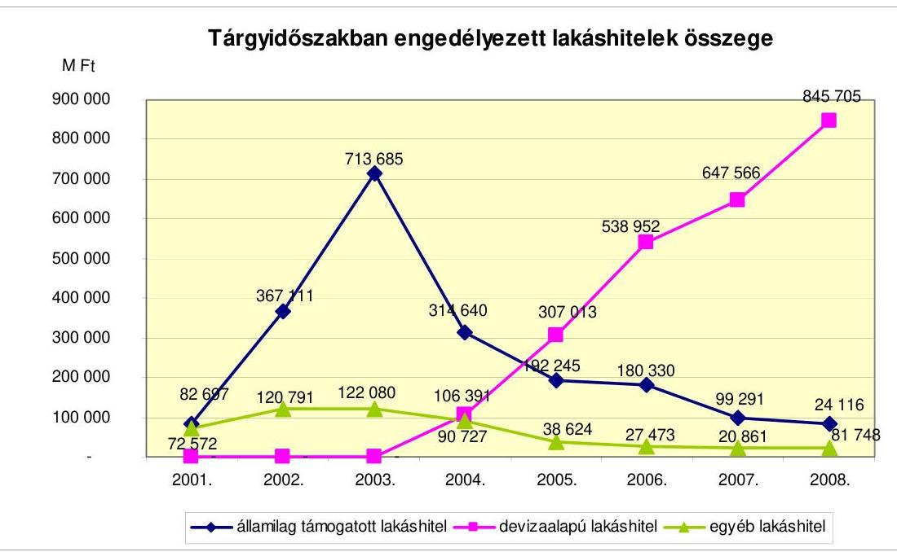
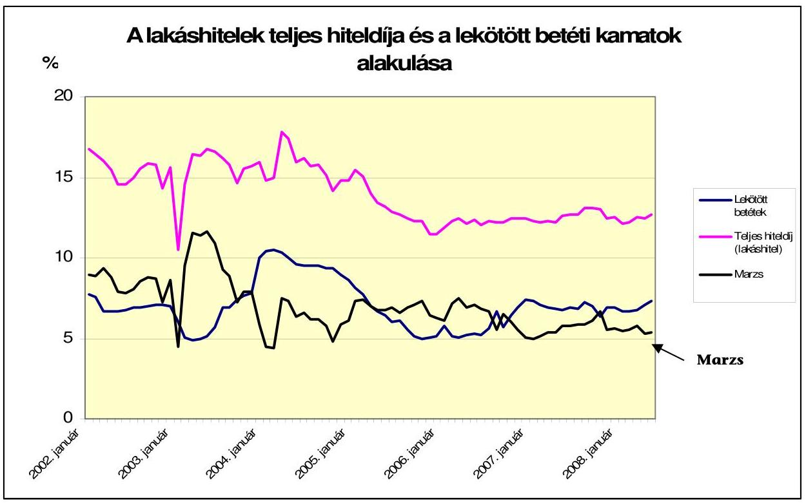
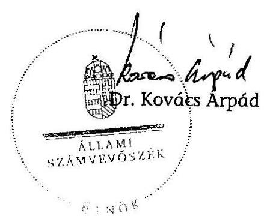

# ÁLLAMI   SZÁMVEVŐSZÉK 

## JELENTÉS

a lakástámogatási rendszer hatékonyságának ellenőrzéséről

---

2. Államháztartás Központi Szintjét Ellenőrző Igazgatóság
2.1. Teljesítmény Ellenőrzési Főcsoport
Iktatószám: V-2007-83/2008-2009.
Témaszám: 909
Vizsgálat-azonosító szám: V0413
Az ellenőrzést felügyelte:
Bihary Zsigmond
főigazgató
Az ellenőrzés végrehajtásáért felelős:
Kemény Emil
főigazgató-helyettes
Az ellenőrzést vezette:
Makkai Mária
főcsoportfőnök-helyettes
Az ellenőrzést végezték:

| Barta József számvevő | Dr. Dicső Ildikó számvevő gyakornok | Gaálné Izsó Éva számvevő tanácsos, tanácsadó |
| :--: | :--: | :--: |
| Lucza Anikó számvevő | Massányi Tibor számvevő | Nagy Ákos számvevő |

A témához kapcsolódó eddig készített számvevőszéki jelentések:
címe
sorszáma
Jelentés a Magyar Köztársaság 2002. évi költségvetése végrehajtásának ellenőrzéséről
Jelentés a helyi önkormányzatoknak bérlakás építésre és korszerű-
0329
sítésre juttatott pénzügyi támogatások ellenőrzéséről
Jelentés a Magyar Köztársaság 2003. évi költségvetése végrehajtásának ellenőrzéséről
Jelentés a Magyar Köztársaság 2004. évi költségvetése végrehajtásának ellenőrzéséről
Jelentés a Területfejlesztés fejezet múködésének ellenőrzéséről ..... 0603
Jelentés a Magyar Köztársaság 2005. évi költségvetése végrehajtásának ellenőrzéséről
Jelentés a Földhitel és Jelzálogbank Rt. múködésének ellenőrzéséről ..... 0647
Jelentés a Magyar Köztársaság 2006. évi költségvetése végrehajtásának ellenőrzéséről
Jelentés a Magyar Köztársaság 2007. évi költségvetése végrehajtásának ellenőrzéséről

---

## Eierlikör (1)

Menge: 1 Drink

2 Zentiliter Zitronensaft
2 Zentiliter Zuckersirup
1 Zentiliter Zuckersirup
1 Zentiliter Zuckersirup
etwas Zuckersirup
etwas Zuckersirup
etwas Zuckersirup
etwas Zuckersirup
etwas Zuckersirup
etwas Zuckersirup
etwas Zuckersirup
etwas Zuckersirup
etwas Zuckersirup
etwas Zuckersirup
etwas Zuckersirup
etwas Zuckersirup
etwas Zuckersirup
etwas Zuckersirup
etwas Zuckersirup
etwas Zuckersirup
etwas Zuckersirup
etwas Zuckersirup
etwas Zuckersirup
etwas Zuckersirup
etwas Zuckersirup
etwas Zuckersirup
etwas Zuckersirup
etwas Zuckersirup
etwas Zuckersirup
etwas Zuckersirup
etwas Zuckersirup
etwas Zuckersirup
etwas Zuckersirup
etwas Zuckersirup
etwas Zuckersirup
et

---

# TARTALOMJEGYZÉK 

BEVEZETÉS ..... 7
I. ÖSSZEGZŐ MEGÁLLAPÍTÁSOK, KÖVETKEZTETÉSEK, JAVASLATOK ..... 14
II. RÉSZLETES MEGÁLLAPÍTÁSOK ..... 25

1. A lakáspolitikai koncepciók és programok ..... 25
2. A lakástámogatások jogi szabályozása ..... 30
3. A felügyeletet ellátó minisztériumok, szervezetek ..... 34
4. A lakástámogatási rendszer múködésének hatásai, a lakásprogramok hasznosulása ..... 37
5. A lakástámogatásokkal összefüggő pénzügyi, nyilvántartási és adatszolgáltatási feladatok ellátása ..... 43
5.1. A hitelintézetekkel kötött szerződések ..... 43
5.2. A támogatások elszámolása ..... 45
5.3. A jogosulatlan igénybevételek megakadályozása érdekében tett intézkedések ..... 47
5.4. A hitelintézetek havi elszámolásainak ellenőrzése ..... 49
6. A jelzáloglevéllel finanszírozott és a kiegészítő kamattámogatott hitelek piaci hatása ..... 52
6.1. A kiegészítő és a jelzáloglevéllel finanszírozott hitelek kamattámogatásának változása ..... 52
6.2. A kamattámogatások változásának hatása a hitelezési piacra ..... 54
7. A pályázati lakástámogatási rendszer ..... 57
7.1. A pályázati lakástámogatási rendszer szabályozottsága, a szervezeti változások ..... 57
7.2. A pályázati lakástámogatási rendszer múködése ..... 59
7.3. A pályázati típusú lakástámogatási rendszer keretében megvalósult beruházások ellenőrzése ..... 68
8. A lakás-takarékpénztári megtakarítások állami támogatása ..... 69
8.1. A lakás-takarékpénztárak múködésének jogszabályi környezete ..... 69
8.2. A lakás-takarékpénztárak múködésének értékelése ..... 71
8.3. Lakás-takarékpénztári állami támogatás ellenőrzése ..... 74

---

# MELLÉKLETEK 

1. sz. A lakáscélú támogatások előirányzatai és a teljesülés az éves költségvetésben
2. sz. Lakáscélú állami támogatások 2000-2007. évek

## FÜGGELÉKEK

1. sz. A hitelintézetek lakáscélú hitelezési tevékenységének értékelése a helyszíni ellenőrzés alapján
2. sz. A hitelintézetek által kitöltött kérdőívek értékelése

---

# RÖVIDÍTÉSEK JEGYZÉKE 

| APEH | Adó- és Pénzügyi Ellenőrzési Hivatal |
| :--: | :--: |
| Art. | 2003. évi XCII. törvény az adózás rendjéről |
| ÁKK Zrt. | Államadósság Kezelő Központ Zrt. |
| ÁSZ | Állami Számvevőszék |
| ÁTB | Állami Támogatású Bérlakás Program |
| BM | Belügyminisztérium |
| ÉMI Kht. | Építésügyi Minőségellenőrző Innovációs Kht. |
| FHB | Földhitel- és Jelzálogbank Rt. |
| FOT | Fiatalok Otthonteremtési Támogatása |
| Fundamenta | Fundamenta-Lakáskassza Lakástakarékpénztár Zrt. |
| GM | Gazdasági Minisztérium |
| kormányrendelet | 12/2001. (I. 31.) Korm. rendelet a lakáscélú állami támogatásokról |
| KSH | Központi Statisztikai Hivatal |
| KVI | Kincstári Vagyoni Igazgatóság |
| Lakáskassza | Lakáskassza-Wüstenrot Rt. |
| Ltp. | lakás-takarékpénztár |
| Ltv. | 1996. évi CXIII. törvény a lakás-takarékpénztárakról |
| Jzt. | 1997. évi XXX. törvény a jelzálog-hitelintézetről és a jelzáloglevélről |
| Kincstár | Magyar Államkincstár |
| MeH | Miniszterelnöki Hivatal |
| MLI Kht. | Magyar Lakás-innnovációs Kht. |
| MT rendelet | 106/1988. (XII. 26.) MT rendelet a lakáscélú támogatásokról |
| NFT | Nemzeti Fejlesztési Terv |
| NLP | Nemzeti Lakásprogram |
| OLÉH | Országos Lakás és Építésügyi Hivatal |
| OTP Ltp. | OTP Lakástakarékpénztár Zrt. |
| Otthon | Otthon Lakástakarékpénztár Zrt. |
| ÖM | Önkormányzati Minisztérium |
| ÖTM | Önkormányzati és Területfejlesztési Minisztérium |
| PM | Pénzügyminisztérium |
| PSZÁF | Pénzügyi Szervezetek Állami Felügyelete |
| PTK | 1959. évi IV. törvény a Polgári Törvénykönyvről |

---

.

---

# ÉRTELMEZŐ SZÓTÁR 

| futamidő | A hitel felvétele és lejárata közötti időtartam. Rövid lejáratú az éven belüli, középlejáratú az 1-5 év közötti, míg hosszú lejáratú az 5 éven túli hitel. (Forrás: Pénzügyi szótár) |
| :--: | :--: |
| hitelbiztosítéki érték | A jelzálog-hitelintézetről és a jelzáloglevélről szóló 1997. évi XXX. törvény szerint a hitel fedezetéül lekötött ingatlan hitelnyújtás alapját képező értéke |
| hitelintézet | A hitelintézetekről és a pénzügyi vállalkozásokról szóló 1996. évi CXII. törvény szerint az a pénzügyi intézmény, amely legalább betétet gyújt, vagy más visszafizetendő pénzeszközt fogad el a nyilvánosságtól, valamint hitelt és pénzkölcsönt nyújt. A hitelintézet bank, szakosított hitelintézet vagy szövetkezeti hitelintézet lehet. |
| hitelnyújtás | A hitelintézetekről és a pénzügyi vállalkozásokról szóló 1996. évi CXII. törvény szerint a hitelező és az adós között írásban létesített hitelszerződés alapján meghatározott hitelkeret rendelkezésre tartása az adós részére jutalék ellenében és a hitelintézet kötelezettségvállalása meghatározott szerződési feltételek megléte esetén a kölcsönszerződés megkötésére. |
| jelzálog-hitelintézet | A jelzálog-hitelintézetről és a jelzáloglevélről szóló 1997. évi XXX. törvény szerint olyan szakosított hitelintézet, amely pénzkölcsönt nyújt ingatlanon alapított jelzálogjog fedezete mellett, amelyhez forrásait alapvetően jelzáloglevél kibocsátásával gyúti. |
| jelzálogjog | A Polgári Törvénykönyvről szóló 1959. évi IV. törvény szerint jelzálog esetén a zálogtárgy a zálogkötelezett birtokában marad, aki jogosult a dolog rendeltetésszerú használatára, hasznosítására, köteles azonban annak épségét megőrizni. A jelzálogjog a zálogjog azon típusa, amely esetén a zálogtárgy tulajdonosa a zálogjog megalapítását követően is jogosult a dolgot birtokában tartani és rendeltetésszerúen használni. |
| kamattámogatott hitel | A lakáscélú állami támogatásokról szóló 12/2001. (I. 31.) Korm. rendelet szerint olyan hitel, amelynél az állam a hitelfelvevő/adós által fizetett kamatok egy részét megtéríti a hitelnyújtónak, és így az adós által fizetett kamat összege alacsonyabb lesz. |
| kamatperiódus | A kölcsön ügyleti kamatára vonatkozó azon időszak, amely alatt a megállapított ügyleti kamat mértéke állandó, a kölcsönszerződés szerint nem változhat. (Forrás: Lakáshitel Online szótár) |
| készfizető kezesség | A kezesség egyik fajtája a készfizető kezesség, amelynél az adós nemfizetése esetén a hitelező bank közvetlenül a kezeshez fordulhat a hitel törlesztése érdekében. (Forrás: Pénzügyi szótár) |

---

lakásépítési kedvez- A lakáscélú állami támogatásokról szóló 12/2001. (I. 31.) mény
megelőlegező kölcsön

Korm. rendelet szerint állami támogatás, amely az igénylőt a vele közös háztartásban élő, általa eltartott és a felépített, illetőleg megvásárolt lakásba vele együtt beköltöző gyermeke és más eltartott családtagia után illeti meg az építési költség (vételár) megfizetéséhez.
A lakáscélú állami támogatásokról szóló 12/2001. (I. 31.) Korm. rendelet szerint a lakásépítési kedvezmény megelőlegezésére szolgáló kölcsön, amely max. két gyermek vállalása esetén vehető igénybe. Amennyiben a gyermekek nem születnek meg az előírt határidő alatt, akkor a kedvezmény kamatokkal növelt összegét a kiegészítő kamattámogatású hitel szabályai szerint kell visszafizetni.

---

# JELENTÉS 

## a lakástámogatási rendszer hatékonyságának ellenőrzéséről

## BEVEZETÉS

Az 1990-es években piaci körülmények alakultak ki a lakások építése és forgalmazása területén. 1991-ben a hosszú lejáratú hitelek 3\%-os fix kamata piaci kamattá változott. Az ingatlanok és építőanyagok árának emelkedése volt tapasztalható és a gyorsuló infláció következtében magasak voltak a banki kölcsönök kamatai is. A 90-es évek végére a hitel részaránya az új építések finanszírozásában 10\%-os szint alá süllyedt, a lakásfinanszírozás döntően készpénz alapú volt. Míg 1991-ben a folyósított lakáshitel 20 Mrd Ft, addig 1997-ben már csak 9 Mrd Ft volt annak ellenére, hogy a Földhitel- és Jelzálogbank (továbbiakban: FHB) jelzálogalapú támogatott hiteleket értékesített. 1999-ben kevesebb, mint 20 ezer új lakás épült. Az FHB által nyújtott változó kamatozású támogatott hitelek induló kamata, ha az ügyfél az évenkénti kamatváltozást választotta $19,7 \%$, öt éves kamatperiódusnál $16,5 \%$ volt. A nem támogatott, piaci kamatok megközelítették a $25 \%$-ot.

2000 után fordulat következett be a lakástámogatási rendszerben. 2000. február 1-jén lépett hatályba a lakáscélú állami támogatásokat szabályozó 106/1988. (XII. 26.) MT rendelet (továbbiakban: MT rendelet) azon módosítása, amellyel a Kormány kiegészítő kamattámogatást biztosított új lakás építése vagy vásárlása esetén, illetve használt lakás vásárlást jelzáloglevelek kamattámogatásával segítette. ${ }^{1}$
2001. február 1-jétől a lakáscélú állami támogatásokra vonatkozó előírásokat a 12/2001. (I. 31.) Korm. rendeletben (továbbiakban: kormányrendelet) egységesítették, továbbá kibővítették a 2000-ben kialakított támogatási struktúrát a házasok, gyermekes fiatal családok és más arra rászorultak lakásigényének kielégítése céljából.

A kormányrendelet 2008. júniusig 25 alkalommal módosult, amelyek közül jelentős változást a 2003. és 2005. évi módosítások okoztak. 2003. júniusban és decemberben a Kormány a jelzáloglevéllel finanszírozott hitelek kamattámoga-

[^0]
[^0]:    ${ }^{1}$ 1994. január 1-jétől az állam a lakásépítés és lakásvásárlás céljára nyújtott kölcsönök kamatainak viseléséhez tizenöt évig támogatást nyújtott, gyermekes családok vagy gyermeket vállaló fiatal házaspárok esetében 1500000 Ft , minden egyéb esetben 600000 Ft kölcsönösszegig (2000. január 31-én az értékhatárok 2800000 Ft , illetve 1200000 Ft voltak). A támogatás mértéke 1995. május 1-ig az éves törlesztési időszak kezdetekor fennálló tartozásnak (1995. május 2-tól a tőketartozásnak) a törlesztés első öt évében 4\%-a, a második öt évében 3\%-a, a harmadik öt évében 1\%-a volt. Az éves támogatás tizenketted részét havonta kellett elszámolni.

---

tása esetén csökkentette a támogatott hitel nagyságát, szűkítette az igénybevevői kört és megváltoztatta a kamattámogatás szisztémáját. A 2005-ben meghozott lakáspolitikai intézkedések során a Fészekrakó program bevezetésével a Kormány a fiatalok lakásszerzésének támogatásához állami kezességvállalás és önerő pótlását segítő otthonteremtési támogatás bevezetéséről döntött, növelte a gyermekek után járó támogatások mértékét, valamint lakbér-támogatási programot indított.

A támogatások igénybevétele alapján megkülönböztethetőek a lakosság, a lakásszövetkezetek, a társasházak, a vízgazdálkodási társulatok és az önkormányzatok (kamattámogatások esetében) részére hitelintézeteken keresztül nyújtott, a jogosultsági feltételek teljesülése alapján (normatív módon) kifizetett, valamint a települési önkormányzatok részére a kormányrendeletben meghatározott célokra adott, pályázati úton igényelhető támogatások.

A kormányrendeletben foglaltak alapján támogatás vehető igénybe a Magyar Köztársaság területén lakás építésére és vásárlására (új és használt), meglévő lakások bővítésére, korszerűsítésére, lakóépületek közös használatú részeinek felújítására és víziközmű beruházásra. A Magyar Állam készfizető kezességvállalással segíti a lakásszerzési célú hitelintézeti kölcsön felvételét a köztisztviselők esetében 2001. július 1-jétől, a fegyveres szervek és a Magyar Honvédség hivatásos állományú tagjai esetében 2003. július 1-jétől, valamint a közalkalmazottak, az ügyészek, a bírák és az igazságügyi alkalmazottak esetében 2005. január 1-jétől.

A települési önkormányzatok a bérlakásállomány növelésére, lakóépületek energiatakarékos korszerűsítésére, felújítására, városrehabilitációs programra, közművesített építési telkek kialakítására, egycsatornás gyűjtőkémények felújítására, lakbértámogatásra, a megyei önkormányzatok idősek otthona létesítésére, valamint az egyházak a lakhatást szolgáló egyházi ingatlanok korszerűsítésére, felújítására igényelhettek pályázati úton állami támogatást.

A nem pályázati úton lebonyolított támogatásokat 26 bank, illetve hitelszövetkezet és több, mint száz takarékszövetkezet számolta el szerződések alapján. A hitelintézeteket a Fiatalok Otthonteremtési Támogatása (továbbiakban: FOT), valamint a lakásépítési kedvezményhez (1994-ig szociálpolitikai kedvezmény) kapcsolódó megelőlegező kölcsön összege után 3\%, minden más központi költségvetési támogatás összege után 1,5\% költségtérítés illette meg.

A kormányrendeletben szabályozottakon kívül a lakáscélú támogatások körébe tartozik a lakás-takarékpénztári (továbbiakban: Ltp.) megtakarításra nyújtott állami támogatás is, amelynek jogi alapja az 1997. január 1-jén hatályba lépett, a lakás-takarékpénztárakról szóló 1996. évi CXIII. törvény (továbbiakban: Ltv.). E szerint az állami támogatás mértéke a kezdeti időszakban a megtakarítási évben betétként elhelyezett összeg 30\%-a, legfeljebb 36 ezer Ft volt, 2003. április 1-jétől - a 30\%-os arány változatlan fennállása mellett - évi 72 ezer Ft.

A kormányrendelet rögzítette, hogy a közvetlen támogatásokat és kamattámogatásokat az állam nevében a Magyar Államkincstár (továbbiakban: Kincstár) nyújtja a hitelintézetek igazolása alapján. 2003. június közepétől 2005. augusztus közepéig a közvetlen támogatások és a kamattámogatások igénybevé-

---

teli feltételeinek ellenőrzése (az igénybevétel jogszerűsége) a kölcsönt nyújtó hitelintézetek kötelezettsége volt, ezt követően a tevékenységet az Adó- és Pénzügyi Ellenőrzési Hivatal (továbbiakban: APEH) is végzi, 2008-tól pedig hatósági ellenőrzés keretében a Kincstár is.

A központi költségvetésben „lakástámogatás" címen belül kialakított „egyéb lakástámogatások" alcím tartalmazta a lakástámogatások jogcímeit. 2002-ben 18, 2007-ben 25 jogcímen volt kifizetés. A lakástámogatások cím kezelője 2004. november 9-ig a Pénzügyminisztérium (továbbiakban: PM), 2004. november 10-től a regionális fejlesztésért és felzárkóztatásért felelős tárca nélküli miniszter felügyelete alá tartozó Országos Lakás és Építésügyi Hivatal (továbbiakban: OLÉH), majd az OLÉH 2006. évi megszűnése után az Önkormányzati és Területfejlesztési Minisztérium (továbbiakban: ÖTM) volt. Az ÖTM jogutódja 2008. május 15 -től az Önkormányzati Minisztérium (továbbiakban: ÖM).

A pályázati úton igényelhető támogatási programok előirányzatainak kezelője elkülönült a jogosultsági alapon igénybe vehető támogatások kezelőjétől. 2003. április 16-ig a Gazdasági Minisztérium (továbbiakban: GM), 2005. január 31-ig a Belügyminisztérium (továbbiakban: BM), 2007. december 22-ig a regionális fejlesztését és felzárkóztatásért felelős tárca nélküli miniszter, 2007. december 23-tól az ÖTM volt, 2008. május 15 -től az ÖM a programok előirányzatának kezelője.

A lakáscélú hitelek alakulása

| Év | Hitelek száma   ezer db |  | Hitelek állománya   Mrd Ft |  |
| :--: | :--: | :--: | :--: | :--: |
|  | Összes   lakáscé-   lú hitel | Támo-   gatott   hitel | Összes   lakáscé-   lú hitel | Támo-   gatott   hitel |
| 2002.   december 31. | 248 | 134 | 606 | 494 |
| 2007.   december 31. | 805 | 375 | 3109 | 1530 |
| 2008.   december 31. | 839 | 331 | 3875 | 1338 |

Forrás: KSH
A lakáshitelezési piac időközben átrendeződött, 2004-től megjelentek a hitelintézetek által nyújtott, a támogatott forinthiteleknél kedvezőbb kamatozású, de a forint árfolyam alakulásának kockázatától függő devizahitelek, amelyek révén a lakáshitelek állománya tovább nőtt, a növekedés 2002-höz képest $539 \%$-os volt. A támogatott hitelek állománya ugyanabban az időszakban $171 \%$-kal nőtt. A támogatott hitelek állományának aránya 2002-ben 81,5, 2008. év végén $34,5 \%$ volt.

Az Állami Számvevőszék (továbbiakban: ÁSZ) az állami költségvetés végrehajtásának éves ellenőrzései során vizsgálta a „lakástámogatások" címet. Az ellenőrzések célja annak értékelése volt, hogy a központi költségvetés kiadásait je-

---

lentő lakástámogatásoknál a szabályozást a támogatások sajátosságainak figyelembevételével alakították-e ki, a kincstári finanszírozásnál a szerződéses kötelezettséget betartották-e, a főkönyvi és analitikus nyilvántartások adatai egyeztek-e.

2003-ban a helyi önkormányzatoknak bérlakásépítésre és korszerűsítésre juttatott pénzügyi támogatások ellenőrzéséről készült ÁSZ jelentés. 2005. évben az ÁSZ átfogó vizsgálatot végzett a Területfejlesztés fejezet múködéséről. Az ellenőrzés során a hangsúlyt a célszerűségi, eredményességi szempontból fakadó követelmények teljesülésére helyezte. A jelentés elemezte a területfejlesztési célkitűzések teljesítését, a támogatások felhasználását, hasznosulását. 2006-ban az ÁSZ ellenőrizte az FHB múködését, ezen belül értékelte a kormányrendelet előírásainak hatását az FHB múködésére, eredményére.
2008. márciusban az ÁSZ előtanulmányt készített az önkormányzatok lakásgazdálkodásáról.

A jelentés elkészítése során hasznosítottuk a kapcsolódó ÁSZ jelentésekben foglaltakat is.

A jelenlegi ellenőrzés célja annak értékelése volt, hogy

- a 2001-ben bevezetett lakáscélú állami támogatások rendszerének kitűzött gazdasági és társadalmi céljai hogyan teljesültek;
- a lakástámogatási rendszer múködése hozzájárult-e a lakásállomány növeléséhez és összetételének javulásához;
- a támogatási rendszer segítette-e az első otthonhoz jutást, figyelembe vette-e a szociális helyzetet és hogyan hatott az öngondoskodás szerepének alakulására;
- a lakáscélú támogatások keretében felvett hitelek visszafizetésének kockázata hogyan változott és ez milyen hatást gyakorolt az állami szerepvállalásra, a támogatási formákra.

Az ellenőrzés a 2000-2007. években - egyes vonatkozásban a helyszíni ellenőrzés befejezéséig tartó időszakban - érvényes támogatási rendszerre irányult. Áttekintettük az egyes - jogosultság alapján járó vagy pályázati úton megszerezhető - támogatási eszközök, támogatási típusok változását, annak költségvetést érintő hatását, valamint a támogatások hasznosulását. Az eredmények számbavételére irányuló elemző, értékelő munkát nehezítette, hogy nem áll rendelkezésre olyan monitoring adatbázis, amelyből a lakástámogatások révén felépült, felújított, vásárolt lakások száma, összetétele, minőségváltozása megállapítható. Az ellenőrzés során a Központi Statisztikai Hivatal (továbbiakban: KSH), illetve a tanúsítványok adataira támaszkodtunk.

Az ellenőrzés során az OTP Bank Nyrt.-nél, az OTP Jelzálogbank Zrt.-nél, az Erste Bank Hungary Nyrt.-nél, a Kereskedelmi és Hitelbank Nyrt.-nél, a Fundamenta-Lakáskassza Lakástakarék-pénztár Zrt.-nél és az OTP Lakástakarékpénztár Zrt.-nél helyszíni ellenőrzés keretében vizsgáltuk a lakáscélú állami támogatások közvetítésének feltételeit és lebonyolítását. A központi költségvetésből lakástámogatás címen 2007-ben kifizetett összeg mintegy két-

---

harmada a helyszíni ellenőrzésbe bevont hitelintézeteken keresztül történt. (1. sz. függelék)

Az ellenőrzés keretében a lakáscélú támogatások nyújtására a Magyar Állammal szerződött hitelintézetek körében a Magyar Bankszövetség közreműködésével kérdőíves felmérést végeztünk. Ennek célja az volt, hogy hozzájáruljon a lakástámogatásra vonatkozó jogszabályok és azok változtatásai - a támogatási célok megvalósulására gyakorolt - hatásainak értékeléséhez. (2. sz. függelék)

A globális pénzügyi válság hazai hatásaként a bankközi és értékpapírpiacokon, valamint az ügyfél finanszírozásnál a hitelkockázati felárak számottevő emelkedése következett be, amiket kedvezőtlen módon egészíti ki a magyar szuverén kockázat folytatólagosan kedvezőtlen piaci megítélése, a kötvénypiac bizonytalan kilátásai, a háztartások eladósodottságának magas szintje. Mindennek következményeként jelentkezett a hitelintézetek óvatos hitelezési politikája, az önrészek megemelkedése, a hitelek drágulása és a lakáshitelezés erőteljes visszaesése 2008. november-december hónapokban, amelyek a lakástámogatási rendszer múködését is befolyásolják. A 2008. augusztusban befejeződő helyszíni ellenőrzés keretében azonban nem volt módunk a hatásokkal foglalkozni, így annak megítélésére is, hogy 2008. egésze tekintetében a hitelezés hogyan alakult, a későbbiek során megismerhető adatok alapján lenne csak mód. Ugyanakkor indokoltnak tartottuk a legújabb események figyelembevételét. A kialakult helyzet miatt ezért áttekintettük a rendelkezésre álló adatokat, azok és a bekövetkezett események alapján a jelentésben foglaltakat időszerűsítettük. Ehhez több helyről történő adatgyűjtés vált szükségessé, mivel az adatok más-más intézménynél, esetenként átfedéssel és részben eltérő tartalommal állnak rendelkezésre. Az adatszolgáltatásban segítségünkre volt az MNB, az ÖM és a KSH.

A lakástámogatási rendszer keretében biztosított kamattámogatás a forintban nyújtott hitelekre terjed ki, ezért a jelen ellenőrzés nem értékelhette a deviza alapú lakáshitel konstrukciókat, azok a hitelintézetek és a lakosság kétoldalú megállapodásán alapulnak. Jelentésünkben a devizahiteleknek a támogatott hitelek állományának alakulásában játszott szerepét mutatjuk be. Ugyanakkor kétségtelen tény, hogy a válságnak azonnal bekövetkező hatása jelentkezett a devizahiteleknél, egyrészt a hitelintézetek részéről - a forráshoz jutás nehézsége miatt - a devizahitelezés erőteljes visszafogásában, másrészt a forint gyengülése miatt a törlesztő részletek kiszámíthatatlan ingadozásában, ami megnövelte a nem teljesítésnek (törlesztő részleteket nem tudják fizetni) a kockázatát. Ez a kockázat mind a lakás, mind pedig a fogyasztási és egyéb deviza hiteleket érinti. A lakáshitelezésben meghatározó szerepet játszó hitelintézet tájékoztatása szerint a lakáshiteleknél a nem fizetők számának számottevő emelkedését nem tapasztalták, de a forint további gyengülése felerősíti a nem fizetés meglévő kockázatát. A deviza-alapú hitel konstrukciók ugyan kívül esnek az államilag támogatott lakáshiteleken, de napjaink pénzügyi eseményei megfelelő tanulságok levonására adnak lehetőséget a jövőt illetően a pénzügyi rendszer, illetve pénzügyi folyamatok állami szabályozására vonatkozóan.

A Pénzügyi Szervezetek Állami Felügyeletének adatai szerint 2007-ben a háztartások összes adóssága a rendelkezésükre álló jövedelem 51\%-a, míg 2000-ben $10 \%$-a volt.

---

A háztartások hitelállományának alakulása

| Megnevezés | 2007. december 31. |  |  | 2008. december 31. |  |  |
| :--: | :--: | :--: | :--: | :--: | :--: | :--: |
|  | Ft | Deviza | Összesen | Ft | Deviza | Összesen |
| Hitelállomány összesen | 3026,0 | 4355,3 | 7381,3 | 3012,2 | 6552,2 | 9564,4 |
| Ebből:   - Lakáscélú hitelek hitelintézetektől | 1695,3 | 1466,7 | 3162,0 | 1564,4 | 2384,5 | 3948,9 |
| - Fogyasztási és egyéb hitelek hitelintézetektől | 982,6 | 1798,0 | 2780,6 | 1034,3 | 2793,7 | 3828,0 |
| - Hitel egyéb pénzügyi közvetítőktől | 247,5 | 1090,6 | 1338,1 | 317,1 | 1374,0 | 1691,1 |
| - Hitel egyéb szektortól | 100,6 | - | 100,6 | 96,4 | - | 96,4 |

Forrás: MNB, az egyéb pénzügyi és az egyéb szektorral szemben fennálló tartozás nincs megbontva hitelfajta szerint.

A háztartások hiteleinek 2007. december 31-én 59\%-a, 2008. december 31-én 68,5\%-a deviza hitel volt. A háztartások fogyasztási és egyéb hiteleinek (személyi hitel, áruhitel, gépjárműhitel, szabad felhasználású jelzáloghitel) aránya 2007. év végén $37,8 \%$, 2008. év végén $40 \%$, a lakáscélú hitelek arányával ( $42,8 \%$, illetve $41,3 \%$ ) közel azonos volt. A devizában fennálló adósságon belül a fogyasztási és egyéb hitelek részaránya ( $41,3 \%$ és $42,6 \%$ ) mindkét évben meghaladta a lakáshitelek részarányát ( $33,7 \%$ és $36,4 \%$ ).

A Központi Hitelinformációs Rendszerben (KHR) nyilvántartott élő lakossági hitelmulasztások (nem fizetések) száma 2008-ban 55\%-kal emelkedett (433 ezerről 669 ezerre). A rendszerben nyilvántartott összes - élő és lezárt - lakossági mulasztás száma 2008 végén mintegy 999 ezer volt. Ebben azonban a 2008. IV. negyedévben begyűrűző válsághatás - a listára kerülés szabályai miatt - még nem szerepel. (A rendszer azokat a hiteladósokat és mulasztásaikat tartja nyilván, akik a pénzügyi intézményekkel kötött hitel- vagy hiteljellegű szerződésben vállalt kötelezettségük, legalább a minimálbér összegét kitevő kölcsönöszszeg megfizetésével több mint 90 napon át késedelembe vannak. A hitel lehet fogyasztási hitel, folyószámlahitel, lakáshitel, személyi hitel stb. Lezárt ügyletnek az minősül, amikor az ügyfél teljes tartozása rendeződött, de az ügyfél még öt évig szerepel a nyilvántartásban.)

A pénzügyi válság hatásaként a lakáspiacon a már 2007-ben is meglévő túlkínálat tovább nőtt. Szakértői elemzések szerint 2008. utolsó két hónapjában minden kategóriában és területen csökkent a megvásárolt használt lakások fajlagos ára. Ugyanakkor az új lakásoknál 1-5\%-kal magasabbak voltak az árak az év első 10 hónapjához képest. A szakértők véleménye szerint az áralkuk so-

---

rán a vevők - akik hitelképesek és megfelelő megtakarítással rendelkeznek pozíciója javul, az eladók árcsökkenésre kényszerülnek, a családi házak kivételével.

A jelentést egyeztettük az önkormányzati miniszterrel, aki észrevétel nem tett.

---

# I. ÖSSZEGZŐ MEGÁLLAPÍTÁSOK, KÖVETKEZTETÉSEK, JAVASLATOK 

A 2000-től bevezetett lakáscélú támogatási rendszer múködésében és múködtetésében az állami szerepvállalás irányai, célkitűzései - a lakhatás minőségének javítása új lakások építésével és a használt lakások felújításával, továbbá a bérlakás állomány növelése - 2007-ig alapjaiban nem változtak. A vizsgált időszakban valamennyi kormányprogram, valamint a Nemzeti Fejlesztési Terv és a konvergencia program tartalmazta a lakástámogatás általános célkitűzéseit. Nem készült azonban a lakástámogatási rendszer céljait teljes körűen és számszerűsítve meghatározó, azok megvalósításához szükséges és a rendelkezésre álló forrásokat rögzítő, továbbá a támogatások hatásait, a programok eredményességének értékelését tartalmazó nemzeti lakáspolitikai program.

2000-2008 között a költségvetés lakáscélú kiadása összesen 1469 Mrd Ft volt. A célok megvalósítására kialakított eszközrendszer hozzájárult a lakásállomány növekedéséhez. Az engedélyezett, támogatott lakáshitelek száma 2001-2008 között 404 ezer db volt, a lakásállomány a 2000. évi 4063 ezer db-ról 2007. év végére 4270 ezer db-ra nőtt. ${ }^{2}$ Nyilvántartási adatok hiányában az nem ismert, hogy a lakásállomány növekedésének mekkora hányada valósult meg a lakástámogatási rendszer segítségével. A támogatott hitelállomány dinamikus emelkedése hosszabb távra (10-15 év) determinálta a költségvetés lakástámogatási kiadásait. A kamattámogatások 2008-ban - az előzetes adatok alapján a GDP 0,7\%-át tették ki, szemben a 2000. évi 0,1\%-kal. (Ez az arány 2005-ben volt a legmagasabb, $0,8 \%$.) A KSH adatai szerint 2007. év végén a lakáshitelek (támogatott és nem támogatott) $92 \%$-át, 2008. december 31 -én $90,9 \%$-át a hitelintézetek kockázat szempontjából problémamentesnek minősítették.

Az eszközrendszeren belül meghatározó szerepet játszó kamattámogatási rendszer 2004-től annak ellenére nem volt versenyképes a devizahitelekkel szemben, hogy nyilvánvaló volt a forint esetleg jelentős árfolyamváltozásai miatti, a visszafizetés terheit nagymértékben növelő kockázat. Az új lakást vásárolni és építeni képes, megfelelő önerővel rendelkező házasok és gyermekesek kivételével - stabil feltételeket valószínűsítve - érdemben nem nyújtott támogatási lehetőséget a lakást szerzők részére. Ennek az volt az oka, hogy 2003-ban szigorították a támogatott hitelek feltételeit és a kamattámogatás mértéke az állampapír referencia hozam alakulásától függ. 2004-től az érvényes referencia hozamok mellett a kamattámogatásos hitelek esetében az ügyfél által fizetendő kamatok magasabbak voltak, mint a devizahiteleknél. A kamattámogatott hitelek szerepe visszaszorult, az ügyfelek az életkor és összeg korlát nélküli, alacsonyabb költségű, de nagyobb kockázatú devizahiteleket részesítették előnyben. 2008. öszétől a jelentős árfolyam-ingadozás miatt a devizahitelek felvétele visszaesett, a már felvett deviza hitelek törlesztő részletei számottevően emelkedtek. Az új helyzet kezelése érdekében 2008. november 6-án a PM és a lakossági devizaalapú hitelezés területén meghatározó 11 hitelintézet megállapo-

[^0]
[^0]:    ${ }^{2}$ 2008. év végi KSH adat a jelentés nyilvánosságra hozatalakor nem állt rendelkezésre.

---

dást írt alá a forintárfolyam nagymértékű ingadozása miatti törlesztési összegek emelkedéséből adódó terhek mérséklését célzó eszközökről. A hitelintézetek 2008. december 31-ig vállalták, hogy lehetőséget adnak az adós kérésére díjmentesen a törlesztési időszak meghosszabbítására, a devizaalapú hitel forint alapú kölcsönné alakítására, az önhibáján kívül nehéz helyzetbe került adós esetében, kérésére, a törlesztés átmeneti megkönnyítésére, illetve a forinttól eltérő devizanemben fennálló kölcsönök előtörlesztésének rugalmas kezelésére. 2009. januárban az euró forint árfolyama elérte, sőt meghaladta a 300 euró/forint szintet, ezért a Kormány kezdeményezte a korábbi megállapodásban foglaltak ismételt alkalmazását, amelyet a 11 hitelintézet nyilatkozatban viszszaigazolt. Az Országgyűlés 2009. március elején elfogadta a lakáscélú kölcsönökre vonatkozó állami készfizető kezességről szóló törvényt, amely szerint a rászorulók által felvehető áthidaló kölcsön tőke és kamat tartozásáért a Magyar Állam készfizető kezességet vállal. Áthidaló kölcsönt azok a lakáscélú kölcsönnel rendelkező természetes személyek vehetnek fel, akiknek - többek között - 2008. szeptember 30-át követően szűnt meg a munkaviszonya, a lakóhelyül szolgáló ingatlanuk a kölcsönszerződés hitelbiztosítéka, más lakóingatlannal a háztartás tagjai nem rendelkeznek stb. Az áthidaló kölcsön összege a lakáscélú kölcsön esedékes törlesztő részleteinek és a természetes személy által vállalt törlesztés különbözetének 24 havi értéke lehet.

A támogatott lakáshitelek a háztartások adósságának 2008. év végén közel egyötödét tették ki, a Központi Hitelinformációs Rendszerben nyilvántartott hitelmulasztásoknak - külön nem számszerűsített - is részét képezik. A válság hatása - a rendelkezésünkre álló információk szerint - a támogatott lakáshiteleknél a referencia hozamokon keresztül jelentkezett, mivel a támogatás mértékének és a támogatott hiteleknél felszámítható kamatláb maximumának is az alapja az Államadósság Kezelő Központ Zrt. által havonta közzétett, állampa-pír-aukciókon kialakult átlaghozam (referencia hozam). 2008-ban a referencia hozamok mindvégig emelkedtek, ami májustól volt erőteljesebb, azt követően enyhe, majd decemberben számottevőbb. Az emelkedés éves szinten a különböző lejáratú államkötvényeknél 1,66-3,25\% pont között volt. 2008. november és december hónapban minden államkötvény aukciót töröltek és 2009. januárban sem volt államkötvény aukció. Ennek következtében szükségessé vált a 12/2001. (I. 31.) Korm. rendelet módosítása annak érdekében, hogy biztosítható legyen a kamattámogatás elszámolásának és a támogatott hitelek kamatának az alapja, ami 2009. januárban megtörtént.

2005-től a Fészekrakó program bevezetésével a lakáspolitika az alacsonyabb jövedelmi helyzetű rétegek támogatását helyezte előtérbe, de a lakástámogatási rendszer korábbi elemeit megtartotta. A fiatalok otthonteremtési támogatása (az önerőt növelő használt lakás vásárlásához biztosított lakásépítési kedvezmény) keretében négy év alatt 48 ezer db szerződés jött létre összesen 52 Mrd Ft összegben. Az állami kezességvállalással felvett hitelek - amelyek olyan hitelekhez kapcsolódnak, amikor az ügyfél kis önerővel rendelkezik, ami a banki hitelnyújtáshoz nem elegendő, de az ügyfél képes a hiteltörlesztésre - száma meghaladta a 44 ezer db-ot, a szerződések értéke pedig közel 255 Mrd Ft volt. Az állami kezesség (garantált hitelrész) a vonatkozó jogszabályi előírások szerint a kölcsön összegének maximum $40 \%$-a lehet. A kezességvállalás és a fiatalok otthonteremtési támogatásának együttes alkalmazása lehetővé teszi, hogy az arra jogosult saját megtakarítás nélkül hitelfelvétellel lakástulajdont szerez-

---

zen. Ez a fiatalok mielőbbi lakáshoz jutását segíti, azonban az öngondoskodás háttérbe kerül. Mindez az adós jövedelmével nem megalapozott eladósodottság, illetve annak következtében a hitel nem fizetésének kockázatát hordozza magában. ${ }^{3}$

A lakáspolitikai koncepció kialakításának és megvalósításának feladatait ellátó szervezeti rendszer nem volt stabil, csökkent a szakmai feladatokat ellátók létszáma. (Az ÖM-ben a helyszíni ellenőrzés lezárásakor 11 fő foglalkozott a lakástámogatásokkal.) Mindez nem segítette az elemző, értékelő feladatok ellátását. 2002-ig a GM, 2004. októberig a BM, ezt követően a regionális fejlesztésért és felzárkóztatásért felelős tárca nélküli miniszter, 2006 júliusától az ÖTM, 2008. májustól az ÖM látta/látja el a lakáspolitikával kapcsolatos kormányzati feladatokat.

A lakáscélú támogatásokat szabályozó kormányrendelet 2001 februárjától 2008 júniusáig 25 alkalommal módosult. A változtatások a támogatottak körét, a támogatási formákat és azok feltételeit érintették. A jogszabály gyakori és többirányú módosulása nem segítette a rendszer kiszámíthatóságát, kezelhetőségét az igénybe vevők (lakosság, önkormányzatok, társasházak stb.) és a közvetítő hitelintézetek körében. A kormányrendelet a lakástámogatásokkal kapcsolatban nem tartalmaz monitoring és információs rendszer múködtetésére előírást, annak kialakítására a vizsgált időszakban hiányzott a kormányzati szintű igény. 2003-tól a szabályozás változtatásai során - a kormányelőterjesztések szerint - a finanszírozási szemlélet érvényesült, a támogatott rendszer teljesítményét mérő mutatószám a költségvetési kiadások nagysága volt. A kormányrendelet részterületeket érintő módosításaikor a változtatásokhoz kapcsolódó hatásvizsgálatok készültek, azonban a 2000-2007. évek között a lakástámogatási rendszer egészének múködését, a lakáspolitikai elvek gyakorlati érvényesülését a Kormány nem értékelte.

A 2000-2001. években meghirdetett programok 2000-2004 között ösztönzőleg hatottak a lakásépítésre, de a támogatások 2003-ban bevezetett szigorítása, majd 2005 utáni szinten tartása az építkezések mérséklődését vonta maga után. A kiadott új lakásépítési engedélyek száma 2003-ban ( 59241 db ), a használatba vételi engedélyek száma 2004-ben ( 43913 db ) volt a legmagasabb és meghaladta a lakáspolitikai szakértők által optimálisnak tartott 40000 db -ot. 2000-ben ugyanezen adatok rendre 44709 db és 21583 db voltak. 2008-ban a kiadott új lakásépítési engedélyek száma 43862 db , a használatba vételi engedélyek száma 36075 db volt. ${ }^{4}$

A támogatott lakossági hitelállomány a 2002. év végi 494 Mrd Ft-ról 2003-ban 1214 Mrd Ft-ra emelkedett, az állomány növekedése 2004-ben 322 Mrd Ft,

[^0]
[^0]:    ${ }^{3}$ Mindennek szélsőséges megnyilvánulása volt a jelenleg rendőrségi és ügyészségi vizsgálat alatt álló, Miskolcon az Avasi lakótelepen történt eset, amelynél - a rendelkezésre álló információk szerint - a csalás lehetősége is felmerülhet. Az ÁSZ által ellenőrzött hitelnyújtások között a fenti úgy nem szerepelt.
    ${ }^{4}$ A KSH gyorstájékoztatója szerint az adatok az év első három negyedévében erősen hullámoztak, az utolsó negyedévben a befejezett építkezések száma 1\%-kal, az új engedélyeké novemberben és decemberben 10\%-kal csökkent.

---

2005-ben 95 Mrd Ft volt. 2006-tól visszaesés kezdődött, az állomány 2007. év végén 1530 Mrd Ft-ot tett ki, 2008. év végén 1338 Mrd Ft volt.

A következő grafikon mutatja a támogatott és nem támogatott (forint) hitelek, valamint a deviza hitelek éves engedélyezett összegeit. ${ }^{5}$

Az engedélyezett, államilag támogatott lakáscélú hitelek száma és összege 2003-ig emelkedett, majd 2008. december 31-re az összes engedélyezett hiteleken belül a számuk 10\%-ra, értékük 8,6\%-ra csökkent. Az állami támogatás nélküli engedélyezett hitelek száma és értéke ugyanakkor 2004-től folyamatosan nőtt, 2005-ben már meghaladta a támogatott hiteleket, 2008. év végén az összes engedélyezett hiteleken belül arányuk $90 \%$, illetve $91,4 \%$ volt. A kezdetben kétszeres, majd öt-hatszoros mértéket meghaladó különbség kialakulását a devizahitelezés előretörése okozta. Az engedélyezett hitelek (támogatott és nem támogatott együtt) átlagos nagysága 2001-től 2008. december 31-re 2 M Ft-ról $6,5 \mathrm{M}$ Ft-ra nőtt.

A devizahitelezés növekedésében szerepet játszott, hogy 2003-ban a lakáscélú állami támogatásokat a lakáscélú költségvetési kiadások ugrásszerű megnövekedése miatt szigorították (új lakások esetén a kamattámogatott hitelek felvehető összege 30 M Ft-ról 15 M Ft-ra csökkent, használt lakásoknál a támogatott hitel összege maximum 5 M Ft lehet, egy támogatott kölcsönre való korlátozás bevezetése) és megváltozott a lakáshitelekhez nyújtott kamattámogatás alapja és mértéke, aminek következtében megnőtt a támogatott hiteleknél az ügyfél által fizetendő kamat. A fix állami kamattámogatást (ami 2003. júniusban például a jelzáloglevéllel finanszírozott hitelek esetében 10\% volt) mozgó rendszer váltotta fel, a támogatás mértéke az állampapír referencia hozam alakulásától függ. 2003. decembertől a jelzáloglevéllel finanszírozott hiteleknél új lakás esetén 5\%-ról 7,55-8,6\%-ra, használt lakásnál 6\%-ról 8,98-10,45\%-ra

[^0]
[^0]:    ${ }^{5}$ Forrás: KSH

---

emelkedett az ügyfél által fizetendő kamatok és egyéb költségek mértéke. (A kiegészítő kamattámogatású hitelek kamata 6\%-ról 6,6-6,64\%-ra nőtt.) A devizahitelek állományára növekvő hatást gyakorolt az is, hogy 2005-től a 35. életévüket be nem töltött házastársak, élettársak és gyermeket nevelő egyedülálló személyek devizában felvett lakáskölcsöne esetében a hitel fedezetéül szolgáló lakásingatlan hitelbiztosítéki értékének 60\%-át meghaladó részére (legfeljebb 100\%-ig) az állam készfizető kezességet vállal. Kezességbeváltás 2005-2007 között tíz esetben, 18,4 M Ft összegben volt. A helyszíni ellenőrzést követően kezdődő globális pénzügyi válság és annak magyarországi hatásaként kialakult jelentős árfolyam ingadozás miatt megnőtt a deviza hitelekhez kapcsolódó állami kezesség beváltásának kockázata.

A lakásépítési kedvezmény összegének és reálértékének növekedése, valamint a kedvezmény által megvalósult új lakás vásárlás és építés darabszámának változása között nincs érdemi korreláció. Az új lakást vásárlók és építők a meglévő gyermekek után igénybe veszik a lakásépítési kedvezményt, de döntésüket nem ez a tényező motiválja, hanem a jövedelmi viszonyok alakulása, a kedvező devizahitel lehetőségek és a lakáskínálati piac összetett hatásrendszere. A lakásépítési kedvezmény összegének háromszori növelése (2002-ben, 2004-ben és 2005-ben) a vizsgált időszakban meghaladta az inflációt. Az igénybevett lakásépítési kedvezmény száma a 2003. évi 17000 db-ról 2005-ig csökkent. 2006ban - a 2005-ös emelés következtében - magas volt ( 18230 db ), azonban alatta maradt a tervezett 21 ezer db-nak, 2008-ban 16575 db volt.

A lakáscélú támogatásokra fordított költségvetési kiadás a 2000. évi 50 Mrd Ft-ról 2008-ra 186 Mrd Ft-ra nőtt. A költségvetés kiadásai 2004-ig 29-57\% közötti ütemben nőttek, 2005-ben a növekedés $21 \%$-os volt, 2006-ban a kiadások $12 \%$-kal csökkentek, 2007-ben $2 \%$-kal nőttek, 2008-ban pedig $19 \%$-kal csökkentek. A kiadások mérséklődésében szerepet játszottak a 2003-ban bevezetett szigorítások, amelyek azonban a költségvetés hosszú távú kötelezettségeit érdemben nem tudták csökkenteni. Ennek az az oka, hogy a szigorítást megelőzően felvett hitelekre továbbra is a korábbiak szerinti magas támogatás érvényesül, amelyek futamideje 10-20 év között van. A költségvetési kiadások csökkenéséhez az is hozzájárult, hogy 2004-től 2008. december 31-ig az újonnan felvett hiteleken belül a deviza hitelek aránya folyamatosan emelkedett (rendre $20,8 \%, 57,1 \%, 72,2 \%, 84,3 \%$ és $88,9 \%$ ), amelyhez költségvetési kiadás (kamattámogatás) nem kapcsolódott, továbbá nőtt a kamattámogatott hitelek előtörlesztése.

A kamattámogatás számításának megváltoztatásánál - az ÖTM által készített hatástanulmány szerint - az egyik cél az volt, hogy az addig magas hitelintézeti marzsot szűkítsék. A hitelintézetek a teljes lakáscélú hitelekre vonatkozóan adatot szolgáltatnak az MNB részére a hitelek kamatairól és azok forrásköltségéről, azonban a támogatott hitelekről ilyen adatszolgáltatási kötelezettségük nincs. A támogatott hitelek közel felét teszik ki az összes lakáscélú hitelnek, ezért az MNB adatai alapján bemutatott tendencia érvényes a támogatott hitelekre is. Az MNB adataiból a kamatmarzs megállapításához a háztartások lakáscélú hiteleinek szerződésben szereplő kamatait és a lekötött forintbetétek szerződés szerinti kamatait vettük alapul. Az adatok szerint a kamatkülönbözet a 2000. évi 8,8-12,2\%-ról 2008-ra 2,7-3,1\%-ra csökkent. Ha a hitelkamatok helyett az ügyfél által fizetendő teljes hiteldíj mutatót (amely a hitelkamaton túl

---

az összes, a szerződésben szereplő, az ügylethez kapcsolódó költséget és díjat is tartalmazza) vesszük figyelembe, akkor a marzs a 2002. évi 7,2-9,4\%-ról 2008-ra 5,3-5,8\%-ra csökkent. (A 2002 előtti időszakról nem állt rendelkezésre MNB adatsor.) Ez azt mutatja, hogy a hitelkamatok csökkenését a hitelintézetek a költségek és díjak emelésével kompenzálták.

A támogatások folyósításának feltételeit a Magyar Állam képviseletében az illetékes minisztérium és a hitelintézetek között 2000-től kezdődően megkötött szerződések tartalmazzák. A 2003 előtt, különböző időpontokban kötött szerződésekben nem volt egységes az adatküldés rendje és tartalma, valamint - a jogszabályi előírások nem egyértelmú meghatározása következtében - az, hogy a megkötött szerződések vagy a folyósított összegek alapján igényelheti a hitelintézet a támogatásokat. Mindez azt eredményezte, hogy a Kincstár 2003. évet megelőzően csak aggregát adatokkal rendelkezik a támogatott hitelek állományáról, számáról, a lakásépítési kedvezményről, a megelőlegező kölcsön számáról és szerződéses összegéről, valamint nem vehető számba a hitelintézetek által ténylegesen folyósított támogatások összege. A hitelintézetekkel 2005-ben egységes szerkezetben kötötték meg a támogatások nyújtására vonatkozó szerződéseket, amelyek a korábbiakhoz képest részletesebb előírásokat tartalmaznak a követendő eljárásokra.

A hitelintézetek a támogatásokat havonta állapítják meg és számolnak el a költségvetéssel. Az illetékes minisztériumok nem írták elő a támogatások elszámolásának egységes módszerét. Az adatszolgáltatás teljesítése, a támogatások kalkulációja érdekében a szükséges informatikai programokat a hitelintézetek maguk fejlesztették ki. A banki informatikai rendszerek minősítésére a kormányrendelet és egyéb jogszabály nem tartalmazott előírást. Az adatszolgáltatások tartalma a hitelintézetek felelősségi körébe tartozott, amelyeket érdemben nem ellenőrzött egyetlen, a lakáscélú támogatások nyújtásában részt vállaló állami szervezet sem. A kormányrendelet szerint a havi elszámolásokat az APEH ellenőrizhette, amelyre 2005. és 2006. években összesen 12 hitelintézetnél került sor. A vizsgálatok hiányosságot nem tártak fel. Az APEH a kamattámogatások számítását végző informatikai rendszereket nem ellenőrizte, a hitelintézetek nyilatkoztak arról, hogy a banki könyvvizsgálat integráns része az informatikai rendszer ellenőrzése is. 2008-tól a kormányrendelet szerint a hitelintézetek havi elszámolásait a Kincstár ellenőrzi, amelynek kiépítése a helyszíni ellenőrzés lezárásakor folyamatban volt.

A kormányrendelet 2003 közepéig nem tartalmazott a közvetlen és a kamattámogatások ellenőrzésére irányuló előírásokat, illetve kötelezettséget. Ezt követően a támogatások igénybevételének feltételeit a folyósító hitelintézet köteles ellenőrizni. (A lakásépítési kedvezményre való jogosultság személyi feltételeinek meglétét az illetékes települései önkormányzat jegyzője igazolja a hitelintézet részére.) A támogatás igénybevétele során, amennyiben kétség merül fel a jogosultsággal kapcsolatban, a hitelintézetek 2005-től felkérhetik az APEH-et ellenőrzésre. A hitelintézetek értesítése alapján 2005-ben 27 főnél, 2006-ban 63 főnél, 2007-ben 8 főnél végzett vizsgálatot az APEH. Ebből a jogtalan igénybevétel aránya a három évben rendre $11,1 \%, 79,4 \%$ és $37,5 \%$ volt. A jogosulatlanság kiszűrését nem segítette az, hogy 2005 augusztusáig az anyagok és szolgáltatások eredetéről és mennyiségéről a támogatást igénybevevő írásbeli nyilatkozata elegendő volt a támogatás igénybevételéhez. A jogosulatlan igénylé-

---

sek miatt 2007. december 31-ig a Kincstári Vagyoni Igazgatóság (továbbiakban: KVI) polgári peres úton érvényesíthette igényét. 2005-ben egy bírósági határozat kimondta, hogy a lakásépítési kedvezmény jogtalan igénybevétele miatt kártérítési per helyett adóigazgatási eljárásnak van helye, így a KVI rajta kívül álló okok miatt a jogosulatlan igényléseket behajtani nem tudta. Az APEH felhatalmazást kapott a számlák valódiságának ellenőrzésére, ami azonban nem nyújtott megoldást, mivel az APEH jogköre nem fedte le a KVI feladatait, a bíróságok pedig megszüntették a KVI által indított pereket.

A helyszíni ellenőrzés során a támogatott lakáshitel állománnyal rendelkező négy hitelintézetnél megállapítottuk, hogy azok a vizsgált időszakban - a kormányrendelet előírásaival összhangban - utasításokban rögzítették a lakáscélú támogatások igénybevételének feltételeit. A jogszabályi rendelkezések betartása és a hitelezési kockázat minimalizálása érdekében a belső ellenőrzés vizsgálta a lakáscélú hitelezési tevékenység és a támogatások igénybevételének szabályszerűségét, a tapasztalt hiányosságok megszüntetéséről gondoskodtak. A hitelintézetek a kormányrendeletnek megfelelően a lakásépítési kedvezmény és kölcsön jogosultsági feltételeit vizsgálták. A hitelezés legfontosabb dokumentumai rendelkezésre álltak. A hitelszerződések kamat és kezelési költség mértékei megegyeztek a hitelintézetek üzletszabályzatában foglaltakkal. Az ÁSZ helyszíni ellenőrzése a hitelezés folyamatában hiányosságokat tárt fel (pl. a hitelengedélyező aláírásának hiánya, alacsonyabb összegű lakásépítési kedvezményre kötött szerződés, a lakásépítési hiteleknél nem az építkezés készültségének megfelelő volt a folyósítás, a jegyzői igazolás 30 napnál régebbi volt, illetve hiányzott). A hiányosságok előfordulása az ellenőrzött ügyletek 1\%-a alatt volt. A hitelintézetek az informatikai rendszereket folyamatosan fejlesztették, vagy új szoftvert vezettek be a hitelállomány után járó kamattámogatások automatikus és a kormányrendelet előírásaival összhangban való elszámolására. A 2001. és a 2005. években a kamattámogatás elszámolására (támogatás mértéke, alapja) vonatkozó jogszabályi előírások többször és azonnali hatállyal változtak. A kormányrendelet módosításának egyidejű kihirdetése és hatálybalépése miatt a hitelintézeteknél nem volt felkészülési idő a kamatelszámolásokat támogató informatikai rendszerek átállítására és ezen keresztül nem volt biztosított a kormányrendelettel összhangban álló elszámolás. A hitelintézetek belső ellenőrzése vagy könyvvizsgáló cége vizsgálta a kamattámogatások elszámolásának szabályszerűségét, a bankok a tapasztalt hibák kijavításáról intézkedtek és utóellenőrzést végeztek. A támogatások elszámolása nem zárt számítástechnikai rendszerben valósul meg, a folyamatba épített, illetve az utólagos ellenőrzések miatt azonban nem jelentkezik kiemelt kockázat.

A hitelintézetek részére megküldött kérdőívek olyan kérdéseket tartalmaztak, amelyeket a kormányrendelet részleteiben nem szabályoz, azok a hitelintézetek üzletpolitikájától függnek. A kitöltött kérdőívek szerint a hitelintézetek kamattámogatott hitelezési aktivitása 2003-2004-ig nőtt, ezt követően 2007-ig csökkent. A hitelbírálat során a hitelintézetek komplexen - jövedelem, fedezet és más mutatók alapján - vizsgálják az ügyfelek hitelképességét. A jövedelem maximális terhelhetősége 2001-2007 között nőtt, ami a bankok hitelezési hajlandóságának növekedését mutatja, 2006-ig a maximális terhelhetőség 50-57\%, 2006 után 70-100\% között volt. Nőtt a hitelintézetek kockázatviselési hajlandósága is, mivel a fedezettségi arány - a nyújtható hitel aránya az ingatlan hitelbiztosítéki értékéhez képest - 35-60\%-ról 40-90\%-ra emelkedett. A

---

támogatott hitelt igénylők 88,1\%-ának az egy főre eső jövedelme a 2001-2003. évek között 50 E Ft alatt volt, 2007-re az arány 52,3\%-ra csökkent. A 150 E Ft feletti jövedelemmel rendelkező igénylők aránya ugyanezen időszak alatt $1,9 \%$-ról $7,7 \%$-ra nőtt. A támogatott hitelt igénylőkön belül a kettő vagy több gyermeket nevelők részaránya 19\%-ról 2007-re 23,1\%-ra emelkedett. A deviza hitelek átlagos összege 2003-tól folyamatosan növekedett, 2007-ben 4,21-13,71 M Ft volt. ${ }^{6}$

A kérdőívek alapján a támogatott hitelek folyósítása 2004-től csökkent, ugyanakkor a lakáscélok megvalósításában egyre nagyobb szerephez jutottak a hitel nélküli, de a lakásépítési kedvezmény igénybevételével érintett beruházások, míg számuk 2001-ben 5400, addig 2007-ben 17600 volt. Az előtörlesztések és a végtörlesztések aránya 2004-2007 között nőtt, a kiegészítő kamattámogatású hiteleknél 2\%-ról 8\%-ra, a jelzáloglevéllel finanszírozott hiteleknél 1\%-ról 10\%ra. A kérdőívekben az elő- és végtörlesztések okaira nem kaptunk választ, de feltételezhető a hitelfelvevők anyagi helyzetének javulása és a támogatott hitelek deviza hitelekkel való kiváltása. 2003-ig az állami kamattámogatás mértéke 0,5-2\%-kal meghaladta az ügyfelek által fizetendő kamatot, 2005-től a támogatás mértéke az ügyfélterhek alá csökkent. A hitelintézetek véleménye szerint a lakástámogatás szabályozása bonyolult és nem minden esetben egyértelmű, ezért a szabályos működéshez minisztériumi állásfoglalásokat kérnek, az általuk jelzett problémák a kormányrendeletbe nem épülnek be. A jogszabály gyakori módosítása miatt az egyes támogatási elemek közötti kapcsolat szétesését érzékelik. A lakástámogatási rendszerhez kapcsolódó államigazgatási szerepek nem egyértelműen meghatározottak, a hitelintézetek a tevékenységüktől idegen feladatot látnak el. A hitelintézetek véleménye szerint a lakáscélú állami támogatásokra szükség van, de az ÖM tájékoztatói ellenére is problémát jelent az ügyfelek tájékozatlansága.

A kormányrendelet szerint a helyi önkormányzatoknak, a társasházaknak és lakásszövetkezeteknek a pályázati típusú lakástámogatási rendszerben nyolc, az egyházaknak pedig egy jogcímen van lehetőségük támogatás igénybevételére. A 2001-től biztosított hat jogcím közül a lakóépületek energiatakarékos korszerűsítése, felújítása program a vizsgált időszakban folyamatosan élt, 2007. év kivételével minden évben volt pályázati kiírás. A bérlakás állomány növelésére, a közművesített építési telkek kialakítására, a lakhatást szolgáló egyházi ingatlanok korszerűsítésére, felújítására, az iparosított technológiával épült lakóépületek energiatakarékos korszerűsítésének és teljes felújításának támogatására 2003 óta, városrehabilitációra pedig 2004 óta nem hirdettek meg pályázatot, annak ellenére, hogy a jogszabály arra folyamatosan lehetőséget ad. Az egycsatornás gyűjtő kémények felújítására 2003-tól, lakbértámogatásra 2005-től, ÖKO programra pedig 2007. év végétől biztosít pályázati lehetőséget a kormányrendelet.

A pályázati típusú lakástámogatási rendszernél a programok meghirdetésére nem volt kormányzati koncepció, azok esetleges jelleggel történtek, a meghirdetésre vonatkozó miniszteri döntések nem dokumentáltak. A pályázati rendszer eredményessége nem mérhető, mert a támogatással elérendő számszerűsí-

[^0]
[^0]:    ${ }^{6}$ 2008. évi adat nem áll rendelkezésre.

---

tett célokat nem határoztak meg és azok teljesülését nyomon követő monitoring rendszert nem alakítottak ki. A pályázati kiírások nem tartalmazták az adott pályázat keretösszegét. A pályázati programok finanszírozásául szolgáló előirányzatokat a mindenkori költségvetési törvényben a kormányrendelet által lehetséges pályázati programok szerint nem bontották meg. A programok megvalósításának forrásául szolgáló előirányzatok teljesüléséről költségvetési beszámolók készültek, ezekben azonban a programok hasznosulását a Kormány, illetve az illetékes minisztériumok nem értékelték.

A pályázati útmutatók tartalmazták az elbírálás szempontrendszerét, de azt nem, hogy az egyes szempontoknak milyen súlya van. Az útmutatók szerint a pályázatokat az illetékes miniszter által felkért Lakáspályázati Bizottság véleményezi az általa kialakított értékelési kritériumok (pontozásos értékelés) alapján. A vizsgált időszakban a 30 pályázati kiírás közül egy esetben határoztak meg értékelési kritériumokat.

A pályázati célok megfelelő teljesülésének ellenőrzésére a pályázatkezelés operatív feladatait ellátó közhasznú társaság (MLI Kht.) 24 szervezettel kötött megbízási szerződést. Az ezen feladatokért 2007 szeptemberétől felelős ÉMI Kht. a közbenső helyszíni és végellenőrzést saját maga végzi a pályázati összegek kifizetése előtt.

A bérlakás állomány növelésére a 2001-2003. években kiírt pályázatok eredményeképpen - a pályázatokat kezelő közhasznú társaság (ÉMI Kht.) kimutatása szerint - 11958 db összkomfortos lakás épült meg 2008. június 30-ig. A közművesített építési telkek kialakítására kiírt pályázatok keretében 1,4 Mrd Ft állami támogatás felhasználásával a telkeken 1767 db önkormányzati tulajdonú bérlakás épült fel. A két programmal együttesen a 2001. január 1-jei 220 ezer önkormányzati tulajdonú bérlakások száma 6,2\%-kal nőtt.

2001-től 2008. június 30-ig 127314 db lakás felújítása, korszerűsítése fejeződött be a lakóépületek energiatakarékos korszerűsítése, felújítása program keretében, ami a magyarországi, mintegy 820 ezer panellakás $15,5 \%$-át érintette. A támogatás a 2002. évi $1373 \mathrm{Ft} / \mathrm{m}^{2}$-ről 2008-ra $3528 \mathrm{Ft} / \mathrm{m}^{2}$-re nőtt, a felhasznált állami támogatás összesen 19,8 Mrd Ft volt. A program keretében 2007. év kivételével minden évben volt pályázati kiírás. Ezzel szemben a lakóépületek energiatakarékos korszerűsítésének az épületek teljes felújításával együtt megvalósuló programnál egy pályázati kiírás volt (2003-ban), amelynek révén 274 db lakás korszerűsítése valósult meg.

Az egycsatornás gyűjtő kémények felújítására a kormányrendelet 2003-tól ad lehetőséget, pályázati kiírás 2007. év kivételével minden évben volt. A pénzügyileg befejezett felújítások 8260 db lakást érintettek.

A városrehabilitációs program keretében három projekt valósult meg, amelyből kettő a főváros IX. kerületét, egy pedig Szeged Megyei Jogú Várost érintette, ami a városok számához viszonyítva elenyésző szám. Az ÖM tájékoztatása szerint a pályázati kiírás a vidéki városok többségének nem felelt meg, mivel kevés városban található olyan közterülettel (utakkal, terekkel) határolt lakótömb, ahol legalább 25 lakás felújítható.

---

A kormányrendelet 2005-től biztosít lehetőséget arra, hogy az állam támogatást nyújtson az önkormányzatok számára a bérlakásban élők lakbértámogatásához. A program hasznosulása minimális volt, a rendelkezésre álló módosított előirányzatnak ( 918 M Ft) 29\%-át használták fel. Ennek oka - az ÖM tájékoztatása szerint - alapvetően az önkormányzatok forráshiánya, a bérbeadó által fizetendő forrásadó megléte volt, de szerepet játszott az is, hogy kizárólag a szociális törvény előírásainak megfelelő rászorulók kaphatják meg a támogatást.

A lakás-takarékpénztárak szakosított hitelintézetek, amelyek az öngondoskodás elve alapján a lakáscélok saját erőből történő megvalósítását segítik elő. A lakosság, a lakásszövetkezetek és a társasházak 4-8 éves előtakarékossága során elhelyezett betéteket az állam támogatja, amelynek éves mértéke az adott megtakarítási évben a lakás-takarékpénztárnál elhelyezett összeg 30\%-a, legfeljebb megtakarítási évenként 72 E Ft. Az állami támogatás reálértéke csökkent, mivel 2003 óta a támogatás nagysága nem változott, ami nem segíti az öngondoskodás elvének minél kiterjedtebb érvényesülését. Az Ltp.-k versenyképességét csökkenti az, hogy csak megkötött lakás-előtakarékossági szerződés alapján nyújthatnak azonnali áthidaló kölcsönt a szabad pénzeszközeik 5\%ban meghatározott összeghatárig. Ezzel szemben a kereskedelmi és jelzálogbankok esetében az azonnali áthidaló hitel nyújtásához nem kapcsolódik előtakarékossági követelmény, emiatt az ügyfelek a kötöttség nélküli hitellehetőséget részesítik előnyben.

A lakás-takarékpénztárakkal megkötött lakossági szerződések száma a 2000. december 31-i 652 ezer db-ról - a lakáscélú hitelállomány növekedésével összefüggésben - 2008. június 30-ra 1202 ezer db-ra nőtt, amelynek 98\%-át magánszemély kötötte, ami a lakosság 12\%-át jelenti.

Az előtakarékossági rendszerben - 8 éven belüli felhasználáskor - a támogatást csak lakáscélra lehet igénybe venni, amelyet a Kincstár folyósít. A vizsgált időszakban az állami támogatás növekedése folyamatos volt. A 2000. évi 5125 M Ft-ról 2007-re 18577 M Ft-ra nőtt. A Kincstár és az Ltp.-k az állami támogatás kezeléséről nem kötöttek szerződést. A lakás-takarékpénztárakkal való elszámolás érdekében a Kincstár eljárási rendet (útmutatót) készített, amely az elszámolás technikai szabályait tartalmazza.

A támogatások jogosulatlan igénybevevőinek kizárására az adóazonosító szám alapján történő szűrést alkalmazzák, amelyet a Ltp.-k és a Kincstár végez. Az Ltp.-knek a lakáscélú felhasználás helyszíni ellenőrzését jogszabály kötelezően nem írja elő, arra lehetőséget ad. A Fundamenta-Lakáskassza helyszíni ellenőrzést az ügyfél kérésére végez, az OTP Lakástakarék akkor, ha az ügyfél házilagosan kivitelezett munkát jelöl meg, illetve a lakáscélú felhasználást igazoló dokumentumokat határidőre nem nyújtja be. Az Ltp.-k tájékoztatása szerint az előtakarékoskodók többsége a megtakarítását lakásfelújításra fordítja. A megtakarítás lakáscélú felhasználását lakásfelújítás esetén az ügyfél kizárólag a nevére szóló számlák bemutatásával is igazolhatja.

A helyszíni ellenőrzés megállapításainak hasznosítása mellett javasoljuk:

---

# Kormánynak 

1. Határozza meg a lakástámogatás számszerűsített célkitűzéseit és intézkedjen azok végrehajtásáról.
2. Vizsgálja felül a devizában történő hitelnyújtáshoz kapcsolódó jövőbeni állami kezességvállalás indokoltságát.
3. Módosítsa a lakáscélú támogatásokról szóló kormányrendeletet, és annak keretében írja elő az állami támogatások számítását és elszámolását végző hitelintézeti informatikai rendszerek külső szakértő által végzett kötelező auditálását.
4. Kezdeményezze a banki hitelezési tevékenységgel kapcsolatos szorosabb állami felügyeletet és a hitelezéssel együtt járó kockázatoknak a lakossággal való hatékonyabb megismertetését. ${ }^{7}$
5. Vizsgálja felül a Fészekrakó programot, ennek keretében a hitel igénybevételéhez szükséges önerőnél az ügyfél általi megtakarítás előírását. ${ }^{8}$
6. Követelje meg a pályázati típusú támogatások lebonyolításának ütemezett, átlátható és dokumentált végrehajtását, valamint a programok hasznosulásának rendszeres értékelését.
[^0]
[^0]:    ${ }^{7}$ A pénzügyi közvetítő rendszer felügyeletét érintő egyes törvények módosításáról a Kormány törvényjavaslatot nyújtott be az Országgyűlés részére 2008. december 23-án. A törvényjavaslat célja - az általános indokolás szerint - a pénzügyi ágazat felügyeletének erősítése, hangsúlyosabbá tétele, ami azonosságot mutat az ÁSZ javaslatában foglaltakkal. A törvényjavaslat ismeretében is indokoltnak tartjuk az ÁSZ javaslatának szerepeltetését a jelentésben, annak fontossága miatt.
    ${ }^{8}$ A Miniszterelnöki Hivatal államtitkárának tájékoztatása szerint a javaslatban megfogalmazottak összhangban vannak a lakástámogatási rendszer folyamatban lévő Kormány általi felülvizsgálatának keretében körvonalazódó várható változásokkal.

---

# II. RÉSZLETES MEGÁLLAPÍTÁSOK 

## 1. A LAKÁSPOLITIKAI KONCEPCIÓK ÉS PROGRAMOK

A lakáscélú támogatási rendszer céljait teljes körűen és számszerűsítve tartalmazó, továbbá a támogatások hatásait, a programok eredményessége értékelését biztosító nemzeti lakáspolitikai program nincs érvényben. A 2000-2001. évi kormányprogramok része volt az önálló lakásprogram, amely általános célokat határozott meg. Ez jellemezte a 2002-ben kidolgozott Nemzeti Fejlesztési Tervben (továbbiakban: NFT) szereplő, a területfejlesztési operatív program részeként megjelölt lakáspolitikai feladatokat. A 2003-ban kidolgozott Nemzeti Lakásprogram (továbbiakban: NLP) koncepciója ${ }^{9}$ tartalmazta a mennyiségi és minőségi célkitűzésekre meghatározott mutatókat, amelyek elérését tervezték a lakásprogram 15 éves időszaka alatt. Az NLP-t a Kormány nem fogadta el.

2000-től a lakástámogatási rendszert fejlesztették, átalakították, a megtett kormány intézkedések hosszabb távra meghatározták a lakás- és a lakáscélú hitelállomány alakulását. A támogatási rendszer elemei bevezetésekor (2000-ben) a gazdaság tartós növekedésével, és a lakásépítés, valamint felújítás dinamizálásának nemzetgazdasági folyamatokra gyakorolt pozitív hatásaival számoltak. A változtatásokat megelőző kormányelőterjesztések a lakáshelyzet és a lakáspolitika áttekintését célozták, általánosságban bemutatták a lakástámogatási rendszer makrogazdasági összefüggéseit. A lakáspolitikai intézkedések hatásaként a kitűzött célokhoz rendelve számszaki elvárásként meghatározták az új lakások számának, a lakáscélú hitelállomány nagyságának és a bérlakások számának bővülését. Nem rögzítették azonban a lakáspolitikai intézkedések nyomán a központi költségvetés lakáscélú támogatásokra fordítandó közép- és hosszú távú kiadásait, determinációit. 2004-től a kormányprogramok - ezt megelőzően a 2003-ban elkészült NLP - az „igazságosabb" otthonteremtési politikát fogalmazta meg, ezzel összhangban indult el 2005-ben a Fészekrakó program, amelynek elemei a fiatalok lakáshoz jutásának támogatását célozták meg. A 2005. évi programok bevezetésekor becslések készültek a támogatásokkal érintett állampolgárok és családok számára vonatkozóan. 2001-ben és 2005-ben került sor a korábbi hitelek kapcsán felhalmozott hitelhátralékok állam általi támogatására a hátrányos helyzetű adósok körében. A lakástámogatási rendszer egyik fő iránya volt a bérlakáspiac kialakítása és a bérlakásállomány növelése, amelyet a réteg és szociális problémák kezelése miatt szorgalmaztak. A lakásfelújítások és korszerűsítések különböző programjai a lakásállomány minőségének javítására irányultak.

2000-2007 között a lakástámogatási rendszer múködésének tapasztalatairól és értékeléséről, a lakáspolitikai főbb elvek gyakorlati érvényesüléséről a Kormány részére nem készültek előterjesztések. Az ÖM tájékoztatása szerint a kormányrendelet módosításakor a változtatni tervezett támogatások vonatkozásában

[^0]
[^0]:    ${ }^{9}$ Otthon Európában, A nemzeti lakásprogram pillérei (2003. november)

---

készülnek hatásvizsgálatok, azonban a lakástámogatásokról átfogó kormányelőterjesztés nem készült az ellenőrzött időszakban. Az ÖTM által 2007-ben készített hatástanulmány az eladás, bérbeadás céljára új lakást építő vállalkozók hiteleihez adott állami kamattámogatásokról, a lakástámogatási rendszer kamattámogatásáról és a támogatott hitelt korábban felvevők előtörlesztésre történő ösztönzésének lehetőségéről szólt. A három támogatási elem vizsgálatának sorsáról a minisztériumnak nincs tudomása, a többi elemről hasonló anyag nem készült.

A minisztérium szakmailag indokoltnak tartja a lakáspolitika, a lakástámogatások helyzetének és feladatainak áttekintését, aktualizálását. Álláspontjuk szerint a mai lakáspolitikai lehetőségeket rendkívüli módon determinálják a 2001. óta működő lakástámogatási rendszer vállalásai. A 2001-2003 közötti szabályokat a Kormány többször is szigorította, illetve az igazságosság elvén módosította, de ezek a módosítások a korábbi, hosszú távra vállalt kötelezettségeket nem tudták érdemben csökkenteni. Ezek a determinációk az előttünk álló években fognak trendszerúen csökkenni, az így felszabaduló források adhatnak alapot a lakáspolitika változtatásához. Az ÖM tájékoztatása szerint a közfeladatok áttekintése keretében a Miniszterelnöki Hivatallal (továbbiakban: MeH) együttmúködve 2008. áprilisi határidővel koncepcionális szintű anyagot készítettek. Az elkészült tanulmányt a MeH részére átadták.

A lakáspolitika főbb irányairól, a lakástámogatási és finanszírozási rendszer átalakításáról a Kormány részére 1999. augusztusban készült előterjesztés rögzítette, hogy a kormányprogramban kiemelt feladatként szerepel a lakáspolitika megújítása, az otthonteremtési program célul tűzi a fiatal házasok otthonteremtésének sokoldalú elősegítését, a támogatási rendszer alapvető átalakítását, hatékonyságának növelését. A kormányprogram a lakásépítés fellendítése érdekében feladatul szabta a hosszúlejáratú hitelezés kiszélesítését, dinamizálását, a jelzáloghitelezés intézményi feltételeinek átütő javítását.

Az előterjesztésben megjelölt rövidtávú (3-4 év) célok voltak a lakásépítések számának emelése (évi 30-35 ezer új lakás építése), a lakáshitelezés fellendítése, a fiatalok lakáshoz jutásának elősegítése, a lakás mobilitás növelése, a bérlakás állomány bővítése (évi 2-3000 lakás), a támogatások lebonyolításában az önkormányzatok szerepének növelése, az épület felújítások tömeges megkezdése, a lakásállomány energia felhasználásának és környezetszennyezésének jelentős csökkentése, a megújuló energiaforrások hasznosítása a lakóépületek energiaellátásában.

A hosszabb távon (10-15 év) megvalósítandó további célok között határozták meg: a támogatási rendszer illeszkedését az EU rendszeréhez; a támogatásoknál a „partnerség" elvének érvényesülését; a modernkor igényeinek megfelelő lakások számának évi 40-50 ezerrel való bővülését; a bérlakás állomány növelését a mobilitás elősegítése céljából; a lakásépítéseknél, felújításoknál környezetbarát anyagok és technológiák kizárólagos felhasználását.

Az elképzelések szerint a gyorsan csökkenő infláció lehetővé teszi majd, hogy kevés költségvetési kamattámogatással a hosszúlejáratú hitelek kamatai 10\% alá mérséklődnek, 30-40 Mrd Ft hitelállomány bővülést eredményeznek, és a lakásberuházások 15-20\%-os hitelfinanszírozási arányának megkétszerezése érhető el. A tervezett intézkedések hatására a hitelállomány nagyságát 2000-ben 60 Mrd Ft-ra, 2001-ben 95 Mrd Ft-ra, 2002-ben 132 Mrd Ft-ra becsülték.

---

A javasolt lakáspolitikai intézkedések, valamint a gazdasági fellendülés együttes hatására az előterjesztésben azt prognosztizálták, hogy az otthonteremtésben kéthárom éven belül a lakáspiac fellendülésére lehet számítani, és a lakáshitelezés kamattámogatásának és az új rendszerú lakástámogatások költségvetési terhei a költségvetési prognózisban számításba vett lakástámogatási kiadásokhoz képest többletkiadást nem tartalmaztak.

A 2000-ben kidolgozott Széchenyi-terv legfontosabb célja a gazdaság teljesítőképességének növelése volt. A 2001-2006. évekre kidolgozott középtávú gazdaságfejlesztési terv programjai közül a lakásprogram tartalmazta a lakásállomány bővítését és korszerűsítését, a lakáshitelezés korszerűsítését, a lakáshoz jutás elősegítését és a mobilitás növelését, a réteg- és szociális problémák kezelésére a bérlakás-szektor részarányának növelését. A lakásprogram állami társfinanszírozásra megjelölt összege 2001-ben 69,9 Mrd Ft, 2002-ben 72,6 Mrd Ft volt.

2000-ben a Kormány két lakásprogramot indított el a hatályos jogszabály ${ }^{10}$ módosításával, bevezették a jelzáloglevéllel finanszírozott hitelek kamattámogatását és a kiegészítő kamattámogatást. Az önkormányzati bérlakás-szektor felszámolásának elkerülése miatt hirdették meg a bérlakás állomány növelésének támogatását.

2001-ben kormányelőterjesztés készült a lakáscélú támogatásokra vonatkozó új kormányrendelet megalkotására, ennek részeként több új támogatási forma bevezetésére és a korábbi támogatások módosítására. A javasolt új programok voltak a tömbház-rehabilitációs, az energiatakarékossági, a „fecskeházak" építése, a nyugdíjasházak kialakítása, a sajátos élethelyzetben lévőket támogató lakásprogram. A javaslatok között szerepelt a jelzáloghitelezés korszerúsítése, a bankok közötti verseny erősítése (több hitelintézet közötti választási lehetőség, versenysemlegesség megteremtése), a köztisztviselők lakástámogatási programjának megvalósítása. Az új lakástámogatási programok elindulása a Kormány programjában foglalt lakáspolitikai célok megvalósulását támogatta.

2001 áprilisában a Kormány intézkedett ${ }^{11}$ támogatások nyújtásáról a lakáscélú hitelhátralék felhalmozása miatt eladósodott, emiatt a lakhatás biztonságának elvesztésével fenyegetett adósok fizetőképességének javítása, helyreállítása, a lakástulajdon megőrzése érdekében.

A támogatások az 1988. december 31. előtt, illetve az 1989. január 1. és 1993. december 31. közötti időszakban, a hatályos jogszabályok alapján felvett lakáscélú hitelszerződésből eredő hitelhátralékokra vonatkoztak, amely hitelszerződéseket 2001. január 1. előtt az OTP felmondta.

2001 októberében a Széchenyi Plusz gazdaságélénkítő program része volt a lakáscélú támogatások módosítása, mely a kiegészítő kamattámogatású hitelek kamatának mérséklését, a jelzáloglevelekre nyújtott kamattámogatások növelését, a használt lakások vásárlásához felvett államilag támogatott hitel adó-

[^0]
[^0]:    ${ }^{10}$ 106/1988. (XII. 26.) MT rendelet a lakáscélú támogatásokról
    ${ }^{11}$ A 66/2001. (IV. 20.) Korm. rendelet a lakáscélú hitelhátralékok terheinek mérséklésével kapcsolatos feladatokról.

---

kedvezményét, a tetőtér-beépítésre és az akadálymenteségi támogatási rendszerre vonatkozó módosításokat tartalmazta.

2002 decemberében a Kormány elfogadta a NFT-t, amelynek a területi fejlesztést érintő operatív programjában a lakáspolitikával kapcsolatban azt rögzítették, hogy szükséges megteremteni és megtartani az otthonteremtés támogatási rendszerét, és finanszírozni a meglévő lakásállomány bővítését, korszerűsítését, felújítását, állagmegóvását, amelyekhez állami, költségvetési forrást kell rendelni. Az NFT-től külön kiemelve kezelték az NLP-t.

A 2003-ban kidolgozott NLP hosszú távú lakáspolitikát tartalmazott. A lakáshelyzet részletes, számokkal alátámasztott bemutatása, elemzése, az egzakt célok meghatározása mellett rögzítette a lakáspolitika elveit is. Ezek között szerepelt az állam szerepe, a lakásrendszer szereplői közötti tartós kooperáció, normativitás és semlegesség, valamint a nyitottság és folyamatosság elve is. A 2003-ban elkészült koncepció ${ }^{12}$ tartalmazta azokat a mutatókat (indikátorokat), amelyeket mennyiségben és minőségben célkitűzésként meghatároztak.

A lakásállománynál évente kb. 40 ezer db új lakás felépítésével, 6-12 ezer db/év új, költségalapú bérlakással, a lakbértámogatásban részesülők számának több, mint tízszeres növekedésével számoltak, a támogatással felújított, korszerű lakások számát évi 30-50 ezerre becsülték. Elérendő arányokat határoztak meg az elavult (csökkenő részarány), jó minőségű (jelentősen növekvő részarány) és zsúfolt lakásokra (számottevően csökkenő részarány). Mutatókat képeztek a lakás mobilitásra; a lakásár/jövedelemhányadosra; a lakásfenntartási költségek, illetve lakbér/háztartásjövedelem arányaira; a területi lakásár különbségre. A hitelmegfizethetőségi mutató javulásával, és a lakáskiadások arányának GDP-hez viszonyított emelkedésével számoltak. Ez utóbbi 1999. évi 0,7\%-os és a 2003. évi 1,1\%-os arányát 2006-ban 1,3\%-ban, 2018-ban 1,8\%-ban jelölték meg.

Az NLP a bérlakás-program hatékonyabb megvalósítását, a lakótelepi lakások és ezen belül a panellakások (mintegy 600 E db ) felújításának támogatását, a lakásvásárlás és a hitelezés módosítását helyezte előtérbe. Az NLP-t mintegy öt hónapos társadalmi, szakmai vita után, a Kormány 2003 decemberében, annak megtárgyalását követően nem fogadta el, az abban foglalt stratégiai elvek érvényesítése nem lett kötelező. Az előterjesztéshez tett tárcaészrevételek alapján az elutasítás okaként jelölhető meg, hogy a stratégia megvalósítására az ahhoz szükséges forrás biztosítása miatt a PM nem látott reális lehetőséget.

2003 decemberében a Kormány részére előterjesztés készült a pénzügyi folyamatok konszolidálásáról, amelyben a pénzügyminiszter a lakáscélú támogatások mérséklésére tett javaslatot, szükségesnek tartotta a lakástámogatási rendszerbe való beavatkozást. A 2003 decemberétől hatályos jogszabályi szigorítások ennek következményei voltak.

Az előterjesztés szerint az év során a lakáscélú támogatások folyósítása ugrásszerűen emelkedett, a költségvetés kiadásai megsokszorozódtak, a lakossági megtakarítások rendkívül alacsony szintre süllyedtek. Az állami költségvetés kiadásait a hitelállomány növekedése mellett elsősorban a jelzáloglevelek rendkívül magas állampapírhozamhoz igazodó kamatai okozták. Ezért a lakáshitelezésnél a keres-

[^0]
[^0]:    ${ }^{12}$ Otthon Európában, a nemzeti lakásprogram pillérei (2003. november)

---

let szűkítését tartotta indokoltnak. A javasolt, majd bevezetett módosítások hatására a rendszerben az állampapírhozam elmozdulása irányának megfelelően arányosan változott az ügyfél terhe és az állami támogatás.

2005-ben a Kormány elindította a Fészekrakó Programot, bevezette a fiatalok otthonteremtési támogatását, az állami kezességvállalás kiterjesztésével a lakás megszerzéséhez szükséges önerő pótlását biztosította, növelte a gyermekek után járó lakásépítési kedvezmény mértékét, valamint lakbér-támogatási programot indított.

A lakáspolitikai intézkedésekről készült kormánytájékoztató célként határozta meg az igazságosabb otthonteremtést, a testreszabott rendszert. A Fészekrakó Programban érintett családok számát 10-12 ezerre becsülték, akiknek első otthonhoz jutásának elősegítését tűzték ki célul. A Fészekrakó Program költségére 2005-ben 3 Mrd Ft többlettámogatási igényt jelöltek meg, amelyet a lakástámogatási előirányzat tartalmazott az előterjesztés szerint. A lakásépítési kedvezmény emelésénél 21 ezer család támogatásával számoltak, költségét 2006-ban 6,5 Mrd Ft-ra becsülték, a fele összegű lakásépítési kedvezmény esetében évi 8-10 ezer család igénylésével számoltak, amelynek költségét 8,8 Mrd Ft-ban határozták meg. A lakbértámogatási programnál 120-150 ezer állampolgár és 40 ezer család támogatásával kalkuláltak, amelynek költségét 2005-ben 3,4 Mrd Ft-ban határozták meg. Az állami kezességvállalás kiterjesztése kapcsán rögzítették, hogy az 600 ezer közalkalmazott lakásgondjain segít.

Az Országos Területfejlesztési Koncepcióról szóló 97/2005. (XII. 25.) OGY határozat 2013-ig történő kitekintéssel lakáspolitikai célkitűzéseket határozott meg.

A koncepció a dinamikus lakásépítést képviselő fejlesztési térségekben célként a túlzott beépítés megakadályozását és az infrastrukturális beruházásokkal való összhang megteremtését rögzítette. A hagyományos városi lakóterületeknél az épület- és lakásállományának felújítása, korszerűsítése és lepusztulásának megakadályozása a cél. A felújítások, fejlesztések elsősorban komplex rehabilitációs programok segítségével valósulhatnak meg hatékonyan.

A lakótelepek esetében kiemelt jelentőségűek az energiagazdálkodási, valamint a lakásfenntartási támogatási programok. A lakhatási költségek csökkentése érdekében elengedhetetlen a távfütési rendszer korszerűsítése, energiahatékonyságának növelése. A nagyvárosokban különösen fontos a lakáshoz jutás feltételeinek megteremtése, a lakástulajdon-szerzés mellett fontos a bérlakások építésének, a szociális bérlakás-programok, a fiatalok „fecskeházának" támogatása. Az elöregedő, elnéptelenedő falvak jelentős részében gyakorlatilag nincs lakásépítés, a meglévő lakásállomány pusztul. Itt elsősorban a település új funkciójának megtalálása szükséges, de nem kerülhető el a fenntartás és korszerűsítés minimális szinten történő megoldása sem.

Magyarország konvergencia programja (2005-2009) 2006 szeptemberében azt tartalmazta, hogy 2007-től a lakáshiteleknél igénybe vehető adókedvezmény szigorítása (2007-től felvett lakáscélú hitelek törlesztéséhez adókedvezmény nem vehető igénybe) megdrágítja a hitelfelvételt, és valószínűsítette, hogy a lakosság beruházási aktivitása az elkövetkezendő három évben csökken, 2009-től azonban a kedvezőbb jövedelmi kilátások következtében a lakásépítési kedv ismét megélénkülhet.

---

A 2006-2010. évek kormányprogramja (Új Magyarország Program) az elkövetkezendő évek legfontosabb feladatai között jelölte meg a lakástámogatások igazságosabb felhasználását, a bérlakás piac szélesítését, a lakásállomány minőségének javítását. A lakásfelújítás támogatása az életminőség javítását, a lakásállomány értékének növelését, az energiatakarékosság segittését célozza. A panel-felújítási program bővítése, a hagyományos építésű lakásokra való kiterjesztése évente 60-70 ezer lakás korszerűsítését teszi lehetővé. További támogatás alá eső területek az energiatakarékosság növelését célzó lakáskorszerűsítés, a lakótelepek élhetőbbé tétele és a városrészek rehabilitációja. A támogatási rendszer korszerűsítése során a fiatalok és az alacsonyabb jövedelműek lakásvásárláshoz nyújtott támogatásának további javítása szerepel a tervek között. A piaci alapú bérlakás állomány fejlesztése, bővítése feltétele annak, hogy a rászoruló családok számára a tisztességes lakhatási feltételek megteremtéséhez korszerű lakbér támogatási rendszer nyújtson segítséget.

Magyarország aktualizált konvergencia programja (2007-2011) 2007 novemberében a lakástámogatások nominális csökkenését rögzítette, amely a kamattámogatások és támogatott hitelállomány mérséklődésének prognózisán alapult. Ez utóbbit arra vezették vissza, hogy a lakosság a korábban felvett lakáshiteleket egyre növekvő számban váltja át devizalapú kölcsönökre, és az új hitelszerződések döntő része devizaalapú. Emellett a 2004. előtt kötött és fajlagosan magasabb kamattámogatású kölcsönök támogatása mérséklődik a törlesztés első öt évét követő átárazás következtében. Az aktualizált konvergencia program szerint a kamattámogatást csökkenti, hogy alacsonyabbak a támogatás mértékét szabályozó állampapírhozamok. A várakozásokkal ellentétben az állampapírhozamok 2008-ban, az év első nyolc hónapjában lejárattól függően 1,4-2,1 százalékponttal emelkedtek. ${ }^{13}$

A kormányzat 2008-2011. évek közötti időszakra vonatkozó gazdaságpolitikája a lakástámogatások területén azt határozta meg, hogy európai színvonalú, megfizethető lakáskínálat legyen, a lakhatás javításával az életminőség javuljon, igazságos, arányos és fenntartható lakástámogatási rendszer múködjön. 2008-ban a támogatott lakásépítési és vásárlási hitelállomány 1500 Mrd Ft-ra csökkenését prognosztizálják.

# 2. A LAKÁSTÁMOGATÁSOK JOGI SZABÁLYOZÁSA 

A lakáscélú támogatások jogszabályi feltételei a vizsgált időszakban folyamatosan módosultak. A támogatások körét és a költségvetési kiadásokra gyakorolt hatásukat tekintve a 2000., részben 2001., a 2003. és a 2005. évi változások emelhetők ki. A kormányrendelet 2008 júniusáig összesen 25 alkalommal módosult (évi 3-7 db módosítás), amely folyamatos változásokat eredményezett a támogatottak körében (pl. fiatal házaspár eltérő életkorok), a támogatási formákban és azok feltételeiben (pl. a kamattámogatásoknál futamidő, lakásérték, támogatott hitelösszeg módosulása) a közvetlen támogatások (pl. lakásépítési kedvezmény és a fele összegű lakásépítési kedvezmény emelése, és utóbbi bevezetése), illetve a kamattámogatások mértékében. A szabályozás folyamatos korrigálása, módosulása koncepcionális változást nem okozott, mivel a la-

[^0]
[^0]:    ${ }^{13}$ Forrás: ÁKK Zrt.

---

káscélú támogatásoknál a kormányzatok fő célkitűzései - a lakhatás minőségének javítása új lakások építésével és a használt lakások felújításával, továbbá a bérlakás állomány növelése - a korrekciók ellenére alapjaiban nem változtak.

A jogszabályi feltételek gyakori és többirányú módosulása nem segítette a rendszer kiszámíthatóságát, kezelhetőségét az igénybe vevők és a közvetítő hitelintézetek körében. A kormányrendelet módosulásai során a változó feltételekhez való alkalmazkodáshoz szükséges időtartam nem volt biztosított a hitelintézetek számára, különösen a szükséges informatikai feltételek megteremtéséhez.

A kormányrendelet alapján a 2001-2008 közötti években igénybe vehető lakáscélú állami támogatások elemei a lakásépítési kedvezmény, az adóvisszatérítési támogatás (2005. februárig), a jelzáloglevéllel finanszírozott hitelek kamattámogatása és a kiegészítő kamattámogatások (2000. februártól), az értékesítés vagy bérbeadás céljára történő lakásépítéshez igénybe vehető kamattámogatás (2000. júliustól), a lakóház-felújítási és víziközmú kamattámogatás. A magánszemélyek a Magyar Köztársaság területén lévő lakás építésére és vásárlására (új és használt), a meglévő lakások bővítésére, korszerűsítésére, a lakóépületek közös használatú részeinek felújítására, víziközmű beruházásra részesülhetnek támogatásban. A települési önkormányzatok által nyújtható lakáscélú támogatásokra vonatkozó szabályozás 2006. december 31-ig volt hatályban. A települési önkormányzatok a bérlakás-állomány növelésére (2000. júliustól), lakóépületek energiatakarékos korszerűsítésére, felújítására (a távhővel ellátott lakóépületek: ÖKO-Program), város-rehabilitációs programra (2003. áprilistól), közművesített építési telkek kialakítására, egycsatornás gyűjtőkémények felújítására, lakbértámogatásra, a megyei önkormányzatok idősek otthona létesítésére, valamint az egyházak a lakhatást szolgáló egyházi ingatlanok korszerűsítésére, felújítására igényelhetnek állami támogatást pályázati úton.

A kormányrendeletben szabályozottakon kívül a lakáscélú támogatások körébe tartozik a lakástakarék-pénztári megtakarításra 1997-től kezdődően nyújtott állami támogatás. A lakástámogatások költségvetési kiadásain kívül a költségvetés bevételeit mérséklő támogatási elem volt a 2002-2006. években változó feltételekkel, a személyi jövedelemadóról szóló 1995. évi CXVII. törvényben biztosított lakáscélú kedvezmény. Az illetékekről szóló 1990. évi XCIII. törvény illetékmentességet, vagy kedvezményt biztosít a lakástulajdon építésére alkalmas telektulajdon megszerzése esetén (amennyiben négy éven belül lakóházat építenek rá), 2004-től az új lakás tulajdonjogának megszerzése illetékmentes 15 M Ft-ig, ha a forgalmi érték nem haladja meg a 30 M Ft -ot. (2001-2003 között az illetékmentesség felső határa 30 M Ft volt.) Illetékkedvezmény vonatkozik továbbá az első lakástulajdon megszerzésére a törvényben rögzített feltételek fennállása esetén.

A kormányrendelet módosításai következtében részben változtak a lakáscélú támogatások jogcímei. A támogatási jogcímekhez kapcsolódó éves költségvetési kifizetések összegét az 2. sz. melléklet tartalmazza.

---

A lakáscélú állami támogatásokat 1989. január és 2001. február között a többször módosított MT rendelet és a végrehajtásáról kiadott 77/1988. (XII. 27.) PM-EVM együttes rendelet szabályozta.

Az MT rendelet alapján a lakáscélú támogatási formák voltak a gyermekek után járó ún. szociálpolitikai kedvezmény (fiatal házaspárnál két gyermekre megelőlegezés), a hiteltörlesztési támogatások, a lakáscélú pénzintézeti megtakarításokra igénybe vehető külön kölcsönhöz nyújtott hiteltörlesztési támogatás. Az MT rendelet rögzítette a munkáltatói támogatás, a helyi támogatás (pl. kamatmentes kölcsön rászorulók lakásszerzéséhez, támogatások a lakáscélú kölcsön törlesztő részletéhez, a lakás bérleti díjához), és az egyéb támogatások (pl. a lakásszövetkezeti és társasházi lakóépületek közös tulajdonú részei felújításához, korszerűsítéséhez, a felvett kölcsönök törlesztéséhez) szabályait.

Az 1/2000. (I. 14.) Korm. rendelet ${ }^{14}$ az állami támogatások igénybevételének formáiként határozta meg a lakásépítési kedvezményt (korábbiakban ún. szociálpolitikai kedvezmény), az adóvisszatérítési támogatást, akadály-mentesítési támogatást, kamattámogatást, az önkormányzatok támogatását, a lakóház felújítási és víziközmű támogatást, melyek között új támogatási elemek voltak, és mindezek beépültek a kormányrendeletbe. 2000 februárjától emelkedtek a lakásépítési kedvezmény összegei, bevezetésre került a lakás vásárlásához, építéséhez, bővítéséhez, korszerűsítéséhez a jelzáloglevéllel finanszírozott hitelek (forrásoldali) kamattámogatása, valamint az új lakás építéséhez és vásárlásához nyújtott kiegészítő (eszközoldali) kamattámogatás. Szabályozták a kamattámogatások mértékeit, és a pénzintézettől megvásárolt hitelállomány után felmerült költségek nagyságát, megtérítését.

Az Országgyűlés megalkotta az 1997. évi XXX. törvényt a jelzáloghitelintézetekről és a jelzáloglevélről, ami egy olyan szakosított hitelintézet alapításának és működésének szabályait tartalmazza, amely a jelzáloghitelek fedezetét alapvetően jelzáloglevél kibocsátásával biztosítja.

Az MT rendelet 2000. júniusi módosítása ${ }^{15}$ a kiegészítő kamattámogatással érintett új lakások értékét 30 M Ft-ra emelte meg, a kiegészítő kamattámogatást az építési költségek legfeljebb 70\%-át kitevő és 10 M Ft-ot meg nem haladó kölcsönösszegig lehetett igénybe venni. A jogszabály módosítás érintette a bérlakás állomány növelésének támogatását, amelyet az önkormányzatok 2000. év júliusától vehetnek igénybe szociális alapon és költségelven történő bérbeadás céljából épített és vásárolt ingatlanokra, valamint azok korszerűsítésére, bővítésére, felújítására a beruházási költség legfeljebb 70 (létesítés), illetve 80\%ára (egyéb esetek). 2000 júniusától a kiegészítő kamattámogatást igénybe vehetik az építtető egyéni vállalkozók (építési költség legfeljebb 70\%-a, 10 M Ft hitelösszeg).

A lakáscélú állami támogatásokra vonatkozó előírásokat a kormányrendelet tartalmazza. A kormányrendelet újraszabályozta a lakástámogatások rendszerét, a 2000-ben meglévő támogatási struktúrát kibővítette az iparosított technológiával épült lakóépületek energiatakarékos korszerűsítése, felújítása, vala-

[^0]
[^0]:    ${ }^{14} 1$ A lakáscélú támogatásokról szóló 106/1988. (XII. 26.) MT rendelet módosításáról.
    ${ }^{15}$ 101/2000. (VI. 27.) Korm. rendelet a lakáscélú támogatások módosításáról.

---

mint a nagyvárosi lakóépülettömbök korszerűsítése, felújítása költségvetési forrásból történő támogatásával.
2001. év nyarán a jelzáloglevéllel finanszírozott és a kiegészítő kamattámogatású hitelek támogatásának időtartama 20 évre emelkedett. ${ }^{16}$

A támogatott hitelek összegei a kiegészítő kamattámogatásnál a 2000. évi 8 M Ft-ról 10 M Ft-ra emelkedtek, 2003. közepén a kamattámogatott hitelek felső határát 15 M Ft-ra csökkentették. ${ }^{17} 2003$ decemberében a jelzáloglevél alapú hiteleknél az új lakás vásárlásánál és építésénél a felvehető hitelösszeg nem változott, azonban használt lakásoknál a támogatott hitel összegét 5 M Ft-ban maximálták.

A jelzáloglevéllel finanszírozott hitelek kamattámogatása az induló 3\%-ról 2001-ben 4,5\%-ra, ezt követően 6\%-ra emelkedett 2001 júliusában. 2001 októberében a támogatás maximális mértékét 7\%-ban, 2003-júniusában pedig 10\%-ban rögzítette a kormányrendelet, ebben az időpontban vezették be az egy támogatott kölcsönre vonatkozó korlátozást. A kiegészítő kamattámogatású hiteleknél az ügyfél által fizetendő maximális kamat 2000 júniusáig 9\% volt, azt követően $8 \%, 2001$ októberétől $6 \%$-ra csökkent. A kamattámogatás mértéke 4 százalékpontról 2 százalékpontra mérséklődött 2001 októberében.

2003 decemberében ${ }^{18}$ a lakáshitelekhez nyújtott kamattámogatások (jelzáloglevéllel finanszírozott hitelek kamattámogatása és kiegészítő kamattámogatás) alapja és mértéke módosult. A fix állami kamattámogatást mozgó rendszer váltotta fel, és ezt követően az állampapír referencia hozam alakulásától függ a támogatás mértéke, új lakásnál az állampapír referencia hozam 60\%-a (jelzálog és kiegészítő kamattámogatás), használt lakásnál pedig 40\%-a (jelzáloglevél kamattámogatás).

A lakásépítési kedvezmény összegei 2000 januárjában, 2002 decemberében, 2004 áprilisában és 2005. év februárjában emelkedtek. A megelőlegező kölcsönt 2002 novemberében vezették be ismét a kormányrendelet ${ }^{19}$ módosításával, a kölcsön időtartamának korrekciója 2004 márciusától történt meg (3-6 évről 4-8 évre).
2005. február 1-jétől vezették be a Fészekrakó Programot, amely a korábbi lakásprogram korrigálása volt, és a támogatottak körének bővítését célozta. A program elemei az állami kezességvállalás biztosítása, a FOT, a lakásépítési kedvezmény összegének emelése, az állami kezességvállalás kiterjesztése a közalkalmazottakra és a lakbértámogatási program. A program azoknak teremtett lakáshoz jutási lehetőséget, akik lakással, illetve a szükséges önerővel nem, de megfelelő jövedelemmel rendelkeztek. A készfizető kezességvállalás a hitelcél szerinti lakásingatlan hitelbiztosítéki értékének 60\%-át meghaladó kölcsönrészre vonatkozik. A FOT-tal a Kormány a lakásépítési kedvezményt kiterjesztette

[^0]
[^0]:    ${ }^{16}$ 138/2001. (VII. 31.) Korm. rendelet a lakáscélú támogatások módosításáról
    ${ }^{17}$ 79/2003. (VI. 6.) Korm. rendelet a lakáscélú támogatások módosításáról
    ${ }^{18}$ 221/2003. (XII. 12.) Korm. rendelet a lakáscélú támogatások módosításáról
    ${ }^{19}$ 229/2002. (XI. 7.) Korm. rendelet a lakáscélú támogatások módosításáról

---

használt lakás vásárlására. A lakás vételára Budapesten és megyei jogú városokban 12 M Ft -ot, vidéken a 8 M Ft -ot nem haladhatja meg, új lakások esetén pedig a 15-12 M Ft-ot. Szabályozták a lakbértámogatást, amely az alacsony jövedelmű, albérletben élő családokat segíti a lakbér 30\%-áig, legfeljebb 7 E Ft/hó összegig, a támogatás feltételei azóta nem változtak.

A jogszabályok 1999-től napjainkig rögzítik a méltányolható lakásigény mértékét. 2001-2008 között nem változott a méltányolható lakásigény alkalmazásánál a területi differenciálással megállapított (Bp. és megyei jogú város-más helységek), lakásépítés (vásárlás) - telekárat nem tartalmazó - költsége (ára).

A közvetlen támogatások közé sorolt adó-visszatérítési támogatás 2005. februárig volt hatályban, a 3/2005. (I. 12.) Korm. rendelet szüntette meg. A támogatás összege a megfizetett általános forgalmi adó $60 \%$-a, de lakásonként legfeljebb 400 E Ft volt, amelynek összege nem változott. Az akadály-mentesítési támogatás (közvetlen támogatás) összege 2001. februártól új lakás építése és vásárlása esetén 250 E Ft, meglévő lakáson végzett akadálymentesítés esetén 150 E Ft volt. (Nagysága legfeljebb 100 E Ft lehetett, ha a mozgássérült az építtető vagy vásárló közeli hozzátartozója volt.) 2008. február 1-jétől 250 illetve 150 E Ft támogatás vehető igénybe, ha az építtető vagy a vásárló, illetve az általa eltartott közeli hozzátartozó, vagy élettárs a mozgássérült.

A támogatást a Mozgáskorlátozottak Egyesületeinek Országos Szövetsége (MEOSZ) javaslata alapján az erre felhatalmazott hitelintézet folyósítja, a cél szerinti felhasználást a MEOSZ ellenőrizheti.

# 3. A FELÜGYELETET ELLÁTÓ MINISZTÉRIUMOK, SZERVEZETEK 

2002. év júliusáig a GM látta el a lakáspolitikai koncepció kialakításának és megvalósításának feladatait, amelynek során a PM-mel együttműködött a pénzügyi feltételek kialakítása és megteremtése céljából. A belügyminiszter a lakáshoz jutás feltételeivel, a bérlakásokkal kapcsolatosan látott el szabályozási feladatokat a felelős minisztériumokkal folytatott együttmúködés keretében. A lakáspolitikai koncepcióval kapcsolatos kormányzati feladatok végrehajtása 2002 júliusában a BM, majd 2004 októberében a regionális fejlesztésért és felzárkózatásért felelős tárca nélküli miniszter, 2006 júliusában az önkormányzati és területfejlesztési miniszter vette át a feladat- és hatásköröket az építésügy és a lakásügy tekintetében. 2008 májusában a lakásügy az ÖM-hez, az építésügy a Nemzeti Fejlesztési és Gazdasági Minisztériumhoz került, a két összekapcsolódó terület irányítása különvált.

Az NLP kialakításához és az építésigazgatás átszervezéséhez szükséges szervezeti, pénzügyi és intézményi feltételek biztosításáról szóló 1139/2002. (VIII. 12.) Korm. határozat a lakástámogatási rendszer fejlesztésére kormánymegbízottat nevezett ki.

A kormánymegbízott felelt az NLP kidolgozásáért, feladatát képezte többek között a támogatási programok koordinálása figyelemmel a regionális és település szintű harmonizációs elvárásokra; javaslattétel a lakáspolitikai programokra fordított források hatékony és koordinált felhasználására; kapcsolattartás az érdekképviseleti szervezetekkel és a stratégiai kérdések társadalmi szintű egyeztetése.

---

A Kormány 2003. szeptember 1-jével a 135/2003. (VIII. 29.) Korm. rendelettel, létrehozta önálló központi hivatalként az OLÉH-t. Az OLÉH a belügyminiszter felügyelete és irányítása alatt álló, önálló jogi személyiséggel rendelkező, országos hatáskörű, államigazgatási szerv volt. A belügyminiszter a lakás- és építésügyi feladatait az OLÉH útján látta el.

Az OLÉH feladatát képezte a miniszter részére a lakás- és építésügy átfogó stratégiájára, a rövid, közép és hosszú távú célokra vonatkozó javaslattétel. Továbbá a szabályozási koncepciók és a jogszabályok szakmai tervezeteinek előkészítése, a szakterületet érintő döntések társadalmi és gazdasági hatásainak vizsgálata, a lakástámogatási rendszerek kialakítására vonatkozó javaslattétel volt a feladatköre. A jogszabály feladatként határozta meg a különböző programokra benyújtott pályázatok előkészítésében, döntés-előkészítési folyamatában, a pályázati rendszerek továbbfejlesztésében (javaslattétel) való részvételt, a lakáspályázatokra biztosított, központi költségvetési előirányzatok kezelését, a fiatalok önálló lakáshoz jutását elősegítő koncepció és cselekvési terv kidolgozását.

A BM Felügyeleti és Ellenőrzési Hivatal Költségvetési Ellenőrzési Főosztálya 2004 júniusában soron kívüli célvizsgálatot végzett a nemzeti lakásprogram múködéséhez kapcsolódó 2003. évi kötelezettségvállalások és kifizetések szabályszerűségéről. Az ellenőrzés a lakásprogram szabályozásával kapcsolatosan megállapította, hogy a jogszabályokban nem lett egyértelműen meghatározva, hogy annak lebonyolítása melyik tárca főfelelősségi körébe tartozik. Nem készült eljárásrend arra, hogy a végrehajtás során az egyes részfeladatokat mely szervezetek végzik, és hogyan kapcsolódnak egymáshoz a tárcák közötti tevékenységek. Az OLÉH létrehozásával sem rendeződtek a szabályozási hiányosságok, a közreműködő szervezetek közötti munkamegosztás és a felelősségi viszonyok. A vizsgálat megállapította, hogy mindezek hozzájárultak a kötelezettségvállalások és a számlák kifizetésével kapcsolatos számos, feltárt hiányossághoz, a vizsgált esetekben a kötelezettségvállalás jogszabályban, illetve belső szabályzatokban előírt rendje nem érvényesült. A szerződések jogi és pénzügyi ellenjegyzése nem történt meg, egy esetben nem állt fenn a szerződésben foglalt feladatok teljesítésének dokumentumokkal történő igazolása. Az OLÉH gazdasági feladatait egy fő látta el (2003. június), és az ellenőrzés megállapította, hogy a szervezet által kezelt pénzösszegek nagyságrendje, a feladatok sokrétűsége miatt a gazdasági tevékenységet végzők számát növelni kell a felelősségi viszonyok egyidejű rendezésével.

A kormányrendelet módosításával ${ }^{20} 2005$ januárjától bővült az OLÉH feladatköre, és kiegészült az NLP kidolgozásával, a program megvalósításával kapcsolatos intézkedések előkészítésével és végrehajtásával, a lakáspolitikai koncepció képviseletével a civil, társadalmi és szakmai szervezetekkel folytatott egyeztetések során. ${ }^{21}$ Ezzel egyidejűleg az OLÉH a Kormány irányítása és a regionális fejlesztésért és felzárkóztatásért felelős tárca nélküli miniszter felügyelete alá került.

[^0]
[^0]:    ${ }^{20}$ 361/2004. (XII. 26.) Korm. rendelet az Országos Lakás- és Építésügyi Hivatalról szóló 135/2003. (VIII. 29.) Korm. rendelet módosításáról
    ${ }^{21}$ Az ÁSZ 0603 számú, a Területfejlesztés fejezet múködésének ellenőrzéséről szóló jelentésében megállapította, hogy „Az Országos Lakás- és Építésügyi Hivatalról szóló 135/2003. (VIII. 29.) Korm. rendelet 361/2004. (XII. 26.) módosítása alapján 2005. január 1-jétől az OLÉH feladata a Nemzeti Lakásprogram kidolgozása, az elkészités határidejét ismételten nem határozták meg."

---

A regionális fejlesztésért és felzárkózatásért felelős tárca nélküli miniszter fel-adat- és hatásköréről szóló 293/2004. (X. 28.) Korm. rendelet rögzítette a tárca nélküli miniszter lakásügyi feladatkörében ellátandó feladatait.

A miniszter feladatkörébe tartozott az NLP kidolgozása, a megvalósítással kapcsolatos intézkedések előkészítése, a program végrehajtása, az állami lakáscélú támogatások szabályozásának, a lakáspolitikai tárgyú törvények és más jogszabályok tervezetei kidolgozása, rendeletalkotás lakásügyi tárgykörben, döntés az állami támogatású lakáspályázatokról, a lakásügyekkel és nem lakás céljára szolgáló helyiségekkel kapcsolatos kormányzati feladatok összehangolása, és a fejezetben lévő lakáscélú támogatások tervezésével és folyósításával összefüggő feladatok ellátása. A kormányrendelet értelmében a minisztert a lakásügyi és építésügyi tevékenységének végrehajtásában az OLÉH segítette.

Az OLÉH a BM intézményeként 40-45 fős létszámmal múködött, önálló hivatalként való működése során a létszám 80-85 fő volt, ezen belül a lakásügyi főosztály 15-16 főt jelentett.

A 149/2006. (VII. 21.) Korm. rendelet ${ }^{22}$ 2006. július 31-ével az OLÉH-t megszüntette, általános jogutódja az ÖTM lett. Az ÖTM miniszter feladat- és hatásköréről szóló 168/2006. (VII. 28.) Korm. rendelet tartalmazta, hogy a miniszter a Kormány felelős tagja - többek között - az építésügy, a lakásgazdálkodás és a lakáspolitika (lakásügy) területein.

A minisztériumon belüli kapcsolati rendszer gyorsan kialakult, a belső utasítások eredményeként pontos szervezetek közötti feladatmegosztást tartalmazott. A feladatokat az irányítás és a végrehajtás területén megfelelően követték és elvégezték. ${ }^{23}$

A 2008. évi XX. törvénnyel módosított, a Magyar Köztársaság minisztériumainak felsorolásáról szóló 2006. évi LV. törvény alapján az ÖTM jogutódja 2008. május 15 -től az ÖM, a lakásgazdálkodást és a lakáspolitikát tekintve változatlan feladatkörrel.

A minisztérium álláspontja szerint a jelenlegi 11 fő - a lakástámogatással foglalkozó területet érintően - a működőképesség alsó határa közelében lehet. Hiányzik az elemző funkció, rendkívüli terhet jelent a minisztériumi és tárcaközi kapcsolatok, a koordináció, a sajtó-kommunikáció, a protokolláris, a lakossági, szakmai és társadalmi kapcsolatok, valamint a nemzetközi és EU témák feladatainak teljesítése.

A szervezeti változások következtében az ellenőrzött időszakban módosultak a lakáscélú támogatásokat kezelő fejezetek, amelyet a 1. sz. melléklet szemléltet az éves költségvetési előirányzatokkal és a teljesülésekkel összefüggésben.

Az ÁSZ az FHB 2001-2005. évi tevékenységének ellenőrzése ${ }^{24}$ során megállapí-

[^0]
[^0]:    ${ }^{22}$ Az egyes országos hatáskörú államigazgatási szervek megszüntetéséről és jogutódlásáról.
    ${ }^{23}$ Forrás: Ellenőrzési jelentés ÖTM Ellenőrzési Titkárság (2007. december)
    ${ }^{24}$ Forrás: Jelentés a Földhitel- és Jelzálogbank Rt. múködésének ellenőrzéséről 2006. december, témaszám 0647

---

totta, hogy az FHB a lakáscélú kölcsönöket a jogszabályokban megjelölt célokra nyújtotta, a lakáscélú állami támogatások közvetítését és az azzal összefüggő feladatokat a kormányrendeletben szabályozott módon végezte.

Az FHB a támogatások elszámolására szerződést kötött az állammal, amelyet a kormányrendelet változásaival összhangban többször módosítottak. A közvetlen támogatások megítélésekor az FHB - az állami pénzek közvetítőjeként - ellenőrizte a kormányrendeletben előírt jogosultsági feltételek fennállását, megkötötte a támogatások igénybevételéhez szükséges szerződéseket, a hitelbiztosítékként szolgáló ingatlanon bejegyeztette a jelzálogjogot és az elidegenítési és terhelési tilalmat, ellenőrizte a támogatások szabályszerű igénybevételét. Az FHB a díjakat és a közvetített támogatásokat - a lakásépítési kölcsönt megelőlegező kedvezmény kivételével - havonta utólag az érvényes szerződéses feltételek betartásával számolta el. Az APEH 2001 és 2005-ben vizsgálta a támogatások elszámolását, ezzel kapcsolatos hiányosságot nem tárt fel. Az FHB MNB általi ellenőrzése és a Pénzügyi Szervezetek Állami Felügyelete (továbbiakban: PSZÁF) éves ellenőrzései a Jzt. alapján a személyi, múködési, üzleti kockázatokra terjedtek ki.

# 4. A LAKÁSTÁMOGATÁSI RENDSZER MÜKÖDÉSÉNEK HATÁSAI, A LAKÁSPROGRAMOK HASZNOSULÁSA 

A lakáscélú támogatási rendszer múködésében és múködtetésében az állami szerepvállalás irányai a 2000-2008 közötti években alapjaiban nem változtak. A támogatási rendszer fő célkitűzései nem módosultak, miszerint az új lakások építésével és a meglévő lakásállomány felújításával a lakhatás minősége javuljon.

A 2000-2001. években meghirdetett programok és intézkedések eredményeképpen az új lakások építésének, és a lakáshitel állomány növekedésének mutatói a tervezettet meghaladták, ennek következtében a költségvetés lakáscélú kiadásai dinamikusan növekedtek. A lakástámogatási rendszer korrekciója 2003-tól tapasztalható, a megtett intézkedések a kamattámogatások állami kiadásának csökkentésére irányultak. 2005-től a lakáspolitika az alacsonyabb vagyoni és jövedelmi helyzetű rétegek támogatását helyezte előtérbe, és kibővítette a támogatottak körét.

Építési engedélyek és használatba vett lakások száma 2000-2007. között

|  | 2001. | 2002. | 2003. | 2004. | 2005. | 2006. | 2007. |
| :-- | :--: | :--: | :--: | :--: | :--: | :--: | :--: |
| Kiadott új   lakásépítési   engedélyek   száma (db) | 47867 | 48762 | 59241 | 57459 | 51490 | 44826 | 44276 |
| Használatba   vett lakások   száma (db) | 28054 | 31551 | 35543 | 43913 | 41084 | 33864 | 36159 |

Forrás: KSH
2000-2007 között az összes kiadott lakásépítési engedélyek száma megközelítette a 400 ezer db-ot, a használatba vételi engedélyek száma pedig meghaladta a

---

270 ezer db-ot. A kiadott új lakásépítési engedélyek száma 2003-ban, a használatba vételi engedélyek száma pedig 2004-ben volt a legmagasabb.

A lakásfinanszírozási rendszerben 2001-ben és 2002-ben bevezetett intézkedések, a lakáscélú állami támogatás növekedése 2000-2004 között ösztönzőleg hatott a lakásépítési kedvre, a támogatások későbbi szinten tartása (2005-2007 között) az építkezési kedv mérséklődésével járt együtt. A magyarországi lakásállomány 2008. január 1-jén a KSH adata szerint 4270 ezer darab volt.

Az Otthon Európában címú anyagot készítő szakértők véleménye szerint a nemzeti lakásállomány megújítása szempontjából ideálisnak tekinthető lakásépítési ütem évi 40 ezer db, az elfogadható mérték pedig évi 35-40 ezer db lenne. A hazai lakásépítés üteme a 40 ezer darabos számot 2004-2005-ben érte el, a felfutást követően 2006-2007. években csökkenés, illetve megtorpanás következett be. Ez összességében a lakástámogatási rendszer csökkenő hatékonyságát jelzi.

A támogatott forint lakás-hitelállomány ${ }^{25}$ a 2002. év végi 494 Mrd Ft-ról 2003-ban 1214 Mrd Ft-ra emelkedett, az állomány növekedése 2004-ben 322 Mrd Ft, 2005-ben 95 Mrd Ft volt. 2006-tól a forintalapú lakáshitel állomány visszaesése kezdődött meg, az évben 11 Mrd Ft, 2007-ben pedig 90 Mrd Ft csökkenés jelentkezett és az állomány nagysága év végén 1530 Mrd Ft értéket mutatott. A devizahitelek állományának nagysága 2004-ben 143 Mrd Ft volt, 2005-ben 322 Mrd Ft-tal, 2006-ban 454 Mrd Ft-tal, 2007-ben pedig 540 Mrd Ft-tal emelkedett, és nagysága 1459 Mrd Ft-ot tett ki 2007. év végén. A devizaalapú hitelállomány növekedésének dinamizmusa 2007-ben mérséklődött, azonban nagysága közel egyező volt a forintalapú lakáscélú hitelek állományával. 2007. év végén a lakáscélú forinthitelek száma 375 ezer db, a devizahitelek száma 272 ezer db volt. A devizahitelek állományára növekvő hatást gyakorolt azon lakástámogatási intézkedés, amely lehetővé tette, hogy az állami kezességvállalással felvett lakáskölcsönökre devizahitel is igénybe vehető.

Engedélyezett lakáscélú hitelek száma évenként

| Lakáshitelek | 2001. | 2002. | 2003. | 2004. | 2005. | 2006. | 2007. |
| :-- | :--: | :--: | :--: | :--: | :--: | :--: | :--: |
| Államilag   támogatott | 21877 | 79419 | 133620 | 63419 | 39584 | 32456 | 19067 |
| Állami támog   gatás nélkül | 54431 | 72440 | 63051 | 60797 | 81550 | 116343 | 111588 |
| Összesen | 76308 | 151859 | 196671 | 124216 | 121134 | 148799 | 130655 |

Forrás: KSH

[^0]
[^0]:    ${ }^{25}$ Forrás: KSH adatbázis

---

Engedélyezett lakáscélú hitelek összege évenként

|  |  |  |  |  |  | Adatok: M Ft-ban |  |
| :-- | :--: | :--: | :--: | :--: | :--: | :--: | :--: |
|  | 2001. | 2002. | 2003. | 2004. | 2005. | 2006. | 2007. |
| Államilag   támogatott | 82697 | 367111 | 713685 | 314640 | 192245 | 180330 | 99291 |
| Állami támoga-   tás nélkül | 72562 | 120791 | 122080 | 197118 | 345637 | 566425 | 668427 |
| Összesen | 155269 | 487902 | 835765 | 511758 | 537882 | 746755 | 767718 |

Forrás: KSH
A táblázatokban szereplő adatok szerint 2005-re az állami támogatás nélküli lakáshitelek száma és összege is meghaladta a támogatott forint hitelek számát és összegét. A különbség 2005. után folyamatosan növekedett, a tendencia folytatódott. A kezdetben kétszeres, majd öt-hatszoros mértéket is meghaladó különbség kialakulásában a devizahitelezés előretörése játszott elsődleges szerepet. 2007-ben az államilag támogatott hitelek az összes, engedélyezett hiteleken belül számukat tekintve 15\% alá, értékben 13\% alá kerültek.

Engedélyezett átlaghitelek évenként

|  |  |  |  |  |  | Adatok: M Ft-ban |  |
| :-- | :--: | :--: | :--: | :--: | :--: | :--: | :--: |
|  | 2001. | 2002. | 2003. | 2004. | 2005. | 2006. | 2007. |
| Államilag   támogatott | 3,8 | 4,6 | 5,3 | 5,0 | 4,9 | 5,6 | 5,2 |
| Állami támogarás nélkül | 1,3 | 1,7 | 1,9 | 3,2 | 4,2 | 4,9 | 6,0 |
| Összesen | 2,0 | 3,2 | 4,2 | 4,1 | 4,4 | 5,0 | 5,9 |

Forrás: KSH
Az engedélyezett hitelek (támogatott és nem támogatott együtt) átlagos nagysága 2001-től 2007-re közel 3-szorosára, 2 M Ft-ról 5,9 M Ft-ra nőtt, ami 195\%os mértékű emelkedést jelent. Ezalatt az infláció $38 \%$-os volt, ami azt jelzi, hogy a hitelfelvételi összeg reálértéken is növekedett, inflációs hatás nélkül átlagosan 2,14-szeres értékú lakáscélú hitelt vettek fel. A reálértéken figyelembe vett hitelösszeg növekedést a devizahitelek 3,34-szeres növekedése okozta.

2008-ban a fejezeti kezelésű előirányzatok felhasználásának rendjéről szóló 6/2008. (BK 8.) ÖTM utasítás alapján az egyéb lakástámogatások között szerepelnek a kormányrendeletben rögzített, a pályázati és a nem pályázati formában múködő támogatások, továbbá a kormányrendelet megjelenését megelőzően létezett lakáscélú támogatások, valamint a folyósítás és a pénzforgalom költségei, illetve a lakáspolitikát megalapozó kutatások és lakáscélú támogatások megismertetése, lakáskommunikáció és egyéb költségek.

A központi költségvetésben 2000-2008. között a lakáscélú támogatások előirányzatai 2001-től egyéb lakástámogatások cím (2000-ben lakástámogatás), a tömbházak rehabilitációja és a nyugdíjas házak építése (2001 és 2002-ben PM), az Állami Támogatású Bérlakás Program (továbbiakban: ÁTB) és az energia-

---

megtakarítási programok (2001-2002 közepéig GM, 2002 júliusától 2005-ig BM), a lakóépületek és környezetük felújításának támogatása (2005-ben Területfejlesztés), a lakbértámogatási program (2004-ben BM, 2006 augusztusig Területfejlesztés, majd ÖTM, illetve ÖM), a FOT (2005. Területfejlesztés), 2005-től a közszféra és a Fészekrakó program lakáshiteleihez kapcsolódó kezességvállalás (PM) voltak. 2008-ban a költségvetésben a lakástámogatások között szerepel: az egyéb lakástámogatások és a lakbértámogatás (ÖTM, illetve ÖM fejezet), valamint a közszférában dolgozók lakáshiteleihez, és a „fészekrakó" programhoz vállalt kezességből eredő fizetési kötelezettség (PM). Az egyéb lakástámogatási címet 2004 végéig a PM fejezet, 2005 és 2006-ban a Területfejlesztés, 2007 és 2008-ban az ÖTM fejezet tartalmazta, mely a lakáscélú támogatások összevont előirányzatának tekinthető, amely a lakáscélú támogatásokra fordított közvetlen kiadások közel 100\%-át teszi ki. A pályázati rendszerú lakástámogatások előirányzatai közül az ÁTB és az energiamegtakarítási programok, 2005-től a lakóépületek és környezetük felújítása program előirányzatában szerepeltek (2006-ban megszűnt).

A lakástámogatások központi költségvetési kiadásait a költségvetési törvényekben rögzített és az ÖM által szolgáltatott, egyes évek részletes adatait a 2. sz. melléklet tartalmazza.

A 2000-2007. évek közötti időszakban a lakáscélú támogatások összesített kiadása mintegy 1300 Mrd Ft volt. 2000-ben a lakáscélú támogatások költségvetési kiadása megközelítette az 50 Mrd Ft-ot, amely 2007-ben elérte a 229 Mrd Ft-ot. A költségvetés kiadásai 2004-ig dinamikusan növekedtek (29-57\% közötti ütem), 2005-ben $21 \%$-os fejlődés volt tapasztalható, 2006-ban a kiadások $12 \%$-kal csökkentek, 2007-ben a növekedés csupán a $2 \%$-ot haladta meg. A kiadások éves növekménye 2004-ben volt a legmagasabb és összege elérte a 62 Mrd Ft-ot. A növekedésen belül meghatározó volt a kamattámogatások (jelzálog és kiegészítő kamattámogatás) alakulása, amelyek a 2000. évi 1,4 Mrd Ftról 2005. év végére 151,8 Mrd Ft-ra emelkedtek, az ezirányú kifizetések 2006-tól csökkentek (2006.: 132,2 Mrd Ft, 2007.: 127,1 Mrd Ft). A lakástámogatásra fordított kiadásokon belül a kamattámogatások együttes összegének aránya 2000-ben 3\% volt, amely 2004-re elérte a $66 \%$-ot, ezt követő években az arány csökkenésnek indult (65-59-56\%).

A lakáscélú támogatások kiadásán belül a közvetlen támogatások az időszakban (2000-2007. évek) 69\%-kal emelkedtek. A közvetlen támogatásokon belül a lakásépítési kedvezmény volt a meghatározó, aránya meghaladta a 60\%-ot.

Lakásépítési kedvezmény

|  | 2002.   december   1-je előtti   összegek | 2002.   december   1-jétől | 2004.   április   1-jétől | 2005.   február   1-jétől |
| :-- | :--: | :--: | :--: | :--: |
| Első gyermek | 200000 | 500000 | 800000 | 900000 |
| Második gyer-   mek | 1000000 | 1100000 | 1200000 | 1500000 |
| Harmadik gyer-   mek | 1000000 | 1100000 | 1200000 | 1400000 |
| Negyedik gyer-   mek | 200000 | 500000 | 800000 | 800000 |
| További gyer-   mek | 200000 | 200000 | 200000 | 200000 |

---

A lakásépítési kedvezmény összegének növekedése - a negyedik gyermek után született gyermekek kivételével - (növekedés: 40-300\%) a vizsgált időszakban minden kategóriában meghaladta az infláció növekedési ütemét (2002-2005 közötti infláció: 15,8\%). Ugyanezen időszak alatt az igénybevett lakásépítési kedvezmény száma a 2003. évi 17000 db-ról 2005-ig folyamatosan csökkent 14542 db-ra, majd a 2006-os kimagasló 18230 db-os érték után 2007-re az átlagos 15459 db-os értékre állt be. A lakásépítési kedvezmény összegének növekedése és a kedvezmény által megvalósult új lakás vásárlás darabszámának változása között nincs érdemi korreláció. Az új lakást vásárlók és építők a meglévő gyermekek után élnek a lakásépítési kedvezmény igénybevételének lehetőségével, lakásvásárlási döntésüket azonban alapvetően nem ez a tényező motiválja, hanem más, például a jövedelmi viszonyok alakulása, a kedvező devizahitel lehetőségek és az építőipar által létrehozott lakáskínálati piac összetett hatásrendszere.

A 2005-ben bevezetett FOT konstrukción belül, a fiatalok otthonteremtési támogatása keretében több mint 39 ezer db szerződés jött létre összesen 43,3 Mrd Ft összegben, az egy szerződésre jutó hitel összege átlagosan 1,1 M Ft volt a három év alatt. A FOT évenkénti alakulását vizsgálva megállapítható, hogy 2005. (13 ezer db) és 2006. (15 ezer db) évek után 2007-ben visszaesés tapasztalható a szerződéskötések számában és összegében. Az állami kezességvállalással felvehető hitelek száma összesítve meghaladta a 35 ezer db-ot, a szerződéskötések összege pedig megközelítette a 205 Mrd Ft-ot (2005-2007. évek), az egy szerződésre jutó hitel összege 5-5,6-6,6 M Ft volt az egyes években. 2007-ben a szerződéskötések száma csökkenést mutatott. A Fészekrakó Programhoz vállalt kezesség beváltásra a Kincstár adatai szerint 2005-2007 között tíz alkalommal került sor 18,4 M Ft értékben.

A kezességbeváltás jogszabályi feltételeit a hitelügyletre vonatkozó jogszabályok tartalmazzák pl. a fiatalok lakáskölcsönéhez kapcsolódó állami kezesség vállalásának és érvényesítésének részletes szabályairól szóló 4/2005. (I. 12.) kormányrendelet, a köztisztviselők jogállásáról szóló 1992. évi XXIII. törvény, a fegyveres szervek hivatásos állományú tagjainak szolgálati viszonyáról szóló 1996. évi XLIII. törvény stb. Az állami kezesség beváltásához kapcsolódó ellenőrzést az adózás rendjéről szóló 2003. évi XCII. törvény (továbbiakban: Art.) 87. § (1) b) pontja nevesíti, illetve a törvény 117. §-a definiálja.

A jogosult hitelintézet és a kötelezett feladatait, jogait és kötelezettségeit a közszféra hiteleit érintően az állam által vállalt kezesség előkészítésének és a kezességbeváltásának eljárási rendjéről szóló 110/2006. (V. 5.) Korm. rendelet szabályozza.

Az Art. keretjellegű szabályai mellett nincs részletesebb, az állami garancia, és az állami kezesség beváltás ellenőrzését szabályozó technikai jellegű, értelmező illetve végrehajtási rendelkezés. A kérelmek beadása és azok pénzügyi teljesítése között átlagosan egy év telik el.

Az APEH a kezességvállalások beváltásánál a vonatkozó törvények előírásán túl vizsgálja az állam által vállalt kezesség előkészítésének, és a kezesség beváltásának eljárási rendjéről szóló 110/2006. Korm. rendelet 9. § (2) bekezdésében hivatkozott hitelintézeti kötelezettséget is, miszerint nem teljesítés esetén a hi-

---

telintézet belső szabályzata szerint felszólítja az ügyfelet. E rendelkezés betartása azt jelenti, hogy az eljárás közben minden, az ügyfél általi részteljesítés esetén a folyamat újrakezdődik. A pénzintézet által korábban lejárttá tett tartozáshoz újabb felszólítást kell kiküldenie, a garanciabeváltási folyamat újból indul.
2006. évtől 2008. augusztusáig az OTP Bank Nyrt. összesen 946 db kezességbeváltási kérelmet adott be az adóhatósághoz, mintegy 2 Mrd 538 M Ft értékben. A beadott kérelmekből 2008. augusztus 4-éig 237 db ügyben (25\%) a helyt adó vagy részben helyt adó határozat szerint együttesen 688 M Ft (27\%) került átutalásra.

A folyamat a kezdeti egyeztetési nehézségeket követően gyorsult. A helyszíni ellenőrzés nélkül végzett adóhatósági vizsgálati módszer bevezetése gyorsította a beváltási folyamatot.

A központi költségvetésben a lakáscélú támogatások kifizetésein túl jelentkező, bevételt csökkentő tételek az adó és illetékkedvezmények, amelyek együttes öszszegei 2000-ben: 7,7 Mrd Ft, 2001-ben: 17,1 Mrd Ft, 2002-ben: 34,8 Mrd Ft, 2003-ban: 57,8 Mrd Ft, 2004-ben: 55,1 Mrd Ft, 2005-ben: 32,0 Mrd Ft, 2006-ban: 33,4 Mrd Ft voltak.
2002. január 1-jétől a lakáshitel törlesztéséhez kapcsolódó évi 240 ezer Ft összegű személyi jövedelemadó kedvezményt vezettek be, korlátozás nélkül bármely magánszemély által az adóévben a tőke, a kamat és a járulékos költség törlesztéseként megfizetett, hitelintézet által igazolt összeg 40 százaléka mértékéig. Az adókedvezményt 2007-ben megszüntették.

Ez a kedvezmény, továbbá az egyidejűleg a köztisztviselők számára biztosított, a lakás értékének 100\%-áig terjedő, - az egyén által tulajdonolt lakásszámhoz kapcsolódó, vagy más korlátozás nélküli - állami garancia ösztönzőleg hatott a saját lakhatás célra történő lakásvásárláson túl a befektetési, bérbeadás céljára vásárolt lakások szerzésére. (Az Otthon Európában című tanulmány szakértői szerint a támogatások 10-15\%-át használták befektetési célra).

Az igénybe vehető személyi jövedelemadó kedvezmény 2006-tól változott, a törlesztés első 5 évében a tőketörlesztés, kamatfizetés, kezelési költség és a hitelfolyósítási díj $40 \%$-a (kamattámogatásos, meghatározott célú, összesen maximum 15 M Ft hitelre), illetve 30\%-a (egyéb esetekben és maximum 10 M Ft-os hitelre) lett. A kedvezmény felső határa évi 120 ezer Ft. 4,4 illetve 3,4 M Ft-os éves jövedelem felett csökkentett mértékű kedvezmény járt. A kedvezmény 2007. évtől csak a 2007. január elseje előtt megkezdett törlesztésű lakáshitelekre vehető igénybe a 2006-os feltételek szerint.

A Kormány Új Egyensúly Programja 2006-2008. rögzíti, hogy a hitelintézetek, pénzügyi vállalkozások és biztosítók nyereségének egy jelentős része az állam által kamattámogatás és adókedvezmény formájában nyújtott támogatások keltette kereslet eredményeként jelentkezik, és ebből a többletjövedelemből méltányos mértékben többlet hozzájárulást nyújtanak az egyensúly helyreállításához. A 2006. évi LIX. törvény ${ }^{26}$ a költségvetés egyensúlyának javítása érdekében az általános adófizetési kötelezettséget meghaladó közteherviselésre képes

[^0]
[^0]:    ${ }^{26}$ az államháztartás egyensúlyát javító különadóról és járadékról

---

adófizetők szolidaritására alapozva 2007-től bevezette a hitelintézetek további adókötelezettségét. A befizetett hitelintézeti járadék 2007-ben 12,6 Mrd Ft volt.

# 5. A LAKÁSTÁMOGATÁSOKKAL ÖSSZEFÜGGŐ PÉNZÜGYI, NYILVÁNTARTÁSI ÉS ADATSZOLGÁLTATÁSI FELADATOK ELLÁTÁSA 

### 5.1. A hitelintézetekkel kötött szerződések

A támogatások nyújtását, folyósítását, a törlesztés és a támogatások megállapítását, valamint a költségvetéssel való elszámolását - a pályázati úton igényelhető támogatások kivételével - a hitelintézetek végzik. A támogatások folyósításának feltételeit részletesen a Magyar Állam és a hitelintézetek között megkötött szerződések tartalmazzák.

A Magyar Állam képviseletében 2000. év első félévében a PM folyamatosan kötötte meg a megbízási szerződéseket a támogatások nyújtására a kereskedelmi bankokkal. Jelzálogbankként kizárólag az akkor múködő Földhitel- és Jelzálogbankkal kötött megállapodást - még 1999. évben -, majd később a HVB Jelzálogbankkal (amelynek neve jelenleg Unicredit Jelzálogbank), illetve a 2001-ben alapított OTP Jelzálogbankkal.

A 2000. évben megkötött szerződések nem tartalmaztak pontosító vagy részletes előírásokat a kormányrendeletben foglaltakhoz képest.

A szerződés melléklete 2000-ben 14 támogatási jogcímet tartalmazott, de ezek közül többnél a szerződés szövegével ellentétben nem voltak a jogszabályi helyek feltüntetve. A kamattámogatások esetében nem volt szétválasztva a kiegészítő-, jelzáloglevél- és egyéb kamattámogatás, volt olyan bank, amellyel megkötött szerződés mellékletében nem szerepelt az új típusú kamattámogatásokra sor. A jelzálogbankok esetében a jogcímek száma 10 darab volt.

A különböző időpontokban kötött szerződésekben nem egyezett az adatküldés rendje (pl. kinek a részére, milyen formában, milyen tartalommal), az adatküldés tartalma. Mindez azt eredményezte, hogy a 2003. évet megelőzően nem álltak rendelkezésre részletes adatok a támogatásokkal kapcsolatban (pl. támogatott hitelek állománya, száma, lakásépítési kedvezmény, megelőlegező kölcsön száma, szerződéses összege).

A 2000. februárban szerződő hitelintézetek esetén a szerződés adatküldési kötelezettséget nem írt elő, csak azt, hogy a hitelintézet havonta megküldi „az engedélyezett lakásépítési és értékesítési hitelek darabszámát és az engedélyezett lakásépitési kedvezmény darabszámát és összegét".

Az FHB esetében 2002 áprilisában küldött a PM levelet, melyben kéri az adatszolgáltatás tárgyában szerződés-kiegészítés aláírását és rögzíti, hogy a hitelintézetekkel kötött megbízási szerződések átvizsgálása után megállapították, hogy „a Pénzügyminisztérium és az FHB Földhitel és Jelzálogbank Rt. között 1999. május hó 10. napján létrejött, majd többször módosított megbízási szerződés - más jelzáloghitelintézetekkel kötött szerződésekkel ellentétben - nem tartalmazza a hitelintézet részéről az Államháztartási Hivatal felé szükséges adatszolgáltatási eljárást, amely a lakásépitési kedvezmény és a kiegészitő kamattámogatás nyújtása esetén a jogosulatlan igénybevétel kiszürésére szolgál."

---

A szerződések nem tartalmaztak előírást a hitelintézetek támogatásokkal kapcsolatos nyilvántartására, az adatok kezelésének, összesítésének módjára és arra sem, hogyan járjanak el a támogatások visszafizetésénél (pl. jogosulatlan igénybevétel esetén), milyen ellenőrzési kötelezettségeik vannak a támogatások nyújtásánál, milyen egyéb szabályokat kötelesek meghatározni a hitelintézetek a támogatások nyújtásánál (pl. ki hitelezhető).

A jelzálog-hitelintézetekkel kötött szerződésekben 2002. évtől határozták meg a kormányrendeletben nem részletezett támogatás elszámoláshoz figyelembe veendő metodikát. A kibocsátott jelzáloglevelek kamatáról a jelzálogbankoknak nem kellett adatot szolgáltatniuk a Kincstár felé és külön kimutatást sem kellett készíteniük arról, hogy a támogatott hitelek állományát milyen (kamatozású és összegű) jelzáloglevél-állomány finanszírozza.

Helyszíni ellenőrzési kötelezettséget a szerződések nem írtak elő, azt a hitelintézet döntésére bízták (belső szabályzatokra való hivatkozással).

A 2003. júniusi kormányrendelet-módosítás alapján kibővült a hitelintézetek adatszolgáltatási kötelezettsége, a Kincstár 2003. júliusra kialakította a hitelintézetek és a Kincstár között a lakáscélú támogatások nyilvántartásának feldolgozási rendjét részletes kódrendszer kidolgozásával, ami kötelező részét képezi a havi adatszolgáltatásnak. A kormányrendelet 18. § (5) bekezdése szerint a folyósító hitelintézet a felelős a Magyar Állammal szembeni minden kárért, amely a rendelet alapján őt terhelő kötelezettség megsértésével keletkezett. A hitelintézetek havi elszámolásának, adatszolgáltatásának ellenőrzése 2007. év végéig nem volt szervezetileg érdemben megoldva, a felelősség nem volt érvényesíthető.

2005-ben egységes szerkezetben megkötötték a támogatások nyújtására vonatkozó szerződést a hitelintézetekkel, amelyek egyes területeken (jogosultsági feltételek megszűnésekor a visszafizetendő támogatás meghatározása, intézkedések meghatározása jogosulatlan igénybevétel észlelésekor, támogatás számítása) tartalmaztak részletesebb előírásokat a hitelintézet által követendő eljárásokra, azonban ennek ellenére is előfordult, hogy a hitelintézetek állásfoglalás kérés miatt fordultak az illetékes minisztériumhoz.

Összességében megállapítható, hogy az illetékes minisztériumokkal megkötött hitelintézeti szerződések 2005. évet megelőzően nem tartalmaznak a jogszabályhoz képest külön rendelkezéseket (kivéve előleg nyújtása), így azok nem támogatták a kormányrendelet alapján nem egyértelmú rendelkezések végrehajtását (pl. kamattámogatás kiszámítása, ami különböző számítási metódusok alkalmazására adott lehetőséget a hitelintézeteknek, köztisztviselői hitelekre nyújtott állami garancia mértékének számítása, a visszafizetendő támogatások kiszámolása, visszautalásának rendje a jogosultság megszűnésekor).
2005. évben a jelzálog-hitelintézetekkel megkötött szerződéseket módosították (újrakötötték). Módosult a jelzáloglevéllel finanszírozott hitelek támogatásának elszámolására vonatkozó eljárási rend is, három támogatási kategóriát hoztak létre (2003. június 16. előtti, 2003. június 16.- december 22. közötti és 2003. december 22. utáni ügyletek), a hitelintézetek kötelesek ügyleteiket besorolni az egyes kategóriákba. Ezen túl a hitelintézetek kötelesek a kibocsátott jelzálogle-

---

veleket úgy nyilvántartani, hogy a támogatás elszámolása során figyelembe vett és nem vett tételek (jelzáloglevelek) egyértelmúen megkülönböztethetőek legyenek. Az intézkedés elősegítette a támogatások elszámolásának ellenőrizhetőségét.

A kamattámogatás számításának módszerét jogszabály nem határozza meg részletesen, pl. képlet megadásával. 2001. február 1-jén a kormányrendelet hatályon kívül helyezte az ezt szabályozó 77/1988. (XII. 27.) PM-ÉVM rendeletet (ez kapcsolódott a 106/1988. (XII. 26.) MT rendelethez). A különböző hitelintézetek azonos kondíciók (kamatmérték, hitelösszeg, futamidő) esetén, azonos időpontban különböző törlesztőösszeget határoztak meg. Az eltérő értelmezést lehetővé tévő jogszabályi hiányosság megszüntetése érdekében módosították a kormányrendeletet. Az eltérést azonban teljes mértékben nem tudták megszüntetni, mivel a hitelintézetek részére nem határozták meg, hogy milyen törlesztési módot (lineáris, annuitásos) alkalmazzanak, valamint azt, hogy a kamatot bruttó vagy nettó módon határozzák meg.

Bruttó kamatszámítás esetén (ügyfél által fizetendő kamat + kamattámogatás = bruttó kamat) a bruttó kamatot tartalmazza a hirdetmény, ekkor a törlesztőrészletek a futamidő alatt nőnek, míg nettó kamatszámításnál (kamat kamattámogatás = ügyfél által fizetendő nettó kamat) az ügyfél által fizetendő kamat szerepel a hirdetményben, a törlesztőrészletek a futamidő alatt csökkennek.

A 2000. évi szerződések lehetőséget tartalmaztak előleg nyújtására is, 2005-től igényelhették a hitelintézetek.

Az előlegek nyújtására a kormányrendelet nem tartalmazott előírást 2005. januárig. A 2005. januárjában módosított rendelet szerint „a hitelintézet a tárgyhónapra legfeljebb az előző hónapban ténylegesen kifizetett és elszámolt közvetlen támogatásokkal azonos összegű előleget igényelhet".

# 5.2. A támogatások elszámolása 

A kormányrendelet szerint közös szabályok vonatkoznak a közvetlen támogatások, a kamattámogatások és a költségtérítések elszámolására. A hitelintézetek a támogatásokat havonta állapítják meg és havi gyakorisággal számolnak el a költségvetéssel a Kincstár útján. A kormányrendelet előírja, hogy a jogosultság személyi feltételei meglétét az igénylő lakóhelye szerinti települési önkormányzat jegyzője igazolja a folyósító hitelintézet részére.

Ha az igazolást az igénylőnek valótlan adatot tartalmazó nyilatkozata alapján adták ki, akkor az igénylő a folyósított összeget az igénybevétel napjától a Ptk. 232. § (2) bekezdése szerint számított kamataival együtt köteles visszafizetni.

A zárszámadásokhoz kapcsolódó, Kincstárnál és a minisztériumoknál (PM, OLÉH, ÖTM, majd ÖM) tartott éves ÁSZ vizsgálatok az utalványozással, ellenjegyzéssel és utalással kapcsolatban nem tártak fel szabálytalanságot.
2003. június 15 -ig a hitelintézetek a támogatások havi lehívásához a PM által kidolgozott mintaokmányt töltötték ki, amely 14 sort tartalmazott a 14 jogcímre, valamint egy összesítő sort, egyedi ügyféladatokat azonban nem.

---

Az egyes igénybevevők beazonosítása a későbbiekben meghatározott adatlapokon történt a kiegészítő kamattámogatás és a lakásépítési kedvezmény esetében.

A kormányrendelet 2003. június 16-tól hatályos módosítása után a havi elszámolásokhoz a hitelintézetek kötelesek benyújtani a kamattámogatásos kölcsönök és a közvetlen támogatások igénybevevőinek az adatait is a Kincstár által kidolgozott támogatás-nyilvántartási rend alapján.

Az adatszolgáltatás rendjét 2005. márciusban a Kincstár továbbfejlesztette, kibővült a támogatási jogcímek köre, lehetőség van a hitelintézeteknek előzetes kontrollra beküldeni az adatokat. 2003. júniustól egy magánszemélynek egy támogatott hitele lehet, melynek folyamatát 2005. márciustól a Kincstár részletesebben és alaposabban szabályozta a már támogatásban részesültek kiszűrése érdekében (pl. értesítő lista küldése, a 360 napos visszafizetési határidő nyomon követése). A Kincstár külön listát készít a lejárt visszafizetési dátummal adatbázisában szereplőkről. Az új adatszolgáltatási rendet a hitelintézetek a 2005. áprilisi elszámolásra, 2005. május 20-tól alkalmazták.

Az azonos adatfeldolgozási rend, azon belül is az azonos módszerek szerinti adatfeltöltés, támogatás-kalkulációk, folyamatba épített ellenőrzési eljárások érdekében nem történt intézkedés az illetékes minisztériumok részéről. Az adatszolgáltatás teljesítése (pl. kamattámogatás számítása) érdekében szükséges informatikai programokat a hitelintézetek maguk fejlesztették ki.

A támogatások kalkulációját végző banki informatikai rendszerek minősítésére, auditjára a kormányrendelet és egyéb jogszabály nem tartalmazott előírást, azok auditját nem végeztette el a mindenkori felelős minisztérium. Az adatszolgáltatások tartalma a hitelintézetek felelősségi körébe tartozott, melyeket érdemben nem ellenőrzött egyetlen, a lakáscélú támogatások nyújtásában részt vállaló állami szervezet sem.
2003. évtől az informatikai rendszerek ellenőrzése alapján utólag még kiszűrhetőek az esetlegesen elkövetett hibák, téves adatszolgáltatások. 2003. júniust megelőzően azonban nem létezett érdemi adatszolgáltatási rend (lejelentett igénybevevői adatok szűk köre miatt). A lehívások történhettek manuális kalkulációk alapján is, amely a hibás támogatás-elszámolások utólagos kiszűrését megnehezíti.

A rendszer-fejlesztéseket követően sem voltak kiszűrhetőek a határidőn túli, késői lejelentések (pl. gyermek megszületése, kezesség igénylése kapcsán), ami a költségvetésre többletterheket rótt/róhatott, és ezt a hitelintézetek felé az állami szervezetek nem szankcionálták. ${ }^{27}$

Az APEH által a PM felé adott tájékoztatás szerint az egyik kereskedelmi bank a kölcsönszerződések felmondását 15 hónappal követően nyújtotta be kezességvállalási kérelmét, így a tőkeösszeg kifizetésére - az első fokú adóhatósági határozat meghozataláig - mintegy másfél éves napi kamatösszeggel növelten került sor,

[^0]
[^0]:    ${ }^{27}$ A PM 2008. november 5-én kelt levele szerint „a kezesség beváltásának eljárási rendjéről szóló kormányrendelet következő módosítása során korlátozásra kerül a beváltásra rendelkezésre álló időszak."

---

ami többletterhet jelentett a központi költségvetésnek. Mindezt a kereskedelmi banknak küldött 2006. áprilisi levél banki gyakorlatként nevesítette.

A megelőlegező kölcsön kamatait, költségeit a gyermek megszületéséig az állam vállalja át. A kormányrendelet szerint gyermekvállalás teljesítését az igénylők 60 napon belül voltak kötelezettek a hitelintézetnek bemutatni. A hitelintézeti bejelentési kötelezettségre a jogszabály, illetve a hitelintézetekkel kötött szerződés nem tartalmazott határidőt. 2008. júniustól a kormányrendeletben a hitelintézeti bejelentési kötelezettségre előírások léptek életbe.

Ha a határidőt az igénylő nem tartotta be, akkor a születés és a bejelentés időpontja közötti időtartamra a megelőlegező kölcsön kamatait, költségeit és kamattámogatását az igénylőnek kellett kifizetnie. Ezzel szemben késői bejelentés esetében nem kerültek befizetésre ezek az összegek, mivel az ügyfelek az igazoló iratok késedelmes hatósági kiállítására hivatkoztak. A pontos lejelentésben a hitelintézetek nem voltak érdekeltek, mivel a megelőlegező kölcsön lakásépítési kedvezménnyé való átalakításáig kérhették a kölcsön kamatainak, költségeinek megtérítését a Kincstártól.

# 5.3. A jogosulatlan igénybevételek megakadályozása érdekében tett intézkedések 

2003. június 15 -ig a kormányrendelet alapján a közvetlen és kamattámogatásokat a folyósító hitelintézet (illetve kölcsönt nyújtó biztosítóintézet) elszámolása alapján utalta a Kincstár. A lakásépítési kedvezmény és a FOT tekintetében a jogosultság személyi feltételeinek meglétét az illetékes települési önkormányzat jegyzője igazolja a hitelintézet részére.
2003. június 16-tól a támogatások igénybevételeinek feltételeit a folyósító hitelintézet köteles ellenőrizni.

Amennyiben a hitelintézet szerint kétséges a támogatások jogosult általi igénybevétele (bizonylatok valódisága, a gazdasági esemény megtörténte, a kedvezmény, az adó-visszatérítési támogatás igénybevételének jogszerűsége, felhasználásának szabályszerűsége tekintetében) az állami adóhatóság folytathatott le vizsgálatot 5 éven belül.

Az adóhatóság a hitelintézetek értesítése alapján 2005-ben, 2006-ban és 2007-ben végzett jogosultsági vizsgálatot.

2005-ben az APEH 27 magánszemélyt érintő vizsgálat alapján 3 magánszemélynél tárt fel jogtalan igénybevételt. 2006-ban 63 magánszemélynél tartottak vizsgálatot és 50-nél tártak fel adóhiányt. 2007-ben összesen 8 magánszemélynél tartottak vizsgálatot, adóhiány feltárására 3 esetben került sor.
2005. februártól a hitelintézetnek meg kell őriznie a számlák, bizonylatok másolatát 10 évig, de legalább a támogatott hitel megszűnéséig. (A támogatottnak 5 évig kell megőriznie az eredeti bizonylatokat.) A hitelintézetnek 2005. februártól kötelezően ellenőriznie kell a számla kibocsátóját, hogy az adóalanyként nyilvántartott-e.
2005. augusztus 15 -ig a támogatást igénybevevő számlák helyett számlát helyettesítő okmányt is benyújthatott, az anyagok és szolgáltatások eredetéről és

---

mennyiségéről tett írásbeli nyilatkozat elegendő volt a támogatások igénybevételéhez (kivéve az adó-visszatérítési támogatást).

A kormányrendelet 2005. február elsejétől érvényes rendelkezései alapján a ka-mat- és közvetlen támogatásokhoz az építési költségvetés 70\%-át elérő számlát kell a támogatottnak benyújtania. E szabályozás életbe léptetése elsősorban adózáspolitikai, költségvetési szempontokat szolgált, míg a támogatások igénybevétele szempontjából kizárt egyes (nem feltétlenül jogtalan) igénylőket.
2003. júniustól a kormányrendelet szerint a hitelintézet felelős a Magyar Állammal szembeni minden olyan kárért, amely a kötelezettségének megsértésével keletkezett, kivéve akkor, ha bizonyítja, hogy úgy járt el, ahogy az az adott helyzetben tőle elvárható. Ezeket a kötelezettségeket tételesen nem sorolja fel a kormányrendelet, azonban a hitelintézetek és a miniszter között létrejött megbízási szerződések szerint a hitelintézet nem felel azon kárért, amely az ügyfél által tett valótlan tartalmú nyilatkozattal, vagy általa csatolt valótlan tartalmú dokumentummal összefüggésben keletkezett.

Az ÖM, illetve korábbiakban felelős minisztériumok (PM, regionális fejlesztésért és felzárkóztatásért felelős tárca nélküli miniszter, OLÉH, ÖTM) saját hatáskörben - arra vonatkozó külön felhatalmazás, illetve kapacitás hiányában - nem végeztek jogosultsági vizsgálatot és ilyet nem írtak elő külön a hitelintézetek részére.

A víziközmű-kamattámogatások kapcsán számos visszaélés felderítésére került sor, melynek során a támogatások igénybevételekor nem a kormányrendelet előírásai szerint jártak el az igénylők. E tekintetben az ÁSZ folytatott ellenőrzést ${ }^{28}$, illetve több jogszabályi szigorításra került sor.

Az ÁSZ jelentés feltárta a víziközmú-beruházásoknál azt a speciálisan kialakított pénzügyi folyamatot, melynek során a közmúfejlesztési hozzájárulás lakástakarékpénztári megtakarítással történő megfizetéséhez a magánszemély az önkormányzattól, vagy önkormányzati közpénzként, illetve alapítványi támogatásként feltüntetett bankszámlapénzből támogatást kap. Ezekre a támogatásokra az önkormányzatok a magánszemélyek nevében, azok megbízásából a magánszemélyeket megillető támogatásokat igénybe veszik, amelyről az önkormányzati közmúberuházás megvalósítása érdekében a magánszemélyek lemondanak, illetve azt a közmúberuházás megvalósításában részt vevő szervezetekre (alapítvány, víziközmű-társulat, önkormányzat) engedményezik, vagy annak összegét a kifizetéssel egyidejúleg visszafizetik. A beruházáshoz kapcsolódóan önkormányzati bevételeket realizálnak, amelyek összege növeli a kivitelezési költséget, ezáltal megemeli a víziközmű-társulati hitelt, amely így maga után vonja az állami támogatások (közmúfejlesztési támogatás, lakás-előtakarékosság állami támogatása, víziközmú-hitel kamattámogatása) alapjának megemelését.

A jogosulatlan igénylések kapcsán 2007. december 31-ig a KVI volt jogosult intézkedni polgári peres úton. 2005. őszén egy bírósági határozat kimondta, hogy „lakáscélú állami támogatások keretében nyújtott lakásépitési kedvezmény költségve-

[^0]
[^0]:    ${ }^{28} 0639$ sz. Jelentés az önkormányzati út- és szennyvízcsatorna beruházásokhoz 2002-2005. években igénybe vett közmúfejlesztési támogatások igénylésének és felhasználásának ellenőrzéséről

---

tési támogatásnak minősül, ezért nem kártérítési pernek, hanem adóigazgatási eljárásnak van helye". A bíróságok ezt a határozatot precedensértékűnek tekintették. Az Art. 2005. novemberi módosítása (az adóhatóságot feljogosította az ellenőrzésre a számlák valódisága, és a támogatások igénybevételének jogszerűsége tekintetében) nem nyújtott megoldást, mivel az APEH eljárási jogköre nem fedte le a KVI korábbi feladatait, a bíróságok pedig továbbra is megszüntették a KVI által indított pereket. 2008. január 1-jétől a Kincstár gyakorolja a jogosulatlan igénybevételek kapcsán a hatósági jogkört.

# 5.4. A hitelintézetek havi elszámolásainak ellenőrzése 

Az ÁSZ éves zárszámadáshoz kapcsolódó szabályszerűségi vizsgálatai minden évben megállapították, hogy a hitelintézetek a kormányrendelet szerinti adatszolgáltatási kötelezettségüknek eleget tettek. A Kincstár és az ÁSZ által 2003-tól évente készített közös jegyzőkönyvben a Kincstár tanúsította, hogy a számítógépes rendszer teljes körűsége és zártsága meggátolja az állami támogatás jogosulatlan és kétszeres kiutalását.

A kormányrendelet előírása szerint 2003. júniustól 2007. decemberig a havi elszámolásokat az APEH ellenőrizhette. Ezt megelőzően külön ellenőrzést a kormányrendelet nem rendelt el.

Az APEH részéről a havi elszámolások ellenőrzésére 2005. és 2006. években került sor. 2005-ben 9 hitelintézetnél 2006-ban 3 hitelintézetnél (az elszámolt támogatások összege tekintetében kisebb jelentőségűnek minősülő 2 hitelszövetkezetnél és 1 takarékszövetkezetnél) tartottak vizsgálatot, hiányosságot nem tártak fel. Az APEH vizsgálatok nem terjedtek ki a kamattámogatások kalkulálását végző informatikai rendszerek ellenőrzésére, azokkal kapcsolatban elfogadták a hitelintézetek azon nyilatkozatát, miszerint a könyvvizsgálójuk a rendszerek ellenőrzését a könyvvizsgálat integráns részévé tette.

A jelenlegi ÁSZ ellenőrzés keretében vizsgált hitelintézetek közül 2005-ben az OTP Bank Nyrt.-t és az OTP Jelzálogbank Zrt.-t vizsgálta az APEH.

A 2006 februárjában készült jelentés tartalmazta, hogy a lakáscélú támogatások hitelintézeteknél történő hatékonyabb, és célorientáltabb ellenőrzése - az APEH jelenlegi eszközrendszerét figyelembe véve - nem lehetséges, ezért elengedhetetlen a kormányrendelet vonatkozó részeinek újragondolása, az ellenőrző szervek hatáskörének, jogkörének és eszközrendszerének pontosítása, illetve módosítása. Ennek végrehajtása, a kormányrendelet módosítása mintegy két év múlva történt meg.

2007-ben az APEH nem kezdeményezett a hitelintézeti elszámolások ellenőrzésére vizsgálatokat, tekintettel az MT rendelet helyes értelmezésével kapcsolatos, egy ügy Legfelsőbb Bíróság előtti eljárására.

Állampolgári bejelentés alapján a PM annak kivizsgálását rendelte el az APEH felé, hogy az 1994. január 1-je előtt hatályos szabályok szerint megkötött, hiteltörlesztési támogatással folyósított lakáscélú hiteleknél a hitelintézetek betartot-ták-e az MT rendelet 4. § (3) bekezdésében rögzített szabályokat, illetve ha a jogszabályi feltételek megsértésével nyújtottak hiteleket, az igénybevett költségvetési támogatás miatt a költségvetés károsodott-e, és milyen mértékben. Az ellenőrzés

---

az OTP Bank Nyrt.-re terjedt ki, a hitelintézet a vizsgálat eredményéről készült jelentést az ÁSZ jelen ellenőrzése részére átadta.

Az APEH a PM által kért vizsgálatról tájékoztatta a PSZÁF-ot.
A PSZÁF véleménye szerint az állami támogatások elszámolása helyességének vizsgálata (költségvetési kapcsolatok) nem tartozik közvetlen felelősségi körükbe, a PSZÁF a támogatások igénylésének folyamatát prudenciális szempontok alapján vizsgálja, illetve egyedi ügyfélpanaszok kapcsán is elsősorban a rend-szer-szintű kockázatokat, vagy a nem megfelelő eljárásokat monitorozza.

Az OTP Bank Nyrt.-vel kapcsolatban fogyasztói panaszbeadvány kapcsán a PSZÁF vizsgálta az államilag támogatott lakáshitelek kamatszámítását, annak helyességét, törvénysértést nem állapítottak meg.

A 2005. évi ellenőrzését követően az APEH javasolta a kormányrendelet ellenőrzésre vonatkozó előírásainak újragondolását a hatékonyabb és célorientáltabb ellenőrzés érdekében. Intézkedésre a kormányzat részéről 2007. év végéig nem került sor.

Az ÁSZ ellenőrzés részére átadott dokumentumok alapján a hitelintézetek elszámolásának átfogó, az alkalmazott informatikai rendszerekre, a támogatásra való jogosultságok megalapozottságára, a lehívott összegek pontos, a költségvetés terheire tekintettel bíró elszámolására is kiterjedő, a támogatáskiutalások nagyobb hányadára kiterjedő, akár több évre visszamenő ellenőrzésére a kezelő szervezetek részéről érdemi kezdeményezés 2007. évig nem történt. A PM államtitkárának kezdeményezésére 2007. augusztusban kezdődtek egyeztetések, melynek során megállapították, hogy „a bankok elszámolásának (számszaki) ellenőrzése nem megnyugtatóan rendezett".

Az APEH ellenőrzési jogkörével kapcsolatban a PM feljegyzésben rögzítette 2007. augusztusban, hogy a kormányrendeletben meghatározott ellenőrzési feladatainak „az APEH nem tudott maradéktalanul eleget tenni, részben kapacitás, részben szaktudás hiányára hivatkozva. (A többször megváltozott jogszabály miatt támogatott hitelállományonként eltérő támogatás-számítási módszert kell alkalmazni. Ellenőrzéskor a banki informatikai nyilvántartások részletes vizsgálatáig kell eljutni.)"

A havi elszámolásokat a kormányrendelet 2008. január 1-jétől hatályos módosítása alapján - szükség esetén a PSZÁF bevonásával - a Kincstár ellenőrzi, amelyhez a költségvetési forrásokat 2008. évtől biztosították. A támogatások ellenőrzési folyamatának kiépítése még folyamatban van.

A PSZÁF 2007-ben az OTP Lakástakarékpénztár esetében az ellenőri tevékenység keretében célvizsgálatot tartott, mely során áttekintette az állami támogatások igénylésének és elszámolásának folyamatát illetve azt, hogy a belső ellenőrzés által feltárt hiányosságok kijavítása érdekében megtörténtek-e a szükséges intézkedések. 2008-ban a PSZÁF vizsgálati programjában nem szerepel a lakáshitelekhez kapcsolódó állami támogatásokra vonatkozóan célvizsgálat lefolytatása.

A hitelintézeti havi adatszolgáltatás kapcsán kiszűrhetetlen jogosulatlan igények, valamint a hitelintézetek esetleges téves, esetenként késői igénylése feltárása, az ellenőrzési folyamatok javítása érdekében a támogatások 2000. évi be-

---

vezetését 8 évvel követően tett kormányzati intézkedések megkésettek, visszamenőleg már nem biztosíthatják a támogatási rendszer céljainak teljesülését, múködésének hatékonyságát.

A kormányrendelet 2003. június 16-tól hatályos előírásai a havi adatszolgáltatások mellett negyedéves adatszolgáltatási kötelezettséget is előírnak. A negyedéves adatszolgáltatás során a folyósított támogatások összegéről és a támogatott kölcsönök negyedév végén fennálló állományáról a miniszter (illetve 2005-2007. évek között az OLÉH) felé személyes adatokat nem tartalmazó adatszolgáltatást kell a hitelintézeteknek teljesíteniük.

A hitelintézetek összesített negyedéves adatszolgáltatásaiban feltüntetett folyósított támogatások összege minden negyedévben eltért a havi adatszolgáltatás alapján a Kincstár által ténylegesen folyósított összegektől. Az éves zárszámadáshoz kapcsolódó ÂSZ vizsgálatok ezt minden évben megállapították.

Az eltérés oka - a Kincstár szóbeli tájékoztatója alapján - részben az a tény, hogy a hitelintézetek által havonta lehívott összegek pénzforgalmi szemléletnek megfelelően szerepelnek a havi elszámolásokban, míg a negyedéves adatszolgáltatás ezzel szemben a hitelintézetek által már könyvelt, azaz a tényleges elszámolási időszakoknak megfelelően nyilvántartott összegeket rögzíti. Ezen túl eltérés állhat fenn a két adatszolgáltatásban amiatt is, hogy egyes tételek sztornózásra kerülnek - utólag, egy következő havi elszámolásban - a hitelintézetek által (pl. a hitelintézetek által visszafizetett tételek miatt).

A negyedéves adatszolgáltatásokat az illetékes minisztérium nem használja ellenőrzési eszközként, elemzések nem készülnek az adatok alapján. A negyedéves adatszolgáltatások a költségvetési kiadások tervezését segítik.

A kormányrendelet 2008. január 1-jétől hatályos módosítása alapján a hitelintézetek a közvetett támogatások esetében éves adatszolgáltatásra kötelezettek. Az éves adatszolgáltatás rendje a helyszíni vizsgálat lezárultáig nem lépett hatályba.

A kormányrendelet a lakástámogatásokkal kapcsolatban monitoring és információs rendszer létrehozására, múködtetésére nem tartalmaz előírást.

A vizsgált időszakban hiányzott a monitoring-rendszer kialakítása iránti kormányzati szintű igény. A támogatási rendszer „teljesítményét" mérő szám a költségvetési kiadások mértéke volt. Az előterjesztésekben a pénzügyi, finanszírozási szemlélet érvényesült a feladatközpontú, cél- és teljesítményorientált elvárással szemben.

A hosszú távú stratégiai célok hiánya következményeként tartalmában megbízható, hasznosítható információkat nyújtó, időben stabil monitoringrendszert nem alakítottak ki. Rendszeres, pl. évente történő értékelés a támogatások hatásaival, hasznosulásával kapcsolatban nem volt a vizsgált időszakban.

---

# 6. A JELZÁLOGLEVÉLLEL FINANSZíROZOTT ÉS A KIEGÉSZÍTŐ KAMATTÁMOGATOTT HITELEK PIACI HATÁSA 

### 6.1. A kiegészítő és a jelzáloglevéllel finanszírozott hitelek kamattámogatásának változása

A kormányrendelet alapján a lakásszerzést szolgáló kamattámogatás két fajtája: egyrészt az új lakáshoz, házaspárok vagy gyermekét nevelő egyedülálló részére, vagy értékesítési/bérbeadási célú lakásépítéshez nyújtott kiegészítő kamattámogatás, másrészt a használt és új lakásra, egyedülálló által is felvehető, a finanszírozás forrása alapján megkülönböztetett jelzáloglevéllel finanszírozott hitelek kamattámogatása. A támogatási formákat 2000. februárban vezette be a Kormány.

Jelzáloglevéllel finanszírozott hitelt jelzálog-hitelintézetek nyújthatnak, melyek közvetítésére a jelzálog-hitelintézetek megbízási szerződést köthetnek kereskedelmi bankokkal. 2007. év végén 23 kereskedelmi bank és hitelszövetkezet, több, mint száz takarékszövetkezet, valamint 3 jelzálog-hitelintézet rendelkezett érvényes szerződéssel a támogatások nyújtására.

A lakásszerzés hosszú távú tervezést, megtakarítási időszakot feltételez az átlagos lakásszerző részéről, amit a gyakori jogszabályi változások nehezítettek. A kétféle támogatási típus szabályai 2000. februárt követően a jelzáloglevél kamattámogatás esetén 11, a kiegészítő kamattámogatás esetében 9 alkalommal módosultak. A módosítások 2002. év elejéig a támogatási mértékek emelésével, az ügyfél által fizetendő kamatok csökkentésével, a támogatott futamidő 10 évről 20 évre emelésével a minél szélesebb támogatotti kör megteremtését szolgálták. A folyamatosan emelkedő támogatási mértékek az addig megkötött szerződésekre, hitelekre visszamenőleges hatállyal kiterjedtek.
2002. áprilistól a PM a kezelésébe tartozó előirányzat finanszírozhatóságát belső szakértői anyagokban elemezte és megkezdődött a kialakított lakástámogatási rendszer problémáinak (pl. hitel nem lakáscélra történő felhasználása, nem rászorultakhoz jut a támogatás, közeli hozzátartozók közötti, illetve fiktív adás-vételek, korszerűsítési célok nehézkes ellenőrzése, stb.), valamint a hosszú távú finanszírozhatóság megoldása érdekében a javaslatok kidolgozása, egyeztetése.
2003. júniusban és decemberben az addig múködtetett kamattámogatási rendszert átalakították. A támogatási mértékek, támogatott hitelösszegek csökkentését tartalmazó intézkedések elsősorban a lakáscélú költségvetési kiadások mérséklését szolgálták.

A vonatkozó kormányelőterjesztések szakmapolitikai célokat nem tartalmaztak, csak annyiban, hogy a változtatásokkal megszüntethetőek a lakásellátásban mutatkozó „feszültségek", a támogatási rendszer „diszfunkciói", és fontos szempontként érvényesült a költségvetési finanszírozhatóság. A változtatások célja a „társadalmi igazságosság, a spekuláció visszaszorítása volt".
2003. decembertől az ügyfél által fizetendő hitelköltségek nőttek a jelzáloglevéllel finanszírozott hiteleknél, új lakás esetén 5\%-ról 7,55-8,6\%-ra, használt la-

---

kásnál 6\%-ról 8,98-10,45\%-ra ${ }^{29}$ emelkedett a kamatok és egyéb költségek mértéke.

A 2003. decemberi kormány-előterjesztés szerint „a javasolt lépés <jelzáloglevél kamattámogatások átalakítása> a lakáshitel-keresletet lefékezheti, úgy, hogy a gazdasági növekedés szempontjából meghatározó új lakásépítési keresletet érdemben nem mérsékli, viszont összességében mintegy 200-250 Mrd Ft-tal a GDP 1,0-1,3\%-kal javítja a lakosság nettó finanszírozási pozícióját."

A kiegészítő kamattámogatású hitelek kamata 2003. június 16-tól max. 6\%-os mértékről (egyes hitelintézeteknél ennél is alacsonyabb volt az ügyfél által fizetendő hitelköltség ${ }^{30}$ ) 6,6-6,64\% ${ }^{31}$-ra nőtt. Az ügyfél által fizetendő költségek az állampapírhozamoktól függtek, ami azt jelentette, hogy a referenciahozamok emelkedése az ügyfélterheket növelte.

Pl. a 2004. decemberében érvényes állampapírpiaci hozamok alapján az ügyfél által fizetendő kamatok és egyéb költségek mértéke 5 éves kamatperiódus esetén $7,77 \%$ volt.

A kiegészítő kamattámogatású hitelek esetében 2003. júniustól a támogatott hitelek maximális költsége (kamat és egyéb költség) nem haladhatta meg a 12 hónapos diszkont kincstárjegy, illetve az ötéves államkötvény aukciókon kialakult átlaghozamának 110\%-a 4\%-ponttal növelt értékét. Ez emelkedést jelentett az ezt megelőző időszakhoz képest, mivel akkor az ügyfelek által fizetendő maximális költség nem haladhatta meg az 1 és 5 éves állampapír referenciahozamának $4 \%$-ponttal növelt értékét.
2004. év elejétől a kamattámogatások számításának módszere nem változott. A kamattámogatás a kormányrendelet szerint 2003. decembertől az állampapírok referenciahozamától függ. Ez a módszer lehetővé tette, hogy a költségvetési hiányt finanszírozó állampapírok hozamának emelkedésekor az állam az ügyfelekre hárítsa a többletterhek egy részének viselését, ezzel könnyítve a költségvetés terheit.

A kiegészítő és jelzáloglevéllel finanszírozott hitelekhez nyújtott kamattámogatások éves összegei a következő módon alakultak 2000. évtől:

[^0]
[^0]:    ${ }^{29}$ Az adatok az ÁKK Rt. által a kamattámogatás és a kamatplafon kiszámításához 2003. decemberében közzétett, 2004. januárban figyelembe veendő állampapírhozamok alapján kerültek kiszámításra, a 2003. december 22-től hatályos kormányrendeleti előírások alapján. A ügyfél által fizetett kamat mértéke a hitel mögött álló jelzáloghi-tel-állomány futamidejétől függött.
    30 A PM által 2002-ben készített feljegyzés alapján 4,4\% volt a kamat és kezelési költség összege egyes hitelintézeteknél.
    31 Az eredmények az ÁKK Rt. által nyilvánosságra hozott 2003. júliusban hatályos állampapírhozamokkal történt kalkulációt tükrözik. Amennyiben a kiegészítő kamattámogatású hitelt 2003. december 21-ig jelzáloglevél forrásból finanszírozták, a hitel kamata ennél alacsonyabb is lehetett a kétoldali támogatás érvényesíthetősége miatt.

---

|  | 2000. | 2001. | 2002. | 2003. | 2004. | 2005. | 2006. | 2007. |
| :-- | --: | --: | --: | --: | --: | --: | --: | --: |
| Kiegészítő   kam.tám. | 1335,2 | 6359,1 | 14990,2 | 23469,9 | 36328,4 | 46072,7 | 34103,4 | 38821,3 |
| Éves   növekedés | - | $376 \%$ | $136 \%$ | $57 \%$ | $55 \%$ | $27 \%$ | $-26 \%$ | $14 \%$ |
| Jelzálog-   levél   kam.tám. | 54,4 | 759,6 | 6667,5 | 56254,1 | 89210,5 | 105748,1 | 98122,5 | 88308,7 |
| Éves   növekedés   (\%) | - | $1296 \%$ | $778 \%$ | $744 \%$ | $59 \%$ | $19 \%$ | $-7 \%$ | $-10 \%$ |

A kiegészítő kamattámogatásnál kiegyensúlyozott növekedés volt tapasztalható, amiben szerepet játszott az, hogy a hitelt felvevők köre és a felhasználási cél is korlátozott. A támogatások éves összege a 2006. évi visszaesésen túl 2007-ben növekedett a hitelkondíciók romlása ellenére annak hatásaként, hogy a saját erőként beszámítható megelőlegező kölcsönt a hitelintézetek kiegészítő kamattámogatású hitelként nyújtják.

A jelzáloghiteleknél a megfizethető mértékű kamatok (2003. decemberig max. 6\%) miatt meredek emelkedés volt tapasztalható a kifizetett támogatások tekintetében. A 2003. évet követő támogatásnövekedés oka az, hogy a 2003-ban beadott hitelkérelmek folyósítása átnyúlt 2004-re, illetve a 2003. június és december közötti feltételek mellett felvett hitelek támogatásának alapját képező állampapírhozam nőtt. Ezzel együtt 2006-tól csökken a kifizetett támogatások értéke.

# 6.2. A kamattámogatások változásának hatása a hitelezési piacra 

A jelenlegi kamattámogatási rendszer az új lakást vásárolni és építeni képes, megfelelő önerővel rendelkező házasok és gyermekesek kivételével - de nekik is a korábbinál magasabb költségekkel - érdemben nem nyújt megfelelő támogatási lehetőséget a lakást szerzők részére. Mindez a kereskedelmi bankok által bevezetett devizahitelek megjelenésével még inkább szembetűnővé vált. A devizahitelek állománya 2007. év végére ( 1459 Mrd Ft) megközelítette a támogatott hitelek állományát ( 1530 Mrd Ft ).

A támogatott lakáshitelek év végi állománya a következőképp alakult 2003. évtől, amikortól a hitelintézeteknek adatszolgáltatási kötelezettsége fennáll a támogatással érintett állományokról.

---

|  | 2003. |  | 2004. |  | 2005. |  |
| :-- | :--: | :--: | :--: | :--: | :--: | :--: |
|  | Összeg   (M Ft) | Változás   (előző év   $=100 \%)$ | Összeg   (M Ft) | Változás   (előző   év $=$   $100 \%)$ | Összeg   (M Ft) | Változás   (előző év   $=100 \%)$ |
| Csak jelzáloglevél   kamattámogatott | 877703,7 | n.a. | 1112388,7 | $26,7 \%$ | 1064160,3 | $-4,3 \%$ |
| Csak kiegészitő   kamattámogatású | 307803,9 | n.a. | 456679,8 | $48,4 \%$ | 483766,3 | $5,9 \%$ |
| Kétoldali (jelz. +   kieg.) kamattá-   mogatású | 167864,9 | n.a. | 196952,7 | $17,3 \%$ | 185814,1 | $-5,7 \%$ |
| Egyéb hitel | 67752,4 | n.a. | 116800,1 | $72,4 \%$ | 116681,6 | $-0,1 \%$ |
| Záró hitelállo-   mány év végén | 1421124,9 | n.a. | 1882821,3 | $32,5 \%$ | 1850422,3 | $-1,7 \%$ |

|  | 2006. |  | 2007. |  | Összes   válto-   zás   (2003 év   $=100 \%)$ | Összes   változás   (2004 év   $=100 \%)$ |
| :-- | :--: | :--: | :--: | :--: | :--: | :--: |
|  | Összeg   (M Ft) | Változás   (előző   év $=$   $100 \%)$ | Összeg   (M Ft) | Változás   (előző   év $=$   $100 \%)$ |  |  |
| Csak jelzálogle-   vél kamattámo-   gatott | 1064121,6 | $0,0 \%$ | 893776,5 | $-16,0 \%$ | $1,8 \%$ | $-19,7 \%$ |
| Csak kiegészitő   kamattámoga-   tású | 620116,4 | $28,2 \%$ | 659531,7 | $6,4 \%$ | $114,3 \%$ | $44,4 \%$ |
| Kétoldali (jelz. +   kieg.) kamattá-   mogatású | 170394,8 | $-8,3 \%$ | 149211,8 | $-12,4 \%$ | $-11,1 \%$ | $-24,2 \%$ |
| Egyéb hitel | 145530,0 | $24,7 \%$ | 159537,4 | $9,6 \%$ | $135,5 \%$ | $36,6 \%$ |
| Záró hitelál-   lomány év   végén | 2000162,8 | $8,1 \%$ | 1862057,4 | $-6,9 \%$ | $31,0 \%$ | $-1,1 \%$ |

Forrás: ÖM
A támogatott hitelek legnagyobb arányát a használt lakáshoz - a jogszabály által meghatározott változó összeghatárig - bárki által felvehető jelzáloglevél alapú hitelek képviselik. A 2003. évi keresletnövekedés miatt 2004-re kitolódó állománybővülést követően az állomány folyamatosan csökken (19,7\%).
2007. év végén 2004. év végéhez képest a 2003. decemberig igénybevehető kétoldali kamattámogatás (melyet az új lakást vásárló/építő házaspár vagy gyermeket nevelő kaphatott) esetében a csökkenés $24,2 \%$. A jelzáloglevél alapú támogatott hitelek (mindkét állományfajta) állományának csökkenése a tőketörlesztés üteménél nagyobb mértékű, azaz a hitelek előtörlesztése - változó mértékben, de - folyamatos, tekintettel a hitelek 10-20 éves futamidejére.

A 2003. évi változásokat követően a kiegészítő kamattámogatott hitelek esetében a jogszabályváltozások nem csökkentették a hitelfelvételt, az 2004-hez képest 2007-re 44,4\%-kal nőtt.

Összességében a változásokat követő teljes évhez, 2004-hez képest a támogatott hitelek állomány 2007-re kis mértékben (1,1\%) csökkent.

---

A fokozódó piaci verseny hatása jelentkezett az ügyfélkamatok, a forrásköltségek (betéti kamatok) és a lakáscélú hitelkamatok különbözetének változásában. A vizsgálat során 2000. év elejétől 2008. májusig áttekintettük a hitelintézeti adatszolgáltatások alapján az MNB által készített adatsorokat.

Az MNB adatsorok, így a következtetések is a teljes lakáscélú hitelekre vonatkoznak. Ugyanakkor a lakáshitel-kihelyezések közel felét a támogatott hitelek teszik ki, ezért az értékelés érvényes a támogatott hitelekre is.

Az értékeléshez a háztartások (kamatfixálástól független) lakáscélú hitelei szerződésben szereplő kamatait ${ }^{32}$, valamint a háztartások által lekötött forintbetétek (azaz a látra szóló folyószámlabetéteken kívül) szerződésben szereplő kamatait vettük alapul.

A lekötött forintbetét kamatoktól a hitelintézetek forrásköltsége eltérhet, hiszen a hiteleket - a jelzáloglevél forrásból nyújtott hiteleken kívül - a hitelintézetek látra szóló betétekből, bankközi vagy egyéb (pl. kibocsátott értékpapír) forrásokból is finanszírozhatják, melyek kamatozása eltérhet a jelen vizsgálatban szereplő adatoktól. ${ }^{33}$ Ezen túl a hitelintézetek által használt módszer is befolyásolhatja, hogy a hitelintézetek a támogatott hiteleik forrásköltségét hogyan kalkulálják. E tekintetben a hitelintézetek által adandó kérdőívben szereplő adatok adnak majd pontosabb információt.

A kamatmarzs (kamatkülönbözet) mértéke 2000. év elejétől fokozatosan csökkent. Míg 2000. évben a lakáscélú hitelek kamatai 17,3-22,0\%-ot értek el, addig 2008. első öt hónapjában ez 9,6-10,0\% volt. Ezzel párhuzamosan a marzs is csökkent: a 2000. évi 8,7-12,2\%-ról 2008-ra 2,7-3,1\%-ra. Ezek az adatok nem tartalmazzák a hitelintézetek egyéb felszámolt díjait, költségeit, amelyek a lakáscélú hiteltermékeken elérhető nyereséget növelik.

Amennyiben figyelembe vesszük az egyéb költségek mértékét is, azaz a teljes hiteldíjhoz viszonyítjuk a forrásköltségeket, az így számított különbözet a 2002. évi 7,2-9,4\%-ról 2008. évre 5,3-5,8\%-ra csökkent. Mindezt a következő grafikon is szemlélteti. (Az idősor kezdete 2002. január, mivel a korábbi időszakról nem állt rendelkezésre MNB adatsor.)

[^0]
[^0]:    ${ }^{32}$ A lakáscélú hitelek kamatlába 2002. decemberig csak a piaci feltételű ingatlanhitelek kamatlábát tartalmazza. 2003. januártól a lakáscélú hitelek súlyozott átlagkamatlába tartalmazza a piaci kamatozású és az államilag támogatott hitelek adatait is. Az államilag támogatott hitelek kamatlába az állami támogatás mértékét is tartalmazza. (Forrás: MNB)
    ${ }^{33}$ A látraszóló betétek alacsonyabb kamatozásúak a lekötött betéteknél, így e forrás növel(het)i a marzsot, míg a bankközi forrás, vagy kibocsátott értékpapír költsége magasabb a lekötött betéti kamatoknál, ami ezért csökkent(heti) a marzs mértékét.

---

Az ÖTM Lakásügyi Titkársága által 2007. októberében készített hatásvizsgálat szerint „a jogszabályi változások célja az addig igen magas hitelintézeti marge letörése volt". A hatásvizsgálat azt is tartalmazta, hogy a támogatás csökkenése miatt a hitelintézetek nem mondtak le a nyereségről, a támogatások csökkenését (részben) áthárították az ügyfelekre. Ez látszik a forint lakáshítelek fenti grafikonján is.

# 7. A PÁLYÁZATI LAKÁSTÁMOGATÁSI RENDSZER 

### 7.1. A pályázati lakástámogatási rendszer szabályozottsága, a szervezeti változások

A pályázati típusú lakástámogatásokra vonatkozó szabályokat és a minisztériumi fejezet, valamint az operatív feladatokkal megbízott Kht. feladatait a kormányrendelet és a vonatkozó miniszteri utasítások részletesen meghatározták.

A 3/2003. (BK 2.) BM utasítás és a 7/2006. (BK 23.) ÖTM utasítás az előirányzatok szakmai kezelője (az OLÉH, majd az ÖTM) részére előírja szakmai értékelés készítését a rendelkezésre álló pénzügyi keret felhasználásával kapcsolatos éves és féléves költségvetési beszámolókhoz, amelyek nem készültek.

A pályázati típusú lakástámogatások szervezeti rendszere a vizsgált időszak alatt nem volt stabil, annak szereplői több alkalommal változtak.

A pályázati rendszerú támogatások előirányzatainak kezelője 2003. április 16-ig a GM, 2005. január 31-ig a BM, majd 2007. december 22-ig a regionális fejlesztésért és felzárkóztatásért felelős tárca nélküli miniszter volt. 2007. december 23-tól az önkormányzati és területfejlesztési miniszter, 2008. május

---

15-től az önkormányzati miniszter. Az előirányzatok szakmai kezelőjének feladata elsősorban a pályázatok meghirdetése, a Lakáspályázati Bizottság üléseinek összehívása, a miniszteri döntések előkészítése volt.
2000. és 2002. között a pályázatok kezelését, a pályáztatással kapcsolatos operatív teendőket a GM megbízásából a Magyar Vállalkozásfejlesztési Kht., 2002. után a Magyar Lakás-innovációs Kht. (a továbbiakban: MLI Kht.) látta el. 2007. december 23-tól a kormányrendelet szerint az Építésügyi Minőségellenőrző Innovációs Kht. (továbbiakban: ÉMI Kht.) végzi az operatív feladatokat.

Az ÁTB és a Lakóépületek Energiamegtakarítási Programja keretében meghirdetett pályázatok kezelését a GM Lakáspolitikai Főosztálya látta el 2000. és 2001. években. A támogatások könyvelését a GM-mel kötött közhasznú szerződés keretében 2001-től a Magyar Vállalkozásfejlesztési Kht. végezte, emellett utalványozási és számlaellenőrzési feladatokat is ellátott.

Az MLI Kht.-t 2001. július 2-án alapította a GM a Lakáspolitikai Főosztály tehermentesítése és az előírt határidők betartása érdekében a lakástámogatással kapcsolatos pályázatok lebonyolításának segítésére, majd a feladatkörök átadásával az alapítói jogkör a BM-hez került.

Az államháztartás hatékony múködését elősegítő szervezeti átalakításokról és az azokat megalapozó intézkedésekről szóló 2118/2006. (VI. 30.) Korm. határozat 6. pontjának q) alpontja szerint a Kormány szükségesnek tartotta vizsgálat elvégzését és javaslat kidolgozását a hatékonyabb múködés feltételeinek megteremtése érdekében, ezen belül az MLI Kht. költségvetési szervvé alakítását (szervezetösszevonással együtt). A végrehajtás kezdetéül 2007. január 1-jét jelölte meg a határozat. Az önkormányzati és területfejlesztési minisztérium 2006-ban megvizsgálta a pályázatkezelési tevékenység folytatásának lehetséges szervezeti modelleit. A miniszter részére készített feljegyzés szerint a 2118/2006. (VI. 30.) Korm. határozat által előírt szervezeti változás a pályázatkezelés kialakult szervezeti és irányítási struktúráját módosítaná, ami - figyelemmel a 2006-ban beérkezett és várható nagyszámú pályázatra - rövidtávon múködési diszfunkciókat okozott volna, ezért a végrehajtási határidő egy évvel történő meghosszabbítását javasolták. Az önkormányzati és területfejlesztési miniszter 2007. május 18-án elfogadta az MLI Kht. feladatainak az ÉMI Kht.-hoz való átvételéről szóló intézkedési tervet. Az MLI Kht.-t 2007. szeptember 24-én végelszámolási eljárás alá helyezték.

Az ÉMI Kht. 2000. június 29-én átalakulással jött létre az Építésügyi Minőségellenőrző Innovációs Rt. jogutódjaként. Fő profilját tekintve kutatóintézet, amelynek tevékenysége az építő- és építőanyagipar egész területére kiterjed. Az ÉMI 100\%-os állami tulajdonban van, a tulajdonosi jogokat 2008. január 1-jétől a Nemzeti Vagyongazdálkodási Tanács a Magyar Nemzeti Vagyonkezelő Zrt. útján gyakorolja.

Az ÉMI Kht. 2007. szeptember 24-én vette át a végelszámolással megszüntetett MLI Kht. lakástámogatásokhoz kapcsolódó pályázatkezelési feladatait.

Az MLI Kht.-nál a pályázatkezelési folyamatot részleteiben nem szabályozták. Az ÉMI Kht. által az ellenőrzés számára bemutatott alapfolyamat leírást amely az ÉMI Kht. minőségirányítási kézikönyvének a pályázatokkal kapcsolatos feladatvégzést szabályozó része - hatályba helyező döntésről szóló dokumentumot az ellenőrzés részére nem adtak át.

---

Az MLI Kht., valamint az ÉMI Kht. és az illetékes minisztérium (költségvetési fejezet) között létrejött közhasznúsági szerződések a pályázatkezelési feladatok tekintetében megismétlik az utasításokban rögzítetteket és a közhasznú tevékenység ellátásáért nyújtott támogatás mértékét tartalmazzák. A szerződésekben meghatározták az új szerződés megkötésének időpontját, de a határidőket nem tartották be. A támogatások egy részét (minimum kettő, maximum kilenc havi támogatást) a szerződésekben utólag hagyták jóvá.

A 2002. december 11-én kötött szerződés a támogatást (havi bontásban) 2002 áprilisától decemberig utólag hagyta jóvá, az új szerződés aláírásának határnapját 2003. február 28-ban határozta meg, amire 2003. július 29-én került sor. Az ebben a szerződésben rögzített 2004. február 28-i határidő nem teljesült, az új közhasznú szerződést 2004. március 2-án írták alá, amely 2004. január - 2004. június közötti időszakra vonatkozott. A szerződő felek kötelezettséget vállaltak arra, hogy a II. félévre vonatkozó közhasznú szerződést - amelyben a 2004. évi I. és II. félévi támogatás elszámolásáról rendelkeznek - 2004. május 31-ig megkötik, ami elmaradt. A közhasznú szerződést 2005. augusztus 3-án írták alá, - amely a 2005. júliustól 2006. júniusig terjedő időszakot érintő támogatásokról rendelkezett - amelyben 2006. június 30 -át jelölték meg a következő szerződéskötés határnapjaként, erre 2006. szeptember 22-én került sor. A szerződésben előírt 2007. június 30.-i határidőt betartották, az új szerződést 2007. május 10-én kötötték meg. Az ÉMI Kht. új közhasznú szerződését 2008. június 9-én írták alá, amely az addigi gyakorlattól eltérően nem havi bontásban tartalmazza a közhasznú tevékenység ellátására fordítandó forrásokat. 2008-ban a várható kiadások összege 221 M Ft.

Az MLI Kht. esetében a közhasznú tevékenységre fordított források értéke 2007. szeptember 24 -ig összesen 987 M Ft volt, az ÉMI Kht. 2007. szeptember 24-től 2008. június 30 -ig 193 M Ft -ot fordított közhasznú tevékenységre.

# 7.2. A pályázati lakástámogatási rendszer múködése 

A bérlakásépítés támogatásáról a Kormány 2000. júniusában döntött, aminek eredményeképpen az MT rendelet 2000. július 1-jétől hatályos módosítása lehetőséget biztosított az önkormányzatoknak arra, hogy bérlakás állományuk növelése céljából pályázat útján állami támogatáshoz jussanak. 2003. áprilisától a Nagyvárosi Lakóépülettömb Korszerűsítési, Felújítási Programot a Városrehabilitációs Program váltotta fel. 2002 márciusáig a támogatás a fővárosban és a megyei jogú városokban volt igénybe vehető, amely kötöttséget ezt követően feloldották. A közművesített építési telkek kialakításához 2001 augusztusától a pályázó önkormányzatok állami támogatást kaphatnak, 2003 áprilisától a támogatás felső határát megszüntették. 2001 decemberétől a lakhatást szolgáló egyházi ingatlanok korszerűsítésére, felújítására vehető igénybe állami támogatás.

A Sikeres Magyarországért Panel Plusz Hitelprogram keretében lakásszövetkezet, illetve társasház által felvett kölcsönhöz kapcsolódó támogatás nyújtásáról szóló 156/2005. (VIII. 15.) Korm. rendelet megalkotásának célja az volt, hogy a szociálisan hátrányos helyzetű családok is igénybe tudják venni a kölcsönt.

A 1124/2005. (XII. 20.) Korm. határozat a Bérlakás Program elindítását és a „Sikeres Magyarországért Bérlakás Hitelprogramot" hirdette meg. Ennek céljai a

---

bérlakás állomány arányának bővítése, a fiatalok és az alacsony jövedelműek bérlakáshoz jutásának elősegítése volt.

A pályázati rendszerú lakástámogatásoknál a lakásfelújítások támogatásának intenzívebb ösztönzése 2005-től tapasztalható a „Sikeres Magyarországért Panel Plusz" program és 2007-től az ÖKO program meghirdetésével, az intézkedések a támogatottak körét bővítették. Ez 2006-ban a Panel programnál is megtörtént, 2008-tól pedig emelkedett az egy lakásra jutó támogatás összege.

A vizsgált időszak minden évében - kivéve 2007-et - volt pályázati kiírás. Évente legkevesebb három, legtöbb hét pályázatot hirdettek meg, a vizsgált időszak alatt összesen 30-at. Az OM tájékoztatása szerint a minisztériumon belül a pályázati kiírásokra vonatkozó utasítások a vezetői értekezleteken hangzottak el, a döntések dokumentumai nem voltak fellelhetőek.

2007-ben a döntéshozatali folyamatok elhúzódása miatt nem hirdettek meg pályázatot, az év folyamán a 2006-os pályázatok elbírálása valósult meg.

Az ÖM 2008. augusztus 4-i írásos tájékoztatása szerint „A döntéshozatal elhúzódásáról nincs írásos információnk, a miniszterek egyeztettek a lehetőségekről, a Lakáspályázati Titkárság szóban kapta az utasitást az összeállitandó csomag nagyságrendjéről, amiről a miniszterünk dönteni tud."

A pályázati útmutatókat minden pályázattípusra kidolgozták, amelyek összhangban voltak a kormányrendeletben foglaltakkal, annak előírásaihoz képest részletesebb szabályokat tartalmaztak.

Az éves költségvetési törvények meghatározták a pályázati programokhoz kapcsolódó előirányzati forrásokat, azokat azonban pályázati programok szerint nem bontották meg, a programokhoz kapcsolódóan tervszámokat (előirányzott összeg, megvalósítandó beruházások száma stb.) a pályázati kiírások nem tartalmaztak.

Az állami támogatású lakásépítési pályázatok forrását jelentő előirányzatok a mindenkori költségvetési törvény módosítása nélkül túlléphetők és átcsoportosíthatók voltak, az előző évi előirányzat-maradvány növelte az eredeti előirányzatot. A kötelezettség-vállalás megtétele és a beruházásokhoz, illetve felújításokhoz kapcsolódó folyósítás időben elválik egymástól.

Az ÁTB előirányzat tervezett mértékét és tényleges megvalósulását a következő táblázat szemlélteti:

---

| Időszak   (év) | Elöirányzat |  | Kötelezettségvállalás | Adatok: M Ft-ban   Pénzügyileg.   befejezett beru-   házásokhoz   kapcsolódó   folyósítás |
| :--: | :--: | :--: | :--: | :--: |
|  | Eredeti | Módosított |  |  |
| 2000. | 0 | 19503 | 9347 | 347 |
| 2001. | 4000 | 12811 | 23265 | 1209 |
| 2002. | 5000 | 32650 | 20000 | 11288 |
| 2003. | 10000 | 35861 | 13123 | 16913 |
| 2004. | 7000 | 22596 | 323 | 15132 |
| 2005. | 0 | 0 | 0 | 10658 |
| 2006. | 0 | 2889 | 0 | 3664 |
| 2007. | 0 | 0 | 0 | 2608 |
| 2008. | 0 | 0 | 0 | 142 |

Az ÁTB módosított előirányzatai a 2000-2008. közötti időszakban összesen 126311 M Ft-ot tettek ki. Az ÁTB módosított előirányzatait a 2002-2006. közötti időszakban összesen 60159 M Ft előirányzatosított maradvány növelte. (2002-ben: 12023 M Ft, 2003-ban: 25287 M Ft, 2004-ben: 19960 M Ft, 2006-ban: 2889 M Ft), aminek levonását követően a módosított előirányzatok összege 66152 M Ft. A kötelezettségvállalás ennek 99,8\%-a, összesen 66057 M Ft. Az előirányzat az LA 1, LA3, LA 4 és LA 5 pályázatoknál vállalt kötelezettségek forrása volt.

A Lakóépületek Energia-megtakarítási Program (2005. évtől A Lakóépületek és környezetük felújításának támogatása Program) tervezett mértékét és tényleges megvalósulását a következő táblázat szemlélteti:

| Időszak   (év) | Előirányzat |  | Kötelezettség-   vállalás | Pénzügyileg.   befejezett   beruházások-   hoz kapcsol-   lódó folyósí-   tás |
| :--: | :--: | :--: | :--: | :--: |
|  | Eredeti | Módosított |  |  |
| 2001. | 3000 | 200 | 138 | 0 |
| 2002. | 4000 | 1615 | 1415 | 188 |
| 2003. | 2000 | 3248 | 2428 | 772 |
| 2004. | 2000 | 4170 | 1301 | 1067 |
| 2005. | 1900 | 6796 | 5787 | 1256 |
| 2006. | 0 | 4693 | 10737 | 2857 |
| 2007. | 0 | 1845 | 13719 | 10082 |
| 2008. | 10000 | 10466 | 0 | 3931 |

A „Lakóépületek és környezetük felújításának támogatása" előirányzat terhére történt kötelezettségvállalás-állomány az előirányzatnál nagyobb volt. Ez azzal függ össze, hogy 2006. február 11-től 2007. december 22-ig az LA2 és LA7 pályázatok forrását az egyéb lakástámogatások előirányzat biztosította.

---

A pályázati programok megvalósulását, azok sikerességét, illetve sikertelenségét a vizsgált időszak alatt az illetékes minisztériumok nem értékelték, ilyen jellegű elemzések, számítások elvégzését az MLI Kht.-tól és az ÉMI Kht.-tól nem követelték meg.

# A bérlakásállomány növelése (LA 1) pályázat 

Az ÁTB előirányzatból finanszírozott program 2001 és 2003 között múködött.
A programból szociális vagy költségelvű bérlakások, fiatalok, felsőfokú tanintézetek hallgatói részére bérbeadható garzonházak, nyugdíjasházak, idősotthonok épültek. Az összes jogcím esetén új lakás építése, új, vagy használt lakás vásárlása, illetve e lakások felújítása, korszerűsítése, bővítése, valamint nem lakáscélú ingatlan lakás céljára való átalakítása volt támogatható. A támogatás 2002-ig a beruházási költség 70-80\%-a volt, azt követően 50-70\%-át tehette ki.

A bérlakásállomány növelésére 2001-2003. években 3 pályázatot írtak ki, amelyekre összesen 1264 db pályázatot nyújtottak be a települési és a megyei önkormányzatok. A 712 db elfogadott pályázatból 2008. június 30-ig pénzügyileg is befejezett 672 db , amely összesen 11958 db lakást jelent. Ennek a lakás-mennyiségnek a felépítéséhez illetőleg a felújításához a pályázók saját forrásként összesen 24865 M Ft-ot, a Magyar Állam pedig támogatásként 59198 M Ft-ot nyújtottak.

Az ÖM és az ÉMI Kht. szakembereitől kapott tájékoztatás szerint a benyújtott pályázati anyagokból megállapítható, hogy a lebontott vagy más célra hasznosított lakások alacsony komfortfokozatúak voltak. Az állami támogatással megvalósult beruházások vagy felújítások minden esetben összkomfortos lakást eredményeztek, ezért a 11958 db átadott összkomfortos lakás révén a lakásállomány minősége összességében javult. A felépült bérlakásokkal a 2001. január 1-jei 220 ezer önkormányzati tulajdonú bérlakások száma 5\%-kal növekedett. A Kormány részére a lakáspolitika főbb irányairól, valamint a lakástámogatási és finanszírozási rendszer átalakításáról szóló előterjesztés (1999. augusztus 10.) rövidtávú célként (3-4 év) határozta meg a bérlakás állomány bővítését (évi 2-3000 lakás). A kitűzött cél a 3. évre (2002) teljesült ( 2746 db lakás). A periódus 4. évére (2003) 3172 lakás épült, ezt követően 2008. első félévéig megépült bérlakások száma folyamatosan csökkent.

Az átadott lakások átlagos alapterülete $38,10 \mathrm{~m}^{2}$ és $48,70 \mathrm{~m}^{2}$ között volt. 2005. év óta a lakások átlagos alapterületének a csökkenése folyamatos (2006. évben $42,89 \mathrm{~m}^{2} ; 2007$. évben $39,19 \mathrm{~m}^{2} ; 2008$. évben pedig $38,10 \mathrm{~m}^{2}$ ).

A bérlakás-építés állami támogatásának programja keretében az összes kötele-zettség-vállalás ( 62999 M Ft) 79,57\%-át ( 50130 M Ft) a 2000-2002 közötti években tették meg, az állami támogatásnak ( 59198 M Ft) 86,92\%-át (51 453 M Ft) a 2002-2005 közötti évek alatt folyósították. 2004-től pályázati kiírás nem volt, az ezen a címen kifizetett összegek a korábbi pályázati kiírásokhoz kapcsolódtak az építési technológiák időszükséglete miatt.

---

# Lakóépületek energiatakarékos korszerüsítése, felújítása (LA 2) pályázat (Lakóépületek és környezetük felújításának támogatása elöirányzat) 

A program célja az iparosított technológiával épült lakóépületek és környezetük, valamint szigetelés, nyílászáró csere, gépészeti rendszerek felújítása. A támogatás a beruházási költség $1 / 3$ része, de maximum 400 E Ft lakásonként. A pályázati cím 2005-ben bővült ki a lakóépületek környezete felújításának támogatásával.

A pályázat során azok a települési önkormányzatok (beleértve a Fővárosi Önkormányzatot és a fővárosi kerületeket is) nyerhettek el állami támogatást, amelyek rendeleti úton maguk is pályázat útján múködtetett támogatási rendszert hoznak létre a közigazgatási határaikon belül elhelyezkedő iparosított technológiával épült társasházak, lakásszövetkezeti épületek, illetve önkormányzati tulajdonú bérházak energiatakarékos felújításának elősegítésére.
2007. év kivételével minden évben volt pályázati kiírás, amelyekre összesen 4222 db pályázatot nyújtottak be, amiből 3963 db -ot fogadtak el. A benyújtott összes támogatási igény 36858 M Ft , az elfogadott igény 34392 M Ft volt. (Az érintett lakásszám 203400 db , illetve 186507 db volt.) 2008. június 30-ig 2890 db pályázat kapcsán 127314 db lakás felújítása, korszerűsítése készült el. A folyósított állami támogatás összesen 19784 M Ft volt. A lakások átlagos alapterülete $50,10 \mathrm{~m}^{2}$ és $53,80 \mathrm{~m}^{2}$ között mozog. Az alapterületre vetített támogatás folyamatosan növekedett a 2002. évi $1373,24 \mathrm{Ft} / \mathrm{m}^{2}$-ről a 2008. évi 3527,57 $\mathrm{Ft} / \mathrm{m}^{2}$-re.

## Városrehabilitációs program (LA 3) pályázat (ÁTB előirányzat)

A támogatási program célja az elhanyagolt, leromlott állapotú városrészek felújítása, a városkép javítása, az épített környezet rehabilitációja a városi lakó-épület-tömbök közös tulajdonú részei részbeni vagy teljes rehabilitációjának támogatásával, lakóépülettömb szerkezeti, épületgépészeti rendszereinek felújítására. A támogatás a beruházási költség maximum $1 / 3$ része.
2001. és 2004. között 4 db pályázatot írtak ki a tömb-rehabilitációs program keretében, amelyekre 5 pályázatot nyújtottak be, amiből hármat fogadtak el. (Ezek összesen 159 db , illetőleg 121 db lakást jelentenek.) Az elfogadott 367 M Ft támogatásból a pénzügyileg befejezett beruházások összesen 320 M Ft-ot kaptak. 2005-től pályázati kiírás nem volt.

Az elfogadott pályázatok közül kettő a Budapest Főváros IX. kerületének Önkormányzata által 2001-ben benyújtott pályázat volt. Az egyik esetében a munkákkal érintett lakások száma a felújítás előtt 88 db , a felújítás után 64 db volt. A teljes bekerülési költség 394 M Ft , a kért állami támogatás 126 M Ft , az önkormányzati támogatás 261 M Ft , a lakók költsége 7 M Ft volt. A másik pályázatnál a munkákkal érintett lakások száma a felújítás előtt 59 db , a felújítás után 41 db volt. A teljes bekerülési költség 413 M Ft , a kért állami támogatás 119 M Ft , a lakók költségviselése 294 M Ft volt. Önkormányzati támogatásban ez a pályázati projekt nem részesült.

---

A harmadik nyertes pályázó (2003-ban) Szeged Megyei Jogú Város Önkormányzata volt. Az állami támogatás segítségével a város az öt épületből álló, 67 db lakást magában foglaló lakótömb két műemléki védettség alatt álló ingatlanát kívánta felújítani. Mindkét ingatlan az önkormányzat kizárólagos tulajdonát képezte, a munkákkal érintett lakások száma a felújítás előtt 27 db , a felújítás után 20 db , a munkákkal érintett üzlethelyiségek száma a felújítás előtt 19 db , a felújítás után 20 db volt. A teljes bekerülési költség 665 M Ft , a pályázathoz kapcsolódó bekerülési költség 369 M Ft a kért állami támogatás 122 M Ft , az önkormányzati hozzájárulás 247 M Ft volt.

A két, formai és tartalmi követelmények miatt elutasított pályázatot Budapest Főváros XI. kerülete és Székesfehérvár Önkormányzata nyújtotta be.

Az ÖM szóbeli tájékoztatása szerint a pályázati kiírás a vidéki városok többségének nem felelt meg. Ugyanis közterülettel (utakkal, terekkel) határolt olyan lakótömb egység esetén lehetett pályázni, ahol legalább 25 lakást felújítanak, ami kevés város esetében áll fenn.

# Közmúvesített építési telkek kialakítása (LA 4) pályázat (ÁTB elöirányzat) 

A pályázó önkormányzatok a saját tulajdonukban lévő ingatlanon közművesített építési telkek kialakítására a költségek 40\%-át nyerhették el, ha vállalták a telken önkormányzati tulajdonú bérlakás építését.

A közművesített építési telkek kialakítására a 2001-2003. években kiírt 3 pályázatra 86 db pályázatot nyújtottak be, a feltételeknek csak 35\%-uk ( 30 db ) felelt meg. (Ez a lakásszámok tekintetében 5351 db-ot, illetőleg 1824 db-ot jelentett, a támogatások vonatkozásában pedig 4721 M Ft-ot, illetőleg 1667 M Ft-ot.) Az elfogadott pályázatok $97 \%$-a ( 28 db ) befejezett státuszú. Az ezekhez tartozó lakásszám 1767 db . A megvalósításhoz az 1432 M Ft állami támogatás és az 1653 M Ft saját forrás mellé nem társult önkormányzati támogatás. 2003-tól pályázati kiírás nem volt.

## Lakhatást szolgáló egyházi ingatlanok korszerüsítése, felújítása (LA 5) pályázat (ÁTB elöirányzat)

A program célja lakhatást szolgáló egyházi ingatlanok korszerűsítése és felújítása. Az egyházak legalább egy lakást magába foglaló egyházi ingatlan korszerűsítésére, felújítására pályázhattak. Az elnyerhető támogatás a beruházási költség 70\%-a, ingatlanonként maximum 5 M Ft .

A 2001. december 1-jétől bevezetett programra 2003-ban írtak ki pályázatot. A vizsgált időszak többi évében pályázati kiírás nem volt. A benyújtott pályázatok jellemzően egy-két lakásra vonatkoztak. Az 1087 db lakást érintő 769 db pályázat közül 562 db-ot fogadtak el ( 761 lakás). A befejezett pályázatok száma 506 db , amelyek összesen 674 db lakást jelentenek. A folyósított állami támogatás összege 1046 M Ft volt.

## Az iparosított technológiával épült lakóépületek energiatakarékos korszerüsítésének és teljes felújításának támogatása (LA 6) pályázat (Egyéb lakástámogatások előirányzat)

---

A program célja az iparosított technológiával épült lakóépületek energiatakarékos korszerűsítése és teljes felújítása, ezen belül az épületek szerkezeti elemeinek, épületgépészeti rendszereinek, a lakások és berendezéseinek teljes korszerűsítése, felújítása, valamint az épület környezetének rehabilitációja minta programok alapján. Ez a pályázati lehetőség az LA 2 pályázat olyan változata, amikor a lakóépületek energiatakarékos korszerűsítése az épületek teljes felújításával együtt valósulhat meg.

A program nem volt sikeres, mindössze egy pályázati kiírás volt 2003-ban, amelyre 5 db - 1045 db lakást érintő - pályázatot nyújtottak be. Az elfogadott 2 db - 464 db lakást érintő - pályázat közül egy vált eddig pénzügyileg befejezetté. A 274 db lakást érintő energiatakarékos korszerűsítéshez és teljes felújításhoz az önkormányzat által nyújtott 387 M Ft mellé 374 M Ft állami támogatás társult. Az átlagban kis lakásmérethez $\left(28,78 \mathrm{~m}^{2}\right)$ területarányosan viszonylag magas ( $47420 \mathrm{Ft} / \mathrm{m}^{2}$ ) állami - és annál kissé magasabb önkormányzati támogatás tartozott.

# Egycsatornás gyüjtő kémények (termofor kémények) felújítási programja (LA 7) pályázat (Lakóépületek és környezetük felújításának támogatása elöirányzat) 

A legalább 8 lakásos házak a termofor kémények felújításához a beruházási költség 40\%-át, de maximum lakásonként 80 E Ft támogatást igényelhetnek.

Az egycsatornás gyűjtőkémények felújítására 2003-2008. között kiírt 5 db pályázatra 405 db jelentkezés érkezett, amelyekből 390 db-ot fogadtak el. Pénzügyileg is befejezett státuszú 296 db pályázat, amely összesen 8260 db lakást érint. A beruházások megvalósítását 441 M Ft saját forrás mellett 478 M Ft állami és 371 M Ft önkormányzati támogatás tette lehetővé.

Lakbértámogatás (LA 8) pályázat (A pályázati programhoz kapcsolódóan az előirányzati forrást az éves költségvetési törvények tartalmazzák.)

A kormányrendelet szerint 2005. február 1-jétől az állam támogatást nyújt az önkormányzat számára a bérlakásban élők lakbértámogatásához. A támogatás lakásonként 7000 Ft , amennyiben az önkormányzat ugyanekkora összeget biztosít.

A 2005-ben és 2006-ban meghirdetett programra 1129 db lakást érintően 22 db pályázat érkezett. 1128 db lakást érintő 21 db pályázatot - összesen 267 M Ft összegben - elfogadtak. 2008. június 30-ig lezárult 236 lakást érintő 5 db pályázat. A folyósított állami támogatás összege 47 M Ft volt.

A Lakbértámogatás Program tervezett mértékét és tényleges megvalósulását a következő táblázat szemlélteti:

---

| Időszak   (év) | Előirányzat |  | Kötele-   zettség-   vállalás | Férk: M Ft-ban   Pénzügyileg,   befejezett beru-   házásokhoz   kapcsolódó   folyósitás |
| :--: | :--: | :--: | :--: | :--: |
|  | Eredeti | Módosított |  |  |
| 2005. | 3400 | 264 | 264 | 0 |
| 2006. | 1522 | 271 | 0 | - |
| 2007. | 120 | 384 | 3 | - |

A lakbértámogatási program hasznosulása minimális volt, a módosított előirányzatnak a kötelezettségvállalás 29\%-a volt. Az eredeti előirányzatot az LA1, LA2, LA7 pályázatokhoz csoportosították át.

A pályázati program kudarcának oka - az ÖM tájékoztatása szerint - alapvetően az önkormányzatok forráshiánya, a bérbeadó magánszemélyek érdekeltségének hiánya, illetve a bérbeadó által fizetendő $25 \%$ forrásadó megléte volt. Ezen túlmenően a program megvalósulása ellen hatott az is, hogy a jelenlegi szabályozás szerint kizárólag a szociális törvény előírásainak megfelelően szociálisan rászorulók kaphatják meg a támogatást.

# A távhővel ellátott lakóépületek lakásonkénti hőfogyasztásának szabályozására és mérésére alkalmas eszközök beszerelésének támogatása (ÖKO-Program) (LA 9) pályázat 

A támogatás célja a távhővel ellátott lakóépületek lakásonkénti hőfogyasztásának szabályozására és mérésére alkalmas eszközök beszerelése, amire a kormányrendelet 2007. december 23-tól ad lehetőséget.

## A pályázatok feldolgozása és elbírálása

A beérkezett pályázatokat az MLI Kht. dolgozta fel és készítette az előterjesztést a Lakáspályázati Bizottság részére. A bizottság javaslattétele alapján a döntést a miniszter hozta meg.

Az MLI Kht. összesen 58 db megbízási szerződést kötött 14 szervezettel a 2001. és 2003. közötti időszakban LA-1-es, LA-2-es és LA-3-as pályázatok értékelésére, amelyek költségvonzata összesen 20 M Ft volt.

Az ÉMI Kht. írásos tájékoztatásában a pályázat feldolgozási folyamatokba a külső szervezetek bevonását azzal indokolta, hogy „az állandó referensi létszámot lehetetlen volt összhangban tartani a rapszodikusan, kiszámíthatatlanul beérkező pályázatok számával. Olyan esetekben került sor külső szerződéses partnerek bevonására, amikor a pályázatok száma hirtelen megnövekedett, ellehetetlenitve a meglévő referensi létszám mellett a feldolgozási határidők betartását."

A pályázatok bírálati szempontrendszere elfogadásának dokumentációját az ellenőrzés nem lelte fel. Az ÖM tájékoztatása szerint a bírálati szempontrendszert ad hoc jelleggel alkalmazták, azt sem mindegyik pályázattípusnál és az alkalmazott szempontrendszer (pontozásos értékelés) folyamatosan változott. A pályázati útmutatók tartalmazták az elbírálás szempontrendszereit.

---

Pontozásos bírálati szempontrendszert az ellenőrzés számára átadott pályázati útmutatók közül az iparosított technológiával épült lakóépületek energiatakarékos korszerűsítésének, felújításának és a lakóépületek környezete felújításának támogatása (LA-2), a lakbértámogatás (LA-8), valamint az egycsatornás gyűjtőkémények (termofor kémények) felújításának támogatása (LA-7) című pályázatok útmutatói tartalmaztak, azonban nem rögzítették a megadott szemponthoz tartozó (adható) pontszámokat. A bírálati szempontrendszer alkalmazása az MLI Kht. részéről nem minden esetben volt következetes.

A 28. döntési kör (2006. február 24.), a 29. döntési kör (2006. február 24.), a 30. döntési kör (2006. április 13.), előterjesztései szerint: „A benyújtott pályázatokkal érintett mindhárom pályázat pályázati útmutatójának IX. Az elbírálás szempontrendszere címü fejezete tartalmazta, hogy a pályázatok pontozásos rendszer alapján kerülnek értékelésre és rangsorolásra. Pontozásos értékelési rendszer egyik pályázat esetében sem készült, ezért a pályázatok bemutatása során mindhárom pályázattípus esetében bemutatásra kerülnek a pályázati útmutatókban meghatározott értékelési ismérvek értékei, de az azokhoz rendelt pontszámok vagy minden esetben 0-ák - az LBT-2005-LA-8 és az LKFT-2005-LA-7 kódjelü pályázatok esetében - vagy az értékhez rendelt pontszámoknak - az LKFT-2005-LA-2 kódjelű pályázatok esetében - nincs valós jelentése. Az LKFT-2005-LA-2 kódjelű pályázatok esetében a pontszámok részben a 2004-ben meghatározott értékskálákhoz igazodnak. Egyes 2004-ben alkalmazott értékelő ismérvek 2005-ben megszüntek. Tekintettel arra, hogy a feldolgozás során az értékekhez a pontszámok automatikusan rendelődnek hozzá, így a 2005. évi értékelő ismérvek úgy keverednek a 2004-ben jóváhagyott pontozási rendszerrel, hogy az értékelő ismérvek és a pontszámok között egyértelmú megféleltetés nem biztosított."

A pályázati útmutatók szerint a pályázatokat az illetékes miniszter által felkért Lakáspályázati Bizottság véleményezi az általa kialakított értékelési kritériumok alapján. Értékelési kritériumokat egy esetben fogadott el a bizottság a 2003. augusztus 27-i ülésén az ÁTBP-2003-LA-1 pályázatok értékeléséhez, amelyet a 2003. szeptember 8-i, november 20-i, valamint december 18-i üléseken alkalmaztak. Az ülésről készült emlékeztető nem tartalmaz indokolást a pontozásos rendszer szükségességére vonatkozóan.

A Lakáspályázati Bizottság legutóbbi alkalommal 2006. december 14-én ülésezett, amikor a 2006-ban benyújtott összes pályázatot elbírálták. A miniszteri döntéshozatal elhúzódásáról az ÖM írásos információval nem rendelkezett, a Lakásügyi Titkárság az összeállítandó csomag nagyságrendjéről szóbeli utasításokat kapott. Az eddigiek folyamán a pályázatokról a Lakáspályázati Bizottság 32 alkalommal (ún. „döntési kör") döntött, amelyek előterjesztései az ÖM-ben rendelkezésre álltak.

Az ügyrend szerint a Lakáspályázati Bizottság javaslattételi és véleményezési joggal rendelkezik a belügyminiszter felé a lakáspályázatok működési rendszerének kialakítása, valamint a pályázati rendszer múködésének értékelése terén; erre vonatkozó dokumentációt az ellenőrzés nem lelt fel. A Lakáspályázati Bizottság ügyrendben rögzített teendőit a Lakásügyi Titkárság ellátta.

A felelős állami szervezetek nem kísérték figyelemmel a költségvetésből juttatott összegek hasznosulását. A pályázati programok hasznosulására vonatkozóan az illetékes minisztériumok elemzéseket nem készítettek, azokat nem értékelték, nemzetgazdasági hatásaikat nem vizsgálták. A vizsgált időszak alatt a pályázati rendszer egészére, annak folyamatos értékelésére vonatkozó, a pályá-

---

zatok meghirdetésével kapcsolatos egységes stratégiát, koncepciót nem dolgoztak ki.

Az ÖM tájékoztatása szerint forráshiány miatt nem történt határidő előtti pályázatlezárás és sosem volt emiatt elutasított pályázat sem.

# 7.3. A pályázati típusú lakástámogatási rendszer keretében megvalósult beruházások ellenőrzése 

A kormányrendelet 43. § (1) bekezdése előírja, hogy a támogatás feltételéül vállalt kötelezettségek teljesítését, a támogatások rendeltetésszerű felhasználását a külön jogszabályban erre feljogosított szervek ellenőrzik. A miniszter vagy megbízottja a támogatási szerződés betartását és a támogatás rendeltetésszerú felhasználását, illetőleg a szerződésben foglaltak teljesítését ellenőrzi.

Az MLI Kht. a pályázati célok megfelelő teljesülését közbeszerzés során kiválasztott ellenőrző szervezettel vizsgálta a pályázati összegek kifizetése után. Az ÉMI Kht. tájékoztatása szerint 2008-tól a pályázati összeg kifizetésére csak a közbenső helyszíni és végellenőrzés után kerülhet sor (LA-2 pályázatok) ezt azonban az ellenőrzés számára átadott szabályzatok nem tartalmazzák.

Az MLI Kht. a megvalósult beruházások műszaki ellenőrzésére 71 db megbízási szerződést kötött 24 szervezettel. A vizsgált pályázatok esetében a műszaki ellenőrzés dokumentációi az ellenőrzési szabályzat által előírtak szerinti tartalommal rendelkezésre álltak.

A támogatási szerződések a kormányrendelet előírásaival összhangban egyértelműen rögzítik a végrehajtandó beruházások részletes adatait, a támogatási jogcímeket és a forrásösszetételt, a szerződő partnerek jogait és kötelezettségeit. Jogi biztosítékokat tartalmaznak a beruházások szerződésszerú teljesítésének biztosítása érdekében.

Az ÉMI Kht. a pályázati célok megvalósulásának műszaki ellenőrzését saját maga végzi, külső szervezetek bevonása nélkül. Az ÉMI Kht. ellenőrzi a beadott pályázatok műszaki tartalmát abból a szempontból, hogy az megegyezik-e a szerződéskötéshez megküldött vállalkozó szerződésben foglaltakkal műszaki tartalom és költségvetés tekintetében.

Az ÉMI Kht. helyszíni ellenőrzésről szóló szabályzatát 2007. szeptemberében adták ki, amelyben részletesen meghatározták a különböző pályázattípusokra vonatkozó ellenőrzési pontokat. Az ÉMI Kht. 2008. I. félévében 709 db ellenőrzést végzett.

Az ÉMI Kht. tájékoztatása szerint 2008-ban szeptember 1-ig 24 esetben jeleztek a pályázó önkormányzatok felé garanciális problémákat meghaladó hiányosságokat. 22 esetben kapott az ÉMI Kht. írásos visszajelzést a pályázó önkormányzatoktól a jelzett problémák megoldásáról, amelyek esetében utólagos helyszíni ellenőrzések vannak folyamatban.

Az ÖTM Ellenőrzési Titkársága 2006. július 1. és 2007. november 1. között ellenőrizte az ÖTM Lakáspályázati Titkárságán és az MLI Kht.-nál, majd ÉMI

---

Kht.-nál az egyéb lakástámogatások pályázati rendszerú támogatásai pénzügyi lebonyolítási rendjét.

Az ellenőrzési jelentés megállapította, hogy a pályázati rendszer múködtetése, a közhasznú feladatok végrehajtása, szervezettsége, a forrásfelhasználás szabályozottsága, a résztvevők együttmúködése megfelelően szabályozott, a jogszabályi és belső utasításoknak megfelel. Ugyanakkor a vizsgálati jelentés megállapítja, hogy „a pályázati támogatások felhasználását követően azzal kapcsolatban, hogy a pályázat során felhasznált támogatásból végrehajtott beruházás, felújítás vagy fejlesztés mennyiben felel meg az eredeti célnak és elvárásoknak, mennyivel csökkennek az üzemeltetési, karbantartási, energia stb. költségek, hatékonysági, gazdaságossági számítások nem készültek."

# 8. A LAKÁs-TAKARÉKPÉNZTÁRI MEGTAKARÍTÁSOK ÁLlami TÁMOGATÁSA 

### 8.1. A lakás-takarékpénztárak múködésének jogszabályi környezete

Az Ltp.-k olyan zárt rendszerben múködő, szakosított hitelintézetek, amelyek kizárólag lakáscélú betétek gyűjtésével és lakáscélú hitelek nyújtásával foglalkoznak.

Az Ltp.-kre a hosszú távú stabil múködés érdekében - más pénzügyi intézményekre vonatkozó szabályokon túlmenően - speciális befektetési, tartalékképzési, felügyeleti előírások vonatkoznak. Az alaptevékenység mellett végezhető tevékenységek korlátozottak, azért, hogy az Ltp.-k redukált kockázatú környezetben múködjenek és a fizetőképességük megőrzéséhez elegendő tartalékokkal rendelkezzenek.

Az 1997. január 1-jén hatályba lépett Ltv. részletesen szabályozza az Ltp.-k múködését, a lakástakarékpénztár és a lakáselőtakarékoskodó között létrejött szerződés legfontosabb szabályait, valamint azokat az elemeket, amelyeket az általános szerződési feltételeknek tartalmazniuk kell. Ezen túl az Ltv. meghatározza az állami támogatás mértékét, a lakáskölcsön kamatának maximumát, a kiutalási időszak hosszát, a betétek kezelésénél a konzervatív (biztonságos) befektetési politikát.

A zártan múködő előtakarékossági rendszerben a 8 évnél rövidebb távú megtakarításoknál a támogatást csak lakáscélú felhasználás esetén lehet igénybe venni, az állami támogatást legalább 4 éves megtakarítási idő esetén lehet felhasználni. Az Ltp. a takarékoskodó által elhelyezett összeg függvényében lakáscélra kölcsönt nyújt a betétesnek, támogatás csak akkor kapcsolódik a megtakarításhoz, ha a lakáskölcsön kamata a 10\%-ot nem haladja meg. A konstrukció alapján az ügyfél előre tudja, hogy milyen összeghez juthat hozzá a megtakarítási szakasz végén, és milyen terhei lesznek a kölcsön törlesztésekor.

Az állami támogatás éves mértéke az első időszakban a lakáselőtakarékoskodó által az adott megtakarítási évben az Ltp.-nél betétként elhelyezett összeg 30\%-a, legfeljebb azonban megtakarítási évenként 36 E Ft volt.

---

Az Ltv. első átfogó módosítására 2003. április 1-jén került sor, ekkortól az állami támogatás összege évi 72 E Ft-ra emelkedett a 30\%-os támogatási arány változatlanul hagyásával. Lehetővé vált lakásszövetkezetek, illetve társasházak részére az államilag támogatott lakás-takarékpénztári szerződések megkötése emelt támogatási összeggel, ami először 108 E és 216 E Ft közötti összeget jelentett az épületben lévő lakások számától függően. A jogszabály a társasházakat a lakásszám alapján négy sávba sorolta a 2 lakásostól a 61 feletti lakásszámú házig. Ez a szabály 2006. január elsejétől hét sávot tartalmaz, és a legfelső érték a 241-nél több lakást magába foglaló épület, a hozzárendelt támogatási felső határ pedig 324 E Ft épületenként.

Az Ltv.-ben szereplő felhatalmazás alapján a Kormány elkészítette a lakáselőtakarékosság állami támogatásáról szóló 215/1996. (XII. 23.) Korm. rendeletet, amely tartalmazza a szerződéskötési jogosultság megállapításának szabályait, az állami támogatás összegszerúsége meghatározásának rendjét, a támogatás igénylésének, visszautalásának és a hozzá kapcsolódó adatszolgáltatásnak, továbbá a lakáscélú felhasználás ellenőrzésének módját.

Az Ltp.-k szabályozási környezetének további eleme a lakás-takarékpénztár általános szerződési feltételeiről szóló 47/1997. (III. 12.) Korm. rendelet. A rendeletben meghatározott szabályok az általános szerződési feltételek kötelező tartalmi elemei és azoktól az Ltp.-ak az általános szerződési feltételekben, illetve a lakás-előtakarékossági szerződésekben nem térhetnek el.

A vizsgált időszakban a Kincstár és az Ltp.-k között az állami támogatás kezelésére vonatkozóan megkötött szerződés nem volt érvényben, azt jogszabály nem írta elő. Ennek indoka az Ltp.-k szerint az, hogy a 215/1996. (XII. 23.) Korm. rendelet mind az Ltp.-k, mind a Kincstár számára részletesen szabályozza az állami támogatás igénylésére, kezelésére és elszámolására vonatkozó szabályokat.

A 215/1996. (XII. 23.) Korm. rendelet 3. § (3) előírása alapján a Kincstár eljárási rendet (Útmutatót) készít az Ltp.-kkel való elszámolás érdekében, amely tartalmazza az állami támogatás igénylésére, folyósítására és informatikai feldolgozására vonatkozó technikai tájékoztatást. A Kincstár az Útmutatót - az alkalmazást legalább 90 nappal megelőzően - megküldi az Ltp.-k részére. Az Útmutató elkészítését előíró rendelkezés, a 215/1996. (XII. 23.) Korm. rendelet 3. § (3) bekezdése 2006. március 15-étől hatályos. Ezt megelőzően - az állami támogatások igénylésének kezdete óta - a Kincstár és az Ltp.-k közötti elszámolás - részletes technikai előírásokat tartalmazó - eljárásrend alapján, de annak kiadására vonatkozó jogszabályi felhatalmazás nélkül történt.

A lakás-takarékpénztári rendszer jellemzői:

- az éves megtakarítás után a magyar állam 30\%-os állami támogatást biztosít, legfeljebb 8 évig, legfeljebb havi 20000 Ft-os megtakarításig (maximum évi 72000 Ft támogatás),
- a 8 évnél rövidebb távú megtakarítások csak lakáscélú beruházásra (vagy azzal összefüggő felújításokra, átépítésekre, csatornázásra, bővítésre stb.) használható fel,
- a lakás-előtakarékossági szerződések alapján fizetett kamatok, és támogatás után nem kell kamatadót fizetni,

---

- a pénztártól a szerződés lejárta után az összegyűlt betét egyszeresét, illetve 2006. után kötött módozatok esetén másfélszeresét elérő, kedvezményes lakáscélú hitel igényelhető, mely az esetleges banki hitelfelvételnél önerőnek számítható fel,
- a lakás-takarékpénztári rendszer zárt, csak a megtakarítást vállalók kaphatnak lakáshitelt egy lakás-takarékpénztártól,
- egy személynek, egy időben csak egy támogatott lakás-előtakarékossági szerződése lehet,
- az állami támogatás alanyi jogon járó juttatás, ezért egy családon belül több szerződés is köthető, így közös lakáscélra (ha az összes támogatást kapó személy ingatlantulajdonos vagy ingatlantulajdont szerez) az állami támogatás többszörösét lehet igénybe venni.

# 8.2. A lakás-takarékpénztárak múködésének értékelése 

A magyar piacon két szereplő osztozik, a Fundamenta-Lakáskassza Lakástakarékpénztár Zrt. (a továbbiakban: Fundamenta), illetve az OTP Lakástakarékpénztár Zrt. (a továbbiakban: OTP Lakástakarék). A rendszer 1997-es indításakor még további két szereplő is részt vett a betétek gyűjtésében, az Otthon Lakástakarékpénztár Rt. (a továbbiakban: Otthon), és a Lakáskasz-sza-Wüstenrot Rt. (a továbbiakban: Lakáskassza). A Fundamenta 2003. július 1-jével alakult meg két nagy belföldi lakás-takarékpénztár fúziójával. A piac koncentrálódása során előbb a Lakáskassza felvásárolta az Otthont, majd a Lakáskassza beolvadt a Fundamentába.

A lakás-takarékpénztárak létrehozásával elérni kívánt alapvető célok voltak:

1. a lakáscélok saját erőből történő megvalósítását elősegítő előtakarékosság, mint egyfajta öngondoskodás ösztönzése,
2. a magyarországi lakásvagyon értékmegőrzésének elősegítése,
3. a lakás-előtakarékosság zárt és elkülönült rendszerben, biztonságos keretek között, állami támogatással való működésének megteremtése.

Az első cél megvalósulásának megítélése a lakás-előtakarékossági szerződések számának alakulásán keresztül, illetve annak növekedése által lehetséges.

2008-as adatok szerint a magyar lakás-takarékpénztárak hozzávetőleg 1200000 szerződést kezelnek, ami a lakosság 12\%-át érinti. Ez az arány azt jelzi, hogy - a lakáscél eléréséhez fűződő - lakossági öngondoskodás fejlődésében a lakás-takarékpénztári rendszer a megalakulása óta eltelt időszakban jelentős szerephez jutott. Nemzetközi összehasonlításban azonban a nagy hagyományokkal rendelkező nyugat-európai országokhoz mérten még jelentős elmaradással kell számolnunk.

Németországban és Ausztriában a lakás-előtakarékosság már 80-100 éves múlttal rendelkezik. A legtöbb családnak (a lakosság 70\%-ának) folyamatosan van szerződése, és az aktuálissá váló felújítási munkálatokat ebből az összegből fedezik.

Az OTP Lakástakarék és a Fundamenta között megközelítőleg egyenlő arányban oszlik meg a szerződések száma. 2008. június 30 -án a Fundamenta által

---

kezelt szerződések száma 566726 db volt 1029 Mrd Ft értékben, az OTP Lakástakarék 635366 db szerződést kezelt 749 Mrd Ft értékben.

A fenti állományokon belül a más hitelintézet által nyújtott lakáscélú hitellel együtt kezelt, kombinált, vagy engedményezett lakás-takarékpénztári szerződések számára és értékére vonatkozóan hatósági adatszolgáltatási kötelezettség nincs, de a lakás-takarékpénztárakat az ilyen termékeket forgalmazó - a lakáselőtakarékossági szerződések tekintetében az Ltp.-k ügynökeként eljáró bankok értesítik az engedményezésről.

A lakás-takarékpénztárak saját hálózatuk tapasztalatai alapján az újonnan kötött pénztári szerződések mintegy $30 \%$-a az ilyen, úgynevezett kombi termék a Fundamentánál, 32\% az OTP Lakástakaréknál.

A lakás-takarékpénztárak versenyképességét több tényező befolyásolja. Az egyik az állami támogatás reálértékének csökkenése. Az elérhető állami támogatás reálértékét a 2003. évi módosítás megközelítőleg az 1997-es induláskori szintre helyreállította. 2003 óta a támogatást nem módosították, miközben az építőipari költségek a következők szerint alakultak.

Építőipari költség alapú árindex alakulása (\%)

|  | 2004. | 2005. | 2006. | 2007. |
| :-- | --: | --: | --: | --: |
| Előző évhez | 104,7 | 104,2 | 107,2 | 106,3 |
| $2003=100$ | 104,7 | 109,1 | 116,9 | 124,3 |

Forrás: KSH
A másik tényező a családi szerződésekhez kapcsolódó tulajdonszerzési kötöttség.

Egy család tagjai több lakás-előtakarékossági szerződést is köthetnek, tipikusan a kiskorú gyermekekre, mint kedvezményezettre a közeli hozzátartozók (szülők, nagyszülők) kötnek külön szerződéseket.

Az Ltv. alapján kedvezményezett megjelölése esetén a felhasználás a kedvezményezett javára történik, ezért az Ltp.-k megkövetelik, hogy a kiskorú kedvezményezett is tulajdont szerezzen a család lakásvásárlásakor vagy a család ingatlanának felújításakor. Ennek kezelése az Ltp.-k tájékoztatása szerint az elmúlt évek gyakorlata alapján a Polgári Törvénykönyvről szóló 1959. évi IV. törvény 13. és 13/A. §, valamint a gyámhatósági jogszabályok miatt nehézkes.

A harmadik tényező a hitelnyújtási képesség korlátozása. Az Ltv. 15. § (4) bekezdése az áthidaló hitelek teljes állományára 20\%-os limitet ír elő, ami így 2006. január 1-jétől felosztásra került az azonnali és a hagyományos (2 év után igényelhető) áthidaló hitelek között. 2006. január 1-jétől az Ltv. 11. § (3) alapján az Ltp.-k azonnali áthidaló kölcsönt nyújthatnak a szabad eszközök $5 \%$-ában meghatározott összeghatárig.

Az OTP Lakástakarék áthidaló kölcsön termékkel rendelkezik, de azt nem forgalmazza. A Fundamenta a teljes áthidaló kölcsönállományra vonatkozó 20\%-os limitet nem használja ki, mert nincs akkora piaci igény rá, az azonnali áthidaló kölcsönre vonatkozó 5\%-ban korlátozott volument azonban igen.

---

2008. június 30 -án az áthidaló kölcsön a szabad eszközök 6,7\%-áig terjed. Az azonnali áthidaló hitelek állományára előírt 5\%-os limit versenyhátrányt okoz a kereskedelmi bankok és a jelzálogbankok szolgáltatásaival szemben, mivel a bankok által hasonló feltételek mellett nyújtott hitelek előtakarékossági időszak nélkül igénybe vehetők. A 20\%-os általános limit kizárólagos fenntartása is biztosítani tudná a hitelezési kockázat túlzott növekedésének megakadályozását, illetve az előtakarékosság túlsúlyát a rendszerben.

További tényező a Cafeteria elemek közé való besorolás hiánya. A hazai munkáltatói cafeteria rendszerek elemei között a lakás-előtakarékossági betét nem szerepel. A németországi vagyonképzési törvény (Vermögensbildungsgesetz) alapján a munkáltató támogathatja munkavállalóját a lakás-előtakarékossági betétjébe történő befizetéssel, mivel ez öngondoskodásra serkentő, vagyonképző jellegű szabályozás.

A második cél megvalósulását közvetett módon lehet megítélni, mivel a la-kás-takarékpénztári kifizetések a lakásvagyon értékmegőrzését célzó más forrásokkal együtt, attól nem elkülöníthető módon szolgálták ezt a célt. A cél teljesülését egyrészt az eltelt időszakban a lakásállomány minőségében, komfortfokozatában bekövetkezett változásokon keresztül ítélhetjük meg, a magasabb minőségi és komfort követelményeknek megfelelő lakások arányának növekedése által. Mérhető a cél teljesülése továbbá az ezeket a lakáscélokat elősegítő lakás-takarékpénztári kifizetések volumenének alakulásán keresztül.

Az Ltv. alapján - a minimum négy éves előtakarékossági időszakot figyelembe véve - kifizetések 2001-től kezdődően történtek.

A lakásállomány minőségében, komfortfokozatában bekövetkezett változásokat a KSH-nak a lakások mennyiségére és komfortjára vonatkozóan közzétett adatai alapján vizsgálhatjuk meg. 2001 és 2008. január 1. közötti időszakban a lakások száma 5\%-kal nőtt ( 4065 ezer db-ról 4270 ezer db-ra). Az állományon belül az egyszobás lakások aránya 12,7\%-ról 12,3\%-ra, ugyanezen időszakban a kétszobások aránya 41,4\%-ról 40,4\%-ra csökkent, míg a 3 és annál több szobával rendelkező lakások aránya 45,9\%-ról 47,3\%-ra emelkedett. A lakásvagyon gyarapodása az időszakban mind a lakásszámot tekintve, mind pedig az átlagos szobaszámot tekintve bekövetkezett, a lakásszám növekedése és az alacsonyabb szobaszámú lakások arányának csökkenése folyamatos volt.

2001 és 2008 között a száz lakásra jutó népesség 251 fơről 235 főre, a száz szobára jutó népesség pedig 98 főről 91 főre csökkent. A csökkenés évről-évre folyamatos volt. (A lakáskörülményekkel foglalkozó szociológia terminológiája szerinti szűkös lakáshelyzetnek az számít, ha egy lakásban az egy főre jutó szobaszám nem éri el az 1,0-t.)

A vízvezetékkel, csatornával, vezetékes gázzal, vízöblítéses WC-vel és a fürdőhelyiséggel ellátott lakások aránya 0,7-1,6 százalékponttal nőtt. A vizsgált időszakban az emelkedés a vezetékes gázzal való ellátottság kivételével valamenynyi kategóriában magas, $85 \%$ feletti szintről indult, az arányszám növekedése folyamatosan, visszaesés nélkül történt.

---

Az állami támogatások növekedése - a 2001-es kiugró értéket mutató évet követő átmeneti visszaeséstől eltekintve - folyamatos volt. A szerződő ügyfelek az Ltp.-n keresztül kifizetett, állami támogatások összegének átlag 4-5-szörösét fordítják lakáscélra (megtakarítás, támogatás, kamat, kedvezményes hitel együttes összege).

Lakás-takarékpénztári állami támogatások (M Ft)

| 2000 | 2001 | 2002 | 2003 | 2004 | 2005 | 2006 | 2007 |
| :--: | :--: | :--: | :--: | :--: | :--: | :--: | :--: |
| 5125 | 6477 | 5656 | 5855 | 8262 | 10691 | 14116 | 18577 |

Forrás: ÖM
A harmadik cél a lakás-előtakarékosság zárt, biztonságos, állami támogatással való múködésének megteremtése volt. A kezdeti időszakban négy lakásta-karék-pénztár múködött Magyarországon, majd a piaci koncentráció következtében 2003. július 1-jétől két társaság végzi ezt a tevékenységet. Az egyéni kezdeményezést ösztönző egységes lakás-előtakarékossági rendszer kialakult, a szervezett lakáscélú megtakarítások kezelése megvalósult. A zárt, finanszírozási körforgáson alapuló rendszerben alacsony fix hitelkamatlábakat alkalmaznak. A társaságoknál végzett felügyeleti ellenőrzések a vizsgált időszakban a múködésre és az állami támogatások közvetítésére vonatkozóan kiemelt kockázati tényezőt nem tártak fel.

# 8.3. Lakás-takarékpénztári állami támogatás ellenőrzése 

Az Ltp.-k az igénybevett összeg lakáscélú felhasználása során ellenőrzik a szükséges iratokat. A 215/1996. (XII. 23.) Korm. rendelet 7. § (8) szerint az utólagos ellenőrzéssel megbízott külső szakértő és a lakás-takarékpénztár jogosult a lakáscélú felhasználást a helyszínen ellenőrizni.

A Fundamenta gyakorlata szerint a lakáscélú felhasználás ellenőrzése a 215/1996. (XII. 23.) Korm. rendelet 7. § (2) bekezdése által előírt iratok vizsgálatára terjed ki, helyszíni ellenőrzést nem végeznek. Az ügyfél által - irathiány miatt - kezdeményezett helyszíni ellenőrzés a lakáscél igazolások számának $2 \%$-ában történt.

Az OTP Lakástakaréknál helyszíni ellenőrzésre akkor kerül sor, ha egyrészt az ügyfél a lakáscélú felhasználás során házilagosan kivitelezett munkát jelöl meg, másrészt amennyiben az ügyfél a lakáscélú felhasználást igazoló dokumentumokat határidőre nem nyújtotta be.

A lakás-takarékpénztári előtakarékosság által összegyűjthető forrás nagyságrendjéből adódóan az összeg nem éri el egy önálló lakóingatlan megszerzésének költségigényét, ezért az Ltp.-k tapasztalata szerint a lakáselőtakarékoskodók többsége az igénybe vett összeget lakásfelújításra fordítja. A lakóingatlan vásárlás nagyobb és hivatalos aktusokat (ügyvédi ellenjegyzés, közjegyzői közreműködés, földhivatali eljárás, stb.) is magában foglaló adminisztratív igényével szemben egy lakásfelújítás során elegendő az anyag és munkaköltségeket tartalmazó számlákat összegyűjteni a lakáscél igazolása érdekében.

---

A kifizetett összeg lakáscélú felhasználásának igazolása lakásfelújítás esetén a tulajdoni lap és a tulajdonos(társ) nevére szóló számlák bemutatásával igazolható.

Az Ltp.-k szerint az általuk folytatott gyakorlat megfelelő biztonsággal igazolja a lakáscélú felhasználást, az esetleges további költséges ellenőrzési módok bevezetése nem tárna fel értékelhető számú visszaélést. Álláspontjuk szerint fontos kiemelendő körülmény az is, hogy nem jellemző a lakás-előtakarékossági terméket választó ügyfelekre a tudatos visszaélés, éppen a termék néhány kötelező jellemzője miatt (relatíve hosszú megtakarítási időszak, mielőtt az ügyfél a támogatással növelt pénzhez jutna). Így véleményük szerint nagy biztonsággal állítható, hogy az ügyfelek körében tudott és tudatos a lakáscél vállalása, ami a későbbi visszaélések esélyét is jelentősen csökkenti.

Az Ltp.-k jogszabályi rendszere a kedvezményezett igényjogosultságának (a rokoni foknak) ellenőrzéséről nem rendelkezik, a lakáscélú felhasználás helyszíni ellenőrzését illetően lehetőséget, illetve felhatalmazást tartalmaz, de kötelezően nem ír elő ellenőrzési feladatokat a lakás-takarékpénztárak számára.

Lakás-takarékpénztári szerződést megkötő magánszemély kedvezményezettet jelölhet meg, aki az elhelyezett összeg és az állami támogatás, a kamatok, és a kedvezményes lakáshitel jogosultja lesz.

Jogosulatlan igénybevevők kizárására vonatkozóan - a személyes azonosító adatok felvételén túl - alapvető ellenőrzési módszer az azonos adóazonosító szám alapján történő szűrés, amelyet az Ltp. és a Kincstár végez el. Az azonos adóazonosító számra vonatkozó ellenőrzést az Ltp.-n belüli duplikáció kiszűrését illetően maga az érintett Ltp., másik Ltp. vonatkozásában az Kincstár végzi el a 215/1996. (XII. 23.) Korm. rendelet 1. § (4) szerint.

A PSZÁF 2003. és 2008. között több alkalommal ellenőrizte a Fundamentánál az állami támogatások kezelésére vonatkozó előírások betartását.

A vizsgálat a törtévi állami támogatás kezelésének gyakorlatában tett kifogást, miszerint a kiutalást követően a teljes szerződéses összeg (ezen belül a lakáskölcsön) kifizetésével a törtévi (tehát az utolsó, töredék megtakarítási évben megszolgált, megigényelt, de még jóvá nem írt) állami támogatás meghitelezése történik, amelyre a Fundamenta jogosulatlanul számít fel kamatot. A kifogás alapján a PSZÁF-al egyeztetve a Fundamenta a gyakorlatát módosította, a megelőlegezett törtévi állami támogatás összegére nem számít kamatot.

A 2004. októberi, a jelzálogadósok érdekei védelme érdekében (71/2004. (VI. 22.) OGY határozat a „lakásmaffla" tevékenység visszaszorítására) végzett, valamint a 2005. májusi, a víziközmútársaságokkal kapcsolatos szerződéskötési gyakorlatról (az ÁSZ e tárgyban tett vizsgálatához kapcsolódóan) végzett ellenőrzést a PSZÁF megállapítás nélkül zárta le.

A 2004. decemberi, a belső szabályozottság, szabályzati rend, kockázatok kezelésével kapcsolatos vizsgálati jelentése 9. pontjában a PSZÁF a „Kamatjósáírások, állami támogatások" címben az állami támogatások kezeléséről az alábbi megállapítást tette: „Az állami támogatások elszámolása terén sem tapasztaltunk problémákat (sem az igényelt összegek, sem a jóváirt kamatok nagysága terén)."

---

A 2006. december és 2007. február között végzett vizsgálat az Ltv. 19. § (2) bekezdésének területeivel, továbbá a szabályozottsággal, a kockázatvállalással és a pénzmosással foglalkozott.

A PSZÁF kifogásolta, hogy a Fundamenta lehetőséget biztosít az ügyfelek számára a lakáscélú felhasználás igazolására az általa elismert értékbecslők valamelyikével utólagos helyszíni felmérése alapján. A helyszíni értékbecslés elfogadhatóságára vonatkozó gyakorlatot módosították. Ingatlan értékbecslési szakvéleményt a lakáscélú felhasználás igazolása érdekében kizárólag a rendelkezésre álló egyéb előírt dokumentumok (pl. hiteles tulajdonilap-másolat) megléte esetén fogadnak el. A módosításról adott jelentést a PSZÁF tudomásul vette.

A PSZÁF 2003., 2006. és 2007. években ellenőrizte az OTP Lakástakaréknál az állami támogatások kezelésére vonatkozó előírások betartását. A 2006. évi és a 2007. évi PSZÁF vizsgálat felügyeleti intézkedés alkalmazása nélkül zárult. A 2007-es vizsgálatot követően a PSZÁF a kockázatvállalással kapcsolatosan az Ltp. számára javasolta, hogy a lakáscélt igazoló számlák határidőre történő beérkezésére fokozott figyelmet fordítson, tekintettel arra, hogy ez a feltétele az állami támogatás igénylésének.

Az OTP Lakástakarék legutóbb 2008 áprilisában vizsgálta a PSZÁF határozatok végrehajtásának helyzetét. A vizsgálati anyag megállapította, hogy az eddigi intézkedésekkel nem sikerült a lakáscél igazolási kötelezettségüknek eleget nem tett problémás állomány teljes körű rendezése, jelenleg az az igazolásra kötelezett állománynak 1,3\%-a. Az OTP Lakástakarék az eddigi gyakorlatának megfelelően ezen ügyfélállománnyal szemben jogi eljárás megindítását kezdeményezte és amennyiben az eljárás során a lakáscél igazolás nem rendeződik, akkor az állami támogatást az APEH, adók módjára fogja behajtani. A vizsgált időszakban a lakáscél igazolásra kötelezett ügyfelek 0,08\%-ánál volt szükséges a jogosulatlanul igénybe vett állami támogatás behajtásának kezdeményezése az APEH felé.

A lakás-előtakarékosság állami támogatás igénylése számítógépes rendszeréről a zárszámadás éves ÁSZ ellenőrzései kapcsán az ÁSZ ellenőrzés részére 2002-től jegyzőkönyv készült a Kincstár aláírásával, nyilatkozatával, amely szerint a la-kás-takarékpénztárak által beküldött igényléseket teljes körűen, zárt rendszerben dolgozták fel és a rendszer biztosítja, hogy formailag (adószám azonosítás miatt) nem történhet jogtalan kiutalás. A Kincstár és a hitelintézetek közötti elszámolások tételes ÁSZ vizsgálatai alapján a lakástakarékpénztári megtakarítások támogatása jogcímnél a pénzforgalmi kifizetések utalása és elszámolása minden évben szabályos volt.

Budapest, 2009. április 22.

| Melléklet: | 2 db | 2 lap |
| :-- | --: | --: |
| Függelék: | 2 db | 14 lap |

---

MELLÉKLETEK

---

A lakáscélú támogatások előirányzatai és a teljesülés az éves költségvetésben (MFt)

|  évek |  |  | 2000 |  |  | 2001 |  |  | 2002 |  |  | 2003 |  |   |
| --- | --- | --- | --- | --- | --- | --- | --- | --- | --- | --- | --- | --- | --- | --- |
|  fejezet | előirányzat |  |  |  |  |  |  |  |  |  |  |  |  |   |
|  PM | lakástámogatás |  | 71350 | 49853 | 69,9 |  |  |  |  |  |  |  |  |   |
|  PM | tömblházak rehab., nyugdíjasházak ép. |  |  |  |  | 4000 |  | 0 | 4000 |  | 0 |  |  |   |
|  PM | egyéb lakástámogatások |  |  |  |  | 58652 | 60420,9 | 103,0 | 59446 | 72334,40 | 121,7 |  |  |   |
|  GM-BM | ATB |  |  |  |  | 9000 | 12800 | 142,2 | 5000 | 20584,9 | 411,7 |  |  |   |
|  GM-BM | energiamegtakarítási program |  |  |  |  | 3000 | 200 | 6,7 | 2000 | 1415,1 | 70,8 |  |  |   |
|  összesen |  |  |  |  |  | 74652 | 73420,9 | 98,4 | 70446 | 94334,4 | 133,9 |  |  |   |
|  PM | egyéb lakástámogatások |  |  |  |  |  |  |  |  |  |  |  | 81571,2 | 137175,3  |
|  BM | ATB |  |  |  |  |  |  |  |  |  |  |  | 10000 | 9000  |
|  BM | energiamegtakarítási program |  |  |  |  |  |  |  |  |  |  |  | 2000 | 1900  |
|  összesen |  |  |  |  |  |  |  |  |  |  |  |  | 93571,2 | 148075,3  |
|  évek |  |  | 2004 |  |  | 2005 |  |  |  | 2006 |  |  | 2007 |   |
|  fejezet | előirányzat |  |  |  |  |  |  |  |  |  |  |  |  |   |
|  PM | egyéb lakástámogatások |  | 127700 | 203 993,1 | 159,7 |  |  |  |  |  |  |  |  |   |
|  BM | ATB |  | 7000 | 3 942,7 | 56,3 |  |  |  |  |  |  |  |  |   |
|  BM | energiamegtakarítási program |  | 2000 | 1813,2 | 90,7 |  |  |  |  |  |  |  |  |   |
|  BM | lakbértámogatási program |  | 800 |  | 0,0 |  |  |  |  |  |  |  |  |   |
|  összesen |  |  | 137500 | 209 749,0 | 152,5 |  |  |  |  |  |  |  |  |   |
|  PM | közszféra lakáshitel kezességváll. |  |  |  |  | 623 | 16,1 | 2,6 |  |  |  |  |  |   |
|  Területf. | egyéb lakástámogatások |  |  |  |  | 215067,9 | 232565,6 | 108,1 |  |  |  |  |  |   |
|  Területf. | lakóép. és környez. felújítása p. |  |  |  |  | 1900 | 3865,90 | 203,5 |  |  |  |  |  |   |
|  Területf. | FOT |  |  |  |  | 7000 | 18200 | 260,0 |  |  |  |  |  |   |
|  Területf. | lakbértámogatási program |  |  |  |  | 3400 | 263,7 | 7,8 |  |  |  |  |  |   |
|  összesen |  |  |  |  |  | 227990,9 | 254911,3 | 111,8 |  |  |  |  |  |   |
|  PM | közszféra, fészekrakó kezességváll. |  |  |  |  |  |  |  | 280 | 18,4 | 6,6 |  |  |   |
|  Területf. | egyéb lakástámogatások |  |  |  |  |  |  |  | 216000 | 223538,8 | 103,5 |  |  |   |
|  Területf. | lakbértámogatási program |  |  |  |  |  |  |  | 1521,8 | 6,7 | 0,4 |  |  |   |
|  Területf. | cigányság lakáskörülményei jav. |  |  |  |  |  |  |  | 100 | 100 | 100,0 |  |  |   |
|  összesen |  |  |  |  |  |  |  |  | 217901,8 | 223663,9 | 102,6 |  |  |   |
|  PM | közszféra, fészekrakó kezességváll. |  |  |  |  |  |  |  |  |  |  |  | 180 | 0  |
|  ÖTM | egyéb lakástámogatások |  |  |  |  |  |  |  |  |  |  |  | 225432,2 | 228470,7  |
|  ÖTM | lakbértámogatási program |  |  |  |  |  |  |  |  |  |  |  | 120 | 0  |
|  összesen |  |  |  |  |  |  |  |  |  |  |  |  | 225732,2 | 0  |

---

# Lakáscélú állami támogatások (MFt), 2000-2007 évek

|  Megnevezés/évek | 2000. év | 2001. év | 2002. év | 2003. év | 2004. év | 2005. év | 2006. év | 2007. év  |
| --- | --- | --- | --- | --- | --- | --- | --- | --- |
|  lakásépítési kedvezmény | 24 195,7 | 21 273,9 | 19 187,4 | 30 086,8 | 33 283,6 | 39 072,5 | 43 514,2 | 34 840,6  |
|  fiatalok otthonteremtési támogatása |  |  |  |  |  | 18 200,0 | 14 639,1 | 10 830,0  |
|  adó-visszatérítési támogatás | 5 040,9 | 6 213,4 | 6 472,3 | 9 045,4 | 9 653,4 | 6 047,8 | 1 856,2 | 468,1  |
|  akadálymentesítési támogatás | 2 258,2 | 2 318,2 | 3 096,1 | 2 824,0 | 2 411,3 | 2 326,9 | 2 641,8 | 1 780,0  |
|  megelőlegezett kedvezmény (1994.-ig) | 192,0 | 232,2 | 276,3 | 156,7 | 152,6 | 2,6 | 79,4 | 45,5  |
|  megelőlegezett kedvezmény beváltása |  |  |  | 169,0 | 1 137,0 | 1 530,0 | 2 823,9 | 4 983,8  |
|  közvetlen támogatások összesen | 31 302,8 | 29 573,3 | 28 479,5 | 41 968,5 | 46 637,9 | 67 179,8 | 65 395,8 | 52 948,0  |
|  megelőlegezett kedv. kamata+kőítsége |  |  |  |  |  | 1 120,80 | 1 900,90 | 2 385,10  |
|  folyósítási költség (1,5 és 3 %) | 1 013,5 | 1 080,6 | 1 342,3 | 2 583,0 | 3 224,7 | 3 681,8 | 4 292,6 | 3 349,7  |
|  garancia érvényesítése | 25,9 | 60,2 | 24,9 | 7,2 | 10,3 | 3,8 | 3,0 | 28,3  |
|  energiamegtakarítás támogatása | 72,4 | 59,8 | 49,8 | 34,1 | 40,2 | 22,1 | 13,0 | 9,3  |
|  fix kamatok kiegészítése | 458,1 | 232,7 | 7,6 | 42,0 | 277,9 | 4,7 | 2,2 | 0,5  |
|  betétesek, ifjú házasok áruvás. kölcs. (1987) | 194,9 | 118,2 | 70,5 | 38,9 | 23,0 | 12,4 | 18,3 | 2,7  |
|  kiegészítő kamattámogatás | 1 335,2 | 6 359,1 | 14 990,2 | 23 469,9 | 36 328,4 | 46 072,7 | 34 103,4 | 38 821,3  |
|  forgóeszközhítelek kamattámogatása | 2 244,9 | 2 890,6 | 1 761,0 | 586,4 | 398,4 | 55,5 | 127,3 | 16,7  |
|  törlesztési támogatás (1989-1993) | 6 024,4 | 5 096,7 | 4 132,5 | 1 120,8 | 727,3 | 485,5 | 229,8 | 85,7  |
|  kamattám, települési önkormányzatoknak | 672,7 | 181,5 | 1 751,3 | 4 948,4 | 1 117,2 | 187,0 | 198,7 | 266,7  |
|  OTP hitelhátralékkezelés |  |  | 3 943,0 | 889,4 |  |  |  |   |
|  Martin salakos ép.+ liszai árvízkárosultak |  | 9 192,1 |  |  |  |  |  |   |
|  jelzáloglevelek kamattámogatása | 54,4 | 759,6 | 6 667,5 | 56 254,1 | 89 210,5 | 105 748,1 | 98 122,5 | 88 308,7  |
|  LTP | 5 125,2 | 6 477,4 | 5 656,2 | 5 854,8 | 8 261,9 | 10 690,9 | 14 116,3 | 18 577,4  |
|  víziközmű kamattámogatása |  |  |  |  | 5 229,9 | 6 533,8 | 5 932,3 | 6 758,6  |
|  egyéb kamattámogatás |  |  |  |  | 617,5 | 965,3 | 854,6 | 1 781,4  |
|  megvás.hiteláll. 0,5 %-os költségtérítése |  |  | 4 724,4 | 7 440,9 | 1 600,4 | 608,0 | 385,4 | 362,1  |
|  kamattérítés |  |  |  |  |  | 2 452,8 | 609,7 |   |
|  tájékoztatási költség |  |  |  |  |  | 89,1 | 232,3 | 142,8  |
|  Függő tétel |  |  | 0,2 | 0,2 |  |  |  |   |
|  kamattám. és költségek össz. | 17 221,6 | 32 508,5 | 45 121,4 | 103 270,1 | 147 047,0 | 178 726,7 | 161 142,3 | 160 897,0  |
|  elszámolt támogatások | 48 524,4 | 62 081,8 | 73 600,9 | 145 238,6 | 193 684,9 | 245 906,5 | 226 538,1 | 213 845,0  |
|  a hitelintézetek által igénybe vett előleg | 1 328,0 | 1 660,9 | 1 266,1 | 8 063,3 | 10 612,8 | 4 859,0 | 4 662,5 | 4 252,5  |
|  kezességvállalás |  |  |  |  |  | 16,1 | 18,4 |   |
|  energiamegtakarítási program |  | 200,0 | 1 415,1 | 1 900,0 | 1 813,2 |  |  |   |
|  Állami támogatású bérlakásprogram |  | 12 800,0 | 20 584,9 | 9 000,0 | 3 942,7 |  |  |   |
|  Panel épületek felújítása |  |  |  |  |  |  | 1 663,0 | 8 873,0  |
|  ÖKO/lakóép. és környezetük felújítása |  |  |  |  |  | 3 865,9 |  | 1 500,0  |
|  lakbértámogatás |  |  |  |  |  | 263,7 | 6,7 |   |
|  költségvetésben elszámolt lakástámogatás | 49 852,4 | 73 420,9 | 94 334,8 | 148 075,3 | 210 053,6 | 254 911,2 | 223 563,7 | 228 470,5  |

---

FÜGGELÉKEK

---

# A hitelintézetek lakáscélú hitelezési tevékenységének értékelése a helyszíni ellenőrzés alapján 

## A hitelintézetek lakáscélú hitelezési tevékenysége

A lakástámogatási rendszer múködésének ellenőrzése során helyszíni ellenőrzés keretében négy hitelintézetnél vizsgáltuk a lakáscélú állami támogatások közvetítésének feltételeit és lebonyolítását, amelyek az OTP Jelzálogbank Zrt., az OTP Bank Nyrt., az Erste Bank Hungary Nyrt., és a Kereskedelmi és Hitelbank Zrt. voltak.

2007-ben a központi költségvetés lakáscélú támogatásra fordított 208 Mrd Ft kiadásából a négy hitelintézet részesedése $53,2 \%$ volt, ezen belül meghatározó az OTP pénzügyi csoport volt, $(43,4 \%)$.

Az OTP Bank Nyrt. 2001-ben hozta létre az OTP Jelzálogbank Zrt.-t, annak érdekében, hogy a jelzáloglevél forrású hitelezésbe a bankcsoport bekapcsolódjon, az ügyfelei igényeihez igazodó szolgáltatásokat nyújtson. Az OTP Bank Nyrt. és az OTP Jelzálogbank 2001-ben együttmúködési keretszerződést kötött a konzorciális hitelnyújtásról és a bankügynöki megbízásról, melyben rögzítették az államilag támogatott lakáshitelezéssel kapcsolatos feladatmegosztást.

A jelzáloglevél kibocsátásához kapcsolódóan a kormányrendelet alapján járó forrásoldali támogatást az OTP Jelzálogbank Zrt. igényli, az OTP Bank Nyrt.-t megilleti az OTP Jelzálogbank Zrt.-nek átadott követelések utáni - kormányrendelet alapján járó - állami támogatás. Az igénybe vehető további állami támogatásokat az OTP Jelzálogbank Zrt. megbízása alapján az OTP Bank Nyrt. számolja el a költségvetéssel. Az együttmúködési keretszerződésben rögzítették, hogy a kölcsönszerződéseket az ügyféllel közjegyző előtt kötik meg.

A lakáscélú támogatásokra vonatkozó megbízási szerződést az OTP Bank Nyrt. 1995-ben, az OTP Jelzálogbank Zrt. 2002-ben, az Erste Bank Hungary Nyrt., valamint a Kereskedelmi és Hitelbank Zrt. 2000-ben kötötte meg a PM-mel. A szerződéses feltételek változásai követték a kormányrendelet folyamatos módosulását.

2002-ben a köztisztviselők, továbbá 2003-ban a fegyveres szervek hivatásos állományú tagjai, és a Magyar Honvédség hivatásos állományú katonái, 2005-ben a közalkalmazottak, az ügyészek, bírák, igazságügyi alkalmazottak lakáscélú hitelei után vállalt állami készfizető kezesség beváltásának és elszámolásának rendjével egészültek ki a megbízási szerződések.

A hitelintézetekkel kötött megbízási szerződésekben 2003-tól szabályozták a Kincstár részére történő havi, és a felügyeletet ellátó minisztérium részére történő negyedéves adatszolgáltatás rendjét. A 2005-ben létrejött hitelintézeti megbízási szerződések egységes tartalommal szabályozták az együttmúködés feltételeit, rögzítették a fiatalok otthonteremtési támogatásával kapcsolatos rendelkezéseket. Ezt követően a megbízási szerződések módosítására, aktualizálására nem került sor.

---

Az OTP Jelzálogbank Zrt.-vel kötött megbízási szerződések illetve mellékletei és módosításai a jelzálog hitelezés sajátos szabályait rögzítették. Így pl. meghatározták a jelzáloglevél kamattámogatás számítási szabályait, a jelzáloglevéllel finanszírozott hitelek támogatásának elszámolására vonatkozó eljárási rendet, és a finanszírozás jelzáloglevéllel finanszírozott hitelekhez történő rendezésének módját.

A megbízási szerződések tartalmazták, illetve rögzítik a lakáscélú támogatásokra elszámolható költségtérítések mértékeit. A költségtérítések elszámolására nem tartalmaztak, illetve tartalmaznak többletrendelkezést a kormányrendeletben foglaltakhoz képest, továbbá nem rögzítettek részletes szabályokat a támogatások nyújtására, és a kiegészítő kamattámogatások számítására vonatkozóan.

# A lakáscélú támogatások hitelintézeti szabályozottsága 

A hitelintézetek az ellenőrzött időszakban folyamatosan szabályozták, és a jogszabályi rendelkezések változásával összhangban módosították a lakáscélú támogatásokkal kapcsolatos belső szabályzataikat és termékutasításaikat, illetve ügyviteli utasításaikat. A független belső ellenőrzés vizsgálta a hitelezési tevékenység, azon belül a támogatott lakáshitelek lebonyolításának szabályszerűségét és összhangját a jogszabályokkal. Az ellenőrzések megállapításai nyomán készült intézkedési tervek végrehajtásáról a hitelintézetek gondoskodtak.

Az OTP Bank Nyrt. hálózata értékesíti az államilag támogatott hitelterméket és közvetíti a közvetlen állami támogatásokat. A közvetlen állami támogatások és a lakáshitelek ügyviteli utasításában teljes körűen rögzítették a támogatások formáit, azok nyújtására és elbírálására, adminisztrációjára vonatkozó rendelkezéseket. A szabályozás tartalmazza az egyes hiteltípusoknál a hitelnyújtási, és a támogatás jogosultsága megítéléséhez szükséges feltételeket (személyi, tárgyi, jogszabályi).

A hitelintézetnél a hitelezés lebonyolításának adminisztrációja egységesített, valamennyi hálózati egységnél azonos dokumentumok alkalmazásával történik a hitelkihelyezés (nyomtatványok, igazolások, formalevelek stb.).

Az Erste Bank Hungary Nyrt. 2000-től belső szabályzataiban rögzítette a kiegészítő kamattámogatás és a lakásépítési kedvezmény elszámolásának és adatszolgáltatásának rendjét.

A Kereskedelmi és Hitelbank Zrt.-nél a hitelezés általános szabályait rögzítő utasítás mellett a speciális előírásokat a hatályos termékutasítások tartalmazzák, így külön utasítás rögzíti a lakáscélú állami támogatások igénybevételének jogszabályi feltételeit, a lebonyolítás speciális szabályait is. Külön utasítás rendelkezik az értékesítési célú lakásépítési hitelekről, a vízi-közmű társulati hitelekről, a jelzáloglevél alapú kamattámogatott (FHB) hitelekről, és a Fészekrakó programról. Az utasítások rendelkezései megfelelnek a kormányrendeletben foglalt előírásoknak.

---

# A hitelezési tevékenység ellenőrzése 

Az OTP Bank Nyrt. belső ellenőrzési jelentései alapján megállapítható, hogy a lakáscélú hitelezési tevékenység, az állami támogatások igénybe vételének ellenőrzése folyamatos volt a hálózati egységeknél (hitelkezelő, régió, igazgatóság, fiók), amely 2001. év és 2008. május között összesen mintegy 1500 db hitelügylet vizsgálatát jelentette.

Az ellenőrzések során a lakáscélú támogatások igénybe vétele szabályszerűségét, a bank belső szabályzataiban foglaltak betartását, a hátralékos lakáshitelek behajtási tevékenységét, utóellenőrzések keretében a hálózati egységeknél a megtett intézkedések hasznosulását vizsgálták. A lakásépítési kedvezményből finanszírozott befejezetlen építkezéseket a helyszínen ellenőrizték az egyes támogatottaknál. A hálózati ellenőrzési jelentések tartalmazták a kockázati szempontból kiemelt tényezőket és eseteket, azok gyakoriságát.

A hitelezési kockázatot növelő főbb tényezők voltak, amikor az adósok munkáltatóinak ellenőrzését nem dokumentálták (jövedelem, APEH igazolás hiánya), az adósminősítésnél nem körültekintő eljárást folytattak le, és az ügyfeleket a Központi Hitelinformációs Rendszerben, a Bankközi Adósnyilvántartó Rendszerben és a bank rendszerében nem az előírásoknak megfelelően vizsgálták.

A bírálati és határozati lapon nem minden esetben dokumentálták a hitelek engedélyezését, vagy a folyósítási feltételek meglétének ellenőrzését. Az ellenőrzések megállapításai között szerepelt az állami kezességvállalás összegének és mértékének (\%) helytelen megállapítása. A lakásépítési hitelek és a lakásépítési kedvezmény nyújtásakor előfordult, hogy nem az építkezés készültségi fokának megfelelően folyósították a hitelt. Egyes lakásépítéseknél feltárt hiányosság volt, hogy az építtető az előírt önerővel nem rendelkezett, vagy annak meglétét nem vizsgálták. Egyes helyeken az adóvisszatérítési támogatás igénybevételéhez szabálytalan számlakiállítási és számlabefogadási gyakorlatot tapasztaltak, a számlák tartalmi és formai ellenőrzése elmaradt. A használatba vételi engedély keltének rögzítése az informatikai rendszerben nem történt meg valamennyi adósnál, amelynek szerepe a megelőlegező kölcsönnél jelentkezik. Az adminisztratív hiányosságok között szerepelt az, hogy a közvetlen támogatás és hitel igénylésekor az előírt nyilatkozatok kitöltése és aláírása nem volt teljes körű, a lakásépítési kedvezmény igénybevételéhez nem minden esetben volt jegyzői igazolás.

Az ellenőrzések megállapításai alapján tett javaslatok a feltárt hiányosság kockázatával álltak összefüggésben, és azok a vezetői ellenőrzés fokozására, az operatív ellenőrzés hatékonyságának növelésére, valamint a hitelezési tevékenység szakmai színvonalának növelésére irányultak (oktatás).

Az OTP Jelzálogbank Zrt. vagyonellenőre ütemterv szerinti folyamatos ellenőrzést folytat az engedélyezett hitelek körében.

Az ÁSZ ellenőrzés keretében a hitelakták ( 26 db ) tartalmi és formai vizsgálata során a lakáscélú támogatások igénybevételével kapcsolatosan részben az OTP Bank Nyrt. függetlenített belső ellenőrzésének megállapításait tapasztaltuk. (A vizsgált hitelügyletek időben átfogták a teljes időszakot és az egész országot reprezentálták.) A hitelezés legfontosabb, kiemelt dokumentumai rendelkezésre álltak, a hitelre, a lakásépítési kedvezményre, az adó-visszatérítési

---

támogatásra és a megelőlegező kölcsönre a vonatkozó szerződéseket a bank megkötötte. A szerződéseket minden esetben soron kívül közjegyzői okiratba foglalták, a Magyar Állam javára szóló jelzálogjogot, az elidegenítési és terhelési tilalmat rövid időn belül (néhány nap) bejegyeztették az ingatlanok tulajdoni lapjára. A hitelszerződések kamat és kezelési költség mértékei megegyeztek a bank - a szerződéskötés időpontjában hatályos - üzletszabályzatában foglalt kamat- és kezelési költség feltételekkel. A hitelakták tartalmazták az értékbecsléseket, az eljárásban megállapított hitelbiztosítéki és forgalmi értékeket, a szakaszos hitelfolyósításnál az aktuális készültségi fokot. A lakásépítési kedvezmény és a kölcsön felvételének feltételei fennálltak, az adós információs rendszerekből történt lekérdezések dokumentáltak voltak.

Egy esetben tapasztaltuk, hogy a közjegyzői okirat nem tartalmazta az ügyfélkamatot, a hitelaktából hiányzott a lakás adás-vételi szerződése, az adós minősítése nem volt dokumentálva. Három esetben előfordult, hogy a bírálati és határozati lapon a döntéshozó vagy engedélyező aláírása elmaradt. Egyes hitelaktákból az előírt dokumentumok hiányoztak, vagy pl. a kedvezményre jogosító igazolás, vagy a személyi igazolvány másolata.

A hitelkihelyezések és a kapcsolódó iratanyagok rendezettsége eltért az ország egyes térségeiben, javuló tendencia tapasztalható a hitelakták belső formai egységesítésében.

Az OTP Bank Nyrt. a hitelezés elvárt színvonala érdekében munkatársait folyamatos képzésben részesíti. 2003-ban a hitelek számlavezetését egy szervezeti egységhez centralizálták, amelynek kiemelt feladata a hitelek utógondozása.

Az Erste Bank Hungary Nyrt. belső ellenőrzése vizsgálta a támogatott - valamint a nem támogatott - lakossági hitelek nyújtásának fiókhálózati gyakorlatát. Kiemelt vizsgálati szempont volt az adott termékre vonatkozó törvényi, és egyéb szabályozási előírások érvényesülése, betartása. A budapesti régióban a támogatott hiteleket lebonyolító egységek átfogó ellenőrzését 2006-ban végezték el. A bank a belső vizsgálat után intézkedési tervet készített és annak végrehajtása folyamatos volt.

A kezelt ügyletek előkészítésének, lebonyolításának ellenőrzése során a 21\%-ban támogatott hiteleket tartalmazó minta 17\%-ában tapasztaltak hiányosságokat. Az előírt folyósítási feltételek (műszaki szakértő által igazolt számlák, lakóház feltüntetése, biztosítás, áfá-s számla a vételárról) nem teljesültek, a folyósítás során az adásvételi szerződésben rögzített ütemezést nem tartották be négy esetben. A Fészekrakó program keretében finanszírozott hiteleknél több esetben a Magyar Állam készfizető kezessége mértékének rögzítése az informatikai rendszerben nem történt meg, az ellenőrzés szükségesnek tartotta a rendszer megfelelő fejlesztését.

A belső ellenőrzés megállapította, hogy a lakáscélú állami támogatások jogosultsági feltételei a kormányrendeletben meghatározottak szerint érvényesültek a 2001. és 2008. évek között, egy-egy esetben tártak fel hiányosságokat, amelyeket minden esetben megszüntettek.

Pl. nem állt rendelkezésre áfá-s számla a teljes vételárról, a jegyzői igazolás 30 napon túli volt, illetve nem volt; a megelőlegező kölcsön folyósítása nem a készültségi foknak megfelelően, szakaszosan történt; elidegenítési és terhelési tila-

---

lom a Magyar Állam javára nem került bejegyzésre; a közvetlen állami támogatások igénylőlapját nem érkeztették bélyegzővel, stb.

Az Erste Bank Nyrt. közvetlen és közvetett támogatásokkal kapcsolatos tevékenységének értékelése keretében az ÁSZ helyszíni vizsgálata során 46 hitelaktát tekintettünk át. A bank a jogosultsági feltételek vizsgálata során a kormányrendeletben foglaltak alapján járt el, a támogatások nyújtására vonatkozó szerződések feltételei között rögzítette a jogszabályi követelményeket (pl. számlák bemutatási, megőrzési kötelezettsége, az ingatlan lebontására vonatkozó korlátozás, gyermek megszületésének bejelentése, készültségi foknak megfelelő folyósítás előírása). A támogatásoknál minden esetben intézkedett a Magyar Állam javára szóló jelzálogjog és terhelési, elidegenítési tilalom földhivatali bejegyzéséről.

Két esetben a bank az ügyfelekkel a jogszabályok által nyújthatónál kevesebb támogatásról kötött szerződést. Egy esetben az építtetők részére csak az építési költségek 70\%-ának mértékéig nyújtottak támogatást, miközben a 2006-ban érvényes előírások alapján ilyen korlát nem létezett. Egy esetben nem a kormányrendelet szerint, a szerződéskötéskor érvényes lakásépítési kedvezmény összegére kötöttek szerződést, hanem a kérelem benyújtásakor hatályos összegre.

A bank törekedett a kockázatok minimalizálására (pl. közüzemi számlák, munkáltatói igazolások ellenőrzése, BAR lekérdezések, ügyfél-minősítés, folyósítást megelőzően műszaki szakértői jelentések készítése).

A támogatások nyújtása során 26 esetben nem volt megállapítható a kérelmek érkeztetésének időpontja. A számlák (illetve a számlákat helyettesítő dokumentumok) 8 esetben nem voltak teljes körűen megtalálhatók a hitelaktákban (ennek oka az, hogy projekthitelek esetében a számlák a projekthitel-aktában találhatók, vagy az, hogy nem kérték be azokat). A támogatásokat (volt Postabanki ügyleteknél) nem a készültségi foknak megfelelően folyósították (2 eset). Két folyósításhoz nem volt fellelhető az aktában a műszaki szakértői dokumentum a készültségi fok igazolásáról.

A Kereskedelmi és Hitelbank Zrt. belső ellenőrzése 2001. és 2008. között éves ellenőrzési terv alapján a hálózati bankfiókoknál átfogó vizsgálatokat végzett, amelynek része volt a fiókok hitelezési tevékenységének ellenőrzése, ezen belül a támogatott hitelek vizsgálata. A bankfiókoknál a belső ellenőrzés azoknak a hitelügyleteknek a monitorálását végezte el, ahol a támogatásokra való jogosultság kritériumainak való megfelelés nem volt egyértelműen megállapítható a rendelkezésre álló dokumentumokból.

Az államilag támogatott hitelek ellenőrzése során a belső ellenőrzés feltárta, hogy a lakásépítés esetén a befogadott számlákon a bank cégszerű aláírása, a „támogatás igénybe véve" szöveg nem volt megtalálható, vagy csak a fénymásolaton volt feltüntetve. A hitelaktában a készültségi foknak megfelelő folyósítást pontosan dokumentáló nyilvántartás és/vagy számlaösszesítő nem volt megtalálható. Egy-egy esetben előfordult, hogy a Magyar Államot megillető elidegenítési és terhelési tilalom nem került bejegyzésre az ingatlan tulajdoni lapjára.

---

A megállapításokra a fiókvezetők minden esetben intézkedési tervet készítettek, amelynek végrehajtásához a lakossági régiók munkatársai nyújtanak segítséget, és azok megvalósulását folyamatosan figyelemmel kísérik.

A számvevőszéki ellenőrzés során átvizsgált 41 db hitelakta alapján megállapítható, hogy azok rendezettek, könnyen áttekinthetőek, a támogatásra való jogosultság feltételei a kormányrendeletben előírtaknak megfelelően teljesültek. A szerződésekben egységesen és egyértelműen, \%-os formában rögzítésre kerül az ügyleti kamat, az ügyfél által fizetendő kamat, a kezelési költség és az állami kamattámogatás mértéke. A kamattámogatás mértékének meghatározása megfelelt a kormányrendelet előírásainak.

Hiányosságot egy-egy esetben tárt fel az ellenőrzés, a jegyző igazolása 30 napnál régebbi volt, illetve a számla nem volt lepecsételve.

# A lakáscélú támogatások elszámolása, a kamattámogatások kiszámítása, és belső ellenőrzése, a nyilvántartások naprakészsége, az adatok zárt rendszere 

A hitelintézetek informatikai rendszereikben nyilvántartott hitelállomány után a rendszer segítségével automatikusan számítják ki a kamattámogatásokat, a két rendszerben kezelt illetve kiszámolt kamattámogatások összegei között jelentkező eltéréseket folyamatosan korrigálják, folyamatba épített illetve utóellenőrzést végeznek. A kamattámogatások elszámolására vonatkozó jogszabályi előírások 2001-2003. évek között négy alkalommal módosultak, illetve változtak 2005-ben, ami nehezítette a költségvetéssel történő egzakt elszámolást. Állami, külső szervezetek részéről a kamattámogatások kiszámításának módszere és az informatikai rendszerben történő végrehajtása tekintetében külső ellenőrzés nem történt. A hitelintézetek informatikai rendszereiket folyamatosan fejlesztették, vagy új szoftvert vezettek be a kamattámogatás számításánál a kormányrendelet előírásai teljesítése érdekében.

Az OTP Jelzálogbank Zrt. az ellenőrzött időszakban folyamatosan aktualizálta a lakáscélú állami kamattámogatások számítását, azok elszámolásának és lehívásának rendjét rögzítő utasításokat. Az informatikai rendszerben nyilvántartják a jelzáloghitelek állományát, kiszámítják a hozamokat, ami a havi elszámolásokhoz szolgáltat adatokat. Az állományokra számított kamatmértékeket és összegeket utólagosan ellenőrzik a havi záráskor.

Az OTP Bank Nyrt.-nél a kiegészítő kamattámogatások elszámolásához a szakmai terület határozza meg az egyes időszakokban kötött hitelügyletekre vonatkozó paramétereket, a referencia hozam átlagait, annak \%-os arányait; a kamatplafont változó és fix kamatnál, az ügyleti kamatot, valamint az ügyfelet terhelő kamatot. A rendszerbe beállított kamatmértékeket ellenőrzik, ezt követően számolja a gép automatikusan a kamattámogatást. A bank a kamattámogatások kiszámításának folyamatába ellenőrzési pontokat épített be, illetve utóellenőrzést végez.

A kamat számítása eltérő a 2004. év előtti és utáni hitelügyleteknél, amely a kormányrendelet előírásaival összhangban van.

---

A támogatások könyvelése automatikus, a könyvelt adatok alapján történik a költségvetési támogatások lehívása. A bank tájékoztatása szerint az informatikai rendszer 2006-től megfelel az ISO szabvány feltételeinek.

Az OTP bankcsoportnál az adatszolgáltatások teljesítése egy szervezeti egységnél történik, amely mindkét bank ez irányú kötelezettségeit teljesíti. Az adatszolgáltatások a támogatási jogcímek főkönyvi számlákról készített összesített kimutatása alapján készülnek.

Az állami támogatások után a költségtérítés elszámolása automatikus, azt a főkönyvi feladásból külön program végzi. A havi elszámolások és a negyedéves adatszolgáltatás egyezőségét 2008. első negyedévében a bank megteremtette.

2003-ban a Jelzálogbank Zrt. belső ellenőrzése vizsgálta az állami támogatás lehívásának szabályszerűségét és megállapította, hogy a forrásoldali kamattámogatás, a folyósítási költségek, a lakásépítési kedvezmény és a megvásárolt hitelállomány után járó költségtérítés elszámolásai az előírásoknak megfeleltek. A bank a kiegészítő kamattámogatás esetében a 2002. december és a 2003. április közötti időszakban a lehívott összegben jelentkezett különbözetet - önrevízió során - a költségvetéssel elszámolta. A belső ellenőrzés 2004. évi utóvizsgálata megállapította, hogy a kormányrendelet többszöri módosítása miatt a vonatkozó szabályzat aktualizálása, a jogszabállyal való összhangjának megteremtése folyamatban volt.

A kormányrendelet 2001-2003. évi módosításairól az OTP Jelzálogbank Zrt. belső, és az érdekelt jelzálogbankokkal is egyeztetést folytatott. A jogszabály értelmezéséről azt a közös álláspontot alakították ki, hogy a kamattámogatások elszámolásánál a többszöri jogszabály módosítások hatályba lépése előtt érvényes rendelkezések az irányadóak a kölcsönök futamidejének első 5 évében.

2004-ben a bank informatikai rendszerében a kamattámogatások elszámolására kialakított módszert, illetve gyakorlatot a belső ellenőrzés a jogszabály általuk alkalmazott értelmezése és az óvatosság elve alapján megfelelőnek ítélte meg. Az eljárás gyakorlati alkalmazásának vizsgálata azt mutatta, hogy a két OTP bank rendszere között eltérés volt a támogatások elszámolt értékeinél, ezért a javaslat a további informatikai fejlesztés volt.

A 2007. januári vizsgálat az állami kamattámogatás elszámolásának, lehívásának rendjére irányult, és megállapította, hogy a 2005 júliusában megkötött megbízási szerződés feltételeinek az OTP Jelzálogbank Zrt. a kiegészítő kamattámogatású hiteleknél 2006 októberétől felel meg. A kormányrendelet 2005. januári módosítását követő informatikai feladatok végrehajtása 2006 szeptemberében, véglegesen 2007 júniusában zárult le. 2006. évre vonatkozóan a belső ellenőrzés megállapította a lehívási és könyvelési adatok egyezőségét. A bank tájékoztatása szerint a belső ellenőrzés által feltárt korábbi hiányosságokat megszűntették az elvégzett számítástechnikai fejlesztésekkel, a kamattámogatások informatikai rendszerben történő elszámolásának auditálása nem történt meg.

Az Erste Bank Hungary Nyrt.-nél 2000-2003 között a lakástámogatások adatfelvitele központilag, a fiókok adatlapjai alapján történt. A kiegészítő ka-

---

mattámogatásos hitelek adatait a központi informatikai rendszerben rögzítették, amely a havi jelentést szolgáltatta a kalkulált támogatásról. 2003-ig a bank a hitelnyilvántartó rendszerében számította a kamattámogatásokat, a számítások módszertanát, menetét rögzítő szabályzat nem volt.
2003. évben a bank új informatikai rendszer (modul) kidolgoztatásáról döntött az állami kamattámogatások számítására. A 2004-től múködő modul a hiteleket nyilvántartó rendszerből, napi gyakorisággal átvett alapadatokból számolja ki a hitelek kamattámogatását. A modult 2006-ban továbbfejlesztették, melynek során figyelembe vették a kamattámogatás számítással, lehívással, a Postabank Erste Bank Hungary Nyrt. általi felvásárlását. A Postabank kamattámogatott állományát 2005-ben a bank rendszerébe migrálták. A Postabank által nyújtott hitelek, valamint a 2005. májust követően nyújtott Erste Bank Hungary Nyrt. hitelek bruttó kamat-elszámolásúak, az Erste Bank Hungary Nyrt. 2005. májusig hiteleit nettó kamatozás mellett nyújtotta.

A kamattámogatás elszámolását végző informatikai rendszer múködését, specifikációját rendszerüzemeltetői dokumentáció, a rendszer múködését tartalmazó kézikönyv jellegű rendszerterv, illetve felhasználói kézikönyv tartalmazza.

Az egyes ügyletek kamatbázisát (állampapírhozam), az ügyleti kamatot, valamint egy ún. szerkezeti faktort a hitelnyilvántartó adatbázisból emelik át a kamattámogatásokat számító modulba, a szükséges állampapír referenciahozamokat manuálisan rögzítik.

A kamattámogatást kalkuláló információs rendszer 365 napra számolja a támogatást, amit a 2006. évtől a havi elszámolások során 30 napra (éves szinten 360 napra) korrigál.

A kamattámogatás megállapításakor ellenőrzik, hogy az előre kalkulált kamattámogatás valamely előírási időpontban magasabb-e, mint a hitelnyilvántartó rendszer által számított bruttó kamat, ha igen, akkor aktuális kamattámogatásként a bruttó kamatnak megfelelő összeg erejéig hívható le a támogatás, amenynyiben az ügyfél eleget tett a törlesztési kötelezettségének.

A bank ezzel kapcsolatban véleményt kért az ÖTM-től. A minisztérium 2007. novemberi válaszában az szerepel, hogy „előfordulhat, hogy az utolsó törlesztési évben a kamattámogatás havi összege valóban nem lehet az ügyleti év elején fennálló még esedékessé nem vált tőketartozásra számított kamattámogatás 1/12-e, hanem ennél kisebb összeg, mivel a kamattámogatás a kamat megfizetéséhez ad támogatást az ügyfélnek." A kamattámogatást számító rendszer specifikációja azonos az ÖTM véleménnyel, amely „nem minősül jogi iránymutatásnak, csak tájékoztatásul szolgál".

A kamattámogatás számítását végző modulra a bank könyvvizsgálója audítot végzett 2006 júniusában. A bruttó elszámolású ügyleteknél ellenőrizte a napi kamattámogatás számítását, a lehívandó kamattámogatás számítását, a hitelnyilvántartó rendszer és a kamattámogatás kiszámítását végző modul által tárolt esedékes kamatok egyezőségét, valamint a bank által a támogatás lehívásához használt listák megfelelőségét. A vizsgálat a nettó kamatelszámolású ügyletekre nem terjedt ki.

---

A könyvvizsgáló megállapította, hogy a kamattámogatás - a két rendszerben, illetve szoftverrel számított - értéke a teljes ügyletszámra vetítve az esetek $0,08 \%$-ában tér el, amelyet a hitelügyletek forgatása okoz.

A főkönyvi rendszer és a kamattámogatás számítást végző modul adatainak ellenőrzése azt mutatta, hogy ez utóbbi által készített forgalom és egyenleg állományok, és a kamattámogatás lehívás lista nem volt konzisztens (ugyanarra az időszakra különböző adattartalom).

Ellenőrizték a modul kamatszámításának megfelelőségét a számítások újbóli elvégzésével, és kisebb eltéréseket találtak, de az esetek többségében a napi kamattámogatás és ez alapján a kamattámogatás lehívása megfelelt a kormányrendeletben foglaltaknak.

Az Erste Bank Hungary Nyrt. a Kincstár által kidolgozott nyilvántartási, adatfeldolgozási rend szerint igényelte a támogatásokat.

A támogatások számítása több adatbázis és többféle módszer alapján történik, az automatizáltság nem minden támogatási formánál valósult meg. Az informatikai rendszer zártsága a könyvvizsgáló 2006. évben végzett vizsgálata alapján nem volt biztosított, azóta külső informatikai ellenőrzés nem történt. A bank által utólagosan adott tájékoztatás szerint „a rendszer zártságának biztosítása érdekében azóta megvalósult a „négy szem elv" és a jogosultság kezelés fejlesztése. A jelzett számviteli egyenleg forgalom eltérések kijavítása megtörtént."

A közvetlen támogatások esetében az automatizálás nem történt meg, azonban naponta végeznek kontrollt a támogatások nyilvántartására szolgáló technikai számlák egyenlege és a napi folyósítási összegek alapján.

Az Erste Bank Nyrt. belső ellenőrzése 2005-ben átfogó vizsgálatot végzett. Az ellenőrzés megállapította, hogy a támogatást számító modulban nem szereplő ügyletek esetében az érintett fiók illetve központi egység manuálisan kalkulálta a lehívandó támogatásokat. A belső ellenőrzés szükségesnek tartotta a folyamatok egységesítését, illetve a modul múködésének felülvizsgálatát.

Az intézkedési terv alapján az egységes szabályozás megtörtént, a kamattámogatás számítását végző modul, illetve rendszer kezeli az összes támogatott hitelt.

A Kereskedelmi és Hitelbank Zrt. az állami közvetlen és kamattámogatások igénylését a hitelbírálati informatikai rendszerében tartja nyilván. A támogatások jogszabályi megfelelősége alapján, a támogatási igény jóváhagyását vagy elutasítását is ebben a rendszerben rögzítik. A jóváhagyást követően ebben a rendszeren kerül kiszámításra az állami támogatás lebonyolításáért, az állam által fizetendő „közvetítői" jutalék összege is.

A támogatások folyósítása a hitelbírálati rendszerből kinyomtatott folyósítási adatlap alapján történik, amely a támogatás összegén kívül tartalmazza a konstrukcióhoz kapcsolódó összes díj, kamat és jutalék tételt és feltételt.

A kamattámogatott hitelek folyósítása esetén az ügylet további nyilvántartása és az állami közvetlen és a kamattámogatások Kincstárral történő elszámolása

---

a bank számlavezető rendszerén keresztül valósul meg. A számlavezető rendszerbe történő adatrögzítés „négy szem" elvének - rögzítő és ellenőr - alkalmazása mellett történik.

Közvetlen támogatások esetén a teljes támogatás összegéről egy folyósítási keret kerül megnyitásra, amelynek terhére az ügyfél által igazolt feltételek teljesülése esetén egy összegben vagy több részletben kiutalásra kerül a támogatás összege. A támogatás lebonyolításáért a bankot megillető jutalék összegét - a folyósítási adatlap alapján - a támogatás kiutalásával egy időben és ahhoz kötötten könyvelik a rendszerben.

A jutalékterhelést egy jutalék elszámolási számlával szemben rögzítik, amelynek hó végi egyenlege alapján történik a Kincstárral történő elszámolás (lehívás).

A kiegészítő kamattámogatott hitelügyleteket rögzítik, a kamat és havi kezelési költség a támogatásban részesülő ügyfél számláján kerül beállításra. Az állammal szembeni kamattámogatás összegét külön programmal határozzák meg évente egyszer az ügyleti év elején fennálló, még esedékessé nem vált tőketartozás alapján egy évre előre, amelyet 12 egyenlő havi részletben terhelnek havonta a kamattámogatás elszámolására szolgáló elszámolási számlára. A kamattámogatás összege alapján számított lebonyolítási jutalék összege ügyleti évente egyszer kerül meghatározásra és 12 egyenlő havi részletben havonta kerül terhelésre a jutalék elszámolási számlára.

Amennyiben a kiegészítő kamattámogatásos kölcsönt több részletben folyósítja a bank a szerződés teljes összegéről hitelkeretet nyit meg, amelynek terhére több részletben folyósítja a teljes kölcsönösszeget. Az első részfolyósítás kivételével az összes részfolyósítás feltétele az, hogy a támogatásban részesülő fizesse meg az előző részfolyósítás óta felszámított ügyleti kamatot. Az ügyleti kamat megfizetésével egyidejúleg kamattámogatás is elszámolásra kerül automatikusan, a lebonyolítási jutalékkal együtt.

Az állami kamattámogatás összegeit a bank saját fejlesztésű programja határozza meg, amelyet külső informatikai cég nem auditált. A kormányrendelettel összhangban a kamattámogatás meghatározása az ügyleti év kezdetekor fennálló még esedékessé nem vált tőketartozás alapján történik.

A Kincstárral történő havi elszámolás és lehívás elkészítésekor legyűjtik a számlavezető rendszerben nyilvántartásba vett közvetlen és kamattámogatott ügyletek egyenlegeit és az elszámolási számlákon történt könyvelési tételeket, majd tételesen vizsgálják azok egyezőségét. Az ügyleti összegek, illetve az elszámolt havi kamattámogatás összegei alapján ellenőrzik a rögzített és terhelt lebonyolítási jutalékok összegét is.

A jelenlegi 2007-től hatályos utasítás a Kereskedelmi és Hitelbank Zrt. jelentéskészítési kötelezettségéhez kapcsolódó feladatokat, a belső munkamegosztást, a jelentések gyakoriságát, formátumát, elküldési határidejét szabályozza.

Az adatszolgáltatáshoz szükséges adatok lehívása során a hibák elkerülése érdekében a „négy szem elvet" alkalmazzák, a nyilvántartások naprakészek.

---

A támogatott hitelek negyedév végén fennálló állományának jelentéséhez az informatikai terület a számítástechnikai rendszerből lekérdezett adatokat szolgáltatja, az adatok helyességét a főkönyvi számlák adataival támasztják alá. A negyedéves jelentés készítéséhez alkalmazott szoftver adataiban - a forrásrendszerek hiányosságaira visszavezethető hibák miatt - az előírt kötelező egyezőségek biztosítása érdekében kézi beavatkozást hajtanak végre, amelynek teljes körű és ellenőrizhető dokumentálását utasítás írja elő.

A lakástámogatások jogszabályi előírása alapján havi rendszerességgel készül adatszolgáltatás a Kincstár részére, amelynek során megküldik az előző hónapban megkötött államilag támogatott hitelszerződések és a közvetlen támogatások adatait.

A lakossági hiteleknél a bank számlavezető rendszerében az erre a célra megnyitott elszámolási számlákkal szemben történik automatikusan a hitelek adott havi kamattámogatásának a könyvelése.

A vállalati (értékesítési célú lakásépítési, a vízi-közmű társulati) hiteleknél a támogatási összeg kiszámítása és könyvelése - eltérően a lakossági hiteleknél alkalmazott módszertől - manuálisan történik, a kötelezően előírt „négy szem elv" alkalmazásával. A támogatás lehívást megelőzően az egyedi tételek szúrópróbaszerű ellenőrzése valósul meg. Az elszámolást (lakossági, vállalati) egy adatlapon összesítik, és minden hónap 20-án, megküldik az ÖM felé.

A kitöltés és az összesítés is minden esetben ismételt ellenőrzéssel valósul meg, a táblába épített automatikus összefüggés ellenőrzésén felül.

A Kereskedelmi és Hitelbank Zrt. belső ellenőrzése 2005-ben a függő-, híd-, elszámolási-, technikai főkönyvi számlák 2004. december 31-ei egyenlegében rejlő kockázatokat mérte fel, és azok elfogadható szintre történő csökkentése érdekében bevezetett belső kontrollok és szabályzatok megfelelőségét és hatékonyságát értékelte. A belső ellenőrzés a Kincstártól lehívott támogatások igénylésénél több ponton kontroll hiányosságot tapasztalt, amelyet közepes kockázatúnak minősített, és mielőbbi megszüntetését javasolta.

Javasolták, hogy az informatikai rendszerben könyvelt hibás tételek ellenőrzött javítását még a támogatások lehívása előtt dokumentáltan végezzék el, és ügyrendben szabályozzák a támogatás igénylésének folyamatát. A javaslatnak megfelelően elkészített folyamatábra és eljárásrend szabályozza a támogatások lehívása előtt, dokumentálási kötelezettség mellett a hibás tételek ellenőrzött javításának szükséges lépéseit.

A 2007-ben végzett belső ellenőrzés a jelentésszolgálati terület tevékenységének szabályozottságára, a vonatkozó felügyeleti, MNB riportok tartalmának alátámasztottságára és a jogszabályi előírásoknak való megfelelésére irányult. A belső ellenőrzés megállapította, hogy a jelentésszolgálati tevékenység folyamatának szabályozottsága alapvetően megfelelő.

Vizsgálták a támogatott hitelekről készített 2007. II. negyedéves jelentés adatainak megfelelőségét. A belső ellenőrzés az ÖTM felé továbbított jelentésben adathiányt és adateltérést tapasztalt.

---

A bank belső ellenőrzése által feltárt hibákat a bank jelentésszolgálati területe javította, a vonatkozó folyamatleírást helyesbítette, amelyeket a belső ellenőrzés elfogadott.

# A hitelintézetek külső szervezet általi ellenőrzése 

2005-ben az APEH ellenőrizte az OTP Jelzálogbank Zrt. által az OLÉH felé nyújtott pénzügyi elszámolásokat. A vizsgálat megállapította, hogy a bank a kormányrendelet alapján, és a megbízási szerződésekben foglalt időpontokban hívta le a támogatásokat, és a belső utasításaiban rögzített szabályok megfelelnek a Kormányrendeletben foglaltaknak.

Az OTP Bank Nyrt.-t az APEH 2005-ben ellenőrizte (az év első tíz hónapja). A vizsgálat megállapította, hogy a bank belső szabályzataiban foglaltak megfelelnek a Kormányrendelet előírásainak. Az ellenőrzés általános megállapítása volt, hogy a hitelintézet a jogszabályi feltételek teljesítését a kérelem elbírálásakor - a fennálló körülmények és a rendelkezésre álló információk alapján - a tőle elvárható gondossággal vizsgálja. A bank nyilatkozott az ellenőrzés részére arról, hogy a számlavezető rendszerek múködését, továbbfejlesztését és üzemeltetését éves terv alapján központi szervezeti egysége ellenőrzi. Az informatikai rendszerek felmérését, a könyvelő rendszereket a könyvvizsgáló cég rendszeresen ellenőrzi. A banknál 2007. évben lefolytatott APEH ellenőrzés az MT rendeletben, valamint a kormányrendeletben foglalt támogatások igénybevételének és felhasználásának jogszerűségére irányult.

Az ellenőrzött időszak a 2002-2006. évek és a 2007. év első féléve volt. A vizsgálat megállapította, hogy az időszakban a lehívott lakáscélú támogatások a Kincstár részéről változatlan összegben rendezésre kerültek. A bank nyilatkozat formájában rögzítette a kamatszámítás és támogatás meghatározásának módját, az APEH a törlesztéses támogatás elszámolását ellenőrizte.

Az ellenőrzési jegyzőkönyv szerint a bank saját fejlesztésű hitelkezelő programot alkalmaz, amelynek külső auditálása nem történt meg, annak jogszabályi feltételeknek megfelelő működését a bank belső ellenőrzése vizsgálja. A bank nyilatkozott arról, hogy az éves audit részét képezi az állami támogatások elszámolásának szúrópróbaszerű ellenőrzése, azonban külső szervezet általi rendszerbeli ellenőrzés nem volt.

Az Erste Bank Hungary Nyrt.-nél az APEH célvizsgálatot végzett 2005-ben, melynek keretében a lakáscélú hitelek törlesztéséhez kapcsolódó adókedvezmények igénybevételére jogosító igazolásokat, nyilvántartásokat, bizonylatokat, valamint a K51-es számú adatszolgáltatást ellenőrizte. Az ellenőrzés megállapítás nélkül zárult, így intézkedési terv nem készült.

A Kereskedelmi és Hitelbank Zrt.-nél az APEH 2007. évben tervezett átfogó vizsgálatot az 1994. évi feltételekkel folyósított, államilag támogatott lakáshitelekre vonatkozóan. A banknál 2000. év nyarán kezdődött meg a lakáscélú állami támogatások folyósítása, így a tervezett vizsgálat elmaradt.

A bank két esetben fordult az APEH-hoz az állami kezesség beváltása érdekében, amely kapcsán az APEH revíziót tartott. Ennek során részletesen - elsősorban a kezesség beváltás jogosságának szempontjából - ellenőrizték a két érin-

---

tett ügyletet. A bank igényét elfogadták, így a kezesség összegeinek átutalása megtörtént.

A lakáscélú állami támogatások jogszerú és összegszerű igénybevétele APEH általi ellenőrzésének (becsatolt számlák megfelelősége) kezdeményezése a bankfiókok hatáskörébe tartozik, amelynek eseteiről és eredményéről a bank központi nyilvántartást nem vezet.

# A támogatott hiteltermékek, a kamatkondíciók alakulása 

Az OTP Bank Nyrt. és az OTP Jelzálogbank Zrt. az értékesített hiteltermékeket a kormányrendelet hatályos rendelkezései figyelembe vételével alakította ki. A közvetett támogatásokat illetően 2003 decemberéig a kormányrendelettel összhangban együtt állt fenn kétféle kamattámogatási konstrukció, a jelzáloglevél kamattámogatás (forrásoldali), és a kiegészítő kamattámogatás (eszközoldali). A kormányrendelet módosítását követően a kettő oldali kamattámogatás megszűnésével 2004-től a kamattámogatásként vagy a jelzálogalapú kamattámogatás, vagy a kiegészítő kamattámogatás vehető igénybe az ügyfelek részéről.

A jelenlegi támogatott lakáshitel állományban szerepelnek a 2003. június 16. előtti, a 2003. június 16. és december 22. közötti, valamint a 2003. december 22. utáni feltételű hitelek.

A jelzáloglevél kamattámogatású hitelügyletek értékesítése 2001-ben kezdődött meg, 2002-2007 között a támogatott lakáshiteleken belül a jelzáloglevél kamattámogatású hitelek aránya 63-74\%-a között volt.

A támogatott forint lakáshiteleknél 2002-2004 években az ügyfélkamat 2,5-5\% között alakult, a kezelési költség 1-3\% között volt, az elő- és végtörlesztést nem terhelte költség (díj). 2005-től az ügyfélkamat 4-5\%-os mértékű, a kezelési költség minden konstrukciónál egységesen 2\%. 2005 júniusától az elő- és végtörlesztés díjköteles: 2,6 vagy 3,6\% a törlesztés időpontjától függően. 2004-től a megelőlegező kölcsön kamata 6\%.

A bank tájékoztatása szerint 2004. július 1-je óta értékesítenek devizában nyilvántartott lakáshiteleket.
2005. február elsejétől 2007. augusztus 31-ig az értékesítést a két bank közösen, konzorciális módon végezte. 2007. október elsejétől kezdődően a devizában nyilvántartott hiteleket - a Gyors Lakáshitel, valamint a szakaszos folyósítású devizában nyilvántartott lakáshitel kivételével - az OTP Jelzálogbank Zrt. nyújtja, az OTP Bank Nyrt. a folyósítások során ügynökként jár el. 2005. június 15. óta a saját banki hitel más banki hitellel történő kiváltása esetén nem számítanak fel szerződésmódosítási díjat a végtörlesztés esetén. Ez a forint és a devizában nyilvántartott hitelek kiváltására egyaránt vonatkozik.

Az Erste Bank Hungary Nyrt. a kamatkondíciókat a kormányrendeletnek megfelelően határozta meg hirdetményeiben. A kamatok elszámolásánál a nettó és a bruttó kamattámogatási elszámolást alkalmazza, amelyre vonatkozóan a kormányrendelet nem határozott meg konkrét szabályokat.

A nettó kamatelszámolás esetében a tőke és az ügyfél által fizetendő kamat (nettó hiteldíj) mértéke állandó kamatperióduson belül, a kamattámogatás mértéke

---

nem befolyásolja a törlesztőrészletet. Az induló törlesztőrészlet magasabb, mint a bruttó elszámolásnál. A bank 2005. márciusig alkalmazta a nettó kamatelszámolást.

A bruttó kamatelszámolás esetében a kamat és kezelési költség mértéke állandó kamatperióduson belül, azonban a tőketörlesztés miatt egyre kisebb mértékű kamattámogatás számolható el az ügyfélnél, így a törlesztő részlet nagysága ügyleti évenként emelkedik.

A kamatelszámolás módjától függően változhat az ügyfél által megfizetett tőke nagysága (illetve annak törlesztési futamidő alatti csökkenési üteme), így az egyes elszámolási módoknál különbözik az ügyleti év elején fennálló tőke nagysága is, ami az elszámolható kamattámogatás alapja.

A banknál a kiegészítő kamattámogatás mértéke maximalizált volt a kormányrendelet alapján: a támogatás az éves kincstárjegy és az öt éves államkötvények referencia-, illetve 2003. júniustól annak átlaghozamához kötött.

A bank kiegészítő kamattámogatású hitelt 2005 márciusáig csak éves kamatperiódusra nyújtott.

A bank az ügyfelek által fizetendő kamatokat, amelyek egyéb költségekkel együtt számolt maximált értéke $6 \%$, illetve $7,5 \%$ volt kamatperiódustól függően, úgy határozta meg, hogy a kamatok és költségek összege 2003. júniusig a $6 \%$-ot nem haladta meg, egyes esetekben ez alatt volt a fizetendő kamat és kezelési költség mértéke (pl. 4,25\% - FHB refinanszírozott ügylet).
2003. decembertől a (kezelési költség nélkül számított) ügyfélkamatok kb. 2\%ponttal nőttek, 2004. decembertől azonban kb. 1\%ponttal, 2005. áprilistól további $0,5 \%$ ponttal csökkentek. A bank kamatcsökkentései közel párhuzamosan zajlottak az állampapír piaci hozamok változásával, azonban azoktól eltérően a banki árazás kiegyensúlyozott volt (pl. 2005. áprilistól 2006. októberig az ügyfél által fizetendő kamat 5 éves kamatperiódus esetében nem változott, miközben a lehívott támogatások csökkentek). Az öt éves kamatperiódusú kamattámogatott hitelek bevezetésével (2005. április) az ügyfélkamat (kezelési költség nélkül) 3,99\% volt. 2007-ben, illetve 2008-ban ennél 1\%-kal, illetve $0,5 \%$-kal magasabb kamatmértékeket határoztak meg.

A Kereskedelmi és Hitelbank Zrt. az általa közzétett hirdetményekben a kamatkondíciókat a kormányrendelet hatályos előírásainak megfelelően határozta meg. Az ügyfelek által fizetendő kamatokat a kiegészítő kamattámogatású hitelek esetén úgy határozták meg, hogy a 2003. december 22. előtt befogadott kérelmek esetén az ügyfélkamat és kezelési költség, 2003. szeptemberig az $5 \%$-ot nem haladta meg, 2003. szeptembertől az ügyfélkamat és kezelési költség $5,5 \%, 2004$. januártól $6 \%$ volt. A 2003. december 22. után befogadott kérelmek esetén az ügyfélkamat és kezelési költség együttes összege 8\%, 2005. áprilistól $5,99 \%, 2006$. februártól $4,99 \%, 2006$. decembertől ismét $5,99 \%$ volt.

A bank devizaalapú hitelezési tevékenysége 2004-ben kezdődött meg, a devizahitelek térnyerése - a bank hitelezési kimutatásai szerint - a piaci alapú forinthitelek rovására történt.

---

# A hitelintézetek által kitöltött kérdőívek értékelése 

A kormányrendelet a támogatások igénybevételére vonatkozó feltételeket részben határozta meg, azok kialakítása a hitelintézetek üzletpolitikájától függ.

A lakástámogatási rendszer ellenőrzése keretében kérdőívet küldtünk a hitelintézetek részére, amelyben a 2001-2007. évek közötti folyamatokat és tendenciákat kívántuk feltárni. A kérdőív célja annak értékelése volt, hogy a bevezetett lakástámogatásokra vonatkozó jogszabályi előírások, azok változásai hogyan hatottak a hitelintézetek által folytatott tevékenységen keresztül a támogatási célok elősegítésére.

A Magyar Bankszövetségen keresztül megküldött kérdőíveket 2008. szeptember 26-ig 13 hitelintézet és 112 takarékszövetkezet töltötte ki. A kitöltés több esetben hiányos. Egyrészt azért, mert a piaci feltételű hitelek esetében a válaszadás önkéntes volt, más értékelési területek esetében pedig a hosszadalmas adatkigyűjtési időre, az informatikai adatkinyerés nehézkességére hivatkozva maradt el a válaszadás. Ezen túl egyes hitelintézetek a 2001-2002. évek vonatkozásában nem tüntettek fel adatot, annak ellenére, hogy szerződésük alapján már 2000. évtől részt vettek a támogatások nyújtásában.

Az értékelés alapját képező adatok nem teljes körűek, annak következtében azonban, hogy a költségvetéssel elszámolt támogatások 95,2\%-át közvetítették az adatszolgáltatást megküldő hitelintézetek, az értékelés megalapozottsága biztosított volt.

A lakás-takarékpénztári támogatásokat két hitelintézet közvetíti, amelyek közel azonos mértékben fedik le az ilyen célú támogatások piacát. A FundamentaLakáskassza Zrt. és az OTP Lakástakarékpénztár Zrt. a 2007. évi összes támogatások 4,6\%-át, illetve 4,3\%-át számolta el.

A következőkben a kérdőív bontása szerint összegezzük a kérdőívek alapján megállapítható tapasztalatokat.

## I. A bankok és takarékszövetkezetek által kitöltött kérdőívek összegzése

## 1. Általános kérdések

A hitelintézetek kiegészítő kamattámogatású forint hitelezési aktivitása a 2002-2004 közötti felfutást követően 2007-ig csökkenő tendenciát mutat. Az általános tendenciától eltérően a kisbankok esetében a 2007. év végén a csökkenő trend megfordult. A jelzáloglevél finanszírozású kiegészítő kamattámogatású hitelekhez kötődő hitelezési aktivitás 2002-2003 között mutatott emelkedő tendenciát, ezt követően 2007-ig csökkent, mivel 2003. december 21-től a kettő oldali kamattámogatás megszűnt.

---

A jelzáloglevél finanszírozású - nem kiegészítő kamattámogatású - forint hitelezési aktivitása szempontjából 2003 volt a kiemelkedő év, ezt követően 2007-ig csökken a kihelyezési volumen.

A kiegészítő kamattámogatású hitelek esetén az ügyletek indulásakor az ügyfelek által fizetett költségek (a hitelintézetek adatszolgáltatása szerint a költség a kamatot és a kezelési költségeket tartalmazza) mértéke 2004-ig növekedett, elérte a 8-9\%-ot. Ezt követően a hitelintézetek által érvényesített költségekben jelentős szórással enyhe csökkenés volt megfigyelhető (jellemzően 5-8\%). Hasonló tendencia volt a jelzáloglevél finanszírozású kiegészítő kamattámogatású hitelek esetében is, 4-5\%-os szintről 2004-2005-re 5-9\%-ra emelkedett, majd 5-8\%-ra mérséklődött az ügyletek indulásakor a fizetendő költségek mértéke 2007-re.

2001-2003 között a kérdőívet kitöltő hitelintézetek közül egy forgalmazott deviza alapú hitelt. A devizában fizetendő költségek mértéke magas szintről, 10-16\%-ról folyamatos csökkenéssel érte el a 2007-re jellemző 4-6\%-os mértéket. A forint hitelekhez hasonlítva a deviza hitelek költségei 2004-től kezdődően kedvezőbbé váltak, a különbség 2004-ben 2,5-3\%, 2007-ben 1,5-2,5\% volt a deviza hitelek javára.

A hitelintézetek által nyújtott lakáscélú hiteleknél 2001-2007 között a szerződéskötéskori átlagos futamidő növekedése figyelhető meg. 2001-ben 6,38-15,6 év között volt a hitelintézetek által kimutatott átlag (a két szélső értéket figyelmen kívül hagyva az adat: 6,74-12,42 év), ez 2007-re 6,50-23,0 évre nőtt (a két szélső érték nélkül 9,00-20,78). A futamidő az adott időszakban szélső értékek nélkül számolva - 3-8 évvel nőtt. A futamidő növekedése a devizahitelek esetében volt a legjelentősebb, itt 11-17 év a különbség (a futamidő a 2001. évi 6,38 évről 2007. évben 17,63-23,00 évre változott). A futamidő a nem támogatott forint hitelek esetében nőtt a legcsekélyebb mértékben, 0-7 évvel (6,74-9,69 évről 6,50-16,40 évre).

A lakáscélú lakossági hitelek - hitelintézetenként számított - átlagosan hátralévő futamideje 2008. június 30 -án 2,70 és 20,00 év között volt. A legrövidebb hátralévő futamidő a nem támogatott forint hitelek esetén figyelhető meg, 2,70-12,00 év, a leghosszabb pedig a devizahitelek esetén, 14,83-20,00 év. A kiegészítő kamattámogatású és a jelzáloglevéllel finanszírozott forint hitelek hátralévő futamideje a bankok által számított futamidő értékek között középen helyezkedik el, 11,22 és 16,20 év között van.

# 2. A támogatások igénybevételének feltételei 

A hitelintézetek a Központi Hitelinformációs Rendszer (KHR - korábban BAR) adatbázisában szereplő ügyfelek számára nem nyújtanak hitelt, egy hitelintézet ezen túl figyeli a korábban késedelembe esett ügyfeleket és kizárja a finanszírozott körből.

A hitelbírálat során a hitelintézetek komplexen vizsgálják az ügyfelek hitelképességét, amelynek során a jövedelem maximális terhelhetősége függ többek között az egy háztartásban élők számától, az egy főre jutó jövedelem nagyságától, a felajánlott fedezettől és más egyéni - háztartási - jellemzőktől. A jöve-

---

delem maximális terhelhetősége 2001-2007 között növekedett. 2001-2006 között a maximális terhelhetőség 50-57\% között volt, 2006 után 70-100\%-ot ért el. Egy hitelintézet - minimálbéres verzió esetén - 100\% feletti terhelhetőséget is elfogadhatónak tart (alacsonyabb fedezeti ráta alkalmazása mellett).

A hitelintézetek nem tesznek különbséget az ügyfelek hitelképességi vizsgálati módszerében a kiegészítő kamattámogatású és a jelzáloglevél finanszírozott hitelek esetében.

A hitelintézetek a kiegészítő kamattámogatású hitelek nyújtásakor 2001-2007 között emelték a maximális fedezettségi arányt (35-60\%-ról 60-90\%-ra), vagyis az adható hitel nagyságát az ingatlan hitelbiztosítéki értékéhez képest, azaz hitel kihelyezési aktivitásuk növelése érdekében nagyobb lett a kockázatviselési hajlandóságuk.

A hitelintézetek 2001-2007 között jelzáloglevéllel finanszírozott hitelek esetében is emelték a maximális fedezettségi arányt (35-60\%-ról 40-90\%-ra), tehát hitel kihelyezési aktivitásuk növelése érdekében ez esetben is nőtt a kockázatviselési hajlandóságuk. (A 70\%-nál magasabb fedezettségi arány esetében több ingatlan kerül fedezetként bevonásra.)

Egy hitelintézet 2007-ben magas jövedelmi kategóriába eső ügyfelei számára bevezette az ún. magas finanszírozási hányadú konstrukciót, amelynél a maximális fedezettség aránya 100-105\%.

# 3. A támogatást igénybe vevők köre 

2001-2003. évek között a hitel igénylésekor a közvetlen és kamattámogatásokat igénybe vevők 88,1\%-a esetében az egy főre eső jövedelem 0-50 E Ft között volt. 150 E Ft feletti jövedelemmel a támogatottak 1,9\%-a rendelkezett. Ez az arány változott 2004. évben ( $74,8 \%$ és 5,3\%), a folyamat 2005-től tovább erősödött, mivel ekkor a támogatottak 52,3\%-a rendelkezett 50 E Ft alatti egy főre eső jövedelemmel, míg 150 E Ft feletti jövedelmi csoportba a támogatottak 7,7\%-a tartozott. A változásokhoz az infláció miatt bekövetkezett béremelkedés is hozzájárult.

A jelzáloglevél kamattámogatott termékeket igénybe vevők esetében nagyobb volt az egy főre eső jövedelmek emelkedése (nagyobb arányú volt az átsorolódás), mint a kiegészítő kamattámogatású terméknél. Az egyik hitelintézetnél 2001-2003-hoz képest 2005 után 38,2\%ponttal, a másik hitelintézetnél 12,3\%ponttal csökkent az alacsony ( $0-50 \mathrm{E} \mathrm{Ft}$ ) jövedelmi kategóriába eső igénybevevők aránya. A 150 E Ft feletti jövedelmi kategória esetében jelzáloghiteleknél a változás $+5,9 \%$ pont és $+9,4 \%$ pont, míg a kiegészítő kamattámogatású hiteleknél ez $+2,5 \%$-pont és $5,7 \%$-pont volt.

A támogatást igénybe vevők között a gyerekszám esetében megállapítható, hogy a jogszabályi szigorítások után 2004-ben, illetve az új támogatási formák, a lakásépítési kedvezmény emelése mellett 2005-től is csökkent a gyermek nélküli támogatottak aránya (a 2001-2003. évi 59,0\%-ról 50,4\%-ra). A 2 vagy több gyermeket nevelők aránya ezzel párhuzamosan nőtt (2001-2003. évek 19,0\%-ról 2005-2007-re 23,1\%-ra).

---

# 4. A támogatások összege 

Az átlagos folyósított kamattámogatott hitel összege a kiegészítő kamattámogatott hitelek esetében (építés, vásárlás) 2002-ben 5,25-7,4 M Ft, 2007-ben 2,595,69 M Ft volt. E tendenciától jelentősen eltértek egy hitelintézet adatai, ahol az átlagos hitelösszeg folyamatosan nőtt a 2002. évi 6,34 M Ft-ról 9,64 M Ft-ra. Ennek oka a magas finanszírozási hányad, mivel a hitelintézetnél ennek aránya a többi hitelintézethez (60-80\%) képest jellemzően magasabb (2005-2006: $70-80 \%, 2007: 70-105 \%)$.

Az átlagos hitelösszegek jelentősen szóródtak az egyes hitelintézetek között, a szórás mértéke nőtt 2003-2007 között. Emellett azonban megállapítható, hogy 8 hitelintézet közül 2 esetében nőtt az átlagos kihelyezett hitelösszeg.

A korszerűsítésre, bővítésre felvett jelzáloglevéllel finanszírozott hitelek összege elmaradt a fenti összegektől és tendenciájában 2004-től csökkenés tapasztalható.

A takarékszövetkezeteknél az átlagos hitelösszeg a vidéken érvényesülő ingatlanárak miatt alacsonyabb volt. Jelzáloglevél alapú támogatott hitel értékesítése a takarékszövetkezeteknél nem volt jellemző (112-ből 6 tüntetett fel ilyen hitelkihelyezést), így korszerűsítés, bővítés finanszírozása sem történt támogatott hitelből.

A nem támogatott hitelek átlagos összege az időszak egésze tekintetében emelkedő tendenciájú volt, ami elsősorban a devizahiteleknél mutatható ki. A devizahitelek átlagos összege 2003. évben három hitelintézet adatai alapján 4,556,19 M Ft volt. 2004-től nőtt a terméket értékesítő hitelintézetek száma, a 8 hitelintézet átlagosan 3,97-11,92 M Ft devizahitelt nyújtott. 2007. évben az átlagos devizahitel 4,21-13,71 M Ft volt. A deviza hitelek átlagos összege meghaladta az átlagos támogatott hitel összegét (kiegészítő hitel esetében is). A takarékszövetkezetek által nyújtott nem támogatott hitelek összege jellemzően 1-2 M Ft volt, ennél magasabb összegben kb. 10 szövetkezet nyújtott átlagosan hitelt.

A kamattámogatással is érintett lakáscélok száma 10 hitelintézet adatszolgáltatása alapján nagy változásokat mutatott 2001-2007. években. A 2001. évi 19000 lakáscél után 2003-ban - a szinte korlátozás nélkül elérhető kamattámogatások utolsó évében - már 119700 lakáscélhoz igényeltek kamattámogatást is. Ezen időszakban a hitellel nem, de közvetlen támogatással érintett lakáscélok tekintetében visszafogott érdeklődés volt tapasztalható (2001. év: 5400, 2003. év: 4300 lakáscél). Az összes támogatott lakáscél 77,8\%-a (2001.), $95,9 \%$-a (2002.) és $96,5 \%$-a (2003.) kamattámogatással érintett volt. 2004-től a kamattámogatott ügyletek aránya jelentősen csökkent, 2007-ben az összes támogatott ügylet $56,1 \%$-át tették ki. A kamattámogatott lakáscélok száma 2007-ben majdnem megközelítette (22 500) a támogatások kezdeti időszakának (2001. évi) értékét (19 000), miközben az 2003-ban ennek többszöröse volt. Ezzel együtt a lakáscélok megvalósításában egyre nagyobb szerephez jutnak a támogatott hitel nélküli, de közvetlen támogatással érintett beruházások (2007-ben 17600 ilyen lakáscél volt).

---

A takarékszövetkezeteknél is 2003. évben volt a legnagyobb mértékű a támogatott hitelfelvétel (2900 lakáscél), ami 2007-ig folyamatosan csökkent (1600) és a 2001. évi mértéket (2100) sem érte el. A hitelcéllal érintett beruházásoknak azonban mintegy harmada érintett közvetlen és közvetett támogatással is. A közvetlen támogatások szerepe nőtt, a hitellel nem, de támogatással érintett lakáscélok 2005-től meghaladták a támogatott hitellel megvalósuló lakások számát.

Az építési és vásárlási lakáscél esetében a támogatással érintett lakások átlagos értéke az egyes hitelintézetek között jelentősen szóródott (pl. egy hitelintézetnél 17,21-22,05 M Ft, míg egy másik hitelintézetnél 8,8-11,29 M Ft volt). A támogatással nem érintett lakáscélok esetében a különbség kisebb volt.

A takarékszövetkezeteknél a támogatással érintett lakások értéke meghaladta a támogatással nem érintett lakások értékét. A különbség 2001-ben nem volt jelentős ( $0,2 \mathrm{MFt}$ ), azonban 2003-ban 4,5 M Ft-ra nőtt. 2007-ig a különbség 3,0 M Ft-ra csökkent. A támogatással érintett lakások értéke 2001-ről 2003-ra 10,3 M Ft-ról 14,2 M Ft-ra nőtt, azt követően pedig mérsékelten csökkent.

Az év elején fennálló ügyletek számához viszonyított elő- és végtörlesztések aránya leginkább az egyes hitelintézetek között szóródott. A 2004-2007. időszak egészére adatot szolgáltató 6 hitelintézet közül 5-nél nőtt az előtörlesztési arány. A kérdőívet kitöltő bankok esetében a kiegészítő kamattámogatású hitelek előtörlesztési aránya 2,5-7,89\% között alakult 2002-2007 között. A jelzáloglevéllel finanszírozott támogatott hiteleknél az előtörlesztés aránya 1,02$10,22 \%$ volt, és megfigyelhető volt, hogy adott hitelintézeten, időszakon belül jellemzően a jelzáloglevéllel finanszírozott hitelek előtörlesztése elmaradt a kiegészítő kamattámogatott hitelekétől.

A végtörlesztési arány $0,29-8,01 \%$ között alakult a kiegészítő hiteleknél, és 0,71-10,47\% között a jelzáloglevéllel finanszírozott ügyleteknél. Az előtörlesztésekkel szemben végtörlesztésre adott időszakon, hitelintézeten belül jellemzően nagyobb arányban került sor a jelzáloglevéllel finanszírozott hitelek esetében.

A takarékszövetkezetek esetében már 2001-2003. években magas (akár 10\% feletti) előtörlesztés volt. 2005-2006. években csökkenés következett be, ami 2007. évre újra nőtt. A végtörlesztési hajlandóság a takarékszövetkezeteknél a többi hitelintézethez képest nagyobb, ami a hitelkiváltásoknak, vagy az alacsonyabb hitelösszegnek köszönhető.

A kezességvállalással érintett csoportok közül az ügyészek, bírák, igazságügyi alkalmazottak esetében 4 hitelintézet szolgáltatott adatot (a bírák esetében 1-1 évre), ami azt jelenti, hogy ezen csoportok kezességvállalási igénye nem jelentős. A kezességvállalás mértéke az egyes hitelintézetek tendenciáját tekintve növekvő mértékű, azaz egyre nagyobb szerepet játszik az önerő kiegészítésében.

# 5. A kamattámogatások és az ügyfelek által a hitelintézet felé fizetett kamatok 

A támogatott lakáshitelek év elején fennálló tőkeösszegei után a hitelintézetek által az ügyfelektől kapott kamatok és egyéb költségek éven belüli minimuma

---

és maximuma (a tól-ig határra megadott adatok alapján) 2003. és 2004. között a kiegészítő kamattámogatott hiteleknél 2-3\%-kal nőttek. Az átlagos kamat és egyéb költség növekedése azonban nem érte el az 1\%-ot (az ilyen típusú adatot feltüntető bankok adatszolgáltatása alapján). 2004. évet követően az egyes hitelintézeteknél emelkedett, más hitelintézeteknél csökkent a terhek mértéke. 2006. évben az adatot szolgáltató 8 hitelintézet közül 5-nél 0,5-1,0\% alatti mértékkel csökkentek az ügyfélterhek.

A 2003. decemberig igényelhető kétoldali kamattámogatott ügyletek átlagos ügyfélterhei 2007. évig jellemzően nem változtak, aminek oka az, hogy ezen hiteleket 2003. év végétől igényelni már nem lehetett. A kamatok és egyéb költségek átlagosan 0,7-2,4\%-kal alacsonyabbak voltak a kiegészítő kamattámogatású hiteleknél.

Az értékesítés, bérbeadás célú hitelek esetében egy hitelintézet adott meg értékelhető adatokat. A rövid időn belül kifutó (1-2 éves) kiegészítő kamatozással nyújtott hitelek ügyfél által fizetendő költsége 2003-ról 2004-re kb. 1\%ponttal nőtt (közel 5\%-ra), azt követően csökkenő tendencia volt.

Az év elején fennálló tőkeösszegek után a Magyar Államtól kapott támogatások mértéke nagy különbségeket mutatott az egyes hitelintézetek között (takarékszövetkezeteknél is) minden hiteltípusnál, ami a nem egységes számbavételt jelzi. Nagyságrendi összevetés alapján az megállapítható, hogy 2003-ig a kapott támogatás mértéke $0,5-2 \%$-kal meghaladta az egyes hitelintézeteknél, adott évben az ügyfelektől kapott kamatokat. 2005-2006. évektől a támogatások mértéke az ügyfélterhek alá csökkent.

A jelzáloglevéllel finanszírozott hitelek után 2004-től igényelhető alacsonyabb támogatásmértékek mellett az új kihelyezések 2007-től tudták érdemben csökkenteni az átlagos támogatottságot. Két hitelintézet esetében a jelzáloglevél alapú hitelek után kapott támogatások mértéke 2003-2005. között nem változott jelentősen, 8,8-10\% között alakult (a kiegészítő hitelek támogatása ugyanekkor kb. 5,5-7\% volt). 2006-tól a teljes állományon enyhe gyengülés tapasztalható, 2007-ben a támogatások mértéke átlagosan 6,7-8\% volt.

Az egyes támogatott hitelek forrásköltsége a hiányos, hibás vagy az ügyfélterhek, támogatási mértékek nem egységes módon történő kitöltése (pl. átlagok helyett tól-ig határok rögzítése) miatt nehezen volt elemezhető. Maguk a forrásköltségek a 2003. év előtti szinthez képest csökkentek, bár enyhe növekedés tapasztalható 2006-2007. években. A 2003-2005. évek között a forrásköltség csökkenése nem okozta a felszámított ügyfélterhek csökkenését.

# 6. A lakástámogatási rendszer hitelintézetek által történő értékelése 

A hitelintézetek a szabályozást bonyolultnak, bizonyos részleteiben gyakran változónak ítélik meg. A gyakori módosítások hatására, az egyes támogatási elemek közötti kapcsolat, konzekvencia szétesését látják. A különböző támogatási formákhoz kapcsolódó eltérő feltételrendszerek (pl. életkor) megnehezítik az egységes gyakorlat kialakulását.

---

A hitelintézetek véleménye szerint a kormányrendelet módosításai során nem marad a lakosságnak és a hitelintézeteknek elég ideje arra, hogy azokra felkészüljön. A kormányrendelet egyes előírásainak alkalmazása során értelmezési problémák merülnek fel, jogbizonytalanságot okozva a támogatások igénybevételekor. Ezért minisztériumi állásfoglalás kérése szükséges a szabályos múködéshez. Az értelmezési problémák miatt a hitelintézetek az ügyfél kérelmét elutasíthatják, ezáltal késztetve állásfoglalásra az adott kérdésben illetékes szervezetet.

A Magyar Bankszövetség által a hitelintézetek lehetőséget kapnak a kormányrendelet módosítása előtt annak véleményezésére, azonban véleményük szerint a gyakorlati tapasztalataik a jogalkotás folyamatába nem épülnek be, azokat a jogszabály nem tükrözi.

A hitelintézetek véleménye szerint a lakáscélú állami támogatásokra az állampolgárok lakáshoz jutásának elősegítése érdekében szükség van. Az ügyfelek nem ismerik kellően az általuk igénybe vehető támogatásokat. A támogatási rendszer nehezen átlátható, bonyolult, az ÖM-es tájékoztatók ellenére is.

A támogatási rendszer intézményi struktúrája, megítélésük szerint, nem fejlődött megfelelően a támogatások fejlődésével. A lakástámogatási rendszerhez kapcsolódó államigazgatási szerepek nem egyértelműen meghatározottak. A hitelintézetek a tevékenységüktől és a gazdaságban betöltendő szerepüktől idegen szerepkörre vannak kényszerítve.

A hitelintézetek negatívumként értékelik, hogy a támogatásokhoz nagyon sok adminisztráció kapcsolódik, mind a hitelintézet, mind az ügyfél részéről. Állásfoglalásuk szerint az állami hatóságoknak (helyi önkormányzat építési osztálya, kisebbségi önkormányzat, APEH, stb.) hatékonyabban kellene ellenőrizni a kivitelezőket, a hitelintézetek tevékenységét.

Gyakorlati tapasztalataik alapján szükségesnek tartanák az építéshatósági definíciók egyértelmű meghatározását, így például szoba, lakás, felújítás, korszerűsítés. A kormányrendeletben a szoba, félszoba meghatározása nincs összhangban a 253/1997. (XII. 20.) Korm. rendelet szerinti meghatározással.

A hitelintézetek véleménye szerint a támogatási rendszer alapját elsősorban az ügyfél (egyedülálló, családos) szociális helyzete, körülményei kellene, hogy meghatározzák. A jövőre nézve egy olyan támogatási forma jelenthetne előrelépést tapasztalataik szerint, amely az önerő kérdésének a megoldásában nyújtana segítséget a lakásvásárló, lakásépítő fiataloknak, de nem kezességvállaláson keresztül, hanem a közvetlen támogatások szélesebb körben igénybe vehető, kellően szabályozott célra történő felhasználásával. Fontosnak tartanák annak vizsgálatát, hogy az igénylő rendelkezik-e lakástulajdonnal, mert jelenleg mindössze egy nyilatkozat alapján szereznek erről tudomást. Hasznosnak látnák egy objektív rendszer kidolgozását.

Kritikaként fogalmazták meg, hogy nincs megfelelően kidolgozva a megelőlegező kölcsön visszafizetésekor, illetve annak nem teljesítése esetén követendő eljárás, annak feladata a hitelintézetekre hárul. A szabályozás hiányosságként értékelik, hogy bizonyos lebonyolítási kérdésekben nem rendelkezik egyértel-

---

múen a kormányrendelet például arra az esetre, ha a megelőlegező kölcsönnél a házaspár bejelenti a gyermek megszületését, de nem köti meg a támogatás igénybevételéről szóló szerződést, nincs kikötve szankció. Ugyanakkor túlszabályozottnak tűnik számukra a meg nem született gyermek esetén az egészségügyi igazolások rendje.

A fiatalok otthonteremtési támogatásánál (FOT) a támogatott ingatlan vételára tekintetében megadott értékek - Budapesten és megyei jogú városban 12 M Ft, vidéken 8 M Ft - nem igazodnak a piaci viszonyokhoz. A „vidék" kategóriában országosan jelentős eltérések vannak. A hitelintézetek szerint, a FOT esetén az életkor 35 év helyett reálisan 40 év lenne ugyanúgy, mint a megelőlegező kölcsönnél.

A kamattámogatási rendszer kritikájaként fogalmazták meg a hitelintézetek, hogy a jogszabály szerint felszámítható hiteldíj alkalmazásával a kamattámogatott hitelek nem versenyképesek a devizahitelekkel szemben. A lakosság hiteltörlesztő képessége és az állami finanszírozhatóság jobb összehangolásával, a támogatások futamidőn belüli átstrukturálásával (a támogatásoknak a futamidő első harmadára történő koncentrálásával, majd a támogatások csökkentését követően a futamidő utolsó szakaszában történő megszüntetésével) további kedvező hatások lennének elérhetőek, a rendszer biztonságos múködésének kockáztatása nélkül.

A kiegészítő kamattámogatású hiteleknél véleményük szerint egyértelműen a magasabb jövedelmi illetve vagyoni viszonyokkal rendelkező ügyfeleknek kedvez a kormányrendelet. A költségvetési kiadások csökkentése érdekében átgondolásra javasolják a kamattámogatásos hitelek igénybevételi feltételeit. A rendszer hatékonysága ellen szól véleményük szerint az is, hogy a támogatás időtartama alatt egy másik ingatlan vásárlása esetén a támogatások fennmaradhatnak, pedig több lakás tulajdon esetén a támogatási jogosultság nem lenne indokolt.

Tapasztalataik szerint a jelzáloglevéllel finanszírozott hiteleknél a használt lakás vásárlásánál, lakásbővítésnél, korszerűsítésnél a hitelügylet maximum 5 M Ft-os összege alacsony értékben került meghatározásra.

A Dél-Alföldön általános lakóhely típus a tanya, amelyre kedvezmény a kormányrendelet alapján nem vehető igénybe. Sok településen a település jelentős része olyan helyrajzi számmal rendelkezik, illetve olyan a földhivatali nyilvántartása, amely tanyára vonatkozik. A termőföldről szóló 1994. évi LV. törvény olyan előírást tartalmaz (tanya: lakóépület + maximum $6000 \mathrm{~m}^{2}$ földterület), amely alapján a tanya, mint lakóhelytípus nem zárja ki a kedvezmények igénybevételét. Olyan fiatal családokat elutasítottak, illetve hosszadalmas eljárásra késztettek, akik egy településen belüli lakóingatlan esetén minden további nélkül jogosultak lettek volna a kedvezményekre. A tanya a lakóhelyük, életvitelszerűen élnek ezekben az ingatlanokban.

---

# II. A lakás-takarékpénztárak által kitöltött kérdőívek összegzése 

## 1. Hitelezési aktivitás a lakás-takarékpénztári hitelt felvett ügyfelek száma alapján

|  |  | 2001. | 2002. | 2003. | 2004. | 2005. | 2006. | 2007. |
| :-- | :-- | :--: | :--: | :--: | :--: | :--: | :--: | :--: |
| OTP Lakásta-   karékpénztár | Hitelszerződések   (db) | 2984 | 20622 | 6597 | 4863 | 3809 | 2712 | 2866 |
|  | Hitelszerződések   (\%) | 65,34 | 27,84 | 17,2 | 12,76 | 9,43 | 6,68 | 8,23 |
| Fundamenta   Lakáskassza   Lakástakarék-   pénztár | Hitelszerződések   (db) | 5167 | 16031 | 8089 | 9840 | 8992 | 6837 | 5506 |
|  | Hitelszerződések   (\%) | 52,46 | 44,11 | 31,99 | 39,03 | 24,79 | 18,08 | 18,65 |

A lakás-takarékpénztárak által folyósított kedvezményes hitelek aránya a megkötött lakás-takarékpénztári szerződésekhez képest a 2001. évi 52-65\%-ról 2006-ra 7-18\%-ra csökkent, amiben szerepet játszott a hitelintézetek lakáscélú hitelezésének 2001. év utáni folyamatos növekedése. Továbbá az, hogy a lakástakarék szerződéseknek közel egyharmada kombinált termék, amikor a hitelt a hitelintézet nyújtja, a lakás-takarékpénztári szerződést a hitelintézet az Ltp.-k ügynökeként köti meg. (A hitelállomány a hitelintézeteknél jelenik meg, a la-kás-takarékpénztári szerződés pedig az Ltp.-knél.) 2007-ben megállt a hitelt felvett szerződések arányának csökkenése, enyhe növekedéssel az arány 8-19\%-ra nőtt. Ez összefüggésbe hozható az Ltp.-k hitelezési feltételeiben bekövetkezett változással, ami szerint 2006. január 1-jétől az Ltv. 11. § (3) alapján az Ltp.-k úgynevezett „azonnali" (várakozási időszak nélküli) áthidaló kölcsönt nyújthatnak szabad eszközeik 5\%-ában meghatározott összeghatárig.

## 2. A lakás-takarékpénztár által igényelt, illetve visszautalt állami támogatás

Az államilag támogatott lakás-takarékpénztári szerződések állománya 2001-2007 között az OTP Lakástakaréknál 127\%-kal (191 ezer db-ról 432 ezer db-ra), a Fundamentánál 26\%-kal (285 ezer db-ról 360 ezer db-ra) emelkedett. Ugyanezen időszak alatt a jóváírt állami támogatás mértéke az OTP Lakástakaréknál 163\%-kal ( 3420 M Ft-ról 8980 M Ft-ra), a Fundamentánál 143\%-kal ( 3909 M Ft-ról 9508 M Ft-ra) nőtt. A szerződések mennyiségének és értékének növekedése a lakás-takarékpénztári takarékossági forma terjedését, népszerűségének növekedését jelzi.

A lakás-takarékpénztári szerződések alapján jóváírt állami támogatásokhoz viszonyítva a visszautalások aránya 2001-2003 között mind a szerződések db számához, mind értékéhez képest növekedett (db-hoz 3,8\% ponttal, értékhez 6-12,4\% ponttal), majd 2003-2007 között ez az arány darabhoz és értékhez képest is csökkent (db-hoz 0,9-4,4\% ponttal, értékhez 11,9-13,3\% ponttal). A viszszautalások arányának 2003-tól bekövetkezett folyamatos csökkenése arra utal, hogy a lakás-takarékpénztári szerződések célba érési aránya (lakáscélú felhasználási aránya), egyben ezt az előtakarékossági formát választók tudatossága növekedett.

---

# 3. A lakás-takarékpénztári szerződések felhasználási céljai szerinti arányok alakulása 

|  |  | Adatok: \%-ban |  |
| :--: | :--: | :--: | :--: |
|  |  | 2001. | 2007. |
| OTP Lakástakarékpénztár | építés, bővítés, vásárlás | 27 | 5 |
|  | korszerűsítés, felújítás, hitelkiváltás, közművesítés | 73 | 71 |
|  | egyéb (8 éves megtakarítási idő) | 0 | 24 |
| Fundamenta Lakáskassza Lakástakarék-pénztár | építés, bővítés, vásárlás | 44 | 7 |
|  | korszerűsítés, felújítás, hitelkiváltás, közművesítés | 56 | 66 |
|  | egyéb (8 éves megtakarítási idő) | 0 | 27 |

A szerződések felhasználási céljai között a korszerűsítés, felújítás, hitelkiváltás, közművesítés volt meghatározó 2001-ben (56-73\%) és 2007-ben is (66-71\%). A 8 éves megtakarítási időt elérő szerződések aránya a kezdeti $0 \%$-ról (még nem telt el 8 év az Ltp.-k működésének kezdetétől) 24-27\%-ra nőtt. 2001-2007 között az építés, bővítés, vásárlás részaránya 27-44\%-ról 5-7\%-ra csökkent. Az arányok azt mutatják, hogy a lakás-takarékpénztári szerződések jellemző felhasználási területe nem az önálló lakáscél megvalósítása, ez a konstrukció főként kiegészítő eszközként működik.

## 4. A támogatásokat igénybe vevők köre

|  |  | Adatok: E db-ban |  |
| :-- | :-- | :--: | :--: |
|  |  | $\mathbf{2 0 0 1 .}$ | $\mathbf{2 0 0 7 .}$ |
| OTP Lakástakarékpénztár | Magánszemély | 188 | 425 |
|  | Társasház+Lakásszövetkezet | 3 | 7 |
| Fundamenta Lakáskassza   Lakástakarékpénztár | Magánszemély | 278 | 330 |
|  | Társasház+Lakásszövetkezet | 4 | 5 |

2001-2007 között az állami támogatást igénybe vevők között a társasházak, lakásszövetkezetek aránya 1-2\%, a magánszemélyek aránya 98-99\% változatlan maradt.