# ÁLLAMI   SZÁMVEVŐSZÉK 

## JELENTÉS

a Magyar Távirati Iroda Zrt. 2008. évi gazdálkodásának ellenőrzéséről

---

2. Államháztartás Központi Szintjét Ellenőrző Igazgatóság
2.3. Átfogó Ellenőrzési Főcsoport

Iktatószám: V-2015-31/2008-2009.
Témaszám: 922
Vizsgálatazonosító szám: V0425

# Az ellenőrzést felügyelte: 

Bihary Zsigmond
főigazgató
Az ellenőrzés végrehajtásáért felelős:
Hegedúsné dr. Müllern Veronika
főcsoportfőnök
Az ellenőrzést vezette:
Dr. Podonyi László
igazgatóhelyettes
Az ellenőrzést végezték:
Dalmayné Szerző Ildikó
Fülöppné Nagy Marianna
számvevő
A témához kapcsolódó eddig készített számvevőszéki jelentések:
címe
sorszáma
Jelentés a Magyar Távirati Iroda költségvetési fejezet és a Magyar ..... 9829
Távirati Iroda Részvénytársaság pénzügyi-gazdasági ellenőrzéséről
Jelentés a Magyar Távirati Iroda Részvénytársaság múködésének ..... 9924
pénzügyi-gazdasági ellenőrzéséről (1998.)
Jelentés a Magyar Távirati Iroda Rt. 1999. évi gazdálkodásának ..... 0029
ellenőrzéséről
Jelentés a Magyar Távirati Iroda Rt. 2000. évi gazdálkodásának ..... 0124
ellenőrzéséről
Jelentés a Magyar Távirati Iroda Rt. 2001. évi gazdálkodásának ..... 0236
ellenőrzéséről
Jelentés a Magyar Távirati Iroda Rt. 2002. évi gazdálkodásának ..... 0326
ellenőrzéséről
Jelentés a Magyar Távirati Iroda Rt. 2003. évi gazdálkodásának ..... 0425
ellenőrzéséről
Jelentés a Magyar Távirati Iroda Rt. 2004. évi gazdálkodásának ..... 0520
ellenőrzéséről
Jelentés a Magyar Távirati Iroda Rt. 2005. évi gazdálkodásának ..... 0610
ellenőrzéséről

---

Jelentés a Magyar Távirati Iroda Rt. 2006. évi gazdálkodásának 0709 ellenőrzéséről
Jelentés a Magyar Távirati Iroda Zrt. 2007. évi gazdálkodásának 0804 ellenőrzéséről

---

# TARTALOMJEGYZÉK 

BEVEZETÉS ..... 5
I. ÖSSZEGZŐ MEGÁLLAPÍTÁSOK, KÖVETKEZTETÉSEK, JAVASLATOK ..... 8
II. RÉSZLETES MEGÁLLAPÍTÁSOK ..... 15

1. A Társaság múködésének szabályozottsága, az üzleti tervek megalapozottsága ..... 15
1.1. A Társaság múködésének, közzétételi kötelezettségének szabályozása ..... 15
1.2. A közfeladatok ellátását biztosító társasági szabályozás ..... 19
1.3. A közbeszerzés rendjének szabályozása, az előírások érvényesülése ..... 22
1.4. A Társaság belső információs rendszerének múködése ..... 25
1.5. A TTT és az FB múködésének eredményei ..... 27
1.6. A belső kontroll rendszer szabályozottsága, a rendszer múködésének eredményessége és hatékonysága ..... 29
1.7. A Társaság 2008. évi üzleti tervének megalapozottsága, teljesülése, a stratégia és az éves üzleti terv összhangja ..... 30
2. Az MTI Zrt. 2008. évi gazdálkodása ..... 33
2.1. A múködési- és az év közben folyósított egyéb célú támogatások felhasználásának célszerűsége és hatékonysága ..... 33
2.2. Az MTI Zrt. vagyon-, létszám- és bérgazdálkodása ..... 35
2.2.1. A vagyoni helyzet alakulása ..... 35
2.2.2. A Társaság ingatlangazdálkodása ..... 37
2.2.3. A Társaság létszám- és bérgazdálkodása ..... 39
2.2.4. Az MTI Zrt. költség felhasználásának a megalapozottsága ..... 41
2.2.5. A termékek és szolgáltatások szerkezeti változtatásának árbevételre gyakorolt hatása ..... 42
2.3. A Társaság díjszabása ..... 43
3. Az Állami Számvevőszék javaslatai alapján tett intézkedések ..... 45

## MELLÉKLETEK

1. A jelentésre és a jelentéstervezetre tett észrevételek
2. ÁSZ-javaslatokkal összefüggő OGY határozatok és az előző évi ajánlások
3. Kérdések és válaszok a rendszer értékeléséhez
4. A Társaság gazdálkodásával kapcsolatos kimutatások és ábrák
5. Tanúsítványok

---

.

---

# RÖVIDÍTÉSEK JEGYZÉKE 

| AO | Alapító Okirat |
| :--: | :--: |
| Avtv. | A személyes adatok védelméről és a közérdekú adatok nyilvánosságáról szóló 1992. évi LXIII. törvény |
| ÁFA | Általános Forgalmi Adó |
| ÁSZ | Állami Számvevőszék |
| ekho | Az egyszerúsített közteherviselési hozzájárulásról szóló 2005. évi CXX. törvény |
| EPA | European Pressphoto Agency / Európai Sajtófotó Ügynökség |
| EU | Európai Unió |
| FB | Felügyelő Bizottság |
| FVIR | Felsővezetői Információs Rendszer |
| Gt. | A gazdasági társaságokról szóló 2006. évi IV. törvény |
| Kbt. | A közbeszerzésekről szóló 2003. évi CXXIX. törvény |
| KSH | Központi Statisztikai Hivatal |
| MÁK | Magyar Államkincstár |
| MeH | Miniszterelnöki Hivatal |
| Mt. | A Munka Törvénykönyvéről szóló 1992. évi XXII. törvény |
| MTI Zrt., Zrt., Társaság, Szervezet, Részvénytársaság | Magyar Távirati Iroda Zártkörúen múködő Részvénytársaság |
| MTV | Magyar Televízió |
| NKÖM | Nemzeti Kulturális Örökség Minisztériuma |
| Nht., hírügynökségi törvény | A nemzeti hírügynökségről szóló 1996. évi CXXVII. törvény |
| OGY | Országgyúlés |
| ORTT | Országos Rádió és Televízió Testület |
| PM | Pénzügyminisztérium |
| Ptk. | A Polgári Törvénykönyvről szóló 1959. évi IV. törvény |
| Szja. | A személyi jövedelemadóról szóló 1995. évi CXVII. törvény |
| Sztv. | A számvitelről szóló 2000. évi C. törvény |
| SZKTSZ | Szakmai és Közszolgálati Tájékoztatási Szabályzat |
| SZMSZ | Szervezeti és Múködési Szabályzat |
| TTT | Tulajdonosi Tanácsadó Testület |

---

.

---

# JELENTÉS 

## a Magyar Távirati Iroda Zrt. 2008. évi gazdálkodásának ellenőrzéséről

## BEVEZETÉS

A nemzeti hírügynökségi tevékenység ellátására az Állam nevében az Országgyúlés egyszemélyes részvénytársaságként 1997. július 15 -én megalapította a Magyar Távirati Iroda Részvénytársaságot. Az MTI Zrt. 2006. február 1-jétől használja a Zrt. jelölést, amelyet a tulajdonosi jogokat gyakorló Országgyúlés 2007. március 26 -ai jóváhagyása után a Cégbíróság 2007. június 21-ei hatálylyal bejegyzett. A Társaság a nemzeti hírügynökségről szóló 1996. évi CXXVII. törvény (Nht.) 2. § (1) bekezdésében felsorolt közszolgálati feladatokat látja el, amelyhez állami támogatásban részesül.

Az MTI Zrt. 100\%-ban állami tulajdonú részvénytársaság, vonatkozásában az Országgyúlés gyakorolja az alapítói, illetve részvényesi jogokat. Tevékenységét a budapesti Naphegy tér 8. sz. alatti székhelyén kívül négy telephelyen ${ }^{1}$ és egy fióktelepen ${ }^{2}$ végzi. Az Nht. 29. §-a értelmében gazdálkodását az Állami Számvevőszék ellenőrzi. Az Nht. 9. §-a és az MTI Zrt. alapító okiratának 5.7. pontja szerint a Társaság elnöke évente beszámol az Országgyúlésnek a Társaság tevékenységéről, a vitát követően sor kerül a mérleg és az eredmény-kimutatás jóváhagyására, valamint a nyereség felosztására. Az elnök beszámolóját a Társaság Felügyelő Bizottságának véleményével együtt kell az Országgyúlés elé terjeszteni, amihez mellékelni kell az Állami Számvevőszék elnökének jelentését a Társaság ${ }^{3}$ gazdasági tevékenységének ellenőrzéséről.

A közfeladat ellátás támogatására szolgáló forrásokat a Magyar Köztársaság költségvetésében, az Országgyúlés fejezetében tervezik meg. 2008-ra az MTI Zrt. közszolgálati feladataira, a határon túli magyar sajtó hírellátására, valamint a 2008. évi olimpiai közvetítések többletfeladataira összesen 2475 M Ft múködési célú támogatást hagyott jóvá az Országgyúlés. A Társaság, a Kormány 2008. december 4-ei döntését követően a digitális archívum közérdekú használhatóságának javítására, a fénykép- és hírarchívum egy részének digitalizációjára a 2008. évi központi költségvetés általános tartalékának terhére - 100 M Ft állami támogatást kapott. A Társaság 2008-ra 1900 M Ft értékesítési árbevételt és egyéb (saját) bevételt tervezett, amely 100\%-ban teljesült. A Társaság összes költsége és ráfordítása 2008-ban 4456 M Ft volt, 0,4\%-kal több a tervezettnél.

[^0]
[^0]:    ${ }^{1}$ Budapest I. Naphegy tér 1., Budapest I. Fém u. 8., Budapest I. Krisztina krt. 24., Budapest VII. Károly krt. 19-21.
    ${ }^{2}$ Gödöllő, Hegy u. 1.
    ${ }^{3}$ Alapító Okirat 5.7. pontjának első bekezdése

---

Az ellenőrzés célja annak értékelése volt, hogy

- az MTI Zrt. szervezeti felépítése, működése, belső szabályozási és információs rendszere, valamint a gazdálkodás kereteit meghatározó tervek összhangban voltak-e feladataival és a hatályos jogszabályokkal;
- törvényesen, célszerűen és eredményesen gazdálkodott-e a rendelkezésére bocsátott erőforrásokkal, a központi költségvetésből a közszolgálati feladatai ellátásához nyújtott működési célú és egyéb céltámogatásokkal;
- a belső kontroll rendszer működése megfelelően biztosította-e a kitűzött célok megvalósítását, megfelelően segítette-e a Társaság vezetését a döntések meghozatalában;
- hasznosultak-e az MTI Zrt. 2007. évi tevékenységének ellenőrzéséről készült ÁSZ-jelentés megállapításai, ajánlásai.

Az ellenőrzés elemezte a 2007 és 2008. évek főbb mutatóinak alakulását, értékelte a belső kontroll rendszer elemeinek működését. A Társaság működésének átláthatóságát rontotta - így növelte az ellenőrzés kockázatát -, hogy nem került pontosításra a közszolgálati feladatellátás, nem változott a támogatás szükséges mértékének meghatározása és a Társaság működésének szabályozása továbbra sem megfelelően részletezett.

Az ellenőrzést a teljesítmény-ellenőrzés-rendszerellenőrzés módszerével és meghatározott kritériumok alapján végeztük. Vizsgáltuk, hogy a Társaság megfelelő intézkedéseket és eljárásokat alakított-e ki az erőforrások hatékony felhasználása és a kitűzött célok elérésére. Az eredményesség kritériuma egyrészt azt jelentette, hogy a belső kontroll rendszer, a belső információs rendszer kiépítése és működése megfelelően segítette-e a vezetést a döntések meghozatalában, adott-e megfelelő biztosítékot a Társaság által kitűzött célok megvalósításához, másrészt a központi költségvetési támogatás felhasználása a kitűzött célokra, az elvárt eredményeknek megfelelően valósult-e meg. Hatékonyság alatt egyrészt azt értettük, hogy a 2008. évi központi költségvetési támogatás felhasználása optimális mértékben szolgálta-e a feladatellátást, másrészt a belső kontroll rendszer működése megfelelő volt-e ahhoz, hogy a Társaság a gazdálkodási tevékenységét szabályszerűen ellássa.

Az MTI Zrt. székházában végzett helyszíni ellenőrzés módszere a dokumentális vizsgálat, interjú, elemzés volt. A helyszíni vizsgálat korábban befejeződött, mint az éves beszámoló könyvvizsgálati ellenőrzése, azonban a bekövetkezett változásokat a jelentésen átvezettük.

Az ellenőrzés végrehajtására az Állami Számvevőszékről szóló 1989. évi XXXVIII. törvény 1. §-ának (2) bekezdése, 2. §-ának (5), (6), (9) bekezdése, 16. §ának (1) bekezdése, 21. §-ának (3) bekezdése, az Nht. 29. §-a, továbbá az államháztartásról szóló 1992. évi XXXVIII. törvény (Áht.) 104. §-ának (3) bekezdése és 120/A. §-ának (1) bekezdése adtak jogszabályi alapot.

---

A jelentést egyeztettük az MTI Zrt. Tulajdonosi Tanácsadó Testülete elnökével, a jelentéstervezetet a MeH államtitkárával, az MTI Zrt. Felügyelő Bizottsága és a Társaság elnökével. Az észrevételeket az 1. sz. melléklet tartalmazza.

---

# I. ÖSSZEGZŐ MEGÁLLAPÍTÁSOK, KÖVETKEZTETÉSEK, JAVASLATOK 

Az MTI Zrt. múködését meghatározó nemzeti hírügynökségi törvény és a Részvénytársaságot létrehozó Alapító Okirat szabályozási hiányosságai, az ebből eredő kockázatok 1997-óta fennállnak. Ez a múködtetés feladat- és hatásköri, illetve felelősségi szabályozásának, a közszolgálati feladatok tevékenység szintű meghatározásának, az ellátásukhoz szükséges állami támogatás mértékének, felhasználása átláthatósági szabályozásának a hiányát jelenti. E hiányosságok miatt 2008-ban sem érvényesült a hatékonyabb tulajdonosi joggyakorlás, múködtetés és ellenőrzés. 2008-ban sem valósult meg a 2002-es OGY határozatban ${ }^{4}$ rögzített jogszabály felülvizsgálati és jogalkotási cél teljesítése. A legnagyobb kockázatot a közfeladatok jelenlegi állami finanszírozása hordozza, mivel nincs összhangban az uniós szabályokkal. Az EU elsősorban versenysemlegességi és átláthatósági követelmények miatt a közszolgálat/közfeladat máshonnan meg nem térülő költségeit engedi állami támogatásból finanszírozni. Az EU előírások megsértésének megállapítása olyan szankciókat vonhat maga után, amelyek hátrányosan érinthetik az állami költségvetést.

Az MTI Zrt. múködtetésére 1996-1997-ben kialakított tulajdonosi megoldás nem ösztönöz a nyereséges gazdálkodásra, de nincs tulajdonosi döntéssel meghozott következménye a veszteséges gazdálkodásnak sem. A Társaság stratégiai tervezése a gazdálkodással kapcsolatos tulajdonosi elvárások megfogalmazásának hiányában, az Országgyúlés jóváhagyása nélkül történik ${ }^{5}$. Az Országgyúlés, az MTI Zrt. alapítója, részvényesi és közgyűlési jogainak gyakorlója megismeri a Társaság éves gazdálkodási tervét, azonban külön határozatban nem dönt annak elfogadásáról. A TTT 2008-ban megtárgyalta és véleményezte a Társaság 2004-2007. évekre vonatkozó stratégiai tervének érvényesülését. 2008-ban nem határozott a Társaság 2008-2012. évi stratégiai tervéről.

Az Országgyúlés és a Kormány nem szabályozta és nem követelte meg, hogy a Társaságnak adott támogatás összege igazolható (a közszolgálati feladatok ellátásához szükséges mértékű), felhasználása átlátható legyen. A közszolgálati feladatok tevékenység szintű meghatározása, a kapcsolódó kritériumrendszer kidolgozása jogszabályi szinten nem valósult meg, azonban a Társaság a probléma megoldását célzó javaslatainkat részben figyelembe vette. Az MTI Zrt., egyes kockázati tényezők mellett és korlátozottan alkalmazza a - jelenleg jogszabályi szinten nem definiált - közszolgálati tevékenységekkel összefüggő bevételek és kiadások kimutatását segítő „Deloitte" szakértői modellt ${ }^{6}$. Az MTI

[^0]
[^0]:    ${ }^{4}$ 68/2002. (X.4.) OGY határozat a Magyar Távirati Iroda Részvénytársaság 2001. évi tevékenységéről szóló beszámolójáról
    ${ }^{5}$ A Társaság a TTT által elfogadott elnöki pályázatban megfogalmazott célkitűzéseket vette alapul a stratégiai terv elkészítésénél.
    ${ }^{6}$ A közszolgálati tevékenységgel összefüggő bevételek és kiadások kimutatására, valamint a Társaság termékei/szolgáltatásai számított költsége árbevétel fedezettségének meghatározására szolgáló számítási mód és informatikai megoldás.

---

Zrt. szakértői megbízása eredményeként elkészült a nemzeti hírügynökségi tevékenység ellátására vonatkozó közszolgálati szerződés-tervezet. Ennek felülvizsgálatáról, a véglegesítését követő megkötéséről 2008-ban az Alapító nem rendelkezett, és nem döntött a Társaság testületeinek azon javaslatáról, hogy a közszolgálati szerződésre történő hivatkozás az Nht.-ban külön pontként jelenjen meg.

A TTT és az FB törvény által meghatározott feladatellátása többségében eredményes volt. A TTT a hatáskörébe tartozó feladatok közül azonban nem határozott a Társaság 2008-2012. évi stratégiai tervéről, és nem készített javaslatot a Társaság Alapító Okiratának - a nemzeti hírügynökségi törvénnyel összehangolt - módosítására, ami csökkentette a Társaság múködésének eredményességét. Az FB a Társaság 2008. évi gazdálkodásával kapcsolatban megfogalmazott elvárásai (pl. személyi jellegű ráfordítások, gépjármú beszerzés, múködési céltámogatás igénylés) az általa elvárt szinten nem érvényesültek.

A belső kontroll rendszer múködése összességében szabályozott volt. A vezetői ellenőrzés és a kontrolling múködése csak részben volt eredményes és hatékony - a felelősségi rend pontos meghatározása és az információk egyes esetekben nem teljes körű eljutása miatt -, ez a gyakorlat nem jelentett megfelelő biztosítékot a Társaság által kitűzött célok megvalósításához, a Társaság gazdálkodási tevékenységének szabályszerű ellátásához.

A Társaság belső szabályzatai többségében összhangban voltak a vizsgált időszakban hatályos szakmai, társasági és a gazdálkodást érintő jogszabályokkal. 2008-ban a közfeladatok ellátásához alapvetően kapcsolható szabályzatok közül a közbeszerzések rendjének szabályzatát, valamint a szerkesztőségi kézikönyveket módosította, azonban nem dolgozta ki a személyes adatok védelméhez kapcsolódó előírásokat és nem szabályozta a közszolgálati feladatokhoz kapcsolódó állami támogatás igénylésének és felhasználásának rendjét. A Társaság szabályozása nem volt összhangban a közbeszerzésekről szóló törvény előírásaival, mert nem rendelkezett a közbeszerzési eljárások dokumentálásának és az eljárások belső ellenőrzésének felelősségi rendjéről. Az MTI Zrt.-nél nem érvényesültek maradéktalanul a közbeszerzési törvény rendelkezései, mert a Társaság nem készített éves összesített közbeszerzési tervet, beszerzéseinél nem vette teljes körűen figyelembe a beszerzések becsült értékének meghatározása során - a közbeszerzésekről szóló törvényben - előírt egybeszámítási kötelezettséget. A közbeszerzési eljárásokat követően megkötött szerződések nem biztosították teljes körűen a közbeszerzési eljárásokhoz kapcsolódó ajánlati dokumentációk tartalmának való megfelelést.

Az MTI Zrt. SZMSZ-e és szervezeti felépítése a Társaság céljaival összhangban 2008-ban módosult, a Hírszerkesztési Központ lett a szerkesztési munka irányításának szervezeti egysége. A szervezet átalakítást azonban számítások nem támasztották alá, ezzel nem vált ismertté annak költségkihatása, valamint a változástól várt eredmény. A Társaság 2008. évi létszámterve 369 fő engedélyezett létszámot tartalmaz, amelynek a létszámtervezéskor vállalt felülvizsgálata a hírszerkesztőségek szervezeti átalakítását követően nem valósult meg (2008. december 31-én a kimutatott létszám 370 fő), így a változtatás nem járt együtt a Társaság (2007. év végén 368 fő) összlétszámának csökkenésével.

---

Az SZMSZ és a szervezet múködése néhány ponton - pl. ügyeleti rend szabályozásának törlése, jogi ellenjegyzési kötelezettség - nincs összhangban. Az SZMSZ és a megkötött munkaszerződések között 2008-ban is összehangolási hiányosságok voltak (pl. az igazgatók munkaköri feladatai, a munkavállalók besorolási kritériumai). A Társaság szervezetére nézve nem rendelkezik teljesítménymérési és -értékelési rendszerrel, annak kritériumait nem határozta meg, ami nem ösztönzi a hatékony munkavégzést, és nem teszi lehetővé a teljesítményarányos béreltérítést.

A 2008. áprilisi SZMSZ módosításkor a Társaság rögzítette, hogy az MTI Zrt.ben a hírkiadás folyamatos, azaz megszakítás nélküli rendben történik, amit a Társaság a szervezeti egységek megfelelő üzemelési rendjének és a célszerű munkaidő-beosztásnak a kialakításával látott biztosíthatónak. Az SZMSZ-ből törlésre került az ügyeleti rend szabályozása, azonban a Társaság nem teljesítette a tárgyban vállalt feladatait, így a módosulás nem vezetett a havi ügyeleti óradíjak csökkenéséhez. (2008-ban ügyeleti óradíj címén 110 M Ft -ot számfejtettek.)

Az MTI Zrt. 2008-ban is fejlesztette belső információs rendszerét, azonban nem volt biztosított a különböző ügyviteli alkalmazások közötti egységes adatforgalom (pl. szerződés-nyilvántartó és Marketing Manager rendszer). Nem szűntek meg az adatkezelésben tapasztalt párhuzamosságok, ami nem javította az ügyviteli feladatellátás hatékonyságát. A Társaság szabályozta a közzétételi kötelezettség teljesítését, azonban nem tette teljes körűen közzé a tevékenységére, gazdálkodására vonatkozó adatokat (pl. az SZMSZ hatályos és teljes szövegét).

Az MTI Zrt. 2008. évi gazdálkodása a mérleg szerinti eredmény szintjén nyereséget mutatott, azonban nem valósult meg a közfeladatok ellátásához szükséges szervezetnagyság kialakítása (létszámcsökkentés elmaradása), és az egy fő átlaglétszámra vetített költség és ráfordítás árbevétel fedezete 2008-ban - a 2007. évi 44,6\%-hoz képest - 42,9\%-ra csökkent. A Társaság nem alakított ki olyan eljárásrendet, ami a közszolgálati feladatokhoz kapcsolódó állami múködési támogatás mértékének meghatározását segítő „Deloitte"- modell hasznosításáról rendelkezik, így korlátozottan járult hozzá a költségvetési forrásfelhasználás átláthatóbbá tételéhez. A „Deloitte" szakértői modell hasznosításáról a Társaság testületei nem gondoskodtak, a Társaság vezetése korlátozottan - 2008-ban utókalkulációra - alkalmazta azt, így hasznosítása nem volt eredményes.

A Társaság 2008. évi üzleti terve a 2007. évi tényadatokhoz képest a bevételek ( 4431 M Ft) 6\%-os, a költségek és ráfordítások ( 4440 M Ft) 6\%-os növekedését tartalmazta, $4,3 \mathrm{M}$ Ft mérleg szerinti nyereség elérésével. 2008-ra a belföldi értékesítés árbevételének $2 \%$-os, az export értékesítés árbevételének $4 \%$-os növekedését, a múködési és más célú (egyes célfeladatokra kapott pl. olimpia) támogatások $10 \%$-os emelkedését tervezte. A költségek és ráfordítások 2008-ra tervezett összegén belül az anyagjellegú ráfordítások $11 \%$-os, a személyi jellegű ráfordítások $9 \%$-os emelkedését tervezték.

A Társaság vezetése az üzleti tervben a 2008. évi költségvetési törvényben jóváhagyott 2475 M Ft (2007. évihez képest 8\%-kal több) költségvetési támogatással számolt, amit 2008-ban a Társaság megkapott. Ezen felül a Kormány

---

2008. IV. negyedévben a fényképarchívum és hírarchívum digitalizációjához az általános tartalék terhére - 100 M Ft egyszeri támogatást biztosított.

A 2008. évi összes bevétel ( 4442 M Ft ) a tervet ( 4431 M Ft) 0,2\%-kal, a 2007. évi tényadatokat ( 4190 M Ft ) 6\%-kal meghaladta. 2008-ban a Társaság összes bevételének $56 \%$-át a költségvetési támogatás, $44 \%$-át a saját bevétel tette ki, ami ez előző évi 55-45\%-hoz képest 1\%-pontos változást mutat. (A költségvetési támogatás a saját bevétellel szemben nőtt.) 2008-ban 2007-hez viszonyítva az értékesítési (saját) bevétel tényadata 2\%-os, a költségvetési támogatásnál 7\%-os növekedést mutat. Az MTI Zrt. folyamatosan fejleszti és bővíti termékei és szolgáltatásai kínálatát, azonban az új termékek értékesítéséből származó árbevétele 2008-ban nem volt jelentős.
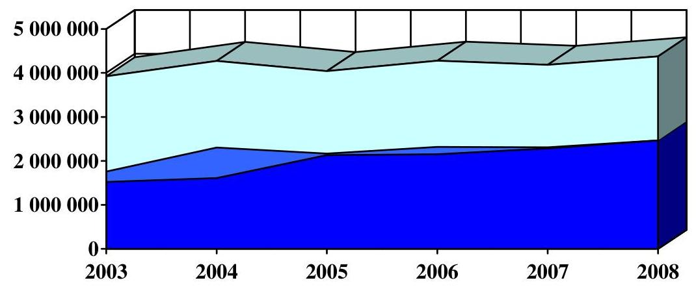

# ktgvet. támogatás céltámogatás $\square$ tev. árbevétele 

A 2008. évi összes költség és ráfordítás ( 4456 M Ft ) a tervet ( 4440 M Ft ) 0,4\%kal, a 2007. évi tényadatokat ( 4197 M Ft ) 6\%-kal meghaladta. A bázishoz képest az anyagjellegú ráfordítások ( 1390 M Ft ) 11\%-kal, a személyi jellegú ráfordítások ( 2728 M Ft ) 7\%-kal magasabbak. A Társaság nem csökkentette az anyagjellegú - és a személyi jellegú ráfordításokat, így gazdálkodásának ezen a területén a költségtakarékosság nem érvényesült. Az anyag- és a személyi jellegű ráfordítások együttes összegéből a személyi jellegű ráfordítások 66\%-ot, az anyagjellegú ráfordítások $34 \%$-ot tettek ki.

Az MTI Zrt. 2008. évi üzleti tevékenységének eredménye (összes bevétel 4442 M Ft / összes költség és ráfordítás 4456 M Ft egyenlege) -13,9 M Ft (2007-ben 6,9 M Ft), azaz veszteséges volt. A rendkívüli eredmény mindkét évben negatív volt, így a pénzügyi műveletek beszámítását követően lett a mérleg szerinti eredmény 2008-ban 6,6 M Ft. (2007-ben utóbbi 4,9 M Ft volt.)

A Társaság 2008. december 31-ei ingatlanállományának ${ }^{7}$ könyvszerinti értéke 2439 M Ft. Az MTI Zrt. egységes középtávú ingatlangazdálkodási terve, in-

[^0]
[^0]:    ${ }^{7}$ Az épületek területe összesen 20,4 ezer $\mathrm{m}^{2}$.

---

gatlangazdálkodási szabályzata és a nem használt ingatlanok értékesítésére vonatkozó javaslat 2009. februárban készült el. A 2008. évi üzleti terv munkanemenkénti bontásban - részletes költségterv nélkül - tartalmazza az ingatlanüzemeltetéssel összefüggő beruházási és fejlesztési feladatokat, aminek tervezett összege 82 M Ft volt. 2008-ban a teljesítés $82,6 \mathrm{M} \mathrm{Ft}$, ami $5 \%$-kal haladta meg a bázisévit. A tárgyévben végrehajtott ingatlan beruházások, fejlesztések részben a Társaság használatában lévő, részben a bérbe adandó területek építészeti átalakításait, felújítási munkáit jelentették. Az MTI Zrt. karbantartásra 2008-ban 42 M Ft -ot költött, $22 \%$-kal többet a bázisévinél. A Társaság a múködéshez nem szükséges területeket ( $4227 \mathrm{~m}^{2}$ ) bérbeadás útján hasznosította, ez a saját tulajdonú területek több mint 20\%-át jelentette. 2008-ban a helyiségek bérbeadásából származó bevétel 86 M Ft , ami a közüzemi és egyéb rezsiköltségek továbbszámlázását követően összesen 203 M Ft - a 2007. évihez képest 6\%kal több - volt.

Az MTI Zrt. 2008-ban a szervezeti struktúra átalakításával párhuzamosan nem hozott létszámcsökkentési intézkedéseket, létszámgazdálkodása nem módosult. A Társaság munkakörelemzést végzett, rögzítette a humánerőforrásgazdálkodás elveit, azonban a szervezet, létszám, munkakör összhangját magába foglaló humánerőforrás-gazdálkodás megújítása nem valósult meg. A piaci viszonyok változása, a saját bevételek stagnálása, valamint egyes munkakörök megszűnése kényszert teremt a humánerőforrás-gazdálkodás szabályainak kidolgozására, a Társaság feladataihoz mért szervezet nagyságának kialakítására. A humánpolitika területén olyan tartalékokkal rendelkezik az MTI Zrt., aminek kihasználása mind a Társaságnak, mind az állami költségvetésnek gazdálkodási érdeke.

A Társaságnál alkalmazott díjszabás mértéke - a hírszolgáltatási kör szűkítésekor alkalmazott csomagbontást ${ }^{8}$ kivéve - szabályozott. A díjszabás, illetve az egyes termékek és szolgáltatások árkialakítása a tényleges önköltség ismeretében változott, így 2008-ban kimutatható a kapcsolat az árképzés és az önköltség között.

Az ÁSZ 2008-ban készített jelentésében az Országgyűlésnek, a Kormánynak, a TTT és az MTI Zrt. elnökének fogalmazott meg ajánlásokat. Az Országgyúlésnek, a Kormánynak tett, jogalkotással és szabályozással kapcsolatos ÁSZ javaslatok - a korábbi években is megfogalmazott megállapítások - lényegében nem hasznosultak. Az állami támogatás folyósításának, felhasználása átláthatósági - EU szabályokkal összehangolt - szabályozására 2008-ban sem került sor. A Kormány válaszában az ÁSZ elnökét arról tájékoztatta, hogy az Alapító részéről az ÁSZ által megfogalmazott javaslatnak megfelelő áttekintési és öszszehangolási javaslat nem érkezett a Kormány felé. A minősített többség szükségességére való tekintettel e megkeresés hiányában nem történt a Kormány részéről kezdeményezés.

A Kormány, az MTI Zrt. jegyzett tőkéje összegének, az állami részesedésnek a nyilvántartásával kapcsolatban tett ÁSZ javaslatra adott válaszában egyetér-

[^0]
[^0]:    ${ }^{8}$ Teljes hírszolgáltatásból csak egyes hírtípusokat tartalmazó hírcsomagokra vonatkozó értékesítések.

---

tett az állami vagyonnyilvántartás teljessé tételével, azonban azt a tájékoztatást adta, hogy - a jogi helyzet tisztázatlansága és a megfelelő gyakorlat hiánya miatt - nem történt előrelépés.

Az MTI Zrt. elnöke részére 2008-ban az ÁSZ négy javaslatot fogalmazott meg, amelyek közül kettő a korábbi évekből megismételt javaslat volt. Ezek az SZMSZ-szel, a humánerőforrás-gazdálkodással, az ingatlangazdálkodás szabályozásával, tervezésével összefüggésben fogalmazódtak meg. A megismételt ÁSZ javaslatok hasznosítására, a vonatkozó intézkedési tervpontok végrehajtására a megadott határidőre nem került sor, azonban 2009 februárjában az ingatlangazdálkodási szabályzat, az egységes középtávú ingatlangazdálkodási terv és a nem használt ingatlanok értékesítésére vonatkozó javaslat elkészült, és az SZMSZ, az elnöki, alelnöki utasítások és a munkaköri leírások közötti öszszehangolási hiányosság - egyes kivételeket leszámítva - megszűnt.

A helyszíni ellenőrzés megállapításainak hasznosítására - a korábbi évek megállapításainak határozott megerősítésével - javasoljuk:

# az Országgyülésnek 

1. tekintse át és módosítsa a 68/2002. (X. 4.) OGY határozatban megfogalmazott jogalkotási feladatnak megfelelően a nemzeti hírügynökségről szóló 1996. évi CXXVII. törvényt és az MTI Zrt. Alapító Okiratát a teljes körűen összehangolt szabályozás kialakítása, a közszolgálati feladatok és azok ellátásához szükséges állami támogatás egyértelmű és pontos meghatározása, az EU szabályok betartása, a jelenlegi alapítói és részvényesi joggyakorlás és ellenőrzés felülvizsgálata és hatékonyabbá tétele érdekében;
2. gondoskodjon az MTI Zrt. működését befolyásoló középtávú stratégiai, illetve éves tervre vonatkozó tulajdonosi döntés és kontroll megteremtéséről; hozzon határozatot a bemutatott éves tervekről.

## a Kormánynak

1. kezdeményezze a 68/2002. (X. 4.) OGY határozatban az MTI Zrt. támogatásával kapcsolatban megfogalmazott átláthatósági követelmény érvényre juttatása érdekében szükséges jogalkotási és egyéb intézkedéseket, különös figyelemmel az Európai Unió közösségi előírásaira, illetve ezeknek a betartására; az Nht. 2. § (1) bekezdése h) pontjában megjelölt - a választási időszak feladataira vonatkozó - külön törvény megalkotását;
2. készítse elő a törvények módosítását, amelyek ahhoz szükségesek, hogy az MTI Zrt. jegyzett tőkéje állami részesedésként nyilvántartásba kerüljön.

## a TTT elnökének

1. készítsen javaslatot az MTI Zrt. Alapító Okiratának - a nemzeti hírügynökségi törvénnyel összehangolt - módosítására;

---

2. igényelje az MTI Zrt. elnökénél a „Deloitte" szakértői modell hasznosítását az állami támogatások meghatározásánál, felhasználásánál és a díjszabásnál.

# az FB elnökének 

kísérje figyelemmel az MTI Zrt. eredményes és hatékony gazdálkodásával szemben megfogalmazott elvárásainak teljesítését.

## az MTI Zrt. elnökének

1. biztosítsa a közbeszerzésekről szóló törvény rendelkezéseinek teljes körű érvényesítését, vizsgálja felül a személyes adatok védelméről és a közérdekú adatok nyilvánosságáról szóló törvény rendelkezéseinek teljes körú érvényesítését;
2. gondoskodjon az SZMSZ-ben megfogalmazott - a Társaság múködését általános szinten szabályozó - rendelkezések betartásáról, biztosítsa a belső információs rendszer ügyviteli alkalmazásai közötti egységes adatforgalmat; gondoskodjon a vezetői ellenőrzés hatékony múködéséről;
3. intézkedjen a humánerőforrás-gazdálkodás kritériumrendszerének és szabályainak megalkotásáról, a megalapozott létszámterv elkészítéséről, a besorolási és javadalmazási rendszer belső szabályozásának kidolgozásáról, a teljesítmények méréséről.

---

# II. RÉSZLETES MEGÁLLAPÍTÁSOK 

## 1. A TÁRSASÁG MÚKÖDÉSÉNEK SZABÁLYOZOTTSÁGA, AZ ÜZLETI TERVEK MEGALAPOZOTTSÁGA

### 1.1. A Társaság múködésének, közzétételi kötelezettségének szabályozása

Az MTI Zrt. múködését alapvetően meghatározó nemzeti hírügynökségről szóló 1996. évi CXXVII. törvény és a Társaság Alapító Okirata (AO) 2008-ban nem változott, módosításukat az ÁSZ évek óta szorgalmazza, ${ }^{9}$ az MTI Zrt. megalakulása óta minden évben kifogásolta a múködtetés feladat- és hatásköri, illetve felelősségi szabályozását, a közszolgálati tevékenységek meghatározásának, az ellátásukhoz szükséges állami támogatás mértékének, felhasználása átláthatósági szabályozásának, az ellenőrzés garanciáinak hiányát.

A TTT konszenzusos javaslatot dolgozott ki az Nht. módosítására, melyet 2008. április 30-án eljuttatott a Magyar Országgyűlés Elnökének. Az MTI Zrt. Alapító Okirata módosításának előkészítése - az Nht. 21. § (1) bek. g) pontja és a Társaság AO 8.1/ b) pontja szerint - a TTT feladata és jogköre. A TTT 2008-ban az AO módosítását nem kezdeményezte.

Megállapítottuk, hogy az MTI Zrt. múködtetésére 1996-97-ben kialakított tulajdonosi megoldás nem ösztönöz a nyereséges gazdálkodásra, de a veszteséges gazdálkodásnak sincs tulajdonosi döntéssel meghozott következménye. Az Országgyűlés, az MTI Zrt. alapítója, részvényesi és közgyűlési jogainak gyakorlója a Társaság éves beszámolója keretében megismeri a Részvénytársaság éves gazdálkodási tervét (AO 5.7. pont), de külön határozatban nem dönt annak elfogadásáról.

Az OGY alapítói, részvényesi és közgyűlési jogait 2008-ban - nem teljes körűen - gyakorolta. A 79/2008. (VI. 13.) OGY határozattal tudomásul vette az MTI Zrt. 2007. évi tevékenységéről szóló „Éves jelentés 2007." című beszámolóját és jóváhagyta az abban foglalt mérleg- és eredmény kimutatást, de nem rendelkezett a 2007. évi 4,9 M Ft mérleg szerinti eredmény elszámolásáról, és az éves jelentés részeként az OGY megismerte a Társaság 2008. évi gazdálkodási/üzleti tervét, azonban külön határozatban annak elfogadásáról nem döntött.

Az Országgyűlés a 68/2002. (X. 4.) OGY határozat 4. pontjában - határidő és felelős megjelölése nélkül - jogalkotási feladatot fogalmazott meg a hírügynökségi törvény és a Társaság Alapító Okirata áttekintésére, a teljes körű összehangolt szabályozás kialakítására, a közszolgálati feladatok és azok ellátásához szükséges állami támogatás pontosabb meghatározására. Az OGY határo-

[^0]
[^0]:    ${ }^{9}$ Jelentés a Magyar Távirati Iroda Zrt. 2004., 2005., 2006., 2007. évi gazdálkodásának ellenőrzéséről (0520), (0610), (0709), (0804).

---

zatban rögzített célok teljesítése nem valósult meg, így a hatékonyabb tulajdonosi joggyakorlás, múködtetés és ellenőrzés 2008-ban sem érvényesült.

Az MTI Zrt. (közfeladatot ellátó egyéb szerv) a személyes adatok védelméről és a közérdekű adatok nyilvánosságáról szóló 1992. évi LXIII. törvény 19. § (2) bekezdésében meghatározott, a Társaságra vonatkozó és tevékenységével kapcsolatos legfontosabb adatokat az elektronikus információszabadságról szóló 2005. évi XC. törvény 6. § (1) bekezdése és melléklete szerint 2008. július 31-étől - nem teljes körűen - közzéteszi.

A Társaság, a honlapján hozzáférhető általános közzétételi listán nem teszi közzé pl. a szervezeti és múködési szabályzat hatályos és teljes szövegét; a közfeladat ellátás teljesítményére, kapacitásának jellemzésére, hatékonyságának mérésére szolgáló mutatókat.

A Társaság az elektronikus információszabadságról szóló 2005. évi XC törvény 4. § (3) bekezdésében és e törvény mellékletében foglaltakkal összhangban elkészítette a közzétételi kötelezettségére vonatkozó 2008. július 1-jétől hatályos belső szabályzatot, amelynek 2. pontja - a törvényben foglaltakkal egyezően előírja az egységes közadatkereső rendszerhez való csatlakozást és az előírt adatszolgáltatás folyamatos biztosítását.

A Társaság a szervezetére, a tevékenységére, a múködésére vonatkozó adatokat 2009. január 12-étől a Neumann János Digitális Könyvtár és Multimédia Központ Kht. közadattárán keresztül hozzáférhetővé teszi.

A társasági múködés szabályozása (a különböző törvényeken így pl. a Gt., az Sztv., az Mt.) az Nht.-n, az AO-n kívül alapvetően a Szervezeti és Múködési Szabályzatra (SZMSZ), elnöki és alelnöki utasításokra, szakmai kézikönyvekre épül. Ezek előírják a Társaság tevékenységével, gazdálkodásával kapcsolatos magasabb szintű jogszabályok alkalmazásának végrehajtási rendjét is.

2008-ban 8 elnöki, egy gazdasági alelnöki, 2 szakmai alelnöki utasítást adtak ki. Az elnöki utasítások közül egy az ÁSZ jelentése alapján foganatosítandó intézkedések kiadását, 4 meglévő szabályzat felülvizsgálatát és módosítását (SZMSZ, fontos és bizalmas munkakörök, reprezentáció, beosztások megnevezése), egy elnöki utasítás hatályon kívül helyezését jelentette.

2007-ben az elnöki utasítással kiadott szabályozók közel 80\%-ának (kivéve pl. az SZMSZ mellékletét képező az „MTI cégjegyzési, kötelezettségvállalási és utalványozási rendjéről" szóló szabályzat, a 17/2003. sz. elnöki utasítás az MTI Felsővezetői Jelentési Rendszeréről) felülvizsgálata megvalósult, a kivételek között említettek felülvizsgálata azonban 2008-ban sem teljesült.

A 2008-ban kiadott 1/2008. és 2/2008. sz. szakmai alelnöki utasítások a hírszerkesztőségek átszervezéséről, valamint az MTI Zrt. új szerkesztőségi kézikönyvének (2008. június 16-ától hatályos) kiadásáról döntöttek. A szakmai alelnök az SZMSZ 2008. április 26-ai módosításával összhangban 2008. május 1jei hatállyal adta ki a hírszerkesztőségek átszervezésére, a szerkesztőségi munka irányításának központosítására (Hírszerkesztési Központ) vonatkozó

---

1/2008. sz. utasítást, ami előírta az érintett munkavállalók 2008. május 1-jétől hatályos munkaköri katalógus szerinti besorolását.

A Társaság elnöke a 2007. július 15-étől hatályos 8/2007. sz. elnöki utasítással intézkedett a belső szabályzatok kidolgozásának tartalmi és formai követelményeiről. Az utasítás 1. sz. melléklete kiadási jogosultságok szerint tartalmazza az MTI Zrt. kötelezően kidolgozandó szabályzóinak jegyzékét. 2008-ban a Társaság Elnöke felülvizsgálta a 2007. szeptember 15-étől hatályos Számítástechnikai Védelmi Szabályzat gazdasági alelnöki jóváhagyását - a szabályzatot aláírásával látta el-, azonban nem történt meg a szabályzat nyilvántartásba vétele, valamint elmaradt a 2001-től hatályos Számítástechnikai Védelmi Szabályzat hatályon kívül helyezése, ami ellentmond a 8/2007. sz. elnöki utasításban foglaltaknak.

2008-ban az SZMSZ kétszer módosult, a 2008. január 1-jétől hatályos módosítás a stratégiai alelnök (új alelnöki beosztás) feladat- és hatáskörének szabályozására terjed ki. A TTT 7/2008. (IV. 24.) sz. határozatával elfogadott 2008. április 26-ától hatályos SZMSZ és szervezeti módosítás célja a szerkesztőségi tevékenység és a hierarchikus viszonyok átláthatóbbá tétele, a párhuzamosságok kiküszöbölése. Az SZMSZ módosítás szerint a Hírszolgálati Ügyelet helyett a Hírszerkesztési Központ lett a szerkesztési munka irányításának szervezeti egysége.

A szakmai munka operatív irányítója a hírigazgató helyett a főszerkesztő lett, új munkakörként jött létre a főszerkesztő-helyettesi munkakör, a főszerkesztőségekből szerkesztőségek lettek (a megnevezés változott), megszűntek a főszerkesztői munkakörök, valamennyi szerkesztőség élén szerkesztőség vezetők állnak.

A Társaság elnöke az SZMSZ módosításának indokait tájékoztató formájában a TTT elé terjesztette, majd 2008. október 28-án az MTI újságírói állományának várható változásairól az FB felé írásbeli tájékoztatást adott. A tájékoztatók a változtatás célját - pl. a piaci igényekhez gyorsan, rugalmasan alkalmazkodó szervezet létrehozása - általánosságban rögzítették. A szervezet átalakítást azonban számítások nem támasztották alá, ezzel nem vált ismertté a változtatás költségkihatása, valamint a változás várható eredménye.

A Társaság 2008-2012. évi stratégiai tervének részét képező humánstratégiája célként emeli ki „a megfelelő számú munkaerő a megfelelő összetételben és felkészültségben" történő rendelkezésre állását, és - középtávú, elemzésen alapuló létszám- és bérgazdálkodási terv nélkül - rögzíti, hogy a bevételekhez alkalmazkodva folytatni kell a takarékos költség és bérgazdálkodást.

A Társaság 2008. április 1-jei hatállyal - a Sajtószakszervezettel történt bérmegállapodás alapján - 6\%-os emelést hajtott végre a munkavállalók személyi alapbérében, ami hosszabb távú kihatással van a személyi juttatások nagyságrendjére.

A szervezeti rendszer 2008. évi módosítása azonban nem járt együtt a létszám csökkentésével, mert az általános szakmai alelnökhöz tartozó szervezeti egységek összlétszáma a 2007. december 31-ei 253 főhöz képest 2008. december 31én nem változott, a Társaság által kimutatott összlétszám 368 főről 370 főre változott.

---

A Társaság 2008. február 4-én jóváhagyott 2008. évi létszámterve 369 fő engedélyezett létszámot tartalmaz, amelynek kötelező felülvizsgálatát és korrekcióját - a hírszerkesztőségek szervezeti átalakítását, valamint a 2008-2012. évi stratégiai terv elkészültét követően - a létszámterv 2008. május 30., illetve június 30 -ai határidőben határozta meg. A felülvizsgálat és a módosítás nem valósult meg. A Társaság főre és nem álláshelyre tervez, ami nincs összhangban a KSH által előírt negyedéves adatszolgáltatási kötelezettségben (üres álláshely kimutatás) foglaltakkal. Ezen felül a Társaság létszámtervében engedélyezett létszámhoz képest a 2008. december 31-én összesen 370 fő szervezeti egység szinten kimutatott létszámból 6 fő esetben a létszám kétszer került számításba vételre, mert az egyes szervezeti egységek létszámát - ezzel az összlétszámot - olyan munkavállaló is növelte, aki határozott idejű tartós helyettesítést látott el.
2008. április 26-ától - a külső ügyvédi irodák feladatellátásának hatékonyságára történő hivatkozással - megszűnt az önálló, az SZMSZ-en nem következetesen átvezetett jogtanácsosi munkakör. 2008-ban - a felelősségi szabályok miatt - nem a belső előírásokkal összhangban teljesült a szerződéskötést megelőző ellenőrzési feladatok ellátása (pl. ICG INFORA Consulting Group Kft. és az MTI Zrt. között 2008. február 6-án létrejött szerződés), mert nem teljesült az MTI cégjegyzési, kötelezettségvállalási és utalványozási rend szabályozásában foglalt jogi ellenjegyzési kötelezettség.

Az SZMSZ mellékletét képező MTI cégjegyzési, kötelezettségvállalási és utalványozási rend szabályozásának ellenjegyzésről szóló III/4. pontja kimondja, hogy „az intézmény szempontjából kiemelten fontos legalább 5 M Ft-ot meghaladó, vagy öszszetett tánykörü szerzödések, éves szolgáltatási-, szállitási- és keretszerződések, külföldi hirügynökségekkel és személyekkel kötendő szerződések, megállapodások...megkötése előtt a jogi ellenjegyzést kötelezően be kell szerezni."

A 2008. április 26-ától hatályos SZMSZ-ben a Társaság rögzítette, hogy az MTIben a hírkiadás megszakítás nélküli rendben folyik, a hírkiadás folyamatosságát a szervezeti egységek megfelelő üzemelési rendje és a célszerű munkaidőbeosztás biztosítja. A Társaság megállapította, hogy az ügyeletnek tekintett időben is hírkészítés és hírkiadás zajlik informatikai támogatással. Ezzel párhuzamosan az SZMSZ-ből törlésre került az ügyeleti rend szabályozása, mert nem volt összhangban a Munka Törvénykönyvében foglaltakkal.

A szabályozás módosulásával (munkaidő szervezéssel) azonban jelentősen nem csökkent a havi ügyeleti óradíj összege, mert ügyeleti óradíj címén 2008. januártól júniusig 56 M Ft-ot, 2008. júliustól decemberig összesen 54 M Ft-ot számfejtettek, ami éves szinten átlag havi $9,2 \mathrm{M} F \mathrm{t}$ volt.

A Társaság 2008. III. negyedévig 130 munkakörre - a teljes szervezetre kiterjedően - munkakör-elemzést végzett, a párhuzamos munkavégzések felmérése és megszűntetése, a szervezeti hatékonyság növelése érdekében. A feldolgozott információk elemzése előreláthatólag 2009. I. negyedévben befejeződik.

Az SZMSZ és a szervezet múködése néhány ponton - pl. ügyeleti rend szabályozásának törlése, jogi ellenjegyzési kötelezettség - nincs összhangban, ugyanakkor megállapítható, hogy a Társaság gazdálkodásának 2007. évi ellenőrzéséről készült ÁSZ jelentésben jelzett - az SZMSZ, az elnöki, alelnöki utasítások

---

és a munkaköri leírások közötti - összehangolási hiányosság ${ }^{10}$ - egyes kivételeket leszámítva - nyolc hónapos intézkedési késlekedést követően 2009. februárban megszűnt.

A Társaság szervezeti változásakor létrehozott Hírszerkesztési Központ 20 dolgozója közül 9 nem rendelkezik a feladatait, jogosultságait meghatározó munkaköri leírással, és a 2008 előtt megkötött munkaszerződések az igazgatók esetében munkaköri leírásra hivatkoznak, amelyek 2008-ban sem voltak. Az SZMSZ mellékletét képező MTI cégjegyzési, kötelezettségvállalási és utalványozási rend szabályzatának V/2. pontja kimondja, hogy az MTI-nél az érvényesítési és utalványozási feladatok ellátását a munkaköri leírásokban kell rögzíteni, ami nem e rendelkezésnek megfelelően, de ellenőrizhető formában - külön bizonylaton - történt. Az aláírási jogosultság bizonylatai és a szabályzatban foglalt jogosultsági körök meghatározása és engedélyezése azonban nincsenek összhangban, felülvizsgálatuk (pl. munkakörváltozás miatt) nem történt meg, a folyamatos - évenkénti - karbantartás nem valósult meg.

A Munka Törvénykönyvéről szóló 1992. évi XXII. törvény a munkáltatónak (MTI) lehetőséget ad személyi alapbér megállapítására, azonban a 142/A. § (1) bekezdése azt is kimondja, hogy az egyenlő, illetve egyenlő értékűként elismert munka díjazásának meghatározása során az egyenlő bánásmód követelményét meg kell tartani. A Társaság munkavállalóinak - Mt. figyelembevételével szabályozható - jogairól és kötelezettségeiről Kollektív Szerződés rendelkezik, ami nem határozza meg az egyes besorolási kategóriákat és a kategóriákon belül alkalmazható bérhatárokat, nem rendelkezik a 2008-ban létrejött határozott idejű vezetői megbízások bérkiegészítésének - vezetői pótléknak nevezett juttatás - mértékéről. A Társaságnál nincs kidolgozott besorolási- és javadalmazási rendszer, a személyi alapbér- és a bérpótlék megállapításának rendje, valamint azok összege nem ellenőrizhető, ami ellentmond a Munka Törvénykönyvében foglaltaknak.

Az SZMSZ MTI múködéséről szóló V. fejezetének 5. pontja meghatározza, hogy a Társaság munkaszervezetében mely beosztások minősülnek vezetői munkakörnek. A vezető I-től vezető IV-ig vizsgált kategóriába összesen 32 fő, a Társaság teljes létszámának 8,6\%-a tartozik. A vezetői alapbér szórás - főre és hónapra - a IIes kategóriában 700 és 990 E Ft között, a III-as kategóriában 495 és 790 E Ft között, a IV-es kategóriában 315 és 603 E Ft között mozog.

A Társaság az egész szervezetre kiterjedően nem rendelkezik teljesítményméré-si- és értékelési rendszerrel, annak kritériumait nem határozta meg, ami nem ösztönzi a hatékony munkavégzést, és nem teszi lehetővé a teljesítményarányos béreltérítést.

# 1.2. A közfeladatok ellátását biztosító társasági szabályozás 

A Társaság 2008-ban a közfeladatok ellátásához alapvetően kapcsolható szabályzatok közül a közbeszerzések rendjének szabályzatát (2/2008. sz. elnöki

[^0]
[^0]:    ${ }^{10}$ Jelentés a Magyar Távirati Iroda Zrt. 2007. évi gazdálkodásának ellenőrzéséről (0804)

---

utasítás), valamint a közszolgálati hír- és fotószolgáltatáshoz kapcsolódó szerkesztőségi kézikönyveket (2/2008. sz. általános, szakmai alelnöki utasítás) felülvizsgálta és módosította, azonban nem dolgozta ki teljes körűen a személyes adatok védelméhez kapcsolódó előírásokat, és nem szabályozta a közszolgálati feladatokhoz kapcsolódó állami támogatás igénylésének és felhasználásának rendjét.

A Társaság, az Nht. 2. § (1) j) bekezdésében meghatározott közfeladatát képező archiválás szabályait - a közgyűjteménynek nem minősülő dokumentumok vonatkozásában - az Nht. 11. §-ában foglaltak szerint 2005. október 6-án ORTT egyetértéssel léptette hatályba.

Az MTI Zrt. a 2007. május 15-étől hatályos Szakmai és Közszolgálati Tájékoztatási Szabályzatát (SZKTSZ) 2008-ban külső szakértővel felülvizsgáltatta, azonban azt nem módosította. A szabályzat, a módosítás hiányában nem rendelkezik a személyes adatok védelméről, így teljes körűen nem érvényesülnek az Avtv.-ben foglalt előírások.

Az állami költségvetésből közszolgálati feladatokra kapott múködési támogatás igénylésével és felhasználásával kapcsolatos szabályzat megalkotását az ÁSZ évek óta szorgalmazza. ${ }^{11}$ Az MTI Zrt. - az ÁSZ javaslatát is figyelembe véve - szakértői céget bízott meg a működési támogatással kapcsolatos szabályok kidolgozására, ezzel kezdeményező szerepet vállalt a nemzeti hírügynökségi törvény módosításának előkészítésében. A megbízás eredményeként a szakértő elkészítette a nemzeti hírügynökségi tevékenység ellátására vonatkozó közszolgálati szerződés tervezetét.

Az Nht. 30. § (1) bekezdésében és az MTI Zrt. Alapító Okiratának 10.3. pontjában megfogalmazott közszolgálati feladatok ellátásához szükséges mértékű országgyűlési céltámogatásban való részesítés meghatározás nem ad eligazítást a tekintetben, hogy mit kell szükséges mértéknek (kritériumrendszer, a számítás módja, a támogatás felhasználásának ellenőrizhetősége, az uniós szabályok betartása) tekinteni. Ennek hiánya bírság kiszabását vonhatja maga után, ami hátrányosan érintheti az állami költségvetést.

A TTT támogatja az állami finanszírozás közszolgálati szerződésen keresztül átlátható módon és az EU szabályoknak megfelelően - történő megvalósítását. A TTT azon az állásponton van, hogy a közszolgálati szerződésre történő hivatkozás az Nht.-ban külön pontként jelenjen meg, az Nht. tervezett módosítására konszenzusos javaslatot dolgozott ki, amelyet 2008. április 20-án eljuttatott a Magyar Országgyúlés Elnökének.

A Kulturális és sajtóbizottság 2008. május 20-ai ülésén megvitatta a TTT nemzeti hírügynökségi törvényt módosító javaslatát, és határozatban döntött a javaslat őszi bizottsági ülésen történő tárgyalásáról. 2008-ban azonban a Bizottság nem tűzte napirendjére az Nht. módosítását, az Országgyúlés felé nem készült előterjesztés, így az Nht. 2008-ban sem módosult. Az Alapító és az MTI Zrt. között a közszolgálati szerződés 2008-ban nem jött létre.

[^0]
[^0]:    ${ }^{11}$ Jelentés a Magyar Távirati Iroda Zrt. 2004. 2005. 2006. 2007. évi gazdálkodásának ellenőrzéséről (0520), (0610), (0709), (0804).

---

A Társaság, az Alapító Okirat 5.7. pontja szerint az évenkénti beszámolás keretében - a tárgyévet követő év áprilisában - készíti gazdálkodási (üzleti) tervét, amelyet bemutat az Országgyúlésnek. E rendelkezéssel az adott évi gazdálkodási terv készítése közel kilenc hónapos eltolódással követi az adott évi állami támogatás tervezését. A tervezés összehangolatlansága a költségvetési kapcsolatot rendező közszolgálati szerződés megkötésével kiküszöbölhető.

A Társaság támogatási igényét múködési támogatási kérelemben fogalmazza meg. A Pénzügyminisztériumnak küldött - a PM tervezési körirata szerint készített - 2008. évi múködési támogatási igényben a Társaság nem támaszkodott a tárgykörben elkészült szakértői anyagokra, a közszolgálati feladatok ellátásához szükséges költségvetési támogatás mértékének meghatározása nem a „Deloitte" szakértői modell segítségével történő számításon - a közszolgálati tevékenységekkel összefüggő bevételek és kiadások kimutatásán - alapult. A PM tervezési körirata alapján összeállított céltámogatás igénylés és adatszolgáltatás önmagában nem tesz eleget az Nht. 30. § (1) bekezdésében foglaltaknak ${ }^{12}$, ahhoz a közszolgálati feladatokra igényelhető támogatásszámítással történő alátámasztása szükséges.

Az MTI Zrt. Alapító Okirata 10.3. pontja alapján a 2008. évi támogatási kérelmet az FB és a könyvvizsgáló is véleményezte, a Társaság igényének beterjesztését támogatták.

A Társaság 2008-ra - közszolgálati feladatokra, a határon túli magyar sajtó hírellátására, az olimpiai közvetítések többletfeladataira - 2479 M Ft-ot igényelt, amit a 2008. évi költségvetési törvény ( 2475 M Ft összegben) biztosított az MTI Zrt.-nek. A Társaság 2008-ban a 2167/2008. (XII. 4.) Korm. határozattal a 2008. évi központi költségvetés általános tartalékának előirányzatából (2009. június 30 -ai elszámolási kötelezettséggel) 100 M Ft további - digitális archívummal kapcsolatos - támogatást kapott.

Az MTI Zrt. a 2009. év gazdálkodás terv adatait a 2009. évi céltámogatás igénylés PM felé továbbítását követően dolgozta fel a „Deloitte" modellben, ami nem alapozta meg a céltámogatás igénylést, azonban utólag ellenőrizhetővé tette azt. Így egyes kockázati tényezők mellett (projekt termék kategória definiálásának, az egyes termékekhez/szolgáltatásokhoz kapcsolódó munkaidő ráfordítás igazolásának hiánya) utólag kimutathatóvá vált a közszolgálati feladatokhoz kapcsolódó állami támogatás mértéke. A Társaság 2009. évi állami támogatás igénylése ( 2813 M Ft ) és a közszolgálati feladatok modell szerint számított támogatási mértéke ( 2877 M Ft ) 64 M Ft -tal eltért egymástól, ami $28 \%$-ban a modellben - nem az előzetes tervezéssel összhangban - alkalmazott 18 M Ft-tal magasabb költségből és ráfordításból ered.

Az MTI Zrt. 2009. évi költségvetési céltámogatás igénylését az FB utólagosan véleményezte, és a 24/2008. (IX. 2.) sz. határozatával - a számszaki adatok módosítása nélkül - támogatta a Pénzügyminisztérium felé továbbított 2813 M Ft támogatási igényt.

[^0]
[^0]:    ${ }^{12}$ Az Országgyúlés a központi költségvetés „Országgyúlés" fejezetében a részvénytársaságot a 2. §-ban rögzített közszolgálati feladatok ellátásához szükséges mértékű céltámogatásban részesíti.

---

# 1.3. A közbeszerzés rendjének szabályozása, az előírások érvényesülése 

Az MTI Zrt. Alapító Okirata X. fejezetének 10.5. pontja alapján a Társaság beszerzéseire a közbeszerzésekről szóló 2003. évi CXXIX. törvény (Kbt.) előírásai vonatkoznak.

Az FB, a Társaság 2008. évi beszámoltatásával (a közbeszerzési eljárásokról, valamint az ingatlan és informatikai területeken végrehajtott beruházásokról készült írásos tájékoztatók) megismerte a Társaság közbeszerzési gyakorlatát. A 35/2008. (XI. 18.) sz. határozattal a „2008. évi beruházások helyzetéről - ingatlan és informatikai területeken - készült írásos tájékoztató tudomásulvételéről", a 38/2008. (XII. 16.) sz. határozattal a „2008. évi közbeszerzési eljárásokról készült írásos tájékoztató tudomásulvételéről" döntött.

Az MTI Zrt.-nél nem érvényesültek maradéktalanul a közbeszerzésekről szóló törvény rendelkezései. A Társaság nem készített éves összesített közbeszerzési tervet ezzel megsértette a Kbt. 5. § (1) bekezdésében foglaltakat, az ICG Infora Consulting Group Kft.-vel megkötött szerződés kapcsán megsértette a Kbt. 40. §ában foglalt egybeszámítási szabályokat, valamint a Comfort Consulting Kft.vel az ajánlati felhívásban és az ajánlati dokumentációban előírt feltételektől eltérő tartalmú szerződés megkötése miatt megsértette a Kbt. 99. § (1) bekezdésében foglaltakat.

Az Állami Számvevőszék a Kbt. 327. §-ának (1) bekezdésében meghatározott jogorvoslat-kezdeményező jogkörét a Kbt. 323. §-ának (2) bekezdésében előírt szűkös jogvesztő határidő letelte miatt nem gyakorolhatta.

A Társaság, a közbeszerzési eljárások rendjét is szabályozó beszerzési szabályzattal rendelkezik. A 16/2003-as elnöki utasítással kiadott 2008. április 30-ig hatályos szabályzat hatályon kívül helyezésével 2008. május 1-jétől a 2/2008-as elnöki utasítással új szabályzat lépett életbe. A szabályzat 2008. január 1-jével történő módosítása nem valósult meg, így a 2008. évi eljárásrend nem volt egységes.

Változtak a közbeszerzési tanácsadó kötelezettségei, változott a szervezeti egységek beszerzési terveinek leadási határideje, változott a közbeszerzési eljárás indításáról szóló kérelem kötelező adattartalma, változott az értékhatár alatti beszerzésekre vonatkozó szabály.

A Kbt. 6. §-a meghatározza a közbeszerzési szabályzat kötelező tartalmát. A rendelkezés előírja, hogy a közbeszerzési szabályzatban vagy legkésőbb az adott közbeszerzési eljárást megelőzően meg kell határozni többek között a közbeszerzési eljárások dokumentálásának, valamint az eljárások belső ellenőrzésének felelősségi rendjét, ami sem a beszerzési - ezen belül közbeszerzési szabályzatokban, sem az eljárásokat megelőzően nem valósult meg.

A Társaság a Kbt. 5. § (1) bekezdésének megfelelő éves összesített közbeszerzési tervet nem készített. E paragrafus továbbá kimondja, hogy a közbeszerzési terv nyilvános, az ajánlatkérőnek legalább öt évig meg kell azt őrizni. Az MTI Zrt. - FB 14/2008. (IV.29.) számú határozatával elfogadott - 2008. évi üzleti terve nem tartalmazza a beszerzési szabályzatban meghatározott beszerzési

---

tervet, és nem ad eligazítást a 2008-ban közbeszerzési eljárások alá vont árubeszerzésekről, építési beruházásokról, illetve szolgáltatás megrendelésekről.

A beszerzési szabályzat IV/1. pontja rögzíti, hogy a Társaság tervezett beszerzéseit, illetve közbeszerzési feladatait tartalmazó beszerzési terv az MTI éves gazdálkodási, üzleti tervének részét képezi. A szabályzat IV/3. pontja szerint az MTI szervezeti egységei a rendelkezésükre álló pénzügyi keret figyelembevételével, a szabályzat 2. számú mellékletének kitöltésével minden év január 10-ig állítják össze tárgyévi beszerzési terveiket. A szolgáltatott adatok alapján a Gazdasági Alelnök gondoskodik az MTI éves beszerzési tervének összeállításáról, és dönt a közbeszerzési eljárás lefolytatásával történő beszerzésekről.

A beszerzési szabályzatban foglaltak alapján a szervezeti egység vezetői és a gazdasági alelnök határozzák meg az árubeszerzések, építési beruházások és a szolgáltatás megrendelések becsült értékét, a közbeszerzési eljárás alá vonandó beszerzéseket. ${ }^{13}$ A becsült érték meghatározására irányadó szabályokat a Kbt. 36-40. §-a határozza meg. A Társaság a közbeszerzési eljárások indítása előtt kiszámította a beszerzés tárgyának becsült értékét, és figyelembe vette a határozatlan időre kötendő szerződésekre vonatkozó szabályokat.

A Társaság három esetben számított határozatlan idejű szolgáltatás igénybevételével. A Társaság 406 db klímagépének és kapcsolódó berendezéseinek javítási és karbantartási munkáira 4 évre 45 M Ft -, az épületeinek napi és ügyeleti takarítására, eseti nagytakarításra, valamint a „K" épület külső üvegfelületeinek alpintechnikás tisztítására 4 évre 114,5 M Ft-, a mobil távközlési szolgáltatás előfizetésére 4 évre 100 M Ft becsült értéket határozott meg.

A Társaság azonban nem vette teljes körűen figyelembe a Kbt. 40. § (2) és (4) bekezdésében foglaltakat (egybeszámítási kötelezettség), mert a becsült érték meghatározásának és az egybeszámítás teljesítésének hiányában - az alábbi részbekezdésben foglalt esetben - nem döntött közbeszerzési eljárás lefolytatásáról.

A Társaság 2008. február 6-án az ICG Infora Consulting Group Kft.-vel az MTI Zrt. stratégiakészítési folyamatának támogatására, a stratégia elkészítésére (2008. május 31-i teljesítéssel) szerződést kötött, amelyet nem előzött meg a feladat becsült értékének meghatározása, illetve ezt megelőzően beszerzési tervben való szerepeltetése. A Társaság 2008-ban a stratégiai tervkészítésen felül a szervezet hatékonyság elemzésére kötött szerződést, amely feladatok a 40. § (2) bekezdés c) pontjában meghatározott kritériumnak megfeleltek. (A becsült érték meghatározása során egybe kell számítani mindazon szolgáltatások értékét, amelyek felhasználása egymással közvetlenül összefügg.) A Társaság a szervezeti hatékonyságelemzés feladataira - egyszerű közbeszerzési eljárás lefolytatását követően - 6,1 M Ft összegben az ICG Infora Consulting Group Kft.-vel 2008. november 11-én szerződést kötött.

Csökkentette a Szervezetben végbemenő folyamatok átláthatóságát, hogy a Társaság nem tartja teljes körűen nyilván az 500 E Ft feletti szerződéseket (Nht. 27. § (2) bekezdésében foglalt kötelezettség), és nem rendelkezik az MTI cég-

[^0]
[^0]:    ${ }^{13}$ A 2008. évre vonatkozó közbeszerzési értékhatárok a Kbt. VI. fejezete alkalmazásában árubeszerzés esetén 30 M Ft , építési beruházás esetén 90 M Ft , szolgáltatás megrendelése esetén 25 M Ft , az egyszerű közbeszerzési eljárásban $8 \mathrm{M} \mathrm{Ft}, 15 \mathrm{M} \mathrm{Ft}$ és 8 M Ft .

---

jegyzési, kötelezettségvállalási és utalványozási rendjének III/6. pontjában meghatározott - a pénzügyi igazgatóságnak előírt - kötelezettségvállalás nyilvántartással.

A közbeszerzési eljárások megindítását és lefolytatását a beszerzésben érdekelt szervezeti egység vezetője kezdeményezi a beszerzési szabályzat 3. számú melléklete szerinti kérelemmel. A beszerzési tervben megtalálható tervezett közbeszerzési eljárások indításáról, valamint a nem tervezett - a gazdasági alelnök pénzügyi fedezet biztosításáról szóló döntését követő - közbeszerzési eljárások indításáról és a - bíráló - bizottság összetételéről az illetékes alelnök dönt. A 2008-ban indított közbeszerzési eljárások esetében 2 alkalommal nem töltöttek ki kérelmet, illetve a kérelmek fele (5) nem tartalmazta teljes körűen a tárgyi közbeszerzési eljárásra (tervezett vagy terven felüli) vonatkozó információkat, ami csökkentette a gazdálkodás átláthatóságát.

A „K" épület alumínium-üvegfala felújításának (becsült érték 16 M Ft) közbeszerzési eljárását megindító 2008. szeptember 15 -ai kérelem gazdasági alelnök részéről történő - a közbeszerzési eljárás megindítását engedélyező - aláírása megtörtént, azonban a közbeszerzési eljárás elhalasztásáról vagy a szerződés megkötéséről az FB 2008. december 16-ai ülésére a 2008. évben történt közbeszerzések tárgyában készített tájékoztató nem ad információt.

A közbeszerzési eljárás fajtájáról a beszerzési szabályzatok szerint - a Kbt. 36-41. §-ában foglaltak figyelembe vételével - a bíráló bizottság vezetője dönt. A Társaság 2008-ban jellemzően ( 7 esetben) a nemzeti értékhatárok alatti értékű, egyszerű közbeszerzési eljárást, míg 3 esetben - a becsült érték meghatározására figyelemmel - nyílt közbeszerzési eljárást indított. A közbeszerzés tárgya 3 esetben árubeszerzés, 7 esetben szolgáltatás megrendelés volt.

A Társaság a közbeszerzési eljárásainak lebonyolítására, illetve a közbeszerzésekkel kapcsolatos tanácsadásra 2005. október 19-ei hatállyal életbe lépett határozott idejű, majd 2008. október 19-étől hatályos vállalkozási szerződés alapján közbeszerzési tanácsadót foglalkoztat. Feladatát képezi többek között az ajánlati dokumentáció összeállítása, az ajánlatok minősítése, véleményezése és az elbírált pályázatokról összegzés készítése.

A Társaság 2008-ban lefolytatott közbeszerzési eljárásaihoz minden esetben kapcsolódik ajánlattételi dokumentáció, a részét képező ajánlattételi felhívással, műszaki leírással, útmutatóval, az ajánlatok elbírálására, - értékelésére, a szerződéskötésre vonatkozó részletes leírással.

Az ajánlattételi felhívások - a Kbt.-vel összhangban - tartalmazták a közbeszerzés tárgyának, fajtájának meghatározását; az ajánlattétel határidejét, az ajánlat benyújtásának helyszínét; az ajánlattevő személyes helyzetére, gazdasági és pénzügyi-, valamint műszaki és szakmai alkalmasságára vonatkozó követelményeket; az ajánlatok bírálati szempontjait; az ajánlattételi határidőt; rendelkeztek a hiánypótlás lehetőségéről; tárgyalás esetén lefolytatásának menetéről; a szerződéskötés várható időpontjáról. A dokumentációk rendelkeztek az ajánlat tartalmi elemeiről (ütemtervkészítés; teljesítés elismerés, ellenszolgáltatás feltételei); az ajánlathoz csatolandó dokumentumokról és nyilatkozatokról.

Az ajánlatok elbírálására létrehozott háromtagú bírálóbizottság mind a nyílt, mind az egyszerű közbeszerzési eljárások esetében az ajánlatok bontásá-

---

ról bontási jegyzőkönyvet, a benyújtott ajánlatok vizsgálatáról és értékeléséről jegyzőkönyvet, az ajánlatok elbírálásáról összegzést, a döntési hatáskörrel bíró vezető felé a nyertes ajánlattevőről javaslatot készített. A döntési hatáskörrel bíró vezető mind a nyílt, mind az egyszerű közbeszerzési eljárások esetén határozatban döntött a közbeszerzési eljárás nyerteséről.

A nyertes ajánlattevőkkel megkötött szerződések nem biztosították teljes körűen az ajánlati dokumentáció, valamint az ajánlati felhívás tartalmának való megfelelést.

A Comfort Consulting Kft.-vel 2008. március 10-én épületenergetikai felülvizsgálatra (jogi ellenjegyzés nélkül) kötött megbízási szerződés ütemtervről szóló 4. fejezete 2008. május 31-ei befejezési (teljesítési) határidőt; a megbízott díjazásáról szóló 5. fejezete a feladat teljesítéséért alapdíjból ( 8 M Ft+ÁFA) és sikerdíjból (4,5 M Ft+ÁFA) álló díjazást állapít meg úgy, hogy a szerződés lejárata 2011. augusztus 31-éig kitolódik. E rendelkezések nincsenek összhangban a 2008. január 25én kelt ajánlati dokumentációban foglaltakkal, mert a műszaki leírás 2.5 . pontja az audit elvégzésére a szerződéskötéstől számított 2 hónapot határoz meg (így a teljesítés határideje 2008. május 10.); az útmutató ajánlati árról és ellenszolgáltatásról rendelkező 3.3.1. pontja és az említett 2.5. pont nem ad lehetőséget további kifizetésre.

A Társaság 2008-ban 121,2 M Ft + ÁFA, 2009 januárjában (mobil távközlési szolgáltatás előfizetésére) 25 M Ft + ÁFA összegben kötött 2008. évi közbeszerzési eljárást követően szerződést. 2008-ban keret-megállapodás alapján a központosított közbeszerzések összege 117 M Ft + ÁFA volt.

# 1.4. A Társaság belső információs rendszerének múködése 

A Társaság 2008-ban is fejlesztette belső információs - kommunikációs - rendszerét, azonban 2008-ban sem biztosított a különböző ügyviteli alkalmazások közötti egységes adatforgalom (pl. Marketing Manager rendszer, szerződés nyilvántartó rendszer). Nem szűntek meg az adatkezelésben tapasztalt párhuzamosságok, ami nem javította az ügyviteli feladatellátás hatékonyságát.

A Társaság belső információs rendszere 2008-ban is alapvetően az SZMSZ-ben rögzített funkcionális szervezeti hierarchiára épült. Az SZMSZ szabályozza az irányítás, a tájékoztatás rendjét, ezen belül a vezetők szabályozási, utasítási jogát, a vezetői értekezlet múködését. A Társaságon belüli tájékoztatás formáiként az értekezleteket, a körleveleket, az MTI Zrt.-n belüli intranetes hirdető és üzenetkezelő rendszert határozza meg.

A 2008-ban megtartott vezetői értekezletek üléseire az SZMSZ-ben foglalt előterjesztések nem készültek.

A Társaság elnöke a 2008. évi feladatterv jóváhagyását követően 2008 augusztusában hagyta jóvá az MTI Zrt. 2008-2012. évekre szóló stratégiai tervét. A 2008. évi feladatterv tartalmazza a szervezeti egység vezetők rendszeres beszámoltatását, a feladatok végrehajtásának rendszeres figyelemmel kísérését.

---

Az SZMSZ az általános, szakmai alelnök feladataként rögzíti az MTI-n belüli tájékoztatás szervezését és koordinálását, a gazdasági alelnök hatáskörébe rendeli az MTI Zrt. informatikai rendszere fejlesztésének felügyeletét, a pénzügyi és számviteli információs rendszer megszervezését és felügyeletét, az elnöki iroda feladatkörébe sorolja a vezetői információs rendszer múködtetését és az elnöki intézkedések végrehajtásának koordinálását.

Az információáramlás informatikai megoldásai: a belső intranetes felület, az MTI Zrt. levelezőrendszere; a Felsővezetői Információs Rendszer (FVIR), a központi iktatórendszer, az integrált ügyviteli rendszer, a marketing információs rendszer.

A FVIR 2008-ban csak egyes részterületeken múködött pl. kontrolling, így nem biztosította a más rendszerekből történő adatátvétel lehetőségét. A Társaságnál 2008 novemberében kezdődött szervezeti hatékonyság vizsgálat lezárását követően kerül sor a rendszer szükséges módosítására, és alkalmazására.

A Társaság az „ArchiWare 2000" iktatórendszerben és - ezzel párhuzamosan - szervezeti egység szinten is regisztrál szerződéseket, így nyilvántartása nem egységes. 2008-ban az „Archiware" központi nyilvántartó program nem tartalmazta teljes körűen a Társaságnál megkötött szerződéseket, így a nyilvántartás nem tette lehetővé a Társaság szerződés állományának nagyságrendi megítélését. Az iktatóprogramon belüli szerződés-nyilvántartás ezen felül - az iktatószámok folyamatosságának hiánya miatt - nem biztosította az Nht. 27. § (2) bekezdésében foglalt elkülönülő nyilvántartás vezetésének kötelezettségét.

A rendszer adatállományából nem lehet pontos információt legyűjteni pl. a 2008. évben élő szerződésekről, a szerződések bevételt vagy kiadást érintő tartalmáról, és nem biztosítható az Nht. 27. § (2) bekezdésében foglalt egyazon naptári évben ugyanazon szerződő féllel kötött szerződések értékelése.

A Társaság 2008. IV. negyedévben felülvizsgálta az adatrögzítési gyakorlatot és 2009. I. félévben, adatfeltöltést és programtesztelést követően indítja a Vectory for Windows integrált ügyviteli rendszer szerződés-nyilvántartó modulját.

A 2005-ben bevezetett Vectory for Windows ügyviteli rendszerben pl. az analitika és a főkönyvi adatok rendszeres egyeztetése megvalósul, a kontírozás nélküli tételekről a program azonnal hibalistát küld, így garantálja az ellenőrzés lehetőségét. A Kontrolling csoport a Vectory rendszeren keresztül lehívott főkönyvi adatokból a Humán Reform segédprogram és a nexON kiegészítő program segítségével előállítja az adott évi terv-tény adatokat. A programok alkalmazásával lehetőség van a zárt adatkezelésre.

A nexONBER bérszámfejtő rendszert a Társaság 2007-ben a pénzügyi igazgatóságon vezette be, majd e program kiegészült a humánerőforrás igazgatóság használatában lévő nexONHR humánpolitikai modullal. A két rendszer között biztosított az adatforgalom, az egységes adatkezelés megvalósul.

A kereskedelmi igazgatóság rendszeres információval rendelkezik a Vectory rendszerből számára lekérdezés szintjén biztosított vevőanalitikáról. A Marketing Manager rendszer és a Vectory rendszer között azonban sem 2008-ban, sem a vizsgálat befejezéséig nem volt adatátviteli kapcsolat.

---

A munkaidő-nyilvántartás területét 2006-ban munkaügyi ellenőrzést végző szakértő vizsgálta, és pl. a túlmunkák idejének nyilvántartásában hiányosságokat tárt fel. A Társaság a munkaidő nyilvántartás áttekinthetősége és ellenőrizhetősége érdekében - a hiányosságok kiküszöbölésére - célul tűzte ki a nexONTime program 2008. évi bevezetését, ami nem valósult meg.

# 1.5. A TTT és az FB múködésének eredményei 

A TTT-nek az Nht. 17. § (1) bekezdése és az MTI Zrt. alapító okirata szerint döntési, javaslattételi, véleményezési, tanácsadói hatáskörben végzett feladatai vannak. Éves feladatát képezi a Társaság elnöke pályázatában foglalt célkitűzései megvalósításának ellenőrzése, értékelése, a Társaság díjszabásának jóváhagyása, valamint - szükség esetén - az Alapító Okirat módosításának előkészítése és a Szervezeti és Működési Szabályzat véleményezése.

A TTT féléves munkatervek alapján dolgozik, amelyeket a TTT 2008-ban a 2/2008. (I. 17.) számú és a 15/2008. (VI. 26.) számú határozataival fogadott el.

A TTT 2008. január 17-én, 2008. április 24-én és 2008. december 18-án véleményezte a Társaság SZMSZ-módosítását. A 2008. április 26-ától hatályos - a szerkesztési munka irányítására létrehozott Hírszerkesztési Központ feladataival kibővített - SZMSZ-módosítás véleményezésekor a TTT a 7/2008. (IV. 24.) számú határozatban rögzítette, hogy szükségesnek tartja a Newsroom munkájának és a változtatások hatásainak folyamatos figyelemmel kísérését.

A TTT 2008. január 17-én megtárgyalta és véleményezte a Társaság 2004-2007. évekre vonatkozó stratégiai tervének érvényesülését, és magát a feladatot rögzítette határozatban. A TTT határidőben, a 16/2008. (XI. 06.) számú határozatával jóváhagyta az MTI Zrt. 2009. évi díjszabását.

A TTT öt ülésén tárgyalt az Nht. módosításával kapcsolatos javaslatokról. A 10/2008. (IV. 24.) határozatban elfogadta - az azt megelőzően határozatban elfogadott módosításokkal együtt - a hírügynökségi törvény módosítására előterjesztett javaslatot, amelyről a TTT elnöke 2008. április 30-án levélben tájékoztatta a Magyar Országgyűlés Elnökét.

Többek között a következőkről határozott: az Nht. rendelkezzen arról, hogy az MTI a közszolgálati feladatainak ellátása pénzbeli „kompenzálására" az állammal kötött középtávú (3-5 éves) közszolgálati szerződés alapján jogosult; az Nht. mondja ki azt, hogy a TTT csak az MTI Zrt. közszolgálati tevékenységével kapcsolatos díjszabás elveit hagyja jóvá, kerüljön feloldásra az Nht. és az AO közötti ellentmondás a nyereség felhasználása terén. Ezen felül a módosító javaslat kitért az ÁSZ ellenőrzések jövőbeni gyakoriságára.

A TTT a 11/2008. (IV. 24.) számú határozatával elfogadta az MTI Zrt. elnöke 2008. évi prémiumfeladatainak kitúzését. Ezek a feladatok voltak a Társaság pénzügyi stabilitásának biztosítása, a 4,3 M Ft összegű mérleg szerinti eredmény elérése; az MTI Zrt. közszolgálati feladatának elvárható szinten történő teljesítése a 2008. évi Pekingi Olimpián, illetve az erre a célra kapott külön állami támogatás elszámolása; a Társaság középtávú ingatlangazdálkodási stratégiájának elkészítése; a Társaságnak ne legyen kettőnél több ORTT panaszbizottságától kapott jogerős elmarasztalása.

---

A 2008. évi Pekingi Olimpiával kapcsolatos feladatok megfelelő végrehajtása és a kapcsolódó támogatással történő elszámolás a Társaság kötelezettsége.

A TTT azért tartotta fontosnak a Pekingi Olimpiával kapcsolatos feladatok prémium feladatként történő kezelését, mert úgy vélte, az ösztönző eszköz lehet a rendezvényről való tájékoztatás kiváló minőségben történő teljesítéséhez.

A TTT 2008. május 22-én elfogadta a Társaság elnökének beszámolóját a pályázati célok 2007. évi megvalósításáról, és a 13/2008. (V. 22.) számú határozattal jóváhagyta a Társaság elnökének 2007. évi prémiumfeladatainak teljesítését. Utóbbiak közül kiemelhető a Társaság pénzügyi stabilitásának biztosítása, a fizetőképesség megőrzése, takarékos gazdálkodással a bevételek és a kiadások egyensúlyának megteremtése; az állammal kötendő közszolgálati szerződés tervezet elkészítése.

A TTT nem határozott a Társaság 2008-2012. évi stratégiai tervéről, 2008-ban nem készített javaslatot a Társaság Alapító Okiratának módosítására és nem kezdeményezte a -„Deloitte"- szakértői modell állami támogatás tervezésekor történő alkalmazását.

Az AO módosításával kapcsolatban a TTT azon az állásponton van, hogy az, csak az Nht. változtatását követően és azzal összhangban történhet meg. A „Deloitte" szakértői modell alkalmazásával kapcsolatban a TTT úgy véli, hogy a modell alkalmazásáról való döntést az Nht. módosításakor a Parlamentnek szükséges meghoznia.

Az FB feladatait és hatáskörét az Nht. 16. §-a és az MTI Zrt. alapító okirata határozza meg. Az FB - a gazdasági társaságokról szóló 2006. évi IV. törvény 2008. január 1-jétől hatályos módosított 36. § (4) bekezdésében foglalt felelősséggel - ellenőrzi a Társaság ügyvezetését, irányítja a Társaság belső ellenőrzési szervezetét. Feladatát képezi a Társaság éves beszámolójának véleményezése; az egymilliárd forintnál vagy a tervezett éves forgalom tíz százalékánál magasabb értékű szerződésekhez előzetes tárgyalási felhatalmazás megadása; hitelfelvétel, illetve háromszázmillió forintnál vagy a tervezett éves forgalom három százalékánál nagyobb értékű szerződések előzetes jóváhagyása; ingatlan elidegenítés, illetve százmillió forint feletti vagyoni értékű jog elidegenítésének engedélyezése.

Az FB a 2008. évi gazdálkodással kapcsolatban hangsúlyozta, hogy a Társaság 2008-ban is biztosítsa a pénzügyi egyensúlyt és a gazdálkodás eredményességét. Felhívta a Zrt. figyelmét arra, hogy a tervben nem szereplő kötelezettségvállalásra csak megfelelő pénzügyi fedezet biztosítását követően kerüljön sor. A személyi jellegű ráfordítások esetében javasolta, hogy - a Társaság - különös gondossággal járjon el az ilyen jellegű kifizetéseknél (bérfejlesztések, kedvezmények, egyéb kifizetések), mert az itt vállalt kötelezettségek tartósak, a következő évek költségeit is növelik.

Az FB a 2008. évre elfogadott munkatervével összhangban végezte tevékenységét, az év során összesen 42 határozatot hozott, melyek közül 9 esetben döntött belső ellenőri jelentés elfogadásáról. Az FB a 12/2008. (IV. 29.) számú határozatával elfogadásra javasolta a tulajdonosnak a Társaság 2007. évi mérlegbeszámolóját, a $4,9 \mathrm{M} \mathrm{Ft}$ mérleg szerinti eredmény eredménytartalékba történő

---

helyezésével. Az FB a 13/2008. (IV. 29.) számú határozatával elfogadta a saját tevékenységéről szóló 2007. évi jelentését, az összefoglaló jelentést a Társaság 2007. évi gazdálkodásáról és a 2008. évi üzleti tervéről.

Az FB 23 esetben tudomásul vette a Társaság tájékoztatóját, többek között az újságírói állomány következő években várható változásairól, a külföldi- és belföldi tudósítói hálózat múködéséről és költségeiről, a Kontrolling szervezet feladatairól, a jogi ügyek állásáról és költségkihatásáról, a Társaság ingatlangazdálkodásának stratégiai tervéről. Az FB tudomásul vette továbbá a Társaság tájékoztatóját a Társaság 2008. évi üzleti tervéről és annak I. félévi, III. negyedévi, teljes évre várható teljesítéséről; a Társaság I. negyedévi gazdálkodásáról; a Pekingi Olimpiára kapott céltámogatás felhasználásáról; a 2008. évi beruházások helyzetéről; a 2008. évi közbeszerzési eljárásokról. Az FB a Társaság 2008. évi gazdálkodásával kapcsolatban megfogalmazott elvárásai (pl. személyi jellegű ráfordítások, gépjármú beszerzés, múködési céltámogatás igénylés) az általa elvárt szinten nem érvényesültek.

A Társaság 2008. évi üzleti tervének III. része tartalmazza, hogy halaszthatatlanná válik 2008. évben az MTI Zrt. gépkocsiparkjának cseréje, azonban a gépkocsiállomány cseréjének részleteiről és annak lehetséges pénzügyi finanszírozásáról a döntést a Társaság a stratégiai terv elfogadásától - annak ismeretétől - tette függővé. A Társaság 2008-2012. évi stratégiai tervét 2008 augusztusában a Társaság elnöke - a testületek véleményét és határozat hozatalát megelőzően - elfogadta, és a közbeszerzési eljárás 2008. november 10-i megindításának - pénzügyi forrás megjelölése nélküli - engedélyezését (nem tervezett feladat), majd az eljárás lebonyolítását követően a Társaság 2008. december 16án 4 gépjármú beszerzésére - összesen 30,5 M Ft összegben - írt alá szerződést. Az FB és a TTT 2008-ban a stratégiai tervvel kapcsolatban határozatot nem fogadott el.

Az FB a 24/2008. (IX. 2.) számú határozatával támogatólag tudomásul vette az MTI Zrt. - összesen 2813 M Ft - 2009. évi céltámogatás igényét. A Társaság a Pénzügyminisztériumnak 2008. augusztus 15 -én eljuttatott igénylésben jelezte, hogy amennyiben az FB benyújtást követő véleménye az adatszolgáltatásban megfogalmazottaktól eltér, úgy azt a Társaság Elnöke jelzi. Az FB nem fogadott el a számszaki adatokra vonatkozó módosító javaslatot.

Az FB a 18/2008. (V. 20.) számú határozatával egyetértett a TTT által a nemzeti hírügynökségről szóló törvény módosítására készített javaslat céljával, elveivel és a módosítás szándékával a finanszírozás EU kompatibilissé tétele érdekében.

# 1.6. A belső kontroll rendszer szabályozottsága, a rendszer múködésének eredményessége és hatékonysága 

Összességében megállapítható, hogy a vezetői ellenőrzés, a folyamatba épített és szervezetileg elkülönülő Kontrolling és a függetlenített belső ellenőrzés múködése szabályozott, hiányosság egyes részterületeken tapasztalható. A Társaságnál a belső ellenőrzési tevékenységet függetlenített belső ellenőr látja el, akinek feladatait a 2003. január 14-én elfogadott Belső Ellenőrzési Szabályzat határozza meg.

---

A Társaság SZMSZ-e meghatározza, hogy az alelnökök felelősek - a hatékony vezetői ellenőrzésért. Az SZMSZ egyes fejezetei tartalmazzák a vezetői ellenőrzéshez tartozó egyes részterületeket (a vezetők szabályozási, utasítási, ellenőrzési joga, vezetői beszámoltatás), azonban a vezetői ellenőrzés folyamatát szabályzat nem tartalmazza. A szervezeti egység-vezetők feladatát és felelősségét nem egységesen - a kitűzött célok elérésének szervezése, koordinálása és ellenőrzése; az egység múködésének irányítása, feladatainak ellenőrzés; az egység tevékenységéhez szükséges tervek készítése, realizálásuk ellenőrzése képezi.

A Kontrolling szervezet feladatait az SZMSZ meghatározza, azonban azzal, hogy a szervezeti egység feladatait egy fő munkaszerződéssel, egy fő külső megbízással látja el, a kialakított szervezeti rend nem biztosítja teljes körűen és elhatárolható módon az ellátandó feladatok felelősségi rendjét.

A vezetői ellenőrzés és a Kontrolling működése részben eredményes és részben hatékony, mert nem nyújtottak megfelelő biztosítékot a Társaság által kitűzött célok megvalósításához, az információk megfelelő időben és minőségben történő eljutását pedig a rendszerekben kimutatható hiányosságok gátolták.

A vezetői ellenőrzés területén a nem egyértelmú szabályozás és az információk nem teljes körű eljutása részben biztosította a kontroll hatékony működését.

A Kontrolling szervezet (csoport) a számára előírt gyakorisággal teljesítette a gazdálkodás terv/tény adatainak összevetését, táblázatos formában kimutatta és elemezte a tervtől való eltéréseket, azonban nem tett javaslatot vezetői intézkedés megtételére, így nem adott megfelelő biztosítékot a Társaság által kitűzött célok megvalósításához.

Összességében biztosított volt a függetlenített belső ellenőrzés 2008. évi feladatainak eredményes és hatékony ellátása, ami segítette a Társaság által kitűzött célok megvalósítását és a Társaság gazdálkodási tevékenységének szabályszerű ellátását. A belső ellenőrzés 2008. évi munkaterve tartalmazza a Belső Ellenőrzési Szabályzatban meghatározott főbb ellenőrzési célokat, végrehajtotta a munkatervben szereplő ellenőrzési feladatokat, a szabályozási hibákat részlegesen feltárta. A 2008. évi összesen kilenc - az MTI Zrt. vezetése részéről intézkedést igénylő megállapításokat tartalmazó - belső ellenőrzési jelentést a Társaság elnöke megismerte, azok az FB soron következő ülésére kerültek. Az ellenőri jelentésekbe foglalt megállapítások és javaslatok hasznosulását, a megtett intézkedéseket a belső ellenőr az utóvizsgálat keretében vizsgálta.

A részletes megállapításokat az ellenőrzési rendszer értékeléséről szóló 3/b. sz. melléklet tartalmazza.

# 1.7. A Társaság 2008. évi üzleti tervének megalapozottsága, teljesülése, a stratégia és az éves üzleti terv összhangja 

A Társaság középtávú stratégiájának és éves üzleti tervének elfogadási gyakorlatában az előző évekhez képest változás nem történt. Az Alapító Okirat szerint az éves terveket a Társaságnak az éves beszámolóval együtt kell az Országgyú-

---

lés elé terjeszteni, legkésőbb május 31-ig. A tervezés, az alapító, közgyűlési jogokat gyakorló jóváhagyása nélkül történik és az éves tervek teljesítését nem kérik számon. ${ }^{14}$

Az MTI Zrt. 2008-2012. évekre szóló stratégiáját, 2008 augusztusában írta alá az Elnök. Az FB nem véleményezte, megtárgyalására 2009-ben kerül sor.

A stratégia középtávra szóló, kiemelt céljai - összhangban a megfogalmazott jövőképpel és azt konkretizálva - a közszolgálatiság fejlesztése, az internet lehetőségeinek kihasználása, a piacvesztés ellensúlyozása új piacok, termékek, szolgáltatások megszerzésével. Továbbá a határon túli magyarság, a magyarul beszélők hírpiaci érdekeinek figyelembe vétele, a hírkiadás tematikájának, szerkezetének folyamatos felülvizsgálata, piaci igényekhez igazítása, a pénzügyi egyensúly megőrzése (a költségek várható bevételhez való igazítása), a vagyonértékesítésből felszabaduló források fejlesztésre fordítása, a szervezeti rugalmasság növelése, a humánstratégia elkészítése, valamint a cég hírnevének továbbépítése.

A stratégia felvázolja a célok megvalósításának jelenlegi jogi/pénzügyi, piaci/szakmai, szervezeti környezetét, a változtatás irányát. Bemutatja a célok elérésének személyi és tárgyi feltételeit, az internet, az informatikai- és az egyéb eszközök felhasználási lehetőségeit, a Társaság „belső képességeit", humán stratégiáját, beruházási, fejlesztési elképzeléseit, a stratégia megvalósíthatósági feltételeit. Megfogalmazza a Társaság finanszírozási gondjának okát, megoldási irányát, viszont nem tartalmaz számszaki adatokat a főbb gazdasági (bevétel, kiadás, eredmény, költségvetési támogatás, létszám, bér) mutatók tekintetében. A stratégiai terv nem tartalmaz sem bevételi, sem költség, sem eredménytervet. Számszaki adatot tartalmaz az ingatlanstratégiája, valamint az eszközök vonatkozásában a színvonal fenntartásához szükséges forrásigényét; fejlesztési, beruházási terveit, annak 5 évi költségigényét 1780 M Ft-os nagyságban; épület- épületgépészet, irodai, igazgatási és informatikai beruházások, berendezések bontásban.

A Társaság a stratégiával összhangban készítette el 2008. évi üzleti tervét, amelyet az előzetesen már kidolgozott költségvetési, létszám-, informatikai beruházási és fejlesztési tervre alapozott. Az MTI Zrt. 2008. évre szóló létszámtervét 2008. január 15-én az Elnök jóváhagyta, a rendszeres foglalkoztatottak számát - a 2008. évi szervezeti változtatásokig - 370 főben rögzítette. A stratégiai tervben megfogalmazott célok és előzetes értékek alapján rendelte meg az MTI Zrt. középtávra szóló ingatlanstratégiáját is. A Társaság üzleti tervét, az előző évi beszámolóval együtt az FB 2008. április 29-én a tulajdonosnak elfogadásra javasolta. Az Országgyúlés a Társaság 2008. évi üzleti tervét 2008. június 13-án megismerte, azonban a 79/2008. (VI.13.) OGY határozat a Társaság előző évi beszámolójának jóváhagyásáról született.

Az éves üzleti terv az előző évi tényszámokhoz viszonyítottan, alaptevékenységek, projektek szintjén és a Társaság egészére vonatkozóan, a főbb bevétel fajták és költség nemek szerint részletezve rögzíti az összes bevételt (ezen belül az állami támogatás /törvény szerinti/ összegét) és az összes kiadást, valamint a

[^0]
[^0]:    ${ }^{14}$ Jelentés a Magyar Távirati Iroda Zrt. 2005. 2006. 2007. évi gazdálkodásának ellenőrzéséről (0610), (0709), (0804).

---

mérleg szerinti eredményt. A 2007. évi tényhez képest az összes bevételek 6\%-os (ebből a belföldi értékesítés 2\%-os, az exportértékesítés 4\%-os), a költségvetési támogatás $8 \%$-os, a költségek és ráfordítások $6 \%$-os növekedését tervezték, $-8,7$ M Ft üzleti - és 4,3 M Ft mérleg szerinti eredmény elérésével. Az üzleti terv létszámra vonatkozó tervadatot nem tartalmaz, ugyanakkor a személyi jellegű kiadások 9\%-kal magasabbak, az előző évinél.

A beruházásokra tervezett összeg 242 M Ft, 29 M Ft-tal kevesebb a 2007. évinél, annak 88\%-a. Ebből az informatikai jellegű beruházásokra 160 M Ft -ot (a 2007. évinél 46 M Ft -tal többet), ingatlan üzemeltetési beruházásokra 82 M Ftot (a 2007. évi $85 \%$-át) terveztek.

Az üzleti terv nem tartalmazza az összegek további bontását, de felsorolja az éves feladat- és munkatervhez igazodóan elkészített prioritásokat, illetve az azokkal érintett területeket.

Nincs összhang hiány a stratégiai terv és az éves üzleti terv között, ott és azokban a témákban, ahol számszerúsítették a tervezett feladatokat az éves fejlesztési, beruházási tervszámok a stratégiai tervben közölt időarányos irányszámokon belül maradtak.

A 2008. évre tervezett belföldi értékesítés árbevétele ( 1736 M Ft ) 2\%-kal magasabb, a 2007. évi értékesítés során realizált árbevételnél ( 1707 M Ft ). Az exportbevételek 4\%-os ( 6 M Ft ), és az egyéb bevételek 111\%-os ( 39 M Ft ) növekedését tervezte a Társaság. Az üzleti tervben az állami támogatás $8 \%$-os emelkedésével számoltak.

A Társaság vezetése a 2008. évi költségvetési törvényben jóváhagyott 2475 M Ft költségvetési támogatással számolt az üzleti tervben, amely az év utolsó negyedévében (a fényképarchívum és a hírarchívum digitalizációjához) a Kormány 2167/2008. (XII. 4.) határozatával megemelkedett az egyszeri jelleggel juttatott 100 M Ft-os céltámogatással.

Az anyagjellegű ráfordítások 2008-ra tervezett értéke 141 M Ft-tal (11\%) magasabb a 2007. évi tényleges értéknél. Az egyes költség nemek között jelentősek az eltérések; a 2008. évi üzleti tervben az anyagköltség 51 M Ft-os (25\%-os), az igénybevett szolgáltatások 87 M Ft-os ( $9 \%$-os) emelkedését tervezték. A legnagyobb részarányú és összegű személyi jellegű ráfordításokban 238 M Ft-os, átlagosan 9\%-os növekedést terveztek 2008-re. Ezen belül a munkavállalók részére kifizetett rendszeres jövedelmet $15 \%$-kal, ugyanakkor az ekho szerint adózó munkaviszonyos jövedelmeket 4\%-kal megemelten tervezték. A költségek és ráfordítások összesen tervezett értéke ( 4440 M Ft ) 6\%-kal magasabb az előző évi ( 4197 M Ft ) tényadatoknál. (A Társaság főbb gazdasági adatait a 4/a. sz. melléklet tartalmazza.)

A 2008. évi üzleti terv teljesítése során az összes bevétel ( 4442 M Ft ) a tervet ( 4431 M Ft ) 0,2\%-kal, a 2007. évi tényadatokat ( 4190 M Ft ) 6\%-kal meghaladta. Az értékesítési (saját) bevétel 2008. évi tényadata ( 1910 M Ft ) a bázishoz ( 1878 M Ft ) viszonyítva 2\%-os növekedést mutat. A belföldi értékesítés árbevétele mind a bázisévi ténynél ( $7 \%$-kal), mind a tervezettnél ( $6 \%$-kal) kedvezőbben alakult. Az export árbevétel csökkent, mind a bázisévi tényhez (57\%-kal),

---

mind a tervhez (59\%-kal) viszonyítva. A költségvetési támogatás összege az üzleti terv szerint a 2007. évinél $8 \%$-kal magasabb. 2008 decemberében összege módosult, így az állami támogatás összesen 2575 M Ft volt, mely teljes összeg 2008. évben a Társaság részére átutalásra került. Ebből (az időbeli elhatárolások miatt) 2008. évet illeti 2467 M Ft. A bázishoz képest a differencia 161 M Ft, az emelkedés $7 \%$-os. Az összes bevételen belül a költségvetési támogatás aránya $56 \%$-ra nőtt, a bázisévi $55 \%$-hoz viszonyítva.

A 2008. évi összes költség és ráfordítás ( 4456 M Ft) a tervet ( 4440 M Ft ) 0,4\%kal, a 2007. évi tényadatokat ( 4197 M Ft ) 6\%-kal meghaladta. A bázishoz képest az anyagjellegú ráfordítások (2008-ban 1390 M Ft ) 11\%-kal, a személyi jellegű ráfordítások (2008-ban 2728 M Ft ) 7\%-kal magasabbak.

A 2008. évi összes bevétel ( 4442 M Ft ) és az összes költség és ráfordítás (4456 M Ft) egyenlege veszteség -13,9 M Ft (üzleti tevékenység eredmény), amely a pénzügyi- és rendkívüli eredmény beszámítása után 6,6 M Ft mérleg szerinti eredményhez vezetett. A mérleg szerinti eredmény mind a tervezettet, mind a 2007. évi tényt ( $2,3 \mathrm{M}$ Ft-tal, $1,7 \mathrm{M}$ Ft-tal) meghaladta.

# 2. Az MTI ZRT. 2008. ÉVI GAZDÁlKODÁSA 

### 2.1. A múködési- és az év közben folyósított egyéb célú támogatások felhasználásának célszerúsége és hatékonysága

A nemzeti hírügynökségről szóló 1996. évi CXXVII. törvényben és a Társaság Alapító Okiratában (70/1997. (VII. 15.) OGY határozat) foglaltak szerint a közszolgálati tevékenységek finanszírozásához a központi költségvetés céltámogatást biztosít. A 2008. évi állami céltámogatás igénylése, és annak a központi költségvetés, Országgyűlés I. fejezet 14-es címben való biztosítása a korábbi évekhez képest nem változott. A Társaság változatlan gazdálkodási feltételrendszer mellett végezte tevékenységét (pl. társasági adó-, helyi adók és az illetéktörvény alóli mentesség), a belső nyilvántartási rendszerek, és a kontroll rendszerek sem módosultak.

Nem történt érdemi előrelépés 2008-ban a közszolgálati szerződés megkötésében, és nem következett be változás az előző években felvetett, EU szabályoknak való megfelelés biztosításában sem. ${ }^{15}$ A Társaság közszolgálati feladatainak állami finanszírozását vizsgáló szakértők véleménye az, hogy az MTI Zrt. jelenlegi állami finanszírozásának jogszerűsége EU szabályozási szempontból vitatható.

Az MTI Zrt részére - a Magyar Köztársaság 2008. évi költségvetéséről szóló 2007. évi CLXIX. törvény alapján - az Országgyűlés összesen 2475 M Ft költségvetési támogatást hagyott jóvá, amely 4 M Ft-tal marad el a Társaság által igényelt összegtől, de $8 \%$-kal magasabb az előző évinél.

[^0]
[^0]:    ${ }^{15}$ Jelentés a Magyar Távirati Iroda Zrt. 2007. évi gazdálkodásának ellenőrzéséről (0804).

---

A Társaság 2004-ben (365/2004. sz. elnöki levél) kért pénzügyi támogatást a Nemzeti Kulturális Örökség Minisztériumától az MTI Rt archív fotógyűjteményének értékmentő tevékenységére és a muzeális anyagok fizikai megmentésére, fotódokumentumok és fotómúvészeti alkotások értékmentő digitalizációjára, amit a Minisztérium nem tudott biztosítani. Az MTI Zrt. Elnöke a NKÖM-mel, a PM-mel, a MeH-el folytatott többszöri szóbeli egyeztetését követően a Kormány a 2167/2008. (XII. 4.) Korm. határozattal az államháztartási tartalékból 100 M Ft céltámogatást biztosított az archívumok digitalizációjával kapcsolatos feladatok 2009. évi elvégzéséhez. A folyósító 2008. december 28-án a pénzügyi ütemezés vizsgálata nélkül utalta ki a 100 M Ft támogatást.

Az MTI Zrt elnökének 2007 augusztusában a Pénzügyminisztérium Költségvetési és Pénzügypolitikai Főosztályának továbbított céltámogatás igénylése és annak - a PM Tervezési Körirata alapján elkészített - melléklete tartalmazza a 2008. évre igényelt költségvetési céltámogatások szakmai indokait és számszaki alátámasztását. (A Társaság könyvvizsgálója és FB-je is egyetértett az igénylésben foglaltakkal.) A Társaság a tervszámok kialakításakor a 2007. I. félévi beszámoló adataiból, az éves várható tény adatokból és a következő évre számítható költségnövekedésekből indult ki és vezette le a 2008. évre szükséges költségvetési támogatás igényt. Kockázatot jelent azonban, hogy a Társaság a közszolgálati feladatok ellátásához részesülhet költségvetési céltámogatásban, amit elkülönítve az MTI Zrt. nem mutatott ki.

A törvény szerinti, összesen 2475 M Ft céltámogatásból 2363 M Ft a szokásos közszolgálati tevékenységet, 80 M Ft (3\%) a határon túli magyar sajtó hírellátását, 32 M Ft (1\%) az olimpiai játékok többletfeladatait finanszírozza. A külön céltámogatás keretében biztosított 100 M Ft felhasználása 2009. június 30 -áig valósulhat meg.

A támogatások 96\%-át kitevő közszolgálati feladatok végzésére kapott finanszírozási forrással az elszámolás a 2008. évi gazdálkodásról szóló, könyvvizsgálóval auditáltatott beszámolónak az Országgyúléshez való beterjesztésével történik. Az MTI Zrt. beszámolóját követően készül el a „Deloitte" modell alkalmazásával, a gazdasági alelnök utasítása alapján a költségfelosztás, amely segítséget nyújt a határon túli magyar sajtó hírellátásának, mint szolgáltatásnak az éves, projektszerú elszámolásához is. A céltámogatás átutalásra és felhasználásra került, lehetőséget nyújtva a határon kívüli magyar médiákkal ingyenes szerződések megkötésére, az MTI Zrt hírszolgáltatásának igénybe vétele érdekében. Az olimpiára kapott céltámogatás felhasználásáról szóló tájékoztatót az FB 2008. október 28-ai ülésére beterjesztették, azt az FB - FB/31/2008. (X. 28.) sz. - tudomásul vette. A tájékoztató csak a célfeladat közvetlen költségeit tartalmazza tervezett és tény szinten, költség nemenkénti (személyi és dologi) bontásban, továbbá részletezi az ebből a forrásból, a feladat ellátásához szükséges fotó-, informatikai-, és adatkommunikációs eszközbeszerzéseket (csaknem 14 M Ft-os értékben). A célfeladat összes közvetlen költsége 34 M Ft volt, amelynek fedezetéhez a 32 M Ft-os céltámogatáson felül az olimpiai témájú speciális hírcsomagok saját bevételét ( 2 M Ft -ot) is igénybe vették (a 32 M Ft-os állami céltámogatásból a tárgyévet illető rész 23,7 M Ft, 8,2 M Ft a beszerzett eszközök értékcsökkenése miatt, elhatárolásra került).

---

Az MTI Zrt projektjei és a megvalósításukra létrehozott szervezetek múködési formáinak és feladatainak egységes elvek szerinti kezelését az MTI Zrt. SZMSZének 4. sz. mellékleteként 2003. február 17-én jóváhagyott elnöki utasítás tartalmazza. A céltámogatások, projektek igénylését, elszámolását és ellenőrzését az 1/2004. sz. gazdasági alelnöki utasítás is szabályozza. Az MTI Zrt. 2002-től ún. projekt elszámolásokat (önálló költséghelyek kialakítása) alkalmaz többek között azokra az új termékekre, szolgáltatásokra, technológiai fejlesztésekre, amelyek megvalósításához célzott állami forrásokat kap. (A Társaság ezt az elszámolási módot alkalmazza abban az esetben is, ha indokoltnak tartja a saját forrásból finanszírozott termékek, szolgáltatások, technológiai fejlesztések külön nyilvántartását.)

2008-ban a projektelszámolások -65 M Ft (2007-ben -118 M Ft) veszteséget mutattak. A nyilvántartott projektek között a korábbi évekből a beruházások értékcsökkenésének elszámolása miatt (2008-ban ez 30 M Ft ) áthúzódó projektek is vannak, így a kimutatott projektek száma nem azonos az adott évben indított projektek számával.

2008-ban három projekttervet/javaslatot készítettek, többek között az előzőekben már említett olimpiai feladatokra is.

Projektjavaslatot készítettek az „MTI Ki Kicsoda 2009" könyv és CD előállítására, amelynek a megvalósítása három éves. A projekt várható költsége 38 M Ft, amelynek részletezését külön költségterv tartalmazza, bemutatva az értékesítéssel összefüggő lehetőségeket és teendőket, a megrendelési példányszámot.

Az év harmadik projektjavaslata a „Kor-képek 1957-1967" fotóalbum, amelyet februárban készítettek el, és az értékesítését 2008-2012. években tervezik. A feladatokat ütemterv tartalmazza, a költségterv 7,1 M Ft, amely megegyezik az előző évivel. Megtérülése több év alatt várható.

A Társaság a projekttervek alapján elkészült kiadványokat készletre vette. Az aktivált saját teljesítmények értéke, 64 M Ft-os összegben e kiadványok („MTI Ki Kicsoda 2009", „Kor-képek 1957-1967" és előző évi „Fotósszem") készletre vételéből adódik.

# 2.2. Az MTI Zrt. vagyon-, létszám- és bérgazdálkodása 

### 2.2.1. A vagyoni helyzet alakulása

A Társaság 1997. évi megalakításakor a korábban meglévő költségvetési intézményi vagyon került a Zrt. tulajdonába. Az elmúlt években az MTI Zrt. eszközállományában, forrásaiban lényeges változás 2003-2004. mintegy 230 M Ft-os vesztesége és egy nagy értékű ingatlan 461 M Ft eladási áron történő értékesítése. A különbözetet döntően ingatlanhasznosításra és az EPA Nemzetközi Fotóügynökség tulajdoni hányadának a megvásárlására fordították.

A Társaság vagyonába tartoznak a tevékenységének ellátásához szükséges immateriális javak, tárgyi eszközök, befektetett pénzügyi eszközök, továbbá a működése során keletkezett követelések és a saját pénzeszközök.

---

Az MTI Zrt 2008. évi beszámolójának mérleg szerinti főösszege 3532 M Ft (eszközök, illetve források összesen), amely 38 M Ft-tal ( $1 \%$-kal) haladja meg a bázisévet.

A Társaság befektetett eszközeinek 2008. december 31-ei záró állománya 2742 M Ft, 2\%-kal ( 52 M Ft-tal) csökkent a bázishoz képest, ezen belül jelentős mértékű a csökkenése ( 18 M Ft ) az immateriális javaknak és ( 34 M Ft ) a tárgyi eszközöknek.

A Társaság 2008. évi üzleti terve 242 M Ft-t tartalmaz beruházási feladatokra, 29 M Ft-tal kevesebbet, mint a 2007. évi tény ( 271 M Ft ). Ennek kétharmada, 160 M Ft informatikai célú és egyharmada 82 M Ft az ingatlanüzemeltetési beruházásokra, fejlesztésekre tervezett összeg. A beruházások egy részét a központosított közbeszerzés keretében, illetve a kijelölt szállítónál végezték. Ahol ez nem volt lehetséges, ott a beszerzéseket közbeszerzési eljárás lebonyolításával, külsős közbeszerzési szakértő bevonásával végezték, az eljárások lezárásaként 2008-ban 9 szerződést kötöttek, összesen 121,2 M Ft (+ÁFA) értékben. (A közbeszerzési eljárás keretében 2008-ban megkötött szerződéseket a 4/b. sz. melléklet tartalmazza.)

2008-ban a Társaság összesen 30,5 M Ft összegben 4 gépkocsit rendelt meg, amelyet közbeszerzési eljárás előzött meg.

A flotta 20, itthon üzemelő személygépkocsiból áll, a legrégebbi évjáratú (1) 1996-os, a legfiatalabb (1) 2007-es, a többi 1999-ben, 2001-2003-ban beszerzett. A futott kilométerek száma is az életkorhoz igazodó, 200 ezer km, illetve 100 ezer km feletti (kivéve a 2007-ben beszerzettet). A fajlagos mutató 2008-ban 59,2 $\mathrm{Ft} / \mathrm{km}, 15,1 \%$-kal magasabb az előző évinél ( $51,4 \mathrm{Ft} / \mathrm{km}$ ).

A befektetett pénzügyi eszközök záró állománya 68 M Ft . A bázishoz képest $61 \%$-os ( 4 M Ft-os) a növekedése a dolgozóknak juttatott kölcsön állománynak, a befektetett pénzügyi eszközök záró állománya ennek összegével változott. A tartós részesedések összege nem módosult (EPA, MTI Kiadó KFT, Promopress KFT).

A forgóeszközök állománya a bázishoz viszonyítva 9\%-kal, 63 M Ft-tal nőtt ( 736 M Ft ). Ez több tényező emelkedésének (a készletek 182\%-os, az aktív időbeli elhatárolások 99\%-os, a pénzeszközök 27\%-os) és a követelések jelentős mértékű (32\%-os) csökkenésének eredménye. Döntő oka a pénzeszközökből a bankbetétek záró állományának 123 M Ft-os növekedése.

Előzőek eredményeként a Társaság eszközeinek (befektetett eszközei és forgóeszközei összesen) 2008. december 31-ai záróállománya 3532 M Ft.

A Zrt saját tőkéje 3049 M Ft, 7 M Ft-tal magasabb a bázisévinél. Ennek oka a mérleg szerinti eredmény $33 \%$-os ( $1,6 \mathrm{M} \mathrm{Ft}$-os) növekedése és a tavalyi eredmény ( $4,9 \mathrm{M} \mathrm{Ft})$ eredménytartalékba helyezése.

A feleslegessé vált eszközök selejtezéséről a 2008. január 4-én, a gazdasági alelnök által kiadott „MTI Zrt. Selejtezési szabályzat és ütemterv" rendelkezik. A december 31-ei fordulónappal végrehajtandó leltározást megelőzően, az utasításban foglaltak szerint kell a készleteket és a tárgyi eszközöket selejtezni. Az

---

utasítás pontosan rendelkezik a selejtezésért felelősökről, a bizottságról, szervezeti egységekről, személyekről és a folyamat időbeli lebonyolításáról, tartalmi és formai kellékeiről, dokumentálásáról.

A már nullára leírt, erkölcsileg elavult és nem gazdaságosan üzemeltethető eszközök saját dolgozók felé való értékesítése, a selejtezés előtt, előre meghirdetett módon történik. A kedvezményes árat a szakterület vezetőjével és a napi sajtóból szerezhető információk alapján alakítják ki. Szabályozására nincs belső írásbeli rendelkezés.

Az év során öt selejtezést végeztek. A selejtezési jegyzőkönyvek az előírt követelményeknek megfelelnek, mind a tartalmi, mind a formai követelményeket kielégítik. A vizsgált évben összesen kiselejtezett, és a nyilvántartásból kivezethető érték 41 M Ft. A jegyzőkönyvek dokumentációjához tartozik a selejtezett eszközöket átvevő és elszállító vállalkozás/vállalkozó szállítólevél másolata, aki felel azok további megsemmisítéséért („e hulladék" stb.).

# 2.2.2. A Társaság ingatlangazdálkodása 

Az MTI Zrt. elnöke 4/2008. számú utasításának 8., 9., és 10. pontjai tartalmazzák az MTI Zrt. ingatlangazdálkodási szabályzatának, az egységes középtávú ingatlangazdálkodási tervnek, valamint a nem használt ingatlanok értékesítésére vonatkozó javaslatnak az elkészítését.

Mindhárom feladat teljesítésére a gazdasági alelnök határidő-módosítást kért, és kapott 2009. február 1-jéig. A feladatokat a módosított időre elvégezte. Az MTI Zrt. ingatlankezelési szabályzatát a gazdasági alelnök kiadta, az egységes középtávú ingatlangazdálkodási terv alapján kidolgozták, és az elnökhöz felterjesztették a nem használt ingatlanok értékesítésére vonatkozó javaslatot. A Társaság tájékoztatása szerint folyamatban van a Károly krt.-i bérelt ingatlan részbeni értékesítése.

Az előzetes éves beruházási, felújítási tervet 2008 januárjában készítették, munkanemenkénti felosztásban, felsorolva az év elején előre látható biztonságos üzemeltetéshez szükséges munkákról és megbecsülve az MTI Zrt és a bérlők részére tervezett átalakításokat, 122 M Ft-os (+ ÁFA) összeggel. Az MTI Zrt. 2008. évi üzleti terve a beruházási feladatokra 242 M Ft-t tartalmaz, 29 M Ft-tal kevesebbet, mint a 2007. évi tény. Ennek egyharmada 82 M Ft az ingatlanüzemeltetési beruházásokra, fejlesztésekre tervezett összeg. Az üzleti terv felsorolja, de nem számszerűsíti az ingatlanüzemeltetéssel összefüggő, munkanemenkénti részletezettségű (építészet, gépészet, elektromosság, munka-, vagyon-, tűzvédelem, egyéb) beruházási, felújítási munkákat.

Az ingatlangazdálkodással kapcsolatos stratégiai elképzelésekről 2008. október 22-ével Tájékoztatót készítettek. Az MTI Zrt Elnöke a Tájékoztatót elfogadta, ezt követően az FB is megtárgyalta és a 30/2008. (X. 28.) sz. határozattal tudomásul vette. (Az ingatlangazdálkodás stratégiai elképzeléseiről „Az MTI Zrt. stratégiája 2008-2012" című, 2008 augusztusában készített anyag is rendelkezik.) A tárgyév háromnegyed évében a Társaságnak nem volt ingatlanstratégiája és ingatlangazdálkodási terve, ezért 2008-ban a Zrt. ingatlanüzemeltetési éves tervének kialakítása és végrehajtása az előzőekben részletezettek

---

szerint történt. 2008-ban a Társaság rangsorolta az intézmény-üzemeltetéssel összefüggő felújítási, karbantartási, fenntartási munkálatokat, azok tervezését, kivitelezését. Indokolt a véglegesen felhasználható beruházási keretszám tárgyév elején való rögzítése az éves tervek és azok bontásának időbeni előbbre hozása.

A Tájékoztató tartalmazza az ezzel összefüggésben megrendelt és elkészített tanulmányt (B és MV Ingatlan Tanácsadó és Oktató Kft. kidolgozásában), annak összes szöveges és számszaki mellékletével együtt. A Tájékoztató az általános stratégiai célok felvázolásán, az ingatlanok múszaki és pénzügyi paraméterein és egyszerúsített értékbecslésén túlmenően stratégiai elképzeléseket és javaslatokat fogalmaz meg. A Kft. a 2008. évi ingatlanpiaci körülmények és az MTI Zrt. idevonatkozó létszám valamint gazdálkodási adatainak ismeretében három alternatívát dolgozott ki, majd ezek alapján tette meg javaslatát rövidtávra és 2018-ig hosszabb távra.

A Tájékoztató szerint a Társaságnak továbbra is célszerű a jelenlegi elhelyezés megtartása. A 10 éves cash flow-k nettó jelenértékeit és a költséghatékonyságot összevetve, a Zrt. Naphegy u. 8. sz. irodaházban való további múködése a legjobb alternatíva, úgy hogy az itt feleslegessé váló területeket, tulajdonban tartás mellett, bérbe adja.

A saját tulajdonban megtartandó ingatlanok ( $15111 \mathrm{~m}^{2}$ ) közül saját célra mintegy $5500 \mathrm{~m}^{2}$ hasznosítandó, 2010 -ig bérbeadás útján további $3700 \mathrm{~m}^{2}$, utána mintegy $5600 \mathrm{~m}^{2}$. 2012-ig az értékesítésből 403 M Ft , a bérbeadásból mintegy 1200 M Ft bevétel várható, a beruházási, felújítási költség becsült nagysága 360-380 M Ft. Stratégiai feladatként fogalmazták meg, a bérbe adott ingatlanok bérleti szerződéseinek felülvizsgálatát, módosítását, ingatlankezelési szabályzat kidolgozását.

A Társaság ingatlanvagyonának fenntartása, a múködéshez nem szükséges területek bérbeadása, az ingatlangazdálkodás területén a következőket valósították meg.

A Társaság a működéséhez nem szükséges területeket bérbe adja, 2007-ben $3733 \mathrm{~m}^{2}$, 2008-ban $494 \mathrm{~m}^{2}$-rel magasabb $4227 \mathrm{~m}^{2}$ ez a területnagyság. A bérbeadásból, a bérlőktől származó bevétel (amely a közüzemi és egyéb rezsiköltségek továbbszámlázását is tartalmazza) 203 M Ft, 12 M Ft-tal magasabb a 2007. évinél ( 191 M Ft ). Ez a bérbe adott terület-, a bérleti díjak-, és a rezsiköltségek növekedésének továbbszámlázásából adódik. Kizárólag a helyiségek bérbeadásából származó bevétel 2008-ban 86 M Ft, 4 M Ft-tal magasabb a 2007. évinél ( 82 M Ft ); 3 M Ft-tal magasabb az összes ideszámító költségek (közüzemi, üzemeltetési szolgáltatások) bevétele 2008-ban 40 M Ft (2007-ben 37 M Ft ). A bérbeadás érdekében elvégzett beruházások, átalakítások összege 2008-ban 4 M Ft, 8 M Ft-tal kevesebb, mint a bázisévi (2007-ben 12 M Ft ). A bérleti díjak és az ingatlanok és a hozzájuk kapcsolódó vagyoni értékű jogok után elszámolt értékcsökkenés együttes összege 2008-ban fedezte az ingatlanok állagmegőrzésére (beruházás, felújítás, karbantartás együttes értéke) fordított kiadásokat (+63 M Ft), ami 73\%-kal magasabb az előző évinél.

---

A Társaság 2008. évi ingatlanállományának záró, könyv szerinti értéke 2439 M Ft, 18 M Ft-tal kevesebb az előző évinél Az ingatlanok után elszámolt értékcsökkenés 2008-ban 59 M Ft , amely $70 \%$-a a 2007. évinek ( 84 M Ft ). (A vagyoni értékű jogok - vidéki tudósítók részére bérelt lakás, iroda bérleti jogai - könyv szerinti értéke 0, ezek már amortizálódtak 2007-ben, ezek után 2008-ban nem számoltak el amortizációt.)

Az ingatlanüzemeltetési beruházások, fejlesztések módosított 2008. évi terve 82 M Ft , de 83 M Ft -ot költöttek 4 M Ft -tal többet, mint a bázisévben. (Az ingatlan üzemeltetéssel összefüggő 2008. évi beruházási és felújítási munkákat a 4/c. sz. melléklet tartalmazza.) A tárgyévben végrehajtott beruházások, felújítások részben a Társaság használatában lévő, részben a bérbe adandó területek építészeti átalakításait, üvegtető-, homlokzati üvegfal-, vizes helyiségek felújítási munkáit tartalmazza. Ez a Tájékoztató adati szerint az MTI Zrt. ingatlanvagyona ( $20386 \mathrm{~m}^{2}, 3193 \mathrm{M} \mathrm{Ft}$ ) piaci értékének 2,6\%-a.

A munkák előkészítésénél, az árajánlatkérések alapján rangsorolták az elvégzendő munkákat, szem előtt tartva a biztonságos üzemelést, az energiaköltségek csökkentését célzó és az MTI Zrt szervezeti átalakításához szükséges beruházásokat valamint a bérlői igények kielégítését. A tervmódosítás miatt egyes munkákat elhagytak (pl. vizes helyiségek felújítása), csökkentettek (pl. bérbe adandó területek átalakítási munkái), időben átütemeztek (pl. szünetmentes régi akkumulátorok cseréje).

A Zrt. karbantartásra - a gépészeti-, elektromossági-, és munkavédelmi jellegű tevékenységek elvégzésére - összesen 42 M Ft-ot költött, amely 22\%-kal magasabb a 2007. évinél ( 33 M Ft ), a piaci érték 1,3\%-a.

Az MTI Zrt. által a külföldi és vidéki tudósítók számára bérelt ingatlanokért valamint az azokban múködő gépekért és berendezésekért 2008-ban 68 M Ft-ot fizettek ki, alig többet ( $0,1 \%$-kal) a 2007. évinél. Ezen belül, arányát illetően a legmagasabb (65,9\%) a külföldi tudósítók számára bérelt helyiségek költsége.

Elkészült a középtávra vonatkozó ingatlanstratégia, amely a jelenlegi ingatlanpiaci helyzet ismeretében a legcélszerűbb és a leggazdaságosabb elhelyezést jelöli meg, valamint bemutatja, mely ingatlanok megtartása indokolt, melyek értékesítése szükséges.

# 2.2.3. A Társaság létszám- és bérgazdálkodása 

Az elnöki pályázat a következő öt évre (2008-2012) vonatkozóan rögzíti a főbb létszám-és humánpolitikai célkitűzéseket, többek között az ötéves periódus végére a „...jelenleginél kisebb létszámú, de szakmailag ütőképesebb, felkészültebb csapat..." elérését, a munkaköri követelmények és feladatok újragondolását. Tartalmazza továbbá a létszámleépítéssel párhuzamosan a szakmai színvonal emelése érdekében új, külső munkaerők bevonását, a 2000 decembere óta érvényben lévő kollektív szerződés átalakítását, az inflációval együttmozgó béremelés megvalósítási szándékát.

Az elnöki pályázat alapján elkészített középtávú stratégiai terv és az elkészített 2008. évi üzleti terv egyike sem tartalmaz utalást a Társaság létszámára, a létszám struktúrájának változtatására, a foglalkoztatási formák esetleges módosi-

---

tására. Különösen hiányolható a létszám egyértelmű, számszaki meghatározása az éves üzleti tervben. (Nincs utalás az éves feladattervben a humánerőforrás felhasználására). A szakterület önálló dokumentumként elkészítette, a Társaság 2008. évi létszámtervét, és azt az Elnök már az év elején, január 15-én jóváhagyta. Az éves üzleti terv elkészítéséhez is kidolgozták és átadták a szervezeti egységenkénti létszámkereteket. A terv - a 2008. évi szervezet átalakításig a rendszeres foglalkoztatottak szinten tartásával - $\mathbf{3 7 0}$ fő - számol.

Az elmúlt tíz évben az MTI Zrt két alkalommal, 1998-ban és 2004-ben hajtott végre állami támogatással csoportos létszámleépítést (ez utóbbi 111 fős csökkenést jelentett), amelyeknek csak rövidtávon volt működési költséget csökkentő eredménye. Az FB e tárgyban - külső szakértő bevonásával - 2008-ban indított vizsgálatot, ami 2009-ben zárul.

A Társaság 2007. évi munkajogi záró létszáma 368 fő volt, a személyi jellegű ráfordítások 2558 M Ft-t, az összes költségek és ráfordítások 61\%-át tették ki. A Zrt. munkajogi záró létszáma 2008. évben 370 fő volt (amely már tartalmazta az újonnan (2008. január 1-jével) felvett, egy fő stratégiai alelnököt és egy fő közvetlen munkatársát). Az egyéb jogviszonyú foglalkoztatottak száma 95 fő volt, 15 fővel magasabb, az előző évinél. Az üzleti terv szerint a személyi jellegű ráfordítások 2796 M Ft-ot, az összes költségek és ráfordítások 63\%-át tették ki.

A humánerőforrás-gazdálkodás egyéb feladatai (feladat, szervezet, létszám összhangia) ellátásával összefüggő korábbi 2007. évi határidő 2008. évre módosult. 2009. I. félévben befejeződik a munkarend korszerűsítésének - folyamatban lévő - kidolgozása, amely a munkaidő keret szabályozásának, a munkaidő nyilvántartási rendszerének változtatását, a munkaköri katalógus (alkalmazási, képesítési követelmény rendszer) elkészítését, a munkaköri leírások előbbiekkel összehangolt kidolgozását jelenti.

Az elnök irányításával, a gazdasági alelnökkel közösen, a helyi szakszervezet és az Üzemi tanáccsal való előzetes megállapodást követően, differenciált béremelést hajtottak végre április elsejétől, amely átlagosan 6\%. A 13. havi jutalmazás kifizetésén kívül (amelynek folyósítását a Kollektív szerződés kötelezőként rögzíti) a dolgozók differenciált jutalmazásban, kitüntetésben részesülnek (prémiumot az Elnök és alelnökei kapnak, prémiumfeladataik teljesítése esetén). A kiemelt feladatok elvégzésére, a funkcionális tevékenységet kiválóan ellátókra külön jutalmazási lehetőséget is biztosítanak. Mind a bérfejlesztést, mind a jutalmazást megelőzően a tárgyévet követő januárban, a szervezeti egységek vezetői értékelik dolgozóik előző évi tevékenységét, írásban. Ez alapján történik a béremelés és az egyéb pénzbeni juttatások kifizetése.

A 2008-ra tervezett 2796 M Ft-os személyi jellegű ráfordítások 9\%-kal (238 M Ft-tal) haladták meg a 2007. évit és az összes költségek és ráfordításokon belül is magasabb részarányúak. A Társaság 2008. évi személyi ráfordításainak összege 2728 M Ft, nem éri el a tervezettet, annak 98\%-a. A növekedés, a bázis évhez képest 7\%-os. A tervezett alatt teljesültek a bérköltség és a bérjárulékok (6\%-kal és 3\%-kal), a személyi jellegű egyéb kifizetések viszont 37\%-kal magasabbak.

A Társaság bevételének és költségeinek emelkedése miatt 2008-ban az egy főre jutó saját bevételi- és költségmutatók is nőttek. Az 1 fő átlag létszámra vetített

---

saját bevétel 5,4 M Ft (2007-ben 5,2 M Ft) 4\%-kal magasabb a bázisnál. Az 1 fő átlaglétszámra vetített összes költség 12,6 M Ft (2007-ben 11,6 M Ft) 9\%-kal haladta meg 2007. évit. Előzőek következtében az árbevétel fedezete a bázisévi 44,6\%-hoz képest 42,9\%-ra csökkent.

A Társaság 2008-ban elkészítette a szervezeti egységekre lebontott létszámtervet, de nem dolgozta ki a humánerőforrás gazdálkodás elveit, kritérium rendszerét, szabályait, a teljesítmények mérését. Az elnöki megbízatási időszak első évében a létszámgazdálkodás tekintetében az előző évhez viszonyítva érdemi változás nem történt.

# 2.2.4. Az MTI Zrt. költség felhasználásának a megalapozottsága 

A költségek és ráfordítások 2008. évre tervezett értéke 4440 M Ft, 6\%kal haladta meg a 2007. évi tényt. A tervezett 243 M Ft költség többlet a bázishoz képest a $9 \%$-kal magasabb személyi jellegű ráfordítások, a $11 \%$-kal nagyobb anyagjellegű költségek, a $30 \%$-kal alacsonyabb értékcsökkenési tervszám és a $86 \%$-kal kevesebb egyéb költségek és ráfordítások illetve a nem tervezett pénzügyi műveletek, rendkívüli ráfordítások együttes eredménye.

A Társaság költségstruktúrájában a személyi jellegű és az anyagjellegű költségek domináltak. A feladat ellátás érdekében 2008-ban összesen 4118 M Ft anyag- és személyi jellegű ráfordítás merült fel, ami $8 \%$-kal ( 304 M Ft-tal) több volt az előző évinél. Az anyag és személyi jellegű ráfordítások együttes összegéből a személyi jellegű ráfordítások $66 \%$-ot, az anyagjellegű ráfordítások $34 \%$-ot tettek ki.

A 2008. évi személyi jellegú ráfordítások 2728 M Ft, mind összegükben ( 170 M Ft-tal), mind az összes költségek és ráfordítások arányában meghaladják az előző évit, de nem érik el a tervezettet. Összetétele: 68\% bérköltség, 20\% bérjárulékok, $12 \%$ személyi, egyéb kifizetések. A személyi jellegű kifizetések 2008. évi emelkedésének oka, hogy az állományba tartozók rendszeres jövedelme emelkedett (áprilisban végrehajtott 6\%-os béremelés), a rendszeres jövedelmek emelkedésével nőttek a bérjárulékok és összességében magasabb a költségtérítések összege. (A 2003-2008. évi személyi jellegű ráfordításokat a 4/d. sz. melléklet tartalmazza.)

A jövedelmek belsősök és külsősök részére való számfejtését, az adó-és járulékbevallást gépi úton (NexON Bér) program alkalmazásával végzik, a „bérfeladás" a pénzügyi átutaláshoz és a könyveléshez is elektronikus úton történik. A bérszámfejtés alapjául szolgáló dokumentumok-, az eseti kifizetések engedélyeztetési eljá-rásai-, a kapcsolódó adózási-, és járulékszámítási, bevallási, befizetési és nyilvántartási folyamatai rendezettek.

A 2008. évi adatok szerint az anyagjellegú ráfordítások a tervezettnél $0,5 \%$-kal alacsonyabban teljesültek, 1390 M Ft ráfordítás merült fel - az előző évit $11 \%$-kal meghaladta - 134 M Ft-tal magasabb összegben. Ezen belül a költségek szerkezete, az egyes költségtényezők aránya alig változott az előző évhez képest. A Társaság múködési kiadásaiban továbbra is az igénybe vett szolgáltatások aránya volt a meghatározó, ami az anyagjellegú ráfordítások $77 \%$-át tette ki, 1069 M Ft összegben. Az anyagköltségek értéke 251 M Ft

---

(18\%) volt, az egyéb anyagjellegű ráfordítások (egyéb szolgáltatások és eladott, közvetített szolgáltatások értéke, együttesen) 35 M Ft -ot ( $3 \%$-ot) tettek ki.

Az anyagköltségen belül a legnagyobb részarányú (56\%) a közüzemi szolgáltatások értéke, $30 \%$ az irodai, szakmai anyagoknak, $10 \%$ a napilapokra, szakkönyvekre kifizetett összegnek és $4 \%$ az üzemanyag költségnek az aránya.

Az igénybe vett szolgáltatások a tervhez képest 3\%-os megtakarítást mutatnak, a szolgáltatások szerkezete az előző évhez viszonyítva nem változott. Kiemelt, meghatározó tételei is a tavalyival azonosak, csökkenő sorrendben a külső vállalkozóknak kifizetett díjak, a hír-és képügynökségi díjak, távközlési szolgáltatások díjai, a székház üzemeltetési költségei és a kifizetett bérleti díjak.

Az igénybe vett szolgáltatások között kerülnek elszámolásra a belföldi és külföldi kiküldetések is, amelynek összege $31 \mathrm{M} \mathrm{Ft}, 8 \%$-kal magasabb az éves tervnél és $31 \%$-kal meghaladja a bázisévet. A kiküldetési összeg $96 \%$-át a külföldi kiküldetésekre fizették ki, a fennmaradó $4 \%$ a belföldi kiküldetésre térített összeg, egyezően az előző év arányaival. A növekedés a bázishoz viszonyítva 7 M Ft, amely az olimpia miatti kiutazások következménye. A bázishoz képest 7 M Ft-tal emelkedett a kifizetett külföldi napidíj összege, a belföldi napidíj az előző évi szinten belül maradt. A kiküldetések elrendelése, a szolgáltatások megrendelése és az ügyintézés, napidíj kifizetése (bár valutapénztár nem múködik, készpénzben fizetik ki a napidíjat, devizakártyával csak a felső vezetés 4 fő - rendelkezik) és bonyolítása szabályszerű.

A kiküldetésekhez éves tervet nem készítenek, mivel a Társaság kiutazásainak nagyobb része nem tervezhető, azoknak szükségességét a bel- és külpolitikai események fontossága továbbá azok fotózási igénye dönti el.

A külföldi kiutazásokhoz szükséges szolgáltatások: utazási jegy, szállodahely biztosítása, utasbiztosítás stb. megrendelése és biztosítása évek óta a „Wagonlit Társaság" (Carlston Wagonlit Travel Airtrip Hungary) bevonásával történik, velük a Zrt.-nek 2000 novembere óta van szerződése, amelyet legutóbb 2004. február 1-jén módosítottak.

# 2.2.5. A termékek és szolgáltatások szerkezeti változtatásának árbevételre gyakorolt hatása 

A 2007 augusztusában készített elnöki pályázat a legfőbb célok között jelöli meg az MTI Zrt gazdasági egyensúlyi helyzetének megőrzését. A 0 -szaldós eredmény érdekében a takarékos költség- és bérgazdálkodás mellett a saját bevételek megfelelő nagyságát a kereskedelmi és marketing munka megerősítésével, továbbá a korábban elkezdett és bevált módszerek alkalmazásával (termék és szolgáltatás szerkezetének diverzifikálása, új szolgáltatások piacra vitele, a meglévő termékek minőség javítása, új piaci szegmensek feltárása, rugalmas árképzés) kívánja megvalósítani.

A kereskedelmi, a marketing és az értékesítési feladatok ellátásának szervezeti kereteiben, irányításában és létszám tekintetében a tárgyévben 2007. évhez képest változás nem történt. A Marketing Igazgatóság létszáma 4 fő, a Keres-

---

kedelmi Igazgatóságé, Médiafigyelő csoporttal együtt 24 fő. Mindkét szervezet elnöki irányítás alatt múködik.

A Társaság összes bevétele ( 4442 M Ft) 2008-ban az elmúlt évhez képest 6\%-kal növekedett, ebből a belföldi értékesítési árbevétel 7\%-kal (126 M Ft-tal) 1833 M Ft-ra emelkedett, az exportbevétel csaknem 57\%-kal visszaesett, 78 M Ft-tal alacsonyabb értékben ( 58 M Ft ) realizálódott.

Az MTI Zrt. alaptevékenysége a hírek gyártása, fotók készítése, de kínálatában szerepelnek kiadványok is (pl. könyv, folyóirat). A hagyományos médiaszolgáltatások iránti igény visszaesése (az ún. nagy vevők számának és megrendeléseinek csökkenése), az újabb versenytársak megjelenése, a médiumok közötti hír-csere-együttmúködés a saját bevételek stagnálásához vezettek.

Az árbevétel kiesések ellensúlyozására, a változó piaci igényeket figyelembe véve a Társaság folyamatosan fejleszti és bővíti termékei, szolgáltatásai kínálatát. Az MTI Zrt. értékesítési árbevétele 2008-ban 48 M Ft-tal meghaladta a 2007. évit. Ezt az árbevételt a romló piaci körülmények ellenére (amely 76 M Ft-os csökkenést okozott), 69 új hírszolgáltatást vásárló vevővel teljesítették. Többletbevétel származott az új vevőktől és a meglévő vevőkör díjemeléséből, szolgáltatásbővítéséből.

Az egyre nehezedő piaci helyzetet mutatja az MTV drasztikus árcsökkentési igénye, melynek hatása 2008-ban, önmagában 10 M Ft-ot tett ki. Az exportértékesítés, a „hírexport" csökkenését a külföldi hírügynökségek csökkenő hínigénye okozta. Változatlan a média előfizetők száma, bővült a vevőkör az országos és a regionális rádiók területén, csökkent az országos lapok piaca.

A Társaság 2008. évi feladattervében rögzítettek közül az éves árbevételre hoszszabb távon hatást gyakorló, a tárgyév során bevezetett legfontosabb feladatok - a tömeges, nem közvetlen ügyfél megkeresésen alapuló - "e-értékesítés" új technikáinak kidolgozása; a domain regisztrátorokkal való együttmúködés megvalósítása ( 10 E regisztráció elérése). Továbbá a hírértékesítés a bel-és kültéri plazmamonitoros médiák részére, a foci EB-re és az olimpiára összeállított speciális hírcsomag (eredménye 18 új szerződés), a sport - audió szolgáltatás megindítása; az ügyféligények és a visszajelzések alapján a témaválogatások, hírválogatások további finomítása, a Magyar Közélet Kézikönyve fejlesztése, arculatának megújítása. Kiemelt cél volt az internetes honlapok vásárlásainak növelése, és az EPA angol nyelvű fotóértékesítésének emelése. A könyvkiadói megrendelések növekedésével 2008-ban emelkedtek a fotóeladások.
2009. I. negyedévben zárult a termékek és szolgáltatások felülvizsgálata. A Társaságon belül, elnöki irányítás alatt múködő Termékfejlesztési Tanács tagjainak bevonásával döntik el és alakítják ki az egyes termékek, szolgáltatások szakmai és pénzügyi vonatkozásainak áttekintése alapján, a „termékszolgáltatás portfóliót."

# 2.3. A Társaság díjszabása 

Az Nht. 2. § (3) bekezdése kimondja, hogy a Társaságot közszolgálati tevékenységéért a TTT által jóváhagyott díjszabás szerint megállapított díjazás vagy költségtérítés illeti meg. A TTT, az Nht. 21. § (1) bekezdésének h) pontjában

---

meghatározott jogkörével élve a Társaság 2008. évi díjszabásáról készült előterjesztését - a díjszabásban foglalt díjkategóriákkal - a 17/2007. (X. 18.) számú határozatával elfogadta. A határozathozatalt követően azonban a 2008. évi díjszabás tervezet maradt, annak véglegesítése nem valósult meg.

A Társaság díjszabása, az egyes termékek és szolgáltatások árkialakítása egyrészt a piaci kereslet, másrészt a tényleges önköltség ismeretében változott. A díjszabás 2008. évi módosítása - a számításban alkalmazott szorzószámok változtatása - kapcsolható az egyes termékek és szolgáltatások önköltségéhez.

A Társaság - jogszabályi kötelezettségének eleget téve - rendelkezik a 2007. szeptember 18-án készített - hatályba nem léptetett - „Deloitte-féle" modellen alapuló önköltségszámítással, amelynek segítségével, utókalkuláció módszerével megállapítható a Társaság által előállított egyes termékek/szolgáltatások teljes önköltsége. A Társaság a 2007. évi gazdálkodási tény adatokat a "Deloitte-féle" modellben feldolgozta és az egyes termékek/szolgáltatások önköltségén túl meghatározta azok fedezettségét is (számított költség és árbevétel aránya).

A díjszabás pl. a hírszolgáltatás esetében vevőcsoportokat és az igénybe vevő sávos - lefedettség vagy terjesztett példányszám - besorolását és az igénybe vett szolgáltatáshoz tartozó szorzószámot határozza meg. A modell az egyes termékekre/szolgáltatásokra osztja rá az egyes költséghelyeken felmerülő költségeket. A modell segítségével kimutatható, hogy pl. a belpolitikai-, a külpolitikai-, a gaz-dasági-, a panoráma- és a sporthírek, valamint a parlamenti hírek (a teljes hírszolgáltatás és a válogatott hírek árbevételét is figyelembe véve) összes számított költségének árbevétel fedezete $40,2 \%$ volt.

A 2008. évi díjszabást jellemzi a vevők helyzetéhez árnyaltabban igazodó vevő besorolási rendszer, valamint a hagyományos médiumoknál a degresszív (az előfizetői díj emelkedésével csökkenő fajlagos díjtételek), az új médiumoknál (internet, mobil technológiák) a progresszív árképzés.

A 2008. évi díjszabás - a 2006-ban bevezetett új díjszabás szerint - a termé-kek/szolgáltatások felhasználói jogosultsága alapján alakítja ki az egyes árkategóriákat. A média felhasználók körébe a televiziók, a rádiók, a nyomtatott médiumok, míg a nem média felhasználók körébe a kormányzati, önkormányzati, non-profit és az üzleti szervezetek tartoznak.

2008-ra a díjszabás - az előző évhez képest - a média-felhasználók esetében nem változott, a nem-média felhasználóknál infláció közeli áremelést tartalmaz. A Társaság vevőinek jelentős részét a médiaszolgáltatók alkotják. A hírszolgáltatáshoz kapcsolódó szerződéses belföldi vevőállomány $80 \%$-a tartozik az említett körbe, a 2008. évi árbevételen belüli részesedésük közel 70\%. A Társaság árpolitikája meghatározásakor figyelembe vette e vevőcsoportok piaci magatartását.

A 2008. évi díjszabás alapelveinek kidolgozása során a hangsúly, a Társaság megszerzett pozícióinak megőrzésére és a vevőmegtartásra összpontosítva, a rugalmas árpolitika kialakításán és a maximált díjszabási tételek meghatározásán volt. A TTT által elfogadott díjszabás irányadó mértéket határoz meg, százalékos mérték nélkül rögzíti a konkrét árak eltéríthetőségét, így ártárgyalásokon alacsonyabb áron is létrejöhet a két fél között megállapodás.

---

A nagyobb (éves szinten nettó 12 M Ft -ot meghaladó előfizetési díjon szerződő) vevők esetében a hírszolgáltatási díjakat - a díjszabásban jóváhagyott - ármaximum alatt, ártárgyalásokon alakították ki. A 2008. évi érvényes szerződések közül 22 (összesen éves nettó 820,8 M Ft értékben) volt e kategóriába tartozó.

A hírszolgáltatási díjak egyedi árkialakításának ellenőrizhetősége az előző évhez (2007) képest javult, mert a 2008-ban megkötött kereskedelmi szerződések (69 új szerződés összesen éves nettó 37,9 M Ft összegben) tartalmazzák a hírszolgáltatás előfizetési díját is meghatározó lefedettségi szintet, illetve terjesztett példányszám mértéket. Ugyanakkor azzal, hogy az MTI Zrt. 2008. évi díjszabása 2008-ban nem módosult, az alapelvek között rögzített csomagbontás (hírszolgáltatás kör szűkítése) esetén alkalmazott árképzési kulcsok meghatározása elmaradt, a szűkített hírszolgáltatásra 2008-ban megkötött kereskedelmi szerződésekben foglalt hírszolgáltatási díjak megállapítása nincs összhangban a díjszabásban foglaltakkal.

A Társaság, a TTT 16/2008. (XI. 06.) sz. határozatával elfogadott 2009. évi díjszabásban meghatározta a média-felhasználók és a nem média ügyfelek esetében a csomagbontás - a teljes hírkiadás százalékos bontásának - alapelveit, így ellenőrizhetővé tette a hírszolgáltatási díjak egyedi árkialakítását.

# 3. Az Állami SzÁmVEVŐszÉK JAVASLATAI ALAPJÁn TETT INTÉZKEDÉSEK 

Az ÁSZ 2008-ban készített jelentésében az Országgyúlésnek, a Kormánynak, a TTT és az MTI Zrt. elnökének fogalmazott meg ajánlásokat. Az Országgyűlésnek, a Kormánynak tett, jogalkotással és szabályozással kapcsolatos ÁSZ javaslatok, a korábbi években is megfogalmazott megállapítások - az Alapító Okirat technikai módosítását leszámítva - lényegében nem hasznosultak. Az állami támogatás folyósításának, felhasználása ellenőrzésének versenysemleges és átláthatósági - EU szabályokkal összehangolt - szabályozására 2008-ban sem került sor.

Az ÁSZ az MTI Zrt. megalakulása óta minden évben megállapította, hogy az Nht. és a Társaság Alapító Okirata felülvizsgálatra szorul, ami nem történt meg.

A 68/2002. (X.4.) OGY határozatban megfogalmazott feladat végrehajtása - a nemzeti hírügynökségről szóló törvény és a Társaság Alapító Okiratának felülvizsgálata és összehangolása - a törvény módosításának előkészítése (szakértői anyagok készítése) elkezdődött, azonban a törvény és - érdemben - az alapító okirat nem módosult, összehangolásuk nem valósult meg.

Az Országgyúlés elnöke 2004 decemberétől szorgalmazta az OGY határozatban megjelölt feladat elvégzését. Kérésére a TTT, az FB és a Társaság is készített véleményt, javaslatot. 2005. szeptember 27-én az OGY Kulturális és sajtóbizottsága létrehozta a nemzeti hírügynökségről szóló törvény módosítását előkészítő albizottságot. Az albizottságban folyó munka 2006-2008-ban nem folytatódott.

A TTT elnöke 2008. április 30-án levélben kereste meg a Magyar Országgyúlés Elnökét, amelyben arról tájékoztatta, hogy az MTI Zrt. Tulajdonosi Tanácsadó Testülete konszenzusos javaslatot dolgozott ki az Nht. tervezett módosítására. A

---

TTT elnöke szerint az OGY Kulturális és sajtóbizottsága kész lenne megtárgyalni egy - az Nht. módosítására kidolgozott - javaslatot.

Az Országgyűlés, a Társaság alapítója és közgyűlési jogainak gyakorlója 2008ban sem gondoskodott az MTI Zrt. múködését befolyásoló középtávú stratégiai, illetve éves tervre vonatkozó tulajdonosi döntés és kontroll megteremtéséről.

2008-ban a közgyűlési jogokat gyakorló Országgyűlés megismerte a Társaság 2008. évi üzleti tervét, azonban a 2008. június 13 -án elfogadott 79/2008. (VI. 13.) OGY határozat a Társaság 2007. évi beszámolójának jóváhagyásáról született.

A Kormány válaszában az ÁSZ elnökét arról tájékoztatta, hogy az MTI Zrt. átlátható támogatásával kapcsolatban a tulajdonosi jogokat gyakorló Országgyúlés (OGY Kulturális Bizottsága) tájékoztatása bár megtörtént, az alapító részéről az ÁSZ által részére megfogalmazott javaslatnak megfelelő áttekintés és összehangolási javaslat nem érkezett a Kormányzat felé. A minősített többség szükségességére való tekintettel e megkeresés hiányában nem történt a Kormány részéről kezdeményezés. A TTT működési költségeinek szabályozását továbbra is a Társaság Alapító Okiratának módosításával oldaná meg. A választási időszak feladatai költségeinek kapcsán megjegyezte, hogy a 2009. évi költségvetésben az EP választási többletfeladatokra a külön törvényi soron került beállításra előirányzat.

A Kormány, az MTI Zrt. jegyzett tőkéje összegének, az állami pénzügyi részesedésnek a nyilvántartása javaslatra adott válaszában egyetértett az állami vagyonnyilvántartás teljessé tétele érdekében megfogalmazott javaslattal, azonban azt a tájékoztatást adta, hogy az MTI jegyzett tőkéjének nyilvántartásában a jogi helyzet tisztázatlanságára és a megfelelő gyakorlat hiányára tekintettel nem történt előrelépés.

A TTT elnöke részére megfogalmazott - a szakértői modell hasznosítása - javaslat részben hasznosult. A TTT nem döntött - a Társaság 2008. augusztus 15én a PM felé továbbított 2009. évi céltámogatás igénylését megelőzően - a 2009. évi gazdálkodási terv adatok szakértői modellben történő feldolgozásáról. A modell alkalmazását az ÁSZ, a 2008. szeptember 5-én zárult helyszíni vizsgálata során kezdeményezte.

A Magyar Köztársaság 2009. évi költségvetéséről szóló törvényjavaslat véleményezését megalapozó, az MTI Zrt. 2009. évi céltámogatási igénylésének vizsgálata tárgyában folytatott ellenőrzésről 2008. szeptember 12-én készült vizsgálati dokumentum.

Az MTI Zrt. elnöke részére 2008-ban az ÁSZ négy javaslatot fogalmazott meg, amelyek közül kettő a korábbi évekből megismételt javaslat volt. Ezek az SZMSZ-szel, a humánerőforrás gazdálkodással, az ingatlangazdálkodás szabályozásával és tervezésével összefüggésben fogalmazódtak meg. Az elnök 2008. június 19-én a 4/2008. számú elnöki utasításban szabályozta az Állami Számvevőszék jelentése alapján foganatosítandó intézkedéseket.

Az MTI Zrt. által készített intézkedési terv kilenc feladathoz kapcsolódó tervpontja közül egy teljes körűen határidőben; három (a Társaság ingatlangazdálkodásával összefüggő) feladat határidőn túl, négy részben és határidőn túl

---

teljesült. Egy feladat végrehajtása az intézkedési tervben vállalt kötelezettség ellenére nem valósult meg. 2009 februárjában az ingatlangazdálkodási szabályzat, az egységes középtávú ingatlangazdálkodási terv és a nem használt ingatlanok értékesítésére vonatkozó javaslat elkészült.

A foganatosítandó intézkedések sorából két feladat az MTI Zrt. SZMSZ-e, az elnöki, alelnöki utasítások és a munkaköri leírások közötti, valamint a Társaságnál működő különböző szoftverek közötti összhang biztosításával függött össze. Utóbbi cél teljesítése részben valósult meg. Az SZMSZ, az elnöki, alelnöki utasítások és a munkaköri leírások közötti összehangolási hiányosság - egyes kivételeket leszámítva - megszűnt.

A humánerőforrás-gazdálkodással összefüggő átfogó szabályozást és tervezést, az ehhez kapcsolódó feladatokat az intézkedési tervben nem határozták meg teljes körűen, illetve azok részben állnak összhangban (a szervezeti egységekre lebontott létszámterv elkészítése feladat esetében) az ÁSZ javaslataival.

Az intézkedési terv 6. pontja, amely az MTI szervezetének és a feladatoknak megfelelő, rugalmas munkaköri és beosztási rendszer kidolgozásáról és bevezetéséről rendelkezik, nem fedi le az ÁSZ humánerőforrás-gazdálkodás elveinek, kritériumrendszerének és szabályainak megalkotására, valamint a teljesítmény mérési rendszer kidolgozására vonatkozó javaslatát.

A 2008 augusztusában elnöki jóváhagyással kiadott 2008-2012. éveket felölelő MTI Zrt. stratégia rögzíti a humánerőforrás-gazdálkodás elveit, azonban elmaradt az ahhoz kapcsolódó kritériumok és szabályrendszer elnöki utasítással történő kiadása. Kidolgozásuk, a teljesítményértékelési és mérési rendszer kialakításával egyetemben elkezdődött. 2009-ben a munkakörelemzés eredményeinek felhasználásával folytatódik a teljesítmény mérési rendszer kialakítása.

A humánerőforrás gazdálkodás megújítása, ami magában foglalja a feladat, szervezet, létszám, munkakör összhangjának megteremtését, az MTI Zrt. feladattervében évek óta szerepel, fontosságára az ÁSZ több alkalommal felhívta a Társaság figyelmét. A piaci viszonyok változása, a saját bevételek csökkenése külső, egyes munkakörök megszűnése belső kényszert teremt a humánerőforrás gazdálkodás szabályainak tovább nem halasztható kidolgozására, a Társaság feladataihoz mért szervezet nagyságának kialakítására.

Budapest, 2009. április 27.
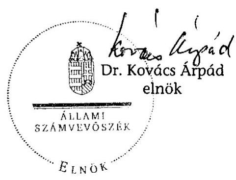

---

# Mellékletek

---

# Mellékletek jegyzéke 

1. A jelentésre és a jelentéstervezetre tett észrevételek
2. ÁSZ-javaslatokkal összefüggő OGY határozatok és az előző évi ajánlások
3. Kérdések és válaszok a rendszer értékeléséhez
4. A Társaság gazdálkodásával kapcsolatos kimutatások és ábrák
5. Tanúsítványok

---

# A jelentésre és a jelentéstervezetre tett észrevételek jegyzéke 

1. Magyar Távirati Iroda Zrt. TTT
2. Miniszterelnöki Hivatal
3. Magyar Távirati Iroda Zrt. FB
4. Magyar Távirati Iroda Zrt.

---

1. sz. melléklet a V-2015-31/2008-2009. sz. jelentéshez

ÁLLAMI SZÁMVEVÓSZÉK
Dr. Kovács Árpád elnök úrnak

Tárgy: Észrevételek a V-2015-29/2008-2009. jelentéshez

Tisztelt Elnök úr!
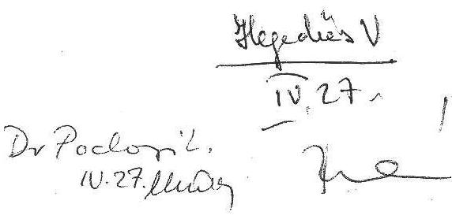

28/9/2008.
$409109$.
a EF 188969.

Budapest, 2009. április 23.

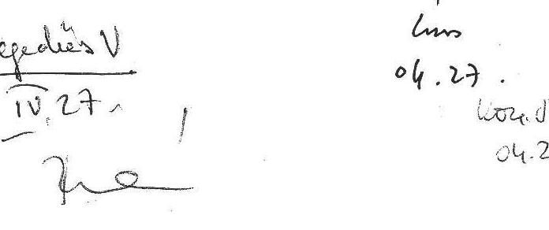

Köszönettel megkaptam az MTI Zrt. 2008. évi gazdálkodásának ellenőrzéséről szóló végleges jelentésüket.

Az MTI Tulajdonosi Tanácsadó Testülete április 23-án megtárgyalta a jelentést. Részletesen ismertettem a jelentés TTT-re vonatkozó részeit. A vita eredményeként a TTT úgy határozott, hogy a jelentésre vonatkozóan további észrevételt nem tesz.

Az ÁSZ megállapításait elfogadva, a következő időszakban szorgalmazni fogja a Nemzeti Hírügynökségi Törvény tervezett módosítását, valamint az Nht. és az Alapitó Okirat közötti összhang megteremtését. Emellett szorgalmazni fogja az MTI mint közszolgálati hírügynökség új finanszírozási modelljének bevezetését is, a Deloitte által kidolgozott szakértői modell alapján.

Munkájukat megköszönve,

Tisztelettel:
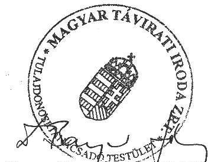

Dr. Bayer József, az MTI TTT elnöke

---

# Miniszterelnöki Hivatal 

## Államtitkár

Iksz: I-1/4560/2/2009
Hiv.sz.:V-2015-21/2008-2009

Bihary Zsigmond úr részére főigazgató

Állami Számvevőszék Budapest

Tisztelt Főigazgató Úr!

ÁLLAMI SZÁMVEVŐSZÉK ÜGYVITELI IRODA 2692/08
Érk.: APR 152009
Iktatószám: $1-2015-28 / 08-09$
Melléklet:

A Magyar Távirati Iroda Zrt. 2008. évi gazdálkodásának ellenőrzéséről szóló jelentéstervezetüket köszönettel megkaptuk.

A jelentésben foglaltakkal egyetértünk, álláspontunk szerint az MTI Zrt. 2008. évi gazdálkodásáról, a felmerült problémákról hủ képet tükröz.

A Kormány számára javasolt intézkedésekkel egyetértünk, és törekszünk rá, hogy 2009. évben érvényt szerezzünk nekik.

Segítő észrevételeit köszönjük és további jó munkát kívánunk!

Budapest, 2009. április 3.
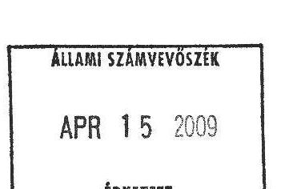
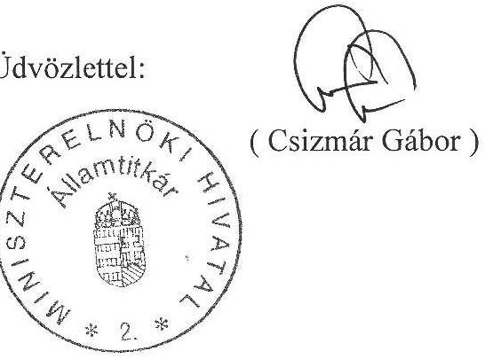

---

# mti) 

## MAGYAR TÁVIRATI IRODA ZRT. - FELÜGYELŐ BIZOTTSÁG

Állami Számvevőszék
Bihary Zsigmond
Főigazgató Úrnak

## Budapest

Apáczai Csere J. u. 10.
1052

Tisztelt Főigazgató Úr!
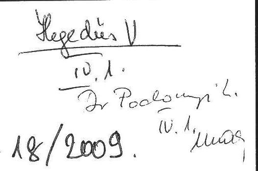

ÁLLAMI SZÁMVEVÔSZÉK
ÜGYVITELI IRODA
2363/08
Érk.: APR - 1 '2009
Iktatószám: $1-2015-24108-0$
Melléklet:

Az MTI Zrt. 2008. évi gazdálkodásának ellenőrzéséről szóló V-2015-21/2008-2009. sz. jelentéstervezetüket köszönettel megkaptuk, melyet a Felügyelő Bizottság tagjai megismerték. Mivel a március 19-én írt levélben jelzett álláspontunk zömét a munkaanyagba beépítették, ezért további észrevételt nem kívánunk tenni.

Budapest, 2009. április 1.
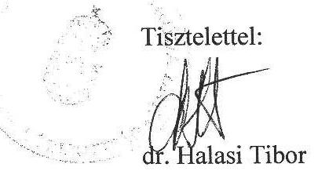

Magyar Távirati Iroda Zrt. - Felügyelő Bizottság Elnöke
1016 Budapest, Naphegy tér 8.
Tel.: 441-9036, tel./fax: 356-9538,
mobiltelefon: 06-30-211-3111, 06-30-515-4007
E-mail: fb@mti.hu

---

# miti   Elnök   Magyar Távirati Iroda Zrt. 

## Bihary Zsigmond úr

föigazgató
részére
Állami Számvevőszék
1052 Budapest, Apáczai Csere János utca 10.
FAX: 06-1-484-9206

ÁLLAMI SZÁMVEVŐSZÉK UGYVITELI IRODA
2666/09
Érk.: APR 142009
Iktatószám: U-2015-27/08-01
Melléklet: $\qquad$

IKT.SZ.: 00359/2009

## Tisztelt Föigazgató Úr!

A Magyar Távirati Iroda Zrt. 2008. évi gazdálkodásának ellenőrzésével kapcsolatos, V-2015-25/2008-2009. iktatási számú levelét köszönettel megkaptam.

Tudomásul vettem, hogy észrevételeim többségét figyelembe vették, és ezúton jelzem, hogy a jelentéssel kapcsolatosan további észrevételem nincs.

Budapest, 2009. április 14.

Tisztelettel:
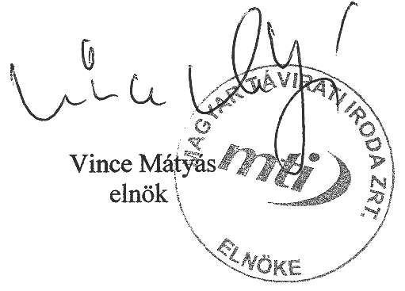

---

2. sz. melléklet
a V-2015-31/2008-2009. sz. jelentéshez

# ÁSZ-javaslatokkal összefüggő OGY határozatok és az előző évi ajánlások 

2/a. ÁSZ-javaslatokkal összefüggő OGY határozatok
2/b. Az előző számvevőszéki ellenőrzés javaslatai

---

# ÁSZ-javaslatokkal összefüggő OGY határozatok 

| 7/1998. (II. 18.) OGY határozat | a Magyar Távirati Iroda Rt. Létrehozásáról szóló 70/1997. (VII. 15.) OGY határozat módosításáról |
| :--: | :--: |
| 64/2002. (X. 4.) OGY határozat | a Magyar Távirat Iroda Részvénytársaság 1997. évi tevékenységéről szóló beszámolójáról |
| 65/2002. (X. 4.) OGY határozat | a Magyar Távirat Iroda Részvénytársaság 1998. évi tevékenységéről szóló jelentés elfogadásához |
| 66/2002. (X. 4.) OGY határozat | a Magyar Távirat Iroda Részvénytársaság 1999. évi tevékenységéről szóló jelentés elfogadásához |
| 67/2002. (X. 4.) OGY határozat | a Magyar Távirat Iroda Részvénytársaság 2000. évi tevékenységéről szóló beszámolójáról |
| 68/2002. (X. 4.) OGY határozat | a Magyar Távirat Iroda Részvénytársaság 2001. évi tevékenységéről szóló beszámolójáról |
| 10/2003. (II. 19.) OGY határozat | a közszolgálati műsorszolgáltatók és a nemzeti hírügynökség európai uniós csatlakozással kapcsolatos tájékoztatási feladatainak költségvetési többlettámogatásról |
| 99/2004. (X. 13.) OGY határozat | a Magyar Távirati Iroda Részvénytársaság 2002. évi tevékenységéről szóló beszámolójáról |
| 100/2004. (X. 13.) OGY határozat | a Magyar Távirati Iroda Részvénytársaság 2003. évi tevékenységéről szóló beszámolójáról |
| 73/2005. (IX. 22.) OGY határozat | a Magyar Távirati Iroda Részvénytársaság 2004. évi tevékenységéről szóló beszámolójáról |
| 26/2007. (III. 28.) OGY határozat | a 125 éves MTI - Éves jelentés 2005. címú beszámolójáról |

---

27/2007. (III. 28.) OGY határozat a Magyar Távirati Iroda Részvénytársaság létrehozásáról szóló 70/1997. (VII. 15.) OGY határozat módosításáról
64/2007. (VI. 27.) OGY határozat a Magyar Távirati Iroda Zrt. 2006. évi tevékenységéről szóló beszámoló elfogadásáról
79/2008. (VI. 13.) OGY határozat a Magyar Távirati Iroda Zrt. 2007. évi tevékenységéről szóló beszámoló elfogadásáról

---

# Az előző számvevőszéki ellenőrzés javaslatai 

## 0804. Jelentés a Magyar Távirati Iroda Zrt. 2007. évi gazdálkodásának ellenőrzése

A helyszíni ellenőrzés megállapításainak hasznosítása mellett javasoljuk:

## az Országgyưlésnek

1. tekintse át és módosítsa a 68/2002. (X. 4.) OGY határozatban megfogalmazott jogalkotási feladatnak megfelelően a nemzeti hírügynökségről szóló 1996. évi CXXVII. törvényt és az MTI Zrt. Alapító Okiratát a teljes körűen összehangolt szabályozás kialakítása, a közszolgálati feladatok és az azok ellátásához szükséges állami támogatás egyértelműbb és pontosabb meghatározása, az EU szabályok betartása, a jelenlegi alapítói és részvényesi joggyakorlás és ellenőrzés felülvizsgálata és hatékonyabbá tétele érdekében;
2. gondoskodjon az MTI Zrt. múködését befolyásoló középtávú stratégiai, illetve éves tervre vonatkozó tulajdonosi döntés és kontroll megteremtéséről, hozzon határozatot a bemutatott éves tervekről.

## a Kormánynak

1. kezdeményezze a 68/2002. (X. 4.) OGY határozatban az MTI Zrt. támogatásával kapcsolatban megfogalmazott átláthatósági követelmény érvényre juttatása érdekében szükséges jogalkotási és egyéb intézkedéseket, különös figyelemmel az Európai Unió közösségi előírásaira, illetve ezeknek a betartására; az Nht. 2. § (1) bekezdése h) pontjában megjelölt - a választási időszak feladataira vonatkozó - külön törvény megalkotását; a TTT múködési költségeinek teljes körű szabályozását;
2. gondoskodjon az MTI Zrt. jegyzett tőkéje összegének, az állami pénzügyi részesedésnek a nyilvántartásáról.

## a TTT Elnökének

gondoskodjon a szakértői modell hasznosításáról.

## az MTI Zrt. Elnökének

1. vizsgálja felül a személyes adatok védelméről és a közérdekű adatok nyilvánosságáról szóló törvény rendelkezéseinek teljes körű érvényesítését;

---

2. teremtse meg az összhangot az SZMSZ, az elnöki, alelnöki utasítások és a munkaköri leírások között, biztosítsa a díjszabás megállapításának és az áralkalmazásnak az ellenőrizhetőségét, valamint az összhangot a cégnél múködő különböző szoftverek között;
3. intézkedjen a humánerőforrás-gazdálkodás elveinek, kritériumrendszerének és szabályainak megalkotásáról, a teljesítmények méréséről, a szervezeti egységekre lebontott létszámterv elkészítéséről;
4. alkossa meg a társaság egységes ingatlangazdálkodási szabályzatát, készítesse el az egységes középtávú ingatlangazdálkodási tervet, amely a szükséges forrásokat évekre lebontva tartalmazza; fontolja meg a nem használt ingatlanok értékesítését, intézkedjen a Károly krt.-i bérelt ingatlan hasznosítása érdekében.

---

3. sz. melléklet

a V-2015-31/2008-2009. sz. jelentéshez

# Kérdések és válaszok a rendszer értékeléséhez 

3/a. Kérdések és válaszok a rendszer múködésének értékeléséhez
3/b. Kérdések és válaszok az ellenőrzési rendszer értékeléséhez

---

# Kérdések és válaszok a rendszer múködésének értékeléséhez 

Ebben a vizsgálatban célszerűségen azt értettük, hogy a különböző döntési szinteken meghozott intézkedések összhangban voltak-e a kitűzött célokkal.

Az eredményesség kritériuma egyrészt azt jelentette, hogy a belső kontroll- és a belső információs rendszerek kiépítése és múködése megfelelően segítette-e a vezetést a döntések meghozatalában, megfelelő biztosítékot adott-e a Társaság által kitűzött célok megvalósításához, másrészt a központi költségvetési támogatás felhasználása a kitűzött céloknak és az elvárt eredményeknek megfelelően valósult-e meg.

Hatékonyság alatt egyrészt azt értettük, hogy a 2008. évi központi költségvetési támogatás felhasználása optimális mértékben szolgálta-e a feladat ellátást, másrészt a belső kontroll rendszer múködése megfelelő volt-e ahhoz, hogy a Társaság szakmai és gazdálkodási tevékenységét szabályszerűen ellássa.
Főkérdés: Az MTI Zrt. megfelelő intézkedéseket hozott-e és megfelelő eljárásokat alakított-e ki az erőforrások hatékony felhasználása és a kitűzött célok elérése érdekében, valamint a belső kontroll rendszer kiépítése és múködése megfelelő biztosítékot adott-e e célok megvalósításához?

Az MTI Zrt. a kitűzött célok elérése érdekében a belső szabályzatait többségében elkészítette, fejlesztette belső információs rendszerét, azonban a szervezet átalakítást követően nem vizsgálta felül és nem csökkentette létszámát. A célok elérését gátolta, idejét megnövelte az intézkedési határidők - egyes esetekben kilenc hónapos - hosszabbodása, és az éves feladattervben, valamint az intézkedési tervben vállalt feladatok nem teljes körű teljesítése. A Társaság nem szabályozta a közszolgálati feladatokhoz kapcsolódó állami támogatás igénylésének és felhasználásának rendjét, és nem alakított ki olyan eljárásrendet, ami a közszolgálati tevékenység elemzését segítő „Deloitte"- modell hasznosításáról rendelkezik, így korlátozottan járult hozzá a költségvetési forrás-felhasználás átláthatóbbá tételéhez. Mindezek összességében a Társaság rendelkezésére álló erőforrások felhasználásának hatékonyság csökkenéséhez vezettek.
A belső kontroll rendszer összességében kiépített, azonban múködése - a rendszer visszacsatoló mechanizmusának gyengeségei, valamint az információk megfelelő időben és minőségben történő eljutása miatt - nem ad teljes körű biztosítékot a Társaság céljainak megvalósításához.

---

| Vizsgálati kérdés - szempont | Indoklás |
| :--: | :--: |
| 1. Szabályozott volt-e az MTI Zrt. múködése?   Többségében igen. A Társaság múködése összességében szabályozott volt, azonban az Nht. és a Társaság Alapító Okirata 2008-ban sem határozta meg a Társaság közszolgálati feladatait tevékenység szinten, hiányzott a közszolgálati feladat ellátáshoz szükséges állami támogatás mértékének-, valamint felhasználásának átláthatósági szabályozása. A Társaság, a múködését meghatározó jogszabályok többségével összhangban elkészítette belső szabályzatait, a hierarchikus viszonyok átláthatóbbá tétele érdekében felülvizsgálta SZMSZ-ét, és teljesítette az államháztartás pénzeszközei felhasználásával kapcsolatos közzétételi kötelezettségét. A Társaság fejlesztette belső információs rendszerét, azonban nem biztosította a különböző ügyviteli alkalmazások közötti egységes adatforgalmat. A belső kontroll rendszer múködése összességében szabályozott volt. A Társaság 2008. évi üzleti terve összhangban volt a stratégiai tervvel; az éves terv és az éves teljesítés között nem volt jelentős eltérés. |  |
| 1.1 | Összhangban voltak-e a belső szabályzatok a vizsgált időszakban hatályos szakmai, társasági és gazdálkodást érintő jogszabályokkal?   Többségében igen. A belső szabályzatok a vizsgált időszakban hatályos szakmai, társasági és gazdálkodást érintő jogszabályokkal - egyes kivételeket leszámítva összhangban voltak. A Társaság nem szabályozta a közszolgálati feladatokhoz kapcsolódó állami támogatás igénylésének és felhasználásának rendjét; belső szabályzatai részben biztosítják az összhangot a közbeszerzési törvényben, a Munka Törvénykönyvében, valamint a személyes adatok védelméről és a közérdekú adatok nyilvánosságáról szóló törvényben foglaltakkal. |
| 1.1.1. | Célszerú és eredményes volt-e a feladatok végrehajtásához kialakított szervezeti struktúra, illetve a Szervezeti és Múködési Szabályzat? |
| 1.1.2. | Összhangban voltak-e a szervezeti múködés és az SZMSZ, az SZMSZ és az egyes szervezeti egységek ügyrendje, a munkaszerződések és a munkaköri leírások? |

Részben. A 2008. április 26-ától hatályos SZMSZ és szervezeti módosítás célja a szerkesztőségi tevékenység és a hierarchikus viszonyok átláthatóbbá tétele, a párhuzamosságok kiküszöbölése. A szervezet átalakítás célszerú volt, azonban a változtatás nem járt együtt a Társaság össztétszámának csökkentésével. Az SZMSZ módosítást számítások nem támasztották alá, így nem vált ismertté a változtatás költségkihatása, és annak várható eredménye.
Részben. Az SZMSZ és a szervezet múködése néhány ponton (pl. ügyeleti rend szabályozásának törlése, jogi ellenjegyzési kötelezettség) nincs összhangban. A 2008-ban létrehozott Hírszerkesztési Központ 20 dolgozója közül 9 nem rendelkezik a feladatait, jogosultságait meghatározó dokumentummal. Az SZMSZ és a megkötött munkaszerződések között 2008-ban is összehangolási hiányosságok voltak (pl. az igazgatók munkaköri feladatai, a munkavállalók besorolási kritériumai). A Társaság szervezetére nézve nem rendelkezik teljesítménymérési és -értékelési rendszerrel, annak kritériumait nem határozta meg.
1.1.3. Aktualizálták-e a Részvénytársa- Többségében igen. A Társaság 2008-ban a

---

|  | ság közfeladatainak ellátásához kapcsolódó szabályzatokat? | közfeladatok ellátásához alapvetően kapcsolható szabályzatok közül a közbeszerzések rendjének szabályzatát, valamint a szerkesztőségi kézikönyveket módosította. Nem dolgozta ki teljes körűen a személyes adatok védelméhez kapcsolódó előírásokat, és nem szabályozta a közszolgálati feladatokhoz kapcsolódó állami támogatás igénylésének és felhasználásának rendjét. |
| :--: | :--: | :--: |
| 1.1.4. | Szabályozta-e a Társaság a közbeszerzés rendjét és betartotta-e az erre vonatkozó előírásokat? | Részben. A Társaság szabályozta a közbeszerzések rendjét, azonban nem rendelkezett a közbeszerzési eljárások dokumentálásának és az eljárások belső ellenőrzésének felelősségi rendjéről. A Társaság éves összesített közbeszerzési tervet nem készített, beszerzéseinél nem vette teljes körűen figyelembe az egybeszámítási kötelezettséget, a megkötött szerződések nem biztosították teljes körűen az ajánlati dokumentáció tartalmának való megfelelést, ami ellentmond a Kbt. előírásainak. |
| 1.1.5. | Szabályozták-e a Társaság belső információs rendszerét és az államháztartás pénzeszközei felhasználásával kapcsolatos közzétételi kötelezettség teljesítését, hatékonyan múködött-e az információs rendszer? | Részben. A Társaság 2008-ban is fejlesztette belső információs rendszerét, azonban nem biztosított a különböző ügyviteli alkalmazások közötti egységes adatforgalom, ami csökkenti a feladatellátás hatékonyságát, és nem teszi lehetővé a párhuzamosságok kiküszöbölését. A Társaság szabályozta a közzétételi kötelezettség teljesítését, azonban nem teszi teljes körűen közzé a tevékenységére, gazdálkodására vonatkozó adatokat. |
| 1.2. | Eredményes volt-e a TTT és a FB törvény által meghatározott feladat ellátása, a testületek múködése? | Részben. A TTT és az FB törvény által meghatározott feladatellátása részben volt eredményes. A TTT nem tárgyalta teljes körűen a hatáskörébe tartozó feladatokat. Az FB a 2008. évi gazdálkodással kapcsolatban megfogalmazott elvárásai (pl. személyi jellegű ráfordítások, gépjármú beszerzés, múködési céltámogatás igénylés) az általa elvárt szinten nem érvényesültek, ami részben biztosított megfelelő biztosítékot a Társaság kitűzött céljainak megvalósításához. |
| 1.3. | Szabályozott volt-e a belső kontroll rendszer (a vezetői ellenőrzés, a folyamatba épített és szervezetileg elkülönített kontrolling és a belső ellenőrzés) múködése, hatékonyan és eredményesen mükö dött-e a rendszer? | Részben. A vezetői ellenőrzés, a kontrolling és a függetlenített belső ellenőrzés múködése öszszességében szabályozott. A vezetői ellenőrzés és a kontrolling múködése csak részben eredményes és hatékony, a felelősségi rend pontos meghatározásának és az információk egyes esetekben nem megfelelő időben és minőségben történő eljutásának hiánya miatt. |

---

| 1.4. | Megalapozott volt-e a társaság 2008. évi üzleti terve, teljesültek-e az üzleti tervben kitüzött célok?   Igen. Az éves üzleti terv készítésekor a Társaság már ismerte a feladata ellátásához igényelt és 2008. évre jóváhagyott költségvetési céltámogatások összegét,(amely mindössze 4 M Ft-tal marad el az általa igényelttől). Ezért a tartós kötelezettségeinek számításba vétele után maradó, szűk pénzügyi mozgásterében biztonsággal tudta megtervezni feladatai ellátásának körülményeit. Év végi eredményei a megalapozott tervezést támasztják alá, főbb gazdasági mutatószámai, a bevételi és költség, ráfordítás adatai a tervtől minimálisan térnek el, egy százalékon belüliek. E megállapítás alól kivétel az exportteljesítés, valamint a pénzügyi- és rendkívüli műveletek eredménye, továbbá az ez utóbbiak együttes hatására kialakult 6,6 M Ft-os eredmény. |
| :--: | :--: | :--: |
| 1.4.1. | Összhangban volt-e a 2008. évi üzleti terv a 2008-2012 évekre szóló stratégiai tervvel? | Igen. Összhang van a stratégiai terv és az éves üzleti terv között, ott és azokban a témákban, ahol számszerúsítették a tervezett feladatokat (az éves fejlesztési, beruházási tervszámok) a stratégiai tervben közölt időarányos irányszámokon belül maradtak. |
| 1.4.2. | Teljesült-e az MTI Zrt. 2008. évi árbevétel-, költség- és eredményterve, a terv és a teljesítés közötti eltérések okait feltárták-e? | Igen. A Társaság éves üzleti tervének bevétel és költség adatai a tervezettel csaknem azonos összegűek, az eltérés minimális (egy százalékon belül marad). Az üzleti tevékenység eredménye -13,9 M Ft, ami 5,2 M Ft-tal kevesebb a tervezettnél, a mérleg szerinti eredménye - a pénzügyi műveletek eredményének beszámításával - 6,6 M Ft, ami 2,3 M Ft-tal meghaladta a tervezettet. |
| 2. | Célszerú és eredményes volt-e az MTI Zrt. 2008. évi gazdálkodása?   Részben. A Társaság 2008. évi gazdálkodási tevékenységét a tartós egyensúlyra való törekvés határozta meg, mivel a tárgyévben sem történt érdemi előrelépés a közszolgálati szerződés megkötése érdekében és továbbra sem ismert és nem kiszámítható az évenkénti állami céltámogatás nagysága. |
| 2.1. | Átlátható és megalapozott volt-e az állami támogatások felhasználása?   Részben. A múködési célú támogatás felhasználása részben átlátható, mert hiányzik a közszolgálati feladatok tevékenység szintű meghatározása, valamint a támogatás felhasználásának átláthatósági szabályozása. Az Nht. a közszolgálati feladatok állami finanszírozását írja elő, azonban a támogatás igénylésekor és annak felhasználásával párhuzamosan a Társaság nem alkalmazza a közszolgálati feladatokra jutó támogatás meghatározását segítő „Deloitte" szakértői modellt. |
| 2.1.1. | Átlátható, célszerú és hatékony volt-e a múködési célú támogatás felhasználása, betartották-e az EU szabályokat? | Részben. A Társaság 2008-ban változatlan gazdálkodási feltételrendszer mellett végezte tevékenységét (pl. társasági adó, helyi adók alóli mentesség). Nem következett be a bázishoz képest változás az EU szabályoknak való megfelelés biztosításában. A közszolgálati feladatok tevékenység szintű meghatározása, felhasználása átláthatósági szabályozása hiányzik. |

---

| 2.1.2. | Megalapozott volt-e a projekttervekben megfogalmazott és az év közben folyósított céltámogatások igénylése, célszerú és hatékony volt-e a felhasználás? | Részben. 2008-ban három projekttervet - köztük az olimpiai feladatokra -készítettek. A projektjavaslatokban a feladatok tételes költségvetése reális és megalapozott. Projektjavaslatot készítettek az „MTI Ki Kicsoda 2009" könyv és CD előállítására (megvalósítása három éves), várható költsége 38 M Ft . Az év harmadik projektjavaslata a „Kor-képek 1957-1967" fotóalbum, februárban készítették, az értékesítését 2008-2012. években tervezik. A költségterv 7,1 M Ft. Mindhárom projektjavaslat formailag és tartalmilag megfelel a belső utasításokban foglaltaknak.
2008-ban azonban a projektelszámolások -65 M Ft veszteséget mutatnak. A nyilvántartott projektek számában a korábbi évekből a beruházások értékcsökkenésének elszámolása miatt áthúzódó projektek is vannak, így a projektek száma nem jelenti az adott évben indított projekteket, és a projektek tényleges eredménye sem ítélhető meg. |
| :--: | :--: | :--: |
| 2.2. | Eredményes volt-e az MTI Zrt. vagyon-, létszám- és bérgazdálkodása, hatékony és célszerú volt-e a személyi jellegú ráfordítások felhasználása?   Részben. Az MTI Zrt vagyonával és a számára biztosított állami céltámogatással a számviteli törvényben foglaltak betartásával gazdálkodott. A Társaság vagyongazdálkodása eredményes volt, azonban létszám- és bérgazdálkodása nem volt eredményes. |  |
| 2.2.1. | Indokoltak voltak-e az eszköz- és forrásállományban 2007-ről 2008ra bekövetkezett változások? | Összességében igen. A Társaság mérleg szerinti föösszege 2008. december 31-én 3532 M Ft, $1 \%$-kal magasabb a bázisnál. 2007. évhez képest befektetett eszközeinek záró állománya, beruházási költségei és exportértékesítési bevétele csökkentek, ugyanakkor átutalt állami támogatása-, személyi- és anyag jellegú ráfordításai, valamint eredménye növekedett. Saját tőkéje kismértékben növekedett $3049 \mathrm{M} \mathrm{Ft}, 7 \mathrm{M}$ Ft-tal magasabb a bázisnál. (Oka a mérleg szerinti eredmény növekedése, és az eredménytartalék emelkedése, a tavalyi eredmény ( $4,9 \mathrm{M} \mathrm{Ft}$ ) eredménytartalékba helyezése következtében.) |
| 2.2.2. | Szabályozott és eredményes volt-e a Társaság eszközeinek selejtezési gyakorlata? | Igen. Öt selejtezést (összesen a kiselejtezett, és a nyilvántartásból kivezethető érték 41 M Ft ) végeztek, a selejtezési jegyzőkönyvek az előírt követelményeknek megfelelnek, mind a tartalmi, mind a formai követelményeket kielégítik. |
| 2.2.3. | Összhangban volt-e a Társaság ingatlan stratégiája és a 2008. évi ingatlangazdálkodása, célszerú volt-e a részvénytársaság ingat- | Igen. Elkészíttették a középtávra vonatkozó ingatlanstratégiát, elfogadták annak javaslatát, a legcélszerúbb és a leggazdaságosabb elhelyezkedésre, az ingatlanok megtartására ill. |

---

|  | langazdálkodása, indokolt volt-e az ezzel összefüggő költség és ráfordítás? | értékesítésére vonatkozóan. Az ingatlangazdálkodással összefüggő költségek és ráfordítások indokoltak voltak. |
| :--: | :--: | :--: |
| 2.2.4. | Megalapozott volt-e az MTI Zrt. költség, ezen belül a belföldi- és külföldi kiküldetések, valamint a személyi jellegű ráfordítások felhasználása? | Igen. A Társaság költségstruktúrájában a személyi jellegú ráfordítások- és az anyag jellegű ráfordítások domináltak. A személyi jellegú ráfordítások a tervezett értéken belül maradtak, a bázist meghaladták. A személyi jellegú kifizetések 2008. évi emelkedésének oka, hogy az állományba tartozók rendszeres jövedelme emelkedett, amelynek emelkedésével nőttek a bérjárulékok és összességében magasabb a költségtérítések összege. A kiküldetésekre fordított összeg $96 \%$-a a külföldi kiküldetéseket fedezte, amely az olimpiára való magasabb költségigényú kiutazások miatt mind a tervezettet, mind a bázist meghaladta. A kiküldetések elrendelése, a szolgáltatások megrendelése és a dolgozók felé történő ügyintézés, napidíj kifizetése szabályszerű volt. |
| 2.2.5. | Szabályozták-e a Társaság munkavállalóinak teljesítményértékelési és javadalmazási rendszerét? | Nem. Az elnöki megbízatási időszak első évében a létszámgazdálkodás tekintetében az előző évhez viszonyítva érdemi változás nem történt. Nem dolgozták ki a humánerőforrás gazdálkodás elveit, szabályait, a teljesítmények mérését, és nincs kidolgozott javadalmazási rendszer. |
| 2.2.6. | Eredményes volt-e a Társaság 2008. évi létszámgazdálkodása, hatással volt-e a létszám- és bérgazdálkodás a gazdálkodás hatékonyságára? | Nem. A Társaság elkészítette 2008. évi létszámtervét, azonban az a vállalt határidőben, a 2008. évi szervezet átalakítás és a 2008-2012. évi stratégiai terv elkészültét követően nem módosult, a munkajogi létszám 2008. év végén (a 2007. évihez képest nem csökkent) 370 fő volt. Az 1 fő átlaglétszámra vetített saját bevéte-li- és költségmutatók 2007-hez képest magasabbak, így a fajlagos költség és ráfordítás árbevétel fedezet romlott, 2008-ban 42,9\% a 2007. évi 44,6\%-hoz képest. |
| 2.2.7. | Elemezték-e a termékek és szolgáltatások szerkezeti változtatásának árbevételre gyakorolt hatását? | Igen, folyamatban van. 2008. év végén kezdték el és a revízió ideje alatt még folyamatban, van a termékek és szolgáltatások felülvizsgálatát (az egyes termékek, szolgáltatások szakmai és pénzügyi vonatkozásainak áttekintését) és ennek alapján alakítják ki a termék - szolgáltatás portfóliót. |
| 2.3. | Szabályozott-e a Társaság által alkalmazott díjszabás mértéke, van-e kapcsolat a termékek és szolgáltatások fedezettségi mutatója és az árkialakítás között, eredmé- | Részben. A Társaságnál alkalmazott díjszabás mértéke - a hírszolgáltatás kör szűkítésekor alkalmazott csomagbontást kivéve - szabályozott. A Társaság díjszabása, az egyes termékek és szolgáltatások árkialakítása a tényleges önköltség ismeretében változott. A „Deloitte" modell segítségével meghatározható az egyes ter- |

---

|  | nyesen müködik-e ezen a terü-   leten a „Deloitte-modell"? | mékek/szolgáltatások fedezeti mutatója, így   megállapítható, hogy melyek azok a termé-   kek/szolgáltatások, amelyek a magas költség és   ráfordítás miatt felülvizsgálatra szorulnak. |
| :-- | :-- | :-- |

3. Hasznosultak-e az ÁSZ 2007. évi ellenőrzésében megfogalmazott javaslatok, eredményesek voltak-e az ezek alapján tett intézkedések?

Az ÁSZ 2007. évi ellenőrzésében megfogalmazott javaslatok részben hasznosultak. Az állami támogatás folyósításának, felhasználása ellenőrzésének versenysemleges és átláthatósági - EU szabályokkal összehangolt - szabályozására 2008-ban sem került sor. A Társaság egyes területeken (belső szabályozók összehangolása, ingatlangazdálkodás) hasznosította a megfogalmazott javaslatokat, azonban a javaslatok alapján tett intézkedések pl. a humánerőforrás-gazdálkodás területén nem voltak eredményesek.

| 3.1. | Hasznosultak-e a részvénytársaságon kívüli szervezeteknek (Országgyűlés, Kormány) tett ajánlások? | Részben. Az Országgyűlésnek, a Kormánynak tett, jogalkotással és szabályozással kapcsolatos ÁSZ javaslatok lényegében nem hasznosultak. Az Nht. és - érdemben - az AO nem módosult, összehangolásuk nem valósult meg. |
| :--: | :--: | :--: |
| 3.2. | A Társaság hasznosította-e a helyszíni ellenőrzés megállapításait, hatékonyak és eredményesek vol-tak-e az elrendelt intézkedések? | Részben. A Társaság a helyszíni ellenőrzés megállapításait részben hasznosította. Az elrendelt intézkedések egyrészt nem adtak megfelelő biztosítékot a Társaság által kitűzött célok megvalósításához, másrészt a végrehajtásukra kitűzött határidő módosítások csökkentették azok hatékonyságát. A Társaság az SZMSZ, az elnöki és alelnöki utasítások és a munkaköri leírások közötti összhangot nagyobb részben biztosította, és a határidő módosítását követően végrehajtotta az ingatlangazdálkodással kapcsolatos feladatokat. Nem dolgozta ki a hu-mánerőforrás-gazdálkodással kapcsolatos kritériumokat és szabályrendszert. |

---

# Kérdések és válaszok az ellenőrzési rendszer értékeléséhez 

A vezetői ellenőrzés, a folyamatba épített és szervezetileg elkülönített Kontrolling és a függetlenített belső ellenőrzés múködésének értékelése

| Vizsgálati kérdés |  | Indoklás |
| :--: | :--: | :--: |
| 1. | A Társaság szabályozta-e a vezetői ellenőrzés folyamatát és a múködtetéséért való felelősséget? | Részben. A Társaság SZMSZ-e meghatározza, hogy az alelnökök felelősek a hatékony vezetői ellenőrzésért. Az SZMSZ egyes fejezetei tartalmazzák a vezetői ellenőrzéshez tartozó egyes részterületeket (a vezetők szabályozási, utasítási, ellenőrzési joga, vezetői beszámoltatás), azonban a vezetői ellenőrzés folyamatát (lépéseit) szabályzat nem tartalmazza. A szervezeti egység-vezetők feladatát és felelősségét - nem egységesen - a kitűzött célok elérésének szervezése, koordinálása és ellenőrzése; az egység múködésének irányítása, feladatainak ellenőrzése; az egység tevékenységéhez szükséges tervek készítése, realizálásuk ellenőrzése képezi. |
| 2. | Kialakított-e a Társaság a vezetői ellenőrzés múködésének hatékonyságát értékelő szempontrendszert? | Nem. Az SZMSZ-ben meghatározott vezetői ellenőrzés múködésének hatékonysági szempontból történő értékelésére a Társaság nem dolgozott ki kritériumokat. |
| 3. | A vezetői ellenőrzéssel szemben támasztott követelmények bizto-sítják-e a hatékony vezetői ellenőrzés múködését? | Részben. A vezetői ellenőrzéssel szemben támasztott követelmények és a vezetői ellenőrzési rendszer múködése részben eredményeznek hatékonyság növelést, mert az információk egyes esetekben utólag és nem teljes körűen jutnak el a feladatgazdákhoz. |
| 4. | Érvényesítettek-e a vezetői ellenőrzés elmaradása miatti felelősséget? | Nem. A Társaság vezetői ellenőrzés elmaradása miatt nem érvényesített felelősséget, így nem segítette elő a szervezeti hatékonyság növelését. |

---

| 5. | Meghatározta-e a Társaság a   Kontrolling szervezet -csoport-   feladatait, e feladatok teljes-körü   ellátását biztosítja-e a kialakított   szervezeti és felelősségi rend? | Részben. A Társaság az SZMSZ-ben meghatá-   rozta a Kontrolling szervezet feladatait, azon-   ban azzal, hogy a szervezeti egység feladatait   egy fő munkaszerződéssel, egy fő külső megbí-   zással látja el, így a kialakított szervezeti rend   nem biztosítja teljes körúen és elhatárolható   módon az ellátandó feladatok felelősségi rend-   jét. |
| :--: | :--: | :--: |
| 6. | A Kontrolling csoport a költség-   felhasználások elemzését követő   egyes költségcsökkentési lehetősé-   gek feltárásával hozzájárult-e   takarékossági intézkedések mey-   hozatalához? | Részben. A Kontrolling csoport 2008-ban is   elemezte a költségfelhasználásokat, és feltárt   költségcsökkentési lehetőségeket (pl. telefon-   költség, gépkocsi költségtérítés), azonban a fo-   lyamat-kontrolling területén a rendszer tartalé-   kokkal rendelkezik. |
| 7. | A Kontrolling csoport 2008. évben   kidolgozott-e javaslatot vezetői   intézkedések megtételére? | Részben. A Kontrolling csoport táblázatos   formában jeleníti meg a Társaság múködésé-   nek, gazdálkodásának jellemző adatait és mu-   tatót, kimutatja az eltéréseket. Javaslatára a   Társaság a személyi jellegú ráfordítások terüle-   tén a mozgó bérekre keretet határozott meg.   Vezetői intézkedések megtételére vonatkozó   javaslatot írásban nem tett. |
| 8. | A Kontrolling csoport az előírt   gyakorisággal teljesítette-e a gaz-   dálkodási terv/tény adatok össze-   vetését és elemzését? | Igen. A Kontrolling csoport az előírt gyakori-   sággal (negyedévente) teljesítette a gazdálkodá-   si terv/tény adatok összevetését és elemzését. |
| 9 . | A tervtől való eltérés esetén tett-e   javaslatot intézkedésre? | Részben. A Kontrolling csoport táblázatos   formában kimutatta és elemezte a tervtől való   eltéréseket, azonban nem tett javaslatot intéz-   kedésre. |
| 10. | Szabályozott-e a függetlenített   belső ellenőrzés feladatellátása,   amennyiben igen, úgy tevékeny-   sége a szabályozásnak megfelelő   volt-e? | Összességében igen. A Társaságnál a belső   ellenőrzési tevékenységet függetlenített belső   ellenőr látja el, akinek feladatait a 2003. január   14-én elfogadott Belső Ellenőrzési Szabályzat   határozza meg. A szabályzat nem módosult,   abban a belső ellenőrzés utóvizsgálat gyakori-   sága nincs szabályozva. |
| 11. | A Felügyelő Bizottság és a Társa-   ság vezetése felé biztosított-e a   függetlenített belső ellenőrzés   megállapításairól történő rend-   szeres tájékoztatás? | Igen. A Felügyelő Bizottság és a Társaság veze-   tése felé biztosított a belső ellenőri megállapítá-   sokról történő rendszeres, a jelentések elkészül-   tét követően történő tájékoztatás. |

---

| 12. | A függetlenített belső ellenőrzés a 2008. évben készült jelentésekben tett-e olyan megállapításokat, amelyek a Társaság vezetése részéről intézkedést igényeltek? | Igen. A belső ellenőr 2008. évben készített kilenc ellenőrzési jelentése tartalmazott olyan megállapításokat, amelyek a Társaság vezetése részéről intézkedést igényeltek. |
| :--: | :--: | :--: |
| 13. | A függetlenített belső ellenőrzés rendszeresen végzett-e utóellenőrzést, az utóellenőrzések tapasztalatai befolyásolták-e az éves belső ellenőrzési munkaterv összeállítását? | Igen. A belső ellenőr a 2006. II. félévben, valamint a 2007. I. félévben készített belső ellenőri jelentések alapján a Társaság által tett intézkedések utóvizsgálatáról 2007 decemberében, a 2007. II. félévben, valamint a 2008. I. félévben hasonló tárgyban 2008 decemberében készített utóvizsgálati jelentést. Az utóvizsgálatok tapasztalatai befolyásolták az éves ellenőrzési munkaterv összeállítását. |
| 14. | Biztosított-e a függetlenített belső ellenőrzés eredményes múködése, ez megfelelő biztosítékot ad-e a Társaság által kitűzött célok megvalósításához? | Összességében, igen. A belső ellenőrzés eredményes múködése összességében biztosított. A belső ellenőrzés 2008. évi munkaterve tartalmazza a Belső Ellenőrzési Szabályzatban meghatározott főbb ellenőrzési célokat. A szabályozási hibákat részlegesen feltárta, végrehajtotta a munkatervben szereplő ellenőrzési feladatokat, ezzel összességében a Társaság céljainak elérését segítette. |
| 15. | Biztosított-e a függetlenített belső ellenőrzés hatékony múködése, és ez segíti-e a Társaság szakmai és gazdálkodási tevékenységének szabályszerű ellátását? | Összességében, igen. A 2008. évi belső ellenőrzési jelentések a belső ellenőr aláírását és a Társaság elnökének észrevételezési jogát tartalmazó záradékban foglaltak megismerését igazoló aláírását követően (határidőben) az FB soron következő ülésére kerültek. Az FB a 9 elkészült belső ellenőri jelentést elfogadta úgy, hogy öt esetben élt szóbeli kiegészítéssel, illetve egyes ellenőri javaslatok törlésének jogával. Az FB a jelentésekkel kapcsolatos jegyzőkönyvek Társaság elnökének történő megküldésével elősegíti a Társaság vezetése megfelelő, a jelzett hiányosságokat kiküszöbölő intézkedését. Az ellenőri jelentésekbe foglalt megállapítások és javaslatok hasznosulásáról, a Társaság megtett intézkedéseiről a belső ellenőr az utóvizsgálat során szerez bizonyságot. |
| 16. | A függetlenített belső ellenőrzés hozzájárult-e a szabályozási és múködési hibák feltárásával, az intézkedések kezdeményezésével, a javaslatok realizálásának ellenőrzésével az ellenőrzési kockázatok csökkentéséhez? | Részben. A belső ellenőr a múködési hibák feltárásával és a javaslatok realizálásának ellenőrzésével hozzájárult, a szabályozási hibák részleges feltárásával részben járult hozzá az ellenőrzési kockázatok csökkentéséhez. |

---

| 17. | Kimutatható-e kapcsolat a vezetői ellenőrzés, a Kontrolling és a függetlenített belső ellenőrzés között? | Részben. A vezetői ellenőrzés és a Kontrolling között közvetlen, közöttük és a belső ellenőrzés között közvetett kapcsolat mutatható ki. |
| :--: | :--: | :--: |
| 18. | A Társaság múködtet-e teljesít-mény-értékelési rendszert, e rendszer tartalmaz-e minősítő kritériumokat a vezetői ellenőrzés és a Kontrolling múködésének értékelésére? | Nem. A Társaság az egész szervezetre kiterjedően nem működtet teljesítmény-értékelési rendszert. Nem dolgozott ki minősítő kritériumokat a vezetői ellenőrzés és a Kontrolling működésének értékelésére. |

---

# A Társaság gazdálkodásával kapcsolatos kimutatások és ábrák jegyzéke 

4/a. A társaság főbb gazdasági adatai
4/b. Közbeszerzési eljárás keretében 2008-ban megkötött szerződések
4/c. Ingatlan üzemeltetéssel összefüggő 2008. évi beruházási és felújítási munkák
4/d. Személyi jellegű ráfordítások 2003-2008. év
4/e. Bevételek, költségek és ráfordítások alakulása
4/f. A Magyar Távirati Iroda Zrt. 2008. évi bevételek megoszlása
4/g. A Magyar Távirati Iroda Zrt. 2008. évi költségek és ráfordítások megoszlása

---

# A Társaság főbb gazdasági adatai 

|  |  |  |  | M Ft-ban |  |
| :--: | :--: | :--: | :--: | :--: | :--: |
|  | $\begin{aligned} & 2007 \\ & \text { TÉNY } \end{aligned}$ | $\begin{aligned} & 2008 \\ & \text { (üzleti) } \\ & \text { TERV } \end{aligned}$ | $\begin{aligned} & 2008 \\ & \text { TÉNY } \end{aligned}$ | $\begin{aligned} & 2008 \text { TÉNY } \\ & \text { /2007 TÉNY } \\ & \text { Különbség } \end{aligned}$ | $\begin{aligned} & 2008 \text { TÉNY } \\ & \text { /2008 TERV } \\ & \text { Különbség } \end{aligned}$ |
| Belföldi értékesítés árbevétele | 1707 | 1736 | 1833 | 126 | 97 |
| Exportértékesítés árbevétele | 136 | 141 | 58 | $-78$ | $-83$ |
| Egyéb bevételek | 35 | 74 | 19 | $-16$ | $-55$ |
| Összes értékesítési bevétel | 1878 | 1951 | 1910 | 32 | $-41$ |
| Aktivált saját teljesítmény | 5 | 5 | 64 | 59 | 59 |
| Támogatás közszolgálati feladatokra | 2150 | 2363 | 2363 | 213 | 0 |
| Támogatás cél-feladatokra | 24 | 112 | $105^{*}$ | 80 | $-8$ |
| Költségvetési tartalékból | 133 | - |  | 132 | 1 |
| Költségvetési támogatás | 2307 | 2475 | 2468** | 161 | $-7$ |
| Összes bevétel | 4190 | 4431 | 4442 | 252 | 11 |
| Összes költség és ráfordítás | 4197 | 4440 | 4456 | 259 | 16 |
| Mérleg szerinti eredmény | 4,9 | 4,3 | 6,6 | 1,7 | 2,3 |

* Ebből a korábbi évek maradványainak elszámolása 946 E Ft
**A ténylegesen folyósított összeg 2575 M Ft

---

4/b. sz. melléklet a V-2015-31/2008-2009. sz. jelentéshez

# Közbeszerzési eljárás keretében 2008-ban megkötött szerződések

|  Sorszám | Időpont | Szállító | Szerződés száma | Szerződés tárgya | Nettó összege | Bruttó összege (ÁFÁ-val növelt)  |
| --- | --- | --- | --- | --- | --- | --- |
|  1 | 2008. II. 20. | Tripont Kft | M14/1316/2008 | Fotóeszközök beszerzése | 12119530 | 14543436  |
|  2 | 2008. III. 10. | Comfort Consulting Kft | Ü-16-125/2008 | Az MTI Zrt. épületenergetikai felülvizsgálata | 8000000
4499000 | 9600000
5398800  |
|  3 | 2008. VI. 16. | ÁBP ÁPISZ Buda-Piért Zrt | 865/08 | Az ajánlatkérő papíráruval és irodaszerrel történő ellátására vonatkozó szállítási keretszerződés 2008-2009 évekre becsült érték/év | 8000000 | 9600000  |
|  4 | 2008. VII. 24. | Heves Cleaning Kft | Ü-16-150/2008 | „K" irodaépület légtechnikai rendszerének tisztítási és fertőtlenítési munkái | 9756000 | 11707200  |
|  5 | 2008. VIII. 26. | "Csaba Ire" Klotildliget Kft | Ü-16/163/2008 | Az ajánlatkérő 406 db klímagépének és kapcsolódó berendezéseinek javítási és karbantartási munkái | 10396836 | 12476203  |
|  6 | 2008. XI. 11. | ICG, Infora Consulting Group | 1221/08 | Szervezeti hatékonyság elemzés | 6050000 | 7260000  |
|  7 | 2008. XII. 1. | ROLAND FAVORIT BT | 08/11/20/492 | A Magyar Közélet Kézikönyve 2009 címủ könyv nyomdai előállítása, becsült érték | 9000000 | 10800000  |
|  8 | 2008. XI. - | Porsche Inter-Autó Buda Kereskedelmi Kft | 85925431;
85925432;
85925433;
85925434; | Felső-közép kategóriás személygépkocsi beszerzése | 25433333 | 30520000  |
|  9 | 2008. XII. 10. | T.O.M. Controll 2001 Vagyonvédelmi és Szolgáltató Zrt. | Ü-16-234/2008 | Az MTI Zrt. épületeinek napi és ügyeleti takarítása, eseti nagytakarítása, segédmunka, valamint a „K" épület külső üvegfelületeinek alpintechnikás tisztítása | 28000000 | 33600000  |
|   | ÖSSZESEN: |  |  |  | 121254699 | 145505639  |

---

4/c. sz. melléklet a V-2015-31/2008-2009. sz. jelentéshez

# Ingatlan üzemeltetéssel összefüggő 2008. évi beruházási és felújítási munkák

|  Sorszám | Munka tárgya | 2008. évi terv | 2008. évben elvégzett munkák munkanemenkénti összege | Index \%
2008 Tény/2008 Terv  |
| --- | --- | --- | --- | --- |
|  1. | "V" épület bérbeadandó területek beruházási, átalakítási munkái | 5000000 | 3995522 | 79,91\%  |
|  2. | Egyéb, MTI használatában lévő épületekben végzendő átalakítások, beruházások | 15000000 | 11538484 | 76,92\%  |
|  3. | Recepció üvegtető felújítása I. rész | 2000000 | 1382050 | 69,10\%  |
|  4. | Homlokzati üvegfal felújítása II. rész | 6000000 | 11508800 | 191,81\%  |
|  5. | Vizes helyiségek felújítása I. rész | 5000000 | 169549 | 3,39\%  |
|  1. | Számítógépterem klímagép cseréje | 7000000 | 1688884 | 24,13\%  |
|  2. | "K" épület fain-coliok cseréje I. ütem | 0 | - |   |
|  3. | Melegvíz boylerek cseréje. "V" és "K" épület bojlerek felszerelése I. rész | 5000000 | 1988200 | 39,76\%  |
|  1. | Szünetmentes régi akkumulátorok cseréje | 5000000 | - | 0,00\%  |
|  2. | Átalakítások az energiamegtakarítás miatt | 3560000 | 4433760 | 124,54\%  |
|  1. | automata ajtók cseréje | 751000 | 739000 | 98,40\%  |
|  2. | kulcskiadó automata telepítése | 0 | - |   |
|  3. | biztonsági kamerák folyamatos cseréje | 600000 | - |   |
|  4. | tűzjelző rendszer átalakítása | 5000000 | 6330851 | 126,62\%  |
|  1. | Számítógépes székek beszerzése | 3000000 | 3070550 | 102,35\%  |
|  2. | "V" IV. emeleti tárgyaló székek | 2140000 | 2140152 | 100,01\%  |
|  3. | parlamenti bútorok | 4000000 | 4035811 | 100,90\%  |
|  4. | "K" IV. emelet Informatika bútorok, egyéb | 5000000 | 5186618 | 103,73\%  |
|   | Tervezés, szakértői vélemények, értékbecslés, tanácsadás, stb. | 8000000 | 8630001 | 107,88\%  |
|   | egyéb nem tervezett, de megvalósult beruházási munkák és beszerzések |  | 15726230 |   |
|   | Összesen: | 82051000 | 82564462 | 100,63\%  |
|   |  | 2007. évi tény | 2008. évi tény | Index \%
2008 Tény/2007 Tény  |
|   |  | 78882513 | 82564462 | 104,67\%  |

---

# Személyi jellegű ráfordítások 2003-2008. év

|  Megnevezés | Tény
2003 | Tény
2004 | Tény
2005 | Tény
2006 | Terv
2007 | Tény
2007 | Index (\%) | Terv
2008 | Tény
2008 | Index
(\%) | Index (\%)  |
| --- | --- | --- | --- | --- | --- | --- | --- | --- | --- | --- | --- |
|   |  |  |  |  |  |  | 2007
tény/terv |  |  | 2008
tény/terv | 2008 tény/
2007 tény  |
|  Valutailletmény Külf.Tud. | 84970 | 73996 | 68307 | 76289 | 76400 | 68718 | $90 \%$ | 84748 | 75750 | $89 \%$ | $110,23 \%$  |
|  Rendszeres jövedelem | 1097601 | 1049507 | 1059610 | 970006 | 963905 | 813742 | $84 \%$ | 932723 | 826276 | $89 \%$ | $101,54 \%$  |
|  Munkavisz.jövedelmek EKHO szerint | 0 | 0 | 0 | 391202 | 471487 | 676491 | $143 \%$ | 703135 | 794626 | $113 \%$ | $117,46 \%$  |
|  Megbízási díjak EKHO szerint/külsős/ | 0 | 0 | 0 | 24352 | 19479 | 11171 | $57 \%$ | 11741 | 15172 | $129 \%$ | $135,82 \%$  |
|  13.h.Illetmények | 71874 | 79875 | 74578 | 97158 | 93417 | 99033 | $106 \%$ | 107094 | 105166 | $98 \%$ | $106,19 \%$  |
|  Felmentési alapbér | 38809 | 224344 | 32355 | 21520 | 20000 | 13386 | $67 \%$ | 20000 | 5482 | $27 \%$ | $40,96 \%$  |
|  Végkielégités | 24043 | 146300 | 13156 | 1827 | 0 | 1796 |  | 10000 | 502 |  | $27,98 \%$  |
|  Állományba nem tartozók megbízási díjai | 100503 | 82198 | 87414 | 69226 | 67620 | 76853 | $114 \%$ | 72422 | 63402 | $88 \%$ | $82,50 \%$  |
|  Költségtérítések | 78426 | 85272 | 90684 | 87082 | 91324 | 115824 | $127 \%$ | 121591 | 130116 | $107 \%$ | $112,34 \%$  |
|  Saját szgk. Költségtérítés | 42246 | 37657 | 36248 | 44231 | 40129 | 41580 | $104 \%$ | 44382 | 42247 | $95 \%$ | $101,60 \%$  |
|  Családi Pótlék Külf.Tud. | 15884 | 14810 | 14178 | 15569 | 15591 | 14081 | $90 \%$ | 15972 | 14576 | $91 \%$ | $103,52 \%$  |
|  Személyi reprezentáció, külföldi vendéglátás | 23151 | 11976 | 11354 | 14377 | 11815 | 20732 | $175 \%$ | 18935 | 21614 | $114 \%$ | $104,26 \%$  |
|  Tisztségviselők díjazása | 35640 | 35640 | 36446 | 36443 | 39744 | 39744 | $100 \%$ | 41742 | 41742 | $100 \%$ | $105,03 \%$  |
|  Testületek költségtérítése | 24008 | 22757 | 21943 | 25547 | 26963 | 26962 | $100 \%$ | 28318 | 28318 | $100 \%$ | $105,03 \%$  |
|  Bérjárulékok | 491163 | 571874 | 465333 | 515572 | 508705 | 538081 | $106 \%$ | 583070 | 563132 | $97 \%$ | $104,66 \%$  |
|  Személyi jellegü ráfordítások (megjegyzés) | 2128317 | 2436206 | 2011604 | 2390401 | 2446579 | 2558193 | $105 \%$ | 2795873 | 2728121 | $98 \%$ | $106,64 \%$  |

Adatforrás: 2008. kontrolling jelentés Megjegyzés: A céltámogatások személyi jellegű ráfordításaival együtt.

---

# Bevételek, költségek és ráfordítások alakulása 

| Megnevezés | Adatok E Ft   2008. év |
| :-- | --: |
| Anyagköltség | 285428 |
| Igénybe vett szolgáltatások értéke | 1069317 |
| Eladott (közvetített ) szolgáltatás | 15840 |
| Egyéb szolgáltatások értéke | 19597 |
| Anyagjellegú ráfordítások | 1390182 |
| Személyi jellegú ráfordítások | 2728121 |
| Értékcsökkenési leírás | 248214 |
| Egyéb ráfordítások | 89841 |
| KÖLTSÉGEK ÉS RÁFORDÍTÁSOK ÖSSZESEN: | 4456358 |
| Valós idejú hírszolgáltatás | 983325 |
| Valós Fotóértékesítés árbevétele | 97846 |
| Egyéb Valós idejú | 38764 |
| Hirdetési felület | 13821 |
| Kiadványok árbevétele | 31830 |
| Múszaki szolgált. belföldi árbevétele | 235263 |
| Nem valós idejú hírszolgáltatás | 128178 |
| Nem valós Fotóértékesítés árbevétele | 99889 |
| Egyéb Nem valós idejú | 17235 |
| Bérlőktől származó árbevétel | 185938 |
| Áruértékesítés árbevétele | 1451 |
| Belföldi értékesítés árbevétele | 1833540 |
| Valós idejú hírszolgáltatás export | 41797 |
| Valós Fotóértékesítés árbevétele export | 6884 |
| Egyéb Valós idejú | 7191 |
| Múszaki szolgáltatások árbevétele (exp.) | 547 |
| Nem valós idejú hírszolgáltatás export | 131 |
| Nem valós Fotóértékesítés árbevétele export | 806 |
| Bérlőktől származó exp. bevétel | 383 |
| Export értékesítés árbevétele | 57739 |
| Alaptevékenység egyéb bevétel | 19181 |
| ÉRTÉKESÍTÉS ÁRBEVÉTELE ÉS BEVÉTELEK | 1910460 |
| Költségvetési tám. | 2466720 |
| Projekt Céltámogatások | 946 |
| Aktivált saját teljesítmény | 64338 |
| BEVÉTELEK ÖSSZSEN: | 4442464 |

---

4/f. sz. melléklet
a V-2015-31/2008-2009. sz. jelentéshez

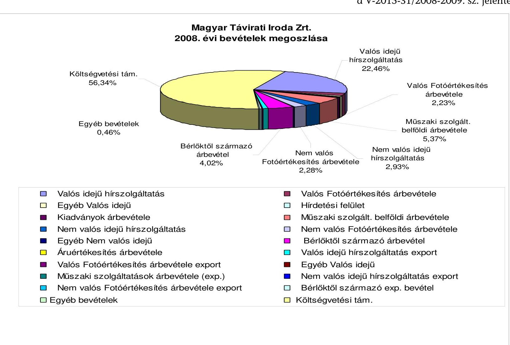

---

4/g. sz. melléklet
a V-2015-31/2008-2009. sz. jelentéshez

Magyar Távirati Iroda Zrt.
2008. évi költségek és ráfordítások megoszlása

Egyéb szolgáltatások értéke
0,44%
Személyi jellegű ráfordítások
60,98%

Eladott ( közvetített )
szolgáltatás
0,35%
Értékcsökkenési leírás
5,55%
Igénybe vett szolgáltatások
értéke
23,90%
Anyagköltség
6,38%
Rendkívüli ráfordítások
0,14%
Egyéb ráfordítások
2,01%
Pénzügyi ráfordítások
0,25%
Pénzügyi ráfordítások
0,25%

---

# Tanúsítványok jegyzéke 

| 1/a. tanúsítvány | Árbevétel és eredményterv kimutatása 2003-2008. év |
| :--: | :--: |
| 1/b. tanúsítvány | Költség- és ráfordításterv kimutatása 2003-2008. év |
| 2. tanúsítvány | A társaság vagyoni helyzetének alakulása 2003-2008. év (eszközök) |
| 3. tanúsítvány | A társaság vagyoni helyzetének alakulása 2003-2008. év (források) |
| 4. tanúsítvány | Bevételek alakulása 2003-2008. év |
| 5. tanúsítvány | Költség- és ráfordításterv alakulása 2003-2008. év |
| 6. tanúsítvány | Eredmény alakulása 2003-2008. év |
| 7. tanúsítvány | Költségvetési befizetési kötelezettségek 2003-2008. év |
| 8. tanúsítvány | Költségvetési juttatások |
| 9. tanúsítvány | Az MTI Zrt. létszámmegoszlása 2001-2008. év |

---

Megye. Javíratí Ivuda Zrt. Budapest

1/a. sz. tanúsítvány a V-2015- 31 /2008-2009. sz. jelentéshez

szpr. Fr. haz

|  Megnevezés | Tény 2003 | Tény 2004 | Tény 2005 | Tény 2006 | Tény 2006 | Index (%) 2006 tény/terv | Tény 2007 | Tény 2007 | Index (%) 2007 tény/terv | Tény 2008 | Tény 2008 | Index (%) 2008 tény/terv | Index (%) 2008 tény  |
| --- | --- | --- | --- | --- | --- | --- | --- | --- | --- | --- | --- | --- | --- |
|   |  |  |  |  |  |  |  |  |  |  |  |  | 2008 tény  |
|   |  |  |  |  |  |  |  |  |  |  |  |  | 2007 tény  |
|   |  |  |  |  |  |  |  |  |  |  |  |  | 11 (9/6)  |
|   | Bellföldi értékesítés nettó árbevétele | 2 040 869 | 1 836 034 | 1 732 040 | 1 681 422 | 1 747 818 | 103,95% | 1 770 584 | 1 707 184 | 96,42% | 1 736 109 | 1 833 540 | 105,61%  |
|   | Export értékesítés nettó árbevétele | 102 091 | 124 811 | 125 803 | 117 100 | 150 987 | 128,94% | 169 200 | 135 669 | 80,18% | 141 900 | 57 739 | 40,81%  |
|   | Egyéb bevételek | 20 720 | 7 858 | 15 144 | 0 | 58 330 |  | 0 | 35 026 |  | 22 000 | 19 181 | 87,19%  |
|  1. | Árbevétel összes | 2 163 600 | 1 968 703 | 1 872 987 | 1 798 522 | 1 957 135 | 108,82% | 1 939 784 | 1 877 879 | 96,81% | 1 899 659 | 1 910 460 | 100,57%  |
|   | Költségvetési támogatás | 1 757 978 | 2 304 186 | 2 167 458 | 2 314 694 | 2 318 872 | 100,18% | 2 183 328 | 2 307 064 | 105,67% | 2 526 813 | 2 467 666 | 97,66%  |
|   | Összesen | 1 522 200 | 1 607 200 | 2 050 000 | 2 150 000 | 2 150 000 | 100,00% | 2 150 000 | 2 283 000 | 106,19% | 2 475 000 | 2 466 720 | 99,67%  |
|   | Elő támogatások | 235 770 | 696 986 | 37 458 | 164 694 | 168 872 | 102,54% | 33 328 | 24 064 | 72,26% | 51 813 | 946 |   |
|   | Összesen | 0 | 0 | 80 000 | 0 | 0 |  | 0 | 0 |  | 0 | 0 |   |
|   | Aktívált saját teljesítmény | 0 | 0 | 14 336 | 0 | -5 478 |  | 0 | 5 257 |  | 5 000 | 64 338 |   |
|  II. | Bevételék összesen | 3 921 650 | 4 272 889 | 4 054 781 | 4 113 216 | 4 270 528 | 103,82% | 4 123 112 | 4 190 200 | 101,63% | 4 431 472 | 4 442 464 | 100,25%  |
|  V. | Költségek és ráfordítások összesen | 4 084 717 | 4 547 895 | 4 058 829 | 4 108 628 | 4 277 686 | 104,11% | 4 134 436 | 4 197 073 | 101,52% | 4 440 169 | 4 456 358 | 100,36%  |
|  A. | Üzleti eredmény (II-V) | -163 067 | -275 006 | -4 048 | 4 589 | -7 158 | -155,97% | -11 324 | -6 873 | 68,69% | -8 698 | -13 894 | 159,75%  |
|   | Pénzügyi műveletek bevétele | 38 260 | 36 130 | 35 611 | 0 | 30 205 |  | 27 000 | 20 906 |  |  | 37 983 |   |
|   | Pénzügyi műveletek ráfordítása | 15 330 | 5 074 | 15 324 | 0 | 13 476 |  | 12 476 | 8 283 |  |  | 11 186 |   |
|  B. | Pénzügyi műveletek eredménye | 22 930 | 31 056 | 20 287 | 9 000 | 16 729 | 185,88% | 14 524 | 12 623 | 86,91% | 13 000 | 26 796 | 206,13%  |
|  C. | Szokásos vállalkozás eredmény | -140 137 | -243 950 | 16 339 | 13 589 | 9 571 | 70,4% | 3 200 | 5 750 | 179,7% | 4 302 | 12 902 | 299,9%  |
|  D. | Rendkívüli eredmény | 2 181 | 152 152 | -9732 | -5 000 | -1135 |  | 0 | -815 |  | 0 | -6329 |   |
|  E. | Mérleg szerinti eredmény | -137 956 | -91 798 | 6 507 | 8 589 | 8 436 | 98,2% | 3 200 | 4 935 | 154,2% | 4 302 | 6 573 | 152,8%  |

Adatforrás: 2008. kontrolling jelentős

Budapest, 2009. március 26.

- a 2008 évi tényadatokban az export értékesítés nettó árbevételéből, a Londoni Bloomberg (uniós bevétel) átvezetve belföldi értékesítés nettó árbevételébe. Könyvvizsgálat alapján

MAGYAR TÁJIRATI IRODA ZRT.

Készítette: 4. Felsfűs vezető: 1/2

---

Magyar Táviruti Iroda Zrt. Budapest 1/b. sz. tanúsítvány a V-2015- 31 /2008-2009. sz. jelentéshez

|  Megnevezés | Tény 2003 | Tény 2004 | Tény 2005 | Tény 2006 | Tény 2006 | Index (%) 2006 tény/terv | Tény 2007 | Tény 2007 | Index (%) 2007 tény/terv | Tény 2008 | Tény 2008 | Index (%) 2008 tény/terv | Index (%) 2008 tény 2007 tény  |
| --- | --- | --- | --- | --- | --- | --- | --- | --- | --- | --- | --- | --- | --- |
|   |  |  |  |  |  | 3 | 4 (3/2) | 5 | 6 | 7 (6/5) | 8 | 9 | 10 (9/8)  |
|  IV. | Anyagjellegű ráfordítások | 1 448 462 | 1 477 552 | 1 376 662 | 1 369 328 | 1 345 793 | 98,28% | 1 230 963 | 1 153 294 | 93,69% | 1 259 196 | 1 260 856 | 100,13%  |
|  V. | Személyi jellegű ráfordítások | 2 040 848 | 2 005 753 | 1 981 502 | 2 149 364 | 2 283 069 | 106,22% | 2 424 976 | 2 535 640 | 104,56% | 2 733 195 | 2 697 762 | 98,70%  |
|  VI. | Értékesőkkerés összesen | 312 377 | 301 883 | 320 026 | 290 229 | 309 515 | 106,65% | 293 654 | 309 659 | 105,45% | 209 969 | 218 218 | 103,93%  |
|  VII. | Egyéb költség és ráford. össz. | 19 388 | 233 859 | 202 071 | 10 804 | 41 396 | 383,15% | 18 309 | 29 268 | 214,47% | 5 720 | 81 453 | 1424,01%  |
|   | * Céltámogatás elszámolt költségi | 263 642 | 528 848 | 178 569 | 288 903 | 297 913 |  | 166 534 | 159 212 | 95,60% | 232 089 | 198 069 | 85,34%  |
|   | Költség és ráfordítások összesen | 4 084 717 | 4 547 895 | 4 058 829 | 4 108 628 | 4 277 686 | 104,11% | 4 134 436 | 4 197 073 | 101,52% | 4 440 169 | 4 456 358 | 100,36%  |

Adatforrás: 2008 kontrolling jelentős Budapest, 2009 március 26.

- A IV. V. VI. VII. sorokban csak Alaptevékenység terv és tény adatai

Céltámogatás elszámolt költségei: Projekt költségek= 198,069

MAGYAR TÁVIRATI IRODA ZRT.

Készítsész: 4. Főlelős vezető: 1. Főlelős vezető: 1.

---

Magyar Távirati Iroda Zrt. Budapest

A társaság vagyoni helyzetének alakulása (ESZKÖZÖK) (2003-2008. év)

|  Megnevezés | 2003 | 2004 | 2005 | 2006 | 2007 | 2008  |
| --- | --- | --- | --- | --- | --- | --- |
|  Befektetett Eszközök | 3136963 | 3080876 | 2906577 | 2928427 | 2793142 | 2741546  |
|  ebből: Immateriális javak | 105656 | 148651 | 138606 | 129707 | 96313 | 78161  |
|  tárgyi eszközök | 2998015 | 2862112 | 2707058 | 2732080 | 2629953 | 2595602  |
|  befektetett pủ.eszközök | 33292 | 70113 | 60913 | 66640 | 66876 | 67783  |
|  Forgóeszközök | 431964 | 676359 | 599370 | 551087 | 673304 | 736089  |
|  ebből: készletek | 15651 | 11040 | 22386 | 19240 | 9998 | 28141  |
|  követelések | 269904 | 263873 | 286162 | 219795 | 225653 | 152931  |
|  értékpapírok | 0 | 0 | 0 | 0 | 0 | 0  |
|  pénzeszközök | 146409 | 401446 | 290822 | 312052 | 437653 | 555017  |
|  Aktív időbeli elhatárolások | 31461 | 44605 | 18417 | 32763 | 27449 | 54528  |
|  ESZKÖZÖK ÖSSZESEN: | 3600388 | 3801840 | 3524364 | 3512277 | 3493895 | 3532163  |

Adatforrás: 2008.kontrolling jelentés

Budapest, 2009. március 26.

Készítette: MAGYAR TÁVIRÁT IRODA ZRT. 4. Félelős vezető:

---

|  Megnevezés | 2003 | 2004 | 2005 | 2006 | 2007 | 2008  |
| --- | --- | --- | --- | --- | --- | --- |
|  Saját tőke | 3 114 101 | 3 022 303 | 3 028 810 | 3 037 246 | 3 042 181 | 3 048 754  |
|  ebből: jegyzett tőke | 1 750 000 | 1 750 000 | 1 750 000 | 1 750 000 | 1 750 000 | 1 750 000  |
|  tőketartalék | 892 396 | 892 396 | 892 396 | 892 396 | 892 396 | 892 396  |
|  eredménytartalék | 609 660 | 471 705 | 379 907 | 386 414 | 394 850 | 399 785  |
|  mérleg szerinti eredmény | -137 955 | -91 798 | 6 507 | 8 436 | 4 935 | 6 573  |
|  Céltartalék | 15 536 | 16 712 | 16 712 | 13 000 | 0 | 45 000  |
|  Kötelezettségek | 297 165 | 567 427 | 346 476 | 363 464 | 364 923 | 220 355  |
|  Passzív időbeli elhatárolások | 173 586 | 195 398 | 132 366 | 98 567 | 86 791 | 218 054  |
|  FORRÁSOK ÖSSZESEN: | 3 600 388 | 3 801 840 | 3 524 364 | 3 512 277 | 3 493 895 | 3 532 163  |

A társaság vagyoni helyzetének alakulása (FORRÁSOK) (2003-2008. év)

Az árt

Budapest, 2009. március 26.

Készítette: MAGYAR TÁVIRATI IRODA ZRT. Felelős vezető:

---

Magyar Távirati Iroda Zrt. Budapest

Bevételek alakulása (2003-2008. év)

4. sz. tanúsítvány a V-2015-3.1/2008-2009. sz. jelentéshez

ezer Ft-ban

|  Megnevezés | 2003 | 2004 | 2005 | 2006 | 2007 | 2008  |
| --- | --- | --- | --- | --- | --- | --- |
|  Belföldi értékesítés nettó árbevétele | 2 040 869 | 1 836 034 | 1 732 040 | 1 747 818 | 1 707 184 | 1 833 540  |
|  Export értékesítés nettó árbevétele | 102 091 | 124 811 | 125 803 | 150 987 | 135 669 | 57 739  |
|  Egyéb bevételek | 1 778 690 | 2 312 044 | 2 182 602 | 2 377 202 | 2 342 090 | 2 486 847  |
|  Aktivált saját teljesítmények | 0 | 0 | 14 336 | -5 478 | 5 257 | 64 338  |
|  Pénzügyi műveletek bevételei | 38 260 | 36 130 | 35 611 | 30 205 | 20 906 | 37 983  |
|  Rendkívüli bevételek | 8 091 | 460 820 | 1 946 | 1 517 | 397 | 29  |
|  BEVÉTELEK ÖSSZESEN: | 3 968 001 | 4 769 839 | 4 092 338 | 4 302 251 | 4 211 503 | 4 480 475  |

Adatforrás: 2008.kontrolling jelentés

Budapest, 2009. március 26.

MAGYAR TÁVIRATI IRODA ZRT.

Készítette: 4.

PH

Felelős vezető:

---

Magyar Távirati Iroda Zrt. Budapest

Költségek és ráfordítások alakulása (2003-2008. év)

5. sz. tanúsítvány a V-2015-3 / 2008-2009. sz. jelentéshez

|  Megnevezés | 2003 | 2004 | 2005 | 2006 | 2007 | 2008  |
| --- | --- | --- | --- | --- | --- | --- |
|  Anyagjellegű ráfordítások | 1 594 208 | 1 521 194 | 1 484 010 | 1 467 149 | 1 255 671 | 1 390 182  |
|  Személyi jellegű ráfordítások | 2 128 317 | 2 436 206 | 2 011 604 | 2 390 401 | 2 558 193 | 2 728 121  |
|  Értékcsökkenési leírás | 342 804 | 356 636 | 361 144 | 378 741 | 343 797 | 248 214  |
|  Egyéb költségek és ráfordítások | 19 388 | 233 859 | 202 071 | 41 396 | 39 412 | 89 841  |
|  Pénzügyi műveletek ráfordításai | 15 330 | 5 074 | 15 324 | 13 476 | 8 283 | 11 186  |
|  Rendkívüli ráfordítások | 5 910 | 308 668 | 11 677 | 2 652 | 1 212 | 6 359  |
|  **KÖLTSÉGEK ÉS RÁFORD. ÖSSZESEN:** | 4 105 957 | 4 861 637 | 4 085 831 | 4 293 815 | 4 206 568 | 4 473 903  |

Adatforrás: 2008. kontrolling jelentés

Budapest, 2009. március 26.

Készítette: MAGYAR TÁVIRATI IRORDEZET. 4.

---

Magyar Távirati Iroda Zrt. Budapest

# Eredmény alakulása a V-2015-31/2008-2009. sz. jelentéshez

|  Megnevezés | 2003 | 2004 | 2005 | 2006 | 2007 | 2008  |
| --- | --- | --- | --- | --- | --- | --- |
|  1. Üzemi(üzleti) tevékenység eredménye | -163 066 | -275 006 | -4 048 | -7 158 | -6 873 | -13 894  |
|  2. Pénzügyi műveletek eredménye | 22 930 | 31 056 | 20 287 | 16 729 | 12 623 | 26 796  |
|  3. Szokásos vállalkozási eredmény (1+2) | -140 136 | -243 950 | 16 239 | 9 571 | 5 750 | 12 902  |
|  4. Rendkívüli eredmény | 2 181 | 152 152 | -9 732 | -1 135 | -815 | -6 329  |
|  5. Adózás előtti eredmény (3+4) | -137 955 | -91 798 | 6 507 | 8 436 | 4 935 | 6 573  |

Adatforrás: 2008. kontrolling jelentés

Budapest, 2009. március 26.

MAGYAR TÁVIRATI IRODA ZRT. 4. Főrsz vezetője

Készítette:

---

Magyar Távirati Iroda Zrt.

Költségvetési befizetési kötelezettségek (adók, járulékok) (2003-2008. év)

|  Megnevezés | 2003 | 2004 | 2005 | 2006 | 2007 | 2008  |
| --- | --- | --- | --- | --- | --- | --- |
|  Személyi jövedelemadó | 441 679 | 505 783 | 411 558 | 346 977 | 673 462 | 320 842  |
|  Általános forgalmi adó | 113 490 | 360 630 | 255 728 | 76 147 | 210 644 | 136 217  |
|  Munkaadói járulék | 38 264 | 46 818 | 36 018 | 36 942 | 34 324 | 28 649  |
|  Munkavállalói járulék | 11 075 | 12 185 | 10 927 | 13 389 | 15 760 | 13 631  |
|  Mindösszesen: | 604 508 | 925 416 | 714 230 | 473 455 | 934 190 | 499 339  |

Adatforrás: 2008. kontrolling jelentés

Budapest, 2009. március 26.

Készítette: MAGYAR TÁVIRATI IRODA ZRT.

---

Magyar Távirati Iroda Zrt. 8. sz. tanúsítvány (követlen és közvetett támogatások) a V-2015- 31 /2008-2009. sz. jelentéshez

|  Megnevezés | 2003 | 2004 | 2005 | 2006 | 2007 | 2008  |
| --- | --- | --- | --- | --- | --- | --- |
|  Bevételt nővelő támogatások (kp. költségvetés) |  |  |  |  |  |   |
|  Kérezedgálati feladatok véltámogatása | 1 522 200 | 1 607 200 | 2 080 000 | 2 100 000 | 2 233 000 | 2 363 003  |
|  Határon túli magyar rajta hivatatása |  |  | 50 000 | 50 000 | 50 000 | 80 000  |
|  Olimpás támogatás terhére |  |  |  |  |  | 25 717  |
|  Müködési támogatás összesen: | 1 522 200 | 1 607 200 | 2 130 000 | 2 150 000 | 2 283 000 | 2 466 720  |
|  ÖSSZESEN: | 1 522 200 | 1 607 200 | 2 130 000 | 2 150 000 | 2 283 000 | 2 466 720  |
|  Saját tőkét növelő támogatások |  |  |  |  |  |   |
|  Egyéb, bevételt növelő támogatások |  |  |  |  |  |   |
|  Céltámogatás: |  |  |  |  |  |   |
|  Vállaprási feladatok |  |  |  | 116 800 | 0 | 0  |
|  Európai unió komiss feladatok | 87 679 | 4 625 |  | 3 071 | 0 | 0  |
|  Ilyes Közzárpótvány | 10 889 | 715 | 694 | 438 | 0 | 0  |
|  Struktáraváltási támogatás |  | 190 000 | 1 880 | 8 120 | 0 | 0  |
|  Létszámfelépítési támogatás |  | 410 669 |  |  |  |   |
|  IKH-1034 MTI Net projekt* | 85 498 | 14802 | 3 202 | 2 504 | 113 | 103  |
|  IHM önkormányzatok kivállátása |  | 9000 |  |  |  |   |
|  IHM - MTI DAK projekt* |  | 47233 | 11 456 | 11 444 | 3 449 | 0  |
|  NKOM Digitális Fotóarchív pr.* | 34 775 | 8024 | 420 | 118 | 0 | 0  |
|  SINTAGMA |  |  | 9 201 | 2 758 | 3 545 | 541  |
|  Kéreszetevételénő Minisztérium - Zöld Forrás | 10 000 |  | 3 053 | 323 | 323 | 302  |
|  Oktatási Minisztérium | 3 174 |  |  |  |  |   |
|  EU delegáció | 3 755 |  |  |  |  |   |
|  Ki Kissoda |  |  |  | 2 393 |  |   |
|  Fotószem |  |  |  |  | 2 000 | 0  |
|  MEH - EU Adatbask / "Kor-Képek 1956" |  | 1462 |  | 7 000 | 0 | 0  |
|  Nemzeti Kulturális Alap - "Kor-Képek 45-47" |  | 3000 |  |  |  |   |
|  Nemzeti Kulturális Alap - "Kor-Képek 48-55" |  |  |  |  | 1 000 | 0  |
|  Nemzeti Kulturális Alap - MTI Fotó 50 éve |  |  |  |  | 0 | 0  |
|  Európai unió tám |  | 7 456 | 7 552 | 13 903 | 13 634 | 0  |
|  ÖSSZESEN: | 235 770 | 696 986 | 37 458 | 168 872 | 24 064 | 946  |
|  MINDÖSSZESEN: | 1 757 970 | 2 304 186 | 2 167 458 | 2 318 872 | 2 307 064 | 2 467 666  |

- A céltámogatások tárgyévben elszámolt összegei nem tartalmazzák a beruházások miatt a következő évekre az amortizációval arányosan elhatárolt támogatási fedezetet.

Budapest, 2009. március 26.

MAGYAR TÁVIRATI IRODA ZRT.

Készítette: 4.

Feltébb vezető: 4.

PIL

---

Magyar Távirati Iroda Zrt. Budapest Az MTI Zrt. létszámmegoszlása (2001-2008. év) 9. sz. tanúsítvány a V-2015- 51 /2008-2009. sz. jelentéshez

|  Foglalkoztatottak | 2001.12.31 | 2002.12.31 | 2003.12.31 | 2004.12.31
e felm.utatt lövők
valósz | 2005.12.31
e felm.utatt lövők
valósz | 2006.12.31
e felm.utatt lövők
valósz | 2007.12.31
e felm.utatt lövők
valósz | 2008.12.31
e felm.utatt lövők
valósz  |
| --- | --- | --- | --- | --- | --- | --- | --- | --- |
|  Munkaviszony keretében foglalkoztatott aktív
munkavállalók | 415 | 444 | 433 | 326 | 321 | 359 | 346 | 344  |
|  Munkaviszony keretében foglalkoztatott
nyudítások | 13 | 19 | 25 | 8 | 11 | 18 | 22 | 26  |
|  Összesen | 428 | 463 | 458 | 334 | 332 | 377 | 368 | 370  |
|  Határozott időben foglalkoztatott nyugdíjasok | 1 | 1 | 0 | 0 | 0 | 0 | 0 | 0  |
|  Határozatlan időben foglalkoztatott
nyugdíjasok | 12 | 18 | 25 | 8 | 11 | 18 | 22 | 14  |
|  Mellékfoglalkozás | 3 | 3 | 2 | 1 | 1 | 1 | 0 | 0  |
|  Másodálás | 1 | 0 | 0 | 0 | 0 | 0 | 0 | 0  |
|  Munkaszerződéssel és vállalkozási
szerződéssel foglalk. | 76 | 87 | 89 | 65 | 51 | 0 | 0 | 0  |
|  Külsős foglalkoztatottak |  |  |  |  |  |  |  |   |
|  Határozott | 42 | 80 | 187 | 44 | 55 | 64 | 50 | 66  |
|  Határozatlan | 67 | 126 | 118 | 82 | 75 | 22 | 30 | 29  |
|  Összesen | 106 | 206 | 305 | 126 | 130 | 86 | 80 | 95  |
|  Munkaszerződés és vállalkozási
szerződéssel foglalkoztatottak bontása
szerződés megnevezése szerint | 2001.12.31 | 2002.12.31 | 2003.12.31 | 2004.12.31 | 2005.12.31 | 2006.12.31 | 2007.12.31 | 2008.12.31  |
|  Megalkotási felhasználási szerződés | 0 | 0 | 0 | 0 | 0 | 0 | 0 | 0  |
|  Megbízási szerződés | 0 | 0 | 0 | 0 | 0 | 0 | 0 | 0  |
|  Vállalkozási szerződés | 76 | 87 | 89 | 65 | 51 | 0 | 0 | 0  |
|  Összesen: | 76 | 87 | 89 | 65 | 51 | 0 | 0 | 0  |

Budapest, 2009.márciss 26.

Készítette: