# 31lami számvevőszék 

## JELENTÉS

az állami költségvetési adósság ellenőrzéséről

---

A vizsgálatot vezette
Harsányi Sándor főtanácsos

A vizsgálatot végezték
dr.Borisz József tanácsos
Istvánffy Lóránt tanácsos
Kemény Emil tanácsos
Kiss Istvánné tanácsos
Lőrinc Alajos tanácsos
Majorosné dr. Locskai Noémi tanácsos
Makkai Mária $\quad$ tanácsos
dr.Molnár Barnabás $\quad$ tanácsos
Németh Béláné $\quad$ tanácsos
Rundik János $\quad$ tanácsos
Vasas Sándorné dr. $\quad$ tanácsos

A vizsgálatban 1991. november 30-ig részt vett:
Lázárné Ozorai Mária számvevő

# Szakértőként közreműködött 

dr. Asztalos László a közgazdasági tudományok kandidátusa

---

# T A R T A L O M J E G Y Z É K 

Oldal
I. Bevezetés ..... $1-6$
II. Megállapítások ..... 6

1. A költségvetés közvetlen hitelfelvétele a Magyar Nemzeti Banktól az állami költségvetés hiányának részbeni fedezetéül ..... $6-11$
2. Egyes gazdálkodó szervezetek átvállalt tartozásai miatti államadósság ..... $11-15$
3. Kereskedelmi bankok és átszervezett biztosító intézetek miatti államadósság ..... 15
4. Vállalatok forgóalap rendezésével kapcsolatos államadósság ..... $16-18$
5. A nemzetközi pénzügyi szervezetek alaptőkéjéhez felvett hitelek miatti államadósság ..... $19-20$
6. Kibocsátott értékpapírok miatti államadósság ..... $20-21$
7. Világbanki hitelek miatti államadósság ..... $21-24$
8. Kormányhitelek miatti államadósság ..... $24-26$
9. Az Állami Fejlesztési Intézet által ellátott állami beruházási feladatok finanszírozását szolgáló a Magyar Nemzeti Bank által nyújtott refinanszírozási hitelek miatti államadósság ..... $26-33$
10. A nemzeti valuta hivatalos leértékeléséből származó államadósság ..... $33-36$
11. Az államadósság törlesztési és kamatfizetési terhei ..... $36-41$
III. Összefoglaló következtetések és javaslatok ..... 41
12. Összefoglaló következtetések ..... $41-45$
13. Javaslatok ..... $45-47$

---

Állami Számvevőszék
V-75-69/1991/1992.
Témaszám: 63.

J E L E N T É S
az állami költségvetési adósság ellenőrzéséről

1 .

# B EVEZETÉS 

Az Állami Számvevőszék felismerve az államadósság nagyságának, kezelésének nemzetgazdasági jelentőségét az ellenőrzés sajátos eszközével kívánt hozzájárulni e tárgykörben az Országgyűlés ellenőrzési munkájának segítéséhez. Ezért munkaprogramjába felvette és először 1990-ben vizsgálatot végzett a dollár elszámolású tartozások és követelések 1989. december 31-i helyzetéről. 1991-ben elvégezte az állami költségvetési adósság 1990. december 31-i helyzetének vizsgálatát. E vizsgálatnak előfeltétele volt az állami költségvetési adóssággal kapcsolatos törvényi szabályozás megléte, amelyet az 1990. év CIV. törvény megvalósított.

A törvény megalkotásának előzménye volt, hogy 1989. november 21-én az akkori miniszterelnök a Parlamentben bejelentést tett az ország külföldi adóssága egy hányadának eltitkolására folytatott manipulációkról. Ezt követően az MNB elnöke 1990. áprilisában az Országgyűlésnek bemutatta az MNB 1989. év végi valós mérlegét, az ország külföldi adósságára és az államháztartás adósságára vonatkozó visszamenőleges adatokat is.

---

Ezzel egyidejűleg az MNB-nél és a Pénzügyminisztériumban megindult az államadósság egyes részelemeinek vizsgálatára irányuló munka, ami alapja volt az 1990. évi CIV. törvény idevonatkozó része megalkotásának.

Az 1990. évi CIV. törvény megalkotásának és elfogadásának pénzügytörténeti jelentősége van. Először fogalmazódik meg tartalmilag és számszerűsítve az államadósság és kap törvényi szabályozást kezelése. Ez még akkor is jelentős eredmény, ha e törvény az állam költségvetési adósságát tekinti államadósságnak és államháztartási törvény hiányában nem tágíthatja szemléletét az államháztartás egészére.

Mindebből következően 1945. óta 1991. az az év, amikor ellenőrző szervezet - jelen esetben az 1990-től működő Állami Számvevőszék - visszamenőleg, keletkezési folyamatait is áttekintve elvégezte az állami költségvetési adósság ellenőrzését. (A továbbiakban az államadósság alatt ezt a fogalmat értjük, mely az 1990. évi CIV. törvény tartalmával és szóhasználatával azonos.)

A vizsgálat célja szerint alapvetően:

- az 1990. évi CIV. törvényben rögzített államadósság dokumentálásának szabályosságára, helyességére;
- az adósságszolgálati kötelezettségre;
- a költségvetésnek az adósságszolgálatból adódó jövőbeni terheire
irányult.

Az Állami Számvevőszék feladatköréből adódóan a vizsgálat nem terjedt ki annak megítélésére, hogy az 1990. évi CIV. törvényben előírtak ("MÁSODIK RÉSZ") tekinthetők-e az államadósságnak és nem foglalkozott a kezelés módjára vonatkozó törvényi szabályozás helyességének minősítésével sem. A vizsgálat kiinduló alapja az 1990. évi CIV. törvény államadósságra vonatkozó törvényhelyei

---

voltak, így nem terjedt ki az 1990. december 31-e után keletkezett és a már fennálló garanciavállalások miatti potenciális adósságra.

A vizsgálat tartalmához* tartozott az államadósság egyes elemeinek ellenőrzése is. Ennek során vizsgáltuk többek között a Bős-Nagymaros beruházás államadóssághoz tartozó vonatkozásait, ugyanakkor ez a vizsgálat, mint komplex állami nagyberuházással kapcsolatos problémakörre nem terjedt ki. A Bős-Nagymaros beruházás pénzügyi lezárásával kapcsolatban az Állami Számvevőszék külön program alapján folytatja le ellenőrző vizsgálatait.

A jelentésben foglaltak értelmezése, kapcsolódása érdekében röviden vissza kell utalnunk arra, hogy az 1990. évi CIV. törvényben rögzített államadósság összetétele többféle. Jelentős részét a jegybankkal szembeni, eddig is tartozásként kezelt költségvetési adósság képezi. Egy másik részét a forint leértékeléséből származó könyv szerinti tartozás adja. További részét e törvény alapján mutatjuk ki államadósságként, melyet az ÁFI-nak 1990. végéig MNB által nyújtott ún. refinanszírozási hitelei képeznek.

Nyomatékosan hangsúlyozni kell, hogy ez utóbbi hitelek államadósságként kezelését azok közgazdasági tartalma indokolja. Ugyanis az állam fejlesztési kiadásainak finanszírozását Magyarországon az Állami Fejlesztési Bank, illetve annak elődje, a Beruházási Bank és utódja, az Állami Fejlesztési Intézet (ÁFI) végezte. Az ÁFI, illetve jogelődje az Állami Fejlesztési Bank vette fel a hiteleket a Magyar Nemzeti Banktól - a visszafizetés állami garanciája mellett - és folyósította a vállalatok számára állami

[^0]
[^0]:    * A vizsgálat a rendelkezésre álló dokumentumok alapján a számszerű nagyságrendeket millió Ft-ban kezelte. Az 1990. évi CIV. törvény az adatokat milliárd Ft-ban tünteti fel. Ahol a vizsgálati jelentésben milliárd Ft szerepel ott kifejezetten a törvényben foglaltak szerint jártunk el.

---

fejlesztési kölcsönként és alapjuttatásként. Az ilyen módon finanszírozott fejlesztések a költségvetésen kívül bonyolódtak, s ez a hitelállomány nem jelent meg a költségvetési hitelállomány részeként. Az ÁFI által felvett hiteleket ugyanakkor gyakran az államilag támogatott nagyberuházások vagy kevéssé nyereséges vállalatok fejlesztésére használták fel, vagyis a vállalatok úgy részesültek felhalmozási juttatásban, hogy ez a tétel a költségvetés kiadásai között nem jelent meg. Ezekből következően az ehhez tartozó hitelek is közgazdaságilag költségvetési hiteltartozásnak tekinthetők. E követelménynek az 1990. évi CIV. törvény megfelel.

Rá kell mutatni az 1990. évi CIV. törvényben felsorolt adósságelemek másik jellegzetességére is. Nevezetesen arra, hogy az adósság két nagy csoportra osztható aszerint, hogy belföldi jövedelemtulajdonosokkal vagy külfölddel szemben állt fenn. A belföldi jövedelemtulajdonosokkal szembeni rész forintban keletkezett, így mindenkori nagysága a törlesztésekkel változik. A külfölddel szembeni adósság devizában áll fenn, melynek devizaösszege ismert. Az adósság forint értéke azonban a devizák keresztárfolyamai és a valutakosárhoz képest bekövetkező árfolyamváltozások szerint változik anélkül, hogy az adósság eredeti devizában meglévő nagysága változna. Így a külfölddel szembeni államadósság forint értéke változó nagyságú, a jelentésben az 1990. év végi árfolyamon számított forint érték.

A vizsgálat körülményei közé tartozott az is, hogy az államadósság jogszabályi és döntési háttere, környezete a vártnál is nagyobb munkaráfordítással és időráfordítással volt feltárható, tekintettel a szélsőséges esetben 1968-1990-ig tartó időhorizontra, a rendkívül sok "Titkos" és "Szigorúan Titkos" dokumentumra, a vizsgálatban érintett legfontosabb szervezetek (PM, MNB, ÁFI) szervezeti átalakulására és személyi változásaira. A helyzetfeltárást az érintett szervezetek folyamatosan végezték és végzik,

---

azonban alig van olyan munkatárs, aki a múlt gyakorlatát ismerné, hisz területükön is újak. Ebből következik, hogy egyes ügyek rendezése elhúzódik, a szabályozás késik, mert maga a helyzet felismerése és a rendezés is időigényes. A vizsgálat egyik származékos eredménye, hogy - ahol indokolt volt - a vizsgált szervek folyamatosan intézkedtek a "Titkos", illetve "Szigorúan Titkos" minősítés megszüntetésére.

Az Állami Számvevőszék a jelentést többszörösen - vezetői szinten is - egyeztette az érintettekkel. Az észrevételek már több olyan intézkedést jeleznek, amelyek a vizsgálat eredményként is értékelhetők. Az intézkedésekkel összefüggésben több helyen a jelentésben szereplő számadatok módosítását javasolják.

A jelentés tartalmazza azokat az észrevételeket és adatmódosításokat, amelyekkel az Állami Számvevőszék egyetért. Véleményeltérésnél az eredeti álláspontját fenntartotta.

A helyszíni ellenőrzés a Pénzügyminisztériumban, a Magyar Nemzeti Banknál és az Állami Fejlesztési Intézetnél 1991. július 12. és november 30. között folyt le, az 1991. július 12-én jóváhagyott vizsgálati program alapján (V-75-9/1991. témaszám: 63).

A vizsgálat követte az 1991. évi költségvetésről szóló 1990. évi CIV. törvény "Második Rész"-ben az államadósság körére és kezelésére vonatkozó törvény struktúráját. Ennek megfelelően a fő területei:*

- a költségvetés közvetlen hitelfelvétele a Magyar Nemzeti Banktól;
- egyes gazdálkodó szervezetek átvállalt tartozásai miatti államadósság;
* A vizsgált fő területek szerinti államadósság összetételét az 1. sz. melléklet foglalja össze.

---

- a kereskedelmi bankok és átszervezett biztosító intézetek alaptőkéjéhez felvett hitelek miatti államadósság;
- a vállalati forgóalap-rendezés miatti államadósság;
- nemzetközi pénzügyi szervezetek alaptőkéjéhez felvett hitelek miatti államadósság;
- a kibocsátott értékpapírok miatti államadósság;
- a világbanki hitelek miatti államadósság;
- kormányhitelek miatti államadósság;
- az Állami Fejlesztési Intézet által ellátott állami beruházási feladatok finanszírozását szolgáló Magyar Nemzeti Bank által nyújtott refinanszírozási hitelek miatti államadósság;
- a nemzeti valuta hivatalos leértékeléséből származó államadósság;
- az államadósság kamatfizetési és törlesztési terhei.
11.

M E G Á L L A P Í T Á S O K

1. A költségvetés közvetlen hitelfelvétele a Magyar Nemzeti Banktól az állami költségvetés hiányának részbeni fedezetéül

Az állami költségvetés 1968-tól kezdődően deficites. A költségvetési hiányt ettől az időponttól részben finanszírozta az MNB-től, illetve 1969. és 1975. között az Országos Takarékpénztártól is felvett hitel. Az állami költségvetés hitelfelvétele kétféle módon történt, így nemcsak a mindenkori zárszámadási törvényben rögzített hiánnyal volt egyenlő. Az egyik - kisebbik hányada - a nyilvánosan meghirdetett hiányt

---

finanszírozó hitel volt, a másik - döntő többséget jelentő hitelt, a mindenkori éves költségvetés bevételként könyvelték el, s így a folyó kiadásokat finanszírozta. 1979. előtt a költségvetés hitelfelvételének módját jogszabály nem írta elő. 1979-től a jogi keretet viszont az Állami Pénzügyekről szóló 1979. évi II. törvény biztosította.

A bevételként felvett hiteleket mindig a tárgyévben folyamatosan igényelték, a hiányt finanszírozó hiteleket pedig utólag, a költségvetési évet követő évben, a zárszámadás országgyűlési elfogadását követően vették igénybe.

Az 1990. évi CIV. törvény 24. § szerint az állami költségvetés hiányának fedezetéül felvett hitelek két időszakra oszthatók: az 1981. előtt, valamint az azt követően 1990. XII.31-ig felvett hitelekre. A számvevőszéki vizsgálat alapján megállapítást nyert, hogy 1982-ben 12.916 millió Ft-ot, 1983-ban pedig 16.200 millió Ft-ot, összesen 29.116 millió Ft hitelt bevételként számolt el a költségvetés, mely összegeket korábbi hitelek törlesztésére használták fel, azaz emiatt az államadósság nem nőtt. Ezt a jelentésben úgy jelezzük, hogy zárójelben az 1983-as évszámot feltüntetjük.

# 1.1. Az 1981 (1983)-ig felvett hitelek 

### 1.1.1. Az 1981 (1983)-ig felvett hitelek kezelése, nagysága összetétele

Ezen időszakban elkülönült a bevételként könyvelt és a meghirdetett nyilvános hiányt finanszírozó hitel. A megkülönböztetésének azért volt jelentősége, mert az előbbiek nem voltak publikusak. A költségvetésben is a "nemzetközi bevételek" és "egyéb bevételek" soron jelentek meg.

---

Ezzel a megoldással nem a mindenkori tényleges költségvetési hiányt mutatták ki, csak annak egy töredékét, a "nyilvános" hiányt. A bevételként elszámolt hitelfelvételekből felhalmozódott államadósság nem volt publikus. Törlesztése
 minimális volt és az MNB nyilvános mérlegében nem szerepelt. A nyilvános hitelek kimutatott állománya sem egyezett meg a PM által nyilvántartott tényleges helyzettel.

A bevételként könyvelt hitelfelvétel 1969-1983 között 366.621 millió Ft, a nyilvános hiányt finanszírozó hitelfelvétel 1971-1981 között 35.598 millió Ft, összesen 402.219 millió Ft volt. Így a költségvetési hiány mindössze 8,9 %-át fedezte nyilvános hitelfelvétel, míg 91,1 %-a "rejtett" módon finanszírozódott. A finanszírozó 97,3 %-ban (379.185 millió Ft) a Magyar Nemzeti Bank, 5,7 %-ban (23.034 millió Ft) az Országos Takarékpénztár volt.

A költségvetési hiány részbeni kezelésének vázolt módszere 1982-ig a nemzetközi pénzügyi szervezetekkel való kapcsolat felvételig, illetve a Nemzetközi Valutaalapba (IMF) való belépésig annak ellenére, hogy évenkénti Minisztertanácsi határozatokon alapult, a Pénzügyminisztérium és a Magyar Nemzeti Bank közötti megegyezés kérdése volt. Ugyanis a minisztertanácsi határozatok pusztán a rendezendő összegeket és azt, hogy ezt bevételként kell elszámolni írták elő, azonban a lejáratról és a kamatról nem rendelkeztek.
1982. után azonban a nem nyilvános adósságot és a nyilvános hitel felvételt is "kezelni kellett".

A "kezelési módszer" többirányú, lényegét illetően a következő volt:

- A nemzetközi pénzügyi szervezetekkel való kapcsolatfelvétel időszakában, 1982. április hónapban az MNB nyilvános mérlege a költségvetés által bevételként felvett hiteleket nem

---

tartalmazta és a nyilvános hiányt finanszírozó hitelállomány 18.913 millió Ft-tal több volt a PM által nyilvántartott összegnél. A Nemzetközi Valutaalapnak az MNB nyilvános mérlegében szerepeltetett 27.011 millió Ft költségvetési hiteltartozást mutatták ki. A nyilvános és a tényleges mérlegek közötti pontos számszerű kapcsolatot egy ún. költségvetési konszolidációs számlával teremtették meg úgy, hogy az MNB nyilvános mérlegében szereplő adatokhoz igazították az egyes pénzintézetek mérlegeit. Az MNB mérlegének egyes sorait is módosították. Ettől kezdődően a pénzintézetek és az MNB is kétféle mérleget készített, publikus és nem publikus jellegűt. Az így manipulált nyilvános mérlegek épültek be a népgazdaság összevont adatait tartalmazó mérlegekbe (2. és 3. sz. mellékletek).

A konszolidálás során 305.000 millió Ft államadósság olyan "eltüntetésére" került sor, hogy az a MNB mérlegéből ne legyen kiolvasható. A mérleg "kozmetikázott" lett, a költségvetési adósság egyrészt - de csak papíron - pénzintézeti, gazdálkodó szervezeti adóssággá alakult, másrészt pedig "megszűnt". Ezt az tette lehetővé, hogy a pénzügyminiszter jogállása szerint a konszolidálás során érintett pénzintézetek jövedelemszabályozása és a mérlegkészítéssel kapcsolatos előírások meghatározása a pénzügyminiszter hatáskörébe tartozott.

1989-ben a Pénzügyminisztériumban és az MNB-nél az államadósság vizsgálatára irányuló munka során a költségvetés adóssághelyzetét feltárták, azonban az egyes évek költségvetéseit nem módosították.

- Az MNB publikus mérlegében a nyilvános hiányokat finanszírozó tartozás 1981. december 31-én 27.011 millió Ft volt. Ezzel szemben a PM által nyilvántartott tartozás 8.098 millió Ft volt. A PM és az MNB mérlegek egyezőségének létrehozása érdekében - az MNB mérlegéhez igazodva - a PM által nyilvántartott tartozást 18.913 millió Ft-tal megemelték. A megemelt nyilvános adósságállományt az 56.199/1983. sz. Megállapodásban rögzítették. A 18.913 millió Ft többlettel viszont csökkentették a bevételként könyvelt, nem nyilvános tartozásokat.

# 1.1.2. Az 1981. (1983)-ig felvett hitelek törlesztése 

A bevételként könyvelt hitelek tényleges törlesztése összegszerűen és időben megfelelt az erre vonatkozó szerződéseknek.
1983. december 31-én
összes bevételként felvett hitel 366.621 millió Ft
összes törlesztés - 66.491 "
konszolidálás miatti korrekció - 18.913
egyenlegként a
hitelállomány:
281.217 millió Ft

Ez az adósságállomány megegyezik az 1990. évi CIV. törvény 26. §. (2) ab) pontjában szereplő 281.217 millió Ft-os tartozással, amely a 2-008/7/1983. sz. Megállapodás szerint 1983. január 1-től kamatmentes, a 2-0013/1/1984. sz. Megállapodás pedig a törlesztési kötelezettséget felfüggesztette. Ez jogszabályi előírásba nem ütközött.

* (A hitelállomány részletezését a 4. sz. melléklet tartalmazza.)

---

1.2. Az 1981. (1983) után felvett hitelek
1981. évtől a költségvetés tényleges hiányát finanszírozó hiteleket a törvényi előírásoknak megfelelően vette fel a költségvetés nevében a pénzügyminiszter. Törvényi felhatalmazás alapján az állami költségvetés hiányát a tárgyévet követő évben rendezték jegybanki hitellel a PM-MNB közötti megállapodással.

A hiányt teljes egészében jegybanki hitel finanszírozta, vagy csak annak egy részét. A többit értékpapír-kibocsátással fedezték. A törvényi előírások csak annyit tartalmaztak, hogy hosszúlejáratú hitelformával rendezzék a hiányt. A konkrét lejáratban és kamatfeltételekben mindenkor az MNB elnöke és a pénzügyminiszter állapodott meg. Minden évben készültek hitelmegállapodások. Kamatváltozások esetén módosították az eredeti megállapodások érintett pontjait. A törlesztések és a kamatfizetések a megállapodásokban rögzítetteknek megfeleltek.
1982. január 1-től 1990. december 31-ig az MNB-től hosszúlejáratú, deficitet finanszírozó hitelfelvételre 175.619 millió Ft összegben került sor. E hitelekre törlesztés először 1987-ben volt. 1990. december 31-ig összesen 14.255 millió Ft visszafizetés történt. A fennálló állomány 1990. december 31-én 161.364* millió Ft, mely összeg megegyezik az 1990. évi CIV. törvény 26. §. (2) b) pontjában szereplő összeggel.
2. Egyes gazdálkodó szervezetek átvállalt tartozásai miatti államadósság

Ez az államadóssági elem az egyes gazdálkodó szervezetektől a költségvetés által átvállalt tartozások miatt keletkezett.

* Az 1981. után felvett költségvetési hiányt finanszírozó hiteleket az 5. sz. melléklet tartalmazza.

---

A vállalati beruházási hitelek átvállalása kapcsán összesen 20.546 millió Ft államadósság jött létre. Ebből 6.116 millió Ft hitelt eredetileg az MNB, 14.430 millió Ft-ot az Állami Fejlesztési Bank (jelenleg ÁFI) nyújtotta.

Az államadósság kialakulása a következő hét (ipari és élelmiszeripari) nagyvállalatot érintette:

- Lenin Kohászati Művek (LKM)
- Özdi Kohászati Üzemek (ÖKÜ)
- Magyar Aluminiumipari Tröszt (MAT)
- Tungsram Rt
- Hajdúsági Cukorgyár
- Ganz-Mávag
- Szekszárdi Húsipari Vállalat.

A beruházási hitelek átvállalását, "államadóssággá" való konvertálását az érintett vállalatok pénzügyi és gazdálkodói egyensúlyának alapvető megbomlása kényszerítette ki. Egy vállalat, a Hajdúsági Cukorgyár kivételével - ahol a rendezést pénzügyminisztériumi államtitkári leirat rögzítette - minden más esetben az Állami Tervbizottság aktuális határozata írta elő a rendezést. A hitelek átvállalásához szükséges jegybanki hitelfelvételre az 1986. évi V. törvény adott felhatalmazást.

A vizsgálat során az eredetileg a Magyar Nemzeti Bank által kezelt 6.116 millió Ft hitelállományra vonatkozó vállalati hitelszerződések az MNB-nél nem álltak rendelkezésre. Ez azonban nem teszi kétségessé ezen államadóssági elemeket, mert a költségvetés hitelfelvételi szerződése alátámasztja, amely törvényi felhatalmazáson alapult.

Az állami adósságátvállalás vizsgálata - a korábban ismertetett dokumentációs hiányosságok miatt - e körben hat vállalatnak az ÁFI-val kötött 16 db állami fejlesztési kölcsönszerződésére terjedt ki.

---

Az állományból három vállalat, illetve 7 db kölcsönszerződés esetében 10.407 millió Ft átvállalása a teljes adósság elengedését eredményezte, így a kölcsönszerződések megszűntek. (LKM, ÖKÜ, Hajdúsági Cukorgyár). A MAT 7 db kölcsönszerződése esetében összesen 2.465,5 millió Ft értékben csak az 1986-88. közötti időszakra ütemezett törlesztő összegeket engedték el, a maradék 4.219,8 millió Ft-os hitel visszafizetését 1989-től az eredeti feltételekkel és ütemezésben, változatlan formában folytatták.

A Húsipari Tröszt állami fejlesztési kölcsönéből 1.150 millió Ft hitelkövetelést töröltek, a maradvány 964,4 millió Ft hitel törlesztését a Szekszárdi Húsipari Vállalat átütemezéssel vállalta át.

A hitelfeltételek jelentősebb módosulása csak a Ganz Mávag-MVG rekonstrukciós kölcsöne esetében történt. Az állami adósságátvállalást követően a GM MVG-t 1.735,4 millió Ft tartozás terhelte. A fennmaradó hitelt 15 évi járadékfizetési kötelezettséggel, állami alapjuttatássá alakították át.

A lefolytatott vállalati pénzügyi rendezéseknek csak egyik eleme volt az állami fejlesztési kölcsönök részleges vagy teljes elengedése. A vállalati adósságok állami átvállalása mellett a vonatkozó határozatok további, jelentős gazdálkodási kihatású engedményeket rögzítettek. (Pl. a tartalékalap visszapótlási kötelezettségek elengedésével, bankhitelek átütemezésével, további állami alapjuttatásokkal, különböző adókedvezményekkel, export-támogatásokkal, a normatív keresetszabályozási rendszer oldásával stb.).

A dokumentumok alapján a vállalatok pénzügyi rendezése a gazdálkodási egyensúly hosszabb távú stabilizálására, a VII. ötéves tervidőszak megalapozására irányult.

---

Az átfogó pénzügyi rendezést követően elkészültek a hosszabb távú termelési szerkezetátalakítási-stratégiai tervek, azonban foglalkoztatás-politikai szempontból is akadozott beindításuk, illetve a felgyorsuló piaci események eltérítették a vállalatokat a tervekben előirányzott növekedési pályától. Főként a szocialista piac felbomlása, valamint a belföldi szükségletek visszaszorulása miatt a kibontakozással kapcsolatos elképzelések túlhaladottá váltak. Megállapítható, hogy a jelentős állami adósságátvállalással lefolytatott átfogó pénzügyi rendezések eredeti céljuktól elmaradva csak rövid távon, a termelési szerkezetátalakítási kényszer oldásának irányában hatottak. Az egyes vállalatok* gazdálkodási válsága az állami beavatkozást követően - rövid időn belül - folytatódott.

A vizsgált kormányszintű határozatok összesen közel 22.280 millió Ft vállalati adósság költségvetési átvállalását rendelték el. Az adósság átvállalás fedezetére 1986. december 29-én megkötött 50.123/1987./II.b. sz. megállapodás alapján a Magyar Nemzeti Bank 20.546 millió Ft hitelt nyújtott a Pénzügyminisztériumnak, mely a bankoknál a követeléseket rendezte.

A költségvetési rendezésből kimaradt több, mint 1,7 Mrd Ft-os követelést pedig az ÁFI a fizetendő nyereségadójából tartotta vissza. Az eljárási módot a Pénzügyminisztérium leírata szabályozta. Eszerint az ÁFI a kölcsöntörlesztés és kamatfizetés felfüggesztésétől az egység átfogó pénzügyi rendezéséig terjedő "átmeneti" időszakban az esedékes törlesztési és kamatfizetési követeléseivel az időszaki nyereségadó befizetéseit csökkentette. Az ÁFI ilyen formában rendezte a Hajdúsági Cukorgyárnak nyújtott államkölcsön esetében 924 millió Ft tö-

* (Az érintett vállalatok helyzetét a G. sz. melléklet foglalja össze.)

---

ke és 408 millió Ft kamattartozást, továbbá a GM MVG 403 millió Ft kamathátralékát. Ez a módszer a költségvetés bevételeit csökkentve a vállalati adósságok átvállalásának a rendezését - formálisan - a költségvetésen kívül folytatja le.

Az egyes gazdálkodó szervezetek átvállalt tartozásai miatti 20.546 millió Ft-os államadósság megegyezik az 1990. év CIV. törvény 24. §. (1) bekezdés b. pontjában foglaltakkal.
3. Kereskedelmi bankok és átszervezett biztosító intézetek miatti államadósság

Ezen államadóssági elem a kereskedelmi bankok és átszervezett biztosító intézetek létrehozásához (kétszintű bankrendszer kiépítéséhez), a szükséges alaptökéhez felvett hitelekhez és kibocsátott értékpapírokhoz kapcsolódik. A felhatalmazást az 1987. évi költségvetésről szóló 1986. évi V. törvény adta.

A kereskedelmi bankok létrehozásához és a biztosító társaságok átszervezéséhez a költségvetés 11.500 millió Ft jegybanki hitelt vett fel és 9.000 millió Ft 10 %-os kamatozó államkötvényt bocsátott ki. (A tételes megoszlást a 7. számú melléklet tartalmazza.)
A hitel felvételére az 50.123/1987. II.13. sz. megállapodás (8. sz. melléklet) szerint került sor.

A jegybanki hitelállomány törlesztendő összege 5.752 millió Ft. Megegyezik a költségvetés által a kereskedelmi bankok alaptökéjének fedezetéül felvett jegybanki hitel még vissza nem fizetett részével és az 1990. évi CIV. törvény 24. §. 1/c. pontjában ezen jogcímen jelzett összeggel.

---

4. Vállalatok forgóalap rendezésével kapcsolatos államadósság

Az 1990. évi CIV. tv. 24. §. 1/d. pontja a vállalati forgóalap rendezéssel kapcsolatban keletkezett, az MNB-vel szemben fennálló állami adósságot 23,8 milliárd Ft-ban jelöli meg.

Az ellenőrzés kezdetben a PM és MNB adatszolgáltatása, majd ennek hiányossága és ellentmondásos tartalma miatt az ÁSZ saját hatáskörében folytatott adatgyűjtései alapján folyt, a tapasztalatok alapján a következő megállapítások tehetők:

Az 1968. évi új gazdaságirányítási rendszer bevezetésével kapcsolatban a vállalati forgóalap feltöltésre két lépésben, 1967-ben és 1971-ben került sor. Az 1967. év végén lefolytatott első vállalati forgóalap juttatásra vonatkozó döntés-előkészítési információkat az MNB elnöki okmánytárában elhelyezett 8/1967. XI.20. nyilvántartási számú dokumentáció, a forgóalapjuttatás pénzügyi elszámolását
 a 30.448/1968. PM dokumentáció tartalmazza.

Először 1967-ben 1500 gazdálkodó egységnél közel 44,2 Mrd Ft forgóalapjuttatásra került sor, melynek pénzügyi fedezete biztosított volt. Ez alkalommal hitelfelvétel nem volt, így az 1967. évi forgóalap rendezés nem képezi az államadóssági vizsgálat tárgyát.

A második vállalati forgóalap rendezés 1971-ben történt. A Kormány 3485/1970. határozata intézkedett az 1971. évi állami költségvetésről. A határozat 6. pontjában engedélyezték, hogy az 1968. január 1-jei rendezésből kimaradt vállalatok forgóalap rendezését a hitelforrások terhére valósítsák meg.

A kormányhatározatban szereplő felhatalmazás alapján a PM az MNB-vel 1971. márciusában állapodott meg költségvetési hitel felvételében. A megkötött 2-0073/1/1971. megállapodás sze-

---

rint az 1971. január 1-jei forgóalap rendezés finanszirozására a szükségletnek megfelelően, de legfeljebb 23.800 millió Ft-ot fordíthatott az MNB a PM iránymutatása szerint. Ugyanakkor a folyósított összeggel azonos összegű államadósság terhelte a PM-et. A meghatározatlan időre szóló adósság után a PM az eszközlekötési járulék mértékével összhangban évi 5%-os kamatfizetési kötelezettséget vállalt.

Az 1971. évi vállalati forgóalap rendezés lefolyására, a juttatással érintett vállalati körre vonatkozó információk csak hézagosan állnak az ellenőrzés rendelkezésére. Az MNB főkönyvi kartonjai alapján forgóalap rendezésre összesen 23.737 millió Ft-ot fordított, azonban ebből csak 337 millió Ft vállalati felhasználása követhető nyomon. (A juttatással érintett vállalati kör: VEGYTEK, Híradástechnikai Anyagok Gyára, Vegyigépterv, ÉMEXPORT, KGM Gépexport, MOGÜRT, Vegyipari Invest Bank V.) A költségvetési hitel további mintegy 23 milliárd Ft-nyi részének vállalati felhasználására vonatkozó adatok hiányoznak, ezek pótlása az ellenőrzés folyamán nem sikerült, és az érintettek véleménye szerint a jelentős időmúlás miatt hosszabb távon sem vezethet eredményre.

A vállalati forgóalap rendezéssel kapcsolatos államadóssági tétel kondíciója és megítélése is az elmúlt időszak során több ízben jelentősen módosult. A Pénzügyminisztérium az 1971. évet követő időszakban az MNB-vel kötött eredeti hitelmegállapodást kamatmentessé alakította. A vonatkozó államadóssági tétel megítélésének változását mutatja, hogy azt 1984-ben "konszolidálta", majd 1989-ben mentesítette a "konszolidáció" alól. Ez utóbbi művelet tette szükségessé, hogy az eredeti 2-0073/1/1971. hitelfelvételi megállapodást - a törlesztési kondíciók meghatározásával - megújítsák. Erre vonatkozóan a megállapodás elkészült, mely a megkötést követő egy 5 éves türelmi időszakot és 10 éves törlesztést, összesen 15 éves futamidőt irányoz elő.

---

Az 1971. évi vállalati forgóalap rendezésre felvett hitel összege az utóbbi időben az ÁVU privatizációs bevételei befizetésének - a Vagyonpolitikai Irányelvek előírásainak megfelelően - hatására csökkent. Ezen túl az 1990. évi zárszámadásban jóváhagyott a PM és MNB között fennállt követelések és tartozások beszámítása során e célra felhasznált összeg is csökkentette az eredeti tartozást, mely 1991. szeptember 30-án 19.108 millió Ft volt.

Összefoglalóan megállapítható, hogy a vizsgálat is hozzájárult az 1967. és 1971. évi vállalati forgóalap rendezések közötti adatkeveredések eloszlatásához. Szembetűnő azonban a két vállalati forgóalap rendezési tranzakció alapvetően eltérő dokumentáltsági színvonala, az 1971. évi forgóalap hitel vállalati felhasználására vonatkozó adatok jelentős hiánya. Figyelembe véve az 1967. évi alapszerződés közel 45 Mrd Ft-os vállalati támogatási szükségletét, a kiegészítő jellegű (az alapszerződésből kimaradt) vállalati forgóalap juttatásra fordított közel 24 Mrd Ft összegszerűségében is jelentősnek ítélhető. Mindemellett megállapítható, hogy a PM a 3485/1971. kormányhatározatban szereplő felhatalmazás alapján a 2-0073/1/1971.sz. MNB-vel kötött megállapodás szerint jogszerűen 23,8 Mrd Ft hitelt vett fel. Az 1971-ben folyósított költségvetési hitel mind a mai napig az MNB éves mérlegeiben jelentkezik.

A vállalati forgóalap rendezés miatti államadósság 1990. december 31-i állománya 22.007 millió Ft, szemben az 1990. évi CIV. tv. 24. §. (1) bekezdés d) pontjában várhatóként jelzett 23,6 Mrd Ft-tal.

---

5. A nemzetközi pénzügyi szervezetek alaptökéjéhez felvett hitelek miatti államadósság

A nemzetközi pénzintézetek alaptöke hozzájárulásáról a Népköztársaság Elnöki Tanácsa döntött, amelyeket törvényerejű rendeletekben hoztak nyilvánosságra.

Nemzetközi Gazdasági Együttműködési Bank: 1968. évi 2. törvényerejű rendelet.

Nemzetközi Beruházási Bank: 1971. évi 7. törvényerejű rendelet.
Nemzetközi Újjáépítési és Fejlesztési Bank: (Világbank): 1982. 15. törvényerejű rendelet és az Elnöki Tanács 9/1982. határozata.
Nemzetközi Fejlesztési Társulás: 10/1985. NET 8/1986. NET határozat, 1985. évi 19. törvényerejű rendelet.
Nemzetközi Pénzügyi Társaság: 11/1985. NET határozat, 1985. 20. törvényerejű rendelet.
Nemzetközi Beruházásbiztosítási Ügynökség: 1989. évi 7. törvényerejű rendelet.

Ezekből megállapítható, hogy felhatalmazták a Magyar Nemzeti Bankot, hogy a fizetendő összegeket "megfelelő forrásból" a Magyar Népköztársaság nevében kifizesse.

Az alaptöke, illetve a tőkeemelés (pótlólagos részvényjegyzés) során teljesített kifizetést a Magyar Nemzeti Bank könyvelésében mint pénzügyminisztériumi tartozást rögzítették. A folyó költségvetési kiadások között azonban nem szerepelt, ezért az adott évi költségvetés végső mérlege nem mutatta a valós helyzetet.

Először az 1990. évi CIV. tv. 24. §. (1) bekezdése rögzítette, hogy a Magyar Nemzeti Bankkal szemben az államadósság részét képezi a nemzetközi pénzügyi szervezetek - Nemzetközi Gazdasági Együttműködési Bank, Nemzetközi Beruházási Bank,

---

Nemzetközi Fejlesztési Társaság, Nemzetközi Újjáépítési és Fejlesztési Bank - alaptökéjéhez való hozzájárulás MNB által megelőlegezett összege.

Az 1990. évi CIV. törvény azonban a nemzetközi pénzügyi szervezetek között nem sorolja fel a Nemzetközi Pénzügyi Társaságot és a Nemzetközi Beruházásbiztosítási Ügynökséget.

Figyelembe véve a tőke befizetést, tőkeemelést, valamint az értékállandóság biztosítására kifizetett összegeket az államadósság ezen eleme 6.096 millió Ft szemben az 1990. évi CIV. törvény 24. § (1) bekezdés "e" pontjában foglalt, várhatóként jelzett 7.900 millió Ft-tal.
A várhatóként jelzett összeghez viszonyított eltérés egyik tényezője, hogy az 1990. évi zárszámadás keretében a tartozást csökkentették a volt KGST pénzintézetek visszatérítéseivel.
6. A kibocsátott értékpapírok miatti államadósság

A költségvetési hiány finanszírozásához 1982-től államkötvények, 1988-tól pedig kincstárjegyek is hozzájárultak. Mindkettőre felhatalmazást a mindenkori költségvetési törvények adtak.

A költségvetési hiány fedezetére kibocsátott összes államadóssági kötvény értéke 17.300 millió Ft. A kötvények 23,1%-át az MNB, 56,1%-át a Központi Váltó- és Hitelbank Rt, 20,8%-át az Állami Biztosító vásárolta meg.

* (A nemzetközi pénzügyi szervezetek 1990. december 31-i érdekeltségi állományának alakulását a 9. számú melléklet tartalmazza.)

---

A kibocsátó tíz egyenlő részben vállalt törlesztési kötelezettséget a kibocsájtást követő öt év után. Az 1990. december 31-én még vissza nem vásárolt államadóssági kötvény állomány 12.960 millió Ft, amely része a belföldi államadósságnak.

A költségvetési deficit részbeni fedezetére kibocsátott kincstárjegyek 1990. XII. 31-i állománya 10.242 millió Ft.

Az 1990. évi CIV. törvény az államadósságként kimutatott értékpapírokat (államkötvény, kincstárjegy) attól függően csoportosítja, hogy az MNB vagy nem az MNB volt a vásárló. A törvény az e címen keletkezett államadósság számszerű nagyságánál a kereskedelmi bankok és biztosítók alaptőke ellátásához kibocsátott (a 3. pontban részletezett) 9.000 millió Ft-ot is kimutatja.

Ennek a csoportosításnak megfelelően a költségvetés a Magyar Nemzeti banktól - az 1990. évi CIV. törvény 24. §. (1) bek. h) pontjával egyezően - még 4.520 millió Ft államadóssági kötvényt nem vásárolt vissza.

MNB-én kívüli értékpapír tulajdonosoktól a még vissza nem vásárolt államadóssági kötvény és kincstárjegy értéke 27.682 millió Ft, szemben az 1990. évi CIV. törvény 24. §. (2) bekezdésében várhatóként jelölt 30,1 Mrd Ft-al. A kibocsátott értékpapírok miatti összes államadósság pedig 32.202 millió Ft.
7. A világbanki hitelek miatti államadósság

Az 1990. évi CIV. törvény az 1990. december 31-i állapotnak megfelelően kimutatja azt az államadósságot, amely az elmúlt évek során a Nemzetközi Újjáépítési és Fejlesztési Banktól (a továbbiakban Világbank) felvett hitelek kapcsán keletkezett.

---

A hitelek egyik részét közvetlenül a Magyar Állam vette fel a Világbanktól. Az ebből származó államadósság összege a törvény 25. §. (1) bekezdése szerint 24 Mrd Ft. Az Ipari Szerkezetkiigazítási program kivételével a világbanki kölcsön feltételei közé tartozott, hogy a Magyar Állam ezen összegeket tovább kölcsönzi a belföldi felhasználóknak. A hitelek másik részét az MNB vette fel a Világbanktól és annak meghatározott hányadát átadta a költségvetésnek. Az ebből származó költségvetési adósságállomány a törvény 24. §. (1) bekezdés f) pontja szerint 1 Mrd Ft.

# 7.1. A Magyar Állam által felvett világbanki hitelek 

Az eredeti szerződések szerint hat világbanki program megvalósítására 1990. december 31-i állapot szerint összesen 613 millió USD hitel állt a Magyar Állam rendelkezésére. (Az 1990 december 31-én nyilvántartott Világbanki finanszírozású programok állományát és céljait a 10. sz. melléklet mutatja be.)

A kölcsönök technikai nyilvántartását a Magyar Állam megbízásából devizában és Ft összegben az MNB végzi a külön erre a célra nyitott hitelszámlákon. Ezzel párhuzamosan a Világbank is nyilvántartja a kölcsön összegét, az igénybevett összegeket, a kamatfizetéseket és a rendelkezésre tartási jutalékot. Az adósságállományt a Világbank naprakészen korrigálja az árfolyamváltozások figyelembevételével. A deviza elszámolásokat a Világbankkal az MNB végzi. Az állammal való elszámolások forintban bonyolódnak.

---

A hitelfelvételek az alábbi programok megvalósítása érdekében merültek fel:

- Energiaracionalizálási program
- I. közlekedési program
- Erőműrekonstrukciós program
- I. távközlési program
- II. közlekedési program
- Ipari szerkezetkiigazítási program

Az adósságállomány a Világbank 1990. december 31. számlái szerint 472,8 millió USD. Ez a lehívott 537,1 millió USD hitel és a 64,3 millió USD törlesztés egyenlege.

Az ipari szerkezetkiigazítási programra felvett 200 millió USD kölcsön feltételei az előzőekben ismertetettektől eltérnek. E kölcsönt ugyanis a Világbank nem egy konkrét projekt megvalósulásához kötötte, hanem ennél a gazdaságpolitikai követelmények érvényesülését ellenőrizte.

A világbanki hitelkonstrukció feltételeinek megfelelően a Magyar Állam tovább kölcsönözte a hiteleket. Így a hitelek egy része mögött belföldi, vállalati adós áll. A költségvetést terhelő visszafizetés e körben csak akkor áll elő, ha a belföldi adós a költségvetés részére - szerződés szerinti visszafizetési kötelezettségét - nem vagy csak részben teljesíti.

Azokban az esetekben, ahol a belföldi kedvezményezettnek pl. költségvetési intézmény - visszafizetési kötelezettsége nincs a költségvetés terhe a hitel.

Az ipari szerkezetkiigazítási programra felvett hitel kapcsán sajátos helyzet állt elő. Ez a hitel ugyanis a folyó importot finanszírozta. Ezt a belföldi felhasználók már megfizették, azaz a belföldi felhasználóktól előbb térült meg,

---

mint ahogy a Világbank részére a költségvetés fizetési kötelezettsége fennáll. A törlesztési kötelezettség 1994-ben kezdődik és 2003-ig évente 20 millió USD-vel növeli az adósságszolgálatot.

A Magyar Állam és az MNB között létrejött megbizási szerződések értelmében az árfolyam kockázatát az MNB vállalta. Így ez az államadóssági elem megfelel az 1990. évi CIV. törvényben e címen kimutatott 24.000 millió Ft-nak és a kölcsönök igénybevételekor érvényes devizaárfolyamok alapján számított forintértéknek.
7.2. A Magyar Nemzeti Bank által felvett és a költségvetésnek továbbkölcsönzött hitel

A Magyar Nemzeti Bank az általa felvett világbanki hitelekből, az 1990. évi CIV. törvény 24. §. (1) bekezdés f) pontjában várhatónak jelzett 1,0 milliárd Ft-tal szemben, 1.074 millió Ft-ot kölcsönzött tovább a Magyar Államnak.

Ez a hitel tizenegy világbanki kölcsönszerződés része.
(Az 1.074 millió Ft felhasználásának részletezését, a hitelfelvétel célját a 11. sz. melléklet tartalmazza.)
8. Kormányhitelek miatti államadósság

Az 1990. évi CIV. törvény 25. §-ának (1) bekezdése az 1990. év végi államadósság nem belföldi jövedelemtulajdonosokkal szembeni részeként a rubel és nem rubel viszonylatokból felvett kormányhitelekből eredő tartozásokat 8,4 milliárd Ft-ban
 rögzíti.

---

A Magyar Nemzeti Bank 010/07/1990. sz. kormányhitel statisztikájából azonban megállapítható, hogy a 8.400 millió Ft-ként kimutatott államadósság csupán a rubel elszámolású viszonylatban felvett hitellel azonos.

Kormányhitelként a törvény nem mutatja ki a Magyar Állam által az Európai Gazdasági Közösségtől 1990. április 20-án felvett 350 millió ECU-t, azaz 472,5 millió USD-t. Így 1990. év végi középárfolyamot figyelembevéve - 29036,4 millió Ft hiányzik a belföldi államadósságból.

Az EGK által nyújtott összesen 870 millió ECU kölcsönről, melynek első részlete a 350 millió ECU - a Kormány döntött, a határozat és a kölcsön feltételei nyilvánosak. A kölcsön csak az ország devizatartalékainak növelésére használható fel, így nem szolgálhat a költségvetési hiány fedezésére. Ennek megvalósítása érdekében a kölcsön felvételéből származó összeget a költségvetés az MNB-vel kötött szerződésnek megfelelően zárolt betétszámlán - konkrétan a Hitelfedezeti Alapban - tartja, az összeg csak a kölcsön törlesztésére használható fel. Ilyen kezelés mellett e tétel miatt az állam adósságterhe nem növekszik.
(A nyújtott és kapott kormányhitelek részletezését a 12. számú melléklet tartalmazza.)

A kormányhitelek kapcsán megállapítható:

- a 8.400 millió Ft-os 1990. december 31-én kimutatott kormányhitel miatti tartozás csak egy része a valóságosnak;
- a Magyar Nemzeti Bankon belül - bankstatisztikán kívül - a kormányhitel dokumentálásának teljeskörűségét és ellenőrzését biztosító további belső szabályozás nincs;

---

- a Pénzügyminisztérium nem kezdeményezte a kormányhitelek és kamataik évenkénti egyeztetését, mely a korrekt nyilvántartás feltétele;
- a kormányhitelekből keletkező államadósság jelenleg 1990. év végi középárfolyamon számított Ft érték, melyet a bekövetkező árfolyamváltozások módosítani fognak;
- az igénybe vett rubel relációjú kormányhiteleknél hiányzik: több megállapodás magyar nyelvű változata, a magyar nyelvű bankközi megállapodások jelentős része és a kormányközi jegyzőkönyvek magyar nyelvű változata.

A kormányhitelek miatti államadósság 37.436 millió Ft, szemben az 1990. évi CIV. törvény 25. §. (1) bekezdése szerint szerepeltetett 8,4 milliárd Ft-tal.
9. Az Állami Fejlesztési Intézet által ellátott állami beruházási feladatok finanszírozását szolgáló a Magyar Nemzeti Bank által nyújtott refinanszírozási hitelek miatti államadósság

Az 1990. évi CIV. törvény intézkedik az ÁFI - és jogelődje - valamint a MNB között állami beruházási feladatok finanszírozásával összefüggő tartozás rendezéséről.
Előírásának lényege, hogy a MNB által az ÁFI-nak nyújtott, az állami beruházási feladatok finanszírozását szolgáló hiteleket államadósságként kell kezelni, és az adós a költségvetés.

Így a hitelek utáni adósságszolgálati kötelezettséget a költségvetésnek kell teljesíteni a MNB részére. A "Költségvetés-MNB-ÁFI" szerződéses kapcsolatrendszert a törvény előírja.

---

E szerint a rendezés módja:

- a Pénzügyminisztérium vegyen fel hitelt a Magyar Nemzeti Banktól az ÁFI teljes tartozása mértékéig, és ezt szerződésben rögzítse;
- a Pénzügyminisztérium szerződés alapján utalja át az ÁFI részére a felvett hitelt;
- az ÁFI ebből az összegből fizesse vissza fennálló tartozását a Magyar Nemzeti Banknak.

Az Állami Fejlesztési Intézet refinanszírozási hitelállománya 1990. december 31-én 259.474 millió Ft az 1990. évi CIV. törvényben várhatóként jelzett 262.900 millió Ft-tal szemben. Ezt mind az ÁFI főkönyvi nyilvántartása, mind az azzal egyező Magyar Nemzeti Bank mérlege alátámasztja.

Az 1990. évi CIV. törvény 31. §. 2. pontja rendelkezik arról, hogy a továbbkölsönzési szerződésben el kell különíteni:

- a követeléssel nem fedezett állományt, azaz azon hitelrészt, amely mögött nem áll adós és,
- a követeléssel fedezett állományt, azaz azon hitelrészt, amely mögött államháztartáson kívüli, adósságszolgálati kötelezettséggel terhelt adós áll. (Tekintettel arra, hogy az Állami Fejlesztési Intézet tartozásának jelentős részét továbbkölsönözte, ezen adósság mögött államháztartáson kívüli, adósságszolgálati kötelezettséggel terhelt adós áll.)

A refinanszírozási hitelek egyharmada államközi egyezményeken alapuló nemzetközi vállalkozásokhoz, kétharmada hazai fejlesztésekhez kapcsolódik.

---

Az ÁFI által kezelt hitelszámlák 1990. december 31. állománya és struktúrája az alábbi:
millió Ft

- Bős-Nagymaros állami nagyberuházás
finanszírozása 32.070
(ehhez kapcsolódó osztrák hitelek:
"Dunakiliti")
1.074
- Határátkelőhelyek osztrák hitel
/Hegyeshalom, Kópháza, Ferihegy/
- Jamburgi Gázvezetéképítési Alap 45.483
- Állami kölcsön 30.596
- Régi típusú alapjuttatás 4.846
- Új típusú alapjuttatás 144.567

ÖSSZESEN: 259.474

# 9.1. Követeléssel nem fedezett hitelállomány 

A követeléssel nem fedezett hitelállomány tartalmát tekintve két részre bontható. A hitelek egyik része közvetlenül állami döntésű beruházások folyó ráfordításait fedezte. A hitelek másik része olyan vállalati beruházások finanszírozását szolgálta, amelynek visszafizetését az adós vállalat pénzügyi helyzete miatt nem tudta teljesíteni. Ezért e követeléseket kormányzati döntés alapján elengedték.

A Bős-Nagymarosi Vízlépcső* (beleértve a Dunakiliti Duzzasztóművet is) valamint a határátkelőhelyek építésére (Hegyeshalom, Kópháza, Ferihegy) felvett hitel a beruházások közvetlen folyó ráfordításait finanszírozta, összege 33.982 millió Ft. Az államadósság vizsgálatakor a vízlépcső kapcsán csak az MNB-nél szerződésileg rögzített, ténylegesen felmerült kifizetések kerültek számba vételre. Az ezzel kapcsolatos teljes állami teher nagysága még sok tényező

[^0]
[^0]:    * A Bős-Nagymarosi Vízlépcsővel kapcsolatos vizsgálati részjelentést a 16. sz. melléklet tartalmazza.

---

függvénye. A jelenlegi ismereteket foglalja össze az erről szóló vizsgálati részjelentés. A véglegesített megállapodások, szerződések és pontos adatok birtokában lehet megállapítani és publikálni a többlet állandóságot, illetve lehet számba venni a többlet adósságszolgálati terheket.

Az ÁFI a vállalati beruházások körében az érintett szervezetek pénzügyi lehetetlensége miatti 4770 millió Ft hiteltörlesztést engedett el.

A hitelelengedés alapvetően két formában történt. Ennek egy része, 940 millió Ft klasszikusan hitelelengedés, 3.830 millió Ft pedig "adósságkonverzió". Az adósságkonverzió lényege, hogy a vállalati hiteltörlesztést az állam vállalkozásba való részvételére (pl. részvényre, üzletrészre, stb.) váltották át.
9.1.1. A Szénbányák és egyéb vállalati csődök miatti államadósság

A szénbányák és egyéb vállalati csődökből (Péti Nitrogénművek, Bicskei Hőerőmű, Ganz Mozdonygyár, Nyírádi Bauxitbánya, Auróra Cipőgyár) előállt helyzet rendezésére, az 1990. évi CIV. törvény 31. § (3) bekezdés a) pontja szerint a Kormány összesen 17,2 Mrd Ft megfizetése alól az adósoknak mentességet adott. Ebből a szénbányák helyzetének rendezését 13.102 millió Ft szolgálta.

A vizsgálat megállapította, hogy az ÁFI, a költségvetéstől a refinanszírozási hitelen kívüli forrásból - az ún. Hitelfedezeti Alapból - 1983-84-85-ben különböző részletekben 15,6 Mrd Ft-ot kapott.

---

Hitelfedezeti Alap létesítéséről az 1984. évi állami költségvetésről szóló 3376/1983. MT határozat 4. pontja rendelkezik. E határozat kimondja, hogy a költségvetés bevételeinek meghatározott hányadát Hitelfedezeti Alapként kell elkülöníteni és a hitelforrások ebből származó többlete állami kölcsön és az alapjuttatás növekményének fedezésére szolgál. A fenti határozatot követően a Hitelfedezeti Alap jogi szabályozása nem történt meg. A PM, ÁFI és MNB "zártkörű", "titkos" alapként, operatív döntések keretében kezelte. Az 1983-1989. években működött alap tételes feltárása a mai napig nem történt meg. A Hitelfedezeti Alapból ÁFI-hoz kihelyezett forrásokról a költségvetés nem mondott le.

Az ÁFI és PM azóta sem számolt el egymás között e 15,6 Mrd Ft-tal, és a szénbányák egészének finanszírozásával. Ezért és mivel az ÁFI nem tudta dokumentálni a költségvetési és refinanszírozási források, az államadósság és a szénbányászati felszámolások 1990. december 31-i valóságos kapcsolatát - a 17,2 Mrd Ft-os államadósságból 13.102 millió Ft-ot csak követeléssel fedezett állománynak lehet tekinteni.

Az Auróra Cipőgyár és a Péti Nitrogénművek felszámolás alatt állnak. Az Állami Fejlesztési Intézet hitelezőként benyújtotta a követelését. Így ezen adósságelem - 2.841 millió Ft - megtérülése nem zárható ki, azaz ez sem minősíthető követeléssel nem fedezett államadósságnak.

# 9.1.2. Adósságkonverzió 

Az Állami Fejlesztési Intézet által végrehajtott adósságkonverzió és közvetlenül új vállalkozásokban való állami részesedés értéke a 1990. CIV. törvény 31. § (3) bekezdés b) pontja szerint 3.520 millió Ft. A törvényt megalapozó számítások szerint az adósságkonverzió egy része, 2.810 millió Ft refinanszírozási hitel átváltásából, másik része, 710 millió Ft pedig új refinanszírozási hitelekből állt.

---

A vizsgálat megállapította, hogy az Állami Fejlesztési Intézetnek a régi hitelek adósságkonverziójára kormányzati felhatalmazása nem volt. Az ügyletek megalapozása (kivéve a Ganz-Mávag 520 millió Ft-os tartozását) pusztán egy pénzügyminiszterhelyettesi szintű (13. sz. melléklet), követelményt nem tartalmazó, egyetértő levélen alapult.

Az ÁFI a Magyar Nemzeti Banktól felvett hitelekből 710 millió Ft-ot nem kölcsönzött tovább. Ezt közvetlenül új vállalkozásokba fektette, melyek a következők:

| Kempinski Hotel | 100 millió Ft |
| :-- | :-- |
| Autokonszern-Suzuki | 300 millió Ft |
| INTERMOS | 150 millió Ft |
| Thermál Hotel | 120 millió Ft |
| Multinova Kft | 40 millió Ft |

A vállalkozásokban való részvételhez az ÁFI felhatalmazással nem rendelkezett. Így megsértette az egyes pénzintézetek jövedelemszabályozásáról szóló 1/1989. (1.1.) PM rendelet 9. § (2) bekezdésében foglaltakat.

Mindezek alapján az 1990. év CIV. törvény 31. § (3) bekezdés b) pontjában foglalt 3.520 millió Ft helyett, követeléssel nem fedezett államadóssági elemként csak 520 millió Ft vehető számításba.

# 9.2. Követeléssel fedezett hitelállomány 

Az 1990. évi CIV. törvény szövegében megfogalmazza a követeléssel fedezett hitelállomány kimutatásának követelményét, ugyanakkor ezt nem számszerűsíti. Számszerűsíti viszont a követeléssel nem fedezett és az ÁFI teljes refinanszírozási hitelállományát. Így a követeléssel fedezett hitelállomány törvény szerinti nagysága csak indirekt módon határozható meg és ez - 208.800 millió Ft.

---

Az Állami Fejlesztési Intézet az állami beruházási feladatok finanszírozása során - a mindenkori közgazdasági szabályozórendszerben foglaltak alapján - különféle finanszírozási konstrukciókat alkalmazott. Ezek formái: államkölcsön, régi típusú alapjuttatás, új típusú alapjuttatás. Ezen túlmenően követeléssel fedezett állománynak tekinti a törvény a jamburgi földgáztermelési és szállítási együttműködésben való magyar részvételnek a Jamburgi Gázvezetéképítési Alapból* (JAGA) történő finanszírozását. A magyar fél bevételét a szerződés szerint 14,6 milliárd $\mathrm{m}^{3}$ földgáz 1989-1997. közötti szállítása jelenti.

Az Állami Fejlesztési Intézet - a különböző szerződéskötési módokban történt - hitelkihelyezésére mintegy 1800-1900 szerződést kötött. A vizsgálat az adósságállomány összegének 75%-át lefedő szerződésekre terjedt ki.

Ezekből megállapítható, hogy az ÁFI-nál nem választható szét, hogy mit finanszírozott MNB refinanszírozási hitelből, mit a Hitelfedezeti Alapból és saját forrásból. Ezért az ÁFI-nak a követeléssel fedezett állományában keverednek a finanszírozási források. Ezen túlmenően a refinanszírozási hitelállomány és a követelésállomány egybevetése alátámasztja, hogy e kettő között közvetlen kapcsolat nem mutatható ki.

A hitelállomány és a követelésállomány közötti zárt és egyértelmű kapcsolat hiánya és a finanszírozási források keveredése kétségessé teszi az ÁFI által kimutatott követeléssel fedezett, illetve nem fedezett adósságállomány nagyságát. Ez a tény azonban nem érinti a 259.474 millió Ft-os összes ÁFI államadósságot.

* (A Jamburgi Gázvezetéképítési Alap helyzetét a 14. sz. melléklet mutatja be.)

---

Az ÁFI teljes követeléssel fedezett adósságállományának tételes felülvizsgálata nélkül - melynek elvégzése az intézmény feladata - nem lehet hitelesen megállapítani az adósságállomány megoszlását.
(Az ÁFI refinanszírozási hitelállományának követeléssel nem fedezett, illetve követeléssel fedezett összetételét a 15. sz. melléklet mutatja be.)
10. A nemzeti valuta hivatalos leértékeléséből származó államadósság

Az 1990. évi CIV. törvény 24. §-a a nemzeti valuta leértékeléséből keletkező államadósságot meghatározza, míg a felértékelésre semmiféle utalást nem tesz.

A nemzeti valuta leértékeléséből keletkező államadósságot a következők szerint rögzíti:

1/ "Az ország külföldi adósságainak a nemzeti valuta hivatalos leértékeléséből eredő, a Magyar Nemzeti Bank által nyilvántartott forint értéke növekedéseként jelentkező könyv szerinti tartozás állományát
 - az 1959. évi XVIII. tv. 22. §-a (2) bekezdésének rendelkezése szerint - az államadósság részeként kell kezelni.

2/ "Az (1) bekezdés szerinti tartozás lejárat nélküli és mindenkor kamatmentes."

A törvény nem mutatja ki az adósság számszerű nagyságát és a "hivatalos leértékelés" nem meghatározott fogalmának használatával a számszaki megállapítás többféle lehetőségét hagyja nyitva.

---

A Magyar Nemzeti Bank, amelynek feladatkörébe tartozik a nemzeti valuta leértékeléséből keletkezett államadósság nyilvántartása és vezetése, ennek elveit és módszereit belső utasítással nem szabályozta.

A forint árfolyamszintjének olyan változtatása (leértékelése), amely ugyan jogszabályi háttér nélkül, de adósságot eredményezett, 1982-től jellemző. Ezt megelőzően a devizaállományok 1968. január 1-jén végrehajtott átértékelése során 16.100 millió Ft államadósság keletkezett. Ennek rendezése árfolyamnyereségből és vállalati tartalékalapok elvonásából megtörtént a PM-MNB között létrejött megállapodásnak megfelelően.

1982-től a forint leértékelése miatt jelentős államadósság halmozódott fel. A külföldi hitelfelvétel mértékéig ez az MNB mérlegében mutatkozik úgy, hogy forint leértékeléskor a devizában fennálló külső adósság forintban kifejezett értéke megnő a forrás oldalon.

Ez közgazdasági értelemben nem jelent valóságos, elosztható forrás növekedést. Ugyanakkor a forrás oldal növekedése a mérleg egyensúly követelménye miatt értelemszerűen az eszköz oldal ugyanilyen mértékű növekedését indukálja.

Miután az eddigi mindenkori monetáris rendszer a forintleértékelés hiteligénybevevőkre gyakorolt hatását nem volt képes közvetíteni, a forintleértékelés könyvszerinti államadósságként jelenik meg, ez azonban nemcsak könyveléstechnika.

---

Az MNB volt és mai is az az intézmény, amely az ország devizatartalékait gyűjti és meghatározó a külföldi hitelfelvételekben is. Az ország devizákban meglévő nettó tartozása nagy, ezért az árfolyamváltozások nagymértékben érintik. Az MNB helyzete abból fakadóan, hogy legnagyobb adósa az állam, sajátos.

Az árfolyamváltozásból fakadó veszteséget a kamatokon keresztül legnagyobb adósára nem tudta áthárítani, ezért a hivatalos árfolyamváltozásokból eredő veszteség államadósságként jelenik meg, amely gyakorlat hasonló helyzet esetén más országokban is alkalmazott. A költségvetés olyan kamatfizetése mellett, amely az MNB leértékelés miatti veszteségét fedezte volna a költségvetés hiánya, így az MNB felé fennálló deficitet finanszirozó hitele lenne nagyobb. A kétféle adósság kamatozás tekintetében tér el egymástól.

Az alkalmazott gyakorlat mellett a költségvetést folyó veszteség akkor éri majd, amikor a jegybank külföldi tartozásai csökkennek, vagyis a külföldi törlesztések meghaladják a felvételeket.

A Magyar Nemzeti Bank könyvei alapján 1990. december 31-én a forintleértékelésből keletkezett adósságállomány 519.175,1 millió Ft volt.

---

Az állomány az alábbi tételeket tartalmazta:

- 1982-től 1990. végéig valamennyi Ft leértékelés (kormányzati döntésű és MNB saját hatáskörű is) + 549.197,7 MFt
- SDR átértékelések + 22.711,6 MFt
- Rubel változások veszteség + 2.818,5 MFt nyereség - 1.438,0 MFt
- Lengyel zloty és vietnami dong miatti veszteségtérítések IBUSZ, Cooptourist, OTP stb. +286,7 MFt
- OTP-nek leértékelés miatti veszteségtérítés + 2.648,5 MFt
- Magyar Külker. Banknak a Gerő-Schmidt hitelcsoport miatti veszteség + 2.364,0 MFt
- Elvont vállalati tartalékalapok felhasználása - 34.504,0 MFt
- Kiegeszítés - 108,0 MFt
- 1982-1983. évből térítés - 24.001,9 MFt
- Törlesztés - 800,0 MFt

ÖSSZESEN: 519.175,1 MFt
11. Az államadósság törlesztési és kamatfizetési terhei

Az 1990. évi CIV. törvény az államadósság körébe tartozó adósságok lejáratát és 1991. évi kamatát meghatározta. A lejárat szerinti tőketörlesztés és az adósságállomány után fizetendő kamat is költségvetési kiadást jelent. Így nagysága eleve az egyes évek költségvetési kiadásait jelenti.

---

A kamat és a lejárat szerint is az adósságállomány elemei három csoportba sorolhatók ahol:

- a kamat és lejárat megegyezik az eredeti, nemzetközi- és belföldi szerződésekben foglaltakkal. Ezek a kormányhitelek, az állam által a Világbanktól közvetlenül felvett hitelek, valamint a kibocsátott államadóssági kötvények és kincstárjegyek;
- az államadósságot nem kell törleszteni és kamatmentes. Ez a nemzeti valuta leértékeléséből keletkezett államadósság;
- az államadósság kamatozás szempontjából egységesen kezelt, azaz a Magyar Nemzeti Bankról szóló 1991. évi LX. törvény 52. §-a szerint az 1990. december 31-én fennálló hosszú lejáratú hitelek állománya után a mindenkori jegybanki alapkamat 40%-át kell fizetni. Az 1991-ben fizetendő kamat mértékét pedig az 1990. évi CIV. törvény 29. §-a határozza meg, mely 9%-os kamatot ír elő. (Ez egyébként megfelel az 1991. évi LX. törvényben előírtaknak.)

A törlesztés kétféle:

- az eredeti szerződésekben foglalt lejárattal megegyező;
- 5 év türelmi idővel együtt 15 éves lejáratú.

Ez utóbbi csoportba sorolt államadósságokra a törvény szerződéskötési kötelezettséget ír elő a Pénzügyminisztérium és a Magyar Nemzeti Bank között. A kötelezettség az előző két csoportba sorolt államadóssági elemeken kívüli összes többire vonatkozik.
11.1. Törlesztések alakulása

1990-et megelőzően a Kormányhitelek és az állam által a Világbanktól közvetlenül felvett hitelek törlesztése az érvényes nemzetközi szerződésekben foglaltak szerint történt.

---

A törlesztés forint értéke az egyes évek költségvetésében a nemzetközi kiadások soron szerepelt, a kifizetés napján érvényes árfolyam szerint. Az 1990. december 31-én fennálló adósságállomány a még hátralévő tartozást jelenti.

Az államadósság többi elemére - melyek belföldi jövedelemtulajdonosokkal, azon belül is elsősorban az MNB-vel szemben álltak fenn - a törlesztési kötelezettséget hitelmegállapodásokban rögzítették. Ezek időközben módosultak, illetve volt olyan adósságelem, ahol a törlesztést felfüggesztették.

Részleteiben a törlesztés az alábbiak szerint alakult:
milli Ft-ban

| Megnevezés | Felvétel összesen | Törlesztés összesen | Tartozás 1990. december 31-én |
| :--: | :--: | :--: | :--: |
| 1982-ig felvett deficitet finanszírozó hitel | 402.219 | 121.002 | 281.217 |
| 1982-1990. között felvett deficitet finanszírozó hitel | 175.619 | 14.255 | 161.364 |
| Egyes gazd.szervezetek átvállalt tartozása | 20.546 | - | 20.546 |
| Vállalati forgóalap rendezési hitel | 23.800 | 1.793 | 22.007 |
| Ker.bankok és biztosítók alaptőke ellátása miatti hitel | 11.500 | 5.748 | 5.752 |
| AFI refinanszirozási hitelek | 465.272 | 205.798 | 259.474 |
| Kibocsátott állam   adóssági kötvények és kincstárjegyek | 131.743 | 99.541 | 32.202 |

---

A bemutatott törlesztésekből a vállalati forgóalaprendezési hitel - melyet 1971-ben vettek fel - lejárat nélküli volt, azaz megállapodás szerint nem kellett törleszteni. Az 1982-ig felvett, bevételként elszámolt deficitet finanszírozó hitelek esetében a törlesztést a Pénzügyminisztérium és a Magyar Nemzeti Bank között létrejött megállapodás 1984. január 1-től felfüggesztette. Ettől az időponttól kezdődően a 281.217 millió Ft adósságállomány megmerevedett. Az államadósság többi eleménel a törlesztés a hitelszerződésekben meghatározott ütemben történt.

Az 1990. évi CIV. törvény szerint az 1990. december 31-én fennálló államadósság törlesztése - a kormányhitelek és az állam által a Világbanktól közvetlenül felvett hitelek kivételével - 1991. és 2005. között történik. Ezen időszakon belül ugyanakkor az államadósság 69%-ának törlesztése csak 1996-ban kezdődik.

# 11.2. Kamatfizetés alakulása 

Az 1990. évi CIV. törvény hatályba lépése előtt az államadósság után fizetendő kamat mértékét - a nemzetközi szerződésekkel alátámasztott adósságok és a kibocsátott államadóssági kötvények, valamint kincstárjegyek kivételével - a Magyar Nemzeti Bank és a Pénzügyminisztérium között megkötött megállapodások rögzítették. Ezeket újabb megállapodásokban módosították, illetve volt ahol felfüggesztették.

A vizsgálat 1980-tól követte nyomon a költségvetés által felvett hitelek évenkénti kamatterheit. Az 1982-ig felvett deficitet finanszírozó hitelek 281.217 millió Ft-os állománya után 1983. január 1-től, a vállalati forgóalaprendezési hitelek 23.800 millió Ft esetében pedig 1971-től a Pénzügyminisztérium

---

és a Magyar Nemzeti Bank között létrejött megállapodások szerint kamatot nem kellett fizetni, továbbá a többi hitel kamatmértéke 1983-ig csak 2, illetve 5% volt.

Az 1990. évi CIV. törvény szerint 1991-től - a forint leértékeléséből keletkezett államadósság kivételével - valamennyi adósságelem után kamatfizetési kötelezettség áll fenn. A kamat mértéke a törvény alapján 1991-ben 9%.

Az államadósság 1990. évi CIV. törvényben rögzített elemeinek, valamint a törlesztésre és kamatfizetésre vonatkozó kezelési szabályok alapján a költségvetés ebből adódó számított adósságszolgálati terhe a következő:

| ÉV | Törlesztés | Kamatfizetés | Együtt |
| :--: | :--: | :--: | :--: |
| 1991 | 14.801 | 69.268 | 84.069 |
| 1992 | 18.001 | 67.700 | 85.701 |
| 1993 | 15.539 | 65.047 | 80.586 |
| 1994 | 15.782 | 63.703 | 79.485 |
| 1995 | 15.782 | 62.350 | 78.132 |
| 1996 | 75.185 | 58.383 | 133.568 |
| 1997 | 74.385 | 51.799 | 126.184 |
| 1998 | 74.105 | 45.246 | 119.351 |
| 1999 | 74.454 | 38.699 | 113.153 |
| 2000 | 74.449 | 32.136 | 106.585 |
| 2001 | 71.988 | 25.661 | 97.649 |
| 2002 | 70.093 | 19.358 | 89.451 |
| 2003 | 69.573 | 13.213 | 82.786 |
| 2004 | 61.314 | 7.453 | 68.767 |
| 2005 | 54.039 | 2.378 | 56.417 |

Az adósságszolgálat számítási alapja az 1990. december 31-i, belföldi jövedelemtulajdonosokkal szemben fennállt, hosszúlejáratú tartozások állománya. A lejárat az 1990. évi CIV. törvényben előírtaknak megfelelő, a kamatfizetések meghatározásánál alkalmazott kamatláb 8,8%. 1991. és 1992. években a vonatkozó költségvetési törvényekben az érintett adósságelemekre előirányzott összegek szerepelnek.

---

A bemutatott adósságszolgálat a lehetséges minimumot jelenti. A valós teher nem számszerűsíthető, pusztán az állítható, hogy ennél magasabb lesz. Ennek oka egyrészt, hogy ha 1991. után is deficites a költségvetés és finanszírozása csak piaci kamatláb mellett történhet, akkor az államadósság tovább nő, másrészt a kormányhitelek és világbanki hitelek forintban kifejezett törlesztési terhe az előre nem ismert árfolyam változás miatt nem számszerűsíthető.

A költségvetés itt kimutatott terhei jelzik az államadósság menedzselésének rendkívüli fontosságát.

# 111. 

## ÖSSZEFOGLALÓ KÖVETKEZTETÉSEK ÉS JAVASLATOK

## 1/ Összefoglaló következtetések

Az 1990. évi CIV. törvény "Második Rész"-e meghatározza az államadósság körét és rendelkezik kezeléséről.

Az államadósságra vonatkozó törvényi szabályozás szándékát és szerkezetét figyelembe vevő vizsgálat tapasztalatai és a levonható következtetések az alábbiak szerint foglalhatók össze:
1.1. Az 1990. évi CIV. törvény megalkotásának és elfogadásának jelentősége abban van, hogy 1945. óta először fogalmazódik meg tartalmilag és részben számszerűsítve az államadósság és kap törvényi szabályozást a kezelése. Ezzel megszűnt az az alapvető joghiány, amely Országgyűlésen kívüli, kormány-

---

zati vagy még alacsonyabb apparátus szintjére szorította azokat a döntéseket, amelyek államadósság keletkezését jelentették.
Az 1968 és 1990 között keletkezett államadósság kereken 79%-a nem parlamenti döntésen alapult.
1.2. A külföldi adósság forintban kifejezett értéke a különböző devizák (dollár, márka, yen) egymáshoz viszonyított értékének és a forint ezen valutákhoz viszonyított értékének változása következtében módosul. Az árfolyamváltozásból adódó különbözetet az állammal szembeni hiteltartozásként - jelenleg nulla kamatozású - leértékelés miatti államadósságként számolják el. Ennek következtében az államadósságot nemcsak egy adott évben kialakuló költségvetési egyenleg, hanem a fennálló állomány árfolyamváltozások miatti forintérték változása is alakítja. A törvényi szabályozás nem számszerűsítette a nemzeti valuta hivatalos leértékeléséből származó
 államadósságot. Ennek nagysága az MNB és a PM dokumentumai alapján 519.175 millió Ft 1990. december 31-én.
1.3. Az államadósság statikusan, egy adott időpontban és dinamikusan, a folyamatos változások hatásának figyelembevételével értelmezhető. Egy adott pillanatban nagysága meghatározható, a későbbiekben értéke a forint- és devizaérték egymáshoz viszonyított változása következtében állandóan módosul. Mindezek figyelembevételével 1990. december 31-én

- belföldi jövedelemtulajdonosokkal szemben fennálló államadósság 789.732 millió Ft,
- külfölddel szemben fennálló államadósság 61.436 millió Ft,
- a nemzeti valuta hivatalos leértékeléséből adódó államadósság 519.175 millió Ft.

---

1.4. A költségvetés 1968 óta deficites. A mindenkori kormány a költségvetés alakulásáról folyamatosan és nyilvánosan beszámolt az Országgyűlésnek. Az itt nyilvánosságra hozott hiány azonban nem felelt meg a valóságnak. Ezt az tette lehetővé, hogy egyrészt a költségvetés összeállításának nem volt elfogadott és nyilvános módszertana, másrészt nem létezett olyan szervezet, amely a költségvetési zárszámadást ellenőrizhette volna.
A költségvetés hitelkapcsolatai szabályozatlanok voltak, az ügyintézés "Szigorúan Titkos" minősítésnek megfelelően történt. Az, hogy mit hoztak nyilvánosságra nem jogszabályi, sőt még csak belső szabályozáson sem alapult, hanem mindenkori kormányzati mérlegeléstől függött.
1.5. 1968 és 1983 között a költségvetés hitelfelvételeinek 91,1 %-át, 366.671 millió Ft-ot bevételként számoltak el, azaz annyival kevesebb költségvetési hiányt mutattak be az Országgyűlésnek és a nyilvánosságnak.
1.6. 1984-ben a Nemzetközi Valutaalapba való belépéssel összefüggésben megtörtént a "konszolidáció", amely szerint a költségvetési hiány elleplezését szolgáló bevételként elszámolt hiteleket a pénzintézetek (MNB, ÁFI, OTP, Állami Biztosító, Külkereskedelmi Bank) mérlegeibe kellett beépíteni. Ettől az időponttól kezdve a manipulált pénzintézeti mérlegek "az állami mérlegek helyébe" léptek. Az MNB-nél és a Pénzügyminisztériumban 1989-ben megkezdett, az államadósság vizsgálatára irányuló munka során a költségvetés adóssághelyzetét feltárták, publikálták. A költségvetési mérlegek korrekciójára azonban nem került sor.
1.7. Az államadósság jelentős része a költségvetésen kívül, a szervezetileg is elkülönült ÁFI-nál (illetve jogelődeinél) jött létre. Ez is azt a célt szolgálta, hogy tartalmilag

---

költségvetési kiadások - hiszen azok egy része állami döntésen alapuló felhalmozási kiadás volt - ne jelenjenek meg, azaz javuljon a költségvetés pozíciója.

Az 1990. évi CIV. törvény megszüntette a kormányzati döntésű beruházások költségvetésen kívüli finanszírozásának lehetőségét.
1.8. Az államadósság és a nettó külföldi adósság olyan kapcsolata, mely alapján a külföldi hitelek egyértelmű, konkrét belföldi felhasználása meghatározható lenne a működő pénzügyi rendszer lényegéből következően általában nem tárható fel. Egyes esetekben, így pl. a világbanki és a Bős-Nagymaros Vízlépcső beruházáshoz felvett hiteleknél a felhasználás nyomon követhető, ezek azonban a külföldi hiteleknek csak kis hányadát jelentik. Csak az állítható, hogy a kettő között összefüggés van. A külföldről bevont források túlnyomó többsége ugyanis szabadon felhasználható, financiális hitel.

A jegybank mint a külföldi hitelek felvevője csak azt tudja, hogy a gazdaságba beáramlott forint mennyiség mekkora részének forrása a külföldről felvett hitel. Amikor a jegybank a belföldi hitelfelhasználóknak kiáramoltatja a forint pénzmennyiséget, már nem választható szét a forrás.
1.9. Az 1990. évi CIV. törvény mindamellett, hogy az államadósság tartalmi meghatározásával és a kezelésre vonatkozó utasításaival minőségi változást hozott e téren, nem adott teljes körű megoldást, mert

- nem szabályozta azt a döntési mechanizmust, amely az államadósság keletkezésénél irányadó. Nem tisztázott e tekintetben az Országgyűlés és a Kormány hatásköre.

---

- nem határozta meg a "hivatalos forint leértékelés" fogalmát;
- nem rendezi a nemzeti valuta leértékelésétől származó adósság elem további kezelését.

1. 10. Az államadósság jövőbeni éves terhe - ha csak az 1990. évi CIV. törvényben rögzített adósságelemek alapján számítjuk - 1991. és 2000. között 80.000 millió és 134.000 millió Ft között mozog.
2. Javaslatok
2.1. A Kormány kezdeményezze az államadósság nagyságára, körére és kezelésére vonatkozó törvényi szabályozás pontosítását, korszerűsítését.

Az 1990. évi CIV. törvény pontosítása keretében rendezze:

- a 24. § (1) bekezdésének d) pontjában várhatóként jelzett 23,6 milliárd Ft helyesen 22.007 millió Ft;
- a 24. § (1) bekezdése e) pontjában a várhatóként jelzett 7.900 millió Ft helyesen 6.096 millió Ft. A 7.900 millió Ft-ként jelzett államadósságból a hivatalos forint leértékelés összegével növelni kell a nemzeti valuta leértékeléséből eredő államadósság 1990. december 31-ei állományát;
- a 24. § (2) bekezdésében várhatóként jelzett 30,1 milliárd Ft helyesen 27.682 millió Ft;
- a 24. § (1) bekezdése f) pontjában várhatóként jelzett 1,0 milliárd Ft helyesen 1.074 millió Ft;
- a 25. § (1) bekezdése a törvényben rögzített 8,4 milliárd Ft-tal szemben helyesen 37.436 millió Ft;

---

- a 24. § (1) bekezdés g) pontjában várhatóként jelzett 262,9 milliárd Ft helyesen 259.474 millió Ft;
- a 31. § (3) bekezdés a) pontja szerinti 17,2 milliárd Ft helyesen 946 millió Ft;
- a 31. § (3) bekezdés b) pontja szerinti 3520 millió Ft helyesen 520 millió Ft;

A korszerűsítés keretében:

- ki kell alakítani azt a döntési mechanizmust, amely az államadósság keletkezésénél a döntési pontokat meghatározza, így rendezi az Országgyűlés és Kormány hatáskörét;
- szabályozni kell a külföldi devizában keletkező államadóssággal kapcsolatos árfolyam változások rendezésének módját, meg kell adni a "hivatalos leértékelés" fogalmát.
2.2. Az államadósság nyilvántartásának, kezelésének Pénzügyminisztériumon belüli, illetve jegybankon belüli folyamatait saját hatáskörükben szabályozni kell úgy, hogy az ellenőrzésre is alkalmas legyen. Ennek keretében biztosítani kell, hogy a nemzetközi szerződések és azokat kiegészítő megállapodások hiteles magyar nyelvű változata is rendelkezésre álljon.
2.3. A Pénzügyminisztérium korrigálja az 1982. előtti évek költségvetési mérlegeit a bevételként elszámolt, "konszolidált" hitelek miatt. A visszamenőleges korrekcióval összefüggésben olyan módszertan kidolgozása szükséges, - a készülő államháztartási törvény szellemében - amely a folyó mérleg mellett a tőkemérleget érintő korrekciók átvezetését is biztosítja és megfelel a nemzetközi normáknak is.

---

2.4. Az ÁFI a PM felügyelete mellett vizsgálja felül teljes követelésállományát és az alapján mutassa ki az adósokkal fedezett államadósság nagyságát, ütemezését. Biztosítani kell az állomány változásainak - törlesztések, privatizáció, csőd- és felszámolási eljárások hatásainak - pontos nyomonkövethetőségét.
2.5. A már 1990. december 31-én meglévő - törvényi szabályozáson alapuló - államadósság költségvetést érintő adósságszolgálati terhei jelentősen szűkítik a gazdaságpolitika mozgásterét. Az adósságszolgálat nagysága ismételten aláhúzza annak szükségességét, hogy kezelését megfelelő kormányzati stratégia szolgálja.

Budapest, 1992. május 7.
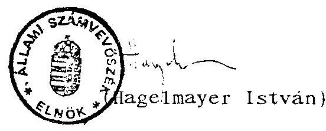

---

ÁLLAMI SZÁMVEVŐSZÉK
V-75-69/1991/1992.
IV.

MELLÉKLETEK
az állami költségvetési adósság ellenőrzéséről
készített jelentéshez
1992. május

---

# TARTALOMJEGYZÉK

1. sz. melléklet

Az állami költségvetési adósság (államadósság) nagysága, összetétele 1990. december 31-én
2. melléklet

Pénzügyminiszter 1984. február 7-ei levele az MNB elnökének az állami költségvetés nem nyilvános adósságállománya, ún. konszolidálása tárgyban
3. sz. melléklet

Pénzügyminiszter 1983. február 10-i levele a pénzintézetekhez a publikus mérlegek korrekciójának végrehajtása miatt
4. sz. melléklet

A költségvetés hitelfelvételének és törlesztésének alakulása
5. sz. melléklet

Az 1981. után felvett költségvetési hiányt finanszírozó hitelek
6. sz. melléklet

Az állami fejlesztési kölcsön átvállalásában érintett vállalatok helyzete
7. sz. melléklet

A bankrendszer átszervezésével kapcsolatos alaptökeellátás pénzügyi forrásai

---

8. sz. melléklet

Megállapodás a kereskedelmi bankok és átszervezett biztosítóintézetek alaptőkéjének fedezésére felvett hitelről
9. sz. melléklet

Nemzetközi pénzügyi szervezeteknél fennálló érdekeltségi állomány 1990. december 31-én
10. sz. melléklet

Világbanki finanszírozási programok célja és állománya
11. sz. melléklet

Az MNB által a Világbanktól felvett és a költségvetésnek továbbkölcsönzött hitelek célja, állománya
12. sz. melléklet

Kormányhitelek
13. sz. melléklet

Állami kölcsönök és alapjuttatások konverziójával kapcsolatos pénzügyminiszter-helyettesi levél
14. sz. melléklet

Jamburgi Gázvezetéképítési Alap
15. sz. melléklet

Az ÁFI és jogelődje által ellátott feladatok finanszírozásához MNB által nyújtott refinanszírozási hitelek állománya
16. sz. melléklet

Részjelentés a Bős-Nagymaros Vízlépcsőrendszer belső államadóssággal összefüggő elemeinek vizsgálatáról

---

Az állami költségvetési adósság (államadósság) nagysága, összetétele az 1990. évi CIV. tv. és az Állami Számvevőszék által végzett ellenőrzés szerint 1990. december 31-én

| Megnevezés | 1990. évi CIV. tv. szerint | ÁSZ ellenőrzés szerint |
|---|---|---|
|  | 1990. | XII. 31. |
| 1. | 2. | 3. |
| 1. A költségvetés közvetlen hitelfelvétele az MNB-tól az állami költségvetés hiányának részbeni fedezetéül millió Ft összesen %-ában | 442.600 53,2 | 442.581 32,3 |
| 2. Egyes gazdálkodó szervezetek átvállalt tartozásai miatti kimutatott államadósság millió Ft összesen %-ában | 20.500 2,5 | 20.546 1,5 |
| 3. Kereskedelmi bankok és biztosítóintézetek szükséges alaptőkéjének fedezetéül felvett hitelek még vissza nem fizetett része millió Ft összesen %-ában | 5.800 0,7 | 5.752 0,4 |
| 4. Vállalati forgóalap rendezés miatti tartozás millió Ft összesen %-ában | 23.600 2,8 | 22.007 1,6 |

---

| 1. | 2. | 3. |
|---|---|---|
| 5. Egyes nemzetközi pénzügyi szervezetek alaptőkéjéhez való hozzájárulás |  |  |
| millió Ft | 7.900 | 6.096 |
| összesen %-ában | 1,0 | 0,5 |
| 6. Államadóssági kötvények és kincstárjegyek vissza nem vásárolt állománya |  |  |
| millió Ft | 34.600 | 32.202 |
| összesen %-ában | 4,2 | 2,4 |
| 7. Világbanki hitelek |  |  |
| millió Ft | 25.000 | 25.074 |
| összesen %-ában | 3,0 | 1,8 |
| 8. Rubel- és nem rubel viszonylatokból felvett kormányhitelek |  |  |
| millió Ft | 8.400 | 37.436 |
| összesen %-ában | 1,0 | 2,7 |
| 9. Állami Fejlesztési Intézet által ellátott állami beruházási feladatok finanszírozására 1968-1990. között nyújtott MNB refinanszírozási hitelek |  |  |
| millió Ft | 262.900 | 259.474 |
| összesen %-ában | 31,6 | 18,9 |

Az 1990. évi CIV. tv.-ben számszerűsített államadósság.
831.300
851.168
10. A nemzeti valuta hivatalos leértékeléséből származó államadósság* millió Ft
összesen %-ában
összesen: $\square$
millió Ft
831.300
519.175
37,9
1.370.343

* Az 1990. évi CIV. törvényben számszerűen nem szerepel.

---

2-006/9/1983. PM TÜK

Dr: Timár Mátyás államtitkár elvtárs, a Magyar Nemzeti Bank elnöke
Budapest

Kérint 1 pld. ban 1. no. pécéing
2.sz.melléklet
a V-75-69/1991/92.sz. jelentéshez

Kedves Timár Elvtárs!
1982. december - 1983. február havi levélváltásunkra visszatérve az alábbiakat hozom szíves tudomásodra:

Abból a célból, hogy a pénzintézeti állami mérlegek alkalmassá váljanak a nemzetközi pénzügyi szervezeteknek történő bemutatására, egyetértek a Magyar Nemzeti Bank javaslataival, nevezetesen azzal, hogy

- az állami költségvetés nem nyilvános adósságállománya az ún. konszolidációs számlára kerüljön átvezetésre,
- az ún. pénzintézeti konszolidációs mérlegek 1983. december 31-étől az állami mérlegek helyébe lépjenek,
- az átcsoportosított adósságállomány a többi banknál és pénzintézetnél változó összegben szerepeljen,
- a féléves mérlegeknél a mérlegkészítési határidő betartása érdekében a devizaállomány-adatok az MNB mérlegében az IMF által megszabott határok, a publikált tervadatok és az egy hónappal korábbi tényadatok alapján kerüljenek kimutatásra.

Kérem továbbá szíves intézkedését, hogy az MNB a konszolidációs mérlegmódosító tételeket az érintett bankokkal és pénzintézetekkel minden félévben a mérlegzárás előtt - első ízben az 1983. évi mérlegbeszámoló elkészítéséhez - kellő időben közölje, az összes konszolidációs tételekről pedig a Pénzügyminisztérium I. Közgazdasági és Költségvetési Főosztályát pénzintézetenkénti részletezéssel a melléklet szerinti formában tájékoztassa.

---

A konszolidációs mérlegek állami mérleggé
 való tételéről
Marjai József és dr. Faluvégi Lajos miniszterelnök-helyettes elvtársakat - az 1983. december 31-én tényleges adatok ismeretében - pénzügyminiszteri és MNB elnöki közös levéllel tartom célszerűnek tájékoztatni. Ugyancsak ekkor vélem indokoltnak a többi pénzintézet, a PM Ellenőrzési Főigazgatóság és a KSH informálását is.

Budapest, 1984. január 7.

Elvtársi üdvözlettel:
/Dr. Hetényi István/

Melléklet
I. 10 .
dr. Böse, 1. Poyr.
1. (hun
720
$\lambda$ - futhui

---

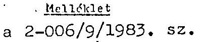

|  A 1983. június 30.-i honalapókén mérlegében szereplő változások az állami mérlegükhez képest |  |  |  |  |  |  |   |
| --- | --- | --- | --- | --- | --- | --- | --- |
|  a 2-006/9/1983. sz. anyaghoz |  |  |  |  |  |  |   |
|  |   |   |   |   |   |   |   |
|  |   |   |   |   |   |   |   |
|  |   |   |   |   |   |   |   |
|  |   |   |   |   |   |   |   |
|  |   |   |   |   |   |   |   |
|  |   |   |   |   |   |   |   |
|  |   |   |   |   |   |   |   |
|  |   |   |   |   |   |   |   |
|  |   |   |   |   |   |   |   |
|  |   |   |   |   |   |   |   |
|  |   |   |   |   |   |   |   |
|  |   |   |   |   |   |   |   |
|  |   |   |   |   |   |   |   |
|  |   |   |   |   |   |   |   |
|  |   |   |   |   |   |   |   |
|  |   |   |   |   |   |   |   |
|  |   |   |   |   |   |   |   |
|  |   |   |   |   |   |   |   |
|  |   |   |   |   |   |   |   |
|  |   |   |   |   |   |   |   |
|  |   |   |   |   |   |   |   |
|  |   |   |   |   |   |   |   |
|  |   |   |   |   |   |   |   |
|  |   |   |   |   |   |   |   |
|  |   |   |   |   |   |   |   |
|  |   |   |   |   |   |   |   |
|  |   |   |   |   |   |   |   |
|  |   |   |   |   |   |   |   |
|  |   |   |   |   |   |   |   |

---

A/ A nem nyilvános költségvetési hiányt fedező hitelekből és a forintértékelés miatti árfolyamveszteség nem nyilvános részéből keletkezett költségvetési adósságállomány
b/ Az a/ pont szerinti adósságállományból az ÁFB hitelévé és vállalati tartozássá átkönyvelt rész.
c/ A belföldi pénzintézetek számlatöbbleteinek csökkentése /64,4 milliárd forint/, a költségvetési intézményi betétek csökkentése /32,3 milliárd forint/ és más betétek - MNB árfolyamkockázati tartalék, költségvetés külkereskedelmi célbetétei, OGA miatti költségvetési követelés átkönyvelése /13,7 milliárd forint/ együtt.
d/ A nem nyilvános devizatartozás csökkentése.
e/ A költségvetés tartozása helyett az ÁFB hitelévé átalakított rész /ebből 23,9 milliárd forint "költségvetési beruházások megelőlegezési hitele", 15 milliárd forint "tanácsi állami beruházások megelőlegezésére nyújtott hitel"/,ami mögé fiktív adósokat is kreáltak.
f/Az MNB-nél vállalati tartozássá átkönyvelt rész, amit a Külkereskedelmi Bank saját könyveiben már addig is ilyen kihelyezésként tartott nyilván.
g/ Az MNB-nél lekötött tanácsi és társadalmi szervezeti betétekből a konszolidációs számlára történt átvezetés.
h/ Az életbiztosítási díjtartalék MNB-nél elhelyezett része költségvetési tartozássá való átkönyvelése.

---

3.sz.melléklet
a V-75-69/1991/92. sz.
"Jelentés"-hez

Kedves Elvtárs!

A nemzetközi pénzügyi szervezetekhez történt csatlakozásunkból adódó követelmények szükségessé teszik, hogy az állami költségvetés elmúlt években felhalmozódott nem nyilvános adósságállományát nemzetközileg prezentálható módon is rendezzük.

A költségvetési adósságállomány rendezése szükségessé teszi a pénzintézetek közreműködését, pontosabban azt, hogy pénzintézetek publikus mérlegeiket az MNB RT mérlegéhez igazodva alakítsák ki. A pénzintézetek publikus és tényleges mérlegei közötti pontos, számszerű kapcsolatot egy u.n. költségvetési konszolidációs számla teremti meg, a következők szerint:

- a rendezés teljesen alkalmazkodik ahhoz a korrekciós rendszerhez, amelyet az MNB nyilvánosságra kerülő részvénytársasági mérlegében ezideig alkalmazott;
- a módszer feltételezi, hogy a pénzintézetek könyveiben az eredeti betétekből származó források összege csökkentésre, és/vagy az állami költségvetésen kívüli hiteligénybevevők felé irányuló kihelyezések összege növelésre kerül, az államadósság összegének megfelelően;
- ennek nyomán a pénzintézetek publikálásra kerülő mérlegei eltérnek az állami mérlegeiktől, publikus mérlegeik beépülnek a zárt - nemzetközi normákhoz igazodó -, prezentációs célokat szolgáló népgazdasági pénzügyi információs rendszerbe;

---

- az adósságrendezés ezen módja nem érinti sem a költségvetési bruttó tartozások utáni, sem a pénzintézeti betétek utáni kamatfizetés fennálló rendjét.

A rendezés konkrét teendőinek előkészítése érdekében a pénzügyminisztériumban az érdekeltek között szakértői megbeszélésre került sor. Ezen olyan megállapodás született, hogy a gyakorlati végrehajtás az MNB és az érdekelt pénzintézetek közvetlen együttműködésével történik meg.

Mindezek alapján kérem, hogy az adósságrendezés végrehajtását követően a Részetekről történő adatszolgáltatásoknál minden esetben a publikus mérleg adatai kerüljenek felhasználásra. Egyúttal felhívom szíves figyelmedet, hogy a téma szigorúan bizalmas jellegére való tekintettel a munka lebonyolításába csak a közvetlenül érdekelt munkatársak kapcsolódjanak be.

Budapest, 1983. február 10.
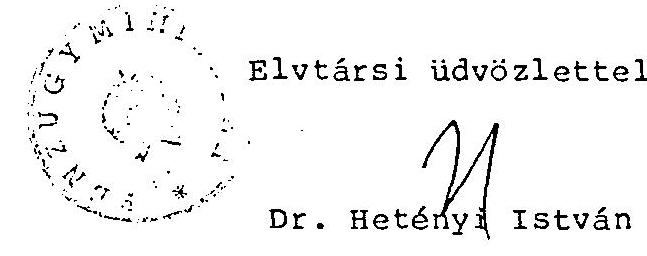

---

Költségvetés hitelfelvételének és törlesztésének alakulása

|  |   |   |   |   |   |   |   |   |   |   |
| --- | --- | --- | --- | --- | --- | --- | --- | --- | --- | --- |
|  Év | HITEFELVÉTEL |  |  |  | TÖRLESZTÉS |  |  |  | TARTOZÁS ÉV VÉGÉN | ÁLLOMÁNY  |
|   | Nyilvános hiányra |  | Bevételként elszámolva |  | Nyilvános hiány miatti hitelre |  | Bevételként elszámolt hitelre |  |  |   |
|   | OTP-tól | MNB-tól | OTP-tól | MNB-tól | OTP-nek | MNB-ben | OTP-nek | MNB-nek | OTP-nek | MNB-nek  |
|  1969. | - | - | 4.000 | - | - | - | - | - | 4.000 | -  |
|  1970. | - | - | 4.000 | - | - | - | - | - | 8.000 | -  |
|  1971. | 3.800 | - | - | 7.943 | - | - | - | - | 11.800 | 7.943  |
|  1972. | 3.300 | - | - | 9.984 | - | - | 2.000 | - | 13.100 | 17.927  |
|  1973. | 2.619 | - | - | 11.036 | - | - | 2.000 | 972 | 13.719 | 27.991  |
|  1974. | 1.825 | - | - | 26.700 | 524 | - | 2.000 | 972 | 13.020 | 53.719  |
|  1975. | 3.490 | - | - | 43.000 | 1.492 | - | 2.000 | 972 | 13.018 | 95.747  |
|  1976. | - | 2.960 | - | 32.800 | 3.216 | - | - | 2.052 | 9.802 | 129.455  |
|  1977. | - | 2.490 | - | 41.952 | 4.088 | - | - | 1.964 | 5.714 | 171.933  |
|

  1978. | - | 3.534 | - | 41.500 | 3.511 | 1.628 | - | 2.484 | 2.203 | 212.855  |
|  1979. | - | 3.480 | - | 36.390 | 1.329 | 2.188 | - | 4.483 | 874 | 246.054  |
|  1980. | - | 3.600 | - | 47.100 | 874 | 4.562 | - | 6.164 | - | 286.028  |
|  1981. | - | 4.500 | - | 31.100 | - | 4.088 | - | 9.312 | - | 308.228  |
|  1982. | - | - | - | 12.916 | - | 3.898 | - | 12.916 | - | 304.330  |
|  1983. | - | - | - | 16.200 | - | 4.400 | - | 16.200 | - | 299.930  |
|  1984. | - | - | - | - | - | 10.000 | - | - | - | 289.930  |
|  1985. | - | - | - | - | - | 3.000 | - | - | - | 286.130  |
|  1986. | - | - | - | - | - | 3.800 | - | - | - | 282.330  |
|  1987. | - | - | - | - | - | 1.113 | - | - | - | 281.217  |
|  Összesen: 15.034 |  | 20.564 | 8.000 | 358.621 | 15.034 | 39.477 | 8.000 | 50.491 | - | 281.217  |

---

# 1981. után felvett költségvetési hiányt finanszirozó hitelek 

|  | $\begin{array}{lllllllllll}\text { J } & \text { T } & \text { E } & \text { L } & \text { E } & \text { K } \\ \text { j } & \text { e } & 1 & 1 & \text { e } & \text { m } & \text { z } & \text { ö } & \text { i }\end{array}$ | 1990.XII.31-ig teljesített törlesztés | 1990.XII.31-én fennálló állomány |
| :--: | :--: | :--: | :--: |
| 1981. évi hiányt finanszirozó hitel: 9.500 millió Ft |  | 6.000 | 3.500 |
| Szerződés kelte: 1982. július |  |  |  |
| 1982. évi hiányt finanszirozó hitel: 4.215 millió Ft |  | 3.000 | 1.215 |
| Szerződés kelte: 1983. június |  |  |  |
| 1983. évi hiányt finanszirozó hitel: 3.287 millió Ft |  | 1.087 | 2.200 |
| Szerződés kelte: 1984. december |  |  |  |
| 1984. évi hiányt finanszirozó hitel: 2.159 millió Ft |  | 300 | 1.859 |
| Szerződés kelte: 1985. nov. 31. |  |  |  |
| 1985. évi hiányt finanszirozó hitel: 15.740 millió Ft |  | 2.900 | 12.840 |
| Szerződés kelte: 1986. július |  |  |  |
| 1986. évi hiányt finanszirozó hitel: 41.915 millió Ft |  | 968 | 40.947 |
| Szerződés kelte: 1987. jún. 30. |  |  |  |
| 1987. évi hiányt finanszirozó hitel: 34.808 millió Ft |  | - | 34.808 |
| Szerződés kelte: 1988. jún. 30. |  |  |  |
| 1988. évi hiányt finanszirozó hitel: 9.987 millió Ft |  | - | 9.987 |
| Szerződés kelte: 1989. aug. 31. |  |  |  |
| 1989. évi hiányt finanszirozó hitel: 54.008 millió Ft |  | - | 54.008 |
| Szerződés kelte: 1990. július |  |  |  |
| Összesen: 175.619 millió Ft |  | 14.255 | 161.364 |

---

Az állami fejlesztési kölcsön átvállalásában érintett vállalatok helyzete

1. A Ganz Mávag MVG-ből már 1986-ban kivált a Soroksári Vasöntöde, melyre a 4,2 milliárd Ft-os rekonstrukciós állami kölcsönből 1,1 milliárd Ft hitelt hárítottak át. A GM MVG állami szanálását 1987. júliusában rendelték el, melyre eljárás főleg a vagyonmegosztás elhúzódása miatt az 1988. II. félévben zárult. Ekkor az ipari nagyvállalat 7 önálló gyárrá alakult át, melyből 6 vállalat önkormányzó módon működik, általános jogutódként a GM Mozdonygyár pedig államigazgatási felügyelet alá került. A Mozdonygyár becsült vagyona 3,2 milliárd Ft-ot (ebből 10,3 milliárd Ft adó- és bíróságtartozás) tett ki.

A GM Mozdonygyár a jelentős adósságtömeg miatt működésképtelennek bizonyult, ezért 1988. augusztusától a gyár szanálása egy gyorsított felszámolási eljárássá alakult át.

A Mt. a 3264/1988. sz. határozatával a vasúti járműgyártásra szerveződő gazdasági társaság megalakulásának elősegítése érdekében elengedte a felszámolásra kerülő vállalat 10,2 milliárd Ft-os adótartozását. Továbbá kötelezte az ÁFI-t az állami alapjuttatásból származó követeléséből 482 millió Ft-ból állami részvényvásárlásra. A Mozdonygyár állami vállalat fennmaradó vagyonát az időközben megalakult Ganz Vasúti Járműgyár Rt. vásárolta meg 1,1 milliárd Ft értékben, a könyv szerinti értékben kevesebb, mint a feléért. A jelenleg is működő angol többségi tulajdonú Ganz-Hunslet Vasúti Járműgyár Rt-t 1989. augusztusában a Magyar Rt. és az Angol Társaság közösen alapította. A magyar fél termelőeszköz, az angol fél főleg know-how jellegű szellemi termékapportjával lefolytatott tőkeemelést követően alakult ki a társaság jelenlegi kb. 700 millió Ft-os alaptőkéje.

---

a Magyar Rt. jelenleg csak bérletbe adott ingatlan jellegű vagyonnal rendelkezik, termelő tevékenységet nem folytat. Az ismertetett többlépcsős átalakulás és a vasúti járműgyártás privatizálása során a vállalati vagyon - összhangban a vállalati gazdálkodási problémákkal és piaci értékítélettel - jelentősen, közel egy nagyságrenddel értékelődött le.

# 2. Ózdi Kohászati Üzemek 

A kohászati termékszerkezet átalakítással kapcsolatos koncepció a belföldi szükségletek kielégítését célozva, a túlméretezett metallurgiai kapacitások lecsökkentését irányozta elő. A koncepció végrehajtása a korszerűtlenebb és magasabb fajlagos költségekkel működtethető Ózdi nyersvas és acélgyártási kapacitások leépítését eredményezte volna. Az OKÜ a térség várható foglalkoztatási feszültségeinek elkerülése érdekében is külföldi befektetőknek keresett a metallurgiai kapacitásainak fejlesztésére és továbbműködtetésére. A német Metallgesellschaft és a Korf cégek részvételével az OKÜ 1990. februárjában 1950 millió Ft alaptőkével és 60%-os külföldi részesedéssel megalapította az Ózdi Acélmű Rt-t. Az alapításban a magyar fél metallurgiai kapacitásokat és végtermék kibocsátó keresztmetszeteket képező termelőeszközök apportjával hitelre történő átadásával és kölcsönzésével vett részt. A német fél üzletpolitikai elképzelésének alapvető eleme az volt, hogy a tulajdonát képező Korf acélgyártási eljárás bevezetésével megvalósítja a kis mennyiségű minőségi acélgyártást. A fejlesztés-beruházás indítása elhúzódott és csak a kezdeti lépésekre került sor. A vegyes tulajdonú társaság a működésének 12 hónapja alatt az alapítói vagyont meghaladó veszteséget produkált. Ezt követően a német cégvezetés leállította kohászati termelést és a Kormány felé kezdeményezte a mindkét fél érdekeivel leginkább összhangban álló - csendes kivonulásával kapcsolatos feltételeik teljesítését. A német tőke kohászatból történő kivonása

---

az ÁFI kezelésében lévő portfólió alapján, befektetéscsere formájában valósul meg. Az erre irányuló üzleti tárgyalások jelenleg is folyamatban vannak. A német fél kivonulását követően az ózdi kohászat vagyona visszaszámazott a magyar államra. Jelenleg a csődállapot elhárítása, egy csökkentett volumenű kohászati termelés újraindításának munkálatai folynak. A térség munkaerő-foglalkoztatási képességének megerősítésével párhuzamosan azonban valószínűsíthető az ózdi metallurgiai kapacitások fokozatos felszámolása. Így késedelmesen, de a korábbi kohászati termékszerkezet-átalakítási elképzelés végrehajtása várhatóan beindul. A vegyes tulajdonú társaság szervezésére és működtetésére fordított közel 2,5 év, ezért csak kitérőként értékelhető. Ez a kísérlet azonban jelentős állami anyagi ráfordításokat igényelt.

A termelését beszüntetett ózdi kohászati főleg termelőeszközből álló vállalati vagyona jelentősen leértékelődött.

# 3. Lenin Kohászati Művek és Magyar Alumíniumipari Tröszt 

Az LMK, illetve MAT főleg gazdálkodási problémák hatására a vállalati központokat átalakította vagyonkezelő központtá, a vállalathoz tartozó gyárakat pedig társaságokká. A szervezet átalakítás részben a gyárak költséggazdálkodási érzékenységének fokozását, részben külső tőke bevonásának könnyítését célozta. Jelenleg a termelési szerkezet átalakításához és a termelés racionalizálásához szükséges fejlesztési források biztosítására főleg külföldi befektető partnerek kutatása folyik. A MAT-hoz tartozó alumínium vertikumból elsősorban a legnagyobb vagyoni értéket képviselő nagyokkal KÖFÉM privatizálását tűzték ki célul.

---

# 4. Tungsram Rt 

Az érintett vállalatok közül csak a Tungsram Rt tekinthető olyan egységnek, melynek gazdálkodása normalizálódottnak tekinthető. Ebben azonban az 1986-ban lefolytatott pénzügyi rendezés mellett jelentős szerepe van a cég privatizálásának.

A vállalat eladósodottsága miatt főleg a kereskedelmi bankok tulajdonába került vállalati részvények külföldi félnek történő értékesítése volt az első jelentősebb tranzakció az ország privatizációs gyakorlatában. A részvényeket egy osztrák befektető csoport vásárolta meg, majd közvetítésükkel egy multinacionális cég, a General Electric tulajdonába kerültek. Az amerikai cég részben konkurensnek is tekinthető, de egyes földrajzi régiókba a gyenge piaci képviseletét a Tungsram Rt piaci kapcsolatai kedvezően kiegészítik. Az amerikai cégvezetés az elmúlt időszakban jelentős létszámelbocsátások útján is racionalizálta és integrálta a Tungsram Rt termelését.

---

7.sz. melléklet a V-75-69/1991/92.sz. "Jelentés"-hez

A bankrendszer átszervezésével kapcsolatos alantőke-ellátás pénzügyi forrásainak részletezése

a/ Az állam javára felvett jegybanki hitelből:

|  Magyar Hitelbank Rt. | 4.500 millió forint  |
| --- | --- |
|  /15.492/1986. és 50408/1987.II./b. számú ügyirat/ |   |
|  Országos Kereskedelmi és Hitelbank Rt. | 3.800 - " -  |
|  /15.492/1986. és 50.233/1987.II./b. számú ügyirat/ |   |
|  Budapest Hitel- és Fejlesztési Bank Rt. | 1.200 - " -  |
|  /15.492/1986. és 50.392/1987.II./b. számú ügyirat/ |   |
|  Állami Biztosító | 1.000 - " -  |
|  /50.042/1987.II./b. számú ügyirat/ |   |
|  Hungaria Biztosító | 1.000 - " -  |
|  /50.042/1987.II./b. számú ügyirat/ |   |
|  Összesen: | 11.500 millió forint  |

b/ Az állam által kibocsátott évi 10.11-kal kamatcső kötvényből:

|  Magyar Hitelbank Rt. | 1.930 millió forint  |
| --- | --- |
|  /50.416/1987.II./b./ |   |
|  Országos Kereskedelmi és Hitelbank Rt. | 1.500 - " -  |
|  /50.411/1987. II. b./ |   |
|  Budapest Hitel- és Fejlesztési Bank Rt. | 750 - " -  |
|  /50.402/1987. II. b./ |   |
|  Magyar Külkereskedelmi Bank Rt. | 440 - " -  |
|  /50.164/1987. II. b./ |   |
|  Magyar Nemzeti Bank Rt. | 520 - " -  |

 |
|  /50.417/1987. II. b./ |   |
|  Állami Biztosító | 2.010 - " -  |
|  /50.393/1987. II. b./ |   |
|  Hungaria Biztosító | 1.850 - " -  |
|  /50.393/1987. II. b./ |   |
|  Összesen: | 9.000 millió forint  |

Az 1987. évi állami költségvetésről szóló 1986. évi V. törvény 17. §-ában kapott felhatalmazás alapján felvett 11.500 millió forint jegybanki hitelt és a 9.000 millió forint értékű államkötvényt az Állami Bankfelügyelet 92.170/1987. számú rendelkezése alapján osztottuk szét

---

a pénzintézetek között,  állóeszközökben és forgóeszközökben megtestesülő apportot a két biztosítónál vettük eddig figyelembe, a többi pénzintézet ezt az apportot a tartaléktókében tartja nyilván a legközelebbi alaptőke-emelésig.
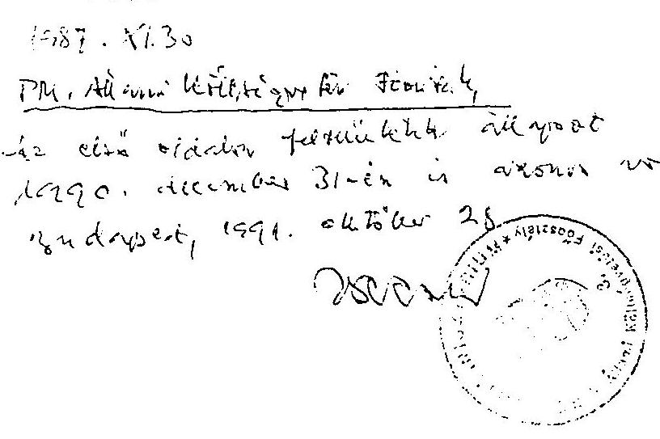

---

PÉNZÜGYMINISZTÉRIUM
50.123/1987.II.b.

# M e g á l l a p o d á s 

A Pénzügyminiszter és a Magyar Nemzeti Bank elnöke a Magyar Népköztársaság 1987. évi költségvetéséről szóló, 1986. évi V. törvényben foglalt felhatalmazás, illetőleg a Minisztertanácsnak az idevágó határozatai alapján az alábbiakban állapodott meg egymással:

1. A Magyar Nemzeti Bank /MNB/ az 1987. január 1-jével létrejövő kereskedelmi bankok, valamint az átszervezett biztosítóintézetek szükséges alaptőkéjének fedezésére tizenegymilliárd-ötszázmillió forint összegű hitelt nyit a Pénzügyminisztériumnak /PM-nek/.
2. A kölcsönszerződés azzal jön létre, hogy az MNB a PM rendelkezése alapján a kölcsön összegét a PM-nek jóváírja.
3. A kölcsön futamideje nyolc év. Törlesztése két évi türelmi idő után kezdődik meg.
4. A PM a kölcsönt a következő éves összegekben - negyedévenként egyenlő törlesztő részletekben - fizeti vissza:
az 1988. évben egymilliárd-kilencszáztizenhatmillió forint,
az 1989. évben egymilliárd-kilencszáztizenhatmillió forint,

---

az 1990. évben egymilliárd-kilencszáztizenhatmillió forint,
az 1991. évben egymilliárd-kilencszáztizenhatmillió forint,
az 1992. évben egymilliárd-kilencszáztizenhatmillió forint,
az 1993. évben egymilliárd-kilencszáztizenhatmillió forint.
5. Az éves törlesztés negyedévenként esedékes a negyedévek utolsó hónapjának a 25. napján. Az első törlesztés időpontja 1988. március 25-e, az utolsó pedig 1993. december 25-e.
6. Amennyiben a PM a nyitott hitelnél kevesebbet venne igénybe, a különbözet a legkésőbb esedékes éves törlesztőrészletek összegét csökkenti le.
7. A PM a kölcsönállomány után évi 11,8%-os kamatot térít az MNB negyedéves elszámolásai alapján.
8. A PM jogosult előre is törlesztést teljesíteni, az MNB pedig az előtörlesztést elfogadni. Előretörlesztés esetén azt az évet, amelynek az esedékes törlesztőrészlete csökken, a PM és az MNB előzetesen, közösen határozza meg.
9. Ez a megállapodás két eredeti példányban készült; aláírás és lepecsételés után az egyiket a PM, a másikat az MNB kapta.

Budapest, 1986. december 31.
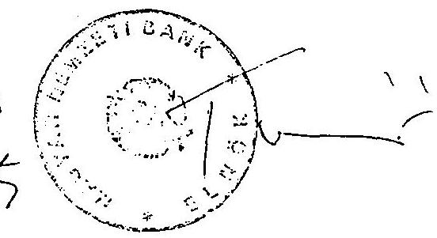

---

# 9. sz. melléklet   V-75-69/1991/1992. sz.   "Jelentés"-hez 

Nemzetközi pénzügyi szervezetek érdekeltségi állománya 1990. XII. 31.

| Megnevezés | érték   \$-ban | névérték*   millió Ft-ban |
| :-- | :--: | :--: |
| Nemzetközi Gazdasági   Együttműködési Bank | 9.901.648 | 388 |
| Nemzetközi Beruházási Bank | 17.666.916 | 682 |
| Nemzetközi Beruházási Bank   speciális | 387.912 | 16 |
| Nemzetközi Újjáépítési és   Fejlesztési Bank | 5.803.116 | 267 |
| Nemzetközi Újjáépítési és   Fejlesztési Bank | - | $3.140^{* * *}$ |
| Nemzetközi Fejlesztési Társulás | - | $1.308^{* *}$ |
| Nemzetközi Pénzügyi Társaság | 5.216.000 | 270 |
| Nemzetközi Beruházási Ügynökség | 457.686 | 25 |
| 0   5 | $x$ | $x$ |

* A befizetés napján érvényes árfolyam szerinti forintérték
** Kötelezvény és befizetés együttes összege
*** Tartalmazza az értékállandóság biztosítására befizetett 741 millió Ft-ot is

---

# VILÁGBANKI FINANSZÍROZÁSI PROGRAMOK CÉLJAINAK ÉS 1990. DECEMBER 31. ÁLLOMÁNYÁNAK ÖSSZEFOGLALÁSA 

## I. Energiaracionalizálási program

A program célja a fő hazai energiafogyasztó iparágak hatékonyságának fokozása, az energiaimport költségek és az ipari energiafogyasztás csökkentése, a hazai energiaforrások jobb kihasználása.
Ennek keretében 62 iparvállalat energia-megtakarító beruházásának támogatására került sor. Ezen túlmenően a programban szerepel a szénbányák, brikettgyártás és kokszoló berendezések fejlesztése, 10 város és 16 ipari vállalat bekötése a fő földgázvezetékbe. Földgázelosztó rendszerek lefektetése, 116 kisvállalat bekötése. Tanulmányok készítése, tanfolyamok szervezése. Energia-megtakarítási központ létrehozása. Technológiai fejlesztés.

## II. Közlekedési program

Célja a közlekedési ágazat hatékonyságának, devizabevételeinek növelése és energiamegtakarítást eredményező beruházások megvalósítása. Ennek keretében:
A Budapest-Ferencváros keleti rendezőpályaudvarának rekonstrukciója és korszerűsítése. Vágánykarbantartó és konténerkezelő berendezések beszerzése. Az M-0 autópálya 14,5 km hosszú szakaszának kiépítése. A HUNGAROCAMION járműparkjának korszerűsítése, információs rendszer kiépítése, karbantartó üzem fejlesztése. Továbbképzés és tanulmányok készítése.

---

# Erőműrekonstrukciós program 

Célja az energiatermelésben a belföldi szénfelhasználás fokozása. Ezen belül: az MVMT Gagarin, ajkai, borsodi, pécsi, tiszapalkonyai, oroszlányi, November 7-i és tatabányai erőműveinek rekonstrukciója. Egyéb áramfejlesztő létesítményeinek felújítása, átviteli és elosztó rendszereinek minőségjavítása. A gazdálkodás tervezési és vezetési rendszerének javítása. Szakember-továbbképzés. Tanulmányok készítése.

Az erőműrekonstrukciós program eredeti célkitűzése - a belföldi szénfelhasználás fokozása - az 1988. május 20-án aláírt OT-PM-IPM megállapodás szerint módosult. A 64 millió USD-ból mintegy 30 millió USD-t a Dunamenti Hőerőmű hőszolgáltató részének rekonstrukciós programjába illesztve, gázturbinás kombinált ciklusú blokk építésére fordított az MVM Rt., amelyhez további 30 millió ECU hitelt vettek fel költségvetési garanciával. A létesítmény 1991. szeptemberében elkészült, de nem üzemel.

## IV. Távközlési program

Célja a Magyar Posta beruházásainak és intézményi fejlesztésének megvalósítása. Ezen belül: távközlési berendezések felújítása és bővítése, távbeszélő központok, telex, távíróvonalak, nyilvános telefonfülkék, karbantartó üzemek, oktatási intézmények létesítése. Képzés és információs rendszer fejlesztés. Tanulmányok készítése.

## V. Közlekedési program

Célja a közlekedési ágazat irányításának és működésének fejlesztése, a gazdasági és pénzügyi hatékonyság növelése. Ezen

---

belül: az M-0 körgyűrű további 14 km-es szakaszának megépítése, segélyhívó rendszer kiépítése, útkarbantartó, minőségellenőrző berendezések beszerzése. A BKV forgalomirányító rendszerének kiépítése. A HUNGAROCAMION integrált számítógépes információs rendszerének kiépítése. A MÁV szállításirányítási információs rendszerének kiépítése, pályakarbantartó és építőkészülékek beszerzése. Továbbképzés és tanulmányok készítése.

Ipari szerkezetkorigazítási kölcsön

Ez a kölcsön az ipari szerkezetkorigazítással kapcsolatos sürgősen szükséges importigények finanszírozását szolgálja.

A kölcsön akkor vehető igénybe, ha a költségvetési deficitet csökkentjük, az ország külső adósságállománya nem növekszik. A termelői és fogyasztói ártámogatásokat 10%-kal csökkentjük. A társasági törvény és a kapcsolódó jogszabályok alapján megindul a vállalatok privatizációja, stb. Tehát ebben a világbanki programcsomagban a megállapodásban szereplő átfogó gazdaságpolitikai intézkedések végrehajtása szolgál alapul a kölcsön igénybevételéhez.

A pénzeszközök egyebekben bármilyen import kifizetésre lehívhatók, néhány olyan tétel kivételével, mint fegyver, vagy arany vásárlása.

A hitel összegét a vizsgált időszakban a Magyar Állam teljes egészében felhasználta a folyó import finanszírozására. Az igénybevételre belföldi szerződés nincs. Az importőr az áru ellenértékének forintösszegét letétbe helyezte.

---

Összesítő a Világbanktól felvett állami hitelekról 1990. XII. 31.

Millió dollárban

|  Program neve | Aláírás   kelte | Hitel száma és neve | Hitel összege |  | Lehívott állomány |  | Törlesztett összege |  | Tartozás összege |  | Fizetett kamat |  | Rend. tart. juttalék  |
| --- | --- | --- | --- | --- | --- | --- | --- | --- | --- | --- | --- | --- | --- |
|   |  |  | VB $ | US $ | VB $ | US $ | VB $ | US $ | VB $ | US $ |  | US $ | US $  |
|  I. Energiaracionalizálási program | 1983 | 2317-HU / A | 109.0 | 136.2 | 108.9 | 136.1 | 36.3 | 45.2 | 72.6 | 90.9 |  | 33.3 | 2.6  |
|  II. Közlekedési program | 1985 | 2557-HU / A | 75.0 | 84.8 | 69.8 | 79.6 | 12.5 | 13.6 | 57.3 | 66.0 |  | 16.8 | 1.2  |
|  Erőmű-rekonstrukciós program | 1986 | 2697-HU / A | 64.0 | 66.6 | 37.1 | 39.7 | 5.3 | 5.5 | 31.8 | 34.2 |  | 3.2 | 1.4  |
|  IV. Távközlési program | 1987 | 2847-HU / A | 70.0 | 72.3 | 46.7 | 49.0 | 0.0 | 0.0 | 46.7 | 49.0 |  | 4.1 | 0.9  |
|  Ipari ágazati szerkezetkorigazítási progr. | 1988 | 2965-HU / A | 200.0 | 215.8 | 200.0 | 215.8 | 0.0 | 0.0 | 200.0 | 215.8 |  | 26.9 | 0.5  |
|  V. Közlekedési program | 1989 | 3032-HU /A | 95.0 | 96.1 | 15.8 | 16.9 | 0.0 | 0.0 | 15.8 | 16.9 |  | 1.2 | 0.4  |
|  ÖSSZESEN: |  |  | 613.0 | 671.8 | 478.3 | 537.1 | 54.1 | 64.3 | 424.2 | 472.8 |  | 85.5 | 7.0  |

---

Az MNB által a Világbanktól felvett és a költségvetésnek továbbkölcsönzött hitelek célja, állománya 1990. december 31-én

1. A gabonatárolási és mezőgazdaság-gépesítési program részeként: Mezőgazdasági és élelmiszeripari minisztérium (MEM), az állami gazdaságok és szövetkezetek szakembereinek szakirányú továbbképzése. Tanulmányok készítése: a mezőgazdasági gépek és berendezések műszaki teljesítményének értékeléséről, mezőgazdaság-gépesítési alternatívák kidolgozása, tanulmány a mezőgazdasági termékek árának a mezőgazdasági termelésre és hatékonyságra gyakorolt hatásáról.
2. Az exportfejlesztési és ipari szerkezetátalakítási program részeként: Tanulmányok készítése a mezőgazdasági gépgyártás, öntészet és képlékeny alakítás, valamint a gyógyszergyártás alternatív fejlesztési stratégiájának kidolgozásához. Megvalósíthatósági tanulmány készítése a metil-difenil-diizocianát gyártását szolgáló vegyipari létesítményekre.
3. Az integrált állattenyésztési és feldolgozási program részeként: Egy tangazdaság állati takarmányozás javítását szolgáló bővítése és felszerelése. Egy tangazdaság gyengén termő legelőjének termelékenységének növelése. Legelő és állattenyésztő gazdálkodással kapcsolatos továbbképzés.
4. A finomvegyipari program részeként: A műtrágyák, petrolkémiai alapanyagok, finomvegyszer-intermedierek, detergensek, festékek és lakkok, valamint gyógyszer- és növényvédőszer-intermedierek

---

gyártásával foglalkozó iparágak fejlesztési alternatíváinak és stratégiájának kidolgozása.
A vegyipari stratégiai tervezés fejlesztésére továbbképzési program megvalósítása.
5. Az agráripari korszerűsítési program részeként: Továbbképzési program az export marketing tevékenység és a vezetési színvonal fejlesztése érdekében. Kutatás-fejlesztési program megvalósítása az agráripari termékek minőségének, előállításának és marketingjének javítására. Irodai és adatfeldolgozó berendezések beszerzése. A minőségellenőrzés és csomagolás korszerűsítése.
6. Az ipari szerkezetátalakítási program részeként: Struktúra-átalakítási programok értékelése. Szakmai továbbképzés az ipari vállalatok vezetői, a program megvalósításában részt vevő intézmények, hivatalok dolgozói számára. Prioritást élvező alágazatok fejlesztési feltételeinek elemzése és stratégia kidolgozása.
7. A II. energiaracionalizálási program részeként: Energiahatékonysági Iroda funkcióinak fejlesztése. Energiamérő, adatfeldolgozó berendezések beszerzése. Energiafelhasználás mérésére adatbank kifejlesztése, ehhez szoftverek nyújtása. Intézményfejlesztés és energiahatékonyság javítására. Az energiagazdálkodók továbbképzése.
8. A növénytermesztés fejlesztési program részeként: A növénytermesztés hatékonyságának növelésére irányuló kutatási tevékenység támogatása. Az alkalmazottak továbbképzése.

---

9. II. Ipari szerkezetátalakítási program részeként: Tanulmányok készítése a háttéripar bővítésére. Prioritást élvező alágazatok

 elemzése, továbbfejlesztési stratégiájuk meghatározása. Minőségellenőrzés fejlesztése és az ehhez tartozó továbbképzés. Megvalósíthatósági tanulmányok a szerkezetátalakítás lehetőségeiről. Számítógépes hardver és szoftver beszerzés.
10. A technológiai fejlesztési program részeként: Továbbképzési programok megvalósítása az intézmények, iparvállalatok és bankok munkatársai részére, annak érdekében, hogy növeljék szaktudásukat a műszaki, fejlesztési programok kiválasztásában, kialakításában és végrehajtásában.
Tanulmányok kidolgozása a műszaki kutatás és fejlesztés további bővítését célzó forrás allokáció és finanszírozás megfelelő stratégiájának kialakításához.
A minőségellenőrzés és mérésügyi műszaki fejlesztési program végrehajtása.
11. A III. Ipari szerkezetátalakítási program részeként: Tanulmányok kidolgozása a gépipari és egyéb ágazatok, alágazatok teljesítményének és versenyképességének, jövőbeni fejlődésének felmérésére, a fejlesztés stratégiájának kialakítása érdekében.
Tanulmány kidolgozása, amely megfelelő keretet ad valamennyi gazdasági ágazat kisvállalkozási struktúrájának és teljesítményének elemzéséhez, a kisvállalkozások továbbfejlesztéséhez.
A munkahelyteremtő program irányításának, működésének továbbfejlesztése. (Oktatás, továbbképzés, átképzés).
A Borsod megyei munkahelyteremtés ösztönzésére stratégia kidolgozása.

---

| Program neve | kölcsön   kelte | szerződés   összege | a hitelfolyósítás   befejeződik | tartozás   összege |
| :--: | :--: | :--: | :--: | :--: |
| Gabona   "C" | 1983 | 9,8 | 1986.12.31. | 6,8 |
| Export fejlesztési prog. "C" Integrált állattenyésztési prog."C" | 1984 | 28,0 | 1989.12.31. | 18,7 |
| Finomvegyipari prog. "D" | 1985 | 24,0 | 1990.12.31. | 19,1 |
| Agráripari korszerűsítési prog. "A" | 1988 | 15,2 | 1990.06.30. | 15,4 |
| Ipari szerkezetátalakítási prog. "E" | 1986 | 5,5 USD* | 1994.06.30. | 61,9 |
| II. Energia rac. prog. "B" | 1986 | 22,9 | 1993.06.30. | 28,0 |
| Növénytermesztés prog. "B" | 1987 | 359,0 | 1991.12.03. | 434,6 |
| II. Ipari szerk. átalakítási prog. "A" | 1987 | 240,6 | 1994.06.30. | 274,5 |
| Technológiai   fejl.prog."A" | 1988 | 173,0 | 1994.06.30. | 125,6 |
| III. Ipari szerk. átalakítási prog. "C" | 1989 | 243,6 | 1995.06.30. | 40,3 |
| ÖSSZESEN: |  |  |  | 1.074,2 |

* Nincs forintosítva a szerződésben

---

12. sz. melléklet

V-75-69/1991/1992. sz.
"Jelentés"-hez

# KORMÁNYHITELEK 

I. Igénybevett rubel elszámolású Kormányhitelek:

1. A konszolidációs néven ismert, az 1976-80-as évek árucsereforgalmi elszámolások kiegyensúlyozására a Szovjetunióval 1977. október 11-én kötött egyezmény szerint évi 2 %-os kamattal 800 millió transzferábilis rubel összegig nyújt hitelt a Szovjet Kormány a Magyar Népköztársaság Kormányának. A hitelt magyar árúk szállításával törlesztjük, tíz év alatt évi egyenlő részletekben. A hitel 1990. december 31-i állománya 772,2 millió Ft, /a rubelnek dollárra való átszámítása miatt 1.938,0 millió Ft/. A törlesztés utolsó üteme 1991. év.
2. A Szovjetunióval 1981. december 18-án kötött megállapodás a Szovjetunió által korábbi években nyújtott hiteleknek a Magyar Népköztársaság Kormánya által 1981-1985. években történő törlesztésének rendjéről intézkedik. E megállapodásban biztosított - a Szovjetunió Külkereskedelmi Bankjának a MNB részére 5 %-os kamattal, a korábbi évek összes alapadósságának törlesztésére, 5 év türelmi idővel 1986. évtől kezdődően, 5 év alatt évi egyenlő részletekben történő törlesztéssel nyújtott áruszállítással visszafizetendő - 650 millió transzferábilis rubel refinanszírozási hitel prolongációs hitel, mivel a korábbi Kormányhitel törlesztési kötelezettségek átütemezése révén jött létre. 1981. évben ebből ténylegesen 86,3 millió transzferábilis rubel hitelt vettünk igénybe. A korábbi évek hitelmegállapodásai 1957. december 18, 1958. november 4, 1966. december 28, 1977. június 24, 1977. október 11, 1979. július 26, 1981. augusztus 4. voltak.

---

A két kormány részéről 1986. december 17-én felvett jegyzőkönyvben a szovjet fél részéről korábban 9 időpontban nyújtott, összesen 317.138.000 transzferábilis rubel hitel törlesztésére történik intézkedés. A korábban közölt időpontok kibővülnek az 1981. december 5-i, 1981. december 18-i hitelfelvételi időpontokkal. 1987. április 22-én újabb refinanszírozási hitelfelvételi megállapodást ír alá a Kormány a Szovjetunió Kormányával a korábban adott hitelek alapadósságai törlesztésére 600 millió transzferábilis rubel értékig, évi 5 %-os kamattal, 1991. évtől 5 év alatt, évi egyenlő negyedéves részletekben áruval történő visszafizetéssel.

Az 1990. december 31-én még megmaradó hitelállomány 513,7 millió Ft, /dollárra átszámítás miatt 1.289 millió Ft/, melynek visszafizetése 1991. évre lett prognosztizálva.
3. Az MNB-nél Spec. I. megjelöléssel és a 2/0934 számon tartják nyilván a Szovjetunióval 1977. június 24-én kötött - az MNB-nél csak orosz nyelven dokumentált - azon megállapodást, amely 2 %-os kamatfizetés mellett 168.600.000 rubel összegnek a szovjet fél általi az 1978-1980. évek között áruszállítással történő hitelnyújtásáról szól.

A megállapodás melléklete tartalmazná a szovjet fél által szállítandó árukat, de az hiányzik. A bankközi megállapodás is csak orosz nyelvű, az MNB-nek belső írásos intézkedéséből viszont hiányzik a hitelre szállított áruk megnevezése, csak a közölt nyilvántartási számok szerepelnek. A CIV törvény 1. Cím: Kormányhitelek között a speciális hiteleket katonai kiadásokhoz kapcsolódónak minősíti. Az MNB 1978. II. 1-i belső intézkedése szerint a hitelösszeg törlesztése 1981-1990. évek között tíz egyenlő részletben - rubelben - történik.

---

Spec. I. megjelöléssel és a 2/1206 nyilvántartási számon szerepel egy 1981. december 5-i megállapodás 4 %-os kamattal 430 millió transzferábilis rubel hitelkeret nyújtás az 1981-85. évekre, melyből 1981. december 5-én 103.900.000 rubel hitel felvételéről szól az orosz nyelvű megállapodás.

Az 1990. XII. 31-én kimutatott hitelállomány - az 1986. évi átütemezés folytán - 2.994,8 millió Ft /a dollárra való átszámítással 7.487,0 millió Ft/, 1995. évig, évenként csökkenő mértékű törlesztés előirányzása mellett.
4. A Spec. II. megjelöléssel és az MNB-nél 2/1093. számon nyilvántartott, 1979. július 26-án aláirt Magyar-Szovjet Kormányközi Egyezmény évenkénti hosszúlejáratú kamatmentes hitelnyújtás lehetőségét teremti meg a magyar kormány részére, a magyar uránipar fejlesztésére, berendezések, anyagok, speciális készülékek hitelre való szállításával, a hiteleknek tíz év alatt, évi egyenlő részletekben, áruval történő visszafizetésével. Az orosz nyelven rendelkezésünkre bocsájtott bankközi megállapodások még nem tartalmazzák az egyes években ténylegesen igénybevett hiteleket. Az MNB belső kimutatása szerint az 1990. XII. 31-én még fennálló hiteltartozás 3.533,7 millió Ft /dollárra való átszámítással 8.834,2 millió Ft/, a hitelek visszafizetési kötelezettsége 1996. évig évenként, de ezt követően is még fennáll.
5. A balatoni Kilián-telep kialakítására felvett 24,6 millió Ft értékű még meglévő NDK hitelállomány visszafizetése 1996. év után esedékes.
6. Gazdasági együttműködés keretében a magyar és csehszlovák kormányok részéről 1974. június 20-án aláirt, a Csurgó-Tupa közötti Adria Kőolajvezeték létesítésével és üzemeltetésével

---

kapcsolatos együttműködésben a cseh-szlovák szerződő fél 21,5 millió transzferábilis rubel hitelt nyújt árúk és szolgáltatások hitelre való biztosításával évi 2,5 % kamat mellett, az üzembehelyezéstől számított 8,5 év alatt 34 egyenlő negyedévi részletben történő visszafizetéssel.

A két fél közötti tényleges elszámolás 1991. július 31-én történt meg, olyan módon, hogy a magyar fél 18 millió transzferábilis rubel összeget térít meg a csehszlovák félnek - a szerződő felek közötti fizetési mérleg egyenleg terhére való elszámolás formájában, transzferábilis rubelben 1991. július 31-ig - amely a csehszlovák fél által nyújtott 21,5 millió transzferábilis rubel értékű beruházási hitelből és a hitel 6,5 millió transzferábilis rubel értékű kamataiból, valamint a kőolajvezeték fenntartási költségeinek levonásából keletkezett. Az MNB által helyesen kimutatott, meglévő hitelállomány 1990. XII. 31-én 591,8 millió Ft, amely az azt követő időpontú rendezés folytán átszámítva 477 millió Ft-ot tesz ki. E kötelezettség rendezése a dollárra való átszámítás folytán számításunk szerint 1.192,5 millió Ft értékű.
II. Igénybevett dollár elszámolású Kormányhitelek

1. A Magyar Állam 1990. április 20-án 350 millió ECU hitelt vett fel az Európai Gazdasági Közösségtől a köztük 1990. március 30-án aláirt szerződésben meghatározott 870 millió ECU összegű hitelkeret első részleteként. A kölcsön kizárólag a konvertibilis devizatartalékaink növelésére fordítható. Az ötéves lejáratra nyújtott 870 millió ECU kölcsön három részletben hívható le az IMF és a Világbank által Magyarországgal kötött megállapodások teljesülése esetén. A hitel első részletének kamatlába: 6 hós ECU LIBOR-0,33 %. Ez az első kamatperiódusra 10,42 %-os kamatot jelentett.

---

A hitel Ft-ban kifejezett ellenértékét a Hitelfedezeti Alapban kezelik, melyről a 77/1990. sz. Kormányrendelet intézkedik, s melynek végrehajtására a pénzügyminiszter és az MNB elnöke 1990. szeptember 21-én betéti szerződést kötött a 870 millió ECU-nak megfelelő konvertibilis deviza MNB-nél betétként való elhelyezésére.

Az MNB az 1990. december 31-i meglévő ECU hitel állományt az átértékelési különbözetet is figyelembe véve - 29.036,4 millió Ft-ban, illetve ennek megfelelő 472,5 millió dollárban mutatja ki. A hitel Kormányhitel és az államadósság része.

# III. Nyújtott rubel elszámolású Kormányhitelek 

A nyújtott rubel elszámolású Kormányhitelek országonkénti részletes bemutatását az 1.sz. melléklet tartalmazza. Az 1990. december 31-én kimutatott rubel elszámolású, hét országnál fennálló Kormányhitel állomány 12.085,5 millió Ft /439,5 millió rubel/ és 152,8 millió Ft kamat. Ezen belül legnagyobb részarányt - 66 %-ot - a Vietnami DK-nak 1975. évtől 7 db kölcsönszerződés keretében transzferábilis rubelben, kamatmentesen, többségében 8-12 évi visszafizetéssel és esetenként türelmi idővel nyújtott, 1990. év végén is még 259 millió transzferábilis rubel értéket kitevő, 7.950 millió Ft-os hitelállomány képviseli. A hitelek döntő része magyar áruszállítással ipari üzemek építésére, rekonstrukciók megvalósítására, ezekkel kapcsolatosan szolgáltatási tevékenység végzésére, továbbá az éves áruforgalmi számlák Vietnam terhére vonatkozó egyenlegének fedezetére, takarmányszállításra történt. A vietnami fél áruval tartozik fizetni.

---

Törlesztés nem történik, viszont részükre az elmúlt két év során továbbítottak 1.189 millió Ft értékű hitelt nyújtottunk 430 millió transzferábilis rubel értékben.

A további hitelek közül még a lengyelországi, kubai és a mongóliai hitelek jelentősek. A hiteltörlesztők között az utóbbi években már csak Kubát, Mongóliát és a Szovjetuniót találjuk.

Lejárt Kormányhitelt és kamatot az MNB nem mutat ki. A hitelek 60 %-a - a kamatok 74 %-a - 1996. évig, - 40 %-a - a kamatok 26 %-a - 1996. év után esedékes.

# IV. Nyújtott dollár elszámolású Kormányhitelek 

A nyújtott dollár elszámolású Kormányhitelek 18 országot érintő állományát az 1.sz. mellékleten részletezzük. Az 1990. december 31-i állomány 12.883,2 millió Ft /209,7 millió transzferábilis rubel/ és 1.263 millió Ft kamat. Magas hitelrészesedéssel rendelkezik Algéria, Nigéria, Egyiptom, Törökország, Jemen, míg a többi ország részesedése döntően 1,8-7,0 % között alakul.

Az 1990. december 31-én fennálló összes hitel 49 %-a /14 országot érintően, ezen belül is kiemelten Algéria, Nigéria, Jemen, Egyiptom, Nicaragua/, a kamatok 66 %-a /13 országot érintően/ lejártnak minősül, vagyis a korábban esedékes hiteltartozásokat és kamattartozásokat ilyen arányban nem fizették vissza.

A hiteleket 1968. évtől nyújtottuk, 7 országgal 9 db Spec. hitelt is kötöttünk. Részletesen csak a Nigériával 1978. évben 50 millió USA dollár hitelnyújtására kötött szerződést vizsgáltuk. A hitelt évi 6 %-os kamattal és 2 év türelmi idő beszámításával, 8 éves egyenlő részletekben történő visszafi-

---

zetésre nyújtottuk, magyar vállalatok által versenyképes és reális áron szállítandó gépek, berendezések és
 felszerelések finanszírozásához. /Komplett kórházi berendezések, oktatási intézmények felszerelései, élelmiszerfeldolgozó felszerelés/. A hitel visszafizetése és a kamat kiegyenlítése USA dollárban történik.

A hitelmegállapodás 1988. és 1990. évben került átütemezésre 1998. év végéig történő törlesztési lehetőséggel, mivel az 1990. december 31-én még fennálló $1.344,0 \mathrm{millió}$ Ft nagyságrendű hitelállománynak $88 \%$-a már lejárt állományú volt. Egy további 586,5 millió Ft-os hitelállománya is lejárt.

Budapest, 1992. április hó

---

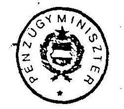

13.sz.melléklet
a V-75-69/1991/92.sz.
"Jelentés"-hez

Báger Gusztávné elvtársnő
vezérigazgató
Állami Fejlesztési Intézet
Budapest

Kedves Báger Elvtársnő!

A gazdálkodó egységek állami kölcsön vagy állami alapjuttatás formájában megjelenő tartozásuk részben vagy egészben történő adósság-konverziójával kapcsolatos álláspontját támogatom.

Érthetően csak olyan vállalati törekvések megvalósítására látok lehetőséget, amelyek rövid távon sem jelentenek újabb költségvetési terheket. Ennek realizálását minden konkrét esetben (pl. elsőbbségi részvénnyel) biztosítani kell. Megítélésem szerint e garancián kívül szükséges az ÁFI-nál már jelenleg is megjelenő, állami tulajdonú részvényekkel, üzletrészekkel kapcsolatban olyan kezelési, képviseleti megoldás kialakítása (amely beintegrálható a későbbiekben az Állami Vagyonkezelői Szervezetek rendszerébe).

Budapest, 1989. július hó 24.

Elvtársi üdvözlettel
(Varga Béla)

---

# Jamburgi Gázvezetéképítési Alap (JAGA) 

A Minisztertanács 3409/1985.sz. határozata alapján 1985. december 30-án aláírták a jamburgi földgáztermelési és -szállítási együttműködésben való magyar részvételről szóló egyezményt, amely rögzítette a szerződő szovjet és magyar fél kötelezettségeit és azok időbeni ütemezését.

Az egyezmény mellékletét képezte egy - az elszámolás feltételeit rögzítő - jegyzőkönyv és egy tételes jegyzék a tengizi kőolaj- és gázlelőhely azon létesítményeiről, amelyeket 1986-1991. között a magyar szervezeteknek kell megépíteni.

A hitelegyezmény értelmében a magyar fél 1986-tól folyamatosan

- 15 millió trRbl összegben konvertibilis devizaeszközt bocsát rendelkezésre,
- 174 millió trRbl összegben konvertibilis valutaért gépeket, valamint nagyátmérőjű csöveket vásárol és szállít,
- 309 millió trRbl összegben magyar árut szállít és
- 260 millió trRbl összegben építési-szerelési munkát teljesít a tengizi kőolaj- és gázlelőhely létesítményeinek építésén.

Fentiek szerint a kihelyezésre kerülő hitel teljes összege 758 millió trRbl, amely összeg az akkori számítások alapján megközelítőleg 66 Mrd Ft hazai ráfordításnak felelt meg.

Az egyezmény alapján a szovjet fél 1989-2008. között 37 milliárd m3 földgáz szállítását vállalta Magyarországra. Ennek a gáznak egy része - az 1991. szeptember 9-én kelt kormányközi megállapodás szerint $14,6 \mathrm{Mrd} \mathrm{m3}$ - a magyar teljesítés, tehát a kihelyezett hitel és kamatainak ellentételezése. A fennmaradó gázmennyiséget az aktuális árak alapján, további magyar árúszállítások fogják ellentételezni.

A nemzetközi vállalkozás költségeinek finanszírozására hozták létre a Jamburgi Gázvezetéképítési Alapot (JAGA), amelynek forrásait - a GB 10075/86.sz. határozata szerint - költségvetési juttatás és főként refinanszírozási hitel képezte.

---

A hitelt az MNB - egy 1986. június 16-án kelt szerződés alapján - folyósította a bonyolító AFB (később AFI) részére. A GB a hitel kamatlábát $8 \%$-ban, futamidejét 20 évben határozta meg, továbbá rögzítette, hogy a kamatfizetésre a szovjet gázszállítások - tehát a tényleges törlesztés - kezdetéig kamatmentes hitelt vehet fel az AFB (AFI).

Az egyezményben foglalt kötelezettségek teljesítése 1986-ban kezdődött meg és a teljes pénzügyi lezárás 1993. év végére várható.

A munka jelenlegi állása szerint a magyar fél az alapszerződésben meghatározott feltételeket teljesíti, de annak összege mintegy 28 millió trRbl-el kevesebb lesz az alapszerződés szerinti 758 millió trRbl (azaz kb. 66 Mrd Ft) keretösszegnél a nagyátmérőjű csőszállítás számítottnál alacsonyabb összege miatt. A várható összes ráfordítás 61,5 Mrd Ft-ra csökken, amiért várhatóan 14 Mrd m3 földgázt kapunk.

A hitelszámla megnyitása előtt, a munka előkészítésére 1984-85-ben 84 millió Ft-t fordítottak, amelynek forrása költségvetési juttatás volt.

A vizsgálati időpontig, 1990. végéig a jamburgi szerződés kapcsán 53,7 Mrd Ft került felhasználásra, melynek forrás szerinti megoszlása:

Ref.hitel összesen
$45,17 \mathrm{Mrd} \mathrm{Ft}$
Ref.hitel kamat
5,28 Mrd Ft
Kv.juttatás induláshoz
0,08 Mrd Ft
Kv.juttatás ref.hitel utáni kamatra
3,17 Mrd Ft
53,67 Mrd Ft

A JAGA alap törlesztésére szolgáló gáz szállítása 1989-ben indult, és az 1990. végéig beérkezett 1,5 Mrd m3 földgáz közel 5,0 Mrd Ft törlesztést tett lehetővé.

---

Ennek alapján a refinanszírozási hitel állománya 1990. végén:
Ref.hitel összesen
Törlesztés 90. dec.31-ig
Egyenleg
Ref.hitel kamat
Hiteltartozás összesen

45,17 Mrd Ft
- 4,97 Mrd Ft
40,20 Mrd Ft
5,28 Mrd Ft
45,48 Mrd Ft

Budapest, 1992. április hó

---

Az ÁFI és jogelődje által 1968-1990. között ellátott feladatok finanszírozásához az MNB által nyújtott refinanszírozási hitelekből 1990. december 31-éig keletkezett állami költségvetési tartozások állománya az ÁSZ megállapításai szerint
millió Ft-ban
Megnevezés 1990. december 31.
I. Követeléssel nem fedezett állami költségvetési adósság
Bős-Nagymarosi ÁFI finanszírozás 32.070
Osztrák hitel
a) Dunakiliti (Bős-Nagymaros) 1.074
b) Határátkelőhelyek

Hegyeshalom, Kópháza, Ferihegy 838
Kormányzati döntéssel átvállalt ÁFI kötelezettségek
a) bányászat és csődeljárások 946
b) refinanszírozási hitelből vállalkozási adósságkonverzió és új vállalkozásokban való állami részvétel 520
Összesen követeléssel nem fedezve 35.448
II. Követeléssel fedezett állami költségvetési adósság
Állami kölcsön 30.501
Régi típusú alapjuttatás 4.846
Új típusú alapjuttatás 143.196
Jamburg 45.483
Állami követeléssel (ÁFI-nál) fedezve összesen 224.026
III. Az állami költségvetés mindösszesen tartozása az MNB-nek (I.+II.)

---

Vagyonkezelő Főcsoport

16. sz.melléklet
a V-75-69/1991/92.sz.
"Jelentés"-hez

# RÉSZJELENTÉS

A belső államadósság Bős-Nagymaros Vízlépcsőrendszerrel összefüggő elemeinek vizsgálatáról.

---

# 1. Bevezetés 

Az Állami Számvevőszék az 1990. évi CIV. törvény alapján vizsgálta az állami költségvetés hiánya és más állami feladatok finanszírozását szolgáló költségvetési adósság (államadósság) helyzetét az 1990. év végi állapotnak megfelelően.

A vizsgálat célja a hitelfelvételek nyilvántartásának és költségvetési kapcsolatainak törvényességi és szabályszerűségi ellenőrzése volt. A Bős-Nagymaros Vízlépcsőrendszer (továbbiakban:BNV) beruházási költségeinek tételes szabályszerűségi ellenőrzését - a pénzügyi lezárást követően - egy 1992-ben induló vizsgálat során végezzük el.

A BNV beruházás kapcsán keletkezett államadósság elemeinek vizsgálatakor megállapítottuk, hogy a tényleges adósságállomány jelentősen eltér az AFI-nál nyilvántartott és a törvényben közzétett összegtől. A refinanszírozási hitel a külföldi tartozásoknak csak az 1990. év végéig törlesztett részét tartalmazza, s nem foglalkozik az építést finanszírozó külföldi hitelek és azok kamatainak fennmaradt állományával, vagy az időközi árfolyammozgások hatásával.

Vizsgálatainkat a Magyar Nemzeti Banknál, az Állami Fejlesztési Intézetnél, az Országos Vízügyi Beruházási Vállalatnál, az MVMT-nél és a KHVM Dunai Rehabilitációs Irodájánál végeztük.

A továbbiakban megkíséreljük rendszerezni a BNV építése és leállítása miatt keletkezett eddigi költségeket, és összegezni a bel- és külföldi adósság állományát a vizsgálat időpontjában.

Tájékoztató jelleggel összefoglaljuk a Magyar Köztársaság költségvetésére az adósságszolgálatból háruló későbbi kötelezettségeket és jelezzük azokat a főbb feladatokat, amelyekben döntések szükségesek. E döntések nyomán várhatóan további kiadásokkal nő a költségvetés terhe.

## MEGÁLLAPÍTÁSOK

## 2. A BNV nagyberuházással kapcsolatos ráfordítások finanszírozása.

A beruházás tényleges ráfordításainak 1990. év végéig három forrása volt:

- a folyó költségvetés,
- az MNB-től felvett ún. refinanszírozási hitel,
- külföldi bankoktól felvett hitelek.

---

# 2.1 A beruházás előkészítő fázisának finanszírozása. 

A Magyar Állam költségvetése 1975-től 1985. év végéig - az építkezés előkészítési munkálatainak fedezésére - évente a felmerült szükségleteknek megfelelő mértékű forrást biztosított. Az Állami Fejlesztési Bank pénzügyi teljesítménye az előkészítési szakaszban összesen 3.240 millió Ft volt.

### 2.2 A beruházás kivitelezésének finanszírozása.

### 2.2.1 Belföldi (refinanszírozási) hitel.

A BNV beruházásának végleges programját és a finanszírozás módjait a Minisztertanács 1986. december 4-i ülésén hozott 0000/1036 MT sz. határozatával hagyta jóvá. A határozat 2. pontja szerint a BNV finanszírozására egy elkülönített alapot kellett létrehozni a Magyar Nemzeti Bank által nyújtott hitelből és az alap kezelésére az Állami Fejlesztési Bank (1987-től Állami Fejlesztési Intézet) kapott megbízást. Az MT határozat 3. pontja kimondta, hogy a beruházást központi forrásokból megvalósuló nagyberuházásként kell kezelni.

Az alap létrehozásának indoka az volt, hogy az egyrészt módot ad a felhasználás éves ütemének rugalmas kezelésére, másrészt lehetővé teszi a folyó költségvetés tehermentesítését. A felvett és felhasznált hiteleket a költségvetés csak a beruházás üzembehelyezése után fizeti vissza az MNB-nek.

Az MT határozat alapján készült 107/1987 (XII.31.) PM sz. rendelet tartalmazza a BNV Építési Alap létesítésére vonatkozó jogszabályokat. A rendelet értelmében az elkülönített alap a BNV beruházás minden felmerült költségét a hitelből finanszírozza, kettő kivételével:

- nem szolgál az alap az 1986. január 1. előtt végzett előkészítési munkák fedezetéül (1d.2.1.pont).
- nem terheli az alapot az osztrák kivitelezésben épülő Nagymarosi Vízlépcső költsége; ennek kiegyenlítése - a magyar és az osztrák áramszolgáltató vállalatok közötti szerződésnek megfelelően - villamosenergia szállítással történik (1d.: 2.2.3. pont).

Az Alap forint finanszírozására a kezelő AFI-nak az MNB nyújt refinanszírozási hitelt. Az erre vonatkozó szerződést végleges formájában - 1986. január 1-i visszamenőleges hatállyal - 1987. decemberében írták alá.

---

A szerződés értelmében az éves hitelkeretet a Minisztertanács állapítja meg. A refinanszírozási hitel végösszegének meghatározására csak a beruházás befejezésének évében, de legkésőbb 1995-ben kerül sor. A hitel után az AFI - az MNB által egy évnél hosszabb lejáratra nyújtott refinanszírozási hitelekre megállapított kamatnál 0,5%-ponttal alacsonyabb kamatot fizet. Az MNB a hiteltörlesztés kezdetéig a fizetendő kamatokat is meghitelezi AFI-nak, de ezt kamatmentesen.

Ha a két utóbbi klauzula nem kerül be a szerződésbe, úgy 1990. év végén a refinanszírozási hitel állománya 3-3 milliárd forinttal több (lett) volna.

A szerződés szerint a hitel törlesztése a beruházás befejezésének évében december 31-én, de legkésőbb 1995. december 31-én kezdődik és 15 évig tart. A hiteltartozásért és annak járulékaiért a Pénzügyminisztérium készfizető kezességet vállalt.

A hitelszerződés tartalmi köre - a magyar vállalkozóknak kifizetett tételeken túl - kiterjedt a Dunakiliti Duzzasztómű építésében közreműködő osztrák és a kotrási munkát végző jugoszláv vállalkozók által teljesített munkák forint ellenértékére is. Ez a gyakorlatban azt jelentette, hogy az osztrák és jugoszláv bankoktól felvett építési célhitel a refinanszírozási hitel egyik forrásaként lett kezelve.

Az AFI - bár a beruházás generál finanszírozója volt - nem rendelkezett a devizaszámlák felett, az MNB bonyolította az esedékes kifizetéseket, majd megterhelte az AFI refinanszírozási hitel-számláját.

Az 1990. évi CIV.sz. költségvetési törvény 1990. év végével lezárta a refinanszírozási hitel folyósítását. A törvény az eredeti szerződésben kikötött 15 éves lejáratú időt nem módosította, de a törlesztés kezdeti időpontját 1991. évtől kezdve állapította meg, 5 év türelmi idővel (tehát a tényleges törlesztés 1996. január 1-én kezdődik).

A refinanszírozási hitel állománya 1990. december 31-én:
BNV hitel igénybevétel
26.049.137.239 Ft
ebből AFA
3.380.394.726
kamatmentes kamat
7.355.061.915
összesen:
36.784.593.870 Ft

---

# 2.2.2. Külföldi bankhitelek. 

Az osztrák Creditanstalt Bankkal az MNB két hitelszerződést kötött a Dunakilitinél megépült műtárgy finanszírozására.

A felvett 419,4 millió ATS hitel forint fedezetét - igénybevételkori árfolyamon számolva 1.335 millió Ft - a refinanszírozási hitelállomány magában foglalja. Ez az összeg csökkent az 1990. végéig kifizetett 69,3 millió ATS tőketörlesztés forint ellenértékével (261 millió Ft), így a fennmaradó 350,1 millió ATS tartozásra a refinanszírozási hitel

### 1.074 millió Ft

fedezetet tartalmaz.

1990. december 31-ig az MNB a 69,3 ezer ATS tőketörlesztésen túl 152,5 millió ATS kamat- és jutaléktörlesztést teljesített a Creditanstalt Bank felé, a törlesztési terveknek megfelelően.

Az 1986. szeptembertől 1987. decemberéig esedékes kamattal és jutalékkal - 53,5 millió ATS (213 millió Ft) - az MNB nem terhelte meg az AFI-t, hanem saját nyereségének terhére fizette ki, azaz közvetve hárította át a terhet a költségvetésre.

Ilyen módon ez az összeg "eltűnt" a
 BNV és így a refinanszírozási hitel fennálló adósságállományából.

1988. január 1-től a vizsgált időszak végéig minden esedékes kamat és jutalék – összesen 99,0 millió ATS – forint ellenértéke megjelent az AFI számláján többletként, de ennek pontos összegét sem az MNB, sem az AFI elkülönítve nem tartja nyilván.

A felvett hitelből 1990. év végén a fennálló tőketartozás 350,1 millió ATS, ami – 7,0 Ft/ATS árfolyammal számolva – 2.450 millió Ft-nak felel meg. Ebből az összegből a refinanszírozási hitel 1.074 millió Ft-ra fedezetet nyújt, tehát az árfolyamkülönbözetből eredő többlet, amely adósságnak tekinthető, de nincs benne a refinanszírozási hitelben:

### 1.406 millió Ft

Nincs külön nyilvántartva, de rója a refinanszírozási hitelnek az igénybe vett 19,2 millió USD jugoszláv hitel forint fedezete is, amelyből törlesztés 1990 végéig nem történt. (A szerződés szerint az esedékesség 1991. február 3-án kezdődött.) Ennek becsült összege 55 Ft/USD árfolyammal számolva:

---

A jugoszláv hitelből fennálló adósságállomány 1990. év végén – 75,0 Ft/USD árfolyammal számolva – 1.443 millió Ft, amely összegből a refinanszírozási hitelszerződés 1.053 millió Ft-t tartalmaz.

Az árfolyamkülönbözetből eredő többletadósság:
385 millió Ft

# 2.2.3 OVG-MVMT villamosenergia-szállítási szerződés 

A Nagymarosi Vízlépcső megvalósítására az Országos Vízügyi Beruházási Vállalat (OVIBER) és a Donaukraftwerke Aktiengesellschaft fővállalkozási szerződést kötött. Ezzel párhuzamosan – a munka pénzügyi finanszírozására – szerződés jött létre a Magyar Villamos Művek Tröszt (MVMT) és az Österreichische Elektrizitätswirtschafts-Aktiengesellschaft (OVG) között. A szerződés szerint az MVMT 20 éven keresztül, 1996-tól 2015-ig villamosenergiát szállít az OVG részére. Az éves mennyiség 1200 GWh, melyet folyamatos, ún. szalagszállításként kell teljesíteni.

A villamosenergia ellenértékének egy részét az osztrák fél – legfeljebb 7950 ezer ATS összegű – megelőlegezi úgy, hogy kifizeti a Creditanstalt-Bankverein (CB) keresztül a DoKW-nak a Nagymarosi Erőmű építésénél teljesített szállítások és szolgáltatások költségeire.

A szerződés szerint, az előleg és kamatainak letörlesztése után az MVMT villamosenergia szállítását az OVG megvásárolja. Az árképzéshez egy mozgó árklausulát alakítottak ki, amelyhez rögzítették az energia induló árát, az 1984. októberi bázison:

| - a téli hónapok | (01.-03. ill. 10.-12.) | 0,85 ATS/kWh |
| :-- | :-- | :-- |
| - átmeneti hónapok | (04.-09.) | 0,51 ATS/kWh |
| - nyári hónapok | (05.-06.) | 0,37 ATS/kWh |

A bázisárból, az osztrák átlagos fogyasztói árindex éves alakulása szerint kell kiszámítani az aktuális árat, a szerződésben rögzített képletek és indexadatok alapján.

Az OVIBER 1989. XI. 14-én visszalépett a DoKW-val kötött szerződéstől, majd 1990. novemberében a szerződő felek megegyeztek 2.650 millió ATS összegű végkielégítésben, kamatok nélkül.
A késedelmes kiegyenlítés miatti kamat összege 122,5 millió ATS. A DoKW ezen felül az 1989. V. 15-i leállítási időtől az 1989. XI. 14-i visszalépésig összesen 102,3 millió ATS összegű állásköltségszámlát, valamint 1989. XI. 16-tól a munkaterület végleges elhagyásáig 6,5 millió ATS összegű munkaterület biztosítási költségszámlát nyújtott be.

---

A DoKW-nak kifizetett összegek után a banki kamat 1990. 12. 31-ig 320,9 millió ATS volt.

Mindezek alapján az osztrák fél követelése, amelyet villamosenergia szállítással kell letörleszteni:

# 3.202,2 millió ATS 

A későbbi törlesztés módjaitól függetlenül, a felvett hitelt a BNV beruházásból származó államadósság részéként kell kezelni.
1990. év végén az adósságelem becsült összege – 7,0 Ft/ATS árfolyammal számolva –
22.415 millió Ft

Összegezve megállapítható, hogy 1990. év végéig a BNV beruházás megvalósítására a Magyar Állam ráfordítása:
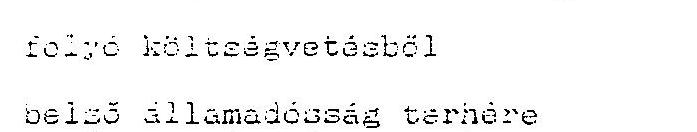
3.340 millió Ft
33.404 millió Ft
külső államadósságból
a refinanszírozáson kívüli hánvad
osztrák hitel (Dunakiliti)
1.466 millió Ft
jugoszláv hitel (BRODOIMPEKS)
385 millió Ft
osztrák hitel (Nagymaros)
22.415 millió Ft
összesen:
60.910 millió Ft

Az összegből a folyó költségvetés korábbi kiadását levonva megkapjuk az 1990. december 31-én fennálló államadósság összegét:
57.670 millió Ft

---

3. A BNV építéséből és leállításából következő, a jövőben jelentkező költségelemek.

Az 1990. évi CIV. sz. törvény értelmében – a hitelforrások leállítása után – minden BNV-vel kapcsolatos fizetési kötelezettségnek a költségvetés a forrása.

A leállított BNV beruházás végleges műszaki-pénzügyi lezárása, illetve a magyar-csehszlovák államközi szerződés tisztázása még nem történt meg, ezért pontosan nem határozhatók meg a költségvetés jövőbeni terhei.

A Magyar Köztársaságra váró terheket négy csoportba sorolhatjuk:

- a belföldi és külföldi hitelszerződések alapján fizetendő tőke és kamatterhek,
- külföldi hitelszerződés alapján nyújtandó hazai szolgáltatás (áramszállítás),
- a jövőben jelentkező fenntartási, helyreállítási, árvíz- és környezetvédelmi költségek,
- a nemzetközi szerződések teljesítésének hazánkra háruló kötelezettségei.

# 3.1 Tőke és kamatterhek. 

### 3.1.1 A belföldi adósságállomány terhei

A BNV beruházásra 1990 végéig felvett refinanszírozási hitel 33,4 milliárd Ft (ld.: 2.2.1. pont). Az 1990. évi CIV. törvény rendelkezése szerint az államadósság-elemek lejárata 1991-től kezdődően – 5 év türelmi idővel együtt – 15 év.

1991-től évi 9%-os kamatot fizet a hitelért a költségvetés. 1996-tól 10 év alatt kell a tőkét, kamataival együtt az MNB-nek visszafizetni. A fizetési feltételek még nincsenek szerződésben meghatározva.
Amennyiben feltételezzük, hogy azonos részletekben és 9%-os kamat mellett történik a visszafizetés, akkor 1991-1995-ig évi 3,1 milliárd Ft a kamat, majd 1996-2005-ig – a változó kamatterhek miatt – 6,34 milliárd Ft-tól 3,64 milliárd Ft-ig évente csökkenő törlesztési kötelezettséget jelent. Ez összesen 1991 és 2005 között mintegy:

---

# 3.1.2. A külföldi adósságállomány terhei 

- Az osztrák Creditanstalt Bankkal kötött egyik hitelszerződés összege 112,1 millió ATS, amelyet 24 egyenlő részben fizet vissza az MNB. A törlesztés 1989. 06. 30-án kezdődött.

A másik hitel összege 7,3 millió ATS, ennek visszafizetése 1990. január 30. kezdettel 22 egyenlő részletben történik. Mindkét törlesztési tervben az utolsó fizetés ideje 2000. december 31.

A kamatokat és a jutalékot, mindkét hitelre negyedévenként, 1997. 12. 31. kezdettel, változó összegben kell fizetni. Az osztrák bank minden negyedév vége előtt egy héttel közli a következő esedékes kamat összegét.

Az összesen felvett 419,4 millió ATS hitelből 1990. év végén a fennálló tőketartozás 350,1 millió ATS, amelyet 1991 és 2000 között, tehát 10 év alatt kell visszafizetni az összes kamataival és a jutalékaival együtt.

A szerződés szerinti 8,25%-os fix kamattal számolva 10 év alatt mintegy

## 610 millió ATS

fizetési kötelezettség merül fel összesen, ami 7,0 Ft/ATS árfolyamon számolva közel 4.270 millió Ft. A refinanszírozási hitelben szereplő 1.074 millió Ft levonása után az 1991-től 2000-ig a folyó költségvetést terhelő tétel összesen:

### 3.196 millió Ft

- A jugoszláv JUEMEC banktól felvett 19.239 ezer USD hitel visszafizetése félévenként, 2.404,9 ezer USD részletekben 1991. február 3. és 1994. augusztus 3. között esedékes. A kamat ennél a hitelnél is változó, mindig fizetés után közlik az MNB-vel a következő esedékesség kamatát.
A hitelből keletkezett becsült adósságállomány, tehát a mindenkor esedékes kamatok és tőketörlesztések együttes összege 1994. augusztus 3-ig közelítőleg

23.265 ezer USD.

Ez a jelenlegi 75,0 Ft/USD árfolyamon számítva közel 1.748 millió Ft, amire a refinanszírozási hitelben felszámolt fedezet 1.058 millió Ft, így a folyó költségvetés további terhe 1991-1994-ig:

---

# 3.2 OVG MVMT áramszállítási szerződés 

A Nagymarosi Vízlépcső építésére a Creditanstalt Bankverein által folyósított hitel és az 1990 végéig tőkésített kamatok összege – amelyet áramszállítással ellentételez a magyar fél –

### 3.202 millió ATS

A törlesztendő összeget az 1996. évi szállítás megkezdéséig tovább növeli a szerződés szerinti éves kamat. Az évente többször újra kiszámításra kerülő kamatlábat úgy határozzák meg, hogy a szövetségi kölcsönök másodlagos piacán elért kamathozamához 0,25 százalékpontot hozzáadnak. 1996. év elején, tehát a törlesztés megkezdésének idején a fennálló adósság becsült összege, 8%-os átlagos kamatlábbal számolva:

### 5.082 millió ATS.

Az MVMT és az OVG közötti szerződés, az erőmű-építés leállásától függetlenül, továbbra is érvényben van és a megváltozott helyzetben is az áramszállítás szolgál az osztrák bank által kifizetett összeg, annak kamatai és a végelszámolás utáni maradványösszegért fizetendő kamatok törlesztésére.

A 3017/1990 MT határozatban vállalta a kormány, hogy a „törlesztésre kiszállított villamosenergiának legalább a teljes körű költségét az állami költségvetés megtéríti a Magyar Villamos Művek Tröszt részére.”

A költségvetés és az MVMT között a törlesztés konkrét módjáról még nem történt megállapodás. A költségvetést terhelő teljes kiadás csak az 1996. év elején ismertté váló adatok alapján lesz pontosítható.

A várható költségek becsléséhez az MVMT által előterjesztett megoldások azon variációjából indultunk ki, amikor a költségvetés a törlesztésre kiszállított áramot – egy speciálisan erre a célra kialakított – „színvonalfegyesített” áron téríti meg.

Kiindulási adatok:

- Az 5.082 millió ATS összes tartozás kiegyenlítéséhez 8 éven keresztül, évi 1200 GWh áram szállítása szükséges, ha az osztrák átlagár 0,76 ATS/kWh.
- Az energia várható hazai ára: 5,0 – 5,6 Ft/kWh

A költségvetés várható éves terhe 1996-tól 2003-ig (középárral számolva):
1.200 GWh * 5,3 MFt/GWh = 6.360 millió Ft
tehát, a törlesztés 8 éve alatt összesen:
50.880 millió Ft

---

# 3.3 Későbbi döntésektől függő költségek 

- Helyreállítás és fenntartás
- A nagymarosi térség rehabilitációja
- Környezetvédelmi intézkedések és helyreállítások (Szigetközi vízótlás, mellékág lezárások, depónák eltávolítása, stb.)
- Árvízvédelem (a védelmi rendszer tervezése, kiépítése és megerősítése; közbenjáró árvízvédekezés)
- Lakossági infrastruktúra (befejezetlen közlekedési és közmű létesítmények, átfogó tanulmánytervek)
- Egyéb (kártalanítás, kártérítés, kisajátítások, peres ügyek vitája és rendezése)

### 3.4 Nemzetközi szerződésekből fakadó kötelezettségek.

- Magyar-Csehszlovák államközi szerződés
- Határon túli magyar érdekeltségek felszámolása (építési területek, depónák, felvonulási telepek megszüntetése)
- Az államközi szerződésből – az eltérő készültségi fokból eredően – a magyar félre eső rész.
- A Duna mint nemzetközi hajóút-vonal
- A kormány a 3120/1991 sz. határozatában kimondta, hogy a BNV beruházás elmaradása esetén is biztosítani kell a Duna Magyarország szakaszának az ENEZ EGE IV. hajóút osztály normatívák (2,7 m mélység, 180 m szélességben) szerinti kiépítését.

## 4. Összefoglalás

A Bős-Nagymaros Vízlépcső – az építés kezdete óta – foglalkoztatja az ország közvéleményét, s a nagyberuházás számos kérdése a műszaki-gazdasági körből a politika döntési körébe került át.

Az Állami Számvevőszéknek nem feladata a politikai döntések értékelése, vagy minősítése, de alkotmányos kötelessége a politikai döntések – az ország költségvetését érintő – meglévő és jövőbeni hatásait, következményeit vizsgálni, s azok eredményét a parlament és a közvélemény tudomására hozni.

---

A BNV beruházás miatt felmerült költségek és a keletkezett államadósság vizsgálata kapcsán megállapítottuk:
2. 1990. év végéig (a vizsgálat határnapjáig) a BNV beruházásra – forintban és devizában eszközölt – ráfordítás együttes összege:

$$
60.910 \text { millió } F t
$$

2. Az összes ráfordításból közvetlen költségvetési kiadás 3.340 millió Ft volt, a fennmaradó 57.670 millió Ft az állam adóssága 1990 végén.
3. A fennálló adósságból 33.404 millió Ft a Magyar Nemzeti Banktól felvett belföldi államadósság.
4. A felvett belföldi hitel tőketörlesztése 1996-tól esedékes. 1996-ig a költségvetést csak a kamatok fizetése terheli, ami kb. 3.100 millió Ft évente. 1996-2005-ig a kamat és a tőketörlesztés évi terhe – az azonos tőkehányad és a maradvány csökkenő kamathányada miatt – folyamatosan csökkenő: mértéke 6.347 – 3.641 millió Ft között várható. A refinanszírozási hitel visszafizetése összességében a tíz év alatt mintegy

$$
65.000 \text { millió } F T
$$

terhet jelent a költségvetés számára 2005-ig.
6. A külföldi hitelek közül .

-
 a Dunakilitinél épült műtárgyra kapott kölcsön adósságszolgálati terhe 1991-2000-ig 390-460 millió Ft évente. A tartozás - refinanszírozási hitellel nem fedezett - becsült állománya:

# 3.196 millió Ft 

- a JUBMES banktól felvett hitel 1991-1993-ig, tehát három éven keresztül, évi 430-460 millió Ft terhet jelent. A tartozás - refinanszírozási hitellel nem fedezett - becsült állománya:

690 millió Ft

---

- a Nagymarosi Vízlépcső megvalósítására felvett osztrák hitel törlesztésére szolgáló elektromos áram előállításának költsége 1996-tól nyolc éven keresztül 6.360 millió Ft évente. A költségvetés teljes várható terhe 2003-ig:

50.880 millió Ft
5. Tehát az ország költségvetését a BNV építésére felvett bel- és külföldi hitelek és kamataik törlesztése 1991 és 2005 között összesen közel (4.+ 5. pont)

# 120 milliárd Ft 

kiadás terheli. Ez az adósság-állomány az érvényben levő bank-közi szerződések következménye: mértéke politikai döntésekkel nem befolyásolható. A végösszeg tekintetében a belső, vagy a külső kamatlábak változása okozhat marginális eltérést.
7. A helyreállításával, illetve a nemzetközi szerződésekkel kapcsolatos teendők és kötelezettségek költségei jelentős mértékben függnek az előkészítés előtt álló kormányzati döntésektől. Vizsgálatunkkal fel szeretnénk hívni a figyelmet arra, hogy a lehetséges döntéseknek igen jelentős további költségkihatásai lesznek és e költségek - a döntések függvényében - nagyon szóródnak.

Budapest, 1992. március 23.
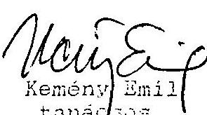

Vina Istvánné
Kiss Istvánné
tanácsos
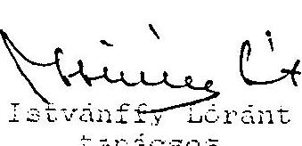

---

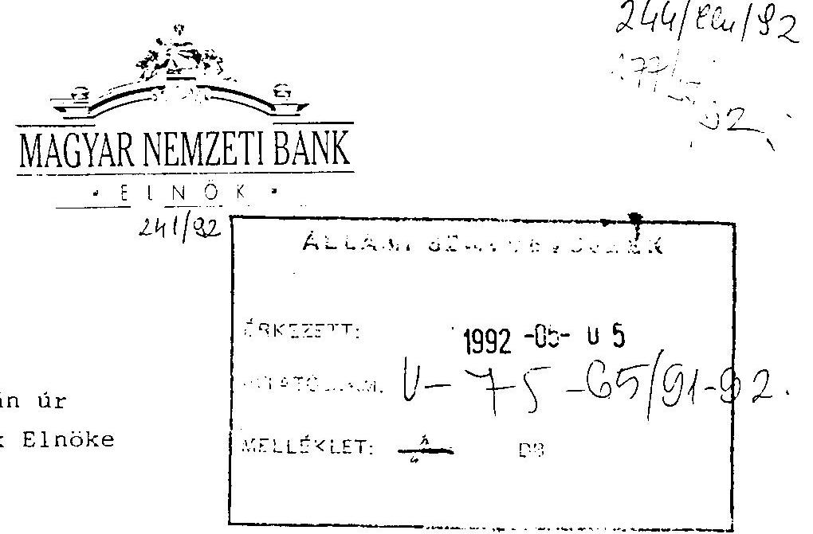

Tisztelt Hagelmayer úr!

Elsősorban is köszönetemet szeretném kifejezni azért az átfogó munkáért, amit az ÁSZ az állami költségvetés adósságának ellenőrzésével kapcsolatban folytatott.

Az ÁSZ jelentése az állami költségvetés adósság ellenőrzéséről korrekt, a vizsgálat céljával összhangban álló munka, amely a helyzet feltárásán túl a jövőre vonatkozóan fontos következtetésekre jut, javaslatokat tesz. Ki szeretném emelni azt is, hogy már a részjelentések is segítséget nyújtottak az MNB 1991. évi mérlegével kapcsolatos egyes kérdések rendezéséhez.

Mivel a vizsgálat igen bonyolult, átfogó témára vonatkozott, amely az érdeklődés középpontjában áll, ezért még néhány olyan pontosítási javaslatom van, amelyet elengedhetetlennek tartok a kép teljesebbé tételéhez.
1.) A jelentés korrekten kimondja, hogy mi a vizsgálat célja (5.0). A téma nagy fontosságából és abból, hogy várhatóan nagy publicitást kap, javasolom, hogy a vizsgálat célján túlmenően a jelentés említse meg a bevezetőben egyrészt, hogy az államadósság - közgazdaságilag értelmezve - fogalma szélesebb körű, mint a központi költségvetés adósságai, amire az 1990. évi CIV. törvény

---

vonatkozik. Államadósságként kell közgazdaságilag értelmezni ugyanis az államháztartáshoz tartozó más jövedelemtulajdonosok adósságait. Ugyanigy a potenciális adósságokat (ideértve a garanciákat is) említve, célszerű kitérni konkrét, nagy jelentőségű ügyekre. Ide sorolható a vízlepcső ügy is, de idetartozik az MNB mérlegében szereplő transzfer-rubel követelés is. Ez utóbbit 1989 végén, de még 1990 elején is másképpen lehetett értékelni (tekintettel a 0,92 szorzós megállapodásra), ma egészen más a helyzet, a befolyás kétes. Az AFI hitelek fedezett-fedezetlen vitájában is a "mikor értékelek" kérdés jelentkezik. 1992-től újabb adósság, az elengedett lakáshitelek miatti államadósság jelentkezik szélesen értelmezett adósságkörben. Elképzelhetőnek tartok olyan megoldást, hogy pl. sajtótájékoztatón vázolja az ÁSZ, hogy a vizsgált kör hogyan illeszkedik a szélesebben értelmezett adósságkörbe, illetve melyek a megjelenő új adósságelemek.
2.) A költségvetési mérlegek korrekciójára tett javaslat (2.3 pont) megoldása metodikai problémát vet fel. Ha ugyanis korrigáljuk a mérlegeket, nemcsak a bevételként elszámolt hitelekkel kell foglalkozni, hanem a többi olyan államadósság elemmel is, amely nem a folyó bevételek és kiadások eltérése miatti nyilvános hitelfelvételből keletkezett. (Ilyen elemek: pénzintézeti alaptőkejuttatás, vállalati forgóalap-juttatás, AFI-nál keletkezett adósság, stb.) Ezek egy részének (pl. AFI-nál keletkezett adósság egy része), szintén a folyó mérlegben kellett volna szerepelnie, más része a "tőkemérleget" kellene, hogy érintse. A jelenleg használt folyó költségvetési mérlegbe az így megfogalmazott szükséges korrekciók nem is illeszthetők, pl. a tőkemérleget érintő elemek. A korrekt, minden szempontot figyelembe vevő, visszamenőleges korrekcióhoz - a készülő Államháztartási Törvény szellemében - olyan módszertan kidolgozására lenne szükség, ahol a folyó mérleg mellett a tőkemérleget érintő korrekciók is átvezetésre kerülnének,

---

s így publikálnák a korrigált mérleget. Csak az ilyen irányú
módszertan felelne meg a nemzetközi normáknak, így ez tenné lehetővé, hogy a nemzetközileg már prezentált mérlegekkel összehasonlítható legyen az idősor.
3.) Az Állami Fejlesztési Intézetnél keletkezett államadósság résznél (9.1 pont) szövegszerűen jelezni kell, hogy a 16. sz. mellékletben, a Bős-Nagymarosi beruházással kapcsolatban felsorolt várható állami terhek miért nem kerültek teljes mértékben számbavételre az államadósságnál.

Ezért a következő bekezdést javaslom annak érdekében, hogy elkerülhető legyen az elhallgatás felmerülő gyanúja.
"Az ország külső adóssága és az államadósság számbavételekor a vízlepcső kapcsán csak az MNB-nél szerződésileg rögzített, ténylegesen felmerült kifizetések kerültek számbavételre. Az adatfeltárás során az MNB az IMF delegációjával is konzultálva arra az álláspontra jutott, hogy az adósság nagyságát nem lehet durva becslésekre alapozni.

Az ezzel kapcsolatos teljes állami teher nagysága még jelenleg sok tényező függvénye. A jelenlegi ismereteket foglalja össze az erről szóló vizsgálati részjelentés. A véglegesített megállapodások, szerződések és pontos adatok birtokában lehet megállapítani és publikálni a többlet államadósságot, illetve lehet számbavenni a többlet adósságszolgálati terheket".
4.) Kérem, hogy az 1. sz. mellékletben a nemzeti valuta hivatalos leértékeléséből származó államadósság sor előtt részösszegként szerepeljen "a CIV törvényben számszerűsített államadósság", mert a táblából az az első benyomása az olvasónak, hogy a CIV törvénynél 500 Mrd Ft-tal több államadósságot talált az ÁSZ.

---

5.) AFI refinanszírozása kapcsán keletkezett államadósságot illetően lényegesnek tartom az anyagban annak rögzítését, hogy az AFI-PM közötti elszámolás rendezése nem kérdőjelezi meg az MNB által az AFI-nak nyújtott refinanszírozási hitelállományát, ezért a vonatkozó szerződés megköthető.
6.) A nemzeti valuta hivatalos leértékelése miatti államadósságrész keletkezésének elemzését javasoljuk kiegészíteni, nehogy az olvasóban az az érzés keletkezzen, hogy csupán könyveléstechnikai kérdésről van szó.

Az országban az MNB volt és ma is az az intézmény, amely az ország devizatartalékait gyűjti, meghatározó az ország külföldi hitelfelvételeiben is. Az ország helyzetéből fakadóan szükségszerűen külföldi devizákban meglévő nettó tartozása nagy, azaz nagy a nyitott pozíciója. Ezért az árfolyamváltozások nagymértékben érintik. Helyzete abból fakadóan, hogy legnagyobb adósa az állam, sajátos. Az árfolyamváltozásból fakadó veszteséget a kamatokon keresztül legnagyobb adósára - ismert okokból - nem tudja áthárítani.

Formai megoldás az lenne, hogy az MNB a kamatokon keresztül továbbhárítja a veszteségét, vagy kimutatja azt. Mindkét eset a költségvetés folyó hiányát növelné. Ez közgazdaságilag értelmetlen, mivel az árfolyamváltozáskor a veszteség valóságos realizálódása nem következik be. (Az ellenkező esetben is áll az érvelés: árfolyamváltozásból fakadó nyereség költségvetési folyó bevételként való elszámolása látszateredményt hozna.)

Ebből a helyzetből fakad, hogy a hivatalos árfolyamváltozásokból eredő veszteséget célszerű államadósságként kezelni, amely gyakorlat hasonló helyzet esetén más országokban is alkalmazott.

---

Az MNB a leértékelés miatti veszteségét is fedező költségvetési kamat fizetése mellett a költségvetés hiánya, így az MNB felé fennálló deficit finanszírozó hitele lett volna nagyobb, ami csak a kétféle adósság kamatozásában jelentene eltérést.
7.) Az államadósság törlesztésével foglalkozó részt (11. pont) az alábbiakkal javasoljuk kiegészíteni:

Az 1990. CIV. törvény alapján számított adósságszolgálati terhek tárgyalásakor utalni kellene arra, hogy a bemutatott adatok időközben szükség szerint változtak, így törlesztések, előtörlesztések, új hitelfelvételek és vannak egyéb már meglévő determinációk is: lakásalap megszüntetése miatti növekedés, a bősi vízlepcső - más helyen bemutatott - miatti terhek, stb. A 42. oldalon lévő táblázat az 1990. évi CIV. Tv. alapján ezért közelítően, adott időpontban, 1990 végén számítva - mutatja a jövőbeni tendenciákat. Célszerű lenne, hogy utalás történjen a bizonytalanságokra, pl. a kamatok változására.
8.) A nemzetközi pénzügyi szervezetek alaptőkéjéhez való hozzájárulás 9. sz. mellékletben számított összege nincs összhangban azzal a megegyezéssel, amely a PM-MNB-ÁSZ szakértői megbeszélésen született, és ez azért fontos kérdés, mivel az MNB az 1991. évi mérlegét annak szellemében készítette el. Az volt a megállapodás, hogy a hivatalos leértékelésből származó értéknövekedést figyelembe kell venni, ennek értéke 546 millió forint 1990-ig, de figyelmen kívül kell hagyni az IDA (Nemzetközi Fejlesztési Társulás) felé még nem készpénzesített kötelezettségvállalást. Így az összeg ( $6096+546-919=5723$ millió Ft). Az ÁSZ számítása azért is ellentmondásos ilyen formában, mivel a hivatalos leértékelés miatti államadósságot viszont nem növelte meg az 546 millió forinttal.

---

9.) Ismételten szeretnénk felhívni a figyelmet arra, hogy az Ipari Szerkezetkiigazítási Programra felvett világbanki hitelekből származó összeg ugyanolyan betétként került elhelyezésre az MNB-nél, mint a G24-ektől származó hitelek, így adósságszolgálati terhe az államnak itt sincs.
10.) Jelezni kívánjuk, hogy a vállalati forgóalapjuttatás miatti államadósság részre a szerződés a CIV. törvény alapján megvan (21. oldalhoz), azt Hagelmayer úr 1992. január 17-én ellenjegyezte.
11.) A napi munka során is már felvetődött, hogy a nemzetközi szerződések hiteles magyar fordítását juttassuk el az ÁSZ-hoz, amikor az adott üggyel az ÁSZ foglalkozik. Hiteles magyar fordítások készítését nem vállalhatja fel a Bank. Véleményünk szerint az egyes ügyekben a Kormánynak készült - az előterjesztésekhez csatolt - fordítások is megfelelőek az ítéletalkotáshoz.

Budapest, 1992. május 2.
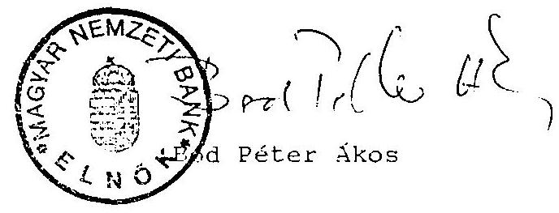

---

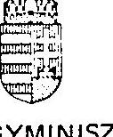

# PÉNZÜGYMINISZTÉRIUM 17/4/92/ku 

Dr. Hagelmayer István úr, az Állami Számvevőszék elnöke

BUDAPEST

| ÁLLAMI SZÁMVEVŐSZÉK |
| :--: |
| $\begin{aligned} & \text { ÉRKEZETT } \\ & \text { IATATO:E:W: } 1-7-10 / 01-02 \end{aligned}$ |
| MELLÉKLET: |

Kedves Hagelmayer Úr!

Köszönettel vettem az Elnök Úr folyó hó 7-i levelével megküldött, az állami költségvetési adósság ellenőrzéséről szóló "Jelentés"-tervezetet. Hálás vagyok, hogy - bár az anyagot Elnöki értekezletük már megtárgyalta és elfogadta - lehetőséget kíván biztosítani számomra esetleges további észrevételeim megtételére. Egyetértek Elnök Úr azon elgondolásával, hogy észrevételeim Önök által figyelembe nem vehetőknek minősített része a "Jelentés" mellékletét képezze.

Az alábbiakban az észrevételeket, megjegyzéseket általános jellegűekre, illetőleg az anyag egyes konkrét részeire vonatkozó felvetésekre tagolva teszem meg.

## I. Általános jellegű észrevételek

1. A "Jelentés" azzal a javaslattal zárul, hogy az ellenőrzés megállapításai alapján a költségvetési adósság 1990. évi CIV. törvényben rögzített adatai kerüljenek módosításra. Véleményem szerint a hivatkozott törvény adatait nem szükséges visszamenőlegesen módosítani, mivel azok az 1990. végi várható helyzetre vonatkoztak. Ehelyett az ellenőrzés megállapításait figyelembe véve az 1991. évi zárszámadás keretében kell rögzíteni az államadósság 1991. év végi állományát, illetőleg változását. (Rá kívánok mutatni, hogy a Kormány már az 1990. évi zárszámadás általános indokolásának szövegében és számszerű anyagában bemutatta az 1990. év végi állományadatokat.)

---

Annál is inkább ezt a megoldást tartom célszerűbbnek, mert - éppen az ellenőrzés megállapításai alapján - az államadósság kezelésének más szabályait is törvényileg módosítani vagy újonnan rögzíteni szükséges, s arra az 1991. évi zárszámadás keretében kíván a Kormány sort keríteni.
2. Az ellenőrzés részletesen tárgyalja az államadósság jövőbeni költségvetési (törlesztési és kamat-) terheinek alakulását. Ahogy azt már az előző fázisokban is jeleztük: az alkalmazott vizsgálati módszer statikus, nem veszi figyelembe, hogy bizonyos tényezők, így a kamatszint jövőbeni várható csökkenése a terheket alapvetően befolyásolhatják.
3. Az "Összefoglaló következtetések" rész
 1.9. pontjában foglaltak pontosításra, kiegészítésre szorulnak:

- az államadósság keletkezését az eddigiekben a mindenkori éves költségvetési törvény szabályozta, amely rögzíti az adósságot keletkeztető, illetőleg mérséklő hitel- és értékpapír-műveleteket. Ezeket, illetőleg az Országgyűlés és a Kormány hatáskörét általánosan az Államháztartási Törvény rendezi;
- a forintleértékelés és az államadósság kapcsolatát a Magyar Nemzeti Bankról szóló LX. törvény szabályozta.

# II. Konkrét megjegyzések 

A megjegyzéseket a "Jelentés" tárgyalási sorrendjében teszem meg:

1. Az állami költségvetés által bevételként elszámolt MNB hiteleiből keletkezett államadósság tárgyalásánál (10. oldal első bekezdés) jelzett, az 1981-82. években elszámolt hiteleket teljes egészében törlesztésre fordították, azaz emiatt az államadósság nem nőtt.
2. A bevételként elszámolt MNB hitelek kezelésénél (10. oldal második bekezdés) - ahogy korábban már többször rámutattunk - nem helytálló az a megállapítás: "... semmi sem utalt annak hiteljellegére."

Példaként idézem az 1981. évi állami költségvetés végrehajtásáról szóló 1982. évi I. törvény 6. §-át:
"A nemzetközi pénzügyi kapcsolatokból, a hitelműveletekből és az egyéb forrásokból származó különféle bevételek összege 33.307 millió forint, az összes bevételnek a 7 %-a."
3. A bevételek között elszámolt hiteleknek nem hiányként való kimutatásával kapcsolatban tett megállapításnak (11. oldal első új bekezdés), miszerint az "a Pénzügyminisztérium és a Magyar Nemzeti Bank közötti belügy" volt, maga a "Jelentés" mond ellent, hiszen előtte leszögezi, az eljárás Minisztertanácsi határozatokon alapult.
4. A vállalati forgóalap-rendezési hitelről szóló részben (21. oldal első-második bekezdés)

- nem helytálló, hogy a PM-MNB közötti szerződés nem került megkötésre: ahogyan azt korábbi észrevételként már jeleztük a szerződést 56.678/3/1991. sz. alatt aláírták, s azt az Állami Számvevőszék elnöke is ellenjegyezte. A szerződés az 1990. év végi 22.007 millió forint állományról készült;

- a hitel 1991. végi záróállománya 18.612 millió forint volt. Az eredetileg felvett összeget a privatizációs bevételekből a Vagyonpolitikai Irányelvek előírásai szerint az államadósság törlesztésére fordítható rész, valamint az 1990. évi zárszámadásban jóváhagyott, a Pénzügyminisztérium és az MNB között fennállt követelések és tartozások beszámítása során e célra felhasznált összeg csökkentette.

5. A nemzetközi pénzügyi szervezetek alaptokéjéhez felvett hitelek miatti államadósságot taglaló pontban az 1990. végi állomány 6.096 millió forint összege (23. oldal második új bekezdés) egyrészt a Nemzetközi Fejlesztési Társulásnál (IDA) tartalmazza - ahogy az a 9. sz. mellékletből is kiderül - a kötelezvényt, tehát a még be nem fizetett rész összegét is. Másrészt a várhatóként jelzett összeghez viszonyított eltérés tényezőjeként megemlítendő, hogy az 1990. évi zárszámadás keretében - a költségvetésen kívül - a tartozás csökkentésre került a volt KGST pénzintézetek által történt visszatérítésekből.
6. A kibocsátott értékpapírok miatti államadóssággal foglalkozó pontban (23. oldal negyedik új bekezdés) pontosítani kell: az államkötvények egy részét nem "a biztosítók", hanem az Állami Biztosító vette meg.
7. A Magyar Állam által felvett világbanki hitelekkel foglalkozó fejezethez megjegyzendő: a hitelekkel összefüggésben a költségvetést terhelő visszafizetés (26. oldal ötödik bekezdés) akkor is felmerül, ha a belföldi kedvezményezett felé - pl. költségvetési intézményeknél - egyáltalán nem is került előírásra visszterhelés.

8. A kormányhitelek miatti államadósságnál az ECU kölcsönnel kapcsolatban tett megállapítások (28. oldal harmadik bekezdés) kiegészítendők: a zárolt betétszámlán való kezelés konkrétan a Hitelfedezeti Alapban történik, s a konstrukció azért került kialakításra, mert a hitel célja nem költségvetési feladatok finanszírozása.

Kérem Elnök Úrat észrevételeim, megjegyzéseim bevezetőben említettek szerint történő kezelésére.

Budapest, 1992. május 7.

Üdvözlettel
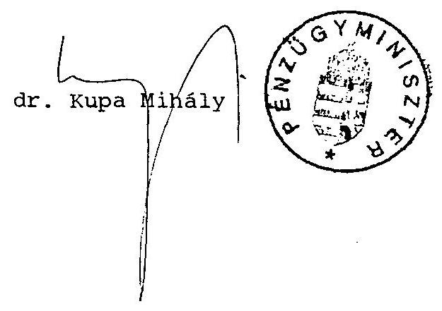

---

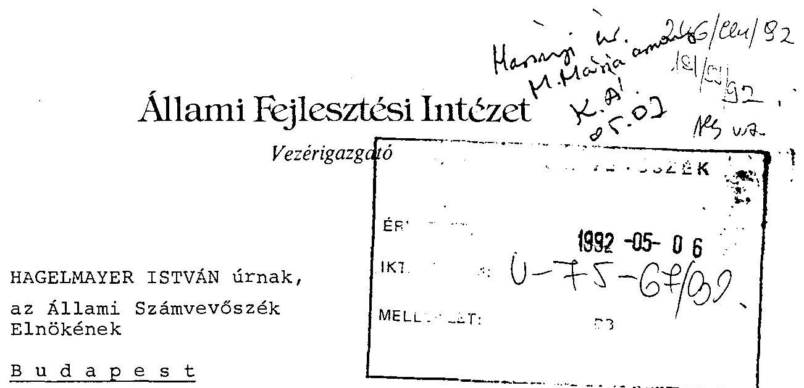

Tisztelt Elnök Úr!

Az állami költségvetési adósság ellenőrzéséről szóló összefoglaló "Jelentés" tervezetét megkaptam. Sajnálattal tapasztaltam, hogy 1992. március 13-dikán adott javaslataimat az átdolgozás során - egyes apró pontosítások kivételével - nem vették figyelembe.

A jelentés hangsúlyozottan tartalmazza, hogy az Állami Számvevőszék vizsgálata nem terjed ki az államadósság kezelési módjára vonatkozó törvényi szabályozás helyességének minősítésére. Így az államadósság egyéb elemének törvényben megfogalmazott, de a törvényi megfogalmazás szerinti módon a gyakorlatban soha el nem érhető levezetésére tesznek javaslatot a III. fejezet 2.4. pontjában.

Bizonyított, hogy 1990. december 31-dikén 259,5 millió Ft refinanszírozási hitellel tartozott az AFI az MNB-nek. Ebből az összegből ún. nemzetközi beruházások (Bős-Nagymaros és Jamburg) is devizahitelből megvalósult fejlesztések miatt 79,5 millió Ft, ún. belföldi beruházások miatt 180 milliárd Ft volt a vizsgált időpontban a refinanszírozási hitel állománya. Hangsúlyozni kívánjuk, hogy ezzel

az összeggel az AFI tartozott az MNB-nek. Az AFI követelés állománya 1990. december 31-dikén véletlenül aránylag közel esett ehhez az összeghez. Ez a véletlen hasonlóság azt a képzetet keltette mind a törvény előkészítőiben, mind az ÁSz munkatársaiban, hogy egyszerűen összekapcsolható az AFI adóssága és követelés állománya, s a két állomány közötti nem túl nagy különbség valamiféle olyan hibát takar, amit további felülvizsgálat kideríthet és megoldhat.

Talán jobban megérthető a probléma lényege az alábbi konkrét alapjuttatási és járadékfizetési adatokkal:

Új típusú alapjuttatások miatt 144,5 millió Ft-tal tartozott az AFI 1990. dec. 31-dikén az MNB-nek. A megkötött szerződések szerint adósaitól ugyanebben az időpontban 135,8 millió Ft volt a járadék követelése. Azért volt a követelése ennyi, mert 1986-90. években 32,5 milliárd Ft járadékot fizettek az adósai. A befolyt járadékok refinanszírozási hitel törlesztésére fordítása esetén 103,3 milliárd Ft-tal tartozott volna az MNB-nek, 135,8 md Ft-os követelésállomány mellett. A követelésállományban még vannak olyan tételek, amelyek kihelyezése mögött nem refinanszírozási hitel volt a forrás, hanem költségvetési juttatás.

A refinanszírozási hitelből nem lehet egyértelműen levezetni a követeléssel fedezett állományt. Azt lehet csak bemutatni, hogy az AFI fennálló követelés állománya mekkora, milyen okok miatt változik. Ez számszerűsíthető és ellenőrizhető. Részleteiben az alábbi észrevételeket ismétlem meg:

Félrevezető a 33. oldal 2. bekezdés 2. mondatának megfogalmazása. Nem az AFI akarja a refinanszírozási hitelt a költségvetéssel kifizettetni. A 13,1 milliárd Ft szénbányászati beruházások tartozás leírásáról készült átadott

összeállításból látható, hogy a 13,1 milliárd Ft-ból 10,8 milliárd Ft tartozás nagyberuházásokhoz - a Hitelfedezeti Alaphoz - kapcsolódott, míg 2,3 milliárd Ft a vállalati beruházások miatti adósságot érintette, figyelembe vétele még az ÁSz módszere szerint is szükséges.

Szövegjavaslatunk a 33. oldal 2. bekezdés 2. mondatára és 3. bekezdésére az alábbi:

A refinanszírozási hitelkörön kívülről kapott 15,6 milliárd Ft-ból kormányzati döntés alapján elengedett 10,8 milliárd Ft járadéktartozás újbóli államadóssággá minősítése nem indokolt.

Ezért - és mivel az AFI nem tudta dokumentálni a költségvetési és refinanszírozási források, az államadósság és a szénbányászati felszámolások 1990. december 31-diki valóságos kapcsolatát - a 17,2 milliárd Ft-os államadósságból 10,8 milliárd Ft-ot - nem lehet sem követeléssel fedezett, sem követeléssel nem fedezett, állománynak tekinteni.

A 35. oldal végén kezdődő kiemelt megállapításra szövegjavaslatunk a következő:

A hitelállomány és az AFI követelésállománya közötti zárt és egyértelmű kapcsolat hiánya és a finanszírozási források keveredése kétségessé teszi az 1990. évi CIV. törvényben kimutatott követeléssel fedezett, illetve nem fedezett adósságállomány bemutatott levezetését. Ez azonban nem érinti a tényleges 259,474 millió Ft-os összes AFI államadósságot. Az AFI követeléseinek tételes felülvizsgálatával - melynek elvégzése az intézmény feladata - lehet hitelesen megállapítani az államadósság követeléssel fedezett összegét.

A szénbányászati beruházások tartozás leírásából a vállalati beruházások miatti - refinanszírozási hitelből finanszírozott - 2,3 Mrd Ft-tal növelni szükséges a 48. oldal 2. francia bekezdésében és 15. mellékletben szereplő 946 millió Ft-os összeget.

A III. fejezet 2.4 pontjára (48 oldal) szövegjavaslatunk az alábbi:

Az AFI a PM felügyelete mellett vizsgálja felül teljes követelésállományát és az alapján mutassa be az adósokkal fedezett államadósság szerződéseken alapuló megtérülésének nagyságrendjét, ütemezését. Biztosítani kell a bemutatott állomány változásainak - törlesztések, privatizáció, csőd- és felszámolási eljárások hatásainak - pontos nyomonkövetését.

Kérem észrevételeimet, javaslataimat a "Jelentés" véglegesítésénél figyelembe venni szíveskedjenek.

Budapest, 1992. május 4.
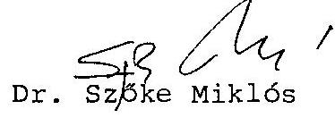
