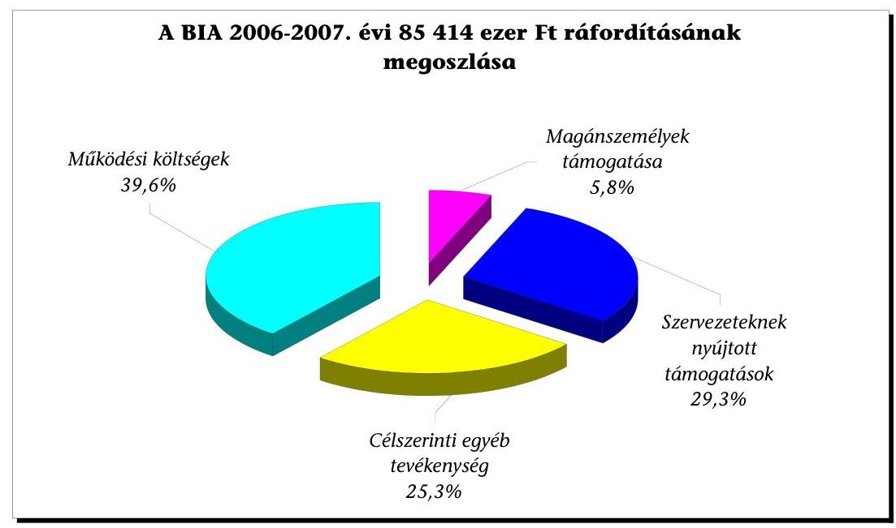
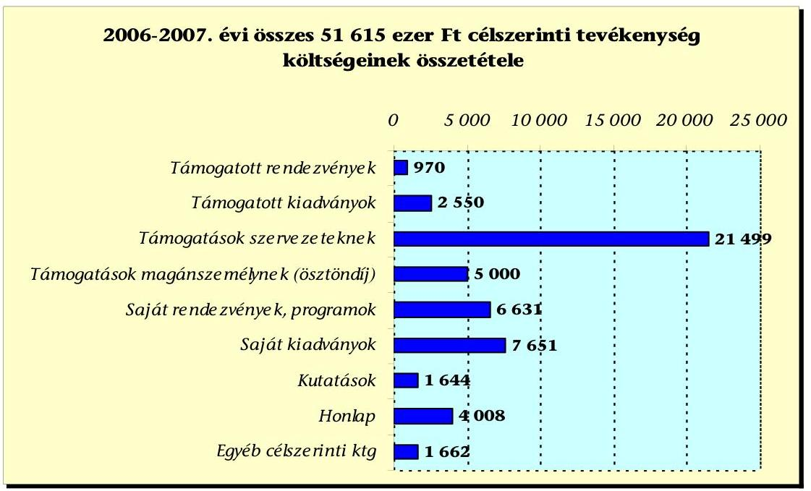
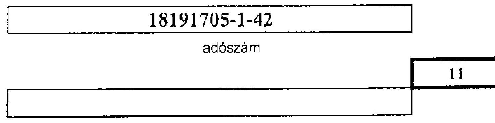
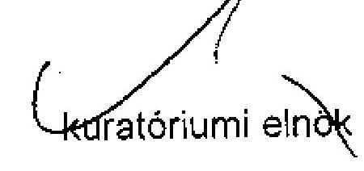
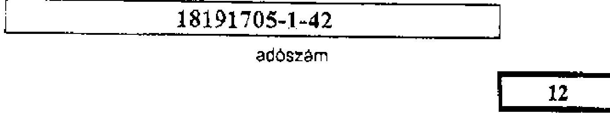
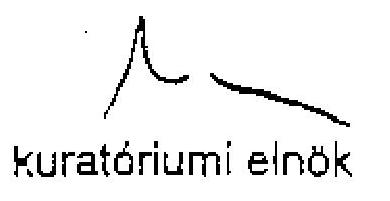

# ÁLLAMI   SZÁMVEVŐSZÉK 

## JELENTÉS

a Barankovics István Alapítvány 2006-2007. évi gazdálkodása törvényességének ellenőrzéséről

---

3. Önkormányzati és Területi Ellenőrzési Igazgatóság
3.1. Szabályszerűségi Ellenőrzési Főcsoport

Iktatószám: V-3019-26/2008.
Témaszám: 931
Vizsgálat-azonosító szám: V-0431

# Az ellenőrzést felügyelte: 

Dr. Lóránt Zoltán
főigazgató
Az ellenőrzés végrehajtásáért felelős:
Dr. Elek János
általános főigazgató-helyettes
Az ellenőrzést vezette:
Solymár Ágnes
osztályvezető főtanácsos
Az összefoglaló jelentést készítette:
Solymár Ágnes
osztályvezető főtanácsos
Az ellenőrzést végezték:
Kulcsár Lászlóné
számvevő

## Sas Imréné

számvevő tanácsadó

---

# TARTALOMJEGYZÉK 

BEVEZETÉS ..... 5
I. ÖSSZEGZŐ MEGÁLLAPÍTÁSOK, KÖVETKEZTETÉSEK, JAVASLATOK ..... 7
II. RÉSZLETES MEGÁLLAPÍTÁSOK ..... 12

1. Az alapítvány gazdálkodásának törvényessége ..... 12
1.1. A kuratórium működése ..... 12
1.2. Az alapítvány induló vagyona és bevételei ..... 14
1.3. Az alapítvány ráfordításai ..... 16
2. Az éves beszámolók ..... 18
2.1. Az éves beszámolók szabályossága ..... 18
2.2. A mérleg ..... 19
2.3. Az eredmény-kimutatás ..... 19
3. A könyvvezetés szabályozottsága ..... 21
4. A könyvvezetés gyakorlata ..... 23
5. Az alapítvány ellenőrzési rendszere ..... 24

## MELLÉKLETEK

1. számú A Barankovics István Alapítvány 2006. évi egyszerűsített éves beszámolójának mérlege
2. számú A Barankovics István Alapítvány 2006. évi egyszerűsített éves beszámolójának eredmény-kimutatása
3. számú A Barankovics István Alapítvány 2007. évi egyszerűsített éves beszámolójának mérlege
4. számú A Barankovics István Alapítvány 2007. évi egyszerűsített éves beszámolójának eredmény-kimutatása

---

.

---

# RÖVIDÍTÉSEK JEGYZÉKE 

| ÁSZ | Állami Számvevőszék |
| :-- | :-- |
| ÁSZ törvény | az Állami Számvevőszékről szóló 1989. évi XXXVIII. törvény |
|  |  |
| BIA | Barankovics István Alapítvány |
|  |  |
| FB | Felügyelő Bizottság |
| IKSZ | Ifjúsági Kereszténydemokrata Szövetség |
| Kbt. | a közbeszerzésekről szóló 2003. évi CXXIX. törvény |
| KDNP | Kereszténydemokrata Néppárt |
| MKDSZ | Magyar Kereszténydemokrata Szövetség |
| Pártalapítványi törvény | a pártok működését segítő tudományos, ismeretterjesztő, |
|  | kutatási, oktatási tevékenységet végző alapítványokról |
|  | szóló 2003. évi XLVII. törvény |
| Párttörvény | a pártok működéséről és gazdálkodásáról szóló 1989. évi |
|  | XXXIII. törvény |
| Ptk. | a Polgári Törvénykönyvről szóló 1959. évi IV. törvény |
| SZMSZ | Szervezeti és Működési Szabályzat |
| Szt. | a számvitelről szóló 2000. évi C. törvény |

---

.

---

# JELENTÉS 

## a Barankovics István Alapítvány 2006-2007. évi gazdálkodása törvényességének ellenőrzéséről

## BEVEZETÉS

A pártok működését segítő tudományos, ismeretterjesztő, kutatási, oktatási tevékenységet végző alapítványokról szóló 2003. évi XLVII. törvény (pártalapítványi törvény) alapján a pártok a politikai kultúra fejlesztése érdekében költségvetési támogatásra jogosult alapítványt hozhatnak létre tudományos, ismeretterjesztő, kutatási és oktatási tevékenységük elősegítésére. A Kereszténydemokrata Néppárt (továbbiakban: KDNP) a törvényben biztosított lehetőséggel élve, 2006-ban létrehozta a Barankovics István Alapítványt (BIA).

A BIA alapító okirat szerinti célja az európai kereszténydemokrata és keresztényszociális eszme megismertetése, a nemzeti elkötelezettség és a kereszténydemokrata eszmekör jegyében az alapító szándékával és a közjó szolgálatával összhangban a politikai kultúra fejlesztése érdekében tudományos, ismeretterjesztő, kutatási és oktatási tevékenység elősegítése. E célokat korszerű oktatási, tudományos, ismeretterjesztő tevékenységi formák, kutatási tevékenység, előadások, konferenciák szervezésével és támogatásával, tanulmányok, szakkönyvek, egyéb alapítványi célokat szolgáló kiadványok kiadásával és támogatásával, szaklapok, folyóiratok, szakkönyvek megvásárlásával, az alapítványi célok megvalósításához kapcsolódó pályázatokon való részvétellel kívánja elérni.

A pártalapítványi törvény alapján létrehozott alapítványok központi költségvetési támogatásának mértékéről a pártok működéséről és gazdálkodásáról szóló 1989. évi XXXIII. törvény (párttörvény) rendelkezik ${ }^{1}$. A BIA a törvényi előírásnak megfelelően az alapítótól 700 ezer Ft induló vagyont kapott. A 2006-2007. években összesen 170400 ezer Ft központi költségvetési támogatásban részesült.

A pártalapítványi törvény 4. § (2) bekezdése alapján a pártalapítványok gazdálkodása törvényességének ellenőrzésére az Állami Számvevőszék (ÁSZ) jogosult, a pártalapítványi törvény 4. § (4) bekezdése alapján az ÁSZ kétévenként

[^0]
[^0]:    ${ }^{1}$ A pártalapítványok 2008. szeptember 29-ig a párttörvény 9/A. § (5) bekezdés a) - c) pontjai értelmében alaptámogatásban, mandátumarányos kiegészítő támogatásban és eseti támogatásban részesülhettek. A 2008. szeptember 30-ától hatályos, a pártok működését segítő tudományos, ismeretterjesztő, kutatási, oktatási tevékenységet végző alapítványokkal összefüggő egyes törvénymódosításokról szóló 2008. évi LI. törvény a pártalapítványok költségvetési támogatásának elosztását, a párttámogatással egyezően, szavazatarányossá tette.

---

ellenőrzi azoknak az alapítványoknak a gazdálkodását, amelyek e törvény szerint állami költségvetési támogatásban részesültek.

Az ellenőrzés célja az alapítvány 2006-2007. évi gazdálkodása törvényességének értékelése volt, ennek keretében ellenőriztük:

- az alapítvány gazdálkodásának törvényességét;
- az éves beszámolók jogszabályi előírásoknak való megfelelését;
- az alapítvány könyvvezetésében a számvitelről szóló 2000. évi C. törvény (Szt.), egyéb jogszabályi rendelkezések és belső előírások betartását.

Az ellenőrzést a pártalapítványok gazdálkodása törvényességének ellenőrzéséhez készült segédletben foglaltak szerint végeztük. Tételesen ellenőriztük a költségvetési támogatást, a kapott adományokat és támogatásokat, a kuratórium által nyújtott támogatásokat, az egymillió forint, és afölötti ráfordításokat. Reprezentatív minta alapján ellenőriztük az egymillió forint alatti ráfordításokat. Az ellenőrzési minta nagyságát az ellenőrzés előkészítése során elvégzett kockázatértékelés alapján határoztuk meg, amelynek során az eredendő és belső kontroll kockázatot magasnak minősítettük, tekintettel arra, hogy a BIA ellenőrzésére első alkalommal került sor.

Az egyéb szabályszerűségi ellenőrzés a 2006. január 1. és 2007. december 31. közötti időszakra terjedt ki.

---

# I. ÖSSZEGZŐ MEGÁLLAPÍTÁSOK, KÖVETKEZTETÉSEK, JAVASLATOK 

A kuratórium az ellenőrzött időszakban az alapító okirat előírásait betartva, törvényesen működött. Döntéseit határozatképes üléseken, az alapító okiratban előírt szavazati aránnyal hozta meg. Az ülésekről az alapító okirat rendelkezésének megfelelően jegyzőkönyv készült, a határozatokat nyilvántartásba vették. A kuratórium döntései a pártalapítványi törvényben és az alapító okiratban rögzített alapítványi célok megvalósítását szolgálták. A kuratórium minden esetben határozott az alapítvány részére történt felajánlások elfogadásáról, az alapítványi vagyon cél szerinti felhasználásáról, a támogatások odaítéléséről. A kuratórium az alapító okirat előírásának megfelelően éves költségvetések alapján gazdálkodott, amelyek teljes körűen tartalmazták az alapítvány bevételeit, cél szerinti tevékenységének ráfordításait, valamint a működési költségeket.

A képviseleti és a bankszámla feletti rendelkezési jog alapító okiratbeli szabályozása megfelelt a törvényi előírásoknak. A bankszámla feletti rendelkezés gyakorlása 2007 júniusáig nem felelt meg az alapító okirat szerinti előírásoknak, mivel a banki aláírásra bejelentettek között az alapító által fel nem jogosított személy is szerepelt (az ellenőrzött időszakban valamennyi átutalás az alapítványi célokkal kapcsolatban merült fel), ezt követően a bankszámla feletti rendelkezés gyakorlata a szabályoknak megfelelően történt. A kuratórium a működés szervezeti kereteit és rendjét a szervezeti és működési szabályzatban (SZMSZ) rögzítette, ebben az alapító okirattól eltérően felhatalmazta a kuratóriumi elnököt 1000 ezer Ft összeghatárig önálló kötelezettségvállalásra (az elnöki hatáskörben nyújtott támogatásokról a kuratórium minden esetben tájékoztatást kapott és utólagosan jóváhagyta azokat).

Az alapítvány összes bevétele 174627 ezer Ft volt az ellenőrzött években, amelyből a központi költségvetési támogatás 97,6%-ot, a csatlakozói adomány 0,6%-ot, a szabad pénzeszközök kamatbevétele 1,8%-ot képviselt. A központi költségvetési támogatás (170400 ezer Ft) összege egyik évben sem felelt meg a párttörvényben meghatározott mértékű alap-, és mandátumarányos kiegészítő támogatás együttes értékének, mivel a Pénzügyminisztérium által rendelkezésre bocsátott számítási anyag alapján, a KDNP 23 fős parlamenti képviselői csoport létszáma helyett mindkét évben 24 főre kapta a támogatást az alapítvány. Az alapítvány az általa kiírt irodalmi pályázathoz belföldi magánszemélyektől 985 ezer Ft támogatást kapott. A kuratórium az adományok elfogadásáról a pártalapítványi törvénynek megfelelően határozott, azokat beazonosítható személyektől, az alapítvány pénzforgalmi számlájára történő folyósítással fogadta el, azonban hat esetben, összesen 174 ezer Ft értékben, eltérően a pártalapítványi törvény rendelkezésétől, nem a magánszemélyek pénzforgalmi számlájáról érkezett az adomány, hanem banki készpénzbefizetéssel. A kuratórium elnöke elrendelte a jelzett összegű támogatás visszafizetését a támogatók részére, ezért a pártalapítványi törvényben meghatározott jogkövetkezmény nem alkalmazható.

---

Az alapítvány az ellenőrzött években bevételeinek mintegy felét, 85414 ezer Ftot használt fel az alapítványi célok megvalósítására és működésére, a fennmaradó 89213 ezer Ft a következő évek kiadásainak fedezetét szolgálja. A ráfordítások 60,4%-át célszerinti feladatokra (szervezeteknek nyújtott támogatások, magánszemélyek támogatása, saját szervezeti keretek között megvalósított célszerinti tevékenység), 39,6%-át az alapítvány működésére fordította a kuratórium.

A magánszemélyek és szervezetek részére továbbadott támogatásokról a kuratórium, illetve az SZMSZ felhatalmazása alapján a kuratórium elnöke határozott, a támogatottakkal a kuratórium elnöke szerződést kötött. A szerződések tartalmazták a támogatás célját, mértékét, folyósításának és elszámolásának módját és határidejét, az elszámolási határidő elmulasztásának szankcióját. Az ellenőrzött időszakban kifizetett 31 támogatás 90%-ával a szerződésnek megfelelően, határidőben, három esetben késedelmesen számoltak el a támogatottak, de a kuratórium nem élt a szerződés szerinti szankciókkal.

A BIA rendelkezett a jogszabályokban előírt, a könyvvezetés és a beszámoló elkészítésének rendjét meghatározó számviteli politikával és az ahhoz kapcsolódó szabályzatokkal. A számviteli politika, a pénzkezelési szabályzat, az eszközök és források leltárkészítési és leltározási szabályzata, valamint a számlarend nem igazodtak az alapítvány sajátosságaihoz. A számviteli politika nem határozta meg az éves beszámoló választott formáját, a könyvviteli zárlathoz kapcsolódó feladatok körét, a jogszabályi előírásoktól eltérően szabályozta az immateriális javak és tárgyi eszközök egy összegben leírható értékcsökkenésének értékhatárát, valamint a magánszemélyek részére nyújtott támogatások elszámolását. A pénzkezelési szabályzat nem határozta meg a bankszámlán történő pénzforgalom lebonyolításának szabályait, és a banki átutalások utalványozási rendjét. A leltározási szabályzat az alapítványra nem jellemző meghatározásokat tartalmazott. A számlarend és a számlatükör a főkönyvi számlacsoportok és főkönyvi számlák számjele és megnevezése tekintetében nem

---

volt teljesen összhangban. A szabályozási hiányosságok is hozzájárultak az alapítvány könyvvezetésében feltárt hibákhoz.

A BIA határidőben elkészítette az egyszerűsített éves beszámolókat az ellenőrzött évekre a jogszabályi előírásoknak és a belső szabályzatoknak megfelelően. A beszámolókat a felügyelő bizottság (FB) véleményezte, a könyvvizsgáló hitelesítette, a kuratórium érvényes határozatokkal elfogadta, és a belső szabályozásnak megfelelően nyilvánosságra hozta. Az éves beszámolók nem tartalmaztak a számviteli politikában meghatározott jelentős összegű, illetve a lényegességi szintet érintő hibát, így megbízható, valós információkat nyújtottak az alapítvány gazdálkodásáról, azok elkészítésénél érvényesítették a Szt.-ben megfogalmazott alapelveket. A mérleg és eredmény-kimutatás sorok adatai megegyeztek a kapcsolódó analitikus és főkönyvi nyilvántartások összesített adataival, az év végi főkönyvi kivonatok adataiból levezethetőek voltak. Az éves mérlegekben kimutatott eszközök és források értékadatait az Szt. rendelkezésének megfelelően, a leltározási szabályzat szerinti leltárakkal, az eredménykimutatásban kimutatott bevételeket és ráfordításokat könyvelési alapbizonylatokkal támasztották alá.

Az alapítvány a könyvvezetésében a szakmai rendezvények reprezentációs költségét a személyi jellegű ráfordítások helyett az anyagjellegű ráfordítások között mutatta ki. A kis értékű tárgyi eszközöket használatbavételkor az értékcsökkenési leírás helyett tévesen az anyagjellegű szolgáltatások között számolta el, a magánszemélyek részére nyújtott ösztöndíj támogatásokat a jogszabály rendelkezésétől eltérően a személyi jellegű ráfordítások helyett az egyéb ráfordítások között számolta el. A téves könyvvezetésből adódó eltérések az eredménykimutatás sorai között okoztak eltérést, eredményre gyakorolt hatásuk nem volt.

A könyvvezetést a vonatkozó jogszabályok és belső előírások betartásával, a kettős könyvvitel rendszerében, mindkét évben azonos számítógépes programmal végezték, a gazdasági eseményeket idősorrendben, könyvelési alapbizonylatokkal alátámasztva rögzítették. A
 számviteli feladatok vezetésére és a beszámoló elkészítésére jogosult személy rendelkezett a törvényi előírásoknak megfelelő képesítéssel. A könyvvezetésben – a nyilvántartásokban történt rögzítés időpontjának feltüntetése kivételével – érvényesítették a bizonylatokra Szt. által előírt alaki és tartalmi követelményeket. A belső szabályzatokban előírt egyedi nyilvántartásokat vezették, és azoknak a főkönyvi adatokkal való egyeztetését elvégezték. A BIA az alapítványok gazdálkodási rendjéről szóló kormányrendelet előírásának megfelelően számviteli nyilvántartásában elkülönítette az alapítványi célú tevékenység közvetlen, az alapítvány kezelő szervének közvetett, és az egyéb közvetett költségeit. A házipénztári nyilvántartások vezetése szabályszerű volt, a záró pénzkészlet nem haladta meg a belső szabályozásban előírt mértéket. Az elszámolásra adott előlegekkel elszámoltak, azokat, valamint a szigorú számadású nyomtatványokat nyilvántartották. Az eszközbeszerzéseknél és a ráfordítások elszámolásánál érvényesítették a kötelezettségvállalás és az utalványozás, valamint a banki aláírás szabályait.

Az alapítvány ellenőrzési rendszere hozzájárult a törvényes gazdálkodásához. Az alapító az alapítvány működésének és gazdálkodásának ellenőrzésére háromfős felügyelő bizottságot jelölt ki. Az FB az alapító okiratban előírt ellenőrzési tevékenységét ellátta, véleményezte az alapítvány éves költségvetéseit és éves beszámolóit, szabályzatait, az alapítvány éves tevékenységéről készített szakmai beszámolókat. Az éves beszámolókat az ellenőrzött években független könyvvizsgáló hitelesítette. A belső ellenőrzés folyamatba épített, előzetes és utólagos vezetői ellenőrzéssel valósult meg. A vezetői ellenőrzést a kuratórium elnöke és az alapítvány igazgatója a munkáltatói jogkör gyakorlása, a képviseleti jog, a kötelezettségvállalás, az utalványozás és a bankszámla feletti rendelkezés során megfelelően látták el.

A helyszíni ellenőrzés megállapításainak hasznosítása mellett javasoljuk:

# a pénzügyminiszternek 

Vizsgálja felül az alapítvány részére folyósított, a pártok működéséről és gazdálkodásáról szóló 1989. évi XXXIII. törvény 9/A. § (5) bekezdésétől eltérő mandátumarányos kiegészítő támogatás folyósított összegét.

## az alapítvány kuratóriumának

1. Módosítsa az alapítvány belső szabályzatait a következők figyelembevételével:
a) pontosítsa a számviteli politikában az éves beszámoló formáját a számviteli törvény szerinti egyes egyéb szervezetek beszámolókészítési és könyvvezetési kötelezettségének sajátosságairól szóló 224/2000. (XII. 19.) Korm. rendelet 6. § (4) bekezdés rendelkezésével összhangban, egészítse ki a zárlati munkák körét a számvitelről szóló 2000. évi C. törvény 164. § (1) bekezdésben előírt, a számlák technikai lezárására vonatkozóan, törölje a szabályzatból az alapítványoknál nem értelmezhető fogalmakat, meghatározásokat;
b) hozza összhangba a számviteli politikát az eszközök és a források értékelésének szabályai tekintetében a számvitelről szóló 2000. évi C. törvény 80. § (2) bekezdés rendelkezésével, ennek keretében az immateriális javak és tárgyi eszközök egy összegben értékcsökkenésként történő elszámolásának értékhatárát 100 ezer forintban határozza meg;
c) helyesbítse a számviteli politikát a magánszemélyek részére nyújtott támogatások elszámolására vonatkozóan a számvitelről szóló 2000. évi C. törvény 81. § (2) bekezdés c) pontja rendelkezéseinek megfelelően;
d) módosítsa a leltárkészítési és leltározási szabályzatot az alapítványi gazdálkodás sajátosságainak megfelelően, továbbá szüntesse meg a szabályzaton belüli és más szabályzatok közötti ellentmondásokat;
e) egészítse ki a pénzkezelési szabályzatot a bankszámlán történő pénzforgalom lebonyolításának szabályaival, továbbá a banki átutalások utalványozási rendjével;
f) teremtse meg az összhangot a számlarend és a számlatükör között a főkönyvi számlacsoportok és főkönyvi számlák számjele és megnevezése tekintetében;

2. Gondoskodjon a könyvviteli elszámolást közvetlenül alátámasztó bizonylatokon a könyvviteli nyilvántartásokban történt rögzítés időpontjának feltüntetéséről, a számvitelről szóló 2000. évi C. törvény 167. § (1) bekezdés i) pontjának megfelelően.

# II. RÉSZLETES MEGÁLLAPÍTÁSOK 

## 1. Az alapítvány gazdálkodásának törvényessége

### 1.1. A kuratórium működése

A KDNP a pártalapítványi törvényben biztosított lehetőségével élve létrehozta a Barankovics István Alapítványt, amelyet a Fővárosi Bíróság 2006. július 14-én vett nyilvántartásba.

Az alapítvány célja és a cél elérése érdekében az alapító okiratban meghatározott tevékenységek megfeleltek a párttörvény 9/A. § (1) bekezdésében foglaltaknak. Az alapító 700 ezer Ft induló vagyont bocsátott az alapítvány rendelkezésére, és az alapítványi vagyon kezelésére, ötéves időtartamra héttagú kuratóriumot bízott meg. A kuratórium személyi összetétele megfelelt a pártalapítványi törvény 3. § (7) és a Ptk. 74/C. § (3) bekezdéseiben foglaltaknak, mivel az alapító a kuratóriumban a vagyon felhasználására meghatározó befolyást nem gyakorolt.

A képviseleti és a bankszámla feletti rendelkezési jog alapító okiratbeli szabályozása megfelelt a Ptk. 29. § (3) bekezdésében foglaltaknak. Az alapító okirat 12. pontja a kuratórium elnökét, akadályoztatása esetén egy meghatározott kurátort hatalmazta fel az alapítvány képviseletével és a bankszámla feletti rendelkezéssel. Az alapító a Ptk. 74/C. § (4) bekezdése előírásával összhangban, az alapító okirat 10.3. pontjában az alapítvány alkalmazottai számára is biztosította a képviseleti jogot, a kuratórium tagjaival megegyező hatáskörrel. A bankszámla feletti rendelkezés gyakorlása 2007. június 5-ig nem felelt meg az alapító okirat szerinti előírásoknak, mivel a banki aláírásra bejelentettek között az alapító által fel nem jogosított személy is szerepelt, ezt követően a szabályoknak megfelelően történt a bankszámla feletti rendelkezés. Az ellenőrzött időszakban valamennyi átutalás az alapítványi célokkal kapcsolatban merült fel.

A kuratórium a szervezeti és működési szabályzatot (SZMSZ) 2006. szeptember 6-án elfogadta, melyet 2007. március 28-án módosított. Az SZMSZ összhangban volt a Ptk. és az alapító okirat előírásaival a kötelezettségvállalás szabályozásának kivételével. Az SZMSZ, annak ellenére, hogy az alapító okirat értelmében a kuratórium – mint testület – dönt az alapítványi támogatásokról, felhatalmazta a kuratóriumi elnököt egymillió forint összeghatárig önálló kötelezettségvállalásra, ezen belül az alapítvány által nyújtott támogatások odaítéléséhez kapcsolódó döntéshozatalra is (az elnöki hatáskörben nyújtott támogatásokról a kuratórium minden esetben tájékoztatást kapott és utólagosan jóváhagyta azokat).

Az SZMSZ meghatározta a BIA szervezeti és irányítási rendszerét, belső jogviszonyait, a munkáltatói jog gyakorlása vonatkozásában. A kuratórium hatáskörét az alapító okiratban meghatározottakon túl kiegészíti az SZMSZ elfogadásával (az alapító okirat nem ír elő SZMSZ készítést) a BIA éves költségvetési és munka-terve teljesítésének, valamint a támogatási és pályázati szabályzat elfogadásával. Tartalmazza a kuratórium elnöke, az alapítványi iroda, ezen belül kiemelten az ügyvezető igazgató feladat- és hatáskörét.

Az alapító okirat 8.5. pontja előírja, hogy a kuratórium dönt az alapítvány által nyújtott támogatásokról, azonban az SZMSZ II. fejezet g) pontja, valamint a támogatási és pályázati szabályzat 6. pontja szerint, az elnök saját hatáskörben dönthet 1000 ezer Ft összeghatárig. 2006-ban 2 támogatásra vonatkozó döntés volt, melyet a kuratórium hagyott jóvá, 2007-ben a 82 támogatás odaítélésére vonatkozó határozat 59%-a elnöki döntés volt, amely értékben az összes támogatás 28%-át tette ki.

A kuratórium működése az ellenőrzött időszakban megfelelt az alapító okirat előírásainak. A kuratórium vagyoni döntései az alapítványi cél megvalósulása érdekében végzett tevékenységek ellátását szolgálták. A kuratórium 2006-ban négy, 2007-ben öt alkalommal ülésezett, betartva az alapító okirat azon előírását, hogy legalább negyedévente kuratóriumi ülést kell tartani. Valamennyi kuratóriumi ülésről jegyzőkönyv készült, amely minden esetben megfelelt az alapító okirat, illetve az SZMSZ-ben foglalt jegyzőkönyv-készítési, hitelesítési és nyilvántartási előírásoknak. A kuratórium az alapító okiratban foglalt szabályoknak megfelelően hozta meg határozatait.

A kuratórium az alapító okirat szabályozása szerint akkor volt határozatképes, ha a hét kuratóriumi tag többsége jelen volt, a határozathozatalhoz egyszerű szótöbbség kellett.

A kuratórium 2006-ban 37, 2007-ben 86 határozatot hozott, a döntések valamennyi ülésen megfeleltek az alapító okirat 9.2 pontja szerinti előírásoknak, a kuratóriumi tagok többsége megjelent, továbbá megvolt a döntési szótöbbség.

A kuratórium – az alapító okirat vonatkozó előírásának megfelelően – a 2006-2007. évekre vonatkozóan egyhangú döntéssel elfogadta az alapítvány éves költségvetéseit, illetve 2007-ben a módosított költségvetést. A részletes költségvetés tartalmazta az alapítvány éves gazdálkodási és munkatervét is.

Az alapító okirat 5.8. pontja értelmében az alapítvány éves költségvetés alapján gazdálkodott, a 8.3. pontja pedig a kuratórium jogkörébe rendelte az alapítvány munkatervének, gazdálkodási tervének, költségvetésének, beszámolójának elfogadását és jóváhagyását. A BIA tényleges célszerinti tevékenységét a költségvetési támogatás megérkezését követően kezdhette meg (2006.12.21), azonban 2006. évre is készített költségvetést, melyet a kuratórium 2/2006.09.13 sz. határozatával elfogadott. A 2007. évre vonatkozóan a 2/2007/02.14 sz. határozattal a költségvetési koncepciót, a 26/2007.03.08 sz. határozattal a költségvetést fogadta el a kuratórium.

A költségvetések tartalmazták a BIA bevételeit, a cél szerinti tevékenységek ráfordításait, valamint a kezelő- és munkaszervezet működésének költségeit egyaránt.

Az éves költségvetésben az alapítványi bevételek között az előző évi eredmény és a tárgyévi költségvetési támogatás szerepelt.

A kiadásokon belül a saját szervezeti keretek között végzett tevékenységek költségeit alapítványi célok szerinti bontásban, ezen belül a kuratórium által nyújtott támogatásokat azok tartalma szerinti, az alapítvány közvetett (működési) költségeit jogcímek szerinti részletezésben mutatta be az éves költségvetés.

A kuratórium 2007-ben módosította a költségvetést az alapítványi célú közvetlen költségek 7500 ezer Ft-tal történő várható növekedése miatt. (35/2007/05.15 sz. határozat). Az éves költségvetések időarányos teljesítését az alapítvány igazgatója nyomon követte, a teljesülésről a kuratóriumot rendszeresen tájékoztatta. Az éves költségvetések teljesítését a kuratórium által elfogadott, az alapítvány éves tevékenységéről szóló jelentésekben értékelték ki. Az alapítványi vagyon kezeléséről és felhasználásáról a kuratórium évente beszámolt az alapítónak.

# 1.2. Az alapítvány induló vagyona és bevételei 

Az alapító vagyoni hozzájárulási kötelezettségét a pártalapítványi törvényben előírt minimális mértéket meghaladóan teljesítette azzal, hogy az alapítvány részére 700 ezer Ft összegű induló vagyont biztosított, amelyet az alapító okirat aláírását követően, 2006. 05. 24-én utalt át.

A pártalapítványi törvény 3. § (6) bekezdése alapján „az alapítvány céljára legalább a párttörvény 9/A. § (5) bekezdés a) pontja szerinti alaptámogatás 1%-ának megfelelő összegű vagyont kell rendelni." A párttörvény 9/A. § (5) bekezdés a) pontja szerint számított alaptámogatás 1%-a pedig 662 ezer Ft volt.

A BIA az ellenőrzött időszak éves beszámolóiban összesen 174627 ezer Ft bevételt mutatott ki, amelyből a központi költségvetési támogatás aránya 97,6%-volt. Az alapítványhoz csatlakozó belföldi magánszemélyek adománya a bevételek 0,6%-át tette ki. A szabad pénzeszközök banki lekötéséből származó pénzügyi műveletek bevétele az összes bevétel 1,8%-át alkotta. Az alapítványnak vállalkozási tevékenységből nem származott bevétele, vállalkozási tevékenységet nem végzett.

Az alapítvány a pártalapítványi törvény 1. §-a alapján központi költségvetési támogatásra volt jogosult, a támogatás mértékét a párttörvény határozta meg. A támogatás 2008. szeptember 29-ig hatályos párttörvény 9/A. § (5) bekezdés a) és b) pontok szerinti alap-, és mandátumarányos kiegészítő támogatásból tevődött össze, az alapítvány eseti támogatásban nem részesült.

A párttörvény 9/A. § (5) bekezdés a) és b) pontjai értelmében az alaptámogatás mértéke az egyévi képviselői alapdíj huszonötszöröse, a mandátumarányos kiegészítő támogatás mértéke képviselőnként az éves képviselői alapdíj 85%-a.

Az alapítvány a 2006-2007. években összesen 170400 ezer Ft központi költségvetési támogatást kapott, ezen belül a 2006. évre időarányosan 50100 ezer Ft-ot (az éves támogatás 5/12-e), a 2007. évre 120300 ezer Ft-ot.

A 2006. évi időarányos támogatás biztosítása a Kormány a 1117/2006. (XII. 5.) Korm. határozata alapján történt. Az Országgyűlés a 2007. évi költségvetési törvényről szóló 2006. évi CXXVII. törvényben az Országgyűlés fejezeten belül 120300 ezer
 Ft támogatást hagyott jóvá az alapítványnak.

---

A költségvetési támogatás összege egyik évben sem felelt meg a párttörvény 2003. július 1-jétől hatályos 9/A. § (5) bekezdése a) és b) pontjaiban meghatározott mértékű alap-, és mandátumarányos kiegészítő támogatás együttes értékének. A KDNP parlamenti képviselői csoport létszáma ugyanis a 2006-2007. években egyaránt 23 fő volt, de a támogatást, a Pénzügyminisztérium által rendelkezésre bocsátott számítási alapján, mindkét évben 24 főre kapta meg az alapítvány.

A Kincstár a 2006. évre járó támogatás összegét 2006. december 20-án egy összegben folyósította, a 2007. évi támogatást a pártalapítványi törvénynek megfelelően, negyedéves ütemezésben, a negyedév első napjaiban utalta át.

A pártalapítványi törvény 2. § (1) bekezdése alapján a költségvetési támogatás kifizetése negyedévenként történik, a negyedév első napján.

A 2006. évre járó költségvetési támogatás megérkezéséig az alapító finanszírozta a BIA kiadásait.

A BIA és a KDNP 2006.06.21-én támogatási szerződést kötöttek, melynek értelmében a KDNP közvetlenül fizette ki a BIA működési kiadásait, a BIA a visszafizetési kötelezettségének eleget tett. Ezen túl a 2006. évi költségvetési támogatás megérkezésének bizonytalansága miatt a BIA és a KDNP 2006.12.10-én „Működési Támogatási Szerződés"-t kötött, melynek értelmében a BIA 12000 ezer Ft támogatást kapott, és amelyet a szerződésben kikötött határidőben az alapítvány visszafizetett.

Az alapító okirat a törvényi szabályozással összhangban lehetővé tette az alapítvány számára a csatlakozók által teljesített adományok, egyéb támogatások, juttatások és felajánlások elfogadását a pártalapítványi törvény előírásai figyelembe vételével. A BIA 2007-ben kapott magánszemélyektől támogatást (985 ezer Ft, 41 fő), amely célzottan az alapítvány által kiírt irodalmi pályázathoz kapcsolódott, ezek elfogadását a kuratórium a pártalapítványi törvény 3. § (2) bekezdése és az alapító okirat 5.2 pontja rendelkezéseinek megfelelően határozattal jóváhagyta. A támogatások a pártalapítványi törvény 3. § (3) bekezdésének csak részben feleltek meg, mivel a támogatást nyújtó személy a banki kivonatokon beazonosítható volt, a támogatás folyósítása a BIA pénzforgalmi számlájára történt, azonban hat esetben, összesen 174 ezer Ft értékben nem a támogatást nyújtó magánszemély pénzforgalmi számlájáról történt az átutalás, hanem banki készpénzbefizetéssel. A kuratórium elnöke 2009. április 7-én elrendelte a jelzett összegű támogatás visszafizetését a támogatók részére, ezért a pártalapítványi törvény 3. § (5) bekezdésében meghatározott jogkövetkezmény nem alkalmazható.

A pártalapítványi törvény 3. § (4) bekezdésében előírt közzétételi kötelezettség nem keletkezett, mert a támogatónkénti befizetett összeg nem érte el az 500 ezer Ft-ot.

A BIA irodalmi pályázatot írt ki, hogy segítséget nyújtson tehetséges fiatalok könyveinek elkészítéséhez és kiadásához, a pályázat elbírálására 2008-ban került sor. Ehhez kapcsolódóan érkezett befizetés 41 magánszemélytől (985 ezer Ft). A támogatások folyósítása 35 személy részéről banki átutalással (911 ezer Ft), 5 esetben banki készpénzbefizetéssel (138 ezer Ft), 1 esetben postai csekken való feladással történt (36 ezer Ft), a támogatások a BIA bankszámlájára érkeztek,

---

amely összegeket az alapítvány kizárólag az irodalmi pályázattal kapcsolatos költségekre és a pályázat díjazására fordíthatott. A befizetett összegből az irodalmi pályázathoz kapcsolódóan a 2007. évben 50,1 ezer Ft került felhasználásra (hirdetéshez kapcsolódó költségek).

Az éves beszámolók eredmény-kimutatásában a pénzügyi műveletek bevételei között kimutatott kamatbevétel 3200 ezer Ft volt.

# 1.3. Az alapítvány ráfordításai 

A BIA könyvvezetésében 2006-ban 6801 ezer Ft, 2007-ben 78613 ezer Ft, összesen 85414 ezer Ft ráfordítást számolt el. A ráfordítások 60,4%-át (51615 ezer Ft) az alapítványi célok megvalósításának költségei (szervezeteknek nyújtott támogatások, magánszemélyek támogatása, célszerinti egyéb tevékenység), 39,6%-át (33799 ezer Ft) a működési (közvetett) költségek tették ki.

A cél szerinti tevékenységek költségének 58,2%-át a kuratórium által más szervezetek és magánszemélyek részére nyújtott támogatások, 41,8%-át a saját szervezeti keretek között megvalósított tevékenységek költségei alkották, e tevékenységek a pártalapítványi törvényben és az alapító okiratban rögzített célok megvalósítását szolgálták.

Az alapítvány célszerinti tevékenysége költségeinek alakulását a következő diagram mutatja be:

Adatok: ezer Ft-ban

A kuratórium az alapító okirat előírásainak megfelelően egyedi kérelmek alapján nyújtott támogatást más szervezetek és magánszemélyek részére különféle programok (rendezvények, tanulmányok, kiadványok, ösztöndíj) megvalósításához. A kuratórium, illetőleg saját hatáskörben a kuratórium elnöke a továbbadott támogatásokról határozatot hozott, amelynek során betartotta a ha-

---

tározathozatal módjára és a határozatképességre az alapító okiratban, az SZMSZ-ben és a támogatási és pályázati szabályzatban rögzített előírásokat. A határozatok tartalmazták a támogatott nevét, a támogatás célját és összegét. Az alapítvány képviseletére jogosult személy a támogatottakkal az alapító okirat előírásának megfelelően támogatási szerződést kötött. A szerződés tartalmazta a támogatás célját, mértékét, folyósításának és elszámolásának módját és határidejét, az elszámolási határidő elmulasztásának szankcióját.

A BIA által nyújtott támogatások és a támogatások felhasználásával való elszámolások szabályosságának ellenőrzése során a következőket állapítottuk meg:

- A kuratórium elnöke minden esetben a kuratóriumi határozatokkal összhangban álló szerződést kötött a támogatottakkal.
- Az alapítvány az időszakban 34 támogatási szerződést kötött, amelyek egy kivételével előírták a támogatás felhasználásával való elszámolás kötelezettségét. A szerződések 59%-ánál egyösszegű, 35%-ánál részletekben történő, 6%-ánál elszámolást követő utólagos folyósítást írt elő az alapítvány. Ez utóbbi esetben nem volt kifizetés, mivel a két támogatott nem teljesítette az elszámolási kötelezettségét, egy támogatás kifizetése 2009-re áthúzódott.
- A 2006-2007. évi ténylegesen kifizetett 31 támogatásnál a támogatási szerződések szerint a felhasználást 22 esetben a számlák hitelesített másolataival, illetve tartalmi beszámolóval kellett elszámolni, 9 esetben (a magánszemélyek részére adott ösztöndíjak) csak tartalmi beszámolót kellett benyújtani, az elszámolások két szervezet három támogatása kivételével, határidőben és szabályszerűen elkészültek.

Az Ifjúsági Kereszténydemokrata Szövetség (IKSZ) és a Magyar Kereszténydemokrata Szövetség (MKDSZ) nem a szerződésben meghatározott határidőben számolt el.

- A kuratórium az ellenőrzött években nem élt a támogatási szerződésben kikötött késedelmes elszámolás miatti szankcióval (nem bontotta fel a szerződést, nem kérte vissza a támogatás összegét), de a késedelmes elszámolás miatt két szerződés esetében nem került folyósításra a szerződés szerinti teljes összeg, egy szerződés esetében pedig a támogatási szerződés (együttműködési megállapodás) szerinti összeg elszámolási dokumentumok hiánya miatt nem került kifizetésre.

Az Ifjúsági Kereszténydemokrata Szövetség (IKSZ) részére a két szerződésben meghatározott 7950 ezer Ft helyett 5850 ezer Ft-ot, a Magyar Kereszténydemokrata Szövetség (MKDSZ) részére a szerződésben meghatározott 25000 ezer Ft helyett 10000 ezer Ft-ot fizetett ki az alapítvány.

- A kuratórium a támogatások felhasználásáról készített tartalmi beszámolókat határozatokkal elfogadta.

A kuratórium az ellenőrzött években az alapítvány céljaival összhangban határozott az alapítvány saját szervezeti keretei között megvalósított célszerinti tevékenységek költségeiről és a finanszírozás feltételeiről.

---

A kuratórium a működési költségek keretösszegét az éves költségvetésekben állapította meg, és évközben döntött az alapítvány működéséhez kapcsolódó szerződések megkötéséről.

Az alapítvány a közbeszerzésekről szóló 2003. évi CXXIX. törvény (Kbt.) hatálya alá tartozó közbeszerzések tekintetében a törvény 22. § (1) bekezdés i) pontja értelmében ajánlatkérőnek minősül.

A Kbt. 22. § (1) bekezdés i) pontja értelmében ajánlatkérőnek minősül az a jogi személy, amelyet közérdekű, de nem ipari vagy kereskedelmi jellegű tevékenység folytatása céljából hoznak létre, illetőleg amely ilyen tevékenységet lát el, ha e bekezdésben meghatározott egy vagy több szervezet, illetőleg az Országgyűlés vagy a Kormány meghatározó befolyást képes felette gyakorolni, vagy működését többségi részben egy vagy több ilyen szervezet (testület) finanszírozza.

Az ellenőrzött időszakban a vállalkozói megbízások értéke évenként nem haladta meg a Kbt.-ben a szolgáltatás megrendelésére vonatkozó, egyszerű közbeszerzési eljárás 8000 ezer Ft-os értékhatárát, így nem keletkezett közbeszerzés lefolytatási kötelezettsége.

# 2. Az ÉVES BESZÁMOLÓK 

### 2.1. Az éves beszámolók szabályossága

A BIA az ellenőrzött időszak mindkét évében eleget tett beszámoló készítési kötelezettségének, éves beszámolóit a jogszabályi előírásoknak megfelelően, határidőre elkészítette. Az alapítvány éves beszámolóit két változatban készítette el, egyrészt a számviteli törvény szerinti egyes egyéb szervezetek beszámolókészítési és könyvvezetési kötelezettségének sajátosságairól szóló 224/2000. (XII. 19.) Korm. rendelet 6. § (4) bekezdés ba) alpontja szerinti, valamint az Szt. szerinti „A" jelű egyszerűsített éves beszámolót. Az egyszerűsített éves beszámolókat az Szt. 20. § (5) bekezdés rendelkezésének megfelelően a képviseletre jogosult aláírásával hitelesítette.

A könyvvizsgáló az alapítvány egyszerűsített éves beszámolóját mindkét évben hitelesítő záradékkal látta el. Az FB az alapító okirat előírásának megfelelően, az egyszerűsített éves beszámolókat az ellenőrzött időszak mindkét évében véleményezte, a kuratóriumnak elfogadásra javasolta. A kuratórium az egyszerűsített éves beszámolókat az alapító okirat előírása szerinti, érvényes kuratóriumi határozatokkal elfogadta.

A kuratórium a 2006. évről készített beszámolót a 34/2007. (05. 15), a 2007. évről szóló beszámolót a 11/2008. (04. 08) számú határozatokkal fogadta el.

A BIA 2006-2007. évek egyszerűsített éves beszámolói ellenőrzésünk alapján megbízható, valós adatokat tartalmaztak az alapítvány gazdálkodásáról. A beszámolók összeállítása során érvényesítették az Szt.-ben foglalt számviteli alapelveket. Az éves beszámolók adatai az év végi főkönyvi kivonatok adataiból mindkét évben levezethetőek voltak, a beszámoló sorokhoz kapcsolódó főkönyvi számlák adataival megegyeztek.

---

A BIA az egyszerűsített éves beszámolókat a számviteli politika rendelkezésének megfelelően a Magyar Közlöny Hivatalos Értesítőjében nyilvánosságra hozta (a Hivatalos Értesítő 2007/22. és a 2008/19. számaiban).

# 2.2. A mérleg 

Az ellenőrzött években a mérlegsorok adatai megegyeztek a kapcsolódó főkönyvi és analitikus nyilvántartások összesített adataival. Az éves mérlegekben kimutatott eszközök és források értékadatait az Szt. 69. § (1) bekezdés rendelkezésének megfelelően, a leltározási szabályzat szerinti leltárakkal alátámasztották.

A tárgyi eszközök értékét mennyiségi leltár és az egyedi nyilvántartás adataiból készített összesítő kimutatás, a pénzeszközök értékét a készpénzállománynál mennyiségi leltár, a bankszámlánál év végi banki kivonat, a kötelezettségeket tételes kimutatás, az időbeli elhatárolásokat szállítói számlák támasztották alá.

Az ellenőrzött időszakban a tárgyi eszközök egyedi nyilvántartása és az állomány-változások (beszerzések, terv szerinti értékcsökkenés) elszámolása összhangban volt a belső szabályzatok előírásaival, az eszközök beszerzését a kuratórium jóváhagyta. A mérlegben kimutatott tárgyi eszközök értéke megegyezett az analitikus nyilvántartás összesített adatával. A kis értékű eszközök egyösszegű értékcsökkenési leírásként történő elszámolása azonban nem felelt meg az Szt. 80. § (2) bekezdés rendelkezésének, mivel ezen eszközök értékhatárát mind a számviteli politikában, mind az elszámolások során a törvényben előírt 100 ezer forint helyett 200 ezer forintban határozták meg.

Az Szt. 80. § (2) bekezdése alapján a 100 ezer forint egyedi beszerzési, előállítási érték alatti vagyoni értékű jogok, szellemi termékek, tárgyi eszközök bekerülési értéke - a vállalkozó döntésétől függően - a használatbavételkor értékcsökkenési leírásként egy összegben elszámolható.

A mérleg a forgóeszközökön belül pénzeszközöket tartalmazott, értéke megegyezett az év végi pénztárjelentés és az év végi bankkivonat összesített záró állományával.

A mérlegben a saját tőkén belül az induló tőkét az alapító okirat által meghatározott induló vagyon értékének, és a számviteli törvény szerinti egyes egyéb szervezetek beszámolókészítési és könyvvezetési kötelezettségének sajátosságairól szóló 224/2000. (XII. 19.) Korm. rendelet 13. § rendelkezésének megfelelően mutatták ki.

A kötelezettségek között mindkét évben rövidlejáratú kötelezettséget mutattak ki, értéke megegyezett a tárgyévben elszámolt,
 de a következő évben esedékes, és befizetett adók és járulékok értékével. A passzív időbeli elhatárolások elszámolása szabályos volt.

### 2.3. Az eredmény-kimutatás

Az ellenőrzött években az eredmény-kimutatás sorok adatai az év végi főkönyvi kivonatok, illetve a vonatkozó főkönyvi és részletező számlák összesített adataival megegyeztek.

---

Az eredmény-kimutatás a bevételek között az adott sorokon kimutatható bevételek fogalomkörébe tartozó tételeket tartalmazott. A bevételeken belül a központi költségvetési és az egyéb támogatásokat elkülönítetten mutatták ki. A központi költségvetési támogatást a törvényi előírásnak megfelelően az egyéb bevételek között mutatták ki. A központi költségvetési támogatás, az egyéb támogatások és a pénzügyi bevételek összege megegyezett a vonatkozó bankkivonatok összesített értékével.

A 2007. évi eredmény-kimutatásban a ráfordításokon belül az egyes tételeknél - téves könyvvezetés miatt - eltérést állapítottunk meg. Az eltérések az eredmény-kimutatás egyes sorait érintették, de az összes ráfordítások értékét nem módosították, így azok nem jelentős összegű hibák, és a lényegességi szintet nem érintik.

A téves könyvvezetés miatti eltérések hatását az alábbi összeállítás szemlélteti (adatok: ezer forintban):

| Tétel   száma | Tétel megnevezése | Kimutatott érték | Eltérés | Korrigált   érték |
| :--: | :--: | :--: | :--: | :--: |
| 7. | Anyagjellegű rá-   fordítások | 27914 | -3165 | 24749 |
| 8. | Személyi jellegű   ráfordítások | 19280 | +7544 | 26824 |
| 9. | Értékcsökkenési   leírás | 2993 | +272 | 3265 |
| 10. | Egyéb ráfordítások | 28426 | -4651 | 23775 |
| B. | Összes ráfordítás | 78613 | 0 | 78613 |

A téves könyvvezetésből származó, és az eredmény-kimutatás tételeit érintő hibák részletezése:

- 2007-ben a szakmai rendezvények reprezentációs költségét a személyi jellegű ráfordítások helyett az anyagjellegű ráfordítások között mutatták ki, értéke tételes kigyűjtés alapján - 2544 ezer forint volt;

A személyi jövedelemadóról szóló 1995. évi CXVII. törvény 69. § (10) bekezdés d) pontja alapján a reprezentáció a juttató tevékenységével összefüggő üzleti, hivatali, szakmai, diplomáciai vagy hitéleti rendezvény, esemény keretében, továbbá az állami, egyházi ünnepek alkalmával nyújtott vendéglátás (étel, ital) és az ahhoz kapcsolódó szolgáltatás (utazás, szállás, szabadidőprogram stb.).

- 2007-ben egyes kis értékű tárgyi eszközöket használatbavételkor az értékcsökkenési leírás helyett tévesen az anyagjellegű szolgáltatások között számoltak el, értéke - tételes kigyűjtés alapján - 471 ezer forint volt;

---

- 2007-ben a magánszemélyek részére nyújtott ösztöndíj támogatásokat az Szt. 79. § (3) bekezdése rendelkezésétől eltérően a személyi jellegű ráfordítások helyett az egyéb ráfordítások között számolták el, értéke 5000 forint volt;

Az Szt. 79. § (3) bekezdése alapján a személyi jellegű egyéb kifizetések közé tartoznak a természetes személyek részére nem bérköltségként és nem vállalkozási díjként kifizetett, elszámolt összegek, beleértve ezen összegek le nem vonható általános forgalmi adóját, továbbá az ezen összegek után a vállalkozó által fizetendő (fizetett) személyi jövedelemadó összegét is.

- 2007-ben a kuratórium által különböző szervezetek részére nyújtott támogatást, összesen 349 ezer forintot az egyéb ráfordítások helyett tévesen részben az anyagjellegű ráfordítások ( 150 ezer Ft), másrészt az értékcsökkenési leírás (199 ezer forint) jogcímeken mutatták ki.

Az eredmény-kimutatásban kimutatott ráfordításokat könyvelési alapbizonylatokkal (szerződések, szállítói számlák, egyéb könyvelési feladások) támasztották alá. A készpénzes kifizetéseknél és a szállítói számláknál érvényesítették az utalványozás szabályait, a kifizetéseket a pénzkezelési szabályzat szerint utalványozásra jogosult személyek (kuratórium elnöke, alapítvány igazgatója) minden esetben engedélyezték.

# 3. A KÖNYVVEZETÉS SZABÁLYOZOTTSÁGA 

A BIA gazdálkodásának, éves beszámolói elkészítésének és könyvvezetésének belső szabályozási rendszere az Szt. által kötelezően előírt szabályozáson alapult. Az Szt. 14. § (3)-(5) bekezdései szerint el kell készíteni a számviteli politikát, azon belül az eszközök és a források leltárkészítési és leltározási-, az eszközök és a források értékelési-, és a pénzkezelési szabályzatokat, továbbá a 161. § szerint a számlarendet.

A BIA a szabályzatokkal - az Szt. által előírt, a 2006. július 14-ei megalakulás időpontjától számított 90 napon túl - 2007. májustól rendelkezett, ugyanis az alapítvány érdemi működését a létrehozását követő öt hónap elteltével, 2006. december végén kezdte meg, mivel a pártalapítványi törvény által biztosított költségvetési támogatást csak 2006. december 20-án kapta meg.

A szabályzatokat az Szt. 14. § (8) pontja értelmében az alapítvány létrehozásától számított 90 napon belül, azaz 2006. október végéig kellett volna elkészíteni, a szabályzatok keltezése 2007. május 22. volt, a kuratórium a szabályzatokat az 56/2007. 09. 18. számú határozatával fogadta el.

A számviteli politikában az Szt. vonatkozó rendelkezéseinek megfelelően meghatározták a könyvvezetés módját, a könyvviteli zárlat időpontját, a számviteli elszámolás és az értékelés szempontjából lényeges és jelentős összegű hiba mértékét. Az Szt. 14. § (4) bekezdésének előírásától eltérően a számviteli politikában nem határozták meg az éves beszámolónak az egyéb szervezetekre vonatkozó számviteli rendelet szerint választható formáját.

A számviteli politika az egyéb szervezetekre vonatkozó számviteli rendelet 6. § (4) bekezdés ba) alpontjában és c) pontjában rögzített mindkét formát - az egyéb szervezetekre vonatkozó számviteli rendelet 6. § (7) bekezdése szerinti, és az Szt.

---

szerinti „A" jelű egyszerűsített éves beszámoló - előírta az alapítvány részére. A gyakorlatban az éves beszámolókat mindkét változatban elkészítették.

A szabályzatban rögzített év végi zárlati feladatok nem tartalmazták az Szt. 164. § (1) bekezdésében előírt, a számlák technikai lezárására vonatkozó rendelkezést (a mérleg- és eredményszámlákat év végén lezárták). A számviteli politika nem igazodott teljes körűen az alapítvány sajátosságaihoz. Így például a negatív előjelű saját tőke esetén a szabályzat 2.1 pontjában előírt pótbefizetési, tőkeemelési- és leszállítási kötelezettség az alapítványoknál nem értelmezhető, az alapítónak ilyen kötelezettsége nincs. A kiegészítő melléklet az egyéb szervezetekre vonatkozó számviteli rendelet 6. § (7) bekezdése szerint nem része az éves egyszerűsített beszámolónak, az alapítvány nem is készített, de a számviteli politika 1. és 2. pontjai hivatkoztak a kiegészítő mellékletre.

Az Szt. 14. § (3) bekezdése szerint a törvényben rögzített alapelvek, értékelési előírások alapján ki kell alakítani, és írásba kell foglalni a gazdálkodó adottságainak, körülményeinek leginkább megfelelő - a törvény végrehajtásának módszereit, eszközeit meghatározó - számviteli politikát.

Az eszközök és a források értékelésének szabályait a számviteli politika - az immateriális javak és tárgyi eszközök egy összegben leírható értékcsökkenésének értékhatára, valamint a magánszemélyek részére nyújtott támogatások elszámolása kivételével - az Szt. vonatkozó előírásainak megfelelően tartalmazta.

A számviteli politika az immateriális javak és tárgyi eszközök egy összegben értékcsökkenésként történő elszámolásának értékhatárát az Szt. 80. § (2) bekezdése rendelkezésétől eltérően 100 ezer forint helyett 200 ezer forintban határozta meg. A magánszemélyek részére nyújtott támogatások elszámolását az Szt. 81. § (2) bekezdés c) pontja előírásától eltérően, a személyi jellegű ráfordítások helyett az egyéb ráfordítások között írta elő a szabályzat.

A Szt. 81. § (2) bekezdés c) pontja értelmében az egyéb ráfordítások között kell elszámolni a költségek (a ráfordítások) ellentételezésére - visszafizetési kötelezettség nélkül - belföldi vagy külföldi gazdálkodónak - az üzleti évhez kapcsolódóan adott támogatás, juttatás összegét.

A leltárkészítési és leltározási szabályzat rögzítette a leltározással kapcsolatos feladatokat, a leltározás, az egyeztetés, az értékelés, a leltározási különbözetek megállapításának módját és dokumentálását. A szabályzat tartalmazott az alapítványra nem jellemző fogalmakat és meghatározásokat (cégkivonat, cégmásolat, vállalkozás, raktári rend, stb.). Tartalmazott továbbá szabályzaton belüli és más szabályzatok közötti ellentmondásokat (döntési kompetencia a leltárhiány megtérítéséről, leltározási ütemterv készítési kötelezettségről, készletek és értékpapírok leltározásáról).

A pénzkezelési szabályzat az Szt. 14. § (8) bekezdésének megfelelően tartalmazta a házipénztár kialakítására, a pénzkezelésre, a napi zárókészletre vonatkozó előírásokat, a pénztáros és pénztárellenőr feladatait és felelősségét, a banki aláírásra és a készpénzes utalványozásra jogosultak körét. Nem határozta meg a bankszámlán történő pénzforgalom lebonyolításának szabályait, és az utalványozás rendjét a nem készpénzes kifizetések vonatkozásában.

---

A számlarend az Szt. 161. § (2) bekezdésének megfelelően, tartalmazta a főkönyvi számlák megnevezését, tartalmát, a számla értéke növekedésének, csökkenésének jogcímeit, az egyes számlákat érintő főbb gazdasági eseményeket, azoknak más számlákkal való kapcsolatát, bizonylati alátámasztását, a főkönyvi- és az analitikus nyilvántartás kapcsolatát. A számlarend a főkönyvi számlákat érintő gazdasági események között az alapítványra nem értelmezhető fogalmakat is tartalmazott (eredménytartalékba való átvezetések, a társadalombiztosítási juttatások, az általános forgalmi adó, annak ellenére, hogy az alapítványoknál eredménytartalék nincs, az alapítvány nem társadalombiztosítási kifizetőhely, és alanyi adómentes). Az alkalmazott főkönyvi számlák részletezését a számlatükör tartalmazta. A számlarend nem volt teljesen összhangban a számlatükörrel, mivel a főkönyvi számlacsoportok és főkönyvi számlák számjele és megnevezése esetenként eltért egymástól (továbbadott támogatások, tőkeváltozás elszámolása), továbbá több számlát is megjelöltek ugyanarra a gazdasági eseményre (beruházás, bankköltség).

# 4. A KÖNYVVEZETÉS GYAKORLATA 

Az ellenőrzött időszakban a BIA könyvvezetését és egyszerűsített éves beszámolóinak összeállítását - szerződés alapján - külső könyvelő szervezet végezte. A számviteli szolgáltatás körébe tartozó feladatok vezetésével, a beszámoló elkészítésével megbízott személy rendelkezett az Szt. 151. § (1) bekezdésben előírt képesítéssel, és szerepelt a Pénzügyminisztérium könyvviteli szolgáltatást végzőkről vezetett névjegyzékében.

A könyvvezetést az Szt. 12. § (3), illetve az egyéb szervezetekre vonatkozó számviteli rendelet 7. § (3) bekezdés rendelkezéseinek megfelelően a kettős könyvvitel rendszerében vezették, az alapbizonylatok számítógépes feldolgozásával. A könyvelési rendszerből az ellenőrzéshez szükséges adatokat biztosították, a számítógépes könyvelő program az ellenőrzött években azonos volt.

A gazdasági eseményeket idősorrendben rögzítették, a pénzforgalmi tételekhez a kifizetés/átutalás utalványozott alapbizonylatai (szerződések, számlák), az egyéb könyvelési tételekhez (értékcsökkenési leírás elszámolása, munkabérek) könyvelési feladások kapcsolódtak. A bizonylatokra vonatkozó Szt. 167. § (1) bekezdés szerinti alaki és tartalmi követelményeket - a könyvviteli elszámolást közvetlenül alátámasztó bizonylatokon a nyilvántartásokban történt rögzítés időpontjának feltüntetése kivételével - betartották.

Az éves beszámolók elkészítését megelőzően a könyvviteli zárlattal kapcsolatos feladatokat elvégezték.

Elszámolták az immateriális javak és tárgyi eszközök éves terv szerinti értékcsökkenését, megállapították és lekönyvelték az időbeli elhatárolásokat. A könyvviteli számlákból főkönyvi kivonatot készítettek, és elvégezték az eszköz, forrás és eredmény számlák technikai lezárását.

A BIA a 2007. évben a leltározási szabályzat előírásainak megfelelően a tárgyi eszközöket és a készpénzállományt mennyiségi felvétellel, és a főkönyvi számláknak az analitikus nyilvántartásokkal történt egyeztetése útján, az egyéb eszköz és forrás tételeket egyeztetéssel leltározta. A 2006. évben a BIA tárgyi

---

eszközökkel nem rendelkezett, a leltározás a készpénzállománynál számlálással, egyéb mérleg tételeknél egyeztetéssel történt.

A BIA az Szt. 161. § (2) bekezdés c) pontjának megfelelően, számlarendjében szabályozta a főkönyvi számlákhoz rendelt analitikák körét, tartalmát, vezetésük rendjét. A számlarendben előírt egyedi nyilvántartásokat vezették, az év végi főkönyvi kivonatot az analitikus nyilvántartásokkal egyeztetett főkönyvi számlákból állították össze.

A tárgyi eszközökről egyedi nyilvántartást vezettek, a szállítókkal szembeni kötelezettséget a könyvelési program keretében, tételesen nyilvántartották. A munkabérekről és egyéb személyi jellegű kifizetésekről egyénenként, az adóhatósággal szembeni kötelezettségről évenként elkülönített nyilvántartást vezettek. A magánszemélyek
 és más szervezetek részére nyújtott támogatásokról, továbbá a támogatás felhasználásáról történt elszámolásokról egyedi kimutatást vezettek.

A házipénztári nyilvántartások vezetésének, a készpénzállomány ellenőrzésének szabályait a pénzkezelési szabályzat rögzítette. A szabályzatban előírt nyilvántartások vezetése teljes körű volt. A havi pénztári zárásokat szabályszerűen dokumentálták. A pénzkészlet napi záró állománya az ellenőrzött időszakban az engedélyezett mérték (napi 750 ezer forint) alatt volt. Az elszámolási kötelezettséggel kiadott előlegekről a pénzkezelési szabályzat előírása szerinti nyilvántartást vezették. Az ellenőrzött időszakban az elszámolásra felvett előlegekkel minden esetben elszámoltak. A szigorú számadás alá vont bizonylatok körét a pénzkezelési szabályzatban meghatározták, azokat nyomtatványféleségenként - az Szt. 168. § (3) bekezdésének megfelelően - nyilvántartották.

A kuratórium a pénzkezelési szabályzatban határozta meg az utalványozók körét, utalványozási joggal a kuratórium elnökét, az alapítvány igazgatóját, külön meghatalmazással a titkárság vezetőjét hatalmazta fel. Az alapítványnál az utalványozás az ellenőrzött években megfelelt a szabályzat rendelkezésének. A készpénzes kifizetéseket és a szállítói számlákat az utalványozásra feljogosított személyek minden esetben aláírták.

A könyvvezetésben - az alapítványok gazdálkodási rendjéről szóló 115/1992. (VII. 23.) Korm. rendelet 3. § (2) bekezdésében és az 5. §-ban előírtaknak megfelelően - az alapítványi célú tevékenység közvetlen-, és közvetett (működési jellegű) költségeit a főkönyvi könyvelés keretében elkülönítették. A költségek típusát a könyvelési alapbizonylatokon feltüntették.

# 5. Az alapítvány ellenőrzési rendszere 

Az alapító az alapító okiratban a BIA működésének és gazdálkodásának ellenőrzésére háromfős FB-t jelölt ki, meghatározta működésének szabályait, feladat- és hatáskörét. Az ellenőrzött időszakban az FB az alapító okiratban előírt ellenőrzési tevékenységét ellátta. Az alapító okirat rendelkezéseinek megfelelően a kuratórium jóváhagyását megelőzően véleményezte az éves költségvetéseket, az éves számviteli beszámolókat és könyvvizsgálói jelentéseket, az alapítvány éves tevékenységéről készített szakmai beszámolókat, minden alkalommal részt vett a kuratórium ülésein. Az FB a BIA tevékenységéről, szabályzatairól írásos véleményt készített. Az ellenőrzésekről tájékoztatta a kuratóriumot, illetve az alapítót. Az FB elnöke rendkívüli kuratóriumi ülést az ellenőrzött időszakban egyetlen alkalommal sem kezdeményezett, mivel a törvényes működés feltételeit megfelelőnek ítélte.

A munkaszervezet kis létszáma (2 fő teljes-, 3 fő részmunkaidős), továbbá a pénzügyi-számviteli feladatok megbízás alapján, külső szervezet útján való ellátása függetlenített belső ellenőrzés létrehozását nem indokolta.

A kuratórium az SZMSZ-ben szabályozta, hogy az alapítvány alkalmazottai felett a munkáltatói jogok gyakorlása a kuratórium elnökének feladatköre. Valamennyi munkaszerződést a kuratóriumi elnök kötötte meg a munkavállalókkal és átadta a munkaköri leírásokat, amelyek tartalmazták az egyes munkakörökhöz tartozó ellenőrzési feladatokat.

A folyamatba épített vezetői ellenőrzést a kuratórium elnöke a képviseleti-, a kötelezettségvállalási- és az utalványozási jog, valamint a munkáltatói jogkör gyakorlása során teljes körűen ellátta. Az alapítvány ügyvezető igazgatója ellenőrizte a munkaszervezet működését, a pénzügyi kifizetéseket az utalványozás során. Folyamatosan figyelemmel kísérte a költségvetési és munkaterv végrehajtását, továbbá szükség szerint ellenőrizte a szakmai, képzési programok, rendezvények lebonyolítását.

A BIA döntési rendszerei összehangoltan és hatékonyan működtek, a vezetői és a folyamatba épített ellenőrzés, továbbá a BIA kialakított nyilvántartási rendszere alkalmasak voltak a hibák kiküszöbölésére.

A BIA számviteli nyilvántartásainak vezetését a könyvelést végző céggel együtt végezte, a pénzügyi-, számviteli- és egyéb nyilvántartási dokumentumokat saját működési helyén tárolta. A kuratórium az éves beszámolók ellenőrzésével független könyvvizsgálót bízott meg. A könyvvizsgálóval megkötött szerződés tartalmazta a könyvvizsgálónak az éves beszámolók ellenőrzésével kapcsolatos feladatait, és kiterjedt a pénzügyi és számviteli folyamatok ellenőrzésére. A könyvvizsgáló az éves beszámolókat hitelesítette, az éves könyvvizsgálói jelentéseket a kuratórium elfogadta.

A BIA 2008-ban megbízott egy külső céget az alapítvány gazdálkodásának ellenőrzésével a 2006-2007. évekre. Az ellenőrzés a szabályozottság, a szabályzatokban előírt kötelezettségek teljesítése, a tárgyi és személyi erőforrásokkal való gazdálkodás, az állami pénzeszközök felhasználása, a bizonylati fegyelem, valamint a vezetői és folyamatba épített ellenőrzésre terjedt ki. A vizsgálat 2008-ban fejeződött be, és kisebb hiányosságokat állapított meg.

Budapest, 2009. május 29.

---

Az üzleti év mérlegfordulónapja: 2006. december 31
Barankovics István Alapítvány
Egyszerűsített éves beszámoló MÉRLEG
(4.sz.melléklet)
Adatok 1000 Ft-ban

| Tétel-   szám | A tétel megnevezése | Előző év | Mód. | Tárgyév |
| :--: | :--: | :--: | :--: | :--: |
| a | b | c | d | e |
| 1. | A. Befektetett eszközök |  |  | 0 |
| 2. | I. Immateriális javak |  |  |  |
| 3. | II. Tárgyi eszközök |  |  |  |
| 4. | III. Befektetett pénzügyi eszközök |  |  |  |
| 5. | B. Forgóeszközök | 700 |  | 46472 |
| 6. | I. Készletek |  |  | 0 |
| 7. | II. Követelések |  |  | 0 |
| 8. | III. Értékpapírok |  |  | 0 |
| 9. | IV. Pénzeszközök | 700 |  | 46472 |
| 10. | C. Aktív időbeli elhatárolások |  |  |  |

11. ESZKÖZÖK (AKTÍVÁK) Összesen 700 46472

Budapest, 2007. április 2.

Barankovics István Alapítvány
1078 Budapest, István u. 44, V14
Adószám: 18191705-1-42

---

# $18191705-1-42$ 

adószám

## 12

Az üzleti év mérlegfordulónapja: 2006. december 31
Barankovics István Alapítvány
Egyszerűsített éves beszámoló MÉRLEGE (4.sz.melléklet)
adatok 1000 Ft-ban

| Tétel-   szám | A tétel megnevezése | Előző év | Mód. | Tárgyév |
| :--: | :--: | :--: | :--: | :--: |
| a | b | c | d | e |
| 12. | D. Saját tőke | 700 |  | 44004 |
| 13 | I. Jegyzett tőke | 700 |  | 700 |
| 14 | II. Tőkeváltozás/ Eredmény |  |  | 0 |
| 15. | III. Lekötött tartalék |  |  | 0 |
| 16. | IV. Értékelési tartalék |  |  | 0 |
| 17. | V. Tárgyévi eredmény alaptevékenységből |  |  | 43304 |
| 18. | VI. Tárgyévi eredmény vállalkozási tevékenységből |  |  | 0 |
| 19. | E. Céltartalékok |  |  | 0 |
| 20. | F. Kötelezettségek |  |  | 2048 |
| 21. | I. Hátrasorolt kötelezettségek |  |  | 0 |
| 22. | II. Hosszú lejáratú kötelezettségek |  |  | 0 |
| 23. | III. Rövid lejáratú kötelezettségek |  |  | 2048 |
| 24. | G. Passzív időbeli elhatárolások |  |  | 420 |

| 25. | FORRÁSOK (PASSZIVÁK) Összesen | 700 | 46472 |
| :-- | :-- | :-- | :-- |

Budapest, 2007. április 2.
kuratóriumi elnök

Barankovics István Alapítvány
1078 Budapest, István u. 44, V14
Adószám: 18191705-1-42

---

Az üzleti év mérlegfordulónapja: 2006. december 31

# Barankovics István Alapítvány

## EREDMÉNYKIMUTATÁSA (5. melléklet)

adatok 1000 Ft-ban

|  Tétel- szám | A tétel megnevezése | Előző év | Mód. | Tárgyév  |
| --- | --- | --- | --- | --- |
|  a | b | c | d | e  |
|  1. | Értékesítés nettó árbevétele | 0 |  | 0  |
|  2. | Aktivált saját teljesítmények értéke |  |  |   |
|  3. | Egyéb bevételek |  |  |   |
|   | Ebből: támogatások |  |  |   |
|   | alapítói |  |  |   |
|   | központi költségvetési |  |  | 50 100  |
|   | helyi önkormányzati |  |  |   |
|   | egyéb |  |  |   |
|  4. | Pénzügyi műveletek bevételei |  |  | 5  |
|  5. | Rendkívüli bevételek |  |  |   |
|   | Ebből: támogatások |  |  |   |
|   | alapítói |  |  |   |
|   | központi költségvetési |  |  |   |
|   | helyi önkormányzati |  |  |   |
|   | egyéb |  |  |   |
|  6. | Tagdíjak |  |  |   |
|  A. | Összes bevételek |  |  | 50 105  |
|  7. | Anyagjellegű ráfordítások |  |  | 577  |
|  8. | Személyi jellegű ráfordítások |  |  | 4 574  |
|  9. | Értékcsökkenési leírás |  |  | 0  |
|  10. | Egyéb ráfordítások |  |  | 1 250  |
|  11. | Pénzügyi műveletek ráfordításai |  |  | 0  |
|  12. | Rendkívüli ráfordítások |  |  | 0  |
|  B. | Összes ráfordítás |  |  | 6 401  |
|  C. | Adózás előtti eredmény |  |  | 43 704  |
|  1. | Adófizetési kötelezettség |  |  | 0  |
|  D. | Jóváhagyott osztalék |  |  | 0  |
|  E. | Tárgyévi eredmény |  |  | 43 704  |

Budapest, 2007. április 2.

Kuratóriumi elnök Barankovics István Alapítvány 1078 Budapest, István u. 44, V14 Adószám: 18191705-1-42

---

3. sz. melléklet a V-3019/2009. sz. jelentéshez 1. oldal

# 18191705-1-42 

adószám

Az üzleti év mérlegfordulónapja: 2007. december 31

## Barankovics István Alapítvány

Egyszerűsített éves beszámoló MÉRLEG
(4.sz.melléklet)
adatok 1000 Ft-ban

| Tétel   szám | A tétel megnevezése | Előző év | Mód. | Tárgyév |
| :--: | :--: | :--: | :--: | :--: |
| a | b | c | d | e |
| 1. | A. Befektetett eszközök |  |  | 715 |
| 2. | I. Immateriális javak |  |  |  |
| 3. | II. Tárgyi eszközök |  |  | 715 |
| 4. | III. Befektetett pénzügyi eszközök |  |  |  |
| 5. | B. Forgóeszközök | 46472 |  | 92560 |
| 6. | I. Készletek | 0 |  |  |
| 7. | II. Követelések | 0 |  |  |
| 8. | III. Értékpapírok | 0 |  |  |
| 9. | IV. Pénzeszközök | 46472 |  | 92560 |
| 10. | C. Aktív időbeli elhatárolások |  |  |  |

| 11. | ESZKÖZÖK (AKTÍVÁK) Összesen | 46472 | 93275 |

 |
| :-- | :-- | :-- | :-- |

Budapest, 2008. március, 18
kuratóriumi elnök

Barankovics István Alapítvány
1078 Budapest, István u. 44. I/14
Adószám: 18191705-1-42

---

Az üzleti év mérlegfordulónapja: 2007. december 31
Barankovics István Alapítvány
Egyszerűsített éves beszámoló MÉRLEGE (4.sz.melléklet)
adatok 1000 Ft-ban

| Tétel-   szám | A tétel megnevezése | Előző év | Mód. | Tárgyév |
| :--: | :--: | :--: | :--: | :--: |
| a | b | c | d | e |
| 12. | D.Saját tőke | 44004 |  | 89913 |
| 13 | I.Jegyzett tőke | 700 |  | 700 |
| 14. | II. Tőkeváltozási/ Eredmény | 0 |  | 43304 |
| 15. | III Lekötött tartalék | 0 |  | 0 |
| 16. | IV. Értékelési tartalék | 0 |  | 0 |
| 17. | V.Tárgyévi eredmény alaptevékenységből | 43304 |  | 45909 |
| 18. | VI Tárgyévi eredmény vállalkozási tevékenységből | 0 |  | 0 |
| 19. | E. Céltartalékok | 0 |  | 0 |
| 20. | F.Kötelezettségek | 2048 |  | 2491 |
| 21. | I.Hátrasorolt kötelezettségek | 0 |  |  |
| 22. | II.Hosszú lejáratú kötelezettségek | 0 |  |  |
| 23. | III.Rövid lejáratú kötelezettségek | 2048 |  | 2491 |
| 24. | G. Passzív időbeli elhatárolások | 420 |  | 871 |
| 25. | FORRÁSOK (PASSZÍVÁK) Összesen | 46472 |  | 93275 |

Budapest, 2008. március, 18

Barankovics István Alapítvány
1078 Budapest, István u. 44, I/14
Adószám: 18191705-1-42

---

adószám
Az üzleti év mérlegfordulónapja: 2007. december 31
Barankovics István Alapítvány
EREDMÉNYKIMUTATÁSA (5.melléklet)
adatok 1000 Ft-ban

| Tétel-   szám | A tétel megnevezése | Előző év | Mód. | Tárgyév |
| :--: | :--: | :--: | :--: | :--: |
| a | b | c | d | e |
| 1. | Értékesítés nettó árbevétele | 0 |  | 0 |
| 2. | Aktivált saját teljesítmények értéke |  |  |  |
| 3. | Egyéb bevételek |  |  | 121285 |
|  | Ebből: támogatások |  |  | 120300 |
|  | alapítól |  |  |  |
|  | központi költségvetési | 50100 |  |  |
|  | helyi önkormányzati |  |  |  |
|  | egyéb |  |  | 985 |
| 4. | Pénzügyi műveletek bevételei | 5 |  | 3237 |
| 5. | Rendkívüli bevételek |  |  |  |
|  | Ebből: támogatások |  |  |  |
|  | alapítól |  |  |  |
|  | központi költségvetési |  |  |  |
|  | helyi önkormányzati |  |  |  |
|  | egyéb |  |  |  |
| 6. | Tagdíjak |  |  |  |
| A. | Összes bevétel | 50105 |  | 124522 |
| 7. | Anyagjellegű ráfordítások | 577 |  | 27914 |
| 8. | Személyi jellegű ráfordítások | 4974 |  | 19280 |
| 9. | Értékcsökkenési leírás | 0 |  | 2993 |
| 10. | Egyéb ráfordítások | 1250 |  | 28426 |
| 11. | Pénzügyi műveletek ráfordításai | 0 |  | 0 |
| 12. | Rendkívüli ráfordítások | 0 |  | 0 |
| B. | Összes ráfordítás | 6801 |  | 78513 |
| C. | Adózás előtti eredmény | 43304 |  | 45909 |
| 1. | Adófizetési kötelezettség | 0 |  |  |
| D. | Jóváhagyott osztalék | 0 |  |  |
| E. | Tárgyévi eredmény | 43304 |  | 45909 |

Budapest, 2008. március, 13
kuratóriumi elnök
Barankovics István Alapítvány
1078 Budapest, István u. 44. I/14
Adószám: 18191705-1-42
