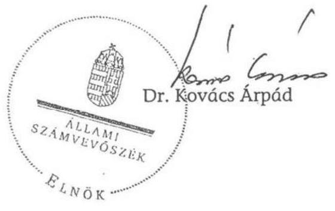

# ÁLLAMI   SZÁMVEVŐSZÉK 

## JELENTÉS

a Kereszténydemokrata Néppárt 2006-2007. évi gazdálkodása törvényességének ellenőrzéséről

---

3. Önkormányzati és Területi Ellenőrzési Igazgatóság
3.1. Szabályszerűségi Ellenőrzési Főcsoport
Iktatószám: V-3017-022/2008.
Témaszám: 929
Vizsgálat-azonosító szám: V-429
Az ellenőrzést felügyelte:
Dr. Lóránt Zoltán
főigazgató
Az ellenőrzés végrehajtásáért felelős:
Dr. Elek János
általános főigazgató-helyettes
Az ellenőrzést vezette:
Horváth Balázs
főcsoportfőnök-helyettes
Az összefoglaló jelentést készítette:
Szakmányné Bilik Mária
tanácsos
Az ellenőrzést végezték:
Szakmányné Bilik Mária Dr. Faragóné Tóth Mária Szendrey Lajos
tanácsos számvevő
A témához kapcsolódó eddig készített számvevőszéki jelentések:
címe
sorszáma
Jelentés a Kereszténydemokrata Néppárt 1992-1993. évi gazdálkodása törvényességének ellenőrzéséről ..... 234
Jelentés a Kereszténydemokrata Néppárt 1994-1995. évi gazdálkodása törvényességének ellenőrzéséről ..... 341
Jelentés a Kereszténydemokrata Néppárt 1996-1997. évi gazdálkodása törvényességének ellenőrzéséről ..... 9844
Jelentés a Kereszténydemokrata Néppárt 1998-1999. évi gazdálkodása törvényességének ellenőrzéséről ..... 0040
Jelentés a Kereszténydemokrata Néppárt 2000-2001. évi gazdálkodása törvényességének ellenőrzéséről ..... 0302
Jelentés a központi költségvetési támogatásban nem részesült pártok 2001-2004. évi gazdálkodása törvényességének ellenőrzéséről ..... 0517

---

# TARTALOMJEGYZÉK 

BEVEZETÉS ..... 5
I. ÖSSZEGZŐ MEGÁLLAPÍTÁSOK, KÖVETKEZTETÉSEK, JAVASLATOK ..... 7
II. RÉSZLETES MEGÁLLAPÍTÁSOK ..... 12

1. A Párt gazdálkodásáról szóló 2006-2007. évi beszámolók ..... 12
1.1. A teljes vizsgálati időszakra érvényes megállapítások ..... 12
1.1.1. Bevételek ..... 13
1.1.2. Kiadások ..... 15
2. A Pártnak a beszámoló összeállítására és az azt alátámasztó könyvvezetésre vonatkozó belső szabályozása és gyakorlata ..... 17
2.1. A belső szabályozás rendszere ..... 17
2.2. A könyvvezetés gyakorlata, ennek összhangja a jogszabályokban és a belső szabályzatokban előírt követelményekkel ..... 19
2.3. Analitikus nyilvántartások ..... 21
2.4. A bizonylati elv és a bizonylati fegyelem érvényesülése ..... 21
3. A Párt bevételszerző, gazdálkodó tevékenysége ..... 22
4. A gazdálkodással összefüggő, egyéb jogszabályokban foglalt előírások betartása ..... 23
4.1. Személyi jellegű kifizetések ..... 23
4.2. Az adózási, társadalombiztosítási és egyéb jogszabályok rendelkezéseinek érvényesítése ..... 23
5. A Párt belső ellenőrzési rendszere ..... 24
5.1. A belső ellenőrzés rendszerének szabályozottsága ..... 24
5.2. A belső ellenőrzési rendszer működése, eredményessége ..... 25
MELLÉKLETEK
6. számú A Kereszténydemokrata Néppárt 2006. évi pénzügyi beszámolója
7. számú A Kereszténydemokrata Néppárt 2007. évi pénzügyi beszámolója
8. számú A Kereszténydemokrata Néppárt 2006. évi javított beszámolója
9. számú A Kereszténydemokrata Néppárt 2007. évi javított beszámolója

---

.

---

# RÖVIDÍTÉSEK JEGYZÉKE 

| APEH | Adó- és Pénzügyi Ellenőrzési Hivatal |
| :-- | :-- |
| Art. | Az adózás rendjéről szóló - többször módosított - 2003. |
|  | évi XCII. törvény |
| ÁSZ | Állami Számvevőszék |
| MPEB | Megyei Pénzügyi Ellenőrző Bizottság |
| OPEB | Országos Pénzügyi Ellenőrző Bizottság |
| OV | Országos Választmány |
| Párt | Kereszténydemokrata Néppárt |
| párttörvény | A pártok működéséről és gazdálkodásáról szóló - többször |
|  | módosított - 1989. évi XXXIII. törvény |
| Számv. tv. | A számvitelről szóló - többször módosított - 2000. évi C. |
|  | törvény |
| Szja törvény | A személyi jövedelemadóról szóló - többször módosított - |
|  | 1995. évi CXVII. törvény |
| Tbj. | A társadalombiztosítás ellátásaira és a magánnyugdíjra |
|  | jogosultakról, valamint e szolgáltatások fedezetéről szóló |
|  | 1997. évi LXXX. törvény |

---

.

---

# JELENTÉS 

## a Kereszténydemokrata Néppárt 2006-2007. évi gazdálkodása törvényességének ellenőrzéséről

## BEVEZETÉS

Az Állami Számvevőszékről szóló 1989. évi XXXVIII. törvény 5. §-a, a 16. § (2) és a 17. § (2) bekezdése, valamint a pártok működéséről és gazdálkodásáról szóló - többször módosított - 1989. évi XXXIII. törvény (párttörvény) 10. § (1) és (3) bekezdése alapján a pártok gazdálkodása törvényességének ellenőrzésére az Állami Számvevőszék (ÁSZ) jogosult. E törvényi felhatalmazásokra figyelemmel az ÁSZ 2008. évi ellenőrzési tervének megfelelően, 2009. évre áthúzódó ellenőrzés során vizsgálta a Kereszténydemokrata Néppárt (Párt) 2006-2007. évi gazdálkodása törvényességét.

Az ellenőrzés célja annak megállapítása volt, hogy:

- a Párt által készített, a Magyar Közlönyben közzétett éves beszámolók a törvényi előírásoknak megfeleltek-e, a könyvvezetéssel és a valósággal megegyező adatokat tartalmaztak-e;
- a könyvvezetés és a gazdálkodás során betartották-e a számvitelről szóló többször módosított - 2000. évi C. tv. (Számv. tv.) és az egyéb jogszabályok rendelkezéseit, a belső előírásokat;
- a Párt a működéséhez szabályszerűen igénybe vehető forrásokat használta fel, nem folytatott-e a párttörvény által tiltott gazdálkodó tevékenységet, nem fogadott-e el tiltott vagyoni hozzájárulást, illetőleg adományt.

Az ellenőrzés körülményeit illetően rögzíteni szükséges ${ }^{1}$, hogy:

- a párttörvény 1. sz. melléklete szerinti beszámoló-mintához magyarázatot, útmutatót nem készítettek a jogalkotók, így ennek kitöltése pártonként - a kialakított számviteli politikájuknak megfelelően - eltérő lehet;
- a beszámoló-minta a számviteli törvény rendelkezéseivel nem harmonizál, nem felel meg sem a mérleg, sem az eredmény-kimutatás követelményeinek.

A korábbi pártellenőrzések alapján tett jelzésekre is figyelemmel elengedhetetlenül szükséges a párttörvény, valamint a Számv. tv. előírásainak összehangolása, amely a pártfinanszírozás átláthatóvá tételére benyújtott törvényjavaslatnak szerves része (száma: T-4190).

Az ÁSZ a párttörvény módosításáig a jelenleg hatályos rendelkezéseknek megfelelő - egységes módszertani alapokra helyezett - gyakorlattal folytatja a pártok gazdálkodása törvényességének ellenőrzését. Az ellenőrzést a pénzügyiszabályszerűségi ellenőrzés módszertani szabályai szerint, a pártellenőrzésre kiadott segédletbe foglalt egységes követelmények alapján végeztük.

Az adatok előzetes elemzése, kockázatértékelése alapján terveztük meg a statisztikai mintavételi eljárást. Az előkészítés során a rendelkezésre bocsátott dokumentumok alapján az átfogó lényegességi szint mértékét a pénzügyi beszámoló főösszegének 2\%-ában határoztuk meg, továbbá specifikus lényegességi küszöböt alkalmaztunk az egyéb hozzájárulások, adományok esetében a párttörvény 1. számú mellékletében meghatározott értékhatárra tekintettel.

A Párt 2002-ig költségvetési támogatásban részesült, a 2002. évi országgyűlési képviselőválasztás során nem állított jelöltet. A Legfelsőbb Bíróság 2003-ban megsemmisítette a Párt előző vezetőségválasztásának határozatait, új választás megtartását írta elő. Az új választás eredményeként került a jelenlegi vezetés a Párt élére.

A Párt a 2006. évi országgyűlési képviselőválasztáson elért eredmény alapján ismét jogosultságot szerzett a rendszeres költségvetési támogatásra. A Magyar Köztársaság 2006. évi költségvetésének végrehajtásáról szóló 2007. évi CXXVIII. törvény, valamint a Magyar Köztársaság 2007. évi költségvetésének végrehajtásáról elfogadott 2008. évi LXXVIII. törvény szerint 137,3 millió Ft, illetve 235,4 millió Ft központi támogatásban részesült.

A Párt gyakorlatilag a 2006. évi országgyűlési képviselő-választást megelőző időszakban kezdte újraszervezni tagságát, szervezeteit, valamint gazdálkodását.

A helyszíni ellenőrzésre 2009. január 13. és február 22. között a Párt Országos Központjában került sor.

---

# I. ÖSSZEGZŐ MEGÁLLAPÍTÁSOK, KÖVETKEZTETÉSEK, JAVASLATOK 

A Párt a 2006. és 2007. évi pénzügyi beszámolóit a párttörvényben előírt formában, a Magyar Közlönyben nyilvánosságra hozta. A 2006. évi beszámolót a törvényes határidőhöz képest késéssel jelentette meg, mindkét évi beszámolót elmulasztotta internetes honlapján is közzétenni. A közzétett beszámolók nem mutattak megbízható és valós képet a Párt gazdálkodásáról és pénzügyi helyzetéről, mivel a beszámolók összeállításánál nem érvényesítették a számviteli törvényben szabályozott valódiság, teljesség, következetesség, egyedi értékelés és lényegesség elvét. A Párt 2006-ban a helyi szervezetek több mint háromnegyedének, 2007-ben csaknem kétharmadának gazdálkodásáról nem rendelkezett információval. A beszámolók szabályozási mulasztásokból, könyvvezetési és bizonylatolási hibákból eredően lényeges eltérést mutattak.

A 2006. évi beszámolóban a feltárt hibák összességében 9637 ezer Ft bevételi, 35693 ezer Ft kiadási eltérést jelentettek. A bevételek lényeges eltérésének a 99\%-a belföldi jogi személyek adományaihoz kötődött, mivel a nem pénzbeli vagyoni hozzájárulások értékelését és kimutatását elmulasztotta a Párt. A hiányos nyilvántartásból fakadóan a párttörvényben előírt nevesítést is elmulasztották hét támogatónál. Az eltérések következtében a közzétett beszámolóban 8981 ezer Ft-tal kisebb összeget hoztak nyilvánosságra. A működési és a politikai kiadások összege a helytelenül alkalmazott százalékos megosztás következtében eltért a valós helyzettől. Az egyes kiadási sorokból kimaradt tételek összege 22484 ezer Ft, a hibás jogcímmel szerepelt tételek értéke 13209 ezer Ft volt.

A 2007. évi beszámolósorokhoz kapcsolódó eltérések a bevételi oldalon 8194 ezer Ft, a kiadási oldalon 56255 ezer Ft hibaösszeget indukáltak. A beszámolóban a bevételek között az előző évhez hasonlóan kimaradt 7427 ezer Ft összegben az ingatlanhasználattal összefüggő nem pénzbeli vagyoni hozzájárulás értéke. Elmulasztották hét támogató nevesítését. Az eszközbeszerzések, a működési, a politikai és egyéb kiadási sorok tartalma eltért az előző évi beszámoló sorok tartalmától, a beszámoló kiadási sorain hibás jogcímmel szerepelt tételek 24368 ezer Ft, a kimaradt tételek 31887 ezer Ft összeget tettek ki, így az eltérések egyenlegeként 7519 ezer Ft-tal kisebb kiadási összeget közöltek.

A megjelentetett beszámolókhoz képest kimutatott, a beszámoló főösszegére vetített hiba a bevételeknél 2006-ban 5,4\%, 2007-ben 3,4\%, a kiadásoknál 24,7\%, illetve 22,2\%-os mértéket ért el. A számvevőszéki ellenőrzés megállapításaira a könyvelést helyesbítették, a 2006. és 2007. évi módosított pénzügyi beszámolót a Magyar Közlöny Hivatalos Értesítőjében és a Párt internetes honlapján közzétették. A javított beszámolók a Párt pénzügyi gazdálkodásáról megbízható, valós képet mutatnak.

A Párt számviteli és egyéb, törvényesség érvényesülését elősegítő szabályzatokkal, a vizsgált időszak nagyobb részében, nem rendelkezett. Az alapszabályban előírt gazdálkodási szabályzat, valamint szervezeti és működési szabályzatok a helyszíni ellenőrzés időszakáig nem készültek el. A Számv. tv-ben előírt számviteli politikát és kapcsolódó szabályzatokat csak a vizsgált ciklus végén adták ki.

Az OV által 2007. november végén hatályba léptetett számviteli szabályzatok nincsenek összhangban a Számv. tv. követelményeivel. A számviteli politika nem tükrözi a Párt sajátosságait, mivel nem tartalmazza a párttörvény szerinti beszámoló sorok tartalmát, a beszámoló sorok és a főkönyvi számlák összefüggéseit, a megbízható és valós képet lényegesen befolyásoló hiba nagyságát. A pénzkezelési szabályzat nem szabályozza a pénzforgalom bankszámlán történő lebonyolításának rendjét, a pénzkezelés személyi és tárgyi feltételeit, a napi záró készpénzállomány maximális mértékét, a pénztári ellenőrzés gyakoriságát, a megyei és helyi szervezetek sajátos pénzkezelési szabályait. A leltározási szabályzat megfelelt a törvényi előírásoknak. Az eszközök és források értékelési szabályzata nem rögzíti az állományból történő kivezetés feltételeit, az azokat alátámasztó bizonylatokat, a követelések, valamint a nem pénzbeli vagyoni hozzájárulás értékelési módját. A számlarend nincs összhangban a Számv. tv. előírásaival, mivel hiányos és hibás a kijelölt főkönyvi számlák köre, nem tartalmazza teljes körűen a kapcsolódó analitikákat és bizonylati rendet. Ésszerűtlen a számviteli szabályzatok elfogadásának OV hatáskörbe való utalása, mivel ülésezési rendje nem biztosítja a Számv. tv. módosítása esetén a változások határidőben történő átvezetését.

A kettős könyvvezetést regisztrált külső könyvelési szolgáltató végezte megbízási szerződés alapján, amely nem tartalmazta az éves beszámoló összeállítására vonatkozó feladatokat. A számviteli szabályozási hiányosságok, ezen belül a nem megfelelő számviteli politika, értékelési és számlarendi előírások lényeges hibákhoz vezettek. A belső szabályozásban előírt, a helyi szervezetekre negyedéves, a megyei szervezetekre havi elszámolási gyakoriság a vizsgált években nem érvényesült; 2006 végén egyszer számoltak el, 2007-ben a szervezeteknek mintegy egyötöde számolt el szabályszerűen. A gazdasági események időrendi nyilvántartását a Számv. tv. előírása ellenére nem biztosították, azokat a hónap, illetve a helyi szervezetek tranzakciói esetében az év utolsó napjára rögzítették. Pénztárjelentés vezetésének hiányában a helyi szervezetek

[^1]: ${ }^{1}$ Az ÁSZ évek óta javasolja a Kormánynak a pártok ellenőrzéséről készített jelentéseiben a párttörvény módosítását.

 több mint négyötödénél nem rögzítették a pénzmozgással egyidejűleg a pénzeszközöket érintő gazdasági műveleteket, 2006-ban negyedéves gyakoriság helyett, az egyéb gazdasági műveleteket évvégén egyszer könyvelték. A költségnemek szerinti könyvelés követelményét nem érvényesítették teljes körűen. A beszámoló alapjául szolgáló könyvvezetési szabálytalanságokkal összefüggésben sérült a teljesség, a valódiság, a világosság, a következetesség és az egyedi értékelés elve. A leltározás egyik évben sem volt teljes körű, a zárási feladatokat hiányosan hajtották végre.

A főkönyvi könyveléshez kapcsolódó analitikus nyilvántartások közül a tárgyi eszközök, a vevők és a szállítók vezetése minősült szabályszerűnek. A Párt nem vezetett részletező nyilvántartást - a beszámoló szabályszerű összeállításához, valamint a vagyonvédelmi követelmények és adójogszabályokban előírtak érvényesítéséhez - a kis értékű tárgyi eszközökről, az értékpapírokról, a kiadott előlegekről, a reprezentációról, a tagdíjakról és az adományokról. Belső utasítás ellenére a pénzkezelési szabályzatban előírt pénztárjelentést a helyi szervezetek több mint 80%-a nem vezette. Nem volt teljes körű a szigorú számadású nyomtatványok nyilvántartása, mivel az analitika csak a központban alkalmazott bizonylatok körét tartalmazta. A hiányosan vezetett analitika nem biztosította a leltárak teljes körű egyeztethetőségét, a zárlati feladatok szabályszerű elvégzését.

A bizonylati elv és fegyelem érvényesüléséhez a Párt nem rendelkezett a számlarend részeként kiadott bizonylati szabályzattal. A bizonylati elvet sértette, hogy a pénzkezelési szabályzat előírása ellenére 2006-ban a helyi szervezetek több mint harmada, 2007-ben csaknem egyötöde nem szabályszerű bevételi és kiadási bizonylatot állított ki, a javító tételeket bizonylatok nem támasztották alá. A bizonylatolás alaki és tartalmi követelményei közül az utalványozás 2006-ban a bizonylatok több mint harmadánál, 2007-ben több mint 40%-ánál nem érvényesültek. Az ellenőrzés a rendelkezésre bocsátott dokumentumok alapján jogtalan kifizetést nem tapasztalt. A Párt a Számv. tv-ben rögzített bizonylat megőrzési kötelezettséget hiányosan teljesítette, mivel a megszűnt szervezeteknél nem készült a dokumentumokról átadási jegyzőkönyv. A bizonylati szabálytalanságok hozzájárultak a beszámolási hibákhoz.

A Párt gazdálkodó, bevételszerző tevékenysége során - könyvviteli nyilvántartásai szerint - betartotta a párttörvényben előírt gazdálkodási tilalmakat: nem engedélyezett gazdálkodó tevékenységet nem folytatott, gazdasági társaságban részesedést nem szerzett, vállalatot nem alapított. Bevételei szabályozott tagdíjfizetésből, egyéb hozzájárulásokból és adományokból, a tulajdonát képező üzletrész értékesítéséből, költségek visszatérüléséből, valamint kamatbevételekből álltak. Nem fogadott el külföldi államtól, költségvetési szervtől, állami vállalattól, állami részvétellel működő gazdasági társaságtól, közvetlen költségvetési támogatásban vagy költségvetési szervi támogatásban részesülő alapítványtól vagyoni hozzájárulást. A forrásszerzési korlátozásokat 2006-ban megszegte, mivel 89210 Ft összegű névtelen adományt fogadott el.

A személyi jellegű kifizetések körében a béreket szabályszerű munkaszerződések alapján központilag számfejtették. A magántulajdonú gépjármű hivatali célú használatát, elszámolási rendjét nem szabályozták, az érintettekkel a saját gépjármű használatára megállapodást nem kötöttek. A költségtérítést szabályosan kitöltött kiküldetési rendelvények és útnyilvántartások alapján, adómentes normatív mértékkel számolták el. A külföldi kiküldetések eljárási rendjét, elszámolható költségeit hatályos szabályzat rögzítette, elszámolása szabályszerűen történt.

Az adózási, társadalombiztosítási jogszabályok előírásainak a Párt munkáltatóként és kifizetőként eleget tett, a havi és éves adatszolgáltatási, bevallási és befizetési kötelezettségét szabályszerűen teljesítette, a foglalkoztatottak biztosítási jogviszonyában történt változásokat határidőben bejelentette. A kiadott APEH folyószámla kivonat szerint befizetési késedelme, költségvetési tartozása nem volt a Pártnak. A reprezentációs kiadásokat elkülönített nyilvántartás hiányában a helyszíni ellenőrzés ideje alatt önellenőrzéssel megállapították, azok egyik évben sem érték el az adóköteles mértéket.

A belső ellenőrzés rendszerében az alapszabály kétszintű - országos, megyei - pénzügyi ellenőrző bizottságról rendelkezett. Az OPEB feladat- és hatáskörében nem szerepelt az éves költségvetés és pénzügyi beszámoló felülvizsgálata.

A testület 2006. évi ellenőrzési javaslatai nem hasznosultak: a megyei bizottságok a vizsgált időszakban nem alakultak meg, nem működtek; az alapszabályban előírt szervezeti és működési, valamint gazdálkodási szabályzat nem készült el. A 2007. januárban megválasztott új OPEB szabályosan megalakult, elkészítette éves munkatervét, de ellenőrzést nem végzett.

A vezetői és a munkafolyamatba épített ellenőrzési feladatok körében - hatályos számviteli szabályozások hiányában - nem voltak meghatározottak a beszámolási, zárlati, leltározási és pénzkezelési kontroll kötelezettségek. A szervezeti és működési, valamint gazdálkodási szabályzat hiányában nem rendelkeztek az operatív gazdálkodást irányító, ellenőrző vezetői funkciókról; az alkalmazottakat munkaköri leírás nélkül foglalkoztatták. A kötelezettségvállalást és utalványozást a központban szabályszerűen végezték, a területi szerveknél azonban hiányosan teljesítették. A vezetői ellenőrzés keretében nem került sor a beszámoló dokumentált ellenőrzésére. A munkafolyamatba épített ellenőrzés körében a gazdasági tranzakciók teljesítésigazolását hiányosan dokumentálták; a pénztári nyilvántartások és a készpénzállomány ellenőrzése nem valósult meg, mivel a feladat ellátására nem adtak megbízást.

A belső ellenőrzés hiányosan felállított szervezeti rendszere és a kontrollok működtetése, a vizsgált időszakban nem volt alkalmas a lényeges beszámolási hibák, a szabályozási hiányosságok, a névtelen bevételek kiszűrésére, a könyvvezetési és bizonylatolási hibák feltárására.

A helyszíni ellenőrzés megállapításainak hasznosítása mellett az Állami Számvevőszék elnöke felhívja

# a Párt elnökét: 

1. Intézkedjen a Párt sajátosságainak megfelelően a beszámolási és könyvvezetési szabályok Számv. tv-hez igazodó módosításáról, hogy:
a) a számviteli politika részletesen tartalmazza a párttörvény 1. számú mellékletében szereplő beszámoló sorok tartalmát, főkönyvi számlákkal való kapcsolatát, a megbízható és valós képet lényegesen befolyásoló hiba nagyságát;
b) a pénzkezelési szabályzatban rögzítsék a Számv. tv. 14. § (8) bekezdésével összhangban a Párt bankszámlái forgalmának rendjét, a pénzkezelés személyi és tárgyi feltételeit, az ellenőrzés gyakoriságát, a maximális napi záró pénzkészlet nagyságát, valamint a helyi szervezetek sajátos pénzkezelési szabályait;
c) az értékelési szabályzat a párttörvény 4. § (5) bekezdésével összhangban tartalmazza az értékelési eljárásokat, az állományból való kivezetés feltételeit;
d) a számlarend feleljen meg a Számv. tv. 161. § (2) bekezdés követelményeinek.
2. Kezdeményezze a gazdálkodás szabályszerű feltételeinek megteremtése érdekében:
a) a belső előírásokkal összhangban a szervezeti és működési, valamint a gazdálkodási szabályzat megalkotását;
b) a számviteli szabályzatok elfogadására vonatkozó hatáskör módosítását a Számv. tv. 14. § (11) és 161. § (5) bekezdés szabályai teljesüléséhez;
c) a saját gépkocsi hivatali célú használata elszámolási rendjének szabályozását.
3. Szerezzen érvényt az éves beszámolók összeállítása során, és az alapjául szolgáló könyvvezetésben a Számv. tv. 15. § (2)-(5), valamint a 16. § (1) és (4) bekezdésben szabályozott számviteli alapelveknek.
4. Intézkedjen, hogy a könyvviteli nyilvántartások az eszközökben és forrásokban bekövetkezett változásokat a valóságnak megfelelően, folyamatosan mutassák, figyelemmel a Számv. tv. 159. § előírására, továbbá az ingyenes vagy kedvezményes szolgáltatások számviteli nyilvántartása biztosított legyen a Számv. tv. 86. § (3) bekezdés j) pontja szerint.
5. Intézkedjen a Párt sajátosságaihoz igazodó, az adózási és vagyonvédelmi követelményeket kielégítő analitikus nyilvántartások szabályszerű vezetésére és egyeztetésére.
6. Gondoskodjon a Számv. tv. 69. § (1)-(2) és a 164. § (1) bekezdésében előírt szabályszerű és teljes körű leltározás és zárás végrehajtásáról.
7. Intézkedjen a párttörvény 4. § (3)-(4) bekezdés előírása szerint a 89210 Ft összegű névtelen adománynak megfelelő összeg központi költségvetésbe történő befizetésére.
8. Szerezzen érvényt a Számv. tv. 165. § (1) bekezdésében foglalt bizonylati elv és fegyelem, a bizonylatolás 167. § (1) bekezdésében megfogalmazott alaki és tartalmi követelményeinek, a 168. § (3) bekezdésben rögzített szigorú számadású bizonylatok nyilvántartási szabályainak, továbbá a 169. § (2) és (4) bekezdésében előírt bizonylat megőrzési kötelezettségnek.
9. Gondoskodjon a munkaköri leírások elkészítéséről, ennek keretében az operatív gazdálkodással összefüggő feladat- és hatáskör, valamint felelősségi kör meghatározásáról.
10. Kezdeményezze az alapszabályban meghatározott pénzügyi ellenőrző bizottságok szabályszerű funkcionálását, a belső kontrollok összehangolt és hatékony működtetését.

# a pénzügyminisztert: 

A vizsgálat során megállapított 89210 Ft értékű névtelen adománynak megfelelő összeggel a párttörvény 4. § (4) bekezdés előírása szerint csökkentse a Párt 2009. évi költségvetési támogatását.

# II. RÉSZLETES MEGÁLLAPÍTÁSOK 

## 1. A PÁRT GAZDÁLKODÁSÁRÓL SZÓLÓ 2006-2007. ÉVI BESZÁMOLÓK

### 1.1. A teljes vizsgálati időszakra érvényes megállapítások

A Párt a 2006. évi beszámolóját 2007. május 6-án - a párttörvény 9. § (1) bekezdésében előírt határidőn túl - a Magyar Közlöny 56. számában, a 2007. évi beszámolóját határidőben, 2008. április 30-án a 69. számban, a párttörvény 1. számú mellékletében meghatározott minta szerint jelentette meg (1-2. számú melléklet). A Párt a párttörvény 9. § (1) bekezdés előírása ellenére mindkét évben elmulasztotta internetes honlapján is közzétenni beszámolóját. A közzétett beszámolók a helyi, a megyei és kerületi szervezetek, valamint az országos központ számviteli bizonylatai alapján, központilag könyvelt adatok főkönyvi kivonataiból készültek. Az alapszabály értelmében a helyi szervezetek önállóan gazdálkodtak, a bevételeiket saját döntésük szerint használhatták fel. A Párt 2006-ban a helyi szervezetek több mint háromnegyedének, 2007-ben csaknem kétharmadának gazdálkodásáról nem rendelkezett információval, mivel gazdálkodásukról nem szolgáltattak bizonylatokat, a központ pedig nem kért a nemleges gazdálkodásról nyilatkozatot.

Az éves pénzügyi beszámolók egyes soraiban szereplő adatok - a 2006. évi működési, politikai, valamint egyéb kiadások, továbbá a 2007. évi tagdíjbevételek, az eszközbeszerzések és a működési kiadások vonatkozásában - eltértek a főkönyvi könyvelés kapcsolódó számláinak összevont egyenlegeitől, mivel nem a zárás előtti utolsó főkönyvi kivonatokból készültek a beszámolók. A Párt az éves beszámolók összeállítása során megsértette a Számv. tv. 15. § (2)-(3) és (5), valamint a 16. § (1) és (4) bekezdésében foglalt teljesség, valódiság, következetesség, az egyedi értékelés és lényegesség számviteli alapelveket, mivel a nyilvánosságra hozott beszámolók pontatlanok, nem teljes körűek, a könyvvezetési és a beszámoló összeállítás lényeges hibái miatt nem feleltek meg a felsorolt számviteli alapelveknek, így a nyilvánosságra hozott beszámolók nem mutattak megbízható és valós képet a Párt pénzügyi gazdálkodásáról.

A teljesség számviteli alapelvét sértette, hogy a Párt az ingyenes és kedvezményes díjtételű ingatlanbérlet formájában megvalósult nem pénzbeli vagyoni hozzájárulás értékét a párttörvény 4. § (5) bekezdés előírása ellenére nem állapította meg, nem könyvelte és nem mutatta ki az éves beszámolókban. Ez egyben az egyedi értékelés elve követelménynek sem felelt meg. Az utólagos értékelés szerint 2006-ban 9164 ezer Ft, 2007-ben 7427 ezer Ft nem pénzbeli vagyoni hozzájárulást kapott. Hiányzott továbbá a 2006. évi beszámolóból 40 ezer Ft nem könyvelt bevétel, valamint a főkönyvi kivonattól való eltérés következtében 121 ezer Ft kiadás. Ez utóbbi okból hiányzott a 2007. évi beszámoló bevételei közül 4 ezer Ft tagdíjbevétel, valamint 92 ezer Ft kiadás.

A valódiság számviteli alapelvét sértette, hogy a 2006. évi beszámolóban 122 ezer Ft alapbizonylattal alá nem támasztott, valamint hibás könyvelés miatt 101 ezer Ft nem valós bevételt, továbbá 10 ezer Ft - összegzési hibából eredő - kiadást mutattak ki. A 2007. évi beszámoló bevételei között 4 ezer Ft bizonylattal alá nem támasztott, valamint könyvelési hiba következtében 241 ezer Ft nem valós bevételt számoltak el.

A következetesség számviteli alapelvét sértette mindkét évi beszámolóban, hogy a tagdíjak között magánszemélyek adományait, illetve adományok között tagdíjakat, jogi személynek minősülő gazdasági társaságoktól származó adományokat magánszemélyektől származó adománybevételek között mutattak ki. A 2007. évi beszámoló összeállítása
 során az előző évi beszámolóhoz képest, összesen 24368 ezer Ft kiadást más kiadási jogcímen hoztak nyilvánosságra. Többek között a kis értékű felszerelési tárgyak beszerzését az eszközbeszerzések helyett működési kiadásként, 2006-ban politikai kiadás soron kimutatott tanácsadást, grafikai tervezést, utazási és kiküldetési költséget, külföldi kiküldetést, nyomdaköltséget, továbbá az előző évben egyéb kiadások között elszámolt kiadásokat soroltak a működési kiadások közé.

A lényegesség számviteli alapelvét sértette, hogy az éves beszámolók összeállításával összefüggésben feltárt bevételi hibák előjeltől független értéke 2006-ban 9637 ezer Ft, 2007-ben 8194 ezer Ft, a kiadási hibák előjeltől független összege 35693 ezer Ft, 2007-ben 56255 ezer Ft nagyságú volt. A hibák a beszámolók főösszegére vetítve - az ÁSZ ellenőrzési módszertanában meghatározott 2%-os átfogó lényegességi szintet meghaladták. A bevételi főösszegre vetítve 5,4%, illetve 3,4%, a kiadási főösszegre 24,7%, illetve 22,2%. Specifikus lényegességi hibaként állapítottuk meg a nem vagyoni értékű hozzájárulások párttörvény előírása szerinti nevesítésének elmulasztását mindkét évben hét-hét támogató esetében. A Párt az ellenőrzés észrevételére a 2006. és 2007. évi pénzügyi beszámolóit a könyvelési hibák kijavítását követően helyesbítette, a Magyar Közlöny Hivatalos Értesítő 2009. évi 14. számában ismételten megjelentette és internetes honlapján is közzétette.

# 1.1.1. Bevételek 

A Párt által közzétett beszámolók bevételi sorai az alábbi eltérések miatt nem egyeztek a valós helyzettel:

Adatok ezer Ft-ban

| Megnevezés | Párt által közzétett beszámoló |  | Ellenőrzés által megállapított eltérések a beszámolóhoz képest |  |  |
| :--: | :--: | :--: | :--: | :--: | :--: |
|  | 2006. évi | 2007. évi | 2006. évi |  | 2007. évi |  |
| BEVÉTEL |  |  | Kimaradt | Hibásan   szerepel | Kimaradt | Hibásan   szerepel |
| 1.Tagdíjak | 2130 | 3468 | 45 | 198 | 8 | 4 |
| 2.Állami tám. | 137287 | 235400 | 0 | 0 | 0 | 0 |
| 4.1.Belf. jogi szem. | 0 | 0 | 9246 | 0 | 7682 | 0 |
| 4.3.Belf. magán-   szem. | 490 | 4224 | 18 | 123 | 0 | 259 |
| 6.Egyéb bevétel | 40153 | 546 | 0 | 7 | 0 | 241 |
| ÖSSZESEN: | 180060 | 243638 | 9309 | 328 | 7690 | 504 |
| - hiány |  |  | 8981 |  | 7186 |  |
| - többlet |  |  |  |  |  |  |

---

A tagdíj befizetés feltételeit a Párt alapszabálya rögzítette. A tagdíjak mérsékléséről, illetve annak elengedéséről a helyi szervezetek dönthettek. 2006-ban a helyi szervezetek 77,5%-ánál, 2007-ben 62,6%-ánál nem fizettek tagdíjat. A tagdíj elengedéséről, illetve mérsékléséről szóló döntéseket - egy helyi szervezet kivételével - nem csatolták az elszámoláshoz, így a nem fizetés vagy csökkentett tagdíjfizetés jogszerűsége nem volt megítélhető. A tagdíjak adatai nem egyeztek a főkönyvi könyvelésben ilyen címen szereplő összeggel. A 2006. évi tagdíjbevételből hiányzott a II. kerületi pártszervezetnél befizetett, de nem könyvelt 39 ezer Ft, valamint a XII. kerületben magánszemélyek adományai között kimutatott 6 ezer Ft tagdíj. Hibásan szerepelt a könyvelésben a debreceni és szolnoki szervezeteknél befizetett összesen 17 ezer Ft magánszemélyektől származó adomány, négy helyi szervezet (Békés, Debrecen, Oroszlány, XX. kerület) összesen 80 ezer Ft, alapbizonylattal alá nem támasztott bevétele, valamint 101 ezer Ft hibás könyvelésből eredő összeg, mivel a zalaegerszegi szervezetnél a központtól kapott támogatás takarékszelvényben kamatoztatott maradványának beváltását, tagdíjként könyvelték.

A 2007. évi tagdíjbevételből hiányzott a XII. kerületben magánszemélyek adományai között kimutatott 4 ezer Ft tagdíj, valamint a beszámoló sor további 4 ezer Ft-tal kisebb összeget tartalmazott a főkönyvi kivonathoz képest. Hibásan szerepeltettek a győri szervezet tagdíja között bizonylattal alá nem támasztott 4 ezer Ft bevételt.

Az állami költségvetésből származó támogatásokat a főkönyvi könyvelésben kimutatott és a bankszámla kivonaton szereplő, a Magyar Államkincstár által ténylegesen átutalt összeggel egyezően közölték.

Az egyéb hozzájárulások, adományok beszámoló soron a Párt a vizsgált években kizárólag belföldi magánszemélyektől származott bevételt mutatott ki annak ellenére, hogy belföldi jogi személyektől is kapott támogatást.

Egyéb hozzájárulások, adományok belföldi jogi személyektől beszámoló soron egyik évben sem közöltek adatot. A 2006. évi beszámolóból hiányzott - a debreceni szervezetnél teljesült - 82 ezer Ft összegű, jogi személyektől származó adomány. A 2007. évi beszámolóban nem szerepeltettek ezen a jogcímen 255 ezer Ft - XI. kerületi társasházak, valamint egy kft. által befizetett támogatást. Mindkét évben ezeket az összegeket hibásan, a magánszemélyek adományai között mutatták ki.

A beszámoló sorból mindkét évben hiányzott - 2006-ban 14 db, 2007-ben 16 db ingatlannal összefüggő - a helyi pártszervek által a helyi önkormányzatoktól ingyenesen vagy kedvezményes díjtételű ingatlanhasználat formájában kapott nem pénzbeli vagyoni hozzájárulás értéke. A Párt a helyszíni ellenőrzés alatt értékelte az ingatlanok használatából eredő támogatást, amely alapján a 2006. évi beszámolóból 9164 ezer Ft, a 2007. éviből 7427 ezer Ft összeg hiányzott. Ebből mindkét évben hét-hét esetben az egy támogatótól kapott nem vagyoni hozzájárulás értéke meghaladta a nevesítési határt, az 500 ezer Ft-ot. A Párt az adományozók nevét a támogatás összegével a párttörvény 9. § (2) bekezdés előírását megsértve elmulasztotta a beszámolóban feltüntetni, így a közzétett beszámolók specifikus lényeges hibát tartalmaztak.

---

Az egyéb hozzájárulások, adományok belföldi magánszemélyektől soron a 2006. évi beszámoló sorból hiányzott 17 ezer Ft tagdíjak között kimutatott, valamint 1 ezer Ft nem könyvelt adomány. Tévesen szerepelt ezen a soron 6 ezer Ft tagdíjak között kimutatott magánszemélyektől származó adomány, 82 ezer Ft belföldi jogi személy adománya. Hibásan mutattak ki a jogcímen 35 ezer Ft bizonylattal alá nem támasztott bevételt a győrújbaráti szervezetnél. A 2007. évi beszámolóban ezen a soron hibásan szerepeltettek összesen 259 ezer Ft összeget, amelyből 4 ezer Ft tagdíj, 255 ezer Ft jogi személy befizetőtől származó adomány volt.

Egyéb bevételek között kamatbevételeket, 2006-ban ezen kívül a saját tulajdonú kft. üzletrészének eladásából befolyt bevételt mutatták ki. A 2006. évi beszámoló sor adatában hibásan hoztak nyilvánosságra 7 ezer Ft összegű, bizonylattal alá nem támasztott, a 2007. évi beszámolóban téves könyvelés következtében összesen 241 ezer Ft bevételt. A 241 ezer Ft-ból a gazdasági események valódi tartalma szerint 10 ezer Ft a követelések között ki nem mutatott tagi kölcsön, valamint 53 ezer Ft értékpapír beváltásból, 178 ezer Ft bankszámla megszüntetésből eredő készpénzállomány növekedés volt.

# 1.1.2. Kiadások 

A kiadásokat a 2006. évi beszámoló az eszközbeszerzés, a 2007. évi a támogatás egyéb szervezeteknek sor kivételével nem megfelelő összegben tartalmazta.

A 2006. és a 2007. évekre közzétett beszámolók kiadásainak ellenőrzése során megállapított eltéréseket - beszámoló soronként - a következő összeállítás részletezi:

Adatok ezer Ft-ban

| Megnevezés | Párt által közzétett beszámoló |  | Bizonylatok alapján megállapított eltérés a beszámolóhoz képest |  |  |  |
| :--: | :--: | :--: | :--: | :--: | :--: | :--: |
|  | 2006. évi | 2007. évi | 2006. |  | 2007. |  |
| KIADÁS |  |  | Kimaradt | Hibásan   szerepel | Kimaradt | Hibásan   szerepel |
| 2. Tám. egyéb szervezetnek | 672 | 363 | 97 | 46 | 0 | 0 |
| 4. Működési kiadás | 27307 | 83758 | 9175 | 2427 | 7469 | 24368 |
| 5. Eszközbeszerzés | 2159 | 9941 | 0 | 0 | 240 | 0 |
| 6. Politikai kiadás | 84704 | 158976 | 13204 | 97 | 22978 | 0 |
| 7. Egyéb kiadás | 29870 | 678 | 8 | 10639 | 1200 | 0 |
| ÖSSZESEN: | 144712 | 253716 | 22484 | 13209 | 31887 | 24368 |
| - hiány |  |  | 9275 |  | 7519 |  |
| - többlet |  |  |  |  |  |  |

Támogatás egyéb szervezeteknek beszámoló soron közölt adat mindkét évben megegyezett a főkönyvi számla egyenlegével. A 2006. évi beszámoló adata nem a valós helyzetet tükrözte, mivel a kapcsolódó főkönyvi számlán nem mutatták ki a támogatások teljes körét, illetve nem csak bejegyzett szervezetnek adott támogatást tartottak nyilván. A beszámoló sor nem tartalmazta a

---

politikai kiadások között nyilvántartott, az Ifjú Kereszténydemokrata Szövetség részére nyújtott 97 ezer Ft összegű támogatást, ugyanakkor hibásan szerepelt 46 ezer Ft összegben magánszemélynek, valamint nem bejegyzett szervezetnek - a Balatonlelle'48-as Emlékmú Bizottság részére - nyújtott támogatás.

Működési kiadások között a Párt - szabályozás hiányában - az egyes években eltérő költségelemeket számolt el, ezzel megsértette a Számv. tv. 15. § (5) bekezdés, a beszámoló összeállítására vonatkozó következetesség számviteli elvet. A 2006. évi beszámolóban a postaköltség számla egyenlegét 10-90%-os arányban működési és politikai kiadások, a különféle egyéb szolgáltatás főkönyvi számlát 20-80%-ban működési és egyéb kiadások között osztották meg, amely nem a valós jogcím szerinti kiadási struktúrát mutatta. A helyszíni ellenőrzés időszakában a Párt az ellenőrzés részére tanúsítványt készített a két főkönyvi számlán elszámolt tényleges kiadási jogcímek megoszlásáról.

A tanúsítvány, valamint a beszámolósorok ellenőrzése alapján 2006-ban hibásan szerepelt a működési kiadások soron összesen 2417 ezer Ft politikai kiadásnak minősült összeg, amelyből 417 ezer Ft önkormányzati választáshoz kapcsolódó postázási, valamint 2000 ezer Ft rendezvényekkel kapcsolatos különféle egyéb szolgáltatás volt. Hibásan mutattak ki továbbá a Győrújbarát szervezetnél 10 ezer Ft alapbizonylattal alá nem támasztott kiadást. A 2007. évi működési kiadás soron hibásan került kimutatásra 190 ezer Ft összegben kis értékű felszerelési tárgy beszerzése az eszközbeszerzés sor helyett, 22978 ezer Ft politikai, valamint 1200 ezer Ft egyéb kiadás.

A beszámoló sor egyik évben sem tartalmazta a Párt által a helyi önkormányzatoktól ingyenes, vagy kedvezményes díjtételű ingatlanhasználat formájában kapott nem pénzbeli vagyoni hozzájárulás értékéhez kapcsolódó pénzforgalom nélküli ráfordítás elszámolását, ami 2006-ban 9164 ezer Ft-ot, 2007-ben 7427 ezer Ft-ot jelentett. Mindkét évben hiányzott továbbá a vonatkozó főkönyvi kivonatok összesített egyenlegétől való eltérés, 2006-ban 11 ezer Ft, 2007-ben 42 ezer Ft összegben.

Az eszközbeszerzés beszámoló sor tartalmát a számviteli szabályzatokban nem rögzítették. A 2006. évi beszámolóban az eszközbeszerzés fogalomkörébe tartozó tárgyi eszközbeszerzéseket, a kis értékű tárgyi eszközök és felszerelési tárgyak beszerzésére fordított összegeket mutatták ki a vonatkozó főkönyvi számlák forgalmával, illetve egyenlegével egyezően. A 2007. évi beszámoló sorból hiányzott a működési kiadások között szerepeltetett kis értékű felszerelési
 tárgyak beszerzésére fordított 190 ezer Ft összeg, továbbá a főkönyvi számlák egyenlegétől való 50 ezer Ft-os eltérés összesítési hiba következtében.

Politikai tevékenység kiadása beszámoló sor tartalmát a Párt nem szabályozta. Az adatok nem a tényleges állapotot tükrözték, mivel a könyvvezetés és beszámoló összeállítása során a valódiság, a teljesség, a következetesség elve nem érvényesült. A 2006. évi beszámoló sorból hiányzott a működési kiadások között nyilvánosságra hozott 2417 ezer Ft, valamint az egyéb kiadások között szerepeltetett 10639 ezer Ft politikai kiadás, a vonatkozó főkönyvi kivonatok egyenlegétől való 102 ezer Ft eltérés, továbbá a támogatás egyéb szervezeteknek főkönyvön nyilvántartott és kimutatott, nem bejegyzett szervezeteknek, illetve magánszemélyeknek nyújtott támogatás 46 ezer Ft összegben. Hibásan

---

szerepelt összesen 97 ezer Ft, bejegyzett szervezetnek nyújtott támogatás. A 2007. évi beszámoló nem tartalmazta ezen a soron a 22978 ezer Ft működési kiadásként közzétett összeget.

Egyéb kiadások között koszorút, bankköltséget, árfolyamveszteséget, illetéket, munkaügyi per alapján fizetett kártérítést, bírságot, fordításért fizetett díjat, valamint a különféle egyéb szolgáltatás főkönyvön elszámolt költség 80%-át mutatták ki. A 2007. évi beszámoló összeállítása során eltértek ettől a tartalomtól, a nyilvánosságra hozott adat egyik évben sem a valós helyzetet tükrözte. A 2006. évi beszámoló sor adatából hiányzott a vonatkozó főkönyvi számlák összevont egyenlegétől való eltérésből adódóan 8 ezer Ft, valamint hibásan tartalmazott a helytelenül alkalmazott százalékos megoszlás következtében 10639 ezer Ft politikai kiadást. A 2007. évi beszámolóból ezen a jogcímen hiányzott 1200 ezer Ft működési kiadás között kimutatott összeg.

# 2. A Pártnak a beszámoló összeállítására és az azt alátámasztó könyvvezetésre vonatkozó belső szabályozása és gyakorlata 

### 2.1. A belső szabályozás rendszere

A 2005. május 21-től érvényes alapszabály tartalmazza a központi szervek gazdálkodással összefüggő hatáskörét, valamint a helyi, megyei szervezetek gazdálkodási jogosítványait.

A Számv. tv. 14. és 161. §-aiban előírt számviteli szabályzatokkal a Párt a vizsgált időszak nagyobb részében nem rendelkezett, mivel azokat az OV csak 2007. november 24-én fogadta el, a Párt elnöke ezzel egyidejűleg léptette hatályba.

Az alapszabályban az OV kapott felhatalmazást a gazdálkodási szabályzat elfogadására, melyet a helyszíni ellenőrzés időpontjáig nem terjesztettek elő jóváhagyásra. Minden egyéb, az alapszabályban nem nevesített ügyet az OV hatáskörébe utaltak, így a számviteli szabályzatok elfogadását is. A Számv. tv. 14. § (10) és a 161. § (4) bekezdése alapján a számviteli politika és kapcsolódó szabályzatok, valamint a beszámolóhoz és számviteli rendhez kapcsolódó számlarend elkészítéséért, megfelelő színvonalú alkalmazásáért a gazdálkodó szervezet képviseletre jogosult vezetője a felelős. Az OV nem ülésezik rendszeresen, ebből adódóan az OV hatáskörében nem biztosított 90 napon belül a módosítások átvezetése a számviteli szabályzatokon, ez ellentétes a Számv. tv. 14. § (9)${ }^{2}$, valamint a 161. § (5) bekezdés előírásával.

A számviteli politikában rögzítették a könyvvezetés módját, az éves zárlat időpontját, az éves beszámoló készítésének rendjét, időpontját, és a jelentős hiba mértékét. Az amortizációs politika keretén belül a kis értékű tárgyi eszközök költségként való elszámolását 50 ezer Ft-os értékhatárban állapították meg. A számviteli politika nem felel meg a Számv. tv. 14. § (3) bekezdésében megfogalmazott követelménynek, mivel az nem tükrözi a Párt sajátosságait. Nem tartalmazza a párttörvény szerinti beszámoló sorok tartalmát, a beszámoló sorok és a főkönyvi számlák összefüggéseit, a megbízható és valós képet lényegesen befolyásoló hiba nagyságát, valamint a behajthatatlan követelések minősítésének szempontjait.

A pénzkezelési szabályzatban meghatározták a készpénzforgalom lebonyolításának rendjét, a pénzkezelés személyi feltételeit, a készpénz állományt érintő pénzmozgások jogcímeit, a készpénz állomány ellenőrzésekor követendő eljárást, a pénzkezeléssel kapcsolatos bizonylatok rendjét, valamint a nyilvántartási szabályokat. A Számv. tv. 2007. január 1-jétől hatályos szabályozása ellenére a szabályzat nem tartalmazta a 14. § (8) bekezdésben rögzített előírások közül: a pénzforgalom bankszámlán történő lebonyolításának rendjét, a megyei és helyi szervezetek sajátosságának figyelembevételével a pénzkezelés személyi és tárgyi feltételeit, a napi készpénz záró állomány maximális mértékét, a pénztári ellenőrzés gyakoriságát, a pénzszállítás feltételeit.

A leltározási szabályzat megfelelt a törvényi előírásoknak. Tartalmazta a leltározás előkészítése során elvégzendő feladatokat, a leltározási egységek (körzetek) kijelölését, a leltározás bizonylati rendjét, a leltározás módját, az értékelés szabályait, a leltározás technikai feltételeit, eszközeinek biztosítását, a leltárfelvétel dokumentumainak feldolgozási és megőrzési módját, a leltározás és a könyvvezetés adatai egyeztetésének, a leltározás és az értékelés ellenőrzésének módját, a leltárkülönbözetek megállapításának kezelését.

Az eszközök és források értékelési szabályzatban részletezték az eszközök bekerülési értékének tartalmát, minősítési szempontjait. Az előírás nem tartalmazta az állományból történő kivezetés feltételeit, az azokat alátámasztó bizonylatokat, a követelések értékelését, valamint a nem pénzbeli vagyoni hozzájárulás értékelésének - a párttörvény 4. § (5) bekezdésében foglaltakkal összhangban lévő - kötelezettségét, annak értékelési módját.

A kiadott számlarend az alábbi hiányosságok miatt nem felelt meg a Számv. tv. 161. § előírásainak.

- A Párt sajátosságaiból adódó, ténylegesen használt számlák számát, megnevezését nem tartalmazta teljes körűen, mivel az egyes számlaosztályokon belül legfeljebb számlacsoportokat határoztak meg. Hiányoztak továbbá - egyébként alkalmazott - a 6-os számlaosztály számlái. Mindez ellentétes a (2) bekezdés a) pont szabályozásával.
- Nem tartalmazta valamennyi alkalmazott főkönyvi számla leírását, a számlákat érintő gazdasági eseményeket és azok más számlákkal való kapcsolatát, ezzel sérült a (2) bekezdés b) pont előírása. Nem jelöltek ki számlát a nem pénzbeli vagyoni hozzájárulások nyilvántartására.
- A főkönyvi számlákhoz kapcsolódó analitikus nyilvántartásokról nem rendelkezett teljes körűen a (2) bekezdés c) előírása ellenére. Nem írta elő a tagdíjak, adományok, értékpapírok, kis értékű tárgyi eszközök, reprezentációs kiadások részletező nyilvántartását.

---

- Hiányzott a (2) bekezdés d) pontjában előírt számlarendhez kapcsolódó bizonylati rend.

A könyvelési szolgáltató megbízási szerződésében nem került meghatározásra a számviteli szabályozatok elkészítésében és karbantartásában való közreműködés. Az egyéb törvényesség érvényesülését elősegítő belső szabályzatok közül a jogszabályi előírásokkal összhangban adták ki a külföldi kiküldetés szabályzatát, a szerződéskötés és utalványozás rendjét 2007. november 24-től.

# 2.2. A könyvvezetés gyakorlata, ennek összhangja a jogszabályokban és a belső szabályzatokban előírt követelményekkel 

A főkönyvi könyvelést a vizsgált időszakban azonos számítógépes programmal, ugyanaz a könyvelő kft. végezte számviteli szolgáltatás keretében. A megbízási szerződés nem tartalmazta az éves beszámoló összeállítására vonatkozó feladatokat. A szolgáltatást végző szervezet vezetője a Számv. tv. 151. § (1) bekezdés szerint meghatározott képesítéssel rendelkezik és szerepel a könyvviteli szolgáltatást végzők nyilvántartásában.

Az alapszabály 48. § (5) bekezdésében, valamint a számviteli politikában a helyi szervezetekre előírt negyedéves elszámolási gyakoriság a valóságban nem érvényesült. A 2006. év végén egyszer számoltak el, 2007-ben a szervezeteknek mintegy 20%-a számolt el szabályszerűen. A vizsgált években a megyei szervezetek sem teljesítették a belső szabályozásban rögzített havi elszámolási kötelezettséget a központ felé.

A kialakított kettős könyvviteli nyilvántartás több vonatkozásban nem felelt meg a jogszabályi előírásoknak.

- A Párt az eszközökben és forrásokban bekövetkezett változásokat a Számv. tv. 159. § szabályozása ellenére nem mutatta ki a valóságnak megfelelően, folyamatosan, mivel a könyvelés során a gazdasági események felmerülésének időbeli sorrendjét nem tartották be, a gazdasági eseményeket a hónap, illetve az év utolsó napjára rögzítették. A 2006. évben a pénztárszámla nyitó egyenlege, az éves forgalom könyvelése során került rögzítésre, így negatív pénztáregyenlegek is előfordultak évközben.
- A helyi szervezetek több mint 80%-a nem rögzítette a pénzmozgással egyidejűleg a pénzeszközöket érintő gazdasági műveleteket, mivel nem vezettek szabályszerű pénztárjelentést. A Párt, 2006-ban negyedéves gyakoriság helyett, az egyéb gazdasági műveleteket is évvégén egyszer könyvelte. Ezzel a gyakorlattal megsértették a könyvvezetésben a Számv. tv. 165. § (3) bekezdés a) és b) pont előírását.
- Az ingyenesen vagy kedvezményesen kapott bérlemények piaci értékét a Számv. tv. 86. § (3) bekezdés j) pont szabályozása ellenére nem tartották nyilván.
- Az 5-ös számlaosztályban a rendezvények költsége főkönyvi számlán könyvelt tételek nem feleltek meg a Számv. tv. 160. § (3) bekezdés a) pont költségnemek szerinti könyvelés követelményének, mivel a számlán vegyesen anyagköltségeket, igénybevett és egyéb szolgáltatásokat, reprezentációt, utazási költségtérítést is elszámoltak.

Az éves zárást megalapozó leltározás egyik évben sem volt teljes körű, a zárlati munkálatokat hiányosan hajtották végre. Ennek folytán nem tartották be a Számv. tv. 69. § (1)-(2), valamint 164. § (1) bekezdésében foglaltakat. A 2006. évben elmulasztották a kis értékű tárgyi eszközök leltározási szabályzatban rögzített évenkénti leltározását. A tárgyi eszközök kétévenkénti leltározását 2007-ben teljesítették.

Záró mérlegszámlát nem alkalmaztak, a számlák technikai zárását nem végezték el. A Számv. tv. 46. § (3) bekezdés előírásai ellenére a Párt követeléseinek dokumentált egyeztetésére egyik évben sem került sor.

Az analitikus nyilvántartások vezetésének hiánya következtében a Párt nem biztosította az analitikai nyilvántartás és a főkönyvi könyvelés között az értékadatok számszerű egyeztetésének lehetőségét a Számv. tv. 161. § (3) bekezdés előírása ellenére.

A könyvvezetésben nem érvényesültek a Számv. tv-ben meghatározott alábbi számviteli alapelvek:

- A 15. § (2) bekezdésben foglalt teljesség elve, mivel 2006-ban a helyi szervezeteknek mindössze 22,5%-a, 2007-ben 37,4%-a szolgáltatott a központi könyvelés részére gazdálkodási bizonylatot;
- A 15. § (3) bekezdés szerinti valódiság elve, mivel szabályszerű számviteli bizonylatok nélkül történt a könyvelés, valamint a gazdasági esemény valós tartalmával ellentétes könyvelésre is sor került (részletezése: 1.1.1. és 1.1.2. pontban);
- A 15. § (4) bekezdésben szabályozott világosság elve, mivel a főkönyvi számlákon a gazdasági események megnevezését a számítógép által generált bizonylatszámmal helyettesítették, amelyet a bizonylatokon nem tüntettek fel. A könyvelt tételek a gazdasági eseményeket nem tükrözték, továbbá ez a módszer a könyvelési tételek és hozzátartozó bizonylatok azonosítását külső ellenőrzés számára nem biztosítja;
- A 15. § (5) bekezdésben előírt következetesség elvet, mivel nem a számlarendben meghatározott jogcímre könyveltek, 2006-ban 105 ezer Ft tagdíj és kamatbevételt, 143 ezer Ft szervezeteknek nyújtott kiadást, 2007-ben 517 ezer Ft bevételt (tagdíj, adomány és egyéb bevétel), ennek következtében a vizsgált években eltérő volt az egyes beszámolósorok adattartalma;
- A 16. § (1) bekezdésben meghatározott egyedi értékelés elve, mivel a Párt elmulasztotta mindkét évben a kedvezményesen használt ingatlanokkal összefüggésben a nem pénzbeli vagyoni hozzájárulás értékének megállapítását. Ennek következménye, hogy 2006-ban 9164 ezer Ft, 2007-ben 7427 ezer Ft bevételt, és a ráfordítások között ezek bekerülési értékét nem könyvelték le.

A belső szabályozási hiányosságok, ezen belül a nem megfelelő számviteli politikai és számlarendi előírások a könyvvezetésben lényeges hibákhoz vezettek.

---

# 2.3. Analitikus nyilvántartások 

A főkönyvi könyveléshez kapcsolódó analitikus nyilvántartások tartalmát, körét a számlarendben hiányosan határozták meg. A vizsgált időszakban a főkönyvi számlákhoz kapcsolódóan szabályszerűen vezették a tárgyi eszközök, a vevők és szállítók analitikáját, amelyek egyezőséget mutattak a főkönyvvel.

Nem vezettek a beszámoló szabályszerű összeállításához, valamint a vagyonvédelmi követelmények érvényesüléséhez
 részletező nyilvántartást a kis értékű tárgyi eszközökről, az értékpapírokról, a kiadott előlegekről, a reprezentációról, a tagdíjakról és az adományokról. A helyi szervezetek - a pénzkezelési szabályzat előírása ellenére - nem vezettek teljes körűen készpénz analitikát a készpénzforgalomról. A vezetett analitika is különböző volt a pontatlan belső szabályozásból adódóan. A pénzkezelési szabályzat pénztárjelentés vezetéséről rendelkezett, a szervezetek napi és időszakos pénztárjelentést, valamint pénztártételes lista megnevezésű nyomtatványt, több esetben a szigorú számadású nyilvántartás követelményének nem megfelelő egyéb dokumentumot használtak.

A pénzforgalomhoz kapcsolódó szigorú számadású nyomtatványok körét a pénzkezelési szabályzatban határozták meg. Ezek: bankszámla terhére kibocsátott készpénzcsekk; elszámolási utalvány; pénztárjelentés; bevételi- és kiadási pénztárbizonylatok voltak. A szigorú számadású bizonylatok nyilvántartása kizárólag a központban használt bizonylatokra terjedt ki. Ezzel a Párt megsértette a Számv. tv. 168. § (3) bekezdés szigorú számadású nyomtatványok nyilvántartásba vételi kötelezettségének előírását.

### 2.4. A bizonylati elv és a bizonylati fegyelem érvényesülése

A bizonylati elv és a bizonylati fegyelem érvényesüléséhez a Párt nem rendelkezett a számlarend részeként kiadott bizonylati szabályzattal, ezzel megsértette a Számv. tv. 161. § (2) bekezdés d) pontját.

Az alapszabályban, a pénzkezelési szabályzatban, valamint a szerződéskötés és utalványozás rendjében rögzítették a kötelezettségvállalás és az utalványozás szabályait.

A Párt a Számv. tv. 165. § (1) bekezdés bizonylati elv és bizonylati fegyelemre vonatkozó előírását nem tartotta be, mivel a javító könyvelési tételekhez nem készítettek belső bizonylatokat. Megsértették továbbá a hivatkozott jogszabályi hely (2) bekezdésében rögzített szabályt azzal, hogy a könyvviteli nyilvántartásokban alapbizonylat nélkül könyveltek: 2006-ban összesen 122 ezer Ft bevételt; 10 ezer Ft kiadást; 2007-ben 4 ezer Ft bevételt. A 2006. évben a helyi szervezetek több mint harmada, 2007-ben közel 20%-a nem állított ki szabályszerű bevételi és kiadási bizonylatot a pénzkezelési szabályzat előírása ellenére.

A könyvviteli elszámolást közvetlenül alátámasztó - a Számv. tv. 167. § (1) bekezdés c), e), g), h), i) és j) pontjaiban meghatározott - bizonylat általános alaki és tartalmi kellékei nem érvényesültek teljes körűen.

---

- A 2006. évben a gazdasági tranzakciók 10,5%-ánál a kötelezettségvállalás, 37,5%-ánál az utalványozás nem, vagy nem szabályosan valósult meg, továbbá a bizonylatok 6,0%-áról hiányzott a teljesítés igazolása. Hiányzott a pénzkezelési bizonylatok 64%-án az átvevő, illetve befizető aláírása. 2007-ben a gazdasági események 30,4%-ánál a kötelezettségvállalás, 7,7%-ánál a teljesítésigazolás, 41,0%-ánál az utalványozás nem, vagy nem az előírásoknak megfelelően valósult meg.
- A készpénzkezelés bizonylatain, valamint a külső bizonylatokon pontatlanul tüntették fel a gazdasági műveletek tartalmát. Több esetben azok összevont elnevezéseket, illetve megnevezés helyett csak szolgáltatási jegyzékszámokat tartalmaztak.
- A tagdíj befizetések összesítő bizonylatai nem feleltek meg az összesítő bizonylat követelményének, mivel azokról hiányzott a kiállítás alapját képező bizonylatok köre.
- A könyvelési hivatkozást 2006-ban nem rögzítették a bizonylatok 3%-án.
- Mindkét évben teljes körűen hiányzott a bizonylatokról a könyvviteli nyilvántartásokban történt rögzítés időpontja.
- A helyi szervezetek reprezentációs kiadásainak számláiról hiányzott az alkalom, valamint a reprezentációban részesültek körének feltüntetése.

A megszűnt helyi szervezetek gazdálkodásának lezárását igazoló dokumentumok, a pénzeszközeik, bizonylataik átadásáról szóló jegyzőkönyvek nem készültek, ezekről a központban adatok nem álltak rendelkezésre, így nem tartották be maradéktalanul a Számv. tv. 169. § (2) és (4) bekezdésében a bizonylatok megőrzésére vonatkozó szabályokat.

A könyvelés előkészítésével megbízott vállalkozó a beszámolást megelőző zárlati időszakban jelezte az elszámolási határidők elmulasztását, a bizonylathiányokat, de eredményes intézkedést a dokumentumok az ellenőrzött időszakban nem igazoltak. A bizonylati elv és fegyelem megsértése, a nem megfelelő információáramlás a központ és a területi szervek között, a szabályozási és könyvelési hiányosságokkal együtt hozzájárultak a beszámolási hibákhoz.

# 3. A PÁRT BEVÉTELSZERZŐ, GAZDÁLKODÓ TEVÉKENYSÉGE 

A Párt saját bevételei szabályozott tagdíjfizetésből, egyéb hozzájárulásokból és adományokból, a tulajdonában álló üzletrész értékesítéséből, költségvisszatérítésből, valamint kamatbevételekből álltak. A 2006. évben realizálódott a saját tulajdonú MITRABAU Építőipari és Szolgáltató Kft. üzletrészének 2005. április 12-én kötött üzletrész átruházási szerződés alapján - eladásából származó bevétel, az egyéb bevételek között.

A Párt a vizsgált időszakban könyvviteli nyilvántartásai szerint a párttörvény 4. § (2) bekezdésében meg nem engedett forrásból származó vagyoni hozzájárulást nem fogadott el, a párttörvény 6. §-ában nem engedélyezett gazdálkodó tevékenységet nem folytatott, gazdasági társaságban részesedést nem szerzett, egyszemélyes kft-t, vállalatot nem alapított, a párttörvény által tiltott értékpa-

---

pírt nem vásárolt. A Párt szervezetei 2006. évben 89210 Ft értékben olyan bevételről adtak számot, melynek befizetője az ellenőrzés során bemutatott bizonylatok alapján nem volt megállapítható, ezért névtelen adománynak minősült. Ezzel a Párt megsértette a párttörvény 4. § (3) bekezdésben foglalt szabályt.

A zalaegerszegi helyi szervezet, a Párt 2006. évi működésének újrakezdését megelőzően fel nem használt szabad pénzeszközeit magánszemélyek részére kibocsátott fix kamatozású takarékjegybe fektette a 2006. évben. Az értékpapírokat a pénztárt kezelő személyek saját nevükre vásárolták. Az értékpapírok beváltása után a pénzt a kamatokkal együtt a szervezet pénztárába befizették. Ezt a szabálytalan, vagyonvédelmi kockázatot jelentő befektetési gyakorlatot a központ felhívására a helyi szervezet megszüntette. A Pártot az ügyletek során kár nem érte.

# 4. A GAZDÁLKODÁSSAL ÖSSZEFÜGGŐ, EGYÉB JOGSZABÁLYOKBAN FOGLALT ELŐÍRÁSOK BETARTÁSA 

### 4.1. Személyi jellegű kifizetések

A Pártnál a vezetési, szervezési, gazdálkodási feladatokat határozatlan idejű munkaszerződés keretében látták el. A megbízott könyvelési szolgáltató végezte a munkabérek számfejtését, és teljesítette az adó- és társadalombiztosítási jogszabályokban előírt levonási, bevallási és adatszolgáltatási kötelezettségeket.

A Párt hivatalos célra a tagok és alkalmazottak magántulajdonú gépkocsijait vette igénybe, melynek üzemanyag, illetve költségelszámolás rendjét, mértékét az elszámolás gyakoriságát belső előírásban nem rögzítették. Az Szja törvény 3. számú melléklet IV. 1. pont előírása ellenére az érintettekkel a saját gépjármű használatára megállapodást nem kötöttek. A költségtérítést az Szja törvény szerinti adómentes mértékkel számolták el. A munkaköri feladatok végzésénél a saját gépkocsi használat kifizetése kiküldetési rendelvény, a párttagoknál politikai tevékenységhez kapcsolódóan útnyilvántartás alapján történt. A költségelszámolás megfelelt az Szja törvény 5. számú mellékletének II. 7. pontjában foglalt követelményeknek. Az üzemanyag költségtérítések normatív mértékkel, szabályszerűen teljesültek.

A külföldi kiküldetések eljárási rendjét, elszámolható költségeit hatályos szabályzat rögzítette. A külföldi kiküldetés elrendelése a Párt elnöke hatáskörébe tartozott. A Pártnál 2006. évben külföldi kiküldetés nem volt. A 2007. évi külföldi kiküldetések elszámolása a Párt belső szabályozása, a hatályos Szja törvény, valamint a külföldi kiküldetéshez kapcsolódó elismert költségről szóló 168/1995. (XII. 27.) Korm. rendelet előírásai szerint szabályosan történt.

### 4.2. Az adózási, társadalombiztosítási és egyéb jogszabályok rendelkezéseinek érvényesítése

A Párt a vizsgált időszakban a munkabérekből levont személyi jövedelemadót, a munkaadót és munkavállalókat terhelő járulékokat, valamint a magánnyugdíj-pénztári befizetési kötelezettséget havonta megállapí-

---

totta. A munkabérekhez és kifizetői kötelezettségekhez kapcsolódó - Art. és Tbj. jogszabályokban előírt havi és éves - adatszolgáltatási, bevallási és befizetési kötelezettségének eleget tettek. A kiadott APEH folyószámla kivonat igazolta, hogy befizetési késedelme, költségvetési tartozása nem volt a Pártnak. Az Art. 46. § (1) bekezdésben, valamint a Tbj. 47. § (3) bekezdésben szabályozott igazolásokat a Párt határidőben kiadta. Az egyéni bér- és járulék nyilvántartásokat vezették, melyek megegyeztek a főkönyvi könyveléssel és bevallásokkal. A Tbj. 44. § (5) bekezdésében foglaltaknak megfelelően a Párt határidőben bejelentette a foglalkoztatási jogviszonyában történt változásokat.

Kifizetőként a külföldi kiküldetéseknél a napidíjjal kapcsolatos adót és járulékot szabályszerűen levonták, az igazolást kiadták. A reprezentációs kiadásokat a vizsgált időszakban a rendezvény költsége számlán más kifizetésekkel együtt elkülönítés nélkül szerepeltették, így a főkönyvi nyilvántartás nem volt alkalmas annak megállapítására, hogy azok értéke nem haladta-e meg az Szja törvény 69. § (7) bekezdés b) pontja szerinti adómentes mértéket. A reprezentációs kiadásokat a helyszíni ellenőrzés ideje alatt önellenőrzéssel megállapították, azok egyik évben sem érték el az adóköteles mértéket. A Párt a tulajdonában álló telefonok magáncélú használatából eredő adó- és járulékfizetési kötelezettségének eleget tett. A 2006-2007. évet érintő társadalombiztosítási ellenőrzésre nem került sor, az APEH az adózási szabályok betartását nem vizsgálta.

# 5. A PÁRT BELSŐ ELLENŐRZÉSI RENDSZERE 

### 5.1. A belső ellenőrzés rendszerének szabályozottsága

A Párt gazdálkodásának, pénzügyi és számviteli tevékenységének belső ellenőrzési rendszerét az alapszabályban, a pénzkezelési szabályzatban, a szerződéskötés és utalványozás rendjében szabályozta. A szabályozásokat nem hangolták össze, mivel nem készítették el az alapszabályban előírt szervezeti működési szabályzatokat és a gazdálkodást országosan átfogó gazdálkodási szabályzatot.

Az alapszabály kétszintű - országos, megyei/fővárosi - pénzügyi ellenőrző bizottság működéséről rendelkezett (OPEB, MPEB). Az alapszabály 21. §-a szerint a Párt gazdálkodásának szabályszerűségére, a költségvetés megtartására a pénzügyi ellenőrző bizottságok ügyelnek. A szabályozás fogyatékossága, hogy a költségvetés és beszámoló felülvizsgálata nem szerepelt az OPEB feladat- és hatásköre között.

A vezetői és munkafolyamatba épített ellenőrzés kialakított rendszere magán viselte az operatív gazdálkodási és ellenőrzési feladatok belső előírásokban hiányosan szabályozott jogosítványainak problémáit. A Párt szervezeteinek munkáját segítő hivatali szervezet szervezeti és működési szabályzattal nem rendelkezett. Az Országos Elnökség hatáskörébe utalták a Párt működésének irányítását és hivatali szervezetének felügyeletét. Az operatív feladatok ellátása az Ügyvezető Elnökség hatáskörébe tartozott, többek között a Párt gazdálkodásának koordinálása, ellenőrzése, a hivatali szervezet és az ügyvezető főtitkár munkájának irányítása, a munkáltatói jogok gyakorolása. Az alkalmazottak munkaköri leírással nem rendelkeztek. A szabályozásokban nem delegálták az operatív gazdálkodást irányító, ellenőrző, vezetői feladat- és hatás-

---

köröket konkrét munkakörhöz. A vizsgált időszak jelentős részében - hatályos számviteli szabályozások hiányában - a zárlati, leltározási és pénzkezelési kontroll kötelezettségeket nem határozták meg.

# 5.2. A belső ellenőrzési rendszer működése, eredményessége 

Az OPEB a 2006. évi terve alapján ellenőrizte a központ gazdálkodását, a tagdíjak elszámolását, vizsgálta az eszközbeszerzések, nagyobb értékű szolgáltatások pályáztatását. Kifogásolták, hogy a belső szabályozás szerinti szervezeti és működési, valamint gazdálkodási szabályzat nem készült el. Az alapdokumentum előírása ellenére a megyei ellenőrző bizottságok a vizsgált időszakban nem alakultak meg, nem működtek. A 2007. januárban megválasztott OPEB szabályosan megalakult, elkészítette éves munkatervét, ellenőrzést azonban nem végzett, a megjelentetett beszámolókat nem ellenőrizte.

A vezetői ellenőrzés a kötelezettségvállaláson és utalványozáson keresztül hiányosan érvényesült. Az utalványozást a központban az elnök és az általa megbízott személy, a szabályzatban meghatározottak szerint gyakorolta. A területi szerveknél a gazdálkodási jogkörrel felruházott elnökök ezt hiányosan teljesítették. A vezetői ellenőrzés keretében nem került sor a beszámoló dokumentált ellenőrzésére.

A munkafolyamatba épített ellenőrzés körében a Párt a gazdasági tranzakciók teljesítés igazolását hiányosan dokumentálta, a pénztári nyilvántartások és a készpénzállomány ellenőrzése hiányzott. A gazdasági műveletek végrehajtásának ellenőrzésére, a pénztárak ellenőrzési feladatainak ellátására nem adtak ki megbízást. A 2006. évben a bizonylatok 41,2%-án, a 2007. évben 75,3%-án dokumentált ellenőrzés nem volt. A könyvelési szolgáltatóval, valamint a könyvelést előkészítő és kapcsolattartási tevékenységet ellátóval kötött megbízási szerződésben ellenőrzési feladatot nem rögzítettek.

A belső ellenőrzés hiányosan felállított szervezeti rendszere és
 a kontrollok működtetése a vizsgált időszakban nem volt alkalmas a lényeges beszámolási hibák, a szabályozási hiányosságok, a tiltott, névtelen bevételek kiszűrésére, a könyvvezetési és bizonylatolási hibák feltárására.

Budapest, 2009. május 27.

Melléklet 4 db

---

A Kereszténydemokrata Néppárt 2006. évi pénzügyi beszámolója

# BEVÉTELEK 

1. Tagdijak ..... 2130
2. Állami költségvetésből származó támogatás ..... 137287
3. Egyéb hozzájárulások, adományok
4.1. Jogi személyektől
4.1.1. Belföldiektől (az 500000 Ft feletti hozzájárulás nevesitve)
4.1.2. Külföldiektől (a 100000 Ft feletti hozzájárulás nevesitve)
4.3. Magánszemélyektől ..... 490
4.3.1. Belföldiektől (az 500000 Ft feletti hozzájárulás nevesitve)
4.3.2. Külföldiektől (a 100000 Ft feletti hozzájárulás nevesitve)
4. A párt által alapított vállalat és kft. nyereségéből származó bevétel
5. Egyéb bevétel ..... 40153
Összes bevétel a gazdasági évben: ..... 180060
KIADÁSOK
6. Támogatás a párt országgyűlési csoportja számára
7. Támogatás egyéb szervezeteknek ..... 672
8. Vállalkozások alapítására fordított összegek
9. Működési kiadások ..... 27307
10. Eszközbeszerzés ..... 2159
11. Politikai tevékenység kiadása ..... 84704
12. Egyéb kiadások ..... 29870
Összes kiadás a gazdasági évben: ..... 144712
Éves egyenleg ..... 35348

---

# A Kereszténydemokrata Néppárt 2007. évi pénzügyi beszámolója 

## Bevételek

1. Tagdijak ..... 3468
2. Állami költségvetésből származó támogatás ..... 235400
3. Képviselőcsoportnak nyújtott állami támogatás
4. Egyéb hozzájárulások, adományok
4.1. Jogi személyektől
4.1.1. Belföldiektől (az 500000 Ft feletti hozzájárulás nevesitve)
4.1.2. Külföldiektől (a 100000 Ft feletti hozzájárulás nevesitve)
4.2. Jogi személynek nem minősülő gazdasági társaságtól
4.2.1. Belföldiektől (az 500000 Ft feletti hozzájárulás nevesitve)
4.2.2. Külföldiektől (a 100000 Ft feletti hozzájárulás nevesitve)
4.3. Magánszemélyektől ..... 4224
4.3.1. Belföldiektől (az 500000 Ft feletti hozzájárulás nevesitve)
4.3.2. Külföldiektől (a 100000 Ft feletti hozzájárulás nevesitve)
5. A párt által alapított vállalat és kft. nyereségéből származó bevétel
6. Egyéb bevétel ..... 546
Összes bevétel a gazdasági évben: ..... 243638
Kiadások
7. Támogatás a párt országgyűlési csoportja számára
8. Támogatás egyéb szervezetnek ..... 363
9. Vállalkozások alapítására fordított összegek
10. Működési kiadások ..... 83758
11. Eszközbeszerzés ..... 9941
12. Politikai tevékenység kiadásai ..... 158976
13. Egyéb kiadások ..... 678
Összes kiadás a gazdasági évben: ..... 253716
Tényleges pénzügyi helyzet 2007. december 31-én
Összes bevétel ..... 243638
Összes kiadás ..... 253716
Öbblet vagy hiány ..... -10078
Halmozott többlet vagy hiány az előző évről ..... 55648
Halmozott többlet vagy hiány a gazdasági év végén ..... 45570
Dr. Semjén Zsolt s. k., elnök

---

# IX. Hirdetmények 

## A KERESZTÉNYDEMOKRATA NÉPPÁRT JAVÍTOTT PÉNZÜGYI BESZÁMOLÓI

## A Kereszténydemokrata Néppárt 2006. évi javított beszámolója

Bevételek ..... Adatok E Ft-ban

1. Tagdijak ..... 1977
2. Állami költségvetésből származó támogatás ..... 137287
3. Egyéb hozzájárulások, adományok
4.1. Jogi személyektől ..... 9246
4.1.1. Belföldiektől (az 500000 Ft feletti hozzájárulás nevesitve)Budapest IV. Kerületi Önkormányzat 544
Budapest V. Kerületi Önkormányzat ..... 1185
Budapest VIII. Kerületi Önkormányzat ..... 689
Budapest XI. Kerületi Önkormányzat ..... 1283
Budapest XII. Kerületi Önkormányzat ..... 669
Budapest XV. Kerületi Önkormányzat ..... 1111
Debreceni önkormányzat ..... 2484
4.1.2. Külföldiektől (a 100000 Ft feletti hozzájárulás nevesitve) ..... -
4.3. Magánszemélyektől ..... 385
4.3.1. Belföldiektől (az 500000 Ft feletti hozzájárulás nevesitve) ..... -
4.3.2. Külföldiektől (a 100000 Ft feletti hozzájárulás nevesitve) ..... -
5. A párt által alapított vállalat és korlátolt felelősségű társaság nyereségéből származó bevétel ..... -
6. Egyéb bevétel ..... 40146
Összes bevétel a gazdasági évben ..... 189041
Kiadások ..... Adatok E Ft-ban

1. Támogatás a párt országgyűlési csoportja számára ..... -
2. Támogatás egyéb szervezeteknek ..... 723
3. Vállalkozások alapítására fordított összegek ..... -
4. Működési kiadások ..... 34055
5. Eszközbeszerzés ..... 2159
6. Politikai tevékenység kiadása ..... 97811
7. Egyéb kiadások ..... 19239
Összes kiadás a gazdasági évben ..... 153987
Éves egyenleg ..... 35054

Budapest, 2009. április 7.

---

A Kereszténydemokrata Néppárt
2007. évi javított beszámolója

| Bevételek | Adatok E Ft-ban |
| :--: | :--: |
| 1. Tagdijak | 3472 |
| 2. Állami költségvetésből származó támogatás | 235400 |
| 3. Képviselőknek nyújtott állami támogatás | - |
| 4. Egyéb hozzájárulások, adományok |  |
| 4.1. Jogi személyektől | 7682 |
| 4.1.1. Belföldiektől (az 500000 Ft feletti hozzájárulás nevesitve) |  |
| Budapest IV. Kerületi Önkormányzat | 544 |
| Budapest V. Kerületi Önkormányzat | 1185 |
| Budapest VIII. Kerületi Önkormányzat | 689 |
| Budapest XI. Kerületi Önkormányzat | 1283 |
| Budapest XII. Kerületi Önkormányzat | 669 |
| Budapest XV. Kerületi Önkormányzat | 1111 |
| 4.1.2. Külföldiektől (a 100000 Ft feletti hozzájárulás nevesitve) |  |
| 4.3. Magánszemélyektől | 3965 |
| 4.3.1. Belföldiektől (az 500000 Ft feletti hozzájárulás nevesitve) | - |
| 4.3.2. Külföldiektől (a 100000 Ft feletti hozzájárulás nevesitve) | - |
| 5. A párt által alapított vállalat és korlátolt felelősségű társaság nyereségéből származó bevétel |  |
| 6. Egyéb bevétel | 305 |
| Összes bevétel a gazdasági évben | 250824 |
| Kiadások | Adatok E Ft-ban |
| 1. Támogatás a párt országgyűlési csoportja számára | - |
| 2. Támogatás egyéb szervezeteknek | 363 |
| 3. Vállalkozások alapítására fordított összegek | - |
| 4. Működési kiadások | 66859 |
| 5. Eszközbeszerzés | 10181 |
| 6. Politikai tevékenység kiadása | 181954 |
| 7. Egyéb kiadások | 1878 |
| Összes kiadás a gazdasági évben | 261235 |
| Éves egyenleg | -10411 |

Budapest, 2009. április 7.
Dr. Semjén Zsolt s. k., elnök

