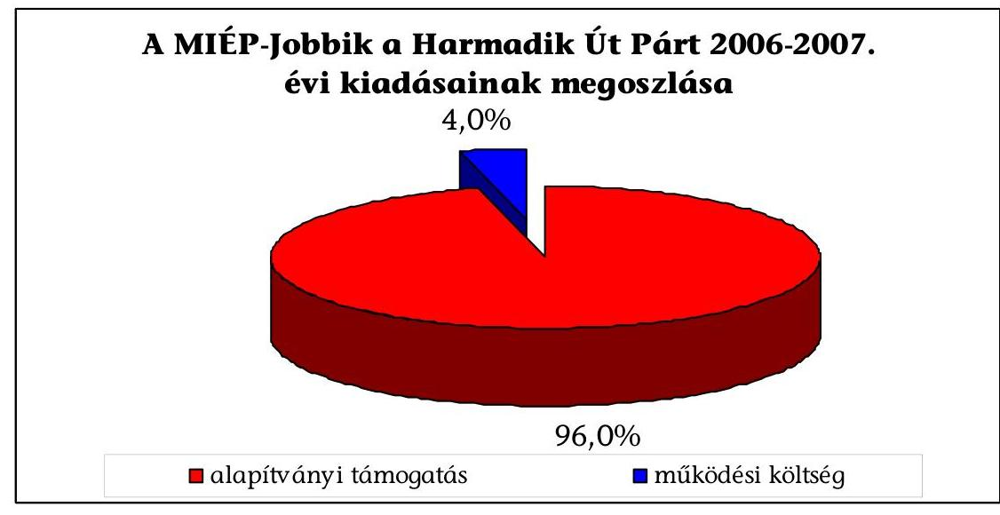

# ÁLLAMI   SZÁMVEVŐSZÉK 

## JELENTÉS

a MIÉP - Jobbik a Harmadik Út Párt 2006-2007. évi gazdálkodása törvényességének ellenőrzéséről

---

3. Önkormányzati és Területi Ellenőrzési Igazgatóság
3.1. Szabályszerüségi Ellenőrzési Föcsoport

Iktatószám: V-3018-036/2008.
Témaszám: 930
Vizsgálat-azonosító szám: V-430

# Az ellenőrzést felügyelte: 

Dr. Lóránt Zoltán
föigazgató
Az ellenőrzés végrehajtásáért felelős:
Dr. Elek János
általános föigazgató-helyettes
Az ellenőrzést vezette:
Horváth Balázs
főcsoportfőnök-helyettes
Az összefoglaló jelentést készítette:
Dr. Veress Tiborné
számvevő
Az ellenőrzést végezték:
Dr. Veress Tiborné Tóth István
Vincze B. Róbert
számvevő
tanácsadó
számvevő

---

# TARTALOMJEGYZÉK 

BEVEZETÉS ..... 5
I. ÖSSZEGZŐ MEGÁLLAPÍTÁSOK, KÖVETKEZTETÉSEK, JAVASLATOK ..... 7
II. RÉSZLETES MEGÁLLAPÍTÁSOK ..... 10

1. A Párt éves beszámolási kötelezettsége ..... 10
2. A Pártnak a beszámoló összeállítására és az azt alátámasztó
könyvvezetésre vonatkozó belső szabályozása, gyakorlata ..... 10
2.1. A számviteli szabályozás rendszere ..... 10
2.2. A könyvvezetés gyakorlata, szabályszerűsége ..... 11
2.3. A bizonylati elv és fegyelem érvényesülése ..... 12
3. A Párt bevételszerző, gazdálkodó tevékenysége ..... 13
4. A Párt belső ellenőrzési rendszere ..... 14

---

.

---

# RÖVIDÍTÉSEK JEGYZÉKE 

| Art. | Az adózás rendjéről szóló - többször módosított - 2003.   évi XCII. törvény |
| :-- | :-- |
| ÁSZ | Állami Számvevőszék |
| Párt | MIÉP - Jobbik a Harmadik Út Párt |
| párttörvény | A pártok múködéséről és gazdálkodásáról szóló - többször   módosított - 1989. évi XXXIII. törvény |
| számviteli törvény | A számvitelről szóló - többször módosított - 2000. évi C.   törvény |
| választási törvény | A választási eljárásról szóló - többször módosított - 1997.   évi C. törvény |

---

.

---

# JELENTÉS 

## a MIÉP - Jobbik a Harmadik Út Párt 2006-2007. évi gazdálkodása törvényességének ellenőrzéséről

## BEVEZETÉS

Az Állami Számvevőszékről szóló 1989. évi XXXVIII. törvény 5. §-a és 16. § (2) bekezdése, valamint a pártok múködéséről és gazdálkodásáról szóló - többször módosított - 1989. évi XXXIII. törvény (párttörvény) 10. § (1) bekezdése alapján a pártok gazdálkodása törvényességének ellenőrzésére az Állami Számvevőszék (ÁSZ) jogosult. Az ÁSZ a párttörvény 10. § (3) bekezdése szerint kétévenként ellenőrzi a rendszeres költségvetési támogatásban részesülő pártokat. E törvényi felhatalmazásokra figyelemmel az ÁSZ 2008. évi ellenőrzési tervének megfelelően vizsgálta a MIÉP - Jobbik a Harmadik Út Párt (Párt) 2006-2007. évi gazdálkodásának törvényességét.

A Párt 2005 végén alakult, a 2006. évi országgyűlési képviselőválasztáson elért eredménye alapján 2006-tól jogosult rendszeres költségvetési támogatásra, így az ÁSZ első alkalommal vizsgálta gazdálkodásának törvényességét.

Az ellenőrzés célja arra irányult, hogy:

- a Párt eleget tett-e a párttörvényben foglalt éves beszámolási kötelezettségének, megbízható adatközlésnek;
- a könyvvezetés, a gazdálkodás során betartották-e a számvitelről szóló többször módosított - 2000. évi C. tv. (számviteli törvény) és az egyéb jogszabályok rendelkezéseit, a belső előírásokat;
- a Párt a múködéséhez szabályszerűen igénybe vehető forrásokat használt-e fel, nem folytatott-e a párttörvény által tiltott gazdálkodó tevékenységet, nem fogadott-e el tiltott vagyoni hozzájárulást, illetőleg adományt.

Az ellenőrzés körülményeit illetően általánosságban rögzíteni szükséges ${ }^{1}$, hogy:

- a párttörvény 1. sz. melléklete szerinti beszámoló-mintához magyarázatot, útmutatót nem készítettek a jogalkotók, így ennek kitöltése pártonként - kialakított számviteli politikájuknak megfelelően - eltérő lehet;
- a beszámoló-minta a számviteli törvény rendelkezéseivel nem harmonizál, nem felel meg sem a mérleg, sem az eredmény-kimutatás követelményeinek.

[^0]
[^0]:    ${ }^{1}$ Az ÁSZ évek óta javasolja a Kormánynak a pártok ellenőrzéséről készített jelentéseiben a párttörvény módosítását.

---

A korábbi pártellenőrzések alapján tett jelzésekre is figyelemmel elengedhetetlenül szükséges a pártok működéséről és gazdálkodásáról szóló - többször módosított - 1989. évi XXXIII. törvény, valamint a számviteli törvény előírásainak összehangolása, amely a pártfinanszírozás átláthatóvá tételére benyújtott törvényjavaslatnak szerves része (száma: T/4190).

Az ÁSZ a párttörvény módosításáig a jelenleg hatályos rendelkezéseknek megfelelő - egységes módszertani alapokra helyezett - gyakorlattal folytatja a pártok gazdálkodása törvényességének ellenőrzését.

A vizsgálat előkészítésének keretében az ÁSZ 2008. december 10-i határidővel adatszolgáltatást kért a Párttól, amelyet azonban nem teljesített, vezetői szintű megbeszélést kezdeményezett a vizsgálat lefolytatása tárgyában. A 2009. január 19-én megtartott vezetői egyeztetésen a Párt képviselői január 28-ra vállalták, hogy az ellenőrzéshez szükséges a 2006-2007. évi gazdálkodási dokumentumokat rendelkezésre bocsátják, de nem tettek eleget az adatszolgáltatási kötelezettségnek. A helyszíni ellenőrzés 2009. február 9-i megkezdésekor a Párt pótolta az adatszolgáltatást, biztosítva ezzel a vizsgálat lefolytatását.

Az ellenőrzést az ÁSZ „Ellenőrzési Kézikönyve" szakmai szabályaira figyelemmel folytattuk le. Az ellenőrzési eljárások körében alkalmaztuk a helyszíni információszerzést, az összehasonlító adategyeztetéseket és elemző értékeléseket. Az ellenőrzési feladatok végrehajtását kockázatelemzéssel megalapozni nem lehetett, mivel a Párt az ellenőrzés előkészítése során megkért dokumentumokat nem biztosította. A kevés gazdasági tételszámra tekintettel a könyvviteli bizonylatokat teljes körűen vizsgáltuk. Az ellenőrzést a pénzügyi-szabályszerűségi ellenőrzés módszertani szabályai szerint, a pártellenőrzésre kiadott segédletben foglalt egységes követelmények alapján végeztük.

A számvevői jelentés előzetes minőségbiztosítási és jogi felülvizsgálatot követően felelősségi záradékkal került kiadásra. A Párt képviseletét ellátó két társelnök közül csak az egyik nyilatkozott, de a törvénysértő mulasztásokra elfogadható magyarázatot nem adott.

A helyszíni ellenőrzés: 2009. február 9-12 között, a könyvelési feladatokat ellátó szervezet Budapest, Teréz krt. 36. szám alatti irodájában történt.

---

# I. ÖSSZEGZŐ MEGÁLLAPÍTÁSOK, KÖVETKEZTETÉSEK, JAVASLATOK 

A Párt a 2006. és 2007. évi pénzügyi beszámolóit nem készítette el, így a párttörvényben előírt határidőben és formában a Magyar Közlönyben sem tette közzé. A hatályos párttörvényi előírások a mulasztásokat nem szankcionálják, amelyre figyelemmel az ÁSZ támogatja a pártfinanszírozás átláthatóvá tételét szolgáló törvénymódosító javaslatok elfogadását².

A Párt a számviteli szabályozási rendszerét 2006. január 26-i hatállyal alakította ki. A számviteli szabályozásban elmulasztották a hatályos jogszabályokkal való törvényi összhang megteremtését, valamint nem vették figyelembe a gazdálkodási sajátosságokat. A számviteli politika a párttörvény előírásait figyelmen kívül hagyva szabályozta a beszámoló összeállítását, nem rendelkezett a zárlati feladatokról és határidejéről, nem határozta meg az egyéb bevételek fogalomkörét, a múködési, a politikai és egyéb kiadások ismérveit. A pénzkezelési szabályzatot a számviteli törvény 2007. január 1-jétől hatályos előírásaira figyelemmel elmulasztották aktualizálni. A leltározási szabályzat a pénzeszközök leltározási feladatait nem rögzítette. Az értékelési szabályzatot csak az egyik társelnök írta alá, így az nem tekinthető hatályosnak. A számviteli politikában rögzített kettős könyvvitelhez a törvényi előírás ellenére számlarendet nem készítettek. A számviteli törvény értelmében a mulasztásokért a Párt képviseletére jogosult társelnökök viselnek felelősséget.

A kettős könyvviteli nyilvántartás vezetéséről, a könyvviteli zárlat végrehajtásáról, a számviteli törvény és a számviteli politika rendelkezése ellenére a Párt a vizsgált időszakban nem gondoskodott. A 2006-2007. évi időszak könyvvezetési feladatait - a 2009. január 1-jén kötött megbízási szerződéssel foglalkoztatott - regisztrált számviteli szolgáltatóval utólag végeztették el, azonban a Párt társelnökei feladatkörében a főkönyvi könyvelés valódiságát nem biztosították, mivel 2006. évben 46\%-ban, 2007. évben 97\%-ban a könyvelés alapjául szolgáló bizonylatok nem minősültek hitelesnek. A készpénzforgalomról szabálytalanul időszaki pénztárjelentést nem vezettek, bevételi és kiadási pénztárbizonylatot nem állítottak ki, rendszeres pénztárzárlatot nem végeztek. A banki forgalom kivonatainak 2006-ban háromnegyede, 2007-ben teljes köre hitelesítés nélküli fénymásolat volt. Mindezek következtében a pénzkészlet záró állományának valódisága nem volt igazolt.

A bizonylati elv és fegyelem érvényesüléséhez a Párt nem szabályozta bizonylati rendjét, a pénzkezelés szabályszerűségéhez nem jelölte ki a kötelezettségvállalásra és utalványozásra jogosultak körét. A szabályozási hiányosságból fakadóan nem érvényesült a számviteli törvényben meghatározott feldolgozási

[^0]
[^0]:    ${ }^{2}$ A T/4190 számú törvénymódosító javaslat az ÁSZ kezdeményezésére tartalmazza „a beszámolási és/vagy közzétételi kötelezettséget elmulasztó, határidőt követően féléven belül nem pótló pártok bíróság általi megszüntetését, engedélyezve a társadalmi szervezetként való további múködést".

---

rend, nem tettek eleget a bizonylatolás alaki és tartalmi, valamint szigorú számadási kötelezettség követelményeinek. A Párt nem tartotta be a bizonylatok megőrzésére vonatkozó számviteli törvényi előírásokat sem, mivel nem tudta eredetiben bemutatni a bank- és készpénzforgalom könyvelési bizonylatait. A Párt alapszabálya értelmében a Párt törvényes működésének biztosítása a társelnökök feladata, így felelősek a számviteli törvény előírásainak megsértéséért.

A bevételszerző tevékenység alapszabályban foglalt szabályozása összhangban áll a párttörvényben engedélyezett bevételi jogcímekkel, gazdálkodó tevékenységekkel. A Pártnál a nyilvántartások és a bizonylatok hiányában nem volt megítélhető a párttörvényben meghatározott tilalmak betartása.

A Párt a 2006. és 2007. évi költségvetés végrehajtásáról szóló törvények alapján 22,1 millió Ft, illetve 37,9 millió Ft állami támogatást kapott. A Párt a 2006. évi országgyűlési képviselőválasztásokra 12,4 millió Ft jelöltarányos költségvetési támogatásban részesült, elszámolási kötelezettséggel, amelynek teljesítését nyilatkozatkérésre sem igazolták. Az alapszabály rendelkezése ellenére a közgyűlés nem állapított meg tagdíjfizetést, így ilyen jogcímen bevétele nem volt a Pártnak. Folyószámla kamatból és adományból jelentéktelen mértékű, évente 0,2\% bevétel származott. A Párt vizsgált időszaki, alábbiakban ábrázolt együttes kiadásainak jelentős részét alapítványi támogatásra fordította, amelyre a közgyűlés költségvetést nem határozott meg az alapszabályban foglaltak ellenére.

A rendelkezésre bocsátott bizonylatok szerint a működési költségekből a 2006. évi választási időszakban felmerült anyagköltség és igénybe vett szolgáltatás együttesen nem érte el az 1,2 millió Ft-ot, így nem teljesülhetett a jelöltarányos normatív költségvetési támogatás cél szerinti felhasználása (a tételes bankforgalom vizsgálatnál visszafizetési tranzakciót nem talált az ellenőrzés). A Párt gazdálkodásának, múködésének, valamint pénzügyi és számviteli tevékenységének belső ellenőrzési rendszerét hiányosan szabályozták. Az alapszabály a választott ellenőrző testület felállítását nem írta elő, a társelnökök feladatai közé rendelte a Párt törvényes múködésének biztosítását, a gazdasági tevékenységek felügyeletét. A vezetői ellenőrzést nem szervezték meg, a felelősségi szabályok gyakorlását dokumentumok nem igazolták. A Pártnál a szabálytalansá-

---

gok kiküszöbölésére alkalmas belső kontrollrendszer nem múködött, amiért az alapszabály szerint a társelnököket terheli a felelősség.

A helyszíni ellenőrzés megállapításának hasznosítása mellett az Állami Számvevőszék elnöke felhívja

# a Párt társelnökeit 

1. Tegyenek eleget a párttörvény 9. § (1) bekezdésében előírt éves beszámolási és közzétételi kötelezettségnek, megbízható és valós adatokkal pótolják a Párt 2006-2007. évi pénzügyi beszámolójának összeállítását, megjelentetését.
2. Módosítsák a kiadott számviteli szabályzatokat annak érdekében, hogy:
a) a számviteli politika a párttörvény 1. számú melléklete szerint határozza meg a beszámoló összeállításának rendjét és a főkönyvi számlák kapcsolatát;
b) a számviteli politika és a hozzá kapcsolódó pénzkezelési, leltározási szabályzatok tükrözzék a számviteli törvény 14. § (3) bekezdésében foglaltak szerint a gazdálkodási sajátosságokat;
c) a pénzkezelési szabályzat feleljen meg a számviteli törvény 14. § (8) bekezdésében foglalt hatályos előírásoknak.
3. Helyezzék hatályba az értékelési szabályzatot az alapszabály 18. §-ában foglaltakkal összhangban.
4. Rendelkezzenek a számviteli törvény 161. § (1) - (2) bekezdésében előírt tartalmú számlarendről, bizonylati rendről.
5. Érvényesítsék a beszámolók összeállítása és az azok alapjául szolgáló könyvvezetés során a számviteli törvény 15-16. §-ában szabályozott számviteli alapelveket.
6. Intézkedjenek, hogy a könyvvezetés az eszközökben és forrásokban bekövetkezett változásokat a valóságnak megfelelően, folyamatosan, zárt rendszerben mutassa, összhangban a számviteli törvény 159. § és 164. § (1) bekezdés előírásaival.
7. Szerezzenek érvényt a számviteli törvény 165-169. §-ban meghatározott bizonylati elv és fegyelem szabályai betartásának.
8. Gondoskodjanak az alapszabály 17. § (2) bekezdésre figyelemmel az éves költségvetés és a pénzügyi beszámoló közgyűlési jóváhagyásra való előterjesztéséről.
9. Szabályozzák a belső ellenőrzés rendjét, biztosítsák annak összehangolt működését.

## az önkormányzati minisztert

Szólítsa fel a Pártot a 2006. évi országgyűlési képviselőválasztásra folyósított jelöltarányos támogatás elszámolására, valamint a fel nem használt támogatás központi költségvetésbe való visszafizetésére.

---

# II. RÉSZLETES MEGÁLLAPÍTÁSOK 

## 1. A PÁRT ÉVES BESZÁMOLÁSI KÖTELEZETTSÉGE

A Párt a vizsgált évek gazdálkodási beszámolóit nem készítette el és a Magyar Közlönyben nem tette közzé. Ezzel a Párt megsértette a párttörvény 9. § (1) bekezdésének előírását, amely szerint: a pártok kötelesek minden év április 30 -áig az elöző évi gazdálkodásukról szóló beszámolót (zárszámadást) a Magyar Közlönyben, valamint saját honlappal rendelkező pártok a honlapjukon is - e törvény 1. számú mellékletében meghatározott minta szerint - közzétenni.

Az alapszabály 17. § (2) bekezdése az Elnökség feladatai között rögzíti az éves beszámoló közgyűlés elé terjesztését.

## 2. A PÁrTNAK A BESZÁmoló ÖSSZEÁLÍTÁSÁRA ÉS AZ AZT ALÁTÁMASZTÓ KÖNYVVEZETÉSRE VONATKOZÓ BELSŐ SZABÁLYOZÁSA, GYAKORLATA

### 2.1. A számviteli szabályozás rendszere

A Párt a számviteli törvény 14. § (3) -(5) bekezdés alapján 2006. január 26-ával kiadott számviteli szabályozása nem vette figyelembe a sajátos gazdálkodási adottságokat, körülményeket.

A párttörvény 1. számú mellékletében meghatározott éves beszámoló összeállításának rendjét a Párt hatályos számviteli politikája nem szabályozta, a párttörvénnyel összhangban álló beszámolási kötelezettséget nem írta elő. A beszámoló formájaként az egyszerúsített éves beszámolót határozták meg (a mérleg és eredmény-kimutatás típusaként az „A" változatot jelölték). Nem szabályozták az évközi és év végi zárlatok időpontjait, feladatait, az egyéb bevételek fogalomkörét, a múködési, a politikai tevékenység és az egyéb kiadások körét, ismérveit. Rögzítették: a kettős könyvvezetés, a költségelszámolás módját, valamint a főkönyvi és analitikus nyilvántartásokért a számviteli rendért felelőst jelölték meg, akinek megbízására nem került sor.

A pénzkezelési szabályzatot a Párt elmulasztotta a számviteli törvény 2007. január 1-jétől hatályos 14. § (8) bekezdésében előírtak szerint aktualizálni. A könyvviteli adatokkal igazoltan, a Párt kizárólag pénzeszközökkel rendelkezett a vizsgált időszakban, amelyre azonban az eszközök és források leltárkészítési és leltározási szabályzata feladatokat nem rögzített. Az eszközök és források értékelési szabályzatot nem szabályszerűen adták ki, mivel azt az egyik társelnök nem írta alá.

A számviteli törvény 14. § (10) bekezdése értelmében a Párt képviseletére jogosult társelnökök a felelősek a számviteli politika és kapcsolódó szabályzatai törvényi összhangjának megteremtéséért.

---

A számviteli törvény 161. § (1) - (2) bekezdésében előírt számlarendet a Párt nem készítette el, amelynek összeállításáért, folyamatos karbantartásáért a 161. § (4) bekezdése szerint a Párt képviseletére jogosult személyek a felelősek.

# 2.2. A könyvvezetés gyakorlata, szabályszerűsége 

A Párt számviteli politikájában rögzítette, hogy könyveit a kettős könyvvitel elvei és szabályai szerint vezeti. A Párt a számviteli politikában és a számviteli törvény 159. §-ában szabályozott könyvviteli nyilvántartás vezetéséről és a 164. § (1) bekezdésben előírt könyvviteli zárlatról a vizsgált időszakokban nem gondoskodott. A törvényben és a számviteli politikában rögzített előírások megsértéséért - a számviteli rendért felelős hiányában - a gazdálkodó képviseletére jogosult társelnökök a felelősek.

A számviteli törvény 159.§ értelmében a kettős könyvvitelt vezető gazdálkodó a kezelésében, a használatában, illetve a tulajdonában lévő eszközökről és azok forrásairól, továbbá a gazdasági műveletekről olyan könyvviteli nyilvántartást köteles vezetni, amely az eszközökben (aktivákban) és a forrásokban (passzívákban) bekövetkezett változásokat a valóságnak megfelelően, folyamatosan, zárt rendszerben, áttekinthetően mutatja.

A Párt a könyvelési tevékenység végrehajtására 2009. január 1-jével kötött megbízási szerződést külső vállalkozóval. A szerződés a 2006-2007. évi gazdasági események utólagos könyvelési feladatainak elvégzését nem tartalmazta, amelyet azonban a vállalkozó elvégzett. A könyvelés bizonylatai 2006. évben $46 \%$-ban, 2007. évben $97 \%$-ban fénymásolt, nem hitelesített példányok voltak, így nem érvényesülhetett a számviteli törvény 15. § (3) bekezdésben foglalt valódiság elve, amelynek értelmében „a könyvvitelben rögzített tételeknek a valóságban is megtalálhatóknak, bizonyíthatóknak, kívülállók által is megállapíthatóknak kell lenniük".

A Párt pénzforgalmát készpénzben és bankszámlán bonyolította, azonban a pénzkezelési szabályzatában kizárólag a házipénztári pénzforgalom nyilvántartás követelményeit határozta meg. A belső előírások ellenére 2006. és 2007. években pénztári bizonylatolás nem történt, bevételi és kiadási pénztárbizonylatokat nem használtak. A szabályzatban havi rendszerességgel elrendelt pénztárzárlatot nem végeztek, pénztárjelentést nem készítettek, nyilvántartások hiányában az előírt egyeztetésekre és éves zárlati feladatokra nem került sor. A pénzkezelési mulasztásokért - a számviteli rendért felelős hiányában - a Párt társelnökeit terheli a felelősség.

A banki forgalom utólagos könyvelésének bizonylatolása során sérült a számviteli törvény 165. § (2) bekezdésében foglalt bizonylat szabályszerűségére vonatkozó előírása, mivel 2006. évben a bankkivonatok 75\%-a, 2007. évben a 100\%-a hitelesítés nélküli másolat volt. A 2009. évi utólagos könyvelés során állították elő a készpénzforgalom bevételi és kiadási pénztárbizonylatait teljes körűen.

Az eredeti banki és pénztári bizonylatok hiányában a pénzkészlet záró állományok valódiságát nem igazolták a vizsgált időszakban.

---

# 2.3. A bizonylati elv és fegyelem érvényesülése 

A bizonylati elv és fegyelem érvényesüléséhez a Párt nem készített bizonylati rendet, ezzel megsértette a számviteli törvény 161. § (2) bekezdés d) pontját. Ennek következtében a bizonylatok feldolgozási rendjét a Párt szabályzataiban nem határozta meg. A vizsgált évek bizonylatainak feldolgozása 2009. januárfebruár hóban történt meg, így a számviteli törvény 165. § (3) bekezdésében a bizonylatok feldolgozási rendjére vonatkozó szabályok a gyakorlatban nem érvényesültek.

A számviteli törvény 165. § (3) bekezdése értelmében a bizonylatok feldolgozási rendjének kialakításakor figyelembe kell venni a következőket is:
a) a pénzeszközöket érintő gazdasági műveletek, események bizonylatainak adatait késedelem nélkül, készpénzforgalom esetén a pénzmozgással egyidejűleg, illetve bankszámla forgalomnál a hitelintézeti értesítés megérkezésekor, az egyéb pénzeszközöket érintő tételeket legkésőbb a tárgyhót követő hó 15 -éig a könyvekben rögzíteni kell;
b) az egyéb gazdasági múveletek, események bizonylatainak adatait a gazdasági műveletek, események megtörténte után, legalább negyedévenként, a számviteli politikában meghatározott időpontig (kivéve, ha más jogszabály eltérő rendelkezést nem tartalmaz), legkésőbb a tárgynegyedévet követő hó végéig kell a könyvekben rögzíteni.

A bizonylatok alaki és tartalmi kellékei teljes körűen nem feleltek meg a számviteli törvény 167. § (1) bekezdésében előírtaknak. Kötelezettségvállalót és utalványozót a Párt szabályzataiban nem jelöltek ki, és azt a gyakorlatban sem érvényesítették. A vizsgált években az összes bizonylatnál hiányzott az utalványozás és a könyvviteli nyilvántartásban történt rögzítés időpontja, valamint a pénztárbizonylatok egyikén sem történt meg az ellenőrzés igazolása és azokat a befizető, illetve a felvevő sem írta alá. A készpénz tényleges átvételét átadásátvételi bizonylattal támasztották alá.

A szigorú számadású nyomtatványokat a Párt nem tartotta nyilván, annak ellenére, hogy azt összhangban a számviteli törvénnyel a pénzkezelési szabályzatában meghatározta. A Párt megsértette a számviteli törvény 168. § szigorú számadási kötelezettségre vonatkozó előírásait, valamint a belső szabályzatában előírtakat sem érvényesítette.

A számviteli törvény 168. § (1) bekezdése szerint a készpénz kezeléséhez, más jogszabály előírása alapján meghatározott gazdasági eseményekhez kapcsolódó bizonylatokat (ideértve a számlát, az egyszerűsített adattartalmú számlát és a nyugtát is), továbbá minden olyan nyomtatványt, amelyért a nyomtatvány értékét meghaladó vagy a nyomtatványon szereplő névértéknek megfelelő ellenértéket kell fizetni, vagy amelynek az illetéktelen felhasználása visszaélésre adhat alkalmat, szigorú számadási kötelezettség alá kell vonni.
(2) A szigorú számadási kötelezettség a bizonylatot, a nyomtatványt kibocsátót terheli.
(3) A szigorú számadás alá vont bizonylatokról, nyomtatványokról a kezelésükkel megbízott vagy a kibocsátásukra jogosult személynek olyan nyilvántartást kell vezetni, amely biztosítja azok elszámoltatását.

---

A bizonylatok megőrzésére vonatkozó követelményeket a Párt számviteli politikájának 2.5. pontjában rögzítette, miszerint „a számviteli bizonylatok, beszámolók és nyilvántartások - a vonatkozó előirásoknak megfelelő - megőrzése a vezetés feladata". A Párt az ellenőrzés részére nem tudta bemutatni a bank és készpénzforgalom könyvelés eredeti bizonylatait, ezzel megsértette a számviteli törvény 169. § (1)-(2) bekezdésében előírt megőrzési szabályokat.

A számviteli törvény 169. § (1) bekezdése szerint a gazdálkodó az üzleti évről készített beszámolót, valamint az azt alátámasztó leltárt, értékelést, főkönyvi kivonatot, továbbá a naplófőkönyvet vagy más, a törvény követelményeinek megfelelő nyilvántartást olvasható formában legalább 10 évig köteles megőrizni.
(2) A könyvviteli elszámolást közvetlenül és közvetetten alátámasztó számviteli bizonylatot (ideértve a főkönyvi számlákat, az analitikus, illetve részletező nyilvántartásokat is), legalább 8 évig kell olvasható formában, a könyvelési feljegyzések hivatkozása alapján visszakereshető módon megőrizni.

A Párt társelnökei gazdálkodási felelősségi körükben felelősek a számviteli törvény hivatkozott előírásainak betartásáért.

# 3. A PÁRT BEVÉTELSZERZŐ, GAZDÁLKODÓ TEVÉKENYSÉGE 

A Párt a gazdálkodását alapszabálya V. fejezet 20. §-ában szabályozta, melyben jogcím szerint meghatározta az állami támogatáson felüli saját forrásait. A szabályozás összhangban állt a párttörvény 4. § (1) bekezdésében engedélyezett bevételekkel, valamint a 6. § (1), (3) és (4) bekezdéseiben foglalt gazdálkodó tevékenységekkel.

A Párt 2006. és 2007. évi bevételei közül a Magyar Köztársaság 2006. évi költségvetésének végrehajtásáról szóló 2007. évi CXXVIII. törvény alapján 22,1 millió Ft, és a Magyar Köztársaság 2007. évi költségvetésének végrehajtásáról szóló 2008. évi LXXVIII. törvény szerint 37,9 millió Ft költségvetési támogatásban részesült.

A választási törvény 91. § (1) bekezdésében foglaltak alapján a Párt 2006. évben 12,4 millió Ft központi költségvetési támogatást kapott - kizárólag dologi költségek fedezetére - elszámolási kötelezettséggel. A Párt a 2006. évi általános országgyűlési képviselőválasztást követően a választási törvény 91. § (4) bekezdésében és 92. § (2) bekezdésében előírt elszámolási és közzétételi kötelezettségét nem dokumentálta - a bankkivonatok tanúsága szerint - a fel nem használt támogatás visszafizetés a költségvetésbe nem volt.

Az elszámolás bizonyítására kért nyilatkozatra a Párt társelnökeitől válasz nem érkezett.

Az alapszabály II. fejezet 8. § (3) bekezdése a közgyűlés által megállapított tagdíjfizetést ír elő, amelyről testületi döntés nem volt, így tagdíj befizetés nem teljesült. Az alapszabályban meghatározott saját bevételi jogcímek közül a Pártnak a 2006. évben 24 ezer Ft kamatból és 16 ezer Ft adományból, míg 2007. évben mindössze 75 ezer Ft kamatból származott forrása.

---

A Párt közgyűlése az alapszabály III. fejezet 16. § (2) bekezdésben foglaltak ellenére a vizsgált években költségvetést nem határozott meg, a 2006. és 2007. évi kiadásokra döntést nem hozott. A Párt működéséhez kapcsolódóan gazdálkodó tevékenysége során 2006. évben kiadásai $87,3 \%$-át alapítványi támogatásra, $12,7 \%$-át nyomtatvány, posta, hirdetés és bankköltségekre, 2007. évben $99,4 \%$-át alapítványi támogatásra és $0,6 \%$-át bankköltségre fordította.

A Párt nyilvántartásba vett kiadásai között 2006-2007. időszakában adó- és járulékkötelesnek minősülő kifizetést, természetbeni juttatást nem teljesített. Adóalanyként az Art. 31. § (5) bekezdése szerinti nullás bevallást nem nyújtott be, amely önellenőrzéssel pótolható.

A Párt bevételeinek és kiadásainak alakulását a főkönyvi könyvelés adatai részletezésében az alábbi összeállítás szemlélteti:

| Megnevezés | 2006. évi |  | 2007. évi |  |
| :-- | :--: | :--: | :--: | :--: |
|  | Összege   ezer Ft-ban | Megoszlása   \%-ban | Összege   ezer Ft-ban | Megoszlása   \%-ban |
| I. BEVÉTELEK |  |  |  |  |
| Állami támogatás | 22132 | 64,0 | 37900 | 99,8 |
| Választási támogatás | 12385 | 35,8 | - | - |
| Adomány magánszemélytől | 16 | 0,1 | - | - |
| Kamat | 24 | 0,1 | 75 | 0,2 |
| Bevétel összesen: | 34557 | 100,0 | 37975 | 100,0 |
| II. KIADÁSOK |  |  |  |  |
| Anyagköltség | 27 | 0,3 | - | - |
| Igénybevett szolgáltatások | 1166 | 11,8 | - | - |
| Bankköltség | 58 | 0,6 | 156 | 0,6 |
| Alapítványi támogatás | 8575 | 87,3 | 25250 | 99,4 |
| Kiadások összesen | 9826 | 100,0 | 25406 | 100,0 |

# 4. A PÁRT BELSŐ ELLENŐRZÉSI RENDSZERE 

A Párt gazdálkodásának, múködésének, valamint pénzügyi és számviteli tevékenységének belső ellenőrzési rendszerét hiányosan szabályozták. Az alapszabály választott ellenőrző testület felállítását nem írta elő.

---

Az alapszabály III. fejezet 17. § (5) bekezdése szerint a társelnökök feladatai többek között a párt törvényes múködésének biztosítása, gazdasági tevékenységének felügyelete, amelynek keretében a vezetői és a munkafolyamatba épített ellenőrzés kialakításáról nem gondoskodtak.

A pénzkezelési szabályzat 1.2. pontja értelmében a pénzkezelésre „a mindenkori egyszemélyi felelős vezető, valamint az általa meghatalmazott személy vagy személyek jogosultak". A szabályzatban nem vették figyelembe a Párt múködésének sajátosságait, ugyanis a vezetői feladatokat a két társelnök látja el. A pénztárellenőri feladatokat a pénzkezelési szabályzat 3.2. pontja rögzíti, oly módon, hogy „a pénzkezelés, a pénzkészletek állományának ellenőrzése a számviteli rendért felelős személy feladata". A számviteli rendért felelős és a pénztáros kijelölését nem dokumentálták, az anyagi felelősségvállalási nyilatkozatokat nem mutatták be.

A Pártnál a szabálytalanságok kiküszöbölésére alkalmas belsőkontroll rendszer nem múködött, amiért az alapszabály szerint a társelnököket terheli a felelősség.

Budapest, 2009. május „23",