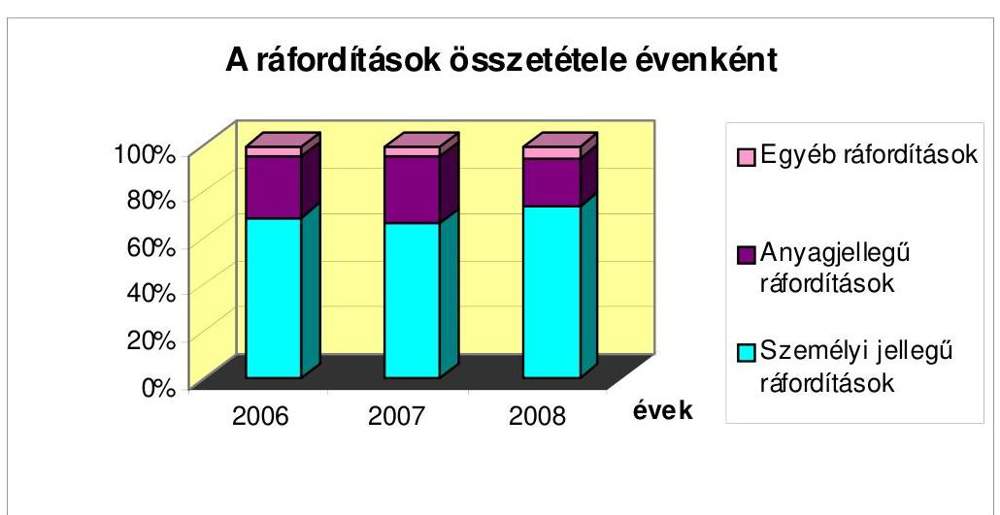
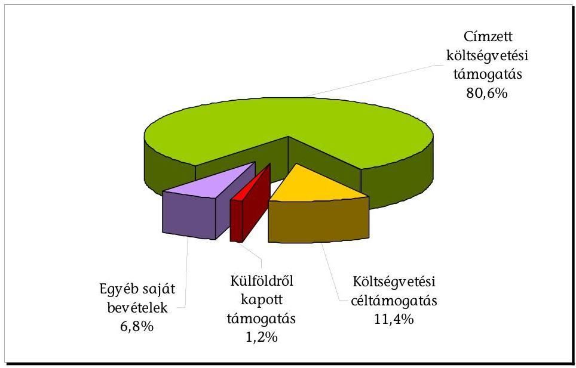
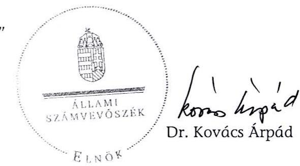
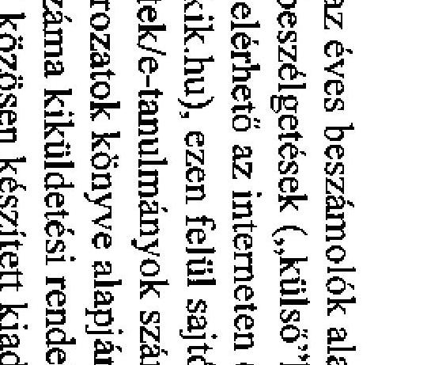

# ÁLLAMI   SZÁMVEVŐSZÉK 

## JELENTÉS

az Európai Összehasonlító Kisebbségkutatások Közalapítvány gazdálkodásának ellenőrzéséről

---

3. Önkormányzati és Területi Ellenőrzési Igazgatóság
3.1. Szabályszerüségi Ellenőrzési Föcsoport
Iktatószám: V-3003-29/2009.
Témaszám: 935
Vizsgálat-azonosító szám: V-0460
Az ellenőrzést felügyelte:
Dr. Lóránt Zoltán
föigazgató
Az ellenőrzés végrehajtásáért felelős:
Dr. Elek János
általános föigazgató-helyettes
Az ellenőrzést vezette:
Solymár Ágnes
osztályvezető főtanácsos
Az összefoglaló jelentést készítette:
Robák Ferencné
számvevő tanácsos
Az ellenőrzést végezték:
Robák Ferencné Sas Imréné
számvevő tanácsos
számvevő tanácsadó

---

# TARTALOMJEGYZÉK 

BEVEZETÉS ..... 7
I. ÖSSZEGZŐ MEGÁLLAPÍTÁSOK, KÖVETKEZTETÉSEK, JAVASLATOK ..... 9
II. RÉSZLETES MEGÁLLAPÍTÁSOK ..... 15

1. A működés szabályozottsága és szabályossága ..... 15
1.1. Az alapító okirat ..... 15
1.2. A szervezeti és működési szabályzat ..... 16
1.3. A kuratórium működése ..... 17
2. A gazdálkodás, a könyvvezetés szabályozottsága és szabályossága ..... 18
2.1. A gazdálkodás tervezése, szabályozása ..... 18
2.2. A számviteli szabályzatok ..... 19
2.3. A könyvvezetés rendszere ..... 20
3. A beszámolási kötelezettség teljesítése ..... 22
4. A közalapítvány bevételei és ráfordításai ..... 25
4.1. A közalapítvány bevételeinek alakulása ..... 25
4.2. A közalapítványnak juttatott támogatások ..... 25
4.2.1. A központi költségvetési címzett támogatások ..... 26
4.2.2. A központi költségvetésből kapott céltámogatások ..... 26
4.2.3. Külföldről kapott támogatás ..... 27
4.3. A ráfordítások alakulása ..... 28
4.4. A kuratóriumi tagok tiszteletdíja és költségtérítése ..... 30
5. A közalapítvány célszerinti tevékenysége ..... 30
6. A közalapítvány ellenőrzési rendszere ..... 32

## MELLÉKLETEK

1. számú A közalapítvány bevételei és ráfordításai a 2006-2008. években
2. számú A kutatói létszám a 2006-2008. években
3. számú Az alapítványi célok megvalósulása érdekében végzett tevékenységek

---

.

---

# RÖVIDÍTÉSEK JEGYZÉKE 

| Alapító | Magyar Köztársaság Kormánya |
| :--: | :--: |
| Alkotmány | a Magyar Köztársaság Alkotmányáról szóló, többször   módosított 1949. évi XX. törvény |
| ÁSZ | Állami Számvevőszék |
| ÁSZ törvény | az Állami Számvevőszékről szóló 1989. évi XXXVIII. tör-   vény |
| CEUCOM | Közép-európai Közösségi Virtuális Üzleti Klub |
| ET | Európa Tanács |
| FB | felügyelő bizottság |
| Közalapítvány | Európai Összehasonlító Kisebbségkutatások Közalapít-   vány |
| KSH | Központi Statisztikai Hivatal |
| MeH | Miniszterelnöki Hivatal |
| MTI | Magyar Távirati Iroda |
| KüM | Külügyminisztérium |
| Khtv. | a közhasznú szervezetekről szóló 1997. évi CLVI. törvény |
| NKA | Nemzeti Kulturális Alapprogram |
| OKM | Oktatási és Kulturális Minisztérium |
| Ptk. | a Polgári Törvénykönyvről szóló 1959. évi IV. törvény |
| számviteli rendelet | A számviteli törvény szerinti egyes egyéb szervezetek be-   számoló-készítési és könyvvezetési kötelezettségének sajá-   tosságairól szóló 224/2000. (XII. 19.) Korm. rendelet |
| Szja törvény | a személyi jövedelemadóról szóló 1995. évi CXVII. törvény |
| SZMM | Szociális és Munkaügyi Minisztérium |
| SZMSZ | szervezeti és múködési szabályzat |
| Szt. | a számvitelről szóló 2000. évi C. törvény |

---

.

---

# ÉRTELMEZŐ SZÓTÁR 

| Alapítvány bevételei | A vállalkozási tevékenység bevétele, az alapítványi célú tevékenység bevételei (minden olyan bevétel, amely nem a vállalkozási tevékenységhez kapcsolódó befizetés, ideértve a céltámogatást is) [115/1992. (VII. 23.) Korm. rendelet 3. § (1) bekezdésének a)-b) pontja]. |
| :--: | :--: |
| Alapítvány költségei (kiadásai) | A vállalkozási tevékenység közvetlen költségei, az alapítványi célú tevékenység közvetlen költségei, az alapítvány kezelő szervének költségei (kiadásai) és az egyéb közvetett költségek (kiadások) [115/1992. (VII. 23.) Korm. rendelet 3. § (2) bekezdésének a); (b); c) pontja]. |
| Célszerinti tevékenység | Minden olyan tevékenység, amely az alapító okiratban megjelölt célkitúzés elérését közvetlenül szolgálja [Khtv. 26. § b) pontja]. |
| Induló vagyon | A közalapítvány javára a célja megvalósításához az alapító okiratban meghatározott vagyon [Ptk. 74/A. § (1) bekezdése, 74/B. § (1) bekezdés c) pontja]. A közalapítvány rendelkezésére legalább olyan mértékű vagyont kell bocsátani, amely a múködése megkezdéséhez feltétlenül szükséges [Ptk. 74/B. § (4) bekezdése]. A közalapítványi vagyon pontos megjelölése nélkül a közalapítvány nem jöhet létre [BH2001. 303]. |
| Kiemelkedően közhasznú közalapítvány | A kiemelkedően közhasznú közalapítványnak a közhasznú közalapítványokra előírt követelmények teljesítésén túl közhasznú tevékenysége során olyan közfeladatot kell ellátnia, amelyről törvény vagy törvény felhatalmazása alapján más jogszabály rendelkezése szerint, valamely állami szervnek vagy a helyi önkormányzatnak kell gondoskodnia, az alapító okirata szerinti tevékenységének és gazdálkodásának legfontosabb adatait a helyi vagy országos sajtó útján is nyilvánosságra hozza, továbbá a közhasznú tevékenységet maga látja el [Khtv. 5. § és a BH2001. 451]. |
| Közalapítvány | A közalapítvány olyan alapítvány, amelyet az Országgyűlés, a Kormány, valamint a helyi önkormányzat vagy kisebbségi önkormányzat képviselő-testülete közfeladat ellátásának folyamatos biztosítása céljából hoz létre [Ptk. 2006. VIII. 23-ig hatályos 74/G. § (1) bekezdése]. |
| Közfeladat | Az állami vagy helyi önkormányzati, kisebbségi önkormányzati feladat, amelynek ellátásáról - jogszabály alapján - az államnak vagy az önkormányzatnak kell gondoskodnia [Ptk. 2006. VIII. 23-ig hatályos 74/G. § (2) bekezdése]. |
| Közhasznú egyszerűsített éves beszámoló | A közhasznú nyilvántartásba vett közalapítványoknál mérlegből, közhasznú eredmény-kimutatásból és tájékoztató adatokból áll [224/2000. (XII. 19.) Korm. rendelet 6. § (8) bekezdése, illetve 4 . és 6 . számú melléklete]. |
| Közhasznú tevékenység | A társadalom és az egyén közös érdekeinek kielégítésére |

---

Közhasznúsági jelentés

Nemzeti és etnikai kisebbség (kisebbség)

Regionális vagy Kisebb-
ségi Nyelvek Európai
Kartája

Támogatás
Törzsvagyon

Vezető tisztségviselő a
közalapítványoknál
irányuló, a közhasznú közalapítvány alapító okiratában szereplő célszerinti tevékenység a törvényben meghatározott körben [Khtv. 26. § c) pontja].
Tartalmazza a számviteli beszámolót; a költségvetési támogatás felhasználását; a vagyon felhasználásával kapcsolatos kimutatást; a célszerinti juttatások kimutatását; a központi költségvetési szervtől, az elkülönített állami pénzalaptól, a helyi önkormányzattól, a települési önkormányzatok társulásától és mindezek szerveitől kapott támogatás mértékét; a közhasznú szervezet vezető tisztségviselőinek nyújtott juttatások értékét, illetve összegét; a közhasznú tevékenységről szóló rövid tartalmi beszámolót [Khtv. 19. § (3) bekezdése].
Minden olyan, a Magyar Köztársaság területén legalább egy évszázada honos népcsoport, amely az állam lakossága körében számszerú kisebbségben van, tagjai magyar állampolgárok és a lakosság többi részétől saját nyelve és kultúrája, hagyományai különböztetik meg, egyben olyan összetartozás-tudatról tesz bizonyságot, amely mindezek megőrzésére, történelmileg kialakult közösségeik érdekeinek kifejezésére és védelmére irányul. [A nemzeti és etnikai kisebbségek jogairól szóló 1993. évi LXXVII. törvény 1. § (2) bekezdés]
A Strasbourgban, 1992. november 5-én létrehozott Regionális vagy Kisebbségi Nyelvek Európai Kartájának kihirdetéséről szóló 1999. évi XL. törvényben került Magyarországon elfogadásra.
Pénzbeli és nem pénzbeli juttatás [Khtv. 26. § j) pontja].
Az alapítói vagyon dologi-eszköz elemeit törzsvagyonként indokolt elkülöníteni, ami elidegenítési és terhelési tilalmat jelent. A törzsvagyonná nyilvánítás az alapító kizárólagos jogköre, erre az alapító okiratban a kuratórium részére nem adható felhatalmazás [1052/1997. (V. 21.) Korm. határozat 5. a) pontja].
A közalapítvány kuratóriumának és felügyelő bizottságának elnöke és tagja, a közalapítvánnyal munkaviszonyban vagy munkavégzésre irányuló egyéb jogviszonyban álló, az alapító okirat szerint egyszemélyi felelős vezető feladatot ellátó személy [Khtv. 26. § m) pontja].

---

# JELENTÉS 

## az Európai Összehasonlító Kisebbségkutatások Közalapítvány gazdálkodásának ellenőrzéséről

## BEVEZETÉS

A Magyar Köztársaság Kormánya az Európai Összehasonlító Kisebbségkutatások Közalapítványt az 1125/2002. (VII. 17.) Korm. határozatával hozta létre a Magyar Köztársaság Alkotmányáról szóló, többször módosított 1949. évi XX. törvény (Alkotmány) 6-8. §-aiban foglalt közfeladat ellátásában való közremúködés, valamint a Magyar Köztársaság nemzetközi jogi kötelezettségvállalási teljesítésének segítése érdekében. A Fővárosi Bíróság 11. Pk. 60839/2002/2. számú végzésével nyilvántartásba vette, egyben kiemelkedő közhasznú szervezetté minősítette. Az alapító okirat szerint a közalapítvány a közhasznú szervezetekről szóló 1997. évi CLVI. törvényben (Khtv.) rögzített tudományos tevékenység, kutatás, a magyarországi nemzeti és etnikai kisebbségekkel, a határon túli magyarsággal kapcsolatos, az euroatlanti integráció elősegítése elnevezésű valamint a nevelés és oktatás, képességfejlesztés, ismeretterjesztés közhasznú tevékenységeket végzi.

A közalapítvány célja a Magyar Köztársaság kisebbségpolitikájának tudományos megalapozása, a magyar kisebbségpolitika szakmai képviselete, a kisebbségek helyzetének, az emberi és állampolgári jogok érvényesülésének elemző és összehasonlító vizsgálata, a roma kisebbségre vonatkozó jogok és kisebbségi gyakorlat összehasonlító elemzése, az Európa Tanáccsal (ET), valamint más kisebbségvédelmi intézményekkel történő kapcsolattartás, azok joggyakorlatának feldolgozása.

A közalapítvány a célok elérése érdekében kutatási projekteket, programokat kezdeményez és dolgoz ki, tudományos rendezvényeket, konferenciákat szervez, kutatásokat koordinál és szervez, kiadványokat jelentet meg, támogatja a magyar kutatók külföldi képzését, kutatási területén bekapcsolódik a hazai felsőoktatásba, szakértői hálózatot szervez és múködtet.

A közalapítvány induló vagyona 60 millió Ft volt, ebből az alapító 20 millió Ft törzsvagyont állapított meg. A közalapítvány feladatai ellátásához az induló vagyonon felül a 2006-2008. években 192482 ezer Ft címzett központi költségvetési támogatásban, valamint 27183 ezer Ft központi költségvetésből fejezeti céltámogatásban részesült.

A közalapítvány múködésének és gazdálkodásának ellenőrzésére az alapító háromtagú felügyelő bizottságot (FB) hozott létre, az éves beszámolók valódiságát és megbízhatóságát független könyvvizsgáló ellenőrizte.

---

Az Állami Számvevőszék (ÁSZ) az államháztartásról szóló 1992. évi XXXVIII. törvény és egyes kapcsolódó törvények módosításáról szóló 2006. évi LXV. törvény 1. § (2) bekezdés e) pontja alapján ellenőrzi a közalapítványok gazdálkodásának törvényességét és célszerűségét. Az Állami Számvevőszékről szóló 1989. évi XXXVIII. törvény (ÁSZ tv.) 2. § (5) bekezdése alapján ellenőrzi a közalapítványoknál az állami költségvetésből nyújtott támogatás vagy az állam által meghatározott célra ingyenesen juttatott vagyon felhasználását.

Az ÁSZ a közalapítvány gazdálkodásának szabályszerűségi ellenőrzését helyszíni ellenőrzés keretében első alkalommal végezte, az ellenőrzés a 2006-2008. évekre terjedt ki.

Az ellenőrzés célja volt annak értékelése, hogy a közalapítvány a vagyonát, illetve a központi költségvetésből kapott támogatást szabályosan, és az alapító okiratában meghatározott céljai megvalósítása érdekében használta-e fel. Ennek keretében ellenőriztük, hogy

- a közalapítvány alapító okirata és belső szabályzatai megteremtették-e az induló vagyon törzsvagyon felüli része és hozadéka, valamint a központi költségvetési támogatás felhasználásának törvényes kereteit;
- a kuratórium biztosította-e a közalapítvány könyvvezetésének, éves beszámolóinak és gazdálkodásának törvényességét;
- a kuratórium a kapott induló vagyon törzsvagyon feletti részét és hozadékát, az állami és egyéb támogatásokat, valamint a közalapítvány saját bevételeit szabályosan, rendeltetésszerűen használta-e fel az alapító okiratban meghatározott céljainak megvalósítása érdekében.

Az ellenőrzés során a közalapítvány múködésének és gazdálkodásának szabályozottságát a vonatkozó jogszabályok, az alapító okirat, a szervezeti és múködési szabályzat (SZMSZ) előírásaival történt összehasonlítással értékeltük. A múködés szabályosságát a kuratóriumi jegyzőkönyvek és a határozatok jegyzékének teljes körű ellenőrzésével elemeztük. Az éves beszámolók szabályosságát a beszámolókban kimutatott tételek, valamint a főkönyvi kivonatok és leltárak adatainak összevetésével értékeltük. A házipénztár vezetésének szabályosságát minta alapján, az ellenőrzött évekre egy-egy negyedév forgalmán keresztül ellenőriztük. A közalapítvány bevételeit, a támogatási szerződéseket teljes körűen ellenőriztük. A ráfordításokat tanúsítvány alapján elemeztük, a kuratóriumi tagok tiszteletdíját az alapító okirat, és a vonatkozó kuratóriumi határozatok egybevetésével, tételesen ellenőriztük. A célszerinti tevékenységet tanúsítványok alapján elemeztük. Az elkészült számítógépes felületeket teszteltük, az elkészült kiadványok meglétét a helyszínen ellenőriztük.

---

# I. ÖSSZEGZŐ MEGÁLLAPÍTÁSOK, KÖVETKEZTETÉSEK, JAVASLATOK 

A kuratórium az állami és egyéb támogatásokat, valamint a közalapítvány saját bevételeit szabályosan, rendeltetésszerűen használta fel az alapító okiratban meghatározott céljainak megvalósítása érdekében. A közalapítvány bevételeinek ( 238913 ezer Ft) $92 \%$-a származott a központi költségvetésből, melyet egyrészt az éves költségvetési törvényekben címzetten, másrészt a költségvetés fejezeteitől, egyedi elbírálás alapján kapott. A közalapítvány a vonatkozó jogszabályi rendelkezésnek megfelelően, írásbeli szerződések alapján kapta a költségvetési támogatásokat, amelyek az alapító okiratbeli célok elérését szolgálták. A szerződések, egy kivétellel megfeleltek a vonatkozó törvényi előírásnak. A 2008. évi címzett költségvetési támogatásról készült szerződés nem írt elő elszámolási kötelezettséget, nem szabályozta az elszámolás módját, nem rendelkezett annak határidejéről. A közalapítvány a szerződésekben meghatározottaknak megfelelően eleget tett elszámolási kötelezettségeinek. (A 2008. évi költségvetési támogatás elszámolási kötelezettsége nem volt esedékes.) A támogatásokat célszerinti tevékenységeire, a támogatási szerződések előírásainak megfelelően használta fel. Külföldi támogatásban is részesült, az ET támogatta a Kisebbségi Nyelvek Európai Kartájának internetes megjelentetését, konferencia megszervezését a karta alkalmazásáról. A közalapítványnak könyvértékesítésből és szabad pénzeszközeinek hasznosításából származott bevétele.

Az ellenőrzött években a közalapítvány összesen 233973 ezer Ft ráfordítást számolt el, melynek mintegy 80-85\%-át a célszerinti közvetlen, 20-15\%-át a közvetett (működési) költségek alkották. A múködési költségek mértéke indokolt volt, mivel azok 50\%-át az alapító okirat által engedélyezett tiszteletdíjak és járulékai tették ki, továbbá a törvényes múködés és gazdálkodás feltételeit biztosító (pl.: könyvvezetés és könyvvizsgálat díja, jogi képviselet) költségek voltak.

---

A ráfordítások összetétele tükrözte a közalapítványi célok elérése érdekében végzett kutatási tevékenységet. A személyi jellegű ráfordítások részesedése az összes ráfordításból 75\%-ot tett ki, az alkalmazottak 90\%-a tudományos kutató volt. Az alapító okirat alapján a kurátorok tiszteletdíjban részesülhettek. A kuratórium az FB tagok részére is tiszteletdíjat állapított meg, holott ez az alapító jogosítványa lett volna. Az FB tagok az ellenőrzött időszakban nem vettek fel tiszteletdíjat.

A közalapítvány célszerinti tevékenységét saját szervezetén belül, munka-, megbízási, vállalkozási vagy ösztöndíj-szerződéssel alkalmazott kutatóival végezte. Rendszeresen alkalmazott határon túl élő kutatókat. A közalapítvány célszerinti tevékenysége - két kivétellel - lefedte az alapító okiratban előírt tevékenységeket (közvélemény-kutatást nem szervezett, a kutatói kapacitás bővítésére pályázatot nem írt ki). A közalapítvány által végzett kutatások az alapító okiratban meghatározott célok elérését szolgálták. Az alapító okiratnak megfelelően tevékenységével elsősorban az Országgyúlés és a kormányzati szervek igényeit szolgálta. Kutatásai eredményeinek megismertetése érdekében műhelytanulmányokat, köteteket adott ki, rendezvényeket, tudományos konferenciákat szervezett. Kiadványait interneten tette elérhetővé, tevékenységéről rendszeresen sajtótájékoztatót tartott. Kutatói részt vettek a hazai felsőoktatásban, posztgraduális képzésben, tanulmányi utakon. A határokon átnyúló régiók közösségei számára a közalapítvány kialakította a CEUCOM - Középeurópai Közösségi Virtuális Üzleti Klub - internetes portált. A közalapítvány, a más kisebbségvédelmi intézményekkel, szervezetekkel történő kapcsolattartás érdekében, külföldi támogatás bevonásával elkészítette az ET Regionális vagy Kisebbségi Nyelvek Európai Kartájának internetes felületét.

A közalapítvány múködésének törvényes kereteit az alapító okirat megteremtette, az abban foglaltak megfeleltek a jogszabályi előírásoknak. A Miniszterelnöki Hivatalt vezető miniszter az alapító okirat módosításait a törvényi előírástól eltérően - egy eset kivételével - nem hozta nyilvánosságra. Az alapító okirat és annak módosításai a vonatkozó törvényi előírásoknak megfelelően tartalmazták a közalapítvány nevét, céljait, székhelyét, a célra rendelt vagyonát, megjelölték a kezelő és ellenőrző szervét, a kezelő szerv működésére vonatkozó szabályokat, nem határozták meg azonban a vagyon felhasználásának módját. A közalapítvány képviseletének, bank- és értékpapírszámla feletti rendelkezésének alapító okiratbeli szabályozása megfelelt a törvényi előírásoknak, a gyakorlat - az SZMSZ hiányossága ellenére - megfelelt a szabályozásnak. Az SZMSZ az alapító okirattal összhangban szabályozta a kuratórium feladat- és hatáskörét, a kuratóriumi tagok jogkörét és feladatait, valamint a bankszámla feletti rendelkezési jogot. Ugyanakkor a képviseleti jog szabályozása tekintetében nem volt összhangban az alapító okirattal, mivel nem követte a módosításokat.

A kuratóriumi ülések száma minden évben megfelelt, a kuratóriumi határozatok közel fele viszont nem felelt meg az alapító okirat előírásának, mivel azokat a kurátorok nem az alapító okiratban előírt határozatképes üléseken hozták meg. Az ülésekről készült jegyzőkönyvek és jelenléti ívek az ülések 40\%a esetében nem azonos számú jelenlévőt rögzítettek. A kétharmados minősített többséghez kötött határozatok elfogadásának 60\%-a nem felelt meg az alapító okirat rendelkezésének, mivel az előírt létszám nem volt jelen. A kuratórium

---

tagjai, eltérően az alapító okirat rendelkezésétől, kuratóriumi ülés összehívása nélkül, írásos szavazással is hoztak határozatot, amelyek nem tekinthetők érvényesnek.

A közalapítvány a múködése során törzsvagyonát - az alapító okirat előírásának megfelelően - megőrizte. A közalapítvány - az alapító okirat előírásától eltérően - nem készített gazdálkodási tervet, éves költségvetést, amelynek hiánya miatt a szabályos múködés minden pénzügyi döntéséhez a kuratóriumi ülés összehívására, a kuratórium határozatára lett volna szükség. A múködéshez szükséges rezsi (pl.: posta-, telefon-, internet-, irodaszer) költségekről a kuratórium, mint testület nem döntött, azok kifizetését az utalványozási jogkörrel rendelkező kuratóriumi elnök engedélyezte. A kuratórium minden év elején elfogadta a kutatási tervet, mely kutatók szerint határozta meg a kutatási feladatokat.

A közalapítvány elkészítette a számviteli törvényben előírt, a könyvvezetés és az éves beszámolók elkészítésének rendjét meghatározó számviteli politikát, és ahhoz kapcsolódó szabályzatokat. Elfogadásukról azonban a kuratórium mint a közalapítvány vagyonának kezelője határozatot nem hozott, ezért azokat szabályzat-tervezetnek tekintjük. A szabályzat-tervezetek alapján folytatott tevékenység tükrében biztosítottak voltak a központi költségvetési támogatás felhasználásának törvényes keretei, a pénzkezelési szabályzat kivételével megfeleltek a törvényi előírásoknak. A pénzkezelési szabályzatban a számviteli törvény előírásától eltérően nem rendelkeztek a banki átutalások rendjéről, a napi készpénz záró állományának maximális mértékéről, valamint a közalapítvány múködéséhez felvett előlegek elszámolási rendjéről. Az ellenőrzött időszakban elszámolásra felvett előlegekkel teljes körűen elszámoltak, az ellenőrzés jogosulatlan kifizetést nem állapított meg. A szabályzat-tervezetekben nem vették figyelembe teljes mértékben a közalapítvány múködésének és gazdálkodásának sajátosságait. A számviteli politikában nem határozták meg az alapítványi célú közvetlen, és a közvetett költségek körét, elkülönítésének módját, így a könyvvezetésben a szakmai tevékenységgel kapcsolatos kiadások nem váltak el a közalapítvány múködési költségeitől. A leltározási és selejtezési szabályzat nem rögzítette az éves beszámolókban kimutatott saját előállítású könyvek leltározásának előírásait. A számlarend, számlatükör, illetve a könyvvezetés között nem volt összhang az alkalmazásra kijelölt számlák tekintetében. A számviteli politikában a kis értékű eszközök értékmegjelölését nem módosították a számviteli törvény módosításával, illetve annak gyakorlati alkalmazásával összhangban. A szabályzat-tervezetek hiányosságai a könyvvezetés szabályosságát lényegesen nem befolyásolták. A törvényi előírástól eltérően a befektetési szabályzat elkészítéséről a kuratórium nem gondoskodott.

A könyvvezetést a törvényi előírásnak megfelelően, a kettős könyvvitel rendszerében végezték, a gazdasági események alapbizonylatainak idősorrendben történt, számítógépes feldolgozásával. A számviteli rendszer alkalmas volt a támogatások és azok terhére elszámolt ráfordítások jogcím szerinti, és a támogatók által előírtaknak megfelelő elszámolására. A számviteli rendszerből az ellenőrzéshez szükséges adatokat biztosították. A kuratórium által el nem fogadott belső szabályzatokban előírt egyedi nyilvántartásokat vezették, azoknak a főkönyvi adatokkal való egyeztetését elvégezték. A pénzforgalmi tételekhez a közalapítvány nevére kiállított alapbizonylatok, az egyéb tételekhez könyvelési

---

feladások kapcsolódtak. A számviteli politika előírásának megfelelően a könyvviteli zárlattal kapcsolatos feladatokat elvégezték. A készpénzes és banki átutalással teljesített kifizetések utalványozása - az utólagos elszámolásra kiadott előlegek kivételével - megtörtént. Az utólagos elszámolásra kiadott előlegekkel való elszámolás határidejét sem a pénzkezelési szabályzatban, sem a kiadási pénztárbizonylatokon nem határozták meg, továbbá a szabályozástól eltérően, az ellenőrzött három évben hat alkalommal fizettek ki a korábban felvett előleg elszámolása nélkül újabb előleget, az elszámolás az előlegek öszszevonásával, együttes értékben megtörtént.

A könyvvezetés megfelelő alapot teremtett az éves beszámolók alátámasztásához. A közalapítvány a törvényi előírásnak megfelelően elkészítette a közhasznú egyszerűsített éves beszámolókat és az éves közhasznúsági jelentéseket. A beszámolókat főkönyvi kivonattal és analitikus nyilvántartásokkal, a mérlegtételeket a törvény rendelkezésének megfelelő leltárral támasztották alá. Az éves beszámolók adatai az év végi főkönyvi kivonatok adataiból levezethetőek voltak, a kapcsolódó főkönyvi számlák adataival megegyeztek. Az éves mérlegekben az induló tőke összegét az alapító okirattól eltérően 60000 ezer Ft helyett - a törzsvagyonként meghatározott - 20000 ezer Ft összegben mutatták ki, ennek ellenére az éves beszámolókat a könyvvizsgáló hitelesítő záradékkal látta el. Az eltérés az induló tőke és tőkeváltozás mérlegsorokat érintette, a saját tőke összege és a mérleg-főösszeg a valós értéket mutatták. A kuratórium a 2006. és 2007. évekről készített egyszerűsített éves beszámolókat és közhasznú jelentéseket a vonatkozó jogszabályban előírt határidőt meghaladóan, és nem az alapító okirat szerinti kétharmados szótöbbséggel fogadta el. A közalapítvány a közhasznúsági jelentéseket a törvényi előírással összhangban saját honlapján közzétette, az éves beszámolóit, illetve gazdálkodásának legfontosabb adatait az alapító okirat és a számviteli politika rendelkezésétől eltérően, országos sajtóban nem jelentette meg. A kuratórium a törvényi és az alapító okirat rendelkezésének megfelelően, a közalapítvány múködéséről az éves beszámolók és közhasznúsági jelentések megküldésével beszámolt az alapítónak.

Az alapító a kuratórium működésének és gazdálkodásának ellenőrzésére háromfős FB-t nevezett ki, meghatározta múködésének szabályait. Az FB tagok az ellenőrzött években tanácskozási joggal részt vettek a kuratórium ülésein, szakmai kérdésekben elmondták véleményüket. Az FB az alapító okirat előírásától eltérően 2006-ban nem, csak 2007-ben készített éves jelentést a közalapítvány működéséről. Ebben a kuratórium szabályszerű működését állapította meg, és nem kifogásolta a kuratóriumi ülések határozatképességére, a határozatok érvényességére vonatkozó, az alapító okiratban rögzített rendelkezésektől eltérő gyakorlatot. A pénzügyi, számviteli, munkaügyi feladatok ellátásával megbízott szervezettel megkötött szerződésben meghatározták a szervezet felelősségét a gazdasági események szabályszerű nyilvántartására. Az éves beszámolókat könyvvizsgáló ellenőrizte. A belső ellenőrzési rendszer a folyamatba épített és a vezetői ellenőrzés útján megfelelően érvényesült. A célszerinti tevékenység figyelemmel kísérése, segítése és ellenőrzése a kuratórium elnöke által összehívott és vezetett rendszeres műhelyvitákon valósult meg.

---

A helyszíni ellenőrzés megállapításainak hasznosítása mellett javasoljuk:

# az alapítói jogokat gyakorló, Miniszterelnöki Hivatalt vezető miniszternek: 

1. Gondoskodjon minden esetben az egységes szerkezetbe foglalt alapító okirat megjelentetéséről a Magyar Közlönyben az alapító okirat módosítása esetén.
2. Határozza meg a közalapítvány alapító okiratában a vagyon felhasználásának módját.
3. Határozza meg minden esetben az elszámolás feltételeit és módját a közalapítványnak nyújtott támogatásokról készült szerződésekben a Khtv. 14. § (2) bekezdésének megfelelően.

## az Európai Összehasonlító Kisebbségkutatások Közalapítvány kuratóriumának

1. Tartsa be az alapító okirat előírásait a kuratóriumi ülések határozatképességére, a határozatok elfogadásának szabályszerűségére vonatkozóan.
2. Készítsen minden évben költségvetést az alapító okirat előírásának megfelelően.
3. Gondoskodjon a közhasznú szervezetekről szóló 1997. évi CLVI. törvény 17. § rendelkezésének megfelelően a befektetési szabályzat elkészítéséről.
4. Helyezze hatályon kívül az FB tagok tiszteletdíjáról szóló kuratóriumi határozatot.
5. Gondoskodjon az alapítvány belső szabályzatainak elfogadásáról az alábbi módosítások figyelembe vételével:
a) szabályozza a képviseleti jogot az SZMSZ-ben az alapító okirat változásainak megfelelően;
b) határozza meg a számviteli politikában - az alapítvány sajátosságaira figyelemmel - az alapítványi tevékenység közvetlen költségeibe, illetve a müködési költségekbe tartozó költségek körét és a költségek elkülönítésének módját;
c) korrigálja a számviteli politikában és ahhoz kapcsolódó szabályzatokban a használatbavételkor egy összegben értékcsökkenésként elszámolható immateriális javak és tárgyi eszközök értékhatárát a számvitelről szóló 2000. évi C. törvény 80. § (2) bekezdés rendelkezésének megfelelően;
d) egészítse ki a pénzkezelési szabályzatot a számvitelről szóló 2000. évi C. törvény 14. § (8) bekezdésének megfelelően a banki átutalások rendjével, a napi készpénz záró állomány maximális mértékének meghatározásával, továbbá a közalapítvány müködéséhez felvett ellátmányra vonatkozó pénzkezelési, elszámolási és felelősségi szabályokkal;

---

e) határozza meg a leltározási és selejtezési szabályzatban a saját előállítású könyvek leltározásának szabályait;
f) teremtsen összhangot a számlarend, a számlatükör és a könyvvezetés között az alkalmazott számlák tekintetében.
6. Intézkedjen, hogy helyesbítsék az induló tőke összegét az alapító okiratnak megfelelően, az induló tőke és a tőkeváltozás között.
7. Gondoskodjon az éves beszámolók, valamint a gazdálkodás legfontosabb adatainak közzétételéről az alapító okirat rendelkezésének megfelelően.

# az Európai Összehasonlító Kisebbségkutatások Közalapítvány felügyelő bizottságának: 

Készítsen minden évben jelentést az alapítónak a közalapítvány müködésének és gazdálkodásának ellenőrzéséről az alapító okirat előírásának megfelelően.

---

# II. RÉSZLETES MEGÁLLAPÍTÁSOK 

## 1. A MÜKÖDÉS SZABÁLYOZOTTSÁGA ÉS SZABÁLYOSSÁGA

### 1.1. Az alapító okirat

Az alapító okirat a Ptk. 74/B. § (1) bekezdésével összhangban megjelölte a közalapítvány nevét, célját, székhelyét, a céljára rendelt vagyont, de nem rögzítette a vagyon felhasználásának módját, vagyis azt, hogy a közalapítványi célok megvalósítása érdekében a kuratórium pályázat útján, vagy saját szervezeti keretei között használja fel a vagyont (erről az SZMSZ sem rendelkezett).

Az alapító okirat a Ptk. 74/C. § (1) bekezdésének megfelelően megjelölte a közalapítvány kezelő szervét, a nyolctagú kuratóriumot. A Khtv. 7. § (2) bekezdésével összhangban meghatározta a kuratórium üléseinek gyakoriságára, öszszehívásának rendjére, nyilvánosságára, határozatképességére és a határozathozatal módjára, a közalapítvány éves beszámolóinak jóváhagyására, a Khtv. 7. § (3) bekezdésének megfelelően a határozatok nyilvántartására, a beszámolók közlésére, nyilvánosságára vonatkozó szabályokat.

A Khtv. 7. § (2) bekezdés c) pontjának megfelelően az alapító az alapító okiratban kijelölte a kuratórium ellenőrző szervét (háromtagú FB), annak múködésére és a Khtv. 8. § (2) bekezdése szerint a tagok kinevezésére vonatkozó szabályokat.

A Kormány a közalapítvány megalapításáról szóló 1125/2002. (VII. 17.) Korm. határozatban a Miniszterelnöki Hivatalt vezető minisztert hatalmazta fel, hogy az alapítói jogokat - az alapító okirat módosítása kivételével - gyakorolja, kísérje figyelemmel a közalapítvány múködését, értékelje rendszeres éves beszámolóját.

Az alapító az ellenőrzött időszakban a közalapítvány alapító okiratát háromszor módosította. A módosításokkal változott a kuratórium összetétele, a képviseleti jog gyakorlásának és a bankszámla feletti rendelkezés szabályozása.

A módosításokat elrendelő kormányhatározatok a Ptk. 74/G. § (6) bekezdésének ${ }^{1}$, illetve az államháztartásról szóló 1992. évi XXXVIII. törvény és egyes kapcsolódó törvények módosításáról szóló 2006. évi LXV. törvény 1. § (2) bekezdés f) ${ }^{2}$ pontjának megfelelően elrendelték - a bírósági nyilvántartásba vételt követően - a módosított, egységes szerkezetbe foglalt alapító okiratok Magyar Közlönyben történő közzétételét. Felelősként a Miniszterelnöki Hivatalt vezető minisztert jelölték meg.

[^0]
[^0]:    ${ }^{1}$ Hatályos 2006. augusztus 23-ig
    ${ }^{2}$ Hatályos 2006. augusztus 24-től

---

A Miniszterelnöki Hivatalt vezető miniszter, a 2006. évi módosítás kivételével, nem gondoskodott az előírt határidőben az alapító által az időszakban elrendelt alapító okirat módosításai után a módosított, egységes szerkezetbe foglalt alapító okirat Magyar Közlönyben való megjelentetéséről.

Az 1106/2007. (XII. 27.) Korm. határozattal módosított alapító okiratot nem hozták nyilvánosságra.

Az 1029/2006. (III. 28.) Korm. határozatnak megfelelően módosított alapító okiratot nyilvánosságra hozták a Magyar Közlöny 2006. évi 34. számában.

Az 1076/2008. (XII. 5.) Korm. határozat alapján módosított alapító okiratot a Hivatalos Értesítő 2009/6. számában megjelentették.

Az 1017/2009. (II. 19.) Korm. határozat értelmében az alapító módosította az alapító okiratot a kuratórium egyik tagjának 2008. december végén bekövetkezett halála miatt. A Miniszterelnöki Hivatal (MeH) felelősének tájékoztatása szerint a közzétételt a helyszíni ellenőrzés idején kezdeményezték.

A közalapítvány képviseletének illetve a bankszámla feletti rendelkezés szabályozása tekintetében az alapító okirat összhangban volt a Ptk. 74/C. § (4) bekezdésével.

Az alapító okirat szerint a közalapítvány önálló, általános képviseletére a kuratórium elnöke jogosult. E képviseleti jogát akadályoztatása esetén a közalapítvány megnevezett kuratóriumi tagja, 2007. december 27-től ügyvezető alelnöke gyakorolja. A közalapítvány bankszámlája fölött a kuratórium elnöke és a megnevezett kuratóriumi tag, később ügyvezető alelnök rendelkezik.

A 2008. december 4-i keltezésű alapító okirat a bankszámla feletti rendelkezést úgy szabályozta, hogy a kuratóriumi elnök és az ügyvezető alelnök mellett megnevezett egy kuratóriumi tagot. A bankszámla felett a három személy közül bármely kettő rendelkezhetett.

A közalapítvány képviseletének, a bankszámla feletti rendelkezés gyakorlata a vizsgált időszakban megfelelt a szabályozásnak. Az ellenőrzött dokumentumokon minden esetben a kuratórium elnöke vagy a kijelölt kuratóriumi tag (később ügyvezető alelnöki címmel) aláírása szerepelt. A banki aláírásra bejelentettek köre megfelelt az alapító okirat előírásainak.

# 1.2. A szervezeti és múködési szabályzat 

A kuratórium az alapító okirat előírásának megfelelően a közalapítvány SZMSZ-ét a 2002. október 7-i határozatképes ülésén, hét kuratóriumi tag jelenlétében, egyhangú szavazással fogadta el. Az SZMSZ az alapító okirattal összhangban szabályozta a kuratórium feladat- és hatáskörét, a kuratórium elnökének és tagjainak jogkörét és feladatait.

Az SZMSZ nem követte az alapító okirat módosításait, mivel nem tartalmazta a célok elérése érdekében végzett valamennyi feladatot, továbbá nem felelt meg a közalapítvány képviseletének szabályozása tekintetében sem, mert a kuratórium ügyvezető alelnökét nem, csak a kuratóriumi elnököt jelölte meg a közalapítvány képviseletére jogosult személynek.

---

A 2005. áprilisi módosítással került az alapító okiratba, hogy a közalapítvány céljai megvalósítása érdekében részt vesz a hazai és külföldi kisebbségekhez tartozók itthon és külföldön történő képzésében és továbbképzésében.

A 2005. áprilisi alapító okirat módosítása szerint a közalapítvány önálló, általános képviseletére a kuratórium elnöke jogosult. E képviseleti jogát akadályoztatása esetén, írásbeli meghatalmazással az egyik kuratórium tag gyakorolja. A 2007. évi alapító okirat-módosítás azonban kibővítette a képviseleti jog szabályozását, amikor úgy rendelkezett, hogy az elnök képviseleti jogát akadályoztatása esetén a kuratórium ügyvezető alelnöke gyakorolja.

A bankszámla feletti rendelkezési jogot az SZMSZ az alapító okirattal összhangban szabályozta.

# 1.3. A kuratórium múködése 

Az alapító okirat, mint a közalapítvány kezelőjét és általános döntéshozó szervét nevezte meg a nyolctagú kuratóriumot. Az alapító a kuratórium tagjait öt éves időtartamra kérte fel a magyar tudomány és közélet személyiségei közül, elnökét a tagok közül nevezte ki.

A kuratórium az ellenőrzött időszak minden évében eleget tett az alapító okirat kuratóriumi ülések gyakoriságára vonatkozó előírásának.

Az alapító okirat 7.6.1. pontja szerint a kuratórium üléseit szükség szerint, de évente legalább kétszer tartja.

A kuratórium az ellenőrzött időszakban összesen tízszer ülésezett, 2006-ban és 2007-ben három-három, 2008-ban négy alkalommal.

A kuratórium ülésein 2006-2008. években összesen 94 határozatot hozott, minden esetben egyhangú támogató szavazattal.

A jegyzőkönyvek és a jelenléti ívek tanúsága szerint a megtartott tíz ülés közül hat nem volt határozatképes, mivel a határozatképességhez szükséges öt kurátor nem volt jelen. A távollévő kurátorok írásban küldték meg az előzetesen megküldött határozati javaslatra vonatkozó jóváhagyásukat. Ez a gyakorlat nem felelt meg az alapító okirat előírásának, mivel az alapító az ülések határozatképességét a kuratóriumi tagok jelenlétéhez kötötte. A kuratórium a határozatok $49 \%$-át határozatképtelen üléseken hozta. A nem határozatképes üléseken a kutatási terveket, megbízási és ösztöndíj-szerződések megkötését, továbbá javadalmazási kérdéseket és az iroda felújításának tervét tárgyalta.

Az alapító okirat szerint a kuratórium akkor határozatképes, ha az ülésen tagjainak több mint fele jelen van. A határozatképességhez tehát öt kuratóriumi tag jelenlétére volt szükség.

Az alapító okirat nem szól a írásbeli szavazás lehetőségéről, így a jelen nem lévő kuratóriumi tagok sem az ülés határozatképességét, sem a határozatok elfogadásához szükséges szavazatarányt nem biztosíthatták írásos szavazatukkal.

A kuratóriumi ülésekről készített jegyzőkönyvek és a jelenléti ívek szerint a jegyzőkönyvben jelenlévőként feltüntetett és a jelenléti ívet aláíró tagok száma

---

2007-ben és 2008-ban két-két esetben (a megtartott ülések 40\%-ánál) eltért egymástól.

A kuratórium tagjainak kétharmados minősített többségéhez kötött határozatainak 60\%-a (három határozat) nem felelt meg az alapító okirat rendelkezésének, mivel az előírt létszám nem volt jelen. A kuratórium tagjainak kétharmados minősített többsége kellett az éves gazdálkodási terv és a költségvetés elfogadásához, az éves beszámoló jóváhagyásához, továbbá a közhasznúsági jelentés elfogadásához.

Három esetben, öt kuratóriumi határozat elfogadásához kellett volna a kuratóriumi tagok kétharmadának (6 fő) jelenléte. Egy ülésen, két határozat meghozatalánál a jelenléti ív szerint megvolt a szükséges létszám, két ülésen három határozatnál nem volt meg.

A kuratórium, az alapító okirat előírásától eltérően, ülés megtartása nélkül is hozott határozatokat. Ezekben az esetekben a kuratórium elnöke írásban kérte a tagok hozzájárulását a javaslatok megvalósításához, akik írásban adták beleegyezésüket. Az alapító okirat 7.6.1. pontja a határozatképességet a kuratóriumi ülésen való jelenléthez kötötte, vagyis nem engedélyezte a határozathozatal írásban történő módját, tehát a kuratóriumi ülésen kívül hozott, vagyont érintő döntések - az alapító okirat szerint - nem érvényesek.

Például: 2006-ban ösztöndíj, megbízási szerződés, jutalom megítélését hagyta jóvá a kuratóriumi tagok többsége. 2007-ben két pályázattal nyert támogatás felhasználásáról és tiszteletdíj megállapításáról is így döntött a kuratórium.

A közalapítvány részben tett eleget az alapító okirat 7.6.4. pontjában és a Khtv. 7. § (3) bekezdés a) pontjában foglalt előírásoknak, mivel a kuratórium az üléseken hozott döntéseiről olyan nyilvántartást vezetett, amelyből a döntések tartalma, időpontja és hatálya, illetve a döntést támogatók és ellenzők számaránya (ha lehetséges, személye) megállapítható volt, de az üléseken kívül, írásban kért hozzájárulással hozott határozatokat nem minden esetben vezették be a határozatok jegyzékébe.

# 2. A GAZDÁLKODÁs, A KÖNYVVEZETÉS SZABÁLYOZOTTSÁGA ÉS SZABÁLYOSSÁGA 

### 2.1. A gazdálkodás tervezése, szabályozása

A közalapítvány gazdálkodásának, könyvvezetésének és éves beszámolói elkészítésének belső szabályozási rendszere a számvitelről szóló 2000. évi C. törvény (Szt.) és a Khtv. által kötelezően előírt szabályozáson alapult.

A kuratórium az alapító okirat rendelkezésétől eltérően, nem készített gazdálkodási tervet, éves költségvetést. Ennek hiánya miatt a szabályos múködés minden pénzügyi döntéséhez a kuratóriumi ülés összehívására, a kuratórium határozatára lett volna szükség.

A közalapítvány múködéséhez szükséges azon költségekről, melyekhez szerződéskötés nem kapcsolódott (pl. nyomdaköltség, posta, telefon, internet, iroda-

---

szer) a kuratórium, mint testület nem határozott, azokat a kuratórium elnöke, az utalványozás során engedélyezte.

Az alapító okirat 8.1. pontja szerint a vagyon felhasználásról a kuratórium rendelkezhet. A közalapítvány vagyoni helyzete és anyagi forrásai ismeretében évente dönt a közalapítvány céljai között felsorolt feladatok végrehajtásához felhasználható pénzeszközök mértékéről, felosztásuk módjáról. A 7.6.7. pont szerint a kuratórium kizárólagos hatáskörébe tartozik a közalapítvány éves gazdálkodási tervének, költségvetésének elfogadása.

A vizsgált időszakban minden év első kuratóriumi ülése megtárgyalta és elfogadta az éves kutatási tervet, mely kutatók szerinti bontásban tartalmazta a kutatási témákat, feladatokat, feltüntetve az esetleges határidőket is.

A közalapítvány a Khtv. 17. § rendelkezésétől eltérően nem rendelkezett befektetési szabályzattal, holott az ellenőrzött időszakban a törzsvagyonnak megfelelő pénzeszközt diszkont-kincstárjegybe fektette.

A Khtv. tv. 17. § rendelkezése alapján a befektetési tevékenységet folytató közhasznú szervezetnek befektetési szabályzatot kell készítenie, amelyet a legfőbb szerv fogad el.

A Khtv. 26. § k) pontja szerint befektetési tevékenység: a közhasznú szervezet saját eszközeiből történő értékpapír, társasági tagsági jogviszonyból eredő vagyonértékű jog, ingatlan és más egyéb hosszú távú befektetést szolgáló vagyontárgy szerzésére irányuló tevékenység.

# 2.2. A számviteli szabályzatok 

A közalapítvány az ellenőrzött években, az Szt. 14. § (3-5) bekezdései előírásaival összhangban, elkészítette számviteli politikáját, ennek keretében az eszközök és a források értékelési-, az eszközök és a források leltárkészítési és leltározási-, és pénzkezelési szabályzatokat, továbbá az Szt. 161. §-ának megfelelő számlarendet. A szabályzatok elfogadásáról a kuratórium mint a közalapítvány vagyonának kezelője határozatot nem hozott, ezért azokat szabályzattervezetnek tekintjük.

A számviteli politikában az Szt. előírásaival összhangban meghatározták többek között - a könyvvezetés módját, az éves beszámoló választott formáját, elkészítésének rendjét, időpontját, a számviteli elszámolás és az értékelés szempontjából lényeges és jelentős összegű hiba mértékét, az egyes eszköz- és forráscsoportok választott értékelési eljárásait. A szabályzatban nem vezették keresztül a könyvvezetésben alkalmazott, az Szt. 80. § (2) bekezdés 2006. január 1jétől hatályos módosítását, amely szerint 50 ezer forintról 100 ezer forintra emelkedett a használatbavételkor értékcsökkenési leírásként egy összegben elszámolható vagyoni értékű jogok, szellemi termékek, tárgyi eszközök értékhatára (az aktualizálás az értékelési szabályzatban és a számlarendben sem történt meg). A számviteli politika, mint alapítványi sajátosságot, nem tartalmazta az alapítványi célú tevékenység közvetlen (szakmai) és közvetett (működési) költségeinek körét, elkülönítésük módját, amelyről a Khtv. 18. § (3) bekezdése, és az alapítványok gazdálkodási rendjéről szóló 115/1992. (VII. 23.) Korm. rendelet 3. § (2) bekezdése és 5. §-a rendelkezett.

---

Az eszközök és források értékelési szabályzatában az Szt. rendelkezéseinek megfelelően meghatározták a közalapítvány egyszerűsített éves beszámolójának mérlegében szereplő eszközök és források értékelésének részletes szabályait. A jogszabályi rendelkezések szerint nem kötelező, a közalapítvány nem is készített kiegészítő mellékletet, ugyanakkor a szabályzat több helyen tartalmaz arra való hivatkozásokat (pl. értékvesztéseknél, követeléseknél, kötelezettségeknél, céltartaléknál).

A leltározási és selejtezési szabályzat az Szt. 69. § (1) bekezdése rendelkezéseinek megfelelően rögzítette az év végi záráshoz, a beszámoló elkészítéséhez, a mérleg tételeinek alátámasztásához szükséges leltárak összeállításának, illetve a leltározás végrehajtásának szabályait.

A pénzkezelési szabályzatban meghatározták a pénzkezelés személyi és tárgyi feltételeit, felelősségi szabályait, a házipénztár és az értékpapírok kezelésére vonatkozó előírásokat, a pénzszállítás, a pénztári nyilvántartások vezetésének szabályait, az ellenőrzés gyakoriságát, az utalványozási rendet. Az Szt. 14. § (8) bekezdése rendelkezéseitől eltérően a szabályzatban nem rendelkeztek a banki átutalások rendjéről, a napi készpénz záró állományának maximális mértékéről, a készpénzben és a bankszámlán tartott pénzeszközök közötti forgalomról, valamint az elszámolásra kiadott előlegek elszámolásának határidejéről. A szabályzat szerint a házipénztár kezelését a kuratórium által könyveléssel megbízott külső szervezet látta el. A közalapítvány múködéséhez kapcsolódó készpénzforgalmat ténylegesen, ellátmányra felvett előlegek és azokkal való elszámolások keretében, a közalapítvány titkársága bonyolította. Ennek eljárási rendjét, felelősségvállalási szabályait viszont nem határozták meg.

A számlarend az Szt. 161. §. (1) bekezdésének megfelelően rögzítette a főkönyvi számlák megnevezését, tartalmát, az egyes számlákat érintő főbb gazdasági eseményeket, azoknak más számlákkal való kapcsolatát, bizonylati alátámasztását, a főkönyvi és az analitikus nyilvántartás kapcsolatát. Az alkalmazott főkönyvi számlák részletezését a számlatükör tartalmazta. A számlatükörben a magánszemélyek részére nyújtott támogatások elszámolását az Szt. 81. § (2) bekezdés c) pontja előírásától eltérően, a személyi jellegű ráfordítások helyett az egyéb ráfordítások között jelölték meg, az éves beszámolókban helyesen, a személyi jellegű ráfordítások között mutatták ki. Az alkalmazásra kijelölt számlák tekintetében a számlarend, a számlatükör, illetve a könyvvezetés nem volt összhangban, de ez a könyvvezetés szabályosságát nem befolyásolta.

Például az éves beszámolókban a készletek között kimutatott saját előállítású könyvek elszámolására alkalmazott számlákat sem a számlarend, sem a számlatükör nem tartalmazta. A számlarend az általános forgalmi adó elszámolására kijelölt számlákat, a számlatükör a halasztott bevételek elszámolására alkalmazott számlát nem tartalmazta.

# 2.3. A könyvvezetés rendszere 

Az ellenőrzött időszakban a közalapítvány könyvvezetését és éves beszámolóinak összeállítását - szerződés alapján - külső könyvelő szervezet végezte. A számviteli szolgáltatás körébe tartozó feladatok vezetésével, a beszámoló elkészítésével megbízott társaság alkalmazottja rendelkezett az Szt. 151. § (1) be-

---

kezdésében előírt képesítéssel, és szerepelt a Pénzügyminisztérium könyvviteli szolgáltatást végzőkről vezetett névjegyzékében.

A könyvvezetést az Szt. 12. § (3), illetve a számviteli rendelet 7. § (3) bekezdés rendelkezéseinek megfelelően, a kettős könyvvitel rendszerében, az alapbizonylatok számítógépes feldolgozásával vezették.

A könyvelési rendszerből az ellenőrzéshez szükséges adatokat biztosították, az alkalmazott könyvelő program az ellenőrzött években azonos volt.

A számviteli rendszer alkalmas volt a központi költségvetésből és a nem állami forrásból származó támogatások és egyéb bevételek jogcím szerinti, illetve a támogató által előírtaknak megfelelő elszámolására. A kapott támogatásokat a főkönyvi könyvelésben a finanszírozás forrása szerint, az egyes támogatásokhoz köthető ráfordításokat pedig kódszámok segítségével, elkülönítetten tartották nyilván.

A könyvvezetésben a gazdasági eseményeket idősorrendben rögzítették. A pénzforgalmi tételekhez utalványozott alapbizonylatok (szerződések, számlák), az egyéb könyvelési tételekhez (munkabérek, értékcsökkenés elszámolása) könyvelési feladások kapcsolódtak.

A közalapítvány az Szt. 161. § (2) bekezdés c) pontjának megfelelően, számlarendjében szabályozta a főkönyvi számlákhoz rendelt analitikák körét, tartalmát, vezetésük rendjét. A számlarendben előírt egyedi nyilvántartásokat vezették, az analitikus és főkönyvi nyilvántartások közötti egyeztetéseket elvégezték, év végén az egyedi nyilvántartások adataiból összesítő kimutatásokat készítettek, az év végi főkönyvi kivonatot az analitikus nyilvántartásokkal egyeztetett főkönyvi számlákból állították össze.

A könyvelő cég az immateriális javakról és tárgyi eszközökről folyamatos, tételes nyilvántartást vezetett, a kimutatásokban feltüntetett év végi állomány értéke megegyezett az év végi főkönyvi kivonatban kimutatott értékekkel. Az egyéb követelések, a szállítókkal szemben fennálló, és egyéb kötelezettségek egyedi nyilvántartását a főkönyvi könyvelés keretében vezették..

Az éves beszámolók elkészítését megelőzően a könyvviteli zárlattal kapcsolatos feladatokat elvégezték.

Elszámolták az immateriális javak és tárgyi eszközök éves terv szerinti értékcsökkenését, megállapították és lekönyvelték az aktív és passzív időbeli elhatárolásokat. A könyvviteli számlákból főkönyvi kivonatot készítettek, elvégezték az eszköz, forrás és eredmény számlák technikai zárását.

A közalapítvány a költségeit (kiadásait) az alapítványok gazdálkodási rendjéről szóló 115/1992. (VII. 23.) Korm. rendelet 3. § (2) bekezdés, és az 5. §, illetve a Khtv. 18. § (3) bekezdés rendelkezéseitől eltérően tartotta nyilván. A könyvvezetésben nem különítették el az alapítványi célú tevékenység közvetlen költségeit a közalapítvány közvetett költségeitől, így a kutatással és egyéb célszerinti tevékenységgel kapcsolatos kiadások nem váltak el a közalapítvány múködési költségeitől. Az alkalmazott számítógépes program lehetőséget biztosít a költségek jogszabályi rendelkezéseknek megfelelő elkülönítésére, ennek feltétele az elkülönítés rendjének szabályozása a számviteli politikában lett volna.

---

A 115/1992. (VII. 23.) Korm. rendelet 3. § (2) bekezdése és 5. §-a alapján az alapítvány költségeit (kiadásait) a vállalkozási tevékenység közvetlen költségei; az alapítványi célú tevékenység közvetlen költségei; az alapítvány kezelő szervének költségei (kiadásai) és az egyéb közvetett költségek (kiadások) szerinti részletezésben elkülönítetten, a számviteli előírások szerint tartja nyilván.

A Khtv. 18. § (3) bekezdés szerint a közhasznú szervezet költségei: a közhasznú tevékenység érdekében felmerült közvetlen költségek (ráfordítások, kiadások); az egyéb célszerinti tevékenység érdekében felmerült közvetlen költségek (ráfordítások, kiadások); a vállalkozási tevékenység érdekében felmerült közvetlen költségek (ráfordítások, kiadások); a közhasznú és egyéb vállalkozási tevékenység érdekében felmerült közvetett költségek (ráfordítások, kiadások), amelyeket bevételarányosan kell megosztani.

A házipénztári nyilvántartások vezetésének, a készpénzállomány ellenőrzésének szabályait a pénzkezelési szabályzat rögzítette. A szabályzatban előírt nyilvántartásokat - egy kivétellel - vezették, a havi pénztári zárásokat dokumentálták. Az elszámolási kötelezettséggel kiadott előlegekről nem vezettek a pénzkezelési szabályzat előírása szerinti nyilvántartást, hanem a felvett előlegeket és azok elszámolásait az alkalmazott főkönyvi számlán mutatták ki tételesen. E nyilvántartási forma azonban nem tartalmazta - többek között - az előleg felvételének jogcímét, elszámolásának határidejét, esetenként a pénzfelvevő személyét sem. A pénzkezelési szabályzat előírásától eltérően az elszámolásra kiadott előlegek bizonylatain az elszámolás véghatáridejét nem rögzítették, továbbá a főkönyvi nyilvántartás alapján 2006-ban két, 2007-ben egy, 2008-ban három alkalommal fizettek ki a korábban felvett előleg, illetve előlegek elszámolása nélkül újabb előleget, az elszámolás az előlegek összevonásával, együttes értékben megtörtént.

A pénzkezelési szabályzat rögzítette az utalványozók körét, amely szerint a készpénzes kifizetések esetében a kuratórium elnöke, mint a közalapítvány képviselője korlátozás nélküli önálló, helyettese korlátozott utalványozásra voltak jogosultak. A kuratórium elnöke a készpénzes kifizetések alapbizonylatait minden esetben igazolta, azonban az utólagos elszámolásra kiadott előlegek utalványozása nem történt meg. A könyvvezetés adatai alapján az ellenőrzött időszakban elszámolásra felvett előlegekkel minden esetben elszámoltak. A banki átutalásokról a kuratórium elnöke rendelkezett egyrészt az alapbizonylatok szignálása, másrészt a pénzügyi ügyintézéssel megbízott szervezet részére megküldött rendelkező levél útján.

# 3. A BESZÁmolási köTELEZETTSÉG TELJESíTÉSE 

A közalapítvány az ellenőrzött időszakban eleget tett éves beszámoló készítési kötelezettségnek. A vonatkozó jogszabályok és a számviteli politika rendelkezéseivel összhangban, a 2006. és 2007. évek gazdálkodásáról - mérleg és ered-mény-kimutatásból álló - közhasznú egyszerűsített éves beszámolót, továbbá közhasznúsági jelentést készített. Ebben azonban induló tőkeként nem az alapító által rendelkezésre bocsátott induló vagyont, hanem annak részeként meghatározott törzsvagyont szerepeltette. A 2008. év gazdálkodásáról szóló beszámoló elkészítése a helyszíni ellenőrzés befejezésekor folyamatban volt.

---

Az alapító okirat az éves beszámolók és közhasznúsági jelentések elfogadását a kuratóriumi tagok kétharmados, minősített szavazatához kötötte. A 2006. évi beszámoló elfogadásáról hozott kuratóriumi határozat az ülésről felvett jelenléti ív szerint megfelelt az alapító okirat rendelkezésének. A 2007. évi beszámolót a kuratórium nem az alapító okiratban előírt minősített többséggel fogadta el.

Az alapító okirat rendelkezése alapján hat kurátor igen szavazata kellett a beszámolók elfogadásához. Ezzel szemben a 2007. június 21-i ülésről felvett jegyzőkönyv szerint négy, a jelenléti ív szerint hat kurátor, 2008. július 3-án felvett jegyzőkönyv szerint öt, a jelenléti ív szerint négy kurátor volt jelen a kuratóriumi ülésen, és fogadta el a beszámolókat.

A könyvelő cég a közalapítvány egyszerűsített éves beszámolóit analitikus nyilvántartásokkal alátámasztott főkönyvi kivonat alapján állította össze. Az éves beszámolók adatai az év végi főkönyvi kivonatok adataiból mindkét évben levezethetőek voltak, a beszámoló sorokhoz kapcsolódó főkönyvi számlák adataival megegyeztek.

A közalapítvány a 2006. és 2007. évekre vonatkozóan az éves közhasznúsági jelentéseket a Khtv. 19. § (1) bekezdésében foglaltakkal összhangban, a (3) bekezdésben előírt szerkezetben és tartalommal készítette el.

A könyvvizsgáló a 2006. és 2007. évekről készített közhasznú egyszerűsített éves beszámolókat és közhasznúsági jelentéseket ellenőrizte, ellenőrzéséről zárlati emlékeztetőt készített, és a számviteli rendelet 19. § (1) bekezdés rendelkezésének megfelelően a beszámolókat hitelesítő záradékkal látta el.

A könyvvizsgáló megbízására a 2008. év beszámolójának felülvizsgálatára, az Szt. 155. § (6) bekezdés rendelkezésétől eltérően, az ellenőrzött időszak végéig szerződést nem kötöttek.

Az Szt. 155. § (6) bekezdése szerint, ha kötelező a könyvvizsgálat, akkor a vállalkozó legfőbb szerve az üzleti évről készített éves beszámoló, egyszerűsített éves beszámoló felülvizsgálatára, az abban foglaltak valódiságának és jogszabályszerúségének ellenőrzésére köteles a (7) bekezdésnek megfelelően bejegyzett könyvvizsgálót, könyvvizsgáló céget - az előző üzleti év éves beszámolójának, egyszerűsített éves beszámolójának elfogadásakor, jogelőd nélkül alapított vállalkozónál az üzleti év mérleg-fordulónapja előtt - választani.

A 2006. évről szóló egyszerűsített éves beszámolót és közhasznú jelentést határidőben, a 2007. évit határidőn túl készítették el. A kuratórium a 2006. és 2007. évekről készített egyszerűsített éves beszámolókat és közhasznú jelentéseket megtárgyalta, és mindkét évet illetően a számviteli rendelet 20. § (7) bekezdésében rögzített határidőt követően fogadta el.

A számviteli rendelet 20. § (7) bekezdése szerint az egyéb szervezetnek, közhasznú egyéb szervezetnek, amelynek sem nyilvánosságra hozatali, sem közzétételi, sem beszámoló letétbe helyezési kötelezettsége nincs, a beszámolóját legkésőbb az adott üzleti év mérleg-fordulónapját követő 150 napon belül el kell készítenie, és a jóváhagyásra jogosult testülettel el kell fogadtatnia.

---

A 2006. évi éves beszámolót május 30-i dátummal, a 2007. évit június 10-i dátummal készítették el. A kuratórium a 2006. évi éves beszámolót 2007. június 21én, a 2007. évit 2008. július 3-án fogadta el.

A számviteli politika előírta az éves beszámolók országos napilap útján történő megjelentetését, e kötelezettségnek a közalapítvány az ellenőrzött években nem tett eleget.

A közalapítvány a 2006. és 2007. évi közhasznúsági jelentéseket a Khtv. 19. § (5) bekezdésének megfelelően, a tárgyévet követő évben saját honlapján közzétette.

Az éves mérlegekben kimutatott eszközök és források értékadatait az Szt. 69. § (1) bekezdés rendelkezésének megfelelően, a leltározási szabályzat szerinti leltárakkal alátámasztották.

Az immateriális javak és tárgyi eszközök értékét az egyedi nyilvántartás adataiból készített összesítő kimutatás, a pénzeszközök értékét a készpénzállománynál mennyiségi leltár, a bankszámlánál év végi, egyeztetett bankkivonat, a szállítókkal szembeni kötelezettséget analitikával, az egyéb követeléseket és kötelezettségeket tételes kimutatás, az időbeli elhatárolásokat szállítói számlák és számítási anyagok támasztották alá.

Az auditált éves mérlegek az induló tőke összegét 60000 ezer Ft helyett 20000 ezer Ft összegben tartalmazták, így e mérlegsor tartalma nem felelt meg a számviteli politika rendelkezésének, amely szerint induló tőkeként kell nyilvántartani az alapító által az alapító okirat szerint rendelkezésre bocsátott induló vagyont. Az eltérés az induló tőke és tőkeváltozás mérlegsorokat érintette, a saját tőke összege és a mérleg-főösszeg a valós értéket mutatták.

Az alapító az alapító okiratban a közalapítvány induló vagyonát 60000 ezer Ftban jelölte meg, amelyből 20000 ezer Ft-ot törzsvagyonként határozott meg.

A közalapítvány az induló vagyonból képzett törzsvagyont könyveiben elkülönítette, értékpapír elszámolási számláján tartotta.

A közalapítvány az egyszerűsített éves beszámolókban a saját előállítású könyvek értékesítéséből származó bevételt 2006-ban a Khtv. 26. § l) pontjától eltérően vállalkozási tevékenységből származó bevételként, 2007-ben viszont ennek megfelelően a közhasznú tevékenység egyéb bevételei között mutatta ki.

A Khtv. 26. § l) pont alapján a vállalkozási tevékenység a jövedelem- és vagyonszerzésre irányuló vagy azt eredményező gazdasági tevékenység, ide nem értve a bevétellel járó célszerinti tevékenységet.

A kuratórium, a Ptk. 2006. augusztus 23-ig hatályos 74/G. § (8) bekezdése, illetve, az államháztartásról szóló 1992. évi XXXVIII. törvény és egyes kapcsolódó törvények módosításáról szóló 2006. évi LXV. törvény 1. § (2) bekezdés e) pont és az alapító okirat rendelkezésének megfelelően, beszámolt az alapítónak a közalapítvány múködéséről. Az ellenőrzött időszak minden évében megküldte az éves beszámolót és közhasznúsági jelentést a MeH részére.

---

A gazdálkodás legfontosabb adatainak nyilvánosságra hozatali kötelezettségét a közalapítvány a 2006-2007. évekre vonatkozóan csak részben teljesítette. Az éves közhasznúsági jelentéseit saját honlapján közzétette, de nem teljesítette a gazdálkodás legfontosabb adatainak az alapító okiratban előírt, országos napilap útján való nyilvánosságra hozását.

Az alapító okirat 10.2 pontja alapján a kuratórium a közalapítvány múködéséről köteles az alapítónak évente beszámolni és gazdálkodásának legfontosabb adatait nyilvánosságra hozni. Az 5.5. pont szerint a közalapítvány közhasznú tevékenységének és gazdálkodásának legfontosabb adatait a Népszabadság című országos napilap útján évente nyilvánosságra hozza.

# 4. A köZALAPíTVÁNY BEVÉTELEI És RÁFORDÍTÁSAI 

### 4.1. A közalapítvány bevételeinek alakulása

A közalapítványnak - az éves beszámolók tanúsága szerint - 2006. és 2008. között összesen 238913 ezer Ft bevétele volt, amelynek 91,9\%-a származott a központi költségvetésből (1. számú melléklet). A bevételeket a számviteli szabályoknak megfelelően mutatták ki a beszámolók, ennek megoszlását az alábbi diagram szemlélteti:

### 4.2. A közalapítványnak juttatott támogatások

A közalapítvány szerződéssel támogatást kapott a központi költségvetésből névre címzetten ( 248500 ezer Ft) és céltámogatást egyedi elbírálás alapján (15 128 ezer Ft), továbbá külföldről, az ET-tól ( 3642 ezer Ft). A megkötött szerződésekben meghatározott támogatási összegeket az előírt ütemezésben bevételezték.

A befolyt támogatások és a beszámolóban kimutatott bevételek eltérését az időbeli elhatárolások az Szt. 16. § (2) és a 44. § (2) bekezdésének szabályos alkalmazása indokolta, amelyet a következő táblázat szemléltet:

---

adatok ezer Ft-ban

| Támogatás módja | Szerződés szerinti támogatás |  |  |  | Elhatárolás |  | Kimutatott bevétel |
| :--: | :--: | :--: | :--: | :--: | :--: | :--: | :--: |
|  | 2006. | 2007. | 2008. | Összesen | 2005.   évről   áthúzódó | 2008. év végéig fel nem használt |  |
| Költségvetési címzett támogatás | 73500 | 75000 | 100000 | 248500 | 541 | 56559 | 192482 |
| Költségvetési céltámogatás | 11747 | 1438 | 1943 | 15128 | 22292 | 10237 | 27183 |
| Külföldi   támogatás |  | 3419 |  | 3419 |  | 454 | 2965 |
| Összesen | 85247 | 79857 | 101943 | 267047 | 22833 | 67250 | 222630 |

A felhasznált költségvetési, továbbá a külföldi támogatások felhasználásáról a közalapítvány a szerződésekben előírtak szerint számolt el. (A 2008. évi költségvetési támogatás elszámolási kötelezettsége nem volt esedékes.) A rendelkezésére álló forrásokat célszerinti tevékenységének megfelelően, illetve a szerződésekben meghatározott célokra fordította (részletesen az 5. pontban).

# 4.2.1. A központi költségvetési címzett támogatások 

A Khtv. 14. § (2) bekezdésének megfelelően, a támogatók az éves költségvetési törvényekben jóváhagyott támogatásokról minden esetben szerződést kötöttek a közalapítvánnyal.

A 2006. és 2007. évre kötött szerződések a Khtv. 14. § (2) bekezdésének megfelelően, feltételekhez kötötték a támogatás folyósítását, meghatározták ütemét, előírták az elszámolás kötelezettségét, módját, határidejét.

A KüM dokumentáltan ellenőrizte a támogatással kapcsolatos elszámolást. A 2006. évi elszámolás határidejének betartására figyelmeztetett, a 2006. évi támogatás 2007-re áthúzódó részének felhasználásával kapcsolatban többször kért kiegészítést.

A 2008. évi 100000 ezer Ft-os címzett költségvetési támogatásról a MeH nem a Khtv. 14. § (2) bekezdése alapján kötött támogatási szerződést a közalapítványnyal, mivel a támogatással való elszámolási kötelezettséget nem írta elő, nem rendelkezett annak határidejéről, módjáról.

A Khtv. 14. § (2) bekezdése szerint a közhasznú szervezet az államháztartás alrendszereitől - a normatív támogatás kivételével - csak írásbeli szerződés alapján részesülhet támogatásban. A szerződésben meg kell határozni a támogatással való elszámolás feltételeit és módját.

### 4.2.2. A központi költségvetésből kapott céltámogatások

A vizsgált időszakban a közalapítvány a címzett támogatáson kívül, egyedi elbírálás alapján, a cél konkrét megjelölésével is kapott támogatást a költségvetési fejezetektől. Az időszakban kötött támogatási szerződések összesen 15128 ezer Ft, 2006-ban 11747 ezer Ft, 2007-ben 1438 ezer Ft, 2008-ban 1943 ezer Ft

---

felhasználását tették lehetővé. A felhasználás a szerződésekben meghatározott céloknak megfelelően történt.

2006-ban a Magyar Tudományos Akadémia (MTA) könyvfordítással kapcsolatos közvetítéssel (1000 ezer Ft), a KüM a CEUCOM portál kialakításával (747 ezer Ft) és az Európai Kisebbségi Nyelvi Karta (1500 ezer Ft) munkálataival, a Szociális és Munkaügyi Minisztérium (SZMM) tanulmány elkészítésével ( 6000 ezer Ft) bízta meg a közalapítványt. Az Oktatási és Kulturális Minisztérium (OKM) 2500 ezer Ft-ot nyújtott a közalapítvány kutatási munkájának támogatására

2007-ben az OKM további 1438 ezer Ft-os szerződést kötött a közalapítvány kutatási munkájának támogatására.

2008-ban a MeH konferencia szervezésére (943 ezer Ft), a Nemzeti Kulturális Alapprogram (NKA) könyvkiadással kapcsolatos pénzügyi lebonyolításra (1000 ezer Ft) kötött szerződést a közalapítvánnyal.

Az MTA-tól kapott támogatás felhasználásáról a közalapítvány elszámolt, amely szerint a fordítás elkészült.

Az SZMM-mel nemzetközi összehasonlító vizsgálat megvalósítására, valamint az OKM-mel a közalapítvány kutatási munkájának támogatására kötött támogatási szerződések szerint elvégzett feladatok eredményeit kiadványok formájában jelentették meg.

A MeH által támogatott konferencia szervezésére utófinanszírozással, az NKA könyvkiadással kapcsolatos pénzügyi lebonyolítására az NKA által meghatározott ütemezésben került sor, utóbbi megvalósítása áthúzódott a 2009. évre.

A határokon átnyúló régiók közösségei számára a közalapítvány kialakította a CEUCOM portált. A feladat megvalósítására a KüM 747 ezer Ft támogatást folyósított.

A portál felületet biztosított gazdasági, kulturális, személyes kapcsolatok kialakítására. A honlapon (http://www.ceucom.net) az egyéni bejelentkezéshez valamilyen közösség bejelentése is kapcsolódott, ellenkező esetben erre figyelmeztették az érdeklődőt. A helyszíni vizsgálat befejezéséig összesen 287 fő jelentkezését regisztrálták. A látogatottság napi átlaga 2009 februárjában 27 bejelentkezés volt.

# 4.2.3. Külföldről kapott támogatás 

Az alapító okirat 3.1 pontja szerint a közalapítvány feladata az ET-vel, valamint más kisebbségvédelmi intézményekkel, szervezetekkel történő kapcsolattartás, azok joggyakorlatának feldolgozása és hasznosítása. Ennek keretében a közalapítvány elkészítette az ET Regionális vagy Kisebbségi Nyelvek Európai Kartájának internetes felületét.

Az ET Regionális vagy Kisebbségi Nyelvek Európai Kartájához Magyarország 1999-ben csatlakozott.

Erre, valamint a karta honlapjának használatával kapcsolatos konferencia szervezésére az ET összesen 3419 ezer Ft (13 335 euró), a KüM 1500 ezer Ft támogatást nyújtott.

---

Az angol nyelvű honlapon (http://languagecharter.eokik.hu) elérhető a Karta szövege valamennyi Európában használt nyelven, a karta végrehajtásáról készült jelentések országonkénti és nyelvenkénti bontásban. A honlap látogatottságáról statisztika nem állt rendelkezésre.

# 4.3. A ráfordítások alakulása 

A közalapítvány a 2006-2008. években összesen 233973 ezer Ft ráfordítást számolt el, amely együttesen tartalmazta az alapítványi célú közvetlen (szakmai), és közvetett (múködési) költségeket, ráfordításokat.

A közalapítvány ráfordításait az 1. számú melléklet mutatja be.
Az alapító az alapító okiratban nem határozott meg korlátot a működési költségek mértékére, erre vonatkozó jogszabályi előírás nincs. A közalapítványnak nyújtott központi költségvetési támogatások felhasználására megkötött szerződések sem írtak elő alapítványi célú és működési költségek közötti megoszlási arányszámot. Kigyűjtésünk alapján az összes ráfordítás mintegy 80-85\%-át a célszerinti közvetlen, 20-15\%-át a közvetett (múködési) költségek alkották. A múködési költségek mértéke indokolt volt, mivel azok 50\%-át az alapító okirat által engedélyezett tiszteletdíjak és járulékai tették ki, továbbá a törvényes múködés és gazdálkodás feltételeit biztosító (pl.: könyvvezetés és könyvvizsgálat díja, jogi képviselet) költségek voltak.

A ráfordítások összetétele az ellenőrzött években közel állandó volt. Az összes ráfordítás (233 973 ezer Ft) 70\%-át a személyi jellegű ráfordítások, 25\%-át az anyagjellegú ráfordítások, $5 \%$-át a tárgyi eszközök után elszámolt értékcsökkenés, a pénzügyi és egyéb ráfordítások együttes értéke tette ki az ellenőrzött években.

A személyi jellegú ráfordítás 164211 ezer Ft volt, ennek 50\%-át a bérköltség és megbízási díj, 20\%-át a bérek járuléka, 14\%-át a kuratórium által nyújtott kutatási ösztöndíj támogatás, 12\%-át a tisztségviselők tiszteletdíja, 4\%-át az egyéb személyi jellegű ráfordítás alkotta.

A személyi jellegű ráfordítások között az ellenőrzött három évben 75752 ezer Ft bérköltséget, 5977 ezer Ft megbízási díjat, 33155 ezer Ft bérjárulékot, 22751 ezer Ft kutatói ösztöndíjat, 20528 ezer Ft tiszteletdíjat, továbbá 6048 ezer Ft egyéb személyi jellegű ráfordítást számoltak el. A személyi jellegű ráfordítás 2006-ban 47715 ezer Ft, 2007-ben 53413 ezer Ft, 2008-ban 63083 ezer Ft volt.

A személyi jellegű ráfordítások szerkezete tükrözte a közalapítvány alapító okiratban rögzített célszerinti tevékenységét, mivel a ráfordítások $80 \%$-át tudományos kutatók és kutatási tevékenységgel megbízottak javadalmazására fordították, 20\%-át pedig a kuratóriumi tagok részére elszámolt tiszteletdíj (3.1. pont szerint) és a közalapítvány egyéb alkalmazottainak bér- és járuléköltsége tette ki.

A munkaszerződéssel foglalkoztatottak bérköltségének (75 752 ezer Ft) 90\%-át a kutatók részére kifizetett bér tette ki, átlagbérük havi 230-260 ezer Ft között volt. A közalapítvány munkaszerződéssel foglalkoztatott alkalmazottainak létszáma 2006-ban 9 fő volt, ebből 7 fő felsőfokú végzettségű tudományos kutató,

---

a 2007-2008. években egyaránt 10-10 fő volt, ebből 8-8 fő felsőfokú végzettségű tudományos kutató. Az alkalmazásokról minden esetben a kuratórium döntött, és az SZMSZ előírásának megfelelően, a munkaszerződéseket a kuratórium elnöke kötötte meg.

A közalapítvány kutatói létszámának alakulását a 2. számú melléklet mutatja be.

Megbízási díjat (5977 ezer Ft) állandó és eseti szerződések alapján, kutatási tevékenységre fizettek. A megbízási szerződésekről a kuratórium döntött, és azokat a kuratórium elnöke, mint a közalapítvány képviselője kötötte meg a megbízottakkal.

A kuratórium által nyújtott kutatási ösztöndíj támogatás az ellenőrzött években összesen 22751 ezer Ft volt. A támogatásokról a szerződéseket az ösztöndíjasokkal a közalapítvány képviseletében a kuratórium elnöke kötötte meg.

A kutatói ösztöndíj támogatás 2006-ban 19 fő részére 4860 ezer Ft, 2007-ben 13 fő részére 6080 ezer Ft, 2008-ban 18 fő részére 11811 ezer Ft volt.

Az egyéb személyi jellegű ráfordítások (6048 ezer Ft) között az alkalmazottak kiküldetési költségtérítését (utazási költség, napidíj), a reprezentációs költséget, a telefon magáncélú használata miatti adót és járulékot, valamint egyéb személyi jellegű kifizetéseket számoltak el.

Az anyagjellegú ráfordítások összege 58804 ezer Ft, az összes ráfordítás $25 \%$-a volt.

Az anyagjellegú ráfordítás 2006-ban 18373 ezer Ft, 2007-ben 22568 ezer Ft, 2008-ban 17863 ezer Ft volt.

Az anyagjellegú ráfordítások mintegy 70\%-a kapcsolódott közvetlenül a cél szerinti tevékenységhez, ezen belül legjelentősebb a vállalkozási szerződés alapján igénybevett és elszámolt kutatások és szakmai tanulmányok értéke (15 139 ezer Ft), valamint a kutatások alapján készített saját előállítású könyvek nyomdaköltsége (13 640 ezer Ft) volt.

A kuratórium az anyagjellegú ráfordítások közül a vállalkozói szerződés alapján igénybevett szolgáltatásokról (pl. kutatások és szakmai tanulmányok, könyvelési és könyvvizsgálati díj) döntött, az egyéb anyagjellegú ráfordításokról nem hozott határozatot (pl. nyomdaköltség, posta, telefon, internet költség, nyomtatvány, üzemanyag- és egyéb anyagköltség).

A közalapítvány a közbeszerzésekről szóló 2003. évi CXXIX. törvény hatálya alá tartozó közbeszerzések tekintetében a törvény 22. § (1) bekezdés f) pontja értelmében ajánlatkérőnek minősül. Az ellenőrzött időszakban a vállalkozói megbízások értéke évenként nem haladta meg a nemzeti közbeszerzési értékhatárt, így a közalapítványnak közbeszerzési eljárás lefolytatási kötelezettsége nem keletkezett.

---

# 4.4. A kuratóriumi tagok tiszteletdíja és költségtérítése 

Az alapító okirat alapján a kuratórium tiszteletdíjat állapíthatott meg tagjai részére, akik továbbá jogosultak voltak a munkájuk során felmerült és igazolt költségeik megtérítésére.

A kuratórium az alapító okirat felhatalmazása alapján 2007. áprilisig a kuratóriumi elnök, azt követően az ügyvezető alelnök részére tiszteletdíjat állapított meg. 2008-ban a kuratóriumi és - az alapító okirattól eltérően - az FB tagok részére állapított meg tiszteletdíjat. Az FB tiszteletdíjának megállapítására nem a kuratórium, hanem az alapító jogosult, mivel tagjait az alapító kérte fel a kuratórium működésének ellenőrzésére, a kuratórium és az FB között nincs aláfölérendeltségi viszony. Az FB tagjai az ellenőrzött időszakban nem kaptak tiszteletdíjat.

A közalapítvány az ellenőrzött években - a kuratórium döntéseivel összhangban - összesen 20528 ezer Ft tiszteletdíjat számolt el, amely járulékaival együtt az összes ráfordítás $11,5 \%$-át tette ki.

A kurátorok az ellenőrzött időszakban az alapító okirat előírásának megfelelően, a munkájuk során felmerült és igazolt kiküldetési költséget számolták el a közalapítvány működési költségei között. Az FB tagjai költségtérítést nem számoltak el.

## 5. A KÖZALAPÍTVÁNY CÉLSZERINTI TEVÉKENYSÉGE

Az alapító az alapító okiratban meghatározta a közalapítvány céljait, e célok megvalósítása érdekében végzett közhasznú tevékenységeit, de hatékonyságának megítéléséhez sem az alapító okirat, sem a címzett költségvetési támogatások szerződései nem írtak elő teljesítménybeli elvárásokat.

A közalapítvány feladatait saját szervezetében végezte. Az alapító okirat 5.1. pontjában - hivatkozva az Alkotmány 6. § (3) bekezdésére és 68. §-ára - az alapító kimondta, hogy a közalapítvány a magyarországi nemzeti és etnikai kisebbségek, valamint a határon túli magyarsággal kapcsolatosan olyan közfeladatokat lát el, amelyekről állami szervnek kell gondoskodnia.

A KSH a kutató-fejlesztő intézetek és az egyéb költségvetési kutatóhelyek között tartja nyilván a közalapítványt.

A közalapítvány 2006-2008. évi célszerinti tevékenysége - két kivétellel - lefedte az alapító okiratban előírt tevékenységeket.

Az alapító okiratban a célok megvalósulása érdekében végzett tevékenységei között szerepelt, hogy a közalapítvány közvélemény kutatásokat koordinál és szervez, továbbá a kutatói kapacitás bővítése érdekében pályázatokat ír ki. A vizsgált időszakban közvélemény kutatást nem szervezett, a kutatói kapacitását pályázat kiírása nélkül bővítette.

Az alapító okiratban előírt feladatok teljesítése érdekében végzett kutatások összhangban voltak a közalapítvány céljaival. Kutatási területei:

---

- kisebbségek - gazdasági átalakulás - regionális együttműködés,
- a kisebbségi jogok védelme a nemzetközi jogban,
- a romák helyzete Magyarországon,
- összehasonlító nacionalizmuskutatás és etnopolitika,
- regionális innováció és többnyelvűség,
- az egyházak szerepe a kisebbségi közösségek életében,
- az egymás felé forduló régiók gazdasági és intézményi együttműködésének kutatása.

A közalapítvány a meghatározott kutatási területein belül - az éves beszámolók tanúsága szerint - 2006-ban 15, 2007-ben 17, 2008-ban 16 kutatási projektet indított.

Az alapító okirat meghatározta, hogy „a közalapítvány elsődlegesen köteles az Országgyúlés és az illetékes kormányzati szervek igényeit kiszolgálni". A közalapítvány tevékenységét az előírt prioritás figyelembe vételével végezte. A közalapítvány az elkészült műhelytanulmányait megküldte a kisebbségi kérdésekkel foglalkozó országgyűlési képviselőknek. Kiadványait, köteteit megkapták az érdekelt kormányzati szervek, intézetek. A kormányzati szervek közvetlen megkeresésére a közalapítvány közreműködött az ET Miniszteri Bizottsága részére benyújtandó, a Nemzeti Kisebbségek Védelméről szóló Keretegyezmény magyarországi végrehajtásának értékelését tartalmazó ország-jelentés összeállításában.

A kutatási eredményeket az ellenőrzött időszakban 28 műhelytanulmány, 15 kötet és 2 e-tanulmány formájában jelentette meg a közalapítvány. Gondoskodott továbbá tudományos eredményeinek, vizsgálati információinak széleskörű közzétételéről a közalapítvány honlapján keresztül. Emellett 2006-ban két, 2007-ben és 2008-ban három, három sajtótájékoztatót hívtak össze, ahol beszámoltak a közalapítvány tevékenységéről, a kutatási eredményekről.

A vizsgált időszakban a műhelytanulmányokból 150 példányt, a kötetekből, jelentésekből 300 példányt készítettek. A sajtótájékoztatókra meghívták az országos napi- és heti lapok, elektronikus médiák munkatársait.

A szakmai közvélemény tájékoztatására a közalapítvány összesen 13 rendezvényt, tudományos konferenciát szervezett. A konferenciákon átlagosan 40-60 fő vett részt.

A közalapítvány kutatási tevékenysége ellátására 2006-ban 31, 2007-ben 24, 2008-ban 28 fő kutatót foglalkoztatott, munkaszerződéssel, megbízási szerződéssel vagy ösztöndíjszerződéssel. Továbbá a célszerinti feladatok megvalósítása érdekében a vizsgált időszakban vállalkozási szerződést kötött kutatási feladatok, részfeladatok végzésére 15139 ezer Ft értékben.

2006-ban hét, 2007-ben és 2008-ban nyolc főt foglalkoztatott munkaszerződéssel, 2006-ban öt, 2007-ben három, 2008-ban két fővel kötött megbízási szerződést a közalapítvány. 2006-ban az ösztöndíjasok száma 19 fő, 2007-ben 13 fő, 2008-

---

ban 18 fő volt. A vizsgált időszakban kutatási célból megkötött vállalkozási szerződések száma 28 volt.

Az alapító okirat előírásának megfelelően a célok elérése érdekében a kutatók részt vettek a hazai felsőoktatásban és posztgraduális képzésben, külföldi tanulmányutakon. A közalapítvány rendszeresen alkalmazott határon túl élő kutatókat, akik együttműködtek tíz kiadvány elkészítésében. Három kutató vett részt a külföldi kisebbségekhez tartozók külföldi képzésében, továbbképzésében.

# 6. A KÖZALAPÍTVÁNY ELLENŐRZÉSI RENDSZERE 

Az alapító, a Khtv. 10. § rendelkezésének megfelelően, a kuratórium közalapítványi céloknak megfelelő működésének és gazdálkodásának ellenőrzésére háromfős FB-t kért fel öt évre, és meghatározta múködésének szabályait.

A kuratórium elnökének tájékoztatása szerint az FB tagok az ellenőrzött években tanácskozási joggal rendszeresen részt vettek a kuratórium ülésein, szakmai kérdésekben elmondták véleményüket.

Az FB az alapító okirat 7.7.8. pontjától eltérően csak a közalapítvány 2007. évi múködésének ellenőrzéséről készített éves jelentést, 2006. évre nem. Jelentésében megállapította, hogy a kuratórium által hozott valamennyi határozat minden vonatkozásban megfelelt a közalapítvány alapító okiratában meghatározott céloknak, továbbá a könyvvizsgáló jelentését áttanulmányozva rögzítette, hogy a közalapítvány pénzügyi gazdálkodási tevékenysége szabályszerű volt. Az FB nem tárta fel a kuratórium múködésével kapcsolatosan az ülések határozatképességére és a határozatok érvényességére vonatkozó szabálytalanságokat, a közalapítvány gazdálkodásával kapcsolatosan nem kifogásolta az alapító okiratban előírt éves költségvetés elkészítésének hiányát, valamint az éves beszámolók elfogadása határidejének túllépését.

A kuratórium - a számviteli rendelet 19. § (1) bekezdésének megfelelően - a 2006-2007. évi beszámolók ellenőrzésével független könyvvizsgálót bízott meg. A könyvvizsgáló ellenőrzési feladata az éves beszámolók és a számviteli nyilvántartások hatályos jogszabályi előírásoknak és számviteli alapelveknek való megfelelősége ellenőrzésére terjedt ki.

Az éves könyvvizsgálói jelentéseket a kuratórium elfogadta. A könyvvizsgálói jelentésekben feltárt hiányosságok korrekciója nem történt meg teljes körűen, így pl. a könyvvizsgáló észrevételét követően sem készítettek befektetési szabályzatot, éves költségvetést.

A pénzügyi, számviteli, munkaügyi feladatok ellátásával megbízott külső szervezettel megkötött szerződésben meghatározták, hogy a szervezet felelősséget vállal a közalapítványtól ügyintézésre átvett bizonylatokon feltüntetett gazdasági események számviteli, pénzügyi és munkaügyi nyilvántartásának helyességére.

A kuratórium az SZMSZ-ben szabályozta a munkáltatói jogok gyakorlását, amely szerint a közalapítvány alkalmazottai felett a kuratórium elnöke gyakorolja a munkáltatói jogokat. Az SZMSZ rendelkezésének megfelelően a kuratórium elnöke a közalapítvány nem kutatói munkakörben alkalmazott dolgozó-

---

inak kiadta a munkaköri leírásokat, a tudományos kutatók feladatait, a feladatok ütemezését és terjedelmét pedig a kuratórium által elfogadott éves kutatási tervek tartalmazták.

A belső ellenőrzési rendszer a folyamatba épített és vezetői ellenőrzés útján megfelelően érvényesült. A szakmai munka figyelemmel kísérése, segítése és ellenőrzése a kuratórium elnöke által összehívott és vezetett rendszeres műhelyvitákon valósult meg.

Budapest, 2009. június " 18 "

Melléklet: $\quad 3 \mathrm{db} \quad 4 \mathrm{lap}$

---

A közalapítvány bevételei és ráfordításai a 2006-2008. években (ezer Ft)

|  Sorszám | Megnevezés | 2006. év | 2007. év | 2008. Év elözetes | Összesen  |
| --- | --- | --- | --- | --- | --- |
|  1. | Címzett központi költségvetési támogatás | 62 447 | 50 598 | 79 437 | 192 482  |
|  2. | Költségvetési fejezetektől kapott támogatás | 2 938 | 22 602 | 1 643 | 27 183  |
|  3. | Külföldről kapott támogatás |  | 2 965 |  | 2 965  |
|  4. | Pályázati úton nyert támogatás |  |  |  | 0  |
|  5. | Könyvértékesítés bevételei | 339 | 387 | 660 | 1 386  |
|  6. | Pénzügyi műveletek bevételei | 1 138 | 1 164 | 1 430 | 3 732  |
|  7. | Rendkívüli és egyéb bevételek | 4 789 | 3 988 | 2 388 | 11 165  |
|  I. | Bevételek összesen (1+2+3+4+5+6+7) | 71 651 | 81 704 | 85 558 | 238 913  |
|  7. | Anyagköltségek | 1 320 | 1 059 | 1 361 | 3 740  |
|  8. | Igénybevett szolgáltatások | 16 573 | 20 928 | 15 833 | 53 334  |
|   | karbantartás javítás költségei | 50 | 152 | 1 423 | 1 625  |
|   | utazási és kiküldtési költségek | 180 | 604 | 873 | 1 657  |
|   | posta, telefon, Internet költségei | 2 197 | 2 467 | 2 527 | 7 191  |
|   | könyvelés, könyvvizsgálat | 2 400 | 2 572 | 2 601 | 7 673  |
|   | jogi képviselet | 480 | 480 |  | 960  |
|   | előfizetési díjak, könyv | 297 | 298 | 382 | 977  |
|   | kutatások, tanulmányok | 3 837 | 8 660 | 2 642 | 15 139  |
|   | nyomdai költségek | 4 367 | 4 994 | 4 279 | 13 640  |
|   | konferencia, rendezvényszerv |  | 54 | 264 | 318  |
|   | Ceucom. net portál költségei | 2 025 |  |  | 2 025  |
|   | igénybe vett egyéb szolgáltatások | 740 | 547 | 842 | 2 129  |
|  9. | Egyéb szolgáltatások (biztosítás, bank) | 480 | 581 | 669 | 1 730  |
|  10. | Anyagjellegű ráfordítások (7+8+9) | 18 373 | 22 568 | 17 863 | 58 804  |
|  11. | Berköltség | 31 376 | 34 247 | 36 634 | 102 257  |
|   | teljes munkaidőben fogi, munkabére | 22 342 | 26 171 | 27 239 | 75 752  |
|   | megbízási új | 2 530 | 1 500 | 1 947 | 5 977  |
|   | tiszteletdíj | 6 504 | 6 576 | 7 448 | 20 528  |
|  12. | Ösztöndíj-támogatás | 4 860 | 6 080 | 11 811 | 22 751  |
|  13. | Személyi jellegű egyéb kifizetések | 1 405 | 1 917 | 2 726 | 6 048  |
|  14. | Bérjárulékok | 10 074 | 11 169 | 11 912 | 33 155  |
|  15. | Személyi jellegű ráfordítások (11+12+13+14) | 47 715 | 53 413 | 63 083 | 164 211  |
|  16. | Tárgyi eszköz térv szerinti értékcsökkenése | 2 804 | 3 502 | 4 158 | 10 464  |
|  17. | Kísértékű tárgyi eszközök értékcsökkenése | 106 | 104 | 94 | 304  |
|  18. | Értékcsökkenési leírás (16+17) | 2 910 | 3 606 | 4 252 | 10 768  |
|  19. | Egyéb ráfordítások | 48 | 35 | 19 | 102  |
|  20. | Pénzügyi műveletes ráfordításai | 15 | 51 | 22 | 86  |
|  II. | Költségek és ráfordítások összesen(10+15+18+19+20) | 69 061 | 79 673 | 85 239 | 233 973  |
|  21. | Ebből: cél szerinti közvetlen |  |  |  |   |
|  22. | közvetett költségek és ráfordítások |  |  |  |   |

Alulírott az Állami Számvevőszékről szóló 1989. évi XXXVIII. törvény 24. § c) pontja alapján aláírásommal tanúsítom, hogy a feltüntetett adatok teljesek és a közalapítvány nyilvántartásaival, okmányalval mindenben megegyeznek.

- A könyvvezetésben az elkönítés nem valósult meg.

Budapest, 2009. február

kózalapítvány képviselője

---

# Az EÖKiK kutatóinak létszáma 2006-2008. években:

|  Alkalmazás módja | 2006. |  |  | 2007. |  |  | 2008. |  |   |
| --- | --- | --- | --- | --- | --- | --- | --- | --- | --- |
|   | fő | ezer Ft | Ft/fő | fő | ezer Ft | Ft/fő | fő | ezer Ft | Ft/fő  |
|  Munkaszerződés | 7 | 19 120 | 2 731 462 | 8 | 24 210 | 3 023 291 | 8 | 24 764 | 3 095 466  |
|  Megbízási szerződés | 5 | 2 530 | 506 037 | 3 | 1 500 | 500 000 | 2 | 1 948 | 974 000  |
|  Vállalkozási szerződés | 5 | 3 837 | 767 400 | 12 | 8 660 | 721 667 | 11 | 2 642 | 240 182  |
|  Ösztöndíj szerződés | 19 | 4 860 | 255 789 | 13 | 6 080 | 467 692 | 18 | 11 811 | 656 167  |
|  Összesen: |  | 30 347 | 4 260 688 |  | 40 450 | 4 712 650 |  | 41 165 | 4 965 815  |

Alulírott az Állami Számvevőszékről szóló 1989. évi XXXVIII. törvény 24. § c) pontja alapján aláírásommal tanúsítom, hogy a feltüntetett adatok teljesek és a közalapítvány nyilvántartásaival, okmányaival mindenben megegyeznek.

Budapest, 2009. február

*Közalapítvány*

képviselője

---

|   | Tevékenységek | 2006 | 2007 | 2008  |
| --- | --- | --- | --- | --- |
|  1. | Kutatási projekteket, programokat kezdeményez és dolgoz ki, részben vagy egészben koordinálja, szervezi és finanszírozza azok működését | 15 | 17 | 16  |
|  2. | Gondoskodik a Közalapítvány szellemi és anyagi erőforrásainak megőrzéséről, optimális hasznosításáról és bővítéséről | törzsvagyon megőrizve | törzsvagyon megőrizve | törzsvagyon megőrizve  |
|  3. | Elsődlegesen köteles az Országgyűlés, az illetékes kormányszervek igényeit kiszolgálni | folyamatosan | folyamatosan | folyamatosan  |
|  4. | Tudományos rendezvényeket, konferenciákat szervez | 5 | 4 | 4  |
|  5. | Dokumentációs és információs szolgáltatást nyújt, gondoskodik a tudományos eredményeik, vizsgálati információk közzétételéről, mielőbbi hasznosításáról, valamint a hazai és a külföldi közvélemény folyamatos, kiegyensúlyozott, igényes tájékoztatásáról | Internet 2 saját tájékoztató | Internet 3 saját tájékoztató | Internet 3 saját tájékoztató  |
|  6. | Közvélemény-kutatásokat koordinál és szervez | - | - | -  |
|  7. | Kiadványokat jelentet meg | 14/8/- | 10/2/2 | 8/5/-  |
|  8. | A kutatói kapacitás bővítése érdekében pályázatokat ír ki | - | - | -  |
|  9. | Ösztöndíjakat adományoz és támogatja magyar kutatók külföldi képzését | 19 | 13 | 18  |
|  10. | Kutatási területén bekapcsolódik a hazai felsőoktatásba és poszigraduális képzésbe | 4 | 6 | 8  |
|  11. | Szervezi kutatók és szakemberek nemzetközi kapcsolatait, tanulmányútjait, fejleszti a vendégkutatói kapcsolatokat | 10 | 11 | 12  |
|  12. | Hazai és külföldi szakemberek bevonásával szakértői hálózatot szervez és működtét, koordinálja a célokkal összhangban lévő hazai kutatásokat, bekapcsolódik nemzetközi kutatócsoportok munkájába, nemzetközi projektekbe, valamint kezdeményezi ilyenek létrejöttét | 2 | 3 | 5  |
|  13. | Részt vesz a hazai és külföldi kisebbségekhez tartozók itthon és külföldön történő képzésében és továbbképzésében | - | - | 3  |

---

Ad 1. Kutatási projektek száma az éves beszámolók alapján
Ad 4. Konferenciák, ill. műhelybeszélgetések („külső"kutatók részvételével) száma
Ad 5. Valamennyi kiadványunk elérhető az interneten (www.eokik.hu), a nyelvi karta adatbázis folyamatosan bővül (http://languagecharter.eokik.hu), ezen felül sajtótájékoztatókon mutatjuk be az intézmény tevékenységét
Ad 7. Műhelytanulmányok/kötetek/e-tanulmányok száma
Ad 9. Ösztöndíjak száma a Határozatok könyve alapján
Ad 11. Külföldi tanulmányutak száma kiküldetési rendelvények alapján
Ad 12. Határon túl élő kutatókkal közösen készített kiadványok száma
Budapest, 2009. március 10.

képviseletre jogosult aláírása