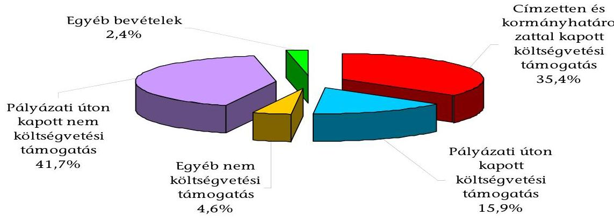
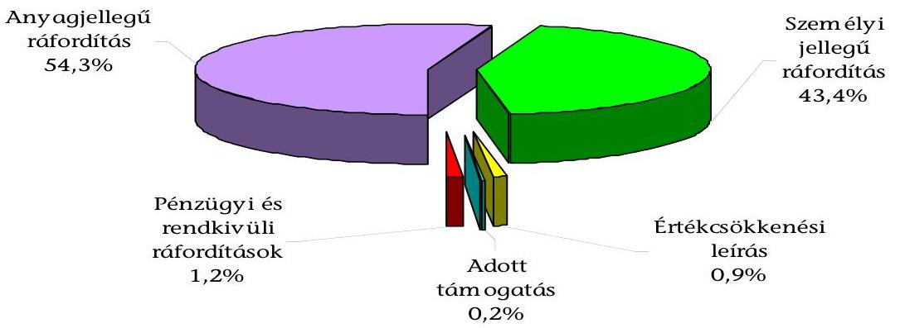
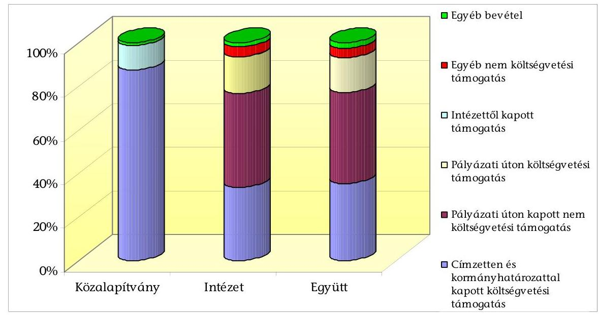
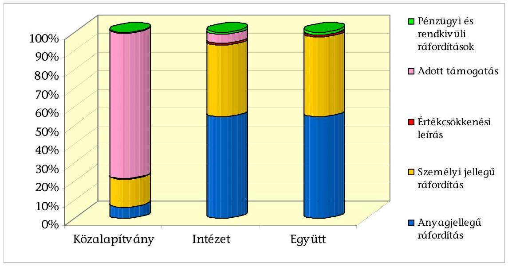
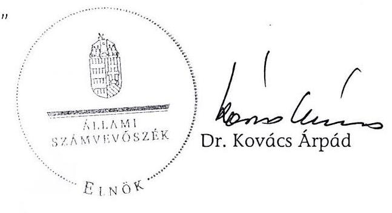

# ÁLLAMI   SZÁMVEVŐSZÉK 

## JELENTÉS

a Demokrácia Központ Közalapítvány gazdálkodásának ellenőrzéséről

---

3. Önkormányzati és Területi Ellenőrzési Igazgatóság
3.1. Szabályszerűségi Ellenőrzési Főcsoport

Iktatószám: V-3004-30/2009.
Témaszám: 936
Vizsgálat-azonosító szám: V-0461

# Az ellenőrzést felügyelte: 

Dr. Lóránt Zoltán
főigazgató
Az ellenőrzés végrehajtásáért felelős:
Dr. Elek János
általános főigazgató-helyettes
Az ellenőrzést vezette:
Solymár Ágnes
osztályvezető főtanácsos
Az összefoglaló jelentést készítette:
Brebán Andrea
számvevő
Az ellenőrzést végezték:
Brebán Andrea
Kulcsár Lászlóné
számvevő
számvevő

---

# TARTALOMJEGYZÉK 

BEVEZETÉS ..... 7
I. ÖSSZEGZŐ MEGÁLLAPÍTÁSOK, KÖVETKEZTETÉSEK, JAVASLATOK ..... 10
II. RÉSZLETES MEGÁLLAPÍTÁSOK ..... 17

1. A működés szabályozottsága és szabályossága ..... 17
1.1. Alapító okirat, képviseleti jog ..... 17
1.2. A Szervezeti és Működési Szabályzat ..... 19
1.3. A kuratórium működése ..... 19
1.4. A Demokratikus Átalakulásért Intézet ..... 20
2. A gazdálkodás és könyvvezetés szabályozottsága, szabályossága ..... 22
2.1. A gazdálkodás tervezettsége ..... 22
2.2. A gazdálkodási tevékenység ..... 23
2.3. A számviteli szabályzatok ..... 24
2.4. A könyvvezetés rendszere ..... 25
3. A beszámolási kötelezettség teljesítése ..... 27
4. A bevételek és ráfordítások ..... 29
4.1. A bevételek alakulása és összetétele ..... 29
4.2. Költségvetési támogatások elszámolása ..... 30
4.3. Külföldi támogatások elszámolása ..... 32
4.4. A ráfordítások alakulása és összetétele ..... 32
5. A közalapítvány célszerinti tevékenysége ..... 34
6. Az ellenőrzési rendszer ..... 36
MELLÉKLETEK
7. számú Demokrácia Központ Közalapítvány bevételei és költségei, ráfordításai
8. számú Demokratikus Átalakulásért Intézet bevételei és költségei, ráfordításai
9. számú Demokratikus Átalakulásért Intézet projektenkénti ráfordításainak alakulása
10. számú Demokratikus Átalakulásért Intézet költségvetési támogatásának felhasználása

---

# FÜGGELÉK 

A Demokratikus Átalakulásért Intézet által indított és befejezett projektek, programok 2005-2008. években

---

# RÖVIDÍTÉSEK JEGYZÉKE 

| Alapító | Magyar Köztársaság Kormánya, nevében és képviseletében a Magyar Köztársaság Kormánya felhatalmazása alapján a külügyminiszter jár el |
| :--: | :--: |
| ÁSZ | Állami Számvevőszék |
| Intézet | Demokratikus Átalakulásért Intézet |
| Közalapítvány | Demokrácia Központ Közalapítvány |
| FB | Felügyelő Bizottság |
| Kbt. | A közbeszerzésekről szóló 2003. évi CXXIX. törvény |
| Khtv. | A közhasznú szervezetekről szóló 1997. évi CLVI. törvény |
| KüM | Külügyminisztérium |
| Ptk. | A Polgári Törvénykönyvről szóló 1959. évi IV. törvény |
| Számviteli beszámoló | Egyszerűsített éves beszámoló |
| Szervezetek | A Demokrácia Központ Közalapítvány és a Demokratikus Átalakulásért Intézet együtt |
| SZMSZ | Szervezeti és Működési Szabályzat |
| Szr. | A számviteli törvény szerinti egyes egyéb szervezetek be-számoló-készítési és könyvvezetési kötelezettségének sajátosságairól szóló 224/2000. (XII. 19.) Korm. rendelet |
| Szt. | A számvitelről szóló 2000. évi C. törvény |

---

.

---

# ÉRTELMEZŐ SZÓTÁR 

| Alapítvány bevételei | A vállalkozási tevékenység bevétele, az alapítványi célú tevékenység bevételei (minden olyan bevétel, amely nem a vállalkozási tevékenységhez kapcsolódó befizetés, ideértve a céltámogatást is) [115/1992. (VII. 23.) Korm. rendelet 3. § (1) bekezdésének a)-b) pontja]. |
| :--: | :--: |
| Alapítvány költségei (kiadásai) | A vállalkozási tevékenység közvetlen költségei, az alapítványi célú tevékenység közvetlen költségei, az alapítvány kezelő szervének költségei (kiadásai) és az egyéb közvetett költségek (kiadások) [115/1992. (VII. 23.) Korm. rendelet 3. § (2) bekezdésének a); (b); c) pontja]. |
| Célszerinti tevékenység | Minden olyan tevékenység, amely az alapító okiratban megjelölt célkitűzés elérését közvetlenül szolgálja [Khtv. 26. § b) pontja]. |
| Induló vagyon | A közalapítvány javára a célja megvalósításához az alapító okiratban meghatározott vagyon [Ptk. 74/A. § (1) bekezdése, 74/B. § (1) bekezdés c) pontja]. A közalapítvány rendelkezésére legalább olyan mértékű vagyont kell bocsátani, amely a működése megkezdéséhez feltétlenül szükséges [Ptk. 74/B. § (4) bekezdése]. A közalapítványi vagyon pontos megjelölése nélkül a közalapítvány nem jöhet létre [BH2001. 303]. |
| Kiemelkedően közhasznú közalapítvány | A kiemelkedően közhasznú közalapítványnak a közhasznú közalapítványokra előírt követelmények teljesítésén túl közhasznú tevékenysége során olyan közfeladatot kell ellátnia, amelyről törvény vagy törvény felhatalmazása alapján más jogszabály rendelkezése szerint, valamely állami szervnek vagy a helyi önkormányzatnak kell gondoskodnia, az alapító okirata szerinti tevékenységének és gazdálkodásának legfontosabb adatait a helyi vagy országos sajtó útján is nyilvánosságra hozza, továbbá a közhasznú tevékenységet maga látja el [Khtv. 5. § és a BH2001. 451]. |
| Közalapítvány | A közalapítvány olyan alapítvány, amelyet az Országgyűlés, a Kormány, valamint a helyi önkormányzat vagy kisebbségi önkormányzat képviselő-testülete közfeladat ellátásának folyamatos biztosítása céljából hoz létre [Ptk. 2006. VIII. 23-ig hatályos 74/G. § (1) bekezdése]. |
| Közfeladat | Közfeladat az az állami vagy helyi önkormányzati, kisebbségi önkormányzati feladat, amelynek ellátásáról jogszabály alapján - az államnak vagy az önkormányzatnak kell gondoskodnia [Ptk. 2006. VIII. 23-ig hatályos 74/G. § (2) bekezdése]. |
| Közhasznú egyszerűsített éves beszámoló | A közhasznú nyilvántartásba vett közalapítványoknál mérlegből, közhasznú eredmény-kimutatásból és tájékoztató adatokból áll [224/2000. (XII. 19.) Korm. rendelet 6. § (8) bekezdése, illetve 4 . és 6 . számú melléklete]. |
| Közhasznú tevékenység | A társadalom és az egyén közös érdekeinek kielégítésére |

---

Közhasznúsági jelentés
Támogatás
Törzsvagyon

Vezető tisztségviselő a
közalapítványoknál
irányuló, a közhasznú közalapítvány alapító okiratában szereplő cél szerinti tevékenység a törvényben meghatározott körben [Khtv. 26. § c) pontja].
Tartalmazza a számviteli beszámolót; a költségvetési támogatás felhasználását; a vagyon felhasználásával kapcsolatos kimutatást; a cél szerinti juttatások kimutatását; a központi költségvetési szervtől, az elkülönített állami pénzalaptól, a helyi önkormányzattól, a települési önkormányzatok társulásától és mindezek szerveitől kapott támogatás mértékét; a közhasznú szervezet vezető tisztségviselőinek nyújtott juttatások értékét, illetve összegét; a közhasznú tevékenységről szóló rövid tartalmi beszámolót [Khtv. 19. § (3) bekezdése].
Pénzbeli és nem pénzbeli juttatás [Khtv. 26. § j) pontja].
Az alapítói vagyon dologi-eszköz elemeit törzsvagyonként indokolt elkülöníteni, ami elidegenítési és terhelési tilalmat jelent. A törzsvagyonná nyilvánítás az alapító kizárólagos jogköre, erre az alapító okiratban a kuratórium részére nem adható felhatalmazás [1052/1997. (V. 21.) Korm. határozat 5. a) pontja].
A közalapítvány kuratóriumának és felügyelő bizottságának elnöke és tagja, a közalapítvánnyal munkaviszonyban vagy munkavégzésre irányuló egyéb jogviszonyban álló, az alapító okirat szerint egyszemélyi felelős vezető feladatot ellátó személy [Khtv. 26. § m) pontja].

---

# JELENTÉS 

## a Demokrácia Központ Közalapítvány gazdálkodásának ellenőrzéséről

## BEVEZETÉS

A Demokrácia Központ Közalapítványt (közalapítvány) a Magyar Köztársaság Kormánya (alapító) a Polgári Törvénykönyvről szóló 1959. évi IV. törvény (Ptk.) 74/G. §-ának (1)-(2) és (4) bekezdéseiben foglaltaknak megfelelően, az 1037/2005. (IV. 28.) Korm. határozattal hozta létre. A közalapítványt a Fővárosi Bíróság 2005. szeptember 20-án jogerőre emelkedett végzésével ${ }^{1}$ a közhasznú szervezetekről szóló 1997. évi CLVI. törvény (Khtv.) 26. § c) 3), 4), 12) és 19) pontjaiban ${ }^{2}$ szereplő tevékenységekre tekintettel közhasznú szervezetnek minősítve vette nyilvántartásba, majd 2008. július 21-én jogerőre emelkedett végzésével a közalapítványt kiemelkedően közhasznú fokozatú szervezetnek sorolta át. A közalapítvány felett az alapítót megillető jogkört a külügyminiszter gyakorolja.

A közalapítványok megalakítására és működésére a Ptk. 74/G. §-a az alapítványok szabályozásán belül külön feltételeket és követelményeket határozott meg az alapítók körét, az ellátandó közfeladatokat, valamint a működés és gazdálkodás feltételeit illetően. A szabályozást 2006. augusztus 24-től az államháztartásról szóló 1992. évi XXXVIII. törvény és egyes kapcsolódó törvények módosításáról szóló 2006. évi LXV. törvény 1. § (1) bekezdése hatályon kívül helyezte. A jogszabály a még működő közalapítványok gazdálkodására vonatkozó szabályokat a korábbihoz képest annyiban módosította, hogy azok alapítványt nem hozhatnak létre, ahhoz nem csatlakozhatnak, azzal nem egyesíthetők, pályázat kiírása nélkül évente a vagyonuk 5%-ának mértékéig, de legfeljebb egymillió forint összértékben támogatást nyújthatnak az alapító okiratban foglalt célokra, továbbá tevékenységük újabb közfeladat ellátásával nem bővíthető.

A közalapítvány alapító okiratában meghatározott céljai:

- a demokratikus berendezkedés földrajzi korlátoktól mentes elterjedéséhez való aktív hozzájárulás;

[^0]
[^0]:    ${ }^{1}$ Fővárosi Bíróság 9. Pk. 60.640/2005/4. számú végzéssel 9651 sorszámon
    ${ }^{2}$ A Khtv. 26. §. c) 3. tudományos tevékenység, kutatás; 4. nevelés és oktatás, képességfejlesztés, ismeretterjesztés; 12. emberi és állampolgári jogok védelme; 19. euroatlanti integráció elősegítése tevékenységeket jelöli meg.

---

- a demokratikus átalakulással kapcsolatos tudományos kutatással összefüggő feladatok ellátása;
- a Magyar Köztársaság és a közép- és kelet-európai térség államainak demokratikus átalakulása során szerzett gyakorlati tapasztalatok összegyűjtése, rendszerezése, tudományos feldolgozása, átadása;
- a Magyar Köztársaságnak a függetlenségen, demokrácián és kölcsönös előnyökön alapuló nemzetközi kapcsolatai alakításának tudományos megalapozása, a világfolyamatok, az európai integrációs tendenciák tükrében való elemzése;
- a világ országainak - különösen az Európai Unió tagállamainak - a demokráciával kapcsolatos elveinek és joggyakorlatának figyelemmel kísérése, tanulmányozása;
- az Egyesült Nemzetek Szervezetével, az Európai Biztonsági és Együttműködési Szervezettel, az Európa Tanáccsal, valamint más nemzetközi szervezetekkel történő kapcsolattartás, azok tapasztalatainak és joggyakorlatának feldolgozása és hasznosítása;
- a demokráciának és az emberi jogoknak a nemzetek közössége által elfogadott egyetemes eszméi gyakorlati érvényesülésének és tiszteletben tartásának tanulmányozása és figyelemmel kísérése;
- a demokratikus átalakulásnak az emberi jogok érvényesülésére gyakorolt hatásának elemzése.

A közalapítvány a célszerinti tevékenységét az igazgató irányítása alatt álló jogi személyként létrehozott szervezeti egységével, a Demokratikus Átalakulásért Intézettel (intézet) látta el. A hangsúly a demokratikus átalakulás hazai és nemzetközi tapasztalatainak, a demokratizálódási folyamat elején járó és a demokratizálódás előtt álló országok, kisebbségi csoportok részére való átadásán volt. Az intézet az alapító okiratban meghatározott tevékenységeket végezte, így tudományos kutatásokat, tanulmányutakat, szakértői hálózatot, tudományos konferenciákat és rendezvényeket szervezett, politikai, biztonságpolitikai folyamatokról elemzéseket, értékeléseket, rövid és hosszú távú prognózisokat készített, gondoskodott a kutatási eredmények, kiadványok kiadásáról, szervezte a forrásgyűjtést, segítette a hazai felsőoktatást és posztgraduális képzést, ösztöndíjakat adományozott. Az intézetnek a közalapítványtól elkülönült könyvvezetése volt, gazdálkodásáról önálló közhasznú, egyszerűsített éves beszámolót (számviteli beszámoló) készített.

A közalapítvány alapító okiratban meghatározott induló vagyona 20000 ezer Ft, továbbá az alapító a közalapítvány használatába adta a Budapest XII. kerület, Svájci út 10. II. emelet alatti ingatlant. Az alapító az induló vagyonon belül 10000 ezer Ft törzsvagyon elkülönítését írta elő. Az alapító a közalapítvány induló vagyonából az intézet részére átadandó induló vagyont 5000 ezer Ft értékben határozta meg. A közalapítvány a 2005-2008. években az induló vagyonon felül 224975 ezer Ft címzett és kormányhatározat alapján járó költségvetési támogatást kapott, az intézet pályázati úton a központi költségvetésből 102195 ezer Ft támogatást kapott.

---

Az Állami Számvevőszék (ÁSZ) az államháztartásról szóló 1992. évi XXXVIII. törvény és egyes kapcsolódó törvények módosításáról szóló 2006. évi LXV. törvény 1. § (2) bekezdésének e) pontja alapján ellenőrzi a közalapítványok gazdálkodásának törvényességét és célszerűségét. Az Állami Számvevőszékről szóló 1989. évi XXXVIII. törvény 2. § (5) bekezdése alapján ellenőrzi a közalapítványoknál az állami költségvetésből nyújtott támogatás vagy az állam által meghatározott célra ingyenesen juttatott vagyon felhasználását.

Az ÁSZ a közalapítvány gazdálkodásának szabályszerűségi ellenőrzését helyszíni ellenőrzés keretében első alkalommal végezte, amely a közalapítvány megalakulásától 2008. év december 31-éig tartó időszakra terjedt ki. Az ellenőrzés célja volt annak értékelése, hogy:

- a közalapítvány alapító okirata és belső szabályzatai megteremtették-e az induló vagyon törzsvagyon felüli része és hozadéka, valamint a
 központi költségvetési támogatás felhasználásának törvényes kereteit;
- a kuratórium biztosította-e a közalapítvány könyvvezetésének és éves beszámolóinak, gazdálkodásának törvényességét;
- a kuratórium a kapott induló vagyon törzsvagyon felüli részét és hozadékát, az állami és egyéb támogatásokat, valamint a közalapítvány saját bevételeit szabályosan, rendeltetésszerűen használta-e fel az alapító okiratban meghatározott céljainak megvalósítása érdekében.

Az ellenőrzés során a szabályozásokat a vonatkozó jogszabályok és az alapító okirat előírásaival való összehasonlítással, a képviseleti jog gyakorlását a szerződések teljes körű vizsgálatával, a bankszámla feletti rendelkezést a vonatkozó szerződések és a banki átutalási megbízások vizsgálatával, a házipénztár szabályszerűségét az ellenőrzött évekre egy-egy negyedév forgalmának ellenőrzésével, a beszámolók szabályosságát azok sorainak a főkönyvi kivonatok és leltárak adatainak összevetésével végeztük el. Tételesen ellenőriztük a kuratóriumi határozatok meghozatalának szabályosságát, a közbeszerzésekről szóló törvény előírásainak betartását, a kapott költségvetési és nem költségvetési támogatások felhasználására kötött szerződéseket és a támogatások felhasználásával való elszámolások szabályosságát. Tanúsítvány alapján elemeztük a hazai és külföldi forrásból származó támogatások alakulását, összetételét, valamint a közalapítvány által megvalósított programok ráfordításainak évenkénti alakulását, összetételét.

---

# I. ÖSSZEGZŐ MEGÁLLAPÍTÁSOK, KÖVETKEZTETÉSEK, JAVASLATOK 

A közalapítvány és intézete (szervezetek) a kapott állami és külföldi támogatásokat, teljesített egyéb bevételeit szabályosan, rendeltetésszerűen használta fel az alapító okiratban meghatározott céljai megvalósítása érdekében. A szervezetek működésük 2005-2008. évi periódusában együttesen 619602 ezer Ft bevételt realizáltak. A közalapítvány az intézeten keresztül közfeladatának ellátásához 46,3% külső forrást vont be, ezeket pályázati úton és egyéb módon külföldi kormányoktól, nemzetközi szervezetektől és magánszemélyektől kapta. A bevételeknek 51,3%-a származott költségvetési forrásból${ }^{3}$, ezen belül az éves költségvetési törvények alapján 149975 ezer Ft címzetten és 75000 ezer Ft kormányhatározatokkal teljesült. Az intézet a központi költségvetésből pályázati úton 102195 ezer Ft támogatást nyert el. (A szervezetek a 2008. évi támogatásból a 2009. évre feladattal terhelten összesen 8803 ezer Ft-ot különítettek el.) Az egyéb bevételek megbízás alapján és pénzügyi műveletekből származtak. A szervezetek a vonatkozó jogszabályi rendelkezéseknek megfelelően a bevételeket azok forrása szerint elkülönítetten tartották nyilván.

2005-2008. évi bevételek szerkezete

A szervezetek a költségvetési támogatásokat a vonatkozó jogszabályi rendelkezésnek megfelelően minden esetben írásbeli szerződések alapján kapták. A közalapítvány a 2006. és 2007. években címzetten és kormányhatározattal ka-

[^0]
[^0]:    ${ }^{3}$ A központi költségvetésből kapott támogatás az ÁSZ által utóbb ellenőrzött, nem Európai Uniós programokkal foglalkozó közalapítványoknál minden esetben meghaladta a 80%-ot (a közalapítvány bevételein belül a központi költségvetéstől kapott támogatás a Wesselényi Miklós Sport Közalapítványnál (0606. számú ÁSZ jelentés) 94,1%, a Betegjogi, Ellátottjogi és Gyermekjogi Közalapítványnál (0720. számú ÁSZ jelentés) 89%, a Holocaust Dokumentációs Központ és Emlékgyűjtemény Közalapítványnál (0721. számú ÁSZ jelentés) 86,8% volt.

---

pott költségvetési támogatásokkal nem a szerződéses előírásoknak megfelelően, hanem a közhasznúsági jelentések megküldésével számolt el. Az elszámolásokhoz nem csatolta a felhasználást alátámasztó bizonylatok másolatait, a hiányos elszámolási gyakorlatot a támogató nem kifogásolta. A közalapítványnak a 2008-ban kapott támogatások felhasználásáról 2009. évben kell elszámolnia. Az intézet a pályázati úton elnyert költségvetési és a külföldi támogatóktól kapott támogatásokhoz kapcsolódó elszámolási kötelezettségének a szerződéses előírásoknak megfelelően eleget tett, a kapott támogatásokat a szerződésekben megjelölt célokra és szabályok szerint használta fel, a támogatók az elszámolásokat elfogadták.

A szervezetek együttesen 646434 ezer Ft-ot fordítottak célszerinti tevékenységre, amelynek 97,7%-a anyag- és személyi jellegű ráfordításokra koncentrálódott, azok elszámolása indokolt volt. (A ráfordítások bevételt meghaladó része a vonatkozó jogszabályi előírások szerinti elhatárolás miatt keletkezett.) A kuratórium és az FB tagjai számára tiszteletdíjat, költségtérítést nem fizettek az ellenőrzött években.

2005-2008. évi ráfordítások szerkezete

A közalapítvány céljait az alapító okirat előírásaival összhangban az általa létrehozott intézet projektjeivel valósította meg, amely teljes körűen lefedte az alapító okiratban meghatározott feladatokat. A célok elérését szolgáló intézeti projekt-rendszer, támogatói felkérés alapján vagy programok megvalósítási lehetőségének pályázattal való elnyerésével alakult ki. Az intézet a 2005-2008. években 37 projektet indított. Az intézet a felmerült költségek 94,7%-át a projektek, 5,3%-át a projektekre nem felosztható központi, működési kiadások ráfordításaként mutatta ki utólagos kigyűjtéssel. Az intézet projektjeit három tematikus csoportba sorolta, ezek: a fenntartható demokrácia; a demokratikus átmenet és regionális stabilitás interregionális együttműködésen keresztül; a technikai segítségnyújtás, demokrácia eszköztára. Az intézet által végzett és befejezett projektek elérték a kitűzött céljukat, ezek keretében többek között nemzetközi konferenciákat, műhelyvitákat, szakértői találkozókat, tanulmányutakat szervezett, tanulmányokat készített, video-interjú adatbázist alakított ki. Az éves konferenciái keretében rendezte meg a nemzetközi szaktekintélyekből álló igazgatótanács üléseit, amelyre a világ meghatározó nemzetközi szervezetei is

---

meghívást kaptak, ezzel erősítve az intézet nemzetközi ismertségét és növelve a potenciális támogatóik számát.

A közalapítvány működésének legfontosabb szabályait a Kormány által jóváhagyott alapító okirat tartalmazta, amely megteremtette az induló vagyon törzsvagyon felüli részének, hozadékának, valamint a központi költségvetési támogatás felhasználásának törvényes kereteit. Az alapító okirat és annak módosításai a vonatkozó törvényi előírásoknak megfelelően tartalmazták a közalapítvány nevét, céljait, székhelyét, a működésének, a képviseleti jog gyakorlásának, a bankszámla feletti rendelkezésnek, a gazdálkodásának szabályait. Meghatározta a közalapítvány és az intézet induló vagyonát, valamint a törzsvagyonon felüli induló vagyon és a támogatások felhasználásának szabályait. Az alapítói jogosítványokat gyakorló külügyminiszter az alapító okirat módosításait a törvényi rendelkezéseknek megfelelően nyilvánosságra hozta. Az alapító okiratban az induló vagyon részeként, a székhelyként kijelölt ingatlant a közalapítvány nem tudta használatba venni, mert a társasház többi ingatlanának tulajdonosai az alapszabályra hivatkozva nem járultak hozzá az ingatlan irodai célokra való használatához. A szervezetek jelenleg bérleti díj fizetése mellett egy másik ingatlanban működnek. A közalapítványnál a képviseleti jog gyakorlása 12 szerződés megkötésének kivételével szabályosan történt. Három megbízási szerződést, továbbá hat értékpapír adásvételi szerződést az alapító okirat előírásaitól eltérően az értékpapír számlán rendelkezőként bejelentett ügyvezető igazgató írta alá. Három értékpapír adásvételi szerződésnél az aláíró személye nem volt megállapítható. A képviseleti jog gyakorlásának szabálytalanságai miatt visszaélést nem állapítottunk meg. A bankszámla feletti rendelkezés gyakorlata megfelelt a vonatkozó jogszabályok és az alapító okirat előírásának.

A kuratórium a közalapítvány szervezeti és működési szabályzatát (SZMSZ), annak módosítását az alapító okiratban előírt minősített többséggel fogadta el. Abban az alapító okirat előírásának megfelelően szabályozta a kuratórium, a közalapítványi iroda hatás- és feladatkörét, a bankszámla feletti rendelkezési jog gyakorlását. Az SZMSZ az alapító okirattal ellentétesen a kuratóriumi elnököt képviseleti és aláírási jogának a kuratórium bármely más tagjára való átruházásra jogosította fel, de az elnök ezzel a joggal nem élt. A hatályos SZMSZ-ek az alapító okirat előírásától eltérően engedélyezték az írásbeli szavazás útján történő határozathozatalt. A kuratórium a közalapítvány és az intézet munkakapcsolatának szabályait nem alakította ki, mint például az egymás közti megállapodások, szerződések megkötésének szabályait.

A kuratórium az alapító okirat előírásának megfelelő számban ülésezett a 2005-2007. években, de kevesebbszer 2008-ban. A megtartott kuratóriumi ülések határozatképesek voltak, azokon az alapító okirat előírásának megfelelően hozták meg a döntéseket. A kuratórium azonban szabályozási hibából fakadóan a határozatok 12%-át nem ülésein, hanem írásbeli szavazással hozta. A kuratóriumi ülésekről készült jegyzőkönyvek és a határozatok tára megfeleltek a vonatkozó jogszabály előírásának. A kuratórium az alapító okirat előírásának megfelelően a határozatokat a közalapítvány honlapján közzétette.

A kuratórium az intézet igazgatóját az összeférhetetlenségi szabályokra figyelemmel nevezte ki, az intézetnek átadta a meghatározott induló vagyont, a részébe történt külső felajánlásokról döntött, elfogadta az intézet SZMSZ-ét és annak módosítását. Az SZMSZ-ben az intézetnek önálló gazdálkodási jogot biztosított, de az alapító okirattal ellentétesen az intézet igazgatótanácsának döntési jogkört biztosított az intézet éves munkatervének elfogadása és éves tevékenységének értékelése tekintetében. A gyakorlatban a testület csak a kuratóriumi döntéseket utólag tudomásul vette. Az intézetnél a képviseleti jog gyakorlása az alapító okirat és az SZMSZ szabályozásának megfelelően történt. A bankszámla feletti rendelkezés gyakorlata az SZMSZ szabályozásától eltért.

A szervezetek bevételeinek felhasználásáról, gazdálkodásáról a kuratórium az alapító okiratban előírt költségvetésekben rendelkezett. A kuratórium az SZMSZ-ek előírásától eltérően a közalapítvány költségvetését a 2007. és 2008. években, az intézetét minden évben határidőn túl fogadta el. A költségvetések adatai teljes körűek és megalapozottak voltak. Az alapító okirat és a vonatkozó jogszabály előírásának megfelelően a kuratórium elkészítette és elfogadta a vagyonkezelési és befektetési szabályzatot, amelynek megfelelően a közalapítvány átmenetileg szabad pénzeszközeit és a törzsvagyont államilag garantált értékpapírokba fektette. A szabályozással ellentétesen azonban a kuratórium nem határozott az állampapírok vásárlásáról, azt csak a számviteli beszámoló elfogadásával utólag vette tudomásul. A közalapítványnál közbeszerzési értékhatárt meghaladó árubeszerzés, szolgáltatás igénybevétele nem volt. A közalapítvány általános közbeszerzési szabályzata megfelelt a vonatkozó jogszabályi előírásnak azzal a kivétellel, hogy nem szabályozta a belső ellenőrzés felelősségi rendjét.

A szervezetek rendelkeztek a számviteli törvényben előírt, a könyvvezetés és az éves beszámolók elkészítésének rendjét meghatározó számviteli politikával, ahhoz kapcsolódó szabályzatokkal. A szervezetek számlarendjüket a vonatkozó jogszabály rendelkezéseiben megjelölt határidőn túl készítették el. A szabályzatok a feltárt hiányosságok ellenére is megteremtették a központi költségvetési támogatás és az egyéb bevételek elszámolásának törvényes kereteit. A szabályzatokban nem vették figyelembe teljes mértékben a közalapítvány, illetve az intézet működésének és gazdálkodásának sajátosságait. A számviteli politikák nem szabályozták az év végi zárlattal kapcsolatos tevékenységet, a jelentős és nem jelentős összegű hiba mértékét, az értékelési eljárások körében mi tekintendő lényegesnek és nem lényegesnek, a számlák technikai lezárását, a költségek és ráfordítások elkülönítését, valamint az alapító okiratban rögzített működési költség tartalmát. A szervezetek nem rendelkeztek az értékelési szabályzatokban az időbeli elhatárolások értékeléséről, a pénzkezelési szabályzatokban az utalványozási rendről, a pénzszállítás szabályairól, az elektronikus pénzforgalom rendjéről, a számlarendekben a számlák értékváltozásainak jogcímeiről, más számlákkal és az analitikus nyilvántartással való kapcsolatáról, a bizonylati rendről. A szervezetek eszközök és források leltárkészítési és leltározási szabályzata megfelelt a jogszabályi előírásoknak. A könyvvezetésben feltárt hibák részben a szabályzatok hiányosságaira, továbbá az alapítványi sajátosságok figyelmen kívül hagyására vezethetők vissza.

A szervezetek a könyvvezetést a törvényi előírásnak megfelelően, a kettős könyvvitel rendszerében végezték, a gazdasági események alapbizonylatainak számítógépes feldolgozásával. A számviteli rendszerből az ellenőrzéshez szükséges adatokat biztosították, a könyvvezetés a feltárt hiányosságok ellenére

---

megfelelő alapot teremtett az éves beszámolók alátámasztásához. A számviteli rendszer alkalmas volt a támogatások és egyéb bevételek elkülönített nyilvántartására, de a vonatkozó jogszabályokban előírt célszerinti és működési költségek, ráfordítások elkülönítését a szabályozás hiányossága miatt nem biztosította. A jogszabályi előírástól eltérően a 2005-2006. években az év végi egyeztetést, leltározást és zárást nem dokumentálták. A 2007. évben a vonatkozó jogszabályi rendelkezésnek megfelelően az év végi egyeztetést, rendezést dokumentáltan elvégezték, az alkalmazott főkönyvi számlákat lezárták. A pénzkezelési szabályzatok hiányossága miatt a teljesítésigazolást és az utalványozás módját
 a szervezetek nem következetesen végezték. A házipénztári nyilvántartásokat hiányosan vezették, az intézetnél a 2005., a közalapítványnál a 2006. évben a lebonyolított készpénzforgalomról pénztárbizonylatokat nem állítottak ki, a havi zárásról pénztárjelentéseket nem készítettek, a készpénzforgalomról a könyvelési alapbizonylatok alapján főkönyvi nyilvántartást vezettek. A közalapítványnál a 2007. évben a pénztárjelentéseket pénztárellenőr nem ellenőrizte. Az utólagos elszámolásra kiadott előlegek nyilvántartása, elszámolása és a bankkártya forgalom lebonyolítása megfelelt a szabályozásoknak.

A szervezetek a törvényi előírás szerint elkészítették a számviteli beszámolókat és az éves közhasznúsági jelentéseket. A kuratórium a törvényi és az alapító okiratbeli rendelkezésnek megfelelően a közalapítvány működéséről írásbeli beszámolók, vagyoni helyzetének és gazdálkodásának legfontosabb adatairól a számviteli beszámolók és közhasznúsági jelentések megküldésével számolt be az alapítónak. A kuratórium az írásbeli beszámolóját a 2006. évre, a számviteli beszámolókat és a közhasznúsági jelentéseket mindhárom évre vonatkozóan, az alapító okiratban előírt határidőt követően fogadta el és küldte meg az alapítónak. A közhasznúsági jelentések szerkezete és tartalma megfelelt a vonatkozó jogszabályi előírásoknak. A szervezetek a számviteli beszámolókat a számviteli politikákban megjelölt formában készítették el, azokat az alapító okirat előírására figyelemmel a kuratórium döntését megelőzően az FB elfogadta, könyvvizsgáló hitelesítő záradékkal látta el. A számviteli beszámolók és a közhasznúsági jelentések elfogadásáról a kuratórium döntött. Az éves beszámolók adatai az év végi főkönyvi kivonatok adataiból levezethetők voltak. A szervezetek könyvvezetésükben és a számviteli beszámolókban az induló vagyont az alapító okiratban foglaltaknak megfelelően mutatták ki. A szervezetek számviteli beszámolóinak mérlegadatait a 2005-2006 években nem, csak a 2007. évben támasztották alá leltárak, azok megfeleltek a leltárkészítési és leltározási szabályzatok előírásának. A közalapítvány a közhasznúsági jelentéseket a törvényi előírással összhangban saját honlapján közzétette, de azokat és számviteli beszámolóit, illetve gazdálkodásának legfontosabb adatait az alapító okirat rendelkezésétől eltérően, országos sajtóban nem jelentette meg.

Az alapító a kuratórium működésének és gazdálkodásának ellenőrzésére háromfős felügyelő bizottságot (FB) nevezett ki, meghatározta működésének szabályait. Az FB a közalapítvány működésével és gazdálkodásával kapcsolatos döntéseket ülésein megvitatta és kifogással nem élt, ellenőrzést nem végzett. Az FB az alapító okirat előírásától eltérően a 2005. és 2006. évre vonatkozóan nem készített jelentést az alapítónak, és mindhárom évben az előírt háromnál kevesebbszer ülésezett. A kuratórium a közalapítványt és az intézetet tevékenységéről és gazdálkodásáról évente beszámoltatta, a beszámolókról érvényes határozatokkal döntött. A független könyvvizsgáló a közalapítvány, az intézet szám-

---

viteli rendszerét évente ellenőrizte, megállapításait, a kockázatokat és javaslatait jelentéseiben megfogalmazta, de azok ellenére sem egységesítették a teljesítésigazolásokat és nem módosították a számviteli szabályzatokat. A belső ellenőrzési rendszer a folyamatba épített vezetői ellenőrzés útján megfelelően érvényesült, a célszerinti tevékenység pénzügyi és szakmai folyamatait projektenként ellenőrizték.

A helyszíni ellenőrzés megállapításainak hasznosítása mellett javasoljuk:

# a külügyminiszternek 

Tegyen javaslatot a Kormánynak a közalapítvány székhelyének megfelelő ingatlan biztosítására és kezdeményezze ez alapján az alapító okirat módosítását.

## a közalapítvány kuratóriumának

1. Módosítsa a közalapítvány és az intézet belső szabályzatait a következők figyelembevételével:
a) hozza összhangba az alapító okirat rendelkezéseivel a közalapítvány Szervezeti és Működési Szabályzatát a képviseleti jog gyakorlása és a kuratóriumi határozathozatal szabályai vonatkozásában;
b) törölje az intézet Szervezeti és Működési Szabályzatában az intézet igazgatótanácsának döntési jogkörét az alapító okirat VII.7. pontjának megfelelően;
c) egészítse ki a szervezetek Szervezeti és Működési Szabályzatát a közalapítvány és az intézet munkakapcsolatainak szabályozásával;
d) egészítse ki a közalapítvány általános közbeszerzési szabályzatát a közbeszerzésekről szóló 2003. évi CXXIX. törvény 6. § (1) bekezdésében előírt, a belső ellenőrzés felelősségi rendjére vonatkozó szabályokkal;
e) határozza meg a szervezetek számviteli politikáiban a számvitelről szóló 2000. évi C. törvény 14. § (4) bekezdésének megfelelően az elszámolás és értékelés szempontjából a megbízható és valós képet lényegesen befolyásoló hiba mértékét, hogy a számviteli elszámolás, értékelés szempontjából mi tekintendő lényegesnek és nem lényegesnek, a 164. § (1) bekezdésének előírásaival összhangban a zárlati feladatok körét, továbbá a közhasznú szervezetekről szóló 1997. évi CLVI. törvény 18. § (1) és (3) bekezdéseivel összhangban a költségek elkülönítési módját, az alapító okirat által előírt működési költség tartalmát;
f) egészítse ki a szervezetek eszközök és a források értékelési szabályzatait az időbeli elhatárolások értékelésének szabályaival;
g) egészítse ki a szervezetek pénzkezelési szabályzatait a számvitelről szóló 2000. évi C. törvény 14. § (8) bekezdés előírásának megfelelően az utalványozási rend, a teljesítésigazolás, a pénzszállítás és az elektronikus pénzforgalom szabályaival;

---

h) egészítse ki a szervezetek számlarendjeit a bizonylati rend, a számlák értékváltozásainak, más számlákkal, illetve az analitikus nyilvántartással való kapcsolatának szabályozásával a számvitelről szóló 2000. évi C. törvény 161. § (2) bekezdése d) pontjának megfelelően.
2. Tartsa be az alapító okirat előírásait a kuratóriumi üléseken való határozathozatal, a képviseleti jog gyakorlása, az írásbeli beszámoló, számviteli beszámoló, közhasznúsági jelentés határidőre történő elfogadása, alapítónak való megküldése során.
3. Módosítsa a közalapítvány értékpapír számláján rendelkezőként bejelentettek körét az alapító okirat XI.1. pontjának megfelelően.
4. Határozzon minden esetben a szervezetek Szervezeti és Működési Szabályzataiban megjelölt határidőig az éves költségvetések elfogadásáról.
5. Határozattal döntsön a közalapítvány Vagyonkezelési és Befektetési Szabályzat III.2. pontjában előírtak szerint az állampapírok vásárlásáról.
6. Jelentse meg a közalapítvány közhasznúsági jelentését, számviteli beszámolóját illetve gazdálkodásának legfontosabb adatait az alapító okirat VI.11. pontjában előírtak szerinti két országos napilapban.

# a közalapítvány felügyelő bizottságának 

Készítse el minden évben az alapító okirat IX.6. pontjában előírt, alapítói jogokat gyakorló miniszter felé megküldendő éves jelentését és ülésezzen évente az alapító okirat IX.9. pontjában előírtak szerint.

## az intézet igazgatójának

Módosítsa az intézet bankszámláján rendelkezőként bejelentettek körét az intézet Szervezeti és Működési Szabályzat III.2. pontjának megfelelően.

---

# II. RÉSZLETES MEGÁLLAPÍTÁSOK 

## 1. A MŰKÖDÉS SZABÁLYOZOTTSÁGA ÉS SZABÁLYOSSÁGA

### 1.1. Alapító okirat, képviseleti jog

Az alapító okirat a Ptk. 74/B. § (1) bekezdésével összhangban megjelölte a közalapítvány nevét, céljait, székhelyét és a céljára rendelt vagyont és annak felhasználási módját.

Az alapítót megillető jogosultságokat gyakorló miniszter a Ptk. 74/G. § (6) bekezdése ${ }^{4}$ illetve az államháztartásról szóló 1992. évi XXXVIII. törvény és egyes kapcsolódó törvények módosításáról szóló 2006. évi LXV. törvény 1. § (2) f) pontjai ${ }^{5}$ szerint az alapító okiratot és azok módosításait nyilvánosságra hozta. Az alapító okiratot az ellenőrzött években kétszer módosította, a módosításokkal változott a kuratórium összetétele és elnöke, a képviseleti jog gyakorlásának, a közalapítvány irataiba való betekintés engedélyezésének és a működési célokra fordítható költségek mértékének szabályozása.

Az alapító okirat a Magyar Közlöny 2005/130. számában, módosításai a Magyar Közlöny 2006/33. és 2008/79. számaiban jelentek meg.

A közalapítvány létrehozásáról szóló kormányhatározat szerint tartalmazta az alapító okirat az induló vagyont. A vagyon részeként használatra kijelölt ingatlant - a közalapítvány máig hatályos székhelyét - azonban a közalapítvány nem tudta használatba venni, jelenleg a közalapítvány és az intézete bérleti díj fizetése mellett egy másik ingatlanban működik.

A Demokrácia Központ Közalapítvány létrehozásáról, valamint a kormány által alapított közalapítványok és alapítványok kormányzati felelőseiről és egyes feladatokról szóló 1034/2003. (IV. 24.) Korm. határozat módosításáról szóló 1037/2005. (IV. 28.) Korm. határozat alapján a kormány a Kincstári Vagyoni Igazgatóság által kezelt Budapest XII. kerület, Svájci út 10. II. emelet alatti ingatlant székhelyként a közalapítvány használatába adta, ezt a közalapítvány bírósági bejegyzésénél a Kincstári Vagyoni Igazgatóság által kiadott kijelölő nyilatkozat igazolta. A közalapítványi iroda ügyvezető igazgatójának nyilatkozata alapján az alapító okiratban megjelölt ingatlan egy társasházban található. A társasház alapszabálya értelmében az ingatlan irodai célokra nem használható. Az alapszabály módosításához a tulajdonosok kétharmadának egyetértése lett volna szükséges, de a társasház további részeit birtokló cég nem egyezett bele a módosításba.

Az alapító okirat a Ptk. 74/C. § (1) bekezdése szerint megjelölte a közalapítvány kezelő szervét, az öttagú kuratóriumot. A Khtv. 7. § (2) bekezdésével összhangban meghatározta a kuratórium üléseinek gyakoriságára, összehívásának

[^0]
[^0]:    ${ }^{4}$ Hatályos 2006. augusztus 23-áig
    ${ }^{5}$ Hatályos 2006. augusztus 24-étől

---

rendjére, nyilvánosságára, határozatképességére és a határozathozatal módjára, a közalapítvány éves beszámolóinak jóváhagyására, a 7. § (3) bekezdésének megfelelően a határozatok nyilvántartására, a beszámolók közlésére, nyilvánosságára vonatkozó szabályokat.

A Khtv. 7. § (2) bekezdés c) pontjával összhangban az alapító az alapító okiratban kijelölte a kuratórium ellenőrző szervét - háromtagú FB - annak működésére és a Khtv. 8. § (2) bekezdésében előírtaknak megfelelően a tagok kinevezésére vonatkozó szabályokat.

Az alapító okirat a Ptk. 74/B. § (6) bekezdésének és a Khtv. 4. § (1) bekezdése szerint jelölte meg a gazdálkodási szabályokat.

Az alapító lehetővé tette, hogy a közalapítvány olyan gazdálkodó szervezetben vegyen részt, amelyben legalább többségi irányítást biztosító befolyással rendelkezik, és amelyben felelőssége nem haladja meg vagyoni hozzájárulása mértékét. Az alapító okirat összhangban a Khtv. 16. (1) bekezdésének előírásaival megtiltotta a közalapítvány számára, hogy váltót, illetve más hitelviszonyt megtestesítő értékpapírt bocsásson ki. A Khtv. 17. §-ában foglaltakkal összhangban előírta befektetési szabályzat készítését és annak kuratóriumi elfogadását. Az alapító okirat VI.4. pontjában előírta, hogy a közalapítvány átmenetileg szabad pénzeszközeit kizárólag államilag garantált állampapírok vásárlásával hasznosíthatta.

Az alapító okirat a Ptk. 74/C. § (4) bekezdésében foglaltakkal összhangban meghatározta a közalapítvány képviseletére jogosult személyeket és a képviseleti jog gyakorlásának módját, terjedelmét.

Az alapító okirat 2006. március 27-ei módosításáig a közalapítványt a kuratórium elnöke, azt követően a kuratórium elnöke és esetleges akadályoztatása esetén pedig a kuratórium társelnöke képviselhette önállóan és teljes körűen. Az alapító az alapító okiratban nem engedte meg, hogy a kuratórium a közalapítvány alkalmazottjának képviseleti jogot biztosítson.

A közalapítványnál a képviseleti jog gyakorlása - 12 szerződés kivételével - az alapító okirat előírásainak megfelelően valósult meg. A képviseleti jog gyakorlása nem felelt meg az alapító okirat előírásának, amikor az ügyvezető igazgató írta alá a könyvvizsgálatra, két esetben a számviteli szolgáltatásra vonatkozó megbízási szerződéseket, hat esetben az értékpapír adásvételi szerződéseket, továbbá három szerződésnél az aláíró nem volt megállapítható. A képviseleti jog gyakorlásának szabálytalansága miatt visszaélést nem állapítottunk meg.

Az értékpapír vásárlásokat a kuratórium a számviteli beszámolók elfogadásakor tudomásul vette, azt nem kifogásolta.

Az alapító okirat a közalapítvány bankszámlája feletti rendelkezési jog gyakorlását a Ptk. 29. § (3) bekezdésében foglaltakkal összhangban szabályozta, amikor a kuratórium elnökének és társelnökének együttesen biztosított rendelkezési jogot. A banki aláírásra bejelentettek, valamint a bankszámlához elektronikus hozzáférési joggal rendelkezők köre megfelelt az alapító okirat előírásának.

---

# 1.2. A Szervezeti és Működési Szabályzat 

A kuratórium a közalapítvány szervezeti és működési szabályzatát (SZMSZ), valamint annak módosítását az alapító okiratban előírt minősített többséggel fogadta el.

A 2005. november 2-ai ülésen a kuratórium a közalapítvány SZMSZ-ét a 2005/2/1 számú, a módosított SZMSZ-ét a kuratórium 2006. október 6-ai ülésén 2006/3/1 számú határozatával
 fogadta el.

A hatályos SZMSZ-ek az írásbeli szavazás útján történő határozathozatal engedélyezésével, valamint a képviseleti jog gyakorlásának szabályozása kivételével összhangban voltak az alapító okirattal. Az SZMSZ az alapító okirat előírásával összhangban szabályozta a kuratórium, a közalapítványi iroda hatáskörét és feladatkörét, a bankszámla feletti rendelkezési jog gyakorlását. A képviseleti jog gyakorlásának SZMSZ-beli szabályozása azonban nem felelt meg az alapító okiratnak, mivel:

- az alapító okirat felhatalmazása nélkül a kuratóriumi elnök akadályoztatásának esetére a kuratórium alelnökének helyettesítési, így képviseleti jogot biztosított. Az alapító okirat módosításával az ellentmondás megszűnt.

A módosított alapító okirat az alelnököt társelnökre módosította és kiegészítette a szabályozást azzal, hogy a társelnök a kuratóriumi elnök teljes jogú helyettese.

- a kuratóriumi elnök képviseleti és aláírási jogát részben vagy egészben a kuratórium bármely más tagjára átruházhatta (az elnök ezzel a joggal nem élt).

Az SZMSZ III. 1.2. pontja szerint „az elnök képviseleti és aláírási jogát részben vagy egészben a Kuratórium bármely más érdektelen tagjára átruházhatja. Az átruházott jogkörben csak két - aláírási és képviseleti joggal felruházott - személy együttesen járhat el."

Az SZMSZ hiányossága volt, hogy nem szabályozta a közalapítvány és az intézet közötti munkakapcsolat során alkalmazandó eljárásokat, így például a közalapítvány és intézet közötti megállapodások és szerződések megkötésének, dokumentálásának rendjét.

### 1.3. A kuratórium működése

A kuratórium - a 2008. év kivételével - az alapító okirat előírásának megfelelő számban ülésezett.

Az alapító okirat VII.5.1. pontja szerint a kuratórium üléseit szükség szerint, de legalább félévente tartja. A kuratórium 2005. évben kétszer, 2006. évben háromszor, 2007. évben kétszer, 2008. évben egyszer ülésezett.

A kurátorok a megtartott kuratóriumi üléseken határozatképes számban vettek részt, azokon a döntések 88%-át hozták meg az alapító okirat által meghatározott szavazati arányok betartásával.

---

Az alapító okirat VII. 5.1. pontja értelmében a kuratórium akkor határozatképes, ha az ülésen tagjainak több mint a fele jelen van. Az alapító okirat VII. 6. és 7. pontjai szerint a kuratórium döntéseit az ülésen jelen lévő tagok egyszerű szótöbbségével, nevesített esetekben az ülésen jelen lévő tagjainak minősített, kétharmados többségi döntésével hozta.

A kuratórium a határozatok 12%-át írásbeli szavazás útján hozta meg, amely nem felelt meg az alapító okirat előírásának, mivel az alapító az ülések határozatképességét a kuratóriumi tagok jelenlétéhez kötötte.

Négy alkalommal határoztak a kurátorok írásbeli szavazás útján, amely során egy-egy esetben döntöttek a könyvvizsgáló megbízásáról és díjazásáról, a közalapítvány részére felajánlott támogatás elfogadásáról, a könyvelési szolgáltatással megbízott díjazásáról, négy esetben az intézet igazgatótanácsa tagjainak kinevezéséről.

A kuratóriumi ülésekről készült jegyzőkönyvek az alapító okirat előírásának megfelelően tartalmazták a határozatok szó szerinti szövegét, a döntést támogatók és ellenzők számarányát, személyét és az előírás betartásával kerültek hitelesítésre. A határozatokról a közalapítvány a Khtv. 7. § (3) bekezdés a) pontjának megfelelő nyilvántartást vezetett, amely azonban a törvényi szabályozásnál szigorúbb alapító okiratbeli előírásnak csak részben felelt meg, mivel nem tartalmazta a határozatot hozók személyét, csak számát.

Az alapító okirat VII.5.3. pontja szerint a kuratórium üléseiről készített jegyzőkönyv alapján kell vezetni a Határozatok könyvét, amelybe be kell vezetni a határozat tartalmát, időpontját, hatályát, a döntést támogatók, ellenzők arányát, személyét.

Az alapító okirat előírásának megfelelően a kuratórium döntéseit a közalapítvány internetes honlapján közzétették.

# 1.4. A Demokratikus Átalakulásért Intézet 

Az alapító okirat a közalapítvány létrehozásával egyidejűleg rendelkezett az intézet létrehozásáról. Az intézet a közalapítvány céljainak megvalósításához szükséges feladatokat ellátó, az igazgató irányítása alatt álló - a bíróság bejegyzésről szóló végzése szerint - szervezeti egység, jogi személy. Az intézet igazgatóját a kuratórium a Khtv. 8-9. §-okban foglalt összeférhetetlenségi szabályokra figyelemmel nevezte ki.

Az alapító okirat a Ptk. 74/B. § (3) bekezdésének betartásával határozta meg az intézet elkülönített vagyonát. A közalapítvány az intézet részére meghatározott induló vagyont csak 2006. május 12-én utalta át, mert a közalapítvány első kuratóriumi ülése előtt a kuratórium elnöke lemondott, emiatt az alapító okirat módosításáig a közalapítvány a bankszámláján lévő forrásaival nem tudott rendelkezni.

A közalapítvány eredeti alapító okirata 2005. szeptember 20-án vált jogerőssé, a kuratórium elnöke ezen a napon küldte meg lemondását. Az intézet működését a közalapítvánnyal egy időben kezdte meg. A kuratóriumi elnök személyét módosító alapító okiratról a jóváhagyó végzést 2006. április 10-én adta ki a Fővárosi Bíróság.

---

A kuratórium az intézet SZMSZ-ét és annak módosítását is az alapító okiratban előírt minősített többséggel fogadta el.

A 2005. november 2-ai ülésen a kuratórium az intézet SZMSZ-ét a 2005/2/2 számú határozattal, a módosított SZMSZ-t a kuratórium 2007. október 17-ei ülésén 2007/3/5 számú határozatával fogadta el.

A hatályos SZMSZ az intézet feladatkörét a közalapítvány alapító okiratának megfelelően tartalmazta, a közalapítvány és az intézet munkakapcsolatának szabályait azonban nem szabályozta. A kuratórium az intézeti SZMSZ-ben rendelkezett annak gazdálkodási jogosítványairól úgy, hogy önálló gazdálkodási jogot biztosított számára.

Az intézeti SZMSZ I. 1.2. pontja alapján az intézet önállóan gazdálkodik és az igazgató gondoskodik az intézet gazdálkodásáról, számviteli, pénzügyi rendszerének működéséről, a III. 6.1. pontja az ehhez kapcsolódó feladatokról való gondoskodást a gazdasági vezető feladataként határozta meg.

Az intézet SZMSZ-e szabályozta az intézet szervezeti felépítését és annak működését, abban az alapító okirattal ellentétesen az intézet igazgatótanácsának az intézet éves munkatervének elfogadásában és éves tevékenységének értékelésénél döntési jogkört biztosított. A gyakorlatban a testület - az intézet igazgatótanácsi üléseiről készült jegyzőkönyvei alapján - a kuratóriumi döntéseket vette utólag tudomásul.

Az intézet SZMSZ-ének II. fejezete a szervezet felépítési rendjében megjelölte az alapító okirattal összhangban az igazgatót, az igazgatóhelyettest és a munkaszervezetet és három testületet is megjelölt: az igazgatótanácsot, az igazgatótanács ülései között eljáró végrehajtó bizottságot, továbbá a kormányzati tanácsadó testületet. Az SZMSZ II. fejezete szerint az igazgatótanács feladata és hatásköre az intézet következő éves munkatervének meghatározása, az éves tevékenységről szóló beszámoló elfogadása.

Az alapító okirat és a közalapítványi SZMSZ szabályozásának megfelelően a kuratórium az intézet részére történt külső felajánlásokról döntött, a támogatások minden esetben az intézet számlájára vagy pénztárába folytak be.

Az alapító okirat VII. 7. m) pontja szerint a kuratórium - az ülésen jelen lévő tagjainak minősített többségi szavazata szükséges mindahhoz, amit az alapító okirat vagy az SZMSZ a kuratórium kizárólagos hatáskörébe utal. A közalapítványi SZMSZ 1.4. f) pontja szerint a közalapítványhoz való csatlakozás, valamint az intézetnek nyújtott támogatás elfogadása és csatlakozás esetén a vagyon, illetve a támogatás elfogadására vonatkozóan minősített többségű kuratóriumi döntés szükséges.

Az intézetnél a képviseleti jog gyakorlása az alapító okirat és az SZMSZ-ének szabályozása szerint történt, azt az intézet igazgatója vagy akadályoztatása esetén a felhatalmazottak gyakorolták. Az intézet SZMSZ-ének szabályozásától eltérően az ellenőrzött időszakban csak az igazgató volt bankszámla felett rendelkezőként bejelentve, a szabályozás szerinti többi rendelkező személyt nem jelentették be.

---

Az intézeti SZMSZ III. 2. pontja bankszámla feletti rendelkezést úgy szabályozta, hogy rendelkező aláírásra az igazgató az igazgatóhelyettessel, vagy a gazdasági vezetővel, vagy az irodavezetővel együttesen jogosult.

A szabályozásnak megfelelően 2009. január 28-án jelentették be az intézet gazdasági vezető feladatait ellátó pénzügyi vezetőt, ekkor azonban az SZMSZ előírásától eltérően rendelkezőként jelentették be a közalapítvány ügyvezető igazgatóját is.

# 2. A GAZDÁLKODÁS ÉS KÖNYVVETÉS SZABÁLYOZOTTSÁGA, SZABÁLYOSSÁGA 

### 2.1. A gazdálkodás tervezettsége

A közalapítvány az alapító okirat előírásainak megfelelően az éves költségvetését az ellenőrzött évek mindegyikére elkészítette, azokat a kuratórium az előírt, minősített szótöbbséggel, de a 2007. és 2008. években a közalapítványi SZMSZ-ben előírt határidőn túl fogadta el.

A közalapítványi SZMSZ III. 6.2. pontja az éves költségvetés elkészítésének határidejét tárgyév április 15-i határidőben jelölte meg. A közalapítvány költségvetését 2006. évre 2006. április 13-án, 2007. évre 2007. május 12-én, 2008. évre 2008. június 4-én fogadta el. (2005. évre vonatkozó költségvetést a megalakulást szeptember 20. - követő második ülésen, 2005. november 2-án fogadta el a kuratórium.)

Az alapító okirat előírásával összhangban az intézet működését a közalapítvány költségvetésén keresztül úgy biztosította, hogy megjelölte az intézet számára évente átadandó támogatás mértékét, amit az intézet részére átadott.

Az alapító okirat IV.2. pontja szerint az intézet induló vagyona - a közalapítvány induló vagyonából - 5000 ezer Ft, és az intézetet a közalapítványnak nyújtott mindenkori támogatások 25%-a illeti meg.

A közalapítvány tervezett és működésre felhasználható támogatásainak 25%-a 2005-ben intézetnek átadandó indulótőkén felül 1250 ezer Ft, 2006-ban 16689 ezer Ft, 2007-ben 22410 ezer Ft, 2008-ban 15389 ezer Ft volt. A közalapítvány költségvetésben tervezett az intézetnek továbbadandó támogatás 2005. évben az intézet induló tőkéjén felül 2300 ezer Ft, 2006. évben 45000 ezer Ft, 2007. évben 72000 ezer Ft, 2008. évben 45000 ezer Ft volt.

A kuratórium minden ellenőrzött évben külön döntött az intézet éves költségvetéséről is, amelyek elkészítésére és elfogadására minden évben az intézet SZMSZ-ében előírt határidőn túl került sor.

Az intézet SZMSZ-ének III. 5.2. pontja alapján az intézet igazgatója tárgyév április 15-ig köteles gondoskodni az intézet éves költségvetése tervezetének elkészítéséről, az igazgatótanács napirendjére tűzéséről és a kuratórium részére jóváhagyásra történő megküldéséről. Az intézet költségvetéseit a kuratórium 2006. október 6-án, 2007. május 12-én és 2008. június 4-én fogadta el.

---

Az intézet éves költségvetései minden évben megfeleltek a kuratórium által, határozatban rögzített szabályoknak. A költségvetések megalapozottak voltak, a várható bevételek és ráfordítások összegét.

A kuratórium 2006. április 13-i ülésén meghozott 2006/1/10. számú határozatának szabályozása alapján a költségvetések tartalmazták a programok részletes leírását (program címe, átfogó célkitűzése, szükségességének indoklása, időtartama, tervezett tevékenységei, a várt eredménye, vezetője), a programhoz tartozó magyar nyelvű táblázatos formában a várható bevételi és kiadási tételeket, a programok éven belüli szakaszolását is megjelölték.

# 2.2. A gazdálkodási tevékenység 

Az alapító okirat előírásával és a Khtv. 17. §-ban foglaltakkal összhangban a kuratórium elkészítette és elfogadta a közalapítvány vagyonkezelési és befektetési szabályzatát, amelyben a vagyonelemekkel való gazdálkodás elvein túl, meghatározták a befektetési elveket, a választható befektetési formákat is.

A kuratórium 2006. április 13-i ülésén 2006/1/5. számú határozatával elfogadta a közalapítvány vagyonkezelési és befektetési szabályzatát.

A közalapítvány az alapító okirat és a vagyonkezelési és befektetési szabályzat előírásának megfelelően átmenetileg szabad pénzeszközeit és törzstőkéjét államilag garantált értékpapírok útján kamatoztatta. A kuratórium a vagyonkezelési és befektetési szabályzat előírásától eltérően határozattal nem döntött az állampapírok vásárlásáról.

A szabályzat III. 2. pontja szerint a befektetéssel kapcsolatos döntések értékhatártól függetlenül a kuratórium hatáskörébe tartoznak.

A közalapítványnál a közbeszerzésekről szóló 2003. évi CXXIX. törvény hatálya alá tartozó közbeszerzési értékhatárt meghaladó árubeszerzés, szolgáltatás igénybevétele nem volt. A közalapítvány a Kbt. alanyi hatálya alá tartozásáról a jogszabályi rendelkezésben megjelölt határidőn túl jelentkezett be az ajánlatkérők körébe.

A Kbt. 18. § szerint az ajánlatkérők - a közalapítvány - a Kbt. hatálya alá kerülésétől - a közalapítvány megalakulásától - számított
 harminc napon belül kötelesek a Közbeszerzések Tanácsát értesíteni. A közalapítvány a Közbeszerzések Tanácsát 2007. szeptember 3-án értesítette.

A közalapítvány 2007. január 1-jétől rendelkezett közbeszerzési szabályzattal. A szabályzat a Kbt. 6. § (1) bekezdésében foglaltakkal összhangban meghatározta a közbeszerzési eljárásai előkészítésének, lefolytatásának és dokumentálásának rendjét, az ajánlatkérő nevében eljáró, illetőleg az eljárásba bevont személyek, szervezetek felelősségi körét, nem szabályozta azonban a belső ellenőrzés felelősségi rendjét. A közalapítvány a Kbt. 5. § (1) bekezdésével összhangban a 2007. évtől kezdődően elkészítette az éves összesített közbeszerzési tervét, a Kbt. 16. § (1) bekezdésének megfelelően az éves beszerzésekről éves statisztikai összegzést.

---

# 2.3. A számviteli szabályzatok 

A közalapítvány gazdálkodásának, éves beszámolói elkészítésének és könyvvezetésének belső szabályozási rendszere az Szt. által kötelezően előírt szabályozáson alapult. (Az intézet SZMSZ-ében biztosított önálló gazdálkodásához saját számviteli szabályzatokat készített, könyveit önállóan vezette és beszámolót készített.)

A szabályzatok hatálybalépését a közalapítványnál a kuratórium elnöke, az intézetnél annak igazgatója aláírásával hitelesítette. A számviteli szabályzatok szabályosságának értékelését a szervezetekre együttesen végeztük el.

A szervezetek az Szt. 14. § (3-5) bekezdései szerint határidőre elkészítették a számviteli politikáikat, a pénzkezelési, az eszközök és a források leltárkészítési és leltározási, az eszközök és a források értékelési szabályzataikat. A szervezetek számlarendjüket - az Szt. 161. § (5) bekezdésében előírt, a 2005. szeptember 20-ai jogerőre emelkedett alapító okirattal való megalakulás időpontjától számított 90 nappal szemben - csak 2006. január 1-jével készítették el.

A szervezetek számviteli politikái az Szt. vonatkozó szabályainak megfelelően rögzítették a gazdálkodásukra és elszámolásaikra vonatkozó számviteli alapelveket, a könyvvezetés módját, a beszámoló készítés időpontját és választott formáját. A közalapítvány szabályzatához mellékletként nem a választott beszámoló mérlegsémáját csatolták.

A közalapítvány a számviteli politika II. 4. pontja szerint a szervezetek a számviteli törvény szerinti egyes egyéb szervezetek beszámoló-készítési és könyvvezetési kötelezettségének sajátosságairól szóló 224/2000. (XII. 19.) Korm. rendelet alapján közhasznú egyszerűsített éves beszámolót készít, azonban a szabályzathoz az Szt. 9. § (1) bekezdése szerinti éves beszámoló mérlegének „A" változatát mellékelték.

A szervezetek számviteli politikái nem rendelkeztek az Szt. 164. § (1) bekezdése szerint a számlák technikai lezárásáról, az év végi zárlatok időpontját, a zárlathoz kapcsolódó, kiegészítő, helyesbítő, egyeztető könyvelési feladatok köréről. Nem rendelkeztek az Szt. 14. § (4) bekezdésének megfelelően a jelentős és nem jelentős összegű hiba mértékéről, az értékelési eljárásokról, továbbá arról, hogy a számviteli elszámolás, értékelés szempontjából mit tekintenek lényegesnek és nem lényegesnek. Nem tartalmazták a közalapítvány gazdálkodására jellemző, sajátos elszámolásokat, mivel nem rendelkeztek a Khtv. 18. § (1) bekezdése szerinti bevételek és ráfordítások tartalmáról és elkülönítési módjáról, valamint az alapító okiratban rögzített működési költség tartalmáról, a kapott és a továbbadott támogatások elszámolásának szabályairól.

A Khtv. 18. § (1) bekezdése szerint „a közhasznú szervezetnek a cél szerinti tevékenységéből, illetve vállalkozási tevékenységéből származó bevételeit és ráfordításait elkülönítetten kell nyilvántartani". A hatályos alapító okirat VI. 8. pontja szerint az összes bevétel - korábban állami költségvetési támogatás - legfeljebb 10%-a fordítható működési költségekre.

A szervezetek értékelési szabályzatai az eszközök és a források értékelésének részletes szabályait az Szt. előírásaival összhangban határozták meg, azonban az időbeli elhatárolásokra nem határoztak meg értékelési szabályokat.

---

A szervezetek eszközök és források leltárkészítési és leltározási szabályzata meghatározta a leltározás módját, dokumentálását, a leltár kiértékelésének, az eltérések megállapításának módját és dokumentálását, a leltározáskor figyelembe veendő értékelési szabályokat.

A szervezetek szabályzatainak 1.2. pontjukban a leltározásra az egyeztetés módszerét írták elő, az 1.7. pontjuk szerint a leltár kiértékeléséhez és az eltérések megállapításához záró jegyzőkönyv felvételét írták elő.

A pénzkezelési szabályzatokban az Szt. 14. § (8) bekezdésével összhangban szabályozták a házipénztár létesítésének, kialakításának feltételeit, a készpénz kezelésére vonatkozó szabályokat, a pénztárossal szemben támasztott követelményeket, felelősségét, feladatait, a pénztárellenőr feladatait, az ellenőrzés gyakoriságát, a készpénzforgalom jogcímeit és annak bizonylati rendjét, a napi készpénz záró állomány maximális mértékét, az elszámolásra kiadott előlegekkel kapcsolatos szabályokat. Nem tartalmazták azonban az utalványozási rendet, a pénzszállítás szabályait, az elektronikus pénzforgalom rendjét. Külön szabályzatban rendelkeztek az elektronikus pénzforgalmon belül a bankkártya forgalom szabályairól, ezen belül a jogosultak köréről, a kifizetések dokumentációs rendjéről.

A szervezetek pénzkezelési szabályzatai 2005. november 2. óta hatályosak, az elektronikus fizetési szabályzatok 2006. szeptember 1-jével léptek hatályba.

A szervezetek rendelkeztek számlarenddel, amelyek az Szt. 161. § (2) bekezdésével összhangban megjelölték az alkalmazásra kijelölt számlák számjelét és megnevezését, azonban nem határozták meg a számlák érték-növekedésének és csökkenésének jogcímeit, más számlákkal és az analitikus nyilvántartással való kapcsolatát, a számlarendben foglaltakat alátámasztó bizonylati rendet.

# 2.4. A könyvvezetés rendszere 

A könyvvezetést az Szt. 12. § (3) bekezdésének megfelelően a kettős könyvvitel rendszerében végezték. Az ellenőrzött időszakban a szervezetek könyvvezetési feladatait és az éves számviteli beszámolóinak összeállítását - egymást követően - három megbízott külső könyvelő cég végezte el.

A szervezetek a könyvvezetésükben és a számviteli beszámolókban az induló vagyont az alapító okiratban foglaltaknak megfelelően mutatták ki.

Az alapító okiratban megjelölt és a könyvvezetésben kimutatott induló vagyon a közalapítványnál 20000 ezer Ft, az intézetnél 5000 ezer Ft volt.

Az alapító okirat VI. 3. pontja szerint a közalapítvány működésének, folytonosságának biztosítására az induló vagyonból 10000 ezer Ft, és a továbbiakban a támogatásokból egy milliárd Ft értékig törzsvagyon képzését írta elő. A közalapítvány törzsvagyon képzésre felhasználható támogatást az ellenőrzött időszakban nem kapott. A közalapítvány az induló vagyonból képzett törzsvagyont könyveiben elkülönítetten tartotta nyilván.

A szervezetek számviteli rendszerei alkalmasak voltak a központi költségvetésből, a nem állami forrásból származó támogatások és egyéb bevételek elkülönített nyilvántartására. A támogatók a nyújtott támogatás felhasználásánál nem írták elő annak elkülönített nyilvántartását, csak elszámolási kötelezettséget.

A szervezetek a támogatások felhasználásáról szóló elszámolások alátámasztását a 2006. évben munkaszámos nyilvántartási rendszerrel és fedezeti kalkulációk összeállításával teljesítették. Az intézet a 2007. évben a könyvelési alapbizonylatokon feltüntetett projektszámok szerinti gyűjtéssel és költségfelosztással, 2008. évtől az intézet teljes egészére és projektenként külön vezetett cash flow nyilvántartással biztosították. A közalapítvány 2007-től könyveiben támogatottakként mutatta ki az átadott támogatást.

Az éves beszámolók adatai az év végi főkönyvi kivonatok adataiból az ellenőrzött mindhárom évben levezethetőek voltak, a beszámoló sorokhoz kapcsolódó főkönyvi számlák adataival megegyeztek. A szervezeteknél a 2005-2006. években az év végi egyeztetést, leltározást és zárást nem dokumentálták, a számlák év végi lezárását igazoló főkönyvi kivonatot nem készítettek. A 2007. évben az év végi egyeztetést a leltározás keretében végezték el, a rendező és helyesbítő tételeket elszámolták, az alkalmazott főkönyvi számlákat lezárták.

A 2007. évre vonatkozóan valamennyi eszköz és forrás vonatkozásában a leltározást a leltározási szabályzat előírásának megfelelően egyeztetéssel elvégezték, amit a szabályzatok előírásának megfelelően jegyzőkönyvek igazoltak, azokhoz az alátámasztó dokumentumok másolatait mellékelték.

A szervezetek könyvvezetésükben az alapítványok gazdálkodási rendjéről szóló 115/1992. (VII. 23.) Korm. rendelet 3. § (2) bekezdés, és az 5. §, illetve a Khtv. 18. § (3) bekezdés rendelkezéseitől eltérően különítették el a célszerinti tevékenység közvetlen költségeit a közvetett költségektől. A két szervezet ugyanis akként kívánta biztosítani a költségeinek elkülönítését és a működési költség, alapító okiratban megjelölt értékhatárára vonatkozó előírás betartását, hogy a közalapítvány bevételeinek 10%-át tartotta meg működési költségeinek fedezetéül, a további 90%-ot átadta az intézetnek a célszerinti tevékenység ellátásához. Az elkülönítésnek ez a módja azonban azért nem felelt meg a fentiekben említett jogszabályi követelményeknek, mert a közalapítvány is végzett cél szerinti tevékenységet az intézet által végzett projektek monitoring feladatainak végzésével, továbbá az intézetnél is felmerültek közvetett ráfordítások, mint pl. könyvelés, könyvvizsgálat költségei.

A 115/1992. (VII. 23.) Korm. rendelet 3. § (2) bekezdés és 5. §-a alapján az alapítvány költségeit (kiadásait) a vállalkozási tevékenység közvetlen költségei; az alapítványi célú tevékenység közvetlen költségei; az alapítvány kezelő szervének költségei (kiadásai) és az egyéb közvetett költségek (kiadások) szerinti részletezésben elkülönítetten, a számviteli előírások szerint tartja nyilván.

A Khtv. 18. § (3) bekezdés szerint a közhasznú szervezet költségei: a közhasznú tevékenység érdekében felmerült közvetlen költségek (ráfordítások, kiadások); az egyéb célszerinti tevékenység érdekében felmerült közvetlen költségek (ráfordítások, kiadások); a vállalkozási tevékenység érdekében felmerült közvetlen költségek (ráfordítások, kiadások); a közhasznú és egyéb vállalkozási tevékenység érdekében felmerült közvetett költségek (ráfordítások, kiadások), amelyeket bevételarányosan kell megosztani.

A közalapítvány a 2005. évben készpénzforgalmat nem bonyolított le, 2006-tól forint pénztárt működtetett. Az intézetnél az időszakban forint, USD és EUR pénztár is működött. A házipénztár és valutapénztárak könyvelt tételeinek alapbizonylatai a valóságban megtalálhatóak voltak. A pénztárosok felelősségvállalási nyilatkozatai rendelkezésre álltak. A házipénztárak kezelése, a pénztári nyilvántartások vezetése hiányos volt, mivel a 2005. évben az intézetnél és a 2006. évben a közalapítványnál lebonyolított készpénzforgalomról pénztárbizonylatokat nem állítottak ki, a havi zárásról pénztárjelentéseket nem készítettek (csak a könyvelési alapbizonylatok és a főkönyvi nyilvántartás állt rendelkezésre), továbbá a pénztárjelentéseket a közalapítványnál a 2007. évben pénztárellenőr nem ellenőrizte. A többi időszakban a házipénztár kezelése megfelelt a szabályozásnak. Az időszakban az utólagos elszámolásra kiadott előleget nyilvántartották, a felvett előleggel elszámoltak, az elektronikus fizetések szabályzatának megfelelően bonyolították a bankkártya forgalmat.

A teljesítésigazolás és az utalványozás szükségességét előírták a szervezetek SZMSZ-ei, de azok felelőseit és annak módját a szabályozások nem határozták meg, ez is hozzájárult ahhoz, hogy azt nem következetesen végezték el.

A teljesítések igazolása a közalapítványnál és az intézetnél is részben ezt igazoló dokumentum kiadásával, az intézetnél az igazgató vagy igazgatóhelyettes, 2008-tól a projekt felelősök részéről számlák aláírásával és a monitoringot végző ellenjegyzésével valósult meg. A közalapítványnál azokban az esetekben, ahol teljesítést igazoló dokumentumot nem adtak ki, annak igazolása az utalványozással a számlákon valósult meg. Az intézetnél az utalványozást az igazgató vagy helyettese a számlákon vagy a kiadási pénztárbizonylaton való aláírással végezte el.

# 3. A BESZÁMOLÁSI KÖTELEZETTSÉG TELJESÍTÉSE 

A kuratórium a Ptk. 74/G. § (8) bekezdés$^6$ illetve az államháztartásról szóló 1992. évi XXXVIII. törvény és egyes kapcsolódó törvények módosításáról szóló 2006. évi LXV. törvény 1. § (2) bekezdés e) pontjának$^7$ előírásai szerint a közalapítvány működéséről szóló beszámolóit elkészítette és megküldte az alapítónak.

Az alapító okirat VII.11. pontja szerint a kuratórium minden év március 31-ig köteles az alapítónak írásban beszámolni a közalapítvány előző évi működéséről, május 31-ig pedig vagyoni helyzetéről és gazdálkodásának legfontosabb adatairól.

A 2005. és 2007. évre vonatkozó írásbeli beszámolót a közalapítvány és az intézet határidőre, a 2006. évit azonban határidőn túl készítették és küldték meg az alapítónak.

A 2006. évre vonatkozó írásbeli beszámolót 2007. július 3-ával készítette el a közalapítvány.

A kuratórium a szervezetek számviteli beszámolóit az ellenőrzött mindhárom évre vonatkozóan, az alapító okiratban előírt határidőt követően fogadta el és küldte meg az alapítónak.

[^0]
[^0]:  
  ${ }^{6}$ Hatályos 2006. augusztus 23-ig
    ${ }^{7}$ Hatályos 2006. augusztus 24-étől

---

A kuratórium a közalapítvány és az intézet számviteli beszámolóját és közhasznúsági jelentését 2005. évre vonatkozóan 2006. június 1-jei ülésén, a 2006. évre vonatkozóan 2007. október 17-ei ülésén, a 2007. évre vonatkozóan 2008. június 6-ai ülésén fogadta el.

A közalapítvány a közhasznúsági jelentéseket honlapján a nyilvánosság számára közzétette, teljesítve ezzel a Khtv. 19. § (5) bekezdése szerinti nyilvánosságra hozatali kötelezettségét. Az alapító okirat előírása szerinti két országos napilapban való közzétételi kötelezettségének azonban a közalapítvány nem tett eleget.

Az alapító okirat VI. 11. pontjában az alapító a közalapítvány számára a Magyar Nemzet és a Népszabadság napilapokban való közzétételt is előírta a gazdálkodásának, tevékenységének legfontosabb adataira, számviteli beszámolójára és a közhasznúsági jelentésére vonatkozóan.

A közalapítvány és az intézete a közhasznúsági jelentéseket a Khtv. 19. § (3) bekezdése szerinti szerkezetben és tartalommal állították össze.

A közalapítvány és az intézet 2005-2007. évi közhasznúsági jelentései tartalmazták a számviteli beszámolót, a költségvetési támogatás felhasználását, a vagyon felhasználásával kapcsolatos kimutatást, a cél szerinti juttatások kimutatását, a központi költségvetéstől kapott támogatás mértékét, a közhasznú szervezet vezető tisztségviselőinek nyújtott juttatások összegét, valamint a közhasznú tevékenységről szóló rövid tartalmi beszámolót.

A 2005-2007. évre vonatkozó számviteli beszámolókat a szervezetek a számviteli politikákban megjelölt, és a számviteli törvény szerinti egyes egyéb szervezetek beszámolókészítési és könyvvezetési kötelezettségének sajátosságairól szóló 224/2000. (XII. 19.) Korm. rendelet (Szr.) alapján választható formában készítette el. A számviteli beszámolók aláírása az Szt. 20. § (6) bekezdésének megfelelően történt meg.

A szervezetek az Szr. 4. és 6. melléklete szerinti közhasznú, egyszerűsített éves beszámolót készítettek, amelyekhez kiegészítő mellékletet is összeállítottak. A közalapítvány számviteli beszámolóját a kuratórium elnöke, az intézet számviteli beszámolóját az igazgató és a kuratórium elnöke írta alá.

A 2005-2007. évre vonatkozó számviteli beszámolókat az alapító okirat előírásának megfelelően a kuratórium döntését megelőzően az FB elfogadta, könyvvizsgáló hitelesítette.

A számviteli beszámolókat és közhasznúsági jelentéseket az FB a 2005. évre vonatkozóan 2006. május 2-án, 2006. évre vonatkozóan 2007. augusztus 28-án, 2007. évre vonatkozóan 2008. május 14-én megtartott ülésein fogadta el. A számviteli beszámolókat és közhasznúsági jelentéseket a könyvvizsgáló a 2005. évre vonatkozóan 2006. április 25-i, 2006. évre vonatkozóan 2007. július 3-i, 2007. évre vonatkozóan 2008. május 8-i dátummal hitelesítő záradékot adott ki.

A mérlegek és az eredmény-kimutatások adatai a főkönyvi kivonatok adataiból a megállapított könyvvezetési hibák miatt csak részben, de a könyvelési alapbizonylatokból teljes körűen levezethetők voltak. A beszámoló sorok helyes értékeket tartalmaztak, de a zárás hiányos dokumentációja miatt a 2005-2006.

---

években a beszámoló összeállításához készített főkönyvi kivonat és a beszámolók egyes adatai eltértek.

A zárás hiányos dokumentációja miatt megállapított eltérések:

- A közalapítványnál a 2005. évben a beszámoló összeállításához készített főkönyvi kivonatban 24 ezer Ft szakképzési támogatást mutattak ki - annak zárás során való rendezése után - helyesen a beszámolóban már nem szerepeltették.
- A közalapítványnál a 2006. évben a 2009. évi lejáratú 9743 ezer Ft nyilvántartási értéken szereplő államkötvények értékét a beszámoló összeállításához készített főkönyvi kivonatban a forgóeszközök között szerepeltették, de a beszámoló mérlegében már helyesen a befektetett pénzügyi eszközök között mutatták ki.
- Az intézetnél a 2006. évi beszámoló eredmény-kimutatásában helyesen passzív időbeli elhatárolásként kimutatott 50000 ezer Ft-ot a beszámoló összeállításához készített főkönyvi kivonatban még a bevételek között mutatták ki.

A szervezetek 2005-2006. évekre vonatkozó számviteli beszámolóinak mérlegeit leltárak nem támasztották alá. A 2007. évre vonatkozóan valamennyi eszköz és forrás vonatkozásában a mérlegsorokat leltárral alátámasztották, azok megfeleltek a leltározási szabályzat előírásának. A 2008. évre vonatkozó számviteli beszámolók és közhasznúsági jelentések elkészítése az ellenőrzés befejezésekor még folyamatban volt. A mellékletekben szerepeltetett 2008. évi adatok várhatóak, azokat könyvvizsgáló nem ellenőrizte és záradékolta, a kuratórium elfogadásáról nem döntött.

A könyvvizsgáló a hiányzó leltárak mellett hitelesítő záradékkal látta el a beszámolókat.

A számviteli politika alapján az egyszerűsített éves beszámoló elkészítésének határideje a tárgyévet követő év március 31., ezt követi a könyvvizsgáló ellenőrzése és az FB véleményezése. A kuratóriumnak a tárgyévet követő év május 31-éig kell elfogadnia.

# 4. A bevételek és ráfordítások 

### 4.1. A bevételek alakulása és összetétele

A szervezetek összes bevételének közel fele központi költségvetésből, másik fele a külföldi kormányok, nemzetközi szervezetek, magánszemélyek támogatásából és pénzügyi tevékenységből származott, így a közalapítvány a közfeladatának ellátásához jelentős, bevételeinek 46,3%-át kitevő külső forrást is bevont.

A 2005-2008. években a közalapítvány 250658 ezer Ft, az intézet 596555 ezer Ft bevételt mutatott ki. A szervezetek együttes bevétele 619602 ezer Ft volt az egymás közötti pénzmozgások kiszűrése után. Minden évben az Szt. 44. § (2) bekezdésének előírásai szerint elhatárolták a befolyt, de csak a következő években felhasználásra kerülő összegeket.

Halmozódás keletkezett a bevételekben amiatt, hogy a közalapítvány költségvetési forrásból származó bevételeiből 199800 ezer Ft-ot adott át az intézetnek, az

---

intézet pedig 27811 ezer Ft-ot adott át a közalapítvány részére. 2008. év végén a közalapítvány a kormányhatározattal kapott költségvetési támogatásból 5400 ezer Ft-ot, az intézet 24142 ezer Ft-ot határolt el, amelyek felhasználására a tervek szerint 2009. évben kerül sor.

A bevételek adatait az 1. és a 2. számú mellékletek tartalmazzák.
A szervezetek bevételeinek mértéke az évek során változó volt, annak nagyságát évente a közalapítvány címzett költségvetési támogatásának és az intézet által pályázati úton szerzett támogatásoknak az összege befolyásolta.

A szervezetek 2005-2008. évi bevételeinek összetételét a következő diagram mutatja be:

A közalapítvány és az intézet együttes bevételeinek 51,3%-a (318 367 ezer Ft) származott költségvetési forrásból, ezen belül 35,4% (219 575 ezer Ft) volt a közalapítvány éves címzett költségvetési támogatása, 15,9% ( 98792 ezer Ft) pedig az intézet által pályázati úton nyert költségvetési támogatás volt. Az intézet eredményes forrás-szerző tevékenységének köszönhetően a pályázati úton nyert, nem költségvetési támogatás a bevételek 41,7%-át (258 068 ezer Ft), az egyéb nem költségvetésből kapott támogatás 4,6%-át (28 367 ezer Ft), az intézet nem költségvetési támogatásai együttesen a bevételek 46,3%-át (286 435 ezer Ft-ot) tették ki. A bevételek további 2,4%-át (14 800 ezer Ft) a szervezetek egyéb bevételei tették ki.

A szervezetek a Khtv. 18. § (1) és (2) bekezdésének megfelelően főkönyvi nyilvántartásukban a központi költségvetésből, a nem állami forrásból származó támogatásokat és az egyéb bevételeket elkülönítetten tartották nyilván.

# 4.2. Költségvetési támogatások elszámolása 

A szervezetek a Khtv. 14. § (2) bekezdésének megfelelően a költségvetésből kapott támogatásokat minden esetben írásbeli szerződések alapján kapták. A támogatási szerződések az alapító okiratban meghatározott célok eléréséhez kap-

---

csolódó tevékenységek elvégzésére vonatkoztak. A szerződésekben rögzítették a folyósítás és elszámolás módját, határidejét.

A szerződések az elszámoláshoz előírták tartalmi jelentés, összefoglaló kimutatás készítését, a felhasználást alátámasztó bizonylatok másolatainak csatolását.

A közalapítvány a 2006. és 2007. években címzetten és kormányhatározattal kapott költségvetési támogatásokkal egyetlen esetben sem a szerződésnek megfelelő módon számolt el, ugyanis az elszámolásokhoz nem csatolta a szerződésekben előírt, felhasználást alátámasztó bizonylatok másolatait. A közalapítvány elszámolásképpen az alapítói jogokat gyakorló miniszternek megküldte a közhasznúsági jelentéseket, aki ezen elszámolási mód ellen nem élt kifogással. A közalapítvány az intézet részére nem írt elő elszámolási kötelezettséget az átadott támogatások felhasználásáról, ezért az intézet bizonylatokkal nem számolt el a közalapítvány felé.

Az éves költségvetési törvényekben névre címzetten a közalapítvány a 2006. évben 50000 ezer Ft, a 2007. évben 49975 ezer Ft, a 2008. évben 50000 ezer Ft támogatást kapott. Kormányhatározattal a 2006. évben a Demokrácia Központ Közalapítvány támogatásának kiegészítéséről szóló 2153/2006. (IX. 4.) Korm. határozattal 25000 ezer Ft, a 2008. évben a 2008. évi központi költségvetés általános tartalékának előirányzatából történő felhasználásról és a 2054/2008. (V. 9.) Korm. határozat módosításáról szóló 2072/2008. (VI. 13.) Korm. határozattal 50000 ezer Ft támogatást kapott.

A közalapítvány az elszámolási kötelezettség szerződésnek megfelelő teljesítése érdekében 2008-tól támogatási szerződéssel adta át a címzetten, kormányhatározattal kapott költségvetési támogatások 90%-át az intézetnek, amelyben a költségvetési támogatási szerződéssel megegyező tartalommal előírta az intézet elszámolási kötelezettségét. A közalapítványnak a kapott támogatások felhasználásáról 2009. évben kell elszámolnia teljes körűen.

2008-ban a közalapítvány a Külügyminisztériummal (KüM) két azonos összegű támogatási szerződést kötött, 2009. évi elszámolási kötelezettséggel, azonban a KüM kérésére a közalapítvány 2008-ban elszámolt az egyik szerződéssel. A közalapítvány az általa felhasznált támogatási összeggel - teljes összeg 10%-a - a szerződésnek megfelelően elszámolt, a további 90% egy összegben, az intézet részére átadott támogatásként szerepelt az elszámolásban. A közalapítvány az első szerződésnél intézetnek átadott támogatással, valamint a második szerződéssel kapott támogatással 2009. június 30-ig köteles elszámolni a KüM felé.

Az intézet tizenkilenc olyan projektet indított, amelyet költségvetési támogatásból finanszírozott. Az intézet a pályázati úton elnyert költségvetési támogatásokat tizenhárom támogatási szerződés alapján kapta meg. Kilenc szerződés esetében az elszámolások megtörténtek, négynél az elszámolást 2009-ben kell teljesíteni. A KüM minden szerződésben előírta saját erő igazolását, az elszámolásnál a megvalósításról tartalmi beszámoló, elszámolás összesítő készítését, továbbá számlák, bankbizonylatok, pénztárbizonylatok másolati példányainak (2008-tól eredetivel egyező, hitelesített másolatok) megküldését.

A dokumentumok alapján az intézet minden esetben elszámolt a KüM felé, a kapott támogatásokat a szerződésekben megjelölt célokra és szabályok szerint használta fel. Az elszámolásokat a KüM minden esetben elfogadta. Az intézet

---

által a KüM részére megküldött öt szerződés elszámolása esetében az iktatási rendszer hiányosságai miatt az elszámolások időpontja nem volt megállapítható. Az elszámolásokhoz előírt valamennyi dokumentum rendelkezésre állt az intézetnél, amely alapján a támogatásokat a szerződésekben előírt célok elérése érdekében használták fel.

Az elszámolási összesítő kimutatások alapján az elszámolásban szerepeltetett bizonylatok (számlák, bérkimutatások, bankbizonylatok) azonosíthatóak voltak.

2008-ban a projektek elszámolásához kialakított szabályzat kidolgozása után a projektekhez kapcsolódó költségelszámolások rendszerét a szabályozás alapján kialakították, ennek hatására az elszámolások dokumentáltsága javult, egységesen végezték el és folyamatba építetten az ellenőrzése is megvalósult.

A 2008. év január 1-jétől hatályos Projektek pénzügyi elszámolásának szabályzata, rendelkezett az elszámolás szabályairól és a felelősségi rendről.

# 4.3. Külföldi támogatások elszámolása 

A vizsgált időszak alatt az intézet tizennyolc olyan projektet indított, amelyből tizennégy külföldi támogatóktól és költségvetési forrásból, négy csak külföldi forrásból került finanszírozásra. A projektek közül tizenkettőnél az elszámolás 2008 végéig megtörtént, a többi 2009-2010. években esedékes. Az elszámolások a tartalmi beszámolók, a pénzügyi kimutatások és a költségelszámolást igazoló bizonylat másolatok alapján megfelelőek voltak, a forrásokat a megjelölt célra fordították. A külföldi támogatók az elszámolást minden esetben elfogadták.

Az intézet a nem költségvetési forrású pályázatokhoz kapcsolódó támogatásokat külföldi kormányoktól, nemzetközi szervezetektől és magánszemélyektől kapta. A külföldi kormányok közül 10000 ezer Ft-ot meghaladó összegű támogatást nyújtott a holland 66549 ezer Ft, a norvég 40738 ezer
 Ft, a svéd 26721 ezer Ft, a dél-koreai 25000 ezer Ft, az USA 22150 ezer Ft, a svájci 21823 ezer Ft értékben. A nemzetközi szervezetek közül 10000 ezer Ft feletti támogatást adott az ENSZ Demokrácia Alap 63159 ezer Ft, a NATO Public Diplomacy Division 11970 ezer Ft értékben.

### 4.4. A ráfordítások alakulása és összetétele

A közalapítvány a könyvvezetésében a 2005-2008. évek között összesen 255425 ezer Ft, az intézet pedig 618620 ezer Ft ráfordítást mutatott ki. A szervezeteknél együttesen 646434 ezer Ft ráfordítás keletkezett az egymás közötti pénzeszköz-átadások kiszűrése után. A közalapítvány és az intézet költségei, ráfordításai a célszerinti tevékenység megvalósítását szolgálták.

A bevételekhez hasonlóan halmozódás keletkezett a ráfordításokban is a közalapítvány által az intézetnek átadott 199800 ezer Ft és az intézet által a közalapítványnak átadott 27811 ezer Ft támogatás miatt. A ráfordítások bevételeket meghaladó része a jogszabályi előírások szerint elszámolt elhatárolásból származott. A ráfordítások alakulását az 1. és 2. számú mellékletek mutatják.

A 2005-2008. években a közalapítvány egy esetben 240 ezer Ft, az intézet három esetben összesen 1263 ezer Ft támogatást adott egyéb szervezeteknek. A támogatásokról a kuratórium 2009. március 4-én utólag döntött.

---

A szervezetek 2005-2008. évi ráfordításainak összetételét a következő diagram mutatja be:

A szervezetek együttes ráfordításának 54,3%-át tették ki az anyagjellegű ráfordítások, amelynek legnagyobb hányadát (97,2%) az igénybe vett szolgáltatások tették ki, a fennmaradó hányadot az anyagköltség és az egyéb szolgáltatások költsége tette ki, a cél szerinti feladatok ellátása érdekében merültek fel, indokoltak voltak. Az igénybe vett szolgáltatásokon belül a külföldi kiküldetéssel, utazásokkal kapcsolatos költségek elszámolásához kiküldetési rendelvényt nem állítottak ki az ellenőrzött időszakban. A 2009. évtől alkalmazott kiküldetési rendelvények megfeleltek a személyi jövedelemadóról szóló 1995. évi CXVII. törvény 25. § (5) bekezdés előírásának.

Az igénybe vett szolgáltatások zömét a külföldi kiküldetéssel, utazásokkal kapcsolatos költségek (37,7%), a szakértői díjak (14,7%), a konferencia- és rendezvényszervezés költségei (10,6%) tette ki. 2008. év végéig a kiküldetéssel, utazásokkal kapcsolatos költségek elszámolása az intézet igazgatójának teljesítésigazolása után, az utalványozott számlák és bizonylatok alapján történt. A 2009-től alkalmazott kiküldetési rendelvényeken feltüntették az utazásban résztvevő nevét, az utazás célját, időtartamát, útvonalát, az utazásnál elszámolható költségeket és azok bizonylatait, továbbá az elszámoláshoz az érintett projekt számát.

A ráfordításokon belül a személyi jellegű ráfordítások aránya 43,4% volt, amelynek 67,8%-át az alkalmazottak bérköltsége, 21,3%-át a járulékok tették ki. A közalapítvány tevékenységét egy fő ügyvezető igazgató alkalmazásával, az intézet tevékenységét igazgató, igazgatóhelyettes, pénzügyi vezető és hat projektfelelős alkalmazásával látta el. A közalapítványnál és az intézetnél alkalmazott létszám az ellátott feladat alapján indokolt volt. Az intézet az alapító okirat felhatalmazása alapján 2008-ban hat fő részére ösztöndíjat fizetett 1520 ezer Ft összegben, amelyről a kuratórium csak utólag döntött.

Az alapító okirat VII.7. g) pontjában előírták, hogy az ösztöndíj fizetéséhez a kuratóriumi tagok 2/3-ának döntése szükséges. Az intézet az ösztöndíjakat 2008. évben folyósította, a kuratórium 2009. március 4-én, a helyszíni ellenőrzés alatt döntött az ösztöndíjak jóváhagyásáról.

---

A szervezetek ráfordításainak mindössze 0,9%-át az értékcsökkenés és 1,2%-át a pénzügyi és rendkívüli ráfordítások tették ki. A kuratórium és az FB tagjai – bár erre az alapító okirat lehetőséget adott – továbbá az intézet igazgatótanácsának tagjai sem tiszteletdíjat, sem költségtérítést nem vettek fel az ellenőrzött években.

Az alapító okirat által előírt működési költség tartalmát a szervezetek nem határozták meg szabályzataikban, arról az alapító okirat sem rendelkezett. A működési költség fogalmat az alapítványokkal összefüggő kormányzati feladatokról szóló 1052/1997. (V. 21.) Korm. határozat 4. pontja tartalmazza ugyan, de nem értelmezi, más jogszabály sem használja e fogalmat. A szervezetek utólagos kalkulációk alapján mutatták ki a célszerinti és működési költségeiket.

Az alapítványokkal összefüggő kormányzati feladatokról szóló 1052/1997. (V. 21.) Korm. határozat 4. pontja szerint a közalapítvány létesítésére irányuló előterjesztésnek a törvényekben előírtakon felül „tartalmaznia kell az alapítvány működési (rezsi) költségeire vonatkozó számításokat, állami feladat kiváltása esetén az összehasonlítható adatokat. A rezsi az összes kiadás 5-10%-os mértékét általában nem haladhatja meg”.

# 5. A KÖZALAPÍTVÁNY CÉLSZERINTI TEVÉKENYSÉGE 

A közalapítvány célszerinti tevékenységét az alapító okirat előírásaival összhangban az általa létrehozott intézet működésén keresztül valósította meg. A szervezetek a vizsgált időszakban az alapító okiratban és az SZMSZ-ben meghatározott tevékenységeket végezték. Nagy hangsúlyt fektettek a demokratikus átalakulás hazai és nemzetközi tapasztalatainak, a demokratizálódási folyamat elején járó és a demokratizálódás előtt álló országok, kisebbségi csoportok részére történő átadására.

Az alapító okiratban megjelölt közhasznú tevékenységeket a szervezetek a vizsgált időszak alatt ellátták. A megvalósított programok az alapító okiratban meghatározott célokat teljes körűen lefedték. Az intézet az ellenőrzött időszakban 37 projektet indított. A projektek, programok megvalósítása során kijelölték a projektben résztvevőket, meghatározták a projekt felelősét és a projekttel elérendő célokat. A projektek megvalósításáról az intézet a kuratórium felé beszámolt a tartalmi beszámoló és az elszámolás összesítők alapján. Az intézet által végzett és befejezett projektek, programok elérték a kitűzött céljukat.

A projektfelelős koordinációs és irányító szerepet töltött be a program megvalósítása alatt, felelt a projekt-költségek elszámolásához szükséges alapdokumentumok biztosításáért, valamint a tartalmi összefoglaló jelentés elkészítéséért.

Az intézet által a 2005-2008. években indított és befejezett projektek, programok részletezését a függelék tartalmazza.

A 37 elkezdett projekt közül 25 projekt 2008-ban befejeződött, 12 projekt 2009-re is átnyúlik. 2005-ben három projekt, 2006-ban tíz projekt kezdődött, melyek 2008 végéig be is fejeződtek. A 2007-ben megkezdett hat projekt közül öt, a 2008-ban elkezdett 18 projektből hét zárult le 2008 végéig. 2009-ben várhatóan öt új projekt indul.

---

Az intézet által indított projekteket három tematikus egységbe csoportosították, azok ráfordításait évente kiértékelték.

Az intézet egyes projektjei, programjai megvalósítása érdekében felmerült költségek adatait a 3. számú melléklet tartalmazza.

A fenntartható demokrácia elnevezésű csoport projektjeinek jellemzője a marginalizált illetve kisebbségi csoportok bevonása a demokratikus átalakulásba, olyan intézmények, mechanizmusok kialakítása, kialakításának támogatása, amelyek e kiszolgáltatott csoportok érdekeit védik. A célszerinti tevékenységet végző intézetnél felmerült összes ráfordítás (618620 ezer Ft) 28,3%-át fordították e csoport projektjeire. A csoporton belül mintegy egyharmad-egyharmad arányt képviselték a koszovói és montenegrói ombudszrendszer kialakításával, valamint a hátrányos helyzetű csoportok jogvédelmével foglalkozó projektek, amelyek a demokratikus intézményrendszer és jogvédelem megerősítését szolgálták.

A demokratikus átmenet és regionális stabilitás interregionális együttműködésen keresztül elnevezésű csoport projektjeinek célja a kormányok és régiók közötti együttműködés elősegítése a demokratikus átalakulás elején járó országokkal, akik vagy az euro-atlanti integráció kihívásaival szembesülnek jelölt országként, vagy akik EU országokkal illetve leendő tagállamaikkal határosak. A projektekre az intézet ráfordításainak 13,1%-át fordították.

E két csoportban a hangsúly a nemzetközi konferenciák szervezésén volt, amit helyszíni műhelyviták, szakértői találkozók, kapcsolódó tanulmányutak és tanulmányok készítése, intézménylátogatások előztek meg, egészítettek ki. E programok egy-egy ország vagy régió számára nyújtottak iránymutatást a demokratikus átalakulás magyar és nemzetközi tapasztalatainak átadásával.

A technikai segítségnyújtás, demokrácia eszköztára nevű csoport projektjeinek célja világviszonylatban a technikai segítség és tanulási lehetőség biztosítása az új és törékeny, vagy a még kialakítandó demokráciáknak. E harmadik csoportban valósult meg a video-interjú adatbázis kialakítása és az ehhez kapcsolódó tanulmánykötet elkészítése, az éves konferencia megszervezése, továbbá a fejlesztési projekt lebonyolítása. A csoport programjaira az intézet ráfordításainak 53,3%-át fordították, a költségvetési támogatások 41,6%-át az előzőekben kiemelt három projektre fordították. A csoporton belül ráfordításait tekintve a legjelentősebb az un. fejlesztés projekt volt, amely a teljes célszerinti tevékenység ráfordításának közel egynegyedét tette ki, amelynek eredményeként az intézet jelentős költségvetésen kívüli (bevételek 46,3%-a) támogatást szerzett.

A 4. sz. melléklet a költségvetési forrású támogatások felhasználásának projektenkénti adatait tartalmazza.

A fejlesztés projekt az intézeti program és projekt rendszer kialakítás mozgatórugója volt, célja, hogy az intézet részére a meglévő projektek megvalósításához támogatásokat szerezzen, kialakítsa az intézet támogatói körét. Az intézet a projekteket támogatói felkérés alapján alakította ki, vagy a programok megvalósításának lehetőségét pályázat útján nyerte el. A fejlesztési projektben az intézet valamennyi projektfelelőse részt vett. Felosztásra került közöttük, hogy mely internetes honlapokat figyelik abból a szempontból, hogy mely pályázatok illeszkednek a közalapítvány céljaihoz és az intézet tevékenységi köréhez, feltérképezték

---

mely szervezetekhez fordulhatnak projekt célok megvalósításához vagy az intézet működéséhez támogatásokért.

A video-interjú adatbázis kialakítása 2005. évtől kezdődött meg, amelynek első ütemében 50 magyar és 10 külföldi prominens politikus, szaktekintéllyel készítettek interjút, a demokratikus átalakulás modelljeiről az intézet saját kutatói és külső szakemberek számára. Az interjúk feldolgozásával, szerkesztésével készítették el a tanulmánykötetet. A program második üteme 2008-ban indult és várhatóan 2009-ben fejeződik be, célja további 40 magyar és 30 külföldi személy meginterjúvolása és további három kötet megjelentetése. A kötetek hivatalos megjelentetéshez szükséges szerzői jogok beszerzése folyamatban van, azok értékesítése 2009-ben várható.

Az éves konferencia keretében rendezte meg az intézet az igazgatótanács üléseit. Az ülésre a világ meghatározó nemzetközi szervezetei is meghívást kaptak, ezzel is erősítve az intézet nemzetközi ismertségét, növelve a potenciális támogatók számát. Az igazgatótanács tagjai voltak többek között Janusz Onyszkiewicz volt lengyel védelmi miniszter, Madeleine Albright volt amerikai külügyminiszter, Habsburg György volt nagykövet, Martonyi János volt külügyminiszter.

Az intézet ráfordításainak 5,3%-át tette ki a projektekre nem felosztható központi, működési költség.

# 6. Az Ellenőrzési Rendszer 

Az alapító a közalapítvány létesítésekor a Ptk. 74/G. § (5) bekezdésében előírtaknak megfelelően$^8$ az alapító okiratban a kuratórium ellenőrzésére jogosult szervet, háromtagú FB-t hozott létre. Az FB működését az alapító okirat Khtv. 7. § (2) bekezdés c) pontjának és 8. § (2) bekezdésének előírásaival összhangban részletesen szabályozta. Az FB működése során a közalapítvány működését és gazdálkodását – az ülésekről készült jegyzőkönyvek alapján – figyelemmel kísérte, de ellenőrzést nem végzett. Az alapító okirat előírásának megfelelően véleményezte a közalapítvány és az intézet éves beszámolóit, közhasznúsági jelentéseit. Az alapító okirat IX. 6. g) pontjában előírtaktól eltérően azonban a 2005. és 2006. évre vonatkozóan nem, csak 2007. évre vonatkozóan készített jelentést az alapítónak. Az ellenőrzött évek mindegyikében az alapító okirat IX. 9. pontjában előírtnál (évenkénti három) kevesebb számban ülésezett. A megtartott üléseken az FB tagjai határozatképes számban vettek részt, a döntéseket az alapító okiratban meghatározott módon hozták meg.

Az FB 2005. évben egy alkalommal sem, 2006. és 2008. évben két alkalommal, 2007. évben egy alkalommal ülésezett. Az ülésekről készült jegyzőkönyvek alapján az FB a kuratórium valamennyi határozatát tárgyalta és megfelelőnek találta.

A kuratórium a közalapítvány munkaszervezetét és az intézetet évente beszámoltatta. A közalapítvány működésével kapcsolatban a közhasznú jelentés tárgyalásakor az ügyvezető igazgató számolt be és beszámolóját a jelentés elfogadásáról szóló határozatokkal
 fogadta el a kuratórium. Az intézet a projektelszámolások keretében számolt be tevékenységéről, a megvalósult programok

[^0]
[^0]:    ${ }^{8}$ Hatályos 2006. augusztus 23-áig

---

eredményeiről, a megvalósítás alatt álló programokról, a programokra betervezett és felhasznált források viszonyáról, amelynek elfogadásáról a kuratórium határozattal döntött.

A független könyvvizsgáló a közalapítvány és az intézet számviteli ellenőrzésével kapcsolatos megállapításait, a kockázatokat és javaslatait jelentéseiben fogalmazta meg a kuratórium és az intézet igazgatója számára. A könyvvizsgálói javaslatok alapján az intézetnél a források felhasználásának ellenőrzését szolgáló - folyamatba épített - monitoring rendszert vezettek be, a munkaköri leírásokban meghatározták a felügyeleti pontokat, analitikus nyilvántartást készítettek a kapott és nyújtott támogatásokról, továbbá 2009-től kötelezővé tették a kiküldetési rendelvények alkalmazását. Javaslatai ellenére sem végeztek évközi időbeli elhatárolást, a teljesítésigazolásokat nem egységesítették, a gazdálkodási szabályzatokat nem módosították.

Az intézetnél a források felhasználásának figyelemmel kísérésére és ellenőrzésére 2007. január 1-jével monitoring rendszert alakítottak ki. A monitoring feladatokat szabályzatban határozták meg. A monitoring feladatok ellátására 2007. és 2008. években projektenként szerződéssel forrást biztosított az intézet a közalapítvány számára, a monitoring feladatot a közalapítvány ügyvezető igazgatója végezte el. A monitoring feladatainak elvégzését teljesítésigazolás, a 2008. évtől a számlákon az ellenjegyzés, a kifizetéshez - a szerződés előírásának megfelelően - a közalapítvány által készített elszámolás igazolta.

A szervezeteknél a munkáltató jogot minden esetben az alapító okirat és az SZMSZ-ek előírásának megfelelő személyek gyakorolták. A munkaszerződések mellékleteként kiadták az alkalmazottaknak a munkaköri leírásokat. Az intézetnél az igazgató a feladatok hatékony ellátása érdekében a dolgozók részére - munkaszerződéses kikötésnek megfelelően - félévente írásban meghatározta az elvégzendő feladatok körét, a vezető ezt figyelembe véve ellenőrizte a feladatok ellátását és végezte az értékelést. Az intézetnél a folyamatba épített ellenőrzés az igazgató részéről a képviseleti jog gyakorlása, a számlákhoz kapcsolódó teljesítések igazolása, a kifizetések utalványozása során is érvényesült. A szervezetek pénzkezelési szabályzatai meghatározták a pénztárellenőr feladatait és az ellenőrzés gyakoriságát, ennek ellenére a közalapítvány pénztárjelentéseit csak a 2008. évben ellenőrizték. Az intézetnél a forint és valutapénztárak ellenőrzésére 2006. évtől a szabályozásnak megfelelően havonta sor került.

Budapest, 2009. június 18.

Melléklet: $\quad 4 \mathrm{db} \quad 6$ lap
Függelék: $\quad 1 \mathrm{db} \quad 2$ lap

---

# DEMOKRÁCIA KÖZPONT KÖZALAPÍTVÁNY BEVÉTELEI ÉS KÖLTSÉGEI, RÁFORDÍTÁSAI

|  Ssz. | Megnevezés | 2005. év | 2006. év | 2007. év | 2008. év | Összesen | Értékadatok: ezer Ft-ban  |
| --- | --- | --- | --- | --- | --- | --- | --- |
|  1. | Támogatás alapítótól | 0 | 75 000 | 49 975 | 94 600 | 219 573 | 5 400  |
|  2. | Támogatás központi költségvetésből (pályázat) | 0 |  |  |  | 0 |   |
|  3. | Pályázati úton nyert nem költségvetési támogatás | 0 |  |  |  | 0 |   |
|  4. | Egyéb támogatások | 0 | 9 500 | 13 236 | 5 075 | 27 911 |   |
|  5. | Egyéb bevételek | 0 | 659 | 1 188 | 1 425 | 5 272 |   |
|  I. | Bevételek összesen (1+2+3+4+5) | 0 | 85 159 | 64 399 | 101 100 | 250 658 | 5 400  |
|  6. | Anyag-, anyagjellegű költségek | 6 | 16 | 22 | 10 | 54 | 2 200  |
|  7. | Igénybevett szolgáltatások | 215 | 5 143 | 3 699 | 5 781 | 14 830 | 1 100  |
|   | javítás karbantartás |  |  | 77 | 60 | 137 | 1 000  |
|   | külföldi kiküldés, utazás, vízum ktg. |  |  | 26 | 74 | 90 | 1 000  |
|   | oktatás, továbbképzés |  |  |  | 0 | 0 | 0  |
|   | kommunikációs költségek |  |  | 5 | 124 | 120 | 1 000  |
|   | tolmácsolás |  |  |  | 0 | 0 | 0  |
|   | bevett díjak (mida, autó, terem, egyéb) |  |  | 0 | 0 | 0 | 0  |
|   | könyvelés, könyvvizsg., bírszámfapás | 193 | 1 946 | 1 338 | 1 128 | 4 606 | 1 000  |
|   | jogi költségek | 22 | 2 177 | 2 160 | 540 | 4 699 | 1 000  |
|   | szakértői díjak |  |  |  | 0 | 0 | 0  |
|   | üzletebeli tanácsadás |  |  |  | 3 840 | 3 840 | 1 000  |
|   | projektirányítás |  |  |  | 0 | 0 | 0  |
|   | konferencia, rendezvényszerv |  |  |  | 0 | 0 | 0  |
|   | igénybe vett egyéb szolgáltatások |  | 1 020 | 94 | 15 | 1 129 | 1 000  |
|  8. | Egyéb szolgáltatások költsége | 4 | 91 | 85 | 250 | 430 | 1 000  |
|   | bankköltség | 4 | 91 | 85 | 250 | 430 | 1 000  |
|   | egyéb |  |  |  | 0 | 0 | 0  |
|  9. | Anyagjellegű ráfordítások (6+7+8) | 225 | 5 250 | 3 606 | 5 041 | 15 322 | 1 000  |
|  10. | Bérköltség | 1 600 | 9 600 | 10 903 | 6 715 | 28 818 | 1 000  |
|   | alkalmazottak bérköltsége | 1 600 | 9 600 | 10 903 | 6 715 | 28 818 | 1 000  |
|   | egyéb bérköltség (megb. díj, egyéb) |  |  |  |  | 0 | 0  |
|  11. | Személyi jellegű egyéb kifizetések | 0 | 31 | 181 | 220 | 432 | 1 000  |
|   | részesemáció, üzleti ajándék költség |  |  | 0 | 11 | 11 | 1 000  |
|   | üzleti vendéglátás |  |  | 22 | 17 | 39 | 1 000  |
|   | egyéb személyi jellegű kifizetések |  | 31 | 159 | 192 | 382 | 1 000  |
|  12. | Bérjárulások | 516 | 3 095 | 3 537 | 2 175 | 9 323 | 1 000  |
|  13. | Személyi jellegű ráfordítások (10+11+12) | 2 116 | 12 726 | 14 621 | 9 110 | 38 573 | 1 000  |
|  14. | Tárgyi eszköz terv szerinti értékcsökkenése |  | 70 | 150 | 173 | 393 | 1 000  |
|  15. | Kísértekű tárgyi eszközök értékcsökkenése |  | 75 | 50 | 65 | 190 | 1 000  |
|  16. | Értékcsökkenési leírás (14+15) | 0 | 145 | 200 | 238 | 583 | 1 000  |
|  17. | Továbbutalt támogatás |  | 69 800 | 45 000 | 85 000 | 199 800 | 1 000  |
|  18. | A közalapítvány által adott támogatások |  |  |  | 240 | 240 | 1 000  |
|  19. | Pénzügyi és egyéb rendkívüli ráfordítások |  | 143 | 424 | 340 | 907 | 1 000  |
|  II. | Költségek és ráfordítások (9+13+16+17+18+19) | 2 341 | 88 084 | 64 051 | 100 969 | 255 426 | 1 000  |
|  21. | Cél szerinti tevékenység költségei és ráfordításai (célszerinti költségek) | 0 | 80 564 | 58 052 | 90 748 | 229 364 | 1 000  |
|  22. | Kezelőszerv és egyéb közvetett költségek (működési költségek) | 2 341 | 7 500 | 5 999 | 10 221 | 26 061 | 1 000  |

1. A kezelőszerv és egyéb közvetett költségek között a közalapítvány a költségvetési forrásból származó támogatások 10%-a, valamint az intézettől, kuratórium döntés és/vagy támogatási szerződés alapján működési költségek fedezetére kapott összeg került kimutatásra, utólagos kigyűjtés alapján.

Alulírott az Állami Számvevőszékről szóló 1989. évi XXXVIII. törvény 24. § c) pontja alapján aláírásommal kijelentem, hogy a feltüntetett adatok helyesek és a közalapítvány nyilvántartásaival, okmányaival mindenben egyeznek.

Budapest, 2009. április

P.H.

képviseletre jogosult aláírása

---

# DEMOKRATIKUS ÁTALAKULÁSÉRT INTÉZET BEVÉTELEI ÉS KÖLTSÉGEI, RÁFORDÍTÁSAI

|  Ssz. | Megnevezés | 2005. év | 2006. év | 2007. év | 2008. év | Összesen | Értékadatok ezer Ft-ban  |
| --- | --- | --- | --- | --- | --- | --- | --- |
|   |  |  |  |  |  |  | 2008.12.31-ig befolyt, de következő években felhasználható bevételek  |
|  1 | Támogatás alapítótól | 0 | 69 800 | 45 000 | 85 000 | 199 800 | 0  |
|  2 | Támogatás központi költségvetésből (pályázat) | 0 | 43 854 | 41 841 | 12 097 | 98 792 | 3 403  |
|  3 | Pályázati úton nyert nem költségvetési támogatás | 0 | 2 491 | 180 421 | 75 157 | 258 069 | 20 738  |
|  4 | Egyéb támogatások | 208 | 23 008 |  | 5 163 | 28 367 | 0  |
|  5 | Egyéb bevételek | 0 | 204 | 3
 054 | 8 268 | 11 528 | 0  |
|  I. | Bevételek összesen (1+2+3+4+5) | 210 | 139 355 | 270 316 | 186 574 | 596 555 | 24 142  |
|  6 | Anyag-anyagjellegű költségek | 151 | 1 360 | 2 358 | 2 440 | 6 309 |   |
|  7 | Igénybevett szolgáltatások | 7 408 | 53 137 | 169 080 | 98 856 | 326 481 |   |
|   | javítás, karbantartás | 0 | 5 | 1 156 | 1 503 | 2 664 |   |
|   | külföldi kiküldetés, utazás, vízum kiegészítés | 5 386 | 15 782 | 71 734 | 39 256 | 132 156 |   |
|   | oktatás, továbbképzés | 0 | 0 | 539 | 3 664 | 4 203 |   |
|   | kommunikációs költségek | 0 | 3 295 | 4 671 | 4 569 | 12 936 |   |
|   | bérleti díjség (iroda, autó, terem, egyéb) | 63 | 419 | 4 684 | 5 922 | 11 088 |   |
|   | könyvelés, könyvvizsgálat, bérszámfejtés | 0 | 611 | 1 577 | 1 217 | 3 405 |   |
|   | jogi költségek | 414 | 3 725 | 8 032 | 8 224 | 20 395 |   |
|   | szakértői díjak | 563 | 11 484 | 28 785 | 10 579 | 51 511 |   |
|   | üzletviteli tanácsadás | 0 | 0 | 4 914 | 1 919 | 6 833 |   |
|   | projektirányítás | 0 | 0 | 8 017 | 0 | 8 017 |   |
|   | konferencia, rendezvényszervezés | 0 | 337 | 22 408 | 14 637 | 37 362 |   |
|   | igénybe vett egyéb szolgáltatások | 212 | 16 026 | 10 956 | 5 018 | 32 209 |   |
|  8 | Egyéb szolgáltatások költsége | 49 | 493 | 1 728 | 803 | 2 073 |   |
|   | bankköltség | 28 | 476 | 1 038 | 583 | 2 125 |   |
|   | egyéb | 21 | 17 | 590 | 220 | 948 |   |
|  9 | Anyagjellegű ráfordítások (6+7+8) | 7 608 | 54 990 | 173 166 | 100 099 | 335 863 |   |
|  10 | Bérköltség | 15 455 | 39 932 | 47 183 | 58 639 | 191 209 |   |
|   | alkalmazottak bérköltsége | 10 455 | 38 718 | 46 198 | 57 979 | 183 369 |   |
|   | egyéb bérköltség (megbízási díj, egyéb) | 5 000 | 1 214 | 985 | 660 | 7 859 |   |
|  11 | Személyi jellegű egyéb kifizetések | 1 654 | 3 261 | 14 773 | 10 213 | 29 901 |   |
|   | reprezentáció, üzleti ajándék költség | 26 | 82 | 572 | 550 | 1 230 |   |
|   | üzleti vendéglátás | 1 122 | 2 632 | 11 377 | 5 578 | 20 709 |   |
|   | egyéb személyi jellegű kifizetések | 506 | 547 | 2 824 | 4 085 | 7 962 |   |
|  12 | Bérjárulékok | 5 190 | 11 019 | 15 477 | 18 798 | 50 484 |   |
|  13 | Személyi jellegű ráfordítások (10+11+12) | 22 299 | 54 212 | 77 433 | 87 650 | 241 894 |   |
|  14 | Tárgyi eszköz terv szerinti értékcsökkenése | 0 | 251 | 1 575 | 1 907 | 3 733 |   |
|  15 | Kísértékű tárgyi eszközök értékcsökkenése | 0 | 739 | 857 | 28 | 1 624 |   |
|  16 | Értékcsökkenési leírás (14+15) | 0 | 990 | 2 432 | 1 938 | 9 357 |   |
|  17 | Továbbfinanszírozás támogatás | 0 | 9 500 | 13 236 | 5 075 | 27 811 |   |
|  18 | Az intézet által adott támogatások | 0 | 420 | 45 | 798 | 1 263 |   |
|  19 | Pénzügyi és egyéb rendkívüli ráfordítások | 0 | 359 | 3 824 | 2 549 | 6 732 |   |
|  II. | Költségek és ráfordítások (9+13+16+17+18+19) | 25 907 | 120 471 | 270 136 | 198 106 | 618 520 |   |
|  21 | Cél szerinti tevékenység költségei és ráfordításai (célszerinti költségek) | 29 907 | 114 957 | 255 259 | 180 122 | 580 245 |   |
|  22 | Kezelőszerv és egyéb közvetett költségek (működési költségek) | 0 | 5 514 | 14 877 | 17 984 | 38 378 |   |

- A kezelőszerv és egyéb közvetett költség között az intézet azon összegeket mutatta ki, amelyek esetében a támogatási szerződés rendelkezett róla, hogy részben vagy egészben működésre fordítható (utólagos kigyűjtés alapján).

Alulírott az Állami Számvevőszékről szóló 1989. évi XXXVIII. törvény 24. § c) pontja alapján aláírásommal kijelentem, hogy a feltüntetett adatok teljesen és a közalapítvány nyilvántartásaival, okmányaival mindenben egyeznek.

Budapest, 2009. április * P.H.

képviseletre jogosult aláírása

---

|  3. sz. melléklet 1. oldal a V-3004/2009. sz. jelentéshez |   |
| --- | --- |
|  |   |

|  DÉMOKRATIKUS ÁTALAKULÁSÉRT INTÉZET
PROJEKTENKÉNT I RÁFORDÍTÁSAINAK ALAKULÁSA |  |  |  |  |  |  |  |  |  |  |  |  |  |  |  |  |  |  |  |  |  |  |  |  |  |  |  |  |  |  |  |  |  |  |  |  |  |  |  |  |  |  |  |  |  |  |  |  |   |
| --- | --- | --- | --- | --- | --- | --- | --- | --- | --- | --- | --- | --- | --- | --- | --- | --- | --- | --- | --- | --- | --- | --- | --- | --- | --- | --- | --- | --- | --- | --- | --- | --- | --- | --- | --- | --- | --- | --- | --- | --- | --- | --- | --- | --- | --- | --- | --- | --- | --- |
|  Ssz. | Megnevezés | 2005. év | 2006. év | 2007. év | 2008. év | Összesen |  |  |  |  |  |  |  |  |  |  |  |  |  |  |  |  |  |  |  |  |  |  |  |  |  |  |  |  |  |  |  |  |  |  |  |  |  |  |   |
|  Fenntartható demokrácia |  |  |  |  |  |  |  |  |  |  |  |  |  |  |  |  |  |  |  |  |  |  |  |  |  |  |  |  |  |  |  |  |  |  |  |  |  |  |  |  |  |  |  |  |   |
|  1 |  |  |  |  |  |  |  |  |  |  |  |  |  |  |  |  |  |  |  |  |  |  |  |  |  |  |  |  |  |  |  |  |  |  |  |  |  |  |  |  |  |  |  |   |
|  2 |  |  |  |  |  |  |  |  |  |  |  |  |  |  |  |  |  |  |  |  |  |  |  |  |  |  |  |  |  |  |  |  |  |  |  |  |  |  |  |  |  |  |  |   |
|  3 |  |  |  |  |  |  |  |  |  |  |  |  |  |  |  |  |  |  |  |  |  |  |  |  |  |  |  |  |  |  |  |  |  |  |  |  |  |  |  |  |  |  |  |   |

 |  |  |  |  |  |  |  |  |  |  |  |  |  |  |  |  |  |   |
|  4 |  |  |  |  |  |  |  |  |  |  |  |  |  |  |  |  |  |  |  |  |  |  |  |  |  |  |  |  |  |  |  |  |  |  |  |  |  |  |  |  |  |  |  |  |   |
|  5 |  |  |  |  |  |  |  |  |  |  |  |  |  |  |  |  |  |  |  |  |  |  |  |  |  |  |  |  |  |  |  |  |  |  |  |  |  |  |  |  |  |  |  |  |  |   |
|  6 |  |  |  |  |  |  |  |  |  |  |  |  |  |  |  |  |  |  |  |  |  |  |  |  |  |  |  |  |  |  |  |  |  |  |  |  |  |  |  |  |  |  |  |  |  |  |   |
|  7 |  |  |  |  |  |  |  |  |  |  |  |  |  |  |  |  |  |  |  |  |  |  |  |  |  |  |  |  |  |  |  |  |  |  |  |  |  |  |  |  |  |  |  |  |  |  |   |
|  8 |  |  |  |  |  |  |  |  |  |  |  |  |  |  |  |  |  |  |  |  |  |  |  |  |  |  |  |  |  |  |  |  |  |  |  |  |  |  |  |  |  |  |  |  |  |  |   |
|  9 |  |  |  |  |  |  |  |  |  |  |  |  |  |  |  |  |  |  |  |  |  |  |  |  |  |  |  |  |  |  |  |  |  |  |  |  |  |  |  |  |  |  |  |  |  |  |   |
|  10 |  |  |  |  |  |  |  |  |  |  |  |  |  |  |  |  |  |  |  |  |  |  |  |  |  |  |  |  |  |  |  |  |  |  |  |  |  |  |  |  |  |  |  |  |  |  |   |
|  11 |  |  |  |  |  |  |  |  |  |  |  |  |  |  |  |  |  |  |  |  |  |  |  |  |  |  |  |  |  |  |  |  |  |  |  |  |  |  |  |  |  |  |  |  |  |  |   |
|  12 |  |  |  |  |  |  |  |  |  |  |  |  |  |  |  |  |  |  |  |  |  |  |  |  |  |  |  |  |  |  |  |  |  |  |  |  |  |  |  |  |  |  |  |  |  |  |   |
|  13 |  |  |  |  |  |  |  |  |  |  |  |  |  |  |  |  |  |  |  |  |  |  |  |  |  |  |  |  |  |  |  |  |  |  |  |  |  |  |  |  |  |  |  |  |  |  |   |
|  14 |  |  |  |  |  |  |  |  |  |  |  |  |  |  |  |  |  |  |  |  |  |  |  |  |  |  |  |  |  |  |  |  |  |  |  |  |  |  |  |  |  |  |  |  |  |  |   |
|  15 |  |  |  |  |  |  |  |  |  |  |  |  |  |  |  |  |  |  |  |  |  |  |  |  |  |  |  |  |  |  |  |  |  |  |  |  |  |  |  |  |  |  |  |  |  |  |   |
|  16 |  |  |  |  |  |  |  |  |  |  |  |  |  |  |  |  |  |  |  |  |  |  |  |  |  |  |  |  |  |  |  |  |  |  |  |  |  |  |  |  |  |  |  |  |  |  |   |
|  17 |  |  |  |  |  |  |  |  |  |  |  |  |  |  |  |  |  |  |  |  |  |  |  |  |  |  |  |  |  |  |  |  |  |  |  |  |  |  |  |  |  |  |  |  |  |  |   |
|  18 |  |  |  |  |  |  |  |  |  |  |  |  |  |  |  |  |  |  |  |  |  |  |  |  |  |  |  |  |  |  |  |  |  |  |  |  |  |  |  |  |  |  |  |  |  |  |   |
|  19 |  |  |  |  |  |  |  |  |  |  |  |  |  |  |  |  |  |  |  |  |  |  |  |  |  |  |  |  |  |  |  |  |  |  |  |  |  |  |  |  |  |  |  |  |  |  |   |
|

  20 |  |  |  |  |  |  |  |  |  |  |  |  |  |  |  |  |  |  |  |  |  |  |  |  |  |  |  |  |  |  |  |  |  |  |  |  |  |  |  |  |  |  |  |  |  |  |   |
|  21 |  |  |  |  |  |  |  |  |  |  |  |  |  |  |  |  |  |  |  |  |  |  |  |  |  |  |  |  |  |  |  |  |  |  |  |  |  |  |  |  |  |  |  |  |  |  |   |
|  22 |  |  |  |  |  |  |  |  |  |  |  |  |  |  |  |  |  |  |  |  |  |  |  |  |  |  |  |  |  |  |  |  |  |  |  |  |  |  |  |  |  |  |  |  |  |  |   |
|  23 |  |  |  |  |  |  |  |  |  |  |  |  |  |  |  |  |  |  |  |  |  |  |  |  |  |  |  |  |  |  |  |  |  |  |  |  |  |  |  |  |  |  |  |  |  |  |   |
|  24 |  |  |  |  |  |  |  |  |  |  |  |  |  |  |  |  |  |  |  |  |  |  |  |  |  |  |  |  |  |  |  |  |  |  |  |  |  |  |  |  |  |  |  |  |  |  |   |
|  25 |  |  |  |  |  |  |  |  |  |  |  |  |  |  |  |  |  |  |  |  |  |  |  |  |  |  |  |  |  |  |  |  |  |  |  |  |  |  |  |  |  |  |  |  |  |  |   |
|  26 |  |  |  |  |  |  |  |  |  |  |  |  |  |  |  |  |  |  |  |  |  |  |  |  |  |  |  |  |  |  |  |  |  |  |  |  |  |  |  |  |  |  |  |  |  |  |   |
|  27 |  |  |  |  |  |  |  |  |  |  |  |  |  |  |  |  |  |  |  |  |  |  |  |  |  |  |  |  |  |  |  |  |  |  |  |  |  |  |  |  |  |  |  |  |  |  |   |
|  28 |  |  |  |  |  |  |  |  |  |  |  |  |  |  |  |  |  |  |  |  |  |  |  |  |  |  |  |  |  |  |  |  |  |  |  |  |  |  |  |  |  |  |  |  |  |  |   |
|  29 |  |  |  |  |  |  |  |  |  |  |  |  |  |  |  |  |  |  |  |  |  |  |  |  |  |  |  |  |  |  |  |  |  |  |  |  |  |  |  |  |  |  |  |  |  |  |   |
|  30 |  |  |  |  |  |  |  |  |  |  |  |  |  |  |  |  |  |  |  |  |  |  |  |  |  |  |  |  |  |  |  |  |  |  |  |  |  |  |  |  |  |  |  |  |  |  |   |
|  31 |  |  |  |  |  |  |  |  |  |  |  |  |  |  |  |  |  |  |  |  |  |  |  |  |  |  |  |  |  |  |  |  |  |  |  |  |  |  |  |  |  |  |  |  |  |  |   |
|  32 |  |  |  |  |  |  |  |  |  |  |  |  |  |  |  |  |  |  |  |  |  |  |  |  |  |  |  |  |  |  |  |  |  |  |  |  |  |  |  |  |  |  |  |  |  |  |   |
|  33 |  |  |  |  |  |  |  |  |  |  |  |  |  |  |  |  |  |  |  |  |  |  |  |  |  |  |  |  |  |  |  |  |  |  |  |  |  |  |  |  |  |  |  |  |  |  |   |
|  34 |  |  |  |  |  |  |  |  |  |  |  |  |  |  |  |  |  |  |  |  |  |  |  |  |  |  |  |  |  |  |  |  |  |  |  |  |  |  |  |  |  |  |  |  |  |  |   |
|  35 |  |  |  |  |  |  |  |  |  |  |  |  |  |  |  |  |  |  |  |  |  |  |  |  |  |  |  |  |  |  |  |  |  |  |  |  |  |  |  |  |  |  |  |  |  |  |   |
|  36 |  |  |

 |  |  |  |  |  |  |  |  |  |  |  |  |  |  |  |  |  |  |  |  |  |  |  |  |  |  |  |  |  |  |  |  |  |  |  |  |  |  |  |  |  |  |  |  |   |
|  37 |  |  |  |  |  |  |  |  |  |  |  |  |  |  |  |  |  |  |  |  |  |  |  |  |  |  |  |  |  |  |  |  |  |  |  |  |  |  |  |  |  |  |  |  |  |  |  |   |
|  38 |  |  |  |  |  |  |  |  |  |  |  |  |  |  |  |  |  |  |  |  |  |  |  |  |  |  |  |  |  |  |  |  |  |  |  |  |  |  |  |  |  |  |  |  |  |  |  |   |
|  39 |  |  |  |  |  |  |  |  |  |  |  |  |  |  |  |  |  |  |  |  |  |  |  |  |  |  |  |  |  |  |  |  |  |  |  |  |  |  |  |  |  |  |  |  |  |  |  |   |
|  40 |  |  |  |  |  |  |  |  |  |  |  |  |  |  |  |  |  |  |  |  |  |  |  |  |  |  |  |  |  |  |  |  |  |  |  |  |  |  |  |  |  |  |  |  |  |  |  |   |
|  41 |  |  |  |  |  |  |  |  |  |  |  |  |  |  |  |  |  |  |  |  |  |  |  |  |  |  |  |  |  |  |  |  |  |  |  |  |  |  |  |  |  |  |  |  |  |  |  |   |
|  42 |  |  |  |  |  |  |  |  |  |  |  |  |  |  |  |  |  |  |  |  |  |  |  |  |  |  |  |  |  |  |  |  |  |  |  |  |  |  |  |  |  |  |  |  |  |  |  |   |
|  43 |  |  |  |  |  |  |  |  |  |  |  |  |  |  |  |  |  |  |  |  |  |  |  |  |  |  |  |  |  |  |  |  |  |  |  |  |  |  |  |  |  |  |  |  |  |  |  |   |
|  44 |  |  |  |  |  |  |  |  |  |  |  |  |  |  |  |  |  |  |  |  |  |  |  |  |  |  |  |  |  |  |  |  |  |  |  |  |  |  |  |  |  |  |  |  |  |  |  |   |
|  45 |  |  |  |  |  |  |  |  |  |  |  |  |  |  |  |  |  |  |  |  |  |  |  |  |  |  |  |  |  |  |  |  |  |  |  |  |  |  |  |  |  |  |  |  |  |  |  |   |
|  46 |  |  |  |  |  |  |  |  |  |  |  |  |  |  |  |  |  |  |  |  |  |  |  |  |  |  |  |  |  |  |  |  |  |  |  |  |  |  |  |  |  |  |  |  |  |  |  |   |
|  47 |  |  |  |  |  |  |  |  |  |  |  |  |  |  |  |  |  |  |  |  |  |  |  |  |  |  |  |  |  |  |  |  |  |  |  |  |  |  |  |  |  |  |  |  |  |  |  |   |
|  48 |  |  |  |  |  |  |  |  |  |  |  |  |  |  |  |  |  |  |  |  |  |  |  |  |  |  |  |  |  |  |  |  |  |  |  |  |  |  |  |  |  |  |  |  |  |  |  |   |
|  49 |  |  |  |  |  |  |  |  |  |  |  |  |  |  |  |  |  |  |  |  |  |  |  |  |  |  |  |  |  |  |  |  |  |  |  |  |  |  |  |  |  |  |  |  |  |  |  |   |
|  50 |  |  |  |  |  |  |  |  |  |  |  |  |  |  |  |  |  |  |  |  |  |  |  |  |  |  |  |  |  |  |  |  |  |  |  |  |  |  |  |  |  |  |  |  |  |  |  |   |
|  51 |  |  |  |  |  |  |  |  |  |  |  |  |  |  |  |  |  |  |  |  |  |  |  |  |  |  |  |  |  |  |  |  |  |  |  |  |  |  |  |  |  |  |  |

 |  |  |  |  |   |
|  52 |  |  |  |  |  |  |  |  |  |  |  |  |  |  |  |  |  |  |  |  |  |  |  |  |  |  |  |  |  |  |  |  |  |  |  |  |  |  |  |  |  |  |  |  |  |  |  |  |   |
|  53 |  |  |  |  |  |  |  |  |  |  |  |  |  |  |  |  |  |  |  |  |  |  |  |  |  |  |  |  |  |  |  |  |  |  |  |  |  |  |  |  |  |  |  |  |  |  |  |  |   |
|  54 |  |  |  |  |  |  |  |  |  |  |  |  |  |  |  |  |  |  |  |  |  |  |  |  |  |  |  |  |  |  |  |  |  |  |  |  |  |  |  |  |  |  |  |  |  |  |  |  |   |
|  55 |  |  |  |  |  |  |  |  |  |  |  |  |  |  |  |  |  |  |  |  |  |  |  |  |  |  |  |  |  |  |  |  |  |  |  |  |  |  |  |  |  |  |  |  |  |  |  |  |   |
|  56 |  |  |  |  |  |  |  |  |  |  |  |  |  |  |  |  |  |  |  |  |  |  |  |  |  |  |  |  |  |  |  |  |  |  |  |  |  |  |  |  |  |  |  |  |  |  |  |  |   |
|  57 |  |  |  |  |  |  |  |  |  |  |  |  |  |  |  |  |  |  |  |  |  |  |  |  |  |  |  |  |  |  |  |  |  |  |  |  |  |  |  |  |  |  |  |  |  |  |  |  |   |
|  58 |  |  |  |  |  |  |  |  |  |  |  |  |  |  |  |  |  |  |  |  |  |  |  |  |  |  |  |  |  |  |  |  |  |  |  |  |  |  |  |  |  |  |  |  |  |  |  |  |   |
|  59 |  |  |  |  |  |  |  |  |  |  |  |  |  |  |  |  |  |  |  |  |  |  |  |  |  |  |  |  |  |  |  |  |  |  |  |  |  |  |  |  |  |  |  |  |  |  |  |  |   |
|  60 |  |  |  |  |  |  |  |  |  |  |  |  |  |  |  |  |  |  |  |  |  |  |  |  |  |  |  |  |  |  |  |  |  |  |  |  |  |  |  |  |  |  |  |  |  |  |  |  |   |
|  61 |  |  |  |  |  |  |  |  |  |  |  |  |  |  |  |  |  |  |  |  |  |  |  |  |  |  |  |  |  |  |  |  |  |  |  |  |  |  |  |  |  |  |  |  |  |  |  |  |   |
|  62 |  |  |  |  |  |  |  |  |  |  |  |  |  |  |  |  |  |  |  |  |  |  |  |  |  |  |  |  |  |  |  |  |  |  |  |  |  |  |  |  |  |  |  |  |  |  |  |  |   |
|  63 |  |  |  |  |  |  |  |  |  |  |  |  |  |  |  |  |  |  |  |  |  |  |  |  |  |  |  |  |  |  |  |  |  |  |  |  |  |  |  |  |  |  |  |  |  |  |  |  |   |
|  64 |  |  |  |  |  |  |  |  |  |  |  |  |  |  |  |  |  |  |  |  |  |  |  |  |  |  |  |  |  |  |  |  |  |  |  |  |  |  |  |  |  |  |  |  |  |  |  |  |  |   |
|  65 |  |  |  |  |  |  |  |  |  |  |  |  |  |  |  |  |  |  |  |  |  |  |  |  |  |  |  |  |  |  |  |  |  |  |  |  |  |  |  |  |  |  |  |  |  |  |  |  |  |  |   |
|  66 |  |  |  |  |  |  |  |  |  |  |  |  |  |  |  |  |  |  |  |  |  |  |  |  |  |  |  |  |  |  |  |  |  |  |  |  |  |  |  |  |  |  |  |  |  |  |  |  |  |  |   |
|  67 |  |  |  |  |  |  |  |  |  |  |  |  |  |  |  |  |  |  |  |  |  |

 |  |  |  |  |  |  |  |  |  |  |  |  |  |  |  |  |  |  |  |  |  |  |  |  |  |  |  |  |  |  |  |  |  |  |  |  |  |  |  |  |  |  |  |  |  |  |  |  |  |  |  |  |   |
|  68 |  |  |  |  |  |  |  |  |  |  |  |  |  |  |  |  |  |  |  |  |  |  |  |  |  |  |  |  |  |  |  |  |  |  |  |  |  |  |  |  |  |  |  |  |  |  |  |  |  |  |  |   |
|  69 |  |  |  |  |  |  |  |  |  |  |  |  |  |  |  |  |  |  |  |  |  |  |  |  |  |  |  |  |  |  |  |  |  |  |  |  |  |  |  |  |  |  |  |  |  |  |  |  |  |  |  |   |
|  70 |  |  |  |  |  |  |  |  |  |  |  |  |  |  |  |  |  |  |  |  |  |  |  |  |  |  |  |  |  |  |  |  |  |  |  |  |  |  |  |  |  |  |  |  |  |  |  |  |  |  |  |   |
|  71 |  |  |  |  |  |  |  |  |  |  |  |  |  |  |  |  |  |  |  |  |  |  |  |  |  |  |  |  |  |  |  |  |  |  |  |  |  |  |  |  |  |  |  |  |  |  |  |  |  |  |  |   |
|  72 |  |  |  |  |  |  |  |  |  |  |  |  |  |  |  |  |  |  |  |  |  |  |  |  |  |  |  |  |  |  |  |  |  |  |  |  |  |  |  |  |  |  |  |  |  |  |  |  |  |  |  |   |
|  73 |  |  |  |  |  |  |  |  |  |  |  |  |  |  |  |  |  |  |  |  |  |  |  |  |  |  |  |  |  |  |  |  |  |  |  |  |  |  |  |  |  |  |  |  |  |  |  |  |  |  |  |   |
|  74 |  |  |  |  |  |  |  |  |  |  |  |  |  |  |  |  |  |  |  |  |  |  |  |  |  |  |  |  |  |  |  |  |  |  |  |  |  |  |  |  |  |  |  |  |  |  |  |  |  |  |  |   |
|  75 |  |  |  |  |  |  |  |  |  |  |  |  |  |  |  |  |  |  |  |  |  |  |  |  |  |  |  |  |  |  |  |  |  |  |  |  |  |  |  |  |  |  |  |  |  |  |  |  |  |  |  |   |
|  76 |  |  |  |  |  |  |  |  |  |  |  |  |  |  |  |  |  |  |  |  |  |  |  |  |  |  |  |  |  |  |  |  |  |  |  |  |  |  |  |  |  |  |  |  |  |  |  |  |  |  |  |   |
|  77 |  |  |  |  |  |  |  |  |  |  |  |  |  |  |  |  |  |  |  |  |  |  |  |  |  |  |  |  |  |  |  |  |  |  |  |  |  |  |  |  |  |  |  |  |  |  |  |  |  |  |  |   |
|  78 |  |  |  |  |  |  |  |  |  |  |  |  |  |  |  |  |  |  |  |  |  |  |  |  |  |  |  |  |  |  |  |  |  |  |  |  |  |  |  |  |  |  |  |  |  |  |  |  |  |  |  |   |
|  79 |  |  |  |  |  |  |  |  |  |  |  |  |  |  |  |  |  |  |  |  |  |  |  |  |  |  |  |  |  |  |  |  |  |  |  |  |  |  |  |  |  |  |  |  |  |  |  |  |  |  |  |   |
|  80 |  |  |  |  |  |  |  |  |  |  |  |  |  |  |  |  |  |  |  |  |  |  |  |  |  |  |  |  |  |  |  |  |  |  |  |  |  |  |  |  |  |  |  |  |  |  |

 |  Ssz. | Megnevezés | 2005. év | 2006. év | 2007. év | 2008. év | Összesen | Költségvetési
forrás | Költési forrás  |
| --- | --- | --- | --- | --- | --- | --- | --- | --- |
|  29 | A fenntartható helyi- és vidékfejlesztés elősegítése a Nyugat-Balkánon a LEADER program tapasztalatainak átadásával | 0 | 0 | 0 | 9 858 | 9 858 | 4 849 | 5 009  |
|  30 | Fiatal moldovai politikusok képzése Budapesten | 0 | 0 | 0 | 6 710 | 6 710 | 6 710 | 0  |
|  31 | A választási rendszer reformjának támogatása Albániában | 0 | 0 | 0 | 3 071 | 3 071 | 3 071 | 0  |
|  32 | Oral History 2 | 0 | 0 | 0 | 893 | 893 | 893 | 0  |
|  33 | Diplomácia és jó kormányzás: burmai ellenzékiak továbbképzése | 0 | 0 | 0 | 412 | 412 | 412 | 0  |
|  34 | Bosznia-Hercegovina alkotmányreformját elősegítő szakértői tanácskozások | 0 | 0 | 0 | 4 338 | 4 338 | 4 337 | 0  |
|  35 | Fenntartható demokrácia: Kezdeményezés a jó kormányzás támogatásáért | 0 | 0 | 0 | 2 853 | 2 853 | 2 370 | 483  |
|  36 | Koszovóban | 0 | 0 | 0 | 8 320 | 8 320 | 8 320 | 0  |
|  37 | Éves Konferencia és igazgatótanácsi ülés 2008 | 0 | 0 | 0 | 8 320 | 8 320 | 8 320 | 0  |
|  38 | A "LEADER" helyi fejlesztési módszertan átadása a nyugat-balkáni vidéki közösségekben | 0 | 0 | 0 | 382 | 382 | 382 | 0  |
|  39 | Központi (projektekre nem osztható működési ktg.) | 0 | 2 608 | 13 319 | 16 852 | 32 778 | 15 582 | 17 196  |
|  40 | Mindösszesen | 29 907 | 120 471 | 270 136 | 198 106 | 618 620 | 298 591 | 320 030  |

Akulációt az Állami Számvevőszékről szóló 1989. évi XXXVII. törvény 24. § c) pontja alapján aláírásommal kijelentem, hogy a feltüntetett adatok teljesen és a közalapthány nyilvántartásaival, okmányaival mindenben egyeznek.

Budapest, 2009. április

P.H.

képviseletre jogosult aláírása

---

|  4. sz. melléklet 1. oldal a V-3004/2009. sz. jelentéshez | |
| --- | --- |
|  |

|  Ssz. | Megnevezés | 2005. év | 2006. év | 2007. év | 2008. év | Összesen | 2008.12.31-ig befolyt, de következő években felhasználható bevételek  |
| --- | --- | --- | --- | --- | --- | --- | --- |
|  Fenntartható demokrácia |  | 0 | 4 938 | 10 797 | 14 393 | 30 098 | 0  |
|  1 | Ombudszerendszer reformja Koszovóban és Montenegróban, demokratikus intézmények megerősítése a Balkánon | 0 | 0 | 1 743 | 9 554 | 11 298 |   |
|  2 | ENSZ Demokrácia Alap szakértői találkozó | 0 | 2 243 | 4 320 | 0 | 6 563 |   |
|  3 | Demokrácia és biztonság: melyik először?: biztonságpolitikai kockázatok a demokratikus átmenet során | 0 | 2 695 | 807 | 0 | 3 502 |   |
|  4 | Hátrányos helyzetű csoportok jogainak védelme a fenntartható demokrácia jegyében: Mali, Marokkó és Mongólia | 0 | 0 | 0 | 1 544 | 1 544 |   |
|  5 | A libanoni nők közéleti szerepének erősítése | 0 | 0 | 3 897 | 0 | 3 897 |   |
|  6 | A női szakértők szerepe a terrorizmus elleni küzdelemben | 0 | 0 | 0 | 434 | 434 |   |
|  7 | Az Európa Tanács tagállamok emberjogi szervezetei jelentéseinek elemzése (2006; 2007) | 0 | 0 | 0 | 2 524 | 2 524 |   |
|  8 | Az Európa Tanács tagállamai emberjogi szervezetei számára a hátrányos helyzetű állampolgárok jogainak védelme érdekében megrendezett konferencia összefoglaló elemzése | 0 | 0 | 0 | 0 | 0 |   |
|  9 | Tanulmányút Közép-Ázsiában | 0 | 0 | 0 | 336 | 336 |   |
|  Demokratikus átmenet és regionális stabilitás interregionális |  | 0 | 17 664 | 10 552 | 3 015 | 31 231 | 1 947  |
|  10 | Kisebbségek szerepe az átmenetben | 0 | 0 | 0 | 1 493 | 1 493 |   |
|  11 | Visegrádi együttműködés a Balkánon | 0 | 11 563 | 10 552 | 0 | 22 215 |   |
|  12 | 20 évvel a peresztrojka után | 0 | 6 001 | 0 | 0 | 6 001 |   |
|  13 | Belarus Task Force (1) | 0 | 0 | 0 | 0 | 0 |   |
|  14 | Belarus Task Force (2) | 0 | 0 | 0 | 0 | 0 |   |
|  15 | Belarus Task Force (3) | 0 | 0 | 0 | 0 | 0 |   |
|  16 | Állam és civil szféra - együtt egy jobb világért | 0 | 0 | 0 | 803 | 803 | 1 947  |
|  17 | A Visegrádi országok tapasztalatainak átadása a Nyugat-Balkán és LUAM országok számára | 0 | 0 | 0 | 719 | 719 |   |
|  Technikai segítségnyújtás: demokrácia eszköztára |  | 0 | 91 051 | 63 522 | 67 107 | 221 680 | 1 456  |
|  18 | Videóinterjú-adatbázis program | 0 | 32 191 | 1 607 | 0 | 33 798 |   |
|  19 | Az EU és külpolitikája Fehéroroszország irányába | 0 | 898 | 0 | 0 | 898 |

   |
|  20 | 1956 és Mo. a szemtanúk szemével: szabadságot és demokráciát keresve | 0 | 9 331 | 0 | 0 | 9 331 |   |
|  21 | Annus Mirabilis - 1989, Mo.: Az az év, ami befejezte, amit 1956 elkezdett | 0 | 5 875 | 0 | 0 | 6 875 |   |
|  22 | Fejlesztés projekt | 0 | 42 756 | 14 914 | 24 514 | 82 184 |   |
|  23 | Fehérorosz civil társadalom erősítése képzései és oktatással | 0 | 0 | 1 158 | 0 | 1 158 |   |
|  24 | Bizonyos nőjogi szervezetek támogatása képzései és oktatással | 0 | 0 | 0 | 3 368 | 3 368 |   |
|  25 | Demokratikus átmenet Mo.-n: Tanulságok Kuba számára | 0 | 0 | 2 877 | 0 | 2 877 |   |
|  26 | Éves Konferencia 2007 | 0 | 0 | 30 920 | 0 | 30 920 |   |
|  27 | Women in Transition: The Changing Role of Women in a Changing World konferencia | 0 | 0 | 12 047 | 0 | 12 047 |   |

---

|  Ssz. | Megnevezés | 2005. év | 2006. év | 2007. év | 2008. év | Összesen | 2008. 12.31-ig befolyt, de következő években felhasználható bevételek  |
| --- | --- | --- | --- | --- | --- | --- | --- |
|  28 | Diplomácia és jó kormányzás: észak-koreai diplomaták továbbképzés | 0 | 0 | 0 | 7 881 | 7 601 |   |
|  29 | A fenntartható helyi- és vidékfejlesztés elősegítése a Nyugat-Balkánon a LEADER program tapasztalatainak átadásával | 0 | 0 | 0 | 4 849 | 4 849 |   |
|  30 | Fiatal moldovai politikusok képzése Budapesten | 0 | 0 | 0 | 6 710 | 6 710 |   |
|  31 | A választási rendszer reformjának támogatása Albániában | 0 | 0 | 0 | 3 071 | 3 071 |   |
|  32 | Oral History 2 | 0 | 0 | 0 | 893 | 893 |   |
|  33 | Diplomácia és jó kormányzás: burmai ellenzékiek továbbképzése | 0 | 0 | 0 | 412 | 412 | 636  |
|  34 | Bosznia-Hercegovina alkotmányreformját elősegítő szakértői tanácskozások | 0 | 0 | 0 | 4 337 | 4 337 |   |
|  35 | Fenntartható demokrácia: Kezdeményezés a jó kormányzás támogatásáért | 0 | 0 | 0 | 2 370 | 2 370 |   |
|  36 | Koszovóban | 0 | 0 | 0 | 8 320 | 8 320 |   |
|  37 | Éves Konferencia és igazgatótanácsi ülés 2008 | 0 | 0 | 0 | 8 320 | 8 320 |   |
|  38 | A "LEADER" helyi fejlesztési módszertan átadása a nyugat-balkáni vidéki községekben | 0 | 0 | 0 | 382 | 382 | 618  |
|  39 | Központi (projektekre nem osztható működési ktg.) | 0 | 2 000 | 0 | 13 582 | 16 582 | 0  |
|  40 | Működési kiadások | 0 | 2 000 | 0 | 13 582 | 16 582 |   |
|  41 | Helen Bader támogatás | 0 | 0 | 0 | 0 | 0 |   |
|  42 | Mindösszesen | 0 | 115 653 | 64 841 | 98 097 | 298 591 | 3 103  |

Alulírott az Állami Számvevőszékről szóló 1989. évi XXXVII. törvény 24. § c) pontja alapján aláírásommal kijelentem, hogy a feltüntetett adatok teljesek és a közalapítvány nyilvántartásaival, okmányaival mindenben egyeznek.

Budapest, 2009. április "j" P.H.

képviseletre jogosult aláírása

---

# A DEMOKRATIKUS ÁTALAKULÁSÉRT INTÉZET ÁLTAL INDÍTOTT ÉS BEFEJEZETT PROJEKTEK, PROGRAMOK 2005-2008. ÉVEKBEN 

- Ombudszrendszer reformja Koszovóban és Montenegróban, ennek keretében műhelyviták, konferenciák, tanulmányutak, valamint megvalósíthatósági tanulmány készítése az intézmények átalakítására (2006-2007).
- ENSZ Demokrácia Alap szakértői találkozó a demokratikus átmenet tapasztalatairól, melynek keretében az intézet partnerségi megállapodást kötött az ENSZ Demokrácia Alappal (2006-2007).
- Hátrányos helyzetű csoportok jogainak védelme a fenntartható demokrácia jegyében (Mali, Marokkó, Mongólia), ennek keretében tanulmányok készítése a jogi mechanizmusok működése és jogvédelem témakörökben, továbbá műhelybeszélgetések, konferenciák és intézménylátogatások szervezése (2007-2007).
- Kisebbségek szerepe a demokratikus átmenet témakörben, interregionális összegző tanulmány készítése, 3 összehasonlító elemzés készítése; 2 napos nemzetközi konferencia szervezése 20 országból érkező 60 személy részvételével, ehhez kapcsolódóan tanulmánykötet megjelentetése elektronikus és nyomtatott formában (2006-2008).
- A visegrádi együttműködés mintájára hozzájárulni egy új dél-kelet-európai platform létrejöttéhez, ehhez kapcsolódóan rendezvények, szakértői találkozó és szeminárium szervezése, az eseményekről zárójelentés készült (2005-2007).
- Fehéroroszországra irányuló külügyi stratégia kidolgozása az Európai Unió részére, továbbá az uniós országok megismertetése a fehéroroszországi folyamatokkal, tanulmányok, szakértői találkozó, interjúk készítése és tájékoztató utak szervezésén keresztül (2008-2009).
- A női szakértők szerepe a terrorizmus elleni küzdelemben, melynek keretében egyhetes konferencia került megrendezésre több mint 20 nyugat-balkáni biztonságpolitikai szakértő részvételével a régiót fenyegető kihívásokról (2008-2008).
- A libanoni nők közéleti szerepének erősítése, politikai jogaik érvényesítésének elősegítése céljából 25 libanoni női politikus részvételével 1 hetes tréningprogram (2006-2007).
- Európa Tanács emberjogi szervezetei jelentéseinek elemzése (2008-2008).
- 1956 és Magyarország a szemtanúk szemével témakörben 8 nagykövetséggel és 2 nemzetközi szervezettel együttműködve rendezvénysorozat tartása az Olasz Kulturális Intézetben (2006-2006).

---

- Fehérorosz civil társadalom erősítése képzéssel és oktatással (2006-2007).
- Fehérorosz nőjogi szervezetek támogatása képzéssel és oktatással (2008-2008).
- Moldáv és észak-koreai politikusok képzése egy-egy hónapon keresztül, észak-koreai fiatal politikusok részére ösztöndíj adásával is összekötve (mindkettő 2008-2008).
- Fentieken túli egyéb projektek: Biztonságpolitikai kockázatok a demokratikus átmenet során (konferencia); A női szakértők szerepe a terrorizmus elleni küzdelemben; Tanulmányút Közép-Ázsiában; 20 évvel a peresztrojka után (2 napos konferencia); Annus Mirabilis 1956 (fotókiállítás az ENSZ székházában); Demokratikus átmenet Magyarországon, tanulságok Kuba számára (kerekasztal-beszélgetés a magyar tárgyalásos rendszerváltás tapasztalatairól); A nők szerepe az átalakulásban (konferencia); Helyi- és vidékfejlesztés elősegítése a Nyugat-Balkánon a LEADER program tapasztalatainak átadásával (konferencia).

