# ÁLLAMI   SZÁMVEVŐSZÉK 

## JELENTÉS

a felsőoktatási törvény végrehajtásának ellenőrzéséről

---

# 2. Államháztartás Központi Szintjét Ellenőrző Igazgatóság 

2.3 Átfogó Ellenőrzési Főcsoport

Iktatószám: V-2010-137/2008-2009.
Témaszám: 59.
Vizsgálat-azonosító szám: V0414

## Az ellenőrzést felügyelte:

Bihary Zsigmond
föigazgató
Az ellenőrzés végrehajtásáért felelős:
Hegedüsné dr. Müllern Veronika
főcsoportfőnök
Az ellenőrzést vezette:
Bittó Zoltán
számvevő igazgatóhelyettes
A számvevői jelentések feldolgozásában és az összefoglaló jelentés készítésében részt vettek:

## Bittó Zoltán

számvevő igazgatóhelyettes

## Deák Tamásné

számvevő tanácsos, főtanácsadó

## Dobos András Csaba

számvevő tanácsos, tanácsadó

## Horváthné Herbáth Mária

számvevő tanácsos, tanácsadó

## dr. Novák Zsuzsanna Csilla

számvevő tanácsos

## Az ellenőrzést végezték:

| Borsos Ferenc számvevő tanácsos, főtanácsadó | Deák Tamásné számvevő tanácsos, főtanácsadó | Dobos András számvevő tanácsos, tanácsadó |
| :--: | :--: | :--: |
| Eötvös Magdolna számvevő tanácsos | Dr. Fónyad Erzsébet számvevő tanácsos | Horváthné Herbáth Mária számvevő tanácsos, tanácsadó |
| Dr. Kevevári Edit számvevő gyakornok | Dr. Novák Zsuzsanna Csilla számvevő tanácsos | Samu István számvevő |
| Vértényi Gábor számvevő | Zagyi Judit számvevő tanácsos |  |

Jelentéseink az Országgyűlés számítógépes hálózatán és az Interneten a www.asz.hu címen is olvashatóak.

---

# A témához kapcsolódó eddig készített számvevőszéki jelentések: 

címe
sorszáma
Jelentés a magyar egyetemi felsőoktatás ellenőrzéséről ..... 218
Jelentés a főiskolák és az egyetemek főiskolai karai állami támoga- tásának ellenőrzéséről ..... 318
Jelentés a felsőoktatási intézményhálózat integrációjának ellenőr- zéséről ..... 0311
Jelentés a felsőoktatás normatív finanszírozási rendszere működé- sének ellenőrzéséről ..... 0433
Jelentés a központi költségvetésből kutatás-fejlesztési célokra fordí- ..... 0440
tott pénzeszközök hasznosulásának ellenőrzéséről ..... 0503
Jelentés a felsőoktatás feladatfinanszírozási rendszere működésé- nek ellenőrzéséről ..... 0615
Jelentés a felsőoktatási állami intézmények ingatlangazdálkodá- ..... 0741
sának ellenőrzéséről Jelentés a felsőoktatás kollégium beruházási programjának ellen- őrzéséről

---

# TARTALOMJEGYZÉK 

BEVEZETÉS ..... 9
I. ÖSSZEGZŐ MEGÁLLAPÍTÁSOK, KÖVETKEZTETÉSEK, JAVASLATOK ..... 13
II. RÉSZLETES MEGÁLLAPÍTÁSOK ..... 23

1. A felsőoktatás ágazati irányítási rendszere ..... 23
1.1. A döntéshozói beavatkozás, a jogalkotás hatása a felsőoktatási feladatok ellátására ..... 23
1.1.1. Az új felsőoktatási törvény megalapozottsága, összhangja a felsőoktatás fejlesztési stratégia céljaival ..... 23
1.1.2. A törvény módosításai, azok indokoltsága ..... 24
1.1.3. Az állam szerepe a felsőoktatásban ..... 26
1.1.4. A felsőoktatás középtávú fejlesztési terve, hasznosulása, az ágazati minőségpolitika ..... 27
1.2. A felsőoktatási törvény végrehajtását biztosító ellenőrzési és információs rendszer ..... 28
1.2.1. Az ágazati ellenőrzés szervezeti és beszámolási rendszere ..... 28
1.2.2. A felsőoktatás információs rendszere ..... 30
2. Az oktatás-képzési rendszer átalakításához kapcsolódó törvényi célok megvalósulása ..... 32
2.1. A hazai felsőoktatás uniós felsőoktatással történő harmonizációjának megteremtése ..... 33
2.1.1. A többciklusú oktatási-képzési szerkezet kialakítása ..... 33
2.1.2. A kreditrendszer értékelése ..... 35
2.1.3. A hallgatói és oktatói mobilitást elősegítő intézkedések, az oklevelek nemzetközi elismerése ..... 36
2.2. Az új szabályozás hozzájárulása a felsőoktatás minőségéhez, versenyképességéhez, hatékonyságához ..... 38
2.2.1. Az oktatás-képzés minőségének, versenyképességének biztosítására irányuló intézkedések ..... 38
2.2.2. A hatékonyság növelését célzó intézkedések ..... 44
2.3. A felsőoktatás és a gazdaság kapcsolata ..... 45
2.4. A nem állami intézmények oktatás-képzési tevékenysége ..... 48
3. Finanszírozási rendszer és az intézményi gazdálkodás ..... 51
3.1. A finanszírozási rendszer működése ..... 51
3.1.1. A finanszírozás elemei, képzéssel való kapcsolata ..... 51
3.1.2. Az állami támogatás rendszere ..... 55

---

3.1.3. A hároméves fenntartói megállapodások ..... 56
3.1.4. A nem állami intézmények működése és finanszírozása ..... 58
3.2. Az intézményi gazdálkodás ..... 61
3.2.1. A gazdálkodási autonómia érvényesülése ..... 61
3.2.2. Gazdálkodási-, működési követelmények, fejlesztések ..... 62
3.2.3. Vagyongazdálkodás ..... 64
3.3. Intézményi belső kontrollrendszerek múködése ..... 66
MELLÉKLETEK

1. sz. melléklet: Észrevételek
2. sz. melléklet: A felsőoktatási törvény végrehajtásának rendszerszemléletű folya- matábrája
3. sz. melléklet: Ellenőrzésbe vont felsőoktatási intézmények jegyzéke
4. sz. melléklet: Összesítő táblázatok a felsőoktatási intézmények statisztikai és tanúsítványi adataiból
5. sz. melléklet: Diagramok a felsőoktatási törvény végrehajtásának ellenőrzéséhez
6. sz. melléklet: Összesített kérdőíves felmérés a nem állami felsőoktatási intézményektől a felsőoktatásról szóló 2005. évi CXXXIX. törvény végrehajtásáról
7. sz. melléklet: Összesített kérdőíves felmérés a gazdasági érdekképviseleti szervezetek, kamarák részéről a felsőoktatásról szóló 2005. évi CXXXIX. törvény végrehajtásáról
8. sz. melléklet: Összesített kérdőíves felmérés a munkaerő-piaci elhelyezkedést segítő szervezetektől a felsőoktatásról szóló 2005. évi CXXXIX. törvény végrehajtásáról
9. sz. melléklet: Összesített kérdőíves felmérés az egyetemi/főiskolai hallgatói önkormányzatoktól a felsőoktatásról szóló 2005. évi CXXXIX. törvény végrehajtásáról
10. sz. melléklet: Kérdések, kritériumok és adatforrások a felsőoktatási törvény végrehajtásának ellenőrzéséhez

---

# RÖVIDÍTÉSEK JEGYZÉKE 

| AB | Alkotmánybíróság |
| :--: | :--: |
| ÁSZ | Állami Számvevőszék |
| BCE | Budapesti Corvinus Egyetem |
| BGF | Budapesti Gazdasági Főiskola |
| BME | Budapesti Műszaki és Gazdaságtudományi Egyetem |
| BMF | Budapesti Múszaki Főiskola |
| CEMS | Community of European Management Schools |
| CEEPUS | Central European Exchange Program for University Studies (Közép-európai Diákcsere Program) |
| CSEFT | Csatlakozás az Európai Felsőoktatási Térséghez |
| DE | Debreceni Egyetem |
| DF | Dunaújvárosi Főiskola |
| DPR | Diplomás Pályakövetési Rendszer |
| DSG | Deutschsprachiger Studiengang in Betriebswirtschaftslehre (Német nyelvű gazdálkodástudományi tanulmányok) |
| EFT | Európai Felsőoktatási Térség |
| EGHF | Egri Hittudományi Főiskola |
| EJF | Eötvös József Főiskola |
| EKF | Eszterházy Károly Főiskola |
| ELTE | Eötvös Loránd Tudományegyetem |
| EU | Európai Unió |
| FEUVE | Folyamatba épített előzetes és utólagos vezetői ellenőrzés |
| FIR | Felsőoktatási Információs Rendszer |
| FTT | Felsőoktatási és Tudományos Tanács |
| Ftv. | A felsőoktatásról szóló 2005. évi CXXXIX. törvény |
| Fvhr. | Az Ftv. végrehajtási rendelete, a 79/2006. (IV. 5.)   Korm. rendelet |
| GDF | Gábor Dénes Főiskola |
| GDP | Gross Domestic Product (Bruttó hazai termék) |
| GFHF | Gál Ferenc Hittudományi Főiskola, Szeged |
| GKM | Gazdasági és Közlekedési Minisztérium |
| GT | Gazdasági Tanács |
| HÖK | Hallgatói Önkormányzat |
| Ift. | Intézményfejlesztési Terv |
| KTIF | Kölcsey Ferenc Református Tanítóképző Főiskola |
| Kht. | Közhasznú Társaság |
| KRE | Károli Gáspár Református Egyetem |
| KSH | Központi Statisztikai Hivatal |
| MAB | Magyar Felsőoktatási Akkreditációs Bizottság |
| MÁK | Magyar Államkincstár |
| ME | Miskolci Egyetem |
| MeH | Miniszterelnöki Hivatal |

---

| MNV Zrt. | Magyar Nemzeti Vagyonkezelő Zrt. |
| :--: | :--: |
| MOME | Moholy-Nagy Müvészeti Egyetem |
| MUP | Magyar Universitas Program |
| MÜTF | Modern Üzleti Tudományok Főiskolája |
| MRK | Magyar Rektori Konferencia |
| NAO | National Audit Office (az Egyesült Királyság számvevőszéke) |
| NVT | Nemzeti Vagyongazdálkodási Tanács |
| NYF | Nyíregyházi Főiskola |
| NYME | Nyugat-Magyarországi Egyetem |
| OECD | Organisation for Economic Co-Operation and Development (Gazdasági Együttmüködési és Fejlesztési Szervezet) |
| OEP | Országos Egészségbiztosítási Pénztár |
| OGY | Országgyülés |
| OH | Oktatási Hivatal |
| OHV | Oktatói munka hallgatói véleményezése |
| OKM | Oktatási és Kulturális Minisztérium |
| OM | Oktatási Minisztérium |
| PhD | Philosophiae Doctor |
| PPKE | Pázmány Péter Katolikus Egyetem |
| PPP | Public Private Partnership (köz- és magánszféra együttmüködése) |
| PTE | Pécsi Tudományegyetem |
| SZE | Széchenyi István Egyetem |
| SZF | Szolnoki Főiskola |
| SZMR | Szervezeti és Müködési Rend |
| SZMSZ | Szervezeti és Müködési Szabályzat |
| SZTE | Szegedi Tudományegyetem |
| TÁMOP | Társadalmi Megújulás Operatív Program |
| TDK | Tudományos Diákkör |
| TSF | Tessedik Sámuel Főiskola |
| ÚMFT | Új Magyarország Fejlesztési Terv |
| Vtv. | Az állami vagyonról szóló 2007. évi CVI. törvény |

---

# ÉRTELMEZŐ SZÓTÁR 

| Akkreditáció: | A felsőoktatási intézmények intézménylétesítéssel és múködéssel kapcsolatos minőséghitelesítése. (Ftv. 110. § (1) bekezdés alapján) |
| :--: | :--: |
| Államilag támogatott képzés: | A felsőoktatási intézményben folyó képzés költségeit az állami költségvetés viseli. (Ftv. 53. § (1) bekezdés) |
| Állandó jellegü támogatás elemei: | A fenntartói normatíva, beruházásokkal összefüggő szolgáltatás vásárlásához biztosított minisztériumi hozzájárulás, normatívákhoz nem köthető intézményi feladattámogatás. (Ftv. 133/A. § (2) bekezdés) |
| Átsorolás: | A hallgató átsorolása a tanulmányi eredményei alapján az államilag támogatott képzésből a költségtérítéses, illetve költségtérítéses képzésből az államilag támogatottba. (Ftv. 55. § alapján) |
| Autonómia: | A felsőoktatási intézmény Ftv-ben szabályozott önrendelkezése, amely biztosítja az intézmény önálló oktatási, kutatási, szervezeti és múködési, valamint gazdálkodási tevékenységét. (Ftv. 1. § alapján) |
| Bolognai Nyilatkozat: | Európa oktatási minisztereinek közös nyilatkozata, amelynek célja egységes Európai Felsőoktatási Térség létrehozása. (OKM honlapja) |
| Felsőfokú szak-   képzés: | Felsőoktatási intézmények által hallgatói - valamint felsőoktatási intézménnyel kötött megállapodás alapján szakközépiskolák által tanulói - jogviszony keretében folytatott szakképzés, amely beépül a felsőoktatási intézmény alapképzésébe, és egyben az Országos Képzési Jegyzékben szereplő felsőfokú szakképesítést ad. (Ftv. 147. §) |
| Felsőoktatási Tudományos Tanács: | Az oktatási és kulturális miniszter - a felsőoktatás fejlesztési, finanszírozási és kutatás-fejlesztési kérdéseiben - döntéselőkészítő, véleményező és javaslattevő független szakértői testülete. (Ftv. 112. § (1) bekezdés) |
| Fenntartói megállapodás: | Az OKM és a felsőoktatási intézmény között létrejött szerződés, amely tartalmazza három évre az intézmény által vállalt teljesítménykövetelményeket, az állandó és változó támogatások jogcímeit. (Ftv. 133/A. § alapján) |
| Fenntartói támogatás: | A felsőoktatási intézmények fenntartási költségeihez való hozzájárulás. (Ftv. 132. § (2) bekezdés alapján) |
| Folyamatba épített előzetes és utólagos vezetői ellenőrzés: | Az államháztartás belső pénzügyi ellenőrzési rendszerének önálló eleme, melynek kialakításával és múködésével biztosítható a rendelkezésre álló források szabályszerű, szabályozott, gazdaságos, hatékony és eredményes felhasználása. (Áht. 121. § (1) bekezdés) |
| Gazdasági Tanács: | A felsőoktatási intézmény véleményező, a stratégiai döntések előkészítésében részt vevő és a döntések ellenőrzésében közremúködő szerv. (Ftv. 20. § (2) bekezdés) |
| Hallgatói követelményrendszer: | Tartalmazza a felvételi eljárás rendjét; a hallgatói jogok gyakorlásának és kötelességek teljesítésének rendjét. Részét |

---

Hátrányos helyzetü hallgató:

Intézményfinanszírozási módok:
Intézményi források:

Intézményi dokumentum:

Képesítési keret:
Képzési ág:

Képzési és kimeneti követelmények:

Képzési idő:

Képzési program:

Költségtérítéses képzés:
Kredit:
képezi a tanulmányi és vizsgaszabályzat, illetve a hallgatókat terhelő fizetési kötelezettség megállapításának és teljesítésének rendje, valamint a hallgatói juttatások elosztásának rendje. (Ftv. 21. § (4) bekezdés)
Az a hallgató, akit középfokú tanulmányai során családi körülményei, szociális helyzete miatt a jegyző védelembe vett, illetve aki után rendszeres gyermekvédelmi támogatást folyósítottak, illetve rendszeres gyermekvédelmi kedvezményre jogosult, vagy állami gondozott volt. (Ftv. 147. §)
Normatív költségvetési támogatás, pályázati úton és megállapodás alapján adható támogatás. (Ftv. 127. § (2) bekezdés)
A fenntartó által biztosított költségvetési támogatások, átvett pénzeszközök és államháztartáson kívüli forrásból származó bevételek. (Ftv. 127§(1) bekezdés alapján)
Az alapító okirat, továbbá az Ftv-ben előírt szabályzatok, programok, tervek, így a szervezeti és múködési szabályzat, képzési program, intézményfejlesztési terv, hallgatói önkormányzat alapszabályzata, kutatási-fejlesztési-innovációs stratégia. (Ftv. 147. §)
A többciklusú képzés egyes végzettségi szintjeinek minden képzési területre vonatkozó általános jellemzői. (Ftv. 147. §)
A képzési terület azon szakjainak összessége, amelynek a képzési tartalma a képzés kezdeti szakaszában azonos. (Ftv. 147. §)

Azoknak az ismereteknek, jártasságoknak, készségeknek, képességeknek (kompetencia) összessége, amelyek megszerzése esetén az adott szakon a végzettségi szintet és szakképzettséget igazoló oklevél kiadható. (Ftv. 147. §)
Az előírt kreditek, a végzettségi szint, szakképzettség, szakképesítés megszerzéséhez szükséges, jogszabályban meghatározott idő. (Ftv. 147. §)
Az intézmény komplex képzési dokumentuma, amely
a.) az alap- és mesterszak, valamint a szakirányú továbbképzési szak részletes képzési és tanulmányi követelményeit,
b.) felsőfokú szakképzésben a szakképzési programot, továbbá
c.) a doktori képzés tervét
tartalmazza, a képzés részletes szabályaival, így különösen a tantervvel, illetve az oktatási programmal és a tantárgyi programokkal, valamint az értékelési és ellenőrzési módszerekkel, eljárásokkal és szabályokkal együtt. (Ftv. 147. §)
A felsőoktatási intézményben folyó képzés költségeit a hallgató viseli. (Ftv. 53. §)
A hallgatói tanulmányi munka mértékegysége, amely a tantárgy, illetve a tantervi egység vonatkozásában kifejezi azt a becsült időt, amely meghatározott ismeretek elsajátításához, a követelmények teljesítéséhez szükséges; egy kredit harminc tanulmányi munkaórát jelent. (Ftv. 147. §)

---

Magán felsőoktatási intézmény:

Magyar Felsőoktatási Akkreditációs Bizottság:

Magyar Rektori
Konferencia:

## Magyar   Universitas Program:

Mentorprogram:

Normatív költségvetési támogatás elemei:
Pályakövetési rendszer:

PPP (Public
Private
Partnership):

Résztanulmányok folytatása:

Saját bevétel:

Nem költségvetési szervként múködő felsőoktatási intézmény, amelyet alapítvány, gazdálkodó szervezet, magánszemély hozott létre. A gazdálkodását a közhasznú szervezetekre vonatkozó 1997. évi CLVI. törvény határozza meg. (Ftv. 137-138. §-ok alapján)
A felsőoktatásban folyó képzés, tudományos kutatás, múvészeti alkotótevékenység minőségének értékelésére, valamint az intézményi minőségfejlesztési rendszer múködésének vizsgálatára létrehozott független, országos szakértői testület. (Ftv. 109. §)
A felsőoktatási intézmény képviseletére, érdekeinek védelmére jogosult testület, amely a felsőoktatás rendszerének múködésével kapcsolatos bármilyen kérdésben véleményt nyilváníthat, javaslatot tehet a döntéshozó, illetve a döntés előkészítője részére. (Ftv. 114. §)
Az Oktatási és Kulturális Minisztérium által kidolgozott program, amely részletesen tartalmazza mindazon lépéseket, amelyeknek révén a magyar felsőoktatás minél előbb csatlakozhat az Európai Felsőoktatási Térséghez. (www.felvi.hu Fogalomtár)
A képzésnek az a sajátos formája, amelyben a hátrányos helyzetú hallgató felkészítéséhez, felkészüléséhez a felsőoktatási intézmény hallgatója, oktatója segítséget nyújt. (Ftv. 147. §)

A hallgatói juttatásokhoz nyújtott-, képzési-, tudományos célú-, fenntartói- és egyes feladatokhoz nyújtott támogatás összessége. (Ftv. 127. § (3) bekezdés)
A fiatal diplomás pályakezdők elhelyezkedésének vizsgálata, a karrier irodák és elhelyezkedést segítő intézmények információjával. (Ftv. 103. § (1) bekezdés alapján)
A közszféra és a magánszféra együttmúködési formája, melyben a közfeladatok ellátásáért felelős állam - beruházási, szolgáltatási feladatainak szervezésekor - komplex módon együttműködik a magánszféra szereplőivel. Az együttműködés tervezési, építési, múködtetési, finanszírozási feladatokban egyaránt megvalósulhat. (GKM PPP-kézikönyv alapján)
A hallgató egy másik hazai vagy külföldi felsőoktatási intézményben vendéghallgatói jogviszony keretében szerez kreditet. (Ftv. 147. §)
Az államháztartáson kívüli források (beleértve minden olyan, az Európai Uniótól származó támogatást, amelyhez nem az állami költségvetésen keresztül jut a felsőoktatási intézmény, továbbá a szakképzési hozzájárulási fizetési kötelezettség teljesítéseként elszámolt forrásokat is), valamint a Kutatási és Technológiai Innovációs Alapból származó bevételek. (Ftv. 147. §)

---

| Szak: | Valamely szakképzettség megszerzéséhez szükséges képzési tartalom (ismeretek, jártasságok, készségek) egységes rendszerét tartalmazó képzés. (Ftv. 147. §) |
| :--: | :--: |
| Szakirány: | A szakképzettség részeként megszerezhető, speciális szaktudást biztosító képzés. (Ftv. 147. §) |
| Szakképzettség: | Alapfokozattal vagy mesterfokozattal egyidejúleg megszerezhető, a szak és a szakirány tartalmával meghatározott, a szakma gyakorlására felkészítő szaktudás oklevélben történő elismerése.(Ftv. 147. §) |
| Szenátus: | A felsőoktatási intézmény döntést hozó és a döntés végrehajtását ellenőrző testülete. (Ftv. 27. § alapján) |
| Távoktatás: | Sajátos információ-technológiai és kommunikációs taneszközök, valamint ismeretátadási-tanulási módszerek használatával az oktató és hallgató interaktív kapcsolatára és az önálló hallgatói munkára épülő képzés, amelyben a tanórák száma nem éri el a teljes idejű képzés tanóráinak harminc százalékát. (Ftv. 147. §) |
| Telephely: | Az alapító okiratban meghatározott, a székhelyen kívül múködő szervezeti egység elhelyezkedését szolgáló feladatellátási hely.(Ftv. 147. §) |
| Teljesítménykövetelmények: | A hároméves fenntartói megállapodásban az Ift. alapján meghatározott oktatási, kutatási, gazdálkodási, irányítási, valamint együttmúködési területre jellemző mutatók, amelyek a felsőoktatási intézmény teljesítménycéljainak teljesítését mérik. (Ftv. 133/A. § (4) bekezdés alapján) |
| Tudásközpont: | Az adott statisztikai és fejlesztési régióban a kutatást és fejlesztést, az innovációt segítő, a tudást, a kutatási eredményeket menedzselő intézmény, amely a kereslet megteremtésével és szolgáltatásaival segíti a tudás, a kutatási eredmények gazdasági életben történő hasznosulását. (Ftv. 147. §) |
| Tudományos célú támogatás: | Az intézményben folyó képzéssel összefüggő kutatási célok megvalósulását biztosító forrás. (Ftv. 131. § alapján) |
| Tudományterületek: | A bölcsészettudományok, a hittudományok, az agrártudományok, a műszaki tudományok, az orvostudományok, a társadalomtudományok, a természettudományok és a művészetek, amelyek tudományágakra tagozódnak. (Ftv. 147. §) |
| Változó jellegü támogatás elemei: | A hallgatói juttatásokhoz nyújtott támogatás, képzési támogatás, tudományos normatíva, a közoktatási feladatellátás támogatása és speciális feladatokhoz nyújtott támogatás. (Ftv. 133/A. § (3) bekezdés) |

# Felhasznált források: 

- A felsőoktatásról szóló 2005. évi CXXXIX. törvény
- Az államháztartásról szóló 1992. évi XXXVIII. törvény
- GKM PPP-kézikönyv
- OKM honlap
- Országos Felsőoktatási Információs Központ honlapja (www.felvi.hu)

---

# JELENTÉS   a felsőoktatási törvény végrehajtásának ellenőrzéséről 

## BEVEZETÉS

Az egyetemek és főiskolák szerepe, hatása meghatározó az ország jelenlegi és jövőbeni gazdasági, kulturális életében. Az Állami Számvevőszék (ÁSZ) stratégiájában az 1990-es évek közepétől kiemelt ellenőrzési célnak tekinti a felsőoktatás, mint nagy ellátórendszer teljesítményének értékelését. A magyar egyetemi felsőoktatás helyzetét 1994-ben - az Angol Számvevőszékkel (NAO) párhuzamos ellenőrzés keretében - értékeltük, s ezzel együtt eddig nyolc jelentésben foglalkoztunk a felsőoktatás múködésével és fogalmaztunk meg javaslatokat az ellenőrzések tapasztalatai nyomán. Jelenlegi ellenőrzésünk aktualitását - a 2005. évi új felsőoktatási törvény hatásainak áttekintése mellett - az adja, hogy társadalmi-gazdasági szinten ismét napirenden van az ellátó rendszerek felülvizsgálata.

Az európai felsőoktatás egységesítésére irányuló Bolognai Nyilatkozatot 1999ben a Magyar Köztársaság Oktatási Minisztériuma (OM) 29 másik országgal egyetértésben fogadta el, amelyet a később csatlakozottakkal együtt összesen 46 ország írt alá. A Bolognai Nyilatkozat aláírói arra vállalkoztak, hogy a versenyképességük biztosítása érdekében 2010-re egységes Európai Felsőoktatási Térséget (EFT) hoznak létre, és összehangolják, összehasonlíthatóvá teszik fel-sőoktatási-képzési rendszereiket.

Magyarországon a felsőoktatásról szóló 1993. évi LXXX. törvény tizenkét éves időtartamú alkalmazását követően az Országgyúlés (OGY) 2005. november 29én elfogadta - az Alkotmánybíróság 41/2005. (X. 27.) határozatának figyelembe vételével módosított - a felsőoktatásról szóló 2005. évi CXXXIX. törvényt (Ftv.). Az új törvény megalkotását az európai uniós felsőoktatási kötelezettségeink és vállalásaink nyomán szükségessé vált változások, ezzel összefüggésben a felsőoktatás múködésének egységes, átfogó szabályozása indokolta.

Hazánkban az új képzési rendszer bevezetését 2004-ben a felsőoktatás átfogó fejlesztési programját tartalmazó Magyar Universitas Program (MUP) fogalmazta meg. Az Ftv. célja a felsőoktatás hazai feszültségeinek oldásához és felsőoktatásunk európai közösségi vállalásainak teljesítéséhez szükséges jogi környezet megteremtése volt. Alapvető céljai között a minőségi képzésen keresztül megjelent a gazdasági versenyképesség javulásához való hozzájárulás, az okta-tás-képzés és a gazdaság együttmúködése hatékonyságának javítása, az intézményi önálló gazdálkodás korábbinál szélesebb lehetőségének biztosítása. Az EFT-hez történő csatlakozás keretében meg kell teremteni az oklevelek, a végzettségek összehasonlíthatóságát, a képzési rendszerben az egymással illeszke-

---

dő többciklusú képzési szerkezet bevezetését, az összemérhetőséget és az átválthatóságot biztosító kredit alapú képzést.

A képzési rendszer átalakítása - alap-, mester- és doktori képzés - jelenleg félidős állapotban van. 2006. szeptember 1-jével vezették be az alapképzést és csak 2009. szeptember 1-jétől indul tömegesen az alapképzésre épülő mesterképzés.
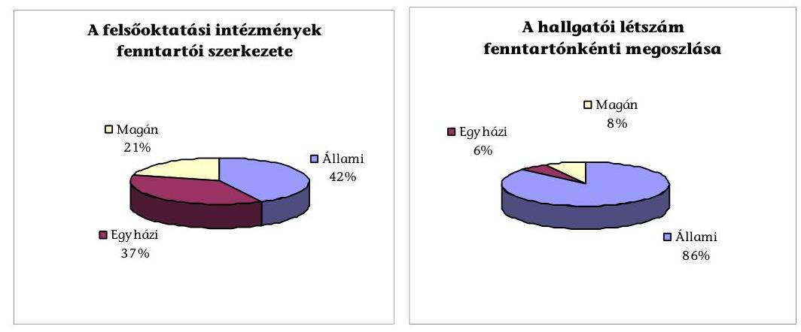

Adatok: OKM Statisztikai Osztály, 2008/2009. tanév
A felsőoktatás rendszerét a 2008/2009-es tanévben 71 intézmény alkotta 173 karral. A fenntartó szerint 30 intézmény állami ( 18 egyetem, 12 főiskola), 26 egyházi ( 5 egyetem, 21 főiskola), 15 magán vagy alapítványi ( 2 egyetem, 13 főiskola) volt. A felsőoktatásban a 2008/2009-es tanév elején 381019 hallgató vett részt. Ebből a felsőfokú tanulmányokat végzők száma 347764 fő, a felsőfokú szakképzésben vagy szakirányú továbbképzésben részt vevőké 33255 fő volt. Az oktatók és tanárok létszáma 22362 fő volt.

A felsőoktatási intézmény múködéséhez szükséges pénzügyi forrásokat az államháztartás alrendszereiből ${ }^{1}$ származó támogatás, átvett pénzeszköz ${ }^{2}$ és államháztartáson kívüli forrásból ${ }^{3}$ származó, valamint a nem állami fenntartó által biztosított bevételek alkotják. Az állami támogatások három csatornán keresztül jutnak el a felsőoktatási intézményekhez: normatív finanszírozás rendszerében, pályázati úton és megállapodások alapján nyújtott támogatásokként. Az állami felsőoktatási intézmények központi költségvetési támogatása 2008. január 1-jétől - az intézmények és a minisztérium között létrejött - hároméves fenntartói megállapodás keretében történik.

A felsőoktatási intézményekben folyó képzésre az OKM fejezetben 2008-ban 231,1 Mrd Ft költségvetési támogatást fordítottak. A fejezetnél a felsőoktatás állami támogatásának eredeti előirányzati összege 2009-ben 209,6 Mrd Ft-ra

[^0]
[^0]:    ${ }^{1}$ központi költségvetés fejezetei, elkülönített állami pénzalapok, helyi önkormányzatok költségvetése
    ${ }^{2}$ más fejezeti kezelésű előirányzatokból, más költségvetési szervezetektől, non-profit szervezetektől átvett pénzeszközök
    ${ }^{3}$ vállalkozásoktól, alapítványoktól, EU-költségvetésből származó bevételek

---

csökkent. A költségvetési támogatásokból az állami felsőoktatási intézmények 216,0 Mrd Ft-tal, az egyházi felsőoktatási intézmények 11,3 Mrd Ft-tal, az alapítványi felsőoktatási intézmények 3,2 Mrd Ft-tal, a gazdasági társaságok által fenntartott felsőoktatási intézmények 0,6 Mrd Ft-tal részesültek.
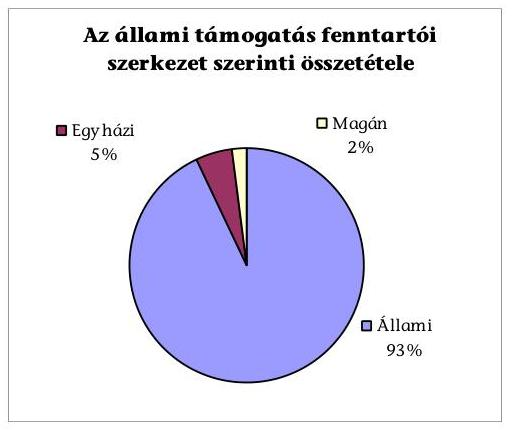

Forrás: OKM statisztika
Az EU 27 tagállamában 2007-ben a felsőoktatásra a GDP 1,2\%-át költötték átlagosan - az Eurostat becslése szerint. Magyarországon a felsőoktatásra költött kiadások a GDP 1\%-át tették ki ${ }^{4}$.

Az ellenőrzés célja annak értékelése volt, hogy

- a 2005. évben döntéshozói beavatkozásként elfogadott új felsőoktatási törvény előírásainak alapulvételével kialakított ágazati irányítási és finanszírozási rendszer elősegítette-e az oktatási feladatok minőségi, versenyképes, eredményes ellátását;
- a felsőoktatási rendszer intézményeinek - új szabályozás szerint kialakított -oktatási-képzési tevékenysége, múködési rendje, valamint a gazdasággal való együttmúködése eredményesség- és hatékonyságjavulással járt-e;
- a felsőoktatási intézmények finanszírozásának és gazdálkodásának új szabályozásával a rendszerbeli beavatkozás elérte-e a kitűzött célokat.

Az ellenőrzés a 2005-2008 közötti időszakra irányult (a 2005. évet viszonyítási alapnak tekintve), a helyszíni vizsgálat befejezéséig (2009. január vége) tartó tendenciák értékelésével együtt.

Az ellenőrzés során 38 felsőoktatási intézménytől kértünk adatszolgáltatást (ebből 28 állami, 6 egyházi, 4 magán illetve alapítványi fenntartású felsőoktatási intézmény). A helyszíni ellenőrzés kiterjedt a felsőoktatás ágazati irányítását végző Oktatási és Kulturális Minisztériumra (OKM), az Oktatási Hivatalra $(\mathrm{OH})$ és a hozzájuk kapcsolódó háttérintézményekre valamint nyolc felsőoktatási intézményre (ebből 6 állami, 1 egyházi és 1 alapítványi fenntartású). A tanúsítványi adatszolgáltatásba, illetve a helyszíni ellenőrzésbe vont intézmények kiválasztása rétegzett mintavétellel - az intézmények fenntartók szerinti

[^0]
[^0]:    ${ }^{4}$ Forrás: Statisztikai tükör, II. évfolyam 15. szám, 2009. március 3., KSH

---

megoszlása, a költségvetési támogatás mértéke és a hallgatói létszám figyelembevételével - történt. Az ellenőrzött intézmények felsorolását a 3. sz. melléklet tartalmazza.

Az ellenőrzést a rendszerellenőrzés módszerével végeztük, amelynek során a törvényi előírások végrehajtása értékelésének középpontjában az eredményesség állt, kiegészítve a gazdaságosság és a hatékonyság elemeivel. Az ellenőrzés szempontjainak megalapozását szolgáló kérdéseket, kritériumokat és adatforrásokat a 10. sz. melléklet rögzíti. Az elemzéseket adatszolgáltatást biztosító tanúsítványokkal, helyszíni interjúkkal, valamint a Központi Statisztikai Hivatal (KSH) és az OKM felsőoktatási-statisztikai adatai felhasználásával alapoztuk meg. Kérdőíves megkérdezés alapján - a nem állami felsőoktatási intézmények mellett - gazdasági érdekképviseleti szervezetek, kamarák, munkaerő-piaci elhelyezkedést segítő szervezetek, valamint a hallgatói önkormányzatok véleményére is támaszkodtunk. A felmérések eredményeit az 6-9. sz. mellékletek tartalmazzák. A helyszíni ellenőrzés tapasztalatait az ellenőrzésben érintett szervezetek vezető beosztású képviselőiből álló fókuszcsoporttal megtárgyaltuk.

Az ellenőrzés végrehajtására az Állami Számvevőszékről szóló 1989. évi XXXVIII. törvény 2. § (3), (5) valamint a 17. § (3) bekezdései adtak jogszabályi alapot.

A jelentés-tervezetet egyeztettük az oktatási és kulturális miniszterrel, a MeH jogi és közigazgatási államtitkárával, valamint a Magyar Katolikus Egyház és a Magyarországi Református Egyház legfőbb vezetőivel. Észrevételező leveleiket és az arra adott válaszainkat az 1. sz. melléklet tartalmazza.

---

# I. ÖSSZEGZŐ MEGÁLLAPÍTÁSOK, KÖVETKEZTETÉSEK, JAVASLATOK 

A felsőoktatás rendszerét a 2005. évben elfogadott, többször módosított felsőoktatási törvény (Ftv.) szabályozza. A felsőoktatás rendszerére ${ }^{5}$, s annak súlyponti területeire - állami irányítás, képzési rendszer, finanszírozás-gazdálkodás - a külső és belső tényezők egyaránt hatással vannak.

A felsőoktatásra ható külső tényezők közül, elsősorban a társadalmi-gazdasági környezet, a demográfiai helyzet, az állami szerep- és tehervállalás, valamint a jogi szabályozás nevesíthető. A felsőoktatás belső, meghatározó tényezői között szerepel az intézményi - szakmai és gazdasági - autonómia, a rendelkezésre álló személyi, tárgyi, szellemi erőforrások mennyisége és minősége.

Az állami irányítás terén - az Ftv. alapján - az állam egyszerre jelenik meg ágazati irányítóként és ellenőrzést lefolytatóként, szabályozóként, megrendelő finanszírozóként és fenntartóként (tulajdonosként). Az Ftv. az állam XXI. századi szerepvállalását és felelősségét nem határozta meg egyértelműen, az állami feladatok végiggondolása nem történt meg. A 2005. évi alkotmánybírósági döntés ${ }^{6}$ indoklása az intézményi autonómia hangsúlyozására irányult, az Ftv. szabályozása az AB határozatban foglaltakat érvényesítette.

A 2005. évi törvényi szabályozást nem előzte meg átfogó, megalapozott, hoszszabb távú felsőoktatási stratégia elkészítése, csak koncepcionális szakmai programok kimunkálása (CSEFT, MUP) és azok széleskörű szakmai egyeztetése. Az OKM a stratégiai célkitűzések hiányában nem készítette el a felsőoktatás rendszere fejlesztési terveit, beleértve a középtávú fejlesztési tervet. A stratégiai megalapozottság hiányát jelzi, hogy az új Ftv-t már a hatálybalépés évében (2006.), majd azt követően a 2007. és 2008. években is módosították ${ }^{7}$. A módosításokat nem alapozták meg hatástanulmányokkal, társadalmi konszenzus

[^0]
[^0]:    ${ }^{5}$ Korábban már többször vizsgáltuk a magyar felsőoktatást. A magyar egyetemi felsőoktatás helyzetéről szóló - az Angol Számvevőszékkel párhuzamosan végzett 1993/1994. évi vizsgálat megállapította az intézmények alacsony hatékonyságát és javasolta a felsőoktatás szervezeti és irányítási rendjének korszerűsítését. „A felsőoktatási intézményhálózat integrációjának ellenőrzéséről" szóló 0311. sz. 2003. márciusi ÁSZ jelentés 2010-ig szóló középtávú fejlesztési tervet és az EFT-hez való eredményes csatlakozásunk érdekében a képzési szerkezet átalakítását és hatékonyabb intézményi múködést javasolt.
    ${ }^{6} 41 / 2005$. (X. 27.) AB határozat
    ${ }^{7}$ A 2006. évi XLVI. törvény, a 2006. évi LXXIII. törvény, a 2007. évi CIV. törvény, a 2008. évi XCIV. törvény és a 2008. évi XCVII. törvény. A 2008. március 9-i ügydöntő népszavazást követően a 2008. évi IX. törvény hatályon kívül helyezte a képzési hozzájárulásra vonatkozó szabályokat. Az Ftv. módosítására vonatkozóan folyamatban van több, 2009. I. félévében képviselői indítványként benyújtott törvényjavaslat, amelyek a nemzetközi jellegű felsőoktatási intézmények működését, illetve a szakindítást, az államilag támogatott tanulmányi idő csökkenését, valamint az intézmények gazdálkodását érintik.

---

nélkül hagyták jóvá (pl. tandíj bevezetése). A felsőoktatás rendszere túlszabályozott. Az ellenőrzött időszakban a törvény mellett több mint 30 kormányrendelet és miniszteri rendelet szabályozta túlzó részletességgel a rendszer múködését. Az OKM a vizsgált időszakban nem ellenőrizte az intézményeknél az Ftv. végrehajtását.

Az Ftv-t megalapozó dokumentum nem számolt kellő mértékben a demográfiai helyzetből adódó hallgatói létszámcsökkenés és az oktatási kapacitások összhangjával. Nem határozott meg konkrétan elérendő célokat és európai felsőoktatási térségbeli kitörési pontokat a hazai felsőoktatási intézmények számára. A 2008. évi felsőoktatási kapacitás-akkreditáció 489 ezres hallgatói férőhelyet rögzít, szemben a 2008. október 15-i 381 ezer fős tényleges hallgatói létszámmal. Ez 28,3\%-os - szerkezetében képzési szakonként eltérő - kapacitástöbbletet, s egyben túlkínálatot mutat, amely a demográfiai helyzet nyomán ${ }^{8}$ az elkövetkező években tovább növekszik.

A felsőoktatás intézményi szerkezete jelenleg túlságosan tagolt a törvény által biztosított intézményalapítási jogosultságok ${ }^{9}$ következtében. A 71 intézmény $42 \%$-a állami, $37 \%$-a egyházi, $21 \%$-a magán intézmény. A hallgatói létszám $86 \%$-a állami fenntartású intézmény hallgatója, az állami támogatás $93 \%$ ából az állami intézmények részesülnek.

A törvény végrehajtása során a felsőoktatási információs rendszer (FIR) stratégiai célkitűzéseit, annak prioritásait, feladatait és feltételeit, valamint tárca részéről kijelölt felelősét az OKM nem határozta meg. Az adatok alacsony, 28\%os feltöltöttsége miatt a FIR használhatósága erősen korlátozott, a 730 M Ft-os központi költségvetési támogatás ellenére. A problémák irányítási, menedzselési, szervezési és intézményi adatszolgáltatási hiányosságokra vezethetők viszsza. A FIR-hez kapcsolódó törvényességi ellenőrzési feladatok ellátásáról, az ágazati miniszter nem gondoskodott, a rendszer múködése nem tekinthető eredményesnek.

Az Ftv. végrehajtásaként megtörtént a többciklusú képzési rendszer kialakítása (alap-, mester- és doktori képzés), mely egyidejűleg struktúraváltó és hagyományőrző. Az intézmények oktatás-képzési szerkezetének átalakítása összhangban volt a felsőoktatás ágazati céljaival és az intézményfejlesztési tervekkel. Az eddig bevezetett alapképzési szakok rendszere, képzési ideje összességében megfelel az EFT-ben megtalálható képzéseknek. Az alap- és mesterképzés kialakítása - a képzési és kimeneti követelmények azonos jogszabályi előírásával - nem egyidőben történt, ami nehezíti az egymásra épülő szakstruktúra létrehozását. Az előkészítés nem volt kellően megalapozott.

[^0]
[^0]:    ${ }^{8}$ A felsőoktatási intézmények hallgatói létszámát leginkább befolyásoló 20-24 éves korcsoport létszáma folyamatosan csökken. A demográfiai adatok szerint a 2000-ről 2007-re az általános iskolát kezdő tanulók száma 17,2\%-kal csökkent. (Forrás: Oktatásstatisztikai évkönyv 2007/2008.)
    ${ }^{9}$ Az Ftv. 7. § (1) bekezdése a magyar állam, a helyi önkormányzat, az országos kisebbségi önkormányzat, az egyházi jogi személy, a gazdálkodó szervezet, az alapítvány, a közalapítvány számára szektorsemlegesen biztosítják az intézményalapítás lehetőségét.

---

Az alapképzésben az első teljes végzős évfolyam a 2008/2009. tanévben fejezi be tanulmányait, s ezt követően indul a mesterképzés. A MAB által akkreditált képzések munkaerő-piaci indoklása nem volt megalapozott, mert nem mun-kaerő-piaci prognózisokra és nemzetközi tendenciákra, hanem az adott szakterületen végzettek eddigi elhelyezkedési lehetőségeire épült. A 2005-ben elindított 131 alapképzési szak többsége képzési helyenként szétaprózódott, párhuzamosan 7-28 intézménynél folytatott képzés ${ }^{10}$, amely - a munkaerő-piaci elhelyezkedést segítő szervezetek kérdőíves felmérése alapján ${ }^{11}$ - a jogász- és bölcsészképzésben 30-50\%-os, a pedagógus-, közgazdász- és menedzserképzés területén 10-30\%-os túlkínálatot eredményez. Mindez az oktatási és pénzügyi erőforrások szétforgácsolódását, alacsony hatékonyságát jelzi, s az oktatás minősége ellen hat.

Az államilag támogatott hallgatói létszámkeret a 2005-2009. években
adatok: fő

| Képzés | 2005. | 2006. | 2007. | 2008. | 2009. |
| :--: | :--: | :--: | :--: | :--: | :--: |
| Felsőfokú szakképzés | 11000 | 12500 | 12500 | 11520 | 12500 |
| Főiskolai szintű képzés | 33500 | - | - | - | - |
| Alapképzés összesen | - | 45000 | 39450 | 40630 | 39750 |
| Ebből: |  |  |  |  |  |
| - bölcsészettudomány | - | - | 4800 | 4800 | 4800 |
| - gazdaságtudományok | - | - | 6000 | 6300 | 5900 |
| - jog és igazgatás | - | - | 500 | 530 | 500 |
| - müszaki | - | - | 9200 | 9600 | 9600 |
| - orvos- és egészségtudomány | - | - | 2000 | 2100 | 2000 |
| Egyetemi szintű képzés | 17500 | - | - | - | - |
| Egységes osztatlan képzés összesen | - | 4500 | 3250 | 3050 | 2950 |
| Ebből: |  |  |  |  |  |
| - jog és igazgatás | - | - | 1200 | 1100 | 1000 |
| - orvos- és egészségtudomány | - | - | 1500 | 1400 | 1400 |
| Összesen | 62000 | 62000 | 55200 | 55200 | 55200 |
| Mesterképzés | - | - | 300 | 3500 | 21700 |
| Doktori képzés | - | - | 1000 | 1000 | 1000 |

Forrás: 1092/2004. (IX. 29.); 2227/2005. (X. 26.); 1108/2006. (XI. 20.); 1077/2007. (X. 4.); 1051/2008. (VII. 28.) Kormányhatározatok az egyes években a felsőoktatásban felvehető, államilag támogatott létszámkeretekről.

A képzési szerkezet átalakítása az oktatási teljesítményekben még nem hozott jelentős változást. A törvényi szabályozás nem ösztönzi a hallgatókat a tanulmányaik rövidebb idejű elvégzésére. A kreditrendszer elősegíti a hallgatói mo-

[^0]
[^0]:    ${ }^{10}$ Gazdálkodási és menedzsment alapszakot 28, kommunikációs és médiatudomány alapszakot 19, kereskedelem és marketing alapszakot 14 intézmény indított. A bölcsészettudományi szakterületen 7-7 intézmény rendelkezik filozófia, illetve pszichológia mesterszak indítási engedéllyel. A 2007/2008. tanévben az összes - főiskolai, egyetemi szintű tanulmányokat folytató - hallgató közül a legtöbben, 92517 fő (25,7\%) a gazdasági és menedzsment szakterület valamelyik szakára jártak, a második legnépszerűbb a műszaki szakterület volt, ahova összesen 48935 fő (13,6\%) járt.
    ${ }^{11}$ Részletek a 8. sz. mellékletben

---

bilitást és a hallgatók kétirányú, ténylegesen kismértékű nemzetközi mozgását ${ }^{12}$, de egyidejűleg nőtt a diploma megszerzésének átlagos időtartama.

A felvett és a végzős hallgatók
számának alakulása
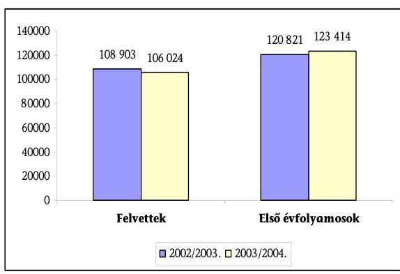
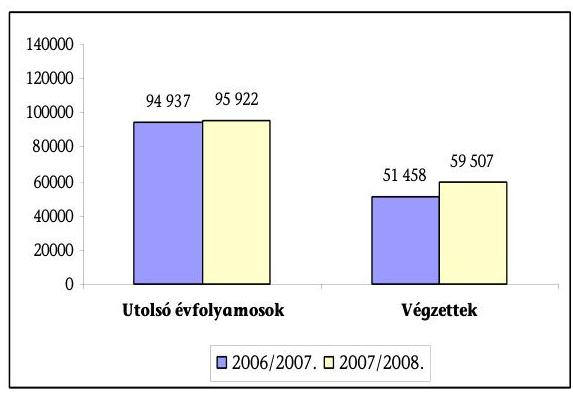

Adatok: OKM statisztikai évkönyvek, Országos Felsőoktatási Információs Központ
A KSH adatok tanúsága szerint a 4-5 éves felsőoktatási képzési időt figyelembe véve több tízezres hallgatói létszámkülönbség van - a későbbi beiratkozás, évismétlés, illetve a lemorzsolódás, az államilag támogatott 12 féléves tanulmányi idő és a kötelező nyelvvizsga le nem tétele miatt - a felvett és első évfolyamos hallgatói létszám, illetve az utolsó évfolyamos hallgatók és a diplomát szerzett hallgatói létszám között ${ }^{13}$. Mindez folyamatos állami támogatást, valamint a hallgatói teljesítmények színvonalának csökkenését jelzi. Ez utóbbit erősíti a jelenlegi alacsony ponthatárhoz kötött felvételi rendszer és a közoktatásból érkező hallgatók gyenge felkészültsége.

Az ellenőrzött időszakban az oktatás minőségét meghatározó mutató az egy oktatóra jutó hallgatók száma 2005-ről 2008-ra kismértékben javult (18,3 fơről 17 főre), nemzetközi összehasonlításban ${ }^{14}$ azonban némileg magas. Az oktatói teljesítményértékelést az intézmények bevezették, de nem kapcsolódott hozzá differenciált bérezés. Az oktatói munka hallgatói véleményezésének rendszerét az intézmények többsége kialakította, de a hallgatók véleménye szerint ez nem eredményezett minőségi változást a felsőoktatásban.

A demográfiai helyzet és a fizetőképes kereslet változásának hatására 2005-ről 2008-ra fokozatosan (összesen 26,7\%-kal) csökkent a felsőoktatásba jelentkezők száma. Az összes hallgató létszámon belül a költségtérítéses hallgatók ará-

[^0]
[^0]:    ${ }^{12}$ A magyar hallgatói mobilitás nemzetközi összehasonlításban alacsony szintű. 2006ban az összes hallgató 1,7\%-a tanult más európai uniós országokban, míg az EU 27 átlaga 2,7\% volt. A Magyarországon tanuló összes hallgató 2,1\%-a külföldi, addig ez az arány EU tagállamokban átlagosan 3\%-os. (Forrás: KSH)
    ${ }^{13}$ A tanúsítványi adatszolgáltatás szerint az adatszolgáltató intézményeknél az előírt, mintaterv szerinti képzési időn belül végzettek száma 50-55\% körüli volt. Ez az arány a válaszadó 31 intézmény közül 22 esetében romlott 2005. évről 2007. évre.
    ${ }^{14}$ Az OECD országokban az egy oktatóra jutó hallgatók száma 2006-ban átlagosan 15,3 fő, míg az OECD tag EU tagállamok esetében 16 hallgató/oktató volt. (Forrás: Education at a Glance 2008 OECD)

---

nya - a levelező- és távoktatásban résztvevők számának és a fizetőképes kereslet csökkenése miatt - 49\%-ról 44\%-ra esett vissza. Az államilag támogatott hallgatói arány $51 \%$-ról $56 \%$-ra nőtt, miközben az évente felvehető államilag támogatott létszám 62 ezer főről 56 ezer főre csökkent.
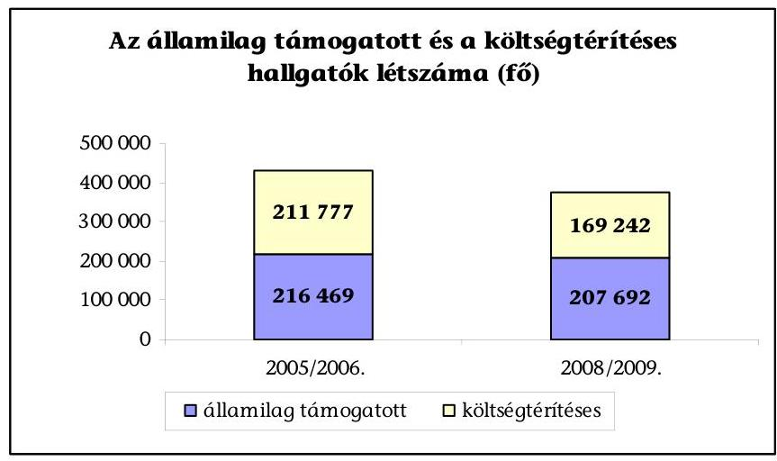

A felsőoktatás és a gazdaság együttműködésének javítására irányuló törvényi célkitűzés csak részben teljesült. A gazdálkodó szervezetek képviselői megfelelő együttműködéssel részt vettek a képzési programok és tananyagok véleményezésében, a gyakorlati képzés feltételeinek kialakításában. A kialakult képzési szerkezet ugyanakkor elsősorban munkaerő-piaci prognózisok hiányában nem felel meg a munkaerő-piaci igényeknek.

A törvény által előírt - a felsőoktatás és a munkaerő-piac kapcsolatát javítandó - diplomás pályakövetési rendszer kialakításában nem történt érdemi előrelépés. Jelenleg az intézmények 5-10\%-a folytat rendszeres pályakövetést. Az intézményi pályakövetési minta nem reprezentatív, alkalmazására nincs egységes gyakorlat - ezt az OKM nem kezdeményezte -, a törvényben előírt ez irányú ösztönzők nem elégségesek és nem biztosítják az adatintegrációhoz szükséges jogszabályi hátteret. A munkanélküliek közül a diplomások aránya a vizsgált időszakban 7,6,-8,1\% között alakult.

A hallgatók, a gazdasági érdekképviseletek és a munkaerő-piaci elhelyezkedést segítő szervezetek egyöntetű, összegezett kérdőíves véleménye alapján az Ftv. csak részben segítette elő a felsőoktatási versenyképesség javulását, a vállalati szféra és a felsőoktatás együttműködésének erősítését. Véleményük szerint - az ellenőrzés álláspontjával egyezően - sok szakterületen a képzési szerkezet nincs összhangban a munkaerő-piaci kereslettel, nem gyakorlatias a képzés, alapvetően a képzési színvonal sem változott. Túlkínálat van jogász, bölcsész, pedagógus, közgazdász és menedzserképzésben. A bolognai képzési rendszer elfogadottsága munkaadói oldalról bizonytalan és ismerethiányos.

Az Ftv. előírásai szerint a felsőoktatás finanszírozása többcsatornás (normatív támogatások, pályáztatás, megállapodások) rendszerben valósult meg. Az ellenőrzésbe vont intézményeknél az állami támogatás 70\%-át (az oktatásképzési támogatás $95 \%$-át) kitevő normatív finanszírozásban - a korábbi sza-

---

bályozáshoz képest - lényeges elmozdulás nem történt ${ }^{15}$. A normatívák meghatározása nem a képzéshez szükséges költségek vagy teljesítménykövetelmények alapján történik, hanem gyakorlatilag bázisalapú finanszírozásként, döntően ( $80 \%$-ban) az államilag támogatott hallgatói- és kisebb mértékben az oktatói, illetve alkalmazotti létszámhoz rendelve. Így az intézmények a hallgatói létszám növelésében és fenntartásában érdekeltek. A felsőoktatási intézmények államilag támogatott hallgatói létszámát - a jelentkezések mellett - az évenként változó minisztériumi döntések határozzák meg. Az állami források biztosításának jelenlegi rendszere - a hallgatókért folytatott verseny ellenére nem járult hozzá az intézmények minőségi szelekciójához. Az állami támogatás független a munkaerő-piac és a hallgatók értékítéletétől.

Az intézmények állami támogatása reálértékének megőrzésére irányuló állami kötelezettségvállalások nem teljesültek, elsősorban a képzési normatívák reálértékének csökkenése miatt. Az ellenőrzött időszakban az államháztartáson kívüli források bevonása az ellenőrzésbe vont felsőoktatási intézményeknél 13\%kal növekedett, de 2008-ban is csak 25\%-ot tett ki az intézményi bevételeken belül.

Az állami intézményeknél 2008-ban bevezetett előremutató hároméves fenntartói megállapodási rendszer ${ }^{16}$ - a deklarált kiszámíthatósága, tervezett értékőrzése, valamint rögzített teljesítménykövetelményei ellenére - az eddigi tapasztalatok szerint nem ösztönzi kellőképpen az intézményeket az oktatás minőségének és a működés hatékonyságának javítására. A megállapodásokban foglalt teljesítménykövetelmények nem egységesek, nem összehasonlíthatóak, ugyanis az intézmények saját maguk választják meg a mutatókat a kritériumokkal együtt, s a fejlődést az intézmények önmagukhoz mérik.

Az Ftv. tartalmaz elemeket az intézmények gazdasági önállóságának, valamint a felsőoktatás és a gazdaság együttmúködésének javítására, ezekkel éltek az intézmények, de ez összességében nem hozott áttörést a gazdálkodásban ${ }^{17}$. Az OKM felügyelete alá tartozó állami intézmények saját bevételeinek aránya $0,8 \%$-ponttal csökkent.

[^0]
[^0]:    ${ }^{15}$ A normatív finanszírozási rendszerrel kapcsolatban - mind „A felsőoktatás normatív finanszírozási rendszer múködésének ellenőrzéséről" szóló 0433. sz. ÁSZ jelentésben, mind „A felsőoktatás átalakulása a finanszírozási rendszer korszerűsítése" c. ÁSZ FEMI tanulmányban (2004. december) - megállapított és feltárt rendszerbeli problémák továbbra is fennállnak.
    ${ }^{16}$ Az Ftv. 133/A. § előírása szerint az állami felsőoktatási intézmények központi költségvetési támogatására három éves fenntartói megállapodást kell kötni az intézmény és a fenntartó között. Ez tartalmazza az intézmény által meghatározott hároméves időszakra vállalt teljesítmény-követelményeket, továbbá az állandó jellegű támogatási részeket, valamint a változó jellegű támogatások megállapításának jogcímeit.
    ${ }^{17}$ A költségvetési szervek jogállásáról és gazdálkodásáról szóló 2008. évi CV. törvény 16. § (1) bekezdés c.) pont a felsőoktatási intézmények számára is lehetővé teszi 2009. évtől - további részletező jogi szabályozás kialakítása alapján - a vállalkozói közintézetként való múködést.

---

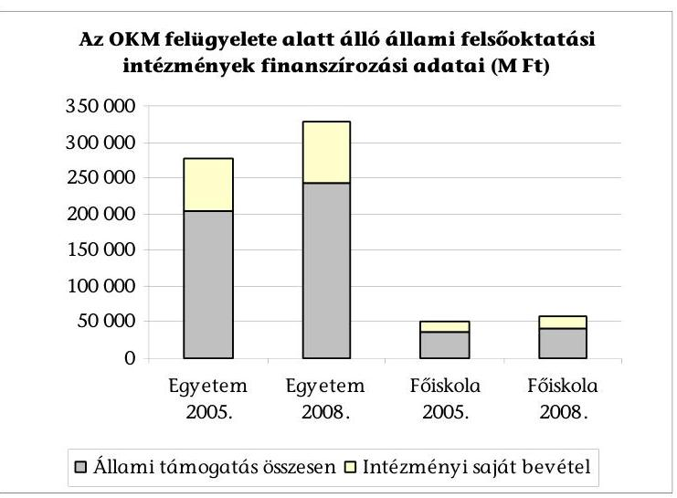

Az állami felsőoktatási intézmények 2007-ben 68 gazdasági társaságban 2005. évhez képest 19-cel több társaságban - rendelkeztek tulajdoni részesedéssel. Az OKM a társaságok múködését a helyszíni ellenőrzés befejezéséig felügyeleti hatáskörben átfogóan nem értékelte. A PPP konstrukcióban részt vevő 17 állami felsőoktatási intézmény közül 5 intézmény kötelezettségvállalása az árfolyamváltozások miatt ${ }^{18}$ meghaladta az éves dologi és felhalmozási előirányzat együttes összegének $10 \%$-át ${ }^{19}$. A MeH álláspontja szerint - a kedvezőtlen pénzügyi-gazdasági folyamatok miatt - mielőbb szükség van 2009. évben válságmenedzselő felsőoktatási intézkedések előkészítésére és megvalósítására.

A felsőoktatási intézmények gazdálkodási önállóságát a költségvetési korlátok közé szorított intézményi autonómia és a folyamatosan változó - s előre ki nem számítható - jogi, finanszírozási keretek befolyásolják. Az Ftv. az intézmények számára a költségvetési szervek általános szabályozásától eltérő gazdálkodási és vagyongazdálkodási lehetőségeket biztosít. Az intézményi döntéshozatal a gazdálkodási kérdésekben szenátusi döntéssel, a gazdasági tanács (GT) véleménynyilvánítása, döntés-előkészítése mellett valósul meg. A gazdasági tanácsok betöltik a törvényben előírt feladataikat, az intézményi gazdálkodáshoz piaci hatásokat közvetítenek az irányítás számára, de - döntési jogosultságuk nem lévén - szerepük másodlagos a döntési folyamatban.

Az állami felsőoktatási intézmények jelenlegi vagyonkezelői jogköre megfelelő keretet biztosít az állami feladatellátáshoz. Az Ftv. 2008. év végi módosítása az állami vagyonról szóló törvénnyel ${ }^{20}$ szemben - a korábbi szabályozásnál rövidebb átfutási idejű állami ingatlanértékesítési lehetőséget biztosít indokolt esetben a felsőoktatási intézmények részére.

[^0]
[^0]:    ${ }^{18}$ A PPP-konstrukció kockázati tényezőjeként nevesítette az EUR/Ft árfolyam alakulását a felsőoktatás kollégium beruházás programjának ellenőrzéséről szóló 0741 . sz., 2007. októberi ÁSZ-jelentés.
    ${ }^{19}$ Ftv. 122.§(4) bekezdés
    ${ }^{20}$ Az állami vagyonról szóló 2007. évi CVI. törvény 33-35. §-ai.

---

Az egyházi és magán, illetve alapítványi felsőoktatási intézmények működése, képzési rendszere és finanszírozása a szektor-semleges intézményalapításon és az Ftv. által biztosított törvényes előírások alapján történik, ennek keretében átálltak a többciklusú képzésre. Az állami és az egyházi fenntartók megállapodása nyomán a 2007/2008. tanévben az egyházi intézmények hallgatóinak 63,5\%-a, a magán intézmények hallgatóinak 23,3\%-a államilag támogatott. Az állami intézményekkel azonos elvi alapon álló finanszírozásukban 2008-tól bekövetkezett változást jelentett, hogy a magán intézmények nem kapnak fenntartói normatívát. A fenntartóik az egyházi intézményeket 1,6-2,2\%-os, a magán intézményeket $0-0,7 \%$-os - intézményi bevételhez viszonyított - alapítói hozzájárulással támogatták. A fenntartókat az Ftv. nem kötelezi meghatározott mértékű fenntartói támogatásra.
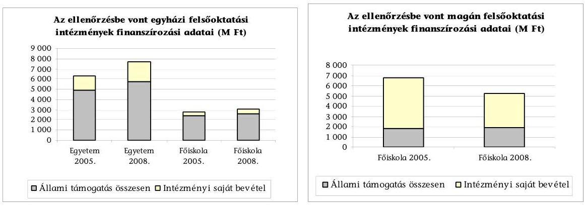

Összegezve, a magyar felsőoktatás rendszerét a mennyiségi és minőségi tényezők ellentmondásai és ellenhatásai, valamint a túlzott központi szabályozás és a törvényben rögzített intézményi autonómia kettőssége jellemzi. Az Ftv. előírásai szerint működő ágazati irányítási és finanszírozási rendszer részlegesen segítette az oktatás-képzési feladatok végrehajtását, amely elsősorban a felsőoktatási stratégia hiányára, a szabályozás és a végrehajtás hiányosságaira vezethető vissza. Az új szabályozással kialakított képzési rendszer, múködési rend teljes átalakítása még nem fejeződött be, jelenlegi stádiumában eredményesség- és hatékonyságcsökkenést mutat. A finanszírozás és a gazdálkodás szabályozása nem érte el a kitűzött célokat, a felsőoktatás versenyképességének növelése érdekében a felsőoktatás piacgazdasághoz igazítása, gazdasággal való együttműködése nem hozott érdemi eredményeket. A képzési és a finanszírozási rendszer nem hatékony, nem ösztönöz a minőség javítására. Az ellenőrzött időszakban az erőforrások szétaprózása, a költségvetés folyóáras felsőoktatási kiadásainak emelkedése, valamint a fajlagos költségvetési kiadások nominál- és reálértékének növekedése miatt ${ }^{21}$ a felsőoktatási rendszer múködése nem gazdaságos.

[^0]
[^0]:    ${ }^{21}$ Lásd „A költségvetés felsőoktatási kiadásai a 2005-2008. közötti években" c. 19. sz. táblázatot

---

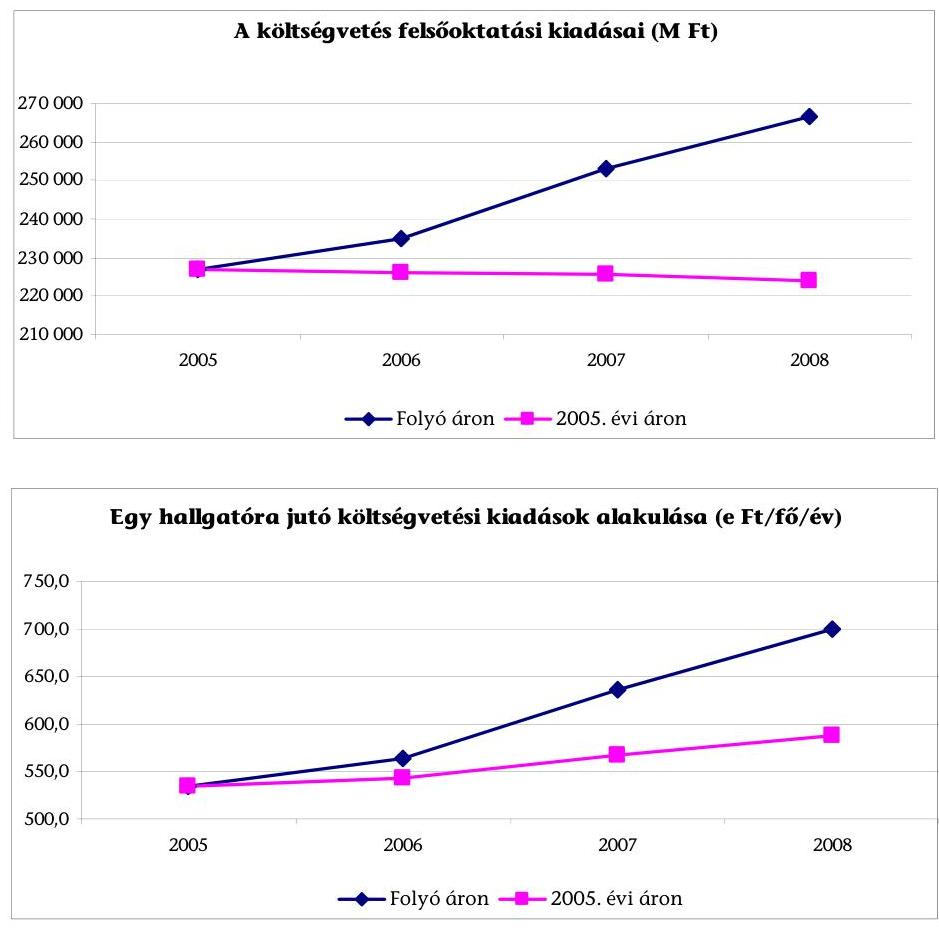

Megállapításainkat - a helyszíni ellenőrzés tapasztalatai és a felsőoktatási adatok elemzése mellett - a gazdasági érdekképviseleti szervezetek, kamarák, a munkaerő-piaci elhelyezkedést segítő szervezetek és a hallgatói önkormányzatok véleménye is visszatükrözi.

A helyszíni ellenőrzés megállapításainak hasznosítása mellett javasoljuk:

# a Kormánynak: 

Intézkedjen megalapozott felsőoktatási stratégia elkészítéséről, amely rövidtávon a társadalmi-gazdasági és demográfiai folyamatokhoz igazodó képzési szerkezetet irányoz elő; közép- és hosszú távon a piaci kontroll érvényesítésével határozza meg az intézményi szerkezetet, az állami szerepvállalást, valamint a felsőoktatás erőforrásallokációját.

## az oktatási és kulturális miniszternek:

1. Készítesse el a kormányzati felsőoktatási stratégia alapján a felsőoktatás rendszere fejlesztési terveit, különös tekintettel az eddig hiányzó középtávú fejlesztési tervre, amely rögzíti az oktatás-politikai célkitűzéseket, prioritásokat, a célok elérésének feltételeit, határidőit, finanszírozási forrásait és költségvonzatait.
2. Tekintse át - az illetékes szakmai testületek bevonásával - a felsőoktatás képzési rendszerét, és határozza meg a képzési rendszer hatékonyabbá tételének főbb irá-

---

nyait; a mesterszak létesítési folyamat lezárását követően végeztesse el a képzési és kimeneti követelmények egységes felülvizsgálatát, különös tekintettel a munkaerőpiaci prognózisokra.
3. Kezdeményezze a felsőoktatás mennyiségi alapon nyugvó normatív finanszírozásának átalakítását egységes és összehasonlítható, az intézmények felé minőségi telje-sítmény-követelményeket támasztó finanszírozási rendszerré.
4. Intézkedjen a FIR továbbfejlesztéséről és oktatás-politikai célokat szolgáló működéséről, gondoskodva a FIR-ben kezelt adatok védelmét szolgáló kontrollok kialakításáról, a FIR-re vonatkozó törvényességi ellenőrzési kötelezettség teljesítéséről, kijelölve az oktatás-politikai igények meghatározásáért és érvényesítéséért felelős tárcaképviselőt.
5. Gondoskodjon a diplomás pályakövetési rendszer központi adatintegrációjához szükséges jogszabály-módosítások előterjesztéséről.

---

# II. RÉSZLETES MEGÁLLAPÍTÁSOK 

## 1. A FELSŐOKTATÁs ÁGAZATI IRÁNYÍTÁSI RENDSZERE

### 1.1. A döntéshozói beavatkozás, a jogalkotás hatása a felsőoktatási feladatok ellátására

### 1.1.1. Az új felsőoktatási törvény megalapozottsága, összhangja a felsőoktatás fejlesztési stratégia céljaival

Az OM a bolognai szerződésből hazánkra háruló feladatok teljesítése érdekében 2002 szeptemberében indította el a Csatlakozás az Európai Felsőoktatási Térséghez (CSEFT) projektet, amely 2003. év végén került véglegesítésre. Az elkészült - „A magyar felsőoktatás modernizációját, az európai felsőoktatási térséghez történő csatlakozását célzó felsőoktatás fejlesztés koncepciója" című - vitaanyagot a tárca a felsőoktatási reform szakmai alapdokumentumaként kezelte.

A vitaanyag a felsőoktatás reformját az akadémiai, az intézményi, az irányítási és a finanszírozási területeken határozta meg, a megvalósítását a 2006/2007. tanévre irányozták elő. A vitaanyag alapján készült el, „A Magyar Universitas Programról, valamint az új felsőoktatási törvény koncepciójáról" szóló dokumentum, amely meghatározta az új felsőoktatási törvény fontosabb célkitűzéseit, elemeit.

A dokumentum fontosabb elemei: a képzési szerkezet, a minőségpolitika és minőségfejlesztés kialakítása, intézmények alapítása, jogállása és belső irányítása; az ágazati irányítás, a fenntartói irányítás, hatósági jogkörök, az állami finanszírozás és az intézményi gazdálkodás rendszerének átalakítása; a hallgatók helyzetének javítása, az oktatói jogállás és bérrendszer reformja, a törvény kapcsolódása a megvalósítást támogató fejlesztési programokhoz.

A dokumentum alapján a Kormány határozatot fogadott el a MUP-ról, valamint az új felsőoktatási törvény koncepciójáról - 1068/2004. (VII. 9.) Korm. határozat - amely az új törvény előkészítéséről, a törvénytervezet kidolgozásáról, és a Kormány elé terjesztésről döntött.

A felsőoktatásról szóló új törvény létrehozását a felsőoktatási intézményrendszer, a képzési szerkezet átalakítása, a költségvetési források hatékonyabb felhasználása, a magyar felsőoktatásnak az EFT kialakításában való aktív részvétele, a versenyképes XXI. századi felsőoktatás megteremtése, valamint az oktatási és a munkaerő-piaci igények összehangolása indokolta.

A törvényi szabályozást és a felsőoktatási reform alapjául szolgáló dokumentumok elkészítését nem előzte meg átfogó, megalapozott oktatási és felsőoktatási stratégia kialakítása, illetve a végrehajtásért felelősöket kijelölő részletes intézkedési terv kidolgozása.

---

A törvényt megalapozó dokumentum - amelyben a nemzetközi kötelezettségek mihamarabbi végrehajtása, a külföldi modellek, modellpanelek átvétele jelenik meg hangsúlyosan - nem volt kellően előkészített. Az intézményi reform kivételével nem vizsgált további megvalósítási lehetőségeket, általánosan, konkrét elemek nélkül határozta meg az elérendő célokat, nem teremtette meg a közremúködők érdekeltségi rendszerét, nem jelölte ki a végrehajtás felelőseit és a résztvevők felelősségét. Nem készült a reform várható szakmai, társadalmi, gazdasági hatásait bemutató hatástanulmány.

A hiányos előkészítés miatt a megalapozó dokumentum nem vette figyelembe a várható demográfiai csökkenésből adódó hallgatói létszámcsökkenést, nem nevezte meg az EFT-ben a hazai intézmények számára elérhető kitörési pontokat. Piaci modell kialakítását tűzte ki célul, de nem végzett részletes piac- és gazdasági elemzést. Nem modellezte az átalakulást követően kialakuló felsőoktatási struktúrát, ennek várható gazdasági helyzetét, pozícióját, bevételi és kiadási szerkezetét, fejlesztési irányait. Nem mutatta ki, hogy mitől és miben lehet jobb, esetleg rosszabb a kialakítandó felsőoktatási rendszer. Nem tért ki arra, hogy a hazai kedvező sajátosságokból mi és hogyan építhető be az új rendszerbe, amelyből versenyelőnyt lehetne kialakítani az európai felsőoktatási térség piacán.

A felsőoktatásról szóló új törvényt - 2005. évi CXXXIX. törvény (Ftv.) - az OGY 2005. november 29 -én fogadta el.

Az elfogadott törvény - a felsőoktatási stratégia hiánya, a képzési és finanszírozási rendszerbeli hiányosságai miatt - nem kellően megalapozott, megfogalmazásai sok esetben nem egyértelmúek, keverednek benne a részletes és a keretszabályozási elemek, átfedés van a törvény és a végrehajtási rendelet között.

A megalapozottság hiányára utal több rendelkezés bevezetése, majd módosítása (pl. a hitelfelvételi lehetőség illetve a képzési részhozzájárulás bevezetése, majd eltörlése; a Regisztrációs központ létrehozása, majd a feladatok OH -hoz telepítése).

A BME 2007. évi szöveges beszámolója szerint a törvény szövegszerúen nehezen értelmezhető, az ellentmondásos szabályozás komoly többlet-erőfeszítést kíván az intézményektől.

A hallgatók átsorolására vonatkozó részletszabályozást a felsőoktatási intézmények felvételi eljárásairól szóló 237/2006. (XI. 27.) Korm. rendelet és az Ftv. egyaránt tartalmazza.

Az új Ftv. ugyanakkor megteremtette a lehetőséget az oktatás-képzés minőségének javítására, a képzési szerkezet átalakítására, az államilag támogatott és a költségtérítéses képzés közötti átsorolásra valamint a gazdasági önállóság bővítésére.

# 1.1.2. A törvény módosításai, azok indokoltsága 

Az új Ftv-t már a hatálybalépés évében 2006-ban, majd azt követően a 2007. és 2008. években is módosította az OGY.

---

A 2006. évben két alkalommal, a 2006. évi XLVI. és a 2006. évi LXXIII. törvény, a 2007. évben a 2007. évi CIV. törvény, a 2008. évben a 2008. évi XCIV. és a 2008. évi XCVII. törvény módosította az új Ftv-t. A módosítások következtében az előírások háromnegyede változott, egyes részek többször is módosultak. A 2008. március 9-ei ügydöntő népszavazás eredményeképpen a 2008. évi IX. törvény hatályon kívül helyezte a képzési hozzájárulásra vonatkozó szabályokat.

A módosítások részben a megfelelő törvény-előkészítés hiányára, a különböző lobbycsoportok erős érdekérvényesítésére vezethetők viszsza, de az idöközben bekövetkezett társadalmi-gazdasági változások (a demográfiai hatások, a népszavazás, a versenyképesség növelése iránti igény, a konvergencia-programhoz kapcsolódó követelmények) és az ezekből eredő hatások is indokolttá tették azt.

A módosítások egyrészt technikai változtatásokra, más jogszabályok módosításával, európai uniós előírásokkal összefüggő koherencia zavarok kiküszöbölésére irányultak, másrészt a törvény lényeges változtatását eredményezték.

Az irányító testületek, valamint a GT-k szerepének erősítéséről, hatáskörük növeléséről szóló módosító javaslatokat az alkotmánybíróság hatályon kívül helyezte, ami az intézményi múködés autonómiáját is érintette.

A finanszírozással kapcsolatos változtatások a képzési részhozzájárulás bevezetésére, majd eltörlésére, a korábban vállalt finanszírozási determinációk módosítására, a hároméves fenntartói megállapodás kialakítására vonatkoztak.

Jelentősek a 2008. évi XCVII. törvénnyel elfogadott módosítások, amelyek az állami felsőoktatási intézmény vagyongazdálkodását, a társaságalapítást és múködtetést, a szervezeti jogállást és múködést, valamint a külföldi felsőoktatási intézményekre vonatkozó előírásokat érintették.

A módosításokat megalapozott hatástanulmányok, a következmények modellezése és társadalmi konszenzus megléte nélkül hajtották végre.

Az OKM az általa kezdeményezett módosítások esetében az előírt egyeztetéseket lefolytatta. Az egyeztetésekhez az érintettek számára rövid határidő állt rendelkezésre, azok gyakran formálisak voltak, és az észrevételek csak részben hasznosultak.

A rendszer múködési szabályainak folyamatos változásai nem tették lehetővé a tapasztalatok megfelelően megalapozott értékelését és az ennek alapján történő beavatkozásokat. Elmaradt a feladatok és a célok megvalósításának egységes kiértékelése.

A törvényalkotás folyamatát (előkészítés és módosítás) a liberalizációra, a minél erősebb piacosításra, az állami felsőoktatási intézmények gazdasági társasági típusú múködtetésére irányuló törekvések határozták meg, amihez az állami szerepvállalás és felelősség megfelelő definiálása és szabályozása nem társult.

---

# 1.1.3. Az állam szerepe a felsőoktatásban 

Az Ftv. az alapelvek között kimondja, hogy a felsőoktatás rendszerének működtetése az állam, a felsőoktatási intézmény működtetése a fenntartó feladata. A törvény nevesíti a felsőoktatással kapcsolatos állami hatásköröket (az OGY, a köztársasági elnök, a Kormány és a miniszterelnök, valamint az oktatásért felelős miniszter hatásköre), amelyek elsődlegesen szabályozói tevékenységgel hatnak a felsőoktatási rendszer működtetésére.

Az állam közvetlen beavatkozási lehetőségének csökkentésében közrehatott a 41/2005. (X. 27.) AB határozat ${ }^{22}$, amely szerint az intézményi autonómia alapján garantált a felsőoktatási intézmény szervezeti önállósága és önigazgatáshoz való joga. Ennek alapján az AB határozat törölte az irányító testületek létrehozására vonatkozó törvényi előírást.

Az Ftv. 1. § (3) bekezdése szerint a felsőoktatási intézmény oktatási, kutatási, szervezeti és múködési, valamint gazdálkodási autonómiával rendelkezik.

A felsőoktatási intézmény belső életét, szervezetét és múködését a saját maga által elfogadott intézményi szabályzat állapítja meg, ezekről a kérdésekről az Országgyűlésen és a felsőoktatási intézményeken kívül más szervek és szervezetek nem dönthetnek ${ }^{23}$.

A döntéshozók által ismételten elfogadott új felsőoktatási törvény érvényesítette az alkotmánybírósági döntésben foglaltakat. Az állami intézményekkel kapcsolatos fenntartói jogokat az állam nevében az oktatásért felelős miniszter gyakorolja, az ő fenntartói felelőssége, hogy - a költségvetési szervként működő felsőoktatási intézmény esetében - biztosítsa az intézmény autonóm múködésének tárgyi, pénzügyi, személyi feltételeit.

Az alkotmánybírósági határozat indokolása szerint a fenntartó a törvényes múködés felelőse, azonban az intézményi autonómia alapján közvetlen beavatkozási lehetősége nincs az intézmény múködésébe.

Az állam - az Ftv. 127. §-a szerint - költségvetési támogatást nyújt a nem állami intézmény fenntartója részére is. Az ágazati irányítást ellátó oktatási miniszter hatásköre kiterjed az Ftv. hatálya alá tartozó valamennyi tevékenységre, függetlenül attól, hogy a tevékenységet milyen intézményben látják el, illetve ki az intézmény fenntartója, de közvetlen utasításadási joggal sem az egyes intézmények, sem az intézményfenntartók felett nem rendelkezik. Az oktatási miniszter közhatalmi jogosítványai jogszabályok kiadásában és megtartásának ellenőrzésében valósulnak meg ${ }^{24}$.

Az átalakuló világgazdasági erőviszonyok, a kiéleződő gazdasági verseny számottevően felértékeli a tudást. Az oktatás-képzés, mindenekelőtt a felsőoktatás szorosan kapcsolódik a tudástőke minőségéhez és fejlesztéséhez,

[^0]
[^0]:    ${ }^{22}$ Az AB 41/2005. határozata szerint az Ftv. előírásai korlátozták a felsőoktatási intézmények számára az Alkotmány 70/G. §-ában biztosított autonómiát.
    ${ }^{23}$ a 2005. évi CXXXIX. törvény általános indoklása a felsőoktatásról
    ${ }^{24}$ a 2005. évi CXXXIX. törvény általános indoklása a felsőoktatásról

---

ami igényli az állam XXI. századi szerepvállalásának, felelősségének újbóli meghatározását.

# 1.1.4. A felsőoktatás középtávú fejlesztési terve, hasznosulása, az ágazati minőségpolitika 

Az Ftv. 101. §-a rendelkezik a felsőoktatás középtávú fejlesztési tervéről, mellyel kapcsolatban meghatározó szerepet kapott a Kormány és az oktatási miniszter. Eszerint a Kormány elkészítteti és benyújtja az OGY részére a felsőoktatás középtávú, legalább hat évre szóló fejlesztési tervét és a végrehajtásról szóló beszámolót. Ennek elkészítését az Ftv. a miniszter felsőoktatás-fejlesztéssel kapcsolatos feladataként határozza meg.

Az OKM a stratégiai célkitúzések hiányában nem készítette el a felsőoktatás rendszerének fejlesztési terveit, beleértve a középtávú fejlesztési tervet. Így a döntéshozók nem rendelkeznek a szükséges fejlesztési információkkal a felsőoktatás rendszerére vonatkozóan, ami gátolja a megalapozott döntéshozatalt.

Az Ftv-t módosító 2008. évi XCVII. törvény továbbra is fenntartotta a középtávú fejlesztési terv Kormány által történő benyújtási kötelezettséget, de benyújtási határidőt nem határozott meg.

A felsőoktatási intézmények az Ftv. 151. § (5) bekezdésben foglaltaknak megfelelően 2006. december 31-ig elkészítették Intézményfejlesztési Tervüket (Ift.), melyeket a minisztérium - a fenntartói irányítás keretében - az állami felsőoktatási intézmények esetében értékelt.

A Felsőoktatási Tudományos Tanács (FTT) az OKM-el kötött támogatási szerződés keretében elvégezte az állami felsőoktatási intézmények által elkészített Ift-k, illetve a módosított Ift-k megfelelőségi vizsgálatát, elemezte és értékelte a teljesítménykövetelmények indikátorrendszerét.

Az elfogadott tervek információit nem összesítették, az OKM, mint fenntartó nem rendelkezik az állami intézmények 2007-2011. évekre vonatkozó fejlesztési tevékenység (humánerőforrás, infrastruktúra), gazdálkodási, minőségfejlesztési összesített adataival. A megfelelő adatbázis hiányában az ágazati irányítás keretében a fejlesztési tervek ágazati szintű komplex kiértékelése, a tapasztalatok hasznosítása nem valósult meg.

Az Ftv. kiemelt céljai között határozta meg a felsőoktatási intézmény minőségbiztosítási és minőséghitelesítési rendszerének fejlesztését annak érdekében, hogy a felsőoktatási intézmények a hazai és nemzetközi munkaerőpiacon hasznosítható, magas színvonalú és továbbfejleszthető ismereteket közvetítsenek hallgatóik részére.

Az ágazati irányítás keretében a miniszter felsőoktatás-szervezési feladata, hogy „meghatározza az ágazati minőségpolitika elveit", továbbá felsőoktatásfejlesztéssel kapcsolatos feladata, hogy „elkészíttesse az ágazati minőségpolitikát."

---

A minisztériumban a minőségfejlesztéssel kapcsolatos ágazati feladatokat a Felsőoktatási Tudományos és Fejlesztési Főosztály látja el. „A felsőoktatás ágazati minőségpolitikája" címú dokumentum 2007. évben készült el, nem tekinthető kellően kidolgozottnak, tartalmát tekintve csak koncepció, mivel megismétli az Ftv. és a nemzetközi dokumentumok vonatkozó előirásait, ajánlásait. Elmaradt az intézményi minőségfejlesztési programok elkészítéshez az egységes értelmezést biztosító útmutatások készítése, az összehasonlíthatóságot, átláthatóságot és számonkérést biztosító mutatószám-rendszer kidolgozása, valamint a megvalósítás forrásainak hozzárendelése.

A felsőoktatás ágazati minőségfejlesztési rendszere magában foglalja az ágazati minőségpolitika elveit, az intézménylétesítéssel és - múködéssel kapcsolatos minőséghitelesítést, valamint az intézményi minőségfejlesztési programokat. Az Ftv. 108. § (2) bekezdés szerint az ágazati minőségpolitika ajánlást tartalmaz a felsőoktatás várható fejlesztési irányaira, céljaira, az azok megvalósításához szükséges eszközökre, az intézményi minőségfejlesztési programok elkészítésére. A törvény nem rendel a feladat ellátásához határidőt, de tekintettel az intézményi Szervezeti és Múködési Szabályzat (SZMSZ) és Ift. benyújtási határidejére - előbbi 2006. június 30., utóbbi 2006. december 31. volt - az ágazati irányítónak a minőségfejlesztési rendszer kidolgozását ezt megelőzően el kellett volna készítenie.

Az ágazati minőségpolitika feladatainak végrehajtásában közremúködik a Magyar Felsőoktatási Akkreditációs Bizottság (MAB) és az Oktatási Hivatal $(\mathrm{OH})$.

A MAB rendszeresen, nyolcévenként értékeli a felsőoktatási intézmények képzési és tudományos kutatási tevékenységét. Az értékelés kiterjed a képzés és tudományos kutatás személyi és tárgyi feltételeinek meglétére, továbbá az intézményi minőségfejlesztési program megfelelőségére.

A 221/2006. (XI. 15.) Korm. rendelet szabályozza a Felsőoktatási Minőségi Díj alapítását, odaítélésének fontosabb elemeit. A díjra felsőoktatási intézmények és szervezeti egységeik pályázhatnak 2007. január 1-jétől.

Az intézmények részéről 2007-ben és 2008-ban csekély érdeklődés mutatkozott, az első évben 8 felsőoktatási intézmény és 9 intézmény szervezeti egysége, a második évben 5-5 jelentkező nyújtott be pályázatot.

A minőségfejlesztés ágazati irányításában jelentős előrelépés nem történt, a minisztérium az intézmények részére ajánlásokat nem dolgozott ki, az ágazati minőségfejlesztési rendszer múködése koordinálatlan, nem megfelelő.

# 1.2. A felsőoktatási törvény végrehajtását biztosító ellenőrzési és információs rendszer 

### 1.2.1. Az ágazati ellenőrzés szervezeti és beszámolási rendszere

Az Ftv. rögzíti a miniszter feladatait az ellenőrzési és beszámolási rendszer, a törvényességi felügyelet és ellenőrzés kialakítása és múködtetésére vonatkozó-

---

an. Az ágazati irányítás keretében a törvényességi ellenőrzés feladatait a regisztrációs központ látta el, 2007. január 1-jétől a feladat ellátása az OH -hoz került.

Az OH a törvényességi ellenőrzést a hatósági nyilvántartásba vétellel, a működési engedély kiadásával, módosításával és az intézmények működésével kapcsolatban gyakorolja. Az OH a felsőoktatási intézmények részére a működési engedélyeket kiadta, illetve 2008-ben lezajlott a felsőoktatási intézmények első kapacitás akkreditációja ${ }^{25}$, amelynek keretében helyszíni ellenőrzésre is sor került. Az intézményi múködés és a nem állami felsőoktatási intézmények fenntartói feletti törvényességi ellenőrzés szempontrendszerének kialakítása a helyszíni ellenőrzés idején folyamatban volt, intézményi ellenőrzés azonban még nem történt, fenntartói ellenőrzés egy esetben volt.

# Az OKM a - vizsgált időszakban - a felsőoktatási intézményeknél nem ellenőrizte az Ftv. végrehajtását. 

Az állami felsőoktatási intézmények felügyeleti ellenőrzése helyszíni ellenőrzéssel, illetve - az OKM által megadott szempontok szerint elkészített - éves beszámolók keretében történik.

Az OKM a 2006., a 2007. és a 2008. években megbízhatósági ellenőrzéseket végzett, melyek a felsőoktatási intézmények gazdálkodására irányultak.

A 2006. évben 6 intézmény, a 2007. évben 7 intézmény, a 2008. évben 26 intézmény gazdálkodásának megbízhatósági ellenőrzése történt meg. Az ellenőrzések során tapasztalt hibák, hiányosságok jellemzően a kontrollrendszerek múködésében tapasztalt egyedi vagy rendszerhibák, a leltárak teljes körűségének hiánya, a gazdálkodással kapcsolatos szabályzatok aktualitásának hiányai, a megbízási szerződések hiányosságai voltak. A feltárt hibák megszüntetésére minden esetben javaslatokat fogalmaztak meg.

A 2006. évben terven felüli ellenőrzés keretében vizsgálták a NYF és a SZF PPP beruházásait, illetve a kiszervezett feladatellátást DF-n, KE-n, BME-n, BGF-n, SZTEn.

A 2008. évben informatikai és számviteli ellenőrzést végeztek a hallgatói tartozásállományra vonatkozóan a DF-n, MOME-n, EJF-n, SZF-n, TSF-n, a kötelezettségvállalási rendszer kialakítását a MOME-n, DF-n, PTE-n, SZF-n, TSF-n, EJF-n ellenőrizték.

Az OKM Felsőoktatási Helyettes Államtitkársága 2005. év elején „Vezetői döntéseket támogató, adattár alapú mutatószámrendszer" címmel projektet indított. A projekt célja az intézményi és központi információ igényeken alapuló, közvetlenül a felsőoktatási intézmények tanulmányi, gazdálkodási és egyéb adatbázisaiból származó adatokra épülő vezetői információrendszer koncepciójának kidolgozása volt.

[^0]
[^0]:    ${ }^{25}$ A 79/2006. (IV. 5.) Korm. rendelet 2. § (4) bekezdése alapján a felsőoktatási intézmények maximális hallgatói létszámának meghatározása a rendelkezésre álló erőforrások figyelembevételével.

---

A projekt eredményeként elkészült a stratégiai döntéseket segítő adattár alapú vezetői információrendszer kialakításának közbeszerzésben felhasználható technikai specifikációja. A megvalósítást a bírálati szakaszban lévő 602 M Ft összegű UMFT TÁMOP 4.1.3. kiemelt projekt fogja támogatni, amelynek végrehajtójaként az Educatio Kht-t jelölték ki.

Az intézmények - mint közfeladatot ellátó szervezetek - változó mértékben tettek eleget a múködésre vonatkozó adatok elektronikus közzétételi kötelezettségének (pl.: BCE, DE SZTE, PTE), annak ellenére, hogy az OKM felhívta figyelmüket a vonatkozó előírásokra ${ }^{26}$.

# 1.2.2. A felsőoktatás információs rendszere 

A FIR létrehozását az Ftv. 35. §-a írja elő, amely szerint a felsőoktatási információs rendszer - központi nyilvántartás keretében - a nemzetgazdasági szintű tervezéshez szükséges fenntartói, intézményi, foglalkoztatási, hallgatói, oktatói és más alkalmazotti adatokat tartalmazza. A FIR nyilvántartásába az intézményfenntartók és a felsőoktatási intézmények kötelesek adatot szolgáltatni.

Az adattovábbítás eljárási kérdéseit az Ftv. végrehajtási rendelete, a 79/2006. (IV. 5.) Korm. rendelet 6-14. §-ai határozzák meg. A Fvhr. 36. § (3) bekezdése a FIR kialakítása határidejének 2006. november 15-ét jelölte meg, ami 2007. május 1-jére módosult.

## A FIR kialakításának legfontosabb stratégiai célkitűzéseit sem a jogalkotó, sem a jogszabály előkészítésében résztvevő OKM nem határozta meg.

A fejlesztési folyamatok során a FIR létrehozásának az alábbi fő célkitűzései fogalmazódtak meg a működtető és fejlesztést végző szervezetek részéről:

- pontos és megbízható adatokat szolgáltasson az oktatáspolitikai döntéshozók - később kialakítandó - vezetői információs rendszeréhez, többek között a nemzetgazdasági szintű tervezés érdekében;
- vegye át a hatóságok felé történő, illetve a statisztikai adatközlések feladatát - legalábbis annak nagyobb részét - a felsőoktatási intézményektől;
- szolgáltasson megbízható adatokat a felsőoktatás szereplői finanszírozásának ellenőrzéséhez, illetve a finanszírozás tervezéséhez;
- nyújtson információt az oktatáspolitikai döntések hatásairól, eredményeiről, a felsőoktatásban szereplők mozgásáról.

A FIR az ellenőrzés időszakában az Ftv-ben és az Fvhr-ben meghatározott funkcionális követelményeket részben elégítette ki, alkalmazói oldalról nem volt működőképes. Egyes funkciói alkalmazhatók voltak, azonban az adatok kezeléséhez szükséges több funkció nem került kialakításra, illetve a feltöltött-

[^0]
[^0]:    ${ }^{26}$ Ftv. 6. § (3) bekezdés, 21. § (6) bekezdés, 44/A. § (1) bekezdés, 147. § 11.) pont, az elektronikus információszabadságról szóló 2005. évi XC. törvény 3. §. 4. §. és 6. §

---

sége is $28 \%$-os volt. A rendszer használhatósága erősen korlátozott volt, működése nem tekinthető eredményesnek.

A FIR alacsony fokú feltöltöttségéhez hozzájárult, hogy a jogszabályokban előírt intézményi adatszolgáltatási kötelezettség kikényszerítéséhez jogi vagy egyéb eszközök nem állnak rendelkezésre. Az intézmények egy jelentős része a többletfeladatok miatt - következmények nélkül - késve vagy egyáltalán nem szolgáltat adatokat, így magas annak a kockázata, hogy a FIR rendszer „elhalhat" az intézmények hiányos adatszolgáltatása miatt.

A FIR informatikai fejlesztését, üzemeltetését, illetve a kapcsolódó szervezési feladatokat az ellenőrzött időszakban az Educatio Kht. látta el. A szervezési feladatokba 2007. év közepétől az OH is bekapcsolódott. Az OKM nem vállalta fel a szakmai menedzsment szerepét, a FIR kialakítását elsősorban informatikai problémaként kezelte. A fejlesztés folyamatában csak megfigyelőként vett részt.

A FIR fejlesztését és múködését a vizsgált időszakban az OKM és az Educatio Kht. által megkötött támogatási szerződések alapján finanszírozták. A rendszer fejlesztésére összesen 700 M Ft-ot, a működtetésre 30 M Ft-ot fordított a központi költségvetés.

A FIR fejlesztését és múködtetését nem az oktatáspolitika oldalán keletkező, egyértelmúen számon kérhető szakmai elvárások irányították. Ugyanis a jogszabályok (Ftv., Fvhr.) alapvetően a nyilvántartási rendszer létrehozását, annak kereteit írták elő, határozták meg. A FIR fejlesztéséhez nélkülözhetetlen olyan stratégia összeállítása, amely rögzíti az oktatáspolitikai célkitűzéseket, azok prioritását, meghatározza az egyes célkitűzések elérésének minimális feltételeit (funkcionális, szervezési, adatszolgáltatási, ellenőrzési, jogalkotási stb.) valamint elvárt határidejét és ehhez rendeli hozzá a részletes feladatokat és költségeket. A stratégia jóváhagyása az OKM hatáskörébe tartozik.

# Az intézmények számára - az adatszolgáltatási tevékenység miatt a FIR elsősorban többlet-adminisztrációt és többletköltséget jelentett a vizsgált időszakban, ugyanakkor a rendszer múködése érdemi szolgáltatást számukra nem tudott nyújtani. 

A FIR működtetésével összefüggő elvárás, hogy nyújtson megbízható információt az államilag támogatott tanulmányokról (ki mennyit vett igénybe), az ellenőrzött időszakban nem valósult meg.

Az oktatási szervektől érkező adatkérésekre a BGF vezetése szerint jellemző, hogy egymáshoz hasonló adatkörből, de eltérő struktúrában, felbontásban igényelnek információkat, esetenként több évre visszamenőleg. Az ilyen jellegű adatkéréseket sokkal hatékonyabban és nagyobb számban lenne képes egy teljesen feltöltött FIR rendszer kiszolgálni, különösen, hogy a kért információk összeállításához szükséges adatok túlnyomó része a FIR kötelező adatszolgáltatási körbe tartozik.

A BME adatközlésekért felelős vezetőinek megítélése szerint a FIR bevezetésével együtt járó költségeket (szoftvermódosítás, adminisztrációs többletteher) ellensúlyozhatja az intézmények számára, ha a FIR alkalmazása során csökken a tőlük igényelt hatósági, statisztikai stb. adatszolgáltatások mennyisége. A FIR-ben tárolt adatok felhasználása lehetőséget teremt arra, hogy az eddig intézmények

---

számára előírt adatszolgáltatásokat (statisztikai, hivatalos szervek felé stb.) részben felváltsák a FIR-ből történő központi adatszolgáltatások, illetve adatlekérdezések.

A FIR múködéséért felelős szervek a rendszer biztonságos üzemeltetéséhez, az adatok védelméhez szükséges alapvető szervezeti, szabályozási kontrollokat nem alakították ki.

A törvényben előírt felsőoktatási információs rendszer (FIR) stratégiai célkitűzéseit, annak prioritásait, feladatait és feltételeit, valamint tárcafelelősét az OKM nem határozta meg. Az adatok alacsony feltöltöttsége miatt a FIR sem az irányító szervezetek, sem a felsőoktatási intézmények számára nem működőképes - a 730 M Ft-os központi költségvetési támogatás ellenére. A problémák irányítási, menedzselési, szervezési és intézményi adatszolgáltatási hiányosságokra vezethetők vissza.

A hiányosságok folyamatos fennállásához - a vizsgált időszakban - alapvetően hozzájárult, hogy az oktatási miniszter a FIR-hez kapcsolódó törvényességi ellenőrzési feladatairól nem gondoskodott. Az Ftv. 35. § (1) bekezdés előírása szerint a felsőoktatási információs rendszer keretében folyó adatkezelés jogszerüségéért az oktatási és kulturális miniszter felelős, az Ftv. 103. § (1) bekezdés a.) pontja szerint múködteti a felsőoktatási információs rendszerét.

# 2. AZ OKTATÁs-KÉPZÉSI RENDSZER ÁTALAKÍTÁSÁHOZ KAPCSOLÓDÓ TÖRVÉNYI CÉLOK MEGVALÓSULÁSA 

A felsőoktatási intézmények - új szabályozás szerint kialakított - oktatásképzési tevékenységének, működési rendjének, valamint a gazdasággal való együttműködésének értékeléséhez felhasználtuk a KSH és az OKM adatbázisát a felsőoktatási intézmények teljes körére vonatkozóan, amely a 2008. október 15-i állapot szerint 71 felsőoktatási intézmény adatait foglalta össze 2008-ban 381019 fő hallgatói létszám mellett (1. sz. táblázat). Az oktatási-képzési rendszerre vonatkozó megállapításokat emellett az ellenőrzésbe vont intézmények által biztosított tanúsítványi adatszolgáltatással ${ }^{27}$ alapoztuk meg.

Az ellenőrzött időszakban - 2005. és 2008. között - a felsőoktatási intézmények hallgatói létszáma 424161 fơről 381019 főre, azaz 10,2\%-kal csökkent. Miközben a nappali tagozatos hallgatók száma 5\%-kal növekedett, a levelező, es-

[^0]
[^0]:    ${ }^{27}$ Az ellenőrzés tanúsítványi adatkérése az OKM felügyelete alatt álló 28 állami intézményre, valamint a nem állami felsőoktatási intézmények közül 10 intézményre (6 egyházi és 4 magán intézmény) terjedt ki. A tanúsítványi adatkérés a 2008. évi teljes hallgatói létszám 92,5\%-át (ezen belül az állami felsőoktatás hallgatóinak 97,5\%-át, az egyházi intézmények hallgatóinak 79,6\%-át és a magán felsőoktatás hallgatóinak $46,4 \%$-át) érintette. Helyszíni ellenőrzést 8 felsőoktatási intézménynél (ebből 6 állami, 1 egyházi és 1 magán fenntartású) végeztünk. A helyszíni ellenőrzésbe vont intézmények létszáma 2008-ban a teljes hallgatói létszám 26,0\%-át, az állami felsőoktatás hallgatóinak $27,0 \%$-át, az egyházi felsőoktatási hallgatók $34,4 \%$-át, valamint a magán felsőoktatás hallgatói létszámának $8,7 \%$-át tette ki (4., 5., 6., 7. és 8. sz. táblázat).

---

ti és távoktatásban résztvevők számában jelentős (26, 40, illetve 34\%-os) csökkenés történt. A finanszírozási formát vizsgálva az államilag támogatott hallgatók száma csak 2\%-kal, a költségtérítéses hallgatók száma pedig 18\%-kal csökkent a fizetőképes kereslet hiányában, ami az államilag támogatott hallgatók arányának 5\% pontos ( $51 \%$-ról $56 \%$-ra) növekedését eredményezte (2. és 3. sz. táblázat).

# 2.1. A hazai felsőoktatás uniós felsőoktatással történő harmonizációjának megteremtése 

A Bolognai Nyilatkozatot aláíró országok - köztünk hazánk - önként vállalták felsőoktatási politikájuk összehangolását, amelynek eredményeként az EFT részeivé válhatnak. Az uniós felsőoktatással történő harmonizációt az alábbi intézkedések célozták:

- az egymásra épülő, többciklusú képzési rendszer kialakítása;
- a kreditrendszer bevezetése;
- a hallgatói és oktatói mobilitás elősegítése (nemzetközi együttmúködés, külföldi tanulmányokhoz kapcsolódó ösztöndíj és diákhitel, idegen nyelven folyó képzés);
- az oklevelek nemzetközi elismerését szolgáló oklevélmellékletek kiadása.

### 2.1.1. A többciklusú oktatási-képzési szerkezet kialakítása

Az Ftv. 32-33. §-ai szerinti többciklusú képzési rendszer teljes körű indítását a törvény 158. § (1) bekezdése 2006. szeptember 1-jétől kezdődően írja elő. A törvény és a kapcsolódó kormány-, illetve miniszteri rendeletek ${ }^{28}$ rendelkeztek a képzési programok indításának feltételeiről és eljárásairól.

A felsőoktatási törvényt megalapozó dokumentum ${ }^{29}$ nem vizsgált alternatív megvalósítási lehetőségeket a képzési rendszer átalakításához (főiskola, egyetem, alap- és mesterképzés). Szakértői vélemények szerint nem tisztázott az alapképzés „értéke"(munkaerő-piaci hasznosíthatósága), valamint a mesterképzés irányába ${ }^{30}$ történő átjárás feltételrendszere. Nem történt meg sem a hallgatók, sem a munkaerő-piaci szereplők megfelelő tájékoztatása az új képzési rendszerről, az új végzettségek által nyújtott előnyökről, lehetőségekről.

A kérdőíves megkérdezés során a megkeresett gazdasági érdekképviseleti szervek, kamarák 60\%-a nyilatkozott arról, hogy nem rendelkezik elegendő információ-

[^0]
[^0]:    ${ }^{28}$ 289/2005. (XII. 22.) Korm. rendelet a felsőoktatási alap- és mesterképzésről, valamint a szakindítás eljárási rendjéről; 79/2006. (IV. 5.) Korm. rendelet a felsőoktatásról szóló CXXXIX. törvény egyes rendelkezéseinek végrehajtásáról; 15/2006. (IV. 3) OM rendelet az alap-és mesterképzési szakok kimeneti követelményeiről
    ${ }^{29}$ előterjesztés a Kormány részére a Magyar Universitas Programról (MUP), valamint az új felsőoktatási törvény koncepciójáról (2004. június)
    ${ }^{30}$ Diplomával a munkaerő-piacon (Felsőoktatási Kutatóintézet 2006.)

---

val az új többciklusú képzés kimeneti követelményeiről. Ugyanez az arány az elhelyezkedést segítő szervezetek esetén már csak 40\% volt. A megkérdezett mun-kaerő-piaci elhelyezkedést segítő szervezetek 59\%-a úgy vélekedett, hogy a többciklusú képzés hatására összességében nem javulnak a frissdiplomások elhelyezkedési esélyei.

A hallgatói önkormányzatok megkérdezése során a válaszadók 65,2\%-a nyilatkozott úgy, hogy az új törvényi szabályozás következtében az intézmény képzési színvonala nem változott. Ugyanilyen arányban nyilatkoztak arról, hogy a többciklusú képzési szerkezet a tantervek, tananyagok minősége, korszerúsége szempontjából nem hozott jelentős változást.

A korábbi szabályozás hibájaként felrótt túltagolt szakosodást az új szabályozásnak a tervezetthez képest csak kis mértékben sikerült csökkentenie. Emiatt nehezen áttekinthetővé és nyomon követhetővé vált a rendszert az érintettek számára (hallgatók, munkaerő piaci szereplők, ágazati irányítás).

Problémát jelentett, hogy az alap- ${ }^{31}$ és mesterképzés ${ }^{32}$ kialakítása, létesítése nem egy időben történt, ami nehezíti az egymásra épülő, megalapozott szakstruktúra kialakítását. Mivel nem kerültek időben rögzítésre a mesterképzés stratégiai keretei, az intézményi presztízsszempontok esetenként felülírták a racionalitást a szakindítások során ${ }^{33}$.

A tervezett 80-100-zal szemben az alapszakok száma 131 (minden alapszaknak 1-3 mesterszakra kell átmenetet biztosítani), az akkreditált mesterszakoké 229 (ebből osztatlan képzés ${ }^{34} 17$, tanári szakképesítések 40) ${ }^{35}$.

Egyes tudományterületeken a munkaerő-piaci igényeknek sem megfelelő elaprózódás jellemzi az alapszakok indítását. Az OKM 2008. október 15-i állapotot tükröző adatszolgáltatása alapján gazdálkodási és menedzsment alapszakot 28, kommunikáció és médiatudomány alapszakot 19, kereskedelem és marketing alapszakot 14 intézmény indított. A mesterszakokon elsősorban a már telített „divatszakmákban" figyelhető meg párhuzamos képzés indítása. Nemzetközi gazdaság és gazdálkodás, vezetés és szervezés mesterszakokat 8-8 intézmény indított, marketing szakot 7 intézmény. A bölcsészettudományi területen pl. 9 intézmény rendelkezik szakindítási engedéllyel történelem, 7-7 intézmény filozófia, illetve pszichológia mesterszakok indítására.

[^0]
[^0]:    ${ }^{31}$ Az alapképzés az elsőfokú felsőoktatási végzettségi szint, amely feljogosít a mesterképzés megkezdésére. A képzési idő legalább hat, legfeljebb nyolc félév.
    ${ }^{32}$ A második felsőfokú végzettségi szint. A képzési idő legalább két, legfeljebb négy félév.
    ${ }^{33}$ „Bologna jelentés - 2008" A felsőoktatásban folyó új rendszerú képzés tapasztalatai, a szakszerkezet felülvizsgálata (MRK 2008. december)
    ${ }^{34}$ Az osztatlan képzés magában foglalja bizonyos szakoknál - pl. orvos-, jogászképzés az el nem választható alap- és mesterképzést; képzési idő legalább tíz, legfeljebb tizenkét félév.
    ${ }^{35}$ MUP Kormány előterjesztés (2004. június) az alap- és mesterképzési szakok képzési és kimeneti követelményeiről szóló 15/2006. (IV. 3.) OM rendelet

---

A felsőoktatási intézmények alapítására vonatkozó előírások további hiányossága, hogy - a már hivatkozott feltételeken túl - a törvény nem tartalmaz korlátozást az azonos képzést nyújtó képzési helyek számának csökkentése, illetve az ismert képzési túlkínálat elkerülése érdekében.

A helyszíni ellenőrzés tapasztalatai alapján az oktatás átalakítása a többciklusú képzési szerkezet alapelveinek megfelelően a törvényben előírt határidőre megtörtént. Az alapképzésben az első teljes végzős évfolyam a 2008/2009. tanévben fejezi be tanulmányait, és kezdheti meg a mesterképzést. Jelenleg a mesterképzésre jelentkezők rangsorolása - a 15/2006. (IV. 03.) OM rendeletben meghatározott feltételek teljesítése alapján - intézményenként, illetve szakonként eltérő eljárás során alakul ki. A mesterképzésre történő belépést szabályozó egységes szempontrendszer nem került kimunkálásra. Nem megfelelően kidolgozott a más képzési területekről érkezők továbblépési lehetőségeinek biztosítása.

Az átalakított képzési rendszer egyidejűleg struktúraváltó és hagyományőrző, egymás mellett éltek az ellenőrzött időszakban az új, akkreditált és a korábbi, egyetemi-főiskolai képzési szakok. Egy adott intézményen belüli, jelenlegi képzési szerkezet nem tükröz beiskolázási politikát és a képzési helyek számossága nyomán nem mutat intézmények között együttműködést, de a humán- és egyéb erőforrások közös felhasználása, a térségi kapcsolatok erősítése sem megoldott.

# 2.1.2. A kreditrendszer értékelése 

A kreditrendszer 2003-ban történő bevezetésének egyik fő célja a hallgatói mobilitás elősegítése volt. A kreditrendszer megteremtette annak lehetőségét, hogy adott képzési szinten a hallgató tanulmányait azonos szakon más - hazai vagy külföldi - intézményben (horizontális mobilitás), illetve egyik lépcsőben végzettséget szerezve magasabb szinten folytassa (vertikális mobilitás).

A BME Vegyészmérnöki és Biomérnöki Karának értékelése szerint a kreditrendszer előnye, hogy egy-egy tárgy nem teljesítése nem jár évismétléssel. Hátránya viszont, hogy a hallgatók kevésbé érzik a kötelezettségek szorítását, ezért könnyebben veszik azok teljesítését. A személyenként változó tanulmányi előrehaladás nem teszi lehetővé a hallgatói csoportok együtt maradását, ami a közösségi élet rovására megy.

A képzési rendszer átalakítása során az alapszakok képzési követelményeinek kidolgozására, tanterveinek összehangolására szakmai konzorciumok alakultak, ami segíti az intézmények közötti hallgatói mobilitást.

A hallgatói önkormányzatok által kitöltött kérdőívek szerint a kreditek beszámíthatósága biztosítja az átjárhatóságot adott képzési terület intézményei, illetve a felsőfokú szakképzés és alapképzés között.

A BME-n más intézményekben szerzett kreditek beszámítása kari hatáskörben, egyedi elbírálással történik.

---

Az EKF-nél a kreditek intézményen belüli beszámítását a gyorsabb ügyintézés érdekében előre ún. szakonkénti ekvivalencia táblában rögzítették, és nyilvánosságra hozták.

Hazai és nemzetközi felsőoktatási intézményekkel kötött kreditegyezmények, megállapodások hiányában a hallgatók számára a máshol szerzett kreditek elfogadtatása nehézkes, utánajárást igényel.

A tanúsítványi adatok szerint felsőfokú szakmai képesítés miatt kreditbeszámítást kérő hallgatók száma 2005. és 2008. között 39,3\%-kal növekedett, de összességében 2008-ban is csak a felsőoktatási rendszerbe belépő I. évfolyamos hallgatók ${ }^{36} 2,2 \%-a$ volt (4., 6. és 11. sz. táblázat; intézményi részletezés: 5. és 8 . sz. táblázat).

# 2.1.3. A hallgatói és oktatói mobilitást elősegítő intézkedések, az oklevelek nemzetközi elismerése 

Az EFT-hez való csatlakozást a kreditrendszer mellett további, a hallgatói és oktatói mobilitást elősegítő intézkedések is előmozdították.

Az Ftv. 31. § (1) bekezdése alapján a felsőoktatási intézmények feladataik ellátására együttmúködési megállapodásokat köthetnek hazai vagy külföldi szervezettel, természetes személlyel. A helyszíni ellenőrzésbe vont intézmények éltek a megállapodások nyújtotta lehetőségekkel. A hallgatói önkormányzatok kérdőívre adott válaszai szerint a felsőoktatási intézmények által kötött együttműködési megállapodások a külföldi résztanulmányok folytatását, az oktatás-képzés színvonalának emelkedését és a hallgatók szakmai gyakorlatának szervezését egyaránt segítették.

A BCE a nemzetközi képzési együttműködések keretében biztosított idegen nyelvű közös képzések egyikében az ún. CEMS (Community of European Management Schools) programban, a világ 23 elit egyetemével közösen kínál mesterdiplomát nyújtó angol nyelvű programot. Ugyanitt sikeresen folytatódott az elmúlt években is a Német Nyelvű Gazdálkodástudományi Képzési Központ (DSG) programja. Az itt szerzett kiegészítő bizonyítványa német szaknyelv és a német üzleti gazdaságtan különböző területen szerzett magas fokú szakmai ismereteket igazolja.

Az EKF-nél nemzetközi mester-tanárképzési programokat (Joint Master in Teacher Education, JoMiTE) dolgoznak ki 2009-ig 8 másik európai egyetemmel közösen, amelyeket 2010-től indítanak el.

A PPKE közép-európai országok egyetemei számára létrehozott CEPUS csereprogram keretében 14 partneregyetemmel áll kapcsolatban.

A tanúsítványi adatkérésbe vont intézményeknél a nemzetközi együttmúködés eredményeként a külföldi részképzésben résztvevő hallgatók száma 2005. és 2008. között 53,8\%-kal növekedett, igaz, hogy ez csak a 2008. évi nappali ta-

[^0]
[^0]:    ${ }^{36}$ Az I. évfolyamos hallgatók tanúsítványi mintával arányos száma alapján.

---

gozatos hallgatói létszám 1,5\%-a volt (4., 6. és 7. sz. táblázat; intézményi részletezés: 5. és 8. sz. táblázat).

A több mint egy hónapot külföldi intézményekben oktatók száma ugyanezen intézményi körben 37,5\%-kal emelkedett 2005. és 2008. között, 2008-ban az oktatói létszám 1,1\%-a volt (4., 6. és 7. sz. táblázat; intézményi részletezés: 14. és 15. sz. táblázat).

Az Európai Gazdasági Térség országaiban történő résztanulmányokat az Ftv. 46. § (4) bekezdése és 118. § (4) bekezdése alapján külföldi tanulmányokhoz is igénybe vehető diákhitel, emellett ösztöndíjrendszer is segíti.

A kérdőíves megkérdezés válaszai szerint ezek az intézkedések serkentették a hallgatói mobilitást. Arra vonatkozóan azonban, hogy hány hallgató vett fel külföldi tanulmányokra diákhitelt az intézmények nem rendelkeztek adatokkal.

# A hallgatói és oktatói mobilitást egyaránt meghatározó tényező az idegen nyelvtudás színvonala, valamint az idegen nyelven folyó képzés. 

Az idegen nyelvtudás nem megfelelő színvonala a külföldön folyó résztanulmányokat és a munkaerő-piacon történő elhelyezkedést egyaránt akadályozza. Az idegen nyelv ismerete a diplomás munkakörök betöltésének egyik legfontosabb feltétele. A Felsőoktatási Műhely álláspiaci hirdetéseket elemző tanulmánya szerint a vizsgált álláshirdetések 65\%-ában szabták meg valamely idegen nyelv tárgyalóképes ismeretét.

A hallgatói önkormányzatok a felsőoktatási intézmények hozzájárulását az idegen nyelven történő kommunikáció fejlesztéséhez egy négyfokozatú skálán kettesre értékelték.

A megkérdezett munkaerő-piaci elhelyezkedést segítő szervezetek 92\%-a vélekedett úgy, hogy a nyelvtudás az oklevelet szerzett hallgatók elhelyezkedését nagymértékben befolyásolja.

A gazdasági érdekképviseleti szervek, kamarák válaszadói a pályakezdő diplomások idegen-nyelv ismeretét közepesre értékelték.

Az idegen nyelven folyó képzésre vonatkozó elvárásokat a MAB 2006/5/IV./1. sz. határozata tartalmazza. Az idegen nyelvi képzést indító magyar intézmények számára a külföldi diákok részvétele bevételt jelent, ellensúlyozhatja a kedvezőtlen demográfiai tendenciákat, kihívást jelent a minőségi képzés erősítésében, fenntartásában. Emellett az idegen (elsősorban angol) nyelvű képzés az abban résztvevő hazai diákok nemzetközi mobilitását is elősegíti. A 2008. év végén 3 felsőoktatási intézmény összesen 8 angol nyelvű alapszakra vonatkozóan rendelkezik szakindítási engedéllyel, összesen 21 angol nyelvű mesterszak indul 8 intézmény részvételével.

A külföldi hallgatók száma 2005-ről 2008-ra 16,7\%-kal, a teljes hallgatói létszámhoz viszonyított részarányuk 3,4\%-ról 4,4\%-ra emelkedett (Forrás: OKM ok-

---

tatás-statisztikai adatgyűjtése). A tanulmányi területek szerinti megoszlásuk jelentős eltérést mutat. Egy 2005-ben készült felmérés szerint ${ }^{37}$ nemzetközi összehasonlításban az egészségügyi és orvosképzésben kiugróan magas (22,5\%), míg a természettudományi képzésben alacsony ( $4,2 \%$ ).

Az Ftv. 63. § (2) bekezdése előírja, hogy az alap- és mesterképzésben szerzett oklevél mellé ki kell adni az Európai Bizottság és az Európa Tanács által meghatározott oklevélmellékletet magyar és angol nyelven. A helyszíni ellenőrzés tapasztalatai alapján az oklevélmellékleteket a diplomával együtt kiadják a felsőoktatási intézmények. A megkérdezett gazdasági érdekképviseleti szervek $70 \%$-a, a munkaerő-piaci elhelyezkedést segítő szervezetek $76 \%$-a a nyilatkozott arról, hogy az oklevélmellékletek kiadása segíti a végzettek külföldi továbbtanulását, illetve munkavállalását.

# 2.2. Az új szabályozás hozzájárulása a felsőoktatás minőségéhez, versenyképességéhez, hatékonyságához 

A képzési rendszer átalakításával egyidejűleg kiemelt törvényi célkitúzés a felsőoktatás minőségének, versenyképességének és hatékonyságának növelése.

### 2.2.1. Az oktatás-képzés minőségének, versenyképességének biztosítására irányuló intézkedések

Az ellenőrzött felsőoktatási intézmények intézményfejlesztési tervüket az OKM által kidolgozott útmutatónak megfelelő szerkezetben és tartalommal elkészítették.

Az Ift. az intézmények stratégiai alapdokumentuma, amelynek kidolgozása során meghatározták a képzésre, valamint a kutatás-fejlesztésre vonatkozó középtávú célokat, valamit azok eléréséhez szükséges személyi, tárgyi, gazdálkodási, szervezeti feltételeket.

Az Ift-k gyakori módosítását eredményezte, a tervek részletes kidolgozását nehezítette az a tény, hogy a fejlesztések forrásaihoz alapvetően nem az intézményi költségvetés részeként, hanem elkülönített célú pénzeszközként, többnyire pályázatok útján jutnak az intézmények.

A felsőoktatási alap-és mesterképzésről, valamint a szakindítás rendjéről szóló 289/2005. (XII. 22.) Korm. rendelet 11. § (3) bekezdés bc.) pontja szerint a MABhoz benyújtott szakindítási kérelemben be kell mutatnia az intézménynek, hogy az adott képzéshez szükséges személyi és tárgyi feltételek rendelkezésre állnak. A szakindítási dokumentumok, valamint a MAB határozatai alapján a képzési szerkezet átalakításához szükséges személyi és tárgyi feltételeket biztosítani tudták az ellenőrzött intézmények. A szakindításnál elsősorban olyan képzések indítására fókuszáltak, amelyeknek az oktatói, szakmai háttere megalapozott, tárgyi, technikai feltételei adottak (pl. BCE, BME).

[^0]
[^0]:    ${ }^{37}$ Szemerszki Marianna: Külföldi hallgatók Magyarországon című tanulmánya.

---

A 2008. I. félévében lezajlott kapacitás akkreditációs eljáráshoz összeállított dokumentumban a felsőoktatási intézmények tanterveik, infrastrukturális és személyi lehetőségeik, intézményfejlesztési elképzeléseik alapján határozták meg az oktatandó hallgatók számát.

Az OH helyszíni szemle keretében szúrópróba-szerűen ellenőrizte a közölt adatok valódiságát. Az OH az intézmény maximális hallgatói létszámra vonatkozó kérelmét akkor teljesítette, ha - a közölt és ellenőrzött adatok alapján - az összhangban volt a 79/2006. (IV. 5.) Korm. rendelet 4. sz. mellékletében foglalt követelményekkel.

Az ELTE észrevétele alapján a kapacitás akkreditáció eredményeinek használhatóságát rontja, hogy az intézmények eltérő oktatási időpontot vettek alapul, a bolognai képzés miatt a képzési szerkezet teljes átrendeződése nem valósult meg, nagy létszámú kifutó képzés volt még, illetve a tervezet MA/MSc képzések egy részéről még nem volt döntés.

Az Ftv. 110. § (1) bekezdésének előírása alapján a MAB az intézmény létesítésekor, alaptevékenységének megváltozásakor, emellett - munkaterve szerint 8 évenként intézményi akkreditáció keretében vizsgálja, hogy rendelkezésre állnak-e a képzési, kutatási művészeti tevékenység feltételei. A MAB munkaterve szerinti minőséghitelesítés keretében azt is vizsgálja, hogy megfelelő módon működik-e az intézményi minőségfejlesztési program.

# Az intézményi és a kapacitás-akkreditációra vonatkozó szabályozás az alapításhoz és múködéshez szükséges feltételek előírásával hozzájárult a minőségi oktatás feltételeinek megalapozásához. 

Az Ftv. 133/A. §-a szerint az állami felsőoktatási intézmények központi költségvetési támogatására hároméves fenntartói megállapodást kell kötni az állami felsőoktatási intézmény és a fenntartó között (részletesen a 3.1.3. pontban). A rendelkezés célja volt többek között, hogy teljesítményorientált támogatással elősegítse a hatékonyság és minőség növekedését az oktatásban és kutatásban. A hároméves fenntartói megállapodások nem ösztönöztek eléggé az oktatás minőségének és hatékonyságának javítására, mivel a fenntartó (OKM) nem írt elő minden intézmény számára kötelezően alkalmazandó, összehasonlítható mutatókat, amit az FTT értékelése is megerősít.

Az Ftv. 20. § (4), 21. § (2) bekezdései előírják, hogy a felsőoktatási intézményben minőségbiztosítási rendszert kell müködtetni. Az Ftv. 21. § (6) bekezdése szerint minőségfejlesztési programot kell készíteni. A szenátus által elfogadott minőségfejlesztési programot évente értékelni kell, a megállapításokat - az intézmény honlapján - nyilvánosságra kell hozni. Az intézmények a dokumentum elkészítéséhez az OKM-től nem kaptak iránymutatást. A szabályozás az ellenőrzött intézményeknél eltérő módon járult hozzá az oktatás minőségének és hatékonyságának javulásához.

A BME nem az Ftv-ben meghatározott tartalommal és részletezettséggel dolgozta ki a minőségfejlesztési programot. A program és a hozzá kapcsolódó minőségbiztosítási rendszer nem alkalmas a kitűzött minőségi célok teljesítésének és a megtett intézkedések nyomon követésének egységes értékelésére. A karok rendszeres önértékelési tevékenysége nem egységes szempontok alapján történik, ezért nem biztosítja intézményi szinten a minőségi célok megvalósításának értékelését.

---

A BCE-n a minőségfejlesztési programban meghatározott értékelések alapján létrejött intézkedések nyomon követése, nyilvánossá tétele központilag nem szabályozott. A minőségbiztosítás egyes elemei már múködnek, de a jelenlegi formában nem tesznek eleget a jogszabályi követelményeknek.

Az EKF az Ftv-ben előírt tartalommal kidolgozta minőségfejlesztési programját. A minőségirányítási rendszer kialakítása során egyértelműen azonosították a feladatokat és a felelősöket, ami növeli a munkavégzés hatékonyságát és eredményességét. A minőségfejlesztési program 2007. évi végrehajtásáról szóló jelentés alapján intézkedési tervet nem készítettek, és a jelentést honlapjukon nem hozták nyilvánosságra.

A hallgatói önkormányzatok válaszadóinak 52,0\%-ának véleménye szerint az új Ftv. nem járult hozzá a felsőoktatás minőségének, versenyképességének javulásához.

# Az Ftv. olyan rendelkezéseket tartalmaz, amelyek az oktatás minőségére, versenyképességére az oktatói munkakörök betöltésének szigorításán, a teljesítmények ösztönzésén keresztül hatnak. 

Az Ftv. 12. § (4) bekezdése előírja, hogy a felsőoktatási intézménynek az oktatók és kutatók legalább 60\%-át munkaviszony, illetve közalkalmazotti jogviszony keretében kell foglalkoztatnia. Az Ftv. 21. § (3) bekezdése előírja a foglalkoztatási követelményrendszer kidolgozását, az erre vonatkozó 87. §-a a korábbinál szigorúbb rendelkezéseket tartalmaz a tanársegédi és adjunktusi munkakör betöltésére vonatkozóan. Az oktatói teljesítmények színvonalának növelését célozza a törvény 97. §-ának díjazásra vonatkozó szabályozása a teljesítményhez kötött differenciált bérezés lehetőségéről, valamint a 46. § (2) bekezdés e.) pontja alapján az oktatói munka hallgatói véleményezése.

A felsőoktatásban résztvevő oktatók száma 2005-ről 2008-ra 3,6\%-kal, a hallgatók száma 10,2\%-kal csökkent. Ez az egy oktatóra jutó hallgatók számának csökkenését ( 18,3 fôről, 17,0 fôre) eredményezte (9. és 10. sz. táblázat).

Az OECD országok átlagos hallgató/oktató aránya 2006-ban $15,3^{38}$ míg az OECD tag EU tagállamok esetében $16,0^{39}$ hallgató/oktató volt.

A tudományos fokozattal rendelkező (minősített) teljes munkaidős oktatók száma $17,9 \%$-kal, aránya az összes oktatóhoz viszonyítva $31,3 \%$-ról $38,3 \%$-ra növekedett (11. sz. táblázat).

A tanúsítványi adatszolgáltatásba vont felsőoktatási intézményeknél ugyanebben az időszakban az oktatók száma $6,5 \%$-kal, a teljes hallgatói létszám 9,7\%kal, az átszámított hallgatói létszám 4,7\%-kal csökkent. A teljes munkaidős minősített oktatók száma $14,3 \%$-kal, a teljes oktatói létszámon belül $38,9 \%$-ról 47,5\%-ra nőtt. Az ellenőrzött felsőoktatási intézmények körében az egy oktatóra jutó hallgatók száma 22,1 fôről 21,4 fôre csökkent.

[^0]
[^0]:    ${ }^{38}$ Education at a Glance 2008 OECD (All tertiary education)
    ${ }^{39}$ Education at a Glance 2008 OECD (All tertiary education)

---

Az oktatás minőségét jelző mutató, az egy teljes munkaidejú minősített oktatóra jutó átszámított hallgatók száma javult, 44,4 fơről 37 főre csökkent (4., 6. és 7. sz. táblázat; intézményi részletezés: 14. és 15. sz. táblázat).

Az ellenőrzött intézmények oktatói karának kor szerinti összetételét vizsgálva elöregedés tapasztalható.

A tanúsítványi adatszolgáltatás alapján a 30 évesnél fiatalabb oktatók aránya a 2005. évi 6,5\%-ról 2008-ra 5,0\%-ra csökkent, a 60 évesnél idősebb oktatók aránya ugyanezen időszak alatt 12,8\%-ról 15,7\%-ra nőtt (4., 6. és 7. sz. táblázat; intézményi részletezés: 14. és 15. sz. táblázat). Az oktatói utánpótlást nehezíti egyes esetekben (BME VBK) a versenyképes jövedelem hiánya, a tanszékek gazdaságos üzemméretre törekvése (BME GTK), vagy a gyakorlati és tudományos tevékenység összehangolásának nehézsége.

A helyszíni ellenőrzésbe vont intézmények mindegyike kidolgozta az Ftv. 21. § (3) bekezdésének megfelelően a foglalkoztatási követelményrendszert. Az oktatói teljesítményeket az intézmények rendszeresen értékelték.

A követelményrendszer a BCE-nél teljesítménymutatókban jelent meg, a teljesítményértékelés ez alapján történt. A BME-nél az oktatói teljesítményértékelés rendszere nem tartalmazott mérhető mutatókat, ami nehezíti az objektív értékelést.

Az intézményi teljesítményértékelés rendszeréhez nem kapcsolódott az Ftv. 97. § (2) bekezdésében rögzített differenciált bérezés alkalmazása. Az éves költségvetési törvényekben nem állapították meg azt az összeget, amely alapján a teljesítmény elismerését szolgáló intézményi keretösszeg meghatározható. A többletteljesítmény elismerésére szolgáló jutalmazást, illetve a többletfeladatokért járó kereset-kiegészítést az intézmények saját bevételük terhére teljesítették.

Az Ftv. 46. § (2) bekezdés e.) pontja a hallgatói jogok között nevesíti az oktatói munka véleményezését, ugyanakkor a véleményezés rendszerének kialakítására, értékelésére, nyilvánosságra hozatalára vonatkozóan nem tartalmaz egységes szempontrendszert. A hallgatói önkormányzatok válaszai alapján az ellenőrzött intézmények többségében (78,2\%) kialakították az oktatói munka hallgatói véleményezésének (OHV) rendszerét. A válaszadók 61,1\%-a szerint ez nem növeli az oktatói tevékenység színvonalát. Azokban az intézményekben (pl. BCE, BME) azonban, ahol a hallgatók megfelelő számban éltek véleményezési jogukkal és a véleményezés eredményéhez anyagi vagy erkölcsi elismerés kapcsolódott, jelentős hatással bírt az OHV az oktatói munka minőségére.

A minőségi oktatás megvalósulását szolgálja az Ftv. tehetséggondozásra vonatkozó szabályozása (66. §) A megkérdezett hallgatói önkormányzatok válaszadóinak 100\%-a vélekedett úgy, hogy a felsőoktatási intézmény biztosítja a kiemelkedő képességúek tudományos szintű felkészítését, 68,2\%-a szerint lehetőséget nyújt a hátrányos helyzetú hallgatók tehetségének kibontakoztatására. A tehetséggondozás egyik formája a tudományos diákköri tevékenység (TDK), ugyanezt a célt szolgálják a szakkollégiumok is.

---

Az ellenőrzésbe vont intézmények hallgatói közül - a tanúsítványi adatszolgáltatás adatai szerint - 2005-ben 855 fő, 2007-ben 834 fő ért el I-III. helyezést a kétévente megrendezésre kerülő országos TDK konferenciákon. A 38 intézményben összesen 2005-ben 47, 2007-ben 61 szakkollégium múködött, 2163, illetve 2646 hallgató részvételével.

A szociálisan hátrányos helyzetű fiatalok felsőoktatási intézményekbe való beilleszkedésének könnyítését, a lemorzsolódás esélyének csökkentését és a mun-kaerő-piacon való elhelyezkedés segittését szolgálja a mentorprogram.

A Katapult Mentorprogramot az OKM hozta létre, az Ftv. 66. § (7) bekezdésével összhangban. Az ellenőrzésbe vont intézmények hallgatói közül 2006-ban 521 fő, 2008-ban 1367 fő vett részt a programban.

# A hallgatói juttatások, valamint a hallgatókat terhelő fizetési kötelezettségek szabályozása - az ellenőrzés tapasztalatai alapján - nem segítette eló a hallgatói teljesítmények javulását, nem biztosította teljes körúen az esélyegyenlőséget, mert nem volt kellően motiváló és szociálisan érzékeny. 

A vizsgált időszakban a hallgatói térítések és juttatások terén a legnagyobb változást az 51/2007. (III. 26.) Korm. rendelet előírásai jelentették. Megszűnt többek között a lakhatási támogatás és a jegyzettámogatás közvetlenül a hallgatóknak juttatott része, a szociális ösztöndíj szabályozása részletesebb lett. A szociális alapú támogatás kételeművé vált. Az első félévre beiratkozott iskolakezdő alaptámogatásban részesülhet, ennek összege alapképzésben a hallgatói normatíva $50 \%$-a, míg mesterképzésben a $75 \%$-a. A későbbiekben a szociálisan rászoruló hallgató rendszeres szociális ösztöndíjban részesül, amelynek összege egyes élethelyzetekre meghatározva, a hallgatói normatíva 10, illetve 20\%-a.

A szociális alapú támogatások rendszere a kérdőíves felméréssel megkérdezett hallgatói önkormányzatok $61 \%$-a szerint hozzájárul, $39 \%$-a szerint viszont nem járul hozzá az esélyegyenlőség biztosításához. Többen kifogásolták (hat hallgatói önkormányzat) a minimum 10, illetve 20\%-os normatívában részesítendők körének jövedelmi viszonyoktól független meghatározását.

A nemmel válaszolók többsége megfogalmazta, hogy a szabályozás szerint szociális támogatásban részesítendő hallgatók nem minden esetben tartoznak a rászorulók közé (pl. magas jövedelmű nagycsaládosok). A támogatások megítélése során problémát jelent az is, hogy az intézményeknek nincs jogosultságuk ellenőrizni a hallgatók tényleges vagyoni, jövedelmi viszonyait.

A minőségi teljesítmény elismerését szolgáló tanulmányi ösztöndíj hatásáról is megoszlott a hallgatói önkormányzatok véleménye. A válaszadók 77,3\%-a szerint a teljesítmény alapú hallgatói juttatások hozzájárulnak a tanulmányi eredmények javulásához, $22,7 \%$ szerint nem, mivel kevés a rendelkezésre álló forrás, a kis összegű ösztöndíj nem motiválja a hallgatókat.

A hallgatói teljesítmények növelését célzó intézkedés az Ftv. 55. § (1) bekezdése. A szabályozás - amely a tanulmányaikat 2007 szeptemberétől megkezdő hallgatókra vonatkozik - előírja, hogy azok az államilag támogatott hallgatók, akik az utolsó két aktív félévükben nem szerezték meg az ajánlott tantervben

---

szereplő kreditmennyiség 50\%-át, tanulmányaikat csak költségtérítéses rendszerben folytathatják.

Az átsoroltak száma legfeljebb az államilag támogatott képzésben részt vevők $15 \%$-a lehet, akik helyére kérvény alapján a legalább 30 kreditet teljesitő kiemelkedő tanulmányi teljesítményű költségtérítéses hallgatók kerülhetnek.

A hallgatói önkormányzatok válaszadóinak 38,1\%-a úgy vélekedett, hogy az államilag támogatott és a költségtérítéses képzés közötti átsorolás hozzájárul a hallgatói teljesítmények növekedéséhez, 52,4 \% szerint nem ítélhető meg az intézkedés hatása, 9,5\% szerint nem járul hozzá az átsorolás lehetősége a teljesítményjavuláshoz. Az OH 2008. évi felmérése alapján a 2007. évben tanulmányaikat az első évfolyamon megkezdő hallgatók 9\%-a nem szerezte meg az előírt kreditmennyiség 50\%-át, ebből 50,7\% került költségtérítéses képzésbe, a költségtérítéses hallgatók 8,6\%-át sorolták át államilag támogatott képzésbe.

# A törvényi szabályozás nem ösztönzi a hallgatókat a tanulmányok mihamarabbi és minőségi elvégzésére. 

A kreditrendszer bevezetésével egyidejúleg kitolódott a diploma megszerzésének átlagos időtartama. A főiskolai képzéshez viszonyítottan az alapképzésben bevezetett gyakorlati képzés, átlagosan egy félévvel ( 30 kredit) megnöveli a képzési időt. A lemorzsolódás nagyobb része a tanulmányi idő meghosszabbodásában nyilvánul meg ${ }^{40}$.

## A múködő információs rendszerekből nem határozható meg a felsőoktatásban egy hallgató által átlagosan eltöltött idő és a lemorzsolódás sem az államilag támogatott, sem a költségtérítéses hallgatók esetében.

A 2009. március 24-én az ÁSZ-nál megtartott fókuszcsoporti megbeszélésen a HÖOK elnöke külön kitért a felsőoktatást jellemző informatikai adathelyzetre, miszerint az intézmények nem rendelkeznek arról információval, hogy a hozzájuk jelentkező hallgatónak van-e már diplomája.

Az oktatás-statisztikai adatok szerint a 2003/2004. tanévben 123414 fő I. évfolyamos hallgató lépett be a felsőoktatásba. Öt évvel később a 2007/2008. tanévben az utolsó évfolyamos hallgatók száma 95922 fő volt (11. sz. táblázat). 2007-ben 51458 hallgató szerzett egyetemi/főiskolai szintű oklevelet, illetve alapfokozatot (12. sz. táblázat), ami az öt évvel korábban - 2002-ben - belépő hallgatók 42,6\%-a. Ez a jelenség a lemorzsolódásra, a meghosszabbodott átlagos tanulmányi időre és az előírt nyelvvizsga hiányára vezethető vissza.

A tanúsítványi adatszolgáltatás alapján az adatszolgáltató intézményeknél az előírt (mintatanterv szerinti) képzési időn belül végzettek aránya átlagosan 50$55 \%$ körüli volt. Az arány a válaszadó 31 intézmény közül 22 esetében romlott 2005. évről 2007-re. A hallgatói teljesítmények mérésére szolgáló mutatók közül az intézményi szintű súlyozott kreditátlag a válaszadók 60,0\%-ánál kismértékben növekedett, 28,6\%-nál csökkent, 11,4\%-nál stagnált.

[^0]
[^0]:    ${ }^{40}$ BOLOGNA JELENTÉS - 2008. "A felsőoktatásban folyó új rendszerủ képzés tapasztalatai, a szakszerkezet felülvizsgálata" MRK 2008 decembere

---

A kreditteljesítményt és osztályzatot együttesen kifejező ösztöndíjindex 2005. és 2007. között az adatot szolgáltató intézmények 57,5\%-ánál kismértékben javult, $36,4 \%$-nál romlott, $6,1 \%$-nál nem változott.

Az oktatásban eltöltött idő és a hallgatói teljesítményeket kifejező mutatószámok alapján megállapítható, hogy a szabályozási változásokkal a felsőoktatásban a mennyiségi növekedés és a minőségi képzés összehangolása terén nem sikerült számottevő javulást elérni.

# 2.2.2. A hatékonyság növelését célzó intézkedések 

Az Ftv.154. § (4) bekezdése előírta a felsőoktatási intézmények számára 2006. június 30 -ig szervezeti és múködési szabályzatuk törvényi előírásoknak megfelelő felülvizsgálatát és megküldését a fenntartónak. A szervezeti átalakítás az ellenőrzött intézmények egy részénél (pl. BME, EKF) együtt járt a múködés racionalizálásával, a párhuzamos feladatellátás megszüntetésével. Volt azonban olyan intézmény (pl. BCE), ahol a helyszíni vizsgálat megállapítása szerint az oktatási szervezeti struktúra célszerűtlenül elaprózódott, az egyes karokon belül azonos jellegű jogi és közgazdasági képzés is folyik.

A tanúsítványi adatszolgáltatásba vont intézményeknél 2005. és 2008. között a képzőhelyek száma 190-ről 178-ra csökkent. A karok, kari szintű szervezeti egységek száma azonban 151-ről 155-re nőtt. Az átszervezések során 19,7\%-kal (1903ról 1528-ra) csökkent a tanszékek száma, az egy vezetőre jutó beosztottak száma pedig 13,0 fơről 14,4 fơre növekedett (16/b. és 18. sz. táblázat).

## A szabályozási változásokhoz kapcsolódó szervezet-átalakítás során az intézmények feladatellátásának hatékonysága ezekben a vonatkozásokban kismértékben javult.

A központosított felsőoktatási adatkezelés információi a helyszíni ellenőrzésbe vont intézmények döntéseit - ezáltal a munka hatékonyságát - nem segítették.

Az Ftv. 31. §-a szerinti intézmények közötti együttmúködési megállapodások a hallgatói és oktatói mobilitás elősegítése mellett a feladatellátás hatékonyságához is hozzájárultak közös képzési programokkal, tananyagfejlesztéssel, illetve szervezeti egységek közös múködtetésével.

A tanúsítványi adatszolgáltatásba vont intézményeknél a külső partnerekkel megvalósuló képzési programok száma a 2005. évi 204-ről, 2008-ra 284-re nőtt, a közösen fejlesztett tananyagok száma 2005-ben 385, 2008-ban 394 volt. A külső partnerekkel közösen múködtetett egységek száma 109-ről 143-ra nőtt a fenti időszakban, az ilyen típusú együttmúködések néhány intézményre (pl. BCE, DE, ELTE, EKF) koncentrálódtak (16/a. és 17. sz. táblázat).

2008-ban, az OH által első alkalommal elvégzett kapacitás akkreditáció alapján a felsőoktatási intézmények 489 ezer hallgató oktatására képesek. Ez a 2008. évi hallgatói összlétszámot figyelembe véve összességében 28,3\%-os kapacitás többletet jelent. Ha figyelembe vesszük a hallgatói létszám demográfiai folyamatok következményeként várható további csökkenését (az általános is-

---

kolát kezdő tanulók száma 2000. és 2008. között 17,2\%-kal csökkent ${ }^{41}$ ), számolni kell azzal, hogy a felsőoktatásban - a következő években - jelentős kapacitásfelesleg alakul ki.

Az OKM álláspontja szerint az első alkalommal végzett ilyen típusú vizsgálat hiányosságaival együtt is - a felsőoktatás átalakításának, átalakulásának esélyéről szól. A rendelkezésre álló kapacitások és a diverzifikált képzési szerkezet, az egész életet átfogó tanulás átalakuló rendszerében a felsőoktatási funkciók bővítését teszi lehetővé az át- és továbbképzési kínálatával. Az Európai Felsőoktatási Térség intézményrendszerében pedig a mobilitás növelésének egyik feltétele a képzési kínálat mellett a fogadó kapacitás biztosítása.

# 2.3. A felsőoktatás és a gazdaság kapcsolata 

A felsőoktatás és a gazdaság kapcsolatának erősítését célozta a munkaadók képviselőinek bevonása a szaklétesítési dokumentumok, képzési programok kialakításába. A képzési rendszer átalakításának megalapozásához azonban elmaradt a munkaerőpiac rendszeres, átfogó és megalapozott felmérése. Hosszú- és középtávú munkaerő-piaci előrejelzések nem álltak rendelkezésre. A szaklétesítés munkaerő-piaci indoklása így jellemzően az adott szakterületen végzettek eddigi elhelyezkedési lehetőségeire, nem pedig nemzetközi összehasonlításokra, hazai, illetve európai munkaerőpiaci prognózisokra épült.

A hallgatói önkormányzatok válaszadóinak 73,9\%-a úgy vélekedett, hogy az intézmények képzési szerkezete csak részben igazodik a munkaerő-piaci igényekhez.

A Szolnoki Főiskola észrevétele szerint a konkrét munkaerő-piaci igényeket meghatározó hivatalos dokumentum nem került kiadásra.

A gazdasági érdekképviseletek, kamarák véleménye szerint a felsőfokú végzettséggel rendelkező pályakezdők iránti kereslet nincs összhangban a friss diplomások számával és végzettségével. Túlkínálat jelentkezik a jogász-, bölcsész-, közgazdász- és menedzserképzésben, túlkereslet van az informatikusok és a műszaki végzettségű mérnökök iránt.

A fiatal, felsőfokú végzettségű pályakezdők munkába állását adókedvezménynyel segítő startkártya csak részben javította a fiatalok elhelyezkedési esélyeit. Az elhelyezkedés gátjaként a megkérdezettek jellemzően a nem megfelelő képzési szerkezetet, a gyakorlati ismeret és az aktív nyelvtudás hiányát jelölték meg.

A BME álláspontja szerint az állami eszköztár nem alkalmas arra, hogy a kereslet kínálati viszonyokat a piaci igényekhez jobban igazítsa, mint maga a piac. Az intézmények a kereslet csökkenésekor harcolnak a felsőoktatási munkahelyek megtartásáért, ugyanakkor a kereslet-bővülésre késve reagálnak, akkor viszont többszörös túlméretezéssel.

[^0]
[^0]:    ${ }^{41}$ Forrás: Oktatás-statisztikai évkönyv 2007/2008.

---

A munkaerő-piaci elhelyezkedést segítő szervezetek az államilag támogatott hallgatói helyek elmúlt két évben végrehajtott átcsoportosítását összességében megfelelő irányúnak tartják. Nem tartják azonban kielégítőnek az oktatott szakismeret alkalmazhatóságát és a szakmai gyakorlat színvonalát.

A felsőoktatási alap- és mesterképzésről, valamint a szakindítás rendjéről szóló 289/2005. (XII. 22.) Korm. rendelet 1. sz. melléklete tartalmazza a gyakorlatigényes alapképzési szakok jegyzékét, ahol az összefüggő szakmai gyakorlat ideje hat héttől fél évig terjedő időtartam.

# A szakmai gyakorlat megszervezése során a gazdálkodó szervezetekkel való együttmúködés az ellenőrzött intézményeknél megvalósult. 

Az intézmények egy része (pl. BCE, BME) nem tartja célszerűnek az összefüggő szakmai gyakorlatot, mivel az meghosszabbítja a képzési időt, nem veszi tekintetbe, hogy sokan a mesterképzési szinten kívánják folytatni tanulmányaikat. A 2. év után, illetve a 3. évben rövidebb időtartamú gyakorlat megszervezését célszerűbbnek tartanák.

A megszerzett ismeretek továbbfejlesztését, elmélyítését az élethosszig tartó tanulás megvalósulását, a munkaerő-piaci igényekhez való rugalmas alkalmazkodást szolgálják a szakirányú továbbképzések, amelyek alap- és mesterfokozatra egyaránt épülhetnek. A tanúsítványi adatszolgáltatás szerint a szakirányú továbbképzések száma 2005. és 2008. között 2,6\%-kal növekedett (16/a. és 17. sz. táblázat), miközben a szakirányú továbbképzésben résztvevők száma 29,4\%-kal csökkent (4., 6. és 7. sz. táblázat; intézményi részletezés: 5. és 8. sz. táblázat).

A szakirányú továbbképzésben részt vevő hallgatói létszám csökkenésének oka részben a munkaadói kör kisebb hajlandósága a továbbképzési költségek átvállalására, másrészt a felnőttképzés SZJA kedvezményének 2007. január 1-jével történő megszűnése ${ }^{42}$. A BCE véleménye szerint a bolognai reform kapcsán - a szakirányú továbbképzés szervezésének általános feltételeiről szóló 10/2006. (IX. 25.) számú OKM rendelet új szabályozása ellenére - a szakirányú továbbképzések státusza bizonytalanná vált, mivel nem tisztázott a képzési forma helye az új rendszerben. Az intézmények arra számítanak, hogy a hallgatók inkább a mesterképzéseket fogják előnybe részesíteni.

A doktori fokozatot szerzett hallgatók többsége a felsőoktatás és a kutatás területén helyezkedett el, ahol a tudományos fokozat elengedhetetlen a szakmai karrierhez. Az akadémiai szférán kívül nem mutatkozik érdemi mun-kaerő-piaci kereslet kifejezetten a tudományos fokozattal rendelkezők iránt.

A BME tájékoztatása alapján kivételként említhető a gyógyszeripar, ahol értékelik a tudományos fokozatot. A BCE szerint alapkutatási tevékenységet folytatni csak az egyetemeken és kutatóintézetekben lehet, amelyeknek a felvevő kapacitásuk jelenleg csökken, így a doktoranduszok elhelyezkedés szempontjából egyre

[^0]
[^0]:    ${ }^{42}$ Az egyes pénzügyi tárgyú törvények módosításáról szóló 2006. évi LXI. törvény 223. § (6) bekezdés

---

rosszabb helyzetbe kerülhetnek. A megoldás a gyakorlati orientáltságú kutatások támogatása, ipari és gazdasági szervezetek bevonása a doktorképzésbe.

A felsőoktatás és a munkaerő-piac közötti kapcsolatok, információáramlás javítása érekében az Ftv. 34. § (6) bekezdése előírja az intézmények számára a pályakövetés feladatainak ellátását. A diplomás pályakövetés rendszerét (DPR) az intézményeknek 2006. szeptember 1-jétől kellett bevezetniük.

Az Ftv. 130. § (4) bekezdése a pályakövetési rendszer értékelése alapján felhatalmazást ad a képzési támogatások legfeljebb tíz százalékkal történő csökkentésére vagy növelésére (ugyanakkor a támogatások módosításának döntési szempontjai nem szabályozottak). Az 53. §. (6) bekezdése meghatározza, hogy a Kormány az új belépők létszámkeretének megállapítása során döntését a pályakövetési rendszer tapasztalatait is figyelembe véve hozza meg.

A vizsgált időszakban a diplomás pályakövetés gyakorlatában - sem országos, sem intézményi szinten - érdemi változás nem történt. Jelenleg a felsőoktatási intézmények 5-10\%-ánál működik megfelelő színvonalú, folyamatos pályakövetés. Az OKM nem határozott meg egyértelmű, részletes, országos, illetve intézményi szinten alkalmazható módszertant, nem állapította meg azt az adatkört, amelyet az intézményeknek az országos rendszerbe továbbítaniuk kell, illetve nem rögzítette, hogy a pályakövetési rendszer múködésétől milyen információkat, eredményeket vár.

A jogszabályi felhatalmazás csak a szolgáltatandó adatkör rögzítésére (Fvhr. 14. § (2) bekezdés) terjed ki, nem pedig kötelező érvényű pályakövetési módszertan előírására Ez utóbbi azonban önmagában nem elegendő ahhoz, hogy a minisztérium egymással összevethető, elemzésre alkalmas adatokat kapjon.

Egységes központi szabályozás, illetve módszertan hiányában a pályakövetés intézményi gyakorlata is erősen heterogén.

A BGF-n a DPR intézményi szinten, teljes körűen még nem működik. A karok önállóan alakították ki a pályakövetés gyakorlatát. A pályakövetési vizsgálatok egységes követelmények hiányában eltérő gyakorlatot mutatnak. A vizsgálatok eredményeit oktatáspolitikai célokra, döntés-előkészítéshez közvetlenül nem használták fel.

A BME Diákcentruma a DPR-t már a jogszabályi követelmények megjelenése előtt magas színvonalon kialakította és 1998-tól következetesen múködteti. A felmérések eredményeit összefoglalókban publikálja. A pályakövetési vizsgálatokat az egyetem intézményfejlesztési, stratégiai döntéseihez, hallgatói tanácsadáshoz és marketing célokra hasznosítja.

Az intézményi pályakövetések során, az Ftv. 34. § (5) és (6) bekezdéseiben rögzített önkéntes válaszadás miatt a kiküldött megkeresésekre mintegy 10$40 \%$ közötti a válaszadók aránya, amelyek körében a minta reprezentativitása sem garantálható. Ez megkérdőjelezi azt is, hogy önmagában az intézményi mérések összesítésével országos szintű következtetéseket lehessen levonni.

A felsorolt problémákra, az Ftv.-ben megfogalmazott pályakövetési feladatok végrehajtásához megoldást nyújthat az Új Magyarország Fejlesztési Terv Tár-

---

sadalmi Megújulás Operatív Programjának (TÁMOP) 4.1.3. „Felsőoktatási szolgáltatások rendszerszintü fejlesztése" c. kiemelt programjának megvalósulása, és a TÁMOP 4.1.1. intézményi pályázati program pályakövetésre vonatkozó komponense.

A TÁMOP 4.1.3. központi projektje keretében sor kerül többek között az intézményi DPR módszertanának kialakítására, országos szintű pályakövetést támogató informatikai rendszer kialakítására, intézményi pályakövetési programok megvalósítására. A projekt finanszírozását 100\%-ban az uniós támogatás biztosítja. A program indulásához szükséges szerződéskötésre várhatóan 2009. II. negyedévében kerül sor. Az Educatio Kht. - a program kedvezményezettje - szerint az informatikai rendszer adatvédelmi és egyéb törvényi előírásoknak megfelelő múködéséhez megfelelő kiegészítésekkel kell ellátni az Ftv-t és a Vhr-t, az adózás rendjéről szóló 2003. évi XCII. törvényt, illetve a foglalkoztatás elősegítéséről és a munkanélküliek ellátásról szóló 1991. évi IV. törvényt.

A TÁMOP 4.1.1. programja a hallgatói és intézményi szolgáltatásfejlesztést célozza meg, amelynek egyik elemét - további 6 elem mellett - a pályakövetési rendszer alkotja.

A HÖK kérdőívek szerint a hallgatók döntően a végzett hallgatók, ismerősök megkérdezése útján tájékozódnak a végzettek elhelyezkedési lehetőségeiről, de sokan (34,5\%) felhasználják az intézményi pályakövetési rendszer információit is.

A gyorsan bővülő kínálathoz hasonlóan a felsőfokú végzettséggel rendelkező munkavállalók iránti igény is nőtt. Annak ellenére, hogy az egyetemi végzettséggel rendelkezők körében jelentősen alacsonyabb a munkanélküliség, a szakszerkezet folyamatos, és az eddigieknél jobb kiigazítására van szükség. A felsőoktatás és a gazdaság kapcsolatának további erősítését, a munkaerő-piaci igényekre is rugalmasabban reagáló képzési szerkezet kialakítását indokolja az a tény, hogy míg 2005. és 2008. között a gazdaságilag aktív diplomások száma 8,4\%-kal növekedett, a diplomás munkanélküliek száma 11,3\%-kal nőtt. A munkanélküliek között a diplomások aránya 7,6\%-ról 7,8\%-ra emelkedett (13. sz. táblázat).

# 2.4. A nem állami intézmények oktatás-képzési tevékenysége 

Az egyházi felsőoktatásban összesen 24078 fő hallgató vett rész az ellenőrzött időszak (2005/2006.) elején és 22525 fő a végén (2008/2009.), amely 6,4\%-os csökkenést mutat (2. sz. táblázat).

Az adatszolgáltatást nyújtó egyházi felsőoktatási intézmények államilag támogatott hallgatóinak aránya magasabb, a költségtérítéses hallgatóké alacsonyabb, mint a felsőoktatás átlagában.

A hivatkozott egyházi intézményeknél az államilag támogatott hallgatók aránya a vizsgált időszakban 72,6\%-ról 66,4\%-ra csökkent, amely az átlagos felsőoktatási arányt jelentősen meghaladja. A költségtérítéssel tanuló hallgatók létszámának aránya ugyanebben az időszakban 27,4\%-ról 33,6\%-ra emelkedett. (3. és 6. sz. táblázatok; intézményi részletezés: 8. sz. táblázat).

---

A magán, illetve alapítványi felsőoktatási intézményekben a 2005/2006. tanévben összesen 33286 fő, a 2008/2009. tanévben 11,2\%-kal kevesebb, 29573 fő hallgató tanult (2. sz. táblázat). Az ellenőrzésbe vont magán, illetve alapítványi fenntartású intézmények hallgatóinak száma - a csökkenő tendenciát követve - ugyanebben az időszakban 14169 fő, illetve 13734 fő volt, amely az összes magán, illetve alapítványi felsőoktatásban lévő hallgatói létszám 42,6\%-át, illetve 46,2\%-át képviselte (7. sz. táblázat; intézményi részletezés: 8. sz. táblázat).

Az ellenőrzésbe vont magán, illetve alapítványi intézmények adatai alapján az államilag támogatott hallgatók aránya az ellenőrzött időszakban kis mértékben növekedett, 38,2\% (2005.), illetve 40,5\% (2008.) volt. A költségtérítéssel tanuló hallgatók aránya ennek megfelelően 61,8\%-ról, 59,5\%-ra csökkent, míg a felsőoktatás egészében ez az arány $49 \%$-ról $44,4 \%$-ra esett vissza (3. és 7 . sz. táblázat; intézményi részletezés: 8 . sz. táblázat).

# Az adatszolgáltatásban résztvevő nem állami felsőoktatási intézményeknél elkészítették az új Ftv. által előírt képzési programot és bevezették a többciklusú képzési rendszert. 

Az ellenőrzésbe vont intézmények álláspontja szerint a többciklusú képzés bevezetése a képzés színvonalára közvetetten - tananyag korszerúsítés, új jegyzetek, tankönyvek megjelenése révén - hatott. Az új felvételi eljárási rend, az államilag támogatott képzésből a költségtérítésbe történő átsorolás nem segítette a képzés minőségének javulását.

Az ellenőrzésbe vont nem állami intézmények felénél a hallgatói önkormányzatok véleménye szerint az új Ftv. a felsőoktatás versenyképességének és minőségének javulásához nem járult hozzá. Az intézmények hallgatói önkormányzatainak egybehangzó véleménye, hogy a többciklusú képzés bevezetése a képzés színvonalában nem hozott jelentős változást.

Az oktatás minőségét befolyásolja az oktatók - azon belül a minősített oktatók - száma, valamint a hallgatók és oktatók egymáshoz viszonyított aránya.

Az egyházi intézmények oktatói létszáma a felsőoktatásban részt vevő összes oktató 3,7\%-a, illetve 3,8\%-a (12. sz. táblázat). Az adatszolgáltatásban részt vevő egyházi intézmények oktatóinak száma a vizsgált időszakban 871 fơről 857 főre (1,6\%) csökkent. Ezen belül a teljes munkaidőben foglalkoztatott, minősített oktatók létszáma jelentősen 31,6\%-kal, 313 fôről 412 före nőtt, amely a képzés minőségének javítását segíti elő (6. sz. táblázat, intézményi részletezés: 15. sz. táblázat).

Az egyházi intézményeknél a hallgató/oktató arányok a teljes felsőoktatásban kialakult átlaghoz közeli mértékűek. Az egy oktatóra jutó hallgatói létszám a vizsgált időszakban 20 fôről, 21 före emelkedett. A teljes munkaidőben foglalkoztatott, egy minősített oktatóra jutó nappali tagozatos hallgatói létszám 34 fôről 28 före csökkent ugyanezen időszakban (6. sz. táblázat; intézményi részletezés: 15. sz. táblázat).

A magán fenntartású intézmények oktatói létszáma a teljes felsőoktatásban részt vevő oktatók számának 1,3\%-a volt 2008. évben. Az

---

adatszolgáltatásban résztvevő magán felsőoktatási intézményeknél az oktatói létszám - az ellenőrzött időszakban -jelentős mértékben, 402 főről 280 főre (30,3\%) csökkent (7. és 9. sz. táblázat; intézményi részletezés: 15. sz. táblázat).

Az adatszolgáltatásban részt vevő magán, illetve alapítványi intézményekben a hallgató/oktató arányok a minőségi képzés végrehajtását hátrányosan befolyásoló mértékeket mutatnak, a felsőoktatásban kialakult mutatóknál jelentősen magasabbak.

Az egy oktatóra jutó hallgatók száma 35 fő, illetve 41 fő volt a vizsgált időszakban, míg a felsőoktatás összes oktatói és hallgatói létszáma alapján ez a mutató az időszakban 18 -ról 17 főre csökkent (7. és 10. sz. táblázat; intézményi részletezés: 15. sz. táblázat).

A teljes munkaidőben foglalkoztatott, tudományos fokozattal rendelkező oktatók száma 61 fơről 76 főre emelkedett ugyan, de a jelentős javulás ellenére alacsony, mivel az egy minősített oktatóra jutó nappali tagozatos hallgatók száma 105 fő, illetve 80 fő volt az ellenőrzött időszakban. Ez jelentősen meghaladja a felsőoktatás egészére vonatkozó mutatót, amely ugyanezen számítás szerint 32 fő, illetve 28 fő (7. és 10. sz. táblázat; intézményi részletezés: 15. sz. táblázat).

Az Ftv. céljaival összhangban az átjárhatóságot biztosító kreditbeszámítás az ellenőrzésbe vont intézményeknél - két kivétellel (EGHF, SZHF) - elősegítette a mobilitást (hallgató átvétele, tagozatváltás, szakváltás, vendéghallgatás). Az ellenőrzésbe vont intézmények a tanúsítványi adatszolgáltatás és helyszíni ellenőrzés alapján biztosították a hallgatói jogok érvényesülését, és kialakították az oktatói munka hallgatói véleményezésének (OHV) rendjét. Az OHV képzés színvonalára gyakorolt hatásának megítélése megosztott. A magán fenntartású intézmények véleménye szerint növeli az oktatói tevékenység színvonalát, az egyházi intézmények véleménye szerint azonban - kivéve PPKE - nincs hatással az oktatói tevékenységre.

A kérdőíves felmérés alapján a nem állami intézmények HÖK-jeinek véleménye szerint a hallgatók tanulmányi eredményét a teljesítmény alapú juttatás elosztási rendje kedvezően befolyásolta. A szociális alapú hallgatói támogatás rendszere hozzájárult az esélyegyenlőség biztosításához.

A felsőoktatási törvény alapvető céljai közé tartozik a gazdasági szférával történő együttmúködés erősítése. Ez a célkitúzés az ellenőrzésbe vont magán fenntartású intézményeknél megvalósult. Az egyházi intézmények közül ilyen jellegú kapcsolatokkal a PPKE és a KFRTF rendelkezik. Az együttműködés megjelenési formái a prezentációk, előadások, tanulmányi versenyek, szakmai gyakorlatok szervezése, tananyagok véleményezése, a hallgatók vizsgáztatásában, az intézmények kutató munkájában való részvétel és az ösztöndíj alapítás.

Az Ftv. előírásai az ellenőrzésbe vont nem állami felsőoktatási intézmények szervezeti, képzőhelyi felépítését alapvetően nem befolyásolták.

---

A tanúsítványi adatok szerint a képzőhelyek (13) és a karok (9) száma az ellenőrzött időszakban (2005-2008.) az egyházi intézményeknél eggyel nőtt, a tanszékek száma 135 -ről 129 -re csökkent. Az intézmények alkalmazottainak száma $8,4 \%$ kal 1475 fơről 1599 fôre növekedett (18. sz. táblázat).

Az Ftv. hatására az ellenőrzésbe vont magán felsőoktatási intézmények közül a GDF átalakította a szervezeti felépítését, amellyel növekedtek az adminisztrációs feladatai, a MÜTF a tanszéki struktúráját változtatta meg. Az adatszolgáltatásból nyert adatok szerint a magán felsőoktatási intézmények képzőhelyeinek száma az ellenőrzött időszakban jelentősen, 41-ről 16-ra csökkent a GDF képzőhelyeiben létrejött változás miatt.

# 3. FINANSZíROZÁSI RENDSZER ÉS AZ INTÉZMÉNYI GAZDÁLKODÁS 

A költségvetés felsőoktatási kiadásai 2005-ről 2008-ra folyó áron 17,6\%-kal növekedtek, 2005. évi áron (reálértéken) kismértékben csökkentek ${ }^{43}$. Az egy hallgatóra jutó költségvetési kiadás az ellenőrzött időszakban mind nominál-, mind reálértéken nőtt, a hallgatói létszám csökkenése mellett (19. sz. táblázat).

Az OKM számításai szerint az egy átszámított, államilag támogatott hallgatóra jutó 1990. évi áron számolt államháztartási támogatás az elmúlt 18 évben - az egyes években bekövetkezett előző évhez mért növekedés ellenére - folyamatosan csökkent. A 2007. tervezett szinten is csak az 1990. évi támogatás $55,1 \%$-a volt.

A felsőoktatási intézményekben folyó képzésre fordított éves támogatások 177,0 Mrd Ft és 216,0 Mrd Ft között változtak 2005-2008. években, nominálisan növekvő tendenciával. A múködési támogatások összes támogatáson belüli aránya 91,5-95,6\% között változott, a fejlesztési támogatások évente változó - 16,2 Mrd Ft és 9,3 Mrd Ft közötti - összegben álltak rendelkezésre. A teljes támogatásból az állami felsőoktatási intézmények 89-93\% közötti arányban részesültek, ami kis mértékben meghaladta az általuk oktatott hallgatók arányát.

### 3.1. A finanszírozási rendszer múködése

### 3.1.1. A finanszírozás elemei, képzéssel való kapcsolata

A felsőoktatási intézmények múködéséhez szükséges forrásokat a fenntartó által biztosított és az államháztartás alrendszereiből származó támogatás, átvett pénzeszköz, az államháztartáson kívüli forrásból és a költségtérítéses képzésből származó bevételek, valamint a szakképzési hozzájárulásra kötelezettek közvetlen befizetései alkotják.

A finanszírozási rendszerben elválik egymástól az éves költségvetési törvényekben a felsőoktatás támogatásának bázis alapú meghatározása, és ennek az intézmények közötti normatívák alapján történő felosztása. Az állami támogatásokhoz normatíva, pályázat, valamint megállapodás alapján jutnak az intézmények. A normatív támogatások a hallgatói juttatásokhoz,

[^0]
[^0]:    ${ }^{43}$ Forrás: KSH és OKM statisztikai évkönyvek.

---

a képzési, a tudományos célú, a fenntartói és az egyes feladatokhoz (pl. közoktatási) nyújtott támogatások. A múködés állami támogatása szinte teljes egészében normatív támogatások keretében valósult meg, az államilag támogatott hallgatói, az oktatói kutatói, a doktorandusz létszámhoz, az alkalmazottak és hallgatók számított létszámához kötötten. A felsőoktatási intézmények finanszírozását az Ftv. előírásai, a mindenkori költségvetési törvények, továbbá az évenként változó képzési és fenntartási normatívákat meghatározó kormányrendeletek szabályozták ${ }^{44}$. Az új finanszírozási rend bevezetését az Ftv. 2007. január 1-jétől írta elő, ami 2008. január 1-jére módosult ${ }^{45}$. A hatálybalépést követően a finanszírozásra vonatkozó előírások többször változtak, a legjelentősebbek a hároméves fenntartói megállapodásokra, és a támogatások értékállóságának (reálérték) meghatározására vonatkoztak.

A normatív finanszírozási rendszerben a normatívák nem tükrözték a tényleges valós költségeket és az elvárt optimális gazdaságos képzési költségeket sem. Ezek meghatározása, az intézmények önköltségszámításhoz szükséges egységes metodika és belső szabályozás hiányában - a jogszabályi előírás ${ }^{46}$ ellenére - sem történt meg. A kialakított normatívák alapján a finanszírozó (állam) soknak, a finanszírozott (intézmény) kevésnek tartotta az okta-tási-képzési normatívák mértékét és kritikával illette a rendszer működését. Az egységes önköltségszámítás rendszerének hiánya torzította a költségtérítési díjak meghatározását, és negatívan hatott az intézményi gazdálkodás hatékonyságára ${ }^{47}$.

Intézményi vélemény szerint (Pannon Egyetem) a tényleges költségek és a normatív támogatás között különösen a műszaki és természettudományos képzéseknél mutatkozik jelentős különbség.

Az Ftv. 3. számú melléklete rendelkezik a képzési normatíva éves összegének megállapításához rendelt szorzószámokról finanszírozási csoportonként és képzési szintenként. A szorzószámok kialakítására, az új képzési szerkezetben a képzési és kimeneti követelmények meghatározását megelőzően került sor. A költségvetési törvényekben a felsőoktatás támogatásának számítási alap (1-es szorzónak megfelelő összeg) szerinti meghatározása elmaradt. Az egyes finanszírozási csoportokba tartozó szakokat a Kormány határozza meg. Ezen képzési szakokhoz igazított standard meghatározása elmaradt, az évente, esetenként éven belül is módosuló kormányrendeletekben kerültek besorolásra a minden-

[^0]
[^0]:    ${ }^{44}$ 8/2005. (I. 19.) módosította az 52/2006. (III. 14.); 100/2007. (V. 8.); 50/2008. (III. 14.) módosította a 70/2008. (IV. 3.) Korm. rendeletek.
    ${ }^{45}$ a Magyar Köztársaság 2007. évi költségvetését megalapozó egyes törvények módosításáról szóló 2006. évi CXXI. törvény 26 §-a
    ${ }^{46}$ Az államháztartás szervezetei beszámolási és könyvvezetési kötelezettségének sajátosságairól szóló 249/2000. (XII. 24.) Korm. rendelet 8. § (15) bekezdés
    ${ }^{47}$ A közfeladatok felülvizsgálatával kapcsolatos további feladatokról szóló 2233/2007. (XII. 12.) Korm. határozat alapján a felsőoktatásban az államilag finanszírozott nappali képzések önköltségének normatív meghatározása, a képzésekre vonatkozó önköltségszámítás 2008. december 31. határidővel kötelezővé tétele témájában végzett OKM vizsgálat.

---

kori költségvetési lehetőségek figyelembevételével. Ez a képzési normatívák reálértékének csökkenéséhez vezetett. A változó normatívák miatt a finanszírozás az intézmények számára előre nem tervezhető, nem kiszámítható.

Az ELTE álláspontja szerint a finanszírozási rendszer figyelmen kívül hagyja, hogy 2009-ben a mesterképzés beindulásával a hallgatói összetétel jelentősen eltérhet a finanszírozási összegek meghatározásakor alkalmazottól, ami pénzügyi problémákat eredményezhet.

Az államilag támogatott hallgatók képzési rész-hozzájárulási kötelezettségét és az ennek részbeni kompenzálására kialakított rendszert az Ftv. 2006. évi módosítása írta elö ${ }^{48}$, a 2006-2010 közötti kormányzati ciklus felsőoktatás reformjára vonatkozó finanszírozás megújítását célzó intézkedésként. A képzési részhozzájárulás körül jelentős szakmai és politikai viták zajlottak. A bevezetést az Ftv-ben véleményezési jogkörrel bíró szervezetek ${ }^{49}$ nyilatkozatban támogatták és szakmailag indokoltnak tartották. A társadalommal azonban nem sikerült elfogadtatni a bevezetést támogató érveket, és a 2008. március 9-ei ügydöntő népszavazás eredményeképpen az Ftv. vonatkozó részeit hatályon kívül helyezték ${ }^{50}$.

Az OKM felügyelete alá tartozó állami felsőoktatási intézmények bevételei 2008-ra 2005-höz viszonyítva 17,9\%-kal, 385,1 Mrd Ft-ra emelkedtek, az állami támogatások 19,2\%-os és a saját bevételek 14,5\%-os növekedése mellett. A működési saját bevételekben alapvető a költségtérítéses képzés bevétele, az állami támogatások meghatározó eleme a normatív támogatás (20. sz. táblázat). A felsőoktatásban a hallgatók költségtérítéses és államilag támogatott finanszírozásban vehetnek részt, az előbbinél az egyén, az utóbbinál az állam fedezi az oktatás költségeit ${ }^{51}$.

A költségtérítéses képzésben a résztvevők számát a jogi szabályozás (a felvételi eljárás rendje), a demográfiai hatás és a fizetőképes kereslet befolyásolta. A költségtérítés mértékének alsó korlátját, illetve ehhez kapcsolódóan a kedvezményezettek körét és a kedvezmény mértékét az Ftv. szabályozza ${ }^{52}$, mindezt az intézmények a térítési és juttatási szabályzatban határozzák meg ${ }^{53}$. A hallgatói önkormányzatok körében végzett kérdőíves felmérésünkben résztvevők 74\%-a vélte úgy, hogy a költségtérítésre vonatkozó szabályozás kialakítása során az intézmény a hallgatók tanulmányi eredménye és szociális helyzete alapján kedvezményeket biztosított.

A hallgatói létszám intézmények közötti felosztása az alapképzés és osztatlan képzés tekintetében 2007-től a hallgatói jelentkezések alapján történt, azonban

[^0]
[^0]:    ${ }^{48}$ Az Ftv. módosításáról szóló 2006. évi LXXIII. törvény.
    ${ }^{49}$ FTT, MRK, Felsőoktatási Kerekasztal.
    ${ }^{50}$ A 2008. március 9-i országos ügydöntő népszavazásokon hozott döntések végrehajtásáról szóló 2008. évi IX. törvény 4. §.
    ${ }^{51}$ Ftv. 53. §
    ${ }^{52}$ Ftv. 126. § (2) és (3) bekezdései
    ${ }^{53}$ Ftv. 126. § (1) bekezdés

---

a szabályokat többször módosították ${ }^{54}$, a felvételi eredmények alapján és az intézmények érdekképviselete javaslatára. A hallgatók megszerzésében ez versenyhelyzetet teremt az elismertebb képzés javára, azonban egységes mérés és adatfeldolgozás hiányában az intézményekről rendelkezésre álló információk fenntartással kezelhetőek ${ }^{55}$.

A felsőoktatási felvételi eljárás változása 2007. évben a vidéki és területi intézetek hallgatói létszámának csökkenését eredményezte, a tendencia hosszabb távon múködtetésüket veszélyezteti. Negatív módon befolyásolja az intézmények finanszírozását az utóbbi években tapasztalt tendencia, mely szerint a felvételt nyert hallgatók egy része nem iratkozott be (a BGF esetében 2007. évben 439 fő, 2008. évben 781 fő ( 344 fő államilag támogatott), a BME-nél 2008/2009. tanévben 127 fő), összesített adatok nem álltak rendelkezésre.

A mester és a doktori képzésben az államilag támogatott hallgatói létszám intézmények közötti felosztásáról, pályázat alapján szakértői bizottság javaslatára a miniszter döntött ${ }^{56}$, a felvételi eljárásról az intézmények szabadon döntenek ${ }^{57}$. Ezekben az esetekben - bár gyakorlati tapasztalatok még nem állnak rendelkezésre - nem zárható ki az intézményi érdekérvényesítés és preferencia lehetősége.

Az államilag támogatott képzésben résztvevő hallgatói létszámot az új belépők száma és az átlagos képzési idő befolyásolta. Az új belépők számát a kormány évente határozta meg $^{58}$. A kreditrendszer bevezetésével a rendszerben eltöltött idő kitolódott és a kétciklusú képzésben várhatóan tovább nő (pl. a gyakorlati képzés miatt). A minőség javítását, a hallgatók és intézmények ösztönzését kívánta elősegíteni az államilag támogatott és költségtérítéses finanszírozási formák közötti átsorolás 2007. évi bevezetése (a hallgatók max. $15 \%$-át érintheti) ${ }^{59}$, amelynél az első év tapasztalatai szerint az intézmények nem törekedtek a maximális lehetőség kihasználására.

Az új belépők száma az államilag támogatott képzésben 2006-tól a 2005 -évi 62000 főről 56000 főre csökkent a felsőfokú szakképzés, alap és osztatlan képzés vonatkozásában, 2009-ben a mesterképzés általános belépésével 21700 fővel emelkedett, a műszaki képzési területekre felvehetők számának enyhe növekedése mellett. 2005-től a kormányhatározatok az államilag támogatott maximális hallgatói összlétszámot nem határozták meg. A működő információs rendszerek-

[^0]
[^0]:    54 A felsőoktatási intézmények felvételi eljárásairól szóló 237/2006. (XI. 27.) Korm. rendelet 25. §.
    ${ }^{55}$ Az OKM és az állami felsőoktatási intézmények között létrejött három éves (20072010) fenntartói megállapodásokban szereplő teljesítménymutatók elemzése és értékelése az FTT részéről (2008. december)
    ${ }^{56}$ Ftv. 53., 54. §-ai.
    ${ }^{57}$ A felsőoktatási intézmények felvételi eljárásairól szóló 237/2006. (XI. 27.) Korm. rendelet.
    58 2227/2005. (X. 26.), 1108/2006. (XI. 20.), 1077/2007. (X. 4.), 1051/2008. (VII. 28.) Korm. határozatok a felsőoktatásba felvehető államilag támogatott létszámkeretről.
    ${ }^{59}$ Ftv. 55. § (1) bekezdés, a felsőoktatásban részt vevő hallgatók juttatásairól és az általuk fizetendő egyes térítésekről szóló 51/2007. (III. 26.) Korm. rendelet 29. § (3), (5) bekezdései.

---

ből nem állapítható meg a lemorzsolódás és az egy hallgató által a felsőoktatásban átlagosan eltöltött idő. A lemorzsolódás többnyire a tanulmányi idő meghosszabbodásában nyilvánul meg.

A HÖK-ok kérdőíves felmérése alapján, a hallgatók megfelelő tájékozottságát az átsorolásról a válaszadók fele, az átsorolás hallgatói teljesítményekre gyakorolt hatását $38 \%$-a ítélte eredményesnek, és több mint fele úgy gondolta, hogy az intézkedés hatása még nem ítélhető meg.

# 3.1.2. Az állami támogatás rendszere 

Az állami támogatás rendszere normatív finanszírozásból, pályázati és megállapodás alapján adható támogatásból tevődik össze.

A normatív finanszírozás a hallgatói létszám növekedésében, a maximális finanszírozási idő teljes kihasználásában tette érdekelté a felsőoktatási intézményeket, nem ösztönözte a rövidebb ideig tartó, jobb minőségű oktatás kialakítását. Kedvezőtlenül hatott a gyakorlatorientált alapképzés kialakítására, mert az alapképzésre alacsonyabb az állami támogatás. Ennek hatására a gyakorlatorientáltabbnak szánt alapképzés eltolódott az elméleti képzés felé, megjelent a kevesebb tanárral szervezett olcsóbb oktatás irányába való elmozdulás érdeke, ami a minőséget befolyásolja kedvezőtlenül ${ }^{60}$. Az Ftv. hatályba lépésével a felsőoktatás normatív finanszírozási rendszere az előző időszakhoz viszonyítva a 2008. évtől megkötött három éves fenntartói megállapodások kivételével alapvetően nem változott. Az ÁSZ 2004 évi felsőoktatás finanszírozási rendszerének vizsgálatában feltárt rendszerbeli anomáliák, hiányosságok továbbra is fennállnak ${ }^{61}$.

A felsőoktatás normatív finanszírozása továbbra sem vált a költségvetés hatékonysági tényezőjévé. A normatívák a tényleges intézményi teljesítményeket nem befolyásolták. A képzés költségeinek csökkentésében, optimalizálásában külső ösztönzés hiányában az intézmények nem voltak érdekeltek. Nem értékelték ki ágazati szinten a finanszírozás szakmai, gazdasági hatásmechanizmusát. Fejezeti és intézményi szinten továbbra sem álltak rendelkezésre mutatószámok, amelyekből a ráfordítás-eredmény arányaira, azok összetevőire, okaira következtetni lehetne. Továbbra is a bázisalapú finanszírozás érvényesült.

A korábbi évek gyakorlatához hasonlóan, a normatív finanszírozás rendszere jelenleg sem alulról, a valós költségigények meghatározásával építkező finanszírozási rendszer, hanem nagyrészt bázisból induló és a mindenkori költségvetési lehetőségek által, az elfogadott éves költségvetéshez igazított, utólagosan megállapított, kalkulált „kvázi" normatív finanszírozási rendszer ${ }^{62}$. Ez a normatív finanszírozási rendszer az éves költségvetési törvényekben meghatározott költségvetési támogatás intézmények közötti újraosztásának módszere, a hall-

[^0]
[^0]:    ${ }^{60}$ „BOLOGNA JELENTÉS - 2008"A felsőoktatásban folyó új rendszerú képzés tapasztalatai, a szakszerkezet felülvizsgálata (MRK 2008. december)
    ${ }^{61}$ 0433. sz. ÁSZ jelentés a felsőoktatás normatív finanszírozási rendszere múködésének ellenőrzéséről
    ${ }^{62}$ ÁSZ FEMI: A felsőoktatás átalakulása, a finanszírozás korszerűsítése című tanulmány

---

gatói, oktatói és kutatói létszámok és egyéb mutatók alapján, input és tárgyalásos finanszírozási formában ${ }^{63}$.

Az OKM fejezetben lévő, pályázati és egyedi döntés alapján felhasznált források jelentősebb ösztönző hatást az intézmények müködtetésére nem gyakoroltak. Kedvező az oktatói és kutatói ösztöndíjak, a szakkollégiumok, a tehetséggondozás támogatása, bár ezekre igen kis mértékben álltak rendelkezésre források.

A helyszínen ellenőrzött intézményeknél (BGF, ME, SZE) a finanszírozásra vonatkozó belső szabályozás követte a jogszabályi változásokat. Ugyanakkor az új szabályozás nem segítette elő az intézmények gazdálkodása hatékonyságának javulását. A finanszírozásban a változó támogatási elemek magas aránya, az elvonások, zárolások, esetenként évközben többletforrások biztosítása, a számítási alap törvényi változásai nem nyújtottak kiszámíthatóságot, tervezhetőséget, nem biztosították a távlati döntések megfelelő megalapozását.

A vizsgált időszakban a felsőoktatási támogatások reálértékének megőrzését biztosító 2005. évi jogi szabályozás és garancia (Ftv. 127. § (2) bekezdés) a konvergencia programban megfogalmazottak alapján 2007. évben a költségvetési kötelezettségvállalások csökkentése érdekében megváltozott ${ }^{64}$. A támogatások összegének meghatározására vállalt 2005. évi felsőoktatási törvényi kötelezettség az éves költségvetések forráshiánya miatt nem teljesült.

A 2005. évhez viszonyítva, az oktatási-képzési tevékenység támogatásának reálértéke, 2009-ben költségvetési előirányzata is csökkent.

A felsőoktatásban a hallgatóknak különböző jogcímeken juttatott normatívák nominál értéken az ellenőrzött időszakban folyamatosan növekedtek. 2005-ről 2008-ra reálértéken az un. hallgatói normatíva is növekedett ( $+9,6 \%$ ), úgyszintén a diákotthoni elhelyezés normatívája a PPP programok részbeni fedezete céljából. Reálértékben csökkent a doktori képzés normatívája ( $-7,6 \%$ ), a lakhatási támogatás normatívája, továbbá az egyetemi tanári munkakör 1. fizetési fokozatának garantált illetménye is. Az Ftv. 97. § (2) bekezdése szerint az oktatói és kutatói teljesítmény alapján szétosztható intézményi keretösszeg meghatározása az éves költségvetési törvényekben elmaradt, és kedvezőtlenül hatott az érdekeltségi és ösztönző rendszer kialakítására.

# 3.1.3. A hároméves fenntartói megállapodások 

A felsőoktatási intézmények hároméves fenntartói megállapodás keretében történő finanszírozását az Ftv. 2007. évi módosítása során beik-

[^0]
[^0]:    ${ }^{63}$ Szabó Tibor: Állami Egyetem szervezetének és múködésének elemzése és lehetséges fejlesztési irányai (Phd. Értekezés 2008.)
    ${ }^{64}$ Az Ftv. módosításáról szóló 2007. CIV. törvény 37. § (2) bekezdése és ennek törvényi indoklása

---

tatott 133/A. §-a vezette be 2008. január 1-jétől ${ }^{65}$. Cél volt a támogatás egy részének (fenntartói) meghatározott összegű garantálása az intézmények által vállalt teljesítménykövetelmények teljesítési szintjéhez kötötten, illetve az oktatásban a hatékonyság és a minőség javításának elősegítése. Az állami felsőoktatási intézményeknek a központi költségvetési támogatására hároméves fenntartói megállapodást kell kötni az intézmény és a fenntartó OKM között. A fenntartói megállapodás állandó és változó jellegű támogatási elemeket tartalmaz. Az állandó jellegű támogatási elemek: a fenntartói normatíva, a beruházásokkal összefüggő szolgáltatásvásárláshoz (PPP programok) biztosított OKM hozzájárulás, valamint a normatívákhoz nem köthető intézményi feladattámogatások. A változó jellegű támogatási elemek: a hallgatói juttatásokhoz nyújtott támogatás, a képzési támogatás, az intézmény működését támogató tudományos normatíva, a közoktatási feladatellátás támogatása, az egyes speciális feladatokhoz nyújtott támogatás.

A megállapodásnak tartalmaznia kell, a felsőoktatási intézmény fejlesztési céljait, és az ehhez kapcsolódó teljesítmény célállapotot a 3 -éves időszak végén: oktatás; képzés; kutatás; gazdálkodás (pénzügyi egyensúly megteremtése és fenntartása, rendelkezésre álló kapacitások kihasználtsága stb.); irányítási-szervezési hatékonyság; hazai és külföldi felsőoktatási intézményekkel, egyéb szereplőkkel folytatott nemzetközi és regionális együttmúködés területeken.

A fenntartó (minisztérium) nem írt elő a felsőoktatási intézmények számára kötelezően alkalmazandó mutatót/mutatókat és az egységesítést szolgáló módszertani útmutatót (a bevezetésre álló idő rövidsége, a szükséges adatbázis, a rendelkezésre álló tapasztalatok hiánya miatt). A mutatók értelmezésének eltérősége miatt az összehasonlíthatóság még akkor sem lehetséges, ha több intézmény választotta ugyanazt a mutatót. A mutatórendszer kialakítására az erős intézményi pozíció és a minisztérium megengedő magatartása volt jellemző ${ }^{66}$. A helyszíni ellenőrzés tapasztalatai alapján az intézmények a könnyen teljesíthető célok mérését részesítették előnyben. A mutatók csekély mértékben biztosítanak intézményi összehasonlíthatóságot, a szakpolitika formálására használható adatokat.

A SZE esetében a gazdálkodás célértékeire, hogy 2008. és 2010. évek között pozitív irányú fejlődést terveztek, azonban a 2010. évi célértékek a 2007. évi bázis szinthez állnak közel. A célértékek teljesítése az intézmény számára nem igényel korrekciót az eddigi gazdálkodás menetében, a 2008. évi vállalásaiknak teljes mértékben képesek megfelelni.

A megállapodásos rendszer - hiányosságai ellenére - hároméves idõszakra, a támogatás negyedére megpróbálja biztosítani a részbeni kiszámíthatóságot, és az intézmények részéről a tevékenység legfontosabb területein - ha önmagukhoz mérten is - mérhető teljesítményt, és ennek folyamatos értékelési rendszerét meghonosítani. A rendszerrel kapcsolatban a fenntartó irányában - világosan nem megfogalmazott stratégiai elvárások mellett -

[^0]
[^0]:    ${ }^{65}$ Az Ftv. módosításáról szóló 2007. évi CIV. törvény 30. §-a és a 41. § (3) bekezdés
    ${ }^{66}$ Az OKM és az állami felsőoktatási intézmények között létrejött három éves (20072010) fenntartói megállapodásokban szereplő teljesítménymutatók elemzése és értékelése az FTT részéről 2008. december.

---

szabályozási és tartalmi kérdések is felmerültek. A magyar felsőoktatás stratégiai irányait, céljait, eszközrendszerét és a kívánt célállapot jellemzőit konkrétan tartalmazó törvény, országgyűlési határozat, kormányrendelet vagy határozat, miniszteri rendelet nem készült. A minőség, versenyképesség és hatékonyság fogalma nem került meghatározásra, de alkalmazásuk elvárásként megjelent ${ }^{67}$. Nem tisztázott a finanszírozás tekintetében a megállapodások Iftkel való kapcsolata, nem rögzíti a fejlesztési forrásokat, amelyek a mutatók teljesítésének feltételét képezik.
2007. év végétől az Ift. elfogadásával a minisztérium és az állami felsőoktatási intézmények között középtávú megállapodások jöttek létre, amelyek tartalmazzák az intézmények fejlesztési céljait, vállalásait és az állam ezzel kapcsolatos támogatási kötelezettségeit ${ }^{68}$. Ezeket írták felül részben a hároméves megállapodások a finanszírozás vonatkozásában ${ }^{69}$. A fenntartói alaptámogatás (a korábbi fenntartói normatíva alapján került kialakításra) és az állami felsőoktatási intézmények támogatásán belül 2008-ban mindössze az éves működési támogatások 23,1\%-át jelenti úgy, hogy ebből 2,9\% a PPP konstrukciók keretében a korábbi OKM kötelezettségvállalás. Ugyanez 2009-ben 24,9\% ebből már 4,4\% a PPP konstrukciók keretében korábban vállalt OKM determináció, a változó támogatás aránya a 2008. évi 76,8\%-ról 2009-ben 75,1\%-ra csökken. (Intézményi részletező adatok a 21. sz. táblázatban)

# A megállapodások közvetlenül nem ösztönzik az intézményeket az oktatás-képzés minőségének javítására, belső forrásallokációs mechanizmusuk tudatos, a célkitúzéseket szolgáló alakítására, a korábbi belső finanszírozási problémák (pl. keresztfinanszírozás) kezelésére. A ME, SZE és BGF esetében is az intézmények vezetése folyamatosan figyelemmel kísérte a mutatók alakulását, intézkedéseket hoztak azok teljesítésére. Azonban a megállapodás nem okozott lényeges változást a finanszírozási feltételekben, a finanszírozás mértékét meghatározóan továbbra is mennyiséghez (létszámhoz) köti. 

### 3.1.4. A nem állami intézmények múködése és finanszírozása

Az Ftv. széleskörűen biztosította a felsőoktatási intézmények létesítésének jogát és a 137-139.§-okban meghatározta az egyes fenntartóknak és az általuk fenntartott felsőoktatási intézményeknek a főszabálytól eltérő jogait és kötelezettségeit. Ugyanakkor a nem állami felsőoktatási intézmények tervezésével, egészséges és biztonságos üzemeltetésével kapcsolatos követelmények tekintetében az Ftv. a miniszter ágazati irányítási, felsőoktatás-szervezési feladatait nem teljes részletességgel rögzíti.

Az intézmény autonóm múködésének személyi és tárgyi feltételeinek biztosítására vonatkozó fenntartási felelősséget az Ftv. 7. § (7) bekezdése fogalmazta meg.

[^0]
[^0]:    ${ }^{67}$ Az OKM és az állami felsőoktatási intézmények között létrejött három éves (20072010) fenntartói megállapodásokban szereplő teljesítménymutatók elemzése és értékelése az FTT részéről 2008. december.
    ${ }^{68}$ Ftv. 115. § (7) bekezdése
    ${ }^{69}$ Ftv. 133/A. §

---

A felsőoktatási intézmények létrehozásához szükséges előírásokat az Ftv. 12. § tartalmazza. A nem állami intézmények folyamatos múködésének biztonságos ellátásához fenntartói kötelezettséget nem állapított meg.

A szabályozási hiányosság a helyszíni ellenőrzésbe vont Modern Üzleti Tudományok Főiskolájánál éreztette hatását, mivel az intézményt fenntartó alapítvány (alapító) nem rendelkezik saját forrással a Főiskola likviditási problémáinak megoldására.

Az Ftv. 138. §(8) bekezdése szerint a magán felsőoktatási intézmény olyan kötelezettségeiért, amelyek teljesítéséhez vagyona nem elégséges, a fenntartó kezesként felel. Ha pedig a magán felsőoktatási intézmény jogutód nélkül szűnik meg, jogai és kötelezettségei a fenntartóra szállnak (Ftv. 138. § (9) bekezdés).

Az állami feladat ellátására a nem állami felsőoktatási intézmények részére költségvetési forrás áll rendelkezésre, amelynek különböző megjelenési formái vannak.

# A normatív költségvetési támogatások - hallgatói, képzési és tudományos célú normatív költségvetési támogatás - alapelvei az ellenőrzött időszakban lényegében nem változtak. 

A nem állami felsőoktatási intézmények az állami fenntartásúakkal azonos feltételek mellett jogosultak a hallgatói juttatásokhoz nyújtott, valamint a képzési és tudományos célú normatív költségvetési támogatásokra.

Az ellenőrzött időszakban - 2008. év kivételével - a normatív költségvetési támogatás tartalmazta az államilag támogatott számított hallgatói létszám és az intézmény alkalmazotti létszám alapján képzett fenntartási támogatás összegét is.

Az Ftv. 132. § (2) bekezdése rögzítette, hogy a fenntartói támogatás az állami felsőoktatási intézmények fenntartási költségeihez járul hozzá. A képzési és tudományos célú támogatások szektor-semlegesek (az államilag támogatott férőhelyre felvett hallgatók létszámától függően), a fenntartói támogatás azonban csak az állami felsőoktatási intézmények finanszírozását szolgálja. Az Ftv. 139. § (5) bekezdése már az egyházi intézmények jogosultságát is kifejezi a normatív fenntartási támogatásokra.
2008. január 1-jétől a magán, illetve alapítványi felsőoktatási intézmények nem jogosultak az Ftv. 127. § (3) bekezdése szerinti fenntartói normatívára ${ }^{70}$.

A helyszíni ellenőrzésbe vont alapítványi fenntartású felsőoktatási intézmény (MÜTF) esetében az állami fenntartói normatívából származó bevétel kiesését a fenntartó nem biztosította.

[^0]
[^0]:    ${ }^{70}$ 2007. évi CIV. törvény módosítása nyomán beépítve az Ftv. 137. § (3) bekezdésébe

---

A végrehajtással kapcsolatos kormányrendeletek ${ }^{71}$ alapján az Ftv. erre vonatkozó előírása csak részben érvényesül. A hivatkozott kormányrendeletek hatálya és a fenntartói támogatás jogosultsága a 6. §-ban foglaltak alapján az egyházi intézményekre is kiterjed.

A nem állami felsőoktatási intézmények számára - gazdálkodási sajátosságaikból adódóan -az Ftv. hatályba lépését megelőzően is rendelkezésre álltak azok az eszközök, amelyek a gazdasági autonómia kiszélesítésével az állami felsőoktatási intézmények számára megnyíltak (előirányzatok átcsoportosítása, év végi maradványok akkumulálása, állampapír-jegyzés, tulajdonszerzés, gazdasági társaság alapítása, részesedés szerzése). E téren számukra az új szabályozás nem jelentett változást.

A Gazdasági Tanács megalakítása az Ftv. 23. § (2) bekezdés szerint a nem állami intézmények esetében nem volt kötelező. Ehhez igazodóan - két kivételtől (KGRE, EGHF) eltekintve - azt nem hozták létre az egyházi intézmények.

A hároméves keret-megállapodás megkötését kötelező jelleggel a nem állami intézmények számára nem írta elő az Ftv. Az ellenőrzésbe vont egyházi és magán felsőoktatási intézmények fenntartói az oktatási és kulturális miniszterrel történő megállapodás aláírását nem kezdeményezték.

Az ellenőrzésbe vont egyházi felsőoktatási intézmények támogatásból származó bevételeinek összege 2005-évről 2008. évre 7318,8 M Ft-ról 8349,5 M Ft-ra emelkedett, amely az intézményi összes bevétel $80,6 \%$-át, illetve $77,6 \%$-át tette ki (22. sz. táblázat; intézményi részletezés: 23. sz. táblázat).

A támogatási források részét képezte a pályázati forrásokból, valamint a megállapodás alapján juttatott támogatásból származó bevétel, - amelyek csupán kis mértékben segítették elő a feladatok ellátását - 2005. évi 455,4 M Ft-ról 2008. évre 413 M Ft-ra csökkent az egyházi intézményeknél.

A helyi önkormányzati és az egyéb támogatások összege szintén nem volt meghatározó az egyházi felsőoktatási intézmények gazdálkodásában. Mindössze 356,2 M Ft-ot, illetve 454,0 M Ft-ot tett ki az ellenőrzött időszakban.

Az ellenőrzésbe vont egyházi intézmények adatai kifejezik, hogy az alapító az intézmények működési költségeinek finanszírozásában nem vesz részt, amelyet az alapítói támogatás csekély és csökkenő mértéke is tükröz. Az ellenőrzött időszak elején (2005.) 163,0 M Ft, a végén (2008.) 133,1 M Ft-ban részesültek az intézmények, amely az összes támogatási forrás $2,2 \%$-át, illetve $1,6 \%$-át tette ki.

A katolikus egyház álláspontja szerint a felsőoktatási intézményeik múködését alapítóként - közvetett módon - a szükséges épületek térítésmentes tulajdonba

[^0]
[^0]:    ${ }^{71}$ A felsőoktatási intézmények képzési és fenntartási normatíva alapján történő finanszírozásról szóló 100/2007. (V. 8.) Korm. rendelet, valamint az azt kiváltó felsőoktatási intézmények képzési, tudományos célú és fenntartói normatíva alapján történő finanszírozásról szóló 50/2008. (III. 14.) Korm. rendelet.

---

vagy használatba adásával, illetve a hitéleti beruházásokra rendelkezésre álló források felújítási vagy építési célú részbeni átengedésével támogatta.

Az intézmények a kiegyensúlyozott múködés biztosításához a minél nagyobb mértékű saját bevételi források elérését célozták. Ennek meghatározó hányada a hallgatói költségtérítésből származó bevétel, amely az ellenőrzésbe vont egyházi intézményeknél 1342,3 M Ft, illetve 1772,7 M Ft volt. Az ellenőrzésbe vont egyházi intézmények saját bevételének összege 1763,1 M Ft-ról 2402,7 M Ft-ra növekedett, amely a vizsgált időszakban az intézményi összes bevétel 19,4\%-át, illetve $22,3 \%$-át képezte.

A vállalkozási tevékenység nem volt jellemző az ellenőrzésbe vont intézményeknél, csupán az EGHF-nél jelentkezett ilyen bevétel 17,8 M Ft, illetve 19,1 M Ft öszszegben.

A magán, illetve alapítványi intézmények gazdálkodását tekintve a múködésük alapvetően a saját bevételekből származó forrásokra épült, ami az utóbbi években jelentősen csökkent.

Az adatszolgáltatást nyújtó magán, illetve alapítványi felsőoktatási intézmények támogatásból származó bevétele összesen 1827,8 M Ft, illetve 1948,4 M Ft volt az ellenőrzött időszak elején, illetve végén, az intézményi összes bevétel $26,9 \%$-át, illetve $35,9 \%$-át tette ki.

A támogatás jelentős része $84,3 \%$-a, illetve $76,7 \%$-a a normatív finanszírozásból származott. A pályázati úton elnyert támogatás csekély mértékben segítette elő a gazdálkodási feladatok ellátását, mivel az összege 25 és 88 M Ft között volt. A megállapodás alapján juttatott támogatás kedvezőbben és növekedő mértékben, 220,0 M Ft-tal, illetve 314,8 M Ft-tal segítette elő a múködést.

Az adatszolgáltatást nyújtó magán fenntartású intézmények adatai szerint az alapítók az intézmények működését nem támogatják (MÜTF). Az alapítói támogatásból származó bevétel rendkívül csekély mértékű, 2005. évben 3,7 M Ft ( $0,7 \%$ ), a 2008. évben pedig egyáltalán nem volt.

Az ellenőrzésbe vont magán, illetve alapítványi felsőoktatási intézmények a saját bevételek jelentős csökkenésének következtében az állami támogatás és a saját bevétel aránya fele-fele mértékre alakult. Ennek oka a költségtérítésből származó bevétel egyharmaddal és a vállalkozási bevétel szinte teljes mértékű megszűnése volt.

Az intézményi saját bevétel a 2005. évi 4956,0 M Ft-ról 2008. évre 3318,4 M Ft-ra csökkent, amely az összes bevétel $73,1 \%$-át, illetve $61,2 \%$-át tette ki. Elsősorban a költségtérítésből ( 3311,8 M Ft, illetve 2448,9 M Ft), valamint a vállalkozási tevékenység bevételéből ( 1270,7 M Ft, illetve 545,0 M Ft) képződött.

# 3.2. Az intézményi gazdálkodás 

### 3.2.1. A gazdálkodási autonómia érvényesülése

Az Ftv. a korábbi időszakhoz viszonyítva szabadabb gazdálkodási lehetőségeket biztosított a felsőoktatási intézmények számára, bár

---

ezek is a vizsgált időszakban többször, esetenként ellentmondásosan módosultak ${ }^{72}$. Ennek következtében a jogi szabályozásban bekövetkezett változások az intézmények gazdálkodásában kismértékú javulást eredményeztek.

Ilyen változás volt a hitelfelvételi lehetőség megteremtése, majd megszűnése, költségvetési előirányzatok maradványképzési kötelezettségének bevezetése, gazdasági társaság alapításának, a létrehozott társaságok tulajdonlásának, vagyonkezelésének szabályai.

Az intézményeknek előirányzat-maradványaik képződtek, az elrendelt maradványképzési kötelezettség miatt is. Ezek döntően kiadási megtakarításból származtak és a jogszabályi előírásoknak megfelelően előirányzatosításra kerültek. Átmenetileg szabad pénzeszközeiket állampapírba fektették, így kamatbevételt realizáltak, amit múködési költségeik fedezetére fordítottak.

Az OKM felügyelete alá tartozó felsőoktatási intézmények eredeti költségvetési előirányzatainak intézményi hatáskörű módosítása 2005. évhez viszonyítva lényegesen nem változott a bevételeknél és kiadásoknál egyaránt 17,3-20,3\% között volt ${ }^{73}$. A keletkezett maradvány 2005-höz viszonyítva 2008-ban 35,8\%-kal nőtt (35,2 Mrd Ft-ról 47,8 Mrd Ft-ra). Az értékpapír állomány az átmenetileg szabad pénzeszközök lekötésével 2008-ra 29,1 Mrd Ft-tal növekedett. Ez 1,8 Mrd Ft kamatbevételt eredményezett (döntően 2007-ben és 2008-ban) kedvezően hatott a múködésre és a likviditásra, bár volumene elenyésző a bevételi struktúrán belül.

2005-2008. években közel 12,5 Mrd Ft-tal növekedett az ellenőrzésbe vont állami felsőoktatási intézmények kötelezettség állománya, döntően a hosszú lejáratú kötelezettség állomány növekedéséből adódóan, és elérte a 51,4 Mrd Ft-ot. A hosszú lejáratú kötelezettségek 12 Mrd Ft-ról 21,3 Mrd Ft-ra, a rövid lejáratúak 23,7 Mrd Ft-ról, 25,4 Mrd Ft-ra nőttek.

A helyszínen ellenőrzött intézmények (ME, SZE, BGF) is éltek a gazdálkodási jogosítványok bővítésére irányuló, jogszabály adta lehetőségekkel.

A ME, SZE, BGF-nek elkülönített célelszámolási számlája a saját bevételek pénzforgalmának lebonyolítására nem volt. Az intézmények törekedtek a gazdálkodási autonómia által biztosított lehetőségek kihasználására. Az intézmények gazdasági autonómiájának a kiterjesztése a HÖK-ök keretében végzett kérdőíves felmérés alapján a válaszadók 68\%-a szerint hozzájárult az oktatás képzési feltételek javulásához.

# 3.2.2. Gazdálkodási-, múködési követelmények, fejlesztések 

A felsőoktatási intézmények nyilvántartásba vételének, létesítésének és múködésének minimális (kötelező) feltételeit, az alap- és mesterképzés indításának karok létesítésének tárgyi és személyi feltételeit, a kapacitás akkreditációhoz

[^0]
[^0]:    ${ }^{72}$ Ftv. 120-124. §-ok
    ${ }^{73}$ OKM éves beszámolók 2005, 2006, 2007,2008.

---

szükséges minimális követelményeket, az intézmények működésével kapcsolatos főbb szabályokat a Fvhr. határozta meg. Teljesítésüket az Oktatási Hivatal $(\mathrm{OH})$ vizsgálta nyilvántartásba vételkor ${ }^{74}$, amely a múködési engedély kiadásának feltétele. A jogi szabályozás az alapításra és múködésre (intézmény, kar), a vagyoni helyzetre és gazdálkodásra nem fogalmazott meg minimális követelményeket a közfeladat ellátás biztonságának megteremtése érdekében (tőkekövetelmény, nyereséges működés). A felsőoktatási intézmény tervezésével, egészséges és biztonságos üzemeltetésével kapcsolatos követelményeket, az ágazati irányítás ${ }^{75}$ nem határozta meg, ugyanakkor az Ftv. rögzíti a felsőoktatási intézmény, a rektor ${ }^{76}$ erre vonatkozó végrehajtási kötelezettségét. Ez tisztázatlan, ellentmondásos helyzetet teremtett a végrehajtásban.

A felsőoktatási intézmények több éves fejlesztési elképzéseit az Ftv-ben előírt intézményfejlesztési tervek rögzítik. Az ágazati irányítás útmutatót dolgozott ki az Ift-k elkészítéséhez és meghatározta az értékelés szempontrendszerét. A fenntartói irányítás keretében az állami felsőoktatási intézményeknél az OKM az FTT-vel - támogatási szerződés keretében - megvizsgáltatta és értékeltette az Ift-ket ${ }^{77}$.

2007-ben az intézmények 65\%-nál formai hiánypótlás volt szükséges, egy intézménynél javasoltak részletes átdolgozást. 2008-ban az intézmények 82,7\%-a kezdeményezte az Ift. módosítását, 4 esetben tettek javaslatot a tervek részleges átdolgozására, ami 3 esetben nem zárult le 2009. februárig.

Az Ift-ékben foglalt információk feldolgozására, összesítésére nem került sor, így a fenntartó nem rendelkezik az ágazat 2007-2011. évekre vonatkozó fejlesztés, gazdálkodás, minőségfejlesztés összesített tervadataival.

A ME, SZE és BGF elkészítették az Ift-t, a hároméves megállapodásokban foglaltak szerint átdolgozták, fejlesztéseiket a tervekben foglaltakkal összhangban hajtották végre. A vizsgálat keretében elvégzett kérdőíves felmérés alapján a HÖK-ök teljes mértékben egyetértettek az Iftben foglaltakkal.

Az intézményeknél a még folyamatban lévő felsőoktatás fejlesztése keretében 2005-2008. évek között PPP konstrukcióban összesen 160 Mrd Ft beruházás megvalósítását tervezték (diákotthonok bővítését 18 intézménynél 30 Mrd Ft-os, kollégiumok korszerűsítését 14 intézménynél 25 Mrd Ft-os, oktatási infrastruktúra bővítését 14 intézménynél 75 Mrd Ft-os, oktatási infrastruktúra rekonstrukcióját 7 intézménynél 30 Mrd Ft-os összeggel). Az intézményi kötelezettségvállalás, valamint az OKM által átvállalható mérték felső határát jogszabály

[^0]
[^0]:    ${ }^{74}$ Fvhr. 31, 32. §-ok, az Oktatási Hivatalról szóló 307/2006. (XII. 23.) Korm. rendelet 1718. §-ok
    ${ }^{75}$ Ftv. 103. § (1) bekezdés b.) pont
    ${ }^{76}$ Ftv. 29. § (2) bekezdés
    ${ }^{77}$ Ftv.115. § (2) bekezdés (db); OKM-12-124/2006 és 554-2/2008 számú szerződések

---

rögzíti ${ }^{78}$. A kötelezettségvállalás mértéke az intézmények többségénél az előírt 10\% alatt maradt, de 5 intézménynél 2006-2008-ban meghaladta ezt. A kialakított konstrukció jellegéből adódóan (deviza alapú 20 éves bérleti szerződések) hosszú lejáratú, növekvő kötelezettséget és jelentős árfolyam kockázatot jelentenek az intézmények és a költségek $50 \%$-át átvállaló minisztérium számára, csökkentve ezáltal az állami támogatások múködésre és további fejlesztésekre fordítható részét. A kockázatokra és hiányosságokra az ÁSZ korábbi jelentésében felhívta a figyelmet ${ }^{79}$.

A költségvetési hozzájárulás mértéke a 2006 évi 4,9 Mrd Ft-ról a 2009. évi költségvetési előirányzat szerint 6,9 Mrd Ft-ra, 2010-re 9,2 Mrd Ft-ra emelkedik, a hároméves megállapodások keretében biztosított fenntartói támogatás részeként. A MUP-hoz csatlakozott intézmények közül 2006-ban a NYME 10,8\%, DF 10,8\%, 2007-ben BMF 11\%, NYF 13,7\%, DF 31,2\%-os haladta meg a 10\%-os arányt. A DF-nél 2007-ben a teljesített kifizetések a teljesített kiadások 17,8\%-át tették ki. A PE-nél a PPP kötelezettségvállalás aránya az intézményi éves dologi és felhalmozási célú előirányzat 11,9\%-a 2008-ban.

# 3.2.3. Vagyongazdálkodás 

Az Ftv. a költségvetési szervekétől eltérő, önállóbb lehetőségeket határoz meg a felsőoktatási intézmények vagyon kezelésére, gazdálkodására (társaságalapítás, részesedés szerzés gazdasági társaságban, ingatlan értékesítés). Az előírások módosultak a Vtv. 2007. évi megalkotásával és az Ftv. ezt követő módosításaival. Ezek eredményeként összehangolási hiányosságok jelentkeztek a társasági tulajdonjogok, az ingatlanok bérleti díja, a vagyontárgyak értékesítésének szabályozásában, amelyek az érintettek között (NVT, MNV Zrt., felsőoktatási intézmények) jogvitákat eredményeztek.

Az intézmények saját bevételük terhére korlátozás nélkül alapíthatnak gazdasági társaságot (intézményi társaság) amelyek további vállalkozásokat alapíthatnak. A vagyonkezelésében lévő állami vagyon tulajdonjogát saját hatáskörben értékesíthetik a miniszter jóváhagyása és az MNV Zrt. előzetes értesítése és utólagos ellenőrzése mellett. Az így szerzett bevételt szabadon használhatja fel az Ift-ben megjelölt célokra közte a PPP programokból eredő kötelezettségek teljesítésére. A vagyonkezelésében lévő ingatlant nem állami kincstári körbe tartozó befektetővel megvalósuló közös beruházás esetén versenyeztetés nélkül használatba adhatja, vagy földhasználati jogot biztosíthat akár ellenérték nélkül is.

Az Ftv. 2009. január 1-jén hatályba lépő módosítása ${ }^{80}$ keretszabályozásként feloldotta a korábbi ellentmondásokat. Szükséges azonban az intézmények és az MNV Zrt. közötti vagyonkezelési szerződésekben rögzíteni az Ftv. 122. § (8) bekezdése szerinti díjfizetés mértékét, valamint az ingatlanértékesítés, befektetői használatba való átengedés teljes folyamatára kiterjedő ellenőrzést, a hiányosságok következményeinek számonkérését. A vagyonkezelésben és gazdál-

[^0]
[^0]:    ${ }^{78}$ Ftv. 122. § (2) bekezdés, a Magyar Köztársaság 2005. évi költségvetéséről szóló 2004. évi CXXXV. törvény
    ${ }^{79} 0741$ ÁSZ jelentés felsőoktatás kollégium beruházási programjának ellenőrzéséről
    ${ }^{80}$ Az Ftv. módosításáról szóló 2008. évi XCVII. törvény

---

kodásban bevezetett módosítások - a pénzügyi-gazdasági válság hatására növelik az állami vagyonnal való gazdálkodás kockázatát.

Az OKM tájékoztatása szerint a vagyonkezelési szerződések kidolgozása (benne a vagyonértékesítés, valamint a vagyonhasználati díj ellenértékének meghatározása) megkezdődött.

2005-höz viszonyítva 2008-ra az ellenőrzésbe vont állami felsőoktatási intézmények saját tőkéje közel 71,6 Mrd Ft-tal növekedett főként a befektetett eszközökből, a befejezett beruházásokból adódóan és elérte a 315,5 Mrd Ft-ot, amelyből az ingatlanok és kapcsolódó vagyonértékű jogok 256,9 Mrd Ft-ot tettek ki. 2005-2008. években ingatlan értékesítésből 12,7 Mrd Ft folyt be az intézményekhez, ebből fejlesztésre 6,2 Mrd Ft-ot fordítottak. A jogszabályi változások és a PPP beruházásokból eredő kötelezettségek növekedése miatt felgyorsulhat az intézmények ingatlan-értékesítése.

A 2005-2007. években a ME 0,24 Mrd Ft összegben értékesített 3 ingatlant, a bevételt beruházásra, fejlesztésre fordította. 2007-ben adásvétellel vegyes ingatlan csereszerződést kötött a miskolci önkormányzattal az Egészségügyi Főiskolai Kar elhelyezésére, amelyhez az OKM 0,051 Mrd Ft támogatással járult hozzá. Az SZEnél a vizsgált időszakban területvásárlásra és a Jogi kar dékáni hivatalának a kialakítására került sor. A helyszíni vizsgálatok a jogszabályi előírásoknak megfelelőnek ítélték a lezárult ingatlan értékesítések és vásárlások lebonyolítását.

Az intézmények vagyonkezelési, vagyongazdálkodási tevékenysége megfelelő volt. Az állami felsőoktatási intézmények vagyonkezelői jogköre megfelelő feltételeket biztosított az intézmény állami feladatellátásához, nem gátolta a gazdálkodási autonómia érvényesülését. A felsőoktatási intézményeknek 2009. március 31-ig kellett megkötni vagyonkezelői szerződéseiket az MNV Zrt-vel. A Vtv. 27.§(2) bekezdésében előírt vagyonkezelői díj fizetése helyett - az állami vagyon használata ellenértékeként - a hároméves fenntartói megállapodásban meghatározott összeget köteles az intézmény a vagyon állagának megóvására, karbantartására és felújítására fordítani a fenntartói megállapodások 2009. március 31-i felülvizsgálata alapján.

A helyszínen vizsgált intézmények (BGF, ME, SZE) az átmenetileg nem használt ingatlanaikat bérbeadás útján hasznosították. Az ingatlanhasznosításból származó bevételeket az alaptevékenység finanszírozására fordították, ezek a bevételek azonban nem járultak hozzá számottevően a saját bevételek növekedéséhez.

Az OKM felügyelete alá tartozó felsőoktatási intézményeknél 2005-ről 2008-ra a bérleti díjbevételek 2,4 Mrd Ft-ról 3,6 Mrd Ft-ra (52,2\%-kal) nőttek.

Az OKM felügyelete alá tartozó állami felsőoktatási intézmények egyes gazdálkodási és szakmai feladataik ellátásához 2005-ben 49, 2007-ben 68 gazdasági társaságban vettek részt. A társaságok saját tőke összege 4,3 Mrd Ft, ebből állami tulajdoni részesedés 2,2 Mrd Ft átlagosan 51,7\% (legmagasabb 100\%, legalacsonyabb 0,2\%). 2005-höz viszonyítva 2007-ben részesedés összege 1,9 Mrd Ft-tal növekedett ${ }^{81}$. Az OKM a társaságok múködését eddig átfogóan nem értékelte. A gazdasági társaság alapítására vonatkozó

[^0]
[^0]:    ${ }^{81}$ OKM 2005., 2007. évi szöveges beszámolók

---

törvényi előírásokban bekövetkezett változások nem eredményezték az osztalék bevételek jelentős növekedését.

A bevételeken belül az osztalék bevételek 2005. évi 3,1 M Ft-ról 2008-ban. 16,3 M Ft-ra növekedtek, de a bevételi struktúrán belül részarányuk, szerepük elenyésző.

A BGF és ME is 2007-ben saját bevételből alapított Kft-t kereskedelmi vendéglátásra, illetve az innovációs tevékenység fejlesztésére. A SZE 2007-ben üzletrészt vásárolt oktatással, tudományos tevékenységgel, kutatással, könyvkiadással foglalkozó Kht-ban.

# 3.3. Intézményi belső kontrollrendszerek múködése 

A belső kontrollrendszer ${ }^{82}$ funkciója az, hogy a költségvetési szerv szabályszerűen, megfelelően teljesítse feladatát. A jelenlegi jogi szabályozásban a belső kontrollrendszer eleme a belső pénzügyi ellenőrzés és a folyamatba épített előzetes és utólagos vezetői ellenőrzés (FEUVE) is ${ }^{83}$.

A felsőoktatási intézményeknél a belső kontrollrendszer meghatározó részeit képezi a szenátus, a Gt-k és a FEUVE múködtetése.

A helyszínen ellenőrzött intézményeknél a szenátus megalakulása, múködésének szabályozása, feladatainak ellátása a vonatkozó jogszabályi előírásoknak megfelelt. Működésükben érvényesültek a gazdálkodással összefüggő jogosítványok és kötelezettségek. Döntéseik kialakításánál figyelembe vették a GT-k véleményét, javaslatát. Ellenőrző funkciójuk az intézmény gazdálkodásáról szóló előterjesztések tárgyalásakor, a gazdasági főigazgató beszámoltatásakor érvényesült. A BGF-nél a Szenátus összetétele megfelelt az előírásoknak, de a hallgatói önkormányzat által delegáltak száma kevesebb volt az SZMR-ben meghatározott 5 főnél.

Az állami intézményeknél a GT-ket kialakították, a miniszteri delegáltakat kinevezték. A minisztérium évente tájékoztatta a GT-ket a bekövetkezett jogszabályváltozásokról, illetve a kiemelt vizsgálandó feladatokról és a működéshez kapcsolódó eljárási szabályokról. A GT-k müködésének eredményességére vonatkozó átfogó szakmai értékelés eddig sem minisztériumi, sem intézményi szinten nem készült. A ME, SZE, BGF-nél a GT megalakulása, múködésének szabályozása, feladatainak ellátása a vonatkozó jogszabályi előírásoknak megfelelt. Véleményező szerepük a stratégiai döntéseknél, ellenőrző szerepük a döntések végrehajtásánál érvényesült. Figyelemmel kísérték az intézmények gazdálkodásában a hatékonyság és gazdaságosság követelményének érvényesülését, tevékenységük hozzájárult az intéz-

[^0]
[^0]:    ${ }^{82}$ Az államháztartásról szóló 1992. évi XXXVIII. törvény 120/B. § értelmében: „A belső kontrollrendszer a költségvetési szerv által a kockázatok kezelésére és tárgyilagos bizonyosság megszerzése érdekében kialakított folyamatrendszer." A kontroll és az ellenőrzés fogalmi meghatározása az Áht-ben sem válik szét egyértelműen.
    ${ }^{83}$ A költségvetési szervek jogállásáról és gazdálkodásáról szóló 2008. évi CV. törvény részletes indoklás a 31-39. §-okhoz.

---

mények gazdálkodási döntéseinek megalapozásához. Az Ftv. 2008. évi módosításai bővítik a GT-k véleményező jogosítványait az intézményi vagyongazdálkodás területén. A helyszínen ellenőrzött intézményeknél a GT-k betöltik törvényileg előírt szerepüket, piaci hatásokat közvetítenek az intézmény irányítása felé, de - döntési jogosultság hiányában - szerepük másodlagosnak minősíthető a gazdálkodási döntéshozási folyamatban.

A BME véleménye szerint a gazdasági tanácsok szerepének erősítése sem egyértelmú biztosíték a hatékonyság növelésére. A delegáltak intézménytől való távolsága, tájékozatlansága esetenként alacsonyabb hatékonysággal járhat, mint a jelenlegi önigazgató modell.

Az intézmény kontrollrendszerének önálló eleme a folyamatba épített, előzetes és utólagos vezetői ellenőrzés (FEUVE). Az Ftv. a rektor felelősségi körébe utalja ennek megszervezését és hatékony múködtetését ${ }^{84}$. Az ÁSZ korábbi ellenőrzéseinél megállapította ${ }^{85}$, hogy a FEUVE nem egyértelmú jogszabályi megfogalmazása miatt, nem azonos a költségvetési szervek gyakorlata. Egyes intézmények kizárólag a gazdálkodás területére, míg mások a szakmai folyamatokra is kiterjedően alkalmazták.

Az Ámr. ${ }^{86}$ 2009. január 1-jétől hatályos módosítása egyértelművé tette az ellenőrzési nyomvonal kiterjesztését a szakmai területekre is. A ME, SZE és a BGF-nél kialakították és múködtették a folyamatba épített kontrollokat, (gazdálkodási szabályzatban, kötelezettségvállalás és utalványozás rendjében, gazdálkodási ügyrendben) amelyek biztosították az intézményi gazdálkodásban a jogszabályi előírások, a szakmai hatékonyság és gazdaságosság követelményeinek érvényesítését. A BGF-nél a vizsgált időszakban elmaradt a FEUVE szabályzat teljes körű felülvizsgálata a jogszabályi változásokkal összefüggésben. Az intézménynél az ellenőrzési nyomvonal oktatási területre történő kiterjesztése a helyszíni ellenőrzés lezárásáig folyamatban volt, még nem fejeződött be.

Budapest, 2009. június 22.

Melléklet: $\quad 10 \mathrm{db} \quad 62 \mathrm{lap}$
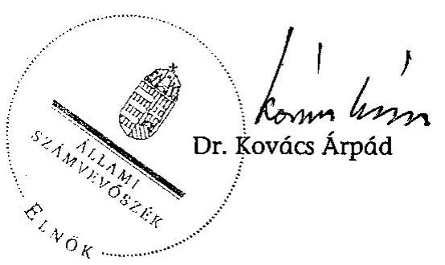

[^0]
[^0]:    ${ }^{84}$ Ftv. 29 § (3) bekezdés
    ${ }^{85}$ 0801. számú ÁSZ jelentés a Pénzügyminisztérium fejezet múködése ellenőrzéséről
    ${ }^{86}$ Az államháztartás múködési rendjéről szóló 217/1998. (XII. 30.) Korm. rendelet 145/A. §

---

# MELLÉKLETEK

---

# ÉSZREVÉTELEK

---

# 11-2010-135/2008-2000. 

## OKTATÁSI ĖS KULTURÁLIS MINISZTÉRIUM

MINISZTER

Iktatószám: 15774-1/2009.

## Dr. Kovács Árpád

elnök úr részére
Állami Számvevőszék
Budapest

## Tisztelt Elnök Úr!

A felsőoktatási törvény végrehajtásának ellenőrzéséről elkészített jelentést áttanulmányoztuk, a 21-22. oldalon megfogalmazott ajánlásokat elfogadjuk és elkészítjük az intézkedési tervet.

A jelentésben és mellékletében mind a számvevők munkájának eredményeként, mind az intézmények megnyilatkozásai alapján a felsőoktatási törvény végrehajtási időszakáról közzétett adatokat, tényszerủ megállapításokat elfogadjuk.

Ugyanakkor hangsúlyozni kell, hogy a 2005. évi CXXXIX. törvény, valamint az elfogadását követő módosítások eredményessége, a gyakorlati megvalósulás 2-3 évében elsősorban a változás tendenciáinak megítélésére ad lehetőséget.

Az olyan új - több évtizedes gyakorlatot megváltoztató - törvényi szabályozás, mint a többciklusú képzés, amelynek második, mesterképzési szakasza csak 2009 szeptemberében indul; a hároméves fenntartói megállapodás, amellyel kapcsolatban a teljesítménykövetelmények meghatározásában, a nemzetközi gyakorlatban is csak a bevezetés második szakaszában egységesítették az indikátorokat; a pályakövetés országos rendszerének kialakításában a NFÜ pályázati források későbbi időpontra történő halasztása, olyan tényezők, amelyek a kategorikus megfogalmazás helyett, differenciáltabb értékelést igényelnének.

Továbbá a jelentésben vannak olyan megállapítások, mint a többciklusú képzés bevezetésekor a tájékoztatás hiánya, vagy a mesterszakok egységes követelményeinek kidolgozatlansága, illetve a differenciált minőségi bérezés elmaradása, amelyek nem állják meg helyüket, illetve körültekintőbb értékelést igényelnének.

Ezeket az észrevételeket az előkészítés szakaszában is megfogalmaztuk és azok a véglegesített számvevőszéki jelentés mellékleteként, a tárca május 12 -ei álláspontjaként nyilvánosak és mindenki számára elérhetőek.

Mindezek figyelembevételével fogadjuk el az Állami Számvevőszék megküldött jelentését.
Budapest, 2009. június, ,

## Üdvözlettel:

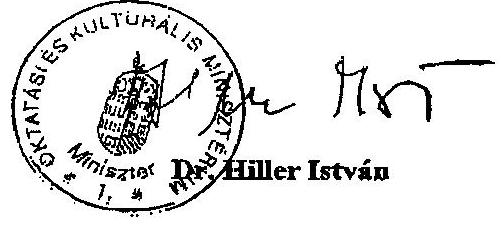

---

# Dr. Hiller István úr 

miniszter
Oktatási és Kulturális Minisztérium

## Budapest

## Tisztelt Miniszter Úr!

Köszönettel megkaptam a felsőoktatási törvény végrehajtásának ellenőrzéséről készített jelentésünkkel kapcsolatos, észrevételeit tartalmazó levelét és azzal kapcsolatban a következőkről tájékoztatom.

Örömmel nyugtázom, hogy a jelentésben foglalt tényszerủ megállapításokat, adatokat, valamint az összegezésben megfogalmazott ajánlásainkat Miniszter úr elfogadja.

Egyetértek Miniszter úrral, hogy a felsőoktatásról szóló törvény elmúlt három évre vonatkozó végrehajtásának értékelése összetett feladatot jelent, éppen ezért törekedtünk a különböző tendenciák megjelenítésére, a folyamatok differenciált értékelésére.

Ennek szellemében tartalmazza a jelentés, hogy miközben megtörtént a többciklusú képzési rendszer kialakítása, az alapképzésre épülő mesterképzés csak 2009. szeptember 1-jétől indul tömegesen.

A korábbi szakállamtitkári észrevételezésnek megfelelően rögzítjük a jelentésben, hogy a hároméves fenntartói megállapodások előremutatóak, de - deklarált kiszámíthatóságuk, tervezett értékőrzésük és rögzített teljesítménykövetelményeik ellenére - nem ösztönzik kellőképpen az intézményeket az oktatás minőségének és a működés hatékonyságának javítására.

Jelentésünk nemcsak azt tartalmazza, hogy a diplomás pályakövetési rendszer értékelése problémákkal terhelt, arra is rámutat, hogy megoldást nyújthat az Új Magyarország Fejlesztési Terv TÁMOP 4.1.3 „Felsőoktatási szolgáltatások rendszerszintű fejlesztése" c. kiemelt programjának megvalósítása.

---

A képzési tájékoztatással, a mesterszakok egységes követelményeivel és a differenciált minőségbérezés elmaradásával összefüggő megállapításaink - amelyek okaira Miniszter úr levele is utal - a felsőoktatási intézményeknél lefolytatott helyszíni ellenőrzések során feltárt tényeken alapulnak. Megjegyzem, hogy ellenőrzési megállapításaink egybecsengenek a gazdasági érdekképviseletek, kamarák, valamint a hallgatói önkormányzatok ez irányú kérdőíves felmérésünkre adott válaszaival, valamint a 2009. június 15 -én megtartott „A felsőoktatásban folyó több ciklusú képzés első tapasztalatai" c. OKM-BCE konferencián elhangzottakkal.

Ezúton szeretném megköszönni a jelentés egyeztetési folyamatában a minisztérium vezető munkatársai részéről tapasztalt segitőkész együttmüködést, amely hozzájárult ahhoz, hogy lényeges véleménykülönbség nélkül tudtuk lezárni az ellenőrzést.

Végezetül tájékoztatom Miniszter urat, hogy az ellenőrzésről készített jelentést - kialakult gyakorlatunk szerint - észrevételeivel és az azokra adott válaszommal együtt küldöm meg az Országgyűlés elnökének, az illetékes bizottságai elnökeinek és a miniszterelnöknek.

Budapest, 2009. június 10 .
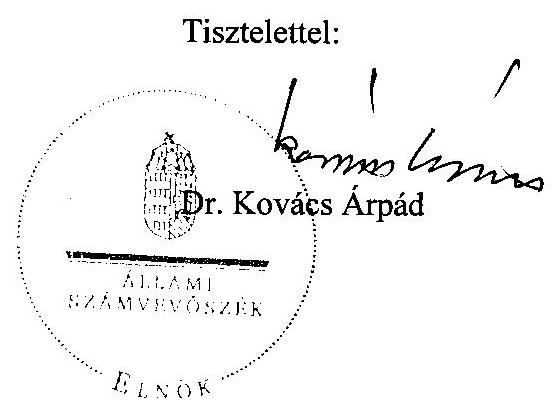

---

# MINISZTERELNÖKI HIVATAL JOGI ÉS KÖZIGAZGATÁSI ÁLLAMTITKÁR 

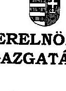

## 61409

AET 22
iktatási szám: VIII/1051/2/2009.
hivatkozási szám: V-2010-118/2008-2009.
igyintéző, telefon: dr. Bérces István, 441-3163

Bihari Zsigmond úr részére föigazgató

Állami Számvevőszék
Budapest
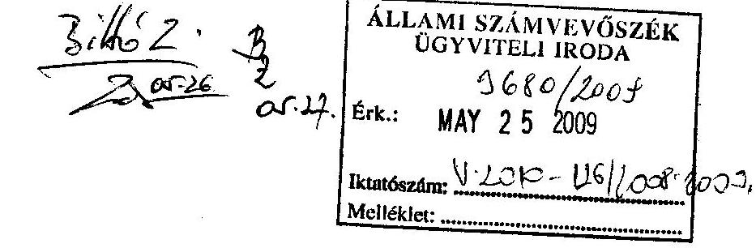

## Tisztelt Föigazgató Úr!

A felsőoktatási törvény végrehajtásának ellenőrzéséről készített jelentés-tervezetével alapvetően egyetértek.

Javaslom, hogy a jelentés I. „Összegző megállapítások, következtetések, javaslatok,, címủ részében határozottabban jelenjenek meg az egyes teendők, feladatok időbeli vonatkozásai, így a válságkezelő intézkedések rövidtávú szükségessége, a felsőoktatási stratégiát megalapozó, az oktatási miniszter által megteendő intézkedések, valamint maga a racionális intézményi és képzési struktúrát megalapozó felsőoktatási stratégia.

Budapest, 2009. május 18.
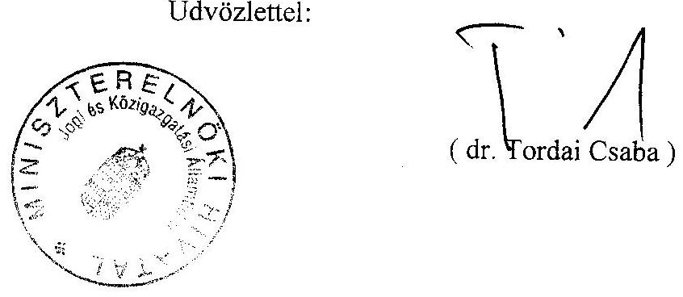

---

# Dr. Tordai Csaba úr 

államtitkár
Miniszterelnöki Hivatal

## Budapest

## Tisztelt Államtitkár Úr!

Köszönettel megkaptam a felsőoktatási törvény végrehajtásának ellenőrzéséről készített jelen-tés-tervezetünkhöz küldött egyetértő levelét.

Tájékoztatom, hogy a javaslataink határidőzöttségére vonatkozó felvetését mérlegeltük, amelynek nyomán a Kormánynak tett javaslatot a következőképpen módosítottuk:
„Intézkedjen megalapozott felsőoktatási stratégia elkészitéséről, amely

- rövidtávon a társadalmi-gazdasági és demográfiai folyamatokhoz igazodó képzési szerkezetet irányoz elö;
- közép- és hosszú távon a piaci kontroll érvényesitésével határozza meg az intézményi képzési szerkezetet, az állami szerepvállalást, valamint a felsőoktatás eröforrás-allokációját."

A 2009. évi pénzügyi válsággal összefüggő, mielőbbi minisztériumi intézkedések szükségességét továbbra is a Miniszterelnöki Hivatal álláspontjaként szerepeltetjük a tervezetben, mivel ellenőrzésünk a 2005-2008. közötti időszakra terjedt ki.

Kérem a válaszlevelemben foglaltak szíves tudomásulvételét.
Budapest, 2009. május 16 .
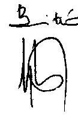

Tisztelettel:
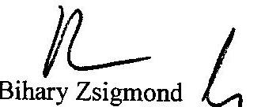

---

# MAGYAR KATOLIKUS PÜSPÖKI KONFERENCIA CONFERENTIA EPISCOPORUM HUNGARIAE 

H-1071 Budapest VII., Városligeti fasor 45.
Telefon: (36-1) 342-6959, Telefax: (36-1) 342-6957
Postal cím: 1406 Budapest, Pf. 79.
E-mail: pkt@katolikus.hu
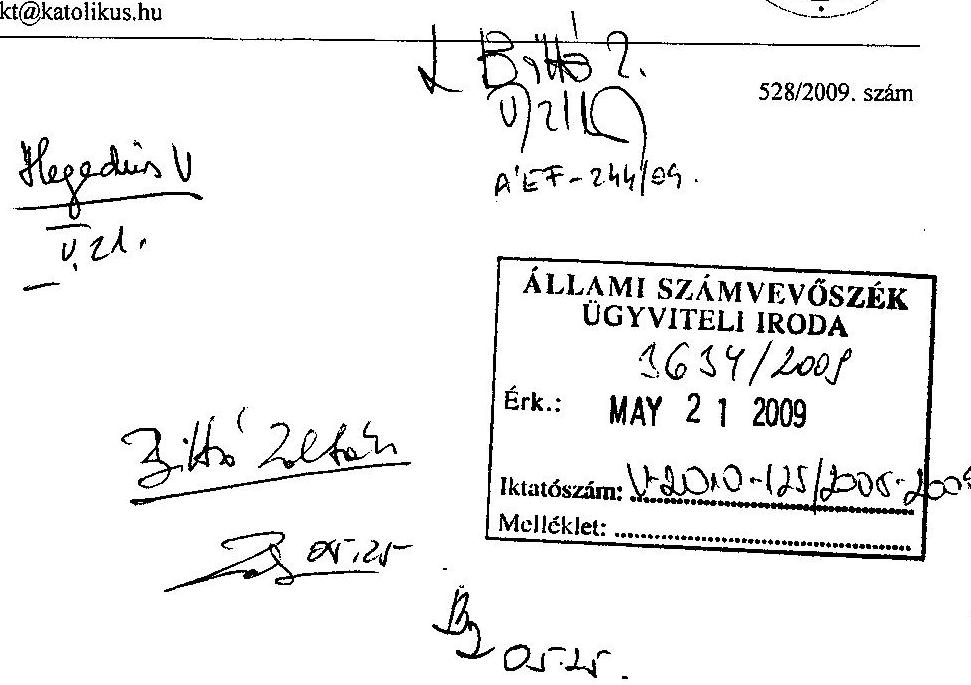

Tisztelt Föigazgató Úr!

A felsőoktatási törvény végrehajtásának ellenőrzéséről szóló V-2010-118/20082009. számú jelentés tervezetet köszönettel megkaptuk.

Ezúton is köszönöm, hogy a korábbi jelentés tervezethez küldött kiegészítő megjegyzésünk alapján a tervezetet kiegészítették. A jelenlegi tervezettel kapcsolatosan észrevételt nem kívánunk tenni.

Öszinte tisztelettel
Budapest, 2009. május 19.
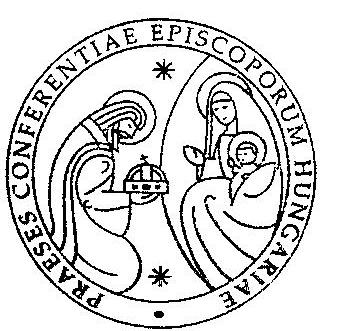

Dr. Erdő Péter
bíboros, primás, esztergom-budapesti érsek, az MKPK elnöke

---

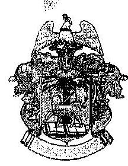

# MAGYARORSZÁGI REFORMÁTUS EGYHÁZ ZSINATÁNAK ELNÖKSÉGE

599109

☏: 1440 Budapest, 70. Pf.: 5
e-mail: zsinat.elnokseg@zsinatiiroda.hu
☏: 460 07 12, Fax: 460 07 51
1146 Budapest, Abonyi u. 21.

Iktatószám: ..1304231A/2009.

Bihary Zsigmond
főigazgató úr részére

Állami Számvevőszék
Budapest
Apáczai Csere János u. 10.
1052
1364 Budapest 4., Pf: 54.

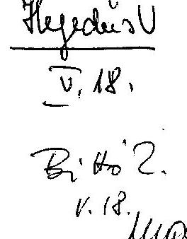

ÁLLAMI SZÁMVEVŐSZÉK
ÜGYVITELI IRÓDA
3526/09.
Érk.: MAY 18 2009
Iktatószám: 0-2010-123/Lezr-6009
Melléklet:

Tisztelt Főigazgató Úr!

Köszönettel megkaptuk áttekintésre a „Jelentés a felsőoktatási törvény
végrehajtásának ellenőrzéséről” c. V-2010-118/2008-2009. számú
munkaanyagot.

A Magyarországi Református Egyház a tervezettel kapcsolatban nem
kíván észrevételt tenni, a jelentés minden megállapítását tudomásul veszi,
azt elfogadja.

Tisztelettel:

Budapest, 2009. május 15.

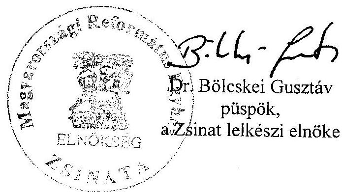

---

# A felsőoktatási törvény végrehajtásának rendszerszemléletű folyamatábrája 

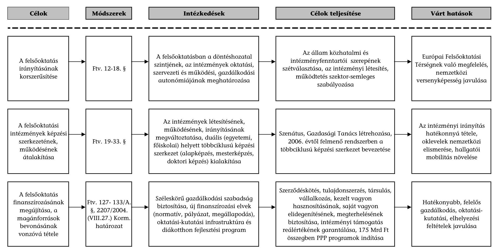

---

# Ellenőrzésbe vont felsőoktatási intézmények jegyzéke 

## I. Az OKM fenntartása alá tartozó állami felsőoktatási intézmények:

1. Budapesti Corvinus Egyetem (BCE)*
2. Budapesti Műszaki és Gazdaságtudományi Egyetem (BME)*
3. Debreceni Egyetem (DE)
4. Eötvös Loránd Tudományegyetem (ELTE)
5. Kaposvári Egyetem (KE)
6. Liszt Ferenc Zeneművészeti Egyetem (LFZE)
7. Magyar Képzőművészeti Egyetem (MKE)
8. Miskolci Egyetem (ME)*
9. Moholy-Nagy Művészeti Egyetem (MOME)
10. Nyugat-Magyarországi Egyetem (NYME)
11. Pécsi Tudományegyetem (PTE)
12. Pannon Egyetem (PE)
13. Semmelweis Egyetem (SE)
14. Szegedi Tudományegyetem (SZTE)
15. Szent István Egyetem (SZIE)
16. Széchenyi István Egyetem (SZE)*
17. Színház- és Filmművészeti Egyetem (SZFE)
18. Budapesti Gazdasági Főiskola (BGF)*
19. Budapesti Műszaki Főiskola (BMF)
20. Dunaújvárosi Főiskola (DF)
21. Eötvös József Főiskola (EJF)
22. Eszterházy Károly Főiskola (EKF)*
23. Kecskeméti Főiskola (KF)
24. Károly Róbert Főiskola (KRF)
25. Magyar Táncművészeti Főiskola (MTF)
26. Nyíregyházi Főiskola (NYF)
27. Szolnoki Főiskola (SZF)
28. Tessedik Sámuel Főiskola (TSF)

## II. Egyházi felsőoktatási intézmények:

1. Pázmány Péter Katolikus Egyetem (PPKE)*
2. Apor Vilmos Katolikus Főiskola (AVKF)
3. Egri Hittudományi Főiskola (EGHF)
4. Gál Ferenc Hittudományi Főiskola, Szeged (GFHF)
5. Károli Gáspár Református Egyetem (KGRE)
6. Kölcsey Ferenc Református Tanítóképző Főiskola (KTIF)

---

# III. Magán, illetve alapítványi fenntartású felsőoktatási intézmények: 

1. Modern Üzleti Tudományok Főiskolája (MÜTF)*
2. Gábor Dénes Főiskola (GDF)
3. Általános Vállalkozási Főiskola (AVF)
4. Budapesti Kommunikációs és Üzleti Főiskola (BKF)

* helyszíni ellenőrzésre kiválasztott felsőoktatási intézmények

---

# ÖSSZESÍTŐ TÁBLÁZATOK A FELSŐOKTATÁSI INTÉZMÉNYEK STATISZTIKAI ÉS TANÚSÍTVÁNYI ADATAIBÓL

---

# TÁBLÁZATOK JEGYZÉKE 

1. sz. táblázat: Összegezett hallgatói létszámadatok a 2005-2008. közötti időszakban
2. sz. táblázat: A felsőoktatási intézmények hallgatóinak száma fenntartók szerint 1990-2008 között
3. sz. táblázat: Az államilag támogatott és a költségtérítéses képzésben résztvevők száma és aránya a felsőoktatásban 2000-2008 között
4. sz. táblázat: Az OKM felügyelete alá tartozó állami felsőoktatási intézmények hallgatói és oktatói adatai, mutatói a 2005-2008. évek közötti időszakban
5. sz. táblázat: Az OKM felügyelete alá tartozó állami felsőoktatási intézmények hallgatói adatai a 2005-2008. évek közötti időszakban
6. sz. táblázat: Az ellenőrzésbe vont egyházi felsőoktatási intézmények hallgatói és oktatói adatai, mutatói a 20052008. évek közötti időszakban
7. sz. táblázat: Az ellenőrzésbe vont magán felsőoktatási intézmények hallgatói és oktatói adatai, mutatói a 20052008. években
8. sz. táblázat: Az ellenőrzésbe vont nem állami felsőoktatási intézmények hallgatói adatai a 2005-2008 közötti időszakban
9. sz. táblázat: A felsőoktatásban résztvevő oktatók száma 20002008. években
10. sz. táblázat: Az egy oktatóra jutó hallgatók száma a felsőoktatásban 2001-2008. évek között
11. sz. táblázat: Egyetemi és főiskolai szintű, valamint alap-, mesterés osztatlan képzésben az első és utolsó évfolyamos hallgatók száma a felsőoktatásban 2000-2008 között
12. sz. táblázat: Egyetemi és főiskolai szintű oklevelet, valamint alapfokozatot szerzettek száma a felsőoktatásban 19902008 között
13. sz. táblázat: A diplomás munkanélküliek létszámának és mutatóinak alakulása 2000-2008. években

---

14. sz. táblázat: Az OKM felügyelete alá tartozó állami felsőoktatási intézmények oktatói adatai 2005-2008. évek között
15. sz. táblázat: Az ellenőrzésbe vont nem állami felsőoktatási intézmények oktatói adatai 2005-2008 között
16/a. sz. táblázat: Az OKM felügyelete alá tartozó állami felsőoktatási intézmények oktatás-képzési tevékenységét, más szervezetekkel való együttmúködését jellemző adatok 2005-2008 között
16/b. sz. táblázat: Az OKM felügyelete alá tartozó állami felsőoktatási intézmények szervezetét jellemző adatok 2005-2008. évek között
17. sz. táblázat: Az ellenőrzésbe vont nem állami felsőoktatási intézmények oktatás-képzési tevékenységét, más szervezetekkel való együttműködését jellemző adatok 20052008 között
18. sz. táblázat: Az ellenőrzésbe vont nem állami felsőoktatási intézmények szervezetét jellemző adatok a 2005-2008. közötti években
19. sz. táblázat: A költségvetés felsőoktatási kiadásai a 2005-2008. közötti években
20. sz. táblázat: Az OKM felügyelete alá tartozó állami felsőoktatási intézmények összegezett gazdálkodási adatai, mutatói az ellenőrzött időszakban
21. sz. táblázat: Az OKM felügyelete alá tartozó állami felsőoktatási intézmények gazdálkodási adatai, mutatói a 20052008. közötti időszakban
22. sz. táblázat: Az ellenőrzésbe vont nem állami felsőoktatási intézmények összegezett gazdálkodási adatai, mutatói az ellenőrzött időszakban
23. sz. táblázat: Az ellenőrzésbe vont nem állami felsőoktatási intézmények kiemelt gazdálkodási adatai, mutatói 20052008. közötti években

---

# Összegezett hallgatói létszámadatok a 2005-2008. közötti időszakban

|  Sorszám | Megnevezés | 2005.
október 15. | 2008.
október 15.* | Index:
2008/2005.  |
| --- | --- | --- | --- | --- |
|  1. | Hallgatói létszám képzési formák szerint | 424161 | 381019 | $90 \%$  |
|  2. | Nappali tagozat | 231482 | 242928 | $105 \%$  |
|  3. | Esti tagozat | 11798 | 7071 | $60 \%$  |
|  4. | Levelezö tagozat | 150787 | 111100 | $74 \%$  |
|  5. | Távoktatás | 30094 | 19920 | $66 \%$  |
|  6. | Hallgatói létszám képzési szintek szerint | 424161 | 381019 | $90 \%$  |
|  7. | Felsőfokú szakképzés | 10498 | 15677 | $149 \%$  |
|  8. | Alapképzés (Bsc) | 15110 | 191561 | $1268 \%$  |
|  9. | Föliskolai szintű képzés | 226528 | 59366 | $26 \%$  |
|  10. | Mesterképzés (Msc) | - | 6999 |   |
|  11. | Egyetemi szintű képzés | 138994 | 62897 | $45 \%$  |
|  12. | Osztatlan képzés | - | 20030 |   |
|  13. | Doktori képzés | 7965 | 6911 | $87 \%$  |
|  14. | Szakirányú továbbképzés | 25066 | 17578 | $70 \%$  |
|  15. | Államilag támogatott hallgatói létszám képzési formák szerint | 216463 | 211711 | $98 \%$  |
|  16. | Nappali tagozat | 185350 | 184238 | $99 \%$  |
|  17. | Esti tagozat | 2552 | 1734 | $68 \%$  |
|  18. | Levelezö tagozat | 28561 | 25739 | $90 \%$  |
|  19. | Távoktatás | 0 | 0 |   |
|  20. | Költségtérítéses hallgatói létszám képzési formák szerint | 207698 | 169308 | $82 \%$  |
|  21. | Nappali tagozat | 46132 | 58690 | $127 \%$  |
|  22. | Esti tagozat | 9246 | 5337 | $58 \%$  |
|  23. | Levelezö tagozat | 122226 | 85361 | $70 \%$  |
|  24. | Távoktatás | 30094 | 19920 | $66 \%$  |
|  25. | Költségtérítéses/összes hallgató aránya | $49 \%$ | $44 \%$ | $91 \%$  |
|  26. | Államilag támogatott/összes hallgató aránya | $51 \%$ | $56 \%$ | $109 \%$  |
|  27. | Államilag támogatott létszámkeret | 62000 | 56000 | $90 \%$  |
|  28. | Jelentkezett hallgatók száma | 149829 | 96986 | $65 \%$  |
|  29. | Felvett hallgatók száma | 102960 | 81101 | $79 \%$  |
|  30. | Új belépők száma | 98377 | 78820 | $80 \%$  |
|  31. | Felvett/jelentkezett hallgatók aránya | $69 \%$ | $84 \%$ | $122 \%$  |

*OKM: Statisztikai gyorstájékoztató a 2008/2009. tanévi adatgyűjtés előzetes adatairól.

## Forrás:

OKM: Statisztikai tájékoztató, Felsőoktatás 2005/2006. Országos Felsőoktatási Információs Központ (www.felvi.hu)

---

2. sz. táblázat

A felsőoktatási intézmények hallgatóinak száma fenntartók szerint 1990-2008 között

|  Tanév * | Állami |  |  | Egyházi |  |  | Magán, illetve alapítványi |  |  | Összesen |  |   |
| --- | --- | --- | --- | --- | --- | --- | --- | --- | --- | --- | --- | --- |
|   | intézmények | nappali | összes | intézmények | nappali | összes | intézmények | nappali | összes | intézmények | nappali | összes  |
|   |  | hallgatóik |  |  | hallgatóik |  |  | hallgatóik |  |  | hallgatóik |   |
|  1990/1991. | 66 | 75 968 | 107 607 | 10 | 414 | 550 | 1 | 219 | 219 | 77 | 76 601 | 108 376  |
|  1991/1992. | 66 | 82 421 | 113 788 | 10 | 491 | 623 | 1 | 279 | 279 | 77 | 83 191 | 114 690  |
|  1992/1993. | 66 | 90 751 | 122 842 | 21 | 1 125 | 1 903 | 4 | 506 | 1 129 | 91 | 92 382 | 125 874  |
|  1993/1994. | 59 | 99 932 | 135 695 | 28 | 4 448 | 6 110 | 4 | 860 | 2 753 | 91 | 105 240 | 144 560  |
|  1994/1995. | 59 | 110 821 | 157 404 | 28 | 5 237 | 7 154 | 4 | 2 789 | 5 382 | 91 | 118 847 | 169 940  |
|  1995/1996. | 58 | 121 448 | 177 482 | 28 | 6 302 | 9 055 | 4 | 5 247 | 9 049 | 90 | 132 997 | 195 586  |
|  1996/1997. | 56 | 131 607 | 191 291 | 28 | 7 514 | 10 629 | 5 | 6 722 | 13 195 | 89 | 145 843 | 215 115  |
|  1997/1998. | 56 | 141 488 | 224 695 | 28 | 8 580 | 12 655 | 6 | 6 826 | 17 343 | 90 | 156 894 | 254 693  |
|  1998/1999. | 55 | 151 389 | 243 077 | 28 | 9 410 | 14 291 | 6 | 7 384 | 22 029 | 89 | 168 183 | 279 397  |
|  1999/2000. | 55 | 159 669 | 266 144 | 28 | 10 403 | 16 227 | 6 | 7 582 | 23 331 | 89 | 177 654 | 305 702  |
|  2000/2001. | 30 | 165 467 | 283 970 | 26 | 10 755 | 17 590 | 6 | 7 654 | 25 729 | 62 | 183 876 | 327 289  |
|  2001/2002. | 30 | 171 990 | 300 360 | 26 | 11 389 | 18 922 | 9 | 9 595 | 30 019 | 65 | 192 974 | 349 301  |
|  2002/2003. | 30 | 180 226 | 327 456 | 26 | 11 882 | 19 821 | 10 | 11 271 | 34 283 | 66 | 203 379 | 381 560  |
|  2003/2004. | 31 | 191 227 | 331 134 | 26 | 12 576 | 21 626 | 11 | 12 493 | 36 295 | 68 | 216 296 | 409 075  |
|  2004/2005. | 31 | 199 084 | 363 961 | 26 | 13 109 | 22 666 | 12 | 13 319 | 34 893 | 69 | 225 512 | 421 520  |
|  2005/2006. | 31 | 203 251 | 366 797 | 26 | 14 005 | 24 078 | 14 | 14 226 | 33 286 | 71 | 231 482 | 424 161  |
|  2006/2007. | 31 | 209 207 | 359 758 | 26 | 14 685 | 24 403 | 14 | 14 782 | 32 187 | 71 | 238 674 | 416 348  |
|  2007/2008. | 31 | 213 024 | 343 741 | 26 | 14 322 | 23 556 | 14 | 15 547 | 30 407 | 71 | 242 893 | 397 704  |
|  2008/2009. | 30 | 213 486 | 328 921 | 26 | 13 724 | 22 525 | 15 | 15 718 | 29 573 | 71 | 242 928 | 381 019  |

- Az adatok a tanévek első félévének október 15-i adatai.

Fonrás: Oktatás-stotisztikai évkönyvek (OKM)

---

Az államilag támogatott és a költségtérítéses képzésben résztvevők száma és aránya a felsőoktatásban 2000-2008 között

|  Tanév * | Hallgatók száma összesen | Államilag támogatott képzésben részt vevő hallgatók száma |  | Államilag támogatott aránya (\%) | Költségtérítéses aránya (\%)  |
| --- | --- | --- | --- | --- | --- |
|  2000/2001. | 327289 | 190750 | 136539 | $58,28 \%$ | $41,72 \%$  |
|  2001/2002. | 349301 | 192163 | 157138 | $55,01 \%$ | $44,99 \%$  |
|  2002/2003. | 381560 | 197538 | 184022 | $51,77 \%$ | $48,23 \%$  |
|  2003/2004. | 409075 | 206312 | 202763 | $50,43 \%$ | $49,57 \%$  |
|  2004/2005. | 421520 | 210170 | 211350 | $49,86 \%$ | $50,14 \%$  |
|  2005/2006. | 424161 | 216469 | 207692 | $51,03 \%$ | $48,97 \%$  |
|  2006/2007. | 416348 | 218777 | 197571 | $52,55 \%$ | $47,45 \%$  |
|  2007/2008. | 397704 | 212405 | 185299 | $53,41 \%$ | $46,59 \%$  |
|  2008/2009. | 381019 | 211777 | 169242 | $55,58 \%$ | $44,42 \%$  |

- Az adatok a tanévek első félévének október 15-i adatai.

# Forrás:

Oktatás-statisztikai évkönyvek (OKM)

---

# Az OKM felügyelete alá tartozó állami felsőoktatási intézmények hallgatói és oktatói adatai, mutatói a 2005-2008. évek közötti időszakban

|  Megnevezés |  | mérték-
egység | 2005. év | 2008. év | $2005=100 \%$  |
| --- | --- | --- | --- | --- | --- |
|  Hallgatói adatok, mutatók |  |  |  |  |   |
|  1. | Hallgatók száma összesen | fő | 358385 | 320670 | 89,48\%  |
|  1.1. | Nappali tagozatos hallgatók száma | fő | 201121 | 210869 | 104,85\%  |
|  1.2. | Átszámított hallgatói létszám* | fő | 279753 | 265770 | 95,00\%  |
|  1.2.1 | ebből: államilag támogatott hallgatók aránya | $\%$ | $63,92 \%$ | $66,56 \%$ | 104,13\%  |
|  1.2.2. | ebből: költségtérítéses hallgatók aránya | $\%$ | $36,08 \%$ | $33,44 \%$ | 92,68\%  |
|  1.3. | Külföldi részképzésben résztvevő hallgató | fő | 1965 | 2973 | 151,30\%  |
|  1.4. | Vendéghallgató | fő | 1364 | 1775 | 130,13\%  |
|  1.5. | Felsőfokú szakképzésben résztvevők száma | fő | 9368 | 15169 | 161,92\%  |
|  1.6. | Felsőfokú szakmai képesítés miatt kreditbeszámítást kérő hallgatók | fő | 1323 | 1829 | 138,25\%  |
|  1.7. | Szakirányú továbbképzésben résztvevők száma | fő | 25492 | 17539 | 68,80\%  |
|  1.8. | Doktori képzésben résztvevő hallgatók száma | fő | 7388 | 6260 | 84,73\%  |
|  2. | Oktatói adatok, mutatók |  |  |  |   |
|  2.1. | Oktatók száma | fő | 16380 | 15363 | 93,79\%  |
|  2.1.1. | ebből: teljes munkaidőben foglalkoztatott oktató | fő | 14018 | 13601 | 97,03\%  |
|  2.2. | Oktatók átszámított létszáma** | fő | 14761 | 14267 | 96,65\%  |
|  2.3. | Az összes oktatóból (2.1.sor) a 30 évesnél fiatalabbak aránya | $\%$ | $6,48 \%$ | $5,06 \%$ | 78,08\%  |
|  2.4. | Az összes oktatóból (2.1.sor) a 60 évesnél idősebbek aránya | $\%$ | $13,05 \%$ | $15,86 \%$ | 121,48\%  |
|  2.5. | Az összes oktatóból(2.1) több mint 1 hónapot külföldi intézményben oktatók száma | fő | 119 | 160 | 134,45\%  |
|  2.6. | A teljes munkaidejú oktatóból (2.1.1.sor) a tudományos fokozattal rendelkezők száma | fő | 6486 | 7356 | 113,41\%  |
|  3. | Hallgató- oktató arány mutatói |  |  |  |   |
|  3.1. | Egy átszámított oktatóra jutó átszámított hallgatók száma (1.2.sor/2.2.sor) | fő | 19 | 19 | 98,29\%  |
|  3.2. | Egy minősített oktatóra jutó átszámított hallgatók száma (1.2.sor/2.6.sor) | fő | 43 | 36 | 83,77\%  |
|  3.3. | Egy oktatóra jutó hallgatói létszám (1.sor/2.1.sor) | fő | 22 | 21 | 95,40\%  |
|  3.4. | Egy minősített oktatóra jutó nappali tagozatos hallgató (1.1.sor/2.6.sor) | fő | 31 | 29 | 92,45\%  |

- Az október 15-i statisztika alapján, 1 nappali munkarend szerinti hallgató 1 fő, egyéb munkarend szerinti 0,5 -del szorozva ** Teljes munkaidőre átszámított átlagos statisztikai létszám

## Forrás:

Tanúsítványt adatszolgáltatás.

---

Az OKM felügyelete alá tartozó államú felelősktatási intézmények hallgatói adatai a 2005-2008. évek közötti időszakban

|  Ison | Felelősktatási intézmények | Neggető tagesszám mindazedő tereteit kópelem cégének halgatói adatai (III) |  | 2005 + 100% |  | Eredetővel halgatói宽telem (IV) |  | 2005 + 100% |  | Az állandogó tömegezett halgatói adatok (%) |  | 2005 + 100% |  | A költségterekten halgatói adatok (%) |  | 2005 + 100%  |
| --- | --- | --- | --- | --- | --- | --- | --- | --- | --- | --- | --- | --- | --- | --- | --- | --- |
|   |  | 2005. év | 2006. év |  | 2005. év | 2006. év |  | 2005. év | 2006. év |  | 2005. év | 2006. év |  |  |  |   |
|  1. | Rendezett Mészelt és Gazthatójósítomlépő Egzeteer. | 27 640 | 28 042 | 106,80% | 22 556 | 20 240 | 91,54% | 73,52% | 76,59% | 101,69% | 86,60% | 25,20% | 91,51% |  |  |   |
|  2. | Rendezett Carrizum Egzeteer. | 35 325 | 11 773 | 114,01% | 11 826 | 16 902 | 107,85% | 61,69% | 66,96% | 107,18% | 87,22% | 33,00% | 68,56% |  |  |   |
|  3. | Delemzesi Egzeteer. | 17 687 | 22 143 | 125,30% | 23 027 | 26 382 | 114,14% | 69,51% | 71,75% | 103,21% | 80,49% | 26,21% | 92,67% |  |  |   |
|  4. | Sźvela Letétel Tudorodszegemese. | 23 026 | 22 091 | 104,30% | 27 339 | 26 182 | 97,60% | 64,91% | 62,36% | 100,91% | 83,09% | 34,46% | 98,22% |  |  |   |
|  5. | Segerevité Egzeteer. | 2 365 | 2 249 | 99,63% | 2 500 | 2 746 | 93,16% | 72,60% | 76,06% | 100,87% | 88,60% | 23,96% | 97,19% |  |  |   |
|  6. | Lásó Nemei Zavattalvisszot Egzeteer. | 844 | 763 | 90,40% | 844 | 782 | 90,40% | 80,09% | 87,82% | 109,31% | 89,91% | 12,82% | 62,55% |  |  |   |
|  7. | Dózgint Képeledzitszát Egzeteer. | 563 | 585 | 98,93% | 648 | 566 | 87,79% | 89,07% | 92,43% | 102,73% | 83,03% | 7,58% | 71,52% |  |  |   |
|  8. | Módoló Egzeteer. | 8 422 | 8 560 | 101,60% | 11 826 | 11 158 | 93,16% | 63,93% | 68,99% | 104,85% | 86,60% | 33,01% | 91,09% |  |  |   |
|  9. | Módoló Magy Mérészot Egzeteer. | 689 | 763 | 113,81% | 735 | 839 | 113,84% | 74,13% | 84,29% | 107,97% | 91,92% | 15,61% | 71,67% |  |  |   |
|  10. | Nyugót Magyratossági Egzeteer. | 3 808 | 8 651 | 119,64% | 9 075 | 13 966 | 131,65% | 68,82% | 69,30% | 100,69% | 91,18% | 30,70% | 98,40% |  |  |   |
|   | Rendezett Tálatát Módola * | 3 033 | 0 | 0,00% | 4 975 | 0 | 0,00% | 80,82% | 0,00% | 0,00% | 80,18% | 0,00% | 0,00% |  |  |   |
|  11. | Pécsi Tudószattszegemese | 17 833 | 19 794 | 110,86% | 16 300 | 28 912 | 94,70% | 61,34% | 63,30% | 103,37% | 88,65% | 36,62% | 94,81% |  |  |   |
|  12. | Pecsusa Egzeteer. | 8 674 | 7 956 | 93,83% | 9 009 | 9 316 | 92,81% | 65,21% | 59,81% | 91,73% | 94,79% | 65,19% | 112,22% |  |  |   |
|  13. | Dánuszkossi Egzeteer. | 3 912 | 4 541 | 110,62% | 7 780 | 7 739 | 99,40% | 64,39% | 67,62% | 104,73% | 93,42% | 32,25% | 91,18% |  |  |   |
|  14. | Szegedi Tudorszitszegemese. | 18 229 | 21 100 | 115,78% | 24 807 | 24 962 | 100,18% | 93,40% | 71,92% | 115,26% | 97,60% | 28,08% | 74,60% |  |  |   |
|  15. | Érami Istvári Egzeteer. | 8 163 | 8 685 | 99,02% | 12 340 | 11 032 | 90,11% | 69,74% | 52,71% | 108,14% | 91,20% | 67,29% | 92,26% |  |  |   |
|  16. | Széchenyi Istvári Egzeteer. | 6 939 | 7 060 | 101,82% | 9 316 | 8 896 | 93,48% | 65,63% | 66,32% | 104,33% | 86,37% | 32,60% | 82,60% |  |  |   |
|  17. | Szézhán- és Pénzödvisszát Egzeteer. | 265 | 297 | 110,37% | 287 | 313 | 108,36% | 71,08% | 68,49% | 96,35% | 28,92% | 51,51% | 100,06% |  |  |   |
|  18. | Ródogadó Szézhology Módola | 12 761 | 13 440 | 97,63% | 15 780 | 16 883 | 94,33% | 70,00% | 66,71% | 95,22% | 28,96% | 53,19% | 111,17% |  |  |   |
|  19. | Ródogadó Móladó Módola | 8 617 | 7 520 | 84,19% | 10 699 | 9 478 | 84,19% | 70,91% | 73,20% | 102,30% | 83,09% | 24,73% | 91,93% |  |  |   |
|  20. | Finanszíróssal Módola | 3 197 | 2 719 | 85,03% | 4 006 | 3 710 | 92,61% | 60,09% | 61,83% | 102,91% | 99,92% | 28,17% | 93,62% |  |  |   |
|  21. | Sźvela Zsvart Módola | 1 331 | 972 | 88,19% | 1 772 | 1 379 | 77,82% | 69,67% | 68,17% | 98,12% | 30,25% | 31,81% | 106,27% |  |  |   |
|  22. | Esztelésky Kézély Módola | 3 671 | 4 318 | 117,62% | 6 725 | 6 629 | 95,66% | 62,39% | 62,90% | 105,80% | 97,71% | 34,10% | 90,42% |  |  |   |
|  23. | Részletvett Módola | 2 505 | 3 725 | 85,88% | 4 746 | 3 775 | 79,20% | 62,83% | 63,80% | 99,94% | 36,17% | 36,20% | 100,10% |  |  |   |
|  24. | Részty Róbert Módola | 2 699 | 2 286 | 91,68% | 9 916 | 7 825 | 79,01% | 57,65% | 50,65% | 111,75% | 72,19% | 69,37% | 93,36% |  |  |   |
|  25. | Dózgint Vállapásfizetett Módola | 108 | 741 | 95,25% | 620 | 337 | 78,74% | 53,27% | 62,62% | 117,53% | 46,73% | 37,39% | 80,01% |  |  |   |
|  26. | Nyengékfajd Módola | 1 689 | 1 533 | 97,75% | 6 606 | 7 825 | 83,16% | 62,39% | 63,22% | 104,73% | 97,73% | 34,70% | 92,29% |  |  |   |
|  27. | Szülező Módola | 2 308 | 2 387 | 101,42% | 3 825 | 3 678 | 91,91% | 62,83% | 65,90% | 103,66% | 97,27% | 34,64% | 90,59% |  |  |   |
|  28. | Teneclik Mószati Módola | 2 099 | 1 633 | 57,23% | 2 138 | 2 947 | 57,30% | 71,25% | 62,93% | 92,45% | 28,65% | 36,07% | 118,93% |  |  |   |

- 2006. január 1 jével irányítását a Nyugót Magyratossági Egzeteinké.

Feszült: Továldóhelyi adataudgálatán.

---

# Az ellenőrzésbe vont egyházi felsőoktatási intézmények hallgatói és oktatói adatai, mutatói a 2005-2008. évek közötti időszakban

|  Megnevezés |  | mérték-
egység | 2005. év | 2008. év | $\begin{gathered} 2005= \ 100 \% \end{gathered}$  |
| --- | --- | --- | --- | --- | --- |
|  Hallgatói adatok, mutatók |  |  |  |  |   |
|  1. | Hallgatók száma összesen | fő | 17758 | 17937 | 101,01\%  |
|  1.1 | Nappali tagozatos hallgatók száma | fő | 10622 | 11369 | 107,03\%  |
|  1.2 | Átszámított hallgatói létszám* | fő | 14190 | 14653 | 103,26\%  |
|  1.2.1 | ebből: államilag támogatott hallgatók aránya | $\%$ | 72,57\% | 66,42\% | 91,53\%  |
|  1.2.2. | ebből: költségtérítéses hallgatók aránya | $\%$ | 27,43\% | 33,58\% | 122,42\%  |
|  1.3. | Külföldi részképzésben résztvevő hallgató | fő | 152 | 259 | 170,39\%  |
|  1.4. | Vendéghallgató | fő | 67 | 127 | 189,55\%  |
|  1.5. | Felsőfokú szakképzésben résztvevők száma | fő | 0 | 215 | 0,00\%  |
|  1.6. | Felsőfokú szakmai képesítés miatt kreditbeszámítást kérő hallgatók | fő | 0 | 0 | 0,00\%  |
|  1.7. | Szakirányú továbbképzésben résztvevők száma | fő | 1163 | 1182 | 101,63\%  |
|  1.8. | Doktori képzésben résztvevő hallgatók száma | fő | 290 | 344 | 118,62\%  |
|  Oktatói adatok, mutatók |  |  |  |  |   |
|  2.1. | Oktatók száma | fő | 871 | 857 | 98,39\%  |
|  2.1.1. | ebből: teljes munkaidőben foglalkoztatott oktató | fő | 688 | 678 | 98,55\%  |
|  2.2. | Oktatók átszámított létszáma** | fő | 770 | 766 | 99,48\%  |
|  2.3. | Az összes oktatóból (2.1.sor) a 30 évesnél fiatalabbak aránya | $\%$ | 8,04\% | 4,20\% | 52,27\%  |
|  2.4. | Az összes oktatóból (2.1.sor) a 60 évesnél idősebbek aránya | $\%$ | 10,10\% | 13,65\% | 135,13\%  |
|  2.5. | Az összes oktatóból(2.1) több mint 1 hónapot külföldi intézményben oktatók száma | fő | 9 | 11 | 122,22\%  |
|  2.6. | A teljes munkaidejú oktatóból (2.1.1.sor) a tudományos fokozattal rendelkezők száma | fő | 313 | 412 | 131,63\%  |
|  Hallgató- oktató arány mutatói |  |  |  |  |   |
|  3.1. | Egy átszámított oktatóra jutó átszámított hallgatók száma (1.2.sor/2.2.sor) | fő | 18 | 19 | 103,80\%  |
|  3.2. | Egy minősített oktatóra jutó átszámított hallgatók száma (1.2.sor/2.6.sor) | fő | 45 | 36 | 78,45\%  |
|  3.3. | Egy oktatóra jutó hallgatói létszám (1. sor/2.1 sor) | fő | 20 | 21 | 102,66\%  |
|  3.4. | Egy minősített oktatóra jutó nappali tagozatos hallgató (1.1.sor/2.6.sor) | fő | 34 | 28 | 81,31\%  |

- Az október 15-i statisztika alapján, 1 nappali munkarend szerinti hallgató 1 fő, egyéb munkarend szerinti 0,5 -del szorozva ** Teljes munkaidőre átszámított átlagos statisztikai létszám

## Forrás:

Tanúsítványt adatszolgáltatás.

---

# Az ellenőrzésbe vont magán felsőoktatási intézmények hallgatói és oktatói adatai, mutatói a 2005-2008. években

|  Megnevezés |  | mérték-
egység | 2005. év | 2008. év | $\begin{gathered} 2005= \ 100 \% \end{gathered}$  |
| --- | --- | --- | --- | --- | --- |
|  Hallgatói adatok, mutatók |  |  |  |  |   |
|  1. | Hallgatók száma összesen | fő | 14169 | 13734 | 96,93\%  |
|  1.1 | Nappali tagozatos hallgatók száma | fő | 6435 | 7115 | 110,57\%  |
|  1.2 | Átszámított hallgatói létszám* | fő | 10302 | 9632 | 93,50\%  |
|  1.2.1 | ebből: államilag támogatott hallgatók aránya | $\%$ | $38,18 \%$ | $40,52 \%$ | $106,14 \%$  |
|  1.2.2. | ebből: költségtérítéses hallgatók aránya | $\%$ | $61,82 \%$ | $59,48 \%$ | $96,21 \%$  |
|  1.3. | Külföldi részképzésben résztvevő hallgató | fő | 43 | 91 | 211,63\%  |
|  1.4. | Vendéghallgató | fő | 33 | 73 | 221,21\%  |
|  1.5. | Felsőfokú szakképzésben résztvevők száma | fő | 682 | 1125 | 164,96\%  |
|  1.6. | Felsőfokú szakmai képesítés miatt kreditbeszámítást kérő hallgatók | fő | 33 | 114 | 345,45\%  |
|  1.7. | Szakirányú továbbképzésben résztvevők száma | fő | 239 | 444 | 185,77\%  |
|  1.8. | Doktori képzésben résztvevő hallgatók száma | fő | 0 | 0 | 0,00\%  |
|  Oktatói adatok, mutatók |  |  |  |  |   |
|  2.1. | Oktatók száma | fő | 402 | 334 | 83,08\%  |
|  2.1.1. | ebből: teljes munkaidőben foglalkoztatott oktató | fő | 175 | 200 | 114,29\%  |
|  2.2. | Oktatók átszámított létszáma** | fő | 365 | 311 | 85,21\%  |
|  2.3. | Az összes oktatóból (2.1.sor) a 30 évesnél fiatalabbak aránya | $\%$ | $4,73 \%$ | $3,89 \%$ | $82,35 \%$  |
|  2.4. | Az összes oktatóból (2.1.sor) a 60 évesnél idősebbek aránya | $\%$ | $7,46 \%$ | $15,57 \%$ | 208,62\%  |
|  2.5. | Az összes oktatóból(2.1) több mint 1 hónapot külföldi intézményben oktatók száma | fő | 0 | 5 | 0,00\%  |
|  2.6. | A teljes munkaidejű oktatóból (2.1.1.sor) a tudományos fokozattal rendelkezők száma | fő | 61 | 89 | 145,90\%  |
|  Hallgató- oktató arány mutatói |  |  |  |  |   |
|  3.1. | Egy átszámított oktatóra jutó átszámított hallgatók száma (1.2.sor/2.2.sor) | fő | 28 | 31 | 109,73\%  |
|  3.2. | Egy minősített oktatóra jutó átszámított hallgatók száma (1.2.sor/2.6.sor) | fő | 169 | 108 | 64,08\%  |
|  3.3. | Egy oktatóra jutó hallgatói létszám (1. sor/2.1 sor) | fő | 35 | 41 | 116,66\%  |
|  3.4. | Egy minősített oktatóra jutó nappali tagozatos hallgató (1.1.sor/2.6.sor) | fő | 105 | 80 | 75,78\%  |

- Az október 15-i statisztika alapján, 1 nappali munkarend szerinti hallgató 1 fő, egyéb munkarend szerinti 0,5 -del szorozva ** Teljes munaldőre átszámított átlagos statisztikai létszám

## Forrás:

Tanúsítványi adatszolgáltatás.

---

### Az ellenőrzésbe vont nem állami felsőoktatási intézmények hallgatói adatai a 2005-2008 közötti időszakban

|  Sor-
szám | Felsőoktatási intézmények | Nappali tagozatos
munkarend szerinti
képziskus résztvevő
hallgatói száma (fő) | 2005. -
100% | Átszámított hallgatói
tétszám (fő) | 2005. -
100% | Az állomilag támogatott
hallgatói aránya az
étszámított tétszám %
ában | 2005. -
100% | A költségtörténet
hallgatói aránya az
étszámított tétszám
%-ában | 2005. -
100% | A költségtörténet
hallgatói aránya az
étszámított tétszám
%-ában | 2005. -
100%  |
| --- | --- | --- | --- | --- | --- | --- | --- | --- | --- | --- | --- |
|   |  | 2005. év | 2008. év | 2005. év | 2008. év | 2005. év | 2005. év | 2008. év | 2005. év | 2008. év |   |
|  Egyhéd felsőoktatási intézmények |  |  |  |  |  |  |  |  |  |  |   |
|  1. | Pázmány Péter Katolikus Egyetem | 5 207 | 6 243 | 119,90% | 7 036 | 7 858 | 111,68% | 74,53% | 70,20% | 94,18% | 26,47%  |
|  2. | Apar Viteun Katolikus Főiskola | 879 | 829 | 94,31% | 1 747 | 1 643 | 94,05% | 69,78% | 66,10% | 94,73% | 30,22%  |
|  3. | Ege Hittudományi Főiskola | 134 | 66 | 49,25% | 265 | 108 | 40,75% | 84,15% | 78,70% | 93,53% | 15,85%  |
|  4. | Izngefi Hittudományi Főiskola | 182 | 160 | 87,91% | 266 | 227 | 85,34% | 92,86% | 90,51% | 97,26% | 7,14%  |
|  5. | Kátell Calapúr Református Egyetem | 2 886 | 3 052 | 105,75% | 3 290 | 3 750 | 113,37% | 62,98% | 52,63% | 83,56% | 37,02%  |
|  6. | Közory Ferenc Református Tardókképző Főiskola | 1 334 | 1 019 | 76,39% | 1 586 | 1 087 | 68,54% | 81,53% | 80,77% | 99,08% | 18,47%  |
|  Magóis felsőoktatási intézmények |  |  |  |  |  |  |  |  |  |  |   |
|  1. | Modern Üzleti Tudományok Főiskolája | 1 715 | 1 585 | 92,42% | 2 212 | 1 989 | 89,92% | 52,35% | 45,50% | 86,91% | 47,65%  |
|  2. | Gábor Dénes Főiskola | 1 570 | 1 484 | 94,52% | 4 018 | 2 509 | 62,44% | 34,74% | 46,11% | 132,73% | 65,26%  |
|  3. | Általában Vállalkozási Főiskola | 1 889 | 1 879 | 99,47% | 2 425 | 2 516 | 103,75% | 38,47% | 39,47% | 102,58% | 61,53%  |
|  4. | Budapesti Kommunikációs és Üzleti Főiskola | 1 261 | 2 167 | 171,85% | 1 647 | 2 618 | 158,96% | 27,08% | 32,39% | 119,61% | 72,92%  |

#### Forrás:

Tondathatónyi adattarolgáltatói.

---

# A felsőoktatásban résztvevő oktatók száma 2000-2008. években

|  Tanév * | Tanár | Docens | Adjonktus | Tanársegéd | Gyakorunk | Lektor | Testnevelő tanár | Egyéb oktató ** | Összes | Főfoglaljonzásából nők |   |
| --- | --- | --- | --- | --- | --- | --- | --- | --- | --- | --- | --- |
|   |  |  |  |  |  |  |  |  |  | száma | \%-a  |
|  2000/2001. | 2999 | 5195 | 5387 | 3517 | 0 | 1189 | 235 | 4351 | 22873 | 5821 | 37,2\%  |
|  2001/2002. | 3039 | 5255 | 5457 | 3645 | 0 | 1324 | 221 | 3924 | 22863 | 6069 | 37,7\%  |
|  2002/2003. | 2950 | 5430 | 5508 | 3845 | 0 | 1190 | 233 | 3995 | 23151 | 6271 | 38,2\%  |
|  2003/2004. | 3010 | 5610 | 5533 | 3898 | 0 | 1175 | 244 | 3818 | 23208 | 6461 | 38,5\%  |
|  2004/2005. | 3131 | 5792 | 5667 | 4031 | 0 | 1105 | 233 | 3808 | 23787 | 6528 | 38,6\%  |
|  2005/2006. | 3224 | 5870 | 5506 | 3756 | 0 | 1044 | 219 | 5569 | 23188 | 6461 | 38,7\%  |
|  2006/2007. | 3221 | 5796 | 5211 | 3603 | 0 | 986 | 223 | 3036 | 22076 | 6429 | 39,3\%  |
|  2007/2008. | 3247 | 5809 | 4947 | 3665 | 0 | 894 | 240 | 3574 | 22376 | 6459 | 39,5\%  |
|  2008/2009. | 3229 | 5878 | 4913 | 3359 | 225 | 827 | 215 | 3716 | 22362 | 6274 | 39,1\%  |

- Az adottak a tanévek első félévének október 15-i adatai. ** Kölégözoni tanárokkal együtt.

## Forrás:

Oktatás-ztatisztikai évkönyvek (OKM)

---

Az egy oktatóra jutó hallgatók száma a felsőoktatásban 2001-2008. évek között

|  Megnevezés | 2001/2002. | 2002/2003. | 2003/2004. | 2004/2005. | 2005/2006. | 2006/2007. | 2007/2008. | 2008/2009.  |
| --- | --- | --- | --- | --- | --- | --- | --- | --- |
|  Összes oktató | 22863 | 23151 | 23288 | 23787 | 23188 | 22076 | 22376 | 22362  |
|  Ebből: |  |  |  |  |  |  |  |   |
|  Teljes munkaidős oktató | 16059 | 16404 | 16771 | 16892 | 16677 | 16352 | 16357 | 16055  |
|  Minősített teljes munkaidős oktató | 5975 | 6358 | 7064 | 6948 | 7267 | 7644 | 8220 | 8568  |
|  Összes hallgató | 349301 | 381560 | 409075 | 421520 | 424161 | 416348 | 397704 | 381019  |
|  Ebből: |  |  |  |  |  |  |  |   |
|  Nappali tagozatos hallgató | 192974 | 203379 | 216296 | 225512 | 231482 | 238674 | 242893 | 242928  |
|  Egy oktatóra jutó hallgató | 15,3 | 16,5 | 17,6 | 17,7 | 18,3 | 18,9 | 17,8 | 17,0  |
|  Egy teljes munkaidejű oktatóra jutó hallgató | 21,8 | 23,3 | 24,4 | 25,0 | 25,4 | 25,5 | 24,3 | 23,8  |
|  Egy teljes munkaidejű oktatóra jutó nappali tagozatos hallgató | 12,0 | 12,4 | 12,9 | 13,4 | 13,9 | 14,6 | 14,8 | 15,1  |
|  Egy teljes munkaidejű, minősített oktatóra jutó nappali tagozatos hallgató | 32,3 | 32,0 | 30,6 | 32,5 | 31,9 | 31,2 | 29,5 | 28,4  |

Tanár: oktató (tanár, docens, adjunktus, tanámegéd), gyakornok, lektor, testnevelő tanár, egyéb oktató a kollégiumi tanárokkal együtt

# Forrás:

Oktatás-statisztikai évkönyvek (OKM)

---

Egyetemi és főiskolai szintű, valamint alap-, mester- és osztatlan képzésben az első és utolsó évfolyamos hallgatók száma a felsőoktatásban 2000-2008 között

|  Tanév * | Nappali | Esti | Levelezö ** | Összesen | Nappali | Esti | Levelezö ** | Összesen  |
| --- | --- | --- | --- | --- | --- | --- | --- | --- |
|   | tagozaton |  |  |  | tagozaton |  |  |   |
|   | I. évfolyamos hallgatók száma |  |  |  | utolsó évfolyamos hallgatók száma |  |  |   |
|  2000/2001. | 52578 | 3270 | 45569 | 101417 | 37007 | 2366 | 21250 | 60623  |
|  2001/2002. | 56709 | 3726 | 49952 | 110387 | 39003 | 2234 | 22269 | 63506  |
|  2002/2003. | 57763 | 3832 | 59217 | 120812 | 39247 | 2246 | 24983 | 66476  |
|  2003/2004. | 59699 | 3503 | 60212 | 123414 | 42469 | 2670 | 27973 | 73112  |
|  2004/2005. | 59783 | 2863 | 56580 | 119226 | 46295 | 2465 | 33978 | 82738  |
|  2005/2006. | 61898 | 2286 | 52896 | 117080 | 48636 | 3091 | 37706 | 89433  |
|  2006/2007. | 61231 | 2087 | 42154 | 105472 | 52540 | 2456 | 39941 | 94937  |
|  2007/2008. | 55789 | 1289 | 33011 | 90089 | 53674 | 2613 | 39635 | 95922  |
|  2008/2009. | 52755 | 1095 | 31962 | 85812 | 67145 | 1975 | 36718 | 105838  |

- Az adatok a tanévek első félévének október 15-i adatai. ** A levelezö tagozatos létszám a távoktatáson tanulókkal együtt értendő.

# Forrás:

Oktatás-statisztikai évkönyvek (OKM)

---

# Egyetemi és főiskolai szintű oklevelet, valamint alapfokozatot 

szerzettek száma a felsőoktatásban 1990-2008 között

| Év | Nappali | Esti | Levelezõ * | Összesen |
| :--: | :--: | :--: | :--: | :--: |
|  | tagozaton oklevelet szerzettek |  |  |  |
| 1990. | 15963 | 1294 | 6846 | 24103 |
| 1991. | 16458 | 923 | 6267 | 23648 |
| 1992. | 16201 | 905 | 5278 | 22384 |
| 1993. | 16223 | 1109 | 6283 | 23615 |
| 1994. | 18041 | 1024 | 5477 | 24542 |
| 1995. | 20024 | 1269 | 4944 | 26237 |
| 1996. | 22147 | 1385 | 7778 | 31310 |
| 1997. | 24411 | 1807 | 10572 | 36790 |
| 1998. | 25338 | 1696 | 11575 | 38609 |
| 1999. | 27049 | 1491 | 13811 | 42351 |
| 2000. | 29843 | 2114 | 15021 | 46978 |
| 2001. | 29746 | 1986 | 15804 | 47536 |
| 2002. | 30785 | 2065 | 17655 | 50505 |
| 2003. | 31929 | 2244 | 18639 | 52812 |
| 2004. | 31633 | 2159 | 19722 | 53514 |
| 2005. | 32732 | 1820 | 22610 | 57162 |
| 2006. | 29871 | 1814 | 21429 | 53114 |
| 2007. | 29059 | 1464 | 20935 | 51458 |
| 2008. | 31730 | 2072 | 25705 | 59507 |

[^0]Forrás:
Oktatás-statisztikai évkönyvek (OKM)

[^0]:    * A levelező tagozatos létszám a távoktatáson tanulókkal együtt értendő.

---

# A diplomás munkanélküliek létszámának és mutatóinak alakulása 2000-2008. években

|  Megnevezés | 2000. | 2001. | 2002. | 2003. | 2004. | 2005. | 2006. | 2007. | 2008.  |
| --- | --- | --- | --- | --- | --- | --- | --- | --- | --- |
|  Diplomás gazdaságilag aktív (ezer fő) | 676,1 | 677,0 | 695,5 | 755,6 | 829,7 | 851,0 | 866,5 | 874,6 | 922,3  |
|  Diplomás munkanéküli (ezer fő) | 10,5 | 9,6 | 13,2 | 13,1 | 19,0 | 23,0 | 23,9 | 25,3 | 25,6  |
|  Diplomások közül a munkanélküliek aránya | $1,6 \%$ | $1,4 \%$ | $1,9 \%$ | $1,7 \%$ | $2,3 \%$ | $2,7 \%$ | $2,8 \%$ | $2,9 \%$ | $2,8 \%$  |
|  Összes munkanélküli (ezer fő) | 263,7 | 234,1 | 238,8 | 244,5 | 252,9 | 303,9 | 316,8 | 311,9 | 329,2  |
|  Diplomás munkanéküli (ezer fő) | 10,5 | 9,6 | 13,2 | 13,1 | 19,0 | 23,0 | 23,9 | 25,3 | 25,6  |
|  Munkanélküliek közül a diplomások aránya | $4,0 \%$ | $4,1 \%$ | $5,5 \%$ | $5,4 \%$ | $7,5 \%$ | $7,6 \%$ | $7,5 \%$ | $8,1 \%$ | $7,8 \%$  |

## Forrás:

Magyar statisztikai évkönyvek (KSH)

---

Az OKM felügyelete alá tartozó állami felsőoktatási intézmények oktatói adatai 2005-2008. évek között

|  Krs
métet | Felsőoktatási intézmények | Oktatóik száma (IS) |  | 2005 × 2008. | Oktatóik számolási a teljes munkaidőben foglalkoztatási oktatói (IS) |  | 2005 × 2008. | A teljes munkaidejű oktatóikról a bekövetéssel bekeretési munkaiforult száma (IS) |  | 2005 × 2008. | Oktatóik elnevezéshez száma (IS) |  | 2005 × 2008. | Egy érvénysfehér oktatóira jutó hallgatói száma (IS) |  | 2005 × 2008. | Egy adatokhoz oktatóira jutó hallgatói száma (IS) |  | 2005 × 2008.  |
| --- | --- | --- | --- | --- | --- | --- | --- | --- | --- | --- | --- | --- | --- | --- | --- | --- | --- | --- | --- |
|   |  | 2005. év | 2008. év |  | 2005. év | 2008. év |  | 2005. év | 2008. év |  | 2005. év | 2008. év |  | 2005. év | 2008. év |  | 2005. év | 2008. év |   |
|  1. | Budapest Oktatói és Gazdombjásfotoktári Egzeteer. | 1 282 | 1 222 | 91,69% | 1 139 | 1 061 | 92,26% | 200 | 260 | 91,68% | 1 183 | 1 155 | 97,02% | 17,74 | 17,80 | 109,71% | 32,15 | 36,10 | 101,36%  |
|  2. | Budapest Gazdomb Egzeteer. | 735 | 682 | 92,79% | 578 | 601 | 100,50% | 337 | 378 | 103,88% | 638 | 632 | 99,68% | 21,80 | 22,38 | 108,18% | 38,73 | 39,65 | 101,81%  |
|  3. | Debreceni Egzeteer. | 1 236 | 1 108 | 98,18% | 1 849 | 1 416 | 97,72% | 815 | 932 | 113,50% | 1 409 | 1 659 | 97,99% | 15,46 | 18,51 | 116,88% | 28,25 | 28,41 | 100,56%  |
|  4. | Szávás Szeged Székesfehér Egzeteer. | 1 580 | 1 462 | 105,35% | 1 351 | 1 425 | 107,06% | 853 | 1 036 | 120,94% | 1 430 | 1 538 | 104,36% | 19,01 | 17,46 | 91,81% | 31,98 | 35,80 | 80,70%  |
|  5. | Eszegyemi Egzeteer. | 274 | 211 | 70,51% | 151 | 222 | 52,61% | 110 | 118 | 107,37% | 265 | 260 | 92,02% | 12,74 | 11,51 | 99,28% | 20,61 | 23,41 | 77,53%  |
|  6. | Gész Terezo Zsinóvővitserő Egzeteer. | 281 | 256 | 91,13% | 177 | 128 | 94,92% | 36 | 79 | 103,88% | 109 | 113 | 92,99% | 5,49 | 5,58 | 97,29% | 24,81 | 19,99 | 65,91%  |
|  7. | Magyar Rájabizsávisszió Egzeteer. | 500 | 97 | 92,38% | 97 | 93 | 95,88% | 60 | 83 | 103,00% | 102 | 97 | 93,16% | 5,96 | 6,20 | 104,89% | 12,20 | 18,16 | 83,02%  |
|  8. | Műszési Egzeteer. | 796 | 720 | 90,63% | 678 | 660 | 94,40% | 298 | 365 | 115,77% | 720 | 672 | 93,59% | 16,16 | 16,21 | 102,37% | 39,01 | 32,19 | 82,53%  |
|  9. | Móhely Hogy Műszési Egzeteer. | 135 | 141 | 104,66% | 89 | 78 | 87,64% | 31 | 35 | 112,90% | 110 | 118 | 104,62% | 6,15 | 7,11 | 109,02% | 23,77 | 23,97 | 100,83%  |
|  10. | Nyugat Magyerezsabgi Egzeteer. | 313 | 689 | 124,11% | 430 | 613 | 141,15% | 238 | 366 | 102,96% | 409 | 651 | 110,33% | 22,19 | 18,33 | 82,61% | 38,14 | 32,02 | 86,03%  |
|   | Biztosnyi Zsinóvő Vitéziós * | 260 | 4 | 0,00% | 225 | 4 | 0,00% | 74 | 8 | 0,00% | 226 | 4 | 0,00% | 19,33 | 0,00 | 0,00% | 65,88 | 0,00 | 0,00%  |
|  11. | Pécsi Tudalszárcsugzeteer. | 2 122 | 1 639 | 77,19% | 1 154 | 1 832 | 96,33% | 889 | 570 | 96,91% | 1 609 | 1 272 | 86,27% | 14,20 | 13,87 | 110,83% | 43,19 | 43,10 | 99,78%  |
|  12. | Puszton Egzeteer. | 437 | 922 | 96,27% | 403 | 386 | 95,51% | 213 | 250 | 116,26% | 385 | 379 | 98,44% | 25,77 | 24,31 | 94,28% | 44,18 | 36,86 | 79,82%  |
|  13. | Javorsalvata Egzeteer. | 1 089 | 1 078 | 99,08% | 992 | 935 | 94,22% | 412 | 310 | 108,05% | 1 031 | 1 011 | 98,06% | 7,36 | 7,67 | 105,27% | 16,55 | 15,21 | 92,18%  |
|  14. | Szegedi Tudalszárcsugzeteer. | 1 608 | 1 493 | 111,70% | 1 379 | 1 362 | 98,98% | 731 | 815 | 113,98% | 1 515 | 1 322 | 100,13% | 18,91 | 18,87 | 99,61% | 33,15 | 38,46 | 86,38%  |
|  15. | Javori Jáviós Egzeteer. | 582 | 567 | 96,93% | 511 | 532 | 96,55% | 295 | 326 | 109,83% | 549 | 548 | 96,31% | 21,51 | 20,13 | 93,58% | 41,69 | 36,05 | 82,06%  |
|  16. | Széchenyi Jáviós Egzeteer. | 356 | 307 | 108,71% | 211 | 361 | 109,62% | 192 | 159 | 136,27% | 339 | 377 | 111,21% | 28,07 | 23,60 | 86,56% | 93,29 | 66,00 | 68,40%  |
|  17. | Késélek- és Tőzsetévisszió Egzeteer. | 39 | 347 | 108,38% | 31 | 32 | 110,64% | 28 | 39 | 120,29% | 74 | 78 | 106,81% | 3,93 | 3,99 | 101,42% | 55,21 | 7,97 | 77,80%  |
|  18. | Budapest Gazdombji Vitéziós | 533 | 472 | 98,74% | 429 | 423 | 91,72% | 79 | 90 | 117,50% | 491 | 497 | 99,12% | 31,01 | 34,28 | 104,67% | 107,63 | 101,79 | 77,93%  |
|  19. | Budapest Oktatói Vitéziós | 684 | 620 | 95,78% | 413 | 365 | 89,38% | 67 | 87 | 129,83% | 627 | 586 | 90,60% | 25,00 | 24,25 | 98,00% | 120,60 | 108,06 | 68,22%  |
|  20. | Fiszcsújvásszi Vitéziós | 116 | 122 | 109,65% | 110 | 121 | 110,00% | 39 | 36 | 215,38% | 115 | 125 | 109,82% | 35,77 | 35,10 | 84,10% | 126,08 | 66,25 | 63,00%  |
|  21. | Szávás Jászsi Vitéziós | 80 | 84 | 92,56% | 80 | 82 | 91,11% | 37 | 38 | 166,71% | 80 | 84 | 93,33% | 19,69 | 16,45 | 92,30% | 108,26 | 69,25 | 67,33%  |
|  22. | Szézehelyi Késély Vitéziós | 122 | 111 | 97,20% | 282 | 278 | 98,18% | 104 | 102 | 146,15% | 302 | 391 | 97,69% | 22,27 | 21,76 | 97,73% | 66,56 | 62,26 | 65,32%  |
|  23. | Szesészségi Vitéziós | 178 | 139 | 78,09% | 175 | 118 | 78,80% | 38 | 49 | 128,93% | 177 | 159 | 78,13% | 26,92 | 27,18 | 100,83% | 125,57 | 77,00 | 61,63%  |
|  24. | Késély Késleti Vitéziós | 100 | 104 | 102,96% | 98 | 97 | 90,96% | 36 | 47 | 123,08% | 109 | 101 | 101,00% | 99,16 | 77,55 | 78,32% | 100,00 | 166,46 | 63,88%  |
|  25. | Magyar Tőzsetvővitserő Vitéziós | 110 | 97 | 98,18% | 89 | 84 | 143,00% | 33 | 31 | 120,00% | 89 | 92 | 103,00% | 6,29 | 5,60 | 10,00% | 65,88 | 16,87 | 25,60%  |
|  26. | Nyírsgyészzi Vitéziós | 601 | 637 | 98,64% | 366 | 352 | 96,22% | 116 | 115 | 131,90% | 117 | 121 | 101,26% | 29,68 | 24,37 | 82,12% | 64,15 | 51,16 | 63,60%  |
|  27. | Szélevés Vitéziós | 105 | 122 | 118,65% | 89 | 109 | 122,47% | 19 | 20 | 137,89% | 99 | 115 | 114,16% | 38,76 | 31,98 | 82,55% | 101,84 | 122,40 | 60,74%  |
|  28. | Feszelik Mószati Vitéziós | 195 | 133 | 63,73% | 186 | 112 | 60,87% | 61 | 45 | 63,37% | 199 | 118 | 62,63% | 27,19 | 28,97 | 91,87% | 84,15 | 73,46 | 87,47%  |

- 2008. évcsak 1-jávai irányadóakert a Nyugat Magyerezsabgi Egzeteziós

Fesvész

Tudalszárcsugz adatazabgólázata

---

Az ellenőrzésbe vont nem állami felsőoktatási intézmények oktatói adatai 2005-2008 között

|  |   |   |   |   |   |   |   |   |   |   |   |   |   |   |   |   |   |   |   |   |   |   |   |   |   |   |   |   |   |   |   |   |   |   |   |   |   |   |   |   |   |   |   |   |   |   |   |   |   |   |   |   |   |   |   |   |   |   |   |   |   |   |   |   |   |   |   |   |   |   |   |   |   |   |   |   |   |   |   |   |   |   |   |   |   |   |   |   |   |   |   |   |   |   |   |   |   |   |   |   |   |

---

Az OKM felügyelete alá tartozó állami felsőoktatási intézmények oktatás-képzési tevékenységét, más szervezetekkel való együttműködését jellemző adatok 2005-2008 között

|  Sor-
szám | Megnevezés | Mértékegység | 2005. | 2008. | 2005=100\%  |
| --- | --- | --- | --- | --- | --- |
|   |  |  | 1. | 2. | 3.  |
|  1.1 | Felsőfokú szakképesítést nyújtó képzések száma | db | 135 | 255 | 188,89\%  |
|  1.2 | Szakirányú továbbképzések száma | db | 654 | 658 | 100,61\%  |
|  1.3 | Szakkollégiumok száma | db | 45 | 59 | 131,11\%  |
|  2.1 | Érintékegység |  |  |  |   |
|  2.2 | Külső partnerek közreműködésével megvalósuló képzési programok száma | db | 195 | 271 | 138,97\%  |
|  2.3 | Külső partnerekkel közösen fejlesztett tananyagok száma | db | 337 | 380 | 112,76\%  |
|  2.4 | Külső partnerekkel közösen működtetett egységek száma | db | 106 | 142 | 133,96\%  |

# Forrás:

Tanúsítványi adatszolgáltatás.

---

Az OKM felügyelete alá tartozó állami felsőoktatási intézmények szervezetét jellemző adatok 2005-2008. évek között

|  Sor-
szám | Megnevezés | Mértékegység | 2005. | 2008. | 2005=100\%  |
| --- | --- | --- | --- | --- | --- |
|   |  |  | 1. | 2. | 3.  |
|  1. | Képzőhelyek száma | db | 136 | 148 | 108,82\%  |
|  2. | Karok, kari szintű egységek száma | db | 137 | 144 | 105,11\%  |
|  3. | Tanszékek száma | db | 1744 | 1381 | 79,19\%  |
|  4. | Szakok száma | db | 1561 | 2064 | 132,22\%  |
|  5. | Magasabb vezetők és vezető beosztásúak száma | fő | 3508 | 3016 | 85,96\%  |
|  6. | Beosztottak száma | fő | 44915 | 42949 | 95,62\%  |
|  7. | Egy vezetője jutó beosztott | fő | 12,80 | 14,24 | 111,24\%  |

# Forrás:

Tanúsítványi adatszolgáltatás.

---

Az ellenőrzésbe vont nem állami felsőoktatási intézmények oktatás-képzési tevékenységét, más szervezetekkel való együttműködését jellemző adatok 2005-2008 között

Egyházi felsőoktatási intézmények

|  Sze-
szám | Megnevezés | Mértékegység | 2005. | 2008. | 2005-100\%  |
| --- | --- | --- | --- | --- | --- |
|   |  |  | 1. | 2. | 3.  |
|  1.1 | Felsőokú szakképesítést nyújtó képzések száma | db | 0 | 4 | 0,00\%  |
|  1.2 | Szakirányú továbbképzések száma | db | 21 | 29 | 138,10\%  |
|  1.3 | Szakkollégiumok száma | db | 2 | 2 | 100,00\%  |
|  2.1 | Külső partnerek közreműködésével megvalósuló képzési programok száma | db | 4 | 6 | 150,00\%  |
|  2.2 | Külső partnerekkel közösen fejlesztett tonanyugok száma | db | 12 | 11 | 91,67\%  |
|  2.3 | Külső partnerekkel közösen működtetett egységek száma | db | 1 | 1 | 100,00\%  |

# Magán felsőoktatási intézmények

|  Sze-
szám | Megnevezés | Mértékegység | 2005. | 2008. | 2005-100\%  |
| --- | --- | --- | --- | --- | --- |
|   |  |  | 1. | 2. | 3.  |
|  1.1 | Felsőokú szakképesítést nyújtó képzések száma | db | 8 | 13 | 187,50\%  |
|  1.2 | Szakirányú továbbképzések száma | db | 5 | 15 | 300,00\%  |
|  1.3 | Szakkollégiumok száma | db | 0 | 1 | 0,00\%  |
|  2.1 | Külső partnerek közreműködésével megvalósuló képzési programok száma | db | 5 | 12 | 240,00\%  |
|  2.2 | Külső partnerekkel közösen fejlesztett tonanyugok száma | db | 36 | 42 | 116,67\%  |
|  2.3 | Külső partnerekkel közösen működtetett egységek száma | db | 2 | 1 | 50,00\%  |

## Forrás:

Tomásítványi adatszolgáltatás.

---

# Az ellenőrzésbe vont nem állami felsőoktatási intézmények szervezetét

jellemző adatok a 2005-2008. közötti években

## Egyházi felsőoktatási intézmények

|  Sor-
szám | Megnevezés | Mértéke
egység | 2005. | 2008. | 2005=100\%  |
| --- | --- | --- | --- | --- | --- |
|   |  |  | 1. | 2. | 3.  |
|  1. | Képzőhelyek száma | db | 13 | 14 | 107,69\%  |
|  2. | Karok, kari szintű egységek száma | db | 9 | 10 | 111,11\%  |
|  3. | Tanszékek száma | db | 135 | 129 | 95,56\%  |
|  4. | Szakok száma | db | 71 | 96 | 135,21\%  |
|  5. | Magasabb vezetők és vezető beosztásáak száma | fő | 63 | 59 | 93,65\%  |
|  6. | Beosztottak száma | fő | 1412 | 1540 | 109,07\%  |
|  7. | Egy vezetőre jutó beosztott | fő | 22,41 | 26,10 | 116,46\%  |

## Magán felsőoktatási intézmények

|  Sor-
szám | Megnevezés | Mértéke
egység | 2005. | 2008. | 2005=100\%  |
| --- | --- | --- | --- | --- | --- |
|   |  |  | 1. | 2. | 3.  |
|  1. | Képzőhelyek száma | db | 41 | 19 | 46,34\%  |
|  2. | Karok, kari szintű egységek száma | db | 5 | 2 | 40,00\%  |
|  3. | Tanszékek száma | db | 24 | 23 | 95,83\%  |
|  4. | Szakok száma | db | 27 | 32 | 118,52\%  |
|  5. | Magasabb vezetők és vezető beosztásáak száma | fő | 50 | 52 | 104,00\%  |
|  6. | Beosztottak száma | fő | 601 | 544 | 90,52\%  |
|  7. | Egy vezetőre jutó beosztott | fő | 12,02 | 10,46 | 87,03\%  |

## Forrás:

Tanúsítványi adatszolgáltatás.

---

# A költségvetés felsőoktatási kiadásai a 2005-2008. közötti években

|  A központi költségvetés felsőoktatással kapcsolatos kiadásai (M Ft) | 2005. | 2006. | 2007. | 2008.*  |
| --- | --- | --- | --- | --- |
|  A költségvetés felsőoktatási kiadásai folyó áron | 226772,0 | 234968,0 | 253174,0 | 266679,1  |
|  Bruttó nemzett termék (GDP) | 21997374,0 | 23785244,0 | 25419164,0 | 26469800,0  |
|  A költségvetés felsőoktatási kiadásai a GDP \%-ában | $1,03 \%$ | $0,99 \%$ | $1,00 \%$ | $1,01 \%$  |
|  Infláció - fogyasztói ár-index | $103,6 \%$ | $103,9 \%$ | $108,0 \%$ | $106,1 \%$  |
|  A költségvetés felsőoktatási kiadásai 2005. évi áron | 226772,0 | 226148,2 | 225621,1 | 223992,9  |
|  A költségvetés felsőoktatási kiadásainak változása előző évhez képest 2005. évi áron |  | $-0,3 \%$ | $-0,2 \%$ | $-0,7 \%$  |
|  Hallgatók száma összesen (fő) (október 15-i adatok) | 424161 | 416348 | 397704 | 381019  |
|  Egy hallgatóra jutó költségvetési kiadás |  |  |  |   |
|  - folyó áron (eFt/fő/év) | 534,6 | 564,4 | 636,6 | 699,9  |
|  - 2005. évi áron (eFt/fő/év) | 534,6 | 543,2 | 567,3 | 587,9  |

- 2008. májusi OKM statisztikai adatszolgáltatás

## Forrás:

Magyar statisztikai évkönyvek (KSH) Oktatás-statisztikai évkönyvek (OKM);

---

# Az OKM felügyelete alá tartozó állami felsőoktatási intézmények összegezett gazdálkodási adatai, mutatói az ellenőrzött időszakban

|  Sorsz. | Megnevezés | Mécték-
egység | 2005. év | 2008. év | 2005-100\%  |
| --- | --- | --- | --- | --- | --- |
|  1. | Teljesített bevételek összesen (1.1 + 1.2 sorok összege) | M Ft | 326541,69 | 385089,93 | $117,93 \%$  |
|  1.1 | Állami támogatás, támogatás értékú bevételek, átvett pénzeszközök összege*: 98 űrlap 71, 76, 91, 104 sorok összege | M Ft | 239667,56 | 285607,64 | $119,17 \%$  |
|   | a.) normatív támogatás összege | M Ft | 158409,35 | 198437,57 | $125,27 \%$  |
|   | b.) pályázati úton elnyert támogatás összege | M Ft | 27975,15 | 25948,23 | $92,75 \%$  |
|   | c.) megállapodás alapján juttatott támogatás | M Ft | 13390,21 | 20391,62 | $152,29 \%$  |
|  1.2 | Intézményi saját bevétel (1. sor - 1.1 sor) | M Ft | 86874,13 | 99482,29 | $114,51 \%$  |
|  1.2.1 | Intézményi múködési bevétel | M Ft | 63434,32 | 82248,17 | $129,66 \%$  |
|   | a.) költségtérítés bevétele | M Ft | 29508,93 | 36181,04 | $122,61 \%$  |
|   | b.) vállalkozási bevétel | M Ft | 3048,15 | 4290,60 | $140,76 \%$  |
|   | c.) bérleti dijbevétel | M Ft | 2369,81 | 3607,27 | $152,22 \%$  |
|  1.2.2 | Felhalmozási és tőkejellegú bevételek | M Ft | 712,76 | 3300,13 | $463,01 \%$  |
|   | - Ingatlan értékesítésből származó bevétel | M Ft | 493,12 | 943,68 | $191,37 \%$  |
|  1.2.3 | Hozom és kamatbevételek | M Ft | 23,22 | 1834,45 | $7900,62 \%$  |
|  1.2.4 | Előirányzati maradvány igénybevétele | M Ft | 25976,25 | 14050,95 | $54,09 \%$  |
|  2. | Bevételi mutatók |  |  |  |   |
|  2.1 | Támogatások aránya az összes bevételen belül (1.1 sor/ 1 sor x 100) | $\%$ | $73,40 \%$ | $74,17 \%$ | $101,05 \%$  |
|  2.2 | Saját bevétel aránya az intézményi bevételeken belül (1.2 sor / 1 sor x 100) | $\%$ | $26,60 \%$ | $25,83 \%$ | $97,10 \%$  |
|  2.3 | A vállalkozási bevétel aránya az intézményi saját bevételeken belül (1.2.1/b sor/1.2 sor x 100) | $\%$ | $3,51 \%$ | $4,31 \%$ | $122,92 \%$  |
|  3. | Teljesített kiadások összesen (98 űrlap 57. sor) | M Ft | 345202,02 | 410998,20 | $119,06 \%$  |
|  4. | Mérlegadatok |  |  |  |   |
|  4.1 | Értékpapírok állománya év végén (Mérleg 18, 50 sorok összege) | M Ft | 22,00 | 29124,98 | $132386,27 \%$  |
|  4.2 | Részesedések állománya év végén (Mérleg 17, 49 sorok összege) | M Ft | 486,94 | 12430,06 | $2552,69 \%$  |
|  5. | Intézményfeljesztés |  |  |  |   |
|  5.1 | Ingatlanértékesítésből fejlesztésre fordított összeg | M Ft | 492,72 | 2242,07 | $455,04 \%$  |

- Az OEP támogatás nélkül.

## Forrás:

Tanúsítványi adatszolgáltatás.

---

|  1 |  |  |  |  |  |  |  |  |  |  |  |  |  |  |  |  |  |  |  |  |  |  |  |  |  |  |  |  |  |  |  |  |  |  |  |  |  |  |  |  |  |  |  |  |  |  |  |  |  |  |  |  |  |  |  |  |  |  |  |  |  |  |  |  |  |  |  |  |  |  |  |  |  |  |  |  |  |  |  |  |  |  |  |  |  |  |  |  |  |  |  |  |  |  |  |  |  |  |  |  |

---

# Az ellenőrzésbe vont nem állami felsőoktatási intézmények összegezett gazdálkodási adatai, mutatói az ellenőrzött időszakban

## Egybúzi felsőoktatási intézmények

|  Sorsz. | Megnevezés | Mérték
egyedg | 2005. év | 2008. év | 2005-100\%  |
| --- | --- | --- | --- | --- | --- |
|  1. | Intézményt bevételok | M Ft | 9081,92 | 10752,18 | 118,39\%  |
|  1.1 | Támogatások | M Ft | 7318,80 | 8249,51 | 114,08\%  |
|  1.1.1 | Alapítól támogatás | M Ft | 163,02 | 133,09 | 81,64\%  |
|  1.1.2 | Támogatás a központi költségvetésből | M Ft | 6799,61 | 7763,33 | 114,17\%  |
|   | a.) normatív támogatás összege | M Ft | 6323,39 | 7335,20 | 116,00\%  |
|   | b.) pályázati úton elnyert támogatás összege | M Ft | 350,32 | 321,34 | 91,73\%  |
|   | c.) megállapodás alapján juttatott támogatás | M Ft | 105,09 | 91,70 | 87,26\%  |
|  1.1.3 | Támogatás helyi önkormányzattól | M Ft | 47,34 | 36,00 | 76,05\%  |
|  1.1.4 | Egyéb támogatás | M Ft | 308,83 | 417,99 | 135,35\%  |
|  1.2 | Intézményt saját bevételok | M Ft | 1763,12 | 2402,67 | 136,27\%  |
|  1.2.1 | Költségtétén bevételo | M Ft | 1342,27 | 1772,72 | 133,07\%  |
|  1.2.2. | Vállalkozási tevékenység bevételo | M Ft | 20,31 | 23,60 | 117,43\%  |
|  2. | Bevételi mutatók |  |  |  |   |
|  2.1 | Támogatások arányo az összes bevételen belül (1.1.sor/1.sor) | \% | 80,59\% | 77,65\% | 96,36\%  |
|  2.1.1 | Központi költségvetés támogatás részurányo a támogatáson belül (1.1.2.sor/1.1.sor) | \% | 92,91\% | 92,98\% | 71,56\%  |
|  2.1.2 | Alapítól támogatás az összes támogatáson belül (1.1.1.sor/1.1.sor) | \% | 2,23\% | 1,59\% | 139,85\%  |
|  2.2. | Saját bevétel arányo az intézményt bevételeken belül (1.2.sor/1.sor) | \% | 19,41\% | 22,35\% | 101,60\%  |
|  2.3 | Vállalkozási bevétel a saját bevételeken belül (1.2.2.sor/1.2.sor) | \% | 1,15\% | 0,99\% | 79,07\%  |
|  2. | Intézményt ráfordítások, illetve kiadások | M Ft | 9627,32 | 10310,59 | 106,76\%  |

## Magán felsőoktatási intézmények

|  Sorsz. | Megnevezés | Mérték
egyedg | 2005. év | 2008. év | 2005-100\%  |
| --- | --- | --- | --- | --- | --- |
|  1. | Intézményt bevételok | M Ft | 6783,77 | 5424,57 | 79,96\%  |
|  1.1 | Támogatások | M Ft | 1927,81 | 1948,37 | 106,60\%  |
|  1.1.1 | Alapítól támogatás | M Ft | 3,74 | 0,00 | 0,00\%  |
|  1.1.2 | Támogatás a központi költségvetésből | M Ft | 1786,43 | 1901,52 | 106,44\%  |
|   | a.) normatív támogatás összege | M Ft | 1541,82 | 1495,15 | 96,97\%  |
|   | b.) pályázati úton elnyert támogatás összege | M Ft | 24,61 | 87,51 | 355,59\%  |
|   | c.) megállapodás alapján juttatott támogatás | M Ft | 220,00 | 314,86 | 143,12\%  |
|  1.1.3 | Támogatás helyi önkormányzattól | M Ft | 3,00 | 12,89 | 429,67\%  |
|  1.1.4 | Egyéb támogatás | M Ft | 34,66 | 32,96 | 95,15\%  |
|  1.2 | Intézményt saját bevételok | M Ft | 4955,96 | 3318,38 | 66,96\%  |
|  1.2.1 | Költségtétén bevételo | M Ft | 3311,84 | 2448,90 | 73,94\%  |
|  1.2.2. | Vállalkozási tevékenység bevételo | M Ft | 1270,72 | 544,97 | 42,89\%  |
|  2. | Bevételi mutatók |  |  |  |   |
|  2.1 | Támogatások arányo az összes bevételen belül (1.1.sor/1.sor) | \% | 26,94\% | 35,92\% | 133,30\%  |
|  2.1.1 | Központi költségvetés támogatás részurányo a támogatáson belül (1.1.2.sor/1.1.sor) | \% | 97,74\% | 97,60\% | 0,00\%  |
|  2.1.2 | Alapítól támogatás az összes támogatáson belül (1.1.1.sor/1.1.sor) | \% | 0,20\% | 0,00\% | 0,00\%  |
|  2.2. | Saját bevétel arányo az intézményt bevételeken belül (1.2.sor/1.sor) | \% | 73,06\% | 61,17\% | 91,10\%  |
|  2.3 | Vállalkozási bevétel a saját bevételeken belül (1.2.2.sor/1.2.sor) | \% | 25,64\% | 16,42\% | 366,69\%  |
|  2. | Intézményt ráfordítások, illetve kiadások | M Ft | 2494,89 | 3001,84 | 120,32\%  |

## Forrás:

Tanszotványt adatazolgáltatás.

---

|  23. |  |  |  |  |  |  |  |  |  |  |  |  |  |  |  |  |  |  |  |  |  |  |  |   |
| --- | --- | --- | --- | --- | --- | --- | --- | --- | --- | --- | --- | --- | --- | --- | --- | --- | --- | --- | --- | --- | --- | --- | --- | --- |
|  23. |  |  |  |  |  |  |  |  |  |  |  |  |  |  |  |  |  |  |  |  |  |  |  |   |
|  23. |  |  |  |  |  |  |  |  |  |  |  |  |  |  |  |  |  |  |  |  |  |  |  |   |
|  23. |  |  |  |  |  |  |  |  |  |  |  |  |  |  |  |  |  |  |  |  |  |  |  |   |
|  23. |  |  |  |  |  |  |  |  |  |  |  |  |  |  |  |  |  |  |  |  |  |  |  |   |
|  23. |  |  |  |  |  |  |  |  |  |  |  |  |  |  |  |  |  |  |  |  |  |  |  |   |
|  23. |  |  |  |  |  |  |  |  |  |  |  |  |  |  |  |  |  |  |  |  |  |  |  |   |
|  23. |  |  |  |  |  |  |  |  |  |  |  |  |  |  |  |  |  |  |  |  |  |  |  |   |
|  23. |  |  |  |  |  |  |  |  |  |  |  |  |  |  |  |  |  |  |  |  |  |  |  |   |
|  23. |  |  |  |  |  |  |  |  |  |  |  |  |  |  |  |  |  |  |  |  |  |  |  |   |
|  23. |  |  |  |  |  |  |  |  |  |  |  |  |  |  |  |  |  |  |  |  |  |  |  |   |
|  23. |  |  |  |  |  |  |  |  |  |  |  |  |  |  |  |  |  |  |  |  |  |  |  |   |
|  23. |  |  |  |  |  |  |  |  |  |  |  |  |  |  |  |  |  |  |  |  |  |  |  |   |
|  23. |  |  |  |  |  |  |  |  |  |  |  |  |  |  |  |  |  |  |  |  |  |  |  |   |
|  23. |  |  |  |  |  |  |  |  |  |  |  |  |  |  |  |  |  |  |  |  |  |  |  |   |
|  23. |  |  |  |  |  |  |  |  |  |  |  |  |  |  |  |  |  |  |  |  |  |  |  |   |
|  23. |  |  |  |  |  |  |  |  |  |  |  |  |  |  |  |  |  |  |  |  |  |  |  |   |
|  23. |  |  |  |  |  |  |  |  |  |  |  |  |  |  |  |  |  |  |  |  |  |  |  |   |
|  23. |  |  |  |  |  |  |  |  |  |  |  |  |  |  |  |  |  |  |  |  |  |  |  |   |
|  23. |  |  |  |  |  |  |  |  |  |  |  |  |  |  |  |  |  |  |  |  |  |  |  |   |
|  23. |  |  |  |  |  |  |  |  |  |  |  |  |  |  |  |  |  |  |  |  |  |  |  |   |
|  23. |  |  |  |  |  |  |  |  |  |  |  |  |  |  |  |  |  |  |  |  |  |  |  |   |
|  23. |  |  |  |  |  |  |  |  |  |  |  |  |  |  |  |  |  |  |  |  |  |  |  |   |
|  23. |  |  |  |  |  |  |  |  |  |  |  |  |  |  |  |  |  |  |  |  |  |  |  |   |
|  23. |  |  |  |  |  |  |  |  |  |  |  |  |  |  |  |  |  |  |  |  |  |  |  |   |
|  23. |  |  |  |  |  |  |  |  |  |  |  |  |  |  |  |  |  |  |  |  |  |  |  |   |
|  23. |  |  |  |  |  |  |  |  |  |  |  |  |  |  |  |  |  |  |  |  |  |  |  |   |
|  23. |  |  |  |  |  |  |  |  |  |  |  |  |  |  |  |  |  |  |  |  |  |  |  |   |
|  23. |  |  |  |  |  |  |  |  |  |  |  |  |  |  |  |  |  |  |  |  |  |  |  |   |
|  23. |  |  |  |  |  |  |  |  |  |  |  |  |  |  |  |  |  |  |  |  |  |  |  |   |
|  23. |  |  |  |  |  |  |  |  |  |  |  |  |  |  |  |  |  |  |  |  |  |  |  |   |
|  23. |  |  |  |  |  |  |  |  |  |  |  |  |  |  |  |  |  |  |  |  |  |  |  |   |
|  

---

# DIAGRAMOK A FELSŐOKTATÁSI TÖRVÉNY VÉGREHAJTÁSÁNAK ELLENŐRZÉSÉHEZ

---

# DIAGRAMOK JEGYZÉKE 

1. sz. diagram: Felsőoktatásban résztvevő hallgatók számának alakulása 1960-2008 között
2. sz. diagram: Hallgatói összlétszám tagozatonként 1990-2008. évek között
3/1. sz. diagram: Az államilag támogatott és költségtérítéses hallgatók száma 2000-2008. években
3/2. sz. diagram: Az államilag támogatott és költségtérítéses hallgatók aránya a 2000-2008. közötti időszakban
3. sz. diagram: A költségvetés felsőoktatási kiadásai a GDP \%-ában 2005-2008 között

---

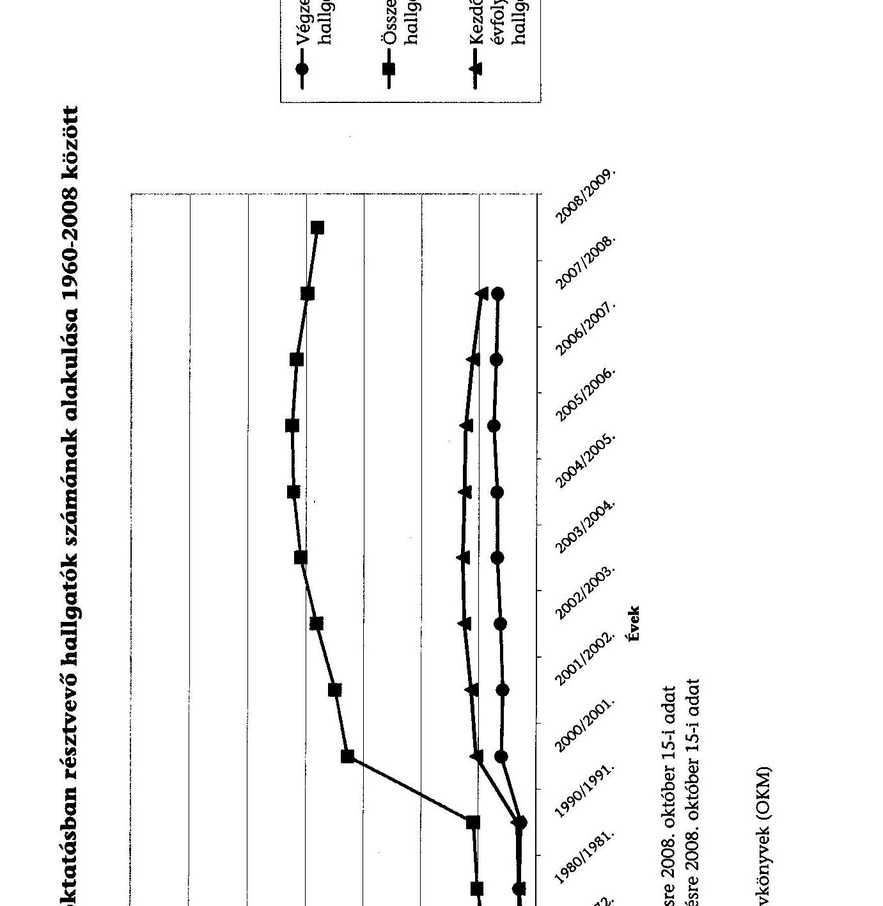

* Nem áll rendelkezésre 2008. október 15-i adat
* Nem áll rendelkezésre 2008. október 15-i adat

#### Forrás:

Oktatás-statisztikai évkönyvek (OKM)

---

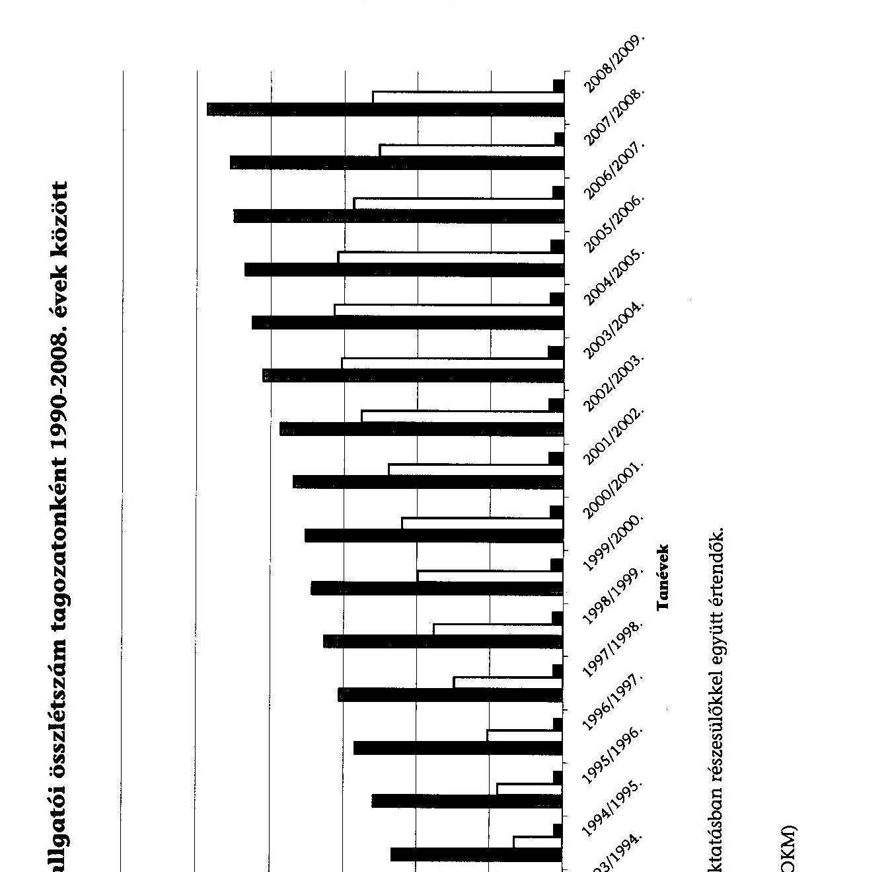

* Levelezô tagozat adatai a távoktatásban részesülôkkel együtt értendôk.

Forrás:
Oktatás-statisztikai évkönyvek (OKM)

---

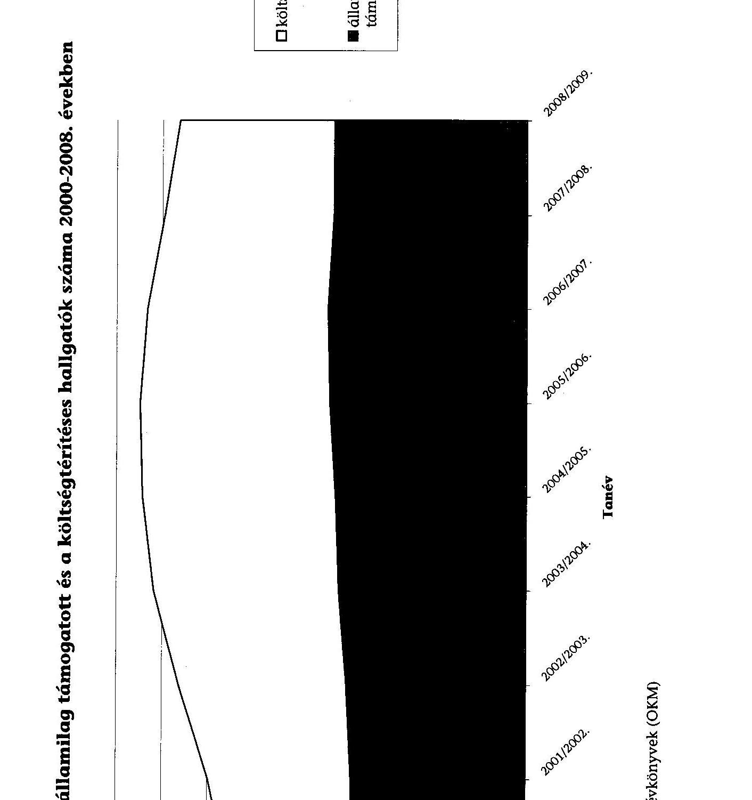

# Az államilag támogatott és a költségtérítéses hallgatók száma 2000-2008. években

## Forrás:
Oktatás-statisztikai évkönyvek (OKM)

---

Az államilag támogatott és a költségtérítéses hallgatók aránya a 2000-2008. közötti időszakban
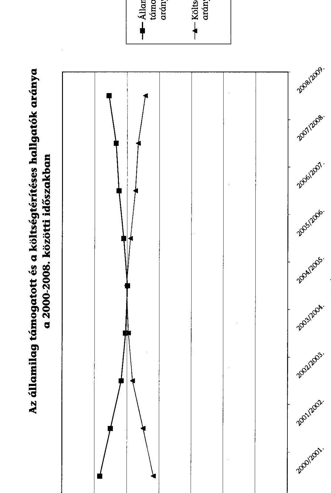

Forrás:
Oktatás-statisztikai évkönyvek (OKM)

---

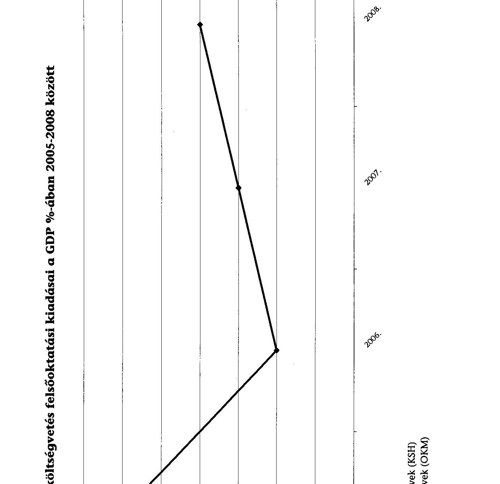

# A költségvetés felsőoktatási kiadásai a GDP %-ában 2005-2008 között

## Forrás:
- Magyar statisztikai évkönyvek (KSH)
- Oktatás-statisztikai évkönyvek (OKM)

---

# ÖSZESÍTETT KÉRDŐÍVES FELMÉRÉS   a nem állami felsőoktatási intézményektől a felsőoktatásról szóló 2005. évi CXXXIX. törvény végrehajtásáról 

## Kérdőíves felmérésben résztvett intézmények:

1. Pázmány Péter Katolikus Egyetem
2. Apor Vilmos Katolikus Főiskola
3. Egri Hittudományi Főiskola
4. Szegedi Hittudományi Főiskola
5. Károly Gáspár Református Egyetem
6. Kölcsey Ferenc Református Tanítóképző Főiskola
7. Modern Üzleti Tudományok Főiskolája
8. Gábor Dénes Főiskola
9. Általános Vállalkozási Főiskola
10. Budapesti Kommunikációs és Üzleti Főiskola

---

# ÖSSZESÍTETT KÉRDŐÍV   a nem állami felsőoktatási intézményekről   a 2005. évi CXXXIX. törvény végrehajtásának ÁSZ ellenőrzéséhez 

1. Az új felsőoktatási törvény előkészítése, majd módosítása során az OKM kikérte-e az intézmény véleményét?

- igen, kikérte
- nem kérte ki

2. Az intézmény tett-e észrevételeket, javaslatokat?

- igen
- nem

3. Kérjük, hogy a 2. pontban adott "nem" választ röviden indokolják!

- Egri Hittudományi Főiskola: Az intézmény sajátos jellegéből (csak hitéleti képzést folytatunk) nem tartottuk szükségesnek.
- Kölcsey Ferenc Református Tanítóképző Főiskola: Az intézmény képviselői már korábban, szakmai bizottsági keretek, illetve rektori konferenciák alkalmával próbálta érvényesíteni véleményüket.

4. Az intézmény által tett észrevételeket, javaslatokat az OKM figyelembe vette-e?

- igen
- nem
- részben
- nem válaszolt

5. Kérjük, hogy a 4. pontban adott "igen" válasz esetén sorolják fel a figyelembe vett észrevételeket, javaslatokat!

## Észrevételek:

- Szegedi Hittudományi Főiskola: A hitéleti szakokkal és képzésekkel kapcsolatban, a 139. § rendelkezéseit illetően.
- Általános Vállalkozási Főiskola: A kétciklusú képzés - figyelembe véve a felsőfokú szakképzést, szakirányú továbbképzést, illetve az MBA-képzést - többciklusú képzésként határozzuk meg. A képzési struktúra korábbi szakjainak mindegyike kerüljön felsorolása az újonnan kialakítandó képzési területeken, illetve képzési ágakon belül. Az alapképzésben - minden olyan képzési területen, ahol ez lehetséges - gyakorlati félévvel.
- Modern Üzleti Tudományok Főiskolája: A felsőoktatási törvény 138. §-ában szereplő, a nem állami intézményekre vonatkozó eltérésekben ezek döntő mértékben szerepelnek. A finanszírozásra vonatkozó észrevételeik nem kerültek meghallgatásra, és ezért a létesítmény-fenntartási normatíva megvonását nehezményezik.

## Javaslatok:

- Szegedi Hittudományi Főiskola: A hitéleti szakokkal és képzésekkel kapcsolatban, a 139. § rendelkezéseit illetően.
- Modern Üzleti Tudományok Főiskolája: a nem állami intézmények finanszírozhatóságát nagyon komolyan veszélyezteti a létesítmény-fenntartási normatíva megvonása, mert a fenntartónak az utóbbi évtizedben már nincsenek olyan alapítványi bevételi forrásai, amelylyel ezt pótolhatná. Emiatt a létesítmények állaga belátható időn belül romlani kezd, mert a képzési bevételekből a főiskola a fenntartási kiadásokat csak kis mértékben tudja finanszírozni.

---

6. Az intézmény rendelkezik-e az új Ftv. előírásainak megfelelően kiegészített Alapító Okirattal?

- igen
- nem

7. Az intézmény az Ftv. szabályozása szerint elkészítette-e az új Szervezeti és Múködési Szabályzatot?

- igen

10

- nem

0
8. Az intézmény rendelkezik-e az új Ftv. szerint elkészített, szenátus által elfogadott képzési programmal?
- igen
- nem

9
1
9. Az intézmény az elfogadott képzési program alapján átalakította-e az oktatás-képzési szerkezetét a többciklusú képzési szerkezet alapelveinek megfelelően?

- igen, az átalakítás befejeződött

8

- jelenleg is folyamatban van az átalakítás

10. Kérjük értékeljék 1-4-ig a képzés minőségének javulását segítő tényezők közül az alábbiakat! (1 - kevésbé segíti, 4 - nagyon segíti)
új felvételi eljárási rend

- 1 - kevésbé segíti

3

- 2 -

1
- 3 -
- 4 - nagyon segíti
- nem válaszolt

2
korszerú tananyagok

- 1 - kevésbé segíti

0

- 2 -

5
- 3 -
- 4 - nagyon segíti
- nem válaszolt
tehetséggondozás (TDK, szakkollégium, mentorprogram, doktori képzés
- 1 - kevésbé segíti

0

- 2 -

3
- 3 -
- 4 - nagyon segíti
- nem válaszolt
- 6
- 1
átsorolás államilag támogatott képzésből költségtérítéses képzésbe
- 1 - kevésbé segíti

1

- 2 -

3
- 3 -
- 4 - nagyon segíti

1
- nem válaszolt

---

# oktatói munka minősége 

- 1 - kevésbé segíti
- 2 -
- 3 -
- 4 - nagyon segíti
- nem válaszolt
többciklusú képzés bevezetése
- 1 - kevésbé segíti
- 2 -
- 3 -
- 4 - nagyon segíti
- nem válaszolt

11. Az intézmény elkészítette-e az új Ftv. szabályozása alapján az intézményfejlesztési tervet?

- igen

・ nem
12. Az államilag támogatott hallgatói helyek elosztásának új törvényi szabályozása hogyan hatott az intézmény hallgatói létszámára?

- a hallgatók összlétszáma nőtt 4
- a hallgatók összlétszáma csökkent 4
- a hallgatói létszám nem változott 1
- nem válaszolt 1

13. Változott-e az államilag támogatott és a költségtérítéses hallgatók aránya a 2005/2006. tanév és a 2007/2008. tanév között?

- nőtt az államilag támogatott hallgatók aránya 2
- nőtt a költségtérítéses hallgatók aránya 5
- nem változott az arány 3

14. Az intézményben megalakult-e a gazdasági tanács?

- igen 2
- nem 8

15. A megalakult gazdasági tanács ellátja-e az Ftv-ben szabályozott feladatait?

- igen 1
- részben 1

16. Kérjük, hogy a 15. pontban adott "nem" vagy "részben" válasz okait sorolják fel!

- Pázmány Péter Katolikus Egyetem: nem jött létre gazdasági tanács.
- Apor Vilmos Katolikus Főiskola: Nem kötelező, mivel kis főiskola vagyunk. Gazdasági Bizottság működik a Gazdasági Tanács tevékenységéhez hasonlóan.
- Modern Üzleti Tudományok Főiskolája: A főiskolán a gazdasági tanács szerepét a fenntartó alapítványt képviselő kuratórium látja el.
- Budapesti Kommunikációs és Üzleti Főiskola: Magán felsőoktatási intézményben nem kötelező.

---

17. Az intézmény központi költségvetési támogatására a fenntartó kezdeményezte-e a hároméves keret-megállapodás megkötését az oktatási és kulturális miniszterrel?

- igen ..... 0
- nem ..... 10

18. Az intézmény együttmúködik-e a gazdasági szférával?

- igen ..... 6
- nem ..... 4

19. Az intézménynek milyen jellegű együttműködése van a gazdasági szférával? (Több válasz is lehetséges!)

# A gazdasági szféra képviselője: 

- prezentációkat, előadásokat tart ..... 5
- részt vesz tanulmányi versenyek szervezésében ..... 4
- ösztöndíjat alapít ..... 4
- támogatja az egyetem/főiskola kutatói munkáját ..... 5
- részt vesz az egyetemi/főiskolai kutatásban ..... 4
- részt vesz a szakmai gyakorlat megszervezésében ..... 6
- részt vesz tananyagok kidolgozásában, fejlesztésében ..... 3
- részt vesz tananyagok véleményezésében ..... 5
- részt vesz a hallgatók vizsgáztatásában ..... 4
Az intézménynek nincs együttmúködése ..... 2

20. A képzés során megszerzett ismeretek és elsajátított készségek segítik-e az intézmény végzett hallgatóinak elhelyezkedését? Kérjük értékeljék 1-4-ig az alább felsoroltakat! (1 - kevésbé segíti, 4 - leginkább segíti)
szakmai elméleti ismeretek

- 1 - kevésbé segíti ..... 0
- 2 - ..... 0
- 3 - ..... 6
- 4 - leginkább segíti ..... 3
- nem válaszolt ..... 1
szakmai gyakorlati ismeretek
- 1 - kevésbé segíti ..... 0
- 2 - ..... 0
- 3 - ..... 3
- 4 - leginkább segíti ..... 7
- nem válaszolt
informatikai ismeretek
- 1 - kevésbé segíti ..... 1
- 2 - ..... 1
- 3 - ..... 4
- 4 - leginkább segíti ..... 4
- nem válaszolt

---

jó kommunikációs készség

- 1 - kevésbé segíti
- 2 -
- 3 -
- 4 - leginkább segíti
- nem válaszolt
idegennyelv-tudás
- 1 - kevésbé segíti
- 2 -
- 3 -
- 4 - leginkább segíti
- nem válaszolt
kommunikációs készség idegen nyelven
- 1 - kevésbé segíti
- 2 -
- 3 -
- 4 - leginkább segíti
- nem válaszolt
új készségek elsajátítása
- 1 - kevésbé segíti
- 2 -
- 3 -
- 4 - leginkább segíti
- nem válaszolt
írásos szakmai anyagok készítása
- 1 - kevésbé segíti
- 2 -
- 3 -
- 4 - leginkább segíti
- nem válaszolt
önálló munkavégzééshez szükséges készség
- 1 - kevésbé segíti
- 2 -
- 3 -
- 4 - leginkább segíti
- nem válaszolt
csapatmunkához szükséges készség
- 1 - kevésbé segíti
- 2 -
- 3 -
- 4 - leginkább segíti
- nem válaszolt

2
1
6
3
$\square$
$\square$
2
1
7
$\square$
2
1
4
5

# 21. Kérjük, hogy értékeljék röviden az új Ftv. hatását az intézmény oktatás-képzési rendszerére, szervezetére, valamint gazdálkodására! 

## Oktatás-képzés:

- Pázmány Péter Katolikus Egyetem: A kétciklusú képzés (BA-MA) rendszerének létrejötte, ezzel összefüggésben a képzési idő csökkenése az alapképzésben (pedagógusképzés), a szakindítások engedélyezésének szigorítása, akkreditációs megalapozottság.

---

- Apor Vilmos Katolikus Főiskola: A bolognai rendszerú képzés bevezetése a hagyományos szakjaik megújítását eredményezte: 4 BA szakot, 1 MA szakot, valamint 3 felsőfokú szakképzést akkreditáltattunk, több új szakirányú továbbképzési szakot indítottak. A tananyag folyamatos korszerűsítése, új jegyzetek, tankönyvek készítése a képzés színvonalának növelését szolgálta.
- Egri Hittudományi Főiskola: Hittanári szakon is áttértek a 2 ciklusú képzésre (BA, MA).
- Szegedi Hittudományi Főiskola: Az új Ftv.-vel felxibilisebbé vált a hallgatók képzési lehetőségeinek szervezése. Probléma, hogy nyelvvizsga hiányában a hallgató nem mehet tovább a mesterképzésre. Ugyanakkor alapvetően pozitív az új Ftv. hatása.
- Károlyi Gáspár Református Egyetem: A többcikulsú képzési szerkezet bevezetése teljes átalakítást kívánt az oktatás területén. Az új törvényi előírások távlatos oktatás-szervezést tesznek szükségessé.
- Kölcsey Ferenc Református Tanítóképző Főiskola: Minatantervek átdolgozása, aktualizálása, képzési idő rövidülése.
- Modern Üzleti Tudományok Főiskolája: Az új Felsőoktatási törvény bevezetésével a bolognai képzési rendszer meglehetősen gyorsan, véleményük szerint nem elég kiérlelt módon került bevezetésre. A magyar duális (egyetemi és főiskolai) rendszer korábbi előnyei elvesztek az új képzési szerkezetben, főleg azért, mert az egyetemek diktálták az alapszak kimeneti követelményeit, ezért az alapszakok képzési tartalma elméletileg túlzsúfolt, a készségfejlesztéshez pedig kevés gyakorlati lehetőséget biztosítanak. A főiskola korábban is a gyakorlatorientált képzésről volt ismert és elismert, ezért sajnálatosnak tekintik, hogy a gyakorlati képzési lehetőségeik beszűkültek, és - véleményük szerint fölösleges - elméleti tárgyak vázlatos szintű oktatási követelményét kellett beépíteniük a tanterveikbe. Az alapszakon végző első évfolyam során szerzett tapasztalatok alapján feltétlenül szükségesnek tartják a kimeneti követelmények felülvizsgálatát, és a felsőoktatási intézmények számára nagyobb képzési szabadság biztosítását. A jelenlegi követelményrendszer a megjelölt tantrágyi modulok kredit- és óraszám követelményeivel, belső tantárgyi struktúrájuk definiálásával gúzsba köti a felsőoktatási intézményeket, így azok még a kényszerítő versenyhelyzetben sem tudják pozicionálni magukat sajátos képzési kínálatuk erősségeivel.
- Gábor Dénes Főiskola: A többciklusú képzési szerkezetre áttérés.
- Általános Vállalkozási Főiskola: Mivel a törvény minden hazai egyetemet, főiskolát felsőoktatási intézményként definiált, ezért az intézmény számára megteremtődött a lehetősége annak, hogy a képzési struktúrát a többciklus minden elemére kialakíthassa.
- Budapesti Kommunikációs és Üzleti Főiskola: Pozitív hatás a nemzetközisedő, társadalmi igényekre fogékonyabb múködés szorgalmazása, negatív az alapképzés uniformizálása.

# Szervezet: 

- Pázmány Péter Katolikus Egyetem: A szervezeti struktúrára nem volt hatással, az intézményi szabályzatok egységesítését elősegítette.
- Apor Vilmos Katolikus Főiskola: Ebben az időszakban történt a tanszékek helyett intézetek, a tanulmányi feladatok ellátásával pedig speciális (dokumentációs, információs) központok létrehozása. Az átalakítás részben javította a múködést, részben pedig további módosítások igényét vetette fel. A folyamat jelenleg is zajlik.
- Egri Hittudományi Főiskola: Megváltozott az Egri Eszterházy Károly Főiskolával való együttműködés rendje.
- Szegedi Hittudományi Főiskola: Szervezetileg nem történt átalakulás.
- Károlyi Gáspár Református Egyetem: Az intézményi autonómia bővült, a karok önállósága szűkült, de ez nem kívánta meg a szervezet jelentős átalakítását.
- Kölcsey Ferenc Református Tanítóképző Főiskola: Intézetek létrehozása (Kommunikációs- és Médiatudományi Intézet, Felnőttképzési Intézet), egységek hatékonyabb munkavégzésre való átszervezése, részleges vezetői személycsere.
- Modern Üzleti Tudományok Főiskolája: A főiskola múködését, szervezeti felépítését az új Ftv. alig befolyásolja. A fenntartó szerepében fellépő Kuratórium lájta el a Gazdasági Tanács szerepét, jóllehet a gazdasági környezettel való kapcsolat tartalmi érvényesítése alapvetően a főiskola vezetésének érdeke és feladata. A belső szervezetben az új bolognai szakokhoz igazodva alakították át a tanszéki struktúrát, így minden szaknak és modulnak felelős tanszéke van.

---

- Gábor Dénes Főiskola: Új szervezet létrehozása, jelentős mértékben megnövekedett az adminisztráció.
- Általános Vállalkozási Főiskola: A törvény megerősítette az intézmény létrehozatala óta követett gyakorlatot, miszerint az ún. akadémiai és múködtetési irányítás szétválasztható.
- Budapesti Kommunikációs és Üzleti Főiskola: A törvény kifejezetten előnyös a múködést jól szolgáló szervezeti formák kialakításának lehetővé tételével.

# Gazdálkodás: 

- Apor Vilmos Katolikus Főiskola: A normatívák változásai miatt az intézmény gazdálkodását takarékosságra, bizonyos mértékű szigorítások bevezetését tette szükségessé.
- Egri Hittudományi Főiskola: Létszámcsökkenés miatt bevétel kiesés.
- Szegedi Hittudományi Főiskola: Világosabbá váltak a gazdálkodási viszonyok, ugyanakkor a pénzügyek tekintetében alapvető változások nem történtek.
- Károli Gáspár Református Egyetem: Az eddiginél tudatosabb, költségtakarékosabb gazdálkodásra, jobban megszervezett igazgatásra, az egyetem egészének múködését összehangoló koncepcióra van szükség.
- Kölcsey Ferenc Református Tanítóképző Főiskola: Kevesebb hallgató, kevesebb támogatás, racionalizálni kell a gazdálkodási tevékenységet.
- Modern Üzleti Tudományok Főiskolája: Az új Ftv. a főiskola gazdálkodásában negatív változásokat hozott. Érthetetlennek és sérelmesnek tartják azt, hogy a nem állami felsőoktatási intézmények nem részesülhetnek létesítmény-fenntartási normatívában. Minthogy hazánkban a civil szektor (és annak támogatottsága) az elmúlt másfél évtizedben nem úgy alakult, mint az a fejlett piacgazdaságokban és demokráciákban megfigyelhető volt, a 15-20 évvel ezelőtt alapítványi formában indult intézmények külső forrásokból való támogatása nem növekedett, sőt kifejezetten (mondhatni nullára) visszaesett. Így a múködés finanszírozására csak az államilag finanszírozott hallgatók költségvetési finanszírozása, illetve a költségtérítéses hallgatók befizetése nyújt fedezetet. A demográfiai okok, a felvételi rendszer módosulásai, valamint a jelentősen megnövekedett képzési verseny miatt a főiskola múködésének finanszírozhatósága nehéz helyzetbe került.
- Gábor Dénes Főiskola: A magán, és alapítványi felsőoktatási intézmények részére átadott normatíva fenntartói támogatási részét (év közben) megvonták, ami rendkívül méltánytalan, az esélyegyenlőség érvényesülését jelentős mértékben gátló tényező.
- Általános Vállalkozási Főiskola: Lehetővé vált a hallgatói teljesítmények differenciált jutalmazása. A szociálisan hátrányos helyzetű hallgatók kiemelt támogatásban részesülhetnek.
- Budapesti Kommunikációs és Üzleti Főiskola: Nem akadályozza a jó gazdálkodást a magánintézményeknél.

Budapest, 2008. december 16.

---

# ÖSSZESÍTETT KÉRDŐÍVES FELMÉRÉS   a gazdasági érdekképviseleti szervezetek, kamarák részéről a felsőoktatásról szóló 2005. évi CXXXIX. törvény végrehajtásáról 

## Kérdöíves felmérésbe vont szervezetek:

1. Magyar Ügyvédi Kamara
2. Magyar Építész Kamara
3. Magyar Könyvvizsgáló Kamara
4. Magyar Kereskedelmi és Iparkamara
5. Magyar Mérnöki Kamara
6. Magyar Szállodaszövetség
7. Menedzserek Országos Szövetsége
8. Vállalkozók és Munkáltatók Országos Szövetsége (VOSZ)
9. Építési Vállalkozók Országos Szövetsége (ÉVOSZ)
10. Magyar Formatervezési Tanács

---

# ÖSSZESÍTETT KÉRDŐÍV 

a gazdasági érdekképviseleti szervezetek, kamarák részéről a felsőoktatásról szóló 2005. évi CXXXIX. törvény végrehajtásának ÁSZ ellenőrzéséhez

1. Részt vett-e a gazdasági érdekképviseleti szervezet, kamara az új Ftv. és annak módosításában, előkészítésében, véleményezésében?

- igen

1. 

- nem

1. 

Igen válasz esetén tett-e észrevételeket, javaslatokat?

- igen
- nem

2

Ha igen, az érdekképviseleti szervezet, kamara által tett észrevételeket, javaslatokat az OKM figyelembe vette-e?

- igen

0

- nem
1
- részben
$\square$
- nem válaszolt

2. A gazdasági érdekképviseleti szervezet, kamara véleménye szerint az új felsőoktatási törvény hozzájárult-e a felsőoktatási képzés versenyképességének javulásához?

- igen

4

- nem
- nem válaszolt

3. Véleményük szerint javult-e a vállalati szféra és a felsőoktatási intézmények együttmúködése (kölcsönös tanácsadói kapcsolatok, kommunikációs csatornák), fejlőd-tek-e az együttmúködés lehetőségei az új Ftv. hatására?

- igen

5

- nem
- nem válaszolt

4. A gazdasági érdekképviseleti szervezetnek, kamarának van-e együttmúködési kapcsolata a felsőoktatási intézményekkel?

- igen

9

- nem

1

## Igen válasz esetén sorolja fel az intézményeket!

- Magyar Ügyvédi Kamara: Figyelembe véve a megyei ügyvédi kamarákat is, valamennyi jogi karral van együttmúködés.
- Magyar Építész Kamara: BEM Építészmérnöki Kar kari tanácstól rendszeres meghívót kapnak, Budapesti Corvinus Egyetem diplomáztatásában, diplomadíjak adományozásában vesznek részt.
- Magyar Könyvvizsgáló Kamara: Pécsi Tudományegyetem, BGF PSZFK, Corvinus Egyetem, Debreceni Egyetem, Miskolci Egyetem, Nyíregyházi Főiskola, Nyugat-Magyarországi Egyetem.
- Magyar Kereskedelmi és Iparkamara: A kapcsolattartás a területi kamarák szintjén valósul meg, ezért konkrét adatuk nincsen.
- Magyar Mérnöki Kamara: A műszaki felsőoktatást végző valamennyi egyetemmel és főiskolával, a határon túli magyar felsőoktatási intézményeket is beleértve.

---

- Magyar Szállodaszövetség: Budapesti Gazdasági Főiskola, Harsányi János Főiskola, Károly Róbert Főiskola.
- Menedzserek Országos Szövetsége: Corvinus Egyetem, BMGE, Kommunikációs Főiskola.
- Építési Vállalkozók Országos Szövetsége: Közös rendezvények, programok szervezése, információ csere.
- Magyar Formatervezési Tanács: Moholy-Nagy Művészeti Egyetem, Nyugat-Magyarországi Egyetem, Budapesti Műszaki és Gazdaságtudományi Egyetem, Budapesti Corvinus Egyetem.

5. A gazdasági érdekképviseleti szervezet, kamara milyen jellegú együttmüködést tart fenn a felsőoktatási intézményekkel? (Több válasz is lehetséges!)

- prezentációkat, előadásokat tart ..... 6
- a kamara/érdekképviseleti szerv alkalmazottja egyetemen/főiskolán tanít ..... 7
- részt vesz a tanulmányi versenyek szervezésében ..... 3
- támogatja az egyetem/főiskola kutatói munkáját ..... 3
- támogatja a hallgatók kutatói munkáját ..... 2
- részt vesz egyetemi/főiskolai kutatásban ..... 0
- részt vesz a tananyag kidolgozásában, fejlesztésében ..... 3
- részt vesz tananyagok véleményezésében ..... 4
- részt vesz a tantervek kidolgozásában ..... 4
- részt vesz szakmai gyakorlat szervezésében ..... 6
- részt vesz a hallgatók vizsgáztatásában ..... 4
- ösztöndíjat alapít ..... 2

Ösztöndíj létesítése esetén sorolja fel azokat!

- Magyar Építész Kamara: Diplomadíj.
- Magyar Mérnöki Kamara: A területi kamarák diplomaterv-pályázatokat írnak ki.

6. A gazdasági érdekképviseleti szervezet, kamara segíti-e a pályakezdők elhelyezkedését?

- igen ..... 7
- nem ..... 3

Igen válasz esetén sorolja fel annak módjait!

- Magyar Ügyvédi Kamara: A kamara honlapján, hirdetőtábláján, újságban segíti a munkát keresők és munkát ajánlók egymásra találását.
- Magyar Építész Kamara: hirdetés a kamarai lapban, honlapunkon.
- Magyar Kereskedelmi és Iparkamara: éves felmérésekkel információt szolgáltat a gazdaság mely területén van kereslet és milyen elvárásokat támasztanak munkáltatók.
- Magyar Mérnöki Kamara: Felkéri tagjait a frissen végzettek fogadására, részt vesz az egyetemi állásbörze szervezésében, álláshirdetéseket a kamara hivatalos lapja ingyenesen fogad.
- Menedzserek Országos Szövetsége: Konferencia-szervezés, álláslehetőségek ajánlása.
- Magyar Formatervezési Tanács: Üzleti tanácsok kezdő múvészeti vállalkozók számára - online elérhető, ingyenes, évente karbantartott útmutató.

7. Véleményük szerint a felsőfokú pályakezdők iránti piaci kereslet összhangban van-e a friss diplomások
számával?

- igen ..... 0
- nem ..... 6
- részben ..... 4
végzettségével?
- igen ..... 1
- nem ..... 7
- részben ..... 2

---

8. A felsorolt készségekből, ismeretekből, kompetenciákból, mivel rendelkeznek leginkább a pályakezdő diplomások? Értékelés 1-4-ig terjedő skálán a foglalkoztatók tapasztalatai elégedettsége alapján! (1-egyáltalán nem elégedett, 4-nagyon elégedett)
szakmai elméleti alapok
1 - egyáltalán nem elégedett ..... 0
- 2 -
1
- 3 -
7
- 4 - nagyon elégedett ..... 1
- nem válaszolt ..... 1
szakmai gyakorlati jártasság
1 - egyáltalán nem elégedett ..... 6
- 2 -
3
- 3 -
0
- 4 - nagyon elégedett ..... 0
- nem válaszolt ..... 1
informatikai ismeretek
1 - egyáltalán nem elégedett ..... 0
- 2 -
1
- 3 -
3
- 4 - nagyon elégedett ..... 5
- nem válaszolt ..... 1
új készségek elsajátítása
1 - egyáltalán nem elégedett ..... 0
- 2 -
4
- 3 -
4
- 4 - nagyon elégedett ..... 1
- nem válaszolt ..... 1
jó kommunikációs készség
1 - egyáltalán nem elégedett ..... 0
- 2 -
6
- 3 -
3
- 4 - nagyon elégedett ..... 0
- nem válaszolt ..... 1
írásos szakmai anyagok készítése
1 - egyáltalán nem elégedett ..... 1
- 2 -
5
- 3 -
3
- 4 - nagyon elégedett ..... 0
- nem válaszolt ..... 1
idegennyelv-ismeret
1 - egyáltalán nem elégedett ..... 0
- 2 -
3
- 3 -
6
- 4 - nagyon elégedett ..... 0
- nem válaszolt ..... 1
kommunikációs készség idegen nyelven
1 - egyáltalán nem elégedett ..... 2
- 2 -
6
- 3 -
1
- 4 - nagyon elégedett ..... 0
- nem válaszolt

---

szervező készség

- 1 - egyáltalán nem elégedett ..... 0
- 2 -
- 3 -
- 4 - nagyon elégedett ..... 0
- nem válaszolt ..... 1
önálló munkavégzéshez szükséges készség
- 1 - egyáltalán nem elégedett ..... 0
- 2 -
- 3 -
- 4 - nagyon elégedett ..... 0
- nem válaszolt ..... 1
csapatmunkához szükséges készség
- 1 - egyáltalán nem elégedett ..... 0
- 2 -
- 3 -
- 4 - nagyon elégedett ..... 3
- nem válaszolt ..... 1
etikus magatartás
- 1 - egyáltalán nem elégedett ..... 0
- 2 -
- 3 -
- 4 - nagyon elégedett ..... 2
- nem válaszolt ..... 1

9. Az Európai Gazdasági Térség országaiban múködő felsőoktatási intézményekben ösztöndíj rendszeren alapuló - résztanulmányok folytatásának lehetősége hozzájá-rult-e a hallgatók magas színvonalú képzettségéhez?

- igen ..... 9
- nem ..... 0
- részben ..... 1

10. Véleményük szerint a felsőoktatási intézmények által kiadott, az oklevelek nemzetközi elismerését szolgáló oklevél-mellékletek segítenek-e a hallgatók külföldi tovább-tanulásában, illetve munkavállalásában?

- igen ..... 7
- nem ..... 0
- részben ..... 2
- nem válaszolt ..... 1

11. A gazdasági érdekképviseleti szervezet, kamara tájékoztatja-e az intézményeket és a hallgatókat a piac szakmai elvárásairól, a lehetőségeiről, trendekről?

- igen ..... 8
- nem ..... 2
Igen válasz esetén, milyen módon
- Magyar Ügyvédi Kamara: Szakmai rendezvényeken, gólyatáborokban, konferenciákon a kamara elnök vagy képviselője rendszeresen előad a témában.
- Magyar Építész Kamara: Kamarai lapban, honlapon.
- Magyar Kereskedelmi és Iparkamara: Munkaerő-piaci felméréseket készítünk az országos, regionális és megyei igényekről, jellemzőkről.

---

- Magyar Mérnöki Kamara: A jogosultsági rendszer kialakításának a végzettségekkel történő összehangolása továbbképzési rendszer megalkotásával és múködtetésével.
- Magyar Szállodaszövetség: A tananyag, a tantervek előkészítése során.
- Menedzserek Országos Szövetsége: Konferencia, prezentációk az egyetemeken AIESEC-en keresztül.
- Vállalkozók és Munkáltatók Országos Szövetsége: Fórumokon.
- Magyar Formatervezési Tanács: A formatervezőket képző egyetemek rektorai mellett a magyar ipar jó néhány vezető személyisége egyben a tanács tagja is, így a testületi keretek között mód van az információcserére, konzultációra. A hallgatókat a honlapon keresztül elérhető információkkal, illetve a rektorok közvetítésével tájékoztatjuk a piac elvárásairól.

12. A gazdaság szereplői rendelkeznek-e elegendő információval az új többciklusú képzési rendszer kimeneti követelményeiről?

- igen ..... 0
- nem ..... 6
- részben ..... 3
- nem válaszolt ..... 1

13. Milyennek ítéli meg a kezdő diplomások elhelyezkedési lehetőségét? *

jogász

- túlkínálat ..... 8
- túlkereslet ..... 1
- nem válaszolt ..... 1
bölcsész
- túlkínálat ..... 8
- túlkereslet ..... 0
- nem válaszolt ..... 2
pedagógus
- túlkínálat ..... 8
- túlkereslet ..... 0
- nem válaszolt ..... 2
környezetmérnök
- túlkínálat ..... 2
- túlkereslet ..... 5
- nem válaszolt ..... 3
agrármérnök
- túlkínálat ..... 2
- túlkereslet ..... 4
- nem válaszolt ..... 4
kertészmérnök
- túlkínálat ..... 2
- túlkereslet ..... 4
- nem válaszolt ..... 4
informatikus
- túlkínálat ..... 1
- túlkereslet ..... 6
- nem válaszolt ..... 3

---

építőmérnök (építő, építész)
túlkínálat ..... 2

- túlkereslet ..... 5
- nem válaszolt ..... 3
közlekedési mérnök
túlkínálat ..... 1
túlkereslet ..... 6
- nem válaszolt ..... 3
vegyészmérnök
túlkínálat ..... 3
túlkereslet ..... 4
- nem válaszolt ..... 3
gépészmérnök
túlkínálat ..... 1
túlkereslet ..... 6
- nem válaszolt ..... 3
villamosmérnök
túlkínálat ..... 1
túlkereslet ..... 6
- nem válaszolt ..... 3
közgazdász
túlkínálat ..... 7
túlkereslet ..... 1
- nem válaszolt ..... 2
marketingmenedzser
túlkínálat ..... 7
túlkereslet ..... 1
- nem válaszolt ..... 2
humán erőforrás menedzser
túlkínálat ..... 7
túlkereslet ..... 1
- nem válaszolt ..... 2
közművelődés menedzser
túlkínálat ..... 7
túlkereslet ..... 1
- nem válaszolt ..... 2
* Megjegyzés:
A válaszadás szakterületi alapon történt!

14. A pályakezdők foglalkoztatását elősegítő állami intézkedés (start kártya) javította-e a fiatalok elhelyezkedési lehetőségét?

- igen ..... 3
- nem ..... 1
- részben ..... 6

---

15. Véleményük szerint mi az akadálya a diplomás pályakezdők elhelyezkedésének? (1=nem akadály, 4=leginkább akadály)
aktív nyelvtudás hiánya
1 - nem akadály ..... 0
2 - kevésbé akadály ..... 3
3 - akadály ..... 2
4 - leginkább akadály ..... 5

- nem válaszolt
korszerú ismeretek hiánya
1 - nem akadály ..... 3
2 - kevésbé akadály ..... 0
3 - akadály ..... 5
4 - leginkább akadály ..... 1
- nem válaszolt ..... 1
informatikai ismeretek hiánya
1 - nem akadály ..... 5
2 - kevésbé akadály ..... 1
3 - akadály ..... 1
4 - leginkább akadály ..... 2
- nem válaszolt
kommunikációs képesség hiánya
1 - nem akadály ..... 0
2 - kevésbé akadály ..... 2
3 - akadály ..... 6
4 - leginkább akadály ..... 1
- nem válaszolt ..... 1
felsőoktatás képzési szerkezete nem felel meg a gazdaság szükségletének
1 - nem akadály ..... 0
2 - kevésbé akadály ..... 2
3 - akadály ..... 1
4 - leginkább akadály ..... 6
- nem válaszolt ..... 1
gyakorlati ismeretek hiánya
1 - nem akadály ..... 0
2 - kevésbé akadály ..... 1
3 - akadály ..... 0
4 - leginkább akadály ..... 8
- nem válaszolt ..... 1
elméletorientált képzés
1 - nem akadály ..... 2
2 - kevésbé akadály ..... 1
3 - akadály ..... 2
4 - leginkább akadály ..... 4
- nem válaszolt ..... 1
önálló munkavégző képesség hiánya
1 - nem akadály ..... 1
2 - kevésbé akadály ..... 2
3 - akadály ..... 6
4 - leginkább akadály ..... 1

---

együttmüködési készség hiánya

- 1 - nem akadály ..... 2
- 2 - kevésbé akadály ..... 3
- 3 - akadály ..... 4
- 4 - leginkább akadály ..... 0
- nem válaszolt ..... 1
a női munkavállalók esetében a későbbi gyermekvállalással járó kiesés
- 1 - nem akadály ..... 1
- 2 - kevésbé akadály ..... 3
- 3 - akadály ..... 4
- 4 - leginkább akadály ..... 0
- nem válaszolt ..... 2
a diploma szerzésének helye
- 1 - nem akadály ..... 1
- 2 - kevésbé akadály ..... 2
- 3 - akadály ..... 3
- 4 - leginkább akadály ..... 1
- nem válaszolt ..... 1
a diploma eredménye
- 1 - nem akadály ..... 1
- 2 - kevésbé akadály ..... 6
- 3 - akadály ..... 1
- 4 - leginkább akadály ..... 0
- nem válaszolt ..... 2

16. Véleménye szerint annak érdekében, hogy a képzési program kínálata jobban igazodjon a gazdaság igényeihez, milyen módszereket helyeznének előtérbe? Rangsorolja 1-7-ig az intézkedéseket növekvő sorrendben! (A legkevésbé igazodó intézkedés - 1, a legjobban igazodó - 7)

- hallgatói létszám központi meghatározása

1 - legkevésbé igazodó intézkedés 2 - 3 - 4 - 5 - 6 - 7 - legjobban igazodó

|  2 |  |
| :-- | :-- |
|  0 |  |
| 0 |  |
| 1 |  |
| 1 |  |
| 3 |  |
| 3 |  |

- minőségbiztosítási eszközöket (teljesítménymutatók alkalmazása)

1 - legkevésbé igazodó intézkedés 2 - 3 - 4 - 5 - 6 - 7 - legjobban igazodó

|  1 |  |
| :-- | :-- |
|  1 |  |
| 2 |  |
| 0 |  |
| 4 |  |
| 2 |  |
| 0 |  |

- a képzések rugalmasabbá tétele (átjárhatóság)

1 - legkevésbé igazodó intézkedés 2 - 3 - 4 - 5 - 6 - 7 - legjobban igazodó

---

- a felsőoktatási intézmények és a hallgatók információhoz juttatása a várható munkaerő-piaci változásokról
1 - legkevésbé igazodó intézkedés ..... 1
2 - ..... 0
3 - ..... 3
4 - ..... 1
5 - ..... 2
6 - ..... 1
7 - legjobban igazodó ..... 2
- a hallgatói karrierirodák fejlesztése
1 - legkevésbé igazodó intézkedés ..... 2
2 - ..... 2
3 - ..... 3
4 - ..... 2
5 - ..... 0
6 - ..... 0
7 - legjobban igazodó ..... 1
- tanulmányok alatti szakmai gyakorlat meghosszabbítása
1 - legkevésbé igazodó intézkedés ..... 0
2 - ..... 3
3 - ..... 0
4 - ..... 1
5 - ..... 2
6 - ..... 2
7 - legjobban igazodó ..... 2
- a felsőoktatás és a vállalati szféra együttmúködésének erősítése
1 - legkevésbé igazodó intézkedés ..... 1
2 - ..... 1
3 - ..... 2
4 - ..... 1
5 - ..... 2
6 - ..... 0
7 - legjobban igazodó ..... 3

1. A felsőfokú intézmények által indított felsőfokú szakképzési programok igazodnak-e a munkaerő-piaci igényekhez?

- teljes mértékben ..... 0
- jellemzően igen ..... 2
- jellemzően nem ..... 7
- egyáltalán nem ..... 0
- nem válaszolt ..... 1

Budapest, 2008. december 16.

---

# ÖSSZESÍTETT KÉRDŐÍVES FELMÉRÉS a munkaerő-piaci elhelyezkedést segítő szervezetektől a felsőoktatásról szóló 2005. évi CXXXIX. törvény végrehajtásáról 

## Kérdőíves felmérésben résztvett szervezetek:

I. Regionális Munkaügyi Központok:

1. Közép-magyarországi Regionális Munkaügyi Központ
2. Közép-dunántúli Regionális Munkaügyi Központ
3. Nyugat-dunántúli Regionális Munkaügyi Központ
4. Dél-dunántúli Regionális Munkaügyi Központ
5. Észak-magyarországi Regionális Munkaügyi Központ
6. Észak-alföldi Regionális Munkaügyi Központ
7. Dél-alföldi Regionális Munkaügyi Központ - Békéscsaba
8. Dél-alföldi Regionális Munkaügyi Központ - Szeged
9. Dél-alföldi Regionális Munkaügyi Központ - Kecskemét
II. Magán munkaerő-közvetítő szervezetek:
10. GRAFTON RECRUIMENT Személyi Tanácsadó Kft.
11. P \& BERT Management Consulting Group Szolgáltató Kft.
12. PANNONJOB Humán Szolgáltató és Tanácsadó Kft.
13. HVG Online Internetes Fejlesztő Kereskedelmi, Szolgáltató és Tanácsadó Zrt.
14. KELLY SERVICES Hungary Személyzeti Szolgáltató Kft.
15. NEXT SELECTION Személyzeti Tanácsadó Kft.
16. TRENKWALDER MULTIMAN Személyzeti Szolgáltató Kft.
17. FOCUS CONSULTING Személyzeti Tanácsadó és Szolgáltató Kft.
III. Munkaerő-közvetítőként működő egyetemi, hallgatói szervezetek:
18. Központi Hallgatói Szolgáltató Iroda Egyesület (PTE)
19. Miskolci Egyetem (ME)
20. Magyar Mérnökhallgatók Egyesülete (BMF)
21. BMF Rektori Hivatal (BMF)
22. Műegyetemi Ifjúsági Szolgáltató Kht. (BME)
23. Budapesti Műszaki és Gazdaságtudományi Egyetem Diákközpont (BME)
24. Pázmány Péter Katolikus Egyetem (PPKE)
25. Budapesti Corvinus Egyetem Egyetemi Hallgatókért Diákszolgálat (BCE)

---

# ÖSSZESÍTETT KÉRDŐÍV 

## a munkaerő-piaci elhelyezkedést segítő szervezetektől a felsőoktatásról szóló 2005. évi CXXXIX. törvény végrehajtásának ÁSZ ellenőrzéséhez

1. Véleményük szerint elősegítette-e az új felsőoktatási törvény, hogy a felsőoktatási képzés jobban illeszkedjen a munkaerő-piaci igényekhez?

- teljes mértékben ..... 0
- összességében igen ..... 14
- összességében nem ..... 10
- egyáltalán nem ..... 1
2. Vannak-e megfelelő ismereteik a többciklusú - duális (egyetemi, főiskolai) helyett háromciklusú (alap, mester, doktori) - képzési rendszer kimeneti követelményeiről?
- teljes mértékben ..... 3
- összességében igen ..... 12
- összességében nem ..... 8
- egyáltalán nem ..... 2

3. Az államilag támogatott hallgatói helyek elosztásának (közgazdász, jogász, bölcsész, agrár kép- zés csökkentése, múszaki és természettudományos képzés növelése) elmúlt két évben végrehajtottváltoztatása összhangban van-e a munkaerő-piaci igényekkel?

- teljes mértékben ..... 4
- összességében igen ..... 14
- összességében nem ..... 6
- egyáltalán nem ..... 1

4. Megfelelő irányúnak és mértékűnek tartják-e az államilag támogatott hallgatói helyek elmúlt két évben végrehajtott átcsoportosítását?
társadalomtudományok (csökkentés)

- igen ..... 14
- kisebb korrekció szükséges ..... 6
- nagyobb korrekció szükséges ..... 3
- ellentétes korrekció szükséges ..... 1
- nem válaszolt ..... 1
bölcsészettudományok (csökkentés)
- igen ..... 12
- kisebb korrekció szükséges ..... 4
- nagyobb korrekció szükséges ..... 2
- ellentétes korrekció szükséges ..... 1
- nem válaszolt ..... 1
múszaki tudományok (növelés)
- igen ..... 12
- kisebb korrekció szükséges ..... 1
- nagyobb korrekció szükséges ..... 11
- ellentétes korrekció szükséges ..... 0
- nem válaszolt ..... 7

---

természettudományok (növelés)

- igen ..... 14
- kisebb korrekció szükséges ..... 6
- nagyobb korrekció szükséges ..... 3
- ellentétes korrekció szükséges ..... 0
- nem válaszolt ..... 2
agrártudományok (csökkentés)
- igen ..... 12
- kisebb korrekció szükséges ..... 6
- nagyobb korrekció szükséges ..... 4
- ellentétes korrekció szükséges ..... 0
- nem válaszolt ..... 3
orvostudományok (változatlan)
- igen ..... 10
- kisebb korrekció szükséges ..... 6
- nagyobb korrekció szükséges ..... 2
- ellentétes korrekció szükséges ..... 0
- nem válaszolt ..... 2

5. Illeszkednek-e a munakerő-piaci igényekhez a 2005-2008. között indított:
felsőfokú szakképzések?

- teljes mértékben ..... 0
- összességében igen ..... 10
- összességében nem ..... 11
- egyáltalán nem ..... 2
- nem válaszolt ..... 2
szakirányú továbbképzések?
- teljes mértékben ..... 0
- összességében igen ..... 15
- összességében nem ..... 8
- egyáltalán nem ..... 1
- nem válaszolt ..... 1

6. Az oklevelek nemzetközi elismerését szolgáló melléklet segíti-e a hallgatók külföldi elhelyezkedését?

- teljes mértékben ..... 5
- összességében igen ..... 14
- összességében nem ..... 6
- egyáltalán nem ..... 0

7. Milyen mértékben befolyásolja az oklevelet szerzett hallgatók elhelyezkedését (kérjük, hogy 1-től 4-ig terjedő skálán osztályozzák az alábbi szempontokat; 1 - nem befolyásolja, 4 - nagymértékben befolyásolja)
a külföldi tanulmányok

- 1 - nem befolyásolja ..... 2
- 2 - ..... 2
- 3 - ..... 11
- 4 - nagymértékben befolyásolja ..... 10

---

a tanulmányi teljesítmény
1 - nem befolyásolja ..... 5

- 2 -
14

- 3 -
6
- 4 - nagymértékben befolyásolja ..... 0
a szakmai gyakorlat
1 - nem befolyásolja ..... 0
- 2 -
0
- 3 -
9
- 4 - nagymértékben befolyásolja ..... 16
a szakdolgozat minősítése
1 - nem befolyásolja ..... 10
- 2 -
14
- 3 -
1
- 4 - nagymértékben befolyásolja ..... 0
a nyelvtudás
1 - nem befolyásolja ..... 0
- 2 -
0
- 3 -
2
- 4 - nagymértékben befolyásolja ..... 23
az informatika ismeret
1 - nem befolyásolja ..... 0
- 2 -
3
- 3 -
12
- 4 - nagymértékben befolyásolja ..... 10
az intézmény neve
1 - nem befolyásolja ..... 1
- 2 -
5
- 3 -
17
- 4 - nagymértékben befolyásolja ..... 2
az intézmény típusa (egyetem, főiskola)
1 - nem befolyásolja ..... 0
- 2 -
12
- 3 -
11
- 4 - nagymértékben befolyásolja ..... 2
a tagozat (nappali, esti, levelező)
1 - nem befolyásolja ..... 8
- 2 -
8
- 3 -
7
- 4 - nagymértékben befolyásolja ..... 2
a képzés típusa (államilag finanszírozott, költségtérítéses)
1 - nem befolyásolja ..... 18
- 2 -
6
- 3 -
1
- 4 - nagymértékben befolyásolja ..... 0

---

8. Kérjük értékelje, hogy véleményük szerint kielégítő-e:
az oktatott szakismeret alkalmazhatósága
- jelenleg kielégítő ..... 9
- jelenleg nem kielégítő ..... 16
- nem válaszolt
a szakmai gyakorlat színvonala
- jelenleg kielégítő ..... 7
- jelenleg nem kielégítő ..... 17
- nem válaszolt ..... 1
az elméleti képzés színvonala
- jelenleg kielégítő ..... 22
- jelenleg nem kielégítő ..... 3
- nem válaszolt
az oktatott szakismeret naprakészsége
- jelenleg kielégítő ..... 15
- jelenleg nem kielégítő ..... 10
- nem válaszolt

9. Kérjük értékeléjk az alábbi területeken tapasztaltak-e javulást a 2005-2008 közötti időszakban (kérjük, hogy 1-től 4-ig terjedő skálán osztályozzon; 1 - nem változott, 4 - kiváló)
az oktatott szakismeret alkalmazhatósága

- 1 - nem változott ..... 7
- 2 - ..... 9
- 3 - ..... 6
- 4 - kiváló ..... 2
- nem válaszolt ..... 1
a szakmai gyakorlat színvonala
- 1 - nem változott ..... 6
- 2 - ..... 13
- 3 - ..... 4
- 4 - kiváló ..... 1
- nem válaszolt
az elméleti képzés színvonala
- 1 - nem változott ..... 6
- 2 - ..... 6
- 3 - ..... 9
- 4 - kiváló ..... 3
- nem válaszolt ..... 1
az oktatott szakismeret naprakészsége
- 1 - nem változott ..... 4
- 2 - ..... 9
- 3 - ..... 7
- 4 - kiváló ..... 4
- nem válaszolt

---

10. Véleményük szerint a felsőoktatásban a felsorolt szakmák közül, melyek igazodnak jobban a munkaerő-piaci igényekhez (kérjük, hogy 1-től 4-ig terjedő skálán osztályozzák a tudományterületeket; 1 - nem veszi figyelembe, 4 - teljes mértékben figyelembe veszi)

# jogász 

- 1 - nem veszi figyelembe ..... 9
- 2 - ..... 6
- 3 - ..... 6
- 4 - teljes mértékbe figyelembe veszi ..... 2
- nem válaszolt ..... 2
bölcsész
- 1 - nem veszi figyelembe ..... 9
- 2 - ..... 11
- 3 - ..... 3
- 4 - teljes mértékbe figyelembe veszi ..... 0
- nem válaszolt ..... 2
pedagógus (tanár, tanító)
- 1 - nem veszi figyelembe ..... 7
- 2 - ..... 14
- 3 - ..... 3
- 4 - teljes mértékbe figyelembe veszi ..... 0
- nem válaszolt ..... 1
környezetmérnök
- 1 - nem veszi figyelembe ..... 3
- 2 - ..... 4
- 3 - ..... 14
- 4 - teljes mértékbe figyelembe veszi ..... 1
- nem válaszolt ..... 3
agrármérnök
- 1 - nem veszi figyelembe ..... 4
- 2 - ..... 7
- 3 - ..... 10
- 4 - teljes mértékbe figyelembe veszi ..... 0
- nem válaszolt ..... 4
kertészmérnök
- 1 - nem veszi figyelembe ..... 2
- 2 - ..... 13
- 3 - ..... 5
- 4 - teljes mértékbe figyelembe veszi ..... 1
- nem válaszolt ..... 4
informatikus
- 1 - nem veszi figyelembe ..... 2
- 2 - ..... 2
- 3 - ..... 10
- 4 - teljes mértékbe figyelembe veszi ..... 10
- nem válaszolt ..... 1

---

# gépészmérnök 

- 1 - nem veszi figyelembe ..... 2
- 3 -
- 4 - teljes mértékbe figyelembe veszi - nem válaszolt2
villamosmérnök
- 1 - nem veszi figyelembe ..... 2
- 3 -
- 4 - teljes mértékbe figyelembe veszi - nem válaszolt2
közgazdász
- 1 - nem veszi figyelembe ..... 3
- 2 -
- 3 -
- 4 - teljes mértékbe figyelembe veszi - nem válaszolt ..... 41
marketing menedzser
- 1 - nem veszi figyelembe ..... 3
- 2 -
- 3 -
- 4 - teljes mértékbe figyelembe veszi - nem válaszolt ..... 1
humán erőforrás menedzser
- 1 - nem veszi figyelembe ..... 3
- 2 -
- 3 -
- 4 - teljes mértékbe figyelembe veszi - nem válaszolt2
közművelődés menedzser
- 1 - nem veszi figyelembe ..... 2
- 3 -
- 4 - teljes mértékbe figyelembe veszi - nem válaszolt2
11. Megítélése szerint a frissdiplomások elhelyezkedési lehetőségei javulnak-e az új felsőoktatási tör-
vény (többciklusú képzés) hatására az alábbi szakképzettségeknél:
jogász
- összességében igen ..... 3
- összességében nem ..... 19
- nem válaszolt ..... 2
bölcsész
- összességében igen ..... 2
- összességében nem ..... 21
- nem válaszolt ..... 2

---

pedagógus (tanár, tanító)

- összességében igen ..... 3
- összességében nem ..... 21
- nem válaszolt ..... 1
környezetmérnök
- összességében igen ..... 8
- összességében nem ..... 14
- nem válaszolt ..... 2
agrármérnök
- összességében igen ..... 2
- összességében nem ..... 19
- nem válaszolt ..... 4
kertészmérnök
- összességében igen ..... 3
- összességében nem ..... 18
- nem válaszolt ..... 4
informatikus
- összességében igen ..... 15
- összességében nem ..... 9
- nem válaszolt ..... 1
építőmérnök
- összességében igen ..... 10
- összességében nem ..... 12
- nem válaszolt ..... 2
közlekedési mérnök
- összességében igen ..... 9
- összességében nem ..... 13
- nem válaszolt ..... 2
vegyészmérnök
- összességében igen ..... 10
- összességében nem ..... 12 ..... 2
gépészmérnök
- összességében igen ..... 14
- összességében nem ..... 9
- nem válaszolt ..... 2
villamosmérnök
- összességében igen ..... 14
- összességében nem ..... 8
- nem válaszolt ..... 2
közgazdász
- összességében igen ..... 11
- összességében nem ..... 13
- nem válaszolt ..... 1

---

# marketing menedzser 

- összességében igen ..... 7
- összességében nem ..... 15
- nem válaszolt ..... 3

## humán erőforrás menedzser

- összességében igen ..... 7
- összességében nem ..... 15
- nem válaszolt ..... 3

## humán erőforrás menedzser

- összességében igen ..... 2
- összességében nem ..... 18
- nem válaszolt ..... 3

12. Kérjük határozzák meg, hogy az egyes szakmáknál mekkora túlkínálatot vagy túlkeresletet tapasztalnak jelenleg (pl.: 10\% vagy 50\%)?

- jogász

Közép-magyarországi Regionális Munkaügyi Központ
Közép-dunántúli Regionális Munkaügyi Központ
Nyugat-dunántúli Regionális Munkaügyi Központ
Dél-dunántúli Regionális Munkaügyi Központ
Észak-magyarországi Regionális Munkaügyi Központ
Észak-alföldi Regionális Munkaügyi Központ
Dél-alföldi Regionális Munkaügyi Központ - Békéscsaba
Dél-alföldi Regionális Munkaügyi Központ - Szeged
Dél-alföldi Regionális Munkaügyi Központ - Kecskemét
GRAFTON RECRUIMENT Személyi Tanácsadó Kft.
P \& BERT Management Consulting Group Szolgáltató Kft.
PANNONJOB Humán Szolgáltató és Tanácsadó Kft.
HVG Online Internetes Fejlesztő Kereskedelmi, Szolgáltató és Tanácsadó Zrt.
KELLY SERVICES Hungary Személyzeti Szolgáltató Kft.
NEXT SELECTION Személyzeti Tanácsadó Kft.
TRENKWALDER MULTIMAN Személyzeti Szolgáltató Kft.
FOCUS CONSULTING Személyzeti Tanácsadó és Szolgáltató Kft.
Központi Hallgatói Szolgáltató Iroda Egyesület (PTE)
Magyar Mérnökhallgatók Egyesülete (BMF)
BMF Rektori Hivatal
Műegyetemi Ifjúsági Szolgáltató Kht. (BME)
Pázmány Péter Katolikus Egyetem (PPKE)

## Nem válaszolt:

- Miskolci Egyetem (ME)
- Budapesti Müszaki és Gazdaságtudományi Egyetem Diákközpont (BME)
- Budapesti Corvinus Egyetem Egyetemi Hallgatókért Diákszolgálat (BCE)
- bölcsész

Közép-magyarországi Regionális Munkaügyi Központ
Közép-dunántúli Regionális Munkaügyi Központ
Nyugat-dunántúli Regionális Munkaügyi Központ
Dél-dunántúli Regionális Munkaügyi Központ
Észak-magyarországi Regionális Munkaügyi Központ
Észak-alföldi Regionális Munkaügyi Központ

Tálkínálat Túlkereslet
$15 \%$
$70 \%$
$50 \%$
$50 \%$
$10 \%$
$10 \%$
$50 \%$
$20 \%$
$20 \%$
$50 \%$
$20 \%$
$20 \%$
$50 \%$
$20 \%$
$20 \%$

Túlkínálat Túlkereslet
$10 \%$
$50 \%$
$50 \%$
$50 \%$
$30 \%$
$13 \%$

---

| Dél-alföldi Regionális Munkaügyi Központ - Békéscsaba | $20 \%$ | - |
| :--: | :--: | :--: |
| Dél-alföldi Regionális Munkaügyi Központ - Szeged | $50 \%$ | - |
| Dél-alföldi Regionális Munkaügyi Központ - Kecskemét | $60 \%$ | - |
| GRAFTON RECRUIMENT Személyi Tanácsadó Kft. | $70 \%$ | - |
| P \& BERT Management Consulting Group Szolgáltató Kft. | $60 \%$ | - |
| PANNONJOB Humán Szolgáltató és Tanácsadó Kft. | $20 \%$ | - |
| HVG Online Internetes Fejlesztő Kereskedelmi, Szolgáltató és Tanácsadó Zrt. | $80 \%$ | - |
| KELLY SERVICES Hungary Személyzeti Szolgáltató Kft. | $50 \%$ | - |
| NEXT SELECTION Személyzeti Tanácsadó Kft. | $30 \%$ | - |
| TRENKWALDER MULTIMAN Személyzeti Szolgáltató Kft. | $60 \%$ | - |
| FOCUS CONSULTING Személyzeti Tanácsadó és Szolgáltató Kft. | $70 \%$ | - |
| Központi Hallgatói Szolgáltató Iroda Egyesület (PTE) | $50 \%$ | - |
| Magyar Mérnökhallgatók Egyesülete (BMF) | $25 \%$ | - |
| BMF Rektori Hivatal | $25 \%$ | - |
| Múegyetemi Ifjúsági Szolgáltató Kht. (BME) | $100 \%$ | - |
| Pázmány Péter Katolikus Egyetem (PPKE) | $20 \%$ | - |

# Nem válaszolt: 

- Miskolci Egyetem (ME)
- Budapesti Müszaki és Gazdaságtudományi Egyetem Diákközpont (BME)
- Budapesti Corvinus Egyetem Egyetemi Hallgatókért Diákszolgálat (BCE)

## - pedagógus (tanár, tanító)

Közép-magyarországi Regionális Munkaügyi Központ
Közép-dunántúli Regionális Munkaügyi Központ
Nyugat-dunántúli Regionális Munkaügyi Központ
Dél-dunántúli Regionális Munkaügyi Központ
Észak-magyarországi Regionális Munkaügyi Központ
Észak-alföldi Regionális Munkaügyi Központ
Dél-alföldi Regionális Munkaügyi Központ - Békéscsaba
Dél-alföldi Regionális Munkaügyi Központ - Szeged
Dél-alföldi Regionális Munkaügyi Központ - Kecskemét
GRAFTON RECRUIMENT Személyi Tanácsadó Kft.
P \& BERT Management Consulting Group Szolgáltató Kft.
PANNONJOB Humán Szolgáltató és Tanácsadó Kft.
HVG Online Internetes Fejlesztő Kereskedelmi, Szolgáltató és Tanácsadó Zrt.
KELLY SERVICES Hungary Személyzeti Szolgáltató Kft.
Központi Hallgatói Szolgáltató Iroda Egyesület (PTE)
Magyar Mérnökhallgatók Egyesülete (BMF)
BMF Rektori Hivatal
Múegyetemi Ifjúsági Szolgáltató Kht. (BME)
Budapesti Müszaki és Gazdaságtudományi Egyetem Diákközpont (BME)
Pázmány Péter Katolikus Egyetem (PPKE)

## Tálkinálat Túlkereslet

| $15 \%$ | - |
| :-- | :-- |
| $10 \%$ | - |
| $30 \%$ | - |
| $40 \%$ | - |
| $50 \%$ | - |
| $7 \%$ | - |
| $10 \%$ | - |
| $50 \%$ | - |
| $70 \%$ | - |
| $30 \%$ | - |
| $20 \%$ | - |
| $10 \%$ | - |
| $80 \%$ | - |
| $50 \%$ | - |
| $50 \%$ | - |
| $40 \%$ | - |
| $15 \%$ | - |
| $15 \%$ | - |
| $50 \%$ | - |
| $10 \%$ | - |
| $10 \%$ | - |

## Nem válaszolt:

- NEXT SELECTION Személyzeti Tanácsadó Kft.
- TRENKWALDER MULTIMAN Személyzeti Szolgáltató Kft.
- FOCUS CONSULTING Személyzeti Tanácsadó és Szolgáltató Kft.
- Miskolci Egyetem (ME)
- Budapesti Corvinus Egyetem Egyetemi Hallgatókért Diákszolgálat (BCE)

Tálkinálat Túlkereslet

- környezetmérnök
- 5\%
- Közép-magyarországi Regionális Munkaügyi Központ
$50 \%$
- 50\%
- Nyugat-dunántúli Regionális Munkaügyi Központ
$30 \%$

---

| Dél-dunántúli Regionális Munkaügyi Központ | $10 \%$ | - |
| :--: | :--: | :--: |
| Észak-alföldi Regionális Munkaügyi Központ | $32 \%$ | - |
| Dél-alföldi Regionális Munkaügyi Központ - Békéscsaba | $10 \%$ | - |
| Dél-alföldi Regionális Munkaügyi Központ - Szeged | $20 \%$ | - |
| Dél-alföldi Regionális Munkaügyi Központ - Kecskemét | $50 \%$ | - |
| GRAFTON RECRUIMENT Személyi Tanácsadó Kft. | $70 \%$ | - |
| P \& BERT Management Consulting Group Szolgáltató Kft. | $20 \%$ | - |
| PANNONJOB Humán Szolgáltató és Tanácsadó Kft. | $10 \%$ | - |
| HVG Online Internetes Fejlesztő Kereskedelmi, Szolgáltató és Tanácsadó Zrt. | - | $20 \%$ |
| KELLY SERVICES Hungary Személyzeti Szolgáltató Kft. | $50 \%$ | - |
| NEXT SELECTION Személyzeti Tanácsadó Kft. | - | $20 \%$ |
| FOCUS CONSULTING Személyzeti Tanácsadó és Szolgáltató Kft. | $80 \%$ | - |
| Központi Hallgatói Szolgáltató Iroda Egyesület (PTE) | $30 \%$ | - |
| Magyar Mérnökhallgatók Egyesülete (BMF) | - | $5 \%$ |
| BMF Rektori Hivatal | - | $5 \%$ |
| Múegyetemi Ifjúsági Szolgáltató Kht. (BME) | $30 \%$ | - |
| Budapesti Műszaki és Gazdaságtudományi Egyetem Diákközpont (BME) | - | $2 \%$ |

# Nem válaszolt: 

- Észak-magyarországi Regionális Munkaügyi Központ
- TRENKWALDER MULTIMAN Személyzeti Szolgáltató Kft.
- Miskolci Egyetem (ME)
- Pázmány Péter Katolikus Egyetem (PPKE)
- Budapesti Corvinus Egyetem Egyetemi Hallgatókért Diákszolgálat (BCE)

## - agrármérnök

Közép-magyarországi Regionális Munkaügyi Központ
Közép-dunántúli Regionális Munkaügyi Központ
Nyugat-dunántúli Regionális Munkaügyi Központ
Dél-dunántúli Regionális Munkaügyi Központ
Észak-magyarországi Regionális Munkaügyi Központ
Észak-alföldi Regionális Munkaügyi Központ
Dél-alföldi Regionális Munkaügyi Központ - Békéscsaba
Dél-alföldi Regionális Munkaügyi Központ - Szeged
Dél-alföldi Regionális Munkaügyi Központ - Kecskemét
GRAFTON RECRUIMENT Személyi Tanácsadó Kft.
P \& BERT Management Consulting Group Szolgáltató Kft.
PANNONJOB Humán Szolgáltató és Tanácsadó Kft.
HVG Online Internetes Fejlesztő Kereskedelmi, Szolgáltató és Tanácsadó Zrt.
NEXT SELECTION Személyzeti Tanácsadó Kft.
FOCUS CONSULTING Személyzeti Tanácsadó és Szolgáltató Kft.
Központi Hallgatói Szolgáltató Iroda Egyesület (PTE)
Magyar Mérnökhallgatók Egyesülete (BMF)
BMF Rektori Hivatal
Múegyetemi Ifjúsági Szolgáltató Kht. (BME)

Túlkinálat Túlkereslet

| $10 \%$ | - |
| :-- | :-- |
| $30 \%$ | - |
| $40 \%$ | - |
| $20 \%$ | - |
| $30 \%$ | - |
| $52 \%$ | - |
| $10 \%$ | - |
| $15 \%$ | - |
| $50 \%$ | - |
| $70 \%$ | - |
| $20 \%$ | - |
| $10 \%$ | - |
| $10 \%$ | 10\% |
| - | $10 \%$ |
| $10 \%$ | - |
| $60 \%$ | - |
| $20 \%$ | - |
| $10 \%$ | - |
| $10 \%$ | - |
| $20 \%$ | - |

## Nem válaszolt:

- KELLY SERVICES Hungary Személyzeti Szolgáltató Kft.
- TRENKWALDER MULTIMAN Személyzeti Szolgáltató Kft.
- Miskolci Egyetem (ME)
- Budapesti Müszaki és Gazdaságtudományi Egyetem Diákközpont (BME)
- Pázmány Péter Katolikus Egyetem (PPKE)

Budapesti Corvinus Egyetem Egyetemi Hallgatókért Diákszolgálat (BCE)

---

- kertészmérnök

Közép-magyarországi Regionális Munkaügyi Központ
Közép-dunántúli Regionális Munkaügyi Központ
Nyugat-dunántúli Regionális Munkaügyi Központ
Dél-dunántúli Regionális Munkaügyi Központ
Dél-alföldi Regionális Munkaügyi Központ - Békéscsaba
Dél-alföldi Regionális Munkaügyi Központ - Szeged
Dél-alföldi Regionális Munkaügyi Központ - Kecskemét
GRAFTON RECRUIMENT Személyi Tanácsadó Kft.
PANNONJOB Humán Szolgáltató és Tanácsadó Kft.
HVG Online Internetes Fejlesztő Kereskedelmi, Szolgáltató és Tanácsadó Zrt.
NEXT SELECTION Személyzeti Tanácsadó Kft.
TRENKWALDER MULTIMAN Személyzeti Szolgáltató Kft.
FOCUS CONSULTING Személyzeti Tanácsadó és Szolgáltató Kft.
Központi Hallgatói Szolgáltató Iroda Egyesület (PTE)
Magyar Mérnökhallgatók Egyesülete (BMF)
BMF Rektori Hivatal
Műegyetemi Ifjúsági Szolgáltató Kht. (BME)

## Nem válaszolt:

- Észak-magyarországi Regionális Munkaügyi Központ
- Észak-alföldi Regionális Munkaügyi Központ
- P \& BERT Management Consulting Group Szolgáltató Kft.
- KELLY SERVICES Hungary Személyzeti Szolgáltató Kft.
- Miskolci Egyetem (ME)
- Budapesti Müszaki és Gazdaságtudományi Egyetem Diákközpont (BME)
- Pázmány Péter Katolikus Egyetem (PPKE)
- Budapesti Corvinus Egyetem Egyetemi Hallgatókért Diákszolgálat (BCE)
informatikus

Közép-magyarországi Regionális Munkaügyi Központ
Nyugat-dunántúli Regionális Munkaügyi Központ
Dél-dunántúli Regionális Munkaügyi Központ
Észak-magyarországi Regionális Munkaügyi Központ
Észak-alföldi Regionális Munkaügyi Központ
Dél-alföldi Regionális Munkaügyi Központ - Békéscsaba
Dél-alföldi Regionális Munkaügyi Központ - Szeged
Dél-alföldi Regionális Munkaügyi Központ - Kecskemét
GRAFTON RECRUIMENT Személyi Tanácsadó Kft.
P \& BERT Management Consulting Group Szolgáltató Kft.
PANNONJOB Humán Szolgáltató és Tanácsadó Kft.
HVG Online Internetes Fejlesztő Kereskedelmi, Szolgáltató és Tanácsadó Zrt.
KELLY SERVICES Hungary Személyzeti Szolgáltató Kft.
NEXT SELECTION Személyzeti Tanácsadó Kft.
TRENKWALDER MULTIMAN Személyzeti Szolgáltató Kft.
FOCUS CONSULTING Személyzeti Tanácsadó és Szolgáltató Kft.
Központi Hallgatói Szolgáltató Iroda Egyesület (PTE)
Magyar Mérnökhallgatók Egyesülete (BMF)
BMF Rektori Hivatal
Müegyetemi Ifjúsági Szolgáltató Kht. (BME)
Pázmány Péter Katolikus Egyetem (PPKE)

Tálkinálat Túlkereslet

- 10\% - 
$50 \%$ -
$40 \%$ -
$15 \%$ -
$10 \%$ -
$15 \%$ -
$50 \%$ -
$30 \%$ -
$10 \%$ -
$10 \%$ -
$70 \%$ -
$30 \%$ -
$5 \%$ -
$5 \%$ -

Túlkinálat Túlkereslet

- 5\%
- 10\%
- 20\%
$59 \%$ -
- 20\%
- 20\%
- 100\%
- 25\%
- 30\%
- $90 \%$
- 40\%
- 20\%
- 30\%
- 100\%
- 15\%
- 15\%
- 60\%

---

# Nem válaszolt: 

- Közép-dunántúli Regionális Munkaügyi Központ
- Miskolci Egyetem (ME)
- Budapesti Müszaki és Gazdaságtudományi Egyetem Diákközpont (BME)
- Budapesti Corvinus Egyetem Egyetemi Hallgatókért Diákszolgálat (BCE)

## - építőmérnök

Közép-dunántúli Regionális Munkaügyi Központ
Észak-alföldi Regionális Munkaügyi Központ
Dél-alföldi Regionális Munkaügyi Központ - Békéscsaba
Dél-alföldi Regionális Munkaügyi Központ - Szeged
Dél-alföldi Regionális Munkaügyi Központ - Kecskemét
GRAFTON RECRUIMENT Személyi Tanácsadó Kft.
P \& BERT Management Consulting Group Szolgáltató Kft.
HVG Online Internetes Fejlesztő Kereskedelmi, Szolgáltató és Tanácsadó Zrt.
NEXT SELECTION Személyzeti Tanácsadó Kft.
TRENKWALDER MULTIMAN Személyzeti Szolgáltató Kft.
FOCUS CONSULTING Személyzeti Tanácsadó és Szolgáltató Kft.
Központi Hallgatói Szolgáltató Iroda Egyesület (PTE)
Magyar Mérnökhallgatók Egyesülete (BMF)
BMF Rektori Hivatal
Budapesti Műszaki és Gazdaságtudományi Egyetem Diákközpont (BME)

## Nem válaszolt:

- Közép-magyarországi Regionális Munkaügyi Központ
- Nyugat-dunántúli Regionális Munkaügyi Központ
- Dél-dunántúli Regionális Munkaügyi Központ
- Észak-magyarországi Regionális Munkaügyi Központ
- PANNONJOB Humán Szolgáltató és Tanácsadó Kft.
- KELLY SERVICES Hungary Személyzeti Szolgáltató Kft.
- Miskolci Egyetem (ME)
- Múegyetemi Ifjúsági Szolgáltató Kht. (BME)
- Pázmány Péter Katolikus Egyetem (PPKE)
- Budapesti Corvinus Egyetem Egyetemi Hallgatókért Diákszolgálat (BCE)
- közlekedési mérnök

Észak-alföldi Regionális Munkaügyi Központ
Dél-alföldi Regionális Munkaügyi Központ - Békéscsaba
Dél-alföldi Regionális Munkaügyi Központ - Szeged
GRAFTON RECRUIMENT Személyi Tanácsadó Kft.
P \& BERT Management Consulting Group Szolgáltató Kft.
HVG Online Internetes Fejlesztő Kereskedelmi, Szolgáltató és Tanácsadó Zrt.
TRENKWALDER MULTIMAN Személyzeti Szolgáltató Kft.
FOCUS CONSULTING Személyzeti Tanácsadó és Szolgáltató Kft.
Központi Hallgatói Szolgáltató Iroda Egyesület (PTE)
Magyar Mérnökhallgatók Egyesülete (BMF)
BMF Rektori Hivatal
Budapesti Múszaki és Gazdaságtudományi Egyetem Diákközpont (BME)

Tálkínálat Túlkereslet

| - | $20 \%$ |
| :-- | --: |
| $10 \%$ | - |
| - | $10 \%$ |
| $15 \%$ | - |
| - | $30 \%$ |
| - | $100 \%$ |
| - | $20 \%$ |
| - | $80 \%$ |
| - | $10 \%$ |
| - | $20 \%$ |
| - | $20 \%$ |
| $10 \%$ | - |
| $5 \%$ | - |
| $5 \%$ | - |
| - | $5 \%$ |

Tálkínálat Túlkereslet

| 4\% | - |
| :--: | :--: |
| - | $10 \%$ |
| 20\% | - |
| - | $50 \%$ |
| - | $15 \%$ |
| - | $10 \%$ |
| - | $10 \%$ |
| - | $20 \%$ |
| - | $10 \%$ |
| $5 \%$ | - |
| $5 \%$ | - |
| - | $2 \%$ |

## Nem válaszolt:

- Közép-magyarországi Regionális Munkaügyi Központ
- Közép-dunántúli Regionális Munkaügyi Központ
- Nyugat-dunántúli Regionális Munkaügyi Központ
- Dél-dunántúli Regionális Munkaügyi Központ

---

- Észak-magyarországi Regionális Munkaügyi Központ
- Dél-alföldi Regionális Munkaügyi Központ - Kecskemét
- PANNONJOB Humán Szolgáltató és Tanácsadó Kft.
- KELLY SERVICES Hungary Személyzeti Szolgáltató Kft.
- NEXT SELECTION Személyzeti Tanácsadó Kft.
- Miskolci Egyetem (ME)
- Múegyetemi Ifjúsági Szolgáltató Kht. (BME)
- Pázmány Péter Katolikus Egyetem (PPKE)
- Budapesti Corvinus Egyetem Egyetemi Hallgatókért Diákszolgálat (BCE)

|  - vegyészmérnök | Tálkinálat | Túlkereslet  |
| --- | --- | --- |
|  Észak-alföldi Regionális Munkaügyi Központ | $7 \%$ | -  |
|  Dél-alföldi Regionális Munkaügyi Központ - Békéscsaba | - | $10 \%$  |
|  Dél-alföldi Regionális Munkaügyi Központ - Szeged | $15 \%$ | -  |
|  GRAFTON RECRUIMENT Személyi Tanácsadó Kft. | - | $20 \%$  |
|  P \& BERT Management Consulting Group Szolgáltató Kft. | - | $15 \%$  |
|  PANNONJOB Humán Szolgáltató és Tanácsadó Kft. | - | $10 \%$  |
|  HVG Online Internetes Fejlesztő Kereskedelmi, Szolgáltató és Tanácsadó Zrt. | - | $20 \%$  |
|  TRENKWALDER MULTIMAN Személyzeti Szolgáltató Kft. | - | $10 \%$  |
|  FOCUS CONSULTING Személyzeti Tanácsadó és Szolgáltató Kft. | - | $30 \%$  |
|  Központi Hallgatói Szolgáltató Iroda Egyesület (PTE) | - | $50 \%$  |
|  Budapesti Műszaki és Gazdaságtudományi Egyetem Diákközpont (BME) | - | $2 \%$  |

# Nem válaszolt: 

- Közép-magyarországi Regionális Munkaügyi Központ
- Közép-dunántúli Regionális Munkaügyi Központ
- Nyugat-dunántúli Regionális Munkaügyi Központ
- Dél-dunántúli Regionális Munkaügyi Központ
- Észak-magyarországi Regionális Munkaügyi Központ
- Dél-alföldi Regionális Munkaügyi Központ - Kecskemét
- KELLY SERVICES Hungary Személyzeti Szolgáltató Kft.
- NEXT SELECTION Személyzeti Tanácsadó Kft.
- Miskolci Egyetem (ME)
- Magyar Mérnökhallgatók Egyesülete (BMF)
- BMF Rektori Hivatal
- Múegyetemi Ifjúsági Szolgáltató Kht. (BME)
- Pázmány Péter Katolikus Egyetem (PPKE)
- Budapesti Corvinus Egyetem Egyetemi Hallgatókért Diákszolgálat (BCE)

Túlkinálat Túlkereslet

- gépészmérnök
- 30\% 30\% 30\% 40\% 13\% 20\% 20\% 50\% 100\% 20\% 20\% 90\% 30\% 10\%

---

| TRENKWALDER MULTIMAN Személyzeti Szolgáltató Kft. | - | $30 \%$ |
| :-- | :-- | :-- |
| FOCUS CONSULTING Személyzeti Tanácsadó és Szolgáltató Kft. | - | $20 \%$ |
| Központi Hallgatói Szolgáltató Iroda Egyesület (PTE) | - | $50 \%$ |
| Magyar Mérnökhallgatók Egyesülete (BMF) | - | $10 \%$ |
| BMF Rektori Hivatal | - | $10 \%$ |
| Műegyetemi Ifjúsági Szolgáltató Kht. (BME) | - | $50 \%$ |
| Budapesti Műszaki és Gazdaságtudományi Egyetem Diákközpont (BME) | - | $30 \%$ |

# Nem válaszolt: 

- Közép-magyarországi Regionális Munkaügyi Központ
- Miskolci Egyetem (ME)
- Pázmány Péter Katolikus Egyetem (PPKE)
- Budapesti Corvinus Egyetem Egyetemi Hallgatókért Diákszolgálat (BCE)

## - villamosmérnök

Közép-dunántúli Regionális Munkaügyi Központ
Nyugat-dunántúli Regionális Munkaügyi Központ
Dél-dunántúli Regionális Munkaügyi Központ
Észak-magyarországi Regionális Munkaügyi Központ
Észak-alföldi Regionális Munkaügyi Központ
Dél-alföldi Regionális Munkaügyi Központ - Békéscsaba
Dél-alföldi Regionális Munkaügyi Központ - Szeged
Dél-alföldi Regionális Munkaügyi Központ - Kecskemét
GRAFTON RECRUIMENT Személyi Tanácsadó Kft.
P \& BERT Management Consulting Group Szolgáltató Kft.
PANNONJOB Humán Szolgáltató és Tanácsadó Kft.
HVG Online Internetes Fejlesztő Kereskedelmi, Szolgáltató és Tanácsadó Zrt.
KELLY SERVICES Hungary Személyzeti Szolgáltató Kft.
NEXT SELECTION Személyzeti Tanácsadó Kft.
TRENKWALDER MULTIMAN Személyzeti Szolgáltató Kft.
FOCUS CONSULTING Személyzeti Tanácsadó és Szolgáltató Kft.
Központi Hallgatói Szolgáltató Iroda Egyesület (PTE)
Magyar Mérnökhallgatók Egyesülete (BMF)
BMF Rektori Hivatal
Műegyetemi Ifjúsági Szolgáltató Kht. (BME)
Budapesti Múszaki és Gazdaságtudományi Egyetem Diákközpont (BME)

## Tálkínálat Túlkereslet

- 30\%

30\% $40 \%$ $30 \%$ $47 \%$ - $30 \%$ $20 \%$ $40 \%$ $100 \%$ $20 \%$ $20 \%$ $80 \%$ $30 \%$ $10 \%$ $70 \%$ $50 \%$

## Nem válaszolt:

- Közép-magyarországi Regionális Munkaügyi Központ
- Miskolci Egyetem (ME)
- Pázmány Péter Katolikus Egyetem (PPKE)
- Budapesti Corvinus Egyetem Egyetemi Hallgatókért Diákszolgálat (BCE)
- közgazdász

Közép-magyarországi Regionális Munkaügyi Központ
Közép-dunántúli Regionális Munkaügyi Központ
Nyugat-dunántúli Regionális Munkaügyi Központ
Dél-dunántúli Regionális Munkaügyi Központ
Észak-alföldi Regionális Munkaügyi Központ
Dél-alföldi Regionális Munkaügyi Központ - Békéscsaba
Dél-alföldi Regionális Munkaügyi Központ - Szeged
Dél-alföldi Regionális Munkaügyi Központ - Kecskemét
GRAFTON RECRUIMENT Személyi Tanácsadó Kft.
P \& BERT Management Consulting Group Szolgáltató Kft.

Túlkínálat Túlkereslet

| $15 \%$ | - |
| :-- | :-- |
| $10 \%$ | - |
| $30 \%$ | - |
| $30 \%$ | - |
| $82 \%$ | - |
| - | $5 \%$ |
| $4 \%$ | - |
| - | $20 \%$ |
| $100 \%$ | - |
| $25 \%$ | - |

---

| PANNONJOB Humán Szolgáltató és Tanácsadó Kft. | $10 \%$ | - |
| :-- | :-- | :-- |
| HVG Online Internetes Fejlesztő Kereskedelmi, Szolgáltató és Tanácsadó Zrt. | - | $50 \%$ |
| NEXT SELECTION Személyzeti Tanácsadó Kft. | $20 \%$ | - |
| TRENKWALDER MULTIMAN Személyzeti Szolgáltató Kft. | $20 \%$ | - |
| FOCUS CONSULTING Személyzeti Tanácsadó és Szolgáltató Kft. | $10 \%$ | - |
| Központi Hallgatói Szolgáltató Iroda Egyesület (PTE) | $20 \%$ | - |
| Magyar Mérnökhallgatók Egyesülete (BMF) | $15 \%$ | - |
| BMF Rektori Hivatal | $15 \%$ | - |
| Múegyetemi Ifjúsági Szolgáltató Kht. (BME) | $10 \%$ | - |
| Budapesti Műszaki és Gazdaságtudományi Egyetem Diákközpont (BME) | - | $2 \%$ |
| Budapesti Corvinus Egyetem Egyetemi Hallgatókért Diákszolgálat (BCE) | - | $5 \%$ |

# Nem válaszolt: 

- Észak-magyarországi Regionális Munkaügyi Központ
- KELLY SERVICES Hungary Személyzeti Szolgáltató Kft.
- Miskolci Egyetem (ME)
- Pázmány Péter Katolikus Egyetem (PPKE)

## marketing menedzser

Közép-magyarországi Regionális Munkaügyi Központ
Nyugat-dunántúli Regionális Munkaügyi Központ
Dél-dunántúli Regionális Munkaügyi Központ
Észak-alföldi Regionális Munkaügyi Központ
Dél-alföldi Regionális Munkaügyi Központ - Békéscsaba
Dél-alföldi Regionális Munkaügyi Központ - Szeged
Dél-alföldi Regionális Munkaügyi Központ - Kecskemét
GRAFTON RECRUIMENT Személyi Tanácsadó Kft.
P \& BERT Management Consulting Group Szolgáltató Kft.
PANNONJOB Humán Szolgáltató és Tanácsadó Kft.
HVG Online Internetes Fejlesztő Kereskedelmi, Szolgáltató és Tanácsadó Zrt.
KELLY SERVICES Hungary Személyzeti Szolgáltató Kft.
NEXT SELECTION Személyzeti Tanácsadó Kft.
TRENKWALDER MULTIMAN Személyzeti Szolgáltató Kft.
FOCUS CONSULTING Személyzeti Tanácsadó és Szolgáltató Kft.
Központi Hallgatói Szolgáltató Iroda Egyesület (PTE)
Magyar Mérnökhallgatók Egyesülete (BMF)
BMF Rektori Hivatal
Múegyetemi Ifjúsági Szolgáltató Kht. (BME)
Budapesti Corvinus Egyetem Egyetemi Hallgatókért Diákszolgálat (BCE)

## Nem válaszolt:

- Közép-dunántúli Regionális Munkaügyi Központ
- Észak-magyarországi Regionális Munkaügyi Központ
- Miskolci Egyetem (ME)
- Budapesti Múszaki és Gazdaságtudományi Egyetem Diákközpont (BME)
- Pázmány Péter Katolikus Egyetem (PPKE)

## humán erőforrás menedzser

Közép-magyarországi Regionális Munkaügyi Központ
Közép-dunántúli Regionális Munkaügyi Központ
Nyugat-dunántúli Regionális Munkaügyi Központ
Dél-dunántúli Regionális Munkaügyi Központ
Észak-magyarországi Regionális Munkaügyi Központ
Észak-alföldi Regionális Munkaügyi Központ

Tálkínálat Tálkereslet

| $10 \%$ | - |
| :-- | :-- |
| $30 \%$ | - |
| $30 \%$ | - |
| $30 \%$ | - |
| $10 \%$ | - |
| $40 \%$ | - |
| $20 \%$ | - |
| $100 \%$ | - |
| $30 \%$ | - |
| $30 \%$ | - |
| $20 \%$ | - |
| $50 \%$ | - |
| $30 \%$ | - |
| $20 \%$ | - |
| $20 \%$ | - |
| $30 \%$ | - |
| $10 \%$ |  |
| $5 \%$ | - |

Tálkínálat Tálkereslet

| Tálkínálat | Tálkereslet |
| :-- | :-- |
| $10 \%$ | - |
| $20 \%$ | - |
| $40 \%$ | - |
| $30 \%$ | - |
| - | $10 \%$ |
| $17 \%$ | - |

---

| Dél-alföldi Regionális Munkaügyi Központ - Békéscsaba | $10 \%$ | - |
| :--: | :--: | :--: |
| Dél-alföldi Regionális Munkaügyi Központ - Szeged | $40 \%$ | - |
| Dél-alföldi Regionális Munkaügyi Központ - Kecskemét | $10 \%$ | - |
| GRAFTON RECRUIMENT Személyi Tanácsadó Kft. | $20 \%$ | - |
| P \& BERT Management Consulting Group Szolgáltató Kft. | - | $10 \%$ |
| PANNONJOB Humán Szolgáltató és Tanácsadó Kft. | $30 \%$ | - |
| HVG Online Internetes Fejlesztő Kereskedelmi, Szolgáltató és Tanácsadó Zrt. | $80 \%$ | - |
| KELLY SERVICES Hungary Személyzeti Szolgáltató Kft. | $30 \%$ | - |
| NEXT SELECTION Személyzeti Tanácsadó Kft. | $30 \%$ | - |
| TRENKWALDER MULTIMAN Személyzeti Szolgáltató Kft. | $20 \%$ | - |
| FOCUS CONSULTING Személyzeti Tanácsadó és Szolgáltató Kft. | $10 \%$ | - |
| Központi Hallgatói Szolgáltató Iroda Egyesület (PTE) | $30 \%$ | - |
| Magyar Mérnökhallgatók Egyesülete (BMF) | $18 \%$ | - |
| BMF Rektori Hivatal | $18 \%$ | - |
| Múegyetemi Ifjúsági Szolgáltató Kht. (BME) | $30 \%$ | - |
| Budapesti Corvinus Egyetem Egyetemi Hallgatókért Diákszolgálat (BCE) | $10 \%$ | - |

# Nem válaszolt: 

- Miskolci Egyetem (ME)
- Budapesti Müszaki és Gazdaságtudományi Egyetem Diákközpont (BME)
- Pázmány Péter Katolikus Egyetem (PPKE)

## - közmúvelődés menedzser

Közép-magyarországi Regionális Munkaügyi Központ
Közép-dunántúli Regionális Munkaügyi Központ
Nyugat-dunántúli Regionális Munkaügyi Központ
Dél-dunántúli Regionális Munkaügyi Központ
Észak-magyarországi Regionális Munkaügyi Központ
Észak-alföldi Regionális Munkaügyi Központ
Dél-alföldi Regionális Munkaügyi Központ - Békéscsaba
Dél-alföldi Regionális Munkaügyi Központ - Szeged
Dél-alföldi Regionális Munkaügyi Központ - Kecskemét
PANNONJOB Humán Szolgáltató és Tanácsadó Kft.
HVG Online Internetes Fejlesztő Kereskedelmi, Szolgáltató és Tanácsadó Zrt.
KELLY SERVICES Hungary Személyzeti Szolgáltató Kft.
TRENKWALDER MULTIMAN Személyzeti Szolgáltató Kft.
FOCUS CONSULTING Személyzeti Tanácsadó és Szolgáltató Kft.
Központi Hallgatói Szolgáltató Iroda Egyesület (PTE)
Magyar Mérnökhallgatók Egyesülete (BMF)
BMF Rektori Hivatal

Túlkinálat Túlkereslet

| $20 \%$ | - |
| :-- | :-- |
| $20 \%$ | - |
| $40 \%$ | - |
| $50 \%$ | - |
| $40 \%$ | - |
| $8 \%$ | - |
| $5 \%$ | - |
| $50 \%$ | - |
| $30 \%$ | - |
| $20 \%$ | - |
| $10 \%$ | - |
| $60 \%$ | - |
| $30 \%$ | - |
| $30 \%$ | - |
| $30 \%$ | - |
| $25 \%$ | - |

## Nem válaszolt:

- GRAFTON RECRUIMENT Személyi Tanácsadó Kft.
- P \& BERT Management Consulting Group Szolgáltató Kft.
- NEXT SELECTION Személyzeti Tanácsadó Kft.
- Miskolci Egyetem (ME)
- Müegyetemi Ifjúsági Szolgáltató Kht. (BME)
- Budapesti Müszaki és Gazdaságtudományi Egyetem Diákközpont (BME)
- Pázmány Péter Katolikus Egyetem (PPKE)
- Budapesti Corvinus Egyetem Egyetemi Hallgatókért Diákszolgálat (BCE)

---

13. Jelöljék meg a fentieken kívül azokat a felsőfokú végzettséget igénylő konkrét szakmákat, amelyekben túlkínálat, illetve túlkereslet van!

# Közép-magyarországi Regionális Munkaügyi Központ 

- Túlkínálat: általános iskolai tanár, tanító, óvónő, mezőgazdasági mérnök, jogász
- Túlkereslet: építészmérnök, szoftverfejlesztő informatikus, felsőfokú tanintézeti tanár

Közép-dunántúli Regionális Munkaügyi Központ

- Túlkínálat: -
- Túlkereslet: -

Nyugat-dunántúli Regionális Munkaügyi Központ

- Túlkínálat: -
- Túlkereslet: orvos

Dél-dunántúli Regionális Munkaügyi Központ

- Túlkínálat: -
- Túlkereslet: -

Észak-magyarországi Regionális Munkaügyi Központ

- Túlkínálat: -
- Túlkereslet: orvos, ápoló, szakasszisztens

Észak-alföldi Regionális Munkaügyi Központ

- Túlkínálat: szociális munkás, könyvtáros, biológus, újságíró, üzletkötő, iparművész, zenész, énekes
- Túlkereslet: múzeológus

Dél-alföldi Regionális Munkaügyi Központ - Békéscsaba

- Túlkínálat: informatikus-könyvtáros szak, óvodapedagógus, kommunikációs szak, élelmiszeripari mérnök, műszaki menedzser, személyügyi szervező
- Túlkereslet: általános orvos, számítástechnikai programozó, diplomás ápoló

Dél-alföldi Regionális Munkaügyi Központ - Szeged

- Túlkínálat: -
- Túlkereslet: orvos

Dél-alföldi Regionális Munkaügyi Központ - Kecskemét

- Túlkínálat: -
- Túlkereslet: -

GRAFTON RECRUIMENT Személyi Tanácsadó Kft.

- Túlkínálat: -
- Túlkereslet: -

P \& BERT Management Consulting Group Szolgáltató Kft.

- Túlkínálat: PR manager, kommunikációs menedzser
- Túlkereslet: hegesztő, informatikus

PANNONJOB Humán Szolgáltató és Tanácsadó Kft.

- Túlkínálat: -
- Túlkereslet: -

HVG Online Internetes Fejlesztő Kereskedelmi, Szolgáltató és Tanácsadó Zrt.

- Túlkínálat: humán erőforrás munka, marketing menedzser, jogász
- Túlkereslet: mérnök (építész, gépész) informatikus, pénzügy: könyvelő magas szinten, controller

KELLY SERVICES Hungary Személyzeti Szolgáltató Kft.

- Túlkínálat: pszichológia, andragógia
- Túlkereslet: könyvelő, JAVA fejlesztő

NEXT SELECTION Személyzeti Tanácsadó Kft.

- Túlkínálat: -
- Túlkereslet: -

TRENKWALDER MULTIMAN Személyzeti Szolgáltató Kft.

- Túlkínálat: gazdasági-, reklámszervező-, üzletviteli menedzser, idegenforgalmi szakmenedzser, geográfus
- Túlkereslet: mérnök informatikus, gyógyszerész, vegyészmérnök

---

# FOCUS CONSULTING Személyzeti Tanácsadó és Szolgáltató Kft. 

- Túlkínálat: -
- Túlkereslet: -

Központi Hallgatói Szolgáltató Iroda Egyesület (PTE)

- Túlkínálat: alkotóművész, kommunikációs szakember, politológus, szociálpolitikus
- Túlkereslet: orvos, okleveles ápoló

## Miskolci Egyetem (ME)

- Túlkínálat: óvópedagógus
- Túlkereslet: -

Magyar Mérnökhallgatók Egyesülete (BMF)

- Túlkínálat: -
- Túlkereslet: orvos

## BMF Rektori Hivatal

- Túlkínálat: -
- Túlkereslet: orvos

Müegyetemi Ifjúsági Szolgáltató Kht. (BME)

- Túlkínálat: -
- Túlkereslet: -

Budapesti Műszaki és Gazdaságtudományi Egyetem Diákközpont (BME)

- Túlkínálat: -
- Túlkereslet: -

Pázmány Péter Katolikus Egyetem (PPKE)

- Túlkínálat: politológus, szociológus
- Túlkereslet: gyógytornász, orvos

## Budapesti Corvinus Egyetem Egyetemi Hallgatókért Diákszolgálat (BCE)

- Túlkínálat: -
- Túlkereslet: minőségi képzést kapott, felkészült diplomásokra van igénye a munkaerő-piacnak és nem egyszerűen 1 felsőfokú végzettséggel, zéró önismerettel rendelkező potenciális munkaerőre

14. Véleményük szerint a munkaerő-piac szempontjából milyen teljesítménymutatók alkalmazását tartanák fontosnak az egyes felsőoktatási intézmények képzési színvonalának felmérésére a munkaerő-piaci igények szempontjából (pl.: a 6 hónapon belül elhelyezkedők aránya, végzettek aránya a munkanélkülieken belül, stb.)?

- Közép-magyarországi Regionális Munkaügyi Központ: hat hónapon belül a megszerzett szakmában elhelyezkedettek aránya; a megszerzett ismeretek használata, annak hiánya a munkavégzés során; hosszabb idejű nyomonkövetés, pl. az oklevél megszerzését követő két év tuán a szakmában dolgozók aránya, a tartós álláskeresők szakma szerinti megoszlása.
- Közép-dunántúli Regionális Munkaügyi Központ: Pályakezdő álláskeresők száma szeptember 30-án; Pályakezdő álláskeresők száma december 31-én; Átképzésben (pályakorrekciós képzésben) résztvevők száma; Kiegészítő képzésben résztvevő pályakezdők száma.
- Nyugat-dunántúli Regionális Munkaügyi Központ: hat hónapon belül elhelyezkedők aránya.
- Észak-magyarországi Regionális Munkaügyi Központ: 6 hónapon belül elhelyezkedők aránya. A végzettek aránya a munkanélküliek között. Az elhelyezkedés területi vizsgálata, beleértve a külföldi munkavállalást is. A diploma szakirányának megfelelően elhelyezkedők aránya.
- Észak-alföldi Regionális Munkaügyi Központ: A kibocsátottak és az elhelyezkedők aránya a kibocsátó intézmények és szakmák szerint. Az elhelyezkedőkön belül milyen arányban szerepelnek azok, akik a szakmai végzettségüknek megfelelő munkakört töltenek be. A végzettek aránya a regisztrált álláskeresőkön belül, a kibocsátó intézmények és szakmák szerint.
- Dél-alföldi Regionális Munkaügyi Központ - Békéscsaba: Végzettek/hat hónapon belül elhelyezkedők aránya; Elhelyezkedők/6 hónapon belül elbocsátot5tak aránya.
- Dél-alföldi Regionális Munkaügyi Központ - Szeged: végzettek hány \%-a tud elhelyezkedni? (6 hó 1 éven belül) Dél-alföldi Regionális Munkaügyi Központ - Kecskemét: 6 és 12 hónapon belül elhelyezkedettek vizsgálata.

---

- GRAFTON RECRUIMENT Személyi Tanácsadó Kft.: 6 hónapon belül elhelyezkedők aránya; Preferencialista kérése a munkaadóktól (mely egyetemekről várnak szívesen dolgozót).
- P \& BERT Management Consulting Group Szolgáltató Kft.: Elméleti ismeretek alkalmazhatósága a gyakorlatban. A nevesebb egyetemeken és főiskolákon végzettek közül a 6 hónapon belül elhelyezkedők aránya, illetve a felsőoktatási intézmények közötti összehasonlítás az elhelyezkedők arányára vonatkozóan. Minél hamarabbi elhelyez-kedés-összehasonlító elemzés az intézmények között.
- HVG Online Internetes Fejlesztő Kereskedelmi, Szolgáltató és Tanácsadó Zrt.: sikeres elhelyezkedők a diploma megszerzése után; esetleg külföldi munkavállalás megvalósulása
- KELLY SERVICES Hungary Személyzeti Szolgáltató Kft.: nyelveket beszélők száma.
- NEXT SELECTION Személyzeti Tanácsadó Kft.: 6 hónapon belül elhelyezkedők aránya.
- TRENKWALDER MULTIMAN Személyzeti Szolgáltató Kft.: szakmai gyakorlatot szerzők aránya a felsőoktatásban, eltöltött idő alatt, munkahelyen eltöltött idő aránya. Adott munkakörben eltöltött idő aránya. Tanult szakmájukban elhelyezkedők aránya.
- FOCUS CONSULTING Személyzeti Tanácsadó és Szolgáltató Kft.: hányan helyezkednek el a tanulmányaiknak megfelelő vonalon.
- Központi Hallgatói Szolgáltató Iroda Egyesület (PTE): 2, 6, illetve 12 hónapon belül elhelyezkedők aránya; szakmán belül elhelyezkedők száma, aránya; külföldön, szakmán belül elhelyezkedettek aránya; vezetői beosztás, előrelépési lehetőség mértéke.
- Miskolci Egyetem (ME): A képzési színvonal felméréséhez a munkáltatók körében lenne célszerű felmérést végezni, mennyire elégedettek az egyes felsőoktatási intézményekben végzettek elméleti és gyakorlati felkészültségével.
- Magyar Mérnökhallgatók Egyesülete (BMF): Munkaerő-piaci igények felmérése és előrejelzése után kidolgozott stratégia eredményességét mérni. Hány százalék jelentkezne külföldi pozícióra? Ezek közül hányan tudnak elhelyezkedni? A frissdiplomások mennyi ideig maradnak első munkahelyükön?
- BMF Rektori Hivatal: A gazdálkodó szervezetek tényleges munkaerőigénye az adott szakterületen, az adott szakterületen végzettek azonnali alkalmazhatósága, elméleti és gyakorlati felkészítésük alapján.
- Műegyetemi Ifjúsági Szolgáltató Kht. (BME)
- Budapesti Műszaki és Gazdaságtudományi Egyetem Diákközpont (BME)
- Pázmány Péter Katolikus Egyetem (PPKE): Pályakövetési rendszerben az elhelyezkedés időtávjának további differenciálása, a szakképzetségnek megfelelő elhelyezkedés az elhelyezkedés százalékában, az álagfizetés aránya a szakterületéhez képest, a 6 hónapon belül elhelyezkedők aránya.
- Budapesti Corvinus Egyetem Egyetemi Hallgatókért Diákszolgálat (BCE): Végzéskor már állással rendelkezők aránya végzést követő 3 hónapon (6-12 hónap) belül elhelyezkedők álláskereséssel eltöltött idő hossza (1-2 hó között pl.) regisztrált munkanélkülieken belüli aránya adott intézmény végzetteinek, munkaügyi ellátásból kikerülőkön belül az adott intézmény végzetteinek aránya.

Budapest, 2008. december 16.

---

# ÖSSZESÍTETT KÉRDŐÍVES FELMÉRÉS az egyetemi/főiskolai hallgatói önkormányzatoktól a felsőoktatásról szóló 2005. évi CXXXIX. törvény végrehajtásáról 

## Állami felsőoktatási intézmények hallgatói önkormányzatai:

1. Budapesti Műszaki és Gazdaságtudományi Egyetem
2. Budapesti Corvinus Egyetem
3. Eötvös Loránd Tudományegyetem
4. Kaposvári Egyetem
5. Liszt Ferenc Zeneművészeti Egyetem
6. Miskolci Egyetem
7. Moholy-Nagy Művészeti Egyetem
8. Pannon Egyetem
9. Széchenyi István Egyetem
10. Budapesti Gazdasági Főiskola
11. Budapesti Műszaki Főiskola
12. Dunaújvárosi Főiskola
13. Eötvös József Főiskola
14. Eszterházy Károly Főiskola

## Egyházi felsőoktatási intézmények hallgatói önkormányzatai:

15. Pázmány Péter Katolikus Egyetem
16. Apor Vilmos Katolikus Főiskola
17. Egri Hittudományi Főiskola
18. Szegedi Hittudományi Főiskola
19. Károli Gáspár Református Egyetem
20. Kölcsey Ferenc Református Tanítóképző Főiskola

## Magán felsőoktatási intézmények hallgatói önkormányzatai:

21. Modern Üzleti Tudományok Főiskolája
22. Gábor Dénes Főiskola
23. Általános Vállalkozási Főiskola

---

# ÖSSZESÍTETT KÉRDŐÍV 

## egyetemi/főiskolai hallgatói önkormányzatoktól

a felsőoktatásról szóló 2005. évi CXXXIX. törvény végrehajtásának
ÁSZ ellenőrzéséhez

1. A HÖK megítélése szerint az új felsőoktatási törvény hozzájárult-e a felsőoktatás versenyképességének, minőségének javulásához?

- igen

11

- nem
12

2. A hallgatói vélemények szerint a többciklusú képzési szerkezet kialakítása a tantervek, tananyagok minősége, korszerűsége szempontjából összességében:

- előnyökkel járt 4
- hátrányokkal járt 4
- nem hozott jelentős változást 15

3. A hallgatói vélemények szerint a többciklusú képzési szerkezet kialakítása a gyakorlati képzés színvonalát:

- javította 6
- nem javította 17

4. Egyetért-e a HÖK az egyetem/főiskola intézményfejlesztési tervében megfogalmazott célokkal?

- igen 23
- nem 0

5. Az új felsőoktatási törvény szabályozása következtében az intézmény képzési színvonala:

- javult 6
- nem változott 15
- romlott 2

6. Értékelje 1-4-ig terjedő skálán, hogy az egyetem/ főiskola képzése milyen mértékben járul hozzá az alábbi készségek, kompetenciák fejlesztéséhez! (1 - leggyengébb, 4 - legjobb osztályzat)
szakmai ismeretek elméleti megalapozottsága

- 1 - leggyengébb 0
- 2 -
- 3 -
- 4 - legjobb osztályzat 2
- 4 - legjobb osztályzat 12
gyakorlati jártasság
- 1 - leggyengébb 0
- 2 -
- 3 -
- 4 - legjobb osztályzat 11
- 4 - legjobb osztályzat 5
szakmai kommunikációs készség
- 1 - leggyengébb 2
- 2 -
- 3 -
- 4 - legjobb osztályzat 5

---

kommunikációs készség idegen nyelven

- 1 - leggyengébb ..... 7
- 2 - ..... 9
- 3 - ..... 5
- 4 - legjobb osztályzat ..... 2
önálló munkavégzés
- 1 - leggyengébb ..... 0
- 2 - ..... 3
- 3 - ..... 10
- 4 - legjobb osztályzat ..... 10
csapatmunkához szükségek készségek
- 1 - leggyengébb ..... 1
- 2 - ..... 4
- 3 - ..... 13
- 4 - legjobb osztályzat ..... 5
írásos szakmai anyagok készítése
- 1 - leggyengébb ..... 0
- 2 - ..... 5
- 3 - ..... 7
- 4 - legjobb osztályzat ..... 11
informatikai ismeretek
- 1 - leggyengébb ..... 3
- 2 - ..... 6
- 3 - ..... 8
- 4 - legjobb osztályzat ..... 6
szervezőkészség
- 1 - leggyengébb ..... 3
- 2 - ..... 5
- 3 - ..... 10
- 4 - legjobb osztályzat ..... 5

7. A kreditek beszámíthatósága által biztosított- e az átjárhatóság:
a felsőfokú szakképzés és az alapképzés között

- igen ..... 17
- nem ..... 3
- nem válaszolt ..... 3
a különböző tudományterületek alapszakjai között
- igen ..... 19
- nem ..... 3
- nem válaszolt ..... 1
az azonos képzési terület intézményei között
- igen ..... 20
- nem ..... 2
- nem válaszolt ..... 1

8. Elősegíti-e az ösztöndíjrendszer illetve a diákhitel a hallgatók külföldön történő részta- nulmányait?

- igen ..... 14
- nem ..... 8
- nem válaszolt ..... 1

---

9. Tájékozottak-e a hallgatók az államilag támogatott és a költségtérítéses képzés közötti átsorolásról?
- igen ..... 12
- nem ..... 1
- részben ..... 10
10. A HÖK véleménye szerint a 9. pontban szereplő átsorolás hozzájárul-e a hallgatói teljesítmények növekedéséhez?
- igen ..... 8
- nem ..... 2
- nem ítélhető meg ..... 11

11. Kialakításra került-e az oktatói munka véleményezésének rendje?
- igen ..... 18
- nem ..... 4
- nem válaszolt ..... 1
12. Ha igen, milyen hatással van az oktatói tevékenység színvonalára?

- növeli a színvonalat ..... 7
- nincs hatással ..... 11
- nem válaszolt ..... 3

13. Az oktatói munka értékelésén túl vannak-e egyéb formái a hallgatói vélemények oktatási folyamatba történő visszacsatolásának?

- igen ..... 12
- nem ..... 11

# Igen válasz esetén ezek az alábbiak: 

- Budapesti Műszaki és Gazdaságtudományi Egyetem: Minden visszacsatolás az OMHV-n alapszik, de ezek gyakran elég erősek, több karon komoly pénzdíj jár a legjobbaknak, egy karon a tanszékek közötti forráselosztásban is nagy szerepet kap a hallgatók véleménye (kredit*hallgató*OHV eredmény alapú elosztás)
- Budapesti Corvinus Egyetem: A hallgatói Önkormányzat napi kapcsolatban áll az oktatási és tudományos rektorhelyettessel, elősegítve az esetleges konfliktusok megoldását.
- Eötvös Loránd Tudományegyetem: Például HÖK-ön keresztül: tanszékekkel való együttműködés, vizsgaidőpontokról való konzultáció.
- Miskolci Egyetem: Oktatók saját kérdőívei.
- Széchenyi István Egyetem: A Hallgatói Önkormányzaton keresztül megkeresések a vezetőség felé.
- Budapesti Gazdasági Főiskola: A Hallgatói Önkormányzaton keresztül.
- Dunaújvárosi Főiskola: Oktatási Bizottság, Problémakezelő feljegyzések (HÖK irodában található).
- Pázmány Péter Katolikus Egyetem: Személyes egyeztetés.
- Egri Hittudományi Főiskola: A plébániákon múködő papok és az egyházközségekben élő hívek jelzik, hogy a főiskola mennyire készítette fel a hallgatókat hivatásuk gyakorlására.
- Károlyi Gáspár Református Egyetem: A Hallgatói Önkormányzatokon keresztül.
- Gábor Dénes Főiskola: Hallgatói kérdőívek, pl. a tavalyi 1 campusú rendszer bevezetésekor a főiskolán; Hallgatói elégedettségi kérdőívek.

14. A teljesítmény alapú hallgatói juttatások elosztási rendje hozzájárul-e a tanulmányi eredmények javulásához?

- igen ..... 17
- nem ..... 5
- nem válaszolt ..... 1

---

# Nem válasz esetén indokolás: 

- Budapesti Műszaki és Gazdaságtudományi Egyetem: Az utóbbi félévekben a fix normatív támogatás mind nagyobb részét voltunk kénytelenek szociális támogatásra költeni, így egyre kevesebb maradt teljesítmény alapú ösztöndíjra, ami ezek csökkenéséhez vezetett.
- Eötvös Loránd Tudományegyetem: A rendszer önmagában jó, de kevés a rendelkezésre álló forrás.
- Moholy-Nagy Müvészeti Egyetem: NEM ÍRT INDOKLÁST!
- Apor Vilmos Katolikus Főiskola: Órák helyett inkább dolgozni mennek a hallgatók, mivel ez jobb kereseti lehetőség mint az ösztöndíj, ezért nem küzdenek a jobb átlagért.
- Egri Hittudományi Főiskola: A kis összegű ösztöndíj nem motiválja a hallgatókat.

## 15. A szociális alapú hallgatói támogatások rendszere hozzájárul-e az esélyegyenlőség biztosításához?

- igen
- nem

Nem válasz esetén indokolás:

- Budapesti Múszaki és Gazdaságtudományi Egyetem: Kifejezetten nem. A jelenlegi szabályozás 51/2007. Korm.rend.) szerint maximális szociális támogatásra jogosult, akinek a szülei milliárdosok, ezt be is vallják, de van két testvére (nagycsaládos). Mivel az intézménynek nincs nyomozati, környezettanulmány készítési jogköre, a rendszer könnyen kijátszható, sőt éppen az a jellemző, hogy a minimálbérre bejelentett tehetős vállalkozó családok gyermekei viszik el a támogatást azok elől, akiknek pl. közalkalmazott tanár szülei vannak, így APEH igazolásukon a valós jövedelmük szerepel.
- Eötvös Loránd Tudományegyetem: Az 51/2007. (III.26.) Korm.rendelet kategóriái feszültségeket okoznak. Nem objektív alapú a szociális támogatási fajták elosztása.
- Liszt Ferenc Zenemüvészeti Egyetem: Az állam által meghatározott 20, illetve 10\%-os határ a szociális tmogatásnál nem eredményezi a rászorulók megfelelő támogatását.
- Miskolci Egyetem: Rossz alapelvek vannak lefektetve a vonatkozó kormányrendeletben, így az esélyegyenlőtlenséget növeli az elosztási rend sok esetben.
- Széchenyi István Egyetem: Az igazságtalan rendszer miatt azok kapnak támogatást, akik nem rászorultak sok esetben, míg olyanok, akik ténylegesen rászorulók nem részesülnek megfelelő támogatásban (51/2007. Kormányrendelet alapján 20\%-os kategóriába eső nagycsaládosok sokszor kitűnő anyagi helyeztben vannak, míg félárvák, egyedüli gyerekek rossz helyzetük ellenére nincsenek megfelelően támogatva).
- Budapesti Gazdasági Főiskola: Sajnos gyanúnk szerint sok a hamis pályázat, melyet nehéz elbírálnni, illetve a hallgatók hajlamosak rosszabb képet festeni a valóságnál, hogy hozzá jussanak a támogatásokhoz.
- Eszterházy Károly Főiskola: Nem minden formája, pl. a 10\% és 20\%-os megkötést nemcsak a szociálisan hátrányos helyzetű hallgatók tudják igénybe venni, ráadásul a jövedelmi viszonyok ellenőrizhetősége is aggályos.
- Károli Gáspár Református Egyetem: Nem teljesen, mivel nem veszi figyelembe pl. az egy főre jutó jövedelmet, a nagycsaládosokkal kapcsolatban.
- Általános Vállalkozási Főiskola: Az esélyegyenlőség biztosításához a fogyatékkal élők részére kidolgozottabb támogatási rendszer lenne szükséges.

16. Biztosítja-e az egyetem/főiskola a kiemelkedő képességgel rendelkezők tudományos szintü felkészítését?

- igen
- nem
17. Biztosítja-e az egyetem/főiskola a hátrányos helyzetú hallgatók tehetségének kibontakozását?
- igen
- nem
- nem válaszolt

---

18. A költségtérítésre vonatkozó szabályozás kialakítása során az intézmény biztosít-e a hall-gatók számára a tanulmányi eredményük és szociális helyzetük alapján kedvezmény--ket?
-l igen 17
- nem 6

19. A HÖK véleménye szerint az intézmény képzési szerkezete igazodik-e a munkaerő-piaci-igényekhez?
-l igen 5
- nem 1
- részben 17

20. Tájékozódhatnak-e a hallgatók az intézményben végzettek elhelyezkedéséről?
- igen, az intézményi pályakövetési rendszer információi alapján 10
- igen, a végzett hallgatók, ismerősök megkérdezése útján 15
- nincs erre vonatkozó információ 1
- nem válaszolt 3

21. Érvényesülnek-e a hallgatók Felsőoktatási törvényben meghatározott jogai?
- igen 17
- nem 0
- részben 6

22. Figyelembe veszi-e az intézmény vezetése a Hallgatói Önkormányzat véleményét, javasla-tait?
oktatási-képzési kérdésekben
- igen 15
- nem 0
- részben 8
gazdálkodási kérdésekben
- igen 8
- nem 3
- részben 12
egyéb szervezeti, szervezési kérdésben
- igen 14
- nem 2
- részben 7

23. Az intézmény gazdasági autonómiájának kiszélesítése hozzájárult-e:
az oktatás-képzési feltételek javulásához
- igen 15
- nem 7
- nem válaszolt 1
a kollégiumi ellátottság javulásához
- igen 16
- nem 6
- nem válaszolt 1

---

a gyakorlati képzés feltételeinek javulásához

- igen ..... 10
- nem ..... 12
- nem válaszolt ..... 1
24.* A HÖK véleménye szerint a felsőoktatási intézmény által kötött együttmúködési megállapodások elősegítik-e a:
igen nem
az oktatás-képzés színvonalának emelkedését ..... 18
- igen ..... 1
- nem ..... 4
a hallgatók szakmai gyakorlatának megszervezését
- igen ..... 17
- nem ..... 2
- nem válaszolt ..... 4
külföldi résztanulmányok folytatását
- igen ..... 18
- nem ..... 1
- nem válaszolt ..... 4
gyakorlati ismeretek elmélyítését
- igen ..... 14
- nem ..... 5
- nem válaszolt ..... 4
a végzettek elhelyezkedését
- igen ..... 13
- nem ..... 6
- nem válaszolt ..... 4
a kiemelkedő képességú hallgatók ösztönzését
- igen ..... 16
- nem ..... 3
- nem válaszolt ..... 4
* Együttmúködési megállapodások megléte esetében kértük a válaszadást!

Budapest, 2008. december 16.

---

# Kérdések, kritériumok és adatforrások a felsőoktatási törvény végrehajtásának ellenőrzéséhez

Fő kérdés: Az új felsőoktatási törvény alapján kialakított szabályozási, működési, finanszírozási és ellenőrzési rendszer biztosított-e eredményesség és hatékonyság javulást a felsőoktatásban?

|  Kérdések |  | Kritériumok | Adatforrások  |
| --- | --- | --- | --- |
|  1. | A kialakított ágazati irányítási és finanszírozási rendszer elősegítette-e az oktatási feladatok minőségi, versenyképes, eredményes ellátását? |  |   |
|  1.1 | A szabályozási környezet és ágazati irányítás megfelelő feltételeket biztosított-e az oktatási feladatok minőségi, versenyképes, eredményes ellátásához? |  |   |
|  1.1.1 | Az új felsőoktatási törvény előkészítése megalapozott volt-e? Az előkészítés összhangban volt-e a felsőoktatás fejlesztési stratégia céljaival? A hatálybalépés óta bekövetkezett módosítások felsőoktatáspolitikai és társadalompolitikai szempontból indokoltak voltak-e? A Minisztérium készített-e hatástanulmányt a módosítások megalapozottságának alátámasztására? Az OKM az Ftv. előkészítése, majd módosítása során kikérte-e a felsőoktatási intézmények, továbbá az érintett szakmai, társadalmi gazdasági szervezetek véleményét? Az eltelt időszak alapján szerzett tapasztalatokat értékelte-e a Minisztérium? Az értékelés eredményeit hasznosították-e a módosítások során? | Az új Ftv. és módosításainak megalapozottsága, összhangja a felsőoktatás fejlesztési stratégia céljaival.
Az előkészítés során hatástanulmány elkészítése, a szükséges egyeztetések lefolytatása.
A tapasztalatok értékelése, eredményeinek hasznosítása. | Felsőoktatás fejlesztési stratégiai célok; a törvényhez és módosításokhoz készített hatástanulmányok.
Ftv. és a módosítások indoklásai.
A felsőoktatási intézmények, az érintett szakmai, társadalmi, gazdasági szervezetek véleményét tartalmazó dokumentumok.  |
|  1.1.2 | A minisztérium elkészítette, illetve megalkotta-e az Ftv. előírásai szerint a törvény alkalmazásához szükséges jogszabályokat (kormányrendeletek, miniszteri rendeletek)? Megalapozottan készítette-e el a szükséges jogszabályra vonatkozó tervezeteket? Az Ftv. | A törvény alkalmazásához szükséges jogszabályok megalkotása, azok megalapozottsága, a szükséges egyeztetések lefolytatása. | A törvény alkalmazásához szükséges jogszabályok Ftv. 153.§  |

---

|   | előírásainak megfelelően kikérte és hasznosította-e az érintett a szakmai, társadalmi, gazdasági szervezetek véleményét a szabályozás bevezetése előtt? Szükséges volt-e a kiadott rendeletek módosítása a bevezetést követően? A módosítások előkészítése megfelelt-e az Ftv.-ben és a jogalkotásról szóló törvényben foglalt előírásoknak? Az OKM vizsgálta-e a jogszabályok hatályosulását? A vizsgálatok eredményei alapján szükség volt-e döntéshozói beavatkozásra a törvényben megfogalmazott célok eléréséhez?- | Az egyeztetések eredményeinek hasznosulása.
A módosítások szükségessége, megfelelősége, előkészítettsége.
A jogszabályok hatályosulásának vizsgálata, eredményei alapján a szükséges intézkedések megtétele. | A jogszabályok megalkotását megalapozó előterjesztések.
A jogszabályok hatályosulását elemző szakmai értékelések, miniszteri, szakállamtitkári előterjesztések. Az értékelések alapján megtett intézkedések dokumentumai.  |
| --- | --- | --- | --- |
|  1.1.3 | A Minisztérium kidolgozta-e a felsőoktatás középtávú - legalább hat évre szóló - fejlesztési tervét? Az OKM a törvényi szabályozásnak megfelelően 2007. évben áttekintette és értékelte-e az Ftv. tapasztalatait? Az áttekintés során nyert tapasztalatokat figyelembe vették-e a középtávú fejlesztési terv kidolgozásánál? A felsőoktatás középtávú fejlesztési terve elősegíti-e az oktatási feladatok minőségi, versenyképes, eredményes ellátását? A Minisztérium értékelte-e a felsőoktatás és a gazdaság kapcsolatát? Az értékelés eredményeit hasznosították-e? | Az Ftv. 2007. évi értékelésén nyugvó, megalapozott, a felsőoktatás versenyképességét biztosító középtávú fejlesztési terv. Határidő: 2008. december 31.
Az Ftv. 2007. évi tapasztalatainak, valamint a felsőoktatás és a gazdaság kapcsolatának értékelése. Az értékelés eredményeinek hasznosítása. | Az Ftv. 2007. évi értékeléséről szóló dokumentum.
Az Ftv. 101. § (1) bekezdés a.) pontja és a 156. § (1) bekezdés alapján elkészített Kormány-előterjesztés.  |
|  1.1.4 | Az OKM meghatározta-e a felsőoktatás ágazati minőségpolitika elveit? Az ágazati minőségpolitika elveinek elkészítésében közreműködött-e a Magyar Felsőoktatási Akkreditációs Bizottság (MAB)? A Minisztérium az ágazati minőségpolitika keretében kidolgozott-e ajánlásokat a felsőoktatás várható fejlesztési irányaira, céljaira; azok megvalósításához szükséges eszközökre? Készült-e ajánlás a felsőoktatási intézmények részére az intézményi minőségfejlesztési programok elkészítéséhez? A minisztérium - a fenntartói irányítás keretében - értékelte-e az intézményi minőségfejlesztési programok végrehajtását? | Az Ftv. alapján a MAB közreműködésével elkészített ágazati minőségpolitikai elvek.
A fejlesztési irányokat, célokat a megvalósításhoz szükséges eszközöket megfogalmazó ajánlások.
A felsőoktatási intézmények részére ajánlás készítése.
Az intézményi minőségfejlesztési programok végrehajtásának értékelése. | Ftv. 103. § (1) bekezdés d.), 104. § (1) bekezdés b.) pontja, 108. § (1), (2) bekezdések szerinti miniszteri előterjesztések.
Ftv. 108. § (3) bekezdés szerinti elvégzett időarányos értékelések dokumentumai.  |
|  1.2. | A felsőoktatási törvény finanszírozási szabályozása biztosítja-e az állami források felhasználásánál a minőség javulását és a hatékonyság érvényesülését? |  |   |
|  1.2.1 | A felsőoktatás finanszírozási rendszerének átalakítása megalapozott volt-e? Az átalakított finanszírozási rendszer ösztönözte-e az intézményeket az oktatás minőségének javítására, a szervezet hatékony működtetésére? Biztosított-e az állami támogatás reálértékének | A kialakított finanszírozási rendszer elemeinek megalapozottsága.
Az oktatás minőségének javítására, a | Ftv. 127-133/A §-ai.
Kormányrendeletek a felsőoktatási intézmények képzési, tudományos  |

---

|   | megőrzése a felsőoktatásban? Megalapozott volt-e a képzési hozzájárulás bevezetésének előirányzása?
A pályázati úton elnyerhető támogatások segítik-e az intézmények oktatási-képzési feladatainak ellátását, minőségének javítását? | szervezet hatékony múködésére ösztönző finanszírozási rendszer. Az állami támogatás reálértékének megőrzése.
A képzési hozzájárulás bevezetésének megalapozottsága.
Az oktatási-képzési feladatok minőségi ellátását és versenyképességét ösztönző pályázati feltételrendszer. | célú és fenntartói normatíva alapján történő finanszírozásáról (8/2005. (I. 19.); 100/2007. (V. 8.); 50/2008. (III. 14.)).
A 2007. és 2008. évi költségvetési törvények.
Pályázati kiírások, bírálatok dokumentumai.
OKM pályázati nyilvántartása: egy pályázatra jutó támogatási összeg.  |
| --- | --- | --- | --- |
|  1.2.2 | A kialakított finanszírozási rendszer elősegítette-e a külső források bevonását? Értékelte-e az OKM a felsőoktatási intézmények vállalkozási tevékenységének tapasztalatait? Vizsgálta-e a külső források bevonásának tapasztalatai alapján a rendszer törvényben megfogalmazott elvárások (stabil, versenyképes, hatékony) szerinti múködésére gyakorolt hatását? A külső források bevonása hatott-e a bevételek, a fejlesztési források, a felsőoktatási intézmények vagyoni helyzetének alakulására? Vizsgálta-e a külső források bevonásának eredményességét és összhangját a célkitűzésekkel? A tervezett értékek szerint alakultak-e a felsőoktatási intézmények gazdasági (vállalkozási) tevékenységének eredményei? Az értékelések alapján a minisztérium végrehajtotta-e a szükséges korrekciókat? | A külső források bevonására ösztönző finanszírozási rendszer.
A külső források bevonására vonatkozóan az Ftv.-ben megfogalmazott célok megvalósulása.
Az intézmények vállalkozási tevékenységének eredményessége.
A finanszírozási rendszer tapasztalatainak értékelése. A tapasztalatok alapján szükséges intézkedések megtétele. | Az Ftv.-ben megfogalmazott célok alapján készített gazdasági tervek és megfogalmazott elvárások kimunkálásainak dokumentumai. A vonatkozó szakállamtitkári és miniszteri előterjesztések.  |
|  1.2.3 | Az OKM megkötötte-e valamennyi állami felsőoktatási intézménynyel a három éves fenntartói megállapodást? A Minisztérium a nem állami felsőoktatási intézmény fenntartójának kezdeményezésére kötött-e három éves keret-megállapodást? A megállapodások tartalmaznak-e teljesítménykövetelményeket?
Az OKM segítette-e tájékoztatókkal, segédanyagokkal az intézmények megállapodással kapcsolatos munkáját? Szabályozták-e a kötelező és választható teljesítménymutatók körét?
Kialakította-e az OKM az intézményi megállapodások elbírálásának szempontjait? | Teljesítménykövetelményeket tartalmazó hároméves megállapodások megkötése. Határidő: 2007. december 31.
A nem állami felsőoktatási intézmények kezdeményezésére 3 éves keretmegállapodás megkötése.
A megállapodásokhoz rendelhető teljesítménymutatók megalapozása, hozzárendelése a törvényi célokhoz. | A minisztérium által készített szakmai háttértanulmányok.
A minisztérium által készített tájékoztatók és segédanyagok.
Az állami felsőoktatási intézményekkel kötött fenntartói megállapodások dokumentumai.
A nem állami intézmény fenntartójának kezdeményezésére a hároméves  |

---

|   | Értékelte-e fenntartó a megállapodások, illetve a teljesítménykövetelmények időarányos megvalósulását, hatását a felsőoktatási törvény célkitűzéseinek megvalósulására? Hasznosította-e az értékelések tapasztalatait? | A keret-megállapodások elbírálási szempontjainak kialakítása.
A fenntartói megállapodások, illetve a teljesítménykövetelmények időarányos megvalósulásának értékelése. Az értékelések tapasztalatainak hasznosulása. | keret- megállapodás megkötésére.
Ftv. 133/A § alapján kialakított keretmegállapodás.  |
| --- | --- | --- | --- |
|  1.3. | A felsőoktatás ellenőrzési és információs rendszere megfelelően biztosította-e a törvény végrehajtásának nyomon követését, értékelését? |  |   |
|  1.3.1 | Az OKM kialakította-e az ellenőrzés szervezeti és beszámolási rendszerét? Rendelkezik-e a Minisztérium az ágazati irányításhoz és ellenőrzéshez szükséges információs és beszámolási rendszerrel? Kialakította-e az OKM a folyamatok nyomon követéséhez, az ágazati döntések megalapozott meghozatalához szükséges vezetői információs rendszerét? Az ellenőrzési rendszer müködtetése segítette-e a fenntartói feladatok végrehajtását? A Minisztérium hasznosította-e az ellenőrzés eredményeit? | A kialakított ellenőrzési rendszer biztosítja a döntések megalapozottságát, a fenntartói feladatok végrehajtását. | Az Ftv. 103. § (1) bekezdés f.), g.) pontjai, 104. § (1) bekezdés a.) pontja alapján készített miniszteri előterjesztések.  |
|  1.3.2 | A minisztérium gondoskodott-e a felsőoktatás információs rendszerének (FIR) kialakításáról? Az új Ftv. előírásainak megfelelően biztosított-e a felsőoktatás információs és a pályakövetési rendszerek múködése? Biztosítottak-e a FIR teljes felsőoktatási körben történő bevezetésének és müködtetésének személyi- és tárgyi feltételei?
A FIR felé történő intézményi adatszolgáltatás megfelel-e a törvényi előírásoknak? A FIR-ben rendelkezésre álló adatok képesek-e biztosítani a nemzetgazdasági szintű tervezéshez szükséges információkat, illetve támogatni a nyilvántartás kialakításához kapcsolódó további célkitűzések (állami támogatások nyomon követhetősége, egységes szemléletű statisztikai információszerzés a felsőoktatásról, intézmények mentesítése a hatósági adatközlés alól, felsőoktatási „vezetői információs rendszer", stb.) elérését? A FIR-ből nyerhető információk megbízhatóságának növelése érdekében kialakítottak-e adatkapcsolatokat más hatósági rendszerekkel? A FIR adataihoz történő hozzáférés megfelel-e a jogszabályi előírásoknak? A miniszter gondoskodott-e a FIR jogszerú adatkezelésének rendszeres ellenőrzéséről? | A felsőoktatás információs rendszerének Ftv. előírásainak megfelelő kialakítása és múködése.
A FIR felé történő adatszolgáltatások teljes körű megvalósulása.
Adatkapcsolat megvalósítása - a FIRhez logikailag kapcsolható - más hatósági rendszerekkel. | Az Ftv. 35. §, 103. § (1) bekezdés a.) ac.) pontjai.
A FIR kialakításának koncepciója és rendszerterve.
Beszámolók a FIR felé történő adatszolgáltatások végrehajtásáról
A jogszerú adatkezelés ellenőrzéséről készült jelentések.  |

---

|  1.3.3 | Meghatározta-e a minisztérium a pályakövetési rendszer kialakításának modelljét, a rendszerrel szemben támasztott alapvető célokat és követelményeket? Az OKM elkészítette-e a diplomás pályakövetési rendszer - az egyes intézményekre is kiterjedő - bevezetésének koncepcióját? Értékelte-e az OKM az információs és pályakövetési rendszer múködésének eredményeit? Megfelelően hasznosította-e az értékelés tapasztalatait? | Az OKM által elkészített koncepció a diplomás pályakövetési rendszer bevezetéséhez. Határidő: 2006. szeptember.
Egyértelmű célok és követelmények a diplomás pályakövetési rendszerrel szemben.
Az egyes intézményeknél már működő pályakövetési rendszerek tapasztalatainak hasznosítása az országos rendszer kialakítása során.
A pályakövetési rendszer múködésének, tapasztalatainak értékelése, az értékelés hasznosulása. | Az Ftv. 34. § (6) bekezdés, 103.§ (1) bekezdés a.), ab.), 156. § (2) bekezdésekben foglalt előírások.
Az OKM által elkészített koncepció a diplomás pályakövetési rendszer kialakításához és bevezetéséhez.
Az egyes intézményeknél már múködő pályakövetési rendszerek értékelésének dokumentumai.  |
| --- | --- | --- | --- |
|  1.3.4 | Az OKM biztosította-e a törvényességi ellenőrzés gyakorlásának feltételeit? Az ellenőrzések feltártak-e a jogszabályoktól való eltérést? Az OKM értékelte-e és hasznosította-e az ellenőrzési tapasztalatokat? | Az Ftv. előírásainak megfelelő törvényességi ellenőrzési rendszer kialakítása.
Az ellenőrzések által feltárt eltérések nyomán intézkedések megtétele. | Ftv. 105. § (1) bekezdés.
Az ellenőrzési rendszer kialakításának miniszter előterjesztései, dokumentumai.
Az ellenőrzési rendszer múködéséről készített beszámolók és értékelési dokumentumok.  |
|  2. | A felsőoktatási intézmények - új szabályozás szerint kialakított - oktatási-képzési tevékenysége, múködési rendje, valamint a gazdasággal való együttmúködése eredményes-ség- és hatékonyságjavulással járt-e? |  |   |
|  2.1 | A felsőoktatási intézmények képzési rendszerének átalakítása és fejlesztése során teljesültek-e a törvényi előírások és célkitüzések? |  |   |
|  2.1.1 | Kidolgozta-e a felsőoktatási intézmény - a törvényi előírásoknak megfelelően - intézményfejlesztési tervét (IFT)? Megtörtént-e az Ftv. szerint az oktatási-képzési szerkezet átalakítása a többciklusú képzési szerkezet alapelveinek megfelelően? Az IFT, valamint a kialakított | A felsőoktatás ágazati stratégiai céljaihoz, a gazdaság (munkaerőpiac) igényeihez igazodó IFT, oktatási-képzési szerkezet. | Ftv. 151. § (5) bekezdés, 158. §.
Felsőoktatás ágazati stratégiai célok.  |

---

|   | oktatási- képzési szerkezet összhangban van-e a felsőoktatás ágazati stratégiai céljaival, igazodik-e a munkaerő-piaci igényekhez? Tudjae biztosítani az intézmény a képzési szerkezet átalakításához, fejlesztéséhez szükséges személyi, tárgyi és pénzügyi feltételeket? A képzési programokat, tanterveket véleményeztette az intézmény a gazdaság szereplőivel? Biztosított-e a különböző képzési ágak alapszakjai közötti átjárás? A hallgatói mobilitás biztosítása érdekében megtörtént-e a tantervek képzési ágankénti összehangolása? | Az IFT megalapozottsága (személyi, tárgyi, pénzügyi feltételek, biztosíthatósága).
A hallgatói mobilitás biztosítása. | IFT, Ftv. 12. § (1) bekezdés, 32. § (1) bekezdés munkaerő-piaci előrejelzések, KSH, illetve Munkaügyi Központ adatai a felsőfokú végzettségűek elhelyezkedéséről.
Helyszíni interjú az intézmény vezetőivel. Hallgatói kérdőívek. Felsőoktatással együttműködő gazdasági érdekképviseleti szervezetek kérdőívei.
15/2006. (IV. 3.) OM rendelet az alapés mesterképzési szakok kimeneti követelményeiről.
Intézményi képzési programok, tantervek, a tantervek összehangolására vonatkozó - intézmények közötti megállapodások.  |
| --- | --- | --- | --- |
|  2.1.2 | Biztosított-e az IFT-ben rögzített, oktatás-képzésre vonatkozó célok és a fenntartói megállapodásokhoz kapcsolódóan vállalt teljesítménymutatók összhangja? A három éves fenntartói megállapodás mutatói összhangban vannak-e az Oktatási Hivatal által 2008-ban elvégzett kapacitás akkreditáció eredményeivel? Az államilag támogatott hallgatói helyek elosztásának új törvényi szabályozása hatással volt-e az intézmény hallgatói létszámára, az államilag támogatott és a költségtérítéses hallgatók arányára, valamint a képzési struktúra átalakítására (új szakok indítása, egyes szakok indításának elhagyása)? | A fenntartói megállapodásokhoz kapcsolódóan vállalt teljesítménymutatók és az IFT-ben megfogalmazott célok összhangja.
A fenntartói megállapodásokban vállalt teljesítménymutatók és a kapacitás akkreditáció összhangja.
Az államilag támogatott hallgatói létszám intézményfejlesztési tervben meghatározottak szerinti alakulása.
Mutatók: államilag támogatott hallgató számának változása (\%).
Az államilag támogatott és költségtérítéses hallgatók részaránya (\%). | Ftv. 133/A §., 54. §-okban foglalt előírások.
IFT, három éves fenntartói megállapodások, vállalt teljesítménymutatók.
A kapacitás akkreditáció dokumentumai.
Tanúsítványi adatok az államilag támogatott hallgatói létszám alakulásáról, a költségtérítéses és államilag finanszírozott hallgatók arányának alakulásáról.  |

---

|  2.1.3 | Az intézmény által indított felsőfokú szakképzés igazodott-e a mun-kaerő-piaci igényekhez? Azonos képzési területeken belül biztosított-e a teljesített kreditpontok beszámítása, az átjárhatóság a felsőfokú szakképzés és az alapképzés között? A gyakorlatigényes képzési alapszakokon megvalósult-e a hallgatók összefüggő szakmai gyakorlatának megszervezése, a gazdálkodó szervezetekkel való együttműködés? Indított-e a felsőoktatási intézmény a munkaerő-piaci igényeknek megfelelő szakirányú továbbképzéseket? A doktori képzés indítása összhangban van-e a munkaerő-piaci igényekkel? | A munkaerő-piaci igényeknek megfelelő felsőfokú szakképzés és szakirányú továbbképzés indítása. A gyakorlatigényes szakokon összefüggő szakmai gyakorlat megszervezése, a gazdálkodó szervezetekkel együttműködve. | Munkaerő-piaci információk. 1/2006. (II. 17.) OM rendelet az Országos Képzési Jegyzékről és az Országos Képzési Jegyzékbe történő felvétel és törlés eljárási rendjéről. 10/2006. (IX. 25.) OKM rendelet a szakirányú továbbképzés szervezésének általános feltételeiről. Helyszíni interjúk. Intézményi IFT, SZMSZ, Tanulmányi és Vizsgaszabályzat, Együttmüködési megállapodások. Tanúsítvány. Felsőoktatással együttműködő gazdasági érdekképviseleti szervezetek kérdőívei.  |
| --- | --- | --- | --- |
|  2.1.4 | A felsőoktatási intézmény kötött-e megállapodást az alapító okiratában meghatározott feladatai ellátása céljából az Ftv.-ben meghatározott intézményekkel? Eredményesek voltak-e az oktatás-képzés terén kialakított - országon belüli és nemzetközi - együttműködések? | Az oktatás-képzés terén kialakított, hazai és nemzetközi együttműködések eredményessége. Mutatók: a külső partnerek közreműködésével megvalósuló képzési programok száma, aránya. A külső partnerekkel közösen fejlesztett, kidolgozott tananyagok száma, aránya. A külső partnerekkel közösen müködtetett egységek száma. A gazdálkodó szervezetekkel, alapítványokkal, egyéb szervezetekkel kötött finanszírozási megállapodások, általuk alapított ösztöndíjak száma. | Ftv. 31. § előírásai. Más intézményekkel létrejött hazai és nemzetközi együttműködési megállapodások, valamint az ezekről készített értékelések, beszámolók. Tanúsítványok. Hallgatói kérdőív. Felsőoktatással együttműködő gazdasági érdekképviseleti szervezetek kérdőívei.  |

---

|  2.2. | A felsőoktatási intézmény múködésének az Ftv.-ben megfogalmazott követelmények szerinti kialakítása hozzájárult-e az oktatási feladatok eredményes és hatékony ellátásához? |  |   |
| --- | --- | --- | --- |
|  2.2.1 | Az intézmény új Ftv. előírásainak megfelelő módon és határidőre alakította-e ki szervezeti és múködési rendjét? A változtatások megalapozottak voltak-e? Értékelte-e az intézmény az átszervezés hatását a feladatellátás eredményességére, hatékonyságára? Az Ftv. szabályozásának hatására változott-e az intézménynél az igazgatási feladatok elláthatósága, az intézményi adatszolgáltatás volumene? A központosított felsőoktatási adatkezelés információi elősegítették e az intézmények döntéseit, feladatellátását? | Eredményes és hatékony feladatellátást biztosító szervezeti és múködési rend. A párhuzamos feladatellátás kiküszöbölése.
Ésszerű volumenű adatszolgáltatási kötelezettség. A központosított adatok hasznosulása.
Mutatók: vezetési szintek, szervezeti egységek számának alakulása; az egy vezetőre jutó beosztottak számának változása; az egy oktatóra/kutatóra jutó egyéb dolgozók száma; a telephelyek száma, átlagos távolsága; a fajlagos múködési költségek alakulása. | Ftv. 21. § (1)-(2) bekezdései, 154-155. §-ok előírásai.
Intézményi SZMSZ, Szervezeti és múködési rend.
Helyszíni interjúk.
Tanúsítványi adatok.  |
|  2.2.2 | A felsőoktatási intézmény folyamatos múködéséhez biztosítottak-e a jogszabályokban előírt személyi feltételek? Kidolgozta-e az intézmény a foglalkoztatási követelményrendszert? A tanársegédi és adjunktusi munkakör betöltésének szigorúbb feltételei, a határozatlan idejű munkaviszony előírása, valamint a differenciált bérezés lehetősége hozzájárultak-e az oktatás-képzés versenyképességének, minőségének javulásához, biztosítják-e az oktatói utánpótlást? Szabályozták-e az oktatói kereset-kiegészítés juttatásának feltételeit? | Az intézmény zavartalan múködését biztosító személyi feltételek megléte.
Az oktatás-képzés versenyképességét, jó minőségét biztosító foglalkoztatási követelmények meghatározása, és azok betartása.
Az oktatói utánpótlás biztosítása.
Mutatók: az egy oktatóra jutó hallgatók száma, az egy minősített oktatóra jutó hallgatók száma, a teljes munkaidőben alkalmazott oktatók aránya, az oktatók minősités és kor szerinti megoszlása.
Külföldi intézményekben oktató dolgozók aránya.
Több mint 1 hónapot az intézménynél töltő vendégoktatók aránya. | Ftv. 12. § (3)-(4) bekezdései, 21. § (3) bekezdés, 86-88. §-ok, 97. §, 157. §okban foglalt előírások.
Az Ftv. egyes rendelkezéseinek végrehajtásáról szóló 79/2006. (IV. 5.) Korm. rendelet 5. sz. melléklete.
Alapító Okirat. Múködési engedély.
Foglalkoztatási követelményrendszer.
Tanúsítványok.
Hallgatói kérdőív.
Helyszíni interjúk.  |

---

|  2.2.3 | Kidolgozta-e az intézmény - az Ftv.-ben meghatározott tartalommal - minőségfejlesztési programját? Az intézményi minőségbiztosítási/minőségirányítási rendszer működése hozzájárul-e a színvonalas oktatás-képzés biztosításához? A minőségfejlesztési programban meghatározott értékelések nyomán megtörténik-e a szükséges intézkedések megtétele, valamint - a törvényben előírt módon - azok nyilvánosságra hozatala? | Az intézményi minőségfejlesztési programban meghatározott mérés, értékelés végrehajtása; a szükséges intézkedések meghozatala. A minőségfejlesztési program végrehajtásának nyilvánosságra hozatala. | Ftv. 21. § (2), (6) bekezdései előírásai.
Intézményi minőségfejlesztési program.
Értékelés a minőségfejlesztési programban meghatározott feladatok végrehajtásáról. Intézkedési tervek.
Hallgatói kérdőív.  |
| --- | --- | --- | --- |
|  2.3. | A hallgatói jogokra és kötelezettségekre vonatkozó rendelkezések hozzájárulnak-e a versenyképes, színvonalas képzéshez, a hallgatói mobilitás és esélyegyenlöség biztosításához? |  |   |
|  2.3.1 | Kidolgozta-e az intézmény az SZMSZ részeként a hallgatói követelményrendszert? Érvényesülnek-e a hallgatók Ftv.-ben rögzített jogai? Kiépült-e az oktatói munka véleményezésének rendszere, hasz-nosulnak-e annak tapasztalatai? Vannak-e egyéb formái a hallgatói vélemények oktatási folyamatba történő visszacsatolásának? | Hallgatói követelményrendszer kidolgozása, az Ftv.-ben meghatározott hallgatói jogok érvényesülése.
A hallgatói vélemények visszacsatolása az oktatási folyamatba. | Ftv. 21. § (4) bekezdés, 46. §, 160. §okban foglalt előírások.
SZMSZ; hallgatói követelményrendszer.
Hallgatói kérdőívek.
A hallgatói kérdőívek feldolgozását követően interjú a karok vezetőivel.
Intézkedési terv.  |
|  2.3.2 | Az intézmény tanulmányi és vizsgaszabályzata összhangban van-e felsőoktatási törvény előírásaival? A kreditrendszer biztosítja-e a hallgatói mobilitást?
Az Európai Gazdasági Térség országaiban működő felsőoktatási intézményekben folyó résztanulmányok elősegítését célzó ösztöndíjrendszer működése, kiterjedtsége hozzájárult-e a hallgatói mobilitáshoz? A diákhitel külföldi tanulmányokat történő igénybevételének lehetősége ösztönözte-e a külföldi felsőoktatási intézmények képzésében való részvételt? | A törvényi előírásokkal összhangban kialakított tanulmányi és vizsgaszabályzat megléte.
Az előírások hozzájárulása a képzési színvonal javulásához, a hallgatói mobilitás biztosításához.
A tehetséggondozás biztosítása, összhangban a munkaerő-piaci igényekkel. | Ftv. 21. § (4) bekezdés c.) pont; 46. § (4) bekezdés, 57-67. §-ok, 118. §, 160. §-okban foglalt előírások.
79/2006. (IV. 5.) Korm. rendelet az Ftv. egyes rendelkezéseinek végrehajtásáról, 28. §-ban foglalt előírások.
Intézményi tanulmányi és vizsgaszabályzat. Tanúsítványi adatszolgáltatás.  |

---

|   | Az intézmény biztosítja-e a kiemelkedő képességgel rendelkezők tudományos szintű felkészítését, a hátrányos helyzetű hallgatók tehetségének kibontakozását?
Kiadja-e az intézmény az oklevelek nemzetközi elismerését szolgáló oklevélmellékletet, ez segíti-e a hallgatók külföldi továbbtanulását, illetve munkavállalását? | A nemzetközi elismerést elősegítő oklevélmellékletek kiadása.
Mutatók: a külföldi képzésben résztvevő hallgatók aránya.
Az intézménynél, több mint 1 hónapot töltő vendéghallgatók aránya.
Szakkollégiumok száma, a szakkollégista hallgatók száma, aránya. Hallgatói helyezések a TDK konferenciákon; a mentorprogramban részt vevő hallgatók száma. | Munkaerő-piaci információk.
Hallgatói kérdőív.
Tanúsítványi adatszolgáltatás.
Tanulmányi osztály adatszolgáltatása.
Helyszíni interjúk.  |
| --- | --- | --- | --- |
|  2.3.3 | A hallgatókat terhelő fizetési kötelezettségek megállapításának és teljesítésének szabályozása, valamint a hallgatói juttatások elosztási rendje összhangban van-e a jogszabályi előírásokkal, hozzájárul-e a tanulmányi eredmények javulásához és az esélyegyenlőség biztosításához?
Az államilag finanszírozott és költségtérítéses képzés közötti átsorolás befolyásolja-e a hallgatói teljesítményeket?
A költségtérítés mértékének meghatározása megfelel-e a jogszabályi előírásoknak, az intézmény a költségtérítésre vonatkozó szabályozás kialakításakor figyelembe vette-e a hallgatók tanulmányi eredményét, szociális helyzetét? | A tanulmányi eredményeket ösztönző, esélyegyenlőséget biztosító térítési és juttatási rendszer kialakítása; költségtérítésre vonatkozó szabályozás jogszabály szerinti kialakítása.
Mutatók: az államilag finanszírozott és költségtérítéses képzés közötti átsorolás aránya; a kreditek súlyozott átlagának változása. | Ftv. 21. § (4) bekezdés d.) pont, 55. § (1) bekezdés, 126. §-okban foglalt előírások.
51/2002. (II. 26.) Korm. rendelet az egyetemi és főiskolai hallgatók által fizetendő díjakról és térítésekről, valamint a részükre nyújtható egyes támogatásokról.
175/2006. (VIII. 14.) Korm. rendelet a felsőoktatási hallgatók juttatásairól.
51/2007. (III. 26.) Korm. rendelet a felsőoktatásban résztvevő hallgatók juttatásairól és az általuk fizetendő egyes térítésekről.
Térítési és juttatási szabályzat.
Tanúsítványok.
Hallgatói kérdőív.  |
|  2.4 | Az intézmény kialakított-e olyan integrált információs és pályakövetési rendszert, amely támogatja az intézményi vezetés oktatáspolitikai döntéseit? |  |   |

---

|  2.4.1 | Rendelkezik-e az intézmény rendszerbe integrált aktuális statiszti-kai- és megbízható teljesítmény adatokkal a Felsőoktatási Információs Rendszer (FIR) felé történő adatszolgáltatás végrehajtásához? Biztosított-e az intézménynél a FIR felé történő adatszolgáltatás szabályszerű, törvényi előírásoknak megfelelő végrehajtása, különös tekintettel a hallgatói és alkalmazotti adatkezelésre? | A FIR adatainak az Ftv-nek megfelelő feltöltése.
A FIR-be feltöltött adatok konzisztenciájának biztosítása az intézmény egyéb adatbázisaival. | A FIR-rel logikai kapcsolatban álló intézményi adatkezelő rendszerek leírása.
Az intézményi adatkezelő rendszerek és a FIR adatkapcsolatának leírása.
A FIR adatfeltöltéséről szóló beszámolók.  |
| --- | --- | --- | --- |
|  2.4.2 | Kialakította-e az intézmény - a felsőoktatási törvény előírása szerint - pályakövetési rendszerét? Figyelembe vette-e az intézmény pályakövetési rendszerének kialakítása során az OKM által készített referencia modell javaslatait? Megvalósult-e az intézményi pályakövetési rendszer és a központi pályakövetési program információtartalmának összhangja? Biztosították-e a diplomás pályakövetési rendszer (DPR) összehangolását a már működő hatósági és intézményi rendszerekkel? | Az intézményi pályakövetési rendszerének célszerű és határidőre történő kialakítása; az intézményi pályakövetési rendszer, valamint a központi pályakövetési program összhangjának megvalósulása. | Ftv. 34. § (6), 156. § (2) bekezdésekben foglalt előírások.
Intézményi pályakövetési rendszer dokumentációi és adatai.
A pályakövetésre vonatkozó intézményi adatszolgáltatás tartalmának és módjának OKM szerinti meghatározása.
Központi pályakövetési program.
Munkaerő-piaci szervezetek kérdőíve.  |
|  2.4.3 | Az intézményi és központi pályakövetési program keretében összegyűjtött adatok megfelelően hasznosulnak-e?
A pályakövetési rendszerben összegyűjtött adatok megfelelő minőségű információt szolgáltatnak-e az intézmény oktatási stratégiai céljainak, a konkrét képzési programok, illetve az egyes programokhoz rendelt kapacitások meghatározásához? Megtette-e az intézmény a pályakövetési rendszer információinak értékelése alapján indokolt intézkedéseket? | Hasznosítható információk összegyűjtése.
A pályakövetési rendszer információinak rendszeres értékelése. A tapasztalatok felhasználása az oktatási-képzési struktúra átalakítása, valamint a képzési programok fejlesztése során.
Mutatók: a 6 hónapon belül elhelyezkedők száma; az intézmény végzettjeinek aránya a munkanélkülieken belül. | Ftv. 34. § (6) bekezdés előírásai.
A pályakövetési rendszer adatai, és azok értékelése.
Regionális Munkaügyi Központok adatai.
Intézkedési tervek.
Tanúsítványi adatok.  |
|  3. | A felsőoktatási intézmények finanszírozásának és gazdálkodásának új szabályozásával elérték-e a kitűzött célokat? |  |   |

---

|  3.1 | A felsőoktatási intézmény - Ftv. szerint kialakított - finanszírozási és gazdálkodási rendje biztosítja-e a feltételeket az intézmény müködéséhez és a színvonalas feladatellátáshoz? |  |   |
| --- | --- | --- | --- |
|  3.1.1 | A kialakított gazdálkodási rend (állami, egyházi, magán alapítású) összhangban van-e alapító okiratban, illetve müködési engedélyben és költségvetési alapokmányban foglaltakkal? A felsőoktatási intézmény új finanszírozási és gazdálkodási rendje megfelel-e az Ftv. előírásainak?
Az új Ftv. alapján a három éves megállapodáson alapuló teljesít-mény-orientált finanszírozási rendszer 2008. évi bevezetése elősegí-tette-e a kiszámíthatóság, átláthatóság, teljesítmény javulása elérését a korábbi finanszírozási rendszer (normatív támogatás, pályázat útján és a megállapodás alapján juttatott támogatás) biztosította lehetőségekhez viszonyítva? | A felsőoktatási intézmények alapítására, müködtetésére, gazdálkodására vonatkozó jogszabályi előírások teljesülése.
Alapító okirat kiegészítése 2006. június 30-ig.
Állandó székhely (legalább 8 évig az intézmény feladatainak ellátását szolgálja), állandó oktatói, kutatói kar fennállása.
Az oktatók és kutatók legalább hatvan százalékát munkaviszony, illetve közalkalmazotti jogviszony keretében foglalkoztatja az intézmény.
Normatív támogatás értékállóságának biztosítása az inflációs index mértékének megfelelően. | Ftv. 10. §, 12. §, 127. §, 137-139. §, 154. § (4) bekezdésében, 155. § (1) bekezdésében foglalt előírások.
50/2008. (III. 14.) Korm. rendelet a felsőoktatási intézmények képzési, tudományos célú és fenntartói normatíva alapján történő finanszírozásáról.
Alapító okirat, Müködési engedély, Szervezeti és Müködési Szabályzat, Gazdálkodási rend (vállalkozási szabályzat), Költségvetési alapokmány, Intézményi beszámolók.
Helyszíni interjúk.  |
|  3.1.2 | Megkötötte-e a fenntartó a felsőoktatási intézménnyel a hároméves finanszírozási megállapodást? A megállapodás elkészítésénél figyelembe vették-e az Ftv. előírásait? A hároméves megállapodásban vállalt teljesítménymutatók hozzájárultak-e a gazdálkodás eredményességének javulásához? A teljesítménymutatók alakulásának időarányos értékelése okozott-e változást az intézmény finanszírozásában? | A megállapodásban rögzített teljesítménymutatók összhangja az IFT-ben foglaltakkal.
A felsőoktatási intézmény által vállalt, megállapodásban rögzített teljesítmény követelmények megvalósulása. | Ftv. 133/A. §-ában foglalt előírások.
Fenntartói megállapodás. A teljesítmény követelmények időarányos értékelése.
Intézményi kimutatás a vállalt teljesítménymutatók alakulásáról.  |
|  3.2 | A gazdálkodási autonómia kiszélesítése elősegítette-e a felsőoktatási intézmények eredményes gazdálkodását? |  |   |
|  3.2.1 | Élt-e az intézmény a gazdálkodási autonómia nyújtotta lehetőségekkel: a saját bevételek külön számlán történő kezelése, az előirányzatok átcsoportosíthatósága, az év végi maradványok megtartása és akkumulálása, az állampapír-jegyzés, hitelfelvétel (2007. | Az intézményi autonómia által biztosított lehetőségek kihasználása, eredményessége: | Számszaki beszámolók, tanúsítványok, hitelszerződések, állampapír vásárlás dokumentáció, interjú.  |

---

|   | szeptember 1-jéig), tulajdonszerzés, gazdasági társaság alapítása, részesedés szerzése? |  a saját bevételek növelése külső források bevonásával,  az év végi maradványok akkumulálásával céltartalék képzése,  az átmenetileg szabad pénzeszközök állampapírba történő befektetésével kamatbevétel realizálása,  az intézmény által alapított gazdasági társaság eredményes működtetése. | Az intézkedéseket megalapozó számítások, dokumentumok.  |
| --- | --- | --- | --- |
|   | Az intézményi autonómia által biztosított lehetőségek kihasználása megalapozott és eredményes volt-e? |  |   |
|  3.2.2 | Végzett-e a felsőoktatási intézmény az intézményfejlesztési terv alapján fejlesztési tevékenységet? Az intézménynél volt-e ingatlan értékesítés? Felhasználta-e az intézmény az ingatlanértékesítés bevételét fejlesztési célok finanszírozására? Volt-e az intézménynek kincstári körbe nem tartozó befektetővel végzett közös beruházása? A közös beruházás megalapozott volt-e, és a megállapodásban foglaltak teljesültek-e? Vállalt-e PPP konstrukcióban végzett fejlesztést? A PPP konstrukciókhoz kapcsolódó kötelezettségvállalás mértéke megfelel-e a vonatkozó jogszabályoknak? | Az intézményfejlesztési terv időarányos teljesülése. | Ftv. 120. §, 122. § (4) bekezdése.  |
|   |  | Az ingatlanértékesítés bevételének fejlesztési célra történő hasznosítása. | Intézményfejlesztési terv.  |
|   |  | A PPP kötelezettségvállalás, megalapozottsága, eredményessége. | Az ingatlanértékesítési dokumentáció.  |
|   |  | A PPP kötelezettségvállalás mértéke az intézmény éves dologi és felhalmozási célú előirányzatainak 10%-át meg nem haladja. | PPP kötelezettségvállalásról szóló megállapodások (finanszírozási megállapodás, szolgáltatási szerződés).  |
|   |  | Mutató: felvett hitelek év végi állománya, annak változása. | Éves költségvetési törvények.  |
|   |  | A PPP kötelezettségvállalás aránya a dologi és felhalmozási célú előirányzatokhoz viszonyítva. | Tanúsítvány.  |

---

|  3.2.3 | Az új Ftv. rendelkezései hozzájárultak-e az intézménynél a rendelkezésre álló pénzügyi források és a gazdálkodási szükségletek összhangjának megteremtéséhez? Elérték-e a saját bevételek növelését külső források bevonásával? Az intézmény végez-e vállalkozási tevékenységet, a befizetési kötelezettségtől való mentesség hozzájá-rult-e a gazdálkodás eredményességéhez? | A rendelkezésre álló pénzügyi források és a gazdálkodási szükségletek összhangja.
Mutatók: állami támogatás/tárgyévi saját bevétel aránya az összes bevételen belül.
A vállalkozási bevétel aránya a saját bevételeken belül. | Számszaki és szöveges költségvetési beszámolók.
Tanúsítványok.
Interjú.  |
| --- | --- | --- | --- |
|  3.2.4 | Az intézmény végzett-e vagyonhasznosítási (saját tulajdonú vagyon elidegenítése, ingatlan-bérbeadás) tevékenységet? Ennek végrehajtása célszerű, megalapozott és eredményes volt-e?
Megkötötték-e a Magyar Nemzeti Vagyonkezelői Zrt. (MNV) által kiküldött vagyonkezelői szerződéseket? Abban rögzítették-e a 2009. évtől esedékes vagyonkezelői díj fizetésére való kötelezettséget? A jelenlegi vagyonkezelői gyakorlat megfelelően segíti-e a gazdálkodási autonómia érvényesülését? | A vagyonhasznosítási tevékenység eredményessége, pénzügyi kihatása.
A vagyonkezelői szerződések megkötése. | Intézményfejlesztési terv.
Pénzügyi beszámolók, vagyonhasznosítási tevékenység értékelése.
Vagyonkezelői szerződések.  |
|  3.3 | Érvényesült-e a Szenátus, a Gazdasági Tanács Ftv.-ben rögzített jogköre, müködött-e az intézmény belső adatkezelési és ellenőrzési rendszere? |  |   |
|  3.3.1 | A Szenátus az Ftv. szerinti határidőre és összetételben kezdte-e meg a működését? Az intézmény szervezeti és működési szabályzatában a törvényben előírtak szerint kidolgozták-e a Szenátus működési rendjét? A Szenátus ellátta-e a gazdálkodással összefüggő feladatok, az előterjesztések alapján, jegyzőkönyvekben, határozatokban érvényesültek-e a gazdálkodással összefüggő jogosítványok és kötelezettségek?
A Szenátus ellenőrizte-e rendszeresen az intézmény gazdálkodását, az alapító okiratban meghatározott feladatok végrehajtásáról beszámoltatta-e a gazdasági vezetőt? A vezetői információs rendszer segítette-e a költségvetési, vagyongazdálkodási döntések meghozatalát és végrehajtását? | A korábbi felsőoktatási intézményi tanácsa 2006. március 1-jétől Szenátusként működik. Ha a Szenátus összetétele nem felel meg a törvény előírásainak, összetételét 2006. december 31ig kell átalakítani a törvénynek megfelelően.
Az új Ftv. előírásaiban rögzített jogok érvényesülése és a feladatok ellátása. Kiemelten:
- az intézmény képzési és kutatási feladatainak meghatározása, azok végrehajtásának ellenőrzése; | Ftv. 27-28 §-ok, 154. § (1) bekezdésben foglalt előírások.
Előterjesztések, jegyzőkönyvek, emlékeztetők.
Szenátusi határozatok.  |

---

|   |  | - az intézmény elemi költségvetésének, éves, illetve éven túli kötelezettségvállalási tervének, vagyongazdálkodási tervének, éves költségvetési beszámolójának jóváhagyása. |   |
| --- | --- | --- | --- |
|  3.3.2 | Megalakult-e a Gazdasági Tanács az Ftv.-ben előírt határidőre és összetételben? Érvényesült-e a Gazdasági Tanács véleményező szerepe a stratégiai döntéseknél, ellenőrző szerepe a döntések végrehajtásánál? Megfelelő gazdálkodási jogosítványokat biztosít-e a jelenlegi szabályozás a Gazdasági Tanács részére?
Figyelemmel kísérte-e a Gazdasági Tanács a felsőoktatási intézmény gazdálkodásában a szakmai hatékonyság és a gazdaságosság követelményeinek érvényesülését? | Az előírt határidőre (2006. március 1.) a Gazdasági Tanács megalakulása.
Az új Ftv.-ben rögzített jogok érvényesülése és feladatok ellátása. Kiemelten:
- az intézményfejlesztési terv, éves költségvetés, költségvetési beszámoló, gazdálkodó szervezet alapítása, hitelfelvétel véleményezése;
- az intézmény működésének, gazdálkodásának, az alapító okiratban meghatározott feladatok végrehajtásának áttekintése évente legalább kétszer. | Ftv. 23-25. §-ok, 154. § (2) bekezdésben foglalt előírások.
A Gazdasági Tanács Ügyrendje.
A tanácsülési előterjesztések, emlékeztetők.
Gazdasági Tanács határozatai.  |
|  3.3.3 | Az intézménynél kialakították-e a belső ellenőrzési rendszert?
A folyamatba épített előzetes és utólagos vezetői ellenőrzés (FEUVE) és a függetlenített belső ellenőrzés keretében tártak-e fel hiányosságokat és arra tettek-e intézkedéseket? | A folyamatba épített előzetes és utólagos vezetői ellenőrzés, valamint a függetlenített belső ellenőrzés megszervezése és hatékony működtetése.
Intézkedések eredményessége, hatása. | Ftv. 29. § (3) bekezdés előírása.
Belső Ellenőrzési Kézikönyv.
FEUVE szabályzat.
Éves belső ellenőrzési terv és teljesítése.
Éves jelentés a belső ellenőrzési tevékenységről.
Külső ellenőrzések és az azt követő intézkedések.  |

Budapest, 2009. június