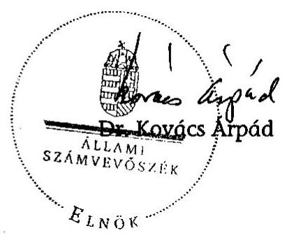
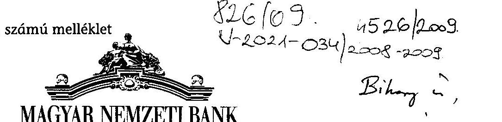
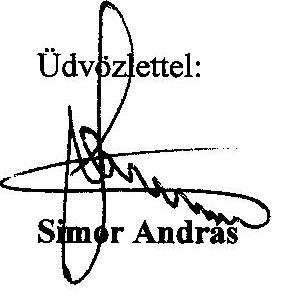
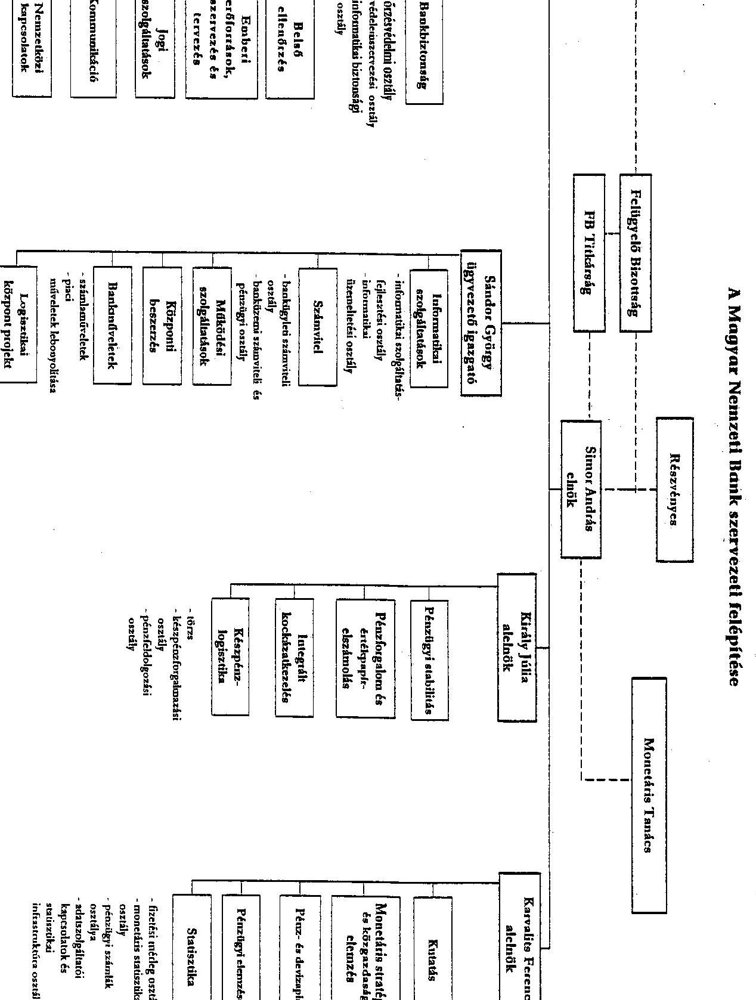
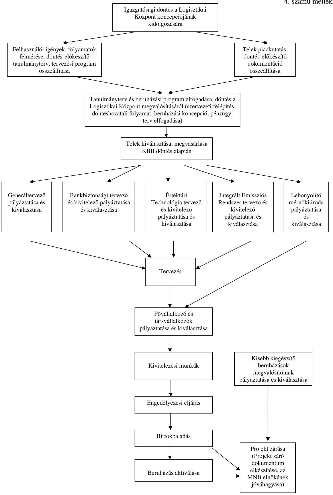
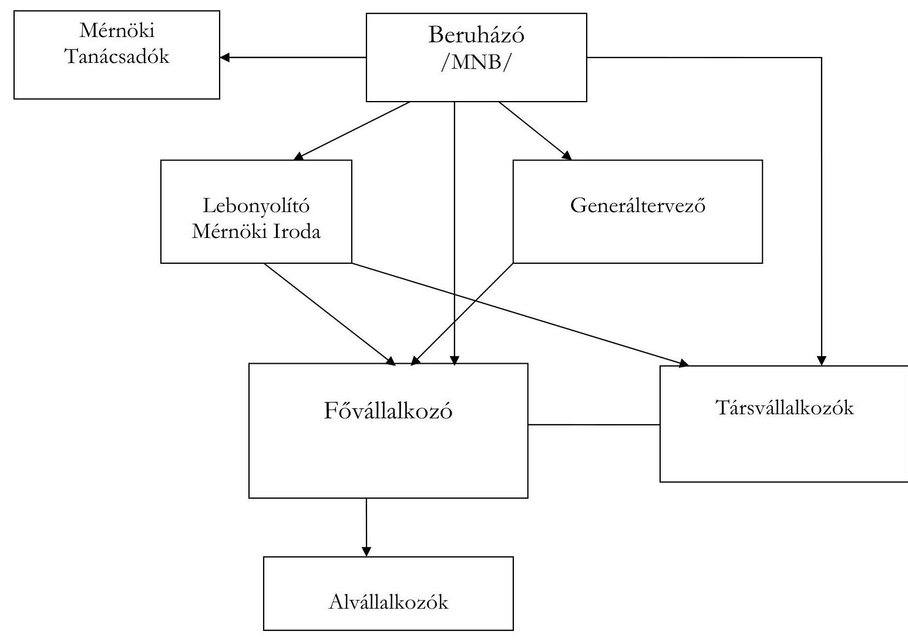

# ÁLLAMI
SZÁMVEVŐSZÉK

## JELENTÉS

a Magyar Nemzeti Bank 2008. évi működésének ellenőrzéséről

---

2. Államháztartás Központi Szintjét Ellenőrző Igazgatóság
2.1. Teljesítmény Ellenőrzési Főcsoport
Iktatószám: V-2021-035/2008-2009.
Témaszám: 928
Vizsgálat-azonosító szám: V0433

# Az ellenőrzést felügyelte:

Bihary Zsigmond
főigazgató
Az ellenőrzés végrehajtásáért felelős:
Kemény Emil
főigazgató-helyettes
Dr. Zöldréti Attila
mb. főcsoportfőnök
Az ellenőrzést vezette:
Tóthné Nagy Éva
osztályvezető főtanácsos
Az ellenőrzést végezték:
Jordanics Tamás
Osztoics Danica
Verő Tünde
számvevő
számvevő
számvevő

## Vörös Katalin

számvevő tanácsos
A témához kapcsolódó eddig készített számvevőszéki jelentések:
címe
sorszáma
A Magyar Nemzeti Bank működésének ellenőrzése ..... 0238
A Magyar Nemzeti Bank belső (banküzemi) működésének ellenőr- ..... 0328
zése
A Magyar Nemzeti Banknál alkalmazott teljesítményértékelési ..... 0438
rendszer működésének ellenőrzése
A Magyar Nemzeti Bank 2002. évi működésének ellenőrzése ..... 0340
A Magyar Nemzeti Bank 2003. évi működésének ellenőrzése ..... 0447
A Magyar Nemzeti Bank 2004. évi működésének ellenőrzése ..... 0531
A Magyar Nemzeti Bank 2005. évi működésének ellenőrzése ..... 0622
A Magyar Nemzeti Bank 2006. évi működésének ellenőrzése ..... 0716
A Magyar Nemzeti Bank 2007. évi működésének ellenőrzése ..... 0810

---

# TARTALOMJEGYZÉK

BEVEZETÉS ..... 5
I. ÖSSZEGZŐ MEGÁLLAPÍTÁSOK, KÖVETKEZTETÉSEK, JAVASLATOK ..... 8
II. RÉSZLETES MEGÁLLAPÍTÁSOK ..... 13

1. Az MNB irányítási, döntéshozatali és ellenőrzési rendszereinek, valamint a gazdálkodás belső kontrollrendszerének működése ..... 13
1.1. Irányítási és döntéshozatali rendszer ..... 13
1.2. A felügyelő bizottság tevékenysége ..... 14
1.3. A belső ellenőrzési szervezet működése ..... 14
1.4. A gazdálkodás belső kontrollrendszere ..... 15
1.5. Az éves célkitűzések megvalósítása, összhangja a stratégiával ..... 17
2. Az MNB gazdálkodása, a Logisztikai Központ projekt megvalósítása ..... 18
2.1. A működési költségek tervének megalapozottsága, az elszámolások szabályszerűsége ..... 18
2.1.1. Az emberi erőforrás gazdálkodás ..... 21
2.1.2. Az információtechnológiai rendszerek fenntartásának és működtetésének költségei ..... 23
2.1.3. Az üzemeltetési, az egyéb költségek és az értékcsökkenés ..... 23
2.2. A beruházási kiadások tervezési rendszere, a tervek megalapozottsága, az előirányzatok felhasználása ..... 24
2.3. Az ingatlan- és helyiséggazdálkodás ..... 26
2.4. A Logisztikai Központ projekt megvalósításának értékelése ..... 27
2.4.1. A projekt célok meghatározása, a beruházás előkészítése ..... 28
2.4.2. A projekt modellje és szerződéses rendszere ..... 30
2.4.3. A tervmódosítások megalapozottsága ..... 31
2.4.4. A projekt finanszírozása ..... 32
2.4.5. A beruházási célok megvalósulása ..... 33
2.5. Az MNB befektetett eszközei ..... 35
3. Az MNB elszámolásai a központi költségvetéssel ..... 38
4. Az ÁSZ 2007-ben és 2008-ban közzétett jelentéseiben megfogalmazott javaslatok hasznosulása ..... 40

---

# MELLÉKLETEK

1. számú Észrevételek
2. számú A Magyar Nemzeti Bank szervezeti felépítése
3. számú A Logisztikai Központ elszámolt költségeinek alakulása, valamint a Logisztikai Központ üzembehelyezésével összefüggő számított éves megtakarítások és többletköltségek alakulása
4. számú A Logisztikai Központ projekt folyamatábrája
5. számú A Logisztikai Központ projekt modellje
6. számú Tanúsítványok

---

# RÖVIDÍTÉSEK JEGYZÉKE

| ÁPV Zrt. | Állami Privatizációs és Vagyonkezelő Zrt. |
| :-- | :-- |
| ÁSZ | Állami Számvevőszék |
| BEL | Belső ellenőrzés |
| BÉT Zrt. | Budapesti Értéktőzsde |
| BIS | Bank for International Settlements, Nemzetközi Fizetések |
|  | Bankja |
| BKB | Beruházási és Költséggazdálkodási Bizottság |
| EEF | Emberi erőforrások szervezés és tervezés |
| EKB | Európai Központi Bank |
| FB | Felügyelő bizottság |
| GIRO Zrt. | GIRO Elszámolásforgalmi Zrt. |
| HAJÓ projekt | Hatékonyságjavító projekt |
| IAC | Központi Bankok Európai rendszerén belüli Belső Ellenőr- |
|  | zési Bizottság |
| IT | Információ technológia |
| KBER | Központi Bankok Európai Rendszere |
| Kbt. | 2003. évi CXXIX. törvény a közbeszerzésekről |
| KELER Zrt. | Központi Elszámolóház és Értéktár Zrt. |
| Logisztikai Központ | Emissziós, számítástechnikai és logisztikai központ |
| Megbízott | Nyertes pályázó |
| MNB, Bank | Magyar Nemzeti Bank |
| MNB tv. | 2001. évi LVIII. törvény a Magyar Nemzeti Bankról |
| Pénzverő Zrt. | Magyar Pénzverő Zrt. |
| Pénzjegynyomda Zrt. | Magyar Pénzjegynyomda Zrt. |
| REK | Regionális Emissziós Központ |
| SWIFT | Society for Worldwide Interbank Financial Tele- |
|  | communication, Nemzetközi fizetések átutalási rendszere |
| SZMSZ | Szervezeti és Működési Szabályzat |
| VB | Vezetői Bizottság |

---

.

---

# JELENTÉS   a Magyar Nemzeti Bank 2008. évi működésének ellenőrzéséről

## BEVEZETÉS

A Magyar Nemzeti Banknak a róla szóló törvény alapján elsődleges célja az árstabilitás elérése és fenntartása. A törvényben rögzített alapvető feladatai ellátásához a szabályszerű, átlátható működés teremt keretet. Az Állami Számvevőszék (továbbiakban: ÁSZ) évente ellenőrzi a Magyar Nemzeti Bank (továbbiakban: MNB, Bank) alapfeladatai körébe nem tartozó tevékenységét, működésének és gazdálkodásának átláthatóságát, elszámoltathatóságát. Ennek keretében az ÁSZ azt vizsgálja, hogy a Bank a jogszabályoknak, kiemelten a Magyar Nemzeti Bankról szóló 2001. évi LVIII. törvény (továbbiakban: MNB tv.) rendelkezéseinek, az alapító okiratának és a részvényes ${ }^{1}$ határozatainak megfelelően működik-e.

Az MNB működésének és gazdálkodásának folyamatos tulajdonosi ellenőrzését a felügyelő bizottság (továbbiakban: FB) látja el. Az éves beszámoló valódiságát - az Európai Központi Bank alapokmányában foglaltakkal összhangban - független könyvvizsgáló ellenőrzi.

Az Országgyűlés 2008 decemberében fogadta el az MNB tv. módosítását², amelynek hatályba lépése 2009. január 1. volt. A módosítást - többek között az Európai Központi Bank 2008. május 7-én közzétett Konvergenciajelentésében jelzett jogharmonizációs hiányosságok pótlása, valamint annak biztosítása indokolta, hogy a Bank részesedést szerezhessen a KELER Központi Elszámolóház és Értéktár Zrt. (továbbiakban: KELER Zrt.) és a Budapesti Értéktőzsde Zrt. (továbbiakban: BÉT Zrt.) által alapított KELER Központi Szerződő Fél Kft.-ben. A módosítás biztosította továbbá az MNB elnök rendeletalkotási jogosultságának kiterjesztését a központi értéktár és a központi szerződő fél szabályzatainak kialakítására. Az új társaságban - amely a tőzsdei ügyletek teljesítéséért vállal garanciát - az MNB 2009. február 26-án 13,6\%-os üzletrészt szerzett. A Bank alapító okirata 2007 óta nem változott, a törvénymódosítás nem érintette az abban foglaltakat.

A Bank 2001 óta több lépésben korszerűsítette szervezetét. A 2001-2005 első félévéig tartó időszakban végrehajtott - a működést és a szervezetet érintő - raci-

[^0]
[^0]: ${ }^{1}$ A Magyar Államot mint részvényest az államháztartásért felelős miniszter (továbbiakban: pénzügyminiszter) képviseli.
    ${ }^{2}$ a Magyar Nemzeti Bankról szóló 2001. évi LVIII. tv. módosításáról szóló 2008. évi CIX. tv.

---

onalizálás elsődlegesen a nem jegybanki feladatokhoz kapcsolódó tevékenységek átadását, kiszervezését valósította meg, mindezek hatására négy és fél év alatt a banki dolgozók létszáma 407 fővel csökkent. A 2005 júniusától 2008 végéig tartó működésfejlesztési program a szervezeti struktúra további korszerűsítését és a működés hatékonyságának növelését, a program lezárásaként pedig az új emissziós, számítástechnikai és logisztikai központ (továbbiakban: Logisztikai Központ) kialakításának befejezését tűzte ki célul. A program eredményességét a Bank a létszám csökkentésével mérte. A program megvalósításának hatására a három és fél év alatt 218 fővel, az egyéb szervezeti átalakítások miatt további 50 fővel csökkent a létszám. Az MNB 2008. december 31-i záró létszáma 641 fő volt, amely 675 fővel kevesebb a 2001. január 1-jeinél. A Bank szervezeti struktúrája 2008 végére - a 2001 óta végrehajtott szervezeti korszerűsítések eredményeként - átláthatóbb lett, egyszerűbb vezetői hierarchiával, kevesebb szervezeti egységgel látja el feladatait. A működési költségek elszámolt összege 2008-ban 14,9 Mrd Ft volt, 0,3 Mrd Ft-tal kevesebb a 2001. évinél.

Az MNB a 2008-2013 közötti időszakra elfogadott középtávú intézményi stratégiájának kiemelt céljai között jelölte meg a működés- és költséghatékonyság további javítását, a teljesítmény-orientált vállalati kultúra megerősítését. Ennek megvalósítására 2008 márciusától a Bank újabb projektet indított, amelynek keretében 2008 decemberére befejeződött az MNB minden szervezeti egységére, az általuk végzett valamennyi tevékenységre és folyamatra, azok költségeire kiterjedő átvilágítás. A program megvalósításával a Bank - a 2008. december 31-i záró létszámhoz viszonyítva - a 2009-2010. években összesen 8790 fő leépítését tervezi, amely hatására éves szinten a személyi költségeknél 0,8 Mrd Ft, a további működési költségeknél pedig 0,9 Mrd Ft megtakarítással számol.

Az ÁSZ 2002 óta elvégzett vizsgálatai az MNB banküzemi működésére és belső gazdálkodására, annak racionalizálására, a működési költségek és a beruházási kiadások alakulására, a kontrolling feladatokat támogató informatikai, a katasztrófatűrő adattároló és a teljesítményértékelő rendszerek megvalósítására, az analitikus számlavezető rendszer bevezetésére, valamint a Konferenciaközpont megvalósítására terjedtek ki. Az ellenőrzések kiemelt figyelmet fordítottak az MNB tv. változásából adódó feladatok teljesítésére.

A jelenlegi átfogó ellenőrzés célja annak értékelése volt, hogy az MNB:

- működése megfelelt-e a törvényi előírásoknak, a részvényesi határozatoknak, a belső szabályzatoknak és az intézményi célkitűzéseknek, irányítási, döntéshozatali és ellenőrzési rendszere szabályszerűen és eredményesen működött-e;
- gazdálkodásának belső kontrollrendszere, valamint a kontrollok működése biztosította-e a gazdaságos és szabályszerű gazdálkodást, a közbeszerzési törvény előírásainak betartását, központi költségvetési kapcsolataival összefüggő elszámolásai szabályozottak és szabályszerűek voltak-e;
- a Logisztikai Központ beruházást a jóváhagyott előirányzatból, a tervezett céloknak megfelelően, a tervdokumentációk szerint, határidőre valósította-e meg;

---

- hasznosította-e az előző évi ÁSZ ellenőrzés megállapításait és tett-e intézkedéseket a javaslatok megvalósítására.

Az ellenőrzés jogalapját az Állami Számvevőszékről szóló 1989. évi XXXVIII. törvény 3. §-a képezte. A törvényben rögzített előírással összhangban az ellenőrzés nem vizsgálta a jegybanki működéssel összefüggő alapvető feladatokat, így nem értékelte a Logisztikai Központ beruházás megvalósításának indokoltságát és az emissziós feladatok ellátásának hatékonyságát.

A vizsgálat a 2008. évi gazdálkodásra, illetve - indokolt esetben - az adott gazdasági esemény keletkezésétől számított időszakra irányult, és - szükség szerint - a helyszíni ellenőrzés befejezéséig figyelemmel kísérte a pénzügyigazdasági folyamatokat.

Az ellenőrzést az ÁSZ ellenőrzési kézikönyve és szakmai dokumentumai alapján átfogó ellenőrzéssel végeztük el, a Logisztikai Központ beruházás megvalósítását a teljesítmény-ellenőrzési szempontok szerint kidolgozott kérdések, kritériumok és adatforrások alapján értékeltük.

A jelentést megküldtük az MNB elnökének. Válaszlevelét az 1. számú melléklet tartalmazza.

---

# I. ÖSSZEGZŐ MEGÁLLAPÍTÁSOK, KÖVETKEZTETÉSEK, JAVASLATOK

Az MNB a 2007 októberében elfogadott, a 2008-2013 közötti éveket átfogó középtávú intézményi stratégiájában kiemelt célként fogalmazta meg a működés eredményességének és hatékonyságának további fejlesztését. A Bank 2008. évi működését és gazdálkodását az MNB tv.-ben rögzített feladatok ellátása, a működés hatékonyságának javítása érdekében kitűzött célok és a beruházások megvalósítása határozta meg. A középtávú intézményi stratégia ütemtervétől eltérően a Bank 2008-ra éves intézményi célokat nem fogalmazott meg. A Bank a szervezeti egységek éves célkitűzéseit a középtávú intézményi stratégia figyelembevételével határozta meg, az éves feladatok teljesítését nyomon követte. A dokumentumok alapján a szervezeti egységek a 2008. évi célkitűzéseiket időarányosan teljesítették.

Az MNB igazgatósága 2001 szeptemberében fogadta el a Logisztikai Központ kialakításának alapelveit és 2003 júniusában döntött a beruházás megvalósításáról, amelyet 2008. június 30-ára fejezett be. A beruházás 12,5 Mrd Ft-os előirányzatát az igazgatóság 2005 májusában 11,4 Mrd Ft-ra csökkentette, a projekt a jóváhagyott előirányzaton belül, 11,1 Mrd Ft-ból, a tervdokumentációknak megfelelően, a szerződésekben rögzített, többször módosított határidőre készült el. Szakértői értékelés szerint a Bank - a jegybanki feladatok ellátásának kockázatértékelésére alapozva, az európai szintű biztonsági követelményeknek való megfelelést mérlegelve - kitűzött céljainak megfelelő létesítményt hozott létre, amely azon túl, hogy alkalmas az euro készpénzcsere biztonságos lebonyolítására, korszerű mechanikai és elektronikai védelmi rendszerek kiépítésével biztonságosabbá tette az emissziós munkafolyamatokat. A regionális emissziós központok - továbbiakban: REK - bezárásával megvalósult a készpénzlogisztika területi racionalizálása, ezáltal a munkafolyamatok átláthatóbbá és hatékonyabbá váltak, a munkaerőigény csökkent, amely e területen működési költség- és létszám-megtakarítást eredményezett. A megváltozott technikai, jogszabályi feltételeknek való megfelelés, továbbá a Bank új stratégiai céljainak figyelembevétele érdekében az MNB a beruházás eredetileg meghatározott műszaki tartalmát többször módosította, ami szerződésmódosításokkal és a megvalósítás végső határidejének 18 hónapos kitolódásával járt, azonban a jóváhagyott pénzügyi előirányzat 11,4 Mrd Ft-os végösszegét nem érintette. A Logisztikai Központban kapott helyet az MNB számítástechnikai tartalékközpontja is, amely az eredeti tervben kitűzött „tartalék" helyett - a Bank vezetésének 2007. februári döntése alapján - „éles" üzemmódban működik. A Logisztikai Központban kialakított készpénztárolási kapacitás 2007 szeptemberében jóváhagyott bővítése hozzájárult ahhoz, hogy az MNB a stratégiai készpénztároló ingatlanát kiüríthesse. A Magyar Pénzverő Zrt. (továbbiakban: Pénzverő Zrt.) is a Logisztikai Központban folytatja működését, a korábbi székhely ingatlan 2008 végétől hasznosításra vár. A beruházás finanszírozása és pénzügyi elszámolási rendszere átlátható volt, a kifizetések megalapozottan és szabályszerűen történtek.

---

A Bank számviteli nyilvántartása szerint a Logisztikai Központ aktivált értéke 2008. december 31-én 12,6 Mrd Ft volt. A 2003 júniusában 12,5 Mrd Ft-ban jóváhagyott projekt előirányzatot az igazgatóság 2005 májusában - a pályáztatások eredményeire tekintettel - 11,4 Mrd Ft-ra módosította. A Logisztikai Központ projekt keretében megvalósított beruházások bruttó értéke 11,1 Mrd Ft-ot tett ki, amit növelt a projekt kialakításától függetlenül megvalósított készpénzlogisztikai beruházások 0,8 Mrd Ft-os összege, hozzájárulva a projekt céljának magasabb technikai színvonalon történő megvalósításához. A Logisztikai Központ aktivált értékét növelte továbbá a létesítménybe áthelyezett, korábban már használatba vett berendezések 0,7 Mrd Ft-os összege.

A 2001-től elindított, működési hatékonyságot javító intézkedések eredményeként a Bank tulajdonát képező ingatlanok száma 18-ról folyamatosan 4-re csökkent, a Logisztikai Központ átadásával pedig 5-re nőtt, ami 2008. december végéig nem változott. A Logisztikai Központ üzembehelyezését megelőzően 14 ingatlan vált szabaddá, két ingatlan értékesítéséből a Banknak összesen 7,2 M Ft bevétele származott, 12 pedig térítés nélküli átadással, összesen 3,5 Mrd Ft könyv szerinti értéken a Magyar Állam tulajdonába került. A térítés nélküli átadás az MNB könyveiben eredményt csökkentő tételként szerepel, azonban az ingatlanok a Magyar Állam tulajdonában hasznosulnak tovább. A 2009-2010. években várhatóan további két ingatlan lesz hasznosítható, amelyek 2008. december 31-i könyv szerinti értéke összesen 1,4 Mrd Ft. A hasznosítás módjáról a Bank még nem döntött.

A Logisztikai Központ üzemeltetésével - a Bank előzetes számításai szerint - a működési költségek éves szinten 0,2 Mrd Ft-tal emelkednek az üzembe helyezett új gépek, berendezések és az új ingatlan értékcsökkenése miatt. A Logisztikai Központ működtetéséhez a Bank - a 2009. évi elfogadott tervszámok alapján - éves szinten 1,2 Mrd Ft költséggel számol, amit 0,8 Mrd Ft-tal csökkent a felszabaduló ingatlanok miatt tervezett működési költség és a készpénzlogisztika hatékonyabb működéséhez kapcsolódó - 0,1 Mrd Ft-os személyi költség megtakarítás. Az éves szinten fennmaradó 0,3 Mrd Ft többletköltséget 0,1 Mrd Ft-tal csökkenti a Pénzverő Zrt. bérleti díj térítése. A Bank - az ellenőrzött dokumentumok szerint - nem mutatta ki a Logisztikai Központban működtetett tevékenységek - áttelepítés előtti, illetve utáni - elszámolt működési költségeit és azok banki szintű működési költségekre gyakorolt hatását, nem értékelte a Logisztikai Központ működtetésének költséghatékonyságát.

Az MNB a 2008. évi működési költségek tervét 16,2 Mrd Ft-ban határozta meg, amely $11,1 \%$-kal haladta meg az előző évben elszámoltakat. A Logisztikai Központ nyolc hónapos üzemeltetésére a terv 1,1 Mrd Ft többletköltséget irányzott elő, az üzemeltetéssel összefüggő banki szintű működési költségtöbblet ugyanakkor - az MNB 2009. év eleji számításai alapján - közel 0,13 Mrd Ft-ra, a tervezett egy tizedére tehető. A 2008. évi felhasználás 14,9 Mrd Ft volt, $7,9 \%$-kal alacsonyabb az előirányzatnál. A tervezettől 0,1 Mrd Ft-ot meghaladó elmaradás volt a bérköltségeknél, a szoftverek működtetési költségeinél, az ingatlanok fenntartási költségeinél és a kommunikációs költségeknél. A Logisztikai Központ tervezettnél két hónappal későbbi üzembehelyezése miatt összességében 0,2 Mrd Ft-tal kevesebb működési költség merült fel. A „hirdetési költségek, tanácsadói díjak" költségsoron 0,3 Mrd Ft-os túllépés volt, amit 97,7\%-ban a működés hatékonyságának javítására indított projekt nem tervezett megbízási

---

díja okozott. A projekt költségével a Bank nem módosította a működési költségek tervét, arra a személyi költségek további költségsorain tervezett, fel nem használt összegek biztosítottak fedezetet. A Bank 2008. évi átlagos statisztikai állományi létszáma 664 fő volt, 45 fővel kevesebb a tervezettnél, az átlagos fluktuáció $11,1 \%$ volt.

A Bank működésének és gazdálkodásának belső szabályai 2008-ban a jogszabályok előírásaival összhangban voltak és biztosították a pénzügyi tervezés és a tervteljesítés értékelésének ellenőrizhetőségét, átláthatóságát. A tervezés a szakterületi igények felmérésére alapozva történt, a pénzügyi keretek felhasználása szabályszerű volt. Egy szolgáltatás (tanácsadás) igénybevétele kapcsán a felek szerződése keret jelleggel határozta meg az elvégzendő feladatok - Megbízott és az MNB részéről közreműködő munkavállalók közötti - munkamegosztását, a feladatellátásról munkaidő elszámolás nem készült. A Megbízott elektronikus formában adta át a projekt végtermékeként előállított dokumentumokat, amelyek egyikén sem szerepelt hitelesítő aláírás.

Az MNB a tervezési irányelveknek és az aktualizált középtávú beruházási feladattervnek megfelelően, a belső szabályzatokban előírt tartalommal, határidőre készítette el a beruházási tervet. A 2008. évi - 30 M Ft -ot meghaladó beruházásindító javaslatokhoz a megalapozottabb döntések érdekében üzleti esettanulmányok készültek. A Bank a beszerzéseit a közbeszerzésekről szóló törvény (továbbiakban: Kbt.) előírásainak betartásával végezte. A beruházások 2008. évi megvalósítása a belső szabályzatok előírásainak megfelelően, a döntési hatáskörök betartásával történt. A beruházások 2008. évre jóváhagyott teljes előirányzata - a 2008-ra áthúzódó beruházások 0,7 Mrd Ft összegével együtt - 4,0 Mrd Ft-ot tett ki. A beruházási kiadások 2008-ban elszámolt összege $36,3 \%$-kal maradt el a tervezettől. Az elszámolt kiadások 60,1\%-a a Logisztikai Központ kialakításához kapcsolódott. A Logisztikai Központon kívüli beruházásoknál a pénzügyi teljesítés 1,0 Mrd Ft, a tervezett 47,2\%-a volt. Elmaradást okozott többek között az, hogy a Bank év közben döntött a stratégiai készpénztároló megszüntetéséről, ami 0,3 Mrd Ft, a felhasználói igények évközi változása pedig további 0,1 Mrd Ft maradványt jelentett. Hozzájárult a terv alulteljesítéséhez az is, hogy a Bank 2008-ra tervezett beruházásainak mintegy $30 \%$-a várt még indításra a félév végén, a tervidőszakon belüli teljesítés - egyebek mellett a közösségi eljárásrend alapján lefolytatott közbeszerzési eljárások mintegy 120 napos átfutási ideje miatt - ugyanakkor év eleji indítást igényelt volna. A Bank a tervteljesítés javítása érdekében 2009-től megszüntette a tervben jóváhagyott beruházások indításkori ismételt jóváhagyását.

Az MNB a befektetett eszközeivel a jogszabályok előírásainak betartásával gazdálkodott, amelyek 2008 végén nyilvántartott nettó záró állománya 36,4 Mrd Ft volt, 0,9\%-kal magasabb a nyitó értéknél. A befektetett eszközökből a tulajdonosi részesedések 17,8 Mrd Ft-ot (49\%), az immateriális javak, a tárgyi eszközök és a beruházások együttes állománya 18,6 Mrd Ft-ot (51\%) tett ki. A Bank továbbra is csak az MNB tv.-ben meghatározott feladatai ellátása érdekében tartott fenn részesedést, az előző évivel egyezően hat belföldi és három külföldi székhelyű társaságban volt tulajdonrésze. A belföldi befektetések könyv szerinti értéke 2008-ban nem változott, a három külföldi befektetésé - a devizában nyilvántartott állomány év végi átértékelése miatt - 9,9\%-kal nőtt. A Bank kizárólagos tulajdonában álló társaságok részvényesi döntéseit tartalma-

---

zó határozatokat - a 2008 februárjától hatályos elnöki utasítás szerint - „minden esetben a Bank elnöke hozza meg és írja alá". Ezzel szemben az MNB - az elnöki utasítás hatályba lépését követően - alkalmazott gyakorlata szerint a tulajdonosi képviselők írtak alá minden részvényesi határozatot, - három kivétellel - a Bank elnökének eseti felhatalmazása alapján. A három részvényesi határozatot a tulajdonosi képviselők hozták meg és írták alá egy 2007 júliusában kiadott - de az új elnöki utasítással egyidejűleg hatályon kívül nem helyezett felhatalmazásra hivatkozással. A felhatalmazásban szereplő képviseleti jogosultság változását a Bank az új utasítás hatályba lépésének időpontjával a Cégbíróságnál nem jelentette be. A részvényesi határozatok aláírási jogának eseti felhatalmazással történő átengedését a Polgári Törvénykönyvről szóló 1959. évi törvény megengedi ugyan, de a belső szabályzat előírásával nem volt összhangban a Bank által alkalmazott aláírási gyakorlat, valamint a három határozathozatal.

Az MNB a költségvetési kapcsolatok elszámolását a jogszabályok előírásaival összhangban szabályozta, az elszámolásokat szabályszerűen végezte. A 2008-ban elszámolt banküzemi bevételek és ráfordítások egyenlege 15,1 Mrd Ft veszteség volt, $5 \%$-kal nagyobb az előző évinél, amit az eszköz- és készletértékesítésből származó bevételek csökkenése okozott. A 2008. évi mérleg szerinti eredmény 5,5 Mrd Ft veszteség, az előző évinél 67\%-kal kevesebb, amelyre az eredménytartalék fedezetet biztosít. A forintárfolyam kiegyenlítési tartalék (nem realizált átértékelési eredmény) év végi elszámolt összege 236,3 Mrd Ft, az előző évinél 4,7-szer magasabb az év közben bekövetkezett árfolyamváltozások hatására. A deviza értékpapírok kiegyenlítési tartaléka 2008 végén - az állomány piaci értékének változása miatt - 46,7 Mrd Ft volt. A központi költségvetésnek - az MNB tv. előírásának megfelelően - nem keletkezett térítési kötelezettsége, mivel a kiegyenlítési tartalékok egyenlege pozitív volt. A Kincstári Egységes Számla kamatelszámolásait az MNB szabályszerűen végezte.

A részvényesi jogokat gyakorló pénzügyminiszter 2008-ban egy részvényesi határozatot hozott, amellyel elfogadta az MNB 2007. üzleti évről készített auditált éves beszámolóját. Az MNB irányítási és döntéshozatali rendszere - az MNB tv.-ben rögzített felhatalmazásnak megfelelően - a Bank elnökének egyszemélyi döntési hatáskörére és felelősségére épül, akit a konzultatív testületként működő Vezetői Bizottság (továbbiakban: VB) támogat a döntéshozatalban. A Bank elnöke döntött - egyebek mellett - az MNB tv. módosítására irányuló javaslatokról, az MNB éves pénzügyi tervéről, a hatékonyság javító projekt indításáról. A Szervezeti és Működési Szabályzat (továbbiakban: SZMSZ) a jogszabályokkal összhangban tartalmazta a Bank irányítási és döntéshozatali rendszerének szabályait, amelyben az MNB elnöke minden vezetői szintnek meghatározta - többek között - a döntési, irányítási, szabályozási, ellenőrzési jog- és hatáskörét. A beszámoltatás kialakított rendszere biztosította a többszintű kontrollt. A folyamatba épített ellenőrzést támogatták a gazdálkodással összefüggő folyamatok és az ügykezelés automatizálását megvalósító integrált informatikai rendszerbe épített kontrollok. A rendszer biztosította a gazdasági folyamatok és események szabályszerű, átlátható, nyomon követhető elszámolását, gyorsabbá és pontosabbá tette az ügykezelést.

Az MNB folyamatos tulajdonosi ellenőrzését ellátó felügyelő bizottság a munkáját a törvényi előírások betartásával, az MNB alapító okiratában foglal-

---

tak és a hatályos ügyrendje szerint végezte, munkatervét teljesítette. A hatáskörébe tartozó
 területeken irányította az MNB belső ellenőrzési szervezetét, kiemelten foglalkozott az MNB gazdálkodásával, amellyel összefüggésben észrevételeket és ajánlásokat tett a Bank vezetésének. A belső ellenőrzés (továbbiakban: BEL) az FB, illetve - a hatáskörébe nem tartozó feladatokban - az MNB elnökének irányítása alatt végezte munkáját, amelyről rendszeresen beszámolt. Éves munkatervében - a belső utasításnak megfelelően - a nagyobb kockázatú területek vizsgálatára helyezte a hangsúlyt. A BEL 2008-ban 52 vizsgálatot végzett el, amelyből 14 a pénzügyi-működési, 8 az informatikai, 4 az emissziós területeket érintette, 26 pedig utóvizsgálat volt. A belső ellenőrzési vizsgálatok során feltárt hiányosságok 2,3\%-át magas, $25,0 \%$-át közepes, $42,0 \%$-át alacsony kockázati szintűnek minősítette a Bank. Az ajánlások 30,7\%-ot tettek ki. A megállapítások - többek között - egyes belső szabályok pontosítására, adminisztratív nyilvántartások vezetésére, a folyamatok feletti ellenőrzések erősítésére irányultak. A BEL éves kapacitásának 84\%-át fordította belső ellenőri vizsgálatokra, amely meghaladta a Központi Bankok Európai Rendszerének (továbbiakban: KBER) Belső Ellenőri Bizottsága által a tagországok jegybankjai felé jövőbeni célként megfogalmazott $80 \%$-os részarányt.

Az MNB elnöke és az MNB FB az ÁSZ korábbi jelentéseiben megfogalmazott javaslatokat elfogadta és hasznosította, amit az ellenőrzés is igazolt. Az FB az ÁSZ javaslatánál szélesebb körben vizsgálta meg a Bank 2007-ben kialakított szabályozási rendszerének működését és megállapította, hogy az biztosítja az átlátható, ellenőrizhető és szabályszerű működést.

A helyszíni ellenőrzés megállapításainak hasznosítása mellett javasoljuk:

# az MNB elnökének 

1.  Értékelje a Logisztikai Központ üzembehelyezésének hatását a Bank költséghatékonyságának alakulására a 2009. évi működés tapasztalatai alapján.
2.  Hozza összhangba az MNB 100\%-os tulajdonában lévő társaságok részvényesi határozatai aláírásának szabályozását az alkalmazott gyakorlattal, továbbá intézkedjen a cégnyilvántartás tulajdonosi képviselők képviseleti jogosultságának megfelelő módosítása iránt.

---

# II. RÉSZLETES MEGÁLLAPÍTÁSOK 

## 1. Az MNB IRÁNYÍTÁSI, DÖNTÉSHOZATALI ÉS ELLENŐRZÉSI RENDSZEREINEK, VALAMINT A GAZDÁLKODÁS BELSŐ KONTROLLRENDSZERÉNEK MŰKÖDÉSE

### 1.1. Irányítási és döntéshozatali rendszer

A részvényesi jogokat gyakorló pénzügyminiszter a vizsgált időszakban egy részvényesi határozatot hozott, az MNB tv. 46/A. § b) pontjának megfelelően elfogadta az MNB 2007. üzleti évéről szóló auditált éves beszámolót, döntött továbbá arról, hogy a tulajdonos nem von el osztalékot.

Az MNB irányítási és döntéshozatali rendszere - az MNB tv.-ben rögzített felhatalmazásnak megfelelően, a monetáris tanács hatáskörébe tartozó döntések kivételével - a Bank elnökének egyszemélyi döntési hatáskörére és felelősségére épül. Az MNB elnökét - az általa létrehozott, konzultatív testületként működő szakmai bizottság - a VB segíti a határozathozatalban. A Bank elnöke a VB elnökeként, az ülések keretében döntött - egyebek mellett - az MNB tv. módosítására irányuló javaslatokról, az MNB éves pénzügyi tervéről, a hatékonyság javító projekt (továbbiakban: „HAJÓ projekt") indításáról, a 2008-2011. évi humánerőforrás stratégiáról, az SZMSZ módosításairól, a BEL munkatervéről.

A VB tevékenységét működési szabályzatának és munkatervének megfelelően végezte, rendszeresen tárgyalta - többek között - az MNB működési költségeinek és beruházási kiadásainak negyedéves alakulásáról, a Logisztikai Központ beruházás állásáról, a peres eljárásokról, a kommunikációs akciótervről és a BEL munkatervének végrehajtásáról szóló tájékoztatókat.

Az MNB a működés-irányítás támogatására - konzultatív testületekként - további szakmai bizottságokat működtet, amelyek feladata az elnök, az alelnökök és az ügyvezető igazgató döntéshozatalainak támogatása. A Bank elnöke az SZMSZ-ben foglaltak szerint - döntött a szakmai bizottságok létrehozásáról, jóváhagyta szabályzatukat, és folyamatosan figyelemmel kísérte működésüket.

A vizsgált időszakban a Bank a szakmai bizottságok ügyrendjét - a VB elnökének határozataival - öt alkalommal módosította, amelyeket pl. a „Pénzügyi kultúra" kiemelt projekt megszűnése, a bizottságok tagi összetételének változása, a bizottsági elnökök jogainak gyorsított eljárásra vonatkozó kiszélesítése - a tagok véleményének meghallgatása nélküli döntési lehetőség - indokolt.

A Bankban 2008. januárig alkalmazott munkakör elemzési és értékelési rendszerhez kapcsolódóan Munkakör értékelő bizottság működött, amely munkakör elemzési és értékelési módszertanon alapuló, a munkakörök - a vezetői munkakörök kivételével - értékének meghatározását végző testület volt. A „munkakör családokon" alapul új besorolási rendszer bevezetését követően a Munkakör értékelő bizottság feladat- és hatásköre megszűnt, amelynek formális megszün-

---

tetéséről a VB több hónapos késéssel, 2008. június 24-i ülésén hozott határozatot. Az SZMSZ-ben és a bizottságok ügyrendjében a módosítást - a határozathozatalt követően - a felelős szervezeti egység végrehajtotta.

# 1.2. A felügyelő bizottság tevékenysége 

Az Országgyűlés 2007 decemberében új személyi összetételű FB-t választott, amely továbbra is ellátja az MNB működésének folyamatos tulajdonosi felügyeletét. A testület munkáját hatályos ügyrendje és jóváhagyott munkaterve alapján végezte, kitűzött feladatait teljesítette.

Megtárgyalta és elfogadta a BEL 2008. évi munkatervét, rendszeresen tájékozódott annak végrehajtásáról, a vizsgálatok alakulásáról. Hatáskörébe tartozóan véleményezte az MNB 2007. évi éves beszámolóját és javaslatot tett a részvényesnek annak elfogadására. Elfogadta az FB tagjainak - az Országgyűlés és a pénzügyminiszter részére készített - közös beszámolóját, amely az FB 2007. júniustól - 2008. júniusig tartó tevékenységéről ad számot.

Az MNB 2006. évi működésének ellenőrzéséről szóló jelentésében megfogalmazott ÁSZ javaslatot figyelembe véve az FB 2008 márciusában kibővített vizsgálatot folytatott le a Bank szervezeti és működési rendjének, valamint irányítási, szabályozási és költséggazdálkodási tevékenységének felülvizsgálatára, amelynek részét képezte az MNB vezetésének beszámolója, a BEL jelentéseiről és az FB tapasztalatairól szóló összefoglalók. A témakör megtárgyalását követően az FB összefoglalóan megállapította, hogy az MNB a rá vonatkozó törvények és az alapító okirat előírásaival összhangban végezte tevékenységét, kritikai észrevételt tett ugyanakkor pl. a belső szabályzatok és gyakorlat összehangolásával, az ésszerű takarékossági szemlélet érvényesítésével összefüggésben. Az FB kiemelten foglalkozott az MNB gazdálkodásával, rendszeresen megtárgyalta a Bank 2008. évi pénzügyi tervének teljesítéséről készített negyedéves beszámolókat és ajánlásokat fogalmazott meg a Bank vezetése részére a tervhez viszonyított megtakarítási lehetőségek feltárására. Foglalkozott az MNB humánpolitikájához kapcsolódó kérdésekkel (létszámhelyzet, javadalmazás, munkabér elszámolás), a Bank beszerzési és közbeszerzési tevékenységével, valamint rendszeresen nyomon követte a Logisztikai Központ beruházás megvalósítását. Az FB vizsgálta az MNB tulajdonosi érdekeltségébe tartozó vállalkozások irányítási struktúráját és gazdálkodását, tájékozódott - többek között - a Bank informatikai stratégiájáról, peres ügyeiről, követeléseinek megtérüléséről.

### 1.3. A belső ellenőrzési szervezet működése

A BEL az FB, illetve - az FB hatáskörébe nem tartozó feladatok tekintetében az MNB elnökének irányítása alá tartozik, összhangban az MNB törvénnyel. 2008-ban az FB-vel egyetértésben az MNB elnöke döntött a BEL vezetőváltásáról.

A BEL 2008. évi munkatervéről és annak elfogadásáról a VB 2007. november 27-i, az FB 2007. december 13-i ülésén hozott határozatot. Az éves munkaterv összeállításakor a BEL a belső utasításnak megfelelően, a nagyobb kockázatú területek vizsgálatára helyezte a hangsúlyt. Emellett figyelembe vette az FB és az MNB vezetésének igényeit, az előző évek tervezési tapasztalatait, valamint a KBER-en belül működő Belső Ellenőri Bizottság által tervezett, az MNB-t érintő

---

feladatokat is. A terv magában foglalta továbbá a vizsgálatok ütemezését és az ellenőri kapacitásfelhasználás arányait.

A BEL 2008-ban 52 vizsgálatot végzett el, amelyből 14 a pénzügyi-működési, 8 az informatikai, 4 az emissziós területeket érintette, 26 pedig utóvizsgálat volt. A tervezetten felül az FB egy rendkívüli vizsgálat lefolytatásáról határozott, a KBER Belső Ellenőri Bizottsága pedig soron kívüli ellenőrzést kezdeményezett az MNB monetáris tevékenységéhez kapcsolódó európai központi értékpapír adatbázis vizsgálatára. A BEL az éves vizsgálatokhoz kapcsolódóan 68 megállapítást és 31 ajánlást ${ }^{3}$ tett, amelyeket az érintett szervezeti egységek elfogadtak és megoldásukra intézkedési tervet készítettek. Azok végrehajtását a BEL - számítógépes adatbázisában - folyamatosan nyomon követte. A BEL - az MNB tv.-ben előírt kettős irányításnak megfelelően - tevékenységéről rendszeresen beszámolt a FB-nek és a VB elnökének.

A BEL nyilvántartása szerint a 2008-ban lefolytatott ellenőrzések során feltárt hiányosságok 2,3\%-a magas, $25,0 \%$-a közepes, $42,0 \%$-a alacsony kockázati szintű volt. Az ajánlások részaránya pedig 30,7\%-ot tett ki. A megállapítások többek között - belső szabályok pontosítására, adminisztratív nyilvántartások vezetésére, a folyamatok feletti ellenőrzések erősítésére, az informatikai rendszerekhez kapcsolódó tranzakciók végrehajtási idejének csökkentésére irányultak. A BEL ellenőrzési kapacitásának $84 \%$-át fordította belső ellenőri vizsgálatokra, amely meghaladta a KBER Belső Ellenőri Bizottsága által a tagországok jegybankjai felé jövőbeni célként megfogalmazott, $80 \%$-os részarányt.

A Bank külső tanácsadó céget kért fel a BEL minőségbiztosítási átvilágítására, a KBER Belső Ellenőri Bizottsága által megfogalmazott elvárások szerint. A tanácsadó cég elemzésében megállapította, hogy a BEL működése megfelel a belső ellenőrzés nemzetközi sztenderdjeinek.

# 1.4. A gazdálkodás belső kontrollrendszere 

Az MNB-ben kialakított belső kontrollrendszer és annak működtetése arra irányult, hogy megteremtse a szabályszerű, átlátható és költséghatékony feladatellátás feltételeit, hozzájárulva ezzel a Bank céljainak teljesítéséhez. Biztosítsa továbbá a vezetési politikával kapcsolatos döntések érvényesülését, a vagyon védelmét, valamint a nyilvántartások pontosságát és teljeskörűségét.

A Bank szervezetének felépítését, döntési és irányító tevékenységének szabályozását az SZMSZ tartalmazta. A vizsgált időszakban az SZMSZ-t 12 alkalommal, függelékeit pedig 11 alkalommal módosította a Bank. Az SZMSZ módosításai többek között - a Bank szervezeti felépítését, a cégjegyzési és képviseleti jog átadását, illetve megszüntetését, valamint a működés egyszerűsítését és a munkafolyamatok racionalizálását érintették. (A Magyar Nemzeti Bank szervezeti felépítését a 2. sz. melléklet mutatja be.)

A szervezeti struktúrához kapcsolódó döntésnek megfelelően, 2008. február 6-tól a Biztonság- és védelemszervezési osztályt két szervezeti egységre bontották, az Őrzésvédelmi és a Védelemszervezési osztályra. 2008. március 3-tól szétválasztot-

[^0]
[^0]:    ${ }^{3}$ 2007-ről áthúzódó vizsgálatok megállapításait és ajánlásait is tartalmazza.

---

ták a Közgazdasági elemzések és kutatás szervezeti egységet, Monetáris stratégia és közgazdasági elemzés valamint Kutatás szervezeti egységekre. Ezzel külön feladattá tették a monetáris politikával kapcsolatos döntések előkészítését, valamint a monetáris politika döntéseit megalapozó kutatások, elemzések elvégzését, a Bank szakmai elismertségének javítását stb.

A Bank a 2007-ben elindított és 2008-ban - a Készpénzlogisztika szervezeti egység kizárólagos felelősségi körébe tartozó utasítások felülvizsgálatával - befejeződött szabályozás felülvizsgálati projektjének keretében a belső utasításokat áttekintette, a módosításokat elvégezte. A Logisztikai Központ üzembehelyezését követően az MNB szabályzatait a megváltozott folyamatoknak megfelelően módosította.
2008. december 31-én 77 belső utasítás szabályozta a banki tevékenységeket, amelyből 10 elnöki, 19 alelnöki, 4 ügyvezető igazgatói, 3 igazgatói és 41 szervezeti egység vezetői volt. Az év folyamán 111 alkalommal módosították a belső utasításokat, amelyeket többek között a jogszabályi - Áfa, adó - és a szervezeti változások, valamint a megváltoztatott munkafolyamatok szabályozása indokolt.

A Bank munkaszervezetének vezetési szintjei az elnök, az alelnökök, az ügyvezető igazgató és a szervezeti egység vezetők. Az MNB elnöke az SZMSZ-ben minden vezetőnek az általa felügyelt vagy irányított szervezeti egység feladatkörében biztosított intézkedési jogot. Az intézkedési jog magában foglalja a szabályozást, a döntést, a munkáltatói jogkörhöz kapcsolódó - korlátozott hatáskörök gyakorlását, a felügyeletet és a közvetlen ügyintézést, ideértve a tervezést, a szervezést, az utasítás jogát, az ellenőrzést és a számonkérést is. A gazdasági
 tevékenységek feletti többszintű kontrollt a Bank azzal valósította meg, hogy belső szabályzataiban az erőforrások felhasználásáért a felelősséget megosztotta és különböző döntési szintekhez kötötte. A többszintű vezetői kontrollt a beszámoltatás kialakított rendszere biztosította.

A költséggazdák folyamatosan nyomon követték az elszámolt költségek és a beruházási kiadások alakulását, értékelték azok éves tervhez viszonyított eltéréseit. A felhasználó szervezeti egységek az Emberi erőforrások szervezés és tervezés (továbbiakban: EER) által készített havi kimutatások alapján kísérték figyelemmel saját előirányzataik felhasználását. Az EER a Beruházási és Költséggazdálkodási Bizottságnak (továbbiakban: BKB) havonta, a VB-nek pedig negyedévente számolt be a működési költségek és a beruházási kiadások alakulásáról, az előirányzatok időarányos és éves várható felhasználásáról.

Az MNB több éves fejlesztés eredményeként, 2008-ra kialakította a gazdálkodással kapcsolatos folyamatok és az ügykezelés automatizálását megvalósító integrált informatikai rendszert, amely a számviteli, a kontrolling, a humánerőforrás, továbbá az anyag- és eszközgazdálkodási tevékenységeit fogja össze. Ennek keretében 2008-tól megvalósult a beszerzési folyamatok támogatása is, amely magában foglalja a beszerzési igények kezelését, a tervsorok közbeszerzési szempontú összevonását, a beszerzési eljárások nyomon követését. A rendszerbe épített kontrollpontok támogatják a folyamatba épített, előzetes és utólagos ellenőrzést.

Az ügykezelésre kifejlesztett elektronikus nyomvonal - az ellenőrzött gazdasági események alapján - biztosítja a munkafázisok előírt sorrendjének betartását.

---

Minden gazdasági esemény és a hozzá kapcsolódó munkafolyamat lépésenként lekövethető, alapbizonylatig visszakereshető, az abban közreműködők beazonosíthatók. Az ügykezelés gyorsabbá és biztonságosabbá vált azáltal, hogy (a rendszerbe épített) jelzés figyelmeztet a feladat elvégzésére. A kialakított kontrollpontokon figyelmeztető (továbbléphet, de javítson) vagy blokkoló (nem léphet tovább) üzenetek jelennek meg, amelyek támogatják a feladat végrehajtás pontosságát és biztonságát. A rendszerhez való hozzáférés minden felhasználó számára jogosultsághoz kötött.

Az ellenőrzött dokumentumok szerint, a Bank működési kockázatait az MNB vezetése a belső működési tapasztalatok és a nemzetközi normák figyelembevételével határozta meg. A működési kockázatok feltárása, elemzése, az üzletfolytonosság biztosítása és a Bankhoz érkező panaszok kezelése 2007 októberétől az Integrált kockázatkezelési szakterület feladatkörébe tartozik. A szakterület évente - a Bank összes munkaterületén, a szervezeti egységek bevonásával felméri a működési kockázatokat. A felmérés eredményét adatbázisban rögzíti, amelynek felhasználásával további elemzéseket végez, és a Működéskockázatkezelési Kézikönyv előírásának megfelelően évente beszámol a VB-nek. A 2008. évi működési kockázatok felmérését és az arról szóló beszámolót a VB elnöke 2008 októberéről 2009. első negyedévére ütemezte át.

# 1.5. Az éves célkitűzések megvalósítása, összhangja a stratégiával 

A VB 2007. október 30-i ülésén fogadta el az MNB 2008-2013 közötti időszakot átfogó középtávú intézményi stratégiáját, amely a Bank küldetését, jövőképét, kiemelt stratégiai céljait, értékeit rögzítette. A Bank a stratégiában - többek között - célként fogalmazta meg az inflációs célkövető rendszer sikerességének, valamint a monetáris döntéstámogató rendszer hatékonyságának fejlesztését, a pénzügyi stabilitási funkció egyre magasabb szintű ellátását, a felkészülést az euro bevezetésére, a működés eredményességének és hatékonyságának fejlesztését. A kijelölt szervezeti egységek vezetői - a VB által meghatározott 2008. március 31-i határidőt túllépve - az év folyamán elkészítették a funkcionális stratégiákat (pl. informatikai, humánerőforrás, kommunikációs és ingatlangazdálkodási stratégiák).

A Bank - a VB által jóváhagyott stratégia lebontásának, megvalósításának ütemtervében meghatározottól eltérően - nem fogalmazott meg a 2008. évre éves intézményi célokat. A szervezeti egységek éves célkitűzéseiket közvetlenül a középtávú intézményi stratégia figyelembevételével határozták meg. A 2008. január 15-én megtartott koordinációs értekezleten a szervezeti egységek vezetői ismertették éves célkitűzéseiket, a stratégiai céloknak megfelelő célkitűzéseket beazonosították, egyúttal megtörtént az együttműködési pontok kijelölése és a szakmai tartalom összehangolása. A VB által 2008 januárjában elfogadott, banki szintű munkaterv a szervezeti egységek 2008. évi célkitűzéseit tartalmazta, amely az egyéni célkitűzések, valamint a célok elérését támogató személyes fejlesztési tervek alapját képezte. A VB 2008 novemberében fogadta el a szervezeti egységek éves tevékenységéről, a célok teljesítéséről szóló beszámolókat. A szervezeti egységek éves célkitűzéseiket időarányosan teljesítették.

Az MNB igazgatósága 2005 júniusában működésfejlesztési programot indított, amely a szervezeti struktúra racionalizálását tűzte ki célul. A Bank a megvaló-

---

sítás első ütemét 2006 végén lezárta, a második ütem pedig a Logisztikai Központ üzembehelyezéséhez kapcsolódott. A Logisztikai Központ 2008. június 30-i átadását követően a programot a Bank elnöke 2008. december 31-vel lezárta. A működésfejlesztési program eredményeként hárommal, 22-re csökkent a szervezeti egységek száma, négy vezetési szintet alakítottak ki, mindezek hatására a vezetők száma 36 fővel csökkent. A program céljaként kitűzött 200 fő létszám-megtakarítással szemben az első ütem 122 fő, a Logisztikai Központ beruházás üzembehelyezése és a készpénzfeldolgozási technológia korszerűsítése további 96 fő létszám-megtakarítást jelentett, így a Bank a programot 9\%-kal túltejesítette. A 2005. júniusi indítástól 2008. december 31-ig összesen 268 fő volt a létszám-megtakarítás, ebből a működésfejlesztési programhoz 218 fő, az egyéb szervezetátalakításokhoz további 50 fő kapcsolódott. A szervezet átalakításokkal összefüggő létszámcsökkentések a feladatok ellátását nem hátráltatták. Az MNB átlagos statisztikai állományi létszáma 2008-ban 29,8\%-kal volt alacsonyabb a 2004. évinél. A 2004 és 2008 között végrehajtott bérfejlesztések, valamint a magasabb képzettségű munkavállalók részarányának növekedése miatt a munkavállalók részére bér, jutalom, végkielégítés és egyéb bér jogcímeken elszámolt összegek ugyanakkor 7,2\%-kal csökkentek.

A VB elnöke 2008 márciusában döntött a HAJÓ projekt indításáról. A Bank a projekt céljaként azt határozta meg, hogy tárja fel a költséghatékonyabb működés, az optimális - emberi, technikai, pénzügyi, informatikai - erőforrás felhasználás lehetőségeit. Az MNB a HAJÓ projektet akkor tekinti eredményesnek, „ha legalább 10 olyan megfelelő hatékonyságjavító lehetőséget tár fel és valósít meg, amelynél a lehetőségek feltárásának és a hatékonyságjavító intézkedések megvalósításának költsége alacsonyabb, mint a végrehajtásukkal elérhető megtakarítás három éven belül".

# 2. Az MNB GAZDÁLKODÁSA, a LOGISZTIKAI KÖZPONT PROJEKT MEGVALÓSÍTÁSA 

### 2.1. A működési költségek tervének megalapozottsága, az elszámolások szabályszerűsége

Az MNB gazdálkodásának belső szabályait a rá vonatkozó hatályos jogszabályokkal összhangban alakította ki. A Számviteli és a Gazdálkodási Kézikönyvet az általános forgalmi adóról és az adózás rendjéről szóló törvények 2008. évi változásainak megfelelően módosította. A beszerzések eljárási rendjét a Gazdálkodási Kézikönyv a Kbt. előírásainak megfelelően írta elő. A pénzügyi tervezésről szóló utasítás szerint a költséggazdáknak az EER kérésére szövegesen indokolniuk kell a „jelentősebb" terv-tény eltéréseket, amelyek mértékét az utasítás nem határozza meg. A költséggazdák havonta, írásban indokolták az EER által jelzett költségnem-csoportoknál a tervhez mért + 5\% illetve - 20\%-ot meghaladó eltéréseket.

Az MNB működési költségeinek tervezése a pénzügyi terv keretében valósult meg. A Bank a 2008. évi pénzügyi terv - ezen belül a működési költségterv összeállítását a tervezési, tervvisszamérési és beszerzési folyamatok automatizált rendszerében végezte el.

---

Az MNB 2008. évi pénzügyi tervét a továbbszámlázott szolgáltatások miatti „átvezetések" kivételével - a szabályzatok előírásainak megfelelően állította össze, és az ütemtervben kitűzött határidőre készítette el. A 2007 októberében elfogadott intézményi szintű stratégiai céloknak megfelelő erőforrások biztosítására - a terv véglegesítését megelőzően - a költséggazdák a felhasználókkal további egyeztetéseket végeztek. A tervezés - a belső szabályzatok előírásai szerint - a felhasználók feladat és fejlesztési igényeinek felmérése alapján történt (kivéve a működési költségek mindösszesen 0,3\%-át kitevő hatósági díjak és az óradíjon alapuló jogi szolgáltatások tervezését, ahol az előző év költségeit vették alapul a tervszám kialakításánál).

A 2008. évi működési költségterv az üzemeltetési költségeken belül tartalmazta a Logisztikai Központ üzemeltetéséhez és a fegyveres őrzéséhez kapcsolódó költségek azon részét is, amelyet az MNB a Pénzverő Zrt.-t terhelő bérleti díj (80,0 MFt) részeként érvényesít. Ezzel a tétellel a működési költségek tervét nem csökkentették, ami a Bank számára rejtett költségtartalékot jelentett. Az eljárás 70,8 M Ft eltérést okozott a 2008. éves terv-tény adatok között. A 2008 második félévében - a tervteljesítésről - készített vezetői jelentések már a kiszámlázott bérleti díjak figyelembevételével készültek. (A 2009. évi pénzügyi terv a Pénzverő Zrt.-nek továbbszámlázott összegeket - a belső szabályzat szerint - az átvezetések között tartalmazza, csökkentve ezzel a működési költségek tervezett összegét.)

Az MNB az előirányzatokat az adó- és járulékszabályok 2008. évi változásának figyelembevételével, a devizában szereplő tételeket a pénzügyi tervezésről és az évközi gazdálkodás szabályairól szóló utasításnak megfelelő árfolyamon alakította ki, a költséggazdák a tervadatokat szöveges indokolással alátámasztották.

A VB a 2008. évi működési költségek éves előirányzatát 16 189,7 M Ft-ban határozta meg, amely a 2007-ben elszámolt 14 576,3 M Ft működési költséget 11,1\%-kal (1613,4 M Ft-tal) haladta meg. A Logisztikai Központ 2008. május 1-jére tervezett üzembehelyezésére és működtetésére az MNB 1089,9 M Ft költséget irányozott elő, amelyből 76,5 M Ft-ot a kiköltözéshez kapcsolódó egyszeri költségekre, 1013,4 M Ft-ot pedig a folyamatos működési költségre tervezett. A működési költségek terve - a debreceni és a székesfehérvári REK-ek bezárása miatt - 264,4 M Ft költség megtakarítással számolt. A jóváhagyott terv - a szabályozással összhangban - 1,5\% központi tartalékot tartalmazott.

A 2008-ban elszámolt 14 910,8 M Ft működési költség 2,3\%-kal haladta meg a 2007. évit és 7,9\%-kal maradt el az előirányzattól. (A működési költségek alakulását az 1. számú tanúsítvány tartalmazza.)

Az elszámolt működési költségeken belül a legmagasabb részarányt, 56,8\%-ot (8473,6 M Ft) a személyi költségek tették ki, az értékcsökkenés 16,6\%-ot (2469,1 M Ft) képviselt. Az üzemeltetési költségek 11,6\%-ot, az informatikai költségek 9,9\%-ot, az egyéb költségek pedig 5,5\%-ot tettek ki.

Az egyes költségnemek közül 100 M Ft-nál nagyobb összegű elmaradás volt a tervezetthez képest a bérköltségnél (200,0 M Ft, 4,6\%), a szoftverek működtetési költségeinél (124,5 M Ft, 13\%), az ingatlanok fenntartási költségeinél (163,4 M Ft, 12,7\%) és a kommunikációs költségeknél (144,2 M Ft, 34,8\%).

---

A személyi költségeken belül a „hirdetési költségek, tanácsadói díjak" 343,8 M Ft-tal (544\%-kal) haladták meg a tervezettet. A túllépés 97,7\%-át (336,0 M Ft) a HAJÓ projekt nem tervezett megbízási díja okozta, amelynek indításáról a VB az MNB kiemelt stratégiai céljai között megjelölt hatékonyság javítás megvalósítása érdekében - 2008 márciusában döntött. A HAJÓ projekt elszámolt költsége a működési költségek tervét nem módosította, arra a személyi költségek többi költségsorán tervezett és fel nem használt összegek biztosítottak fedezetet. A kiírt közbeszerzési pályázatra két társaság tett érvényes ajánlatot. A közbeszerzési eljárás nyertese által ajánlott (470,4 M Ft) végső ár 71,9\%-kal, 196,8 M Ft-tal volt magasabb az eredményhirdetésében második helyre sorolt társaság (továbbiakban: pályázó) ajánlatánál (273,6 M Ft). A végső ár tartalmazta az átvilágítás és a hatékonyságjavítási tanácsadás egyösszegű díját, továbbá a bevezetést követően - szükség szerint, 80 embernap mértékig - igénybe vehető működésfejlesztési tanácsadás ellenértékét. A nyertes ajánlatában az egyösszegű megbízás díja 97,0 M Ft-tal, a 80 embernapra
 jutó ellenérték pedig 99,8 M Ft-tal volt magasabb a pályázó tételes ajánlatánál. A Bíráló Bizottság javaslata alapján, az MNB elnöke döntött a nyertes pályázóról (továbbiakban: Megbízott), aki 1090,8 ponttal ( $9,1 \%$-kal) nyert, szemben a pályázó 1000,0 pontjával. A VB elnökének határozata szerint a Megbízott kiválasztásáról az árajánlatok, valamint a ráfordítás/haszon mérlegelése alapján kellett dönteni. A rendelkezésre bocsátott dokumentumok nem támasztották alá, hogy a VB elnökének egyedi döntéshozatalát ráfordítás/haszon elemzés előzte volna meg.

Nehezítette a pályázatok kiértékelésének átláthatóságát, hogy a pályázati kiírásban a „megfelelő bevonás" kritériuma nem volt definiálva.

A működés hatékonyság javításának módszertani értékelésében a Bank szempontként határozta meg, hogy a „hatékonyságjavításra vonatkozó javaslatok elkészítése során az érintett munkavállalók bevonásának módja megfelelő" legyen, ugyanakkor a „megfelelő"-ség kritériumait nem határozta meg az ajánlattételi dokumentációban, ez a hiányosság lehetővé tette annak elbíráláskori értelmezését.

Az „Eredményhirdetési jegyzőkönyv"-ről hiányoztak a hitelesítő aláírások, ami az ellenőrzött dokumentumok szerint - a Bank számára hátrányt nem okozott.

A 2008. július 31-én aláírt szerződés szerint a Megbízott feladata az MNB tevékenységeinek és folyamatainak átvilágítása, a folyamatokhoz szükséges munkaerő és közvetlen költségek felülvizsgálata, hatékonyságjavítási tanácsadás, valamint - a javaslatok bevezetése során, az MNB döntése szerint - legfeljebb 80 embernap erejéig működésfejlesztési tanácsadás volt. A szerződés csak ez utóbbi feladatra határozta meg a Megbízott által végzett munka időráfordítása és teljesítménye igazolásának módját. A szerződés annak elválaszthatatlan részeként hivatkozott a Megbízott ajánlatára, amelyben a feladatok elvégzése úgy jelenik meg, hogy a Megbízott azokat a teljes projektcsapattal, támogatással végzi. A Megbízott és a banki dolgozók projektben való közreműködésére a szerződés melléklete munkaidő keretet tartalmazott, azonban annak megfelelő elszámolás nem készült. A Megbízott a projekt végtermékeként előállított dokumentumokat a Bank részére elektronikus formában adta át. Egy iraton sem szerepelt a Megbízott hitelesítő aláírása.

A szerződés szerint az MNB 2009. április végéig dönthet arról, hogy a Megbízott teljes szolgáltatását igénybe veszi-e, amely a 2009. évben 112, $0 \mathrm{M} \mathrm{Ft}+\mathrm{ÁFA}$, ösz-

---

szesen 134,4 M Ft további kiadást jelenthet. Az MNB a projektben résztvevő munkatársainak - az EEF tájékoztatása szerint - 40,0 M Ft jutalmat irányzott elő 2009-re.

A HAJÓ projekt eredményeként az MNB - a VB 2009. februári ülésén jóváhagyott határozat szerint - a működési költségeinél évente 1728-1755 M Ft megtakarítással számol. A költségek csökkentésének legnagyobb tétele (az összes, évente várható működési költségmegtakarítás 46-47\%-a) - a 2009-2010. évekre tervezett - 87-90 fős létszámleépítés 802-829 M Ft személyi költségeket csökkentő hatása. A hatékonyságjavító intézkedések eredménye először a 2009. évben jelentkezik.

A működési költségek 2008. évi alakulását befolyásolta a Logisztikai Központ tervezettnél két hónappal későbbi - 2008. június 30-i átadása. Ennek hatására az 1089,9 M Ft előirányzat 79,1\%-a ( 861,8 M Ft) merült fel, amely 56,9 M Ft Pénzverő Zrt. részére - továbbszámlázott összeget is tartalmazott. Az elszámolt költségek két legnagyobb tételét az értékcsökkenés ( $48 \%, 413,5 \mathrm{M}$ Ft), valamint az üzemeltetés költségei jelentették ( $26,4 \%, 227,2 \mathrm{M}$ Ft). A személyi költségek $14,9 \%$-os ( $128,4 \mathrm{M}$ Ft), az informatikai költségek pedig $10,7 \%$-os ( $92,6 \mathrm{MFt}$ ) részarányt képviseltek.

A Logisztikai Központ személyi költségei a tervhez képest 6,2\%-kal voltak magasabbak, amelyet a személyi változásokhoz kapcsolódó magasabb besorolási bérek okoztak. Az informatikai költségek tervhez viszonyított 1,7\%-os emelkedéséhez hozzájárult az Európai Központi Bank adatátvitele miatt felmerült nem tervezett kiadás, amelyet a szerverek kiköltöztetéséhez kapcsolódóan elért kedvezőbb ár mérsékelt. Az üzemeltetési költségeken belül a fegyveres pénzkíséret költségei 10,6 M Ft-os terven felüli kiadást jelentettek, a kiemelt biztonsági követelmények teljesítése miatt. Az üzemeltetési költségek tervének 62,0\%-os, az elszámolt értékcsökkenés előirányzatának 80,9\%-os teljesülését az üzembehelyezés két hónapos csúszása okozta. (A Logisztikai Központ elszámolt költségeinek alakulását, valamint a Logisztikai Központ üzembehelyezésével összefüggő számított éves megtakarítások és többletköltségek alakulását a 3. sz. melléklet tartalmazza.)

A Logisztikai Központ működtetéséhez a Bank - a 2009. évi elfogadott tervszámok alapján - éves szinten 1183,7 M Ft költséggel számol, amit 770,7 M Ft-tal csökkent a felszabaduló ingatlanokkal összefüggően számított működési költségmegtakarítás. Az éves szinten - az elszámolt értékcsökkenés növekedése miatt - jelentkező 413,0 M Ft többletköltséget 218,1 M Ft-ra csökkenti a Pénzverő Zrt. 120,6 M Ft összegű bérleti díj térítése, továbbá a Készpénzlogisztika hatékonyabb működtetéséhez kapcsolódó 74,3 M Ft személyi költségmegtakarítás.

# 2.1.1. Az emberi erőforrás gazdálkodás 

Az MNB a középtávú intézményi stratégiájában szereplő célkitűzésével összhangban 2008. január 1-től új munkaköri-besorolási rendszert alkalmaz. A „munkakör családon alapuló" besorolási rendszerben azokat az egyéni munkakö-

---

röket ${ }^{4}$ gyűjtik egy csoportba, amelyek tartalmuk, jellegük szerint hasonlóak. E rendszer szerint a vezetők kibővített szempontok alapján értékelhetik - a betöltött munkakör tartalmán túl - a munkavállalók egyéni kompetenciáit, hozzájárulásukat az MNB hatékonyabb működéséhez, értékelve személyes és szakmai fejlődésüket is. A teljesítményértékelés rendszerében annyi változás történt, hogy a munkakör családokat és a besorolási szinteket - a belső szabályzattal összhangban - megfeleltették a teljesítménybónusz kategóriáknak. Az MNB egyik stratégiai céljaként megfogalmazott költséghatékonyság növelése érdekében a szervezeti egység vezetők értékelésébe 2009-től - a szakmai célok teljesítése, a vezetői munka minősége mellé - beépülnek a költséghatékony működést elősegítő szempontok.

A Bank 2008. évi záró létszáma 641 fő volt, 43 fővel kevesebb a tervezettnél. A 2008. év során 46 főt vettek fel, a „jogi állományváltozás" 7 fővel növelte a létszámot, 102 fő távozott a Bankból. A 2008. évi 11,1\%-os átlagos fluktuáció az előző évinél $2 \%$-kal volt alacsonyabb.

A Bank 2008. évi pénzügyi terve - a VB döntésének megfelelően - 6,5\%-os átlagos alapbérfejlesztést, illetve a választható béren kívüli juttatásokra 520 E Ft/fő/év (a 2007. évi kerethez képest 5\%-kal növelt) összeget tartalmazott. A 2008-ban elszámolt 8473,6 M Ft személyi költség 1\%-kal a terven (8562,5 M Ft) belül maradt. A 2008. évi átlagos statisztikai állományi létszám 664 fő volt, a tervezettnél 45 fővel kevesebb, amelynek hatására az előirányzotthoz viszonyítva 200,0 M Ft-tal volt alacsonyabb az elszámolt bérköltség. A beosztottak átlagbére a 2007. évi 4,6 M Ft-ról 4,9 M Ft-ra emelkedett. Az „igazgató" vezetői szint 2007. évi megszüntetésének hatására a vezetők 19,4 M Ft-os átlagbére 2008-ban 0,2 M Ft-tal alacsonyabb volt az előző évinél. (A bér és jövedelem alakulását a 2. számú tanúsítvány mutatja be.) A beosztottak átlag jövedelme 5,9 M Ft, míg a vezetőké 27,0 M Ft volt 2008-ban. A vezetők és a beosztottak átlagjövedelmének aránya a 2007. évi 5,9-szeresről 4,6-szeresre csökkent annak hatására, hogy 2008-ban a felmentésre és végkielégítésre elszámolt költségek a 2007. évinek 41,0\%-át tették ki. (A vezetők - 2008. évihez mért - magasabb átlagjövedelmét a távozó felső vezetők számára felmentés és végkielégítés jogcímeken 2007-ben kifizetett összegek eredményezték.)

A személyi költségek elszámolásánál betartották a belső szabályzatok előírásait. A szakképzési hozzájárulás 2008. évi elszámolásának tételes ellenőrzése - a képzési szerződések, a járulékbevallások és az elszámolások bizonylatai - alapján a hozzájárulás elszámolása és bevallása a belső szabályoknak és a vonatkozó jogszabályoknak megfelelt.

[^0]
[^0]:    ${ }^{4}$ Az új besorolási rendszer - a vezetői munkakörön kívül - 6 munkakör családot különböztet meg: elméleti elemző, elemző, üzletkötő, szakértő, ügyviteli munkakör, szakmunka, 5-7 besorolási szinten. A szervezeti egység vezetők, illetve osztályvezetők 33 szintre sorolhatóak be.

---

# 2.1.2. Az információtechnológiai rendszerek fenntartásának és működtetésének költségei 

Az információtechnológiai (továbbiakban: IT) rendszerek működtetésének 2008. évi pénzügyi terve az MNB 2007-2009. évre szóló középtávú Informatikai Stratégiáján alapult, az előirányzat összege 1716,3 M Ft volt, 31,6\%-kal magasabb az előző évben elszámoltnál. Az IT költségek tervén belül a legnagyobb részarányt ( $961,0 \mathrm{M} \mathrm{Ft}, 56 \%$ ) a szoftverek működtetésével összefüggő szolgáltatások tették ki, amely $45,4 \%$-kal volt magasabb a 2007. évi felhasználást, az új számítástechnikai (statisztikai, emissziós, infrastruktúrális) rendszerek tervezett üzembehelyezése miatt.

Az IT költségek elszámolt összege 1475,7 M Ft-ot tett ki, amely 13,1\%-kal meghaladta az előző évi felhasználást, ugyanakkor $14 \%$-kal volt alacsonyabb a 2008. évi előirányzatnál. A tervtől való elmaradás a szoftverek üzemeltetésének költségeinél $124,5 \mathrm{M}$ Ft volt, amelyet a szolgáltatási szintek 2008. évben megkezdett optimalizálása, valamint a szolgáltatások igénybevételének elmaradása okozott. A hírszolgálati díjak $65,3 \mathrm{M}$ Ft-os megtakarítása a tervezetthez képest kedvezőbb devizaárfolyam-alakulás eredménye. A tanácsadói díjak 35,8 M Ft-tal voltak alacsonyabbak a tervezettnél egyes szolgáltatások csökkentett mértékű igénybevétele (pl. minőségbiztosítás és konzultáció), valamint az elmaradt beszerzések (pl. az integrált vállalatirányítási rendszer kontrolling moduljának támogatása) miatt.

### 2.1.3. Az üzemeltetési, az egyéb költségek és az értékcsökkenés

Az üzemeltetési költségek 1983,3 M Ft-os előirányzatából a Bank 64,9\%-ot az ingatlanok fenntartására tervezett, ezen belül a Logisztikai Központ üzemeltetésével összefüggésben $366,7 \mathrm{M}$ Ft többlettel, a két REK megszűnése miatt 121,6 M Ft megtakarítással számolt.

A Bank az üzemeltetési költségekre a tervezetthez viszonyítva 12,5\%-kal kevesebbet számolt el, amelyhez hozzájárult, a Logisztikai Központ későbbi átadása (139,5 M Ft), továbbá az, hogy - évközi vezetői döntés alapján - a stratégiai készpénztárolót új helyszínre telepítették, ezért a régi helyszín felújítása szükségtelenné vált ( $12,0 \mathrm{M}$ Ft). E költségnem csoporton belül csak a pénzszállítási szolgáltatásra elszámolt költség haladta meg (13,0 M Ft-tal) az előirányzatot.

Az egyéb költségek 827,1 M Ft összege 22,2\%-kal, 236,2 M Ft-tal maradt el a tervezettől, ennek 61,0\%-a (144,1 M Ft) a kommunikációs költségeknél volt kimutatható (pl. a média megjelenések számának csökkenése, a belső kommunikációs rendezvények elmaradása, a kedvezőbb feltételekkel igénybevett szolgáltatások).

A tárgyi eszközök és az immateriális javak 2008-ra tervezett értékcsökkenési leírása 2624,9 M Ft volt. A Bank a Logisztikai Központ 2008. május 1-jére tervezett üzembehelyezésével összefüggésben 511,2 M Ft-ot irányzott elő. Az MNB 2008-ban 2469,1 M Ft értékcsökkenést számolt el, amely a tervezettől 5,9\%-kal maradt el, döntően a Logisztikai Központ két hónappal későbbi üzembehelyezése, valamint egyes beruházások (pl. adattárház, e-mail és fájlarchiválás) tervezettől eltérő megvalósulása miatt. A Logisztikai Központra elszámolt értékcsökkenés 413,5 M Ft volt.

---

# 2.2. A beruházási kiadások tervezési rendszere, a tervek megalapozottsága, az előirányzatok felhasználása 

Az MNB a beruházási kiadások tervezési és visszamérési rendszerét a hatályos belső utasításokban teljes körűen szabályozta.

A VB 2007 decemberében elfogadta a 2008. évi pénzügyi tervet és - annak részeként - a beruházási tervet. A tervkészítési folyamat során végrehajtott belső határidő módosítások nem befolyásolták a beruházási terv eredeti ütemtervben meghatározott decemberi jóváhagyását. A Bank az irányelveknek és az aktualizált középtávú beruházási feladattervnek megfelelően, a belső szabályzatokban előírt tartalommal és határidőre készítette el a beruházási tervet. A tervkészítés folyamatában a kapcsolódó döntéseket a belső szabályzatokban meghatározott szinteken hozták meg.

A szöveges indokolással alátámasztott számszaki beruházási tervben a költséggazdák aktualizálták az egyes beruházási programok teljes (2008-2010. évi) előirányzatát. A terv - a belső utasításnak megfelelően - központi tartalékot nem tartalmazott. Az új előirányzatokat az elérhető piaci információk felhasználásával határozták meg. A Bank a 2008. évi terv elfogadását követően, 2008 februárjától a 2008. évi beruházások indítási javaslatához, valamint a 2009. évi tervek megalapozásához üzleti esettanulmányok készítését írta elő.

A beruházások 2008-ra jóváhagyott 3366,1 M Ft teljes előirányzatát a Bank kiegészítette a 2008-ra áthúzódó beruházások 666,9 M Ft összegével. Az aktualizált összeg 4033,0 M Ft lett, amelyet a VB 2008. április 22-i ülésén, az MNB működési költségeinek és beruházási kiadásainak 2008. I. negyedéves alakulásáról szóló előterjesztés részeként tudomásul vett. A teljes, három évre jóváhagyott terv 15 466,4 M Ft volt, amely tartalmazta a több éves programok korábbi évekhez kapcsolódó kiadásait (10 029,7 M Ft) és a 2008-2010. évek 5436,7 M Ft-os előirányzatát. Ebből a 2008. évi tervben újonnan jóváhagyott beruházások teljes - hároméves - előirányzata 2814,0 M Ft volt. (Az immateriális javak és a tárgyi eszközök beszerzésének, létrehozásának tervezett és tényleges ráfordításait a 3. számú tanúsítvány tartalmazza.)

A 2008. évi 4033,0 M Ft előirányzat a 2007. évi elszámolt beruházási kiadások 64,2\%-át tette ki, a Logisztikai Központon kívüli - tervezett - beruházások mindössze 0,7\%-kal maradtak el az előző évi kiadásoktól. A 2008. évi előirányzat 46,5\%-a kapcsolódott a - stratégiai célok közt szereplő - Logisztikai Központ kialakításához, 27,9\% egyéb stratégiai célokhoz, a további 25,6\% pedig a működési környezet fenntartásához, valamint az ingatlangazdálkodáshoz.

A 2008. évi beruházási előirányzatban a Logisztikai Központon kívüli beruházásoknál a legnagyobb részarányt - 67,4\%-kal - az IT fejlesztések képviselték, melyek nagyságrendje az előző évekkel közel azonos szinten alakult. A beruházási terv a központi épületekkel kapcsolatos ingatlan beruházások - az épületek számának csökkenésével is összefüggésben - mérséklődésével számolt az előző évekhez képest. (A tervelőterjesztés rögzítette, hogy a Logisztikai Központba való kiköltözés után, 2009-ben merülnek majd fel, ismételten nagyobb beruházások az „A" épületben felszabaduló területek átalakításához kapcsolódóan.) A terv számolt két nagyobb, 2008-ban - a hatékony és korszerű bankjegy-

---

feldolgozás érdekében - megvalósuló, készpénzlogisztikai fejlesztéssel is (bankjegyfeldolgozó gépek többcímletessé bővítése és a bankjegytárolási kapacitás bővítése, összesen 242,6 M Ft értékben).

Az MNB beruházási tevékenységét a beruházási feladattervnek megfelelően, szabályszerűen végezte 2008-ban. Az ellenőrzött dokumentumok alapján a beruházások indítása, az előirányzatok módosításának jóváhagyása a belső szabályzatok szerinti döntési hatáskörök betartásával történt. A BKB havonta, a VB negyedévente a szabályozásnak megfelelően kapott tájékoztatást a beruházások előrehaladásáról, az elszámolt és várható kiadásokról.

A Bank a beruházások megvalósításával összefüggő beszerzéseket a jogszabályok - kiemelten a Kbt. -, valamint belső szabályzatai előírásainak megfelelően végezte ${ }^{5}$. Az erőforrások gazdaságos felhasználását támogató üzleti esettanulmány készítés módszertanát a BKB elnöke 2008 februárjában fogadta el. Ezt követően a 30 M Ft -ot meghaladó beruházás-indító javaslatokhoz a költséggazdák elkészítették az üzleti esettanulmányt, amelyek a korábbi gyakorlathoz képest átfogóbban, a beruházási célok megvalósítását szolgáló alternatívák részletes bemutatásával tették megalapozottabbá a döntéshozatalt. Az esettanulmányok a megtérülési számításokon túl a nem számszerűsíthető előnyöket és kockázatokat is tartalmazták.

A beruházási kiadások 2008-ban elszámolt összege 2569,5 M Ft volt, ami 1463,5 M Ft-tal (36,3\%-kal) alacsonyabb a 2008-ra tervezett 4033,0 M Ft-nál. A 2008. évi beruházási kiadások 60,1\%-a a Logisztikai Központ kialakításához kapcsolódott, a 2008-ra előirányzott 1877,2 M Ft-tal szemben az elszámolt kiadás 1544,5 M Ft volt. A Logisztikai Központ megvalósítására jóváhagyott 11400,0 M Ft beruházási keretből a projekt pénzügyi zárását követően 332,7 M Ft maradvány képződött.

A 2008-ra jóváhagyott - Logisztikai Központon kívüli - beruházásoknál a pénzügyi teljesítés 1025,0 M Ft, a tervezett előirányzat 47,5\%-a volt. Megvalósult egyebek mellett az informatikai igénykezelési rendszer továbbfejlesztése, a kliens oldal teljes körű kiszolgálása érdekében folyamatban lévő beruházások közül befejeződtek az image és szoftvertelepítés automatizálása, az adattároló megújítása. Tovább folytatódtak 2008-ban az integrált statisztikai rendszer kialakítását, továbbfejlesztését megvalósító projektek. A Bank nem tervezett beruházásként döntött - egyebek mellett - az integrált emissziós rendszer módosításáról.

A 2008. évi beruházási terv 63,7\%-os teljesítéséhez (1463,5 M Ft-os elmaradás) hozzájárult egyebek mellett, hogy a stratégiai koncepció megváltozása miatt a Bank évközben döntött a stratégiai készpénztároló megszüntetéséről, e miatt 263,4 M Ft maradvány képződött. Az új évközi stratégiai elgondolások és a felhasználói igények évközi változása miatt a pénzforgalmi és értékpapír-

[^0]
[^0]:    ${ }^{5}$ A Bank rendszeresen élt a Kbt.-ben és a központosított közbeszerzési rendszerről, valamint a központi beszerző szervezet feladat- és hatásköréről szóló 168/2004. (V. 25.) számú Korm. rendeletben szabályozott, a beszerzési eljárások időigényét mérséklő központosított közbeszerzés lehetőségével.

---

elszámolási szakterületen 120,0 M Ft tervezett beruházás nem valósult meg. Egyes integrált statisztikai rendszerfejlesztések - összesen 144,0 M Ft értékben egy külső szállító nem megfelelő teljesítése miatt húzódtak át 2009-re.

Az ellenőrzött dokumentumok és a Bank szóbeli információja alapján a tervtől való elmaradáshoz hozzájárult az is, hogy az új, jóváhagyott beruházások tervidőszakon belüli befejezése - az előkészítés és a beszerzési eljárás hosszú átfutási ideje ${ }^{6}$ miatt - januári-februári indítást feltételez, ami - az időleges munkatorlódások elkerülése érdekében - nem volt kivitelezhető. A beruházás monitoring jelentések alapján a Logisztikai Központon kívüli beruházások közel 30\%-a várt még indításra 2008. június végén, az elindított beruházások közel 20\%-a még tervezési, ill. beszerzés előkészítési szakaszban volt.

A beruházási előirányzatok éves felhasználása a 2006-2008. években 36-39\%-kal elmaradt a tervezettől. A 2006-2008. évi időszakban az első negyedéves beruházási kiadások az éves terveknek mindössze 3,4-8,6\%-át tették ki.

A Bank - az elmúlt évek tapasztalatait hasznosítva - 2008-ban több intézkedést tett a beruházási tervek teljesítésének javítása érdekében. A beruházási előirányzatok alátámasztottságának, megalapozottságának javítását szolgálta pl. az üzleti esettanulmány készítési kötelezettség 2008-as bevezetése (a 2009. évi beruházási tervben már kizárólag a funkcionális részstratégiák alapján elkészített, - 10 M Ft értékhatár felett - üzleti esettanulmánnyal megalapozott beruházási javaslatok szerepeltek). Az előkészítés időigényét csökkenti, hogy a jóváhagyott tervben szereplő beruházások indítását 2009-től már nem kell ismételten jóváhagynia a VB illetve a BKB elnökének. A Bank 2009-től - az év eleji munkatorlódás elkerülése, a beruházások ütemezett indítása érdekében - lehetővé teszi, hogy a költséggazdák már a tervidőszakot megelőző évben a VB illetve a BKB elé terjesszék üzleti esettanulmányaikat.

# 2.3. Az ingatlan- és helyiséggazdálkodás

Az MNB működésének hatékonyságát javító intézkedésekkel, a Logisztikai Központ - működésfejlesztési program lezárásához kapcsolódó üzembehelyezésével lehetővé vált a Bank ingatlan- és helyiséggazdálkodásának további racionalizálása. A banki ingatlanok száma 2001-től folyamatosan 18 -ról 4 -re csökkent, a Logisztikai Központ üzembehelyezését követően 5 -re nőtt, majd 2008. december 31-ig nem változott. A VB elnöke 2008 márciusában - a 2008-2012. évekre elfogadott ingatlan stratégia keretében - döntött az MNB ingatlan- és helyiséggazdálkodásáról. A döntés szerint a Hold u. 7. szám alatti "E" épület és a Stratégiai készpénztároló tervezett hasznosítását követően, 2010 első félévére három ingatlan - a Szabadság téri központi „A" épület, a Logisztikai Központ és a Soroksári úti raktárbázis - marad MNB-tulajdonban. A Bank ingatlangazdálkodással összefüggésben megtett intézkedései a VB elnöki határozatban foglaltakkal összhangban voltak.

[^0]
[^0]:    ${ }^{6}$ egy közösségi eljárásrend alapján lefolytatott közbeszerzési eljárás időigénye - a tapasztalatok alapján - elérheti a 120 napot

---

- A készpénzlogisztikai funkciók Logisztikai Központba telepítésével az „A" épületben és az „E" épületben területek szabadultak fel. A Bank célja, hogy a belvárosi munkahelyek egy helyen, az „A" épületben legyenek kialakítva ${ }^{7}$, továbbá, hogy a számítógépterem az „E" épületből az „A" épületbe kerüljön át ${ }^{8}$. A volt készpénzlogisztikai területek munkahelyekké alakítását, az új gépterem átadását és a funkciók átköltöztetését követően - a Bank tervei szerint - az „E" épület 2010 első félévére felszabadul. Az MNB tárgyalásokat kezdett az ingatlan átadásáról a Magyar Államnak.
- A Logisztikai Központ átadása lehetővé tette a székesfehérvári és debreceni REK-ek bezárását, az ingatlanokat a Bank 2008-ban - térítésmentesen, 159,3 M Ft illetve 183,8 M Ft könyv szerinti értéken - átadta a Magyar Államnak.
- A Pénzverő Zrt. 2008-ban átköltözött a Logisztikai Központba, folyamatban van a társaság - volt székhely - ingatlanának hasznosítása.
- A korábban bérleményben működő Azonnali Tartalék Központ 2008-tól már a Logisztikai Központban működik tovább.
- Az MNB a Stratégiai készpénztárolót megszüntette ${ }^{9}$, a stratégiai pénz- és értékkészletet másutt helyezte el.

A 2007-ben és 2008-ban elindított, a stratégiai készpénztárolót érintő, folyamatban lévő beruházásokat a Bank - a VB elnökének 2008. májusi határozata alapján - leállította. (A megkezdett beruházásokra a korábbi években már elszámolt 25,9 M Ft-ot a Bank a 2008. évi eredmény terhére a befejezetlen beruházások állományából kivezette. A 2008. évi beruházási kiadások tervében a stratégiai készpénztároló korszerűsítésére beállított 263,4 M Ft teljes összegének megfelelő maradvány képződött.)

# 2.4. A Logisztikai Központ projekt megvalósításának értékelése

A Logisztikai Központ projekt a jóváhagyott előirányzatból, többszöri határidő és műszaki tartalommódosítással az eredetileg kitűzött határidőnél 18 hónappal később, a tervezettnél korszerűbb technológiai színvonalon valósult meg. (A Logisztikai Központ projekt folyamatábráját a 4. sz. melléklet mutatja be.)

[^0]
[^0]:    ${ }^{7}$ A VB elnöke 112/2008. (11. 04.) számú határozatával hozzájárult az „A" épületben, a volt bankjegyfeldolgozó területén munkahelyek kialakításához.
    ${ }^{8}$ A VB elnöke 16/2008. (02. 05.) számú határozatával hozzájárult a kialakítandó gépterem engedélyezési terveinek elkészíttetéséhez. A 63/2008. (05. 28.) számú VB elnöki határozat jóváhagyta a kiviteli tervezési és kivitelezési munkák beszerzési folyamatának indítását.
    ${ }^{9}$ Az euró bevezetését követően várható készpénztárolási lehetőségeket is figyelembe vevő készpénzlogisztikai szakmai elképzelések csak a 2008. évi pénzügyi terv jóváhagyását követően véglegeződtek. Az MNB tulajdonú létesítményben 2008 májusa óta nem tárolnak készpénzt. A 2009. február 10-i VB-ülésen véglegesített álláspont szerint az ingatlant térítésmentesen átadják a Magyar Államnak. Az ingatlan és a berendezések 2008. december 31-i könyv szerinti értéke 415,7 M Ft volt. (A rendelkezésre álló értékbecslések 199,3 illetve 219,6 M Ft forgalmi értéket állapítottak meg, a dokumentumok szerint az értékesítés - a létesítmény jellegéből adódóan - hosszú folyamat lenne.)

---

# 2.4.1. A projekt célok meghatározása, a beruházás előkészítése

A Bank igazgatósága az MNB euro bankjegy- és érmegyártással, valamint emissziós logisztikai rendszerével kapcsolatos stratégiájáról szóló előterjesztés alapján 2001 szeptemberében fogadta el a Logisztikai Központ kialakításának alapelveit, és felhatalmazást adott a beruházás részletes ütemtervének, pénzügyi feltételeinek kidolgozására.

Az MNB a beruházás előkészítését - belső szabályzatával összhangban - projekt szervezeten belül valósította meg. Ennek keretében 2002-ben létrehozta az irányító, döntést hozó és ellenőrző bizottságokat, csoportokat, kijelölte a költséggazdát, valamint a felhasználói igények meghatározásához az előkészítésben résztvevő szakterületek képviselőit. A Bank vezetése a felhasználói igényeket, a beruházással szemben támasztott követelményeket döntően a meglévő belső szaktudásra és tapasztalatra alapozva határozta meg.

Külső szakértőket a speciális szakismeretet igénylő feladatok - pl. az értéktári technológia kialakítása, a beruházási helyszín kiválasztása - ellátásához vett igénybe az MNB. A munkafolyamatok felmérését, a felhasználói igények többszöri egyeztetését követően a feladatok ellátásához szükséges épület területigénye $35,9 \%$-kal, $19500 \mathrm{~m}^{2}$-ről $12500 \mathrm{~m}^{2}$-re mérséklődött.

A fejlesztési célok meghatározásához a Bank felmérte a jegybanki feladatok ellátásának kockázatait, valamint a biztonsági követelményeknek való megfelelést. Értékelte a biztonsági környezetben bekövetkezett változásokból, a tevékenységek területi elhelyezéséből, a pénzszállítás helyzetéből és az értéktárolásból adódó kockázatokat. A Bank a kockázatértékelés eredményének figyelembevételével határozta meg a Logisztikai Központban elhelyezni kívánt szervezeteket, ellátandó tevékenységeket, amely alapján itt tervezte elhelyezni az emissziós (készpénzlogisztikai) egységet, a Pénzverő Zrt.-t, valamint - a kapcsolódó létesítmény védelmi és üzemeltető egységek mellett - a számítástechnikai tartalékközpontot ${ }^{10}$ is.

A beruházási döntés megalapozása érdekében elkészített műszaki-funkcionális részletezettségű gazdaságossági, pénzügyi számítások két megvalósítási lehetőség - egy zöldmezős beruházás, illetve a meglévő helyszínek bővítése, modernizálása - várható beruházási kiadásait és működési költségeit számszerűsítették, e mellett meghatározták a megoldási javaslatok előnyeit és hátrányait is.

A számítások ${ }^{11}$ szerint a zöldmezős beruházás várható kiadása 10018 M Ft, több mint háromszorosa a meglévő területek bővítésével és korszerűsítésével összefüggő beruházási kiadásoknak, az eltérés 6869 M Ft. A zöldmezős beruházást követően a 25 évre számított várható működési költségek 6029 M Ft-tal alacsonyab-

[^0]
[^0]:    ${ }^{10}$ Az ÁSZ az MNB (banküzemi) működésének ellenőrzéséről kiadott 0328. számú jelentésében megállapította, hogy: „Az MNB központi informatikai rendszereit illetően ma még nem rendelkezik olyan katasztrófatűrő háttérrendszerrel, amely a központi számítógépterem megsemmisülésekor, vagy jelentős sérülése esetén az MNB IT támogatását biztosítaná."
    11 A Bank az elemzésben nem számolt azokkal a tényezőkkel, amelyek mindkét megoldás esetében felmerülnének - pl. a beszerzendő új gépparkkal -, az új tartalékközpont kialakítása pedig mindkét változatban szerepelt.

---

bak. A gazdaságossági számítások eredményén túl a Bank figyelemmel volt arra, hogy az emissziós tevékenység belvárosi helyszínének átalakítását, korszerűsítését követően is maradna fenn biztonsági és működési kockázat, továbbá nem számolhatott a Pénzverő Zrt. székhelyén lévő építmény bővítésével.

A Bank igazgatósága 2002. december 17-én hagyta jóvá a beruházás megvalósítási helyszínéül kiválasztott telek megvásárlásának feltételrendszerét, ezen belül az 540 M Ft vételárat.

Az MNB döntését - pályázat útján kiválasztott - szakértő cég tanulmányával alapozta meg. A szakértő összehasonlító elemzést végzett a lehetséges helyszín kiválasztásához, alapul véve a Bank kialakított szempontrendszerét, amelynek része volt - többek között - a bankbiztonsági kockázatok felmérésének eredménye, a helyszínnel kapcsolatos műszaki elvárások. A szakértői vélemény szerint a hasonló adottságú területek eladási ára 8500-11 $000 \mathrm{Ft} / \mathrm{m}^{2}$ között mozgott. A vételi tárgyalások eredményeként a Bank az $56811 \mathrm{~m}^{2}$ területű telekingatlant $9507 \mathrm{Ft} / \mathrm{m}^{2}$ vételárért vásárolta meg, ezzel együtt vállalta a terület melletti útszakasz 30 M Ft -os fejlesztési költségének megfizetését. A tanulmányterv és a beruházási program elfogadásáig a Bank a telekingatlan megvásárlásának jogát 100 M Ft előleg megfizetésével biztosította, amelyből elállás esetén 20 M Ft bánatpénz illette volna meg az eladót.

Az MNB igazgatósága 2003. június 24-én döntött a Logisztikai Központ megvalósításáról, amellyel a Bank elérni kívánt célja, hogy: „Az új Logisztikai Központ, azon kívül, hogy optimális feltételeket biztosítana a jegybanki készpénzforgalmazás és az euro készpénzcsere lebonyolítására, hatékonyabbá, biztonságosabbá és átláthatóbbá tenné az emissziós munkafolyamatokat". Az igazgatóság elfogadta a beruházási programot, a megvalósítás pénzügyi tervét, döntött a beruházási modellről és munkatervről, meghatározta a közreműködők feladatait. A Beruházó (MNB) által létrehozott Projekt szervezet (Kiemelt Beruházások Önálló osztály, későbbi elnevezése Logisztikai Központ Projekt) koordinálta a beruházás megvalósításában (bankon belüli és kívüli) közreműködők tevékenységét és ellátta a költséggazdai feladatokat.

A Bank a Logisztikai Központ beruházás előkészítésében, megvalósításában közreműködő szervezetek, szervezeti egységek és munkavállalók feladatait, jog- és hatáskörét, az együttműködés szabályait az SZMSZ-ben a meghozott döntésekkel összhangban rögzítette. A feladatellátásban közreműködő vezetők, alkalmazottak munkaköri leírásaiban a beruházás megvalósításával összefüggő tevékenységet a Bank nem nevesítette, ez azonban nem akadályozta a feladatellátást és a beruházási cél elérését.

A Bank döntései, az ellenőrzési feladatok ellátásának kialakított rendje, azok végrehajtása - az ellenőrzött dokumentumok alapján - szabályszerű volt.

A beruházással összefüggő stratégiai döntéseket a törvényi előírásoknak megfelelően 2007. július 2-ig a Bank irányító szervezete az igazgatóság, ezt követően a Bank elnöke által létrehozott VB elnöke (az MNB elnöke) hozta. A testületek döntéseit a Logisztikai Központ Projekt szervezet előterjesztései alapozták meg. A beruházás műszaki, pénzügyi előrehaladásának nyomon követését a Projekt szervezet által összeállított tájékoztatók, valamint a beruházási monitoring jelentések biztosították.

---

A Bank belső ellenőrzése a beruházás megvalósítása során - ellenőrzési feladatellátása mellett - a Projekt Felügyelő Bizottság és a Bíráló Bizottság tagjaként operatív feladatokat és folyamatba épített ellenőrzési feladatokat is ellátott. Az ÁSZ a Magyar Nemzeti Bank 2003. évi működésének ellenőrzéséről szóló 0447. számú jelentésében javasolta e gyakorlat megszüntetését. A Bank 2004. évi működésének ellenőrzése során az ÁSZ utóvizsgálat keretében megállapította, hogy „Az ÁSZ ajánlását követően az Ellenőrzési Főosztály nem vett részt projektek és pályázatok lebonyolítási folyamataiban."

# 2.4.2. A projekt modellje és szerződéses rendszere

Az igazgatósági döntéssel összhangban kialakított beruházási modell szereplői voltak a Lebonyolító cégen ${ }^{12}$ túl a Beruházó (MNB), a Tervező ${ }^{13}$ és a Fővállalkozó ${ }^{14}$. Az MNB a kialakított modellel saját műszaki és pénzügyi kockázatait minimalizálta az által, hogy a projekt kulcsrakész megvalósításával fővállalkozót, a műszaki és pénzügyi teljesítmények mérésével és ellenőrzésével pedig lebonyolító, szakértő céget bízott meg. A Bank a létrehozott projekt szervezetén keresztül biztosította, hogy folyamatosan rendelkezzen információval a beruházás előrehaladásáról, valamint jogosult legyen a megvalósítással összefüggő koncepcionális döntések meghozatalára. (A Logisztikai Központ projekt modelljét az 5. sz. melléklet mutatja be.)

A kialakított modell, illetve a szerződéses rendszer a felelősség és a kockázatviselés szempontjából „kulcsrakész, azon belül menedzsment típusú szerződéses kapcsolatnak" felelt meg. A Beruházó Fővállalkozót bízott meg a beruházás kulcsrakész kivitelezésével, ezzel a saját (műszaki és pénzügyi) kockázatait csökkentette az által, hogy a Fővállalkozó felelt a beruházás szerződés szerinti minőségben, a vállalt egyösszegű fix átalányáron, határidőre történő megvalósításáért. A szerződésben az MNB megbízta a Fővállalkozót azzal, hogy az értéktári és bankbiztonsági technológia megvalósítása során a nevében eljárjon, a Társvállalkozók teljesítését ellenőrizze a projekt szerződésszerű megvalósítása érdekében. A kitűzött célok szerződés szerinti teljesítésének további biztosítékai voltak - többek között a teljesítési késedelem esetére megállapított kötbér, valamint az elvárt minőségi színvonal teljesítése érdekében előírt jóteljesítési bankgarancia és az azt kiegészítő ún. teljesítési biztosíték.

A Bank - a munkák speciális jellegére és a Kbt. előírásaira tekintettel - a bankbiztonsági technológiát, az értéktári és bankjegyfeldolgozó rendszert, valamint az Integrált Emissziós Rendszert Társvállalkozók bevonásával valósította meg.

[^0]
[^0]:    12 A Bank a Lebonyolító feladataként határozta meg a beruházás előkészítését, szervezését, az engedélyek megszerzését, a pályáztatást, az ajánlatok kiértékelését, a műszakipénzügyi teljesítmények mérését és ellenőrzését, a pénzügyi elszámolást, a műszaki átadást és a szavatossági ügyek intézését.
    13 feladata volt a tanulmányterv készítés, egyeztetés a szakhatóságokkal, az engedélyezési és kiviteli tervek elkészítése, a tervezői művezetés
    14 feladata volt a terület előkészítése, a közművek kiépítése, az alépítményi és szerkezetépítési munkák, szak- és szerelőipari munkák elvégzése, technológiák telepítése, üzempróba

---

A projekt megvalósításának szerződéses rendszere megfelelt az igazgatóság által 2003. június 24-én jóváhagyott beruházási modellnek ${ }^{15}$, kivéve a Társvállalkozói kör bevonását. Az eredeti modelltől való eltérést indokolta, hogy az értéktári és a bankbiztonsági technológia, valamint a készpénzlogisztikai tevékenységet támogató informatikai rendszer megvalósítása olyan speciális ismereteket igényelt, amellyel hazai (fő)vállalkozó nem rendelkezett. A beruházási modell módosítását indokolta továbbá, hogy a Kbt. előírása értelmében az ajánlatkérő által lebonyolított pályázati eljárásban nyertes pályázót nem lehet a - korábban kiválasztott fővállalkozó alvállalkozójaként működtetni.

A Bank az együttműködés jogi kereteit a megkötött szerződésekkel biztosította, amelyek a nyertes pályázók ajánlataival, az igazgatóság, valamint a Kiemelt Beruházási Bizottság döntéseivel összhangban voltak, továbbá jól körülhatárolhatóan rögzítették az MNB és a vállalkozók feladatát, felelősségvállalásuk és kockázatviselésük megosztását.

Az MNB a Logisztikai Központ projekt keretében 27 eredményes beszerzési eljárást folytatott le. A rendelkezésre bocsátott dokumentumok tanúsították, hogy a Bank biztosította a beszerzési eljárások átláthatóságát. A 2004. május 1-jét megelőzően (mielőtt az MNB a Kbt. hatálya alá tartozott) lebonyolított 14 beszerzési eljárás pályázatainak kiértékelése a kiírásokkal összhangban, dokumentáltan történt. Az ellenőrzési mintába vont eljárások kiértékelése a Bank belső szabályzatának megfelelt, kivéve az eljárások lefolytatására előírt határidők betartását, például a bankbiztonsági tervezés, kivitelezés és karbantartás meghívásos pályázatára benyújtott pályázatok kiértékelése 15 nappal meghaladta a belső szabályzatban előírt 30 napot.

A Bank a Kbt. hatálya alatt végzett 13 közbeszerzési eljárást szabályozottan és szabályszerűen bonyolította, kivéve az értéktári technológia második eljárásának részvételi szakaszában beérkezett pályázatok elbírálását.

Az ajánlatot tevő három pályázó egyikét arra hivatkozva zárta ki a Bank, hogy a pályázó „közös pályázatot" nyújtott be, azonban a dokumentumok annak nem feleltek meg. A pályázó a Bank döntését vitatta, álláspontja szerint a cégek a feladatellátásban alvállalkozói minőségben vettek volna részt, ezért a pályázó a döntést a Közbeszerzési Döntőbíróságon megtámadta. A Közbeszerzési Döntőbíróság 2005. január 31-i határozatában a pályázó jogorvoslati kérelmének helyt adott és a Bank döntését megsemmisítette. Az MNB az ajánlattevő dokumentációját újból elbírálta, amelynek eredményeként mindhárom pályázót ajánlattételre alkalmasnak értékelte.

A Logisztikai Központ beruházás megvalósításával összefüggésben lefolytatott beszerzési eljárások (Fővállalkozó kiválasztása) során még egy pályázó nyújtott be jogorvoslati kérelmet a Közbeszerzési Döntőbírósághoz, amelyet a Döntőbíróság 2004. november 19-én kelt határozatában elutasított.

# 2.4.3. A tervmódosítások megalapozottsága

A Bank - az alapvető célkitűzések változatlanul hagyása mellett - a projekt megvalósításának kötbérterhes rész- és véghatáridejét, műszaki tartalmát,

[^0]
[^0]:    ${ }^{15}$ Beruházó, Tervező, Lebonyolító, Fővállalkozó

---

pénzügyi előirányzatát több alkalommal módosította. A döntéseket a Logisztikai Központ Projekt szervezet előterjesztései alapozták meg, amelyeket a belső szabályzatoknak megfelelő szinteken hoztak meg. A szerződéseket a Bank rendszerszemléletben módosította, folyamatosan biztosítva a kivitelezési feladatok - műszaki és időbeni - megvalósításának összhangját.

A 2003. június 24-én jóváhagyott megvalósítási ütemtervben a létesítmény beüzemelését az igazgatóság 2006 júliusára, a technológiák telepítését és beüzemelését 2006 decemberére tervezte. Az első szerződésmódosítás a Fővállalkozó kezdeményezésére 2006 májusában történt, amit az átlagosnál csapadékosabb időjárás és az értéktár újraszigetelésének többletmunkái indokoltak. A véghatáridő további változását és újabb szerződésmódosításokat eredményezett, hogy a megvalósítás időtartama alatt a Bank részéről új igények merültek fel, amelyek hatására a beruházás befejezésének határideje 2008. június 30-ra módosult.

A Bank 2006-ban felülvizsgálta a tervben kialakított működési feltételeket, áttekintette az eltelt három év technikai fejlődését, továbbá a jogszabályi környezetben bekövetkezett változásokat, amelyek eredményeként - a felhasználói és a bankbiztonsági szakterület, valamint a Pénzverő Zrt. új igényei miatt - pótmunkákat rendelt el.

A 2007 februárjában elfogadott informatikai stratégiával összhangban az MNB igazgatósága jóváhagyta a számítástechnikai tartalékközpont működésének „tartalék" üzemről „éles" üzemmódra változtatását.

A VB elnöke 2007 szeptemberében döntött a Logisztikai Központban kialakított készpénztárolási kapacitás bővítéséről, ami a tárolási helyiségek átalakítását, az érmetároló (bankjegytárolóvá alakításához) konténerek méretének megnövelését, továbbá a polckiosztást és a vezérlő szoftver átalakítását tette szükségessé.

# 2.4.4. A projekt finanszírozása 

Az MNB a beruházás komplex feltételrendszerének kidolgozásához, a projekt megvalósításához szükséges erőforrásokat folyamatosan biztosította, a pénzügyi források időben rendelkezésre álltak.

A Bank a Logisztikai Központ projekt pénzügyi kiadásainak fedezetét éves beruházási terveiben biztosította, az előirányzatokat önálló tervsoron szerepeltette, ami lehetővé tette a beruházás projekt szintű nyomon követését és a tervteljesítés rendszeres értékelését. A projekt megvalósításával összefüggő pénzügyi teljesítések a hatályos szerződéseknek megfelelően, a Lebonyolító teljesítésigazolásaival alátámasztottan, beazonosíthatóan történtek. Az MNB a számlakezelés, a teljesítésigazolás és az utalványozás rendjének előírásait betartotta.

A beruházás finanszírozása és pénzügyi elszámolási rendszere átlátható volt, a kifizetések a Lebonyolító teljesítésigazolásával alátámasztva, szabályszerűen történtek, kivéve a Fővállalkozói pályázat során a Lebonyolító által értékesített részvételi dokumentáció elszámolását, mivel annak módját a Bank a megkötött szerződésben nem írta elő.

A Lebonyolító utólag tételesen elszámolt az ajánlati dokumentáció ellenértékével, amelyet a Kiemelt Beruházási Bizottság elfogadott, így a Banknak a szerződés hiányosságából gazdasági hátránya nem keletkezett.

---

A Bank a projekt megvalósítására 2003 júniusában 12 541 M Ft-ot irányzott elő, amelyet az építési kiadásoknál a tervezők által készített tanulmánytervben szereplő költségvetésre, a betelepítendő technológiáknál pedig az előzetes árajánlatok figyelembevételével becsült összegre alapozott.

Az igazgatóság a projekt előirányzatát 2005. május 3-án pontosította - a tervezettnél alacsonyabb ajánlati árak, valamint a 2003-ban elfogadott előirányzatban duplán figyelembe vett tételek kiszűrésének hatására - 1141 M Ft-tal csökkentette. Ezzel a beruházás végleges pénzügyi előirányzata 11 400 M Ft lett, amely - a belső szabályzat előírásával összhangban - 550 M Ft tartalékkal számolt.

A törvényi szabályozás 2006. január 1-jétől 25%-ról 20%-ra csökkentette az általános forgalmi adó mértékét, amelynek hatására a pénzügyi tervben további, közel 350 M Ft tartalék képződött.

A 2008. évi pénzügyi tervben a Logisztikai Központ beruházási előirányzatában „helyet kapott néhány, projekten kívüli, de a megfelelő működés biztosításához elengedhetetlenül szükséges beruházási tétel" összesen 192,2 M Ft összegben. Ebből 88,6 M Ft értékű beruházás november 1-jéig megvalósult, amelyet a Bank a Logisztikai Központ projekt terhére számolt el. A tervelőirányzatból november 1-jéig meg nem valósult beruházási tételeket - BKB 2008. október 22-ei döntése értelmében - a Bank a költséggazdák feladatkörébe helyezte.

# 2.4.5. A beruházási célok megvalósulása 

A beruházás lezárásához kapcsolódó dokumentumok és nyilatkozatok szerint a létesítmény szabályszerű és rendeltetésszerű használatba vétele 2008. június 30-án megtörtént.

A Bank a megkötött szerződésekben rögzítette az átadás-átvétellel összefüggő felelősségeket, amely szerint a Lebonyolítót és a beruházás megvalósításában részt vevő vállalkozókat terheli a felelősség a folyamat pontosságáért és a felmerülő hiányosságokért. A rendelkezésre bocsátott dokumentumok tanúsága szerint az átadás-átvételi eljárásban részt vett a Generáltervező is, aki ellenőrizte a beépített anyagok, berendezések, valamint a létesítmény tervdokumentációknak való megfelelését. A felhasználói szakterületek képviselői ellenőrizték, hogy az előzetesen meghatározott igényeiknek megfelelően valósult-e meg a létesítmény.

A Lebonyolító és a Fővállalkozó - a velük megkötött szerződések átadás-átvételt rögzítő előírásának megfelelően - a sikeres próbaüzemet követően jelentették készre a beruházást. A megvalósításban közreműködők a tervnek megfelelő teljesítést az átvételi dokumentumokban rögzítették. A terv szerinti megvalósítást a tervezői, kivitelezői és szakhatósági nyilatkozatok is alátámasztották.

A Bank nyilvántartásai ${ }^{16}$ szerint a projekt megvalósításának bekerülési értéke 11 067 M Ft volt, ami a tervezett 11 400 M Ft előirányzat 97,1%-át tette ki.

[^0]
[^0]:    ${ }^{16}$ Logisztikai Központ Projekt szervezet, mint költséggazda, Kontrolling szakterület, mint az előirányzat teljesítésének visszaméréséért felelős szervezet, valamint a számvitel nyilvántartása

---

A Bank a megvalósítás időszakában három alkalommal módosította az eredetileg kialakított műszaki tartalmat, a 2005. május 3-án jóváhagyott előirányzat végösszegének változatlanul hagyásával. Az igényváltozásokból, pótmunkákból, koncepcióváltásokból és határidő átütemezésekből eredő szerződésmódosítások 1376 M Ft-tal növelték a kiadásokat, amelyekre részben a pályáztatással elért megtakarítások, részben a tervezett tartalék nyújtott fedezetet. A projekt változatlan - 2003. június 24-én elfogadott - műszaki tartalommal az előirányzat 85,0%-ából, 9691 M Ft-ból valósult volna meg.

A Bank 2008. július 1-jén kezdte meg a Logisztikai Központ üzemeltetését. Az átköltözés menetét, a felhasználók tapasztalatait a Logisztikai Központ Koordinációs Értekezlet heti rendszerességgel nyomon követte, intézkedett a felmerült problémák megoldására. A Pénzverő Zrt. a Logisztikai Központ birtokba vételét megelőzően megkezdte az átköltözést, annak érdekében, hogy a 30 napos üzempróba a „valós" működési feltételek szerint történjen meg.

A 30 napos üzempróba alatt a betonpadló erősített felületi része megrepedezett. A Bank a javítást - a kivitelező költségén - az üzempróba időszakában kijavíttatta és az üzempróba időtartamát 15 nappal meghosszabbította. A meghibásodás és annak kijavítása az átadás-átvétel és a birtokbaadás tervezett határidejét nem módosította.

Az azonnali tartalékközpont, az egyes banki funkciók, továbbá a Bankbiztonság és a Működési szolgáltatások ütemezetten vették birtokba a létesítményt, az átköltözés 2008. november végére fejeződött be.

A Logisztikai Központ Projekt szervezet a felhasználó szervezeti egységek közreműködésével Projektzáró dokumentumot állított össze, amely tartalmazta a működés kezdeti tapasztalatait és az áttelepített funkciók ellátásának kockázatában bekövetkezett változásokat.

A készpénzlogisztikai szakterület álláspontja szerint „A Logisztikai Központ kialakításával lehetővé vált a jegybank területi hálózatának racionalizálása, a hálózati egységek bezárása és ennek eredményeként szervezetileg is egyszerűsödött, átláthatóbbá vált a készpénzlogisztika, ami a költséghatékonyság javulásán kívül a működési és biztonsági kockázatok csökkenését is jelentette." Csökkent a tevékenység területi elhelyezkedésből eredő kockázat, javult a munkafolyamat-biztonsági színvonal, a szállítási útvonalak lerövidülésével csökkent a pénzszállítás kockázata. A bankbiztonsági szakterület értékelése szerint a területi elhelyezkedés, a jó közlekedési lehetőség miatt a kockázat csökkent, valamint a kialakított mechanikai és elektronikus védelmi rendszer biztonságosabbá és hatékonyabbá tette az őrség feladatellátását. Az elektronikus bankbiztonsági rendszerek közül a beléptető rendszer meghibásodásait emelte ki a szakterület, a vállalkozó a hibát garanciális kötelezettségének megfelelően javította, a meghibásodások gyakorisága folyamatosan csökkent. A Logisztikai Központ működtetését biztosító informatikai rendszer a kezdetektől fogva problémamentesen, megbízhatóan működött.

A létesítmény üzemeltetését végző Működési szolgáltatások összefoglaló megállapítása szerint „2008. január végéig a létesítmény üzemszerű működését akadályozó, a kritikus rendszerek működésében fennakadást okozó meghibásodás nem történt, a létesítmény az elvárásoknak megfelelően, folyamatosan működik, üzembiztonsága megfelelő". A bejelentett garanciális hibákat a Fővállalkozó szerződéses kötelezettségének megfelelően javította. 2009. január végéig 73 kisebb meghibásodást rögzített a szakterület, amelyek javítása döntően megtörtént, 6 hiba kijavítása folyamatban volt.

---

Az MNB elnöke 2009. február 10-én, a Projekt záró dokumentum elfogadásakor megállapította, hogy a beruházás a kitűzött banki céloknak és a felhasználói követelményeknek megfelelően valósult meg.

A Logisztikai Központ Projekt kitűzött céljai teljesülésének felmérésére összeállított kérdőívre adott válaszok ${ }^{17}$ kiértékelése megerősítette, hogy a projekt hatására javultak a munkavégzés technológiai, rendszer-szintű feltételei, jelentős, a működést, a készpénzforgalmat zavaró meghibásodás nem történt. A közvetlen információval rendelkező, leginkább érintett vezetők beszámoltak kisebb műszaki hibákról, meghibásodásokról, amiket a Működési szolgáltatások szakterület folyamatosan kijavíttatott a garanciális hibaelhárítás keretében.

# 2.5. Az MNB befektetett eszközei 

Az MNB a Számviteli Kézikönyvben rögzített módon, a befektetett eszközök között tartotta nyilván a tulajdonosi részesedéseket, az immateriális javakat, a tárgyi eszközöket és a beruházásokat. A Bank befektetett eszközeivel szabályszerűen, stratégiai célkitűzéseivel összhangban gazdálkodott. (Az eszközmozgások alakulását a 4. számú, a befektetések és a befektetésekből származó osztalékok alakulását az 5. számú tanúsítvány tartalmazza.)

A befektetett eszközök 2008 végén nyilvántartott nettó záró állománya 36 418,5 M Ft volt, 0,9%-kal magasabb a 2008. évi nyitó értéknél. A nettó záró állományon belül 17 831,8 M Ft-ot (49,0%) tett ki a tulajdonosi részesedések állománya, míg az immateriális javak, a tárgyi eszközök és a beruházások alkotta eszközcsoport értéke 18 586,7 M Ft (51,0%) volt.

Az immateriális javak és a tárgyi eszközök 2008-ban üzembe helyezett állománya 14 064,5 M Ft volt, amelyből 11 264,1 M Ft a Logisztikai Központ üzembehelyezéséhez kapcsolódott. Ez az összeg 808,6 M Ft projekten kívüli - döntően készpénzlogisztikai, a Logisztikai Központ kialakításától függetlenül megvalósított - beruházás üzembehelyezését is tartalmazta.

A Bank számviteli elszámolásai szerint a Logisztikai Központnál nyilvántartott immateriális javak és tárgyi eszközök 2008. december 31-i bruttó értéke összesen 12 630,1 M Ft volt. Az összeg tartalmazta a Logisztikai Központ projekt 11 067,2 M Ft aktivált értékén ${ }^{18}$ felül a projekten kívül megvalósított és 2008-ban üzembe helyezett - döntően készpénzlogisztikai - beruházások 808,6 M Ft összegét, továbbá a készpénzlogisztikai, valamint informatikai területeken korábban használatba vett, a Logisztikai Központba áthelyezett berendezések 754,3 M Ft bruttó értékét is.

Az MNB 2008. december 31-én, a 2007. december 31-i állapottal megegyezően, hat belföldi és három külföldi székhelyű társaságban rendelkezett részesedéssel. A Bank az MNB tv. 69. §-ának megfelelően a róla szóló törvényben meghatáro-

[^0]
[^0]:    ${ }^{17}$ A 22-ből 19 vezető töltötte ki a kérdőívet, három szervezeti egységvezető munkáját nem érintette közvetlenül a Logisztikai Központ működése.
    ${ }^{18}$ Az összeg magában foglalata a 2004-ben megvásárolt és aktivált telek és a kapcsolódó közműfejlesztési hozzájárulások összesen 611,7 M Ft összegét.

---

zott feladatai ellátása érdekében tart fenn részesedést gazdasági társaságokban.

Az MNB tulajdonában álló társaságok tulajdonosi képviseletéről, a társaságok testületeiben betöltött tisztségekről, a banki befektetésekkel kapcsolatos döntések előkészítéséről a Magyar Nemzeti Bank tulajdonában álló társaságok tulajdonosi képviseletéről szóló 2008-6. számú elnöki utasítás a törvények előírásainak megfelelően ${ }^{19}$ rendelkezett. ${ }^{20}$

Az MNB kizárólagos tulajdonában lévő társaságok esetén az elnök - a hatályos elnöki utasítással összhangban - a VB-ülések keretében hozta meg a tulajdonosi döntéseket, három tulajdonosi képviselői döntés kivételével. A Bank elnöke, mint a részvényes képviselője, a részvényesi határozatok aláírására - a jelenlegi gyakorlat alapján, eseti jelleggel - felhatalmazta a tulajdonosi képviselőket, amelyre a Polgári Törvénykönyvről szóló 1959. évi IV. törvény 219. § 1) bekezdésének előírása lehetőséget biztosít. A Magyar Nemzeti Bank tulajdonában álló társaságok tulajdonosi képviseletéről szóló 2008-6. számú elnöki utasítás azonban nem tartalmazta azt, hogy más személy
 (képviselő) útján is lehet jognyilatkozatot tenni. A részvényesi határozatok aláírási jogának átruházása nincs összhangban az elnöki utasítás előírásával, amely szerint: „...5. Részvényesi határozat: a Bank kizárólagos tulajdonában álló gazdasági társaságok tulajdonosi/részvényesi döntéseit tartalmazó határozat, melyet minden esetben a Bank elnöke ír alá."

Az új elnöki utasítás 2008. február 6-i hatályba lépését követően ${ }^{21}$ a tulajdonosi képviselők a Pénzverő Zrt.-re vonatkozóan egy, a Magyar Pénzjegynyomda Zrt.-re (továbbiakban: Pénzjegynyomda Zrt.) vonatkozóan kettő részvényesi határozatot hoztak meg és írtak alá, amelyekhez nem volt VB elnöke által meghozott döntés és eseti felhatalmazás.

A Pénzverő Zrt.-vel összefüggő 6/2008. számú, 2008. április 8-án kibocsátott részvényesi határozat a vezérigazgató 2007. évi prémiumának kifizetéséről rendelkezett. A Pénzjegynyomda Zrt.-re vonatkozó 2/2008. számú, 2008. február 28-án kibocsátott részvényesi határozat a vezérigazgató személyi alapbérének emelését, a 3/2008. számú, 2008. március 13-án kibocsátott részvényesi határozat a vezérigazgató 2007. évi prémiumának kifizetését hagyta jóvá.

[^0]
[^0]: ${ }^{19}$ Az MNB tv. 50. § (1) d) pontja alapján az MNB elnökének hatáskörébe tartozik minden az MNB működésének irányításával összefüggő, a monetáris tanács hatáskörébe nem tartozó döntés meghozatala.
    A gazdasági társaságokról szóló 2006. évi IV. törvény 284. § (2) alapján egyszemélyes részvénytársaságnál a közgyűlés hatáskörébe tartozó ügyekben a részvényes írásban dönt.
    ${ }^{20}$ A VB elnökének 2008/15. (02. 05.) számú határozatával elfogadott utasítás hatályon kívül helyezte az e tárgykörben korábban érvényben lévő 2006-370. számú igazgatói utasítást.
    ${ }^{21}$ A befektetések tulajdonosi felügyeletéről és képviseletéről szóló, 2008. február 5-ig hatályos 2006-370. számú igazgatói utasítás 7.4. pontja még úgy rendelkezett, hogy „Egyszemélyes társaságok esetében a közgyűlés hatáskörébe tartozó döntésekben a tulajdonosi képviselő írásban dönt (tulajdonosi határozat)."

---

A tulajdonosi képviselők a három határozatot olyan, 2007 júliusában kiadott felhatalmazásra hivatkozva hozták meg és írták alá, amely nem volt összhangban a hatályos elnöki utasítás döntéshozatalra és aláírásra vonatkozó rendelkezésével, ezért a Banknak a képviseleti jogosultság változását - az új utasítás hatálybalépésének időpontjától - a Cégbíróságnál is be kellett volna jelenteni. E három kivételtől eltekintve a tulajdonosi képviselők által - eseti felhatalmazás alapján - aláírt részvényesi határozatok megfeleltek a VB elnöke által hozott határozatoknak.

A Pénzverő Zrt. 100\%-os MNB-tulajdonban áll. A részesedés MNB könyveiben nyilvántartási értéke 2008 végén - a 2007. év végi értékkel megegyezően 575,0 M Ft volt. A társaság 2008. évi 3548,9 M Ft árbevétele 25,2\%-kal haladta meg a tervezettet, az MNB-től - terven felül - vásárolt érmekészlet értékesítéséből származó többletbevétel ellensúlyozta a belföldi forgalmi pénz előállítás bevételeinél mutatkozó - tervhez mért - elmaradást, ennek hatására az adózás előtti eredmény 337,0 M Ft nyereség lett, szemben a tervezett 35,5 M Ft veszteséggel. A tulajdonos MNB 2008 októberi döntése alapján középtávon a Pénzverő önálló jogi személyként, a kereslethez igazított csökkentett kapacitásokkal folytatja működését, a társaság hosszú távú stratégiáját az ERM II. csatlakozást követően felül kell vizsgálni. A Pénzverő 2008-ban - a terveknek megfelelően a Logisztikai Központban folytatja működését.

A Magyar Pénzjegynyomda Zrt. az MNB 100\%-os tulajdonában álló társaság. A részesedés nyilvántartási értéke 2008 végén - a 2007. év végi értékkel megegyezően - 8927,0 M Ft volt. A Pénzjegynyomda Zrt. 2008. évi árbevétele 8008,4 M Ft volt, meghaladta a tervezett 7782,2 M Ft-ot. A Pénzjegynyomda Zrt. 2008. évi 1352,6 M Ft adózás előtti eredménye közel kétszerese volt a tervezett 697,4 M Ft-nak, döntően a bankjegyfeldolgozó gépek „hasznos élettartamának" újbóli megállapításához kapcsolódó - nem tervezett - céltartalék felszabadítás és értékvesztés elszámolás pozitív egyenlege, valamint a Diósgyőri Papírgyár Zrt.-től kapott - a tervben nem szereplő - osztalék miatt. A tulajdonosnak a Pénzjegynyomda Zrt. a 2007. évi adózott eredményből 750,0 M Ft osztalékot fizetett 2008-ban. A 2009-2014. évekre szóló stratégia fő célkitűzése - az euro bevezetésével összefüggésben - az egyéb, forint bankjegynyomtatáson kívüli termelés növelése.

A Pénzjegynyomda Zrt. 100\%-os tulajdonában lévő Diósgyőri Papírgyár Zrt. 2009-2013. évekre vonatkozó stratégiáján belül ugyancsak fő cél a felkészülés a hazai bankjegy alappapír gyártás kiváltására, mivel az jelenleg 70\%-os arányt képvisel az árbevételen belül.

A Bank 100\%-os tulajdonában lévő MNB Bankjóléti Kft. „va" 2003-ban megkezdett végelszámolása 2008-ban sem fejeződött be. A Nánási úti ingatlanhoz kapcsolódó per még nem zárult le, és az ingatlan értékesítése sem járt sikerrel. A befektetés könyv szerinti értéke - a 2007. év végi értékkel megegyezően - 602,2 M Ft volt.

Az MNB KELER Zrt.-ben meglévő 53\%-os részesedésének nyilvántartási értéke 2008 végén - az előző év végi állapottal megegyezően - 642,7 M Ft volt a Bank könyveiben. Az MNB 2008-ban a KELER Zrt. 2007. évi tevékenysége után 1115,1 M Ft osztalékot kapott.

---

A tulajdonosok még a KELER Zrt. 2007. áprilisi közgyűlésén döntöttek arról, hogy a központi szerződő fél funkció ellátására egy önálló társaságot alapítanak, amely a tőzsdei ügyletek teljesítéséért vállal garanciát, az elszámolóházi és a központi értéktári funkció pedig a jelenlegi szervezeti keretek között marad. A Bank 2009 elején szerzett 13,6\%-os üzletrészt a KELER Zrt. és a BÉT Zrt. által alapított KELER Központi Szerződő Fél Kft.-ben. ${ }^{22}$

Az MNB a GIRO Elszámolásforgalmi Zrt.-ben (továbbiakban: GIRO Zrt.) az előző évivel megegyezően - 7,3\%-os tulajdonrésszel rendelkezett. A részesedés - MNB könyveiben nyilvántartott - értéke 2008-ban is 45,7 M Ft maradt. Az MNB a GIRO Zrt. 2007. évi adózott eredményéből 126,5 M Ft osztalékot kapott.

Az MNB 2008 végén 6,9\%-os tulajdonrésszel rendelkezett a Budapesti Értéktőzsde Zrt.-ben, a 2007. végi állapottal megegyezően. A részesedés 2008. végi forduló napi könyv szerinti értéke 321,1 M Ft volt, nem változott 2007-hez képest. Az MNB a BÉT Zrt. 2007. évi tevékenysége után 178,7 M Ft osztalékot kapott 2008-ban.

Az MNB 2009. évi célkitűzései között szerepel az elszámolás-forgalmi intézményekre ${ }^{23}$ vonatkozó középtávú tulajdonosi stratégia kialakítása. (A Bank ún. felvigyázási tevékenysége gyakorlásának nem feltétele a tulajdonosi pozíció fenntartása.)

Az MNB a hat belföldi társaságon kívül további három külföldi befektetéssel rendelkezik. A BIS-ben, a SWIFT-ben és az Európai Központi Bankban meglévő tulajdoni hányadok nem változtak 2008-ban, a részesedések nyilvántartási értéke - a devizában nyilvántartott állomány év végi átértékelése miatt 606,9 M Ft-tal (9,9%-kal), 6718,0 M Ft-ra nőtt.

# 3. AZ MNB ELSZÁMOLÁSAI A KÖZPONTI KÖLTSÉGVETÉSSEL

Az MNB a költségvetési kapcsolatok elszámolását a jogszabályok előírásaival összhangban szabályozta, valamint kidolgozta a forint és deviza bankszámlák vezetésével a pénzfogalmi megbízások kezelésével kapcsolatos ügyviteli szabályokat.

A pénzügyminiszter az 1/2008. (V. 20.) számú határozatában az MNB 2007. évi eredményét 16582 M Ft veszteséggel hagyta jóvá. A mérleg szerinti veszteség elszámolása - a Bank számviteli szabályzatainak megfelelően - az eredménytartalék csökkentésével megtörtént, melynek hatására az eredménytartalék 14924,8 M Ft lett. A 2008. december 31-i eredménykimutatás szerint az MNB a 2007. évinél 67%-kal kevesebb, 5464,0 M Ft veszteséget realizált, amelynek ellentételezésére az eredménytartalék fedezetet nyújtott, az MNB tv. 65. § (3) bekezdése alapján a központi költségvetésnek nem keletkezett térítési kötelezettsége.

[^0]
[^0]: ${ }^{22}$ A Bank közvetlen részesedés szerzésére csak az MNB tv. 69. § (2) bekezdés c) pontjának 2009. január 1-jétől hatályos módosítását követően nyílt lehetőség.
    ${ }^{23}$ KELER Zrt., KELER Központi Szerződő Fél Kft., BÉT Zrt., GIRO Zrt.

---

A banküzem működési költségei és ráfordításai 2008-ban 15 294,3 M Ft-ot tettek ki, a 2007. évben elszámolthoz képest 4%-ot emelkedtek. A banküzemi ráfordítások elszámolt összege 383,4 M Ft volt, amelyből 171,8 M Ft az eredményt terhelő adók miatt keletkezett. A banküzem bevételei 2008-ban 181,1 M Ft-os összegben realizálódtak, amely az előző évi 275,0 M Ft 66%-a.

A közvetített szolgáltatásokból származó bevétel - 2007. évihez mért - 83,3%-os, illetve a kiszámlázott szolgáltatásokból származó bevétel 180,9%-os növekedése sem tudta ellensúlyozni az exportértékesítés, az eszköz- és készletértékesítés illetve az egyéb bevételek összesen 176,3 M Ft-os - előző évhez mért - csökkenését. (A banküzemi bevételek és ráfordítások alakulását a 6. számú tanúsítvány mutatja be.)

A forint árfolyam és a deviza értékpapírok kiegyenlítési tartalékának 2008. évi elszámolása a Számviteli Kézikönyvben rögzített szabályoknak megfelelően történt. A 2008. évben mind a forintárfolyam kiegyenlítési tartaléka, mind a deviza-értékpapírok kiegyenlítési tartaléka pozitív egyenlegű volt, így a központi költségvetésnek - az MNB tv. 17. § (4) bekezdésének megfelelően - nem keletkezett térítési kötelezettsége. A forint árfolyam kiegyenlítési tartalék számla 2008. december 31-i egyenlege 236 258,0 M Ft-ot, a deviza-értékpapírok kiegyenlítési tartaléka 2008 végén 46744,4 M Ft-ot tett ki. (Az MNB központi költségvetéssel szembeni elszámolásainak alakulását a 7. számú tanúsítvány tartalmazza.)

A Kincstári Egységes Számla forintállománya után az MNB 33 433,3 M Ft kamatot számolt el ${ }^{24}$, amely a 16 638,6 M Ft előirányzatnak ${ }^{25}$ több mint kétszerese, a 2007. évben fizetett kamathoz viszonyítva pedig 9,9%-kal magasabb. A Kincstári Egységes Számla devizaállománya után kifizetett kamat 2008. évben 5066,1 M Ft volt, amely az előző évi 2893,8 M Ft-ot 75,1%-kal meghaladta.

Az MNB 2008-ban az Államadósság Kezelő Központ forintállományára 35,7 M Ft, a devizaállományára pedig 54,0 M Ft kamatot fizetett, amely összegek a 2007. évben fizetett kamatnál 19,8%-kal illetve 225,3%-kal magasabbak.

A Bank a Magyar Államkincstár és az Államadósság Kezelő Központ MNB-nél vezetett pénzforgalmi számláira a kamatok, díjak számítását és elszámolását az államháztartásról szóló 1992. évi XXXVIII. törvény 18/D. § (1) bekezdésével összhangban - a jegybanki alapkamat változását követve, devizaszámlák esetében pedig a szerződésben és az MNB hirdetményében rögzített kamatnak megfelelően, szabályszerűen végezte.

Az Állami Privatizációs és Vagyonkezelő Zrt. (továbbiakban: ÁPV Zrt.) számlavezetése az MNB-nél az állami vagyonról szóló 2007. évi CVI. törvény 58. § (2) bekezdés e) pontja alapján 2007. december 31-én (a társaság megszűnésével

[^0]
[^0]: ${ }^{24}$ Az elszámolt összeg nem tartalmazza a 2007. évet érintő, de 2008-ban fizetett 81,8 M Ft kamatot, amelyet a Bank a számvitelről szóló 2000. évi C. tv. 44. § (1) bekezdése b) pontjának megfelelően elhatárolt.
    ${ }^{25}$ A Magyar Köztársaság 2008. évi költségvetéséről szóló 2007. évi CLXIX. törvény, XLI. része, a központi költségvetés kamatelszámolásai, tőke visszatérülései, az adósság- és követeléskezelés költségei 2.4. Kincstári egységes számla forintbetét kamatelszámolásai alcímen.

---

egyidejűleg) megszűnt. Az ÁPV Zrt. számlájára a 2008. március 31-ig érkező összegeket az MNB fogadta és továbbutalta - a felek megállapodásának megfelelően - a jogutód Nemzeti Vagyonkezelő Zrt. Magyar Államkincstárnál vezetett számlájára.

# 4. Az ÁSZ 2007-ben és 2008-ban közzétett jelentésében MEGFOGALMAZOTT JAVASLATOK HASZNOSULÁSA
 ÁSZ a V-24-26/2006-2007. számú - a Magyar Nemzeti Bank 2006. évi működésének ellenőrzéséről szóló - jelentésében a következő javaslatot tette az MNB felügyelő bizottságának:
„Vizsgáltassa meg, hogy az MNB új szabályozási rendszere biztosítja-e a Bank kitűzött céljainak megfelelő (ellenőrizhető, átlátható és költségtakarékos) működést."

Az FB 2008. május 8-i ülésén tárgyalta, a Bank szervezeti és működési rendjének irányítási, szabályozási és költséggazdálkodási tapasztalatait, figyelemmel az ÁSZ jelentésében megfogalmazottakra. Az FB által végzett átfogó felülvizsgálat azt igazolta, hogy az MNB-ben kialakított új szabályozási rendszer biztosítja a törvényes, átlátható és ellenőrizhető működést.

Az ÁSZ 2008 júniusában közzétett V-21-32/2008. számú - a Magyar Nemzeti Bank 2007. évi működésének ellenőrzéséről szóló - jelentésben az MNB elnökének javasolta, hogy:
„Határozza meg szabályzatban az egyedi munkakört és alakítsa ki az erre vonatkozó személyi alapbér és bónusz mérték megállapításának szabályait."

A VB elnöke jóváhagyta a munkaköri-besorolási rendszer kiterjesztését az ügyvezetői igazgatói munkakörre, továbbá az egyes belső működési kérdésekről szóló elnöki utasítás, illetve a bónusz kifizetéséről és a Magyar Nemzeti Bank munkavállalóinak erkölcsi elismeréséről szóló szervezeti egység vezetői utasítás módosítását. A belső szabályzatok - az ÁSZ javaslattal összhangban - tartalmazzák az ügyvezető igazgatói munkakör személyi alapbérére és bónusz mértékének megállapítására vonatkozó előírásokat.

Budapest, 2009. június 25.

Melléklet: $\quad 6 \mathrm{db} \quad 11$ lap

---

# MELLÉKLETEK

---

Dr. Kovács Árpád
elnök úr

Állami Számvevőszék

Budapest

Tisztelt Elnök Úr!

Köszönettel kézhez kaptam a V-2021-033/2008-2009. iktatószámú levelét a Magyar Nemzeti Bank 2008. évi működésének ellenőrzéséről készített jelentésükkel.
Tájékoztatom Elnök Urat, hogy az Állami Számvevőszék ellenőrzésének megállapításaira észrevételt nem teszek.

---

# A Magyar Nemzeti Bank szervezeti felépítése 

---

# A Logisztikai Központ elszámolt működési költségeinek alakulása 

Adatok: E Ft-ban ${ }^{1}$

| Megnevezés | 2008. terv | Ebből   Log. Kp.   2008. terv | 2008. tény | Ebből   Log. Kp.   (2008. tény) | Eltérés   Log. Kp.   (tény-terv) | Eltérés   Log. Kp.   (tény/terv) |
| :-- | :--: | :--: | :--: | :--: | :--: | :--: |
| Személyi költségek | 8562541 | 120857 | 8473600 | 128400 | 7543 | $106,2 \%$ |
| IT költségek | 1716307 | 91066 | 1475652 | 92616 | 1550 | $101,7 \%$ |
| Üzemeltetési költségek | 1983295 | 366745 | 1736198 | 227239 | -139506 | $62,0 \%$ |
| Értékcsökkenés | 2624939 | 511248 | 2469088 | 413522 | -97726 | $80,9 \%$ |
| Egyéb költségek | 1063337 | 0 | 827068 | 0 | 0 |  |
| Átvezetések | 0 | 0 | -70769 | $0^{*}$ |  |  |
| Költségek összesen | 15950419 | 1089916 | 14910837 | 861 777* | -228139 | 79,1\% |
| Tartalék | 239256 |  |  |  |  | 79,1\% |
| Költségek főösszege | 16189675 | 1089916 | 14910837 | 861 777* | -228139 |  |

*Az átvezetések 70769 E Ft-os összegéből a Pénzverő ZRt-re továbbszámlázott 56931 E Ft, amely összeget a Logisztikai Központra elszámolt 861777 E Ft költség tartalmazza.

A Logisztikai Központ üzembe helyezésével összefüggő számított éves megtakarítások és többletköltségek alakulása

Adatok: E Ft-ban

| Költségnemcsoport megnevezése | Számított éves megtakarítások |  |  |  |  | Számított   éves   többletki-   adás | Összesen (a megtakarítások és a többletköltségek egyenlege) |
| :--: | :--: | :--: | :--: | :--: | :--: | :--: | :--: |
|  | Ktg.   gaz-   da | Regionális emissziós központok | Ingatlan   bérlet   (ATK,   Kiss   E. u.,   HM) | Stratégiai készpénztároló | E épület | Logiszti-   kai Köz-   pont |  |
| Személyi költségek | EEF | -126 785,6 |  | -110 955,2 | 0,0 | 119 079,1 | -118 661,7 |
| Műszaki üzemeltetési költségek | MSZ | -45 196,0 | 130 434,1 | -24 811,2 | -114 560,0 | 297 748,7 | -17 252,6 |
| Bankbiztonsági üzemeltetési | BBT | -62 322,7 |  | -9 424,0 | -38 041,6 | 79 125,0 | -30 663,3 |
| Értékcsökkenés | EEF | -1 415,2 |  | -58 719,1 | -47 996,2 | 687 757,1 | 579 626,7 |
| Összesen |  | -235 719,4 | 130 434,1 | -203 909,5 | -200 597,8 | 1183 709,9 | 413 049,0 |
| Magyar pénzverő bérleti díja |  |  |  |  |  | -120 600,7 | -120 600,7 |
| KPL   létszámcsökkenés (hatékonyságiavitás) |  |  |  |  |  | -74 313,2 | -74 313,2 |
| Mindösszesen |  | -235 719,4 | -130 434,1 | -203 909,5 | -200 597,8 | 988 796,0 | 218 135,1 |

[^0]
[^0]:    ${ }^{1}$ Adatok forrása: BKB 2009. 02. 18-i ülésre előterjesztés.

---

[^0]
[^0]:    4. számú melléklet

---

# A Logisztikai Központ projekt modellje 

---

# TANÚSÍTVÁNYOK   (1-7.)

---

# Tanúsítványok jegyzéke 

| Sorsz.: | Megnevezés |
| :-- | :-- |
| 1. sz. | Az MNB működési költségeinek alakulása |
| 2. sz. | Bér és jövedelem alakulása |
| 3. sz. | Az immateriális javak és a tárgyi eszközök beszerzésének,   létrehozásának tervezett és tényleges ráfordításai |
| 4. sz. | Az eszközmozgás alakulása |
| 5. sz. | A befektetések és a befektetésekből származó osztalékok   alakulása |
| 6. sz. | A banküzemi bevételek és ráfordítások alakulása |
| 7. sz. | Az MNB elszámolásai a központi költségvetéssel |

---

# Az MNB működési költségeinek alakulása

|  Megnevezés | 2007. évi tény | 2008. évi tény | 2008. évi módosított tény ${ }^{1}$ | 2008. évi tény | Index |   |
| --- | --- | --- | --- | --- | --- | --- |
|   |  |  |  |  | 2008./2007.
tény | 2008. tény/2008.
tény  |
|  1. Személyi költségek |  |  |  |  |  |   |
|  Bérek | 4158627,5 | 4351800,9 |  | 4151797,7 | 99,8\% | 95,4\%  |
|  Jutalom | 726935,0 | 806109,1 |  | 785496,1 | 108,1\% | 97,4\%  |
|  Végkielégítés, felmentési pénzek | 466750,8 | 199541,9 |  | 191162,6 | 41,0\% | 95,8\%  |
|  Járulékok | 2007362,7 | 1987731,7 |  | 1916999,6 | 95,5\% | 96,4\%  |
|  Oktatás | 89434,2 | 134548,7 |  | 93650,6 | 104,7\% | 69,6\%  |
|  Választható béren kívüli juttatások | 337298,1 | 356374,0 |  | 332561,3 | 98,6\% | 93,3\%  |
|  Alapellátások és jóléti költségek | 636395,9 | 663243,2 |  | 594917,8 | 93,5\% | 89,7\%  |
|  Hirdetési költségek, tanácsadói díjak | 42105,1 | 63191,4 |  | 407014,1 | 966,7\% | 644,1\%  |
|  1. Személyi költségek összesen | 8464909,4 | 8562541,0 |  | 8473599,9 | 100,1\% | 99,0\%  |
|  2. IT költségek |  |  |  |  |  |   |
|  Hardver -és telekommunikációs eszközök | 159242,0 | 174029,3 |  | 162681,7 | 102,2\% | 93,5\%  |
|  Szerverek | 660830,4 | 961005,5 |  | 836543,2 | 126,6\% | 87,0\%  |
|  Adattárolási díjak | 117686,5 | 149043,2 |  | 145190,9 | 123,4\% | 97,4\%  |
|  Hírszolgálati díjak | 222202,2 | 303253,6 |  | 238014,8 | 107,1\% | 78,5\%  |
|  Tanácsadói díjak | 144717,4 | 128975,7 |  | 93221,0 | 64,4\% | 72,3\%  |
|  2. IT költségek összesen | 1304678,5 | 1716307,2 |  | 1475651,6 | 113,1\% | 86,0\%  |
|  3. Üzemeltetési költségek |  |  |  |  |  |   |
|  Ingatlan költségek | 991734,0 | 1286236,5 |  | 1122866,4 | 113,2\% | 87,3\%  |
|  Emissziós gépek, berendezések | 136116,7 | 231740,4 |  | 215338,0 | 158,2\% | 92,9\%  |
|  Egyéb gépek, tárgyi eszközök | 70349,2 | 73015,6 |  | 54520,7 | 77,5\% | 74,7\%  |
|  Járművek | 39763,9 | 54429,9 |  | 46541,1 | 117,0\% | 85,5\%  |
|  Telefon, posta | 112267,8 | 96485,9 |  | 80585,4 | 71,8\% | 83,5\%  |
|  Fénymásolás | 35757,7 | 36850,0 |  | 49592,0 | 138,7\% | 134,6\%  |
|  Nyomtatványok, módszerek és egyéb adattári anyagok | 28710,9 | 30208,1 |  | 21702,9 | 75,6\% | 71,8\%  |
|  Vagyonbiztosítás | 7115,6 | 9665,4 |  | 6849,0 | 96,3\% | 70,9\%  |
|  Tanácsadói díjak | 21633,1 | 27080,3 |  | 22754,0 | 105,2\% | 84,0\%  |
|  Egyéb költségek | 104797,9 | 137582,7 |  | 115448,5 | 110,2\% | 83,9\%  |
|  3. Üzemeltetési költségek összesen | 1548246,9 | 1983294,9 |  | 1736198,1 | 112,1\% | 87,5\%  |
|  4. Értékcsökkenés |  |  |  |  |  |   |
|  Tárgyi eszközök | 1289449,3 | 1539180,6 |  | 1471686,0 | 114,1\% | 95,6\%  |
|  Immateriális javak | 1001673,6 | 1085758,6 |  | 997402,3 | 99,6\% | 91,9\%  |
|  4. Értékcsökkenés összesen | 2291122,9 | 2624939,2 |  | 2469088,3 | 107,8\% | 94,1\%  |
|  5. Egyéb költségek |  |  |  |  |  |   |
|  Hatósági díjak | 1593,1 | 1500,0 |  | 104,0 | 6,5\% | 6,9\%  |
|  Tagsági díjak | 24260,3 | 33376,7 |  | 34431,1 | 141,9\% | 103,2\%  |
|  Jogi költségek | 53488,4 | 70000,0 |  | 63653,8 | 119,0\% | 90,9\%  |
|  Audit | 30000,0 | 31350,0 |  | 31860,0 | 106,2\% | 101,6\%  |
|  Közgazdasági tanácsadás, adatvásárlás | 77464,0 | 100140,4 |  | 57315,2 | 74,0\% | 57,2\%  |
|  Kommunikáció | 388102,1 | | 413715,2 |  | 269563,6 | 69,5\% | 65,2\%  |
|  Újság, szakkönyv | 75472,7 | 52675,0 |  | 51600,3 | 68,4\% | 98,0\%  |
|  Representáció | 45752,7 | 33328,9 |  | 23964,5 | 52,4\% | 71,9\%  |
|  Konferenciák | 52433,4 | 59663,5 |  | 40523,5 | 77,3\% | 67,9\%  |
|  Kikölőztetési költségek | 174891,6 | 194851,9 |  | 171978,4 | 98,3\% | 88,3\%  |
|  Költségviselések | 0,0 | 0,0 |  |  |  |   |
|  Egyéb vegyes költségek | 66806,9 | 72735,4 |  | 82073,1 | 122,9\% | 112,8\%  |
|  5. Egyéb költségek összesen | 990265,2 | 1063337,0 |  | 827067,5 | 83,5\% | 77,8\%  |
|  6. Ánvezetések összesen | $-22958,3$ | 0,0 |  | $-70768,7$ |  |   |
|  7. Költségek összesen | 14576264,5 | 15950419,5 |  | 14910836,7 | 102,3\% | 93,5\%  |
|  8. Tartalék | 0,0 | 239256,3 |  | 0,0 |  | 0,0\%  |
|  9. Költségek főösszege | 14576264,5 | 16189675,6 |  | 14910836,7 | 102,3\% | 92,1\%  |

A fenti adatok az MNB számviteli nyilvántartásával megegyeznek. Budapest, 2009. február 16. ${ }^{1}$ A 2008. évben tervmódosítás nem történt.

## MABZIEL

## 1. 1. 1. 1. 1. 1. 1. 1. 1. 1. 1. 1. 1. 1. 1. 1. 1. 1. 1. 1. 1. 1. 1. 1. 1. 1. 1. 1. 1. 1. 1. 1. 1. 1. 1. 1. 1. 1. 1. 1. 1. 1. 1. 1. 1. 1. 1. 1. 1. 1. 1. 1. 1. 1. 1. 1. 1. 1. 1. 1. 1. 1. 1. 1. 1. 1. 1. 

---

2. sz. tanúsítvány

Bér- és jövedelem alakulása

|  |   |   |   |   |   |   |   |   |   |   |   |   |   |   |   |   |   |   |   |   |   |   |   |   |   |   |   |   |   |   |   |   |   |   |   |   |   |   |   |   |   |   |   |   |   |   |   |   |   |   |   |   |   |   |   |   |   |   |   |   |   |   |   |   |   |   |   |   |   |   |   |   |   |   |   |   |   |   |   |   |   |   |   |   |   |   |   |   |   |   |   |   |   |   |   |   |   |   |   |  

---

3. sz. tanúsítvány

Az immateriális javak és a tárgyi eszközök beszerzésének, létrehozásának tervezett és tényleges ráfordításai

|   |  |  |  |  |  |  |  |  |  |  |  |  |  |  |  |  |  |  |  |  |  |  |  |  |  |  |  |  |  |  |  |  |  |   |
| --- | --- | --- | --- | --- | --- | --- | --- | --- | --- | --- | --- | --- | --- | --- | --- | --- | --- | --- | --- | --- | --- | --- | --- | --- | --- | --- | --- | --- | --- | --- | --- | --- | --- | --- | --- |
|   |  |  |  |  |  |  |  |  |  |  |  |  |  |  |  |  |  |  |  |  |  |  |  |  |  |  |  |  |  |  |  |  |  |  |   |
|   |  |  |  |  |  |  |  |  |  |  |  |  |  |  |  |  |  |  |  |  |  |  |  |  |  |  |  |  |  |  |  |  |  |  |   |
|   |  |  |  |  |  |  |  |  |  |  |  |  |  |  |  |  |  |  |  |  |  |  |  |  |  |  |  |  |  |  |  |  |  |  |   |
|   |  |  |  |  |  |  |  |  |  |  |  |  |  |  |  |  |  |  |  |  |  |  |  |  |  |  |  |  |  |  |  |  |  |  |   |
|   |  |  |  |  |  |  |  |  |  |  |  |  |  |  |  |  |  |  |  |  |  |  |  |  |  |  |  |  |  |  |  |  |  |  |   |
|   |  |  |  |  |  |  |  |  |  |  |  |  |  |  |  |  |  |  |  |  |  |  |  |  |  |  |  |  |  |  |  |  |  |  |   |
|   |  |  |  |  |  |  |  |  |  |  |  |  |  |  |  |  |  |  |  |  |  |  |  |  |  |  |  |  |  |  |  |  |  |  |   |
|   |  |  |  |  |  |  |  |  |  |  |  |  |  |  |  |  |  |  |  |  |  |  |  |  |  |  |  |  |  |  |  |  |  |  |   |
|   |  |  |  |  |  |  |  |  |  |  |  |  |  |  |  |  |  |  |  |  |  |  |  |  |  |  |  |  |  |  |  |  |  |  |   |
|   |  |  |  |  |  |  |  |  |  |  |  |  |  |  |  |  |  |  |  |  |  |  |  |  |  |  |  |  |  |  |  |  |  |  |   |
| --- | --- | --- | --- | --- | --- | --- | --- | --- | --- | --- | --- | --- | --- | --- | --- | --- | --- | --- | --- |
|   |  |  |  |  |  |  |  |  |  |  |  |  |  |  |  |  |  |  |  |  |  |  |  |  |  |  |  |  |  |  |  |  |  |  |   |
|   |  |  |  |  |  |  |  |  |  |  |  |  |  |  |  |  |  |  |  |  |  |  |  |  |  |  |  |  |  |  |  |  |  |  |   |
|   |  |  |  |  |  |  |  |  |  |  |  |  |  |  |  |  |  |  |  |  |  |  |  |  |  |  |  |  |  |  |  |  |  |  |   |
|   |  |  |  |  |  |  |  |  |  |  |  |  |  |  |  |  |  |  |  |  |  |  |  |  |  |  |  |  |  |  |  |  |  |  |   |
|   |  |  |  |  |  |  |  |  |  |  |  |  |  |  |  |  |  |  |  |  |  |  |  |  |  |  |  |  |  |  |  |  |  |  |   |
|   |  |  |  |  |  |  |  |  |  |  |  |  |  |  |  |  |  |  |  |  |  |  |  |  |  |  |  |  |  |  |  |  |  |  |   |
|   |  |  |  |  |  |  |  |  |  |  |  |  |  |  |  |  |  |  |  |  |  |  |  |  |  |  |  |  |  |  |  |  |  |  |   |
|   |  |  |  |  |  |  |  |  |  |  |  |  |  |  |  |  |  |  |  |  |  |  |  |  |  |  |  |  |  |  |  |  |  |  |   |
|   |  |  |  |  |  |  |  |  |  |  |  |  |  |  |  |  |  |  |  |  |  |  |  |  |  |  |  |  |  |  |  |  |  |  |   |
|   |  |  |  |  |  |  |  |  |  |  |  |  |  |  |  |  |  |  |  |  |  |  |  |  |  |  |  |  |  |  |  |  |  |  |   |
|   |  |  |  |  |  |  |  |  |  |  |  |  |  |  |  |  |  |  |  |  |  |  |  |  |  |  |  |  |  |  |  |  |  |  |   |
|   |  |  |  |  |  |  |  |  |  |  |  |  |  |  |  |  |  |  |  |  |  |  |  |  |  |  |  |  |  |  |  |  |  |  |   |
|   |  |  |  |  |  |  |  |  |  |  |  |  |  |  |  |  |  |  |  |  |  |  |  |  |  |  |  |  |  |  |  |  |  |  |   |
|   |  |  |  |  |  |  |  |  |  |  |  |  |  |  |  |  |  |  |  |  |  |  |  |  |  |  |  |  |  |  |  |  |  |  |   |
|   |  |  |  |  |  |  |  |  |  |  |  |  |  |  |  |  |  |  |  |  |  |  |  |  |  |  |  |  |  |  |  |  |  |  |   |
|   |  |  |  |  |  |  |  |  |  |  |  |  |  |  |  |  |  |  |  |  |  |  |  |  |  |  |  |  |  |  |  |  |  |  |   |
|   |  |  |  |  |  |  |  |  |  |  |  |  |  |  |  |  |  |  |  |  |  |  |  |  |  |  |  |  |  |  |  |  |  |  |   |
|   |  |  |  |  |  |  |  |  |  |  |  |  |  |  |  |  |  |  |  |  |  |  |  |  |  |  |  |  |  |  |  |  |  |  |   |

---

3. sz. tanúsítvány

Az immateriális javak és a tárgyi eszközök beszerzésének, létrehozásának tervezett és tényleges ráfordításai

|  |   |   |   |   |   |   |   |   |   |   |   |   |   |
| --- | --- | --- | --- | --- | --- | --- | --- | --- | --- | --- | --- | --- | --- |
|   |  |  |  |  |  |  |  |  |  |  |  |  | 3.71  |
|  |   |   |   |   |   |   |   |   |   |   |   |   | 
 |
|  |   |   |   |   |   |   |   |   |   |   |   |   |   |
|  |   |   |   |   |   |   |   |   |   |   |   |   |   |
|  |   |   |   |   |   |   |   |   |   |   |   |   |   |
|  |   |   |   |   |   |   |   |   |   |   |   |   |   |
|  |   |   |   |   |   |   |   |   |   |   |   |   |   |
|  |   |   |   |   |   |   |   |   |   |   |   |   |   |
|  |   |   |   |   |   |   |   |   |   |   |   |   |   |
|  |   |   |   |   |   |   |   |   |   |   |   |   |   |
|  |   |   |   |   |   |   |   |   |   |   |   |   |   |
|  |   |   |   |   |   |   |   |   |   |   |   |   |   |
|  |   |   |   |   |   |   |   |   |   |   |   |   |   |
|  |   |   |   |   |   |   |   |   |   |   |   |   |   |
|  |   |   |   |   |   |   |   |   |   |   |   |   |   |
|  |   |   |   |   |   |   |   |   |   |   |   |   |   |
|  |   |   |   |   |   |   |   |   |   |   |   |   |   |
|  |   |   |   |   |   |   |   |   |   |   |   |   |   |
|  |   |   |   |   |   |   |   |   |   |   |   |   |   |
|  |   |   |   |   |   |   |   |   |   |   |   |   |   |
|  |   |   |   |   |   |   |   |   |   |   |   |   |   |
|  |   |   |   |   |   |   |   |   |   |   |   |   |   |
|  |   |   |   |   |   |   |   |   |   |   |   |   |   |
|  |   |   |   |   |   |   |   |   |   |   |   |   |   |
|  |   |   |   |   |   |   |   |   |   |   |   |   |   |
|  |   |   |   |   |   |   |   |   |   |   |   |   |   |
|  |   |   |   |   |   |   |   |   |   |   |   |   |   |
|  |   |   |   |   |   |   |   |   |   |   |   |   |   |
|  |   |   |   |   |   |   |   |   |   |   |   |   |   |
|  |   |   |   |   |   |   |   |   |   |   |   |   |   |
|  |   |   |   |   |   |   |   |   |   |   |   |   |   |
|  |

---

Az immateriális javak és a tárgyi eszközök beszerzésének, létrehozásának tervezett és tényleges ráfordításai

|   |  |  |  |  |  |  |  |  |  |  |  |  |  |  |  |  |  |  |  |  |  |  |  |  |  |  |  |  |  |  |  |  |   |
| --- | --- | --- | --- | --- | --- | --- | --- | --- | --- | --- | --- | --- | --- | --- | --- | --- | --- | --- | --- | --- | --- | --- | --- | --- | --- | --- | --- | --- | --- | --- | --- | --- | --- | --- |
|   |  |  |  |  |  |  |  |  |  |  |  |  |  |  |  |  |  |  |  |  |  |  |  |  |  |  |  |  |  |  |  |  |  |   |
|   |  |  |  |  |  |  |  |  |  |  |  |  |  |  |  |  |  |  |  |  |  |  |  |  |  |  |  |  |  |  |  |  |  |   |
|   |  |  |  |  |  |  |  |  |  |  |  |  |  |  |  |  |  |  |  |  |  |  |  |  |  |  |  |  |  |  |  |  |  | 
 |
|   |  |  |  |  |  |  |  |  |  |  |  |  |  |  |  |  |  |  |  |  |  |  |  |  |  |  |  |  |  |  |  |  |  |   |
|   |  |  |  |  |  |  |  |  |  |  |  |  |  |  |  |  |  |  |  |  |  |  |  |  |  |  |  |  |  |  |  |  |  |   |
|   |  |  |  |  |  |  |  |  |  |  |  |  |  |  |  |  |  |  |  |  |  |  |  |  |  |  |  |  |  |  |  |  |  |   |
|   |  |  |  |  |  |  |  |  |  |  |  |  |  |  |  |  |  |  |  |  |  |  |  |  |  |  |  |  |  |  |  |  |  |   |
|   |  |  |  |  |  |  |  |  |  |  |  |  |  |  |  |  |  |  |  |  |  |  |  |  |  |  |  |  |  |  |  |  |  |   |
|   |  |  |  |  |  |  |  |  |  |  |  |  |  |  |  |  |  |  |  |  |  |  |  |  |  |  |  |  |  |  |  |  |  |   |
|   |  |  |  |  |  |  |  |  |  |  |  |  |  |  |  |  |  |  |  |  |  |  |  |  |  |  |  |  |  |  |  |  |  |   |
|   |  |  |  |  |  |  |  |  |  |  |  |  |  |  |  |  |  |  |  |  |  |  |  |  |  |  |  |  |  |  |  |  |  |   |
|   |  |  |  |  |  |  |  |  |  |  |  |  |  |  |  |  |  |  |  |  |  |  |  |  |  |  |  |  |  |  |  |  |  |   |
|   |  |  |  |  |  |  |  |  |  |  |  |  |  |  |  |  |  |  |  |  |  |  |  |  |  |  |  |  |  |  |  |  |  |   |
|   |  |  |  |  |  |  |  |  |  |  |  |  |  |  |  |  |  |  |  |  |  |  |  |  |  |  |  |  |  |  |  |  |  |   |
|   |  |  |  |  |  |  |  |  |  |  |  |  |  |  |  |  |  |  |  |  |  |  |  |  |  |  |  |  |  |  |  |  |  |   |
|   |  |  |  |  |  |  |  |  |  |  |  |  |  |  |  |  |  |  |  |  |  |  |  |  |  |  |  |  |  |  |  |  |  |   |
|   |  |  |  |  |  |  |  |  |  |  |  |  |  |  |  |  |  |  |  |  |  |  |  |  |  |  |  |  |  |  |  |  |  |   |
|   |  |  |  |  |  |  |  |  |  |  |  |  |  |  |  |  |  |  |  |  |  |  |  |  |  |  |  |  |  |  |  |  |  |   |
|   |  |  |  |  |  |  |  |  |  |  |  |  |  |  |  |  |  |  |  |  |  |  |  |  |  |  |  |  |  |  |  |  |  |   |
|   |  |  |  |  |  |  |  |  |  |  |  |  |  |  |  |  |  |  |  |  |  |  |  |  |  |  |  |  |  |  |  |  |  |   |
|   |  |  |  |  |  |  |  |  |  |  |  |  |  |  |  |  |  |  |  |  |  |  |  |  |  |  |  |  |  |  |  |  |  |   |
|   |  |  |  |  |  |  |  |  |  |  |  |  |  |  |  |  |  |  |  |  |  |  |  |  |  |  |  |  |  |  |  |  |  |   |
|   |  |  |  |  |  |  |  |  |  |  |  |  |  |  |  |  |  |  |  |  |  |  |  |  |  |  |  |  |  |  |  |  |  |   |
|   |  |  |  |  |  |  |  |  |  |  |  |  |  |  |  |  |  |  |  |  |  |  |  |  |  |  |  |  |  |  |  |  |  |   |
|   |  |  |  |  |  |  |  |  |  |  |  |  |  |  |  |  |  |  |  |  |  |  |  |  |  |  |  |  |  |  |  |  |  |   |
|   |  |  |  |  |  |  |  |  |  |  |  |  |  |  |  |  |  |  |  |  |  |  |  |  |  |  |  |  |  |  |  |  |  |   |
|   |  |  |  |  |  |  |  |  |  |  |  |  |  |  |  |  |  |  |  |  |  |  |  |  |  |  |  |  |  |  |  |  |  |   |
|   |  |  |  |  |  |  |  |  |  |  |  |  |  |  |  |  |  |  |  |  |  |  |  |  |  |  |  |  |  |  |  |  |  |   |
|   |  |  |  |  |  |  |  |  |  |  |  |  |  |  |  |  |  |  |  |  |  |  |  |  |  |  |  |  |  |  |  |  |  |   |
|   |  |  |  |  |  |  |  |  |  |  |  |  |  |  |  |  |  |  |  |  |  |  |  |  |  |  |  |  |  |  |  |  |  |   |
|   |

---

Az eszközmozgás alakulása

|  Eszközeszoport | Szék | Szék | Szék | Szék | Szék | Szék | Szék | Szék | Szék | Szék | Szék | Szék | Szék | Szék | Szék | Szék | Szék | Szék | Szék | Szék | Szék | Szék | Szék | Szék | Szék | Szék | Szék | Szék | Szék | Szék | Szék | Szék | Szék | Szék | Szék | Szék | Szék | Szék | Szék | Szék | Szék | Szék | Szék | Szék | Szék | Szék | Szék | Szék | Szék | Szék | Szék | Szék | Szék | Szék | Szék | Szék | Szék | Szék | Szék | Szék | Szék | Szék | Szék | Szék | Szék | Szék | Szék

---

# A befektetések és a befektetésekből származó osztalékok alakulása

|  Sorszám | Megnevezés | Tulajdonosi hányad (%) | Könyv szerinti érték | Kapott osztalék *  |
| --- | --- | --- | --- | --- |
|   |  | 2007.12.31 | 2008.12.31 | 2007.12.31  |
|  1 | Belföldi befektetések: |  |  |   |
|   | Budapesti Értéktőzsde Rt. | 6,94939 | 6,94939 | 321 104  |
|  2 | GIRO Elszámolásforgalmi Rt. | 7,2917 | 7,2917 | 45 710  |
|  3 | KELER Rt. | 53,3 | 53,3 | 642 667  |
|  4 | Pénzjegynyomda Rt. | 100 | 100 | 8 927 000  |
|  5 | Magyar Pénzverő Rt. | 100 | 100 | 575 000  |
|  6 | MNB Baskiölési Kft | 100 | 100 | 602 220  |
|   | **Belföldi befektetések összeset:** |  |  |   |
|   | **Külföldi befektetések:** |  |  |   |
|  1 | BIS BASEL |  |  | 4 766 493  |
|   |  |  |  | 10 000  |
|   | XDR-ben | 1,33 | 1,33 | 13 523  |
|  2 | CHF-ben | 0,1 | 0,1 | 13 523  |
|   | Európai Központi Bank |  |  | 1 342 515  |
|   |  |  |  | 5 299  |
|   | EUR-ban | 1,3141 | 1,3141 | 5 299  |
|  3 | SWIFT |  |  | 2 184  |
|   |  |  |  | 2 184  |
|   | EUR-ban | 0,02 | 0,02 | 9  |
|   | **Külföldi befektetések összeset forintban:** |  |  | 6 111 192  |
|   | **Befektetések mindösszesen:** |  |  | 17 224 893  |

- Az előző évi eredmény után a tárgyévben elszámolt osztalék

## MAGYAR NEMZETI BANK 001

A fenti adatok az MNB számviteli nyilvántartásával megegyeznek.

Budapest, 2009. január 26.

Horkai Katalin

Bankügyleti számviteli vezető

Horkai Gábor

Banki főtanácsadó

---

# A banküzemi bevételek és ráfordítások alakulása

|  Megnevezés | 2007. évi tény | 2008. évi tény | Index % 2008./2007.  |
| --- | --- | --- | --- |
|  Exportértékesítés árbevétele | 19 743 | 1 838 | 9%  |
|  Befektetés értékesítésének árfolyamnyeresége | 0 | 0 |   |
|  Eszköz- és készletértékesítés bevétele | 77 451 | 16 302 | 21%  |
|  Közvetített szolgáltatás bevétele | 40 544 | 74 331 | 183%  |
|  Kiszámlázott szolgáltatások bevétele | 26 780 | 75 214 | 281%  |
|  Egyéb bevételek | 108 833 | 11 617 | 11%  |
|  Rendkívüli bevételek | 1 675 | 1 751 | 105%  |
|  Banküzem bevételei összesen | 275 026 | 181 053 | 66%  |
|  Anyagjellegű ráfordítások | 3 969 212 | 4 557 824 | 115%  |
|  Személyi jellegű ráfordítások | 8 464 130 | 8 067 633 | 95%  |
|  Értékcsökkenési leírás | 2 306 931 | 2 475 604 | 107%  |
|  Eszközök aktivált értéke | 0 | 0 |   |
|  Egyéb tevékenység önköltségének átvezetése | -164 009 | -188 224 | 115%  |
|  Banküzem működési költségei összesen | 14 576 264 | 14 910 837 | 102%  |
|  Befektetés értékesítésének árfolyamvesztesége | 0 | 0 |   |
|  Eszközök és készletek miatti ráfordítások | 96 864 | 140 819 | 145%  |
|  Kiszámlázott szolgáltatások ráfordításai | 22 958 | 70 769 | 308%  |
|  Eredményt terhelő adók | 1 318 | 171 826 | 13057%  |
|  Térítés nélkül átadott eszközök | 0 | 0 |   |
|  Egyéb ráfordítások | 2 | 13 | 665%  |
|  Banküzem működési ráfordításai összesen | 121 142 | 383 427 | 317%  |
|  Banküzem működési költségei és ráfordításai mindösszesen | 14 697 406 | 15 294 264 | 104%  |

A fenti adatok az MNB számviteli nyilvántartásával megegyeznek.

Budapest, 2009. január 26.

MAGYAR NEMZETI BANK 001

Kallós Gábor Számvitel vezetője

Horkai Katalin Bankügyleti számviteli vezető

---

# Az MNB elszámolásai a központi költségvetéssel

|  Megnevezés | 2007. 12. 31. | 2008.12.31 | Változás  |
| --- | --- | --- | --- |
|  Osztalékfizetés* (a részvényes döntése alapján) | 0 | N/A | N/A  |
|  Az MNB mérleg szerinti eredményéhez fűződő elszámolás**
Mérleg szerinti eredmény (amennyiben veszteség) | -16 581 975 | -5 464 018 | 11 117 960  |
|  Eredménytartalék igénybevétele veszteség fedezetére | 16 581 975 | 5 464 018 | -11 117 960  |
|  Központi költségvetés térítési kötelezettsége |  |  | 0  |
|  kiegyenlítési tartalékok |  |  | 0  |
|  Forintárfolyam kiegyenlítési tartaléka | 49 857 406 | 238 268 020 | 188 400 614  |
|  Központi költségvetés térítési kötelezettsége (negatív kiegyenlítési tartalék esetén)***
Deviza-értékpapírok kiegyenlítési tartaléka | -2 799 014 | 46 744 378 | 49 543 392  |
|  Központi költségvetés térítési kötelezettsége (negatív kiegyenlítési tartalék esetén)*** | 2 799 014 | 0 | -2 799 014  |
|  kincstári egységes számlához kapcsolódó kamatfizetések |  |  | 0  |
|  Forintállomány után fizetett kamatok | 30 432 743 | 33 433 308 | 3 000 563  |
|  Devizaállomány után fizetett kamatok | 2 893 788 | 5 066 076 | 2 172 319  |
|  Állami Privatizációs és Vagyonkezelő Zrt. számlájához kapcsolódó kamatfizetések |  |  | 0  |
|  Forintállomány után fizetett kamatok | 700 149 | 0 | -700 149  |
|  Devizaállomány után fizetett kamatok | 0 | 0 | 0  |
|  Államadósság Kezelő Központ Zrt. számlájához kapcsolódó kamatfizetések |  |  | 0  |
|  Forintállomány után fizetett kamatok | 29 792 | 35 743 | 5 960  |
|  Devizaállomány után fizetett kamatok | 16 588 | 63 984 | 37 397 |

*A Magyar Nemzeti Bankról szóló 2001. évi LVIII. törvény 65. § (1)

*A Magyar Nemzeti Bankról szóló 2001. évi LVIII. törvény 65. § (3)

****A Magyar Nemzeti Bankról szóló 2001. évi LVIII. törvény 17. § (4-6)

A fenti adatok az MNB számviteli nyilvántartásával megegyeznek.

Budapest, 2009. február 28.

MAGYAR NEMZETI BANK

001

Kallina Gábor főkönyvelő Vesejtője

Horkai Katalin Banktagintézet számviteli vezetője