# ÁLLAMI   SZÁMVEVŐSZÉK 

## JELENTÉS

az elkülönített állami pénzalapok rendszerének, a pályázati célok teljesülésének ellenőrzéséről

---

2. Államháztartás Központi Szintjét Ellenőrző Igazgatóság
2.3. Átfogó Ellenőrzési Főcsoport

Iktatószám: V-2019-101/2008-2009.
Témaszám: 926
Vizsgálat-azonosító szám: V-0423

# Az ellenőrzést felügyelte: 

Bihary Zsigmond
főigazgató
Az ellenőrzés végrehajtásáért felelős:
Hegedűsné dr. Müllern Veronika
főcsoportfőnök
Az ellenőrzést vezette:
Dr. Kuti Anna
osztályvezető
Az ellenőrzést végezték:
Dr. Beregi Anna
számvevő tanácsos, főta-
nácsadó
Kincses Erzsébet
számvevő
Salamin Viktor
számvevő

Dombóvári Nóra
számvevő

Knoppné Szabó Ildikó
számvevő tanácsos

Gombás István
számvevő

Lődiné Cser Zsuzsanna
számvevő tanácsos

## A témához kapcsolódó eddig készített számvevőszéki jelentések:

## Címe

Jelentés a Magyar Köztársaság 2007. évi költségvetése végrehajtásának ellenőrzéséről
Jelentés a szakiskolai fejlesztési programra fordított pénzeszközök felhasználása eredményességének ellenőrzéséről
Jelentés a Kutatási és Technológiai Innovációs Alap múködésének ellenőrzéséről
Jelentés a Munkaerőpiaci Alap működésének ellenőrzéséről 0750
Vélemény a Magyar Köztársaság 2008. évi költségvetéséről 0736
Jelentés a Magyar Köztársaság 2006. évi költségvetése végrehajtásának ellenőrzéséről
Jelentés kulturális közgyűjtemények kezelésére fordított pénzeszközök hasznosulásának ellenőrzéséről
Vélemény a Magyar Köztársaság 2007. évi költségvetéséről 0641

---

Jelentés a Magyar Köztársaság 2005. évi költségvetése végrehajtásának ellenőrzéséről
Jelentés a Nemzeti Kulturális Alapprogramra fordított pénzeszközök hasznosulásának ellenőrzéséről
Vélemény a Magyar Köztársaság 2006. évi költségvetéséről ..... 0550
Jelentés a Foglalkoztatáspolitikai és Munkaügyi Minisztérium feje- ..... 0543
zet múködésének ellenőrzéséről
Jelentés a Magyar Köztársaság 2004. évi költségvetése végrehajtásának ellenőrzéséről
Jelentés a helyi önkormányzatok közmúvelődési és könyvtári fel- ..... 0521
adatellátásáról és finanszírozásáról
Jelentés a Határon Túli Magyar Oktatásért Apáczai Közalapítvány ..... 0510
gazdálkodásának ellenőrzéséről
Jelentés a Központi Nukleáris Pénzügyi Alap múködésének ellenőr- ..... 0509
zéséről
Jelentés az Illyés Közalapítvány gazdálkodásának ellenőrzéséről ..... 0466
Vélemény a Magyar Köztársaság 2005. évi költségvetéséről ..... 0449
Jelentés a Magyar Köztársaság 2003. évi költségvetése végrehajtásának ellenőrzéséről
Jelentés a központi költségvetésből kutatás-fejlesztési célokra fordí- ..... 0440
tott pénzeszközök hasznosulásának ellenőrzéséről
Jelentés a Munkaerőpiaci Alap múködésének ellenőrzéséről ..... 0439
Vélemény a Magyar Köztársaság 2004. évi költségvetéséről ..... 0338
Jelentés a Központi Nukleáris Pénzügyi Alap múködésének ellenőr- ..... 0102
zéséről

---

# TARTALOMJEGYZÉK 

BEVEZETÉS ..... 9
I. ÖSSZEGZŐ MEGÁLLAPÍTÁSOK, KÖVETKEZTETÉSEK, JAVASLATOK ..... 13
II. RÉSZLETES MEGÁLLAPÍTÁSOK ..... 21

1. Az alapszerű működés sajátosságai ..... 21
1.1. Az alapokhoz rendelt állami feladatok és az ellátásukhoz rendelt források ..... 21
1.2. Az alapok pénzügyi jellemzői ..... 25
1.2.1. Az alapok bevételei és a bevételek feletti rendelkezés ..... 25
1.2.2. A felhalmozott pénzmaradvány feletti rendelkezés és az éven túli kötelezettség vállalása ..... 27
1.2.3. A költségvetési törvények hatása a pénzügyi sajátosságok érvényesülésére ..... 29
1.2.4. Az alapok helye az államháztartásban ..... 31
1.3. Az alapok feletti rendelkezés szabályozottsága ..... 32
1.3.1. A miniszter rendelkezési joga ..... 33
1.3.2. A döntéshozó, véleményező testületek működésének szabályozása ..... 37
1.4. Az alapok kezelésének szabályai ..... 40
2. Az alapszerű működés gyakorlata ..... 42
2.1. Az alapszerű működés pénzügyi sajátosságainak hatása az alapok céljainak megvalósulására ..... 42
2.2. A szakmai célok megvalósulása ..... 46
2.2.1. A döntések szakmai megalapozottsága, az alapok működésének nyilvánossága ..... 46
2.2.2. A múködési költségek ..... 57
2.2.3. Az alapok pénzeszközei felhasználásának pénzügyi és szakmai ellenőrzése ..... 61
3. Utóellenőrzés ..... 67

---

# MELLÉKLETEK 

| 1. számú | Külső észrevételek és az adott válaszok |
| :--: | :--: |
| 2. számú | Az elkülönített állami pénzalapok kiemelt jellemzői |
| 3. számú | Táblázatok |
| 3/a. számú | A Munkaerőpiaci Alap bevételei |
| 3/b. számú | A Munkaerőpiaci Alap kiadásai |
| 3/c. számú | A Központi Nukleáris Pénzügyi Alap bevételi előirányzatai és teljesülésük |
| 3/d. számú | A Központi Nukleáris Pénzügyi Alap kiadási előirányzatai és teljesülésük |
| 3/e. számú | A Wesselényi Miklós Ár- és Belvízvédelmi Kártalanítási Alap bevételi és kiadási előirányzatai és teljesülésük |
| 3/f. számú | A Kutatási és Technológiai Innovációs Alap bevételi előirányzatai és teljesülésük |
| 2/g. számú | A Kutatási és Technológiai Innovációs Alap kiadási előirányzatai és teljesülésük |
| 3/h. számú | A Szülőföld Alap bevételi és kiadási előirányzatai és teljesülésük |
| 3/i. számú | A Nemzeti Kulturális Alap bevételi és kiadási előirányzatai és teljesülésük |
| 3/j. számú | A Munkaerőpiaci Alap terhére vállalt kötelezettségek (2006-2007) |
| 3/k. számú | Az NKA és a KTIA terhére vállalt kötelezettségek (2006-2007) |
| 4. számú | A költségvetési törvények elkülönített állami pénzalapokra vonatkozó különös rendelkezései (2004-2008) |
| 5. számú | Az alapok és a központi költségvetés közötti pénzügyi kapcsolatok |
| 6. számú | Ábrák |
| 6/a. számú | Az MPA havi bevételei és kiadásai |
| 6/b. számú | Az MPA kumulált havi bevételei és kiadásai |
| 6/c. számú | Az MPA kumulált kiadásainak aránya a kumulált bevételekben |
| 6/d. számú | Az MPA-ból aktív eszközökre, szakképzési és felnőttképzési támogatásokra fordított havi kiadások |
| 6/e. számú | A KNPA kumulált havi bevételei és kiadásai |
| 6/f. számú | A WMA kumulált havi bevételei és kiadásai |
| 6/g. számú | A KTIA havi bevételei és kiadásai |
| 6/h. számú | A KTIA kumulált havi bevételei és kiadásai |
| 6/i. számú | A KTIA kumulált kiadásainak aránya a kumulált bevételekben |
| 6/j. számú | Az SZA havi bevételei és kiadásai |
| 6/k. számú | Az SZA kumulált havi bevételei és kiadásai |
| 6/l. számú | Az SZA kumulált kiadásainak aránya a kumulált bevételekben |
| 6/m. számú | Az NKA havi bevételei és kiadásai |
| 6/n. számú | Az NKA kumulált havi bevételei és kiadásai |

---

6/o. számú Az NKA kumulált kiadásainak aránya a kumulált bevételekben
7. számú Az egyes alapok múködési kiadásai
7/a. számú Az egyes alapok múködési költségei
7/b. számú Az egyes alapok múködési költségeinek aránya
8. számú Az MPA alaprészeit terhelő múködési kiadások jogcímei

# FÜGGELÉKEK 

1. Állami feladatok elkülönített finanszírozása — nemzetközi kitekintés

---

.

---

# RÖVIDÍTÉSEK JEGYZÉKE 

| APEH | Adó- és Pénzügyi Ellenőrzési Hivatal |
| :--: | :--: |
| Art. | 2003. évi XCII. törvény az adózás rendjéről |
| ÁFSZ | Állami Foglalkoztatási Szolgálat |
| Áht. | 1992. évi XXXVIII. törvény az államháztartásról |
| Áhsz. | 249/2000. (XII. 24.) Korm. rendelet az államháztartás szervezetei beszámolási és könyvvezetési kötelezettségének sajátosságairól |
| ÁKK | Államadósság Kezelő Központ |
| Ámr. | 217/1998. (XII. 30.) Korm. rendelet az államháztartás múködési rendjéről |
| ÁSZ | Állami Számvevőszék |
| Atv. | 1996. évi CXVI. törvény az atomenergiáról |
| Ber. | 193/2003. (XI. 26.) Korm. rendelet a költségvetési szervek belső ellenőrzéséről |
| ESA | European System of Accounts |
| Fktv. | 2001. évi CI. törvény a felnőttképzésről |
| FEUVE | Folyamatba épített Előzetes és Utólagos Vezetői Ellenőrzés |
| Flt. | 1991. évi IV. törvény a foglalkoztatás elősegítéséről és a munkanélkü-   liek ellátásáról |
| FSZH | Foglalkoztatási és Szociális Hivatal (korábban FH) |
| GDP | Gross Domestic Product - Bruttó hazai termék |
| IPIR | Integrált Pénzügyi Információs Rendszer |
| IMF | International Monetary Fund |
| IRM | Igazságügyi és Rendészeti Minisztérium |
| KESZ | Kincstári Egységes Számla |
| KHEM | Közlekedési, Hírközlési és Energiaügyi Minisztérium |
| Kincstár | Magyar Államkincstár |
| KNPA | Központi Nukleáris Pénzügyi Alap |
| KPI | Kutatás-fejlesztési Pályázati és Kutatáshasznosító Iroda |
| KTIA | Kutatási és Technológiai Innovációs Alap |
| Ktiatv. | 2003. évi XC. törvény a Kutatási és Technológiai Innovációs Alapról |
| KTIT | Kutatási Technológiai és Innovációs Tanács |
| KTNYR | Központi Támogatás Nyilvántartó Rendszer |
| MAG Zrt. | Magyar Gazdaságfejlesztési Központ Támogatásközvetítő Zártkörűen Múködő Részvénytársaság |
| MAT | Munkaerőpiaci Alap Irányító Testülete |
| MeH | Miniszterelnöki Hivatal |
| MPA | Munkaerőpiaci Alap |
| MPA FA | Munkaerőpiaci Alap Foglalkoztatási Alaprész |
| MPA KA | Munkaerőpiaci Alap Képzési Alaprész |
| MPA RA | Munkaerőpiaci Alap Rehabilitációs Alaprész |
| NFGM | Nemzeti Fejlesztési és Gazdasági Minisztérium |
| NFGM GOP | NFGM-Gazdaságfejlesztési Operatív Program |

---

| NKA | Nemzeti Kulturális Alap |
| :--: | :--: |
| NKAI | Nemzeti Kulturális Alap Igazgatóság |
| Nkatv. | 1993. évi XXIII. törvény a Nemzeti Kulturális Alapról |
| NKR | Nemzeti Kutatás-nyilvántartási Rendszer |
| NKTH | Nemzeti Kutatási és Technológiai Hivatal |
| NSZFT | Nemzeti Szakképzési és Felnőttképzési Tanács |
| OAH | Országos Atomenergia Hivatal |
| OÉT | Országos Érdekegyeztető Tanács |
| OFA | Országos Foglalkoztatási Közalapítvány |
| OKM | Oktatási és Kulturális Minisztérium |
| OMMF | Országos Munkavédelmi és Munkaügyi Főfelügyelőség |
| PKR | Pályázat Kezelő Rendszer |
| PM | Pénzügyminisztérium |
| REF | Regionális Egyeztető Fórum |
| RFKB | Regionális Fejlesztési és Képzési Bizottság |
| RHK Kft. | Radioaktív Hulladékokat Kezelő Nonprofit Kft. |
| SNA | System of National Accounts |
| SZA | Szülőföld Alap |
| SZAI | Szülőföld Alap Iroda |
| Szatv. | 2005. évi II. törvény a Szülőföld Alapról |
| Szht. | 2003. évi LXXXVI. törvény a szakképzési hozzájárulásról és a képzés fejlesztésének támogatásáról |
| Szja | Személyi jövedelemadó |
| SZMM | Szociális és Munkaügyi Minisztérium (korábban FMM) |
| SzMSz | Szervezeti és Múködési Szabályzat |
| WMA | Wesselényi Miklós Ár- és Belvízvédelmi Kártalanítási Alap |
| Wmatv. | 2003. évi LVIII. törvény a Wesselényi Miklós Ár- és Belvízvédelmi Kártalanítási Alapról |

---

# ÉRTELMEZŐ SZÓTÁR 

| Elkülönített állami pénzalap | Az államháztartás alrendszerét alkotó alapok feladatait részben az államháztartáson kívüli források fedezik, és múködésük az államháztartáson belül elkülönített finanszírozást tesz szükségessé (Áht. 4. §). |
| :--: | :--: |
| Engedélyes | Engedélyes az atomenergia alkalmazói közül az, aki hatósági engedéllyel engedélyköteles tevékenységet folytat [Atv. 2. § t) pont]. |
| Finanszírozási terv | Az alap havi pénzforgalmában tervezhető bevételeit, kiadásait, a szükséges hitel és a tervezett betétállomány mértékét tartalmazó, a pénzügyminiszter által jóváhagyott, a Kincstár részére rendszeresen benyújtandó kimutatás (Ámr. 113. §). |
| Jövőbeni (éven túli) kötelezettség | A mérleg fordulónapján már fennálló, visszavonhatatlan kötelezettség, amelynek alapját képező szerződés teljesítése még nem történt meg, ezért mérlegtételként nem szerepeltethető [2000. évi C. törvény a számvitelről, 3. § (8) bek. 15. pont]. |
| Kormányzati szektor | A nemzetközi statisztikai módszertannal összhangban (ESA95, SNA93) a kormányzati szektorba tartoznak a költségvetési rend szerint gazdálkodó központi és helyi önkormányzati költségvetési intézmények, az elkülönített állami pénzalapok, valamint a társadalombiztosítási alapok. Itt számolják el a nem piaci tevékenységet folytató, közösségi tulajdonú vállalatok (pl. az ÁPV Rt.) tevékenységét is, valamint azokat a közalapítványi, alapítványi vagy közhasznú társasági formában múködő nonprofit intézményeket, melyeknek múködésében az állami felügyelet közvetlenül érvényesül, továbbá költségeiknek több mint 50 százalékát kormányzati forrásból fedezik. (Magyarország Nemzeti Számlái 2005-2006, KSH, 230-231. oldal) |
| Költségvetési tartalék | Az elkülönített állami pénzalap múködése során keletkezett bevételeinek és fölmerült kiadásainak különbözete, amely megegyezik a mérleg (01. űrlap) forrás oldalán a I. Költségvetési tartalékok összesen sor tárgyévi adatával és az eszköz oldalon a pénzeszközök és az egyéb aktív pénzügyi elszámolások különbözetével. A költségvetési tartalék a korábbi évek maradványainak (pénzmaradványainak) összege. |
| Maradvány, pénzmaradvány | Az alapot megillető tárgyévi bevételek és az alapot terhelő tárgyévi kiadások különbözete. A beszámolóban a maradvány az alaptevékenységgel kapcsolatban előirányzat-maradványt, illetve pénzmaradványt, a vállalkozási tevékenységgel kapcsolatban az eredményt tartalmazza (Áhsz. 6. §, a 42. űrlap 7. sorának /Kiadási megtakarítás, bevételi lemaradás különbsége/ tárgyévi adata). |

---

| Pénzforgalmi jelentés | Az alap kiadásairól és bevételeiről, valamint kötele-   zettségvállalásának alakulásáról a Kincstár részére   készített jelentés (Ámr. 141. §). |
| :-- | :-- |
| Tárgyévi bevétel/kiadás | A költségvetési szerv, az elkülönített állami pénzalap   Kincstárnál vezetett számláján a számlatulajdonos   javára/terhére a költségvetési év során teljesített jóvá-   írások/terhelések. |
| Technológiai innováció | A gazdasági tevékenység hatékonyságának, jövedel-   mezőségének javítása, illetve kedvező társadalmi és   környezeti hatások elérése érdekében végzett tudo-   mányos, múszaki, szervezési, gazdálkodási, kereske-   delmi múveletek összessége, amelyek eredményeként   új vagy lényegesen módosított termékek, eljárások,   szolgáltatások jönnek létre, új vagy lényegesen módosított eljárások, technológiák alkalmazására, piaci   bevezetésére kerül sor, beleértve azokat a változáso-   kat, amelyek csak adott ágazatban vagy adott szerve-   zetnél minősülnek újdonságnak. |

---

# JELENTÉS 

## az elkülönített állami pénzalapok rendszerének, a pályázati célok teljesülésének ellenőrzéséről

## BEVEZETÉS

Egyes kiemelt állami feladatok finanszírozása elkülönített pénzalap múködtetésével valósul meg. A finanszírozás forrása az alaphoz rendelt, célzott adó jellegű befizetés és költségvetési támogatás. Az elkülönített állami pénzalapok (a továbbiakban: alapok) az államháztartás egyik alrendszerét képezik, amely tartalmilag az alapok összességét jelenti. Az Áht. módosítása ${ }^{1}$ 2010-től megszünteti e technikai fogalmat, és az alapokat, mint az alapszerüen finanszírozott állami feladatok alanyát, az államháztartás központi alrendszerében helyezi el ${ }^{2}$. Az alapok szervesen kapcsolódnak a központi költségvetéshez, állami feladatokat átengedett bevételekből, részben állami intézményrendszeren keresztül látnak el. Az állami költségvetésnek része az alapok költségvetése (a vizsgált időszakban és 2010 után is), egyensúlyát az alapok egyensúlyi pozíciói is befolyásolják.

Az alapok létrehozását, múködését törvények szabályozzák. A felhasználás döntési folyamatában jellemzően szakmai, társadalmi, illetve érdekképviseleti szervezetek, testületek, kollégiumok (a továbbiakban: testületek) is részt vesznek. 1995 végéig az Országgyúlés feladata volt az alapok fenntartása indokoltságának négyévenkénti felülvizsgálata. 1996. január 1-jétől csak a gazdasággal összefüggő alap esetében, a zárszámadásról szóló törvényjavaslat tárgyalása során kell az Országgyűlést tájékoztatni az érintett gazdasági kamaráknak az alap indokoltságára és további múködésére vonatkozó véleményéről ${ }^{3}$.

A fejlett és a fejlődő országok központi kormányai éves kiadásaik (társadalombiztosítással együtt) átlagosan mintegy $40 \%$-át a költségvetéstől elkülöní-

[^0]
[^0]:    ${ }^{1}$ A takarékos állami gazdálkodásról és a költségvetési felelősségről szóló 2008. évi LXXV. törvény 22. §.
    ${ }^{2}$ Az ÁSZ korábban javasolta az államháztartás négy szintje helyett két szintjének megkülönböztetését. A központi szintbe tartozónak ítélte az elkülönített állami pénzalapokat, megjegyezve, hogy azok mindegyikének önállósága felülvizsgálatra szorul. (A közpénzügyek szabályozásának tézisei - Állami Számvevőszék, 2007. április.)
    ${ }^{3}$ Áht. 56. §, módosította az 1995. évi CV. törvény 52. §-a, a módosítás hatályba lépett 1996. január 1-jén.

---

tetten finanszírozva használták fel 2002-2004-ben ${ }^{4}$. A nemzetközi szakirodalom szerint az elkülönítetten finanszírozott egység („extrabudgetary fund") olyan elszámolási (intézményi, gazdasági) kategória, amely saját jogán eszközöket birtokolhat, kötelezettséget vállalhat, gazdasági ügyleteket, tranzakciókat végezhet más egységekkel, valamint saját számlákkal és mérleggel rendelkezik. Az elkülönített finanszírozás pénzalapokon, a kormányzathoz kapcsolódó önálló szervezeteken, „ügynökségeken" („agency model") keresztül valósul meg. Az elkülönített finanszírozás különös alkalmazását jelentik a társadalombiztosítási alapok. Az alapokkal kapcsolatos nemzetközi (bővebb) kitekintést az 1. számú függelék foglalja össze.

Világszerte sokféle konkrét célból hoztak létre alapokat, így például a jövő generáció számára megtakarítások felhalmozására, fejlesztésre, a szélsőségesen változó bevételek kedvezőtlen gazdasági hatásainak tompítására, folyamatos tevékenység finanszírozásának az éves felhasználási rend alóli kivonására, az éves költségvetési alkufolyamat elkerülésére. A nemzetközi tapasztalatok szerint „könnyebb" új adók bevezetéséhez politikai támogatást szerezni, ha az adókat konkrét, meghatározott célokra fordítják (például az útalap finanszírozására vetnek ki úthasználati díjat, adót). Miközben az alapok állami feladatot látnak el, bevételeiket és kiadásaikat - sok országban - nem tartalmazza a parlament által elfogadott költségvetés. Az Európai Unióban elfogadott elszámolási rendszerben, a tagországok többségében az alapok, a szervezetek részét képezik a központi kormányzat költségvetésének.

Nemzetközi tapasztalat továbbá, hogy nem megfelelő irányítás és közpénzügyi szabályozás mellett az alapok múködése kockázatokkal járhat: a parlamenti, kormányzati céloktól eltérő célú pénzfelhasználás, az adósság elfogadott korlátot meghaladó növelése, az elszámolási elvek be nem tartása, új korrupciós helyzetek kialakulása miatt. Átfogó irányítási, múködési keretek kialakítása csökkenti a kockázatot. Az alapok kedvezőtlen hatásaként tartják számon, hogy alkalmazásuk akadályozza a kiadások teljes körének egységes vezérlését, a források elosztásának az időközben megváltozott prioritásokhoz igazítását, a pénzeszközök (likviditás) gazdaságos és hatékony menedzselését.

A makroszintű költségvetési politika szempontjából az a fontos, hogy a parlament tisztában legyen az összes bevétellel és kiadással, a vállalt kötelezettségekkel. A kormányzati szektor tartalmát széles értelemben, az alapokkal együttesen értelmezik a nemzetközi szervezetek (IMF, Eurostat), és ezt a fogalmat használják az országok összehasonlításakor, a költségvetési egyenleg és az adósság maastrichti kritériumokhoz mérésekor. A fejlett országokban múködő alapok bizonyos távolságban a politikától, önállóan döntenek a források felhasználásáról. Eszközei a közvagyonhoz tartoznak, amelyek saját célra (hasznára) nem használhatók fel. Az alap jogszabály (vagy a szokásjog) szerint elszámolásra, beszámolásra kötelezett.

[^0]
[^0]:    ${ }^{4}$ Az elkülönített alapok nemzetközi tapasztalatairól összefoglaló áttekintést tartalmaz: R. Allan és D. Radev: Managing and Controlling Extrabudgetary Funds - OECD Journal on Budgeting - Vol. 6, No. 4. - OECD, 2006.

---

Magyarországon a kilencvenes évek első felében közel negyven alap múködött ${ }^{5}$. Múködésük számos problémát vetett fel, gazdálkodásuk az átlagosnál „puhább" volt, több szabálytalansággal járt, nem feleltek meg teljes körűen az ellenőrizhetőségi és nyilvánossági alapelveknek. A kilencvenes évek második felében ezért az alapok számát radikálisan csökkentették. Megszüntetésük okaként - az ÁSZ által is fölvetett - múködési problémákat jelölték meg ${ }^{6}$. Az ezredfordulón már csak két alap, a Munkaerőpiaci Alap (MPA) és a Központi Nukleáris Pénzügyi Alap (KNPA) múködött.

Az Országgyűlés 2003 második felétől négy új alapot hozott létre. Az ellenőrzés időszakában múködő alapok a fentieken túl a Wesselényi Miklós Ár- és Belvízvédelmi Alap (WMA), a Kutatási és Technológiai Innovációs Alap (KTIA), a Szülőföld Alap (SZA), a Nemzeti Kulturális Alap (NKA).

Az elkülönített állami pénzalapok súlya az államháztartásban alacsony. 2008ban - az előzetes adatok szerint - az alapok 485 Mrd Ft bevétele a központi költségvetés bevételeinek 5,9\%-a. A mintegy 457 Mrd Ft kiadása pedig a központi költségvetés kiadásainak 5,1\%-a. Az alapok bevételeinek és kiadásainak egyenlege 2006-ban és 2007-ben a GDP 0,2\%-át tette ki, amivel hozzájárultak az állami költségvetés hiányának finanszírozásához. Az alapok között - költségvetésének mértéke alapján - meghatározó az MPA, 2008-ban részesedése az alapok összes bevételéből $81 \%$, összes kiadásából $84 \%$.

Évente ellenőriztük valamennyi alap költségvetésének tervezését, illetve annak végrehajtását. Az MPA, KNPA, NKA ${ }^{7}$ és KTIA múködéséről átfogó ellenőrzések ${ }^{8}$ alapján mondtunk véleményt. A jelentésekben az alapok múködésének különböző területeire tett javaslatok mellett, az alapok múködtetése általános gyakorlatának áttekintését ${ }^{9}$ is indítványoztuk a Kormánynak. Az alapok beszámolóját az Áht. 57. § (3) bekezdésének megfelelően évente könyvvizsgáló hitelesítette.

Az ellenőrzést a teljesítmény-ellenőrzés - rendszerellenőrzés módszerével és meghatározott kritériumok szerint végeztük. A rendszerellenőrzés kiterjedt az elkülönített állami pénzalapok múködését meghatározó jogi, pénzügyi feltételekre, az alapok irányítására, a felhasználás döntési rendszerére. Az ellenőrzés

[^0]
[^0]:    ${ }^{5}$ Elkülönített állami pénzalapok voltak például a Szanálási Alap, Lakásalap, Befektetésösztönzési Alap, Kereskedelemfejlesztési Alap, Szerencsejáték Alap, Vízügyi Alap, Kisvállalkozói Garancia Alap, Idegenforgalmi Alap, Útalap, Világkiállítási és a kapcsolódó Fejlesztési Alap, Központi Környezetvédelmi Alap, Piaci Intervenciós Alap.
    ${ }^{6}$ 1995. évi CXXI. tv. indokolása a Magyar Köztársaság 1996. évi költségvetéséről - Általános indokolás, IV. 2. 2.7. pont.
    ${ }^{7}$ Az NKA 1999-2005 között Nemzeti Kulturális Alapprogramként múködött.
    ${ }^{8}$ Jelentés a Kutatási és Technológiai Innovációs Alap múködésének ellenőrzéséről (0809), Jelentés a Munkaerőpiaci Alap múködésének ellenőrzéséről (0750), Jelentés a Nemzeti Kulturális Alapprogramra fordított pénzeszközök hasznosulásának ellenőrzéséről (0552), Jelentés a Központi Nukleáris Pénzügyi Alap múködésének ellenőrzéséről (0509).
    ${ }^{9}$ Jelentés a Magyar Köztársaság 2006. évi költségvetése végrehajtásának ellenőrzéséről (0724).

---

szempontjait előtanulmánnyal alapoztuk meg. Ellenőrzésünk a 2004-2008-as évekre vonatkozott, mivel 2004-től kezdődően működnek újabb alapok. A szabályozás alakulását ezen időszak intézkedései alapján minősítettük, míg az alapok felhasználására irányuló értékelést elsősorban a 2006-2008. évek adataira, eseményeire alapoztuk.

Az ellenőrzés célja annak értékelése volt, hogy:

- biztosították-e az alapszerű működés pénzügyi, irányítási sajátosságai, az alkalmazott döntési mechanizmusok, az előirányzatok felhasználása és a végrehajtás ellenőrzése a források cél szerinti és megfelelő ütemű felhasználását, az alapok céljainak megvalósítását;
- indokolt-e az alapok egyben ágazati feladatok körébe besorolt feladatait az államháztartás elkülönített alrendszerében, sajátos szabályok szerint ellátni;
- hasznosultak-e a korábbi számvevőszéki ellenőrzések javaslatai.

Az alapok létrehozása, az állami feladat kiemelése, a célzott adójellegű befizetések indokoltságának fokmérője a kitűzött célok megvalósulása. A célok teljesülésének a megalapozott rövid- és hosszú távú szakmai és pénzügyi tervezés, a célok eléréséhez szükséges prioritások, eszközök, módszerek kialakításában a testületek érdemi részvétele, a megvalósuló támogatások eredményének vagy eredménytelenségének folyamatos értékelése egyaránt feltétele. A jelen vizsgálatban az említett feltételek meglétét a szabályozás és a gyakorlat „formai" elemei alapján tudtuk megítélni, értékelni. Így például a pályázati célok teljesülését azoknak az alapok céljaihoz illeszkedésére, a döntési rendszerek meglétére és múködésére figyelemmel értékeltük.

A jelentést az Állami Számvevőszékről szóló 1989. évi XXXVIII. törvény 25. § (1) bekezdésének megfelelően észrevételezésre megküldtük a Közlekedési, Hírközlési és Energiaügyi Minisztériumot, a Miniszterelnöki Hivatalt, a Nemzeti Fejlesztési és Gazdasági Minisztériumot, az Oktatási és Kulturális Minisztériumot, a Pénzügyminisztériumot, valamint a Szociális és Munkaügyi Minisztériumot felügyelő miniszternek. A miniszterek - a Miniszterelnöki Hivatalt felügyelő miniszter kivételével - éltek észrevételezési lehetőségükkel, konkrét észrevételt, kérést a szociális és munkaügyi miniszter, valamint az oktatási és kulturális miniszter levele tartalmazott. Az egyeztetést követően is eltérő - pénzügyminisztériumi, valamint szociális és munkaügyi minisztériumi - álláspontokra a jelentésben utalunk. A miniszteri leveleket és az adott válaszokat az 1/a-h. számú mellékletek tartalmazzák.

---

# I. ÖSSZEGZŐ MEGÁLLAPÍTÁSOK, KÖVETKEZTETÉSEK, JAVASLATOK 

Az elkülönített állami pénzalapok (a továbbiakban: alapok) létrehozása, múködése a törvényalkotó azon szándékának kifejeződése, hogy az állami feladatok közül egyesek ellátását az államháztartás aktuális helyzetétől függetlenül, külön szabályok szerint, célzott adójellegú befizetéseken alapuló finanszírozással biztosítsa. Az alapok múködéséhez az ágazati törvények szerinti fedezet rendelkezésre állt, a testületek a felhasználásra vonatkozó döntéseiket az alapok céljaira tekintettel hozták meg. Az államháztartás egyensúlya biztosítására az alapszerű múködés jellemzőjét, az alapok pénzügyi önállóságát korlátozták. Az irányítási és pénzügyi sajátosságok érvényesülését, esetenként a szakmai célok megvalósulását a jogi szabályozás gyakori változásai és következetlenségei akadályozták. A múködésben tapasztalt hiányosságok az alapszerú múködéssel nem hozhatók közvetlen összefüggésbe.

Sem a nemzetközi példák, sem a magyar gyakorlat nem ad egyértelmú választ arra, hogy milyen jellegú állami feladatok igényelnek alapszerú finanszírozást; milyen irányítás felel meg az adott alap múködtetéséhez, az ágazati miniszternek mi legyen a szerepe az alap múködtetésében, illetve az meghatározó-e vagy csak felügyeleti, ellenőrzési tevékenysége indokolt; szükséges-e véleményező vagy döntési jogosítvánnyal rendelkező testületek részvétele az alap irányításában; szükséges-e ezen testületekben a befizetők képviselete. Az állami források hatékonyabb felhasználásának igényével 2003-tól létrehozott alapoknál a hatékonyság, eredményesség kritériumait nem határozták meg.

A nemzetközi gyakorlatban több formában is megvalósul egyes állami feladatok elkülönült finanszírozása (például alapként, állami tulajdonú vállalkozás vagy non-profit szervezet múködésével). A nemzetközi szervezetek, a szakmai közvélemény egyöntetú véleménye, hogy ezen állami feladatok elkülönített finanszírozása is csak az államháztartás gazdálkodásán belül, annak tervezési, elszámolási és beszámolási, nyilvántartási, pénzellátási valamint pénzügyi ellenőrzési rendszerében folyhat. A jelenlegi magyar gyakorlat megfelel ennek a követelménynek, ugyanis a központi költségvetésből átengedett forrásokkal, a központi költségvetés intézményi rendszerében múködtetett alapok az államháztartás, azon belül az állami költségvetés részét képezik.

Az alapok létrehozásának, múködtetésének általános (az alapok létrehozásához szükséges minimális feltételek) és pénzügyi szabályait az Áht. ${ }^{10}$ és az Ámr. ${ }^{11}$ határozza meg. Az egyes alapokat törvények ${ }^{12}$ hozták létre (ágazati tör-

[^0]
[^0]:    ${ }^{10}$ 1992. évi XXXVIII. törvény az államháztartásról.
    ${ }^{11}$ 217/1998. (XII. 30.) Korm. rendelet az államháztartás múködési rendjéről.
    ${ }^{12}$ 1991. évi IV. törvény a foglalkoztatás elősegítéséről és a munkanélküliek ellátásáról. (Flt.) és a 2003. évi LXXXVI. törvény a szakképzési hozzájárulásról és a képzés fejlesztésének támogatásáról. (Szht.)
    1993. évi XXIII. törvény a Nemzeti Kulturális Alapról. (Nkatv.)

---

vények), meghatározva az alap feladatát, a finanszírozás alapját képező bevételeket, az irányítást és egyes sajátos pénzügyi szabályokat (például bevétel feletti rendelkezés, kötelezettségvállalás).

A jogalkotás már törvényi szinten sem következetes. Nem teljesülnek minden alapnál a szükséges minimális feltételek, például a jogalkotó egyes alapokhoz nem rendelt célzott adó jellegű bevételt (WMA, SZA). Az alapok pénzeszkózei felhasználásának egyes törvényi szabályait a költségvetési törvények rendre felülírták. Az MPA-hoz rendelt forrás egy részét nem az alap költheti el (kötelező befizetés a központi költségvetésbe), illetve a járulék emeléséből származó többletbevételt az alap nem használhatta fel (2006-2008), továbbá valamennyi alapnál megakadályozta a szabályozás a tartalék felhasználását (egyenlegtartási követelmény).

Az alapszerű működés legjelentősebb, az alap létét meghatározó tényezője az, hogy az ellátandó feladathoz a törvényalkotó - legalább részben - célzott, adójellegú forrást ${ }^{13}$ rendel (MPA, KNPA, KTIA, NKA), amit a központi költségvetés támogatása egészít(het) ki. A bevételekkel az alap rendelkezik, maradványa el nem vonható, továbbá a jövőbeni bevételek terhére kötelezettség vállalható. Az alapszerú finanszírozás biztonságot jelent a források feladatokhoz rendelésében. Az adójellegú bevétel ugyanolyan kockázattal bír, mint az adóbevételek általában. Az éves bevétel nagysága és éven belüli teljesülése kockázattal tervezhető, a ténylegesen felhasználható bevétel csak az év végén állapítható meg. A bevételek teljesülése az alapkezelő számára adottság, hiszen azokat az APEH szedi be.

Nem részesül rendszeres költségvetési támogatásban az MPA és az NKA, túlnyomórészt költségvetési támogatásból múködik a WMA és az SZA, és kisebb vagy nagyobb arányban a KTIA és a KNPA. A támogatás megállapításának szabályait az ágazati törvények, összegét az éves költségvetési törvények tartalmazzák. A költségvetési támogatás lehívását az alapkezelők ütemezik a Kincstárhoz benyújtott finanszírozási tervben.

Az alapszerű működés sajátja a hosszabb távra vállalt programok, támogatások tárgyévi bevételektől független finanszírozása. A 2004-2007. évi költségvetési törvények megakadályozták a bevételeknek a keletkezésük időszakától (költségvetési év) eltérő felhasználását. Előírták az alapok számára, hogy a tárgyévi kiadásuk nem lehet magasabb a tárgyévi bevételüknél (egyenlegtartási kötelezettség), ami azt jelentette, hogy pénzmaradványukat (tartalékukat) nem használhatták fel. A szabályozás következményeként a tartalék felhasználásának több évig tartó tilalma szükségszerüen a tárgy-
1996. évi CXVI. törvény az atomenergiáról. (Atv.)
2003. évi LVIII. törvény a Wesselényi Miklós Ár- és Belvízvédelmi Kártalanítási Alapról. (Wmatv.)
2003. évi XC. törvény a Kutatási és Technológiai Innovációs Alapról. (Ktiatv.)
2005. évi II. törvény a Szülőföld Alapról. (Szatv.)
${ }^{13}$ Áht. 54. § (2) bek.

---

évi bevételek elköltésére ösztönzött ${ }^{14}$. Ez a hatás és a bevételek teljesülésének kockázata együttesen az év folyamán óvatos, az év végén pedig az átlagosnál magasabb (MPA, NKA), illetve kiugró (KTIA) felhasználást eredményezett. Az év végi kiadás nem volt minden esetben szakmailag megalapozott (az MPA-ból 2007 végén az Országos Foglalkoztatási Közalapítvány a továbbiakban: OFA részére átadott 3,5 Mrd Ft felhasználásának részletes szakmai tervét 2008. első félévben több ülésen fogadta el a MAT) ${ }^{15}$. Az évközi „óvatos" felhasználás követelménye az NKA-nál belső szabályban is megjelent. A WMA-nál a 2006. évi árvíz miatti kártalanításhoz - tartalék megléte ellenére költségvetési forrásokat kellett igénybe venni. A költségvetés aktuális helyzete miatt a KNPA éves bevételeinek felhasználását is korlátozták, a beruházási kiadásokat a szakmailag indokoltnál alacsonyabb mértékben hagyták jóvá (például 2004-ben, 2005-ben, 2006-ban). A szabályozási környezet hatására a bevételek felhasználásában a pénzügyi szempontok kerültek előtérbe, ellentmondva a feladatokhoz igazodó finanszírozás elvének. A szabályozás akadályozta a források cél szerinti felhasználását. Hozzájárult ahhoz, hogy az alapok bevételeiket nem teljes mértékben használták fel feladataikra, valamennyi alap tartaléka emelkedett.

Az egyenlegtartási követelmény célja az államháztartás egyensúlyának védelme volt. Az államháztartás egyensúlyára az alapok pénzügyi egyensúlya is hatással van, ezért múködésük arra - költségvetésük mértékéig ${ }^{16}$ - kockázatot jelent. A szabályozással alapvetően avatkoztak be az alapok sajátos múködésébe, finanszírozásába, ami nem volt arányos az egyensúlyi kockázattal.

A fejezetek költségvetése az alapok bevételét is befolyásolta fejezeti kezelésű előirányzatok alapokhoz átcsoportosításával (SZA, NKA). Az átcsoportosítások következtében az SZA központi költségvetésből származó bevétele 2008-ban közel háromszorosa volt a törvényi minimumnak. Az alapok múködése elkülönült forrásaik ellenére nem volt független a központi költségvetés alakulásától.

Az alapok pénzforgalma a Kincstárnál vezetett számlájukon bonyolódik ${ }^{17}$. A kiadások teljesítéséhez szükséges likvid pénzeszközről az ÁKK az államháztartás finanszírozása keretében gondoskodik. Az államháztartás elkölthető pénzeszközein belül nem különítik el az alapokét, az egységes pénzellátási rendszerben az alapok tartaléka mögött nincs elkülönített betétállomány. A KNPA létrehozásának egyik célja tartalék képzése. A cél annyiban megvalósul, hogy a felhalmozott tartalék az Alap számláján megjelenik, de a kimutatott

[^0]
[^0]:    ${ }^{14}$ Az MPA esetén a hatás az Alappal rendelkezők döntési jogosítványa alá tartozó területen, az aktív eszközök alkalmazásánál és a szakképzési célú kifizetéseknél érvényesült, az egyéb kiadások (például álláskeresők ellátásai, költségvetési befizetés, múködési kiadások) alakulását nem befolyásolta.
    ${ }^{15}$ Az SZMM a megállapítást vitatja, mert „az OFA 2008. évi szakmai tervét a minisztérium értékelte és elfogadta", valamint „az érintett szakmai tervek több ütemben történő elfogadása nem azok szakmai megalapozatlanságával, hanem a Munkaerőpiaci Alap Irányító Testülete részéről felmerülő igényeknek a szakmai tervben való megjelenítésével van összefüggésben."
    ${ }^{16}$ Az alapok összesített egyenlege 2006-ban és 2007-ben is a GDP 0,2\%-a volt.
    ${ }^{17}$ Ámr. 105. § (1) bek.

---

pénzmaradvány (2008 végén 130 Mrd Ft ) mögött sincs elkülönített nemzetgazdasági megtakarítás ${ }^{18}$. A tartaléknak az Alap célja szerinti, majdani igénybevétele növelni fogja az államháztartás adott évi finanszírozási igényét, az Alap negatív költségvetési egyenlege csökkenteni fogja az állami költségvetés egyenlegét. Az Alap kifizetéseit a múködés teljes időszakára ütemező közép- és hosszú távú terv ${ }^{19}$ szerint a tartalék-felhasználás éves mértéke öt éven keresztül 11-24 Mrd Ft, majd 2108-ig 5 Mrd Ft alatti, évente csökkenő összeg (2009. évi árakon).

Állami feladatok elkülönült finanszírozása lehetővé teszi annak megállapítását, hogy az adott feladat mennyibe kerül, ha a finanszírozás „egycsatornás" (a feladatot csak alap finanszírozza). A KTIA, az SZA és az NKA esetén a feladatot az alapon kívüli forrásokból is ellátják. Az MPA e szempontból sajátos, pénzeszközeiből más, a feladataival nem, vagy közvetve összefüggő célokra is fordítanak (nincsen arról elszámolás, hogy a költségvetési befizetésből mekkora öszszeget fordítottak munkaerőpiaci célokra, az Alap hozzájárul például az aktív korúak szociális segélyezéséhez, a társadalmi párbeszéd intézményeinek múködtetéséhez, fejlesztéséhez). Nem állapítható tehát meg ezen alapoknál az egyes elkülönített állami feladatra fordított tényleges kiadás.

Az alapokból a múködtetés kiadásai is finanszírozhatók. A múködés jogcímén elszámolt kiadás nem tartalmazza teljes körűen a felhasználásban közreműködő szervezetek megfelelő múködési költségeit (azokat más jogcímek is finanszírozzák az MPA-nál, KTIA-nál). A jogcím egyes alapoknál eltérő tartalma miatt (például az MPA-nál a testületek költségeit nem tartalmazza) az alapkezelési kiadások arányaikban is csak korlátozottan hasonlíthatók össze. Nem állapíthatók meg - az SZA kivételével - az alapkezelés költségei, mert az egyéb tevékenységet is végző alapkezelők e költségeket elkülönítetten nem tartják nyilván. Az állami feladat alapból és azon kívüli, valamint a költségvetési szervezetek központi költségvetésen és alapokon keresztüli, párhuzamos finanszírozása rontja a költségvetés átláthatóságát, akadályozza a feladatalapú költségvetés bevezetését.

Az alapokra vonatkozó szabályozásra jellemző - a WMA-t kivéve - a jogszabályok gyakori, érdemi változása, ami bizonytalanságot okoz az igénybevevőknél és a jogalkalmazók munkáját is befolyásolja. A rendelkező miniszter személyének gyakori változtatása ${ }^{20}$ és az ezzel összefüggő, vagy ettől független szervezeti módosulások, az MPA-nál a célok meghatározása is, megnehezítik a napi munka folytonosságát, a folyamatok nyomon követését, a felhasználás pénzügyi és szakmai hatékonyságának ellenőrzését, és a felelősség megállapítását ${ }^{21}$. (A KTIA-nál például a vizsgált időszakban az ágazati törvényt hétszer,

[^0]
[^0]:    ${ }^{18}$ A KNPA felhalmozott pénzmaradványának a KESZ-en belüli elkülönült nyilvántartása [Atv. 64. § (4) bek.] nem valósul meg.
    ${ }^{19}$ A Radioaktív Hulladékokat Kezelő Közhasznú Nonprofit Kft. nyolcadik közép- és hosszú távú terve a Központi Nukleáris Pénzügyi Alapból finanszírozandó tevékenységekre - Paks, 2008. július.
    ${ }^{20}$ Ide nem értve a kormányzati struktúra változása következtében csak elnevezésében módosuló funkciókat (minisztériumok átnevezése).
    ${ }^{21}$ Az SZMM véleménye szerint:"Az Flt. módosításai döntően a gazdasági helyzet változásával voltak összefüggésben".

---

végrehajtási rendeletét nyolcszor módosították; működése alatt hét SzMSz-t alkottak; az NKTH-nak négy kinevezett, valamint megbízott elnökei is voltak.) Hiányosság továbbá, hogy a szabályozás - ideértve a belső szabályokat is nem fordít kellő figyelmet a célok megvalósítását szolgáló programok hatékonyságának ellenőrzésére. A módosítások következtében például az Flt. hatályos joganyaga a laikusok számára csak szakemberek (munkaügyi központok, önkormányzatok) segítségével követhető. A jogok érvényesítésére, illetve a jogbiztonságra mindezek hatással vannak.

A vonatkozó jogszabályok az alapok tekintetében - ideértve a központi államigazgatási szervekről, valamint a Kormány tagjai és az államtitkárok jogállásáról szóló 2006. évi LVII. törvényt is - nem definiálják az irányítás, a felügyelet, a rendelkezési és a kezelési jog fogalmát, azok esetleges korlátozását, átruházásának módját, egymáshoz való viszonyát. Az Áht. és az Ámr. rendelkezései ${ }^{22}$ alapján nem világos a rendelkezési jog és az irányítási, felügyeleti jogosítvány viszonya. A fogalmak definiálása eligazítást adna azokban az esetekben, amikor például a hatáskörök tartalmának teljességét a jogszabály (belső szabályozás) nem, vagy ellentmondásosan tartalmazza ${ }^{23}$. Az MPA-nak kezelöje is az SZMM (értsd: miniszter ${ }^{24}$ ), így az Alappal kapcsolatos valamennyi feladat (rendelkezés, múködtetés, pénzeszközök felhasználása, kezelés) a miniszter feladat- és hatásköre, az SZMM vezetésének (ágazati irányítás) kormányzati felelőssége mellett. Az ágazati feladatok irányítása és az Alap feletti rendelkezés az elkülönített állami feladatok szakmai és finanszírozási kérdéseiben a jogkörök teljességét biztosítja a miniszternek ${ }^{25}$.

Az alappal rendelkező miniszter a szakterület kormányzati felelőse, kivéve a KNPA-t, ahol az OAH (az alap kezelője is) felügyeletét tárcafelelősségétől függetlenül látja el a rendelkező miniszter. Az irányítása, vezetése alatt álló minisztérium (kormányhivatal) szakmai tevékenysége befolyással bír az alap múködésére, a pénzeszközök felhasználására. A miniszter a döntési hatáskörébe tartozó támogatásokkal (egyedi döntések) - az SZA-t kivéve -, illetve a testületi tagok megbízásával és visszahívásával közvetlen beavatkozási lehetöséggel bír az „elkülönített" alap múködésébe.

[^0]
[^0]:    ${ }^{22}$ Áht. 54-60. §, Ámr. 19. § (1)-(2) bek.
    ${ }^{23}$ Például: a KNPA-val a Kormánynak az OAH feletti felügyeletét ellátó tagja rendelkezik. Az Alap kezelője az OAH [Atv.62. § (2) bek.]. Az OAH felügyeletét ellátó miniszter az Alap feletti rendelkezési jogkörében az OAH - mint az Alap kezelője - útján gondoskodik az Alap múködtetésével kapcsolatos irányítási feladatok ellátásáról [240/1997. (XII. 18.) Korm. rendelet 3. § (1) bek.]. Az MPA-nál ugyanakkor a rendelkezési jog megosztása nem érintheti a miniszternek az MPA múködésével kapcsolatos Áht-ban szabályozott általános kormányzati felelősségét (Áht. 123/B. §).
    ${ }^{24}$ 2006. évi LVII. törvény a központi államigazgatási szervekről, valamint a Kormány tagjai és az államtitkárok jogállásáról, 5. § (2) bek.
    ${ }^{25}$ Korlátja a megosztott rendelkezési jog, amelyet közhatalmi jogosultsággal felhatalmazott, de nem felelős szervezettel (MAT) gyakorol, az Flt-ben tételesen meghatározott körben.

---

Az MPA, a KNPA és a KTIA kezelőinek alapfeladatai önálló kormányzati feladatok ${ }^{26}$, kizárólag az Alapok kezelése az Alapok létéhez kötődő feladat és kötelezettség. Az Alapok múködtetéséhez kapcsolódó feladatok (például programok, projektek szakmai-tartalmi megalapozása, döntés- és jog-szabály-előkészítés, végrehajtás kereteinek meghatározása, szervezetrendszer irányítása, érdekegyeztetés biztosítása) és az Alapok pénzeszközei felhasználásához kapcsolódó feladatok (például pénzügyi-szakmai ellenőrzés, takarékos gazdálkodás biztosítása), akkor is a kezelők hatás- és felelősségi körében tartoznának, ha a finanszírozást nem az Alapok biztosítanák.

Az alapok irányításában különböző hatáskörrel döntési, véleményezési jogkörrel felruházott testületek vesznek részt. A Munkarőpiaci Alap Irányító Testület (a továbbiakban: MAT) közhatalmi jogosítványokkal felruházott, de annak megfelelő felelősséggel nem terhelt testület. A Kutatási és Technológiai Innovációs Tanács (a továbbiakban: KTIT) egyetértési jogot gyakorló testület, felelőssége ugyancsak nem szabályozott.

A bevételeket - a múködési kiadásokat kivéve - pályázati rendszerben használják fel az SZA-nál, döntő részben a KTIA-nál (a tárgyévi kiadási előirányzat $3 \%$-át meg nem haladó mértékben) és az NKA-nál (a kiadások mintegy háromnegyedét). A KNPA-nál a kiadási főösszeg mindössze 6-7\%-a a támogatás, a WMA-nál ilyen kifizetés nincsen.

Az MPA-nál a döntési hatáskörrel rendelkezők mérlegelése alapján használják fel a bevételek mintegy 30\%-át. Pályázatok alapján döntenek a foglalkoztatást elősegítő aktív eszközök (Foglalkoztatási Alaprész) mintegy egytizedéről, illetve a képzési támogatások mintegy 40\%-áról (Képzési Alaprész). A különböző alaprészekből finanszírozott pályázatok döntéshozatala, bonyolításának eljárásrendje eltérő. A Foglalkoztatási és a Képzési Alaprész központi keretének pályázatok és egyedi döntések szerinti felhasználását is a témáért felelős minisztériumi főosztályok készítik elő, államtitkári, szakállamtitkári engedélyezéssel. A decentralizált keretekből finanszírozott pályázatokról a munkaügyi központok a regionális munkaügyi tanácsok véleményének meghallgatásával, illetve a Regionális Fejlesztési és Képzési Bizottságok döntöttek. A támogatások (egyéni, pályázat) részben az ágazati törvényeknek, részben testületek által elfogadott programoknak (prioritásoknak) (MPA, SZA, KTIA, NKA) megfelelően alakultak.

A döntéshozók így gondoskodtak a pályázati célok ágazati célokhoz illesztéséről, illetve az egyedi és pályázati támogatások céljainak összehangolásáról.

Az alapok pénzfelhasználásának pénzügyi és szakmai ellenőrzése eszközeiben nem, céljaiban annyiban különbözik a költségvetési szervekétől, amennyiben ezt a befizetők érdekeltsége megalapozza, illetve az irányításban részt vevő - a befizetőket is képviselő - szervezetek igénylik, megkövetelik. Az ellenőrzések eredményei megismerésének, hasznosításának igényét egyes alapoknál, az NKA-nál, a KNPA-nál és részben az MPA-nál, az SZA-nál tapasztaltuk. Az alapok éves költségvetési beszámolóját, mérlegét könyvvizsgáló hitelesíti. A meg-

[^0]
[^0]:    ${ }^{26}$ A KNPA kezelője, az OAH az Alap kezeléséhez kapcsolódóan végzi a szakmai feladatokat ellátó RHK Kft közvetlen szakmai irányítását és ellenőrzését.

---

bízhatósági ellenőrzés során a központi költségvetés ellenőrzésével azonos módszer alkalmazását 2010-től írja elő az Áht ${ }^{27}$. Az alapoknál múködik a folyamatba épített ellenőrzés, az alap pénzeszközeinek felhasználásáról teljesít-mény-ellenőrzést az NKA-nál végeztek. A támogatások ellenőrzését a nyilvántartási rendszerek megléte, múködése segíti (NKA, KNPA, SZA), teljességének hiánya megnehezíti (MPA, KTIA).

Az alapok működése nyilvánosságának biztosítása, a finanszírozás alapját képező célzott adójellegű befizetésekre tekintettel is, különös jelentőséggel bír. A jogi szabályozásban általánosan megkövetelt nyilvánosságon túl elvárható az alapok múködésére (testületi, egyedi döntések indokai, változtatások okai, a támogatásokkal elért vagy meghiúsult célok értékelése, az esetleges visszaélések és a hasonlók megakadályozására tett lépések bemutatása stb.) vonatkozó közérthető információk közzététele a befizetők érdekeltségének biztosítása, valamint az alapok léte indokoltságának alátámasztása érdekében. A nyilvánosság biztosításáról, annak tartalmáról az ágazati törvények eltérően rendelkeznek (például az Nkatv. és az Szatv. megköveteli az éves beszámolók nyilvánosságra hozatalát, míg az Flt. nem). Az alapok múködése nyilvánosságának biztosítása a vizsgált időszak alatt a jogi szabályozásban foglaltaknak sem tett mindenben eleget, például KTIA, SZA ${ }^{28}$.

Az alapok közül a WMA céljai (az öngondoskodás ösztönzése) öt év alatt sem valósultak meg, a megszüntetésére vonatkozó döntést mégis módosították. A zárszámadás tárgyalásakor nem tájékoztatták az Országgyűlést a gazdasági kamarák véleményéről a gazdasággal összefüggő alapok működésének indokoltságáról. Az alapoknál tapasztalt hiányosságok - a döntések előkészítésében, az ellenőrzésben, a nyilvánosság és az átláthatóság biztosításában mutatkozó problémák - nem következnek szükségszerűen az alapkénti múködésből, egy részük a jogi szabályozás bemutatott ellentmondásaiból, változásaiból származik, egy részük nem különbözik az államigazgatás más szerveinél ${ }^{29}$ tapasztalhatókétól.

A törvényalkotó azon döntését, mely szerint az állami feladatok közül hat feladatcsoportot ítélt olyannak, amelyek finanszírozására elkülönült állami pénzalapot hozott létre, nem előzte meg az alap múködésétől elvárt eredmények, hatások felvázolása. Nem igényelte továbbá az alapkénti múködés rendszeres értékelésének és a kitűzött célok megvalósulásának folyamatos figyelemmel kísérését. Elmaradt az alapok múködése értékeléséhez szakmai, gazdasági kritériumok meghatározása.

Az Áht-nak a takarékos állami gazdálkodásra, a költségvetési felelősségre tekintettel előírt, 2010-től hatályos rendelkezései és az alapokra vonatkozó különös szabályai nem biztosítják egyértelmúen a többletbevételek tárgyévi fel-

[^0]
[^0]:    ${ }^{27}$ Az Áht. 57. § (3) bekezdésének 2010. jan. 1. napjától hatályos változata előírja, hogy a beszámoló ellenőrzését az ÁSZ által kidolgozott módszertan szerint kell végrehajtani. (2008. évi LXXXII. törvény a Magyar Köztársaság 2009. évi költségvetését megalapozó egyes törvények módosításáról, 2. § (11. bek.).
    ${ }^{28}$ A Szülőföld Alap Iroda az ellenőrzés ideje alatt intézkedett a jelzett hiányosság pótlásáról.
    ${ }^{29}$ Az alapkezelők központi költségvetési szervek.

---

használhatóságát ${ }^{30}$. A költségvetési gazdálkodás alapokra is vonatkozó, szigorúbb szabályainak bevezetését sem előzte meg az elkülönített finanszírozás szükségességének felülvizsgálata.

A helyszíni ellenőrzés megállapításainak hasznosítása mellett javasoljuk:

# a Kormánynak: 

1. intézkedjen, hogy a rendelkező miniszterek értékeljék - az alap megalakulásától eltelt időszakra vonatkozóan, a Kormány által meghatározott kritériumok ${ }^{31}$ alapján az alap céljainak megvalósulását és az alapszerű múködés hatását az állami feladat ellátásának eredményességére. A felülvizsgálat eredménye alapján a Kormány szükség szerint kezdeményezze a törvényi szabályozás módosítását;
2. kezdeményezze minden alapnál a múködéssel kapcsolatos érdemi információk nyilvánosságra hozatalát ${ }^{32}$;

## az államháztartásért felelős miniszternek:

kezdeményezze az Áht. módosítását, hogy az Országgyűlés négyévente értékelje az egyes elkülönített állami pénzalapok múködésének indokoltságát és döntsön az állami feladat további elkülönített finanszírozásáról; az értékelés szakmai, gazdasági kritériumait a Kormány rendeletben szabályozza ${ }^{33}$;

## a szociális és munkaügyi miniszternek:

kezdeményezze az Flt. módosítását annak érdekében, hogy a törvény határozza meg a MAT ügyrendjének kötelező tartalmát.

[^0]
[^0]:    ${ }^{30}$ A PM tájékoztatása szerint a szabályozás módosítása 2009 májusában folyamatban volt.
    ${ }^{31}$ Az egyeztetés folyamatában a PM államtitkára pontosításként kérte a felülvizsgálat vonatkozási időszakának elhagyását, és a felülvizsgálat irányelveinek meghatározójaként az államháztartásért felelős miniszter kijelölését javasolta.
    ${ }^{32}$ A PM államtitkárának véleménye szerint az érdemi információk nyilvánosságra hozatalának általános szabályait a Kormány már meghatározta. A szabályozás azonban nem teljes körű.
    ${ }^{33}$ A PM államtitkára jelezte, hogy a javaslatra nincsen szükség, mert az Országgyűlés az alapok költségvetésének jóváhagyásával dönt az alapok további múködéséről.

---

# II. RÉSZLETES MEGÁLLAPÍTÁSOK 

## 1. Az alapszerú múködés sajátoSSÁGAi

Az Országgyűlés elkülönített állami pénzalap létrehozásával döntött valamely állami feladatnak a költségvetés általános rendszerétől eltérő, attól elkülönülő finanszírozásáról. Az ágazati törvényben hosszabb távra meghatározta a kiemelt feladatot és forrásait, ezzel elvi lehetőséget adva arra, hogy az alapok költségvetését a központi költségvetéstől függetlenítve állapítsák meg. A feladatok (részben) célzott adójellegú forrásokból finanszírozása megjeleníti a fizetésre kötelezettek, egyben igénybevevők közvetlen érdekeltségét a feladat ellátásában ${ }^{34}$. Az államháztartás általános szabályai körében az alapokra vonatkozó előírások lehetőséget biztosítanak a költségvetési gazdálkodás általános rendjétől eltérő, a bevételek feletti rendelkezés és a kötelezettségek vállalása területén a feladatnak megfelelő gazdálkodási feltételek kialakítására (az alapszerű működés pénzügyi sajátosságai).

A jogalkotó szándéka speciális feladatok speciális finanszírozása szabályainak megalkotására irányult ${ }^{35}$. Amennyiben a vonatkozó állami feladatokat kizárólagosan alapként látják el, akkor megállapítható, hogy mennyibe kerül az adott feladat elvégzése. Ha a feladatokat adójellegú bevételekből finanszírozzák, akkor az is, hogy ki fizeti azt meg. Az alapkénti múködés garanciát jelent a finanszírozás forrásaira és egyben annak várható nagyságrendjére, miközben egy feladatnak a központi költségvetésből finanszírozásakor annak mértéke csak a költségvetési tervjavaslat elfogadásával válik meghatározottá.

### 1.1. Az alapokhoz rendelt állami feladatok és az ellátásukhoz rendelt források

Az Országgyűlés különböző feladatokra hozott létre alapokat. (A működő pénzalapok kiemelt jellemzőit a 2. számú melléklet, a bevételek és kiadások adatait alaponként a 3. számú melléklet foglalja össze.) Alap - hacsak részben is - célzott adójellegú bevételből múködhet ${ }^{36}$, ami egyrészt behatárolja az adott feladat költségvetési támogatását, másrészt feltétele az alap létrehozásának. E feltételnek a WMA és az SZA nem felel meg. Rendszeres bevételként kizárólag célzott adójellegú bevételből gazdálkodik az MPA és az NKA, kötelező díjból a

[^0]
[^0]:    ${ }^{34}$ Az adórendszert a legtöbb kritika a közteherviselés igazságos, méltányos elosztásával kapcsolatban éri. Az ún. haszonelvű adózás szerint a méltányos, igazságos adórendszerben az egyének befizetései összhangban vannak az általuk igénybe vett közszolgáltatásokkal, hozzájárulásuk mértéke lényegében a közszolgáltatások árát fejezi ki (Vígvári András: Közpénzügyek, önkormányzati pénzügyek - KJK-KERSZÖV, 2002. 4. fejezet).
    ${ }^{35}$ Áht., részletes indokolás az 54-61. §-hoz.
    ${ }^{36}$ Áht. 54. § (2) bek.

---

KNPA, és az adójellegú bevételt költségvetési támogatás egészíti ki a KTIA-nál. Az ágazati törvények a költségvetési támogatás mértékét is szabályozzák.

A jövőre gyújtött forrás értékállóságát hivatott biztosítani [Atv. 64. § (2) bek.] a bevételek növekvő, 2004-ben 13\%-át és 2008-ban 27\%-át kitevő támogatás a KNPA-nál, és a költségvetés tehervállatásának a tényleges járulékbevételekhez igazítását a KTIA-nál. A KTIA tárgyévi támogatása megegyezik az Alap tárgyévet megelőző második évben realizált járulékbevételével. Az SZA költségvetési támogatása garantálja, hogy az Alapnak évente legalább 1 Mrd Ft bevétele legyen.

A múködő alapok nem csak a bevételek forrása(i)ban különböznek egymástól, hanem céljuk és feladataik összetettségében, a kedvezményezettek körének nagyságában is. A legtágabb feladatkörú az MPA és a KTIA. Az NKA, SZA, KNPA és a WMA feladatai egy célra fókuszálnak. Az MPA, KTIA és KNPA a gazdaság múködéséhez (munkaerőpiac, kutatás-fejlesztés, atomenergia alkalmazása) közvetlenül kapcsolódó, kiemelt állami feladatot finanszíroz. Az NKA és az SZA a nemzetpolitika egy-egy területét támogatja. A WMA kísérletet tesz egy vis major helyzetben felmerülő állami feladathoz az érintettek öngondoskodáson alapuló hozzájárulásának biztosítására ${ }^{37}$. A befizetők széles köréből meghatározott körülmények alapján választódnak ki a kedvezményezettek az MPA-nál, szűk köréből a WMA-nál, és valamennyi befizető (engedélyes) igénybe veszi a szolgáltatást a KNPA esetén. A befizetőkön kívüli (költségvetési) szervezet is kaphat támogatást a KTIA és az NKA forrásaiból. Nincs kapcsolat a befizetők és a kedvezményezettek között az SZA-nál.

Az alapba befizetést teljesítő természetes személyek támogatási igényének - a személy oldaláról - véletlenszerú (munkahely elvesztése, munkaképesség megváltozása, árvíz okozta) fölmerülése biztosítás jelleggel ruházza fel az MPA-t és a WMA-t. A törvényben elrendelt, valamennyi munkavállalóra kiterjedő, kötelező járulékfizetéssel megalapozott, szolidaritási elemet is tartalmazó támogatási rendszer társadalombiztosítási jelleget ad az MPA-nak ${ }^{38}$. A WMA díja önként vállalt szerződéses kötelezettség alapján kötelező. A költségvetési szervezeteket nem terheli járulékfizetési kötelezettség az NKA-ba és a KTIA-ba, de támogatásban részesülhetnek az alapokból. Kizárólag önkéntes elhatározás alapján keletkezik bevétele az SZA-nak egyedi befizetésekből.

A források felhasználásának időhorizontja alapján a múködő alapok két csoportba tartoznak. A folyamatosan keletkező bevételek folyamatos felhasználá-

[^0]
[^0]:    ${ }^{37}$ Indokolás a Wmatv. 1. §-ához.
    ${ }^{38}$ A foglalkoztatáshoz kapcsolódó „biztosítási rendszer" alapvetően eltér a társadalombiztosítástól. A társadalombiztosítás szolgáltatásai iránti szükséglet elsősorban a biztosítottak egyéni jellemzőitől függ (az egészségi állapottól függő ellátási igény, illetve a munkában töltött időtől és a szerzett jövedelemtől függő nyugdíj), és szakértők szerint az ellátások mértéke alapján kalkulált befizetésekkel a rendszer pénzügyi egyensúlya elvileg biztosítható. A foglalkoztatáshoz kapcsolódó (munkanélküli) „biztosítási" rendszer ellátásaira, szolgáltatásaira fölmerülő szükséglet alapvetően a gazdasági helyzettől, a konjunktúra alakulásától függ, stabil befizetésekkel a rendszer hosszú távú stabilitása nem biztosítható. A gazdaság teljesítményének stagnálása vagy csökkenése idején a foglalkoztatás és a befizetések csökkennek, a kiadások magasabb kockázattal becsülhetők és emelkednek, az alap éves bevételei és kiadásai közötti összhang nem tartható fenn. A tudatos tartalékképzés az összhang fenntartásához hozzájárulhat.

---

sán alapul az MPA, SZA, KTIA, NKA múködtetése. A KNPA a létrehozásának célja szerint a jelen és a jövő tervezhető kiadásaira forrásokat gyűjtő Alap, míg a WMA-nak véletlenszerűen fölmerülő kiadásokra kell fedezetet gyűjtenie.

A KNPA célja az Alapot létrehozó atomtörvény ${ }^{39}$ (Atv.) szerint az, hogy az atomenergiát alkalmazók befizetéseiből a létesítmény (atomerőmú) majdani lebontására, a jövőben esedékes kiadásokra halmozzon fel forrásokat, valamint gondoskodjon a gazdaságban folyamatosan keletkező radioaktív hulladék és kiégett fútőanyagok tárolásáról. Befizetéseket a Paksi Atomerőmú, a radioaktív anyagokat felhasználó például egészségügyi, oktatási intézmények, az ún. engedélyesek kötelezően teljesítenek.

A WMA az ágazati törvény (Wmatv.) alapján „az ár- és belvízkárok megtérítésében való önkéntes részvételre ösztönző elkülönített állami pénzalap" ${ }^{40}$. Az Alap a rendszeresen teljesített befizetésekből pótlólagos forrást gyűjt a befizetők kártalanítására. (Természeti csapás okozta károknál az állam az Alaptól függetlenül, a vis major keretből is segíti a károsultakat.) Az Alap bevételeiben a szerződésekből származó bevétel aránya 2007-ben és 2008-ban 7\%, ami a múködési költségek csupán néhány százalékát fedezte. A központi költségvetés az utóbbiak finanszírozásához nyújt rendszeres támogatást, és káresemény esetén a jogos kártalanítási igények kielégítéséhez ad át pénzeszközt.

A Wmatv. elfogadását megelőzően részletes hatástanulmány nem készült. A négy és fél éves múködés során összesen 1374 szerződést kötöttek, amelyből 2008 végén az alapkezelő 959 db élő szerződést tartott nyilván. A szerződések bevétele a múködési költségeknek 2007-ben egytizedét, 2008-ban egy nyolcadát fedezte.

Az SZA létrehozásakor célul tűzték ki a határon túli magyarság támogatására szolgáló különböző fejezeti előirányzatok Alapba koncentrálását. Ebben 2007ben és 2008-ban történt előrelépés, de nem szűnt meg a többcsatornás támogatás. Az SZA az ágazati törvényben ${ }^{41}$ (Szatv.) meghatározott - az egyéb bevételeket, adományokat legalább 1 milliárd forintra kiegészítő - költségvetési támogatás felett 2007-ben 1,3 Mrd Ft bevételhez, 2008-ban 1,9 Mrd Ft további költségvetési forráshoz jutott.

A határon túli magyarok oktatásának az MPA-ból származó, közalapítványon keresztüli támogatása 2007-től az MPA-ból közvetlenül az SZA-nak átadott forrással valósul meg. Az szja 1\%-ából 2006-ban 108 M Ft, 2008-ban 72 M Ft bevétel származott.

A nemzeti és egyetemes kulturális értékek alkotása és terjesztése, valamint a technológiai innováció támogatására az NKA-n, illetve a KTIA-n kívül a központi költségvetés is tartalmaz előirányzatokat. A KTIA bevételeinek (2008-ban 50,3 Mrd Ft) mintegy fele a vállalkozások - kisvállalkozásokat nem terhelő -

[^0]
[^0]:    ${ }^{39}$ 1996. évi CXVI. törvény az atomenergiáról.
    ${ }^{40}$ 2003. évi LVIII. törvény a Wesselényi Miklós Ár- és Belvízvédelmi Kártalanítási Alapról, 1. §.
    ${ }^{41}$ 2005. évi II. törvény a Szülőföld Alapról, 4. § (5) bek. a) pont.

---

innovációs járulékából származott 2007-ben és 2008-ban, amit a Ktiatv. ${ }^{42}$ rendelkezéseinek megfelelően, hasonló mértékű költségvetési támogatás egészít ki.

Az MPA finanszírozza a munkanélküliség megelőzését, a munkaerőpiacon hátrányos helyzetűek támogatását, foglalkoztatásuk elősegítését. Az Alapból nyújtott ellátásokat, szolgáltatásokat a járulékfizetésre kötelezettek befizetései fedezik az Flt. és Szht ${ }^{43}$. rendelkezései szerint. Az Alap céljait - jelenleg - saját forrásain kívüli forrás is finanszírozza (a foglalkoztatás EU-s támogatása).

Az elkülönített állami pénzalapok kiegyensúlyozott működésének, a feladatok elkülönített finanszírozásának feltétele, hogy a feladatok és a hozzájuk rendelt források (beleértve a költségvetési támogatás törvényben meghatározott mértékét is) összhangban legyenek. Összhang esetén - a bevételeket folyamatosan felhasználó alapoknál - a kiadások két-három évet tekintve megegyeznek a bevételekkel (lásd még az 1.2.2. és a 2.1. pontokat.).
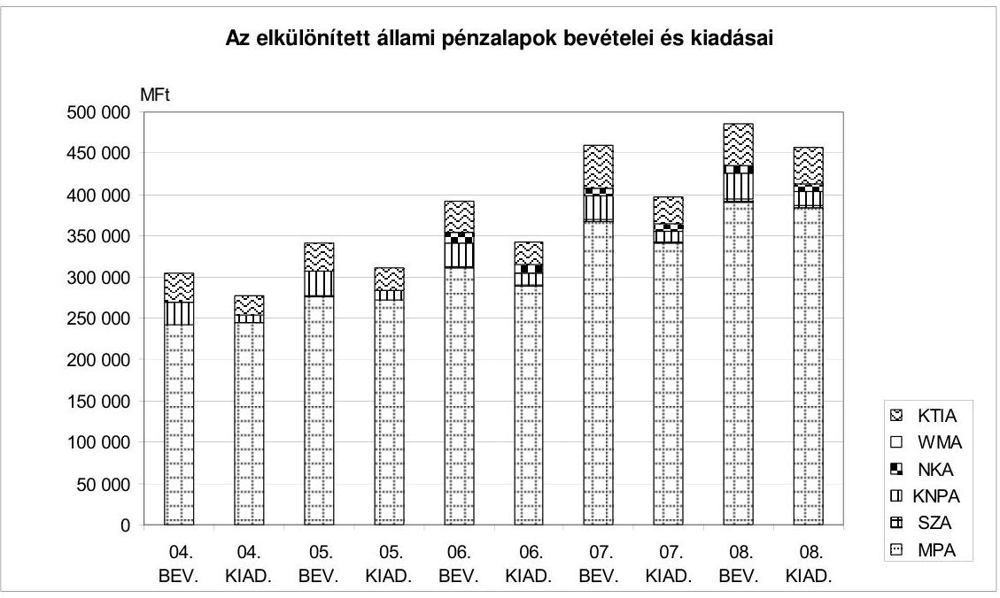

A meghatározott feladat és a hozzárendelt forrás hosszú távú összhangja - a rendszeresen elvégzett számítások alapján - a KNPA-nál állapítható meg. A feladatot kizárólag az Alapból finanszírozzák, és a bevételeket kizárólag az Alap feladataira fordítják. Csak a KNPA beszámolója nyújt teljes információt az adott állami feladatra fordított valamennyi kiadásról.

A bevételek és a kiadások hosszú távon megvalósuló összhangját a szakmai feladatok közép- és hosszú távú, évente felülvizsgált költségbecslése, stratégiai terve és ezen alapuló éves munkaprogramja, az éves befizetési kötelezettség (Paks)

[^0]
[^0]:    ${ }^{42}$ 2003. évi XC. törvény a Kutatási és Technológiai Innovációs Alapról.
    ${ }^{43}$ 1991. évi IV. törvény a foglalkoztatás elősegítéséről és a munkanélküliek ellátásáról, valamint 2003. évi LXXXVI. törvény a szakképzési hozzájárulásról és a képzés fejlesztésének támogatásáról.

---

költségalapú (a tervekre alapozott) meghatározása, valamint a bevételeknek kizárólagosan az Alap céljaira fordíthatósága biztosítja.

Az állami feladat és az alapszerú finanszírozás összhangja nem állapítható meg a KTIA, SZA, NKA és MPA esetén, mivel a feladatot alapon kívül is ellátják (például: minisztériumok), illetve alapon kívüli források is finanszírozzák (például: fejezeti kezelésű előirányzat az első három alapnál). Az MPA-nál nem teljesül továbbá, hogy az Alap bevételeit csak az Alap céljaira fordítják. Az Alap befizetést teljesít a központi költségvetésbe, és nincsen arról elszámolás, hogy az átadott pénzeszközökből ténylegesen mennyit fordítottak a munkaerőpiaccal kapcsolatos feladatra. Ezen alapok mérlegei az alaphoz rendelt források felhasználásáról, illetve a más felhasználónak átadott pénzeszközök jogcímeiről adnak információt, de nem mutatják be az innováció, a határon túli magyarok, a kultúra, illetve a munkaerőpiac résztvevői támogatására fordított valamennyi kiadást.

Az innovációs tevékenység többek között a Nemzeti Fejlesztési és Gazdasági Minisztérium, a Magyar Tudományos Akadémia, a határon túli magyarok például: a Külügyminisztérium, az Országgyúlés, a kulturális termékek gyártói, szolgáltatói az OKM költségvetésén keresztül is támogatáshoz jut(hat)nak.

Aktív eszközökre 2008-ban az MPA foglalkoztatási alaprészének felhasználásával 88,3 Mrd Ft-ot, az Európai Uniós programok keretében 12,8 Mrd Ft-ot fordítottak. Passzív ellátásokra (az álláskeresők járadékára, segélyére) 2008-ban 100,4 Mrd Ft-ot fizettek ki és az Alap hozzájárult az aktív korúak szociális segélyeihez is a 113,3 Mrd Ft-os költségvetési befizetés részeként.

Az MPA-nál megjelenő új feladat és a finanszírozása közötti összhang nem volt kimutatható. Más esetben a járulékfizetési kötelezettség módosítása nem eredményezte a feladatokra fordítható források változását.

Az MPA 2005-től a munka nélkül maradt vállalkozók számára is nyújt ellátást. Az új feladat okán bevezetett adójellegú kötelezettségből (vállalkozói járulék) 2008-ban 13,8 Mrd Ft bevétel származott, amely mintegy 12 Mrd Ft-tal volt magasabb a kifizetett ellátásnál. A munkavállalói járulék kulcsának és az MPA bevételi előirányzatának emelése 2006. szeptembertől nem járt együtt a kiadási előirányzatok hasonló módosításával. A központi költségvetésbe befizetendő összeg növelésével 2007-től gyakorlatilag elvonták az Alaptól a keletkezett többletbevételt.

# 1.2. Az alapok pénzügyi jellemzői 

### 1.2.1. Az alapok bevételei és a bevételek feletti rendelkezés

Az ágazati törvények meghatározták az egyes alapok működését finanszírozó forrásokat. Az alapok államháztartásban elfoglalt helyzete lényegesen eltér a költségvetési szervezetek helyzetétől annyiban, hogy a feladatok finanszírozásának mértékét a forrásokból ténylegesen befolyt bevétel nagysága közvetlenül meghatározza.

A központi költségvetési szervezetek kiadásait alapvetően a központi költségvetés forrásainak a szervezet feladataira jóváhagyott része határolja be, amit a költ-

---

ségvetésében megállapított előirányzatok fejeznek ki. A bevételek tényleges teljesülése közvetlenül nem befolyásolja a szervezet kiadásait.

Az ágazati törvények a felhasználás szabályainak előírásával közvetve, esetenként közvetlenül rendelkeznek [például az Nkatv. 4. § (4) bek., az Atv. 62. § (1) és 64. § (5) bek.] arról, hogy az alapok bevételei kizárólag az alapot illetik, el nem vonhatók, azok csak az alap céljaira használhatók fel. Az alapkezelőnek tehát érdeke a bevételek előirányzat szerinti, vagy azt meghaladó teljesülése. A többletbevételek - az előirányzatok módosításával - felhasználhatók (Áht. 55. §).

Az alapok (KNPA, WMA, SZA, KTIA) bevételeinek teljesülésénél a költségvetési támogatás mértéke kockázatot nem jelentett, jóváírásáról az alapkezelő - a Kincstárnak benyújtott - finanszírozási tervben intézkedik. Az adójellegú bevételek (járulékok és hozzájárulások) tervezésének és teljesülésének van kockázata (MPA, KTIA, NKA), amelynek mérséklésére nem állt eszköz az alapkezelők rendelkezésére.

A járulékokat, hozzájárulásokat az állami adóhatóság szedi be, a kötelezettség bevallására és teljesítésére az alapkezelőknek nincs ráhatásuk. A bevételek teljesülésének bizonytalanságát csökkenti a befolyt bevételek napi jóváírása az alapok számláin és ezt célozza az APEH Ámr. ${ }^{44}$ szerinti adatszolgáltatása. Az Ámr. 113/A. §-a szerint az APEH havonta, negyedévenként és évenként adatokat szolgáltat - többek között - a bevallások adatairól, a kötelezettségekről és befizetésekről.

A KNPA díjbevételének közel 100\%-a a Paksi Atomerőmű befizetéséből származik. A bevétel az előírások szerint befolyt, teljesülésének a gyakorlatban nem volt kockázata.

Az adójellegű bevételek éven belüli hullámzásai tükrözték a kötelezettség teljesítési időszakára vonatkozó jogszabályi előírásokat (lásd a 6/a; 6/g; 6/m. számú mellékleteket is).
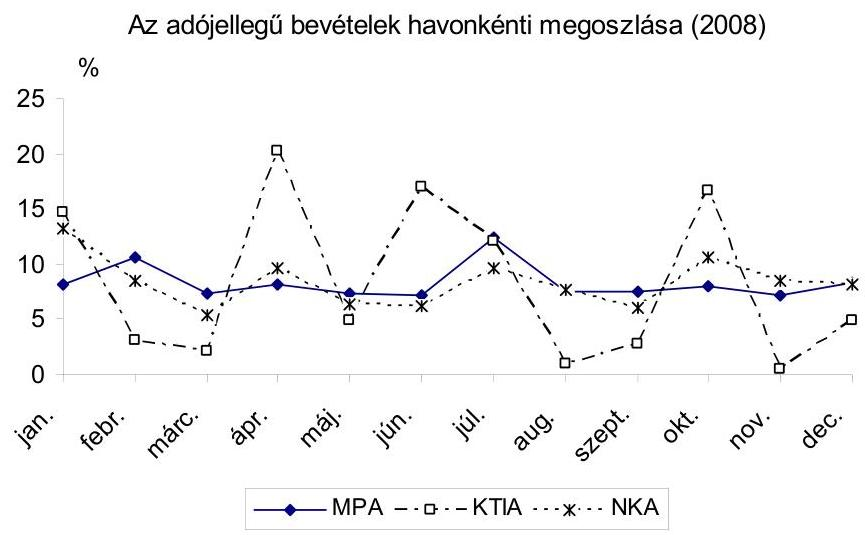

[^0]
[^0]:    ${ }^{44}$ 217/1998. (XII. 30.) Korm. rendelet az államháztartás múködési rendjéről.

---

Az adójellegű bevételek kockázata nem tér el az államháztartás megfelelő adóbevételeinek kockázatától. A többi adójellegű forrásnál nagyobb kockázattal tervezhető a szakképzési hozzájárulás és az innovációs járulék, mert a befizetések alakulása az adózónak a különböző teljesítési módok közötti választásától is függ.

2006-ban, 2007-ben és 2008-ban az MPA munkaadói és munkavállalói járulék bevételei az eredeti előirányzat 101,8\%/103,4\%/100,4\%-ában, az szja bevételek 102,2,\%/105,4\%/103,1\%-ban teljesültek. A kulturális járulék tényadatai az előirányzat 101-103\%-ában teljesültek 2007-2008-ban. A szakképzési hozzájárulás teljesülése 122\%/113\%/111\%, az innovációs járuléké 99\%/141\%/110\%. Az utóbbi két kötelezettség a befizetésen kívül más módon is (saját képzéssel, fejlesztéssel, illetve e tevékenység közvetlen finanszírozásával) teljesíthető.

Az NKA alapkezelője lépést tett a bevétel tartós emelésére. A kezdeményezés célja a járulékfizetési kötelezettség tárgyát képező termékek és szolgáltatások körének, a kötelezettség mértékének a termékek tényleges forgalmi adataihoz igazítása volt.

A járulékkötelezettségnek a bevétel emelkedését is célzó módosítására az NKA-val rendelkező miniszter nyújtott be 2008. áprilisban előterjesztést ${ }^{45}$. Az internetadó néven közismertté vált javaslat az alacsony forgalmú termékek (például mágnesszalag, hanglemez, bélyeg) járulékkötelezettségének megszüntetését és új, magas forgalmú termékek és szolgáltatások (WAP, MMS és internet-hozzáférési szolgáltatás, bútorok) utáni kötelezettség meghatározását tartalmazza.

A költségvetési gazdálkodás 2010-től hatályos szabályai behatárolják a költségvetésben meghatározott kiadások tárgyévi módosítását (növelését) ${ }^{46}$. A rendelkezés nincs összhangban a többletbevétel felhasználhatóságáról rendelkező, az Áht. változatlanul hatályos 55. §-ával. Az adójellegű, pontosan nem tervezhető bevételekből gazdálkodó alapoknál nem egyértelműen szabályozott a többletbevétel tárgyévi felhasználhatósága.

# 1.2.2. A felhalmozott pénzmaradvány feletti rendelkezés és az éven túli kötelezettség vállalása 

A maradvány-felhasználási és a kötelezettségvállalási szabályok együttesen a bevételek keletkezési időszakától és adott évi nagyságától eltérő felhasználását teszik lehetővé. Az Áht. és az ágazati törvények szerint az alap a tárgyévben el nem költött maradványát az évet követően előzetes lekötés nélkül is felhasználhatja. Az alapszerú gazdálkodás lehetőséget nyújt a forrásoknak a keletkezés időszakától és tárgyévi nagyságától a központi költségvetés szabályainál rugalmasabb, a feladatokhoz jobban igazodó felhasználására.

[^0]
[^0]:    ${ }^{45}$ T/5395. számú törvényjavaslat a Nemzeti Kulturális Alapról szóló 1993. évi XXIII. törvény módosításáról.
    ${ }^{46}$ Áht. 12. § (6) bek. (hatályos 2010. 01. 01-jétől).

---

Az Áht. a pénzmaradványok felhasználhatóságáról rendelkezik, miszerint a pénzeszközök - év végi, jóváhagyott záró - állománya a következő évben a kiadások forrásául megjelölhető és elszámolható [Áht. 7. § (2) bek.].

Az alapok gazdálkodása több év átlagában akkor is kiegyensúlyozottnak tekinthető, ha a kiadások évenként nem, de néhány évet tekintve megfelelnek a bevételeknek, éppen a bevételek teljesülésének kockázata miatt. A kockázattal teljesülő bevételek melletti egyensúlyi gazdálkodást a maradványfelhasználási és kötelezettségvállalási szabályok teszik lehetővé. Sajátos e tekintetben a KNPA és a WMA, mert a tárgyévi kiadások nem a tárgyévi bevételektől függnek. Az előbbinél a tárgyévi befizetéseket és kiadásokat a közép- és hosszú távú szakmai feladatok és a teljes finanszírozási igény időarányos részét meghatározva állapítják meg, az utóbbinál a kiadások az időjárástól függnek.

A jóváhagyott maradványok felhasználásáról az alappal rendelkező miniszter intézkedhet. A maradvány jóváhagyására speciális szabály nincsen, az Országgyűlés a költségvetés végrehajtásáról szóló törvény elfogadásával minden évben jóváhagyta az alapok mérlegében feltüntetett maradványt is.

A maradvány felhasználása miatt a kiadási előirányzatok módosítását az Áht. 55. § (1) bekezdése írja elő, feltételként szabva, ha törvény nem rendelkezik másként a maradvány jóváhagyásáról. Az előirányzat módosítására az alappal rendelkező miniszter jogosult [Áht. 55. § (2) bek.].

Költségvetési szerv a tárgyévi előirányzatainak pénzügyi teljesítésre fel nem használt és le nem kötött részével, a szabad pénzmaradványával az évet követően már nem rendelkezik. A tárgyévben a következő év közepéig esedékes kifizetésre vállalhat szerződéses kötelezettséget, amelynek összege - a pénzügyminiszter jóváhagyása esetén - megnöveli a következő évi költségvetésében számára jóváhagyott előirányzatot.

A tartalék felhasználására sajátos rendelkezést az Flt. és a Ktiatv. tartalmaz. Az Flt. szükíti az alappal rendelkező miniszter döntési jogosítványát a tartalék felhasználására (Flt. 39/D. §), egyrészt a Kormány előzetes engedélyéhez kötve azt, másrészt a likviditást biztosító tartalék kötelező képzésével. A Ktiatv. az Áht-val összhangban megerősíti, hogy a tárgyévet megelőző évek pénzmaradványa az Alap tárgyévi kiadásai forrásaként felhasználható (Ktiatv. 2. §).

A tartalék felhasználására sajátos előírásokat nem tartalmazó ágazati törvények is szabályozzák - közvetve - a tartalék igénybevételét. Ugyanis időbeli korlát nélkül, az alap teljes élettartamára rendelkeznek a tartalék felhalmozódását, illetve felhasználását automatikusan eredményező bevételek és kiadások meghatározásának szempontjairól, rendjéről (KNPA, WMA, SZA, NKA).

Az Áht. szerint éven túli kötelezettség csak olyan mértékben vállalható, amely a múködés veszélyeztetése nélkül finanszírozható [Áht. 12/A. § (2) bek.]. A tárgyéven túli fizetési kötelezettség vállalására az MPA és az NKA ágazati törvényei korlátokat szabnak.

Az MPA foglalkoztatási alaprésze terhére, a MAT által meghatározott mértékig vállalható éven túli fizetési kötelezettség, ami nem haladhatja meg a tárgyévi eredeti, illetve módosított - kiadási előirányzat 40\%-át [Flt. 39/B. § (5) bek.]. A

---

képzési alaprész terhére az oktatásért, illetve a szakképzésért és felnőttképzésért felelős miniszter a rendelkezése alá tartozó rész 40\%-áig vállalhat kötelezettséget [Szht. 16. § (5) bek.], és miniszteri utasítás rendelkezik a rehabilitációs alaprész tekintetében. Az NKA tárgyévi bevétele terhére legfeljebb a tárgyévet követő harmadik év végéig megvalósuló feladatra (programra) vállalható kötelezettség. A tárgyévet követően legfeljebb három év bevételére vállalható továbbá korlátozott mértékű fizetési kötelezettség (Nkatv. 7/A. §).

A több éves lefutású programok, fejlesztések, beruházások következő években esedékes kifizetéseire vállalt kötelezettségek nem jelennek meg az alapok mérlegében ${ }^{47}$.

# 1.2.3. A költségvetési törvények hatása a pénzügyi sajátosságok érvényesülésére 

Az alapok költségvetését és zárszámadását a költségvetési törvények részeként hagyja jóvá az Országgyúlés [Áht. 57. § (1) bek.]. A költségvetési törvények a bevételek és kiadások, valamint a pénzeszközök változásának előirányzatán kívül rendelkeztek az alapok és a központi költségvetés kapcsolatáról, és a felhasználás egyes kérdéseiről (lásd a 4. számú mellékletet).

## Az alapok költségvetését a központi költségvetés egyensúlyi helyzete

közvetlenül befolyásolta. A költségvetési törvényekben az MPA-t terhelő központi költségvetési befizetések megállapítása csökkentette az Alap felett rendelkezők döntési hatáskörében elosztható forrásokat. A befizetési kötelezettség adott évi nagysága meghatározására jogszabályi rendelkezés nincsen. A KNPA kiadásainak a szakmailag indokoltnál alacsonyabb mértékű meghatározása miatt (2004-2007 között) módosítani kellett a közép- és hosszú távú szakmai tervet, ami a beruházások megvalósításában többletköltséget okozott.

Az MPA évente (2008-ban például 113,3 Mrd Ft) befizetést teljesít a központi költségvetésbe, amivel hozzájárul a megváltozott munkaképességű személyek foglalkoztatásának támogatásához és az aktív korúak rendszeres szociális segélyezéséhez.

Korábbi jelentéseinkben ${ }^{48}$ megállapítottuk, hogy a KNPA egyes években (pl. 2004, 2005, 2006, 2008) jóváhagyott kiadási előirányzatai alacsonyabbak voltak a stratégiából következő, a tárgyévi munkaprogramban tervezett értékénél. A szakmai tervek szerinti eredeti ütemezés lelassulása miatt a Bátaapátiban létesülő kis és közepes aktivitású radioaktív hulladéktároló beruházásnál áthidaló megoldást kellett találni ${ }^{49}$. A nagy aktivitású radioaktív hulladéktároló telep-

[^0]
[^0]:    ${ }^{47}$ 2000. évi C. törvény a számvitelről, 160. § (5) bek.
    ${ }^{48}$ Jelentés a Központi Nukleáris Pénzügyi Alap múködésének ellenőrzéséről - 2005. március (0509), 11. o., Jelentés a Magyar Köztársaság 2006. évi költségvetése végrehajtásának ellenőrzéséről - 2007. augusztus (0724), 234. o., Vélemény a Magyar Köztársaság 2008. évi költségvetési javaslatáról - 2007. október (0736), 146. o.
    ${ }^{49}$ Forrás: IRM/BVO/2007/87. ikt. számú feljegyzés Dr. Kisfaludy Zoltán kabinetfőnök részére.

---

hely-kiválasztási programja 2007-re lényegében leállt, ezért a program az eredeti ütemezés szerint nem volt megvalósítható, azt felül kellett vizsgálni ${ }^{50}$.

Volt példa a költségvetési törvényben az alap kiadásait vagy forrásait növelő, eseti intézkedésre is. A Kormány feltételhez kötött felhatalmazást kapott a KNPA beruházásai előirányzatának növelésére 2006-ban és az NKA bevételeinek kiegészítésére 2008-ban. A KNPA kiadásának a költségvetési törvény általi korlátozása indokolttá tette a felhatalmazást. Az NKA bevételének mértékére a kötelezettség vállalását, majd az NKA költségvetési támogatását az Alap pénzügyi helyzete nem indokolta. Az Alap rendeltetése szerint a támogatási feladatát a rendelkezésére álló források mértékéig látja el. A költségvetési törvény a támogatás feltételtől függő visszautalásáról nem rendelkezett.

A 2008. évi költségvetés ${ }^{51}$ 68. §-ának (10) bekezdése szerint a központi költségvetésből kiegészítik az NKA bevételét, amennyiben a kulturális járulékból származó, 2008. október 31-ig teljesült bevétel nem éri el a megelőző év időarányos bevételét. A költségvetés készítésének idején is mintegy 3000 M Ft pénzmaradványnyal bírt az Alap, ami 2008 elején már $3579,3 \mathrm{M}$ Ft, év végén $3946,9 \mathrm{M}$ Ft volt. A központi költségvetésből 2008-ban 242,5 M Ft támogatást kapott az Alap.

A 2004-2007. évi költségvetési törvények külön rendelkeztek a bevételek és kiadások törvényben előirányzott nulla egyenlegének kötelező betartásáról. A tartalék-felhasználás tilalma nem volt tekintettel az alapszerű működésre, a bevételek felhasználásának szabályaira. Így a WMA esetén a múködés alapelvére, az éven túli kötelezettségek vállalásának szabályaira (NKA), valamint az MPA - likviditási tartaléka feletti - maradványa felhasználásának törvényi lehetőségére.

Az árvízkárok miatt a WMA-ból fizetendő kártalanítás forrását az Alap célja szerint a felhalmozott pénzmaradvány képezi. A tartalék „zárolása" 2006-ban nem tette lehetővé abból kártalanítások kifizetését, ami központi költségvetési forrás igénybevételét tette szükségessé. A WMA-ra 2007-ben már nem vonatkozott az egyenlegtartási előírás. Az Nkatv. 7/A. §-a szerint a tárgyévi bevételek terhére a tárgyévet követő harmadik év végéig megvalósuló feladatra vállalható kötelezettség. A tárgyévi bevételből a tárgyévben ki nem fizetett rész a tartalék, a pénzmaradvány része lesz, ami a következő három évben nem volt felhasználható a terhére vállalt kötelezettség kiegyenlítésére.

# Az egyenlegtartási kötelezettség éveken át nem tette lehetővé a tartalék felhasználását. A tárgyévi kiadásokat a tárgyévi bevételek mértékében korlátozta, ugyanakkor ösztönzött is a bevételek tárgyévi felhasználására. 

A költségvetési törvények egy-egy alap (MPA, KTIA) felhasználására olyan szabályokat is tartalmaztak, amelyek korlátozták a döntésre jogosultak rendelkezési jogkörét.

A 2004. évi költségvetési törvény előírta, hogy az MPA járulékokból származó többletbevételeit elsősorban a túlteljesülő passzív kiadásokra kell fordítani. A

[^0]
[^0]:    ${ }^{50}$ Forrás: RHK Kft. 2007. 05.15-i válasza az ÁSZ V-23-009-003/2007. ikt. számú levelére.
    ${ }^{51}$ 2007. évi CLXIX. törvény a Magyar Köztársaság 2008. évi költségvetéséről.

---

2007. évi és 2008. évi költségvetésben a KTIA céljainak teljesülése érdekében a vállalkozások támogatásának részarányáról, konkrét cél támogatásáról és az ágazati törvényben le nem fektetett egyetértési jog figyelembevételéről határoztak.

# 1.2.4. Az alapok helye az államháztartásban 

Az elkülönített állami pénzalapok az államháztartás egyik alrendszerét képezik 2009. december 31-ig ${ }^{52}$. Az alrendszer az alapok összességét jelentő technikai fogalom az államháztartás elszámolásaiban. Az alrendszernek az alapoktól elkülönülő feladatai, központosított előirányzatai nincsenek. Az alapok öszszességéhez (alrendszer) jogok és kötelezettségek nem kapcsolódnak. A bevételek címzettje minden esetben az alap, a bevétel teljesülése csak és kizárólag az alap költségvetését befolyásolja, a többi alapét nem. Az egyes alapok feladatai között sincsen tartalmi összefüggés, pénzügyi kapcsolatok sem állnak fenn közöttük. Az utóbbi feltétel alól jelenleg egy kivétel van, az MPA-ból az SZA-ba a szakképzési hozzájárulásból - történő forrásátadás. (Az alapok és a központi költségvetés közötti pénzügyi kapcsolatokat az 5. számú melléklet mutatja be.)

Az alapok súlya az államháztartásban alacsony, 2008-ben az alapok összesen 485 Mrd Ft-os bevétele megfelelt a központi költségvetési bevétel 5,9\%ának, 457 Mrd Ft-os kiadása a központi költségvetési kiadások 5,1\%-ának. Az alapok múködése az államháztartás egyes bevételeinek átengedése és a bevételeknek a központi költségvetéstől elkülönült felhasználása miatt kockázatot jelent az államháztartás egyensúlyi helyzetére. A kockázat az alrendszer alacsony súlyából következően mérsékelt. A kockázat kezelését jelenti az alapoknak az államháztartás tervezési, nyilvántartási, elszámolási, beszámolási (pénzügyi információs és számviteli), finanszírozási (pénzellátási) rendszerébe illesztése. Az alapok az állami költségvetés egy-egy fejezetét alkotják. A költségvetési törvényekben a bevételek és kiadások nulla egyenlegére vonatkozó szabályozás (2004-2007) megelőzte, megakadályozta az egyensúlyi kockázat fölmerülését.

Az alapok pénzforgalma befolyásolja az államháztartás finanszírozási igényét is. A finanszírozási kockázat kezelésére az alapok számára - a költségvetési szervekhez hasonlóan - nem megengedett egyes pénzügyi műveletek végzése (hitelfelvétel, kötvény- és váltókibocsátás, pénzügyi befektetések megszerzése és értékpapír műveletek, pénzügyi lízing és faktoring, Áht. 61. §).

A költségvetés és teljesítésének nyilvántartása, a pénzügyi műveletek bonyolítása az államháztartás pénzügyi információs és pénzellátási rendszerében történik. Az államháztartásért felelős szerv részére a költségvetés teljesítéséről,

[^0]
[^0]:    ${ }^{52}$ Az ÁSZ a közpénzügyi szabályozásról nyilvánosságra hozott téziseiben javasolta az államháztartás négy alrendszere helyett két szintjének megkülönböztetését. Az elkülönített állami pénzalapok elszámolásait a központi szintbe javasolta beilleszteni. Az Áht-nak a takarékos állami gazdálkodásról és a költségvetési felelősségről szóló 2008. évi LXXV. törvény 22. §-ával végrehajtott módosításával az elkülönített állami pénzalapok 2010. január 1-jétől a központi szinthez tartoznak, nem képeznek önálló alrendszert. Az alapokra vonatkozó külön előírások nem változtak.

---

az alapok várható (tervezett) és tényleges pénzforgalmáról naprakész információ áll rendelkezésre, azt nyomon követik. A pénzforgalom kincstári és alapkezelőnél vezetett nyilvántartásának folyamatos egyeztetését teszi lehetővé a Kincstárnak havonta benyújtott pénzforgalmi jelentés.

Az alapok államháztartáson kívülről származó adójellegű bevételeit az állami adóhatóság szedi be, pénzforgalmuk a kincstári egységes számlán folyik. Az alapok kincstári alanyok, számlájukat a Kincstár vezeti. Az alapok várható bevételeit és kiadásait a benyújtandó finanszírozási terv tartalmazza.

Az Áht. 38/A. §-a az alrendszer (az alapok) költségvetési egyenlegének tartósan kedvezőtlen alakulása esetén, vagy annak megelőzésére intézkedési lehetőséget biztosít a Kormány részére előirányzatok zárolására, csökkentésére. A kockázat kezelésére, illetve a 2004-2007. közötti időszakban annak kizárására alkalmazott eszközök következtében az alapok rendre pozitív egyenleggel zárták az évet. Az államháztartás egyenlegének alakulását kedvezően befolyásolta az alapok pozitív egyenlege.

Az Áht. 38/A. §. szerint az MPA-t érintő zárolás elrendelése előtt ki kell kérni az Országos Munkaügyi Tanács ${ }^{53}$ véleményét. A központi költségvetés egyenlege 2006 és 2007 végén a GDP $-8,2 \%-a /-5,5 \%-a$ volt. Az elkülönített állami pénzalapok összesített egyenlege mindkét évben a GDP 0,2\%-a.

Az alapok pénzforgalmának az államháztartás egységes pénzellátási rendszerében, a kincstári egységes számlán bonyolítása miatt, a pénzforgalomhoz szükséges pénzeszközök az államháztartás pénzeszközeinek részeként, a finanszírozási igény szerint állnak rendelkezésre. Az alapok kincstári számláin kimutatott, felhalmozott pénzmaradványai mögött nem áll a KESZ-től elkülönült nemzetgazdasági megtakarítás.

# 1.3. Az alapok feletti rendelkezés szabályozottsága 

Az alapokra vonatkozó szabályozásra jellemző - a WMA-t kivéve - a jogszabályok gyakori változása, elsősorban a rendelkező miniszter személye, és az ezzel összefüggő szervezeti változások, az MPA-nál a célok meghatározása is, ami bizonytalanságot okoz az igénybevevőknél és a jogalkalmazók munkáját is befolyásolja ${ }^{54}$. Hiányosság e mellett, hogy a szabályozás nem fordít kellő figyelmet a célok megvalósítását szolgáló programok hatékonyságának, hatásainak ellenőrzésére. Az alapok müködtetése, így a miniszterek alap feletti rendelkezési joga nem statikus, hiszen a változó körülmények, az ellátandó feladatok, növekvő vagy csökkenő szakterületek stb., megfelelő alkalmazkodást kívánnak az alapok pénzeszközeinek felhasználásában is. A rendelkező miniszter személyének gyakori változtatása és az ezzel összefüggő szervezeti módosulások a napi munka folytonosságát, a folyamatok nyomon követését, a felhasználás pénzügyi és szakmai hatékonyságának ellenőrzését megnehezíti. A módosítások következtében például az Flt.

[^0]
[^0]:    ${ }^{53}$ 1997. január 1-jétől MAT.
    ${ }^{54}$ Az SZMM véleménye szerint: "Az Flt. módosításai döntően a gazdasági helyzet változásával voltak összefüggésben".

---

hatályos joganyaga a laikusok számára csak szakemberek (munkaügyi központok, önkormányzatok) segítségével követhető. A jogok érvényesítésére, illetve a jogbiztonságra mindezek hatással vannak.

A jogbiztonságra továbbá hatással van az elnagyolt szabályalkotás is, amely megnehezíti a szabály alkalmazását, az ellenőrzést, és a felelősség megállapítását is.

- Flt. 39. § (5) bek. ${ }^{55}$ „A Munkaerőpiaci Alap külön elöirányzataiból finanszirozott támogatások igénybevételének hirdetésével, közzétételével kapcsolatos kiadásokra, szakértői díjakra az alaprészekből finanszirozott támogatásokkal kapcsolatos ilyen jellegú kiadásokra vonatkozó szabályokat kell megfelelően alkalmazni."
- Kormányrendelet ${ }^{56}$ 1. § (2) bek. „... A Kormány az állami foglalkoztatási szerv azon feladataira, amelyre kormányrendelet más szervet nem jelölt ki, a regionális munkaügyi központot jelöli ki."
- SZMM SzMSz 46. §: „A Foglalkoztatási Főosztály ellátja a foglalkoztatáspolitikai programokkal, foglalkoztatási támogatásokkal kapcsolatos azon feladatokat, amelyek nem tartoznak más közigazgatási szerv, vagy minisztérium más szervezeti egységének feladat- és hatáskörébe."

# 1.3.1. A miniszter rendelkezési joga 

A vonatkozó jogszabályok az alapok tekintetében - ideértve a központi államigazgatási szervekről, valamint a Kormány tagjai és az államtitkárok jogállásáról szóló 2006. évi LVII. törvényt is - nem definiálják az irányítás, a felügyelet, a rendelkezési és a kezelési jog fogalmát, annak esetleges korlátozását, átruházásának módját, azok egymáshoz való viszonyát. Így problémát jelent a definíciók hiánya azon esetekben, amikor az alap felett rendelkező miniszter a szakterület és/vagy a kezelő szervezet felett irányítási, felügyeleti joggal is rendelkezik ${ }^{57}$. A fogalmak definiálása eligazítást adna azokban az esetekben, amikor például a hatáskörök tartalmának teljességét a jogszabály (belső szabályozás) nem vagy ellentmondásosan tartalmazza.

## Az Áht. a rendelkezési jogot nevesíti, de tartalmát tételesen nem rögzíti.

A vonatkozó törvényhelyek [Áht. 38/A., 49. és 54-60. §-ai] szerint a miniszter rendelkezési jogkörébe tartozik az alap költségvetésével kapcsolatos feladatok (tervezés, zárszámadás, mérlegkészítés) végzése, irányítása, illetve a címek közötti átcsoportosítás - ha törvény másként nem rendelkezik.

[^0]
[^0]:    ${ }^{55}$ Hatályos 2009. január 1-jétől.
    ${ }^{56}$ 291/2006. (XII. 23.) Korm. rendelet az Állami Foglalkoztatási Szolgálatról.
    ${ }^{57}$ Például: a KNPA-val a Kormánynak az OAH feletti felügyeletét ellátó tagja rendelkezik. Az Alap kezelője az OAH [Atv. 62. § (2) bek.]. Az OAH felügyeletét ellátó miniszter az Alap feletti rendelkezési jogkörében az OAH - mint az Alap kezelője - útján gondoskodik az Alap müködtetésével kapcsolatos irányítási feladatok ellátásáról [240/1997. (XII. 18.) Korm. rendelet 3. § (1) bek.].

---

Az Ámr. ${ }^{58}$ az alapot pénzügyi eszközökkel és költségvetési előirányzatokkal gazdálkodó államháztartási alapegységként nevesíti, amelynek felügyeletét, irányítását, továbbá kezelését kijelölt személyek és szervezetek végzik. A miniszter az alap kezelésének érdemi feladatai ellátásával (tervezési, kötelezettségvállalási, bevétel-előírási, szerződéskötési, utalványozási, ellenőrzési, államháztartási információszolgáltatási és beszámolási feladatok) kizárólag központi költségvetési szervet vagy kivételesen köztestületet bízhat meg. (Megjegyezzük, hogy a „kizárólag" szó használata - nyelvtanilag és kodifikációs szempontból is - kizárja kivétel alkalmazását.)

Az Áht. és az Ámr. idézett rendelkezései alapján nem világos, hogy a rendelkezési jog milyen viszonyban van az irányítási és/vagy a felügyeleti jogosítványokkal.

Az általános szabályok mellett a miniszter rendelkezési jogát az ágazati törvények határozzák meg. A rendelkezési jog tartalmát az ágazati törvények eltérően szabályozzák, ami a jogosultság tartalmának tételes meghatározásától (Flt.) a rendelkezési jog említésének hiányáig (Nkatv.) terjed. Az ágazati törvények alapján a rendelkezési jog lehet önálló vagy megosztott. Megosztott rendelkezési jogot az Flt. nevesít, így az illetékes miniszter az MPA feletti rendelkezési jogát megosztva gyakorolja a MAT-tal és más miniszterrel/miniszterekkel, ez azonban nem érintheti az MPA múködésével kapcsolatos Áht-ban szabályozott általános kormányzati felelősségét ${ }^{59}$.

A WMA-t kivéve a többi alap pénzeszközeinek felhasználásánál előzetes véleményalkotó, javaslattevő vagy döntési (egyetértési) joggal felruházott testületek múködnek közre, de az MPA kivételével az ágazati törvények megosztott rendelkezési jogot nem nevesítenek.

A megosztott rendelkezési jog teszi szükségessé az Flt-ben a jogosultságok tételes meghatározását, hiszen az egyrészt egymás mellett párhuzamosan, illetve egymásra tekintettel gyakorolt hatáskört jelent, amely csak a törvényben rögzített esetekben ad lehetőséget a miniszternek önálló döntésre a MAT hatáskörébe utalt kérdésekben, ugyanakkor mindkét félnek önálló döntési jogkört is biztosít. A miniszterek közötti megosztott rendelkezési jog vagy a témában önálló döntési jogosítványt, vagy egyetértési jogot jelent.

Az Flt. 1997. január 1-jétől hatályos módosítása ${ }^{60}$ alakította ki a megosztott rendelkezési jog törvényi struktúráját (39/A. §), amely egyrészt a MAT jogköreit az MPA-hoz, illetve annak alaprészeihez csoportosítja, másrészt a megosztott miniszteri rendelkezési jogkört - többségében - a MAT hatásköreire tekintettel fogalmazza meg. 1998. január 1-jei hatállyal ${ }^{61}$

[^0]
[^0]:    ${ }^{58}$ Ámr. 19. § (1)-(2) bek.
    ${ }^{59}$ Áht. 123/B. §.
    ${ }^{60}$ 1996. évi CVII. törvény a foglalkoztatás elősegítéséről és a munkanélküliek ellátásáról szóló 1991. évi IV. törvény módosításáról.
    ${ }^{61}$ 1997. évi CXX. törvény a foglalkoztatás elősegítéséről és a munkanélküliek ellátásáról szóló 1991. évi IV. törvény, valamint a Bérgarancia Alapról szóló 1994. évi LXVI. törvény módosításáról, 18. §.

---

a miniszter rendelkezési joga abban változott, hogy egyes központi keretek (miniszteri rendelkezési jog) felhasználási célja kiegészült. Ezen időponttól figyelhető meg a pénzeszközök, illetve azok feletti rendelkezés központosítása, ami egyrészt a rendelkező miniszter döntési kompetenciájába tartozó keretek számának, felhasználásuk céljának bővülését jelenti, valamint a központi költségvetésbe átadott, elkülönített pénzeszközök megjelenését.

A rendelkezési jog központosítása - függetlenül attól, hogy a felhasználás célja azt indokolta vagy sem - a MAT hatáskörének szűkítését jelenti mind a döntések, mind az ellenőrzés területén.

Az alapok egy csoportjában (KNPA, KTIA) a miniszter rendelkezési joga pontosan nem meghatározott, részben a kezelő szervezet irányításán és felügyeletén keresztül is érvényesül. A csoportra jellemző, hogy a kezelő szervezet az alap kezelésén kívül más - a rendelkező miniszter irányítása alatt álló szakterülethez tartozó - feladatot is ellát. Az Atv. 68. §-a konkrét feladatként a KNPA múködési szabályzatának, eljárásrendjének megállapítását rögzíti ${ }^{62}$, az Áht-nak megfelelő gazdálkodás mellett. A KTIA feletti rendelkezési jog meghatározott körét - a 2007. évet kivéve - a kutatás-fejlesztés és innovációért felelős szerv (NKTH) vezetőjére ruházza át a Ktiatv. A KTIT, amelynek tagjait a miniszterelnök bízza meg, egyetértési jogot gyakorol az Alap felhasználásának érdemi kérdéseiben [Ktiatv. 11. § (3) bek.]. Mindebből következik, hogy a miniszternek az Alap felhasználásáért való felelőssége elsősorban az NKTH irányításának és felügyeletének általános feladatához, és nem az Alappal való rendelkezési jogához kötődik.

Az SZA-val rendelkező miniszter feladatát az ágazati törvény a Kollégiumok (szakmai döntéshozó testületek) tagjainak és elnökének kinevezésében, illetve döntéseik jóváhagyásában jelöli meg. Az Alap tevékenységének irányát meghatározó Regionális Egyeztető Fórum (a továbbiakban: REF) tagjait a miniszterelnök kéri fel.

A WMA-val az államháztartásért felelős miniszter rendelkezik, melynek tartalmát a Wmatv. az Áht. rendelkezésein túl az WMA felhasználásának, nyilvántartásának és ellenőrzésének, az alapkezelő feladatainak, valamint a szerződésekkel kapcsolatos eljárások rendeleti szabályozásában jelöli meg.

A miniszterek alapok feletti rendelkezési joga az általános és az ágazati jogszabályokból következő konkrét feladatok összességeként írható le. A miniszteri statútumok ezt pontosan nem követik, részben az ágazati törvények e körben eltérő részletezettsége, részben az alap célja, részben a miniszter kormányzati felelősségi körébe tartozó és a rendelkezési joggal érintett feladatok el nem határolása miatt.

A miniszteri statútum az alap feletti rendelkezési jogot nem említi a KTIA-nál, a KNPA-nál és az SZA-nál, valamint - feladatából következően - a WMA-nál,

[^0]
[^0]:    ${ }^{62}$ 14/2005. (VII. 25.) IM rendelet a Központi Nukleáris Pénzügyi Alap múködéséről és eljárásrendjéről. A törvény szerint a szabályzathoz az érintett miniszterek egyetértése is szükséges.

---

részlegesen tartalmazza az MPA-nál, az NKA-nál pedig a tényt rögzíti. A KNPA esetében a rendelkezési jog tekintetében kormányrendelet ${ }^{63}$ határozza meg, hogy az Alap múködtetésének irányítási feladatait a miniszter az OAH, mint kezelő útján gyakorolja. A szabályozás nem ad eligazítást abban, hogy a rendelkezési jog tartalmát teljes egészében lefedi-e „az alap múködtetésének irányítása". A szociális és munkaügyi miniszter statútuma ${ }^{64}$ az MPA feletti rendelkezés jogának tartalmát a foglalkoztatáspolitikáért, a szak- és felnőttképzésért, valamint a társadalmi párbeszédért és a társadalmi, civil kapcsolatok fejlesztéséért való felelőssége körében nevesíti, valamint az érdekegyeztető testületek múködtetésében, szervezetek irányításában, felügyeletében határozza meg.

A gyakran változó jogszabályok tömegében az eligazodási pont a miniszteri statútum. A leadott hatásköröket a minisztériumi SzMSz-ek tartalmazzák. A rendelkezési jog miniszteri delegálása a WMA, illetve a KTIA esetében nem értelmezhető (a WMA feletti rendelkezési jog elsősorban miniszteri rendeletalkotással valósul meg, a KTIA-nál pedig a miniszter rendelkezési jogát a törvény delegálja a kezelő szervezet vezetőjére).

Az OKM 2008. július 25 -től hatályos SzMSz-e szerint a miniszter személyes hatáskörébe tartozik az NKA-hoz kapcsolódó „át nem ruházott jogkörök gyakorlása", azonban a szabályzat az átruházott, illetve át nem ruházott jogkörökről nem szól. Az Alap múködtetését és kezelését az NKAI végzi.

NKA-hoz kapcsolódó feladatként a Költségvetési és Közgazdasági Főosztálynál nevesíti, hogy „a Főosztály készíti elő a Nemzeti Kulturális Alap költségvetésének és zárszámadásának - a költségvetési, illetve zárszámadási törvény részeként történő - beterjesztéséről, illetve az Alap beszámolóját és mérlegét felülvizsgáló könyvvizsgáló megbizásáról szóló miniszteri intézkedések tervezeteit".

A KNPA-val kapcsolatban a KHEM SzMSz-e meghatározza a minisztérium azon szervezeti egységét, amely - egyéb feladatai mellett - közremúködik a miniszter rendelkezési jogának gyakorlásában. Az Energiagazdálkodási és -szabályozási Főosztály Alappal kapcsolatos feladatait rögzíti az SzMSz, az Alap jogi szabályozásában nevesített konkrét feladatokat - például középés hosszú távú tervek, éves munkaprogram jóváhagyása - azonban nem részletezi.

Az SZMM SzMSz-ében a miniszter feladat- és hatáskörében nincsenek nevesítve MPA-val kapcsolatos teendők. Közvetve érinti az MPA-t a minisztérium szervezetének, múködési rendjének meghatározására, az országos és regionális módszertani intézetek kijelölésére és az országos érdekegyeztetés ellátására vonatkozó miniszteri feladat- és hatáskör. Az MPA-val kapcsolatos hatáskörök az államtitkárok és szakállamtitkárok közvetlen miniszteri irányítá-

[^0]
[^0]:    ${ }^{63}$ 240/1997. (XII.18.) Korm. rendelet a radioaktív hulladékok és a kiégett üzemanyag elhelyezésére, valamint a nukleáris létesítmények leszerelésére kijelölt szerv létrehozásáról és tevékenységének pénzügyi forrásáról.
    ${ }^{64}$ 170/2006. (VII. 28.) Korm rendelet a szociális és munkaügyi miniszter feladat- és hatásköréről.

---

sán keresztül valósulnak meg úgy, hogy a miniszter az Flt-ben rögzített rendelkezési jogosítványait nem delegálja.

Az SzMSz ügyintézésre vonatkozó általános szabályai, illetve a jogszabályok kibocsátásának, előkészítésének rendje az MPA működtetésével és felhasználásával is kapcsolatos feladatok összehangolásának, a rögzített koordinációs tevékenység végrehajtásának módját nem pontosítja (például: több szakterületet érintő feladat esetén az első helyen felelős terület/személy megjelölését), ami akadályozhatja a gyors és hatékony ügyintézést. E mellett szinte teljesen hiányzik a szakmai programok megjelölt iránya meghatározásának, végrehajtásuk tartalmi értékelésének, az abból levonható következtetések felhasználásának feladat-megjelölése, ami az aktív eszközök keretében támogatott programok, projektek, szervezetek, intézmények produktumai érdemi megítélését kérdőjelezi meg.

# 1.3.2. A döntéshozó, véleményező testületek múködésének szabályozása 

A WMA kivételével valamennyi alap rendelkezik döntéshozó, véleményező testülettel, vagy testületekkel. A testületek létrehozásának célja szakmai- és/vagy érdekegyeztetés. A célok között az alapok felhasználása gazdasági és szakmai hatékonyságának értékelése ritkán szerepel. A hatáskörök, a testületek összetétele, száma, létrehozása, strukturáltsága, egymáshoz való viszonya eltérő, amit csak részben magyaráz az alapok eltérő célja. A testületeket általában a kezelő, vagy annak szervezeti egysége múködteti, kiadásaikat az alapok fedezik. Munkájukat ügyrend alapján végzik. Hatásköreik a döntési jogkörtől az egyetértési jogon át a véleményezési, javaslattételi stb. jogokat tartalmazza. A testületek tagjai egyes alapoknál tiszteletdijban, illetve költségtérítésben részesülnek.

Közhatalmi jogosítványokkal kizárólag a MAT rendelkezik. Az Alkotmánybíróság ${ }^{65}$ az OÉT megalakítására visszavezethetően a MAT léte törvényi alapjának hiányát állapította meg, mert az Országgyúlés az Flt-ben „nem alkotta meg az Országos Érdekegyeztető Tanácsnak mint az országos foglalkoztatáspolitikai érdekegyeztetés szervezetének létrehozására és müködésére vonatkozó törvényi rendelkezéseket." Az Alkotmánybíróság az alkotmányellenes mulasztás megszüntetésére - 2006. március 31. határidővel - hívta fel az Országgyűlést.

#### Abstract

„Az OÉT-t, mint közhatalmat gyakorló, illetve közhatalmat gyakorló testületek (MAT, munkaügyi tanácsok) megalakításában, létrehozásában résztvevő szervezetet a jog (a törvényhozó) formálisan nem intézményesítette. E formálisan létre sem hozott, jogi legitimációval nem rendelkező szervezet értelemszerüen nem legitimálhat összetételükben tőle függő, ugyancsak közhatalmat gyakorló további szervezeteket (MAT, munkaügyi tanácsok) sem. ... A szabályozás elmaradásában megnyilvánuló mulasztás az Alkotmány 2. § (1) bekezdésével ellentétes helyzetet eredményezett, mivel a közhatalmi jogo-

[^0]
[^0]:    ${ }^{65}$ Az Alkotmánybíróság 40/2005. (X. 19.) AB határozata.

---

sitványokkal rendelkező érdekegyeztető fórumok létének törvényi alapja hiányzik, és így nem biztositott a legitimációjuk."66

Az Alkotmánybíróság idézett 2005. évi határozata indokolásának IV. fejezetében rögzítette, hogy „Az Flt. jelenlegi szabályozásában így a MAT és a munkaügyi tanácsok - az elkülönített állami pénzalap felhasználásának (stratégiai) kérdéseire vonatkozó döntési jogaik alapján - állami feladat ellátásában résztvevő, közhatalmi típusú végre-hajtó-rendelkező tevékenység gyakorlásának jogával felruházott szervnek minősülnek. "

Az Országgyúlés 2006. december 11-i ülésén elfogadta az Országos Érdekegyeztető Tanácsról szóló T/1306. számú törvényjavaslatot, amelyet a Kormány az alkotmányellenes mulasztás megszüntetése érdekében terjesztett a Parlament elé. A köztársasági elnök az elfogadott törvényjavaslatot kihirdetés előtt - egyes rendelkezések alkotmányellenességének vizsgálatára - megküldte az Alkotmánybíróságnak. 124/2008. (X. 14.) AB határozatában az Alkotmánybíróság a köztársasági elnök indítványát megalapozottnak ítélte. Az Országgyúlés a kérdéskörben nem oldotta fel az alkotmányellenes helyzetet.

A testületek struktúrája több- vagy egyszintű. Többszintű testületi struktúrával rendelkezik az MPA, az SZA, a KTIA és az NKA. Stratégiai kérdésekkel - ide értve a támogatások céljának meghatározását - foglalkozó testület múködik az SZA-nál, a KTIA-nál és az NKA-nál. A források kedvezményezettek közötti elosztásában minden alapnál közremúködik testület. Regionális szervezetettel (munkaügyi tanácsok, regionális fejlesztési és képzési tanácsok) az MPA rendelkezik. A testületek részben a befizetők, a kedvezményezettek érdekvédelmi, szakmai, társadalmi szervezeteinek, valamint a kormányzatnak a képviselőiből állnak. A szervezetek tagjait delegálják vagy javasolják, megbízásuk, kinevezésük a rendelkező miniszter hatásköre, kivétel az SZA-nál és a KTIA-nál van, ahol egyes testületek tagjait a miniszterelnök kéri fel. Sajátos testület az KNPA Szakbizottsága, amelynek tagjai minisztériumok delegáltjai, az alap kezelője, a meghatározó engedélyes és az Alap feladatait végrehajtó, költségvetési szerv felügyelete alatt álló közhasznú társaság.

A KNPA Szakbizottságának célja a nukleáris energia alkalmazásával érintett területek érdekeinek közvetítése. Létrehozását, összetételét kormány- és miniszteri rendelet határozza meg, tagjait (6 minisztériumi delegált, az OAH, az RHK Kft és a Paksi Atomerőmú képviselője) a miniszter kéri fel, elnöke az OAH főigazgatója. A tagok részvételükért díjazást, költségtérítést nem kapnak.

A MAT munkaadói oldala a munkaadók, a munkavállalói oldala a munkavállalók, kormányzati oldala a Kormány képviselőiből áll. A MAT tagjait az OÉT-ben képviselettel rendelkező országos munkaadói, illetve munkavállalói szövetségek jelölik, egyéb megegyezés hiányában az általuk képviseltek részéről teljesített munkaadói, illetve munkavállalói járulékfizetés arányának figyelembevételével. A MAT egyes oldalain résztvevő tagok száma hat főnél több nem lehet, megbízatásuk négy évre szól. A MAT döntéseinek meghozatalában csak az vehet részt, aki megbízólevéllel rendelkezik. A MAT nem közszolgálati jogviszonyban álló tagjai tiszteletdíjban és költségtérítésben részesülnek. Az OÉT munkavállalói és munkaadói oldala az MPA felhasználásában közremű-

[^0]
[^0]:    ${ }^{66}$ 40/2005. (X. 19.) AB határozat, Indokolás IV/4. pont.

---

ködő regionális munkaügyi tanácsokban, a Nemzeti Szakképzési és Felnőttképzési Tanácsban (a rendelkező miniszter tanácsadó testülete, a továbbiakban: NSZFT) és a regionális fejlesztési és képzés bizottságokban is képviselteti magát.

A MAT ügyrendje több szempontból kifogásolható, döntően a határozathozatal és az ülésvezetés rendjének szabályozása, valamint az ülések dokumentálása és az összeférhetetlenség (lásd a 2.2.1. pontot) szempontjából. Az Flt. által szükséges egyhangú döntésről, oldalankénti szavazásról, valamint a szavazás és az ülésvezetés általános módjáról az Úgyrend nem rendelkezik.

Az Flt-nek megfelelően az ügyrend elfogadásához és módosításához egyhangú szavazást kívánnak meg, de nem rögzítik, hogy az a jelenlévő tagoknak, vagy a MAT oldalainak, vagy a MAT valamennyi tagjának egyhangú döntésével szüle-tik-e meg. Az Flt. rendelkezése - „ha a szavazásra a MAT oldalai jogosultak, az oldalak szavazata egyenlő" - tartalmilag az egyes oldalak belső egyetértését és az oldalak megegyezését is jelenti. Az Úgyrend elfogadásához és módosításához tehát vagy az oldalankénti, vagy valamennyi MAT tag igen szavazata volna szükséges $^{67}$.

Az Úgyrend tételesen felsorolja, hogy egy-egy témában milyen szavazási módot alkalmaz. A taxáció mellett nem rendelkezik általános szavazási rendről, aminek az a következménye, hogy a felsorolt tárgyakon kívüli kérdések megvitatása határozathozatallal nem végződhet.

Az Úgyrend hatályos szövege alapján például a MAT a munkaügyi tanácsok megalakulásával kapcsolatos vitában állásfoglalást nem tud hozni. [Flt. 12. § (6) bek.] Az ülésvezetés szabályainak hiánya miatt (például a határozathozatal előtt a vita összefoglalása, a módosító javaslatok sorrendjének meghatározása stb.) az ülésekről készült hangfelvételek alapján a döntéshozatal pontosan nem követhető nyomon ${ }^{68}$.

# Az MPA-hoz hasonlóan többszintú testületi struktúra alakult az SZA- 

nál, a KTIA-nál és az NKA-nál. A Regionális Egyeztető Fórum (SZA elvi irányítója) elnöke a miniszterelnök, aki felkéri a testület tagjait. A Társadalmi Tanácsadó Testületet (SZA szakértői tanácsadó testülete) szintén a miniszterelnök hozta létre. Az Egyeztető Fórum térségenként és közösségenként ajánlásokat fogalmaz meg az Alapból nyújtható támogatások céljaira és prioritásaira ${ }^{69}$, állást foglal a nyilvános és a nem nyilvános pályázat útján elnyerhető támogatásrész konkrét mértékéről, valamint az egységes támogatási elvekről, illetve a kedvezményezett elbánásban részesülő határon túli magyar közösségekről. A Tanácsadó testület feladata az Egyeztető Fórum és a szakmai kollégiumok munkájának támogatása. A KTIT (a KTIA stratégiai kérdésekkel

[^0]
[^0]:    ${ }^{67}$ Az egyeztetési folyamatban az SZMM szakállamtitkára jelezte, hogy az Úgyrend elfogadásához valamennyi MAT tag egybehangzó szavazatának szükségességének Úgyrendbe építését kezdeményezni fogja.
    ${ }^{68}$ Az SZMM véleménye szerint a MAT szavazati rendje, valamint a testületi ülések dokumentálása megfelelő.
    ${ }^{69}$ A Szülőföld Alapról szóló 2005. évi II. törvény módosításáról szóló 2006. évi CXXXIV. törvény 5. § szerint.

---

foglalkozó testülete) tagjait a miniszterelnök bízza meg. A Tanács egyetértési jogot gyakorol a KTIA felhasználási terve, valamint a pályázati stratégia kialakításában, beleértve a támogatások finanszírozási és döntéshozatali módjának és eszközeinek meghatározását, valamint előzetesen véleményezi a szakmai irányító testületek összetételét. A szakmai Kollégiumok (SZA) támogatási célcsoportonként létrehozott, a támogatások odaítéléséről döntő szakmai testületek. A KTIA-nál a támogatási programok szakmai irányító testületei tagjait és elnökét a miniszter kéri fel, feladatuk a pályázati stratégiában meghatározott pályázati típusok esetében a pályamúvek rangsorolása. A pályaművek szakmai és pénzügyi bírálatát független, külső szakértők végzik.

A rendelkező miniszter Nemzeti Kulturális Alap Bizottságot létesít az elvi, irányító és koordináló döntések meghozatalára. A miniszter az NKA forrásainak felhasználására állandó és ideiglenes szakmai kollégiumokat hoz(hat) létre. A kollégiumok - a Bizottság elnökének egyetértésével - döntenek a pályázatok kiírásáról és elbírálásáról, valamint feladatuk a támogatott célok megvalósulásának szakmai ellenőrzése is. A Bizottság döntései a kollégiumok számára kötelezőek.

A miniszter a Bizottság tagjainak felét saját hatáskörben, másik felét az érintett szakmai, illetve társadalmi szervezetek javaslata alapján bízza meg, elnökét kinevezi. A kollégiumok tagjainak felét saját hatáskörben - szakmai, illetve társadalmi szervezetek véleményének meghallgatása után - kéri fel a miniszter, másik felét az érintett szakmai szervezetek delegálják.

# 1.4. Az alapok kezelésének szabályai 

Az Áht. az alapkezelő kijelölésének hatáskörét az alappal rendelkező miniszterhez telepíti, megkötést csak a szervezet gazdálkodási formájára tesz. Az ágazati törvények - a KTIA kivételével - megjelölik az alapkezelő személyét. Az alapkezelés általános szabályait az Áht. közvetve - az alap pénzügyi, gazdálkodási feladataiként - határozza meg (Áht. 54/A. §).

Az MPA kivételével valamennyi alap kezelését - az illetékes minisztériumtól elkülönülő - központi költségvetési szerv végzi. A SZAI feladata kizárólag az Alap kezelése. A többi alapkezelő az alap kezelésétől független, de - a WMA-t kivéve - az alap szakterületéhez kapcsolódó feladatokat (a továbbiakban más, vagy „független feladatok") is ellát. A WMA kezelését ellátó Kincstár egyéb feladatai egyértelműen függetlenek a WMA-tól. Az NKAI-nak az Alap kezelésétől független feladata a minisztérium által meghatározott pályáztatás lebonyolítása. A két feladat együttes kezelése egyben lehetőséget ad a pályázati célok, és azok megvalósításának összehangolására. Az MPA és a KTIA kezelőinek alapfeladatai önálló kormányzati feladatok, kizárólag az alap kezelése az alap létéhez kapcsolódó feladat és kötelezettség.

A miniszter alap feletti rendelkezési jogának és a felhasználásért való felelősségének értelmezése alapján három terület, az alap múködtetése, pénzeszközeinek felhasználása, valamint az alap kezelése különböztethető meg. Ellenőrzésünk során az alap múködtetéséhez kapcsolódó feladatnak tekintettük a végrehajtani szándékozott programok, projektek, fejlesztések stb. szakmai-tartalmi megalapozását, a döntés-előkészítést - ideértve a jogsza-

---

bály-alkotást is -, a végrehajtás kereteinek meghatározását, a tapasztalatok értékelését és azok hasznosítását, a testületek múködtetését, az MPA-nál a foglalkoztatási szervezetrendszer irányítását, szakmai feladatainak meghatározását, az érdekegyeztetés biztosítását is. Az alap pénzeszközei felhasználásához kapcsolódó feladatként a pénzeszközök felhasználása szakmai irányainak meghatározását, a felhasználás szakmai ellenőrzését, a takarékos gazdálkodás biztosítását jelöltük meg.

A KNPA, a KTIA és az MPA múködtetéséhez, illetve pénzeszközei felhasználásához kapcsolódó feladatok - a kormányzati feladatok aktuális elosztását figyelembe véve - akkor is a kezelők hatás- és felelősségi körébe tartoznának, ha a finanszírozást nem az Alapok biztosítanák.

Az MPA kezelője az SZMM (értsd: miniszter ${ }^{70}$ ), így az Alappal kapcsolatos valamennyi feladat (rendelkezés, működtetés, pénzeszközök felhasználása, kezelés) a miniszter feladat- és hatásköre, az SZMM vezetésének kormányzati felelőssége mellett. Az MPA kezelését az Alapkezelési Főosztály végzi, amelyben a képzési alaprész tekintetében részt vesz a Felnőttképzési és Szakképzési Főosztály, illetve a regionális munkaügyi központok ${ }^{71}$. A Gazdasági Főosztály feladatai között az SzMSz rendelkezései nem nevesítik az MPA-ból múködésre és fejlesztésre átvett összegek felhasználását, kezelését.

Az Alapkezelési Főosztály ellátja az MPA hosszú távú költségvetési tervezésével összefüggő feladatokat és részt vesz az azzal összefüggő kormányzati szintű koordinációs feladatok ellátásában; elkészíti az MPA kincstári és elemi éves költségvetését; a szakmai főosztályok és a területi MPA-egységek (munkaügyi központok, FSZH) bevonásával negyedévente elkészíti az MPA - szükség esetén annak korrigált negyedéves - előirányzat-felhasználási tervét. Figyelemmel kíséri az MPA költségvetésének évközi alakulását, ennek keretében vezetői információs rendszert múködtet, és - szükség szerint - változtatásokat kezdeményez mind a likviditás biztosítására, mind pedig az esetleges előirányzat-, illetőleg keretátcsoportosításokra. Elkészíti az MPA éves, féléves beszámolóit. Ellátja a területi MPAegységek havi, negyedéves, féléves, éves adatszolgáltatásainak átvételét és ellenőrzését. Kialakítja az MPA működtetésének számviteli modelljét, számviteli politikáját, és azokat a változó jogszabályi környezethez igazítja.

Az OAH (kormányhivatal) az Atv.-ben meghatározott atomenergia-felügyeleti, hatósági szerv, az NKTH (központi hivatal) a kormányzati kutatás-fejlesztésért és technológiai innovációért felelős szerv, ami mellett az alapot is kezelik. Az OAH egyes feladatai a Hivatalra vonatkozó jogi és belső szabályokban elkülönülnek. A kormányrendeletnek megfelelően a hatósági és az alapkezelői feladatokat különböző szervezeti egységek végzik, az alapkezelés a KNPA Kezelő Szakiroda feladata. A belső szabályozás az Alap múködésével kapcsolatos szakmai és gazdálkodási feladatokat a hivatali szabályzat külön szakaszaiban, illetve önálló szabályzatokban határozza meg. A belső szabályzatok a

[^0]
[^0]:    ${ }^{70}$ 2006. évi LVII. törvény a központi államigazgatási szervekről, valamint a Kormány tagjai és az államtitkárok jogállásáról, 5. § (2) bek.
    ${ }^{71}$ Az SZMM véleménye:"Az Alapkezelési Főosztály az MPA számviteli irányítását végzi, az alapkezelés ennél tágabb fogalom, és az ebbe tartozó egyéb feladatokat a Minisztérium más föosztályai látják el".

---

jogszabályoknak megfelelően tartalmazzák az Alappal kapcsolatos feladatokat. Az OAH az alapkezelési feladatokat nem osztja meg más szervezetekkel, munkája során támaszkodik a szakmai feladatokat ellátó RHK Kft. tervezési, beszámolási, ellenőrzési tevékenységére.

Az NKTH a KTIA pénzeszközeinek kezelésével és felhasználásával összefüggő feladatait a végrehajtási kormányrendelet szerint látja el. A Hivatalt a vizsgált időszakban többször átszervezték, amit hatástanulmányok nem előztek meg ${ }^{72}$. A Hivatal új szervezeti struktúrája 2008-ban alakult ki. A folyamatos változások, a stabil jogszabályi és szervezeti háttér hiánya akadályozta az alapkezelő folyamatos feladatellátását. Az ÁSZ 2008 nyarán kiadott jelentése ${ }^{73}$ megállapította, hogy „az irányitásban bekövetkezett folyamatos változások, átszervezések nem biztositották megfelelően a Hivatal racionális, folyamatos müködését".

# 2. AZ ALAPSZERŰ MÜKÖDÉS GYAKORLATA 

### 2.1. Az alapszerű múködés pénzügyi sajátosságainak hatása az alapok céljainak megvalósulására

Az alapok létrehozásának egyik indoka, hogy a sajátos feladatokhoz elkülönített (sajátos) finanszírozást rendeljen. Az Áht-ban és az ágazati törvényekben rögzített sajátos finanszírozási szabályokat az államháztartás aktuális helyzetét figyelembe vevő éves költségvetési törvények felülírták. A WMA-t és a KNPA-t kivéve, az adójellegú források (MPA, KTIA, NKA), illetve a más fejezetektől átvett források (SZA) bizonytalansága év közben a bevételek óvatos, majd év végén az átlagot meghaladó felhasználására vezetett.

A WMA-val létrehozott pénzügyi konstrukció nem bizonyult alkalmas eszköznek az érintett lakosság öngondoskodásának ösztönzésére ${ }^{74}$. A jogalkotó következetlennek bizonyult az Alapból nyújtott kártalanításoknak a kártalanítás általános rendszerébe illesztésében, a múködési költségek és a kártalanítás forrásainak meghatározásában, valamint az Alap szükségességének a megítélésében.

Az Alapba befizetést vállalók száma átmenetileg megemelkedett 2006-ban és 2007-ben ( 383 db , illetve 709 db új szerződés), amikor a 2006. évi árvíz okozta károk viseléséhez magasabb állami támogatást kapott az a személy, aki szerződést kötött az Alap szolgáltatására. A szerződések száma 2008-ban csökkent (az első félév végén 987 db , év végén 959 db érvényes szerződés volt).

Az egyenlegtartási kötelezettség következtében (lásd az 1.2.3. pontot) nem tudták a tartalékból kártalanítani a 2006. évi árvíz károsultjait. A kártalanításhoz

[^0]
[^0]:    ${ }^{72}$ Jelentés a Kutatási és Technológiai Innovációs Alap ellenőrzéséről, I. fejezet (0809).
    ${ }^{73}$ Jelentés a Kutatási és Technológiai Innovációs Alap ellenőrzéséről, 3.1.1. pont (0809).
    ${ }^{74}$ Az ÁSZ a 2004., a 2005., és a 2006. évi költségvetés végrehajtásáról szóló jelentéseiben javasolta a Kormánynak a WMA további müködtetése indokoltságának megfontolását $(0540,0628,0724)$.

---

a Kormány 15 M Ft -ot csoportosított át a központi költségvetés általános tartalékából ${ }^{75}$, miközben az Alap 2006 elején 203,3 M Ft felhalmozott pénzmaradvánnyal rendelkezett.

A WMA 2008. december 31. napjával történő megszüntetéséről a Kormány 2007 decemberében döntött. ${ }^{76}$ A szerződések felmondása miatt várható kommunikációs, jogi és pénzügyi problémák miatt a Kormány 2008 végén a hivatkozott határozat hatályon kívül helyezésével ${ }^{77}$ az Alap további múködtetéséről döntött. Mindeközben az Alap létrehozásakor megjelölt célját továbbra sem érték el, a múködtetés költségvetési forrásokból finanszírozása változatlan, mértéke csökkent (lásd a 2/e. számú mellékletet).

A KNPA jövőbeni kiadásokra - a folyó bevételek és kiadások különbözeteként - gyűjtött megtakarítását az Alap Kincstárnál vezetett számlájának egyenlege mutatja, amely államháztartási szinten nem jelentkezik megtakarításként. Az Atv. 64. § (4) bekezdésének rendelkezése, miszerint a KNPA felhalmozott pénzmaradványát a KESZ-en elkülönítve kell nyilvántartani, nem valósul meg.

Az Alap múködésének a forrást gyűjtő szakaszában a bevételi többlet javítja az államháztartás egyenlegét és hozzájárul annak finanszírozásához. A felhalmozott források (tartalék) felhasználásának szakaszában a bevételek és kiadások negatív egyenlege csökkenti az államháztartás egyenlegét, és növeli a finanszírozási igényt. Az államháztartás pénzügyi helyzetére gyakorolt hatás megváltozása az államháztartáson kívülről származó, illetve kívülre teljesített bevételek és kiadások különbözetének pozitívról negatívra váltásakor következik be.

# Az alapszerú finanszírozás biztonságot jelent a feladatokhoz források hozzárendelésében, de bizonytalanságot okoz az adójellegú bevételek pontos összegében. A bevételeiket kockázattal realizáló alapok, azaz az MPA, KTIA és NKA esetén az elkölthető bevételek nagysága csak az év utolsó hónapjában vált pontosan ismertté. 

Az MPA-t különösen súlyosan érintette, hogy 2006-ban és 2007-ben akkor is tartani kellett a nulla egyenleget, ha az ún. túlléphető előirányzatok (a passzív ellátások, mint munkanélküliek, álláskeresők ellátásai, bérgarancia kifizetés) teljesültek az előirányzottat meghaladóan.

A 2006-2008. években a bevételek - az MPA 2008. évi adatát kivéve - legalább az eredeti előirányzatnak megfelelő mértékben teljesültek. A három év alatt az előirányzotthoz képest többletbevétel folyt be, ami a 2008. évi bevételek 8\%-a az MPA-nál, 39\%-a a KTIA-nál, közel fele az NKA-nál és ötnegyede az SZA-nál. Az SZA törvényi rendelkezés szerinti bevételt hagyott figyelmen kívül

[^0]
[^0]:    ${ }^{75}$ 2179/2006. (X. 25.) Korm. határozat a 2006. évi központi költségvetés általános tartalékának felhasználásáról.
    ${ }^{76}$ 2233/2007. (XII. 12.) Korm. határozat a közfeladatok felülvizsgálatával kapcsolatos további teendőkről.
    ${ }^{77}$ 2171/2008. (XII. 12.) Korm. határozat a közfeladatok felülvizsgálatával kapcsolatos további feladatokról.

---

# a tervezésnél ${ }^{78}$, ami a szélsőséges (ötnegyedes) teljesítési arányt eredményezte. 

Az MPA 31,6 Mrd Ft-os, 2006-2007. évi bevételi többletéből 13,8 Mrd Ft a szakképzési hozzájárulásból keletkezett, ami megfelel az adónem 2008. évi bevétele egyharmadának. A KTIA többlete is elsősorban a járulékból származik, háromnegyede 2007-ben keletkezett. Az NKA többlete nem a kulturális járulékból, hanem nem tervezett egyéb bevételből (a kulturális alapprogram maradványának átvételéből, fejezeti kezelésű előirányzatokból forrás átcsoportosításából) származott. Az SZA 2007-ben 667 M Ft-ot vett át az MPA-tól. Támogatásértékű bevétele keletkezett a MeH fejezeti kezelésű előirányzatából átcsoportosítással, 2007-ben 540 M Ft és az Illyés Közalapítvány megszüntetésével kapcsolatosan 140 M Ft.
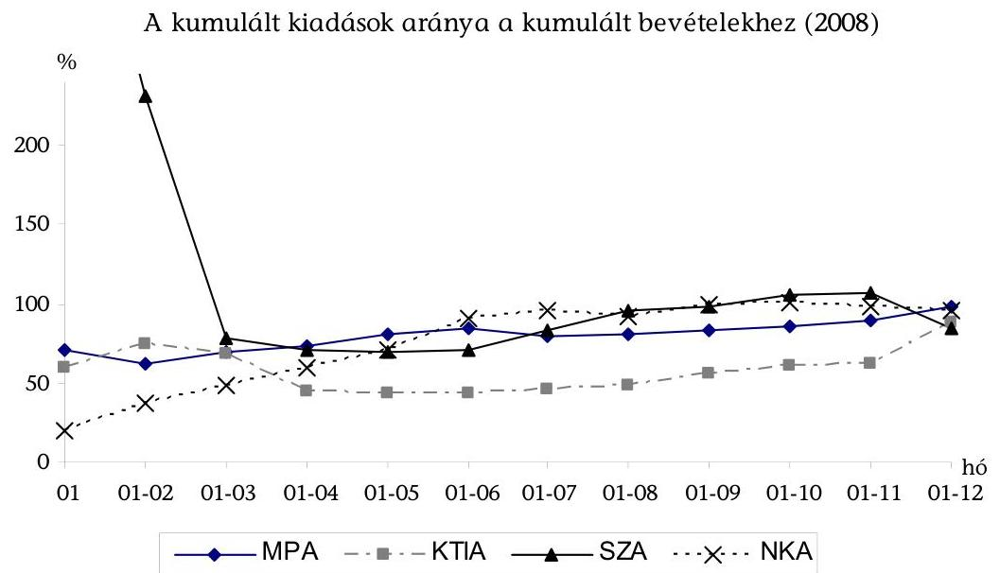

Az Alapok 2006-2007. évi bevételei és kiadásai kumulált adatait is figyelembe véve (lásd még a 6/b-c., 6/h-i. és a 6/n-o. számú mellékletet), az MPA és az NKA a realizált bevételeit folyamatosan 70-90\%-os mértékben, és az év végére egyre magasabb arányban használta fel. A decemberi kiadásnak az éves kiadáson belüli súlya meghaladta az előző hónapokét az MPA-nál és a KTIA-nál. Az éves bevételt egyik alapnál sem érte el az éves kiadás.

A kiadások a bevételek 70-90\%-a között alakultak már márciustól az MPA-nál, és májustól az NKA-nál (2007-től), és az NKA-nál évről-évre emelkedő arányban költötték el a bevételeket. November végéig a tárgyévi bevételek 85-90\%-át/MPA, 54-63\%-át/KTIA, 49-108\%-át/SZA és 74-98\%-át/NKA használták fel.

Az MPA kiadásainak nagyobb részét - a költségvetési befizetést, a passzív ellátásokat - az Alap kötelezően, folyamatosan teljesítette. Az Alappal rendelkezők döntésein alapuló, a bevételek mintegy 30\%-át felhasználó aktív eszközöknél a

[^0]
[^0]:    ${ }^{78}$ A tervezési gyakorlatot az ÁSZ a Vélemény a Magyar Köztársaság 2009. évi költségvetési javaslatáról c. jelentésében (0836) kifogásolta. A jelen ellenőrzés egyeztetési folyamatában a Kezelő tájékoztatása szerint „a 2010. évi költségvetés tervezésekor a számvevőszéki javaslatot figyelembe vesszük".

---

kifizetés azonban június végéig nem érte el az éves kiadás 30\%-át (lásd a 6/d. mellékletet).

2008-ban a foglalkoztatási és képzési támogatások 60 302,5 M Ft-os éves kiadásának $54 \%$-át fizették ki szeptember végéig, és $29 \%$-át decemberben, 2007-ben a megfelelő arányok $57 \%$ és $22 \%$ volt. A 33383 M Ft szakképzési és felnőttképzési célú kifizetések mintegy $41 \%$-a teljesült szeptember végéig 2008-ban és a decemberi kifizetés aránya $32 \%$ volt. Az arány 2007-ben $38 \%$, illetve $45 \%$ volt.

Az NKA a felhasználható keretek meghatározásánál az óvatosság elvét érvényesítette. A Bizottság meghatározta a keretek felhasználható részét, a korlátozást a bevételek tényleges alakulásától függően oldották fel.

A Bizottság a 17/2008. (II. 18.) számú határozatában egyhangúlag úgy döntött, hogy augusztus 31-ig a kollégiumok az éves szabad keret legfeljebb 80\%-ára vállalhatnak kötelezettséget. A Bizottság a korlátozást júniusban szüntette meg.

A bevételek és a többletbevételek felhasználására az alappal rendelkezők elő-irányzat-módosítást hajtottak végre, és éltek a jogcímek közötti átcsoportosítás lehetőségével.

Az MPA járulékokból és hozzájárulásból származó többletbevételei (2007-ben 16859 M Ft és 2008-ban 4420 M Ft ) az utolsó negyedévben keletkeztek. 2007-ben 5820,0 M Ft-ot, 2008-ban 4420 M Ft-ot az SZMM fejezetnek közmunkára átadott támogatás növelésére fordították. Az NKA több lépésben hajtott végre előirányzat módosítást az egyes támogatási jogcímek között. Az SZA a nem tervezett bevételek (MPA, MeH fejezeti kezelésű előirányzatból átcsoportosítás) jóváírása miatt módosította az előirányzatait.

Az egyenlegtartási követelmény a bevételeiket folyamatosan felhasználó alapok esetében hozzájárult a pénzmaradvány emelkedéséhez. A KTIA tartaléka 2008-ban is emelkedett. A 2008. évi költségvetési törvény a tartalékból 10 Mrd Ft felhasználását hagyta jóvá.

Az alrendszer 2008. év végi költségvetési tartalékának megoszlása (Mrd Ft)
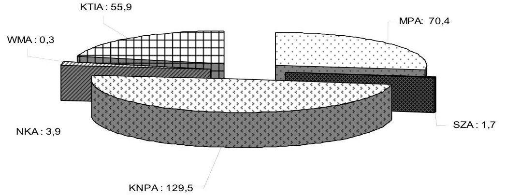

---

A céljuk szerint hosszabb távú programokat, feladatokat is finanszírozó alapok (MPA, KTIA, NKA) eltérő mértékben vállaltak hosszabb távú kötelezettséget. Az NKA ilyen felhasználása minimális. Az MPA-nál a kötelezettség mértékének törvényi korlátját (alaprész módosított kiadási előirányzatának 40\%-a) megközelítő kötelezettségállományt mutattak ki a Foglalkoztatási Alaprész terhére 2006-2007-ben, és nem használták ki a törvényi lehetőséget a Képzési Alaprésznél. A technológiai innováció támogatásánál viszont 2006-ban és 2007-ben is meghaladta a tárgyévi kifizetést a tárgyévet követő időszakra vállalt finanszírozás záró állománya. (Az MPA, valamint a NKA és KTIA terhére vállalt kötelezettségek állományát a 3/j. és 3/k. számú melléklet mutatja be.)

Az MPA Foglalkoztatási Alaprésze terhére vállalt áthúzódó kötelezettségek az alaprész kiadásának 27\%-a 2006-ban és 35\%-a 2007-ben. A munkaügyi központok vállalták a kötelezettség $85 \%$-át, illetve $80 \%$-át az adott években. A Képzési Alaprész kiadásának 2006-ban 16\%-a, 2007-ben 10\%-a az éven túli kötelezettségek év végi állománya. A KTIA év végi kötelezettségállománya a tárgyévi kiadás $114 \%$-a, illetve $110 \%$-a volt.

# Az alapok központi költségvetésből származó forrásai meghaladták 

az ágazati törvények szerinti mértéket. Az SZA bevételének csökkenő része a Szatv. szerinti költségvetési támogatás (2006-ban 100\%-a, 2008-ban 34\%-a), a bevétel egyre nagyobb része a fejezetektől átvett forrás. A gyakorlatban a központi költségvetés finanszírozza a WMA múködési kiadásait és a kártalanításokat is, és az ágazati törvénytől eltérően hozzájárult az NKA működéséhez. Az NKA a fejezetektől átvett források révén is kapcsolódik a központi költségvetéshez.

### 2.2. A szakmai célok megvalósulása

### 2.2.1. A döntések szakmai megalapozottsága, az alapok múködésének nyilvánossága

Az alapok létrehozása, az állami feladat kiemelése, a célzott adójellegű befizetések indokoltságának fokmérője a kitűzött célok megvalósulása. A célok teljesülésének a megalapozott rövid- és hosszú távú szakmai és pénzügyi tervezés, a célok eléréséhez szükséges prioritások, eszközök, módszerek kialakításában a testületek érdemi részvétele, a megvalósuló támogatások eredményének vagy eredménytelenségének folyamatos értékelése egyaránt feltétele. Így például a tartalék képződését a bevétel kockázata, a hosszabb távú programok finanszírozásához a fedezet biztosítása, valamint a felhasználás tilalma (egyenlegtartási követelmény) egyaránt befolyásolta. A tartalék nagyságának, felhasználásának alakulásából közvetlenül nem vonható le következtetés a múködés tudatosságára.

2006 és 2008 között a tartalék alakulásáról megállapítható, hogy növekedésének az MPA-nál mintegy kétötöde, a KTIA-nál közel fele a kiadások tervezettől alacsonyabb teljesítéséből származott, míg a többletbevétel egy részét elköltötte az NKA és az SZA. A kiadási előirányzatok alulteljesítése mögötti szakmai okok feltárása nem volt a vizsgálat tárgya.

Az ellenőrzött időszakban az alapok felett rendelkező miniszterek intézkedései a szabályozási korlátokon belül - biztosították az alapok múködtetését, a szer-

---

vezetek (alapkezelő) és testületek működését, az alapok pénzeszközeinek felhasználását. A döntéshozó testületek és az alapkezelő közötti együttműködés szabályozott munkamegosztáson alapult. A testületi/felhasználásra vonatkozó döntések előkészítéséről a kezelő vagy szervezeti egysége (SZMM, OAH, NKTH) gondoskodott, a döntéseket - általában - a miniszter hagyta jóvá. A KTIA-nál 2007 kivételével - a jóváhagyó az NKTH elnöke volt.

A WMA-nál testület nem múködik. Az Alap cél szerinti felhasználása - a tartalék kivételével - a kártalanítási igények jogszerüségének vizsgálatával és teljesítésével valósult meg. A szükséges eljárásokat az alapkezelő kialakította, a kártalanítási igények elbírálásáról és teljesítéséről gondoskodott, az Alappal szerződött személyek az árvíz miatti károkra járó kártalanítást megkapták.

A többi alaptól eltér a KNPA döntési, beszámolási rendszere. Kiadásait az Atv-ben meghatározott (szakmai) feladatokra fordították. Az Alap finanszírozásával kizárólagosan látták el a radioaktív hulladékok és kiégett kazetták tárolásának, a tárolók építésének és múködtetésének, a létesítmények leszerelésének kutatási, beruházási feladatait. A terveket véleményező KNPA Szakbizottság közvetítette az atomenergia alkalmazásának más tárcát érintő követelményeit. A felhasználást szakmai szempontból a feladatok közép- és hosszú távú programjára alapozták.

A feladatokat a Kormány által kijelölt szerv (Atv. 40. §), az RHK Nonprofit Kft. végzi. Az OAH a teljesítést az RHK Kft. finanszírozásán keresztül, a teljesítésről szóló számlák és beszámolók kötelező bemutatása alapján ellenőrizte. Az Atv. rendelkezése alapján az OAH évente beszámol az Országgyúlésnek ${ }^{79}$. A Kormány a 2007. évi jelentést 2008. novemberében előterjesztette, amit az Országgyűlés 2009. április 27 -én elfogadott ${ }^{80}$.

A KNPA-ból támogatásra fordított összeg a kiadások 6-7\%-a. Egyedi szerződések alapján kapnak támogatást az atomerőmű és a tárolók környezetében lévő önkormányzatok ellenőrzési és információs célú társulásai, a támogatások céljai megfeleltek az Atv. előírásainak.

Az OAH háromoldalú - az OAH, az RHK Kft. és a társulások között megkötött szerződések alapján támogatja az önkormányzati társulásokat, ellenőrzi a támogatások felhasználását, a nukleáris és radioaktív anyagokkal folytatott tevékenység lakossági elfogadtatása érdekében. A támogatások összegét az alapkezelő a még az Alap múködését megelőző időszakban - kialakult gyakorlat szerint határozza meg.

Az SZA, az NKA és a KTIA pénzeszközeiket döntően pályázati úton használják fel ${ }^{81}$.

[^0]
[^0]:    ${ }^{79}$ 39/2008. (IV. 17.) OGY határozat az atomenergia 2005. és 2006. évi hazai alkalmazásának biztonságáról szóló jelentés elfogadásáról.
    ${ }^{80}$ 33/2009. (IV. 30.) OGY határozat az atomenergia 2007. évi hazai alkalmazásának biztonságáról szóló jelentés elfogadásáról.
    ${ }^{81}$ A WMA esetén a támogatásnak sem az egyedi, sem a pályázati formája nem értelmezhető.

---

Az SZA és az NKA támogatásai megfeleltek az ágazati törvényben előírt céloknak. A Kollégiumok döntéseiket a REF, illetve NKA Bizottság által meghatározott kiemelt célokra, érvényesíthető prioritásokra, a források kollégiumok közötti elosztásának arányaira, a pályázatok értékelésének elveire tekintettel hozták meg.

Az SZA-nál a REF által meghatározott elveket a kollégiumok a gyakorlatban következetesen betartották, azok érvényesültek a támogatások felhasználásakor. Az NKA Bizottság a döntéseit az NKA pályáztatási folyamatainak zavartalan lebonyolítása érdekében időben meghozta, az előirányzatok módosítása a felhasználáshoz szükséges időben megtörtént.

Az SZA-ból támogatásban részesülők körére (többségében határon kívüli szervezetek) tekintettel, kizárólagosan alkalmazott támogatási forma a vissza nem térítendő támogatás volt, amit többnyire előfinanszírozással, egy összegben utaltak át. Az NKA támogatások feltételeit, a felhasználási jogcímeket, a finanszírozás ütemezését, az esetlegesen elvárt önrész mértékét - a támogatott feladathoz igazodóan - a kollégiumok a pályázati kiírásokban határozták meg. Mindkét Alapnál a pályázatok ütemezésénél figyelembe vették a bevételek alakulását és az év során - az SZA-nál 2007-ben és 2008-ban - kétszer, tavasszal és ősszel írtak ki pályázatokat.

A KTIA-ból is, támogatást elsősorban nyílt pályázati rendszerben nyújtanak. A kiemelt programokra beérkezett pályázatokat - formai ellenőrzés után - három lépcsős eljárással értékelik ${ }^{82}$. A bíráltatási folyamat során minden egyes pályaművet 6-10 szakember értékel. Az Alap felhasználásának a Ktiatv. 9. §-ában előírt, az NKTH középtávú stratégiájában is kiemelt célja az Alap forrásaiból a vállalkozások részesedésének növelése. ${ }^{83}$ A cél a pályázat útján elosztott források esetében teljesült.

A pályázat alapján elosztott forrásokból a 2006., 2007. és 2008. évben az össztámogatás $51 \%$-át, $55 \%$-át, illetve $65 \%$-át folyósították vállalkozásnak. Az egyedi döntések esetén az arány rendre $18 \%, 7 \%$, illetve $10 \%$ volt.

A KTIA-nál a támogatások szakmai szempontjait az NKTH által összeállított pályázati stratégia és felhasználási terv rögzíti. Elfogadásuknál egyetértési jogot gyakorol a KTIT. A testületi döntések megalapozottságát a külső, független akár nemzetközi - szakértők bevonása, a többkörös döntési mechanizmus hivatott biztosítani. Ennek ellenére ÁSZ jelentések kifogásolták a bírálók tevékenységének ellentmondásosságát, döntéseik megalapozatlanságát és a dokumentáltság hiányosságát ${ }^{84}$. (Jelen ellenőrzés a testületi döntések megalapozottságát konkrét példákon keresztül nem vizsgálta.)

Az MPA-val rendelkezők (a megosztott rendelkezési jog alanyai) a Foglalkoztatási, a Rehabilitációs és a Képzési Alaprész (FA, RA és KA) felhasználásáról dön-

[^0]
[^0]:    ${ }^{82}$ Tájékoztatás az NKTH pályázat bíráltatási folyamatairól, 2008. április 30.
    ${ }^{83}$ Nemzeti Kutatási és Technológiai Hivatal Intézményi Stratégia, 2007-2010, 4.1. pont.
    ${ }^{84}$ A Magyar Köztársaság 2004., 2005. és 2006. évi költségvetései végrehajtásának ellenőrzéseiről szóló jelentések (0540, 0628, 0824), valamint Jelentés a Kutatási és Technológiai Innovációs Alap ellenőrzéséről (0809).

---

tenek. A pályázati kifizetések aránya az egyes alaprészeknél eltérő. A különböző alaprészekből finanszírozott pályázatok döntéshozatala, bonyolításának eljárásrendje, ellenőrzési rendszere eltérő.

A foglalkoztatási alaprészből teljesített pályázati kifizetések aránya 11\% és 12\%, a képzési alaprészből $44 \%$ és $38 \%$ volt 2006-ban, illetve 2007-ben.

A MAT a foglalkoztatási és a rehabilitációs alaprész központi és decentralizált keretének arányáról, a decentralizált keret régiók közötti elosztásáról és a központi keretek különböző felhasználási célok közötti felosztásáról dönt ${ }^{85}$. A MAT döntéseit általában ${ }^{86}$ a témáért felelős SZMM főosztályok készítik elő, az előterjesztések szakmai és pénzügyi ellenjegyzéssel kerülnek a testület elé. A MAT döntéseit megalapozó, részletes előterjesztések mellett, jellemzően hiányos volt a - Foglalkoztatási Alaprész központi kerete egyre nagyobb hányadát, 2008-ban 61,5\%-át kitevő - Országos Foglalkozási Közalapítvány (a továbbiakban: OFA) programokra határidő-módosítást kezdeményező anyagok indokolása, és hiányzott a 2007. év végi előterjesztés - az OFA éves 4,5 Mrd Ft támogatásából 3,5 Mrd Ft - megalapozása ${ }^{87}$. A programok finanszírozásának, módosításának, beszámoltatásának és lezárásának az Alap számára kedvezőtlen gyakorlatán 2007-től változtatott a MAT.

A 2007. évi utolsó, rendkívüli MAT ülésen a testület a beterjesztett OFA programokat azzal a feltétellel támogatta, hogy a részletes előterjesztést a soron következő, 2008. év januári ülésre benyújtják. Az OFA programjait a MAT több ütemben 2008 júniusáig fogadta el. Egy program ${ }^{88}$ esetében a MAT, a téma többszöri megvitatását követően 2008. júniusban is csak a kért támogatási összeg felét ( 300 M Ft -ot) találta indokoltnak. Az OFA a több éves programokra előre megkapta a teljes összeget. A MAT rendszerint érdemi értékelés nélkül engedélyezte az OFA programok meghosszabbítását.

Az NSZFT véleményezési jogkörrel rendelkezik az MPA Képzési Alaprésze felhasználásában.

A megosztott rendelkezési jog alapján az oktatásért felelős miniszter dönt a hatáskörébe tartozó ${ }^{89}$ alaprész meghatározott részének elosztásáról, felhasználásáról, a támogatások odaítéléséről, felelős a pénzeszközök felhasználásának jogszerűségéért, ellenőrzéséért. Az MPA képzési alaprészéből az oktatási miniszter rendelkezése szerint 2007-ben 4,9 Mrd Ft-ot, 2008-ban 6,2 Mrd Ft-ot fordítottak a szakképzés fejlesztésére.
${ }^{85}$ Helyszíni vizsgálatunk a 2007-2008. évi MAT ülések dokumentumaira, az ott elfogadott határozatokra terjedt ki.
${ }^{86}$ Kivéve például: OFA programok.
${ }^{87}$ Az SZMM a megállapítást vitatja, mert „az OFA 2008. évi szakmai tervét a minisztérium értékelte és elfogadta", valamint „az érintett szakmai tervek több ütemben történő elfogadása nem azok szakmai megalapozatlanságával, hanem a Munkaerőpiaci Alap Irányító Testülete részéről felmerülő igényeknek a szakmai tervben való megjelenítésével van összefüggésben."
${ }^{88}$ „A foglalkoztatást elősegítő tevékenységekhez kapcsolódó kommunikáció támogatása".
${ }^{89}$ Szht. 11. § (3) bek.

---

A testületi döntések megalapozására az elő́terjesztések benyújtását mind a két minisztériumban a területért felelős államtitkár/szakállamtitkár engedélyezi. A megtekintett 2007. és 2008. évi SZMM előterjesztések általában részletesen kidolgozottak. Az OKM által benyújtott előterjesztések jellemzően tömörek. Az oktatási miniszter 2008-ban olyan döntéseket is hozott, amelyek nem felelnek meg az Szht-ban meghatározott, támogatható céloknak ${ }^{90}$. A decentralizált keretekből finanszírozott pályázatokról a munkaügyi központok a regionális munkaügyi tanácsok véleményének meghallgatásával, illetve a Regionális Fejlesztési és Képzési Bizottságok (a továbbiakban: RFKB) döntöttek.

A Zánkai Gyermek és Ifjúsági Centrum Kht. fenntartásában lévő Egry József Középiskola, Szakiskola és Kollégium épületein, valamint az iskola használatában lévő szabadidős létesítményeken elvégzendő felújítási munkák támogatására készült Előterjesztés (21867-21/2008-SZMM, 360,0 M Ft). A támogatás célja a nevezett iskolában tanuló fiatalok testi, lelki egészségének megőrzése érdekében megfelelő színvonalú sportlétesítmény kialakítása volt. Ugyanezen Kht.-nál Sportcentrum felújításának támogatására is volt előterjesztés (21867-22/2008-SZMM, 200,0 M Ft), mely kifejezetten stadion és sportcsarnok felújítását célozta.

A testületi ülések dokumentálása a MAT-nál kifogásolható. Üléseiről 2006. januártól hangfelvétel készül, jegyzőkönyv, emlékeztető nem. A hanganyagból nem volt minden esetben rekonstruálható a határozatok tárgya és szavazási eredménye. Nem volt megállapítható a MAT tagok véleményének, felvetésének, javaslatának további sorsa sem.

A napirendi pontok sorrendjének változtatása, újabb napirendi pontok beiktatása miatt zavaró, hogy az ülést levezető elnök a szavazás elrendelése előtt nem fogalmazta meg egyértelmúen a szavazásra feltett kérdést. A szavazás tárgyát a hanganyag rögzítésére és a szavazatok számlálására szolgáló szoftver sem tartalmazza.

Az MPA 2007. évi költségvetésének teljesítéséről szóló beszámoló esetében a MAT tagok felvetették a központi programoknál a hatékonysági elemzés hiányát. Az ülésen elhangzott válasz szerint az egyes aktív támogatási eszközöket az Állami Foglalkoztatási Szolgálat (a továbbiakban: ÁFSZ) értékeli, a Testület tagjai további információt nem igényeltek. A MAT tagok szükségesnek látták a munka-erő-piaci tárgyú elemzések, kutatások finanszírozásban a párhuzamosságok kiszűrését, mert vélhetően OFA, MTA, Foglalkoztatási és Szociális Hivatal (a továbbiakban: FSZH) forrásokból hasonló témájú kutatások folynak.

A rendelkező miniszter - az SZA-t kivéve - meghatározott egyedi keretét pályázattal, vagy egyedi kérelmek elfogadásával használja fel. Az ún. miniszteri keret felhasználásának fő céljait szabályozták (rendelettel a KTIA-nál ${ }^{91}$ és az NKA-nál ${ }^{92}$, utasítással az MPA-nál ${ }^{93}$ ). Az egyedi és pályá-

[^0]
[^0]:    ${ }^{90}$ Szht. 8. § (1) bek., 14. § (1) bek.
    ${ }^{91}$ 133/2004. (IV. 29.) Korm. rendelet a Kutatási és Technológiai Innovációs Alap kezeléséről és felhasználásáról, 10. § (3) bek.
    ${ }^{92}$ 9/2006. (V.9.) NKÖM rendelet a Nemzeti Kulturális Alapról szóló 1993. XXIII. törvény végrehajtásáról, 7. § (2)-(4) bek.

---

# zati támogatás tartalmi céljainak összehangolása megvalósul mindegyik érintett alapnál. 

A KTIA sajátos helyzetben van, mert a miniszter rendelkezési joga egy részének törvényi átruházása következtében a kérelmen alapuló támogatások elbírálására - a 2007. évet kivéve - az NKTH elnöke jogosult. A pályázaton kívüli támogatások összege nem haladhatja meg az Alap tárgyévi kiadási előirányzatának 3\%$a^{t 94}$. Az MPA-nál egyes alaprészek központi kerete, illetve elkülönített kerete (képzési) feletti döntés jogosultja a miniszter. A képzési alaprészből nyújtott támogatások jelentős hányadát - 2006-2008 között a központi keret 56-62\%-át - egyedi döntéssel hagyták jóvá.

Kérelem alapján nem csak miniszter, hanem testület is nyújthat támogatást az NKA-nál és az SZA-nál. Az SZA-ból - bár a törvény lehetővé teszi ${ }^{95}$ - egyedi, nem pályázati úton nyújtott támogatást nem állapítottak meg. A korábbi (2006. évi) pályázati stratégia szerint a támogatások 100\%-át nyilvános pályázat keretében bírálták el, a REF a 2007-2008. években ezen az elven nem változtatott.

Az NKA miniszteri kerete a támogatásokra fordítható összeg mintegy egynegyede ${ }^{96}$, amelynek túlnyomó részét egyedi kérelemre ítélték meg vissza nem térítendő juttatásként. A keret tartalmi felhasználási céljai, prioritásai megfeleltek a szabályozásnak, a miniszter és a kollégiumok is az elfogadott stratégia alapján és egymásra tekintettel döntöttek. Pályázaton kívüli támogatásra a kollégiumoknak is volt lehetősége, ennek mértékét az NKA Bizottság a kollégiumok éves kerete 10\%-ában határozta meg.

A miniszteri keret meghatározó részét a zene, a képzőművészet, a közművelődés és a szépirodalom támogatása tette ki. A támogatások nagyságrendjét tekintve a miniszteri keret átlagosan 2-3-szoros támogatási lehetőséget biztosított az egyedi kérelmező részére, mint a pályázatokra jelentkezőknek.

A KTIA-nál a felhasználási terv a kérelmen alapuló támogatások ${ }^{97}$ odaítélésére vonatkozó szempontokat is tartalmazza, így az egyedi támogatások illeszkednek az általános pályázati célokhoz.

Az MPA-nál a miniszterek döntési hatáskörébe tartozó támogatások (FA és RA központi kereteire meghirdetett pályázatok és egyedi döntések, a képzési alaprész pályázatai és egyedi döntések) szakmai előkészítését a miniszter által irá-

[^0]
[^0]:    ${ }^{93}$ 25/2007. (Mü.K. 10.) SZMM utasítás a Munkaerőpiaci Alap képzési alaprészének a szociális és munkaügyi miniszter által felhasználható kerete terhére nyújtott támogatások felhasználásával összefüggő szakmai és pénzügyi feladatok ellátásának rendjéről.
    ${ }^{94}$ Ktiatv. 8. § (3) bek.
    ${ }^{95}$ A Szatv. 10. § (1) bek. alapján, a támogatások legalább 90\%-a nyilvános pályázat keretében nyerhető el.
    ${ }^{96}$ Nkatv. 7/C. §.
    ${ }^{97}$ A Ktiatv. 8. § (3) bekezdése szerint lehetőség van pályázaton kívüli támogatásra az Alap tárgyévi kiadási előirányzatának 3\%-át meg nem haladó mértékben.

---

nyított szakapparátus végezte. Az egyedi támogatási döntések meghozatala elôtt az SZMM-ben és az OKM-ben is véleményezték a javasolt támogatásnak az MPA céljaihoz illeszkedését.

Az Áht. ${ }^{98}$ előírja, hogy az alapot a hasonló, vagy kapcsolódó célú, rendeltetésű fejezeti kezelésű előirányzatokkal is - a Kormány rendelete szerint ${ }^{99}$ - összehangoltan kell felhasználni. A támogatások tárcák közötti összehangolására szabályozással (MPA munkahelyteremtő és -megőrző támogatásai) és eseti megállapodások kötésével intézkedtek a rendelkező miniszterek.

Az MPA összehangolt felhasználásának követelményét ${ }^{100}$ a minisztérium SzMSz-e is tartalmazza. A támogatások összehangolásához szükséges információs rendszer kialakítása és múködtetése, valamint a források felhasználásának koordinálása az Alapkezelési Főosztály feladata. A valamennyi támogatást tartalmazó rendszer kialakítása 2009 elején folyamatban volt.

Az ún. Szerződés nyilvántartási rendszer kialakítása 2005 közepén kezdődött el. A rendszer az MPA-ból nyújtott foglalkoztatási és képzési támogatásokra, valamint a HEFOP keretében, az MPA-ból társfinanszírozott támogatásokra terjed ki. 2006ban megkezdődött az Integrált Pénzügyi Információs Rendszer (IPIR) kidolgozása, így a szerződés nyilvántartási rendszer továbbfejlesztése célszerütlenné vált.

Az SZMM gondoskodott a munkahelyteremtő, munkahelymegőrző támogatások más állami forrásokkal összehangolt megállapításáról. A pályázatok tervezeteit egyeztetik az ágazaton belüli, illetve más tárcák illetékes szerveivel.

A KTIA forrásainak más alappal és a hasonló célú és rendeltetésű fejezeti kezelésű előirányzatokkal is összehangolt felhasználásáról az NKTH-nak kellett gondoskodnia ${ }^{101}$. Az ÁSZ tapasztalata ${ }^{102}$ szerint ugyanakkor az Alapból nyújtott támogatások közötti átfedéseket nem tudták kiszűrni.

Az ÁSZ idézett jelentése szerint „a támogatások közötti átfedések kiszürésének rendszerét sem manuálisan, sem informatikailag nem alakították ki, így nem volt kizárható, hogy ugyanazok a feladatok több projekt keretében is támogatásra kerüljenek, illetve saját forrásként kölcsönösen megjelenjenek".

A források SZA-n belül és kívüli egyéb forrásokkal összehangolt felhasználását tárcaközi szerv segítette elő.

[^0]
[^0]:    ${ }^{98}$ Áht. 54. § (4) bek.
    ${ }^{99}$ Ámr. 79. §.
    ${ }^{100}$ Az Ámr. 79. §-a és melléklete rendelkezik a munkahelyteremtés és munkahelymegőrzés összehangolt támogatásáról.
    ${ }^{101}$ 277/2006. (XII. 23.) Korm. rendelet a Nemzeti Kutatási és Technológiai Hivatalról, 6. § (2) bek. f) pont.
    ${ }^{102}$ Jelentés a Kutatási és Technológiai Innovációs Alap múködésének ellenőrzéséről (0809, 17. oldal).

---

A Koordinációs Tárcaközi Bizottság ${ }^{103}$ minden érintett kormányzati szereplő részvételével évenként egyezteti a külhoni magyarság támogatására szolgáló költségvetési források felhasználását. Az SZA döntést hozó kollégiumaiban tagsággal rendelkeznek a külhoni magyar ügyekért felelős más minisztériumok képviselői is, így a szaktárcák figyelemmel kísérhetik és befolyásolhatják az SZA forráselosztását.

Az SZA-nál létrehozott nyilvántartási rendszerrel biztosították az informatikai feltételeit a határon túli magyarok támogatásai összehangolásának, e célra azonban a rendszer adatok hiányában nem volt alkalmas. Az Alapon belül a támogatások kollégiumok, illetve különböző programok közötti összehangolásához a nyilvántartás felhasználható.

A jogszabályok szerint az Alap számára kötelező a pályázati, támogatási adatok naprakész vezetése ${ }^{104}$. A támogatások központi nyilvántartása elősegíti a támogatások koordinálását, a halmozott támogatási igények azonosítását és azok megakadályozását, segítik a támogatásról döntő szervezetek szakmai együttmúködését. A támogatott szervezetek egy pályázati fordulóban több kollégiumnál, egyazon kollégium esetében különböző programokra és különböző pályázati fordulókban is pályázhatnak, viszont pályázati célonként csak egy pályázat nyújtható be.

Az SZA és az NKA döntéshozatali rendszerében más fejezetektől átcsoportosított forrásokról is határoztak. A források átcsoportosításáról az SZA esetén a MeHVM szakállamtitkára, az NKA esetén miniszterek közötti megállapodások rendelkeztek.

Az NKA-n keresztül 2006-ban a KvVM és NKÖM közötti megállapodás alapján támogatták a környezet- és természetvédelmi folyóiratok megjelentetését és egyéb közös programokat. 2007-ben az OKM, a KvVM, az ÖTM, valamint az IRM között volt együttmúködés, az átvett pénzeszközöket az Alap saját forrásaiból is kiegészítette. 2008-ban az ÖTM-mel, illetve az IRM-mel kötött megállapodás egészítette ki az Alap forrásait és az átvett pénzeszközöket a megállapodásokban meghatározott célra fordították.

Az SZA forrásai és a MeH fejezeti kezelésű előirányzatok felhasználásának összehangolásáról ${ }^{105}$ a MeH kisebbség- és nemzetpolitikáért felelős szakállamtitkára gondoskodik. Az NKA Igazgatóság kezdeményezésére a minisztérium fejezeti kezelésű előirányzataiból és az NKA-ból nyújtott, azonos célt szolgáló támogatásokat összehangolják (például 2006-ban az Egyházi Kulturális Alap előirányzat esetében), a pályázók listáját, a támogatások tárgyának és összegének feltűntetésével megküldik egymásnak a párhuzamos támogatások elkerülése érdekében.

[^0]
[^0]:    ${ }^{103}$ 2125/2002. (IV. 26.) Korm. határozat a Támogatáspolitikai Koordinációs Tárcaközi Bizottság létrehozásáról; 2291/2005. (XII. 23.) Korm. hat a Határon Túli Magyarság Támogatáspolitikai Koordinációs Tárcaközi Bizottságáról.
    ${ }^{104}$ Szatv. 10. § (4) bekezdése és a 233/2005. (X.19.) Korm. rendelet a szomszédos államokban élő magyaroknak nyújtott támogatások központi nyilvántartásáról, ez utóbbi 2. § (2) bekezdése rendelkezik a Központi Támogatások Nyilvántartási Rendszeréről (KTNYR).
    ${ }^{105}$ 1/2008. (MK 57.) ME utasítás a Miniszterelnöki Hivatal Szervezeti és Működési Szabályzatáról, hatályos 2008. IV. 5-től, 19. §.

---

Az alapok múködése nyilvánosságának biztosítása, a finanszírozás alapját képező célzott adójellegú befizetésekre tekintettel is, különös jelentőséggel bír. A jogi szabályozásban általánosan megkövetelt nyilvánosságon túl elvárható az alapok múködésére (testületi, egyedi döntések indokai, változtatások okai, a támogatásokkal elért vagy meghiúsult célok értékelése, az esetleges visszaélések és a hasonlók megakadályozására tett lépések bemutatása stb.) vonatkozó közérthető információk közzététele a befizetők „érdekeltségének" biztosítása, valamint az alapok léte indokoltságának alátámasztása érdekében. A nyilvánosság biztosításáról, annak tartalmáról az ágazati törvények is eltérően rendelkeznek. (Például az Nkatv. és az Szatv. megköveteli az éves beszámolók nyilvánosságra hozatalát, míg az Flt. nem.) Az SZA 2007. évi beszámolóját a honlap nem tartalmazta (Szülőföld Alap Iroda az ellenőrzés ideje alatt intézkedett ennek pótlásáról).

Az Áht. 56. §-a szerint „a gazdasággal összefüggő alap esetében a zárszámadásról szóló törvényjavaslat tárgyalása során az Országgyülést tájékoztatni kell az érintett gazdasági kamaráknak az alap indokoltságára és további müködésére vonatkozó véleményéről". Az előírt tájékoztatás a vizsgált időszakban nem történt meg. A hivatkozott paragrafus 1996. január 1-jéig még az alapok múködésének négyévenkénti felülvizsgálatáról és ezzel összefüggésben a további múködtetésről való döntésről rendelkezett. A módosítás indoklása szerint „az alapok müködésének felülvizsgálatát a javaslat az eddigi négyéves periódus helyett az éves zárszámadáshoz köti". A módosított törvény azonban nem tartalmazza az alapok múködésének indokoltságára vonatkozó felülvizsgálati kötelezettséget.

Az alapok bevételi és kiadási jogcímeinek aktuális és múltbeli költségvetési és teljesítési adatai, valamint a pénzforgalom alakulása a Kincstár és a PM honlapján több évre visszamenőleg megtalálható. Az alapok fontosabb adatai az alapkezelők honlapján találhatók, önálló honlapja az NKA-nak és SZA-nak van.

Az SZMM honlapján az MPA éves beszámolói megtalálhatók. Az Államkincstár honlapján elérhetővé tették a WMA múködésének eljárási rendjét, az Alap éves költségvetési beszámolóit, valamint biztosították a belépéshez szükséges nyomtatványok letöltésének lehetőségét. Az OAH honlapján megtekinthetők a KNPA-ból az önkormányzati társulásoknak 2004-2008. években nyújtott támogatások adatai, a honlap nem tartalmazza a költségvetések és a beszámolók dokumentumait. Az alapkezelő honlapja részletesen tartalmazza a KTIA pályázati felhívásokat, a támogatott projekteket (a pályázó nevével, a pályázat címével és a támogatási összeggel), a pályázaton kívüli támogatások igénylésének módját és előző évi nyerteseit (2009 februárjában 2007-es az utolsó elérhető adat). A helyszíni vizsgálat idején a Hivatal honlapja nem tartalmazta a 2007. évi beszámolót ${ }^{106}$.

Az NKA Bizottság az Alap múködéséről évente legalább egy alkalommal, a pályázati év lezárását követően írásban beszámol a miniszternek. A kollégiumok

[^0]
[^0]:    ${ }^{106}$ A helyszíni vizsgálat idején a Kormány még nem tárgyalta meg az Alap felhasználásáról készült 2007. évi beszámolót.

---

a Bizottság részére készítenek beszámolót ${ }^{107}$ a kollégium pénzügyi keretének felhasználásáról és a célkitűzések megvalósításáról. A vizsgált időszakban a beszámolási kötelezettségnek a testületek eleget tettek, a beszámolókat a Bizottság határozattal fogadta el. Az NKA honlapján a támogatott pályázatok és a döntések folyamatosan megtekinthetők. A honlapon, illetve az egységes „közadatkeresőben" ${ }^{108}$ a jogszabályokban meghatározott, kötelezően közzéteendő információkat megjelentette.

Az alapokra vonatkozó összeférhetetlenség általános törvényi szabályozása azonos, az ágazati törvények, egyéb jogszabályok rendelkezései közel azonosak, a belső szabályozás részletezettsége eltérő. Az összeférhetetlenség gyakorlatának részletes feltárása meghaladta jelen ellenőrzés kereteit.

A KNPA-nál és a WMA-nál az Alapokra vonatkozó összeférhetetlenségi szabályok alkalmazása nem értelmezhető (nincs pályázat és arról döntő testület).

Az NKA összeférhetetlenséget szabályozó rendszere példaértékú. A szabályozás részletezi a Bizottság elnöke és tagjai, a kollégiumok vezetői és tagjai, valamint a pályázók közötti összeférhetetlenség eseteit, azok következményeit. A szabályokat a végrehajtási rendelet és az Úgyrend részletezi. A Mozgókép Kollégium esetén a mozgóképről szóló 2004. évi II. törvény is rendelkezik. Az összeférhetetlenségi szabályok a gyakorlatban érvényesültek. Az összeférhetetlenséggel kapcsolatban vitára okot adó tény a vizsgált időszakban nem merült fel.

A testületi üléseken a szabályokra a figyelmet felhívták, a döntéseket megelőzően a felmerült összeférhetetlenségi okról a döntésben részt vevők nyilatkoztak, annak tényét a jegyzőkönyvben rögzítették. A szabályozás szerint a kollégium a döntéshozatali eljárást felterjeszti a Bizottság elé, ha - összeférhetetlenségi okból - a kollégiumi ülés az adott döntés esetén határozatképtelenné válik. Például a 19/2008. (II. 18.) számú határozatában a Bizottság döntött a hozzá az Épitőművészeti szakmai kollégium által eljuttatott három program esetében, amikor a kollégium az összeférhetetlenségi szabályok miatt határozatképtelenné vált.

Az összeférhetetlenség szabályozása további követelményeket fogalmaz meg a közpénzekből nyújtott támogatások átláthatóságáról szóló törvény (az egyedi és pályázati támogatások rendszerében), valamint ezeket pontosítja a törvény végrehajtására kiadott kormányrendelet ${ }^{109}$. A vonatkozó rendelkezést a NKA-ból nyújtott támogatások tekintetében a 2008. december 31-ét követően kiírt pályázatokra kell alkalmazni. A gyakorlatban a szabályozásnak eleget tettek, a 2009. évi pályázatokat már ennek megfelelően írták ki és tették közzé a honlapon.

[^0]
[^0]:    ${ }^{107}$ A 9/2006. (V. 9.) NKÖM rendelet a Nemzeti Kulturális Alapról szóló 1993. évi XXIII. törvény végrehajtásáról, a rendelet 13. § g) pontja.
    ${ }^{108}$ A 2008. évi XXV. törvény az elektronikus információ szabadságról szóló 2005. évi XC törvénymódosításáról alapján.
    ${ }^{109}$ 67/2008. (III. 29.) Korm. rendelet a közpénzekből nyújtott támogatások átláthatóságáról szóló 2007. évi CLXXXI. törvény végrehajtásáról.

---

A KTIA és az SZA összeférhetetlenséget biztosító szabályozása megfelelő, a gyakorlat problémákat mutatott ${ }^{110}$. A KTIA-nál az összeférhetetlenség a Tanács, a külső szakértők és a szakmai irányító testületek esetében is szabályozott ${ }^{111}$. A szakértők összeférhetetlenségi nyilatkozat tételére kötelezettek minden egyes pályamú vonatkozásában.

Az SZA kollégiumok tagjai tekintetében a 2007. január 1-jétől hatályos jogszabály módosítások összeférhetetlenségi szabályokat ${ }^{112}$ vezettek be. A tagok összeférhetetlenségével kapcsolatos szabályoknak érvényt szereztek.

A kollégiumok tagjaitól kinevezésüket megelőzően írásos nyilatkozatot kértek, hogy az összeférhetetlenség esete nem áll fenn. A kollégiumi üléseken az összeférhetetlenségi szabályokra a figyelmet felhívják, a kollégiumi jegyzőkönyvek alapján megállapítható volt, hogy 2007. évben a döntések alkalmával az összeférhetetlenségi szabályokra hivatkozással, tartózkodás nem volt.

A határon túli szervezeteknek a kollégiumok munkájában nem tagként, hanem állandó meghívottként résztvevő képviselőit a szakállamtitkár kérte fel. A kollégiumok munkájában a határon túli szervezetek képviseletében résztvevő állandó meghívottak tanácskozási joga nem volt megfelelően rendezett a kollégiumok ügyrendjeiben ${ }^{113}$.

Az egyes kollégiumokban a benyújtott pályázatokkal kapcsolatos döntési javaslatot a REF-ben résztvevő határon túli szervezetek képviseletében eljáró kollégiumi tag, vagy állandó meghívott tette, és ez felvetette az állandó meghívottak öszszeférhetetlenségi nyilatkozattételének kérdését (ők nem tettek összeférhetetlenségi nyilatkozatot).

Az Alap felügyeletét ellátó miniszter 2008. november 1. napjával hagyta jóvá a kollégiumok ügyrendjének módosítását, amely a kollégiumi tagok helyzetéhez hasonlóan szabályozza az állandó meghívottak státuszát.

# A MAT tagjainak összeférhetetlenségét a megbízás időpontjában vizsgálják, azután nem. 

Tájékoztatás szerint a MAT munkaadói, illetve munkavállalói oldalának delegálásra jogosult szervezetei a tagok jelölésekor vizsgálják az összeférhetetlenséget, és e szervezetek csak olyan személy delegálására tehetnek javaslatot, aki megfelel a jogszabályban leírtaknak. Az SZMM a tagok delegálására felkérő levelében hivatkozik az Flt. vonatkozó szabályozására.

[^0]
[^0]:    ${ }^{110}$ A Magyar Köztársaság 2004., 2005. és 2006. évi költségvetései végrehajtásának ellenőrzéseiről szóló jelentések (0540, 0628, 0824), valamint Jelentés a Kutatási és Technológiai Innovációs Alap ellenőrzéséről (0809).
    ${ }^{111}$ 133/2004. (IV. 29.) Korm. rendelet a Kutatási és Technológiai Innovációs Alap kezeléséről és felhasználásáról, 14. § (7) bek.
    ${ }^{112}$ A Szülőföld Alapról szóló 2005. évi II. törvény 6., és 8. §-ai, beiktatta a Szülőföld Alapról szóló 2005. évi II. törvény módosításáról szóló 2006. évi CXXXIV. törvény 3., 910. §-a.
    ${ }^{113}$ A Szülőföld Alapról szóló 2005. évi törvény végrehajtásáról szóló 355/2006. (XII. 27.) Korm. rendelet 9. § (5) bek.

---

A módszer ellentmond az Flt. szabályozásának ${ }^{114}$, hiszen a tag összeférhetetlensége MAT tagsága idejének tartama alatt bármikor keletkezhet. A MAT Ügyrendje csak arról az esetről rendelkezik, amikor adott vitában, szavazásban, napirendnél áll fenn az összeférhetetlenség, amiről a tag köteles tájékoztatást adni. Tekintve, hogy a MAT és a munkaügyi tanácsok működéséhez, a társadalmi párbeszéd intézményeinek múködéséhez és fejlesztéséhez az MPA pénzeszközeivel hozzájárulnak, az összeférhetetlenség folyamatos vizsgálata szükséges. A MAT ügyrendje nem veszi figyelembe a közpénzekből nyújtott támogatások átláthatóságáról szóló törvény rendelkezéseit. A hivatkozott törvény szabályainak alkalmazása ugyanakkor az ügyrendbe való beemelés nélkül is kötelező a testületre.

Az NSZFT tagjainak kiválasztása 2008. évben az Szht. 12. § (4) bekezdésben meghatározottak szerint történt. A közpénzekből nyújtott támogatások átláthatóságáról szóló törvény 2008. április 1-i hatályba lépését követően, az NSZFT 2008. április 24-ei ülésén a SZMM tájékoztatta a tagokat az új törvényről, majd felhívta a tagok figyelmét a jogszabályra.

Egy NSZFT tag, a közpénzekből nyújtott támogatások átláthatóságáról szóló 2007. évi CLXXXI. törvény hatályba lépésének következtében keletkezett összeférhetetlenségének megszüntetése érdekében, lemondott a Tanácsban betöltött tagságáról a Magyar Népfőiskolai Társaság „Művelődés hete - tanulás ünnepe" című tematikus programsorozat támogathatósága érdekében.

# 2.2.2. A múködési költségek 

Az alapok múködtetésének költségeihez az alapkezelő és az alap múködtetésében közvetlenül közreműködő szervezetek működésére, a felhasználást véleményező, arról döntést hozó testületek fenntartására fordított, valamint a felhasználáshoz szorosan kapcsolódó, további költségek tartoznak. Az Áht. 54/A §-a szerint „az alap müködtetésének kiadásait az alap finanszírozhatja". Az alapok a költségvetési vagy az ágazati törvényekben megengedett mértékben viselték a működtetés költségeit (a WMA kivételével). Valamennyi alap költségvetése külön jogcímen - az MPA-nál több jogcímen - tartalmazta a müködésre átadott pénzeszköz előirányzatát. Az alapok múködtetésének szűkebb körű, az alapok kezelése miatti kiadásai önmagukban - az alapkezelő egyéb tevékenységéhez és az alaphoz kötődő kiadásai elkülönítésének hiánya miatt - öt alapnál nem állapíthatók meg, és ezek a kiadások az összkiadáshoz mért arányaikban is csak korlátozottan hasonlíthatók össze. Az SZAI kizárólag az alapot kezeli, így múködési kiadásai csak az Alaphoz köthetők. A testületek múködésére fordított kiadásokat az - MPA kivételével - az alapkezelőknek átadott forrás tartalmazta (a müködési költségeket bemutató összeállításokat lásd a 7/a-b. számú mellékletben).

A múködési kiadások a nyilvántartások vezetésével, a pénzügyi tevékenységgel, szakmai anyagok, elemzések, stratégiák, programok, projektek készítésével, pályázatok megismertetésével és elbírálásával, a szerződések előkészítésével, megkötésével és bonyolításával, az ellenőrzéssel és értékeléssel, az alapkezelő szerve-

[^0]
[^0]:    ${ }^{114}$ Flt. 10/A. § (3) bek.

---

zet múködtetésével (tárgyi és személyi feltételeinek biztosításával), a testületek működésével kapcsolatos költségek stb. fedezetére szolgálnak.

Az alapkezelő múködési kiadásaira átadott pénzeszköz! a költségvetési törvények eltérő megnevezésekkel tartalmazták az egyes alapoknál. A kiadások alapból finanszírozható mértékét csak a KTIA és az SZA esetében határolta be - különböző módokon - az ágazati törvény. A KNPA költségvetése nem tartalmazza külön jogcímen a felhasználást végző szervezet (RHK Kft.) működési kiadását, a kiadás alcímként jelenik meg a (2009. évi) költségvetés fejezeti indokolásában. Az MPA költségvetésében a felhasználásban közreműködő szervezetek finanszírozása is megjelenik külön jogcímeken, ugyanakkor a múködési jogcímek nem tartalmazzák teljes körüen az alap kezelésével, müködtetésével összefüggésben elszámolható kiadásokat. Egyes alaprészek terhére is finanszírozhatók alapkezelési kiadások (lásd a 8. számú mellékletet, például az alaprész pénzeszközei visszakövetelésének, behajtásának költségei, a könyvvizsgálat felosztott díja, a rehabilitációs és képzési alaprész kezelése). Tartalmi különbség még az egyes alapok múködési kiadásai között, hogy azok a KTIA, SZA és NKA esetén tartalmazzák a testületekkel kapcsolatos kiadásokat, az MPA-nál nem. A WMA felhasználását törvény által létrehozott testület nem segíti, a KNPA mellett működő testület finanszírozásához az Alap nem járul hozzá.

A költségvetési törvényekben megjelenik a múködési költség, mint „alapkezelőnek átadott pénzeszköz" (MPA és KTIA), „múködési kiadások" (NKA és WMA), „alapkezelőnek múködési célra" (KNPA), „alapkezelő múködési költségei" (SZA).

A KTIA múködési költsége az Alap tárgyévi eredeti kiadási előirányzatának 2\%-a 2004-től, 3,3\%-a 2005-től és 4,5\%-a 2008-tól. Az Szatv. végrehajtási rendelete szerint az Alapból 2006 végéig az alapkezelés költségeire a tárgyévben teljesített bevétel $5 \%-a, 2007$-től $10 \%$-a fordítható ${ }^{115}$.

Az MPA alapkezelésében, felhasználásában közreműködő szervezetek finanszírozása a múködési alaprész kiadása. Ezen felül az Alap öt további alaprészéhez kapcsolható múködési költség.

A KTIA, SZA és NKA - testületek költségeit is tartalmazó - múködési költségei 2008-ban az alap kiadásainak 5,7\%-a és 10,3\%-a között alakultak. A költségarány a más tevékenységeket is végző, és más bevétellel (költségvetési támogatással) is rendelkező NKTH esetén lényegesen alacsonyabb (4$6 \%$ ), mint a feladatot főtevékenységként, önálló költségvetési szervként ellátó alapkezelőknél (SZAI és NKAI, 8-11\%). Az MPA-nál a múködési alaprész a kiadás $8 \%$-a körül alakult, az arány az elmúlt években csökkent.

Az NKAI egyetlen, az Alaptól független feladata a minisztérium által meghatározott pályáztatás lebonyolítása. Az arány nem mérvadó a WMA és a KNPA esetén. A WMA-nál a vizsgált években az egyetlen kiadási előirányzat a múködési költség volt, így aránya 2007-ben és 2008-ban 100\%. A KNPA múködési kiadásainak alacsony aránya az Alap sajátosságaiból fakad (az alapkezelőnél nincs pályáztatás, nem finanszíroz testületet, kis létszám). Az Alap az alapkezeléssel foglalkozó

[^0]
[^0]:    ${ }^{115}$ A Szülőföld Alapról szóló 2005. évi II. törvény végrehajtásáról szóló 355/2006. (XII. 27.) Korm. rendelet 26. § (2) bekezdése szerint.

---

öt fő bér- és járulékköltségeinek arányosított részén kívül csupán az Alaphoz közvetlenül hozzárendelhető kiadásokat (például könyvvizsgáló díja, számlavezetés költsége) fedezte.

Az alapkezelést végző szervezetek (a múködési költségeket felhasználó szervezet) az alapkezelésen kívül egyéb feladatot is ellátnak. Az alapkezelés költségeit nem mutatták ki, nem különítették el más tevékenységük kiadásaitól. A SZAI az alapkezelésen kívüli feladatot nem látott el, ezért az alapkezelés költsége az SZA esetében megállapítható.

Az NKTH, mint központi költségvetési szerv működését a központi költségvetésből kapott támogatás és az Alaptól átvett pénzeszköz fedezi. A könyvviteli nyilvántartás nem különbözteti meg az Alap múködéséhez kapcsolódó kiadásokat az egyéb kiadásoktól. Az alapkezelés kiadásai utókalkulációval számíthatók. A WMA-t kezelő Kincstár múködési kiadásainak elhanyagolható része ( $0,1-0,2 \%-a$ ) az Alaptól átvett pénzeszköz.

A KNPA esetében az alapkezelő OAH nyilvántartásában nem különülnek el az Alap múködtetésével járó kiadások. Az Alapból az alapkezelő múködési költségeire átvett forrás mértékét a tevékenységre kalkulált kiadásokkal támasztják alá. Az Alap mintegy 5\%-át finanszírozza az OAH teljes múködési kiadásainak.

Az alapkezelők feladata a testületek múködési feltételeinek biztosítása, amelynek költségeit az alapok fedezik. Az ilyen címen elszámolható költségeket a jogszabályok nem részletezik. A testületi tagok juttatásait az alapkezelő költségvetése tartalmazza a KTIA-nál, az SZA-nál és az NKA-nál. Az MPA esetén a megfelelő alaprészeket (foglalkoztatási és képzési alaprész) terheli a felhasználásukban közremúködő testületek díjazása.

A Ktiatv. szerint ${ }^{116}$ a pályázaton kívüli támogatások - az Alap tárgyévi kiadási előirányzatának 3\%-ában maximált ${ }^{117}$ - összegén felül az Alapból biztosítani kell a Tudomány és Technológiapolitika attaséi hálózat, a Tudomány- és Technológiapolitikai Versenyképességi Tanácsadó Testület, a Kollégium, valamint a Tudomány- és Technológiapolitikai Titkárság múködésének költségeit, feladataik ellátásához szükséges forrásokat.

Az egyes alapok mellett múködő testületek tagjainak juttatásai eltérőek. A díjazás mértékét a testület (MAT), miniszter (NKA ${ }^{118}$, ügyrend részletezi) és belső szabályozás (KTIA) állapítja meg. A MAT tagok díjazását 2007. január 1-jétől a miniszter állapítja meg ${ }^{119}$.

[^0]
[^0]:    ${ }^{116}$ Ktiatv. 8. § (4) bek.
    ${ }^{117}$ Ktiatv. 8. § (3) bek.
    ${ }^{118}$ 9/2006. (V.9.) NKÖM rendelet a Nemzeti Kulturális Alapról szóló 1993. évi XXIII. törvény végrehajtásáról, 14. § (2) bek.
    ${ }^{119}$ 2006. évi CXIII. törvény a foglalkoztatás elősegítéséről és a munkanélküliek ellátásáról szóló 1991. évi IV. törvény módosításáról, 3. § (2) bek.

---

Kizárólag költségtérítésre jogosultak az SZA testületi tagjai (igazolt szállás- és utazási költségek) ${ }^{120}$. A költségtérítésen kívül díjazásban részesülnek az NKA testületi tagok, és megbízási díjban a KTIA szakértői.

A miniszter külön szabályzatban határozza meg az NKA tisztségviselők díjazását, melyet a Bizottság határozatban rögzít. A Bizottság elnöke, tagjai, a kollégiumok vezetői és tagjai tiszteletdíjat kapnak és jogosultak az üléseken való megjelenéshez, valamint szakmai-, illetve teljesítmény-ellenőrzés esetén útiköltség térítésre, indokolt esetben szállásköltség térítésre. Az alapkezelés feladatait 2006-ban 87 fő, 2007-ben 91 fő, 2008-ban 91 fő látta el. A testületek létszáma ezen idő alatt 132 főről 142 főre emelkedett.

Az MPA és a KTIA esetében az ágazati törvény lehetőséget biztosít arra, hogy az egyes szakmai támogatások (programok) kereteiből annak lebonyolítására is pénzeszközt fordítsanak. Az MPA-nál az egyes programok végrehajtásában közremúködő szervezetek is kapnak az alaprészekből támogatást, amelyek egy része a szervezet múködését finanszírozza (például a foglalkozási rehabilitációt elősegítő közalapítványok támogatása).

Az MPA egyes alaprészei terhére elszámolhatók a finanszírozott ellátások, támogatások hirdetésével, közzétételével kapcsolatos kiadások, szakértői díjak, a segélyek, járadékok eljuttatásának postaköltségei.

A foglalkoztatási alaprészből nyújtott múködési kiadások az alaprészt múködtető szervezetek, testületek költségeit is tartalmazza, így a MAT, az OÉT, a munkaügyi tanácsok múködtetéséhez való hozzájárulást, Európai Szociális Alapból az MPA társfinanszírozásával megvalósuló intézkedéseket lebonyolító közremúködő szervezet múködéséhez való hozzájárulást.

A képzési alaprész esetében az Flt. mellett az Szht. is meghatározza a múködési költségek lehetséges körét és mértékét. A törvény szerint a szakképzési hozzájárulással és a szakképzési és felnőttképzési célú támogatások lebonyolításával és kezelésével összefüggő nyilvántartási, felhasználási, szerződéskötési stb. feladatokat ellátó szervezet múködtetésére és fejlesztésére, valamint az NSZFT múködtetésére, továbbá a RFKB egyes feladatai ellátásának finanszírozására a tárgyévi eredeti bevételi előirányzat 3\%-ának (2007-ig 2\%-ának) megfelelő összeg fordítható.

Az alaprésznek az oktatásért felelős miniszter rendelkezési jogkörébe tartozó részének legfeljebb 2\%-a országos közalapítvány, legfeljebb 3\%-a az Oktatási Közalapítvány támogatására, legfeljebb 1,5\%-a „a szakképzéssel összefüggő, a központi költségvetésben meghatározott források felhasználásához kapcsolódó feladatokat ellátó intézmény müködési költségeinek finanszírozására" használható fel. Az alaprész központi keretének legfeljebb $3 \%$-a használható fel meghatározott ellenőrzési feladatokra. Az alaprész központi keretének terhére a támogatási programok végrehajtására fordítható összeg legfeljebb a támogatási összeg 5\%-a lehet. A szakképzési hozzájárulás beszedési költségei az alaprészt terhelik. Az alaprész központi keretének 1,5\%-a használható fel az egyedi döntés alapján nyújtott támogatásokhoz kapcsolódó SZMM által ellátott feladatok múködtetési költségei finanszírozására.

[^0]
[^0]:    ${ }^{120}$ Szatv. 8. §.

---

# 2.2.3. Az alapok pénzeszközei felhasználásának pénzügyi és szakmai ellenőrzése 

A szakmai célok megvalósításának előfeltétele a kiadásoknak az alap pénzügyi helyzetére alapozott tervezése, a kiadások ütemezése és a támogatások felhasználásának nyomon követése. Az alapkezelők pénzügyi információs rendszert múködtettek, amelyek adatai (bevételek, részletes kiadási adatok) alapján a szükséges átcsoportosításokat végrehajtották. Az alapra vonatkozó pénzügyi nyilvántartások elkülönültek az alapkezelő költségvetési szerv pénzügyi nyilvántartásaitól.

Az MPA forrásai felhasználásának figyelemmel kíséréséről az SZMM Alapkezelési Főosztály gondoskodott. Vezetői információs rendszert múködtet, szükséges esetben intézkedik az Alap likviditásának biztosítására, előirányzat és keretátcsoportosítást kezdeményez. Az MPA bevételeinek, kiadásainak alakulásáról a minisztérium felső vezetése havi beszámolót kap.

Az OAH folyamatos információkkal rendelkezik a KNPA forrásainak felhasználásáról, a szakmai feladatok megvalósulásáról. Az információk rendelkezésre állását számítógépes nyilvántartási és könyvelési rendszer segíti. A szerződések és pénzügyi teljesítésük adatai naprakészek, a rendszer az RHK Kft. nyilvántartási rendszerével összekapcsolva múködik.

Az SZA-nál 2007-ben és 2008-ban a bevételek teljesüléséhez igazodtak a pályázati kiírások, a költségvetési támogatásra a tavaszi, a fejezetektől átvett forrásokra az ősszel jelentek meg a pályázatok. A bevételek és kiadások figyelemmel kísérésével az alapkezelő intézkedett az előirányzatok módosításáról.

Az NKA-nál a pénzügyi információs rendszerben a kötelezettségvállalások, szerződések és a pénzügyi teljesítés adatainak nyilvántartásai naprakészek, az Alap pénzeszközei felhasználásának nyilvántartásai elkülönültek a költségvetési szerv nyilvántartásától.

Az alapok pénzfelhasználása pénzügyi és szakmai ellenőrzése eszközeiben nem, céljaiban annyiban különbözik a költségvetési szervek ellenőrzéseitől, amennyiben ezt a befizetők érdekeltsége megalapozza, illetve az irányításban részt vevő - a befizetőket is képviselő - szervezetek igénylik, megkövetelik. Az alapok éves költségvetési beszámolóját, mérlegét könyvvizsgáló hitelesíti [Áht. 57. § (3) bek.]. Az alapkezelőknél múködik a folyamatba épített ellenőrzés, a támogatások felhasználására teljesítményellenőrzést általában nem végeznek.

Az alappal rendelkező miniszter felügyelete alatti minisztérium belső ellenőrzése jogszabályi kötelezettsége mellett az alapkezelőket és az alap pénzfelhasználását csak az NKA-nál ellenőrizte. Nem folytatott ellenőrzést az MPA-nál az SZMM Ellenőrzési Osztálya, miközben az alapkezelés is a Minisztérium feladata. Az SzMSz 2008-ban az Ellenőrzési Osztály feladatainál az MPA ellenőrzését nem tünteti fel.

A fejezet felügyeletét ellátó szervnek belső ellenőrzési egységgel kell rendelkeznie, amely ellátja a szerv belső ellenőrzését, és ellenőrzést végez a felügyelete alá tartozó bármely költségvetési szervnél, illetve a fejezeti kezelésű előirányzatok, elkülönített állami pénzalapok vonatkozásában, továbbá a fejezet többségi tulajdo-

---

nában lévő szervezeteknél, valamint a költségvetésből céljelleggel juttatott és a nemzetközi támogatások felhasználásával kapcsolatosan a kedvezményezetteknél és a támogatások lebonyolításában részt vevő szervezeteknél ${ }^{121}$. Feltüntette a rendelkező miniszter által vezetett minisztérium SzMSz-e az ellenőrzési feladatot például az NKA-nál, az SZA-nál.

Az OKM Ellenőrzési Főosztálya a 2006. évben megítélt, nyújtott támogatásokat rendszerellenőrzés keretében vizsgálta ${ }^{122}$. Az ellenőrzés az NKA Igazgatósága tevékenységét alacsony kockázatúnak, az NKA-ból folyósított támogatások, kérelmek kezelését, pénzügytechnikai lebonyolítását megfelelőnek minősítette, jogszabályellenes gyakorlatot nem tárt fel.

Hatályos miniszteri rendelet ${ }^{123}$ szerint az MPA alapkezelés függetlenített belső ellenőrzését a minisztérium szervezeti egysége, az MPA pénzforgalmát bonyolító munkaügyi központok ez irányú tevékenységét pedig saját független belső ellenőrei látják el. Az SZMM belső ellenőrzési tapasztalatait éves beszámolóban rögzíti, amelyet a tárgyévet követő év első negyedévében a MAT részére előterjeszt. Az SZMM Ellenőrzési Osztálya - a kapott tájékoztatás szerint - az éves beszámolóját nem terjesztette a MAT elé. A vizsgált időszakban az Alapot működtető szervezeteket érintette az NSZFI-nél ${ }^{124}$ és az FSZH-nál ${ }^{125}$ végzett megbízhatósági ellenőrzés.

# A könyvvizsgálat valamennyi alap éves költségvetési beszámolóját, 

mérlegét hitelesítette. A megbízhatósági ellenőrzés során a központi költségvetés ellenőrzésével azonos módszer alkalmazását 2010-től írja elő az Áht ${ }^{126}$.

A könyvvizsgáló nem kifogásolta az MPA pénzeszközei felhasználásában az OFA által bonyolított programok végrehajtásáról kialakult elszámolási gyakorlatot ${ }^{127}$. Az OFA programjait az indításukat követően 6-8 évvel zárták le, az OFA ekkor fizette vissza a fel nem használt pénzeszközöket (a gyakorlaton 2007-től változtatott a MAT, lásd a 2.2.1. pontot).

[^0]
[^0]:    ${ }^{121}$ 193/2003. (XI. 26.) Korm. rendelet a költségvetési szerv belső ellenőrzéséről (Ber.), 4. § (3) bek.
    ${ }^{122}$ OKM Ellenőrzési Főosztály iktatószám: 4858/2008. „Ellenőrzési jelentés a Nemzeti Kulturális Alap Igazgatósága kezelésében 2006. évben nyújtott támogatások pénzügyi lebonyolítása rendszerének ellenőrzéséről" Budapest, 2008. május alapján.
    ${ }^{123}$ 1/1998. (I. 16.) MüM rendelet a Munkaerőpiaci Alap kezeléséről és felhasználásáról.
    ${ }^{124}$ 8364-7/2008 számú Ellenőri Jelentés a Nemzeti Szakképzési és Felnőttképzési Intézet megbízhatósági ellenőrzéséről.
    ${ }^{125}$ 8363-6/2008 számú Ellenőri jelentés a Foglalkoztatási és Szociális Hivatal megbízhatósági ellenőrzéséről.
    ${ }^{126}$ Az Áht. 57. § (3) bekezdésének 2010. jan. 1. napjától hatályos változata előírja, hogy a beszámoló ellenőrzését az ÁSZ által kidolgozott módszertan szerint kell végrehajtani. [2008. évi LXXXII. törvény a Magyar Köztársaság 2009. évi költségvetését megalapozó egyes törvények módosításáról, 2. § (11) bek.]
    ${ }^{127}$ A programok lezárásának elhúzódását az ÁSZ bemutatta a Magyar Köztársaság 2007. évi költségvetése végrehajtásának ellenőrzéséről szóló jelentésében (Függelék 253. oldal, a jelentés száma: 0824)

---

Például a MAT 2008-ban is határozott 2000-2004-ben indított programok záró beszámolóiról, és döntött maradványösszegek visszautalásáról [15/2008. (IV. 2.) MAT határozat, 51/2008. (IX. 3.) MAT határozat].

Az MPA-val kapcsolatos pénzügyi és szakmai ellenőrzés gyakorlata részben az Alap múködtetésében, kezelésében résztvevő szervek, szervezetek, intézmények, testületek sokasága, hierarchiája, valamint a felhasználás sokrétúsége miatt tagolt, az egyes alaprészekre elkülönülten múködik ellenőrzés. Az MPA abban is különbözik a többi alaptól, hogy a kezelő szervezet és az Alap pénzeszközei felhasználásával célzott szakterületek kormányzati munkaszervezete az SZMM. Ebből következik, hogy az Alap pénzügyi, szakmai ellenőrzése összemosódik a minisztérium, mint központi közigazgatási szerv ellenőrzési rendszerével (nem egyértelmú, hogy az NSZFI vagy az FSZH ellenőrzése a szervezetek költségvetése végrehajtásának ellenőrzését vagy az Alap pénzeszközei felhasználásának ellenőrzését jelentette-e).

A KNPA és a WMA ellenőrzési gyakorlata eltér a többi alaptól, mert a kedvezményezettek kiválasztása nem egyedi vagy pályázati úton történik, hanem jogszabályban meghatározott, múködésükben testületek nem vesznek részt.

A KNPA az alapkénti múködést megalapozó elkülönülő, sajátos szakmai tevékenységet és finanszírozást igénylő állami feladat miatt nem mindenben - így a pénzügyi és szakmai ellenőrzésben sem - hasonlítható a többi alaphoz. Az OAH szakmai irányítóként, az igazgatási-szervezési feladatok ellátójaként, valamint finanszírozóként befolyásolta a tervek kialakítását, a források elosztását és gondoskodott a felhasználás szakmai és pénzügyi ellenőrzéséről. Az Alap felhasználásának folyamatba épített és utólagos ellenőrzési rendszerét kialakították és múködtették. A belső ellenőrzés javaslatait figyelembe vették.

Az indítani tervezett kutatási, beruházási projektek szakmai és pénzügyi realitását szakértői vélemény bekérésével ellenőrizték a pályázati kiírást megelőzően. A szerződések ellenjegyzése azok tervezetének szakmai, jogi, pénzügyi szempontú ellenőrzését követően történt. A folyamatba épített ellenőrzés a Szakiroda szakmai közremúködése és az OAH Gazdasági Főosztály pénzügyi tevékenysége során valósult meg. Az RHK Kft. szerződéseinek teljesítéséről a könyvvizsgáló is havi jelentést ad az alapkezelő részére. Az RHK Kft. 2005-2008. évek közötti közbeszerzéseinél szakértők igénybevételével az ajánlati árak összességében 24,2 Mrd Ft-os eredeti összege 3,2 Mrd Ft-tal csökkent, a szakértők megbízási díja 29,4 M Ft volt.

A WMA az ellenőrzés területén is sajátos helyet foglal el az alapok között. Az ellenőrzés a befizetések ellenőrzésére vonatkozik. A Kincstár az egységes számítástechnikai hálózatán az Alappal szerződöttekről - az adatvédelmi törvényben meghatározott szabályok betartása mellett - személyre szóló, naprakész, analitikus nyilvántartást vezet, a befizetéseket nem teljesítők szerződéseit megszüntetik.

Az Alapkezelő 2008-ban 465 szerződőnek küldött fizetési felhívást, ebből 300-an utólagosan eleget tettek fizetési kötelezettségüknek, 165 esetben a szerződést megszüntették.

A belső ellenőrzési kötelezettséget a költségvetési szerv szervezeti és múködési szabályzata rögzíti. Az alapoknál a kezelő szervezet SzMSz-e rendelkezik a

---

belső ellenőrzésről (néhány esetben a rendelkező miniszter által vezetett minisztérium is, lásd fent). A belső ellenőrzés nem rendelkezett elegendő létszámmal (például munkaügyi központok) ${ }^{128}$, az SZA-nál a belső ellenőri feladatokat vállalkozói szerződés alapján külső szervezet látta el. Növelték viszont az ellenőri létszámot az NKA-nál. A belső ellenőrzés kiterjedt a támogatások felhasználásának ellenőrzésére az NKA-nál, MPA-nál, KNPA-nál.

Az ellenőrzött időszakban az SZAI rendelkezett belső ellenőrzési és FEUVE szabályzattal, belső ellenőrzési kézikönyvvel. Kockázat értékelés és kockázatelemzés írásban 2008. október 16-ig nem készült. A belső ellenőrzések nem terjedtek ki a pályázati rendszer múködésének, a források felhasználásának vizsgálatára, telje-sítmény-ellenőrzést nem végeztek. Az ellenőrzések 2007-2008-ban a számviteli szabályzatokra, a kötelezettségvállalásokra, a pénzkezelésre és a vagyonvédelemre, a FEUVE múködésére, a pénztári és banki bizonylatok ellenőrzésére irányultak, a belső ellenőrzést végző külső szervezet hiányosságokat nem állapított meg.

Az NKA Igazgatósága szervezetén belül elkülönül az ellenőrzés ${ }^{129}$. A Belső Ellenőrzési osztályvezető együttműködik az Alap Bizottságának elnökével, illetve a szakmai kollégiumokkal a helyszíni teljesítmény-ellenőrzések megszervezésében. A belső ellenőrzés vizsgálatai kiterjedtek az NKA Igazgatósága múködésére, gazdálkodására és főbb folyamatainak ellenőrzésére, valamint a pályázatok helyszíni vizsgálataira is. Mindehhez az NKA Igazgatósága a szükséges személyi feltételeket biztosította, a belső ellenőrök létszáma a 2004. évi 2-ről 5 főre emelkedett.

Az OAH belső ellenőrzése 2008-ban az Alapból az önkormányzati társulásoknak adott támogatások felhasználását vizsgálta.

Az MPA decentralizált kereteit felhasználó regionális munkaügyi központok, regionális képző központok tevékenységének ellenőrzését a szervezetek belső ellenőrzése mellett az FSZH végzi, a Minisztériummal kötött együttmúködési megállapodás alapján. Az FSZH elvégzi ennek keretében a fenti szervezetek éves beszámolóinak megbízhatósági ellenőrzését.

A munkaügyi központokban a múködési költségvetés előirányzatainak volumenére tekintettel a megyénkénti egy fő belső ellenőr már 2006-ban is elégtelen volt, a regionális szervezetté átszervezés miatt az arány tovább romlott. A régiókban a belső ellenőrök létszáma 16 fő volt 2008 áprilisában ${ }^{130}$. A belső ellenőrzési létszám növelése indokolt feladatbővülés (uniós programok kezelése, rehabilitációs feladatok stb.) miatt is. A könyvvizsgálat ennek ellenére a megyei/regionális munkaügyi központok belső ellenőrzési rendszerét kellő hatékonyságúnak és alacsony kockázatúnak minősítette.

Az ellenőrzések tapasztalatait az alapkezelők hasznosították (NKA, KNPA). Az ellenőrzések tapasztalatairól szóló tájékoztatást az NKA honlapján közzéteszik.

[^0]
[^0]:    ${ }^{128}$ Jelentés a Munkaerőpiaci Alap múködésének ellenőrzéséről (0439 - 56. oldal és 0750 -65. oldal).
    ${ }^{129}$ A Ber. 4. § (3) bekezdése írja elő, hogy a szerv vezetőjének közvetlen irányítása alatt álló belső ellenőrzési egységgel kell rendelkeznie.
    ${ }^{130}$ Foglalkoztatási és Szociális Hivatal beszámolója a 2007. évi belső ellenőrzési tevékenységről iktatószám 1682-1/2008-40000/4160, 7. oldal.

---

A munkaügyi központok a belső ellenőrzésről készített beszámolót a munkaügyi tanácsok elé terjesztették, amit azok megtárgyaltak.

Az alapok pénzeszközei felhasználása nyomon követésének, ellenőrzésének, a jogtalan igények kiszűrésének, a támogatásról döntő szervezetek szakmai együttműködésének, valamint a támogatások hatásvizsgálatának elősegítése, a támogatást a támogatási szerződésben foglaltaktól eltérő módon felhasználók regisztrálásának alapja a megfelelő nyilvántartási, informatikai rendszer. Megfelelő́ rendszer múködik az NKA-nál és az SZA-nál, a KTIA pályázatkezelő rendszerét - 2005 júniusa helyett - 2008-ban helyezték üzembe. Az országos nyilvántartási rendszerek használhatóságát rontja hiányos adattartalmuk (SZA, KTIA). A támogatási szerződéseket és teljesülésük alakulását tartalmazó nyilvántartások (az NKA, az SZA és a KNPA kivételével) nem voltak kellően részletezettek.

Az NKA-nál a pályázati támogatások kezelését, nyilvántartását és nyomon követését támogató rendszer az elosztás módja szerint - miniszteri keretből, kollégiumi forrásból, pályázati, nem pályázati úton megítélt támogatás - megkülönbözteti a támogatásokat. A rendszer segítségével a pályázat „életciklusa" az érkeztetéstől a teljes elbírálási folyamaton, a pénzügyi elszámolási eseményeken keresztül a pályázat lezárásáig nyomon követhető. Támogatja a rendszer a kifizetések ütemezését, a kifizetések adatainak átvitelét a pénzügyi programokba, kimutatások, statisztikák készítését. Segíti a vezetői ellenőrzést, a vezetők tájékoztatását számos lekérdezési lehetőség biztosítja.

Az SZA működteti a Központi Támogatások Nyilvántartási Rendszerét (KTNYR), amelyet a határon túli magyarság valamennyi támogatásának nyilvántartására alakítottak ki. Az Alapkezelő saját támogatásairól a nyilvántartásokat naprakészen vezeti. A rendszer a támogatók hiányos adatszolgáltatása miatt nem tartalmazza az összes támogatást, ezért korlátozottan használható. Az Iroda segítségével 2008 folyamán a támogatást nyújtó szervezetek megkezdték az adatszolgáltatás teljesítését.

A KTIA Pályázat Kezelő Rendszerének (a továbbiakban: PKR) rendeltetése naprakész információk szolgáltatása a pályázatokról és a támogatottakról. A 2009. évi belső ellenőrzési tervben szerepel a PKR fejlesztés projekt zárásának, az alkalmazás indításának 2008. évről áthúzódó ellenőrzése.

Az MPA Foglalkoztatási Alaprész decentralizált kereteiből nyújtott támogatásokat a területi szervek tartják nyilván, és külön állományok tartalmazzák a Képzési Alaprész felhasználását. A Foglalkoztatási Alaprész központi kerete terhére nyújtott támogatások pénzügyi nyilvántartását az Alapkezelési Főosztály végzi. A vizsgálat részére átadott, az OFA-val kötött egyedi szerződések nyilvántartása nem tartalmazza valamennyi, a szerződések teljesülésének, módosításainak adatát, nem alkalmas a támogatási szerződések végrehajtásának ellenőrzésére.

A KTIA a Nemzeti Kutatás-nyilvántartási Rendszer (a továbbiakban: NKR) működtetésével az NKR a magyarországi kutatási projektek, kutatók és kutatóhelyek adatbázisának működtetését finanszírozza. Célja az átláthatóság növelése, a párhuzamos és halmozott pénzügyi támogatások azonosítása, valamint a tudományos és szakmai együttműködés elősegítése.

A támogatások felhasználását általában az alapkezelők ellenőrzik. Az ellenőrzések lebonyolítása ellenőrzés-szakmai szempontból nem kifogástalan.

---

A SZA-ból 2007-2008. években nyújtott támogatások felhasználásának ellenőrzési feladatai ellátásáért, ennek keretében pénzügyi és teljesítmény-ellenőrzések lebonyolításáért ${ }^{131}$ az SZAI volt felelős. Önálló ellenőrzési szervezeti egység nem különül el az Irodán belül, az ellenőrzési tevékenységet minden munkatárs munkafolyamatba épített módon, munkaköri kötelességként végzi. Köteles az általa végzett munkát, tevékenységet ellenőrizni. Felelős az eredményes múködéséért, a tapasztalatok hasznosításáért. A munkatárs köteles tájékoztatni az Iroda vezetőit a feltárt eseti vagy rendszeres hiányosság észleléséről. A támogatások felhasználásának ellenőrzésére évente ellenőrzési terv nem készült. Az ellenőrzésekről jegyzőkönyvet nem vettek fel, a megállapításokról „útijelentés" formájában adtak számot az ellenőrzést végzők. A megállapított hiányosságokat, a pénzügyi elszámolás felülvizsgálatával, pótlólagosan bekért dokumentumokkal rendezték. Helyszíni ellenőrzést 2007-ben és 2008-ban összesen 95 támogatás esetében tartottak, ami a megkötött szerződések mintegy 4,2\%-át fedte le.

Az MPA alaprészei szerint tagolt ellenőrzési rendszerben a munkaügyi központok támogatásait a belső ellenőrök és a munkaerőpiaci ellenőrök vizsgálják. Egyes regionális munkaügyi központokban az ellenőri kapacitás szűkössége miatt az utólagos belső ellenőrzés és a támogatottaknál a támogatás igénybevétel jogszerűségének ellenőrzése nem különült el egymástól.

A támogatások ellenőrzésénél elkülönül a pénzügyi és szakmai ellenőrzés. A pénzügyi ellenőrzés mellett a szakmai ellenőrzés is elsősorban a beküldött dokumentáció értékelésén alapul.

Az NKA-ból nyújtott támogatások felhasználásának pénzügyi elszámoltatási rendszere a folyamatba épített kontrollok révén alkalmas a pénzeszközök szabályszerű felhasználásának követésére. A támogatott célok megvalósulásának szakmai ellenőrzése a kollégiumok, illetve a miniszter által kijelölt szerv ${ }^{132}$ (egyedi támogatások) feladata. A kollégiumok a támogatások tényleges, célszerinti felhasználását vizsgálják, elsődlegesen a támogatottak írásos, dokumentumokkal alátámasztott beszámolói alapján.

Az SZAI a támogatási kérelmek előterjesztéséhez mellékelve igazolja a kollégiumi tagok részére, hogy a pályázóknak elszámolatlan támogatása nincsen.

A Képzési Alaprésznek a szociális és munkaügyi miniszter kerete terhére nyújtott támogatások felhasználásának ellenőrzését a minisztérium, az NSZFI, illetve az általuk megbízott szervezet végzi. A pénzügyi ellenőrzés is ez utóbbiaknál történik. E mellett az NSZFI Ellenőrzési Osztálya (vagy megbízott külső szakértő) végez ellenőrzést a pályázatok nyerteseinél, éves ellenőrzési terv alapján. Egyedi szerződések esetében, a támogatási szerződések végrehajtásáról szóló beszámoló benyújtását követően, pénzügyi ellenőrzést az NSZFI végez, a szakmai beszámolók ellenőrzését, a támogatási szerződésben meghatározottak szerint, a minisztérium adott főosztálya végzi. A beszámolók elfogadására - OSZT/NSZFT állásfoglalás alapján - a támogatási szerződésben megjelölt miniszter jogosult. A decentralizált keret terhére, pályázati eljárás alapján nyújtott támogatás esetén a keret felhasználásáról, eredményeiről, a kitűzött célok teljesüléséről összefoglaló szakmai és pénzügyi beszámolót - az RFKB beszámolói alapján - az NSZFI készít.

[^0]
[^0]:    ${ }^{131}$ 355/2006. (XII. 27.) Korm. rendelet a Szülőföld Alapról szóló 2005. évi II. törvény végrehajtásáról 12. § (1) és (4) bekezdés h) pont.
    ${ }^{132}$ A 9/2006. (V. 9.) NKÖM rendelet 26. § (1) bekezdésének megfelelően.

---

# 3. UtóELLENŐRZÉs 

Az ÁSZ a költségvetés tervezésének és végrehajtásának, valamint az egyes alapok átfogó ellenőrzéseinek jelentései több esetben tettek javaslatot az alapok múködésével kapcsolatban. Jelen ellenőrzésben a kapcsolódó korábbi 10 ÁSZ jelentés összesen 33 javaslatának megvalósulását tekintettük át, amelyek az SZA kivételével az összes alapot érintették. Az ÁSZ javaslatot fogalmazott meg a Kormánynak és a pénzügyminiszternek, valamint az egyes alapokkal rendelkező minisztereknek is. A javaslatok részben hasznosultak, egy részüknél a realizálás folyamatban van, egyes javaslatokra intézkedés még nem történt. Az ÁSZ a 2006. évi költségvetés végrehajtásának ellenőrzéséről készült jelentésében ${ }^{133}$ a Kormánynak javasolta az alapok múködtetése általános gyakorlatának áttekintését. A Kormány a múködtetés gyakorlatával, a szabályozással kapcsolatos intézkedést nem tartott szükségesnek.

Az MPA múködésének ellenőrzéséről 2008 januárjában nyilvánosságra hozott jelentés ${ }^{134}$ a Kormánynak, a pénzügyminiszternek és a foglalkoztatáspolitikáért felelős miniszternek tett javaslatot. Ezek a támogatások jogosultságának és felhasználásának ellenőrzésére és az informatikai alkalmazások biztonságára vonatkoztak. Az Flt. módosítására vonatkozó javaslat teljesült, az informatikai fejlesztések és a nyilvántartási adatok szélesebb körű felhasználására tett intézkedések folyamatban vannak. Az NSZFI hatósági jogkörére vonatkozó javaslat nem hasznosult.

A Nemzeti Kulturális Alapprogramra fordított pénzeszközök hasznosulásának ellenőrzéséről szóló jelentésben ${ }^{135}$ tett javaslatok hasznosultak. Az Alapprogram 2006. január 1-je óta (ismét) elkülönített állami pénzalapként múködik, az ezt elrendelő törvénymódosítás ${ }^{136}$ és a végrehajtási rendelet ${ }^{137}$ tartalmazza a jogi szabályozás megváltoztatására, az összeférhetetlenségi szabályok szigorítására vonatkozó javaslatokat. Megvalósult a támogatások együttes kezelését, monitoringját lehetővé tevő informatikai feltételek megteremtése. Az NKA Bizottsága a részben vagy egészben visszatérítendő támogatások felhasználási szabályait felülvizsgálta. A kommunikációs program folytatásaként továbbra is tervezik a támogatott kulturális produktumok széles körben történő megismertetését. A miniszter - a javaslatnak megfelelően - beszámoltatta az NKA Bizottságának elnökét az ellenőrzések tapasztalatai alapján megtett intézkedéseiről. A tapasztalatok a prioritások meghatározása, a keretfelosztás során, illetve a pályáztatás, a pályázatok kiírása, a pénzügyi szakmai beszámoltatás folyamatának pontosításában hasznosultak.

[^0]
[^0]:    ${ }^{133}$ Jelentés a Magyar Köztársaság 2006. évi költségvetése végrehajtásának ellenőrzéséről (0724).
    ${ }^{134}$ Jelentés a Munkaerőpiaci Alap múködésének ellenőrzéséről (0750).
    ${ }^{135}$ Jelentés a Nemzeti Kulturális Alapprogramra fordított pénzeszközök hasznosulásának ellenőrzéséről (0552).
    ${ }^{136}$ 2005. évi CL. törvény a Nemzeti Kulturális Alapprogramról szóló 1993. évi XXIII. törvény módosításáról.
    ${ }^{137}$ 9/2006. (V.9.) NKÖM rendelet a Nemzeti Kulturális Alapprogramról szóló 1993. évi XXIII. törvény végrehajtásáról.

---

A jelen ellenőrzés a javaslatokra megtett intézkedések gyakorlati hasznosulásának értékelésére nem terjedt ki, azt az ÁSZ a Nemzeti Kulturális Alap múködésének rendszerellenőrzése során fogja értékelni 2009-ben.

Az ÁSZ többször megfontolásra javasolta ${ }^{138}$ a WMA működtetésének indokoltságát. A Kormány a Wesselényi Miklós Ár- és Belvízvédelmi Kártalanítási Alap megszüntetéséről döntött ${ }^{139}$ 2008. december 31-ei határidővel, majd 2008 decemberében az erről szóló határozatot hatályon kívül helyezte ${ }^{140}$ (lásd még 2.1. pontot).

A KNPA átfogó ellenőrzéséről készített jelentés 2005-ben jelent meg (0509). A javaslatokra készített intézkedési terv teljesülését a miniszter figyelemmel kísérte. A Kormánynak tett javaslatok részben valósultak meg, például a Kormány kezdeményezésére a 85/2005. (XI. 23.) OGY határozat elvi hozzájárulást adott a Bátaapátiban tervezett tároló létesítésének megkezdéséhez. Az Alappal rendelkező miniszter részére tett javaslatok - egy kivételével - hasznosultak, a javasolt felülvizsgálatokat a miniszter elvégeztette. Az információs és ellenőrzési társulások támogatásának felhasználásáról a miniszter félévente jelentést kap.

Az Atv. és a kapcsolódó jogszabályok módosítását a vezetői felelősség érvényre juttatására a miniszter nem tartotta indokoltnak. Az RHK Kft budaörsi telephelye fenntartását felülvizsgálták, a bérleti dí csökkenése alapján, a bérleményt továbbra is használják.

Az OAH főigazgatója gondoskodott az Alap és az RHK Kft. számviteli előírásainak módosításáról.

Az RHK Kft. 2006-tól bevezette a költséghely szerinti elszámolást. Szabályozták a társulásoknak nyújtott támogatások elszámolásának rendjét (OAH ME-0-0-58. sz. eljárásrendje, illetve az RHK Kft. „Elszámolási rend az információs és ellenőrző társulások, illetve önkormányzatok elszámolásához" c. szabályzat). Az OAH módosította a Számviteli Politikáját, és a KNPA számlarendjét kiegészítette a bizonylati rendet tartalmazó melléklettel. A költségvetés tervezetében 2005-től a javasolt megnevezést alkalmazzák.

A társulásokhoz történő csatlakozás szakmai feltételeinek meghatározására az Atv. módosítására 2008. decemberben kelt előterjesztés tartalmaz javaslatot (KHEM/4754/3/2008.).

Az ÁSZ a KTIA múködésének ellenőrzéséről 2008-ban kiadott jelentése (0809) a Kormánynak három, a kutatás-fejlesztésért felelős tárca nélküli miniszternek négy javaslatot tett. A javaslatokra a Hivatal intézkedési tervet nem készített. Az ellenőrzés tapasztalatainak hasznosulása, a javaslatok realizálása a jelentés

[^0]
[^0]:    ${ }^{138}$ Jelentés a Magyar Köztársaság 2005. évi költségvetése végrehajtásának ellenőrzéséről (0628), Jelentés a Magyar Köztársaság 2004. évi költségvetése végrehajtásának ellenőrzéséről (0540), Jelentés a Magyar Köztársaság 2003. évi költségvetése végrehajtásának ellenőrzéséről (0443).
    ${ }^{139}$ 2233/2007. (XII. 12.) Korm. határozat a közfeladatok felülvizsgálatával kapcsolatos további feladatokról, 2.26. pont.
    ${ }^{140}$ 2171/2008. (XII. 12.) Korm. határozat a közfeladatok felülvizsgálatával kapcsolatos további feladatokról.

---

megjelenése (2008 nyara) óta eltelt idő rövidsége miatt a helyszíni vizsgálat idején csak részben volt értékelhető, az egyes intézkedések - tájékoztatás szerint - folyamatban vannak, ezek eredménye később várható.

A javaslatokra adott válaszok szerint a kutatás-fejlesztésért felelős tárca nélküli miniszter a 2007. és 2008. évről szóló beszámolókat együtt terjeszti a Kormány elé. Az év végi maradvány felhasználásáról, a kiadási előirányzat növeléséről az Alap felett rendelkező miniszter dönthet. A 2004-2007. évi egyenlegtartási kötelezettséget a 2008. és 2009. évi költségvetési törvények már nem tartalmazzák. A jogi szabályozás deregulációját 2009. II. negyedévében tervezik.

Az ÁSZ javaslatára az NKTH intézkedett, hogy a pályázati programok stratégiáit (benne a programok céljait) a szakmai szervezetekkel még szorosabb együttműködésben dolgozza ki, illetve a pályáztatás folyamatát az év elején indítsa meg. A 2008. októberben megjelent SzMSz létrehozta az önálló Monitoring és Értékelési Osztályt, a monitoring és értékelési rendszer felülvizsgálata, átalakítása és a támogató informatikai rendszer fejlesztése megkezdődött. A projektek helyszíni (pénzügyi, szabályszerűségi) ellenőrzésével foglalkozók létszámát 2008. decembertől kezdve megkétszerezi.

Budapest, 2009. július " 21 "

| Melléklet: | 8 db | 31 lap |
| :-- | :-- | :-- |
| Függelék: | 1 db | 2 lap |

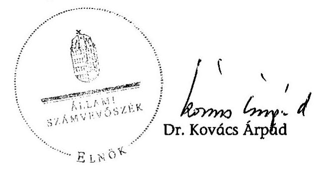

---

# MELLÉKLETEK

---

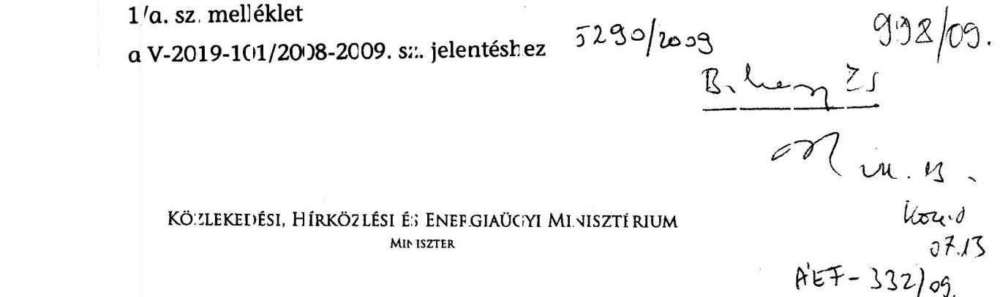

# Kovács Árpád 

elnök ur
részéns
Allami Számvevőszék
Budapast

Tisztelt Elnök Ú:!
Köszönettel megkaptam az „alkülönített állami pénzalapok rendszerénk, a pályázati colok teljesülésỏnek ellerıörzésérö" kérızitet! jelentés-tervezetet.

Tájékoztatoin, hogy a jelentésra ésirevélelt nem teszek, egyben köszönörı, hogy rnunká ukkal hoztájánultak a közigazgatás haté xonyabb müköléséhez.

Eludapust, 2009. július 6.

Üdvözletlel:
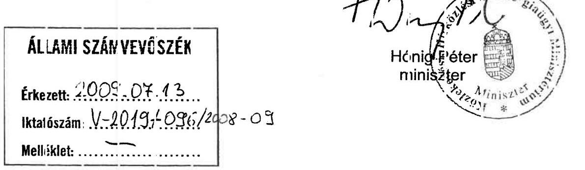

---

# 5071/2009 9.11/08. 

Ikt:tószám: N:GM:8641:3/20)9
dr. Kovács Árpád
Elnok Úr részj́re
Állami Számvevõızék
Budapest
Apáczai Sseru János u. 10.
1052

Tisstelt Elnöl: Úr!
Kös zöne tel vatterr „az elkülönitcttt ál ami pénzalapok rendszerének, a pályázati célck teljesülésének ellenõ zésćről" szóló jeler tést.

Az ellenörzési jelentésben meufogalmazott megállapitásokra észrevittelt nem kívánok tenni.

Végazetíl köszönöm, hogy munkájukal hozzájárultak a minisztárium erec mérr/esebb múködéséhez.

Budapest, 20C9. július „03. .

## Ćdvözlettel:

## ÁLLAIH SZÁMVEVŐSZÉK

Erkezet: 25.09.07.06
Iktatós:ám: 11.11.019.1099/012-09
Melléklet: $\qquad$
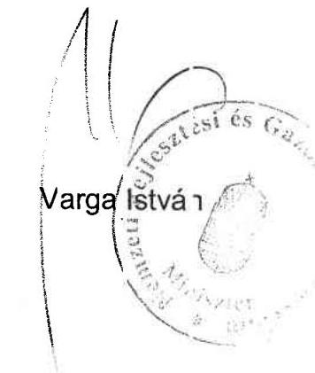

---

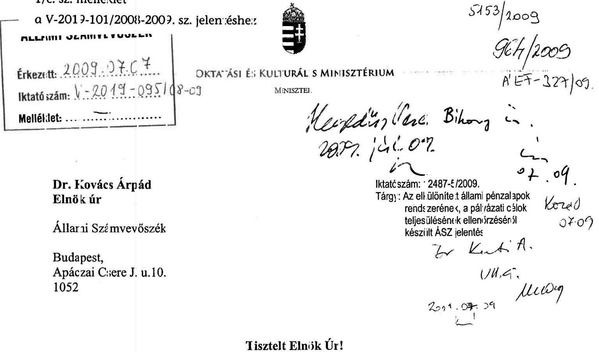

# Tisztelt Elnök Úr! 

A fenti tirgykárben készített ÁSZ jelertés több azakaızban is egyeztetésre került a minisztérium illztékesi szalértőivel. Köszönettel fogalltuk, hogy a különböző egyeztetések sorát tárcánk észrevételeinck túlnyomó többségét figyelembe vették.

Az a:yag :gészit tekintve sszrevételt nem leszürk, de kérera Eln 3 k urat, ho zy a Zánka Kht. Támogatásával lappcsolatos korá sban megküldött észrevételünket a vézlegezitett elentishez is csitolni szivekedjenek.

Alap os és lcörültzkintó munkájukat közzönve,
Budapest, 2009. július „, 4 ,

Tiszt slette :
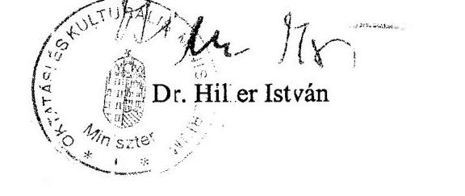

---

OKTATÁSI ÉS KULTURÁLIS MINISZT ÉRIUM
KÖZOKTATÁSI SZAKULLAMIT KÁR

Bihary Zsigmond
főigazgató

Állami Számvevőszél:
Budapest
Apáczai Csere János u. 10.
1052

6.22.109

Iktitószári: 113: 8-4/2009.
Ügyintéző: Kovácsné 3. Ancrea
Tel: 473-7348

ÁLLAMI SZÁMVEVÖSZÉK
ÜGYVITELI IRODA
3633/2-09
Érk.: MAY 21 2009

Iktatószáin: V-2019-083/02:09
Méléklet:

Tisztelt Főigazgató Úr!

Hivatkozva a véleményezésre megküldöt: V-2019-054/2008-2009. számú számvevői jelentésére, amely az elkülön tett állam: pénzalap ok rendszertének, a pályázati célok teljesülésének ellenőrréséről készült, az alábbi észrevételleke: teszem:

A Zánkai Gyermek és Ifjisági Centrum K at. eléterjesztésével kapcsol atos állásp cntját, megállapításait rész ben elfog adom, azonban véleményem szerint az előterjeszt ésben hivatkozott sportcentrum támogath átósága a szak cépzés fejlesztésének a szakképzési hozzájárulásról és a képzés fejlesztésének támogatásáról szóló 2003. évi LXXXVI. törvényben megfogalmazott elveihez közvetettea igazodik. Így, ha ezen elveket elfogadjuk, egyértelm üvé válik, hogy a Munkae őpiaci Alap képzési alaprészére e az oktatásért f elélős miniszter rendelkezési jogköré oe tartozó része jelen:ős forrásokal segíte te a szakképzés fejlesztésének megvalósulását.

Az elkövetkez endő költségvetési időszakban az Álla mi Számvevőszé c megállap tásaii figyelembe fogjuk venni, hogy továbbra is végre tudjuk hajtani a szakképzés kiemelködően fontos fejlesztési feladatait.

Köszöném továbbá a jelentés-ervezet 2.2.1. pontjának levelében fog alt ki egészítését amely szö regréuz beépítési mellett, az anyag egé zzét tekintve egy térté c.

Budapest, 2009. május 13.

Üc vözlettel:

OKTATÁSI ÉS KULTURÁLIS MINISZT ÉRIUM
CÍM: 1055 BUD/PEST IZALAY U. 10-14. TEL: 473-260 FAX: 332-9180
E-MAIL: KOZOCTATAS@OKM.GO'J.HU

---

# 1/e. sz. melléklet 

a V-2019-101/2008-2009. sz. jelentéshez

## ELNÖK

ÁLLAMI
SZÁMVEVÖSZÉK

## Dr. Hiller István úr

misiszter
Oktatási és Kulturá is Minisztérium

## Budapest

## Tisztelt Miniszter Úr!

Az elkülönített állami pénzala sok rendszeréneli, a pályázati célok teljesülé iének ellenôrzésiről kézzített jelentésünkkel kapcsolatos, annak mellékletére vonatliozó lérését tartalmazó levélét köszönettel megkaptam.

Tájékoztatom Miniszter urat, hogy kérésére a korábbi észre rételítket turtaln azó levelet is csitoltuc az ellenćrzésröl készült jelentéshez. A jelentést - kialakult gyakorlatunk szerint levelével és az arra adctt vá aszonmal együtt küldöm meg az Or ̇zággyülés elnölének az illetékes bizottságok elnökeinck és a miniszterelnöknek.

Budapest, 2009. jú ius " 10 ".

Tisztelettel:
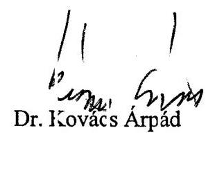

Dr. Kovács Árpád

---

1/f. sz. melléklet a V-20:9-101/2008-2009. sz. jelentéshez

H-1)51 BU JAPES` V., JÓZSEF NÁDOR TÉR 2-4. POSTACÍN: 1369 BUDAI EST. POSTAF:OK 481.

TEL: (FON: (36-1) 327-2100, (+36) 33 371-2 00
FAX (36-1) 318-2571

PÉNZÜGYMINISZTER

Dr. Kovács Árpád úr
elnöl:
Állami Számvevőszék
Budapest

Tiszelt Elnök Úr!

E-MAIL: peter.oszko@p n.gov.hu

5344/2009

1012/05.

Iktatószám: 6592 - 10/2009. AEF-21865
Hiv. szám: V-2019-091/2008-2009.

Ked A
(71) 15
6. km. 16
101. 15

Rezédí llesa
1. 111. 15

Az elkülönített állami pénz alapol: rendszerének, a pályázati célok teljesülésének ellerőrzéséről készített jelentés tárvezetet köszönettel megkaptam.

Az elrendelt intézkedésről - az Állami Számvevőszékről szóló 1989. évi XXXVIII. törvény 25. (1) bekezdése alapjár - tájékoztatni fogom.

Budapest, 2009. július 8.

ÁLLAMI SZÁMVEVŐSZÉK

Érkezett: 2019.07.14. 14.

Iktatószám: V-2019-097/08-09

Mellék el:

Tisztelettel:

Dr. Oszkó Péter

---

1/g. s:.. me lékle:
a V-2019-101/2008-2009. sz. jelentéshez

# Szo:ııali: és Mur kaügyi Minisztérium Minis:ter 

Iktat:̇szár: 4757-23/2009-MPAI'ÖO

## dr. Kovács Árpád úr elnöi:

Álla:ni Számvevőszék
Budapest

## AlLami Számvevőszék

Értezett: 20.03.07.06. 2. kultitane
Iktatószám: V-2019-09.1/08-09
$2509-07-07$
$k$

## Tisztelt Elnök Ur!

Az elkülönített illami pénzalapok rendszerénnek, a pályázati célok teljesülésének ellenőrzéséról az Állami Számvevőszék által cészített Jelentést megkaptum. Ez tartalmazza észrevételeink egy részérek lábjegyzetber való megielenítését, «melyst ezúton megkö̉zönök. Az Ön á tal je zett lehetőséggel élve a Jelentésre a következő észrevé elt teızem.

A 15. és a 87. számú lábjegyzet azt a megjegyzést tartalmazza, hogy az Országos Foglalkoztatási Közalapítviny (OFA) 2008. évi szakmai tervét a minisztérium értékelte és elfogadta. Az azonban nsm je enik meg a lábjcgyzetben, hogy az érintett szakmai ter rek tēbb üt zmben történő elfogacása nsm azok megalapozatlansá̧ával, hanem a N'unka srőpiaci Alap Irányító Testülete részéről fel nerül 5 igényeknek a szakmai tervben való megjelenítésével van össze:üggésben.
Kérem Elrök U:at, hcgy észrevételünl:nek ez a része is beke:üljör a lábjegyzetbe.
A Je entés szerint az OFA srogramjai: az ir dításukat követően 6-3 évvel zárják le, az OFA el:kor fizette vissza a fel nem haszr állt összegeket.

Tekintette arra, hogy a Jelentés fenti megállapítusa azt sugallja, mintha a Səociális és Munk:ügyi Minisztérium, mint támogató 6-8 évig az OFA-t nem számol:atta volna el a p:ogramok állásáról, az észrevételozett bekezelés ilyen tartalmú meglogalmazása csuk abban a: esetben fogadható el, ha a Jelentésben hivatkozis történik arra, hogy az OFA beszámoltatáa gyakorla a időközben módosításra került.

A Jelentésben javaslatot fcgalmaznak meg a Kormán:nak, miszerint intézkedjen, hogy a rendelkıző minisztsrek értéke jék az alap céljainak a megvalós alását és az alapızerủ müködés hatását az állami feladat ellátásának er:dményességére, mindezt az alap megalakulásátol eltelt idősəakra vonatkozóan.

---

Ez a javaslat a Munkıerőp aci Alap (MPA) tekintetében, an ely 1996 óta müködik, és magába foglalja a oglalcoztatás, a szakképzés valar nennyi területéhez kapcsolódó fel idat f nans:írozását, a jeler legi feltételek mellett, amennyiben ez az MPA minden cori költségvetésinek teljesítéséröl készített éves szakmai beszámolón tilmutitó el smzési feladatot jelent meg /alósíthatatlan. Ennek sem személyi, tirgyi, sem pedig anyaji feltételei nem adottak és nem varhatc, hogy a köıeljövöben adotté válnık.

Az MPA l:öltsézzvetésének teljesítése švents szakmai beszámolóban értékeléıre kerül, a nelyct az Crszággyülés zárszáma:lás keretében elfogad. A beszámoló cvről-ivre r yomen kö r tti az MPA célkitüzéseinek a teljesítésit.

Kérem, hogy a fenti jıvaslatot a Jelentésből törölni szí eskecijen.
Budapest, 2009. június s 29.
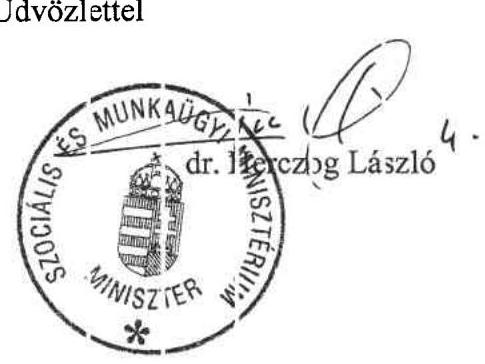

---

# Dr. He rezog László úr 

m.niszter
S:ociális és Munkıügyi Minisztériı m

## Budapest

## Tisztel: Miniszter Úr!

Az elkitilönitutt állumi pínzalı pok rendszerének, a pályázıti célok teljesülcsénel: ellenőrzéséről keszített jelentésünkre tett észrevételeit köszönettel megkaptan. A jelentés tervezetét korábban több körben - személyes találkozón is - egyeztettik a:: SZMMM munkatársulval, igy szakértjivel, szalállamtitkárával, államtitkíával. A fennmaradt vé emér yeltérésekct a jelentésben megjelenítettük. Miniszte: úr levélében foglaltak figyelembevételéről az alábbiakban :ájékcztatom.

Az OFA prograrnok kapcsin a MA." működésével össze függésben álláspontunkat - a prograrnok finanszírozására 2007 végén hozott döntés megalapozatlanságáról, a programok lezárásinak elhúzoidásáról - fennturtjuk, hiszen azt a bckövelkezett módosítások (a szalmai tervek kiegészítése, illetve a beszámoltatási gyskorlat megváltoztatása) is igazolják. A veleményeltcrést jelző lábjegyzeteket Miriszter úr kérésére kiegészítettük. Az OFA beszámoltatási gyckorlatának megváltoz isára utaló, kért hivatkozást a Jelentés már tırtalmazza (2.2.1. pont, 49. o. 3. bek.), azt a Jslentés Ön által jelzett szövegéhez (,... az OFA progranjait a:: inditásukat követően 6-8 évvel zártck le,..."62. o.) is beillesztettük. A fenti kérdéskörrel kapcso atosan ismétehten fel kell hívnunk arra a figyelmet, hog" megállapításaink nem a Minisz:érium, hanem a MAT mükćdésére vonatkoznak.

A javaslatainkat irintő észrevételéket illetően úgy gondoljuk, hogy a Kornány az alapok egyszeri felülvizsgálatánál telintettel lesz az MPA sajátos helyzetére. A zürszárnadás keretében térténő beszámoltatás is az alapızerủ müködés indokoltságának rendszeres felü vizsgálata tartalmilag nem azonos. A tirsadalmi, gazdasági lelyzet nem: statikus, igy viltozás törtonhet ének alatt aliban, hogy mely állami feladat kiemelése és elkitilönitutt finanszírozása indckolt, il etve már kieme t feladat módosítása vagy kiemelésénèk megszüntetés: vállat szilkségessé. Ellenőrzési tapasztalataink azt mutatják, hogy az isves költségvetési és zárszám adási tervényjavaslat elogad isa scrán nincs mód arra, hogy az Orızágg rülés átfogjan értékelje az egyes alapol: céljainak megvalósulását, az állami feladat ellitásának eredményességét, ezért vonatkozó javasla:ainkst fentr tartjuk.

---

V'geze ül tá ékoztatom Miniszter urat, hogy az e lenőrzésről készített elentést - kialaloult gyakorl stunk szerint - észrevstelei iel és az azokra adott válas zomrral együtt küldönı mef̧ az O 'szágıyưlés elnölének, az il ietékes bizcttságui elnökeinck és a miniszterelnöknek.

B idapest, 20)9. jú ius " 20 ".

Tiszelettel:
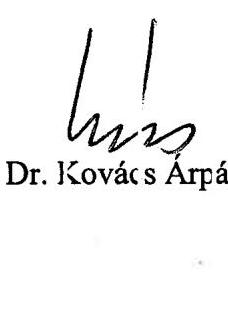

---

# Az elkülönített állami pénzalapok kiemelt jellemzői

|   | MPA | KNPA | WMA | KTIA | SZA | NKA  |
| --- | --- | --- | --- | --- | --- | --- |
|  létrehozó
jogszabály | 1995:CXXIV. tv. 8. §,
1991:IV. tv. (Flt.) 39. § | 1996:CXVI. tv. | 2003:LVIII. tv. | 2003:XC. tv. | 2005:II. tv. | 1993:XXIII. tv.,
2005:CL. tv.  |
|  az Alap célja | A munkaerő alkalmazkodásának, a munkanélküliek, az állásukat vesztettek munkához jutásának, szociális biztonságának, a szakképzés továbbfejlesztésének, a megváltozott munkaképességűek foglalkoztatásának elősegítése, a feladatokat végző szervezetek működtetésének biztosítása. | Kizárólag a radioaktív hulladékok végleges elhelyezése, kiégett üzemanyag átmeneti és végleges elhelyezésére szolgáló tárolók létesítése és üzemeltetése, nukleáris létesítmények leszerelése finanszírozásának biztosítása. | Az ár- és belvíz okozta károk miatti kártalanítása azon természetes személyeknek, akiknek a lakóingatlana a veszélyeztetett területen van, és szerződés szerint rendszeres befizetést teljesítenek az Alapba. | A gazdaság technológiai innovációjának ösztönzése, a kutatás és fejlesztés erősítése, a hazai és külföldi kutatási eredmények hasznosítása, innovációs infrastruktúra és e körben szolgáltató tevékenységek fejlesztése. | A határon túli magyarság szülőföldjén való boldogulásának érdekében támogatások nyújtása. | A nemzeti és egyetemes értékek létrehozása, megőrzése, valamint hazai és határon túli terjesztésének támogatása (1. §). [1999-2005. között Nemzeti Kulturális Alapprogramként, változatlan céllal működött.]  |
|  müködés kezdete | 1996.01.01. | 1998.01.01. | 2003.08.01. | 2004.01.01. | 2005.03.15. | 2006.01.01.
(1993.04.01-jétől Alap,
1999.01.01-jétől
2005.12.31-ig
Alapprogram)  |
|  a rendelkezési jog gyakorlója/a miniszter munkaszervezete | foglalkoztatáspolitikáért felelős miniszter, megosztva a rendelkezési jogot az oktatási miniszterrel és a MAT-tal (FMM, SZMM) | az atomenergiafelügyeleti szervet felügyelő miniszter (1998.01.01-jétől IKIM (GM), 2003 közepétől BM, 2004.11. hótól IM, (IRM), 2008.07.01-jétől KHEM | az államháztartásért felelős miniszter (PM) | a kutatás-fejlesztésért és technológiai innovációért felelős miniszter (2004.01.01jétől OM, 2006.08.01jétől GKM, 2008.05.01jétől tárca nélküli miniszter) | a nemzetpolitikáért felelős miniszter. (2005.03.15-től KüM, 2006.07.01-jétől MeH) | 2006.01.01-jétől a nemzeti kulturális örökség minisztere (NKÖM),
2007.07.01-jétől a kultúráért felelős miniszter (OKM)  |

---

|   | MPA | KNPA | WMA | KTIA | SZA | NKA  |
| --- | --- | --- | --- | --- | --- | --- |
|  alapkezelő | foglalkoztatáspolitikáért
felelős miniszter vezette
minisztérium (2008-ban
SZMM) | Országos Atomenergia
Hivatal | A MÁK, ami feladatai
(szerződéskötés,
nyilvántartás,
adatkezelés, befizetések
fogadása, károk
felmérése, stb.)
ellátására mást
(biztosítóintézetet) is
megbízhat. | A kezelői jog gyakorlója
a törvényben nincs
nevesítve,
kormányrendelet az
Alap működtetését a
Nemzeti Kutatási és
Technológiai Hivatal
feladataként nevesíti. | 2005.06.17→ Határon
Túli Magyarok
Hivatala,
2007.01.01→Szülőföld
Alap Iroda | Nemzeti Kulturális
Alap Igazgatóság  |
|  a döntés
hozatalban, az
alap
működtetésében
közreműködő
további
szervezetek,
testületek | Munkaerőpiaci Alap Irányító
Testülete, munkaügyi
tanácsok, állami
foglalkoztatási szerv (ÁFSZ),
Nemzeti Szakképzési és
Felnőttképzési Tanács,
Regionális Fejlesztési és
Képzési Bizottság, Nemzeti
Szakképzési és Felnőttképzési
Intézet (korábban NSZI,
valamint NFI), Oktatási
Minisztérium Alapkezelési
Igazgatóság. | KNPA Szakbizottság, a
Radioaktív Hulladékokat
Kezelő Közhasznú
Társaság (RHK Kht.,
2008.01.07→ RHK
Közhasznú Nonprofit
Kft.) |  | Kutatás-fejlesztési
Pályázati és
Kutatáshasznosítási
Iroda (2008.01.31-én
megszűnt), Kutatási és
Technológiai Innovációs
Tanács, Tudomány- és
Technológiapolitikai
Tanácsadó Testület,
Tudomány- és
Technológiapolitikai
Kollégium, Magyar
Gazdaságfejlesztési
Központ Zrt. | Regionális Egyeztető
Fórum, Kollégiumok | Nemzeti Kulturális
Alap Bizottság,
Kollégiumok  |
|  az alaphoz rendelt
államháztartáson
kívüli forrás | munkaadói, munkavállalói,
vállalkozói járulék,
rehabilitációs és szakképzési
hozzájárulás | a célok megvalósítás
ának költségeit „az arra
kötelezett személy vagy
szervezet"
(engedélyesek, pl:
atomerőmű) fizeti, az
utóbbi a költségvetési
törvényben
meghatározott
mértékben | szerződés alapján
rendszeres, valamint
önkéntes nem rendszeres
befizetések, adományok |  | innovációs járulék | önkéntes befizetések,
adományok,
szja 1%-a az adózó
rendelkezése szerint | kulturális járulék  |

---

# TÁBLÁZATOK 

3/a. A Munkaerőpiaci Alap bevételei
3/b. A Munkaerőpiaci Alap kiadásai
3/c. A Központi Nukleáris Pénzügyi Alap bevételi előirányzatai és teljesülésük
3/d. A Központi Nukleáris Pénzügyi Alap kiadási előirányzatai és teljesülésük
3/e. A Wesselényi Miklós Ár- és Belvízvédelmi Kártalanítási Alap bevételi és kiadási előirányzatai és teljesülésük
3/f. A Kutatási és Technológiai Innovációs Alap bevételi előirányzatai és teljesülésük
3/g. A Kutatási és Technológiai Innovációs Alap kiadási előirányzatai és teljesülésük
3/h. A Szülőföld Alap bevételi és kiadási előirányzatai és teljesülésük
3/i. A Nemzeti Kulturális Alap bevételi és kiadási előirányzatai és teljesülésük
3/j. A Munkaerőpiaci Alap terhére vállalt kötelezettségek (2006-2007)
3/k. Az NKA és a KTIA terhére vállalt kötelezettségek (2006-2007)

---

# A Munkaerőpiaci Alap bevételei

|  BEVÉTELEK | 2004. | 2005. | 2006. | 2007. | 2008. |  | 2009.  |
| --- | --- | --- | --- | --- | --- | --- | --- |
|   | teljesítés | teljesítés | teljesítés | teljesítés | előirányzat | előzetes teljesítés | előirányzat  |
|  Munkaadói járulék | 157333,8 | 172609,6 | 185045,5 | 201958,3 | 211900,0 | 212360,6 | 223740,0  |
|  Munkavállalói járulék | 48259,5 | 52263,6 | 63426,1 | 92063,8 | 96800,0 | 97608,0 | 102300,0  |
|  Vállalkozói járulék |  | 6523,7 | 11185,5 | 14015,4 | 15200,0 | 13764,0 | 14430,0  |
|  TÁMOP intézkedések bevétele |  |  |  |  | 12206,0 | 1340,0 | 23797,0  |
|  Egyéb bevétel |  |  |  |  |  |  |   |
|  Területi egyéb bevétel |  | 1725,8 | 1311,8 | 1161,7 | 700,0 | 1232,2 | 1000,0  |
|  Központi egyéb bevétel | 3105,3 | 1777,0 | 4293,9 | 4998,8 | 4000,0 | 5640,4 | 4500,0  |
|  Szakképzési és felnőttképzési egyéb bevétel | 1532,3 | 786,5 | 1593,0 | 1087,0 | 210,0 | 1160,7 | 500,0  |
|  Rehabilitációs hozzájárulás | 8066,6 | 11403,7 | 12488,4 | 13646,3 | 14278,0 | 14684,0 | 16080,0  |
|  Visszterhes támogatások törlesztése | 121,4 | 66,5 | 27,6 |  |  |  |   |
|  Rehabilitációs célú munkahelyteremtő támogatás |  |  |  | 5,0 | 10,0 | 1,6 | 1,4  |
|  Szakképzési hozzájárulás | 22418,9 | 27669,2 | 30745,8 | 36745,4 | 37800,0 | 41986,8 | 43600,0  |
|  Bérgarancia támogatás törlesztése | 772,8 | 691,5 | 1163,7 | 1127,3 | 960,0 | 875,3 | 1010,0  |

---

3/a. sz. melléklet a V-2019-101/2008-2009. sz. jelentéshez

|  BEVÉTELEK | 2004. | 2005. | 2006. | 2007. | 2008. |  | 2009.  |
| --- | --- | --- | --- | --- | --- | --- | --- |
|   | teljesítés | teljesítés | teljesítés | teljesítés | előirányzat | előzetes teljesítés | előirányzat  |
|  Költségvetési támogatás |  | 368,0 | 200,0 |  |  |  |   |
|  Költségvetési bevételek | 241610,6 | 275885,1 | 311481,3 | 366809,0 | 394064,0 | 391262,0 | 430958,4  |
|  Függő, átfutó, kiegyenlítő bevételek | 5,7 | 54,4 | 63,2 | 77,7 | 0,0 | $-247,9$ |   |
|  Bevétel összesen: | 241616,3 | 275939,5 | 311544,5 | 366886,7 | 394064,0 | 366897,2 | 430958,4  |
|  Költségvetési bevételek | 241610,6 | 275885,1 | 311481,3 | 366809,0 | 394064,0 | 391262,0 | 430958,4  |
|  Költségvetési kiadások | 244604,6 | 271509,6 | 289545,7 | 341318,6 | 394064,0 | 384491,0 | 430958,4  |
|  Egyenleg | $-2994,0$ | 4375,5 | 21935,6 | 25490,4 | 0,0 | 6476,7 | 0,0  |

---

# A Munkaerőpiaci Alap kiadásai

|  KIADÁSOK | 2004. | 2005. | 2006. | 2007. | 2008. |  | 2009.  |
| --- | --- | --- | --- | --- | --- | --- | --- |
|   | teljesítés | teljesítés | teljesítés | teljesítés | előirányzat | előzetes teljesítés | előirányzat  |
|  Aktiv támogatások | 52561,1 | 56524,7 | 66246,8 | 67925,1 | 89099,4 | 88259,1 | 92473,1  |
|  Foglalkoztatási és képzési támogatások | 44410,8 | 49894,3 | 53405,6 | 48858,8 | 55853,8 | 60302,5 | 50086,6  |
|  Foglalkoztathatóság EU-s társfinanszírozása | 5430,4 |  |  | 4295,2 | 200,0 | 200,0 | 1800,0  |
|  Közmunka céljára pénzeszköz átadás | 1600,0 |  | 3752,4 | 7320,0 | 2500,0 | 6920,0 | 2000,0  |
|  TÁMOP 1.1. Munkaerőpiaci szolgáltatások és támogatások kiadásai |  |  |  |  | 17695,0 | 10607,0 | 22477,0  |
|  TÁMOP 1.2. Foglalkoztatást ösztönző normatív támogatások kiadásai |  |  |  | 80,9 | 5161,0 | 2200,1 | 9110,1  |
|  Társadalmi párbeszéd programok |  |  |  | 1536,1 | 1689,6 | 1719,1 | 1999,4  |
|  Járulékkedvezmény megtérítés |  | 697,1 | 1713,7 | 5808,4 | 6000,0 | 6310,5 | 5000,0  |
|  Non-profit szektorbeli munkavállalás támogatása | 179,9 | 275,3 | 98,1 | 6,6 |  |  |   |
|  HEFOP intézkedés előfinanszírozása |  |  |  | 19,1 |  |  |   |
|  Munkanélküliség kezelése EU-s társfinanszírozása |  | 4591,0 | 5904,0 |  |  |  |   |
|  Felnőttképzés EU-s társfinanszírozása |  | 1067,0 | 1373,0 |  |  |  |   |
|  Területkiegyenlítésre pénzeszköz átadás | 810,0 |  |  |  |  |  |   |
|  KSH régiós átalakítás támogatása | 130,0 |  |  |  |  |  |   |

---

3/b. sz. melléklet a V-2019-101/2008-2009. sz. jelentéshez

|  KIADÁSOK | 2004. | 2005. | 2006. | 2007. | 2008. |  | 2009.  |
| --- | --- | --- | --- | --- | --- | --- | --- |
|   | teljesítés | teljesítés | teljesítés | teljesítés | előirányzat | előzetes teljesítés | előirányzat  |
|  Szakképzési és felnőttképzési támogatások | 15930,4 | 15652,2 | 20357,6 | 30681,7 | 35827,7 | 36183,3 | 34533,8  |
|  Szakképzési és felnőttképzési célú kifizetések | 15930,4 | 14703,2 | 19070,6 | 25251,3 | 33027,7 | 33383,3 | 34533,8  |
|  Alkalmazkodóképesség EU-s társfinanszírozása |  |  |  | 5430,4 | 2800,0 | 2800,0 |   |
|  Szakképzés fejlesztése EU-s társfinanszírozása |  | 949,0 | 1287,0 |  |  |  |   |
|  Rehabilitációs célú munkahelyteremtő támogatás | 2637,5 | 2967,6 | 3249,9 | 4801,3 | 5900,0 | 5332,9 | 5000,0  |
|  Passzív kiadások | 79362,4 | 87561,3 | 87080,5 | 92516,8 | 106481,8 | 100383,2 | 104281,0  |
|  Álláskeresési támogatások |  |  | 68030,5 | 90165,7 | 103082,8 | 97274,8 | 100040,0  |
|  Munkanélküli ellátások | 78239,2 | 86741,5 | 17474,1 |  |  |  |   |
|  Vállalkozói járadék |  |  | 437,5 | 1312,2 | 2100,0 | 1620,6 | 1680,0  |
|  Jövedelempótló támogatás | 106,3 | 17,8 | 1,6 |  | 1,0 | 0,0 | 1,0  |
|  Nyugdíjbiztosítási Alapnak átadás | 1016,9 | 802,0 | 1136,8 | 1038,9 | 1298,0 | 1497,8 | 2560,0  |
|  Bérgarancia kifizetések | 3665,1 | 4679,3 | 5648,0 | 4235,9 | 7000,0 | 4541,3 | 5250,0  |
|  Múködtetési célú kifizetések | 22552,1 | 22824,5 | 24962,9 | 27848,3 | 30445,6 | 30430,6 | 31920,5  |
|  Alapkezelőnek átadott pénzeszköz | 355,8 | 356,2 | 345,5 | 381,7 | 381,7 | 381,7 | 402,7  |
|  Állami Foglalkoztatási Szolgálatnak átadott pénzeszköz | 20278,8 | 20329,7 | 21168,0 | 20997,0 | 23266,0 | 23266,0 | 23525,0  |

---

3/b. sz. melléklet a V-2019-101/2008-2009. sz. jelentéshez

|  KIADÁSOK | 2004. | 2005. | 2006. | 2007. | 2008. |  | 2009.  |
| --- | --- | --- | --- | --- | --- | --- | --- |
|   | teljesítés | teljesítés | teljesítés | teljesítés | előirányzat | előzetes teljesítés | előirányzat  |
|  Állami Foglalkoztatási Szolgálat fejlesztési program | 1250,0 | 1175,6 | 1138,8 | 1437,7 | 1437,7 | 1437,4 | 1577,6  |
|  Állami Foglalkoztatási Szolgálat központosított kerete | 250,0 | 237,5 | 237,5 | 237,5 | 237,5 | 237,5 | 237,5  |
|  Országos Munkavédelmi és Munkaügyi Főfelügyelőségnek pénzeszköz átadás | 417,5 | 591,0 | 1959,3 | 1959,3 | 2159,3 | 2159,3 | 2415,7  |
|  Nemzeti Szakképzési és Felnőttképzési Intézetnek pénzeszköz átadás |  |  |  | 2182,3 | 2182,3 | 2182,3 | 2680,9  |
|  Országos Foglalkoztatási Közalapítványnak pénzeszköz átadás |  |  |  | 563,7 | 670,9 | 670,9 | 961,1  |
|  Tranzakciós díj |  | 134,5 | 113,8 | 89,1 | 110,2 | 95,2 | 120,0  |
|  Költségvetési befizetés | 67896,0 | 81300,0 | 82000,0 | 113309,5 | 119309,5 | 119309,5 | 153750,0  |
|  Megváltozott munkaképességű személyek | 31613,5 | 52000,0 | 52000,0 | 52000,0 | 53000,0 | 53000,0 | 53000,0  |
|  Egyéb költségvetési befizetés önkormányzatok részére | 36282,5 | 29300,0 | 30000,0 | 61309,5 | 66309,5 | 66309,5 | 97000,0  |
|  Munkanélküli járadékból kikerülő aktív korúak rendszeres szoc.segély | 20162,5 |  |  |  |  |  |   |
|  Közcélú munkavégzés kiadásai | 15120,0 |  |  |  |  |  |   |

---

3/b. sz. melléklet a V-2019-101/2008-2009. sz. jelentéshez

|  KIADÁSOK | 2004. | 2005. | 2006. | 2007. | 2008. |  | 2009.  |
| --- | --- | --- | --- | --- | --- | --- | --- |
|   | teljesítés | teljesítés | teljesítés | teljesítés | előirányzat | előzetes teljesítés | előirányzat  |
|  Munkanélküli ellátórendszer átalakításhoz igazgatási | 1000,0 |  |  |  |  |  |   |
|  Közcélú munkavégzés járuléka |  |  |  |  |  |  | 3750,0  |
|  Közcélú munkavégzés tartaléka |  |  |  |  |  |  | 3750,0  |
|  Költségvetési kiadások | 244604,6 | 271509,6 | 289545,7 | 341318,6 | 394064,0 | 384491,0 | 430958,4  |
|  Függő, átfutó, kiegyenlítő kiadások | 1,6 | 0,9 | $-2,0$ | 126,3 |  |  |   |
|  Kiadások összesen: | 244606,2 | 271510,5 | 289543,7 | 341444,9 | 394064,0 | 384364,9 | 430958,4  |

---

# A Központi Nukleáris Pénzügyi Alap bevételi előirányzatai és teljesülésük

|  M Ft |  |  |  |  |  |  |  |  |  |  |   |
| --- | --- | --- | --- | --- | --- | --- | --- | --- | --- | --- | --- |
|   | 2004. |  | 2005. |  | 2006. |  | 2007. |  | 2008. |  | 2009.  |
|   | eredeti | teljesítés | eredeti | teljesítés | eredeti | teljesítés | eredeti | teljesítés | eredeti | elözetes teljesítés | eredeti  |
|  Bevétel összesen: | 27212,1 | 27577,0 | 29506,1 | 30497,1 | 28109,3 | 28445,9 | 29083,7 | 29184,9 | 31135,0 | 31362,6 | 32915,1  |
|  Radioaktív hulladékok végleges, eseti elhelyezése | 6,5 | 10,4 | 6,5 | 4,9 | 6,5 | 4,4 | 6,5 | 7,8 | 6,5 | 7,3 | 6,5  |
|  Nukleáris létesítmények befizetései |  |  |  |  |  |  |  |  |  |  |   |
|  Paksi Atomerőmű Rt. | 23930,6 | 23930,6 | 23709,6 | 23709,6 | 22827,5 | 22827,5 | 22827,5 | 22827,5 | 22827,5 | 22827,5 | 22827,5  |
|  Költségvetési támogatás | 3275,0 | 3585,1 | 5790,0 | 6731,3 | 5274,3 | 5594,2 | 6248,7 | 6310,7 | 8300,0 | 8450,4 | 10080,0  |
|  Egyéb bevétel |  | 50,9 |  | 51,3 | 1,0 | 19,8 | 1,0 | 38,9 | 1,0 | 77,4 | 1,1  |

---

A Központi Nukleáris Pénzügyi Alap kiadási előirányzatai és teljesülésük

|   | 2004. |  | 2005. |  | 2006. |  | 2007. |  | 2008. |  | 2009.  |
| --- | --- | --- | --- | --- | --- | --- | --- | --- | --- | --- | --- |
|   | eredeti | teljesítés | eredeti | teljesítés | eredeti | teljesítés | eredeti | teljesítés | eredeti | előzetes teljesítés | eredeti  |
|  Kiadás összesen: | 9744,3 | 9705,9 | 11110,6 | 11026,9 | 11110,6 | 14680,4 | 13116,6 | 13068,6 | 16239,1 | 16288,8 | 13934,1  |
|  Kis- és közepes aktivitású hulladéktárolók létesítésének |  |  |  |  |  |  |  |  |  | 9685,2 |   |
|  Kis- és közepes aktivitású hulladéktároló létesítésének | 2577,0 | 2782,1 | 3400,0 | 3849,8 | 4151,9 | 7430,1 | 6900,0 | 6875,6 | 8120,0 |  | 6781,9  |
|  Püspökszilágyi RHFT beruházásai | 924,0 | 923,4 | 980,0 | 914,9 | 645,1 | 644,0 | 100,0 | 91,0 | 1000,0 |  | 311,3  |
|  Nagy akt. hulladéktároló létesítésének előkészítése /telephely kiválasztás | 2577,0 | 2557,5 | 1000,0 | 947,1 | 250,0 | 245,4 | 200,0 | 197,2 | 1586,5 | 340,8 | 300,0  |
|  Kiégett fűtőelemek kazetták átmeneti tároló bőv., felújítása | 1168,4 | 976,8 | 2746,6 | 2360,9 | 3000,0 | 2963,1 | 2287,0 | 2284,2 | 960,0 | 1534,8 | 1522,6  |
|  Nukleáris létesítmények leszerelésének előkészítése | 47,8 | 16,1 | 50,0 | 27,9 | 30,0 | 66,3 | 50,0 | 49,9 | 500,0 | 498,4 | 501,0  |
|  Hulladéktárolók és RHK Kht. működtetése/üzemeltetési kiad. | 2023,2 | 2023,2 | 2159,2 | 2152,3 | 2344,6 | 2344,5 | 2569,6 | 2504,8 | 3010,0 | 3416,4 | 3393,2  |
|  Társadalmi ellenőrzési és inform. társulások támogatása | 372,9 | 372,8 | 709,8 | 709,0 | 600,0 | 898,0 | 906,0 | 961,9 | 948,6 | 1090,2 | 994,1  |
|  Alapkezelőnek működési célra | 54,0 | 54,0 | 65,0 | 65,0 | 89,0 | 89,0 | 104,0 | 104,0 | 114,0 | 114,0 | 130,0  |
|  A Központi Nukleáris Alap függő, átfutó és hitellel kapcsolatos tételei |  |  |  |  |  |  |  |  |  |  |   |
|  Betétállomány változása | 17467,8 | 17871,1 | 18395,5 | 19470,2 | 16998,7 | 13765,5 | 15973,1 | 16116,3 | 14895,9 | 15073,8 |   |

---

# A Wesselényi Miklós Ár- és Belvízvédelmi Kártalanítási Alap bevételi és kiadási előirányzatai és teljesülésük

|   | 2004. |  | 2005. |  | 2006. |  | 2007. |  | 2008. |  | 2009.  |
| --- | --- | --- | --- | --- | --- | --- | --- | --- | --- | --- | --- |
|   | eredeti | teljesítés | eredeti | teljesítés | eredeti | teljesítés | eredeti | teljesítés | eredeti | előzetes
teljesítés | eredeti  |
|  Bevétel összesen: | 329,8 | 114,3 | 90,0 | 86,0 | 90,0 | 100,7 | 85,0 | 85,1 | 75,0 | 72,5 | 23,4  |
|  Rendszeres befizetés | 170,0 | 1,6 | 5,5 | 1,5 | 6,5 | 2,2 | 6,0 | 6,1 | 8,0 | 5,5 | 6,0  |
|  Önkéntes, nem rendszeres befizetések és adományok | 12,0 |  |  |  |  |  |  |  |  |  |   |
|  Költségvetési támogatás | 147,8 | 100,7 | 84,5 | 84,5 | 83,5 | 98,5 | 79,0 | 79,0 | 67,0 | 67,0 | 17,4  |
|  Egyéb bevétel |  | 12,0 |  |  |  |  |  |  |  |  |   |
|  Kiadás összesen: | 329,8 | 75,8 | 90,0 | 31,9 | 90,0 | 74,4 | 85,0 | 59,7 | 75,0 | 40,5 | 23,4  |
|  Alapkezelő múködési költségei | 329,8 | 75,8 | 90,0 | 31,7 | 90,0 | 29,0 | 85,0 | 59,5 | 75,0 | 40,3 | 23,4  |
|  Káreseménnyel összefüggő kártalanítás kifizetése |  |  |  | 0,2 |  | 45,3 |  | 0,2 |  | 0,2 |   |
|  Egyéb kiadások |  |  |  |  |  | 0,1 |  |  |  |  |   |
|  A Wesselényi Miklós Ár-és Belvízvédelmi Kártalanítási Alap függő, átfutó és hitellel kapcsolatos tételei |  |  |  |  |  |  |  |  |  |  |   |
|  Függő tételek |  |  |  |  |  | 1,8 |  |  |  |  |   |
|  Betétállomány változása |  | 38,5 |  | 54,1 |  | 28,1 |  | 25,4 |  | 32,0 |   |

---

# A Kutatási és Technológiai Innovációs Alap bevételi előirányzatai és teljesülésük

|   | 2004. |  | 2005. |  | 2006. |  | 2007. |  | 2008. |  | 2009.  |
| --- | --- | --- | --- | --- | --- | --- | --- | --- | --- | --- | --- |
|   | eredeti | teljesítés | eredeti | teljesítés | eredeti | teljesítés | eredeti | teljesítés | eredeti | előzetes
teljesítés | eredeti  |
|  Bevétel összesen: | 26667,7 | 35398,2 | 36818,3 | 34124,1 | 36655,7 | 37651,0 | 41530,6 | 51816,8 | 46760,9 | 50299,5 | 55909,6  |
|  Költségvetési támogatás | 14758,7 | 12196,9 | 12196,9 | 12196,9 | 12296,9 | 12296,9 | 20548,4 | 20548,4 | 23060,2 | 23060,2 | 28695,1  |
|  Visszterhes
támogatások
törlesztései | 1100,0 | 1250,9 | 798,2 | 963,3 | 750,6 | 806,4 | 416,7 | 504,8 | 254,7 | 742,1 | 217,0  |
|  Egyéb bevétel |  | 5979,9 |  | 415,5 | 225,0 | 1487,5 | 175,0 | 2068,5 | 150,0 | 795,9 | 705,0  |
|  Átvett pénzeszköz |  |  | 400,0 |  |  |  |  |  |  |  |   |
|  Innovációs járulék | 10809,0 | 15970,5 | 23423,2 | 20548,4 | 23383,2 | 23060,2 | 20390,5 | 28695,1 | 23296,0 | 25615,5 | 26292,5  |

---

A Kutatási és Technológiai Innovációs Alap kiadási előirányzatai és teljesülésük

|   | 2004. |  | 2005. |  | 2006. |  | 2007. |  | 2008. |  | 2009.  |
| --- | --- | --- | --- | --- | --- | --- | --- | --- | --- | --- | --- |
|   | eredeti | teljesítés | eredeti | teljesítés | eredeti | teljesítés | eredeti | teljesítés | eredeti | elözetes teljesítés | eredeti  |
|  Kiadás összesen: | 26667,7 | 22462,4 | 36818,3 | 27668,6 | 36655,7 | 26484,2 | 41530,6 | 32248,4 | 56760,9 | 56760,9 | 55909,6  |
|  Hazai innováció támogatása |  |  |  |  |  |  | 30151,9 | 27972,9 | 45925,3 | 36337,8 | 41897,3  |
|  A nemzetközi együttműködésben megvalósuló inováció támogatása |  |  |  |  |  |  | 7081,7 | 2402,6 | 7492,0 | 3575,4 | 10000,0  |
|  K-F és innovációt támogató EU társfinanszírozású programok hazai támogatása |  |  |  |  |  |  | 2200,0 |  |  |  |   |
|  A gazdaságban hasznosuló alkalmazott K+F támogatása | 6484,0 | 4463,9 |  |  |  |  |  |  |  |  |   |
|  Vállalkozások K+F és innovációs tevékenységének támogatása* | 898,0 | 803,9 | 8989,1 | 6461,6 | 15823,7 | 13534,6 |  |  |  |  |   |
|  Regionális innováció támogatása** | 3074,0 | 369,8 | 7950,7 | 6011,7 | 12613,7 | 6599,9 |  |  |  |  |   |
|  Innovációs és kutatási partnerség, hálózatépítés, infrastruktúra és mobilitás támogatása*** | 2732,7 | 3584,4 | 3653,6 | 2376,5 | 6252,5 | 4533,9 |  |  |  |  |   |
|  K+F eredmények elterjesztése, gazdasági és társadalmi hasznosítása | 600,0 | 404,3 | 280,0 | 132,6 |  |  |  |  |  |  |   |
|  Nemzeti Kutatási és Fejlesztési programok | 10950,6 | 11770,6 | 13600,0 | 10953,6 |  |  |  |  |  |  |   |
|  Nemzetközi együttműködésből eredő feladatok | 1395,0 | 446,5 | 919,9 | 611,8 |  |  |  |  |  |  |   |
|  Alapkezelőnek átadott pénzeszköz | 533,4 | 619,0 | 1215,0 | 1120,8 | 1206,3 | 1206,3 | 1370,5 | 1370,5 | 1873,1 | 2554,2 | 2515,9  |
|  Új fejlesztési tervekre való felkészülés támogatása |  |  | 210,0 |  | 150,0 |  | 100,0 | 46,7 | 100,0 | 4,0 | 70,0  |
|  Európai Szén-és Acélipari Kutatási Alap magyar hozzájárulása |  |  |  |  |  |  |  |  | 744,0 | 1739,2 | 853,3  |
|  A tudományos és technológiai attasék munkájának támogatása |  |  |  |  | 472,5 | 472,5 | 489,5 | 368,7 | 489,5 | 330,8 | 436,1  |
|  A Nemzeti Kutatásnyilvántartási Rendszer támogatása |  |  |  |  | 87,0 | 87,0 | 87,0 | 87,0 | 87,0 | 87,0 | 87,0  |
|  Tudomány- és Technológiapolitikai Tanácsadó Testület munkájának támogatása |  |  |  |  | 50,0 | 50,0 | 50,0 |  | 50,0 | 13,5 | 50,0  |
|  Függő tételek |  |  |  | 35,8 |  | 106,1 |  | 75,8 |  |  |   |
|  Betétállomány változása |  | 12935,8 |  | 6491,3 |  | 11272,9 |  | 19594,2 | 10000,0 | 5608,5 |   |

*2006-tól "A vállalati innováció és a gazdaságban hasznosuló K+F támogatása" címen* *2006-tól "A regionális innováció elősegítése" címen* **2006-tól "A tudás- és technológiatranszfer, az együttműködés és az infrastruktúra fejlesztése" címen

---

# A Szülőföld Alap bevételi és kiadási előirányzatai és teljesülésük

|   | 2005. |  | 2006. |  | 2007. |  | 2008. |  | 2009.  |
| --- | --- | --- | --- | --- | --- | --- | --- | --- | --- |
|   | eredeti | teljesítés | eredeti | teljesítés | eredeti | teljesítés | eredeti | előzetes
telesítés | eredeti  |
|  Bevétel összesen: | 1000,1 | 1000,4 | 608,3 | 1000,0 | 1000,1 | 2349,7 | 1000,1 | 2932,6 | 1000,1  |
|  Önkéntes befizetések, adományok | 0,1 | 0,4 | 0,1 |  | 0,1 |  | 0,1 | 0,0 | 0,1  |
|  Költségvetési támogatás | 1000,0 | 1000,0 | 608,2 | 997,8 | 1000,0 | 1000,0 | 1000,0 | 1000,0 | 1000,0  |
|  Adomány-kiegészítés |  |  | 500,0 | 889,6 | 910,0 | 910,0 | 927,7 | 927,7 | 1000,0  |
|  SZJA 1\%-a |  |  | 108,2 | 108,2 | 90,0 | 90,0 | 72,3 | 72,3 |   |
|  Egyéb bevétel |  |  |  | 2,2 |  | 1349,7 |  | 1932,6 |   |
|  Kiadás összesen: | 1000,1 | 999,0 | 608,3 | 897,5 | 980,1 | 1221,2 | 1900,2 | 2485,8 | 1000,1  |
|  Alapból nyújtott támogatás |  |  |  |  |  |  | 900,1 | 2263,2 |   |
|  Határon túli magyarok programjainak fő céljaira nyújtott támogatás | 500,0 | 499,0 |  |  |  |  |  |  |   |
|  Egyéb támogatások | 480,1 | 475,0 | 558,3 | 847,5 | 930,1 | 981,1 | 900,1 |  | 900,1  |
|  Egyéb kiadások |  |  |  |  |  | 56,5 |  | 1,7 |   |
|  Alapkezelő múködési költségei | 20,0 | 25,0 | 50,0 | 50,0 | 50,0 | 183,6 | 100,0 | 206,9 | 100,0  |
|  A Szülőföld Alap függő, átfutó és hitellel kapcsolatos tételei |  |  |  |  |  |  |  |  |   |
|  Függő tételek |  | 0,4 |  | $-0,4$ |  |  |  | 14,0 |   |
|  Betétállomány változása |  | 1,0 |  | 102,9 |  | 1128,5 |  | 446,8 |   |

---

A Nemzeti Kulturális Alap bevételi és kiadási előirányzatai és teljesülésük

|   | 2006. |  | 2007. |  | 2008. |  | 2009.  |
| --- | --- | --- | --- | --- | --- | --- | --- |
|   | eredeti | teljesítés | eredeti | teljesítés | eredeti | előzetes teljesítés | eredeti  |
|  Bevétel összesen: | 10215,0 | 13253,9 | 8615,0 | 9272,8 | 8615,0 | 9708,9 | 8815,0  |
|  Kulturális járulék | 10100,0 | 8245,3 | 8500,0 | 8768,8 | 8500,0 | 8612,6 | 8700,0  |
|  Egyéb bevételek | 115,0 | 5008,6 | 115,0 | 504,0 | 115,0 | 852,2 | 115,0  |
|  Kiadás összesen: | 10215,0 | 10325,5 | 8615,0 | 8623,6 | 8615,0 | 9339,3 | 8815,0  |
|  Nemzeti és egyetemes értékek létrehozásának, megőrzésének, terjesztésének támogatása | 5845,8 | 3362,6 | 2702,7 | 2629,9 | 2702,7 | 2740,5 | 2856,7  |
|  Évfordulók, hazai fesztiválok és rendezvények, valamint azokon való részvétel támogatása | 1206,3 | 1612,2 | 1382,6 | 1638,4 | 1382,6 | 2330,9 | 1382,6  |
|  Nemzetközi fesztiválok, rendezvények és azokon való részvétel támogatása | 464,0 | 2633,3 | 2095,6 | 1839,9 | 2095,6 | 1535,0 | 2095,6  |
|  Művészeti alkotások új irányzatai, új kulturális kezdeményezések támogatása | 185,6 | 332,7 | 285,1 | 282,7 | 285,1 | 241,5 | 285,1  |
|  Kultúrával kapcsolatos tudományos kutatások támogatása | 185,5 | 58,2 | 46,2 | 33,4 | 46,2 | 93,8 | 46,2  |
|  Épített örökség, építőművészet támogatása | 464,0 | 304,5 | 477,7 | 351,1 | 477,7 | 304,3 | 351,1  |
|  Kultúrateremtő, -közvetítő, valamint egyéni és közösségi tevékenységek támogatása | 742,3 | 1022,0 | 785,9 | 926,7 | 785,9 | 1128,5 | 912,5  |
|  Szakmai díjazásához való hozzájárulás | 92,8 | 14,4 | 7,7 | 3,6 | 7,7 | 4,7 | 7,7  |
|  Nemzetközi tagdíjak | 92,7 | 1,9 | 1,5 | 1,4 | 1,5 | 0,6 | 1,5  |
|  Működési kiadások | 936,0 | 983,7 | 830,0 | 916,5 | 830,0 | 959,4 | 876,0  |
|  A Nemzeti Kulturális Alap függő, átfutó és hitellel kapcsolatos tételei |  |  |  |  |  |  |   |
|  Függő tételek |  | 0,2 |  | 1,5 |  | $-1,7$ |   |
|  Betétállomány változása |  | 2928,6 |  | 650,7 |  | 367,6 |   |

---

# A Munkaerőpiaci Alap terhére vállalt kötelezettségek (2006-2007)

|  |   |   |   |   |   |   |   |   |
| --- | --- | --- | --- | --- | --- | --- | --- | --- |
|  Felhasználás jogcíme | Tárgyévi pénzügyi teljesülés |  |  | Következő év(ek)re vonatkozó kötelezettségvállalások év végi állománya | Tárgyévi pénzügyi teljesülés |  |  | Következő év(ek)re vonatkozó kötelezettségvállalások év végi állománya  |
|   | előző év(ek)ben tárgyévre vállalt kötelezettség | tárgyévben tárgyévre vállalt kötelezettség | Összesen |  | előző év(ek)ben tárgyévre vállalt kötelezettség | tárgyévben tárgyévre vállalt kötelezettség | Összesen |   |
|  Foglalkoztatási alaprész |  |  |  |  |  |  |  |   |
|  központi MPA | 105,9 | 10 190,2 | 10 296,1 | 2 113,2 | 1 256,2 | 8 146,1 | 9 402,3 | 3 338,6  |
|  munkaügyi központok | 14 633,4 | 24 233,4 | 38 866,8 | 12 423,1 | 11 659,1 | 27 797,2 | 39 456,3 | 13 613,4  |
|  Képzési alaprész |  |  |  |  |  |  |  |   |
|  NSZFI | 4 947,1 | 15 695,2 | 20 642,3 | 2 746,6 | 2 053,8 | 20 429,4 | 22 483,2 | 2 807,7  |
|  központi MPA | 484,7 | 2 178,2 | 2 662,9 | 483,9 | 192,1 | 2 475,5 | 2 667,6 | 247,1  |
|  munkaügyi központok |  | 7,9 | 7,9 | 6,8 | 7,4 | 93,2 | 100,6 | 55,6  |
|  Rehabilitációs alaprész |  |  |  |  |  |  |  |   |
|  központi MPA | 171,6 | 1 409,3 | 1 580,9 | 393,6 | 349,4 | 2 429,2 | 2 778,6 | 548,6  |
|  munkaügyi központok | 101,3 | 1 567,6 | 1 668,9 | 127,6 | 127,4 | 1 895,2 | 2 022,6 | 202,1  |
|  Összesen | 20 444,0 | 55 281,8 | 75 725,8 | 18 294,8 | 15 645,4 | 63 265,8 | 78 911,2 | 20 813,1  |

---

3/k. sz. melléklet a V-2019-101/2008-2009. sz. jelentéshez

# Az NKA és a KTIA terhére vállalt kötelezettségek (2006-2007)

|  Alap | Felhasználás jogcíme | 2006. |  |  |  | 2007. |  |  |   |
| --- | --- | --- | --- | --- | --- | --- | --- | --- | --- |
|   |  | Tárgyévi pénzügyi teljesülés |  |  | Következő év(ek)re vonatkozó kötelezettségvállalások év végi állománya | Tárgyévi pénzügyi teljesülés |  |  | Következő év(ek)re vonatkozó kötelezettségvállalások év végi állománya  |
|   |  | előző év(ek)ben tárgyévre vállalt kötelezettség | tárgyévben tárgyévre vállalt kötelezettség | Összesen |  | előző év(ek)ben tárgyévre vállalt kötelezettség | tárgyévben tárgyévre vállalt kötelezettség | Összesen |   |
|  NKA | Nemzeti és egyetemes értékek létrehozásának, megőrzésének, terjesztésének támogatása | 1 416,0 | 1 947,0 | 3 363,0 | 251,0 | 913,0 | 1 717,0 | 2 630,0 | 105,0  |
|   | Evfordulók, hazai fesztiválok és rendezvények, valamint azokon való részvétel támogatása | 334,0 | 1 278,0 | 1 612,0 | 9,0 | 292,0 | 1 346,0 | 1 638,0 | 8,0  |
|   | Nemzetközi fesztiválok, rendezvények és azokon való részvétel támogatása | 1 253,0 | 1 380,0 | 2 633,0 | 8,0 | 197,0 | 1 642,0 | 1 839,0 | 32,0  |
|   | Művészeti alkotások új irányzatai, új kulturális kezdeményezések támogatása | 132,0 | 200,0 | 332,0 | 52,0 | 75,0 | 208,0 | 283,0 |   |
|   | Kultúrával kapcsolatos tudományos kutatások támogatása | 31,0 | 27,0 | 58,0 |  |  | 33,0 | 33,0 |   |
|   | Épített örökség, építőművészet támogatása | 210,0 | 95,0 | 305,0 |  | 255,0 | 96,0 | 351,0 |   |
|   | Kultúrateremtő-, közvetítő, valamint egyéni és közösségi tevékenységek támogatása | 339,0 | 683,0 | 1 022,0 |  | 150,0 | 777,0 | 927,0 |   |
|   | Összesen | 3 715,0 | 5 610,0 | 9 325,0 | 320,0 | 1 882,0 | 5 819,0 | 7 701,0 | 145,0  |
|  KTIA | Vállalati innováció és a gazdaságban hasznosuló K+F támogatása | 8 994,7 | 4 539,9 | 13 534,6 | 17 974,0 |  |  |  |   |
|   | Regionális innováció elősegítése | 2 960,5 | 3 639,3 | 6 599,9 | 8 411,8 |  |  |  |   |
|   | A tudás és technológia-transzfer, az együttműködés és az infrastruktúra fejlesztése | 2 185,4 | 2 348,5 | 4 533,9 | 3 850,9 |  |  |  |   |
|   | Hazai innováció támogatása |  |  |  |  | 16 254,9 | 11 718,0 | 27 972,9 | 32 426,9  |
|   | A nemzetközi együttműködésben megvalósuló innováció támogatás |  |  |  |  | 799,8 | 1 602,8 | 2 402,6 | 2 867,8  |
|   | Összesen | 14 140,6 | 10 527,8 | 24 668,4 | 30 236,7 | 17 054,7 | 13 320,8 | 30 375,5 | 35 294,7  |

---

# A költségvetési törvények elkülönített állami pénzalapokra vonatkozó különös rendelkezései (2004-2008)

|  Rendelkezés tárgya | 2004 | 2005 | 2006 | 2007 | 2008  |
| --- | --- | --- | --- | --- | --- |
|  A folyamatos fizetőképesség fenntartása | A bevételek és kiadások időbeni ütemének eltérésekor a finanszírozáshoz igénybe vehető a pénzmaradvány és legfeljebb három hónapra a KESZ. Az utóbbi a pénzügyminiszter engedélyével. | Mint korábban | Mint korábban | Mint korábban | Mint korábban  |
|  Az alapok költségvetésének megállapítása | Alaponként, jogcímenként a törvény 9. számú melléklete szerint. | Mint korábban | Mint korábban | Mint korábban | Mint korábban  |
|  Az alapok év végi - a bevételek és kiadások - egyenlegére szabott külön feltétel | Egyik alapnál sem lehet alacsonyabb a 9. melléklet szerinti összegnél. | Mint korábban | Mint korábban | Mint korábban | -  |
|  Az egyenlegre előírt korlát teljesülése szempontjából figyelmen kívül hagy-ható-e az ún. túlléphető kiadások túlteljesülése | MPA négy túlléphető kiadási jogcíme (munkanélküli ellátás, jövedelempótló támogatás, bérgarancia kifizetés, korengedményes nyugdíj különbözete) túlteljesülése miatt az egyenleg eltérhet az előírt mértéktől. | Mint előző évben, csak MPA öt túlléphető kiadási jogcímére (az előző évieket kiegészíti a normatív járulékkedvezmény visszatérítése). | A túlléphető előirányzatok (MPA előző évi öt + vállalkozói járadék jogcímének) teljesülését is figyelembe kell venni a korlát teljesülése szempontjából. | Az egyenleget nem befolyásolhatja a túlléphető előirányzatok (MPA előző évi hat jogcímének) túlteljesülése.
WMA egyenlege kártalanítás miatt eltérhet az előirányzottól. | Az MPA egyenlege a túlléphető előirányzatok (előző évi hat + TÁMOP foglalkoztatást ösztönző normatív támogatás jogcímének) túlteljesülése esetén eltérhet a 9. mellékletben megállapítottól. WMA egyenlege kártalanítás miatt eltérhet az előirányzottól.  |

---

4. sz. melléklet a V-2019-101/2008-2009. sz. jelentéshez

|  Rendelkezés tárgya | 2004 | 2005 | 2006 | 2007 | 2008  |
| --- | --- | --- | --- | --- | --- |
|  Egy-egy alap felhasználására vonatkozó feltétel | Az MPA-nál a munkaadói, munkavállalói bevétel többletét elsősorban a túlléphető előirányzatokra kell fordítani. A többletbevétel egyéb kiadások növelésére is felhasználható. |  | A KNPA megadott jogcímének beruházási ráfordításai a Kormány engedélyével szükség esetén növelhetők. | KTIA forrásait 2007ben legalább 40\%ban, 2008-ban legalább 50\%-ban, 2009-ben legalább 60\%-ban közvetlenül a vállalkozások támogatására kell fordítani.
A KTIA megadott jogcíméből
1 Mrd Ft-ot alapkutatási pályázatokra kell fordítani, OTKA Bizottság a kiírást véleményezi, pályázatokat előszúri. | A KTIA megadott jogcíméből 1 Mrd Ftot alapkutatási pályázatokra kell fordítani, kiírást OTKA Bizottság elnöke egyetértésével kialakított kiírásra beérkezett pályázatokat a Bizottság előszúri, ügyeit intézi.
KTIA megadott jogcímének terhére az XFEL GmbH-ban való tagi hozzájárulás és éves tagdíj biztosítható.
Kormány az NKA 2008. évi bevételeit a központi költségvetés terhére az előző évi, azonos időszaki bevétel mértékéig kiegészítheti, ha a 2008. október 31-ig teljesült járulékbevétel attól elmarad.  |
|  Jogcímek közötti átcsoportosítás módja | A pénzalapokról szóló törvények rendelkezései szerint. | Mint előző évben | Mint előző évben | - | -  |

---

|  Rendelkezés tárgya | 2004 | 2005 | 2006 | 2007 | 2008  |
| --- | --- | --- | --- | --- | --- |
|  Az MPA központi költségvetésbe teljesítendő befizetései
1. jogcím és mérték
2. támogatott állami feladat MPA általi finanszírozásának aránya
3. az MPA és a központi költségvetés közötti elszámolási kötelezettség | 1. megváltozott munkaképességűek támogatására 31,6 Mrd Ft, munkanélküli ellátórendszer változása címen igazgatásra 1 Mrd Ft és közcélú munkavégzésre 15,1 Mrd Ft, aktív korúak rendszeres szociális segélyére 20,2 Mrd Ft, kistérségek felzárkóztatására 0,8 Mrd Ft
HEF OP társfinanszírozásra 5,6 Mrd Ft
2. Az aktív korú nem foglalkoztatottak szociális segélyezésére fordított összes kiadás 75\%-a
3. a közcélú munkavégzésre és a szociális segélyezésre fordított összegre a zárszámadás keretében, különböz et az MPA-t illeti, illetve terheli | 1. megváltozott munkaképességűek támogatására 52 Mrd Ft, munkanélküli ellátórendszer változása címen összesen 29,3 Mrd Ft
HEF OP társfinanszírozásra 6,6 Mrd Ft | 1. megváltozott munkaképességűek támogatására 52 Mrd Ft, munkanélküli ellátórendszer változása címen összesen 30 Mrd Ft
HEF OP társfinanszírozásra 8,6 Mrd Ft | 1. megváltozott munkaképességűek támogatása és a munkanélküli ellátórendszer változása címen összesen 113,3 Mrd Ft
TÁMOP társfinanszírozásra 9,7 Mrd Ft | 1. megváltozott munkaképességűek támogatása és a munkanélküli ellátórendszer változása címen összesen 119,3 Mrd Ft
TÁMOP társfinanszírozásra 3 Mrd Ft  |
|  Az alapok összevont mérlegének bemutatása | - | - | A törvény 10. számú melléklete tartalmazza. | A törvény 10. számú melléklete tartalmazza. | A törvény 10. számú melléklete tartalmazza.  |

---

# Az alapok és a központi költségvetés közötti pénzügyi kapcsolatok 

| Tranzakció jogcíme, megjelenése, az arról rendelkező személye | Alap bevétele/központi költségvetés kiadása | Alap kiadása/központi költségvetés bevétele |
| :--: | :--: | :--: |
| 1. Az Országgyúlés által a költségvetési törvényben, összegszerúségében meghatározott tételek |  |  |
| 1.1. Az alap, illetve a központi költségvetés közvetlen hozzájárulása a másik „fél" költségvetéséhez | KNPA, WMA, KTIA, SZA -   költségvetési támogatás,   NKA eseti költségvetési   támogatása | MPA - befizetés a központi költségvetésbe |
| 1.2. Az alapból pénzeszköz átadása a múködtetés kiadásaihoz hozzájárulásra |  | Mindegyik alap - alapkezelőnek átadott pénzeszköz (átadás központi költségvetési szervnek) |
| 2. Az Országgyúlés által törvényben meghatározott, az Alap bevételét jelentő kötelezettség (a költségvetési tv-ben megjelenő kategórián belüli részösszeg) | Munkaadói járulék és rehabilitációs hozzájárulás fizetése MPA-ba, atomenergiát alkalmazó költségvetési szerv díjfizetése KNPA-ba - az alapok adó-jellegú (díj) bevétele |  |
| 3. Fejezetek közötti pénzátadás (két miniszter, vagy az alapkezelő és egy költségvetési szervezet vezetője megállapodásán alapuló, a költségvetési tvben közvetlenül meg nem jelenő tételek) | Fejezeti kezelésű előirányzatokból származó bevétel átvétele SZA-nál, NKA-nál, WMA-nál |  |
| 4. Az alappal rendelkező, a felhasználásról határozó szerv döntése alapján (a költségvetési tv-ben közvetlenül meg nem jelenő tételek) |  |  |
| 4.1. Az alapból szakmai célú, költségvetési szerv általi felhasználásra átadott összeg |  | MPA, KTIA, SZA, NKA |
| 4.2. Az alap szakmai célú felhasználásának lebonyolításáért költségvetési szervnek átadott összeg (az összes előzőn túl) |  | MPA, KTIA |

---

# ÁBRÁK 

6/a. sz. melléklet Az MPA havi bevételei és kiadásai
6/b. sz. melléklet Az MPA kumulált havi bevételei és kiadásai
6/c. sz. melléklet Az MPA kumulált kiadásainak aránya a kumulált bevételekben
6/d. sz. melléklet Az MPA-ból aktív eszközökre, szakképzési és felnőttképzési támogatásokra fordított havi kiadások

6/e. sz. melléklet A KNPA kumulált havi bevételei és kiadásai
6/f. sz. melléklet A WMA kumulált havi bevételei és kiadásai
6/g. sz. melléklet A KTIA havi bevételei és kiadásai
6/h. sz. melléklet A KTIA kumulált havi bevételei és kiadásai
6/i. sz. melléklet A KTIA kumulált kiadásainak aránya a kumulált bevételekben
6/j. sz. melléklet Az SZA havi bevételei és kiadásai
6/k. sz. melléklet Az SZA kumulált havi bevételei és kiadásai
6/l. sz. melléklet Az SZA kumulált kiadásainak aránya a kumulált bevételekben
6/m. sz. melléklet Az NKA havi bevételei és kiadásai
6/n. sz. melléklet Az NKA kumulált havi bevételei és kiadásai
6/o. sz. melléklet Az NKA kumulált kiadásainak aránya a kumulált bevételekben

---

# Az MPA havi bevételei és kiadásai 

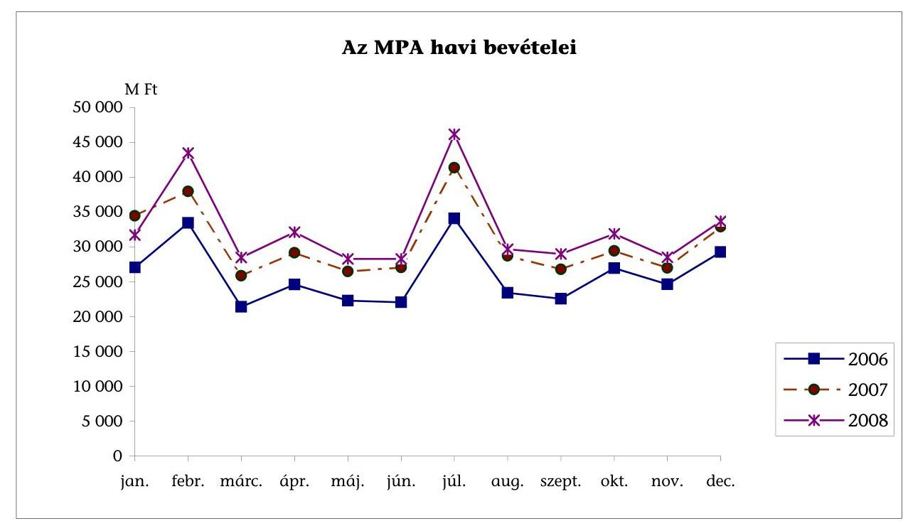
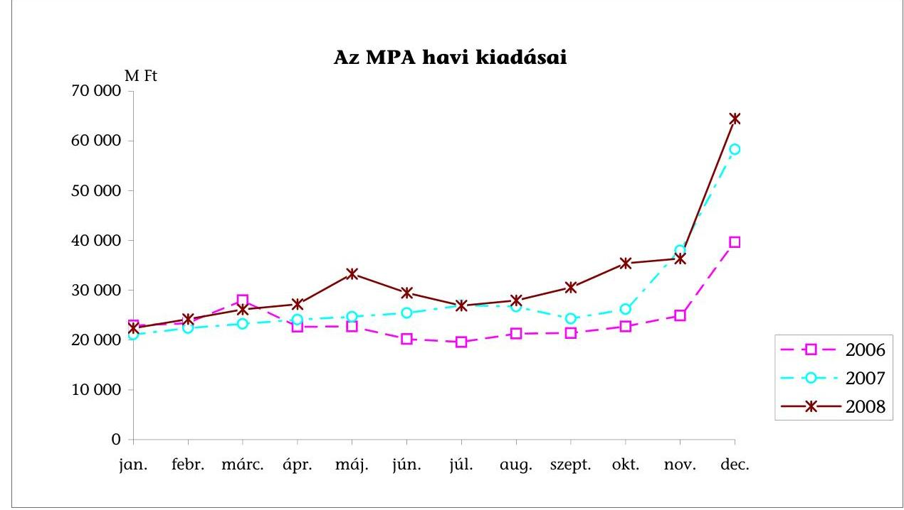

---

6/b. sz. melléklet
a V-2019-101/2008-2009. sz. jelentéshez

Az MPA kumulált havi bevételei és kiadásai

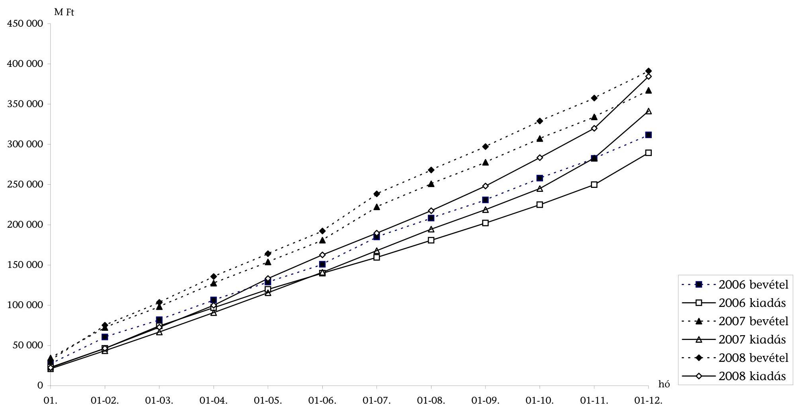

---

6/c. sz. melléklet
a V-2019-101/2008-2009. sz. jelentéshez

Az MPA kumulált kiadásainak aránya a kumulált bevételekben

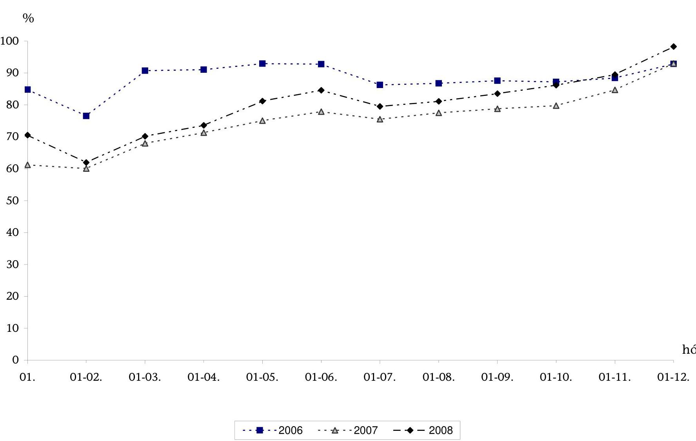

---

Az MPA-ból aktív eszközökre, szakképzési és felnőttképzési támogatásokra fordított havi kiadások
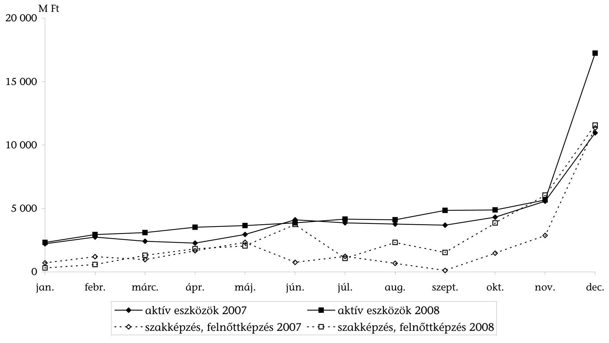

---

6/e. sz. melléklet

a V-2019-101/2008-2009. sz. jelentéshez

A KNPA kumulált havi bevételei és kiadásai

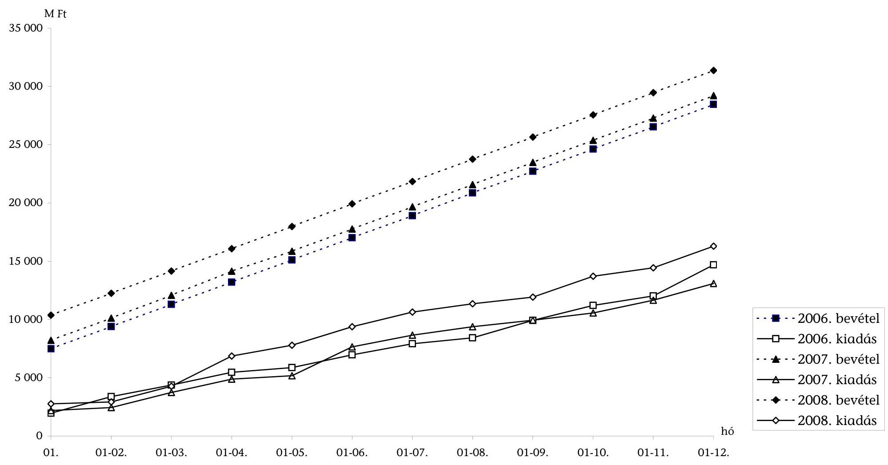

|  0 | 1 | 2 | 3 | 4 | 5 | 6 | 7 | 8 | 9 | 0 | 10 | 11 | 12 | 13 | 14 | 15 | 16 | 17 | 18 | 19 | 20 | 21 | 22 | 23 | 24 | 25 | 26 | 27 | 28 | 29 | 30  |
| --- | --- | --- | --- | --- | --- | --- | --- | --- | --- | --- | --- | --- | --- | --- | --- | --- | --- | --- | --- | --- | --- | --- | --- | --- | --- | --- | --- | --- | --- | --- |
|  01. | 01-02. | 01-03. | 01-04. | 01-05. | 01-06. | 01-07. | 01-08. | 01-09. | 01-10. | 01-11. | 01-12. | 01-13. | 01-14. | 01-15. | 01-16. | 01-17. | 01-18. | 01-19. | 01-20. | 01-21. | 01-22. | 01-23. | 01-24. | 01-25. | 01-26. | 01-27. | 01-28. | 01-29. | 01-30. | 01-31.  |

---

6/f. sz. melléklet

a V-2019-101/2008-2009. sz. jelentéshez

A WMA kumulált havi bevételei és kiadásai

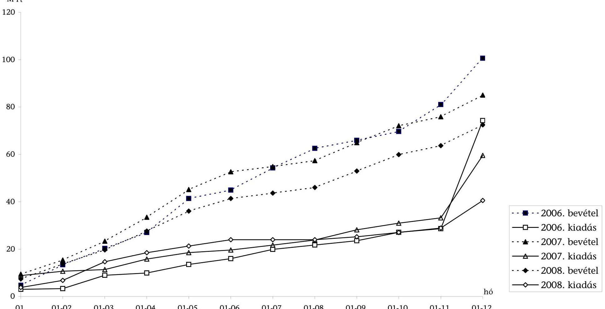

---

# A KTIA havi bevételei és kiadásai 

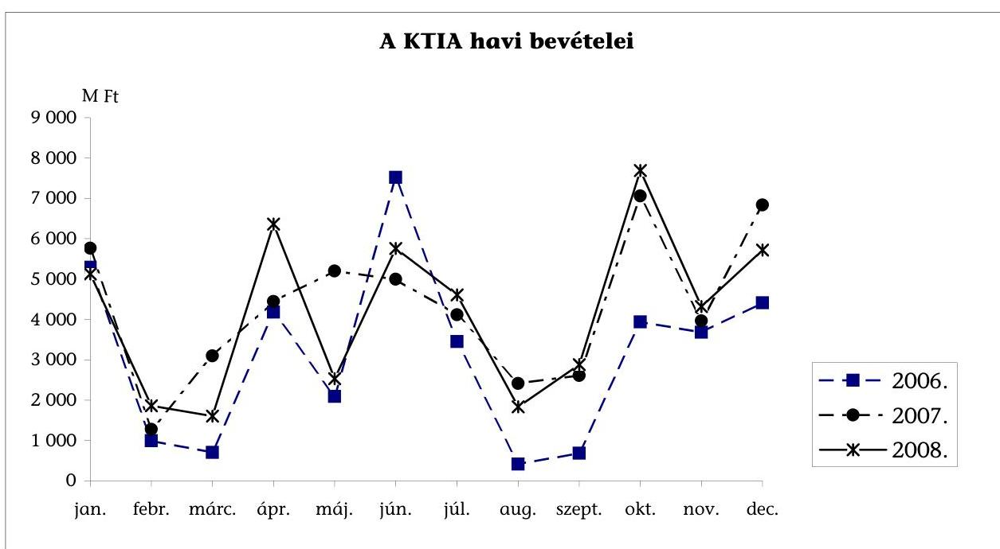

## A KTIA havi kiadásai

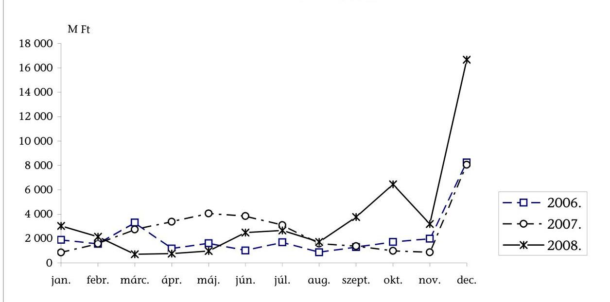

---

# A KTIA kumulált havi bevételei és kiadásai 

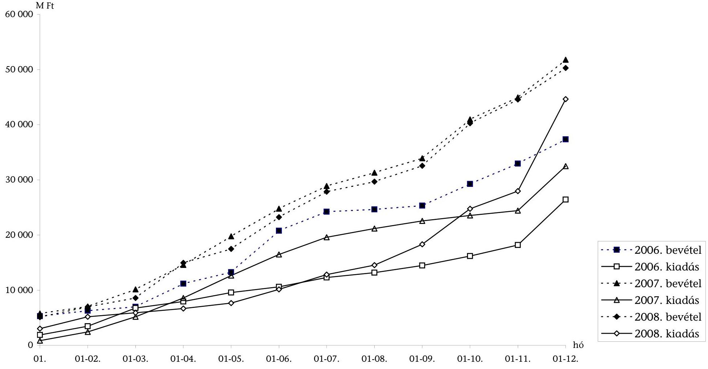

---

## **A KTIA kumulált kiadásainak aránya a kumulált bevételekben**

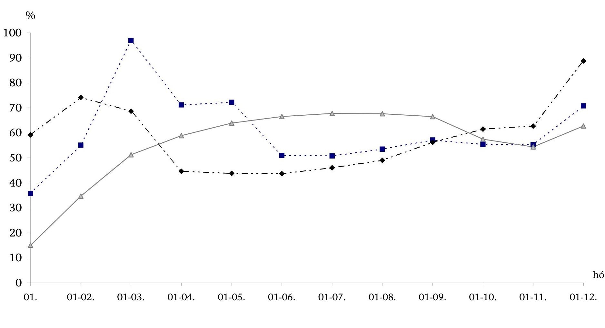

---

# Az SZA havi bevételei és kiadásai 

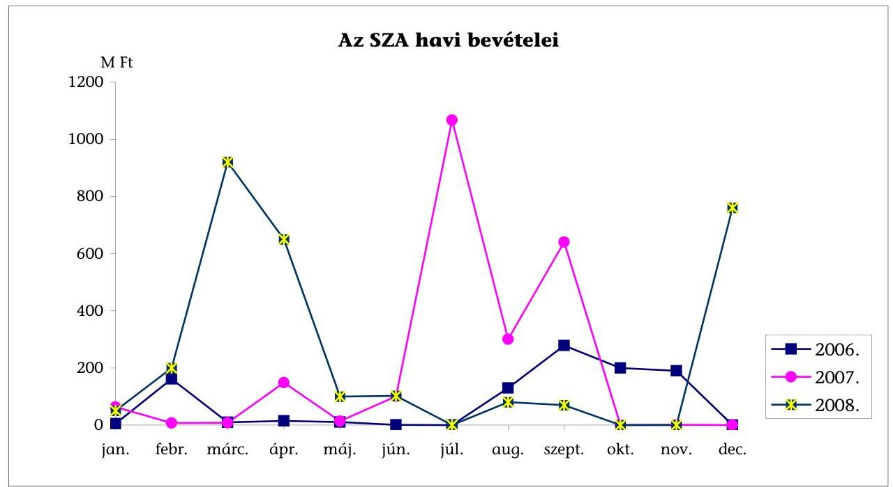

## Az SZA havi kiadásai

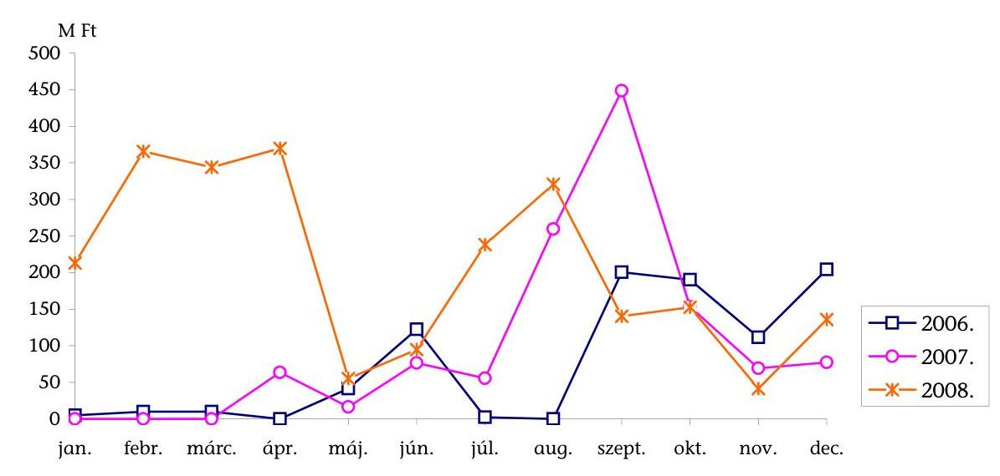

---

# Az SZA kumulált havi bevételei és kiadásai 

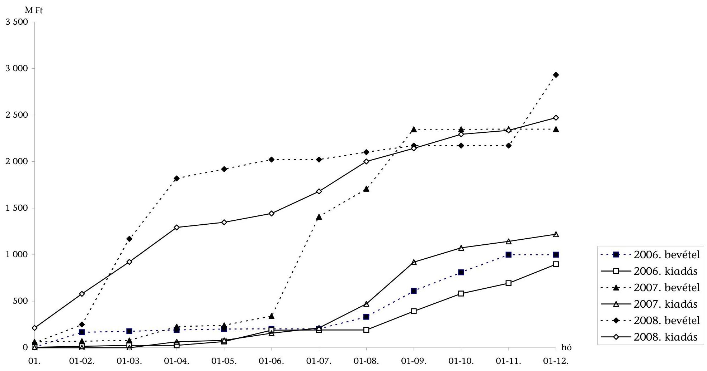

---

6/l. sz. melléklet
a V-2019-101/2008-2009. sz. jelentéshez

Az SZA kumulált kiadásainak aránya a kumulált bevételekben

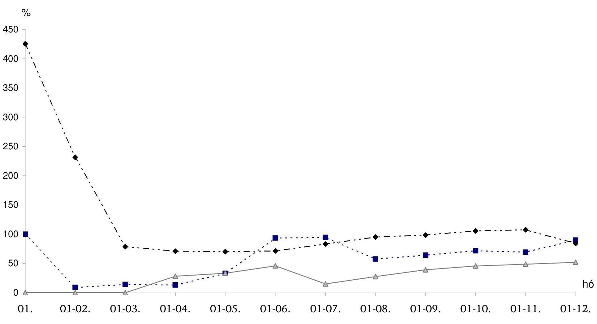

$$
\cdots = -2006 \quad \rightarrow 2007 \quad \rightarrow -2008
$$

---

# Az NKA havi bevételei és kiadásai 

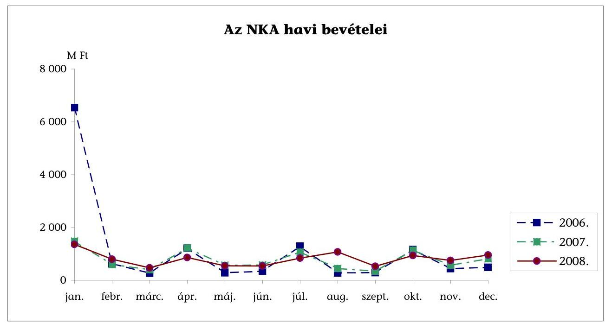

## Az NKA havi kiadásai

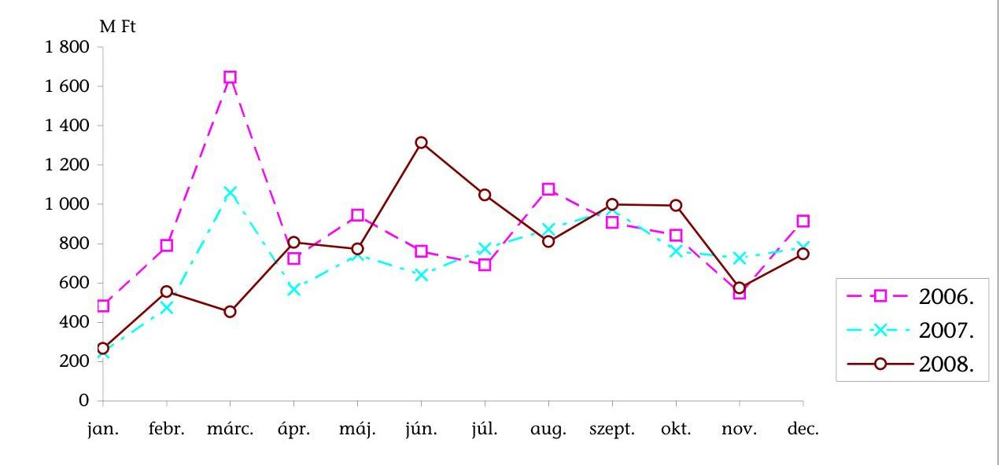

---

# Az NKA kumulált havi bevételei és kiadásai 

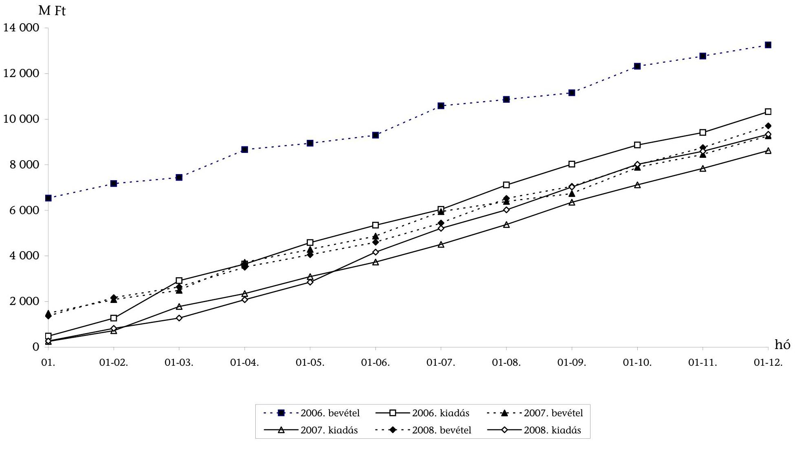

---

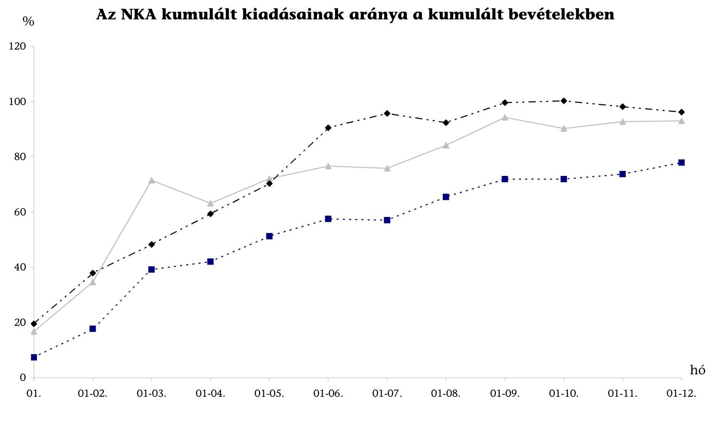

# Az NKA kumulált kiadásainak aránya a kumulált bevételekben

|  % | 01-02 | 01-03 | 01-04 | 01-05 | 01-06 | 01-07 | 01-08 | 01-09 | 01-10 | 01-11 | 01-12  |
| --- | --- | --- | --- | --- | --- | --- | --- | --- | --- | --- | --- |
|  0 | 01 | 01 | 01 | 01 | 01 | 01 | 01 | 01 | 01 | 01 | 01  |

hó

---

# Az egyes alapok múködési kiadásai 

7/a. Az egyes alapok működési költségei
7/b. Az egyes alapok működési költségeinek aránya

---

# Az egyes alapok múködési költségei

|   | MPA | KNPA | WMA | KTIA | SZA | NKA  |
| --- | --- | --- | --- | --- | --- | --- |
|  Alapkezelésre átadott pénzeszköz |  |  |  |  |  |   |
|  megjelenés a költségvetési törvényben | "alapkezelőnek átadott pénzeszköz", 2008-tól "múködtetési célú kifizetések" (több kiadási cím) | "alapkezelőnek múködési célra" (egyetlen kiadási cím) | "múködési kiadások" (egyetlen kiadási cím) | "alapkezelőnek átadott pénzeszköz", az ágazati törvény rögzíti az alap tárgyévi eredeti kiadási előirányzatának százalékában | "alapkezelő múködési költségei", az ágazati törvény végrehajtási rendelete rögzíti a tárgyévben teljesült bevétel százalékában | "múködési kiadások"  |
|  mértéke az ágazati törvény szerint | --- | --- | --- | 2\% 2004-től, 3,3\% 2005-tól, 4,5\% 2008tól | 5\%, 2007-től 10\% | ---  |
|  Testületek múködési költségeinek | különböző alaprészek esetén eltérő szabályozás | az Alap nem finanszíroz testületet | nincs testület |  |  |   |
|  forrása | alaprészek kiadásai |  |  | az alap múködésére biztosított összeg | az alap múködésére biztosított összeg |   |
|  tartalma (testület múködése, tagok költségtérítése és/vagy tiszteletdíja) |  |  |  | egyszeri megbízási díj a bírálóknak megbízási szerződás alapján | a kollégiumok tagjait költségtérítés illeti meg | a Bizottság és a kollégiumok tagjait díjazás, illetve költségtérítés illeti meg  |
|  mértéke |  |  |  | megbízási szerződés alapján | igazolt szállás- és utazási költség | igazolt szállás- és utazási költség  |
|  a tiszteletdíjat, ha van, ki állapítja meg |  |  |  | belső szabályozás | a költségtérítés elszámolásának rendjéről szóló szabályzat szerint | a miniszter állapítja meg, ezt a Bizottság határozatban rögzíti  |

---

# Az egyes alapok múködési költségeinek aránya

|   | MPA | KNPA | WMA | KTIA | SZA | NKA  |
| --- | --- | --- | --- | --- | --- | --- |
|   | "működtetési célú kifizetések" | "alapkezelőnek múködési célra" | "működési kiadások" | "alapkezelőnek átadott pénzeszköz" | "alapkezelő múködési költségei" | "működési kiadások"  |
|  Az alap éves kiadása (M Ft) |  |  |  |  |  |   |
|  2006-ban | 289 545,7 | 14 680,4 | 74,4 | 26 484,2 | 897,5 | 10 325,5  |
|  2007-ben | 341 318,6 | 13 068,6 | 59,7 | 32 298,4 | 1 221,2 | 8 623,6  |
|  2008-ban teljesített (előzetes) | 384 491,0 | 16 288,8 | 40,5 | 44 642,0 | 2 485,8 | 9 339,3  |
|  Az alap éves működési költsége (M Ft) |  |  |  |  |  |   |
|  2006. évi tervezett | 22 230,5 | 89,0 | 90,0 | 1 206,3 | 50,0 | 936,0  |
|  2006-ban teljesített | 24 849,1 | 89,0 | 29,0 | 1 206,3 | 50,0 | 983,7  |
|  2007. évi tervezett | 24 777,8 | 104,0 | 85,0 | 1 370,5 | 50,0 | 830,0  |
|  2007-ben teljesített | 27 759,2 | 104,0 | 59,5 | 1 370,5 | 183,6 | 916,5  |
|  2008. évi tervezett | 30 445,6 | 114,0 | 75,0 | 1 873,1 | 100,0 | 830,0  |
|  2008-ban teljesített (előzetes) | 30 430,6 | 114,0 | 40,3 | 2 554,2 | 206,9 | 959,4  |
|  Az alap éves (tényleges) múködési költségének aránya az éves kiadáshoz |  |  |  |  |  |   |
|  2006-ban | 8,6% | 0,6% | 39,0% | 4,6% | 5,6% | 9,5%  |
|  2007-ben | 8,1% | 0,8% | 99,7% | 4,2% | 15,0% | 10,6%  |
|  2008-ban | 7,9% | 0,7% | 99,5% | 5,7% | 8,3% | 10,3%  |
|  Az alapkezeléssel foglalkozók létszáma (fő) |  |  |  |  |  |   |
|  2006-ban | 49 | 5 | 3 | 146 | 3 | 87  |
|  2007-ben | 66 | 5 | 3 | 126 | 16 | 91  |
|  2008-ban | 68 | 5 | 2,5 | 126 | 16 | 91  |
|  A testületek létszáma (fő) |  |  |  |  |  |   |
|  2006-ban |  | - | - |  | 36 | 132  |
|  2007-ben |  | - | - |  | 48 | 132  |
|  2008-ban |  | - | - |  | 48 | 142  |
|  Az alapkezelő kizárólag az alap kezelésével foglalkozik (igen/nem) | nem | nem | nem | nem | 2007-től igen | nem  |

---

# Az MPA alaprészeit terhelő múködési kiadások jogcímei

|  Megnevezés | 2006. év | 2007. év | 2008. év  |
| --- | --- | --- | --- |
|  Müködési alaprész |  |  |   |
|  Alapkezelőnek átadott pénzeszköz | X | X | X  |
|  Megyei/regionális munkaügyi központok | X | X | X  |
|  Foglalkoztatási és Szociális Hivatal feladataira és fejlesztésre | X | X | X  |
|  OMMF müködéséhez hozzájárulás | X | X | X  |
|  Szakképzési és felnőttképzési feladatokat ellátó szervezetek müködtetése (NSZFI) |  | X | X  |
|  Foglalkoztatási és képzési célú közalapítvány müködtetésére (OFA) |  | X | X  |
|  Képzési alaprész |  |  |   |
|  A szakképzési hozzájárulás, valamint a támogatások lebonyolításával kapcsolatos feladatokat ellátó szervezet müködtetésére [Szht. 9. § (2) d)] | X | X | X  |
|  Igazgatás részére a felnőttképzési célú kiadások 1,5\%-a |  | X | X  |
|  Foglalkoztatási alaprész |  |  |   |
|  Regionális képző központok képzéssel kapcsolatos feladataira | X |  |   |
|  MAT müködtetése | X | X | X  |
|  A társadalmi párbeszéd müködtetésére | X | X | X  |
|  Megyei/regionális munkaügyi tanácsok müködtetése | X | X | X  |
|  Keresetpótló támogatáshoz postaköltségek | X | X | X  |
|  Állami felnőttképzési intézmény munkaerőképzéssel kapcsolatos feladataira (regionális képző központok) |  | X | X  |
|  Eu Szociális Alap támogatásait lebonyolító közremüködő szervezet müködéséhez hozzájárulás |  | X | X  |
|  Foglalkoztatási és képzési célú közalapítvány müködtetésére | X |  |   |
|  Érdekegyeztetés müködési feltételeinek biztosítása | X | X | X  |
|  Felnőttképzési feladatokat ellátó szervezet (NFI) müködésére | X |  |   |
|  A felnőttképzési célú keret legfeljebb 2\%-a a munkaügyi központok ellenőrzési feladataira | X |  |   |
|  Felnőttképzési célú keret 1,5\%-a az igazgatás részére | X |  |   |
|  Szolidaritási alaprész |  |  |   |
|  Ellátásokkal kapcsolatos postaköltségek | X | X | X  |
|  A kifizetéseket terhelő tb járulék, egészségügyi hozzájárulás | X | X | X  |
|  Rehabilitációs alaprész |  |  |   |
|  A foglalkozási rehabilitációt elősegítő közalapítványok támogatása | X | X | X  |
|  Az alaprész kezelésével, müködésével kapcsolatos költségek, a kiadási előirányzat $3 \%$-a | X | X | X  |
|  A központi keret terhére foglalkoztatási rehabilitációs közalapítvány részére | X | X |   |
|  Alaprészek között felosztott müködési költségek |  |  |   |
|  Egyes alaprészek terhére könyvvizsgálói dí arányos része, szakértői díj, hirdetési díj | X | X | X  |
|  A MPA-t illető járulékok beszedésének költségei | X | X | X  |
|  Az MPA alaprészeinek központi pénzügyi keretei által finanszírozott programok igazolt költségei | X | X | X  |

---

# FÜGGELÉK

---

# Állami feladatok elkülönített finanszírozása nemzetközi kitekintés 

A fejlett és a fejlődő országok központi kormányai éves kiadásaik (társadalombiztosítással együtt) mintegy 40\%-át a központi költségvetéstől elkülönített („extrabudgetary fund") finanszírozással költötték el 2002-2004-ben ${ }^{1}$. A nemzetközi szakirodalom szerint az elkülönítetten finanszírozott egység olyan elszámolási (intézményi, gazdasági) kategória, amely saját jogán eszközöket birtokolhat, kötelezettséget vállalhat, gazdasági ügyleteket, tranzakciókat végezhet más egységekkel, valamint saját számlákkal és mérleggel rendelkezik. Az elkülönített finanszírozás pénzalapok vagy önálló szervezetek múködtetésével valósul meg.

A kormányzat tulajdonában álló, ám sok esetben (és eredetileg) az éves költségvetés törvény hatálya alá nem tartozó elkülönített alapok, szervezetek bevételeit célzottan hozzárendelt adók, díjak, járulékok vagy a költségvetés - adókból származó bevételeiből átengedett - támogatásai, javak értékesítésének bevételei, hitelek képezték. Az elkülönített finanszírozás sajátos, elterjedt alkalmazását jelentik a társadalombiztosítási alapok. A fejlett országokban jól körülhatárolt keretek között, leginkább az ún. ügynökségi modellnek („agency model") megfelelően, a költségvetés folyamatába integráltan, nem önálló alszektorként múködik az elkülönített finanszírozás. Az Európai Unióban elfogadott prezentációnak megfelelően, a tagországok többségében az alapok részét képezik a központi kormányzat költségvetésének. A továbbiakban alapként hivatkozunk ezen egységekre.

Sokféle konkrét célból hoztak létre alapokat, így pl. a jövő generáció számára megtakarítások felhalmozására, fejlesztésre, a szélsőségesen változó bevételek kedvezőtlen gazdasági hatásainak tompítására, folyamatos tevékenység finanszírozásának az éves felhasználási rend alóli kivonására, az éves költségvetési alkufolyamat elkerülésére. Az alapokat irányíthatja a pénzügyminisztérium vagy a kincstár, valamelyik szaktárca, vagy egy független (autonóm) szerv (állami ügynökség, közalapítvány).

Az alapok létrehozására a szakértők szerint leginkább a költségvetés rendszerének, szabályozásának elégtelensége, korlátai, illetve politikai - gazdasági tényezők vezettek. A szakirodalom szerint a haszonelvű adózás elvének érvényesülése (tax benefit principle ${ }^{2}$ ), azon belül a célzott adókhoz kapcsolódó befize-

[^0]
[^0]:    ${ }^{1}$ Az elkülönített alapok nemzetközi tapasztalatait összefoglalta R. Allan és D. Radev in Managing and controlling Extrabudgetary Funds - OECD Journal on Budgeting - Vol. 6, No. 4. - OECD, 2006.
    ${ }^{2}$ Az adórendszert a legtöbb kritika a közteherviselés igazságos, méltányos elosztásával kapcsolatban éri. Az ún. haszonelvű adózás szerint a méltányos, igazságos adórendszerben az egyének befizetései összhangban vannak az általuk igénybe vett közszolgáltatásokkal, hozzájárulásuk mértéke lényegében a közszolgáltatások árát fejezi ki (Vígvári András: Közpénzügyek, önkormányzati pénzügyek - KJK-KERSZÓV, 2002. 4. fejezet).

---

tői elvárások is fontosak az alapok léte szempontjából. Egy tevékenység célzott adókkal finanszírozása lényegében megmutatja, hogy mennyibe is kerül a társadalomnak az adott tevékenység (szolgáltatás), és ki fedezi azt.

A költségvetés éves elszámolási rendszere nem felel meg például a hosszabb időtávú folyamatok (pl. a nyugdíjrendszer) működtetésének. A források nem megfelelő elosztása, feladat alul- vagy túlfinanszírozása szintén alap létrehozásához vezethet. A politikai szempontból érzékeny programok alapszerű finanszírozásával elkerülhetők az éves költségvetési ciklushoz kapcsolódó, rövidtávú zárolások. Sokkal könnyebb új adók bevezetéséhez politikai támogatást szerezni, ha az adókat konkrét, meghatározott célokra fordítják (pl. az útalap finanszírozására vetnek ki útadót, úthasználati díjat), bár az új adó fiskális hatása makroszinten ugyanaz, mint alap nélkül. Egyes, a társadalom által fontosnak tartott célokat, tevékenységet a politika alap létrehozásával ismer el. Előfordult, hogy éppen az átláthatóság elkerülésére hoztak létre alapot, ugyanis a bevételek ismeretében túl nagy lett volna a nyomás azok elköltésére ${ }^{3}$.

A célzott befizetési kötelezettségből (adó, járulék) származó előnyökre példa a társadalombiztosítási alap. A hozzájárulásokat a szociális partnerek (munkaadók és munkavállalók) fizetik, így az alap legalább annyira hozzájuk is tartozik, mint az államhoz. Ugyanezen okból a partnerek gyakran képviselettel rendelkeznek az alap irányító testületében, és sajátos szabályok vonatkoznak az alap irányítására, felhasználására is. Ugyanakkor az elméletet meghaladta egyes országok gyakorlata. Az Egyesült Királyságban például az egykor önálló társadalombiztosítási alapok integrálódtak a költségvetésbe, a "felosztókirovó" elv szerint ("pay as you go") finanszírozva azokat. Az elnevezésükben még az alapokhoz kötött társadalombiztosítási járulékok valójában a kormányzat bevételét képezik.

Bár mindegyik ország elfogadja az univerzalitás, a költségvetésnek a bevételek és kiadások teljes körére kiterjedésének elvét, kevés országban korlátozza a jog a költségvetésen kívüli finanszírozás alkalmazását (mint pl. Finnországban ${ }^{4}$ ). Mindegyik OECD országban találhatók törvényben meghatározott célokkal, bevételekkel és irányítással múködő alapok. A költségvetés parlamenti elfogadását tekintve különböző gyakorlat érvényesül. Előfordul, hogy a parlament csak tudomásul veszi, de nem hagyja jóvá az alap költségvetését (pl. az USAban a társadalombiztosítás és a postai szolgáltatások finanszírozását). A költségvetés jóváhagyása történhet az éves költségvetési törvény részeként (Egyesült Királyság, Nemzeti Biztosítási Alap), és attól elkülönítve is (Franciaország, Korea).

A makroszintű költségvetési politika szempontjából az a fontos, hogy a parlament tisztában legyen az aggregált (összes) bevétellel és kiadással. A kormányzati szektor tartalmát széles értelemben, az alapokkal együttesen ér-

[^0]
[^0]:    ${ }^{3}$ A 90-es években Észtországban a privatizációs alap múködésével a politikusok nehezebben látták át az alaphoz rendelt privatizációs bevételek alakulását, ami gátolta azok felhasználását.
    ${ }^{4}$ A finn alkotmány csak állandó (tartós) és lényeges állami feladatra, erős parlamenti felhatalmazással engedi meg elkülönített alap létrehozását.

---

telmezik a nemzetközi szervezetek (IMF, Eurostat), és ezt a definíciót használják az országok összehasonlításához, a költségvetési egyenleg és az adósság maastrichti kritériumokhoz mérésekor.

A fejlett országokban elterjedt az „ügynökségi modell" alkalmazása az elkülönített finanszírozásra. A törvénnyel, alapító okirattal vagy szerződéssel létrehozott, a kormányzat által meghatározott szabályok között múködő szerv forrásai célzott adókból, költségvetési támogatásból és saját bevételből keletkeznek. A szerv bizonyos távolságban a politikától, önállóan dönt a források felhasználásáról. Eszközei a közvagyon részei, amelyek saját célra (hasznára) nem használhatók fel. A szerv jogszabály (vagy a hagyomány) szerint elszámolásra, beszámolásra kötelezett. Magyarországon leginkább az állami tulajdonossal rendelkező közalapítványok, közhasznú szervezetek, nonprofit társaságok felelnek meg ennek a modellnek. Mikroszintű hatékonyságot akkor mutattak e szervezetek, ha vásárlói és nem pedig eladói szerepben jelentek meg a gazdaságban. Nem megfelelő irányítás és közpénzügyi szabályozás mellett a múködésük számos kockázattal járhat: a parlamenti, kormányzati céloktól eltérő célú pénzfelhasználás, az adósság elfogadott határon túli növelése, az elszámolási elvek be nem tartása, új korrupciós helyzetek kialakulása miatt. Átfogó irányítási, múködési keretek kialakítása csökkenti a kockázatot.

Irányítási-pénzügyi rezsimként múködnek az Egyesült Királyságban az ún. nem-hivatali közszervezetek („non-departmental public bodies"). A kormányzati folyamatokban (államigazgatásban) résztvevő, de a kormányzati szervek körébe nem tartozó szervek a miniszterektől hosszabb-rövidebb „kartávolságra, karnyújtásnyira", a pénzügyminisztérium által meghatározott szabályok szerint múködnek. Figyelembe veszik a kormányzati szektorra közzétett Magatartási szabályokat (etikai kódex, Code of Conduct), és a Számvevőszék (NAO) ellenőrzi őket.

A gyakorlati tapasztalatok azt mutatják, hogy az elkülönített finanszírozással sokszor nem érték el a szándékolt politikai célt. Az IMF stabilizációs és megtakarítási alapokról készített tanulmányában arra a következtetésre jutottak, hogy az olajtermelő országok megtakarításait nem befolyásolta, hogy mú-ködött-e megtakarítási alap vagy sem. A Világbank útalapokra vonatkozó áttekintése azt mutatta, hogy alap esetén bár emelkedett az útkarbantartásra fordított összeg, az még mindig elmaradt a szükségestől. Viszont arra is volt példa, hogy alap nélkül, az éves költségvetés keretei között megfelelően finanszírozták a feladatot.

Az alapok kedvezőtlen hatásaként tartják számon, hogy alkalmazásuk akadályozza a kiadások teljes körének egységes vezérlését, a források elosztásának az időközben megváltozott prioritásokhoz igazítását, a pénzeszközök (likviditás) gazdaságos és hatékony menedzselését. A célzott befizetések torzító hatással lehetnek az ágazaton belüli és az ágazatok közötti forráselosztásra. Indiában például az útalapok a közút fejlesztésére terelték a forrásokat, más szállítási mód, elsősorban a vasút hátrányára. A szállítás, mint ágazat fejlődése torzult, összességében magasabb költséggel valósult meg és kedvezőtlenül hatott a környezetre.

---

Annak eldöntésére, hogy a meglévő alapokat fenn kell-e tartani vagy meg kellene szüntetni, kritériumok állíthatók fel.

Először is, elegendő, alapos gazdasági és kormányzati indok szükséges a létrehozásukhoz. Az alapot teljes mértékben a célzott feladatra kell fordítani, a költségvetés elkerülése nem lehet oka a létrehozásának. Úgy kell megalkotni, mint egy ügynökséget (intézményt), amely szolgáltatások vásárlójaként, és nem eladójaként cselekszik. Alapvető, hogy legyen küldetése, világosan meghatározott céljai, és a tevékenység fizikai és pénzügyi eredményét mérő indikátorok. Ki kell alakítani az eszközök hatékony kezelését, az elszámolás, ellenőrzés és pénzügyi beszámolás feltételeit. Kívánatos, hogy a kormányzat hozzáférjen az alap egyenlegéhez az államháztartás pénzellátása (pénzgazdálkodás) céljából. A termelők érdekeit nem közvetítő, mindamellett a vállalkozói szektor képviseletét biztosító irányító testületet kell kinevezni, amely függetlenül, objektíven és részrehajlástól mentesen irányít.

Másodszor, irányítási és gazdasági szempontból megfelelően strukturált alapot kell létrehozni. A fiskális politika szempontjából össze kell hangolni az alap és az alapon kívüli közszektor múködését, a költségvetésüket együttesen kell számba venni, és biztosítani kell az átláthatóságot és elszámoltathatóságot. Ezeket a követelményeket az alapok költségvetési törvénybe foglalásával lehet leghatékonyabban megvalósítani. Ennek mintája az egységes költségvetés amerikai gyakorlata. Az egységes költségvetés nem fedheti el ugyanakkor az alapok (pl. társadalombiztosítás) hosszú távú, sajátos költségvetési hatásait, amelyeket külön kell bemutatni és elemezni, a konszolidált beszámoló keretei között.

Az alapokra is érvényesíteni kell a közpénzügyi szabályozás követelményeit, úgymint a parlamenti felügyelet, elszámolási, beszámolási, belső irányítási, belső és külső pénzügyi ellenőrzési, átláthatósági követelmények. A központi kormányzat valamennyi költségvetésen kívüli tevékenységét be kell mutatni a költségvetés dokumentumaiban, a beszámolóban és más pénzügyi jelentésekben, és a központi kormányzat konszolidált költségvetési pozícióját kell nyilvánosságra hozni.

Alapot csak körültekintő, gondos szabályozási környezetben szabad létrehozni és múködtetni. Amennyiben célzott bevételekből finanszírozzák, meg kell vizsgálni a jövedelem begyűjtési tevékenységet, annak elszámoltatását, átláthatóságát és megfelelőségét (célszerűségét). Racionálisnak tűnik, hogy a kormányzat adó-beszedésért viselt általános felelőssége okán egyetlen szervezet lássa el a feladatot.

Ideális esetben a költségvetést vezérlő valamennyi közpénzügyi szabály vonatkozik az alapokra is, úgy, mint a pénzellátás tervezése és szervezése, a kötelezettségvállalás, az egységes kincstári számla, az elszámolási és beszámolási rend, a pénzügyi jelentések, belső irányítás és pénzügyi ellenőrzés, külső felügyelet.
2009. június