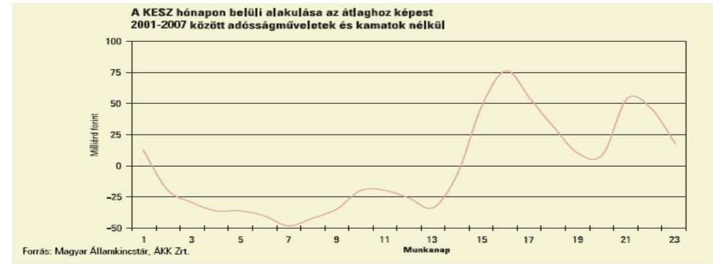
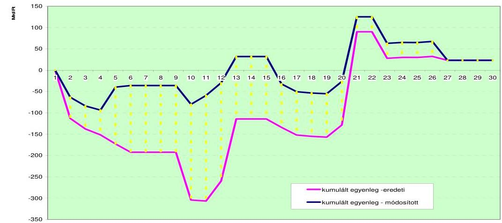
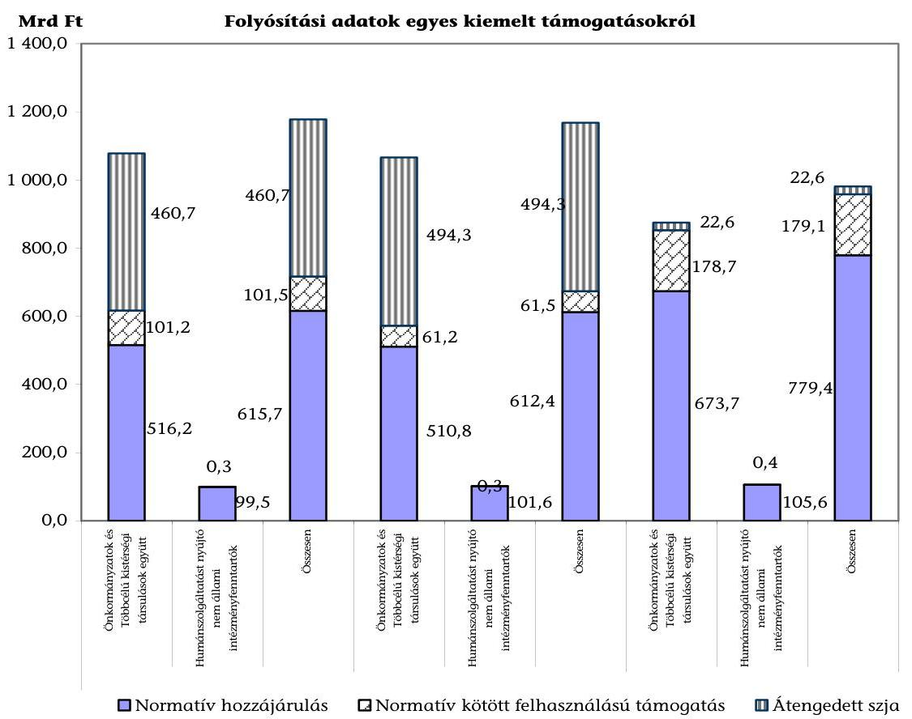
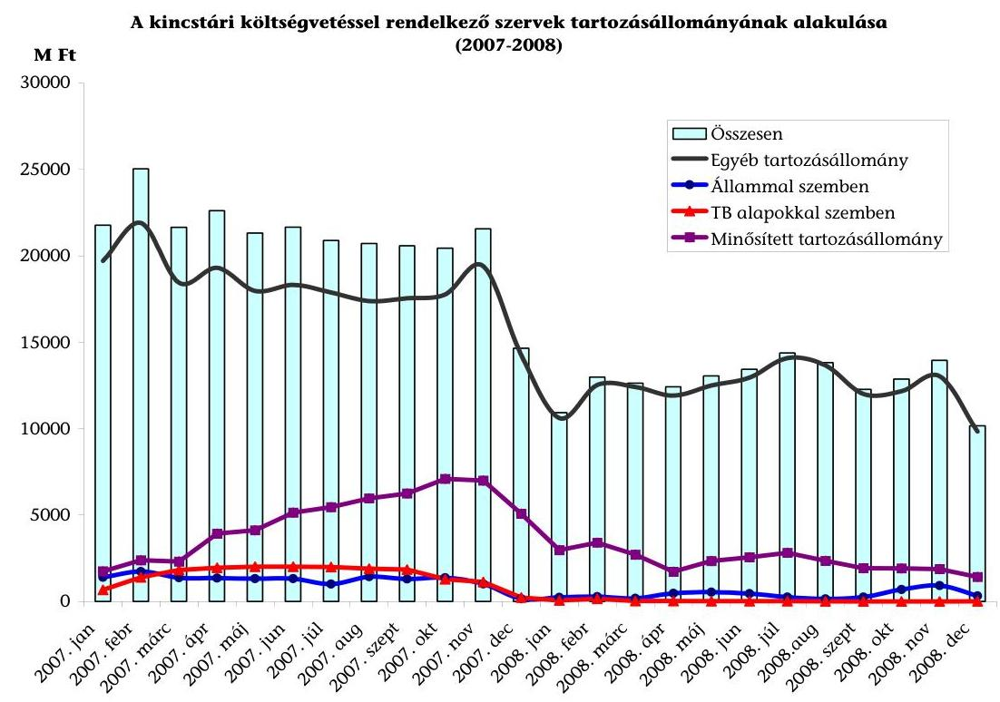
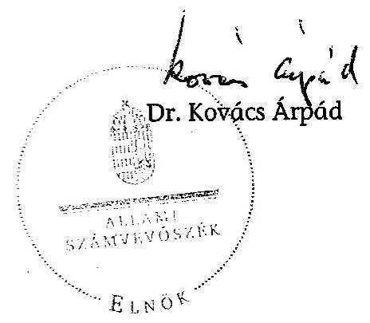
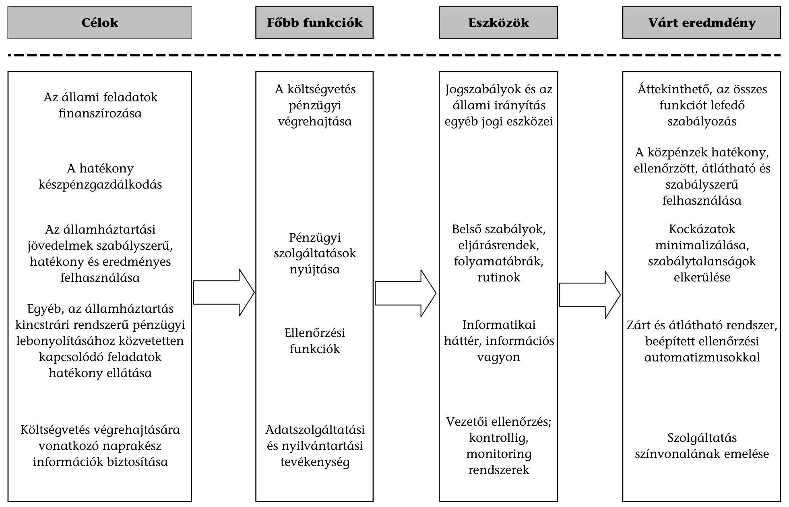
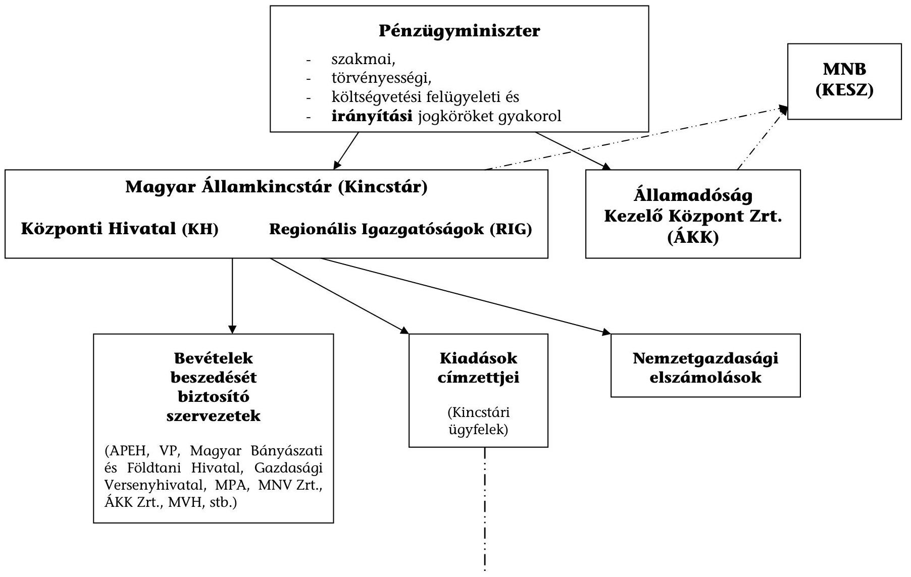
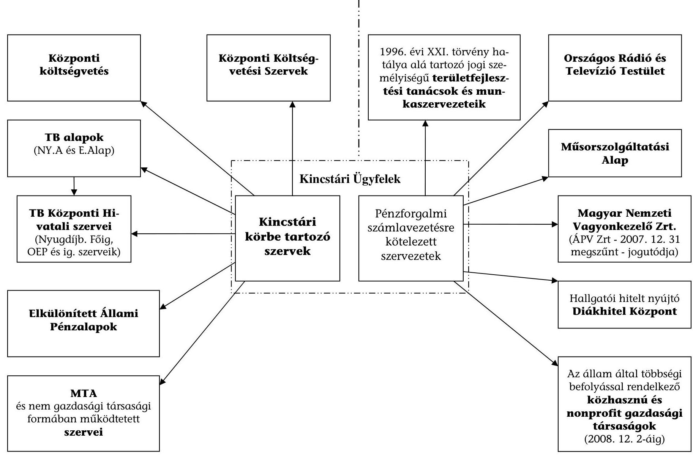
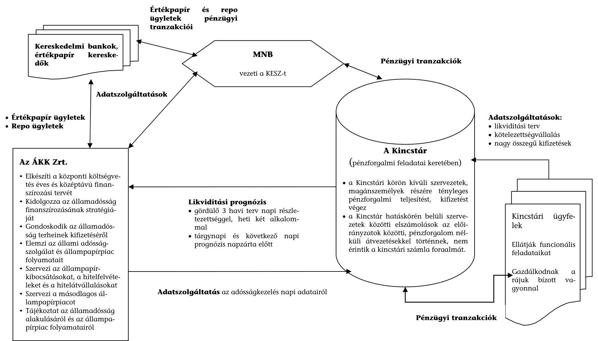
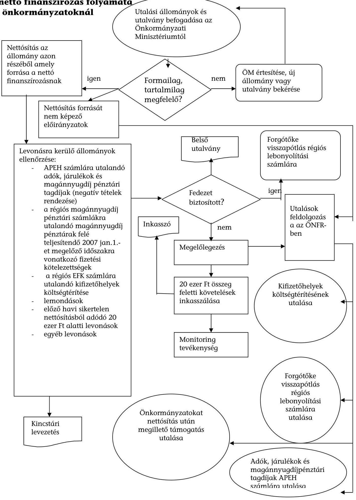

# ÁLLAMI   SZÁMVEVŐSZÉK 

## JELENTÉS

a kincstári rendszer múködésének ellenőrzéséről

---

2. Államháztartás Központi Szintjét Ellenőrző Igazgatóság
2.3. Átfogó Ellenőrzési Főcsoport

Iktatószám: V-2014-057/2008-2009.
Témaszám: 921
Vizsgálat-azonosító szám: V0415

# Az ellenőrzést felügyelte: 

Bihary Zsigmond
föigazgató
Az ellenőrzés végrehajtásáért felelős:
Hegedűsné dr. Müllern Veronika
főcsoportfőnök
Az ellenőrzést vezette:
dr. Horváth Margit
osztályvezető főtanácsos
Az ellenőrzést végezték:
Dede Katalin
számvevő tanácsos
tanácsadó

Hadnagyné Papp Ildikó Józsa Ferencné
számvevő
számvevő
Szilas István
számvevő tanácsos, tanácsadó

Temesváry Miklós
számvevő
Tóth Árpád
számvevő tanácsos, tanácsadó

A témához kapcsolódó eddig készített számvevőszéki jelentések:
címe
sorszáma
Jelentés a Magyar Államkincstár létrehozásának és múködésének 386 pénzügyi-gazdasági ellenőrzéséről.
Jelentés a központi költségvetés területén múködő belső kontroll 0115 mechanizmusok ellenőrzéséről.
Jelentés a Magyar Köztársaság 2006. évi költségvetése végrehajtásának ellenőrzéséről.
Jelentés a Pénzügyminisztérium fejezet múködéséről. 0801
Jelentés a Nemzeti Fejlesztési Ügynökség múködésének ellenőrzéséről.
Jelentés a Magyar Köztársaság 2007. évi költségvetése végrehajtásának ellenőrzéséről.
Tájékoztató az európai uniós támogatások 2007. évi felhasználásának ellenőrzéséről.

Jelentéseink az Országgyúlés számítógépes hálózatán és az Interneten a www.asz.hu címen is olvashatók.

---

# TARTALOMJEGYZÉK 

BEVEZETÉS ..... 5
I. ÖSSZEGZŐ MEGÁLLAPÍTÁSOK, KÖVETKEZTETÉSEK, JAVASLATOK ..... 9
II. RÉSZLETES MEGÁLLAPÍTÁSOK ..... 22

1. A kincstári rendszer célja, funkciói ..... 22
1.1. A kincstári rendszer szabályozása, szervezete és működése ..... 22
1.1.1. A kincstári rendszert érintő feladat- és hatáskörök megosztása ..... 29
1.1.2. A kincstári rendszer irányítása ..... 31
2. A költségvetés finanszírozása feltételeinek biztosítása ..... 34
3. Az államháztartás költségvetése végrehajtásának pénzügyi lebonyolítása ..... 36
3.1. A kincstári finanszírozási rendszer, illetve a Költségvetési Gazdálkodási Rendszer fejlesztése ..... 36
3.2. Az előirányzat-gazdálkodási és a kötelezettség-vállalási rendszer múködése ..... 40
3.3. Az önkormányzatok finanszírozása ..... 45
4. A Kincstár főbb állampénztári és egyéb banki feladatainak ellátása ..... 48
5. A kincstári rendszer kontrolljainak múködtetése ..... 52
6. A kincstári információs rendszerek és azok informatikai támogatottsága ..... 64
6.1. A költségvetés pénzügyi végrehajtásának információs rendszerei ..... 65
6.2. A központosított illetmény-számfejtési rendszer ..... 69
7. Az ÁSZ ellenőrzések kincstári rendszert érintő javaslatainak hasznosítása ..... 72
MELLÉKLETEK
8. számú Észrevétel
9. számú A kincstári rendszer múködésének fő jellemzői
10. számú A kincstári rendszer szereplői
11. számú A Kincstári Egységes Számla finanszírozásának rendje
12. számú A nettó finanszírozás folyamata az önkormányzatoknál

---

# FÜGGELÉKEK 

1. számú A Kincstár szervezetének főbb jellemzői
2. számú A Költségvetés Gazdálkodási Rendszer
3. számú Az információs rendszerek és az informatikai háttér jellemzői a Kincstárnál
4. számú A központosított illetmény-számfejtési rendszer

---

# RÖVIDÍTÉSEK JEGYZÉKE 

| Áht. | 1992. évi XXXVIII. törvény az államháztartásról |
| :--: | :--: |
| ÁKK Zrt. | Államadósság Kezelő Központ Zrt. |
| Ámr. | 217/1998. (XII. 30.) Korm. rendelet az államháztartás működési rendjéről |
| APEH | Adó- és Pénzügyi Ellenőrzési Hivatal |
| ÁROP | Államreform Operatív Program |
| ÁSZ | Állami Számvevőszék |
| e-Fiz | Elektronikus Fizetési Program |
| EKK | Elektronikus Közszolgáltatások Központja a Miniszterelnöki Hivatalban |
| EKOP | Elektronikus Közigazgatás Operatív Program |
| EU | Európai Unió |
| EüM | Egészségügyi Minisztérium |
| HM | Honvédelmi Minisztérium |
| IH | Közigazgatási Reform Programok Irányító Hatósága, Nemzeti Fejlesztési Ügynökség |
| Ket. | 2004. évi CXL. törvény a közigazgatási hatósági eljárás és szolgáltatás általános szabályairól |
| KESZ | Kincstári Egységes Számla |
| KGR | Költségvetési Gazdálkodási Rendszer |
| Kincstár | Magyar Államkincstár |
| KIR | Központosított Illetmény-számfejtési Rendszer |
| KSH | Központi Statisztikai Hivatal |
| KSZF | Központi Szolgáltatási Főigazgatóság |
| KSZK | Kormányzati Személyügyi Szolgáltató és Közigazgatási Képzési Központ |
| Ktv. | A köztisztviselők jogállásáról szóló 1992. évi XXIII. törvény |
| MK | Magyar Köztársaság |
| MNV Zrt. | Magyar Nemzeti Vagyonkezelő Zrt. |
| NFGM | Nemzeti Fejlesztési és Gazdasági Minisztérium |
| NFÜ | Nemzeti Fejlesztési Ügynökség |
| OGY | Országgyúlés |
| OKM | Oktatási és Kulturális Minisztérium |
| PM | Pénzügyminisztérium |
| PmISZK | PM Informatikai Szolgáltató Központ |
| SzMSz | Szervezeti és Müködési Szabályzat |
| TB | Társadalombiztosítás |
| ÚMFT | Új Magyarország Fejlesztési Terv |
| VP | Vám- és Pénzügyőrség |

---

4

---

# JELENTÉS   a kincstári rendszer múködésének ellenőrzéséről 

## BEVEZETÉS

A kincstári rendszer létrehozása hozzájárult az államháztartásról szóló 1992. évi XXXVIII. törvényben (Áht.) megfogalmazott cél, a közpénzekkel történő hatékony és ellenőrizhető gazdálkodás intézményesített garanciáinak megteremtéséhez. A rendszer szervezeteiről és azok fő feladatairól - fontossági sorrend felállítása nélkül - az Áht. rendelkezik ${ }^{1}$.

A kincstári rendszer 1996. január 1-jével kezdte meg múködését, ezzel megvalósult a pénzügyi reform egyik döntő fontosságú lépése, amellyel a költségvetés olcsóbb finanszírozása érdekében a kincstári körhöz tartozó szervezetek önálló pénzgazdálkodását megszüntették, ezt követően a pénzeszközeik a Magyar Nemzeti Bank (MNB) Zrt.-nél vezetett kincstári egységes számlán koncentrálódtak.

A Magyar Államkincstár (Kincstár), a kincstári rendszer létrehozásának indokait, céljait és körülményeit az alapítását követő évben megvizsgáltuk ${ }^{2}$. Jelentésünkben megállapítottuk, hogy a Kincstár létrehozásának már az 1980-as évektől felmerült igényét felerősítették a következő évtized elejétől megjelenő államháztartási kényszerek ${ }^{3}$ (növekvő költségvetési hiányok).

A kincstári rendszer szervezetei (2003 óta) a pénzügyminiszter által irányított Kincstár és az Államadósság Kezelő Központ Zrt. (ÁKK Zrt.), amelynél az állam tulajdonosi jogait ugyancsak a miniszter gyakorolja. A kincstári rendszer feladatainak ellátása során kapcsolatban áll a Kincstári Egységes Számlát (KESZ) vezető MNB mellett a bevételek beszedését biztosító intézményekkel, a kincstári ügyfelekkel, a számlavezetésre kötelezett, közpénzt felhasználó szervezetekkel, valamint a nem állami szervezetek és magánszemélyek széles körével.

[^0]
[^0]:    ${ }^{1}$ A törvény 2009. január 1-jéig hatályos 18/A-18/K. §-ai.
    ${ }^{2} 386$ sz. jelentés a Magyar Államkincstár létrehozásának és múködésének pénzügyigazdasági ellenőrzéséről.
    ${ }^{3}$ A 386. sz. jelentés szerint: „A nyolcvanas évek végétől több alkalommal is felmerült a költségvetési szervek pénzellátási, a kiadások előzetes finanszírozási rendjének megváltoztatása. A központi költségvetés hiánya az 1990-es évek elején drasztikusan emelkedett, ami felerősítette az új típusú pénzellátásra való áttérés igényét. Megalakulása óta az Állami Számvevőszék is folyamatosan jelezte a finanszírozási rendszer anomáliáit és szorgalmazta annak gyökeres átalakítását. Megvalósítása azonban késett, részben a költségvetési szervek ellenállása miatt hiúsult meg. (A kincstári finanszírozás rendszerében ugyanis az intézmények jellemzően előirányzatokkal és nem pénzeszközökkel gazdálkodnak.)"

---

A Kincstár feladata a költségvetés alrendszereiből származó kifizetések, illetve az oda érkező bevételek komplex, államháztartási és intézményi szintű kezelése ${ }^{4}$, amelyhez a jogcím, illetve a tranzakció jellege által differenciáltan - a technikai-pénzügyi lebonyolításon túlmenően - a különböző nyilvántartások vezetése, egyes hatósági jogkörök gyakorlása, kontroll-rendszer múködtetése kapcsolódik. Az ÁKK Zrt. felel ${ }^{5}$ a központi költségvetés folyamatos fizetőképességének fenntartásáért a kincstári rendszeren belüli források likviditáskezelésével, illetve a szükséges időben és mértékben a rendszeren kívüli források legkedvezőbb feltételek melletti bevonásával ${ }^{6}$. Mindkét szervezet múködtet monitoring, illetve információs rendszereket.

A kincstári rendszerben a költségvetési funkciók mellett megjelennek egyéb pénzügyi típusú feladatok is. A Kincstár pénzforgalmi szolgáltatásai keretében számlát vezet, lebonyolítja a pénzforgalmat, állampapírokat forgalmaz, gondoskodik a hatósági letétek kezeléséről. Emellett a költségvetési és az egyéb pénzügyi funkciókhoz közvetlenül nem kapcsolódó egyéb feladatokat is végez, amelyek keretében ellátja egyes alapok és (köz)alapítványok (pl.: Wesselényi Miklós Ár- és Belvízvédelmi Alap, Hadigondozottak Közalapítványa) pénzeszközeinek teljes körű kezelését. A Kincstár közremúködik az EU-s források felhasználásában ${ }^{7}$ is.

A Kincstár által lebonyolított tranzakciók, ki- és befizetések együttes összege nagyságrendileg megegyezik az éves bruttó hazai termékkel ${ }^{8}$. A Kincstár ügy-

[^0]
[^0]:    ${ }^{4}$ Ez a megállapítás az önkormányzati alrendszer vonatkozásában csak korlátozással igaz. Az önkormányzati szféra kiadásai és saját bevételei nem részei a kincstári rendszernek.
    ${ }^{5}$ Az Áht. 2. § szerint az államháztartást a központi kormányzat, az elkülönített állami pénzalapok, a társadalombiztosítás, valamint a helyi önkormányzat költségvetései (alrendszerek) alkotják. Az előbbi három alrendszer együttesen jelenti az állami költségvetést.
    ${ }^{6}$ Az ÁKK Zrt. részletes feladatai: az állami költségvetés fizetőképességének fenntartása, a központi költségvetés éves és középtávú finanszírozási tervének elkészítése, az államadósság finanszírozási stratégiájának kidolgozása, a központi költségvetés adósságát képező állampapír-kibocsátások, hitelfelvételek és hitelátvállalások szervezése, közremúködés az állami kezesség, garancia melletti hitel- és kölcsönfelvétellel, illetve hitelviszonyt megtestesítő értékpapír kibocsátással kapcsolatos feladatok ellátásában, a központi költségvetést terhelő adósság terheinek kifizetése, a másodlagos állampapírpiac szervezése (sajátszámlás kereskedés, értékpapír kölcsönzés, repó- és fordított repómúveletek, illetve azonnali és határidős-, fedezeti- és csereügyletek, származtatott ügyletek, letétkezelési és letét őrzési feladatok), továbbá tájékoztatás az államadósság és az államháztartási adósság alakulásáról és az állampapírpiac folyamatairól. Az ÁKK Zrt. igazgatóságának, felügyelő bizottságának tagjait a miniszter, mint a tulajdonosi jogok gyakorlója jelöli ki.
    ${ }^{7}$ A Kincstár a Nemzeti Fejlesztési Ügynökségtől (NFÜ) átvett feladatként ellátja a 2007-2013-as EU programozási időszakban az Európai Regionális Fejlesztési Alapból, az Európai Szociális Alapból és a Kohéziós Alapból származó támogatások fogadásához kapcsolódó pénzügyi lebonyolítási és ellenőrzési rendszerek kialakításáról szóló 281/2006. (XII. 23.) Korm. rendeletben meghatározott feladatokat is.
    ${ }^{8}$ A Kincstár, mint intézmény kiadási főösszegének 2008. évi teljesülése ennek kevesebb, mint $1 \%$-e, 28,4 Mrd Ft volt.

---

félforgalma - az egyes lakossági támogatások kezelésére tekintettel - jelentős. 2008-ban havonta több mint 2 millió főnek fizettek családtámogatást, és közel 800 ezer közszolgálati dolgozó $85 \%$-ának számfejtettek illetményt.

A Kincstár feladatköréből következően - intézménycsoportonként differenciáltan - államháztartási-szintű kontrollokat is érvényesít. A közpénzek felhasználásának nyomon követése érdekében az állami támogatások kedvezményezettjei lejárt köztartozásait, valamint a finanszírozott támogatási konstrukciók egyes adatait tartalmazó monitoring rendszert múködtet.

A kincstári rendszer fejlesztéseként 2007-ben megkezdték az államháztartás információs rendszerét hosszú távra meghatározó Költségvetési Gazdálkodási Rendszer (KGR) projektjének kidolgozását, továbbá a központi illetményszámfejtési rendszert támogató informatika fejlesztését.

A kincstári funkciók ellátását különböző adattartalmú informatikai, nyilvántartási és adatszolgáltatási rendszerek támogatják. A Kincstár vezeti a költségvetési szervek közhiteles törzskönyvi nyilvántartását, a központosított illet-mény-számfejtés keretében humán és illetmény adatokat kezel.

# A jelen ellenőrzés célja annak értékelése volt, hogy 

- a kincstári rendszer szabályozási környezete, intézményrendszere megfelelően szolgálja-e a közpénzek felhasználásának átláthatóságát, hatékonyságát, ellenőrizhetőségét, továbbá a döntéshozók számára biztosítja-e a költségvetés végrehajtásáról a naprakész információkat;
- a kincstári rendszer alapfunkcióit támogató információs, illetve informatikai rendszerek fejlesztései miként segítik az eredményesen működő, zárt kincstári rendszer múködését;
- a közpénzek kiutalásának és felhasználásának ellenőrzöttsége és/vagy monitoringja mennyiben támogatta a szabály- és célszerű felhasználást, a döntéshozók beavatkozásai elérték-e a kitűzött célokat;
- a kincstári rendszer intézményei a belső kontrollrendszerük fejlesztésében hasznosították-e a korábbi számvevőszéki ellenőrzések megállapításait, ajánlásait.

A téma jelentőségét alátámasztották az éves költségvetések végrehajtásának ellenőrzése keretében tett, a kincstári rendszer hibáit érintő megállapításaink, észrevételeink és javaslataink ${ }^{9}$. (Pl.: a zárszámadási törvényjavaslat nem tartalmazta a hosszú távú kötelezettség-vállalások állományának összefoglaló, rendszerezett bemutatását; a kincstári információ-szolgáltatás tapasztalatairól, valamint a KESZ-en kívül lebonyolított pénzforgalomról csak néhány fejezet számolt be; a Pénzügyminisztérium (PM) nem rendelkezett a 2007. évi általános tartalék előirányzat terhére megemelt fejezeti előirányzatok tényleges felhasználására, esetleges maradványára vonatkozó információval).

[^0]
[^0]:    ${ }^{9} 0724$ sz. jelentés a Magyar Köztársaság 2006. évi költségvetése végrehajtásának ellenőrzéséről, 0824 sz. jelentés a Magyar Köztársaság 2007. évi költségvetése végrehajtásának ellenőrzéséről.

---

A kincstári rendszert, annak egyes intézményeit, illetve funkcióit a bevezetését követően többször vizsgáltuk. Külön vizsgálat keretében ellenőriztük a Kincstárnak az államháztartás kontroll rendszerében betöltött helyét, ${ }^{10}$ majd 2000ben a központi költségvetés adóbevételei, illetve a társadalombiztosítást illető adó- és járulékbevételek realizálását ${ }^{11}$, valamint 2006-ban az államháztartás adóssága kezelésének alakulását ${ }^{12}$. A PM fejezet múködésére vonatkozó ellenőrzéseink ${ }^{13}$ is érintették az egyes kincstári funkciók múködését. Jelen vizsgálatunk során első alkalommal ellenőriztük rendszerszemléletben a kincstári rendszer múködését.

A jelen ellenőrzésünk a 2007-2008. éveket fogta át, kitekintve a vizsgálat befejezéséig tartó időszak releváns folyamataira. Az ellenőrzést a teljesítmény-ellenőrzés-rendszerellenőrzés módszerével végeztük, amelynek során alkalmaztuk az ellenőrzési kritériumokat tartalmazó kérdésfát, a tanúsítványok adatszolgáltatását, a kérdőíves felmérést, valamint a helyszíni interjúk készítését.

A rendszerellenőrzésünk kiterjedt azokra az alap- és támogató funkciókra, illetve folyamatokra, amelyek a kincstári rendszerben hatással voltak a döntéshozók által kitűzött célok teljesülésének eredményességére. Vizsgáltuk, hogy az irányító/felügyeleti funkciókat ellátó miniszter megfelelő intézkedéseket és eljárásokat alakított-e ki az erőforrások hatékony felhasználása és a kitűzött célok elérése érdekében. Vizsgálatunkban hasznosítottuk a korábbi ellenőrzéseink tapasztalatait, megállapításait.

Az ellenőrzés végrehajtásának jogszabályi alapját az Állami Számvevőszékről szóló 1989. évi XXXVIII. törvény 2. § (3), (5), valamint a 17. § (3) bekezdéseiben foglaltak képezték.

A jelentés-tervezetet egyeztettük a pénzügyminiszterrel, aki észrevételt nem tett (levelét az 1. sz. melléklet tartalmazza).

[^0]
[^0]:    ${ }^{10}$ 0115. sz. jelentés a központi költségvetés területén múködő belső kontroll mechanizmusok ellenőrzéséről (2001).
    ${ }^{11}$ 0028. sz. jelentés a központi költségvetés adóbevételei, illetve a társadalombiztosítást illető adó- és járulékbevételek realizálásának ellenőrzéséről.
    ${ }^{12}$ 0604. sz. jelentés az államháztartás adóssága kezelésének, alakulásának ellenőrzéséről.
    ${ }^{13}$ 0431. és 0801. sz. jelentés a PM fejezet múködéséről.

---

# I. ÖSSZEGZŐ MEGÁLLAPÍTÁSOK, KÖVETKEZTETÉSEK, JAVASLATOK 

Az államháztartási pénzeszközökkel, vagyonnal történő szabályszerű, szabályozott, gazdaságos, hatékony és eredményes gazdálkodás ${ }^{14}$ megvalósításában a kincstári rendszernek kiemelt szerepe van, annak ellenére, hogy a rendszer intézményei számára („küldetésként") azokat jogszabályok nem rögzítették.

A Magyar Államkincstár (Kincstár) létrehozásáról szóló jelentésünkben ${ }^{15}$ megállapított kedvezőtlen jelenségek (a feladatstruktúra állandó bővítése a szükséges előkészítés és a források biztosítása nélkül; a szabályozási környezet elemei harmonizálásának elmulasztása, továbbá a folyamatos szervezet-fejlesztés hiánya) - tapasztalataink alapján - a kincstári rendszer múködését ${ }^{16}$ még a jelen vizsgálatunk idején is jellemezték.

Az államháztartási reformnak a költségvetési szervek gazdálkodási modelljét, a gazdálkodási jogköröket, továbbá az ellátásuk technikai-szervezeti rendszerét érintő intézkedései a kincstári rendszer múködésére is hatottak, általában - a szükséges források hozzárendelése nélkül - többletfeladatokat indukáltak.

A szabályozási változások, illetve a(z informatikai) fejlesztések kapcsán - kivéve a létszámcsökkentéseket és a szervezeti változásokat - kormányzati szinten nem fogalmazták meg az államháztartás (legalább az állami költségvetés) érdekeit képviselő makro-, illetve az intézményi szint, továbbá a fejezetgazdák (középirányító szervek) közötti gazdálkodást érintő jog- és hatáskörök célszerűbb megosztása rendszerszemléletú áttekintésének igényét, bár ennek lehetőségét a „státusztörvény" ${ }^{17}$ megteremtette. A törvény újszerű és hiánypótló, egyúttal a makro-fiskális keretekhez való mikro szintű költségvetési alkalmazkodást is elősegíti, egyben az állami szervezetek és feladataik felülvizsgálatából következő intézkedések stabil intézményi alapra helyezéséhez is

[^0]
[^0]:    ${ }^{14}$ Ezek az Áht. 120. § (1) bekezdése szerint az államháztartási kontrollok alapvető céljai. A törvény alapján az államháztartás kontrollja az ÁSZ ellenőrzéseivel és az intézményi szintű belső kontrollrendszerek keretében történik. Az államháztartási - vagy központi költségvetés - szintű belső kontrollokról nem rendelkezik a hatályos szabályozás.
    ${ }^{15} 386$ sz. jelentés a Magyar Államkincstár létrehozásának és múködésének pénzügyigazdasági ellenőrzéséről.
    ${ }^{16}$ Működésének főbb jellemzőit az 2. sz. melléklet tartalmazza.
    ${ }^{17}$ A költségvetési szervek jogállásáról és gazdálkodásáról szóló 2008. évi CV. törvény.

---

kereteket biztosít ${ }^{18}$. Fő célja a teljesítmény-követelmények középpontba állításával a közfunkciók költséghatékony ellátásának elősegítése. Ennek érdekében előírja, hogy az intézményeknek a közfeladat-ellátásukat tartalmilag, és szervezési oldalról meg kell alapozniuk, melyhez szükséges - az ágazati jogszabályok kidolgozásán túl - az éves követelmények, jellemző mutatók kidolgozása, az elvárt és számszerúsített teljesítmény meghatározása, végrehajtásának irányító szervi értékelése.

A kincstári rendszerrel kapcsolatban álló intézményekre vonatkozó szabályozásokban az eltérő előírások, az indokolatlan kivételek nagy száma jelentősen korlátozza az államháztartás hatékony múködését. A modern szervezetműködtetetés alapját képező, az egyes folyamatokat támogató informatikai rendszereknél, illetve azok fejlesztésénél hiányoztak a központilag meghatározott stratégiák. Döntően a „megörökölt" rendszerekre alapozták a múködést, melyek következménye az informatikai rendszerek összehangolatlan fejlesztése, az egyenetlen és eltérő színvonalú megoldások alkalmazása ${ }^{19}$ volt.

A kincstári rendszerbe az államháztartás alrendszereinek ${ }^{20}$ és gazdálkodási folyamatainak egyre szélesebb körét vonták be, növelve ezzel az átláthatóságot, az ellenőrizhetőséget. Ugyanakkor az önkormányzati alrendszer ellenőrzésünk idején is csak részlegesen kapcsolódott a rendszerhez. Szélesebb körű bevonása hozzájárulhat az államháztartás hatékonyabb működéséhez, egyben ezen a területen a korrupciós kockázatok mérsékléséhez. Az önkormányzatokat megillető normatív hozzájárulás elszámolási módja nem teljes körűen szabályozott az intézményfenntartó, illetve a többcélú kistérségi társulásnál (új belépő és a működési engedély összefüggése). Az éves normatíva fajlagos összege minden fenntartónál azonos, a fenntartókra vonatkozó nem összehangolt szabályozás (eltérő létszámmérési időpontok és gyakoriságok) miatt előfordul(hat)nak jogszerű párhuzamos igénybevételek.

Kockázatot jelent, hogy a kistérségi fejlesztési tanácsok által területfejlesztésre elnyert állami támogatás felhasználására létrehozott gazdasági/közhasznú társaságoknál a Kincstárnak jogszabály csak közvetett ellenőrzési lehetőséget biztosít (a támogatási szerződésekben az ellenőrzés-tưrési kötelezettség előírása).

[^0]
[^0]:    ${ }^{18}$ A törvény alapvetően új szabályozást nyújt a költségvetési szervek jogállása (alapítása, átalakítása, megszüntetése stb.), azok múködése és gazdálkodása, közfeladatnak nem gazdálkodó szervezeti formában való ellátása terén. A törvény a korábbi szabályozáshoz képest differenciáltabban (az alapító, a tevékenység, a feladatellátáshoz kapcsolódó funkciók) különbözteti meg a költségvetési szervek különböző típusait, amelyekre eltérő szabályozást állapít meg.
    ${ }^{19}$ Eltérő platformon fejlesztett, párhuzamos adatbevitelt is igénylő rendszerek támogatják a még azonos kincstári funkciókat is. Pl. az előirányzat-gazdálkodás és a főkönyvi rendszer Oracle platformon, a kötelezettségvállalás Magic rendszerben, a jelentéskészítő rendszer DOS alapon, míg a napi gyorsjelentésekhez kapcsolódó analitikus nyilvántartások Excel táblában múködnek.
    ${ }^{20}$ A kincstári rendszer szereplőit a 3. sz. melléklet mutatja be.

---

A központi hivatalként ${ }^{21}$ működő, közel 4 ezer főt foglalkoztató, területi hálózattal rendelkező Kincstár rendkívül heterogén és folyamatosan bővülő feladatrendszere különösen indokolttá teszi az irányítási tevékenység erősítését, a Kincstáron kívüli szakmai koordináció biztosítását, a Kincstáron belüli tevékenység szorosabb felügyeletét.

A Kincstár vonatkozásában - a helyszíni ellenőrzés idején - az operatív irányítási jogokat az államtitkár gyakorolta, ezáltal a Kincstár stratégiai kérdésekben a PM-ben megfelelően magas szinten képviselhette a szakmai-szervezeti érdekeit. Esetleges volt a szakmai kontroll és koordináció a Kincstárral kapcsolatos döntés-előkészítésben, továbbá az egyeztetések során. Ehhez az is hozzájárult, hogy az államtitkár nem alakította ki az irányítási feladatok ellátásához a szervezeti hátteret. A Kincstár rendkívül szerteágazó feladatainak hatékony koordinációját, az információáramlást, a normaalkotás minőségét kedvezőtlenül befolyásolta, hogy a Kincstár szakmai beszámolási rendje kevésbé volt átfogó és intézményesített.

A Kincstár feladatrendszere és a kapcsolódó szervezeti megoldásai, múködési folyamatai gyakran a szükségesnél kevesebb idő és/vagy erőforrás igénybevételével alakultak ki. A Kincstárnak elsődleges célja alapvetően a feladatellátást biztosító múködés megteremtése és folyamatos fenntartása volt, tekintet nélkül a hatékony(abb) múködtetés szempontjaira. A Kincstárnak sem kapacitása, sem forrása ${ }^{22}$ (külső szakértők) nem volt a Kincstár megalapozott, hatékonyabb megoldások érdekében szükséges átfogó átvilágítására ${ }^{23}$.

Az állami költségvetés egésze és intézményei folyamatos fizetőképességének fenntartása ${ }^{24}$ elsősorban az ÁKK Zrt. feladata és felelőssége. Ugyanakkor a pénzeszközök optimális szinten való biztosítása/tartása (likviditáskezelés) a Zrt. és a Kincstár összehangolt és egymásra épülő feladatainak eredménye ${ }^{25}$.

[^0]
[^0]:    ${ }^{21}$ A 311/2006. (XII. 23.) Korm. rendelet szerint.
    ${ }^{22}$ Ugyanakkor mind a Kincstár, mind az irányító szerve pályázhat(ott volna) az ÚMFT Államreform Operatív Program (ÁROP) forrásaira, hiszen az ÁROP prioritási tengelyei (konvergencia célkitűzései) közé tartozik a folyamatok megújítása és szervezetfejlesztés.
    ${ }^{23}$ A Kincstár 2006. évi költségvetése teljesítésének megbízhatósági vizsgálata keretében javaslatot tettünk a rendkívül bonyolult szervezeti felépítésű intézménynél az egyes folyamatok, a nyilvántartási rendszerek, valamint az adatszolgáltatások tartalmi követelményei egységesítésére, valamint a gazdálkodásra vonatkozó szabályzatokban a specialitások részletezésén túlmenően az egyes részfolyamatokat egyszerűsítő konkrét szabályozásra.
    ${ }^{24}$ A költségvetés finanszírozása alapvetően a KESZ pénzállományának a kincstári kifizetések lebonyolításához elegendő szintű, folyamatos biztosítását, valamint az előre nem látott finanszírozási sokkokra nyújtott biztonságot jelenti. Az ÁKK Zrt. a finanszírozás érdekében évente meghatározza a KESZ optimális állományát, és ahhoz képest a nap végi állományt $\pm 50 \mathrm{Mrd}$ Ft-os sávban kell tartania.
    ${ }^{25}$ A Kincstár kötelezettsége a likviditáskezeléssel kapcsolatban, a pénzügyminiszter által előírt módon, előre kimutatni a Kincstár által vezetett számlák kiadásai és bevételei összesített egyenlegének alakulását, amelyhez az adósságkezeléssel összefüggő napi adatokat az ÁKK Zrt. bocsátja rendelkezésre.

---

A kifizetések teljesítésének optimalizálását részben szabályozásbeli, részben technikai hiányosságok akadályozzák. A likviditás-kezelés hatékonyságát korlátozza, hogy a Kincstár a kincstári kör egészét magában foglaló fizetőképesség menedzseléséhez nem rendelkezik jogszabályi felhatalmazással, technikai feltételekkel, illetve a szükséges részletezettségű információkkal ${ }^{26}$. A szabályozás alapján a Kincstárnak nem kötelezettsége, egyben hatékony eszköze sincs arra vonatkozólag, hogy likviditáskezelési célból az általa lebonyolított pénzügyi tranzakciók teljesítési időpontját a likviditás figyelembevételével optimalizálja. Többletterhet jelent a költségvetés finanszírozása szempontjából, hogy a bevételek beérkezésének és a kifizetések teljesítésének - jogszabályban rögzített - időpontjai eltérnek egymástól. A pénzforgalmi bevételek közel fele (jövedelmek után fizetett adók, járulékok) havonta, 12-e után érkezik a Kincstárba, a finanszírozási szükséglet viszont tipikusan havonta 4-e körül jelentkezik, ameddig a KESZ-re nem érkeznek jelentős nagyságrendben adó- és járulék bevételek. A kifizetési és a befizetési időpontok optimalizálásával mérsékelhető lenne a $\mathrm{KESZ}^{27}$ ingadozása, illetve olcsóbb finanszírozása is megvalósulhatna.

A Kincstár naponta kimutatja - nominálértéken - az általa prognosztizált KESZ-állomány és a tényleges teljesülés közötti különbséget, amely mutató alkalmas a prognózisok pontosságának mérésére. Nem készült azonban rendszeres jelleggel olyan elemző, értékelő dokumentum, amely az előrejelzések pontosságára ${ }^{28}$ vonatkozó megállapításokat összefoglalná és hozzáférhetővé tenné a likviditáskezelésben érintett szervezetek (ÁKK Zrt., PM) számára ${ }^{29}$.

A likviditáskezelés hatékonyságát a KESZ optimális sávban tartása teszi mérhetővé. Általában a sáv felső határát meghaladó likvid pénzeszköz a finanszírozáshoz szükséges hitelkonstrukciók költségei miatt többletkiadást jelent az államháztartás számára, amit (részben) ellensúlyoz az MNB-től kapott piaci kamat. A sáv alsó értéke alatti pénzeszköz állomány - ha a piaci viszonyok miatt tartóssá válik - viszont veszélyezteti az államháztartás fizetőképességét. A likviditáskezelés jelenlegi rendszerében mutatkozó hiányosságokat - a javuló tendenciák mellett - jelzi, hogy az ÁKK Zrt. saját eszközeivel a KESZ állományát 2006-ban 79 napon (31,3\%), 2007-ben 57 napon (22,7\%) ${ }^{30}$ nem tudta az optimális sávban tartani. A KESZ napi likviditáskezeléséhez, az ÁKK Zrt. részére biztosítandó megbízható és pontos információk rendelkezésre állásával kapcso-

[^0]
[^0]:    ${ }^{26}$ Ezt a problémát csak részben enyhítette, hogy a KESZ helyzetének prognosztizálása céljából került sor a fejezeti kezelésű előirányzatok finanszírozásának átalakítására, a nagy összegű, 500 M Ft feletti kifizetések előzetes bejelentésére, a kötelezettségvállasok bejelentésének kiterjesztésére, valamint a rendelkezésre állási dí bevezetésére.
    ${ }^{27}$ A KESZ finanszírozásának rendjét a 4. sz. mellékletben mutatjuk be.
    ${ }^{28}$ A pénzügyminiszter által előírt adatszolgáltatások (kötelezettség-vállalás, nagy öszszegű kifizetések előzetes bejelentése) - mivel nem voltak teljes körűek - csak korlátozottan javították a Kincstár prognózisainak megalapozottságát, továbbá a KESZ előrejelzés készítésének módszere sem változott.
    ${ }^{29}$ A Kincstár prognózisai általában óvatosak, alulbecsültek, pontosságuk a vizsgált években javuló trendet mutatott.
    ${ }^{30}$ A KESZ deviza műveletek nélkül számított értéke 2006-ban 150 nap (59,5\%), 2007ben 133 nap (53\%) sávon kívüli érték volt.

---

latban tett ÁSZ javaslatra nem készült intézkedési terv, illetve a realizálásra tett intézkedések nem voltak megfelelőek.

A költségvetés pénzügyi végrehajtásának folyamatait a kapcsolódó bizonylatok magas száma, bonyolult, összetett tevékenységek jellemzik. A kincstári finanszírozási rendszer ${ }^{31}$ speciális előírásainak és kivételeinek ${ }^{32}$ kezelése az előirányzat-gazdálkodási rendszer átláthatóságát nem támogatja. A kockázatot a Kincstár technikailag részletezett eljárásrendekkel, valamint folyamatos vezetői ellenőrzéssel ellensúlyozta.

A kötelezettség-vállalások bejelentésére kialakított rendszer nem terjed ki az összes szerv valamennyi előirányzatára ${ }^{33}$, ezáltal nem támogatja a költségvetés pénzügyi végrehajtásának kiszámíthatóságát, az intézmények gazdálkodási fegyelmének erősítését, továbbá a költségvetési kiadások megbízható előrejelzését sem ${ }^{34}$. A kockázatok csökkentésére történtek előrelépések (a kötelezettség-vállalások határidőhöz kötése, rendelkezésre állási díj bevezetése), a megszüntetésükre azonban informatikai háttér hiányában nem került sor.

A Kincstárnak a költségvetés pénzügyi teljesítéséhez kapcsolódó előzetes fedezeti és bizonylati ellenőrzési tevékenysége ${ }^{35}$ csak részben alkalmas a jogosulatlan kifizetések megakadályozására, mivel a bizonylatok mögött lévő valós teljesítmények elvégzésének ellenőrzése utólagosan és esetlegesen történik. A jogtalan és célszerűtlen kifizetések kiszűrése alapvetően a költségvetési

[^0]
[^0]:    ${ }^{31}$ A Kincstár finanszírozási feladatkörében az éves költségvetési törvényben jóváhagyott kiadási és - a bevételeket is beszámító - támogatási előirányzatok kereteinek megnyitását, a kincstári körbe tartozó költségvetési szervezetek számlavezetését, a fizetési megbízásaik teljesítését, valamint az azokhoz kapcsolódó bizonylatok jogszerűségi, alaki, részleges tartalmi és számszaki ellenőrzését, továbbá az előirányzatok és teljesülésük nyilvántartását végzi.
    ${ }^{32}$ Pl. az előirányzat-módosítás nélkül túlléphető kiadási előirányzatok, a nemzetbiztonsági és a honvédelmi szervek előirányzatai.
    ${ }^{33}$ Az értékhatár nélküli, teljes körű kötelezettség-vállalási nyilvántartás csak a fejezeti kezelésű előirányzatokra terjed ki. A kincstári körbe tartozó költségvetési szerveknél részlegesen (nem vonatkozik bejelentési kötelezettség a külföldön vállalt kötelezettségekre, a személyi juttatásokra, az áfa befizetési kötelezettségre, az egyéb speciális, technikai jellegű, kiadásnak nem minősülő tranzakciókra) és csak az egyedileg, bruttó 25 M Ft feletti (2009-től 10 M Ft) kötelezettség-vállalásokra terjed ki.
    ${ }^{34}$ A KGR rendszerben megvalósuló, teljes körűvé váló kötelezettség-vállalás nyilvántartás a tervek szerint biztosítja a bevételi és kiadási előirányzatok teljesülésének figyelését, valamint előirányzati fedezet meglétét a kifizetésekhez. Ugyanakkor a teljes körű kötelezettség-vállalás bevezetésével sem lesz teljes egészében kizárható a túlköltekezés, ha a kötelezettség-vállalási bejelentési kötelezettség utólagosan, a szerződések megkötését követően lesz teljesítendő.
    ${ }^{35}$ A közpénzügyek szabályozásának téziseiben az ÁSZ 2007-ben külön fejezetben foglalkozott a közpénzügyek ellenőrzési rendszerének korszerűsítésével. Kiemelte, hogy „világos, egységes szerkezetben szükséges megállapítani a belső ellenőrzési funkciókat ellátó szervezetek (Magyar Államkincstár, az EU forrásokkal kapcsolatos ellenőrzést végző szervek, a felügyeleti ellenőrzés és az intézményi belső ellenőrző szervek) közötti munkamegosztást."

---

intézmények feladata maradt. A tartalmi ellenőrzés köre leszúkül a feladatfinanszírozású fejezeti kezelésű előirányzatok forrásainak felhasználására.

Az előirányzat-gazdálkodási, továbbá a pénzforgalmi munkafolyamatokban ellenőrzési pontként szolgál a köztartozások ${ }^{36}$ figyelése, valamint a tartozásállományok kezelése. A vizsgált időszakban az ún. kincstári biztosí rendszer $^{37}$, illetve az adósságkezelési eszközök segítségével sikerült megakadályozni a tartozásállomány nagymértékű felhalmozódását. A kincstár ügyfeleiként gazdálkodó költségvetési szervek bejelentett tartozásállománya ${ }^{38}$ átlagosan $40 \%$-kal (a 2007. januári 21,8 Mrd Ft-ról 2008 decemberére 10,2 Mrd Ft-ra) csökkent.

A kincstári biztos tevékenysége eredményességének megítéléséhez kialakított monitoring rendszer gyenge pontja, hogy a kincstári biztosok zárójelentéseinek nyomon követése teljes körűen nincs megoldva, mivel az előírások ellenére a negyedéves tájékoztatások megküldése a Kincstár részére esetleges. Az intézmények pedig a jogszabályi kötelezettségek hiányában, a Kincstár jelzései ellenére sem használják ki a likviditásmenedzselés eszköztárát (például az indokolatlanul magas vevő-állomány, illetve pénzkészlet ésszerű átrendezése).

A készpénzforgalom csökkentésének technikai feltételeit a Kincstár biztosította, ugyanakkor a készpénz-helyettesítő kincstári kártya ${ }^{39}$ nem terjedt el az elvárható mértékben. A 2008-ban nyilvántartott 2185 kincstári ügyfél közül mindössze 384 rendelkezett kincstári kártyával. A bevezetés célja nem teljesült, mert a kincstári kártyák kiadási forgalmának közel $90 \%$-át a készpénzfelvétel tette ki.

A költségvetésből finanszírozott ellátások (család- és fogyatékossági támogatási ellátások, normatív támogatások ${ }^{40}$, fiatalok életkezdési támogatása, lakossági gázár-támogatás) folyósítási feladataihoz a Kincstár a jogszabályi előírásoknak megfelelően alakította ki az igénybejelentések elbírálását, elszámolását, nyilvántartását és ellenőrzését támogató információs és ügyviteli programjait.

A Kincstár a hatósági feladatai körében a munkafolyamatba épített előzetes, illetve utólagos ellenőrzést alkalmazza. Az ellenőrzések végrehajtása jelen-

[^0]
[^0]:    ${ }^{36}$ A nettó finanszírozás teljes körű bevezetésével új köztartozás csak a felügyeleti szervek számára járó befizetések (pl. földvédelmi járulék, rendvédelmi bírság) elmulasztásából keletkezhet.
    ${ }^{37}$ A központi költségvetési szervek minősített tartozásállományának kezelésére/megszüntetésére kialakított rendszer.
    ${ }^{38}$ A lejárt, elismert adósság, melynek felhalmozásához forráshiány, gazdálkodási hiányosságok (fedezet nélküli kötelezettség-vállalások), valamint a gyengén múködő felügyeleti, illetve intézményi kontrollok is hozzájárultak.
    ${ }^{39}$ A kártya bevezetésekor a Kincstár azzal számolt, hogy a beszerzések, a kereskedelmi helyeken történő intézményi vásárlások forgalma eléri a 20 Mrd Ft-ot és egy éven belül a kártya forgalma legalább 40 százalékában vásárlási tranzakció lesz.
    ${ }^{40}$ A szociális és közoktatási közszolgáltatást nyújtó intézmények nem állami és nem önkormányzati fenntartóit megillető normatív állami hozzájárulások.

---

tős többletfeladattal járt, ugyanakkor hozzájárult a jogalap nélkül felvett ellátások kiszűréséhez, különösen a normatív támogatások területén.

A jogosultsági igények ellenőrzéséhez, a szükséges kontrolladatok biztosításához a Kincstár kialakította és múködtette a társszervekkel való adatszolgáltatási együttműködési rendszereit. Ugyanakkor a család-, valamint a normatív támogatásoknál az informatikai rendszerek csak részben segítik a jogosultsági igények előzetes ellenőrzését, mivel az adat- és összefüggés-vizsgálatok csak megyei/régiós szinten valósulnak meg. Országos adatbázis hiányában fennáll a kockázata a párhuzamos, illetve megalapozatlan kiutalások lehetőségének ${ }^{41}$.

Az energiatámogatások esetében kockázati tényező, hogy a fogyasztói igényelbírálás során a Kincstár csak dokumentum alapú ellenőrzést tud végezni. Az energiatámogatásokkal kapcsolatos kontrollrendszer gyengeségét mutatja, hogy az első fokú eljárásokban hozott bírságot kiszabó, támogatást megszüntető határozatok $54 \%$-át megváltoztatták (illetve megsemmisítették vagy új eljárásra utasították ${ }^{42}$ ).

A Kincstárnak a kifizetőhelyekre vonatkozó ellenőrzéseiből kimaradtak a fegyveres testületek és a rendvédelmi szervek. Az e szerveknél működő kifizetőhelyek jogszerűségi és pénzügyi ellenőrzését - létszámkapacitás hiányára hivatkozva - nem végezték el (így 7-8 Mrd Ft/év támogatás maradt kincstári ellenőrzés nélkül). A humánszolgáltatásokat nyújtó nem állami fenntartókat megillető támogatásokkal kapcsolatban az összes érintett közoktatási és szociális intézmény évente történő ellenőrzéséhez a létszám a növekedés ellenére sem elegendő.

A humánszolgáltatásokat nyújtó nem állami fenntartókat megillető támogatások esetében a másodfokú hatósági jogkört nem a Kincstár, hanem két szaktárca (Oktatási és Kulturális Minisztérium és Szociális és Munkaügyi Minisztérium) illetékes intézménye végezte. A Kincstár és a PM, illetve a II. fokú hatóságok között a támogatásra való jogosultság pénzügyi, illetve szakmai szempontból történő eltérő megítélése, a jogszabályok eltérő értelmezése, illetve azok ellentmondásai kedvezőtlenül befolyásolták a Kincstár ellenőrzési tevékenységét. Az SZMM-hez tartozó Foglalkoztatási és Szociális Hivatalnál jellemző volt a Kincstár első fokú döntéseinek nagy arányú megváltoztatása (2007ben $34 \%$-ban, 2008-ban $51 \%$-ban).

[^0]
[^0]:    ${ }^{41}$ A Kincstár álláspontja szerint az önkormányzatok és a nem állami humán szolgáltatást végző intézmények fenntartóinál az illetékességi szabályok, a családtámogatási ellátásoknál pedig a duplikálásokat megszűrő ún. „ütköző rendszer" alkalmas a megalapozatlan, illetve párhuzamos ellátások kockázatainak kezelésére.
    ${ }^{42}$ A Kincstár tájékoztatása szerint a másodfokú eljárásban megváltoztatott, illetve megsemmisített elsőfokú döntések száma - egyebek mellett az elsőfokú ügyintézők gyakorlottabbá válása és a jogszabályi értelmezésből adódó nehézségek megszűnése miatt - 2009. évben csökkenő tendenciát mutat.

---

Nem biztosított a pályázatos támogatásban részesülő gazdálkodó szervezetek köztartozásainak ${ }^{43}$ figyelemmel kísérését végző Országos Támogatási Monitoring Rendszer (OTMR), illetve az uniós pályázatokra vonatkozó Egységes Monitoring Információs Rendszer (EMIR) ${ }^{44}$ közötti adategyezőség, mivel az EMIR hiányos és esetenként pontatlan input adatokat szolgáltat.

A Kincstár információs és informatikai rendszere a feladatok nagy száma, azok részletezettsége miatt rendkívül sokrétú és összetett ${ }^{45}$. Az információs rendszer - ezen keresztül a Kincstár - múködésének hatékonyságát korlátozza, hogy a rendszer stratégiai szemléletú kialakítása, koordinációja hiányában - a tevékenységét eltérő platformon fejlesztett ${ }^{46}$ - párhuzamos adatbevitelt is igénylő, egymással közvetlenül kommunikálni nem tudó, valamint többségében elavult technológiájú alrendszerek támogatták, amelyek gyenge belső és menedzseri kontrollokat tesznek lehetővé. Magas kockázatot hordoz a költségvetés tervezését és a beszámoló összeállítását támogató rendszer, amely 15 éves technológiára épül, továbbfejlesztése ezen a platformon nem megoldható. A több mint 10 éve bevezetett számlavezető rendszerrel szemben támasztott igények is jelentősen megváltoztak, amelynek következményeként a rendszer és annak fejlesztő eszköze is az általa biztosított lehetőségek határán teljesít.

Az információs rendszer adatainak teljes körű megbízhatóságát rontja, hogy az adatszolgáltatási kötelezettségek elmaradása, időbeli pontatlansága nem jár következménnyel (A bejelentésen alapuló adatszolgáltatások valódisága többnyire magas időigénnyel járó manuális formai ellenőrzésekkel állapítható meg.). A Kincstár által vezetett nyilvántartásokból például nem állapítható meg az igénybe vett garanciák megszűnése, illetve az egyedi garanciák megtérülésének aránya, ami kedvezőtlenül befolyásolja a célszerűtlen és megalapozatlan garanciavállalások kiszűrését ${ }^{47}$.

A meglévő információs alrendszerek adattartalmának felmérése, rendszerezése évek óta visszatérő, a helyszíni ellenőrzés idején is folyamatban lévő feladat volt ${ }^{48}$. A Kincstár nem rendelkezik olyan teljes körű nyilvántartással,

[^0]
[^0]:    ${ }^{43}$ Az Ámr. 87. § (2) bekezdésében foglaltak szerint lejárt esedékességű, 60 napon túl meg nem fizetett köztartozás esetén támogatási szerződés nem köthető, illetve a szerződéskötést követően kialakuló ilyen köztartozás, valamint meginduló felszámolási eljárás esetén támogatás nem folyósítható.
    ${ }^{44}$ Az EMIR pályázatkezelő rendszert az Nemzeti Fejlesztési Ügynökség üzemelteti.
    ${ }^{45}$ A fő tevékenységi köreinek száma 38, amelyből közel 100 feladata származik, amit 215 informatikai alkalmazás támogat.
    ${ }^{46}$ Az eltérő platformon történő módosításokhoz a vizsgált időszakot megelőző időszakra jellemző decentralizált informatikai fejlesztési gyakorlat is hozzájárult.
    ${ }^{47}$ Az állami kezességvállalás során 2007-ben 1354,2 M Ft, 2008-ban 3100 M Ft egyedi garanciát érvényesítettek a kedvezményezettek, 2007-ben 1773,6 M Ft, 2008-ban 268,2 M Ft-ot szedett be az APEH a korábban érvényesített garanciákból.
    ${ }^{48}$ A Kincstár már a 2004. évi szervezeti stratégiájában is megfogalmazta, hogy „cél a tisztánlátás lehetőségének megteremtése: pontosan tudni kell, hogy a Kincstár számos, rendkívül szerteágazó tevékenysége ellátása során milyen adatokat, információkat gyüjt, dolgoz fel és állít elö."

---

amely naprakészen mutatná a jogszabályok alapján vezetendő nyilvántartásokat, azok szervezeti felelőseit, a nyilvántartás formáját (papír vagy informatika alapú), azok adattartalmi megfelelőségét, az adatinputok és outputok irányát és tartalmát, így párhuzamos nyilvántartások, ismétlődő adattartalmak egyaránt előfordultak. Nem történt meg az információvagyon biztonsági szempontú kategóriákba sorolása sem. Ezek a hiányosságok a szakmai munka megbízhatósága szempontjából kockázatot jelentettek és többletköltséget okoztak.

A kialakított információs rendszer biztosítja mind a közérdekű adatokhoz való jogszerű hozzáférést, mind a jogszabályi előírás, illetve a PM igénye szerinti adatszolgáltatást ${ }^{49}$. Ugyanakkor nem járul hozzá célszerűen a szakmai döntések előzetes és utólagos elemzéséhez, értékeléséhez, továbbá az ÁSZ által végzett szabályszerűségi vizsgálatokhoz, jelenlegi formájában és hatályos jogi szabályozási rendszerével nem nyújt kellő alapot, illetve nem támogatja az információvagyon célszerű prezentálását ${ }^{50}$.

A törzskönyvi nyilvántartásban a fejezeti kezelésű előirányzatok és az elkülönített állami pénzalapok - jogszabályi előírás nélkül - is szerepelnek. A jogszabályok nem egyértelmú előírásai miatt a helyi önkormányzatok törzskönyvi nyilvántartásba való bejegyzése a PM és a Kincstár között vitatott. Ez egyúttal az irányítás szakmai hiányosságát mutatja.

A kincstári rendszer, valamint a kincstári körbe tartozó költségvetési intézmények működését is közvetlenül érinti a Költségvetés Gazdálkodási Rendszer (KGR) projekt ${ }^{51}$. A projekt az egyik legnagyobb, uniós támogatásból megvalósuló szakmai fejlesztés (költségkerete 11,8 Mrd Ft). A KGR a céljai szerint támogatja a megalapozottabb döntéshozatalt, a hatékonyabb kincstári múködést. A Kincstárban és - intézmény-típus szerint differenciáltan a gazdálkodás egyes területein - intézményi szinten egységes keretbe foglalja a költségvetési terv készítését, az előirányzat-gazdálkodást, a teljes körű kötelezettség-vállalást, a költségvetések pénzügyi teljesítését, a likviditásmenedzselést, a gazdálkodási események teljes körű könyvelését, a különböző vezetői szintek által igényelt, konzisztens statisztikák tartalmát.

[^0]
[^0]:    ${ }^{49}$ Az informatikai alkalmazások alaphelyzetben csak a jogszabályokban előírt adatszolgáltatásokat biztosítják. Az egyedi adatigények, a jogszabályokban meghatározottaktól eltérő szempontok szerinti kigyűjtések csak külön program megírásával teljesíthetők.
    ${ }^{50}$ Az ÁSZ a Magyar Köztársaság éves költségvetése végrehajtásának ellenőrzéséről szóló jelentéseiben évek óta jelzi, hogy a zárszámadási dokumentumokban nem biztosított „az információtartalom állandósága, a folyamatok követése és az évek közötti összehasonlítás."
    ${ }^{51}$ Pontos megnevezése: KGR bevezetése a költségvetési folyamatok hatékony, egységes, integrált támogatása érdekében. Célja a költségvetési folyamatok egységes informatikai támogatásának érdekében egy új, a korszerű informatikai követelményeknek megfelelő, központosított, on-line integrált rendszer létrehozása. A befejezés tervezett időpontja 2010. márciusa.

---

A projekt előkészítésének kockázatait a PM fejezet múködésének ellenőrzése keretében feltártuk. 2007-ben kifogásoltuk a projekt költségelemeinek belső megosztását, a megvalósításban részt vevő szervezetek (PM, PM Informatikai Szolgáltató Központ, Kincstár) közötti együttmúködés kereteinek kialakítását, a felmerülő kockázatok kezelését szervezeti, módszertani és eljárásjogi szempontból. Javaslataink is hozzájárultak a felmerült problémák rendezéséhez. A megvalósítás során új kockázatok jelentkeztek. A PM és a Kincstár projektben részt vevő munkatársai jellemző módon az adott szervezet egyéb szakmai feladatai operatív ellátásában is meghatározó szerepet játszanak. A PM és a Kincstár munkatársai leterheltségéből adódik a legfőbb kockázat, amely a határidő(k) csúszásával, a döntések megalapozottságának gyengülésével járhat. A projekt céljai elérésének kimutatását, mérését - az uniós projektek kötelező elemét jelentő - indikátorok részlegesen képesek biztosítani ${ }^{52}$. A KGR technikai megvalósításán - az indikátorokkal mérhető eredményességén - túlmutató kockázat, hogy a kormányzat megvizsgálja-e a rendszer által biztosított, a hatályostól eltérő gazdálkodási modellek (pl.: feladatalapú költségvetési tervezés, eredményszemléletű számvitel) bevezetésének lehetőségét és indokoltságát.

A Központosított Illetmény-számfejtési Rendszer (KIR) bevezetésére vonatkozó kormányrendelet előírásai nem érvényesültek maradéktalanul. Az alkotmányos fejezetek, a Honvédelmi Minisztérium (HM), illetve a Polgári Nemzetbiztonsági Szolgálatok (PNSZ) - a PM és az érintettek jogértelmezése alapján - nem vettek részt a rendszerben. Egyes egészségügyi és felsőoktatási intézmények az előírások ellenére sem csatlakoztak. A rendszer korszerűsítésére 2007-től jelentős fejlesztések kezdődtek ${ }^{53}$, melyek megvalósulásával teljes körűen képes ellátni valamennyi költségvetési intézmény illetményszámfejtését.

A Kormány 2006-2007-ben elmulasztotta annak áttekintését, hogy az egyes humánerőforrás-menedzsment feladatok központosítása kapcsán indokolt-e egy egységes (központi vagy legalábbis központosított) és minél több funkciójában integrált, az illetmény-számfejtési feladatokat is magába foglaló munkaés személyügyi rendszer informatikai alapját megteremteni. A következményeket mérsékelte, hogy a Kormány elrendelte a KIR és a tőle függetlenül kialakí-

[^0]
[^0]:    ${ }^{52}$ Előirányzat-módosítási, finanszírozási, pénzforgalmi és kötelezettség-vállalási feldolgozási idő felére csökkentése már az első évben; a Vezetői Információs Rendszerben végrehajtott havi on-line lekérdezések száma évenként minimum 200, majd 600, illetve 800 db legyen; a papíralapú bizonylatok, kivonatok, adatszolgáltatások mennyisége évente minimum 1,5 millióval, majd 3 millióval, aztán 4,5 millióval csökkenjen; a postaköltség csökkentésből minimum évente 30-60-90 M Ft megtakarítás; a központi költségvetési körnél a pénzügyi alkalmazói rendszerek üzemeltetési és support költségek évente 5-10-15\%-os csökkenése. A finanszírozás forrását jelentő ÜMFT Államreform prioritás operatív programjai egyéb projektjeinek indikátorait általában jellemző problémák, hogy nincsenek a pénzben is kifejezhető mutatók számszerüsítve; az elemek egy része szubjektív; nem képesek mérni a kibocsátást (output), illetve a minőséget, az elért hatást (outcome); hiányzik az indikátorok teljesülése, annak mértéke közötti összefüggés, illetve a súlyozás meghatározása.
    ${ }^{53}$ A megvalósult és a tervezett projektek együttes összege 2007-2009-ben mintegy 4 Mrd Ft volt.

---

tásra kerülő munka- és személyügyi rendszer (KSZSZR ${ }^{54}$ ) közötti együttműködés és átjárhatóság biztosításához szükséges KIR-modul kialakítását. A rendszerekért felelős szervezetek közötti egyeztetések a helyszíni ellenőrzés idején folyamatban voltak ${ }^{55}$. A feladat egyszeri elvégzésén túl azonban a két rendszer további fejlesztéséhez szükséges a költséghatékony szakmai feladatellátás folyamatos biztosítása.

Korábbi ellenőrzéseink kapcsán számos esetben tettünk a kincstári rendszert érintő megállapításokat, javaslatokat, melyek alapján a Kincstár intézkedési terveket készített a hiányosságok megszüntetésére. Így például az információs és az előirányzat-gazdálkodás rendszerével kapcsolatban tett javaslataink figyelembevételével dolgozták ki a Kormánynak történő negyedéves jelentési kötelezettség alaki és tartalmi követelményeit, kezdeményezték a KIR rendszer hibáinak megszüntetését.

A helyi önkormányzatok és a helyi kisebbségi önkormányzatok központi költségvetési kapcsolatokból származó forrásai igénybevétele és elszámolása felülvizsgálati tevékenységének ellenőrzéséről készített jelentésünkben javasoltuk a pénzügyminiszternek, hogy kezdeményezze az Áht. kiegészítését az önkormányzatok részére biztosított költségvetési támogatások elszámolása utólagos helyszíni ellenőrzésének előírásával, valamint ezzel egyidejűleg biztosítsa a helyszíni ellenőrzéshez szükséges humánerőforrás-bővítés lehetőségét a Kincstár részére. A javaslatunk megvalósult, 2007-ben a jogszabály módosítása mellett a Kincstár részére a helyszíni ellenőrzésekhez a Kormány 335 fő létszámfejlesztést biztosított ${ }^{56}$.

Ugyanakkor a PM nem tartotta indokoltnak és megvalósíthatónak egyes javaslatainkat, ezért például a kincstári és az intézményi beszámolók elkészítési határideje továbbra is eltérő. Ez változatlanul egyeztetési többletfeladatokat jelent.

Összegezve megállapíthatjuk, hogy a vizsgált időszakban a Kincstár hatékony feladatellátását számos tényező korlátozta. Folyamatosan bővült a feladatrendszer, ehhez azonban az előkészítés és az adekvát források felmérése nem történt meg. A szabályozási hiányosságok, az ügyfélkört érintő nagyszámú kivételek, az irányítás gyakorlata, a heterogén és korszerűtlen informatikai háttér, a sokrétű és az adattartalmak szempontjából rendezetlen információs rendszerek csak részben tették lehetővé a kincstári rendszer hozzájárulását az államháztartás hatékony működtetéséhez, egyben az intézményi szinten túlmutató kontrollok gyakorlására is kedvezőtlenül hatottak. A közel másfél évtizede tett megállapításunk fő üzenetét tekintve ma is érvényes: „a kincstári rendszer bonyolult struktúra - az államháztartás egészére való - kiterjesztése, fejlesztése

[^0]
[^0]:    ${ }^{54}$ A MeH Kormányzati Személyügyi Szolgáltató és Közigazgatási Képzési Központ hu-mánerőforrás-gazdálkodást támogató informatikai rendszere.
    ${ }^{55}$ A KIR tender ajánlattételi felhívás és dokumentációjának tervezetében az új KIR céljaként a „jövőbeni külső humánpolitikai modullal (KSZSZR) való kommunikáció lehetőségének megteremtését" is meghatározták.
    ${ }^{56}$ A feketegazdaság elleni küzdelemmel kapcsolatos feladatokról, a végrehajtásban érintett intézmények erőforrásigényéről szóló 2146/2007. (VII. 27.) Korm. határozat.

---

többéves folyamat, amely összehangolt kormányzati munkát és a végrehajtás szempontjából kellő időben meghozott döntéseket igényel". Ennek jegyében teszünk javaslatokat a kincstári rendszert közvetve, illetve közvetlenül irányító Kormánynak és a pénzügyminiszternek.

A helyszíni ellenőrzés megállapításainak hasznosítása mellett - az államháztartási kontrollok alapvető céljainak megvalósulása érdekében - javasoljuk:

# a Kormánynak, hogy 

szabályozási feladatkörében:

1. tekintse át a „státusztörvény" által előírt szervezeti célszerűség és az ehhez kapcsolódó gazdálkodási jogosítványok folyamatos érvényesülése érdekében az államháztartás makro-, illetve az intézményi szintje, továbbá a fejezetgazdák (középirányító szervek) között a gazdálkodást érintő jog- és hatáskörök célszerűbb megosztásának lehetőségeit, valamint intézkedjen ennek érvényesítéséről a kapcsolódó ágazati jogszabályokban is;
2. vizsgálja meg az államháztartás bevételét biztosító adó- és egyéb törvények, továbbá a kiadási oldalon a különböző szociális és társadalombiztosítási ellátásokat szabályozó törvények módosítási lehetőségét, az előírt befizetési és kifizetési időpontok összehangolása szempontjából, csökkentve ezzel a KESZ ingadozását.
a kincstári rendszer hatékonyabb múködtetése érdekében:
3. vizsgáltassa meg
a) a gazdálkodási szabálytalanságok és/vagy túlköltekezések keletkezésének rendszerszerű okait, az azok mérséklését szolgáló belső kontrollrendszer erősítésének eszköztárát;
b) a KGR szakmai projekt által megteremtett centralizált(abb) költségvetési intézményi gazdálkodási modell alkalmazásának lehetőségeit;
c) a Kincstár számára rendelkezésre álló likviditáskezelési eszközök bővítését a központi költségvetési alrendszerre vonatkozóan;
d) a költségvetési intézményi gazdálkodás átfogó informatikai rendszereinek (KIR, kötelezettségvállalás) a központi költségvetési alrendszer összes intézményére való kiterjesztése feltételrendszerét;
e) a kincstári ügyfelek készpénzkímélő eszköztára bővítésének lehetőségeit.

## a pénzügyminiszternek:

1. intézkedjen:
a) a kincstári rendszer múködtetését középtávon meghatározó szakmai stratégia kidolgozása érdekében;

---

b) a Kincstárral kapcsolatos irányítási jogosítványok hatékony és eredményes gyakorlásához a PM-en belül a szabályozási és szervezeti feltételek kialakítása érdekében, beleértve a Kincstár beszámoltatásának, munkája eredményessége értékelésének kidolgozását is;
c) a KGR bevezetése kockázatainak (kiemelt szakemberek leterheltsége, a párhuzamosan folyó fejlesztések összhangjának hiánya; a projekt eredményességét mérő indikátorok részleges alkalmassága) minimalizálása érdekében;
d) irányítási jogkörében a Kincstár működésének teljes körű átvilágítására, a kontrolling funkciók áttekintésére és összehangolására, az eljárásrendek aktualizálására, kihasználva az ÜMFT ÁROP forrásaira történő pályázati lehetőségeket;
e) irányítási jogkörében a Kincstárnál üzemelő informatikai/információs rendszerek adatvagyonának átfogó felmérése és a kockázatainak csökkentése érdekében.

---

# II. RÉSZLETES MEGÁLLAPÍTÁSOK 

## 1. A KINCSTÁRI RENDSZER CÉLJA, FUNKCIÓI

### 1.1. A kincstári rendszer szabályozása, szervezete és múködése

A kincstári rendszer múködésének színvonala, fejlesztésének irányai nemcsak a pénzügyi ágazatot érintik, hanem - azok horizontális jellegéből következően a teljes államháztartást.

A rendszer funkcionálisan a költségvetés alrendszereiből származó kifizetések, illetve oda érkező bevételek komplex, államháztartás- és intézményi szintű kezelését jelenti, amelybe a jogcím, illetve a tranzakció jellege által differenciáltan a technikai-pénzügyi lebonyolításon túlmenően a különböző nyilvántartások vezetése, egyes hatósági jogkörök gyakorlása, a kontroll-mechanizmusok múködtetése tartozik. A rendszer másik alapvető területe a szélesebb értelemben vett központi költségvetés egésze és intézményei folyamatos fizetőképességének fenntartása a kincstári rendszeren belüli források likviditás-kezelésével, illetve a szükséges időben és mértékben a rendszeren kívüli források bevonása a legkedvezőbb feltételek mellett. Mindkét területen elengedhetetlenül fontos az egyes folyamatok monitoringja, az információs rendszer múködtetése.

Az elsőként említett feladatcsoport ellátásának alapintézménye a Kincstár, míg a másik esetében a Kincstárnál fontosabb szerepet tölt be az ÁKK Zrt. A Kincstár nem, az ÁKK Zrt. azonban a pénz- és tőkepiaci szabályozás alapvető jogszabályainak ${ }^{57}$ hatálya alá tartozik.

A kincstári rendszerhez tartoznak a funkciókat tekintve teljes körűen a Kormány irányítása és felügyelete alá tartozó intézmények, részlegesen az „alkotmányos fejezetek" és a Magyar Tudományos Akadémia (MTA), mint köztestület nem gazdasági társasági formában múködtetett szervei (kincstári kör), valamint további kincstári ügyfelekként a Kincstárnál pénzforgalmi számlát kötelesek vezetni a kormányzati szektor egyes szervezetei (pl. az 1996. évi XXI. törvény hatálya alá tartozó jogi személyiségű területfejlesztési tanácsok és munkaszervezeteik, a Magyar Nemzeti Vagyonkezelő Zrt.).

Az önkormányzatok, a helyi kisebbségi önkormányzatok, a többcélú kistérségi társulások, valamint a humán szolgáltatást nyújtó nem állami intézményfenntartók nem tartoznak a Kincstár ügyfélkörébe, így a Kincstár nem vezet részükre számlát. Ennek hiányában nemcsak az önkormányzatok lekötött szabad pénzeszközei, hanem a felhasználásig a Kincstár által folyósított normatív hozzájárulások és állami támogatások is a belföldi hitelintézeteknél vezetett költségvetési elszámolási számlán jelennek meg. A számlavezetésért, mint szolgáltatásért az önkormányzatok a hitelintézeteknek fizetik a számlavezetéssel kap-

[^0]
[^0]:    ${ }^{57}$ Ezek a hitelintézetekről és a pénzügyi vállalkozásokról szóló 1996. évi CXII. törvény, illetve a tőkepiacról szóló 2001. évi CXX. törvény.

---

csolatos költségeket, valamint az átmenetileg szabad pénzeszközeiket is a számlavezető bankok hasznosítják.

A számlavezetési díjak mértékéről számadatok nem állnak rendelkezésre, mert a számlavezető bankok valamennyi önkormányzattal eltérően állapodnak meg. Amennyiben a helyi önkormányzatok és a helyi kisebbségi önkormányzatok 2007. évi költségvetési mérlegében szereplő 1355 Mrd Ft állami támogatás 1\%-ával (ami nagyon alacsony, hiszen a jegybanki alapkamat 2009. január 20tól $9,5 \%$-volt) számolunk, 14 Mrd Ft-ot tesz ki.

A Kincstár egyes feladatai közvetlenül nem illeszkednek az állami funkciókhoz, hanem kereskedelmi szolgáltató tevékenység jellegűek. Ide tartozik például egyes befektetési szolgáltatások nyújtása magánszemélyek részére, illetve díjak, jutalékok felszámítása a belső, Kincstár által vezetett számlára történő utalás esetén is, valamint a számlavezetéshez kapcsolódóan, rendelkezésre állási díj felszámítása, továbbá banki tranzakciós határidők érvényesítése.

A Kincstár, illetve a kereskedelmi bankok tevékenysége közötti alapvető különbség, hogy a felek között nincs szerződéskötési szabadság. A Kincstár feladatait a szolgáltatási körébe és szolgáltatási felelősségébe tartozó szervezetek számára kötelezően igénybe veendő szolgáltatásként, általában külön díj felszámítása nélkül teljesíti.

A számlavezetési szolgáltatásra kötelezett intézményeknek - mivel nem szüntethetik meg a kapcsolatukat - nincs ráhatása a Kincstár kötelezettségeinek, illetve a szolgáltatás-nyújtás általuk elvárt színvonalának kikényszerítésére.

Az Áht. határozza meg a Kincstár által nyújtott azon szolgáltatások körét, ahol díjazás számítható fel. Ezek a kincstári ügyfelek számlavezetéséhez (egyes számlák, illetve tranzakciók mentesek a díjfizetés alól ${ }^{58}$ ), illetve az értékpapírforgalmazáshoz kapcsolódnak. A számlavezetéshez kapcsolódó díjak és jutalékok mértékét az Ámr. 24. sz. melléklete, míg az értékpapír forgalmazás díjait a Kincstár határozza meg. Ugyancsak térítés ellenében - külön megállapodás alapján végzi egyes, más szervezet feladatkörébe tartozó feladatok ellátását ${ }^{59}$.

A zökkenőmentes együttműködés feltételeinek biztosítása a központi szabályozás feladata. A kincstári rendszer múködtetésének kormányzati felelőse a pénzügyminiszter, aki a jogszabályok előkészítésén túlmenően, azok felhatalmazása alapján a Kincstár által kialakított normákért, múködésük folyamatos monitoringjáért is felel.

[^0]
[^0]:    ${ }^{58}$ Mentesek a díjfizetés alól többek között a nemzetgazdasági számlák, a TB pénzügyi alapjai részére vezetett számlák, a fejezeti előirányzat-felhasználási keret elosztási-, maradvány-elszámolási számlák, az európai uniós programok céleIszámolási forintszámlái, valamint a kincstári költségvetéssel rendelkező költségvetési szervek kincstári költségvetéssel nem rendelkező költségvetési szervei részére történő előirányzatfelhasználási keretátadása, a költségvetési szervek előirányzat-felhasználási keret átvezetése és visszavezetése tranzakciói.
    ${ }^{59}$ Például a támogatási, illetve egyéb előirányzatok pályázati vagy egyéb rendszereihez kapcsolódó feladatok (pályázatok befogadása, döntés-előkészítés, szerződéskötés, pénzügyi lebonyolítás).

---

A Kincstár alaptevékenysége az államháztartás alrendszerei költségvetése végrehajtásának pénzügyi lebonyolítása ${ }^{60}$.

A Kincstár fő feladatai a költségvetés pénzügyi végrehajtása, a pénzügyi, igazgatási feladatok összehangolása az önkormányzati szférában, jogszabályi körben meghatározott pénzügyi szolgáltatások nyújtása, európai uniós források felhasználásában való közremúködés, alap-és követeléskezelés, törzskönyvi és egyéb nyilvántartások vezetése, család-, szociális- és energia-támogatások folyósítása, központi illetmény-számfejtés.

A Kincstár Áht-n kívüli jogszabályokban meghatározott feladatai például a Wesselényi Miklós Ár- és Belvízvédelmi Kártalanítási Alap kezelői feladatainak ellátása, információszolgáltatási feladatok ellátása a kincstári honlapon (vagy kérelemre), a fiatalok életkezdési támogatásával kapcsolatos feladatok ellátása.

A Kincstár vezeti a kincstári körbe tartozó ügyfelek számláit, lebonyolítja a kincstári ügyfelek egymás közötti és a kincstári körön kívüli pénzforgalmát. Pénzforgalmi feladatainak ellátására a MNB-nél számlát (KESZ) vezet. A központosítottan ellátandó feladatok, a központi költségvetési alrendszerének államháztartáson kívüli kapcsolatai pénzforgalmának lebonyolítása nemzetgazdasági számlákon történik.

A Kincstár számlavezetési feladatait az Áht.-ban, az Ámr.-ben, valamint a kincstári rendszer múködésével kapcsolatos pénzügyi szolgáltatások teljesítésének rendjéről szóló 36/1999. (XII. 27.) PM rendeletben, továbbá az MNB pénzforgalmi előírásaiban foglaltak szerint teljesíti a kincstári körbe tartozó szervezetek és a kincstári pénzforgalmi számlatulajdonosok részére.

A nemzetgazdasági számlák rendszere több mint 300 jogcímet foglal magában, nem számítva az alapokkal kapcsolatos tranzakciókat. A 8 alappal kapcsolatos pénzügyi műveletek mintegy 130 kifizetési/finanszírozási és bevételi jogcímen történnek. A számlákat 14 szervezet (pl. az APEH, a VP, a Bányászati Hivatal, a Versenyhivatal) kezeli.

Finanszírozási feladatkörében a Kincstár az éves költségvetési törvényben jóváhagyott kiadási és támogatási előirányzatok folyósítását, a kincstári körbe tartozó költségvetési szervezetek számlavezetését, a fizetési megbízásaik teljesítését, valamint az azokhoz kapcsolódó bizonylatok jogszerűségi, alaki, tartalmi és számszaki ellenőrzését, továbbá az előirányzatok és teljesülésük nyilvántartását végzi. Az elkülönített állami pénzalapok és a TB alapok alrendszereknél finanszírozási terv szerint, a kincstári költségvetéssel rendelkező központi költségvetési szerveknél, valamint a TB költségvetési szerveinél előirányzatfelhasználási keretnyitással történik a finanszírozás.

Az előirányzat-gazdálkodás jogszabályi hátterét a mindenkori éves költségvetési törvény, az Áht., az Ámr. és a kincstári múködésre vonatkozó előirások mellett [(36/1999. (XII. 27.) PM rendelet, 240/2003. (XII. 17.) Korm. rendelet, 8005/2008.

[^0]
[^0]:    ${ }^{60}$ A Kincstár feladatait alapvetően az Áht. 18/B. § (1) bekezdés rögzíti, ugyanakkor egyéb (jog)szabályok (mintegy 600) is határoznak meg kincstári feladatokat.

---

(PK. 5.) PM tájékoztató] számos belső, elnöki utasítással kiadott eljárásrend tartalmazza ${ }^{61}$.

Külön eljárásrendet alakítottak ki egyes speciális eljárásrendet igénylő feladatok végrehajtásával kapcsolatban pl. a Budapest 4-es metróvonal beruházás finanszírozásának eljárásrendjéről szóló 17/2007 sz., valamint az EU-támogatásra számot tartó, 2007. évi kezdésre ütemezett nagyprojektek előkészítésének költségvetési támogatásáról szóló 1067/2005. (VI. 30.) Korm. határozatban felsorolt projektek lebonyolítása Múködési Kézikönyvének kiadásáról szóló 35/2008. sz. elnöki utasítások.

Az államháztartási bevételek beszedésének eredményességét támogatta az adó és járulék elszámolás nettó finanszírozási rendszerbe való integrálása. Ezzel minimálisra csökkent a kincstári körbe tartozó költségvetési szervek személyi juttatásai után fizetendő adó beszedésének kockázata, javult a bevételek beszedésének hatékonysága. Ezt támasztja alá a tartozásállomány csökkenése a rendszer bevezetését követően.

A nettó finanszírozási rendszer az önkormányzati szférában 1996. óta, a központi költségvetési szerveknél 2007 májusától múködik ${ }^{62}$.

A nettó finanszírozás keretében a helyi önkormányzatok, többcélú kistérségi társulások és önkormányzati egészségügyi intézmények állami adóhatósággal szembeni kötelezettségei miatt 2007. évben 705,9 Mrd Ft befizetés történt, melyből a személyi jövedelemadó (szja) 226,3 Mrd Ft volt, 2008. évben 724,4 Mrd Ft, melyből az szja 236,1 Mrd Ft volt. A központi költségvetési szervek közteher befizetési kötelezettségei 2007. évben 146,6 Mrd Ft (ebből szja 53,2 Mrd Ft), 2008. évben 617,7 Mrd Ft (szja 228,9 Mrd Ft) volt.

Nettó finanszírozás eredményeként az intézményeknek az APEH és a TB alapokkal szembeni tartozása 2,5 Mrd Ft-ról 0,09 Mrd Ft-ra csökkent. Összesített adótartozásuk 2006-ban az összes adósságuk 7\%-át, a járuléktartozás a 22\%-át, 2007-ben $6 \%$, illetve $7 \%$-át tette ki.

A Kincstár a rendkívül sokrétú támogatási rendszer múködtetésének egyes területein a finanszírozási tevékenység lebonyolítása mellett vesz részt, a jogosultságigény, illetve az utólagos ellenőrzési feladatok ellátásában is. Ezen belül kiemelkednek a normatív támogatások, amelyek jelentős összegeket és szervezeti kört érintenek.

A helyi önkormányzatok és a helyi kisebbségi önkormányzatok részére nyújtott állami támogatások és az átengedett személyi jövedelemadó együttes összege 2006-ban 1328 Mrd Ft, 2007-ben 1355 Mrd Ft-volt. A költségvetési törvényben a 2008-évre meghatározott előirányzat 1349 Mrd Ft, 2009-re pedig 1290 Mrd Ft-ot tett ki. A humánszolgáltatást nyújtó nem állami intézményfenntartók részére biztosított összeg 2007-ben 102 Mrd Ft, 2008-ban pedig 106 Mrd Ft volt. A közel 3,4 ezer önkormányzat és kistérségi társulás 2007-2008-ban átlagosan mintegy 13 ezer költségvetési intézményt tartott fenn. Az 1,7 ezer nem állami humánszol-

[^0]
[^0]:    ${ }^{61}$ Pl. az 5/2006, a 9/2007, a 27/2007, az 5/2008 sz. elnöki utasítások.
    ${ }^{62}$ A központi költségvetés szja-ból származó bevételének 24\%-a (2008. évben) nettó finanszírozási rendszerben került levonásra/befizetésre.

---

gáltatók által fenntartott szervezetek száma 5,4 ezer volt (ezeken belül 70\% volt a közoktatási intézmények aránya).

Az önkormányzati felülvizsgálati tevékenységet, a család-, szociális- és energiatámogatások igény elbírálási, folyósítási, ellenőrzési feladatait a Kincstár hatósági jogkörben látja el. Ehhez folyamatosan alakította a szervezeti, személyi és tárgyi feltételeket, eljárásokat, fejlesztette informatikai rendszereit, bővítette adatállományait és sajátította el a feladatok ügyintézésének jellegzetességeit, kiadta a szükséges belső szabályzatokat. A Kincstár az első és másodfokú hatósági jogköröket szervezeti és feladatkör szempontjából elkülönítette, ezzel biztosítja az ügyfelek jogorvoslathoz való jogának érvényesülését.

A vizsgált időszakban bővültek a Kincstár hatósági feladatai. 2007. január 1-től végzi a lakossági szociális energiatámogatás közigazgatási hatósági és közreműködői, 2008. január 1-től a lakáscélú állami támogatásokkal kapcsolatos közigazgatási hatósági, illetve ellenőrzési feladatokat ${ }^{63} .2008$ első negyedévében a családtámogatási kifizetőhelyek nagy részének megszűntetésével az ellátottak iratanyaga bekerült a kincstári rendszerbe.

A Kincstár hatósági tevékenysége kiterjed a családtámogatási és egyéb szociális ellátásokra, az energia-, lakástámogatásokra, a diákhitel kamattámogatásokra, a humánszolgáltatást nyújtó intézmények nem állami és nem önkormányzati fenntartóit megillető támogatásokra.

A Kincstár számára az Áht., illetve a 2007-2013. programozási időszakban az Európai Regionális Fejlesztési Alapból, az Európai Szociális Alapból és a Kohéziós Alapból származó támogatások fogadásához kapcsolódó pénzügyi lebonyolítási és ellenőrzési rendszerek kialakításáról szóló 281/2006. (XII. 23.) Korm. rendelet határozza meg az EU tagságból eredő főbb feladatokat. Ezek körében ellátja az ÚMFT-vel kapcsolatban az irányító hatóságok és közreműködő szervezetek európai uniós támogatások lebonyolításával összefüggő feladataihoz kötődő számviteli nyilvántartásával, valamint az ellenőrzésekkel kapcsolatos feladatokat.

A kormányrendelet előírásán kívül más jogszabályok alapján további EU-s feladatokat is végez a Kincstár. Így közreműködik az EU-s pénzeszközökkel kapcsolatosan jogszabályban, kormányhatározatban megszabott költségvetési, végrehajtási, ellenőrzési és pénzforgalmi feladatok lebonyolításában, a különböző agrártámogatások kamatmentes megelőlegezési, illetve likviditási hitel nyújtásában.

Az Uniós tagsággal járó befizetéseket az Unió számláira a Kincstárban vezetett nemzetgazdasági számlákról teljesítik. A pénzmozgások nyilvántartásának és az ezzel összefüggő beszámolási feladatoknak a végrehajtása a Kincstár feladata, melyhez a kapcsolódó kontrollpontokat kialakították és folyamatba épített ellenőrzés keretében működtetik.

Az uniós tagsággal járó kötelezettség az Unió számláira a közösségi saját források befizetése, az Unióból származó források forgalmának lebonyolítására szolgáló

[^0]
[^0]:    ${ }^{63}$ A lakáscélú állami támogatásokról szóló 12/2001. (I. 31.) Korm. rendelet módosításáról rendelkező 391/2007. (XII. 23.) Korm. rendelet.

---

számlák vezetése, a közösségi hozzájárulások esetleges megelőlegezése, a pénzmozgások nyilvántartása és az ezzel összefüggő beszámolási feladatok végrehajtása.

Az uniós támogatásokkal kapcsolatos kincstári - pénzügyi irányítási és kontroll - feladatokat meghatározó jogszabályok előírásai konkrétabbá és szigorúbbá váltak.

2008-tól az NFÜ és a KSZ-ek kötelesek voltak a közremúködő szervezeti tevékenység bevételeiről és kiadásairól operatív programonként elkülönítő nyilvántartást vezetni, valamint biztosítaniuk kellett a támogatási szerződés teljesítésének és az igényelt kiadások hitelességének ellenőrzését. Az NFÜ a közremúködő szervezetekre átruházott feladatok ellátásának elsőszintű ellenőrzésébe a 281/2006. (XII. 23.) Korm. rendelet alapján bevonta a Kincstárt az NFÜ által meghatározott KSZ-ek vonatkozásában. A Kincstár utólagosan, kockázatelemzés és mintavételezés alapján kiválasztott elszámolásokon ellenőrizte a kedvezményezett által benyújtott elszámolások KSZ által történő feldolgozását, a tranzakcióknak az EMIR-ben történő rögzítésének szabályosságát és teljes körűségét. A KSZ-ek által készített kifizetési előrejelzéseket az EMIR-ben szereplő adatok és az NFÜ által rendelkezésre bocsátott útmutató alapján ellenőrizte. Az NFÜ az ellenőrzési feladatok ellátásának részleteit a Kincstárral külön együttműködési megállapodásban rendezte.

A Kincstár 2009-től az NFÜ által kijelölt pályázatok esetében végzett elsőszintű helyszíni ellenőrzéseket, az ezekkel kapcsolatos információkat beépítik az Igazoló Hatóság részére benyújtandó hitelesítési jelentésekbe.

# A Kincstár által lebonyolított tranzakciók (ki- és befizetések együttes 

összege) nagyságrendileg megegyeznek az éves bruttó hazai termék$\mathbf{k e l}^{64}$. A Kincstár ügyfélforgalma - az egyes lakossági támogatások kezelésére tekintettel - jelentős. Pl. havonta több mint 2 millió főnek fizetnek családtámogatást, és a 800 ezer közszolgálati dolgozó $80 \%$-ának számfejtenek illetményt.

A pénzügyminiszter az Áht. 113/A. § (1) bekezdés rendelkezése alapján ÁKK Zrt. útján látja el az államadósság kezelés és nyilvántartás feladatait. Az ÁKK Zrt. igazgatóságának, felügyelő bizottságának tagjait a miniszter, mint a tulajdonosi jogok gyakorlója jelöli ki.

Az ÁKK Zrt. átlagos statisztikai létszáma 2008-ban 47 fő volt. (Ezen kívül 6 fő részesült tiszteletdíjban, mint az igazgatóság, illetve a felügyelő bizottság tagja). Az értékesítés nettó árbevételéből ( 886 M Ft ) 94\%-ot az alaptevékenység költségvetési támogatása tette ki. A $27,9 \mathrm{M} \mathrm{Ft}$ adózott eredményt az alapító osztalékként elvonta.

Az ÁKK Zrt. Áht-ban meghatározott feladatai közé tartozik többek között: a központi költségvetés éves és középtávú finanszírozási tervének elkészítése; az államadósság finanszírozási stratégiájának, kidolgozása; a központi költségvetés adósságát képező állampapír-kibocsátások, hitelfelvételek és hitelátvállalások szervezése; közreműködés az állami kezesség, garancia melletti hitel- és kölcsönfelvétellel, illetve hitelviszonyt megtestesítő értékpapír kibocsátással kapcsolatos

[^0]
[^0]:    ${ }^{64}$ A Kincstár, mint intézmény kiadási főösszegének 2008. évi teljesülése ennek kevesebb, mint $1 \%$-e, 28,4 Mrd Ft volt.

---

feladatok ellátásában; a központi költségvetést terhelő adósság terheinek kifizetése; a másodlagos állampapírpiac szervezése (itt sajátszámlás kereskedés, értékpapír kölcsönzés, repó és fordított repó műveletek, illetve azonnali és határidős-, fedezeti- és csereügyletek, származtatott ügyletek, letétkezelési és letét őrzési feladatok ellátása), továbbá tájékoztatás az államadósság és az államháztartási adósság alakulásáról és az állampapírpiac folyamatairól.

# Az ÁKK Zrt. tevékenysége szorosan kapcsolódik a Kincstár feladatai- 

hoz. A Kincstár kötelezettsége a likviditáskezeléssel kapcsolatban, hogy a pénzügyminiszter által előírt módon előre jelezze a kincstári kör, valamint a Kincstár által vezetett egyéb számlák kiadásai és bevételei összesített egyenlegének alakulását, amelyhez az adósságkezeléssel összefüggő napi adatokat az ÁKK Zrt. bocsátja rendelkezésre.

Az ÁKK Zrt. igazgató tanácsának finanszírozással kapcsolatos ülésein a PM képviselői az Igazgatóság tagjaként, a Kincstár és az MNB képviselője célszerűen tanácskozási joggal - vesz részt. Másrészről a Kincstáron belül múködő munkacsoport (Likviditási Bizottság ${ }^{65}$ ) ülésein az ÁKK Zrt. delegáltja is jelen van.

A költségvetés finanszírozása alapvetően a KESZ pénzállományának olyan szinten való folyamatos biztosítását jelenti, amely elegendő az állam fizetőképességének fenntartásához, valamint emellett biztonságot is nyújt az előre nem látott finanszírozási sokkok esetére.

Az ÁKK Zrt. - mint a fizetőképesség fenntartásáért felelős szervezet - a KESZ állomány célsávba történő igazítása érdekében aktív és passzív állampapír és repóügyletekkel, rugalmasan kibocsátható, jellemzően 6 hetes, ún. likviditási diszkontkincstárjegyek értékesítésével, rendszeres kötvényvásárlásokkal, 3 és 6 hónapos diszkontkincstárjegyek mennyiségének változtatásával, készenléti de-vizahitel-keretből történő lehívással tud eleget tenni. ${ }^{66}$ Ezek a források a költségvetés számára általában a kamatfizetési kötelezettség miatt költségigényesek és a repó műveletek kivételével - technikailag kevésbé alkalmasak a likviditás napi szintű kezelésére.

Az Áht. alapján a Kincstárnak sem kötelezettsége, sem hatékony eszköze sincs az általa bonyolított pénzügyi tranzakciók teljesítési időpontjának likviditáskezelési célú optimalizálására.

Az ÁKK Zrt. a központi költségvetés fizetőképességének fenntartása érdekében elkészíti a központi költségvetés éves és középtávú tervét, kidolgozza az államadós-

[^0]
[^0]:    ${ }^{65}$ A Likviditási Bizottság rendszeresen áttekinti az államháztartás likviditási helyzetét, a rövid- és középtávú bevétel-kiadási prognózisokat, KESZ előrejelzést készít, javaslatot tesz a Kincstár feladatkörébe tartozóan az optimális likviditás biztosítása érdekében.
    ${ }^{65}$ Az ÁKK Zrt. szerint ezen eszközök alkalmazása attól függ, hogy milyen időtávú ingadozást kívánnak kezelni. Hosszabb futamidejú ingadozások simítására a kötvényvisszavásárlások és a diszkontkincstárjegyek, a negyedéven belüli kiigazításokra a likviditási diszkont-kincstárjegyek alkalmasak. Az egészen rövid futamidejú (akár napi) cél eléréséhez, a nap végi KESZ sávban tartására az ÁKK Zrt. repóügyleteket alkalmaz. A felső célérték feletti állomány esetében az ÁKK Zrt. aktív repóval (pénzkihelyezéssel, állampapír-bevonással), az alsó határ alatti várható állomány esetében pedig passzív repó-múvelettel (pénzbevonással, állampapír-kihelyezéssel) él.

---

ság finanszírozási stratégiáját. Az ÁKK Zrt. a finanszírozás érdekében évente meghatározza a KESZ optimális állományát, amely körül egy $\pm 50$ Mrd Ft-os sávban tartja a KESZ nap végi állományát. A KESZ feletti rendelkezési jogosítványokat kizárólag a Kincstár gyakorolja.

A likviditáskezelés jelenlegi rendszerében mutatkozó hiányosságokat jelzi, hogy az ÁKK Zrt. saját eszközeivel a KESZ optimális állományát 2006-ban 79 napon (31,3\%), 2007-ben 57 napon $(22,7 \%)^{67}$ nem tudta a $\pm 50 \mathrm{Mrd}$ Ft-os sávban tartani, illetve a költségvetés likviditása nem volt optimális ${ }^{68}$ módon biztosított, így a KESZ optimális szintben tartása az elmúlt években lényeges javulást mutatott.

A költségvetési bevételek és kiadások alakulásának sajátos ciklikusságából és a tőkemúveletek (adósságtörlesztések, adósságfelvételek) hatása következtében a KESZ-en lévő pénzállomány napi változása folyamatosan jelentős (akár 100 Mrd Ft-ot is meghaladó) ingadozást mutatott. Ezen ingadozás csökkentése ${ }^{69}$ mind költségvetési, mind monetáris politikai szempontból kiemelten fontos, ugyanis a stabilabb és kiszámíthatóbb pénzpiaci likviditás eredményeként növekszik a költségvetés finanszírozásának biztonsága, valamint a rövid futamidejű kamatok ingadozásának mérséklődésével csökkenhetnek a finanszírozás költségei is.

# 1.1.1. A kincstári rendszert érintő feladat- és hatáskörök megosztása 

A kincstári rendszerre vonatkozó, átfogó szabályozást adó jogszabályok ${ }^{70}$ mellett nagyszámú egyéb jogszabály is rendelkezik a költségvetési szférát érintő kapcsolatokról. Ugyanakkor a vonatkozó eljárási szabályok deregulációjára, harmonizálására, az eljárások egyszerűsítésére vonatkozóan nem történtek érdemi kormányzati intézkedések a vizsgált időszakban sem.

A közigazgatás minden szintjén jellemző, hogy a normaalkotási folyamatban a dereguláció nincs rendszerszerűen intézményesítve, továbbá az csak technikai jellegű, nem szolgálja például a szabályozás egyszerűsítését, az adminisztratív terhek csökkentését.

A kincstári rendszer kialakítására és múködtetésére vonatkozó eltérő jogszabályi előírások, a kivételek nagy száma jelentősen korlátozza a hatékony múködést, annak minden területén. Ezt a helyzetet súlyosbítja, hogy a modern szer-vezet-múködtetetés alapját képező, az egyes folyamatokat támogató informati-

[^0]
[^0]:    ${ }^{67}$ A KESZ deviza múveletek nélkül számított értéke 2006-ban 150 nap (59,5\%), 2007-ben 133 nap (53\%) sávon kívüli érték volt.
    ${ }^{68}$ A sáv túllépésének számszerúsített költségei nem kimutathatók, mivel az a napi pénzpiaci műveletek, az MNB által fizetett kamatok, illetve az egyes értékpapírvisszavásárlások kondícióinak együttes hatásaként jelentkezik.
    ${ }^{69}$ A KESZ simításának és a szabad pénzeszközökkel való gazdálkodásának célja a KESZ nap végi állományának szűk sávban való mozgásának biztosítása. A naponta tartani kívánt ingadozási sávszélességet az átláthatóság és kiszámíthatóság érdekében az ÁKK egy évre előre rögzíti, valamint nyilvánosságra hozza.
    ${ }^{70}$ Különösen az Áht., az Ámr., az államháztartás szervezetei beszámolási és könyvvezetési kötelezettségének sajátosságairól szóló 249/2000. (XII. 24.) Korm. rendelet.

---

ka kialakítása és fejlesztése terén sem kerültek központilag meghatározott stratégiák kidolgozásra vagy nem érvényesült a központi akarat teljes körűen. Ennek következménye az informatikai rendszerek összehangolatlan fejlesztése, egyenetlen és eltérő színvonalú megoldások kialakulása.

Az államháztartási reform egyes intézkedései közvetve vagy közvetlenül érintették a költségvetési szervek gazdálkodási modelljét, a gazdálkodási jogkörök, illetve ellátásuk technikai-szervezeti rendszerét. A vizsgált időszakban pedig a racionálisabb múködést szolgáló egységesítés céljából a Kormány a közszféra különböző területeit eltérő módon érintő intézkedéseket hozott az egyes támogató tevékenységek centralizált(abb) ellátására, azokat ellátó informatikai fejlesztésekre, illetve a szabályozás megújítására.

A Kormány által 2006. nyarától elrendelt intézkedések a (központi) költségvetési intézmények (a fejezetek központi igazgatás címei) esetében a támogató funkciók központosított(abb) ellátása irányába mutattak.

A HM kivételével a minisztériumok ellátási és üzemeltetési feladatait a KSZF vette át (A Külügyminisztérium esetében csak részlegesen.). Az egyes humánerőforrásmenedzsment feladatok ellátására létre jött a Kormányzati Személyügyi Szolgáltató és Közigazgatási Képzési Központ (KSzK). A Kormány 2007. decemberben hatálytalanította ${ }^{71}$ az eredetileg január 1-jei határidővel megállapított, végre nem hajtott feladatokat: az informatikai feladatoknak az Elektronikus Közszolgáltatások Központjába, az ingatlan vagyonkezelési- és üzemeltetési feladatoknak a KVI-be történő átcsoportosítása.

Ugyanezt célozta a 2118/2006. (VI. 30.) Korm. határozatnak a központosított il-letmény-számfejtési rendszer teljes körűvé tételét és fejlesztését ${ }^{72}$ elrendelő intézkedése. A rendszerbe még nem, vagy nem teljes körűen bevont költségvetési intézmények (egy részének) integrálását, illetve a támogató informatikai háttér fejlesztését a vizsgált időszakban megkezdték.

A kincstári rendszer múködését közvetlenül érintő KGR projekt tartalmilag a tervezéstől a zárszámadásig átfogja a központi költségvetési szervek gazdálkodását.

A szabályozási változások, illetve a(z informatikai) fejlesztések kapcsán - kivéve a létszámcsökkentéseket és a szervezeti változásokat - kormányzati szinten nem fogalmazták meg az államháztartás (legalább az állami költségvetés) érdekeit képviselő makro-, illetve az intézményi szint, továbbá a fejezetgazdák (középirányító szervek) közötti gazdálkodást érintő jog- és hatáskörök célszerűbb megosztása rendszerszemléletú áttekintésének igényét, bár ennek lehetőségét a „státusztörvény" (Kt.) megteremtette. A törvény alapvetően új szabályozást nyújt a költségvetési szervek jogállása (alapítása, átalakítása, megszüntetése stb.), azok múködése és gazdálkodása, közfeladatnak nem gazdálkodó szervezeti formában való ellátása terén. A törvény a korábbi szabályozáshoz képest differenciáltabban (az alapító, a tevékenység, a feladatellátáshoz kapcsolódó funkciók) különbözteti meg a költségvetési szervek kü-

[^0]
[^0]:    ${ }^{71}$ A 2236/2007. (XII. 15.) Korm. határozat.
    ${ }^{72}$ A tényleges teljes körűvé tétel technikai feltételeinek megteremtése informatikai fejlesztéseket igényelt.

---

lönböző típusait, amelyekre eltérő szabályozást állapít meg. A közfunkciók költséghatékony ellátását elősegítő teljesítmény-követelmények érvényesítése érdekében előírja, hogy az intézményeknek a közfeladatellátásukat tartalmilag, szervezési oldalról meg kell alapozniuk, melyhez szükséges - az ágazati jogszabályok kidolgozásán túl - az éves követelmények, jellemző mutatók kidolgozása, az elvárt és számszerűsített teljesítmény meghatározása, végrehajtásának irányító szervi értékelése.

A Kt. céljainak megvalósításához, a szabályozás kereteinek kitöltéséből fakadó előnyök realizálásához legalább két kockázatot kell kezelni. Egyrészt sem a Kt. kapcsán, sem azt megelőzően nem történt olyan döntés, amely alapján kedvező változás lenne a közfeladat-ellátáshoz kapcsolódó normák kidolgozása ${ }^{73}$ területén. A költségvetési gazdálkodás hatályos előírásai nem is támogatják a szükséges információk folyamatos gyűjtését, elemzését.

Az államháztartás pénzügyi rendszerének továbbfejlesztési irányairól és a kincstári rendszer új szervezeti rendjének kialakításáról szóló 2064/2000. (III. 29.) Korm. határozat például előírta, hogy az éves költségvetési alapokmányban rögzíteni kell „a feladatok ellátásának módját, terjedelmét, követelményrendszerét. Ennek keretében szükséges azon követelmények és feltételek (feladatmutatók, mennyiségi és minőségi teljesítménymutatók, létszám- és költségnormák) kialakítása és leírása, amelyek érvényesítésével kell a feladatot költséghatékonyan, azonos tevékenységeknél egyeztetetten megoldani." A kormányhatározatot 2004. VII. 8-ától hatályon kívül helyezték anélkül, hogy az abban megfogalmazott feladatokat végrehajtották volna. Ugyancsak nem valósult meg az Ámr.-ben a költségvetési tervezés szakmai feladatai között felsorolt [23. § (2) bekezdés d) pont] költségvetési feladatmutatók kidolgozása.

Másrészt a Kt. jellemző módon nem tartalmaz olyan mechanizmusokat, illetve szankciókat, amelyek biztosíthatnák az előírásai betartását. A törvény az eddigi szabályozások előírásainak egyberendezésével, részletezésével, kiegészítésével alaposan meghatározta az irányító szerv, illetve a költségvetési szerv vezetőjének felelősségét, a gazdálkodó szervezet által történő közfeladat-ellátás általános feltételeit, ugyanakkor azok be nem tartásának következményeit nem szabályozta ${ }^{74}$.

# 1.1.2. A kincstári rendszer irányítása 

A Kincstár a pénzügyminiszter irányítása alá tartozó központi hivatal ${ }^{75}$. Az ÁKK Zrt. esetében ugyancsak a pénzügyminiszter a tulajdonosi jogok gyakorlója.

[^0]
[^0]:    ${ }^{73}$ A közfeladat-ellátáshoz kapcsolódó normák kidolgozása az államháztartási reform során is visszatérő törekvés, illetve feladat volt.
    ${ }^{74}$ Az ÁSZ ellenőrzéseinek egyik legáltalánosabb tapasztalata, hogy a jogszabályok vagy az állami irányítás egyéb jogi eszközeinek (így különösen a kormányhatározatok) rendelkezéseit az érintettek - adott esetben maga a Kormány sem - tartja be, a mulasztásnak pedig nincs semmiféle szankciója.
    ${ }^{75}$ A 311/2006. (XII. 23.) Korm. rendelet szerint.

---

A közel 4 ezer főt foglalkoztató területi hálózattal rendelkező Kincstár rendkívül heterogén és folyamatosan bővülő feladatrendszere ${ }^{76}$ megnehezíti, különösen indokolttá teszi a felügyeleti/irányítási tevékenységet, a Kincstáron kívüli szakmai koordináció irányítását, a Kincstáron belüli tevékenység szoros felügyeletét.

A Kincstárban az ellenőrzött időszak minden évében sor került részint a finanszírozandó kört, részint a finanszírozási rendszert érintő többletfeladatok delegálására, valamint a kormánystruktúra és/vagy a Kincstár szervezetének átalakulásával összefüggő, új fejezetek és alfejezetek, a tárcák közti feladatátrendezések, valamint új tárcák, új feladatok kincstári rendszerbe történő beillesztésére is.

A pénzügyminiszter 2006-tól - a korábbiaktól eltérően - már nemcsak szakmai, törvényességi felügyeletet gyakorol a Kincstár felett, hanem irányítja ${ }^{77}$, ami megnöveli a PM hatás- és jogköreit.

A Kincstár vonatkozásában az operatív irányítási jogokat a helyszíni ellenőrzés idején az államtitkár gyakorolta. Ez a megoldás biztosítja, hogy a Kincstár stratégiai kérdésekben a PM-ben megfelelő szinten képviselhesse szak-mai-szervezeti érdekeit.

A pénzügyminiszter alá tartozó szervezetek irányítási, felügyeleti, illetve a zrt-k vonatkozásában az alapítói/tulajdonosi jogok gyakorlásának kialakított rendje az arányosságra törekedve a 4 (szak)államtitkár között az érintett 8 szervezetet egyenlően osztotta el ${ }^{78}$. Az államtitkárhoz a Kincstáron kívül a PM Informatikai Szolgáltató Központ (PmISZK) tartozik.

Ugyanakkor nem vagy csak esetlegesen megoldott a folyamatos szakmai kontroll és koordináció, illetve a Kincstár szempontjainak képviselete a döntés-előkészítésekben és az egyeztetések során. (Az államtitkárnak nincsenek saját szakmai szervezeti egységei és az egyéb kötelezettségeiből fakadóan is leterhelt.)

A PM fejezet múködésének ellenőrzéséről készített 0801 sz. jelentésünkben 2006-ban megállapítottuk, hogy „a Kincstárnál a PM illetékes szervezeti egységei egymástól függetlenül, koordináció nélkül gyakorolták ezeket a funkciókat. Ezzel is öszszefügg, hogy a Kincstárhoz a végrehajtáshoz szükséges személyi, tárgyi és pénzügyi feltételek biztosítása nélkül is telepítettek feladatokat."

A Kincstár szakmai beszámolási rendje - összehasonlítva az APEH-ével és a VP-ével - szakmailag szűkebb körű és nem intézményesített. A Kincstár a jogszabályi előírások, illetve a kormányzati/minisztériumi igények kielégítésére rendszeresen vagy eseti jelleggel nagyszámú információt állít elő és ad át, hoz nyilvánosságra, de ezek jellemző módon az ellátott feladatokhoz kapcsolódó

[^0]
[^0]:    ${ }^{76}$ A Kincstár szervezetének főbb jellemzőit az 1. sz. függelékben részletezzük.
    ${ }^{77}$ A 169/2006. (VI. 30.) Korm. rendelet 5. § (1) bekezdés a) pont, valamint a 311/2006. (XII. 25.) Korm. rendelet 1. § (2) bekezdés.
    ${ }^{78}$ A vizsgált időszakban a PM SzMSz-e alapján a költségvetésért felelős negyedik szakállamtitkárhoz nem tartozott felügyelt költségvetési intézmény. (Ugyanakkor korábban például ő felügyelte a Kincstárat.)

---

folyamatokról, a Kincstárról mint költségvetési intézményről adnak számot, nem magáról a szakmai feladatokat ellátó komplex szervezetről ${ }^{79}$.

A PM egyes szakmai szervezetei folyamatosan, a saját illetékességüket tekintve állnak kapcsolatban a Kincstár megfelelő szervezeti egységeivel mind a központban, mind a régióknál. Az egyértelmű és teljes körű szabályozás hiánya is hozzájárul ahhoz, hogy a munkakapcsolatokon túlmenően is határoznak meg kincstári feladatokat a PM főosztályai.

Az irányítási tevékenység gyakorlásának egyéb formái is megtalálhatók. A PM belső ellenőrzési szervezete folyamatosan végzett vizsgálatokat a Kincstárban, melyek nemcsak a szervezet gazdálkodására, hanem a Kincstár múködésének egyes területeire is kiterjedtek, azonban a szakmai tevékenységet átfogóan nem értékelték.

A PM Ellenőrzési Főosztálya 2007-ben a Kincstár 2006. évi előirányzat gazdálkodását, a 2007. évi előirányzat átcsoportosításait, továbbá a fejezet intézményei közte a Kincsár - FEUVE rendszereit vizsgálta. 2008-ban a Főosztály elvégezte a fekete gazdaság elleni küzdelemmel kapcsolatos feladatokról, a végrehajtásban érintett intézmények erőforrásigényéről szóló 2146/2007. (VII. 27.) Korm. határozat Kincstárt érintő végrehajtásának ${ }^{80}$, továbbá a kincstári biztosi rendszer múködésének, a kincstári régiók kialakításának ellenőrzését, illetve a fejezet intézményei 2008. évben végzett belső ellenőrzési tevékenységének felülvizsgálatát. Az ellenőrzések a Kincstárban nem állapítottak meg súlyosabb hiányosságokat, hibákat.

A pénzügyminiszter évente kijelöli az egyéni teljesítmény-követelmények meghatározásának alapjául szolgáló pénzügyi ágazati kiemelt célokat az ágazat egészére, illetve ezen túlmenően az egyes intézményekre (APEH, VP és Kincstár) külön-külön. Ezek végrehajtásának értékelése azonban - a célmeghatározás egyéni jellegéből következően - nem jelentik a Kincstár átfogó szakmai értékelését.

Esetenként a célok meghatározása túl általános (ilyen például a „nemzeti érdekek érvényesítése a nemzetközi kapcsolatokban") vagy fontos elemek hiányoznak. Pl. a Kincstár 2008. évre vonatkozó (speciális) teljesítménycéljai között nem szerepeltek például a KGR-rel kapcsolatos feladatok.

A költségvetési törvény a Kincstár részére nem fogalmazott meg az adóhatóságokhoz hasonló érdekeltségi jutalom feltételeket. A pénzügyminiszter sem határozott meg teljesítmény mutatókat az eredményesség és hatékonyság növelése érdekében. Ezért szükséges, hogy a pénzügyminiszter áttekintse, milyen intézményesített megoldásokkal lehet hatékonyabbá tenni a Kincstár feletti irányítási jogköreinek gyakorlását, a Kincstár rendkívül szerteágazó feladatainak koordinációját, valamint erősíteni a kétoldalú információáramlást és növelni a jogszabályalkotás minőségét.

[^0]
[^0]:    ${ }^{79}$ A Kincstár - mivel nem írja elő sem jogszabály, sem belső norma - utoljára 2006-ban készített a teljes tevékenységét átfogóan bemutató éves jelentést.
    ${ }^{80}$ A kormányhatározat alapján a Kincstár 2007-2008-ban 335 fő létszámbővítést hajthatott végre, amelynek fedezetét a költségvetés általános tartaléka biztosította.

---

# 2. A KÖLTSÉGVETÉS FINANSZíROZÁSA FELTÉTELEINEK BIZTOSÍTÁSA 

Az Áht-ban foglalt munkamegosztás alapján az állami költségvetés finanszírozását az ÁKK Zrt. az adott évi államadósságkezelési stratégia (célja a költségvetés finanszírozási igényének hosszú távú minimális költséggel és elfogadható kockázattal járó finanszírozása) és az arra épülő finanszírozási terv alapján végzi. Az ÁKK Zrt. gondoskodik a KESZ-en zajló napi forgalom lebonyolításához szükséges forrásbevonásról, illetve a többlet befektetéséről. A Kincstár feladata pedig a kincstári számlák várható pénzforgalmára előrejelzést, ún. pénzeszköz-prognózist készíteni. A költségvetési szervek részére viszont nincs olyan jogszabályi előírás, amely a KESZ-en keresztül történő kifizetések Kincstár részére történő előrejelzését, bejelentési kötelezettségét írná elő.

Az ÁKK Zrt. és a Kincstár közös felelőssége, hogy a KESZ pénzállománya minden nap végén az előre kijelölt optimális sávba essen, és így a finanszírozás optimális költséggel történjen.

A Kincstár prognózisai általában óvatosak, alulbecsültek, pontosságuk a vizsgált években javuló trendet mutatott. A prognózisok rendszeres és közös értékelésére nincs jogszabályi, illetve PM előírás. ${ }^{81}$.

A Kincstár naponta kimutatja - nominálértéken - az általa prognosztizált KESZ állomány és a tényleges teljesülés közötti különbséget, amely mutató alkalmas a prognózisok pontosságának mérésére. Az előrejelzések pontosságára vonatkozó megállapításokat összefoglaló, elemző és értékelő dokumentum azonban nem készül a likviditáskezelésben érintett szervezetek (ÁKK Zrt., PM) számára.

A kifizetések teljesítésének optimalizálását részben szabályozásbeli, részben technikai hiányosságok akadályozzák. Többletterhet jelent a költségvetés finanszírozása szempontjából, hogy a bevételek beérkezésének és a kifizetések teljesítésének - jogszabályban rögzített - időpontjai eltérnek egymástól. A kifizetési és a befizetési időpontok optimalizálásával egyrészt mérsékelhető lenne a KESZ ingadozása, másrészt a KESZ olcsóbb finanszírozása is megvalósulhatna.

A különböző adó és járulék befizetési időpontok, valamint a bér és társadalombiztosítási, családtámogatási ellátások kifizetési időpontjai összehangolása hiányában a hónap első felében a kifizetések teljesítéséhez külső forrás igénybevétele szükséges, míg a második felében a KESZ átmenetileg szabad pénzeszközökkel rendelkezik.

A pénzforgalmi bevételek közel fele (kb. 330 Mrd Ft) 12-én (jövedelmek után fizetett adók, járulékok) érkezik a Kincstárba, addigra azonban a Kincstár már azonos nagyságú kifizetéseket kell hogy teljesítsen. A forgalmi adók, vállalkozásokat terhelő adók, jövedéki adók minden hónap 20-25 között folynak be (kb. 3-400 Mrd Ft), ezzel szemben kisebb tételű ciklikus kifizetések vannak (pl. önkormányzatok nettó finanszírozása (35-50 Mrd Ft), lakástámogatás

[^0]
[^0]:    ${ }^{81}$ Az ÁKK Zrt.-nek a 2006. előtti időszakra vonatkozó értékelése szerint a „KESZ prognózisok pontossága nem megfelelő, azok jelentős hibával jelzik előre a tényleges likviditási helyzetet". Ez is közrejátszott abban, hogy az ÁKK Zrt. az optimálisnál magasabb KESZ szintet tartott.

---

(18 Mrd Ft), egyedi és normatív támogatások, árkiegészítések (20 Mrd Ft). A havi adóbevallások benyújtási határideje a tárgyhót követő 20-a, a finanszírozási szükséglet akkor jelentkezik, (minden hónap 4-e körül) amikor a KESZ-re nem érkeznek jelentős nagyságrendben adó- és járulék bevételek.

A bevételek és kiadások optimalizálása esetén kisebb összegben lenne szükség hónap elején rövid lejáratú források bevonására, valamint 20 -át követően a hasonló nagyságrendben történő kihelyezésre.

A pénzpiaci kamatszint és a KESZ állomány közötti kapcsolat a gyakorlatban a döntően hóvégi adóbefizetések, valamint a hónap eleji kincstári kifizetések idején a legerősebb. Adóbefizetések idején a bankrendszerben lévő szabad likviditás lecsökken, a KESZ-állomány nő, a piaci likviditás csökkenése következtében a rövid futamidejú kamatok megemelkednek.

A KESZ havi ingadozásának csökkentéséhez az adórendszerhez, a társadalombiztosítási és szociális ellátásokhoz kapcsolódó fizetési határidők módosítása szükséges, amelyet társadalmi-gazdasági hatásaival együtt kell figyelembe venni. A vizsgált években a folyamat mérséklése érdekében jogszabálymódosítások nem történtek.

A KESZ kumulált egyenlege a jelenlegi (eredeti) és az optimalizált (módosított) bevételi kiadási ütemezések esetén ${ }^{82}$

${ }^{82}$ Forrás: Kincstár

---

A Kincstár a kincstári kör egészét magában foglaló likviditáskezeléshez nem rendelkezik jogszabályi felhatalmazással, technikai feltételekkel, illetve szükséges részletezettségű információkkal.

A likviditásmenedzselés informatikai támogatása a tervek szerint a KGR keretében fog megvalósulni. Az Excel táblákban vezetett KESZ prognózis elkészítéséhez szükséges adatok jelenleg csak papíralapon érkeznek az annak összeállításáért felelős szervezeti egységhez.

A Kincstár számlavezető rendszere csak korlátozottan támogatja a benyújtást követő banki napon való teljesítést, ilyen céllal történő beavatkozással a Kincstár a vizsgált években nem élt.

Az elkülönített állami pénzalapok és TB alapok likviditás-kezelésének eszközei a KESZ igénybevételének lehetősége (megelőlegezési hitel igénybevétele), továbbá az alapok előző évi maradványainak felhasználása. Az államháztartás likviditásának szempontjából viszont kockázatot jelent, hogy az elkülönített állami pénzalapoknál az Magyar Köztársaság 2008. évi költségvetéséről szóló 2007. évi CLXIX. törvény 27. §-a a korábbi évekkel szemben már nem írta elő a maradványai felhasználhatósági korlátját.

A TB alapok az ellátási kiadások folyamatos teljesítéséhez szükséges fedezet hiánya esetén likviditási hitelt vesznek fel a társadalombiztosítási és nem társadalombiztosítási ellátásokra külön alkalmazott megelőlegezési számlákról. A mindenkori zárszámadási törvények rendelkezése alapján a központi költségvetés az alapok előző évi hiányával egyező mértékű, KESZ-szel szembeni hitelt egy évvel később elengedi.

A KESZ-hez kapcsolódó megelőlegezési számlák maximum 3 havi igénybevételét az elkülönített állami pénzalapok számára pénzügyminiszter engedélyezheti, de erre a vizsgált időszakban igény felmerülése hiányában nem került sor.

# 3. AZ ÁLLAMHÁZTARTÁS KÖLTSÉGVETÉSE VÉGREHAJTÁSÁNAK PÉNZÜGYI LEBONYOLÍTÁSA 

### 3.1. A kincstári finanszírozási rendszer, illetve a Költségvetési Gazdálkodási Rendszer fejlesztése

A vizsgált időszakban a finanszírozási rendszert a likviditás menedzselése, a köztartozások csökkentése, valamint az ügyvitel korszerüsítése (eAdat) céljából fejlesztették.

A KESZ helyzetének prognosztizálása céljából került sor a fejezeti kezelésű előirányzatok finanszírozásának átalakítására, a nagy összegű, 500 M Ft feletti kifizetések előzetes bejelentésére, a kötelezettségvállasok bejelentésének kiterjesztésére, valamint a rendelkezésre állási díj bevezetésére. A fejezetek kiadásai és bevételei várható alakulásának negyedéves PM monitoringjához [Áht. 36. § (1) f pont] továbbfejlesztették a feldolgozó és lekérdező rendszert.

2007-től az államháztartási törvény előírásának megfelelően finanszírozási terv alapján, dekádonként történik a fejezeti kezelésű előirányzatok rendelkezésre bocsátása.

---

A kötelezettség-vállalási bejelentési kötelezettség teljes körűvé tételére nem került sor, 2009. január 1-jétől azonban az értékhatárhoz kapcsolódó adatszolgáltatást 25 M Ft-ról 10 M Ft-ra csökkentették.

A kötelezettség-vállalásokra vonatkozó - jogszabályi felhatalmazás alapján nem minden előirányzatot érintő - bejelentési kötelezettséget 2008. január 1-jétől tervezték teljes körűvé tenni a 2118/2006. (VI. 30.) Korm. határozat előírása alapján, de 2236/2007. (XII. 15.) Korm. határozat a feladatot törölte. (A tervek szerint majd a KGR-ben valósul meg a teljes körű kötelezettségvállalás.)

A likviditás menedzselés hatékonyságának növelése érdekében az APEH hetente napi bontású, a VP havonta dekádonkénti prognózist készített a várható kiutalásokról.

A 2008. július 1-jétől bevezetett, a kincstári körbe tartozó költségvetési szervek bejelentett kötelezettségvállalásai teljesítéséhez, valamint a fejezeti kezelésű előirányzatok előirányzat finanszírozási terv szerinti felhasználásához kapcsolódó, rendelkezésre állási díj felszámítása a likviditáskezelési eszközök érvényesülését segíti.

A büntető kamat jellegű díj bevezetése hatására a fejezetgazdák és intézményeik figyelmet fordítottak a kifizetések bejelentett határidőben történő teljesítésére, illetve a szükséges módosítások benyújtására. A 2008. július hónapjára felszámított 78,4 M Ft rendelkezésre állási díj az év végére havi 19,7 M Ft-ra csökkent. A rendelkezésre állási díj felszámításával a Kincstárnak 2008-ban 180,4 M Ft bevétele keletkezett.

A köztartozások csökkentése, illetve felhalmozásának megszüntetése céljából vezették be a kincstári körbe tartozó központi költségvetési szerveknél is a nettó finanszírozást. A rendszerre történő áttérést követően nem keletkezett újra a havi mintegy 5-6 Mrd Ft tartozásállomány.

A nettó finanszírozás jogszabályi megalapozását a Magyar Köztársaság 2007. évi költségvetését megalapozó egyes törvények módosításáról szóló 2006. évi CXXI. törvény Áht. 102. § (1) bekezdését módosító előirása biztosította. A Kincstár előzetes adatszolgáltatás alapján központilag teljesíti a személyi juttatásokat terhelő, az államháztartás alrendszereit megillető közterhek és magánpénztári tagdíj befizetési kötelezettségeket.

A Kincstárban zajló ügyfélkapcsolati rendszer korszerűsítésével összhangban 2007-től megvalósult a tartozásállomány kezelésének elektronizálása, valamint a felügyeleti szervek tájékoztatását szolgáló papíralapú havi adatszolgáltatást felváltotta az eAdat rendszeren keresztül történő információs adatszolgáltatás.

A rendszer múködése gyorsabb adatszolgáltatást, valamint a költségvetési szervek posta és nyomtatvány költségei tekintetében megtakarítást jelent, ugyanakkor az új adatszolgáltatási és feldolgozási rendszer munkaerő igénye (létszámban és szakismeretben) változatlan maradt. A rendszer múködésével a fejezetek információt kapnak a felügyeletük alá tartozó költségvetési szervek bejelentett adósságállományáról és az adatot nem szolgáltató intézményekről.

---

A KGR ${ }^{83}$ célja, hogy a költségvetési gazdálkodási folyamatok átszervezésével és az elektronikus megoldásával hatékonyabbá váljon az államháztartás működése. Megvalósulásával a költségvetési folyamatok egységes informatikai támogatásának érdekében egy új, a korszerű informatikai követelményeknek megfelelő, központosított, on-line integrált rendszer jöhet létre.

A KGR pl. támogatja a megalapozottabb döntéshozatalt, a hatékonyabb kincstári múködést, a Kincstárban és - a gazdálkodás egyes területei, intézmény-típus szerint differenciáltan - az intézményi szinten azzal, hogy egységes keretbe foglalja a költségvetési terv készítését, az előirányzat gazdálkodást, a teljes körű kötelezettségvállalást, a pénzügyi teljesítést, a likviditásmenedzselést, a gazdálkodási események teljes körű könyvelését a különböző vezetői szintek által igényelt, konzisztens statisztikák tartalmát.

A projekt a célja szerint biztosítja a közpénzeknek a jelenleginél hatékonyabb, ellenőrizhető módon történő nyomon követhetőségét, a költségvetés végrehajtása során - mind a Kincstárban, mind az előirányzat gazdáknál - az alkalmazott papír alapú bizonylatok száma és a támogató informatikai rendszerek tekintetében az üzemeltetési költségek csökkentését, az információ szolgáltatás minőségének javítását, az előirányzat gazdák, a pénzügyi kormányzat és az ellenőrzést végző szervezetek számára a megalapozottabb költségvetés tervezésének elősegítését.

Az intézményi könyvelési modul a tervek szerint egyelőre csak 50 kijelölt intézménynél kerül bevezetésre, a többiek - amíg nem veszik át ezt a rendszert - interfészen csatlakoznak. Az intézmények kiválasztásánál érvényesültek a célszerűségi szempontok (önkéntesen jelentkező, eltérő nagyságú, több ágazat intézményei). Tartalékként további 48 intézmény került kiválasztásra.

Az ÁSZ ${ }^{84}$ nem tartotta megalapozottnak a projekt költségvetésének belső (költségfajták szerinti) megoszlását, egyben javasolta „a túlbecsült management költségek, illetve az alulbecsült bevezetési költségek korrekcióját".

Az ÁSZ által kifogásolt kockázati tényezők kezelésére külön minőségbiztosító ${ }^{85}$ került bevonásra, aki a projektszervezet múködésére, a definiált projekteIjárások szabályszerűségére és hatékonyságára vonatkozó, a projekt múködésével szembeni elvárásokat tükröző minőségi célokat megfelelően határozta meg. A célok teljesülésének nyomon követését biztosító kulcsmutatók valamennyi területet lefedik.

A jóváhagyott projekt költségvetése módosított szerkezetben került kimutatásra. (Ennek az is oka, hogy uniós támogatásból tartalék, üzemeltetési költség nem finanszírozható.) Az ÁSZ által túlzott mértékűnek minősített egyéb költségek a hatodukra csökkentek.

[^0]
[^0]:    ${ }^{83}$ A KGR jellemzőit a 2. sz. függelékben mutatjuk be.
    ${ }^{84}$ 0801. sz. Jelentés a Pénzügyminisztérium fejezet múködésének ellenőrzéséről.
    ${ }^{85}$ A minőségbiztosítást ellátó vállalkozás a kormányzat intézményei részére rendszeresen végez tanácsadást, felméréseket, vannak ismeretei a költségvetési szféra múködéséről, a költségvetési gazdálkodás feltételrendszeréről.

---

A projekt meghatározó termékeként a KGR Integrált múködési modell tartalmazza az egyes ügyviteli folyamatok célját, tárgyát, kapcsolódásait más ügyviteli folyamatokhoz. A dokumentum elkészítésének célja, hogy a felelősségek, folyamatok zártak, párhuzamosságoktól mentesek, az együttmúködési kötelezettségek tisztán láthatók legyenek, ezzel biztosítva a KGR által lefedett tevékenységek és folyamatok jogszerűségét, és a múködési, ügyviteli hatékonyság növelését.

A KGR tervezett bevezetése kapcsán elrendelt felmérés jó alapot teremthet a Kincstár hiányzó átvilágításához. A Kincstár nagysága, feladatai sokrétúsége, tevékenységének gazdasági-pénzügyi szolgáltató jellege szükségessé és összehasonlítva a más jellegű tevékenységet végző közhatalmi szervezetekkel könnyebbé is teszik a szervezet és folyamatok rendszerszerü, intézményesített monitoringját.

A Kincstár végzett bizonyos felülvizsgálatot a folyamatok, feladatai széles körére, de csak egy bizonyos szempont alapján. A 2146/2007. (VII. 27.) Korm. határozat előkészítő munkálataként kialakította 2007 februárjában az ellenőrzési rendszere továbbfejlesztésének koncepcióját. Ebben áttekintették azokat a területeket, ahol a Kincstár a meglévő ellenőrzési feladatainak továbbfejlesztésével, illetve új ellenőrzési feladatok kiépítésével éves szinten 100-108 Mrd Ft megtakarítást érhetne el. A Kincstár az igényelt 347 fő helyett 335 fő létszámbővítési lehetőséget kapott. A célul kitűzött megtakarítás realizálásáról a Kormány nem számoltatta be a Kincstárat.

A projekt zökkenőmentes megvalósításának legfőbb kockázataként a Kincstár és a PM egyaránt az emberi tényezőt jelölte meg, amelyet a projekt előkészítése során nem vizsgáltak. A munkaidőn kívül jelentős többletmunkát végzők számára a díjazás feltételeit intézményesen nem biztosították, bár ez önmagában nem oldja meg a fizikai leterhelésből adódó veszélyeket és kockázatokat: például határidő(k) csúszása, a döntések minőségének gyengülése stb.

A projekt céljai elérésének kimutatását, mérését - az uniós projektek kötelező elemét jelentő - indikátorok csak korlátozottan képesek bemutatni. ${ }^{86}$ Ez nem a projekt szakmai hibája, hanem az indikátorok alapvető tulajdonsága. ${ }^{87}$ Hiányzik az indikátorok teljesülése, annak mértéke közötti összefüggés, a súlyozás módjának meghatározása.

[^0]
[^0]:    ${ }^{86}$ Az indikátoroknál kockázatokat jelentenek az ÚMFT Államreform prioritás operatív programjai projektjeinek indikátorait általában jellemző problémák (Nincsenek pénzben kifejezhető mutatók számszerűsítve; az elemek egy része szubjektív; nem képesek mérni a kibocsátást (output), illetve a minőséget, az elért hatást (outcome); Nem döntötték el ki, milyen módszertan alapján, mikor készíti el a méréseket).
    ${ }^{87}$ Az alkalmazott indikátorok a következők: Előirányzat-módosítási, finanszírozási, pénzforgalmi és kötelezettség-vállalási feldolgozási idő felére csökkentése már az 1. évben; a Vezetői Információs Rendszerben végrehajtott havi on-line lekérdezések száma évenként minimum 200, majd 600, illetve 800 legyen; a papíralapú bizonylatok, kivonatok, adatszolgáltatások mennyisége évente minimum 1,5 millióval, majd 3 millióval, aztán 4,5 millióval csökkenjen; a posta-költség csökkentésből minimum évente 30-60-90 millió Ft megtakarítás; a központi költségvetési körnél a pénzügyi alkalmazói rendszerek üzemeltetési és support költségek évente 5-10-15\%-os csökkenése.

---

A kockázatok mellett is megalapozott az a célkitúzés, hogy a KGR megvalósítása javítani fogja a Kincstárban a folyamatok ellátásának színvonalát, hatékonyságát, amely eredményeként az egész kincstári rendszer is hatékonyabban fog múködni. Lehetőséget teremt megalapozottabb tervezésre, döntéselőkészítésre és döntéshozatalra, a közpénzek felhasználásának a jelenleginél eredményesebb nyomon követhetőségére, a belső és külső ellenőrzések hatékonyságának növelésére. Ugyanakkor szükséges, hogy - komplexitásában, a változások kiterjedtségében, mélységében, valamint a ráfordításokat tekintve ilyen nagyságrendű fejlesztést követően - az egységesség legyen a rendszer alapelve és a kivételeket csak külön indokolt, megalapozott érvek alapján engedélyezzenek.

A projekt céljainak/indikátorainak teljesülésén túlmutat, hogy megmarad-e a KGR a hatályos gazdálkodási modell keretei között. ${ }^{88}$ A KGR ugyanis más modellek (például feladatalapú tervezési rendszer) igényeinek kiszolgálására is alkalmas lesz, azaz nagymértékben hozzájárul(hat) egy új típusú gazdálkodási modell kialakításához, technikai feltételeinek megteremtéséhez.

A közfeladatok felülvizsgálatával kapcsolatos további feladatokról szóló 2171/2008. (XII. 12.) Korm. határozat 2008. XII. 31-jei határidővel előírta az illetékes minisztereknek (a pénzügyminiszter fő felelősségével) a teljesítményinformációkra is építő, programszemléletű költségvetési rendszer bevezetésének koncepciójának kidolgozását ${ }^{89}$. A koncepció kidolgozásának megkezdése a helyszíni ellenőrzés befejezésének idejéig nem kezdődött el.

# 3.2. Az előirányzat-gazdálkodási és a kötelezettség-vállalási rendszer múködése 

Az eredeti előirányzatok, az előirányzat-módosítások, valamint a zárolt előirányzatok nyilvántartása és a költségvetési támogatások rendelkezésre bocsátása az előirányzat-nyilvántartási rendszerben (TSH) történik. A kincstári kör és a pénzforgalmi számlatulajdonosok jogszabályban meghatározott számláinak vezetését, a bejelentés alá eső kötelezettség-vállalások nyilvántartását, a bevételek beszedését, a kiadások teljesítését, a kiadásokkal kapcsolatos likviditási és kiemelt előirányzatonkénti fedezetvizsgálatot a számlavezető rendszer (T200X) biztosítja. A „TSH" és a „T200X" rendszerekből, valamint a külső és belső adatszolgáltató analitikus helyektől érkező adatok, illetve bizonylatok könyvelésére a főkönyvi könyvelési rendszerben kerül sor.

[^0]
[^0]:    ${ }^{88}$ A KGR projektalapító dokumentuma alapvető feltételként rögzíti, hogy a „rendszer bevezetésével az intézmények szakmai és gazdálkodási kompetenciái változatlanok."
    ${ }^{89}$ A kormányhatározat szerint a „koncepciónak ki kell terjednie többek között: a tényleges és összehasonlítható ráfordításokat és bevételeket szakfeladatonként kimutató számviteli rendszer; a feladat alapú finanszírozási rendszer; a mérhető és auditálható teljesítménymutatókkal jellemzett állami programok; a szakértői személyi felelősségen alapuló programvégrehajtás; a költségvetési dokumentumok programszemléletű parlamenti prezentációja; és a mindehhez szükséges információtechnológia kérdéseire."

---

A finanszírozás a költségvetési intézményeknél függetlenül azok feladataitól havonta és időarányosan, a fejezeti kezelési előirányzatoknál - egy-egy feladathoz kapcsolódva - teljesítés arányosan történik. Az előirányzatok rendelkezésre bocsátása a feladatfinanszírozás körébe vont előirányzatoknál a bejelentett szerződésekhez kapcsolódóan, a feladatfinanszírozáson kívüli előirányzatoknál, továbbá az alapoknál finanszírozási terv alapon történik.

Az előirányzat-gazdálkodási rendszer alapját a tárgyévi költségvetési törvény, az intézményi és fejezeti kezelésű előirányzatok kincstári költségvetésének adatai, a felügyeleti szervi és az intézményi hatáskörű intézkedések bizonylatai képezik. A nyilvántartás mellett a rendszer alapfunkciója, hogy biztosítsa a központi támogatások leosztását az intézmények és a fejezetek részére. A folyamat kiterjed az előirányzat-felhasználási keret megállapítására, jóváhagyására, rögzítésére, illetve a támogatási keretnyitás indítására.

A nem feladatfinanszírozású fejezeti kezelésű előirányzatok teljesítésarányos finanszírozása, illetve a már lenyitott támogatások visszavételezése dekádonként, a dekádra ütemezett költségvetési támogatás összegének megnyitásával, illetve visszavételével történik.

Az előirányzat nyilvántartási rendszer a nyilvántartási és keret rendelkezésre bocsátási funkcióin túl biztosítja a nettó finanszírozás miatti, havonta esedékes befizetési kötelezettségre jutó támogatási keretek visszatartását, az előirányzatok zárolását, és igénybevételük megakadályozását, a keretelőrehozások, az előirányzat módosítás nélkül túlléphető előirányzatok kezelését, az előirányzati adatok feladását a főkönyv számláihoz, valamint a kincstári beszámolókhoz szükséges információkat. A számlavezető rendszer alapfunkcióján túl, a napi pénzügyi tranzakciókról főkönyvi számlaszámonként biztosít feladást a főkönyvi rendszer számára.

Zárolásra köztartozás felhalmozása esetén az Áht. 102. § (4), (6) bekezdései alapján, valamint az azt elrendelő Kormányhatározatnak megfelelően kerülhet sor. A vizsgált időszakban zárolás nem történt.

A likviditási problémák megoldásának egyik eszköze az előirányzatfelhasználási keret előrehozása, amely jogszabályban meghatározott esetekben, visszapótlással engedélyezhető. Erre 2007-ben 1214, 2008-ban 1258 esetben került sor.

Az előirányzat-módosítás nélkül túlléphető törvényi sorokhoz kapcsolódó keretnyitás 2007-ben 88, 2008-ban 138 volt.

A pénzforgalmi adatok könyvelése a számlavezető rendszerben kincstári fiókonként, pénzügyi műveletenként történik. Minden egyes gazdasági eseménynél a számlavezető rendszer a folyószámlákhoz rendelt főkönyvi számlákra halmozza a tranzakciókat és tárolja a főkönyvi adatbázisban.

Hibák azonban a célszerú eljárásrend kialakítása mellett is előfordultak. A 2007. évi költségvetés végrehajtásának ellenőrzése során az ÁSZ a belső kontrollok nem megfelelő működésére tett megállapítást a központi költségvetés céltartalékának előirányzatával való gazdálkodás és nyilvántartás során.

A központi költségvetés céltartalékával való gazdálkodás és nyilvántartás vizsgálata során az ÁSZ vizsgálat két esetben eltérést állapított meg a kormányhatáro-

---

zatokban foglaltaktól, mely miatt a Kincstár éves szinten összesen 9,4 M Ft-tal kevesebb előirányzat-átcsoportosítást hajtott végre és tartott nyilván ${ }^{90}$ - a PMmel egyezően -, mint amennyiről a Kormány határozati úton rendelkezett ${ }^{91}$.

A Kincstárnak a költségvetés pénzügyi teljesítéséhez kapcsolódó előzetes fedezeti és bizonylat ellenőrzési tevékenysége nem teljes körüen alkalmas a jogosulatlan kifizetések megakadályozására, a bizonylatok mögött lévő valós teljesítmények elvégzésének ellenőrzése ugyanis utólagosan és esetlegesen történik. Az előirányzat-gazdálkodási rendszerben a Kincstár a fedezetvizsgálattal csak arról gondoskodik, hogy az aktuális fizetési megbízások ne haladják meg a rendelkezésre álló előirányzatokat (a költségvetési nyilvántartások és a pénzügyi számlák összevetésével). A kötelezettség-vállalások előirányzatot meghaladó túllépése a kincstári rendszerben nem jelentkezik, az csak az intézményi nyilvántartásokban mutatható ki.

A Kincstár a fedezet megléte, valamint a benyújtott bizonylatok helyessége esetén mérlegelés nélkül teljesíti a kifizetést. A pénzügyi teljesítéskor azonban nem rendelkezik teljes körű és napi szinten pontos információkkal arról, hogy az adott költségvetési intézmény mennyi kifizetetlen számlát, illetve köztartozást halmozott fel.

Teljes körű, minden kincstári ügyfélre és minden előirányzatra kiterjedő kötele-zettség-vállalási nyilvántartás hiányában nincs információ arról, hogy az egyes kifizetésekhez szükséges előirányzatok fedezete mellett mennyi kifizetetlen számlát, illetve köztartozást halmoztak fel a kincstári ügyfelek, illetve hogy a fizetési megbízás összhangban van-e a kötelezettségvállalással, valamint az előirányzattal jóváhagyott célokkal. A teljes körű kötelezettségvállalás nyilvántartás bevezetésével sem lehet megakadályozni azonban az intézmények túlvállalását.

A fizetési megbízások alaki-formai ellenőrzése során a cégszerú aláírás, a nyomtatványhasználat és kitöltése helyességének vizsgálata történik meg.

Fedezetvizsgálat ${ }^{92}$ több szinten, több rendszerben is történik. A fizetési megbízások teljesítését megelőzően a kincstári számlavezető rendszerben kerül sor a számla likviditási fedezetének, valamint megfelelő fedezet esetén a kiemelt előirányzat szabad keretének vizsgálatára. Ugyancsak fedezetvizsgálatot végeznek a tételek sztornója, valamint a kiemelt előirányzaton belüli átvezetések esetén, továbbá a nettó finanszírozáshoz kapcsolódó közteher befizetések végrehajtásakor.

[^0]
[^0]:    ${ }^{90}$ A központi költségvetés céltartalék előirányzatával való gazdálkodásra tett ÁSZ megállapítást a Kincstár nem fogadta el.
    ${ }^{91}$ A Magyar Köztársaság 2007. évi költségvetése végrehajtásának ellenőrzéséről szóló 0824 ÁSZ jelentés.
    ${ }^{92}$ A Kincstár a fedezetvizsgálattal csak arról gondoskodik, hogy az aktuális fizetési megbízások ne haladják meg a rendelkezésre álló előirányzatokat (a költségvetési nyilvántartások és a pénzügyi számlák összevetésével), ugyanakkor nincs információja a már kötelezettségvállalással terhelt, egyúttal nem bejelentés köteles lekötésekről. A kö-telezettség-vállalások előirányzatot meghaladó túllépése a kincstári rendszerben nem jelentkezik, az csak az intézményi nyilvántartásokban mutatható ki.

---

A fedezet rendelkezésre állása esetén a rendszer annak lekötését, valamint a tranzakció teljesítését is biztosítja. Sztornó tételek felmerülésekor a sztornó összege nem lehet nagyobb, mint az eredeti kiadási, vagy bevételi előirányzat. Az önálló kiegészítő szelvényen végzett átvezetés (KTK rendezés) során is vizsgálják a szabad keret meglétét.

A közteher befizetéskori előirányzati fedezet hiány esetén a kiadást függő tételként terhelik, a számlára érkező egyéb kifizetésekre vonatkozó megbízások teljesítését a közterhek teljes körű végrehajtásáig felfüggesztik.

A fizetési megbízások alaki-formai ellenőrzése - a cégszerű aláírás, a nyomtatványhasználat és kitöltése helyességének vizsgálata - mellett a számlához rendelt kincstári tranzakciós kódok összefüggéseit is vizsgálják.

Az előirányzati fedezet hiányában fel nem dolgozott kötelezettség-vállalásokról a Kincstár a fejezeti és az intézményi kör vonatkozásában adatot szolgáltat a PM felé.

Nem kell előirányzati fedezetvizsgálatot végezni a megelőlegezési számlák, a központosított elszámolási számlák, valamint a nem KTK köteles számlák esetén, a túlléphető előirányzatoknál pedig a PM által engedélyezett előirányzatmódosítás nélkül túlléphető keretösszeg nyújt fedezetet a teljesítésre (tárgyévi költségvetési tv. 14. sz. melléklet).

Az elkülönített állami pénzalapok és a TB Alapok kiadásainak finanszírozását elsősorban saját bevételük és előző évi maradványuk biztosítja. A jóváhagyott kiadási előirányzatuk felhasználása a pénzügyminiszter által elfogadott, finanszírozási terv alapján, teljesítés arányosan történik.

A költségvetési törvényben biztosított költségvetési támogatásukat az elkülönített állami pénzalapok havi bontású negyedéves, a TB alapok havi bontású és éves finanszírozási terv benyújtásával igénylik.

Az elkülönített állami pénzalapok és a TB alapok ellátási kiadásainak teljesítéséhez - összhangban a szabályozással - nem kapcsolódik támogatási keretnyitás, a kiadások fedezetét a teljesülő bevételek biztosítják. A TB alapok igazgatási szerveinek havi előirányzat-kezelését a központi költségvetési szervekre vonatkozó szabályozás szerint, tárgyhavi keretnyitással végzik.

A kötelezettség-vállalások bejelentésére kialakított rendszer múködésében a jogszabályi felhatalmazással történő kivételek is kockázatot jelentenek a költségvetés pénzügyi végrehajtásában, továbbá hátráltatják a költségvetési kiadások megbízható előrejelzését ${ }^{93}$. A kötelezettség-vállalásokra vonatkozó adatbejelentést nem minden előirányzatra kiterjedően és nem minden költségvetési szervnek kell teljesítenie.

A kockázatok csökkentésére - időkorlát a bejelentés módosítására, rendelkezésre állási díj bevezetése - történtek előrelépések, megszüntetésüket csak a teljes körű kötelezettség-vállalási nyilvántartás megvalósítása jelenti.

[^0]
[^0]:    ${ }^{93}$ A KGR rendszerben megvalósuló, teljes körűvé váló kötelezettségvállalás nyilvántartás a tervek szerint biztosítani fogja a bevételi és kiadási előirányzatok teljesülésének figyelését, valamint előirányzati fedezet meglétét kifizetésekhez.

---

Az Ámr. 162. § (3) bekezdésének 2007. január 1-jétől hatályos módosítása [356/2006. (XII. 27.) Korm. rendelet] a bejelentett kötelezettség-vállalások módosítására vonatkozóan időkorlátot (kifizetést megelőző 10. nap), az előírt bejelentési kötelezettség mulasztásakor a fizetési megbízások időleges - a bejelentés pótlásáig történő - megtagadását rendelte el. 2008. július 1-jétől a rendelkezésre állási dí bevezetésével a költségvetési szervek több figyelmet fordítottak a kifizetések határidőre történő teljesítésére, illetve a bejelentett kötelezettség-vállalások aktualizálására.

Az értékhatár nélküli, teljes körű kötelezettség-vállalási nyilvántartás csak a fejezeti kezelésű előirányzatokra terjed ki. A kincstári körbe tartozó költségvetési szerveknél részlegesen és csak egyedileg bruttó 25 M Ft felett (2009-től 10 M Ft) kötelező a kötelezettség-vállalások bejelentése.

A feladatfinanszírozás körébe vont előirányzatok esetében a kötelezettségvállalás bejelentés bizonylatát a finanszírozási okmányok és a szerződés bejelentések képezik, melyek csak a feladatfinanszírozási alrendszerbe kerülnek rögzítésre (nem jelennek meg kötelezettség-vállalási nyilvántartásban).

A kincstári körbe tartozó költségvetési szervek adat bejelentési kötelezettsége a folyó kiadások nélkül a dologi kiadásokra, a felhalmozásokra, valamint a múködési és felhalmozási célú államháztartáson kívülre átadott pénzeszközöket terhelő kötelezettségekre terjed ki. A külföldön vállalt kötelezettségekre, a személyi juttatásokra, ÁFA befizetési kötelezettségre, egyéb speciális, technikai jellegű, kiadásnak nem minősülő tranzakciókra (pl. keretátadások, maradványhoz kapcsolódó tételek, kincstári számlavezetés díra) nem vonatkozik bejelentési kötelezettség.

Közvetlenül a PM-nek szolgáltat adatot a kötelezettségvállalásairól a Polgári Nemzetbiztonsági Szolgálatok és a Katonai Nemzetbiztonsági Szolgálatok.

A helyszíni ellenőrzés lezárásáig nem terjedt ki a kincstári kötelezettségvállalási nyilvántartás az elkülönített állami pénzalapokra és a TB alapok ellátásaira sem.

A TB Alapok ellátási szektorában (és az MPA-nál) tételes analitikus nyilvántartásokkal a folyósító szervek informatikai rendszerei (az OEP, a NYUFIG, TB területi igazgatóságai, a regionális munkaügyi központok és kirendeltségei) rendelkeznek. Az elkülönített állami pénzalapok a kötelezettség-vállalásaikat saját analitikáikban tartják nyilván. A Kincstár és a PM tájékoztatása a nyilvántartásaik alapján - a félévi és éves beszámolás keretében - kitöltött 79. sz. űrlap adataival történik. Az űrlap a tárgyévi előirányzatok, valamint a következő évek terhére vállalt kötelezettség-vállalások, a teljesített kifizetések mellett a módosított előirányzatokról is információt nyújt.

A tárgyéven túli kifizetésekkel járó beruházásokhoz és felújításokhoz kapcsolódó, adatszolgáltatás alapján a Kincstár nyilván tartja a hosszú távú kötele-zettség-vállalásokat.

A nyilvántartási kötelezettség bevezetésére az Áht. 12/C. § előírásai alapján, a PPP projektek következő évekre vonatkozó számszerú kihatásainak felmérése céljából került sor.

A hosszú távú kötelezettség-vállalások állományáról a Kincstár kimutatást készít, melyet a tárgynegyedévet követő 60 napon belül honlapján hoz nyilvánosságra.

---

A számlavezetőben nyilvántartott kötelezettségvállalás bejelentés és a hosszú távú kötelezettségvállalás nyilvántartás adatainak egyezőségére rendszerbeli ellenőrzést nem végeznek, a különböző rendszerekben nyilvántartott adatok hitelességének ellenőrzése így hiányzik.

A témafelelős referens ellenőrzése a jogszabályi előírásoknak való megfelelésre, az OGY/Kormány felhatalmazásban foglaltaknak történő megfelelőségre, a benyújtott adatlapok alaki-tartalmi előírásszerűségére, a bizonylatok adatainak belső számszaki kötelező egyezőségeire, a HK02 és HK01 bizonylatok adatai közötti egyezőségekre terjed ki.

A zárszámadás előkészítése folyamatában a Kincstár a kincstári beszámolókat az Ámr. 145-146. §-ai előírásai alapján küldte meg a kincstári költségvetéssel rendelkező szerveknek, a kincstári költségvetéssel rendelkező szerv felügyeleti szervének, a PM-nek és az ÁSZ-nak.

A kincstári beszámolókat a „TSH" előirányzat-nyilvántartó és a „T200X" számlavezető rendszerből állítják elő. A fejezeti referensek a fejezet összesen adatok kiemelt előirányzatonkénti, az intézményenkénti és fejezeti kezelésű előirányzatonkénti szúrópróbaszerű ellenőrzését követően vizsgálják az elemi beszámoló részét képező eltérések levezetését, az azokat részletesen bemutató űrlapok megfelelőségét.

Évzárás keretében történik a feladatfinanszírozási alrendszerből a fel nem használt leadott intézményi előirányzatok és támogatások visszavezetése a fejezeti előirányzatokra, valamint ezek leosztása a fejezeti számlákra. Az érintett szervezeteket értesítik az automatikusan végrehajtott előirányzat-módosításokról.

Az uniós előirányzatok felhasználásával kapcsolatos kincstári feladatok végrehajtása a központi költségvetési szervekre vonatkozó szabályozás szerint történik. A fejezetgazdák igénylése alapján a megfelelő előirányzatnyilvántartási keretszámlán a Kincstár rendelkezésre bocsátja a költségvetési törvényben megtervezett hazai forrás támogatási keretét. Megnyitja az előirányzatokhoz kapcsolódó pénzforgalmi tranzakciók lebonyolításához a fejezetek felügyeletét ellátó szervek által kezdeményezett előirányzat-felhasználási keretszámlákat és uniós lebonyolítási számlákat.

# 3.3. Az önkormányzatok ${ }^{94}$ finanszírozása 

A Kincstár látja el a helyi önkormányzatok és a többcélú kistérségi társulások központi költségvetésből történő finanszírozásával kapcsolatos lebonyolítási feladatokat. Az önkormányzati pénzellátást - a kincstári pénzforgalom nagyságát jelentős mértékben mérséklő - nettó finanszírozási rendszer ${ }^{95}$ alkalmazásával végzik az Áht. és az éves költségvetési törvényekben megállapított előirányzatok körében. Amennyiben a meghatározott források a nettósítás során beszámítandó meghatározott tartozásokra nem nyújtanak fedezetet, ak-

[^0]
[^0]:    ${ }^{94}$ Az önkormányzatok (a helyi kisebbségi önkormányzatok, a többcélú kistérségi társulások, valamint a humán szolgáltatást nyújtó nem állami intézményfenntartók) nem tartoznak a Kincstár ügyfélkörébe, a Kincstár nem vezet részükre számlát.
    ${ }^{95}$ A nettó finanszírozás folyamatát az 5. sz. melléklet folyamatábrájában mutatjuk be.

---

kor a különbözetet a Kincstár a helyi önkormányzatok részére átmenetileg megelőlegezi. A megelőlegezett összeg után a helyi önkormányzat az előző évi átlagos jegybanki alapkamat kétszeres mértékének megfelelő kamatot köteles fizetni addig a napig, amíg fizetési kötelezettségét nem teljesíti.

Az önkormányzatokat megillető egyes támogatásokból és bevételekből - a bruttó elszámolás és a nettó pénzforgalom elvét követve - a Kincstár levonja az önkormányzatokat terhelő, az állammal, a társadalombiztosítási alapokkal, a Munkaerő piaci Alappal, valamint a magánnyugdíj pénztárakkal szembeni kötelezettségeket.

Forrás: Kincstár adatai ${ }^{96}$
A Kincstár a területi igazgatóságaihoz benyújtott és az Államháztartási Irodák által felülvizsgált igénylés és pályázat alapján folyósítja a központi költségvetésből a helyi önkormányzatokat megillető normatív állami hozzájárulás, átengedett személyi jövedelemadó, a helyi önkormányzatok múködésével kapcsolatos egyéb központi kapcsolatokból származó, a költségvetési törvényben meghatározott támogatás, illetve előirányzat összegét a meghatározott tartozásokkal csökkentett összegben (nettó módon), kormányrendeletben meghatározott ütemezés szerint, az adott hónapban esedékes jogcímek figyelembevételével.

[^0]
[^0]:    ${ }^{96}$ 2008-évben az előző évektől eltérően az átengedett szja összegét a Kvtv. IX. fejezet tartalmazza.

---

Az ellátottak számán és az ellátandó feladatokon alapuló normatív támogatások összege folyamatosan emelkedett.

A központi költségvetés és az önkormányzatok között megosztandó illeték aránya a vizsgált időszak minden évében - $43 \%$ önkormányzat, $57 \%$ központi költségvetés - azonosan alakult.

A Kincstár a fejlesztési célú támogatásokkal kapcsolatban az igénybevett támogatás összege után - kivéve céltámogatás - 0,45\% folyósítási jutalékot számol, azonban a folyósítási jutalék nagyságrendjének megállapítására elemzéseket, számításokat nem végeztek (pl. az OTP 0,375\% folyósítási jutalékot számol fel).

A céltámogatással megvalósuló beruházások esetében - a hitelintézetek és a Magyar Államkincstár megállapodása alapján - a folyósítást a hitelintézetek végzik. Ebben az esetben a folyósítási jutalékot a támogatott a Hitelintézetnek fizeti. A címzett- és céltámogatások esetén 2006-ban 157,2 M Ft, 2007-ben 310,2 M Ft, 2008-ban pedig $289,7 \mathrm{MFt}$ bevétel kiesést jelentett a Kincstárnál.

Az intézményfenntartókra, illetve a többcélú kistérségi társulásokra vonatkozóan a normatív hozzájárulás elszámolási módja nem teljes körűen szabályozott a költségvetési törvényekben.

Hiányos törvényi szabályozás miatt a tárgyévet megelőző év decemberében hatályos múködési engedéllyel rendelkező intézmény a tárgyévi költségvetési törvény 3. számú melléklet kiegészítő szabályok 5/B. a) pontja szerint nem minősül új belépőnek, így nem részesülhet normatív támogatásban ${ }^{97}$.

A szociális ellátás után az intézmény múködési engedéllyel rendelkező fenntartója jogosult a normatíva igénylésére. A fenntartó változása esetén több hónapos normakiesést is jelenthet, hogy új múködési engedélyt kell kérni, amelynek jogerőre emelkedését követő hónap elsejéig az új fenntartó nem jogosult a normatíva igénylésére.

Az éves normatíva fajlagos összege minden fenntartónál azonos, ${ }^{98}$ a fenntartókra vonatkozó eltérő szabályozás miatt előfordul(hat)nak jogszerű párhuzamos igénybevételek. Az önkormányzati és a nem állami fenntartóknál eltérően történő létszámmérés időpontja és gyakorisága miatt ugyanazon gyermek/tanuló után ugyanarra az időszakra két fenntartó is jogszerűen veheti igénybe a támogatás időarányos részét ${ }^{99}$.

[^0]
[^0]:    ${ }^{97}$ 2009-re a szabályozás egyszerűsödött, megszűnt az új belépő külön kezelése.
    ${ }^{98}$ A gazdasági társaságokat és az egyéni vállalkozókat megillető támogatás mértékét a tárgyévi költségvetési törvény 30. § vagy 31. §-ban foglaltak határozzák meg.
    ${ }^{99}$ A 0835 ÁSZ jelentés is megállapította, hogy: „indokolatlan, hogy az önkormányzati és nem állami fenntartóknál a létszámmérések időpontja és gyakorisága eltérő, emiatt fennáll az esélye annak, hogy ugyanazon gyermek után ugyanarra az időszakra két fenntartó is jogszerúen igénybe veheti a normatív támogatás időarányos részét." Az ÁSZ jelentés javasolta, hogy a nem állami és nem helyi önkormányzati intézményfenntartókra és a helyi önkormányzatokra előírt létszámmérési időpontok egységesek legyenek, azonban a módosítás a mai napig nem történt meg.

---

Pl. ha az igényjogosult szeptember 16. és október 1. között nem állami fenntartású intézményből önkormányzati fenntartású intézménybe átiratkozik.

Eltérés tapasztalható továbbá szociális területen az új belépők fogalmának meghatározásánál, mivel önkormányzati területen az új belépőket a tárgyévi költségvetési törvény 3. sz. melléklet 5/B. pontja szerint, míg a nem állami területen a 31. § (6)-(7) bekezdése szerint kell minősíteni.

# 4. A KincstÁr FŐBB ÁllAMPÉNZTÁRI És EGYÉb BANKI FELAdATAI- 

NAK ELLÁTÁSA

A Kincstár több olyan feladatot is ellát, amely kereskedelmi szolgáltató tevékenység jellegü.

Pl. egyes befektetési szolgáltatások nyújtása magánszemélyek részére, illetve díjak, jutalékok felszámítása a belső, Kincstár által vezetett számlára történő utalás esetén is, valamint a számlavezetéshez kapcsolódóan, rendelkezésre állási díj felszámítása, továbbá banki tranzakciós határidők érvényesítése. Ezen díjakat az Áht. 18/B. § (3) bekezdése és az Ámr. 108/A. §-a felhatalmazása alapján számítja fel a Kincstár.

A Kincstár számlavezetési feladatait az Áht.-ban, az Ámr.-ben, valamint a kincstári rendszer múködésével kapcsolatos pénzügyi szolgáltatások teljesítésének rendjéről szóló 36/1999. (XII. 27.) PM rendeletben, továbbá az MNB pénzforgalmi előírásaiban foglaltak szerint teljesíti a kincstári körbe tartozó szervezetek és a kincstári pénzforgalmi számlatulajdonosok részére.

A Kincstár számlavezetési feladatait a szolgáltatási körébe tartozó szervezetek számára kötelezően igénybe veendő szolgáltatásként teljesíti, amelyért a jogszabályokban meghatározott díjakat, jutalékokat számolja fel, valamint bizonyos külső szolgáltatók által felszámított díjakat, jutalékokat az ügyfélszámlákra terheli. A kincstári forint számlák - ellentétben a KESZ-szel - nem kamatoznak. A Kincstár az általa nyújtott szolgáltatások ellenértékeként évente mintegy 5 Mrd Ft bevételt realizált.

2007-ben az MNB a KESZ-en vezetett pénzeszközök után 31,2 Mrd Ft-ot 2008-ban 33,5 Mrd Ft kamatot fizetett, amely az államháztartás központi bevételét képezte.

|  | M Ft |  |
| :-- | --: | --: |
| Díjak jutalékok | $\mathbf{2 0 0 7 .}$ év | $\mathbf{2 0 0 8 .}$ év |
| Pályázatos támogatások bevételei | 1175 | 882 |
| Értékpapír-forgalmazás jutaléka | 919 | 1137 |
| Forintszámla-vezetési díj | 2830 | 2739 |
| Rendelkezésre állási díj | - | 165 |
| Összesen | 4924 | 4923 |

Forrás: Kincstár
A Kincstár teljes jogú tagja a belföldi elszámolás-forgalmi rendszereknek (GIRO, VIBER), így az elszámolás-forgalmi feladatainak ellátása során az adott rendszer üzletszabályzatában meghatározottak szerint jár el.

---

A Kincstár az államháztartás devizaforgalmát az MNB-nél vezetett nostro számlán bonyolítja, tehát a devizában tartott költségvetési források nem részei a KESZ-nek, így a likviditás-kezelésbe sem vonhatók be. A kincstári ügyfelek a devizaszámlájukon tartott pénzeszközeik után - a forint számlától eltérően - kamatot kapnak a Kincstártól.

Az MNB a devizabetétek után kamatot fizet (2007-ben 10,8 M EUR és 0,9 M USD, 2008-ban 7,8 M EUR és 0,7 M USD). A Kincstár 2007-ben 505 db, 2008-ban 569 db euro devizaszámlát vezetett, amelyeken 1654 Mrd EUR, illetve 1706 Mrd EUR forgalom bonyolódott. Az USD devizaszámlák száma 2007-ben 16 db, 2008-ban 21 db volt, a forgalom 89 M USD-, illetve 85 M USD-t tett ki.

A Kincstár a devizaszámlák kezelésének rendjét részletesen szabályozta ${ }^{100}$, kialakította a számlavezetés kontrolljait és folyamatosan múködtette azokat. A devizaszámlákon az EU-s forrásokat bonyolítja a Kincstár.

A devizaszámla-vezetést a Kincstár szervezetén belül központosítottan, a Középmagyarországi Regionális Igazgatóság Állampénztári Irodája látja el.
A Kincstár 2007-ben 505, 2008-ban 569 devizaszámlát vezetett, melyek a Phare számlák, a Kohéziós Alap számlák, a Nemzeti Alap által finanszírozott számlák, az ISPA számlák, a SAPARD számlák és az egyéb EUR számlák.
A Kincstár a valutaszolgáltatások technikai feltételeit csak Budapesten alakította ki. Nem készült felmérés arra vonatkozólag, hogy a valutaellátás így kialakított rendszerét milyen gazdaságossági és célszerűségi szempontok indokolták. A Kincstár valutaszolgáltatását igénybevevő ügyfelek (2007-ben 134, 2008-ban 123) a vizsgált években kizárólag fővárosi székhelyű szervezetek voltak, a vidéki székhelyűek a helyi kereskedelmi váltóhelyeken juthattak valutához.

A Kincstár a helyszíni vizsgálat időszakában mérte fel, hogy a területi egységeknél milyen feltételek mellett lehet múködtetni valutapénztárakat.

A készpénzforgalom csökkentésének technikai feltételeit a Kincstár biztosította, ugyanakkor a készpénzpénz-helyettesítő kincstári kártya nem terjedt el az elvárható mértékben ${ }^{101}$, a 2008-ban nyilvántartott 2185 kincstári ügyfél közül mindössze 384 rendelkezett kincstári kártyával.

A költségvetési intézmények a dologi kiadásaik mintegy 10\%-át költik el készpénz formájában. Kincstári kártyát a kincstári körbe tartozó költségvetési szervek, valamint a kincstári pénzforgalmi számlatulajdonosok vehetik igénybe. Az Intézményi kártya a készlet- és kis értékű tárgyi eszközök beszerzésére, a nem rendszeres kisösszegű szolgáltatások ellenértékének kiegyenlítésére, készpénz felvételre és befizetésre szolgáló forint alapú, kizárólag belföldön használható elektronikus módon elfogadható fizetési eszköz. A VIP ezüst vagy arany kártya az arra feljogosított dolgozóinak reprezentációs és utazási kiadásai kiegyenlítésére és készpénz

[^0]
[^0]:    ${ }^{100}$ 23/2006. sz., illetve 16/2008 sz. Elnöki utasítások.
    ${ }^{101}$ A kártya bevezetésekor a Kincstár azzal számolt, hogy a beszerzések, a kereskedelmi helyeken történő intézményi vásárlások forgalma eléri a 20 Mrd Ft-ot és egy éven belül a kártya forgalma legalább $40 \%$-ban vásárlási tranzakció lesz.

---

felvételére szolgáló, külföldön és belföldön egyaránt használható elektronikus és hagyományos módon is elfogadható fizetési eszköz.

A kincstári kártyát ténylegesen használók (anyagbeszerzők és felső vezetők) a bevezetés óta eltelt kilenc év után (bel- és külföldön) 2007-ben 100-ból 60 alkalommal, 2008-ban 56 alkalommal készpénzfelvételre használták.

A kincstári kártyák kiadási forgalmának 2007-ben 89\%-a, 2008-ban 86\%-a volt a készpénzfelvétel, ami mintegy 5,5 Mrd Ft-ot jelentett. A kereskedelmi helyeken ezzel a fizetési móddal 2007-ben 664 M Ft-ot, 2008-ban 898 M Ft-ot teljesítettek (kiadási kártyaforgalom 10\%-a, illetve 14\%-a).

A Kincstár értékpapír-forgalmazási tevékenysége a Kincstár szolgáltatásai közül az egyetlen, meghatározóan üzleti tevékenység, amely az állam közfeladataival nincs összefüggésben. Az állampapír-forgalmazás állami feladatként történő ellátásának megszüntetése az Államreform Bizottság közfeladatokat felülvizsgáló munkája során is felmerült. Az állampapír-értékesítés további folytatásáról az Államreform Bizottság és a Kincstár eltérő álláspont$\mathrm{ja}^{102}$ miatt nem alakult ki végleges döntés. A Kincstár a vizsgált időszakban továbbfejlesztette ezt a tevékenységét és 2008. december 17-én két új szolgáltatást indított el, amelyek segítségével a jövőben telefonon és interneten is lehet ér-tékpapír-ügyleteket lebonyolítani, állampapírokat eladni, vásárolni vagy újra befektetni.

Az állampapír-forgalmazással összefüggésben a kincstári fiókhálózat legfontosabb feladata a közvetlen lakossági és kisbefektetői értékesítés lebonyolítása. Célja, hogy biztosítsa annak lehetőségét, hogy akik kívánják, azok a közvetítő rendszer kockázata nélkül, közvetlenül az államtól, a legbiztonságosabb ügynökön keresztül vehessenek állampapírt. A kincstári fiókhálózat emellett egyéb funkciókat, így értéktári feladatokat is ellát, és a korábban - akár évekkel ezelőtt - lejárt állampapírok visszaváltását is végzi.

A Kincstár állampapír forgalmazási tevékenysége az elmúlt 10 évben mintegy ötszörösére nőtt (2007-ben mintegy 90 Mrd Ft, 2008-ban 494 Mrd Ft összegben forgalmazott állampapírt), ez azonban a teljes állampapírpiacot figyelembe véve 2007-ben $6 \%$-ot, 2008-ban $8 \%$-ot tett ki ${ }^{103}$.

A Kincstár és az ÁKK Zrt. álláspontja szerint a közvetlen lakossági értékesítés az államadósság-kezelés biztonságát növeli, pénzügyi sokkok idején sajátosságai miatt éppen akkor biztosít az értékpapírra keresletet, amikor a nagybefektetők (elsősorban külföldi befektetés-kezelők) forrásaikat kivonják a piacról. A pénzpiaci értékpapír-forgalmazóknál több saját termékbe (pl. befektetési alapba) építik be az állampapírt, így a lakosság a kevésbé kockázatos állampapírokhoz alapvetően csak a Kincstárban és a Magyar Posta Zrt.-nél tud hozzá jutni.

[^0]
[^0]:    ${ }^{102}$ A Kincstár álláspontja szerint az értékpapír-kereskedési tevékenységüket államadósság finanszírozási célból végzik. Ezért a megszüntetését nem támogatják.
    ${ }^{103}$ A speciális lakossági papírok forgalmazásán belül meghatározó részesedéssel rendelkezett (2007-ben 18,5\%, 2008-ban 21,4\%).

---

A Kincstár jelenleg fő kifizetőhelyi feladatokat is ellát az 1994-ig kibocsátott nyomdai úton előállított állampapírok tekintetében és mivel minden állampapír beváltását biztosítja, egyben az állami garanciát is megtestesíti.

A Kincstár a relatíve alacsony forgalmazási részesedése ellenére az állampapírértékesítési tevékenysége után 2007-ben 919 M Ft, 2008-ban 1137 M Ft bevételt realizált.

A Kincstár megelőlegezési tevékenysége keretében 2007-ben 180,7 Mrd Ft, 2008-ban 286,6 Mrd Ft kamatmentes hitelt nyújtott a TB alapoknak, az önkormányzatok, a TB ellátások, illetve a költségvetési szervek munkabér megelőlegezésére, valamint technikai okokból előfinanszírozást egyes uniós forrásoknál.

A megelőlegezéseket az Áht., illetve az éves költségvetési törvények felhatalmazása alapján teljesíti a Kincstár. 2007-ben nem volt szükség a hitel folyósítására a TB alapoknál. 2008-ban a Nyugdíjbiztosítási Alap pénzügyi hiányának fedezetére 64 Mrd Ft hitelre volt szükség.

Az önkormányzatok, a TB ellátások, illetve a költségvetési szervek munkabér megelőlegezése a vizsgált két évben szinte azonos mértékben teljesült. A költségvetési szerveknél 6,7 Mrd Ft-os növekmény volt tapasztalható 2008-ban az előző évhez képest, melynek oka egyrészt a bérnövekmény, másrészt többen vették igénybe.

Az EU Európai Mezőgazdasági Garancia Alapjához kapcsolódó költségvetésen kívül kezelt támogatások, valamint az EU Európai Mezőgazdasági Vidékfejlesztési Alapjához kapcsolódó támogatások - ide nem értve az Agrár- és Vidékfejlesztési Operatív Programot - megelőlegezését év végén automatikusan visszavezetik a Kincstár EMGA/EMVA Megelőlegezési számla javára. Az EMGA uniós alapból nyújtott közvetlen támogatás megelőlegezések mintegy 40 Mrd Ft-os növekedésének oka, hogy 2007-ben január hónapra csúszott át a kiutalások egy része, míg 2008-ban december hónapban tudta teljesíteni a kifizetéseket az MVH.

Az állami kezességvállalás során 2007-ben 1354,2 M Ft, 2008-ban 3100 M Ft egyedi garanciát érvényesítettek a kedvezményezettek, 2007-ben 1773,6 M Ft, 2008-ban 268,2 M Ft-ot szedett be az APEH a korábban érvényesített garanciákból. Az azonban nem állapítható meg, hogy az egyedi garanciák megtérülése milyen arányt képvisel, így a célszerútlen és megalapozatlan garanciavállalás kiszúrését a rendszer nem biztosítja. A Kincstár által vezetett nyilvántartásból nem állapítható meg, hogy az igénybe vett garanciák törlesztése mely kedvezményezett esetében folyamatos és melyek szűntek meg véglegesen (pl. csődeljárás miatt).

Az egyedi kezesség beváltásának szabályait az Áht. 33. §-a, valamint az állam által vállalt kezesség előkészítésének és a kezesség beváltásának eljárási rendjéről szóló 110/2006. (V. 5.) Korm. rendelet szabályozza. A jogszabály alapján a Kincstár teljes körű nyilvántartást vezet az egyedi vállalásokról és a beváltásokról, a visszatérülésekről pedig az APEH által vezetett nyilvántartásból havonta kapott információkat tartja nyilván. A Kincstár a bank érvényesítésre irányuló megkeresése esetén tájékoztatja a PM-et, amely dönt a garancia érvényesíthetőségéről. Amennyiben a teljesítést engedélyezi erről írásban tájékoztatja a Kincstárat, illetve az adóhatóságot. Az APEH a garancia-érvényesítés összegét az adókkal együtt az Adózás rendjéről szóló 2003. évi XCII. tv. rendelkezései szerint hajtja be. Az ál-

---

tala behajtott összegről a Kincstárat havonta tájékoztatja, amely a nyilvántartásaiban azt átvezeti.

Az egyedi garanciavállalásokon kívül a Kincstár nyilvántartást vezet a közszférában dolgozók lakáshiteleihez vállalt kezességekről és analitikus nyilvántartást vezet ezek beváltásáról, amelyek adók módjára történő behajtásáról az APEH intézkedik.

2007-ben 192,9 M Ft, 2008-ban 583,5 M Ft kezességet érvényesítettek az állammal szemben, a befolyt bevétel 2007-ben 17,6 M Ft, 2008-ban 63 M Ft volt.

Az egyedi és a közszférában dolgozók lakáshiteleihez vállat kezességvállalásokon kívül még 9 jogcímen vállal kezességet az állam, melyekről - a lakossági kötvények és a takarékbetétek utáni kezesség kivételével - a Kincstár jogcím szerinti nyilvántartást vezet az adatszolgáltatók információi alapján, az analitikus nyilvántartásokat azonban nem a Kincstár végzi.

Ilyenek az Eximbank által vállalt garanciaügyletekből eredő fizetési kötelezettség, Mehib Zrt. általi biztosítási tevékenységből eredő fizetési kötelezettség, Hitelgarancia Zrt. garanciaügyleteiből eredő fizetési kötelezettség, Agrár- Vállalkozási Hitelgarancia Alapítvány garanciaügyleteiből adódó fizetési kötelezettség, Agrárhitelekből adódó fizetési kötelezettség, a „fészekrakó" programhoz vállalt kezességből eredő fizetési kötelezettség, MFB Zrt. által nyújtott hitelekből és vállalt garanciaügyletekből eredő fizetési kötelezettség.

A Kincstár a letétkezelési tevékenysége során a központi költségvetés tevékenységi körén kívül eső, nem állami feladatellátást finanszírozó pénzeszközöket, valamint az MNB-től 2003-ban átvett letéteket kezeli.

A Kincstár két központi letéti számlát kezel, a Központi letéti és a Lakáscélú kedvezmények letéti számlát. A számlák forgalmát a zárszámadás ellenőrzése keretében az ÁSZ külön vizsgálja. A lakáscélú letéti számlát 2008-tól kell vezetnie a Kincstárnak, ebben a felfüggesztett szociálpolitikai támogatást tartja nyilván. 2008-ban 2360,6 M Ft egyenleggel zárt a letéti számla, amelyet az ÁSZ a 2008. évi költségvetés végrehajtásának ellenőrzése keretében értékel.

A Központi letéti számlára elsősorban megszűnt társadalmi szervezetek vagyonának értékesítéséből származó összegeket (2007-ben 5,5 M Ft, 2008-ban $0,5 \mathrm{MFt}$ ) utaltak, melyeket közérdekű célra fordítanak (1989. évi II. törvény 21. § (2) bekezdés).

Hatósági letétkezelési tevékenységet egyedül a Kincstár Budapesti és Pest Megyei Regionális Igazgatósága végez. A hatósági letéti pénzeszközök elkülönített kezelésére az MNB-nél vezetett forint-és devizaszámlák szolgálnak. A hatósági letétekkel kapcsolatos számlák 2008. decemberi záró állománya 264 M Ft volt. A fizetőeszközök mellett leltár alapján $31477,53 \mathrm{gr}$ aranyat, $462925,92 \mathrm{gr}$ ezüstöt, 398,30 gr platinát, gyöngysorokat, drágaköveket és egyéb értéktárgyakat is kezel a Kincstár.

# 5. A KINCSTÁRI RENDSZER KONTROLLJAINAK MÜKÖDTETÉSE 

A költségvetés pénzügyi végrehajtásának folyamatait a kapcsolódó bizonylatok magas száma, bonyolult, összetett tevékenységek jellemzik. A feladatok ellátásának szervezeti rendjét összhangban a feladatokkal célszerűen alakí-

---

tották ki. Folyamatonként alakították ki a kapcsolódó felelősségi- és feladatköröket, a FEUVE feladatokat.

A központi költségvetési szervek és a fejezeti kezelésű előirányzatok előirányzatnyilvántartásával kapcsolatban több mint 60 ezer, a finanszírozási műveletekkel kapcsolatban 2007-ben 75 ezer, 2008-ban mintegy 200 ezer tétel került feldolgozásra. A 2008. évi jelentős növekedést a nettó finanszírozás kiterjesztése indokolta.

Az eljárásrendekben szabályozzák az egyes speciális eljárás alá eső igények döntés előkészítési, az engedélyezést követő nyilvántartásba vételi, az elutasításkori indoklási feladatok folyamatát, valamint az alkalmazandó bizonylatokat. Tartalmazzák továbbá az alaki és tartalmi ellenőrzési feladatokat, valamint hogy melyek azok a kellékek, amelyek megléte esetén befogadhatók, illetve rögzíthetők a bejelentésre kerülő bizonylatok, illetve az azok hiányában szükséges eljárásrendet (hiánypótlás, visszautasítás).

A kincstári finanszírozási rendszer speciális előírásainak és kivételeinek - a jogszabályi felhatalmazással történő - kezelése nehezítik az előirányzatgazdálkodási rendszer átláthatóságát, kontrollálhatóságát, amelyet a Kincstár az eljárásrendjeiben részletes, bonyolult előírásokkal, folyamatos vezetői ellenőrzéssel ellensúlyoz.

Kivételként kezeli a jogszabály pl. a nemzetbiztonsági, honvédelmi szerveket. A HM és a Polgári Nemzetbiztonsági Szolgálatok az Ámr. 109. § (2) és 163/A. § (1) bekezdései szerint nem tartoznak a központi költségvetési szervek nettó finanszírozási rendszerébe.

A feladatfinanszírozási fejezeti kezelésű előirányzatok finanszírozása eljárás szempontjából három típusba sorolható, ugyanakkor a kialakított rendszerben kontrollként kétszeres rögzítést, dokumentált, szinte minden folyamatra kiterjedő vezetői ellenőrzést alkalmaznak.

A tartozásállományra vonatkozó adatszolgáltatási kötelezettség csak a kincstári költségvetéssel rendelkező költségvetési szervekre terjed ki, az elkülönített állami pénzalapokra és a TB alapokra nem (de azok költségvetési szerveire, kezelőire, múködési kiadásaira igen). Ugyanakkor az Áht. 98. § (3) bekezdése alapján kincstári biztos az alapokhoz is kirendelhető lenne. Az elkülönített állami pénzalapokra és a TB alapokra annak ellenére nem terjed ki az adatszolgáltatás, hogy a közpénzek felhasználásakor köztartozást halmozhatnak fel (pl. a jogszerútlen támogatásokból eredő adó-visszatérítésekből és azok korrekciójából is eredhetnek).

Mind az előirányzat-gazdálkodási, mind a pénzforgalmi munkafolyamatban ellenőrzési pontként szolgál a köztartozások figyelése, valamint a tartozásállományok kezelése.

Az előirányzat keretek havi megnyitásánál, az előirányzat keret-előrehozási kérelmek elbírálásánál is, a vezetői döntés előkészítéséhez megvizsgálják az intézmény adóssághelyzetét is.

A vizsgált időszakban a kincstári biztosi rendszer, illetve az adósságkezelési eszközök segítségével kedvező változásokat értek el. A tartozásállomány nagymértékű felhalmozódását sikerült megakadályozni. A kincstári költségvetéssel

---

rendelkező költségvetési szervek bejelentett tartozásállománya ${ }^{104}$ átlagosan 40\%-kal, a 2007. januári 21,8 Mrd Ft-ról 2008. decemberére 10,2 Mrd Ft-ra csökkent, amely a 2005. évi szintnek volt megfelelő.

A kincstári költségvetéssel rendelkező költségvetési szervek a lejárt kifizetetlen tartozásállományukról havi adatszolgáltatás keretében számolnak be. A tartozásállományra vonatkozó adatszolgáltatás lejáratonként ( 30 nap alatti, 30-60 nap közötti, 60 napon túli és átütemezett), valamint a tartozás jellege szerinti bontásban (az állammal és a társadalombiztosítási alapokkal szemben, illetve az egyéb, szállítókkal, szolgáltatókkal szemben fennálló) tartalmazza az adósságállományt, valamint a likviditási helyzet megítélését segítő kiegészítő információkat (vevőállomány és pénzkészlet nagysága).

A vizsgált időszakot megelőzően, 2006-ban dinamikusan nőtt a tartozásállomány, nagysága kiugróan magas volt az előző évekhez képest, átlagos mértéke $86,8 \%$-kal volt magasabb a 2005. évinél.

Csökkent a minősített ${ }^{105}$ tartozásállomány átlagos mértéke és aránya is: a 2007. évi 4,7 Mrd Ft-ról 2008-ra 2,3 Mrd Ft-ra, illetve 23\%-ról 18,4\%ra.

[^0]
[^0]:    ${ }^{104}$ A lejárt, elismert adósság, melynek felhalmozásához forráshiány, gazdálkodási hiányosságok (fedezet nélküli kötelezettség-vállalások), valamint a gyengén múködő felügyeleti, illetve intézményi kontrollok is hozzájárultak.
    ${ }^{105}$ Az eredeti költségvetési előirányzat 3,5\%-át vagy 50 M Ft-ot meghaladó 60 napon túli adósság, melynek kezelésére kincstári biztost kell kijelölni.

---

Minősített tartozást jellemzően azonos típusú intézmények halmoztak fel, 2007-ben 72\%, 2008-ban 98\%-ban az Oktatási és Kulturális Minisztérium (elsősorban az orvos-egészségügyi centrummal rendelkező egyetemek) és az Egészségügyi Minisztérium fejezetekhez tartozó intézmények adósodtak el.

A tartozásállományok növekedése indokolta az egészségügyi centrummal rendelkező felsőoktatási intézmények (a Pécsi, a Semmelweis, a Szegedi és a Debreceni Egyetem) gazdálkodásának, számlavezetési helyzetének, illetve gyakorlatának vizsgálatát. Az ellenőrzés eredményeként a Kincstári Biztosi Iroda olyan intézményi szabályozások kialakítását javasolta, melyek lehetővé teszik a gazdálkodási folyamatok valós helyzetének bemutatását és követhetőségét.

Az adósság lejárat szerinti összetételében számottevő változás nem történt, legnagyobb aránya a 30 nap alatti állománynak van, mely az összes tartozás 54-56\%-át tette ki. A 30-60 nap közötti állomány 17-20\%, a 60 napon túli 20$25 \%$, az átütemezett adósság ${ }^{106} 4 \%$ körüli volt. A tartozásállományt szezonális változások is jellemzik: nagyobb arányú csökkenés tapasztalható év elején az előző évi előirányzat maradványok felhasználása, illetve évvégén a kormányzati intézkedésekkel juttatott pótelőirányzatok adósságrendező felhasználása miatt.

A Kormány döntése alapján (pl. 2236/2006. (XII. 23.) Korm. határozat) többlettámogatással rendezték a Közigazgatási és Elektronikus Közszolgáltatások Központi Hivatalának létrehozásakor a jogelőd intézmények 8 Mrd Ft-os adósságát: a Központi Adatfeldolgozó, Nyilvántartó és Választási Hivatal 10,6 Mrd Ft, a Távközlési Szolgálat 0,5 Mrd Ft pótlólagos forrást kapott a központi költségvetés általános tartalékából. De ilyen típusú adósságrendezés az orvos-egészségügyi centrumokkal rendelkező egyetemeknél a zárt kassza maradvány felhasználásának engedélyezése is.

Az adatok hitelességének ellenőrzéséhez az APEH adósság fajtánként szolgáltat adatot a Kincstár felé a köztartozással rendelkező központi költségvetési szervekről. Az előirányzat-felhasználási keret zárolás eszközének alkalmazására a vizsgált időszakban nem került sor.

Intézkedést kényszerítő eszköz a zárolási lehetőség: amennyiben a bejelentett köztartozás alacsonyabb az APEH nyilvántartásában szereplőnél, az Áht. 102. § (4) és (6) bekezdései és az Ámr. 109. § (5) bekezdése alapján köztartozás fennállása esetén a Kincstár jogosult maximum $50 \%$-os mértékig az előirányzatfelhasználási keret zárolására, továbbá a tartozásállomány csökkentésére irányuló átutalási megbízások esetén a zárolt keretből teljesíti a megbízást.

Kedvező változások történtek a köztartozások felszámolása terén: átlagos arányuk - a felszámolásuk érdekében tett intézkedések eredményeként az adótartozásoknál a 2007. évi 5,9\%-ról 2008-ra 3,1\%-ra, a járuléktartozásoknál 7,2\%-ról 0,2\%-ra csökkent. Ezzel párhuzamosan az egyéb tartozások ${ }^{107}$ aránya a vizsgált időszakban átlagosan $86,9 \%$-ról $96,6 \%$-ra nőtt. A nettó finanszírozás teljes körű bevezetésével új köztartozás - nem adó vagy TB járulék

[^0]
[^0]:    ${ }^{106}$ Megállapodással átütemezett tartozásállomány.
    ${ }^{107}$ Az egyéb tartozásállományba a belföldi és külföldi szállítói, illetve szolgáltatói számlák, valamint a múködési célú hitelek tartoznak.

---

tartozásból, hanem - csak a felügyeleti szervek felé elmulasztott befizetési kötelezettségekből (pl. földvédelmi járulék, rendvédelmi bírság) keletkezik. Az előző évekről áthúzódó, adót és TB járulékot érintő köztartozásokat részben az APEHhal közösen múködtetett adósságfigyelő rendszer segítségével, részben adósságtörlesztési céllal biztosított többletforrások bevonásával szüntették meg.

A vizsgált időszakban 5 intézmény (Pécsi Tudományegyetem, Szegedi Tudományegyetem, Országos Sportegészségügyi Intézet, Országos Idegsebészeti Tudományos Intézet, Országos Mentőszolgálat) esetében vált szükségessé az adósság kincstári biztosi ${ }^{108}$ eszközökkel történő kezelése, melynek eredményeként 1,2 Mrd Ft-tal csökkent a minősített tartozásállomány. Nem támogatja a kincstári biztosi rendszer eredményességének számszerúsítését a kincstári biztosok kirendelésétől független, illetve azzal párhuzamos megszűnések, átszervezések, valamint többletforrások biztosítása.

A kincstári biztos feladata a gazdasági, pénzügyi folyamatok megfelelő likviditási mederben tartása, az esetlegesen kialakuló fizetésképtelenség megelőzése. A kincstári biztos kijelölése idejére csak az ő ellenjegyzésével együtt vállalható további kötelezettség, illetve teljesíthető kifizetés.

A kincstári biztosok jogai gyakorlatilag megegyeznek a költségvetési szerv gazdasági vezetőjének jogosítványaival, ugyanakkor nem rendezett a felügyeleti szervvel való kapcsolattartás. Előfordult, hogy a felügyeleti szerv - annak célszerűségét figyelmen kívül hagyva - nem tájékoztatta a kincstári biztost az általa kezdeményezett eljárás eredményéről, illetve a keletkező dokumentumokat nem bocsátotta rendelkezésre.

A Pécsi Tudományegyetem kincstári biztosa által feltárt számviteli szabálytalanságok nyomán felügyeleti vizsgálat indult. A kincstári biztost az OKM azonban csak az intézkedési terv miniszteri elfogadásáról tájékoztatta, míg a lezárt vizsgálat megállapításairól, valamint az intézkedési tervről nem, a Kincstárat sem tájékoztatta a felügyeleti vizsgálat eredményéről.

A kincstári biztosok múködéséhez, valamint a tevékenységük eredményességének megítéléséhez szükséges monitoring rendszert kialakították. A kincstári biztosok beszámol(ta)ási és tájékoztatási rendszere hozzájárult mind a felügyeleti, mind a kincstári kontrollok múködtetéséhez. A zárójelentések nyomon követése ugyanakkor nem megoldott, az előírások ellenére a negyedéves tájékoztatások megküldése a Kincstár részére esetleges.

A biztosok, valamint az esetleges szakértők feladatellátáshoz kapcsolódó követelményeket részben a megbízási szerződésük, részben a kirendelt biztos tevékenységének szakmai felügyelete keretében érvényesítette a Kincstár. A kincstári biztosoknak az adósság felszámolására és keletkezésének megakadályozására készítendő intézkedési terveit a tevékenységüket irányító és ellenőrző Ad Hoc Bizottság fogadja el.

[^0]
[^0]:    ${ }^{108}$ Kincstári biztost minősített tartozás-állomány, ismételt adósság-állomány fennállása, valamint - Áht-t módosító 2007. évi. LXVI tv. 1. §-a alapján - a gazdálkodás tartós kiegyensúlyozatlansága esetén is ki kell kijelölni a központi költségvetési szervekhez.

---

Szabályozási hiányosság, hogy az intézmények a Kincstár jelzései ellenére sem használják ki a likviditásmenedzselés eszköztárát. Változatlanul magas mind a vevőállomány, mind a pénzkészlet állomány, amelyek ésszerű átcsoportosításával javulhat a likviditásmenedzselés eredményessége.

Az adatszolgáltatók átlagos pénzkészlete 2007-ben 214240 M Ft, 2008-ban 278306 M Ft volt, az átlagos vevőállomány 2007-ben 26195 M Ft, 2008-ban 24148 M Ft volt.

Célszerútlenül változott a vizsgálati időszakra vonatkozóan a kincstári biztosok kiadásainak forrása: 2007-ig a PM fejezetben különítettek el erre a célra előirányzatot. Az Ámr. 2006. december 27-i módosításával [356/2006. (XII. 27.) Korm. rendelet] egyrészt az elfogadott költségvetés után döntöttek a finanszírozás forrásáról, másrészt a fejezetek ellenérdekeltek lettek a kincstári biztos, illetve a biztosi szakértők kirendelésében.

A PM a kincstári biztosok részére fizetendő megbízási díjakra 2006-ra 137,1 M Ft, 2007-re 144,6 M Ft kiadást tervezett. A 2007. évi kiadást azonban nem csoportosították át az érintett fejezeteknek és a tervezési köriratokban sem rendelkezett a PM, hogy melyik fejezeti kezelésű előirányzatban kell a kincstári biztos kiadásait megtervezni.

A kincstári biztosok kiadásaira 2007-ben 18,9 M Ft-ot, 2008-ban 14,1 M Ft-ot utalt a Kincstár, melyről az Ámr. 152. § (1) bekezdése alapján továbbszámláz a fejezet felügyeletét ellátó szerv részére. A fejezetek a kiadás esetlegessége miatt nem terveztek forrást a kincstári biztos kiadásaira. Az EüM a fejezeti kezelésű előirányzat terhére fizette, az OKM pedig továbbhárította a kiadást az intézményeire.

A pályázatos támogatásban részesülő gazdálkodó szervezetek köztartozásainak alakulását az OTMR rendszerben követik nyomon. Az OTMR-be történő adatszolgáltatás hiányosságai miatt a rendszer nem járul hozzá a támogatások hatékony felhasználásához. Nem biztosított az OTMREMIR adategyezés, illetve az együtt kezelendő adatok teljes körűsége. A KGR projekt keretében 2010-re egy új rendszer, a Kincstári Monitoring Rendszer kialakítását tervezik az OTMR helyett.

Az OTMR olyan pénzügyi szemléletű adat-nyilvántartási monitoring rendszer, amely a támogatások racionális, ellenőrzött felhasználásához és a hazai forrásokat bővítő nemzetközi támogatások elnyeréséhez, kontrollált felhasználásához is jelentős segítséget ad. A támogatási információk tartalmazzák a költségvetési előirányzatokból finanszírozott támogatási konstrukciók lényegi információit: a támogatások keretösszegét, a döntésre és utalványozásra jogosultak megnevezését, a támogatott célok részletes felsorolását, a támogatásra jogosultak körét, az elnyerhető támogatás feltételeit, mértékét és formáját.

Az EMIR pályázatkezelő rendszer célja, hogy támogassa az EU-s pályázati rendszerek hatékony és átlátható múködéséhez szükséges adatok nyilvántartását és feldolgozását, tegye lehetővé a pályázatok nyomon követését a beadástól a fejlesztések megvalósításáig. Több modulból álló monitoring rendszer, egymásra épülő elemei a pályázati, a szerződéskötési, a finanszírozási és számviteli modulok. Alapszabály, hogy „ami nincs az EMIR-ben, az nem igényelhető az EU-tól."

---

Az EMIR 2004-ben indult (EMIR I.) és a 2004-2006 között érkező pályázatok kezelése volt a feladata. A negatív tapasztalatok alapján a 2007-2013 közötti időszakra módosításokat vezettek be, amelyet az ÚMFT Rend. V. fejezete tartalmaz (EMIR II.).

A Kincstári Monitoring Rendszer célja, hogy kiváltsa a papír alapú adatszolgáltatást a központi - korábban OTMR - rendszer felé web-es rögzítői felület biztosításával az adatszolgáltatók részére.

A köztartozás adatok aktualizálása érdekében a Kincstár és az adóhatóságok között rendszeres adatszolgáltatás múködik, a Kincstár a kedvezményezettek előírt adatairól, az adóhatóságok pedig a lejárt köztartozással rendelkező kedvezményezettek köréről szolgáltat adatot.

Az önkormányzati alrendszerre vonatkozóan a kincstári kontrollok az Áht. 64/A. § (1), valamint a 64/B. § (3) bekezdésében, a 64/D. §-ban, valamint a 64/F. §-ban foglaltak alapján a központi költségvetési kapcsolatokból származó forrásai igénybevételének és elszámolásának szabályszerűségi felülvizsgálatára terjedtek ki. A Kincstár területi igazgatóságai elsődlegesen a rendelkezésükre álló iratok és a saját nyilvántartásuk alapján vizsgálták az önkormányzatok igényléseit, lemondásait, pályázatait. A támogatásra való jogosultság utólagos ellenőrzése a költségvetési beszámolók teljes körű felülvizsgálatával történik. A támogatások utólagos adategyeztetéssel történő felülvizsgálata nem éri el a helyszíni ellenőrzés eredményességét. A helyszíni ellenőrzések számának és hatékonyságának növelése érdekében a Kincstár az Igazgatóságok Államháztartási és Âllampénztári irodái között a vizsgált időszakban feladat átcsoportosítást hajtott végre.

Az igazgatóságok számára kötelező helyszíni vizsgálatot tartani abban az esetben, ha az önkormányzat adatszolgáltatása szerinti együttes összeg, valamint a kincstár álláspontja szerinti együttes összeg közötti eltérés meghaladja a 2\%-ot, de legalább az 1 M Ft-ot. A helyszíni vizsgálat az év végi elszámolás benyújtásáig hajtható végre.

Az Áht. 64/D § (1) bekezdés szerinti felülvizsgálat szervezése során az Áht. 64/F. § (3) bekezdése alapján biztosítani kell, hogy legalább 4 évenként, ezen időszak egészére valamennyi önkormányzatnál kerüljön sor helyszíni ellenőrzésre. Azon önkormányzatoknál ahol a személyi jövedelemadó, normatív hozzájárulások és támogatások teljesítésének összege a felülvizsgálandó évet megelőző mindkét évben meghaladta a 400 M Ft-ot, évente kell az állami támogatások és hozzájárulások jogcímei legalább 50\%-ának jogosultsági feltételei teljesítésének szabályszerűségét helyszínen felülvizsgálni. A helyszíni vizsgálat kiterjed az állami támogatások és hozzájárulások igénybevétele alapját bizonyító dokumentumok költségvetési szerveknél történő teljes körű ellenőrzésére is. Az előírt helyszíni vizsgálati kötelezettséget az Államháztartási Irodák teljesítették.

A jogosulatlan igénybevétel egyes jogcímek esetén csak helyszíni dokumentum egyeztetés keretében vizsgálhatók. A decentralizált fejlesztési célú pályázatos támogatásokhoz kapcsolódó feladatok teljes egészében átkerültek az Âllampénztári Irodákba, beleértve a jogi szabályozás változásával összhangban jelentősen bővült ellenőrzési tevékenységet is. A korábbi (2008. év előtti) ellenőrzések kibővültek a közbenső, az utó-, a kötelezettségvállalás, a záró helyszíni és dokumentum alapú ellenőrzésekkel.

---

A címzett és céltámogatások igénylésének és elszámolásának szabályszerűségét a Kincstár Igazgatóságai valamennyi támogatásra kiterjedően felülvizsgálták. Jelentős kockázatot jelent, hogy az elvégzett formai ellenőrzések megbízhatósága Igazgatóságonként és támogatás nemenként eltérő volt. A decentralizált fejlesztési célú előirányzatokkal összefüggő pályázatok előzetes szabályszerűségi ellenőrzéséhez nem állt rendelkezésre a Kincstár és az érintett minisztériumok által közösen kidolgozott egységes iránymutatás. Az önkormányzatok múködési célú központosított előirányzataihoz kapcsolódó igénylések egységes felülvizsgálatához a Kincstár Önkormányzati Főosztálya jogcímenként eljárásrendet és felülvizsgálati lapot adott ki.

További kockázattal bír, hogy az állami hozzájárulások, valamint a beruházási típusú támogatások igénybevételével kapcsolatban a pályázatokra vonatkozó rendeletek általában későn, rövid végrehajtási határidőkkel jelennek meg.

Kockázatot jelent, hogy a kistérségi fejlesztési tanácsok által területfejlesztésre elnyert állami támogatás felhasználására létrehozott gazdasági/közhasznú társaságoknál a Kincstárnak jogszabály közvetlen ellenőrzési lehetőséget nem biztosít, ugyanakkor a támogatások felhasználását valamennyi kedvezményezett esetében jogosult a Kincstár ellenőrizni, tekintettel a kedvezményezettek által a támogatási szerződésben - az Áht. 122. §-a és az Ámr. 83. és 91. §-a szerint - vállalandó ellenőrzés-tűrési kötelezettségre.

Az önkormányzati költségvetési szervek adatszolgáltatásának szabályozását önkormányzati rendeletben kell előírni ${ }^{109}$.

Az ÁSZ által vizsgált önkormányzatok többsége azonban nem tett eleget a szabályozási kötelezettségének, illetve nem ellenőrizte a rendeleteikben foglaltak betartását, nem szervezte meg az információ szolgáltatás rendjét. A tartozásállományok mértékéről és időtartamáról az ellenőrzés számára összegyűjtött adatokból értesültek először.

A hatósági feladatai körében a Kincstár a munkafolyamatba épített, az előzetes, illetve az utólagos ellenőrzési tevékenységeket alkalmazta, amelyek végrehajtása jelentős többletfeladattal járt, egyben hozzájárult a jogalap nélkül felvett ellátások kiszűréséhez.

A családtámogatási és egyéb szociális ellátásoknál, az energiatámogatásoknál, a humántámogatásoknál kialakított munkafolyamatba épített ellenőrzések során 2007. évben jogerősen 382650 E Ft, 2008. évben 460264 E Ft jogalap nélküli kifizetést állapítottak meg.

A jogosultsági igények ellenőrzéséhez szükséges kontroll adatok rendelkezésre állásához a Kincstár kialakította a társszervekkel (OEP, APEH, ORSZI ${ }^{110}$, energiaszolgáltatók) történő adatszolgáltatási rendszereit. Ugyanakkor a családtámogatási, valamint a normatív támogatásoknál a régiós szinten mú-

[^0]
[^0]:    ${ }^{109}$ Az Ámr. 161. § (2) b) előírása szerint a helyi önkormányzat irányítása alá tartozó költségvetési szerv az önkormányzat rendeletében meghatározott tartozásállományára nézve az önkormányzat részére teljesít adatszolgáltatást.
    ${ }^{110}$ Országos Rehabilitációs és Szociális Szakértői Intézet.

---

ködő informatikai rendszerek csak részben segítik a jogosultsági igények előzetes ellenőrzését, mivel a munkafolyamatba épített előzetes ellenőrzés során végzett adat és összefüggés vizsgálatok csak megyei/régiós szinten tudnak megvalósulni. Nem rendelkeznek országos kitekintésben adatokkal az ellátotti körről, annak „rászorultsági" adatairól a párhuzamosságok, illetve megalapozatlan kiutalások ${ }^{111}$ kivédése érdekében. Az igények országos szintű ellenőrizhetőségét a régiós adatbázisok utólagos összevetésével tudják biztosítani.

Az OEP pénzbeli ellátásokra (terhességi gyermekágyi segély/gyermekgondozási díj) vonatkozó havi rendszerességgel átadott adatait és a Kincstári családtámogatási (pl. gyes, gyet) adatállományokat havonta utólagos ellenőrzés keretében futtatják össze a jogalap nélküli ellátások kiszűrése érdekében. A családtámogatási ellátások igényelbírálásakor azonban a CST-KIR program országosan nem biztosítja a TAJ számra (vagy más azonosítóra) történő lekérdezéseket, mely a többszörös (jogtalan) igénybevételt kiszűrhetné.

Ugyanakkor a Kincstárnak a kifizetőhelyekre kiterjedő ellenőrzései nem voltak teljes körúek, a fegyveres testületeknél és rendvédelmi szerveknél működő családtámogatási kifizetőhelyeken jogszerűségi és pénzügyi ellenőrzést - létszámkapacitás hiányára hivatkozva - nem végeztek, így évente 7-8 Mrd Ft összegű támogatás maradt kincstári kontroll nélkül.

A kifizetőhelyi ellenőrzések során 2007-ben 24513 E Ft, 2008-ban 1611 E Ft jogalap nélkül felvett ellátást állapítottak meg. A tárgyévben megállapított jogalap nélkül felvett ellátások és a követelések összege a kifizetett ellátásoknak alig $0,1 \%$-a volt. A tárgyévi követelésnek mindkét évben mindössze $47 \%$-a térült meg.

Az energiatámogatások esetében kockázati tényező, hogy a fogyasztói igényelbírálás során a Kincstár csak dokumentum alapú ellenőrzést tud végezni, mivel az igénylési határidő miatt jövedelemadatok nem állnak rendelkezésre, a lakcímadatokat pedig nem tudják vizsgálni. A támogatás jogosulatlan igénybevétele kiszürésének a legfontosabb munkafolyamatát az utóellenőrzések biztosítják. A folyamatba épített, a szolgáltatók által benyújtott elszámolási dokumentumok formai és tartalmi ellenőrzése során feltárt hiányosságok eredményeként a Kincstár 2007-ben közel 12 Mrd Ft, 2008-ban 3 Mrd Ft szabályszerútlen pénzügyi teljesítést szűrt ki.

A vizsgált időszakban a benyújtott fogyasztói igények mintegy 90\%-ánál állapították meg a támogatásra való jogosultságot, ezzel szemben a támogatásban részesülők mindössze 10\%-át ellenőrizték. Az ellenőrzött fogyasztóknak a 12\%-a jogosulatlanul igényelt támogatást, 5\%-a (2007-ben 9235, 2008-ban 8654) esetében pedig az együttmúködési kötelezettség nem teljesítése miatt került sor a támogatás megszüntetésére.

A szolgáltatói ellenőrzéseknél az előzetes szabályszerűségi ellenőrzések lefedték a szolgáltatók részére kifizetett támogatási összeg és az igénylések több mint $95 \%$-át. Az utólagosan, évi két alkalommal történő ellenőrzések során a társasá-

[^0]
[^0]:    ${ }^{111}$ A Kincstár álláspontja szerint az önkormányzatok és a nem állami humán szolgáltatást végző intézmények fenntartóinál az illetékességi szabályok, a családtámogatási ellátásoknál pedig a duplikálásokat megszűrő ún. „ütköző rendszer" alkalmas a megalapozatlan, illetve párhuzamos ellátások kockázatainak kezelésére.

---

gok rosszhiszemű igénylését, a jogszabályi előírások vétkes megszegését nem tapasztalták.

Az energiatámogatásokkal kapcsolatos kontrollrendszer gyengeségét mutatja, hogy az első fokú eljárásokban hozott döntések - bírságot kiszabó, támogatást megszüntető határozatok - több mint 50\%-a nem volt megalapozott, emiatt a másodfokú eljárásban a döntések 54\%-át megváltoztatták, illetve megsemmisítették ${ }^{112}$.
2007. és 2008. évben a jogosulatlan igénybevételt megállapító I. fokú határozatoknak a 95\%-a vált jogerőssé. A 336991 E Ft (kamatokkal és eljárási bírsággal növelt összege 447284 E Ft ) jogalap nélküli támogatás a kifizetett támogatásoknak mindössze $0,2 \%$-a és $98 \%$-ban megtérült.

A humánszolgáltatásokat nyújtó nem állami fenntartókat megillető támogatásokat nyújtó valamennyi közoktatási és szociális intézmény évente történő teljes körű ellenőrzéséhez a létszám - a növekedés ellenére - továbbra sem elegendő.

A szociális ágazatban tárgyév június 30-ig végre kell hajtani a tételes ellenőrzéseket, mely az ellenőri kapacitás jelentős részét - az osztott munkakörök és az intézmények nagy száma miatt - leköti. Az oktatási ágazatban az ellenőrök így csak a tárgyév második felében állnak nagyobb számban rendelkezésre. A dokumentumok részletes ellenőrzése, a hibák teljes körű kiszűrése, a határidők betartása (pl. Közép Magyarországi RIG 2007-ben egyáltalán nem, 2008-ban csak részben biztosította) a meglévő létszám mellett csak részben tud megvalósulni.

A megvalósult ellenőrzésekre jellemző, hogy a létszámnövekedés hatására a közoktatási ágazatban a teljesített ellenőrzések száma 2008-ban közel háromszorosára, a szociális ágazatban $44 \%$-al nőtt. A helyszíni ellenőrzések eredményeként 2007-ről 2008-ra a szociális területen 79\%-kal magasabb jogalap nélküli támogatást tártak fel, míg a közoktatási területen 55\%-kal kevesebbet.

Az ellenőrzések hatékonyságának és eredményességének növelésére 2008. évben új kockázatelemzési módszert dolgoztak ki, korábbi tapasztalatokon alapuló 13 kockázati elemet építettek be a feladatellátást támogató informatikai programokba.

A jogszabályi előírás alapján az intézmény megszűnése és fenntartóváltozás esetén a múködési engedély visszavonásáról szóló határozat jogerőre emelkedését követő 30 napon belüli ellenőrzési kötelezettség teljesítésének az ÁHI-k 2007-ben $57 \%$-ban, 2008-ban $47 \%$-ban tettek eleget.

A szociális ágazatban a 2007. és 2008. évi követeléseknek 60-80\%-a, míg az oktatási ágazatban 27-29\%-a térült meg. A szakterület az alacsony megtérülés okait nem elemezte.

[^0]
[^0]:    ${ }^{112}$ A Kincstár tájékoztatása szerint a másodfokú eljárásban megváltoztatott, illetve megsemmisített elsőfokú döntések száma - egyebek mellett az elsőfokú ügyintézők gyakorlottabbá válása és a jogszabályi értelmezésből adódó nehézségek megszűnése miatt - 2009. évben csökkenő tendenciát mutat.

---

Nem egyértelmúen határolják el a vonatkozó jogszabályok az Oktatási Hivatal (OH), illetve és a Kincstár oktatási ágazatban végrehajtandó ellenőrzési feladatait, ezért párhuzamosságok fordultak elő. A jogviták során az OH a tanulók érdekeit előtérbe helyezve a Kincstárral ellentétben egyes hiányosságokat elfogadhatónak tartott.

A támogatás igénybevételének alapjául szolgáló létszámadatok meghatározása során az OH olyan tanulót is számításba vett, aki után a Kincstár álláspontja szerint a fenntartó a támogatás igénylésére nem lett volna jogosult. Pl. Az intézmény nem a jogszabályban előírt (pl. osztálynapló), hanem egyéb nyilvántartásban vezeti a tanulók jelenlétét és ezt az OH elfogadja.

A közoktatásról szóló 1993. évi LXXIX. törvény végrehajtására kiadott 20/1997. (II. 13.) Korm. rendelet 17. § (1) bekezdése felhatalmazást ad a Kincstár területi szervei és az OH részére a normatív hozzájárulás és támogatás igénylések megalapozottságának és az elszámoláskor közölt adatok valódiságának helyszíni ellenőrzésére.

A 20/1997. (II. 13.) Korm. rendelet 17/B. § alapján az OH hatósági ellenőrzés keretében vizsgálja az igényelt támogatás igénylésének alapjául szolgáló nyilvántartások meglétét, vezetését, a tanúgy-igazgatási dokumentumokat és ennek alapján az igénylés és elszámolás megalapozottságát. A vizsgálat eredményeképpen kezdeményezheti az Igazgatóságnál a támogatás összegének felülvizsgálatát.

A felmerülő új, a jogszabályokban önállóan nem tárgyalt, nem szabályozott kérdésekre a Kincstár iránymutatást, a Szociális és Munkaügyi Minisztérium (SZMM) pedig állásfoglalást adott ki a szolgáltatók tájékoztatása és a Kincstár által végzett ellenőrzések egységes végrehajtása érdekében.

A humánszolgáltatásokat nyújtó nem állami fenntartókat megillető támogatások esetében szűkíti a kincstári kontrollt, hogy a másodfokú hatósági jogkört nem a Kincstár, hanem az SZMM-hez tartozó Foglalkoztatási és Szociális Hivatal (FSZH), illetve az OKM gyakorolja. Különösen az FSZH-nál jellemző a Kincstár első fokú döntéseinek nagy arányú megváltoztatása (2007-ben $34 \%$, 2008-ban $51 \%$ ), amely rendszerbeli problémákra utal (A Kincstár és a PM, illetve a II. fokú hatóságok között a támogatásra való jogosultság pénzügyi, illetve szakmai szempontból történő eltérő megítélése, a jogszabály eltérő jogértelmezése, illetve azok ellentmondásai).

Pl. a PM álláspontja szerint nappali ellátást nyújtó intézmények az ellátottak számát a ténylegesen nappali ellátásban részesülők száma és nem az intézményi jogviszony alapján kell meghatározni, mivel a jogalkotó célja, hogy a hozzájárulás a feladatellátáshoz kapcsolódjon. Ezzel szemben az SZMM és az FSZH szerint az ellátotti szám meghatározásnál az intézményi jogviszonyban lévő kevesebb, mint 30 napot ideiglenesen távollevőket is figyelembe kell venni.

A 2007. év után járó 13. havi illetmény jogszerűségi vizsgálata során megállapított jogalap nélküli illetmény esetében az igénybevételi kamat felszámíthatósága okozott véleményeltérést. Az FSZH és SZMM döntése alapján a 2146/2007.

---

(VII. 27.) Korm. határozat ${ }^{113}$ 2. pontja nem alapozta meg az igénybevételi kamat felszámíthatóságát. A Kincstár álláspontja szerint az utólagos elszámolási kötelezettség alkalmazása esetén felszámítható az igénybevételi kamat.

A Kincstár a fenntartói ellenőrzés során demens ellátottak vonatkozásában nem fogadta el a 100\%-os normatíva igénylés jogosságát, mivel azokat új belépőnek minősítette, akikre a bentlakásos normatívájának 50\%-át lehetett volna jogszerűen igénybe venni.

A Kincstár a vizsgált időszakban a szociális ágazatban megváltoztatott és megsemmisített döntések 49\%-val, a közoktatási ágazatban 21\%-val nem értett egyet.

A lakáscélú állami támogatásoknál a Kincstár eredményesen működő monitoring rendszert épített ki. Ezzel a hitelintézetek által 2008. évben a bejelentett 334722 szerződéses adat vizsgálata során, annak 14\%-át különböző okok miatt visszautasította megelőzve ezzel a jogalap nélküli támogatások kifizetését. A hitelintézeti kötelezettségek betartásának vizsgálatára a Kincstár 2008. évi ellenőrzési terve 2008. októberben készült el, így a helyszíni vizsgálatok 2009 első negyedévében kezdődhetnek meg.

A visszautasítás okai: gyermekre már igénybe vettek kedvezményt (11 641 igény), az igénylő más banknál (3666 igény), vagy saját banknál (32 454 igény) már kötött szerződést.

A Kincstár az új feladatok elvégzésére nem tudott időben felkészülni, a hitelintézetekkel kötött háromoldalú megbízási szerződések aláírása még 2009. januárban is folyamatban volt.

A Kincstárnak a külön megbízás alapján ellátott feladatai körében végzett ellenőrzései tartalmi, illetve célszerűségi vizsgálatokra is kiterjedtek. A Kincstár az EU által folyósított támogatások közreműködői feladatkörében a kiadások valódiságát és elszámolhatóságát tételesen, gazdasági esemény mélységben vizsgálta.

Az EU által folyósított támogatások ellenőrzését a Bizottság 2006. december 8-i 1828/2006/EK rendelete szabályozza (16. cikk). A megvalósítás folyamatában végzett 100\%-os dokumentum, illetve helyszíni ellenőrzésen alapuló ellenőrzéseit a záró kifizetés előtt még egy további utólagos helyszíni ellenőrzés is kiegészíti, melynek során a kiadások valódiságát és elszámolhatóságát tételesen, gazdasági esemény mélységben vizsgálják ${ }^{114}$.

A Kincstár az ellenőrzései során a folyamatba épített ellenőrzési elemek további fejlesztését tartotta szükségesnek a feladatok szabályszerű és határidőre történő ellátása, a nagyszámú dokumentum hatékony kezelése és a költségek elismerhetősége megalapozott ellenőrzése érdekében.

[^0]
[^0]:    ${ }^{113}$ A fekete gazdaság elleni küzdelemmel kapcsolatos feladatokról, a végrehajtásban érintett intézmények erőforrás igényéről szóló 2146/2007. (VII. 27.) Korm. határozat.
    ${ }^{114}$ Az ÁSZ 0830 sz. jelentése szerint azonban „a teljes körú dokumentum alapú ellenőrzés bár nagy megbizhatóságúvá teszi a rendszert jelentős adminisztratív terhet jelent, ami a program abszorpciós teljesítményét is negatívan befolyásolhatja."

---

# 6. A KINCSTÁRI INFORMÁcióS RENDSZEREK ÉS AZOK INFORMATIKAI TÁMOGATOTTSÁGA ${ }^{115}$ 

A Kincstár információs és informatikai rendszere a feladatok nagy száma miatt rendkívül sokrétű és összetett. A fő tevékenységi köreinek száma 38, amelyből közel 100 feladata származik, amit 215 informatikai alrendszer illetve alkalmazás támogat.

Az államháztartás pénzügyi információs rendszeréhez kapcsolódóan a Kincstár kialakította az Áht. 114-118. §-aiban előírt információs igények nyilvántartási rendszerét.

A Kincstár informatikai alkalmazásai támogatják a költségvetés végrehajtásának folyamatait, azaz az előirányzatok nyilvántartásával, a bevételek fogadásával, a kiadások teljesítésével, pénzforgalmi és finanszírozási műveletek bonyolításával, valamint a zárszámadás előkészítésével kapcsolatos ügyviteli, nyilvántartási és információgazdálkodási feladatokat, valamint a kapcsolódó kincstári folyamatokat. Így többek között a központosított illetmény számfejtést (KIR), a pályázati támogatásokkal kapcsolatos nyilvántartást (OTMR).

A költségvetés végrehajtásával kapcsolatos kincstári ügyviteli, nyilvántartási, információszolgáltatási feladatokat azonban - részben a megalapításkor örökölt rendszerek különbözősége, részben a kincstári információs rendszerek stratégiai szemléletű kialakítása, koordinációja hiányában - eltérő platformon fejlesztett, párhuzamos adatbevitelt is igénylő, egymással közvetlenül kommunikálni nem tudó, valamint többségében elavult technológiájú rendszerek támogatják, melyek gyenge belső és menedzseri kontrollokat tesznek lehetővé. Stratégiai, rendszer szemléletű - információs rendszert érintő tervezés a KGR fejlesztésében fog megvalósulni.

A meglévő információs rendszerek adattartalmának felmérése, rendszerezése évek óta visszatérő, a helyszíni ellenőrzés idején is csak folyamatban lévő feladat. A Kincstár nem rendelkezik olyan teljes körú nyilvántartással, monitoring rendszerrel, ami naprakészen mutatná a jogszabályok alapján vezetendő nyilvántartásokat (figyelemmel kisérve azok teljes körűségét), szervezeti felelőseit, a nyilvántartás formáját (papír vagy informatika alapú), a nyilvántartások adattartalmi megfelelőségét (aktualizálását) a jogszabályok változásának tükrében, regisztrálná az adatinputok és outputok irányát és tartalmát, továbbá biztosítaná a párhuzamos nyilvántartások elkerülését. Kockázatos, hogy nem történt meg az információvagyon biztonsági szempontú kategóriákba való besorolása sem.

A Kincstár már a 2004. évi szervezeti stratégiájában is megfogalmazta, hogy „cél a tisztánlátás lehetőségének megteremtése: pontosan tudni kell, hogy a Kincstár számos, rendkívül szerteágazó tevékenysége ellátása során milyen adatokat, információkat gyüjt, dolgoz fel és állít eló.", azonban az adatok teljes körű felmérése és folyamatos aktualizálása nem történt meg.

[^0]
[^0]:    ${ }^{115}$ A Kincstárnál múködő információs rendszereket és az informatikai háttér jellemzőit a 3. sz. függelékben részletezzük.

---

Az adatfelmérésekre vonatkozó kezdeményezések koordinálása elmaradt, így párhuzamosan több nyilvántartásuk is van: A kincstári tevékenységekhez kapcsolódó adatforgalmak összeállításáról az Államháztartási Összefoglaló Főosztály az SzMSz-ben foglalt feladatának megfelelően gondoskodott, azonban az adatbázis aktualizálására és használatára nem került sor. Külön felmérés történt 2007-ben a PM felé szolgáltatott kincstári adatforgalomról.

A helyszíni vizsgálat idején folyamatban lévő KGR fejlesztés 114 adatkört, illetve témát tárt fel a Kincstár jogszabályi szerinti adatszolgáltatási feladataként. Ugyancsak a helyszíni vizsgálat ideje alatt volt folyamatban a külső szakértő által végzett, az informatikával támogatott munkafolyamatokra és az adatbázisokra vonatkozó adatvagyon vizsgálat.

# 6.1. A költségvetés pénzügyi végrehajtásának információs rendszerei 

A központi költségvetés végrehajtásával kapcsolatos kincstári - ügyviteli, nyilvántartási, információszolgáltatási - feladatokat támogató alkalmazások többnyire a Kincstár 1996. évi megalakulásakor kialakított rendszereket jelentik, amelyeket a szabályozási környezet és a feladatok változásával, bővülésével összhangban szinte folyamatosan, ugyanakkor az adott heterogén fejlesztési környezetben módosítottak, ami üzemeltetési kockázatot jelent.

A költségvetés végrehajtásával kapcsolatos feladatokat támogató alkalmazások az intézmények és fejezeti kezelésű előirányzatok alapadatait nyilvántartó törzskönyvi nyilvántartás, az előirányzatok-nyilvántartási rendszere, az intézményi előirányzat-módosítást befogadó, valamint a kötelezettség-vállalási nyilvántartást is ellátó számlavezető rendszer, az államháztartási főkönyvi rendszer (Treasury-dream), továbbá a költségvetés tervezését és a beszámoló összeállítását támogató feldolgozó, jelentéskészítő rendszer (K11).

Eltérő alapon múködő rendszerek támogatják a még azonos kincstári funkciókat is. Az előirányzat-gazdálkodás és a főkönyvi rendszer Oracle platformon, a kötelezettségvállalás Magic rendszerben, a jelentéskészítő rendszer DOS alapon, míg a napi gyorsjelentésekhez kapcsolódó analitikus nyilvántartások Excel táblában múködnek. A rendszerek között nincs közvetlen kapcsolat - a fent említett technikai okok miatt -, így a különböző rendszerekben történt módosítások nem jelennek meg azonnal.

A jogszabályi és a feladatváltozások határidőre történő átvezetése nem segítette az azonos kincstári funkciókat támogató különböző adatbázisok, illetve bonyolult folyamatok összehangolását.

Pl. a folyamatosság érdekében évi/napi zárás után, munkaidőn kívül kell a rendszerekben a változásokat átvezetni.

Az eltérő platformon történő módosításokhoz a vizsgált időszakot megelőző időszakra jellemző decentralizált informatikai fejlesztési gyakorlat is hozzájárult. További kockázatot jelent, hogy a kincstári alkalmazásokat futtató hardverek cseréje nem követte az információ technológia ugrásszerű és folyamatos fejlődését. Az informatikai projektek egységes követelmények szerinti szervezésére 2007-től került sor, a vizsgált időszakban indult fejlesztések összehangolt fejlesztői környezetben (Oracle) történtek.

---

A szabályozási környezetet, valamint a feladatellátást érintő módosítások végrehajtásához szükséges informatikai/információs rendszerfejlesztések - külső szervezetek bevonásával megvalósult fejlesztések esetén - többnyire a szállítók standardjai alapján történt. Belső fejlesztéseknél - a vizsgált időszakot megelőzően kapacitástól függően más-más fejlesztői környezetben jártas, önálló szervezetként működő megyei informatikai szervezetek hajtották végre.

A kincstári alap funkciókat támogató rendszereket (előirányzat-gazdálkodás, számlavezetés, könyvelés, beszámolás) a Kincstár jogelődjeitől vették át, illetve megalakulásakor fejlesztették. Az elavult eszközök némelyikére már gyártói támogatás sincs.

A kialakított információs rendszerek biztosítják mind a közérdekú adatokhoz való jogszerú hozzáférést ${ }^{116}$, mind a jogszabályi előírás, illetve a PM igénye szerinti adatszolgáltatást ${ }^{117}$. Ugyanakkor a szakmai döntések előzetes és utólagos elemzéséhez értékeléséhez, az ÁSZ által végzett ${ }^{118}$ szabályszerűségi vizsgálatokhoz nem járul hozzá, illetve nem támogatták az információvagyon célszerű prezentálását.

Az adósságrendezésre fordított költségvetési támogatások számbavételére külön nyilvántartást nem vezetnek, azok csak előirányzat-módosításként jelennek meg, a többlettámogatások adósságrendezésként történő felhasználása a következő havi adatszolgáltatásból követhető nyomon. Adósságrendezési céllal nyújtott többlettámogatást több forrásból is adtak a vizsgált időszakban. Az Egészségügyi Minisztérium fejezeti kezelésű előirányzat-maradványból, valamint fejezeti államháztartási tartalékból is támogatta intézményeit. A kormány a likviditási problémáik megoldása érdekében 2007-ben két alkalommal biztosított 300-300 M Ft többlettámogatást a büntetés-végrehajtási intézményeknek a fejezeti egyensúlyi tartalék terhére.

# Az újonnan felmerülő adatszolgáltatásokhoz csak többlet és manuális munkával tudnak lekérdezéseket előállítani, amivel időlegesen nem teszik lehetővé a naprakész információ betekintetési lehetőségét. A vezetői információk biztosítására a KGR keretében adattárház kialakítása van folyamatban. 

Az Oracle fejlesztési környezetben múködő adatbázisokban vagy a lekérdezési lehetőségek nehézkesek, vagy olyan output formátumot ${ }^{119}$ adnak, melyek nem segítik az elemzési lehetőséget. A rendszer EXCEL vagy RTF formát is képes biztosítani, azonban az ehhez szükséges lekérdezések idő- és munkaigényesek.

[^0]
[^0]:    ${ }^{116}$ Ámr. 157/D. § (1) bekezdése.
    ${ }^{117}$ Az információs rendszerek csak a jogszabályokban előírt adatszolgáltatásokat biztosítják. Az egyedi adatigények, a jogszabályokban meghatározottaktól eltérő szempontok szerinti kigyűjtések csak külön program megírásával teljesíthetők.
    ${ }^{118}$ Az ÁSZ a Magyar Köztársaság éves költségvetése végrehajtásának ellenőrzéséről szóló jelentéseiben évek óta jelzi, hogy a zárszámadási dokumentumokban nem biztosított „az Információtartalom állandósága, a folyamatok követése és az évek közötti összehasonlítás."
    ${ }^{119}$ A helyszíni ellenőrzés egyes adatigényét csak PDF formátumú fájlban tudták biztosítani.

---

Ellenőrzési kockázatot hordoz a csoportos átutalási mód alkalmazása, melyeknél csak az intézményi adatbázisokból követhető nyomon (és csak utólagos felülvizsgálat keretében), hogy milyen előirányzatról, illetve szabályosszerűen utaltak-e.

A vizsgált időszakban folyamatban volt a csoportos utalások egyedi adatait biztosító program fejlesztése, azonban az adatok csak az intézményi adatbázisokból lesznek kinyerhetők, a Kincstárnak továbbra sem lesznek információi az utalások címzettjeiről, illetve szabályszerűségéről. Az intézményi számítógép meghibásodása, adatainak véletlen vagy szándékos törlése esetén továbbra sem lesz olyan elektronikus adatbázis, amely pl. az ÁSZ által alkalmazott audit szoftver segítségével auditálható lenne.

A központi költségvetés végrehajtásával kapcsolatban alkalmazott elkülönült rendszerek kiváltására a KGR keretében integrált rendszert fognak alkalmazni.

A költségvetési szervek törzskönyvi nyilvántartása többek között a költségvetési szerv törzskönyvi nyilvántartási számjelét, gazdálkodási jogkörét, gazdálkodási formáját, fejezeti besorolását és felügyeleti szervét, valamint a területi elhelyezkedését és a tevékenységét tartalmazza. A vizsgált időszakban változott a feladatellátás szabályozási környezete. A 2009. január 1-től hatályba lépett „státusztörvény" újra szabályozta a nyilvántartás alanyi körét és a nyilvántartásba vétel rendjét, valamint új szabályozási elemként az adatszolgáltatási kötelezettségüket nem teljesítöket szankcionálni lehet, ami várhatóan kedvezően hat a nyilvántartások pontosságára és naprakészségére.

A nyilvántartásba vételi feladatok megosztása célszerúen történt, a központi költségvetési szervek és az országos kisebbségi önkormányzatok költségvetési szerveinek nyilvántartásba vétele és adatainak karbantartása a Törzskönyvi Nyilvántartási Osztályon történik, a többi önkormányzati szerv esetében a területi illetékesség alapján a Kincstár területi szervezeteinél történik. A törzskönyvi nyilvántartást a Kincstár Szabályozási Főosztály Törzskönyvi Nyilvántartási Osztálya vezeti.

A törzskönyvi nyilvántartás nem terjed ki a teljes költségvetési körre, továbbá költségvetési intézményi körbe nem tartozókat is nyilván tart. A fejezeti kezelésű előirányzatok és az elkülönített állami pénzalapok jogszabályi előirás hiányában is szerepelnek a törzskönyvi nyilvántartásban. Az önkormányzatok törzskönyvi nyilvántartásba vételével kapcsolatban ellentétes álláspontok alakultak ki a PM és a Kincstár között.

A területfejlesztésről és a területrendezésről szóló 1996. évi XXI. törvény szerint a Kincstár veszi nyilvántartásba a területfejlesztési tanácsokat és a többcélú kistérségi társulásokat ${ }^{120}$ annak ellenére, hogy nem költségvetési szervek.

Az Áht. alapján nem lehetne a törzskönyvi nyilvántartásba bejegyezni a fejezeti kezelésű előirányzatokat és az elkülönített állami pénzalapokat, mert nem költ-

[^0]
[^0]:    ${ }^{120}$ A többcélú kistérségi társulások „kvázi önkormányzatok", hivataluk lehet a munkaszervezetként általuk alapított költségvetési szerv, vagy az egyik tag önkormányzat polgármesteri hivatalát bízzák meg a munkaszervezet feladataival, esetleg előfordul, hogy „kiszervezik" a hivatali tevékenységet.

---

ségvetési szervek, nincs igazi szervezetük, alapító okiratuk sem. Ugyanakkor célszerű szerepeltetésük a költségvetési tervezés, beszámolás, előirányzat nyilvántartás és számlavezetés miatt.

Az alanyi kör tisztázatlanságának kérdése nem új keletú, már a PM fejezet múködésének ellenőrzéséről készült, 2004. júniusában kiadott ÁSZ jelentés is megoldatlanként említette ezt a problémát ${ }^{121}$.

A Kincstár szerint a helyi önkormányzatok részét képezik a törzskönyvi nyilvántartásnak, míg a PM szerint a helyi önkormányzatok nem jegyezhetők be. A polgármesteri hivatalt múködtető önkormányzatok saját jogukon nem kerültek be a nyilvántartásba, sérülhet a törzskönyvi nyilvántartás teljes körüsége.

Az „egyablakos bejelentkezés" kiterjesztésének jogszabályi megalapozásában - a 2009. július 1-jén hatályba lépő az adózás rendjéről szóló 2003. évi XCII. tv. módosítás és az Áht. 2009.január 1-jétől hatályos módosítás - ugyanazon alanyi kör definíciói szerepelnek (Áht. 18/B. (1) bekezdés l) pontja és Art. 17/A. § (1) bekezdés), mely szerint az önkormányzatokat érintő változások is a Kincstáron keresztül érkeznek be a nyilvántartásba.

A Kincstár 1965 önkormányzatot és 1229 polgármesteri hivatalt tart nyilván, míg a polgármesteri hivatalt múködtető önkormányzatok saját jogukon nem szerepelnek a törzskönyvi nyilvántartásban. A nyilvántartás alanyi körét szabályozó (Áht. 18/B. § (1) l pont) előírást 2009. január 1-jei hatállyal módosították, illetve az Áht. új 18/L-J. § külön szabályozza költségvetési szerveken kívül nyilvántarthatókra vonatkozóan a törzskönyvi nyilvántartás vezetésének szabályait. A PM jogértelmezése szerint az Áht. 18/B. § (1) bekezdésének l) pont 2009. január 1. előtt érvényes szövege alapján eddig jogosan nyilvántartásba vett 1965 önkormányzatot is törölni kellene, ugyanakkor a helyi és országos kisebbségi önkormányzatok pedig benne lehetnének a nyilvántartásban.

A vizsgált időszakban továbbfejlesztették a törzskönyvi nyilvántartás adataira épülő, az önkormányzati támogatások elszámolásához kapcsolódó felülvizsgálati munkát és a helyszíni ellenőrzést támogató FPARTNER adatbázist. 2008-tól alkalmassá vált a helyszíni ellenőrzések adatainak a rögzítésére is.

Az FPARTNER nyilvántartási rendszert már a 2005. évi beszámolók felülvizsgálata során is lehetett használni, azonban a 2006. évi beszámolók felülvizsgálatát már kötelezően ezzel a programmal végezték. Az FPARTNER adattartalma 2007-től támogatta a dokumentumalapú és a helyszíni ellenőrzést is.

[^0]
[^0]:    ${ }^{121}$ „A közhiteles törzskönyvi nyilvántartás alanyi körébe nem tartoznak bele a költségvetési támogatásból gazdálkodó egyéb szervezetek, (pl. a megyei területfejlesztési, térségi és regionális fejlesztési tanácsok és munkaszervezeteik, az országos kisebbségi önkormányzatok gazdálkodásának végrehajtó szervei), holott az államháztartás részét képezi ezen szervezetek költségvetése, vagyona is. Ez megnehezíti a közpénzek felhasználásának átláthatósága ellenőrzését."

---

# 6.2. A központosított illetmény-számfejtési rendszer ${ }^{122}$ 

A központosított illetmény-számfejtésről szóló 172/2000. (X. 18.) Korm. rendelet szerint a hatálya alá tartozó szervezetek egységes munkaügyi, ügyviteli, eljárási és információs rendszerének megteremtését központosított illetményszámfejtés biztosítja. A kormányrendelet előírásai nem érvényesültek maradéktalanul. A központi költségvetési szervek egy csoportja (az „alkotmányos fejezetek") a jogszabály szűkítő értelmezése alapján nem csatlakozott, egy másik része (elsősorban egészségügyi és oktatási intézmények) pedig „kimaradt" a rendszerből ${ }^{123}$.

A központosított illetmény-számfejtés hatálya alá tartozik kivétel nélkül valamennyi költségvetési szerv, azzal, hogy az „alkotmányos fejezetek", a Magyar Honvédség, valamint annak részeként a Honvédelmi Minisztérium, továbbá a Polgári Nemzetbiztonsági Szolgálatok az előírásokat a Kincstár elnökével kötött külön megállapodás alapján alkalmazzák [(2. § (2) bekezdés)].

A Kincstár adatai szerint (2008. augusztus) a költségvetési intézményekben foglalkoztatott 732 ezer fő $65 \%$ tartozott az önkormányzati szférához. Ezek 94\%ának illetményszámfejtése a Kincstárban történt. Ez az arány a központi költségvetés szervezetei esetében csak 53\%. Ez azt jelentette, hogy a teljes foglalkoztatotti kör 20\%-a (146 ezer fő) illetményének számfejtését önállóan, valamilyen piaci szoftverrel végezték.

A Kincstár külön megállapodás alapján ellátja azoknak a költségvetési szerveknek/fejezeteknek a központosított illetményszámfejtés feladatait is, amelyek nem élve az általános felhatalmazással, nem múködtetnek önálló illetményszámfejtő helyet ${ }^{124}$.

A központosított illetményszámfejtés múködését, a rendszerből „kimaradt", vagy azt csak alacsonyabb szolgáltatási színvonalon igénybe vevő intézmények szélesebb körű bevonását több tényező is hátráltatta. A KIR hiányosságainak kedvezőtlen következményei nemcsak a Kincstárban jelentkeznek, hanem a szolgáltatást igénybe vevő szervezeteknél is. Ezek részben azt is magyarázzák, hogy az intézmények számára miért nem (volt) vonzó a KIR.

A problémák egymást erősítő szervezési, valamint erőforrás hiányosságokra egyaránt visszavezethetőek.

A KIR Kincstárban 2002-től, házilagos fejlesztéssel alakult ki. A feladat terjedelméhez, bonyolultságához képest a fejlesztés (szoftver és hardver oldalról egy-

[^0]
[^0]:    ${ }^{122}$ A KIR jellemzőit a 4. sz. függelékben részletezzük.
    ${ }^{123}$ A Kincstár esetükben a korábbi időszakban is folyamatosan, de eredmény nélkül próbált érvényt szerezni a jogszabály alanyi hatályának. A „kimaradt" szervezetek általában elvileg nem vitatták, hogy csatlakozniuk kell(ene) a rendszerhez. Ugyanakkor a gyakorlatban, a próbafeldolgozások és egyeztetések során az intézmények különböző, szakmailag nem kellően megalapozott feltételek biztosításához kötötték a rendszer bevezetését, majd ezek elmaradására hivatkozva nem csatlakoztak.
    ${ }^{124}$ A Kincstár ugyancsak ellátja a költségvetési szervek gazdálkodására vonatkozó szabályokat alkalmazó, nem költségvetési szervként múködő jogi személyek központosított illetmény-számfejtés feladatait.

---

aránt) nem rendelkezett a szükséges informatikai és szakmai kompetenciákkal, erőforrásokkal.

A központosított illetményszámfejtés hatálya alá tartozó szervezetek esetében 22 törvényt és a kapcsolódó mintegy 50 végrehajtási rendelet előírásait és azok változásait kell figyelembe venni. A KIR rendkívül nagyszámú ügyfélnek és komplex szolgáltatást nyújt, hiszen a KIR ellátja a munkaügyi, társadalombiztosítással, adókkal és járulékokkal, levonásokkal és letiltásokkal kapcsolatos feladatokat, adatszolgáltatatást és archiválást.

A Kincstár adatai alapján 2008. közepén 342 központi költségvetési szerv, 10783 önkormányzati költségvetési szerv, továbbá 215 nem állami humán intézmény munkavállalójának illetményszámfejtése történt központosított módon. Ez 632 ezer fő személyi juttatásainak kincstári számfejtését, mintegy 1470 Mrd Ft kifizetését jelentette.

A problémákat az ÁSZ rendszeresen észrevételezte ${ }^{125}$.
A PM fejezet működésének ellenőrzéséről 2004-ben készített Jelentés szerint a KIR „előkészitését és bevezetését szakmailag hibás döntések jellemezték, így az irreálisan rövid fejlesztési időtartam meghatározása, a rendszerfejlesztési lépések kihagyása, a párhuzamosan történő fejlesztés és bevezetés. A fejlesztők (a felhasználók javaslatait is figyelembe vevő) folyamatos korrekciói tették csak lehetővé, hogy a KIR nem egységes rendszerként, hanem feldolgozási egységekre töredezetten müködhessen."

A KIR működése, fejlesztése hiányosságainak felszámolása 2007-től - stratégia nélkül - megkezdődött. A folyamat a helyszíni ellenőrzésünk idején még nem fejeződött be. Ugyanakkor Kincstár által végrehajtott, illetve tervezett informatikai fejlesztések, a belső szervezeti-szabályozási változások következetes végig vitele már rövidtávon (2-3 év) biztosíthatják a „központosított" illetménszámfejtő rendszer a központi költségvetés szintjén központivá alakításának infrastrukturális feltételeit.

A Kincstár 2008-ban megkezdte - részben saját fejlesztésként - a KIR rövid távú fejlesztését. Célja a már a KIR napi működését veszélyeztető legfontosabb problémák megoldása volt. Ennek érdekében megvalósult 25 különböző szerver beszerzése a területei szerveknél, mintegy 2 Mrd Ft értékben.

Megtörtént a KIR-ben az ABEV (adóbevallás ellenőrző és végrehajtó rendszer) modul korszerűsítése is. (Az ezzel kapcsolatos problémák megoldásának szükségességére az ÁSZ a Magyar Köztársaság 2007. évi költségvetése végrehajtásának ellenőrzéséről készített 0824 sz. jelentésében is rámutatott.)

A Kincstárban a helyszíni ellenőrzés idején folyt a KIR felváltására vonatkozó pályázat (hirdetmény közzétételével indított tárgyalásos közbeszerzési eljárás) előkészítése. A pályázat eredménytelensége esetén a Kincstárnak kell folytatni a KIR korszerűsítését, azaz gyakorlatilag új rendszer létrehozását. Ez pedig - az eddigi tapasztalatok alapján - a meglévő kapacitások, kompetenciák hiányában nem biztosítja sem a rendszer meglévő hibáinak teljes körű ki-

[^0]
[^0]:    ${ }^{125}$ Az éves zárszámadási jelentések mellett például a PM fejezet múködésének ellenőrzéséről készített 0431 sz. jelentésben.

---

küszöbölését, sem pedig a megbízható fejlesztés alapjait. Az ehhez szükséges erőforrások előteremtése kormányzati döntést igényel.

A közfeladatok felülvizsgálatával kapcsolatos további feladatokról szóló 2233/2007. (XII. 12.) Korm. határozat elrendelte KIR és KSZK humánerő-forrás-gazdálkodást támogató informatikai rendszerének (KSZSZR) közös informatikai platformra helyezését. A kormányrendeletet hatályon kívül helyező, a közfeladatok felülvizsgálatával kapcsolatos további feladatokról szóló 2171/2008. (XII. 12.) Korm. határozat már csak a két informatikai rendszer közötti interoperabilitás (együttmúködési képesség, átjárhatóság) megteremtését írta elő.

A 2118/2006. (VI. 30.) Korm. határozat alapján létrejött KSZK feladatainak, illetve a múködését támogató informatikai rendszer követelményrendszerének meghatározása során a MeH nem vizsgálta, hogy az egyes humánerőforrásmenedzsment feladatok központosítása kapcsán indokolt-e egy egységes (központi vagy legalábbis központosított) és lehetőség szerint minél több funkciójában integrált, és ennek részeként az illetmény-számfejtési feladatokat is magába foglaló munka- és személyügyi rendszer informatikai alapját megteremteni. Kormányzati célként a (minisztériumok) humánpolitikai feladatainak egységesítését, az ehhez szükséges feltételek létrehozását jelölték meg, azaz az integrált humánpolitikai rendszer kialakítását a bérszámfejtési modulra vonatkozó külön vizsgálat és intézkedés nélkül. Nem elemezték azt sem, hogy például a KIR humánpolitikai modulja - a KIR egészének megújításának részeként - fejlesztésével költség-hatékonyan megoldható-e az integrált rendszer.

A KSZSZR megvalósulása nem jelenti a minisztériumok és a rendszert szakmailag felügyelő KSZK közötti hatáskörök újfajta elosztását - bár ennek informatikai lehetőségét biztosítja -, hanem egyrészt a minisztériumokban használt 14 féle rendszer egységesítését, másrészt pedig új funkciók bevezetését (pl. vezetői információs rendszer) jelenti.

Az interoperabilitáshoz szükséges KIR interfész kialakítására vonatkozó egyeztetések a PM és a MeH vezetőinek egyetértését követően a Kincstár, illetve a KSZK és a KSZSZR szállítója között a helyszíni ellenőrzés idején folyamatban volt ${ }^{126}$. Az interoperabilitás biztosítása azonban nem egy egyszeri feladat. A két rendszer további fejlesztése során is folyamatosan biztosítani kell nemcsak az interoperabilitás informatikai megoldását, hanem a szakmai feladatellátás költséghatékony módját is.

A Kincstár álláspontja szerint szükséges és megvalósítható, hogy a két rendszer közös adatbázison múködjön. Ezt elvileg a KSZK sem vitatja, de csak hosszabb távon, nem a jelenlegi KSZSZR-projekt keretei között látja megvalósíthatónak.

[^0]
[^0]:    ${ }^{126}$ A KIR tender ajánlattételi felhívás és dokumentációjának tervezetében az új KIR céljaként a „jövőbeni külső humánpolitikai modullal (KSZSZR) való kommunikáció lehetőségének megteremtését" is meghatározták.

---

# 7. Az ÁSZ ELLENŐRZÉSEK KINCSTÁRI RENDSZERT ÉRINTŐ JAVASLATAINAK HASZNOSÍTÁSA 

Az ÁSZ korábbi ellenőrzései számos esetben tettek a kincstári rendszert érintő megállapításokat, javaslatokat, melyek alapján a Kincstár intézkedési terveket készített a hiányosságok megszüntetésére. Az intézkedések végrehajtását az Ellenőrzési Főosztály folyamatosan figyelemmel kísérte, évvégén a decemberi jelentésben összefoglalta az intézkedési tervek megvalósításának ellenőrzése során tett megállapításaikat.

Kincstári rendszert érintő javaslatokat az éves költségvetés tervezetéről, illetve a végrehajtásának ellenőrzéséről szóló jelentések mellett a PM fejezet múködésének, a központi költségvetés intézményrendszerének, valamint a helyi önkormányzatok és a helyi kisebbségi önkormányzatok központi költségvetési kapcsolatokból származó forrásai igénybevétele és elszámolása felülvizsgálati tevékenységének ellenőrzéséről szóló jelentések tettek.

A kincstári információs, valamint az előirányzat-gazdálkodási rendszerekhez kapcsolódó változtatásokat kezdeményezett az ÁSZ a Magyar Köztársaság 2006. évi költségvetése végrehajtásának ellenőrzéséről (0724), valamint a Magyar Köztársaság 2007. évi költségvetése végrehajtásának ellenőrzéséről (0824) szóló jelentéseiben. A javaslatokat nem minden esetben tartották kivitelezhetőnek. A PM nem tartotta indokoltnak és megvalósíthatónak a kincstári és az intézményi beszámolók elkészítési határidejének összehangolását.

Az ÁSZ a 0724 sz. jelentésében javasolta, a pénzügyminiszternek, hogy gondoskodjon a kincstári és az intézményi beszámolók közötti eltérések megelőzése érdekében a beszámolók elkészítési határidejének összehangolásáról. A pénzügyminiszter azonban a költségvetési szervek intézményi beszámolóival kapcsolatos többletfeladataihoz (a pénzforgalmi információkon kívül egyéb vagyoni adatok egyeztetése és értékelése) szükséges idő biztosítása miatt azt nem tartotta indokoltnak.

A PM az információs és az előirányzat-gazdálkodás rendszerével kapcsolatban tett ÁSZ javaslatokat figyelembe vette, kidolgozták a Kormánynak történő negyedéves jelentési kötelezettség alaki és tartalmi követelményeit, kezdeményezték a KIR rendszer hibáinak megszüntetését. A központi költségvetés céltartalék előirányzatával kapcsolatban tett, a belső kontrollok nem megfelelő múködésével kapcsolatban kezdeményezte a PM, hogy csak a jogszabályi előírásoknak megfelelően kiadott kormányhatározatok alapján vezessék át az előirányzatmódosításokat.

Az Áht. 49. § q) pontjának teljesítése érdekében tett ÁSZ javaslat megvalósítása érdekében a 2038/2007. (III. 13.) Korm. határozatban meghatározták a fejezeti bevételek és kiadások negyedéves teljesüléséről készítendő jelentés alaki és tartalmi követelményeit. A negyedéves jelentési kötelezettség teljesítéséhez a Kincstár szolgáltat információs táblákat.

A KIR rendszerrel kapcsolatban visszatérően javasolta az ÁSZ az adó és járulék bevallási fizetési kötelezettség egyezőségének megteremtését. Az önrevíziós bevallások benyújtása miatt az adatok egyezősége csak éves szinten valósítható meg. Az APEH bevallási rendszerének valamint a KIR kompatibilitásának megteremtése érdekében a Kincstár ugyanakkor folyamatosan együttműködik az APEH-el a benyújtandó bevallások, adatszolgáltatások teljesítéséhez szükséges programok

---

és az ABEV, e-BEV programok előzetes tesztelésében. A Kincstár kibocsátott továbbá az APEH belső hibaszűrési rendszerének leképezését biztosító programot (KIR ABEV Modul), mely biztosítja lehetőséget a bevallások nyomon követhető javítására.
A 8005/2008. (PK. 5.) PM tájékoztató módosításaként 2009. márciusában kiadásra került a kincstári körbe tartozók költségvetési előirányzatai módosításának nyilvántartási rendjéről szóló 4/2009. (III. 20.) PM tájékoztató.

Az ÁSZ a rendelkezésre álló szabad előirányzatok kimutatását lehetővé tevő módosításra tett javaslatot a 8005/2008. (PK. 5.) PM tájékoztató mellékletével kapcsolatban.

A törzskönyvi nyilvántartás naprakészségére, a nyilvántartásba vétel és az adatszolgáltatás részletes szabályainak meghatározására vonatkozó javaslatunkra ${ }^{127}$ az új szabályozásnak megfelelő PM rendelet a helyszíni vizsgálatunk alatt a Kincstár és a PM között még egyeztetés alatt állt.

Az Áht. és az Ámr. törzskönyvi nyilvántartására vonatkozó módosítása, és a Költségvetési szervek jogállásáról és gazdálkodásáról szóló 2008. évi CV. törvény hatályba lépett. A tervezett PM rendelet megfelel a 2009. januárban hatályba lépett jogszabályi módosításoknak. A PM és a Kincstár között ellentétes vélemény alakult ki azonban az önkormányzatok törzskönyvi nyilvántartásával kapcsolatban.

A humánszolgáltatások finanszírozására vonatkozó, a helyszíni ellenőrzések rendszeressé tételével kapcsolatos kezdeményezésünkre ${ }^{128}$ intézkedtek, a közoktatási ágazatban 2008. évben az egyházi jogi személyeknél az előző évhez képest háromszorosával több ellenőrzést folytattak le.

Nem történt meg ugyanakkor a nem állami és nem helyi önkormányzati intézményfenntartókra és a helyi önkormányzatokra előírt létszámmérési idöpontok egységesítése.

A javaslatra a közoktatási intézményeket fenntartó non-profit szervezetek normatív hozzájárulásának és támogatásának ellenőrzéséről szóló 0835 ÁSZ jelentés megállapításai nyomán került sor, ugyanis az eltérő időpontú létszámmérés nem zárja ki a többszörös igénybevételt.

Az ÁSZ 2007. évi a helyi önkormányzatok és a helyi kisebbségi önkormányzatok központi költségvetési kapcsolatokból származó forrásai igénybevétele és elszámolása felülvizsgálati tevékenységének ellenőrzéséről tett javaslataira Se gédletet adtak ki a 2006. évi és 2007. évi támogatások felülvizsgálatához, fejlesztették a felülvizsgálatot segítő FPARTNER programot, egységesítették a felülvizsgálati feladatok eljárási szabályait, továbbá létszámbővítéssel gondoskodtak a feladat ellátásának személyi feltételeiről.

[^0]
[^0]:    ${ }^{127}$ A központi költségvetés intézményrendszerének ellenőrzéséről szóló 0808 ÁSZ jelentés.
    ${ }^{128}$ Az OKM fejezetnél a közoktatási feladatok finanszírozására fordított pénzeszközök hasznosulásának ellenőrzéséről szóló 0807 ÁSZ jelentés.

---

A jogosulatlanul igénybe vett családi és szociális támogatások követelésállományának csökkentésével, illetve a folyamatba épített ellenőrzés hatékonyabbá tételével kapcsolatban ${ }^{129}$ eredményesen intézkedtek, a követelésállomány a 2007. évi 824,3 M Ft-ról a 2008. évi 528,1 M Ft-ra csökkent. A családtámogatási rendszer informatikai programjában, illetve a végrehajtás folyamatában szigorításokat hajtottak végre a folyamatba épített ellenőrzés hatékonyabbá tétele érdekében.

Nem készült intézkedési terv az államháztartás adóssága kezelésének, alakulásának ellenőrzéséről készült jelentésben (0604) tett, a KESZ napi likviditáskezeléséhez, az ÁKK Zrt. részére biztosítandó megbízható és pontos információk rendelkezésre állásával kapcsolatban. A realizálásra tett intézkedések nem voltak megfelelőek. A pénzügyminiszter által a vizsgált időszakban előírt adatszolgáltatások (kötelezettségvállalás, nagy összegű kifizetések előzetes bejelentése) csak korlátozottan javították a Kincstár prognózisainak megalapozottságát. ${ }^{130}$ Ugyanakkor a KESZ likviditáskezelése az overnight repo müveletek eszközeinek alkalmazásával lényegesen javult.

Budapest, 2009. július " 20 "

| Melléklet: | 5 db | 4 lap |
| :-- | :-- | :-- |
| Függelék: | 4 db | 20 lap |

[^0]
[^0]:    ${ }^{129}$ Az MK 2006. évi költségvetésének végrehajtásának ellenőrzéséről szóló 0724 ÁSZ jelentés.
    ${ }^{130}$ A 0604 sz. ÁSZ jelentés megállapítása szerint a prognózisok pontatlansága „annak a következménye, hogy nincs olyan jogszabályi előirás, amely a KESZ-en keresztül történő kifizetések Kincstár részére történő előrejelzését, bejelentési kötelezettségét írná elő a költségvetési szervek részére."

---

Mellékletek

---

# 1. sz. melléklet 

a $1 /-2014-05: 1 / 2008-2009$. sz jelentéshez

Il:tstó :zám: 8117/6/20(9.
Fivatkozási szám: V-2014-0:5/2008-2009
Tárgy: észrevétel

Ir. Kovács /irpác. úr
einök
illami Szánivevôszék
Budapest
Tisztelt Elnök Út!
Tájékoztatom, hogy a kinostári rendızer müködésének elienõr:zésércl szcló jeientéshez észrevételt nem tiszüin't.

Budapest, 2009. uillus 9.

Üdvözlettel:

Dr. Oszl:ó Pétar,

---

# A kincstári rendszer múködésének fő jellemzői 

---

# A kincstári rendszer szereplői 

---

# Központi költségvetés 

1996. évi XXI. törvény hatálya alá tartozó jogi személyiségủ területfejlesztési tanácsok és munkaszervezeteik

## Országos Rádió és Televízió Testület

Műsorszolgáltatási Alap

## Magyar Nemzeti

Vagyonkezelő Zrt.
(ÁPV Zrt - 2007. 12. 31
megszűnt - jogutódja)

Hallgatói hitelt nyújtó
Diákhitel Központ

Az állam által többségi befolyással rendelkező
közhasznú és
nonprofit gazdasági
társaságok
(2008. 12. 2-áig)

---

# A Kincstári Egységes Számla finanszírozásának rendje 

---

# 5. sz. melléklet 

A V-2014-057/2008-2009. sz. jelentéshez

## A nettó finanszírozás folyamata az önkormányzatoknál

---

FÜGGELÉKEK

---

# A Kincstár szervezetének föbb jellemzői 

A Kincstár a vizsgált időszakban egyrészt a jogszabályi változásokban meghatározott feladatbővülések miatt, másrészt a feladat-végrehajtás hatékonyságának növelése érdekében folyamatosan alakította át szervezeti struktúráját és irányítási rendszerét.

A szervezeti struktúráját az államháztartás alrendszereinek megfelelő tagolásban alakította ki. Az SzMSz és az ez alapján készült ügyrendek a bevételek és kiadások kezelésével kapcsolatos feladatokat nem választják szét, egy-egy szervezeti egységhez tartozik az alrendszer bevételeivel és kiadásaival kapcsolatos összes feladat elvégzése.

A Kincstár területi szerveinek szervezeti felépítése 2007. április elsejétől megváltozott. Hat regionális területi igazgatóságot hoztak létre, három-három megyei területi igazgatóság összevonásával. A Főváros és Pest megyei Regionális Igazgatóság szervezetében nem változott, megnevezésében Közép-magyarországi Regionális Igazgatóságra módosult.

A vizsgált időszakban - 2007. és 2008. években - többek között változott az államháztartási és állampénztári irodák feladata is. Az államháztartási irodák létszámát a helyszíni ellenőrzések számának növelése érdekében a 2006. évi 442 fơről 2007-ben 455, 2008. évben pedig 751 főre emelték. Az állampénztári irodák létszáma a feladat árcsoportosításokhoz igazodóan a 2006. évi 525 fơről 2007-ben 472, majd 2008-ban 492 főre csökkent.

A szervezeti változásokat megelőzően az átalakításokkal és összevonásokkal, ezáltal az irányítási mechanizmus (döntési, felelősségi és hatáskörök) megváltoztatásával kapcsolatosan koncepciót, illetve elemzéseket készítettek, amelyek az átszervezések szükségességét, illetve indokoltságát alátámasztották.

Az ellenőrzési nyomvonalak az ügyrendnek elválaszthatatlan függelékét képezik. A gazdálkodási területet kivéve minden szakterület rendelkezik ügyrenddel és az ehhez kapcsolódó FEUVE dokumentációval. Az ügyrendeket folyamatosan aktualizálják.

A Kincstár 2008-ban a felülvizsgálati tevékenység hatékonyságának és eredményességének növelése érdekében a helyszíni vizsgálatokhoz biztosította a regionális igazgatóságokon a személyi feltételeket. Az államháztartási irodákon dolgozók létszámát összesen 296 fővel - a 2007. évi 455 főről 2008-ban 751 főre - emelte.

A központi költségvetés végrehajtásával, az előirányzat-nyilvántartással, a költségvetési szervek időarányos, időarányostól eltérő és nettó finanszírozásával, valamint a fejezeti kezelésű előirányzatok - a feladatfinanszírozás körébe tartozó előirányzatok kivételével - teljesítés arányos finanszírozásával, valamint a hosszú távú kötelezettségvállalás nyilvántartásával kapcsolatos feladatokat a Kincstár Fejezeti Főosztálya hajtja végre, a feladatfinanszírozással kapcsolatos feladatokat a Támogatásokat Közvetítő Főosztály koordinálja. Az

---

alapokkal (elkülönített állami pénzalapok és TB Alapok) kapcsolatos finanszírozási és koordinálási feladatokat az Alapok és Közalapítványok Főosztálya látja el. A kapcsolódó feladatkört ellátó szervezeti egységek lekérdezési és adatfelhasználási jogosultsággal rendelkeznek saját adataikhoz az erre kialakított informatikai rendszerekben.

A központi kezelésű előirányzatok pénzforgalmának nyilvántartását az ÁÖF, a számlavezetői feladatok ellátását (számlavezetés, intézményi hatáskörű elői-rányzat-módosítások rögzítése, kötelezettségvállalás bejelentések nyilvántartása, fedezetvizsgálat) az ÁPI-k, a tartozásállomány nyilvántartását a Kincstári Biztosi Iroda, a számlák karbantartásával kapcsolatos feladatokat (számlanyitás, törzsadat nyilván-tartás) a Pénzforgalmi Főosztály, a számítástechnikai rendszerek fejlesztését az Alkalmazás-fejlesztési Főosztály látja el.

A feladatfinanszírozás körében megvalósuló előirányzatokra vonatkozóan az Alapokmányok befogadása, azok adatainak az analitikus nyilvántartásba, valamint visszaigazolása, a kötelezettségvállalások befogadása, nyilvántartása és visszaigazolása, továbbá a fizetési megbízások és az azokhoz tartozó, a kifizetés időszerűségét valamint jogszerűségét alátámasztó dokumentumok teljesítés előtti ellenőrzése, az átutalások indításának kezdeményezése Támogatásokat Közvetítő Főosztály feladata.

Az Alapok és Közalapítványok Főosztálya feladatai az alapok költségvetéseinek végrehajtásához kapcsolódó kincstári feladatok, a havi finanszírozási tervek befogadása, az előirányzati keretek, támogatások nyitása, nyilvántartási feladatok, a cash-flow jogcímenkénti figyelése, a pénzfelhasználás szabályainak betartatása, az alaponkénti havi és éves értékelések, valamint a finanszírozás folyamatának ellenőrzése.

Mind a központi költségvetési előirányzatok nyilvántartását és finanszírozását, mind az elkülönített állami pénzalapok és a TB alapok finanszírozását szabályozó, a Kincstár elnöke által jóváhagyott eljárási rendekben foglaltak összhangban vannak a jogszabályi háttérrel. Az előirányzatok, illetve az alapok finanszírozási terveinek nyilvántartásával, módosításával, a finanszírozási tervek engedélyeztetésével, valamint a keretnyitással, keret-előrehozással, továbbá a feladatfinanszírozás bonyolításával kapcsolatos előírások tartalmazták a megfelelő FEUVE ellenőrzési pontokat és igazolásuk módját.

Az előirányzat-gazdálkodás jogszabályi hátterét a mindenkori éves költségvetési törvény, az Áht., az Ámr. és a kincstári múködésre vonatkozó előírások mellett (36/1999. (XII. 27.) PM rendelet, 240/2003. (XII. 17.) Korm. rendelet, 8005/2008. (PK. 5.) PM tájékoztató) mellett számos belső, elnöki utasítással kiadott eljárásrend tartalmazza. Így a központi költségvetés előirányzat-nyilvántartásának, finanszírozásának, nettó finanszírozásának, a kincstári és elemi beszámoló egyeztetésének, valamint a hosszú távú kötelezettségvállalás nyilvántartásának eljárásrendjére (5/2008), a feladatfinanszírozás körébe vont költségvetési előirányzatok felhasználása eljárásrendjére (27/2007), a TB Alapok éves és havi finanszírozási tervei engedélyezésének eljárási rendjére (9/2007), valamint az elkülönített állami pénzalapok finanszírozási tervei engedélyezésének eljárási rendjére (5/2006) vonatkozó elnöki utasítások.

Külön eljárásrendet alakítottak ki, egyes speciális eljárásrendet igénylő feladatok végrehajtásával kapcsolatban pl. a Budapest 4-es metróvonal beruházás finanszírozásának eljárásrendjéről (17/2007), valamint az EU-támogatásra számot tar-

---

tó, 2007. évi kezdésre ütemezett nagyprojektek előkészítésének költségvetési támogatásáról szóló 1067/2005. (VI. 30.) Korm. határozatban felsorolt projektek lebonyolítása Múködési Kézikönyvének kiadásáról (35/2008).

A Kincstár az önkormányzatok támogatásával kapcsolatos feladatait az Áht., az Ámr., a helyi önkormányzatok és a helyi kisebbségi önkormányzatok központi költségvetési kapcsolatokból származó forrásai igénybevétele és elszámolása szabályszerűségének felülvizsgálatáról szóló 16/2002. (IV.12.) PM rendelet alapján elkészített szabályzatai, az SZMSZ, illetve eljárásrendek szerint, regionális igazgatóságain keresztül látja el.

A Kincstár elnöke számára a helyi önkormányzatok és a helyi kisebbségi önkormányzatok központi költségvetési kapcsolatokból származó forrásai igénybevétele és elszámolása szabályszerűségének felülvizsgálatáról szóló 16/2002. (IV.12.) PM rendelet - hatálybalépés 2006. január 27. - az állami hozzájárulások, támogatások utólagos felülvizsgálatának szabályozására Segédlet közzétételét írta elő. 2007. évben a Kincstár elnöke a PM rendelet előírása szerint gondoskodott a 2006. év végi elszámolások szabályszerűsége felülvizsgálatához a Segédlet összeállításáról és megjelentetéséről.

A tartozásállomány nyilvántartását, a havonta beérkező adatokból elemzések, döntés-előkészítő anyagok készítését, a kincstári biztosi rendszer múködtetését a - 2007-től a Fejezeti Főosztály keretében múködő - Kincstári Biztosi Iroda (KBI) látja el a részfeladatokat is tartalmazó ügyrendje alapján. A központi költségvetéshez tartozó kincstári ügyfelek tartozásállományának figyelemmel kísérése, valamint azok rendezését szolgáló munkafolyamatok, FEUVE ellenőrzési feladatok szabályozottak.

A kincstári biztosi rendszer múködtetésével összefüggésben a KBI koordinálja a Kincstári Biztosi pályáztatást, vezeti a Kincstári Biztosi Névjegyzéket, minősített tartozás elérése esetén kincstári biztos kijelölését kezdeményezi. A KBI szervezi a kincstári biztosok tevékenységét: közremúködik a kincstári biztossal történő szerződéskötésben, megbízólevelük kiadásában, szervezi a kincstári biztos tevékenységét irányító és ellenőrző Ad Hoc bizottság üléseit, kapcsolatot tart a biztosokkal, valamint koordinálja a kincstári biztosi tevékenység finanszírozását.

A KBI gondoskodik a kincstári biztosok továbbképzéséről is, igény esetén, a vizsgált időszakban egy alkalommal konferenciát, konzultációs lehetőséget szerveztek a biztosoknak, amelynek tapasztalatait az adatszolgáltatás korszerűsítésében felhasználták.

A jogszabályokkal összhangban lévő ügyrend tartalmazza a Kincstár adósság kezeléssel kapcsolatos eszköztárát, melyek a tartozásállomány nyilvántartása, elemzése mellett kiterjednek az adatszolgáltatás hitelességének ellenőrzésére, a kapcsolódó zárolás intézményére, a kincstári biztosok kirendelésére, a biztosi kötelezettségvállalási ellenjegyzési joggyakorlásra.

A vizsgált időszakban a KBI kiemelt feladata volt a köztartozások (adó- és járulék) kezelése, illetve keletkezésének megakadályozása, valamint a tartozásállomány kezeléséhez kapcsolódó adatszolgáltatás elektronikus útra terelése, naprakész információ biztosítása.

---

A Kincstárnál a vizsgált időszak első́ felében a függetlenített belső ellenőrzés - az Ellenőrzési Főosztály (BEF) tájékoztatása szerint 2007. április 1-től 2007. augusztus végéig a belső ellenőrzés szervezeti kialakítása, felügyelete tekintetében - a Kincstár régiós belső ellenőrzésének irányítása miatt - nem felelt meg a költségvetési szervek belső ellenőrzéséről szóló 193/2003. (XI. 26.) Korm. rendelet (Ber.) 6. § (2) bekezdése előírásainak. 2007 augusztusáig a belső ellenőrzés szervezetét a BEF, valamint a főosztály szakmai iránymutatása alapján tevékenykedő területi belső ellenőrök alkották. A Kincstár területi szervei területi igazgatóságok (TIG) 2007. április 1-ig, majd 2007. április 1-től RIG-ek foglalkoztattak közvetlenül a területi szerv vezetőjéhez tartozó belső ellenőrt, akinek a szakmai irányítását az BEF gyakorolta.
„A Pénzügyminisztérium fejezet múködésének ellenőrzéséről" 2008 márciusában készült 0801. sz. ÁSZ jelentés megállapította, hogy a „... BEF közvetlenül a Kincstár elnökének alárendelten tevékenykedett, tevékenységéről a Kincstár elnökének tartozott beszámolni, ugyanakkor a régiós belső ellenőrök irányitása nem felelt meg a Ber. 6. § (2) pontjában elöírt szervezeti függetlenség követelményeinek, mert a részjogkörü szervként müködő területi, illetve a régiós igazgatóságokon dolgozó belső ellenőrök nem a BEF-hez, hanem a területi (régiós) igazgatók irányitása alá tartoztak, a BEF csak szakmai iránymutatást látott el." A jelentés tervezetének egyeztetése során a Kincstár elnöke koncentrálta a belső ellenőri tevékenység ellátását az BEF-re.

A régiós belső ellenőrök számára egységesen érvényes munkaköri leírás szerint a kinevezési, felmentési, fegyelmi és kártérítési, valamint egyéb munkáltatói jogkörök gyakorlója a területi-, illetve a régióigazgató, a belső ellenőr a munkaköri feladatait az igazgató közvetlen irányításával köteles ellátni. Megbízólevelét a TIG, illetve a RIG vezetője írta alá, továbbá a RIG-ek ügyrendje szerint az igazgató a belső ellenőrt közvetlenül utasíthatja és beszámoltathatja."

Az ÁSZ megállapításai alapján a jogszabályi előírásokkal összhangban az ellenőrzés függetlenségének biztosítása érdekében a Kincstár elnöke 2007 augusztusában döntött a területi szervek belső ellenőrzési munkakörének megszüntetéséről és a belső ellenőri feladatkörnek a közvetlenül általa irányított BEF-re való átcsoportosításról. A 2007. évi átszervezéssel a BEF Belső Ellenőrzési Osztályra és Módszertani Osztályra tagolódott. A belső ellenőrzési tevékenységet ellátó ellenőrök létszáma 2004-ben 42 fő volt. Ez a létszám 2008-ra lecsökkent 4 fơre, 2009. április 1-jétől 6 fő lett 2 üres álláshely betöltésével.

A Kincstárban foglalkoztatott belső ellenőri létszám a belső ellenőrzés függetlenségét biztosító elnöki döntéssel egyidejűleg a területi szerveknél átkerült az Ellenőrzési Iroda szakértői, illetve irodavezetői munkakörébe, miközben a központban működő BEF-en ezzel egyidejűleg nem növelték a belső ellenőri státuszok számát. A RIG-eknél korábban belső ellenőri feladatokat végző munkatársak egy részét monitoring feladatok ellátásával bízták meg. A belső ellenőri létszám csökkenésének mértéke a területi szerveknél a 2004-től 2007 augusztusáig terjedő időszakban $46 \%$-, a BEF-en $29 \%$-volt.

A vizsgált időszakban a teljes belső ellenőri állomány felsőfokú iskolai végzettségű volt, a végzettsége megfelelt a jogszabályi követelményeknek.
„A Pénzügyminisztérium fejezet múködésének ellenőrzéséről" készült 0801 sz. ÁSZ jelentés megállapította, hogy: „Nem valósult meg a PM ellenőrzési stratégiai ter-

---

vének egyik fontos eleme, a megfelelő képesítéssel rendelkező informatikai auditor(ok) felvétele." Ez annál is inkább korlátozza a belső ellenőrzés lehetőségeit, mivel a fejezethez tartozó intézmények (APEH, VP, Kincstár, PMISZK) feladatellátásában kiemelt szerepe van az informatikának, és ezt a belső ellenőrzés kivétel nélkül magas kockázatúnak minősítette. Növelte a belső ellenőrzés kockázatát minden intézménynél, hogy az ellenőri létszám folyamatosan csökkent, kevesebb ellenőrzést végeztek, kedvezőtlenül alakult az ellenőrzést végzők szakmai felkészültsége is.

A Kincstárnál az ellenőri létszám a vizsgált időszakban egyrészt folyamatosan csökkent (2004-ben 7, 2005-ben 1, 2006-ban 4 fővel), másrészt kedvezőtlen cserékre is sor került, 2006-ban 5 igazgatóságon az előírtnál kevesebb gyakorlati tapasztalattal rendelkezők kerültek felvételre."

A megállapítások egy része ma is helytálló, hiszen sem a PM-nél, sem a Kincstárnál nem alkalmaznak jelenleg sem informatikai auditorokat, továbbá a lecsökkent létszám ezen az alacsony szinten „stabilizálódott" és ennek következtében az elvégzett vizsgálatok száma is alacsony.

A Kincstár többféle erőfeszítést tett az informatikai auditok feltételeinek biztosítására (közbeszerzési eljárás, 3 pályázat informatikai végzettségű ellenőri állásra), ezek azonban kellő források hiányában nem jártak eredménnyel.

Az összes lezárt vizsgálat 2004 és 2008 között 219-ről 7-re csökkent. Ugyanakkor viszonylag magas volt a soron kívül indított vizsgálatok száma (2008-ban 7 db , ami megegyezik a lezárt vizsgálatok számával).

Az ellenőrzési vizsgálatok terv szerinti végrehajtását a belső ellenőrök (beleértve a vezetőket is, akik részt vettek az operatív munkában) kapacitásának teljes kihasználásával sem tudta a BEF biztosítani 2008-ban. A 2008-ra tervezett 10 vizsgálatból 4-et zártak le az év végéig, 4 vizsgálat esetében elvégezték a helyszíni ellenőrzést és elkészítették a jelentések tervezetét. 2 vizsgálatot áttettek a 2009-es belső ellenőrzési munkatervbe. A soron kívüli vizsgálatok aránya a terv szerinti vizsgálatok mellett 2004-ben $29,5 \%$ volt, míg 2008-ban $70 \%$. A soron kívüli vizsgálatok a vizsgált időszakban elnöki felkérésre vagy bejelentés, illetve vezetői javaslat alapján indultak el. A 2007. és a 2008. évi soron kívüli ellenőrzések olyan témaköröket érintettek (állampapír forgalmazás, EQUAL pályázat, nem állami humán szolgáltatók, szerződéses kapcsolatok, családtámogatási ellenőrök státuszának követése, közbeszerzési eljárások), amelyek kivizsgálása nem egy esetben több hónapot vett igénybe és több részjelentésben rögzített megállapítás összegzésével készülhetett el a végső jelentés.

A Kincstár rendelkezett a vizsgált időszakban (2006-2009. évek) éves ellenőrzési tervekkel, amelyek kockázatelemzések alapján készültek, ezen túlmenően a 2005-2009. évekre stratégiai tervvel is. A Kincstár stratégiai terve a Ber. 19. §-ában meghatározott szempontrendszer alapján készült. A belső ellenőrzésre vonatkozó fejlesztési terv; a szükséges ellenőri létszám és az ellenőri képzettség felmérése; a belső ellenőrök hosszú távú képzési terve; a belső ellenőrzés tárgyi és információs igényei tekintetében - nem tükrözi a jelenlegi állapotokat, néhány szempont részletezettsége nem elégséges. A BEF évente - az éves tervezés keretében - aktualizálja a stratégiai tervet, ez azonban döntően csak a részletes kockázatelemzésre szorítkozik.

---

Az egyre szűkülő ellenőri kapacitás következtében azonban reális éves tervet készíteni - ami figyelembe veszi a legsúlyosabb kockázatokat, tervezve vizsgálatukat és egyben megfelelő tartalékkapacitást is kalkulál kockázatos.

A Kincstár belső ellenőrzése a szűkös létszámkapacitás miatt nem képes valamennyi magas kockázatú terület rendszeres vizsgálatára. A Kincstár által ellátott feladatok nagyságrendje, a bennük rejlő magas kockázat, a szakmai területeken múködő kontroll nincs arányban a belső ellenőrzési feladatokat végző szervezet kapacitásával. Célszerű megoldás lehet - a stratégiai célok meghatározását követően és arra építve - külső szakértő felkérése a szükséges létszámkapacitások meghatározása céljából, ami gazdaságos (az ellenőrzési célok eléréséhez még elégséges létszám), ugyanakkor hatékony (a magas kockázati minősítésű területek és a soron kívüli vizsgálatok elvégzéséhez szükséges létszám mindig biztosított legyen) megoldást eredményezhet.

A BEF szándéka szerint - vizsgált időszak tapasztalatai alapján - 2009-re a Kincstár (a meglevő kapacitás és a korábbi évek soron kívüli vizsgálatainak magas aránya miatt) egy visszafogott belső ellenőrzési tervet készített. A Kincstár szerint a rendelkezésre álló erőforrással akkor hajtható végre, ha a soron kívüli vizsgálatok aránya nem haladja meg a $20 \%$-ot az összes végrehajtott ellenőrzéseken belül. Ez az arány a vizsgálatunk szerint - a korábbi tapasztalatokból kiindulva nem tekinthető reálisnak.

Az éves tervek készítését megalapozó részletes kockázatelemzés alapján megállapítható, hogy 2004-től 2007-ig a Kincstár rendelkezésére álló belső ellenőri kapacitás biztosította a legkockázatosabb területek ellenőrzését. A kockázatelemzési táblákból és az egyes években végrehajtott soron kívüli ellenőrzések témaköréből látható, 2007-ben és 2008-ban csak a legmagasabb kockázati értékelést kapott területek ellenőrzésére kerülhetett sor, mert a szűkös humánerőforrás nem tette lehetővé valamennyi magas kockázatú szakmai tevékenység ellenőrzését.

A Ber. 4. § (6) bekezdése szerint: „A költségvetési szerveknél foglalkoztatott belső ellenőrök számát kapacitás felmérés alapján úgy kell megállapítani, hogy az arányban álljon a szervezet által ellátott feladatokkal, a kezelt eszközök nagyságával és a jelen rendelet 19. §-ában meghatározott stratégiai tervben foglaltakkal."

A Kincstár szerint valamennyi magas kockázatú tevékenység ellenőrzése nem biztosított minden évben, de a rendelkezésre álló erőforrások figyelembe vételével összevontan kerül meghatározásra a kockázat elemzés alapján az évente ellenőrzendő tevékenységek köre. Tehát a magas kockázatú tevékenységi körök az egyes szakmai területek ellenőrzésekor egy vizsgálat keretében, több kritikus területet érintően lesznek ellenőrizve. Ez gyakorlatilag egy kényszerhelyzetben született megoldás, nem az elvégzendő vizsgálatok alapján határozzák meg az ellenőri létszámot, hanem a meglevő ellenőri létszámot próbálják minél hatékonyabban hasznosítani, ami természetesem „egy határon túl" már nem lehetséges, már nem tekinthető hatékonynak.

Budapest, 2009. július

---

# A Költségvetés Gazdálkodási Rendszer 

A KGR célja egyben az EKOP 1. prioritás célja is: a kormányzati folyamatok átszervezésével és kapcsolódó elektronikus megoldásával hatékonyabbá váljon az állam múködése. A KGR megvalósulásával költségvetési folyamatok egységes informatikai támogatásának érdekében egy új, a korszerű informatikai követelményeknek megfelelő, központosított, on-line integrált rendszer jön létre, amely támogatja:

- a hatékonyabb kincstári múködést, a Kincstárban és - a gazdálkodás egyes területei, intézmény-típus szerint differenciáltan - az intézményi szinten,
- az ellenőrzöttebb, átláthatóbb költségvetés végrehajtását,
- a papír alapú dokumentumok számának jelentős csökkentését,
- az információk rendelkezésre állási idejének csökkentését,
- a megalapozottabb döntéshozatalt.

A projekt dokumentumok alapján ennek feltétele, hogy a gazdálkodási események teljes életciklusának követéséhez a KGR egységes keretbe foglalja

- a költségvetési terv készítését, beleértve a szükséges információk gyűjtését, elemzését,
- az előirányzat gazdálkodást, az előirányzat gazdálkodáson alapuló teljes körű kötelezettségvállalást,
- a teljesítések számláinak lehetőleg elektronikus úton történő befogadását, az így beérkezett számlák kötelezettségvállalással történő automatikus ütköztetését,
- a pénzügyi teljesítést,
- az elektronikus fizetési módok alkalmazhatóságának további területeken történő megteremtését,
- a likviditásmenedzselést,
- a gazdálkodási események teljes körű könyvelését,
- a bevételi kötelezettségeknek a központosított rendszerben történő előírását, a bevételek pénzügyi teljesülésének nyomon követését és a követelések kimutatását,
- a különböző vezetői szintek által igényelt, azonosan definiált adatokon alapuló, így konzisztens riportok, statisztikák tartalmát.

Ennek érdekében 10 rendszer/modul kerül kialakításra. A modulok szolgáltatásai a központosított illetményszámfejtés, a támogatási rendszer kivételével gyakorlatilag Kincstár teljes költségvetési gazdálkodási feladatrendszerét lefe-

---

dik. Megvalósulása esetén a teljes kincstári körrel kapcsolatos feladat elvégzése a KGR moduljain - beleértve az esetleg szükséges interfészeket ${ }^{1}$ - keresztül történik.

A modulok a Törzsadattár, az Előirányzat Gazdálkodási Rendszer, a Kötelezettségvállalás és Szerződés Nyilvántartási Rendszer, az Intézményi és Nemzetgazdasági Könyvvezetési Rendszer, a Likviditás Menedzselési Rendszer, a Banki Számlavezető Rendszer, az Elektronikus Számla Befogadó és Prezentációs Rendszer, a Bevallásokat és Teljesítéseket Ellenőrző Rendszer, az Információ Szolgáltató és Kiértékelő Rendszer (benne a Vezetői Információs Rendszer), valamint a PM felelősségi körébe tartozó Költségvetési Tervezési Rendszer (beleértve a kapcsolódó adatgyűjtés és adatfeldolgozó rendszert).

A KGR feladat végrehajtásának előkészítésével a PM államtitkára 2007. február 9-én kelt levelében a PmISZK-t bízta meg, amely egyben a kedvezményezett is. Az ÁSZ 2007-es álláspontja szerint nem volt célszerű a projekt informatikai vonatkozásai hangsúlyozásával a projektgazda feladatát a PmISZK-ra bízni². Az ÁSZ kockázatosnak ítélte ${ }^{3}$, hogy a projekt előszítésével kapcsolatos feladatokba a Kincstár intézményesített bevonása későn történt meg, a PM pedig nem a feladat súlyának megfelelően vett részt abban.

A három fél (PmISZK, Kincstár és PM) együttmüködése, szervezeti formája a felek egybehangzó véleménye és a vizsgálat megállapítása szerint az előző vizsgálatot követően kialakult. Ezen a területen így jelentősebb kockázat nem jelentkezik. A felek a projektirányítás minden szintjén azonos módon, azonos jogokkal vesznek részt. Technikai értelemben a projekt, az ár és a szerződéses feltételek tekintetében a PmISZK, a szakmai tartalom és szakmai terjedelem vonatkozásában a Kincstár és a PM a felelős. Ugyanakkor a PM felelőssége nagyobb, általánosabb, mint a másik két félé. A PM nem csak a három egyenjogú fél egyike, hiszen vezetője, a pénzügyminiszter gyakorolja a két másik fél (intézmény) fölött az irányítói jogokat. Ezen kívül pedig a projekt jelentősen érinti a miniszter, mint az államháztartásért felelős miniszter feladatainak (Áht. 48. §) ellátását is.

A Kincstárban külön projektirodát alakítottak ki, a feladatban résztvevő közel 100 fő - külön megbízólevél alapján - részt vesz a munkacsoportok munkájában. (A munkacsoportok közül 9 a Kincstárban, 2 a PmISZK-ban ${ }^{4}, 1$ pedig a PM-ben múködik.) A PM-ben a 6 szakmai terület képviselője (12 fő) ugyancsak külön

[^0]
[^0]:    ${ }^{1}$ Az interfész itt két informatikai egység/rendszer (logikai) összekapcsolhatóságát és együttműködését biztosító hardverek és szoftverek, valamint működési szabályok, műveletek összességét jelenti.
    ${ }^{2}$ A döntésnek voltak előnyei. A PmISZK nemcsak a projekt összeállításához szükséges kompetenciákkal rendelkezett (beleértve külső szakértelem bevonásának technikáit), hanem bizonyos szabad kapacitásokkal is, mert a PmISZK alapításánál megjelölt stratégiai cél - az érintett szervezetek (VP, APEH, Kincstár) informatikai erőforrásainak öszszevonása az üzemeltetés és a fejlesztés területén - akkor már láthatóan nem (teljes körűen) valósult meg.
    ${ }^{3}$ A PM fejezet múködésének ellenőrzéséről készített 0801 sz. jelentés.
    ${ }^{4}$ A tagok - a munkacsoportok vezetőit kivéve - szintén a Kincstár munkatársaiból állnak.

---

megbízólevél alapján múködik. Itt külön általános, illetve szakmai projektfelelőst jelöltek ki ${ }^{5}$.

Az intézményi könyvelési modult a tervek szerint egyelőre csak 50 kijelölt intézménynél kívánják bevezetni, a többiek - amíg nem veszik át ezt a rendszert - interfészen csatlakoznak. Az intézmények körét célszerűen határozták meg: az intézmények több ágazathoz tartozzanak, eltérő nagyságúak legyenek, és maguk jelentkezzenek. (Ezenkívül tartalékként további 48 intézmény került kiválasztásra.)

A kijelölt 50 intézmény, illetve fejezeti kezelésű előirányzatok cím 9 fejezethez tartozik, megtalálhatóak köztük önálló és részjogkörű szervezet egyaránt.

Az ÁSZ által kifogásolt kockázati tényezők kezelésére - egy ilyen nagyságú, bonyolultságú projektnél elvárható módon - külön minőségbiztosítót vontak be. (A minőségbiztosítást ellátó vállalkozás a kormányzat intézményei részére rendszeresen végez tanácsadást, felméréseket, ezért ismeri a költségvetési szféra múködését, a költségvetési gazdálkodás feltételrendszerét.) Célszerűen határozták meg a projekt múködésével szembeni elvárásokat tükröző projekt minőségi célokat, melyek elsősorban a projektszervezet múködésére, a definiált projekt-eljárások szabályszerűségére és hatékonyságára vonatkoznak. A célok teljesülésének nyomon követése kulcsmutatók segítségével történik, amelyek lefedik valamennyi területet.

A minőségi célok a teljes körű dokumentáltság, a projekttervben definiált határidők betartása, a hatékony változáskezelési folyamatok kialakítása és betartása, a hatékony problémakezelési folyamatok kialakítása és betartása, a hatékony kockázatkezelési folyamatok kialakítása és betartása, a projektvezetés döntésképességének biztosítása.

Ugyancsak észrevételezte az ÁSZ a projekt költségvetésének nem megalapozott belső (költségfajták szerinti) megoszlását, egyben javasolta „a túlbecsült management költségek, illetve az alulbecsült bevezetési költségek korrekcióját".

A jóváhagyott projekt költségvetése más szerkezetben került kimutatásra. (Ennek oka például az, hogy uniós támogatásból tartalék, üzemeltetési költség nem finanszírozható.) Az ÁSZ által túlzott mértékűnek minősített egyéb költségek jelentősen csökkentek. A projektmenedzsment egyéb költségeire (projekt menedzsment és konzorcium vezetés, minőségbiztosítás, tartalék) a korábban tervezett 3,5 Mrd Ft helyett - 60\%-os csökkenés mellett - csak 1,4 Mrd Ft került beállításra. (Tekintettel az uniós előírásokra, tartalékot már nem terveztek.)

[^0]
[^0]:    ${ }^{5}$ A PM Jogi és koordinációs szakállamtitkára vezetésével rendszeresen tartott IT koordinációs megbeszéléseken is szerepel napirendként a KGR (A megbeszélésen a fejezet intézményvezetőinek az informatikai területért felelős helyettesei vesznek részt.).

---

A pályázati dokumentáció szerinti költségvetés (M Ft):

| Alkalmazásfejlesztés becsült összköltsége (fejlesztés, licensz) | 4806 |
| :--: | :--: |
| Informatikai infrastruktúra kialakítása | 2100 |
| Bevezetéshez kapcsolódó költségek | 525 |
| Projekt egyéb költségei | 3500 |
| Üzemeltetési költség (3 év) | 900 |
| Összesen | 11831 |

A projekt korrigált költségvetése (M Ft):

| Projektmenedzsment,   előkészítés, személyi   jellegű költség | 761 |
| :-- | --: |
| Beruházások/eszközök | 3192 |
| Szolgáltatások | 7878 |
| ebből: Minöségbiztosi-   tás | 658 |
| Összesen | 11831 |

A KGR szükségszerűen megváltoztatja a kincstári rendszer múködésének szabályozási környezetét is, amely a rendszer tervezésekor tudatosan felvállalt koncepcionális változásokat, illetve a technológiai változásokból adódó, általában ügyviteli jellegű, nem a folyamat lényegét érintő változásokat jelentik.

A koncepcionális változások közé tartozik például az új, komplex tervezési modul, ami lehetővé teszi a különböző tervezési metodikák támogatását, a kötelezettségvállalásokra vonatkozó bejelentési kötelezettségek kiterjesztése a teljes körű nyilvántartás megteremtése érdekében, a nemzetgazdasági főkönyvbe érkező automatikus feladási rendszer, a rendszer által automatikusan indított előirány-zat-módosítások, közvetlen és kiterjesztett adatkörökre vonatkozó APEH kapcsolat, a közös és egységes törzsadat rendszer, az új adatszolgáltatási és beavatkozási lehetőségeket biztosító valósidejű feldolgozás. A technológiai változások közé tartozik az elektronikus iratmozgás, a munkafolyamat támogatás (workflow), az élőmunkaerőt kiváltó automatizált adatmozgás az alrendszerek között.

A projekt meghatározó termékeként a tervek szerint 2009. VI. 16-áig elkészülő KGR Integrált múködési modell tartalmazza az egyes ügyviteli folyamatok célját, tárgyát, kapcsolódásait más ügyviteli folyamatokhoz. A dokumentum elkészítésének célja, hogy a felelősségek, folyamatok zártak, párhuzamosságoktól mentesek, az együttműködési kötelezettségek tisztán láthatók legyenek, ezzel a KGR által lefedett tevékenységek és folyamatok jogszerűségének biztosítása és a múködési, ügyviteli hatékonyság növelése. Az ügyviteli folyamatok rögzítésével biztosítja a kapcsolatot a jogszabályi környezet és a rendszer fejlesztendő funkcionalitása között.

---

Az Ügyviteli szabályozás dokumentuma rögzíti az ügyviteli folyamatok szabályozás alapú, részletes szövegszerú leírását, a folyamatábrákat, folyamattérképet, valamint a döntési jogköröket és hatásköröket összefoglaló kompetencia mátrixot, az érintett munkaköri leírásokat.

Ez nem csak a KGR megvalósítást szolgálja, hanem jó alapot teremthet a Kincstár hiányzó átvilágításának elvégzéséhez. A Kincstár sokrétű feladatrendszere alapvetően a költségvetési gazdálkodás bonyolultságát, a költségvetési folyamatok és a szabályozás változásainak hatását tükrözi. A különböző fejezetek hatáskörébe tartozó folyamatok és a kapcsolódó szakmai-pénzügyieljárásjogi szabályozás racionalizálása, folyamatos harmonizálása jellemzően elmarad. A Kincstárnak végrehajtó szervként ebben a szabályozási környezetben kell a feladatait ellátnia. Ezen kívül a feladatai, a kapcsolódó szervezeti megoldásai, folyamatai gyakran a szükségesnél kevesebb idő és/vagy erőforrás igénybevételével alakultak ki. Megállapításaink szerint a Kincstárnak elsődleges célja így nem a hatékony működés, hanem egyáltalán a feladatellátást biztosító múködés megteremtése. Ez a szempont az aktuális feladat jelentkezésekor még elfogadható, hosszabb távon azonban már nem. Az adott feltételek mellett is törekedni kell a Kincstár átfogó átvilágításával megalapozott hatékonyabb megoldások megteremtésére. A Kincstárnak nem volt kapacitása arra, hogy ilyen jellegű átvilágítást belső, illetve forrása arra, hogy külső szakértőkkel elvégeztessen. Mind a Kincstár, mind az irányító szerve pályázhat(ott volna) az ÚMFT Államreform Operatív Program (ÁROP) forrásaira, hiszen az ÁROP prioritási tengelyei (konvergencia célkitűzései) közé tartozik a folyamatok megújítása és szervezetfejlesztés.

Az ilyen jellegű átvilágítási tevékenységet indokolt folyamatossá tenni. A Kincstár nagysága, feladatai sokrétűsége, tevékenységének gazdasági-pénzügyi szolgáltató jellege szükségessé és - összehasonlítva egy más jellegű tevékenységet végző közhatalmi szervezettel - könnyebbé is teszik a szervezet és folyamatok rendszerszerü, intézményesített monitoringját.

A Kincstár végzett bizonyos felülvizsgálatot a folyamatok, feladatai széles körére, de csak egy bizonyos szempont alapján. A 2146/2007. (VII. 27.) Korm. határozat előkészítő munkálataként kialakította 2007. februárjában az ellenőrzési rendszere továbbfejlesztésének koncepcióját. Ebben áttekintették azokat a területeket, ahol a Kincstár a meglévő ellenőrzési feladatainak továbbfejlesztésével, illetve új ellenőrzési feladatok kiépítésével éves szinten 100-108 Mrd Ft megtakarítást érhetne el. A Kincstár az igényelt 347 fő helyett 335 fő létszámbővítési lehetőséget kapott. A becsült megtakarítás realizásáról a Kormány nem számoltatta be a Kincstárat.

A 2233/2007. (XII. 12.) Korm. határozat előírta a feladatellátás esetleges párhuzamosságainak megszüntetésére az APEH, a Kincstár és a VP folyamat alapú átfogó vizsgálatát 2008. XII. 31-éig. A feladatot nem hajtották végre.

A projekt zökkenőmentes megvalósításának legfőbb kockázataként a Kincstár és a PM egyaránt az emberi tényezőt jelölte meg. (Ennek kezelését a projekt előkészítése során nem vizsgálták meg.) A projektben résztvevők jellemző módon az adott szervezet egyéb szakmai feladatai operatív ellátásában is meghatározó szerepet játszanak. A projektben jelentős többletmunkát vállalóknak a folyamatos többletdíjazás feltételei sem biztosítottak intézményesen,

---

bár ez önmagában nem oldja meg a fizikai leterhelésből adódó veszélyeket és kockázatokat: például határidő(k) csúszása, a döntések minőségének gyengülése stb.

A projekt megvalósításában az ütemezést figyelembe véve előreláthatóan 2009. nyarán különösen felgyorsulnak azok az események, amelyek gyors(abb) döntéseket igényelnek. Ugyanebben az időben elkezdődik a következő évi költségvetési tervezési folyamat. A Kincstárban pedig nagyrészt ugyanerre a munkatársi körre alapozva egyéb informatikai fejlesztések is folynak. Ezek megkezdése az uniós projektek ${ }^{6}$ esetében külső tényezők által determinált, az egyéb fejlesztések esetén pedig a szakmai feladatellátás sürgető kielégítésének külön-külön megalapozott igényeinek egymásra torlódásából fakad. Itt tetten érhető az IT stratégia aktualizálásának, a fejlesztés (nemcsak) informatikai szükségletei, kockázatai felmérésének hiánya, a vezetés számára a prioritások kijelölésében segítő szervezeti monitoring elégtelensége.

A projekt céljainak elérését - az uniós projektek kötelező elemét jelentő indikátorok csak részlegesen képesek támogatni. Ez nem a projekt szakmai hibája, hanem az indikátorok alapvető tulajdonsága. A projekt 5 saját indikátorral rendelkezik a befejezést követő 1-2-3. évre meghatározott célértékekkel. Az indikátorok 2006. évi bázisértékét 2008-ban kellett volna mérni. (Ez azonban várhatóan csak 2009-ben történik meg.) Az indikátorok - a projektdokumentációban számozottan - az alábbiak:

1. A központi költségvetési szervek előirányzat-gazdálkodásával és intézményi pénzforgalmával (előirányzat-módosítási, finanszírozási, pénzforgalmi és kötelezettségvállalás) összefüggő feldolgozási idő felére (1 nap) csökkentése már az első évben.
2. A költségvetés tervezéséhez és a költségvetés végrehajtásához kapcsolódó Vezetői Információs Rendszerben végrehajtott havi on-line lekérdezések száma évenként minimum 200, majd 600, illetve 800 legyen.
3. A költségvetés végrehajtásának teljes folyamatát követő papíralapú bizonylatok, kivonatok, adatszolgáltatások mennyisége az érintett modulok (Előirányzat Gazdálkodási Rendszer, Banki Számlavezető Rendszer, Intézményi Könyvvezetési Rendszer, Kötelezettségvállalás és Szerződés Nyilvántartási Rendszer) integrált módon történő megvalósítása, bevezetése (a feladatok nyomtatás és újrafeldolgozás nélküli végrehajtása) évente minimum 1,5 millióval, majd 3 millióval, aztán 4,5 millióval csökkenjen.
4. A papíralapú adatszolgáltatás számának csökkentésével és elektronizálásával a posta-költség csökkentésből minimum évente 30-60-90 millió Ft megtakarítás elérése.
5. A központi költségvetési kör tekintetében a pénzügyi alkalmazói rendszerek üzemeltetési és support költségek évente 5-10-15\%-os csökkenése.
[^0]
[^0]:    ${ }^{6}$ Az eFiz (Elektronikus Fizetési és Elszámolási Rendszer) és a TÉBA Projekt (családtámogatások korszerűsítése).

---

Az indikátoroknál kockázatokat jelentenek az ÚMFT Államreform prioritás operatív programjai projektjeinek indikátorait általában jellemző problémák ${ }^{7}$. Nem történt meg az elvileg pénzben (is) kifejezhető mutatók (1-3.) számszerűsítése („forintosítása"). Az indikátorok egy részénél (1., 3. és 4.) az elvárt változás értékeinek meghatározása önkényes (szubjektív). A 3. és 4. indikátor teljesülése összefügg, egymásból következik. A 2. indikátor a kibocsátást (output) képes mérni és nem a minőséget, az elért hatást (outcome) ${ }^{8}$. Az üzemeltetési költségek csökkentését mutató 5. indikátor esetében pedig nem születtek meg fontos döntések: ki, milyen módszertan alapján, mikor készíti el? Itt a bázis mérésének módja pedig alapjaiban is vitatható. A költségek csökkentésének mérésére a változó szervezeti megoldások szerint foglalkoztatottak számának alakulása nem alkalmas.

Az 5. indikátor mérését a projekt a Kincstár fejlesztéssel, felhasználói támogatással, és üzemeltetéssel foglalkozó szakembereinek, valamint az intézményi könyvelési modult alkalmazó szervezeteknél a modul üzemeltetésével foglalkozó informatikusok átlagos számának változásával kívánja megoldani.

Az indikátorok teljesülése, a teljesülés mértéke között összefüggés, súlyozás nincs meghatározva, melyből adódóan nem megválaszolható, hogy sikeres-e a projekt, ha az 1. és 2. indikátor célértéke 100\%-os mértékben, a 3-4. részben, az 5. pedig nem teljesül. Célszerű annak átgondolása, hogy a kijelölt indikátorokon kívül milyen mutatók vagy más kritériumok alkalmasak a projekt megvalósulásának eredményeit minősíteni.

A kockázatok mellett is megalapozott az a várakozás, hogy a KGR megvalósítása emelni fogja a Kincstárban a folyamatok ellátásának színvonalát, amely eredményeként az egész kincstári rendszer is hatékonyabban fog múködni. Lehetőséget teremt („támogatja") a megalapozottabb tervezést, döntés-előkészítést és döntéshozatalt, a közpénzek felhasználásának a jelenleginél jobb nyomon követhetőségét, a belső és külső ellenőrzések hatékonyságának növelését. Ez már önmagában is jelentős eredménynek számít; ha ezek teljesülnek, a projekt eléri formálisan kitűzött céljait.

Ugyanakkor nem célszerű, hogy mind a komplexitásában, a változások kiterjedtségében, mélységében, mind a ráfordításokat tekintve egy ilyen nagyságrendű fejlesztést követően ne az egységesség legyen alapelv, és a kivételek csak külön indokolt, megalapozott érvek alapján legyenek engedélyezve. Ezért célszerű annak az elgondolásnak a felülvizsgálata, hogy a (központi) költségvetési szervek esetében a könyvvezetési modul használatának bevezetése - az 50 elő-

[^0]
[^0]:    ${ }^{7}$ Az ÚMFT az átfogó fejlesztési célok megvalósítására tematikus és területi prioritásokat határozott meg, majd a prioritások tartalmilag összetartozó beavatkozási területeihez (prioritási tengely) egy-egy fejlesztési programot (operatív program) rendelt hozzá. Az Államreform prioritáshoz része az EKOP.
    ${ }^{8}$ A közigazgatás múködése szempontjából a társadalmi hatás (outcome) az elsődleges, miközben a teljesítmény csak egy része mérhető, a kibocsátás (output). Ezért előfordulhat, hogy a komplex tevékenység egy-egy elemét mérő mutatószámok, indikátorok torz érdekeltséget visznek a közigazgatási szerv munkájába.

---

zetesen bevont intézmény kivételével - csak önkéntes csatlakozás alapján valósulhat meg.

A projekt céljainak/indikátorainak teljesülésén túlmutató kérdés, hogy megma-rad-e a hatályos gazdálkodási modell keretei között ${ }^{9}$, vagy túllép azon. A KGR ugyanis más modellek (például feladatalapú tervezési rendszer) igényeinek kiszolgálására is alkalmas lesz, azaz nagymértékben hozzájárul egy új típusú gazdálkodási modell kialakításának, technikai feltételeinek megteremtéséhez.

A közfeladatok felülvizsgálatával kapcsolatos további feladatokról szóló 2171/2008. (XII. 12.) Korm. határozat 2008. XII. 31-jei határidővel előírta az illetékes minisztereknek (a pénzügyminiszter fő felelősségével) a teljesítményinformációkra is építő, programszemléletű költségvetési rendszer bevezetésének koncepciójának kidolgozását ${ }^{10}$. A koncepció kidolgozását a helyszíni ellenőrzés befejezésének idejéig még nem kezdték el.

Budapest, 2009. július

[^0]
[^0]:    ${ }^{9}$ A KGR projektalapító dokumentuma alapvető feltételként rögzíti, hogy a „rendszer bevezetésével az intézmények szakmai és gazdálkodási kompetenciái változatlanok."
    ${ }^{10}$ A kormányhatározat szerint a „koncepciónak ki kell terjednie többek között: a tényleges és összehasonlítható ráfordításokat és bevételeket szakfeladatonként kimutató számviteli rendszer; a feladat alapú finanszírozási rendszer; a mérhető és auditálható teljesítménymutatókkal jellemzett állami programok; a szakértői személyi felelősségen alapuló programvégrehajtás; a költségvetési dokumentumok programszemléletű parlamenti prezentációja; és a mindehhez szükséges információtechnológia kérdéseire."

---

# Az információs rendszerek és az informatikai háttér jellemzői a Kincstárnál 

## Az államháztartás pénzügyi információs rendszeréhez kapcsolódóan a Kincstár kialakította az Áht. 114-118. §-aiban előírt információs igények nyilvántartási rendszerét.

A Kincstár információs és informatikai rendszere a feladatok nagy száma miatt rendkívül sokrétű és összetett. A fő tevékenységi köreinek száma 38, amelyből közel 100 feladata származik, amit 215 informatikai rendszer támogat.

A kincstári információs rendszerek támogatják a költségvetés végrehajtásának folyamatait, azaz az előirányzatok nyilvántartásával, a bevételek fogadásával, a kiadások teljesítésével, pénzforgalmi és finanszírozási múveletek bonyolításával, valamint a zárszámadás előkészítésével kapcsolatos ügyviteli, nyilvántartási és információgazdálkodási feladatokat, valamint a kapcsolódó kincstári folyamatokat. Így többek között a központosított illetmény számfejtést (KIR), a pályázati támogatásokkal kapcsolatos nyilvántartást (OTMR).

Elkülönült rendszerekben kezelik a költségvetésből finanszírozott ellátásokat, a normatív támogatást (oktatási: NÁKINTOR, szociális: HUMANSZOC), a családtámogatást, a gáz- és távhő-támogatást (GATH), a fogyatékossági támogatást (FOGYTAM).

A költségvetés végrehajtásával kapcsolatos kincstári ügyviteli, nyilvántartási, információszolgáltatási feladatokat azonban - részben a megalapításkor örökölt rendszerek különbözősége, részben a kincstári információs rendszerek stratégiai szemléletű kialakítása, koordinációja hiányában - eltérő platformon fejlesztett, párhuzamos adatbevitelt is igénylő, egymással közvetlenül kommunikálni nem tudó, valamint többségében elavult technológiájú rendszerek támogatják, melyek gyenge belső és menedzseri kontrollokat tesznek lehetővé. Stratégiai, rendszer szemléletű - információs rendszert érintő - tervezés a Költségvetés Gazdálkodási Rendszer (KGR) fejlesztésében valósul meg.

Az 1996-ban alapított Kincstár az államigazgatás különböző szervezeteiben múködő, „kincstári" típusú feladatokat ellátó egységek, valamint azok információs rendszerei integrálásával, az ÁFI Rt. bázisán, az ÁFI-tól, a PM-től és az MNB-től átvett feladatokkal jött létre.

Az államháztartás információs rendszerében erősíteni kell a Kincstár szerepét, hiszen az információk széles körét kezeli, azonban a szakmai döntések előzetes és utólagos elemzéséhez, értékeléséhez jelenlegi formájában és jogi szabályozási rendszerével nem nyújt kellő alapot.

Az információs rendszer nem támogatja az összetett átfogó elemzéseket: pl. a szociális támogatások támogatottakra történő összesítése (ún. szociális számla); az energiatámogatási jogosultságok előzetes ellenőrzése; hazai fejlesztési célú források összesítése elemzése.

---

A Kincstár meglévő és bővülő feladatai szinte mindegyikét érintette informatikai rendszerfejlesztés, továbbá a papír alapú bizonylatok utaztatásának elkerülésére - az ügyvitel korszerűsítés keretében - elkezdődött az eAdat, internetes adattovábbítás egységes rendszerének bevezetése.

A támogatások felülvizsgálatát nehezítette a különböző rendszerek, illetve az eltérő azonosítók - adószám, PIR szám, TAJ szám, Államháztartási egyedi azonosító (AHTI, AHTT) - alkalmazása. 2007-2008-ban volt folyamatban a családtámogatás rendszerének egységes adatbázisának kialakítása, amely lehetővé teszi az egymást kizáró ellátások egyidejú folyósítását, illetve a párhuzamos utalásokat.

A gáz- és távhőtámogatási feladatokat támogató alkalmazás fejlesztése során kiépítették a szolgáltatókkal történő adatkapcsolatot, valamint az iratkészítő, lekérdező, és az ellenőrzési feladat támogatását. A szolgáltatókkal történő adatkapcsolat biztosítására az eAdat rendszeren keresztül (adatküldés, adatfogadás kezelése) került sor.

Folyamatosan módosult, illetve bővült a Központosított Illetmény-számfejtő Rendszer (KIR): új, valamint felhasználó-barát funkciókkal is (pl.: megbízási díjak feladása egy hónapon belül napi teljesítésekre, postázható fizetési jegyzék.) A módosítások kibocsátását lassítja, hogy azt több körös tesztelés előzi meg.

A múködés során felhasznált papír alapú bizonylatok magas száma, a tranzakciók feldolgozási idejének csökkentésére, az információszolgáltatás színvonalának javítása érdekében került sor az eAdat projekt bevezetésére. Elektronikus úton történik pl. a tartozásállomány, a hosszú távú kötelezettségek, a nagy öszszegű kifizetések, a központi költségvetési szervek nettó finanszírozásához szükséges személyi juttatás és járulékai, a fejezeti kezelésű előirányzatok teljesítésarányos finanszírozásához szükséges előirányzat finanszírozási tervek bejelentése. Az eAdat szolgáltatás során biztosítják az adatokhoz való ellenőrzött, jogosultság szerinti hozzáférést, az adatforgalom ellenőrzését, a hibás adatszolgáltatásról visszajelzést, valamint telefonon, e-mail-ben történő hibaelhárítást.

# A meglévő információs rendszerek adattartalmának felmérése, 

rendszerezése évek óta visszatérő, a helyszíni ellenőrzés idején is csak folyamatban lévő feladat. A Kincstár nem rendelkezik olyan teljes körű nyilvántartással, ami naprakészen mutatná a jogszabályok alapján vezetendő nyilvántartásokat (figyelemmel kisérve azok teljes körűségét), szervezeti felelőseit, a nyilvántartás formáját (papír vagy informatika alapú), a nyilvántartások adattartalmi megfelelőségét (aktualizálását) a jogszabályok változásának tükrében regisztrálná az adatinputok és outputok irányát és tartalmát, továbbá biztosítaná a párhuzamos nyilvántartások elkerülését. Nem történt meg az információvagyon biztonsági szempontú kategóriákba való besorolása sem.

Az intranet hálózaton fellelhető adatvagyon leltár a helyszíni ellenőrzés idején 215 db adatbázist tartalmazott tematikus rendezettség nélkül. Az adatvagyonleltár az informatikusok munkáját segíti, de a vezetői-ellenőrzési munkához kevés támogatást nyújt, adattartalma mindössze az adatbázisok, az elsődleges alkalmazások, az adatrögzítők, a fejlesztést koordináló szervezeti egységek, a létrehozók és a módosítók megnevezése. Ugyanakkor az adatvagyonleltár sem teljes körű, hiszen olyan meghatározó rendszer, mint a K11 (elemi, intézményi költségvetés tervezés, féléves és éves beszámolás űrlapgarnitúráit feldolgozó rendszer) hiányzik a tételes listából.

---

A Kincstár már a 2004. évi szervezeti stratégiájában is megfogalmazta, hogy „cél a tisztánlátás lehetőségének megteremtése: pontosan tudni kell, hogy a Kincstár számos, rendkívül szerteágazó tevékenysége ellátása során milyen adatokat, információkat gyüjt, dolgoz fel és állít eló." A 2004. évi felmérést a Magyar Államkincstár által kezelt adatok nyilvántartásának és a kérelemre történő adatszolgáltatások teljesítésének eljárási rendjéről szóló 21/2004 sz. Elnöki Utasítás, majd a Magyar Államkincstár által kezelt adatok nyilvántartásának és a közérdekú adatok kérelemre történő szolgáltatásának, valamint a kincstári honlap információs e-mail kezelésének eljárási rendjéről szóló 12/2006. sz. Elnöki Utasítás szabályozta ${ }^{1}$, azonban az adatok teljes körú felmérése és folyamatos aktualizálása nem történt meg.

Az adatfelmérésekre vonatkozó kezdeményezések koordinálása elmaradt, ez is közrejátszott abban, hogy párhuzamosan több nyilvántartásuk is van.

A kincstári tevékenységekhez kapcsolódó adatforgalmak összeállításáról az Államháztartási Összefoglaló Főosztály (ÁÖF) az SzMSz-ben foglalt feladatának megfelelően gondoskodott, azonban az adatbázis aktualizálására és használatára nem került sor. Az adatbázis lekérdezési lehetőségeket kínált többek között az adatbázis elnevezése, az alkalmazó szervezeti egység, az üzemeltető szervezeti egység, a szakmai feladat, valamint az azt elrendező jogszabályok szerinti csoportosításban.

2007-ben külön felmérték a PM számára szolgáltatott kincstári adatforgalmat, amelyben a naponta szolgáltatott adatokból 5-öt, a havi adatszolgáltatásokból 45-öt, a negyedéves-féléves adatszolgáltatásokból 11-et, az éves adatszolgáltatásokból 23-at, az esetiekből 31-et tartalmaz a regiszter.

A helyszíni vizsgálat idején folyamatban lévő KGR fejlesztés 114 adatkört, illetve témát tárt fel a Kincstár jogszabály szerinti adatszolgáltatási feladataként.

A helyszíni ellenőrzésünk ideje alatt volt folyamatban a külső szakértő által végzett, az informatikával támogatott munkafolyamatokra és az adatbázisokra vonatkozó adatvagyon vizsgálat. Ugyancsak e vizsgálat eredményeként valósul meg az adatminősitő kategóriák, valamint az adatokhoz és a rendszerekhez köthető kockázati szintek meghatározása, továbbá az adatok besorolásának elvégzése. A feladat végrehajtásának eredményeként készülő szoftver várhatóan 2009 első negyedévének végére készül el és a tervek szerint aktualizálása folyamatosan történik majd.

# 1.1. A költségvetés pénzügyi végrehajtásának információs rendszerei 

A központi költségvetés végrehajtásával kapcsolatos kincstári - ügyviteli, nyilvántartási, információszolgáltatási - feladatokat támogató alkalmazások többnyire a Kincstár 1996. évi megalakulásakor kialakított rendszereket jelentik, amelyeket a szabályozási környezet és a feladatok változásával, bővülésével összhangban szinte folyamatosan, ugyanakkor - az adott - heterogén fejlesztési környezetben módosítottak, ami üzemeltetési kockázatot jelent.

[^0]
[^0]:    ${ }^{1}$ Az eljárásrend célja volt, többek között „... a belső transzparencia megteremtése az adatkezelések főbb tartalmi és technikai jellemzőinek naprakész nyilvántartásával, .... a rendelkezésre álló adatok hatékonyabb felhasználása a kezelt adatállományok és a kezelő szervezeti egységek átlátható bemutatásával."

---

A költségvetés végrehajtásával kapcsolatos feladatokat támogató alkalmazások az intézmények és fejezeti kezelésű előirányzatok alapadatait nyilvántartó törzskönyvi nyilvántartás, az előirányzatok-nyilvántartási rendszere (TSH), az intézményi előirányzat-módosítást befogadó, valamint a kötelezettségvállalási nyilvántartást is ellátó számlavezető rendszer (T200X), az államháztartási főkönyvi rendszer (Treasury-dream), továbbá a költségvetés tervezését és a beszámoló öszszeállítását támogató feldolgozó, jelentéskészítő rendszer (K11).

Eltérő alapon múködő rendszerek támogatják a még azonos kincstári funkciókat is. Az előirányzat-gazdálkodás és a főkönyvi rendszer Oracle platformon, a kötelezettségvállalás Magic rendszerben, a jelentéskészítő rendszer DOS alapon, míg a napi gyorsjelentésekhez kapcsolódó analitikus nyilvántartások Excel táblában múködnek. A rendszerek között nincs közvetlen kapcsolat - a fent említett technikai okok miatt -, ezért a különböző rendszerekben történt módosítások nem jelennek meg azonnal.

A költségvetés tervezését és a beszámoló összeállítását támogató K11 rendszer igen magas kockázatot hordoz, ugyanis 15 éves technológiára épül, továbbfejlesztése ezen a platformon nem megoldható.

A Kincstár a K11 programmal végzi a fejezeti anyagok összesítését és számszaki felülvizsgálatát, a hibákat kijavíttatja a fejezetekkel, majd a javított anyagból készül el a költségvetési törvényjavaslat. A feldolgozó rendszer előnye, hogy gyorsítja a feldolgozást azzal, hogy más programok adataival előre feltölthető adatbázist olvas be, az előző évzáró adatait átfordítja nyitó állománnyá, könyvelési rendszerekből adatokat vesz át, feltölthető a költségvetés adataival.

A több mint 10 éve bevezetett számlavezető rendszerrel szemben támasztott igények jelentősen megváltoztak, amelynek következményeként a rendszer és annak fejlesztő eszköze is az általa biztosított lehetőségek határán teljesít, valamint informatikai oldalról is jelentős kockázatokat hordoz. Nem alkalmas arra, hogy naplózzák az adatbázisokhoz való hozzáféréseket, nem kényszeríti ki a jelszavak cseréjét, nem dokumentáltak a változáskezelési eljárások.

A számlavezető rendszer a banki funkciókon túlmenően magában foglalja a kincstári múködés egyéb információit, így pl. a kötelezettségvállalást, kiemelt előirányzatonkénti teljesítést.

A számlavezető rendszer esetében csak a be- és kilépések kerülnek naplózásra, az nem, hogy melyik felhasználó, milyen adatot, miről mire módosított. A rendszer nem kényszeríti ki a régi jelszavak tiltását, a 3-4 sikertelen próbálkozásra a hozzáférési kísérletek korlátozását. Nem biztosított, hogy a változtatási folyamatok minden lépése utólag visszakövethető és ellenőrizhető legyen.

A jogszabályi és a feladat változásokhoz való folyamatos alkalmazkodás kedvezőtlenül hatott az azonos kincstári funkciókat támogató különböző adatbázisok, illetve bonyolult folyamatok összehangolására.

Pl. a folyamatosság érdekében évi/napi zárás után, munkaidőn kívül kell a rendszerekben a változásokat átvezetni.

Az eltérő platformon történő módosításokhoz a vizsgált időszakot megelőzően jellemző decentralizált informatikai fejlesztési gyakorlat is hozzájárult. További kockázatot jelent, hogy a kincstári rendszereket futtató hardverek cse-

---

réje esetenként nem követte az információ technológia ugrásszerű és folyamatos fejlődését. Az informatikai projektek egységes követelmények szerinti szervezésére 2007-től került sor, a vizsgált időszakban indult fejlesztések összehangolt fejlesztői környezetben (Oracle) történtek.

A szabályozási környezetet, valamint a feladatellátást érintő módosítások végrehajtásához szükséges informatikai/információs rendszerfejlesztések - külső szervezetek bevonásával megvalósult fejlesztések esetén - többnyire a szállítók standardjai alapján történt. Belső fejlesztéseknél - a vizsgált időszakot megelőzően kapacitástól függően más-más fejlesztői környezetben jártas, önálló szervezetként múködő megyei informatikai szervezetek hajtották végre.

A kincstári alap funkciókat támogató rendszereket (előirányzat-gazdálkodás, számlavezetés, könyvelés, beszámolás) a Kincstár jogelődjeitől vették át, illetve megalakulásakor fejlesztették. Az elavult eszközök némelyikére már gyártói támogatás sincs.

A költségvetés pénzügyi végrehajtása feladatával kapcsolatban a vizsgált időszak információs/informatikai rendszerfejlesztései összetett tevékenységeket, illetve együttmúködést igényeltek. A fejezeti kezelésű előirányzatok finanszírozásának átalakításával, a hosszú távú kötelezettségvállalások bejelentéssel, a kötelezettségvállalás nyilvántartással, a rendelkezésre állási díjszámítással, valamint a nettó finanszírozás bevezetésével kapcsolatban a szakmai és az informatikai területek összehangolt rendszer fejlesztést végeztek.

A többletfeladatok végrehajtásához kapcsolódó informatikai programfejlesztéseket az Alkalmazásfejlesztési főosztálynál kell kezdeményezni, amely a szabad kapacitásától függően tudja azokat beilleszteni. Az információs rendszerrel szemben támasztott követelmények meghatározása, az adatlapok megszerkesztése, a gyűjtendő, illetve feldolgozandó, valamint a honlapon megjelenítendő adatok körének meghatározása a szakmai terület feladata volt.

A többletfeladatokhoz kapcsolódóan a hosszú távú kötelezettségvállalások bejelentési és adatszolgáltatási rendszerének kialakításával kapcsolatban sor került az adatlapok megszerkesztésére, a 2007. évi indulást megelőzően keletkezett kötelezettségek állományának összegyűjtésére, feldolgozására, valamint az adatok honlapon történő megjelentetéshez szükséges követelmények meghatározására.

A kötelezettségvállalás nyilvántartás továbbfejlesztésével kapcsolatban felmérték a szervezeteknél alkalmazott nyilvántartási módokat és rendszereket. A felmérés eredményeként 2008. január 1-jei hatállyal az Ámr. módosításával (401/2007. (XII. 27.) Korm. rendelet) előírták a kötelezettségvállalási nyilvántartások kötelező adattartalmát.

Az Ámr.-ben előírt rendelkezésre állási díjszámítás 2008. július 1-jével történő bevezetéséhez, rendszerben történő kezeléséhez ugyancsak fejlesztésre volt szükség.

A nettó finanszírozás bevezetése, illetve kiterjesztése komplex és összehangolt fejlesztést, valamint a közteher befizetésekkel, azok önellenőrzésével kapcsolatos és egyéb a specialitásokat rendszerbe illesztő eljárási szabályok kialakítását igényelte.

A rendszerben a közterhek befizetése mellett meg kellett oldani az adóbevallásokhoz kapcsolódó visszamenőleges önrevízió kezelését, az önellenőrzéssel nem

---

rendezhető (téves befizetések) visszaigénylések beszámításának rendszerben történő kezelését, az évközi változások kezelését, a januári adóbevallásokhoz kapcsolódó, de az intézmények által az előző év decemberében befizetett közterhek beszámítását, az adatszolgáltatások, igazolások ellenőrzését, intézményenkénti, adónemenkénti kincstári tranzakciós kódonkénti rögzítését, a lekérdezési lehetőségek kialakítását. Speciális szabályozást igényelt az adatszolgáltatást mulasztók figyelése, illetve azok adatainak átadása a számlavezető felé, továbbá a számlavezető módosítása a hátralékosok számláiról történő kiutalások letiltása érdekében, valamint az adatszolgáltatás alóli mentességek kezelése.

A kialakított információs rendszer biztosítja mind a közérdekű adatokhoz való jogszerű hozzáférést, mind a jogszabályi előírás, illetve a PM igénye szerinti adatszolgáltatást². Ugyanakkor nem járul hozzá célszerűen a szakmai döntések előzetes és utólagos elemzéséhez, értékeléséhez, továbbá az ÁSZ által végzett szabályszerűségi vizsgálatokhoz, jelenlegi formájában és hatályos jogi szabályozási rendszerével nem nyújt kellő alapot, illetve nem támogatja az információvagyon célszerű prezentálását ${ }^{3}$.

Az államháztartással összefüggő közérdekű adatok kötelező közzétételéről - nevesítve a Kincstárat is, mint adatfelelőst, - az Ámr. 157/D. § (1) bekezdése rendelkezett.

A Kincstár az adatszolgáltatási tevékenysége keretében a honlapján közzétette pl. a központi költségvetés, az alapok végrehajtását bemutató időszaki mérlegeit, az éves számviteli mérlegeket, a központi költségvetési fejezetek bevételi, kiadási előirányzatának és teljesítésének alakulását, a kincstári költségvetéssel rendelkező költségvetési szervek tartozásállományát, a központi beruházások adatait. Lekérdezési lehetőséget biztosít továbbá a hosszú távú kötelezettségekre, a törzskönyvi nyilvántartás adataira vonatkozóan.

A Kincstár havonta tájékoztatta a kincstári ügyfeleket a költségvetésük végrehajtásáról, a felügyeleti szerveket a felügyeletük alá tartozó kincstári költségvetéssel rendelkező ügyfelek költségvetésének összesített végrehajtásáról. Az előirányzatok alakulásáról a Kincstár a fejezeteket érintő PJ jelű (intézményenként, cím- és fejezet összesen), valamint PM05 táblákat teszi közzé, ahol a költségvetési szerv a saját, a felügyeleti szerv a felügyelete alá tartozó valamennyi költségvetési szerv, a PM valamennyi fejezet adatát megtekintheti, letöltheti.

A Katonai Nemzetbiztonsági Szolgálatok, a Honvédelmi Minisztérium és a Polgári Nemzetbiztonsági Szolgálatok fejezetek részére az információs táblákat papír alapon biztosítják.

# Az újonnan felmerüló adatszolgáltatásokhoz csak többlet és manuális munkával tudnak lekérdezéseket előállítani, amivel késleltetik a napra- 

[^0]
[^0]:    ${ }^{2}$ Az informatikai alkalmazások csak a jogszabályokban előírt adatszolgáltatásokat biztosítják. Az egyedi adatigények, a jogszabályokban meghatározottaktól eltérő szempontok szerinti kigyűjtések csak külön program megírásával teljesíthetők.
    ${ }^{3}$ Az ÁSZ a Magyar Köztársaság éves költségvetése végrehajtásának ellenőrzéséről szóló jelentéseiben évek óta jelzi, hogy a zárszámadási dokumentumokban nem biztosított „az információtartalom állandósága, a folyamatok követése és az évek közötti összehasonlítás."

---

kész információ betekintetési lehetőségét. A vezetői információk biztosítására a KGR keretében adattárház kialakítása van folyamatban.

A PM-nek az Ámr. 140. §, 146. §-aiban előírtakon túl egyéb eseti és rendszeres adatszolgáltatást nyújt. Pl. havi rendszerességű kimutatás készül az Európai Uniós támogatással megvalósuló előirányzatok teljesüléséről, valamint a befogadott kötelezettségvállalások, illetve az előirányzati fedezet hiányában elutasított kötelezettségvállalások alakulásáról.

Az Oracle fejlesztési környezetben múködő adatbázisokban vagy a lekérdezési lehetőségek nehézkesek, vagy olyan output formátumot ${ }^{4}$ adnak, melyek nem segítik az azonnali elemzési lehetőséget. A rendszer EXCEL vagy RTF formát is képes biztosítani, azonban az ehhez szükséges lekérdezések idő- és munkaigényesek.

Az adósságrendezésre fordított költségvetési támogatások számbavételére külön nyilvántartást nem vezetnek, azok csak előirányzat-módosításként jelennek meg.

Adósságrendezési céllal nyújtott többlettámogatást több forrásból is adtak a vizsgált időszakban. Az Egészségügyi Minisztérium fejezeti kezelésű előirányzatmaradványból, valamint fejezeti államháztartási tartalékból is támogatta az Országos Onkológiai Intézet, az Országos Sportegészségügyi Intézet, az Országos Baleseti és Sürgősségi Intézet és az Országos Mentőszolgálat tartozásai kiegyenlítését.

A kormány a likviditási problémáik megoldása érdekében 2007-ben két alkalommal biztosított $300-300 \mathrm{M}$ Ft többlettámogatást a büntetés-végrehajtási intézményeknek a fejezeti egyensúlyi tartalék terhére.

Többlettámogatással rendezték pl. a Közigazgatási és Elektronikus Közszolgáltatások Központi Hivatalának létrehozásakor a jogelőd intézmények 8 Mrd Ft-os adósságát (2236/2006. (XII. 23.) Korm. határozat). Év végi kormányzati támogatás segítette az adósságrendezést az Országos Sportegészségügyi Intézetnél (OSEI) a 2231/2007. (XII. 10.) Korm. határozat alapján 333,0 M Ft, az Országos Idegsebészeti Tudományos Intézetnél (OITI) a 2231/2007. (XII. 10.) Korm. határozat alapján 339,0 M Ft és Országos Mentőszolgálatnál (OMSZ) a 2258/2007. (XII. 23.) Korm. határozat alapján 431,3 M Ft.

Ellenőrzési kockázatot hordoz a csoportos átutalási mód alkalmazása, melyeknél csak az intézményi adatbázisokból követhető nyomon (és csak utólagos felülvizsgálat keretében), hogy milyen előirányzatról, illetve szabályosszerűen utaltak. A vizsgált időszakban folyamatban volt a csoportos utalások egyedi adatait biztosító program fejlesztése, azonban az adatok csak az intézményi adatbázisokból lesznek kinyerhetők, a Kincstárnak továbbra sem lesznek információi az utalások címzettjeiről, illetve szabályszerűségéről. Az intézményi számítógép meghibásodása, adatainak véletlen vagy szándékos törlése esetén továbbra sem lesz olyan elektronikus adatbázis, amely pl. az ÁSZ által alkalmazott audit szoftver segítségével auditálható lenne.

[^0]
[^0]:    ${ }^{4}$ A helyszíni ellenőrzés egyes adatigényét csak PDF formátumú fájlban tudták biztosítani.

---

Nem indíthatók csoportos átutalással a kötelezettségvállalás bejelentési kötelezettség alá eső kiadások. Egy-egy csoportos utalás mögött akár 90 ezer tétel is lehet, azaz ennyi különböző számlaszámra is történhet utalás, amit a Kincstár rendszere tételesen nem tartalmaz.

A csoportos utalások egyes tételeit a GIRO Zrt. Electra rendszere tartalmazza. A 2008. évi fejlesztés eredményeképpen lesznek a csoportos átutalásokat végző intézmény számítógépéről kiexportálhatóak a csoportos átutalások részletes adatai dBase fájlformátumban az ellenőrző szervezetek részére.

A csoportos átutalások kérdéskörének megoldására a Kincstár 2007-2008. évi munkaterveiben szerepelt az Ügyfélterminál rendszer bevezetése. Ennek keretében célul tűzték ki, hogy a kialakítandó rendszer „kvázi" online hozzáférést nyújtson az egyes intézményeknek a saját számláikhoz. „Az intézmények portál alkalmazáson keresztül tudják majd feladni utalásaikat és ellenőrizni azok teljesítését."A fejlesztés nem valósult meg, a KGR keretein belül várhatóan megoldódik.

Az információs rendszerek adatait megbízhatatlanná teszi, hogy az adatszolgáltatási kötelezettségek elmaradása, időbeli pontatlansága nem jár következménnyel. Ennek következtében előfordultak adateltérések is a kincstári és az intézményi nyilvántartás között. A bejelentésen alapuló adatszolgáltatás valódisága többnyire magas időigénnyel járó manuális formai ellenőrzésekkel állapítható meg. Hitelességük ellenőrzésére többször külön, vagy kapcsolódó adatszolgáltatás keretében kerül sor.

Bonyolítja és időigényessé teszi a rendszert az adatok eltérő rendszerekben történő alkalmazása: külön történik az adatok rögzítése és külön a feldolgozásuk. Az adategyezőséget hibalista nyomtatással és annak felülvizsgálatával munkafolyamatba épített ellenőrzés során biztosítják. Pl. a finanszírozás bizonylatainak rögzítését és ellenőrzését követően a támogatási keretnyitás indítását a főosztályvezető helyettesek, osztályvezetők végzik. A rögzített bizonylatokról ellenőrző lista készül a nyitandó tételekről, melyeket a fejezeti referensek az eredeti bizonylatokkal történő összeolvasással, mindössze formai szempontból egyeztetnek. Egyezőség esetén, a fejezeti referensek aláírásával ellátott ellenőrző lista alapján történik a keretnyitáshoz szükséges további bizonylatok előállítása. Az ellenőrző lista és az eredeti bizonylatok között eltérés esetén a hiba javítását követően új ellenőrző bizonylat előállítására kerül sor.

A papír alapú adatszolgáltatások feldolgozási időtartamát növeli a rögzítés előtti számszaki, tartalmi, alaki ellenőrzések szükségessége, továbbá a többnyire kézi adatbevitellel történő rögzítése.

A tartozásállományra vonatkozó bejelentést elmulasztók, vagy hibásan teljesítők számát tájékoztatásul a kincstári honlapra felkerülő havi jelentésben feltüntetik. Pl. 2008. októberében 9 intézmény, novemberben 10, decemberben 30 intézmény egyáltalán nem, míg októberben 8 hibásan tett eleget adatszolgáltatási kötelezettségének.

Az OGY és a Kormány hatáskörébe tartozó előirányzat-módosítások kontrolljaként határozat rögzítő alrendszert alakítottak ki. A kincstári költségvetéssel rendelkező költségvetési szervek tartozásállományának ellenőrzésére az APEH-tól kapott köztartozások adatait egyeztetik.

---

A központi költségvetés végrehajtásával kapcsolatban alkalmazott elkülönült rendszerek kiváltására a KGR keretében integráltan kerül sor.

A költségvetési szervek törzskönyvi nyilvántartása többek között a költségvetési szerv törzskönyvi nyilvántartási számjelét, gazdálkodási jogkörét, gazdálkodási formáját, fejezeti besorolását és felügyeleti szervét, valamint a területi elhelyezkedését és a tevékenységét tartalmazza. A vizsgált időszakban változott a feladatellátás szabályozási környezete. A 2009. január 1-től hatályba lépett „státusztörvény" újra szabályozta a nyilvántartás alanyi körét és a nyilvántartásba vétel rendjét, valamint új szabályozási elemként az adatszolgáltatási kötelezettségüket nem teljesitőket szankcionálni lehet, ami a jogalkotó célja szerint javítani fogja a nyilvántartás pontosságát és naprakészségét.

Az „üvegzseb-törvény" 39. § (3) bekezdése felhatalmazta a pénzügyminisztert, hogy rendeletben szabályozza a költségvetési szervek törzskönyvi nyilvántartásba vételének részletes szabályait, a nyilvántartásból történő adatszolgáltatás, továbbá hiteles másolatok kiadásának rendjét, a költségtérítés összegét, valamint a nyilvántartáshoz gépi adatfeldolgozási eszközzel történő csatlakozás költségtérítését, továbbá a költségvetési szervek törzskönyvi nyilvántartásába felveendő - az Áht. 88/A. §-ában felsoroltakon kívüli - egyéb technikai jellegű vagy az államháztartási információs rendszer által igényelt adatok körét, ezek bejelentésének, nyilvántartásának szabályait. A PM rendelet kiadására eddig nem került sor.

Az Áht., valamint a 2009. január 1-től hatályba lépett „státusztörvény" újra szabályozta a nyilvántartás alanyi körét és a nyilvántartásba vétel rendjét, a költségvetési szerv a törzskönyvi nyilvántartásba való bejegyzéssel (konstitutív hatály) jön létre.

A törzskönyvi nyilvántartás adatait - a külső adatfelhasználó APEH, a KSH, az EKK, az ÁSZ és a GIRO Zrt. mellett - a költségvetés végrehajtásához kapcsolódó információs rendszerek használják. A törzskönyvi nyilvántartás adatainak a külső igénylők részére történő másolatok - a törzskönyvi igazolás, kivonat, valamint az alapító okirat - kiadása ingyenes szolgáltatás, ami (adatszolgáltatás közhiteles nyilvántartásból) más hasonló nyilvántartásoknál (pl. cégnyilvántartás) térítésköteles.

A Kincstár havonta szolgáltatott adatot az APEH-nek és a KSH-nak, jelenleg az adatszolgáltatás az APEH felé kéthetente történik, a KSH-nak továbbra is havonta. Az APEH-től az adószám változásról - 9-11. pozíció - elektronikus úton naponta érkezik információ, mellyel a törzskönyvi nyilvántartás ezen adata karbantartásra kerül. A KSH rendszeres adatszolgáltatására nincs igénye a Kincstárnak. Az EKK, az ÁSZ, a GIRO Zrt. havonta vesz át adatokat.

A kincstár informatikai rendszerei közül a K11 múködtetéséhez évente háromszor (tervezés, féléves és éves beszámolás), az FPARTNER - az önkormányzati felülvizsgálati tevékenységet támogató rendszer - havonta veszi át az adatállományt. A KIR - bár szüksége lenne a rendszeres adatszolgáltatásra - elektronikus úton nem vesz át az adatokat, a változások kiíratott listák formájában jutnak el a KIRes ügyintézőkhöz, akik rögzítés útján aktualizálják a KIR adatbázisát.

A törzskönyvi igazolásokért, kivonatokért azért nem kérhetett eddig költségtérítést a Kincstár, mert nem készült el a Áht. 88/B § (3) bekezdésben előírt pénzügyminiszteri rendelet, mely szabályozhatta volna a fizetendő költségtérítés ösz-

---

szegét. A 2009. január 1-jei hatályosuló módosítás törölte az Áht. 88/B. § (1) bekezdését, amely meghatározott kivételekkel, de a szolgáltatás költségével összhangban levő költségtérítésről írt. Így jelenleg semmilyen jogcímen nem kérhetnek az adatszolgáltatásért ellenszolgáltatást.

Az NFÜ által működtetett Egységes Monitoring Információs Rendszerhez kapcsolódóan a helyszíni ellenőrzés idején előkészületben volt a pályázatok nyilvántartásához szükséges adatszolgáltatási megállapodás.

A törzskönyvi nyilvántartás nem terjed ki a teljes költségvetési körre és költségvetési intézményi körbe nem tartozókat is tartalmaz. A fejezeti kezelésű előirányzatok és az elkülönített állami pénzalapok jogszabályi előírás hiányában is szerepelnek a törzskönyvi nyilvántartásban, ugyanakkor az önkormányzatok törzskönyvi nyilvántartásba vételével kapcsolatban ellentétes álláspontok alakultak ki a PM és a Kincstár között.

A területfejlesztésről és a területrendezésről szóló 1996. évi XXI. törvény szerint a Kincstár veszi nyilvántartásba a területfejlesztési tanácsokat és a többcélú kistérségi társulásokat ${ }^{5}$ annak ellenére, hogy nem költségvetési szervek.

A rendészetért felelős miniszter és a honvédelemért felelős miniszter irányítása alá tartozó költségvetési szervekről, valamint a nemzetbiztonsági szolgálatokról 2009. január 1-jétől vezethet a törzskönyvi nyilvántartást a Kincstár.

Az Áht. nem tartalmaz előírást a fejezeti kezelésű előirányzatok és az elkülönített állami pénzalapok törzskönyvi nyilvántartásba való bejegyezésére, mert nem költségvetési szervek, nincs igazi szervezetük, alapító okiratuk sem. Ugyanakkor célszerű szerepeltetésük a költségvetési tervezés, beszámolás, előirányzat nyilvántartás és számlavezetés miatt.

Az alanyi kör tisztázatlanságának kérdése nem új keletű, már a „Pénzügyminisztérium fejezet múködésének ellenőrzéséről" készült, 2004 júniusában kiadott ÁSZ jelentés is megoldatlanként említette ezt a problémát ${ }^{6}$.

A törzskönyvi nyilvántartásban a fejezeti kezelésű előirányzatok és az elkülönített állami pénzalapok - jogszabályi előírás nélkül - is szerepelnek. A jogszabályok nem egyértelmű előírásai miatt a helyi önkormányzatok törzskönyvi nyilvántartásba való bejegyzése a PM és a Kincstár között vitatott. Ez egyúttal az irányítás szakmai hiányosságát mutatja.

Az „egyablakos bejelentkezés" kiterjesztésének jogszabályi megalapozásában - a 2009. július 1-jén hatályba lépő Art. (az adózás rendjéről szóló 2003. évi

[^0]
[^0]:    ${ }^{5}$ A többcélú kistérségi társulások „kvázi önkormányzatok", hivataluk lehet a munkaszervezetként általuk alapított költségvetési szerv, vagy az egyik tag önkormányzat polgármesteri hivatalát bízzák meg a munkaszervezet feladataival, esetleg előfordul, hogy „kiszervezik" a hivatali tevékenységet.
    ${ }^{6}$ „A közhiteles törzskönyvi nyilvántartás alanyi körébe nem tartoznak bele a költségvetési támogatásból gazdálkodó egyéb szervezetek, (pl. a megyei területfejlesztési, térségi és regionális fejlesztési tanácsok és munkaszervezeteik, az országos kisebbségi önkormányzatok gazdálkodásának végrehajtó szervei), holott az államháztartás részét képezi ezen szervezetek költségvetése, vagyona is. Ez megnehezíti a közpénzek felhasználásának átláthatósága ellenőrzését."

---

XCII. tv.) módosítás és az Áht. 2009.január 1-jétől hatályos módosítás - ugyanazon alanyi kör definíciói szerepelnek (Áht. 18/B. (1) bekezdés I) pontja és Art. 17/A. § (1) bekezdés), mely szerint az önkormányzatokat érintő változások is a Kincstáron keresztül érkeznek be a nyilvántartásba.

A kérdésben a szakmai vita 2009. január 7-én élesedett ki, amikor a felek az Áht. 124. § (4) bekezdésében, valamint a „státusztörvény" 56. § (2) bekezdésében kapott felhatalmazás alapján egyeztettek a költségvetési szervek és az Áht.-ban meghatározott egyéb törzskönyvi jogi személyek törzskönyvi nyilvántartására vonatkozó részletes szabályokat tartalmazó PM-rendelet tervezetéről. A Kincstár elnöke 2009. január 14-ei levelében (száma: ELN-3-11/2009.) részletesen kifejtette a PM államtitkárának az önkormányzatok törzskönyvi nyilvántartásának jogszabályi alátámasztottságát és azokat a jogalkalmazási gyakorlatában felmerült problémákat, amelyek az önkormányzatok törzskönyvi nyilvántartásba vételét indokolják. A levél szerint a Kincstár a korábbi jogszabályok alapján 1965 önkormányzatot (a körjegyzőségekbe társult, illetve társult képviselőtestületet alakított önkormányzatokat) és 1229 polgármesteri hivatalt tart nyilván, míg a polgármesteri hivatalt múködtető önkormányzatok saját jogukon nem szerepelnek a törzskönyvi nyilvántartásban. 2009. január 1-jei hatállyal módosították (pontosították) az Áht. 18/B. § (1) bekezdésének I) pontját, ami a nyilvántartás alanyi körét szabályozza, illetve az Áht. új 18/L-J. § külön szabályozza költségvetési szerveken kívül nyilvántarthatókra vonatkozóan a törzskönyvi nyilvántartás vezetésének szabályait, és így elhárult az a jogértelmezési akadály, amivel a PM képviselői a vita során érveltek. A PM jogértelmezését elfogadva az Áht. 18/B. § (1) bekezdésének I) pont 2009. január 1. előtt érvényes szövege alapján eddig jogosan nyilvántartásba vett 1965 önkormányzatot is törölni kellene, ugyanakkor a helyi és országos kisebbségi önkormányzatok pedig benne lehetnének a nyilvántartásban.

A vizsgált időszakban továbbfejlesztették a törzskönyvi nyilvántartás adataira épülő, az önkormányzati támogatások elszámolásához kapcsolódó felülvizsgálati munkát és a helyszíni ellenőrzést támogató FPARTNER adatbázist. 2008tól alkalmassá vált a helyszíni ellenőrzések adatainak a rögzítésére is.

A Kincstár az önkormányzatok ellenőrzését a helyi önkormányzatok és a helyi kisebbségi önkormányzatok központi költségvetési kapcsolatokból származó forrásai igénybevétele és elszámolása szabályszerűségének felülvizsgálatáról szóló 16/2002. (IV. 12.) PM rendelet alapján végzi.

Az FPARTNER nyilvántartási rendszert már a 2005. évi beszámolók felülvizsgálata során is lehetett használni, azonban a 2006. évi beszámolók felülvizsgálatát már kötelezően ezzel a programmal végezték. Az FPARTNER adattartalma 2007től támogatta a dokumentumalapú és a helyszíni ellenőrzést is.

Az FPARTNER adatforrásai - a KTÖRZS, a K11, a Közoktatás Információs Rendszere - mellett ún. „segédtáblákat" is alkalmaztak a felülvizsgálatok szabályszerűségének és egységességének biztosítása érdekében.

---

# 1.2. A hatósági tevékenységet támogató információs, illetve informatikai rendszerek 

A költségvetésből finanszírozott ellátások (család- és fogyatékossági támogatási ellátások, normatív támogatások ${ }^{7}$, fiatalok életkezdési támogatása, lakossági gázár-támogatás) folyósítási feladataihoz a Kincstár kialakította az igénybejelentések elbírálását, elszámolását, nyilvántartását és ellenőrzését támogató információs és ügyviteli programokat.

A családtámogatási ellátásoknál az elbírált igényeket a KIR-CST rendszerben dolgozzák fel. Az igényjogosultság egyes elemeit (pl. életkor, dupla TAJ kiszűrése) összefüggéseit (pl. gyet-gyes egyidejú fennállása kizáró) és teljességét (adathiány) a program elvégzi, azonban csak régiós szinten.

A fogyatékossági támogatás elbírálását, elszámolását támogató FOGYTAM és FOGY-VAK programok 2007. júliust megelőzően megyei, majd az ezt követően országos szinten múködik, ezáltal biztosítva az igényelbírálás és az előzetes ellenőrzés hatékonyabbá tételét. A programmal végzik az iktatást, tartalmazza az alkalmazandó iratmintákat, valamint innét történik a folyósítás is. A folyósítást megelőzően az adatállományt - külön programmal - összefuttatják a családtámogatási és a vakok személyi járadékos adatállományokkal.

A támogatásokkal összefüggő adatszolgáltatási, folyósítási, nyilvántartási, elszámolási, valamint az ellenőrzéssel kapcsolatos hatósági feladatokat a szociális közszolgáltatást nyújtó intézményekkel kapcsolatban a HUMANSZOC, a közoktatási intézményekkel kapcsolatban a NÁKINTOR program támogatja.

A lakossági energiatámogatások területén a szolgáltatók elszámolási, valamint a szakmai és hatósági ellenőrzést támogató informatikai rendszer (GATH) több önálló, az energiatámogatás részfeladatait segítő modulból került kialakításra. Az almodulok - a közreműködői tevékenység pénzügyi-számviteli feladatait segítő INFOSYS integrált költségvetési rendszer kivételével - összekapcsolódnak, illetve közös adatbázisra épülnek.

A fiatalok életkezdési támogatására jogosultak nyilvántartás a START számla jogosultja mellett tartalmazza a számlavezetők (ha nem a Kincstárnál kezelik a támogatás összegét) adatait, továbbá az azokban bekövetkezett változásokat. A számlavezető pénzintézetekkel az együttmúködési megállapodásokat megkötötték.

A jogosultsági igények ellenőrzéséhez szükséges kontroll adatok rendelkezésre állásához a Kincstár kialakította a társszervekkel (OEP, APEH, ORSZI ${ }^{8}$, energiaszolgáltatók) történő adatszolgáltatási rendszereit. Ugyanakkor a családtámogatási, valamint a normatív támogatásoknál a régiós szinten működő informatikai rendszerek csak részben segítik a jogosultsági igények előzetes ellenőrzését, mivel a munkafolyamatba épített előzetes ellenőrzés során végzett adat és összefüggés vizsgálatok csak megyei/régiós szinten tudnak megvalósulni. Nem rendelkeznek országos kitekintésben adatokkal az ellátotti körről,

[^0]
[^0]:    ${ }^{7}$ A szociális és közoktatási közszolgáltatást nyújtó intézmények nem állami és nem önkormányzati fenntartóit megillető normatív állami hozzájárulások.
    ${ }^{8}$ Országos Rehabilitációs és Szociális Szakértői Intézet

---

annak „rászorultsági" adatairól - a párhuzamosságok, illetve megalapozatlan kiutalások kivédése érdekében. Az igények országos szintű ellenőrizhetőségét a régiós adatbázisok utólagos összevetésével tudják biztosítani.

Az OEP pénzbeli ellátásokra (terhességi gyermekágyi segély/gyermekgondozási díj) vonatkozó havi rendszerességgel átadott adatait és a Kincstári családtámogatási (pl. gyes, gyet) adatállományokat havonta utólagos ellenőrzés keretében futtatják össze a jogalap nélküli ellátások kiszűrése érdekében. A családtámogatási ellátások igényelbírálásakor azonban a CST-KIR program országosan nem biztosítja a TAJ számra (vagy más azonosítóra) történő lekérdezéseket, mely a többszörös (jogtalan) igénybevételt kiszűrhetné.

A papír alapon benyújtott dokumentumok alapján manuálisan ellenőrzik az igényelbírálást és elszámolást az oktatási területen. A szociális ágazatban pedig országos adatbázist nem alakítottak ki az ellátottakról, így a tényadatok utólagos elektronikus kontrollálására sincs lehetőség. Az ellenőrzés hatékonyságát növelné, amennyiben megteremtenék az adatok elektronikus megküldését és azok elektronikus összevetését az KIR adatbázissal, továbbá időszakos rendszeres felülvizsgálatát. Mindez hozzájárulna a dupla finanszírozás kiszűréséhez.

A Kincstár a lakossági energiafelhasználási támogatási feladatai végrehajtásához az APEH-val, a polgárok személyi adatainak ${ }^{9}$ és lakcímének nyilvántartását kezelő központi szervvel, illetve az energiaszolgáltatókkal, a fogyatékossági támogatásoknál a szakmai döntés hozó Országos Rehabilitációs és Szociális Szakértői Intézettel alakított ki célszerű adatáramlási rendszert.

A hatósági tevékenységet támogató információs rendszerek alapján a jogszabályokban elöírt kincstári adatszolgáltatások teljesítésére alkalmasak, azonban vezetői információs rendszerként való működésre nem. A jogszabályokban meghatározottaktól eltérő szempontok szerinti kigyűjtések csak külön program megírásával teljesíthetők.

A családtámogatási ellátások informatikai rendszere nem teszi lehetővé az eljárási határidők figyelemmel kísérését, a 30, 60, 90 napon túl elintézett, határidőn túli ügyiratok kimutatását, a döntések fajta szerinti, a saját hatáskörben módosított, visszavont határozatok leválogatását.

Nem áll rendelkezésre információ a Közép Dunántúli RIG kivételével a szolgáltatások színvonaláról pedig a család- és energiatámogatások területét érintő panasz bejelentések száma 2008-ban háromszorosára nőtt.

Az energia támogatási rendszerben a lakcímadatokra vonatkozó szűrés nem tud megvalósulni, mivel a rendszer a BM Lakcímnyilvántartó adataival inkonzisztens.

[^0]
[^0]:    ${ }^{9}$ A Kincstár az energiafelhasználási támogatás megállapításával, érvényesítésével, a jogszerű igénybevétel ellenőrzésével és a jogosulatlanul igénybe vett támogatás visszakövetelésével összefüggésben felhatalmazást kapott az adóazonosító jel kezelésére. A személyazonosító jel helyébe lépő azonosítási módokról és az azonosító kódok használatáról szóló 1996. évi XX. tv a Kincstár esetében egy „technikai" (adat-nyilvántartási, azonosítási) és egy jogi problémát kezel együttesen: a személyes adatok védelméhez fűződő alkotmányos alapjogból kiindulva biztosítja a személyes adatok felhasználásának átláthatóságát az információs önrendelkezési jog arányos korlátozásával.

---

Az ellenőrzések hatékonyságának javítására a helyszíni ellenőrzés idején folyamatban volt országos adatbázisok létrehozása, a normatív támogatások rendszerének integrálása a Támogatási Életút Bázis Adatok (TÉBA) projektbe, valamint tervezik szociális számla bevezetését.

A TÉBA létrehozásának stratégiai célja - a jogosultak egyéni nyilvántartásán alapuló - adatbázis, információs és ügyviteli rendszer létrehozása, amely integrált módon képes kielégíteni a családtámogatási, a normatív támogatási és a járadék alapú, költségvetésből származó támogatások befogadását, elbírálását és finanszírozását. Az egyedi ügyviteli adatbázisokra épülő adattárház célja szerint hatékony támogatást nyújt a nemzetközi és hazai tájékoztatási, elemzési feladatok ellátásához is.

Előzetes kontrollként a tervezett szociális számla bevezetésével hatékonyabban lehet dönteni a támogatások odaítéléséről, (a számla tartalmazza az igénylő összes jövedelmét), valamint segítené a támogatási feltételek teljesülésének ellenőrzését is.

A tervek szerint ténylegesen 2010-től múködhetne a szociális számla, ekkor kezdődhet az államkincstár és az egészségbiztosítás kifizetéseinek, 2011-ben pedig az önkormányzatok által folyósított rászorultsági alapú ellátások kifizetéseinek nyilvántartása.

A vizsgált időszakban a meglévő rendszereknél a jogszabálykövetés biztosítása és a felhasználói igények szerinti továbbfejlesztése mellett új rendszerek kialakítására is sor került. A fejlesztéseket elsősorban a kor színvonalának megfelelő informatikai technológia alkalmazása és szakmai szükségletek mozgatták, azonban olyan méretű fejlődést generálnak, ami csak akkor érheti el a célját, ha az ágazat belső szervezeti felépítését az új IT rendszerekhez igazítják, azonban ilyen terv, szervezet átalakítási stratégia, jelenleg még hiányzik.

Az IT továbbfejlesztésének és beüzemelésének időszakában, - tekintettel arra, hogy egyszerre kell ellátni a jelenleg múködő elavult technológiára épülő szétaprózódott informatikai rendszerek üzemeltetését, az újak fejlesztését - kiemelt humán erőforrás szükséglete és kockázata van különös tekintettel a feladat mérete, összetettsége és az idő rövidsége miatt.

Megkezdték a központi egységes fejlesztéspolitikai információs rendszer (KEFIR) kiépítését a hazai fejlesztési források egységes nyilvántartására, valamint elemezhetőségük biztosítására. Az információs rendszer adatbázisába nem csak a 2009. évben támogatott pályázók adatai kerülnének feltöltésre, hanem a korábbi évek területfejlesztési célú előirányzataiból nyújtott és még le nem zárt támogatások adatai is (TRFC, HÖF, TEUT, TEHU, LEKI).

A fejlesztésre az ÁSZ-nak a gazdaságfejlesztés állami eszközrendszere múködésének ellenőrzéséről szóló jelentésében tett - a fejlesztési jellegű kiadások nyilvántartása és nyomon követése érdekében fejlesztendő információs rendszer - javaslat alapján került sor. Ugyanis az államháztartás információs rendszerében nem volt biztosított a hazai fejlesztési célú források összesítése, elemzése.

A támogatási programokhoz kapcsolódóan a Kincstár által üzemeltetett, részben hasonló funkciójú informatikai rendszer, az Országos Támogatási Monitoring rendszer (OTMR) egyrészt nem tartalmazza teljes körűen az adatokat, más-

---

részt párhuzamosan múködik az uniós támogatások hazai monitoring és ellenőrzési rendszerét támogató EMIR-rel.

A Kincstár a 2006-2008. évi (a vizsgálat helyszíni szakaszában még utolsó) stratégiája is az OTMR fejlesztését tűzte ki célul. Pl. az adatszolgáltatók által közölt adatok folyamatos feldolgozását, rendszerbe integrálását; az OTMR és más kincstári adatállományok összekapcsolását, integrációjuk növelését; további lekérdezések eseti elemzések, időszakos kiadványok, "adattárház" kialakítási lehetőségének megteremtését és ezeknek a Kincstár honlapján történő közzétételét.

Számos fejlesztés indult, illetve van előkészületben az ÚMFT keretében. A fejlesztések azonban az ágazati stratégia készítését, elfogadását megelőzve, mellőzve kezdődtek el.

Az EU-s pályázatok összehangolása, elkészítése és benyújtása projektgazdai szerepkörben a PmISZK egyik alapfeladata volt. A Nemzeti Fejlesztési Ügynökségen keresztül beadott 6 pályázat közül 5-öt fogadott el a Kormány országosan kiemelt besorolással. (2142/2007. (VII.27.) Korm. határozat, valamint az 1095/2007. (XII.5) Korm. határozat).

Az 5 pályázat közül a kincstári rendszert érintő fejlesztések a KGR, az EFIZ (Elektronikus fizetés megvalósítása), valamint a családtámogatási ellátások támogatásának korszerűsítését célzó TÉBA (Támogatási Életút Bázisadatok).

Az Elektronikus Fizetési és Elszámolási Rendszer projekt alapvető célja a központi elektronikus fizetési szolgáltatás és a kapcsolódó elszámolási rendszer létrehozása, mely pontos, intézményhez köthető adatokat biztosít a költségvetési gazdálkodási rendszer számára, láthatóvá teszi a fizetési rendszer múködésének költségeit, így a valós gazdálkodás körébe helyezi azokat.

A pénzforgalom jelentős része hagyományos fizetéssel (jellemzően postai készpénz átutalási megbízás felhasználásával) folyik. Az egy ügyhöz tartozó, de különböző jogosultaknak történő (vagy több célszámlára irányuló) befizetések több fizetési tranzakcióval történnek, így többszörös tranzakciós díjjal járnak. A fizetés adatai alapján nem lehet egyértelműen azonosítani a befizetés jogcímét, központilag elszámolni a bevételt. A projekt lehetővé teszi, hogy a lehető legszélesebb körben elérhetővé váljanak a teljesen elektronikus közszolgáltatások, aminek magától értetődő része, hogy a szolgáltatások „ellenértékének" (illetékek, díjak stb.) kiegyenlítése.

Budapest, 2009. július

---

# A központosított illetmény-számfejtési rendszer 

A központosított illetményszámfejtés megvalósításának elsődleges célja az volt, hogy az államháztartás legjelentősebb kiadási tételeként megjelenő személyi juttatásokról és közterhekről, illetve a létszámról a tervezéshez, gazdálkodáshoz és beszámoláshoz megbízható információk álljanak rendelkezésre.

A Központi Statisztikai Hivatal (KSH) adatai alapján a közszféra (kormányzati szektor) múködési kiadásain ${ }^{1}$ belül 2007-ben a munkavállalói jövedelmek a GDP $11,42 \%$-át, a folyó termelő felhasználás $6,43 \%$-át tették ki.

A központosított illetményszámfejtésről szóló 172/2000. (X.18.) Korm. rendelet hatálya alá tartozó szervezetek egységes munkaügyi, ügyviteli, eljárási és információs rendszerének megteremtését a központosított illetmény-számfejtés biztosítja.

Az Áht. szerint a „költségvetési szerv a vele foglalkoztatási, illetőleg egyéb bérjellegú kifizetési jogviszonyban álló személyek részére - jogviszonytól függetlenül - a munkabért, az illetményt és egyéb juttatást, valamint az ehhez kapcsolódó adó-, társadalombiztosítási és egyéb, a munkáltatót terhelő fizetési kötelezettségeket az illetményszámfejtés útján végzi" (103/A. § (1) bekezdés).

A központosított illetményszámfejtés hatálya alá tartozik kivétel nélkül valamennyi költségvetési szerv, azzal, hogy az „alkotmányos fejezetek", a Magyar Honvédség, valamint annak részeként a Honvédelmi Minisztérium, továbbá a Polgári Nemzetbiztonsági Szolgálatok az előirásokat a Kincstár elnökével kötött külön megállapodás alapján alkalmazzák (2. § (2) bekezdés). A kormányrendelet alapján a központosított illetményszámfejtés feladatait alapszabályként a fejezetek felügyelete alá tartozó intézmények részére a fejezet felügyeletét ellátó szerv által kijelölt fejezeti illetményszámfejtő hely, illetve az önkormányzati szférában az önkormányzati illetményszámfejtő helyek ${ }^{2}$ látják el.

A Korm. rendelet felhatalmazása alapján a központosított illetmény-számfejtési feladatokról, valamint a bér- és munkaügyi adatszolgáltatás rendjéről szóló 37/2001. (X. 25.) PM rendelet részletesen szabályozza az illetményszámfejtő helyek és a költségvetési szervek feladatait, tartalmazza, az illetményszámfejtéshez kapcsolódó pénzügyi teljesítés és a statisztikai és információs rendszer feladatait, valamint meghatározza a központosított illetményszámfejtés nyomtatványainak adattartalmát.

[^0]
[^0]:    ${ }^{1}$ A nemzeti számlák rendszerében a múködési kiadás két tétel összegeként adódik: a munkavállalói jövedelem (ESA-kód: D1), amely a közterhekkel együttesen tartalmazza a béreket és kereseteket, valamint a folyó termelő felhasználás (ESA-kód: P2), ami lényegében az áruk és szolgáltatások vásárlását fedi.
    ${ }^{2}$ A gyakorlatban nem múködnek ilyenek; az önkormányzati szféra illetményszámfejtését a Kincstár látja le.

---

Az egységesség a Kincstár szakmai irányítása, az általa működtetett központi létszám- és bérgazdálkodási, valamint statisztikai információs rendszer, valamint a szükséges nyomtatványok és a számítógépes programrendszer kincstári biztosításán alapul ${ }^{3}$.

Ezen túlmenően a Kincstár külön megállapodás alapján ellátja azoknak a költségvetési szerveknek/fejezeteknek a központosított illetményszámfejtés feladatait, amelyek nem élve az általános felhatalmazással, nem müködtetnek önálló illetményszámfejtő helyet ${ }^{4}$. A Kincstár, mint általában, más szolgáltatásoknál, ebben az esetben sem utasíthatja el a feladat ellátását, ha az adott szervezet kéri és díjazást sem számolhat fel.

Az illetményszámfejtést nem végző költségvetési szervek feladata az illetményszámfejtést érintő változások bejelentése, a nem rendszeres járandóságok számfejtése és ezekről adatszolgáltatás az illetményszámfejtő hely számára, továbbá a nettó illetmények utalása, az illetményszámfejtő hely által elkészített és rendelkezésre bocsátott adatszolgáltatások, bevallások teljesítése.

A kormányrendelet előírásai nem érvényesültek maradéktalanul. Az előírásokat a PM és az érintettek úgy értelmezték, hogy a Korm. rendelet 2. § (2) bekezdésben nevesített szerveknek legfeljebb annyi kapcsolódásuk van a rendszerhez, hogy adatokat kell szolgáltatniuk. Az egységesség biztosítása érdekében azonban irányukban is teljes körűen kell érvényesülnie a jogszabályban a Kincstárnak biztosított jogköröknek. Egy bizonyos, a központi költségvetési körhöz tartozó intézmény csoport pedig egyszerűen „kimaradt", nem csatlakozott a rendszerhez, jóllehet esetükben az előírások másként nem értelmezhető egyértelműséggel kötelezték őket a részvételre ${ }^{5}$. Emiatt költségvetés intézményekben foglalkoztatottak csak mintegy 80\%-ának számfejtése történik a Kincstár által szakmailag és/vagy informatikailag is müködtetett, vagy az intézmény által teljesen önállóan, de legalább a Kincstár által rendelkezésre bocsátott informatikai program alapján. Jelentős eltérés mutatkozik a központi költségvetési-, illetve az önkormányzati költségvetési szervek rendszerben való részvételének mértékében.

A Kincstár adatai szerint (2008. augusztus) a költségvetési intézményekben foglalkoztatott 732 ezer fő $65 \%$ tartozott az önkormányzati szférához. Ezek 94\%-

[^0]
[^0]:    ${ }^{3}$ Ennek keretében a Kincstár központi és területi szervei ügyfélszolgálatot (beleértve a help-desk szolgáltatást) működtetnek, továbbá oktatásokat (tervszerű és egyszeri képzés) szerveznek.
    ${ }^{4}$ A Kincstár ugyancsak ellátja az Ámr. 1. § (2) bekezdés l.) pontjában meghatározott, „a külön törvény rendelkezése alapján a költségvetési szervek gazdálkodására vonatkozó szabályokat alkalmazó, nem költségvetési szervként múködő jogi személyek" központosított illetményszámfejtés feladatait.
    ${ }^{5}$ A Kincstár esetükben a korábbi időszakban is folyamatosan, de eredmény nélkül próbált érvényt szerezni a jogszabály alanyi hatályának. A „kimaradt" szervezetek általában elvileg nem vitatták, hogy csatlakozniuk kell(ene) a rendszerhez. Ugyanakkor a gyakorlatban, a próbafeldolgozások és egyeztetések során az intézmények különböző, jogszabályilag nem előírt feltételek biztosításához kötötték a rendszer bevezetését, majd ezek elmaradására hivatkozva nem csatlakoztak.

---

ának illetményszámfejtése a Kincstárban történt. Ez az arány a központi költségvetés szervezetei esetében csak 52,8\%. Ez azt jelentette, hogy a teljes foglalkoztatotti kör 19,9\%-a (146 ezer fő) illetményének számfejtését önállóan, valamilyen piaci szoftverrel végezték.

A Kormány a 2118/2006. (VI. 30.) Korm. határozatban (7.g) pont) elrendelte, hogy „a pénzügyminiszter gondoskodjék - együttmüködve az érdekelt miniszterekkel a központosított illetmény-számfejtési rendszer teljes körűvé és hatékonnyá tételéről, a korszerü igényeknek való megfeleltetéséről". Az átvilágításra és javaslattételre vonatkozóan 2006. XI. 30-a, a bevezetésre 2008. I. 1-je került meghatározásra. A határidők később 2007. VII. 1-jére és 2009. I. 1-jére módosultak ${ }^{6}$.

A végrehajtást nehezíti, hogy a Kormány ez esetben sem határozta meg, hogy mi értendő a „teljes körűvé és hatékonnyá tétel", valamint a „korszerü igényeknek való megfeleltetés" alatt. Az átvilágítás külső szakértő bevonásával elvégezték, de a részletes ütemterv - a szükséges erőforrások és a feladat pontos meghatározásának hiányára hivatkozva - nem készült el sem az előírt határidőre, sem később. A bevezetés sem valósult meg 2009. I. 1-jével, bár a helyszíni ellenőrzés idején folyamatban volt. Az ehhez szükséges erőforrások biztosítása (pl. az új feladatokat, illetve az újonnan bevonandó intézmények számfejtését ellátó munkatársak elhelyezése, eszközökkel való ellátása) nem megoldott.

A központi illetményszámfejtésről elvárható előnyök, az ellenőrzési időszakban a rendszer informatikai fejlesztésére fordított, illetve tervezett mintegy 4 Mrd Ft hasznosulása csak akkor biztosított, ha kivétel nélkül ${ }^{7}$ minden központi költségvetési szerv illetményszámfejtése, teljes körűen a Kincstárban történik.

Azoknál az illetményszámfejtő helyeknél (15, köztük 6 minisztérium) ahol szakmailag és informatikailag önállóan végezték az illetményszámfejtést a Kincstár által biztosított rendszerben az egy ügyintézőre jutó számfejtett tételszám a Kincstár felmérése szerint 328 volt, míg a kincstári norma az újonnan belépő intézményi kör esetében 750 tétel/fő (a teljes számfejtési tevékenységre vetítve azonban a gyakorlatban akár 850-900 tétel/fő is lehet) Ez azt jelenti, hogy itt a kincstári norma érvényesülése esetén 182 főt, az ebben ez intézményi körben foglalkoztatottak közel 0,2\%-át lehetne megtakarítani (2008. I. 1-jei létszámadatok). A számfejtési feladatokat teljesen önállóan végző szervezeteknél (jellemzően egészségügyi intézmények, a teljes felsőoktatási kör, MTA, Országos Egészségpénztár, Országos Nyugdíjpénztár, de 2 minisztérium is) az átlag 253 tétel/norma, ami 80 fős, a létszám 0,4\%-os megtakarítását biztosítaná.

A létszám megtakarításánál azonban nagyobb előnyt jelent az illetményszámfejtés eredményességének emelkedése, például - mint erre a PmISZK 2007-es felmérése is utalt - az szja-bevallások határidejének, hibamentességének terén.

[^0]
[^0]:    ${ }^{6}$ A 2118/2006. (VI. 30.) Korm. határozatot módosító 2255/2006. (XII. 25.) Korm. határozat.
    ${ }^{7}$ Egyedi kivételek csak akkor lehetnek, ha az adott szervezet az illetmény-számfejtését komplex gazdálkodási rendszerben, annak részeként végzi, és az illetmény-számfejtés leválasztása technikailag nem, illetve csak aránytalanul nagy költséggel oldható meg.

---

A statisztikai adatszolgáltatatás a KSH részére, illetve a kormányzati dön-tés-előkészítés számára, nem teljes körű. A KSH munkaügyi statisztikai jelentéséhez szükséges adatszolgáltatást a központosított számfejtést nem alkalmazók közül csak az önkormányzati körbe tartozó intézmények teljesítenek a Kincstár számára. Így az önkormányzati kör vonatkozásában a Kincstár teljes körű adatszolgáltatást tud biztosítani a KSH számára. A központosított illetményszámfejtés feladatainak informatikai támogatását végző informatikai programon (KIR) kívüli illetményszámfejtést végző központi költségvetési szervek a statisztikai jelentésüket maguk nyújtják be a KSH-hoz.

A kormányrendelet előírja a központosított illetményszámfejtést a Kincstártól függetlenül végzők számára, hogy adatszolgáltatást kell teljesíteniük a Kincstár részére, de ezeket az adatokat statisztikai célra nem, csak létszám- és bérinformációs adatszolgáltatásokhoz használja a Kincstár. Előfordul, hogy a szervezetek egy része ennek az előírásnak a szankciók hiánya miatt nem, vagy csak késve tesznek eleget ${ }^{8}$.

A közszférában foglalkoztatottakról, de még a köztisztviselők számáról nincs naprakész információs bázis. Elvileg 4 szervezet is gyűjt adatokat ebben a körben. A KSH adatai a Kincstár bér- és munkaügyi adatszolgáltatására támaszkodnak A PM az éves tervezésnél és beszámolásnál rendelkezik a költségvetési szervek létszámadataival. A Ktv. előírásai alapján vezetett közszolgálati alapnyilvántartás adataiból, továbbá a közigazgatási szerv szervezeti adatairól évente a szeptember 1-jei állapotnak megfelelően a Kormány által megállapított rendben a közigazgatási szervek adatszolgáltatást végeznek a központi közszolgálati nyilvántartás részére ${ }^{9}$.

Ugyanakkor a központosított illetményszámfejtés múködését, a rendszerből kimaradt, vagy azt csak alacsonyabb szolgáltatási színvonalon igénybe vevő intézmények szélesebb körű bevonását több tényező is hátráltatta. A KIR hiányosságainak kedvezőtlen következményei nemcsak a Kincstárban jelentek meg, hanem a szolgáltatást igénybe vevő szervezeteknél is. Ezek részben azt is magyarázzák, hogy az intézmények számára miért nem (volt) vonzó a KIR.

# A hiányosságok egymást erősítő szervezési okokra és az elégtelen erőforrásokra egyaránt visszavezethetőek. Ilyenek például a központi szervezet, illetve a fejlesztés szakmai, informatikai követelményeinek meghatározása hiánya miatt a KIR egyes alrendszereit fejlesztő területi szervek tevékenységének gyenge koordinációja, konzisztenciája; a kapacitások szétaprózottsága miatt a support tevékenység, valamint - a tesztelés, számfejtés és támogatói feladatok szervezeti elkülönítésének hiánya következtében is - a teszte-lés-verzió kibocsátás színvonalának gyengesége; a műszaki dokumentációk, a felhasználói kézikönyvek aktualizálása késedelmes (vagy teljesen elmarad); nehézkes hibajavítás; a KIR - a Kincstár számfejtő helyei kivételével - nem egy- 

[^0]
[^0]:    ${ }^{8}$ A központi szervekre vonatkozó információk teljes körűségének hiánya miatt a kormányzati szervek alapvetően csak az önkormányzati szervek adatait kérik a Kincstártól.
    ${ }^{9}$ A közszolgálati jogviszonnyal összefüggő adatkezelésre és a közszolgálati nyilvántartásra vonatkozó szabályokról szóló 233/2001. (XII. 10.) Korm. rendelet.

---

séges (informatikai) infrastruktúrán fut, ezért az üzemeltetési feladatok ellátása nehézkes és költséges stb.

A KIR Kincstárban 2002-től, házilagos fejlesztéssel alakult ki. A feladat terjedelméhez, bonyolultságához képest a fejlesztés (szoftver és hardver oldalról egyaránt) nem rendelkezett megfelelő informatikai és szakmai kompetenciákkal, erőforrásokkal.

A központosított illetményszámfejtés hatálya alá tartozó szervezetek esetében 22 törvényt és a kapcsolódó mintegy 50 végrehajtási rendelet előírásait, továbbá azok változásait kell figyelembe venni. A KIR ellátja a munkaügyi, társadalombiztosítással, adókkal és járulékokkal, levonásokkal és letiltásokkal kapcsolatos feladatokat, beleértve az adatszolgáltatatás és archiválás biztosítását.

A Kincstár adatai alapján 2008. közepén 342 központi költségvetési szerv, 10783 önkormányzati költségvetési szerv, továbbá 215 nem állami humán intézmény munkavállalójának illetményszámfejtése történt központosított módon. Ez 632 ezer fő személyi juttatásainak kincstári számfejtését, mintegy 1470 Mrd Ft kifizetését jelentette.

A KIR 548 menüponttal rendelkezik. A közszférában a többféle foglalkoztatási jogviszony ${ }^{10}$, valamint azok bonyolult előírásai miatt a kifizetés 2008-ban 1358 jogcímen, a levonás pedig 152 jogcímen történhetett (A jogcímek folyamatosan bővülnek.).

Az ezekkel kapcsolatos problémákat az ÁSZ rendszeresen észrevételezte (az éves zárszámadási jelentések mellett például a PM fejezet múködésének ellenőrzéséről készített 0431 sz. jelentésben).

A PM fejezet múködésének ellenőrzéséről 2004-ben készített ÁSZ Jelentés szerint a KIR „előkészitését és bevezetését szakmailag hibás döntések jellemezték, így az irreálisan rövid fejlesztési időtartam meghatározása, a rendszerfejlesztési lépések kihagyása, a párhuzamosan történő fejlesztés és bevezetés. A fejlesztők (a felhasználók javaslatait is figyelembe vevő) folyamatos korrekciói tették csak lehetővé, hogy a KIR nem egységes rendszerként, hanem feldolgozási egységekre töredezetten müködhessen."

Az elmúlt időszakban, különösen 2007-től a KIR múködésének, fejlesztésének hiányosságainak felszámolása - bár nem egy végiggondolt stratégia mentén - megkezdődött, de a folyamat még nem fejeződött be. Ugyanakkor Kincstár által végrehajtott, illetve tervezett informatikai fejlesztések, a belső szerveze-ti-szabályozási változások következetes végigvitele már rövidtávon (2-3 év) biztosíthatják a „központosított" illetményszámfejtő rendszer a központi költségvetés szintjén központivá alakításának infrastrukturális feltételeit.

A Kincstár 2008-ban megkezdte - részben saját fejlesztésként - a KIR rövid távú fejlesztését. Célja a már a KIR napi múködését veszélyeztető legfonto-

[^0]
[^0]:    ${ }^{10}$ A közszférában foglalkoztatottak (kivéve a hivatásos katonákat) lehetnek választott tisztségviselők, köztisztviselők, közalkalmazottak, igazságügyi alkalmazottak, munkaviszonyban, hivatásos szolgálati jogviszonyban, hivatásos nevelőszülői jogviszonyban, továbbá munkavégzésre irányuló egyéb jogviszonyban állók.

---

sabb problémák megoldása volt. Ennek érdekében megvalósult 25 különböző szerver beszerzése a területei szerveknél, mintegy 2 Mrd Ft értékben. Ezek a KIR, valamint a családtámogatási rendszer informatikai támogatását végzik ${ }^{11}$. Erre alapozva került sor - alapvetően belső fejlesztésként - a KIR fejlesztésére, több probléma megoldására. (Ezek együttes költsége 2008-2009-ben 520 M Ft-ot tesz ki.) Ennek keretében megvalósul, illetve 2009. júliusáig-augusztusáig befejeződik a KIR „3rétegűsítése", a KIR és annak intézményi munkaügyi modulja, az IMI működésének egységesítése és egyszerűsítése, a futásteljesítmény növelése, a lekérdező rendszer funkcionalitásának fejlesztése, komfortosítása. A műszaki dokumentációk szerint ez egyúttal magasabb műszaki színvonalat is jelent, ami növeli a megbízhatóságot (magas rendelkezésre állás, katasztrófatűrés) a múködtetés és fejlesztés hatékonyabbá tételét (skálázhatóság és erőforrás kezelés).

A Kincstár számfejtői és intézményi programokat magában foglaló informatikai rendszere kétrétegű (kliens/szerver) architektúrában múködött. A KIR rendszer teljes körű „3rétegűsítése" azt jelenti, hogy a KIR-IMI közötti addigi file-transzfer kapcsolat helyetti online, Internet alapú kapcsolat valósul meg, kliens programkönyvtár helyett applikációs szerver használatával.

Megtörtént a KIR-ben az ABEV (adóbevallás ellenőrző és végrehajtó rendszer) modul korszerűsítése is. Az ezzel kapcsolatos problémák megoldásának szükségességére az ÁSZ a Magyar Köztársaság 2007. évi költségvetése végrehajtásának ellenőrzéséről készített 0824 sz. jelentésében is rámutatott.

A hivatkozott zárszámadási Jelentésünk szerint a „2006. évi zárszámadás keretében megállapítottuk, hogy az érintett szervezetek 'az adó- és járulékfizetési, valamint elektronikus bevallási kötelezettségüknek a KIR rendszer által előállított havi összesítő listák, illetve bevallások alapján tettek eleget. A KIR rendszer programhibája miatt (az elért javulás ellenére) a havi bevallások adatai a fizetési kötelezettség adataival nem egyeztek meg, ezért az intézmények - tőlük független okok miatt - előírt adóbevallási kötelezettségüknek szabályszerűen nem tudtak eleget tenni.' A beszámolási időszakban a KIR múködéséről alkotott vélemény alapjaiban nem változott."

A Kincstárban a helyszíni ellenőrzés idején folyt a KIR felváltására vonatkozó pályázat (hirdetmény közzétételével indított tárgyalásos közbeszerzési eljárás) előkészítése. A tervezett 1624 M Ft értékű szerződést 2009. áprilisáig kívánják megkötni. A végrehajtandó feladat két szakaszból áll. Az első szakaszban a szállító testre szabja és 2010. I. 1-jével bevezeti a rendszert egy meghatározott intézményi körre (164 ezer fő számfejtése), a második szakaszban pedig a Kincstár - lecserélve a régi KIR alkalmazást - saját erőforrásokkal kiterjeszti az új rendszert a teljes intézményi körre. (Ez azt jelentené, hogy 2010-ben a jelenlegi KIR és az új KIR - természetesen eltérő intézményi körben - párhuzamosan múködik.)

A Kincstár részéről helyes az az elgondolás, hogy az új KIR-nél a korábbi informatikai hibák közül egynek sem szabad jelentkeznie, és ehhez a Kincstáron belül is biztosítani kell a szükséges szabályozási-szervezeti-erőforrás feltételeket.

[^0]
[^0]:    ${ }^{11}$ A TÉBA projekt megvalósítása után ezek a szerverek kizárólag a KIR (hosszú távú) múködését biztosítják.

---

Kockázatként jelentkezik, hogy amennyiben megfelelő ajánlat híján a pályázat eredménytelen marad, akkor továbbra is a Kincstárnak magának kell megoldania, folytatnia a KIR korszerűsítését, azaz gyakorlatilag új rendszer létrehozását. Ez pedig - az eddigi tapasztalatok alapján - a meglévő kapacitások, kompetenciák hiányában nem biztosítja sem a rendszer meglévő hibáinak teljes körű kiküszöbölését, sem pedig a megbízható fejlesztési alapokat. Az ehhez szükséges erőforrások előteremtése kormányzati döntést igényel.

# Az egységes munka- és személyügyi rendszer kialakítása 

A 2118/2006. (VI. 30.) Korm. határozat alapján létrejött KSZK feladatainak, illetve a múködését támogató informatikai rendszer követelményrendszerének meghatározása során nem vizsgálták, hogy az egyes humánerőforrásmenedzsment feladatok központosítása kapcsán indokolt-e egy egységes (központi vagy legalábbis központosított) és lehetőség szerint minél több funkciójában integrált, és ennek részeként az illetmény-számfejtési feladatokat is magába foglaló munka- és személyügyi rendszer informatikai alapját megteremteni. Kormányzati célként a (minisztériumok) humánpolitikai feladatainak egységesítését, az ehhez szükséges feltételek létrehozását jelölték meg, azaz az integrált humánpolitikai rendszer kialakítását - a bérszámfejtési modulra vonatkozó külön vizsgálat és intézkedés nélkül. Ebből következően nem elemezték azt sem, hogy például a KIR humánpolitikai modulja - a KIR egészének megújításának részeként - fejlesztésével költség-hatékonyan megoldha-tó-e az integrált rendszer. Elvileg lehetséges, hogy 2006-ban nem lett volna aktuális egy ilyen rendszer kialakítását megkezdeni, például mert a központosított illetményszámfejtés szélesebb személyi-intézményi körre terjedt ki, mint a tervezett humánpolitikai rendszer. Ekkor a két rendszer egy ideig párhuzamosan futott volna. De nem vizsgálták azt sem, hogy ebben az esetben miként kell a KIR és a KSZK humánerőforrás-gazdálkodást támogató informatikai rendszerének (KSZSZR) fejlesztési követelményrendszerét úgy meghatározni, hogy a későbbiekben a két rendszer összekapcsolásának a lehető legkisebb legyen az informatikai akadálya/költsége.

A humánpolitikai és az illetményszámfejtést támogató informatikai rendszerek elkülönültsége nem költséghatékony megoldás. Ezért a humánpolitikai tevékenység és az illetményszámfejtés integrált (informatikai) megoldásának lehetőségére, a nemzetközi és a hazai (vállalati) tapasztalataira a KSZK szervezetének kialakításáról készült megvalósíthatósági tanulmány is felhívta a figyelmet (2006. december).

Ezt a kormányzati mulasztást nem pótolta a másfél évvel később, a közfeladatok felülvizsgálatával kapcsolatos további feladatokról szóló 2233/2007. (XII. 12.) Korm. határozat, amely elrendelte a KIR és a KSZSZR közös informatikai platformra helyezését. A feladat akkori meghatározása sem történt körültekintően, mert az ehhez szükséges feltételek kialakítása a költségek mellett - a KSZSZR projekt esetében - további késedelmet jelentett volna. Ezért a kormányrendeletet hatályon kívül helyező, a közfeladatok felülvizsgálatával kapcsolatos további feladatokról szóló 2171/2008. (XII. 12.) Korm. határozat már csak a két informatikai rendszer közötti interoperabilitás (együttműködési képesség) megteremtését írta elő.

---

A MeH a KSzSzR megvalósítására (a szükséges hardver és szoftver szállítása) 2007-ben írt ki gyorsított tárgyalásos közbeszerzési eljárást. A rendszerrel szemben támasztott elsődleges követelmény a humán erőforrás feladatok integrált kezelése volt. Ezen kívül a későbbi bővíthetőség és a könnyebb kezelhetőség érdekében az integrált személyügyi rendszernek moduláris felépítésűnek, a későbbi kiterjeszthetőség, a szervezeti, jogi és egyéb körülmények változása miatt pedig paraméterezhetőnek, testre szabhatónak kell lennie, kiváltképp az adatbázis és a workflow-folyamat menedzsment területén. Különböző meglévő, vagy kiépítendő központi rendszert (például KÖZIGTAD, KIR) integrálni kell, vagy legalábbis ki kell alakítani a funkcionális igényeknek megfelelő interfészt. A projekttervezetével az EKK egyetértett.

A közbeszerzési eljárás során kiderült, hogy a részvételre jelentkezők rangsorolása nem volt megfelelő, tekintettel arra, hogy még jogszerűen elrendelt hiánypótlás, illetve tisztázandó kérdések megválaszolását követően sem biztosítja a részvételre jelentkezők objektív módon történő rangsorolását, amely meghiúsítja a közbeszerzési eljárás eredményes lefolytatását, ezért a MeH kezdeményezésére a Közbeszerzési Döntőbizottság a részvételi felhívást 2007. júniusában megsemmisítette. Az új, már nem gyorsított eljárás kiírását a MeH és a KSZK már közös ajánlatkérőként tette közzé; az az alapján lefolytatott közbeszerzési eljárás ${ }^{12}$ eredményeként 2008. októberében megkötötték a vállalkozási szerződést a korábbiaknak döntően megfelelő műszaki tartalommal, de módosított (decentralizált) működési modell szerint. A projekt befejezésének határideje az eredetihez képest két és fél hónapot csúszott, 2009. IX. 16-a lett. A költségvetésben eredetileg tervezettnél (bruttó 960 M Ft ) a szerződéses összeg 10,5\%-kal lett magasabb (bruttó 1.070,4 M Ft). Ennek oka az árfolyamváltozáson túl az, hogy a korábbiaknál szélesebb intézményi és alanyi kört foglal magába. (A minisztériumokon kívül a KSZK-ra is, és nemcsak a köztisztviselőkre, hanem valamennyi, egyéb állományviszonyú munkavállalóra kiterjedt.)

A KSZSZR megvalósulása nem jelenti a minisztériumok és a rendszert szakmailag felügyelő KSZK közötti hatáskörök újfajta elosztását - bár ennek informatikai lehetőségét biztosítja -, hanem egyrészt a minisztériumokban használt különböző rendszerek egységesítését, másrészt pedig új funkciók bevezetését (pl. vezetői információs rendszer).

Az interoperabilitás biztosításához szükséges KIR interfész kialakítására vonatkozó egyeztetések a PM és a MeH vezetőinek egyetértését követően a Kincstár, illetve a KSZK és a KSZSZR szállítója között a helyszíni ellenőrzés idején folyamatban volt ${ }^{13}$. Az interoperabilitás biztosítása azonban nem egy egyszeri feladat. A két rendszer további fejlesztése során is folyamatosan biztosítani kell nemcsak az interoperabilitás informatikai megoldását, hanem a szakmai feladatellátás költséghatékony módját is.

[^0]
[^0]:    ${ }^{12}$ Az előkészítő munkálatokhoz a MeH felkérése alapján a PmISZK is segítséget nyújtott.
    ${ }^{13}$ A KIR tender ajánlattételi felhívás és dokumentációjának tervezetében az új KIR céljaként a „jövőbeni külső humánpolitikai modullal (KSZSZR) való kommunikáció lehetőségének megteremtését" is meghatározták.

---

A Kincstár álláspontja szerint szükséges és megvalósítható, hogy a két rendszer közös adatbázison múködjön. Ezt elvileg a KSZK sem vitatja, de csak hosszabb távon, nem a jelenlegi KSZSZR-projekt keretei között látja megvalósíthatónak.

Budapest, 2009. július