# JELENTÉS 

a Sport XXI. Létesítményfejlesztési Program keretében támogatott önkormányzati PPP beruházások megvalósításának és önkormányzati feladatok ellátására gyakorolt hatásának ellenőrzéséről

---

# 3. Önkormányzati és Területi Ellenőrzési Igazgatóság 

3.2. Szabályszerűségi és Teljesítmény Ellenőrzési Főcsoport

Iktatószám: V-3010-84/2008.
Témaszám: 912
Vizsgálat-azonosító szám: V0421

## Az ellenőrzést felügyelte:

Dr. Lóránt Zoltán
főigazgató
Az ellenőrzés végrehajtásáért felelős:
Dr. Varga Sándor
főigazgató-helyettes
Az ellenőrzést vezette és az összefoglaló jelentést készítette:
Szikszainé Király Mária
főtanácsadó
A számvevői jelentések feldolgozásában és a jelentés összeállításában közreműködtek:
dr. Marosi Gyöngyi
tanácsadó
Szarvas Szilárd
számvevő tanácsos
Az ellenőrzést végezték:

| Csepreginé Tancsik | Iszakné Dóczé Katalin | Dr. Marosi Gyöngyi |
| :-- | :-- | :-- |
| Erzsébet | számvevő tanácsos | tanácsadó |
| számvevő tanácsos |  |  |
| Gelencsér Zoltán | Kisapáti Angéla | Pappné dr. Szamosi |
| számvevő | számvevő | Éva |
|  |  | számvevő tanácsos |
| Groholy Andrásné | dr. Kiss Károly | Schósz Attila Ferencné |
| Hangyál Márta | számvevő tanácsos | számvevő tanácsos |
| számvevő |  |  |
| Szarvas Szilárd | Tóth Tamás |  |
| számvevő tanácsos | számvevő |  |

---

# A témához kapcsolódó eddig készített számvevőszéki jelentések: 

## címe

Jelentés a Művészetek Palotája megvalósításának és működésének ellenőrzéséről
Jelentés az autópálya beruházások finanszírozási megoldásainak összehasonlító ellenőrzéséről
Jelentés az Igazságügyi Minisztérium fejezet működésének ellenőrzéséről
Jelentés a 2006-ban befejeződő autópálya beruházások ellenőrzéséről
Jelentés a Gyermek-, Ifjúsági és Sportminisztérium fejezet működésének ellenőrzéséről (1. számú függelék a Budapest Sportcsarnok PPP beruházásáról)
Jelentés az egészségügyi szakellátások privatizációjának ellenőrzéséről
Jelentés a felsőoktatás kollégium beruházási programjának ellenőrzéséről
ÁSZ Fejlesztési és Módszertani Intézet:
A köz- és a magánszféra együttműködésével kapcsolatos nemzetközi és hazai tapasztalatok

---

# TARTALOMJEGYZÉK 

BEVEZETÉS ..... 11
I. ÖSSZEGZŐ MEGÁLLAPÍTÁSOK, KÖVETKEZTETÉSEK, JAVASLATOK ..... 14
II. RÉSZLETES MEGÁLLAPÍTÁSOK ..... 30

1. A központi szervek szerepvállalásának eredményessége - a Sport XXI. Létesítményfejlesztési Program keretében - az önkormányzatoknál megvalósított PPP projektek előkészítésében és lebonyolításában ..... 30
1.1. A Sport XXI. Létesítményfejlesztési Program előkészítése, alprogramjainak célkitűzései és pénzügyi feltételei ..... 31
1.2. Az önkormányzatoknál PPP programokkal megvalósított sportlétesítmények létrehozásában a központi szervek - ÖM, PM, PPP Tárcaközi Bizottság - szerepvállalása ..... 35
1.3. A hiányzó önkormányzati sportlétesítmények megvalósítása érdekében az ÖM által kidolgozott központi program eredményessége ..... 48
2. A PPP konstrukcióban megvalósított tanuszoda, tornaterem és többcélú sportcsarnok projektekben az állami és önkormányzati érdekérvényesítés eredményessége ..... 54
2.1. A sportlétesítmények megvalósításáról hozott önkormányzati döntések előkészítése és megalapozottsága ..... 54
2.2. A közbeszerzési eljárásokban a törvényességi és hatékonysági követelmények érvényesülése ..... 63
2.3. A PPP projektek közcélú igénybevétele és a fizetendő szolgáltatási díj ..... 68
2.4. A köz- és magánszféra közötti kockázatmegosztás ..... 73
2.5. A PPP beruházások nyilvántartása, számviteli elszámolása ..... 79
3. A sportlétesítmények tervezési, kivitelezési és üzemeltetési folyamatában a köz- és magánszféra érdekeinek képviselete ..... 81
3.1. A sportlétesítmények tervezése, kivitelezése és a beruházások forrásösszetételének alakulása ..... 82
3.2. A sportlétesítmények üzemeltetésével kapcsolatos tapasztalatok ..... 87
3.3. A sportlétesítmények kihasználtságának alakulása, a PPP projekteknek az önkormányzati feladatok ellátására, valamint pénzügyi helyzetére gyakorolt hatása ..... 91

---

# MELLÉKLETEK 

1. számú Kimutatás a projekt megvalósításától visszalépett önkormányzatokról
2. számú Kimutatás a 2004-2008. évek közötti időszakban PPP formában megvalósítani tervezett, illetve megvalósuló (futó) projektekről
3. számú Az ellenőrzött, támogatott projektekhez kapcsolódó pénzügyi számítások eredményei
4. számú A szolgáltatási szerződésekben a futamidő első évére rögzített szolgáltatási díjak összetevői
5. számú A tornatermek és a sportcsarnok kihasználtságának, illetve a tanuszodák látogatottságának alakulása a vizsgált időszakban
6. számú Észrevételek - ÁSZ válaszok

## FÜGGELÉKEK

1. számú Helyszíni ellenőrzésre kijelölt önkormányzatok és projektek
2. számú Az önkormányzatokkal PPP szerződéses kapcsolatban álló magánpartnerek és a sportlétesítmények üzemeltetésében résztvevő gazdasági társaságok
3. számú Az ellenőrzött, megvalósított projektek főbb sportszakmai jellemzői
4. a) számú Adatszolgáltatásra felkért önkormányzatok és kistérségi társulások
5. b) számú Összegzés az adatszolgáltatásra felkért önkormányzatok/kistérségi társulások által kitöltött kérdőívek és tanúsítványok értékeléséről
6. számú A projekttervekhez és a közbeszerzési eljárások lezárását követően készített pénzügyi számítási módszer
7. számú A Sport XXI. Létesítményfejlesztési Programból kilépett Veszprém Megyei Jogú Város Önkormányzata által megvalósított Veszprém Aréna beruházás

---

# RÖVIDÍTÉSEK JEGYZÉKE 

## Törvények

Áht.
Kbt.
Ptk.
Sporttörvény

## Rendeletek, határozatok

Áhsz.
297/2004. (X.28.) Korm. rendelet
161/2005. (VIII.16.)
Korm. rendelet

24/2007. (II.28.) Korm. rendelet
2028/2007. (II. 28.)
Korm. határozat
2098/2003. (V. 29.)
Korm. határozat
1055/2004. (VI. 8.)
Korm. határozat
2039/2005. (III.23.)
Korm. határozat

65/2007. (VI.27.) Ogy. határozat

## Szórövidítések

ESA'95
Eurostat
GKM
az államháztartásról szóló 1992. évi XXXVIII. törvény
a közbeszerzésekről szóló 2003. évi CXXIX. törvény
a Polgári Törvénykönyvről szóló 1959. évi IV. törvény
a sportról szóló 2004. évi I. törvény

## Rendeletek, határozatok

az államháztartás szervezetei beszámolási és könyvvezetési kötelezettségének sajátosságairól szóló 249/2000. (XII. 24.) Korm. rendelet
az államháztartás működési rendjéről szóló 217/1998. (XII. 30.) Korm. rendelet
a Nemzeti Sporthivatalról szóló 297/2004. (X. 28.) Korm. rendelet
a többéves fizetési kötelezettséggel járó kötelezettségvállalások nettó jelenérték számításának módszertanáról, valamint az alkalmazandó diszkonttényezőről szóló 161/2005. (VIII. 16.) Korm. rendelet
a hosszú távú kötelezettségek vállalásának egyes szabályairól szóló 24/2007. (II. 28.) Korm. rendelet
az állami és a magánszektor közötti fejlesztési, illetve szolgáltatási együttműködés (PPP) újszerű formáinak alkalmazásáról szóló 2028/2007. (II. 28.) Korm. határozat
az állami és a magánszektor közötti fejlesztési, illetve szolgáltatási együttműködés (PPP) újszerű formáinak alkalmazásáról szóló 2098/2003. (V. 29.) Korm. határozat
a sportlétesítmények fejlesztési és működési rendszerének átalakításáról szóló 1055/2004. (VI. 8.) Korm. határozat
a Gyöngyösi sport- és rendezvénycsarnok PPP konstrukció keretében történő megvalósításáról, illetve a „Sporttal a közösségekért" program keretében megvalósuló további hasonló projektekhez kapcsolódó eljárásrendről szóló 2039/2005. (III. 23.) Korm. határozat
a Dél-Dunántúli 1. Tanuszoda Projekt és a Kozármislenyi Tornaterem Projekt PPP konstrukció keretében történő megvalósításáról, illetve a „Tanuszodát minden kistérségben" és a „Korszerú tornatermet mindenhol" program keretében megvalósuló további projektekhez kapcsolódó eljárásrendről szóló 2146/2005. (VII. 15.) Korm. határozat
a Sport XXI. Nemzeti Sportstratégiáról szóló 65/2007. (VI. 27.) Ogy. határozat
az Eurostat által készített statisztikai szabvány
Európai Unió Statisztikai Hivatala
Gazdasági és Közlekedési Minisztérium

---

| GM | Gazdasági Minisztérium |
| :--: | :--: |
| GYISM | Gyermek-, Ifjúsági és Sportminisztérium |
| KBD | Közbeszerzési Döntőbizottság |
| KHEM | Közlekedési, Hírközlési és Energiaügyi Minisztérium |
| KSH | Központi Statisztikai Hivatal |
| MÁK | Magyar Államkincstár |
| MEH | Miniszterelnöki Hivatal |
| NFGM | Nemzeti Fejlesztési és Gazdasági Minisztérium |
| NPV érték | PPP projekt nettó jelenértékének összege, magyar rövidítése szerint NJÉ |
| NSH | Nemzeti Sporthivatal |
| ÖM | BM = Belügyminisztérium 2002. V. 27. - 2006. VI. 8. ÖTM = Önkormányzati és Területfejlesztési Minisztérium 2006. VI. 9. - 2008. V. 14.   ÖM = Önkormányzati Minisztérium 2008. V. 15-től |
| ÖNHIKI-s önkormányzat | önhibájukon kívül hátrányos helyzetben lévő települési önkormányzatok támogatásában részesülő önkormányzat |
| ÖNHIKI támogatás | önhibájukon kívül hátrányos helyzetben lévő települési önkormányzatok támogatása |
| PM | Pénzügyminisztérium |
| PM TVI | Pénzügyminisztérium Támogatásokat Vizsgáló Iroda |
| PPP (Public Private | a közfeladatok ellátása a köz- és a magánszféra együtt- |
| Partnership): | működésével, hosszú távra kötött szerződés alapján. A PPP konstrukcióban az állam a közfeladatok ellátásának biztosításához szükséges létesítmények létrehozásába, fenntartásába és üzemeltetésébe versenyeztetés útján bevonja a magánszektort. A PPP keretében a magánvállalkozó szolgáltatást nyújt az állam részére, átvállalja az állam feladatait és ezért a szolgáltatásért az állam és/vagy a szolgáltatások tényleges igénybe vevője szolgáltatási díjat fizet. |
| PPP érték | a PPP konstrukcióban megvalósításra kerülő beruházás és szolgáltatás után fizetett dí nettó jelenértéke |
| PPP Projektíroda | 2004. évben a GYISM keretén belül létrehozott Sport XXI. Létesítményfejlesztési Programiroda, amely a 2004. októberben létrehozott NSH-n belül külső szakértőkből álló önálló szervezeti egység, az NSH 2006. július 31-i megszűnését követően az ÖTM-ben és jelenleg az ÖM-ben egy-egy osztályon belül, külső szakértők által ellátott feladatok összességét ellátó szervezeti egység |
| PPP/PSC számítás | A PSC érték és a PPP érték meghatározása és összehasonlítása annak érdekében, hogy a PPP projekt választásának gazdaságosságát meg lehessen ítélni. |
| PSC | Publik Sector Comparator: „állami szektor egyenérték" index |

---

PSC érték
többcélú társulás
a projekt nettó jelenértékét adja meg hagyományos állami beruházás és üzemeltetés esetén
többcélú kistérségi társulás

---

.

---

# ÉRTELMEZŐ SZÓTÁR 

alapprogram
bővített program
diszkontráta
diszkonttényező
egyedi szolgáltatási szerződés
együttműködési megállapodás
éves szolgáltatási díj
„háttérszerződések"
kockázati mátrix
- építési kockázat

A Sport XXI. Létesítményfejlesztési Programbizottság által jóváhagyott követelményekkel egyező műszaki és szakmai tartalmú projekt.
Az alapprogramokat meghaladó műszaki és szakmai tartalmú egyedi projekt.
A diszkonttényező számítása során használt kamatláb.
Azon átváltási arány, amelyen a különböző időszakbeli pénzek gazdát cserélnek.
A sportlétesítmény PPP konstrukció keretében történő megvalósítása céljából egy önkormányzat, az NSH, illetve jogutódjai, valamint a beruházást megvalósító magánpartner által - 15 éves futamidőre - aláírt szerződés, amelyet a pénzügyminiszter is jóváhagyott.
Az együttműködési megállapodás értelmében az önkormányzat (vagy más intézményfenntartó) és az ÖM együttműködtek abban, hogy a projekt tárgyát képező létesítmény megvalósítását a PPP projektek előkészítésére vonatkozó államigazgatási egyeztetési eljárás keretében előkészítsék és engedélyeztessék, továbbá ennek eredményes lezárását követően a hatályos jogszabályok szerint lebonyolított közbeszerzési eljárás keretében kiválasztásra került magánbefektetővel a szolgáltatás teljesítésére irányuló szerződést kössenek.
Az állami, önkormányzati kötelezettségvállalás egy adott évet terhelő értéke. A beruházási szakasz lezárását, az átadást követően jelenik meg a szerződés lejáratáig (a futamidő 15 év időtartam).
A PPP konstrukcióhoz kapcsolódó egyedi szolgáltatási szerződésben foglaltak alapján az üzemeltetési feladatok ellátására, az önkormányzat vagy gazdasági társasága és a magánpartner vagy alvállalkozója által aláírt szerződés, amelynek rendelkezéseit sem az ÖM, sem a PM nem ismeri.
A köz- és magánszféra közötti együttműködésben - a PPP szerződés elengedhetetlen tartalmi eleme - az építési, rendelkezésre állási, illetve keresleti kockázat viselésének megosztása a szerződő felek között.
Az olyan események miatt megjelenő kockázat, mint például a projekt létrehozásában a késedelmes teljesítés, a létesítményre vonatkozó specifikációk, a megfogalmazott tervezési, építési követelmények betartása, továbbá az építéssel kapcsolatosan felmerülő többletköltségek viselése.

---

- rendelkezésre állási kockázat
- keresleti kockázat
kötelezettségvállalás becsült jelenértéke
közszféra
lízing
nettó jelenérték = NPV
pénzügyi számítás (a Sport XXI. Létesítményfejlesztési Programban)

PPP Kézikönyv

A közfeladatok ellátásával kapcsolatban a PPP szolgáltatási szerződésben a közszféra részéről megfogalmazott minőségi és mennyiségi követelmények teljesítésének kockázatát jelenti az üzemeltetés során.
A kereslet, illetve a közfeladat ellátását szolgáló létesítmény igénybevétele ingadozásának kockázata.
A szolgáltatási díjak diszkontált értékének (nettó jelenérték) összege az átadástól a szerződés lejáratáig.
A Sport XXI. Létesítményfejlesztési Program önkormányzatokat érintő PPP projektjeiben a közszférát az ÖM és az projektet használó önkormányzat közösen képviseli, a szolgáltatási díj fizetési kötelezettséget is a magánpartner által külön-külön kibocsátott számla alapján közösen viselik.
A lízing egy olyan pénzügyi ügylet, amelynek során a lízingcég azzal a céllal vásárol meg valamilyen, az ügyfele által kiválasztott eszközt, hogy aztán folyamatos díjfizetés ellenében annak használatát az adott ügyfélnek átengedje. A közöttük létrejövő szerződésben van egy meghatározott futamidő, amelynek lejártával az eszköz adott esetben az ügyfél tulajdonába is kerülhet.
A projekt időtartama alatt keletkező pénzáramok (bevételek és kiadások) jelenre diszkontált értékét mutatja meg. A pénz időértékét számításba véve azt segíti, hogy

 a PPP beruházások megkezdése előtt kiszámítható legyen a PPP szerződés futamideje alatt várható ráfordítások jelenre számított értéke.
A projektgazda ÖM által a projekttervekhez készített, valamint a közbeszerzési eljárásokat követően újraszámolt kalkuláció, amely a projektek teljes futamideje alatt felmerülő és közvetlenül számszerűsíthető beruházási kiadásokat, az esetleges bevételeket, illetve a költségeket, ráfordításokat tekinti át a kapcsolódó kockázatelemzéssel állami megvalósítás (PSC számítás) és PPP konstrukcióban történő megvalósítás (PPP számítás) esetén.
A Gazdasági és Közlekedési Minisztérium által a köz- és a magánszféra együttműködéséhez (PPP) készített, az EU Bizottság által kiadott „Guidelines for Successful Public private Partnerships" (Irányelvek a sikeres PPP együttműködéshez) fogalmait alapul vevő szakmai kiadvány. A különböző PPP-típusokat és alapkonstrukciókat ismerteti vázlatosan, bemutatja azok struktúráit, életciklusát, gazdasági vonatkozásait, államháztartás statisztikai elszámolását, továbbá előkészítésének és lebonyolításának eljárási szabályait. A KHEM honlapján elérhető mindenki számára.

---

PPP TB

PPP számítás
projektterv
PSC számítás

Sport XXI. Létesítményfejlesztési Program
szolgáltatási díj
szolgáltatási díj „A" díjszelet
szolgáltatási díj „B" díjszelet

A PPP Tárcaközi Bizottságot a Kormány hozta létre. A PPP Tárcaközi Bizottság (PPP TB) elnöke az állami és a magánszektor közötti fejlesztési, illetve szolgáltatási együttműködés (PPP) újszerű formáinak alkalmazásáról szóló 2028/2007 (II. 28.) Korm. határozat alapján a gazdasági és közlekedési miniszter PPP területért felelős jogutódaként a közlekedési, hírközlési és energiaügyi miniszter, akinek elnöki feladatait a KHEM közlekedésért felelős szakállamtitkár látja el. További tagjai a Pénzügyminisztérium, az Igazságügyi Minisztérium, a Miniszterelnöki Hivatal és a Központi Statisztikai Hivatal, továbbá 2007. évtől a Nemzeti Fejlesztési Ügynökség képviselői. Feladata az érdekelt minisztériumokkal és országos hatáskörű szervekkel egyeztetve előkészíteni a szükséges jogi szabályozási javaslatokat, véleményezni a kormányzati PPP projekteket és figyelemmel kísérni, valamint értékelni azok megvalósítását.
A projekt nettó jelenértékét adja meg PPP beruházás és üzemeltetés esetén.
Munkaanyag, a későbbi előterjesztés megalapozó dokumentuma, alátámasztója.
A projekt nettó jelenértékét adja meg hagyományos állami beruházás és üzemeltetés esetén, amely értéket kell összevetni a PPP-konstrukció nettó jelenértékével annak érdekében, hogy bizonyítást nyerjen, hogy a beruházás megvalósítására a gazdaságosabb beruházási módszer a PPP konstrukció alkalmazása.
A Nemzeti Sporthivatal átfogó létesítményfejlesztési programja, amelynek célja, hogy PPP-konstrukció keretében különböző funkciójú sportlétesítmények valósuljanak meg.
A futamidő alatt fizetendő díj, magában foglalja a beruházás és a felvett hitelek költségét, a megvalósítás szokásos hasznát, valamint az üzemeltetési költségeket, amely díjon osztozik az ÖM és az önkormányzat.
A sportlétesítmény bekerülési értékét, illetve a létrehozásával kapcsolatos járulékos költségeket (pl. hitelkamat), és a magánpartner ingatlanpiaci hozamelvárását finanszírozó szolgáltatási díjrészlet.
A sportlétesítmény üzemeltetési (beleértve a karbantartási és felújítási költségeket is) költségeinek fedezetét, valamint a magánpartner hozamelvárását tartalmazó szolgáltatási díjrészlet.

---

.

---

# JELENTÉS 

## a Sport XXI. Létesítményfejlesztési Program keretében támogatott önkormányzati PPP beruházások megvalósításának és önkormányzati feladatok ellátására gyakorolt hatásának ellenőrzéséről

## BEVEZETÉS

A Kormány 2098/2003. (V. 29.) Korm. határozatában ${ }^{1}$ szükségesnek tartotta a közfeladatok ellátásában újszerű ellátási forma - az állami és magánszektor közötti fejlesztési és szolgáltatási együttműködés (PPP) - alkalmazását, illetve elterjesztését. Ugyancsak 2003. évben kezdődött meg Magyarországon a sportstratégia tervezése.

Az Országgyűlés elfogadta a Sporttörvényt, melynek hatására a Kormány 2004 júniusában, 1055/2004. (VI. 8.) számú határozatában döntött a Sport XXI. Létesítményfejlesztési Program megvalósításáról. Ebben a helyi önkormányzatokra kiterjedően is szükségesnek tartotta a sportlétesítmények PPP konstrukcióban történő megvalósítását, illetve finanszírozását. A Sport XXI. Nemzeti Sportstratégiáról szóló 65/2007. (VI. 27.) Ogy. határozat indoklása szerint az Európa Terv keretében megvalósuló program Magyarország történetének legnagyobb sportlétesítmény-fejlesztési programjaként fogalmazódott meg, amelynek célja, hogy megteremtődjön a mindenki számára elérhető sport intézményi háttere.

A program elfogadását megelőző helyzetfelmérésben a Gyermek-, Ifjúsági és Sportminisztérium megállapította, hogy Magyarországon mintegy 400 tornaterem és 250 tornaszoba hiányzott az oktatási intézményekből, továbbá az akkori 152 kistérségből mindössze hatban volt megfelelő uszoda-ellátottság. Ezen túl a megyei szintű sportlétesítmények területén is hiány mutatkozott. Az 1055/2004. (VI. 8.) Korm. határozat 1. pontja b) és c) alpontjai fogalmazták meg a hiányzó tornatermek, tanuszodák és megyei többcélú sportcsarnokok PPP konstrukcióval történő létrehozásának szükségességét.

A Sport XXI. Létesítményfejlesztési Program három alprogramja érintette az önkormányzati alrendszer beruházásait.

[^0]
[^0]:    ${ }^{1}$ A kormányhatározatot hatályon kívül helyezte és annak helyébe lépett 2007. II. 28-tól az állami és a magánszektor közötti fejlesztési, illetve szolgáltatási együttműködés (PPP) újszerű formáinak alkalmazásáról szóló 2028/2007. (II. 28.) Korm. határozat.

---

- A „Sporttal a közösségekért" alprogram keretében többcélú sportcsarnokok, fedett uszodák, jégcsarnokok PPP konstrukcióban történő megvalósítására lehetett pályázni. Az alprogram alapcélja volt, hogy 2006-ig minden megyében legalább egy megyei szintű sportlétesítmény megvalósítása kezdődjön meg;
- A „Korszerű tornatermet mindenhol" alprogram alapcélja szerint a 2005-2006 közötti időszakban 100 új tornaterem építésének megkezdését tervezték, amely az iskolai testnevelés létesítményi hátterének lényeges fejlődését eredményezné;
- A „Tanuszodát minden kistérségben" alprogram keretében az önkormányzatokért felelős minisztérium (ÖM) a 2005-2006. években 50 új tanuszoda építéséhez járulhatott hozzá minden olyan kistérség egy önkormányzatának, ahol a kistérség önkormányzatai megállapodtak az új tanuszoda helyéről.

Az önkormányzati PPP konstrukcióban történő beruházások esetében az állam - konkrétan a képviseletében eljáró ÖM - vállalta, hogy 15 éves időtartamot felölelő szolgáltatásvásárláshoz szolgáltatási díj-hozzájárulást biztosít, így szerződéses kötelezettségvállalással segíti a projektek megvalósítását.

A PPP beruházások előkészítésének és önkormányzati lebonyolításának folyamatát az ÖM, továbbá a PPP Tárcaközi Bizottság (PPP TB) megfelelő eljárásrend és szerződésminták kialakításával segítette annak érdekében, hogy a beruházások az Eurostat előírásait ${ }^{2}$ betartva úgy valósuljanak meg, hogy a vállalt kötelezettségek ne növeljék az államháztartás hiányát.

Az ellenőrzés célja annak értékelése volt, hogy:

- a központi szervek - ÖM, PPP TB, PM - intézkedései eredményesen segítették-e a Sport XXI. Létesítményfejlesztési Program keretében központilag támogatott önkormányzati PPP beruházások megvalósítását;
- a PPP konstrukcióban megvalósuló tanuszoda, tornaterem és többcélú sportcsarnok projektek előkészítése során az állami és önkormányzati szerepvállalás és érdekérvényesítés célszerűen, eredményesen, kevés kockázattal valósult-e meg, a választott PPP konstrukció gazdaságos volt-e, a megvalósított létesítmény pozitív hatást gyakorolt-e az önkormányzati feladatellátásra;
- a magánpartnerek által megvalósított sportlétesítmények tervezése, kivitelezése, üzemeltetése és hasznosítása eredményesen, gazdaságosan és hatékonyan történt-e, a vállalt szolgáltatási díj fizetési kötelezettségek rövid- és hosszú távú teljesítéséhez az állami és önkormányzati források biztosítottak-e.

[^0]
[^0]:    ${ }^{2}$ Az Európai Unió Statisztikai Hivatala a 18/2004. évi határozatában fogalmazta meg álláspontját a PPP beruházások államháztartást érintő elszámolási szabályairól.

---

A 2004-2008. évek közötti időszakot felölelő helyszíni ellenőrzésre az ÖM-nél, a PM-nél, a PPP TB-nél, az 1. számú függelékben felsorolt önkormányzatoknál, valamint a velük szerződéses kapcsolatban álló magánpartnereknél, illetve a sportlétesítmények üzemeltetését ténylegesen ellátó, a magánpartnerek alvállalkozójaként tevékenykedő gazdasági társaságoknál (2. számú függelék) került sor.

A helyszíni vizsgálathoz kapcsolódóan adatszolgáltatást kértünk azoktól az önkormányzatoktól, illetve többcélú kistérségi társulásoktól, amelyek elemi költségvetésükben és beszámolójukban PPP szolgáltatási díj jogcímen évi 300 ezer Ft feletti előirányzatot terveztek és/vagy kifizetést teljesítettek. Ennek keretében arról gyűjtöttünk információkat, hogy milyen PPP beruházások fordultak elő. Az érintettekről a jelentés 4. a) számú függeléke, a tapasztalatok összegzéséről a 4. b) számú függeléke ad tájékoztatást.

Az ellenőrzés jogalapja az Állami Számvevőszékről szóló 1989. évi XXXVIII. törvény 2. § (1), (5) és (9) bekezdései, 16. § (1) bekezdése, a helyi önkormányzatokról szóló 1990. évi LXV. törvény 92. § (1) bekezdése, valamint az államháztartásról szóló 1992. évi XXXVIII. törvény 104. § (3) és 120/A. § (1) bekezdései. A vizsgálat típusa teljesítmény-ellenőrzés volt.

A számvevőszéki jelentés összeállítása során széles körű egyeztetést folytattunk a PPP Tárcaközi Bizottsággal, az abban képviselettel rendelkező minisztériumokkal és országos hatáskörű szervekkel, kiemelten az ÖM-mel, valamint a PM-mel és a KSH-val.

---

# I. ÖSSZEGZŐ MEGÁLLAPÍTÁSOK, KÖVETKEZTETÉSEK, JAVASLATOK 

Az Európai Tanács által 2003 decemberében elfogadott Európai Növekedési Kezdeményezés (European Growth Initiative) a köz- és magánszféra közötti partnerségek alkalmazásának ösztönzését tűzte ki egyik fő céljaként, különös tekintettel az Európai Unió növekedési potenciáljának megerősítéséhez szükséges infrastruktúrák fejlesztésére. Hazánkban erre gazdasági oldalról nehezedett erőteljes nyomás, a magas eladósodottság és államháztartási hiány miatt, a konvergencia programban foglaltaknak és a maastrichti követelményeknek való megfelelés érdekében.

A PPP beruházások eljárási rendjének, illetve módszertanának hazai kialakítása 2004-2008. évekre esett. A tapasztalatok hiánya, a feladat újszerűsége, a konstrukció jogi és pénzügyi bonyolultsága minden központi szervnek, de különösen a projektgazdáknak komoly kihívást jelentett. Az államháztartási szektor a PPP programokban egy eddig járatlan úton elindulva, a folyamatosan megvalósított projektek tapasztalatainak hasznosításával törekedett az ebben rejlő lehetőségek kiaknázására.

A 2004. évben elfogadott ${ }^{3}$ Sport XXI. Létesítményfejlesztési Programban foglalt célok elérése, a mindenki számára elérhető sport biztosítása érdekében - költségvetési források hiányában - a Kormány olyan beruházási módot választott, hogy a felmerülő kiadások államháztartási körön kívül elszámolhatóak ${ }^{4}$ legyenek. Ennek érdekében döntött úgy, hogy a Sport XXI. Létesítményfejlesztési Program keretében a „Sporttal a közösségekért", a „Korszerű tornatermet mindenhol" és a „Tanuszodát minden kistérségben" alprogramokat PPP formában valósítja meg. A program elfogadását helyzetértékelés előzte meg, amely alátámasztotta a program szükségességét.

A kormányzati elvárások miatt az alprogramok módszertanának, szerződéses rendszerének kidolgozása, a mintadokumentumok elkészítése során elsődleges szempont volt, hogy a PPP konstrukcióban - az Eurostat előírásainak megfelelve ${ }^{5}$ - érvényesüljenek a projektek államháztartáson kívüli elszámolását biztosító feltételek. Ugyanakkor a PPP konstrukció választásánál háttérbe szorult annak mérlegelése, hogy kötelező önkormányzati feladatok megvalósítását szolgáló

[^0]
[^0]:    ${ }^{3}$ 1055/2004. (VI. 8.) Korm. határozat
    ${ }^{4}$ A létesítményeket nem kell a beruházás üzembe helyezésének évében állami kiadásként elszámolni és a projekt megvalósítása érdekében a magánpartner által felvett hitel sem növeli az államháztartás adósságát.
    ${ }^{5}$ Az Eurostat 18/2004. évi határozatában foglaltak szerint a PPP konstrukcióban a magánpartner által létrehozott eszközöket akkor lehet az államháztartási szektorban mérlegen kívüli tételként besorolni, ha az építési kockázatokat a magánpartner viseli, valamint a rendelkezésre állási és a keresleti kockázat legalább egyike vagy ezek részelemeinek többsége ugyancsak a magánszférát terheli. A projektek statisztikai szempontok szerinti minősítését a KSH végezte el.

---

létesítmények megépítéséhez és üzemeltetéséhez ez megfelelő beruházási módszer-e. Nem vették figyelembe azt sem, hogy a létesítmények többségének hasznosítása kevésbé piacosítható ${ }^{5}$, emiatt a magánpartnerek számára nem vonzó a beruházások üzemeltetése. A tanuszodák és tornatermek esetében a viszonylag kicsi projektméretek és így kis költségű beruházások, a sportcsarnokoknál pedig a mérethez és a felmerülő költségekhez képest rövidre szabott 15 éves futamidő sem indokolták a PPP konstrukció választását.

A PPP programok lebonyolításának eljárásrendjét a Kormány 2005-ben fogadta el ${ }^{7}$, amelyet a PPP projektek előkészítése és lebonyolítása érdekében - 2004. évben - a Gyermek-, Ifjúsági és Sportminisztériumban (GYISM) létrehozott önálló iroda dolgozta ki. A Sport XXI. Létesítményfejlesztési Program GYISM általi előkészítése során meghatározták az alprogramokkal elérni kívánt célokat, a megvalósításra vonatkozó műszaki,
 szakmai és pénzügyi feltételeket.

A PPP programok - GYISM általi - előkészítését nehezítette, hogy az államháztartás szintjén nem került kialakításra egységes módszertan annak eldöntésére, hogy a PPP konstrukció vagy az állami beruházás előnyösebb-e. ${ }^{8}$ A sportlétesítmények létrehozásának segítése érdekében kialakított ${ }^{9}$ támogatási rendszer nem tudta biztosítani a gazdaságossági szempontokat előtérbe helyező ${ }^{10}$ választást a különböző beruházási lehetőségek között ${ }^{11}$. Az önkormányzatok és egyéb szervezetek központi támogatást sportlétesítmény megvalósításhoz csak akkor kaphattak, ha a PPP konstrukciót választották. A projektgazda ÖM által a PPP beruházások gazdaságosságának értékelésére kialakított pénzügyi számítás sem bizonyult alkalmasnak a gazdaságosság objektív megítélésére. Az ÖM által feltételezett 10-20\%-os megtakarítási arányhoz nem közelí-

[^0]
[^0]:    ${ }^{6}$ Elsősorban a piacosított közszolgáltatások esetében lehet hatékony a PPP konstrukció, ahol a keresleti kockázat nagyobb hányada a szolgáltatás igénybevevőjére hárítható, és a projekt megtérülését és üzemeltetését biztosító szolgáltatási dínak csak kisebb hányadát ( $50 \%$-nál kevesebbet) kell a közszférának viselnie.
    ${ }^{7}$ 2039/2005. (III. 23.) és 2146/2005. (VII. 15.) Korm. határozatok
    ${ }^{8}$ A gazdaságosság megítélését segítő, egységes módszertan kialakításának szükségességét fogalmazta meg a Kormánynak a Művészetek Palotája megvalósításának és működésének ellenőrzéséről szóló jelentés is (0660), amelynek eleget téve jelölte ki a Kormány a feladat végrehajtóiként a PPP TB-t és a PM-et.
    ${ }^{9}$ Az ÖM vállalta, hogy a 15 éves futamidő alatt a központi költségvetésből PPP szolgáltatási díjhozzájárulás formájában támogatást biztosít a sportlétesítmény finanszírozásához.
    ${ }^{10}$ Az ÁSZ a Gyermek-, Ifjúsági és Sportminisztérium fejezet működésének ellenőrzéséről készített - a Budapest Sportcsarnok vizsgálatára is kiterjedő - jelentésében (3041) megállapította, hogy akadályozta a gazdaságossági, költségtakarékossági szempontok érvényesítését a magántőke bevonásáról és rövid megvalósítási határidőről hozott kormányzati döntés.
    ${ }^{11}$ A köz- és magánszféra partnerségével történő beruházások nemzetközi és hazai szakirodalma alapján a közfeladatok ellátására a PPP konstrukciót csak akkor indokolt választani, ha ez a beruházási megoldás gazdaságosabb a hagyományos állami/önkormányzati beruházásnál.

---

tettek a szolgáltatási díjak nettó jelenértékeiből számítható 0,37-4,5\%-os megtakarítások.

A Sport XXI. Létesítményfejlesztési Programhoz kapcsolódó PPP beruházások felvállalásakor, a pályázatok benyújtásakor az önkormányzati döntéseket nem a gazdaságosság, hatékonyság követelménye motiválta ${ }^{12}$. Mindenekelőtt a hiányzó, már régóta tervezett sportlétesítményeik megvalósítása érdekében az ÖM által biztosított állami pénzeszközhöz kívántak hozzájutni. A vizsgált ${ }^{13}$ településeknek több mint fele nem is mérte fel, hogy a tervezett sportlétesítmény hagyományos önkormányzati beruházásban történő megépítése és üzemeltetése mekkora ráfordítással járna, az ehhez szükséges forrásokat milyen módon tudná biztosítani. A hitelfelvételi lehetőségekről is mindössze három helyen tájékozódtak. Az önkormányzatok 53\%-ánál fel sem merülhetett a beruházás megvalósítása az Ötv-ben foglalt adósságot keletkeztető éves kötelezettségvállalás felső korlátjára vonatkozó előírás miatt.

A PPP programokra benyújtott pályázatok elbírálásában részt vevő központi szervek (ÖM, PPP TB) - a PM kivételével - nem tekintették kizáró szempontnak az önkormányzat működési forráshiányának fennállását. A pályázatok pozitív elbírálásakor az ÖM és a PPP TB inkább azt a szempontot vették figyelembe, hogy ezeknél az önkormányzatoknál a kötelező önkormányzati feladatok ellátását biztosító sportlétesítmények létrehozására ez a beruházási mód volt szinte az egyetlen lehetőség.

Az ÖNHIKI támogatásra szoruló, működési forráshiánnyal küzdő önkormányzatok pályázatainak központi támogatása kedvezőtlen pénzügyi döntés volt. A PPP beruházások következtében a korábban is működési forráshiányos önkormányzatok ${ }^{14}$ harmadánál a felvállalt újabb működési kiadások megjelenése tovább fokozta a - már korábban kialakult - forráshiányt. Két önkormányzat (Kiskunfélegyháza, Magyaratád) pedig a PPP szolgáltatási díj fizetése miatt vált működési forráshiányossá, amely Kiskunfélegyházán önként vállalt feladat (multifunkcionális csarnok) miatt alakult ki. (A város azonban ÖNHIKI támogatást nem tudott igénybe venni, mert a támogatás - méretgazdaságossági, takarékossági okokból változó - feltételeinek nem tudott megfelelni.) 2007. január 1-jétől kezdődően - a 2007. és a 2008. évi költségvetési törvények szerint - az ÖNHIKI a működési forráshiányban elismeri a PPP-re fizetendő éves üzemeltetési díj („B" díjszelet) 25\%-át. A különbözetet egyéb forrásból kell előteremteni.

[^0]
[^0]:    ${ }^{12}$ Már a Sport XXI. Létesítményfejlesztési Program indítását megelőzően az ellenőrzött önkormányzatok 80\%-a tervezte tornaterem, tanuszoda vagy sportcsarnok megépítését, amelyet gazdasági programjaikban, ágazati koncepcióikban, fejlesztési terveikben meg is fogalmaztak.
    ${ }^{13}$ Az ellenőrzött 15 önkormányzatból 13 megvalósította a PPP beruházást. Devecser önkormányzata véglegesen elállt a programtól. Veszprém önkormányzata pedig más módszerrel hozta létre a multifunkcionális rendezvénycsarnokot (a 6. számú függelékben részletezettek szerint).
    ${ }^{14}$ Az ellenőrzött önkormányzatok 40\%-a a pályázat benyújtásakor és az azt megelőző években is ÖNHIKI támogatásban részesült.

---

A Sport XXI. Létesítményfejlesztési Program PPP konstrukciókban tervezett alprogramjai előkészítése során a GYISM nem mérte fel jól, hogy a program 2004-2006. években történő megvalósításához van-e megfelelő befektetői kör és elegendő befektetői szándék. A potenciálisan érdekelt jelentős befektetőket és a finanszírozásban kulcsfontosságú szerepet játszó bankokat tájékoztatta ugyan a programról, de azok nem mutattak különösebb érdeklődést. A vizsgált önkormányzatok 93,3\%-ánál (14 településen) - a várakozásokkal ellentétben - a PPP beruházások meghirdetett közbeszerzési eljárásaiban nem alakult ki versenyhelyzet, ami nehezítette az állami és önkormányzati érdekek hatékony érvényre juttatását a tárgyalások során.

A közbeszerzési eljárások tárgyalásos szakaszában - a verseny hiánya miatt - a lefelé irányuló áralku érvényesítésére, a szolgáltatási díj mérséklésére, változatlan műszaki feltételek mellett csak négy önkormányzatnak volt lehetősége. Az alkufolyamatok eredményeként tíz (66,7\%) projekt esetében 3-36\% közötti mértékben csökkentették ugyan a szolgáltatási díjat, ez azonban mindenhol a műszaki tartalom és a kiegészítő funkciók szűkítését vonta maga után.

Az önkormányzatok 60\%-ánál a lebonyolított közbeszerzési eljárások nem feleltek meg a jogszabályi előírásoknak. A tárgyalásos szakaszban bekövetkező változások - a Kbt-ben foglalt előírás ellenére - nyolc önkormányzatnál nem voltak megfelelően dokumentálva. Kilenc önkormányzat - a Kbt. előírásait megsértve ${ }^{15}$ - nem tette közzé a szolgáltatási szerződések módosítására vonatkozó információkat és/vagy a 15 évre kötött szolgáltatási szerződés évenkénti részteljesítéséről szóló tájékoztatási kötelezettségét elmulasztotta.

A közbeszerzési ajánlatok tárgyalása során az önkormányzatok és az ÖM sem tekintették meghatározó jelentőségűnek a szolgáltatási díj két díjrészletének („A" és „B" díjszelete ${ }^{16}$ ) alakulását, annak ellenére, hogy e különböző funkciójú díjszeletek szolgáltatási díjon belüli aránya meghatározó mértékben befolyásolja a jövőbeni kötelezettségeket, mivel azok évenkénti indexálása nem azonos mértékű. ${ }^{17}$

[^0]
[^0]:    ${ }^{15}$ Az ÁSZ - a helyszíni ellenőrzés időszakában - a Kbt. 327. § (1) bekezdésének b) pontjában meghatározott jogkörében eljárva hét önkormányzat esetében emiatt jogorvoslati eljárást kezdeményezett a Közbeszerzési Döntőbizottságnál. A jogorvoslati eljárásokat egyrészt a szerződésmódosítások közzétételének, másrészt a - hosszú távú szerződések esetében - kötelező éves részteljesítésről szóló tájékoztató közzétételi kötelezettségének elmulasztása miatt indítottuk. Az eljárások során a KBD megállapította a jogsértések megtörténtét, amennyiben az önkormányzat nem pótolta időközben a mulasztását, akkor bírságot is megállapított. Három önkormányzatot egyenként 500 ezer Ft, egy önkormányzatot 100 ezer Ft bírsággal sújtott.
    ${ }^{16}$ A futamidő alatt elvileg a szolgáltatási díj „A" díjszelete finanszírozza a létesítmény beruházási költségeit, a megvalósítás érdekében felvett hitel költségeit, valamint a magánpartner ingatlanpiaci hozamelvárását. Ugyanakkor a szolgáltatási díj „B" díjszelete finanszírozza a közcélú igénybevételi időben a létesítmény üzemeltetésével kapcsolatosan jelentkező költségeket, továbbá a vállalkozó hozamelvárását az üzemeltetési feladatok ellátásáért.
    ${ }^{17}$ A megkötött szolgáltatási szerződésekben - a 15 éves futamidő alatt - évente az „A" díjszelet fix 2\%-os, a „B" díjszelet inflációkövető indexálása rögzített.

---

Az államilag támogatott mintaprojektekben meghatározott követelményeknél bővebb funkciójú létesítmények megvalósítására írták ki az önkormányzatok a közbeszerzési eljárásokat, mivel igényeik egyrészt magasabbak voltak az ÖM által támogatott alapprogramoknál, másrészt a viszonylag kis sportlétesítmény projekteket így tudták vonzóvá tenni a magánszféra számára. Az ÖM pedig rugalmasan kezelte a bővített programok megvalósítására vonatkozó igényeket. Ennek következtében, valamint a magánszférára hárított kockázatoknak az ÖM által kalkulálthoz képest magasabb értékű beárazása miatt a megvalósított projekteknél 1,1-2,9-szeres többletköltség merült fel a projekttervezetben becsült költségekhez képest. A PPP szolgáltatási szerződésekben a közszféra ${ }^{18}$ a kockázatok nagy részét ${ }^{19}$ a magánszférára hárította annak érdekében, hogy a PPP projektek államháztartáson kívüli elszámolása biztosított legyen. A tárgyalásos közbeszerzési eljárások során kialakult magas ajánlati árak miatt az ellenőrzött önkormányzatok közül Veszprém és Devecser visszalépett a PPP konstrukcióban történő fejlesztés megvalósításától.

A PPP projekt megvalósítása miatt vállalt önkormányzati kötelezettségek az önkormányzatok rövid és hosszú távú pénzügyi helyzetét, illetve jövőbeni fejlesztési lehetőségeit eltérő módon befolyásolják. A PPP projekt üzemeltetésének megkezdését megelőző három éves önkormányzati működési és fejlesztési kiadás átlagához képest önkormányzatonként különböző arányú kötelezettséget - ezáltal eltérő jövőbeni mozgásteret - jelent a vállalt szolgáltatási díjnak a létesítmény megépítéséhez és üzemeltetéséhez kapcsolódó díjrészleteinek viszonya. A hosszú távon vállalt kötelezettség:

- az önkormányzatok 30,7\%-ánál (Magyaratád, Somogyjád, Nagybajom, Csurgó) erőteljesen korlátozni fogja az önkormányzat működési, fejlesztési lehetőségeit;
- számottevő mértékben határolja be a mozgásteret az ellenőrzött projektek további 30,8\%-ánál is (Bátaszéken, Szennán, Kozármislenyben és Kiskunfélegyházán);
- nem érinti hátrányosan a hosszú távú pénzügyi helyzetet Mohács, Ózd, Hódmezővásárhely, Szigetvár és Nagykáta településeken.

Az PPP beruházásokkal az önkormányzatok minden esetben hosszú távú kötelezettséget vállaltak. A hosszú távú kötelezettségvállalásról szóló, 2007. január 1-jétől hatályos Áht. rendelkezések ${ }^{20}$, valamint a hosszú távú kötelezettségek vállalásának egyes szabályairól szóló kormányrendelet ugyanakkor nem vonatkozik az államháztartás helyi szintjére. A hosszú távú kötelezettségválla-

[^0]
[^0]:    ${ }^{18}$ A Sport XXI. Létesítményfejlesztési Program konkrét alprogramjaiban az állam képviseletében eljáró ÖM, valamint a sportlétesítményeket használó települési önkormányzatok együttesen képviselték a közszférát.
    ${ }^{19}$ A központi szervek által elfogadott szolgáltatási szerződések szerint az építési (tervezési, kivitelezési, finanszírozási feladatok) és a rendelkezésre állási kockázatot (a projektek üzemeltetésével kapcsolatos feladatok) a magánpartnernek kellett viselnie, továbbá a keresleti kockázatnak is csak a közcélú igénybevételi időre eső részét vállalta a közszféra.
    ${ }^{20}$ az Áht. 12/B. és 12/C. §-ai

---

lások felső korlátja meghatározásának, az ilyen kötelezettségeket keletkeztető szerződések megkötésének, illetve eljárásrendjének helyi szabályozása sincs előírva az önkormányzatoknak. Emiatt az önkormányzati alrendszerben korlátozás nélkül lehet hosszú lejáratú kötelezettséget vállalni, mely egyes önkormányzatok szintjén hátrányosan befolyásolhatja a generációk közötti teherelosztást.

Az önkormányzati alrendszerben a PPP beruházásokhoz kapcsolódó évenkénti kötelezettségek államháztartási szintű figyelemmel kísérése nem biztosított. Azok konkrét összegéről információk csak a főkönyvi könyvelés nyilvántartási számláin állnak rendelkezésre. A hatályos számviteli szabályok szerint ugyanis a központi információs rendszerben a PPP konstrukcióhoz kapcsolódó hosszú lejáratú kötelezettségvállalást a kötelezettségvállalásokról szóló táblában elkülönítetten, tájékoztató adatként
 nem kell bemutatni. Az ellenőrzött önkormányzatok 23,1%-a az előírás ellenére főkönyvi könyvelésében sem szerepeltette a PPP beruházások miatt keletkező hosszú lejáratú kötelezettségvállalásokat. A PPP projektekkel kapcsolatos többéves kiadásokat is csak az ellenőrzött önkormányzatok 38,5%-a jelenítette meg zárszámadási rendeletében, a többéves kihatással járó döntések között.

Az ellenőrzött önkormányzatok 2006. év január 1-jétől a PPP konstrukcióhoz kapcsolódó éves szolgáltatási díjfizetéseket - Szigetvár kivételével - a dologi kiadások között, a beszámoló megfelelő sorában szerepeltették. A PPP beruházások során létrehozott, a magánpartnerek tulajdonában lévő vagyonelemeket az önkormányzatok főkönyvi nyilvántartásában, a nyilvántartási számlákon 2008. január 1-jétől kell szerepeltetni. Az eszközök nyilvántartáshoz szükséges adatok azonban nem a közszféránál, hanem a létesítményt megvalósító magánpartnernél állnak rendelkezésre. A nyilvántartás alapjául szolgáló adatok közlésének kötelezettségét - a magánpartnerektől a közszféra részére - a számviteli törvény nem írja elő. Nem szabályozott továbbá az sem, hogy az eszközöket milyen nyilvántartási értéken kell az önkormányzatok könyvviteli nyilvántartásában szerepeltetni.

Az önkormányzatok a PPP beruházások egyértelmű, definiált fogalmának hiányában, valamint a közfeladat ellátás ezen módjáról szerzett ismereteik hiányosságai miatt nem tudják megbízhatóan megítélni, hogy mely szerződéseik tartoznak a PPP konstrukció körébe. Ennek következtében az adatszolgáltatásba vont önkormányzatok 95%-a mutatott ki beszámolójában a dologi kiadásokon belül, a PPP szolgáltatási díjra teljesített éves kiadások között, nem PPP szerződések alapján teljesített, bérleti szerződésekkel vagy operatív- és pénzügyi lízingdíjakkal kapcsolatos kiadásokat.

A PPP projektek - ÖM általi - előkészítése során meghatározott mintadokumentumokban a közcélú igénybevételi időszak egy objektív, nagyon pontos jellemzőként funkcionált, melynek valós ellentételezését jelentette a fizetendő szolgáltatási díj. Az elkészített szerződéstervezet szöveges rendelkezéseiből az következett, hogy a keresleti kockázat megoszlott a köz- és magánszféra között, vagyis a létesítmény használati időtartamából a közcélú igénybevétel alacsonyabb, mint 100%, így a fizetendő szolgáltatási díj is csak a közcélú igénybevétel arányában terhelte a közszférát. A közcélú igénybevételi időszak megegyezett az önkormányzat által megjelölt használók által ténylegesen igénybe vett

---

időszakkal (közcélú használat időtartama). A magánpartnerek számára pedig lehetővé tette, hogy a közcélú igénybevételi időszakon kívül saját hasznára hasznosítsa a létesítményt, ugyanis a nyitvatartási idő és a közcélú használat időtartama egymástól eltérhetett.

A közcélú igénybevételi arány meghatározását sem az ÖM, sem az önkormányzatok nem kezelték lényegi kérdésnek. Nem tekintették mérvadónak azt sem, hogy a létesítmény használata területileg hogyan oszlik meg $^{21}$ a közszféra és a magánszféra között. A közbeszerzési eljárás során a magánpartner rendelkezésére bocsátott szolgáltatási szerződés tervezet 4. számú mellékletében az önkormányzatok a közcélú igénybevétel használati idejét megjelölték, azonban a közcélú igénybevétel arány $^{22}$ pontos meghatározására nem fordítottak figyelmet. A megvalósított létesítmények 61,5%-ában - a szolgáltatási szerződésben rögzített 100%-os közcélú igénybevétel mellett - a nyitvatartási idő eltért a közcélú használat időtartamától. $^{23}$ A közcélú igénybevételi arány meghatározásának hiányában - ellenőrzési tapasztalataink szerint - a közszféra a szolgáltatási díjban nemcsak a közcélú igénybevétel időtartamára jutó költségeket, valamint a magánpartner hozamelvárását fizeti meg, hanem a közcélú igénybevételen kívüli időben - a létesítmény üzemeltetésével kapcsolatosan felmerülő költségeket is.

A közcélú igénybevételre vonatkozó rendelkezések a szolgáltatási szerződésben és csatolt mellékletében egymásnak ellentmondóak voltak. $^{24}$ Ez a létesítmények üzemeltetési gyakorlatában a magánpartnerek és az önkormányzatok között félreértéseket okozott. A szerződések eltérő értelmezése miatt az ellentmondások feloldására különféle megoldásokat alkalmaztak. A felek közötti egyetértéstől függött, hogy mit tekintenek közcélú igénybevételi időszaknak, a szerződés szövege vagy a 4. számú mellékletében foglaltak szerint járnak el $^{25}$.

Az ellenőrzött projekteknél a magánpartnerek - Nagykáta kivételével - nem tettek ajánlatot költséghatékony műszaki megoldásokra $^{26}$, hozamelvárásaikat a szolgáltatási díj magasan tartásával igyekeztek elérni. Mindössze két esetben (a bátaszéki és ózdi tanuszodáknál) változtatott a magánpartner a ki-

[^0]
[^0]:    $^{21}$ Két uszodánál (Mohács, Szigetvár) a közcélú igénybevételi időn belül területileg is megosztották a létesítmény használatát a közcélú igénybevételi időben.
    $^{22}$ A közcélú igénybevétel üzemórájának és a rendelkezésre állási idő (teljes nyitvatartási idő) üzemórájának hányadosa.
    $^{23}$ Magyaratádon és Szennán a nyitvatartási idő megegyezik a közcélú igénybevételi időszakkal.
    $^{24}$ 100%-os közcélú igénybevételi arány mellett a szerződés szöveges része szerint a közcélú használat idejében kizárólag a közszféra használhatja a létesítményt. A szerződés 4. számú mellékletében rögzítettek ugyanakkor lehetővé tették a magánpartner részére a létesítmény piaci hasznosítását 100%-os közcélú igénybevétel mellett is.
    $^{25}$ Ugyanazokat a szerződésbeli rendelkezéseket például máshogy értelmezte Ózd és Hódmezővásárhely önkormányzata.
    $^{26}$ A PPP beruházások választása mellett felhozott egyik gyakori érv, hogy a magánszféra vélelmezett hatékonyabb működése miatt a PPP beruházás megvalósítása költséghatékonyabb beruházási mód, mint a közszféra hagyományos beruházása és üzemeltetése.

---

vitelezés folyamatában - a gazdaságosabb üzemeltethetőség érdekében - a tervezett energiaellátó rendszeren. Nagybajom önkormányzatánál a magánpartner földgáz alapú energiaellátásra tett ajánlatot, amelyet azonban a tárgyalások folyamatában - az önkormányzat kérésére - a drágább és gazdaságtalanabb villamos fütési- és melegvíz ellátó rendszerre módosítottak. A magánpartner az önkormányzat által kért változtatáshoz hozzájárult, mert elsődlegesen nem a költséghatékony megvalósítási módok keresése $^{27}$ érdekelte, hanem a hosszú távú állami szerződés megkötése, ezáltal a biztonságos piac elérése a PPP beruházás felvállalásával.

A sportlétesítmények üzemeltetése - két projekt kivételével $^{28}$ - nyereséges volt a magánpartnerek és alvállalkozóik számára. A projektek kezdeti szakaszában a projekttársaságok és az üzemeltető gazdasági társaságok 77%-a jelentős árbevétel arányos eredményt realizált. Az üzleti tevékenység bevételét három projekt esetében kizárólag az ÖM és az önkormányzatok által fizetett szolgáltatási díj jelentette, a többi projekt esetében ezt a piaci hasznosításból, valamint a közcélú igénybevételi időben tartott belépődíjas rendezvényekből származó bevétel egészítette ki. A szolgáltatási díjon felül befolyt árbevétel az értékesítés teljes nettó árbevételéhez viszonyítva Mohácson 19,38%, a többi projekt esetében mindössze 0,11-9,05% között volt. A 2008. évre a magánpartner - társasági és különadó levonása előtti - eredménye egy projektnél a realizált nettó árbevétel 50%-át is meghaladta (Szenna). További hat településen a magánpartner hozama 23,6-44,6% között volt, és mindössze négy társaság realizált 10-20% közötti árbevétel arányos eredményt.

Az ellenőrzött projekteknél a gyakorlati megvalósítás során az Eurostat szerinti minősítést befolyásoló követelmények betartása is sérült. Miközben a központi szervek (ÖM, PM, PPP TB) ragaszkodtak az egyedi szolgáltatási szerződésekben a projekt minősítését meghatározó kockázatmegosztás és szankcionálási rendszer érvényesítéséhez, addig az önkormányzatok - Kozármisleny, Hódmezővásárhely, Szigetvár és Nagykáta kivételével - a központi szervek tudta nélkül „háttérszerződéseket" kötöttek a magánpartnerekkel, amelyek a gyakorlatban megváltoztatták az egyedi szolgáltatási szerződésekben rögzített kockázatallokációt. A szerződések alapján ugyanis egy önkormányzat 100%-os (Somogyjád), nyolc önkormányzat többségi, egy önkormányzat kisebbségi (Mohács) tulajdonában álló gazdasági társaság az üzemeltetési feladatok egy részét, és ezzel a rendelkezésre állási kockázat részleges vállalásának felelősségét is, mint a magánpartner alvállalkozói magukra vállalták.

Az eszközök létrehozásával kapcsolatos építési kockázat - Mohács kivételével - minden ellenőrzött projekt esetében a magánpartnert terhelte. Az építési kockázatok körébe tartozó tervezési kockázatot az önkormányzatok 38,5%-a magára vállalta, mivel az engedélyezési és/vagy kiviteli terveket maga készíttette el. A tervezéssel kapcsolatos vállalkozói költségek csökkenése miatt azon-

[^0]
[^0]:    $^{27}$ Az ÁSZ a Budapest Sportcsarnok vizsgálatáról szóló (0341) jelentésében is megállapította, hogy a beruházás során költségtakarékos megoldások csak részlegesen érvényesültek.
    $^{28}$ Mohácson közel kétszer, Hódmezővásárhelyen pedig majdnem hétszer magasabbak a költségek, mint a velük azonos követelményeknek megfelelő sportlétesítménynél.

---

ban egyetlen projekt esetében sem csökkentették a fizetendő szolgáltatási díjat. A megvalósított projekteknél a gyakorlatban a keresleti kockázatot $^{29}$ Mohács kivételével - szinte teljes egészében magára vállalta a közszféra.

A megkötött szolgáltatási szerződések alapján a közszférának lehetősége van arra, hogy a szolgáltatási díj csökkentésével járó büntetéseket szabjon ki olyan esetekben, amikor a magánpartner nem teljesíti maradéktalanul a követelményrendszerben meghatározott szolgáltatási kötelezettségeit. $^{30}$ A havi rendszerességgel fizetendő szolgáltatási díj csökkentésére azonban a projektek 23%-ánál annak ellenére nem került sor, hogy jelentkeztek olyan, tartósan fennálló szolgáltatási hiányosságok, amelyeket szankcionálni kellett volna.

A Sport XXI. Létesítményfejlesztési Program alprogramjainak helyszíni ellenőrzése során tapasztalt kockázatmegosztás, valamint a szankcionálási rendszer alkalmazásának gyakorlata nem támasztja alá, hogy az ellenőrzött projektek jelenlegi üzemeltetésüket figyelembe véve - államháztartáson kívüli tételként kezelhetők. A projekt statisztikai besorolásának megváltoztatása visszamenőlegesen is (2006-2008. évekre) hátrányosan befolyásolná az államháztartási deficitet és az államháztartás hiányát. Ennek megítélése a KSH feladatkörébe tartozik, amelyhez szükséges - az üzemeltétetési feladatok ellátására - a magánpartnerek által kötött alvállalkozói szerződések megismerése. Az egyedi szolgáltatási szerződésekben rögzített üzemeltetési előírásoknak nem felelnek meg azok a gyakorlati megoldások, amelyek esetében a projekttársaság még az üzemeltetés bizonyos részfeladatait sem vállalja magára, mivel csak a rezsiköltséget és a vagyonbiztosítást fizeti. $^{31}$ Az üzemeltetési feladatok - az önkormányzatok vagy gazdasági társaságaik és a magánpartnerek között létrejött „háttérszerződések"-kel történő - átadása ellentétes az egyedi szolgáltatási szerződésekkel is. Arra csak a szerződések módosításával kerülhetett volna sor. Az önkormányzati társaságok üzemeltetésben való részvétele nincs összhangban a PPP konstrukció elveivel sem, melynek lényege éppen abban van, hogy a tervezést, finanszírozást, építést és az üzemeltetést is a magánpartner látja el.

A PPP szolgáltatási szerződések az ÖM helyszínen történő ellenőrzését csak korlátozott mértékben teszik lehetővé, ugyanis ellenőrzési jogáról az önkormányzat (a közszférát képviselő másik fél) javára lemondott. A szolgáltatási szerződés alapján az ÖM - mind a közcélú igénybevétel, mind az üzemeltetés tekintetében - ellenőrzést csak előzetes bejelentés alapján végezhet. Az üzemeltetést csak előzetes írásbeli értesítés alapján ellenőrizheti, amely írásbeli értesí-

[^0]
[^0]:    $^{29}$ A keresleti kockázat tekintetében a közszféra akkor visel kockázatot, ha a végső igénybevevő által támasztott kereslet tényleges szintjétől függetlenül köteles a magánpartner számára valamely meghatározott szintű kifizetést teljesíteni. Ennek következtében a kereslet ingadozásai a magánpartner nyereségessége szempontjából lényegtelenné válnak.
    $^{30}$ Az államháztartáson kívüli besorolhatóság feltétele az is, hogy a kormányzat kifizetéseinek a magánpartner által - az adott időszak során - biztosított rendelkezésre állás mértékétől kell függeniük.
    $^{31}$ Az ÁSZ álláspontjával megegyezően a PPP Tárcaközi Bizottság és a KSH véleménye szerint is a rezsiköltség és a vagyonbiztosítás költségeinek viselése nem tekinthető üzemeltetési feladatnak.

---

tés időkorlátja nincs a szerződésben meghatározva. A közcélú igénybevételt ugyanakkor csak 15 napos előzetes bejelentési kötelezettséggel vizsgálhatja. Ezért az üzemeltetés során az ÖM-et terhelő szolgáltatási díj kifizetését megalapozó feltételek teljesítését a helyszínen érdemben nem ellenőrizte. Emiatt fordulhatott elő, hogy Mohácson az önkormányzat az ÖM tudta nélkül a szerződésben
 szereplő követelményektől eltérő teljesítést ${ }^{32}$ fogadott el a magánpartnertől.

Az ÖM a követelményrendszer érvényesülésének havonkénti teljesítésigazolását is az önkormányzatokra bízta. Ez több problémát is okozott a gyakorlatban. Mohács önkormányzatánál a teljesítésigazolással megbízott személy annak ellenére igazolta az ÖM felé a szerződésszerű szolgáltatásnyújtást, hogy az önkormányzat - a közcélú igénybevétel során - nem a szolgáltatási szerződésben rögzített követelményeknek megfelelően vette igénybe a létesítményt. A magánpartner az önkormányzat egyetértésével tért el a szolgáltatási szerződésben rögzített közcélú igénybevétel esetén biztosítandó műszaki követelményektől. ${ }^{33}$ Az önkormányzati teljesítésigazolások alapján az ÖM úgy fizetett a „B" típusú tanuszodához járó központi hozzájárulást, hogy a tanuszoda valójában nem felelt meg a kormányhatározatban az úszómedence mélységére meghatározott előírásnak. Az ÖM által aláírt, a PM által is jóváhagyott szolgáltatási szerződésben meghatározott követelményrendszer pontatlan volt, abban a közcélú igénybevételi időszakban biztosítandó konkrét medencemélység megjelölése nem történt meg. Emiatt a tanuszodai követelményeket meghatározó kormányhatározatban és a szolgáltatási szerződésben meghatározott követelményrendszer összhangja nem volt biztosított. ${ }^{34}$

A magánpartner szolgáltatásnyújtásának önkormányzati teljesítésigazolása összeférhetetlenséget okozott azoknál a projekteknél, ahol az önkormányzat vagy az érdekeltségébe tartozó gazdasági társaság végezte az üzemeltetést.

[^0]
[^0]:    ${ }^{32}$ A szolgáltatási szerződés 2. számú melléklete szerint a közcélú igénybevétel idejében az „általánosan 1,8 méter" mélységű úszómedence hat sávjából három sávban a változó vízmélységet mobil rámpával kellett biztosítani, amelyet az üzemeltetés megkezdését követő négy hónap elteltével az önkormányzat kérésére a magánpartner 2007. október 26-án kiszerelt a medencéből.
    ${ }^{33}$ A nyújtott szolgáltatásban az úszómedence mélysége meghaladja a kormányhatározatban meghatározott „B" tanuszoda modell főbb sportszakmai paramétereit, mivel nem teljesíti a szolgáltatási szerződésben szereplő azon kitételt, amely szerint a közcélú igénybevételi időben mobil rámpával kell biztosítani a változó vízmélységet. Az uszoda tanmedencéje ugyanakkor az „A" tanuszoda modellre meghatározott paramétereket teljesítette. A mohácsi úszómedence a mélységét tekintve a nemzeti szabvány szerint versenyuszodának minősül, így nem alkalmas a sportszakmai célt szolgáló gyakorló medencének.
    ${ }^{34}$ Az ÖM államtitkára a helyszíni vizsgálatot követően arról adott tájékoztatást, hogy haladéktalanul kezdeményezi az önkormányzatnál a szerződés módosítását annak érdekében, hogy pontosítsák az úszómedencére, illetve a mobil rámpa használatára vonatkozó rendelkezéseket. Ennek keretében meghatározzák a rámpa használatának kötelező eseteit és az ehhez kapcsolódó eljárásrendet, valamint a kötelező használatra vonatkozó rendelkezések megsértése esetére szankciórendszer alkalmazását írják elő. Módosítják továbbá a szerződésben az ÖM ellenőrzésére vonatkozó rendelkezéseket, lehetőséget biztosítva ezzel az ÖM előzetes bejelentés nélküli ellenőrzésére.

---

Az üzemeltetés ezen formájánál ugyanis közvetlenül vagy áttételesen az önkormányzat végezte az üzemeltetést és az önkormányzat állította ki a teljesítésigazolást is. A teljesítést igazolónak ezért nem állt érdekében a szerződésben foglalt szankciórendszer alkalmazásán keresztül a szolgáltatási díj csökkentésének javaslata, mivel ebben az esetben a dícsökkentést a magánpartner a „háttérszerződés" alapján továbbháríthatta az üzemeltetést ténylegesen végző önkormányzati érdekeltségű gazdasági társaságra. Mindezek miatt a kialakult gyakorlat alkalmas volt és jelenleg is alkalmas a szolgáltatási szerződésben foglalt - a megfelelő színvonalú közszolgáltatás nyújtásának megkövetelését segítő - mechanizmus gyengítésére.

A projektek tervezési és kivitelezési szakaszának lebonyolítása gyors és problémamentes volt, amelyhez nagyban hozzájárult, hogy a közbeszerzési felhívásra jelentkezők és a nyertes ajánlattevők az építőiparban jártas vállalkozások köréből kerültek ki. A magánpartnerek 84,6\%-a a PPP Projektiroda pénzügyi számításaiban szereplő feltételezésekkel egyezően 10\% saját erőt és 90\% hitelt tervezett a sportlétesítmény megépítésének finanszírozásához. A források tervezett aránya ettől két helyen - Bátaszéken és Mohácson - tért el. A tervezett finanszírozási arányt tíz magánpartner (76,9\%) tartani tudta. Három magánpartner változatlan hitelösszeg mellett a saját erő növelésével fedezte az építési többletköltségeket. Ugyanakkor egy magánpartner építési többletköltségei egy részét oly módon biztosította, hogy az önkormányzat annak finanszírozása érdekében üzletrészt vásárolt az üzemeltetést végző gazdasági társaságban (Mohács).

A PPP konstrukcióhoz szükséges forrásoknak csak kis hányadával (5\%-30\%) rendelkeztek a magánpartnerek, ezért jelentős nagyságrendű hitelt vettek fel. A PPP projektek üzemeltetésében hosszú távon nagyobb biztonságot jelent, ha a magánszférából tőkeerős, az üzemeltetésben is tapasztalt befektetők bevonására kerül sor. A sport PPP projektek esetében azonban csak kivételesen fordult elő, hogy a magánpartnerek 10\% feletti saját forrást biztosítottak a létesítmény finanszírozásához, még a tőkeerős magánpartnerek is devizaalapú hitekkel finanszírozták a beruházásokat. A felvett hiteleknek a közszféránál magasabb költségei a beruházásokat drágították ${ }^{35}$ a hagyományos önkormányzati beruházásokhoz képest.

A gazdasági recesszió kedvezőtlenül befolyásolhatja a PPP beruházásban megvalósított sportlétesítmények további működtetésének feltételeit. A magánpartnerek által a beruházásokhoz felvett devizaalapú hitelek árfolyamkockázatát a szolgáltatási szerződésben rögzített kockázatmegosztás alapján a magánszféra viseli. Amennyiben a magánpartner évente képződő nyereségét meghaladja az árfolyamváltozás miatti költségnövekedés, akkor veszteségének keletkezése miatt a létesítmény üzemeltetése iránti elkötelezettsége csökken. Ez kü-

[^0]
[^0]:    ${ }^{35}$ Az ÁSZ az autópálya beruházások finanszírozási megoldásainak összehasonlító ellenőrzéséről készített jelentése (0645) is megállapította, hogy a PPP konstrukció drágább finanszírozási forma a költségvetési finanszírozásnál, mivel a magánpartnerek által felvett hitelek „ára" magasabb.

---

lönösen tőkehiányos vállalkozás esetében jelent problémát ${ }^{36}$, mert a keletkező veszteséget, illetve többletterhet átmenetileg sem képes elviselni, esetleg csődbe megy. A köz- és magánszférának ugyan lehetősége van a szerződés módosításának, megszüntetésének kezdeményezésére, de sem az állam, sem a magánpartner nem érdekelt a szerződés felbontásában.

A PPP projektek megvalósítását több szervezet segítette. A PPP TB-t a Kormány 2003-ban hozta létre. Fő feladata volt, hogy az állam részéről megteremtse a PPP struktúrák elterjesztésének előfeltételeit, biztosítsa és koordinálja a központi kormányzati PPP projektek bonyolítását. Hatáskörét a Kormány nem terjesztette ki az önkormányzatokra, mivel ahhoz törvényi felhatalmazással nem rendelkezett. A Sport XXI. Létesítményfejlesztési Program keretében megvalósított önkormányzati PPP projektek véleményezésében azért vett részt, mert a PPP szolgáltatási díj egy része a központi költségvetésből - konkrétan az ÖM fejezetből - kerül kifizetésre. Véleménye segítette a programhoz kapcsolódó szervezeteket a beruházások gyors és szakszerű lebonyolításában. A programban nem érintett önkormányzatok azonban a vizsgált időszakban kevés intézményesített támogatást tudtak elérni az általuk megvalósításra tervezett PPP projektek eljárásának és szerződésrendszerének kidolgozásához. A PPP TB a Sport XXI. Létesítményfejlesztési Program 2008. évre tervezett monitoringját a személyi feltételek hiánya miatt nem tudta elvégezni. Idő hiányában a monitoring rendszer működéséhez az önkormányzatok által általánosan használható módszertan sem került kidolgozásra.

A PM PPP projektekkel kapcsolatban végzett jogszabály-előkészítő tevékenysége a Sport XXI. Létesítményfejlesztési Program előkészítését és lebonyolítását nem érintette. A PM csak az állami költségvetésből finanszírozott hosszú távú kötelezettségvállalás szabályaira tett törvénymódosítási javaslatot, az önkormányzatokat érintő szabályok nem kerültek kidolgozásra. A kormányhatározatban rögzített kötelezettségének eleget téve, a PPP projektekkel szemben általánosan megfogalmazott követelmények érvényesülését a PPP TB ülésein a PM igyekezett biztosítani. A hosszú távú állami kötelezettségvállalások között figyelembe vették a projektekre vállalt fejezeti kötelezettségeket is, az önkormányzatok által vállalt kötelezettségekkel azonban nem foglalkoztak. A Sport XXI. Létesítményfejlesztési Program kötelezettségvállalásainak ÖM és PM által kimutatott értékei eltértek egymástól, mivel a PM a nyilvántartást nem a diszkontált értéken vezette. A hosszú távú állami kötelezettségekről vezetett központi nyilvántartásban a MÁK nem mutatta ki elkülönítetten a PPP beruházásokat, ezért abból a PPP konstrukciókhoz kapcsolódó kötelezettségeket csak kigyűjtéssel lehetett megállapítani.

A Sport XXI. Létesítményfejlesztési Programban PPP formában megvalósított sportlétesítmények száma elmarad a 2006 végéig megvalósulásra tervezett nagyságrendtől, mivel annak csak mintegy negyede épült meg 2008 végéig. A különböző PPP alprogramokban tervezett 100 tornaterem, 50 tanuszoda és megyénként egy-egy sportcsarnok, illetve az önkormányzati pályázatok alapján -

[^0]
[^0]:    ${ }^{36}$ A tőkehiányos vállalkozások - hosszú távú - közfeladat ellátásba való bevonásának kockázataira hívta fel a figyelmet az ÁSZ az egészségügyi szakellátások privatizációjának ellenőrzéséről szóló jelentése (0609), a kiskunhalasi kórház példáján.

---

számolva a várható visszalépésekkel - az alprogramokba beemelt 145 tornaterem, 66 tanuszoda és 10 sportcsarnok megvalósításának igényével szemben 18 tornaterem, 18 tanuszoda és egy sportcsarnok valósulhat meg. Az eredeti elképzelésekhez képest az alacsony számosság miatt a program megvalósítása a 2004-2008. évi időszakban nem tekinthető eredményesnek.

A megvalósított tornatermek kihasználtsága tanítási időszakban 64-100\% között alakult, amely igazolja, hogy az érintett településeken valóban szükség volt a beruházások megvalósítására. A szünidei kihasználtság is csak két településen - Kozármislenyben és Hódmezővásárhelyen ${ }^{37}$ - volt egyes időszakokban 50\% alatti. A kistérségi tanuszodák felénél (ózdi, bátaszéki kistérség) volt jellemző, hogy a környező települések - szervezett módon - igénybe veszik a tanuszodát, amelynek költségeihez Ózdon a többcélú társulás anyagilag is hozzájárul. Kiskunfélegyházán ugyanakkor az önként vállalt önkormányzati feladatnak tekinthető rendezvénycsarnok 2-12\%-os kihasználtsága nem támasztja alá a létesítmény megvalósításának indokoltságát.

A Sport XXI. Létesítményfejlesztési Program értékelését összefoglalva megállapítható volt:

- A sportlétesítmények megvalósítására a PPP beruházás választása nem volt megalapozott, mivel PSC/PPP számítások nem támasztották alá meggyőzően a PPP módszer gazdaságosságát, továbbá azt a feladatok jellege és a létesítmények nagysága sem indokolta;
- Kormányzati szinten sem került megfogalmazásra a gazdaságpolitika egészéhez illeszkedő PPP stratégia, amely segíthetné annak eldöntését, hogy a társadalmilag vagy környezetileg érzékeny szolgáltatásoknál (pl. egészségügy, oktatás, börtönök) indokolt-e a PPP konstrukció alkalmazása;
- A PPP beruházások előkészítése során az ÖM által - a hagyományos önkormányzati és PPP beruházásban a létesítmények beruházási költségeit érintően - kalkulált megtakarítási aránynak ötödét sem érte el a pénzügyi számításokban a 15 éves futamidő alatt kimutatott megtakarítási hányad;
- Az önkormányzatok PPP beruházási döntéseinél sem a gazdaságosság volt a meghatározó, hanem a kötelező önkormányzati vagy kistérségi feladataikat szolgáló sportlétesítményeik megvalósítását segítő központi források megszerzése.

Az ÖM által elkészített, a PPP TB által jóváhagyott, illetve véleményezett mintadokumentumok eredményesen segítették az önkormányzatokat - a hiányzó sportlétesítmények létrehozását célzó - PPP beruházások előkészítésében és lebonyolításában. Ugyanakkor a 2004. évben elkészített PPP Kézikönyvön és annak 2008. évi aktualizálásán kívül nincsenek széles körben hozzáférhető, a témát részletesen tárgyaló szakértői anyagok, útmutatók, típusszerződések, amelyek az önkormányzati alrendszerben gyorsítanák, megalapozottabbá tehetnék a PPP projektek hosszadalmas előkészítését, egyúttal csökkentenék a hosszú tá-

[^0]
[^0]:    ${ }^{37}$ A létesítmény Hódmezővásárhelyen 2008 augusztusában, a szünidőben kezdte meg működését, ez a magyarázata az alacsony kihasználtságnak.

---

vú szerződés felvállalásával együtt járó kockázatokat. A sport PPP beruházások lebonyolítása számos kérdést vetett fel, azok megoldása hozzájárult a hazai PPP módszertanának és eljárásrendjének fejlődéséhez.

A PPP beruházások alkalmazási területének felülvizsgálata nem kerülhető el, mert az Áht. 2010. január 1-jétől hatályba lépő rendelkezése alapján megszűnik azok államháztartáson kívüli elszámolhatósága, miközben az ily módon elvégzett beruházások a gazdaságélénkítés eszközei lehetnek.

Az eredetileg tervezett új sportlétesítményeknek - a 2006. évi határidőhöz képest két éves csúszással is - csak
 negyedét valósították meg. A hiánypótló beruházásokkal létrejött létesítmények üzemeltetése kedvező hatást gyakorolt az önkormányzatok feladatellátására, bár a létesítmények kihasználtsága csak a tornatermek esetében volt megfelelő az üzemeltetés kezdeti időszakában. A tanuszodák felénél a kistérségre kiterjedő feladatellátás a gyakorlatban, szervezett módon nem valósult meg. A multifunkcionális csarnokok kihasználtsága pedig alacsony, működtetésük mindkét érintett önkormányzat esetében veszteséges volt.

Sem a kivitelezésben, sem az üzemeltetésben nem volt jellemző a költséghatékony megoldási módok alkalmazása. A közfeladatok ellátásának színvonalát meghatározó követelményeknek az önkormányzatok általi számonkérését csökkentette az üzemeltetésben való közvetlen vagy gazdasági társaságaik útján történő szerepvállalásuk. Ezért a Sport XXI. Létesítményfejlesztési Program keretében megvalósított PPP beruházásokkal a közszférát képviselő önkormányzatok, valamint a projektgazda ÖM nem tudta biztosítani, hogy az állampolgárok, illetve a nemzetgazdaság a projektek megvalósításával a legjobb ár-érték arányú beruházást kapják.

A rendelkezésre állási (üzemeltetési) és a keresleti kockázat - a megkötött „háttérszerződésekkel" - a közszféra irányába tolódott (átforduló kockázati aszimmetria). Ez egyben korrupciós kockázatot hordoz magában, melynek személyi összefüggései az ÁSZ rendelkezésére álló eszközökkel nem voltak feltárhatóak.

A helyszíni ellenőrzés során az önkormányzatok és a magánpartnerek számára tett javaslatok a szabályszerű tevékenységet célozták. Az önkormányzatoknak felhívtuk a figyelmét a Kbt-ben előírt tájékoztatási és dokumentálási kötelezettségének teljesítésére. Javasoltuk a hosszú távú kötelezettségvállalást eredményező szerződéskötések helyi szabályozását. A szolgáltatási szerződésben foglaltak alapján javaslatot tettünk az üzemeltetési tapasztalatokról történő beszámoltatásra, felújítási terv készítésére, a közcélú igénybevétel ellenőrzését végző személy kijelölésére, a létesítmények kihasználtságának növelésére, az önkormányzatot megillető bevétel elszámolására.

A helyszíni ellenőrzés megállapításainak hasznosítása mellett javasoljuk:

# az önkormányzati miniszternek 

1. kezdeményezze valamennyi megkötött szolgáltatási szerződés módosítását annak érdekében, hogy a megvalósított PPP projektek üzemeltetését, valamint a közcélú

---

igénybevételt az ÖM az önkormányzatokhoz hasonlóan a helyszínen minden előzetes, valamint írásbeli bejelentés nélkül ellenőrizhesse;
2. tegyen intézkedést annak érdekében, hogy a szolgáltatási szerződésekben rögzített kockázatmegosztásnak megfelelően a sportlétesítmények üzemeltetését ténylegesen a magánpartnerek és ne az önkormányzatok, illetve önkormányzati tulajdonú gazdasági társaságok végezzék, ezáltal biztosított legyen a projektek államháztartási körön kívüli elszámolhatóságát meghatározó feltételek érvényesülése, továbbá a teljesítésigazolásban tapasztalt összeférhetetlenség megszüntetésre kerüljön;
3. intézkedjen annak érdekében, hogy a projektek statisztikai minősítésének felülvizsgálatához a KSH-nak szükséges, az üzemeltetési feladatok ellátására kötött szerződések a programban részt vevő önkormányzatoktól, illetve gazdasági társaságaiktól vagy a magánpartnerektől bekérésre kerüljenek;

# a pénzügyminiszternek 

1. tegyen javaslatot a számviteli törvény módosítására annak érdekében, hogy a PPP beruházások során létrehozott eszközök államháztartási szervezetek általi nyilvántartásához szükséges adatok magánpartnerek általi közlésének módja és határideje szabályozott legyen, továbbá meghatározásra kerüljenek az államháztartás szervezeteinél a PPP konstrukcióban megvalósított eszközök - nyilvántartási számlákon történő - értékelésének szabályai;
2. kezdeményezze a központi információs rendszer részét képező, elemi költségvetési beszámoló megfelelő űrlapjának módosítását annak érdekében, hogy abból elkülönítve megállapítható legyen a PPP miatt vállalt hosszú távú kötelezettség összege;
3. kezdeményezzen jogszabály módosítást annak érdekében, hogy a központi költségvetési szervekhez hasonlóan az önkormányzatoknál is törvényi előírások szabályozzák a vállalható hosszú távú kötelezettségek költségvetési felső korlátját;
4. tegyen eleget a hosszú távú kötelezettségek vállalásának egyes szabályairól szóló 24/2007. (II. 28.) Korm. rendelet 8. § (3) bekezdésben rögzített, a PPP beruházások költség-haszon elemzését segítő útmutató készítési kötelezettségének, ezzel biztosítsa az egységes módszertant a PPP beruházások gazdaságosságának objektív megítéléséhez;

## a PPP Tárcaközi Bizottság elnökének

1. intézkedjen annak érdekében, hogy a bizottság - az ÖM bevonásával - mielőbb végezze el a Sport XXI. Létesítményfejlesztési Programhoz kapcsolódó alprogramok monitorozását, ehhez kapcsolódva a projektgazda bevonásával mérje fel, hogy az ellenőrzéssel nem érintett projektek körében is jelentkezik-e az egyedi szolgáltatási szerződésekben rögzítettektől eltérő gyakorlat, miszerint a közszféra közvetlenül vagy gazdasági társasága útján végzi a PPP projekt üzemeltetését;
2. tegyen javaslatot a Kormánynak - legkésőbb a soron következő éves beszámolója keretében - a gazdaság- és fejlesztési politika egészéhez illeszkedő új PPP stratégia elfogadására, meghatározva a PPP konstrukció lehetséges alkalmazási területeit.

---

# a Központi Statisztikai Hivatal elnökének 

vizsgálja felül - a Sport XXI. Létesítményfejlesztési Programhoz kapcsolódó - egyedi projektek Eurostat szerinti minősítését a projektgazda ÖM által az önkormányzatoktól bekért, az önkormányzatok, illetve önkormányzati gazdasági társaságok és a magánpartnerek között létrejött szerződések áttekintésével.

---

# II. RÉSZLETES MEGÁLLAPÍTÁSOK 

## 1. A KÖZPONTI SZERVEK SZEREPVÁLLALÁSÁNAK EREDMÉNYESSÉGE A SPORT XXI. LÉTESÍTMÉNYFEJLESZTÉSI PROGRAM KERETÉBEN AZ ÖNKORMÁNYZATOKNÁL MEGVALÓSÍTOTT PPP PROJEKTEK ELŐKÉSZÍTÉSÉBEN ÉS LEBONYOLÍTÁSÁBAN

A PPP kifejezést sokan sokféle, lazán definiált értelemben használják. Ennek fő oka, hogy elsősorban gyakorlati megoldások talaján terjedt el a világ különböző országaiban, így Magyarországon is.

A magyarországi, központilag megvalósított PPP projektek között megtalálhatók út- és vasútépítések, diákkollégium, börtön, hulladékkezelési, szennyvíztisztítási és városfejlesztési beruházások mellett az új sportlétesítményeket megvalósító programok is.

A PPP a közszféra és a magánszféra között létrejövő hosszú távú, kölcsönös előnyökkel járó szerződéses, üzleti megállapodás, amely alapján a magánszektor közcélú projektet valósít meg és szolgáltatást végez. A PPP kifejezés számos különböző struktúrát takar, arra többféle modell ismert. Fontos eltérés ugyanakkor a PPP-k és a tradicionális beszerzések között az, hogy a PPP-k esetében a magánszektor bevételei a szerződés időtartama alatt a szolgáltatás eredményeihez, valamint az eszköz teljesítményéhez kapcsolódnak. A magánszektorban működő szolgáltató nemcsak az eszköz létrehozásáért, hanem a teljes projekt menedzseléséért és végrehajtásáért, valamint az eszköz további éveken keresztül történő működtetéséért is felel.

A köz- és magánszféra együttműködésében fontos szempont a magánszektor menedzsmentjének és tapasztalatának, valamint a finanszírozási képességeinek felhasználására irányuló igény is. A PPP konstrukcióban nagyon sokféle együttműködés képzelhető el, amelyek azonban megegyeznek abban, hogy a magánbefektető - az önkormányzat megrendelésére saját és/vagy banktőkével - végzi a fejlesztést, majd a későbbi üzemeltetést. Így a befektető érdekelt a költséghatékony kivitelezésben, valamint a gazdaságos üzemeltetésben. A magánszféra befektetése, valamint a működtetéshez szükséges forrásai a közfeladat ellátására kötelezett államháztartási szervezet által a közfeladat, valamint a biztosított szolgáltatásokért fizetendő díjakból térül meg. Az állam, illetve az önkormányzat a lehető legritkábban vállal közvetlen anyagi terhet a beruházás megvalósítása során, ugyanakkor hosszú távú szerződéssel biztosítja a magánszférát arról, hogy az általa létrehozott infrastruktúrát a feladatellátásra igénybe veszi.

A PPP szerződések lehetővé tették az új eszközök költségének a felhasználás időtartamára történő elosztását, ezáltal a nagy kezdeti kormányzati felhalmozási kiadások elkerülését. A PPP beruházások azért tűntek továbbá vonzónak az állami szervek számára, mivel a projektekkel kapcsolatos kiadások, illetve a létesítmények megvalósításához felvett hitelek ki-

---

vonhatók az állami költségvetés hatálya alól és költségvetési körön kívül kezelhetők ${ }^{38}$. Ezzel elkerülhetővé teszik az államháztartás adósságának és az államháztartás hiányának növelését ${ }^{39}$.

# 1.1. A Sport XXI. Létesítményfejlesztési Program előkészítése, alprogramjainak célkitűzései és pénzügyi feltételei 

A Sport XXI. Létesítményfejlesztési Program előkészítését, a program kidolgozását a GYISM keretében létrehozott Program Bizottság ${ }^{40}$ koordinálta, továbbá meghatározta a részfeladatokat és azok felelőseit. A program elfogadását követően pedig az egyes alprogramok elindításában volt szerepe.

A minisztérium 2004. évben bekövetkezett szervezeti változásai és az NSH létrehozása a bizottság tagjai személyében kisebb változást eredményeztek ${ }^{41}$.

A Kormány a Sport XXI. Létesítményfejlesztési Programot az 1055/2004. (VI. 8.) Korm. határozattal fogadta el. A program a Sporttörvényben meghatározott célokkal összhangban, a sport infrastrukturális hátterének biztosítását irányozta elő. Az előterjesztésben megfogalmazott célok közül a kistelepüléseken, kistérségekben a mindenki számára elérhető sport biztosítása, a sportlétesítményekhez minél szélesebb társadalmi körben történő hozzáférés már megfogalmazódott a sport megújításának koncepciójáról szóló 1993. évi OGY határozatban ${ }^{42}$ is. A Sporttörvény 2004. évi elfogadásakor az új nemzeti sportstratégia előkészítése is folyamatban volt. A program elfogadását a meglévő állapotok felmérése, a hiányzó létesítmények számának meghatározása előzte meg, amely részben statisztikai adatszolgáltatáson, részben a meglévő sportlétesítmények tényleges műszaki állapot meghatározásán alapult. Egyúttal előzetes számításokat végeztek a várható költségekről is.

[^0]
[^0]:    ${ }^{38}$ Az Európai Unió Statisztikai Hivatala a 18/2004. évi határozatában fogalmazta meg álláspontját a PPP beruházások államháztartást érintő elszámolási szabályairól. A határozatban rögzítettek alapján a PPP eszközeit akkor lehet az államháztartás mérlegen kívüli tételeként besorolni, ha az építési kockázatokat a magánpartner viseli, valamint a rendelkezésre állási és a keresleti kockázat legalább egyike vagy ezek részelemeinek többsége ugyancsak a magánszférát terheli.
    ${ }^{39}$ Az új nemzetközi számviteli irányelvek hazai átvétele miatt ez az előny 2010. január 1-jétől megszűnik - a PPP beruházások elszámolására is vonatkozó - az Áht. 8. § (6) bekezdésében foglalt rendelkezések hatálybalépése miatt. Az Áht. hivatkozott előírása a 2010. január 1-jétől megkötött szerződéseknél már nem teszi lehetővé az államháztartási körön kívüli elszámolást.
    ${ }^{40}$ A Program Bizottság tagjai a GYISM-ben a közigazgatási államtitkár, az államtitkári titkárság vezetője, a sportügyekért felelős helyettes államtitkár, a sportügyekért felelős helyettes államtitkárság főosztályvezetője, annak helyettese és szakreferensei, valamint a Fejezeti Költségvetési Főosztály főosztályvezető-helyettese, az Intézmény-felügyeleti és Fejlesztési Önálló Osztály főosztályvezető-helyettese és egy szakreferense, továbbá a Sportfolió Kht. képviselője voltak.
    ${ }^{41}$ Egy személy a PM-be került, egy pedig más feladatot kapott.
    ${ }^{42}$ 24/1993. (IV. 9.) számú OGY határozat

---

A Sport XXI. Létesítményfejlesztési Programot elfogadó határozatában ${ }^{43}$ a Kormány a PPP keretében történő megvalósítás módjával értett egyet, de nem jelölte meg, hogy a felsorolt célkitűzések közül melyekre vonatkozik ez a beruházási és üzemeltetési alternatíva. A határozatban csak kettő projektnél ${ }^{44}$ írta elő a magánbefektetők beruházásba történő bevonásának vizsgálatát az érintett tárcák számára. A kormányhatározat előterjesztése tartalmazta azt, hogy a célkitűzések közül melyiknél volt javasolt PPP konstrukció.

A program elfogadását megelőzően a programba bevonható befektetői kört és befektetői szándékot dokumentáltan nem mérték fel. Az ÖM a potenciálisan érdekelt jelentős befektetőket és a finanszírozásban kulcsfontosságú szerepet játszó bankokat tájékoztatta a programról. Az alprogramok céljai és eszközrendszere a 2004-2006. években nem változott. A PPP konstrukcióban tervezett létesítmények más finanszírozási módon - állami támogatással - történő megvalósítására nem adott lehetőséget a program, akkor sem, ha annak megépítése és üzemeltetése más beruházási módszerrel gazdaságosabb lett volna.

A Kormány a Sport XXI. Létesítményfejlesztési Programon belül a következő célkitűzések és programok megvalósítását határozta meg ${ }^{45}$ 2004-2006. közötti időszakra:
A) központi forrásból finanszírozva:

- a 2500 fő alatti lakosság számú településeken a helyi sportpályák kiszolgáló létesítményei feltételrendszerének javítása, „Sporttal a kistelepüléseken" program;

A program keretében településenként 1-5 millió Ft támogatásra lehetett pályázni, és a tervezett beruházás, felújítás teljes bekerülési költségének 1/3-val rendelkeznie kellett a pályázónak. A program megvalósítására az előterjesztés szerint a 2005. évtől évenként 1100 millió Ft költségvetési támogatással számoltak.

- a stadionok korszerűsítésének keretében a nemzetközi stadionlicencek követelményeinek való megfelelés biztosítása, „Stadionkorszerűsítési Program";

A stadionkorszerűsítési program a 2001. évben kezdődött program,
 amelynek lezárásaként hat labdarúgó stadion korszerűsítését határozták meg a Sport XXI. Létesítményfejlesztési Programon belül. A stadionkorszerűsítés tervezett forrása önrész, valamint a 2004-2006. években összesen 1686,6 millió Ft központi támogatás volt.

[^0]
[^0]:    ${ }^{43}$ 1055/2004. (VI. 8.) Korm. határozat
    ${ }^{44}$ A Puskás Ferenc Stadion és a Tüskecsarnok (a lágymányosi egyetem területén épült/épülő komplex sportlétesítmény), amelyek az olimpiai központok korszerűsítése célkitűzések közötti projektek voltak.
    ${ }^{45}$ a program előterjesztésében részletezettek szerint

---

B) PPP konstrukcióban:

- a hiányzó tornatermek és tanuszodák pótlása, „Korszerű tornatermet mindenhol" és „Tanuszodát minden kistérségben" programok, azzal az alapvetéssel, hogy legyen minden oktatási intézményben a sportszakmai követelményeknek eleget tevő tornaterem, vagy tornaszoba, illetve legyen minden kistérségben tanuszoda;

A programokat folyamatosan működtetve a 2005-2006. évben 100 tornaterem és 50 tanuszoda építését tervezték azzal, hogy a 2007-2010 közötti időszakban további 200 tornaterem és 100 tanuszoda építésére kerülne sor, átlagosan 120 millió Ft tornatermi és 80 millió Ft uszodai bekerülési költséggel számolva.

- megyei szinten többcélú sportcsarnok vagy fedett uszoda beruházások megvalósítása, „Sporttal a közösségekért" program;

Az elképzelések szerint 2006-ig valamennyi megyében olyan sportcélú, illetőleg többfunkciós létesítmény került volna átadásra, illetve felújításra, amelynek eredményeként a diák-, szabadidő-, a versenysport és az utánpótlás-nevelés helyi igényei kielégíthetőek lettek volna. Olyan többcélú létesítményeket kívántak megvalósítani, amelyek a sportcélú felhasználáson túl a piaci igényeknek megfelelően üzleti alapon is hasznosíthatók, ezáltal a létesítmények üzemeltetésének költségei nem kizárólag állami forrásból kerültek volna finanszírozásra.
C) központi forrásból, és két projektnél PPP konstrukcióban az olimpiai központok és a népligeti utánpótlásbázis folyamatos korszerűsítése, „Olimpiai központok fejlesztése" program.

A 2003. évi felmérés alapján kimutatták az egyes létesítmények fejlesztésének, felújításának forrásigényét. A program célkitűzéseinek finanszírozását egyfelől költségvetési támogatásból, másfelől PPP konstrukcióban magántőke bevonásával tervezték megvalósítani. A már meglévő létesítmények felújításához, korszerűsítéséhez pedig kizárólag költségvetési forrásokat akartak felhasználni. Előzetes számítások szerint az olimpia központok 100%-os műszaki állapotának eléréséhez 5300 millió Ft szükségességét prognosztizálták, amelyből 3521 millió Ft-ra becsülték a 2004-2006. években tervezett feladatok forrásigényét.

A Sport XXI. Létesítményfejlesztési Programban elhatározott létesítmények tervezett beruházási forrásigényét a három év alatt összesen 53654 millió Ftban irányozták elő, amelynek 11%-át állami, 32%-át önkormányzati és 57%-át vállalkozói forrásból tervezték biztosítani. A 2004-2006. években a központi költségvetési forrásból a Sport XXI. Létesítményfejlesztési Programban egyes meghatározott - nem PPP konstrukcióban tervezett - feladatok megvalósítását az ingatlan értékesítésekből származó bevétel teljesítésétől tették függővé.

A PPP konstrukciók üzemeltetéséhez kapcsolódó előzetesen számított szolgáltatási díj forrásigénye 15 év alatt (2007. évtől 2023. évig) összesen 30915 millió Ft-ban lett meghatározva, amelyből 13243 millió Ft a Sporttal a közösségekért, 15711 millió Ft a Korszerű tornaterem mindenhol tanuszodát kistérségenként, továbbá 1961 millió Ft volt az Olimpiai Központok

---

fejlesztése alprogramokon belül a kettő projekthez kapcsolódóan tervezett szolgáltatási díj volt.

A Sport XXI. Létesítményfejlesztési Program végrehajtásának előkészítése folyamatában a PM Támogatásokat Vizsgáló Irodája 2004 októberében fogadta el PPP konstrukcióként a Sport XXI. Létesítményfejlesztési Program - a hiányzó tornatermek és tanuszodák, valamint a többcélú sportcsarnokok létesítését célzó - három alprogramját. A három programban történő részvétel mind az állam, mind pedig az önkormányzatok részéről hosszú távú kötelezettségvállalását jelentette. A programok elfogadásakor azonban - 2004 júniusában - a PPP konstrukcióban történő megvalósítás lebonyolításának nem volt meghatározott, egységes eljárásrendje. E hiányt pótolta a GKM által 2004 októberében megjelentetett PPP Kézikönyv, amely elsősorban az állam által a központi költségvetésből megvalósítandó, illetve támogatandó projektekre ad iránymutatást.

A Sport XXI. Létesítményfejlesztési Program jóváhagyását követően készítették el a PPP konstrukcióban tervezett „Korszerű tornatermet mindenhol", „Tanuszodát minden kistérségben", és „Sporttal a közösségekért" programok részletes követelményrendszerét és ajánlásait. A tornaterem, tanuszoda pályázati kiírások során a szakmai és műszaki követelményeket oktatásszakmai jogszabály ${ }^{46}$, az építési előírások, illetve a tornaterem építés esetén korábbi években támogatott beruházások tapasztalata alapján dolgozták ki. Az oktatásszakmai jogszabály a tanuszoda paramétereit nem tartalmazta, külön tervezési előírásokra hivatkozott ${ }^{47}$. A Sport XXI. Létesítményfejlesztési Program elfogadásának előkészítésekor a PPP konstrukcióban megvalósuló támogatandó követelmények közül csak a tornaterem modellek főbb paramétereit határozták meg, a tanuszoda és a sportcsarnok főbb paramétereit nem. A tanuszodák javasolt modelljeinek főbb sportszakmai adatait a program elfogadását követően a nem kötelezően alkalmazandó nemzeti szabványban meghatározott modellektől eltérően határozták meg. A tornaterem/tanuszoda modellekre vonatkozó ajánlások és követelményrendszer kidolgozásában több szervezet vett részt. A követelményrendszerrel kapcsolatos előzetes tervezetekben foglaltakat folyamatosan figyelemmel kísérte és tárgyalta, majd a pályázatok kiírását megelőzően jóváhagyta a Program Bizottság. A Kormány az első projektek jóváhagyásakor 2005. évben - rögzítette határozatokban ${ }^{48}$ a tornaterem és a tanuszoda különböző típusaihoz kapcsolódó követelményrendszer főbb sportszakmai paramétereit.

[^0]
[^0]:    ${ }^{46}$ A tornateremre vonatkozó főbb műszaki paramétereket a közoktatási intézmények elhelyezésének és kialakításának építészeti-műszaki követelményeiről szóló 19/2002. (V. 8.) OM rendelet rögzítette. A rendeletet 2008. december 9-étől hatályon kívül helyezte a 32/2008. (XI. 24.) OKM rendelet.
    ${ }^{47}$ Az uszodák paramétereire vonatkozó tervezési előírásokat az MSZ-04-209/3-1991 számú nemzeti szabvány tartalmaz. Egyéb előírásokat a közfürdők létesítéséről és működéséről szóló 121/1996. (VII. 24.) Korm. rendelet, valamint a közfürdők létesítésének és üzemeltetésének közegészségügyi feltételeiről szóló 37/1996. (X. 18.) NM rendelet határozza meg.
    ${ }^{48}$ 2039/2005. (III. 23.) és 2146/2005. (VII. 15.) Korm. határozatok

---

# 1.2. Az önkormányzatoknál PPP programokkal megvalósított sportlétesítmények létrehozásában a központi szervek ÖM, PM, PPP Tárcaközi Bizottság - szerepvállalása 

A 2004. évben a Sport XXI. Létesítményfejlesztési Program elfogadását követően a három - PPP konstrukcióban önkormányzatokat és más intézményfenntartókat érintő - program végrehajtásának előkészítése, lebonyolítása, koordinálása érdekében a GYISM, illetve az NSH keretében önálló PPP Projektirodát hoztak létre. A PPP Projektiroda feladata volt a PPP konstrukcióban megvalósuló programok menedzselése, kapcsolattartás a külső szervezetekkel, a potenciális beruházókkal. Az iroda szervezeti, irányítási és felügyeleti rendszere a létrehozását követően öt ${ }^{49}$ alkalommal változott. A feladatokat nem személyi állományba tartozó munkatársak, hanem három külső szakértő - évente kötött szerződéssel ${ }^{50}$ - látta el. Egy-egy fő a műszaki, a jogi és a pénzügyi feladatokat intézte, akiknek a munkáját a kezdeti években egy adminisztrátor segítette. A PPP Projektiroda feladatait a 2004-2008. években történt szervezeti változásoktól eltekintve folyamatosan ugyanazon külső munkatársak, szakértők alkalmazásával látták el. Az irányítást és felügyeletet érintő szervezeti változások a 2006. évben a folyamatban lévő ügyek bonyolításának idejét meghosszabbították. Az iroda működésének tárgyi feltételei megfelelőek voltak, az iroda fizikai elhelyezése több éven át állandó volt, csak 2008 őszén változott. Az átköltözést követő egy-két hónapban a munkavégzést a tárgyi eszközök hiánya, illetve számítógépes programok változása akadályozta, nehezítette.

A PPP Projektiroda önálló szervezeti egységként működött az NSH működési ideje alatt, és működési rendjét, feladatait az NSH elnöke által kiadott utasítás tartalmazta. Az NSH megszűnését követően az önkormányzati és területfejlesztési, illetve az önkormányzati miniszter által kiadott Szervezeti és Működési Szabályzatok már nem jelölik meg önálló szervezeti egységként az irodát, de a feladatokat a sport szakállamtitkár közvetlen irányítása alá tartozó titkárságon, illetve főosztályon belül látták el. A PPP Projektiroda kiadásai minden évben igazgatási kiadásként jelentek meg a minisztériumok számviteli elszámolásaiban, így azok nem terhelték a fejezeti kezelésű előirányzatokat.

A PPP Tárcaközi Bizottságot a Kormány 2003. évben hozta létre ${ }^{51}$ az állami és a magánszektor közötti fejlesztési, illetve szolgáltatási együttműködés újszerű formái alkalmazásának segítése érdekében. Létrehozásakor elnöke a gazdasági és közlekedési miniszter által kijelölt személy volt, majd a 2028/2007 (II. 28.) Korm. határozat alapján a gazdasági és közlekedési miniszter PPP területért felelős jogutódaként a közlekedési, hírközlési és energiaügyi miniszter lett, akinek képviseletében az elnöki feladatokat a KHEM közlekedésért felelős szakállamtitkára látja el.

[^0]
[^0]:    ${ }^{49}$ létrejöttekor a GYISM, az NSH 2004. X. 29. létrejöttét követően 2005. IX. 8-ig MEH, 2005. IX. 9-től 2006. VI. 8-ig BM, majd 2006. VII. 31-ig, az NSH megszűnéséig, illetve azt követően 2008. V. 14-ig ÖTM, jelenleg ÖM
    ${ }^{50}$ három betéti társasággal kötött szerződés
    ${ }^{51}$ 2098/2003. (V. 29.) Korm. határozat

---

A Kormány meghatározta a PPP Tárcaközi Bizottság vezetőjét és tagjait, de működésének tárgyi feltételeiről nem rendelkezett. A tagok feladatukat az általuk képviselt szervezeten belüli munkájuk mellett, annak keretében látják el. A PPP Tárcaközi Bizottság megalakulásakor a bizottság vezetőjeként megjelölt miniszter hivatalában - GKM - tartotta megbeszéléseit, amelynek egy szintén más feladatokat is végző dolgozója látta el PPP Tárcaközi Bizottság titkársági teendőit. A bizottság munkáját továbbá egy betéti társaság szaktanácsadói tevékenységével segítette. A hosszú távú kötelezettségvállalás Áht-ben történő szabályozását követően a Kormány 2007. évben - a 2028/2007. (II. 28.) Korm. határozatban - újrafogalmazta a PPP Tárcaközi Bizottság feladatait, azonban továbbra sem rendelkezett a bizottság működésének feltételeiről. A PPP Tárcaközi Bizottság működésének hátterét jelenleg a KHEM biztosítja.

A PPP Tárcaközi Bizottság a PPP konstrukcióhoz kapcsolódó, annak központi szabályozásra vonatkozó feladatait, a 2098/2003. (V. 29.) Korm. határozatban nevesített törvények ${ }^{52}$ felülvizsgálatát a határozatban felelősként megjelölt minisztériumok előterjesztéseinek véleményezésével látta el. Többször vizsgálta egy önálló PPP törvény megteremtésének szükségességét is, önálló törvény azonban nem született. A PPP konstrukció nem került nevesítésre, vagy önálló jogintézményként megfogalmazásra a felülvizsgált törvények módosításakor. A PPP Tárcaközi Bizottság 2003. évben meghatározott feladatai a 2007. évtől új feladatokkal bővültek, valamint megkezdődött a projektek monitoring tevékenysége (megvalósításuk nyomon követése). Ez utóbbi tevékenység egyre nagyobb terhet ró a PPP Tárcaközi Bizottság tagjaira.

A PPP Tárcaközi Bizottság a PPP konstrukció elterjesztése és megismertetése érdekében a 2007. évtől konferenciát tartott, illetve előadásokat tartott olyan konferenciákon, amelyeket az önkormányzatok számára szerveztek, illetve konzultációt biztosított a projektgazdák számára.

A sportlétesítményeket létrehozó PPP programok végrehajtásának előkészítésekor, az egyedi projektek megvalósításáról hozott állami és önkormányzati döntések időpontjában nem volt még jogszabályban rögzített általános szabályozása a hosszú távú kötelezettségvállalásnak. A PM által előkészített, a - PPP Tárcaközi Bizottság által 2004. év óta folyamatosan tárgyalt - hosszú távú kötelezettségvállalás rendjét célzó szabályozás a 2006. év végén került elfogadásra az Áht. 12/B. és 12/C. §-aiban. A 2007. évtől hatályos szabályozás ${ }^{53}$ az Áht-ban az államháztartás alapelvei között rögzíti ugyan a hosszú távú kötelezettség fogalmát, azonban a fogalom egyértelműen az „állami költségvetés terhére történő" kötelezettségvállalást említ, ezért nem vonatkoztatható az önkormányzatokra.

[^0]
[^0]:    ${ }^{52}$ A Ptk., a Kbt., az Áht., a koncesszióról szóló 1991. évi XVI. törvény, a helyi önkormányzatokról szóló 1990. évi LXV. törvény és a kapcsolódó ágazati
 törvények.
    ${ }^{53}$ Az Áht. 12/B. § (1) bekezdés 2007. szeptember 25-től hatályos fogalma szerint „hosszú távú kötelezettségvállalásnak minősülnek az állami költségvetés terhére történő szolgáltatásvásárlásra, lízingre, eszköz üzemeltetésére és karbantartására, illetve bérlésére irányuló, több évre szóló (több év kiadási előirányzatát terhelő) fizetési kötelezettséget jelentő szerződések (megállapodások)." A szabályozás értelmében szolgáltatásvásárlásnak minősül az is, ha a szolgáltatási díjban a szolgáltatás nyújtásához szükséges eszköz létrehozását is megtérítik.

---

A „Sporttal a közösségekért", a „Korszerű tornatermet mindenhol" és a „Tanuszodát minden kistérségben" PPP programok meghirdetése és a kapcsolódó eljárásrend a Program Bizottság folyamatos tájékoztatásával és irányításával fokozatosan került kialakításra. A három alprogramon belül egy-egy projekt elfogadásával az állam számára hosszú távú kötelezettségvállalást eredményező egyedi mintaprojektek eljárásrendjét a Kormány 2005. évben a 2039/2005. (III. 23.) és a 2146/2005. (VII. 15.) Korm. határozatokban rögzítette. Az eljárásrendek kidolgozásában a PPP Tárcaközi Bizottság is részt vett. A két kormányhatározat szerint az egyes projekteket a továbbiakban nem kellett jóváhagyásra a Kormány elé terjeszteni.

A 2039/2005. (III. 23.) és a 2146/2005. (VII. 15.) Korm. határozatok szerint 2006. április 11-ig a PPP projektekhez kapcsolódó állami kötelezettségvállaláshoz előírás volt, hogy az érintett önkormányzat által kiírásra kerülő közbeszerzési eljárásokban a PPP Tárcaközi Bizottság a projekttervezetet ${ }^{54}$ támogassa. A két kormányhatározat 2006. évi módosítását követően a projektek megvalósításához nem kellett a PPP Tárcaközi Bizottság jóváhagyása, illetve támogatása, csak véleményadási kötelezettsége lett.

A PPP Projektiroda a programok minél gyorsabb és eredményesebb megvalósítása érdekében minta-dokumentumokat készített. Mindhárom program keretében az ÖM által kidolgozott minta projekt tervezetének szerkezetét, üzleti tervét és dokumentációját a PPP Tárcaközi Bizottság részletesen megvitatta és elfogadta. A PM PPP munkacsoport a minta-szerződéseket észrevételezte. A PPP Tárcaközi Bizottság ülésén a PM által delegált tagoknak a munkacsoport álláspontját kellett képviselniük és csak az általa kért változtatások elfogadását követően szavazhattak igennel.

A mintadokumentumok elfogadását követően a PPP Tárcaközi Bizottság az új projektek előterjesztése során csak az azoktól való esetleges eltérésekre koncentrált, azaz a PPP Tárcaközi Bizottság csak az érdemi eltéréseket/változásokat vizsgálta. Az egyedi projektekhez adott PPP Tárcaközi Bizottsági jóváhagyás tartalmazta a KSH véleményét ${ }^{55}$ is arról, hogy a projektgazda által benyújtott dokumentumok alapján a PPP finanszírozási konstrukcióban megvalósítani javasolt projekt - az Eurostat PPP projektekre vonatkozó határozata szerint ${ }^{56}$ - államháztartáson kívülinek számít, ezért nem növeli az államadósságot és az államháztartás hiányát. A mintaszerződésekben az ilyen irányú statisztikai minősítéshez szükséges kockázatallokáció került rögzítésre. Az egyedi projektek jóváhagyása folyamatában a projekt egyedisége miatt felmerülő, a mintában meghatározottól eltérő kocká-

[^0]
[^0]:    ${ }^{54}$ Amennyiben a projekt előterjesztője (ÖM és az önkormányzat) igényelte, akkor a PPP projekt ajánlati felhívását, részvételi felhívását és dokumentációját is, valamint az egyes projektek befektetőinek a kiválasztása után a megkötendő szerződéstervezetet a PPP Tárcaközi Bizottság jóváhagyta.
    ${ }^{55}$ a 24/2007. (II.28) Korm. rendelet 4. § (3) bekezdés f) pontja szerint KSH-nak kell a projekt megvalósításának várható elszámolásáról véleményt adnia
    ${ }^{56}$ Eurostat által 2004. február 11-én elfogadott 18/2004. számú határozat (New release 18/2004.)

---

zatok gyakran több-körös egyeztetéseket követően rendeződtek. A PPP Tárcaközi Bizottság a három program keretében nem adott ki olyan határozatot, amely statisztikai (KSH) szempontból elutasító döntést tartalmazott. A PPP Tárcaközi Bizottság a projektek véleményezését a működésének szabályait tartalmazó ügyrendjében rögzítettek szerint végezte el.

Az egyedi projektek jóváhagyását megelőzően a PPP Projektiroda elkészítette többek között a projekttervezeteket, az együttműködési szerződéstervezeteket, a közbeszerzési eljárás lebonyolításához szükséges dokumentumokat, szolgáltatási szerződéstervezeteket és a projekt gazdaságosságának megítéléséhez szükséges pénzügyi számításokat is. Az iroda szakértői kérésre részt vettek az önkormányzatok által lebonyolított közbeszerzési eljárások közbeszerzési tárgyalásain, illetve esetenként képviselőtestületi üléseken. Az egyedi projektekhez kapcsolódó kockázatokat az önkormányzati igények alapján - a kidolgozott mintát alapul véve - egyedileg mérték fel.

A PPP Tárcaközi Bizottság a közbeszerzési eljárás tárgyalásos szakaszában bekövetkező változások miatt - a közbeszerzési ajánlat elfogadását követően a megkötendő szerződés tervezetének véleményezésekor a projekttervezethez viszonyított főbb eltéréseket, és a szerződés normaszövegének a mintaszerződésnek való megfelelőségét vizsgálta. ${ }^{57}$ A szolgáltatási szerződés kötelező mellékletei közül a projekt kockázati mátrixát, a közcélú igénybevétel mérési rendszerét és pontozását, a szerződésszegés szankcionálását meghatározó mellékletet, valamint az ingyenes földhasználati szerződést kérték be az ÖM PPP Projektirodától és vizsgálták felül az eltérések miatt.

A sportlétesítményeket önkormányzati tulajdonú földterületeken valósították meg a magánpartnerek. Emiatt a létesítmény elhelyezését szolgáló telekre az önkormányzatok és a magánpartnerek - a PPP szolgáltatási szerződés 15 éves időtartamára - ingyenes földhasználati szerződést kötöttek. A PPP Tárcaközi Bizottság azért vizsgálta a szerződés meglétét, mivel a projektek statisztikai besorolásának véleményezése során ezt is értékelte.

A helyi önkormányzatok beterjesztett projekttervezetei alapján a PPP Tárcaközi Bizottság a három programban senkit nem utasított el, véleménye figyelembevétele és korrekciók megtétele esetén a projektterveket újra be lehetett nyújtani. A PPP Tárcaközi Bizottság döntéseit az ügyrendjében meghatározott módon egyszerű többséggel hozta meg, de a bizottság bármely tagja kérhette, hogy a többségi döntéstől eltérő álláspontjának lényege és annak indokai az ülésről készült emlékeztetőben rögzítésre kerüljenek. Ezzel a lehetőséggel a PM képviselője a Sport XXI. Létesítményfejlesztési Program PPP projektjei során több alkalommal is élt.

A PM-nek a Sport XXI. Létesítményfejlesztési Program keretében megvalósításra kerülő projektekkel kapcsolatos, a PPP Tárcaközi Bizottság ülésén is képviselt álláspontját a minisztériumban a 2005. évben létrehozott

[^0]
[^0]:    ${ }^{57}$ Az ŐM és PM jóváhagyása feltétele volt a szerződés hatályba lépésének, amelyet azok csak akkor adhattak ki, ha a szerződésben foglalt rendelkezések értelmében a projekt államháztartáson kívüli elszámolása biztosított volt.

---

PPP munkacsoport alakította ki. A PM PPP munkacsoport ${ }^{58}$ megalakulását követően bírálta a PPP projektek esetén - az ÖM által elkészített - a PSC számítás ${ }^{59}$ módszertanát, továbbá nem értettek egyet az önhibájukon kívül hátrányos helyzetben lévő forráshiányos önkormányzatok projektjeinek támogatásával.

#### Abstract

A PPP Tárcaközi Bizottság ülésére delegált tag, illetve tagok a 2005. és 2006. évben „nem" vagy „tartózkodás" felhatalmazással rendelkeztek minden előterjesztett azon „Korszerű tornatermet mindenhol", „Tanuszodát minden kistérségben", és „Sporttal a közösségekért" programokban tervezett projektre vonatkozóan, amelyek önhibájukon kívül forráshiánnyal küzdő önkormányzatok projekttervezetei voltak, vagy a projektek megvalósításához szükséges, tervezett állami támogatás aránya meghaladta volna az 50\%-ot. Elutasítási ok volt továbbá mindkét évben a központi költségvetési forráshiányra való hivatkozás, mivel úgy vélték, hogy a 2005. évet követően tervezett költségvetési megszorítások miatt a Sport XXI. Létesítményfejlesztési Program finanszírozására a központi költségvetésben nem lesz elegendő fedezet.

Annak eldöntése érdekében, hogy PPP konstrukció vagy a projekt hagyományos önkormányzati megvalósítása gazdaságosabb-e a PPP konstrukció jóváhagyását, 2007-től véleményezését célzó eljárási dokumentációnak (a projekttervezetnek) kötelező elemét képezte a PSC számítás. Az elemzésben - alternatív ajánlatként - az EU előírások szerint be kell mutatni az ún. PSC értéket és ezt az értéket kell összevetni a PPP-konstrukció nettó jelenértékével (NPV). A PSC tehát plafonként szolgál a tender elbírálásakor, hiszen ez képviseli azt az árat, amelyért a projekt hagyományos állami vagy önkormányzati beruházásként megvalósítható lenne. A PPP projekt akkor tekinthető költséghatékonynak az állami (önkormányzati) beruházással szemben, ha nettó jelenértéke kedvezőbb a meghatározott PSC értéknél. A Kormány a 2005. augusztus 19-től hatályos 161/2005. (VIII. 16.) Korm. rendeletében határozta meg a központi költségvetést érintő többéves fizetési kötelezettséggel járó kötelezettségvállalások nettó jelenérték számításának módszertanát és az alkalmazandó diszkonttényezőket. A Sport XXI. Létesítményfejlesztési Program önkormányzati alprogramjaiban a PSC értéket az ÖM által használt algoritmus felhasználásával az ÖM számította ki, amelyet a képviselő-testületi döntés meghozatalához készített projektterv részeként adott át az érintett önkormányzatoknak.

A nemzetközi és hazai szakirodalomban sok kritika érte már a gyakorlatban alkalmazott különböző PSC számítási módszereket. Azt azonban senki nem vitatta, hogy jelenleg ez az összehasonlító technika alkalmas a köz- és magánszféra együttműködésében megvalósított PPP beruházások esetén a Value For Money alapelv érvényesülésének vizsgálatára. A PPP-k költséghatékonyságának értékelését - a közszféra hagyományos beruházásának és a PPP beruhá-

[^0]
[^0]:    ${ }^{58}$ A PM PPP munkacsoport által kialakított, a PPP Tárcaközi Bizottság ülésén képviselhető PM véleményt a megbeszélésekről készített emlékeztetőkben rögzítették.
    ${ }^{59}$ A hagyományos állami/önkormányzati beruházás és üzemeltetés becsült nettó jelenértékének meghatározása. Ezt az értéket kell összevetni a PPP-konstrukció nettó jelenértékével annak érdekében, hogy bizonyítást nyerjen, hogy a beruházás megvalósítására a gazdaságosabb beruházási módszer a PPP konstrukció alkalmazása.

---

zásnak az összehasonlítását - lehetővé tevő PSC (állami szektor egyenérték) számítás módszertana hazánkban nem szabályozott, így az egyedi projektgazdák feladata az ehhez szükséges pénzügyi számítások elkészítése.

A Sport XXI. Létesítményfejlesztési Programban az ÖM - konkrétan a PPP Projektiroda - által kidolgozott és alkalmazott pénzügyi számítások valójában nem játszottak szerepet annak eldöntésében, hogy a projektek PPP konstrukcióban történő megvalósítása gazdaságosabb-e, mint a hagyományos állami, illetve önkormányzati beruházás. A 1055/2004. (VI. 8.) Korm. határozat - forráshiány miatt - eleve PPP konstrukcióban határozta meg a projektek megvalósítási módját, ezért a pénzügyi számítások szerepe a PPP konstrukciók lebonyolításának kötelező elemét jelentő PSC/PPP számítás elvégzésének teljesítésére, illetve annak igazolására korlátozódott. Az ÖM támogatásának feltételrendszeréből adódóan - miszerint csak PPP konstrukcióhoz lehetett központi forrást kapni - az önkormányzatokban fel sem merült az a kérdés, hogy ténylegesen melyik beruházási módszer az előnyösebb.

Az ÖM bonyolult, nehezen átlátható algoritmust alkalmazott a PPP projektek gazdaságosságának megítéléséhez. A PPP projektíroda szakértői által becsült, a sportlétesítmény típusonként meghatározott bekerülési költség, valamint az önkormányzatok által szolgáltatott, az ÖM által becsült kiindulási adatokra alapozott költség meghatározás volt a kiindulási adata a PSC/PPP számításoknak. A pénzügyi számításokat tartalmazó algoritmussal - különböző mutatószámok figyelembevételével ${ }^{60}$ - a hagyományos önkormányzati beruházás és üzemeltetés, és a PPP formában történő beruházás és üzemeltetés futamidő alatti, nettó jelenértékeit határozták meg.

A program előkészítési fázisában, az alapprogramokhoz készített becslések során, a PPP projektek javára - a létesítmények bekerülési költsége alapján - 10-20\%-os tervezett megtakarítási aránnyal számolt az ÖM. A közbeszerzési eljárások után megismételt pénzügyi számításokban a teljes futamidő alatt a létesítmények megépítési és üzemeltetési költségeinek nettó jelenértéke alapján mutatkozó megtakarítás azonban ennél lényegesen kevesebb volt.

A szolgáltatási díj nettó jelenértékén számított megtakarítás aránya a hagyományos önkormányzati beruházáshoz képest Nagybajomban és Szennán 4,5\%, Somogyjádon 4,6\%, Magyaratádon 4\%, Ózdon 2,7\% megtakarítást jelentett, a többi önkormányzatnál ennél is kevesebb volt.

Néhány esetben (Kozármisleny, Bátaszék, Mohács, Szigetvár) a projekt PPP értéke több százmilliós szolgáltatási díjak esetében is csak tízmillió Ft alatti összeggel volt kevesebb a hagyományos önkormányzati beruházás PSC értékénél. A
 PPP konstrukció gazdaságosságának megítéléséhez elvégzett, a szolgáltatási díj nettó jelenértékének alakulását tükröző pénzügyi számítások

[^0]
[^0]:    ${ }^{60}$ A számítási modellt és az alkalmazott mutatószámokat a jelentés 5. számú függeléke részletezi.

---

(PSC érték és PPP érték teljes futamidő alatt kalkulált összege) tehát nem igazolták meggyőző módon a PPP projektek előnyét, amelynek projektenkénti alakulását a jelentés 3. számú melléklete mutatja be.

Az ÖM a PPP beruházások finanszírozásának meghatározásakor úgy kalkulált, hogy egy-egy projektnél az alapprogramok becsült szolgáltatási díja a közszféra képviselői - az önkormányzat és az ÖM - között 50-50%ban oszlik meg. Amennyiben az önkormányzatok bővített programokat kívántak megvalósítani ${ }^{61}$, akkor a jelentkező többletköltségeket nekik kellett vállalniuk. Ez a gyakorlatban azt jelentette, hogy az ÖM a bővített programhoz is csak az általa meghatározott alapprogram becsült szolgáltatási díjának 50%-át (maximális díjhozzájárulásként) biztosította. Ugyanakkor a megvalósított projektek esetében megállapítható volt, hogy az alapprogramok becsült költségén belül bővített funkciókkal, illetve területi mutatókkal rendelkező létesítmények is megvalósíthatóak voltak, vagyis az ÖM 50%-os díjhozzájárulása a bővített projekteknek is közel felét finanszírozza. A megkötött szolgáltatási szerződésekben rögzített szolgáltatási díjnak az ÖM és az önkormányzatok közötti megoszlását a jelentés 4. számú melléklete mutatja be.

Somogyjádon C2 típusú, Kozármislenyben D2 típusú tornatermet, Bátaszéken B típusú uszodát valósítottak meg - az ÖM által meghatározott alapprogramhoz képest - bővített tartalommal úgy, hogy az ÖM alapprogramra meghatározott díjhozzájárulása a bővített program szolgáltatási díjának 50%-ára is elegendő maradt. Szenna és Magyaratád is bővített tartalmú programot valósított meg, az ÖM díjhozzájárulásának aránya azonban alig lett kevesebb, mint az alapprogramra meghatározott 50%-os mérték. Szenna esetében 49,7%-át, Magyaratádon 48,9%-át fizeti az ÖM a bővített program szolgáltatási díjának.

Az ÖM által projekttípusonként meghatározott alapprogramokban tervezett sportlétesítmények becsült bekerülési értékének meghatározása nem volt megalapozott. Azt ugyanis olyan magas összegben határozták meg, hogy az önkormányzatok igényeihez igazodó bővített programok szerződés szerinti díja öt megvalósított PPP projektek esetében nem (Somogyjád, Kozármisleny, Bátaszék), vagy csak minimális mértékben (Szenna, Magyaratád) haladta meg az ÖM által az alapprogramra meghatározott összeget. A bővítmények ugyanakkor számottevő mértékűek voltak ezeknél a projekteknél is.

Az alapprogramban rögzített követelményhez képest Somogyjádon 200 fős lelátó helyett 300 fős lelátót építettek, a létesítmény hasznos alapterülete $124 \mathrm{~m}^{2}$-rel (a követelményben meghatározott legnagyobb alapterület 6,9%-ával), a küzdőtér alapterülete $351 \mathrm{~m}^{2}$-rel, 1,4-szeresére bővült. Kozármislenyben a tornaterem hasznos alapterülete $96 \mathrm{~m}^{2}$-rel nőtt (3,9%-kal), a lelátó férőhelyeinek száma 100 fővel emelkedett, 400 főről 500 főre. Bátaszéken a tanuszoda hasznos alapterülete $216 \mathrm{~m}^{2}$-rel (20,6%-kal) nőtt az alapprogramban meghatározott mérethez képest. Szennán a tornaterem hasznos alapterülete $82 \mathrm{~m}^{2}$-rel, Magyaratádon 198 $\mathrm{m}^{2}$-rel lett magasabb. A küzdőtér pedig mindkét önkormányzatnál $150 \mathrm{~m}^{2}$-rel

[^0]
[^0]:    ${ }^{61}$ Nagykáta kivételével az alapprogramhoz képest mindenhol bővített programot valósítottak meg az ellenőrzött önkormányzatok.

---

(131,3%) nőtt az alapprogram költségeinek becslésekor figyelembe vett maximális küzdőtér mérethez viszonyítva.

Az ÖM véleménye szerint: „a program egyik alapvetése volt, hogy a létrejövő új létesítmények a települések épített környezetéhez illeszkedő, a közösségi életet meghatározó építmények legyenek (nem pedig tipustervek szerinti egyforma létesítmények). Az ÖM számára létesítménytípusonként olyan pénzügyi kalkuláció kidolgozása volt a feladat, amely egy az általánosnál akár kedvezőtlenebb (drágábban megvalósítható) projekt esetén is lehetővé teszi a projekt korrekt megvalósítását (pl. műemléki épített környezet, kedvezőtlen talajviszonyok, kedvezőtlen szabályozási feltételek). Véleményük szerint az ÁSZ megállapítása csak az átlagos vagy az átlagosnál kedvezőbb peremfeltételekkel rendelkező projektek esetében igaz."

Álláspontunk szerint nem helyes, ha piacgazdasági viszonyok között a valós gazdasági értéküknél magasabb áron kerülnek megvalósításra államilag támogatott projektek. A valós értékhez leginkább közelítő becslés amiatt is különösen fontos, mivel az ÖM által elvégzett PSC számításnak ez a becsült költség volt az egyik kiindulási alapja. Az önkormányzatok saját projektjeik becsült értékének meghatározásakor az ÖM által meghatározott alapprogramok becsült értékéből indultak ki. Az egyedi projekteket drágító hatásokkal nem az ÖM által elkészített alapprogramokban, hanem az önkormányzatoknak saját projektterveik elkészítése során kellett volna számolniuk.

Az ÖM a PPP Tárcaközi Bizottság támogató véleménye után köthette meg az önkormányzatokkal az együttműködési megállapodást, majd a magánpartner kiválasztása után a szolgáltatási szerződést. A PPP Tárcaközi Bizottság a projekteket abból a szempontból véleményezte, hogy megfelelnek-e a kormányhatározatban előzetesen definiált szakmai elvárásoknak. A PPP Tárcaközi Bizottságnak nem volt javaslattételi szerepe az önkormányzatok felé, mivel arra a programok nem adtak lehetőséget, hogy más konstrukció esetén is támogatásban részesüljön az önkormányzat. A megkötött szerződések az NSH felügyeletét ellátó miniszter, a belügyminiszter, illetve később az önkormányzati és területfejlesztési miniszter, továbbá a pénzügyminiszter egyetértésével léphettek hatályba.

A közbenső egyeztetések során a PM észrevételében azt közölte, hogy „a pénzügyminiszter nem a szerződéseket hagyta jóvá (azaz vállalt azokért teljes körű felelősséget), hanem azokkal statisztikai és költségvetési szempontok alapján egyetértett."

Álláspontunk szerint a pénzügyminiszternek jóvá kellett hagynia a szerződéseket. A 2039/2005. (III. 23.) Korm. határozat 4. b) pontja, valamint a 2146/2005. (VII. 15.) Korm. határozat 4. b) és 8. b) pontjai szerint a szerződések hatályba lépéséhez a pénzügyminiszter egyetértése volt szükséges. A szolgáltatási szerződések a 2. pontban (a szerződés hatálya) rögzítették is a szerződés hatálybalépésének feltételeként a pénzügyminiszter egyetértésének szükségességét, amelynek hiánya felfüggesztő hatállyal járt. Az ellenőrzött projektekhez kapcsolódó az egyedi szolgáltatási szerződések mellékletét képező pénzügyminiszteri jóváhagyó levél a kormányhatározatokban és a szolgáltatási szerződés szöveges részében foglaltakhoz képest szűkített tartalmú volt. A szerződések 7. számú mellékletben ugyanis a pénzügyminiszter aláírásával csak azt igazolta, hogy a szolgáltatási szerződés tartalmát megismerte és annak aláírásával - költségvetési és statisztikai szempontok alapján - egyetértett. Nem volt megalapozott és indokolt, hogy a szolgáltatási szerződéseket csak ez alapján vizsgálta a PM, mivel a kormányhatározatok nem szűkítették le a pénzügyminiszter egyetértését a két szempont érvényesülésének vizsgálatára.

---

A sportlétesítmények megvalósítására és üzemeltetésére megkötött szerződések pénzügyminiszteri jóváhagyását megelőzően a PM részéről a PM PPP munkacsoport azt vizsgálta, hogy a központi költségvetést terhelő maximum kifizetések megfelelnek-e az egyedi projektek jóváhagyásának eljárásrendjét előíró 2039/2005. (III. 23.) és a 2146/2005. (VII. 15.) Korm. határozatokban meghatározott összegeknek, a kockázatmegosztás megfelel-e a projektek elfogadása folyamatában a korábban egyeztetettnek ${ }^{62}$, és hogy az önkormányzatok áthárítanak-e kifizetéseket a központi költségvetésre. A PM PPP munkacsoport általánosan foglalkozott a finanszírozási kockázatokkal, illetve a projektek ESA '95 szabvány szempontjából történő minősítésével, ugyanakkor rögzítették, hogy az Eurostat minősítésben a KSH véleménye az irányadó.

A minta szolgáltatási szerződésen alapuló, aktualizált szolgáltatási szerződés „mesterpéldányát" ${ }^{63}$, valamint a mellékletek közül a Közcélú Igénybevétel mérési rendszere, pontozása, a szerződésszegés szankcionálása (3. számú), illetve a Projekt kockázati mátrixa (5. számú) mellékletek papíralapú változatait az ÖM készítette el az egyes önkormányzati projektek esetében. A Szerződést jóváhagyó pénzügyminiszteri levelet (7. számú melléklet) a PM készítette el és az ÖM csatolta a szerződéshez.

A szolgáltatási szerződés fennmaradó mellékleteit (1., 2., 4., és 6. számú mellékletek ${ }^{64}$ ) az ÖM a közbeszerzési eljárás tárgyalásait lefolytató önkormányzat és magánbefektető érdekkörében kidolgozandó mellékletekként kezelte, de számos esetben fogalmaztak meg módosítási javaslatokat, kértek pontosítást.

A Sport XXI. Létesítményfejlesztési Programban támogatott PPP beruházások után fizetendő szolgáltatási díj egy részét a központi költségvetés magára vállalta - projekttípusonként meghatározott maximális - limit összegéig. Az állami támogatás (a központi költségvetésből fizetett szolgáltatási díjhozzájárulás) nem az önkormányzaton keresztül, hanem közvetlenül jutott, illetve jut el a magánpartnerhez oly módon, hogy az ÖM és az önkormányzat részére külön-külön számlát bocsátott ki a magánvállalkozó havi rendszerességgel. A kibocsátott számlák - mind a minisztériumi, mind pedig az önkormányzati - tartalmaztak, illetve tartalmaznak „A" és „B" díjszeletet, vagyis eszközfinanszírozási és működést finanszírozó díjrészt. A minisztériumi számla kifizetését meg kellett előznie az önkormányzat által végzett teljesítésigazolásnak, amelyben az önkormányzat azt igazolta, hogy a magánpartner az elvárt követelményeknek megfelelően biztosította a közcélú igénybevétel feltételeit.

[^0]
[^0]:    ${ }^{62}$ továbbra is biztosított-e a projektek államháztartáson kívüli elszámolhatósága
    ${ }^{63}$ aláírásra előkészített, laponként a PPP Projektiroda által szignált szolgáltatási szerződés
    ${ }^{64}$ Az 1. számú melléklet a telek hivatalos térképmásolata és a helyi építési szabályzat kivonata, 2. számú melléklet a létesítményre vonatkozó követelményrendszer, 4. számú melléklet a Közcélú Igénybevételi Időtartam meghatározása és a Közcélú Igénybevételhez kapcsolódó szolgáltatások részletes specifikációja és 6. számú melléklet a magánbefektető kötelezettségét jelentő karbantartási, felújítási terv.

---

Sem az ÖM, sem az önkormányzatok nem tekintették meghatározó jelentőségűnek a szolgáltatási díj két díjrészletének („A" és „B" díjszelet ${ }^{65}$ ) alakulását, holott a két díjrészlet más-más kiadások fedezetét szolgálta, így azok különböző funkcióval rendelkeztek. Emiatt a megvalósult projektek utólagos elemzésekor ${ }^{66}$ nem lehetett érdemben értékelést adni a projektek megtérülési és üzemeltetési mutatóinak alakulásáról. A szolgáltatási díjak „A" és „B" díjszeletének megoszlása azonos projekttípusonként is meghatározó mértékű eltéréseket mutatott, amelynek részleteit a jelentés 4. számú melléklete mutatja be.

A D2 tornaterem típusnál a szolgáltatási díjon belül a - futamidő első évére rögzített - a létesítmény megtérülését finanszírozó „A" díjszelet aránya Kozármislenyben 72,6%, Hódmezővásárhelyen 68%, Nagykátán 56% volt. A szolgáltatási szerződésben a bővített funkciókkal megvalósított, B típusú tanuszodák közül, a szolgáltatási díj üzemeltetési költségeket finanszírozó „B" díjszeletének arányát - a futamidő első évére - Mohácson 50,2%-ban, Szigetváron 58,9%-ban, Ózdon 53,5%-ban rögzítették. A projektek 15 éves futamideje alatt a két díjszelet különböző mértékű, évenkénti indexálása a „B" díjszelet arányának fokozatos növekedését okozza mindaddig amíg az infláció a 2%-ot meghaladja.

A szolgáltatási díj különböző díjrészeinek megoszlása azért lett volna különösen fontos, mivel a megkötött szolgáltatási szerződésekben a 15 éves futamidő alatt évente az „A" díjszelet fix 2%-os, a „B" díjszelet inflációkövető indexálása rögzített. Így a különböző funkciójú díjszeletek szolgáltatási díjon belüli aránya meghatározó mértékben befolyásolja a kötelezettségek jövőbeni alakulását.

Ezt ismerte fel négy Somogy megyei település tornatermét együttesen megvalósító vállalkozó, aki a közbeszerzési eljárás tárgyalásos szakaszában úgy engedett a szolgáltatási díjból, hogy ennek fejében az „A" és „B" díjrészleteknek az ajánlatában tett 60-40%-os megoszlását, 40-60%-ra módosította, amelyet elfogadtak. Az önkormányzatok a tárgyalások során nem ismerték fel azt, hogy ezzel hosszú távon valójában nem árcsökkentést, hanem árnövekedést fogadtak el, amennyiben az elkövetkező évek inflációs rátája nem 2%, vagy az alatti lesz. A magánpartner a később megvalósított csurgói tornaterem projekt esetében is az „A" és „B" díjszeletek 40-60%-os megosztását kérte.

A közbenső egyeztetés során az ÖM kifejtette, hogy: „az „A" díjszelet és a „B" díjszelet ÁSZ által elvárt formában történő kezelése a projektek nagyságrendjére is
 tekintettel megítélésük szerint nem lehet reális célkitűzés." Az ÖM szerint „ezen elvárás esetében a közbeszerzési eljárásban az önkormányzatoknak kötelezően kitöltendő pénzügyi

[^0]
[^0]:    ${ }^{65}$ A futamidő alatt elvileg a szolgáltatási díj „A" díjszelete finanszírozza a létesítmény beruházási költségeit, a megvalósítás érdekében felvett hitel költségeit, valamint a magánpartner ingatlanpiaci hozamelvárását. Ugyanakkor a szolgáltatási díj „B" díjszelete fedezi a közcélú igénybevételi időben a létesítmény üzemeltetésével kapcsolatosan jelentkező költségeket, továbbá a vállalkozó hozamelvárását az üzemeltetési feladatok ellátásáért.
    ${ }^{66}$ A beruházások megtérülési rátájának, valamint az üzemeltetés eredményének összehasonlítására, ennek alapján a gazdaságosság és eredményesség összehasonlító értékelésére akkor lett volna lehetőség, ha az „A" és „B" díjszeletek azonos elvek alapján kerültek volna a magánpartnerek által meghatározásra.

---

modelleket ${ }^{67}$ kellett volna kiadni, ezeket tételesen végigtárgyalni és azt minden magánbefektetővel elfogadtatni. A viszonylag kis projektértékek esetében az ajánlati, tárgyalási szakaszok ilyen szintű komplikálása csak a befektetők elriasztását okozta volna."

A PM álláspontja szerint: "a díj két részre bontása nem szükségszerű. Mivel más jellegű tevékenységeket fedez, a beruházók általában differenciált indexálásra tesznek javaslatot, ezáltal kockázatot hagynak az államnál. (Így az állam azonban alapesetben kevesebbet fizet.")

Álláspontunk szerint a szolgáltatási díj két részre bontása elméletben, illetve más programok, illetve projektek esetében lehet, hogy nem szükségszerű, de a vizsgált programban meghatározottak szerint fontos volt. A szolgáltatási szerződésben megbontásra, rögzítésre került a szolgáltatási díj két fő része. Ehhez rendelten határozták meg az „A" és „B" díjszeletek éves összegét külön-külön befolyásoló szabályokat, jogokat és kötelezettségeket. Az ÁSZ azért is fontosnak tartja az „A" és „B" díjszelet reális nagyságrendben történő meghatározását, mivel az elkövetkező évek éves szolgáltatási díj összegének alapja kiindulási adatként a szerződésben rögzített két díjszelet nagyságrendje. A két díjtételnek az indexálása sem azonos mértékű, ami a projekt jövőbeni értékét is meghatározza.

A Sport XXI. Létesítményfejlesztési Program három PPP alprogramjához kapcsolódó egyedi projektek megvalósításának figyelemmel kísérése, monitoringja - a PPP Tárcaközi Bizottság feladata ${ }^{68}$. A monitoring megtervezését nem segítette egy központilag kialakított módszertan. A PPP Tárcaközi Bizottság a PPP projektek (nemcsak a sport PPP projektek) megvalósítását célzó monitoring tervét nemzetközi minta alapján ${ }^{69}$ csak 2008. évben készítette el. Az elvégzett monitoring összefoglaló tapasztalatát a PPP Tárcaközi Bizottság 2008. évi tevékenységéről szóló éves jelentése tartalmazta.

Az ÖM, mint a projektben érdekelt szerződő fél ellenőrzési jogát a „Korszerű tornatermet mindenhol", a „Tanuszodát minden kistérségben" és a „Sporttal a közösségekért" programokban megvalósult projektek teljes futamidejére vonatkozóan a szolgáltatási szerződésben rögzítették. Az aláírt PPP szolgáltatási szerződések különböző pontjai az ÖM helyszínen történő ellenőrzését csak korlátozott mértékben tették, illetve teszik lehetővé. Az ÖM az önkormányzatoknak engedte át a korlátlan ellenőrzés jogát arra tekintettel, mivel elsődlegesen - az üzemidő meghatározó hányadában - ők használták, illetve használják a sportlétesítményeket. Az ÖM - mind a közcélú igénybevétel, mind az üzemeltetés tekintetében - ellenőrzést csak előzetes bejelentés alapján végezhetett. Az üzemeltetést csak előzetes írásbeli értesítés alapján ellenőrizhette, amely írásbeli értesítés időkorlátja nem került a szerződésben meghatározásra. A közcélú igénybevétel ugyanakkor csak 15 napos előzetes bejelentési kötelezettséggel vizsgálható az ÖM által.

A mintaszerződés 8.8.5. pontja szerint „az üzemeltetés ellenőrzésére az ÖTM is jogosult, az üzemeltetés ellenőrzését azonban az ÖTM a saját döntése alapján, esetenként

[^0]
[^0]:    ${ }^{67}$ az ÁSZ értelmező szótára és a jelentésben használt fogalmai szerint ez megegyezik a pénzügyi számítással
    ${ }^{68}$ a 2098/2003. (V. 29.), illetve a 2028/2007. (II. 28.) Korm. határozatok szerint
    ${ }^{69}$ az ÁSZ Fejlesztési és Módszertani Intézetének közreműködésével

---

végzi. Amennyiben az ÖTM az üzemeltetést vagy annak valamely elemét ellenőrizni kívánja, írásban értesíti erről a Magánbefektetőt, megjelölve az értesítésben az ellenőrzés körét, terjedelmét, az ellenőrzést végző személyeket." A közcélú igénybevétel ellenőrzésére vonatkozó rendelkezéseket a mintaszerződés 9.9.2.10. pontja rögzíti, amely szerint „az ÖTM az ellenőrzés előtt 15 (tizenöt) nappal értesíti a Magánbefektetőt; a Magánbefektető az ellenőrzés kapcsán ugyanúgy köteles együttműködni, mintha az ellenőrzést az Önkormányzat végezné."

A PM véleménye szerint. „önmagában nem az a probléma, hogy az ellenőrzést elsősorban az önkormányzat végzi, hanem, hogy az önkormányzat és az állam ellenérdekelt fél. Ezt a helyzetet kell felszámolni (megfelelő ösztönzéssel) és nem az ellenőrzést duplikálni."

Álláspontunk szerint a PM által kifejtettek elméletileg megalapozottak, ugyanakkor a megvalósított sport PPP programok esetében alkalmazott, a szolgáltatási szerződésekben is rögzített finanszírozási mód miatt, az önkormányzat és az állam ellenérdekeltségét utólag nem látjuk felszámolhatónak. Emiatt indokolt, hogy az ÖM bármikor, korlátozás nélkül ellenőrizhesse, hogy az önkormányzat teljesítésigazolása a tényleges állapotoknak megfelelően történt-e.

A megkötött szolgáltatási szerződések - az ellenőrzés hiánya miatt - akadályozták, illetve jelenleg is akadályozzák az ÖM-et abban, hogy az általa kifizetett szolgáltatási díj megalapozottságát a helyszínen érdemben ellenőrizze. A szolgáltatási szerződésekben rögzítettek szerint a közcélú igénybevétel részbeni ellentételezését az ÖM által fizetett szolgáltatási díjhozzájárulás képezi. A magánpartner által az ÖM-hez benyújtott számlákon, annak kifizethetősége érdekében az önkormányzatnak - teljesítésigazolás formájában - kell igazolnia, hogy a magánpartner a szerződésben rögzített követelményeknek megfelelően teljesítette a szolgáltatást.

Az ellenőrzés hiányára vezethető vissza, hogy Mohácson az önkormányzat az ÖM tudta nélkül, a - szolgáltatási szerződés 2. számú mellékletében az úszómedence mélységét illetően meghatározott - követelményektől eltérő teljesítést fogadott el a magánpartnertől a közcélú használat idejében. A megépített és üzemeltetett létesítményben az úszómedence mélysége (1,8-2,13 méter) nem felelt meg sem a 2146/2005. (VII. 15.) Korm. határozat alapján készített pályázati kiírásban, sem a PPP szolgáltatási szerződésben foglaltaknak. A kormányhatározat és az aláírt szolgáltatási szerződés egymástól eltérően fogalmazták meg az úszómedence mélységére vonatkozó elvárásokat. Az úszómedence közcélú igénybevételi időben előírt mélységére vonatkozó sportszakmai követelményt a 2146/2005. (VII. 15.) Korm. határozat 0,9-1,8 méterben rögzítette. (A „B" típusú tanuszoda modell egy tanmedencéből és egy úszómedencéből áll.) Az ÖM által is aláírt, továbbá a PM által jóváhagyott szolgáltatási szerződés 2. számú mellékletében foglaltak szerint a hat sávos, „általánosan 1,8 méter" mélységű úszómedencében szerelhető mobil rámpával kell biztosítani a közcélú igénybevétel során - három úszósávban - a megfelelő medence mélységet. A rámpával elérni kívánt változó vízmélység pontos - a kormányhatározatban foglaltaknak megfelelő - paramétereit a szolgáltatási szerződésben azonban konkrétan nem rögzítették.

A magánpartner az önkormányzat igénye alapján, annak egyetértésével - a közcélú igénybevételi időben - az előírt medencemélységet biztosító mobil rámpát 2007. október 16-án kiszerelte a medencéből. Emiatt a magánpartner által nyújtott szolgáltatásban az uszoda az úszómedence mélységét tekintve nem a kormányhatározatban megfogalmazott sportszakmai követelményeknek megfelelően üzemelt, az uszoda tanmedencéje azonban az „A" tanuszoda modellre meg-

---

határozott paramétereket teljesítette. A mohácsi úszómedence a mélységét tekintve a nemzeti szabvány szerint versenyuszodának minősül, így nem alkalmas a projekt előkészítése során központilag megfogalmazott sportszakmai célt szolgáló, gyakorló medencének. Az önkormányzat ugyancsak sportszakmai elvárásokra hivatkozva megfelelőnek tartja a megvalósított 1,8-2,13 méter mélységű medencét a létesítményre vonatkozó követelményrendszerben (szolgáltatási szerződés 2. számú mellékletében) foglaltak teljesítésére. Arra hivatkozik, hogy a PPP beruházásra megkötött polgárjogi szerződésben nem került pontosan rögzítésre a közcélú használat időtartamára előírt medencemélység, csak az, hogy „a három úszósávon létesített változó vízmélységet egy szerelhető rozsdamentes anyagú mobil rámpa biztosítja". A magánpartner részéről az ÖM felé kibocsátott számlán az önkormányzat képviseletében eljáró személy hónapról - hónapra 100%-ban igazolta, hogy a létesítmény működése megfelel a szolgáltatási szerződésben megfogalmazott követelményeknek.

A tanuszodai közfeladat ellátás során kialakult gyakorlatban az ÖM 2007. október 17-e óta úgy fizetett a „B" típusú tanuszodához járó központi hozzájárulást a magánpartner számára, hogy a tanuszoda úszómedencéje valójában nem felelt meg „B" típusú tanuszodára a kormányhatározatban meghatározott medencemélységnek ${ }^{70}$.

A PPP projektekről a PM-ben kiadott miniszteri utasítás ${ }^{71}$ szerint nyilvántartást kellett volna vezetni. Ennek kialakításához szükséges információkat, adatokat a PPP munkacsoport a projektgazdáktól írásban megkérte, azt azonban nem, vagy nem minden, a PM utasítás mellékletében felsorolt adatra vonatkozóan kapták meg a PPP programokban érintett fejezetektől. Ezért a PM-ben nem állt rendelkezésre teljes körű nyilvántartás, amelyből megállapítható lett volna a PPP konstrukciók alapján vállalt kötelezettségek együttes összege.

A MÁK által 2007. évtől, a hosszú távú állami kötelezettségvállalásokról vezetett nyilvántartásból sem lehet megállapítani, hogy mely kötelezettségvállalások kapcsolódnak PPP konstrukcióhoz. A nyilvántartásban ugyanis nincs utalás arra, mivel azt a MÁK a nyilvántartásban nem szerepelteti, hogy melyek azok a kötelezettségvállalások, amelyek PPP projektek és ugyanazon program keretében valósultak meg. Ennek megjelölése azért fontos, mivel önmagában a projekt összértéke alapján nem minden projekt tartozna a hosszú távú állami kötelezettségvállalások közé a „Korszerű tornatermet mindenhol", vagy a „Tanuszodát minden kistérségben" programokban megvalósuló, illetve megvalósult projektek közül, de az Áht. 12/B. § (3) bekezdése alapján valamennyi projekthez kapcsolódó állami kötelezettségvállalás hosszú távú állami kötelezettség-

[^0]
[^0]:    ${ }^{70}$ Az ÖM a helyszíni vizsgálatot követően arról adott tájékoztatást, hogy haladéktalanul kezdeményezi az önkormányzatnál a szerződés módosítását annak érdekében, hogy pontosítsák az úszómedencére, illetve a mobil rámpa használatára vonatkozó rendelkezéseket. Ennek keretében meghatározzák a rámpa használatának kötelező eseteit és az ehhez kapcsolódó eljárásrendet, valamint a kötelező használatra vonatkozó rendelkezések megsértése esetére szankciórendszer alkalmazását írják elő. Módosítják továbbá a szerződésben az ÖM ellenőrzésére vonatkozó rendelkezéseket, lehetőséget biztosítva ezzel az ÖM előzetes bejelentés nélküli ellenőrzésére.
    ${ }^{71}$ a Pénzügyminisztériumban felállítandó PPP munkacsoportról szóló 4/2005. (PK. 10.) PM utasítás

---

vállalásnak minősül ${ }^{72}$. A PPP projektekhez kapcsolódó szerződéses kötelezettségvállalások összegét a nyilvántartásból csak - egyéb forrásból származó információk birtokában - kigyűjtve lehetett a helyszíni ellenőrzés során megállapítani ${ }^{73}$.

A hosszú távú állami kötelezettségvállalások összege 2008. év végén 109507 millió Ft volt, amelynek 38%-át tették ki a PPP projektekhez kapcsolódó kötelezettségvállalások. A költségvetési törvényben meghatározott felső határ 95%-át kitevő összes hosszú távú kötelezettségvállalás között figyelembe vették a Sport XXI. Létesítményfejlesztési Program három - a „Sporttal a közösségekért", a „Korszerű tornatermet mindenhol" és a „Tanuszodát minden kistérségben" - PPP programja keretében a korábbi években vállalt kötelezettséget is.

A három sport PPP programhoz kapcsolódó hosszú távú kötelezettségvállalásokról az ÖM folyamatosan teljesítette a PM felé bejelentési kötelezettségét, de azokat a MÁK honlapján nem tették nyilvánosságra. A szóbeli tájékoztatás szerint azért nem kerültek nyilvánosságra a kötelezettségvállalások, mert azokat egyedileg értékelve, nem érték el az Áht. 12/B. § (1) bekezdésében meghatározott értékhatárt. Figyelmen kívül hagyták azonban az Áht. 12/B. § (3) bekezdésében foglaltakat, amely szerint együttesen kell figyelembe venni azokat az ugyanazon programokhoz kapcsolódó várható költségvetési kifizetéseket, amelyekre a
 Kormány ugyanazon döntés keretében adott felhatalmazást ${ }^{74}$.

# 1.3. A hiányzó önkormányzati sportlétesítmények megvalósítása érdekében az ÖM által kidolgozott központi program eredményessége 

A PPP konstrukcióban tervezett projektek megvalósítása érdekében a GYISM 2004 szeptemberében jelentkezési, illetve pályázati felhívást tett közzé, amelyre elektronikus úton jelentkezhettek azok az önkormányzatok és intézmények, akik a meghirdetett feltételek, követelményrendszerek és ajánlások alapján a programban részt kívántak venni.

- A „Korszerű tornatermet mindenhol" programra 156 oktatási intézmény jelentkezett, amelyből 11-et utasítottak el, mert nem iskolai tornateremre pályáztak, vagy az ellátatlan gyermekek száma nem érte el a követelményben előírt 125 fős létszámot, vagy rendelkeztek tornateremmel.

[^0]
[^0]:    ${ }^{72}$ A jogszabályi előírás szerint az ugyanazon programhoz kapcsolódó - akár eltérő jogcímen alapuló - valamennyi várható költségvetési kifizetést együttesen kell figyelembe venni. A program alatt együttesen azon szolgáltatásvásárlásokra irányuló szerződéseket kell érteni, amelyekhez a Kormány, illetve az Országgyűlés ugyanazon döntés keretében adja meg a felhatalmazást.
    ${ }^{73}$ A PM ellenőrzéséről készített számvevői jelentésben javaslatot tettünk a PPP projektek nyilvántartásban történő megjelölésére, amit a PM elfogadott.
    ${ }^{74}$ A PM ellenőrzéséről készített számvevői jelentésben javasoltuk a nyilvántartás kiegészítését, annak végrehajtása megkezdődött.

---

- A „Tanuszodát minden kistérségben" programba 93 önkormányzat jelentkezett be, amelynek közel harmada (30) elutasításra került. Az elutasítás leggyakoribb oka (60%) az volt, hogy a kistérségben már volt tanuszoda.
- A „Sporttal a közösségekért" programhoz kapcsolódóan a jelentkezési felhívás közzétételekor már nyolc projekt volt folyamatban, amelyek közül három önkormányzat projektje nem került be az alprogramba, mivel azok egyedi kiemelt beruházásként részesültek állami támogatásban. Az összesen 12 regisztrált önkormányzatból kettő az egyeztetéseket követően nem jutott el a projektbe emelés fázisába.

Az alprogramokba beemelt, a követelmények teljesítését vállaló önkormányzati, vagy egyéb intézményfenntartói tervezett projektek többsége nem valósult meg a megadott időszakban, illetve azt követően sem. A visszalépések, törlések okait önkormányzatonként, illetve más fenntartónként a jelentés 1. számú melléklete részletezi. A projektek 46%-át az önkormányzatok, illetve egyéb fenntartók vonták vissza, 32%-a pedig törlésre került mivel nem feleltek meg a programidőszak lezárási folyamatában szabott feltételeknek ${ }^{75}$, illetve 5%-a a kötelezettségvállalási korlátok elérésekor - központi költségvetési fedezethiány miatt - került ki a programból.
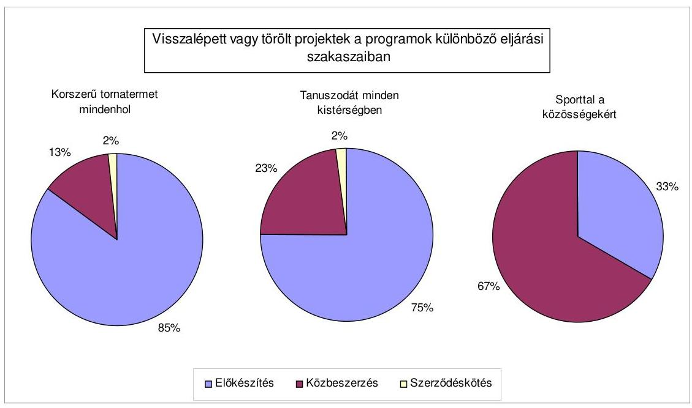

A 2006-2007. években a kötelező költségvetési maradványképzés miatt is maradtak, illetve húzódtak el feladatok, beleértve a nem a programba tartozó egyéb sport-létesítményfejlesztési feladatokat is. A bevételi kiesések és a maradványképzési kötelezettség azonban a PPP konstrukcióban megvalósuló programok végrehajtását nem akadályozták. Ezek az egyéb nem PPP-ben tervezett feladatok végrehajtását korlátozták, illetve egyéb nem a Sport

[^0]
[^0]:    ${ }^{75}$ Nem jött létre legkésőbb 2006. 08. 31-ig a projektterv és az együttműködési megállapodás, a közbeszerzési eljárás fázisainak indítására vonatkozó engedélyek nem kerültek kiadásra 2006. 11. 30-ig, illetve a közbeszerzési eljárást nem indították meg 2007. 01. 31-ig.

---

XXI. Létesítményfejlesztési Programhoz tartozó feladatok megvalósítását hátráltatták.

A Kormány 2005. évben az egy-egy önkormányzati projekt elfogadásáról szóló határozataiban ${ }^{76}$ az egyes létesítménytípusokhoz kapcsolódóan - a későbbiekben alkalmazandó - limitet határozott meg, amellyel felülről behatárolta a szolgáltatási díj hozzájárulás formájában megjelenő állami kötelezettségvállalás legmagasabb éves értékét. Ezáltal az egyedi projektek esetén módosulhatott az állam által a program kiírásakor előzetesen jelzett 50-50%-os állami-önkormányzati finanszírozási arány.

Az állami kötelezettségvállalás felső határa évente - 2007. évi bruttó értéken tornatermek esetében típustól függően 25, 45, 60 millió Ft, tanuszodák esetében 35 millió Ft, illetve 60 millió Ft${ }^{77}$, sportcsarnok esetében pedig 50 millió Ft volt ${ }^{78}$.

Az állami finanszírozási limit meghatározása hatással volt a programból kilépettek számának növekedésére is, mivel a legtöbb önkormányzat, illetve egyéb intézményfenntartó a programból gazdasági helyzete miatt lépett vissza még az előkészítés szakaszában. A finanszírozási arányok változását a vizsgált önkormányzati PPP projektek esetében a jelentés 1.2. pontja és a 4. számú melléklete mutatja be.

A „Korszerű tornatermet mindenhol", „Tanuszodát minden kistérségben" és „Sporttal a közösségekért" programokban célként meghatározott és megvalósításra került, illetve kerülő projektek számát a következő diagramm szemlélteti:
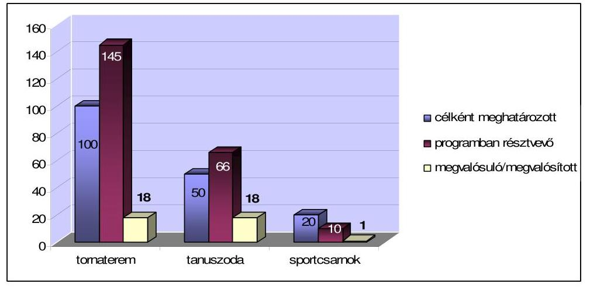

A 37 projektből 2008. december 31-ig 13 tornaterem, 10 tanuszoda és egy sportcsarnok üzemelt, amelyek közül 12 tornaterem, nyolc tanuszoda és a sportcsarnok üzemeltetője részére fizetett szolgáltatási díjat az ÖM. A tornatermek közül kettőnek, a tanuszodák közül pedig egynek a megvalósulása bizonytalan. Kettő tornaterem - Pécel és Aba - építéséhez még nem írták alá a szolgáltatási szerződést a felek. Az abai tanuszoda projekt megvalósítására megkö-

[^0]
[^0]:    ${ }^{76}$ a 2098/2003. (V. 29.), illetve a 2028/2007. (II. 28.) Korm. határozatokban
    ${ }^{77}$ 2005. július 15-től
    ${ }^{78}$ 2005. március 23-tól

---

tött szerződés felbontásának szándékát jelentette be a magánbefektető az ÖM-nek az önkormányzat szerződésszegésére hivatkozva ${ }^{79}$. A 2008. év végén folyamatban lévő három tornatermi beruházásból kettőt üzembe helyeztek 2009. januárban, a további egy még nem készült el ${ }^{80}$. A tanuszoda beruházásokból 2009. első két hónapjában hármat helyeztek üzembe és négy építése még folyamatban van. (A programban megvalósult, illetve megvalósuló projekteket a 2. számú melléklet mutatja be.) A létesítményeket legkésőbb 2010. március 31-ig üzembe kell helyezni, mivel az állami kötelezettségvállalás 2007. január 1-jétől 2025. március 31-ig terjedő időszakon belül érvényesülhet ${ }^{81}$ és a szerződések 15 évre szólnak.

A központi költségvetésben a Sport XXI. Létesítményfejlesztési Programra a 2005. évtől terveztek előirányzatot. A három PPP alprogramra azonban a központi költségvetést terhelő szolgáltatási díjfizetési kötelezettség megjelenésekor a 2007. évi költségvetésben terveztek „Sportlétesítmények PPP konstrukcióban történő fejlesztése" megnevezéssel előirányzatot. A „Sporttal a közösségekért", a „Korszerű tornatermet mindenhol" és a „Tanuszodát minden kistérségben" programok keretében üzembe helyezett, vagy a tárgyévben várhatóan üzembe helyezésre kerülő PPP projektek finanszírozásának tervezett előirányzata a 2007. évben 486,2 millió Ft, a 2008. évben 1400,0 millió Ft volt.

A központi költségvetésben a Sport XXI. Létesítményfejlesztési Programban meghatározott célokra - a 2004-2006. években 1387 millió Ft-ot fizettek ki, amely a program tervezett kifizetési ütem szerinti összegnek mindössze a 23%-a volt. A 2004-2008. években a hat programra összesen 3349 millió Ft-ot, egyéb célokra 1915 millió Ft-ot fordítottak, amelyből a PPP konstrukcióban megvalósult projektekhez kapcsolódó szolgáltatásvásárlásra 889 millió Ft-ot fizettek ki a 2007-2008. években. Ez a Sport XXI. Létesítményfejlesztési Programok összes kiadásának 27%-át jelentette. A három PPP program 2007. évi üzembe helyezéssel tervezett beruházásainak elhúzódása miatt keletkező, a 2007. évben a szolgáltatási díjra rendelkezésre álló előirányzatból a pénzügyminiszter egyetértésével az éves költségvetési törvényben biztosított lehetőség alapján ${ }^{82}$ más feladatra csoportosítottak át 214 millió Ft előirányzatot.

[^0]
[^0]:    ${ }^{79}$ A szerződés 12.2.2. c) pontjára hivatkozással, amely szerint a magánbefektetőt a szerződés felmondására jogosítja fel „ha az Önkormányzat bármely olyan magatartást tanúsít, amely a Magánbefektető számára tartósan lehetetlenné teszi a Létesítmény megépítését vagy üzemeltetését". A létesítmény beruházása nem kezdődött meg.
    ${ }^{80}$ 2009. március hónapban az építése folyamatban volt
    ${ }^{81}$ az 1089/2008. (XII. 30.) Korm. határozattal módosított 2039/2005. (III. 23.) és 2146/2005. (VII. 15.) Korm. határozatokban foglaltak szerint
    ${ }^{82}$ a Magyar Köztársaság 2007. évi költségvetéséről szóló 2006. évi CXXVII. törvény 51. § (13) bekezdése értelmében

---

Az ÖM által az egyes alprogramokra bontott adatok szerint a következő összegű kifizetések történtek 2005-2008. években, millió Ft-ban ${ }^{83}$:

| Célok | $\mathbf{2005}$. | $\mathbf{2006}$ | $\mathbf{2007}$. | $\mathbf{2008}$. | összesen |
| :-- | --: | --: | --: | --: | --: |
| Korszerű tornatermet mindenhol | 0 | 0 | 158 | 346 | 504 |
| Tanuszodát minden kistérségben | 0 | 0 | 28 | 301 | 329 |
| Sporttal a közösségekért | 0 | 0 | 4 | 52 | 56 |
| PPP konstrukcióban összesen | $\boldsymbol{0}$ | $\boldsymbol{0}$ | $\mathbf{190}$ | $\mathbf{699}$ | $\mathbf{889}$ |
| Sport a kistelepüléseken | 0 | 244 | 722 | 77 | 1043 |
| Olimpiai központok fejlesztése | 0 | 0 | 274 | 0 | 274 |
| Stadionok korszerűsítése | 393 | 750 | 0 | 0 | 1143 |
| Nem PPP konstrukció összesen | $\mathbf{393}$ | $\mathbf{994}$ | $\mathbf{996}$ | $\mathbf{77}$ | $\mathbf{2460}$ |
| Programcélokra összesen | $\mathbf{393}$ | $\mathbf{994}$ | $\mathbf{1186}$ | $\mathbf{776}$ | $\mathbf{3349}$ |
| Egyéb célok | 452 | 1053 | 138 | 272 | 1915 |
| Mindösszesen: | $\mathbf{845}$ | $\mathbf{2047}$ | $\mathbf{1324}$ | $\mathbf{1048}$ | $\mathbf{5264}$ |

A 2005-2008. években a Sport XXI. Létesítményfejlesztési Programra és egyéb célokra teljesített összes kifizetés 64%-át tették ki a Sport XXI. Létesítményfejlesztési Programhoz kapcsolódó kifizetések. A PPP konstrukcióban megvalósult projektekhez kapcsolódó kifizetést működési, azon belül dologi kiadásként számolták el. A teljesített kiadások 36%-át egyéb célokra fizették ki. ${ }^{84}$

A Sport XXI. Létesítményfejlesztési Program PPP programjai keretében 37 megvalósult, vagy megvalósításra tervezett programra vállalt hosszú távú állami kötelezettségvállalás összértéke - a PM nyilvántartása szerint - 1364 millió Ft, amely kevesebb mint 1%-a a 2008. évben számbevett hosszú távú állami kötelezettségvállalások összegének. A kötelezettségvállalások összege az önkormányzatok fizetési kötelezettségét nem tartalmazza.

A PPP konstrukcióban tervezett programokra 2007. évtől lehetett szolgáltatási díj címén kifizetést teljesíteni. A szolgáltatási szerződések alapján az ÖM közvetlenül a szolgáltatónak fizettette ki az általa vállalt szolgáltatási díjat, amely utólag és havonta esedékes, a szerződésben rögzített eljárásrend és határidők szerint. Az ÖM-ben a számlák beérkezésének és folyósításának figyelemmel kísérésére számítógépes nyilvántartást készítettek és vezettek. A szolgáltatók közül a két tanuszoda projekt szolgáltatói egy-egy alkalommal több havi számlát nyújtottak be egyszerre, a többi szolgáltató ütemesen nyújtotta be a számlákat. A 2007. évi szolgáltatási díjak számláinak 63%-át határidőt meghaladva

[^0]
[^0]:    ${ }^{83}$ Állami és önkormányzati - Sport XXI. Létesítményfejlesztési Program - sportlétesítmények fejlesztése megnevezéssel és Sport XXI. Létesítményfejlesztési Program elnevezéssel az ÖM fejezetében megtervezett fejezeti kezelésű előirányzatok teljesítése.
    ${ }^{84}$ Az egyéb célok közül többek között kifizetésre került a hatvani tanuszoda, a miskolci tanuszoda, a szombathelyi városi sportcsarnok beruházások megvalósításához nyújtott támogatások és a salgótarjáni városi sportcsarnok beruházásához

 nyújtott támogatás egy része.

---

dóan folyósították, átlagosan 11 nap volt a késés. A 2008. évi számlák már 83%-ban határidőn belül kiutalásra kerültek. A késedelmes folyósítás miatt késedelmi kamat felszámítására nem került sor.

Mindkét évben öt projekthez kapcsolódóan a számlák rendre határidőn túl kerültek kiutalásra, mert ezeknél - az elsők között megvalósult - a projekteknél a fizetési határidő 15 nap volt, míg a később megvalósult projektek esetében már 30 nap. A 15 napos átfutási határidő az utalási rendszer kialakításakor, a kezdeti időszakban kevés volt. A 2007. december és 2008. év január szolgáltatási hónapok díjait is késve fizette ki a minisztérium. Az első utalásokra csak február végén került sor. A januári - előző év decemberi - díjfizetési késedelmet a minden év elején fennálló belső pénzügyi adatbázis-váltással, illetve átállással, valamint a kincstári rendszer évváltásakor fellépő rendszerátállással indokolta az ÖM.

Az ÖM által a központi költségvetésből biztosított szolgáltatási díj hozzájárulás kifizetésének - a szolgáltatási szerződés szerint - feltétele volt a műszakilag és sportszakmailag meghatározott követelmények betartása. A közcélú igénybevétel részbeni ellentételezését biztosító állami szolgáltatási díj kifizetése érdekében - a magánpartner által az ÖM-hez benyújtott számlákon - az önkormányzatok igazolták, hogy a magánpartner a szerződésben rögzített követelményeknek megfelelően teljesítette a szolgáltatást.

A mohácsi tanuszoda projekt esetében a szolgáltatási szerződés 2. számú mellékletében és a 2146/2005. (VII. 15.) Korm. rendeletben meghatározott követelményrendszerben foglaltak nem voltak szinkronban, mivel a szolgáltatási szerződésben az úszómedence mélységére vonatkozó előírás eltért a kormányhatározatban meghatározott követelménytől. A teljesítésigazolással emiatt az önkormányzat azt igazolta, hogy az úszómedence mélysége a szolgáltatási szerződésben előírt követelményeknek megfelel, ami nem jelentette egyúttal a kormányhatározatban foglalt követelményeknek történő megfelelést is. Az önkormányzat teljesítésigazolása azonban a szolgáltatási szerződésben rögzítetteknek sem felelt meg, mivel a medence „általános mélysége” nem 1,8 méter, hanem annál mélyebb volt, továbbá a közcélú igénybevételi időben a változó vízmélységet biztosító mobil rámpa pedig 2007. október 16-ától nem volt a medencében.

Az ÖM a kistérségi tanuszodák megvalósítása érdekében megjelentetett pályázati kiírásában - a 2146/2005. (VII. 15.) Korm. rendeletben foglaltaknak megfelelően - egyértelműen meghatározta, hogy milyen medencemélységű tanuszodát kell működtetni annak érdekében, hogy az megfeleljen a központi támogatás biztosításához szükséges sportszakmai követelményeknek. Az ÖM képviselője a mohácsi uszodaprojekt közbeszerzési tárgyalások során is jelezte, hogy a pályázati kiírásban meghatározott medencemélységet a magánpartnernek a - közcélú igénybevétel idejében - a szolgáltatás nyújtás során biztosítania kell. Ennek ellenére az aláírt szolgáltatási szerződés 2. számú mellékletében a megkövetelt vízmélységet nem rögzítették, csak arról rendelkeztek, hogy a valójában mélyebb, a közszféra és a magánszféra között területileg is megosztott úszómedence felében mobil rámpával kell biztosítani a változó vízmélységet.

---

Mohács Város Önkormányzata műszakilag bővített tartalmú uszoda projekt megvalósításáról döntött, amelyben az előírt medencemélységnél mélyebb medence megépítését tervezték. Az önkormányzat ugyanis a termálprogram első ütemét kívánta megvalósítani úgy, hogy azt összekapcsolta a kistérségi tanuszoda építési programmal, mivel arra lehetett központi támogatást kapni. A közcélú igénybevételi időszakban biztosítandó, a pályázati kiírásban előírt medencemélységet mozgatható mobil rámpa beépítésével kívánták műszakilag megoldani. A kivitelezés során alkalmazott műszaki megoldás azonban nem tette lehetővé a mobil rámpa egyszerű mozgatását, ami akadályozta a közcélú hasznosítás és piaci hasznosítás idejében a medence vízmélységének változtatását.

# 2. A PPP KONSTRUKCIÓBAN MEGVALÓSÍTOTT TANUSZODA, TORNATEREM ÉS TÖBBCÉLÚ SPORTCSARNOK PROJEKTEKBEN AZ ÁLLAMI ÉS ÖNKORMÁNYZATI ÉRDEKÉRVÉNYESÍTÉS EREDMÉNYESSÉGE 

A helyszíni vizsgálatra kijelölt önkormányzatok kiválasztásánál figyelembe vett szempontok között szerepelt, hogy a projektek között legyen befejeződött, folyamatban lévő, továbbá meghiúsult; a szolgáltatási díj fizetése egyes esetekben a 2007. évben, máshol a 2008. évben kezdődjön meg, illetve mindhárom alprogramból legyen projekt, és a tornaterem alprogramban többféle modell ellenőrzésére kerüljön sor. A vizsgálatba ennek alapján 15 önkormányzat került be (1. számú függelék), amelyből 13 kötött szerződést PPP beruházásra a Sport XXI. Létesítményfejlesztési Programhoz kapcsolódva. A megvalósított 13 projektből 12 önkormányzatnál megkezdődött a létesítmény üzemeltetése is, Nagykátán az ellenőrzés időpontjában a projekt műszaki átadása volt folyamatban. A programból kilépett önkormányzatok közül Devecser a tornaterem megvalósításától is elállt, míg Veszprém Megyei Jogú Város Önkormányzata más beruházási megoldással, de megvalósította a multifunkcionális rendezvénycsarnokot. (Az elkészült sportlétesítmények típusáról, valamint főbb sportszakmai jellemzőiről a jelentés 3. számú, a veszprémiről a 6. számú függeléke ad részletes tájékoztatást.)

### 2.1. A sportlétesítmények megvalósításáról hozott önkormányzati döntések előkészítése és megalapozottsága

A vizsgált önkormányzatok 80%-a már a Sport XXI. Létesítményfejlesztési Program indítását megelőzően tervezte tornaterem, tanuszoda vagy sportcsarnok megépítését. Ezek az önkormányzatok a gazdasági programjaikban, ágazati koncepcióikban, fejlesztési terveikben fogalmazták meg a sportlétesítmények megvalósítása iránti igényüket. Indoklásként döntően a közoktatási intézményekre vonatkozó ágazati előírások teljesítését, az óvodai nevelés és az iskolai oktatás színvonalának javítását, a különféle sportkörök és egyesületek tevékenységéhez megfelelő létesítményi háttér megteremtését, valamint közösségi rendezvények lebonyolítására alkalmas helyszín biztosítását jelölték meg.

---

Hét önkormányzat ${ }^{85}$ az általa, vagy társulásban közösen fenntartott közoktatási intézményében korszerű tornaterem biztosítását tűzte ki célul, kettő önkormányzat ${ }^{86}$ az óvodai nevelésben és az iskolai oktatásban részesülők úszásoktatásához kívánta megteremteni a feltételeket. A sportcsarnok építését tervező két (Kiskunfélegyháza, Veszprém) önkormányzat a városi sport, kulturális és szabadidős rendezvényeihez szeretett volna nagy befogadóképességű helyszínt biztosítani.

A projekt megvalósítása négy településen nem volt összhangban az önkormányzat gazdasági programjával, abba csak a projektről hozott önkormányzati döntést követően került bele.

Az ellenőrzött önkormányzatok közül Csurgó, Devecser és Szigetvár tervei között nem szerepelt hasonló nagyságrendű sportlétesítmény beruházás, ezek az önkormányzatok a Sport XXI. Létesítményfejlesztési Program hatására kezdtek el foglalkozni a tornaterem, illetve a tanuszoda megvalósításának lehetőségével és szükségességének felvetésével.

Mohács Város Önkormányzata kifejezetten tanuszoda létrehozását nem tervezte sem gazdasági, sem egyéb ágazati programjaiban. A 2003. évben elfogadott középtávú városfejlesztési koncepcióban egy termálfürdő - benne hatsávos úszómedence - kialakítása szerepelt. A kistérségi tanuszoda programhoz való csatlakozást elsősorban az motiválta az önkormányzatnál, hogy egy bővített tartalmú tanuszoda építési program felvállalásával lehetővé válhatott a termálprogram első részének megvalósítása. Mohácson a település gazdasági programjában szereplő termálprogram az önkormányzat döntését követően került pontosításra kistérségi tanuszoda építési programra.

A pályázatra történő jelentkezést megelőzően a sportlétesítmények megvalósítási szándékának gazdasági és szakmai stratégiákban történő megfogalmazását - három önkormányzat kivételével - nem követték önkormányzati intézkedések. Az önkormányzatok 73%-a nem végzett megfelelő igényfelmérést, továbbá nem készíttetett hatástanulmányt. Hat ${ }^{87}$ településen pedig egyáltalán nem tettek konkrét lépéseket a megvalósítás érdekében a pályázat benyújtásáig.

Az igényfelmérésen és hatástanulmányon felül három önkormányzat elvi építési engedéllyel, további két önkormányzat pedig a műszaki és szakmai jellemzőkre vonatkozó, írásba foglalt elképzelésekkel is rendelkezett.

A vizsgált önkormányzatok közül nyolc nem mérte fel, hogy a tervezett sportlétesítmény hagyományos állami (önkormányzati) beruházásban történő megépítése és üzemeltetése mekkora ráfordítással járna, az ehhez szükséges forrásokat milyen módon tudná biztosítani. A hitelfelvételi lehetőségekről mindössze három helyen tájékozódtak, mivel az adósságot keletkeztető éves kötelezettségvállalások felső határa miatt 12 önkormányzat eleve nem juthatott volna a szükséges nagyságrendben fejlesztési hitelhez.

[^0]
[^0]:    ${ }^{85}$ Nagybajom, Szenna, Magyaratád, Kozármisleny, Somogyjád, Hódmezővásárhely, Nagykáta
    ${ }^{86}$ Bátaszék, Ózd
    ${ }^{87}$ Csurgó, Nagykáta, Szenna, Hódmezővásárhely, Devecser, Szigetvár

---

Hódmezővásárhely, Mohács és Ózd önkormányzatai hagyományos önkormányzati beruházás keretében is meg tudták volna valósítani a sportlétesítményt. Ezeket az önkormányzatokat a PPP beruházási módszer választása mellett az kötelezte el, hogy egyrészt így tudtak csak központi támogatást szerezni a létesítmények megvalósításához, másrészt ezzel a módszerrel hosszú távra elnyújthatóvá vált az önkormányzati kötelezettségvállalás, amely így kevésbé korlátozza az önkormányzat jövőbeni fejlesztéseinek mozgásterét, egyéb beruházások fejlesztési forrásszükségletének biztosítását.

Négy ÖNHIKI támogatással működő önkormányzat már a korábbi években ajánlatot kért hagyományos önkormányzati beruházásban történő tornaterem megvalósítására, azonban azt önkormányzati saját források hiányában nem tudta megvalósítani. A Sport XXI. Létesítményfejlesztési Programhoz kapcsolódva Somogy megyében - Magyaratád kivételével - csak olyan önkormányzatok valósítottak meg PPP beruházásban tornacsarnokot, amelyek ÖNHIKI támogatásban részesültek.

A Sport XXI. Létesítményfejlesztési Programra történő jelentkezést hat esetben (40%) előzte meg képviselő-testületi döntés. A többi önkormányzat részéről a pályázati dokumentációt a polgármester, a jegyző, vagy a polgármesteri hivatal egyik munkatársa küldte meg testületi felhatalmazás nélkül, elektronikus úton a kiíró GYISM részére.

A pályáztatás GYISM által kialakított rendszerében az önkormányzatok vagy intézményeik olyan szándéknyilatkozatot tettek a PPP beruházások felvállalására, amelyektől következmény nélkül elállhattak. A különböző sportlétesítmények - GYISM-mel közös - megvalósítására összesen 262 szervezet regisztráltatta magát, amelyből 221 került be a három PPP program egyikébe, de még az előkészítés szakaszában 66,5% visszalépett. A pályáztatási rendszer elektronikus lebonyolításából adódó probléma volt, hogy a kistérségi tanuszodák esetében a pályázati feltételekben szereplő - a tanuszoda elhelyezését biztosító település megnevezéséről szóló - kistérségi nyilatkozat csak formális feltételként került a pályázati kiírásban megjelölésre. A nyilatkozatot ugyanis a pályázóknak a pályázat benyújtásakor nem kellett a kiíró GYISM számára megküldeni. A kistérség nyilatkozatát - a kiíró ÖM - csak abban az esetben kérte be, ha egy kistérségből több önkormányzat is pályázatot nyújtott be kistérségi tanuszoda megépítésére. Emiatt fordulhatott elő, hogy Mohács önkormányzata csak a pályázat benyújtását követően kérte és kapta meg a kistérség nyilatkozatát arról, hogy Mohácsot jelölik ki a kistérségi tanuszoda helyének.

A pályázati jelentkezés nyilvántartásba vételét és visszaigazolását követően, kilenc önkormányzatnál a PPP Projektiroda által készített egyszerűsített üzleti tervet és projekttervet tartalmazó előterjesztés alapján tárgyalt, és hozott döntést a pályázatban való részvételről a képviselő-testület.

A hagyományos önkormányzati beruházás létesítési és üzemeltetési költségeire vonatkozó kiindulási adatokat, valamint a sportlétesítményekkel szemben támasztott műszaki és szakmai elvárásokat, valamint a jelentkező önkormányzati egyedi igényeket a PPP Projektiroda iránymutatásai alapján határozták meg az önkormányzatok.

---

Az önkormányzatok a hagyományos beruházás PSC értékének számításához szükséges alapadatokat három jogcímen (1. tervezés, lebonyolítás és szakértők; 2. tárgyi eszköz beruházás, kivitelezés; valamint 3. üzemeltetési költségek bontásban), belső részletezés nélkül adták meg. Emellett a pénzügyi számításokban előre meghatározottan, kiindulási feltételként rögzítette az ÖM a PPP konstrukciónak az állami (vagy önkormányzati) beruházáshoz képest becsült megtakarítási arányát, amely olyan magas volt (10%-20%), ami a magánpartnerek esetében feltételezett rosszabb hitelkondíciók ellenére is biztosította az előkészítés szakaszában a PPP konstrukció kedvezőbb nettó jelenértékének kimutatását. A PPP beruházás becsült megtakarítási arányának megállapítása ugyanakkor a PPP Tárcaközi Bizottság és a PM által is szakmailag vitatott nemzetközi referencia értékekre, továbbá sportlétesítmények beruházásában, üzemeltetésében tapasztalatokkal rendelkező, valamint a projektekben érintett önkormányzati szakemberek véleményére épült.

A projektterveket az önkormányzatoktól bekért információk alapján a PPP Projektiroda készítette el. A képviselő-testületek által tárgyalt, határozatban elfogadott projekttervek a döntéshozatalhoz szükséges adatokat és információkat megfelelő részletezettségben, az ÖM által megadott
 szempontok szerint tartalmazták. A projekttervek alapján az önkormányzatok képviselőtestületeinek elegendő és megfelelő információ állt rendelkezésükre döntéseik meghozatalához.

Az önkormányzati szakemberek azonban a PPP projektek bonyolultsága és újszerűsége miatt nem rendelkeztek megfelelő szakmai tudással és információval a projekttervben szereplő adatok értékeléséhez. Az önkormányzatok 67%-ánál fordult elő, hogy az ÖM által központilag elkészített anyagon kívül, az önkormányzati szakemberek által készített előterjesztések nem foglalkoztak érdemben a beruházás pénzügyi értékelésével, az önkormányzat hosszú távú elkötelezettségének felvállalása miatt a jövőben várható kockázatokkal, valamint a különféle választható beruházási módszerek összehasonlító értékelésével.

Különösen a kistelepüléseken volt jellemző, hogy a konzultáció bonyolultsága miatt az önkormányzati munkatársak, tisztségviselők nem látták át a konstrukció lényegét. Három (20%) önkormányzat a ténylegesen vállalt, hosszútávon jelentkező önkormányzati kötelezettséggel sem volt tisztában, azzal csak az ÁSZ ellenőrzése során szembesült.

Az ellenőrzött önkormányzatok 80%-a - Devecser, Nagykáta és Szigetvár ${ }^{88}$ kivételével - a pályázati felhívásban közzétett követelményeket és ajánlásokat meghaladó, kormányhatározatokban elfogadott mintaprojekteknél nagyobb sportlétesítmény megvalósításáról döntött. A bővített programokat megvalósítani szándékozó önkormányzatok tisztában voltak azzal, hogy az állam (képviseletében eljáró ÖM) a szolgáltatási díj hozzájárulás formájában nyújtott támogatást csak a pályázati kiírásban közzétett követelményrendszer alapján és mértékében nyújtja. Ennek ellenére a projektterv elfogadásáról szóló önkormányzati döntés meghozatalakor nem vizsgálták, hogy az ÖM által meghatározott alapprogram bővítése miatt megnő, a központi költségvetés által alkalmazott limitált támogatás miatt az önkormányzati költségvetést terhelő szolgáltatási díjtöbblet arányban van-e az önkormányzat teherviselő képességével. A képviselő-testületek által elfogadott projekttervekben az ajánlott műszaki és szakmai követelményekhez képest bővített sportlétesítmények megvalósítását tervezték az önkormányzatok:

- megnövelt küzdőtérrel rendelkező tornatermek (Nagybajom, Csurgó, Somogyjád, Szenna, Magyaratád);
- a minimum követelménynél nagyobb férőhelyszámú lelátó a tornacsarnokban (Nagybajom, Csurgó, Somogyjád, Kozármisleny);
- mélygarázzsal egybeépített tornaterem (Hódmezővásárhely);
- a követelményrendszerben szereplőnél nagyobb méretű úszómedence (Mohács, Szigetvár);
- fitness és/vagy wellness részleggel bővített tanuszoda (Bátaszék ${ }^{89}$, Mohács, Ózd).

Az ÖM által elkészített projekttervet és az annak mellékleteként csatolt pénzügyi számítást - a PSC érték, valamint a PPP beruházás nettó jelenértékének (PPP érték) összehasonlításának eredményét - valamennyi önkormányzat elfogadta. Somogyjád önkormányzata emellett készített saját számításokat is.

A projekttel kapcsolatos hosszú távon jelentkező kiadásokat csak az önkormányzatok 38,5%-a jelenítette meg zárszámadási rendeletében a többéves kihatással járó döntések között. Ugyanakkor még ezek az önkormányzatok sem mérték fel a 15 éves futamidejű kötelezettségvállalás költségvetési helyzetet várhatóan befolyásoló hatását. Különösen elvárható lett volna a projekttel járó hosszú távú kötelezettségek várható alakulásának ismerete, valamint annak vizsgálata, hogy a vállalt kötelezettségek milyen befolyással lesznek a gazdálkodás hosszú távú feltételeire azoknál az önkormányzatoknál, amelyek - a PPP szerződés megkötését megelőzően - ÖNHIKI támogatást igényeltek, illetve abban részesültek. ${ }^{90}$ Tekintettel arra, hogy az ÖNHIKI támogatásban részesülő önkormányzatoknak más módon lehetőségük sem lett volna a sportlétesítmények megépítésére, ezek az önkormányzatok egyáltalán nem fordítottak figyelmet a vállalt kötelezettségek jövőbeni alakulásának vizsgálatára.

Az önkormányzatok 40%-ánál fel sem merült a beruházás önkormányzati pénzeszközökből történő megvalósítása, mivel nem tudtak volna az adósságot keletkeztető éves kötelezettségvállalás felső határának megsértése nélkül hitelt felvenni a beruházás finanszírozásához ${ }^{91}$.

Az Ötv. 88. § (2) bekezdésének az adósságot keletkeztető éves kötelezettségvállalás felső korlátjára vonatkozó előírását Devecser és Szenna önkormányzatai pedig már korábban megsértették, így további adósságot nem tudtak vállalni.

Az ÖNHIKI támogatásra szoruló működési forráshiánnyal küzdő önkormányzatok pályázatainak központi támogatása pénzügyszakmai szempontból kedvezőtlen döntés volt. A PM ezzel kapcsolatos fenntartásait folyamatosan jelezte a PPP Tárcaközi Bizottság ülésein, ezért kedvezőtlen pénzügyi helyzetben lévő önkormányzatok esetében egyetlen esetben sem szavazott a PPP projekt támogatása mellett. A PPP Tárcaközi Bizottság a pályázat elbírálása során a működési forráshiány fennállását nem tekintette kizáró szempontnak. Az ÖM, valamint a PPP Tárcaközi Bizottság a működési forráshiányos önkormányzatok pályázatainak befogadásakor mérlegelte azt a szempontot is, hogy a működési forráshiányos vagy az adósságszolgálati plafont elérő önkormányzatoknál - a jogszabályi előírások betartása mellett - ez a beruházási mód volt szinte az egyetlen fejlesztési lehetőség.

A PPP beruházások felvállalásának következtében a korábban is működési forráshiányos önkormányzatok egy részénél - a kötelező önkormányzati feladatok ellátása érdekében felvállalt - újabb működési kiadások megjelenése tovább fokozta a már korábban kialakult forráshiányt.

#### Abstract

Csurgó önkormányzata annak ellenére nyújtotta be pályázatát a PPP beruházás felvállalására, hogy kötelező önkormányzati feladatait a pályázat benyújtását megelőzően sem tudta önerőből működtetni, annak ellátásához is folyamatosan ÖNHIKI, illetve kiegészítő ÖNHIKI támogatásra szorult. A PPP beruházás megkezdését megelőző 2004-2006. években az önkormányzatnál a tervezett és a teljesített működési bevételek nem nyújtottak fedezetet a működési kiadásokra, 2004-2006. években közel azonosan a működési kiadások mintegy 3%-kal haladták meg a működési bevételeket. A tornacsarnok projekt miatt vállalt PPP szolgáltatási díj tovább növelte az önkormányzat költségvetési hiányát.

Nagybajom 2005. évtől kezdődően folyamatosan működési forráshiányos önkormányzat volt. Az ÖNHIKI támogatás aránya a működési kiadásokhoz viszonyítva 4,3-8,7% között alakult. Az önkormányzat a - Sport XXI. Létesítményfejlesztési Program - pályázata benyújtásának évében (2005. év), valamint azóta is minden évben pályázott ÖNHIKI támogatásra, s azt minden évben (a 2007. és a 2008. években csökkentett összegben) megkapta. A kimutatott működési hiány a 2005.-2006.-2007. években az összes teljesített működési kiadás 5,1%, 8,7%, 4,3%-a, a 2008. évben pedig az eredeti előirányzat 6,1%-a volt. A település a PPP szolgáltatási díj 2008. évi fizetésének megkezdését követően kedvezőtlenebb pénzügyi pozícióba került, mivel a felmerülő szolgáltatási díjból - a 2008. évi költségvetési törvény 6. sz. melléklet 1.3.1.3 pontja szerint - 2008. évben 25 millió Ft-ot a működési kiadások között nem szerepeltethetett.

Kiskunfélegyháza és Magyaratád önkormányzata a vállalt PPP beruházás miatt vált működési forráshiányossá, illetve annak kialakulásában szerepet játszott a sportlétesítményhez kapcsolódó szolgáltatási díjfizetési kötelezettség felvállalása is. Ezt a kedvezőtlen tendenciát tovább erősítette, hogy a központi szervek - miközben lehetővé tették a működési forráshiányos önkormányzatok számára a PPP beruházások felvállalását - az ÖNHIKI támogatás feltételrendszerét úgy módosították, hogy a működési forráshiány kimutatásában a sportlétesítmény üzemeltetésével kapcsolatosan megjelenő PPP szolgáltatási díjnak a negyedét ismerték el forráshiányt keletkeztető kiadásként. Az ÖNHIKI szabályozás várható változásáról a PM tájékoztatta a PPP beruházást felvállaló önkormányzatokat, ennek ellenére a megvalósítás mellett döntöttek.

Kiskunfélegyháza a PPP beruházás megvalósítását megelőzően nem volt működési forráshiányos település, a létesítmény 2007. évi átadását követően azonban kedvezőtlenül változott az önkormányzat pénzügyi helyzete. Az önkormányzat 2008. évi költségvetésének működési forráshiánya 133,7 millió Ft-ban került meghatározásra, miközben a 2008. évre tervezett szolgáltatási díj áfával növelt összege 298,44 millió Ft volt. Az önkormányzat a sportcsarnok működtetésének költségeit, mint önként vállalt önkormányzati feladatot vállalta magára. A működési forráshiány ellenére az önkormányzat nem vált jogosulttá ÖNHIKI támogatás igénybevételére, mivel - a szabályozás változása miatt - nem felelt meg a 2008. évi költségvetési törvény 6. számú mellékletében meghatározott igénylési feltételeknek.

Magyaratád önkormányzata a tornaterem projekt megvalósítására irányuló pályázat beadását megelőző két évben (2002. és 2003.) nem pályázott ÖNHIKI támogatásra, mivel a kötelező feladatai működtetéséhez szükséges forrásokkal rendelkezett. A szolgáltatási díj fizetési kötelezettség 2007. évi jelentkezése óta azonban az önkormányzat mindkét évben pályázott ÖNHIKI támogatásra. A 2007. évben 19464 ezer Ft támogatásban részesült. A 2008. évi ÖNHIKI igénylésben 25608 ezer Ft támogatási igényből 3029 ezer Ft volt a figyelembe vehető, PPP konstrukcióhoz kapcsolódó szolgáltatási díj „B" díjszeletének 25%-a. A MÁK felülvizsgálatát követően, igénylésük alapján 25899 ezer Ft támogatásban részesültek. Az önkormányzatnál a PPP projekt miatt vállalt többlet kötelezettség egyértelműen hozzájárult a működési forráshiány kialakulásához.

Nem volt következetes az ÖM-nek a működési forráshiányban a PPP szolgáltatási díjból figyelembe nem vehető rész miatt kieső bevételek pótlására irányuló, támogató tevékenysége. Megfigyelhető volt, hogy egyes önkormányzatok a szabályozás változása miatt - kieső ÖNHIKI támogatás pótlására az egyéb támogatásokból, illetve a miniszteri keretből pénzeszközöket kaptak, míg más önkormányzatok hasonló módon központi költségvetési forrásokhoz nem tudtak hozzájutni, ez indokolatlan pénzügyi differenciálást okozott az érintett önkormányzatok körében.

Ózd önkormányzata a PPP konstrukció felvállalásáról hozott döntés évében, 2006-ban 281,3 millió Ft ÖNHIKI támogatásban részesült, de azt követően sem 2007., sem 2008. években nem kapott támogatást. Minden évben kapott azonban támogatást a működésképtelen önkormányzatok egyéb támogatása keretből, valamint ennek miniszteri felhasználású keretéből is. A 2007. évben az önkormányzat igényelt, de nem kapott ÖNHIKI támogatást. A 2008. évben már nem is igényelt, ugyanakkor részesült 40 millió Ft támogatásban az egyéb keretből.

Szenna önkormányzata a Sport XXI. Létesítményfejlesztési Programra benyújtott pályázatot megelőző években (2003. évtől), és azóta is minden évben pályázott ÖNHIKI támogatásra, azt a 2007. és a 2008. évek kivételével minden évben megkapta. Az ÖNHIKI támogatások elmaradása, valamint a PPP beruházás miatt jelentkező többletkötelezettség kedvezőtlen hatást gyakorolt az önkormányzat pénzügyi helyzetére, hosszú távon kedvezőtlenül érinti a gazdálkodási lehetőségek alakulását.

Somogyjádon az önkormányzat több intézmény fenntartójaként - a pályázat benyújtását megelőző két évben - és azt követően is pályázott, illetve nyert ÖNHIKI támogatást. A vizsgált időszakban az önkormányzatnak megítélt ÖNHIKI támogatások összege 2005. évben 27938 ezer Ft (igényelt: 39808 ezer Ft-ot), 2006. évben 25503 ezer Ft (igényelt 38750 Ft-ot), 2007-ben 48172 ezer Ft (igényelt 17871 ezer Ft-ot) volt. Részesült továbbá az önkormányzat a működésképtelen helyi önkormányzatok egyéb támogatásából is. A 2005. évben 5800 ezer Ft, 2006-ban 25000 ezer Ft, a 2007. évben 9500 ezer Ft támogatást kaptak.

A projekttervekben szereplő kockázatmegosztást és egyéb szerződési feltételeket elfogadták az önkormányzatok. Tudomásul vették továbbá azt is, hogy a PPP projekt államháztartáson kívüli statisztikai besorolásának biztosítása miatt az ÖM által elkészített minta-szerződés egyes rendelkezésein, valamint az abban foglalt kockázatmegosztáson csak kis mértékben lehetett változtatni. A hiány elkerülése az önkormányzatok számára azonban nem volt meghatározó szempont, mivel a központi költségvetési szervek szándékával ellentétben nem a projekt statisztikai besorolása, hanem a sportlétesítmény központi forrásbevonással történő megvalósítása és üzemeltetése volt az elsődleges cél. Minden önkormányzat elfogadta, hogy az ÖM más központi szervek közreműködésével és a PPP Tárcaközi Bizottság véleményezésével olyan szerződési feltételeket és kockázatmegosztást alakított ki, amely megfelelt az államháztartáson kívüli elszámolhatóság statisztikai feltételeinek.

Somogy megyében négy önkormányzat a PPP beruházásra társulva valósított meg a
 településeken - 20 km-es sugarú körben - külön-külön tornatermeket. A társult önkormányzatok a gyakorlatban csak formálisan vettek részt a lebonyolítási folyamatokban. Többnyire csak az ÖM, továbbá a koordinációs és képviseleti feladatokat felvállaló gesztor (Somogyjád) önkormányzat által konkrétan kért feladatokat hajtották végre (Szenna, Nagybajom, Magyaratád).

A sportlétesítmények megvalósításáról hozott döntés valamennyi önkormányzat számára az évente teljesíthető fejlesztési lehetőségeikhez képest jelentős, akár az átlagos éves fejlesztési kiadás 10-szeresét is elérő nagyságrendű projektek megvalósítását jelentette. Ennek ellenére az előkészítési munkákat csak két önkormányzatnál kezelték kiemelten. Még nagy projektek (Kiskunfélegyháza és Veszprém) esetén sem biztosították az önkormányzatoknál a megfelelő szervezeti és személyi feltételeket a projektek lebonyolítására. Az önkormányzatok 86,7%-a a - PPP konstrukcióval kapcsolatos - feladatok hatékony végrehajtása érdekében nem alakított ki saját eljárásrendet, nem bízott meg külön projektfelelőst. Külön szervezeti egységet vagy munkacsoportot sem hoztak létre. A projektek előkészítésével és az önkormányzatok képviseletével járó feladatokat a polgármesterek, a jegyzők, valamint a polgármesteri hivatal dolgozói végezték napi operatív munkájuk keretében.

Megfelelően működő szervezetet és ennek eredményeként jól működő lebonyolítást Kozármislenyben ad hoc bizottság alakításával, valamint Ózdon projektmenedzser megbízásával biztosítottak az önkormányzatok.

---

A projektek megfelelő előkészítéséhez az ÖM PPP Projektirodával való együttműködés nélkülözhetetlen segítséget jelentett az önkormányzatok számára. A sportlétesítmények megvalósításáról hozott önkormányzati döntéseket összességében a PPP Projektiroda által kidolgozott projekttervek, mintadokumentumok, valamint iránymutatások alapozták meg.

A Sport XXI. Létesítményfejlesztési Programból kilépő Veszprém Város Önkormányzata a Veszprém Aréna beruházást a programban szerzett tapasztalatok alapján, a kapott mintadokumentumok felhasználásával, de sajátos beruházási megoldással valósította meg. Veszprém a 2004. évben került be a „Sporttal a közösségekért" alprogram kedvezményezettjei közé. A PPP projekt megvalósítására kiírt közbeszerzési eljárás azonban eredménytelenül zárult, mivel csak egy ajánlattevő volt, amely az önkormányzat által kalkulált szolgáltatási díjnak mintegy 4,5-szeresét ajánlotta. Ezt követően az önkormányzat többségi tulajdonában lévő gazdasági társaság „kapta feladatul" a rendezvénycsarnok megépítését. A beruházó társaság tulajdonát képező sportlétesítményben az önkormányzat 15 éves szolgáltatási szerződéssel, évi nettó 220 millió Ft szolgáltatási díjért 70% üzemidőt vásárolt. Ezen felül ugyanilyen időtartamra évről-évre 300 millió Ft-os tőkeemelést vállalt. A gazdasági társaság számára ily módon biztosított forrásokkal az önkormányzat a létesítmény bekerülési költségét, az adósságszolgálat költségeit, továbbá az üzemeltetési költségek számottevő részét meg fogja fizetni. A fizetett szolgáltatási díj nem tekinthető az önkormányzat részéről igényelt szolgáltatás valós ellenértékének, mivel az közel kétszerese, mint ami az üzemeltetési költségek és a piaci hasznosítás során alkalmazott árak alapján elvárható lenne. A létesítmény megvalósítása és üzemeltetése miatt az önkormányzat által 15 évre vállalt kötelezettség a PPP konstrukció keretében lefolytatott közbeszerzési eljárásban kapott végső ajánlatnak mindössze negyede lett.

A multifunkciós csarnok a műszaki és szakmai követelményeknek megfelelően megvalósult, 2008 júliusában kezdte meg működését. A létesítmény kapacitásának és rendelkezésre álló erőforrásainak kihasználtsága a 2008. évben alacsony, működtetése emiatt veszteséges volt. A sportcsarnokot folyamatosan igénybe vevő kézilabda klub - szerződés hiányában - 2008. évben jogalap nélkül használta a létesítményt. A sportcsarnok használatáért nem fizetett térítést, miközben a hasznosításból származó bevételekkel ő rendelkezett. A jogilag és anyagilag is tisztázatlan helyzetet visszamenőleges hatállyal kötött szerződéssel rendezték. A működés első félévében a sportlétesítmény hasznosítása csak a verseny- és élsport feltételeinek megteremtése szempontjából volt eredményes. A lakosság, a civil szféra, a városi és városkörnyéki egyesületek számára szervezett módon kevés lehetőség volt a - városi önkormányzat forrásaiból finanszírozott - rendezvénycsarnok használatára. A helyszíni ellenőrzést követően tett lépéseket a használat kiterjesztése érdekében a városi közgyűlés, valamint a létesítmény tulajdonosa és üzemeltetője. (A Veszprém Aréna beruházás megvalósításának ellenőrzése során szerzett tapasztalatokat a jelentés 6. számú függeléke tartalmazza.)

---

# 2.2. A közbeszerzési eljárásokban a törvényességi és hatékonysági követelmények érvényesülése 

A közbeszerzés lebonyolítására a PPP Projektiroda által javasolt, hirdetmény közzétételével induló, szolgáltatás beszerzésére irányuló tárgyalásos eljárást választották az önkormányzatok. A közbeszerzési eljárások előkészítését és lefolytatását valamennyi önkormányzatnál hivatalos közbeszerzési tanácsadók segítették. Az alkalmas magánbefektetők kiválasztása érdekében indított közbeszerzési pályázatok ajánlatkérői és lebonyolítói - az ÖM és az önkormányzatok között kötött együttműködési megállapodás alapján - az önkormányzatok voltak. Így a közbeszerzési eljárás lefolytatásának és a végleges szolgáltatási szerződések megkötésének felelőssége is az önkormányzatokat terhelte. Az önkormányzatok a közbeszerzési eljáráshoz kapcsolódó valamennyi lényeges kérdést illetően biztosították a tájékoztatást és az egyetértési jogot az ÖM, mint társkiíró részére.

Az önkormányzatok a PPP Projektiroda által rendelkezésre bocsátott minta részvételi felhívás és ajánlati dokumentumok, valamint iránymutatások felhasználásával, azoknak az önkormányzatra történő aktualizálásával készítették el a konkrét projektre vonatkozó részvételi felhívást és az ajánlati dokumentációt.

Az önkormányzatok a minta szerződés-tervezet mellékleteiben rögzítették a saját egyedi PPP projektjükhöz kapcsolódó követelményrendszert és közcélú igénybevételi időtartamot és a közcélú igénybevétel arányát. A szolgáltatási szerződés 2. számú mellékletében kellett meghatározni a műszaki, valamint a szolgáltatás színvonalára vonatkozó követelményeket, ugyanakkor a 4. számú mellékletben kellett rögzíteni a közcélú igénybevételi időszakot, valamint a közcélú igénybevétel arányát. Ez utóbbinak azonban az önkormányzatok nem tulajdonítottak jelentőséget. Ennek következtében fordulhatott elő, hogy azok az önkormányzatok, amelyek 100%-os közcélú igénybevétellel hirdették meg a közbeszerzési eljárást - miközben a nyitvatartási idő egy részében lehetővé tették a magánpartner piaci hasznosítását is - a teljes létesítmény üzemeltetési költségét fizetik meg a szolgáltatási díj „B" díjszeletében. A magánpartner ugyanis a 100%-os közcélú igénybevétel feltüntetése miatt - az üzemeltetés során felmerülő költségek és bevételek adatait elemezve - arra tett ajánlatot. A közcélú igénybevételi arány pontatlan megfogalmazása, illetve a szerződésben foglaltak értelmezése a gyakorlatban problémát okozott a magánpartnerek és az önkormányzatok között.

Hódmezővásárhely önkormányzata a tornaterem projekt esetében csak azt határozta meg a közbeszerzési ajánlati kiírásban, hogy a közcélú igénybevétel 100%-os. Az ÖM és a magánpartner kérésének ellenére ennek további részletezését sem az ajánlati dokumentációban, sem a közbeszerzési tárgyalások során és azt követően sem rögzítette. A szerződés aláírása előtt határozta meg a 100%-os közcélú igénybevétel idejére vonatkozó részletezett elvárásait. Ugyanakkor a szolgáltatási szerződés szöveges részében a közcélú igénybevételi idő és a magánpartner piaci hasznosítására rendelkezésére álló idő hasznosításának szabályai is meghatározásra kerültek. A szolgáltatási szerződés szöveges része és 4. számú melléklete ellentmondásos volt, mivel a 100%-os közcélú igénybevételről szóló 4. számú melléklet nem határozott meg a nyitvatartási időn belül a magánpartner által hasz-

---

nosítható időtartamot, miközben a szerződés szöveges része szerint a magánpartnernek lehetősége volt a létesítmény piaci célú hasznosítására is.

Az önkormányzatok a részvételi felhívásokban meghatározták a közbeszerzés tárgyát, a sportlétesítmény típusát és főbb műszaki jellemzőit, az üzemeltetés időtartamát, a finanszírozás módját, valamint a jelentkezők pénzügyi, gazdasági, műszaki és szakmai alkalmasságának feltételeit. A bírálati szempont nyolc esetben a súlypontozással értékelt összességében legelőnyösebb ajánlat, hét esetben pedig a legalacsonyabb összegű ellenszolgáltatás volt. Az önkormányzatok az alkalmassági feltételek között előírták, hogy az ajánlattevőknek rendelkezniük kell a projektek megvalósításához szükséges szakértelemmel és tapasztalattal. Az együttes feltétel igazolását azonban - két közbeszerzési eljárás során - öt önkormányzat nem követelte meg.

A befogadható ajánlattevők körének bővítése érdekében Kozármisleny, és Somogyjád (vele együttesen Magyaratád, Nagybajom, Szenna) esetében az építési és az üzemeltetési referenciák közül elegendő volt csak az egyiket igazolnia a jelentkezőknek.

A részvételi felhívások - a tornatermek és a tanuszodák esetében - nem keltettek komoly érdeklődést. Csurgó, Kozármisleny és Bátaszék önkormányzatoknál csak egy jelentkező volt, a többi érintett településen is csak két, legfeljebb három gazdasági társaság igényelt részvételi dokumentációt. A sportcsarnokok építésére és üzemeltetésére kiírt közbeszerzési pályázatok több érdeklődőt vonzottak, Kiskunfélegyházán nyolc, Veszprémben öt jelentkezőt regisztráltak. Az érvényesség és alkalmasság vizsgálatát követően tovább csökkent a jelentkezők száma, Kiskunfélegyházán kettő, a többi önkormányzatnál csak egy ajánlat érkezett a felhívásra. A vizsgált önkormányzatok 93,3%-ánál (14 településen) - a várakozásokkal ellentétben - nem alakult ki versenyhelyzet, ami jelentős mértékben nehezítette az állami és önkormányzati érdekek hatékony érvényre juttatását a tárgyalások során.

A közbeszerzési alapajánlatokban a magánpartnerek - a bátaszéki felhívásra jelentkező gazdasági társaság kivételével - a projekttervekben kalkulált összegeknél magasabb ajánlatokat nyújtottak be a szolgáltatási díjakra. Az eltérések széles tartományba estek, az eredményesnek $^{92}$ nyilvánított közbeszerzési eljárásokban a benyújtott ajánlatok 10%-296% közötti mértékben haladták meg a projekttervekben számított szolgáltatási díjakat. Az 50% vagy annál nagyobb mértékű eltérések jellemzően a sportcsarnokoknál és a tanuszodáknál fordultak elő, illetve Devecser esetében érintettek egy „D2" típusú tornatermet is. A magas alapajánlatok egyrészt az érdeklődés hiányára, másrészt arra vezethetők vissza, hogy a központi szervek által meghatározott PPP konstrukcióban a közszféra a kockázatok nagy részét a magánszférára hárította, amelyet a magánpartnerek felfelé irányuló díjmeghatározással áraztak be.

A projekttervben meghatározott szolgáltatási díjhoz képest magas ajánlati árban két esetben szerepe volt annak is, hogy a projekttervben meghatározott prog-

[^0]
[^0]: $^{92}$ Nem volt eredményes Veszprém és Devecser önkormányzatok közbeszerzési eljárása.

---

ramhoz viszonyítva Mohács bővített tanuszodára tett közzé részvételi felhívást. Szigetvár pedig a tárgyalások során a magánpartner kezdeményezését elfogadva döntött bővített projekt mellett.

A versenyhelyzet kialakulásának hiánya miatt a tárgyalásos szakaszban alig volt lehetőség a lefelé irányuló áralku érvényesítésére, bár a tárgyalások során az önkormányzatok mindenütt a szolgáltatási díjra tett ajánlatok felülvizsgálatát, annak mérséklését kérték a magánpartnerektől. Az ajánlati ár csökkentése kivétel nélkül a műszaki tartalom és a kiegészítő funkciók szűkítését, a műszaki tartalom, ezen keresztül az előkészítés során megfogalmazott, és elvárt közösségi szolgáltatás színvonalának csökkentését vonta maga után.

Az alkufolyamatok eredményeként tíz projekt esetében 3%-37% közötti mértékben sikerült elérni a szolgáltatási díj csökkentését. A tárgyalások során elsősorban a hasznos és beépített alapterületek csökkentésében, az alapfunkcióhoz szorosan nem kapcsolódó bővítmények (konferenciaterem, gyermekmegőrző, szauna, merülő medence, stb.) elhagyásában vagy korlátozásában állapodtak meg a felek. Előfordult, hogy az ajánlattétel tárgyalásos szakasza a projekt specifikációinak erőteljes változását okozta (Veszprém, Devecser).

A tárgyalásos szakaszban bekövetkező változások - a Kbt. 7. § (1) bekezdésében foglalt előírások ellenére - az önkormányzatok 67%-ánál $^{93}$ nem voltak megfelelően dokumentálva, így ezeknél a projekteknél nem lehetett megállapítani, hogy a tárgyalások folyamatában pontosan milyen műszaki követelmények módosításának hatására változott az ajánlati ár. A hiányosságok ellenére a tárgyalások során bekövetkezett változásokat valamennyi képviselő-testület, előterjesztés alapján megismerte és a szolgáltatási szerződések megkötése előtt határozatban döntött a végső közbeszerzési ajánlatok elfogadásáról.

Szigetváron az önkormányzat egyetlen dokumentumot sem tudott az ellenőrzés rendelkezésére bocsátani, mivel a közbeszerzés lebonyolításával megbízott vállalkozás azt többszöri, írásbeli önkormányzati kérésre sem küldte meg az önkormányzatnak.

Az ÖM által kidolgozott mintaprojekthez képest bővített projektek megvalósításánál a közbeszerzési eljárás tárgyalásos szakaszában - az ózdi projekt kivételével - nem különítették el az alapprogramot, továbbá a bővítmény megtérülését és
 üzemeltetését biztosító díjrészeket. Emiatt fordulhatott az elő, hogy olyan projektek esetében is közel 100%-ban finanszírozza a közszféra az üzemeltetést, amelyeknél a közcélú igénybevételi időszak aránya nem éri el a 100%-ot (Szigetvár, Mohács, Hódmezővásárhely).

A nemzetközi és hazai szakirodalom szerint a PPP konstrukciók választásának egyik előnye az, hogy a hosszú távú üzemeltetés miatt a magánpartnerek jellemzően költséghatékonyabb beruházási és üzemeltetési megoldásokat választanak. Ezzel biztosítják a projektek minél gazdaságosabb, ennek következtében

[^0]
[^0]:    ${ }^{93}$ Nagybajom, Somogyjád, Szenna, Magyaratád, Csurgó, Kozármisleny, Mohács, Szigetvár, Devecser, Veszprém

---

a magánszféra számára magasabb eredményt produkáló működtetését. Az ellenőrzött projekteknél azonban a magánpartnerek - Nagykáta kivételével - nem tettek ajánlatot költséghatékony műszaki megoldásokra, hozamelvárásaikat a szolgáltatási díj magasan tartásával igyekeztek biztosítani. A magánpartnereket ugyanis elsődlegesen nem a költséghatékony megvalósítási módok keresése érdekelte, hanem a PPP beruházás felvállalásával a hosszú távú piac biztosítása.

A közbeszerzési eljárás folyamatában egyetlen példa volt - a magánpartnertől remélt - költséghatékony műszaki megoldásra való törekvésre. A nagykátai tornaterem esetében az ajánlattevő gazdasági társaság a termálvízzel történő fütést javasolta, de végül ez sem valósult meg.

A magánpartnerek költséghatékony megoldásainak érvényesítésére negatív példa volt, hogy Nagybajom önkormányzatánál a magánpartner földgáz alapú energiaellátásra tett ajánlatot, amelyet a tárgyalások folyamatában - az önkormányzat kérésére - drágább és gazdaságtalanabb villamos fűtési- és melegvíz ellátó rendszerre módosítottak.

A PM véleménye szerint „a magánpartner csak ott érvényesítheti a költséghatékonyságot, ahol erre a szerződés szerint van lehetősége. Ha a megrendelői igény egy adott technológiára vonatkozik, akkor nem várható el, hogy a beruházó attól eltérjen."

Álláspontunk szerint a PPP konstrukciónak éppen az az egyik lényeges eleme, hogy a magánbefektetőt minél költséghatékonyabb üzemeltetésre ösztönözze. A közszféra részéről a közbeszerzési eljárás során megjelenő, az üzemeltetési költségeket növelő igény magánpartner általi teljesítése nem fogadható el, mivel a költséghatékony műszaki megoldások érvényesítése ellen hat, továbbá indokolatlanul növeli meg a közszféra kiadásait.

Két esetben (a bátaszéki és ózdi tanuszodáknál) fordult elő ugyanakkor, hogy a kivitelezés folyamatában a magánpartner változtatott a tervezett energiaellátó rendszeren. A gazdaságosabb üzemeltethetőség érdekében napkollektorokat szereltek fel az épületekre a vízmelegítés alternatív energiával való biztosítása érdekében. Kozármislenyben már az önkormányzat által megfogalmazott követelményekben is szerepelt napkollektorok beépítése.

A közbenső egyeztetés során az ÖM kifejtette, hogy: „megítélése szerint a költséghatékony megoldások közül az energiaellátás csak az egyik, bár természetesen fontos elem. Azt is jelenti azonban, hogy a létesítmény kialakítása (pl. megfelelő tároló helyek optimális elhelyezése), illetve az alkalmazott anyagok, megoldások (pl. vizesblokk takarítását segítő megoldások, épületek szigetelése, burkolata) együttesen teljesítsék azt az elvárást, hogy a beruházás és üzemeltetés együttesen a legoptimálisabban legyen biztosítható."

Ellenőrzési tapasztalataink szerint a létesítmények kialakításakor nem voltak olyan egyéb, különleges műszaki megoldások, amelyek a működési költségeket érdemben csökkentették volna.

A közbeszerzési tárgyalások végső ajánlatai közül a somogyjádi csoportos közbeszerzési eljárás keretében elfogadott négy projekt szolgáltatási díja a projekttervben megjelenített szolgáltatási díjhoz viszonyítva, annak 91-98%-ra módosult. A többi projektnél azonban az alkut követően is meghaladták - 7 - 357%-kal - az ajánlatok az előzetes várakozásokat.

---

A közbeszerzési eljárásban a magánpartnereknek csak a szolgáltatási díjra, annak „A" és „B" díjszeletére kellett ajánlatot tenniük. Nem kérték meg tőlük a közbeszerzési ajánlatban a pénzügyi számításhoz szükséges azon adatokat, amelyek alapján a közbeszerzési eljárás eredményének ismeretében a PPP projekt gazdaságosságának pontosabb megítélése - tényleges, illetve a magánpartner által megadott adatok alapján - biztosítható lett volna.

A PPP konstrukcióra ajánlatot tevő magánpartnertől a létesítmény tervezett bekerülési költségét, továbbá a hozamelvárásra vonatkozó információt a közbeszerzési ajánlatokban nem kérték meg. Emiatt a szolgáltatási szerződések megkötését követően újraszámolt pénzügyi kalkulációkban (megismételt PSC/PPP számítás) a PPP Projektiroda nem a magánpartner által kalkulált, várható beruházási költségekből indult ki, továbbá nem a magánpartner hozamelvárásával kalkulált.

A PM álláspontja szerint: „a beruházótól az éves díjon kívül nem kell egyéb adatot bekérni. Az előzetes modellszámításokban természetesen lehet becsülni a magánpartner költségeit és hozamát, azonban ezt az adatot nem a szerződő partner szolgáltatja. A PSC értéket kell úgy meghatározni, hogy azzal összevethető legyen a magánpartner árajánlata. (Azaz pontosan ugyanazokat a feladatokat és kockázatokat takarja, mint az árajánlat.)

Álláspontunk szerint a PPP érték meghatározásához indokolt lett volna bekérni a beruházási költségre, valamint a hozamelvárásra vonatkozó adatokat, mivel ez lehetővé tette volna a pénzügyi számításokban az „A" és „B" díjszeletek alakulásának értékelését. A hozamelvárásra vonatkozó információk bekérése pedig akadályozhatta volna a projektek magánpartnerek általi túlárazását. Azért lett volna szükséges továbbá minél több információ beszerzése a magánpartnerektől, hogy a PSC számításnak, mint becslési eljárásnak a szakirodalom által is vitatott hibái kiküszöbölésre kerülhessenek. Az így megszerzett többletinformációk alapját képezhették volna a becslési módszer továbbfejlesztésének, vagy más módszer kidolgozásának is.

Az ÖM véleménye szerint: „az általa alkalmazott pénzügyi számítás újraszámolása során kialakított gyakorlata biztosította, hogy a közbeszerzési eljárás eredményével összhangban legyen, s egyben összevethető legyen az alap pénzügyi számítással."

Álláspontunk szerint az ÖM, az általa a közbeszerzési eljárást követően készített pénzügyi számítás elkészítése során a közbeszerzési eljárás során kialakuló árajánlat pontos műszaki tartalmát nem ismerte, ezért a PSC értéknek a közbeszerzési eljárást követő becslése nem volt megalapozott. Annak kiindulási alapját ugyanis a létesítmény megvalósításához szükséges költségek becslése képezte, amely nem függetleníthető a műszaki tartalomtól. A PSC érték megalapozottságának hiányát is pótolhatta volna, ha a magánpartnerektől a PPP érték objektívebb meghatározását segítő jellemzőket bekérik.

A közbeszerzésekre vonatkozóan jogorvoslati eljárást a résztvevők sehol sem kezdeményeztek, amely összefüggésben állt azzal, hogy nem volt jellemző a több ajánlattevő megjelenése az eljárásban. Ugyanakkor kilenc esetben megállapítottuk, hogy az önkormányzat nem tett eleget a Kbt. 307. § (1)-(2) bekezdéseiben foglalt előírásoknak, mivel nem tette közzé a szolgáltatási szerződések módosítására vonatkozó információkat és/vagy a 15 évre kötött szolgáltatási

---

szerződés évenkénti részteljesítéséről szóló tájékoztatási kötelezettségét elmulasztotta ${ }^{94}$.

A PPP Projektíroda a pénzügyi számításhoz szükséges alapadatok hiányában a közbeszerzési eljárást követően, csak az annak eredményeként alkudott szolgáltatási díjak összegéből kiindulva tudta a projektek pénzügyi számításait újraértékelni, a projekttervben szereplő számításhoz hasonlóan ${ }^{95}$. A helyszíni ellenőrzés során nem volt igazolható, hogy az „A" és „B" díjszelet ténylegesen csak a közcélú igénybevételre arányosan jutó ráfordításokat és elvárt hasznot ellentételezte.

A vizsgált önkormányzatok közül Devecser és Veszprém a közbeszerzési eljárást eredménytelenné nyilvánítva kilépett a Sport XXI. Létesítményfejlesztési Programból, mivel nem kaptak a rendelkezésükre álló anyagi fedezethez közelítő összegű ajánlatot. Az eredménytelen közbeszerzési eljárásokat követően Devecser lemondott a tervezett tornaterem megvalósításáról, Veszprém pedig sajátos konstrukció alkalmazásával, más módon oldotta meg a multifunkcionális sportcsarnok megvalósítását. (Az alkalmazott beruházási módszerről a jelentés 6. számú függeléke ad részletes tájékoztatást.)

# 2.3. A PPP projektek közcélú igénybevétele és a fizetendő szolgáltatási díj 

Az ÖM és az önkormányzatok között kötött együttműködési megállapodás alapján a közbeszerzési eljárások lefolytatása, illetve a végleges szolgáltatási szerződések 1., 2., 4. és 6. számú mellékletei tartalmának meghatározása az önkormányzatok felelősségi körébe tartozott, azt az ÖM az önkormányzat és a magánpartner érdekkörében kidolgozandó mellékletként kezelte. Az önkormányzati projektek specializációit a szerződés mellékletei tartalmazták, azok közül a 2. számú és 4. számú mellékletek határozták meg a létesítmények műszaki tartalmát és a közcélú igénybevétel arányát, amely elvileg a szolgáltatási díj meghatározásának alapját jelentette.

[^0]
[^0]:    ${ }^{94}$ Hét önkormányzatnál az ÁSZ a Kbt. 327. § (1) bekezdésének b) pontjában meghatározott jogkörében eljárva jogorvoslati eljárást kezdeményezett a Közbeszerzési Döntőbizottságnál. A jogorvoslati eljárásokat egyrészt a szerződésmódosítások közzétételének, másrészt a - hosszú távú szerződések esetében - kötelező éves részteljesítésről szóló tájékoztató közzétételi kötelezettségének elmulasztása miatt indítottuk. A Közbeszerzési Döntőbizottság minden esetben, határozatában megállapította a jogsértést, melyből négy esetben bírságot szabott ki. Két önkormányzatnál lejárt a jogorvoslati eljárás kezdeményezésére az ÁSZ rendelkezésére álló idő. A helyszíni ellenőrzés alatt öt önkormányzat intézkedett a tájékoztató elkészítéséről és közzétételéről. Nagybajom, Szenna és Ózd önkormányzatokat egyenként 500 ezer Ft, Bátaszéket 100 ezer Ft bírsággal sújtotta a Közbeszerzési Döntőbizottság az ÁSZ által kezdeményezett jogorvoslati eljárások alapján. Azoknál az önkormányzatoknál, amelyek az ÁSZ jegyzőkönyvének felvételét követően elmulasztott kötelezettségüknek eleget tettek a Közbeszerzési Döntőbizottság csak a jogsértés tényét állapította meg, ugyanakkor nem bírságolt.
    ${ }^{95}$ A pénzügyi számítás levezetésének módszerét a jelentés 5. számú függeléke mutatja be.

---

A szolgáltatási szerződés 1. számú melléklete a telek hivatalos térképmásolatát és a helyi építési szabályzat kivonatát, a 2. számú melléklete a létesítményre vonatkozó követelményrendszert, 4. számú melléklete a közcélú igénybevételi időtartam meghatározását és a közcélú igénybevételhez kapcsolódó szolgáltatások részletes specifikációját, 6. számú melléklete a magánbefektető kötelezettségét jelentő karbantartási és felújítási tervet tartalmazta.

A mellékleteket az ÖM a szerződés aláírása előtt ugyan áttekintette, fogalmaztak meg módosítási, pontosítási igényeket is, de az abban foglaltakat részletesen nem vizsgálták felül. A mellékletek érdemi felülvizsgálatának elmaradása miatt fordult elő, hogy az aláírt szolgáltatási szerződésekbe pontosabban azok 2. és 4. számú mellékletébe - Hódmezővásárhelyen és Mohácson pontatlan rendelkezések kerültek.

Mohácson a szolgáltatási szerződés 2. számú mellékletében a közcélú igénybevételi időben, az úszómedence mélységére és a rámpa elhelyezésére vonatkozó követelmények nem kerültek pontosan megfogalmazásra. Hódmezővásárhelyen a közcélú igénybevétel időtartamát a 4. számú mellékletben 100%-ban határozták meg, miközben a hétvégi nyitvatartási idő hasznosítására külön megállapodás megkötését írták elő.

Az ÖM által elkészített szerződéstervezet minta szöveges része azon megfontolás alapján került összeállításra, hogy a keresleti kockázat megoszlik a köz- és magánszféra között, vagyis a létesítmény használati időtartamából a közcélú igénybevétel alacsonyabb, mint 100%, így a fizetendő szolgáltatási díj is csak a közcélú igénybevétel arányában terheli a közszférát (ÖM és önkormányzat költségvetését együttesen). Ennek megfelelően a mintaprojektek alapján - a projektgazda ÖM által irányítottan - elkészített egyedi projekttervekben azzal a feltételezéssel éltek, hogy a közcélú igénybevétel mellett a magánpartnerek piaci módon hasznosítani fogják a létesítményt, vagyis a közcélú igénybevételi arány nem éri el a teljes üzemidő 100%-át. Ugyanakkor azt is feltételezték, hogy a közcélú igénybevétel időszakában csak a közszféra használhatja a létesítményt, és a szolgáltatási szerződésben ennek figyelembevételével rögzítettek jogokat és kötelezettségeket a felek számára. Az ÖM a szolgáltatási szerződés mesterpéldányát ${ }^{96}$ is ezen elvnek megfelelően készítette el. Annak 8. és 9. pontjaiban részletesen rögzítésre kerültek a közszféra és a magánpartner használati idejében érvényes szabályok.

A közbenső egyeztetés során az ÖM észrevételében jelezte, hogy: „a PPP konstrukció kidolgozásakor - annak elsőrendű PPP minősítése érdekében - az építési kockázat és a rendelkezésre állási kockázat viselését vizsgálta és kezelte, a keresleti kockázat alakulása számukra nem volt lényegi szempont, így többek
 között a szolgáltatási szerződések sem foglalkoztak külön ezzel a kérdéssel."

Álláspontunk szerint a szolgáltatási szerződés minta 8. és 9. pontjaiból, valamint a 4. számú melléklet tartalmi elemei valójában a keresleti kockázat megosztásáról szóltak, még akkor is, ha a szerződés kockázati mátrixa nem rendelkezett külön a keresleti kockázatról. A keresleti kockázat kezelését azért sem lehetett fi-

[^0]
[^0]:    ${ }^{96}$ aláírásra előkészített, laponként a PPP Projektiroda által szignált szolgáltatási szerződés

---

gyelmen kívül hagyni, mivel az is az Eurostat szerinti besorolás kritériumai közé tartozik.

A mintaszerződésben rögzítettekből az következett, hogy a közcélú igénybevételi időszak úgy került meghatározásra, hogy az megegyezik a ténylegesen az önkormányzat által megjelölt használók által igénybevett időszakkal, azaz a közcélú használat időtartamával. Az ÖM előkészítési tevékenysége - a mintaprojektek és mintadokumentumok elkészítése - során a közcélú igénybevételi időszak egy objektív, nagyon pontos jellemzőként funkcionált, melynek valós ellentételezését jelentette a fizetendő szolgáltatási díj.

#### Abstract

A szolgáltatási szerződés definíciója szerint a közcélú igénybevételi időszak a létesítmény üzemidejéből a futamidő alatt a közszféra számára biztosított, ténylegesen az önkormányzat által megjelölt használók által igénybevett időszakot jelentette. Ugyancsak a szolgáltatási szerződés definíciója rögzítette, hogy a szolgáltatási díj a közcélú igénybevételt ellentételezi, amely közcélú igénybevétel a ténylegesen az önkormányzat által megjelölt használók által igénybevett közcélú igénybevételre fordítható használati időtartam és kapcsolódó használati szolgáltatások együttese. A szolgáltatási szerződés 9.2.1. pontja alapján a 4. számú mellékletben naptári napokon belül órákban kellett rögzíteni a közcélú igénybevétel időtartamát, amely eltérhetett a létesítmény teljes nyitva tartásának idejétől.

A szolgáltatási szerződés szöveges része lehetővé tette a magánpartner számára, hogy a közcélú igénybevételi időn kívül saját hasznára hasznosítsa a létesítményt. Ezért a közcélú igénybevételi arányt - a projekttervek készítésénél alkalmazott módszerrel azonos módon - a közcélú igénybevétel üzemórájának, valamint a rendelkezésre állási idő (teljes nyitvatartási idő) üzemórájának hányadosaként kellett volna meghatározni. Ez az elvárás azonban nem fogalmazódott meg a közszféra részéről. Az ÖM és az önkormányzatok azzal a feltételezéssel éltek, hogy a magánpartnerek csak a közcélú igénybevétel 4. számú mellékletben megjelölt használati idejét figyelembe véve adnak ajánlatot a szolgáltatási díjra. Ezt a feltételezést azonban nem támasztották alá a helyszíni ellenőrzések tapasztalatai, mivel az üzemeltetési és létesítménymegtérülési költségekre két projekt kivételével (Mohács, Hódmezővásárhely) teljes egészében, meghatározó nagyságú eredmény mellett fedezetet nyújt a közszféra részéről fizetett szolgáltatási díj.

A közbenső egyeztetés során az ÖM kifejtette, hogy: „a szolgáltatási szerződés kizárólag a közcélú használat időtartamát rögzíti, a létesítmény teljes nyitva tartására nem tartalmaz korlátozó vagy akár iránymutató rendelkezést. A létesítmény a magánbefektető tulajdona, a közcélú használat időtartamán kívül nyitva vagy zárva tartásáról a magánbefektető tulajdonosi autonómia körében saját maga rendelkezik. A magánbefektető a közcélú használat időtartamán kívüli nyitva tartást a szolgáltatási szerződés futamideje alatt - a szolgáltatási szerződés módosítása nélkül - természetesen változtathatja is. Véleményük szerint a létesítmény nyitva tartása a szolgáltatási szerződés futamideje alatt nem objektív kategória, amelyet az önkormányzat és/vagy az ÖM a szolgáltatási szerződés alapján befolyásolhatna, így ennek felhasználása (közcélú igénybevételi arány nevezőjeként) megítélésük szerint vitatható."

Nem értünk egyet azzal, hogy 100\%-os közcélú igénybevétel esetében a magánbefektető tulajdonosi autonómiájával élve használhatja a létesítményt. Álláspontunk szerint 100\%-os közcélú igénybevételkor a magánbefektető piaci célra nem használhatja a létesítményt, amit egyébként a szolgáltatási szerződés sem

---

tesz lehetővé, mivel rendelkezései szerint a közcélú igénybevételi időben kizárólag az önkormányzat használhatja a létesítmény egészét.

A közcélú igénybevételi arány azonban a szerződésben már nem volt egyértelműen meghatározott, azt az önkormányzatok és az ÖM sem kezelték lényegi kérdésnek. A gyakorlatban a bővített projektek esetében a közcélú igénybevételi arányt - az ÖM által adott tájékoztatás szerint - olyan egyszerű indikátorként kezelték, amelyet részben a PPP projekt gazdaságosságát megalapozó pénzügyi számítások elvégzéséhez vettek figyelembe, részben a közbeszerzési eljárások keretében való tárgyalások alkalmával, mint iránymutatást használtak. Az ÖM, az általa készített pénzügyi számításokban 100\%-os közcélú igénybevételi arányt szerepeltetett akkor is, ha a bővített projekt alkalmas volt a mintaprojekt követelményrendszerében foglaltak teljesítésére, függetlenül attól, hogy a létesítmény teljes nyitvatartási ideje eltér a közcélú igénybevételi időszaktól. A közcélú igénybevételi arány esetében ugyanis nem tekintette mérvadó szempontnak azt, hogy miként viszonyul a közcélú használat időtartama a létesítmény teljes nyitva tartásának időtartamához, illetve a létesítmény használata területileg hogyan oszlik meg a közszféra és a magánszféra között.

A 13 ellenőrzéssel érintett önkormányzat közül csak Mohács és Kiskunfélegyháza várta el a közbeszerzési tárgyalások során a magánpartnertől, hogy a létesítmény teljes üzemeltetési költségének figyelembevételével és a közcélú igénybevételi aránynak megfelelően tegye meg ajánlatát a szolgáltatási díjra. Szigetvár egyáltalán nem foglalkozott a közcélú igénybevétel arányával, de a szolgáltatási szerződés 4. sz. mellékletben lehetővé tette a medence területi megosztását is. A többi önkormányzat 100\%-os közcélú igénybevétellel számolt és az ajánlati kiírásban is erre kért ajánlatot.

Az önkormányzatok 76,9\%-ánál a magánpartnerek a szolgáltatási díjat úgy határozták meg, hogy az a létesítmény teljes üzemeltetési költségének a megtérülését is biztosítsa a futamidő alatt, tekintettel arra, hogy az előzetes elképzelések szerint a teljes nyitvatartási időt közcélú igénybevételi időszakként (100\%os közcélú igénybevételi arány mellett) határozták meg.

A megkötött szerződések 4. számú melléklete szerint azonban ezeknél a projekteknél - Szenna és Magyaratád kivételével - a közcélú igénybevételi időszak kevesebb, mint a teljes nyitvatartási idő. Emiatt nem igazolható az az ÖM feltételezés, hogy a magánpartnerek a szolgáltatási szerződésekben rögzített fix - évente indexálásra kerülő - összegű szolgáltatási díjakat a ténylegesen az önkormányzat által megjelölt használók által igénybevett közcélú igénybevételre fordítható használati időtartam alapján, azzal arányosan határozták meg.

A szolgáltatási díj „B" díjszeletének meghatározásakor figyelemmel kellett volna lenni a közcélú igénybevételi arányra, hiszen a közszférának a szolgáltatási díjban csak a közcélú igénybevétel időtartamára jutó költségeket, valamint magánpartner hozamelvárását lett volna indokolt megfizetnie. A közcélú igénybevételen felüli, a létesítmény üzemeltetésével kapcsolatosan felmerülő költségeket a vállalkozónak kell viselnie, mivel hasznaival is ő jogosult rendelkezni a szolgáltatási szerződés 8.5-8.6. és 8.8. pontjában foglalt rendelkezések alapján. Különösen fontos lett volna a közcélú igénybevételi arány egyértelmű meghatározása azon szolgáltatási szerződéseknél, amelyek alapján az elkészült létesítményekben a közszféra által vásárolni

---

szándékozott alapszolgáltatáson felül további szolgáltatásokat (nagyobb kapacitás vagy szauna, szolárium, masszázs, stb.) is nyújtanak.

Az ellenőrzött tanuszodák közül kettőnél (Mohács, Szigetvár) a szolgáltatási szerződés 4. számú mellékletében nemcsak a használati időt, hanem a használható vízfelületet is megosztották a közcélú igénybevételre biztosított időben az önkormányzat és a magánpartner között. Ezt azonban a szolgáltatási szerződés szöveges része nem tette lehetővé, mivel a 9.2.1, 9.2.2. és 9.2.4. pontja alapján a közcélú igénybevételi időben történő, a köz- és magánszféra egyidejű használatát nem lehet értelmezni. A közcélú igénybevétel arányát ugyanakkor ezeknél a projekteknél nem csökkentették a megosztott területtel arányosan is. Ennek következtében a közcélú igénybevételért fizetett szolgáltatási díj finanszírozza azokat az üzemeltetési költségeket is, amelyek a magánpartner által is igénybevett közcélú használat időtartamában a bővített területtel kapcsolatosan jelentkeznek, miközben a keletkező bevételeket a vállalkozó realizálja. Hasonló a helyzet azoknál a projekteknél, ahol a közcélú igénybevételt 100\%-ban határozták meg, ugyanakkor nem zárták ki, hogy a létesítmény nyitvatartási idejének egy részében a magánpartner saját hasznára üzemeltesse a létesítményt (Hódmezővásárhely). Nagybajomban, Magyaratádon, Szennán, Somogyjádon, Bátaszéken és Csurgón sajátos helyzet alakult ki, mivel a közcélú használat időtartamában beszedett az önkormányzatot illető árbevételt - a magánpartner üzemeltetéssel megbízott alvállalkozója szedi be, amely cég egyben az önkormányzat többségi tulajdonában lévő vállalkozás.

Megállapítható volt, hogy a közcélú igénybevételi arányt valójában a kötelező minimumként előírt követelményrendszerekben szereplő, bázisnak tekintett tornatermek és tanuszodák műszaki és szakmai paramétereinek megvalósulását figyelembe véve alkalmazta a projektgazda ÖM és nem a közbeszerzési tárgyalások során megállapodott követelményrendszerben foglaltak, illetve megépített sportlétesítmények egészéhez viszonyítva. Ennek következtében (Mohács és Kiskunfélegyháza, Szenna és Magyaratád kivételével) a szolgáltatási díj -100\%-nál alacsonyabb közcélú használat, valamint annál alacsonyabb igénybevétel esetében is - a teljes használati időtartamra (teljes nyitvatartási időre) jutó szolgáltatást ellentételezi, miközben a teljes nyitvatartási idő magasabb a közcélú igénybevétel idejénél. A gyakorlatban ez azt eredményezte, hogy magánpartner által szabadon felhasználható üzemidő költségeit is a közszféra viseli.

A projektek mintegy 20\%-a (Mohács, Szigetvár, Kiskunfélegyháza) úgy valósult meg, hogy a tényleges - a szolgáltatási szerződés 4. számú melléklete alapján számolható - közcélú igénybevételi arány jóval alacsonyabb annál, mint ami a közbeszerzés lezárását követően készült pénzügyi számításban az ÖM szerepeltetett.

A szolgáltatási szerződésben meghatározott definíciók, megkötött megállapodások, illetve a csatolt mellékletekben foglaltak a gyakorlatban a szerződő felek között félreértéseket okoztak. A közcélú igénybevételre a szerződés mellékletében és szöveges részében megfogalmazott rendelkezések ellentmondásossága miatt az önkormányzatok és a magánpartnerek között annak értelmezésében eltérések voltak, így különféle megoldások keletkeztek az ellentmondások feloldására. A felek közötti egyetértéstől függött, hogy mit tekintenek közcélú igénybevételi időszaknak, a szerződés szövege, vagy 4. számú mellékletében foglaltak szerint járnak el.

---

Hódmezővásárhelyen a magánpartner a szerződés szöveges részéhez ragaszkodott, amelynek eredményeként - a 4. számú mellékletben rögzített 100\%-os közcélú igénybevétel mellett - külön megállapodás alapján az önkormányzatnak a magánpartner felé hétköznaponként 20 órától reggel 8 óráig, illetve hétvégén, valamint ünnep és munkaszüneti napokon a szolgáltatási díjon felül további díjat kell fizetnie, amennyiben igénybe kívánja venni a létesítményt.

Ózdon ugyanazokat a szerződésbeli és mellékletbeli rendelkezéseket értelmezve egyértelműnek tekintette az önkormányzat és a magánpartner is, hogy a létesítményben - a 100\%-os közcélú igénybevétel miatt - a magánpartner piaci hasznosítást csak abban az esetben végezhet, ha bérleti szerződéssel az épület egy részét bérbe veszi az önkormányzattól.

Azoknál a projekteknél, ahol a 100\%-os közcélú igénybevételre kértek és kaptak ajánlatot az önkormányzatok, ott a szolgáltatási szerződés-tervezet szöveges részének azokat a pontjait, amelyek a magáncélú hasznosításra vonatkoztak az aláírást megelőzően törölni kellett volna a végleges szerződésből, ez azonban nem történt meg.

Több projektnél előfordult ${ }^{97}$, hogy miközben a mellékletben 100\%-os közcélú igénybevételt tüntettek fel, a szerződés 8. és 9. pontjainak szöveges részében konkrét pontok foglalkoznak a magánpartner piaci célú hasznosításának kérdéseivel, miközben az ezekben az esetekben nem is értelmezhető. A szolgáltatási szerződések szöveges része pontosan rögzíti, hogy a két igénybevételt - közcélú és piaci - függetleníteni kell egymástól, azt is rögzíti, hogy a közcélú igénybevétel fizikai terjedelme a létesítmény - nagyközönség részére nyitva álló - egészére vonatkozik. Előírja továbbá, hogy a magánbefektető a közcélú időszakban rendezvényt nem szervezhet, valamint „a közcélú igénybevétel teljes időszakában a Létesítmény használatára, hasznosítására az önkormányzat - vagy az Önkormányzat által kijelölt más személy, szervezet - jogosult". Ezeknek a rendelkezéseknek ellentmondanak azok a
 4. számú szerződésmellékletek, melyekben a közcélú igénybevételre vonatkozó rendelkezések a létesítmények megosztásával, azok egyidejű használatát engedélyezik az önkormányzatok és a magánpartnerek számára (Mohács, Szigetvár).

# 2.4. A köz- és magánszféra közötti kockázatmegosztás 

A PPP konstrukciók kockázatértékelésének három fő kockázati kategóriára kell összpontosulnia: az építési, a rendelkezésre állási és a keresleti kockázatra. Az építési kockázat az olyan események kockázata, mint például a projekt létrehozásában a késedelmes teljesítés, a létesítményre vonatkozó specifikációk, a megfogalmazott követelményrendszer betartása, továbbá az építéssel kapcsolatosan felmerülő többletköltségek viselése. A rendelkezésre állási kockázat a közszolgáltatás teljesítményének minőségével és mennyiségével kapcsolatos kockázatot jelenti, míg a keresleti kockázat a kereslet ingadozásának kockázata.

A közszolgáltatást biztosító, a magánpartner által létrehozott eszközöket vagy kormányzati eszközökként, vagy a magánszféra eszközeiként kell kezelni. Az

[^0]
[^0]:    ${ }^{97}$ Nagybajom, Somogyjád, Csurgó, Magyaratád, Szenna, Ózd, Kozármisleny, Hódmezővásárhely, Bátaszék, Nagykáta

---

Eurostat előírásai alapján a PPP eszközeit akkor lehet a kormányzat mérlegen kívüli tételeként besorolni, ha az építési kockázatokat a magánpartner viseli, valamint a rendelkezésre állási és a keresleti kockázat legalább egyike vagy ezek részelemeinek többsége ugyancsak a magánszférát terheli. Amennyiben ezek az elvárások nem teljesülnek, akkor a PPP szerződéssel kapcsolatos - a magánpartnernél jelentkező - gazdasági eseményeket a nemzeti számlák rendszerében, vagyis államháztartási körön belül kell elszámolni.

Mindezek miatt a szerződő felek által viselt kockázatok elosztása a szerződésben érintett eszközök besorolásának döntő tényezője. ${ }^{98}$ A nemzeti számlákban a köz- és magánszféra PPP szerződéses kapcsolata keretében létrehozott eszközök csak akkor tekinthetők nem kormányzati eszközöknek, ha megalapozott bizonyítékok szerint a szerződésből, illetve az együttműködésből eredő kockázatok nagyobb részét a magánpartner viseli.

# A PPP programokban a kockázatok nagyobb részét a magánszféra 

viseli. Tekintettel arra, hogy a minta-szerződésben meghatározott kockázatmegosztást a PPP Tárcaközi Bizottság és a projektgazda ÖM nem engedték módosítani, ezért a hosszú távú szerződés alatt a magánpartner által bekövetkezőnek ítélt kockázatokat a magánpartnerek beárazták. Ennek azonban az lett az eredménye, hogy a közbeszerzési ajánlatokban a 15 éves futamidőre előzetesen kalkulált fizetendő szolgáltatási díj becsült összegét messze meghaladó (akár 4,5-szeres összeget is elérő) szolgáltatási díjakra érkeztek ajánlatok. Az ellenőrzött projektek közül Veszprémben és Devecserben azért hiúsult meg a beruházás PPP konstrukcióban történő megvalósítása, mert az ajánlatokban szereplő szolgáltatási díj sokszorosa volt a vállalható kötelezettségeknek.

Devecserben a szolgáltatási díj kalkulálása 500 férőhelyes csarnok - amely szükség esetén 500 mobil férőhellyel bővíthető - megtervezésére és telekhatáron belüli megépítésére terjedt ki. A projektterv mellékletét képező pénzügyi számításban becsült szolgáltatási díj - áfával növelten - 1782 millió Ft volt, amely tartalmazta a mintegy 500 millió Ft építési költséget, illetve a futamidő alatti, kalkulált üzemeltetési költséget is. A közbeszerzési eljárásban beérkezett ajánlatban 2006. évben a megajánlott szolgáltatási díj a teljes üzemeltetési időszakra vonatkozó összege 4457 millió Ft volt áfával, amely több mint 2,5-szerese volt a tervezett összegnek. A tárgyalásos eljárás eredményeként kialakult végső ajánlati ár áfával 3738 millió Ft, a becsült szolgáltatási díj 2,1-szerese volt.

Veszprémben a multifunkcionális csarnok esetében - 72,35%-os közcélú igénybevétel mellett - a projekttervben szereplő, 15 év alatt fizetendő szolgáltatási díj becsült összege bruttó 6530 millió Ft volt. Az ajánlattételt, majd a tárgyalásokat követően az ajánlattevő végső ajánlata a 15 éves üzemeltetési időszakra bruttó 28663 millió Ft volt. A kapott ajánlat 4,5-szerese volt a becsült összegnek. A magáncélú hasznosítás részaránya, valamint a kockázatmegosztásnak a magánpartnert terhelő kötelezettségei miatt a vállalkozó jelentős kockázati felárat épített be a megajánlott szolgáltatási díjba, amelyet a tárgyalások során sem csök-

[^0]
[^0]:    ${ }^{98}$ Az ellenőrzés során kiemelt figyelmet fordítottunk annak értékelésére, hogy a gyakorlati végrehajtás során a kockázatok miként oszlanak meg a köz- és magánszféra között.

---

kentett. A kedvezőtlen ajánlati ár miatt az önkormányzat úgy döntött, hogy más módon valósítja meg a sportlétesítményt.

Ellenőrzési tapasztalataink szerint az Eurostat minősítést ${ }^{99}$ befolyásoló követelmények betartása - a megvalósított önkormányzati projektek esetében szolgáltatási szerződésben meghatározott kockázatmegosztás gyakorlatban történő érvényesítésének hiánya miatt, több vonatkozásban is sérült.

A kockázatok változása kedvezőtlenül érinti a projektek KSH általi előzetes minősítését, illetve Eurostat szerinti besorolását.

Az eszköz létrehozásához, illetve létesítéséhez kötődő eseményekkel kapcsolatos építési kockázat - Mohács kivételével - minden ellenőrzött projekt esetében a magánpartnert terhelte. A gyakorlatban ez olyan eseményekkel állt összefüggésben, mint a késedelmes szállítás miatti kötbér, a meghatározott szabványoktól, normáktól való eltérés miatti következmények, illetve az építés során jelentkező többletköltségek viselése. A műszaki-technikai hiányosságok és külső negatív hatások (pl. környezeti kockázatok) miatt a harmadik felek részére teljesítendő kártérítési kifizetések következményei is a magánpartnereket terhelték.

Az építési többletköltségek viselésében Mohács önkormányzata szerepet vállalt annak ellenére, hogy a szolgáltatási szerződésben foglaltak szerint az építési többletköltségek kockázata a magánpartnert terhelte. Az önkormányzat a tervezett 280 millió Ft és a ténylegesen teljesített 445,7 millió Ft beruházási értékek közötti többletköltséghez úgy járult hozzá, hogy az üzemeltető társaság 3 millió Ft névértékű üzletrészéből megvásárolt 0,9 millió Ft névértékű üzletrészt 120 millió Ft-ért. Ezzel 30%-os tulajdoni részesedést szerzett az üzemeltető gazdasági társaságban. Az önkormányzati tulajdonban lévő 741/2. hrsz-ú ingatlanon megvalósult létesítmény értékbecsült értéke a telek ára nélkül 720 615-784 014 ezer Ft-ban került meghatározásra, miközben az önkormányzat tulajdonában lévő telken felépített épület áfa nélküli bekerülési értéke - a vállalkozó adatszolgáltatása szerint - 445,7 millió Ft volt. A tanuszoda megépítéséhez a magánpartner 370 millió Ft hitelt is felvett, amelynek visszafizetési kötelezettsége az azt üzemeltető gazdasági társaságot terheli, amelyben az önkormányzat részesedést vásárolt.

Öt olyan önkormányzat volt, aki az engedélyezési és/vagy kiviteli terveket elkészítette és azokat a magánpartner rendelkezésére bocsátotta. Ezzel az önkormányzatok ugyan magukra vállalták a tervezési kockázat egy részét, ez azonban nem változtatta meg jelentősen azt a követelményt, hogy az építési és tervezési kockázatot alapvetően a magánbefektető viselte.

[^0]
[^0]:    ${ }^{99}$ Magyarországon a KSH-nak kell a PPP beruházások kormányzati deficitre és adósságra gyakorolt hatásáról világos és egyértelmű útmutatást nyújtania, miközben „az ESA'95 ebben a tekintetben nem kellőképpen egyértelmű, és nem nyújt világos útmutatást az összetettebb szerződéses viszonyokra". A köz- és a magánszféra közötti PPP szerződések egyértelmű besorolásához - a nemzeti statisztikai számlákban történő elszámolásához - hazai útmutató áll a KSH rendelkezésére. Az útmutató meghatározza azokat a szempontokat, amelyek a besorolás szempontjából kétséges PPP projektek esetében lehetővé teszik az egyértelmű minősítést. (Az idézet a KSH Útmutató IV. rész 4.2 „A kormányzati egységek és a nem kormányzati partnerek között létrejött hosszú távú szerződések" fejezetéből származik.)

---

A szolgáltatási szerződés mintában meghatározott kockázatmegosztást az önkormányzatok és magánpartnerek nem változtathatták meg, ezért kétoldalú (ÖM és PM tudta nélküli) „háttérszerződések" megkötésével módosítottak az aláírt egyedi szolgáltatási szerződésekben rögzített kockázatallokáción.

A „háttérszerződések" megkötésével az önkormányzatok, illetve önkormányzati társaságok, valamint a magánpartnerek oly módon változtatták meg az egyedi szolgáltatási szerződésben rögzített rendelkezésre állási kockázatot, hogy az önkormányzatok, illetve a többségi (Mohács esetében kisebbségi) tulajdonukban álló gazdasági társaságaik az üzemeltetési feladatok egy részét, és ezzel a rendelkezésre állási kockázat felelősségének viselését is, mint a magánpartner alvállalkozói magukra vállalták. ${ }^{100}$ A magánpartnerek és az önkormányzatok a számvevői jelentésekre tett észrevételeikben az - ÁSZ véleményével ellentétben - kifejtették, hogy az önkormányzatok és gazdasági társaságaik alvállalkozóként történő megjelenése a magánpartner felelősségvállalását nem érinti. Így az nincs hatással az egyedi szolgáltatási szerződésekben rögzített kockázatmegosztásra, azt nem változtatta meg. Megállapításainkat fenntartjuk, mivel a PPP TB és a KSH is az Állami Számvevőszék véleményével hasonlóan ítélte meg a kérdést.

A magánpartner, az ÖM és az önkormányzat által aláírt, a PM által jóváhagyott egyedi szolgáltatási szerződésekben rögzített kockázatmegosztás változása miatt felvetődhet a projektek Eurostat szerinti besorolásának megváltoztatása, melynek eldöntése a KSH feladatkörébe tartozik. A közszféra képviselői és a magánpartnerek között a szerződés érvényességének időtartama alatt bekövetkező mozgások, szerződési feltételváltozások miatt a PPP szerződés futamideje alatt is folyamatosan értékelni kell, hogy a szerződésben rögzített kockázatmegosztás a gyakorlati működés során nem változik-e. A PPP Tárcaközi Bizottság ugyan 2008 decemberére tervezte a Sport XXI. Létesítményfejlesztési Programhoz tartozó projektek monitoring tevékenységének lefolytatását, arra azonban egyéb PPP projektek monitoringjának elhúzódása, továbbá a feladat elvégzéséhez szükséges személyi feltételek hiánya miatt az ellenőrzés befejezéséig nem került sor.

A rendelkezésre állási kockázat többek között annak a kockázata, hogy az eszköz üzemeltetése során felmerül a magánpartner felelőssége, mert nem megfelelő az üzemeltető társaság gazdálkodása, rossz a közfeladat ellátás teljesítménye, esetleg a szolgáltatások mennyisége vagy minősége marad el a szerződésben meghatározottaktól. Az államháztartáson kívüli besorolás feltételeként jelöli meg - az Eurostat határozata szerinti projektminősítést segítő - hazai KSH Útmutató, hogy a közszféra kifizetéseinek a magánpartner által az adott időszak során biztosított rendelkezésre állás mértékétől kell függeniük, továbbá a díjcsökkentésnek automatikusnak - vagyis a szerződésben pontosan meghatározottnak - kell lennie, és a partner bevételeire, ezen keresztül nyereségére jelentős hatást kell gyakorolnia, tehát nem lehet pusztán jelképes mértékű.

Ennek a követelménynek megfelelve az aláírt szolgáltatási szerződések alapján a közszféra (ÖM és önkormányzat) az időszakonként esedékes kifizetéseinek jelentős csökkentésére jogosult bizonyos szolgáltatási előírások, illetve kötelezettségek nem teljesülése esetén. Az elvárásoknak megfelelő szankció- és büntető-

[^0]
[^0]:    ${ }^{100}$ Somogyjád, Szenna, Nagybajom, Csurgó, Magyaratád, Ózd, Mohács, Szigetvár

---

pontrendszer kidolgozására a szolgáltatási szerződések 3. számú mellékletében került sor, amely biztosítja, hogy nem megfelelő szolgáltatás nyújtás esetén a teljesítés igazolását végző önkormányzati megbízott jelentős mértékű szolgáltatási díjcsökkentést alkalmazzon a magánpartnerrel szemben. A havi rendszerességgel fizetendő szolgáltatási díj csökkentésére azonban az ellenőrzött projektek 23,1%-ánál annak ellenére nem került sor, hogy jelentkeztek olyan, tartósan fennálló szolgáltatási hiányosságok, amelyeket szankcionálni kellett volna.

A követelményrendszernek megfelelő szolgáltatás havi minősítése, illetve értékelésekor Mohácson, Nagybajomban és Csurgón az önkormányzatok részéről biztosított teljesítésigazolók akkor sem állapítottak meg a fizetendő szolgáltatási díj csökkentése érdekében büntetőpontokat, ha azt a megfogalmazott követelményekhez képest eltérő teljesítés indokolta volna. Emiatt a fizetendő szolgáltatási díj csökkentésére sem került sor. Mohácson a közcélú igénybevételi időben az úszómedence mélysége tért el a szolgáltatási szerződésben rögzítettől, mivel a megfelelő vízmélységet biztosító rámpát kiszerelték a medencéből. Nagybajomban a tornaterem vizesblokkjával voltak problémák, Csurgón pedig több hónapig beázott a tornaterem.

A keresleti kockázat a kereslet ingadozásának kockázata a magánpartner teljesítményére való tekintet nélkül. Ez piacgazdaságban a piaci szereplők által viselt szokásos gazdasági kockázat része. A keresleti kockázat tekintetében a kormányzat akkor visel kockázatot, ha a végső igénybevevő által támasztott kereslet tényleges szintjétől függetlenül köteles a magánpartner számára valamely meghatározott szintű kifizetést teljesíteni. Ennek következtében a kereslet ingadozásai a
 magánpartner nyereségessége szempontjából lényegtelenné válnak.

Az ellenőrzött projektek esetében megállapítható volt, hogy a gyakorlatban a keresleti kockázatot szinte teljes egészében magára vállalta a közszféra, amit az bizonyít, hogy a vállalkozók - a bővített projektek esetében is - közbeszerzési ajánlataikban a teljes sportlétesítmény finanszírozását biztosító szolgáltatási díjra adtak ajánlatot. Emiatt a közszféra a rendelkezésre állási díjat az egész létesítményre, annak a magánpartner használatában lévő üzemeltetési hányadára is biztosítja.

A közbenső egyeztetések során a PM kifejtette, hogy: „önmagában nem jelent problémát, ha az önkormányzat által fizetendő díj teljes egészében fedezi a magánpartner kiadásait és hozamát. A lényeg, hogy a díj előre legyen meghatározva (tehát ne költségtérítés valósuljon meg) és legyen verseny, amely megakadályozza a szolgáltatás túlárazását."

Ellenőrzési tapasztalataink szerint sem a közbeszerzési kiírások, sem a szolgáltatási szerződések nem tartalmaztak olyan garanciális feltételeket, amely a szolgáltatás túlárazását megakadályozta volna. Továbbá a túlárazást akadályozó verseny sem érvényesült az ellenőrzött projekteknél. Megállapításunkat erősíti az is, hogy az ún. alapprogramok önkormányzat által becsült költségét, mint a PSC számítások kiindulási adatát is indokolatlanul magas összegben határozták meg.

A tornatermek és a tornacsarnok, valamint a bátaszéki és ózdi tanuszoda esetében a közcélú igénybevétel 100%-os, emiatt a keresleti kockázat is teljes egészében a közszférát terheli. A bővített uszoda projektek közül pedig a mohácsi, szigetvári tanuszodáknál a közcélú igénybevétel aránya alacsonyabb, mint a finanszírozás tekintetében vállalt, szinte 100%-os keresleti kockázat. Mohácson a közcélú igénybevétel aránya a szolgáltatási szerződés értelmében 85%, a közbeszerzési eljárást követően ismételten meghatározott pénzügyi számítás szerint 95%-os volt. A ténylegesen megvalósult területi mutató és használati jogok alakulása miatt valójában azonban a közcélú igénybevételi arány 47,2%-ot tett ki. Az önkormányzat által készített pénzügyi számítás szerint a módosított szolgáltatási díj a létesítmény üzemeltetési költségeinek 95%-át fedezi. Így valójában - a köz- és magánszféra között megosztott nyitvatartási időt és a használt medencefelületet figyelembe véve - a szolgáltatási díj meghatározásakor figyelembe vett közcélú igénybevételi aránynál lényegesen alacsonyabb volt a közcélú hasznosítás mértéke, amelyben a mindemellett jelentkező alacsony kihasználtságot - a szerződés rendelkezésének értelmében - nem vettük figyelembe.

Szigetváron a szolgáltatási szerződésben a közcélú igénybevétel arányát nem határozták meg, de a szerződés 4. számú mellékletéből megállapítható volt, hogy mind a nyitvatartási időt, mind a rendelkezésre álló medencefelületet megosztották az önkormányzat és a magánpartner között. A megosztást is figyelembe véve a közcélú igénybevétel aránya 68,5%-os volt, miközben a közszféra a 100%-osan finanszírozza a létesítménnyel kapcsolatban felmerülő költségeket.

Azokban az esetekben, amikor nem dönthető el egyértelműen a PPP projektek Eurostat szerinti besorolása, más feltételeket is figyelembe kell venni. Többek között azt, hogy mi történik az eszközzel a hasznos élettartama végén. Ha az eszközök a projekt futamidejének végén az ekkor meglévő gazdasági értéküktől függetlenül $^{101}$ a magánpartner tulajdonában maradnak, a magánpartner mérlegében való szerepeltetésük indokoltnak tekinthető. Ugyanakkor az eszközök kormányzati eszközökként könyvelendők, ha a kormányzat által a futamidő végén fizetett ár elmarad az eszközök gazdasági értékétől, miközben a kormányzat - a szerződés futamideje alatt - rendszeres fizetések teljesítésével összeségében már megfizette az eszközök teljes gazdasági értékét.

Az ellenőrzött PPP beruházások esetében az önkormányzatoknak határozott, előre rögzített joga van az eszközöknek a szerződés végén, előre meghatározott, jelképes - 10 eurós - áron történő megvásárlására, amennyiben arra igényt tartanak. Tekintettel arra, hogy az épületek és építmények amortizációja 2-3%, a futamidő pedig 15 év, valamint az ingatlanok állaga a szerződés alapján megkövetelhető karbantartási és felújítási kötelezettség miatt a futamidő végén is megfelelő színvonalú lesz, ezért a létesítményeknek a futamidő lejártakor még jelentős gazdasági élettartamuk marad, mégis jelképes áron kerülnek a közszféra tulajdonába.

A megkötött szerződések gyakorlati érvényesülésének hiánya, valamint az önkormányzatok és magánpartnerek között létrejött „háttérszerződések" miatt megállapításunk szerint - a rendelkezésre állási és a keresleti kockázatok - az Eurostat határozatában $^{102}$ előírt - „nagyobb" részét a PPP konstrukciók magánpartnerei a projektek 69,2%-ánál nem viselik.

[^0]
[^0]:    $^{101}$ Sok esetben az eszközöknek ekkor még jelentős gazdasági élettartamuk marad. Különösen akkor, ha az infrastruktúra értékvesztése az idő múlásával csekély mértékű, mivel a magánpartner folyamatos karbantartási és felújítási kötelezettségével az eszköz értékének szinten tartását biztosítja.
    102 18/2004. számú határozat

---

# 2.5. A PPP beruházások nyilvántartása, számviteli elszámolása 

A PPP beruházásokhoz az önkormányzatoknál minden esetben kapcsolódik hosszú távú kötelezettségvállalás is. Az Áht. 12/B. §-ának a hosszú lejáratú kötelezettségvállalásra vonatkozó, 2007. január 1-jétől hatályos rendelkezése azonban nem vonatkoztatható az önkormányzatokra, annak ellenére, hogy az Áht. általános rendelkezései között szerepel $^{103}$. A hosszú távú kötelezettségvállalás egyes szabályairól szóló 24/2007. (II. 28.) Korm. rendelet is az állam hosszú távú kötelezettségvállalásának szabályait részletezi, annak rendelkezései szintén nem vonatkoznak államháztartás helyi szintjére, az önkormányzati alrendszerre.

A PPP keretében történő közfeladat-ellátás esetén az önkormányzatok számára nincs kötelező előírás a hosszú lejáratú kötelezettségvállalásokat keletkeztető szerződések megkötésére vonatkozó helyi szabályok megalkotására sem. Így az önkormányzati alrendszerben szabályozatlan körülmények között, éves szinten megállapított felső határ meghatározása nélkül, korlátlanul lehet hosszú lejáratú kötelezettséget vállalni. Mindez egyes önkormányzatok szintjén hátrányosan befolyásolhatja a generációk közötti teherelosztást úgy, hogy a vállalt kötelezettségek nagyságrendje korlátozza a jövőbeli fejlesztések pénzügyi mozgásterét.

Az önkormányzatok elemi költségvetésében és költségvetési beszámolójában az Ámr. 42. § (2) és (3) bekezdésében meghatározott nyomtatvány-garnitúra szerint - a dologi kiadásokat részletező 03-as űrlap 21. sorában $^{104}$ - a bérleti és lízingdíjon belül - elkülönítetten kell bemutatni az önkormányzati költségvetési szerveknek is a PPP konstrukcióhoz kapcsolódó szolgáltatási díjfizetést. Az ellenőrzött önkormányzatok kifizetéseiket - Szigetvár kivételével - a megfelelő főkönyvi számlán való elszámolással a beszámoló megfelelő sorában kimutatták. Azoknál az önkormányzatoknál, amelyeknél a helyszíni ellenőrzést követően kell csak szolgáltatási díjfizetést teljesíteni, a számvevői jelentésekben javaslatot tettünk a helyes számviteli elszámolás biztosítására.

A PPP beruházások miatt keletkező hosszú lejáratú kötelezettségvállalást az Áhsz. 49. § (1) bekezdésében előírtak szerint, az Áhsz. 9. számú melléklete alapján vezetett főkönyvi könyvelésben a „0"-ás számlaosztályban kell nyilvántartani, a 07. kötelezettségvállalások nyilvántartási számlák között. Ezen nyilvántartási kötelezettségüknek - Kozármisleny, Szigetvár és Mohács önkormányzatai kivételével - az ellenőrzött önkormányzatok eleget tettek.

A főkönyvi nyilvántartásban rögzítettek alapján kell elkészíteni a kötelezettségvállalások alakulásáról szóló, összevont adatokat tartalmazó kiegészítő mellékletet (75. űrlap). Az elemi költségvetési beszámolóban a PPP konstrukcióhoz kapcsolódó hosszú lejáratú kötelezettségvállalást elkülönítetten, tájékozató adatként nem kell bemutatni. Emiatt az önkormányzati

[^0]
[^0]:    $^{103}$ a fogalom egyértelműen az „állami költségvetés terhére történő" kötelezettségvállalást említ, ezért nem vonatkoztatható az önkormányzatokra
    $^{104}$ PPP konstrukcióhoz kapcsolódó szolgáltatási díj fizetés

---

# alrendszerben a PPP beruházásokhoz kapcsolódó évenkénti kötelezettségek államháztartási szintű figyelemmel kísérése nem biztosított. 

A számviteli szabályozás új elemeként került bevezetésre a 2008. évtől, hogy a PPP beruházás során létrejött eszközöket a befektetett eszközök, illetve készletek nyilvántartási számlái között, a 016. PPP konstrukcióban lévő befektetett eszközök és a 025. PPP konstrukcióban lévő készletek nyilvántartási számláin kell nyilvántartani. A szabályozás nem veszi figyelembe, illetve nem terjed ki arra, hogy ezeknek az eszközöknek a nyilvántartásához szükséges adatok nem a közszféránál, hanem a létesítményt megvalósító magánpartnernél állnak rendelkezésre, mivel a futamidő lejáratáig az eszközök a magánszféra tulajdonát képezik. Nem szabályozott az sem, hogy az eszközöket milyen nyilvántartási értéken kell az önkormányzatok könyvviteli nyilvántartásában szerepeltetni. A nyilvántartás felvezetéséhez szükséges adatok hiánya miatt a 12 nyilvántartásra kötelezett $^{105}$ önkormányzat közül mindössze kettő (Hódmezővásárhely és Somogyjád) szerepeltette a megfelelő főkönyvi számlákon a magánpartner tulajdonát képező eszközöket, a partner által megadott bruttó értéken.

A számviteli elszámolásokban meghatározott elkülönített elszámoláson túlmenően az önkormányzatoknak az Áht. 118. §-a (1) bekezdés 2. pont b) alpontja és (2) bekezdés 2. pont d) alpontja alapján - a helyi információs rendszer részeként - mind a költségvetési, mind pedig a zárszámadási rendeleteik előterjesztésekor szöveges indoklással együtt kell bemutatnia a többéves kihatással járó döntéseket a helyi rendeletben meghatározott tartalommal. Mivel a PPP beruházásokhoz kapcsolódó szerződés aláírása 15 éves elkötelezettséget jelent az önkormányzatok számára, ezért erről a szerződésről az Áht. 118. §-a szerint tájékoztatást kellett adni a költségvetések, illetve a zárszámadások előterjesztésekor a képviselő-testületeknek. Az ellenőrzött önkormányzatok közül 13 önkormányzat kötötte meg a szolgáltatási szerződést, amelyből nyolc önkormányzat nem vagy csak hiányosan (Nagybajom) tett eleget az Áht-ban előírt tájékoztatási kötelezettségének.

Hódmezővásárhelyen a 2007. évi zárszámadási rendelet előterjesztésekor - az Áht. 118. § (2) bekezdés 2. d) pontjában foglaltakat megsértve - tájékoztató jelleggel - nem mutatták be a PPP kötelezettségvállalást a több éves kihatással járó döntések között évenkénti bontásban és összesítve, amelyet azonban a 2008. évi költségvetési rendeletben már szerepeltettek. Ózdon az önkormányzat a 2007. évi zárszámadásról szóló rendelet-tervezet előterjesztésekor nem rögzítette a többéves kihatással járó döntések között a 15 évre szóló szolgáltatási díj fizetési kötelezettség adatait. Az Áhsz. előírásait figyelmen kívül hagyva a 2007. évi beszámoló kiegészítő mellékletében nem indokolták a teljes kötelezettségállományt befolyásoló tényezőket, így elmaradt a szolgáltatási díj fizetési kötelezettség indokolása is. Hasonló hiányosságokat tapasztalt az ellenőrzés Szigetvár, Mohács, Magyaratád és Kozármisleny önkormányzatainál. Szenna önkormányzata az Áht. 118. §-át megsértve a többéves kihatással járó döntéseket költségvetési és zárszámadási

[^0]
[^0]:    $^{105}$ Nagykátán a helyszíni ellenőrzés időpontjában a PPP beruházás még folyamatban volt, ezért az önkormányzatnak még nem kellett nyilvántartásba vennie a létesítményt.

---

rendeleteiben egyáltalán nem mutatta be, így a PPP konstrukció keretében megépített és üzemeltetett tornaterem kötelezettségvállalásának adatait sem.

# 3. A SPORTLÉTESÍTMÉNYEK TERVEZÉSI, KIVITELEZÉSI ÉS ÜZEMELTETÉSI FOLYAMATÁBAN A KÖZ- ÉS MAGÁNSZFÉRA ÉRDEKEINEK KÉPVISELETE 

Az önkormányzati sportlétesítmények tervezési, kivitelezési és üzemeltetési feladatainak ellátását az önkormányzatokkal szerződéses kapcsolatban lévő magánpartnereknél ellenőriztük. (Az ellenőrzött magánpartnerek listáját a jelentés 2. számú függeléke tartalmazza.)

A vizsgálatban az ellenőrzést végzőkkel a magánpartnerek aktív és konstruktív együttműködése biztosított volt, mivel a köz- és magánszféra képviselői által aláírt egyedi szolgáltatási szerződések 8.8.4. alpontja részletesen rögzítette, hogy a magánszféra köteles közreműködni az állami szervek, köztük az Állami Számvevőszék ellenőrzési feladatainak lebonyolításában. A magánpartnerek az ellenőrzés számára megfelelő módon szolgáltatták azokat az adatokat, dokumentumokat, amelyek az ellenőrzési programban megfogalmazott kérdések megválaszolását lehetővé tették. Tekintettel arra, hogy a kivitelezési folyamatok minden projektnél befejeződtek, ezért a létesítmények előkészítési és építési szakaszának teljes körű értékelése biztosított volt.

Az üzemeltetési folyamatok értékelése és elemzése azonban - a létesítmények rövid üzemelési időszaka, valamint egyes esetekben a vállalkozások által szolgáltatott adatok pontatlansága és megbízhatatlansága miatt - csak korlátozottan volt megoldható, mivel:

- az üzemeltetéssel kapcsolatos kiadások több projekt
 esetében nemcsak a magánpartnereknél (projekttársaságnál és az üzemeltetést biztosító társaságnál), hanem az általuk alvállalkozóként megbízott, az önkormányzatok többségi tulajdonában lévő társaságoknál, továbbá Somogyjád esetében az önkormányzatnál is jelentkeztek. Emiatt az üzemeltetés bevételeiről és kiadásairól, továbbá eredményéről szolgáltatott adatokat konszolidálni kellett annak érdekében, hogy a keletkező bevételek, kiadások, valamint a képződő eredmény - halmozódás mentesen és teljes körűen - kimutatható legyen minden projektnél;
- a különböző időszakot felölelő töredékéves üzemeltetési adatokat - az összehasonlíthatóság érdekében - éves értékre kalkulálni kellett. Bár az ellenőrzésre kiválasztott egységeknél szempontként vettük figyelembe, hogy az azonos típusú létesítményeket ellenőrizzük az összehasonlíthatóság biztosítása érdekében, az összemérést mégsem tudtuk megvalósítani. Az ÖM által azonos típusba sorolt létesítmények ugyanis - tekintettel arra, hogy az alapprogramhoz képest bővített programok valósultak meg - nem azonos műszaki tartalmú és kivitelezési színvonalú létesítményeket takarnak;

---

- a közvetlenül az üzemelés megkezdését követően jelentkező kiadások nem jellemzik megfelelő módon az üzemeltetés „érett szakaszában" ${ }^{106}$ kialakuló költségszerkezetet.

# 3.1. A sportlétesítmények tervezése, kivitelezése és a beruházások forrásösszetételének alakulása 

A megrendelő önkormányzatok részéről megfogalmazott műszaki és szakmai igényeket érvényre juttató engedélyezési és kivitelezési terveket nyolc esetben a magánpartnerek készíttették el. Nagybajom és Kozármisleny esetében ehhez felhasználták a már rendelkezésre álló önkormányzati engedélyes terveket. Csurgó, Somogyjád és Magyaratád önkormányzatai maguk rendelték meg a terveket, majd azt követően intézkedtek azok magánpartner részére történő értékesítéséről és átíratásáról.

Azoknál az önkormányzatoknál, ahol az önkormányzat készíttette el a tervet és azt átadták a vállalkozónak, sehol sem csökkentették a szolgáltatási díjat azért, mert a tervezéssel kapcsolatosan felmerülő költségek egy részét a magánszféra helyett a közszféra vállalta magára.

A közbenső egyeztetések során az ÖM véleményében kifejtette, hogy: „ismereteik szerint a tervezés kérdése a közbeszerzési eljárás tárgyalásai során áttekintésre került, így az ajánlattevők vélelmezhetően a tervezésre vonatkozó megállapodás ismeretében tették meg ajánlatukat."

Álláspontunk szerint a közbeszerzési eljárás során az ajánlati kiírásokban a magánpartner építési kockázata közé tartott a tervezés kockázata. Ez a szolgáltatási szerződés részét képező kockázati mátrixban is így volt rögzítve. A magánpartnerek pedig a közbeszerzési eljárás tárgyalásos szakaszában nem csökkentették emiatt a díjat. Ezért az ÖM vélelmezése, hogy a magánpartnerek a tervezésre vonatkozó megállapodás ismeretében tették meg ajánlataikat, nem megalapozott.

A követelményeknek való megfelelés érdekében az önkormányzatok és a magánpartnerek képviselői rendszeresen egyeztető megbeszéléseket tartottak. Az együttműködés eredményeként az engedélyezési, valamint a részletes kiviteli tervek műszaki és szakmai tartalma megfelelt a szolgáltatási szerződésben rögzített követelményeknek, a felek sehol sem kezdeményeztek változtatásokat.

A PPP konstrukcióban megvalósított sportlétesítmények kivitelezési munkái egy helyszín kivételével - mindenhol jogerős építési engedély birtokában

[^0]
[^0]:    ${ }^{106}$ Az ÁSZ Fejlesztési és Módszertani Intézete által készített tanulmány - „A köz- és a magánszféra együttműködésével kapcsolatos nemzetközi és hazai tapasztalatok" - a nemzetközi szakirodalomban használt fogalmakhoz közelítve vezette be a kifejezést. Arra az üzemeltetési időszakra használjuk, amikortól az üzemeltetésben a magánpartner megszerzi a tapasztalatokat, és a PPP szerződésben meghatározott, az üzemeltetéshez közvetlenül kapcsolódó kiadások mellett nem jelennek meg a létesítmény piaci bevezetéséhez, illetve az építéssel kapcsolatban jelentkező hiányosságok pótlásához kapcsolódó, lökésszerű kiadások.

---

kezdődtek meg. ${ }^{107}$ Hódmezővásárhelyen fordult elő, hogy a közműkiváltás elhúzódása ${ }^{108}$ miatt csak a munkaterület átadás-átvétele után több mint négy hónappal vált jogerőssé az építési engedély. Az építési munkálatok figyelemmel kísérését és dokumentált ellenőrzését minden esetben saját állományú vagy külső megbízott műszaki ellenőrök foglalkoztatásával biztosították az önkormányzatok. A kivitelezés minőségére és a tervtől való eltérésekre vonatkozó megállapításokat a műszaki ellenőrök az építési naplóban rögzítették, a magánpartnerek a felmerült észrevételeket figyelembe vették és a hibákat kijavították.

A sportlétesítmények 61\%-a készült el a tervezett költségkereten belül, túllépés Kiskunfélegyházán, Bátaszéken, Mohácson, Ózdon és Szigetváron fordult elő 17-51 millió Ft (2,7-15,9\%) közötti nagyságrendben. A beruházási többletköltségeket a nem elég körültekintő tervezés, a minél korszerűbb és jobb minőségű anyagok alkalmazására való törekvés, valamint a régészeti lelőhelyek kezelése miatti leállások, továbbá a devizában felvett hitel árfolyam és kamatnövekedései okozták. A szolgáltatási szerződésben rögzített kockázatmegosztás alapján a tervezési és kivitelezési szakasz többletköltségei - Mohács kivételével - a magánpartnereket terhelték.

A kitűzött határidőt három esetben (az ellenőrzéssel érintett megvalósított projektek 23\%-a) nem sikerült tartani, a műszaki átadás-átvétel Hódmezővásárhelyen hat napot, Mohácson 15 napot, Ózdon 25 napot késett. A felmerült kötbérfizetési kötelezettségüknek az ózdi és a mohácsi tanuszodát építő magánpartnerek eleget tettek (1,4 millió Ft, illetve 3 millió Ft), Hódmezővásárhelyen viszont sem az önkormányzat, sem az ÖM felé nem rendezte a magánpartner a szerződés szerint járó 300-300 ezer Ft kötbért, annak követelésére a közszféra képviselői 2008. végéig ${ }^{109}$ intézkedéseket nem tettek.

A kivitelezés során a magánpartnerek betartották a szolgáltatási szerződésekben és a tervekben foglalt műszaki, szakmai követelményeket. A műszaki átadás-átvételekről készült jegyzőkönyvekben csak az önkormányzatok rögzítettek kisebb hiánypótlási kötelezettségeket, a szakhatóságok nem emeltek kifogást az eljárások során. Az esztétikai és biztonsági okok miatt felmerült hiánypótlási kötelezettségüket a magánpartnerek az előírt határidőre teljesítették.

Az üzemeltetés megkezdésekor valamennyi sportlétesítmény rendelkezett végleges használatba vételi engedéllyel, alkalmas volt a tervezett közcélú igénybevétel biztosítására, az egyéb rendezvények megtartására és a háttértevékenységek folytatására. A projektek tervezési és kivitelezési szakaszának gyors, problémamentes lebonyolításához nagyban hozzájárult, hogy a közbe-

[^0]
[^0]:    ${ }^{107}$ Veszprémben nem PPP konstrukcióban történt a beruházás, ugyanakkor ott is jogerős építési engedély nélkül kezdődtek meg a multifunkcionális rendezvénycsarnok kivitelezési munkái, amely miatt a projekttársaság közel 29 millió Ft építésrendészeti bírságot fizetett.
    ${ }^{108}$ a területen régészeti feltárásokat is végeztek
    ${ }^{109}$ a létesítmény átadására 2008 augusztusában kerül sor

---

szerzési felhívásra jelentkezők és a nyertes ajánlattevők elsősorban az építőiparban jártas vállalkozások köréből kerültek ki.

A magánpartnerek 84,6\%-a a PPP Projektiroda pénzügyi számításaiban szereplő feltételezésekkel egyezően 10\% saját erőt és 90\% hitelt tervezett a sportlétesítmény megépítésének finanszírozásához. A források tervezett aránya ettől két helyen tért el, Bátaszéken 20\%/80\%, Mohácson 27\%/73\% volt egymáshoz viszonyítva a saját erő és a hitel.

A tervezett finanszírozási arányt tíz magánpartner (76,9\%) tartani tudta. Bátaszéken, Ózdon és Szigetváron azonban változatlan hitelösszeg mellett a magánpartnerek csak a saját erő növelésével tudták fedezni a beruházások valós költségeit. Mohácson pedig a tervezettnél nagyobb összegű hitel felvételére kényszerült a magánpartner, miközben az önkormányzat 120 millió Ft üzletrészvásárlással is részt vállalt a beruházási költségek megnövekedésében. A PPP konstrukcióhoz szükséges forrásoknak csak kis hányadával (5\%-30\%) rendelkeztek a magánpartnerek, ezért jelentős nagyságrendű hitelt vettek fel, ami devizában történő eladósodásukat okozta.

A sportlétesítmények megvalósításához szükséges hitelt valamennyi magánpartner devizaalapú konstrukcióban vette fel. A bankok a kamatot jellemzően a BUBOR az EURIBOR és a CHF LIBOR időszakos alakulásának függvényében határozták meg. Legerősebb bankgaranciaként minden projekt esetében jelzálogjogot alapítottak a megvalósított sportlétesítményre. A banki kockázatvállalás mértékét ezáltal minimálisra csökkentették, mivel azok a létesítmények váltak a hitelek fedezetévé, amelyet ingyenesen használatba adott önkormányzati földterületeken alakítottak ki.

A közbenső egyeztetések során az ÖM kifejtette, hogy: „10\%/90\% saját forrás és idegen forrás arány a nemzetközi szakirodalom és a hazai finanszírozási gyakorlat alapján is elfogadható, általános finanszírozási konstrukciót képvisel."

Álláspontunk szerint - a kialakult recesszióra is tekintettel - szükséges a projektek finanszírozásában elfogadott saját forrás és idegen forrás arány újragondolása.

A PM véleménye szerint: „a beruházó nagyobb arányú saját tőkéje nem egyértelműen előnyösebb a megrendelő számára. A saját tőke ugyanis drágább finanszírozási forma a hitelnél. Ezért, bár a saját tőke nagyobb aránya valóban biztonságosabb működést tesz lehetővé, és tökéletes piacokat feltételezve nem is eredményezne összességében drágább finanszírozást, de gyakorlati tapasztalatok alapján így a projekt jóval többe kerül mind a beruházónak, mind a megrendelőnek. Az iparági kockázattól függ, hogy a hitelezők milyen arányú saját tőkét követelnek meg (10-40\%), de amennyiben nincs válság, a saját tőke minimalizálása az összes szereplő érdeke. Ezért nem ért egyet azzal, hogy a hitelek magas aránya hátrányos lenne." Álláspontja szerint: „az ingatlannak a hitel érdekében jelzáloggal történő terhelése nem jelent problémát, tekintve, hogy az ingatlan a beruházó tulajdona, a telekre pedig hosszú távú használati joga van."

Nem értünk egyet azzal, hogy a saját forrás igénybevétele drágább finanszírozási forma, mint a hitellel történő finanszírozás, amely esetében - a saját tőkéből finanszírozott beruházásokhoz hasonlóan - ugyanolyan adózási kötelezettségek mellett a banki költségek és az árfolyamveszteség is emelik a beruházáshoz kapcsolódó költségeket. Elfogadjuk, hogy az önkormányzati ingatlanok jelzálogjoggal történő megterhelése általában nem jelenthet problémát, véleményünk szerint rendkívüli szerződésbontáskor - pl. a magánpartner vagy az önkormányzat

---

fizetésképtelensége esetén - a bank élhet a jelzálogjogával, ezáltal veszélybe kerülhet az ingatlan önkormányzati tulajdonjoga.

A közbenső egyeztetések során a KHEM kifejtette álláspontját, miszerint: „a gazdaságban szükség van a banki finanszírozásra, ez adja meg annak létjogosultságát. Nagyobb beruházásoknál az elkerülhetetlen, a bankok léte nélkül a gazdasági fejlődésnek általában csak alacsonyabb szintje lenne biztosítható. A banki finanszírozás önmagában nem probléma, ugyanakkor a PPP projektnek a finanszírozási költségekkel együtt is gazdaságosnak kell lennie, illetve biztosítani szükséges, hogy a bankok érdekeltek legyenek a projekt - hosszú távú - fenntartásában."

A KHEM véleményével egyetértünk abban, hogy a banki finanszírozás a multiplikátor hatás révén kedvezően befolyásolja a gazdasági növekedést. Álláspontunk szerint azonban a projektek iránti magánpartneri elkötelezettség hosszú távú fenntarthatóságának biztonságát erősíti, ha a magánpartner tőkeerős. Nem lehet figyelmen kívül hagyni továbbá a hitelhez kapcsolódóan a befektetőket terhelő banki kamatoknak, illetve a bankok által felszámított egyéb költségeknek az államháztartási szervekénél kedvezőtlenebb alakulását, azok árfelhajtó hatását sem.

Az ellenőrzött önkormányzatok - két kivétellel - az üzembe helyezést megelőző három évben nem vettek fel olyan nagyságrendű és futamidejű fejlesztési hiteleket, amelyek alkalmasak lehettek volna a magánpartnerek által a PPP konstrukcióhoz felvett hitelekkel történő összehasonlításra.

Kiskunfélegyháza és Mohács vett fel a magánpartner által a PPP projekt finanszírozásához hasonló nagyságrendű és lejárati idejű fejlesztési hitelt. A közszféra és a magánszféra hitelkamatai hasonlóak voltak, ugyanakkor a magánpartnerrel ellentétben az önkormányzatok részére nem írták elő a szerződésben a bankok jelzálogjog alapítását, óvadék fizetését, készfizető kezesség vállalását, továbbá alacsonyabbak voltak a rendelkezésre tartási, folyósítási és módosítási díjak. Így összességében az önkormányzatok jutottak jobb kondíciókkal hitelhez.

A PPP projektekkel szemben a nemzetközi szakirodalomban általános elvárásként fogalmazódott meg, hogy a bankrendszer bekapcsolása a finanszírozásba azt a célt szolgálja, hogy a bankok pénzügyi helyzetük stabilizálásával egyidejűleg garantálják az ajánlatkérő és a magánbefektető számára a tisztességes üzleti feltételeket, továbbá az állampolgárok számára megfizethető áron vagy díjazás ellenében biztosítsanak árukat vagy szolgáltatásokat. A klasszikus PPP konstrukcióban a pénzintézeteknek
 (tőketársaságoknak) a biztonságos pénzkihelyezésen kívül a projekt hatékonyságát és megtérülését is értékelniük kell.

Ezen elvárás a Sport XXI. Létesítményfejlesztési Programhoz kapcsolódó önkormányzati PPP projektek esetében nem érvényesült. A banki hitelszerződések kizárólag a bankok biztonságos hitelkihelyezését szolgálták, a bankok nem értékelték a hitelkihelyezések során a projektek hatékonyságát.

A bankoknak a hitel megtérülésére biztosítékot elsősorban az jelentett, hogy a szolgáltatási szerződés 11. pontja szerint a közszférának a cég megszűnése, illetve pénzügyi helyzetének megingása esetén (pl. csőd vagy felszámolási és végelszámolási eljárások indításakor), amennyiben a létesítményben ellátott közszolgáltatást továbbra is biztosítani kívánja, meg kell vásárolnia a létesítményt ${ }^{110}$. Ezzel a rendelkezésével a központi szervek által készített mintaszerződés kioltotta a bankok aktívabb, a hatékonyságot és megtérülést jobban figyelembe vevő fellépését.

A magánpartnerek által felvett hitelek refinanszírozására a vizsgált körben nem volt példa, ezért a létesítmény megvalósulását követően a kedvezőbb feltételekkel felvett hitel miatti szolgáltatási díjcsökkentésének igénye nem következett be. Volt példa ${ }^{111}$ azonban arra - a somogyi tornaterem projekteknél -, hogy a projekt bekerülési költsége azért csökkent, mert az építési szakaszban (2006. évben) árfolyamnyereséget realizált a magánpartner a devizában felvett hitelhez kapcsolódóan.

Nagy a kockázata annak, hogy a - vis maior eseménynek tekinthető pénzügyi és gazdasági válság hatására a projektek olyan mértékben drágulnak a hitelek árfolyamvesztesége miatt, ami szükségessé teszi a szolgáltatási szerződések módosítását.

Ez a jelenlegi szabályozási ${ }^{112}$ és szerződési feltételek mellett nem érintené kedvezőtlenül a központi költségvetés kötelezettségvállalását, mert az aláírt egyedi szolgáltatási szerződések szerint az ÖM csak maximalizált limitösszegű szolgáltatási díjhozzájárulást teljesít egy-egy projekt esetében, ami a projektek 38,5\%-ának kivételével már jelenleg is eléri a maximális szolgáltatási díj hozzájárulás összegét. Így a megnövekedett hitelköltségek miatt bekövetkező szerződésmódosítások kizárólag az önkormányzatokat érintenék anyagilag kedvezőtlenül, amelyek a megnövekedő költségeket egymaguk nem fogják tudni felvállalni. Ez a helyzet ellehetetlenítheti a megvalósított létesítmények biztonságos üzemeltetését, továbbá indokolja annak felülvizsgálatát is, hogy a kormányhatározatokban rögzített maximalizált központi díjhozzájárulás mértéke növelhető-e.

A közbenső egyeztetések során az a PM véleményében kifejtette, hogy: „a PPP legelőnyösebb oldala, hogy bizonyos esemény bekövetkezése nem a közszolgáltatást biztosító államot/önkormányzatot sújtja. Az árfolyamok kedvezőtlen alakulását a magánszektor szenvedi el. A feltételezések szerint, ha a magánbefektetőben ez csökkenti a projekttel kapcsolatos elkötelezettségét, tudnia kell, hogy erre szerződött. Épp erre kapja a díjban a kockázati prémiumot (egyfajta biztosítást köt az állam)."

Álláspontunk szerint az üzemeltetés hosszú távon a magánszféra részéről - az üzemeltető magánpartner személyétől függetlenül - akkor tartható fenn, ha mindkét fél megtalálja a számítását. Nem lehet kizárni azt, hogy a recesszióban jelentkező árfolyamingadozás miatt adódhat olyan helyzet, amely miatt a magánpartner úgy ítéli meg, hogy a továbbiakban nem tudja, vagy nem képes a szolgáltatás - üzemeltetés - nyújtására, mivel az nem biztosítja az elvárásainak megfelelő eredményt.

[^0]
[^0]:    ${ }^{110}$ a szolgáltatási szerződésben előre rögzített számítási módszerrel meghatározott áron
    ${ }^{111}$ Nagybajomban 10,8 millió Ft, Szennán 6,5 millió Ft.
    ${ }^{112}$ A 2039/2005. (III. 23.) és a 2146/2005. (VII. 15.) Korm. határozatokban - projekttípusonként - maximalizált központi díjhozzájárulás limitált értéket határoztak meg.

---

# 3.2. A sportlétesítmények üzemeltetésével kapcsolatos tapasztalatok 

Az önkormányzatok megítélése szerint az üzemeltetés kezdete óta konstrukciós, kivitelezési vagy egyéb műszaki hiba nem akadályozta a sportlétesítmények használatát, a magánpartnerek folyamatosan biztosították a közcélú igénybevételhez szükséges feltételeket. Ennek megfelelően a magánpartnerek számára a számlázott szolgáltatási díjat teljes egészében kifizette a közszféra (ÖM és önkormányzatok). A szolgáltatásnyújtás - havi rendszerességgel történő - teljesítésének ellenőrzésekor az önkormányzatok hibákat nem állapítottak meg.

Az önkormányzatok véleményével ellentétben - a helyszíni ellenőrzéseken tapasztaltak alapján - négy településen úgy ítéltük meg, hogy különböző okok miatt nem teljesültek maradéktalanul a szolgáltatási szerződésben előírt követelmények.

A Nagybajom településen megépült „C2" típusú tornaterem vizesblokkjának átnedvesedett és fizikailag sérült ajtóit a helyszíni ellenőrzés befejezéséig nem javították meg. Csurgón több hónapig beázott a tornaterem, míg végleg sikerült elhárítani a hibát. Kozármisleny esetében a magánpartner a közcélú igénybevételi időszakból kilenc órára (2008. évben összesen) nem biztosította a rendelkezésre állást az önkormányzat részére. Ebben az időben a magánpartner fizetős rendezvényeket szervezett, amelynek bevételeit az önkormányzatnak nem adta át, holott a közcélú igénybevétel a létesítményben 100\%-ban lett meghatározva.

A mohácsi tanuszodában a közcélú igénybevételhez biztosított három úszósávon - a követelményrendszerben megfogalmazottak szerint - mozgatható mobil rámpával kellett biztosítani a szükséges vízmélységet. A megfelelő medencemélységet biztosító rámpa elkészült, a műszaki átadáskor a medencében volt. Az önkormányzat kérésére azonban a magánpartner kiszerelte azt az úszómedencéből. A szerkezet nélkül viszont a létesítmény nem felelt meg a szolgáltatási szerződésben elfogadott követelményrendszerben foglaltaknak, amely azt írta elő, hogy a közcélú igénybevétel időtartamában mobil rámpával kell biztosítani a változó vízmélységet. A teljesítés ellenőrzésével és igazolásával az önkormányzat részéről kijelölt személyek nem állapítottak meg a szankciórendszer alapján mulasztást, ezért nem alkalmazták a büntetőpontrendszert sem és nem számszerűsítettek pénzügyi levonást.

Az önkormányzatok a szolgáltatási díjak csökkentésének lehetőségével - a követelmények között megfogalmazottnál alacsonyabb színvonalú teljesítés esetén - sem éltek. Az önkormányzatok által végzett, a szolgáltatási szerződések előírásainak betartására irányuló ellenőrzés hat önkormányzatnál csak formális volt. Nagybajomban és Szennán ki sem nevezték az ellenőrzésre jogosult személyt, Csurgón és Somogyjádon pedig nem készült dokumentum az elvégzett ellenőrzésekről. A felmerült problémák és hiányosságok ellenére egyik önkormányzat sem alkalmazta a szolgáltatási szerződések 3. számú mellékletében meghatározott szankciórendszert, az esedékes szolgáltatási díj kifizetésének alapját jelentő teljesítésigazolásokat büntetőpontok, valamint pénzügyi levonás érvényesítése nélkül írták alá az arra jogosultak.

A havonta esedékes szolgáltatási díjakat döntően határidőn belül fizették ki az önkormányzatok, késedelmes teljesítés Kiskunfélegyházán, Hódmezővásárhelyen, Kozármislenyben és Szigetváron fordult elő összesen tíz alkalommal.

---

A sportlétesítményekhez kapcsolódó gazdasági tevékenység az üzembe helyezés óta - két projekt kivételével - nyereségesen alakult a magánpartnerek és alvállalkozóik számára. A projektek kezdeti szakaszában a projekttársaságok és az üzemeltető gazdasági társaságok 77\%-a jelentős árbevétel arányos eredményt realizált. Az üzemeltetők többségében (66,7\%) az önkormányzatok és azok gazdasági társaságai voltak, mint a magánpartner alvállalkozói.

A vizsgált projektek közül a hódmezővásárhelyi tornatermet és a mohácsi tanuszodát üzemeltető magánpartnerek nem szolgáltattak megfelelő, így biztonsággal értékelhető adatokat az ellenőrzés számára. A tanúsítványokon Hódmezővásárhely esetében nem szerepel értékesítési árbevétel, mivel késve számlázta azt ki a magánpartner a közszféra felé. A tanúsítványokban feltüntetett kiadások pedig Mohácson közel kétszer, Hódmezővásárhelyen pedig majdnem hétszer magasabbak, mint a velük azonos típusú sportlétesítmények adatai.

Az üzleti tevékenység bevételét három projekt esetében kizárólag az ÖM és az önkormányzatok által fizetett szolgáltatási díj jelentette, a többi projekt esetében ezt a piaci hasznosításból, valamint a belépődíjas rendezvényekből származó 336-8278 ezer Ft bevétel egészítette ki. A szolgáltatási díjon felül befolyt árbevétel Mohácson viszonylag magas részarányt képviselt (19,38\%), a többi projekt esetében viszont az értékesítés teljes nettó árbevételének mindössze 0,11-9,05\%-át jelentette.

A 2008. évre a vállalkozók által kimutatott adatok szerint - társasági és különadó levonása előtti - eredményük a realizált nettó árbevételnek akár 50\%-át is meghaladta (Szenna). További hat településen a magánpartner hozama 23,6-44,6\% között volt és mindössze négy társaság realizált szokásos piaci nagyságrendhez közelítő 10-20\% közötti árbevétel arányos eredményt.

Az adatok részletezését a következő tábla szemlélteti:

| projekt | eredmény   [ezer Ft-ban] | nettó árbevételhez   viszonyított arány |
| :-- | :--: | :--: |
| Nagybajom - C2 tornaterem | 20124 | 23,6\% |
| Csurgó - C2 tornaterem | -6869 | 9,5\% |
| Somogyjád - C2 tornaterem | 18312 | 27,2\% |
| Kozármisleny - D2 tornaterem | 38493 | 42,2\% |
| Hódmezővásárhely - D2 tornaterem | -217890 | Nem értelmezhető. |
| Nagykáta - D2 tornaterem | A helyszíni vizsgálat alatt még nem   üzemelt. |  |
| Szenna - B tornaterem | 20056 | 50,8\% |
| Magyaratád - B tornaterem | 12349 | 30,9\% |
| Kiskunfélegyháza - multifunkciós csarnok | 139744 | 44,6\% |
| Bátaszék - B uszoda | 21125 | 26,9\% |
| Mohács - B uszoda | 24429 | 19,2\% |
| Ózd - B uszoda | 11858 | 12,9\% |
| Szigetvár - B uszoda | 17240 | 12,8\% |

A tanúsítványok formájában rendelkezésre bocsátott adatok alapján nem lehet hosszabb távon megítélni az üzleti tevékenység alakulását, figyelembe kell venni, hogy még csak egy rövid, kezdeti üzemeltetési szakaszról

---

vannak tapasztalatok. Az üzembe helyezés óta még nem jelentkeztek a felújítással és karbantartással járó kiadások, a tanúsítványokon szereplő költségek sok esetben nem időarányosan alakultak, nem ismertek továbbá a devizaalapú hitelek árfolyamveszteségéből fakadó hatások.

A szolgáltatási szerződésekben a szolgáltatási díj mértéke, valamint az „A" díjszelet fix 2\%-os, továbbá a „B" díjszelet inflációkövető indexálása rögzített. Így az a teljes futamidőre meghatározza a közszféra fizetési kötelezettségét. Az ÖM, az önkormányzatok, valamint a magánpartnerek között, a szolgáltatási szerződés alapján kialakított együttműködés nem teszi lehetővé az ÖM és az önkormányzatok számára a projektek magánpartner által realizált hozamának mérését, továbbá nem határozza meg azt sem, hogy a megtermelt hozamból milyen ütemezésben és mértékben részesedhetnek a felek. Az ÖM és az önkormányzatok nem kísérhetik figyelemmel a magánpartnerek és az üzemeltetők gazdálkodásának alakulását, ezért nincs rálátásuk arra, hogy üzleti vállalkozásként - az adott projekthez kapcsolódóan - mennyire sikeresek a projektcégek. Amennyiben a szolgáltatási díj nem fedezi a közcélú igénybevételhez kapcsolódó szolgáltatások költségeit, a magánpartnernek érdekében áll a szerződés újratárgyalásának, ezen belül a szolgáltatási díj emelésének kezdeményezése. Fordított esetben, a magas - akár extra hozamot biztosító - szolgáltatási díj esetében viszont éppen a kialakult helyzet fenntartása a magánpartner érdeke. A vizsgált projektek esetében az alkalmazott szerződéses jogviszony ebben a tekintetben elsősorban a magánpartnerek tulajdonosi érdekeit védi. A felek hozzáállásán múlik, hogy egymás rovására, vagy egymással együttműködve vesznek-e részt a PPP konstrukciótól elvárt értéknövelésben.

A szolgáltatási szerződések nem zárták ki az üzemeltetés átadásának a lehetőségét más (akár a magánpartner által e célra alapított) gazdasági társaságnak, továbbá az üzemeltetés felelősségének az átadását sem tiltották. Öt sportlétesítmény részbeni vagy teljes működtetését olyan gazdasági társaságok útján látja el a magánpartner, amelyek többségi önkormányzati tulajdonban vannak. Az üzemeltetéssel foglalkozó gazdasági társaságot azonban nem a magánpartner, hanem a közszféra hozta létre. Az üzemeltetésbe - a magánpartner alvállalkozójaként - bekapcsolódó gazdasági társaságaikon keresztül így a közszférát képviselő önkormányzatok átvették az üzemeltetési feladatok és a felelősség egy részét a magánpartnerektől.

Az öt Somogy megyei tornaterem esetében a létesítmény
 üzemeltetéséből a szolgáltatási szerződést aláíró magánpartner, illetve az általa létrehozott projekttársaság csak a rezsiköltségeket és a vagyonbiztosítást fizeti ki. Kétoldalú - a magánpartner és az önkormányzatok 100%-os tulajdonában lévő gazdasági társaságok által kötött - alvállalkozói szerződés alapján az önkormányzat gazdasági társasága látja el a karbantartási, őrzés-védelmi, takarítási és adminisztrációs feladatokat, amelyhez kapcsolódóan a felelősséget is magára vállalta. Somogyjád esetében a magánpartner alvállalkozója maga az önkormányzat, amely üzemeltetési feladatok egy részét - a tornaszerek és a padló karbantartását - megtartotta magának, a többi feladat ellátására gazdasági társaságot hozott létre. A magánpartnertől kapott alvállalkozói díjból az önkormányzat éves szinten közel 6 millió Ft-ot tart meg az általa vállalt feladatra és mintegy 8 millió Ft-ot biztosít csak az egyéb karbantartási, őrzés-védelmi, takarítási és adminisztrációs feladatokat ellátó gazdasági társaságának.

---

Kiskunfélegyházán a piaci alapon történő hasznosításra szánt üzemidőt a futamidő teljes időtartamára az önkormányzat megvásárolta éves szinten 15 millió Ft-ért (a futamidő alatt összesen 260 millió Ft-ért) a magánpartnertől. A létesítmény teljes üzemeltetését ténylegesen itt is az önkormányzat gazdasági társasága végzi, amelyet az önkormányzat megbízott az általa megvásárolt piaci üzemidő hasznosításával is.

Ózdon a magánpartner és az önkormányzat által kötött kiegészítő megállapodás alapján a személyzetből a takarítók, a pénztáros és az úszómester bérét és közterheit az önkormányzat fizeti. Ezen költségek viseléséről a magánpartner és az önkormányzat már a közbeszerzési tárgyalások során megállapodtak, mivel a magánpartner a szolgáltatási díj csökkentését csak ennek fejében biztosította.

Az üzemeltetéshez kapcsolódó gyakorlati feladatoknak a közszféra érdekeltségi körébe tartozó (az önkormányzatok többségi tulajdonát képező) vállalkozásoknak történő átadása miatt összeférhetetlenség alakult ki, mivel az önkormányzatok - a befolyásuk alatt álló - társaság teljesítményét értékelik. Az ÖM és az önkormányzat részére kibocsátott számlák teljesítésigazolásakor az önkormányzati alkalmazottak nem képviselik következetesen az ÖM-nek a szolgáltatás nem megfelelő ellátása miatt jelentkező - a szolgáltatási díj csökkentésével együtt járó - szankcionálási kötelezettségét.

Az önkormányzat ÖM-től eltérő, ellentétes érdekei a teljesítésigazoló személy és az üzemeltető alvállalkozó tevékenységében egyaránt megjelenhetnek. Ezeknél az önkormányzatoknál ugyanis, ha a szolgáltatásnyújtás minősége elmarad a követelményektől, a teljesítésigazolónak - az önkormányzatnak, illetve az általa megbízott személynek - nem áll érdekében az, hogy a szankciórendszer alkalmazásán keresztül a szolgáltatási díj csökkentését javasolja. Ebben az esetben ugyanis a díjcsökkentést a magánpartner továbbhárítaná az üzemeltetést ténylegesen végző önkormányzati érdekeltségű gazdasági társaságra. Amennyiben a szankciók érvényesítése következtében az ÖM által kifizetett díjrész csökkenne, az önkormányzat gazdasági társaságára nézve gazdaságilag kedvezőtlen lenne. Emiatt azoknál a projekteknél, ahol az üzemeltetésben az önkormányzatok többségi tulajdonába tartozó gazdasági társaságok vesznek részt, a teljesítés igazolása érdekében - az önkormányzatok megbízottjai által - elvégzett ellenőrzések formálisnak tekinthetők.

Négy önkormányzat a tulajdonosi érdekeltségükben tartozó gazdasági társaság kettős szerepköre miatt (a magánpartner üzemeltetéssel megbízott alvállalkozója, illetve az önkormányzat cége), nem érvényesítette azt a szerződésben rögzített lehetőségét, hogy a megkötött szolgáltatási szerződés alapján a közcélú igénybevétel idejében az üzemeltetést végző önkormányzati tulajdonú gazdasági társaságnál, mint a magánpartner alvállalkozójánál keletkező bevétel az önkormányzatot illeti meg (pl. Nagybajom, Szenna, Magyaratád, Csurgó).

A felsorolt településeken - 100%-os közcélú igénybevétel mellett - a magánpartner alvállalkozójaként tevékenykedő önkormányzati tulajdonú gazdasági társaság szedte be a térítés ellenében történő hasznosításból származó, az önkormányzatot megillető bevételeket. Ezekkel az önkormányzat felé nem számolt el, azt az önkormányzatok nem is kérték. A bevételt a létesítmény üzemeltetéséhez használták fel, vagy az önkormányzat társaságának eredményét növelte, csökkentette ezzel a magánszférának a létesítmény üzemeltetésére fordítandó kiadásait.

---

# 3.3. A sportlétesítmények kihasználtságának alakulása, a PPP projekteknek az önkormányzati feladatok ellátására, valamint pénzügyi helyzetére gyakorolt hatása 

A vizsgált sportlétesítmények közül három ${ }^{113}$ nem vezetett nyilvántartást a kapacitás kihasználtság alakulásáról, a többi kilenc településen látogatási és rendezvénynaplóban rögzítették az adatokat. A tanúsítványok szerint az önkormányzatoknak egyetlen vizsgált projekt esetében sem sikerült teljes mértékben kihasználni a rendelkezésükre álló közcélú igénybevételi időszakot. Az előkészítési szakaszban rögzített elképzelések megvalósításához a gyakorlatban mindenhol hosszabb-rövidebb időre van szükség, továbbá nem hagyható figyelmen kívül a tanítási időszakok és a szünidők sajátosságaiból adódó keresletingadozás. A szolgáltatási szerződésekben rögzített közcélú igénybevételi arányt a tornatermek esetében a tanítási időszakon belül sikerült megközelíteni, a tanuszodák kihasználtsága - az önkormányzatok véleményével egyezően - még javítható. A sportlétesítmények kihasználtságáról és látogatottságáról a számvevőszéki jelentés 5. számú melléklete tartalmaz tájékoztató adatokat.

Az önkormányzatok a vállalt PPP konstrukcióval hiánypótló beruházásokat valósítottak meg, ezért az önkormányzati feladatellátás javult. A megvalósított tornatermek kihasználtsága tanítási időszakban 64-100% között alakult, amely azt igazolja, hogy az érintett településeken valóban szükség volt a beruházások megvalósítására. A szünidei kihasználtság is csak két településen - Kozármislenyben és Hódmezővásárhelyen ${ }^{114}$ - volt egyes időszakokban 50% alatti. A kistérségi tanuszodák 50%-ánál - az ózdi és a bátaszéki kistérségben - volt jellemző, hogy a környező települések, szervezett módon igénybe veszik a tanuszodát, Ózdon a többcélú társulás a működtetési költségekhez is hozzájárul.

A látogatottsági adatok is kedvezőbbek ezekben a tanuszodákban, ha figyelembe vesszük az érintett gyereklétszámot is. A mohácsi tanuszodánál a közcélú igénybevételi időszak látogatottsága a felét sem éri el a piaci hasznosítás látogatottságának, mivel a kistérségből szervezetten nem, csak esetlegesen érkeznek csoportok az uszodába. A legkedvezőtlenebb látogatottság a szigetvári uszodánál volt tapasztalható, ahol a piaci kihasználtság is csak a tanítási időszakban jelentkezett. Kiskunfélegyházán ugyanakkor az önként vállalt önkormányzati feladatnak tekinthető rendezvénycsarnok közcélú kihasználtsága mindössze 2-12% között, piaci hasznosítása 7-43% között alakult a működtetés első éveiben, amely hasznosítási mutatók nem támasztják alá, hogy indokolt volt a létesítmény megvalósítása.

Az önkormányzatok nem mérték fel a vállalt beruházások miatti hosszú távú pénzügyi elkötelezettség következményeit, holott a PPP projekt megvalósítása miatt vállalt önkormányzati kötelezettségek befolyásolják a település rövid és hosszú távú pénzügyi helyzetét, illetve jövőbeni fejlesztési lehe-

[^0]
[^0]:    ${ }^{113}$ Nagybajom, Kozármisleny, Szenna
    ${ }^{114}$ A hódmezővásárhelyi létesítmény 2008 augusztusában kezdte meg működését.

---

tőségeit. A PPP projekt üzemeltetésének megkezdését megelőző három éves önkormányzati működési és fejlesztési kiadás átlagához képest különböző arányú kötelezettséget jelent a vállalt szolgáltatási díjnak a létesítmény üzemeltetéséhez kapcsolódó „B" díjrészletének, továbbá a megtérülését biztosító „A" díjszeletének viszonya.

Több önkormányzatnál ${ }^{115}$ megállapítható volt, hogy a hosszú távú kötelezettség a jövőben erőteljesen korlátozni fogja az önkormányzat fejlesztési lehetőségeit, illetve döntéseinek mozgásterét.

Magyaratádon a 2007-2008. évben fizetett szolgáltatási díjak üzemeltetési kiadásokat finanszírozó „B" díjrészletei a 2004-2006. évek önkormányzati működtetési kiadásai átlagának 9,8%-át, illetve 10,5%-át jelentették, míg a 2007-2008. évi szolgáltatási díjak létesítményfinanszírozási díjrészlete („A" díjszelete) az önkormányzat 2004-2006. évi önkormányzati felhalmozási kiadások átlagának 56,6%-át, illetve 57,8%-át tette ki.

Somogyjádon 2007-ben és 2008-ban a működtetésre fizetett szolgáltatási díjrészlet, az önkormányzat működési kiadásainak - az üzemeltetést megelőző három év átlagát alapul véve - 4,67%-át, illetve 4,91%-át tette ki. A megelőző három év felhalmozási kiadásainak átlagához viszonyítva a szolgáltatási díj létesítmény finanszírozási részét - ugyanezen időszakban -, annak 17,50%, illetve 18,39%-át kötötték le a PPP beruházás felvállalása miatt jelentkező többletkiadások.

Nagybajom önkormányzatánál a fizetendő 2007. évi szolgáltatási díj működtetési részének („B" díjszelet) aránya az üzembe helyezés évét megelőző három év működési kiadásainak átlagához viszonyítva 4,7%, a létesítmény finanszírozási részének („A" díjszelet) aránya - a három év - felhalmozási kiadásainak átlagához viszonyítva 16,2% volt. Ugyanezen mutatók várható adata a helyszíni ellenőrzés 2008. december elejei lezárásakor 2008. évre 4,8%-ban, valamint 16,3%-ban volt becsülhető.

Meghatározó mértékben korlátozza az önkormányzat hosszú távú fejlesztési lehetőségeit a PPP szolgáltatási díj miatt jelentkező kötelezettség az ellenőrzött projektek 30,8%-ánál.

Bátaszéken a 2008. évi szolgáltatási díj létesítmény finanszírozási hányada („A" díjszelet) a 2005-2007. évi önkormányzati felhalmozási kiadások átlagának 13,63%-át jelentette.

Szennán az önkormányzat által fizetendő 2007. évi szolgáltatási díj működtetési részének aránya a megelőző három év működési kiadásainak átlagához viszonyítva 6,7%, a finanszírozási részének aránya a három év felhalmozási kiadásainak átlagához viszonyítva 12,5% volt. Ugyanezek a 2008. évben 7,1%-ot, valamint 12,7%-ot képviseltek. A jövőbeni működési és fejlesztési kiadások alakulását determinálják a tornacsarnok miatt vállalt kötelezettségek.

Kozármislenyben a 2008. évben a létesítmény működtetési kiadásait fedező önkormányzati díjrész az önkormányzat három éves működési kiadásai átlagának 2,94%-át, a létesítmény megtérülését finanszírozó önkormányzati díjrész az önkormányzat felhalmozási kiadásai három éves átlagának 11,27%-át jelentette.

[^0]
[^0]:    ${ }^{115}$ Magyaratád, Csurgó, Somogyjád, Nagybajom

---

Kiskunfélegyházán a sportlétesítmény megtérülésének finanszírozást szolgáló PPP szolgáltatási díjfizetési kötelezettség a három éves átlagos felhalmozási kiadások 2,6%-át kötötte le a 2007. évben, 10,7%-át a 2008. évben.

Nem befolyásolta hátrányosan az önkormányzat hosszú távú pénzügyi helyzetének alakulását a vállalt PPP szolgáltatási díj Mohács, Ózd, Hódmezővásárhely és Szigetvár településeken. Mohács, Hódmezővásárhely a beruházás megkezdését megelőzően sem volt, továbbá azt követően sem lett forráshiányos önkormányzat. Ózdon - az uszodával való kedvező pénzügyi gazdálkodás eredményeként - alig keletkezett a korábbi évekhez képest többlet kiadás.

Mohácson a 2008. évben a létesítmény működtetési kiadásait fedező díjrész az önkormányzat három éves működési kiadásai átlagának 0,58%-át, a létesítmény megtérülését finanszírozó díjrész az önkormányzat felhalmozási kiadásai három éves átlagának 1,85%-át jelentette.

Szigetváron a 2008. évben a létesítmény működtetési kiadásait fedező díjrész az önkormányzat három év működési kiadásai átlagának 1,44%-át, a létesítmény megtérülését finanszírozó díjrész az önkormányzat felhalmozási kiadásai három év átlagának 3,59%-át kötötte le.

Nagykátán a helyszíni ellenőrzés idején a PPP beruházás még nem került üzembe helyezésre. Az önkormányzat számításai szerint a 2008. évre tervezett éves szintű PPP projekthez kapcsolódó szolgáltatási díjfizetési kötelezettség a megelőző három éves felhalmozási kiadásainak átlagához viszonyítva, annak mindössze 3,7%-át tenné ki.

Ózdon a 2008. évben a létesítmény működtetési kiadásait fedező díjrész az önkormányzat három év működési kiadásai átlagának 0,3%-át, a létesítmény megtérülését finanszírozó díjrész kiadásai az önkormányzat három év felhalmozási kiadásai átlagának 0,8%-át tették ki. A régi uszoda helyébe lépő új tanuszoda megépítését követően az önkormányzatnak várhatóan mindössze 5-7 millió Ft többletkiadása jelentkezik éves szinten, ami elsősorban annak köszönhető, hogy a többcélú kistérségi társulás aktívan részt vállal az uszoda fenntartásában.

Budapest, 2009. július 28.

| Melléklet: | 6 db | 12 lap |
| :-- | :-- | :-- |
| Függelék: | 6 db | 8 lap |

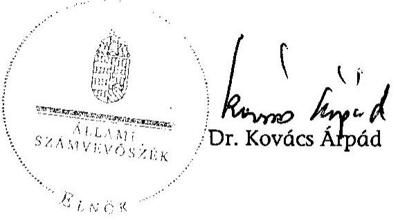

---

# KIMUTATÁS

a projekt megvalósításától visszalépett önkormányzatokról

|  Ssz. | Programba beemelt önkormányzat (Fenntartó*) | Támogatott modell | Vissza-
vont | Partner szükítés**
projekt**** | Kitsgv.
Limit*** | Visszalépés az eljárás elökészítő közbeszerz. szerz.kötés szakaszában**** | A visszalépés oka (ha ismert), vagy a programból történő kizárás oka  |
| --- | --- | --- | --- | --- | --- |

 --- | --- |
|  A | a "Korszerű tornatermet mindenhol" program |  |  |  |  |  |   |
|  1 | *Ajkai "Szent-Györgyi Albert Szakközépiskoláért" Alapítvány | B | X |  |  | X |   |
|  2 | Kötegyán Község Önkormányzata | B |  | X |  | X |   |
|  3 | Csákánydoroszló Község Önkormányzata | C2 | X |  |  | X |   |
|  4 | Hajdúnánás Városi Önkormányzat | D2 | X |  |  | X |   |
|  5 | Okány Község Önkormányzata | C2 | X |  |  | X |   |
|  6 | Vaja Nagyközség Önkormányzata | D2 | X |  |  | X |   |
|  7 | *Közös Kincs Oktatási Szolgáltató Közhasznú Társaság | B |  | X |  | X |   |
|  8 | Kenderes Város Önkormányzata | C2 | X |  |  | X |   |
|  9 | Doboz Nagyközség Önkormányzata | C2 |  | X |  | X |   |
|  10 | Kisnána Község Önkormányzata | B | X |  |  | X |   |
|  11 | Vértesacsa Község Önkormányzata | B | X |  |  | X |   |
|  12 | Szücsi Község Önkormányzata | B | X |  |  | X |   |
|  13 | Söjtör Község Önkormányzata | B | X |  |  | X |   |
|  14 | Balassagyarmat Város Önkormányzata | B |  |  |  |  |   |
|  15 | Pilisszántó Község Önkormányzata | B | X |  |  | X |   |
|  16 | Táplánszentkereszt Község | B | X |  |  | X |   |
|  17 | Gégény Község Önkormányzata | C2 | X |  |  | X |   |
|  18 | Magyarlak Község Önkormányzata | B | X |  |  | X |   |
|  19 | Kulcs Község Önkormányzata | B |  | X |  | X |   |
|  20 | Varsány Község Önkormányzata | B | X |  |  | X |   |
|  21 | Zalaszentiván Község Önkormányzata | B |  | X |  | X |   |
|  22 | Mezőtúr Város Önkormányzata | C2 | X |  |  | X |   |
|  23 | Gyenesdiás Nagyközség Önkormányzata | C2 | X |  |  | X |   |
|  24 | Dévaványa Város Önkormányzata | C2 |  |  | X |  | X  |
|  25 | Szeleste Község Önkormányzata | B |  | X |  | X |   |
|  26 | Nagybajom Város Önkormányzata | C2 |  |  |  |  |   |
|  27 | Kunhegyes Város Önkormányzata | D2 |  | X |  | X |   |
|  28 | Somogyjád Község Önkormányzata | C2 |  |  |  |  |   |
|  29 | Békéscsaba Megyei Jogú Város Önkormányzata | D2 | X |  |  | X |   |
|  30 | Balatonalmádi Város Önkormányzata | B |  | X |  |  | X  |
|  31 | Mocsa Község Polgármesteri Hivatala | C2 |  | X |  | X |   |
|  32 | Mikebuda Község Önkormányzata | B |  | X |  | X |   |

1. oldal, összesen: 12

---

|  Ssz. | Programba beemelt önkormányzat (Fenntartó*) | Támogatott modell | Vissza- vont | Partner szűkítés**
projekt**** | Kitsgv. Limit*** | Visszalépés az eljárás elökészítő
szakaszában**** | A visszalépés oka (ha ismert), vagy a programból történő kizárás oka  |
| --- | --- | --- | --- | --- | --- | --- | --- |
|  33 | Nagykáta Város Önkormányzata | D2 |  |  |  |  |   |
|  34 | Sarud Község Önkormányzata | B | X |  |  | X | Gazdálkodási helyzetük nem teszi lehetővé  |
|  35 | Szenna Község Önkormányzata | B |  |  |  |  |   |
|  36 | Hőgyész Nagyközség Önkormányzata | C2 | X |  |  | X | Gazdálkodási helyzetük nem teszi lehetővé  |
|  37 | Murakeresztúr Község Önkormányzata | C2 | X |  |  | X | Gazdálkodási helyzetük nem teszi lehetővé  |
|  38 | Vép Nagyközség Önkormányzata | C2 | X |  |  | X | Gazdálkodási helyzetük nem teszi lehetővé  |
|  39 | Szakoly Község Önkormányzata | B | X |  |  | X | Gazdálkodási helyzetük nem teszi lehetővé  |
|  40 | Gyöngyöstartján Község Önkormányzata | B |  | X |  |  |   |
|  41 | *Pécsegyházmegyei Hivatal | D2 |  | X |  | X | Eredménytelen KB (-)  |
|  42 | Miskolc Város Önkormányzata | C2 |  |  |  |  |   |
|  43 | Réde Község Önkormányzata | C2 | X |  |  | X | Építést nem kezdeményez  |
|  44 | Ladánybene Község Önkormányzata | C2 | X |  |  | X | Nem ez a rendszer a megoldás  |
|  45 | Zánka Község Önkormányzata, Zánka és Térsége Intézményi Társulás | B |  | X |  |  |   |
|  46 | Petőfiszállás Község Önkormányzata | B | X |  |  | X |   |
|  47 | Kélpő Község Önkormányzata | B |  | X |  | X |   |
|  48 | Orosháza Városi Önkormányzat | B | X |  |  | X | Nem tudnak megfelelő területet biztosítani  |
|  49 | Kaba Városi Önkormányzat | C2 |  |  | X |  |   |
|  50 | Bakonyszombathely Község Önkormányzata | B |  | X |  | X |   |
|  51 | Városföld Községi Önkormányzat | B | X |  |  | X | Ebben a konstrukcióban nem tudja felvállalni  |
|  52 | Felsőzsolca Város Önkormányzata | C2 |  |  |  |  |   |
|  53 | *Tehetségekért Alapítvány | C2 |  |  | X |  |   |
|  54 | Mezőtárkány Község Önkormányzata | B | X |  |  | X |   |
|  55 | Berettyóújfalu Város Önkormányzata | D2 | X |  |  | X |   |
|  56 | Vácrátót Község Önkormányzata | B | X |  |  | X |   |
|  57 | Törökbálint Város Önkormányzata | D2 |  | X |  |  |   |
|  58 | Szigetújfalu Község Önkormányzata | B |  | X |  |  |   |
|  59 | Tokod Nagyközség Önkormányzata | C2 | X |  |  | X | Nem szolgáltatott adatot  |
|  60 | *Képességfejlesztés 1990-98 Alapítvány | B | X |  |  | X | Gazdálkodási helyzetük nem teszi lehetővé  |
|  61 | Algyő Nagyközség Önkormányzata | C2 | X |  |  | X | Gazdálkodási helyzetük nem teszi lehetővé  |
|  62 | Pécel Város Önkormányzata | C2 |  |  |  |  |   |
|  63 | Kiskőrös Város Önkormányzata | B |  |  |  |  |   |
|  64 | Magyaratád Község Önkormányzata | B |  |  |  |  |   |
|  65 | Újszilvás Község Önkormányzata | C2 | X |  |  | X |   |
|  66 | Mezőszilas Község Önkormányzata | C2 |  | X |  | X |   |
|  67 | Érsekvadkert Község Önkormányzata | C2 | X |  |  | X |   |
|  68 | Zalaegerszeg Megyei Jogú Város Önkormányzata | D2 | X |  |  | X | Nem szolgáltatott adatot  |

---

|  Ssz. | Programba beemelt önkormányzat (Fenntartó*) | Támogatott modell | Vissza- vont | Partner szűkítés**
projekt**** | Kitsgv. Limit*** | Visszalépés az eljárás elökészítő szakaszában**** | A visszalépés oka (ha ismert), vagy a programból történő kizárás oka  |
| --- | --- | --- | --- | --- | --- | --- | --- |
|  69 | Zalaegerszeg Megyei Jogú Város Önkormányzata | D2 |  | X |  | X |   |
|  70 | Dédestapolcsány Község Önkormányzata | B |  |  |  |  | 
  |
|  71 | Fegyvernek Község Önkormányzata | C2 | X |  |  | X |   |
|  72 | Látrány Község Önkormányzata | C2 |  | X |  | X |   |
|  73 | Arló Nagyközség Önkormányzata | D2 |  | X |  | X |   |
|  74 | Szigethalom Város Önkormányzata | C2 |  |  | X |  | X  |
|  75 | Aba Nagyközség Önkormányzata | C2 |  |  |  |  |   |
|  76 | Hódmezővásárhely Megyei Jogú Város Önkormányzata | D2 |  |  |  |  |   |
|  77 | Ruzsa Község Önkormányzata | C2 | X |  |  | X |   |
|  78 | Battonya Város Önkormányzata | C2 | X |  |  | X |   |
|  79 | Kakasd Község Önkormányzata | B | X |  |  | X |   |
|  80 | Debrecen Megyei Jogú Város Önkormányzata | D2 | X |  |  | X |   |
|  81 | Debrecen Megyei Jogú Város Önkormányzata | B | X |  |  | X |   |
|  82 | Cered Község Önkormányzata | B | X |  |  | X |   |
|  83 | Rákócziújfalu Község Önkormányzata | C2 |  | X |  | X |   |
|  84 | Letenye Város Önkormányzata | C2 | X |  |  | X |   |
|  85 | Palotás Községi Önkormányzata | C2 |  | X |  | X |   |
|  86 | Zomba Község Önkormányzata | C2 | X |  |  | X |   |
|  87 | *Hit Gyülekezete | B |  |  |  |  |   |
|  88 | Apaj Község Önkormányzata | B |  | X |  | X |   |
|  89 | *Szentendrei Református Egyházközség | B | X |  |  | X |   |
|  90 | Ostoros Község Önkormányzata | B |  | X |  |  | X  |
|  91 | Pusztaszer Község Önkormányzata |  | X |  |  | X |   |
|  92 | Kozármisleny Város Önkormányzata | D2 |  |  |  |  |   |
|  93 | Jászladány Nagyközség Önkormányzata | C2 | X |  |  | X |   |
|  94 | Nagykörös Város Önkormányzata | C2 | X |  |  | X |   |
|  95 | Devecser Város Önkormányzata | D2 |  | X |  |  | X  |
|  96 | Budapest Főváros XVII. kerület Önkormányzata | C2 |  | X |  |  | X  |
|  97 | Vácduka Község Önkormányzata | B | X |  |  | X |   |
|  98 | Balkány Város Önkormányzata | C2 |  | X |  | X |   |
|  99 | Gyúró Község Önkormányzata | B | X |  |  | X |   |
|  100 | Pilisborosjenő Község Önkormányzata | C2 | X |  |  | X |   |
|  101 | Út a Harmadik Évezredbe Alapítvány | B |  | X |  | X |   |
|  102 | *Földművelésügyi és Vidékfejlesztési Minisztérium | B | X |  |  | X |   |

1. számú melléklet a V-3010/2008. számú jelentéshez

3. oldal, összesen: 12

---

|  Ssz. | Programba beemelt önkormányzat (Fenntartó*) | Támogatott modell | Vissza- vont | Partner szűkítés**
projekt**** | Kitsgv. Limit*** | Visszalépés az eljárás elökészítő
szakaszában**** | A visszalépés oka (ha ismert), vagy a programból történő kizárás oka  |
| --- | --- | --- | --- | --- | --- | --- | --- |
|  103 | *Földművelésügyi és Vidékfejlesztési Minisztérium | B | X |  |  | X | Gazdálkodási helyzetük nem teszi lehetővé  |
|  104 | *Földművelésügyi és Vidékfejlesztési Minisztérium | B | X |  |  | X | Gazdálkodási helyzetük nem teszi lehetővé  |
|  105 | *Földművelésügyi és Vidékfejlesztési Minisztérium | B | X |  |  | X | Gazdálkodási helyzetük nem teszi lehetővé  |
|  106 | Öcsény Község Önkormányzata | C2 | X |  |  | X | Gazdálkodási helyzetük nem teszi lehetővé  |
|  107 | Tiszaszalka Község Önkormányzata | B | X |  |  | X | Gazdálkodási helyzetük nem teszi lehetővé  |
|  108 | Vasad Község Önkormányzata | B | X |  |  | X | Gazdálkodási helyzetük nem teszi lehetővé  |
|  109 | Fejér Megyei Önkormányzat | C2 | X |  |  | X | Gazdálkodási helyzetük nem teszi lehetővé  |
|  110 | Fejér Megyei Önkormányzat | C2 | X |  |  | X | Gazdálkodási helyzetük nem teszi lehetővé  |
|  111 | Gyál Város Önkormányzata | C2 | X |  |  | X | Gazdálkodási helyzetük nem teszi lehetővé  |
|  112 | Gyál Város Önkormányzata | C2 | X |  |  | X | Gazdálkodási helyzetük nem teszi lehetővé  |
|  113 | *Hajdúbőszörményi Bocskai-téri Református Egyházközség | B | X |  |  | X | Anyagi nehézség, presbiteri döntés  |
|  114 | Aszód Város Önkormányzata | C2 | X |  |  | X | Gazdálkodási helyzetük nem teszi lehetővé  |
|  115 | Becsvölgye Község Önkormányzata | B |  | X |  | X | Nem kötött EM  |
|  116 | Budakalász Nagyközség Önkormányzata | C2 | X |  |  | X | Gazdálkodási helyzetük nem teszi lehetővé  |
|  117 | Cigánd Nagyközség Önkormányzata | D2 |  |  |  |  | Visszalépést követően újólag aktivált projekt  |
|  118 | Zalaapáti Község Önkormányzata | B | X |  |  | X | Magas önrész, nem tudja vállalni  |
|  119 | Sárospatak Város Önkormányzata | D2 | X |  |  | X | Nem szolgáltatott adatot  |
|  120 | *Bugyi Református Egyházközség | B |  | X |  | X | Nem kötött EM  |
|  121 | Kaposvár Megyei Jogú Város Önkormányzata | C2 | X |  |  | X | Nem szolgáltatott adatot  |
|  122 | Budapest Főváros IX. Kerület Önkormányzata | C2 |  | X |  | X | Nem kötött EM  |
|  123 | Budapest Főváros XV. Kerület Önkormányzata | D2 | X |  |  | X | Nem szolgáltatott adatot  |
|  124 | Földeák Község Önkormányzata | C2 | X |  |  | X | Gazdálkodási helyzetük nem teszi lehetővé  |
|  125 | Biri Község Önkormányzata | B |  | X |  | X | Nem kötött EM  |
|  126 | Földes Nagyközség Önkormányzata | C2 | X |  |  | X | Gazdálkodási helyzetük nem teszi lehetővé  |
|  127 | Pócsmegyer Község Önkormányzata | C2 |  |  | X |  | Eredménytelen KB (-)  |
|  128 | *HOSTIS Idegenforgalmi és Nemzetközi Gazdasági Szakképzési Közalapítvány | C2 | X |  |  | X | Nem szolgáltatott adatot  |
|  129 | Nagyhalász Város Önkormányzata | D2 |  | X |  |  | Eredménytelen KB (-)  |
|  130 | Kápolnásnyék Község Önkormányzata | D2 |  | X |  |  | Eredménytelen KB (-)  |
|  131 | Nagyesved Város Önkormányzata | D2 | X |  |  | X | Gazdálkodási helyzetük nem teszi lehetővé  |
|  132 | Tiborszállás Község Önkormányzata | B | X |  |  | X | Visszavonva  |
|  133 | Keszthely Város Önkormányzata | D2 |  | X |  | X | Nem készült PT  |
|  134 | Sátoraljaújhely Város Önkormányzata | D2 |  | X |  | X | Nem készült PT  |

---

|  Ssz. | Programba beemelt önkormányzat (Fenntartó*) | Támogatott modell | Vissza- vont | Partner szűkítés**
projekt**** | Kitsgv. Limit*** | Visszalépés az eljárás elökészítő
szakaszában**** | A visszalépés oka (ha ismert), vagy a programból történő kizárás oka  |
| --- | --- | --- | --- | --- | --- | --- | --- |
|  135 | "Szakképző és Oktatási és Szolgáltató Kht. | C2 |  | X |  | X |   |
|  136 | Méhtelek Község Önkormányzata | B | X |  |  | X |   |
|  137 | Nyírcsaholy Község Önkormányzata | B | X |  |  | X |   |
|  138 | Baja Város Önkormányzata | C2 |  | X |  | X |

   |
|  139 | Kecskemét Város Önkormányzata | C2 |  |  | X |  | X  |
|  140 | Szombathely Megyei Jogú Város Önkormányzata | C2 |  | X |  | X |   |
|  141 | Hit Gyülekezete | B |  |  |  |  |   |
|  142 | Krasznokvajda Község Önkormányzata | B | X |  |  | X |   |
|  143 | Lak Község Önkormányzata | B |  | X |  |  | X  |
|  144 | Csurgó Város Önkormányzata | C2 |  |  |  |  |   |
|  145 | Gárdony Város Önkormányzata | C2 | X |  |  | X |   |
|  A | tornaterem összesen: 145 |  | 80 | 41 | 6 | 108 | 17  |
|  B | a "Tanuszodát minden kistérségben" program |  |  |  |  |  |   |
|  1 | Sarkad Város Önkormányzata | B |  |  | X |  | X  |
|  2 | Baktalórántháza Város Önkormányzata | B | X |  |  | X |   |
|  3 | Ibrány Város Önkormányzata | B |  |  |  |  |   |
|  4 | Balassagyarmat Város Önkormányzata | B |  | X |  | X |   |
|  5 | Újfehértó Város Önkormányzata | B |  |  |  |  |   |
|  6 | Nagyatád Város Önkormányzata | B |  |  |  |  |   |
|  7 | Marcali Város Önkormányzata | B |  |  |  |  |   |
|  8 | Nyírbátor Város Önkormányzata | B | X |  |  | X |   |
|  9 | Iváncsa Község Önkormányzata | B |  |  |  |  |   |
|  10 | Sümeg Város Önkormányzata | B |  | X |  |  | X  |
|  11 | Tab Város Önkormányzata | B |  |  |  |  |   |
|  12 | Bicske Város Önkormányzata | B |  |  |  |  |   |
|  13 | Abony Város Önkormányzata | B |  | X |  | X |   |
|  14 | Tata Város Önkormányzata | A |  |  |  |  |   |
|  15 | Túrkeve Város Önkormányzata | B | X |  |  | X |   |
|  16 | Kapuvár Város Önkormányzata | B | X |  |  | X |   |
|  17 | Tiszavasvári Város Önkormányzata | B | X |  |  | X |   |
|  18 | Mélykút Nagyközség Önkormányzata | B |  | X |  | X |   |
|  19 | Tordas Község Önkormányzata | B |  | X |  | X |   |
|  20 | Celldömölk Város Önkormányzata | B |  | X |  | X |   |
|  21 | Répcelak Város Önkormányzata | B |  | X |  | X |   |
|  22 | Mezőkeresztes Nagyközségi Önkormányzat | B |  | X |  |  | X  |
|  23 | Szigetvár Város Önkormányzata | B |  |  |  |  |   |
|  24 | Kaba Város Önkormányzata | B | X |  |  | X |   |

1. számú melléklet a V-3010/2008. számú jelentéshez

5. oldal, összesen: 12

---

|  Ssz. | Programba beemelt önkormányzat (Fenntartó*) | Támogatott modell | Vissza- vont | Partner szűkítés**
projekt**** | Kitsgv. Limit*** | Visszalépés az eljárás elökészítő
szakaszában**** | A visszalépés oka (ha ismert), vagy a programból történő kizárás oka  |
| --- | --- | --- | --- | --- | --- | --- | --- |
|  25 | Tét Város Önkormányzata | B | X |  |  | X | Gazdálkodási helyzetük nem teszi lehetővé  |
|  26 | Kunhegyes Város Önkormányzata | B |  | X |  | X | Nem indított KB  |
|  27 | Hőgyész Nagyközség Önkormányzata | B | X |  |  | X | Gazdálkodási helyzetük nem teszi lehetővé  |
|  28 | Törökszentmiklós Város Önkormányzata | B | X |  |  | X | Gazdálkodási helyzetük nem teszi lehetővé  |
|  29 | Orosháza Város Önkormányzata | B | X |  |  | X | Nem szolgáltatott adatot  |
|  30 | Bácsalmás Város Önkormányzata | A |  |  |  |  |   |
|  31 | Gyál Város Önkormányzata | B |  |  | X |  | X  |
|  32 | Mohács Város Önkormányzata | B |  |  |  |  |   |
|  33 | Várpalota Város Önkormányzata | B |  | X |  |  | X  |
|  34 | Aba Nagyközség Önkormányzata | B |  |  |  |  |   |
|  35 | Özd Város Önkormányzata | B |  |  |  |  |   |
|  36 | Pannonhalma Város Önkormányzata | B |  | X |  | X |   |
|  37 | Szécsény Város Önkormányzata | B | X |  |  | X |   |
|  38 | Bátaszék Város Önkormányzata | B |  |  |  |  |   |
|  39 | Csongrád Város Önkormányzata | B | X |  |  | X | Nem szolgáltatott adatot  |
|  40 | Bük Nagyközség Önkormányzata | B | X |  |  | X | Gazdálkodási helyzetük nem teszi lehetővé  |
|  41 | Budakeszi Város Önkormányzata | B | X |  |  | X | Nem szolgáltatott adatot  |
|  42 | Letenye Város Önkormányzata | B | X |  |  | X | Gazdálkodási helyzetük nem teszi lehetővé  |
|  43 | Kiskörös Város Önkormányzata | B |  |  |  |  |   |
|  44 | Rozsály Község Önkormányzata | B |  | X |  |  | X  |
|  45 | Berettyóújfalu Város Önkormányzata | B | X |  |  | X |   |
|  46 | Sásd Város Önkormányzata | B | X |  |  | X |   |
|  47 | Tököl Város Önkormányzata | B | X |  |  | X |   |
|  48 | Szob Város Önkormányzata | B |  | X |  | X |   |
|  49 | Kunszentmárton Város Önkormányzata | B |  | X |  |  | X  |
|  50 | Cigánd Nagyközség Önkormányzata | B |  | X |  | X |   |
|  51 | Jászladány Nagyközség Önkormányzata | B |  | X |  |  | X  |
|  52 | Rétság Város Önkormányzata | B | X |  |  | X |   |
|  53 | Lengyeltóti Város Önkormányzata | A |  |  |  |  |   |
|  54 | Tokaj Város Önkormányzata | B | X |  |  | X |   |
|  55 | Keszthely Város Önkormányzata | B |  |  | X |  | X  |
|  56 | Tiszakerecseny Község Önkormányzata | A |  | X |  | X |   |
|  57 | Szentlőrinc Város Önkormányzata | B |  | X |  | X |   |
|  58 | Heves Város Önkormányzata | B |  | X |  |  | X  |
|  59 | Komádi Város Önkormányzata | B |  | X |  | X |   |
|  60 | Tapolca Város Önkormányzata | B |  | X |  | X |   |
|  61 | Acsa Nagyközség Önkormányzata | A |  |  |  |  |   |
|  62 | Gönc Város Önkormányzata | B |  |  |  |  |   |
|  63 | Földes Nagyközség Önkormányzata | B | X |  |  | X | A projekttervet a Képviselő-testület nem hagyta jóvá  |
|  64 | Magyarhertelend Község Önkormányzata | A |  |  | X |  | X  |

1. számú melléklet a V-3010/2008. számú jelentéshez

6. oldal, összesen: 12

---

|  Ssz. | Programba beemelt önkormányzat (Fenntartó*) | Támogatott modell | Vissza- vont | Partner szűkítés**
projekt**** | Kitsgv. Limit*** | Visszalépés az eljárás elökészítő
szakaszában**** | A visszalépés

 oka (ha ismert), vagy a programból történő kizárás oka  |
| --- | --- | --- | --- | --- | --- | --- | --- |
|  65 | Dunakeszi Város Önkormányzata | B |  |  | X |  |   |
|  66 | Nagyvázsony Község Önkormányzata | A |  | X |  | X |   |
|  B | tanuszodák összesen: 66 |  | 21 | 22 | 5 | 36 | 11  |
|  C | a "Sporttal a közösségekért" programban |  |  |  |  |  |   |
|  1 | Békés | uszoda |  | X |  |  | X  |
|  2 | Bóly | sportcsarnok |  | X |  | X |   |
|  3 | Érd | sportcsarnok | X |  |  | X |   |
|  4 | Gyöngyös | sportcsarnok |  | X |  |  | X  |
|  5 | Jászberény | jégcsarnok |  | X |  |  | X  |
|  6 | Kiskunfélegyháza | sportcsarnok |  |  |  |  |   |
|  7 | Mosonmagyaróvár | sportcsarnok |  | X |  |  | X  |
|  8 | Nagykanizsa | sportcsarnok |  | X |  | X |   |
|  9 | Veszprém | sportcsarnok |  | X |  |  | X  |
|  10 | Szigetszentmiklós | sportcsarnok |  | X |  |  | X  |
|  C | sportcsarnok összesen: 10 |  | 1 | 8 | 0 | 3 | 6  |
|  Mindösszesen 221 |  |  | 102 | 71 | 11 | 147 | 34  |

## Kizárási okok

PT Az ÖM által elkészített ProjektTervezetekhez a kiinduló adatokat a Partnereknek kellett szolgáltatnia. Amennyiben ez nem történt meg, vagy az elkészült tervezet a Partner (vagy annak testületei) által nem került elfogadásra; "Nem készült PT".

EM A Partnerek és az ÖM közötti viszonyokat, kötelezettségeket és eljárásokat előzetesen (függetlenül a projekt későbbi alakulásától) szabályozó Együttműködési Megállapodás nem került kétoldalúan aláírásra: "Nem kötött EM"

KB Közbeszerzési eljárás eredménytelensége: a) nem nyújtottak be ajánlatot, b) kizárólag érvénytelen ajánlatot nyújtottak be, c) egyik ajánlattevő sem, vagy az összességében legjobb ajánlatot tevő sem tett - az ajánlatkérő rendelkezésére álló fedezet mértékére tekintettel - megfelelő vagy közbeszerzési eljárásra nem került sor "Nem indított KB"

---

# KIMUTATÁS

a 2004-2008. évek közötti időszakban PPP formában megvalósítani tervezett, illetve megvalósuló (futó) projektekről

|  Ssz. | Program megvalósításától vissza nem lépett önkormányzatok (Fenntartók*) | Támog.
Modell | Folyamatban lévő projektek**
2009. március 25.-én |  |  | Tervezett kötelezettség vállalás értéke | Szerződéses kötelezettség vállalás értéke | Éves tényleges kifizetés a futó projektekre |  |  | Éves tervezett kifizetés a futó projektekre |  |  |  |   |
| --- | --- | --- | --- | --- | --- | --- | --- | --- | --- | --- | --- | --- | --- | --- | --- |
|   |  |  | szer-
ződés-
kötés | Épül | Üzemel | (NPV)*** | (NPV)*** | 2007. | 2008. | 2007. | 2008. | 2009. | 2010. | 2011. |   |
|  A | a "Korszerű tornatermet mindenhol" program |  |  |  |  |  |  |  |  |  |  |  |  |  |   |
|  1 | Balassagyarmat Város Önkormányzata | B |  |  | X | 212975 | 212975 | 0 | 7520 | 0 | 9482 | 25246 | 26155 | 26914 |   |
|  2 | Nagybajom Város Önkormányzata | C2 |  |  | X | 391341 | 391341 | 23728 | 44266 | 30152 | 41282 | 43965 | 45548 | 46868 |   |
|  3 | Somogyjád Község Önkormányzata | C2 |  |  | X | 393862 | 393820 | 32083 | 43494 | 38545 | 41282 | 43965 | 45548 | 46869 |   |
|  4 | Nagykáta Város Önkormányzata | D2 |  |  | X | 503510 | 503510 |  |  |  | 6829 | 60335 | 62507 | 64320 |   |
|  5 | Szenna Község Önkormányzata | B |  |  | X | 226170 | 226170 | 18445 | 25117 | 22134 | 23706 | 25246 | 26155 | 26914 |   |
|  6 | Miskolc Város Önkormányzata | C2 |  | X |  | 365178 | 365178 | 0 | 0 | 0 | 0 | 43965 | 45548 | 46868 |   |
|  7 | Felsőzsolca Város Önkormányzata | C2 |  |  | X | 374166 | 374166 | 0 | 22527 | 0 | 26013 | 43965 | 45548 | 46869 |   |
|  8 | Pécel Város Önkormányzata | C2 | X |  |  | 358236 | 358236 | 0 | 0 | 0 | 0 | 22103 | 45548 | 46868 |   |
|  9 | Kiskőrős Város Önkormányzata | B |  |  | X | 209699 | 209699 | 0 | 0 | 0 | 0 | 25246 | 26155 | 26914 |   |
|  10 | Magyaratád Község Önkormányzata | B |  |  | X | 226170 | 226170 | 18445 | 25419 | 22134 | 23705 | 25247 | 26155 | 26914 |   |
|  11 | Dédestapolcsány Község Önkormányzata | B |  |  | X | 219960 | 219959 | 3689 | 22988 | 5534 | 23706 | 25246 | 26155 | 26914 |   |
|  12 | Aba Nagyközség Önkormányzata | C2 | X |  |  | 358236 | 358236 | 0 | 0 | 0 | 0 | 22103 | 45548 | 46869 |   |
|  13 | Hódmezővásárhely Megyei Jogú Város Önkormányzat | D2 |  |  | X |  |  | 0 | 17666 | 0 | 23282 | 60335 | 62507 | 64320 |   |
|  14 | *Hit Gyülekezete | B |  |  | X | 509194 | 509194 |  |  |  |  |  |  |  |   |
|  15 | Kozármisleny Város Önkormányzata | D2 |  |  | X | 226170 | 223696 | 17820 | 20234 | 22134 | 23705 | 25247 | 26155 | 26913 |   |
|  16 | Cigánd Nagyközség Önkormányzata | D2 |  |  | X | 538828 | 538789 | 44042 | 54497 | 48392 | 56653 | 60335 | 62507 | 64320 |   |
|  17 | *Hit Gyülekezete | B |  |  | X | 515843 | 515844 | 0 | 35263 | 0 | 42528 | 60335 | 62507 | 64320 |   |
|  18 | Csurgó Város Önkormányzata | C2 |  |  | X | 211046 | 211046 | 0 | 0 | 0 | 3897 | 25247 | 26156 | 26913 |   |
|  19 | *Tornaterem összesen |  | 2 | 1 | 15 | 6214046 | 6211491 | 158252 | 345480 | 189025 | 370047 | 682096 | 751950 | 773756 |   |
|  B | a "Tanuszodát minden kistérségben" program |  |  |  |  |  |  |  |  |  |  |  |  |  |   |
|  1 | Ibrány Város Önkormányzata | B |  |  | X | 523492 | 523492 | 0 | 46604 | 0 | 53643 | 60794 | 62982 | 64809 |   |
|  2 | Újfehértó Város Önkormányzata | B |  | X |  | 512533 | 512533 | 0 | 0 | 0 | 0 | 0 | 62982 | 64809 |   |
|  3 | Nagyatád Város Önkormányzata | B |  |  | X | 509119 | 509119 | 0 | 0 | 0 | 12042 | 60794 | 62982 | 64809 |   |
|  4 | Marcali Város Önkormányzata | B |  |  | X | 509119 | 509119 | 0 | 0 | 0 | 12042 | 60794 | 62982 | 64809 |   |
|  5 | Iváncsa Község Önkormányzata | B |  | X |  | 500186 | 500186 | 0 | 0 | 0 | 0 | 45762 | 62982 | 64809 |   |
|  6 | Tab Város Önkormányzata | B |  |  | X | 509120 | 509120 | 0 | 0 | 0 | 12042 | 60794 | 62982 | 64809 |   |
|  7 | Bicske Város Önkormányzata | B |  | X |  | 500186 | 500186 | 0 | 0 | 0 | 0 | 45762 | 62982 | 64809 |   |
|  8 | Tata Város Önkormányzata | A |  |  | X | 285141
 | 285141 | 0 | 0 | 0 | 0 | 34329 | 35565 | 36596 |   |
|  9 | Szigetvár Város Önkormányzata | B |  |  | X | 526324 | 526324 | 0 | 56768 | 4393 | 57083 | 60794 | 62983 | 64809 |   |

---

1. számú melléklet a V-3010/2008. számú jelentéshez

|  Ssz. | Program megvalósításától vissza nem lépett önkormányzatok (Fenntartók*) | Támog. Modell | Folyamatban lévő projektek** 2009. március 25.-én |  |  |  | Tervezett kötelezettség vállalás értéke | Szerződéses kötelezettség vállalás értéke | Éves tényleges kifizetés a futó projektekre |  |  |  | Éves tervezett kifizetés a futó projektekre |  |  |   |
| --- | --- | --- | --- | --- | --- | --- | --- | --- | --- | --- | --- | --- | --- | --- | --- | --- |
|   |  |  | szer- | Épül | Üzemel |  | (NPV)*** | 2007. | 2008. | 2007. | 2008. | 2009. | 2010. | 2011. |  |   |
|   |  |  | zödés- |  |  |  |  |  |  |  |  |  |  |  |  |   |
|   |  |  | kötés |  |  |  |  |  |  |  |  |  |  |  |  |   |
|  10 | Bácsalmás Város Önkormányzata | A |  |  | X |  | 300 021 | 300 021 | 7 524 | 31 590 | 10 004 | 32 234 | 34 329 | 35 565 | 36 596 |   |
|  11 | Mohács Város Önkormányzata | B |  |  | X |  | 535 582 | 535 582 | 20 135 | 61 209 | 29 139 | 57 083 | 60 793 | 62 983 | 64 809 |   |
|  12 | Aba Nagyközség Önkormányzata | B | **** |  |  |  | 495 359 | 495 359 | 0 | 0 | 0 | 0 | 0 | 0 | 0 |   |
|  13 | Özd Város Önkormányzata | B |  |  | X |  | 514 901 | 514 901 | 0 | 36 946 | 0 | 28 776 | 60 793 | 62 982 | 64 809 |   |
|  14 | Bátaszék Város Önkormányzata | B |  |  | X |  | 517 386 | 517 386 | 0 | 30 492 | 0 | 35 970 | 60 794 | 62 982 | 64 808 |   |
|  15 | Kiskőrös Város Önkormányzata | B |  | X |  |  | 503 315 | 503 315 | 0 | 0 | 0 | 0 | 55 616 | 62 982 | 64 808 |   |
|  16 | Lengyeltóti Város Önkormányzata | A |  |  | X |  | 288 406 | 288 406 | 0 | 6 715 | 0 | 9 449 | 34 329 | 35 565 | 36 596 |   |
|  17 | Acsa Nagyközség Önkormányzata | A |  |  | X |  | 288 833 | 288 833 | 0 | 0 | 0 | 10 686 | 34 329 | 35 565 | 36 596 |   |
|  18 | Gönc Város Önkormányzata | B |  |  | X |  | 511 713 | 511 713 | 0 | 30 751 | 0 | 19 549 | 60 794 | 62 982 | 64 808 |   |
|   | Tanuszoda összesen |  | 1 | 4 | 13 |  | 8 330 736 | 8 330 736 | 27 659 | 301 076 | 43 536 | 340 600 | 831 600 | 961 028 | 988 898 |   |
|   | a "Sporttal a közösségekért" programban |  |  |  |  |  |  |  |  |  |  |  |  |  |  |   |
|  1. | Kiskunfélegyháza |  |  |  | X |  | 452 560 | 452 560 | 3 795 | 52 285 | 11 385 | 48 773 | 51 944 | 53 814 | 55 374 |   |
|   | Sportcsarnok összesen |  |  |  | 1 |  | 452 560 | 452 560 | 3 795 | 52 285 | 11 385 | 48 773 | 51 944 | 53 814 | 55 374 |   |
|   | Mindösszesen 37 projekt |  | 3 | 5 | 29 |  | 14 997 342 | 14 994 787 | 189 706 | 698 840 | 243 946 | 759 420 | 1 565 640 | 1 766 792 | 1 818 028 |   |

- A programban a Partner az oktatási intézmény "Fenntartó"-ja, aki nem minden esetben Önkormányzat. ** A megfelelő oszlopban "X"-szel jelölendő. *** NPV = nettó jelenérték összege, Diszkontráta: PM 2008.10.13. **** Magánbefektető bejelentette (2008.08.27.) - az önkormányzat szerződésszegésére alapozott (szerz. 12.2.2.c) - szerződésbontási szándékát!

---

Az ellenőrzött támogatott projektekhez kapcsolódó pénzügyi számítások eredményei

|  Ssz. | Vizsgált önkormányzat | A sportlétesítmény típusa | Projekttervezetben számított |  |  | Szolgáltatási szerződés alapján számított |  |   |
| --- | --- | --- | --- | --- | --- | --- | --- | --- |
|   |  |  | PPP érték | PSC érték | PPP/PSC arány | PPP érték | PSC érték | PPP/PSC arány  |
|  1. | Bátaszék | tanuszoda "Bu" | 1005698 | 1036345 | 97,04\% | 903753 | 913083 | 98,98\%  |
|  2. | Csurgó | tornaterem "C2" | 714637 | 722851 | 98,86\% | 834112 | 856239 | 97,42\%  |
|  3. | Hódmezővásárhely | tornaterem "D2" | 1084091 | 1141571 | 94,96\% | 1367395 | 1381486 | 98,98\%  |
|  4. | Kiskunfélegyháza | sportcsarnok "MCs" | 2340688 | 2397856 | 97,62\% | 3142943 | 3167754 | 99,22\%  |
|  5. | Kozármisleny | tornaterem "D2" | 936215 | 939933 | 99,60\% | 983162 | 989768 | 99,33\%  |
|  6. | Magyaratád | tornaterem "B" | 425205 | 431614 | 98,52\% | 425708 | 443531 | 95,98\%  |
|  7. | Mohács | tanuszoda "Bu" | 1011060 | 1022930 | 98,84\% | 1123673 | 1129454 | 99,49\%  |
|  8. | Nagybajom | tornaterem "C2" | 846796 | 848384 | 99,81\% | 849890 | 890108 | 95,48\%  |
|  9. | Nagykáta | tornaterem "D2" | 955330 | 1012975 | 94,31\% | 1039181 | 1053600 | 98,63\%  |
|  10. | Özd | tanuszoda "Bu" | 1032045 | 1070197 | 96,44\% | 1157728 | 1190033 | 97,29\%  |
|  11. | Somogyjád | tornaterem "C2" | 845737 | 847398 | 99,80\% | 714273 | 748609 | 95,41\%  |
|  12. | Szenna | tornaterem "B" | 423414 | 429942 | 98,48\% | 405693 | 424735 | 95,52\%  |
|  13. | Szigetvár | tanuszoda "Bu" | 1005458 | 1044588 | 96,25\% | 1272942 | 1277616 | 99,63\%  |

"B"- tornaterem (1 terü) "Bu"- 1 tanmedence +1 úszómedence "C2"- tornaterem (2 térrészre választható +200 fős lelátó) "D2"- tornaterem (3 térrészre választható +400 fős lelátó) "MCs"- $1722 \mathrm{~m}^{2}$ küzdőtér +1000 fős fix lelátó; 700 fős mobil lelátó; 300 fős állóhely + kiszolgáló egységek

---

# A szolgáltatási szerződésekben a futamidő első évére rögzített szolgáltatási díjak összetevői

|  helyszín/típus | éves "A" díjszelet Áfa nélkül | éves "B" díjszelet Áfa nélkül | összesen | önkormányzat által fizetendő éves díj Áfa nélkül | ÖM által fizetendő éves díj Áfa nélkül | összesen  |
| --- | --- | --- | --- | --- | --- | --- |
|  Nagybajom - C2 | 30402 | 45603 | 76005 | 43884 | 32121 | 76005  |
|   | 40,00\% | 60,00\% | 100,00\% | 57,74\% | 42,26\% | 100,00\%  |
|  Csurgó - C2 | 27400 | 41100 | 68500 | 36379 | 32121 | 68500  |
|   | 40,00\% | 60,00\% | 100,00\% | 53,11\% | 46,89\% | 100,00\%  |
|  Somogyjád - C2 | 25667 | 38500 | 64167 | 32084 | 32083 | 64167  |
|   | 40,00\% | 60,00\% | 100,00\% | 50,00\% | 50,00\% | 100,00\%  |
|  Kozármisleny - D2 | 63917 | 24167 | 88084 | 44042 | 44042 | 88084  |
|   | 72,56\% | 27,44\% | 100,00\% | 50,00\% | 50,00\% | 100,00\%  |
|  Hódmezővásárhely - D2 | 83066 | 39181 | 122247 | 78166 | 44081 | 122247  |
|   | 67,95\% | 32,05\% | 100,00\% | 63,94\% | 36,06\% | 100,00\%  |
|  Nagykáta - D2 | 52324 | 41124 | 93448 | 49367 | 44081 | 93448  |
|   | 55,99\% | 44,01\% | 100,00\% | 52,83\% | 47,17\% | 100,00\%  |
|

  Szenna - B | 14833 | 22250 | 37083 | 18638 | 18445 | 37083  |
|   | 40,00\% | 60,00\% | 100,00\% | 50,26\% | 49,74\% | 100,00\%  |
|  Magyaratád - B | 15083 | 22625 | 37708 | 19263 | 18445 | 37708  |
|   | 40,00\% | 60,00\% | 100,00\% | 51,08\% | 48,92\% | 100,00\%  |
|  Kiskunfélegyháza - MCs | 179900 | 117500 | 297400 | 248700 | 48700 | 297400  |
|   | 60,49\% | 39,51\% | 100,00\% | 83,62\% | 16,38\% | 100,00\%  |
|  Bátaszék - Bu | 39420 | 49412 | 88832 | 44416 | 44416 | 88832  |
|   | 44,38\% | 55,62\% | 100,00\% | 50,00\% | 50,00\% | 100,00\%  |
|  Mohács - Bu | 48750 | 49217 | 97967 | 53551 | 44416 | 97967  |
|   | 49,76\% | 50,24\% | 100,00\% | 54,66\% | 45,34\% | 100,00\%  |
|  Özd - Bu | 46500 | 53500 | 100000 | 55584 | 44416 | 100000  |
|   | 46,50\% | 53,50\% | 100,00\% | 55,58\% | 44,42\% | 100,00\%  |
|  Szigetvár - Bu | 50933 | 73088 | 124021 | 79605 | 44416 | 124021  |
|   | 41,07\% | 58,93\% | 100,00\% | 64,19\% | 35,81\% | 100,00\%  |

---

# A tornatermek és a sportcsarnok kihasználtságának, illetve a tanuszodák látogatottságának alakulása a vizsgált időszakban 

| helyszín | létesítmény   típus | közcélú igénybevétel |  | piaci hasznosítás |  |
| :-- | :--: | :--: | :--: | :--: | :--: |
|  |  | szünidő | tanítási   időszak | szünidő | tanítási   időszak |
| Nagybajom | C2 tornatermek | $50 \%-60 \%$ | $73 \%-86 \%$ | nem volt | nem volt |
| Csurgó | $60 \%-84 \%$ | $64 \%-85 \%$ | nem volt | nem volt |  |
| Somogyjád |  | $77 \%-82 \%$ | $81 \%-97 \%$ | nem volt | nem volt |

| Kozármisleny | D2 tornatermek | $21 \%-54 \%$ | $65 \%-97 \%$ | nem volt | 9 üzemóra |
| :-- | :--: | :--: | :--: | :--: | :--: |
| Hódmezővásárhely |  | $46 \%$ | $93 \%$ | nem volt | nem volt |
| Nagykáta |  | A helyszíni ellenőrzés ideje alatt még nem üzemelt. |  |  |  |

| Szenna | B tornatermek | $78 \%-81 \%$ | $90 \%-100 \%$ | nem volt | nem volt |
| :-- | :--: | :--: | :--: | :--: | :--: |
| Magyaratád |  | $78 \%-96 \%$ | $71 \%-99 \%$ | nem volt | nem volt |

| Kiskunfélegyháza | sportcsarnok | nem volt | $2 \%-12 \%$ | $7 \%-16 \%$ | $16 \%-43 \%$ |
| :-- | :-- | :-- | :-- | :-- | :-- |

| Bátaszék | tanmedence | 773 - 932 fő | 1093 -1108 fő | nem volt | nem volt |
| :-- | :--: | :--: | :--: | :--: | :--: |
|  | úszómedence | 798 - 1765 fő | 2152 - 3879 fő | nem volt | nem volt |
| Mohács | tanmedence | 123 - 193 fő | 179 - 375 fő | 224 - 501 fő | 270 - 583 fő |
|  | úszómedence | 599 - 1535 fő | 872 - 1829 fő | 2393 - 4506 fő | 2426 - 5251 fő |
| Özd | tanmedence | nem volt | 550 - 910 fő | nem volt | nem volt |
|  | úszómedence | 1829 - 2319 fő | 2131 - 3023 fő | nem volt | nem volt |
| Szigetvár | tanmedence | 0 - 507 fő | 362 - 2676 fő | nem volt | nem volt |
|  | úszómedence | 470 - 506 fő | 365 - 1360 fő | nem volt | 599 - 1073 fő |

A tornatermek és sportcsarnok esetében a kihasználtsági mutató a tényleges igénybevétel és a nyitvatartás üzemóráinak hányadosa.

---

# ÉSZREVÉTELEK - ÁSZ VÁLASZOK

---

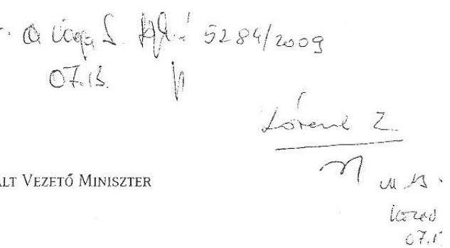

Átartási szám: VIII/1588/2/2009
hivatkozás azad: V-3010-75/2008.

Dr. Kovács Árpád úr részére
elnök

Állami Számvevőszék

Tisztelt Elnök Úr!

„A Sport XXI. Létesítményfejlesztési Program keretében támogatott önkormányzati PPP beruházások megvalósításának és önkormányzati feladatok ellátására gyakorolt hatásának ellenőrzéséről” szóló jelentés-tervezetben foglaltakhoz észrevételt nem teszek.

Elnök úr és munkatársai együttműködését ezúton is köszönöm.

Budapest, 2009. július „✓”

Üdvözlettel,

(dr. Molnár Csaba)

---

# 5483/2003 

Közlekedésügyi, Hírközlési és Energiaügyi Minisztérium
SZAKÁLAMITTUÁS

## 4. Kovács Árpád

elnök úr
részére
Állami Számvevőszék
Budapest

Tisztelt Elnök Úr!
Köszönettel megkaptam a „Sport XXI. Létesítményfejlesztési Program keretében támogatott önkormányzati PPP beruházások megvalósításának és önkormányzati feladatok ellátására gyakorolt hatásának" ellenőrzéséről készített jelentés-tervezetet.

Tájékoztatom, hogy a jelentésre észrevételt nem teszek.
Budapest, 2009. július 13.
Üdvözlettel:
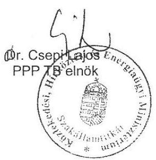

---

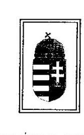

ÖNKORMÁNYZATI MINISZTER

5123/2009

Lénit, olch yach
Varga sandai in
Lm
07.08.

07.09.

Iktatószám: ÖM/7898/1/2009.

Hiv. szám: V-3010-75/2008.

L. b Varga. A. A.

Dr. Kovács Árpád úr részére
elnök
Állami Számvevőszék

Budapest

Tisztelt Elnök Úr!

Az Állami Számvevőszék által összeállított „Jelentés a Sport XXI. Létesítményfejlesztési Program keretében támogatott önkormányzati PPP beruházások megvalósításának és önkormányzati feladatok ellátására gyakorolt hatásának ellenőrzéséről (2009. május 09.)” szóló, V-3010-46/2008-2009 számú jelentés tervezettel kapcsolatos észrevételeinket 2009. május 27. napján Jauernik István államtitkár által megküldött levelünkben foglaltuk össze. Az Állami Számvevőszék az észrevételek többségét beépítette (elfogadta vagy ÖM észrevételként kezelte) az ellenőrzött szerv vezetőjének észrevétel közlése céljából megküldött 2009. június keltezésű Jelentésbe, amelyet köszönettel fogadtunk, s kérjük ezen észrevételeknek változatlan formában történő szerepeltetését.

A 2009. júniusi keltezésű Jelentéssel kapcsolatban az alábbi észrevételeket tesszük:

1) Ad 22. oldal második bekezdés

A tervezési kockázat viselésére vonatkozó ÁSZ megállapítással szemben továbbra is fenntartjuk korábbi észrevételünket, hogy a kapcsolódó Szolgáltatási Szerződés 5.1.8 pontja alapján a tervezési kockázat egyértelműen a magánbefektetőt terheli.

2) Ad 70. oldal utolsó bekezdés

A közcélú igénybevétel, a közcélú igénybevételi időszak és a közcélú igénybevételi arány értelmezésével, alkalmazásával a Jelentés több helyen foglalkozik, ezen kérdéskörben véleményünk több esetben nem egyezett meg az ÁSZ álláspontjával, amelyet a Jelentés korrekt módon fel is tűnné. Azonban a 70. oldal utolsó bekezdésben foglaltak megítélésünk szerint tényszerűen nem fedik a valóságot. A szolgáltatási szerződésben a Közcélú Igénybevételi Időszak fogalma került rögzítésre és számos szerződéses pontban alkalmazásra (amely időszak alatt a létesítmény - illetve egyes projektek esetében a közcélú használatban érintett létesítményrész - tekintetében a Magánbefektető természetesen nem jogosult a piaci

Cím: 1051 Budapest, József Attila u. 2-4. Postacím: 1903 Budapest, Pf. 314.
Telefon: (1) 441-1717, Fax: (1) 441-1720, E-mail: miniszter@atm.gov.hu

---

célú használatra (közcélú használatra nyitva álló időszak). A Közcélú Igénybevételi Időszakon kívüli időszakban - illetve egyes projektek esetében a közcélú használatban nem érintett létesítményrészekre vonatkozóan akár a Közcélú Igénybevételi Időszakon belül is - a piaci célú használatot korlátozó, azt tiltó rendelkezéseket a szolgáltatási szerződés nem tartalmaz.

Az Állami Számvevőszék által az önkormányzati miniszter számára megfogalmazott javaslatok kapcsán elrendelt további intézkedésekről 30 napon belül tájékoztatást adok.

Az Elnök úr és az ellenőrzésben közreműködő munkatársai együttműködését megköszönöm.

Budapest, 2009. július 03.
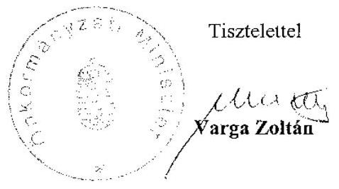

---

# Varga Zoltán úr   miniszter   Önkormányzati Minisztérium 

## Budapest

## Tisztelt Miniszter Úr!

A Sport XXI. Létesítményfejlesztési Program keretében támogatott önkormányzati PPP beruházások megvalósításának és önkormányzati feladatok ellátására gyakorolt hatásának ellenőrzéséről készített jelentésünkre adott észrevételét köszönettel vettem.

Egyetértek Önnel abban, hogy a PPP szolgáltatási szerződésekben rögzítettek szerint a tervezési kockázat egyértelműen a magánbefektetőt terheli. Nem lehet azonban figyelmen kívül hagyni, hogy az érintett önkormányzatok azzal, hogy magukra vállalták az engedélyezési, illetve kiviteli tervek elkészíttetését, óhatatlanul átvállalták a tervezési kockázat egy részét is. A szerződésben rögzítettektől függetlenül az önkormányzat nem várhatja el az általa elkészíttetett terv hibájából adódó, az üzemeltetés során felmerülő probléma megoldását. Ilyen esetben a felelősséget a magánpartner is minden bizonnyal próbálná az önkormányzatra hárítani. A jelentésben a szerződésben foglalt kockázatmegosztástól eltérő gyakorlatra hívtuk fel a figyelmet.

Nem tudom elfogadni azon észrevételét, hogy a szolgáltatási szerződés nem tartalmaz a közcélú igénybevételi időszakon belül piaci célú használatot korlátozó rendelkezést. Fenntartjuk véleményünket, hogy a szolgáltatási szerződés szöveges része nem teszi lehetővé a közcélú igénybevétel és a piaci hasznosítás egyidejű, párhuzamos folytatását. Emiatt a létesítmény területi megosztása sem felel meg a szerződésben foglaltaknak. A szolgáltatási szerződések szöveges részéből véleményünk szerint az következik, hogy a közcélú és piaci hasznosítású időszakot függetleníteni kell egymástól.

A közcélú igénybevétel fizikai terjedelme a szerződésben rögzítettek szerint a létesítmény - a nagyközönség részére nyitva álló - egészére vonatkozik. A magánbefektető köteles szabadon hagyni a közcélú igénybevételi időszakot, és ekkor rendezvényt nem szervezhet, ahogy azt a szolgáltatási szerződés 9.2.1., 9.2.2. és 9.2.4. pontjai is tartalmazzák.

---

Engedje meg, hogy ezúton is megköszönjem Önnek és munkatársainak a vizsgálat során tanúsított együttműködését.

Végezetül tájékoztatom Miniszter urat, hogy az ellenőrzésről készült jelentést, amelyet levelemhez is mellékelek - kialakult gyakorlatunk szerint - az Ön észrevételeivel és az azokra adott válaszommal együtt küldöm meg a Magyar Köztársaság elnökének, miniszterelnökének, az Országgyűlés elnökének, az illetékes bizottságok elnökeinek.

Kérem Miniszter urat, hogy a levelemben foglaltakat szíveskedjen elfogadni.
Budapest, 2009. július 21.

Tisztelettel:
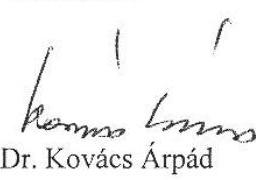

Melléklet: jelentés

---

# 5437/2009 

H-1031 BUDAPEST V., JÓZSEF NÁDOR TÉR 2-4. POSTACÍM: 1369 BUDAPEST, POSTAFIÓK 481.

TELEFON: (36-1) 327-2100, (+36) 30 371-2100
FAX: (36-1) 318-2570

PÉNZÜGYMINISZTER

## Dr. Kovács Árpád úr részére

elnök

## Állami Számvevőszék

Budapest

## Tisztelt Elnök Úr!

Iktatószám: 7355/15/2009.
Úgyintéző: Sashegyi Attila
Tárgy: Sport XXI.
Létesítményfejlesztési
programmal kapcsolatos
átdolgozott Jelentés
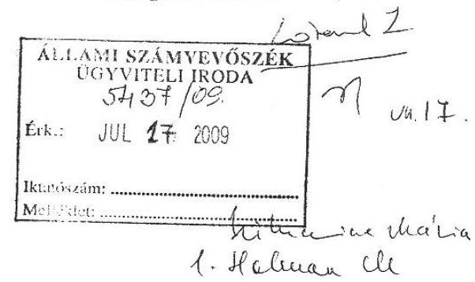

Köszönettel megkaptam a Sport XXI. Létesítményfejlesztési Program keretében támogatott önkormányzati PPP beruházások megvalósításának és önkormányzati feladatok ellátására gyakorolt hatásának ellenőrzéséről készített - előzetesen egyeztetett - Jelentés tervezetüket.

Engedje meg, hogy az átdolgozott Jelentés-tervezetben foglaltakkal kapcsolatban az alábbi észrevételeket tegyem.

Nem értek egyet a pénzügyminiszternek tett 1. számú javaslattal, mely a számvitelről szóló 2000. évi C. törvényben (a továbbiakban: Szt.) kívánna előírni adatszolgáltatási kötelezettséget a vállalkozások felé a PPP konstrukciók keretében létrehozott beruházásokra vonatkozóan, hogy azokat az államháztartás szervezetei mindenképpen kimutassák könyveikben és beszámolójukban teljeskörűen.
Korábbi levelemben jeleztem, hogy a PPP konstrukciók különböző típusú polgárjogi szerződési jegyeket mutatnak. Álláspontom szerint a Jelentés-tervezet javaslata nem tisztázza egyértelműen, hogy észrevételei a szolgáltatás teljesítésre irányuló PPP konstrukciókra, vagy egyéb polgárjogi szerződési jegyeket mutató szerződéses PPP konstrukciók (pl. operatív lízing, pénzügyi lízing, részletre vásárlás, stb.) gazdasági eseményeinek nyilvántartási és beszámolási előírásaira vonatkoznak-e.
A PPP konstrukciók esetében a számviteli elszámoláskor alapvető a tartalom
 elsődlegesége a formával szemben elvének érvényesítése [Szt. 16. §-ának (3) bekezdése]. Amennyiben tartalmában a PPP keretei között a szerződéssel pénzügyi lízing valósul meg, akkor a hatályos számviteli előírások alapján [Szt. 23. §-ának (3) bekezdése, az államháztartás szervezetei beszámolási és könyvvezetési kötelezettségének sajátosságairól szóló 249/2000. (XII. 24.) Korm. rendelet (a továbbiakban: Áhsz.). 15. §-ának (3) bekezdése] az idegen tulajdonú eszközt a lízingbe vevő köteles a könyveiben megjeleníteni. Ekkor a pénzügyi lízingbe vett eszközt az államháztartás szervezete a felhalmozási előirányzatok, kötelezettségvállalások és előirányzat-teljesítések elszámolását követően köteles az 1. számlaosztályban nyilvántartásba venni és az éves költségvetési beszámoló könyvviteli mérlegében értékkel szerepeltetni.

---

A Jelentés-tervezet azonban továbbra is [a 2.5. pontnál a 79. oldalon] csak a szolgáltatás teljesítésre irányuló PPP konstrukciók működési kiadások közötti elszámolási és beszámolási kötelezettségét, illetve mérlegen kívüli nyilvántartását emeli ki, és ezekből von le általános megállapításokat. A szolgáltatás teljesítésére irányuló PPP konstrukciók keretében keletkezett eszközök azonban a magánpartner tulajdonában vannak, így általában nem indokolt azokat az államháztartás szervezeteinél kimutatni. Legfeljebb akkor, ha a szerződés a PPP konstrukció időszakának végén egyértelműen rögzíti a keletkezett eszköz államháztartás szervezet tulajdonába kerülését. Emiatt került az Áhsz. 9. számú melléklet „Számlatükör" részében a 0. számlaosztályba a nyilvántartásba vételi lehetőség.
Egy a PPP konstrukciókra vonatkozó általános - a különböző típusú polgárjogi szerződési jegyektől eltekintő - adatszolgáltatási kötelezettséggel szakmailag nem tudok egyetérteni, ezt legfeljebb a PPP konstrukcióban résztvevő felek szerződésében indokolt részletezni. Szakmai álláspontom szerint az ilyen típusú adatszolgáltatás elrendelése nincs összefüggésben az adott vállalkozás könyvvezetési és beszámolási kötelezettségének általános kereteit szabályozó számviteli törvény előírásaival. Amennyiben az államháztartási információs rendszer működtetéséhez ilyen jellegű többlet információkra mégis szükség van, azt legfeljebb az államháztartási gazdálkodási jogszabályokban indokolt rögzíteni, ahol a szerződések tartalmi kellékei kerülnek meghatározásra.

Elfogadom a 28. oldalon a pénzügyminiszternek tett 2. számú javaslatot, mely a beszámoló űrlapjainál a PPP konstrukciók keretében vállalt éven túli kötelezettségvállalások elkülönítését célozza. Az Áhsz. év végi módosítása során az ehhez szükséges előírások beépítését kezdeményezni fogom.

Budapest, 2009. július 14.

Tisztelettel:
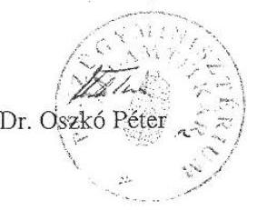

---

# Dr. Oszkó Péter úr   miniszter   Pénzügyminisztérium 

## Budapest

## Tisztelt Miniszter Úr!

A Sport XXI. Létesítményfejlesztési Program keretében támogatott önkormányzati PPP beruházások megvalósításának és önkormányzati feladatok ellátására gyakorolt hatásának ellenőrzéséről készített jelentésünkre adott észrevételét köszönettel vettem.

Örömömre szolgál, hogy a jelentésben megfogalmazott 2. számú javaslatot érveink alapján elfogadták.

Az 1. számú javaslathoz kifejtett észrevételére a következő tájékoztatást adom.
Egyértelmű számomra is, hogy a pénzügyi lízing formájában megvalósuló PPP szerződések esetében a számviteli törvény (Szt.) és az államháztartás szervezetei beszámolási és könyvvezetési kötelezettségének sajátosságairól szóló 249/2000. (XII. 24.) kormányrendelet (Áhsz.) egyértelműen rögzítik az elszámolási szabályokat. Ezeknél a szerződéstípusoknál ezért nincs is szükség a „0"-ás számlaosztályban történő nyilvántartásra, mivel az eszköz értéke megjelenik a befektetett eszközök között, míg a ki nem fizetett lízingdíjat a kötelezettségek között kell kimutatni. A pénzügyi lízing sajátossága ugyanis, hogy az eszköz már a futamidő elején a lízingbevevő tulajdonába kerül.

A PPP szerződésekre ezzel ellentétben az a jellemző, hogy az eszköz a futamidő végén, maradványértéken kerülhet csak a közszféra tulajdonába, addig a magánpartner tulajdonát képezi. A mérlegen kívüli nyilvántartási kötelezettség emiatt kizárólag az operatív lízingként megjelenő PPP beruházások esetében fordulhat elő az államháztartás szervezeteinél. Az ÁSZ javaslata is természetszerűleg az operatív lízing körébe tartozó PPP szerződésekre vonatkozik.

Továbbra is fenntartom, hogy az Áhsz. jelenlegi formájában nem rögzíti, hogy a nyilvántartásban milyen értéken kell szerepeltetni ezeket az eszközöket. Éppen a PM korábbi észrevétele alapján tett az ÁSZ javaslatot arra, hogy az Szt. szabályozza a magánpartnerek

---

tájékoztatási kötelezettségét, tekintettel arra, hogy az Áhsz. hatálya nem terjed ki a vállalkozásokra.

Jelen szabályozási viszonyok között nem tartom elegendő megoldásnak, ha a magánpartner adatszolgáltatási kötelezettségének szerződésbe foglalását csak a közszféra és magánszféra szereplőire bízzuk, mivel a PPP szerződések tartalmi elemeire jelenleg nincs kötelező előírás. Elfogadom ugyanakkor azt a PM által jelzett megoldást, hogy a PPP szerződések kötelező tartalmi kellékeit az államháztartási gazdálkodási jogszabályokban rögzítsék, közöttük a magánpartner tájékoztatási kötelezettségét is. Ez még mindig nem nyújt megoldást a nyilvántartásba vett eszköz értékelésének módjára, ezért szükségesnek tartom ennek szabályozását is.

Engedje meg, hogy ezúton is megköszönjem Önnek és munkatársainak a vizsgálat során tanúsított együttműködését.

Végezetül tájékoztatom Miniszter urat, hogy az ellenőrzésről készült jelentést, amelyet levelemhez is mellékelek - kialakult gyakorlatunk szerint - az Ön észrevételeivel és az azokra adott válaszommal együtt küldöm meg a Magyar Köztársaság elnökének, miniszterelnökének, az Országgyűlés elnökének, az illetékes bizottságok elnökeinek.

Kérem Miniszter urat, hogy a levelemben foglaltakat szíveskedjen elfogadni.
Budapest, 2009. július 21.
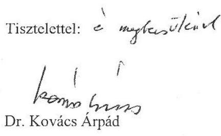

Melléklet: jelentés

---

Központi Statisztikai Hivatal Elnök

4900-258/4/2009.

Dr. Kovács Árpád
az Állami Számvevőszék Elnöke

# Budapest 

Tisztelt Elnök Úr!
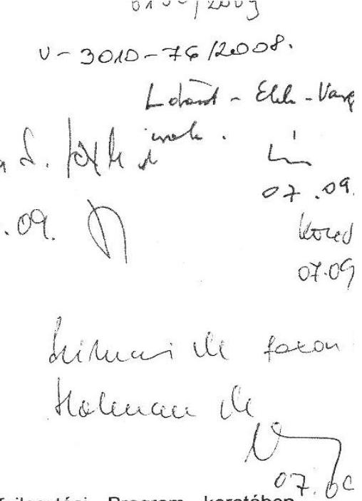

Köszönettel megkaptam a Sport XXI. Létesítményfejlesztési Program keretében támogatott önkormányzati PPP beruházások megvalósításának és önkormányzati feladatok ellátására gyakorolt hatásának ellenőrzéséről készített jelentés módosított változatát.

A jelentés tartalmával, megfogalmazott javaslatokkal alapvetően egyetértek. A KSH a PPP TB keretén belül előzetes véleményt mondott a projektek során megvalósítandó beruházások statisztikai besorolásáról. A megvalósult projektek monitorozására a PPP TB keretein belül kellene sort keríteni, (ez a munka a PPP TB-ben már el is kezdődött) ahol a KSH a statisztikai besorolási kérdéseket vizsgálná, és indokolt esetben felülvizsgálná az eddigi besorolás érvényességét.

Budapest, 2009. július 6.

Tisztelettel:

Dr. Pukli Péter
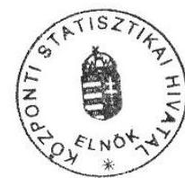

---

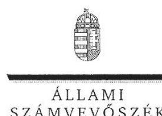

ELNÖK

Ikt.szám: V-3010-80/2008.

Dr. Pukli Péter úr
elnök
Központi Statisztikai Hivatal

Budapest

# Tisztelt Elnök Úr! 

A Sport XXI. Létesítményfejlesztési Program keretében támogatott önkormányzati PPP beruházások megvalósításának és önkormányzati feladatok ellátására gyakorolt hatásának ellenőrzéséről készített jelentésünkre adott észrevételét köszönöm.

Egyetértek a hivatal számára megfogalmazott javaslatunk Ön által felvázolt megvalósítási módjával, amely szerint a projektek statisztikai besorolásának felülvizsgálatát a PPP Tárcaközi Bizottság monitorozási tevékenységéhez kapcsolódóan végeznék el. Ez a megoldás ugyanis lehetővé teszi azt is, hogy az ellenőrzésünk során, a szerződésszerű állapotok helyreállítása érdekében javasolt helyszíni intézkedéseket követően történjen meg az ismételt statisztikai minősítés.

Engedje meg, hogy ezúton is megköszönjem Önnek és munkatársainak a vizsgálat során tanúsított szakszerű és következetes együttműködését.

Végezetül tájékoztatom Elnök urat, hogy az ellenőrzésről készült jelentést, amelyet levelemhez is mellékelek - kialakult gyakorlatunk szerint - az Ön észrevételével és az arra adott válaszommal együtt küldöm meg a Magyar Köztársaság elnökének, miniszterelnökének, az Országgyűlés elnökének, az illetékes bizottságok elnökeinek.

Budapest, 2009. július 21.
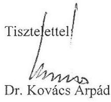

Melléklet: jelentés

---

# Helyszíni ellenőrzésre kijelölt önkormányzatok és projektek 

| Sorszám | Megye | Önkormányzat | Projekt |
| :--: | :-- | :-- | :-- |
| 1 | Baranya | Kozármisleny | Tornaterem „D2" |
| 2 | Baranya | Szigetvár | Tanuszoda „Bu" |
| 3 | Baranya | Mohács | Tanuszoda „Bu" |
| 4 | Bács-Kiskun | Kiskunfélegyháza | Sportcsarnok |
| 5 | Borsod-Abaúj-Zemplén | Ózd | Tanuszoda „Bu" |
| 6 | Csongrád | Hódmezővásárhely | Tornaterem „D2" |
| 7 | Pest | Nagykáta | Tornaterem „D2" |
| 8 | Somogy | Somogyjád | Tornaterem „C2" |
| 9 | Somogy | Magyaratád | Tornaterem „B" |
| 10 | Somogy | Nagybajom | Tornaterem „C2" |
| 11 | Somogy | Szenna | Tornaterem „B" |
| 12 | Somogy | Csurgó | Tornaterem „C2" |
| 13 | Tolna | Bátaszék | Tanuszoda „Bu" |
| 14 | Veszprém | Devecser | Tornaterem „D2" |
| 15 | Veszprém | Veszprém | Sportcsarnok |

---

# Az önkormányzatokkal PPP szerződéses kapcsolatban álló magánpartnerek és a sportlétesítmények üzemeltetésében résztvevő gazdasági társaságok

| Megye | Gazdasági társaság neve | Önkormányzat | résztvétel jogcíme | projekt |
| :--: | :--: | :--: | :--: | :--: |
| Baranya | ATTAND Kereskedelmi és Szolgáltató Kft. | Kozármisleny | projekttársaság | Tornaterem „D2" |
|  | SZIGET-VÍZ Kft. | Szigetvár | projekttársaság | Tanuszoda „Bu" |
|  | Mohács Uszoda Szolgáltató Kft. | Mohács | projekttársaság | Tanuszoda „Bu" |
| Bács-   Kiskun | 3P KÉSZ Aréna Sport- és Rendezvénycsarnok Üzemeltető Kft. | Kiskunfélegyháza | projekttársaság | Sportcsarnok |
|  | Kész Ingatlanüzemeltető és Fejlesztő Kft. | Kiskunfélegyháza | üzemeltető | Sportcsarnok |
|  | Kiskun Gazdaságfejlesztési és Szolgáltató Kht. | Kiskunfélegyháza | üzemeltető alvállalkozója | Sportcsarnok |
| Borsod-   Abaúj-   Zemplén | THERMA Kereskedelmi, Uszodatechnika és Szolgáltató Kft. | Ózd | projekttársaság | Tanuszoda „Bu" |
|  | Özdi SPORTCENTRUM Sport és Vagyonkezelő Kht. | Ózd | üzemeltető | Tanuszoda „Bu" |
| Csongrád | K' - Art Építész Stúdió Kft. | Hódmezővásárhely | projekttársaság | Tornaterem „D2" |
| Pest | B. M. Invest Ingatlanforgalmazó, Beruházó és Kivitelező Kft. | Nagykáta | projekttársaság | Tornaterem „D2" |
| Somogy | Somogy Tornaterem 2006. Sportlétesítményt Üzemeltető, Szolgáltató Kft. | Somogyjád | projekttársaság | Tornaterem „C2" |
|  |  | Magyaratád | projekttársaság | Tornaterem „B" |
|  |  | Nagybajom | projekttársaság | Tornaterem „C2" |
|  |  | Szenna | projekttársaság | Tornaterem „B" |
|  | Somogyjádi Sportcsarnok Létesítmény- és Településüzemeltető és Szolgáltató Kht. | Somogyjád | üzemeltető | Tornaterem „C2" |
|  | Magyaratádi Településfejlesztési, Szolgáltató és Kereskedelmi Kft. | Magyaratád | üzemeltető | Tornaterem „B" |
|  | Nagybajomi Településfejlesztési, Szolgáltató és Kereskedelmi Kft. | Nagybajom | üzemeltető | Tornaterem „C2" |
|  | Szennai Településfejlesztési, Szolgáltató és Kereskedelmi Kft. | Szenna | üzemeltető |  |
|  | Somogy Tornaterem 2006. Sportlétesítményt Üzemeltető, Szolgáltató Kft. | Csurgó | projekttársaság | Tornaterem „C2" |
| Somogy | Csurgói Sportcsarnok Üzemeltető Nonprofit Kft. | Csurgó | üzemeltető | Tornaterem „C2" |
| Tolna | ALISCA BAU Építő Kft. | Bátaszék | projekttársaság | Tanuszoda „Bu" |
|  | Dél-Tolna Közmű Üzemeltető és Szolgáltató Kft. | Bátaszék | üzemeltető | Tanuszoda „Bu" |
| Veszprém | MULTICSARNOK Szolgáltató Kft. | Veszprém | projekttársaság | Sportcsarnok |
|  | Csarnok Veszprémi Csarnoküzemeltető, Rendezvényszervező és Kommunikációs Kft. | Veszprém | üzemeltető | Sportcsarnok |
|  |  | Devecser |  | Tornaterem „D2" |

Megjegyzés: projekttársaságot létrehozó közbeszerzésen nyertes pályázók

* Aquaplus Kútfúró, Kútjavító és Vízépítő Kft.
** KÉSZ Közép-európai Építő és Szerelő Kft és MI-BE 2000 Kereskedelmi és Szolgáltató Kft. konzorciuma
*** Somogy Tornaterem 2006. Konzorcium, Szabadics Közmű- és Mélyépítő Kft, Insza-Bau Ingatlanforgalmi és -fejlesztő Kft.

---

# Az ellenőrzött, megvalósított projektek főbb sportszakmai jellemzői

## 1. Tornatermek

| Létesítménytípus | Főbb sportszakmai jellemzők | Megjegyzés  |
| --- | --- | --- |
| Önkormányzatok | a küzdőtér befoglaló méretel | a sportlétesítmény  |
|   | a küzdőtér alapterülete | a sportlétesítmény  |
|   | SzxH [m]: |

 a sportlétesítmény  |
|  **Szerkeltő** |  |   |
|  16 x 30 | 480 | 820-900  |
|  18 x 35 | 630 | 1098  |
|  18 x 35 | 630 | 982  |
|  27 x 32 | 864 | 1600-1800  |
|  27 x 45 | 1215 | 2216  |
|  27 x 45 | 1215 | 1924  |
|  29 x 45 | 1305 | 2120  |
|  28 x 45 | 1260 | 2300-2600  |
|  29 x 45 | 1260 | 2696  |
|  28,85x45,6 | 1315,56 | 5725  |
|  28 x 45 | 1260 | 2597,9  |
|  53,6x32,29 | 1731 | 5025  |
|  47,05x37,7 | 1774 | 10490  |

## 2. Sportcsarnok

|  Létesítménytípus | Főbb sportszakmai jellemzők | Megjegyzés  |
| --- | --- | --- |
|  Önkormányzatok | a küzdőtér alapterülete | a sportlétesítmény  |
|   | a sportlétesítmény | lelátó  |
|   | SzxH [m]: | a követelmények maximumához viszonyítva  |
|   | [m²]: | küzdőtér alapterülete  |
|   | [m³]: | ház beépített alapterülete  |
|   | [fő] | beépített alapterülete  |
|   | [fő] | 131,3  |
|   |  | 109,1  |
|   |  | 115,4  |
|  **Szerkeltő** |  |   |
|  16 x 30 | 480 | 820-900  |
|  18 x 35 | 630 | 1098  |
|  18 x 35 | 630 | 982  |
|  27 x 32 | 864 | 1600-1800  |
|  27 x 45 | 1215 | 2216  |
|  27 x 45 | 1215 | 1924  |
|  29 x 45 | 1305 | 2120  |
|  28 x 45 | 1260 | 2300-2600  |
|  28,85x45,6 | 1315,56 | 5725  |
|  28 x 45 | 1260 | 2597,9  |
|  28,85x45,6 | 1315,56 | 5725  |
|  29 x 45 | 1260 | 2597,9  |
|  28,85x45,6 | 1260 | 2597,9  |
|  53,6x32,29 | 1731 | 5025  |
|  47,05x37,7 | 1774 | 10490  |

## 3. számú függelék a V-3010/2008. számú jelentéshez

## Az ellenőrzött, megvalósított projektek főbb sportszakmai jellemzői

|  Megjegyzés |  |  |  |  |  |  |  |  |  |  |  |  |  |  |  |  |  |  |  |  |  |  |  |  |  |  |  |   |
| --- | --- | --- | --- | --- | --- | --- | --- | --- | --- | --- | --- | --- | --- | --- | --- | --- | --- | --- | --- | --- | --- | --- | --- | --- | --- | --- | --- |
|  Létesítménytípus | Főbb sportszakmai jellemzők | Megjegyzés  |
|   | a következők megy |  |  |  |  |  |  |  |  |  |  |  |  |  |  |  |  |  |  |  |  |  |  |  |   |
|  Önkormányzatok | a küzdőtér befoglaló méretel | a sportlétesítmény | lelátó | eltérés a követelmények maximumához viszonyítva | egyéb |  |  |  |  |  |  |  |  |  |  |  |  |  |  |  |  |  |  |  |   |
|   | SzxH [m]: | a sportlétesítmény | előve | előve 1200 |  |  |  |  |  |  |  |  |  |  |  |  |  |  |  |  |  |  |  |  |   |
|   | SzxH [m]: | bérülete |  |  |  |  |  |  |  |  |  |  |  |  |  |  |  |  |  |  |  |  |  |  |   |
|   | SzxH [m]: | [m³]: |  |  |  |  |  |  |  |  |  |  |  |  |  |  |  |  |  |  |  |  |  |  |   |
|  **Szerkeltő** |  |  |  |  |  |  |  |  |  |  |  |  |  |  |  |  |  |  |  |  |  |  |  |  |   |
|  16 x 30 | 480 | 820-900 | 940-1040 | nincs lelátó |  |  |  |  |  |  |  |  |  |  |  |  |  |  |  |  |  |  |  |  |   |
|  Megvalósult projekt: |  |  |  |  |  |  |  |  |  |  |  |  |  |  |  |  |  |  |  |  |  |  |  |  |   |
|  Magyarított |  |  |  |  |  |  |  |  |  |  |  |  |  |  |  |  |  |  |  |  |  |  |  |  |   |
|  Magyarított |  |  |  |  |  |  |  |  |  |  |  |  |  |  |  |  |  |  |  |  |  |  |  |  |   |
|  Magyarított |  |  |  |  |  |  |  |  |  |  |  |  |  |  |  |  |  |  |  |  |  |  |  |  |   |
|  Magyarított |  |  |  |  |  |  |  |  |  |  |  |  |  |  |  |  |  |  |  |  |  |  |  |  |   |
|  Magyarított |  |  |  |  |  |  |  |  |  |  |  |  |  |  |  |  |  |  |  |  |  |  |  |  |   |
|  Magyarított |  |  |  |  |  |  |  |  |  |  |  |  |  |  |  |  |  |  |  |  |  |  |  |  |   |
|  Magyarított |  |  |  |  |  |  |  |  |  |  |  |  |  |  |  |  |  |  |  |  |  |  |  |  |   |
|  Magyarított |  |  |  |  |  |  |  |  |  |  |  |  |  |  |  |  |  |  |  |  |  |  |  |  |   |
|  Magyarított |  |  |  |  |  |  |  |  |  |  |  |  |  |  |  |  |  |  |  |  |  |  |  |  |   |
|  Magyarított |  |  |  |  |  |  |  |  |  |  |  |  |  |  |  |  |  |  |  |  |  |  |  |  |   |
|  Magyarított |  |  |  |  |  |  |  |  |  |  |  |  |  |  |  |  |  |  |  |  |  |  |  |  |   |
|  Magyarított |  |  |  |  |  |  |  |  |  |  |  |  |  |  |  |  |  |  | 

 |  |  |  |  |  |   |
|  Magyarít |  |  |  |  |  |  |  |  |  |  |  |  |  |  |  |  |  |  |  |  |  |  |  |  |   |
|  Magyarít |  |  |  |  |  |  |  |  |  |  |  |  |  |  |  |  |  |  |  |  |  |  |  |  |   |
|  Magyarít |  |  |  |  |  |  |  |  |  |  |  |  |  |  |  |  |  |  |  |  |  |  |  |  |   |
|  Magyarít |  |  |  |  |  |  |  |  |  |  |  |  |  |  |  |  |  |  |  |  |  |  |  |  |   |
|  Magyarít |  |  |  |  |  |  |  |  |  |  |  |  |  |  |  |  |  |  |  |  |  |  |  |  |   |
|  Magyarít |  |  |  |  |  |  |  |  |  |  |  |  |  |  |  |  |  |  |  |  |  |  |  |  |   |
|  Magyarország |  |  |  |  |  |  |  |  |  |  |  |  |  |  |  |  |  |  |  |  |  |  |  |  |   |
|  Megvárás |  |  |  |  |  |  |  |  |  |  |  |  |  |  |  |  |  |  |  |  |  |  |  |  |   |
|  A. |  |  |  |  |  |  |  |  |  |  |  |  |  |  |  |  |  |  |  |  |  |  |  |  |   |
|  B. |  |  |  |  |  |  |  |  |  |  |  |  |  |  |  |  |  |  |  |  |  |  |  |  |   |
|  C. |  |  |  |  |  |  |  |  |  |  |  |  |  |  |  |  |  |  |  |  |  |  |  |  |   |
|  D. |  |  |  |  |  |  |  |  |  |  |  |  |  |  |  |  |  |  |  |  |  |  |  |  |   |
|  E. |  |  |  |  |  |  |  |  |  |  |  |  |  |  |  |  |  |  |  |  |  |  |  |  |   |
|  F. |  |  |  |  |  |  |  |  |  |  |  |  |  |  |  |  |  |  |  |  |  |  |  |  |   |
|  G. |  |  |  |  |  |  |  |  |  |  |  |  |  |  |  |  |  |  |  |  |  |  |  |  |   |
|  H. |  |  |  |  |  |  |  |  |  |  |  |  |  |  |  |  |  |  |  |  |  |  |  |  |   |
|  I. |  |  |  |  |  |  |  |  |  |  |  |  |  |  |  |  |  |  |  |  |  |  |  |  |   |
|  J. |  |  |  |  |  |  |  |  |  |  |  |  |  |  |  |  |  |  |  |  |  |  |  |  |   |
|  K. |  |  |  |  |  |  |  |  |  |  |  |  |  |  |  |  |  |  |  |  |  |  |  |  |   |
|  L. |  |  |  |  |  |  |  |  |  |  |  |  |  |  |  |  |  |  |  |  |  |  |  |  |   |
|  M. |  |  |  |  |  |  |  |  |  |  |  |  |  |  |  |  |  |  |  |  |  |  |  |  |   |
|  N. |  |  |  |  |  |  |  |  |  |  |  |  |  |  |  |  |  |  |  |  |  |  |  |  |   |
|  O. |  |  |  |  |  |  |  |  |  |  |  |  |  |  |  |  |  |  |  |  |  |  |  |  |   |
|  P. |  |  |  |  |  |  |  |  |  |  |  |  |  |  |  |  |  |  |  |  |  |  |  |  |   |
|  Q. |  |  |  |  |  |  |  |  |  |  |  |  |  |  |  |  |  |  |  |  |  |  |  |  |   |
|  R. |  |  |  |  |  |  |  |  |  |  |  |  |  |  |  |  |  |  |  |  |  |  |  |  |   |
|  S. |  |  |  |  |  |  |  |  |  |  |  |  |  |  |  |  |  |  |  |  |  |  |  |  |   |
|  T. |  |  |  |  |  |  |  |  |  |  |  |  |  |  |  |  |  |  |  |  |  |  |  |  |   |
|  S. |  |  |  |  |  |  |  |  |  |  |  |  |  |  |  |  |  |  |  |  |  |  |  |  |   |
|  T. |  |  |  |  |  |  |  |  |

 |  |  |  |  |  |  |  |  |  |  |  |  |  |  |  |   |
|  S. |  |  |  |  |  |  |  |  |  |  |  |  |  |  |  |  |  |  |  |  |  |  |  |  |   |
|  T. |  |  |  |  |  |  |  |  |  |  |  |  |  |  |  |  |  |  |  |  |  |  |  |  |   |
|  A. |  |  |  |  |  |  |  |  |  |  |  |  |  |  |  |  |  |  |  |  |  |  |  |  |   |
|  B. |  |  |  |  |  |  |  |  |  |  |  |  |  |  |  |  |  |  |  |  |  |  |  |  |   |
|  C. |  |  |  |  |  |  |  |  |  |  |  |  |  |  |  |  |  |  |  |  |  |  |  |  |   |
|  D. |  |  |  |  |  |  |  |  |  |  |  |  |  |  |  |  |  |  |  |  |  |  |  |  |   |
|  E. |  |  |  |  |  |  |  |  |  |  |  |  |  |  |  |  |  |  |  |  |  |  |  |  |   |
|  F. |  |  |  |  |  |  |  |  |  |  |  |  |  |  |  |  |  |  |  |  |  |  |  |  |   |
|  G. |  |  |  |  |  |  |  |  |  |  |  |  |  |  |  |  |  |  |  |  |  |  |  |  |   |
|  H. |  |  |  |  |  |  |  |  |  |  |  |  |  |  |  |  |  |  |  |  |  |  |  |  |   |
|  I. |  |  |  |  |  |  |  |  |  |  |  |  |  |  |  |  |  |  |  |  |  |  |  |  |   |
|  J. |  |  |  |  |  |  |  |  |  |  |  |  |  |  |  |  |  |  |  |  |  |  |  |  |   |
|  K. |  |  |  |  |  |  |  |  |  |  |  |  |  |  |  |  |  |  |  |  |  |  |  |  |   |
|  L. |  |  |  |  |  |  |  |  |  |  |  |  |  |  |  |  |  |  |  |  |  |  |  |  |   |
|  M. |  |  |  |  |  |  |  |  |  |  |  |  |  |  |  |  |  |  |  |  |  |  |  |  |   |
|  N. |  |  |  |  |  |  |  |  |  |  |  |  |  |  |  |  |  |  |  |  |  |  |  |  |   |
|  O. |  |  |  |  |  |  |  |  |  |  |  |  |  |  |  |  |  |  |  |  |  |  |  |  |   |
|  P. |  |  |  |  |  |  |  |  |  |  |  |  |  |  |  |  |  |  |  |  |  |  |  |  |   |
|  Q. |  |  |  |  |  |  |  |  |  |  |  |  |  |  |  |  |  |  |  |  |  |  |  |  |   |
|  R. |  |  |  |  |  |  |  |  |  |  |  |  |  |  |  |  |  |  |  |  |  |  |  |  |   |
|  S. |  |  |  |  |  |  |  |  |  |  |  |  |  |  |  |  |  |  |  |  |  |  |  |  |   |
|  T. |  |  |  |  |  |  |  |  |  |  |  |  |  |  |  |  |  |  |  |  |  |  |  |  |   |
|  S. |  |  |  |  |  |  |  |  |  |  |  |  |  |  |  |  |  |  |  |  |  |  |  |  |   |
|  T. |  |  |  |  |  |  |  |  |  |  |  |  |  |  |  |  |  |  |  |  |  |  |  |  |   |
|  A. |  |  |  |  |  |  |  |  |  |  |  |  |  |  |  |  |  |  |  |  |  |  |  |  |   |
|  B. |  |  |  |  |  |  |  |  |  |  |  |  |  |  |  |  |  |  |  |  |  |  |  |  |   |
|  C. |  |  |  |  |  |  |  |  |  |  |  |  |  |  |  |  |  |  |  |  |  |  |  |  |   |
|  D. |  |  |  |  |  |  |  |  |  |  |  |  |  |  |  |  |  |  |  |  |  |  |  |  |   |
|  E. |  |  |  |  |  |  |  |  |  |  |  |  |  |  |  |  |  |  |  |  |  |  |  |  |   |
|

 F. |  |  |  |  |  |  |  |  |  |  |  |  |  |  |  |  |  |  |  |  |  |  |  |  |   |
|  G. |  |  |  |  |  |  |  |  |  |  |  |  |  |  |  |  |  |  |  |  |  |  |  |  |   |
|  H. |  |  |  |  |  |  |  |  |  |  |  |  |  |  |  |  |  |  |  |  |  |  |  |  |   |
|  I. |  |  |  |  |  |  |  |  |  |  |  |  |  |  |  |  |  |  |  |  |  |  |  |  |   |
|  J. |  |  |  |  |  |  |  |  |  |  |  |  |  |  |  |  |  |  |  |  |  |  |  |  |   |
|  K. |  |  |  |  |  |  |  |  |  |  |  |  |  |  |  |  |  |  |  |  |  |  |  |  |   |
|  L. |  |  |  |  |  |  |  |  |  |  |  |  |  |  |  |  |  |  |  |  |  |  |  |  |   |
|  M. |  |  |  |  |  |  |  |  |  |  |  |  |  |  |  |  |  |  |  |  |  |  |  |  |   |
|  N. |  |  |  |  |  |  |  |  |  |  |  |  |  |  |  |  |  |  |  |  |  |  |  |  |   |
|  O. |  |  |  |  |  |  |  |  |  |  |  |  |  |  |  |  |  |  |  |  |  |  |  |  |   |
|  P. |  |  |  |  |  |  |  |  |  |  |  |  |  |  |  |  |  |  |  |  |  |  |  |  |   |
|  Q. |  |  |  |  |  |  |  |  |  |  |  |  |  |  |  |  |  |  |  |  |  |  |  |  |   |
|  R. |  |  |  |  |  |  |  |  |  |  |  |  |  |  |  |  |  |  |  |  |  |  |  |  |   |
|  S. |  |  |  |  |  |  |  |  |  |  |  |  |  |  |  |  |  |  |  |  |  |  |  |  |   |
|  T. |  |  |  |  |  |  |  |  |  |  |  |  |  |  |  |  |  |  |  |  |  |  |  |  |   |
|  A. |  |  |  |  |  |  |  |  |  |  |  |  |  |  |  |  |  |  |  |  |  |  |  |  |   |
|  B. |  |  |  |  |  |  |  |  |  |  |  |  |  |  |  |  |  |  |  |  |  |  |  |  |   |
|  C. |  |  |  |  |  |  |  |  |  |  |  |  |  |  |  |  |  |  |  |  |  |  |  |  |   |
|  D. |  |  |  |  |  |  |  |  |  |  |  |  |  |  |  |  |  |  |  |  |  |  |  |  |   |
|  E. |  |  |  |  |  |  |  |  |  |  |  |  |  |  |  |  |  |  |  |  |  |  |  |  |   |
|  F. |  |  |  |  |  |  |  |  |  |  |  |  |  |  |  |  |  |  |  |  |  |  |  |  |   |
|  G. |  |  |  |  |  |  |  |  |  |  |  |  |  |  |  |  |  |  |  |  |  |  |  |  |   |
|  H. |  |  |  |  |  |  |  |  |  |  |  |  |  |  |  |  |  |  |  |  |  |  |  |  |   |
|  I. |  |  |  |  |  |  |  |  |  |  |  |  |  |  |  |  |  |  |  |  |  |  |  |  |   |
|  J. |  |  |  |  |  |  |  |  |  |  |  |  |  |  |  |  |  |  |  |  |  |  |  |  |   |
|  K. |  |  |  |  |  |  |  |  |  |  |  |  |  |  |  |  |  |  |  |  |  |  |  |  |   |
|  L. |  |  |  |  |  |  |  |  |  |  |  |  |  |  |  |  |  |  |  |  |  |  |  |  |   |
|  M. |  |  |  |  |  |  |  |  |  |  |  |  |  |  |  |  |  |  |  |  |  |  |  |  |   |
|  N. |  |  |  |  |  |  |  |  |  |  |  |  |  |  |  |  |  |  |  |  |  |  |  |  |   |
|  O. |  |  |  |  |  |  |  |  |  |

 |  |  |  |  |  |  |  |  |  |  |  |  |  |  |  |  |   |
|  P. |  |  |  |  |  |  |  |  |  |  |  |  |  |  |  |  |  |  |  |  |  |  |  |  |  |   |
|  Q. |  |  |  |  |  |  |  |  |  |  |  |  |  |  |  |  |  |  |  |  |  |  |  |  |  |   |
|  R. |  |  |  |  |  |  |  |  |  |  |  |  |  |  |  |  |  |  |  |  |  |  |  |  |  |   |
|  S. |  |  |  |  |  |  |  |  |  |  |  |  |  |  |  |  |  |  |  |  |  |  |  |  |  |  |   |
|  T. |  |  |  |  |  |  |  |  |  |  |  |  |  |  |  |  |  |  |  |  |  |  |  |  |  |  |   |
|  A. |  |  |  |  |  |  |  |  |  |  |  |  |  |  |  |  |  |  |  |  |  |  |  |  |  |  |  |   |
|  B. |  |  |  |  |  |  |  |  |  |  |  |  |  |  |  |  |  |  |  |  |  |  |  |  |  |  |  |   |
|  C. |  |  |  |  |  |  |  |  |  |  |  |  |  |  |  |  |  |  |  |  |  |  |  |  |  |  |  |   |
|  D. |  |  |  |  |  |  |  |  |  |  |  |  |  |  |  |  |  |  |  |  |  |  |  |  |  |  |  |   |
|  E. |  |  |  |  |  |  |  |  |  |  |  |  |  |  |  |  |  |  |  |  |  |  |  |  |  |  |  |   |
|  F. |  |  |  |  |  |  |  |  |  |  |  |  |  |  |  |  |  |  |  |  |  |  |  |  |  |  |  |  |   |
|  G. |  |  |  |  |  |  |  |  |  |  |  |  |  |  |  |  |  |  |  |  |  |  |  |  |  |  |  |  |   |
|  H. |  |  |  |  |  |  |  |  |  |  |  |  |  |  |  |  |  |  |  |  |  |  |  |  |  |  |  |  |   |
|  I. |  |  |  |  |  |  |  |  |  |  |  |  |  |  |  |  |  |  |  |  |  |  |  |  |  |  |  |  |   |
|  J. |  |  |  |  |  |  |  |  |  |  |  |  |  |  |  |  |  |  |  |  |  |  |  |  |  |  |  |  |   |
|  K. |  |  |  |  |  |  |  |  |  |  |  |  |  |  |  |  |  |  |  |  |  |  |  |  |  |  |  |  |   |
|  |   |   |   |   |   |   |   |   |   |   |   |   |   |   |  |  |  |  |  |  |  |  |  |  |  |  |  |  |   |
|  |   |   |   |   |   |   |   |   |   |   |   |   |   |   |  |  |  |  |  |  |  |  |  |  |  |  |  |  |   |
|  |   |   |   |   |   |   |   |   |   |   |   |   |   |   |  |  |  |  |  |  |  |  |  |  |  |  |  |  |   |
|  |   |   |   |   |   |   |   |   |   |   |   |   |   |   |  |  |  |  |  |  |  |  |  |  |  |  |  |  |   |
|  |   |   |   |   |   |   |   |   |   |   |   |   |   |   |  |  |  |  |  |  |  |  |  |  |  |  |  |  |   |
|  |   |   |   |   |   |   |   |   |   |   |   |   |   |   |  |  |  |  |  |  |  |  |  |  |  |  |  |  |   |
|  |   |   |   |   |   |   |   |   |   |   |   |   |   |  |  |  |  |  |  |  |  |  |  |  |  |  |  |  |  |  |  |   |

 |  |   |
|  |   |   |   |   |   |   |   |   |   |   |   |   |   |  |  |  |  |  |  |  |  |  |  |  |  |  |  |  |  |  |  |  |   |
|  |   |   |   |   |   |   |   |   |   |   |   |   |   |  |  |  |  |  |  |  |  |  |  |  |  |  |  |  |  |  |  |  |   |
|  |   |   |   |   |   |   |   |   |   |   |   |   |   |  |  |  |  |  |  |  |  |  |  |  |  |  |  |  |  |  |  |  |   |
|  |   |   |   |   |   |   |   |   |   |   |   |   |   |  |  |  |  |  |  |  |  |  |  |  |  |  |  |  |  |  |  |  |   |
|  |   |   |   |   |   |   |   |   |   |   |   |   |   |  |  |  |  |  |  |  |  |  |  |  |  |  |  |  |  |  |  |  |   |
|  |   |   |   |   |   |   |   |   |   |   |   |   |   |  |  |  |  |  |  |  |  |  |  |  |  |  |  |  |  |  |  |  |   |
|  |   |   |   |   |   |   |   |   |   |   |   |   |   |   |  |  |  |  |  |  |  |  |  |  |  |  |  |  |  |  |  |  |  |  |  |   |
|  |   |   |   |   |   |   |   |   |   |   |   |   |   |  |  |  |  |  |  |  |  |  |  |  |  |  |  |  |  |  |  |  |  |  |   |
|  |   |   |   |   |   |   |   |   |   |   |   |   |   |  |  |  |  |  |  |  |  |  |  |  |  |  |  |  |  |  |  |  |  |  |   |
|  |   |   |   |   |   |   |   |   |   |   |   |   |   |  |  |  |  |  |  |  |  |  |  |  |  |  |  |  |  |  |  |  |  |  |  |   |
|  |   |   |   |   |   |   |   |   |   |   |   |   |   |   |  |  |  |  |  |  |  |  |  |  |  |  |  |  |  |  |  |  |  |  |  |  |   |
|  |   |   |   |   |   |   |   |   |   |   |   |   |   |  |  |  |  |  |  |  |  |  |  |  |  |  |  |  |  |  |  |  |  |  |  |   |
|  |   |   |   |   |   |   |   |   |   |   |   |   |   |   |   |  |  |  |  |  |  |  |  |  |  |  |  |  |  |  |  |  |  |  |  |  |   |
|  |   |   |   |   |   |   |   |   |   |   |   |   |   |   |   |  |  |  |  |  |  |  |  |  |  |  |  |  |  |  |  |  |  |  |  |   |
|  |   |   |   |   |   |   |   |   |   |   |   |   |   |   |   |  |  |  |  |  |  |  |  |  |  |  |  |  |  |  |  |  |  |  |  |   |
|  |   |   |   |   |   |   |   |   |   |   |   |   |   |   |   |  |  |  |  |  |  |  |  |  |  |  |  |  |  |  |  |  |  |  |  |  |   |
|  |   |   |   |   |   |   |   |   |   |   |   |   |   |   |   |   |  |  |  |  |  |  |  |  |  |  |  |  |  |  |  |  |  |  |  |   |
|  |   |   |   |   |   |   |   |   |   |   |   |   |   |   |   |   |   |  |  |  |  |  |  |  |  |  |  |  |  |  |  |  |  |  |  |   |
|  |   |   |   |   |   |   |   |   |   |   |   |   |   |   |   |   |   |  |  |  |  |  |  |  |  |  |  |  |  |  |  |  |  |  |  |   |

  |   |   |   |   |   |   |   |   |   |   |   |  |  |  |  |  |  |  |  |  |  |  |  |  |  |  |  |  |  |   |
|  |   |   |   |   |   |   |   |   |   |   |   |   |   |   |   |   |   |   |   |   |   |   |  |  |  |  |  |  |  |  |  |  |  |  |  |  |  |  |   |
|  |   |   |   |   |   |   |   |   |   |   |   |   |   |   |   |   |   |   |   |   |   |   |   |   |   |  |  |  |  |  |  |  |  |  |  |  |  |  |  |   |
|  |   |   |   |   |   |   |   |   |   |   |   |   |   |   |   |   |   |   |   |   |   |   |  |  |  |  |  |  |  |  |  |  |  |  |  |  |  |  |  |   |
|  |   |   |   |   |   |   |   |   |   |   |   |   |   |   |   |   |   |   |   |   |   |   |  |  |  |  |  |  |  |  |  |  |  |  |  |  |  |  |  |  |   |
|  |   |   |   |   |   |   |   |   |   |   |   |   |   |   |   |   |   |   |   |   |   |   |   |   |  |  |  |  |  |  |  |  |  |  |  |  |  |  |  |  |  |  |   |
|  |   |   |   |   |   |   |   |   |   |   |   |   |   |   |   |   |   |   |   |   |   |   |   |   |   |   |   |   |   |   |   |  |  |  |  |  |  |  |  |  |  |  |  |  |  |   |
|  |   |   |   |   |   |   |   |   |   |   |   |   |   |   |   |   |   |   |   |   |   |   |   |   |   |   |   |   |   |   |   |   |   |   |   |   |   |   |   |  |  |  |  |  |  |  |  |   |
|  |   |   |   |   |   |   |   |   |   |   |   |   |   |   |   |   |   |   |   |   |   |   |   |   |   |   |   |   |   |   |   |   |   |   |   |   |   |   |   |   |   |   |   |   |   |   |   |   |   |   |   |   |   |   |   |   |   |   |   |   |   |   |   |   |   |   |   |   |   |   |   |   |   |   |   |   |   |   |   |   |   |   |   |   |   |   |   |   |   |   |   |   |   |   |   |   |   |   |   |  

---

# 3. számú függelék

a V-3010/2008. számú jelentéshez

## 3. Tanuszodák

|  Létesítménytípus | Főbb sportszakmai jellemzők |  |  |  |  |  |  | Megjegyzés  |
| --- | --- | --- | --- | --- | --- | --- | --- | --- |
|   |  | medencék |  | a sportlétesítmény |  | eltérés a követelmények maximumához viszonyítva |  |   |
|  Önkormányzatok | befoglaló méretel | mélysége | térfogata | hasznos alapterülete | beépített alapterülete | térfogata | hasznos alapterülete | beépített alapterülete  |
|   | SzxH [m]: | [m]: | [m³]: | [m²]: | [m²]: | % | [m²]: | [m²]:  |
|  Tanuszoda 'A' nem volt |  |  |  |  |  |  |  |   |
|  Tanuszoda 'B' |  |  |  |  |  |  |  |   |
|  - Tanmedence |  |  |  |  |  |  |  |   |
|  Követelmények, ajánlások | 6,5 x 12,5 | 0,70 - 1,20 | 52,5 - 90,0 |  |  |  |  |   |
|  Megvalósult projekt: |  |  |  |  |  |  |  |   |
|  Bátaszék | 6,0 x 12,5 | 0,91 | 68,25 |  |  | 75,8 |  |   |
|  Mohács | 6,0 x 12,5 | 0,70 - 1,20 | 75 |  |  | 83,3 |  |   |
|  Özd | 6,0 x 12,5 | 0,70 - 1,20 | 67 |  |  | 74,4 |  |   |
|  Szigetvár | 6,0 x 12,5 | 0,65 x 1,15 | 67,5 |  |  | 75,0 |  |   |
|  - Üszómedence |  |  |  |  |  |  |  |   |
|  Követelmények, ajánlások | 11 x 25 | 0,90 - 1,80 | 247,5-495 |  |  |  |  |   |
|  Megvalósult projekt: |  |  |  |  |  |  |  |   |
|  Bátaszék | 11x25 | 1,205 | 387,75 |  |  | 78,3 |  |   |
|  Mohács | 13,5 x 33,33 | 1,8 - 2,13 | 810 |  |  |  |  |   |

 |  |  | 163,6 |  | az előírt kisebb vízmélységet rámpával (mobil) kell biztosítani, mivel az úszómedence legkisebb mélysége meghaladja a modell legnagyobb mélységét  |
|  Özd | 11 x 25 | 1,20 - 1,80 | 412 |  |  | 83,2 |  |   |
|  Szigetvár | 12,65 x 25 | 1,2 x 1,8 | 474,7 |  |  | 95,9 |  |   |
|  - A létesítmény egésze |  |  |  |  |  |  |  |   |
|  Követelmények, ajánlások |  |  |  | 1050 | 1250 |  |  |   |
|  Megvalósult projekt: |  |  |  |  |  |  |  |   |
|  Bátaszék |  |  |  | 1266 | 1363 |  | 120,6 | 109,0  |
|  Mohács |  |  |  | 1807 | 1872 |  | 172,1 | 149,8  |
|  Özd |  |  |  | 1343 | 1627 |  | 127,9 | 130,2  |
|  Szigetvár |  |  |  | 1468 | 1436 |  | 139,8 | 114,9  |

## 4. oldal, összesen: 6

---

Adatszolgáltatásra felkért önkormányzatok és kistérségi társulások*

| Sorszám | Megye | Önkormányzat, Társulás |
| :--: | :--: | :--: |
| 1 | Főváros | Budapest I. kerület |
| 2 | Főváros | Budapest III. kerület |
| 3 | Főváros | Budapest IX. kerület |
| 4 | Főváros | Budapest X. kerület |
| 5 | Baranya | Baranya megye |
| 6 | Baranya | Harkány |
| 7 | Baranya | Kozármisleny** |
| 8 | Baranya | Mohács** |
| 9 | Baranya | Sásd |
| 10 | Baranya | Szentlőrinc |
| 11 | Baranya | Szigetvár** |
| 12 | Bács-Kiskun | Bácsalmás |
| 13 | Bács-Kiskun | Fülöpháza |
| 14 | Bács-Kiskun | Kecskemét |
| 15 | Bács-Kiskun | Kiskőrös |
| 16 | Bács-Kiskun | Kiskunfélegyháza** |
| 17 | Bács-Kiskun | Ladánybene |
| 18 | Bács-Kiskun | Solt |
| 19 | Bács-Kiskun | Tiszaug |
| 20 | Borsod-Abaúj-Zemplén | Dédestapolcsány |
| 21 | Borsod-Abaúj-Zemplén | Özd** |
| 22 | Csongrád | Ásotthalom |
| 23 | Csongrád | Forráskút |
| 24 | Csongrád | Hódmezővásárhely** |
| 25 | Fejér | Mezőszilas |
| 26 | Fejér | Pázmánd |
| 27 | Fejér | Ráckeresztúr |
| 28 | Győr-Moson-Sopron | Győrság |
| 29 | Győr-Moson-Sopron | Mosonmagyaróvár |
| 30 | Győr-Moson-Sopron | Sopron |
| 31 | Győr-Moson-Sopron | Veszprémvarsány |
| 32 | Hajdú-Bihar | Bocskaikert |
| 33 | Heves | Kerecsend |
| 34 | Heves | Maklár |
| 35 | Heves | Nagyréde |
| 36 | Heves | Noszvaj |
| 37 | Heves | Tarnaméra |
| 38 | Jász-Nagykun-Szolnok | Tiszaföldvár |
| 39 | Komárom-Esztergom | Esztergom |
| 40 | Komárom-Esztergom | Ete |
| 41 | Komárom-Esztergom | Komárom |
| 42 | Komárom-Esztergom | Komárom-Esztergom megye |
| 43 | Komárom-Esztergom | Tarján |
| 44 | Nógrád | Nézsa |
| 45 | Nógrád | Somoskőújfalu |
| 46 | Pest | Albertirsa |
| 47 | Pest | Dunaharaszti |
| 48 | Pest | Dunakeszi |
| 49 | Pest | Dunavarsány |
| 50 | Pest | Erdőkertes |

---

| Sorszám | Megye | Önkormányzat, Társulás |
| :--: | :--: | :--: |
| 51 | Pest | Gyál |
| 52 | Pest | Jászkarajenő |
| 53 | Pest | Kistarcsa |
| 54 | Pest | Monor |
| 55 | Pest | Nagykáta** |
| 56 | Pest | Nagytarcsa |
| 57 | Pest | Pest megye |
| 58 | Pest | Pilisvörösvár |
| 59 | Pest | Ráckeve |
| 60 | Pest | Solymár |
| 61 | Pest | Szigetmonostor |
| 62 | Pest | Vác |
| 63 | Pest | Valkó |
| 64 | Somogy | Csurgó** |
| 65 | Somogy | Darány |
| 66 | Somogy | Gamás |
| 67 | Somogy | Iharosberény |
| 68 | Somogy | Kaposvár |
| 69 | Somogy | Kéthely |
| 70 | Somogy | Magyaratád** |
| 71 | Somogy | Nagybajom** |
| 72 | Somogy | Siófok |
| 73 | Somogy | Somogy megye |
| 74 | Somogy | Somogyjád** |
| 75 | Somogy | Szenna** |
| 76 | Szabolcs-Szatmár-Bereg | Nyíregyháza |
| 77 | Szabolcs-Szatmár-Bereg | Nyírkarász |
| 78 | Szabolcs-Szatmár-Bereg | Paszab |
| 79 | Szabolcs-Szatmár-Bereg | Penészlek |
| 80 | Tolna | Bátaszék** |
| 81 | Vas | Gersekarát |
| 82 | Vas | Szentgotthárd |
| 83 | Vas | Szombathely |
| 84 | Veszprém | Devecser** |
| 85 | Veszprém | Veszprém** |
| 86 | Zala | Nagykapornak |
| 87 |  | Balmazújvárosi Kistérség Többcélú Társulása |
| 88 |  | Komárom-Bábolna Többcélú Kistérségi Társulás |
| 89 |  | Orosházi Kistérségi Többcélú Társulása |

* A 2006. évi és a 2007. évi önkormányzati és társulási beszámolók 03. űrlapjai szerint PPP szolgáltatási díjként 300 ezer Ft feletti előirányzatot tervezett vagy kifizetést teljesített ** Helyszíni ellenőrzésbe vont

---

# Összegzés 

az adatszolgáltatásra felkért önkormányzatok/kistérségi társulások által kitöltött kérdőívek és tanúsítványok értékeléséről

A helyszíni vizsgálattal egy időben adatszolgáltatásra kértük fel azokat az önkormányzatokat, amelyek a 2006. és/vagy a 2007. évi költségvetési beszámolóban a dologi kiadások között PPP konstrukcióhoz kapcsolódó szolgáltatási díj sorában (03 űrlap 21. sor) 300 ezer Ft-ot meghaladó összegben előirányzatot és/vagy teljesítést jeleztek.

Az adatszolgáltatás 71 önkormányzatot, három kistérségi társulást és a 15 helyszíni ellenőrzésre kijelölt önkormányzatot érintette.

A helyszínen vizsgált önkormányzatok csak a Sport XXI. Létesítményfejlesztési Program PPP alprogramjaihoz kapcsolódó szolgáltatási díjat számoltak el. Más PPP konstrukcióban nem vettek részt.

A 74 önkormányzat és kistérségi társulás 82,4\%-a eleget tett az ÁSZ felkérésének.
Az adatszolgáltatások szerint mindössze három önkormányzat - négy projektet - minősített megfelelően PPP konstrukciónak. Mindegyikük az ellenőrzött PPP programokban vettek részt. (Bácsalmás, Dédestapolcsány és Kiskőrös)

A megkérdezett - helyszínen nem ellenőrzött - önkormányzatok/kistérségi társulások 95\%-a helytelenül mutatott ki adatot:

- 24 (39\%) tévesen könyvelt
- 23 (38\%) rosszul minősítette a szerződését
- 11 rossz adatot adott. Az adatszolgáltatáskor jelezte, hogy nem volt PPP konstrukció,
de nem jelölte meg, hogy miért volt helytelen az adat a beszámolóban.
A tévesen könyvelők 82\%-a valójában bérleti díjat tervezett és/vagy fizetett ki. Kettő önkormányzat jelezte, hogy az általa alkalmazott könyvelési programban a főkönyvi számlák helytelen megnevezése okozta a téves könyvelést.

Az önkormányzatok az adatszolgáltatás kapcsán végzett felülvizsgálatakor állapították meg, hogy nem minősülnek PPP konstrukciónak:

A közvilágítás korszerűsítésére (négy önkormányzat), a belső világítás korszerűsítésére (11 önkormányzat) kötött szerződések.

Egy-egy önkormányzat hosszú távú szerződését a szilárd hulladékszállítással kapcsolatos konténerek bérleti díjára, hardver eszközök bérletére, fénymásoló, traktor, autólízingre is tévesen PPP konstrukciónak minősítette.

Egy önkormányzat jelezte azt, hogy a gázfűtés korszerűsítése helyesen PPP konstrukciónak minősül, de a kifizetett díjat a főkönyvi könyvelésben és a beszámolóban nem PPP konstrukcióhoz kapcsolódó szolgáltatási díjként mutatták ki.

Megállapítható az adatszolgáltatás alapján, hogy az önkormányzatok nagy többsége a PPP konstrukcióról nem, vagy kevés ismerettel rendelkeznek.

---

A projekttervekhez és a közbeszerzési eljárások lezárását követően készített pénzügyi számítási módszer

| ssz. | megnevezés | PSC (állami/ön-   kormányzati   beruházás)   $[\mathbf{m F t}]$ | az ÖM által   becsült meg-   takarítási   arány $[\%]$ | PPP projekt   (PSC x megta-   karítási arány)   $[\mathbf{m F t}]$ |
| :-- | :-- | :-- | :-- | :--: |
| 1.1 | tervezés, lebonyolítás, szakértők |  |  |  |
| 1.2 | tárgyi eszköz (létesítmény) beruházás |  |  |  |
| 1.3 | üzembe helyezésig elszámolt kamat |  |  |  |
| 1.4 | kezelési költség (folyósítási jutalék) |  |  |  |
| 1.5 | létesítmény bekerülési költsége   $(1.1+\ldots+1.4)$ |  |  |  |
| 1.6 | éves üzemeltetési díj |  |  |  |

A kétféle beruházási mód ráfordításainak és nettó jelenértékeinek számítási módja:

| ssz. | megnevezés | 1. év   $[\mathbf{m F t}]$ | ... | 15. év   $[\mathbf{m F t}]$ |
| :--: | :--: | :--: | :--: | :--: |
| 2.1 | tőketörlesztés évente (PSC) |  | ... |  |
| 2.2 | kamattörlesztés évente (PSC)   (3 éves államkötvény-hozam alapján számítva) |  |  |  |
| 2.3 | PSC adósságszolgálat (2.1+2.2) |  | ... |  |
| 2.4 | PSC üzemeltetési kiadások évente   (kiindulási adatok táblázata 1.6 sor, PSC oszlop, évenként   a fogyasztói árindexszel korrigálva) |  |  |  |
| 2.5 | PSC SZOLGÁLTATÁSI DÍJ (2.3+2.4) |  | ... |  |
| 2.6 | tőketörlesztés évente (PPP) |  |  |  |
| 2.7 | kamattörlesztés évente (PPP)   (3 havi BUBOR és fix kamatfelár alapján számítva) |  |  |  |
| 2.8 | PPP adósságszolgálat (2.6+2.7) |  | ... |  |
| 2.9 | az ÖM által a 10\% saját erőre kalkulált befek-   tetői hozamelvárás évente |  |  |  |
| 2.10 | PPP üzemeltetési kiadások évente   (kiindulási adatok táblázata 1.6 sor, PPP oszlop, évenként   a fogyasztói árindexszel korrigálva) |  | ... |  |
| 2.11 | PPP SZOLGÁLTATÁSI DÍJ (2.8+...+2.10) |  | ... |  |
| 2.12 | diszkonttényezők, évente kumulálva [\%]   [a 161/2005. (VII. 16.) Korm. rendelet szerint a PM által   negyedévente közzétett adatok felhasználásával] |  |  |  |
| 2.13 | PSC NETTÓ JELENÉRTÉK (2.5/2.12) |  | ... |  |
| 2.14 | PPP NETTÓ JELENÉRTÉK (2.11/2.12) |  | ... |  |

# Magyarázat: 

1.5 sor - A sportlétesítmények hagyományos beruházásra vonatkozó bekerülési költségének számításához a szükséges adatokat az önkormányzatok adták meg. A PPP projektek bekerülési költségét a becsült megtakarítási aránnyal csökkentve az ÖM PPP Projektiroda határozta meg.
1.6 sor - Az induló év üzemeltetési díját az ÖM

 által az alapprogramokra kalkulált egyszerűsített üzleti tervek felhasználásával az önkormányzatok határozták meg. A PPP projektek éves üzemeltetési díját a becsült megtakarítási aránnyal csökkentve az önkormányzat határozta meg.
2.3 sor - A hagyományos beruházás esetében a feltételezések szerint a létesítmény megvalósításának finanszírozása teljes egészében hitelből történt volna.
2.8 sor - A PPP konstrukcióra vonatkozó számítások 10\% saját erő és 90\% hitel felhasználását feltételezve készültek.

---

# A Sport XXI. Létesítményfejlesztési Programból kilépett Veszprém Megyei Jogú Város Önkormányzata által megvalósított Veszprém Aréna beruházás 

Veszprém Megyei Jogú Város Önkormányzata 2006 decemberében szállt ki a Sport XXI. Létesítményfejlesztési Programból, azonban a sportcsarnok megvalósításától nem állt el. A létesítmény az Önkormányzat és gazdasági társaságai közreműködésével felépült és 2008 júliusától üzemel. A beruházást a PPP projekt kapcsán szerzett tapasztalatok, az ÖM által rendelkezésükre bocsátott mintadokumentumok alapján, azok felhasználásával és módosításával valósították meg. A sportcsarnok tulajdonosa a projekttársaság, amelynek tulajdonosa a beruházó társaság. A sportcsarnokot a tulajdonostól üzemeltetés céljából az üzemeltetésre létrehozott kft. bérli, az Önkormányzat a szolgáltatást ettől a gazdasági szervezettől vásárolja meg. Az üzemeltető társaság tulajdonosa szintén a beruházó társaság. A projekt megvalósításának szerződéses sajátossága értelmében az Önkormányzat 15 éves időszakban évenkénti tőkeemelést és szolgáltatás vásárlását vállalt a beruházó gazdasági társaságban. Az évenkénti összegek nagyságrendjüket tekintve lehetővé teszik a létesítmény tulajdonosa számára a beruházás érdekében felvett hitel visszafizetését, illetve az üzemeltető számára a csarnok üzemidejének 70\%-ban történő igénybevételével arányos üzemeltetési költségeinek ellentételezését.

A projekt megvalósítása érdekében a következő - esetenként szabálytalan vagy megalapozatlan - döntések születtek, amelyek a beruházás elhúzódását eredményezték:

- 2006 júniusában a helyszínként kijelölt terület tartós földhasználatba adásáról döntött, továbbá szolgáltatás vásárlási szándékáról határozott a tervezett létesítményben a közgyűlés.

A PPP konstrukcióhoz kidolgozott műszaki, szakmai és pénzügyi paramétereket alapul véve abból indult ki, hogy az igényeinek megfelelő létesítmény megépítésére, valamint 15 éven át tartó üzemeltetésére várhatóan (áfá-val növelten) 9000 millió Ft-ot tud biztosítani.

- 2006. július 6-án földhasználati jogot alapító, továbbá ráépítést engedélyező megállapodást írt alá a polgármester és a - későbbiekben - projekttársaságként megnevezett kft. ügyvezető igazgatója a közgyűlés döntése és felhatalmazása alapján.

Az Önkormányzat még nem rendelkezett a tulajdonában lévő, helyszínként kijelölt területre vonatkozó telekalakítási engedéllyel.

- 2006. július 11-én megkezdte a kivitelezési munkálatokat a beruházó társaság igazgatóságának döntése alapján a projekttársaságnak tekintett gazdasági társaság pénzügyi fedezet és jogerős építési engedély nélkül.

Az igazgatósági határozat nyomán a beruházó társaság 2006. augusztus 1-én kötött szerződést a projektcéggel, melyben megbízást adott az Önkormányzat által rendelkezésre bocsátott engedélyezési tervek szerinti multifunkciós csarnok beruházásának megvalósítására a 0213/44 hrsz-ú területen. A tőkeszegény vállalkozás a finanszírozáshoz szükséges hitellel nem rendelkezett, így egyre komolyabb pénzügyi nehézségekkel szembesült.

---

- 2006 augusztusában a szolgáltatás-vásárlásra az Önkormányzat közbeszerzési eljárást indított, az abban foglalt követelmények lefedték a korábbi PPP projektterv és a beruházó társaság megvalósításában tervezett létesítmény műszaki és szakmai paramétereit. A még meg sem valósult létesítményben történő szolgáltatás-vásárlásra kiírt közbeszerzési eljárás 2006 decemberében - benyújtott ajánlatok hiányában - eredménytelenül zárult.

A 2006. év októberében megválasztott új közgyűlés a jogszerű és költségtakarékos megvalósítás érdekében a projekt teljes körű vizsgálatát rendelte el. A szakértői munkacsoport 2006. november végén megerősítette, hogy a csarnok kivitelezése pénzügyi fedezet és jogerős építési engedély nélkül zajlott. A jelentés alapján a közgyűlés 2006 decemberében az öt hónapja megkezdett munkálatokat felfüggesztette azzal, hogy a későbbiekben a sportcsarnok fennmaradásához és a továbbépítéshez csak jogerős és végrehajtható engedélyek birtokában járul hozzá.

Az új közgyűlés egy rendhagyó konstrukciót támogatott, amely szerint 15 év alatt évi 300 millió Ft erejéig a „létesítményt birtokló gazdasági társaságban közvetlenül vagy közvetve üzletrészt vásárol, továbbá (áfa nélkül) évi maximum 220 millió Ft jelenértékű keretösszeg fejében szolgáltatást vásárol" a multifunkciós csarnok majdani üzemeltetőjétől. Az Önkormányzat által elfogadott változatban a sportlétesítmény a futamidőt követően is a beruházó projekttársaság vagyonát fogja képezni. Az Önkormányzatnak a létesítmény tulajdonjogának piaci értéknél alacsonyabb áron történő megszerzésére nem lesz lehetősége, bár - a 15 éves szolgáltatási szerződéssel és az ugyanilyen időtartamra évről-évre vállalt tőkeemeléssel - a létesítmény bekerülési költségét és üzemeltetési költségeinek egy részét az Önkormányzat meg fogja fizetni.

Az Önkormányzat két éven át zajló telekalakítási eljárása a multifunkciós csarnok helyszínéül kijelölt ingatlan 2007. május közepén a földhivatali bejegyzésével zárult. A projekttársaság - az Önkormányzat kérelmére - 2007. május 15-én megkapta a fennmaradási és továbbépítési engedélyt ${ }^{1}$.

A projekttársaság a kivitelezési munkák finanszírozásához 2007. július közepén 4700 millió Ft összegű deviza alapú hitelt vett fel 15 évre. Ehhez a beruházó társaság évi 520 millió Ft erejéig készfizető kezességet vállalt. Az Önkormányzat közgyűlése határozatában hozzájárult az Önkormányzati tulajdonban lévő, a megvalósítás helyszínéül szolgáló (közel 400 millió Ft értékű) földingatlan legfeljebb 4500 millió Ft keretösszeg erejéig jelzálogjoggal való megterheléséhez.

Az Önkormányzat 2007 júliusában szolgáltatás-vásárlás beszerzésére újabb közbeszerzési eljárást indított.

Az ajánlati kiírásnak csak egyetlen ingatlan, Veszprém közigazgatási határán belül épülő többfunkciós létesítmény felelt meg. A közbeszerzési kiírásban alkalmassági feltételként szerepelt, hogy az ajánlattevőnek rendelkeznie kell a pontosan körülirt helyen lévő létesítménnyel, melynek műszaki, szakmai és

[^0]
[^0]:    ${ }^{1}$ Az építésügyi hatóság 28,9 millió Ft építésügyi bírságot is kiszabott az építési engedély nélkül végzett kivitelezési munkák miatt, melyet a projekttársaság fizetett meg.

---

funkcionális jellemzői a projekttársaság beruházásában épülő multifunkciós csarnok paramétereivel voltak azonosak.

Ajánlatot egyedüliként az épülő multifunkciós csarnok üzemeltetésére újonnan alapított, ilyen irányú tapasztalatokkal nem rendelkező üzemeltető társaság nyújtott be. A nyertes ajánlattevővel az Önkormányzat 2007 novemberében a Veszprém Aréna közcélú igénybevétele érdekében - 15 éves határozott idejű szolgáltatás-vásárlására vonatkozó szerződést kötött. A csarnok üzemeltetését, azaz a szolgáltatás szerződés alapján vásárolandó szolgáltatás nyújtását az üzemeltető társaság a létesítmény tulajdonosával kötött bérleti, vagy egyéb hasznosítási jogot biztosító szerződés révén tudja teljesíteni. A multifunkciós csarnok a kiviteli tervekben szereplő műszaki és szakmai követelményeknek megfelelően valósult meg.

A szolgáltatási szerződésben az Önkormányzat és az üzemeltető társaság nem határozták meg, hogy mit tekintenek üzemidőnek, továbbá nem rendelkeztek arról, hogy a 70\% üzemidő alatti esetleges belépődíjas rendezvény esetében annak árbevétele kit illet meg. A szolgáltatási szerződés alapján az Áfa nélküli 220 millió Ft éves szolgáltatási díjat teljes összegben akkor is fizetnie kell az Önkormányzatnak, ha rendezvényekkel, programokkal csak részben tudja kihasználni a számára biztosított időkeretet.

A szolgáltatási szerződés értelmében az Önkormányzat a 2008. évben 105 nap üzemidő kerettel rendelkezett a multifunkcionális csarnokban, melynek mindössze egyötödét sikerült megtöltenie év végéig rendezvényekkel.

A sportcsarnokot legtöbbet igénybe vevő kézilabda klub - szerződés hiányában - 2008. évben jogalap nélkül használta a létesítményt. A sportcsarnok használatáért nem fizetett térítést, miközben a hasznosításból származó bevételekkel ő rendelkezett. A kézilabda klubbal az ÁSZ helyszíni ellenőrzése alatt visszamenőleges hatállyal kötötte meg a bérleti szerződést a csarnokot üzemeltető gazdasági társaság. A kézilabda klub által az egy órára fizetendő bérleti díj 20 ezer Ft/óra+ áfa, ezen túl fedeznie kell a felmerülő rezsiköltségeket. Az Önkormányzat által az egy üzemóráért rezsiköltségekkel együtt fizetett szolgáltatási dí ugyanakkor 40 ezer Ft+áfa.

A létesítmény megvalósítása és üzemeltetése kapcsán az Önkormányzat által 15 évre vállalt kötelezettsége az eredetileg megvalósítani szándékozott PPP projekttervben kalkulált szolgáltatási díj jövőbeni értékével közel megegyező, 9000 millió Ft lett. A vállalt kötelezettség a PPP konstrukció keretében lefolytatott közbeszerzési eljárásban kapott végső ajánlatnak mindössze negyede.

Az eddigi üzemeltetés során az eredeti Önkormányzati célkitűzésekből a kulturális és szabadidős programok valósultak meg. A helyszíni ellenőrzés 2008 decemberében történő befejezésekor - az Önkormányzat közcélú igénybevételének keretében - a lakosság, a civil szféra, a városi és városkörnyéki egyesületek számára szervezett módon még nem volt biztosított a lehetőség a városi önkormányzat forrásaiból finanszírozott létesítmény használatára. A helyszíni ellenőrzést követően tett lépéseket ennek érdekében a városi közgyűlés, valamint a létesítmény tulajdonosa és üzemeltetője.
