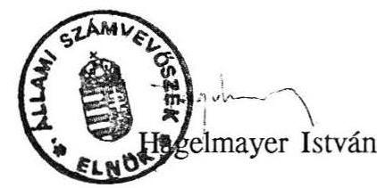

# ふ̊llami ふ̊sámbebösşek 

## ÉSZREVÉTELEK

a Kormány által az állami költségvetés I. negyedévi helyzetéról és a Szolidaritási Alap 1992. I. negyedévi felhasználásáról készített tájékoztatókhoz

---

Az Állami Számvevőszéket törvény nem kötelezi, hogy a Kormány által készített tájékoztatót jelentés formájában véleményezze. A Költségvetési, adó- és pénzügyi bizottság elnökének írásbeli kérésére készítettük el véleményünket.

A rendelkezésünkre álló rövid idő alatt a tájékoztatókban foglaltak valódiságáról ellenőrzéssel meggyőződni nem lehetett. Ezért azt a megoldást választottuk, hogy a tájékoztatók egyes pontjaihoz megjegyzéseket fúzünk, amelyeket elsősorban a költségvetési és egyéb törvények előírásaira alapozunk. Észrevételeink - tekintettel arra, hogy pénzügyi kihatásaik kapcsolatban vannak egymással - egyaránt vonatkoznak a költségvetés I. n.évi helyzetéről és a Szolidaritási Alap helyzetéről szóló tájékoztatókra. (A továbbiakban PM Tájékoztató, illetve MüM Tájékoztató.)

Az 1991. XCI. törvény a Magyar Köztársaság 1992. évi költségvetéséről és az államháztartás vitelének 1992. évi szabályairól (továbbiakban költségvetési törvény) a következőképpen rendelkezik a központi költségvetés előirányzataitól való eltérés esetére:

A 49. §/1/ bekezdése rögzíti azokat az előirányzatokat, amelyek módosítás nélkül is eltérhetnek az eredeti előirányzattól. Ezek közé tartoznak a vállalkozások költségvetési befizetései, valamint a fogyasztáshoz kapcsolt adóbevételek.

A 49. §/2/ bekezdése szerint a felsorolt előirányzatok teljesítésében mutatkozó eltérések költségvetési egyensúly rontó hatását a Kormány más kiadási előirányzatokban elért, vagy elérhető megtakarítással, zárolással, az általános tartalék részbeni vagy egészbeni törlésével, illetőleg - a költségvetési törvény, vagy más jogszabály alapján - saját hatáskörben megvalósítható intézkedés révén elérhető bevételi többletekkel ellensúlyozni köteleles.

A 49. §/3/ bekezdés alapján abban az esetben, ha az előirányzatok teljesítésében mutatkozó eltérések hatása az előbb - a /2/ bekezdésben - felsoroltak szerinti módon nem ellensúlyozható, a Kormány köteles pótköltségvetési javaslatot terjeszteni az Országgyúlés elé.

A PM Tájékoztató nem tartalmazza, hogy az I. n.évben mutatkozó, az időarányost lényegesen meghaladó költségvetési hiány ellensúlyozására a Kormány saját hatáskörben milyen intézkedéseket tett és tervez, és ezeknek hatását miként prognosztizálja.

A PM Tájékoztatóhoz mellékelt költségvetési mérleg nem tartalmazza az időarányos előirányzatot, ami nehezíti a Tájékoztatóban foglaltak értékelését.

---

A továbbiakban a Tájékoztatók azon pontjaira térünk ki, amelyek a költségvetési és más törvények, jogszabályok alapján a költségvetési egyensúly nagyságát az év további részében befolyásolhatják.

Megjegyzéseinket az állami költségvetés I. n.évi helyzetéről szóló PM Tájékoztató megfelelő pontjaihoz rendeztük:

# ad.1.1. és ad.2. 

A társasági adó előirányzat 1992. évi további teljesítése - az I. n.évi lemaradás mellett - a hatályos törvények alapján a következők szerint alakul:

A társasági adóról szóló 1991. évi LXXXVI. törvény 18. §/2/ bekezdés, illetve 19. §/7/ bekezdés szerint a változatlan formában múködő vállalkozásoknál a fizetendő adóelőleg az előző év adója alapján teljesítendő.

E törvénynek megfelelően a vállalkozások - a pénzintézetekkel együtt -1992-ben a 146 milliárd Ft előirányzathoz képest az igen alacsony 1991. évi ténylegesen teljesített 75,7 milliárd Ft vállalkozási nyereségadó alapján fizetik a társasági adóelőleget. Az adózás rendjéről szóló törvény 2.sz. mellékletének 3.b. pontja értelmében az adózónak az adóév december 20-ig kell kiegészíteni az adóelőleget a várható éves fizetendő adó összegére.

Ez azt jelenti, hogy 1992. december 20-ig - az 1991. évi pénzforgalmi áthúzódásokat figyelmen kívül hagyva - várhatóan legfeljebb 75 milliárd Ft körüli összeg folyik be. Az előlegfizetés rendjét szabályozó törvény alapján a keletkező bevétel elmaradás mintegy 70 milliárd Ft, amelyet legalább december 20-ig mindenképpen finanszírozni kell. Ezt követően a befizetett kiegészítések alapján derül ki az 1992. évi tényleges teljesítés.

Megjegyezzük, hogy a PM Tájékoztató nem tér ki arra, hogy az előbbiekben hivatkozott, a társasági adótörvény alapján a fizetendő adóelőleghez képest az I.n.évi teljesítés mennyivel tér el az időarányostól.
ad.1.4.
Az előbbiekhez hasonló a helyzet az állami részesedés előirányzatának teljesítésénél is. Az 1989. évi XLIII. törvény 5. § 3.a. pontja értelmében az adónem havi előlegfizetési kötelezettsége az előző adóév tényleges fizetési kötelezettségének egytizenketted része.

Az 1991. évi tényleges teljesítés 9,4 milliárd Ft volt. Így ennek alapján fizetik 1992-ben az előlegeket. Az előirányzott 20 milliárd Ft-tal szemben itt is bevétel elmaradás várható a vonatkozó törvény előírásai alapján.

---

# ad.5. 

A PM Tájékoztatóban foglaltak szerint a központi költségvetési szervektől származó befizetésként számolták el az önkormányzatok 1991. évi normatív állami hozzájárulásának elszámolása kapcsán befizetett 1.528 millió Ft-ot.

Az 1991. évi költségvetési törvény - az 1990. évi CIV törvény - 9. §/5/ bekezdése alapján az Országgyűlés az önkormányzatok normatív állami hozzájárulása előirányzatának megváltoztatási jogát magának tartja fenn. Az önkormányzatok visszafizetései ezt a költségvetési címet érintik.

Így a maradványról a zárszámadási törvényben az Országgyűlésnek kell rendelkeznie. A Kormány - az önkormányzatok az 1991. évi elő irányzatokat tehermentesítő - visszafizetéseit nem számolhatja el 1992. évi bevételként.
ad.7.

A PM Tájékoztató nem szól arról, hogy a privatizációs bevételek 1992. évi 16 milliárd Ft-os kedvezőnek mutatkozó bevétele mellett miként teljesült az 1991-92. éveket terhelő, a TB Alap felé teljesítendő tartozás.

Ez a tétel a költségvetési előirányzatokban ugyan nem szerepel, de az 1992. évi költségvetési törvény 17. §/1/ bekezdésében foglaltak szerint olyan kötelezettséget jelent, amelyet szintén a privatizációs bevételekből kell teljesíteni.

Megjegyezzük, hogy a privatizációs bevételekből a költségvetésbe előirányzott 20 milliárd Ft csak előirányzat módosítással növelhető. A költségvetési törvény 42. § a/ pontja szerint az előirányzat megváltoztatásának jogát az Országgyúlés magának tartja fenn. A költségvetési törvény 27. §/2/ bekezdése alapján pedig a további privatizációs bevételek a - még el nem fogadott - Vagyonpolitikai Irányelvekben foglalt célokra fordíthatók.
ad. 10 .

A központi költségvetési szervek támogatási előirányzatának leutalásához a költségvetési törvény alapján pénzellátási tervet kellett készíteni. A PM Tájékoztató nem tartalmazza a pénzellátási tervek alapján igényelt támogatás szükségletet, amely eltérhet az előirányzatok időarányos részétől. Így a PM Tájékoztatóban foglalt viszonyítási alap megtévesztő lehet.

A PM Tájékoztató megfelelő indoklás nélkül tartalmazza a Népjóléti Minisztérium, a Földmüvelésügyi Minisztérium, a Pénzügyminisztérium, a Művelődési és Közoktatási

---

Minisztérium egyes költségvetési címeinek időarányostól eltérő, többlet költségvetési támogatás kiutalását. Ezért ezek szükségessége nem állapítható meg.

# ad.12. és a Szolidaritási Alap helyzetéről készített MüM Tájékoztató 

A Munkaügyi Minisztérium 9.cím. 2. alcíménél szereplő Szolidaritási Alap támogatási előirányzata 10,2 milliárd Ft. A PM Tájékoztatóban foglaltak szerint a Szolidaritási Alap számára március végéig 11,8 milliárd Ft költségvetési támogatás folyósítása történt meg, amely az egész évi előirányzatnál 1,6 milliárd Ft-tal több.

A költségvetési törvény 42. § f.pontja értelmében a költségvetési törvény 1.sz. melléklete szerint megállapított elkülönített állami pénzalapoknak nyújtott támogatás mértékének megváltoztatására a jogot az Országgyűlés magának tartja fenn. A Kormány az előirányzat módosítási jogkörét túllépte, ezáltal törvénysértést követett el.

A MüM Tájékoztatóban foglaltak alapján a Szolidaritási Alap várható hiánya - a két változat alapján - az év végére 29,5, illetve 37,4 milliárd Ft lehet. Ez két problémát is felvet:

- Az 1991. évi IV. törvény 39. §-a a költségvetésnek a Szolidaritási Alap hiányára a bevételek 10 \%-áig garanciavállalási kötelezettségét írja elő.

Az alap 1992. évre várható bevételei alapján - ha a hiány létrejön - éves szinten közel 4, illetve 5 milliárd Ft a garanciabeváltási kötelezettség, amelyre a költségvetés előirányzatai a költségvetési tartalékon kívül fedezetet nem tartalmaznak.

- A Szolidaritási Alap 1992. évi finanszírozási problémájának megoldását célzó javaslatok (7-9.old.) nem jelentenek valóságos megoldást, végrehajtásuk jogszabályi, törvényi háttere sem biztosított.

Megjegyezzük, hogy a Szolidaritási Alap teljes évi költségvetési támogatásának előrehozott kiutalásával megsértették a költségvetési törvény 61. §-ában foglalt előírásokat, amely szerint a támogatási előirányzat 11 havi összege automatikusan megilleti, a 12. havi részlet kiutalása az alap kezelőjének külön elszámolása és igénylése alapján történhet.

Az állami költségvetés I. n.évi helyzetéről szóló PM Tájékoztató 14-15. oldalai tartalmazzák a költségvetés I. n.évi hiányának finanszírozását. A PM Tájékoztató nem tartalmaz elképzelést a hiány további finanszírozásának módjáról. Ezzel kapcsolatban a következő megjegyzéseket tesszük:

A költségvetési törvény 4. §-a tartalmazza a hiány finanszírozásának módját, amely értékpapír, államkötvény kibocsátását engedélyezi.

---

Az 1982. évi 28.sz. törvényerejű rendelet 8. §/1/ bekezdés alapján az államkötvény kibocsátásáról, a kibocsátás céljáról és keretösszegéről az éves költségvetési törvény rendelkezik.

Ha a költségvetési törvényben a hiány finanszírozására meghatározott keretösszeg a hiány további növekedése miatt nem elegendő, a finanszírozáshoz törvényes keretek között intézkedni kell.

Megjegyezzük, hogy az értékpapír kibocsátás közgazdaságilag a költségvetés hitelfelvételének minősíthető. Az eddigiek során az értékpapír kibocsátás dokumentumait nem mutatták be, így a Számvevőszék elnöke azokat nem ellenjegyezte.

Összegezve: a benyújtott Tájékoztatók nem tartalmazzák a költségvetési törvény 49. §/2/ bekezdésében foglalt intézkedési kötelezettség teljesítésének ismertetését. Ezért szükségesnek látszik, hogy az 1992. évi költségvetés várható hiányának fedezéséhez és finanszírozásához a Kormány intézkedéseiről tájékoztassa az Országgyűlést, illetve további intézkedéseket tegyen. Ha az indokolt lépések a Kormány hatáskörét meghaladják, akkor a költségvetési törvény 49. §/3/ bekezdése alapján a pótköltségvetés beterjesztése elkerülhetetlen lesz.

Budápest, 1992. május
