# JELENTÉS 

a szilárdhulladék-gazdálkodásra a Kohéziós Alapból és hazai forrásból nyújtott támogatások hasznosulásának ellenőrzéséről

---

# 2. Államháztartás Központi Szintjét Ellenőrző Igazgatóság 

2.1. Teljesítmény Ellenőrzési Főcsoport

Iktatószám: V-2013-071/2008-2009.
Témaszám: 918
Vizsgálat-azonosító szám: V0428

## Az ellenőrzést felügyelte:

Bihary Zsigmond
főigazgató
Dr. Lóránt Zoltán
főigazgató
Az ellenőrzés végrehajtásáért felelős:
Kemény Emil
főigazgató-helyettes
Dr. Zöldréti Attila
mb. főcsoportfőnök
Dr. Varga Sándor
főigazgató-helyettes
Az ellenőrzést vezette:
Dr. Zöldréti Attila
igazgatóhelyettes
Tóthné Kiss Katalin
mb. osztályvezető
Holman Magdolna
osztályvezető
Az ellenőrzést végezték:

| Bartolák Márta számvevő tanácsos | Bialkó Zsolt   számvevő tanácsos | Bíró Zsolt   számvevő tanácsos |
| :--: | :--: | :--: |
| Dr. Boda Sándor számvevő tanácsos | Borbély Zsuzsanna főtanácsadó | Buúsné Hütter Erzsébet számvevő |
| Csényi István számvevő | Dér Géza számvevő tanácsos | Fekete Gábor tanácsadó |
| Feketéné Hajkó Andrea számvevő | Gaál László számvevő tanácsos | Hegyes Mária számvevő tanácsos |
| Dr. Horváth Klára számvevő | Kéri Péter számvevő tanácsos | Luhály Matild számvevő |
| Dr. Mezei Imréné főtanácsadó | Molnár Istvánné számvevő | Nagy Attila számvevő tanácsos |

Jelentéseink az Országgyűlés számítógépes hálózatán és az Interneten a www.asz.hu címen is olvashatóak.

---

| Pálfiné Pusztai | Preller Zsuzsanna | Puskás Balázs |
| :-- | :-- | :-- |
| Magdolna | főtanácsadó | számvevő |
| számvevő |  |  |
| Szepes Béla | Szudi Ferencné | Dr. Telkes Imre |
| számvevő | számvevő | számvevő tanácsos |
| Terbe Mónika | Tóthné Kiss Katalin | Tóthné Salamon |
| számvevő tanácsos | főtanácsadó | Ildikó   tanácsadó |
|  | Vojcsekné Szabó | Jánoska Zsolt |
| Tukacs Éva | Ágnes | külső szakértő |
| számvevő tanácsos | számvevő tanácsos |  |

# A témához kapcsolódó eddig készített számvevőszéki jelentések: 

címe
Jelentés az ISPA támogatásból megvalósított környezetvédelmi programok ellenőrzéséről
Jelentés a Környezetvédelmi és Területfejlesztési Minisztérium feje- 0390
zet működésének pénzügyi-gazdasági ellenőrzéséről
Jelentés a Környezetvédelmi Minisztérium fejezet működésének 0225 ellenőrzéséről
Jelentés a települési önkormányzatok szilárdhulladék-gazdálkodási 0221 feladatai ellátásának ellenőrzéséről
A helyi önkormányzatok településtisztasági tevékenységének és finanszírozási rendszerének vizsgálata
240/1995.

---

# TARTALOMJEGYZÉK 

BEVEZETÉS ..... 11
I. ÖSSZEGZŐ MEGÁLLAPÍTÁSOK, KÖVETKEZTETÉSEK, JAVASLATOK ..... 17
II. RÉSZLETES MEGÁLLAPÍTÁSOK ..... 31

1. A hulladékgazdálkodási feltételrendszer kialakítása ..... 31
1.1. A hazai hulladékgazdálkodási stratégia uniós követelményekhez való illeszkedése ..... 31
1.2. A hazai hulladékgazdálkodási stratégia végrehajtásához rendelt hazai és uniós források tervezett ütem szerinti biztosítása ..... 37
1.3. A települési szilárdhulladék-gazdálkodás EU harmonizált jogi szabályozási és intézményi környezete kialakításának időbelisége és teljes körűsége ..... 39
1.4. A tájékoztatás, nyilvánosság és a partnerség elvét érvényesítő eljárások kialakítása és gyakorlati alkalmazása ..... 47
2. Az ISPA/KA és a hazai támogatások felhasználásával előkészített és megvalósított regionális komplex rendszerektől elvárt célok teljesítése ..... 49
2.1. Az ISPA/KA projektjavaslatok előkészítése, pályázatok benyújtása ..... 49
2.2. A Pénzügyi Megállapodások és a Támogatási Szerződések összhangja a benyújtott ISPA/KA pályázattal ..... 52
2.3. A projekteknek a kijelölt célrendszer szerinti megvalósulása, a rendelkezésre álló erőforrások felhasználása ..... 57
2.3.1. A beruházások megvalósítása, a pénzügyi megállapodásokban és a támogatási szerződésekben foglalt ütemezés összhangja ..... 57
2.3.2. A beruházások műszaki és pénzügyi megvalósítása ..... 59
2.3.3. Teljesítményelvek alkalmazása a beszerzéseknél ..... 66
2.4. A kialakított pénzügyi és számviteli rendszer ..... 70
2.4.1. A nyilvántartási rendszer teljessége ..... 70
2.4.2. A költségek ellenőrzési rendszerének kialakítása és gyakorlati alkalmazása a pénzügyi lebonyolításban ..... 73
2.5. Az ellenőrzési és monitoring rendszer, valamint az értékelési és a jelentéstételi rendszer kialakítása és működtetése ..... 75
3. A projektek megvalósításának eredménye, hatása a hulladékgazdálkodási feladatok ellátására ..... 78
3.1. A létrehozott eszközök/létesítmények hasznosítása ..... 78
3.2. A projektek üzemeltetési feltételeinek kialakítása ..... 83

---

3.3. Az üzembe helyezés eredménye az elérendő környezetvédelmi és hulladékgazdálkodási célok megvalósításában ..... 85
4. Az együttműködő önkormányzatok közszolgáltatási feladatainak eredményessége és hatékonysága ..... 88
4.1. A települési önkormányzatok tevékenységének eredményessége a hulladékgazdálkodási feladatok megvalósításában ..... 88
4.2. A szilárdhulladék-gazdálkodásra fordított működési és fejlesztési költségvetési források felhasználásának eredményessége az önkormányzat hulladékgazdálkodási feladatainak megvalósításában ..... 103
4.3. A lakossági elégedettségmérés összegzésének tapasztalatai ..... 108
MELLÉKLETEK
1/a sz. Az Önkormányzati Minisztérium észrevétele
1/b sz. A Környezetvédelmi és Vízügyi Minisztérium észrevétele
1/c sz. A Nemzeti Fejlesztési és Gazdasági Minisztérium észrevétele
2. sz. A hulladékgazdálkodás stratégiai, tervezési dokumentumai
3. sz. Az ISPA/Kohéziós Alap támogatással megvalósuló projektek jellemző adatai régiónként
4. sz. Térkép az ISPA/Kohéziós Alap támogatással finanszírozott hulladék- kezelési projektekről, 2000-2006
5. sz. Teljesítménymutatók és a hozzá tartozó kritériumok a települési szi- lárdhulladék-gazdálkodásra a Kohéziós Alapból és hazai forrásból nyújtott támogatások hasznosulásának értékeléséhez
6. sz. A helyszíni ellenőrzésre kijelölt önkormányzatok és közszolgáltatók listája
7. sz. A települési szilárdhulladék-kezelés alakulása az EU egyes országaiban, 2007. év
8. sz. A hazai települési szilárdhulladék-kezelés főbb mennyiségi adatai, 2004-2008. években
9. sz. A települési szilárdhulladék-gazdálkodás területén elérendő célok, kötelezettségek teljesítésének alakulása, a 2008. december végi állapot szerint
10. sz. A hulladékgazdálkodási akció programra teljesített kiadások az NKPII időszakában, 2003-2008 között
11. sz. Kimutatás az ISPA/Kohéziós Alap hulladékkezelési projektek EIB hitelből történő finanszírozásáról, 2000-től 2008. december 31-ig
12. sz. Képek a hasznosításra váró papírhulladékról
13. sz. Képek az ISPA/KA projektek létesítményeiről, eszközbeszerzéseiről
14. sz. Kimutatás az ISPA/Kohéziós Alap hulladékkezelési projektek létesítményeiről

---

15. sz. Az ISPA/Kohéziós Alap hulladékkezelési projektek fizikai előrehaladása, a 2009. március 15-i állapot szerint
16. sz. Az ISPA/Kohéziós Alap hulladékkezelési projektek Pénzügyi Megállapodásai és támogatási szerződései aláírásának időpontjai
17. sz. Az ISPA/Kohéziós Alap szilárdhulladék-kezelési projektek előrehaladása a 2008. december végi állapot szerint
18. sz. Az ISPA/Kohéziós Alap hulladékkezelési projektek egyes létesítményeinek fizikai előrehaladása, a 2009. március 15-i állapot szerint
19. sz. A haszonhulladékok árának és ÖKO-támogatásának változása 2008-ban
20. sz. A hulladékkezelés összes költségére jutó nyereség alakulása
21. sz. Az önkormányzatok által biztosított támogatások összegének és az érintett háztartások számának alakulása
22. sz. Az ellenőrzött településeken használt hulladékgyűjtő edények átlagos ürítési díjai
23. sz. A lakossági hulladékgyűjtés éves díjának aránya a háztartások nettó jövedelméhez
24. sz. A hulladékgazdálkodás költségeinek alakulása
25. sz. Az ellenőrzött települési önkormányzatok szilárdhulladékgazdálkodási feladatainak főbb naturális mutatói, a 2004-2008. években
26. sz. A települési hulladék közszolgáltatás fejlesztés pályázati forrásból támogatott hulladékgazdálkodási feladatok megoszlása az ellenőrzött önkormányzatoknál 2004-2008.
27. sz. Az EU Önerő Alap hulladék elhelyezési célra fordított támogatásai
28. sz. A hulladékgazdálkodásra fordított kiadások alakulása az ellenőrzött önkormányzatoknál, 2004-2008.

---

.

---

# RÖVIDÍTÉSEK JEGYZÉKE 

| áfa | Általános forgalmi adó |
| :--: | :--: |
| Áfa tv. | Az általános forgalmi adóról szóló 2007. évi CXXVII. törvény |
| Áht. | Az államháztartásról szóló 1992. évi XXXVIII. Törvény |
| Ámr. | Az államháztartás működési rendjéről szóló 217/1998. (XII. 30.) Korm. Rendelet |
| ÁSZ | Állami Számvevőszék |
| BM | Belügyminisztérium |
| CÉDE | A helyi önkormányzatok fejlesztési és vis major feladatainak támogatása területi kötöttség nélkül előirányzat |
| EIB | European Investment Bank - Európai Beruházási Bank |
| EK | Európai Közösség |
| EKK | Elektronikus Kormányzat Központ |
| EMIR | Egységes Monitoring Információs Rendszer |
| ESzCsM | Egészségügyi, Szociális és Családügyi Minisztérium |
| EU | Európai Unió |
| FIDIC | Tanácsadó Mérnökök Szövetsége |
| FMM | Foglalkoztatáspolitikai és Munkaügyi Minisztérium |
| FVM | Földművelésügyi és Vidékfejlesztési Minisztérium |
| GKM | Gazdasági és Közlekedési Minisztérium |
| GOP | Gazdaságfejlesztési Operatív Program |
| GVOP | Gazdasági Versenyképesség Operatív Program |
| Hgt. | A hulladékgazdálkodásról szóló 2000. évi XLIII. Törvény |
| HIR | Hulladékgazdálkodási Információs Rendszer |
| HÖF | Helyi önkormányzati fejlesztési támogatási program |
| IH | Irányító Hatóság |
| ISPA | Instrument for Structural Policies for Pre Accession Előcsatlakozási struktúrapolitikai eszköz |
| KA | Kohéziós Alap |
| KAC | Környezetvédelmi Alap Célelőirányzat |
| KAR | Környezetvédelmi Alapnyilvántartó Rendszer |
| Kbt. | A közbeszerzésekről szóló 2003. évi CXXIX. Törvény |
| KEHI | Kormányzati Ellenőrzési Hivatal |
| KEOP | Környezet és Energia Operatív Program |
| KIOP | Környezetvédelmi és Infrastruktúra Operatív Program |
| KöM | Környezetvédelmi Minisztérium |
| KSH | Központi Statisztikai Hivatal |
| KSZ | Közreműködő Szervezet |
| KTK IH | Közösségi Támogatási Keret Irányító Hatóság |
| KvVM | Környezetvédelmi és Vízügyi Minisztérium |
| KvVM FI | Környezetvédelmi és Vízügyi Minisztérium Fejlesztési Igazgatóság |

---

| LEKI | Leghátrányosabb helyzetű kistérségek felzárkóztatásának támogatása |
| :--: | :--: |
| MÁK | Magyar Államkincstár |
| MBH | Mechanikai- biológiai hulladékkezelés |
| NFGM | Nemzeti Fejlesztési és Gazdasági Minisztérium |
| NFH | Nemzeti Fejlesztési Hivatal (2006. július 1-től NFÜ) |
| NFT I. | Nemzeti Fejlesztési Terv I. |
| NFÜ | Nemzeti Fejlesztési Ügynökség |
| NKP | Nemzeti Környezetvédelmi Program |
| NKP-II | Második Nemzeti Környezetvédelmi Program |
| OGY | Országgyűlés |
| OKIR | Országos Környezetvédelmi Információs Rendszer |
| OP | Operatív Program |
| OTH | Országos Területfejlesztési Hivatal |
| ÖTM | Önkormányzati és Területfejlesztési Minisztérium |
| Ötv. | A helyi önkormányzatokról szóló 1990. évi LXV. Törvény |
| PM | Pénzügyminisztérium |
| PR | Public Relation - Reklám és tájékoztatás |
| PRAG | Practical Guide - Gyakorlati útmutató |
| Ptk. | A Polgári Törvénykönyvről szóló 1959. évi IV. tv. |
| ROP | Regionális Operatív Program |
| Sztv. | A számvitelről szóló 2000. évi C. törvény |
| TEHU | Települési hulladék közszolgáltatás fejlesztésének támogatása |
| TEKI | Területi kiegyenlítést szolgáló önkormányzati beruházások támogatása |
| TNM | Tárca Nélküli Miniszter |
| TSZH | Települési Szilárd Hulladék |
| ÚMFT | Új Magyarország Fejlesztési Terv |
| Vhr. | Az államháztartás szervezetei beszámolási és könyvvezetési kötelezettségének sajátosságairól szóló 249/2000. (XII. 24.) számú Korm. Rendelet |

---

# ÉRTELMEZŐ SZÓTÁR 

a szennyező fizet elve
ártalmatlanítás
begyűjtés
elérhető legjobb eljárás elve
előkezelés
elővigyázatosság elve
elvárható felelős gondosság elve
fokozatosság elve
gyártói felelősség elve

A hulladék termelője, birtokosa vagy a hulladékká vált termék gyártója köteles a hulladékkezelési költségeit megfizetni, vagy a hulladékot ártalmatlanítani; a szennyezés okozója, illetőleg előidézője felel a hulladékkal okozott környezetszennyezés megszüntetéséért, a környezeti állapot helyreállításáért és az okozott kár megtérítéséért, beleértve a helyreállítás költségeit is (Hgt. 4. § g) pont).
A hulladék okozta környezetterhelés csökkentése, környezetet veszélyeztető, szennyező, károsító hatásának megszüntetése, kizárása - a környezet elemeitől történő elszigeteléssel vagy anyagi minőségének megváltoztatásával a Hgt. 3. számú mellékletben felsorolt eljárások valamelyikének alkalmazásával (Hgt. 3. § k) pont).
A hulladéknak a hulladék birtokosaitól történő átvétele a hulladék birtokosa vagy a begyűjtő telephelyén, továbbá a begyűjtőhelyen (gyűjtőpontokon, hulladékgyűjtő udvaron, tároló-, kezelőtelepen) és a további kezelés érdekében történő összegyűjtés, válogatás a begyűjtő telephelyén (Hgt. 3. § n) pont).
Törekedni kell az adott műszaki és gazdasági körülmények között megvalósítható leghatékonyabb megoldásra; a legkíméletesebb környezet-igénybevétellel járó, anyag- és energiatakarékos technológiák alkalmazására, a környezetterhelést csökkentő folyamatirányításra, a hulladékként nagy kockázatot jelentő anyagok kiváltására, illetőleg a környezetkímélő hulladékkezelő technológiák bevezetésére (Hgt. 4. § f) pont).
A hulladék begyűjtését, tárolását, hasznosítását, illetőleg ártalmatlanítását elősegítő, azok biztonságát növelő, a környezetterhelést csökkentő tevékenység, amely a hulladék fizikai, kémiai, biológiai

 tulajdonságainak megváltoztatásával jár (Hgt. 3. § p) pont).
A veszély, illetőleg a kockázat valós mértékének ismerete hiányában úgy kell eljárni, mintha azok a lehetséges legnagyobbak lennének (Hgt. 4. § b) pont).
A hulladék mindenkori birtokosa köteles a lehetőségeinek megfelelően mindent megtenni annak érdekében, hogy a hulladék környezetet terhelő hatása a legkisebb mértékű legyen (Hgt. 4. § e) pont).
A hulladékgazdálkodási célokat ütemezett tervezéssel, egymásra épülő lépésekben, az érintettek lehetőségeinek és teherviselő képességének figyelembevételével kell elérni (Hgt. 4. § k) pont).
A termék előállítója felelős a termék és a technológia jellemzőinek a hulladékgazdálkodás követelményei szempontjából kedvező megválasztásáért, ideértve a felhasznált alapanyagok megválasztását, a termék külső behatásokkal szembeni ellenálló képességét, a termék élettartamát és újrahasználhatóságát, a termék előállításából és felhasználásából származó, illetve a termékből keletkező hulladék hasznosításának és ártalmatlanításának megtervezését, valamint a kezelés költségeihez történő hozzájárulást is (Hgt. 4. § c) pont).
A hulladék rendezett összeszedése, válogatása a további kezelésre történő elszállítás érdekében (Hgt. 3. § m) pont).
A hulladéknak vagy valamely összetevőjének a termelésben vagy a szolgáltatásban - a Hgt. 4. számú mellékletben felsorolt eljárások valamelyikének alkalmazásával történő felhasználása (Hgt. 3. § j) pont).
Minden olyan - helyhez kötött vagy mobil - létesítmény, amelynek fő célja az energiatermelés vagy anyagi termékek gyártása, és amely alap- vagy kiegészítő tüzelőanyagként hulladékot vagy hulladékgázt használ, vagy amelyben a hulladékot termikusan kezelik az ártalmatlanítás érdekében (3/2002. (II. 22.) KöM rendelet 2. § e) pontja).
A hulladékkal összefüggő tevékenységek rendszere, beleértve a hulladék keletkezésének megelőzését, mennyiségének és veszélyességének csökkentését, kezelését, ezek tervezését és ellenőrzését, a kezelő berendezések és létesítmények üzemeltetését, bezárását, utógondozását, a működés felhagyását követő vizsgálatokat, valamint az ezekhez kapcsolódó szaktanácsadást és oktatást (Hgt. 3. § h) pont).
A hulladékgazdálkodás része. A hulladékveszélyeztető hatásainak csökkentésére, a környezetszennyezés megelőzésére és kizárására, a termelésbe vagy a fogyasztásba történő visszavezetésére irányuló tevékenység, valamint a kezelést megvalósító eljárás alkalmazása, beleértve a kezelőlétesítmények utógondozását is (Hgt. 3. § l) pont).
Aki a hulladékot gazdasági tevékenysége körében a hulladék birtokosától átveszi, kezeli (Hgt. 3. § g) pont).
A projekt használója és - a KSZ-szel kötött támogatási szerződésben meghatározottaknak megfelelően - a beszállítókkal való szerződések megkötéséért, a teljesítések ellenőrzéséért és igazolásáért, a projekt költségeinek megfelelő nyilvántartásáért felelős.
A hulladékkezelés szabályainak kialakítása, a hulladékgazdálkodás szervezése során érvényesíteni kell, hogy a gazdálkodók, felhasználók által viselendő költségek a lehető legnagyobb környezeti eredménnyel járjanak (Hgt. 4. § m) pont).
A hulladék hasznosítására, ártalmatlanítására a - környezeti és gazdasági hatékonyság figyelembevételével kiválasztott - lehető legközelebbi, arra alkalmas létesítményben kerülhet sor (Hgt. 4. § h) pont).
Környezetvédelmi és Vízügyi Minisztérium Fejlesztési Igazgatóság jelen vizsgálatban.
A legkisebb mértékűre kell szorítani a képződő hulladék mennyiségét és veszélyességét, a környezetterhelés csökkentése érdekében (Hgt. 4. § a) pont).
A gyártói felelősség alapján fennálló kötelezettségek teljesítésében a termék és az abból származó hulladék teljes életciklusában érintett szereplőknek együtt kell működniük (Hgt. 4. § d) pont).

A projekt mérnöki és műszaki felügyeleti feladatait ellátó, a FIDIC szerződéses szabályoknak megfelelő személy vagy szervezet.
Országos szinten, a területi elv és a közelség elvének figyelembevételével, a képződő hulladékok teljes körű ártalmatlanítására kell törekedni, ennek megfelelő ártalmatlanító hálózatot célszerű kialakítani és üzemeltetni (Hgt. 4. § j) pont).

Az Európai Bizottság és a Magyar Köztársaság Kormánya között az ISPA projektek megvalósítása tárgyában, projektenként létrejött pénzügyi megállapodás.
A hulladékkezelő létesítmények kialakításánál a fejlesztési, gazdaságossági és környezetbiztonsági szempontoknak, valamint a kezelési igényeknek megfelelő területi gyűjtőkörű létesítmények hálózatának létrehozására kell törekedni (Hgt. 4. § i) pont).
A strukturális politikák finanszírozása keretében történt szabálytalanságokról és tévesen kifizetett összegek behajtásáról, valamint egy információs rendszer e téren történő létrehozásáról szóló 1681/94/EK bizottsági rendelet 1a. cikk 1. pontjában foglaltak, továbbá a nemzeti jogszabályok előírásainak, illetve a támogatási szerződésben a felek által vállalt kötelezettségeknek a megsértése, amelyek eredményeképpen a Magyar Köztársaság pénzügyi érdekei sérülnek, illetve sérülhetnek (360/2004. (XII. 26.) Korm. rendelet 2. § (1) bekezdés 15. pontja).
Bármilyen adat vagy információ, amely a szabálytalanság elkövetésére utal (360/2004. (XII. 26.) Korm. rendelet).
Az eljárás magában foglalja a felmerült szabálytalansági gyanú alapján - szükség szerint - a vizsgálat lefolytatását, a szükséges intézkedések meghozatalát és azok végrehajtását (360/2004. (XII. 26.) Korm. rendelet VII. fejezet Szabálytalanságok kezelése).
Az önkormányzatok, mint végső kedvezményezettek és a Közreműködő Szervezet között - az Irányító Hatóság ellenjegyzése mellett - a projekt megvalósítása tárgyában létrejött megállapodás.
A hulladéknak termelője által a környezet veszélyeztetését kizáró módon végzett, három évnél rövidebb ideig tartó elhelyezése (Hgt. 3. § q) pont).
A háztartásokból származó szilárd vagy folyékony hulladék, illetőleg a háztartási hulladékhoz hasonló jellegű és összetételű, azzal együtt kezelhető más hulladék (Hgt. 3. § c) pont).

Háztartási hulladék: az emberek mindennapi élete során a lakásokban, valamint a pihenés, üdülés céljára használt helyiségekben és a lakóházak közös használatú helyiségeiben és területein, valamint az intézményekben keletkező;
közterületi hulladék: közforgalmú és zöldterületen keletkező;
háztartási hulladékhoz hasonló jellegű és összetételű hulladék: gazdasági vállalkozásoknál keletkező - külön jogszabályban meghatározott - veszélyesnek nem minősülő szilárd hulladék (213/2001. (XI.14.) Korm. rendelet).
Ajánlatkérési műszaki dokumentáció a jogerős, végrehajtható és érvényes építési vagy létesítési hatósági engedélyokirat és a hozzá tartozó tervek alapján készített, az építmény helyszínét, környezetét, jelenlegi, valamint kész állapotát - az ajánlatadáshoz szükséges és elégséges módon - rögzítő írásos dokumentumok és tervrajzok összessége. (1/1996. (II. 7.) KTM rendelet 2. § (1) bekezdés, amelyet hatályon kívül helyezett a Kbt. 405. § (1) bekezdés o) pontja 2004. május 1-jétől. Ezt követően a 162/2004. (V. 21.) Korm. rendelet 1. számú melléklet 1. pontja határozza meg azonos tartalommal.)
A terméknek az eredeti célra történő ismételt felhasználása; a többször felhasználható, újra tölthető termék a forgási ciklusból történő kilépésekor válik hulladékká (Hgt. 3. § i) pont).

---

# JELENTÉS   a szilárdhulladék-gazdálkodásra a Kohéziós Alapból és hazai forrásból nyújtott támogatások hasznosulásának ellenőrzéséről 

## BEVEZETÉS

A környezet védelme nélkül nem tartható fenn az emberi tevékenység és a természet közötti harmónia, elmulasztása veszélyezteti a jelen generációk egészségét, a jövő generációk létét és számos faj fennmaradását ${ }^{1}$. A témakör fontosságának megfelelően már az Európai Unió létrehozásáról szóló Szerződés XIX. „Környezet" című fejezete is foglalkozik az EU környezetpolitikai célkitűzéseivel és az azok megvalósításához szükséges döntési folyamatokkal.

Az ellenőrzött időszakban az uniós célkitűzések a hulladékgazdálkodás alapelveinek hármas célhierarchiájára épültek. Ezek, a leginkább ajánlottól a legkevésbé ajánlott irányba haladva a következők: a hulladék-képződés megelőzése, a képződő hulladék minél nagyobb arányú hasznosítása és a nem hasznosítható hulladék ártalmatlanítása, benne a biztonságos elhelyezés².
A hulladékgazdálkodási hierarchiát az 1. sz. ábra szemlélteti:
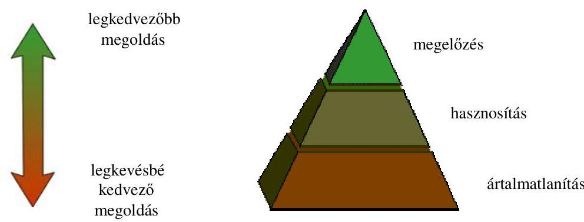

1. sz. ábra

Az érvényben levő uniós szabályozás a hulladékgazdálkodás területén több, egyértelmű tagállami kötelezettséget fogalmaz meg. Az uniós követelmények közé tartozik például a települési szilárdhulladék-gazdálkodásra vonatkozóan, hogy 2009-re a lerakott hulladék biológiailag lebomló szerves anyag tartalmát 50\%-kal kell csökkenteni (az 1995. évi szinthez képest), valamint az EU előírásoknak nem megfelelő lerakókat be kell zárni.

A kötelezettségek teljesítésére a hulladékgazdálkodás különböző szintű hazai stratégiáit dolgozták ki (2. sz. melléklet). Az ellenőrzött időszakban a nemzeti környezetpolitikai célokat és feladatokat a második Nemzeti Környezetvédelmi Program (a továbbiakban: NKP-II) rögzítette, amelynek az EU 6. Környezetvédelmi Akcióprogramjához és Magyarországnak a csatlakozási tárgyalások során tett környezetvédelmi kötelezettségvállalásaihoz kellett igazodnia.

Az NKP-II összesen kilenc különleges kezelést igénylő területet (tematikus akcióprogramot) jelölt ki és ezek között szerepel a hulladékgazdálkodási program.
Az NKP-II programonkénti megoszlását a 2. sz. ábra szemlélteti.
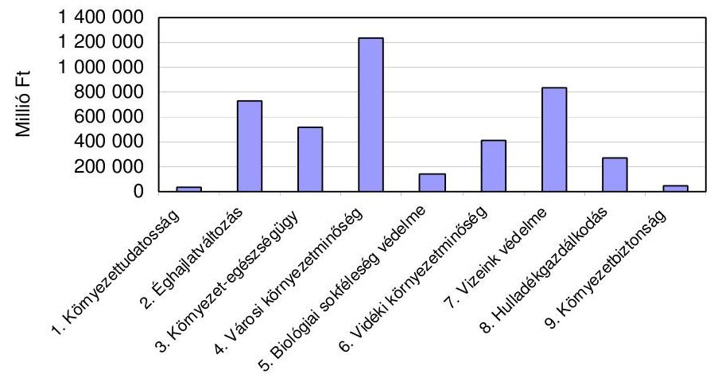
2. sz. ábra

Az NKP-II részét képezte az Országos Hulladékgazdálkodási Terv (a továbbiakban: OHT), mint a nemzeti hulladékgazdálkodási stratégia. Az OHT hulladékgazdálkodásra a központi költségvetést terhelő fejlesztési igényként, uniós forrással együtt mintegy 130 Mrd Ft-ot tartalmazott.

Az OHT-ban a hulladékképződésre vonatkozó tervadatokat és azok tényleges alakulását az alábbi táblázat tartalmazza:

Millió tonna

| Hulladék típusa | $\mathbf{2 0 0 0 .}$ | $\mathbf{2 0 0 5 .}$ |  | $\mathbf{2 0 0 8 .}$ |  |
| :-- | --: | --: | --: | --: | --: |
|  | tény | terv | tény | terv | várható $^{3}$ |
| Mezőgazdasági és élelmiszer-ipari hulladék | 5,0 | 5,0 | 5,0 | 3,0 | 4,0 |
| Iparí és egyéb gazdálkodói hulladék | 21,5 | 20,0 | 13,4 | 18,0 | 10,0 |
| Települési szilárdhulladék | $\mathbf{4 , 6}$ | $\mathbf{4 , 8}$ | $\mathbf{4 , 6}$ | $\mathbf{5 , 2}$ | $\mathbf{4 , 4}$ |
| Települési folyékony hulladék | 5,5 | 5,2 | 4,9 | 4,6 | 4,0 |
| Szennyvíziszap | 0,7 | 1,1 | 0,5 | 1,5 | 1,0 |
| Veszélyes hulladék | 3,4 | 4,0 | 1,2 | 4,1 | 1,1 |
| Összesen | 40,7 | 40,1 | 29,6 | 36,4 | 24,5 |

[^0]
[^0]:    ${ }^{3}$ 2008. évi tényadat várhatóan 2009 szeptemberében lesz.

---

A fenti adatok szerint a keletkező hulladék összes mennyisége a 2000. éviről 2008-ra mintegy 40\%-kal csökkent. Ennek fő oka az ipari hulladék mennyiségének fokozatos csökkenése, ami a gazdasági szerkezet átalakulásából, az anyag- és energiatakarékos technológiák fokozatos bevezetéséből ered.

A települési szilárdhulladék tömege az utóbbi években alig változott, térfogata azonban 30\%-kal növekedett a könnyű összetevők (pl. műanyag palack) arányának emelkedése miatt. $1 \mathrm{~m}^{3}$ laza, tömörítés nélküli települési szilárdhulladék súlya korábban 220 kg volt, míg mára 160 kg körül alakul ${ }^{4}$.

Jelenleg évi 3750 millió darab italtermék kerül forgalomba, több mint ¾-e „eldobható" csomagolásban (pl. műanyag-palack, fémdoboz). Az újratölthető⁵ csomagolás az utóbbi években folyamatosan és erőteljesen háttérbe szorult. A problémát pedig folyamatosan növeli a fogyasztás növekedése.

Az EU követelmények, így a környezetvédelmi alapelvek⁶, a hulladékgazdálkodási prioritások és a vonatkozó szabályozási rendszer meghatározták a kialakítandó nemzeti hulladékgazdálkodási stratégiák irányát.

Magyarország uniós tagságának felkészülési folyamatában már az ISPA előcsatlakozási uniós alap megnyílása szükségessé tette a környezetvédelmi stratégia kialakítását⁷. Ezzel párhuzamosan haladt a hazai jogszabályi környezet harmonizációja.

Az ISPA⁸ előcsatlakozási eszköz alkalmazásával Magyarországon elkezdődött a komplex hulladékkezelési rendszerek kialakítása.
 Az ISPA keretében 12 hulla-

[^0]
[^0]:    ${ }^{4}$. Magyarországon a 2008-ban keletkezett 4,4 millió tonna települési szilárd hulladék 26,4 millió m³-nek felel meg. Ez a mennyiség (tömörítés nélkül) a Margitszigetet $(96,5$ hektár) 27,3 méter magasan borítaná el.
    ${ }^{5}$ A „többutas" csomagolás előnye, hogy a többszöri használat következtében később válik hulladékká, ezáltal a természeti erőforrás felhasználás és a természetre gyakorolt terhelő hatás kisebb, mint az „eldobható" csomagolás esetében. A „többutas" csomagolás hátránya viszont, hogy a használat után sérülésmentesen be kell gyűjteni, majd tisztítani.
    ${ }^{6}$ A megelőzés-, az elővigyázatosság-, a gyártói felelősség-, a megosztott felelősség-, az elvárható felelős gondosság-, az elérhető legjobb eljárás-, a szennyező fizet-, a közelség, a regionalitás-, az önellátás-, a fokozatosság- és a költséghatékonyság elve.
    ${ }^{7}$ Az Európai Tanács 1266/1999. és 1267/1999. rendelete szabályozta az EU-hoz csatlakozni szándékozó országok számára az ISPA források felhasználását, mint az előcsatlakozási szerkezetátalakítás egyik eszközét a környezetvédelmi és közlekedési infrastruktúra fejlesztésére, amely egyben a Kohéziós Alap elődje volt.
    ${ }^{8}$ Az ISPA keretében az 5 millió eurót meghaladó, a stratégiai célokkal összhangban lévő, legalább 15 ezer lakosra kiterjedő, a környezeti problémákat hosszú távon megoldó projektek nyerhettek támogatást. A támogatott projekteknek az alábbi elemeket kellett tartalmaznia: szelektív hulladékgyűjtés, lerakók, illetve átrakó állomások létrehozása, a kezeléshez, szállításhoz szükséges eszközök beszerzése, illetve a műszakilag elavult lerakók rekultiválása.

---

dékkezelési projektet ${ }^{9}$ fogadtak el. További 1 beruházást hagytak jóvá a 2004-2006-os periódusban a Kohéziós Alap kerete terhére. Ezzel 2006 végéig összesen 13 komplex hulladékkezelési projekt jóváhagyására került sor.

2007-től az ÚMFT-hez tartozó Környezet és Energia Operatív Program (KEOP) keretében további 2 beruházás jóváhagyása van folyamatban, azaz jelenleg mindösszesen 15 komplex hulladékkezelési projekt megvalósulása várható uniós támogatással. A 15 komplex hulladékkezelési rendszer nem fedi le Magyarország teljes területét, így még nem valósul meg a korszerű hulladékkezelési rendszerekkel való teljes lefedettség célkitűzése, azzal együtt sem, hogy vannak nem uniós támogatással megvalósuló hulladékkezelési rendszerek is.

Az ISPA támogatásból megvalósuló projektek az előcsatlakozás időszakában előkészítésre kerültek, de azok megvalósítása a csatlakozást követő időszakra maradt és a Kohéziós Alap keretében folytatódott.

A 13 (ISPA/KA) komplex regionális hulladékkezelési projekt a tervek szerint az ország lakosságának mintegy 40%-át és 1436 települési önkormányzatot lát el, ahol évente mintegy 1,7 millió tonna települési szilárdhulladék keletkezik. A projektek listáját és főbb adatait a 3. sz. melléklet tartalmazza. A regionális rendszerek általi országos területi lefedettséget mutatja be a 4. sz. melléklet.

A települési önkormányzatok közszolgáltatásként az ingatlantulajdonosoknál keletkező települési hulladék kezelésére hulladékkezelési közszolgáltatást kötelesek szervezni, és fenntartani.

Az Állami Számvevőszék 2002-ben vizsgálta a települési önkormányzatok szilárdhulladék-gazdálkodási feladatainak ellátását, valamint 2004-ben az ISPA támogatásból megvalósított környezetvédelmi programok végrehajtását, de még nem vizsgálta a komplex regionális hulladékkezelési projektek átfogó hatását a magyar környezetvédelmi célok teljesítésében.

A jelenlegi ellenőrzés célja annak értékelése volt, hogy az ISPA/Kohéziós Alapból és hazai forrásból megvalósuló települési szilárdhulladék-kezelési komplex regionális fejlesztések végrehajtása eredményesen és hatékonyan szolgálta-e a magyar környezetvédelmi és hulladékgazdálkodási célok megvalósítását és a támogatások hasznosulását. Ennek során értékeltük, hogy:

- a feltételrendszer kialakítása lehetővé tette-e a célrendszer teljesítését, ezen belül a hazai stratégiák illeszkedését az uniós követelményekhez, a hazai stratégiákhoz rendelt pénzügyi és naturális célok, valamint a források összhangját, a jogi szabályozási és az intézményi környezet kialakítását;
- az ISPA/KA támogatással megvalósuló komplex regionális rendszerek előkészítése hozzájárult-e a célrendszer eredményes és hatékony teljesítéséhez, megvalósult-e a projektek megállapodás szerinti hatékony előrehaladása,

[^0]
[^0]:    ${ }^{9}$ Az ISPA/KA projektek elnevezése változó, hulladékgazdálkodási vagy hulladékkezelési rendszer elnevezést kaptak a dokumentumokban. A jelentésben egységesen a hulladékkezelési projektek elnevezést használjuk, mivel a projektek a Hgt. szerinti hulladékkezelést szolgálják.

---

érvényre jutottak-e a gazdaságosság szempontjai a végrehajtási folyamatokban, a pénzügyi és számviteli rendszer támogatta-e a projektek hatékony megvalósítását;

- az ellenőrzési és a monitoring, valamint a jelentéstételi rendszer eredményesen támogatta-e az eredeti célok elérését, a hulladékgazdálkodásra fordított források és a befejezett komplex regionális rendszerek hozzájárultak-e a hazai hulladékgazdálkodási célok időarányos teljesítéséhez;
- az együttműködő önkormányzatok eredményesen és hatékonyan látták-e el a települési szilárdhulladék-gazdálkodással összefüggő közszolgáltatási feladataikat, javult-e a kialakított kötelező közszolgáltatás színvonala, a hulladékgazdálkodási programok hozzájárultak-e az élhetőbb környezet, a környezettudatos fenntartható fejlődés alapjainak megteremtéséhez.

Az ISPA/Kohéziós Alapból támogatott komplex regionális környezetvédelmi rendszerek ellenőrzését a teljesítmény-ellenőrzés módszertanának alkalmazásával hajtottuk végre, így vizsgálatunk nem a szabályszerűségre, hanem a teljesítmény-ellenőrzés céljaira fókuszált. A hazai hulladékgazdálkodásban elért eredmények tükrében az ellenőrzési szempontok szerint értékeltük a felhasznált források hatását és a komplex regionális hulladékkezelési projektek működését. A teljesítés minősítését az 5. sz. mellékletben felsorolt értékelési kritériumok és adatforrások alapján végeztük.

Az ellenőrzés során összevetettük és elemeztük a hazai stratégiák és az ISPA/ Kohéziós Alapból megvalósuló projektek ténylegesen realizált eredményeit a tervekben foglalt célkitűzésekkel. Ennek keretében értékeltük az input, output, eredmény indikátorok tervezett és tényállapotának alakulását, valamint kitekintést végeztünk a korábbi ÁSZ javaslatok gyakorlati hasznosulására.

Az ellenőrzést a rendszeralapú és a közvetlen megközelítési módok kombinációjával alakítottuk ki. Kockázati szempontokon alapuló mintavétellel határoztuk meg a projektek, illetve a települési önkormányzatok azon körét, amelyek dokumentációját elsődleges adatforrásként használtuk helyszíni ellenőrzésünk alatt. A kockázati szempontok között szerepelt a projektek volumene, az érintett önkormányzatok és a lakosság száma, valamint a végrehajtás előrehaladottsága, a lefolytatott szabálytalansági eljárások száma. A dokumentum alapú ellenőrzést mind a 13 projektre kiterjesztettük.

A helyszíni ellenőrzés 3 ISPA forrásból finanszírozott regionális hulladékkezelési beruházásra (Miskolc, Szolnok, Zalabér), 39 települési önkormányzatra és 7 hulladékkezelési közszolgáltatást végző szervezetre terjedt ki (6. sz. melléklet). Adatszolgáltatás keretében információkat kértünk további 10 ISPA/Kohéziós Alap finanszírozású projekt megvalósításának helyzetéről, 30 települési önkormányzat hulladékgazdálkodási feladatainak állásáról, valamint hét regionális környezetvédelmi felügyelőségtől. Ezzel egyidejűleg - internetes kapcsolatban és papíralapú kérdőíven egyaránt elérhető - lakossági elégedettségmérést is végeztünk.

Az ellenőrzött időszak az uniós tagságunk kezdetét jelentő 2004. évtől 2008. december 31-ig terjedt ki (kitekintéssel a projektek indítására), és kiterjedt az

---

ISPA/KA projektek támogatásközvetítő intézményrendszerének szervezeteire, valamint a helyszíni ellenőrzésre kiválasztott önkormányzatok szilárdhulladékgazdálkodási feladataira.

Az ellenőrzés jogalapját az Állami Számvevőszékről szóló 1989. évi XXXVIII. törvény 2. § (1), (3), (5), (6) és (9) bekezdései, és az államháztartásról szóló 1992. évi XXXVIII. törvény 120/A. § (1) bekezdései képezték.

A jelentést 8 napos egyeztetésre megküldtük a környezetvédelmi és vízügyi, önkormányzati, nemzeti fejlesztési és gazdasági miniszter uraknak. Válaszleveleik másolatát 1/a-c. számú mellékletek tartalmazzák.

---

# I. ÖSSZEGZŐ MEGÁLLAPÍTÁSOK, KÖVETKEZTETÉSEK, JAVASLATOK 

Hazánkban a hulladékgazdálkodási stratégiák és azok gyakorlati végrehajtása eltérő súlypontokat mutatott. Míg a különböző szintű hazai stratégiák a „meg-előzés-hasznosítás-ártalmatlanítás" célhierarchiáját az uniós irányelveknek megfelelően tartalmazták, a gyakorlatban az ártalmatlanítás, és azon belül a lerakás kapott súlyponti szerepet.

A „megelőzés - hasznosítás - ártalmatlanítás" gyakorlati érvényesítésében mutatkozó helyzetünket szemlélteti az Eurostat adatain alapuló 3. sz. ábra.
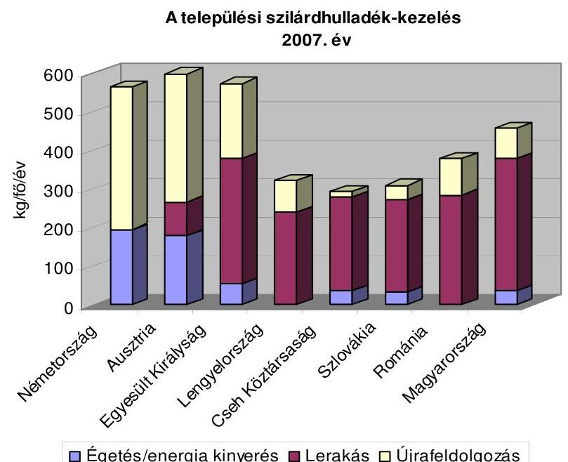
3. sz. ábra

Németországra és Ausztriára a hulladék nagyarányú újrafeldolgozása és égetése, míg Magyarországra és a többi újonnan csatlakozott országra a nagyarányú lerakás volt a jellemző ${ }^{10}$. Az Egyesült Királyság az EU (27 ország) átlagának megfelelő hulladékot hasznosított és rakott le, és valamivel az átlag alatti hulladék mennyiséget égetett el.
Az ISPA/Kohéziós Alapból és a hazai forrásokból megvalósuló komplex regionális hulladékkezelési rendszerek és önkormányzati beruházások hozzájárulnak a települési szilárdhulladék-gazdálkodás fejlődéséhez ${ }^{11}$, illetve elősegítik az

[^0]
[^0]:    ${ }^{10}$ A települési szilárdhulladék-kezelés alakulását az EU egyes országaiban a 7. sz. melléklet, a hazai alakulását a 8. sz. melléklet tartalmazza. A statisztikai adatok nem mutatják a hulladékkezelés export-import, illetve az illegálisan más országban elhelyezett hulladék adatokat.
    ${ }^{11}$ A 13 ISPA/KA projekt közül csak 1 projekt pénzügyi zárása történt meg, a többi projekt megvalósítása folyamatban volt a helyszíni ellenőrzés idején, így azok megvalósítása, teljesítménye tekintetében az ÁSZ csak előzetes értékelést adhatott.

---

uniós előírásoknak való megfelelést. A források hasznosulását azonban a lefektetett stratégiai célok teljesítésében mutatkozó elmaradás, a költségvetést terhelő többletkiadás, valamint több éves késedelem jellemezte ${ }^{12}$.

Bár időarányosan 2008-ig Magyarország teljesítette az uniós irányelvekből fakadó tagállami kötelezettségeket és a hazai célokat, a források felhasználásának alacsony hatékonysága következtében 2009-ben fennáll annak a lehetősége, hogy csak részben fogja teljesíteni azokat.

Várhatóan teljesül az a cél, hogy a szelektív gyűjtés eszközei legalább a lakosság 60%-a részére elérhetőek legyenek 2009-re. A keletkező települési szilárd-hulladék-képződés (tömegében mért) szinten tartási célja is elérhető, továbbá teljesíthető a lerakásra vonatkozó követelményeket ki nem elégítő szilárdhulla-dék-lerakók bezárása is 2009. július 16-ra ${ }^{13}$.

A jelenlegi gyakorlat és a gazdaságban kialakult válsághelyzet mellett nem teljesül 2009-ben a települési szilárdhulladék-hasznosítás arányának növelésére és a hulladéklerakás arányának csökkentésére irányuló célkitűzés. A lerakott hulladék biológiailag lebomló szerves anyag tartalmának csökkentési célja várhatóan szintén nem teljesül ${ }^{14}$ az ISPA/KA hulladékkezelési projektek elhúzódása és a hulladék komposztok mezőgazdasági felhasználásának megoldatlansága miatt. (A célokat, kötelezettségeket részletesen a 9. sz. melléklet tartalmazza.)

Az érintett minisztériumok a 2003-2008-as időszakra érvényes NKP-II hulladékgazdálkodási akció programjára a központi költségvetésből 106,5 Mrd Ft kiadást terveztek ${ }^{15}$ és 95 Mrd Ft-ot teljesítettek. Az ÜMFT Környezet és Energia Operatív Programja keretében további 194 Mrd Ft összegű keret ${ }^{16}$ áll rendelke-

[^0]
[^0]:    ${ }^{12}$ Az Európai Számvevőszék 12/2008. sz. különjelentése - az ISPA projektek ellenőrzéséről - szintén megállapította, hogy „a projekteket nem mindig készítették elő megfelelően", továbbá „a tervektől eltérően valósították meg; a jelentős késedelmek mellett számottevő változások következtek be a finanszírozási tervekben is".
    ${ }^{13}$ Ugyanakkor az ISPA/KA projektek csúszása miatt egyes közszolgáltatóknak 1-1,5 éven át a lerakandó hulladékot a tervezettnél távolabbra kell szállítani.
    ${ }^{14}$ A Maastricht-i Szerződés bevezette a pénzbírság lehetőségét a kötelezettségek teljesítésének elmaradása, vagy részleges teljesítése esetére. Ez a lerakott hulladék biológiailag lebomló szerves anyag tartalmának csökkentésével kapcsolatos kötelezettség nem teljesítése miatt merülhet fel hazánkban. A vonatkozó irányelv módot ad a határidők négy évvel való eltolására, de ennek kérésére a csatlakozási tárgyalások során nem került sor. Legkorábban 2010. év végén lesz arra vonatkozó adat, hogy a biohulladék lerakás csökkentése 2009 év végére ténylegesen milyen mértékben teljesült.
    ${ }^{15}$ Ez az összeg mintegy 82%-a az OHT-ban meghatározott, a központi költségvetést terhelő fejlesztési igénynek, ami 130 Mrd Ft volt (uniós forrással együtt). Azonban ez utóbbi többéves keret nem került jóváhagyásra a hazai költségvetési tervezési rendszer éves jellegéből adódóan. A 2003-2008 között rendelkezésre álló forrás nagyságrendjét mutatja, hogy a

 megelőző 15 évben szilárdhulladék-lerakó telepek létesítésére 115 önkormányzat 16,7 Mrd Ft fejlesztési összköltségű beruházáshoz 7,2 Mrd Ft támogatásban részesült.
    ${ }^{16} 260$ Ft/Euro árfolyamon számítva. A 194 Mrd Ft-os keretből 111 Mrd Ft áll rendelkezésre szilárdhulladék-gazdálkodási rendszerek fejlesztésére, és 83 Mrd Ft rekultivációs programokra.

---

zésre szilárdhulladék-gazdálkodási rendszerek fejlesztésére és rekultivációs programok elvégzésére 2007-2013 között. Ez azt mutatja, hogy az ISPA/KA forrásokból megvalósuló fejlesztéseken túlmenően további jelentős infrastrukturális fejlesztések várhatóak a hulladékgazdálkodás területén.

A központi költségvetésből 2003-2008 között teljesített kiadások 74\%-a (70,2 Mrd Ft) az ISPA/KA projektekre EU támogatásból és annak hazai társfinanszírozásából, a $26 \%$-a ( $24,8 \mathrm{Mrd} \mathrm{Ft}$ ) tisztán hazai forrásból származó kiadás ${ }^{17}$. A tisztán hazai forrásból nyújtott támogatások ${ }^{18}$ céljaiban kiegészítették az uniós fejlesztési projektek céljait.

Az ISPA/KA projektekhez kötelező nemzeti társfinanszírozást a központi költségvetés döntően az Európai Beruházási Bank által nyújtott hitelből fedezte, amelynek projektenkénti alakulását a 11. sz. melléklet tartalmazza.

Az önkormányzatok hulladékgazdálkodásra fordított összes kiadása nem volt megállapítható, mert a költségvetésük funkcionális szerkezetű osztályozási rendszerében az e címen elszámolt kiadások önálló szakfeladaton elkülönítve nem jelentek meg ${ }^{19}$ és egyéb, ilyen irányú országos felmérés vizsgálatunk időpontjáig nem készült ${ }^{20}$.

Továbbá a kiadások hulladékgazdálkodási hierarchia szerinti gyűjtése nem volt szempont (jogszabály sem írta elő) sem központi sem helyi önkormányzati szinten. Ezért nem volt megállapítható, hogy a hulladékgazdálkodásra teljesített kiadásokból mennyi jutott megelőzésre, hasznosításra, valamint ártalmatlanításra.

A hulladékgazdálkodás feltételrendszerének kiépítése (stratégiakészítés, jogi szabályozás, intézményi rendszer kiépítése) alapvetően megtörtént hazánk uniós csatlakozásának időszakára, illetve az azt követő rövid időszakon belül.

Azonban hazánk hulladékgazdálkodását alapvetően, 25-30 évre meghatározó nagy infrastrukturális fejlesztések előkészítésének időszakában, 1999-2000-ben a feltételrendszer még kialakulóban volt. Továbbá a projektek megvalósításának időszakában - a csatlakozást követően - át kellett térni az előcsatlakozási alapok felhasználásának szabályairól a Kohéziós Alap felhasználásának szabályaira. A projektek lebonyolítóinak a folyamatosan megjelenő feltételekhez utólagosan kellett alkalmazkodniuk.

[^0]
[^0]:    ${ }^{17}$ A források évenkénti megoszlását a 10. sz. melléklet tartalmazza.
    ${ }^{18}$ Hulladékgyűjtő szigetre, hulladékgyűjtő edényekre, járművekre, komposztáló telepre és rekultivációra nyújtott támogatások.
    ${ }^{19}$ Ezzel azonos megállapításra jutott az Állami Számvevőszék Kutató Intézete a „Pénzügyi kockázatok az önkormányzati rendszerben" című művében.
    ${ }^{20}$ Az ellenőrzött önkormányzatok - az ellenőrzés részére kigyűjtéssel teljesített adatszolgáltatása szerint - az összes kiadásuk 1,14\%-át fordították hulladékgazdálkodási feladatokra. Ezek döntően ( $91 \%$-ban) működési célú kiadások voltak. A lakosság, illetve a szolgáltatók támogatására a kiadások 11\%-át fordították.

---

Az ellenőrzött 13 ISPA/Kohéziós Alap projekt előkészítésekor a pályázati kérelmek Bizottsághoz való benyújtásakor még nem volt hatályban a Hgt., mint a nemzeti hulladékgazdálkodási stratégia, nem voltak részletes műszaki szabályozások a tervezett létesítményekre, továbbá nem volt szabályozott az önkormányzatok együttműködésének szervezeti kerete, formája és az előzetes társadalmi érdekegyeztetés mikéntje sem. Az Európai Bizottság a legkorábbi kérelmezők, köztük hazánk számára megkésve ${ }^{21}$ adta ki a szükséges módszertani útmutatókat. Ezek a tényezők a projektek előkészítésének hiányosságához vezettek, amelyek negatív hatásai a végrehajtás során jelentkeztek.

A központi és a helyi önkormányzati szervek elkészítették a nemzeti és az uniós elvárásból adódó stratégiákat és uniós előírások alapján kiépítették az átfogó tervezési rendszert ${ }^{22}$. A stratégiák azonban nem a kívánatos sorrendben és időben készültek el ${ }^{23}$.

A kialakított hazai szabályozórendszer nem támogatta eredményesen a stratégiai célok elérését. A 2005-től bevezetett hulladékképződés megelőzési célt szolgáló szabályozások (a betétdíj, a termékdíj szabályozás) nem voltak kellően eredményesek. A szelektív gyűjtés mérlegelésénél alapvetően hiányzott a betétdíjas rendszer figyelembe vétele. A termékdíj-szabályozás pedig a kereskedelmi csomagolás termékdíja tekintetében nem érte el az eredeti célokat, mert hatására nem csökkent az egyszer használatos csomagolás mennyisége és a 2009. január 1-jétől hatályos módosítást követően sem várható lényeges változás.

A térségi szinten több, különböző számú (24-től 282-ig terjedő) önkormányzat együttműködésének szervezeti keretei, formái csak 2004 augusztusától (a KA rendszerében) kerültek szabályozásra. A kialakított szervezeti forma (kezdetben konzorcium, majd társulás) független volt a beruházások volumenétől, az ellátási terület nagyságától, illetve az együttműködő önkormányzatok számától ${ }^{24}$.

A hulladékképződés megelőzésére központi kormányzati szinten történtek lépések a házi komposztálás népszerűsítésében, a szemléletformálásban és a környezettudatosságra való nevelésben (lakossági tájékoztatók civil szervezetek bevonásával, iskolai oktatási segédanyagok készítése), de ezek csak hosszabb távon ható intézkedések. A megelőzés elsődlegessége az uniós operatív programokban is csak 2007-től kapott szerepet.

[^0]
[^0]:    ${ }^{21}$ A projektek kérelmek Bizottsághoz történő benyújtását követően.
    ${ }^{22}$ Az OHT elkészítését követően, annak célkitűzésével összhangban, kialakították a regionális és a helyi hulladékgazdálkodási terveket.
    ${ }^{23}$ Az NKP-II, mint átfogó horizontális stratégia és az OHT, mint a nemzeti hulladékgazdálkodási stratégia az uniós támogatások igénybevételéhez készített ISPA stratégiát követően 1,5-2 évvel készült el.
    ${ }^{24}$ A konzorciumok, társulások munkaszervezeti feladatait a projektek 38,5\%-ánál a gesztor önkormányzat polgármesteri hivatala, 53,8\%-ánál erre létrehozott külön szervezet látta el, de előfordult saját gazdasági társaság bevonása is. A projekteknél kimutatott lebonyolítási menedzsment költség 1,3 Mrd Ft, a projektek összes költségének átlagosan $1,9 \%$-a volt, amely $0,9 \%$ és $6,2 \%$ között szóródott. Ennek $85,5 \%$-át fordították a projektirányítás működési költségeire.

---

A hulladékhasznosítást tekintve, az elkészített stratégiák hiányosságát mutatja, hogy nem volt olyan stratégia, amely kiterjedt volna az országosan beinduló szelektív hulladékgyűjtés eredményeként előállított másodlagos nyersanyagok feldolgozásának kérdésére. Az OHT a hasznosítás elősegítését, mint általános célt tartalmazta, és csak utalt az uniós operatív programokra, mint lehetséges forrásokra.

A hasznosítást főként a piaci kereslet befolyásolta, nem dolgozták ki a hasznosítást támogató, a hazai felvevő piacot és háttéripart katalizáló rendszert. Ennek hiányában, a világban jelenleg zajló gazdasági válságból fakadó drasztikus kereslet- és árzuhanás negatív következményei csillapítatlanul érvényesülnek a másodlagos alapanyagok hazai piacán. A szelektíven összegyűjtött hulladék értékesíthetőségének problémái, illetve az emiatt mutatkozó bevételkiesés veszélyeztetik a szelektív hulladékgyűjtő rendszerek fenntarthatóságát ${ }^{25}$. Az elszállításra váró, szelektíven összegyűjtött papírhulladékot a 12. sz. melléklet képei szemléltetik.

Hazánkban a hulladék energetikai hasznosítását kapacitáskorlátok ugyan nem akadályozták ${ }^{26}$, de az ehhez szükséges feltételek, a hulladék előkezelésének technikái nem voltak és nincsenek meg (a mechanikai-biológiai előkezelő létesítmények hiányában).

A hulladék égetőműben (előkezelés nélkül) történő égetését pedig kapacitás korlátok akadályozták, mivel az OHT-ban elvi lehetőségként szereplő égetőművek nem épültek meg ${ }^{27}$. Egy égetőmű egy-egy hulladékkezelési projekt méretén túlmutató égetési hálózati kapacitás létrehozását igényelte volna ${ }^{28}$, de eddig az erre irányuló kezdeményezések nem jártak eredménnyel (a települések tiltakozása és elégtelen szervezés miatt). A hulladékgazdálkodási program végrehajtásáért - az NKP-II-ben meghatározott - felelős minisztériumok nem tudták érvényesíteni az országos szinten (OHT-ban) megtervezett célokat, szándékokat.

A hulladékgazdálkodási célhierarchia érvényesítésének háttérbe szorulása mellett további problémát jelentett, hogy nem hangolták össze a létrejövő hulladéklerakók és égetőművek, valamint az egyes lerakók kapacitását és elhelyezkedését. Ennek következtében egyes területeken többletkapacitások (Észak- és Dél-alföld, valamint Észak-Magyarország), más területeken (Nyugat- és Dél-Dunántúlon) „fehér foltok" jöttek létre. Ennek oka, hogy nem volt egységes, régiókra lebontott terv, amely - a már meglévő rendszereket is figyelembe véve - a komplex rendszerek gazdaságos és optimális kialakítását meghatározta vol-

[^0]
[^0]:    ${ }^{25}$ A KvVM és az NFGM 2009 januárjában - a szelektív hulladék gyűjtés változatlan fenntartásának szándéka mellett - helyzetfelmérés alapján intézkedési javaslatokat fogalmazott meg, melyek a helyszíni ellenőrzés befejezéséig nem kerültek megvalósításra.
    ${ }^{26}$ A Mátrai erőműnek évi 300 ezer tonna települési szilárdhulladék mechanikai-biológiai kezeléssel leválogatott éghető összetevőkre van engedélye. Az Erőműben 2006-ban 15,4 ezer tonna, 2008-ban mintegy 66,2 ezer tonna hulladékot használtak fel, gyakorlatilag csak német és osztrák behozatalból.
    ${ }^{27}$ Csak a Fővárosi Égetőmű rekonstrukciója valósult meg.
    ${ }^{28}$ A magas fajlagos költségek és egy ilyen mű kapacitásának nagyságából adódóan.

---

na. A komplex rendszerek ott jöttek létre, ahol megvolt az önkormányzati pályázati hajlandóság ${ }^{29}$.

Az ISPA/KA támogatással megvalósuló projektek előkészítésének hiányosságai nem segítették a program eredményes és hatékony teljesítését, mert a kitűzött célrendszert - a műszaki, az idő- és a költségterveket - a megvalósítás folyamatában módosítani kellett. Az egységes módszertan hiánya ${ }^{30}$, a költséghaszon elemzések hiányosságai ellenére az Európai Bizottság befogadta az ISPA pályázati feltételek szerint benyújtott dokumentációkat ${ }^{31}$.

A pályázatok megvalósíthatósági tanulmánya nem tartalmazott alternatív megoldásokat, és a javasolt műszaki tartalom meghatározása nem volt megalapozott ${ }^{32}$, a keletkező hulladék mennyiségét többségében becsléssel, számításokkal határozták meg. Nem mérték fel reálisan az elvégzendő munkafolyamatok időszükségletét sem. Mindez a bekerülési költség számításánál, a költség-haszon és pénzügyi elemzéseknél kockázati tényezőként jelent meg.

A prioritások közül főként a keletkezett hulladék elhelyezésére koncentráltak. A projektek hagyományos, de EU műszaki előírásoknak megfelelő védelemmel ellátott és a felszabaduló metángázt-gyűjtő rendszerrel kiépített lerakókat tartalmaztak. A hulladék energetikai hasznosítását elősegítő mechanikai-biológiai előkezelő létesítmények szinte teljesen hiányoznak ${ }^{33}$ belőlük. A hulladékok csökkentését csak a szelektív hulladékgyűjtéssel és az újrafeldolgozásra való előkészítéssel tervezték elérni ${ }^{34}$. A rendszerek a lerakókon kívül jellemzően válogató üzemeket, hulladékgyűjtő udvarokat és szigeteket, valamint eszközbeszerzést foglalnak magukban (ezeket a 13. sz. melléklet képei mutatják be).

A pénzügyi megállapodásokat a pályázati kérelmekkel összhangban kötötték meg, de az azokban foglalt elvárt célok nem azonosan jelentek meg kötelezett-

[^0]
[^0]:    ${ }^{29}$ A kapacitások térbeli problémáit mutatja például, hogy a Miskolci projekt Hejőpapi lerakójától vannak 120-150 km távolságra lévő, a projektben résztvevő települések is. Ugyanakkor 2010-re várhatóan elkészül a Szabolcsi projekt, amelynek regionális lerakója mindössze 20-43 km távolságra helyezkedik el ezektől a településektől (háromhétszeres távolság!).
    ${ }^{30}$ A pályázat előkészítés és tervezés problémait az ÁSZ az ISPA támogatásból megvalósított környezetvédelmi programok ellenőrzéséről szóló, 0469 számú jelentésében részletesen feltárta.
    ${ }^{31}$ Az Európai Számvevőszéknek a 12/2008. sz. különjelentésében a költség-haszon elemzés hiányosságaira tett megállapításokra a Bizottság úgy érvelt, hogy „mivel a legtöbb projekt alapvető szükségletek kielégítését szolgálta, ezért a költség-haszon elemzés hiányosságai miatt nem akadályozta a projektek megvalósítását".
    ${ }^{32}$ Nem álltak rendelkezésre műszaki dokumentációk és tervek, valamint az építésre vonatkozó engedélyek, nem készítettek hulladékanalízist.
    ${ }^{33}$ Az eredeti tervek szerint a 13-ból csak 1 projekt tartalmazott mechanikai-biológiai előkezelőt, a projektmódosításokat követően várhatóan 3 projekt keretében összesen 4 mechanikai-biológiai előkezelő fog megépülni.
    ${ }^{34}$ A megvalósíthatósági tanulmányok elvétve foglalkoztak a telepeken keletkező biogáz hasznosításával, általában az

 összegyűjtött gázok „elfáklyázását” tervezték (Hajdú-Bihar megyei projekt). Csak a Szegedi projekt fő elemei között szerepelt a biogáz hasznosító üzem megvalósítása.

---

ségként az önkormányzatokkal kötött támogatási szerződésben ${ }^{35}$. A helyszínen ellenőrzött projekteknél a pénzügyi megállapodás és a támogatási szerződés eltérően tartalmazta a megvalósítás idő- és pénzügyi ütemezését, a műszaki tartalmat. Ezek az eltérések, valamint a tagországi szinten vállalt kötelezettségek támogatási szerződésben való megjelenítésének, a teljesítéseket biztosító garanciák kiépítésének a hiánya jelentős kockázat az elvárt célok teljesülésében.

A beruházások megvalósítása a tervezettekhez képest időben elhúzódott. Ezt az előkészítési hiányosságok, tervezési hibák, a műszaki tartalom változásai, a szervezeti keretek kialakításának, saját források biztosításának, a finanszírozási és támogatási szerződések megkötésének, a hatósági engedélyek megszerzésének és a közbeszerzéseknek az időigényei okozták. Késedelmet okoztak továbbá a szabályozó változások ${ }^{36}$ és esetenként a lakossági tiltakozások, a nem tervezett régészeti ásatások, valamint a kivitelezés során felmerült problémák kezelésének többlet időigénye.

A határidő módosítások következtében a projektek megvalósítására eredetileg tervezett idő átlagosan a kétszeresére, közel nyolc évre nőtt. A projektek átlagosan 1,5 évvel később kezdődtek és várhatóan 2,5 évvel később fejeződnek be. A projektek későbbi üzembe helyezése késlelteti a hazai hulladékgazdálkodási célkitűzések megvalósítását, és hozzájárult a költségek növekedéséhez is.
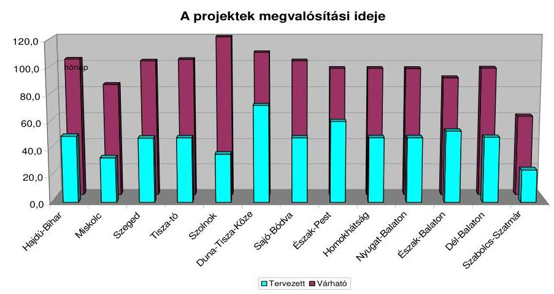
4. sz. ábra

[^0]
[^0]:    ${ }^{35}$ A Pénzügyi Megállapodások a kedvezményezett országra tartalmazták a kötelezettségeket, a kilátásba helyezett szankciókat. Az önkormányzatokra vonatkozóan kötelezettséget konkrétan nem írtak elő, abban csak, mint végső kedvezményezettek szerepeltek. Az önkormányzatokkal a KvVM FI kötött szerződést a beruházás megvalósítására.
    ${ }^{36}$ A Kbt., az Áfa tv., a lerakók műszaki tartalmának, a rekultiváció szabályozásának változása, gyakran szigorodása.

---

Az ISPA/Kohéziós Alap szilárdhulladék-kezelési projektek megvalósulásának időbeli eltolódását és a költségek növekedését az 5. sz. ábra szemlélteti.
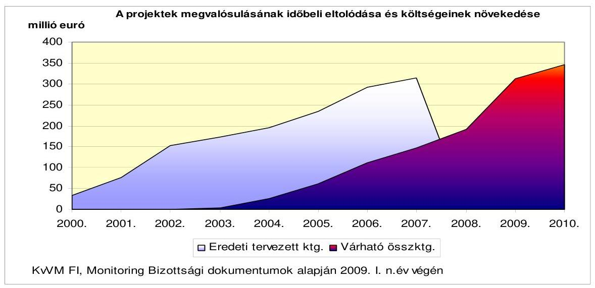
5. sz. ábra

Az ellenőrzött 13 projekt elszámolható (támogatható) összköltsége a tervezett 78,7 Mrd Ft-ról 85,3 Mrd Ft-ra nő várhatóan a KvVM FI adatszolgáltatása szerint. A projektek teljes bekerülési költsége várhatóan 90,6 Mrd Ft lesz, a kedvezményezettek adatszolgáltatása szerint.

A becslés kockázatát növeli, hogy a megvalósításban előrehaladott projektek várható költsége növekedett (miskolci projekt 163,5%, a szegedi projekt 170,6%, a szolnoki projekt 141,6%, a Sajó-Bódva völgyi projekt 115,7%), miközben az alacsony készültségi fokot mutató projekteknél még nem terveztek költségtúllépést. Ez utóbbi projektek a határidőre teljesítés és ezzel a tervezett támogatás lehívhatóságának kockázatát hordozzák magukban.

A költségek növekedését a tervezési hiányosságok, az áttervezések, az előkészítési hiányosságok, az időbeli késedelmek, az inflációs hatások és a közbeszerzési eljárások alacsony hatékonysága idézte elő.

A költségek növekedése miatt a tervezett finanszírozási arányok megváltoztak, és azáltal, hogy az EU források eredetileg jóváhagyott összege nem változik, a többletköltséget hazai forrásból szükséges fedezni. Így az EU finanszírozás aránya 65%-ról 56,6%-ra csökkent, a központi társfinanszírozás aránya 25%-ról 28,1%-ra (5,8 Mrd Ft-tal), az önkormányzati saját forrás ${ }^{37}$ aránya pedig várhatóan 10%-ról 15,3%-ra (6,1 Mrd Ft-tal) nő.

Az önkormányzatok a saját forrás szükségletnek mintegy felét biztosították saját bevételeikből. A másik felét külső befektetői pénzeszközökből, egyéb támogatásokból és hitelből fedezték. Külső befektetők, a projektek későbbi üzemeltetői a saját források közel negyed részét adták (a létesítmények üzemeltetői,

[^0]
[^0]:    ${ }^{37}$ Az önkormányzati saját forrás várható összege már tartalmazza az előkészítési (1,1 Mrd Ft) és az EU felé el nem számolható költségeket is, amelyek a megvalósítási költségek 4,9%-át tették ki.

---

használati, bérleti díjával, illetve az üzemeltetési jog megvásárlásával járultak hozzá a projektekhez). Az EU Önerő Alap 5 projektnél, összesen 2 Mrd Ft-tal támogatta a megvalósítást (projektenként 7,3-45,1%-os arányban).

A beruházások megvalósítási folyamatában nem érvényesültek a gazdaságossági szempontok. A közbeszerzési eljárások alapján megkötött szerződések rendszeresen meghaladták a pénzügyi megállapodásokban tervezett előirányzatokat. Ehhez a megalapozatlan költségbecsléseken túl az időbeli csúszások árnövelő hatása mellett, a kialakított szigorú részvételi feltételrendszer is hozzájárult. A megkötött szerződéseket a végrehajtás folyamán rendszeresen módosították A pénzügyi megállapodások módosításai valamennyi projektnél érintették a határidőket, emellett a pénzügyi tartalom a projektek 38,5%-ánál, a műszaki tartalom a 92,3%-ánál, az egyéb feltételek a 15,4%-ánál változtak. A három helyszínen ellenőrzött projektnél a teljesítési határidők a módosítások 56,5%-ánál, a szerződéses ár a 34,8%-ánál, az egyéb feltételek a 43,5%-ánál változtak. Az önkormányzatok a változásokat a Kbt. előírásait mellőzve nem, vagy csak késve tették közzé.

A kedvezményezettek a költségek kezelését (menedzselését), a költségeknek a rendelkezésre álló pénzügyi keretek között tartását a műszaki tartalom változtatásával kívánták elérni. Ebből a célból a legjelentősebb mennyiségi változás az eredetileg tervezett rekultivációk számának a 40%-os csökkentése volt.

A 13 projekt keretében eredetileg 583 hulladéklerakó rekultivációját tervezték, amely a projektek területén elhelyezkedők közel 52%-a volt. A műszaki tartalom módosítások következtében a rekultivációra kerülő hulladéklerakók számát 353-ra csökkentették ${ }^{38}$. A csökkenés ellenére, erre a feladatra várhatóan 18 Mrd Ft-ot, a projektek várható költségeinek a 20%-át fordítják. További problémát jelent a tulajdonviszonyok rendezetlensége, mivel több helyen előfordult, hogy a hulladéklerakó még részben sem volt önkormányzati és/vagy állami tulajdonban, és emiatt maradt ki a rekultivációból.

A 13 ISPA projekt keretében 18793 ezer $\mathrm{m}^{3}$ befogadó kapacitást hoznak létre, amely az eredetileg tervezettnek a 93,7%-a. Ennek során 17 új hulladéklerakó épül és három meglévő kapacitását bővítik. A megvalósuló létesítményeket a 14. sz. melléklet tartalmazza. Ezek részben már működnek, részben a következő két évben fokozatosan lépnek be a közszolgáltatás rendszerébe. Folyamatos használatba vételüket azonban akadályozta a projektek egyes részei megvalósításának az összehangolatlansága ${ }^{39}$.

Az egyes projektek támogatási szerződései nem egységesen, és nem teljes körűen határozták meg az üzemeltetésre vonatkozó előírásokat. Az önkormányzatok a saját források biztosítása érdekében gyakran már a projektek kezdeti szakaszában megállapodásokat kötöttek az üzemeltetésre vonatkozóan a területen közszolgáltatást végző vállalkozóval. A közszolgáltatók kiválasztásának szabályozásbeli változása és alkalmazott gyakorlata ellentmondásos helyzet kialakú-

[^0]
[^0]:    ${ }^{38}$ A Tisza-tó projekt keretében 33 helyett 4 rekultiváció, a Hajdú-Bihar projekt keretében 60 helyett 10 rekultiváció valósul meg, a Szabolcsi projektnél pedig mind a 194 rekultiváció elmarad.
    ${ }^{39}$ A projektek fizikai előrehaladását a 15. sz. melléklet tartalmazza.

---

lásához vezetett a tekintetben, mert a közszolgáltatási szerződések érvényességének időtartama (legalább 2012. december 31-ig tart) nincs összhangban a nagytérségi hulladékgazdálkodási rendszerek megvalósulásával, várható üzembe lépésével.

A szerződések időtartamának meghosszabbításakor sem a jogalkotók, sem az önkormányzatok nem voltak figyelemmel arra, hogy a belépő új rendszerekkel a szolgáltatás körülményei megváltoznak, az új létesítmények üzemeltetőit közbeszerzési eljárás keretében kell kiválasztaniuk, ugyanakkor a régi szerződések még hatályban vannak. Ez az ellentmondásos helyzet is hozzájárult ahhoz, hogy az üzemeltető kiválasztása során a közbeszerzési eljárások mellőzése miatt három projektnél szabálytalansági eljárás indult ${ }^{40}$.

Az üzemeltetési szerződésekből hiányoznak az új létesítmény hosszú távú fenntartható fejlesztését szolgáló és a szolgáltatás díjában érvényesítendő pénzügyi források biztosításának garanciái. Ezek a pénzügyi megállapodásokban meghatározott, üzemeltetésére vonatkozó feltételek nem megfelelő teljesítésének és ezzel az uniós támogatás visszavonásának kockázatát jelentik.

A kockázatot tovább növeli, hogy a költségtúllépések és a projektek előkészítése során elvégzett költség-haszon elemzések hiányosságai (számítási hibák, projektenként eltérő módszer, eltérő paraméterek használata) ellenére nem végezték el a projektek életképességének és fenntarthatóságának felülvizsgálatát ${ }^{41}$ a megváltozott körülmények figyelembevételével a projektek végrehajtása során. Ennek elvégzését ugyan jogszabály nem írta elő, de az üzemeltetési feltételek pénzügyi megállapodásban, Bizottsági elvárásban foglalt célok szerinti teljesítése érdekében szükséges időbeni beavatkozásokhoz ez segítséget nyújt ${ }^{42}$.

Az ellenőrzési és monitoring rendszerek működtetésé során a lebonyolításban közreműködő szervezetek alapvetően a projektek szabályos végrehajtására koncentráltak. Nem vizsgálták a források hatékony felhasználását, és nem kísérték figyelemmel a projektek megvalósítása során jelentkező költségtúllépések és időbeni csúszások hatását a célok megvalósítására.

Nem alakították ki a teljesítmények egymástól független műszaki felülvizsgálatát. A KvVM FI folyamatba épített helyszíni ellenőrzései - jogszabályi előírás hiányában - nem irányultak a mérnök által leigazolt műszaki-gazdasági teljesítmények ismételt, mérésen alapuló ellenőrzésére, amely indokolt lett volna a műszaki problémák megvalósítás folyamatában való feltárásához és kijavításához. A KvVM FI-nél még folyamatban volt a projektek üzemeltetési szakasza

[^0]
[^0]:    ${ }^{40}$ Az üzemeltetési szerződések megkötésével és módosításával kapcsolatban a Miskolci, a Szolnoki és a Sajó-Bódva völgyi projekteknél szabálytalansági eljárások indultak, amelyek utóbbi kettőnél még folyamatban voltak a helyszíni ellenőrzés lezárásakor.
    ${ }^{41}$ Aktualizálás hiányában nem állapítható meg, hogy a közszolgáltatási díjakból és az egyéb bevételekből származó jövedelem várhatóan hosszú távon fedezi-e az üzemeltetés, a karbantartás költségeit, valamint az elhasználódott eszközök pótlását a pénzügyi megállapodásokban foglaltak szerint.
    ${ }^{42}$ A projektek többsége a pénzügyi áramlásokat figyelembe véve már a tervezéskor is veszteséges volt, csak a társadalmi haszon figyelembevételével volt megtérülő.

---

ellenőrzési és monitoring rendszerének kialakítása annak ellenére, hogy több projekt üzemeltetése az elmúlt években már részben megkezdődött.

A kialakított pénzügyi rendszerben nem biztosított a számlák határidőben történő kifizetésének nyomon követése a KvVM FI-nél, és a határidő figyelését az EMIR sem támogatta ${ }^{43}$. A helyszínen ellenőrzött projekteknél a számlák 61,7%-ánál késedelmesen történt a kifizetés

A KvVM FI és a különböző ellenőrzések, a könyvvizsgálók működése nem szűrte ki a számviteli nyilvántartások hibáit. A létrehozott vagyon aktiválása a helyszíni ellenőrzés lezárásáig csak részben történt meg. A jogszabályok közötti ellentmondás miatt az ellenőrzött projektnél eltérően mutatták ki a nyilvántartásokban a közös tulajdonú létesítményeket. A támogatási szerződésekben foglaltak ellenére a földhivatali nyilvántartásokban még nem történt meg a terhelési és elidegenítési tilalom bejegyzése, nem rendezettek a létesítmények tulajdonjogi bejegyzései.

A települési szilárdhulladék-kezelést ösztönző támogatások hatására javult az önkormányzatok közszolgáltatási feladatainak szervezettsége, bővült a környezettudatos szelektív gyűjtés eszközrendszere, javult annak lakossági támogatottsága. Annak ellenére, hogy az ellenőrzött önkormányzatok négyötöde - jogszabályi előírás ellenére - nem fordított figyelmet a helyi tervekben kitűzött célok elérésének értékelésére, a hulladékmennyiség keletkezésének megelőzésére ${ }^{44}$, a megvalósított hulladékgazdálkodási programok a hulladékkezelés feltételeinek javításával hozzájárultak az élhetőbb környezet, a környezettudatos fenntartható fejlődés alapjainak megteremtéséhez.

A települési önkormányzatok eltérő módon tettek eleget a hulladékgazdálkodási feladataik számbavételére vonatkozó kötelezettségüknek. A kötelező közszolgáltatás megszervezésével együtt járó feladatokat, az ebből következő kötelező és önként vállalt feladatok körét és tartalmát a települési önkormányzatok több mint fele nem határozta meg. A hulladékok szelektív gyűjtését önként vállalt feladatként tekintették, mert a Hgt. 21. (5) bekezdése - az e feladatra nyújtott állami források nagyságrendje, a megvalósult és a folyamatban lévő regionális hulladékgazdálkodási projektek részeként elismert fejlesztések ellenére változatlanul - az önkormányzatok szabad választására bízza a települési szilárdhulladék egyes összetevőinek szelektív gyűjtését.

Az önkormányzati rendeletekben - jogszabályi előírás ellenére - az ellenőrzöttek 61,5%-a
 egyáltalán nem, 12,8%-a pedig csak részlegesen határozta meg a közszolgáltató számára a közszolgáltatás díjának megállapítására szolgáló dijkalkuláció tartalmát és annak rendjét. Ennek következtében a települések a közszolgáltatás díjának meghatározásakor teret engedtek az egyedi mérlegelésnek

[^0]
[^0]:    43 Ennek jelentőségét adja, hogy a 2007-2013 programozási időszak késedelmes kifizetéseire 2009. április 1-től bevezetésre került a késedelmi kamatfizetési kötelezettség (a 281/2006. (XII. 23.) Korm. rendelet módosításával).
    ${ }^{44} \mathrm{Az}$ ellenőrzéshez kért adatszolgáltatásuk szerint a keletkező települési szilárd hulladék 99,2%-át (az országos átlaghoz képest sokkal nagyobb mennyiséget), még mindig lerakással ártalmatlanítják, a hasznosítás összevont részaránya a szelektív gyűjtés jelentős bővülése ellenére is elenyésző.

---

lehetővé tevő döntési körülményeknek, nehezítették az átlátható, következetes, évek közötti összehasonlítás lehetőségét biztosító díjmegállapítási elvek érvényesítését. A közszolgáltatásra vonatkozó díjtétel megállapításának szabályozása, a szerződéses feltételek rögzítése jelentős mértékben befolyásolta a közszolgáltatás eredményességét.

A közszolgáltatási szerződések egyedi esetektől eltekintve a szolgáltató kötelezettségeként rögzítették az ellátandó feladat folyamatos és teljes körű ellátását, annak módját és gyakoriságát. A szerződések közel 90%-ában megtörtént a hulladékkezelési igények kielégítésére alkalmas létesítmények kijelölése, négyötöd részük tartalmazta a közszolgáltatás végzéséhez előírt személyi és tárgyi feltételek biztosítására vonatkozó önkormányzati igényt, valamint előírták a különböző hulladékkezelési tevékenységek összehangolásának szükségességét is.

Az ellenőrzött önkormányzatok a közszolgáltatás díjának megállapítása során nem közvetítették azt az elvárást, hogy a költségek áthárításával érdekeltté tegyék a lakosságot a keletkező hulladékmennyiség csökkentésében és a szelektív gyűjtésben. A szolgáltatási területen belül a lakossági és a közületi ellátásban differenciált szolgáltatási módozatot, illetve egyes ingatlanfajtákra (lakókörnyezet, üdülőterület, stb.) speciális szabályozást, a közszolgáltatás önként vállalt területeire (szelektív gyűjtés) vonatkozó előírást az ellenőrzött önkormányzatok egyharmada határozott meg. Közszolgáltatási díjkedvezményt vagy mentességet 59%-uk adott a település lakossága részére. Ezen túlmenően a szociális juttatások rendszeréhez és a lakosság teherbíró képességéhez is kapcsolódott lakossági támogatás.

A lakosság által fizetendő közszolgáltatási díjak az önkormányzati kedvezmények ellenére is jelentősen, 38-160%-kal emelkedtek 2004-2008 között. Az ellenőrzött önkormányzatok területén a háztartásokban leggyakoribb 120 literes gyűjtőedények egyszeri ürítési díja csaknem a duplájára emelkedett (139 Ft-ról 269 Ft-ra). A díj számos összetevője közül legerőteljesebben a szállítási költségek növekedtek, amit a regionális hulladéklerakókba való beszállítás átlagos távolságának növekedése okozott, annak ellenére, hogy az ellenőrzött önkormányzati körben a regionális rendszerek még csak részben üzemeltek.

A közszolgáltatás díjai azonban azokon a területeken is emelkedtek, ahol a létesítmények fejlesztése tisztán hazai forrásból történt. Ebben az önkormányzati körben a 120 literes gyűjtőedények egyszeri ürítési díja átlagosan 236 Ft-ról 374 Ft-ra (58,5%-kal) nőtt 2004-2008 között. A közszolgáltatási díj átlagos összege a tisztán hazai forrásból megvalósult hulladékkezelési rendszerek területén 72%-kal volt magasabb az uniós támogatással megvalósult regionális rendszerek területén érvényes közszolgáltatási díjaknál ${ }^{45}$.

[^0]
[^0]:    ${ }^{45}$ A települések összefogásának, gondosságának pozitív példáját mutatja, hogy a tisztán hazai forrásból megvalósuló korszerű hulladékkezelési rendszer keretében ugyan magas díjak voltak, például a turai, a szarvasi hulladékkezelő létesítményekben a díjak több mint kétszeresek az átlagoshoz viszonyítva, azonban a szelektív gyűjtésben (a hagyományos, a csomagolási és zöldhulladék esetében is) a legeredményesebb begyűjtési arányt eredményező házhoz menő rendszert alakítottak ki.

---

A vizsgált önkormányzatok területén a hulladékkezelési közszolgáltatás több mint 231 ezer háztartást érintett. Az Állami Számvevőszék által végzett lakossági elégedettségmérés az e területen élők véleményének megismerésére adott lehetőséget. A válaszadók 63,1%-a rendelkezett információval arról, hogy megyéjében vagy tágabb lakókörnyezetében jelentős szilárdhulladék-kezelést szolgáló beruházások valósultak meg, illetve vannak folyamatban, azonban 60%-uk úgy vélte, hogy nem történt meg kellő alapossággal a lakosság tájékoztatása az egyes hulladékkezelési technológiák - ezen belül kiemelten a szelektív gyűjtés - költségigényességéről, azok díjtételre gyakorolt közvetlen és közvetett hatásairól. A felmérésben résztvevők 66%-a tapasztalt lakókörnyezetében illegális, engedély nélküli hulladéklerakást, és több mint 70%-a úgy vélte, hogy nincs is megfelelő visszatartó erő annak elkerülésére.

A helyszíni ellenőrzési során az önkormányzatoknak javasoltuk a helyi hulladékkezelési közszolgáltatás tartalmának kiegészítését, a közszolgáltatást végző szervezetekkel kötött szerződések pontosítását és a díjkalkuláció rendjének meghatározását. Továbbá - az ellenőrzött projektekhez kapcsolódóan - javasoltuk a közbeszerzés szabályainak betartását, és felhívtuk a figyelmet a vagyon-nyilvántartási és ingatlan-nyilvántartási bejegyzések rendezésére. A Szolnoki projektnél javasoltuk - az Áht. és az Ámr. előírásainak megfelelően - a vállalkozótól kapott kompenzáció elszámolását és az arányos részének központi költségvetés részére történő visszafizetését.

A helyszíni ellenőrzés megállapításainak hasznosítása mellett javasoljuk:

# a Kormánynak 

1. Vizsgáltassa meg a Hgt. hatályos előírásai mellett az egyre növekvő mértékű uniós kötelezettségek teljesíthetőségét, figyelembe véve azt, hogy jelenleg a települési önkormányzatok és a lakosság számára csak lehetőség és nem előírás a szelektív hulladékgyűjtés.
2. Készítse elő a hulladékból előállított komposztok minőségi osztályaira és felhasználási területeire vonatkozó szabályozást, valamint a minőséget garantáló minőségbiztosítási rendszert.

## a környezetvédelmi és vízügyi miniszternek

1. Dolgozzon ki a hulladékképződés megelőzésére a jelenleginél hatékonyabb és szélesebb körű programokat, és szabályozási rendszert, figyelembe véve a legjobb nemzetközi gyakorlatot is.
2. Alakítsa ki a szelektív hulladékgyűjtés eredményeként keletkező másodlagos nyersanyagok hasznosításának stratégiáját, és - az NFGM-mel és a PM-mel együttműködve - dolgozzon ki érdekeltségi rendszert annak végrehajtásához.
3. Intézkedjen a projektek fenntartási, üzemeltetési szakaszára vonatkozó ellenőrzési és folyamatos monitoring rendszer - közreműködő szervezet általi - bevezetésére.

---

4. Intézkedjen a hulladékkezelési projektek megvalósítása során a teljesítmények egymástól független műszaki felülvizsgálatára, a fizikai teljesítéseknél a "négy szem" elvének alkalmazására. Továbbá vizsgáltassa felül a projektek életképességi számításait, és a hulladékkezelési rendszerek fenntarthatóságát a projektek megvalósítása közben is, a szükséges beavatkozások mielőbbi megtételéhez.

# az önkormányzati miniszternek 

A Pénzügyminiszterrel egyeztetve segítse elő az Uniós forrásokból megvalósuló hulladékkezelő létesítmények tulajdonviszonyainak egységes kezelését és ezzel összefüggő számviteli nyilvántartását.

## a nemzeti fejlesztési és gazdasági miniszternek

Gondoskodjon arról, hogy az ÚMFT operatív programjai (különösen a KEOP, GOP) végrehajtása során a pályázatok úgy kerüljenek kiírásra, hogy az azokban foglalt célok támogassák az uniós kötelezettségek teljesítését.

---

# II. RÉSZLETES MEGÁLLAPÍTÁSOK 

## 1. A HULLADÉKGAZDÁLKODÁSI FELTÉTELRENDSZER KIALAKÍTÁSA

### 1.1. A hazai hulladékgazdálkodási stratégia uniós követelményekhez való illeszkedése

A hazai hulladékgazdálkodási stratégia pénzügyi és naturális céljainak, valamint forrásainak összhangja folyamatosan alakult 1999 (a projektek tervezésének kezdete) óta.

Hazánk a környezetvédelemhez, azon belül a hulladékgazdálkodáshoz, és a kapcsolódó uniós támogatások igénybevételéhez szükséges stratégiai dokumentumokat elkészítette, az átfogó tervezési mechanizmust kiépítette ${ }^{46}$: azonban a stratégiai dokumentumok elkészítése és a hulladékgazdálkodás alapjainak lefektetése nem a kívánatos időben és sorrendben történt, ami hozzájárult ahhoz, hogy a stratégiák korlátozottan valósultak meg, illetve a projektek előkészítésében hiányosság mutatkozott (1. sz. melléklet: A hulladékgazdálkodás stratégiai kereteit jelentő dokumentumok).

A különböző időszakokra készített stratégiák ${ }^{47}$ minősége folyamatosan javult, de a források felhasználásának optimalizálására, a célokat, kötelezettségeket teljesítő megoldások kiválasztására törekvés csak 2006 végétől jelent meg stratégiai szinten ${ }^{48}$.

Az elsőként jóváhagyott az ISPA stratégia volt, amely az Európai Bizottság kérésére az uniós támogatások igénybevételéhez kapcsolódóan 2000-ben készült el ${ }^{49}$. Az Országgyűlés a nemzeti hulladékgazdálkodási stratégiát, azaz az OHT-t az ISPA stratégia után 2 évvel, 2002 végén hagyta jóvá ${ }^{50}$. E stratégia tartalmazta a hulladékgazdálkodáshoz szükséges intézkedéseket és általános feladatokat. Az OHT, mint ágazati stratégia után 1 évvel készült el a nemzeti környezetpolitikai dokumentum (az NKP-II), amelybe az OHT beépült. Ezekre már az 1999-2006 közötti időszakban is szükség lett volna, mivel egyrészt az ellenőrzött 13 projekt már az ISPA/Kohéziós Alap stratégia alapján jóváhagyásra került, és ezek a projektek alapvetően meghatározzák az ország hulladékkezelési infrastruktúráját ${ }^{51}$ 25-30 évre, másrészt a pénzügyi keretek behatárolták a fejlesztési lehetőséget.

A vizsgált időszakban a középtávú nemzeti környezetpolitika ${ }^{52}$ legfontosabb céljait és feladatait az NKP-II a Közösség VI. Környezetvédelmi Akcióprogramjával összhangban tartalmazta a 2003-2008. évekre. Kilenc, különleges kezelést igénylő területet (akcióprogramot) jelölt ki, amelyek közül egy a hulladékgazdálkodás. A hulladékgazdálkodási programra tervezett kiadások a 10%-os arányt közelítették meg az NKP-II-n belül, amelynek összes tervezett kiadása 4200 Mrd Ft volt 6 évre. Ez magában foglalta a közvetlen, a közvetett környezetvédelmi beruházásokat valamint egyéb támogatásokat (K+F, intézményi működés, működési támogatás).

A pénzügyi adatok hiányossága volt, hogy a központi kormányzaton kívüli „egyéb forrás"-ból ténylegesen teljesített kifizetések - az uniós projektek önkormányzati önrészét kivéve - nem voltak ismertek annak ellenére, hogy az NKP-II finanszírozásának és végrehajtásának egyes kérdéseiről szóló 1150/2004. (XII. 26.) Korm. határozat 5. pontja szerint: „Az NKP-II végrehajtását és az előrehaladás nyomon követését a kormányzaton kívüli jövedelemtulajdonosok (helyi önkormányzatok, gazdálkodó szervezetek, háztartások) ráfordításainak felmérésével, a támogatási rendszerek adatainak feldolgozásával és elemzésével is elő kell segíteni."

A KvVM 2003-2006 között rendszeresen vizsgálta az NKP céljaihoz kapcsolódó pályázati rendszereket, jelentéseiben felhasználta a KSH környezetvédelmi beruházási adatait is. A KvVM javasolta a környezeti ráfordítások NKP céljainak rendszerében történő gyűjtését a költségvetési tervezés (és így a zárszámadás) során, de a PM ezt a kezdeményezést nem támogatta. További fontos szempont lett volna a lakosság környezetvédelmi célú ráfordításait is bemutatni, azonban ennek a típusú felmérésének nincs intézményesített gazdája/formája Magyarországon.

A nemzeti és az uniós források lehívását célzó stratégiák egyöntetűen komplex regionális rendszerekkel kívánták megoldani a települési szilárdhulladékkezelési infrastruktúra-fejlesztést. Az EU ezekhez a nagy anyagi erőfeszítéseket igénylő fejlesztésekhez, valamint a nagy kockázatot jelentő, nem megfelelően működő régi szemétlerakók lezárásához és rehabilitációjához járult hozzá ${ }^{53}$.

[^0]
[^0]:    ${ }^{51}$ Az ország lakosságának a 40%-át kívánják ellátni, 25-30 évre.
    ${ }^{52}$ A környezetpolitika feladata a környezetvédelem érdekében szükséges intézkedések meghatározása, koordinálása és a megvalósítást célzó tevékenységek ösztönzése.
    ${ }^{53}$ Az Európai Tanácsnak a Kohéziós Alap
 létrehozásáról szóló 1164/94/EK rendelete szerint a Kohéziós Alap pénzügyi hozzájárulásokat nyújt azokban a tagállamokban, ahol egyrészt az egy főre jutó bruttó nemzeti össztermék a közösségi átlag 90%-ánál kevesebb, másrészt, amelyek rendelkeznek konvergencia programmal.

---

Az uniós támogatással megvalósuló regionális komplex szilárdhulladékkezelési infrastrukturális beruházások előkészítése és jóváhagyása már a csatlakozási tárgyalások során (1999-2000. évektől) megkezdődött. A 13 ISPA/KA projektből 5 projekt Pénzügyi Megállapodását az Európai Bizottság már 2000-ben aláírta, a további projektek Pénzügyi Megállapodásának aláírására pedig 2001-ben és 2002-ben, egy projekt esetében 2003-ban került sor. (16. sz. melléklet, Az ISPA/KA hulladékkezelési projektek Pénzügyi Megállapodásainak aláírása, kihirdetése és a támogatási szerződések megkötésének időpontja).

Az Európai Számvevőszéknek az ISPA jelentése ${ }^{54}$ megállapítja, hogy a legkorábbi ISPA kérelmezők szempontjából (ilyen volt hazánk is) későn készült el három fontos EU módszertani útmutató ${ }^{55}$. A jelentés 21. pontja szerint: „E módszertani útmutatókat azt követően dolgozták ki, hogy a Számvevőszék által ellenőrzött projekteket jóváhagyásra a Bizottság elé terjesztették. Mivel csak későn váltak hozzáférhetővé, kevéssé járulhattak hozzá ahhoz, hogy a tagjelölt országok mélyebben megismerjék az Unió szakpolitikáját, eljárásait, finanszírozási elveit."

Egy 2004. évi ÁSZ jelentés ${ }^{56}$ megállapította, hogy az ISPA támogatások felhasználására kialakított stratégia „az ISPA program indulásakor a feltételeknek megfelelő, jól előkészített projektek kis száma miatt korlátozottan valósulhatott meg". Egy 2001-2002. évi ÁSZ jelentés ${ }^{57}$ szerint: „A KöM szakmai feladatai között a napi munkában, a stratégiai tervezésben az ISPA támogatások hosszú távú programozása, a projektek előkészítése méltatlanul háttérbe szorultak."

2004-től javult a projektek előkészítettsége, a 2004-2006. években a rendelkezésre álló keretet meghaladó számú és értékű projekt állt rendelkezésre. A 2006 végén készített stratégiák már részletesen számba vették, hogy melyek azok a megoldások, amelyek a célokat, kötelezettségeket leginkább teljesítik, az uniós források optimális felhasználása mellett.

Az EU támogatás-politikája szerint a tagországoknak saját hatáskörben (szabályozással, gazdasági ösztönzéssel, szankcióval, bírsággal, stb.) kellett megvalósítani a hulladékgazdálkodási feladatokat, figyelemmel az EU által meghatározott alapelvekre ${ }^{58}$.

A települési önkormányzatok hulladékgazdálkodási tervei többségében 2002. évi bázis adatokon alapultak, kidolgozásukra 2003-2004. év folyamán került sor. A helyi tervek elfogadására azonban - részben a központi szabályozás késedelme miatt - az önkormányzatok 69,2%-ánál késve került sor.

[^0]
[^0]:    ${ }^{54}$ Az Európai Számvevőszék 12/2008. sz. különjelentése, az Előcsatlakozási Strukturális Politikák Eszközéről (ISPA), 2000-2006.
    ${ }^{55}$ ISPA kézikönyv 2000-ben, ISPA kézikönyv második változata 2002-ben, Aktualizált iránymutatás a költség-haszon elemzésre 2002-ben.
    ${ }^{56}$ Az ISPA támogatásból megvalósított környezetvédelmi programok ellenőrzéséről szóló, 0469 számú ÁSZ jelentés.
    ${ }^{57}$ A Környezetvédelmi Minisztérium fejezet működésének ellenőrzéséről szóló, 0225 számú ÁSZ jelentés.
    ${ }^{58}$ A megelőzés, a szennyező fizet, a közelség, a regionalitás, az önellátás, a fokozatosság, a költséghatékonyság, stb. elvekre.

---

A tervek többségében megfeleltek a Hgt. 37. (4) bekezdésében foglalt szakmai és tartalmi követelményeknek.

A tervek 56,4%-a az előírt 6 éves időtartamra készült, közel 90%-a kitért a keletkező és hasznosítandó vagy ártalmatlanítandó hulladékok típusaira, mennyiségére és eredetére. A hulladékkezeléssel kapcsolatos alapvető műszaki követelményeket a tervek 74,4%-a tartalmazta, 56,4%-uk rögzítette az egyes hulladék típusokra vonatkozó speciális intézkedések körét, 92,3%-uk meghatározta a hulladékok kezelésére alkalmas kezelőtelepek és létesítményeket, 94,9%-a pedig az ezek kezelésére felhatalmazott vállalkozásokat is megnevezte.

A helyi tervek négyötöde az országos célértékekkel azonosan rögzítette a települések által elérendő hulladékgazdálkodási célokat (hulladék mennyisége, lerakási arány, rekultiváció). Az önkormányzatok 92,3%-a meghatározta célok elérését, megvalósítását szolgáló intézkedések körét, 84,6%-a rögzítette az azok végrehajtásának sorrendjét, 89,7%-a felmérte a megvalósításhoz szükséges eszközök, eljárások, létesítmények körét, 87,2%-a pedig meghatározta ezek becsült költségeit is. A helyi tervek 61,5%-a külön foglalkozott a csomagolási és a veszélyes hulladékokra vonatkozó előírásokkal, mintegy négyötödük vette figyelembe a létesítmények tervezése során az egyes hulladékkezelési létesítmények fajlagos költségnormáit.

A hulladékgazdálkodási tervben foglalt egyes célkitűzések (lerakási arány, szerves anyag tartalom csökkentése,) helyi számításokkal történő alátámasztása elmaradt például Oroszlány és Pogányszentpéter településeken.

A helyi tervek kétévenkénti felülvizsgálati kötelezettségének ${ }^{59}$ az ellenőrzött önkormányzatok csak egyötöde tett eleget. Ez a mulasztás összefügg azzal is, hogy a hulladékgazdálkodás országos és területi tervező szervei sem elvárásokat, sem a feladatellátás szakmai megalapozását biztosító információkat, sem a felülvizsgálat szükségességét nem közvetítették a települési önkormányzatok felé.

A helyi tervek kétévenkénti felülvizsgálata keretében a kitűzött célokat és az azok elérését biztosító eszközöket mindössze négy önkormányzat, az ellenőrzöttek egytizede (Kecskemét, Miskolc, Szirmabesenyő, Lippó) értékelte.

A vizsgált önkormányzatok 61,5%-a tájékoztatta a lakosságot hulladékgazdálkodási tervben foglaltakról, azok felülvizsgálatáról, a területen folyó hulladékgazdálkodási fejlesztésekről.

Szabályozási szinten - az uniós szabályozással összhangban - ${ }^{60}$ az első mindig a hulladékképződés megelőzése, majd a hasznosítás és végül az ártalmatlanítás volt.

Az uniós kötelezettségek és azok teljesítéséhez szükséges hazai célok az OHT-ban kerültek megtervezésre, majd a TSZH Fejlesztési Stratégiában felülvizsgálatra kerültek 2006 végén. (A települési szilárdhulladék-gazdálkodás területén teljesítendő kötelezettségeket, elérendő célokat a 8. sz. melléklet részletezi.)

[^0]
[^0]:    ${ }^{59}$ A Hgt. 37. § (1) bekezdése szerint.
    ${ }^{60}$ A Hgt. 5. §-ában foglalt követelmények és kötelezettségek szerint.

---

A hulladékképződés megelőzése terén történtek lépések, de inkább a hasznosításra és az ártalmatlanításra helyezték a hangsúlyt. Továbbá a megtett intézkedés pl. a 2005-től hatályos termékdíj szabályozás nem volt kellő hatékonyságú.

A megelőzés területén számszerűsített cél volt, hogy a keletkező TSZH képződést - tömegében mérve és nem térfogatában - szinten tartsuk, ezt a célt teljesítettük a 2000-2007 közötti időszak adatai szerint. A hulladék térfogata azonban nőtt (közel 30%-kal).

A megelőzés fontossága az uniós operatív programokban csak 2007-től jelent meg (a projekt összköltségének 5%-a fordítható megelőzésre). Mivel az ÜMFT és a KEOP három hulladékgazdálkodási projektjének megvalósítása még nincs folyamatban, így az eredeti ütemezés szerint 2007-ben a TSZH Fejlesztési Stratégia ezen célkitűzése még nem teljesült.

Történt előrelépés a házi komposztálás népszerűsítésében, a szemléletformálás és a környezettudatosságra való nevelésben (lakossági tájékoztatók civil szervezetek bevonásával, iskolai oktatási segédanyagok készítése), ugyanakkor ezek az eszközök - a nemzetközi gyakorlatban is - hosszútávon ható tényezők.

A hasznosítás területén teljesítettük a 2008. év végéig esedékes uniós kötelezettségeinket. Elmaradás várható a TSZH hasznosítás 2009. évi részcél teljesítésében. A 2008. évi várható adatok szerint az összes TSZH hasznosítás, az összes kezelt mennyiséghez képest 25,68%, ugyanakkor 2009. év végére a hulladék 40%-át kellene hasznosítani. Várhatóan nem teljesülnek 2009-re az energiahasznosítással történő égetés célkitűzései. A Fővárosi Hulladékhasznosító Mű rekonstrukciója a hulladékgazdálkodási stratégia szerint megtörtént, de a stratégiában lehetőségként szerepelt égetőművek nem épültek meg, és erőműben történő együttégetés sem történt.

Települési szilárdhulladék-hasznosítási (együttégetési) engedélye Magyarországon egyedül a Mátrai Erőműnek van, jelenleg évi 300 ezer tonna hulladékra. (Összehasonlításul a Fővárosi Hulladék Égetőmű 440 ezer tonna hulladékot hasznosít.) A Mátrai Erőműben 2006-ban 15,4 ezer tonna, 2008-ban mintegy 66,2 ezer tonna hulladékot használtak fel, gyakorlatilag csak német és osztrák behozatalból, hazai hulladék nem került az erőműbe, mert nem álltak rendelkezésre az együttégetéshez szükséges hulladék-előkezelő eszközök.

Az OHT maximálisan hat regionális égető megépítését tartalmazta. Ezt vette át lehetőségként az ISPA stratégia, de ez nem konkrét önkormányzati projekt kezdeményezésen alapult. Az ISPA projektek még nem tartalmaztak MBH-t.

A TSZH Fejlesztési Stratégia 2007-től a települési hulladékból leválasztott éghető könnyű frakció energetikai hasznosítását tűzte ki célul, és ennek kereteit vázolta fel, konkrét elhelyezési terv nélkül. Ellátási szempontból jelölték ki az energetikai hasznosítás megoldását Észak- és Dél-Dunántúlon, az Alföldön és Észak-Magyarországon. Továbbá számba vették az MBH utáni együttégetés lehetőségét az arra alkalmas erőműben (Mátrai Erőmű Zrt.). A TSZH Fejlesztési Stratégiában tervezett égetőművek megépítése nem kezdődött el. Az erőműben történő együttégetés nem volt a vizsgált időszakban, egyrészt nem volt hosszú távú megállapodás egyetlen erőművel sem, másrészt a mechanikai-biológiai előkezelést végző

---

ISPA/KA projektek többségének üzembe helyezése késik, 2009-ben, 2010-ben várható.

A lerakott hulladék biológiailag lebomló szerves anyag tartalmát 50%-ra kellene csökkenteni (a 2005. évi szinthez képest), azonban ez a cél az ISPA/KA beruházások elhúzódása miatt várhatóan nem teljesül 2009-re.

A TSZH komposztok mezőgazdasági felhasználása jelenleg nem szabályozott, jogszabály csak a szennyvíziszap komposztjának felhasználására van. 2008-ban a KvVM kidolgoztatott egy szabványtervezetet a komposztok csoportosítására és az egyes komposzt kategóriák minőségi követelményeire. A 23/2003. (XII. 29.) KvVM rendelet a bio hulladék kezeléséről és a komposztálás műszaki követelményeiről részletes szabályokat ad a technológiai megoldásokra, azonban az előállított komposzt minőségi paramétereire és felhasználhatóságára nem tér ki.

Várhatóan teljesül az a cél, hogy a szelektív gyűjtés eszközei legalább a lakosság 60%-a részére biztosítva legyen 2009-re.

A KvVM-től kapott információk szerint mintegy 6 millió fő, a lakosság 60%-a számára van lehetőség a szelektív gyűjtésre (a KvVM-ben ennek területi megoszlására nem találtunk információt).

A lerakás, biztonságos ártalmatlanítás területén várhatóan nem teljesül a TSZH lerakási arányának 60%-ra csökkentése 2009-re, 2008-ban 70-75% közötti lerakás várható (országos szinten több évre elegendő kapacitás áll rendelkezésre). Várhatóan teljesül a lerakásra vonatkozó követelményeket ki nem elégítő szilárdhulladék lerakók bezárása 2009. július 16-ra, az ISPA/KA projektek csúszása miatt az érintett önkormányzatoknak, illetve közszolgáltatóknak 1-1,5 éven át a lerakandó hulladékot a tervezettnél távolabbra kell szállítani. A célokkal összhangban folyamatosan rekultiválják a bezárt lerakókat, folyamatosan megvalósul az egyéb lakossági veszélyes hulladékok (festékek, növényvédő szerek, háztartási vegyi áruk stb.) elkülönített begyűjtésének fejlesztése a hulladékgyűjtő udvarok támogatásával, a házhoz menő szállítással.

2012-re a csomagolási hulladék 60%-nak hasznosítására lenne szükség és ehhez megfelelő arányú szelektív gyűjtésre, válogatásra. A lerakandó hulladék biológiailag lebomló szerves anyag tartalmának csökkentésére lesz szükség (2009-re az 1995. évi szinthez képest 50%-os, 2016-ra 60%-os csökkentésre). Ehhez az ISPA/KA projektek keretében a biológiailag bontható szerves hulladékot elkülönítetten kell gyűjteni és kezelni (MBH). Emellett szükséges a helyi komposztálás minél nagyobb arányú elterjesztése. A vonatkozó irányelv módot ad a határidők négy évvel való eltolására, de a Csatlakozási tárgyalások során Magyarország ezt nem kérte.

A KvVM tájékoztatása szerint a gazdasági válság - a megrendelések, ezáltal a termelés visszaesésén keresztül - kihatott a nyersanyag igényekre. Egyes nyersanyagok iránti igény 50-70%-kal visszaesett világszerte, ami a hulladékból kinyert másodnyersanyagok piacán is legalább ekkora igénycsökkenést okozott. A hulladékok elkülönített begyűjtése és feldolgozásra, hasznosításra történő előkészítése majd nyersanyaggá alakítása a nyomott árak mellett gyakorlatilag ráfizetéses tevékenységgé vált.

---

A koordináló szervezetek a szerződött begyűjtési vállalásaikat nem korlátozták a helyszíni ellenőrzés befejezéséig. Azonban az önkormányzati és más hulladékbegyűjtő és kereskedő cégek, amelyek koordináló szervezettel nem állnak szerződésben, veszélyeztetett helyzetben vannak, mivel egyedileg kell a piacon az értékesítési lehetőségeket felkutatni (a kedvező piaci viszonyok közötti egyedi megállapodás előnyei most
 hátránnyá változtak). A gyártók által fizetendő hulladék hasznosítási díj emelése korlátokba ütközik, mert a gyártó inkább termékdíjat fizet, minthogy a veszteséges begyűjtést és hasznosítást finanszíroz$\mathrm{za}^{61}$.

# 1.2. A hazai hulladékgazdálkodási stratégia végrehajtásához rendelt hazai és uniós források tervezett ütem szerinti biztosítása 

A Kormány az OHT végrehajtására előírt ${ }^{62}$ finanszírozási forrásokat is tartalmazó részletes intézkedési és ütemtervet nem hagyott jóvá. A fejlesztési igény a 2003-2008-as évekre - amely az OHT szerint mintegy 130 Mrd Ft volt a települési szilárdhulladékra - nem került jóváhagyásra, a települési hulladékos programok forrásának biztosítása nem alkotott egységes rendszert, a felhasznált források sem találhatóak meg egységes rendszerben átlátható módon. A hulladékgazdálkodási célú kiadásokat a KvVM (Stratégiai Főosztálya) a különböző tárcák, illetve a hulladékgazdálkodási albizottság bevonásával gyűjtötte össze, azonban az nem volt teljes körű, az ellenőrzés során tapasztaltak szerint.

A hulladékgazdálkodási feladatokhoz kapcsolódó fejlesztések projektjeinek indikatív listáját és forrás szükségletét az NFT I., valamint az ISPA/Kohéziós Alap keret stratégia tartalmazta, de a hazai források tervezése nem valósulhatott meg több évre előre (középtávú időszakra) a hazai költségvetési tervezési rendszer éves jellegéből adódóan és a hazai források rendelkezésre állásának bizonytalanságai miatt.

A különböző fejezetek költségvetésében (pl. KvVM, ÖTM) a hulladékgazdálkodási célú kiadások nem mindig elkülönített soron jelentek meg, továbbá egy célt (például a rekultivációt) több helyről finanszíroztak (KIOP, KEOP, ROP, önrész kiegészítés címén EU Önerő Alap forrás, mint saját forrás pótlása). Sem a szakfeladat-rend, sem a működő informatikai rendszerek nem támogatták a hulladékgazdálkodási célú források összegyűjtését, a helyszíni vizsgálat idején az államháztartás informatikai rendszer ilyen irányú fejlesztése folyamatban volt.

[^0]
[^0]:    ${ }^{61}$ A KVvM hatástanulmánya a termékdíj szabályozásának módosításához.
    ${ }^{62}$ Az OHT 2. pontja szerint a Kormánynak a 2003-2008. közötti időszakra vonatkozó NKP-II részeként - a költségvetés tervezési rendszerével összhangban - az OHT végrehajtására részletes intézkedési és ütemtervet kellett volna kidolgozni, a finanszírozási források és felelősök pontos megjelölésével.

---

Ennek következménye volt, hogy a KvVM különböző típusú jelentései ${ }^{63}$ nem adtak teljes, pontos képet a hulladékgazdálkodásra fordított kiadásokról. Kimaradt például az ÖTM EU Önerő Alap felhasználásának hulladékgazdálkodási célú forrása (közel 2 Mrd Ft a 2004-2008-as évekre), a ROP 2008 évi támogatása annak ellenére, hogy az adatszolgáltatásokat felülvizsgálva a KvVM Stratégiai Főosztálya igyekezett teljessé tenni azokat.

A KvVM rendelkezésére álló adatokból nem állapítható meg, hogy hulladékgazdálkodáshoz kapcsolódóan teljesített kiadásokból mennyi jutott megelőzésre, hasznosításra, valamint ártalmatlanításra. A források felhasználásakor a kiadásoknak a hulladékgazdálkodási prioritási sorrend szerinti gyűjtése nem volt előírás központi kormányzati szinten, és a projekt felelősök részére sem fogalmaztak meg ilyen igényt.

A tisztán hazai központi költségvetési források főként a települési szelektív hulladékgyűjtő rendszerek kiépítését (eszközök, gépek beszerzése, hulladékgyűjtő szigetek kialakítása), házi komposztálás elterjesztését, az illegális lerakók felszámolását, a hulladékok hasznosítását támogatták, ezáltal az eddig felhasznált tisztán hazai központi költségvetési források és az uniós támogatások céljukat tekintve kiegészítették egymást.

A tisztán hazai központi kormányzati forrásból megvalósult intézkedések elősegítették a települési szilárdhulladék mennyiségére, a hasznosításra és a biztonságos ártalmatlanításra vonatkozó 2008-ig határidős uniós célkitűzések teljesítését.

A hulladékgazdálkodás, mint fontos társadalmi érdek szolgálatába, a civil szféra is egyre szervezettebben vonható be. Törvényi szabályozás szerint az adózó állampolgár személyi jövedelemadójának 1\%-át e közérdekű célra is felajánlhatja. A KvVM által elvégzett összesítés szerint e címen 2008-ban 245,8 M Ft állt rendelkezésre, amelyet a KvVM 100 M Ft-tal egészített ki, és összesen 138 önkormányzatot és civil szervezetet tudtak támogatni.

Az NKP-II keretén belül a „Hulladékgazdálkodási akcióprogramra" a minisztériumok központi költségvetésből 106,5 Mrd Ft kiadást terveztek, és hozzávetőlegesen annyit (95 Mrd Ft-ot) teljesítettek 2003-2008 években ${ }^{64}$ a KvVM rendelkezésére álló adatok szerint. A Hulladékgazdálkodási akció programra teljesített kiadások további részletezését a 10. sz. melléklet tartalmazza.

Az uniós támogatások igénybevételéhez kötelező hazai központi költségvetési társfinanszírozás összegét az Európai Beruházási Bank által nyújtott hitel fedezte. A központi költségvetési forrás fedezetére - a PM tájékoztatása szerint - az

[^0]
[^0]:    ${ }^{63}$ Az NKP-II 2003-2004., illetve 2005-2006. évi végrehajtásáról szóló OGY részére készített jelentések, valamint a Program végrehajtásáról szóló 6 éves jelentés tervezete (amelyeket az NKP-II koordinálására létrehozott Tárcaközi Bizottság is tárgyal).
    ${ }^{64}$ A 2008. évi kiadások terv adatok.

---

EIB hitel volt a kedvező finanszírozási lehetőség ${ }^{65}$, figyelemmel a konvergencia kritériumok teljesítésének kötelezettségére is.

Az ISPA/KA teljes 2000-2006 évekre rendelkezésre álló kerete támogatási szerződésekkel lekötésre került. Az ISPA/KA keret közlekedési és környezetvédelmi célú megbontására vonatkozó uniós előírás, teljesült ${ }^{66}$.

# 1.3. A települési szilárdhulladék-gazdálkodás EU harmonizált jogi szabályozási és intézményi környezete kialakításának időbelisége és teljes körűsége 

Jogszabályi környezet és intézményrendszer kialakítását az ÁSZ korábban többször vizsgálta, és megállapította, hogy „A 2000-2004. közötti időszakban azonban folyamatosan változó és követő jellegű volt az ISPA program intézményeinek és szabályozásainak kialakítása. A vonatkozó szabályozás nem tisztázta a projekttervezés és előkészítés felelősségét, a forráselosztás koncepcionális kérdéseit és a fejlesztések finanszírozási forrásainak rendelkezésre bocsátását, a kedvezményezett önkormányzatoktól a központi költségvetésig."

A csatlakozás előtti időszakban az ISPA projektek végrehajtása decentralizált végrehajtási rendszerben történt. Az irányítás és a felelősség egy részét átruházták a kedvezményezett országra, de a végső felelősség továbbra is a Bizottságot terhelte az EK szerződés rendelkezéseinek megfelelően.

Az ellenőrzött időszakban megvalósuló ISPA/KA projekteket a 2000-2004 közötti folyamatosan változó jogszabályi és szűkös intézményi kapacitású keretek között tervezték meg és kezdték el végrehajtani, ami nem segítette elő a projektek megfelelő előkészítését, és ez negatívan hatott a projektek megvalósíthatóságára.

Az NKP-II meghatározta a tematikus akcióprogramok, köztük a hulladékgazdálkodási program megvalósításának intézményrendszerét. A hulladékgazdálkodási feladat összetettségét mutatja, hogy az akcióprogram kidolgozásának és végrehajtásának felelőse a KvVM, és számos minisztérium (BM, ESzCsM, FVM, GKM, PM), továbbá az önkormányzatok, a háztartások, gazdálkodók és szak-

[^0]
[^0]:    ${ }^{65}$ Az EBB által nyújtott hitel kamata max. EURIBOR $+0,13 \%$, a gyakorlatban ez alatt volt a kamat 2008-ban. A projektfinanszírozó hitellel történő finanszírozás alternatívája a piaci források bevonása (devizakötvény kibocsátással) lehetett volna, de ez kedvezőtlenebb kamatozású az EIB hitelnél. A magyar állam 2008-ban 10 éves futamidőre, 1,5 Mrd Euro összegben, 5,75\%-os fix kamattal (midswap+0,98\%) bocsátott ki devizakötvényt.
    ${ }^{66}$ Az Európai Bizottság egy keretösszeget határozott meg a környezetvédelmi és a közlekedési célokra, amely keretösszeget egyenlő arányban kellett megosztani a két szektor között, és ezt Magyarország teljesítette. A környezetvédelemre jutó keretből összesen 14 hulladékgazdálkodási projekt, 225 M Euro-s támogatással, és 8 szennyvízkezelő projekt, 530 M Euro-s támogatással valósul meg. Ezek az összegek nem tartalmazzák a technikai segítségnyújtási projektek adatait, amelyek hulladékos és szennyvizes projektek kezeléséhez kapcsolódóan egyaránt felhasználhatóak és felhasználásra kerültek.

---

mai, tudományos és civil szervezetek ${ }^{67}$ a közreműködők. A feladatok végrehajtásának koordinálása a Kormány feladata volt. A koordinációs központot az NKP-II kilenc programjának összehangolására létrehozott Tárcaközi Bizottság jelentette, és ennek egyik albizottsága foglalkozott a hulladékgazdálkodási akcióprogrammal.

Az NKP-II Tárcaközi Bizottság - a vonatkozó kormányhatározat hosszadalmas közigazgatási egyeztetése miatt - csak 2005. január 25-én alakult meg. A forráskoordináció az önkormányzatokra nem terjedt ki, a központi költségvetésből származó források számba vétele hiányos volt (jelentésünk 1.3 pontja).

Az uniós jogi szabályozásnak megfelelő Hgt. 2001. január 1-én, a végrehajtási rendeletek pedig ettől kezdve folyamatosan léptek hatályba. A települési hulladékkal kapcsolatos tevékenységek részletes szabályairól szóló kormányrendelet ${ }^{68}$ - a Hgt.-ben kapott felhatalmazáshoz képest - másfél évvel később lépett hatályba (2002. január 1-én).

A helyszíni ellenőrzésbe vont 39 települési önkormányzat eltérő módon tett eleget a hulladékgazdálkodási feladataik számbavételére vonatkozó kötelezettségének. Az önkormányzatok gazdasági programjaikban nem, vagy csak keretjelleggel határozták meg a hulladékgazdálkodás fejlesztésére vonatkozó elképzeléseiket. A kötelező közszolgáltatás megszervezésével együtt járó feladatok rögzítésére, az ebből következő kötelező és önként vállalt feladatok körének és tartalmának meghatározására a vizsgált települési önkormányzatok több mint felénél nem került sor.

A szabályozási mulasztások valamennyi településkategóriát érintették, nem határozta meg a hulladékkezelési közszolgáltatás önként vállalt feladatainak körét és tartalmát többek között Miskolc, Mezőkövesd, Hévíz, Balatonrendes, Répcelak, Zalabér, Nagykapornak, Sajókaza, Somogytúr, Kaposmérő, Dunaszentbenedek önkormányzatai.

A hulladékgazdálkodási célértékek elérésében fontos eszköz a keletkező hulladék szelektív módon történő gyűjtésének megszervezése (lerakási arány, lerakott hulladék biológiailag lebomló szerves anyag tartalma). Ugyanakkor a települések hulladékgazdálkodási tevékenységét elsődlegesen szabályozó Hgt. 21. § (5) bekezdése mindössze felhatalmazást ad a települési önkormányzatoknak a szelektív gyűjtés - önként vállalt - feladatának ellátására, miközben a szelektív gyűjtésre és hasznosításra vonatkozóan kitűzött hulladékgazdálkodási célok tagállami kötelezettségként jelennek meg.

A komplex hulladékgazdálkodási rendszerek megvalósítása térségi szinten, több önkormányzat részvételével valósulhatott meg, az együttműködés szervezeti keretei azonban az ISPA projektek előkészítésekor és a támogatási kérelmek benyújtásakor nem voltak szabályozottak, útmutatók, ajánlások sem segítették

[^0]
[^0]:    ${ }^{67}$ Az Országgyűlés az NKP-II keretében kijelölte a tematikus akcióprogramok kidolgozásának és végrehajtásának felelőseit és közreműködőit.
    ${ }^{68}$ A települési hulladékkal kapcsolatos tevékenységek végzésének feltételeiről szóló 213/2001. (XI. 14.) Korm. rendelet

---

az együttműködő önkormányzatok (kedvezményezettek) ezen vonatkozású döntéseit. Első alkalommal a 14/2004. (VIII. 13.) TNM-GKM-FMM-FVM-PM együttes rendelet - a Kohéziós Alap projektek vonatkozásában - határozta meg a támogatási kérelmekhez csatolandó együttműködési megállapodások alapján az elismert együttműködési formákat. (A rendelet 36. § (2) bekezdése 2004. augusztus 16-tól kötelező lett.)

A támogatási kérelmekben a komplex hulladékgazdálkodási rendszerek megvalósítását 28-305 önkormányzat együttműködésével tervezték, a térségi ellátási területek 111-373 ezer lakost érintettek.

A 14/2004. (VIII. 13.) TNM-GKM-FMM-FVM-PM együttes rendelet 36. § (2) bekezdése 2004. augusztus 16-tól írta elő, hogy a támogatási kérelemhez csatolni kell a konzorciumi, illetve a társulási szerződéseket, majd 2005. június 5-től a rendelkezés módosítását követően - amennyiben a projekt kedvezményezettje egynél több önkormányzat - már csak a jogi személyiséggel rendelkező társulási formát fogadta el. A projekt megvalósítására a helyi önkormányzatok társulásairól és együttműködéséről szóló 1997. évi CXXXV. törvény 16. §-a szerinti jogi személyiséggel rendelkező társulás, vagy a települési önkormányzatok többcélú kistérségi társulásáról szóló 2004. évi CVII. törvény szerint megalakult többcélú kistérségi társulás megállapodását kellett csatolni.

A projektek megvalósítása érdekében választott szervezeti forma független volt a beruházások volumenétől, az ellátási terület nagyságától, illetve az együttműködő önkormányzatok számától. A konzorciumi együttműködési formát a Ptk. és a gazdasági társaságokról szóló törvények ${ }^{69}$ nem szabályozták ${ }^{70}$, ennek ellenére a támogatási kérelmekben többségében (76,9%) annak létrehozása ${ }^{71}$ szerepelt. A megvalósítás szervezeti formáinak kialakítása részben csak a támogatási döntéseket követően történt meg, amely időbeli csúszásokhoz vezetett és hátráltatta a megvalósítás folyamatát.

Előfordult,
 hogy az együttműködési megállapodás hiánya késleltette a finanszírozási szerződések aláírását, hogy nem az eredetileg tervezett önkormányzatok kötöttek szerződést ténylegesen a megvalósításra, ami a beruházás tartalmának módosulását is jelentette.

[^0]
[^0]:    ${ }^{69}$ 1997. évi CXLIV. törvény, 1996. évi IV. törvény.
    ${ }^{70}$ A konzorcium több érdekelt vagy egy érdekcsoport időleges együttműködése valamely közös cél megvalósítása érdekében. A Legfelsőbb Bíróság Közigazgatási Kollégiumának véleménye (a 2006. évi konzultációs értekezleten felmerült vitás jogalkalmazási kérdésekben) szerint: „A konzorciumnak, mint együttműködési formának önálló - a tagoktól függetlenül létező - jogairól, kötelezettségeiről egyetlen jogszabály sem tesz említést, tehát csak a konzorcium tagjainak van önállóan joga, kötelezettsége, felelőssége. A tagok belső viszonyát a polgári jogi szerződés szabályozza, ez azonban a polgári jog szabályai szerint önálló jogképességet nem teremt. A Pp. 327. § (1) bekezdés b) pontja alapján a konzorcium, mint szervezet közigazgatási pert nem indíthat, miután a konzorciumnak sem a polgári jog, sem a közigazgatási jog szabályai szerint nincs jogképessége, nincs önálló - a tagoktól független - jogi érdeke sem."
    ${ }^{71}$ A 13 projekt közül 10 esetben konzorcium (Miskolc, Szeged, Tisza-tó, Szolnok, DunaTisza köze, Észak-Pest, Homokhátság, Nyugat-Balaton, Észak-Balaton, Dél-Balaton), háromnál társulás (Hajdú-Bihar, Sajó-Bódva, Szabolcs-Szatmár) létrehozása szerepelt.

---

A miskolci hulladékgazdálkodási rendszernél az ISPA pályázat benyújtását megelőzően az önkormányzatok csak szándéknyilatkozatot írtak alá. A beruházás megvalósításáról a 2000. november 24-i támogatási döntést követően több mint egy évvel, a konzorciumi szerződésről pedig csak 2004. június 23-án kötöttek megállapodást, utóbbit a tervezett 38 helyett 35 önkormányzat részvételével.

A Nyugat-Balaton hulladékgazdálkodási rendszer ISPA pályázatának benyújtásakor mindössze a gesztor Zalabér és 10 városi önkormányzat támogató nyilatkozata állt rendelkezésre, a konzorcium a 2002. október 25-i támogatási döntést követően 2003. augusztus 8-án alakult meg a tervezett 305 helyett 276 önkormányzattal. Ez 10 hónappal késleltette a pénzügyi megállapodás magyar részről történt aláírását, melynek feltétele volt a konzorcium megalakítása.

Nem kötötték meg az önkormányzatok a - létrehozandó konkrét szervezeti formát is tartalmazó - megállapodást a támogatási kérelem benyújtásáig, illetve a támogatás jóváhagyásáig az Észak-Pest és a Homokhátság hulladékgazdálkodási rendszereknél. Ezért a pénzügyi megállapodásokban feltételként szerepelt a konzorciumi szerződések önkormányzatok általi aláírásának kötelezettsége.

Az időközben bekövetkezett jogszabályi változások, valamint a célszerűbb feladatellátás indokai alapján az együttműködő önkormányzatok az eredetileg tervezett konzorcium helyett egy projektnél társulást hoztak létre (Észak-Pest), három projektnél pedig a már megalakult konzorcium a megvalósítás folyamatában alakult át társulássá (Tisza-tó, Nyugat-Balaton, Észak-Balaton).

A Nyugat-Balaton projektnél 2005. október 26-án a korábbi konzorcium helyett a Társulási tv. 16. §-a szerinti jogi személyiségű társulást hoztak létre, amely a 17. § (1) bekezdése alapján költségvetési szervnek minősül. Az átalakulás közvetlen oka a saját forrás kiegészítése érdekében az EU Önerő Alap támogatásra benyújtandó pályázat feltételeinek való megfelelés volt ${ }^{72}$. A tapasztalatok szerint ezen túl az új szervezeti forma elősegítette a projekt szervezetének az államháztartás rendszerébe történő beillesztését is, költségvetési szervként történt bejegyzésével. A Tisza-tó és az Észak-Balaton projekteknél a 2001. illetve a 2002. évben megalakult konzorcium 2004-ben, illetve 2005-ben alakult át társulássá.

A konzorciumok, társulások munkaszervezeti feladatait - és ennek keretében a beruházások megvalósításának lebonyolításával kapcsolatos feladatokat is - a projektek 38,5%-ánál (5 projekt) a gesztor önkormányzatok polgármesteri hivatalai, 53,8%-ánál elkülönült projekt menedzsment egységek látták el. Egy projektnél (7,7%) ezt a gesztor önkormányzat tulajdonában lévő gazdasági társaság végezte, amely az előkészítéssel kapcsolatos költségeket is finanszírozta.

# A kedvezményezettek által kiépített szervezetek kialakításának és a 

támogatási döntés időpontjának összhangja a megvalósítás folyamán változott. A 2000-2001. években indult projekteknél még nem volt előírás a projektmenedzselő egység felállítására, amelyet később kötelezővé tettek (Nyugat-Balaton, Dél-Balaton, Homokhátság), azok felkészültségét a projekt forrásaiból fejlesztették (pl. Homokhátság, Észak-Pest).

[^0]
[^0]:    ${ }^{72}$ Az EU Önerő alapra önkormányzatok, önkormányzati társulások nyújthattak be pályázatokat.

---

A KvVM 2004. május 24-i hatálybalépéssel adta ki Kohéziós Alap Közreműködő Szervezet Működési Kézikönyvét. Az eljárásrend és kézikönyv hatálya a KvVM FI feladataira, a környezetvédelmi Kohéziós Alap projektek magyarországi menedzselésének folyamataira terjedt ki. 2007-ben egyes projekteknél kihelyezett projektmenedzser segítette a megvalósítást.

Több projektnél a megvalósítás folyamatában változott a kedvezményezettek menedzsmentje, ami az önkormányzatok útkeresését mutatta a hatékonyabb, az adott projektnek és környezetének leginkább megfelelő munkaszervezeti keretek kialakítása felé.

Önálló projekt menedzsment egységet hoztak létre a Sajó-Bódva, az Észak-Pest, a Homokhátság, a Nyugat-Balaton, az Észak-Balaton, a Dél-Balaton és a Szabolcs-Szatmár-Bereg hulladékgazdálkodási projekteknél. A gesztor önkormányzatok hivatali szervezetén belül látták el a feladatokat a Hajdú-Bihar, a Miskolc, a Tisza-tó, a Szolnok és a Duna-Tisza-köze hulladékgazdálkodási rendszereknél. Közülük háromnál a korábbi években külső szervezeteket is megbíztak, a gyakorlati tapasztalatok alapján azonban végül a hivatali szervezetbe integrálták. Szegeden az önkormányzat 100%-os tulajdonában lévő Szegedi Környezetgazdálkodási Nonprofit Kft-t bízták meg a projekt menedzselésével.

Miskolcon a projekt menedzselésével a beruházás kezdeti időszakában külső szakértőt bíztak meg, később azonban - a végrehajtás gyorsítása érdekében - a hivatali szervezeten belül két polgármesteri biztost neveztek ki. Zalabéren először közhasznú társaság létrehozását tervezték, majd a részben önállóan gazdálkodó költségvetési szervként bejegyzett jogi személyiségű társulás munkaszervezete a hivatal mellett, attól elkülönülve jött létre.

A projektekhez kapcsolódóan kimutatott lebonyolítási, menedzsment költség ${ }^{73}$ 1325,9 millió Ft volt. Ez átlagosan a projektek összes kimutatott költségének az 1,9%-a, amelynek 85,5%-át a projektirányítás működési költségeire fordították. A további 4,5%-át a működési feltételek kialakítása és az egyéb költségek, a 10%-át pedig az eseti jelleggel bevont műszaki, jogi, pénzügyi szakértők, könyvvizsgálók díja, valamint a hozzá kapcsolódó technikai jellegű kiadások jelentették.

A menedzsment költsége a projektek összes költségéhez viszonyítva 0,9% (Dél-Balaton projekt) és 6,2% (Sajó-Bódva projekt) között szóródott. A jelentős különbségek az eltérő menedzsment kialakítás mellett az elszámolások egymástól eltérő gyakorlatát is mutatják. A működési kiadások között kimutatott, és a projekthez közvetlenül kapcsolódó menedzsment költségek elszámolására és a bekerülési költségek között történő kimutatására vonatkozóan útmutatók, előírások nem voltak ${ }^{74}$ Az NFH megbízásából a 2005-ben készített és kiadott Út-

[^0]
[^0]:    ${ }^{73}$ Nem mutatták ki a beruházáshoz kapcsolódóan a menedzsment költségeket a Hajdú-Bihar, a Szeged és a Homokhátság projekteknél, ezeket a számításoknál figyelmen kívül hagytuk.
    ${ }^{74}$ A Nyugat-Balaton projekttel kapcsolatban 2004-ben a Pénzügyminisztérium által kiadott tájékoztatás szerint - a Sztv. 47. §-ának megfelelően - e költségek az aktivált értékbe tartoznak.

---

mutató ${ }^{75}$ a menedzsment egységek létrehozásának elvi kérdéseivel, lehetséges modelljeivel foglalkozott, a pénzügyi és elszámolási kérdéseket nem érintette.

A környezetvédelmi termékdíjra vonatkozó törvényi szabályozás 1995. szeptember 21-én, a környezetvédelmi termékdíjról, továbbá egyes termékek környezetvédelmi termékdíjáról szóló 1995. évi LVI. törvénnyel lépett hatályba. Ennek alapját az 1995. december 19-én hatályba lépett a környezet védelmének általános szabályairól szóló 1995. évi LIII. törvény, amelynek 59. § (1) bekezdése meghatározta a környezet terhelését, igénybevételét csökkentő intézkedések fedezetét megteremtő díjakat (környezetterhelési díjak, igénybevételi járulékok, termékdíjak, betétdíjak).

Termékdíj köteles termékek az egyes kőolajtermékek, a gumiabroncs, a hűtőközeg, a csomagolás, az akkumulátor, az információhordozó papírok közül a reklámhordozó papír és az elektromos és elektronikai berendezések.

A termékdíjas szabályozásnak, valamint a magyarországi környezetpolitika és az annak megvalósulását ösztönző gazdasági szabályozásnak az egyik legfontosabb célja a keletkező hulladék mennyiségének csökkentése. A termékdíjszabályozás nem érte el az eredeti célját, a kereskedelmi csomagolás termékdíja bevezetése után nem csökkent az újrahasználható csomagolási hulladék mennyisége.

Az elmúlt években a termékdíj törvény hatására több termékkörnél létrejöttek a hasznosítást koordináló szervezetek (csomagolás, gumiabroncs, hűtőgépek). A települési szilárdhulladék térfogata közel 30%-kal nőtt, amely nagyobb szállító, lerakó kapacitásokat, és nagyobb tömörítési hatásfokot igényelt, ami az üzemeltetőknek - és ezen keresztül a lakosságnak a hulladékkezelési díjban - nagyobb költségeket jelentett.

A hulladékká vált italcsomagolásnak közel ötödét ${ }^{76}$ hasznosítják a termékdíjkötelezettek, de így is 2.000 millió liter űrtartalmú italcsomagoló-eszköz kerül a települési hulladékba vagy a közterületre, amely a közszolgáltatás eszközeinek 8-12%-át köti le, a jelenlegi szemétdíjakkal számolva ez 7-10 Mrd Ft.

A termékdíj törvény 2005. óta azzal ösztönzi az italcsomagolás visszagyűjtését és újratöltését, hogy egy minimális részarányt határozott meg a több utas („visszaváltható") csomagolásra. Ha egy gyártó vagy kereskedő az adott italféleségen belül ezt eléri, akkor mentesül a termékdíj ezen részének megfizetése alól. Az egyes italtermékekre meghatározott részarány (alkoholmentes termékeknél 7%, bornál 25%, a sörnél 68%-os arány) fékezte ugyan az „eldobható" csomagolás térnyerését, de a szabályozás ugyanakkor nem késztette érzékelhető erőfeszítésre a gazdasági szereplőket.

[^0]
[^0]:    ${ }^{75}$ Kohéziós Alap projektek Menedzsment Egységeinek létrehozása (készítette: Price Waterhouse Coopers Kft.)
    ${ }^{76}$ A környezetvédelmi termékdíjról szóló törvény módosításának hatásvizsgálata (2008. szeptember 30.) alapján.

---

A hulladékmennyiség csökkenését és a fogyasztói szemlélet változását kívánta ösztönözni a környezetvédelmi tárca a termékdíj törvény módosításával, amelyet 2008. november 10-én fogadott el az Országgyűlés ${ }^{77}$.

Az újratölthető italcsomagolások termékdíj-mentessége mellett a termékdíj egy részét kell csak megfizetnie annak a gyártónak és forgalmazónak, aki vállalja, hogy a csomagolást visszagyűjti és hasznosítja. Egységessé vált az eddig ital fajtánként eltérő díjtétel, és csökkent az adminisztráció. A fenti törvénymódosításhoz - a KvVM javaslatára - részletes, nemzetközi tapasztalatokat is bemutató hatástanulmányt készítettek, ebben a javasolt termékdíj-arányok, termékdíj és kedvezmények mértékeire több változatot is kidolgoztak.

A várható gazdasági hatásokra vonatkozóan a törvénymódosítás előkészítői megállapították, hogy „a javasolt szabályozás hatására jelentősen csökken a gyűjtőedénybe, illetve lerakóra kerülő hulladék mennyisége, középtávon mintegy 40%-kal, ami középtávon évente 4-5 Mrd Ft nagyságrendű megtakarítást jelent". A módosításnak fentieken kívül egyéb, nem számszerűsíthető hatását is várják (pl. csökkenni fog a műanyag bevásárló táskák száma, el fog terjedni a környezetbarát reklámtáskák használata).

# Az ÁSZ korábbi, a környezetvédelmi programokat érintő vizsgálata 

során megfogalmazott javaslatai többségében hasznosultak. A Kormánynak címzett, a környezetvédelmi infrastruktúra-fejlesztési stratégiához kapcsolódóan a tárcák közötti koordinációra és a rendelkezésre álló források (felhasználásának, számbavételének) koordinálására, valamint az önkormányzati források előteremtésének támogatására történtek lépések, de a vonatkozó javaslatok még ma is időszerűek.

A Kormánynak az ÁSZ javasolta, hogy koordinálja a környezetvédelmi infrastruktúrafejlesztési stratégiához illeszkedő, egymásra épülő és egymást kiegészítő forrásszerkezet kialakítását. A környezetvédelmi infrastruktúrafejlesztési stratégiához a tárcák közötti koordinációra történtek ugyan lépések, de a javaslat nem teljesült.

Nem készült el ugyanis az Átfogó Fejlesztési Terv, amelyben az adott fejlesztési célhoz tartozó hazai és uniós forrásokat egy helyen tudták volna kimutatni, továbbá a Kormány nem fogadott el az Országos Hulladékgazdálkodási Terv végrehajtására előírt, finanszírozási forrásokat is tartalmazó részletes intézkedési és ütemtervet. Ebből következik, hogy a felhasznált források nem találhatók meg
 egységes rendszerben.

Az ÁSZ javasolta, hogy gondoskodjon a hazai társfinanszírozás jóváhagyott ütemezésnek megfelelő rendelkezésre bocsátásáról a költségvetés tervezés és végrehajtás során, figyelemmel az önkormányzati forrásokra is. A társfinanszírozás ütemezésével kapcsolatos javaslat csak részben teljesült. A javaslat a központi költségvetés tekintetében teljesült, az önkormányzati források tekintetében azonban az önkormányzatok saját hatáskörben döntöt-

[^0]
[^0]:    ${ }^{77}$ A környezetvédelmi termékdíjról, továbbá egyes termékek környezetvédelmi termékdíjáról szóló 1995. évi LVI. törvény módosításáról szóló 2008. évi LXIX. törvény alapján, hatályos: 2009. január 1-től.

---

tek arról, hogy a hulladékgazdálkodás tekintetében hogyan teremtik elő a forrásokat.

Az ÁSZ javasolta, hogy gondoskodjon az EU követelményeknek megfelelő részletességű projektjavaslatok előkészítésének finanszírozási forrásairól, továbbá javítsa az előkészítő munka hatékonyságát. A javaslat teljesült, a megfelelő mennyiségű és minőségű projektjavaslatok kidolgozása a KTK IH, az Operatív Programok Irányító Hatóságai, illetve pályázatos rendszerű támogatások esetében a pályázók feladata, amelyekhez a költségvetési támogatások rendelkezésre álltak.

Az ÁSZ javasolta az európai uniós ügyekért felelős tárca nélküli miniszternek, hogy határozza meg a projektjavaslatok előkészítésében a partnerség elvének és a társadalmi érdekegyeztetés érvényesítésének kritériumait és biztosítékait, a műszaki előkészítéshez kapcsolódó társadalmi konszenzus kialakításának rendjét. A javaslat teljesült, 2005. évben elkészítették a Kohéziós Alapra vonatkozó tájékoztatási és nyilvánossági feladatok ellátásához szükséges útmutatókat, amelynek keretében felmérték a KA intézmények kommunikációs tevékenységét. Akciótervet dolgoztak ki a fő projekttípusokra vonatkozóan tájékoztatási és nyilvánossági útmutató jelleggel, meghatározták a szereplők feladat- és felelősségi körét, elkészítették az elvégzendő feladatok leírásához kapcsolódó költségvetési tervet, meghatározták a kommunikációtechnikai és válságmenedzsmentre vonatkozó információk körét.

Az ÁSZ javasolta, hogy dolgozzák ki a Kohéziós Alapból támogatott projektek lebonyolításának éves időütemezését, az eljárási szakaszokhoz felhasználható időkeretet, illetve az időütemezés érvényesítését biztosító eszközrendszert. A javaslat teljesült, elkészítették a projektek fizikai és pénzügyi megvalósítási ütemtervét. Havonta kerül sor a fizikai és a pénzügyi ütemtervek megvalósításának nyomon követésére.

Az ÁSZ javasolta továbbá, hogy kezdeményezze az EMIR rendszer véglegesítését, és terjessze ki a monitoring rendszert a Kohéziós Alap Közreműködő Szervezet és a végső kedvezményezett munkamegosztására, valamint az engedélyezési folyamatokra. A javaslat teljesült, a Kohéziós Alap Működési Kézikönyve tartalmazza az EMIR-hez való kapcsolódási pontokat. A 2004 novemberében kidolgozott KSZ és a kedvezményezett között megkötendő támogatási szerződésminta tartalmazza a monitoring rendszerre vonatkozó munkamegosztást.

Az ÁSZ javasolta környezetvédelmi és vízügyi miniszternek, hogy az uniós környezetvédelmi fejlesztési források ütemezett lekötésének erősítésére, az abszorpciós képesség növelésére dolgozzanak ki javaslatot. A javaslat teljesült. A KvVM 2006 júliusában intézkedési tervet készített. A megvalósítás fázisában lévő ISPA projektekben fellépő csúszásokat a Pénzügyi Megállapodás meghosszabbításával, illetve a végrehajtás elején jelentkező csúszás esetén a projekt meghiúsul, az odaítélt pénzt elveszíti a kedvezményezett. A minisztérium célként az utóbbi elkerülését szerepeltette, és ennek érdekében a KvVM FI intézkedéseket is tett. A projekteket érintő főbb adatok folyamatos ellenőrzését segíti az ún. IRM (Implementing Review Meeting) tábla. Bevezették a KvVM FI minőségirányítási rendszerét, és 2005. március 3-án lépett érvénybe a

---

Minőségirányítási Kézikönyv. A kifizetések gyorsítására is tettek intézkedéseket. Felülvizsgálták a 2005. szeptember 30-ig kifizetett számlákat, amelynek eredményeképpen megállapították az időbeli csúszások főbb okait. A kifizetések gyorsítására intézkedési tervet készítettek. Fentieken túlmenően 2005. évben bővítették a Kohéziós Alap Közreműködő Szervezet Főosztály emberi erőforrásait. 2005. november elsejével került bevezetésre a KvVM FI-ben a teljesítményértékelési rendszer, amely keretén belül az egyes projektmenedzseri feladatok folyamatos ellenőrzése valósul meg.

# 1.4. A tájékoztatás, nyilvánosság és a partnerség elvét érvényesítő eljárások kialakítása és gyakorlati alkalmazása 

A tájékoztatási tevékenység az első projektek előkészítési szakaszában általánosságban alacsony színvonalú volt. Az ISPA projektekre az uniós és a hazai jogi szabályozás nem írta elő a társadalmi érdekek előzetes ${ }^{78}$, a támogatási döntések meghozatala és a pénzügyi kötelezettségvállalások aláírása előtti egyeztetésének kötelezettségét. Az Ötv-ben lehetővé tett népszavazás kezdeményezésével kevésbé éltek az önkormányzatok.

Az ellenőrzött projektek előkészítése óta eltelt időszakban a vonatkozó jogszabályok kedvezően változtak, a pályázatok benyújtását megelőzően kötelezően előírták a társadalmi érdekegyeztetések lefolytatását ${ }^{79}$.

A közvélemény tájékoztatása és a projektek nyilvánosságra hozatala az Európai Bizottság által már elfogadott programoknak minden esetben részét képezte, a vonatkozó uniós előírásoknak megfelelően ${ }^{80}$. A kedvezményezettek tájékoztatták a közvéleményt az ISPA/KA projektekről a projektek elfogadtatása érdekében, és ezzel közvetve a környezettudatosságra, a szelektív gyűjtésre is felhívták a figyelmet.

[^0]
[^0]:    ${ }^{78}$ A nyilvánosságra vonatkozó követelmények a pénzügyi kötelezettségvállalás jóváhagyását követő időszakra vonatkoztak a Tanács 1999. június 21-i 1267/1999/EK rendelete 13. cikk, az 1994. május 16-i 1164/94/EK rendelete 14. cikk, valamint a Bizottság 2004. április 1-i 621/2004/EK rendelete szerint.
    ${ }^{79}$ A 314/2005. (XII. 25.) Korm. rendelet 9. §-ában közmeghallgatás megtartását írták elő, a környezetvédelmi érdekek képviseletére alakult egyesület és más társadalmi szervezetek értesítésével együtt. A 14/2004. (VIII. 13.) TNM-GKM-FMM-FVM-PM együttes rendelet 36. § (2) bekezdés c) pontja szerint a lefolytatott lakossági konzultációk jegyzőkönyvét, a népszavazás eredményét csatolni kell a támogatási kérelem tervezetéhez.
    ${ }^{80}$ A Tanács 1994. május 16-i 1164/94/EK rendelete, valamint a Bizottság 2004. április 1-i 621/2004/EK rendelete

---

A környezetvédelmi, illetve az egységes környezethasználati engedélyezési eljárásokra vonatkozó jogszabályok ${ }^{81}$ írták elő kötelezően a nyilvánosságra hozatalt, az érintett lakosság tájékoztatását, amelynek az önkormányzatok eleget tettek. Ennek keretében - részben már a pályázatok benyújtását követően - volt lehetőség a dokumentumok megtekintésére és az észrevételek és kifogások megtételére. A helyszínen ellenőrzött projekteknél a társadalmi szervezetek, valamint a szakmai szervezetek részéről - egy projekt kivételével - nem történt írásos állásfoglalás.

Közmeghallgatásokra (falugyűlésekre), a lakosság egyéb, szervezett tájékoztatására csak részben, illetve a pályázatok benyújtását követően került sor. Ezért a támogatás megítélését követően olyan helyzet is kialakult, hogy a beruházás tényleges helye kérdésessé vált, ami a támogatás lehívása szempontjából kockázatot jelentett.

A projekt jóváhagyását követően kellett népszavazást tartani az Észak-Pesti projekt esetében a hulladéklerakóknak megfelelő terület kiválasztásában, ami több éves késést okozott. A Sajó-Bódva völgyi projektnél - a projekt Támogatási Kérelmének elfogadását követően - a hulladékválogató mű tervezett helyszínét érintő lakossági tiltakozás következtében a projekt tartalmát jelentős mértékben megváltoztatták. A Szolnoki projektnél a hulladéklerakót befogadó Kétpón falugyűlést tartottak, de népszavazást sem ott, sem a Miskolci projektnél (Hejőpapiban) nem kezdeményeztek. A Nyugat-Balaton projektnél, Zalabéren az előkészítés során közmeghallgatást tartottak, népszavazás a pályázat benyújtását követően volt (eredménytelen lett).

Az Észak-Balatoni projektnél a pályázat benyújtását megelőzően hat hulladéklerakó helyszín is felmerült, ezek közül három a jogszabályi előírások, három a társadalmi érdekek ütközése, a lakossági ellenállás miatt hiúsult meg. A pályázatban szereplő hetedik (Veszprém) helyszínt a jogszabályi előírások változása, Szentgálon a szomszéd települések tiltakozása hiúsította meg. A jelenlegi Királyszentistváni helyszínen az érvényes „igen" helyi népszavazás ellenére a tiltakozások tovább folytatódtak és 2008-ban egy környezetvédelmi egyesület bíróságon támadta meg az egységes környezethasználati engedélyt.

A kedvezményezettek tájékoztatták a közvéleményt az ISPA/KA projektekről a projektek elfogadtatása érdekében, és ezzel közvetve a környezettudatosságra, a szelektív gyűjtésre is felhívták a figyelmet. Ennek megvalósulását a KvVM FI a kedvezményezettek ellenőrzése során kiemelten kezelte. Ennek ellenére azt tapasztaltuk, hogy még volt hiányosság a tájékoztatásra és a nyilvánosságra vonatkozó uniós követelmények teljesítésében, vagy az nem minden esetben volt hatékony.

[^0]
[^0]:    ${ }^{81}$ A 152/1995. (XII. 12.) Korm. rendeletben, majd a 20/2001. (II. 14.) Korm. rendeletben előírt kérelem, előzetes tanulmány, valamint a tevékenység rövid leírásának a 30 napra történő közzététele. A közzététel az érdemi határozatot követően a részletes környezeti hatásvizsgálatra, a környezetvédelmi engedélyre, a határozat teljes szövegének megtekintésére vonatkozott. Az egységes környezethasználati engedélyezési eljárásban a 193/2001. (X. 19.) Korm. rendelet írta elő a társadalmi részvétel szükségességét, amelyet 2006. január 1-től a 314/2005. (XII. 25.) Korm. rendelet szerint is alkalmazni kell.

---

A Tisza-tó hulladékgazdálkodási létesítmény átadását követően 6 hónappal, nem helyeztek ki emlékeztető táblát az előírásoknak megfelelően. A Duna-Tisza közi projekt esetében weboldalt készítettek, ugyanakkor az a beruházásról mindössze egy cikkgyűjteményt tartalmazott, így felmerül a weboldal hatékonyságának kérdése. A projektek megismerhetőségét korlátozta, hogy a projekt dokumentumok döntő része (például pályázatok, ISPA stratégia) csak angol nyelven létezett.

A szolnoki projektnél a hulladéklerakót befogadó Kétpón falugyűlést tartottak, de népszavazást sem ott, sem a Miskolci projektnél (Hejőpapiban) nem kezdeményeztek. A Nyugat-Balaton projektnél, Zalabéren az előkészítés során közmeghallgatást tartottak, népszavazás a pályázat benyújtását követően volt (eredménytelen lett).

# 2. Az ISPA/KA és a hazai támogatások felhasználásával előkészített és megvalósított regionális komplex rendszerektől elvárt célok teljesítése 

### 2.1. Az ISPA/KA projektjavaslatok előkészítése, pályázatok benyújtása

A projektjavaslatok előkészítése és a pályázatok kidolgozása - részben a gesztor önkormányzatok, részben a KöM, majd a KvVM által megbízott - vállalkozók bevonásával, a minisztériummal egyeztetett módon történt. Az előkészítés és a kiválasztás folyamatáról, az elvégzett felülvizsgálati és minőségbiztosítási eljárásokról az önkormányzatok nem rendelkeztek információkkal annak ellenére, hogy több projektnél a pályázatok elkészítésével kapcsolatban technikai segítségnyújtást is igénybe vettek ${ }^{82}$.

A miskolci és a szolnoki projekteknél a benyújtott projektjavaslat nem, mindössze különböző tájékoztatók, munkaközi anyagok álltak rendelkezésre. A miskolci projektjavaslatot a KöM készíttette el egy általa kiválasztott gazdasági társasággal. A pályázatok kidolgozására is közvetlenül adott megbízást a miskolci, és részben a szolnoki projektnél.

A Nyugat-Balatoni projekt javaslatának kidolgozása - vállalkozók megbízásával - helyi szinten, de a minisztérium felügyelete mellett, annak közvetlen iránymutatása alapján történt.

A projektjavaslatokat és a benyújtott pályázatokat részleteiben a megvalósításban később résztvevő (társ) önkormányzatok nem ismerték, azok tartalmáról mindössze a gesztor önkormányzat leveleiből, valamint összefoglaló tájékoztató anyagokból értesültek. A tájékoztatás hiánya, illetve az információk hozzáférésének nehézségei nem segítették a nyilvánosság, a partnerség elvének érvényesülését az együttműködő önkormányzatoknál.

A benyújtott pályázatok - a formanyomtatvány és a véglegesített mellékletek magyar nyelven nem álltak rendelkezésre a helyszíni ellenőrzés időpontjában. Az önkormányzatok tájékoztatását is csak különböző részanyagok szolgálták.

[^0]
[^0]:    ${ }^{82}$ E megbízások és a technikai segítségnyújtások elszámolása nem helyi szinten történt.

---

A pályázatok tartalma összhangban volt a jogszabályi előírásokkal és a hulladékgazdálkodási célkitűzésekkel, de a prioritások közül csak a keletkezett hulladékok kezelésére koncentráltak, a hulladékok keletkezésének megelőzésére kevésbé fordítottak figyelmet. A projektek műszakilag egy vagy több hulladéklerakó megépítését, a területi és szolgáltatási sajátosságok alapján a hulladékgyűjtést kiszolgáló létesítményeket, valamint a követelményeknek nem megfelelő hulladéklerakók bezárását is tartalmazták. A hulladékmennyiség csökkentését a hulladékok szelektív kezelésével, visszaforgatásával, és hasznosításával tervezték elérni. Előfordult azonban, hogy a megvalósíthatósági tanulmány szerint a szelektív begyűjtésre és kezelésre vonatkozó komponensek elhalasztásával a projekt pénzügyi mutatói javultak volna (Észak-Pest projekt) ${ }^{83}$.

A pályázatokban foglaltak alátámasztására megvalósíthatósági tanulmányok, költség-haszon és pénzügyi elemzések készültek, valamint környezeti hatásvizsgálatokat végeztek. Ennek ellenére a
 létesítmények helyszíneinek kiválasztásakor nem a gazdaságossági számítások eredményei – benne a hatékonysági és logisztikai szempontok – alapján döntöttek, hanem a települések befogadó készsége volt a meghatározó.

A Miskolci projektnél két hulladéklerakó helyszínt vizsgáltak, a sok szempontból kedvezőbb Mályiban azonban a település képviselő-testülete nem járult hozzá. A Szolnoki régióban négy település is szóba jöhetett a hulladéklerakó építésére, de kettő ezt elutasította, egy településen a megfelelő terület nem állt rendelkezésre. Kétpó a számítások szerint nem volt ideális helyszín, de befogadta a lerakót.

A projektek területi lehatárolása központi koordináció nélkül, az önkormányzatok önszerveződő képességén és készségén alapult. Ez a működési szakaszban a projektek területi határain belül „fehér foltokhoz”, célszerűtlen szállítási útvonalakhoz vezetett.

A Miskolci projektnél az üzemeltetés szakaszában jelentkezett a projektből kimaradt önkormányzatok beszállítási igénye, de még ekkor sem volt szempont a szállítási útvonalak optimalizálása. Több tartósan beszállítani szándékozó, nem konzorciumi tag a hulladéklerakótól több mint 100 km távolságra van. Ez a hulladékkezelés költségeinek növekedéséhez vezet, amelyet végső soron a szolgáltatást igénybe vevők fizetnek meg.

A pályázatok nem tartalmaztak alternatív, egymástól eltérő és reálisan megvalósítható megoldási módozatokat, csak a javasolt megoldást dolgozták ki részleteiben. Több projektnél elvi lehetőségként vizsgálták hulladékégető mű létrehozását, megépítését azonban mindenütt drágának, az üzemeltetését pedig – a projektek nagysága miatt – gazdaságtalannak minősítették. Nem foglalkoztak – a Szegedi projekt kivételével – a keletkező biogáz hasznosításának a lehetőségeivel sem.

A pályázatokban tervezett mennyiségi (naturális) mutatók és célértékek alátámasztása, a műszaki tartalom meghatározása nem volt megalapo-

[^0]
[^0]:    ${ }^{83}$ Ennek oka többek között a magyarországi újrahasznosító szektor fejletlensége, amelyre az Európai Befektetési Bank missziója is felhívta a figyelmet.

---

zott, mivel nem álltak rendelkezésre a műszaki dokumentációk és tervek, valamint az építésre vonatkozó engedélyek. Ez a várható költségek számításánál, valamint a költség-haszon és pénzügyi elemzéseknél kockázatokat jelentett. A hulladékgazdálkodási adatok, mutatók számítását – tény adatokon alapuló felmérések és hulladékanalízis helyett – becslések és közzétett normák alapján határozták meg.

A projektek gazdasági életképességének vizsgálatához figyelembe vett tényezőknél (bevételek, díjak, költségek, szelektív gyűjtés hatása) különböző – bizonytalansági tényezőket hordozó – feltételezésekkel éltek. Ezek kidolgozásához nem volt részletes, a pályázatok részét képező tanulmányok, elemzések elkészítésére vonatkozó hazai módszertan. A pályázatok kidolgozásának központi felügyelete ellenére, nem adtak ki egységes előrejelzéseket a költség-haszon és pénzügyi elemzések elkészítéséhez, a beruházási és az üzemeltetési költségeket befolyásoló tényezők számításához. Ebben szerepe volt annak is, hogy az EU Bizottság részéről fontos útmutatások, módszertanok késve készültek el ${ }^{84}$, továbbá nem voltak tapasztalatok hasonló méretű és műszaki összetételű szilárdhulladék kezelő rendszerek építésére.

A Nemzeti Fejlesztési Hivatal megbízásából 2004-ben kiadott Minőségellenőrzési kézikönyv ${ }^{85}$ is megállapította az egységes módszertan és elvek hiányát. „A megvalósíthatósági tanulmányoknak jelenleg nincs hazai, vagy az EU által közzétett, minden projektre (projektcsoportra) egyaránt használható tartalmi és formai követelményrendszere. Így az egyes projektek megvalósíthatósági tanulmányai felépítésükben és tartalmukban nagymértékben különbözhetnek egymástól....Tekintettel arra, hogy a pénzügyi és költség-haszon elemzésekre nincs egy kidolgozott standard, így a pénzügyi számítások elvégzésekor a modell készítője jelentős szabadságfokkal rendelkezik a számítási struktúra tekintetében."

A benyújtott pályázatokban nem mérték fel reálisan az elvégzendő munkafolyamatok időszükségletét, amely a megvalósítás folyamatában önmagában is késedelmekhez vezetett. Nem számoltak tartalékidőkkel és nem hagytak időt a döntési folyamatokra, a támogatásokat biztosító szerződések megkötésére. A feladatok ütemezése szoros volt a közbeszerzési dokumentációk összeállításánál, az eljárások lefolytatásánál, és az építési munkáknál is.

Az előkészítés során elmaradt feladatokat a megvalósítás szakaszában végezték el. Emiatt a megvalósításra vonatkozó tervek sem tartalmukban (műszaki, pénzügyi), sem időrendjükben nem voltak tarthatók. Mindez a megvalósítás időszakában a műszaki tartalom pontosításához, újraértékeléséhez, továbbá a projektek befejezési határidejének szükségszerű módosításához vezetett.

A projektek finanszírozására a felelős hatóságok nem fordítottak kellő figyelmet az előkészítés során. Nem vették figyelembe a finanszírozás során felmerülő esetleges jövőbeni hitelfelvétel költségeit ${ }^{86}$. A pályázatokhoz nem álltak ren-

[^0]
[^0]:    ${ }^{84}$ Ezt állapította meg az Európai Számvevőszék 12/2008. sz. különjelentése, az Előcsatlakozási Strukturális Politikák Eszközéről (ISPA), 2000-2006 időszakáról.
    ${ }^{85}$ Minőségellenőrzési kézikönyv a Kohéziós Alap támogatási kérelmek ellenőrzésére. Készítette a Deloitte, 2004. március 1.
    ${ }^{86}$ A nemzeti társfinanszírozás EIB hitelből került kifizetésre.

---

delkezésre az önkormányzati forrásokat biztosító nyilatkozatok, illetve a csatolt nyilatkozatok csak formálisak voltak.

A Nyugat-Balaton projektnél a pályázat benyújtását megelőzően a jelzett 305 önkormányzat nem kötött megállapodást a projekt megvalósítására, a dokumentációhoz a gesztor és 10 város támogató nyilatkozatát csatolták konkrét pénzügyi kötelezettségvállalás nélkül.

Az önkormányzatok adatszolgáltatásai szerint az előkészítésre – 0-4% közötti szóródás mellett – a projektek költségeinek átlagosan az 1,2%-át fordították. Ez azonban nem tartalmazza teljes körűen az előkészítési költségeket, mivel részben nem az önkormányzatok adtak megbízást a feladatok elvégzésére, illetve az elszámolások hiányosak voltak, mert az előkészítést nem mutatták ki a bekerülési költségek részeként. Az előkészítési költségek nagysága függött attól is, hogy a pályázati dokumentáció összeállítása mellett, milyen konkrét tervezési feladatot végeztek el.

A kimutatott előkészítési költségeknek a 21,5%-át fordították a projektjavaslatok és a pályázatok elkészítésére, a 14,7%-át területvásárlásra, a 12,6%-át a projektmenedzsment és az egyéb előkészítési költségekre, és 51,2%-át a tervdokumentációkra. Utóbbi a projektek kétharmadánál mindössze a környezetvédelmi engedélyezéshez kapcsolatos terveket jelentette, és csak egynegyede fordított figyelmet az építési engedélyezési tervekre már ebben a szakaszban.

Az előkészítési költségek finanszírozása döntően (91,4%) az önkormányzatok saját, valamint ezek kiváltására – főként az üzemeltetők és a projekt menedzselésével megbízott vállalkozók által biztosított – külső befektetői forrásokból, és a projekthez kapcsolódóan keletkezett egyéb bevételekből történt. Hazai támogatásokat mindössze öt projektnél használtak fel, annak ellenére, hogy az előkészítés mind központi, mind decentralizált forrásokból támogatható volt. Európai Uniós támogatások a források között nem szerepeltek, a technikai segítségnyújtás keretében e célra fordított pénzeszközöket központilag számolták el.

Hazai támogatások segítették a projektek előkészítését az Észak-Pest, a Homokhátság, a Nyugat-Balaton, az Észak-Balaton és a Szabolcs-Szatmár-Bereg megyei projekteknél. Ezek egy esetben az NFÜ, kettő-kettő esetben a regionális fejlesztési tanácsok és a megyei területfejlesztési tanácsok által biztosított, kettő esetben KAC támogatás volt. A Nyugat-Balatoni projekt kiemelkedő módon 10 pályázatot nyújtott be, ebből öt volt eredményes és 29,2 millió Ft támogatást nyertek el.

# 2.2. A Pénzügyi Megállapodások és a Támogatási Szerződések összhangja a benyújtott ISPA/KA pályázattal 

A pénzügyi megállapodásokat a Bizottság általi aláírást követően magyar részről átlagosan 6,9 hónap elteltével írták alá. További, átlagosan több mint másfél évet (18,5 hónap) vett igénybe a szerződéses feltételek kialakítása a Közreműködő Szervezet és a kedvezményezett önkormányzatok között. A pénzügyi megállapodások Bizottság általi aláírásától a támogatási szerződések megkötéséig eltelt több mint két év (25,4 hónap) a megvalósításra

---

tervezett időnek ${ }^{87}$ a felét jelentette $(49,1 \%)^{88}$. Ez bizonytalanságokat okozott az önkormányzatoknál, mivel nem volt meghatározott számukra a végrehajtás feltételrendszere. A megvalósításra fordítható idő lerövidülése miatt pedig a szerződéseket szükségszerűen módosítani kellett.
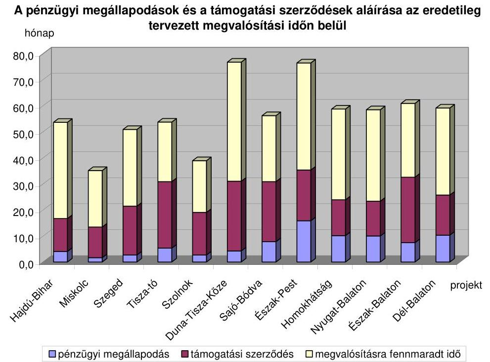
6. sz. ábra

Az Áht. 23/A. § (4) bekezdése 2001. január 1-jétől határidő megállapítása nélkül írta elő, hogy – amennyiben önkormányzat a program kedvezményezettje vagy megvalósítója – az önkormányzattal szerződést kell kötni a több évet átfogó kötelezettségvállalásra és az elvállalt társfinanszírozási összeg éves önkormányzati részének biztosítása érdekében. A 14/2004. (VIII. 13.) TNM-GKM-FMM-FVM-PM együttes rendelet 36. § (2) bekezdés b) pontja 2004. augusztus 13-tól rendelkezett arról ${ }^{89}$, hogy az Európai Unióhoz benyújtandó támogatási kérelem tervezetéhez csatolni kell a támogatási szerződést. Ennek ellenére a Kohéziós Alapból 2005. december 19-én jóváhagyott Szabolcs-Szatmár-Bereg megyei projektnél a támogatási szerződést 2006. március 29-én kötötték meg.

A pénzügyi és a támogatási szerződések késedelmes aláírásának okait a finanszírozási kérdésekkel, és ehhez kapcsolódóan az önkormányzatok együttműkö-

[^0]
[^0]:    ${ }^{87}$ A pénzügyi megállapodásokban tervezett határidőket figyelembe véve a Bizottság általi aláírástól kezdődően átlagosan 51,7 hónap állt rendelkezésre a megvalósítására.
    ${ }^{88}$ Az Európai Számvevőszék 12/2008. sz. különjelentése szerint más országokban is előfordult, hogy a projektek a kezdeti időszakban késedelmeket szenvedtek (pl. Lettország, Lengyelország). Az okok között jelölték meg, hogy nem ismerték az uniós eljárásokat, a projekt előkészítést és -végrehajtást, illetve nehézségei támadtak a beszerzési eljárásoknál.
    ${ }^{89}$ A rendelkezéseket a folyamatban lévő tevékenységekre is alkalmazni kell.

---

dési megállapodásainak késedelmével, valamint a megvalósítás hiányos feltételrendszerével indokolták.

A Nyugat-Balatoni projektnél a pénzügyi megállapodás aláírási késedelmét a vállalt konzorcium létrehozásának hiánya és emiatt a saját források biztosításának bizonytalansága okozta. A késedelmek a Tisza-tó projektnél a személyi változásokra, az eredménytelen népszavazásra és a kapcsolódóan megtartott lakossági meghallgatásokra; az Észak-Balatoni projektnél a lerakó helyszínének kiválasztási problémáira, valamint a tervezett konzorcium és projekt végrehajtó egység létrehozásának hiányára voltak visszavezethetőek. A támogatási szerződések tekintetében a miskolci, a szolnoki és a Nyugat-Balatoni projekteknél sem voltak az aláírási késedelmek alátámasztva.

A pénzügyi megállapodásokat a támogatási kérelmekkel összhangban, az azokban foglalt főbb tartalmi elemeket és vállalásokat rögzítve kötötték meg. Nem biztosították azonban a pénzügyi megállapodások és a támogatási szerződések közötti összhangot, a pénzügyi megállapodásokban foglalt elvárt, célok végső kedvezményezettek kötelezettségeként történő meghatározását. Így a tagországi szinten vállalt kötelezettségek továbbítása, a teljesítéseket biztosító megfelelő garanciák kiépítése elmaradt. A támogatási szerződések nem tartalmazták a támogatási kérelmekben és pénzügyi megállapodásokban meghatározott részletes adatokat, kötelezettségvállalásokat, így azok a továbbiakban a végső kedvezményezettektől nem voltak számon kérhetőek ${ }^{90}$.

A pénzügyi megállapodásokban az Európai Bizottság fenntartotta magának a jogot a támogatás összegének felülvizsgálatára, meghatározott feltételek fennállása esetén. A támogatásra vonatkozó különleges feltételeket azonban nem írták elő a végső kedvezményezettek kötelezettségeként. A támogatási szerződésekben nem határozták meg a megvalósítás ütemtervét, pénzügyi tervét, indikátorait, az elérni kívánt hulladékgazdálkodási és fenntarthatósági paramétereket, nem tiltották meg, csak a Közreműködő Szervezet hozzájárulásához kötötték a létesítmények elidegenítését, illetve terhelését. Sem a pénzügyi megállapodásokban, sem a támogatási szerződésekben nem rögzítették, és a projektekre vonatkozó jogszabályokban sem szabályozott a „jelentős eltérés" és a következményeként kiszabandó szankció mértéke. Ez eltérő értelmezéshez vezethet a végrehajtás során, és a támogatás visszafizetésének kockázatát hordozza.

A pénzügyi megállapodásokban az Európai Bizottság fenntartotta magának a jogot a támogatás összegének felülvizsgálatára, ha a munkálatok befejezését követő öt éven belül az üzemeltetési feltételek (tarifák, bevételek stb.) jelentős mértékben eltérnek a támogatás szintjének meghatározásában eredetileg feltételezettektől és/vagy, ha jelentős mértékű módosításra kerül sor:

[^0]
[^0]:    ${ }^{90}$ A Pénzügyi Megállapodások a kedvezményezett országra tartalmazták a kötelezettségeket, a kilátásba helyezett szankciókat. Az önkormányzatokra vonatkozóan kötelezettséget konkrétan nem írtak elő, abban nem végrehajtóként, hanem mint végső kedvezményezettek szerepeltek.

---

a) amely érinti
 akár az üzemeltetés jellegét vagy annak megvalósítási feltételeit, vagy amely valamely magán- vagy állami szervezet részére tisztességtelen előnyt biztosít, és
b) amely a finanszírozott infrastruktúra bármely része tulajdonlásának jellegében bekövetkezett változásból, akár az üzemeltetési megállapodások megszűnéséből vagy jelentős mértékű változásából fakad.
A kedvezményezett ország köteles a Bizottságot bármely ilyen változásról tájékoztatni és az ilyen változtatásokhoz megszerezni a Bizottság előzetes beleegyezését.

A helyszínen ellenőrzött projekteknél a pénzügyi megállapodásban és a támogatási szerződésben eltért egymástól a megvalósítás idő- és pénzügyi ütemezése, a műszaki tartalom meghatározása. A támogatási szerződések projektenként eltérő részletezettséggel tartalmazták a megvalósítandó feladatok műszaki leírását, emellett több esetben eltért - a szintén nem egységes elvek alapján kialakított - pénzügyi megállapodások műszaki leírásaitól, illetve a támogatási kérelmekben foglaltaktól. Az eltérések kockázatot jelentenek, mivel a pénzügyi megállapodások végrehajtásáért - és végső soron a támogatási kérelmekben foglaltak teljesítéséért -, valamint az uniós támogatással megvalósuló fejlesztésektől elvárt célok teljesüléséért a tagország felel, miközben az ezt megalapozó tevékenységek (támogatási kérelem összeállítása, a beruházás megvalósítása, a létrejövő létesítmények működtetése) a végső kedvezményezettek feladat- és hatáskörébe tartoznak. A támogatási szerződésekben a szerződésszerű végrehajtást kikényszerítő eszközök a támogatásokhoz kapcsolódó pénzügyi szankciókat tartalmazzák. A kifizetések felfüggesztése, a támogatás részbeni vagy teljes csökkentése, illetve a szerződés felmondása a projektek lelassulásához, illetve a kedvezményezettek pénzügyi ellehetetlenüléséhez vezethetnek.

A pénzügyi megállapodásokban rögzítették a projektek megvalósításával elérendő célokat, valamint a mennyiségi, fizikai - indikatív - mutatókat (indikátorokat). Utóbbiak a beruházások output, illetve eredmény mutatóit tartalmazták, ezért azok nem voltak alkalmasak a projektek megvalósításának fizikai nyomon követésére (fizikai monitoringjára). A számszerűsített célok nem kapcsolódtak közvetlenül a meghatározott fizikai indikatív mutatókhoz, ezért azokkal nem lehetett vizsgálni a célok teljesítését. A támogatási szerződésekben nem határoztak meg a fizikai részteljesítések mérésére alkalmas indikatív mutatókat. Az Ámr. 71. § (1) bekezdés a) pontjának előírásai szerint a feladat megvalósításának megkezdése előtt az előirányzattal rendelkezőnek meg kell határoznia a feladat célját, részletes tartalmát, a kezdeti és a célállapotot úgy, hogy az a megvalósítás során folyamatosan mérhető és ellenőrizhető legyen. A programok nyomon követéséhez alkalmazott indikátorok a gyakorlatban - az EMIR-ben meghatározott indikátor készlet figyelembe vételével - a szerződéskötés időszakában alakultak ki, az építési és a szolgáltatási szerződésekhez kapcsolódóan. Az indikátorok egymásra épülését - a pénzügyi megállapodások mutatói és a szerződések indikátorai között - előzetesen nem biztosították, a monitoring tevékenység során figyelemmel kísért indikátorokat nem a pénzügyi megállapodásokban található indikátorokból vezették le.

A pénzügyi megállapodásokban és bizottsági határozatokban foglalt célértékeket és indikatív mutatókat nem azonos szempontok szerint határozták meg az egymáshoz hasonló létesítményeket tartalmazó

---

13 hulladékgazdálkodási projektnél ${ }^{91}$. Azonos célú létesítményeknél egymástól eltérően állapították meg a fizikai mutatók mértékegységeit. Az egységes indikátorrendszer kialakításának hiánya megnehezítette a teljesítések nyomon követését, a teljesítmények értékelését és összehasonlítását.

A Hajdú-Bihari és a Szegedi projekt eredeti pénzügyi megállapodása nem tartalmazott indikátorokat, a célkitűzések és a fizikai mutatók nem különültek el. A Szolnoki projektnél a hulladéklerakónál meghatározták az építkezés műszaki mutatóit, a Hajdú-Bihari projektnél felsorolták az építendő technológia és építmények főbb elemeit is, míg a többi projekt esetében erre nem került sor.

A hulladéklerakókat, komposztáló telepeket, átrakókat és válogatókat változóan, területi mértékegységben, kapacitás adatok vagy csak darabszám szerint, a rekultivációt területi adatok vagy darabszám szerint szerepeltették.

A pénzügyi megállapodásokat, illetve a bizottsági határozatot ${ }^{92}$ minden projektnél - projektenként 1-3 alkalommal - módosították. A módosítások valamennyi projektnél érintették a határidőket, emellett a pénzügyi tartalom a projektek 38,5%-ánál, a műszaki tartalom a 92,3%-ánál, az egyéb feltételek a 15,4%-ánál változtak. A módosítások az uniós támogatás összegét nem érintették, legfeljebb annak ütemezése, valamint a hazai társfinanszírozás összege és ütemezése, továbbá az elszámolható költségek köre - a műszaki módosításokkal összefüggésben - változott. A műszaki tartalom részben a megvalósítás során jelentkező felülvizsgálatok és pontosítások, részben a rendelkezésre álló pénzügyi erőforrások korlátaiból eredő módosítások miatt változott. A módosítások okai a projektek elhúzódó megvalósítása, a részletes tervek pályázat elfogadását követő elkészítése, a fizikai tartalomban bekövetkezett változásokhoz való alkalmazkodás szükségessége, a résztvevő települések változása, a közbeszerzési eljárás elhúzódása, a költségtúllépések, a nem tervezett események (pl. régészeti feltárások szükségessége) voltak.

Előfordult, hogy nem történt meg időben a pénzügyi megállapodások tartalmának teljes körű felülvizsgálata és a szükséges módosítások jelzése a Bizottság felé. A módosítások számának korlátozása ${ }^{93}$ miatt már nem lesz lehetőség további változtatások elismertetésére. Ehhez hozzájárult a projektek késedelmes megvalósítása, mivel a változtatási igények döntő részt csak a megvalósítás folyamatában jelentkeztek, és a részletes tervek is ekkor készültek el. A módosítási kérelmek összeállításakor nem jártak el kellő körültekintéssel az abban résztvevők sem.

A Sajó-Bódva völgyi projektnél a 2002-2004. évben jelentkezett változások ellenére a pénzügyi megállapodást csak 2008 novemberében módosították. Ez amennyiben azt a Bizottság jelentősnek minősíti - a módosuláshoz kapcsolódó költségek elszámolhatóságát is veszélyezteti, mivel a fizikai tárgyakra vonatkozó

[^0]
[^0]:    ${ }^{91}$ A célok és az indikátorok a - nem egységes módszertan szerint elkészített - támogatási kérelmek alapján szerepeltek a pénzügyi megállapodásokban.
    ${ }^{92}$ A Kohéziós Alapból indult Szabolcs-Szatmár-Bereg megyei projekt esetében.
    ${ }^{93}$ Az uniós csatlakozást megelőző időszakban az ISPA uniós rendelete nem korlátozta a pénzügyi megállapodások módosításának lehetőségét, ezt követően azonban projektenként csak két alkalommal, a Kohéziós Alapnál egyszer van lehetőség módosításra.

---

nagyobb módosításokhoz kapcsolódó kiadások a módosítási kérelemnek a Bizottsághoz történő beérkezésével válnak elszámolhatóvá.

A Nyugat-Balatoni projekt 2006. december 1-jei módosítása során a kedvezményezett jelzése ellenére a pénzügyi megállapodáson nem vezették át, hogy a tervezett három átrakó állomás közül egy más forrásból valósult meg. További módosításra nincs lehetőség, ezért az elszámolások során ez problémát okozhat.

A támogatási szerződéseket 11 projektnél, összesen 19 alkalommal módosították, nem kapcsolódtak közvetlenül a pénzügyi megállapodások módosításához. A változásokat időszakosan vezették át a kedvezményezettekkel kötött szerződéseken, és az is előfordult, hogy a támogatási szerződések valamely változást már a pénzügyi megállapodás módosítása előtt tartalmaztak. Így összhangjuk a megvalósítás folyamatában sem volt biztosított.

# 2.3. A projekteknek a kijelölt célrendszer szerinti megvalósulása, a rendelkezésre álló erőforrások felhasználása 

### 2.3.1. A beruházások megvalósítása, a pénzügyi megállapodásokban és a támogatási szerződésekben foglalt ütemezés összhangja

A pénzügyi megállapodások szerint a projekteket eredetileg átlagosan négy év (47,8 hónap), ezen belül az építési feladatokat két év (23,9 hónap) alatt tervezték megvalósítani. Az építések megkezdése előtti időszakra a szerződések előkészítését (tervezés, tenderdokumentációk elkészítése, pályáztatás), illetve a végére a projektek zárását ütemezték. A támogatási szerződések a megvalósítás ütemezésére részletes előírásokat nem tartalmaztak.

A beruházások fizikai megvalósítása nem az eredetileg tervezettek szerint kezdődött meg, mert a feltételrendszert biztosító megállapodásokat későn kötötték meg, és elhúzódtak a beruházások megvalósításában résztvevők kiválasztásának az előkészítő munkái is. Jelentősen késleltette a kivitelezési munkák megkezdését a közbeszerzési folyamatoknak és a hatósági engedélyek beszerzésének a tervezettnél hosszabb átfutási ideje is. A konkrét tervezési, engedélyezési feladatokat többségében csak akkor indították el az önkormányzatok, amikor megfelelő garanciákkal rendelkeztek a projektek finanszírozására. Mindezek - a szűk és tartalékidőkkel nem számoló ütemterveknél - a kivitelezés folyamatában behozhatatlannak bizonyultak.

A PRAG előírásai szerint összeállított tenderdokumentációkat a csatlakozáskor folyamatban volt beszerzéseknél a Kbt. előírásainak megfelelően át kellett dolgozni. Jelentős volt az időigénye a csatlakozást megelőzően az EU Magyarországi delegációjával történt egyeztetéseknek, továbbá a minőségbiztosítási és ellenőrzési eljárásoknak is. A hatósági engedélyek beszerzése a megye- és a felügyelőségi illetékességi határokhoz nem igazodó projekteknél többlet időket igényeltek. Az engedélyezési eljárások az érintettek fellebbezései miatt is elhúzódtak (Miskolc, Észak-Balaton).

---

Mindezek következtében a beruházások megvalósításában résztvevőkkel az első jelentős szerződések megkötése ${ }^{94}$ a pénzügyi megállapodásokban az építés megkezdésére tervezett időponthoz képest közel másfél évet - átlagosan 17,5 hónapot - késett, ami a megvalósításra tervezett időnek a 36,6%-át jelentette. Két projektnél - a módosítások és a projektek áttervezése miatt - a megvalósításra megkötött első szerződés után, évek teltek el a kivitelezés megkezdéséig.

A tervezetthez képest nem történt kezdési késedelem a Tisza-tó projekt esetében, míg Miskolcnál 28, Szolnoknál 27 hónapot késett az első szerződéskötés a pénzügyi megállapodásban foglaltakhoz képest. Az Észak-Pesti és az Észak-Balatoni projekteknél a kivitelezői szerződéseket a mérnök szerződéskötését követő három év elteltével kötötték meg.

Mivel az uniós csatlakozást követően a Kohéziós Alap szabályait kellett alkalmazni, az addig meg nem kezdett projekteknél életbe lépett a két éves kezdési határidő szabálya ${ }^{95}$. Erre tekintettel - megfelelően igazolt esetekben - kapott határidős kivételt a kezdés alól a Nyugat-Balatoni és az Észak-Balatoni projekt.

A kezdeti, valamint a beruházások megvalósítási folyamatában keletkezett további - fizikai és pénzügyi kifizetési - késedelmek következtében (előkészítési hiányosságok, uniós szabályok ismeretének hiánya, részletesen lásd a 2.3.2. pontban) valamennyi projektnél - esetenként több alkalommal is módosították a befejezési határidőt. A módosítások következtében megvalósításra eredetileg tervezett 47,8 hónap átlagosan a kétszeresére növekedett, közel nyolc év lett (94,0 hónap). Ezen belül jelentősen nőtt az építésre, kivitelezésre rendelkezésre álló idő is, amely a tervezettnek várhatóan a 2,5-szerese, projektek megvalósítási idejének a 62,9%-a lesz ${ }^{96}$. Ez biztosította az uniós támogatások igénybevételi lehetőségének meghosszabbítását, a projektek későbbi üzembe helyezése azonban késlelteti a hazai hulladékgazdálkodási célkitűzések megvalósítását ${ }^{97}$, továbbá hozzájárult központi és helyi szinten is a költségek növekedéséhez.

Három projekt határidő módosítása a helyszíni ellenőrzés lezárásakor még folyamatban volt (Tisza-tó, Szolnok, Duna-Tisza köze). Ezek elfogadásával a projektek átlagos átfutási ideje több mint nyolc évre nő.

[^0]
[^0]:    ${ }^{94}$ A megvalósítás érdekében történt első jelentős szerződéskötés időpontja (PR, építés, mérnök, szállítási szerződések közül az első).
    ${ }^{95}$ Az 1164/94/EK Tanácsi rendelet II. melléklete, C cikkének (5) bekezdése szerint kellően indokolt esetek kivételével a projekt, projektcsoport illetve projektszakasz tekintetében odaítélt támogatást meg kell szüntetni, ha a munka a támogatás odaítéléséről szóló határozatban a kezdetére vonatkozóan feltüntetett időponttól számított, vagy a jóváhagyásának - későbbi - időpontjától számított két éven belül nem kezdődött meg.
    ${ }^{96}$ A projekt várható befejezése előtt hat hónapot számítva az elszámolások lezárására.
    ${ }^{97}$ Az Európai Számvevőszék 12/2008. sz. különjelentése is megállapította, hogy szinte valamennyi projekt késedelmet szenvedett. Hatásaként kiemelte, hogy „ha egy projekt a vártnál később valósul meg, akkor hasznot is csak később hajt, az általa orvoslandó problémák pedig a kelleténél tovább maradnak fenn. A késedelmek másik következménye a bizonytalanság, hiszen a társadalmi-gazdasági környezet változása megnehezíti a projektek előzetes tervek szerinti végrehajtását."

---

Az eredeti
 határidők szerint 2007. december 31-re valamennyi projektet le kellett volna zárni, de erre egynél sem került sor. A Miskolci projekt a 2008. március 31-i határidőre befejeződött, zárójelentését 2008. szeptember 30-án továbbították az Európai Unió felé. További két projekt (Hajdú-Bihar, Szeged) várhatóan 2009-ben, a többi csak 2010-ben fejeződik be.

# 2.3.2. A beruházások műszaki és pénzügyi megvalósítása 

A projektek előkészítése során elvégezték az előzetes környezeti hatásvizsgálatokat, majd lefolytatták a környezetvédelmi, az egységes környezethasználati engedélyezési eljárásokat. Az engedélyek a projektek jóváhagyásakor, illetve az azt követő rövid időn belül rendelkezésre álltak. A benyújtott pályázatokhoz a környezeti hatásvizsgálatok dokumentációit csatolták, a jogerős környezetvédelmi, egységes környezethasználati engedélyek, és az építésre vonatkozó engedélyek ekkor még nem álltak rendelkezésre.

Az építési engedélyezési tervek elkészítésére és az engedélyezési eljárások lefolytatására a megvalósítási szakaszban került sor. A konkrét tervezési, engedélyezési folyamatokat többségében csak akkor indították el az önkormányzatok, amikor megfelelő garanciákkal rendelkeztek a projektek finanszírozására. A projektek összetettsége és területi kiterjedtsége miatt, jelentős számú és különböző építési helyszínekre vonatkozó engedélyek beszerzésére volt szükség, amelyek elhúzódtak az egyeztetések, valamint esetenként az érintettek fellebbezései miatt.

A jogerős, végrehajtható építési engedélyek az építési munkák megkezdését megelőzően rendelkezésre álltak. A megvalósítás elhúzódása miatt azokat meghosszabbították, az időközben bekövetkezett jogszabályi módosítások, valamint a kiviteli tervek készítéséhez kapcsolódóan elvégzett egyeztetések, továbbá a megvalósítás során felmerülő műszaki - változtatási és összehangolási - igények miatt rendszeresen módosították. Az egyes létesítmények pontos paraméterei a megvalósítás folyamatában, az építés során alakultak ki. Előfordult, hogy az építési engedélyek késedelme miatt a kivitelezési munka később kezdődött el, a módosított építési engedélyek nem álltak rendelkezésre a módosítással érintett munkák megkezdésekor.

A Szolnoki projektnél az építési engedély meghosszabbítására, majd négy alkalommal a módosítására kellett intézkedni. A Nyugat-Balatoni projektnél a 11 település építési helyszíneire 19 építési engedélyt adtak ki és mindhárom építési tendernél előfordult, hogy a módosított építési engedélyek csak a műszaki átadás-átvételi eljárások során emelkedtek jogerőre.

A kiviteli tervek elkészítése - függetlenül attól, hogy az építési szerződéseket a FIDIC piros vagy a sárga könyv szerint kötötték meg - a kivitelezői szerződések részét képezte. Elkészítésük közvetlenül a kivitelezési munkákat megelőzően, illetve azzal párhuzamosan történt. A kivitelezés során felmerült változtatási igények miatt a jelentős számú kiviteli tervnél ${ }^{98}$ is rendszeresek voltak módosítások, a munka menetében elvégzett pontosítások.

[^0]
[^0]:    ${ }^{98}$ Miskolcon 126 kiviteli tervet tartanak nyilván és 65 esetben történt módosítás.

---

Mindezek azt mutatják, hogy a projektek pályázatkészítésekor elmaradt előkészítési feladatok, a pontos feladat meghatározás és a műszaki tartalom részletes megtervezése, továbbá a szükséges egyeztetések elvégzése a beruházások megvalósítási időszakában jelentkeztek. E feladatok kivitelezési időszakban történő elvégzése jelentős kapacitások rendelkezésre tartása mellett valósult meg, így hozzájárult a költségek növekedéséhez.

A kivitelezés folyamatos műszaki ellenőrzéséről mérnökök útján gondoskodtak, feladatuk a szakértői segítségnyújtás volt a beruházások kivitelezésének koordinálására és a projektek keretében történő építési, eszközbeszerzési és rekultivációs munkák felügyeletére. Az Európai Unióban általánosan alkalmazott FIDIC mérnök hazánkban az uniós támogatásokat felhasználó nagyberuházások megvalósításával terjedt el, jelentős hagyományai még nincsenek. A mérnök felel a program terv szerinti végrehajtásáért, ő a projekt műszaki és költségellenőre. Annak ellenére, hogy a fizikai teljesítés nyomon követése kiemelt feladat, projektek megvalósításának folyamatos műszaki ellenőrzésénél nem volt rendszerszerűen kialakított a teljesítmények egymástól független műszaki felülvizsgálata, a „négy szem elv" alkalmazása ${ }^{99}$. Erre egyes projekteknél különböző rész-intézkedések történtek, de - a műszaki átadás-átvételek során felmerült hiányosságok szerint - nem biztosították maradéktalanul a nem megfelelő minőségű műszaki teljesítések megvalósítás folyamatában való feltárását és kijavítását.

Szolnokon a mérnök minőségirányítási kézikönyvet dolgozott ki és a kivitelezési munkákat rendszeresen ellenőrizte. Ennek ellenére a hulladéklerakó műszaki átadás-átvételekor jutott a Közreműködő Szervezet tudomására és okozott vitát, hogy a depóniatérnél a kivitelező nem a tenderben és a szerződésben meghatározott szigeteléssel építette meg a szivárgó paplan réteget. Emiatt szabálytalansági eljárás indult, és több mint egy év elteltével az utólagos szigetelés elvégzésével, a felek megegyezésével zárult.

A Miskolci és a Nyugat-Balatoni projektnél a műszaki ellenőrzés megerősítése érdekében és a menedzsment munkájának segítésére, helyi mérnököket alkalmaztak. Utóbbinál a műszaki átadás-átvétel folyamatában okozott több hónap késedelmet - és a depóniatér alatt elhelyezkedő geo-monitoring rendszer jelezte -, hogy a hibás kivitelezési technológia miatt a szűrőréteg HDPE fóliára történt felhordásakor sérülések keletkeztek.

A kivitelezői szerződésekben megrendelt, de később elmaradt munkákról, illetve a pótlólagos megrendelésekről a vállalkozók által készített változtatási javaslatokat a mérnökök vizsgálták felül. A szükséges kiegészítések után, javaslataikkal nyújtották be az önkormányzatoknak, ahonnan a Közreműködő Szervezetnek továbbították jóváhagyásra.

A Miskolcon a 18 változtatási javaslat és az egyéb pótmunkák költségigénye 2079,6 ezer euró, a kivitelezői költségeknek a 11,53%-a volt. A Nyugat-Balatoni projektnél az 52 változtatási javaslat 2751,6 ezer euró költségigényt tartalmazott,

[^0]
[^0]:    ${ }^{99}$ A jogszabályok a szerződéskötés, a pénzügyi lebonyolítás, számviteli nyilvántartás és beszámolás folyamataiban és ezen folyamatok adatainak az EMIR-be történő bevitele során írták elő a négy szem elvének érvényesülését, a fizikai teljesítés nyomon követésénél erre - indokoltsága ellenére - nem tértek ki.

---

amelyből - többnyire a mérnök javaslata alapján - 1764,9 ezer eurót (64,1%) fogadtak el, ez a kivitelezői költségeknek a 11,5%-a volt. A Szolnoki projektnél a változtatási kérelmek 556 ezer eurót, a kivitelezési költség 5,9%-át jelentették.

A változtatásoknál a jogszabályi változásokra ${ }^{100}$, hulladékgazdálkodási követelmények szigorodására, a tendertervek hiányosságaira, a kiviteli tervek alapján azok pontosításának szükségességére, a kivitelezés folyamatában felmerült vis maior problémákra, és - részben az elhúzódó megvalósítás miatt - a módosult megrendelői igényekre hivatkoztak. Szerepet játszott ebben a projektek újszerűsége is, mivel ilyen típusú projektek először valósultak meg az országban.

A kivitelezői és a műszaki felügyeleti szerződéseket - esetenként több alkalommal - meghosszabbították, elhúzódtak a beruházások megvalósításában résztvevők, az önkormányzatok és a Közreműködő Szervezet közötti egyeztetések, amelyek késleltették a beruházások megvalósítását. A késedelmek okait az előrehaladási jelentésekben feltárták.

Miskolcon a kivitelezői szerződés öt módosítása során a teljesítési idő 2005. július 9-ről 2007. augusztus 31-re, a kivitelezés időtartama a 2,3-szeresére nőtt. A Tiszató projektnél a négy módosítás során a befejezési határidő 2005. december 16-ról 2006. november 30-ra, a kivitelezés időtartalma közel az 1,7-szeresére nőtt. A Nyugat-Balatoni projektnél mindhárom építési szerződés határidejét módosították, ez az egy éves kivitelezési időt 11-29%-kal növelte meg.

A befejezési határidő módosítások okait a vis maior körülményekben, és a változtatási javaslatokkal kapcsolatban a kivitelezés során felmerült problémák megoldásának időigényében jelölték meg. A műszaki felügyeleti szerződéseket a kivitelezői szerződésekhez igazították. A késedelmekben jelentős szerepe volt az egyeztetési folyamatok elhúzódásának is, amely többnyire a műszaki átadás-átvételhez kapcsolódott (Szolnok, Nyugat-Balaton, Sajó-Bódva völgyi projektek).

# A projektek megvalósítása során a pályázatokban és a pénzügyi megállapodásokban prognosztizált költségeket túllépték, emellett 

eredetileg nem tervezett költségek is felmerültek. A tervezett ún. elszámolható költségekhez ${ }^{101}$ képest összességében 8,3%-os túllépés várható (17. sz. melléklet). Ezen belül jelentős költségnövekedések a 2008-2009-ben befejeződő, illetve befejezéshez közel álló projekteknél történtek. Az alacsony teljesítési arányú projekteknél nem mutattak ki érdemi költségtúllépést, mivel még nem fedték le teljes mértékben kötelezettségvállalással a pénzügyi keretet.

[^0]
[^0]:    ${ }^{100}$ A hulladéklerakás, valamint a hulladéklerakók lezárásának és utógondozásának szabályairól és egyes feltételeiről szóló 22/2001. (X. 10.) KöM rendelet; a hulladéklerakással, valamint a hulladéklerakóval kapcsolatos egyes szabályokról és feltételekről szóló 20/2006. (IV. 5.) KvVM rendelet.
    ${ }^{101}$ A pénzügyi megállapodások szerint az Európai Unió által támogatott költségek.

---

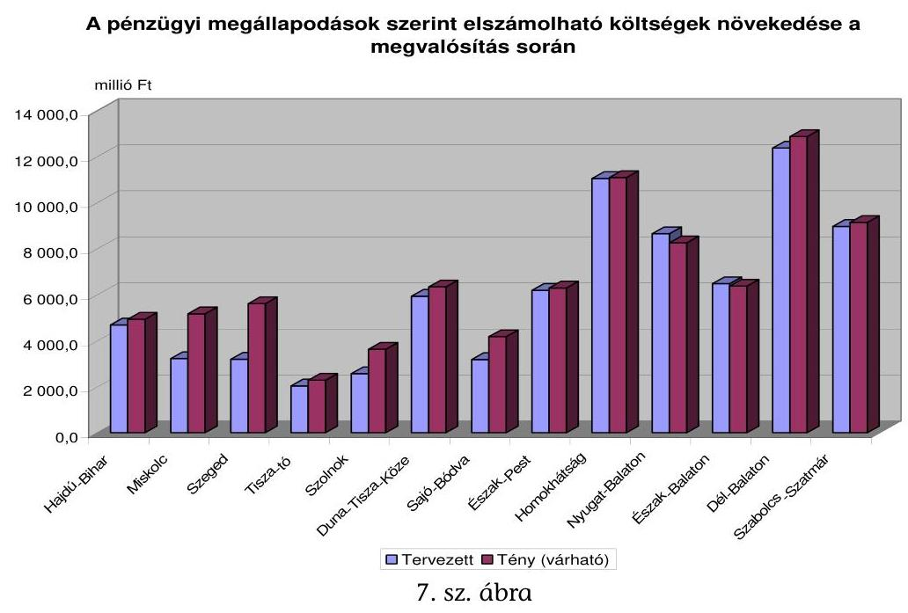

Az elszámolható költségek növekedése a tervezetthez képest a Miskolci projektnél 63,5%, a Szegedinél 70,6%, a Szolnokinál 41,6%-os, a Sajó-Bódva völgyinél 15,7%. Elmaradt emellett a Szegedi projektnél 27, a Szolnoki és a Sajó-Bódva völgyi projekteknél 4-4 hulladéklerakó rekultivációja is.

A Nyugat-Balatoni projektnél megtörtént az elszámolható költségekre vonatkozóan a szerződések megkötése, amelyek alapján kis mértékű (4,6%-os) megtakarítás várható annak ellenére, hogy a projekt 3-4 éves késéssel valósul meg.

Az alacsony (50% alatti) pénzügyi teljesítésű projekteknél még nem történt meg valamennyi szerződés megkötése (Szabolcs-Szatmár-Bereg, Dél-Balaton, Észak-Balaton, Észak-Pest). Ennek ellenére előfordult a tervezettet jelentősen meghaladó szerződéskötés. Az Észak-Balatoni projekt építési szerződésénél a 2008. december 1-jén kihirdetett eredmény szerint közel 3 millió euró (15%) a túllépés, amely az infláció és a megnövekedett gazdasági kockázat következménye is.

Az elszámolható költségek növekedésének hatására - mivel a felhasználható uniós támogatás változatlan maradt - a pénzügyi megállapodások szerinti átlagosan 65,1%-os Európai Uniós források aránya 59,5%-ra csökkent, ezzel párhuzamosan a központi társfinanszírozás 25%-ról 29,6%-ra, a helyi források 9,9%-ról 10,9%-ra nőttek.

A költségnövekedések a Miskolci projektnél az uniós források arányát a tervezett 70%-ról 42,8%-ra, Szegeden 65%-ról 38,6%-ra, Szolnokon 70%-ról 57,2%-ra, a Sajó-Bódva völgyi projektnél 50%-ról 38,1%-ra csökkentették. A nemzeti társfinanszírozás aránya ezzel párhuzamosan a projektek sorrendjében 20%-ról 41,5%-ra, 25%-ról 51%-ra, 20%-ról 33,4%-ra, illetve 40%-ról 49,8%-ra nőtt.

A költségtúllépések fő okai - a különböző jelentések, beszámolók, költségelemzések szerint - a tervezési költségek alábecsülése, a megvalósítási idő elhúzódása miatti inflációs hatások, a műszaki tartalom módosítása, a nem tervezett, elszámolt pótmunkák, a jogszabályi rendelkezések szigorodása voltak, továbbá árfelhajtónak mutatták ki a rendelkezésre álló idő szűkösségét is.

---

Miskolcon a zárójelentés készítésekor konkrétan kimutatták az árat befolyásoló és a költségek több mint 60%-os emelkedését okozó tényezőket. A szakértői értékelés szerint a főbb ár-változtató tényezők az alábbiak voltak:

- az újszerű ISPA projektek tervezésének nem volt szakmai hagyománya, a költségeket eleve alulbecsülték.
- fokozott környezetvédelmi elvárásokból adódó műszaki tartalom-növelés,
- fokozott munka- és balesetvédelmi elvárásokból adódó műszaki tartalomnövelés,
- a jogszabályok szigorodásából származó ár-növekedés,
- szállítási költségek növekedése,
- acél világpiaci árának növekedése,
- az árak 5 éves időtartamra számított inflációja.

Minden projektnél merültek fel emellett az uniós támogatás és a nemzeti társfinanszírozás szempontjából el nem számolható költségek, amelyeket a kedvezményezetteknek saját, vagy azzal egyenértékű forrásokból kellett finanszírozniuk. Az el nem számolható költségek a projektek önkormányzatoknál kimutatott költségének a 3,75%-át, az előkészítést is figyelembe véve az összes költségének a 4,9%-át tette ki ${ }^{102}$.

A kedvezményezett önkormányzatok mellett, a projektek előkészítésekor és a megvalósítás folyamatában a KöM, illetve a KvVM is bízott meg vállalkozókat feladatokkal, amelyeket közvetlenül fizetett ki (projektjavaslat, pályázatkészítés, pályázatok felülvizsgálata, illetve tenderek minőségbiztosítása, közbeszerzések adminisztratív feladatai, szakértők, stb.).

Az önkormányzatok által kimutatott összes bekerülési költség finanszírozásában az Európai Uniós támogatások aránya mindössze 56,6%-ot képviselt, a központi társfinanszírozásé 28,1%-ra csökkent, a
 saját forrásoké pedig - az el nem számolható költségek figyelembe vételével ${ }^{103}$ - 15,3%-ra nőtt.

A projektek összes várható költségeinek finanszírozási forma szerinti megoszlása
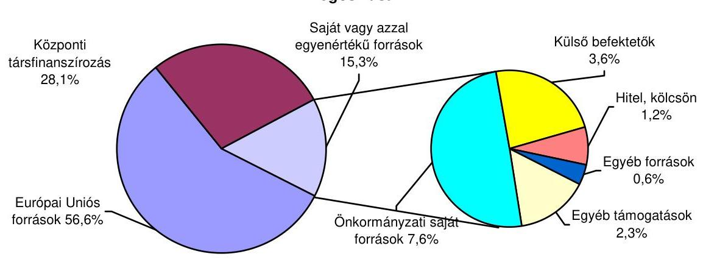
8. sz. ábra

[^0]
[^0]:    ${ }^{102}$ Az el nem számolható költségeknek a tervadatokkal való összevetése nem volt releváns, mivel a projektek előkészítése során ezeket csak részben tervezték meg.
    ${ }^{103}$ Az előkészítési és a megvalósítási költségek együtt.

---

Az önkormányzati saját források összegét megosztották a társulásban részt vevő önkormányzatok között az ellátott terület lakosságszáma alapján. A tényleges saját forrásokból történt hozzájárulás a projektek összes költségének a 7,6%-a, a saját forrás szükségletnek mintegy a fele volt. A másik felét a saját források kiváltására bevont külső befektetői pénzeszközök, az egyéb - központi és decentralizált döntési jogkörű - támogatások, a hitel (kölcsön), valamint az egyéb források ${ }^{104}$ jelentették. Jelentősebb összegű hitellel (kölcsönnel) mindössze egy projektnél számolnak, amiben a jogszabályi előírások is szerepet játszottak. Az Áht. 100. § (2) bekezdése szerint, a társulási törvény alapján létrejött jogi személyiséggel rendelkező társulás az adott feladat ellátásában érintett önkormányzatok kezességvállalása mellett vehet fel hitelt, illetve bocsáthat ki kötvényt, amely jelentős számú önkormányzat esetén bonyolult egyeztetési folyamatot feltételez.

A Szabolcs-Szatmár-Bereg megyei projekt I-II. szakaszához a társulás által létrehozott egyszemélyes gazdasági társaság kétmilliárd Ft összegben kötvényt bocsátott ki. A befolyt bevételt a gazdasági társaság - az üzemeltetési jog átadásának ellenében - folyamatosan, a beérkező számlák kifizetési szükségletének ütemében kölcsönadja a társulásnak. A társulás e módon a projekt Kohéziós Alapból finanszírozott I. szakaszához 995750 ezer Ft kölcsön igénybevételét tervezi, ami a várható kiadások 10,7%-át biztosítja. Az Észak-Pest projektnél a szakmai befektetővel közösen létrehozott üzemeltető - a szakmai befektető által rendelkezésre bocsátott tagi kölcsönből - finanszírozta az előkészítés részbeni költségeit, amelyet a társulás hitel felvételével fizetett vissza (61000 ezer Ft, 0,9%).

A források között eredetileg egy projektnél sem szerepelt a magánszektor hozzájárulása, a megvalósítás során azonban - négy projektnél jelentős (a bekerülési költségek 9,4-19,8%-a) nagyságrendben ${ }^{105}$ - külső befektetőket vontak be a saját források kiváltására. A külső befektetői források a létesítmények üzemeltetői, használati, bérleti díja, illetve az üzemeltetési jog értékesítése jogcímen a projektek későbbi üzemeltetőitől származtak és az összes költségnek a 3,6%-át, a saját forrás szükségletnek közel a negyedrészét tették ki (23,4%).

A Szolnoki projektnél a gesztor önkormányzat a Rethmann Recycling Szolnok Rt-vel kötött Szindikátusi szerződést az átrakóállomás üzemeltetési jogának értékesítésére 130 millió Ft-ért. A konzorcium tagjai emellett 20 évre szóló szerződést kötöttek a hulladéklerakó és az öt hulladékudvar üzemeltetésére a Rethmann Kétpói Kft-vel ${ }^{106}$ 650 millió Ft bérleti díj ellenében. Ez együtt a bekerülési költségeknek a 19,8%-át jelentette, további forrásbevonásra nem volt szükség.

A Miskolci projektnél a konzorciumba tömörült önkormányzatok - Miskolc kivételével (0,3%) - nem járultak hozzá az önkormányzati saját források biztosításához, az őket terhelő hozzájárulásokat formálisan sem állapították meg. Miskolc Önkormányzata az általa kifizetett költségeket tovább számlázta a hulladéklerakó-

[^0]
[^0]:    ${ }^{104}$ A beruházások megvalósításának folyamatában keletkezett bevételek (pl. tenderértékesítés, kamatok).
    ${ }^{105}$ Az önkormányzatok által aláírt tanúsítványok és a helyszíni ellenőrzések adatai alapján. Nem tartalmazza a tanúsítványokban tévesen, az önkormányzati hozzájárulások között kimutatott, de eredetileg a külső befektetőktől származó forrásokat.
    ${ }^{106}$ A kétpói regionális hulladéklerakó üzemeltetésére Szolnok Megyei Jogú Város Önkormányzata (51%) és a Rethmann Recycling Szolnok Rt. (49%) által alapított Kft.

---

üzemeltetőnek. Az AVE Kft. a bekerülési költségeknek a 9,4%-át, 496064 ezer Ft-ot biztosított „használati díj” előlegként. A további saját forrásokat egyéb hazai támogatásokból fedezték.

A Tisza-tó projektnél az összes bekerülési költség 12,5%-át, a Dél-Balaton projektnél a 11,2%-át jelentették a külső befektetői források.

A potenciális üzemeltetőknek a beruházás időszakában történő előzetes bevonása kockázatokat hordoz, mivel függő viszony jön létre az önkormányzatok és a finanszírozó üzemeltetők között. Ez a közbeszerzések mellőzéséhez vezethet, illetve lefolytatása esetén befolyásolja a verseny tisztaságát, az eljárás eredményét. Ugyanakkor az előre beszedett és elköltött üzemeltetői, használati díjak a működtetés időszakában befolyásolhatják a rendszer fenntarthatóságát, az üzemeltetést és a pótlást, felújítást szolgáló pénzeszközök hiánya miatt.

Az önkormányzatok a saját források kiváltása érdekében a jogszabályok ${ }^{107}$ által előírt feltételek teljesülése esetén pályázatot nyújthattak be - a BM illetve a ÖTM fejezetében elkülönített - EU Önerő Alap támogatására. E támogatásban a 13 közül öt projekt részesült, összesen 1794,2 millió Ft összegben, ami a saját forrásoknak a 13%-a, és az érintett projekteknél 7,3-45,1% közötti arányú volt. Az egyéb - központi és decentralizált döntési jogkörű - támogatások a saját forrásoknak mintegy a 2%-át jelentették (környezetvédelmi célelőirányzat, megyei területfejlesztési tanácsok és regionális fejlesztési tanácsok támogatása, megyei önkormányzati támogatás).

Az önkormányzatok - eseti jelleggel - a projektek megvalósításában résztvevő vállalkozókkal kötött szerződés alapján is bevételekhez jutottak. A Szolnoki projektnél a realizált bevétellel kapcsolatban javasoltuk a központi költségvetés részére történő visszafizetési kötelezettség elszámolását is.

A Szolnoki projektnél a hulladékdepónia tér szigetelésénél a szerződésben foglaltaktól eltérő teljesítés miatt a kivitelező és a gesztor önkormányzat között kialakult vitát a felek 2006. december 1-jén egyezséggel rendezték, amelynek értelmében a kivitelező - a garanciális javítás elvégzésén túl - 60 millió Ft megfizetését vállalta a hulladéklerakó üzembe helyezésének késedelme miatti bevétel elmaradás kompenzációjára. A bevételre jutó arányos fejlesztési célú támogatást az Áht. 101. § (10) bekezdésének előírásai ${ }^{108}$ szerint az önkormányzatnak vissza kell fizetnie a központi költségvetésbe az Ámr. 149/B. §-ában meghatározott eljárási rend szerint ${ }^{109}$.

A Nyugat-Balatoni projektnél a gesztor önkormányzat irodahelyiségeket adott bérbe a PR és tájékoztatási feladatokat végző vállalkozónak összesen 600 ezer Ft bérleti díjért. A bevétel vonatkozásában nem volt alkalmazható az Áht. 101. § (10) bekezdése, mivel a vállalkozó a beruházás megvalósításában nem konkrét kivitelezési, hanem egyéb tevékenységet végzett.

A hulladéklerakók rekultivációjából származó hulladékot a kivitelezők az önkormányzatok tulajdonában lévő - a projektek keretében épített vagy az építés során még használatban volt - hulladéklerakókba szállították és ennek során hulladéklerakási díjat fizettek az üzemeltetőknek. Az üzemeltető gazdasági társaságok különböző mértékben (az ellenőrzött eseteknél 45-100%) a kedvezményezett önkormányzatok tulajdonát képezték. A hulladéklerakási díjak beépültek a kivitelezési költségekbe, és azokra felhalmozási támogatásokat vettek igénybe.

# 2.3.3. Teljesítményelvek alkalmazása a beszerzéseknél

A beruházások megvalósítási folyamatában nem érvényesültek a gazdaságossági szempontok. A közbeszerzési eljárások alapján megkötött szerződések rendszeresen meghaladták a pénzügyi megállapodásokban tervezett előirányzatokat. Így nem költségcsökkentő, hanem az eredeti célokkal ellentétes eredményre vezettek az eljárások. Az EU Bizottság megelőző jellegű vizsgálata általános problémaként jelölte meg a kiválasztási kritériumok szigorú voltát, melynek következtében számos ajánlat már a kiértékelési fázisba sem jutott el.

A Közreműködő Szervezet a vállalkozók kiválasztását, majd a közbeszerzések lebonyolítását részlegesen ruházta át a kedvezményezettekre a támogatási szerződésekben meghatározott módon. Az eljárási rend - a PRAG alkalmazása és az EU Bizottság szakértőinek közreműködése miatt - eltért az uniós csatlakozást megelőző és az azt követő időszakban. A támogatási szerződésekben szabályozták a feladatokat, az együttműködés elveit és szabályait. Az eljárásokat az ajánlatkérőként megjelölt kedvezményezettek nevében folytatták le, de azok valamennyi szakaszához az EU Bizottság szakértőinek, az ISPA Végrehajtó Szervezetnek, majd a Közreműködő Szervezetnek a jóváhagyása kellett. A feladatmegosztáshoz kapcsolódóan azonban nem rögzítették a felelősségi szabályokat. Így az eljárások lefolytatásának, a közbeszerzések lebonyolításának a felelőssége, mint ajánlatkérőket a kedvezményezett önkormányzatokat terhelte. A szerződések megkötése, módosítása a Közreműködő Szervezet ellenjegyzését követően történhetett meg.

A csatlakozást megelőző eljárási rend az Európai Uniós eljárási szabályokon, a PRAG rendelkezésein, valamint az ISPA Végrehajtó Szervezet és az EU Bizottság szakértőinek az ajánlásain alapult. A versenyeztetés teljes folyamatában (beszer-

[^0]
[^0]:    ${ }^{107}$ 14/2005. (III. 30.) BM rendelet, 15/2006. (III. 14.) BM rendelet, 28/2007. (X. 12.) ÖTM rendelet, 16/2008. (III. 28.) ÖTM rendelet.
    ${ }^{108}$ Amennyiben a fejlesztési támogatásban részesülő helyi önkormányzat és központi költségvetési szerv a beruházás megvalósítása során a kivitelezést végző szervezettel kötött szerződés alapján - közterület-használati díj, földterület-, épület-, irodatechnikai berendezés-, felvonulási terület bérlet, adás-vétel stb. jogcímen, vagy alvállalkozói munkavégzés során - bevételhez jut, úgy az e bevétel összegére jutó arányos egyéb állami támogatást is vissza kell fizetnie a központi költségvetésbe.

---

zési terv készítése, a kiírás műszaki, jogi feltételeinek kialakítása, az ajánlatok bontása, az ajánlatok értékelése, eredményhirdetés) a kedvezményezetteknek az ISPA Végrehajtó Szervezettel egyeztetett módon kellett eljárni, az értékelő bizottságba egy szavazati joggal rendelkező tagot delegálhattak.

A Kbt. alapján lefolytatott eljárások során a kedvezményezettek által összeállított tenderdokumentációkat a Közreműködő Szervezet véleményezte és hagyta jóvá, független szakértővel megvizsgáltatta, valamint megküldte az EKKE részére is. A Közreműködő Szervezet jóváhagyása, illetve tájékoztatása kellett valamennyi egyéb tájékoztató, dokumentum véglegesítéséhez is. Az ajánlatok elbírálását végző, a Közreműködő Szervezet által jóváhagyott bíráló bizottságba a Kedvezményezett háromtagú szavazó bizottság esetében egy, öttagú esetén kettő szavazótagot delegált. A beszerzések értékelésében szavazati jog nélkül az EKKE által delegált egy személy is részt vett megfigyelőként, akinek feladata volt, hogy a közbeszerzési eljárás bírálati szakaszának szabályosságát ellenőrizze.

Az eljárási rend - megfelelő működése esetén - biztosította, hogy a támogatási szerződések pontos feladat meghatározásának hiánya ellenére a projekt a Kormány kötelezettségvállalásának megfelelően valósuljon meg. A beszerzések előkészítésében és a versenyeztetések lefolytatásában ugyanakkor nem váltak el egyértelműen a végrehajtói, a lebonyolítói és az ellenőrzési funkciók, feladatok. A Közreműködő Szervezet részéről az ellenőrzési feladatok ellátása mellett, a döntések meghozatalában való részvétel is megjelent.

A miskolci és a szolnoki projektnél a PRAG szerinti beszerzések meghirdetése, a pályázati kiírások közzététele, a közbeszerzések lefolytatása az önkormányzat nevében, de a KvVM lebonyolításában történt. Szolnokon ezekről dokumentummal az önkormányzat nem rendelkezett, a KvVM is csak angol nyelvű dokumentációt tudott átadni az ellenőrzés részére.

# A beruházások megvalósításában résztvevő vállalkozók kiválasztása

és a szerződések megkötése elhúzódott. Valamennyi beszerzés esetében az eredeti ütemtervnél később írták ki a tendereljárásokat és lefolytatásuk is a tervezettnél hosszabb időt vett igénybe. Ebben szerepet játszott a döntési funkciók széttagoltsága, az egyeztetési eljárások széles körűsége, a tenderdokumentációk - jogszabályváltozások és a megismételt versenyeztetési eljárások miatti - átdolgozása, valamint több esetben a kiválasztási és az értékelési eljárások megismétlésének a szükségessége. Mindez többletmunkát és ahhoz kapcsolódóan többletköltségeket jelentett. Előfordult az is,

[^0]
[^0]:    ${ }^{109}$ Az önkormányzatoknak a beruházásokhoz pótlólagosan realizált bevételekről a beruházások befejezését követő 60 napon belül kell elszámolniuk a Kincstár felé, és az azt követő 30 napon belül kell eleget tenniük a visszafizetési kötelezettségnek.

---
 hogy az EU Delegációval történt egyeztetés és jóváhagyás önmagában is jelentős időt igényelt.

A PRAG előírások 2003. május 30-án módosultak, majd a közbeszerzésekre 2004. május 1-jétől a hazai törvényi előírások vonatkoztak. Az előkészítés alatt álló tenderdokumentációkat a megváltozott követelmények szerint át kellett dolgozni. Ez a miskolci projektnél a PR, a Szolnoki projektnél az eszközbeszerzési tenderdokumentációt érintette. Utóbbit első alkalommal 2003. március 25-én jóváhagyta az EU Delegáció, majd a hirdetmény kiírásának csúszása miatt átdolgozott dokumentáció jóváhagyása csak 2004. február 27-én történt meg.

A miskolci projektnél az építési tenderdokumentáció az EU delegációnak történt megküldése és jóváhagyása között nyolc hónap telt el. A késedelembe a rossz minőségű dokumentációt készítő mellett annak is szerepe volt, hogy a minőségbiztosítással megbízott nem megfelelően szűrte ki előzetesen a hibákat.

---

A miskolci és a szolnoki projektek építési tendereinél a beérkezett ajánlatokat új összetételű bizottsággal az EU Delegáció kérésére újra értékelték. A Miskolci projektnél a Mérnök, a PR és az eszközbeszerzési tender – ebből két LOT-nál ismételten –, a Nyugat-Balaton projektnél a Mérnök, valamint a háromból egy építési tendert, továbbá az eszközbeszerzésekből egy LOT közbeszerzését eredménytelenség miatt újra ki kellett írni.

A beérkezett ajánlatok értékelése az összességében legelőnyösebb ajánlat, illetve a valamennyi adminisztratív és technikai követelményeknek megfelelő ajánlat közül a legalacsonyabb ellenérték alapján történt, ennek ellenére a megkötött szerződések rendszeresen meghaladták a pénzügyi megállapodásokban tervezett előirányzatokat. Ebben a nem kellően megalapozott költségbecslések ${ }^{110}$, valamint az elhúzódó megvalósítás árnövelő hatása mellett az is szerepet játszott, hogy a részvételi feltételrendszer meghatározása több esetben olyan szigorú volt, ami korlátozta a versenyt. Több ajánlat kizárását követően, csak az egy, vagy kevés számú érvényes ajánlat közül választottak. Így a gazdaságossági követelmények csak korlátozottan érvényesültek.

A szolnoki projektnél a környezetvédelmi felülvizsgálat és rekultiváció tervezés tárgyában lefolytatott közbeszerzés során a beadott hat pályázatból a bíráló bizottság négyet a Kbt. 88. § (1) bekezdése alapján eleve érvénytelennek ítélt, és a fennmaradó kettő közül fogadták el az alacsonyabb vállalási összeget adót.

A Sajó-Bódva völgyi projekt 1. számú építési tenderénél mind a 7 ajánlattevő elutasításra került. Ezt követően az egyetlen érvényes ajánlattevő – amely az előírt (48 óra) határidőre pótolta a hiányzó aláírást – lett az eljárás nyertese. A 3. számú építési tendernél a beérkezett 7 ajánlatból ismét egy került értékelésre.

Az Észak-Balatoni projektnél egy vállalkozó az építési tender kiírásban támasztott túl szigorú követelmények miatt indított eljárást a KBT Döntőbizottságnál, aki a kérelemnek helyt adva megbüntette az önkormányzati társulást.

A közbeszerzési eljárások megindítása előtt – annak ellenére, hogy a projektek műszakilag hasonló létesítményeket tartalmaztak – nem dolgozták ki a projektelemek reális költségbecslésen alapuló árkalkulációját, amelyek figyelembe vétele a támogatás költséghatékonyabb felhasználását biztosíthatta volna. Az is előfordult, hogy az EU Delegáció javaslata alapján megismételt eljárás során nyertesnek kihirdetett vállalkozó ajánlati ára a korábbinál magasabb volt.

A Duna-Tisza közi projektnél az építési munkákra lefolytatott első eljárás alapján legkedvezőbb ajánlatot adó ajánlati ára belefért a beszerzési terv keretébe. Az EU Delegáció javaslata miatti újraértékelést követően a nyertesként kihirdetett vállalkozó ajánlati ára a tervezett összeget 14,5%-kal meghaladta.

# A közbeszerzési eljárások eredményeként megkötött szerződéseket a végrehajtás folyamatában rendszeresen – egy szerződést több alkalom-

mal is – módosították. A három helyszíni ellenőrzéssel érintett projektnél az

[^0]
[^0]:    ${ }^{110}$ Az ÁSZ már korábbi jelentésében is kifogásolta, hogy az előkészítés során nem álltak rendelkezésre olyan mélységű műszaki tervek, amelyek a megalapozott pénzügyi tervezéshez alapul szolgálhattak volna.

---

elszámolható műszaki tartalomra megkötött 34 szerződés 32,4%-át módosították összesen 23 alkalommal. A teljesítési határidők a módosítások 56,5%-ánál, a szerződéses ár a 34,8%-ánál, az egyéb feltételek a 43,5%-ánál változtak. A módosításokban szerepet játszott a jogszabályi követelmények változása, a vis maior körülmények és a projektek elhúzódó megvalósítása mellett, a vállalkozók nem megfelelő közreműködése, továbbá a beruházások megvalósításában résztvevők közötti egyeztetési folyamatok időigénye is. Az építési szerződések befejezési idejének módosítása maga után vonta a kapcsolódó szolgáltatási szerződések hozzá igazítását is (PR, Mérnök).

A miskolci projektnél az építési szerződést öt alkalommal módosították, ennek során a projekt tervezett összes bekerülési értékét már eredetileg is meghaladó 15950 ezer eurós ár 18030 ezer euróra (13%-kal) nőtt, a teljesítési határidő több mint két évvel 2005. július 9-ről 2007. augusztus 31-re meghosszabbodott. Az önkormányzat számára kedvezőtlen volt, hogy az építésre kötött egy szerződés keretében került megvalósításra több, egymástól elkülöníthető létesítmény (hulladéklerakó, hulladékudvarok, átrakóállomás, rekultiváció). Célszerűbb lett volna részekre tagolni, vagy szakaszokat meghatározni a szerződésben, mert egy-egy rekultiváció elhúzódása miatt a véghatáridőt módosították, így a vállalkozónak lehetősége volt a többi létesítmény megvalósítását is az új időponthoz igazítani.

# A nyilvánosság tájékoztatása a vállalkozók kiválasztásánál igen, a végrehajtás folyamatában azonban csak korlátozottan érvényesült. 

A projektek elszámolható műszaki tartalmához tartozó beszerzések során a közbeszerzéseket lefolytatták. A szerződések módosításáról, továbbá azok teljesítéséről, illetve a részteljesítéséről azonban nem, vagy csak késedelmesen tettek eleget a Kbt. által előírt ${ }^{111}$ tájékoztatók közzétételének. A nyilvánosság tájékoztatásának elmulasztását a Közreműködő Szervezet dokumentáltan nem ellenőrizte és nem kifogásolta. Az ellenőrzés során felhívtuk az önkormányzatok figyelmét a Kbt. előírásainak betartására és a közzétételek pótlására.

A miskolci projektnél a KEHI állapította meg, hogy az eszközbeszerzésekre lefolytatott első, eredménytelen közbeszerzési eljárásról nem, a második eljárás eredményéről, valamint a szerződés módosításáról az előírt határidőn túl tettek közzé hirdetményt. Utóbbinál a KEHI által kezdeményezett eljárás során a KBT Döntőbizottság kétmillió Ft bírságot szabott ki a gesztor önkormányzatra.

A Nyugat-Balatoni projektnél a közbeszerzési eljárások alapján kötött hat szerződést 14 alkalommal módosítottak, ezek közzétételére azonban késedelmesen, egy alkalommal pedig nem intézkedtek. Öt szerződés teljesítési ideje meghaladta az egy évet, évenkénti részteljesítésükről a tájékoztatókat nem tették közzé. Három szerződés teljesítése a helyszíni ellenőrzés idején már megtörtént, a tájékoztatót kettő esetében nem tették közzé.

A szolnoki projektnél az ellenőrzés során az önkormányzat nem adott felvilágosítást a közbeszerzés, illetve a szerződésmódosítás miatti jogorvoslati eljárásokról, a szerződések részteljesítéséről, illetve teljesítéséről közzétett tájékoztatókról.

[^0]
[^0]:    ${ }^{111}$ Az eljárások eredményéről szóló tájékoztatót a Kbt. 98. § (1)-(2) bekezdése alapján, a szerződések módosításáról és a teljesítéséről, illetve a részteljesítéséről a Kbt. 307. § (1) bekezdése alapján öt munkanapon belül kell feladni a Közbeszerzési Értesítőbe.

---

# 2.4. A kialakított pénzügyi és számviteli rendszer 

### 2.4.1. A nyilvántartási rendszer teljessége

A projektek kiadásait és bevételeit az Áht. és az Ámr. előírásainak megfelelően, a gesztor önkormányzatok költségvetése tartalmazta, és a megvalósítás folyamatában kialakították és vezették az elkülönített számviteli nyilvántartásokat is. A gesztor önkormányzatok helyi szabályzatainak kialakításakor és a feladatellátás során azonban problémákat okozott, hogy nem jelent meg olyan útmutató az önkormányzatok számviteli elszámolására vonatkozóan, amely a nyilvántartások kialakításánál segítséget nyújtott volna a legjobb gyakorlat elve alapján. A Közreműködő Szervezet ellenőrzései és a folyamatba épített ellenőrzések, továbbá a könyvvizsgálók működése nem szűrték ki a számviteli nyilvántartások hibáit. A nyilvántartások pontossága – a jogszabályi előírások betartása mellett – amiatt is jelentőséggel bír, mert csak a gesztor önkormányzatoknál állapítható meg a projektek teljes bekerülési költsége az el nem számolható költségekre vonatkozó adatszolgáltatások hiányában.

A Nyugat-Balatoni projektnél 2002-2003. években az elkülönített számviteli nyilvántartás nem volt biztosított. Később a projektirodán az elkülönített nyilvántartásokat vezették, mai rendszere azonban az elmúlt években ott dolgozók gyakorlati tapasztalatai alapján, folyamatosan alakult ki.

A Duna-Tisza közi projektnél a KEHI 2006. évben végzett vizsgálata állapította meg, hogy a gesztor önkormányzat könyvviteli nyilvántartása csak a 10%-os önrészt tartalmazta, azaz nem könyvelték a projekt teljes költségét. Ez ellentétes a Számv. tv. 15. §-ában előírt teljesség és valódiság számviteli elveivel. A hiányosságot a 2007. évben pótolták.

A helyszínen ellenőrzött projekteknél a főkönyvi könyvelés és az analitikus nyilvántartások teljes körűen tartalmazták a helyi szintű adatokat. A pénzmozgásokat követték forintban és euróban, és az árfolyamkülönbözeteket – amely a projektek költségének a 0,25%-a alatt maradt – elszámolták. Az euróban megkötött szerződéseknél a kifizetéseket euróban teljesítették, a lebonyolítási számlákra történt utalások és a Kincstár általi kifizetés közötti időeltolódásokból következő árfolyamkülönbözeteket a Kincstár értesítése alapján, MNB középárfolyamon elszámolták. Az analitikus nyilvántartásokban a benyújtott és teljesített számlák adatait – beleértve azok forrásmegoszlását is – nyilvántartották.

A KvVM és a projekteket ellenőrző szervezetek által kialakított adatszolgáltatások azonban csak az elszámolható költségekre voltak figyelemmel, amely az önkormányzatoknál kimutatott összes költségnek a 95,1%-át jelentette ${ }^{112}$. Nem vették számba a helyi és a központi szinten felmerült – a Számv. tv. 47. §-a értelmében a bekerülési érték részét képező – el nem számolható költségeket, a projektek bekerülési költségét a valósnál alacsonyabban mutatták ki. Mivel az önkormányzatoknak nem volt információja a központi

[^0]
[^0]:    ${ }^{112}$ Lásd a 2.3.2. pontban.

---

szerveknél a projektekhez kapcsolódóan felmerült költségekről, mind a helyi, mind a központi szerveknél hiányzik a projektek teljes körű bekerülési költségeinek a számbavétele. Ezek az információk a projektek befejezését követő költség-haszon és pénzügyi elemzések elvégzéséhez is szükségesek.

A projektekben részt vevő önkormányzatok a konzorciumi szerződésekben, társulási és egyéb megállapodásokban megállapodtak a létrehozott vagyon tulajdonlási és nyilvántartási kérdéseiben, a Miskolci projekt kivételével, ahol a megállapodás nem volt teljes körű (a létesítményekről rendelkeztek, a beépített eszközök és a járművek kimaradtak).

A projektek bekerülési költségeinek meghatározásakor az önkormányzatoknál bizonytalanságot okozott a felhagyott hulladéklerakók rekultivációs építési költségeinek az elszámolása ${ }^{113}$. A témakörrel kapcsolatban eddig megjelent számviteli állásfoglalás ${ }^{114}$, a bányaterület rendezésével kapcsolatos rekultivációs költségek elszámolását a vállalkozásoknál az eredmény terhére, vagy céltartalék képzéssel tartja szabályszerűnek. A rekultivációs költségek folyó kiadásként történő elszámolása megnöveli a kedvezményezett önkormányzatok működési költségeit. Beruházási költségek részeként történő kimutatása és aktiválása pedig az érintett területek értékét – a környező területekhez képest – a piaci értéknél magasabbra emeli. Mindezeken keresztül a költségek elszámolásának módja hatást gyakorol a projektek megtérülési, életképességi számításaira.

A Miskolci projektnél az önkormányzat döntése alapján aktiválták a rekultivációs költségeket, amelyek 1826823 ezer Ft-ot jelentettek az 5236770 ezer Ft-os aktivált értékben (34,9%).

A részleges, illetve nem egyértelmű jogi szabályozás következtében az ellenőrzött projektnél – a körülmények hasonlósága ellenére – eltérően mutatták ki a számviteli nyilvántartásokban a közös tulajdonú létesítményeket. A Szolnoki és a Miskolci projektben résztvevő önkormányzatok konzorciumot alakítottak. A létrehozott – Ptk. előírásai alapján közös tulajdonú vagyontárgyakat előbbinél valamennyi önkormányzatnál résztulajdonként, utóbbinál a gesztor önkormányzatnál egységes tulajdonként tartják nyilván. A Nyugat-Balatoni projektnél az önkormányzatok megállapodása szerint a létrehozott vagyon a Társulási tv. előírásainak megfelelően ${ }^{115}$ a jogi személyiségű társulás tulajdona,
 de bizonytalanságokat okoz ezzel egyidejűleg az Ötv. 80. §

[^0]
[^0]:    ${ }^{113}$ Meg kell különböztetni ettől a szolgáltatások díjaiban érvényesített és elismert, a közszolgáltatás körében működtetett létesítmények bezárásának, rekultivációjának, utógondozásának és a harminc évig történő monitorozásának a díjfizetési időszakra vetített költségét, amely a szolgáltatóknál a majdani rekultiváció fedezetét jelenti.
    114 4/2006. Számviteli kérdés: A bányaterület rendezésével kapcsolatos (rekultivációs) költségeket mikor és hogyan kell elszámolni? Képezhető-e céltartalék azok fedezetére?
    ${ }^{115}$ A Társulási tv. 17. § előírásai szerint a jogi személyiséggel rendelkező társulás saját vagyonnal rendelkezhet, melynek szaporulata a társulást illeti meg.

---

(5) bekezdése előírásainak alkalmazása ${ }^{116}$ és az a tény, hogy a társönkormányzatok nem mutatják ki vagyonnyilvántartásaikban a rájuk eső tulajdoni hányadokat.

A Szolnoki projektnél a beruházás értékét népességarányosan felosztották és az önkormányzatonként aktivált beruházások értéke adja ki a teljes beruházási összeget, az osztatlan közös tulajdonnak megfelelően.

A Miskolci projektnél az önkormányzatok osztatlan közös tulajdonában lévő vagyon a gesztor önkormányzat könyvviteli mérlegében szerepelt. A konzorcium többi tagjánál nem vezettek nyilvántartást a rájuk eső vagyoni hányadról. Azt tervezik, hogy értesítik a konzorciumban részt vevő többi tagot, hogy az osztatlan közös tulajdonból mennyi részesedésük lesz és azt mérlegen kívüli tételként tartják nyilván évenként aktualizált állapot szerint, de továbbra is a gesztor önkormányzat könyvviteli és vagyonkataszteri nyilvántartásaiban szerepel.

A Nyugat-Balatoni projektnél azt tervezik, hogy a létesítményeket a gesztor önkormányzat részben önállóan gazdálkodó költségvetési szerveként bejegyzett társulásnál tartják nyilván. Ezzel összhangban az ingatlan nyilvántartásban a társulás nevére 1/1 tulajdoni arányban történő bejegyzés jelentősen egyszerűsítené a nyilvántartásokat a 281 önkormányzat részvételével megvalósuló projektnél. A társönkormányzatok mérlegében nem jelenik meg az őket megillető vagyon.

A támogatási szerződésekben foglaltak ellenére ${ }^{117}$, a földhivatali nyilvántartásokban még nem történt meg a terhelési és elidegenítési tilalom bejegyzése. Nem rendezettek még emellett a földhivatali nyilvántartásokban a létesítmények tulajdonjogi bejegyzései.

A Miskolci projektnél a hulladéklerakó ingatlanra a KvVM javára 8300 ezer euró jelzálogjogot jegyeztek be 2005. júniusban. A Hejőpapi hulladéklerakó telekingatlan egy 2004. februári adásvételi szerződéssel a konzorciumi tagok osztatlan közös tulajdonába került, azonban a Miskolc területén lévő három hulladéklerakó udvar és az átrakó állomás jelenleg is az Önkormányzat tulajdonában van.

A Szolnoki projektnél nem történt meg a hulladékátrakó állomás és a hulladékudvarok földterülete értékének felosztása az önkormányzatok között, valamint a tulajdoni bejegyzések földhivatali rendezése.

A Nyugat-Balaton projektnél a helyszíni ellenőrzés lezárásakor még nem történtek meg az ingatlan nyilvántartási bejegyzések, a földhivatali átvezetések tárgyában adott megbízás pedig nem tartalmazta a tulajdonjogi bejegyzések rendezését, emellett az ingatlanoknak csak egy részére terjedt ki.

[^0]
[^0]:    ${ }^{116}$ Amennyiben törvény másképp nem rendelkezik, a helyi önkormányzat társulásba bevitt vagyonát a társuló helyi önkormányzat vagyonaként kell nyilvántartani, a vagyonszaporulat a társult helyi önkormányzatok közös vagyona, és arra a Polgári Törvénykönyv közös tulajdonra vonatkozó szabályait kell alkalmazni.
    ${ }^{117}$ A támogatási szerződésekben foglaltak szerint a beruházások befejezését követően legkevesebb öt éven belül a Közreműködő Szervezet előzetes hozzájárulása nélkül a beruházást elidegeníteni, továbbá ingatlan-nyilvántartási vagy azon kívüli más módon megterhelni nem lehet.

---

# 2.4.2. A költségek ellenőrzési rendszerének kialakítása és gyakorlati alkalmazása a pénzügyi lebonyolításban 

Az építési, beszállítói és a szolgáltatási szerződések tartalmazták a teljesítések elszámolására vonatkozó előírásokat, amelyeket a gyakorlatban alkalmaztak. A benyújtott építési és szolgáltatási számlák megfeleltek a jogszabályokban és a szerződésekben előírtaknak. A kifizetésekhez teljesítés igazolások, a számlák indikátor alapú felbontása, esetenként külön felmérési naplók, és a könyvvizsgáló nyilatkozata kapcsolódtak. A számlák mellékleteiből a teljesítések nagysága euróban és %-os mértékben megállapítható volt, a főbb létesítményeket és a beszállított árukat tartalmazták. A műszaki teljesítések mérnökök által megtörtént igazolásai részben tényleges felmérésen, részben szakmai-műszaki becsléseken alapultak ${ }^{118}$. A formalizált teljesítés igazolásokon a pénzügyi folyamatok igazolása (fedezet megléte, szerződéses feltételeknek megfelelősége) megtörtént, a műszaki teljesítések igazolása azonban - a mérnök kivételével - nem a műszaki teljesítmények ellenőrzésén, hanem mindössze a dokumentumok, aláírások felülvizsgálatán alapulhatott.

A teljesítés igazolásokon a mérnök a műszaki teljesítést és a számla szerződéses feltételeknek megfelelő kiállítását, ez alapján a kedvezményezett a számlákban feltüntetett munkákra vonatkozó szerződésekben foglaltakkal összhangban, megfelelő minőségben történt elvégzését igazolták. Ezekre alapozva a KvVM FI mint szakmai teljesítést igazoló a munkák szerződésnek megfelelő, a Bizottsági Határozatban meghatározott projekt megvalósítása érdekében történt elvégzését igazolta, mint érvényesítő az összegszerűséget, a fedezet meglétét és az előírt alaki követelmények betartását ellenőrizte.

A számla indikátor alapú felbontása az indikátorokat létesítményenként, illetve összevont létesítmény típusonként tartalmazta, a fizikai előrehaladást ezen belül %-os mértékben fejezték ki, amelyhez pénzügyi teljesítés kapcsolódott.

## A projektek szerződéskötésének időszakában a Közreműködő Szer-

vezetnél nem alakítottak ki olyan rendszert, mely hatékonyan biztosította volna a támogatások szempontjából nem elszámolható költségek kiszűrését. A szerződések megkötésekor az ár felbontását meghatározó melléklet ilyen szempontú ellenőrzése nem képezi a projekt menedzserek feladatát az alkalmazott ellenőrzési lista szerint. A számlák benyújtása során a teljesítés értéke az előrehaladás alapján kerül elszámolásra, így a folyamatnak ezen a pontján - a szerződések és mellékleteik tartalmának ismételt felülvizsgálata nélkül - már nincs lehetőség a jogosulatlan költségek kiszűrésére. Jogosulatlanul elszámolt költségeket tártak fel a KEHI, illetve a Bizottság ellenőrzései is. A KEHI a mintavételes ellenőrzése - a pénzügyi teljesítés vizsgálata során kiterjedt a számlák jogosságának vizsgálatára is.

A Sajó-Bódva völgyi projekt mindkét építési szerződése tartalmazott a mérnök részére nyújtott szolgáltatást. A hiányosságot a KEHI mintavételes ellenőrzése tárta fel és szabálytalansági eljárás keretében történt meg a korrekció. A Bizottság

[^0]
[^0]:    ${ }^{118}$ A FIDIC piros könyv Általános szerződési Feltételei 14.3. pont szerint a Közbenső fizetési igazolás igénylésekor a kifizetésre kerülő szerződéses ár meghatározásánál a kiinduló alap a „tárgyhónap végéig kivitelezett Létesítmény és elkészült Vállalkozó Dokumentumainak a Szerződés szerint becsült értéke".

---

2004-ben lefolytatott vizsgálata egymillió eurót meghaladó jogosulatlan költség elszámolást tárt fel a miskolci projektnél.

A pénzügyi eljárás gyakorlata megfelelt a Működési Kézikönyv előírásainak. A pénzügyi folyamat mozzanatait az EMIR pénzügyi moduljában rögzítették, a teljesítésigazolásokhoz kapcsolódó monitoring adatokat - számla indikátor alapú felbontása - azonban nem rögzítették, és ez nem része az előrehaladás mérését szolgáló indikátoroknak. Az informatikai rendszerből nem volt nyerhető olyan adatsor, amelyből a fizikai előrehaladás és a kifizetések összhangja értékelhető lett volna.

A számlákat közvetlenül a vállalkozóknak, az e célra megnyitott lebonyolítási számlákról, a források összegyűjtését követően - a helyszínen ellenőrzött projekteknél 61,7%-ban fizetési határidőn túl - fizették ki. A számlák határidőben történő kifizetésének nyomon követése a Közreműködő Szervezetnél nem biztosított, és ennek figyelését az EMIR sem támogatta. A késedelmes fizetés a kifizetendő összeg három forrásból történő összegyűjtésének és a feladatfinanszírozási jellegből adódó adminisztratív kötelezettségek időszükségletéből adódott, ami a rendszer rugalmatlanságát is jelzi. A helyzet nem változott lényegesen azt követően sem, hogy a kedvezményezettek részére előírták a helyi források átutalásával egyidejűleg a Közreműködő Szervezet tájékoztatását. Késedelmi kamat felszámításáról nem állt rendelkezésre információ.

A Nyugat-Balaton projektnél a számlák 59,7%-ánál, a szolnoki projektnél a számlák 62,2%-ánál, a Miskolci projektnél a számlák 68,8%-ánál történt késedelmes kifizetés.

Az önkormányzatoknak a számlák kifizetéséhez a szükséges saját forrás biztosításán felül, meg kellett előlegezniük - a saját forrásokat kiváltó, de utólagos lehívással működő - EU Önerő Alap támogatást, továbbá a saját forrásokra és a központi társfinanszírozás összegére jutó áfát is, ami átmenetileg jelentős pénzeszközöket igényelt.

A Nyugat-Balatoni projektnél a számlák kifizetéséhez 5% saját forrásokra volt szükség, amely az EU Önerő Alap támogatás és az áfa megelőlegezésének igényével együtt 16%-ra növekedett. Az áfa - a negyedéves áfa visszaigénylésre tekintettel - 2-5 hónap elteltével térült vissza.

A hazai forrásokból finanszírozott beruházási költségek áfa kötelesek voltak, de az ISPA támogatásokkal induló projekteknél az előzetesen felszámított áfa összege levonható volt. A központi társfinanszírozás összegére jutó áfa kezelése az elmúlt időszakban több alkalommal változott. A Közreműködő Szervezet a 2004. január 1-je után benyújtott számlák kiegyenlítésekor a költségvetési támogatásra jutó áfa részt is a központi költségvetésből finanszírozta és nem igényelték vissza, ami egyes projektek aktiválásakor vált nyilvánvalóvá. Az Ámr. 91. § (1) bekezdése alapján a központi költségvetésből csak akkor finanszírozható az áfa, ha a kedvezményezett adólevonási jogosítvánnyal nem rendelkezik. Emiatt a 2007. június 30-át követő számláknál bevezették, hogy az adólevonási joggal rendelkező kedvezményezetteknek a megtérülésig elő finanszíroznia kell a központi költségvetési támogatásra jutó áfa részt is, és rendezték a korábban kifizetett számlák áfa visszaigénylését.

---

# 2.5. Az ellenőrzési és monitoring rendszer, valamint az értékelési és a jelentéstételi rendszer kialakítása és működtetése 

A folyamatba épített helyszíni ellenőrzéseket a Közreműködő Szervezet a 360/2004. (XII. 26.) Korm. rendelet 12. § (1) bekezdése alapján végzi, amely a feladatokat részletező (2) bekezdés szerint a projektek pénzügyi és műszaki megvalósítására korlátozódott. Ez nem határozta meg konkrétan a megvalósult műszaki teljesítések vizsgálatának mélységét, továbbá nem szabályozta az üzemeltetési feltételek kialakításának az ellenőrzését.

Az ellenőrzési feladatokat a Kohéziós Alap Működési Kézikönyv részletezte tovább. Az ebben kiadott ellenőrző lista kiterjed a fizikai megvalósulásra, a dokumentumok ellenőrzésére, a tájékoztatásra és nyilvánosságra vonatkozó követelmények teljesítésére, valamint pénzügyi ellenőrzésre. A helyszíni ellenőrzések célja a mérnök „teljesítményének", illetve az előrehaladási jelentésekben közöltek valódiságának az ellenőrzése is. Az ellenőrző lista azonban a mérnök munkájának, jelentéseinek, a projekt valódi megvalósulásának ellenőrzésére, illetve a valós teljesítések megállapítására nem volt alkalmas, a műszaki átadások során felmerült problémák tapasztalatai alapján. A kockázatot növelte, hogy az ellenőrzések gyakoriságát a mérnökök havi jelentésein alapuló kockázat elemzés alapján határozták meg a projektmenedzserek számára.

A műszaki háttérrel rendelkező személyi állomány erősítésének szükségességére már a Bizottság 2004. évi ellenőrzése is felhívta a figyelmet, mivel a fizikai megvalósítás műszaki ellenőrzését csak a mérnök végezte. Az NFÜ 2008. évi rendszerellenőrzése szerint a helyszíni ellenőrzések során az észrevételek, megjegyzések a mérnöktől kapott tájékoztatást tükrözték.

A Bizottság 2002. július 29-i 1386/2002/EK rendelete 4. cikke alapján az Irányító Hatóság és a Közreműködő Szervezet illetékességébe utalt irányítási és ellenőrzési rendszerek magukban foglalják az igazolt kiadások hitelességének igazolására és az előkészítési szakasztól a finanszírozott beruházás átadásáig a projekt végrehajtására vonatkozó eljárásokat. Ez alapján a kiadott ellenőrzési módszertan ${ }^{119}$ nem vizsgálta a befejezett létesítmények üzembe helyezésének körülményeit, csak a folyamatban lévő kivitelezési munkák előrehaladására fókuszált a mérnökjelentést alapul véve. A projektek létesítményeinek üzembe helyezésére a 2005. évtől folyamatosan sor került és az üzemeltetési feltételek kialakításával kapcsolatban több esetben problémák, szabálytalanságok merültek fel. Ennek ellenére a fenntartási időszakra vonatkozóan elkészített ellenőrzési módszertan bevezetése,
 hatályba helyezése a helyszíni ellenőrzés lezárásáig még nem történt meg.

Az Irányító Hatóságnál és a Közreműködő Szervezetnél a 360/2004. (XII. 26.) Korm. rendelet 54. §-ának megfelelően önálló belső ellenőrzési osztály működött. Szervezeti és működési szabályzataik biztosították a belső ellenőrzés függetlenségét, működésük összhangban volt a vonatkozó jogszabályokkal. Ennek

[^0]
[^0]:    ${ }^{119}$ Segédlet az ún. 4. cikk szerinti ellenőrzések elvégzéséhez a 2000-06 között elfogadott ISPA/Kohéziós Alap projektek vonatkozásában, NFÜ 2007.

---

keretében rendszervizsgálatokat és a projektek megvalósításának az ellenőrzését végezték. Az elvégzett ellenőrzések száma nem biztosította, hogy a megvalósítás során - legalább egy alkalommal - valamennyi projektre kiterjedjenek a vizsgálatok.

A 2004-2008. években a KvVM FI Belső Ellenőrzési Önálló Osztály évente 1-2 ellenőrzést végzett, így az öt év alatt nyolc projektre terjedtek ki a vizsgálatok. Az NFÜ az öt év alatt mindössze egy projektnél (Szeged) végzett helyszíni ellenőrzést.

A KEHI elvégezte a Bizottság 2002. július 29-i 1386/2002/EK rendelet 9. cikk szerinti 15%-os mintavételes ellenőrzéseket és a 10. cikk előírásaival kapcsolatos rendszerellenőrzéseket, továbbá éves összegző jelentést készített a 12. cikk előírásai szerint a pénzügyminiszter véleményének kikérésével. A mintavételes ellenőrzés kiterjedt a projektek pénzügyi, szabályszerűségi ellenőrzésére, a közbeszerzések lefolytatásának, a források rendelkezésére állásának, az elszámolási rendszernek, a nyilvánosság követelménye teljesítésének a vizsgálatára.

A vizsgálatok - az EU Bizottság kivételével - kizárólag a projekt megvalósítás, az eljárások, kifizetések szabályszerű lebonyolításának vizsgálatára összpontosítottak. Az ellenőrzések során a források hatékony felhasználását nem vizsgálták, arra vonatkozó javaslatokat nem fogalmaztak meg.

A 14/2004. (VIII. 13.) TNM-GKM-FMM-FVM-PM együttes rendelet 7. § (1) bekezdése szerint a projektek adatait az Egységes Monitoring Információs Rendszerben kell rögzíteni, amelynek működtetéséért és fejlesztéséért az NFÜ a felelős. Az adatokat döntően a Közreműködő Szervezetnél rögzítették, az EMIR rendszert a Monitoring Önálló Osztály felügyelte, elemezte és készítette annak felhasználásával a jelentéseit.

Az EMIR használatának előnye, egyben a pénzügyi adatok feltöltésének biztosítéka, hogy kifizetést csak a rendszeren keresztül lehet teljesíteni. A rendszer alkalmas mind a pénzügyi, mind a fizikai indikátorok nyilvántartására. A programok nyomon követése - a szerződésekhez kapcsolódóan rögzített - nyomon követési indikátorok útján valósult meg.

A projektek előrehaladásának mérése a szerződéskötéskor meghatározott indikátor lista alapján történik. Az indikátor lista a vizsgált időszak elején nem volt része a szerződésnek. A helyszíni vizsgálat idején már a közbeszerzési mintatender része, így a vállalkozóval az egyes indikátorok költségmegosztásában történik a megegyezés. A szerződés teljesítésekor a projekt előrehaladását, a pénzügyi teljesítést az indikátorok teljesülésének mértéke szerint határozták meg.

Az indikátorok egymásra épülését előzetesen nem biztosították, a monitoring tevékenység során figyelemmel kísért indikátorokat nem a pénzügyi megállapodásokban meghatározott indikátorokból kiindulva határozták meg, így azok összevetése nem minden esetben volt elvégezhető.

Az EMIR kötelező használatát jogszabály írja elő. Ennek ellenére a fizikai és pénzügyi előrehaladási jelentés funkciót csak teszt verzióként használták. A Monitoring Bizottság elé került jelentések a helyes adatokat tartalmazták, azt azonban nem az EMIR rendszerből, hanem kézi kigyűjtéssel készítették el.

---

A projektek életpálya tábláját - Projekt státusok - nem töltötték fel. Eltéréseket tapasztalt az ellenőrzés a különböző funkciók azonos tartalmú adatainál, így az EMIR - egyik alapfunkciójának ellentmondva - nem volt alkalmas a Zárójelentésben szereplő adatok ellenőrzésére.

A Miskolci projektnél nem támasztotta alá a Zárójelentés szerint elismert költségeket az EMIR rendszerben sem a projekt összes számlájának listája, sem a kifizetések listája. Utóbbiak egymástól is eltértek, jóllehet minden számlát kifizettek.

A monitoring rendszer nem figyelte a megvalósítás során a költségtúllépések és a megvalósítás során jelentkező időbeni késedelmek hatását a célok megvalósítására, a pályázatokban részletezett költséghaszon és pénzügyi számítások eredményeként kitűzött mutatók változásaira.

A lezárult projektek monitorozására még nem alakítottak ki beszámolási rendszert, az EMIR nem tartalmaz ezek rögzítéséhez, értékeléséhez modulokat. Az utókövetési rendszer kiépítésének hiányában, a helyszíni ellenőrzés idején a Közreműködő Szervezet csak elavult adatokkal rendelkezett az üzemeltetésről az adatbázisaiban (keletkezett hulladék, szelektíven gyűjtött hulladék mennyisége, alkalmazott díjak). A projektek pozitív hatása munkahelyek létesítése révén is megmutatkozik. Jelentési kötelezettség hiányában azonban nem volt adat a ténylegesen létrejött új munkahelyekről, és azoknak a pályázatokban vállalt kötelezettségekkel való összhangjáról.

A támogatási szerződések szerint a kedvezményezettek kötelesek rendszeres tájékoztatást nyújtani a Közreműködő Szervezetnek a beruházás megvalósításáról, ennek keretében az EMIR rendszerbe történő adatrögzítéshez szükséges adatszolgáltatást teljesíteni. Nem határozták meg azonban, hogy melyek konkrétan az EMIR rendszer részét képező adatszolgáltatások. Az önkormányzatok teljesítették a támogatási szerződések által előírt rendszeres, valamint a kért eseti adatszolgáltatásokat. A projektek adatai ezek alapján szerepeltek az EMIR nyilvántartásban, ahhoz azonban az önkormányzatoknak hozzáférési joga nem volt, adatokat nem rögzítettek és nem kérdeztek le.

A projektek megvalósításában résztvevők teljesítették az előírt jelentési kötelezettségeiket. A kivitelező, a Mérnök és a kedvezményezett havi, illetve negyedéves előrehaladási jelentéseket készített projektekről. A kivitelező jelentéseit a Mérnök, az általa készített jelentéseket a kedvezményezett vizsgálta felül, majd továbbította a Közreműködő Szervezet részére. Ezekre a jelentésekre alapozva készítették el a jelentést félévenként a Monitoring Bizottság részére, amelyet megküldtek véleményezésre az önkormányzatoknak is. A jelentések tartalmazták a projektek előrehaladásának helyzetét, a felmerülő akadályokat és a megoldásukra tett intézkedéseket, a felmerülő többletkiadásokat és annak lehetséges, illetve tényleges fedezetét. A különböző szereplők által elkészített jelentések egymásra épülve, azonos vagy hasonló információkat tartalmaztak, és biztosítékként csak a Mérnök helyszíni ellenőrzésein alapultak.

A vonatkozó uniós előírások nem tartalmaznak előírást arra vonatkozóan, hogy a program teljesüléséről a tagállamnak beszámolási, jelentéstételi kötelezettsége keletkezne. Emiatt a projekt szinten készített féléves monitoring jelentések mellett további beszámolót, értékelést a közreműködő és irányító intéz-

---

ményrendszer nem készített. Arról mindössze a 2007-2013-as programozási időszakhoz kapcsolódó stratégiákban található helyzetértékelés.

A környezet védelmének általános szabályairól szóló 1995. évi LIII. törvény 49. § (1) bekezdése értelmében a környezetvédelmi miniszter a környezet állapotának és használatának figyelemmel kísérésére, igénybevételi és terhelési adatainak gyűjtésére, feldolgozására és nyilvántartására Országos Környezetvédelmi Információs Rendszert (OKIR) létesített és működtetett, melynek adatbázisát egyrészt 2004-től a Hulladékgazdálkodási Információs Rendszer (HIR), másrészt a Környezetvédelmi Alapnyilvántartó Rendszer (KAR) alkotta. Az OKIR és a HIR csak pontszerű adatkérdezésekre volt alkalmas, listák kigyűjtésére nem. A HIR nem tartalmazott 2005-nél frissebb adatot a helyszíni ellenőrzés ideje alatt.

# 3. A PROJEKTEK MEGVALÓSÍTÁSÁNAK EREDMÉNYE, HATÁSA A HULLADÉKGAZDÁLKODÁSI FELADATOK ELLÁTÁSÁRA 

### 3.1. A létrehozott eszközök/létesítmények hasznosítása

A 13 hulladékkezelési rendszer keretében eredetileg 17 új hulladéklerakó építését és kettő bővítését tervezték, összesen 20050 ezer $\mathrm{m}^{3}$ lerakó kapacitás létrehozásával. A megvalósítás során a hulladéklerakókat négy projektnél jelentősen áttervezték. A módosított adatok szerint 17 új lerakó építésével és három bővítésével összesen 18793 ezer $\mathrm{m}^{3}$ lerakó kapacitás, az eredetileg tervezettnek a 93,7%-a jön létre.

Az Észak-Pest projektnél a Püspökszilágyban tervezett 1500 ezer m³-es hulladéklerakó helyett Kerepes-Ökörtelek völgyben a korábbi lerakó mellett 400 ezer $\mathrm{m}^{3}$ befogadó kapacitást építenek.

A Szabolcs-Szatmár-Bereg megyei projektnél Nagyecsed és Kisvárda mellett Nyíregyházán is épül hulladéklerakó, így az összes befogadó kapacitás 330 ezer $\mathrm{m}^{3}$ helyett 980 ezer $\mathrm{m}^{3}$ lesz.

Lecsökkent a tervezett lerakó kapacitás a Hajdú-Bihari rendszernél (Hajdúböszörményben 624 ezer $\mathrm{m}^{3}$-ről 260 ezer $\mathrm{m}^{3}$-re), valamint az Észak-Balatoni projektnél ${ }^{120} 1160$ ezer $\mathrm{m}^{3}$-ről 720 ezer $\mathrm{m}^{3}$-re.

A fejlesztéseket követően a 13 regionális hulladékgazdálkodási rendszer területén 28 hulladéklerakó üzemel, ezek induló szabad kapacitása összesen 21814 ezer $\mathrm{m}^{3}$. Öt projektnél összesen nyolc, szabad kapacitással rendelkező korábbi lerakót is integrálnak a rendszerbe.

A Duna-Tisza köze projektnél Kecskeméten, az Észak-Balatoni projektnél Ajkán, Veszprémben és Zalahalápon (Tapolca) tovább működik a korábbi lerakó, így a regionális rendszereket előbbinél kettő, utóbbinál négy lerakó szolgálja ki. Az Észak-Pest projektnél a Nógrádmarcali lerakót komplex hulladékkezelő központtá építik és a bővítésre kerülő mellett, tovább működik. A Nyugat-Balatoni projektnél a korábbi években Phare támogatásból épített zalaegerszegi és nagykanizsai regionális lerakókat komplex hulladékkezelő központokká alakították válogató, komposztáló és egyéb kisegítő létesítményekkel, a létrehozott rendszer három pólusú lesz. A Homokhátság projektnél a 2004-ben Vaskúton üzembe helyezett, Phare támogatásból épített hulladéklerakót komposztálóval és válogatóval együtt integrálják a rendszerbe.

[^0]
[^0]:    ${ }^{120}$ A többszöri helyszínváltoztatást követően a királyszentistváni lerakó egységes környezethasználati engedélye jogerős és végrehajtható.

---

zsai regionális lerakókat komplex hulladékkezelő központokká alakították válogató, komposztáló és egyéb kisegítő létesítményekkel, a létrehozott rendszer három pólusú lesz. A Homokhátság projektnél a 2004-ben Vaskúton üzembe helyezett, Phare támogatásból épített hulladéklerakót komposztálóval és válogatóval együtt integrálják a rendszerbe.

# A komplex regionális rendszerek - hulladékgyűjtést és hasznosítást 

szolgáló egyéb létesítményeket - is tartalmaznak. A tervezett és a megvalósuló létesítményeket a 13. számú melléklet tartalmazza.

Hulladék komposztáló az eredetileg tervezett 29 helyett 32 helyszínen épül, és befejezésüket követően évi 284,2 ezer tonna - a tervezettnél 3%-kal több zöldhulladék komposztálására lesznek alkalmasak.

Az Észak-Balaton projekt keretében a tervezett négy helyett mindössze egy épül meg, a Hajdú-Bihar és a Szabolcs-Szatmár-Bereg megyei projekteknél pedig eredetileg nem volt nevesített, de mindkét projektnél három komposztáló épül.

Hulladékválogatót az eredeti 25 helyett 27 helyszínen valósítanak meg, tervezett évi kapacitásuk azonban 488,2 ezer tonnáról 477,5 ezer tonnára, 2,2%-kal csökkent.

A Szabolcs-Szatmár-Bereg megyei projektnél két nem tervezett válogató is épül, lecsökkentették azonban a megépülő válogatók kapacitását az Észak-Pest, a Nyugat-Balatoni és az Észak-Balatoni projekteknél.

Mechanikai és/vagy biológiai előkezelőt - célszerűsége ellenére ${ }^{121}$ - mindössze egy projektnél terveztek (Észak-Balaton) és várhatóan három projektnél, négy helyszínen építenek összesen évi 294 ezer tonna kapacitással (előzőn túl a Hajdú-Bihari és az Észak-Pest projektnél kettő helyszínen).

A hulladékátrakó állomások száma a tervezett 19-ről 15-re csökkent, kapacitásuk ugyanakkor 14%-kal, évi 390,5 ezer tonnára nőtt.

A Nyugat-Balatoni projektnél egy átrakó állomás más forrásból valósult meg, Szolnokon az eredetileg tervezett kettő helyett egy nagyobb kapacitású épült. Az Észak-Pest projektnél tervezett átrakóállomás azért nem épül meg, mert a területre magánbefektető szerzett engedélyt és megvalósította. Így mint vásárolt szolgáltatást tervezik igénybe venni.

A lakossági szelektív hulladékgyűjtést szolgáló hulladékudvart a tervezettnél 4,5%-kal kevesebbet (112 helyett 107), hulladékgyűjtő szigetet azonban a tervezettnél 13,9%-kal többet (3038 helyett 3461) építenek. Az eszközbeszerzések keretében összesen 165,7 ezer hulladékgyűjtő edényzetet vásárolnak, ebből 131,7 ezer a háztartási, 34 ezer a szelektív gyűjtés céljait szolgálja. Beszerzésre kerül 292 hulladékszállító jármű (ebből 71 tömörítő), 41 konténerszállító jármű, továbbá homlokrakodók, targoncák, tömörítő gépek, dózerek, aprítógépek, dobrosták és egyéb komposzt kezelő berendezések, építési törmelék feldolgozók, valamint vontatók, konténeremelők és traktorok.

[^0]
[^0]:    ${ }^{121}$ Az előkezelt hulladék egy része további hasznosításra kerülhet.

---

A 13 projekt hulladékgazdálkodási létesítményei részben az elmúlt időszakban, részben a következő két évben fokozatosan lépnek be a közszolgáltatás korábban már kialakított rendszerébe. A 2008. év végéig mindössze a Miskolci projekt zárása történt meg, az elkészült létesítmények használatba vétele és hasznosítása azonban a műszaki átadás-átvételi eljárások lefolytatását követően, részben a projektek formális zárását megelőzően megkezdődött ${ }^{122}$. A 13 projektből kilencnél elkészültek a hulladéklerakók. Így a megépíteni tervezett 20 hulladéklerakóból 10 üzemszerűen, kettő próbaüzem keretében
 működik. Ez a tervezett hulladéklerakók számának a 60%-át, a megépítendő összes kapacitásnak a 73,9%-át jelenti. Hat hulladéklerakó építése, bővítése $^{123}$ még folyamatban van, további egynél a kivitelező kiválasztása már megtörtént, egynél ennek az előkészítési munkáit végzik $^{124}$.

A hulladéklerakók közül kettőt 2005-ben, egyet 2006-ban, ötöt 2007-ben, egyet-egyet pedig 2008-2009-ben helyeztek üzembe. A Duna-Tisza közi és a Nyugat-Balatoni projektnél a hulladéklerakók próbaüzeme folyik.

A 32 komposztáló közül 17 (53,1%), a 15 hulladékátrakó állomás közül 6 (40%), a 27 hulladékválogató közül 17 (63%), a 4 MBH közül egy készült el. A hulladékgyűjtő udvaroknak az 58,9%-át, a hulladékgyűjtő szigeteknek a 37,2%-át adták át műszakilag. Az eszközbeszerzések 10 projektnél (76,9%) már megtörténtek, egynél folyamatban van (Észak-Pest), kettőnél pedig az előkészítését végzik (Észak-Balaton, Szabolcs-Szatmár-Bereg megye). Üzembe helyezésük a kapcsolódó létesítményekhez igazodik.

# A létesítmények üzembe helyezését, az eszközök használatba vételét akadályozta a projektek egyes részei megvalósításának az összehangolatlansága. Emiatt hiába készültek el a létesítmények, illetve hiába szerezték be az eszközöket, ha a használatukhoz szükséges kapcsolódó beruházásokra - esetenként hosszabb időt is - várni kellett. 

A Nyugat-Balatoni projektnél Nagykanizsa környékén a hulladékgyűjtő szigetek 2006-ban, Zalaegerszeg és Zalabér környékén 2007-ben elkészültek, az eszközbeszerzések azonban csak 2008-ban történtek meg. Üzemeltetésük a helyszíni ellenőrzés lezárásáig sem kezdődött el az elhúzódó egyeztetések miatt.

A Sajó-Bódva völgyi projekt esetében a szállító eszközöket már 2005 elején beszerezték, a projekt további elemeit - hulladékudvar, hulladékszigetek - azonban csak 2006, illetve 2007 folyamán adták át.

A Duna-Tisza közi projektnél az eszközök túl korán kerültek beszerzésre - amit kifogásolt a KEHI 2006-os, majd az EU Bizottság 2007-es ellenőrzése is -, mivel a gépek garanciája, biztosítása lejár, illetve az amortizáció miatt az üzembe helyezés idejére szinte már elértéktelenednek.

[^0]
[^0]:    $^{122}$ A létesítmények üzemeltetésének állapotáról országos szinten összesített adatok nem álltak rendelkezésre, ezért az ellenőrzés lezárásakor állapotfelmérést végeztünk. Ennek összesített adatait a 14. számú, a hulladéklerakók és a hulladékválogatók projektenkénti adatait a 17. számú melléklet tartalmazza.
    $^{123}$ Az Észak-Pest, Szabolcs-Szatmár-Bereg megye 2, Dél-Balatoni projekt 3.
    $^{124}$ Az Észak-Balaton, illetve a Szabolcs-Szatmár-Bereg megyei projekt harmadik lerakó.

---

# Az eszközök kihasználtságára, a működtetés hatékonyságára vonatkozóan - a miskolci projekt hulladéklerakója kivételével - számításokat 

nem végeztek, a gyakorlati tapasztalatok szerint azok projektenként eltérőek.

A miskolci projektnél felmerült, hogy - a több beszállító település miatt - a tervezettnél magasabb a kihasználtság, ezért a depónia a vállalt 20 évnél hamarabb megtelik Hejópapiban. E projektnél már a beruházás folyamatában is történtek a kapacitások bővítésére irányuló változtatások (komposztálás, válogatócsarnok, hulladékátrakó). Az üzemeltető saját forrásaiból is vásárolt eszközöket, és fejlesztéseket tervez a még hatékonyabb működtetéssel és a keletkező hulladékok minél nagyobb arányban történő újrahasznosításával kapcsolatban.

A szolnoki projektnél a hulladéklerakóra beszállított mennyiség alapján a kihasználtság 2007-ben 99%-os volt, ugyanakkor a hulladékudvaroké az elektronikus hulladékok kivételével alacsony. Az átrakó állomás és a válogató csarnok kihasználtsága alatta marad a tervezettnek. A gépeket funkciójuknak megfelelően hasznosítják, a szállítójárművek közül pedig a helyben nem használtakat bérbe adják, mivel számuk meghaladja a szükségeset.

A Nyugat-Balatoni projekt létesítményeit csak részben és próbaüzem keretében üzemeltetik az üzemeltetési feltételek egyeztetésének az elhúzódása miatt. Ez kedvezőtlenül befolyásolja a hatékonyságot, mivel a létesítmények egy része nem üzemel és kihasználatlanok a gépek, berendezések, és a szelektív gyűjtést szolgáló hulladékszigetek.

A hulladéklerakók üzembe helyezését követően a közszolgáltatók a projektben résztvevő önkormányzatok területéről döntően a tervezetteknek megfelelően, a projekt keretében létrehozott vagy abba integrált hulladéklerakón helyezik el az összegyűjtött szilárdhulladékot. Két projektnél azonban ettől részben eltértek (Miskolc és Tisza-tó), egynél a környezethasználati engedély hatályának területi kiterjesztése miatt, fennáll az eltérés lehetősége (Nyugat-Balaton). A miskolci és a Tisza-tó projekteknél emiatt szabálytalansági eljárás indult. A kialakult helyzet részben annak a következménye, hogy a települések képviselő-testületei nem hozták meg időben döntésüket arra vonatkozóan, melyik hulladékgazdálkodási projekthez kívánnak csatlakozni. A KöM, illetve a KvVM pedig nem hívta fel nyomatékosan a figyelmüket arra, hogy döntés hiányában később kimaradnak a projektekből és hulladékukat nem tudják a jogszabályi előírásoknak megfelelő lerakóban elhelyezni. A pénzügyi megállapodásokban foglalt, a projektekre vonatkozó különleges feltételek $^{125}$ a Bizottsággal való egyeztetés nélkül nem teszik lehetővé a projektekből kimaradt - „fehér foltokat", projektekbe beékelődő „zárványokat" képező - önkormányzatok utólagos csatlakozását, mivel módosulnának a projektek üzemeltetési feltételei és a létesítmények élettartama. Ez módosíthatná a támogatási rátát, ami szabálytalansági eljárásra ad okot. A támogatási feltételek szigorúsága akadálya lehet annak is, hogy a projektek keretében kiépített és már üzemelő hulladéklerakók átmenetileg más - később megvalósuló - projektek területéről fogadják a hulladékot, az előírásoknak nem megfelelő lerakók 2009.

[^0]
[^0]:    $^{125}$ A Bizottság fenntartotta a jogot a támogatás összegének a felülvizsgálatára, ha a munkálatok befejezését követő öt éven belül az üzemeltetés feltételei (tarifák, bevételek, stb.) jelentős mértékben eltérnek a támogatás szintjének meghatározásában eredetileg feltételezettektől.

---

június 16-i bezárását követően. Emiatt fennáll a veszélye, hogy a jogszabályi előírások ellenére, egyéb kapacitások hiányában az ország 100%-os lefedettségének eléréséig üzemben maradnak olyan hulladéklerakók is, amelyek veszélyt jelentenek a környezetre.

A miskolci projektnél a Közreműködő Szervezet 2007-ben megállapította, hogy a konzorcium tagjain kívül további 59 település is a Hejópapi lerakón helyezte el a hulladékát, ezek közül 15 más Kohéziós Alap által támogatott projekt tagja. A vizsgálatok szerint a többlet lerakó használat nem befolyásolja a lerakó élettartamát és a módosított adatok szerint elvégzett költség-haszon és pénzügyi elemzés szerint - a projekt jelentős költségtúllépése miatt - a támogatási ráta sem változott. Pénzügyi érdeksérelem hiányában a szabálytalansági eljárást lezárták, de a pénzügyi megállapodás és a támogatási szerződés megsértése miatt 125931 ezer Ft támogatás visszafizetési kötelezettséget írtak elő 2009. június 30-ig. Időközben 2008. szeptember 1-től megtiltották a Tisza-tó projektben részt vevő hét településnek a beszállítást, a Szabolcs-Szatmár-Bereg megyei projekthez tartozó nyolcnak pedig a saját hulladéklerakójuk üzembe helyezéséig engedélyezték. A fennmaradó települések tekintetében az EU Bizottság jóváhagyását tervezik kérni a rendszerhez történő csatlakozáshoz $^{126}$.

A Tisza-tavi projekt esetében a gesztor önkormányzat jelezte 2008. októberében, hogy nyolc önkormányzat - szerződéses kötelezettsége ellenére, a nem megfelelő díjszabásra hivatkozva - nem a szindikátusi szerződéssel létrehozott üzemeltetővel, és nem a kijelölt hulladéklerakóba szállít. A Közreműködő Szervezet kilátásba helyezte az érintett nyolc településre jutó támogatás 20%-ának visszafizettetését. A szabálytalansági eljárás 2009. januárjában azzal zárult, hogy az önkormányzatok nyilatkoztak a Tiszafüredre történő beszállításról.

A Nyugat-Balatoni projektnél a zalabéri hulladéklerakóra kiadott, módosított egységes környezethasználati engedély a korábbi 103 településhez, de még a projekt területi határaihoz képest is, kibővítette az engedély területi hatályát, amikor azt az illetékes felügyelőség területéhez kötötte. Ez kijelöli azt a területet, ahonnan hulladék szállítható be a hulladéklerakóra és a hulladékkezelő központra.

Az üzemeltetési feltételek kialakításakor törekedtek a létrehozott hulladéklerakók kihasználásának fokozására annak érdekében, hogy azok életképessége bizonyított, fenntarthatósága biztosított legyen. Az ellátandó terület változatlansága mellett, a hulladéklerakók kihasználtságának fokozására irányuló törekvések ellentétesek a Hgt-ben meghatározott hulladékgazdálkodási prioritásokkal, mivel nem ösztönöz a hulladékok képződésének megelőzésére, a szelektív gyűjtésre és a hasznosításra, ezáltal nem segíti elő az EU által előírt célértékek elérését. Hasonló negatív környezeti hatása lehet annak is, ha a projektek pénzügyi életképességének biztosítása érdekében, az önkormányzatok a használattól - a beszállított, és a szelektíven kezelt hulladékok mennyiségétől - függetlenül finanszírozzák a fenntartás és a pótlás költségeit.

Szolnokon meghatározták a hulladéklerakóra beszállítandó éves hulladékmennyiséget, és településenként nyilvántartják a tényleges beszállítást. A Nyugat-Balatoni projektnél az üzemeltetésre vonatkozó szerződések és szerződés-

[^0]
[^0]:    $^{126}$ Szándékukat a monitoring bizottság ülésén jelezték, és az unió képviselői ennek nem látták elvi akadályát.

---

tervezetek szerint a rendszer pénzügyi életképességének biztosítása érdekében a létesítmények használati díját lakos-egyenérték arányosan, településekre vetítve határozták meg, amelyet a települések által választott közszolgáltatóknak, vagy helyettük az önkormányzatoknak kell megfizetni. Így az eszközök használatáért fizetendő díj nem az átadásra kerülő eszközök használatával arányos.

# 3.2. A projektek üzemeltetési feltételeinek kialakítása 

Az önkormányzatok gyakran már a projektek kezdeti szakaszában megállapodásokat kötöttek az üzemeltetésre vonatkozóan, amelyek az üzemeltetők által - az önkormányzatok helyett - biztosított saját forrásokkal voltak összefüggésben. A támogatási kérelmek elbírálási rendszerébe ugyanis nem építették be azokat a biztosítékokat, amelyek a szükséges pénzügyi források megfelelő időben való rendelkezésre állását garantálhatták volna a helyi önkormányzatok részéről. A saját források finanszírozását részben vagy egészében vállaló üzemeltetők kiválasztásakor nem folytattak le közbeszerzési eljárásokat, hanem a rendszer területén korábban közszolgáltatási szerződéssel rendelkező vállalkozókkal, illetve önkormányzati (rész)tulajdonú gazdasági társaságokkal kötöttek szerződéseket. Erre a 2004. július 29-ig hatályban volt 241/2000. (XII. 23.) Korm. rendelet 1. § (3) bekezdése lehetőséget biztosított $^{127}$. A 2004. július 30-tól hatályos rendelkezések már nem tették lehetővé az üzemeltetők közbeszerzési eljárás nélküli kiválasztását a Kbt. 2/A. § hatálya alá tartozó, kizárólagos önkormányzati tulajdonú gazdasági társaságok kivételével $^{128}$.

A pénzügyi megállapodások üzemeltetésre vonatkozó feltételeit nem írták elő az önkormányzatok kötelezettségeként a támogatási szerződésekben. Az egyes projektek támogatási szerződései nem egységesen és nem teljes körűen határozták meg az üzemeltetésre vonatkozó előírásokat, a különböző időpontokban megkötött szerződésekben egymástól eltérő előírások szerepeltek. A Közreműködő Szervezet pedig még nem alakította ki a projektek üzemeltetési szakaszának ellenőrzési és folyamatos monitoring rendszerét $^{129}$ annak ellenére, hogy a projektek életciklusa a beruházási és az üzemeltetési szakaszból tevődik össze és több projekt üzemeltetése az elmúlt években meg is kezdődött. Ennek következtében nem épültek ki azok a garanciális elemek, amelyek az üzemeltetési időszakra vonatkozóan is biztosítanák a Kormány által vállalt kötelezettségek végrehajtását.

[^0]
[^0]:    $^{127}$ A közszolgáltató kiválasztása céljából nem kellett nyílt hulladékkezelési pályázatot meghirdetni, amennyiben e kötelezettségnek a más önkormányzat által szervezett, illetve működtetett közszolgáltatáshoz való csatlakozással tettek eleget, vagy ha az önkormányzat saját vagy szomszédos, vagy egymáshoz közeli önkormányzatokkal közös, legalább többségi önkormányzati tulajdonban levő gazdálkodó szervezetet hozott létre a közszolgáltatás ellátására, a többségi önkormányzati tulajdon fennállásáig.
    $^{128}$ A 224/2004. (VII. 22.) Korm. rendelet 1. § (1) bekezdése szerint a helyi hulladékkezelési közszolgáltatás ellátására a közszolgáltató kiválasztására a Kbt. előírásait alkalmazva kell eljárni, kivéve, ha a Kbt. szerint nem kell közbeszerzési eljárást lefolytatni.
    $^{129}$ Az utóellenőrzés módszertanának kialakítása a helyszíni ellenőrzés idején volt folyamatban.

---

A projektek szabályszerű lebonyolításáért felelős intézményrendszernek az üzemeltetéshez kapcsolódó különleges feltételekről és az ahhoz kapcsolódó kockázatokról tudomása volt, a vonatkozó rendelkezések kedvezményezettek általi megsértéséről
 pedig - a támogatási szerződésekben foglaltak betartása esetén - a megvalósítás folyamatában információkat kapott ${ }^{130}$. Ennek ellenére nem tették meg időben a szükséges intézkedéseket a megelőzésre vonatkozóan.

A KvVM megbízásából készült tanulmány már 2006. márciusában feltárta, hogy az uniós támogatásokból létrejött üzemeltetési/közszolgáltatási szerződések a közbeszerzési vagy nyílt eljárások mellőzésével jöttek létre. Ennek következtében nem érvényesülhettek a verseny tisztaságára, nyíltságára, az esélyegyenlőségre vonatkozó alapelvek és hiányoztak a szerződésekből az új létesítmények hosszú távú fenntarthatóságát szolgáló, a szolgáltatás díjában érvényesítendő pénzügyi források biztosításának garanciái.

# Az üzemeltetéssel kapcsolatos feltételek kialakításával, az üzemeltetési szerződések megkötésével és módosításával kapcsolatban a Miskolci, a Szolnoki és a Sajó-Bódva völgyi projekteknél szabálytalansági eljárások indultak. 

A Szolnoki projektnél az önkormányzatok 2004. június 15-én megállapodtak a területen működő közszolgáltatóval, mint szakmai befektetővel önkormányzati többségi tulajdonú gazdasági társaság létrehozásáról. Az így létrehozott Rethmann Kétpó Kft-vel kötöttek szerződést a lerakó, a hulladékudvarok és kapcsolódó létesítmények üzemeltetésére ${ }^{131}$. Az alapítás és a szakmai befektető bevonása az akkor hatályos 241/2000. (XII. 23.) Korm. rendelet előírásai szerint történt. A kiválasztást szabálytalansági vizsgáló bizottság ellenőrizte, és - a KvVM FI 2008. június 25-i levele szerint - mivel a tagállami jogharmonizáció elkészültsége miatt a 241/2000. (XII. 23.) Korm. rendeletet a szerződéskötést követően helyezték hatályon kívül, nem történt jogszabálysértés. A KvVM FI 2009. március 27-én kelt levele szerint a szabálytalanság vizsgálata ismét napirendre került a projektben résztvevő társönkormányzatok üzemeltető társaságban történt tulajdonszerzése, és ezzel összefüggésben az üzemeltető Kbt-nek megfelelő kiválasztása vonatkozásában. A szabálytalansági vizsgáló bizottság az üzemeltetésre vonatkozó közbeszerzési eljárás kiírását javasolta - szankciók kilátásba helyezése mellett - négy hónapon belül.

A Miskolci projektnél a korábbi szerződésekhez kapcsolódóan, a gesztor önkormányzat 2003-ban kötött szerződést a létrehozandó új hulladéklerakó üzemeltetésére, melynek érvényességéhez a konzorcium többi önkormányzatának a jóváhagyása is szükséges volt. Ennek hiányában az üzemeltető által rendelkezésre bocsátott forrásokat vissza kellett volna fizetni. Annak ténye azonban, hogy e jóváhagyás még a hulladéklerakó építésének befejezését követő egy éven belül sem történt meg, csak a 2007. évi - közbeszerzési eljárás nélkül - tervezett szerződésmódosítás kapcsán derült ki. Mindemellett a pénzügyi megállapodásban eredetileg szerepelt az üzemeltető konkrét kijelölése, de a 2006. évi módosítás során ab-

[^0]
[^0]:    ${ }^{130}$ A támogatási szerződésekben tájékoztatási kötelezettséget írtak elő az önkormányzatok számára az üzemeltetéshez kapcsolódó szerződésekről és azok módosításáról.
    ${ }^{131}$ Nem szerepelt ebben a Szolnoki átrakóállomás és válogatócsarnok, melyre az önkormányzat már korábban a saját nevében szerződést kötött. A Rethmann Kétpó Kftben Szolnok MJV Önkormányzatának van többségi tulajdona.

---

ból kikerült. A szabálytalansági eljárás során a Közreműködő Szervezet pénzügyi korrekcióként az uniós támogatás 20\%-a (1806 ezer euró) elvonását javasolta. Az Irányító Hatósággal egyeztetve ezt úgy módosítottak, hogy a szankció csak akkor lép hatályba, ha az üzemeltetési szerződést közbeszerzési eljárás lefolytatásával 2008. december 31-ig nem kötik meg. Az eljárást 2008. év végén lefolytatták, nyertese a két pályázó közül a korábbi közszolgáltató lett.

A Sajó-Bódva völgyi projektnél a társulás 2002-ben Együttműködési Befektetési Szerződést kötött, melyben a közszolgáltatási és üzemeltetési jog átengedését vállalta a megvalósításhoz szükséges telekingatlanok tulajdonjoga ellenében. A közszolgáltatási szerződéseket 2006-ban kiterjesztették a szelektív hulladékgyűjtés tevékenységre is, és megkötötték az üzemeltetési szerződést a létrejött új létesítményekre. Ennek kapcsán a Közreműködő Szervezet 2007-ben megindította a szabálytalansági eljárást és felfüggesztette a támogatás kifizetését. Az üzemeltetésre végül 2008. év végén kiírták a közbeszerzési eljárást. A szerződés egyeztetése és a szabálytalansági eljárás az ellenőrzés lezárásakor még folyamatban volt.

A finanszírozhatóság (fenntarthatóság) kérdése a létrejövő komplex hulladékgazdálkodási rendszerek üzemeltetési feltételeinek kialakításánál is központi problémát jelent és előfordult, hogy ez késleltette a már elkészült rendszer üzembe állítását.

A Nyugat-Balatoni projektnél - a pénzügyi megállapodásban vállalt nyílt közbeszerzési eljárással ellentétben - 2008-ban egyszemélyes regionális közszolgáltató létrehozásáról döntöttek és elfogadták az üzemeltetési koncepciót. A konkrét döntések meghozatala és a szerződések jóváhagyása azért nem történt meg, mivel az önkormányzatok nem tudtak megállapodni a használati díjak finanszírozásában. A résztvevő 281 önkormányzat területén 14 közszolgáltató működik, amelyeknek a regionális közszolgáltatóval kellene szerződniük a létesítmények és eszközök használatára. A használati díjakat nem az eszközök használata, hanem az ellátandó lakosság arányában határozták meg, és szükség esetén helyettük az önkormányzatoknak kellene helytállni. A társulás és a regionális közszolgáltató közötti szerződést a Közreműködő Szervezet 2008. decemberben jóváhagyta, a helyi közszolgáltatókkal megkötendő szerződéseknél azonban továbbra is probléma a közbeszerzési eljárás lefolytatásának a kötelezettsége ${ }^{132}$ és az ellátási területen már hatályban lévő helyi közszolgáltatási szerződéseknek az ellentmondása.

# 3.3. Az üzembe helyezés eredménye az elérendő környezetvédelmi és hulladékgazdálkodási célok megvalósításában 

A projektek megvalósításával megváltozik a hulladékkezelési közszolgáltatás ellátásának korábbi feltételrendszere. A nagyszámú helyi hulladéklerakó helyett a regionális rendszerekben központi hulladéklerakókat építettek, a hulladékgyűjtő szigetek, hulladékudvarok, hulladékválogatók és komposztálók pedig megteremtik a komplex hulladékkezelés, a szelektív gyűjtés feltételrendszerét.

A projektek megvalósítása elhúzódott, a létesítmények üzembe helyezése késik és a költségek is növekedtek a tervezettekhez képest. Ez rontja

[^0]
[^0]:    ${ }^{132}$ A regionális közszolgáltató a Kbt. 2/A. § hatálya alá tartozó szervezet, így közbeszerzési eljárás lefolytatására kötelezett az általa megkötendő szerződések vonatkozásában.

---

a beruházások hatékonyságát és késlelteti közreműködésüket az elérendő környezetvédelmi és hulladékgazdálkodási célok megvalósításában. Időközben a hulladékgazdálkodással szemben támasztott követelmények szigorodtak, a szelektív hulladékgyűjtés és hasznosítás nagyobb teret kapott, továbbá egyes technológiák is megváltoztak. A támogatási kérelmekben szereplő, a döntéseket alátámasztó számításokat nem ismételték meg a megváltozott idő- és költségadatok figyelembe vételével. A projektek gazdaságosságára és megtérülésére vonatkozó társadalmi elvárásokat ${ }^{133}$ alátámasztó költség-haszon és pénzügyi elemzések eredményei - a tényadatok alapján - kedvezőtlenebbül alakulhatnak a tervezetteknél.

A Tisza-tó projektnél az eredeti, a Duna-Tisza közi projekt pályázatának a Bizottság által felülvizsgáltatott költség-haszon elemzése szerint negatív volt a belső megtérülési ráta. A Miskolci projekt a zárójelentésben szereplő nettó jelenérték és pénzügyi belső megtérülési ráta alapján, a tervezett élettartam alatt nem térül meg.

A tervezett 13-mal szemben mindössze egy projekt (Miskolc) zárult le és készült el a zárójelentése a helyszíni ellenőrzés végéig. Emiatt az ellenőrzés során még átfogóan nem értékelhettük a rendszerek üzembe helyezésének hatásait. A Miskolci projektnél a beruházás eredményes volt, a tervezett létesítmények elkészültek, és jelentős eredményeket értek el a szelektív hulladékgyűjtés kiterjesztésével. Gazdaságossága és a támogatások felhasználásának hatékonysága azonban romlott a költségek növekedése és a megvalósítás késedelmei következtében.

A Miskolci projekt területén a szelektív hulladékgyűjtést 2003-tól egyéb forrásokból kiépítették - egy önkormányzat kivételével -, és összehangolták az uniós forrásokból megvalósított létesítményekkel. A közszolgáltató adatai szerint az értékesítéséből származó bevétel a 2003. évi 420 ezer Ft-ról 2007-re 101 033 ezer Ft-ra nőtt, a begyűjtött hulladékmennyiség pedig a 2004-ről 2008-ra 62\%-kal csökkent, ami kedvezőbb az előírt célértéknél.

Az életképességi és fenntarthatósági számítások aktualizálása hiányában, nem állapítható meg, hogy a létrejövő hulladékkezelési rendszereknél a díjakból és az újrahasznosítható hulladékkomponensek értékesítéséből származó bevétel hosszú távon várhatóan fedezi-e az üzemeltetés, a karbantartás költségeit, valamint az elhasználódott eszközök pótlását a pénzügyi megállapodásokban foglaltak szerint.

Az üzembe helyezést követően a beruházások hatékonyságát rontja, hogy nem biztosított a szelektív gyűjtés eredményeként keletkező hulladékok újrahasznosítása és újrafeldolgozása. Ez részben az utóbbi időszak gazdasági visszaesésének hatása, részben a magyarországi újrahasznosító és újra feldolgozó szektor fejletlenségének a következménye. Ugyanakkor a szelektív hulladékgyűjtésből származó haszonanyag további jelentős növekedése várható, mivel a 2010. évi befejezési határidőkre tekintettel a következő másfél évben kezdik meg működésüket a még üzembe nem helyezett létesítmények. A szelektív hulladékgyűj-

[^0]
[^0]:    ${ }^{133}$ A projekt tervezett bevételei képesek a teljes élettartam alatt fedezni a tervezett felmerülő költségeket a támogatás felhasználása esetén.

---

tés - a lerakásra kerülő hulladék mennyiségén és az értékesítésből származó bevételen keresztül - közvetlenül hatást gyakorol a projektek életképességére. A tervezett bevételi oldalt csökkenti a szelektált „haszonhulladék" árának 2008-ban kezdődött jelentős áresése, illetve eladhatatlansága (a „haszonhulladékok" árának változását a 19. sz. melléklet mutatja be).

A szelektív hulladékgyűjtésből származó haszonanyagot a közszolgáltatók 2008. utolsó negyedévétől a korábbinál kisebb mennyiségben és alacsonyabb áron tudták értékesíteni.

A létrehozott regionális hulladékgazdálkodási rendszereknek - tekintettel az önkormányzatok ármegállapító jogkörére - nem képezte részét a közszolgáltatási díjak egységes meghatározása. A gesztor önkormányzatoknál nem voltak adatok a díjak településenkénti alakulásáról. A díjak - különböző mértékben minden projekt területén emelkedtek, ennek hulladékkezelési rendszer szintű hatásaira, következményeire vonatkozó számításokat azonban nem végeztek.

A 13 projekt ellátási területén a pályázatok benyújtásának időszakában 1128 üzemelő, vagy már korábban bezárt hulladéklerakó helyezkedett el, amelyek lerakó területe megközelítette az 1,5 ezer hektárt ${ }^{134}$. Ezek közül a komplex hulladékkezelési rendszerek keretében mindössze 10 üzemben tartását tervezik ${ }^{135}$. A bezárt, illetve bezárandó hulladéklerakók rekultivációja különböző mértékben, eredetileg minden projektnek a része volt. A pályázatokban 583 hulladéklerakó - helyben vagy felszámolással történő - tájba illesztése szerepelt, ami az előírásoknak nem megfelelő hulladéklerakóknak több mint a felét ( $52,1 \%$-át) jelentette. A megvalósítás során történt módosítások következtében a rekultivációk száma 353 db-ra, a szabványoknak nem megfelelő hulladéklerakóknak a harmadrészére csökkent (31,6\%) ${ }^{136}$. Ennek költsége 18,1 milliárd Ft-ot jelent a projektek összesített 90,6 milliárd Ft-os várható költségeiből $(20,1 \%)$.

A módosítás fő oka a pénzügyi források szűkössége volt. A műszaki előkészítés hiányosságai miatt a rekultivációra tervezett keretek csak becsléseken alapultak, és a vonatkozó jogszabályi előírások is időközben megszigorodtak. A projektek egyéb költségtúllépései miatt, szintén a tervezett rekultivációkat csökkentették.

A projektek befejezését követően az ellátási területen 747 rekultivációra váró hulladéklerakó marad, amelyek megvalósítását az együttműködő önkormányzatok többségében közösen tervezik. Az erre vonatkozó pályázatoknál azonban továbbra is akadályt jelent a tulajdonviszonyok rendezetlensége, mivel előfordult, hogy a hulladéklerakó még részben sem volt önkormányzati és/vagy állami tulajdonban és emiatt maradt ki a rekultivációból.

Kivették a műszaki tartalomból a rekultivációkat a Szegedi (27), az Észak-Balatoni (5) és a Szabolcs-Szatmár-Bereg megyei (194) projekteknél, ezek további

[^0]
[^0]:    ${ }^{134}$ A kedvezményezettek által kitöltött tanúsítványok alapján. Adataik döntően korábbi felmérések eredményeire, részben azonban szakmai becslésekre alapozottak.
    ${ }^{135}$ Előfordult, hogy egyes lerakók egységes környezethasználati engedélyét a projektek késedelme miatt átmeneti jelleggel meghosszabbították.
    ${ }^{136}$ A tervezett és a várható rekultivációk számát a 13. számú melléklet tartalmazza.

---

pályázatokkal KEOP forrásokból valósulnak meg. További közös együttműködés keretében, KEOP és egyéb támogatások felhasználásával terveznek rekultivációkat az Észak-Pest ${ }^{137}$, a Miskolci ${ }^{138}$, a Szolnoki, a Sajó-Bódva völgyi ${ }^{139}$ és a Nyugat-Balatoni ${ }^{140}$ projekteknél. Ezek
 együtt mintegy 400 lerakó rekultivációját jelentik.

Négy projektnél az eredetileg tervezettnél nagyobb számú rekultivációt végeznek: az Észak-Pest projektnél 2 helyett 3, a Duna-Tisza közinél 37 helyett 41, a Homokhátságnál 79 helyett 83, a Nyugat-Balatoninál 59 helyett 133 lerakót érint.

A hulladéklerakók rekultivációja eddig csak a Miskolci projektnél fejeződött be (19) és további egy rekultivált lerakót adtak át a Tisza-tó projektnél, ez mindössze 5,7%-os teljesítést jelent. A rekultivációval érintett hulladéklerakók 76,5%-ánál a kivitelezést végzik, 5,7%-ánál a kivitelező kiválasztása, a 12,1%-ánál ennek az előkészítése van folyamatban ${ }^{141}$.

# 4. AZ EGYÜTTMŰKÖDŐ ÖNKORMÁNYZATOK KÖZSZOLGÁLTATÁSI FELADATAINAK EREDMÉNYESSÉGE ÉS HATÉKONYSÁGA 

### 4.1. A települési önkormányzatok tevékenységének eredményessége a hulladékgazdálkodási feladatok megvalósításában

Az önkormányzatoknak helyi hulladékgazdálkodási terveikben foglalt célok gyakorlati megvalósítása érdekében, a hulladékgazdálkodás alapelveit szem előtt tartva - a Hgt. 21. §-ában foglaltak előírásainak megfelelve - az ingatlantulajdonosoknál keletkező települési hulladék kezelésére kötelező közszolgáltatást kell szervezniük és fenntartaniuk. A közszolgáltatás tartalmát, a közszolgáltatással ellátott terület határait, a közszolgáltató megnevezését, annak tevékenységi területeit, a közszolgáltatás rendjét és módját, a szolgáltatást végzők és az ingatlantulajdonosok jogait és kötelezettségeit a települési önkormányzat képviselőtestületének rendeletben kell megállapítania.

A hulladékkezelési közszolgáltatásra vonatkozó szabályok kialakítása az önkormányzatok 84,6%-ánál önálló helyi hulladékgazdálkodási rendelet megalkotásával történt, mindössze hat település (Aszód, Nagykőrös, Himesháza, Lippó, Sajókaza, Szirmabesenyő) szabályozta annak helyi előírásait más környezetvédelmi tárgyú rendelet önálló fejezeteként.

A hulladékgazdálkodást szabályozó rendeletben a közszolgáltatás Hgt. 21. § (3) bekezdésében foglalt kötelező elemeit az ellenőrzöttek közül három önkormányzat (Somogytúr, Kétpó, Lippó) hiányosan határozta meg.

[^0]
[^0]:    ${ }^{137}$ 2008. december 15-én elnyert KEOP pályázat 28 hulladéklerakót érint.
    ${ }^{138}$ 11 hulladéklerakó rekultivációjára KEOP pályázat benyújtását tervezik.
    ${ }^{139}$ A KEOP pályázat 103 hulladéklerakót érint.
    ${ }^{140}$ Az ellenőrzés lezárásakor folyamatban volt a rekultiváció II. ütemének felmérése.
    ${ }^{141}$ A rekultiváció fizikai előrehaladásának állapotát és projektenkénti adatait a 14. és 17. számú mellékletek mutatják.

---

Somogytúron a kötelező közszolgáltatás önként vállalt és kötelező elemeit nem jelölték meg, Lippó község rendelete csak a gyűjtésre, szállításra tartalmazott előírásokat, Kétpón pedig a folyékony hulladékkezelés szabályairól nem rendelkeztek.

A hulladékkezelési közszolgáltatás önként vállalt területeire - ezen belül kiemelten a szelektív gyűjtés helyi gyakorlatára - mindössze az ellenőrzött önkormányzatok egyharmada ${ }^{142}$ alkotott előírásokat. Begyűjtőhelyek (hulladékgyűjtő udvarok, átrakóállomások, gyűjtőpontok) létesítésére és azok üzemeltetésére kilenc, míg előkezelő és hasznosító (válogató, komposztáló) telepek kialakítására és működtetésére három (Hajdúszoboszló, Szolnok, Dunaszentbenedek) önkormányzat vállalkozott. A kötelező közszolgáltatással ellátott terület határait egy kivétellel - Gyömrő - minden önkormányzat egyértelműen meghatározta.

A helyi hulladékkezelési közszolgáltatás folytatását szabályozó önkormányzati rendeletekben az ellenőrzött önkormányzatok 90%-ban kijelölték a közszolgáltatási tevékenység folytatására jogosult szervezetet, valamint annak a működési területnek a határait, amelyen belül a közszolgáltató a tevékenységet az előírt gyakorisággal ellátni köteles. Rögzítették a közszolgáltatás ellátásának rendjét, módját, a közszolgáltató és az ingatlantulajdonosok jogait és kötelezettségeit.

Mindössze két olyan település volt (Görcsöny, Izsák), ahol a hulladékkezelési közszolgáltatásban egynél több közszolgáltató számára biztosított szolgáltatási lehetőséget az önkormányzat helyi rendelete.

A szolgáltatási területen belül differenciált szolgáltatási módozatot, illetve egyes ingatlanfajtákra vonatkozó speciális szabályozást (lakókörnyezet, üdülőterület, külterület, telepszerű beépítettség és családi házas övezet, eltérő szállítási gyakoriság és egyedi gyűjtőedény alkalmazásának lehetősége) az ellenőrzött önkormányzatok egyharmadánál (Oroszlány, Hajdúszoboszló, Monor, Répcelak, Hévíz, Nagykőrös, Balatonrendes, Szigliget, Mezőkövesd, Harasztifalu, Zalabér, Izsák, Miskolc) határozták meg.

Az önkormányzatok egy része (Beremend, Görcsöny) a közszolgáltatás rendjét szabályozó rendeletében nem tette lehetővé az ingatlantulajdonosok számára, hogy az adott ürítési gyakoriság mellett különböző űrmértékű gyűjtőedények közül választhassanak, ezzel nem tartották be a 213/2001. (XI. 14.) Korm. rendelet 5. § (2) bekezdésében foglaltakat.

A hulladékgazdálkodásra vonatkozó helyi rendeletek - bár erre a Hgt. lehetőséget adott - a hatályos jogszabályokban foglaltaknál szigorúbb előírásokat nem határoztak meg. A gazdálkodó szervezetek gazdasági tevékenységével összefüggésben keletkezett, nem elkülönítetten gyűjtött hulladéka tekintetében szükséges közszolgáltatás igénybevételét öt kivételével (Görcsöny, Nagykapornak, Tiszakeszi, Kétpó, Mezőcsát) mindenütt előírták.

[^0]
[^0]:    ${ }^{142}$ Oroszlány, Aszód, Hajdúszoboszló, Répcelak, Harasztifalu, Szolnok, Hévíz, Pogányszentpéter, Lippó, Somogytúr, Izsák, Dunaszentbenedek, Kaposmérő

---

A helyi közszolgáltatásra vonatkozó rendeletek megalkotásakor az önkormányzatok felénél nem rögzítették a közszolgáltatás vállalkozásba adására vonatkozó előírásokat ${ }^{143}$, valamint egyharmadánál nem gondoskodtak a személyes adatok kezelésére vonatkozó rendelkezések ${ }^{144}$ szabályozásáról.

Nem határozta meg a közszolgáltatás létrejöttének módját Mezőkövesd, Gyömrő, Harasztifalu, Hévíz, Nagykőrös, Zalabér, Beremend, Pogányszentpéter, Himesháza, Lippó, Kétpó, Sajókaza, Kárász, Véménd, Ordacsehi, Kökény, Kisgyőr, Szirmabesenyő, Miskolc önkormányzata. A személyes adatok kezeléséről Balatonrendes, Szigliget, Kecskemét, Hajdúszoboszló, Szolnok, Nagykőrös, Beremend, Pogányszentpéter, Hejőpapi, Sajókaza, Felsőzsolca, Dunaszentbenedek, Kaposmérő nem intézkedett.

Az ellenőrzött önkormányzatok negyede hulladékgazdálkodási rendeleteinek szakhatóság általi véleményeztetését, valamint a megyei, a szomszédos és a tervezési terület által érintett önkormányzatok tájékoztatását nem biztosította.

Az önkormányzati rendeletalkotás leglényegesebb hiányossága volt, hogy az ellenőrzött önkormányzatok 61,5%-a egyáltalán nem, további 12,8%-a pedig csak részlegesen határozta meg a közszolgáltató számára a közszolgáltatás díjának megállapítására szolgáló díjkalkuláció tartalmát és annak rendjét. ${ }^{145}$ Ezzel a települések a közszolgáltatás díjának meghatározásakor teret engedtek az egyedi mérlegelés lehetővé tevő döntési körülményeknek, nehezítették a díj megállapítás elveinek átláthatóságát, következetességét, az évek közötti összehasonlítás lehetőségét.

A közszolgáltatás díjának megállapításával kapcsolatos részletes előírásoknak, a díjkalkuláció rendjének megállapítására irányuló kötelezettségének a vizsgált körben 10 önkormányzat (Oroszlány, Balatonrendes, Kecskemét, Aszód, Hajdúszoboszló, Monor, Szolnok, Nagykőrös, Kaposmérő, Miskolc) tett eleget.

Az ellenőrzött önkormányzatok teljes körűen biztosították a hulladékgazdálkodási közszolgáltatás megszervezéséhez és működéséhez szükséges szervezeti keretek kialakítását. Közülük 21 önkormányzat önállóan, vagy társtulajdonosként rendelkezett hatóságilag engedélyezett szilárdhulladék lerakóval, míg fennmaradó hányaduk a térségi, regionális kapcsolatokra alapozva gondoskodott a szükséges létesítményi feltételek biztosításáról. A létesítmények működtetését az ellenőrzöttek 51,3%-a vállalkozói szférából választott közszolgáltatóval, 25,6%-a kizárólagos önkormányzati tulajdonban lévő szervezettel biztosította. E szervezetek között két költségvetési intézmény, illetve két önkormányzati közhasznú társaság látott el hulladékkezelési közszolgáltatást.

Szigligeten a közszolgáltatás ellátása érdekében az Önkormányzat öt községgel (Ábrahámhegy, Badacsonytomaj, Badacsonytördemic, Balatonrendes, Salföld)

[^0]
[^0]:    ${ }^{143}$ A hulladékkezelési közszolgáltató kiválasztásáról és a közszolgáltatási szerződésről a 224/2004. (VII. 22.) Korm. rendelet tartalmaz részletes előírásokat.
    ${ }^{144}$ Hgt. 23. § g) pontjában előírt kötelezettség
    ${ }^{145}$ Az ellenőrzött időszakban a települési hulladékkezelési közszolgáltatási díj megállapításának részletes szakmai szabályairól a 242/2000. (XII. 23.) Korm. rendelet 9. § (2) bekezdése, valamint az ezt felváltó 64/2008. (III. 28.) Korm. rendelet intézkedett.

---

közösen önállóan gazdálkodó költségvetési szervet alapított. Az intézmény Szigliget község gesztorsága alatt működött, költségvetését a fenntartók minden év február 15-ig fogadták el. Aszód város a városüzemeltetési feladatokat ellátó költségvetési szervezetét bízta meg a hulladékkezelési közszolgáltatás feladatainak ellátásával, amelyet - külön közszolgáltatási szerződés megkötése nélkül - az intézmény alapító okiratában határozták meg. Gyömrőn és Beremenden az Önkormányzatok a hulladékkezelési kötelező közszolgáltatásra és egyéb más helyi közfeladatok ellátására a település kizárólagos önkormányzati tulajdonában lévő közhasznú társaságot hoztak létre.

Az önkormányzatok által megkötött közszolgáltatási szerződések 53,8%-a teljes egészében, 38,5%-a csak részben volt összhangban az ezt szabályozó kormányrendelet ${ }^{146}$ előírásaival. A közszolgáltatási szerződések nyilvánosságát az önkormányzatok közel négyötöde biztosította.

A megkötött közszolgáltatási szerződések - Szigliget és Gyömrő kivételével - az előírt konkrétsággal tartalmazták a szerződés tárgyát, területi és időbeli hatályát, azonban a közszolgáltató és az önkormányzat kötelezettségeit Balatonrendes, Gyömrő, Görcsöny önkormányzatánál nem határozták meg. A közszolgáltató kizárólagos közszolgáltatási jogát hét önkormányzat (Balatonrendes, Szigliget, Nádudvar, Szolnok, Zalabér, Görcsöny, Nagykapornak) szerződése nem rögzítette.

A közszolgáltatási szerződések egyedi esetektől eltekintve - Balatonrendes, Gyömrő, Dunaszentbenedek - a szolgáltató kötelezettségeként meghatározták az ellátandó feladat folyamatos és teljes körű ellátását, annak módját és gyakoriságát. A szerződések közel 90%-ában megtörtént a hulladékkezelési igények kielégítésére alkalmas létesítmények kijelölése. Négyötöd részük tartalmazta a közszolgáltatás végzéséhez előírt személyi és tárgyi feltételek biztosítására vonatkozó önkormányzati igényt, valamint előírták a különböző hulladékkezelési tevékenységek összehangolásának szükségességét is.

A közszolgáltatási szerződések megváltoztatásáról, megszűnéséről, a szerződésszegés eseteiről és következményeiről, a felmondás sajátos - legalább hat hónapos - határidejéről a szerződő felek több mint kétharmada állapodott meg. A közszolgáltatás teljesítésével összefüggő adatszolgáltatási és nyilvántartási kötelezettségről hat, a fogyasztói kifogások, észrevételek ügyintézési rendjéről 11 önkormányzat nem rendelkezett.

Az önkormányzatok részére teljesítendő adatszolgáltatás rendjéről Balatonrendes, Szigliget, Gyömrő, Nádudvar, Hajdúszoboszló, Görcsöny, míg a fogyasztói kifogások észrevételek ügyintézési rendjéről Tiszakeszi, Balatonrendes, Szigliget, Gyömrő, Nádudvar, Görcsöny, Pogányszentpéter, Hejőpapi, Felsőzsolca, Mezőcsát, Kaposmérő önkormányzatai nem intézkedtek.

# A közszolgáltatási szerződések megkötése ellentmondásokat hozott 

felszínre. A Hgt. hatálybalépésekor ${ }^{147}$ meghatározta, hogy a hatálybalépését megelőzően létrejött települési hulladékkezelési közszolgáltatásra vonatkozó

[^0]
[^0]:    ${ }^{146}$ A hulladékkezelési közszolgáltató kiválasztásáról és a közszolgáltatási szerződésről szóló 224/2004. (VII. 22). Korm. rendelet.
    ${ }^{147}$ Hgt. 56. § (9)-(10) bekezdése alapján

---

szerződések 2003. január 1. napján megszűnnek, amennyiben azokat az új szabályoknak megfelelő tartalmi előírások szerint ${ }^{148}$ nem módosítják. Amennyiben a szerződések előírt módosítására sor került, azok az eredeti szerződésben meghatározott időtartamig, de legfeljebb a módosítástól számított 10 évig maradhatnak érvényben. Az ellenőrzött önkormányzati körben a Hgt-ben előírt határidőig a közszolgáltatási szerződések módosítása néhány kivétellel - Beremend, Himesháza - megtörtént, e szerződések érvényessége 2012. december 31-ig tart.

A szolgáltatói szerződések 10 évnél rövidebb időtartamra való megkötésére csak a kizárólag hulladék begyűjtésére, illetve annak szállítására vonatkozó szerződések esetében volt mód. A hulladék ártalmatlanítását végző hulladékkezelővel legalább 10 éves időtartamú szerződést kellett megkötni ${ }^{149}$. A szolgáltatói szerződések időtartamának megállapítására vonatkozó előírás jelenleg nincs figyelemmel arra, hogy a nagytérségi hulladékgazdálkodási rendszerek üzembe lépésével a szolgáltatási körülmények megváltoznak, európai uniós támogatások felhasználásával létesülő, belépő regionális létesítmények üzemeltetőit közbeszerzési eljárás keretében kell kiválasztani. A gyakorlatban az önkormányzatok meglévő közszolgáltatási szerződéseiket nem mondták fel, a belépő térségi hulladéklerakók üzemeltetése a korábbi közszolgáltatók szerződéseire alapozott megoldások mellett történik, sőt arra is talált példát az ellenőrzés, hogy egy önkormányzatnál azonos érvényességi időszak alatt két közszolgáltató is kizárólagos közszolgáltatási jogot szerzett.

Mezőkövesd Város Önkormányzata a települési szilárdhulladék elszállítására és ártalommentes elhelyezésére a Mezőkövesdi Városgazdálkodási Rt-vel 1996. január 1. napjával kezdődően határozatlan időre szolgáltatási szerződést kötött, melyet 2002. október 10-én a Hgt. 56. § (9)-(10) bekezdései alapján módosítottak. A módosított szerződés időtartamát 2002. október 1. napjától 10 évre határozták meg. Az Önkormányzat kötelezte magát arra, hogy a szerződés érvényessége alatt ${ }^{150}$, a szolgáltató részére kizárólagos közszolgáltatási jogot biztosít. A térségi hulladéklerakó átadására Tiszafüreden 2006. június 16-án került sor, ez alapján az Önkormányzatnak a Remondis Tisza Kft-vel kötött - kizárólagosságot biztosító - közszolgáltatási szerződése hatályossá vált, így kettő kizárólagos jogosultsággal rendelkező közszolgáltatója volt 2006. július 1-jétől

Ordacsehi település 2002-ben
 csatlakozott az ISPA projekthez. Az aláírt konzorcionális szerződés szerint a projekt része az Ordacsehiben meglevő hulladéklerakó EU konform korszerűsítése. A konzorcionális szerződést aláíró önkormányzatok és a Zöldfok Zrt. 2005. 03. 05-én kötöttek üzemeltetési szerződést az ISPA projekt keretében létrehozott Ordacsehi hulladéklerakó üzemeltetése, működtetése céljából. A szerződés szerint az önkormányzatok kötelezettséget vállaltak arra, hogy a települési szilárdhulladék gyűjtésének, szállításának és ártalmatlanításának teljes körű és kizárólagos ellátására egyedi közszolgálati szerződést kötnek a Zöldfok Rt-vel. Ennek fejében a közszolgáltató kötelezettséget vállalt ar-

[^0]
[^0]:    ${ }^{148}$ Hgt.28. §-ában, valamint az 59. § (1) bek. l. pontjában foglaltak szerint
    ${ }^{149}$ Hgt. 28. § (2)-(3) bekezdése szerint
    ${ }^{150}$ A közszolgáltatási szerződés megszűnésének eseteire a 241/2000. (XII. 23.) Korm. rendelet 33. §-ában foglaltak fogadták el irányadónak.

---

ra, hogy az egyedi közszolgáltatási szerződést aláíró önkormányzatok helyett átvállalja az ISPA projekt keretében megvalósuló beruházásban a 10%-os önkormányzati önrész finanszírozását. Hasonló feltételeket tartalmazó szerződéseket kötött Somogytúr Önkormányzata is.

Gyömrőn a közbeszerzési eljárás keretében kötött a közszolgáltatási szerződés határozott időre, 2005. július 1-től 2010. december 31-ig szólt, miközben a nagytérségi hulladékgazdálkodási rendszer várhatóan már 2009-ben üzemelni fog.

A szolnoki térségi projekt hulladékkezelési közszolgáltatójával 1995-ben 30 évre kötötték a szindikátusi szerződést, amely csak 2025. december 31-én fog lejárni.

Nádudvaron a hulladékgazdálkodási feladatok ellátását végző szolgáltató vállalkozás kiválasztásáról a Képviselő-testület 1997. decemberben döntött. A kiválasztásra nem közbeszerzési eljárást írtak ki, hanem három céget kértek fel ajánlattételre, külön a településen keletkező hulladék összegyűjtésére és elszállítására, illetve külön a hulladéklerakó üzemeltetésére vonatkozóan. A hulladékszállítás becsült értéke az akkor hatályban volt 1995. évi XL. törvény (közbeszerzési törvény) értékhatárát nem érte el, a hulladéklerakó üzemeltetésének költsége azonban ugyanezen törvénynek a szolgáltatásokra vonatkozó értékhatárát meghaladta, emiatt az Önkormányzat a jogszabállyal ellentétesen mellőzte a közbeszerzési eljárás lefolytatását. A három ajánlattevő a Hajdúszoboszlói Városgazdálkodási Kft, a debreceni székhelyű AKSD Kft. és a NÁDÉP Kft. volt. A nyertes ajánlattevő mindkét szolgáltatás vonatkozásában az AKSD Kft. lett. Az üzemeltetési szerződés lejártakor, 2005. április 1-jén az Önkormányzat a közszolgáltatóval a szerződést meghosszabbította „a hulladéklerakó telep további üzemeltetésére kiírt közbeszerzési pályázat nyertesével megkötött üzemeltetési szerződés életbe lépéséig" ${ }^{151}$. Az Önkormányzat által 2005. december 16-án indított közbeszerzési eljárás eredménytelen volt, mivel mindhárom ajánlatot érvénytelenné nyilvánította a bíráló bizottság. Ezt követően az Önkormányzat új közbeszerzési eljárást nem indított, amivel megsértette a Kbt. 2. § (1) bekezdés és 28. § (1) bekezdés rendelkezéseit. Az AKSD Kft-vel a közszolgáltatási szerződés a helyszíni ellenőrzés időpontjában is hatályban volt, annak teljesítése mindkét fél részéről folyamatos. A 2008. évben az Önkormányzat 100%-os tulajdonú gazdasági társaságot hozott létre a település közszolgáltatási feladatainak az ellátására ${ }^{152}$. A gazdasági társaság cégbírósági bejegyzése megtörtént, a hulladéklerakó üzemeltetésének átvételéhez szükséges környezetvédelmi hatósági engedély átírása a társaság nevére a helyszíni ellenőrzés befejezéséig még nem került sor, így az üzemeltetési forma 2008. november végéig változatlan maradt. A két település hulladékát befogadó hulladéklerakó Nádudvar és Hajdúszoboszló Város Önkormányzata közös beruházásában épült, és 1998-tól üzemel. A hulladéklerakó tulajdoni hányad szerinti megosztása nem történt meg, jelenleg a két önkormányzat közötti jogvita rendezése bírósági eljárás szakaszában tart.

A hulladékgazdálkodási közszolgáltatás megszervezése során az önkormányzatoknak olyan megoldási módozatokat kellett választaniuk és működtetniük, amely közvetíti a „szennyező fizet” elv érvényesítését, érvényesíti azt az elvárást, hogy a hulladék kezeléséért - a további kezelést lehetővé tevő gyűjtéséért, hasznosításának és ártalmatlanításának megoldásáért

[^0]
[^0]:    ${ }^{151}$ Az Önkormányzat és az AKSD Kft. közötti közszolgáltatási szerződés 2005. április 1-jén kelt meghosszabbítása.
    ${ }^{152}$ A Képviselő-testület 48/2008. (VI. 3.) számú határozata a Nádudvari Településfejlesztési és Városgazdálkodási Kft. megalakításáról.

---

- alapvetően a hulladék termelője, illetve annak mindenkori birtokosa a felelős. A Hgt. 25. § (1) bekezdése szerint a hulladékkezelési közszolgáltatási díjat az elvégzett közszolgáltatással arányosan, oly módon kell meghatározni, hogy abban a szolgáltatás működéséhez szükséges folyamatos ráfordításokon (szállítás, begyűjtés, ártalmatlanítás) túl a szolgáltatás elvégzését megelőzően felmerült beruházási költségek megtérülése mellett a hulladékkezelő létesítmények bezárására, utógondozására és annak további 30 évig történő monitorozására is fedezet képződjék. A közszolgáltatás díjának fedezetet kell biztosítania a szolgáltató tartós működését biztosító nyereség fedezetére is. Az önkormányzatok körében tudatosult ugyan ez az elvárás, többségében a hulladékgazdálkodás célértékei is ismeretesek voltak, azzal a fejlesztési igények tekintetében azonosultak is, azonban a lakosság díjfizetéssel kapcsolatos elvárásait a szükségesnél jobban tolerálták. Nem történt meg kellő alapossággal a lakosság tájékoztatása az egyes hulladékkezelési technológiák - ezen belül kiemelten a szelektív gyűjtés - költségigényességéről, azok díjtételre gyakorolt hatásairól. A hulladékgazdálkodás fejlesztései - miként az önkormányzati beruházások általában - egyrészt erőteljesen támogatásfüggőek voltak, másrészt az önkormányzatok nem számoltak a belépő fejlesztések működési költségeinek vonzatával. A hulladékkezelési közszolgáltatás díjtételeiben érvényesített nyereséghányad alakulását az 20. sz. melléklet szemlélteti.

Az ingatlantulajdonosokat terhelő díjfizetési kötelezettséget, a díjak megfizetésének rendjét az ellenőrzött önkormányzatok háromnegyede meghatározta. Az ellenőrzött önkormányzatok a vizsgált időszakban egytényezős közszolgáltatási díjakat állapítottak meg.

Az egy, illetve kéttényezős közszolgáltatási díj megállapításának lehetőségét a 64/2008. (III. 28.) Korm. rendelet 7-8. §-ai vezették be. Az önkormányzatok e kormányrendelet megjelenésének idejére azonban a 2008. évi közszolgáltatási díjakról már határoztak. A két különböző díj megállapítási módozat közötti különbség abban van, hogy a kéttényezős díj lehetőséget ad alapdíj (rendelkezésre állási díj) érvényesítésére is, amely a szabályozás szerint a teljes díjtétel 40%-át nem haladhatja meg. A kéttényezős díjban érvényesíthető alapdíj a szolgáltató tevékenységének rendelkezésre állással arányos állandó költségeit érvényesíti az igénybevevők felé, alkalmazásának azonban még nincsenek értékelhető tapasztalatai.

# A szolgáltatás ingyenességének, a megfizetendő közszolgáltatási díjak és kedvezményének különböző formáiról az ellenőrzött önkormányzatok 59%-ánál (23 településen) döntöttek. 

1. Az ellenőrzött települések 46,2%-ánál - jellemzően a kisebb településeken - a szolgáltató számára közvetlenül megfizették az önkormányzatok a lakossági közszolgáltatás díját (Oroszlány, Szigliget, Beremend, Nagykapornak, Pogányszentpéter, Himesháza, Lippó, Kétpó, Hejőpapi, Sajókaza, Somogytúr, Felsőzsolca, Kárász, Véménd, Ordacsehi, Kökény, Dunaszentbenedek, Kaposmérő).

Hévízen a közszolgáltatás finanszírozásában az Önkormányzat a 2004-2008. években eltérő módon vállalt kötelezettséget. A 2004-2005. években a hulladék gyűjtés díját a lakossági ingatlantulajdonosoktól az Önkormányzat 40%, illetve 10%-ban vállalta át. A 2006. évtől kezdődően az Önkormányzat

---

kivonult a finanszírozásból és a lakosságnak kellett a teljes hulladékkezelési díjat megfizetnie, arra azonban lehetőséget biztosítottak, hogy 50% kedvezményben részesülhessenek az arra jogosult rászorult személyek.
2. A közszolgáltatás díjának részbeni fedezeteként 7 településen kommunális adó bevezetéséről döntöttek, s az így befolyt helyi adóbevételt bevonva fizették meg a közszolgáltatás díját a szolgáltató számára. Ez utóbbi megoldást választották Pogányszentpéter, Himesháza, Lippó, Kétpó, Kárász, Véménd, Kökény település önkormányzatai. A befolyt adóbevétel az elvégzett számítások szerint Himesháza kivételével - nem fedezte a hulladékkezelési közszolgáltatás díját.

Himesháza községben közszolgáltatás finanszírozását az Önkormányzat a költségvetéséből biztosította. A köztisztasági rendeletben és a közszolgáltatási szerződésben is rögzítették, hogy közszolgáltatási díjat fizetni a szolgáltatást igénybevevőknek nem kell. Az Önkormányzat az 1995. évben bevezette a magánszemélyek és vállalkozók kommunális adóját. Az adók bevezetésének kifejezett célját az adórendelet nem tartalmazta. A településen befolyt kommunális adó a vizsgált időszak alatt minden évben biztosította (sőt 4-48% közötti többletbevételt is eredményezett) a hulladékkezelési közszolgáltatás címén kifizetett összegek fedezetét.
3. Az ellenőrzött körben hat önkormányzat - Kecskemét, Izsák, Aszód, Nagykőrös, Mezőcsát, Szolnok - a közszolgáltatási díjban csak részleges, a lakosság teherbíró képességét figyelembe vevő mentességet biztosított.

A közszolgáltatási díj megfizetése során a szociális juttatások rendszeréhez, a lakosság teherbíró képességéhez kapcsolódóan a vizsgált önkormányzatok 41%-a érvényesített kedvezményeket. Ennek keretében az alacsony jövedelmű, többgyermekes családok, illetve egyedülálló időskorúak részére biztosítottak támogatást a szolgáltatási díjak megfizetéséhez, illetve igénybevételéhez.

E körbe tartozik az időskorúak, (70, illetve 75 év felettiek), az egyedülállók, a nagycsaládosok, illetve a jövedelmi viszonyok alapján egyéb rászorulók kedvezménye, valamint meghatározott hulladékmennyiségek (pl. évi $1 \mathrm{~m}^{3}$, vagy évi 2 alkalommal 125 kg.) ingyenes elhelyezése is.

Izsákon a 2-3 gyermekes családok az első gyűjtőedény díjának megfizetése után további hulladékkezelési díj megfizetése nélkül igényelhettek további gyűjtőedényt. Szolnok városban 2007-2008. években közvetlen a lakosság részére biztosított szolgáltatási díj megfizetésére, szociális rászorultság alapján nyújtott támogatás összege 4,5, illetve 16,0 millió Ft volt.

Arra is volt példa, hogy az önkormányzat a közszolgáltatás díjának teljes növekményét nem kívánta áthárítani a lakosságra, a szolgáltató számára fix összegű ellentételezést biztosított.

Szolnok Megyei Jogú Város önkormányzata 2006-ban 165 millió Ft összegben, Hajdúszoboszló Város önkormányzata a 2004-2008 közötti időszakban évente 17 millió Ft összeget biztosított az inert hulladéklerakó és a komplex hulladékgazdálkodási telep működéséhez közvetlenül a közszolgáltató számára. Oroszlány településen 2004-2006. között az önkormányzat átvállalta hulladékkezelési közszolgáltatás díját (évi 15, 16, 17 millió Ft összegben), 2007-től azonban áthárította azt a lakosságra. Szigligeten az Önkormányzat a 2004-2008. években a települési szilárdhulladék-kezelési közszolgáltatás igénybevételéhez a közszolgáltató

---

számára közvetlenül biztosított támogatást, melynek mértéke évenként 6903, 7865, 8064, 7648, 7682 ezer Ft, évenként és háztartásonként 18,5, 20,4, 20,8, 19,6, 19,5 ezer Ft volt. A támogatás elsődleges célja kimondottan nem a hulladékmennyiség csökkentése volt, hanem az illegális szeméttelepek megszüntetése.

Az ellenőrzött körben az önkormányzatok által biztosított közvetlen és közvetett támogatások összegeinek, és az érintett háztartások számának alakulását a 21. sz. melléklet tartalmazza.

Az egy érintett háztartásra jutó közvetlen önkormányzati támogatás összege a 2004. évi 5600 Ft-ról az időszak végére 4950 Ft-ra (11,6%-kal) csökkent, miközben a rászorultsági alapon működő díjkedvezmények keretében biztosított támogatások egy háztartásra vetített összege 2053 Ft-tal (52,7%-kal) emelkedett, így 2008-ban átlagosan 5947 Ft-tal támogatták az érintett családokat. Az önkormányzatok által nyújtott támogatások, kedvezmények nem ösztönözték lakosságot a keletkező hulladék mennyiségének csökkentésére.

A hulladékkezelési közszolgáltatás díjai a vizsgált időszakban a használatban lévő gyűjtőedény méretétől függően eltérő ütemben ugyan, de minden edényzet típusnál jelentős, 38,3-160,4% közötti emelkedést mutatnak.

A díjak átlagos növekedése valamennyi gyűjtőedény típusban jelentős szélsőértékeket takar. A 60 literes gyűjtőedény 2008-ban számított 136 Ft-os átlagos ürítési díja mellett Hévíz településen 75 Ft, míg Szolnok városban 296 Ft volt a ténylegesen alkalmazott díjtétel. Szolnok város esetében a 2008-ra megállapított díjak valamennyi edényzet típusban átlagot többszörösen meghaladóak, a leggyakrabban használt lakossági kategóriákban (a 110, 120 literes edények) a számított átlagértéket 186%-kal, illetve 83%-kal magasabb összegben 650, illetve 492 Ft-ban állapították meg. Az itt gyűjtött hulladék mennyisége 32%-kal csökkent a 2008. évre a 2004. évhez viszonyítva, a szelektíven gyűjtött hulladék mennyisége 56,5%-kal növekedett, a korszerűbb gyűjtési mód és a szállítási, kezelési, illetve az ártalmatlanítási költségek azonban növekedtek. Sajátos
 megoldást választott a szolgáltatás díjtételeinek meghatározására Hajdúszoboszló Önkormányzata. A díjfizetés módját az Önkormányzat nem a kormányrendelet 7. § (1) bekezdése és 8. § (4) bekezdése szerint határozta meg, mivel azt 20%-os ÁFA-val növelten ${ }^{153}$ és az adott szolgáltatási félév első hónapjának 15. napjáig, tehát lényegében előre történő fizetéssel ${ }^{154}$, az ingatlantulajdonos részére kiállított számla ellenében a hulladékgyűjtő edényen elhelyezendő matrica megvásárlása formájában írta elő.

A háztartásokban leggyakrabban használt méretű 120 literes gyűjtőedények egyszeri (jellemzően heti egy alkalommal történő) ürítési díja 2004-2008. évek között csaknem duplájára, 139 Ft-ról 269 Ft-ra emelkedett. E gyűjtőedény használata esetén a háztartások számított éves átlagos hulladékdíja 2008-ra 13988 Ft terhet jelentett a lakosság számára.

[^0]
[^0]:    153 „A közszolgáltatási díj megállapítása az általános forgalmi adó nélkül számított egységnyi díjtételek meghatározásával történik." 242/2000. (XII. 23.) Korm. rendelet 7. § (1) bekezdés.
    ${ }^{154}$ 242/2000. (XII. 23.) Korm. rendelet 8. § (4) bekezdés: „A közszolgáltatási díjat a közszolgáltatás igénybe vevője számla ellenében, meghatározott időszakonként, utólag köteles megfizetni."

---

A háztartásokban használatos gyűjtőedények átlagos ürítési díjainak alakulását a 22. sz. melléklet szemlélteti.

A hulladékkezelési közszolgáltatás díjmegállapítására vonatkozó szabályozás a költségek fogyasztóra való áthárításával kívánja megteremteni az érdekeltséget a keletkező hulladékmennyiség csökkentésében és a szelektív gyűjtés kiterjesztésében. A hulladékkezelési közszolgáltatás esetében a díjkalkulációra alapozott felmérés azt jelzi, hogy a közszolgáltatás díjának összetevői közül legerőteljesebb növekedés a szállítási költségek körében következett be, amelyet a vizsgált önkormányzatok esetében a regionális, térségi hulladéklerakókra való beszállítás átlagos távolságának növekedése okozott.

A vizsgált három térségi hulladéklerakó esetében a beszállítás átlagos távolsága jelentősen megnövekedett. A Szolnok és térsége projekt esetében a kétpói térségi hulladéklerakó távolsága a megyeszékhelytől 37 km, a miskolci projektben a Hejőpapiban létesült lerakó 20 km távolságra van, a ZALA-DEPO működési területére beszállító önkormányzatok esetében az átlagos beszállítói távolság a 2004. évi 16,3 km-ről 2008. évre 21 km-re nőtt. A Zöldfok Zrt. által működtetett négy hulladéklerakó gyűjtési körzetében az egyes települések és hulladéklerakók közötti távolság 3-68 km közötti szóródást mutatott.

Hulladékkezelés fajlagos költségeinek alakulása
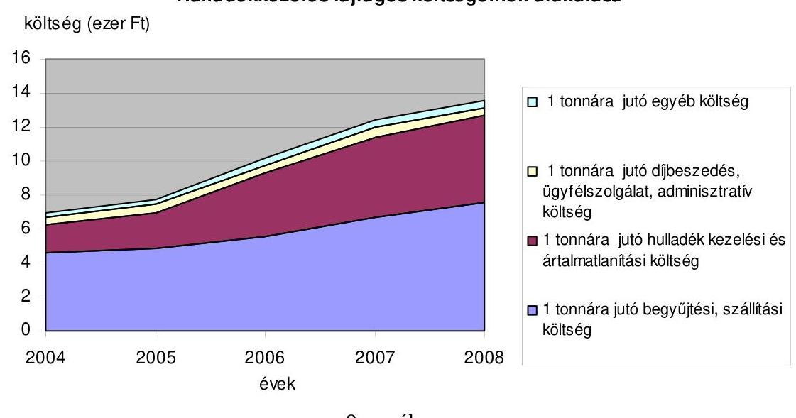

A lakossági hulladékgyűjtés éves díjának arányát a háztartások nettó jövedelméhez a 23. sz. melléklet, a hulladékkezelés további fajlagos mutatóinak alakulását a 24. sz. melléklet részletezi.

A hulladékkezelési közszolgáltatás díjának emelkedése és a lakosság fizetési hajlandóságának alakulása kiváltotta a hulladékkezelési közszolgáltatók szakmai szövetségének érdeklődését, kezdeményezésére sor került azok társadalmi gazdasági hatásainak vizsgálatára is. ${ }^{155}$ Miközben a közszolgáltatások körében a víz és

[^0]
[^0]:    ${ }^{155}$ A hulladékdíjak növekedésének gazdasági társadalmi hatásai című munkaközi anyag a Köztisztasági Egyesülés felmérései alapján, annak megrendelésére készült 2005 decemberében. A tanulmány célja az volt, hogy áttekintést adjon hulladékdíjak és a hulladékdíjakra ható tényezők alakulásáról, valamint prognosztizálja azt az

---

csatorna szolgáltatás díjai tekintetében van olyan elvárás, hogy a lakosság terhelése e jogcímen ne haladja meg a nettó jövedelmek 3-3,5%-át, addig a hulladékkezelési közszolgáltatás a szakmai szövetségek 1% körüli lakossági teherviselést tartanak elviselhetőnek, amelyhez még kellő díj megfizetési hajlandóság párosul. A hulladékdíjak növekedésének dinamikája 2004-ről 2008-ra 29,5%-os növekedést jelez, a hulladékkezelési díjak összege már most megközelíti a szakmai szövetség által még elviselhető mértékűnek tartott szolgáltatási díjat.

A szolgáltatási díjak alakulását a helyszíni vizsgálattal közvetlenül érintett önkormányzatok mellett további 30, olyan önkormányzati körből származó adatszolgáltatás is igazolja, amelyeknél a hulladékgazdálkodási létesítmények fejlesztése hazai forrásokra alapozva még az ezredforduló éveiben történt.

Az e területekről beérkezett adatszolgáltatás szerint a hulladékkezelés közszolgáltatás díjai 2004-2008 évek között ebben az önkormányzati körben is emelkedtek, a háztartásokban általában használt 120 literes hulladékgyűjtő edény heti egy alkalommal való ürítési díja 236 Ft-ról 374 Ft-ra (58,5%-kal) emelkedett, amely elmaradt a helyszínen ellenőrzött önkormányzatoknál érvényesített díjtétel emelések átlagától. Ugyanakkor ebben az edényzet kategóriában az ellenőrzött önkormányzatok az adott időszakban végrehajtott 93,5%-os átlagos díjemelkedést követően is 2008-ban még mindig 269 Ft egyszeri ürítési díjat állapítottak meg. Az adatfelméréssel érintett önkormányzatok területén heti egyszeri ürítési gyakorisággal számolva 2008-ban 19448 Ft, míg az ellenőrzött önkormányzati körben 13988 Ft-volt a háztartásokat terhelő évi átlagos hulladékkezelési díj összege.

Mindez összefügg azzal, hogy a korábbi fejlesztések eredményeként már belépett létesítmények üzemeltetési költségeit már érvényesítették a hulladékkezelési díjakban, e területeken magasabb fajlagos költségszintről (8,8 ezer Ft/tonna) indulva 2004-2008 között 24%-os költségemelkedés következett be. Ezzel szemben a fejlesztésekkel jelenleg érintett területek magasabb költségei a díjakban még nem jelentek meg, az üzemelés végleges költségstruktúrája még nem alakult ki, a fajlagos költségek 95,8%-os emelkedése azonban további díjtétel emelkedés irányába mutat.

ISPA/KA projektek megvalósítása utáni időszakra vonatkozóan, vizsgálja a hulladékdíjak fizetőképességének és fizetési hajlandóságának várható alakulását.

---

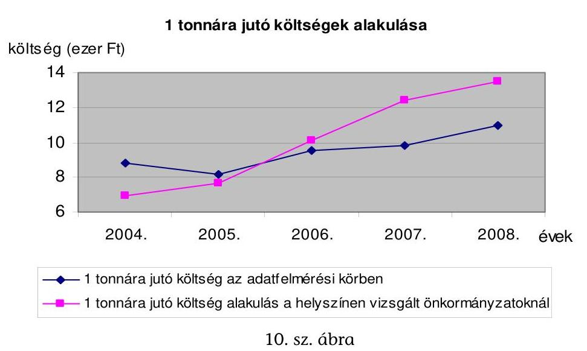

Az adatfelméréssel érintett önkormányzatok által közölt költségek összetétele szerint az 1 tonna hulladékra jutó összköltség alakulását 2008-ban 58%-ban a begyűjtési, szállítási költségek alakították, míg a kezelés, ártalmatlanítás 32%-ban befolyásolta a díjban érvényesítendő összköltséget. Ezen belül a kezelési, ártalmatlanítási költséghányad növekedési dinamikája a vizsgált időszakban 36%-os volt. A díjbeszedés, adminisztráció költségei arányaikban nem változtak számottevően.

A költségek átlagos színvonala jelentős szórást takar. A hulladékkezelési költség több mint kétszerese a turai (23198 Ft/tonna), és a szarvasi (23 159 Ft/tonna) hulladéklerakó és kezelő létesítményekben, illetve a pusztazámori hulladék kezelési költségei (19355 Ft/tonna) is megközelítik azt. A 2008. évi szélsőértékek alakulását az alábbiak szemléltetik:
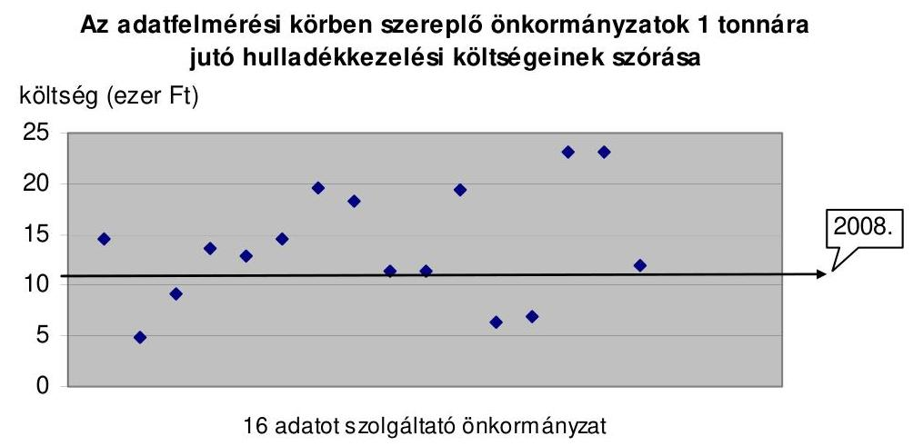

11. sz. ábra

A turai - szakmai körökben mintaprojektként említett - lerakó négy önkormányzat összefogásával valósult meg, s jelenleg is 100%-os önkormányzati tulajdonú gazdasági társaság működteti. A négy önkormányzat 50 évre elegendő kapacitású lerakót épített, jól működő szelektív gyűjtési rendszert alakított ki, nagy hangsúlyt fektettek a lakosság felvilágosítására. A szelektív gyűjtésben

---

mind a hagyományos, mind a csomagolási és zöldhulladék esetében a legeredményesebb begyűjtési arányt eredményező házhoz menő rendszert alakítottak ki. A három különféle edényzetet heti gyakorisággal, azonos napokon, külön szállítójárművekkel, a rendszeres díj fejében mennyiségi korlátozás nélkül szállítják el. A választott megoldás azonban - a szelektív gyűjtésből származó megtérülések ellenére is - magas fajlagos költségszintet eredményez. A társult önkormányzatok által vállalt környezettudatos hulladékkezelési rendszer működtetésének eredményeként Turán 2008-ban a keletkező települési szilárdhulladék 56,7%-át (az ellenőrzött önkormányzatokat jellemző gyűjtési arány 10-szeresét is meghaladóan) gyűjtötték szelektíven.

A szarvasi hulladéklerakóról készült adatszolgáltatás szerint a hulladékkezelés 1 tonnára jutó költségei 2004-2008. között 191%-kal, míg a pusztazámori hulladéklerakónál 151%-kal emelkedtek, esetükben azonban a növekvő ráfordításokat nem támasztja alá a költségigényesebb szelektív hulladékkezelés irányába való elmozdulás.

Az ellenőrzött önkormányzatok hulladékgazdálkodásának főbb mutatóit a 25. sz. melléklet tartalmazza. A vizsgált időszakban a települési önkormányzatok kötelező közszolgáltatást szervező tevékenységének eredményeként 3,7%-ponttal bővült a rendszeres hulladékgyűjtésbe bevont lakások aránya, s eközben a lakosságtól elszállított nem veszélyes hulladék mennyisége mintegy négyötödére esett vissza. Az önkormányzatok eközben nem fordítottak kellő figyelmet arra, hogy az adott település hulladékgazdálkodási mutatóinak EU célértékekhez való viszonyát rendszeresen értékeljék.

Az ellenőrzött önkormányzatok 79,5%-a keletkező hulladékmennyiség számbavételén túlmenően a települési szilárdhulladék lerakási arányának csökkentésére, valamint a lerakásra kerülő települési szilárdhulladék biológiailag lebomló szerves anyag tartalmának csökkentésére vonatkozóan nem rendelkezett adatokkal. Ezeknek az információknak a kezelését a közszolgáltató szervezetek feladatának tekintették, döntő részben nem is tartottak igényt arra, hogy a szolgáltató szervezetek a mutatókat települési szinten kezeljék. A helyszíni vizsgálat során a szolgáltató szervezetek is mindössze szakmai becslésre alapozottan vállalkoztak e települési mutatók célértékekhez való viszonyának kimutatására.

A vizsgált körben Kecskemét, Kaposmérő, Szolnok, Oroszlány, Nagykörös, Harasztifalu, Répcelak, Hévíz önkormányzatai rendelkeztek a hulladékgazdálkodási célértékek részletesebb, ezen belül a csomagolási hulladékok összevont és anyagában részletezett kötelező hasznosítási arányainak alakulásáról, valamint a miskolci regionális projekthez tartozó önkormányzatok számára volt ismeretes az inert hulladékok hasznosítási arányának várható alakulása. A működési területen lévő lerakásra vonatkozó követelményeknek nem megfelelő telepek bezárásának helyzetéről, a rekultiváció állásáról 12 települési önkormányzat (Dunaszentbenedek, Somogytúr, Kétpó, Hejőpapi, Kisgyőr, Mezőkövesd, Miskolc, Sajókaza, Szirmabesenyő, Gyömrő, Monor, Zalabér) közölt információkat.

A települések - annak ellenére, hogy a Hgt. jelenlegi szabályozása e tekintetben mindössze az önkormányzatok környezettudatos érdekfelismerésére alapoz - az EU célértékek közül mindössze a szelektív gyűjtés bővüléséről rendelkeztek számszaki adatokkal. A szelektív hulladékgyűjtésbe bevont lakások arányának

---

és a szelektíven begyűjtött hulladékmennyiség alakulását az alábbiak szemléltetik:
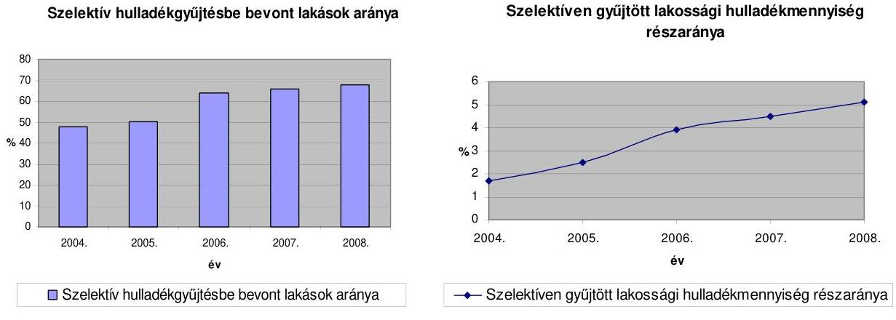
12. sz. ábra

Az ellenőrzött körben a vizsgált időszak alatt számottevően (47,8%-ról 67,6%-ra) bővült a szelektív hulladékgyűjtésbe bevont lakások aránya. A lakosság által elkülönítetten, válogatva gyűjtött hulladékmennyiség 2004-2008 között 2,3 szorosára, a teljes lakossági hulladékmennyiségen belüli részaránya háromszorosára nőtt. Átlagot meghaladóan 132,7%-kal nőtt az elkülönítetten gyűjtött műanyag, 294,7%-kal az üveg mennyisége, valamint megkétszereződött a lakossági zöldhulladék szelektív begyűjtése is. A szelektív hulladékgyűjtő szigetek száma 86,6%-kal emelkedett, tízszeresére nőtt a hulladékudvarok, nyolcszorosára a hulladékválogatók, ötszörösére a hulladékátrakó telepek száma. A szelektív gyűjtésben a szakmai szempontból hatékonyabbnak ${ }^{156}$ tekintett házhoz menő szolgáltatás eredményességét a vizsgált Szolnoki térségi projekt eddigi működése nem igazolta vissza, a szolgáltató véleménye szerint a szolgáltatás nem vált fejlődőképessé, a lakosság nem volt együttműködő. A lakossági elégedettségmérésben résztvevők 27%-ának véleménye szerint azonban ez azzal is összefügg, hogy a szelektív gyűjtőedényt a kevésbé kulturált, nehezebben kezelhető, rosszabb minőségű zsákos rendszerű, az indokoltnál ritkább (a korábbi heti rendszerességű helyett havonta egy alkalommal történő) elszállítás váltotta fel.

A szelektív gyűjtés feltételeinek kiterjesztése fontos eszköz abban, hogy a településeken keletkező hulladékmennyiség csökkentése mellett a lerakásra kerülő hulladékmennyiség csökkenjen. A vizsgált önkormányzatok körében elvégzett összegzések szerint azonban a hulladékkezelés és hasznosítás folyamatában a kívánt mértékű elmozdulás meg nem következett be. Az egyes hulladéktípusokat tekintve különösen szembetűnő, hogy a keletkező települési szilárdhulladék mennyiség 99,2%-át lerakással ártalmatlanítják, a hasznosítás összevont részaránya szelektív gyűjtés jelentős bővülése ellenére is elenyésző, a háztartási hulladékok energetikai célú, égetéssel történő hasznosítására pedig az ellenőrzött körben egyáltalán nem került sor.

[^0]
[^0]:    ${ }^{156}$ A Köztisztasági Egyesülés felmérése szerint 2005-ben a csomagolási hulladékok 28%-át tette ki a házhoz menő gyűjtés, a legnagyobb hányad (60%) a gyűjtőszigetekről származott, s a hulladékudvarokban mindössze 12%-nyi mennyiséget gyűjtöttek.

---

Az önkormányzatok közszolgáltatás finanszírozásában való részvétele, - különösen a közvetlen, „szennyező fizet elv" érvényesítésétől teljesen elszakadt díjtámogatási forma - nem ösztönzött a keletkező hulladékmennyiség csökkentésére, és nem támogatta a szelektív gyűjtés kiszélesítését sem, annak ellenére, hogy mind a hazai mind pedig az Uniós források jelentős hányadát szánták annak technológiai fejlesztéseire. A települési szilárdhulladék gazdálkodási feladatok támogatásra szánt hazai források 87,1%-át a szelektív gyűjtés feltételeinek javítására fordították.

Ezt felismerve 2008 decemberében az önkormányzati, a környezetvédelmi és vízügyi miniszter, valamint a szelektív hulladékok hasznosításában résztvevő koordináló szervezetek és az önkormányzati szövetségek képviselői hazánk európai uniós kötelezettségeinek teljesítését elősegítő
 közös nyilatkozatot fogalmaztak meg a szelektív hulladékgyűjtés rendszerének kiterjesztése és a lakossági begyűjtő rendszerek további bővítése érdekében. A hulladékkezelési közszolgáltatás szereplőinek így kifejezett szándéka, a szelektív gyűjtés kiterjesztését eddig is számottevő állami pénzeszközökkel támogató állami források nagyságrendje, a megvalósult és a folyamatban lévő regionális hulladékgazdálkodási projektek részeként elismert fejlesztések ellenére a Hgt. 21. (5) bekezdése változatlanul az önkormányzatok szabad választására bízza a települési szilárdhulladék egyes összetevőinek szelektív gyűjtését.

Az ellenőrzött önkormányzati körben szerzett tapasztalatok azt is igazolják, hogy a hulladékgazdálkodás területén elmúlt időszakban végrehajtott jelentős uniós és hazai fejlesztéseket nem követte a települési szilárdhulladékgazdálkodási stratégiában foglalt célokkal összehangolt a hulladékhasznosítási feldolgozóipari háttér fejlesztése, annak hazai erőforrásokra alapozó koordinált működtetése. Ez utóbbi hiánya - párosulva a gazdasági recesszió kedvezőtlen hatásaival - hozzájárult ahhoz, hogy a hulladékhasznosítás nyersanyagainak értékesítési nehézségei a begyűjtést és előkezelést végző szervezeteknél gazdasági ellenérdekeltséget, ezáltal a szolgáltatás minőségében, a megvalósult fejlesztések működésének hatékonyságában visszaesést okoz.

Az ellenőrzött önkormányzatoknál a jegyzők a számukra biztosított feladat- és hatáskörök gyakorlásával - a hiányosságok ellenére is - hozzájárultak a települések hulladékgazdálkodási tevékenységének ellátásához és céljainak eléréséhez, 46,2%-uknál a feladatellátás és a hatáskörök gyakorlását teljes egészében biztosították, a fennmaradó hányaduk azonban csak részben gondoskodott a jegyzőre háruló kötelezettségek teljesítéséről.

Az ellenőrzött önkormányzatok jegyzői közül hat (15,4%) nem gondoskodott a 241/2001. (XII. 10.) Korm. rendelet 1. §-ában és 2. § c.) pontjában foglalt feladatok és ellenőrzési kötelezettségek teljesítéséről. Az önkormányzatok 28,2%-ánál nem tártak fel illegális szemét elhelyezést, 38,5%-ánál nem keletkezett díjhátralék. A többi önkormányzatnál gondoskodtak az elhagyott hulladék elszállításáról és ártalmatlanításáról, valamint a díjhátralék behajtásáról. A 2004-2008. években az ellenőrzött önkormányzatok 5,1%-ánál szabott ki a jegyző hulladékgazdálkodási bírságot, összesen kilenc esetben 942 ezer Ft összegben, aminek a helyszíni ellenőrzés befejezéséig 9,7%-a folyt be az érintett önkormányzatok számlájára.

---

# 4.2. A szilárdhulladék-gazdálkodásra fordított működési és fejlesztési költségvetési források felhasználásának eredményessége az önkormányzat hulladékgazdálkodási feladatainak megvalósításában 

Az ellenőrzött időszakban, de különösen az uniós csatlakozást megelőző években az unióból származó források mellett jelentős összegű hazai támogatások szolgáltak a hulladékgazdálkodási célkitűzések elérésének támogatására. E támogatások elsődleges rendeltetése az volt, hogy a települési önkormányzatok számára előírt kötelező közszolgáltatás megszervezéséhez, annak önként vállalt helyi feladatainak ellátásához infrastrukturális feltételeket teremtsenek.

A települési szilárdhulladék-gazdálkodási közfeladat ellátásának támogatásához a legjelentősebb hazai forrásokat a címzett és céltámogatási rendszer, valamint a IX. Önkormányzatok támogatása költségvetési fejezetben tervezett, decentralizált döntési jogkörbe utalt célelőirányzatok keretében biztosítottak fedezetet. A támogatások odaítélésének gyakorlatában - az unióból származó források felhasználásának hatékonysága érdekében - a hazai források komplementer, társfinanszírozás követelményét biztosító kiegészítő jellege érvényesült.

Az egyes években a decentralizált döntési jogkörbe utalt költségvetési támogatás összegeit, jogcímeit, a decentralizálás szintjeit az adott évek költségvetési törvényei külön mellékletben határozták meg. A területfejlesztés intézményrendszerének változásával összhangban az előirányzott támogatási keretek felosztásának joga a megyei területfejlesztési tanácsoktól fokozatosan átkerült a regionális fejlesztési tanácsok döntési jogkörébe. A döntési jogköröket érintő decentralizáció iránya lehetőséget biztosított a támogatási döntések szélesebb körben való koordinációjára, a fejlesztéseket érintő szakmai és területi prioritások érvényesítésére.

Az önkormányzatok hulladékgazdálkodási programjaik megvalósításához a céltámogatási rendszer keretében, 1991-2005 között a feltételeknek megfelelő szilárdhulladék lerakó telepek létesítésére 115 önkormányzatot érintően 16,7 milliárd Ft fejlesztési összköltségű beruházásaikhoz 7,2 milliárd Ft támogatásban részesültek ${ }^{157}$. A beruházások 2004 év végére a pénzügyileg befejezett szakaszba jutottak.

A céltámogatásos fejlesztések első, dinamikus szakaszában 1995-2000 között 41 hulladéklerakón 13,7 millió $\mathrm{m}^{3}$ lerakó térfogat létesült, amely közel 1,9 millió lakos számára tette lehetővé a korszerű hulladék elhelyezést. Az érintett területen létesített lerakó kapacitás átlagosan 20,4 évre volt elegendő, illetve a felmérések szerint további 14 évi lerakási kapacitásbővítés lehetősége is biztosí-

[^0]
[^0]:    ${ }^{157}$ Forrás: Tájékoztató az 1991-2005 között címzett és céltámogatással megvalósított beruházások alakulásáról című MÁK JNSZ Megyei Területi Igazgatósága által készített kiadvány 28. sz. melléklete

tott. ${ }^{158}$ A céltámogatással megvalósuló hulladéklerakó fejlesztések olyan kistérségi (több település összefogásával létrejövő) létesítmények megvalósítását támogatták, amelyek egy része a közszolgáltatással való lefedettség szempontjából az ISPA és a KA forrásokból finanszírozott projekteken kívül esett, egy részük azonban azok megvalósítása esetén azok ellátási körébe integrálhatóvá válnak

Lefedettség szempontjából komplementer jelleggel bír például a Kunszentmárton-szelevényi hulladéklerakó, míg a zalaegerszegi projekt integrálódik a zalabéri ISPA projekt által lefedett közszolgáltatási területbe.

A hulladéklerakók műszaki előírásaira vonatkozó jogszabályok 2002. évtől szigorodtak ${ }^{159}$, amelynek következtében több, céltámogatásból épült hulladéklerakó nem felel meg a hatályos műszaki feltételeknek. A Környezetvédelmi Felügyelőségeknek nincs mérlegelési jogkörük e lerakók működési, üzemelési engedélyeinek meghosszabbításakor. Mivel emiatt az országban több ilyen, a jelenlegi műszaki feltételeknek nem megfelelő szeméttárolót kellene bezárni, az üzemelésre vonatkozó jogkörök célszerűségi szempontokat nélkülöző gyakorlása a korábban e célra juttatott állami pénzeszközök felhasználásának eredményességét utólagosan kedvezőtlenül minősíti.

A répcelaki lerakót is céltámogatásból építették, még 1998. évben, az akkori előírásoknak megfelelően. Bekerülési értéke 64 millió Ft volt, nettó értéke jelenleg 41 millió Ft. A hulladéklerakó szabad kapacitása közel 70%-os, azonban műszaki megoldása nem felel meg teljes körűen a jelenleg érvényben lévő előírásoknak, így engedélyezett működése 2008. december végéig szól. A répcelaki lerakót osztrák-német irányelvek alapján tervezték még a lerakók létesítésére vonatkozó 2002. évi jogszabály hatálybalépése előtt, amely a létesítésre vonatkozó előírásokat több ponton (kavicsvastagság, fóliavastagság stb.) szigorította.

Az önkormányzati közszolgáltatási feladatok ellátási feltételeinek biztosítása érdekében - a lakosság terheinek csökkentése céljából - a kormányzat központi költségvetéséből is biztosított támogatást az önkormányzatok számára, település hulladék közszolgáltatás fejlesztése címen.

A forrás 2001-2003 között a Belügyminisztérium költségvetésében szerepelt, évente 2-2 milliárd Ft összegben, ezek felhasználásáról pályázati rendszerben Tárcaközi Bizottság döntött. A Kormány a célelőirányzat felhasználását 2004-től kezdődően a Regionális Fejlesztési Tanácsok döntési körébe utalta, a rendelkezésre álló keretösszeget a 2004. és a 2005. évben 1,5 milliárd Ft-ban, míg a 2006. évi támogatási keretet már csak 750 millió Ft-ban határozták meg. A települési hulladék közszolgáltatás fejlesztésére így 2001-2006 évek között együttesen 9,75 milliárd Ft-ot szánt a költségvetés.

A vizsgálattal érintett időszak alatt rendelkezésre álló 3,75 milliárd Ft támogatási keret 96,9%-át, 3,64 milliárd Ft-ot használtak fel az önkormányzatok,

[^0]
[^0]:    ${ }^{158}$ Forrás: Környezetgazdálkodási Intézet Környezetvédelmi Intézete által készített összegzés az 1995-2000. között állami céltámogatás felhasználásával épült települési hulladéklerakókról
    ${ }^{159}$ 5/2002. (X. 29.) KvVM rendelet a települési szilárd hulladék kezelésére szolgáló egyes létesítmények kialakításának és üzemeltetésének részletes műszaki szabályairól

amelynek 73%-a a települési szilárdhulladék közszolgáltatás fejlesztéseihez kapcsolódott ${ }^{160}$.

Országos szinten a TEHU pályázati rendszerben felhasználható támogatási előirányzat 2004-2005. években hat felhasználási jogcímet tartalmazott, közülük öt a települési szilárdhulladék-gazdálkodási közszolgáltatás fejlesztéséhez (hulladékgyűjtő szigetek és gyűjtőpontok, hulladékudvarok, komposztáló telepek létesítéséhez, valamint a házi komposztálást segítő speciális eszközök beszerzéséhez illetve szelektív hulladékgyűjtő és szállító gépjárművek beszerzéséhez) kapcsolódott, jellemzően 60-70%-os támogatási részarány érvényesítése mellett. A 2006. évre rendelkezésre álló előirányzat felhasználásának prioritásai a képződő hulladékok keletkezésének megelőzésére, illetve a képződő hulladék lerakási arányának csökkentésére, a helyben történő szelektív gyűjtés kiterjesztésének támogatására, valamint az uniós elvárások figyelembevételével kitűzött hulladéklerakókra vonatkozó rekultivációs célok megvalósítására helyezték a hangsúlyt. A helyben történő szelektív gyűjtéshez szükséges edényzet és hulladékgyűjtő zsák beszerzéséhez, illetve a hulladéklerakók rekultivációjának felülvizsgálati dokumentációjának és kiviteli terveinek elkészítéséhez 80%-os részarányú költségvetési támogatást biztosítottak az eredményesen pályázó önkormányzatoknak. A házi komposztálás eszközeinek elterjesztését 60%-os, míg a szelektíven gyűjtött hulladékok begyűjtését biztosító járművek beszerzését 70%-os részarányú támogatással ösztönözték.

Az ellenőrzésbe bevont 39 önkormányzat közül a vizsgált időszakban 19 önkormányzat kapott a szilárdhulladék-gazdálkodási fejlesztéseihez hazai forrásból - 29 fejlesztési feladatra - összesen 227 millió Ft támogatást. További 19 önkormányzat nem pályázott hazai forrásokra és egy önkormányzatnak „Szolnok Boglárka úti (769/126 hrsz.) illegális szemétlerakó felszámolása" tárgyban benyújtott pályázatát - a pályázatok nagy száma és a források korlátozottsága miatt - elutasították.

A 2004. évtől 2008. december 31-éig megvalósított támogatott fejlesztések összköltsége 385 millió Ft volt, amihez a központi költségvetés forrásaiból 225 millió Ft támogatást használtak fel. A TEHU pályázati forrásából 23 db nyertes pályázatot finanszíroztak, mindösszesen 165 millió Ft összegben. A települési hulladék közszolgáltatás fejlesztési pályázati forrásából 2004-2008 között támogatott feladatok megoszlását a 26. sz. melléklet szemlélteti.

A települési közszolgáltatás fejlesztésében résztvevő hazai források között kisebb mértékben, de biztosítottak forrásokat hulladékgazdálkodási fejlesztések támogatására az önkormányzatok számára elérhető egyéb hazai fejlesztési pályázati konstrukciók (HÖF TEKI, HÖF CÉDE, LEKI) is azzal, hogy a támogatás jogcímrendszerében a termelő infrastruktúra részeként a hulladékkezelő létesítmények támogatása is szerepelt.

E fejlesztések jellemzően települési érdekkörben megvalósuló lokális beruházások voltak, a hulladékkezelési közszolgáltatás eszközbeszerzéseihez, a meglévő hulladéklerakók környezetvédelmi felülvizsgálatához, turizmust és a természetvédelmet is támogató hulladékgyűjtő eszközök beszerzésére irányultak E forrásokból a

[^0]
[^0]:    ${ }^{160}$ A felhasználási jellemzők összesítése a MÁK 2008. 11.17-i, 2008. október 31-én lezárt adatszolgáltatásán alapul.

MÁK adatszolgáltatása szerint ${ }^{161}$ a vizsgált időszak egészében 26 beruházáshoz 187,7 millió Ft-ot biztosítottak.

A vizsgált időszakban a helyszíni ellenőrzéssel érintett önkormányzatok megnyert fejlesztési támogatásai a települési hulladék közszolgáltatás-fejlesztés pályázati forrásán felül a Környezetvédelmi és Vízügyi Minisztérium Környezetvédelmi Alap Célelőirányzatának keretéből származtak, kettő-kettő esetben illegális hulladéklerakókat számoltak fel a segítségével, valamint hulladékgazdálkodási terveket, környezetvédelmi programokat készítettek a támogatás segítségével.

Az önkormányzatok számára erőteljes kihívást jelentett az uniós források igénybevételéhez szükséges saját forrás biztosítása. A támogatási lehetőségek maximális kihasználhatósága érdekében a mindenkori költségvetési törvény a IX. Önkormányzatok támogatása fejezetben céljellegű támogatási előirányzatot különít el arra, hogy az uniós támogatások iránt eredményesen pályázó önkormányzatok számára saját forrásaik kiegészítésére többlettámogatást biztosítson. Az Önkormányzati minisztérium adatszolgáltatása szerint 2004-2008 években hulladékgazdálkodási célú beruházások önerejének támogatására a 27. sz. melléklet szerinti önkormányzatok (pályázó önkormányzati társulások) számára biztosítottak támogatást.

Az EU Önerő Alap felhasználási szabályait évente miniszteri rendelet (BM, ÖTM, ÖM) határozta meg. A 2008. év végén elvégzett összegzések szerint az eredetileg számba vett célkitűzések pénzügyi maradványa lehetővé tette, hogy a 2008. végén az alap felhasználását újabb fejlesztési célokra nyissák meg ${ }^{162}$. Ennek keretében a támogatható feladatok között szerepel a települési hulladéklerakókat érintő rekultivációs programok végrehajtásának támogatása is. Ez utóbbi abból a felismerésből fakad, hogy a jelenleg megvalósítás szakaszában levő regionális hulladékgazdálkodási rendszerek keretében tervezett rekultivációs ütem a források beszűkülése miatt várhatóan elmarad a tervezettől, ezért szükséges azokat hazai forrásokból is támogatni.

A hulladékgazdálkodás környezeti szempontból is fontos társadalmi érdek, amelynek szolgálatába a civil szféra is egyre szervezettebben vonható be. E felismerés váltotta ki azt a törvényi szabályozást, mely szerint - 2008 végéig - az adózó állampolgár személyi jövedelemadójának 1%-át e közérdekű célra is felajánlhatta.

A felajánlásokból rendelkezésre
 álló forrásból az illegális hulladéklerakás, a hulladékelhagyó magatartás jelensége ellen irányuló kezdeményezéseket támogatták, az összeg egy részéből lakossági szemléletformáló kampányokat és média megjelenéseket is finanszíroztak. A KvVM által elvégzett összegzés szerint ${ }^{163}$ e cí-

[^0]
[^0]:    ${ }^{161}$ A felhasználási jellemzők összesítése a MÁK 2008. 11. 17-i, 2008. október 31-én lezárt adatszolgáltatásán alapul.
    ${ }^{162}$ Az önkormányzati miniszter 12/2008. (XII. 4.) ÖM Rendelete az önkormányzatok és jogi személyiségű társulásaik európai uniós fejlesztési pályázatainak saját forrás kiegészítése 2008. évi támogatásának rendjéről szóló 16/2008.(III. 28.) ÖTM rendelet módosításáról.
    ${ }^{163}$ Forrás: ÖTM Területrendezési és Településügyi Főosztály NKP II. 2007. évi előrehaladási jelentésről és a 2008. évi végrehajtási tervről szóló kormánytájékoztatókhoz készült részanyaga.

---

men 2008-ban 245,8 millió Ft állt rendelkezésre, amelyből 132 pályázó önkormányzatot és civil szervezetet támogattak.

A 2004-2008. években - az ellenőrzött önkormányzatoknál - a szilárdhulladékgazdálkodásra fordított kiadások összege ${ }^{164}$ (9297 millió Ft) az önkormányzatok összesített összkiadásának az 1,14%-a volt, évenkénti aránya alig haladta meg az egy százalékot.
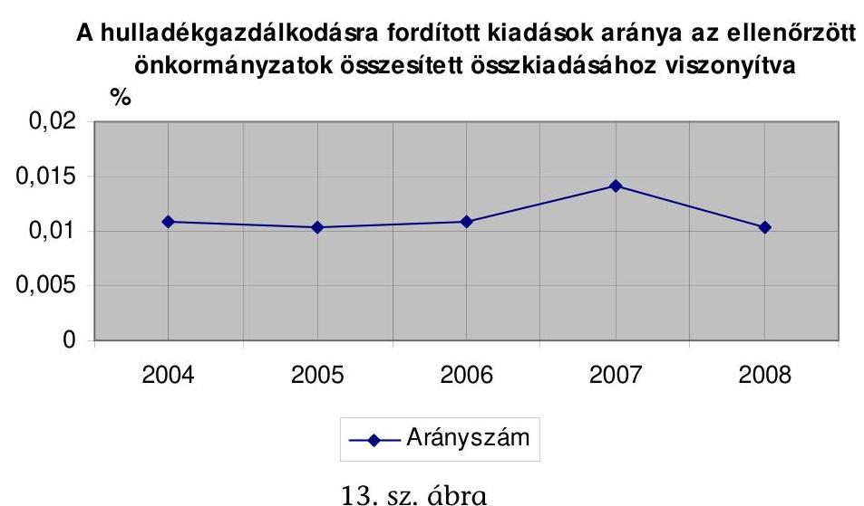

A kiadások nagyobb részt működési célúak voltak, mindösszesen 9%-ot (861 millió Ft-ot) fordítottak felhalmozási feladatok megvalósítására. A vizsgált önkormányzatok mintegy kétharmadának a hulladékgazdálkodással kapcsolatosan nem volt felhalmozási kiadása. A hulladékgazdálkodásra 2004-2008 években fordított önkormányzati kiadások alakulását a 28. sz. melléklet szemlélteti.

Egyéb működési célú támogatásként mutatták ki az önkormányzatok a térségi hulladékgazdálkodó rendszerek projekt szervezetének nyújtott támogatásokat és azokat az összegeket, amit az önkormányzatok a saját alapítású vállalkozásaiknak juttattak - a költségvetésükben meghatározott módon - a hulladékgazdálkodással kapcsolatos feladatok ellátására.

A 2004-2008. években a szilárdhulladék-kezelési közszolgáltatás igénybevétele érdekében, közvetlen és közvetett módon a lakosság számára biztosított támogatások összege - az ellenőrzött önkormányzatoknál - megközelítette a hulladékgazdálkodásra fordított kiadások összegének a 11%-át. Ez a nagyarányú támogatás a lakosságot nem ösztönözte környezettudatos hulladékgazdálkodásra.

A vizsgált önkormányzatok közül 33 (85%) önkormányzat csatlakozott - 2008. december 31-éig - valamelyik ISPA/KA projektként megvalósított regionális hulladékgazdálkodási rendszerhez, hulladékgazdálkodási kiadásaik tartalmazták a csatlakozással összefüggésben megfizetett hozzájárulások összegeit. A pályázati támogatásokkal megvalósított fejlesztések a települések hulla-

[^0]
[^0]:    ${ }^{164}$ Az önkormányzati kiadások az ISPA/KA hulladékgazdálkodási rendszerek kiépítéséhez biztosított uniós forrásokból finanszírozott kiadások nélkül értendők.

---

dékgazdálkodási célkitűzéseivel összhangban voltak és az önkormányzatok hulladékgazdálkodási feladatellátását szolgálták. A vizsgált időszakban az ellenőrzött önkormányzatok által szilárdhulladékgazdálkodásra fordított kiadásoknak mintegy három százalékára nyújtottak fedezetet az egyéb hazai támogatásokból elnyert források. További mintegy öt százalékot finanszíroztak az önkormányzatok a hulladékgazdálkodással kapcsolatos bevételeikből, a kiadások több mint 90%-át az ellenőrzött önkormányzatok egyéb saját bevételből fedezték, hogy eleget tehessenek a Hgt.-ben előírt kötelezettségüknek.

# 4.3. A lakossági elégedettségmérés összegzésének tapasztalatai 

A vizsgált önkormányzatok területén a hulladékkezelési közszolgáltatás több mint 231 ezer háztartást érintett. Az Állami Számvevőszék részéről végzett internetes és hagyományos papíralapú kérdőíves lakossági elégedettségmérés az e területen élők véleményének megismerését tette lehetővé. A megkeresés eredményeként 1702 db válasz (0,7%) érkezett vissza.

A válaszadók 63,1%-a rendelkezett információval arról, hogy megyéjében vagy tágabb lakókörnyezetében jelentős szilárdhulladék-kezelést szolgáló beruházások valósultak meg, illetve vannak folyamatban, azonban 60%-uk úgy vélte, hogy a fejlesztések következtében a hulladékgazdálkodás rendszerében várhatóan bekövetkező változásokról a lakosság nem kapott megfelelő tájékoztatást.

A közszolgáltató tevékenységének színvonala a megkérdezettek szerint javult, annak 2004-2008 közötti alakulását 1-5-ös skálán értékelő válaszadók előbb 53,9%-a, majd 2008-ban 73,5%-a sorolta a 4. és az 5. csoportba. Az önkormányzatok szolgáltatást szervező tevékenységének minősítése az időszak alatt 22,8%-kal javult. A választ adó háztartások 61,1%-a gyűjti szelektíven a papírt, 51,6%-a a papírt és a műanyag, eldobható PET palackot, 50,6%-a a papírt, a műanyagot és a fémhulladékot, 52,9%-a pedig az előzőekben jelölt hulladékféleségek mellett szelektíven gyűjti még az üveget is. A komposztálást, mint a háztartásban keletkező zöldhulladék újrahasznosításának módját, a megkérdezettek 55,7%-a ismeri és alkalmazza. A hulladékgazdálkodási létesítmények fejlesztési alternatíváinak szempontjából jelzés értéke van annak, hogy a megkérdezettek 31%-a ítélte úgy, hogy messze vannak a kialakított gyűjtőszigetek.

A szelektív gyűjtés létesítményi fejlesztésében a nemzetközi tapasztalatok szerint a lakosság környezettudatos együttműködése abban az esetben eredményes, ha a szelektív gyűjtőszigetek az állampolgárok lakóhelyének 200-300 méteres körzetén belül vannak.

---

A szelektív gyűjtés helyben kialakított gyakorlatával való elégedettséget a 14. sz. ábra érzékelteti.
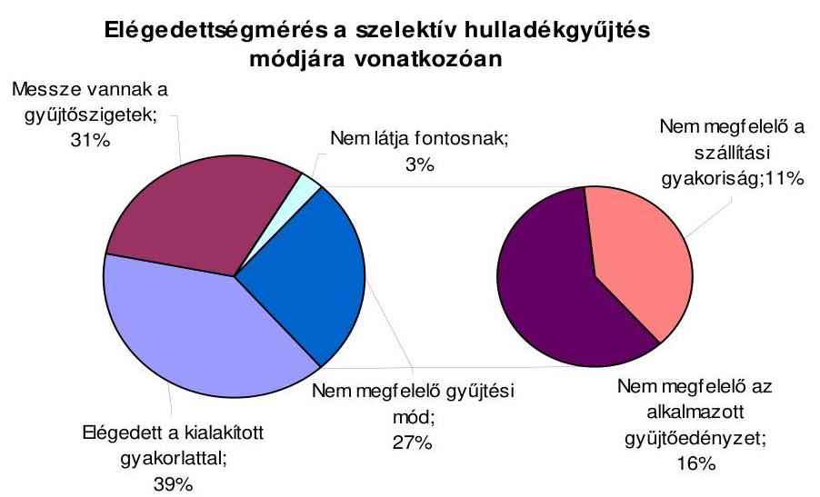
14. sz. ábra

A felmérésben résztvevők kétharmada tapasztalt lakókörnyezetében illegális, engedély nélküli hulladéklerakást, és több mint 70%-a úgy vélte, hogy nincs is megfelelő visszatartó erő annak elkerülésére.

Budapest, 2009. július 28.
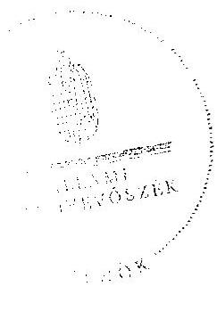

Dr. Kovács Árpád elnök

Melléklet:  28 db  21 lap

---

# MELLÉKLETEK

---

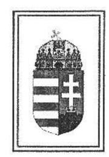

ÖNKORMÁNYZATI MINISZTER

Iktatószám: ÖM/7611/3/2009.

Hiv. szám: V-2013-065/2008-2009..

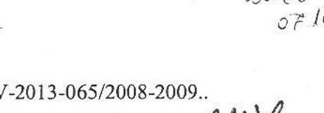

Iktatószám: ÖM/7611/3/2009.

Dr. Kovács Árpád Úrnak
Állami Számvevőszék
Elnöke

Budapest

Zöldiéti Attila

1. il. 13.

Tiszaelőkín leztola

juli. 14.

Tisztelt Elnök Úr!

Az Önök által megküldött - a szilárdhulladék-gazdálkodásra a Kohéziós Alapból és hazai forrásból nyújtott támogatások hasznosulásának ellenőrzéséről készített - jelentésre észrevételt nem kívánunk tenni.

Budapest, 2009. július 9.

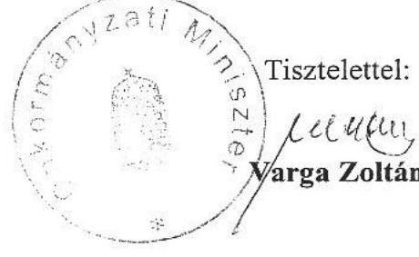

Cím: 1051 Budapest, József Attila u. 2-4. Postacím: 1903 Budapest, Pf. 314.
Telefon: (1) 441-1717, Fax: (1) 441-1720, E-mail: miniszter@otm.gov.hu

---

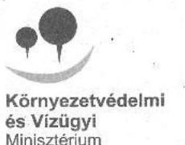

Környezetvédelmi és Vízügyi Minisztérium

MAGYAR KÖZTÁRSASÁG KÖRNYEZETVÉDELMI ÉS VÍZÜGYI MINISZTÉRIUMA 1045109.

3. láng í 667 uP.

Tárgy: V-2013-065/2008-2008 jelentés

Feltéve leírt le 2000.04.28.

ÁLLAMI SZÁMVEVŐSZÉK

5635/ Érkezett/ 2009.07.27.

Iktatószám: V-2013-065/2008-09.

Melléklet:

Tisztelt Elnök Úr!

A Szilárdhulladék-gazdálkodásra a Kohéziós Alapból és hazai forrásból nyújtott támogatások hasznosulásának ellenőrzéséről készített – Dr. Kling István államtitkár úrral előzetesen egyeztetett - jelentésüket köszönettel megkaptam.

A jelentésben foglalt megállapításokkal és javaslatokkal kapcsolatban észrevételt nem kívánok tenni.

A jelentés javaslatai alapján elrendelt intézkedéseimről 30 napon belül tájékoztatni fogom.

Budapest, 2009. július „K„

Üdvözlettel:

Szabó Imre

1011 Budapest, Fő utca 44-50
1394 Budapest, Pf. 351.

e-mail: miniszter@mail.kvvm.hu
EZ ÚJRAHASZNOSÍTOTT LEVÉLPAPIR!

telefon: 457 3300
telefax: 201 2361

---

1/c. sz. melléklet a V-2013-071/2008-2009. sz. jelentéshez

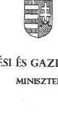

NEMZETI FEJLESZTÉSI ÉS GAZDASÁGI MINISZTÉRIUM MINISZTER

ÁLLAMI SZÁMVEVŐSZÉK

Érkezett: 2005.07.21. Iktatószám: 40000000000000000000000000000000000000000000000000000000000000000000000000000000000000000000000000000000000000000000000000000000000000000000000000000000000000000000000000000000000000000000000000000000

---

# A hulladékgazdálkodás stratégiai, tervezési dokumentumai 

(a dokumentum elkészítésének időrendjében)

| Stratégiai dokumentum |  | A dokumentum főbb jellemzői |
| :--: | :--: | :--: |
| Megnevezés | Készítés éve/ Időtáv |  |
| ISPA stratégia | $\begin{aligned} & 2000 / \\ & 2000-2003 \end{aligned}$ | A különböző szintű tervekben foglalt célok elérését szolgáló Települési Szilárd Hulladékgazdálkodás uniós fejlesztési projektjeinek megalapozásához |
| Országos Hulladékgazdálkodási Terv (OHT) | $\begin{aligned} & 2002 / \\ & 2003-2008 \end{aligned}$ | A második Nemzeti Környezetvédelmi Program része |
| Területi (tervezési statisztikai régiókra kiterjedő) Hulladékgazdálkodási Tervek | $\begin{aligned} & 2002 / \\ & 2003-2008 \end{aligned}$ | OHT figyelembe vételével |
| Helyi (önkormányzati) Hulladékgazdálkodási Tervek | $\begin{aligned} & 2002 / \\ & 2003-2008 \end{aligned}$ | A Területi Hulladékgazdálkodási Tervek figyelembe vételével |
| KA stratégia | $\begin{aligned} & 2003 / \\ & 2004-2006 \end{aligned}$ | A különböző szintű tervekben foglalt célok elérését szolgáló Települési Szilárd Hulladékgazdálkodás uniós fejlesztési projektjeinek megalapozásához |
| NFT I. | $\begin{aligned} & 2003 / \\ & 2004-2006 \end{aligned}$ | KIOP, és a GOP kapcsolódik a hulladékgazdálkodáshoz |
| Települési Szilárd hulladékgazdálkodás Fejlesztési stratégia (TSzH FS) | $\begin{aligned} & 2006/ \\ & 2007-2016 \end{aligned}$ | OHT továbbfejlesztése és időbeli kiterjesztése, hatályos 2006. novembertől |
| Települési Szilárd hulladékgazdálkodás Támogatási stratégia | EU-ba kiküldve 2008. július 11../ 2007-2016 | A támogatási stratégia a fejlesztési stratégia kiegészítése.   A TSzH FS megvalósításához igénybe vehető EU támogatások felhasználásának optimalizálását célozza. |
| Új Magyarország Fejlesztési Terv, Magyarország Nemzeti Stratégiai Referenciakerete | $\begin{aligned} & 2006/ \\ & 2007-2013 \end{aligned}$ | Az ÚMFT 4. prioritása foglalkozik a Környezeti és Energetikai fejlesztésekkel.   Főként a KEOP és a ROP kapcsolódik a hulladékgazdálkodáshoz |
| Nemzeti Fenntartható Fejlődési Stratégia | 2007 | Hosszú távú stratégia |

---

# Az ISPA/Kohéziós Alap támogatással megvalósuló projektek jellemző adatai régiónként

|  Régió | Projekt neve | Települések
száma | Lakosságszám
(fő) | A régió és a
projekt lakosainak
aránya % | Keletkező települési
szilárd hulladék
(t/év) | A régióban és a projekt
területén keletkező települési
szilárdhulladék aránya (%)  |
| --- | --- | --- | --- | --- | --- | --- |
|  Nyugat-Dunántúl | Nyugat-Balaton | 282 | 364644 | 36 | 144100 | 38  |
|  Közép-Dunántúl | Észak-Balaton | 158 | 300939 | 27 | 150607 | 26  |
|  Észak-Magyarország | Miskolc | 37 | 262478 | 20 | 80000 | 15  |
|  Észak-Magyarország | Sajó-Boldva | 102 | 229000 | 18 | 209551 | 20  |
|  Észak-Alföld | Tisza-tó | 42 | 111982 | 7 | 26512 | 5  |
|  Észak-Alföld | Szolnok | 24 | 202000 | 13 | 74000 | 13  |
|  Észak-Alföld | Hajdú-Bihar | 78 | 528543 | 34 | 180000 | 33  |
|  Észak-Alföld | Szabolcs-Szatmár | 240 | 595342 | 38 | 230000 | 42  |
|  Dél-Alföld | Szeged | 33 | 258000 | 19 | 167115 | 28  |
|  Dél-Alföld | Duna-Tisza köze | 48 | 354000 | 26 | 111271 | 18  |
|  Dél-Alföld | Homokhátság | 82 | 344815 | 25 | 100000 | 16  |
|  Dél-Dunántúl | Dél-Balaton | 204 | 372500 | 37 | 143260 | 38  |
|  Közép-Magyarország | Pest megye | 106 | 270000 | 10 | 130000 | 9  |
|  Összesen: | - | 1436 | 4194243 | - | 1746416 | -  |

---

Kohéziós Alap támogatással finanszírozott hulladékkezelési projektek (2000-2006)
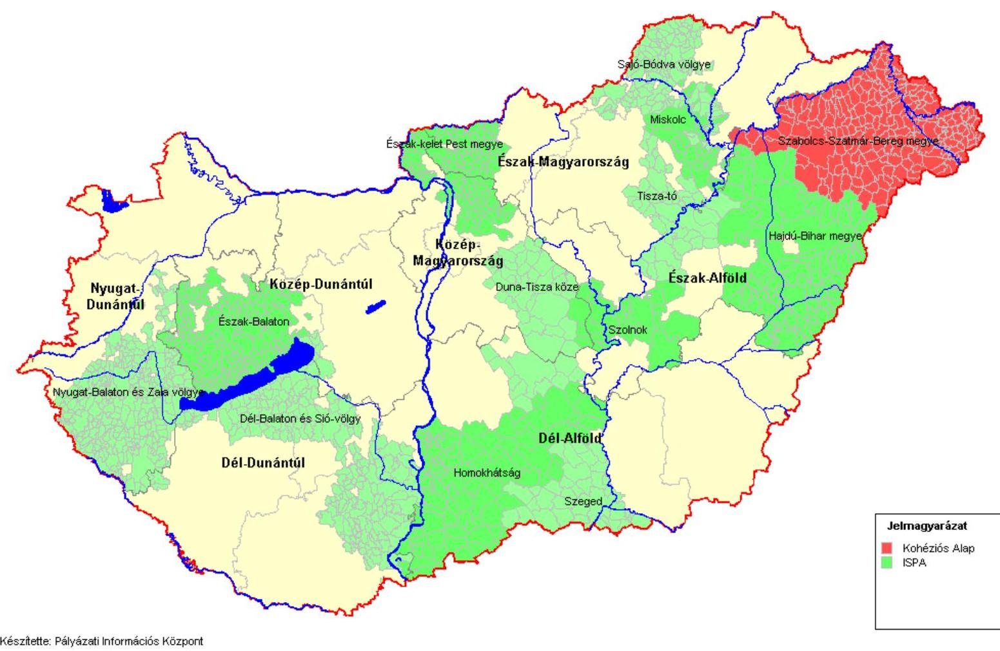

---

# Teljesítménymutatók és a hozzá tartozó kritériumok a települési szilárdhulladék-gazdálkodásra a KA-ból és hazai forrásból nyújtott támogatások hasznosulásának értékeléséhez 

| Vizsgálati kérdések | Kritériumok és teljesítménymutatók | Adatforrások |
| :--: | :--: | :--: |
| Az ISPA/Kohéziós Alapból és hazai forrásból megvalósuló települési szilárd hulladékgazdálkodási komplex regionális rendszerek eredményesen és hatékonyan szolgálták-e a magyar környezetvédelmi és hulladékgazdálkodási célok megvalósítását és az EU, valamint hazai támogatások hasznosulását? |  |  |
| 1. A feltételrendszer kialakítása lehetővé tette-e a célrendszer teljesítését? |  |  |
| 1.1. Kialakították-e az uniós követelményekhez illeszkedő hazai hulladékgazdálkodási stratégiát? | Az uniós irányelvekben megfogalmazott tagállami követelményeket (2. sz. melléklet) teljesítő stratégia megléte. | Nemzeti Környezetvédelmi Program I-II. |
| 1.1.1. Kialakították-e a hazai hulladékgazdálkodási stratégia pénzügyi és naturális céljainak, valamint forrásainak összhangját? | A pénzügyi célok mellett az irányelveket teljesítő mérhető mutatók megléte és a felhasználható források időarányos biztosítása. | A különböző szintű hazai hulladékgazdálkodási stratégiák. |
| 1.1.1.1. Kialakították-e az uniós források lehívását célzó stratégiák (ISPA, KA, KEOP) és a hazai települési szilárd hulladékgazdálkodási stratégiák összhangját? | A megvalósítással elérni kívánt mutatók összhangja. |

 Stratégiák. |
| 1.1.1.2. Összehangolták-e az uniós projektek céljait az ISPA/KA stratégiákkal | A célok és a prioritások összhangja. | Stratégiák, projekt dokumentumok. |
| 1.1.1.3. Összehangolták-e a különböző uniós és hazai források hasznosítását a települési szilárd hulladékgazdálkodási célkitűzésekkel? | A különböző stratégiák és programok forrásainak összhangja. | Stratégiák, előirányzatok. |
| 1.1.2. A kialakított stratégiák az uniós normáknak megfelelő arányban tükrözik-e a hulladékgazdálkodás „megelőzés-hasznosítás- ártalmatlanítás" hierarchiáját? | A hierarchia és a rendelkezésre álló források összhangja. | Stratégiák, előirányzatok. |
| 1.2 Időben és teljes körűen alakították-e ki a települési szilárd hulladékgazdálkodás EU harmonizált jogi szabályozási és intézményi környezetét? | A KA Magyarország számára való megnyílása időpontja és a teljes hazai jogszabályi környezet és intézményrendszer kialakítása közötti időintervallum kimutatása.   A hulladékgazdálkodás műszaki paraméterei szabályozottságának megléte és időbelisége a csatlakozáshoz képest. | Hazai és uniós szabályozás.   Nem jogszabály jellegű hazai előírások, kézikönyvek, egyéb szabályzatok (pl. SZMSZ).   SZMSZ-ek, együttműködési megállapodások, munkaköri leírások, alapítói okiratok. |

---

|  | Az üzemeltető kiválasztása jogi szabályozottságának és változásának időbelisége a program indulásához képest.   A kedvezményezettek által kiépített szervezetek kialakításának és a támogatási döntés időpontjának összhangja (felkészülten rendelkezésre álltak-e a megfelelő időben) |  |
| :--: | :--: | :--: |
| 1.2.1. Az ellátandó feladat nagyságrendjéhez igazodva alakították-e ki az önkormányzatok a projekt megvalósításának szervezeti kereteit? | Társulási megállapodások, konzorciumi szerződések megkötése, a részvevő önkormányzatok döntései a szervezet kialakítására.   A projektmenedzsment felállítása, az SZMSZ, az ügyrendek, szabályzatok jóváhagyása, a munkaszervezet kialakítása. | Társulási megállapodások, konzorciumi szerződések és azok módosításai. Képviselő-testületi ülések jegyzőkönyvei, határozatok.   Kinevezések, megbízási szerződések, szabályzatok, ügyrendek. |
| 1.3 A hazai hulladékgazdálkodási stratégia végrehajtásához a tervezett (finanszírozási) ütem szerint biztosították-e a hazai és uniós forrásokat? (költségvetési, előirányzati szinten) | Az elfogadott stratégiák ütemterve és az éves költségvetési törvényekben rendelkezésre bocsátott források különbsége. | Stratégiák, éves költségvetések. |
| 1.4. Kialakították-e és a végrehajtás során a gyakorlatban alkalmazták-e a tájékoztatás, nyilvánosság és a partnerség elvét érvényesítő eljárásokat? | A társadalmi viták időbeliségének, a pályázati felhívások közzétételének és az összeférhetetlenség kezelésének megfelelősége, a támogatási források ismertsége. | Társadalmi viták jegyzőkönyvei, pályázati felhívások, elégedettségi felmérés eredményei. |
| 2. Az ISPA/KA és hazai támogatások felhasználásával előkészített és megvalósított regionális komplex rendszerek eredményesen és hatékonyan szolgálják-e a kitűzött célok megvalósítását? |  |  |
| 2.1. A szükségletekre alapozottan, a hulladékgazdálkodási és társadalmi szempontok figyelembe vételével történt-e az ISPA projektjavaslatok előkészítése, a pályázatok elkészítése és benyújtása? | A műszaki dokumentáció, a költség-haszon elemzések, a megvalósíthatósági tanulmányok, a környezeti hatástanulmányok kidolgozottsága a döntés időpontjában.   A társadalmi egyeztetés lefolytatása a döntés előkészítéseként.   A saját forrást igazoló és a pályázathoz benyújtandó dokumentumok megléte. | Műszaki dokumentáció, költséghaszon elemzések, megvalósíthatósági tanulmányok, környezeti hatástanulmányok az elkészítés időpontjának megjelölésével.   Képviselő testületi jegyzőkönyvek, népszavazás, közmeghallgatás, egyéb érdekegyeztető fórumok jegyzőkönyvei.   Saját forrást igazoló és a pályázathoz benyújtott dokumentumok |
| 2.2. Az elfogadott projektjavaslatban és a benyújtott ISPA pályázatban foglalt időtervekkel, pénzügyi és műszaki tartalommal | A pályázatban megjelölt vállalások megjelenése a Pénzügyi Megállapodásban és a Támogatási Szerződésben, illetve a vállalások teljesítésének elmaradására kilá- | Projektjavaslat, pályázat, pénzügyi megállapodás, támogatási szerződés. |

---

| összhangban kötötték-e meg a Pénzügyi Megállapodást és a Támogatási Szerződést? | tásba helyezett szankciók.   A pályázatban megjelölt naturális mutatók, pénzügyi és időtervek megjelenése a Pénzügyi Megállapodásban és a Támogatási szerződésben.   A PM EU bizottsági és hazai, valamint a PM és a TSZ aláírása között eltelt idő. |  |
| :--: | :--: | :--: |
| 2.2.1. A Pénzügyi Megállapodások és a Támogatási Szerződések egyértelműen rögzítik-e a célokat és a hozzájuk rendelt output, eredmény és hatásmutatókat, a források megoszlását, a jogokat és kötelezettségeket, valamint a megfelelő biztosítékokat? | Az output, eredmény és hatáscélok rögzítettsége és illeszkedése a program céljaihoz. | Támogatási Szerződések, ISPA, KA Stratégiák. |
| 2.2.2. Az esetleges szerződésmódosítások esetén feltárták-e a kiváltó okokat és intézkedtek-e azok kezeléséről? | Intézkedési vagy cselekvési terv megléte és végrehajtásának igazolása. | Támogatási Szerződések, jegyzőkönyvek. |
| 2.3. A projekt a Pénzügyi Megállapodásban és a Támogatási Szerződésben kijelölt célrendszer szerint valósult-e meg, a rendelkezésre álló erőforrásokat hatékonyan és a gazdaságossági szempontokat figyelembe véve használ-ták-e fel? | A környezeti hatásvizsgálat, a környezetvédelmi engedély, az építési és egyéb hatósági engedélyek és a kiviteli tervek megléte, azok időbelisége a PM/TSZ aláírásához viszonyítva.   Beszerzési és finanszírozási terv megléte és időbelisége a PM/TSZ aláírásához viszonyítva.   Az engedélyek és tervek tartalmának illeszkedése a PM/TSZ-ben foglaltakhoz. | A környezeti hatásvizsgálat iratai, a környezetvédelmi engedély, az építési és egyéb hatósági engedélyek és a kiviteli tervek a dátum megjelölésével |
| 2.3.1. A beruházások megvalósítása megfelelt-e Pénzügyi Megállapodásokban és a Támogatási Szerződésekben foglalt ütemezésnek? | A tervezett és tényleges első kifizetések alakulása.   A tervezett és tényleges kifizetési ütemtervek és volumenek alakulása, teljesítményekkel való alátámasztottsága. | Szerződések, ütemtervek.   Építési és szolgáltatási számlák, kifizetések, egyéb számviteli és pénzügyi dokumentumok. |
| 2.3.2. A beruházások műszaki tartalma, minősége és költségvetése megfelel-e a Pénzügyi Megállapodásban és a Támogatási Szerződésben foglaltaknak? | Az eredeti és az esetleges technológia váltások, vagy bizonyos technológiák/eszközök elhagyásának összhangja a tervezett műszaki tartalommal, minőség és költségek elvárásokkal, valamint az eredetileg kitűzött célokkal.   A módosítások, elmaradt és pótmunkák engedélyezési eljárásának megléte és alkalmazása. | Szerződések, a változások nyomon követési és engedélyezési dokumentumai.   Előrehaladási jelentések, monitoring jelentések, jegyzőkönyvek.   Változtatási utasítások, a technológiai váltáshoz kapcsolódó dokumentumok, jóváhagyások. |

---

| 2.3.3. A beruházási folyamatban érvényesítették-e a 3 e (VFM) elv alkalmazását és a beszerzésre vonatkozó előírásokat? | A Mérnök kiválasztása és tevékenysége a beruházás megvalósítása során, a beruházás további megvalósításában a résztvevők kiválasztása, a beruházó szakmai és pénzügyi felügyelő tevékenysége és a beruházási célok összhangja.
A beszerzési eljárások szabályozottsága és gyakorlati alkalmazásának összhangja, a beszerzések gazdaságossága.
A tervezett és tényleges költségek összhangja, a tényleges költségek alapján számított és a pályázatban beadott gazdaságossági mutatók összhangja a teljesítési arányok figyelembe vételével | A Mérnök szerződése, a Mérnök teljesítés igazolásai, egyéb szolgáltatási és építési szerződések, a különböző megbeszélések jegyzőkönyvei, írásos utasítások.
Pályázati felhívás, érkeztetés és bontás dokumentumai, hiánypótlások, értékelések, a nyertes pályázó kihirdetése, esetleges jogorvoslatok.
Kifizetési bizonylatok.
Pályázatok, szerződések, kifizetési bizonylatok.  |
| --- | --- | --- |
|  2.4. A tervezett mérföldköveknek, beruházási szakaszoknak megfelelően hasznosítják-e a már realizált eszközöket/létesítményeket? | A tervezett és tényleges használatba vételi eljárások összhangja.
Az üzembe helyezés és üzemeltetés összhangja a szerződéses célokkal.
A tervezett és tényleges rekultivációk összhangja. | Használatbavételi engedély, KEHI zárójelentés, aktiválás pénzügyi iratai, valamint az elidegenítési tilalom földhivatali bejegyzése.
A projekt létesítményeinek a megvalósítása során beszerzett gépeknek, berendezéseknek a helyszíni megtekintése mintavétel alapján, az üzemeltetési napló tanulmányozásával
A rekultivációk dokumentáltsága, helyszíni megtekintése mintavétel alapján.  |
|  2.5. A kialakított pénzügyi és számviteli rendszer támogat-ta-e a projektek eredményes és hatékony megvalósítását? | A pénzügyi és számviteli nyilvántartások naprakészsége. | Nyilvántartások.  |
|  2.5.1 A nyilvántartási rendszer a projektek tényleges állapotának megfelelően tükrözi-e a projektek fizikai és pénzügyi helyzetét? | A tényleges és a nyilvántartott állapot összhangja. | Nyilvántartások, helyszíni ellenőrzések jegyzőkönyvei.  |
|  2.5.1.1. Figyelemmel kísérték-e a támogatási folyamat pénzügyi lebonyolításának hatását a projektek realizálására? | A késedelmes kifizetés aránya az összes kifizetés tekintetében.
Késedelmes kifizetésre visszavezethető átütemezési kérelmek száma. | A támogatásigénylés és az átutalások dátuma.  |
|  2.5.1.2. Nyomon követték-e a szerződésekben foglalt pénzügyi ütemtervek teljesülését és vizsgálták-e az indikátorok teljesítését a kifizetések előtt? | A tényleges kifizetések és az elért indikátorok összhangja szerződésekben foglaltakkal. | Szerződések, EMIR, egyéb nyilvántartások. Támogatás igénylések. Azokhoz kapcsolódóan a projektek értékelése:
- jelentések
- támogatási szerződés, mellékletei
- értékelések
- ellenőrzési és monitoring jegyzőkönyvek.  |

---

| 2.5.2. A pénzügyi lebonyolításában kialakították és alkalmazzák-e a jogosult költségek ellenőrzésének rendszerét? | A jogosultságvizsgálat szabályozottsága és alkalmazása. | Szabályzatok, jegyzőkönyvek. |
| :--: | :--: | :--: |
| 2.5.3. Alkalmas-e a pénzügyi nyilvántartási rendszer a kiválasztott projektek esetében a tranzakciók egyértelmű nyomon követésére, a nyilvántartott adatok egyeznek-e az alapdokumentumok adataival? | A papír alapú és elektronikus nyilvántartások összhangja   A számlák egyértelmű beazonosíthatósága. | A kiválasztott projekt pénzügyi adatainak lekérdezhetősége az EMIR rendszerből. Projekt dossziék |
| 2.5.3.1. A gesztor önkormányzatoknál kialakított pénzügyi és számviteli rendszer a projektek valós állapotának megfelelően biztosította-e az ellenőrzött és hatékony információ szolgáltatás lehetőségét? | Pénzügyi és számviteli nyilvántartások, tartalmi megfelelősége, naprakészsége, ellenőrzöttsége, az adatszolgáltatások és a projekt állapotának összhangja. | Gesztor önkormányzat pénzügyi és számviteli nyilvántartásai, jelentések, adatszolgáltatások. |
| 3. Segítette-e a célok elérését az ellenőrzési, monitoring és jelentéstételi rendszerek kialakítása és működtetése, valamint a hulladékgazdálkodásra fordított források és a befejezett komplex regionális rendszerek eredményezték-e a hazai hulladékgazdálkodási célok teljesítményarányos elérését? |  |  |
| 3.1. Kialakították-e és működtetik-e az előírt ellenőrzési rendszert és az elősegítette-e a program eredményes és hatékony végrehajtását? | AZ ellenőrzési rendszer hazai és EU jogszabályok szerinti kialakítása és működése   Az ellenőrzések megállapításainak hasznosulása, a javasolt és a végrehajtott intézkedések aránya   Az eredményességre, hatékonyságra, gazdaságosságra vonatkozó ellenőrzések aránya. | Ellenőrzések nyilvántartása   Ellenőrzési jelentések, intézkedési tervek |
| 3.2. Kialakították-e és működtetik-e a monitoring rendszert? | A projektektől a programok átfogó céljáig történő információ áramlás kimutathatósága   A tényleges, a szerződött és a monitoring rendszerből kimutatható adatok összevethetősége és egyezősége.   A naturális mutatók egységes, egymásra épülő rendszerének kialakítása, mérhetősége, gyakorlati működése és szerepe az értékelés során. | Program dokumentumok, EMIR, EMIR-en kívüli nyilvántartások |
| 3.3. Kialakították-e és működtetik-e a jogszabályokban előírt értékelési, jelentéstételi rendszert? | A jelentéstételi rendszer kialakítása.   A monitoring rendszer, mint adatforrás szerepe a jelentéstételi folyamatban.   Az értékelés eredményének hasznosulása a hatékonyság javítása érdekében. | Értékelési jelentések, Éves vagy más pl. mérföldkőhöz kötött előrehaladási vagy utánkövetési jelentések, zárójelentések.   Gazdaságosságra, hatékonyságra, eredményességre vonatkozó értékelések, elemzések. |
| 3.4. A beruházás befejezését követően biztosították-e a | A használatbavételi engedély és az üzemeltetéshez szükséges egyéb | Használatbavételi engedély, a működéshez szükséges további |

---

| projekt üzemeltetéséhez szükséges feltételeket? | engedélyek megléte.   A működő hulladéklerakó(k) nyilvántartásainak kialakítása, a tényleges és a tervezett adatok összevethetősége. | engedélyek   Az üzemeltetéshez kialakított nyilvántartás, Pénzügyi Megállapodás,a támogatási szerződés, gazdaságossági számítások, a lakossági szemétszállítási díra vonatkozó kalkulációk és díjváltozások. |
| :--: | :--: |

 :--: |
| 3.5. A projekt üzembe helyezése eredményesen járult-e hozzá az elérendő környezetvédelmi és hulladékgazdálkodási célok megvalósításához? | A megvalósíthatósági tanulmányban, a költséghaszon elemzésben, a pályázatban, Pénzügyi Megállapodásban vagy a támogatási szerződésben vállalt paraméterek (naturális és pénzügyi) és a tényleges működés paramétereinek egybeesése.   A pályázatban a társadalmi-gazdasági elemzésben bemutatott és a ténylegesen kialakított díjtételek összhangja.   Nem megfelelő hulladéklerakók állapota (bezárt, bezárandó). | Az üzemeltetésre vonatkozó gazdaságossági, megtérülési számítások, elemzések, kimutatások   Beszámolók   Adatszolgáltatások   Pályázatok   Bezárt hulladéklerakók utógondozásáról adatszolgáltatások, bezárandó hulladéklerakók műszaki felmérései, számítások. |
| 3.6. A regionális komplex rendszerekhez kapcsolódó önkormányzatok által a hulladék közszolgáltatással összefüggő - hazai forrásokból megvalósított - fejlesztései összhangban voltak-e az uniós támogatásokból megvalósított fejlesztésekkel, hatékonyan segítették-e azok hasznosulását? | A kapcsolódó beruházások összhangja. | Hulladék nyilvántartási rendszer, A stratégiák, tervek, koncepciók számszerűsíthető adatai és a kapcsolódó beruházások megvalósításának iratai. |
| 3.7. A regionális komplex rendszereken kívül eső megoldások alkalmasak-e az uniós követelmények teljesítésére? | Összhang az uniós követelményekkel.   A regionális rendszerek és az alternatív megoldások viszonya. | Díjtételek, szelektív gyűjtés, kezelés, újrahasznosítás adatai. |

# 4. Az együttműködő önkormányzatok eredményesen és hatékonyan látták-e el a települési szilárd hulladékgazdálkodással összefüggő közszolgáltatási feladataikat? 

| 4.1. A települési önkormányzatok eredményesen gondoskodtak-e a hulladékgazdálkodási feladatok helyi szabályozásáról, az önkormányzatra háruló kötelező és önként vállalt feladatok meghatározásáról? | A helyi önkormányzati hulladékgazdálkodási terv megléte, aktualizáltsága és a jogszabályoknak megfelelő kialakítása és elfogadása.   A hulladékgazdálkodási közszolgáltatás kötelező igénybevételéről szóló rendelet megléte, folyamatos aktualizálása | Hulladékgazdálkodási terv és az ehhez kapcsolódó döntések iratai, kapcsolódó önkormányzati rendeletek   Közszolgáltatási szerződés |
| :--: | :--: | :--: |
| 4.1.1 A települési önkormányzatok eredményesen, a jogszabályban foglalt előírások betartásával gondoskodtak-e a hulladékkezelési közszolgáltatás szervezeti kereteinek kialakításáról, a működtetéséről? | A hulladékkezelési közszolgáltatás megszervezése a vonatkozó jogszabályi előírások szerint, a közszolgáltatás díjának meghatározására előírt kalkulációs rend betartása | Az önkormányzat helyi rendelete, a közszolgáltatási szerződések, díj kalkulációk |

---

| nak múködtetéséről? |  |  |
| :--: | :--: | :--: |
| 4.2. A szilárd hulladékgazdálkodásra fordított hazai fejlesztési és működési költségvetési források eredményesen járultak-e hozzá az önkormányzat hulladékgazdálkodási feladatainak megvalósításához? | A hulladékgazdálkodási feladatokhoz szükséges pénzügyi keretek biztosítása a mindenkori központi és helyi költségvetésben.   A hulladékgazdálkodás feladatainak ellátásához szükséges beruházások végrehajtása. | A Magyar Köztársaság 2004-2008 közötti Költségvetései   A helyi önkormányzatok költségvetési, pályázati dokumentációi, beruházással kapcsolatos döntések és a beruházási folyamat dokumentumai. |
| 4.2.1.Az önkormányzatok hazai fejlesztési források iránti pályázatainak eredményessége, azok megvalósítása eredményesen járult-e hozzá a hulladékgazdálkodás célértékeinek megvalósításához? | A helyi és a regionális hulladékgazdálkodási programok célkitűzései, a hazai forrásokból megvalósított beruházások műszaki jellemzői, a közszolgáltatással érintett területek ellátottsági jellemzői | A hulladékgazdálkodási terv, a helyi rendelet, az uniós célértékek |
| 4.3 A közszolgáltató saját tevékenységi körében eredményesen biztosítja-e a hulladékkezelési közszolgáltatási feladatok ellátását? | A közszolgáltató működésének tárgyi és személyi feltételeinek megléte   A közszolgáltató és az ingatlantulajdonosok közötti jó kapcsolat kialakítása.   A közszolgáltatás díjának arányossága az igénybevett szolgáltatással és a korábbi vállalásokkal. | Működési engedélyek, közszolgáltatási szerződés, garanciák.   Helyi rendeletek   A díj megállapítására vonatkozó kalkulációk, a támogatási szerződésben a pályázatban, vagy egyéb dokumentumban tett vállalások. |
| 4.4 A komplex regionális fejlesztési program végrehajtásának hatásaival a végső kedvezményezettek mennyire vannak megelégedve? | A programban lefektetett célok. | Az önkéntes internetes felmérés válaszainak aggregált adatai. |

---

# A helyszíni ellenőrzésre kijelölt önkormányzatok és közszolgáltatók listája 

| Bács-Kiskun megye | Dunaszentbenedek |
| :--: | :--: |
|  | Izsák |
|  | Városi Kommunális Intézmény |
|  | Kecskemét |
| Baranya megye | Beremend |
|  | Görcsöny |
|  | Himesháza |
|  | Kárász |
|  | Kökény |
|  | Lippó |
|  | Véménd |
| Borsod-Abaúj-Zemplén megye | Felsőzsolca |
|  | Tiszakeszi |
|  | Hejőpapi |
|  | Kisgyőr |
|  | Mezőcsát |
|  | Mezőkövesd |
|  | Miskolc |
|  | Sajókaza |
|  | Szirmabesenyő |
|  | AVE Miskolc Kft. |
| Hajdú-Bihar megye | Hajdúszoboszló |
|  | Nádudvar |
| Jász-Nagykun-Szolnok megye | Kétpó |
|  | Szolnok |
|  | Remondis Szolnok Zrt. |
| Komárom-Esztergom megye | Oroszlány |
| Pest megye | Aszód |
|  | Gyömrő |
|  | Monor |
|  | Nagykőrös |
|  | KÖVA Zrt. |
| Somogy megye | Kaposmérő |
|  | Ordacsehi |
|  | Pogányszentpéter |
|  | Somogytúr |

---

| Vas megye | Harasztifalu |
| :-- | :-- |
|  | Répcelak |
|  | MÜLLEX-KÖRMEND Kft |
| Veszprém megye | Balatonrendes |
|  | Szigliget |
| Zala megye | Hévíz |
|  | ZALA-DEPO Kft. |
|  | Nagykapornak |
|  | Zalabér |
|  | Zöldfok Zrt. |

---

# A települési szilárdhulladék-kezelés alakulása az EU egyes országaiban 2007. év

Adatok: kg/fő/év

|   | Hulladék
képződés | Égetés | Égetés/hullad
ékképződés | Lerakás | Lerakás/hulladé
kképződés | Újrafeldolgozás,
újrahasznosítás | Újrafeldolg,
újrahaszn.  |
| --- | --- | --- | --- | --- | --- | --- | --- |
|  EU (27 ország) | 522 | 104 | 20% | 214 | 41% | 204 | 39%  |
|  Németország | 564 | 192a | 34% | 3a | 1% | 369 | 65%  |
|  Ausztria | 597 | 180a | 34% | 86a | 14% | 331 | 55%  |
|  Egyesült Királyság | 572 | 53 | 34% | 324 | 14% | 195 | 34%  |
|  Lengyelország | 322a | 1 | 30% | 239 | 74% | 82 | 25%  |
|  Cseh Köztársaság | 294 | 36 | 12% | 243 | 83% | 15 | 5%  |
|  Szlovákia | 309 | 33 | 11% | 240 | 78% | 36 | 12%  |
|  Románia | 379a | 0 | 0% | 284a | 75% | 95 | 25%  |
|  Magyarország | 456 | 38 | 8% | 341 | 75% | 77 | 17%  |

Adatforrás: Eurostat a = becsült érték

---

# A hazai települési szilárdhulladék-kezelés főbb mennyiségi adatai 2004-2008. években

Adatok: Millió tonnában

|  Ssz | Hulladékkezelési tevékenység megnevezése 1 | 2004. év tény | 2005. év tény | 2006. év tény | 2007. év tény | 2008. évi várható  |
| --- | --- | --- | --- | --- | --- | --- |
|  1. | Hasznosítás | 0,70 | 0,75 | 0,88 | 0,93 | 1,13  |
|  1.1. | Újrafeldolgozás | 0,54 | 0,45 | 0,49 | 0,552 | 0,75  |
|  1.2. | Égetés energia hasznosítással | 0,16 | 0,30 | 0,39 | 0,38 | 0,38  |
|  2. | Lerakás | 3,86 | 3,86 | 3,79 | 3,43 | 2,87  |
|  3. | Egyéb 3 | 0,04 | 0,04 | 0,04 | 0,23 | 0,40  |
|   | Összesen kezelt TSZH mennyiség | 4,60 | 4,65 | 4,71 | 4,59 | 4,40  |

1 A házilag komposztált biohulladék mennyisége egyik adatsorban sem szerepel. 2 Ebből 0,15 Millió t export 3 Előkezelt hulladék mennyisége Forrás: KvVM

---

# A települési szilárdhulladék-gazdálkodás területén elérendő célok, kötelezettségek teljesítésének alakulása a 2008. december végi állapot szerint

|  Célok és kötelezettségek | 2004 | 2005 | 2006 | 2007 | 2008 | 2009 | 2012 | 2013 | 2016 | Teljesítés értékelése | Adatgazda | Adatforrás  |
| --- | --- | --- | --- | --- | --- | --- | --- | --- | --- | --- | --- | --- |
|  Megelőzés |  |  |  |  |  |  |  |  |  |  |  |   |
|  - a megelőzés elsődlegességének biztosítása a KEOP hulladékgazdálkodási eszközeinek révén |  |  |  | x |  |  |  |  |  | Csak a 2007-2013 között megvalósuló komplex hulladékgazdálkodási projektek keretén belül lesz megelőzés. | NFÜ | KEOP Akció terv, Pályázati kiírás  |
|  - TSZH képződés mennyiségi szinten tartása mellett, minimum követelmény, hogy a TSZH növekedés a GDP növekedés rátájának felét ne érje el |  |  |  |  | x |  |  |  |  | Várhatóan teljesül. 2009-től folyamatos feladat. | KvVM | becslés  |
|  - házi komposztálás elterjesztése |  |  |  |  |  |  |  |  |  | 2003-tól folyamatos feladat. BM, KvVM és az uniós fejlesztési forrásokból (a KvVM esetében civil szféra bevonásával). | KvVM | becslés  |
|  - az újrahasználat ösztönzése |  |  |  |  |  |  |  |  |  | 2003-tól folyamatos feladat, a termékdíj szabályozásban 2005-től támogatott. | KvVM | Főként jogi szabályozással.  |

---

|  Célok és kötelezettségek | 2004 | 2005 | 2006 | 2007 | 2008 | 2009 | 2012 | 2013 | 2016 | Teljesítés értékelése | Adatgazda | Adatforrás  |
| --- | --- | --- | --- | --- | --- | --- | --- | --- | --- | --- | --- | --- |
|  Hasznosítás |  |  |  |  |  |  |  |  |  |  |  |   |
|  - TSZH hasznosítása (anyagában, vagy termikus úton) |  |  |  |  |  | 40 %-ban |  | 50 %-ban |  | Elmaradás várható

 a 2009-es részcél teljesítésében. Az újafeldolgozás mennyiségének növekedése, és/vagy a TSZH mennyiségének további csökkentése szükséges, figyelembe véve az égetési kapacitást. | KvVM | KSH adatai alapján  |
|  - a lerakott hulladék biológiailag lebomló szerves anyag tartalmának (szerves hulladéknak) a csökkentése az 1995. évi szinthez képest* |  |  | 25 %-os csökk. |  |  | 50 %-os csökk. |  |  | 65 %-os csökk. | A célok 2006-ban teljesültek. A 2009. évi cél teljesítéséhez további fejlesztések szükségesek, az elhúzódó beruházások miatt várhatóan nem teljesül a cél. | KvVM | HIR  |
|  - a csomagolási hulladékok meghatározott %-ának hasznosításához szükséges elkülönített gyűjtés* |  |  |  |  | 53 %-ának |  | 60 %-ának |  |  | Várhatóan teljesül. | KvVM | Koordináló szervezetek jelentése alapján  |
|  - a csomagolási hulladék legalább 25 %-a anyagában hasznosuljon, ezen belül pedig a papír, az üveg, a fém és a műanyag csomagolási anyagok anyagonként történő hasznosítása egyaránt legalább 15 % legyen (átmeneti mentességet kaptunk 2005 végéig). |  | x |  |  |  |  |  |  |  | Teljesült. | Főfelügyelőség | Termékdíjas jelentés  |
|  - a háztartási elektromos és elektronikai berendezések hulladékainak 4/kg/fő/év mennyiségben történő begyűjtése* |  |  |  |  | x |  |  |  |  | Várhatóan teljesül. | Főfelügyelőség | a kötelezettek éves jelentése  |

---

|  Célok és kötelezettségek | 2004 | 2005 | 2006 | 2007 | 2008 | 2009 | 2012 | 2013 | 2016 | Teljesítés értékelése | Adatgazda | Adatforrás  |
| --- | --- | --- | --- | --- | --- | --- | --- | --- | --- | --- | --- | --- |
|  Hasznosítás folytatása |  |  |  |  |  |  |  |  |  |  |  |   |
|  - a gumiabroncs-hulladék
lerakásának teljes tilalma* |  |  | x |  |  |  |  |  |  | teljesült | Főfelügyelőség | Lerakók jelentése
+ Termékdíjas
jelentés  |
|  - az ólomakkumulátorok 90 %
fölötti elkülönített begyűjtésének
biztosítása* |  |  |  |  | x |  |  |  |  | teljesül | Főfelügyelőség | Termékdíjas
jelentés  |
|  - a hordozható elemek és
akkumulátorok hulladékainak
legalább 15 %-os begyűjtése* |  |  |  |  | x |  |  |  |  | teljesül | Főfelügyelőség |   |
|  - a szelektív gyűjtés eszközeinek
biztosítása a lakosság
meghatározott részére |  | 40 %-a |  |  | 60 %-a |  |  |  | 80 %-a | teljesül | KvVM | Koordináló
szervezetek,
közszolgáltatók
jelentése alapján  |
|  Biztonságos
ártalmatlanítás |  |  |  |  |  |  |  |  |  |  |  |   |
|  - a TSZH lerakási arányának 60 %
ra csökkentése |  |  |  |  |  | x |  |  |  | Várhatóan nem teljesül. | KvVM | HIR  |
|  - a lerakásra vonatkozó
követelményeket ki nem elégítő
szilárd hulladék lerakók bezárása
2009. július 16-ig* |  |  |  |  |  | x |  |  |  | Várhatóan teljesül. | KvVM |   |
|  - a bezárt lerakók folyamatos
rekultiválása |  |  |  |  |  |  |  |  |  | folyamatosan valósul meg | KvVM FI |   |
|  - egyéb lakossági veszélyes
hulladékok (festékek, növényvédő
szerek, háztartási vegyiáruk stb.)
elkülönített begyűjtésének
fejlesztése |  |  |  |  |  |  |  |  |  | Hulladékgyűjtő udavarok
támogatásával, házhoz menő
szállítással valósult meg. Növényvédő
szerek FVM téma. | KvVM | HIR  |

---

# A hulladékgazdálkodási akció programra teljesített kiadások az NKP-II időszakában, 2003-2008 között

Adatok: Millió Ft-ban

|  Hulladékgazdálkodási
programra | $\mathbf{2 0 0 3}$ | $\mathbf{2 0 0 4}$ | $\mathbf{2 0 0 5}$ | $\mathbf{2 0 0 6}$ | $\mathbf{2 0 0 7}$ | $\mathbf{2 0 0 8}$ terv | Összesen  |
| --- | --- | --- | --- | --- | --- | --- | --- |
|  EU támogatás és hazai költségvetési
társfinanszírozás | 1171 | 5672 | 9726 | 22620 | 9985 | 21011 | 70185  |
|  Központi kormányzat | 6542 | 2669 | 4699 | 9194 | 1235 | 460 | 24799  |
|  Központi költségvetés
összesen: | $\mathbf{7 7 1 3}$ | $\mathbf{8 3 4 1}$ | $\mathbf{1 4 4 2 5}$ | $\mathbf{3 1 8 1 4}$ | $\mathbf{1 1 2 2 0}$ | $\mathbf{2 1 4 7 1}$ | $\mathbf{9 4 9 8 4}$  |

Forrás: 2003-2008. közötti időszakra szóló Nemzeti Környezetvédelmi Program 2004., 2005., 2006., 2007. évi előrehaladási jelentései és 2008. évi végrehajtási terve (Hulladékgazdálkodási akcióprogramon belül a központi költségvetés tényleges és tervezett ráfordításai)

EU támogatás és hazai költségvetési társfinanszírozás részletezése

|  Összes EU támogatás és hazai
költségvetési társfinanszírozás | $\mathbf{1 1 7 1}$ | $\mathbf{5 6 7 2}$ | $\mathbf{9 7 2 6}$ | $\mathbf{2 2 6 2 0}$ | $\mathbf{9 9 8 5}$ | $\mathbf{2 1 0 1 1}$ | $\mathbf{7 0 1 8 5}$  |
| --- | --- | --- | --- | --- | --- | --- | --- |
|  Ebből: |  |  |  |  |  |  |   |
|  Kohéziós Alap | 1171 | 5672 | 8890 | 21350 | 8110 | 18538 | 63731  |
|  KIOP |  |  | 836 | 1270 | 1875 | 2473 | 6454  |

## Központi kormányzati kiadások részletezése

|  Összesen központi
kormányzat* | $\mathbf{6 5 4 2}$ | $\mathbf{2 6 6 9}$ | $\mathbf{4 6 9 9}$ | $\mathbf{9 1 9 4}$ | $\mathbf{1 2 3 5}$ | $\mathbf{4 6 0}$ | $\mathbf{2 4 7 9 9}$  |
| --- | --- | --- | --- | --- | --- | --- | --- |
|  Ebből: |  |  |  |  |  |  |   |
|  KvVM | 3922 | 601 | 3143 | 3522 | 196 | 255 | 11639  |
|  BM (Települési hulladék
közszolgáltatás fejlesztéseinek
támogatása) | 2579 | 1500 |  |  |  |  | 4079  |
|  Helyi önkormányzatok
támogatásai (Települési hulladék
közszolgáltatás fejlesztéseinek
támogatása) |  |  | 737 | 979 | 418 |  | 2134  |
|  ÖTM |  |  |  | 18 | 10 | 10 | 38  |
|  Területfejlesztés |  |  | 18 |  |  |  | 18  |
|  GKM |  |  | 18 | 3429 |  |  | 3447  |
|  NFGM |  |  |  |  |  |  | 0  |
|  FVM |  |  | 196 | 617 |  |  | 813  |
|  HM |  | 568 | 584 | 629 | 611 | 195 | 2587  |
|  ESZCSM | 41 |  |  |  |  |  | 41  |
|  IM |  |  | 3 |  |  |  | 3  |

Forrás: KvVM

---

# 11. sz. melléklet 

a V-2013-071/2008-2009. sz. jelentéshez

## Kimutatás

## az ISPA/Kohéziós Alap hulladékkezelési projektek EIB hitelből történő finanszírozásáról 2000-től 2008. december 31-ig

Adatok: Millió Európa

| Ssz. | Projekt száma, rövid megnevezése | Alprojektek EIB-szerződés szerinti összköltsége | EIB hitelkeretre vonatkozó megállapodás megkötésének időpontja |
| :--: | :--: | :--: | :--: |
|  | EIB-hitel (FI 21.413 - Környezetvédelem I Projekt) |  |  |
| 1. | 2000/HU016/P/PE/002 (Hajdú) | 18,7 | Budapest, 2001.12.18 Luxembourg, 2001.12.19 |
| 2. | 2000/HU/16/P/PE/004 (Miskolc) | 12,9 | Budapest, 2001.12.18 Luxembourg, 2001.12.19 |
| 3. | 2000/HU/16/P/PE/005 (Szeged) | 12,8 | Budapest, 2001.12.18 Luxembourg, 2001.12.19 |
| 4. | 2000/HU/16/P/PE/007 (Szolnok) | 10,3 | Budapest, 2001.12.18 Luxembourg, 2001.12.19 |
|  | egyéb, a szerződés keretében finanszírozó alprojekt(ek) | 81,2 | Budapest, 2001.12.18 Luxembourg, 2001.12.19 |
|  | Összes költség: | 135,9 |  |
|  | Összes költség EIB-hitelszerződés szerinti finanszírozási megoszlása |  |  |
|  | Magyar Állam | 13,7 |  |
|  | ISPA-támogatás | 79,2 |  |
|  | EIB-hitel | 43 |  |
|  | Összes forrás: | 135,9 |  |
|  | EIB-hitel (FI 21.857 - Környezetvédelem II Projekt) |  |  |
| 5. | 2000/HU/16/P/PE/006 (Tiszató) | 8,3 | Budapest, 2002.12.16 |
| 6. | 2001/HU/16/P/PE/008 (Duna-Tisza köz) | 24 | Budapest, 2002.12.16 |
| 7. | 2001/Hu/16/P/PE/010 (Sajó-Bódva) | 13 | Budapest, 2002.12.16 |
| 8. | 2002/HU/16/P/PE/014 (É-K Pest) | 27,1 | Budapest, 2002.12.16 |
| 9. | 2002/HU/16/P/PE/015 (Homokhát) | 44,8 | Budapest, 2002.12.16 |
| 10. | 2002/HU/16/P/PE/016 (Zala) | 34,6 | Budapest, 2002.12.16 |
| 11. | 2002/HU/16/P/PE/017 (É-Balaton) | 26 | Budapest, 2002.12.16 |
| 12. | 2002/HU/16/P/PE/018 (D-Balaton) | 50,5 | Budapest, 2002.12.16 |
|  | egyéb, a szerződés keretében finanszírozó alprojekt(ek) | 40,4 | Budapest, 2002.12.16 |
|  | Összes költség: | 268,7 |  |
|  | Összes költség EIB-hitelszerződés szerinti finanszírozási megoszlása |  |  |
|  | Önkormányzatok | 30 |  |
|  | ISPA-támogatás

 | 158 |  |
|  | EIB-hitel | 80 |  |
|  | Összes forrás: | 268 |  |

Forrás: ÁKK Zrt.

---

# Képek   a hasznosításra váró papírhulladékról 

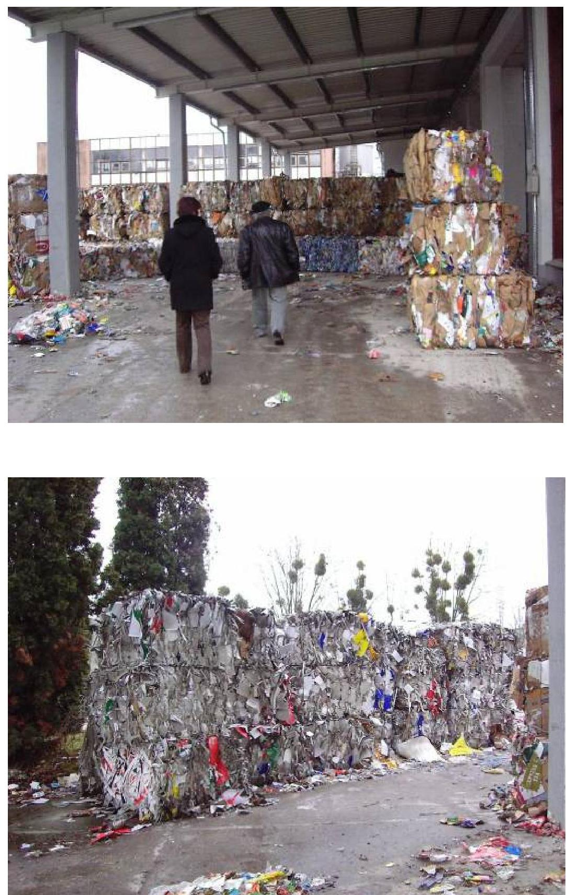

---

# Képek 

az ISPA/KA hulladékkezelési projektek létesítményeiről, eszközbeszerzéseiről
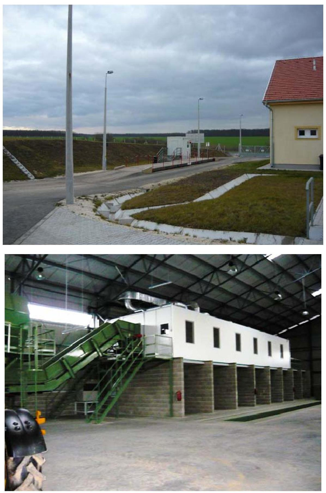

---

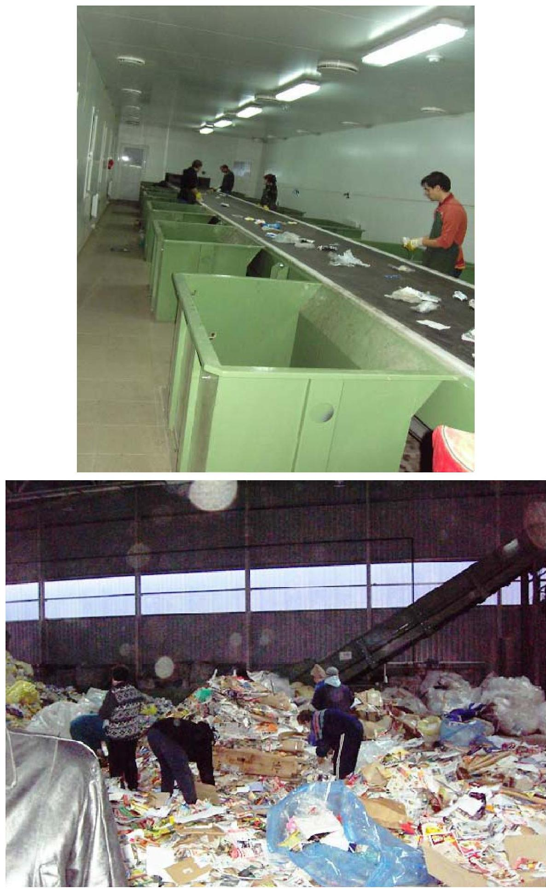
$\square$

---

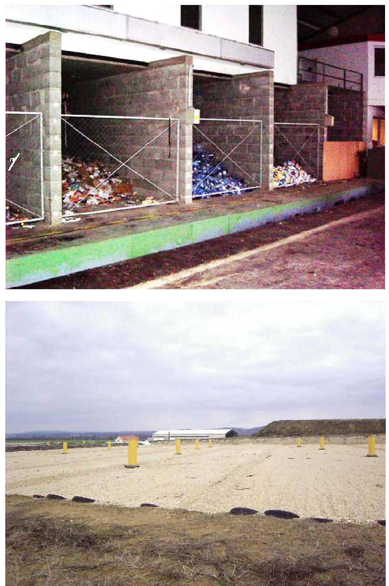

3

---

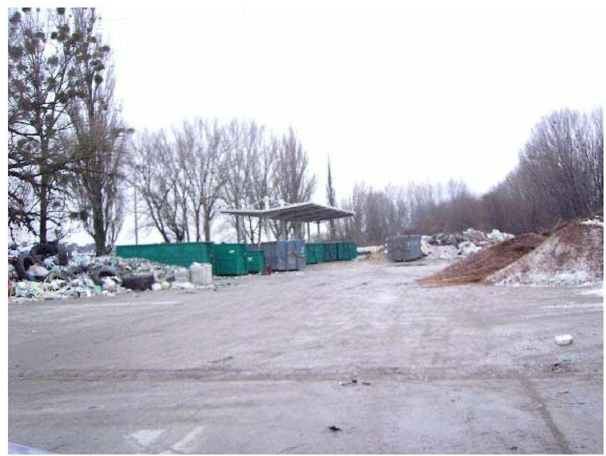

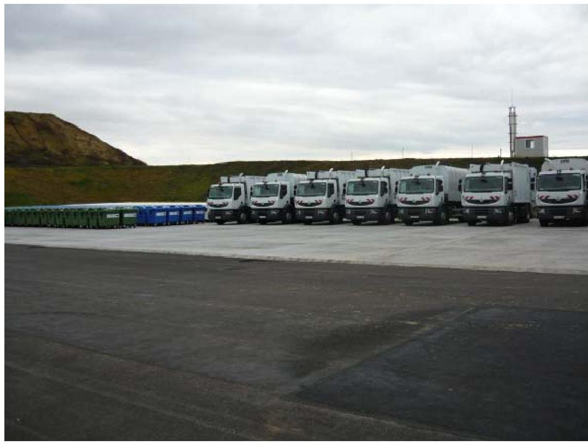

4

---

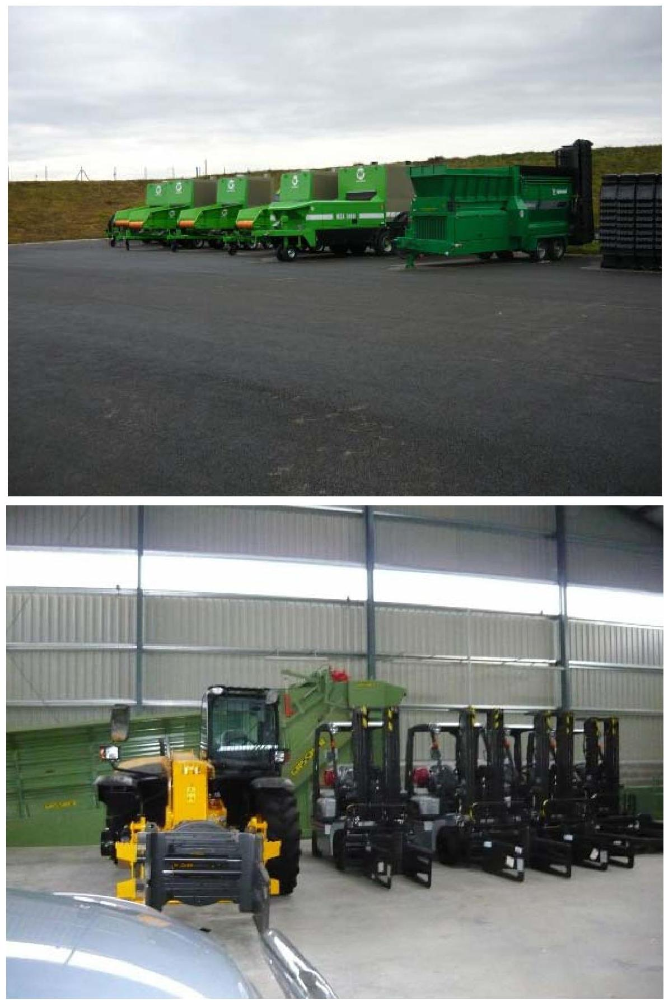

5

---

# 14. sz. melléklet

a V-2013-071/2008-2009. sz. jelentéshez

## Kimutatás

## az ISPA/Kohéziós Alap hulladékkezelési projektek létesítményeiről

|  Stö  | Megnevezés | Hulladéklerakó |  |  |  |  |  |  |  |  |  |  |  |  |  |  |  |  |  |  |   |
| --- | --- | --- | --- | --- | --- | --- | --- | --- | --- | --- | --- | --- | --- | --- | --- | --- | --- | --- | --- | --- | --- |
|   |  | Terv |  | Tény/várható |  | Terv | Tény/ várható |  | Terv | Tény/ várható |  | Terv | Tény/ várható | Terv | Tény/ várható | Terv | Tény/ várható | Terv | Tény/ várható | terv | becsült  |
|   |  | db szám | kapacitás $\left(\mathrm{m}^{3}\right)$ | db szám | kapacitás $\left(\mathrm{m}^{3}\right)$ | db szám | db szám | db szám | db szám | db szám | db szám | db szám | db szám | db szám | db szám | db szám | db szám | db szám |  |  |   |
|  1 | Hajdú-Bihar | 3 | 1324000 | 3 | 960000 |  | 3 |  |  | 1 | 3 |  | 1 |  |  |  |  | 60 | 10 | 4,68 | 4,99  |
|  2 | Miskolc | 1 | 2000000 | 1 | 2000000 | 1 | 1 | 1 | 1 | 2 | 2 |  |  | 3 | 3 |  |  | 19 | 19 | 3,23 | 5,28  |
|  3 | Szeged | 1 | 2500000 | 1 | 2500000 | 1 | 1 |  |  |  |  |  |  | 29 | 29 | 72 | 72 | 27 |  | 3,2 | 5,46  |
|  4 | Tisza-tó | 1 | 2320000 | 1 | 2320000 | 1 | 1 | 1 | 1 | 1 | 1 |  |  |  |  | 120 | 116 | 33 | 4 | 2,04 | 2,17  |
|  5 | Szolnok | 1 | 1350000 | 1 | 1350000 | 1 | 1 | 2 | 1 | 1 | 1 |  |  |  | 5 |  |  | 23 | 19 | 2,57 | 3,64  |
|  6 | Duna-TiszaKözé | 1 | 846200 | 1 | 846200 | 1 | 1 | 1 | 1 | 2 | 2 |  |  | 10 | 10 | 182 | 182 | 37 | 41 | 6,09 | 6,24  |
|  7 | Sajó-Bódva | 1 | 2000000 | 1 | 2000000 | 1 | 1 | 1 | 1 | 1 | 1 |  |  | 8 | 8 | 146 | 183 | 5 | 1 | 3,18 | 3,68  |
|  8 | Észak-Pest | 1 | 1500000 | 1 | 400000 | 2 | 2 | 2 |  | 1 | 1 |  | 2 | 13 | 9 | 250 | 486 | 2 | 3 | 6,19 | 6,19  |
|  9 | Homokhátság | 2 | 1120000 | 2 | 1112000 | 3 | 3 | 1 | 1 | 3 | 3 |  | 0 | 13 | 13 | 397 | 397 | 79 | 83 | 11,12 | 11,19  |
|  10 | Nyugat-
Balaton | 1 | 800000 | 1 | 805000 | 6 | 6 | 3 | 2 | 5 | 5 |  |  | 13 | 13 | 42 | 520 | 59 | 133 | 8,65 | 8,65  |
|  11 | Észak-Balaton | 1 | 1160000 | 1 | 720000 | 4 | 1 | 3 | 3 | 4 | 4 | 1 | 1 | 6 |  | 394 | 400 | 5 |  | 6,48 | 6,48  |
|  12 | Dél-Balaton | 3 | 2800000 | 3 | 2800000 | 8 | 8 | 4 | 4 | 3 | 3 |  |  | 17 | 17 | 805 | 805 | 40 | 40 | 12,37 | 12,37  |
|  13 | Szabolcs-
Szatmár | 2 | 330000 | 3 | 980000 |  | 3 |  |  | 1 | 1 |  |  |  |  | 630 | 300 | 194 |  | 8,96 | 8,96  |
|  Összesen |  | 19 | 20050200 | 20 | 18793200 | 29 | 32 | 19 | 15 | 25 | 27 | 1 | 4 | 112 | 107 | 3038 | 3461 | 583 | 353 | 78,76 | 85,3  |

Forrás: Kedvezményezettek adatszolgáltatása

---

# Az ISPA/Kohéziós Alap hulladékkezelési projektek fizikai előrehaladása

a 2009. március 15-i állapot szerint

|  Létesítmények | projektek | Létesít-
mények
összesen | Előrehaladás állapota |  |  |  |  |  |  |  |   |
| --- | --- | --- | --- | --- | --- | --- | --- | --- | --- | --- | --- |
|   |  |  | előkészítés |  | kivitelező, beszállító
kiválasztása |  | megvalósítás (építés,
beszerzés) |  | műszaki átadást
követő próbaüzem |  | üzemszerű működés /
teljesített
eszközbeszerzés  |
|   |  |  | projektek | létesít-
mények | projektek | létesít-
mények | projektek | létesít-
mények | projektek | létesít-
mények | projektek  |
|  Hulladéklerakók | $13^{*}$ | 20 | 1 | 1 | 1 | 1 | 3 | 6 | 2 | 2 | 7  |
|  Komposztálók | 13 | 32 | 1 | 3 | 1 | 1 | 3 | 11 | 1 | 6 | 7  |
|  Hulladékátrakó állomások | 9 | 15 |  |  | 1 | 3 | 3 | 6 | 1 | 2 | 4  |
|  Válogató üzemek | 12 | 27 |  |  | 1 | 4 | 4 | 7 | 1 | 5 | 6  |
|  MBH (mechanikai biológiai előkezelő) | 3 | 4 |  |  | 1 | 1 | 1 | 2 |  |  | 1  |
|  Hulladékgyűjtő udvarok | $9^{*}$ | 107 | 1 | 7 |  |  | 4 | 37 | 1 | 13 | 4  |
|  Hulladékgyűjtő szigetek | 10 | 3461 | 1 | 300 | 1 | 400 | 3 | 1473 | 1 | 520 | 4  |
|  Eszközök beszerzése (LOT-ok száma szerint) | 13 | 89 | 2 | 4 |  |  | 1 | 9 |  |  | 10  |
|  Hulladéklerakók rekultivációja | $10^{*}$ | 353 | 2 | 43 | 2 | 20 | 5 | 270 |  |  | 2  |

Megjegyzés: A kedvezményezett önkormányzatok adatszolgáltatása alapján *Egy-egy projektnél a létesítmények különböző előrehaladási ütemben vannak.

---

Az ISPA / Kohéziós Alap hulladékkezelési projektek Pénzügyi Megállapodásai és a támogatási szerződései aláírásának időpontjai

|  Ssz. | Kód | Megnevezés | EU aláírás | HU aláírás | Támogatási szerződés időpontja | Kihirdetés  |
| --- | --- | --- | --- | --- | --- | --- |
|  1. | 2000/HU/16/P/PE/002 | Hajdú-Bihar megyében hulladékgazdálkodási rendszer | 2000.11.10 | 2001.03.14 | 2002.04.04 | 89/2002.(IV.20) Korm. rend.  |
|  2. | 2000/HU/16/P/PE/004 | Miskolci regionális hulladékgazdálkodási program | 2000.03.16 | 2000.05.07 | 2002.04.30 | 89/2002.(IV.20) Korm. rend.  |
|  3. | 2000/HU/16/P/PE/005 | Szegedi regionális hulladékgazdálkodási program | 2000.12.22 | 2001.03.04 | 2002.10.07 | 89/2002.(IV.20) Korm. rend.  |
|  4. | 2000/HU/16/P/PE/006 | Tisza-tó régió hulladékgazdálkodási rendszer | 2000.12.17 | 2002.05.23 | 2004.07.16 | 201/2004.(VI.25.) Korm. rend.  |
|  5. | 2000/HU/16/P/PE/007 | Szolnok térsége hulladékgazdálkodási rendszer | 2000.12.22 | 2001.03.14 | 2002.07.26 | 89/2002.(IV.20) Korm. rend.  |
|  6. | 2001/HU/16/P/PE/008 | Duna-Tisza közi nagytárság hulladékgazd. rendsz. | 2001.12.13 | 2002.04.23 | 2004.07.16 | 201/2004.(VI.25.) Korm. rend.  |
|  7. | 2001/HU/16/P/PE/010 | Sajó-Bodva völgyében reg. hulladék-kezelő rendsz. | 2001.12.17 | 2002.08.13 | 2004.07.15 | 201/2004.(VI.25.) Korm. rend.  |
|  8. | 2002/HU/16/P/PE/014 | Észak-Kelet Pest megyei reg. hulladék-kezelő rendsz. | 2002.12.10 | 2004.04.06 | 2005.11.22 | 89/2004(IV.20.) Korm rend.  |
|  9. | 2002/HU/16/P/PE/015 | Homokhátság reg. hulladék-kezelő program | 2002.12.10 | 2003.10.15 | 2004.12.07 | 89/2004(IV.20.) Korm rend.  |
|  10. | 2002/HU/16/P/PE/016 | Nyugat-Balaton és Zala völgye hulladékk. rendsz. | 2002.12.14 | 2003.10.15 | 2004.11.26 | 89/2004(IV.20.) Korm rend.  |
|  11. | 2002/HU/16/P/PE/017 | Észak-Balaton reg. hulladék-kezelő program | 2003.07.14 | 2004.02.26 | 2007.07.05 | 89/2004(IV.20.) Korm rend.  |
|  12. | 2002/HU/16/P/PE/018 | Dél-Balaton és Sió völgye reg. hulladékk. rendsz. | 2002.12.14 | 2003.10.15 | 2007.03.27 | 89/2004(IV.20.) Korm rend.  |
|  13. | 2004/HU/C/PE/004 | Szabolcs-Szatmár hulladékgazdálkodási program |

 2005.12.19 | -* | 2006.03.29 | *Csatlakozás után jóváhagyott projekt  |

---

Az ISPA/Kohéziós Alap szilárdhulladék-kezelési projektek előrehaladása a 2008. december végi állapot szerint

Adatok: Mrd Ft-ban, 250 Ft/Euro árfolyamon

|  Ssz. | Projekt száma | Projekt megnevezése | Projekt tervezett kezdése | Projekt tényleges kezdése | Projekt eredetileg tervezett befejezése | Projekt várható befejezése | Eredeti költségvetés |  |  | Becsült elszámolható összköltség | Kumulált adatok 2000.01.01-től 2008.12.31-ig |  |  |  |   |
| --- | --- | --- | --- | --- | --- | --- | --- | --- | --- | --- | --- | --- | --- | --- | --- |
|   |  |  |  |  |  |  | Teljes elszámolható költség | EU rész | EU rész |  | Szerződéskötés |  | Kifizetés |  | Lehívás *  |
|   |  |  |  |  |  |  |  |  |  |  | Teljes | EU rész | Teljes | EU rész | Benyújtott átutalási igény  |
|  1. | 2000/HU/16/P/PE/002 | Hajdú-Bihar hulladékgazdálkodás | 2000.nov | 2002.03.26 | 2004.dec | 2009.06.30 | 4,68 | 3,51 | 4,99 | 4,39 | 2,94 | 4,24 | 2,93 | 2,81 | 2,81  |
|  2. | 2000/HU/16/P/PE/004 | Miskolci hulladékgazdálkodás | 2001.márc | 2003.11.13 | 2003.dec | 2008.03.31 | 3,23 | 2,26 | 5,28 | 5,12 | 2,26 | 5,13 | 2,26 | 2,26 | 1,58  |
|  3. | 2000/HU/16/P/PE/005 | Szegedi hulladékgazdálkodás | 2000.dec | 2003.03.07 | 2004.dec | 2009.06.30 | 3,20 | 2,08 | 5,46 | 5,46 | 2,08 | 5,09 | 1,98 | 1,66 | 1,66  |
|  4. | 2000/HU/16/P/PE/006 | Tisza-tavi hulladékgazdálkodás | 2001.dec | 2002.07.15 | 2005.dec | 2009.06.30 (2010.07.31) | 2,04 | 1,22 | 2,17 | 2,16 | 1,22 | 2,02 | 1,18 | 0,98 | 0,98  |
|  5. | 2000/HU/16/P/PE/007 | Szolnok hulladékgazdálkodás | 2000.dec | 2003.08.06 | 2003.dec | 2009.06.30 (2010.12.31) | 2,57 | 1,80 | 3,64 | 3,18 | 1,80 | 3,17 | 1,80 | 1,44 | 1,44  |
|  6. | 2001/HU/16/P/PE/008 | Duna-Tisza közi hulladékgazdálkodás | 2001.dec | 2004.07.16 | 2007.dec | 2009.06.30 (2010.12.31) | 6,09 | 3,03 | 6,24 | 4,39 | 2,20 | 3,41 | 1,70 | 2,44 | 2,28  |
|  7. | 2001/HU/16/P/PE/010 | Sajó-Bódva völgyi hulladékgazdálkodás | 2001.dec | 2004.07.15 | 2005.dec | 2010.06.30 | 3,18 | 1,59 | 3,68 | 3,35 | 1,59 | 3,14 | 1,53 | 1,27 | 1,27  |
|  8. | 2002/HU/16/P/PE/014 | Észak-kelet Pest szilárdhulladék | 2002.dec | 2005.06.08 | 2007.dec | 2010.12.31 | 6,19 | 3,09 | 6,19 | 3,69 | 1,84 | 0,11 | 0,05 | 0,36 | 0,36  |
|  9. | 2002/HU/16/P/PE/015 | Homokhátság szilárdhulladék | 2002.dec | 2005.05.17 | 2006.dec | 2010.12.31 | 11,12 | 8,34 | 11,19 | 6,02 | 4,41 | 4,87 | 3,65 | 5,56 | 4,80  |
|  10. | 2002/HU/16/P/PE/016 | Ny-Balaton és Zala m. hulladékkezelés | 2002.dec | 2005.05.02 | 2006.dec | 2010.12.31 | 8,65 | 6,03 | 8,65 | 8,21 | 5,75 | 4,67 | 3,25 | 4,64 | 4,47  |
|  11. | 2002/HU/16/P/PE/017 | É-Balaton hulladékkezelés | 2003.júl | 2005.12.30 | 2007.dec | 2010.12.31 | 6,48 | 3,24 | 6,48 | 5,90 | 2,95 | 0,09 | 0,04 | 0,32 | 0,32  |
|  12. | 2002/HU/16/P/PE/018 | D-balatoni és Sió-völgy hulladékgazd. | 2002.dec | 2005.05.27 | 2006.dec | 2010.12.31 | 12,37 | 8,04 | 12,37 | 9,56 | 5,74 | 4,10 | 2,03 | 3,63 | 3,63  |
|  13. | 2004/HU/C/PK/004 | Szabolcs-Szatmár | 2005.dec | 2007.03.05 | 2007.dec | 2010.12.31 | 8,96 | 6,99 | 8,96 | 6,01 | 4,69 | 0,71 | 0,55 | 1,95 | 0,84  |
|  Összesen: |  |  |  |  |  |  | 78,74 | 51,25 | 85,30 | 67,44 | 39,46 | 40,73 | 22,96 | 29,31 | 26,44  |

Fonrás: EMIR

- a lehívási adatokban az EU-tól kapott 20 % előleg is benne van,ezért van látszatra különbözőség a kifizetett EU rész és a befolyt EU forrás között. KvVM FI, 2009. március 05-i adatszolgáltatás és 2009. március 25-i kiegészítése

---

1. sz. melléklet a V-2013-071/2008-2009. sz. jelentéshez

Az ISPA/Kohéziós Alap hulladékkezelési projektek egyes létesítményeinek fizikai előrehaladása

a 2009. március 15-i állapot szerint

Adatok: db-ban

|  Megnevezés | Hulladéklerakók |  |  |  |  |  | Hulladékválogatók |  |  |  |  |  |  | Rekultiváció |  |  |  |   |
| --- | --- | --- | --- | --- | --- | --- | --- | --- | --- | --- | --- | --- | --- | --- | --- | --- | --- | --- |
|   |  |  |  |  |  |  |  |  |  |  |  |  |  |  |  |  |  |   |
|   |  |  |  |  |  |  |  |  |  |  |  |  |  |  |  |  |  |   |
|  Hajdú-Bihar WM
2000/HU16/P/PE/002 | 2 |  |  |  |  | 3 | 3 |  |  |  |  | 3 |  | 10 |  |  | 10 |   |
|  Miskolc WM
2000/HU16/P/PE/004 | 1 |  |  |  |  | 1 | 2 |  |  |  |  | 2 |  | 19 |  |  |  | 19  |
|  Szeged WM
2000/HU16/P/PE/005 | 1 |  |  |  |  | 1 | 0 |  |  |  |  |  |  | 0 |  |  |  |   |
|  Tisza-tó WM
2000/HU16/P/PE/006 | 1 |  |  |  |  | 1 | 1 |  |  |  |  | 1 |  | 4 |  |  | 3 | 1  |
|  Szolnok WM
2000/HU16/P/PE/007 | 1 |  |  |  |  | 1 | 1 |  |  |  |  | 1 |  | 19 |  | 19 |  |   |
|  Duna-Tisza-Középső WM
2001/HU16/P/PE/008 | 1 |  |  |  | 1 |  | 2 |  |  | 2 |  |  |  | 41 |  |  | 41 |   |
|  Sajó-Bódva WM
2001/HU16/P/PE/010 | 1 |  |  |  |  | 1 | 1 |  |  |  |  | 1 |  | 1 |  | 1 |  |   |
|  Észak-Pest WM
2002/HU16/P/PE/014 | 1 |  |  | 1 |  |  | 1 |  |  | 1 |  |  |  | 3 | 3 |  |  |   |
|  Homokhátság WM
2002/HU16/P/PE/015 | 2 |  |  |  |  | 2 | 3 |  |  |  |  | 3 |  | 83 |  |  | 83 |   |
|  Nyugat-Balaton WM
2002/HU16/P/PE/016 | 1 |  |  |  | 1 |  | 5 |  |  |  | 5 |  |  | 133 |  |  | 133 |   |
|  Észak-Balaton WM
2002/HU16/P/PE/017 | 1 |  | 1 |  |  |  | 4 |  | 4 |  |  |  |  | 0 |  |  |  |   |
|  Dél-Balaton WM
2002/HU16/P/PE/018 | 3 |  |  | 3 |  |  | 3 |  |  | 3 |  |  |  | 40 | 40 |  |  |   |
|  Szabolcs-Szatmár WM
2005/HU16/C/PE/004 | 3 | 1 |  | 2 |  |  | 1 |  |  | 1 |  |  |  | 0 |  |  |  |   |
|  Összesen | 20 | 1 | 1 | 6 | 2 | 10 | 27 | 0 | 4 | 7 | 5 | 11 |  | 353 | 43 | 20 | 270 | 20  |

---

# A haszonhulladékok árának és ÖKO-támogatásának változása 2008-ban

|  megnevezés | 2008. 04. hónapban |  |  | 2008.12. hónapban |  |  | árindex vált.  |
| --- | --- | --- | --- | --- | --- | --- | --- |
|   | anyagár $\mathrm{Ft} / \mathrm{kg}$ | ÖKO
támogatás $\mathrm{Ft} / \mathrm{kg}$ | összesen
$\mathrm{Ft} / \mathrm{kg}$ | anyagár $\mathrm{Ft} / \mathrm{kg}$ | ÖKO
támogatás $\mathrm{Ft} / \mathrm{kg}$ | összesen
$\mathrm{Ft} / \mathrm{kg}$ | 12. havi/4.havi ár \%  |
|  Papír árak változása: |  |  |  |  |  |  |   |
|  kartonpapír | 18,3 | 8 | 26,3 |  |  |  |   |

 | 11,4 | 9 | 20,4 | $-22 \%$  |
|  vegyespapír | 14 | 18,5 | 32,5 | 8 | 19,5 | 27,5 | $-15 \%$  |
|  Műanyag árak változása: |  |  | 0 |  |  | 0 |   |
|  PE fólia natúr | 75 | 16 | 91 | 20 | 16 | 36 | $-60 \%$  |
|  PE fólia sztreccs | 65 |  | 65 | 10 |  | 10 | $-85 \%$  |
|  PE fólia színes | 50 | 16 | 66 | 5 | 16 | 21 | $-68 \%$  |
|  PET palack |  |  |  |  |  |  |   |
|  natúr és h.kék | 73 | 77 | 150 | 60 | 75 | 135 | $-10 \%$  |
|  vegyes PET p. | 47 | 77 | 124 | 16 | 75 | 91 | $-27 \%$  |
|  Üveg árak nem változtak |  |  | 0 |  |  | 0 |   |
|  Avermann-Holvex Kft. szalag | $-4$ | 10 | 6 | $-5$ | 15 | 10 | $67 \%$  |
|  Fém árak változása |  |  | 0 |  |  | 0 |   |
|  adagolható acél | 84 | 0 | 84 | 27 | 0 | 27 | $-68 \%$  |
|  nem adagolható acél | 79 | 0 | 79 | 22 | 0 | 22 | $-72 \%$  |
|  laza lemez hulladék | 68 | 0 | 68 | 16 | 0 | 16 | $-76 \%$  |

adatforrás: AVE Miskolc Kft.

---

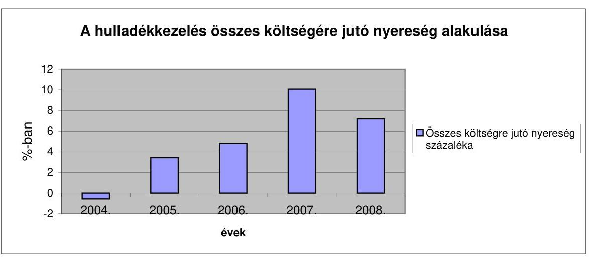
21. sz. melléklet
a V-2013-071/2008-2009. sz. jelentéshez

# Az önkormányzatok által biztosított támogatások összegének és az érintett háztartások számának alakulása 

| Év | Szolgáltató részére közvetlenül biztosított önkormányzati támogatás |  | A lakosság részére biztosított hulladékkezelési díj megfizetésére nyújtott támogatás |  | Egyéb közvetett formában (helyi adó) biztosított támogatás |  |
| :--: | :--: | :--: | :--: | :--: | :--: | :--: |
|  | összege Ft | Érintett háztartások száma (db) | összege Ft | Érintett háztartások száma (db) | összege Ft | Érintett háztartások száma (db) |
| 2004. | 91558 | 16350 | 41573 | 10676 | 7322 | 2287 |
| 2005. | 97181 | 19535 | 48059 | 9842 | 4799 | 1655 |
| 2006. | 277843 | 28479 | 51280 | 42934 | 5830 | 1686 |
| 2007. | 117532 | 20727 | 66290 | 21848 | 7110 | 1689 |
| 2008. | 87499 | 17673 | 78705 | 13235 | 8557 | 2646 |
| Összesen: | 671613 |  | 285907 |  | 33618 |  |

---

# Az ellenőrzött településeken használt hulladékgyűjtő edények átlagos ürítési díjai 

| Edényzet mérete (liter) | 2004.év |  | 2008. év |  | 2008/2004. év \%ban |
| :--: | :--: | :--: | :--: | :--: | :--: |
|  | db | átlagos ürítési dij/alkalom Ft-ban | db | átlagos ürítési dij/alkalom Ft-ban |  |
| 60 | 9725 | 82 | 10340 | 136 | 165,9 |
| 80 | 4525 | 125 | 7198 | 246 | 196,8 |
| 110 | 24645 | 143 | 25960 | 227 | 158,7 |
| 120 | 43012 | 139 | 49175 | 269 | 193,5 |
| 240 | 16485 | 447 | 11891 | 618 | 138,3 |
| 770 | 399 | 1259 | 1019 | 1914 | 152,0 |
| 1100 | 3009 | 1823 | 3427 | 2812 | 154,3 |
| 1100 l-nél nagyobb | 41 | 4203 | 45 | 8543 | 203,3 |
| szelektív gyűjtőedény | 0 | 0 | 399 | 271 | 0,0 |
| egyéb   gyűjtőeszköz(zsák) | 32083 | 164 | 337412 | 427 | 260,4 |

23. sz. melléklet
a V-2013-071/2008-2009. sz. jelentéshez

## A lakossági hulladékgyűjtés éves díjának aránya a háztartások nettó jövedelméhez

| Megnevezés | 2004. | 2005. | 2006. | 2007. | 2008. | $\begin{gathered} 2008 / 2 \\ 004 . \\ \% \text {-ban } \\ \hline \end{gathered}$ |
| :--: | :--: | :--: | :--: | :--: | :--: | :--: |
| Hulladékdíjak éves átlagos összege (Ft-ban) | 13433 | 12243 | 13414 | 16400 | 17400 | 129,53 |
| aránya a   háztartások átlagos   jövedelméhez (\%ban) | 0,71 | 0,61 | 0,65 | 0,79 | 0,84 | 118,31 |

---

# A hulladékgazdálkodás költségeinek alakulása 

Adatok: e Ft-ban

| Megnevezés | 2004. | 2005. | 2006. | 2007. | 2008. | $\begin{gathered} 2008 / 2004 . \\ \text { (\%) } \end{gathered}$ |
| :--: | :--: | :--: | :--: | :--: | :--: | :--: |
| Begyűjtés és szállítás költségei összesen | 1178993 | 1263186 | 1350755 | 1508206 | 1629686 | 138,2 |
| Hulladék kezelés és ártalmatlanítás költségei | 434883 | 537911 | 893293 | 1065148 | 1098260 | 252,5 |
| ebből: rekultiváció és utógondozás ktg-e | 48141 | 30806 | 55207 | 61939 | 62159 | 129,1 |
| Szelektív gyűjtés költsége összesen | 54447 | 94254 | 132012 | 197597 | 204216 | 375,1 |
| ebből: gyűjtés, szállítás | 8643 | 14017 | 28307 | 36626 | 54509 | 630,7 |
| hasznosítás előkészítés, válogatás | 5787 | 16017 | 37585 | 90295 | 102694 | 1774,6 |
| hulladékgyűjtő sziget üzemeltetése | 4109 | 12619 | 19272 | 15954 | 14251 | 346,8 |
| Szelektív gyűjtés bevétele miatti költség megtérülés | $-5567$ | $-10452$ | $-17903$ | $-4882$ | $-7728$ | 138,8 |
| Díjbeszedés, ügyfélszolgálat, adminisztratív költsége | 100977 | 115434 | 110362 | 127248 | 97903 | 97,0 |
| Egyéb költség | 70521 | 80000 | 90389 | 106033 | 82085 | 116,4 |
| Tevékenység összes költsége (1+ 2 +9+ 10 ) | 1785374 | 1996531 | 2444799 | 2806635 | 2907934 | 162,9 |
| Tevékenységre jutó nyereség | $-10193$ | 68474 | 117622 | 282666 | 208748 | $-2048,0$ |
| Az árban érvényesítendő költség+nyereség | 1775181 | 2065005 | 2562421 | 3089301 | 3116682 | 175,6 |
| Szilárd hulladékgazd. fajlagos mutatói |  |  |  |  |  |  |
| Össszes gyüjtött hulladékmennyiség (1) | 258685 | 260444 | 241648 | 225942 | 215281 | 83,2 |
| ebből :szelektíven gyüjtött mennyiség (1) | 3429 | 4833 | 6658 | 7179 | 7978 | 232,7 |
| 1 tonnára jutó begyűjtési, szállítási költség | 4,6 | 4,9 | 5,6 | 6,7 | 7,6 | 166,1 |
| 1 tonnára jutó hulladék kezelési és ártalmatlanítási költség | 1,7 | 2,1 | 3,7 | 4,7 | 5,1 | 303,5 |
| 1 tonnára jutó rekultiváció, utógondozási ktg | 0,2 | 0,1 | 0,2 | 0,3 | 0,3 | 155,2 |
| 1 tonnára jutó szelektív hulladékgyűjtési költség összesen | 15,9 | 19,5 | 19,8 | 27,5 | 25,6 | 161,2 |
| 1 tonnára jutó szelektív hulladék hasznosítási bevétel (megtérülés) | $-1,6$ | $-2,2$ | $-2,7$ | $-0,7$ | $-1,0$ | 59,7 |
| 1 tonnára jutó díjbeszedés, ügyfélszolgálat, adminisztratív költség | 0,4 | 0,4 | 0,5 | 0,6 | 0,5 | 116,5 |
| 1 tonnára jutó egyéb költség | 0,3 | 0,3 | 0,4 | 0,5 | 0,4 | 139,9 |
| 1 tonnára jutó költség összesen | 6,9 | 7,7 | 10,1 | 12,4 | 13,5 | 195,7 |
| 1 tonnára jutó nyereség | $-0,04$ | 0,3 | 0,5 | 1 | 1 | $-2460,9$ |

---

# Az ellenőrzött települési önkormányzatok szilárdhulladék-gazdálkodási feladatainak főbb naturális mutatóiról a 2004-2008. években

|  Megnevezés | Mértékegy-
ség | 2004. | 2005. | 2006. | 2007. | 2008. | 2008/2004
(\%)  |
| --- | --- | --- | --- | --- | --- | --- | --- |
|  1. | 2. | 3. | 4. | 5. | 6. | 7. | 8.  |
|  Vizsgált települések népessége | fő | 571632 | 580258 | 569662 | 568823 | 568540 | 99,5  |
|  Vizsgált települések összes lakásainak száma | db | 226862 | 228318 | 229318 | 230143 | 230917 | 101,8  |
|  Rendszeres hulladékgyűjtésbe bevont lakások száma | db | 208281 | 211597 | 215480 | 217394 | 220696 | 106,0  |
|  Rendszeres hulladékgyűjtésbe bevont lakások aránya | $\%$ | 91,8 | 92,7 | 94,0 | 94,5 | 95,6 | 104,1  |
|  Rendszeres hulladékgyűjtéssel érintett lakosok száma | fő | 528120 | 533484 | 536113 | 540495 | 528489 | 100,1  |
|  Rendszeres hulladékgyűjtéssel érintett lakosok aránya | $\%$ | 92,4 | 91,9 | 94,1 | 95,0 | 93,0 | 100,6  |
|  Lakosságtól elszállított nem veszélyes hulladék mennyisége | tonna | 198451 | 192685 | 170836 | 160534 | 156334 | 78,8  |
|  Intézményektől és termelő üzemektől elszállított nem veszélyes hulladék | tonna | 60234 | 67759 | 70812 | 65408 | 58947 | 97,9  |
|  Összes elszállított nem veszélyes hulladék mennyisége | tonna | 258685 | 260444 | 241648 | 225942 | 215281 | 83,2  |
|  Veszélyes hulladék | tonna | 156 | 201 | 144 | 91 | 90 | 57,7  |
|  A településeken lévő szilárd hulladéklerakó helyek száma | db | 28 | 28 | 32 | 27 | 27 | 96,4  |
|  Szilárd hulladéklerakó helyek kapacitása | tonna | 23036559 | 22778319 | 19766280 | 22767707 | 19355550 | 84,0  |
|  Szilárd hulladéklerakó helyek aktuális befogadó képessége | tonna | 3537661 | 3064755 | 15621124 | 17044017 | 16752026 | 473,5  |

 Szilárd hulladéklerakó helyre beszállító települések száma | db | 1037 | 1061 | 1090 | 1129 | 1207 | 116,4  |
|  Hulladékudvarok száma | db | 1 | 1 | 3 | 9 | 10 | 1000,0  |
|  Hulladékválogatók száma | db | 1 | 1 | 2 | 7 | 8 | 800,0  |
|  Hulladékátrakók száma | db | 1 | 1 | 3 | 5 | 5 | 500,0  |
|  Hulladékgyűjtő szigetek száma | db | 194 | 296 | 333 | 341 | 362 | 186,6  |
|  Szelektíven gyűjtött hulladékok mennyisége összesen | tonna | 3429 | 4833 | 6658 | 7179 | 7978 | 232,7  |
|  ebből: papír | tonna | 1536 | 1971 | 3127 | 3131 | 3227 | 210,1  |
|  műanyag | tonna | 354 | 937 | 671 | 992 | 917 | 259,0  |
|  fém | tonna | 35 | 44 | 243 | 46 | 38 | 108,6  |
|  üveg | tonna | 282 | 581 | 981 | 938 | 1113 | 394,7  |
|  zöldhulladék | tonna | 1222 | 1300 | 1636 | 2072 | 2683 | 219,6  |
|  Szelektív hulladékgyűjtésbe bevont lakások száma | db | 108394 | 114576 | 146953 | 151546 | 156186 | 144,1  |
|  Szelektív hulladékgyűjtésbe bevont lakások aránya | $\%$ | 47,8 | 50,2 | 64,1 | 65,8 | 67,6 | 141,6  |
|  Szelektíven gyűjtött lakossági hulladékmennyiség részaránya | $\%$ | 1,7 | 2,5 | 3,9 | 4,5 | 5,1 | 295,3  |
|  Illegális hulladéklerakóhelyek száma | db | 281 | 112 | 107 | 98 | 100 | 35,6  |
|  Illegális hulladéklerakóhelyeken felhalmozott hulladék | tonna | 20720 | 10703 | 11214 | 11103 | 11962 | 57,7  |

---

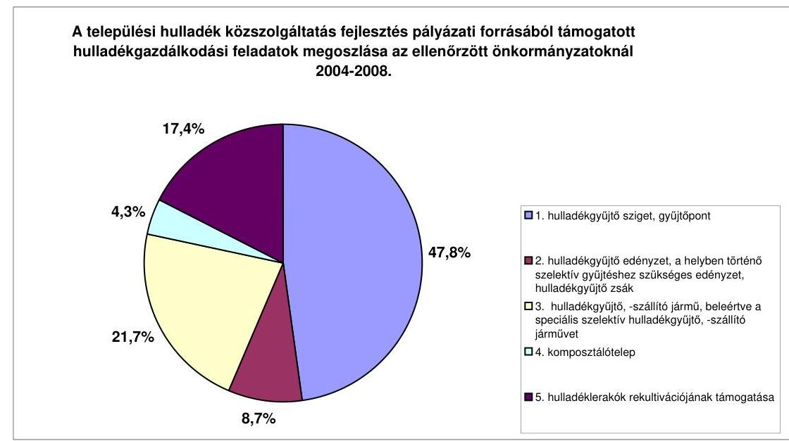
27. sz. melléklet a V-2013-071/2008-2009. sz. jelentéshez

# Az EU Önerő Alap hulladékgazdálkodási célra fordított támogatásai a 2008. december hónapig megkötött szerződések alapján 

Adatok: e Ft-ban

| A pályázat kódszáma | A pályázó neve | Beruházás megnevezése | Támogatás | Beruházási összköltség | Pályázat típusa |
| :--: | :--: | :--: | :--: | :--: | :--: |
| BMÓNAL-095004 | Köszeg | csökkenése   földolgozással Köszegen | 7370 | 255000 | PHARE |
| BMÓNAL-092804 | Berettyóújfala | Projekt kivitelezését   megelőző régészeti | 50000 | 1296479 | ISPA |
| BMÓNAL-111604 | Eger | hulladékok kezelése Eger   térségében | 16106 | 536871 | KIOP |
| BMÓNAL-169-060719-   05 | Miskolc | Hulladékgazdálkodási   Projekt | 297046 | 5335053 | ISPA |
| BMÓNAL-016-071105-   03 | Bajaj | hulladékgazdálkodási   együttműködési program | 583 | 38850 | INTERREG |
| BMÓNAL-11005-0622-   14 | Kaposvár | Sontási   hulladékgazdálkodási | 14177 | 472582 | KIOP |
| BMÓNAL-136-060927-   13 | Nógrád Megyei   Regionális | Regionális   Hulladékgazdálkodási | 315321 | 6247557 | ISPA |
| BMÓNAL-17405-0728-   06 | Csongrád | települési szilárdhulladék   rendszer képzése | 562157 | 11243131 | ISPA |
| BMÓNAL-30205-1027-   05 | Környéke   Hulladékkezelési | Regionális Szilárd   Kommunális Hulladék- | 199060 | 3239531 | ISPA |
| BMÓNAL-31205-1028-   20 | Hulladékgazdálkodási   Társulás | Ízlyó medence   Magyitósági | 449382 | 8801883 | ISPA |
| BMÓNAL-042-071031-   19 | Regionális Települési   Szilárdhulladék-kezelési | Regionális Települési   Szilárdhulladék-kezelési | 73599 | 7061565 | KA |
| Összesen: |  |  | 1884801 | 44528502 |  |

---

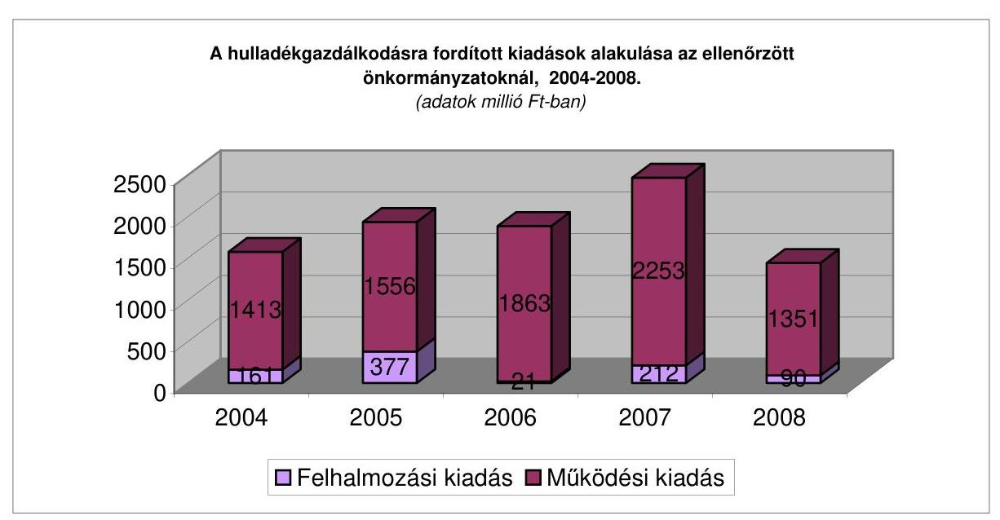

[^0]
[^0]:   
