# ÁLLAMI   SZÁMVEVŐSZÉK 

## JELENTÉS

az egyes kórházi tevékenységek kiszervezésének ellenőrzéséről

---

# 2. Államháztartás Központi Szintjét Ellenőrző Igazgatóság 

2.1. Teljesítmény Ellenőrzési Főcsoport

Iktatószám: V-2017-114/2008-2009.
Témaszám: 924
Vizsgálat-azonosító szám: V0424

## Az ellenőrzést felügyelte:

Bihary Zsigmond
főigazgató
Az ellenőrzés végrehajtásáért felelős:
Kemény Emil
főigazgató-helyettes
Dr. Zöldréti Attila
főcsoportfőnök
Az ellenőrzést vezette:
Winter Zsuzsa
osztályvezető főtanácsos
Az ellenőrzést végezték:

| Bravics Judit Barbara | Federics Adrienn | Gaál László |
| :-- | :-- | :-- |
| számvevő gyakornok | számvevő tanácsos | számvevő tanácsos |
| Ganter Ildikó | Dr. Horváth Klára | Iszakné Dóczé Katalin |
| számvevő | számvevő | számvevő tanácsos |
| Kriston-Vizi János | Lingné Rajz Borbála | Dr. Székely Edit |
| számvevő tanácsos | számvevő tanácsos | számvevő tanácsos |
| Szihalminé Kovács | Tóth Tamás | Zachár Péterné |
| Zsuzsanna | számvevő | számvevő tanácsos |
| számvevő tanácsos |  |  |

A témához kapcsolódó eddig készített számvevőszéki jelentések:
címe
sorszáma
Jelentés az egészségügyi szakellátások privatizációjának ellenőrzéséről, 2006. május

Jelentéseink az Országgyűlés számítógépes hálózatán és az Interneten a www.asz.hu címen is olvashatóak.

---

# TARTALOMJEGYZÉK 

BEVEZETÉS ..... 13
I. ÖSSZEGZŐ MEGÁLLAPÍTÁSOK, KÖVETKEZTETÉSEK, JAVASLATOK ..... 17
II. RÉSZLETES MEGÁLLAPÍTÁSOK ..... 26

1. Az egészségpolitika irányító szerepe a kórházak működésiforma- váltásában, a magánvállakozások, a magántőke bevonásában ..... 26
1.1. A 2006. évi kormányprogram és a konvergencia program ..... 26
1.2. A struktúraátalakítás ..... 27
2. A múködésiforma-váltás 100\% önkormányzati tulajdon mellett ..... 27
2.1. A múködésiforma-váltással elérendő célok ..... 28
2.2. A múködésiforma-váltás gazdálkodásra gyakorolt hatása ..... 29
3. A 2005-ben és azt megelőzően múködtetésbe adott kórházak utóellenőrzése ..... 31
3.1. Az intézmények társasági formaváltása, tulajdonosváltása ..... 32
3.2. A 2005 óta megvalósult beruházások ..... 33
3.3. A múködtetési szerződés módosításának indokai ..... 33
4. A 2006-2008 közötti teljes kórházkiszervezések ..... 34
4.1. A múködtető kiválasztása ..... 36
4.2. A munkavállalók érdekeinek érvényesülése ..... 37
4.3. A szerződés lejártakor a tulajdonos pozíciója, a múködtetésbe adott vagyon védelme ..... 38
4.4. A szerződésben vállalt beruházások megvalósulása ..... 39
4.5. A minőségi ellátás szerződéses garanciái ..... 42
4.6. Kórházhálózatok kialakulása ..... 42
5. Kórházépítés magántőke bevonással ..... 43
6. A humánerőforrás orvosi közreműködői szerződésekkel való biztosítása ..... 44
6.1. A közreműködői szerződések alkalmazásának területei ..... 45
6.2. A munkaidőre vonatkozó előírások betartása ..... 46
6.3. Az önkéntes egészségügyi tevékenység, mint újszerű közreműködői szerződés ..... 46
7. A kórházi háttérszolgáltatások kiszervezésének okai ..... 47
7.1. A háttértevékenységek kiszervezésének okai a döntések megalapozottsága és előkészítettsége ..... 47
7.1.1. A kiszervezés okai: a tőkehiány, a kötelező létszámleépítés és bérmegtakarítás ..... 47

---

7.1.2. A háttér tevékenységek kiszervezésének aránya és a szolgáltatók koncentrálódása ..... 48
7.2. Az intézményi elvárások teljesülése ..... 49
7.2.1. A közbeszerzés szerepe a szolgáltató kiválasztásában ..... 49
7.2.2. A tulajdonosi elvárások érvényesülése a szolgáltatók kiválasztása és a kórházi tulajdon védelme ..... 50
7.3. A háttérszolgáltatások minőségében bekövetkező javulás ..... 50
7.3.1. A szolgáltatás minőségét javító beruházások ..... 50
7.3.2. A szerződésben megfogalmazott minőségi garanciák ..... 51
7.3.3. A szolgáltatók minőségbiztosítási rendszere, betegelégedettség ..... 52
7.4. A háttértevékenységek kiszervezésének költséghatékonysága ..... 53
7.4.1. A kiszervezés várható pénzügyi hatásainak értékelése ..... 53
7.4.2. A lejárt szállítói tartozások alakulása ..... 53
7.4.3. A szolgáltató által fizetett bérleti díjak ..... 54
7.5. A hosszú távú háttérszolgáltatási szerződések következményei a megszűnt országos intézményeknél ..... 54
7.6. A háttérszolgáltatásokat intézményi keretek között ellátó, illetve a háttértevékenységet visszaszervező intézmények döntése (kérdőíves adatszolgáltatás elemzése) ..... 58
8. A korábbi számvevőszéki javaslatok végrehajtásának ellenőrzése ..... 59
MELLÉKLETEK

1. sz. Észrevétel
2. sz. A helyszíni ellenőrzésre kiválasztott intézmények
3. sz. Kérdések, kritériumok és adatforrások
4/a. sz. Vállalkozások aránya a fekvőbeteg szakellátás finanszírozásában
4/b. sz. Pénzügyi és ellátási mutatók (2005-2008)
4/c. sz. Kórházi mutatók OEP-FIFO (2006-2008)
4. sz. Beruházások az utóvizsgálatra kijelölt intézményeknél
5. sz. Adatok a helyszínen vizsgált intézmények közreműködői szerződéseiről
6. sz. Diagramok jegyzéke
8/a. sz. Adatlap a kiszervezett tevékenységekről
8/b. sz. Adatlap a kiszervezett háttértevékenységek megoszlási arányairól
7. sz. Tulajdonviszonyok a múködtetésbe adott és az átalakult intézményeknél
8. sz. Kérdőív a háttérszolgáltatásokat ki nem szervező vagy részben kiszervező intézményekről

---

# FÜGGELÉKEK 

1. sz. A Várpalotai Kórház-Egészségügyi és Szociális Intézményi beruházása
2. sz. Az Esztergomi Vaszary Kolos Kórház épület beruházása

---

4

---

# RÖVIDÍTÉSEK JEGYZÉKE 

| ÁEK | Állami Egészségügyi Központ |
| :--: | :--: |
| Áht. | Az államháztartásról szóló 1992. évi XXXVIII. törvény |
| ÁNTSZ | Állami Népegészségügyi és Tisztiorvosi Szolgálat |
| ÁSZ | Állami Számvevőszék |
| CVI | CVI Gyógyító, Kutató és Oktató Közhasznú Társaság |
| Ctv. | A cégnyilvánosságról, a bírósági cégeljárásról és a végelszámolásról szóló 2006. évi V. törvény |
| E. Alap | Egészségbiztosítási Alap |
| Ebtv. | A kötelező egészségbiztosítás ellátásairól szóló 1997. évi LXXXIII. törvény |
| Eftv. | 2006. évi CXXXII. törvény az egészségügyi ellátórendszer fejlesztéséről |
| EKI | Egészségügyi Készletgazdálkodási Intézet |
| EU | Európai Unió |
| EüM | Egészségügyi Minisztérium |
| Eütv. | Az egészségügyről szóló 1997. évi CLIV. törvény |
| Gt. | A gazdasági társaságokról szóló 2006. évi IV. törvény |
| Kjt. | A közalkalmazottak jogállásáról szóló 1992. évi XXXIII. törvény |
| KSH | Központi Statisztikai Hivatal |
| MRI | Mágneses Rezonancia Vizsgálat |
| Mtv. | Munka Törvénykönyve |
| NET | Nemzeti Egészségügyi Tanács |
| NHS | National Health Service (Nemzeti Egészségügyi Szolgálat) |
| OEP | Országos Egészségbiztosítási Pénztár |
| OGY | Országgyúlés |
| OGYK | Országos Gyógyintézeti Központ |
| OPNI | Országos Pszichiátriai és Neurológiai Intézet |
| Ötv. | A helyi önkormányzatokról szóló 1990. évi LXV. törvény |
| PM | Pénzügyminisztérium |
| PFI | Private Finance Initative (magánfinanszírozási kezdeményezés) |
| PPP | Public Private Partnership (köz- és magánszféra partnersége) |
| SOGYFPI | Svábhegyi Országos Gyermekallergológiai, Pulmonológiai és Fejlődésneurológiai Intézet |
| TVK | Teljesítmény Volumenkorlát |
| WHO | World Health Organisation (az ENSZ Egészségügyi Világszervezete) |

---

# 6

---

# ÉRTELMEZŐ SZÓTÁR 

| Aktív fekvőbeteg-   szakellátás | A fekvőbeteg-ellátó intézményben történő gyógyító, korai   rehabilitáló tevékenység, amelyben az ápolási idő előre   tervezhető, többnyire rövid időtartamú. Az ellátásban az   orvos-szakmai tevékenység a meghatározó, az ellátás cél-   ja az egészségi állapot mielőbbi helyreállítása. A besoro-   lásban nem játszik szerepet, hogy az ellátás akut vagy   krónikus betegség miatt következik-e be. |
| :--: | :--: |
| Ajánlattevő | Az a természetes személy, jogi személy, jogi személyiség   nélküli gazdasági társaság vagy személyes joga szerint   jogképes szervezet, aki, illetőleg amely a közbeszerzési   eljárásban ajánlatot tesz; ajánlattevőnek minősül a kül-   földi székhelyű vállalkozás magyarországi fióktelepe is. [A   közbeszerzésekről szóló 2003. évi CXXIX. törvény 4. §   1. pont] |
| Alapellátás | A beteg lakóhelyén, illetve annak közelében biztosítani   kell, hogy választása alapján igénybe vehető, hosszú ta   vú, személyes kapcsolaton alapuló, nemétől, korától és   betegsége természetétől függetlenül folyamatos egészség-   ügyi ellátásban részesüljön. [Az egészségügyről szóló   1997. évi CLIV. törvény 88. § (1) bekezdés] |
| Alvállalkozó | Az a szervezet (személy), amellyel (akivel) az ajánlattevő   a közbeszerzési eljárás alapján megkötött szerződés teljesí-   tése céljából, e szerződésre tekintettel fog szerződést kötni   vagy módosítani, kivéve, ha a szervezet (személy) tevékenységét kizárólagos jog alapján végzi. [A közbeszerze   sekről szóló 2003. évi CXXIX. törvény 4. § 2. pont] |
| Általános   fekvőbeteg-szakellátás | A betegnek a lakóhelye közelében, fekvőbeteg-gyógy-   intézeti keretek között végzett egészségügyi ellátása. En-   nek igénybevétele a beteg folyamatos ellátását végző or-   vos, a kezelőorvos vagy az arra feljogosított más személy   beutalása, valamint a beteg jelentkezése alapján történik.   [Az egészségügyről szóló 1997. évi CLIV. törvény 91. §   (1) bekezdés] |
| Beteg | Az egészségügyi ellátást igénybe vevő vagy abban részesü-   lő személy. [Az egészségügyről szóló 1997. évi CLIV. tör-   vény 3. § a) pont] |
| Co-payment | A közfinanszírozású ellátások igénybevételekor a szolgá-   tatásért, vagy a termékért a beteg által fizetett díj. Tágabb   értelmezés, amikor a beteg a közfinanszírozású szolgálta   tás igénybevételekor bármilyen kiegészítő díjat fizet, ide   értve a valamilyen „felárért" vásárolt többletszolgáltatás,   pl. kezelőorvos megválasztása, külön szoba stb. [A co   payment alkalmazási lehetősége a korszerú egészségpoli-   tikában, Dr. Kincses Gyula (ESKI); IME Egészségügyi Veze-   tők Szaklapja V. évfolyam 5. szám 2006. június] |
| Diagnosztikai vizsgálat | Az egészségügyi szolgáltatóhoz forduló beteg panasza   okának feltárására irányuló vizsgálat. [Az egészségügyről |

---

Egészségügyi ellátás

Egészségügyi hatóság

Egészségügyi intézmény

Egészségügyi közszolgáltatásért felelős szerv

Egészségügyi szakterület

Egészségügyi szolgáltatás
szóló 1997. évi CLIV. törvény 3. § kb) pont]
A beteg adott egészségi állapotához kapcsolódó egészségügyi tevékenységek összessége. [Az egészségügyről szóló 1997. évi CLIV. törvény 3. § c) pont]

A Kormány által kijelölt szerv illetékes szerve. [Az egészségügyről szóló 1997. évi CLIV. törvény 3. § h) pont hatályon kívül]
Az egészségügyi szolgáltatók közül a rendelőintézeti járóbeteg-szakellátást vagy fekvőbeteg-szakellátást nyújtó szolgáltatók (a továbbiakban együtt: gyógyintézet), továbbá, az állami mentőszolgálat, az állami vérellátó szolgálat, valamint az egészségügyi államigazgatási szerv intézetei, amennyiben egészségügyi szolgáltatást is nyújtanak. [Az egészségügyről szóló 1997. évi CLIV. törvény 3. § g) pont]

Az egészségügyi alapellátásért felelős települési önkormányzat, továbbá az egészségügyi szakellátásért felelős települési és megyei önkormányzat, illetőleg központi államigazgatási szerv, mint közfinanszírozott egészségügyi szolgáltató fenntartója. [Az egészségügyi szolgáltatás gyakorlásának általános feltételeiről, valamint a múködési engedélyezési eljárásról szóló 96/2003. (VII. 15.) Korm. rendelet 2. § (1) bekezdés c) pont]
Amelyre nézve külön jogszabály szerint egészségügyi szakképesítés szerezhető. [Az egészségügyi szolgáltatás gyakorlásának általános feltételeiről, valamint a múködési engedélyezési eljárásról szóló 96/2003. (VII. 15.) Korm. rendelet 2. § (1) bekezdés d) pont]
Az egészségügyi államigazgatási szerv által kiadott múködési engedély birtokában végezhető egészségügyi tevékenységek összessége, amely az egyén egészségének megőrzése, továbbá a megbetegedések megelőzése, korai felismerése, megállapítása, gyógykezelése, életveszély elhárítása, a megbetegedés következtében kialakult állapot javítása vagy a további állapotromlás megelőzése céljából a beteg vizsgálatára és kezelésére, gondozására, ápolására, egészségügyi rehabilitációjára, a fájdalom és a szenvedés csökkentésére, továbbá a fentiek érdekében a beteg vizsgálati anyagainak feldolgozására irányul, ideértve a gyógyszerekkel, a gyógyászati segédeszközökkel, a gyógyfürdőellátásokkal kapcsolatos külön jogszabály szerinti tevékenységet, valamint a mentést és a betegszállítást, a szülészeti ellátást, az emberi reprodukcióra irányuló különleges eljárásokat, a múvi meddővé tételt, az emberen végzett orvostudományi kutatásokat, továbbá a halott vizsgálattal, a halottakkal kapcsolatos orvosi eljárásokkal - ideértve az ehhez kapcsolódó -, a halottak szállításával összefüggő külön jogszabály szerinti tevékenységeket is. [Az egészségügyről szóló 1997. évi CLIV. törvény 3. § e) pont]

---

Egészségügyi szolgáltató A tulajdoni formától és fenntartótól függetlenül minden, egészségügyi szolgáltatás nyújtására és az egészségügyi államigazgatási szerv által kiadott múködési engedély alapján jogosult egyéni egészségügyi vállalkozó, jogi személy vagy jogi személyiség nélküli szervezet. [Az egészségügyről szóló 1997. évi CLIV. törvény 3. § f) pont]
Egynapos sebészeti ellátás

Elelmiszer-higiénia

Fenntartó

Finanszírozási szerződés

Fixdíj

Funkcionális privatizáció

HACCP

Egynapos sebészeti ellátás keretében az egészségügyi szakellátás társadalombiztosítási finanszírozásának egyes kérdéseiről szóló 9/1993. (IV. 2.) NM rendelet (a továbbiakban: R.) 9. sz. mellékletében felsorolt beavatkozások végezhetők előre tervezetten, feltéve, hogy a beteg 24 óránál kevesebb időt tartózkodik a beavatkozást végző egészségügyi intézményben. [Az egynapos sebészeti és a kúraszerúen végezhető ellátások szakmai feltételeiről szóló 16/2002. (XII. 12.) ESZCSM rendelet 2. § (1) bekezdés]
Azon intézkedések és feltételek, amelyek a veszélyek ellenőrzéséhez és valamely élelmiszer emberi fogyasztásra való alkalmasságának az élelmiszer szándékolt felhasználásának figyelembevételével történő biztosításához szükségesek. [Az élelmiszer-higiéniáról szóló Európai Parlament és Tanács 852/2004/EK rendelete (2004. április 29.)]
Költségvetési szerv egészségügyi szolgáltató esetén az alapító okiratban felügyeleti szervként megjelölt állami szerv, helyi önkormányzat vagy önkormányzati társulás; egyházi jogi személy vagy jogi személyiséggel nem rendelkező egyházi egészségügyi szolgáltató esetén az alapító okiratban fenntartóként megjelölt egyházi jogi személy; alapítványi, közalapítványi egészségügyi szolgáltató esetén az alapítvány, közalapítvány; más szervezet egészségügyi szolgáltató egységeként múködő gyógyintézet esetén a tulajdonosi jogokat gyakorló szervezet. [Az egészségügyi szolgáltatás gyakorlásának általános feltételeiről, valamint a múködési engedélyezési eljárásról szóló 96/2003. (VII. 15.) Korm. rendelet 2. § (1) bekezdés g) pont]

Az egészségügyi szolgáltatásra a finanszírozó és a szolgáltató között létrejött szerződés. [Az egészségügyi szolgáltatások Egészségbiztosítási Alapból történő finanszírozásának részletes szabályairól szóló 43/1999. (III. 3.) Korm. rendelet 2. § i) pont]
Jogszabályban meghatározott összegű havi díjazás. [Az egészségügyi szolgáltatások Egészségbiztosítási Alapból történő finanszírozásának részletes szabályairól szóló 43/1999. (III. 3.) Korm. rendelet 2. § f) pont]
Az egészségügyi tevékenység folytatásához szükséges eszközök - általában minimális vagy igen méltányos mértékű - bérlési rendszerén alapuló, vállalkozási jellegű (piaci elemeket tartalmazó) egészségügyi ellátás.
Az élelmiszeriparban használatos minőségbiztosítási rendszer. Kulcseleme, hogy a veszélyek kialakulásának megakadályozásához, illetve hatásuk mérsékléséhez

---

Homogén betegségcsoportok (HBCS)

Hotelfunkciók

Járóbeteg-szakellátás

Járóbeteg-szakellátás kapacitása

Kiszervezés (outsourcing)

Kontrolling
meghatározott védekezési eljárások közül kiválasszuk az ún. kritikus szabályozási pontokat, melyek kulcsfontosságú szerepet töltenek be a termék biztonságossága szempontjából. (Dr. Koczor Zoltán: Bevezetés a minőségügybe: A minőségügy gyakorlati kérdései, Műszaki Könyvkiadó Budapest, 1999.)
Az aktív kórházi ápolási esetek olyan osztályozási rendszere, amelyben a csoportképzés alapja az orvos szakmai azonosság mellett a ráfordítás-igényesség homogenitása. A besorolást elsődlegesen az ellátást indokoló betegségek, a besoroláshoz kiemelt orvosi beavatkozások határozzák meg.
A fekvőbeteg ellátást kiszolgáló háttértevékenységek, mint pl. élelmezés, mosoda, takarítás, energiaellátás, karbantartás, telefonszolgálat stb.
A beteg folyamatos ellátását, gondozását végző orvos beutalása vagy a beteg jelentkezése alapján, szakorvos által végzett egyszeri, illetve alkalomszerú egészségügyi ellátás, továbbá fekvőbeteg-szakellátást nem igénylő krónikus betegség esetén a folyamatos szakorvosi gondozás. [Az egészségügyről szóló 1997. évi CLIV. törvény 89. § (1) bekezdés]
A járóbeteg-szakellátást nyújtó helyeken (rendelésen) lekötött heti szakrendelési óraszám (heti szakorvosi és nem szakorvosi órák száma).
d) pont: lekötött kapacitás: az i) pont szerinti szakellátási kapacitás, amire érvényes finanszírozási szerződés kiterjed;
ia) pont a járóbeteg-szakellátásban a szakorvosi és nem szakorvosi órák száma, egy napos ellátások finanszírozott szolgáltatási egységei,
(2006. évi CXXXII. törvény 1. §. (2) bekezdés)

A feladatellátás külső szolgáltató igénybevételével történő biztosítása. [A közhasznú vagy gazdasági társasági formában múködő, valamint az egyházak, alapítványok által fenntartott aktív fekvőbeteg-szakellátást biztosító egészségügyi szolgáltatók létszámcsökkentésének 2008. évi költségvetési támogatásáról szóló 86/2008. (IV. 15.) Korm. rendelet 3. § (2) bekezdés c) pont]
Olyan megállapodás egy befektetési vállalkozás és egy harmadik személy között, amelynek keretében e harmadik személy olyan tevékenységet végez, amelyet egyébként a befektetési vállalkozás maga végezne. [A befektetési vállalkozásokról és az árutőzsdei szolgáltatókról, valamint az általuk végezhető tevékenységek szabályairól szóló 2007. évi CXXXVIII. törvény 4. § (2) bekezdés 34. pont]

A management igényei szerinti üzemgazdasági szemléletű tervezési, ellenőrzési, információ ellátási, koordináló

---

Költséghatékonyabb megoldás

Közreműködő

Krónikus ellátás

Likviditásmenedzselés

Mátrix kórházi ellátás

Megfelelőség-tanúsitás

Minimumfeltételek

Minőségügyi rendszer
vezetési rendszer.
Az ellátási színvonal csökkenése nélkül alacsonyabb költséggel nyújtott egészségügyi szolgáltatás.
Az egészségügyi ellátás, amelyet a költségek emelkedése nélkül a korábban alkalmazott megoldáshoz képest korszerúbb technikával vagy ellátásszervezéssel olyan módon nyújtanak, hogy az a biztosított számára kisebb fizikai és/vagy pszichés megterheléssel jár, a gyógyulási idő lerövidül, illetve a szövődmények kockázata csökken.
Az az egészségügyi ellátás, amely kismértékű költségemelkedéssel a korábban alkalmazott megoldáshoz képest jelentős egészségnyereséget eredményez.
A saját tulajdonában vagy használatában lévő eszközökkel, személyesen vagy az általa foglalkoztatott egészségügyi dolgozókkal, de a közreműködést igénybe vevő egészségügyi szolgáltató betegeinek nyújtja a közreműködésre irányuló szerződésben meghatározott egészségügyi szolgáltatásokat. [Az egészségügyi szolgáltatás gyakorlásának általános feltételeiről, valamint a múködési engedélyezési eljárásról szóló 96/2003. (VII. 15.) Korm. rendelet 2. § (1) bekezdés k) pont]
A finanszírozás módja szerint krónikus ellátásnak minősül az, amelynek célja az egészségi állapot stabilizálása, fenntartása, illetve helyreállítása. Az ellátás időtartama, illetve befejezése általában nem tervezhető, és jellemzően hosszú időtartamú. Az ellátás finanszírozás a súlyozott ápolási napok alapján történik.
Az intézmény folyamatos fizetőképességének fenntartását biztosító irányító, szervező tevékenység.
A betegellátás az aktív fekvőbeteg-szakellátó intézetben klinikai típusú és mútétes egységekben történik az ÁNTSZ engedélye szerint. A fenti egységekben végzett aktív fekvőbeteg szakellátásokat nem osztályszerkezet szerint, hanem az egyes szakterületeket összevontan, a mindenkori ellátási igényeknek megfelelően látja el a kórház.
Megfelelőség-tanúsítás az egészségügyi szolgáltató minőségügyi rendszerének, valamint a szolgáltató által nyújtott ellátások minőségének felülvizsgálata és elismerése. Az egészségügyi szolgáltatók a megfelelőség-tanúsítást az általuk önkéntesen teljesített, az ellátás színvonalát emelő és szakmai tartalmát bővítő szolgáltatás minősége megfelelőségének elismerése érdekében kezdeményezhetik.
Azon követelmények összessége, amelyek az egészségügyi szolgáltatás teljesítése során a betegek, az ellátást nyújtó személyzet és a környezet biztonsága szempontjából elengedhetetlenek.
Az egészségügyi szolgáltatások minőségét és minőségfejlesztését az egészségügyi szolgáltató minőségbiztosítási, minőségfejlesztési és ellenőrzési rendszere (a továbbiak-

---

RET (Regionális
Egészségügyi Tanács)
Súlyszám érték

Szakmai protokoll
Szolgáltatás auditálás
TAJ szám

Teljesítménydíj

Területi ellátási kötelezettség

Vizsgálat
ban: belső minőségügyi rendszer), valamint a szakmai felügyeletet gyakorló szervezet minőségbiztosítási, minőségfejlesztési és ellenőrzési rendszere, továbbá a megfelel-łőség-tanúsítás (a továbbiakban: külső minőségi rendszer) biztosítja. [Az egészségügyről szóló 1997. évi CLIV. törvény 120. §]
A RET az egészségügyi régióban a regionális egészségpolitika kialakításában közremúködő szervezet. [Az egészségügyről szóló 1997. évi CLIV. törvény 149/A. § (1) bekezdés] Aktív fekvőbeteg finanszírozási fogalom. A különböző HBCS-k, vagyis egy adott HBCS eset költségigényességét fejezi ki egy országos átlag eset költségéhez viszonyítva. Az egyes HBCS esetek súlyszámai összegezhetők (súlyszám összeg). Megszorozva az aktuális, országosan egységes súlyszám díjjal adódik az OEP díjazás összege. (Az egyes, lezajlott HBCS esetek valós, intézményi költségei ettől, természetszerúen, különböző mértékben eltérnek.)
Szakmai irányelv.
Az egészségügyi szolgáltatás szakmai ellenőrzésen alapuló kiértékelése, mely lehet belső vagy külső audit.
Az egészségügyi, a szociális és a társadalombiztosítási és a magánnyugdíj rendszerrel kapcsolatos nyilvántartások azonosító kódja a Társadalombiztosítási Azonosító Jel. [A személyazonosító jel helyébe lépő azonosítási módokról és az azonosító kódok használatáról szóló 1996. évi XX. törvény 6. § (2) bekezdés]

Az alapdíj és a teljesítmény szorzata. [Az egészségügyi szolgáltatások Egészségbiztosítási Alapból történő finanszírozásának részletes szabályairól szóló 43/1999. (III. 3.) Korm. rendelet 2. § h) pont]
Az egészségügyi szolgáltató fenntartójának, illetve tulajdonosának (a továbbiakban együtt: fenntartó), valamint az egészségügyi szolgáltatónak az a kötelezettsége, hogy az egészségügyi szakellátásban az e törvény szerint meghatározott ellátási területen a lekötött szakellátási kapacitásai felhasználásával a kötelező egészségbiztosítás egészségügyi szolgáltatásaira jogosultak számára a külön jogszabályban foglaltak szerint egészségügyi szolgáltatásokat nyújtson; (2006. évi CXXXII. törvény 1. § (2) bekezdés j) pont)

Az a tevékenység, amelynek célja a beteg egészségi állapotának felmérése, egészségének megőrzése, a betegségek, illetve kockázatuk felderítése, a konkrét betegség(ek) meghatározása, prognózisuk, változásuk megállapítása, a gyógykezelés eredményességének, valamint a halál bekövetkeztének és a halál okának megállapítása. [Az egészségügyről szóló 1997. évi CLIV. törvény 3. § k) pont]

---

# JELENTÉS   az egyes kórházi tevékenységek kiszervezésének ellenőrzéséről 

## BEVEZETÉS

Az európai régió egyre több tagállamában - így hazánkban is - az egészségügyi közkiadások csökkentésére alkalmas eszköznek tekintik a vállalkozói magatartás, a piaci mechanizmusok fokozott érvényesítését.

A kormányprogramok mellett 2006 szeptemberétől a konvergencia program is ösztönözte a kórházak gazdálkodási formaváltását, a magántőke ellenőrzött bevonását, a rugalmasabb foglalkoztatás elterjesztését, ugyanakkor máig nincs a magántőke bevonásának szabályrendszerét meghatározó „kórháztörvény".
„A kiszervezés a fejlett országokban a legelterjedtebb piaci típusú mechanizmus az állami feladatok ellátása területén. Modelljét az jellemzi, hogy benne az állam látja el a szabályozási, a finanszírozási, az ellenőrzési és a fejlesztési funkciókat, azaz a szóban forgó szolgáltatás megszervezését. Elsődleges célja a hatékonyság növelése. További fontos cél, hogy ily módon elérhetővé váljon az adott intézményben még hiányzó szakértelem is."1

A hazai kórházakban először a tőkeigényes terápiás és diagnosztikai szolgáltatásoknál (művese, labor, képalkotás), majd a teljes háttérszolgáltatásban (informatika, élelmezés, takarítás, mosoda, üzemvitel, beszerzés), ezt követően a gyógyítást közvetlenül kiszolgáló tevékenységekben (intézeti gyógyszerellátás, műtői kiszolgálás) és végül a teljes kórházüzem üzemeltetésben is elterjedt az outsourcing.

Az ÁSZ 2006-ban vizsgálta az egészségügyi szakellátások privatizációját, ezért a jelenlegi vizsgálat erre a területre nem terjedt ki.

A jelenlegi vizsgálat a működésiforma-váltást, a magánműködtetésbe adás utóellenőrzését, a 2006-2008 között újonnan kiszervezett kórházakat, valamint a kórházi háttérszolgáltatások kiszervezését és a humán erőforrás orvosi közreműködői szerződésekkel való biztosítását ellenőrizte.

Működésiforma-váltást - amikor gazdaságiforma-váltás történik tulajdonosváltás nélkül - három intézménynél vizsgáltuk. Ebből a dombóvári kórházat elsőként alakították kht-vé, (majd non-profit kft-vé) működése során 11 éves ta-

[^0]
[^0]:    ${ }^{1}$ A köz- és magánszféra együttműködésével kapcsolatos nemzetközi és hazai tapasztalatok (ÁSZ FEMI, 2007. április).

---

pasztalat halmozódott fel. A veszprémi és szombathelyi kórház esetében az átalakulásból és 1-2 éves múködésből vontunk le következtetést.

Teljes kórházüzem magán-üzemeltetésbe adása 2004-ben kezdődött, az ÁSZ 2006. évben a szerződéseket ellenőrizte. Az átadott intézményekre jellemző volt, hogy a múködtetésbe adást megelőzően súlyos pénzügyi gondokkal küzdöttek, az önkormányzatok rendszeres támogatására szorultak. Az utóellenőrzés a szerződésben vállalt kötelezettségek hosszú távú megvalósulását, a múködés stabilitását, a megvalósult beruházásokat és az ellátás minőségére gyakorolt hatásait vizsgálta. 2006-2008 között 5 kórház magánműködtetésbe adásánál a tulajdonosi döntés megalapozottságát, a működtető kiválasztását, a szerződéseket, a munkavállalók érdekeinek érvényesülését, a minőségi ellátás szerződéses garanciáit vizsgáltuk.
Hazánkban a teljes kórházüzem kiszervezésének hálózattá alakítása is megfigyelhető, és ennek előnyeit, hátrányait vizsgáltuk a kiszervezett hatvani, gyöngyösi, valamint a körmendi, mezőtúri és tapolcai kórházak példáján.

A kórházak és a magánszféra együttműködésében a kórházi háttértevékenységek kiszervezéséről az ÁSZ teljesítmény-szemléletű ellenőrzést még nem végzett, ezért ez a terület a vizsgálat egyik eleme.

A kórházak a háttérszolgáltatások egyre nagyobb hányadát vásárolják, illetve végeztetik arra szakosodott magáncégekkel. A vizsgálat előkészítésének szakaszában kiküldött/beérkezett 178/126 kérdőívre ${ }^{2}$ adott válaszok alapján 2006-2007-2008. években az intézmények ${ }^{3}$ évente 19,9-23,2-26,4 Mrd Ft-ot költöttek a mosás, élelmezés, takarítás, energia és őrzés-védés kiszervezett szolgáltatásaira.

Kiszervezett tevékenységekre fordított összegek

| Kiszervezett   tevékenység | 2006 | 2007 | 2008 |
| :-- | --: | --: | --: |
| Mosás | 3060818 | 3223504 | 3511386 |
| Élelmezés | 4530684 | 4660771 | 6397712 |
| Takarítás | 5147613 | 5969666 | 6247810 |
| Energiaellátás | 5761244 | 7655820 | 8360459 |
| Örzés-védelem | 1461629 | 1686714 | 1928720 |
| Összesen | 19961988 | 23196475 | 26446087 |

Forrás: ÁSZ kérdőív
Megvizsgáltuk, hogy a háttérszolgáltatások adott tevékenységre szakosodott vállalkozótól való beszerzése kisebb költséggel járnak-e a saját kivitelezéshez képest, jobb minőséget nyújtanak-e, csökkentik-e az egészségügyi ágazat mun-kaerő-állományát, és mennyire koncentrálódott egy-egy tevékenység a szállítók oldalán.

[^0]
[^0]:    ${ }^{2}$ felmérés a kiszervezett kórházi háttér-tevékenységekről
    ${ }^{3}$ fekvőbeteg-ellátást nyújtó szolgáltatók (kórházak, alapítványok, szeretetszolgálatok stb.)

---

Közkórházakban a humánerőforrás kiszervezésének kérdéskörét már vizsgálta a 2006. évi privatizációs vizsgálat, ugyanakkor a gazdaság kifehérítésére tett intézkedések, illetve az egészségügyi munkaerőhiány általánossá válása olyan új szempontokat vetett fel, ami indokolta a terület utóvizsgálatát. A kórházak a minimumfeltételekben szabályozott humánerőforrás (szakorvos) szükségletük biztosítása érdekében közremúködői szerződéseket kötnek. Az orvos-kiszervezést motiválja a várakozási idő csökkentésének ösztönzése, valamint az ügyeleti, készenléti szolgálat biztosításában az orvosok munkavégzésére vonatkozó foglalkoztatási időkorlát is.

A közreműködői szerződések ellenőrzése keretében a helyszíni vizsgálatra kijelölt intézmények által kitöltött tanúsítványokat elemeztünk.

A jelenlegi ellenőrzés célja annak értékelése volt, hogy

- a kórházak háttér- és alaptevékenységében milyen formájú és milyen mértékű a magánszférával létesített partnerségi kapcsolat;
- mi indokolta, mi alapozta meg a funkciók kiszervezését; a kiszervezett tevékenységek, a múködésiforma-váltás;
- a közreműködők alkalmazása hogyan befolyásolta az egészségügyi ellátás minőségét, illetve költséghatékonyak voltak-e ezek a döntések.

Eredményesnek tekintettük a kiszervezést háttértevékenységek esetében, ha az intézmény által kitűzött célok, valamint teljes kórház kiszervezés során, ha a tulajdonosi elvárások, a szerződésben megfogalmazottak szerint teljesültek.

Gazdaságosnak tekintettük a kiszervezést, ha a háttérszolgáltatás azonos vagy jobb minőség mellett a költségek csökkenésével valósult meg, illetve azonos költséggel jobb minőségű a vásárolt szolgáltatás. Hatékonynak ítéltük a teljes kórházüzem kiszervezést, ha azonos finanszírozási bevételhez a kapacitások jobb kihasználtsága társult.

A helyszíni vizsgálatra kijelölt intézményeket az 2. sz. mellékletben foglalt mátrix alapján választottuk ki, szempontként figyelembe vettük a működési formát, a kiszervezett háttértevékenységeket. Ehhez adatot a helyszíni ellenőrzést megelőzően 178 intézménynek kiküldött kérdőívből nyertünk. A visszaküldött adatok és a mátrix alapján helyszíni ellenőrzésre 22 kórházat választottunk ki. A kiválasztás szempontja volt, hogy a sokszínű kórházi múködés valamennyi formáját reprezentáljuk az ellenőrzésben, ezért a működésiforma-váltást (3), a költségvetésből korábban kiszervezett kórházak utóellenőrzését (4), a magánműködtetésbe adást (5) és a háttértevékenységek, közreműködői szerződések ellenőrzését (10) megyei, fővárosi és kisvárosi kórházakban vizsgáltuk. Háttértevékenységet ki nem szervező intézményeket - 47 db -ot - kérdőívvel kerestünk fel. A kiszervezett háttérszolgáltatással való elégedettséget a legalább 3 tevékenységet kiszervezők körében adatlap segítségével 51 intézménynél vizsgáltuk.

Az ellenőrzés szempontrendszerét előtanulmánnyal alapoztuk meg, a vizsgálatot a teljesítmény-ellenőrzés módszerével végeztük. A jelentés elkészítése során hasznosítottuk a 2006. évi az egészségügyi szakellátások privatizációjának el-

---

lenőrzéséről készült ÁSZ jelentésben foglaltakat. Az értékelés kritériumrendszerét a 3. sz. melléklet tartalmazza.

Az ellenőrzés a 2006-2008 közötti időszakra terjedt ki, figyelemmel kísérve az ellenőrzés lezárásáig (2009. június 12.) bekövetkezett változásokat. Az ellenőrzés végrehajtására az Állami Számvevőszékről szóló 1989. évi XXXVIII. törvény 2. §-ának (3), (5) és (9) bekezdéseinek rendelkezései adnak alapot.

A jelentést egyeztetésre megküldtük az egészségügyi miniszternek. Észrevételét az 1. sz. melléklet tartalmazza.

---

# I. ÖSSZEGZŐ MEGÁLLAPÍTÁSOK, KÖVETKEZTETÉSEK, JAVASLATOK 

Az ágazatnak nincs az egészségpolitikai célkitűzésekkel összehangolt, a magántőke és magánvállalkozások lehetséges méretét, szerepét, szakmai területeit meghatározó stratégiája. A vizsgált 3 évben 3 kormányzati program alakította az egészségügy intézményrendszerét, amelyek mindegyike az átalakítások hatékony eszközének tekintették a piaci mechanizmusokat, a magántőke fokozott alkalmazását annak ellenére, hogy előzetesen nem gondoskodtak a kórházi kiszervezések törvényi szintű szabályozásáról.

A 2006-2008. évek között a vállalkozások közvetlen részesedése az OEP finanszírozásból a gyógyító-megelőző ellátásokra fordított kiadásokban 16\%-ról közel $25 \%$-ra ${ }^{4}$ emelkedett. A fekvőbeteg szakellátásokra fordított kiadásokban a vállalkozások és non-profit társaságok részesedése két év alatt megduplázódott, ezen belül a vállalkozásoké tízszeresére emelkedett (a 2006. évi 3,4 Mrd Ft-ról 2008-ra 34,7 Mrd Ft-ra, amely a közfinanszírozott kórházi ellátások kiadásainak $8,4 \%$-a). (4/a. sz. melléklet) Ez a szám azonban nem tükrözi a magánrészesedés valódi nagyságát, tekintettel arra, hogy csak az OEP-pel kötött közvetlen szerződések kifizetéseit tartalmazza. Az átláthatóságot rontja, hogy az adatszolgáltatási rendszerben az ellátás minőségét és hatékonyságát monitorozó adatgyűjtéseknek és feldolgozásoknak nem szempontja a köz- és magánszolgáltatók szerinti megkülönböztetés, és nincs az ágazatnak elfogadott minőségi indikátorrendszere, amely lehetővé tenné a tevékenységek objektív megítélését. ${ }^{5}$

2006-2008 között az egészségügyben szűkült a közfinanszírozás, ezen túl a fekvőbeteg szakellátórendszerben kórház- és ágyszám-csökkentés, valamint struktúraátalakítás is lezajlott. Az intézkedések sorozata 2006 májusában kezdődött a Kormány „Új Egyensúly Programjával", amely rögzítette az azonnali költségcsökkentések szükségességét (az elszámolható teljesítmény csökkentését, a telje-útmény-maximum meghatározását). Folytatódott júliusban az egészségügyi miniszternek a kórházi szektor csökkentését-átalakítását, valamint a széleskörű önrészfizetés gondolatát bevezető - „Többet, jobban, tovább" - zöld könyvével, majd 2006 decemberétől napjainkig meghatározó az államháztartási egyensúly javításához szükséges közkiadások csökkentését megcélzó konvergencia program, amely a gyógyító ellátásokra fordított közfinanszírozás 0,2\%-os csökkentését fogalmazta meg.

[^0]
[^0]:    ${ }^{4}$ Forrás: OEP, közvetlen finanszírozási szerződések alapján, alvállalkozói, közreműködői szerződések nélkül.
    ${ }^{5}$ Az ellenőrzést nehezítette a kiszervezett, magánműködtetésbe adott tevékenységek, intézmények esetén az üzleti titokra, versenyre való hivatkozás miatt korlátozott és hiányos adatszolgáltatás, együttmúködés, illetve a befektető-csoportokon belüli megrende-lői-számlázási-elszámolási gyakorlat.

---

# Egészségügyi közkiadások 

|  | 2005. | 2006. | 2007. | 2008. *** |
| :-- | :--: | :--: | :--: | :--: |
| GDP értéke (M Ft)* | 21997374 | 23785244 | 25419164 | 26469999 |
| E. Alap kiadási föösszege (M Ft) | 1579870 | 1678658 | 1648617 | 1445111 |
| aránya a GDP \%-ában | $7,2 \%$ | $7,1 \%$ | $6,5 \%$ | $5,5 \%$ |
| Gyógyító-megelőző ellátások (M Ft) | 694452 | 713954 | 718717 | 757214 |
| aránya a GDP \%-ában | $3,2 \%$ | $3,0 \%$ | $2,8 \%$ | $2,9 \%$ |
| Fekvőbeteg szakellátás** (M Ft) | 410359 | 419356 | 401711 | 435255 |
| aránya a GDP \%-ában | $1,9 \%$ | $1,8 \%$ | $1,6 \%$ | $1,6 \%$ |

* A 2008. évi érték előzetes adat.
** Aktív-, Krónikus-, Speciális fekvőbeteg szakellátással együtt.
*** A 2008. évi kiadási főösszeg 2007. évhez képest nagymértékű csökkenését alapvetően a III. csoportos (rokkantsági és baleseti rokkantsági) nyugellátások finanszírozásával (263 412,1 M Ft) összegű feladatok Ny. Alap részére történő átadása okozza.
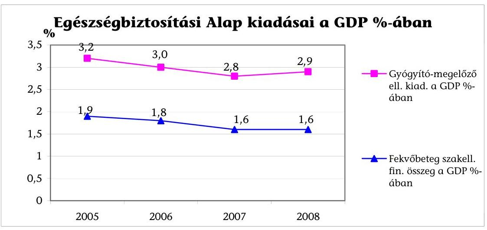

Forr: OEP Költségvetési Főosztály, KSH
A fekvőbeteg szakellátás 2005. évi 410,4 Mrd Ft-os kiadása 2006-ra 419,4 Mrd Ft-ra, majd 2008-ra 435,3 Mrd Ft-ra ${ }^{6}$ emelkedett ugyan, de ez a növekedés elmaradt a gazdaság egészének növekedésétől, a közkiadások csökkentésére irányuló programok végrehajtásának következtében. (4/b. sz. melléklet)

A kórházstruktúra átalakítására új törvény lépett hatályba 2007. április 1jétől, ${ }^{7}$ amely meghatározza a közfinanszírozott fekvőbetegellátás keretei közé befogadható krónikus és aktív ágyak mennyiségét, regionális leosztását, a hozzájuk kapcsolódó ellátási területeket és bevezette a súlyponti, valamint a terü-

[^0]
[^0]:    ${ }^{6}$ Kórházi napidíj, speciális és extra finanszírozással együtt.
    ${ }^{7}$ „Az egészségügyi ellátórendszer fejlesztéséről" szóló 2006. évi CXXXII. törvény (továbbiakban: Eftv.), hatályos 2007. január 1., de új finanszírozási szerződések április 1-jétől.

---

leti kórházak közötti megkülönböztetést. A törvény végrehajtása nyomán 2007. április 1-jétől országosan összesen 10,9\%-kal csökkent a kórházi ágyak száma, ezen belül az aktív ágyaké $26 \%$-kal, míg a krónikus- és rehabilitációs ellátás ágyszáma $34 \%$-kal emelkedett. (4/c. sz. melléklet)

Az időszak alatt megtett intézkedések (a finanszírozás reálértékének csökkentése, a kórházi ágyszám csökkentés és átalakítás) kórházi kiadásoknak, valamint kapacitásoknak a csökkentését és az ellátásoknak az alacsonyabb költségigényű formák irányába történő elmozdítását (krónikus és egynapos ellátás), célozták és eredményezték. (Melyet mutat a kórházból elbocsátott betegek számának 7,7\%-os csökkenése is, aminek az egészségi állapotra gyakorolt hatásáról nincs információnk). ${ }^{8}$

A 2006. évi kormányprogramban a költségvetési intézmények átalakításának célja egyrészt az intézmények „piackonformosítása", másrészt megnyitása volt a magántőke irányába, amelytől azt várták, hogy megteremti az egészségügyi intézmények rugalmasabb, hatékonyabb, a versenyszféráéhoz közelítő gazdálkodását. Ezt részben szolgálja a 2008. év végén elfogadott költségvetési szervek jogállásáról és gazdálkodásáról szóló9 törvény, amely a közfeladat-ellátás új intézményeit honosítja meg 2009 második felétől.

A múködésiforma-váltástól az intézmények, illetve tulajdonosaik, rugalmasabb gazdálkodást, gyorsabb döntési folyamatot, a hitelfelvétel lehetőségét, a munkavállalók foglalkoztatásának szabadabb, teljesítményre ösztönzőbb formáit, valamint az eladósodás megszüntetését várták. Az elsődleges célok mellett jelen van a döntések hátterében, hogy a tulajdonosok a vállalkozási bevételek növekedését is várják a kiszervezett kórházaktól, amellyel mérsékelhetik a beruházások, eszközpótlások pénzügyi terheit. A dombóvári kórház mint elsőként kiszervezett kórház - működése megfelelt az önkormányzat elvárásainak, eredményesen, kiegészítő térítési-díjas szolgáltatásokat is nyújtva gazdálkodik. Hatékonyságát fokozta munkaszervezetének mátrix rendszerben való megszervezésével, amelyet javuló ágyszám kihasználtsága mutat. Az orvosok foglalkoztatását elsődlegesen teljesítménydíjazásos közreműködői szerződéssel oldja meg.

Két megyei súlyponti kórház működésiforma-váltása 2007-2008-ban történt és az azóta eltelt idő rövid a gazdálkodási stabilitás eléréséhez. Az átalakulás a feladatok szerkezetére, mértékére nem volt hatással, a betegellátás osztályszerkezetét megőrizték, nem alakították át mátrix rendszerré. Mindkét kórház tervezte a térítési díjas szolgáltatások súlyának, bevételének növelését, de eddig ez még nem történt meg. A formaváltás önmagában nem elegendő eszköz a kitűzött célok eléréséhez, mert újabb költségelemek jelentek meg (társaságba bevitt vagyon amortizációja, iparűzési adó), amelyek gazdálkodásra gyakorolt hatását az előkészítés során alábecsülték.

[^0]
[^0]:    ${ }^{8}$ A fekvőbeteg ellátás, járóbeteg ellátással való kiváltása nem történt meg, mert ott is csökkent betegek száma 13,2\%-kal.
    ${ }^{9}$ A 2008. évi CV. törvény végrehajtására még nem születtek meg a rendeletek.

---

A múködésiforma-váltáshoz való kormányzati viszonyt jelzi, hogy a 13. havi bért kezdetektől 2007-ig folyamatosan megkapták a kiszervezett kórházak, 2008-ban azonban nem, amely negatív hatással volt gazdálkodásukra.

Az ÁSZ 2006. évi - az egészségügyi szakellátások privatizációjáról szóló - vizsgálatában ismertetett múködtetésbe adott kórházak szerződésben vállalt kötelezettségeinek teljesüléséről megállapítható, hogy - a múködés stabilitása, a megvalósított beruházások és az ellátás minőségének javulása - csak részben valósultak meg. A vállalt beruházásokat nem teljes körűen valósították meg, mert a múködési és finanszírozási körülmények nem az üzleti tervekben vázoltak szerint alakultak, (árbevétel növekedés helyett csökkenés pl. Kiskunhalas), a magán múködtetésbe adott intézmények valós pénzügyi helyzetének, stabilitásának megítélése átláthatatlanabbá, bonyolultabbá vált, mely hosszú távon az üzemeltetés kockázatát növeli. Az ellátás minőségének mérésére nem alakított ki az ágazatirányító objektív rendszert, ezért annak országos szintű összehasonlítása, időbeni változása nem ítélhető meg.

A kórházak múködtetői részéről az önkormányzat részére történt beszámolások nem rendszeresek, így a múködés stabilitásáról és a megvalósult beruházásokról az önkormányzatoknak nincs teljes körű, naprakész információjuk.

Az önkormányzatok nem kísérik figyelemmel, nem kérik számon a múködtetőtől a szerződésben meghatározott minőségi mutatók alakulását, amely számszerűsített formában adhatna képet az ellátás szakmai színvonaláról.

A beruházási szerződésekben rögzített feladatok számonkérése a tulajdonosok részéről esetleges. A szerződésben rögzített beruházási követelmények teljesülését az önkormányzatok nem ellenőrzik. A beruházók/múködtetők nem vagy nem részletesen, számszaki adatokkal alátámasztott beszámolót nyújtanak be az önkormányzat felé beruházásaikról.

A vizsgált időszakban az utóellenőrzött intézményeknél beruházások, felújítások, eszközbeszerzések több mint 5 Mrd Ft értékben történtek, amelyet uniós és egyéb pályázati forrásból, valamint tulajdonosi és önkormányzati hozzájárulásból, banki hitelből biztosítottak. Összegszerűségét tekintve Várpalotán, Kiskunhalason és Dombóváron történt nagy volumenű beruházás. Várpalotán 2,3 Mrd Ft hitelből épült egy közfeladatot ellátó magán kórházi egység, Kiskunhalason több mint 1,5 Mrd Ft-ot ruháztak be ingatlanok felújítására, energetikai beruházásra, valamint műszerekre. (A beruházásokat részletesen az 5. sz. melléklet tartalmazza.)

A befektetők a szükséges beruházási és fenntartási munkákat olyan mértékben végezték el, hogy azok az egészségügyi ellátások minimumfeltételeit szabályozó mindenkor hatályos jogszabályok ingatlanokra vonatkozó rendelkezéseinek megfeleljenek. A magánműködtetőkkel kötött szerződések egyikét sem szüntették meg, de a struktúraváltás, finanszírozási, illetve jogszabály-változási okok miatt mindegyiket módosították.

2006 óta folytatódott az intézmények magán múködtetésbe adása, ezek közül a helyszíni vizsgálat 5 kórházat érintett. A magán múködtetésbe adásra kisméretű városi kórházak esetében került sor, ahol az intézmény mű-

---

ködéséhez a tulajdonos önkormányzat ragaszkodik, de tevékenységét nem tudja pénzügyileg támogatni.

A múködtetés minimális feltételeihez szükséges szakorvosi létszám biztosítása problémát jelent az intézmények számára. A struktúraátalakítás csökkentette mind ellátási területüket, mind a magasabb finanszírozást nyújtó aktív ellátásukat, az elszámolható teljesítményt-csökkentő intézkedések tartósan veszteségbe fordították gazdálkodásukat, amelyet addigi tulajdonos-fenntartójuk nem tudott tovább átvállalni. Az önkormányzatoknak jellemzően nincs forrásuk a kórházi ingatlanok és eszközpark értékcsökkenésének pótlására. Az 5 vizsgált intézményből 3 esetében (Gyöngyös, Mezőtúr, Tapolca), a működtetésbe adás fő indoka az intézmény gazdasági ellehetetlenülése volt, Ózd esetében pedig a tartós szakorvos hiány. (A gyöngyösi és a tapolcai kórház esetében az önkormányzat próbálkozott a múködésiforma-váltással, de továbbra is adósság halmozódott fel.)

A működtetésbe adástól, a befektetőtől elsődlegesen azt várták az önkormányzatok, hogy a kórház megmarad a város számára. A működtetők a problémák egy részét tipizálható eszközökkel kezelték, pl. a kórházi osztályszerkezetet a rugalmasabb, hatékonyabb mátrix szervezettel váltották fel, amelynek következtében csökkenteni tudták a kiadások legnagyobb részét kitevő bérköltséget. Az orvosokat jellemzően közreműködői (vállalkozási) szerződéssel foglalkoztatták. A működtetők kapcsolt vállalkozásaikon keresztül a gyógyszerellátásban, a készletgazdálkodásban, a központosított eszközbeszerzésben, a központosított adminisztrációban érnek el költségmegtakarítást.

Az amortizáció finanszírozatlanságából fakadó hiányt a magánműködtetésbe adással járó hatékonyabb gazdálkodás sem tudja megszüntetni. Az ebből fakadó forráshiány nemcsak a kórházak, hanem a kapcsolódó vállalkozások finanszírozását is nehezíti. Az amortizáció visszapótlására 2007. évtől életbe léptetett vagyonkezelői jog intézménye az amortizáció forrását nem rendezte, ezért ennek hiánya továbbra is ellentmondásos gyakorlatot mutat.

A működtető kiválasztására a hatvani kórház kivételével minden esetben pályázatot bonyolított le az önkormányzat.

Jó gyakorlatot tapasztaltunk Gyöngyös önkormányzatánál, ahol már a pályázat kiírásakor rögzítették a majdan megkötendő szerződés legfontosabb tartalmi elemeit, amelynek elfogadását a pályázóktól megkövetelték.

Átmenetileg mindegyik működtető megőrizte az átvett munkavállalók átszervezést megelőző időpontban érvényes bérét, járandóságait/szerzett jogait (ugyanakkor a 13. havi bért többnyire cafetéria rendszerben fizették ki). Az egészségügyi struktúraváltással párhuzamosan - Ózd kivételével ${ }^{10}$ - a 2006. és 2008. között működtetésbe adott intézmények mindegyike végrehajtott létszámleépítést. A központi költségvetés pályázatos formában támogatta az -

[^0]
[^0]:    ${ }^{10}$ Ózd működtetésbe adása 2008. év végén történt, és a struktúraváltás nem érintette jelentősen az ágyszámát és elszámolható teljesítményét.

---

önkormányzati ${ }^{11}$ és privát ${ }^{12}$ működtetésű - jelentős kapacitásszűkülést elszenvedett intézmények esetében a csoportos létszámleépítés megvalósítását.

A vizsgált 5 kórházban az ellátás szűkítése önkormányzati hozzájáruláshoz kötött, emellett szintén a kórházak szerződésben vállaltak kötelezettséget arra, hogy az ellátás minőségét mutatókon/indikátorokon keresztül mérik. Az indikátorok célértékeit a szerződések nem tartalmazzák. A romló minőségű egészségügyi ellátás rendkívüli szerződésbontást eredményező kritérium, ugyanakkor ennek hitelesített mérése nem megoldott.

A kórházak működtetésbe adására a minisztérium nem dolgozott ki az önkormányzatok számára olyan szerződésmintát, amely kórházak működtetésbe adásakor iránymutatást jelentene (garanciális elemeket tartalmazna a vagyon megőrzésére, az ellátási színvonal fenntartására, az ellenőrzési jogosultságok biztosítására).

Vizsgálatunk két magántőke-bevonással építményeiket bővítő kórházra is (Várpalota, Esztergom) kiterjedt. Az önkormányzatok a beruházások iránti igényüket fogalmazták meg, ugyanakkor nem rendelkeztek a beruházáshoz szükséges forrással. A döntés időszakában nem ismerték a finanszírozásra vonatkozó számításokat és annak a pénzügyi következményeit. Mindkét beruházás a Medicomplex Kft. közreműködésével valósult meg, projekt cég bevonásával. A beruházások az egészségügyben még újnak számító PPP konstrukcióban jöttek létre. Az önkormányzatok közvetlen pénzügyi támogatással nem, de kedvezményes földterület átruházással támogatták a beruházásokat. Mindkét beruházásnál a szerződés 15-18 évre szól, ez idő alatt az új létesítményt a közfinanszírozott kórház bérli, a költségeket (hiteltörlesztést és költségét) pedig továbbhárítják. Mindkettőnek a megtérülését a magasabb színvonalú és széleskörű fizetős egészségügyi szolgáltatások térítési díj bevételére alapozták, amelyet Várpalotán a közfinanszírozott ágyak 90\%-án be is vezettek. Erre azért van lehetőség, mert nincs meghatározva részletesen, pontosan, protokollszerűen a biztosítotti alapcsomag, ezen belül nincs jogi előírás, amely meghatározná a gyógyító ellátáson kívül, a fekvőbeteg ellátáshoz kapcsolódó kényelmi szolgáltatások körét, azok minőségét. Esztergomban jelenleg az önkormányzat vállalja át - éves költségvetésében - a hiteltörlesztési díjat, amelynek nagysága éves szinten, mintegy 150-180 M Ft, és keresik a finanszírozás hosszú távú megoldását.

Közremúködői szerződéseket kötöttek a munkáltató által elrendelhető heti munkaidő mértéke miatt az egészségügyi szolgáltatók az alkalmazotti minőségben történő feladatellátás kiváltására.

[^0]
[^0]:    ${ }^{11}$ 64/2007. (IV. 3.) Korm. rendelet a 100\%-ban állami, illetve helyi önkormányzati tulajdonú közhasznú vagy gazdasági társasági formában múködő aktív fekvőbeteg szakellátást biztosító egészségügyi szolgáltatók 2007. évi létszámcsökkentésének költségvetési támogatásáról.
    ${ }^{12}$ 86/2008. (IV. 15.) Korm. rendelet a közhasznú, vagy gazdasági társasági formában múködő, valamint az egyházak, alapítványok által fenntartott aktív fekvőbetegszakellátást biztosító egészségügyi szolgáltatók létszámcsökkentésének 2008. évi költségvetési támogatásáról.

---

A közreműködői szerződések pozitívuma hogy rugalmasabb díjazást tesz lehetővé, ezzel segíti a hiányszakmák létszámproblémájának megoldását.

A helyszínen vizsgált intézményeknél - az összes egészségügyi intézmény 12\%-a - a közreműködői szerződések számának alakulásában összességében növekedési tendencia mutatkozik mind a közreműködői létszámban, mind az ellátott havi óraszámban.

A közreműködői szerződések vizsgálatakor, „a struktúraváltás melléktermékeként" találkoztunk elsősorban a fővárosban az orvosok „újszerü" önkéntes munkavégzésével, ${ }^{13}$ amely a munkaadó és a munkavállaló érdekazonossága miatt működőképes, ugyanakkor jelzi, hogy nem csak szakorvos hiány van, hanem szakorvos felesleg is.

A háttértevékenységek (mosás, takarítás, őrzés-védés, energetika, élelmezés) kiszervezését a fenntartók és az intézmény forráshiánya miatti tőkebevonás szükségessége, a költséghatékonyabb feladatellátás, a kórházi menedzsment tehermentesítése, a létszámhiány indokolta. A kiszervezések arányát és a szolgáltatók koncentrálódását az előkészítés szakaszában országos kérdőíves felmérés alapján értékeltük. A kiszervezett öt fő tevékenység összefoglaló adatait 7. sz. melléklet mutatja.

Az öt fő tevékenységre fordított kiadások a helyszínen vizsgált intézmények kiadási főösszegéhez viszonyítva az energiaszolgáltatásban nevezhető meghatározó nagyságrendnek.

A kórházak többsége elégedett a háttérszolgáltatók tevékenységével, különösen a legalább 3 tevékenységet kiszervezők, ahol az elégedettség 87\%-os, részletes adatokat a 7. és a 8. sz. mellékletek összegzője mutatja.

Az öt főtevékenység esetében a mosásnál az intézetek 54\%-a, az élelmezésnél 74\%-a, a takarításnál 95\%-a, az őrzés-védelemnél 62\%-a, az energia ellátásnál 83\%-a közbeszereztette a szolgáltatás kiszervezését.

A főváros tulajdonában, felügyelete alatt álló intézményeknél a közbeszerzést központosították. A központosított eljárások kiírásának elhúzódása a kórházakat a meglévő szerződéseik eljáráson kívüli meghosszabbítására kényszerítette.

A háttérszolgáltatások kiszervezésével jellemzően együtt járt minőséget javító, szolgáltatást korszerűsítő beruházás betegélelmezés, takarítás, őrzés-védelem, és az energiaellátás területén. ${ }^{14}$

A minőségi teljesítés elsősorban az élelmezés, a mosatás és a takarítás területén ellenőrizhető napi szinten. Emellett az egyes kórházak betegelégedettségi vizs-

[^0]
[^0]:    ${ }^{13}$ Az egészségügyi ellátás területén a közérdekű önkéntes tevékenység szabályait a 2005. évi LXXXVIII. törvény és az egészségügyi tevékenység végzésének egyes kérdéseiről szóló 2003. évi LXXXIV. törvény szabályozza.
    ${ }^{14}$ A beruházásokat az egészségügyi mosási technológiára specializálódott szolgáltatók végzik saját mosodáikban.

---

gálatai is kiterjedtek a tisztaság, az étkeztetés, illetve a rend (biztonság) területeire.

A vizsgált kiszervezésekre jellemző, hogy nem támasztották alá a szerződéseket költséghatékonysági számítások. ${ }^{15}$

2008-ban az egészségügyi miniszter felügyelete alá tartozó megszüntetett egészségügyi intézmények esetében az intézkedések pénzügyi hatásait dokumentáltan a tárca előzetesen nem mérte fel, a megszüntetésből fakadó gazdasági előnyöket és hátrányokat nem számszerűsítették. (A megállapítással kapcsolatban az EüM véleményeltérést fogalmazott meg. $)^{16}$

Az intézményekben a háttérszolgáltatásokat biztosító vállalkozások hosszú távú szerződéseinek felbontásából a vállalkozásoknak az elmaradt vállalkozói haszon miatt az eddig kifizetett követelések összege 246,4 M Ft. Továbbá egy esetben perel a vállalkozó, amelynek elbírálása bírósági szakaszban van.

A korábbi számvevőszéki vizsgálatokban, a társadalombiztosítás pénzügyi alapjai 1998. évi költségvetése végrehajtásáról készült jelentésünkben (9928) javasoltuk az egészségügyi miniszternek, hogy vizsgáltassa meg az egészségügy területén a magánosítás folyamatát, és határozza meg a jogi háttér, a finanszírozási szabályokkal való összhang, az ellenőrzés feltételeinek megteremtéséhez szükséges tennivalókat. A javaslat tartalmával megegyező dokumentum a tárcánál nem készült.

A magántőke szerepvállalásának tapasztalatai az egészségügyben címmel 2008 októberében készített dokumentumot tárgyalta a Parlament Egészségügyi bizottsága. Ez mindössze adatok szintjén mutatja be a magánszolgáltatók jelenlétének arányait.

Az egészségügyi szakellátások privatizációjáról készült jelentésben (0609) az ÁSZ javasolta a Kormánynak, hogy dolgozzon ki átfogó egészségpolitikai koncepciót, amelynek keretében meghatározza a magántőke, a magánvállalkozások lehetséges szerepét, szakmai területeit, az állami támogatások alapelveit, és mindezekre figyelemmel szabályozza az egészségügyi szakellátások múködésének rendszerét. A javaslatra intézkedés nem történt.

Az egészségügyi szakellátások privatizációjáról készült jelentésben (0609) javasoltuk a Kormánynak, hogy kezdeményezze - az egészségpolitikai koncepcióval összefüggésben - a korlátozott forgalomképességú ingatlanvagyonnal való rendelkezés törvényi újraszabályozását annak érdekében, hogy az ellátási köte-

[^0]
[^0]:    ${ }^{15}$ Egy-egy kivétel természetesen itt is akad: a Pécsi Tudományegyetem klinikáinak őr-zés-védelmi és takarítás kiszervezései 2008-ban. Ezen kívül a miskolci megyei kórház költségkontrolljai szerint a mosatás, az élelmezés és az energiaellátás kiszervezése gazdaságosabb és költséghatékonyabb volt és maradt a későbbiekben is. A példában szereplő intézeteket helyszínen vizsgáltuk.
    ${ }^{16}$ A véleményeltérés részletes bemutatása a 7.5. pont alatt található.

---

lezettség fennállásáig az ellátást szolgáló ingatlan ne legyen elidegeníthető, elajándékozható. ${ }^{17}$ A javaslatra intézkedés történt.

A helyszíni ellenőrzés megállapításainak hasznosítása mellett javasoljuk:

# a Kormánynak: 

Dolgozza ki és készítse elő a fekvőbeteg ellátás törvényi szintű szabályozását, amelyben egyértelműen meghatározza a magánszektor szerepvállalását a szektorsemlegesség figyelembevételével.

## az egészségügyi miniszternek:

1. Folytassa a biztosítási alapcsomag pontos és szakmai protokollok szerinti részletes tartalmának kidolgozására irányuló munkát és gondoskodjon annak a folyamatos karbantartásáról.
2. Dolgozza ki és szabályozza a közfinanszírozott egészségügyi szolgáltatók által nyújtott kényelmi szolgáltatások körét és részletes feltételeit.
[^0]
[^0]:    ${ }^{17}$ A vagyonkezelés részletes szabályozására a 2005. évi XCII. törvény rendelkezései alapján, az 1990. évi LXV. törvénybe beépített 80/A-B. §-ok, valamint az 1992. évi XXXVIII. törvénybe beépített 105/A-D. §-ok alapján a helyi önkormányzat az önkormányzati közfeladat átadásához használt korlátozottan forgalomképes vagyonára vagyonkezelői jogot alapíthat 2007. január 1-jétől.

---

# II. RÉSZLETES MEGÁLLAPÍTÁSOK 

## 1. AZ EGÉSZSÉGPOLITIKA IRÁNYÍTÓ SZEREPE A KÓRHÁZAK MŰKÓDÉSIFORMA-VÁLTÁSÁBAN, A MAGÁNVÁLLAKOZÁSOK, A MAGÁNTŐKE BEVONÁSÁBAN

### 1.1. A 2006. évi kormányprogram és a konvergencia program

2006-2008 közötti időszak meghatározó dokumentuma a konvergencia program. Eszerint „a kórházak müködési kereteinek olyan átalakítására van szükség, mely biztositja az átlátható könyvelést és eredmény-kimutatást, a tulajdonos (fenntartó) eredményérdekeltségét és a dolgozók rugalmasabb bérezését biztositó foglalkoztatást (gazdasági társasággá alakítást)."

A kormányprogram is elviekben támogatta a kórházak költségvetési intézményi formából közhasznú társasággá, gazdasági társasággá alakítását, és ezekbe magánbefektetők bevonását, de a gyakorlatban nem készült az átalakulást segítő stratégia vagy program, viszont csökkent a fekvőbeteg-ellátásra fordítható kiadás reálértéke. ${ }^{18}$

Kormányprogramok szorgalmazták ${ }^{19}$ a költségvetési intézmények átalakulását rugalmasabb és hatékonyabb gazdálkodást lehetővé tevő gazdasági társaságokká. Az átalakítással két célt kívánnak elérni, egyrészt az intézmények „piackonformosítását", másrészt nyitottá tenni az intézményeket a magántőke irányába. Ezek a célok túl általánosan vannak megfogalmazva ahhoz, hogy az értékelés alapját képezhetnék, konkrétabbakat az intézmények illetve tulajdonosaik jelölnek meg. A kormányprogramokhoz, vagy azt követően nem készült olyan makrogazdasági elemzés, amelyik megvizsgálta volna az átalakulások hatását.

Az egészségbiztosítási alap kiadásai bruttó nemzeti összterméken belüli aránya 2006-2008 között 1,7\%-kal csökkent 7,2\%-ról 5,5\%-ra.

Az Egészségbiztosítási Alapon belül a gyógyító-megelőző ellátásoknak része az ún. fekvőbeteg-szakellátás. 2005-ben a gyógyító-megelőző célra fordított közkiadások elérték a GDP 3,2\%-át, 2006-ban a megszorítások következtében 3,0\%át, amelynek további 0,2 százalékpontos csökkentését fogalmazta meg a konvergencia program. A közkiadások csökkentésére irányuló programok végrehajtásával az egészségügy 2007-re teljesítette a programban megfogalmazott elvárást, mert a gyógyító-megelőző kiadás a GDP 2,8\%-ára csökkent. A fekvőbeteg szakellátás 2005. évi 410,4 Mrd Ft-os kiadása 2006-ra 419,4 Mrd Ft-ra, majd 2008-ra 435,3 Mrd Ft-ra emelkedett, mely növekedés 2006-2008 között

[^0]
[^0]:    ${ }^{18}$ az egészségügyi ágazat árindexe az előző évhez viszonyítva 2006-ban 109,3\%, 2007ben 103,5\%, és 2008.évi I. félévi 103,0\% (forrás: ESKI Árinformációs tájékoztató)
    ${ }^{19}$ a 90-es évek közepe óta

---

3,8\% volt, de ez elmaradt a gazdaság egészének növekedésétől. (4/b. sz. melléklet)

# 1.2. A struktúraátalakítás 

A konvergencia program szellemében 2006-2008 között elfogadott törvények átalakították az ellátórendszert, amelyek közül vizsgálatunk szempontjából legfontosabb „az egészségügyi ellátórendszer fejlesztéséről" szóló ${ }^{20}$ törvény (továbbiakban: Eftv.), amely meghatározza a közfinanszírozott fekvőbetegellátás keretei közé befogadható krónikus és aktív ágyak mennyiségét, regionális leosztását, a hozzájuk fűződő ellátási területeket, és bevezette a súlyponti, valamint a területi kórházak közötti megkülönböztetést. A törvény végrehajtása nyomán 2007. április 1-jétől országosan összesen mintegy 11\%-kal csökkent a kórházi ágyak száma, ezen belül az aktív ágyaké $26 \%$-kal csökkent, míg a krónikus és rehabilitációs ellátás ágyszáma $34 \%$-kal emelkedett. (4/c. sz. melléklet)

Hat kórháznak szűnt meg a közfinanszírozott kapacitása. 12 kórházban az aktív fekvőellátás, míg 33 kórház esetében 1 vagy több szakmacsoport közfinanszírozása szűnt meg. ${ }^{21}$

A törvény alapján a kórházak ágyszámát és azok összetételét, azaz a kapacitását, végül az egészségügyi miniszter határozatban döntötte el, amellyel 51 intézmény nem értett egyet. Az Alkotmánybíróság ${ }^{22}$ a törvényhez kapcsolódó, a szakellátási kapacitások felosztásának szempontjait és a szakellátási elérési szabályokat kihirdető EüM rendeletet ${ }^{23}$ alkotmányellenesnek ítélte és ezért megsemmisítette, ugyanakkor kimondta a törvény kapcsán, hogy az állam feladata a kapacitások meghatározása az egészségügyben (nem az önkormányzaté), mert az állam gondoskodik ezek finanszírozásáról.

## 2. A MÜKÖDÉSIFORMA-VÁLTÁs 100\% ÖNKORMÁNYZATI TULAJDON MELLETT

A Kormányprogramon túl, szabályozás szintjén nincs megfogalmazott elvárás, kritériumrendszer a költségvetési intézményként múködő kórházak átalakításának, működésiforma-váltásának, működtetésbe adásának. A tulajdonosok és a vizsgálat is akkor tekintette eredményesnek a kiszervezést, ha a gazdálkodás rugalmasan alakult a körülményekhez, kiegyensúlyozottá vált, adósságállomány nem képződött, illetve csökkent.

A Dombóvári Szent Lukács Egészségügyi Kht-t 1995-ben hozta létre a Város önkormányzata és a ROLICARE Rt., de a magánbefektető nem találta meg számí-

[^0]
[^0]:    ${ }^{20}$ az egészségügyi ellátórendszer fejlesztéséről szóló 2006. évi CXXXII. törvény
    ${ }^{21}$ Jelentés az Országgyűlés Egészségügyi Bizottsága részére az egészségügyi ellátórendszer múködéséről, EüM 2008. május.
    22 109/2008. (IX. 26.) számú AB határozat az Alkotmánybíróság jogszabály alkotmányellenességének utólagos vizsgálatára irányuló indítványok tárgyában.
    ${ }^{23}$ 54/2006. (XII. 29.) EüM rendelet, 2008. decemberében az Eftv. módosításában újraszabályozta a kérdést a parlament

---

tását, ezért kilépett a társaságból, így a kht. 1997 márciusától 100\%-os önkormányzati tulajdonban lévő kiemelten közhasznú társaságként üzemelt 2009ig. ${ }^{24}$

A 2007. július 1-jétől költségvetési szervezeti formából átalakuló szervezetek választhatták a Gt. szerint jövedelemszerzésre nem irányuló közös gazdasági tevékenység folytatása céljából non-profit jelleggel az rt. és a kft. formát, melyet fel kell tüntetni a társaság cégnevében. A non-profit múködés biztosítja, hogy ne legyen elsődleges a haszonszerzésre való törekvés, illetve a haszon visszaforgatása kötelező legyen a múködésre, a használatba vett vagyon visszapótlására, annak növelésére. A vizsgált időszakban a Veszprém megyei és a Vas megyei önkormányzatok a tulajdon önkormányzati megtartása mellett a megyei, kórházakat 2007 és 2008-ban non-profit zrt-vé ${ }^{25}$ alakították. Átalakitásuk különös jelentőséggel bír, tekintettel arra, hogy eddig jellemzően kisvárosi kórházakat és nem megyei, súlyponti kórházakat szerveztek ki a költségvetésből.
2009. július 1-jétől a működésiforma-váltás lehetősége tovább bővül, mert a költségvetési szervek jogállásáról szóló törvény ${ }^{26}$ új szabályokat, múködési formákat teremt közfeladatok ellátására. A törvény a költségvetési intézmények új típusaként definiálja a vállalkozó közintézetet. Az eddigieknél rugalmasabb, a piaci viszonyokhoz jobban igazodó szabályokkal múködhet pl. tulajdonában lévő vagyon legfeljebb 50\%-os mértékéig hitelintézettől fejlesztési hitelt vehet fel, helytállási kötelezettségét és az általa felvett hitel biztosítékát kizárólag saját vagyona képezheti.

# 2.1. A múködésiforma-váltással elérendő célok 

A tulajdonos számára elsődleges cél, hogy kevesebb fenntartói támogatással kiegyensúlyozott gazdálkodású, közfeladatot ellátó intézménye megmaradjon, magas színvonalon múködjön.

A cél egyértelműen az előnyök kiaknázása, a betegek és dolgozók elégedettségének növelése, a gazdálkodás pénzügyi egyensúlyának megtartása mellett az ellátás technikai és személyi színvonalának növelésével kulturált körülmények között történő betegellátással volt. A gazdasági társaságok a központilag meghirdetett fejlesztési beruházási pályázatokon tulajdonos önkormányzataikkal együttműködve vehetnek csak részt.

Az elsődleges célokon túl, a döntések hátterében jelen van, hogy az önkormányzatok nem képesek eleget tenni tulajdonosi kötelezettségeiknek a beruházások és eszközkorszerűsítések, pótlások területén, illetve kiszervezés után már nem terheli az önkormányzatokat az intézmények átmeneti pénzügyi problémáinak kezelése.

[^0]
[^0]:    ${ }^{24}$ Tekintettel arra, hogy a kht. 2009. június 30-a után nem múködhet tovább a közhasznú társaságokra irányadó szabályok szerint, ezért - a vizsgálat ideje alatt - alakult át non-profit kft-vé.
    ${ }^{25}$ A Vas Megyei Markusovszky Ferenc Kórház Non-profit Zrt. 2007. október 1-jén, a Veszprémi Csolnoky Ferenc Kórház Non-profit Zrt. 2008. április 1-jén alakult át.
    ${ }^{26}$ 2008. évi CV. törvény 1. § c) pont

---

A veszprémi és szombathelyi átalakult kórházat a múködés első évében támogatták a tulajdonosok. Szombathelyen ez az MR berendezés vásárlásához nyújtott 600 M Ft-os vissza nem térítendő támogatás volt, Veszprémben 349 M Ft-tal támogatták a kórházat.

A dombóvári kórház társasági formába történő kiszervezése a tulajdonosi elvárások és a szerződésben megfogalmazottak teljesülése alapján eredményesnek tekinthető. A társaság mérlege az utóbbi két évben pozitív volt, 2006-ban is csak a jelentős beruházás miatt volt csak veszteséges. A dombóvári kórház tulajdonosi támogatása csak a nagy beruházásokhoz való részhozzájárulásra korlátozódik. A tulajdonos a kórház vezetőit 2008-ban további 5 évre meghoszszabbította tisztségükben, valamint a kht. feladatátadási szerződésének futamidejét további 10 évvel meghosszabbította. A rehabilitációs várakozási idő a fejlesztések következtében lerövidült. A kórház ágykihasználtsága javult, mert a 2006. évi 79,8\%-ról 2008-ra 90,7\%-ra emelkedett.

A szombathelyi kórház múködésiforma-váltásakor a célok között szerepelt a rugalmasabb, a hatékonyabb feladatellátás, a dolgozók teljesítményarányos bérezése, a bevételek optimalizálása. A múködésiforma-váltás a kórház gazdálkodásában eddig jelentős változásokat nem eredményezett. A dolgozók 13. havi juttatásának a tervekben teljesítményösztönző szerepet szántak, de ezt részben az alacsony bérszínvonal miatt, részben azért mert a kórház kimaradt a 13. havi bér költségvetési támogatásából, nem tudták megvalósítani.

A veszprémi kórház 2008. április 1. óta múködik gazdasági társaságként, céljai megegyeztek a szombathelyi kórházéval. Tekintettel a rövid múködési időre a rövid távú intézkedések hatásai mutatkoznak meg, pl. csökkentette a menedzsment kiadásokat, az ellátást finanszírozási korláton belül tartotta, a válság leküzdése érdekében decemberben újratárgyalta a Kollektív Szerződést, és múködési célú hitelt is vett fel. A 2009. évi üzleti tervben 500,0 M Ft kiadáscsökkentést terveztek.

# 2.2. A múködésiforma-váltás gazdálkodásra gyakorolt hatása 

A dombóvári kórház eredményes gazdálkodását segítette folyamatos hitelkerete, amely biztonságot, fejlesztési lehetőséget nyújt számára. 2003-2006 között pályázati forrásokból mintegy 2,0 Mrd Ft-os beruházást fejezett be, amelyhez 74,4 M Ft önerőt biztosított (az önkormányzat 60,0 M Ft-ot). Bevételeit kiegészíti - az OEP finanszírozáson túl - vállalkozási tevékenységéből, fizetős egészségmegőrzési és rekreációs szolgáltatásokkal, illetve magasabb komfort fokozatú rehabilitációs ellátást nyújt részleges térítési dí ellenében (az OEP bevétel 8-9\%a). Gazdálkodását negatívan befolyásolta, hogy 2008-ban kimaradt a 13. havi bér költségvetési támogatásából, amelyet addig minden évben megkapott.

A veszprémi és a szombathelyi kórházak esetében a múködésiforma-váltás a feladatok szerkezetére, mértékére nem volt hatással, a gazdálkodás nem stabilizálódott. A külső gazdasági-finanszírozási környezet miatt, a veszprémi kórház pénzügyi pozíciói romlottak, amelyet mutat a 2008. december 31-i szállítói kötelezettségállományának növekedése (ami 526,0 M Ft volt, amelyből határidőn túli állomány $148,0 \mathrm{M}$ Ft volt). Ennek ellenére a kórház adósságállománya stagnált, de ebben segített az a 400 M Ft „kasszamaradvány" is, amelyet az

---

OEP-től 2008. december 20-án kapott. A szombathelyi kórháznak határidőn túli szállítói tartozása nem volt, sem az átalakuláskor, sem azóta.

A két intézmény esetében nem történt tulajdonosváltás, nem volt privatizáció.
A veszprémi és szombathelyi kórháznál is megfogalmazott cél a fizetős szolgáltatási bevételek növelése, de részesedésük a bevételekből még nem számottevő. A szombathelyi kórházban a rekonstrukcióra, a kórházi struktúra racionalizálására tagi kölcsön igénybevételére volt szüksége a társaságnak. Ez 360 M Ft 120 hónapos futamidejű kölcsön volt. MR képalkotó berendezés beszerzéséhez pedig 600 M Ft-os vissza nem térítendő támogatást nyújtott a tulajdonos.

A Vas Megyei Markusovszky Kórház Non-profit Zrt., illetve a Veszprémi Csolnoky Ferenc Kórház Non-profit Zrt-t 20,0-30,0 M Ft értékű törzsrészvénnyel, vagyonkezelői jog alapításával hozták létre. Az alapító a társaságot, mint a megszűnt költségvetési intézmény általános jogutódjának tekinti. Az Áht. a 90. § (3) bekezdés értelmében, jogutód csak az alapító lehet. A költségvetési szerv megszüntetése esetén - az alapító szerv vagy jogszabály eltérő rendelkezése hiányában - a vagyoni jogok és kötelezettségek tekintetében a megszüntetett szerv jogutódja az önkormányzat.

A költségvetési szerv megszüntetése esetén - a jogszabály eltérő rendelkezése hiányában - a vagyoni jogok és kötelezettségek tekintetében a megszüntetett szerv jogutódja az alapító szerv. Az alapító szerv azonban a jogszabályban előírt helytállási kötelezettsége ellenére sem válik a közalkalmazottak munkáltatójának munkajogi jogutódjává. ${ }^{27}$ Az Eftv. ${ }^{28}$ 16. § (9) bekezdése értelmében a költségvetési szerv formájában múködő finanszírozott egészségügyi szolgáltató helyébe lépő gazdasági társaság, a finanszírozási szerződések, valamint hatósági engedélyek tekintetében a költségvetési szerv jogutódja. Ez megalapozza az ellátási kötelezettség és a kapacitások továbbvitelét.

A vagyonkezelői jogot ingyenesen, kijelöléssel kapták a társaságok a feladatellátásához és azért, hogy a vagyont megőrizzék, értékét növeljék.

A Veszprémi Csolnoky Ferenc Kórház Non-profit Zrt. az ingatlanokat vagyonkezelői szerződés alapján kijelöléssel határozatlan időre kapta, az ingóságokat pedig áfa-mentes apportként. Az előkészítési folyamatban a fejlesztés szükséges mértékét 5451 M Ft-ra becsülték csak a fekvőbeteg ellátásban. Az egészségügyi ellátásról rendelkező ellátási szerződés szintén határozatlan idejű. A közhasznúságról szóló szerződés garantálja a nem jövedelemszerzésre irányuló múködést, valamint azt, hogy üzletszerű tevékenységet csak kiegészítő tevékenységként közhasznú céljainak megvalósítása érdekében folytathat, annak eredményét nem oszthatja fel. A 2009. évi üzleti terv a kiadások 500 M Ft-os megtakarítást kell a Kórháznak 2009. évben teljesíteni ahhoz, hogy üzleti tervét teljesíteni tudja.

[^0]
[^0]:    ${ }^{27}$ A közalkalmazottak jogállásáról szóló 1992. évi XXXIII. törvény (Kjt.) 25. § (1) bekezdés c) pont, 25/A. § (1) és (7) bekezdések, az államháztartásról 1992. évi XXXVIII. törvény 90. § (3) bekezdés.
    ${ }^{28}$ 2006. évi CXXXII. törvény az egészségügyi ellátórendszer fejlesztéséről

---

# 3. A 2005-BEN ÉS AZT MEGELŐZŐEN MŰKÖDTETÉSBE ADOTT KÓRHÁZAK UTÓELLENŐRZÉSE 

Az utóellenőrzés keretében 5 fekvőbeteg intézményt ${ }^{29}$ vizsgáltunk, amelyek kht. és kft. formában, magánszolgáltatói, önkormányzati, illetve vegyes tulajdonban múködtek. Közös jellemzőjük, hogy a múködtetésbe adást megelőzően súlyos pénzügyi gondokkal küzdöttek, az önkormányzatok rendszeres támogatására szorultak, és adósságot halmoztak fel. Az utóellenőrzés során értékeltük, hogy a vizsgált időszakban történt-e társasági, illetve tulajdonosváltás, a betegellátás színvonalát javító beruházás, valamint szerződésmódosítás. (A tulajdonosi összetételt és az ingó, ingatlan vagyon megosztását a 9. sz. melléklet mutatja.)

Az önkormányzatok a múködtetésbe adás során az egészségügyi intézményeket ingyenes használatba adták. A beruházásokat és felújításokat az önkormányzatok részben támogatták: a pályázati önrész biztosításával (Körmend) vagy címzett támogatásra való pályázattal (Dombóvár).

A korábbi ÁSZ vizsgálat óta a magánszférával való együttműködés során a szerződésekben vállalt kötelezettségek - múködés stabilitása, megvalósult beruházások és az ellátás minőségének javulása - részben valósultak meg.

A kórházak múködtetői részéről az önkormányzat felé történt beszámolások nem rendszeresek, így a múködés stabilitásáról és a megvalósult beruházásokról az önkormányzatnak nincs teljes körű, naprakész információja.

Az ellátás minőségének folyamatos ellenőrzése önkormányzati kötelezettség és érdek. Az önkormányzatok nem kísérik figyelemmel, nem kérik számon a múködtetőtől a szerződésben meghatározott minőségi mutatók alakulását, amely számszerűsített formában adhatna képet az ellátás szakmai színvonaláról.

A kiskunhalasi kórházat múködtető Semmelweis Kórház Kht. az elmúlt 5 évben egyszer, a szerződés megkezdésétől számított 3. évben számolt be az önkormányzatnak az egészségügyi ellátás minőségéről. A HospInvest Zrt. az általa üzemeltetett intézmények belső ellenőrzésére kidolgozott egy 18 indikátorból álló listát, amellyel a 6 intézmény minőségi és teljesítménymutatóit veti össze. A szolgáltató a képviselőtestület elé terjesztette a szolgáltatás minőségének elemzését 2008 decemberében, de nem tárgyalták meg.

Körmend a rendszeres önkormányzati beszámoltatás szempontjából jó példa. A szolgáltatási szerződés szerint az önkormányzat Egészségügyi és Népjóléti Bizottsága jogosult az ellátás minőségét - az ellátás minőségének ellenőrzéséhez meghatározott mutatók alkalmazásával - folyamatosan ellenőrizni. A Szolgáltató évente két alkalommal elkészíti a kórházi tevékenységet bemutató mennyiségi és minőségi mutatók alapján a beszámolót. A beszámoló melléklete a minőségi

[^0]
[^0]:    ${ }^{29}$ Dombóvári Szent Lukács Egészségügyi Közhasznú Társaság, Semmelweis Kórház Kht. Kiskunhalas, Dr. Batthyány-Strattmann László Kórház Kft. Körmend, Siklósi Kórház Humán Egészségügyi Non-profit Kft., Palotahosp Kft. Várpalota

---

mutatókat meghatározó tényezők adatait havi megbontásban is tartalmazza, ami lehetővé teszi, hogy a szakmai színvonal tendenciája is értékelhető legyen. A kórház szakmai munkájáról a 2006-2008. években készített beszámolókat a kép-viselő-testület határozattal elfogadta, szakmai színvonalromlást nem állapítottak meg.

# 3.1. Az intézmények társasági formaváltása, tulajdonosváltása 

A társasági formaváltás a kht.-ként múködő intézményeknek jogszabályi kötelezettség. A kht. formában múködő 3 kórház közül egy (Siklós) alakult át nonprofit korlátolt felelősségú társasággá. A kórházakat üzemeltető társaságok nem változtak, azonban a kórházak tulajdonlásában történt változás, az öt vizsgált kórházból három esetben (Várpalota, Siklós, Körmend). A szerződések nem tartalmaznak kikötést arra, hogy a müködtetőknek a tulajdonviszonyaikban beálló változásokról tájékoztatniuk kellene az önkormányzatot.

A Siklósi kórház Kft-ben a tulajdoni hányadok egy 2007-ben kiírt kórházfejlesztési támogatási pályázat miatt változtak, mert az EüM által kiírt pályázat feltétele volt a $25 \%$-os önkormányzati tulajdonrész. Ezért a három önkormányzat együttes részesedését felemelték 25\%-ra.

A Várpalotai Városi Kórház-Rendelőintézet múködtetőjénél 2006-2008 között társasági formaváltás nem történt, az egészségügyi szolgáltatás és a kórházmúködtetés feladatát a Palotahosp Kft. végezte. A kft. üzletrészét a befektető Medicomplex Kft. értékesítette egy magánszemélynek (2008. december 3án), amely tranzakcióról az önkormányzatnak nem volt tudomása. Tájékoztatási kötelezettsége a Medicomplex Kft-nek nem volt.

A körmendi kórháznál a Befektető társaság szétválása miatt a tulajdonos változott, az üzemeltetést változatlanul az erre létrehozott Szolgáltató végezte. A befektető HospInvest Egészségügyi Befektetési Zrt. közgyűlése a 2005. december 27-i ülésén a társaság szétválásáról döntött oly módon, hogy a társaságból kivált a Medisyst Egészségügyi Befektetési Kft. A Képviselő-testület határozatban jóváhagyta ezt a változást. A kiválással létrejövő társaságot illetik és terhelik mindazon jogok és kötelezettségek, amelyek a Kórház üzemeltetésbe vételével kapcsolatosan a Beruházási Szerződésből, illetve a Szolgáltatási Szerződésből származnak és minden olyan követelés vagy tartozás, amely a szerződések teljesítéséhez kapcsolódik.

A Kiskunhalasi Semmelweis Kórház Kht. tulajdonosa, a HospInvest Kft. a vizsgált időszakban átalakult zrt-vé ${ }^{30}$. A szerződésbe a 2008-as módosítás során beépült, hogy a Szolgáltató Semmelweis Kórház Kht. kizárólag non-profit társasági formában múködhet, egyéb más típusú társasággá kizárólag az Önkormányzat előzetes hozzájárulása alapján alakítható át.

[^0]
[^0]:    ${ }^{30}$ Felszámolás alatt, a felszámolás kezdetének időpontja: 2009. július 23. (Forrás: Igazságügyi és Rendészeti Minisztérium, Céginformációs és az Elektronikus Cégeljárásban Közreműködő Szolgálat)

---

A Dombóvári Szent Lukács Egészségügyi Kht. 2006-2008. évek alatt változatlanul 100\%-os önkormányzati tulajdonban volt, külső tőkebevonásra és tulajdonosváltásra ebben az időszakban nem került sor.

# 3.2. A 2005 óta megvalósult beruházások 

A beruházási szerződésekben rögzített feladatok számonkérése, figyelemmel kísérése a tulajdonosok részéről nem rendszeres. A szerződésben rögzítettek teljesülését az önkormányzatok nem kísérik figyelemmel. A beruházók/müködtetők nem vagy nem részletes számszaki adatokkal alátámasztott beszámolót nyújtanak be az önkormányzat felé beruházásaikról.

A vizsgált időszakban az utóellenőrzött intézményeknél beruházások, felújítások, eszközbeszerzések több mint 6 Mrd Ft értékben történtek, amelyeket címzett támogatásból, uniós és egyéb pályázati forrásból, valamint tulajdonosi és önkormányzati hozzájárulásból biztosítottak. Összegszerűségét tekintve Várpalotán és Kiskunhalason és Dombóváron történt nagy volumenű beruházás. Várpalotán 2,3 Mrd Ft magántőkés által felvett hitelből épült egy új kórházi egység. Kiskunhalason több mint 1,5 Mrd Ft-ot ruháztak be ingatlanok felújítására, energetikai beruházásra, valamint műszerekre. Dombóváron rehabilitációs központ kialakítása, és a kórház egy részén a hotelszárny teljes felújítása történt meg. (A beruházásokat részletesen az 5. sz. melléklet tartalmazza.)

A Befektetők a szükséges beruházási és fenntartási munkákat olyan mértékben végezték el, hogy azok az egészségügyi ellátások minimumfeltételeit szabályozó hatályos jogszabályok ingatlanokra vonatkozó rendelkezéseinek megfeleltek.

A szerződések lejártakor az önkormányzatok lehetősége az ingatlan és ingó vagyonon befektető által végzett beruházások megvásárlására nem egységes, és függ a szerződés felmondásának körülményeitől.

Az utóvizsgálatba vont intézményeknél 2005 óta összesen 5,06 Mrd Ft beruházás valósult meg. (5. sz. melléklet)

### 3.3. A múködtetési szerződés módosításának indokai

A szerződésmódosítások követték a jogszabályi és gazdasági körülményekben beállt változásokat. A lényeges változások az alábbiak voltak:

- Dombóváron a feladatátvállalási szerződés futamidejét 10 évvel meghosszabbították, amely kifejezi az önkormányzat elégedettségét a jelenlegi múködési viszonyokkal és a menedzsmenttel. A múködtetés egyensúlyát biztosították, pályázati forrásokból fejlesztéseket hajtottak végre;
- Siklóson és Dombóváron a társasági forma kötelező jogszabályi előírás miatt változott, közhasznú non-profit kft-vé alakult a korábban kht.ként múködő szolgáltató;
- Körmenden a Befektető társaság szétválása miatt, a javára bejegyzett használati jog jogosultja változott, a HospInvest Egészségügyi Befektetési Kft-ről a Medisyst Egészségügyi Befektetési Kft-re;

---

- Kiskunhalason a szerződés beruházásokat tartalmazó része két alkalommal módosult, amelynek lényege, hogy a vállalt bruttó 914 M Ft-os eszköz beruházás összege 100 M Ft-tal csökkent;
- Várpalotán a működtetési szerződés több ok miatt módosult. Részben az egészségügyi struktúraváltás miatt, mert megszûnt az aktív ellátás. Másrészt azért, mert a befektető beruházásában elkészült új épületet a működtető 20 évre bérbe vette, és egyben az önkormányzat hozzájárult a térítési díj szedéséhez mind az önkormányzati tulajdonú, mind az új épületekben. Valamint a határozatlan idejű feladat-átadási szerződést 20 év határozott időtartamúra csökkentették.

# 4. A 2006-2008 KÖZÖTTI TELJES KÓRHÁZKISZERVEZÉSEK 

A múködtetésbe adott kórházak jellemzően kis városi kórházak, ahol nehézséget jelentett a működtetés minimális feltételeihez szükséges szakorvosi létszám biztosítása, a struktúraátalakítás csökkentette mind ellátási területüket, mind a magasabb finanszírozást nyújtó aktív ellátásukat, gazdaságtalan az üzemméretük, az elszámolható teljesítmény-csökkentő intézkedések tartósan veszteségbe fordította gazdálkodásukat, amelyet addigi tulajdonos-fenntartójuk nem tudott tovább átvállalni. Az önkormányzatoknak jellemzően nincs forrásuk a kórházi ingatlanok és eszközpark értékcsökkenésének pótlására, ezért ahol elavult az ingatlan ott annak korszerűsítésére nincs pénz, ahol korszerű vagy túlméretezett ott pedig a magasabb működtetési költségek jelentik a nehézséget. A vizsgált 5 intézmény közül kettőt is (Gyöngyös, Tapolca) - gazdasági nehézségeinek könnyítésére - a működtetésbe adást megelőző időszakban az önkormányzat közhasznú társasággá alakította, majd később a működtetésbe adás mellett döntött. Az 5 vizsgált intézményből 3 esetében (Gyöngyös, Mezőtúr, Tapolca) a működtetésbe adás fő indoka az intézmény gazdasági ellehetetlenülése volt, Özd esetében a tartós szakorvos hiány volt, amelyről rendszeresen tájékoztatták a tulajdonos önkormányzatot.

A múködtetésbe adástól, a befektetőtől, elsődlegesen azt várták az önkormányzatok, hogy az „megmenti" a kórházukat, hosszú távon megtalálják azt fenntartható finanszírozási konstrukciót, ellátási portfóliót az intézményüknek, az egészségügyi vagyonnak, amitől megmarad a város számára az egyik legnagyobb munkáltató, egészségügyi kultúrát, rangot biztosító intézményük. A feladat-átadással együtt amortizációs kötelezettségüktől, mint önkormányzati kiadástól is „szabadulni kívántak" az önkormányzatok. Hosszú távú elvárásként, közös érdekként fogalmazta meg Tapolca és Hatvan önkormányzata a befektetővel szemben, hogy legyen partnere egészségturizmusra épülő városfejlesztési elképzeléseikhez.

A múködtetők a problémák egy részét tipizálható eszközökkel kezelik, amelyek hatékonyabb gazdálkodást eredményeznek, illetve megszüntethetik a szakorvoshiányt. Pl. a kórházi osztályszerkezetet a rugalmasabb, hatékonyabb mátrix szervezettel váltják fel, amelynek következtében csökkenteni tudják a kiadások legnagyobb részét kitevő bérköltséget. Az orvosok többségét jellemzően közremüködői (vállalkozási) szerződéssel, teljesítményarányos finanszírozással foglalkoztatják. A működtetőknek több vállalkozásuk is van az egészségügyben, aminek következtében élni tudnak a nagy-

---

bani beszerzés nyújtotta beszerzési árcsökkentéssel. A gyógyszerfelhasználásban és gyógyító eljárásokban széles körben betartandó protokollokat, szigorú keretgazdálkodást, tételes elszámolást alkalmaznak. Hangsúlyt helyeznek a PR és marketing tevékenységre, valamint a térítéses szolgáltatások bevezetésére.

Az amortizáció finanszírozatlanságából fakadó hiányt a magánmúködtetésbe adás sem tudta megszüntetni, inkább tovább fokozza a szabályozatlanságból fakadó anomáliákat.

A vizsgált időszakban 2006 és 2008 között 7 kórházat adtak működtetésbe privát, profit orientált vállalkozónak. Ebből a helyszíni vizsgálatba 5 intézményt vontunk be, amelyet az alábbi tábla mutat be:

2006 és 2008 között múködtetésbe adott kórházak

| Müködtetésbe adott intézmény | Müködtető | Szerződés aláírás dátuma | Idötartam |
| :--: | :--: | :--: | :--: |
| Hatvan - Albert Schweitzer Kórház-Rendelőintézet ${ }^{31}$ | HospInvest Egészségügyi Befektetési Zrt. | 2006. augusztus 25. | $25+10$ év |
| Tapolca - Dr. Deák Jenő Kórház-Rendelőintézet és Gyógybarlang Kiemelten Közhasznú Társaság | Medisyst Egészségügyi Befektetési Kft. | 2006. november 14. | 30 év |
| Mezőtúr - Városi Kórház és Rendelőintézet | Medisyst Egészségügyi Befektetési Kft. | 2006. november 27. | 25 év |
| Gyöngyös - Bugát Pál Kórház | HospInvest Egészségügyi Befektetési Zrt. | 2007. június 27. | 20 év |
| Ózd - Almási Balogh Pál Kórház | Medcenter Kft. | 2008. november 26.   Átvétel 2009. április 1. | 20 év |

A 2006-2008-as periódusban tovább folytatódott az a korábbi vizsgálatában feltárt tendencia, hogy a működtetésbe adásra olyan kisméretű (169-445 ágyszámú) városi kórházak esetén kerül sor, ahol az intézmény múködéséhez a tulajdonos önkormányzat ugyan ragaszkodik, de tevékenységét nem tudja támogatni, ingatlanállományuk erősen leromlott (Hatvan). Jelentőségük az országos/megyei ellátásban általában nem jelentős, érdekérvényesítő képességük gyenge. Ezt támasztja alá az, hogy 5 intézményből mindössze egy (Ózd) tartozik a súlyponti kórházak közé.

Fekvőbeteg szakellátást nyújtó intézmény esetén fenntartási kötelezettsége csak a megyei önkormányzatoknak van. Azon kis városi kórházak esetén, amelyek léte kérdésessé válik, az önkormányzatok egyrészt dönthetnek fekvőbeteg ellátásuk átadásáról megyei szintre (ez a megoldás azt is eredményezheti, hogy az intézmény aktív ellátása megszűnik és krónikus ellátó egységgé alakul), másrészt dönthetnek az intézmény bezárása mellett is. Harmadik megoldásként merül fel a kórház-működtetésbe adása.

[^0]
[^0]:    ${ }^{31}$ Felmondta az önkormányzat a HospInvest Zrt-vel (illetve a leányvállalataként múködő Hatvani Kórház Kft-vel), a vagyonkezelésről szóló szerződést 2009. augusztus 31-i hatállyal, tekintettel arra, hogy a cég a korábban vállalt fejlesztéseket nem tudja megvalósítani.

---

A 2007. április 1-jétől megvalósult struktúraváltás, illetve a 2006. évi kapacitáspályázat - az ózdi kórház kivételével - mindenhol csökkentette az aktív ágyszámot, legjelentősebben Tapolcát 44\%-kal, Gyöngyösét 43\%-kal, Mezőtúrét pedig 35\%-kal és 30\%-kal a Hatvani Városi Kórház kapacitását. Ezzel párhuzamosan a krónikus kapacitásokat növelték, legnagyobb mértékben Hatvanban 118 ággyal, Gyöngyösön 106 ággyal, Tapolcán 71 ággyal, Mezőtúron 54 ággyal. Az ózdi kórház krónikus kapacitása változatlanul 60 ágy.

| A kiszervezett intézmények ágyszámai |  |  |  |  |  |
| :--: | :--: | :--: | :--: | :--: | :--: |
| Terület | Aktív ágyszám db |  |  | Krónikus ágyszám db |  |
|  | 2006.09.30-tól | 2007. 04. 01-jétől | Változás   $\%$ | 2006.09.30-tól | 2007. 04. 01-jétől | Változás   $\%$ |
| Gyöngyös | 416 | 237 | 57 | 102 | 208 | 204 |
| Hatvan | 333 | 234 | 70 | 42 | 160 | 381 |
| Mezőtúr | 139 | 91 | 65 | 24 | 78 | 325 |

Forrás: OEP
Az átstrukturálás hozzájárult a számukra megállapított TVK menynyiség csökkenéséhez, - ami követte a feladatok változását - ezen túl a területi ellátási kötelezettség meghatározása is befolyásolta a TVK változását.

Az alábbi tábla mutatja, hogy Ózd kivételével (ahol 5\%-kal emelkedett) csökkent ezen intézmények elszámolható teljesítménye is.

| A kiszervezett intézmények teljesítmény-volumen korlátja |  |  |  |  |
| :--: | :--: | :--: | :--: | :--: |
| NÉV | TELJESÍTETT |  |  | $\begin{gathered} \text { Index } \\ 2008 / 2006 \\ \% \end{gathered}$ |
|  | 2006 | 2007 | 2008 |  |
| Országos összesen | 2649 420,49 | 2325 507,10 | 2364 096,18 | 89 |
| Tapolca | 4402,16 | 3090,33 | 2979,68 | 68 |
| Gyöngyös | 14430,47 | 10933,28 | 9 162,37 | 63 |
| Hatvan | 12480,29 | 9709,15 | 8741,60 | 70 |
| Mezőtúr | 4066,33 | 3464,34 | 3 199,33 | 79 |

Forrás: OEP
A múködtetésbe adott kis kórházak teljesítményét az egészségügyi reform során jelentősen lecsökkentették.

# 4.1. A múködtető kiválasztása 

A hatvani kórház kivételével minden esetben pályázatot bonyolított le az önkormányzat a nyertes kiválasztására (Tapolcán gyorsított közbeszerzési eljárást). A közbeszerzési eljárás mellőzése miatt Gyöngyösön és Hatvanban eljárás is indult. Gyöngyös esetében az ítélőtábla úgy ítélte meg, hogy a vagyonkezelő jog pályáztatása nem tartozik a Kbt. hatálya alá.

Az Fővárosi Ítélőtábla indoklása szerint az önkormányzat „nem egyszerü feladatátvállalási szerződést kötött, hanem a hatékonyabb müködtetés érdekében a közfeladat átadásához kapcsolódva vagyonkezelöi jogot létesített. Ez a jogintézmény azonban nem

---

egy vagyonkezelői jogot és egy feladatátvállalást tartalmazó, egymástól elkülöníthető elemeket tartalmazó szerződésből áll, amelyek feladat-ellátási része a Kbt. tárgyi hatálya alá tartozik, míg a vagyonkezelői része nem, hanem olyan egységes jogintézmény, amely a közfeladat átadását vagyonkezelői jog létesitésével oldja meg. A szerződésnek nincs fö- és járulékos része, annak tartalma a közfeladat átadásához kapcsolódó vagyonkezelői jog létesítése. Nem összetett beszerzési igényről van tehát szó, hanem olyan beszerzési igényről, amelynek megvalósitását ez a speciális jogintézmény szolgálja. Az egységes jogi szabályozás nem tartozik a Kbt. hatálya alá, függetlenül attól, hogy a felek külön szerződésben létesítettek vagyonkezelői jogot és külön szolgáltatási szerződésben határozták meg a nyújtandó kötelezettséget, speciális jogintézmény, amelynek létesitésére, eljárási rendjére speciális szabályok alkalmazását írja elő az Otv. 80/A. §-a."

Az újonnan magánműködtetésbe adott kórházak közül egyedül Gyöngyösön volt verseny a szolgáltatók kiválasztásában. Azonban ott is korlátozta a versenyt, hogy az öt pályázóból három érvénytelen ajánlattal indult. A megkötött szerződések (a működtető társaságok azonosságából, illetve a tulajdonosi kör kapcsolódásából fakadóan) sok hasonlóságot mutatnak egymással, amiből az is megállapítható, hogy az önkormányzatok a szerződések összeállításakor támaszkodnak a pályázók által kínált szerződésmintákra, azon csak kis mértékű módosítást hajtanak végre.

Jó gyakorlatnak minősül, hogy Gyöngyös önkormányzata már a pályázat kiírásakor rögzítette a majdan megkötendő szerződés legfontosabb tartalmi elemeit, amelynek elfogadását a pályázóktól megkövetelte.

# 4.2. A munkavállalók érdekeinek érvényesülése 

A költségvetési intézményből átalakult intézmények esetén (Hatvan, Mezőtúr, Ózd) a Kjt. 25/B. §-a szerinti, míg a kht-ból átalakult intézmények esetén (Gyöngyös, Tapolca) a Mt. 85/A-B. §-ai szerinti munkajogi folytonosság jellemezi az átvett munkavállalók helyzetét.

Közvetlenül a működtetésbe adással összefüggésben, Hatvanban 32, Mezőtúron 9 fő távozott saját elhatározásából. Ózdon a működtető vállalta, hogy a kórházban munkaviszony keretében foglalkoztatott munkavállalókat átveszi és az egészségügyi szakdolgozókat 24 hónapig továbbfoglalkoztatja.

Mindegyik magán múködtetésbe adott kórház 2006-tól megőrizte az átvett munkavállalók jogutódlás időpontjában érvényes bérét, járandóságait, szerzett jogait. A Kollektív Szerződés megkötését Hatvanban, további két évre való érvényben maradását Gyöngyösön és Ózdon garantálta a munkáltató. Ezeknél az intézményeknél a szolgáltatói szerződésben a működtető elfogadta a kórházi munkavállalói érdekvédelmi és szakmai szervezetek múködését is.

---

Az egészségügyi struktúraváltással párhuzamosan - Ózd kivételével ${ }^{32}$ - a 2006 és 2008 között múködtetésbe adott intézmények mindegyike végrehajtott létszámleépítést. Gyöngyösön - mivel ennek időpontja a pályáztatással egybeesett - a létszámleépítést a privát működtetőt megelőző, önkormányzati tulajdonú kht. végezte el.

A központi költségvetés pályázatos formában támogatta az - önkormányzati ${ }^{33}$ és privát ${ }^{34}$ működtetésű - jelentős kapacitásszűkülést elszenvedett intézmények esetében a csoportos létszámleépítés megvalósítását az alábbi táblázat a pályázattal támogatott létszámleépítések mértékét mutatja be.

| Létszámleépítések az újonnan kiszervezett intézményekben |  |  |
| :-- | :--: | :--: |
| Múködtetésbe adott   intézmény | Leépített létszám (fő) |  |
|  | 64/2007. (IV. 3.)   Korm. rendelet alapján | 86/2008. (IV. 15.)   Korm. rendelet alapján |
| Hatvan - Albert Schweitzer   Kórház-rendelőintézet |  | 140 |
| Tapolca - Dr. Deák Jenő Kórház-   Rendelőintézet és Gyógybarlang   Kiemelten közhasznú társaság |  | 24 |
| Mezőtúr - Városi Kórház és Ren-   delőintézet |  | 24 |
| Gyöngyös - Bugát Pál Kórház | 227 |  |

Gyöngyösön, Mezőtúron és Tapolcán a szerződés rögzíti, hogy a szolgáltató a kórház belső szerkezetét saját elhatározása alapján szabadon alakíthatja. A működtetők élnek is ezzel a lehetőséggel. A működtetésbe vett intézmények mindegyik mátrix szervezeti formában üzemel.

# 4.3. A szerződés lejártakor a tulajdonos pozíciója, a múködtetésbe adott vagyon védelme 

A megkötött szerződések - a vagyon vonatkozásában - 2007. január 1-jét megelőzően használati szerződések (Hatvan, Mezőtúr, Tapolca) azt követően vagyonkezelői szerződések voltak (Gyöngyös és Ózd). A vagyonkezelésbe adáso-

[^0]
[^0]:    ${ }^{32}$ az ózdi kórház, működtetésbe adása 2008. év végén történt, és a struktúraváltás nem érintette jelentősen az aktív, illetve krónikus ágyszámát, csak kismértékű belső átrendeződés volt az aktív fekvőbeteg szakellátási kapacitásain belül, ami nem változtatta meg jelentősen az elszámolható teljesítményét sem (súlyponti kórház)
    ${ }^{33}$ a 64/2007. (IV. 3.) Korm. rendelet a száz százalékban állami, illetve helyi önkormányzati tulajdonú közhasznú vagy gazdasági társasági formában múködő aktív fekvőbeteg szakellátást biztosító egészségügyi szolgáltatók 2007. évi létszámcsökkentésének költségvetési támogatásáról
    ${ }^{34}$ a 86/2008. (IV. 15.) Korm. rendelet a közhasznú, vagy gazdasági társasági formában múködő, valamint az egyházak, alapítványok által fenntartott aktív fekvőbetegszakellátást biztosító egészségügyi szolgáltatók létszámcsökkentésének 2008. évi költségvetési támogatásáról

---

kat (Gyöngyös, Ózd) vagyonértékelés előzte meg, a vagyonhasznosítási szerződések esetén leltár készült az átadott vagyonelemekről.
2007. január 1-jétől lépett érvénybe az Ötv. változtatása, amely lehetővé tette az önkormányzatok számára az önkormányzati vagyon vagyonkezelésbe adását egészségügyi szolgáltatások működtetésbe adásához kapcsolódóan. A vagyonkezelői jog átadása az önkormányzati feladatellátás feltételeinek hatékony biztosítása, a vagyon állagának és értékének megőrzése, védelme, továbbá értékének növelése érdekében történhet. A szerződés megszűnésekor a Vagyonkezelő kezelői joga is megszűnik.

Az államháztartásról szóló 1992. évi XXXVIII. törvény 105/A. § (4) bekezdése értelmében a vagyonkezelő a vagyon felújításáról, pótlólagos beruházásáról legalább a vagyoni eszközök elszámolt értékcsökkenésének megfelelő mértékben köteles gondoskodni, illetőleg e célokra az értékcsökkenésnek megfelelő mértékben tartalékot képezni. E kötelezettség, illetve a tartalék elszámolásának és felhasználásának rendjét, részletes tartalmát a vagyonkezelési szerződésben kell meghatározni.

Az államháztartásról szóló 1992. évi XXXVIII. törvény 105/A. § (5) bekezdés szabályozás arra is kitér, hogy „Ha a vagyonkezelő olyan közfeladatot lát el, amely után bevételének több mint fele az államháztartás valamely alrendszeréből származik, a helyi önkormányzat a vagyonkezelési szerződésben részletezett feltételekkel elengedheti a bevételekben meg nem térülő elszámolt értékcsökkenésnek megfelelő összeg erejéig a kezelt vagyonnal összefüggő hosszú lejáratú kötelezettségét. Ez esetben a (4) bekezdés szerinti kötelezettség a bevételekben megtérülő értékcsökkenés összegéig áll fenn."

A (6) bekezdésben megfogalmazza, hogy a fenti „kötelezettség teljesítését évente, a tényleges bevétel adatok alapján kell vizsgálni." Ezzel a könnyítéssel a két vizsgált vagyonkezelői szerződés egyikével sem éltek, annak ellenére, hogy az OEP finanszírozás amortizációt nem tartalmaz.

A vagyonhasznosítási és vagyonkezelői szerződések legfontosabb különbsége, hogy míg a vagyonhasznosítás esetén a vagyon és a kapcsolódó értékcsökkenés az önkormányzat könyveiben, addig a vagyonkezelésbe adásnál a vagyonkezelő könyveiben szerepel. A vagyonkezelő köteles az értékcsökkenésnek megfelelő mértéktű beruházást végrehajtani, így a vagyon értékét megőrizni. Ez a megoldás az önkormányzati vagyon védelme szempontjából megfelelő, de a társadalombiztosítási források felhasználása szempontjából nem.

# 4.4. A szerződésben vállalt beruházások megvalósulása 

Az önkormányzati tulajdonú kórházak esetében a duális finanszírozás logikája az, hogy a kórházak múködési kiadásait a társadalombiztosítás, míg fejlesztési és fenntartási kiadásait a fenntartók kötelesek biztosítani. Ha az egészségügyi ellátást biztosító vagyont az ellátás átadásával együtt vagyonkezelésbe adja az önkormányzat, azzal a fejlesztési és fenntartási kiadásokat a vagyonkezelőre hárítja. Ezzel az önkormányzat terhei csökkenek, ezen túlmenően a gazdasági társasági formában múködő kórházak hozzájárulnak az önkormányzatok iparúzési adó bevételeihez is.

---

Az értékcsökkenés visszapótlásának kötelezettségét két vagyonkezelői (gyöngyösi és ózdi kórház) szerződés tartalmazza. Gyöngyösön azonban nem érvényesül a vagyonkezelésbe vétel értékmegőrző funkciója, mivel a vagyonhoz kapcsolódóan elszámolt értékcsökkenés és az értéknövelő beruházás két különböző gazdasági társaság könyveiben jelenik meg. A három további vagyonhasznosítási szerződés közül kettő (Mezőtúr és Tapolca) tartalmaz beruházási követelményt. Az azonban mindkét szerződésben ki van kötve, hogy a beruházásokat a befektető az érdekkörébe tartozó egyéb cégeken keresztül is megvalósíthatja, és az új önálló felépítmények tulajdonjoga a működtetőé. Hatvanban a befektető a szerződésben nem vállalt beruházást.

A megkötött 5 szerződésből 4 esetben a Vagyonkezelő (Gyöngyös), vagy Beruházó (Hatvan, Mezőtúr, Tapolca) által saját költségén elvégzett (új, illetve fenntartó) beruházások a saját könyveiben (és nem a Szolgáltatást végző kft-k könyveiben) jelenik meg. Ezeket az egészségügyi közszolgáltatásokkal összefüggésben végzett értéknövelő beruházásokat az önkormányzatnak a megszűnéskori könyv szerinti értéken kell megtérítenie a szerződés lejártakor.

# A vagyon értéken tartását biztosító beruházás (az erre forrást nem tartalmazó tb. finanszírozásból) hatékonyabb munkaszervezéssel, co-payment fizetéssel, vagy a beteg ellátás minőségének rontásával gazdálkodható ki. 

A helyi önkormányzatokról szóló 1990. évi LXV. törvény 80/A. § (4) bekezdése értelmében a vagyonkezelői jogot szabályozott nyilvános pályázat útján, ellenérték fejében lehet megszerezni, és gyakorolni.

A vagyonkezelésbe adásért az ózdi működtető 170 M Ft + áfa egyszeri (2009 és 2012 között kifizetendő) és 10 M Ft + áfa éves vagyonhasználati díjat fizetett. Gyöngyösön a működtető a használatba vett vagyontárgyakért 10 M Ft használati díjat fizetett.

A vagyonhasznosítási szerződések alapján a működtetők ellenérték nélkül kapták meg az ellátást szolgáló vagyonelemek használatának jogát.

A vagyonhasznosítási és vagyonkezelői szerződések hasonló tartalmúak. Lehetővé teszik a működtetőnek, hogy az ingatlanokat bérbe adja, illetve a betegellátásból felszabaduló ingatlanokat hasznosítsa, és kötelezettségévé teszik az állagmegóvást, illetve az egészségügyi ellátás minimumfeltételeinek való megfelelést.

A működtetésbe vett intézmények kötelezettségeit 2 esetben vállalta át a működtető Gyöngyösön 287,5 M Ft értékben és Tapolcán 51,8 M Ft értékben.

---

A befektetők által elvégzett beruházásokról az alábbi adatok tájékoztatnak:

| A befektetők által elvégzett beruházások |  |  |  |
| :--: | :--: | :--: | :--: |
| Kórház | Vállalt beruházás |  | Eddig elvégzett beruházások |
| Gyöngyös | Számszerúsített vállalás nem szerepel a szerződésben | Külső telephelyek megszűntetése és azoknak a kórház területén való elhelyezése | 2007 szeptemberétől 341,3 M Ft |
| Hatvan | Számszerúsített vállalás nem szerepel a szerződésben | A szerződés aláírását követő 30 napon belül felmérik, hogy milyen várható beruházás terheli a Befektetőt, illetve mely ingatlanrészek átépítése, bontása szükséges. Ennek a szerződő felek nem tettek eleget. | 148,2 M Ft |
| Mezótúr | 32 M Ft | Minimum feltételeknek való megfelelés, labordiagnosztikai eszközök | $\begin{gathered} 2007-2008 \\ 43,3 \mathrm{M} \text { Ft } \end{gathered}$ |
| Tapolca | 1000 M Ft | Sürgősségi fogadóhely, barlangterápiás beruházások, halott tároló átépítése, mátrix osztály feltételeinek megteremtése, műszerbeszerzés, központi gyógyszertár felújítása | 2007 - 2008 384,4 M Ft ingatlan $+24,1 \mathrm{M} \text { Ft }$ gép-berendezés |

Az üvegzseb törvény ${ }^{35}$ az ÁSZ-nak, a szerződések - változó mértékben - az önkormányzatoknak lehetőséget adnak arra, hogy a közfinanszírozott ellátások tekintetében adatot kérhessenek és ellenőrizhessenek az egészségügyi szolgáltatónál. A kórházmúködtetést vállaló anyacég a kórházak üzemeltetésére egészségügyi szolgáltató „project" céget hoz létre, míg a beruházásokat/fejlesztéseket maga az anyacég, vagy erre a célra létrehozott beruházó cég valósítja meg. Az önkormányzat a befektető által vállalt beruházások megvalósulásáról szóló beszámolókat érdemben ellenőrizni nem tudja, mivel azok a beruházó cég könyveiben szerepelnek.

Az önkormányzatok ellenőrzési jogosultsága a szerződésekben - Tapolca kivételével - biztosított, de részletezve (annak területei, gyakorisága, az ellenőrök jogosítványai) csak a gyöngyösi szerződésben van. Jó gyakorlatot folytat Gyöngyös, ahol az önkormányzat revizorai évente kötelesek ellenőrizni az önkormányzati vagyonnal való gazdálkodást. Az ellenőrzést az önkormányzat pénzügyi és ellenőrzési bizottsága vagy annak megbízottja végzi. Az ellenőrök jogosultak az ingatlanokba belépni, az iratokba betekinteni és írásban vagy szóban információt kérni. Emellett a vagyonkezelőnek évente egyszer adatszolgáltatási kötelezettsége is van, amelyet jogszabály rendel el.

[^0]
[^0]:    ${ }^{35}$ a közpénzek felhasználásával, a köztulajdon használatának nyilvánosságával, átláthatóbbá tételével és ellenőrzésének bővítésével összefüggő egyes törvények módosításáról szóló 2003. évi XXIV. törvény

---

# 4.5. A minőségi ellátás szerződéses garanciái 

A vizsgált 5 kórház mindegyikében az ellátás szűkítése önkormányzati hozzájáruláshoz kötött, emellett szintén a kórházak mindegyike szerződésben vállalt kötelezettséget arra, hogy az ellátás minőségét mutatókon/indikátorokon keresztül méri. Az indikátorok kívánatos célértékeit a szerződések nem tartalmazzák, így nem ítélhetó meg, hogy a kitüzött célt a szolgáltató elérte-e vagy sem. A mutatók alapján a romló minőségű egészségügyi ellátás általános, rendkívüli szerződésbontást eredményező kritérium. A minőségi kritériumok alakulásáról a mezőtúri és tapolcai kórház múködtetője számolt be az önkormányzatnak. A további 3 kórházban a szakmai beszámolónak/Önkormányzati ellenőrzésnek azonban nem volt része az indikátorok bemutatása, értékelése.

A mutatók és az ellátás minőségének megítélésére három kórházban (Gyöngyös, Hatvan, Mezőtúr) a képviselőtestület képviselő-testület jogosult, Ózdon pedig az Önkormányzat, akár szakértő bevonásával is szúrópróbaszerűen ellenőrizheti a minőséget, de az ellenőrzési jogosultsággal nem éltek az önkormányzatok.

A HospInvest Zrt. cég az általa irányított intézmények esetében nyomon követi 18-20 olyan indikátor változását, amelyek elsősorban a kórházai belső múkö-dési/szervezési sajátosságairól tájékoztatnak. Általában ezek az indikátorok épülnek be részben vagy egészben az ellátási szerződésekbe. A mutatók elsősorban a kórházi menedzsment igényeket elégítenek ki (ápoló személyzet szükséglet, antibiotikum felhasználás, műtét előtt az intézményben töltött idő), nem alkalmasak egy intézmény által nyújtott szolgáltatások általános megítélésére. Az ellátás minőségének folyamatos ellenőrzése önkormányzati kötelezettség és érdek lenne.

A kórházak múködtetésbe adására a minisztérium nem dolgozott ki az önkormányzatok számára olyan szerződésmintát, amely kórházak múködtetésbe adásakor iránymutatást jelentene, amely garanciális elemeket tartalmazna a vagyon megőrzésére, az ellátási színvonal fenntartására, az ellenőrzési jogosultságok biztosítására.

### 4.6. Kórházhálózatok kialakulása

A kórházmúködtetés koncentrálódása tapasztalható, vizsgálatunk során a Medisys Kft. 3 kórházat (Tapolca, Körmend, Mezőtúr), míg a HospInvest Zrt. 5 kórházat üzemeltet. A kórházhálózatok múködési kereteit, feltételeit, lehetséges méreteit nem szabályozza jogszabály.

A múködtetők a „hálózatban" történő kórház üzemeltetés előnyeként és a megtakarítások forrásaként jelölik meg a kórházi menedzsment központosítását, az adminisztrációs egységek integrált ellátását (számvitel, munkaügy, pénzügy, informatika, jog), a háttértevékenységek saját körben (pl. mosoda), illetve stratégiai partnerekkel való ellátását, a beszerzések központosítását, a beszállítók folyamatos versenyeztetését.

---

# 5. KÓRHÁZÉPÍTÉS MAGÁNTŐKE BEVONÁSSAL 

A közellátást biztosító kórházi szektor bővítéséhez a 90-es években az Egyesült Királyságban kezdtek magánkonzorciumokat bevonni. A beruházási konstrukciót azóta a köz és a magán együttmúködésének nevezik (ún. PPP, illetve PFInek). A konstrukció jellemzője, hogy a közszféra számára megrendelt intézményt a magánkonzorcium megtervezi, megépíti, finanszírozza, és néha múködteti is, és a közellátást finanszírozó szerv/intézmény 15-30 év alatt, részletekben fizeti vissza az épület árát.

Vizsgálatunk két magántőke-bevonással építményeiket bővítő kórházra (Várpalota, Esztergom) terjedt ki. Közös bennük, hogy mindkettő forráshiányos kórháznál történt, a tervek megvalósítása a magánszektor bevonásával realizálódott. Az önkormányzatok nem rendelkeztek a beruházások finanszírozására vonatkozó számításokkal és a pénzügyi következmények ismerete nélkül döntöttek. Az önkormányzatok közvetlen pénzügyi támogatással nem, de kedvezményes földterület átruházással támogatták a beruházásokat. Közfinanszírozott kórházi ellátás bővítésére, illetve minőségének javítására magánkonzorciumok (befektetési, építési vállalkozások) állami pénzek igénybevétele nélkül, részben saját kockázatukra terveztek, építettek, finanszíroztak, menedzseltek projekteket. A szerződések 15-18 évre szólnak, ez idő alatt az új létesítményt a közfinanszírozott kórház bérli, a költségeket pedig továbbhárítja a betegekre, térítési díj formájában. Tekintettel arra, hogy a jogszabályok ${ }^{36}$ nem határozzák meg, milyen kórházi hotelszolgálat (felszereltség, minőség) tekinthető biztosítási alapszolgáltatásnak, lehetőség van - magasabb színvonalú elhelyezés címen - a térítési dí széleskörű alkalmazására.

A két konstrukcióban közös elem, hogy mindkettő a Medicomplex Kft. ${ }^{37}$ közremúködésével jött létre, továbbá a kft. a beruházás megvalósítására és a hitel felvételére mind Várpalotán, mind Esztergomban ún. építési projekt cégeket alapított. Mindkét építészeti konstrukció az egészségügyben még újnak számító PPP beruházásnak felel meg, amelynek kockázata, hogy olyan területeken növekszik kapacitás, ahol a központi szabályozás, finanszírozás ezt nem támogatja, és ezzel további feszültségek keletkeznek. Egyenlőtlenül emelkedik a lakosság egészségügyi önrészfizetés mértéke, attól függően, hogy államilag támogatott és nem fizetős, vagy magánbefektetéssel létrehozott fizetős építményben kap valaki ellátást.

Az 1-2. sz. függelékben bemutatjuk a várpalotai és esztergomi kórházak általánostól eltérő egészségügyi épület beruházásait és a beruházásra fordított források visszafizetésének sajátos megoldását, amely az egyik esetben veszélyeztetheti a kórház, illetve a kórház pénzügyi pozícióját (Esztergom), a másik eset-

[^0]
[^0]:    ${ }^{36}$ a kötelező egészségbiztosítás ellátásairól szóló 1997. évi LXXXIII. törvény 23-24. §-ok és a 284/1997.(XII. 23.) Korm. rendelet a térítési dí ellenében igénybe vehető egyes egészségügyi szolgáltatások térítési díjáról
    ${ }^{37}$ Felszámolás alatt, a felszámolás kezdetének időpontja: 2009. július 14. (Forrás: Igazságügyi és Rendészeti Minisztérium, Céginformációs és az Elektronikus Cégeljárásban Közreműködő Szolgálat)

---

ben pedig felveti az ingyenes ellátáshoz való egyenlő hozzáférés problémáját (Várpalota).

# 6. A HUMÁNERŐFORRÁs ORVOSI KÖZREMŰKÖDŐI SZERZŐDÉSEKKEL VALÓ BIZTOSÍTÁSA 

A közremúködői (alvállalkozói) szerződések köre az egészségügyi szolgáltatóval alkalmazotti jogviszonyban álló közalkalmazottakkal, mint egyéni vállalkozókkal vagy az általuk létrehozott egészségügyi gazdasági társaságokkal került megkötésre, elsősorban az ügyeleti feladatellátáson a járóbeteg szakrendelésen, illetve fekvőbeteg ellátáshoz kapcsolódó diagnosztika területén jelentkező hiányszakmákban (radiológia, anaesthesiológiai, pathológia). Az érintett dolgozókkal egyidejúleg kettős jogviszony állt fenn, és az egészségügyi szolgáltató megbízói, és munkáltatói minőségben jelent meg.

A szerződések többségében a teljes tárgyi feltételrendszert, infrastruktúrát a megbízó egészségügyi intézmény biztosította, a megbízott egészségügyi szolgáltató elsődlegesen a személyi feltételrendszert nyújtotta.

A gazdasági társaságok, egyéni vállalkozók részére a számla alapján történő megbízási díj kifizetése és a költség-elszámolási lehetőség az alkalmazotti illetményhez képest magasabb jövedelmet biztosított. Erre tekintettel szívesen vállalták az alkalmazottak a „kettős" jogviszonyban történő foglalkoztatást, bár a szerződéseknél már megkötésük pillanatában felmerült a „színlelt" szerződés kérdése. A polgári jogi szerződések valójában az alkalmazotti foglalkoztatást kijátszva jöttek létre a munkaidőre, pihenőidőre, illetve túlmunka kifizetésére vonatkozó munkajogi szabályok megkerülése érdekében így a szerződéseket a Kjt. 43-44. §-aival ellentétesen kötötték.

Az általános polgári jogi rendelkezéseken túl speciális egészségügyi törvényi szintű hatályos szabályozás nem született. Helyette rendeleti szintű szabályozás keretében kívánta a jogalkotó a közremúködői szerződésekre vonatkozó ágazati, speciális szabályozást megalkotni, és e körben megfogalmazta a közremúködő fogalmát. Ezt a kérdést a 43/2003. (VII. 29.) ESZCSM rendelet ${ }^{38}$ szabályozza. A szabályozás nem nevesít olyan egészségügyi szolgáltatási kört, ahol jogszabály tiltja közremúködő igénybevételét.

## A közremúködő közvetlen OEP finanszírozására nem kerülhet sor, a megbízó feladata a megbízási díj rendezése a részére folyósitott finanszírozási díjból.

A közremúködők díjazására kéttípusú szerződést alkalmaztak az intézmények. Egyik az OEP bevétel százalékában határozta meg a díjat, a másik fix díjazáson alapult.

A szerződés keretében az egészségügyi közszolgáltatást nyújtó gyógyintézet szolgáltatást vásárol, erre az OEP finanszírozási összegből, azaz közpénzből ke-

[^0]
[^0]:    ${ }^{38}$ a 43/2003. (VII. 29.) ESzCsM rendelet a gyógyintézetek múködési rendjéről, illetve szakmai vezető testületéről

---

rül sor és így a közbeszerzésekről szóló 2003. évi CXXIX. törvény feltételeinek a fennállása esetén jelenleg 25 M Ft-os szerződéses ellenérték esetén szükséges egyszerűsített közbeszerzési eljárás alkalmazása. 2009. április 1-jétől 8 M Ft öszszeget elértő egészségügyi szolgáltatás megvásárlása esetén alkalmazni kell a közbeszerzési törvény egyszerű eljárásra vonatkozó rendelkezéseit.

# 6.1. A közremúködői szerződések alkalmazásának területei 

A helyszíni vizsgálatba vont egészségügyi szolgáltatóknál 2006-2008. években a közreműködői szerződéseket, ÁNTSZ működési engedély birtokában, felelősségbiztosítással és a személyi, tárgyi feltételek biztosításával, a szakmai elvárásoknak megfelelően kötötték meg az intézmények.

A közreműködőnek rendelkeznie kellett szakmai felelősségbiztosítási szerződéssel, ugyanakkor a megbízó nevében nyújtott egészségügyi szolgáltatásért minden esetben a megbízó egészségügyi szolgáltató felel, és külön eljárás keretében van mód, a kártérítés továbbhárítására, ha megállapítható a közreműködő felelőssége.

A megkötött felelősségbiztosítási szerződések a vizsgált közreműködői szerződéseknél rendelkezésre állnak, és a közreműködői szerződések feltétele a kötelező felelősségbiztosítás. A megbízó egészségügyi szolgáltatók nem határozzák meg kártérítési limitet.

A helyszínen vizsgált intézményeknél - amely az összes egészségügyi intézmény 12\%-a - a közremüködői szerződések számának alakulásában növekedés mutatkozik mind a közremüködői létszámban, mind az ellátott havi óraszámban.

A helyszínen vizsgált intézményeknél 48\%-kal növekedett a közremüködőként foglalkoztatottak létszáma, duplájára nőtt az általuk teljesített óraszám és 80\%-kal a kifizetés. Jellemzően a hiányszakmákban alkalmazzák, a költségvetési intézményeknél a belgyógyászati, a csecsemő- és gyermekgyógyászati és az intenzív betegellátásnál figyelhető meg. A foglalkoztatottak 34\%-a ezeken a szakterületeken jelent meg. Ugyanez a társasági formában működőknél annyiban változott, hogy az intenzív ellátás helyett az anaesthesiológiai szakmát képviselők jelentek meg, így az előbbi arány itt 30\%. Az adatok a 2008-as évet jellemzik. (Az összefoglaló táblázat az 6. sz. mellékletben található.)

A közreműködői szerződésekkel ellátott egészségügyi szolgáltatások közül kiemelt helyen szerepel a csecsemő-gyermekgyógyászat és az intenzív betegellátás, a belgyógyászat és a laboratórium továbbá az ügyeletek. A közreműködői szerződések tipikusan az orvosi feladatellátás területén, jellemzően a hiány szakmákban jelentek meg, minimális a szakdolgozói feladat ellátása e körben, de ez utóbbi is elsősorban a laboratórium területen.

A közreműködői szerződésekben a közreműködők egyéni vállalkozók illetőleg egészségügyi gazdasági társaságok, mint egészségügyi szolgáltatók szerepelnek. A gazdasági társaság keretében történő közreműködő feladat ellátása során le-

---

hetőség van további közreműködő igénybevételére, ha személyesen végzi a tevékenységét.

A vizsgálat körében áttekintett közreműködői szerződések minden esetben megjelölte a megbízó szakmai elvárásait, utaltak az intézmények belső szervezeti, múködési és az orvosi szakmai szabályokra amelyet, a közreműködői minőségben történő egészségügyi szolgáltatás nyújtása során is be kell tartani.

# 6.2. A munkaidőre vonatkozó előírások betartása 

Egyes közreműködői szerződések nyilatkozattételi kötelezettséget írnak elő a közreműködő részéről az egészségügyi tevékenység végzésének egyes kérdéseit szabályozó 2003. évi LXXIV. ${ }^{39}$ törvény párhuzamos jogviszonyokban töltött egészségügyi szolgáltatás mértékének limitszabályai tekintetében. A megbízók nyilatkoztatják a közreműködőt, hogy a különböző párhuzamos jogviszonyokban végzett egészségügyi tevékenység mértéke a közreműködői feladat ellátásában résztvevő egészségügyi dolgozóknál a 6 havi átlagban a heti 60 órát, illetőleg napi időtartamban a napi 12 órát nem haladja meg. A helyszíni vizsgálatba vont intézetek közül a munkaidőkorlát betartásáról nyilatkozattételi kötelezettséget nem alkalmaz a Heim Pál Kórház, a POTE és a nyíregyházi Jósa András Kórház.

### 6.3. Az önkéntes egészségügyi tevékenység, mint újszerú közremúködői szerződés

A közreműködői szerződések vizsgálatakor tapasztaltuk elsősorban a fővárosban az orvosok újszerű „önkéntes" munkavégzését, ${ }^{40}$ amely a munkaadó és a munkavállaló érdekazonossága miatt működőképes, ugyanakkor jelzi, hogy nem csak szakorvos hiány van, és nem csak vállalkozói szerződések irányába tolódik el a munkaerőpiac, hanem szakorvos felesleg is.

A közérdekű önkéntes tevékenység ellenszolgáltatás nélkül végzett munka regisztrált a fogadó szervezetnél, és hagyományosan jellemző az egészségügyi dolgozókra humanitárius okok miatt és szakmai gyakorlat céljából. Az egészségügyi dolgozó, aki önkéntes segítőként kíván részt venni az egészségügyi szolgáltató alaptevékenységében, a vele megkötött önkéntes szerződés alapján kapcsolódhat be az egészségügyi szolgáltatás nyújtásába azzal, hogy ezen önkéntes szerződésnek tartalmaznia kell a szabadfoglalkozásúak szerződésénél a törvény által előírt kötelező tartalmi elemeket (2003. évi LXXXIV. törvény 9. § (1) bekezdés). Rendezni kell a szerződésében az ellátandó feladatokat, az ehhez szükséges tárgyi feltételeket, azt, hogy más egészségügyi dolgozók szakmai irányítása a feladat körébe tartozik-e, az általa 6 hónapos átlagban elvégzett

[^0]
[^0]:    ${ }^{39}$ a 2003. évi LXXXIV. törvény az egészségügyi tevékenység végzésének egyes kérdéseiről
    ${ }^{40}$ az egészségügyi ellátás területén a közérdekű önkéntes tevékenység szabályait a 2005. évi LXXXVIII. törvény és az egészségügyi tevékenység végzésének egyes kérdéseiről szóló 2003. évi LXXXIV. törvény szabályozza

---

egészségügyi tevékenység mértékét, az önkéntesek juttatásainak szabályait, a kártérítés szabályait és a szerződés megszűnésére vonatkozó rendelkezéseket.

Az önkéntes az egészségügyi szolgáltató nevében nyújtja az egészségügyi szolgáltatást, a szolgáltató a biztosítóval elszámolja a teljesítményt, ugyanakkor szolgáltatónak az adott teljesítményre nincs bérköltség része, amely számára megtakarításként, ezért előnyként jelentkezik. Az önkéntes szakorvosnak előny, hogy magán járóbeteg praxisa mellett kórházi tevékenységet is végezhet. 98 intézménynek küldtünk ki kérdőívet, amelyből 66 -an küldték vissza az adatlapot, és közülük 23 -an jelezték, hogy alkalmaznak önkéntes segítőt. Leggyakrabban azokon a szakorvosi területen fordul elő, amelyeket leginkább érintett a struktúraátalakítás, így 13 intézményben szülészet-nőgyógyászat területén, 9 kórháznál sebészeten, 6 intézményben szemészeten stb. Az önkéntesek által ellátott óraszám szakmánként az összes szakorvosi óraszám 1-33\%-a között ingadozik.

Összegezve megállapítható, hogy az önkéntes segítői jogviszony segítséget nyújthat az egészségügyi szolgáltatók számára a megfelelő humán erőforrás biztosítása kapcsán, illetőleg ez a jogviszony az egészségügyi dolgozók számára is lehetőséget nyújt arra, hogy a szakmai gyakorlatukat akkor se veszítsék el, ha közvetlen betegellátással nem tudnak foglalkozni.

# 7. A KÓRHÁZI HÁTTÉRSZOLGÁltATÁSOK KISZERVEZÉSÉNEK OKAI 

A háttértevékenységek, azaz hotelszolgáltatások kiszervezését a fenntartók és az intézmény forráshiánya miatti tőkebevonás szükségessége, a költséghatékonyabb feladatellátás, a kórházi menedzsment tehermentesítése, a létszámhiány kiküszöbölése és a bérmegtakarítás indokolta.

### 7.1. A háttértevékenységek kiszervezésének okai a döntések megalapozottsága és előkészítettsége

### 7.1.1. A kiszervezés okai: a tőkehiány, a kötelező létszámleépítés és bérmegtakarítás

A beruházás-igényes háttértevékenységek kiszervezését a külső forrásokhoz jutás lehetősége, méretgazdaságosság motiválta elsősorban, eszközigényes területeken pl. a textilmosás, a betegélelmezés, illetve az energiaellátás. A kórházak a tevékenységet átvevő szolgáltatóktól várták pl. az élelmezésben a kötelezően alkalmazandó HACCP élelmiszer minőségbiztosítási rendszernek folyamatos megfeleléséhez a szükséges beruházások finanszírozását. Az utóbbi években jelentősen dráguló hő és energia kiadások csökkentését, optimalizálását várták a korszerű, jobb hatásfokú energia ellátórendszerre való lecserélésével.

A BAZ megyei kórház 2000. évi kalkulációja alapján az elavult mosodai géppark cseréjéhez 140 M Ft-ra lett volna szükség. Ugyanez a költség az élelmezési üzem vonatkozásában 2004-ben 250-300 M Ft volt. A veszprémi kórházban 2006. évi árakon a mosodai technológia felújításához 260 M Ft-ra lett volna szükség. A nyíregyházi kórházban 60 M Ft beruházást vállalt a mosást elnyerő szolgáltató. A konyha üzemeltetője pedig 50 M Ft beruházást vállalt, amelyből 30 M Ft -ot kamatmentes kölcsönként biztosított. A szombathelyi kórház konyhaüzemének

---

múködtetését elnyerő vállalkozó 174 M Ft-ért vállalta a szükséges fejlesztések és beruházások elvégzését. Ugyanitt az energia ellátás korszerűsítésének forrás hiánya 367 M Ft volt.

Ahol a tőkehiány indokolta a kiszervezést, ott a kórházak felmérték a beruházási szükségletet (kivéve a veszprémi Csolnoky Ferenc Kórház gázmotoros energetikai ellátásának a kiszervezése) és számoltak a múködtetés költségeivel (kivétel a Heim Pál Kórház mosása, illetve az esztergomi Vaszary Kolos Kórház kiszervezett energiaellátása).

A döntéseket motiválta a jelentős fluktuáció, valamint gyakran előforduló létszámhiány. Fenntartói létszámcsökkentési előírás miatt két kórház szervezte ki tevékenységét. ${ }^{41}$ Az eladósodott intézményekhez kirendelt kincstári/önkormányzati biztosok is rendszeresen ezen tevékenységek kiszervezését javasolják.

A létszámcsökkentés nem a kiszervezések kizárólagos jellemzője. Háttértevékenységet ki nem szervező kórházakban is csökkentettek alkalmazotti létszámot az olcsóbb múködés érdekében.

Kisvárdán 2007-2008 években a háttérszolgáltatást végzők létszámát 17 fővel csökkentették.

# 7.1.2. A háttér tevékenységek kiszervezésének aránya és a szolgáltatók koncentrálódása 

A kiszervezések arányát és a szolgáltatók koncentrálódását az előkészítés szakaszában országos kérdőíves felmérés alapján értékeltük. A megkérdezett 178 intézményből a válaszadók száma 126 volt. A kiszervezett öt fő tevékenység összefoglaló adatait 8. és a 9. sz. mellékletek mutatják.

A kiszervezett háttérszolgáltatások száma növekszik, ezzel egy időben elhanyagolható mennyiségű visszaszervezés történt. Az évtizedek óta zajló folyamat eredménye a következő diagramon látható.

Legnagyobb arányban a mosást szervezték ki a kórházak, a válaszadó 126 közül 74 (58\%). A mosást vállaló cégek között sajátos koncentrálódás tapasztalható, a 74 kórháznak összesen 28 céggel van szerződése és ezek közül 3 szerződött a kórházak 35\%-ával (a Miskolci Patyolat Zrt., a Hófehér Kft. és a MEM Kft.). A kórházak további 65\%-ával 25 cég kötött szerződést.

Az őrzés-védelmet és a takarítást a válaszadók 40-50\%-a szervezte ki, míg az energiaellátást $30 \%$-uk, a betegélelmezést $22 \%$-uk.

A választ adó intézmények közül 34-ben szervezték ki az élelmezést és ebből 20 kórháznak 3 cég nyújtja a szolgáltatást (a P. Dussmann Kft., az Eurest Kft. és a Sodexho Kft.), míg a fennmaradó beszállítókra 1-1 intézmény jut.

[^0]
[^0]:    ${ }^{41}$ Az ellenőrzött intézmények körében a fenntartó - a megyei közgyűlés - a Veszprém Megyei Csolnoky Kórház és a nyíregyházai Jósa András Kórház esetében várt el létszámcsökkentést.

---

A válaszadó kórházakból 42 helyen szervezték ki a takarítást. Két cég, a P. Dussmann Kft. és a Profi Komfort Kft. kötött szerződést a kórházak 33\%-ával takarításra és 34 további cég takarít a kiszervező kórházak 67\%-ában.

Az őrzés-védelmet és a portaszolgáltatást a fentieknél heterogénebb szolgáltatói kör látja el a tevékenységet kiszervezett 53 intézményben. Közülük a kórházak 10\%-ával a P. Dussmann Kft. szerződött, míg a további 90\% 56 vállalkozást foglalkoztat.

A fentiekből láthatjuk, hogy a 3 nagy multinacionális cég (P. Dussman Kft., Eurest Kft., és a Sodexho Kft.) egy-egy intézményben több szolgáltatásával is jelen van.

Az energetikai szolgáltatást a válaszadók közül 29-en szervezték ki. A koncentrálódást a Dalkia Energia Zrt. és jogelődjeinek (Prometheus, Kipcalor) 38\%-os részesedése jellemzi. A kórházak 62\%-ával 22 másik szolgáltató szerződött.

# 7.2. Az intézményi elvárások teljesülése 

### 7.2.1. A közbeszerzés szerepe a szolgáltató kiválasztásában

A közbeszerzési eljárásoknak meghatározó, garanciális szerepük van az intézményi elvárások teljesülésében és a szolgáltatók kiválasztásában. A szolgáltatókat tevékenységenként változó arányban választották ki közbeszerzési eljárással. Tevékenységenként vizsgálva megállapítható, hogy az öt főtevékenység esetében - 126 válaszadó intézetből - a mosásnál az intézetek 54\%-a, az élelmezésnél $74 \%$-a, a takarításnál $95 \%$-a, az őrzés-védelemnél $62 \%$-a, az energia ellátásnál $83 \%$-a közbeszereztette a szolgáltatás kiszervezését.

A költségvetési rendszerben gazdálkodó állami vagy önkormányzati kórház háttértevékenységeinek külső szolgáltatóval történő ellátása ${ }^{42}$ a felügyeleti (irányító) szerve által szabályozott vagy engedélyezett módon történhet. Jelen vizsgálatunk közben, 2009. január 1-jétől részben változott a korábbi szabályozás, a munkaerő-gazdálkodás, a készpénz-kezelés, a könyvvezetés, a beszámolási kötelezettség teljesítése és az adatszolgáltatás, már nem vásárolható szolgáltatás a költségvetési szervezetek számára. ${ }^{43}$ Az előírások ellenére előfordultak engedély nélküli szerződések is, például a helyszíni vizsgálat végéig nem kapott felügyeleti engedélyt a fővárosi Szent János Kórház őrzés-védelme, továbbá a belső betegszállítása vállalkozásba adásának szerződése.

A főváros tulajdonában, felügyelete alatt álló intézményeknél központosítva folytatják le a közbeszerzési eljárásokat. 2005. július 1-jétől a Fővárosi Központi Egészségügyi Beszerző és Szervező Kft. (továbbiakban: FEBESZ) ${ }^{44}$ hatáskörébe került a fővárosi kórházak beszerzései közül azon eljárások lebonyolítása, amelyek

[^0]
[^0]:    ${ }^{42}$ az államháztartás működési rendjéről szóló 217/1998. (XII. 30.) Korm. rendeletei 17. § (3) bekezdése
    ${ }^{43}$ a 327/2008. (XII. 30.) Korm. rendelet az államháztartás működési rendjéről szóló 217/1998. (XII. 30.) Korm. rendelet módosításáról 10. §
    ${ }^{44}$ a Fővárosi Közgyűlés 1332/2005. számú (V. 26.) Főv. Kgy. határozata

---

értéke eléri/meghaladja a mindenkori nemzeti értékhatár 50\%-át. A beszerző szervezet az ajánlatkérők (kórházak) nevében jár el. A kórházak - a fenntartó döntése alapján - teljes körű adatszolgáltatási és együttműködési kötelezettséggel tartoznak. A FEBESZ a kórházak egyedi beszerzési igényét regisztrálja, ezzel egyidejűleg az így beszerzendő árura, szolgáltatásra a kórház vállal kötelezettséget.

A cégforma kiválasztása, a feladatmegosztás szabályozása és a közbeszerzési eljárási modell elfogadása elhúzódó szakmai és jogi vitákat gerjesztett az érintettek között. A kórházak többsége együttműködő, de lassítja a közbeszerzési folyamatot, ha több kórház volt érintett egy beszerzésben, és a jóváhagyott dokumentációt valamelyik utólag kórház módosítja. Ilyenkor újabb egyeztetési kör kezdődött a közös álláspont kialakításáig. Ha a FEBESZ útján bonyolított beszerzés csak egy kórházat érintett, az nem jelentett árelőnyt az adott intézménynek. A központosított közbeszerzés igénybevétele időben elnyújtotta a folyamatokat. A központosított eljárások kiírásának elhúzódása a kórházakat a meglévő szerződéseik eljáráson kívüli meghosszabbítására kényszerítette.

A Kbt. alkalmatlan volt az önkormányzati szinten újszerű megoldás törvényes és hatékony helyi rendelettel való szabályozására, ezért a FEBESZ aktív közreműködésével az Országgyűlés elé került módosítása, ${ }^{45}$ és ezt követően 2007. január 11től a Kbt. feljogosítja a helyi önkormányzatokat, hogy közbeszerzéseiket centralizáltan, helyben központosítva bonyolítsák le (ún. „helyben központosított közbeszerzés"46). A törvénymódosítás jogi alapot teremtett a központosított közbeszerzésben rejlő előnyök kihasználására.

# 7.2.2. A tulajdonosi elvárások érvényesülése a szolgáltatók kiválasztása és a kórházi tulajdon védelme 

Az elvárások szerződésbe foglalása, azaz az ár, a fizetési feltételek, az áremelkedés követése, hibás teljesítés megfogalmazása és annak szankciói, az átvett dolgozókkal kapcsolatos foglalkoztatási feltételek, technológiai, minőségi, gazdaságossági, beruházási elvárások fontos kritériumai voltak a szolgáltatók kiválasztásának. Jó gyakorlatot folytat a Pécsi Tudományegyetem Klinikai Központja, és a BAZ megyei Egyetemi Oktató Kórház.

A vállalkozók részére a kórházak bérleti dí fejében, illetve használati megállapodással adtak át a tevékenység végzéséhez szükséges tárgyi eszközöket, berendezéseket, helyiségeket.

### 7.3. A háttérszolgáltatások minőségében bekövetkező javulás

### 7.3.1. A szolgáltatás minőségét javító beruházások

A háttérszolgáltatások kiszervezésével jellemzően együtt járt minőséget javító, szolgáltatást korszerűsítő beruházás, a betegélelmezés, a takarítás, az őrzés-

[^0]
[^0]:    ${ }^{45}$ a közbeszerzésekről szóló 2003. évi CXXIX. törvény módosításáról szóló 2006. CXXXV. törvény
    ${ }^{46}$ a 2003. évi CXXIX. törvény a közbeszerzésekről 17/B. §-a

---

védelem, és az energiaellátás területén. ${ }^{47}$ A betegélelmezésben minőségjavulásnak a tálalási rendszerek korszerűsítését, az őrzés-védésnél az elektronikus térfigyelő eszközök telepítését, az energiaszolgáltatásnál takarékos, jobb hatásfokú rendszerek üzembe helyezését tekinthetjük.

A szolgáltatások volumenének és minőségének szinten tartásához is szükség volt a technológiai eszközök állagmegóvására, illetve az elavultak pótlására, amelyekhez a finanszírozási forrást részben vagy egészben a vállalkozások biztosították.

A nyíregyházai Jósa András Kórházban a konyha üzemeltetésére kötött vállalkozási szerződésben a Sodexho Kft. 20 M Ft vissza nem térítendő és 30 M Ft visszatérítendő tőkebefektetést vállalt, amelyet kamatmentesen, 3\% kezelési költség felszámításával a Kórház megtérít. A konyha üzemek és a tálaló konyhák működtetéséhez szükséges tárgyi eszközöket a Kórház a szolgáltató részére átadta használatra. Az üzemeltetési szerződésben rögzített tőkebevonás megvalósítása érdekében az üzemeltető és a Kórház 2002-ben rögzítette az élelmezéstechnológiai fejlesztés keretében beszerzendő eszközöket, amelyeket 56625 E Ft összegben 2002. július 31-ig valósítottak meg. A szerződésben foglaltak szerint a Kórház vállalta az 50 M Ft-on felüli beruházási érték 2003. január 1-jével kezdődően 12 egyenlő részletben történő visszatérítését, továbbá a 30 M Ft visszatérítendő tőkebevonás szerződés szerinti megtérítését. A tőkebefektetésből beszerzésre kerülő eszközök a szolgáltató tulajdonában maradnak a szerződés lejártáig, a szerződés lejárta napján a Kórház tulajdonába kerülnek.

# 7.3.2. A szerződésben megfogalmazott minőségi garanciák 

Az egyes tevékenységekhez kapcsolódó szerződések tartalmazzák a szolgáltatás minőségére vonatkozó garanciákat. A minőségi teljesítés elsősorban az élelmezés, a mosatás és a takarítás területén ellenőrizhető napi szinten. A szerződésekben a felek megjelölték a minőség ellenőrzésére, elfogadására kötelezett/jogosult kórházi személyeket, az ellenőrzés módját, gyakoriságát. Emellett az egyes kórházak betegelégedettségi vizsgálatai is kiterjedtek a tisztaság, az étkeztetés, illetve a rend (biztonság) területeire.

Minőségi kifogás esetére díjlevonást, illetve a kifogásolt szolgáltatás kijavítását vállalták a szolgáltatók és/vagy harmadik fél igénybevételének lehetőségét, ha a gyors kijavítás a kórházüzem sajátosságai miatt szükségessé válik, és a szolgáltató nem korrigál időben. Új mosatási szerződéseknél a kezdeti időszakban előfordultak számottevő (egyes esetekben a szolgáltatott mennyiségek 50\%-át is meghaladó) minőségi kifogások.

Egyes szerződésekben ismétlődő, súlyos szerződésszegés esetére rendkívüli felmondás lehetőségét is kikötötték. Szerződésbontásra súlyos szerződésszegés miatt a vizsgált körben nem került sor.

[^0]
[^0]:    ${ }^{47}$ A beruházásokat az egészségügyi mosási technológiára specializálódott szolgáltatók végzik saját mosodáikban.

---

# 7.3.3. A szolgáltatók minőségbiztosítási rendszere, betegelégedettség 

A helyszínen ellenőrzött kórházak, illetve - egy-egy kivételtől eltekintve - a szolgáltatók egyaránt üzemeltetnek minőségügyi rendszert (a vizsgált kórházak közül csak a Pécsi Tudományegyetem klinikumának egésze volt kivétel, de ennek egyes részeiben is múködtették már a rendszert). Általánosan használt standard az MSZ EN ISO 9000-es, illetve 14000-es szabványsorozat. Az ezeknek való helyi megfelelést a kórházak rendre akkreditáltatták is. Ezen kívül, illetve ezek mellett alkalmazták a Kórházi Ellátási Standardok, ${ }^{48}$ illetve a Magyar Egészségügyi Ellátási Standardok ${ }^{49}$ előírásait is.

A kórházak a határozott időre kötött szerződéseik lejárta utáni új eljárások nyomán váltottak szolgáltatót. A változtatás nem volt általános, mert, ha meg voltak elégedve addigi partnerükkel, ismét velük szerződtek. A megállapodások egynegyedét határozatlan időre kötötték a kórházak, melyek esetén nem volt változás. (8/a. sz. melléklet)

Rendkívüli szolgáltató váltásra egy-egy esetben került sor: például mosás minősége miatt, illetve egy esetben szolgáltatói áremelés miatt. Probléma esetén végső megoldás a szerződésbontás, a szolgáltató váltás.

Az adatlapon válaszadó 39 kórház többsége elégedett a szolgáltatók tevékenységével. Ebből a több tevékenységet is kiszervezők 87\%-a elégedett a szolgáltatóval. A véleményt adó intézmények szerződéses partnereikkel való elégedettséget a 8/a., 8/b. sz. mellékletek mutatják be.
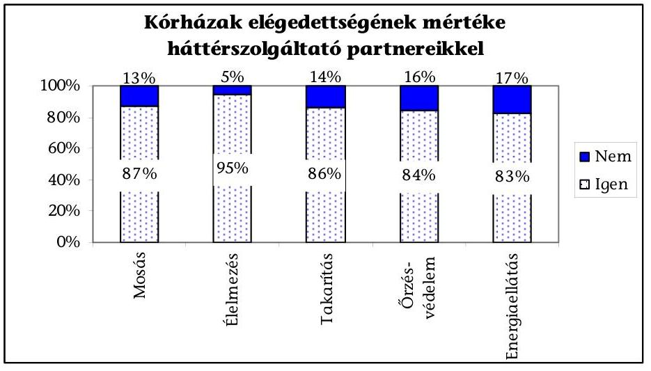

Forrás: ÁSZ kérdőív

[^0]
[^0]:    ${ }^{48}$ az Egészségügyi, Szociális és Családügyi Minisztérium közleménye a Kórházi Ellátási Standardok kézikönyv (KES) 2.0 változat közzétételéről (Megjelent az Egészségügyi közlöny 2003. évi 13. számában)
    ${ }^{49}$ az Egészségügyi Minisztérium közleménye a Magyar Egészségügyi Ellátási Standardok kézikönyv (MEES) 1.0 változat közzétételéről (Megjelent az Egészségügyi közlöny 2007. évi 4. számában)

---

# 7.4. A háttértevékenységek kiszervezésének költséghatékonysága 

Az öt fő tevékenységre fordított kiadások a helyszínen vizsgált intézmények kiadási főösszegéhez viszonyítva az energiaszolgáltatásban nevezhető meghatározó nagyságrendnek. Kiemelkedően magas az esztergomi és gyöngyösi kórházak energiaszolgáltatás díja, az összkiadásuk 4,5-10\%-a közötti 2006-2008. években. A további négy szolgáltatásnál (mosás, takarítás, élelmezés, őrzésvédés) 0,2-2\% között a kiadási főösszeghez mért arány.

### 7.4.1. A kiszervezés várható pénzügyi hatásainak értékelése

A kiszervezések indokai elsősorban létszámcsökkentési igények és/vagy beruházási forráshiány voltak. A kórházak ezen kívül több, illetve magasabb színvonalú szolgáltatást kívántak elvégeztetni. A vizsgált kiszervezésekre jellemző, hogy nem támasztották alá őket költséghatékonysági számítások.

A vállalkozók ajánlataiban a beruházásokat is tartalmazó ajánlatok egyösszegű havi díjai nem különültek el, múködtetési, illetve fejlesztési részre, így a kórházak a megajánlott, osztatlan havi vállalkozási díjakat értékelték. Előfordult, hogy a saját rezsisnél drágább szállítói ajánlatok miatt meghiúsult a kiszervezés (pl. a Vas Megyei Markusovszky Kórház 2001. évi takarítás kiszervezési kísérlete), vagy likviditási okokból később a szolgáltatás tartalmának csökkentésére kényszerült a kórház (pl. a fővárosi volt Szent Margit, illetve a Szent János Kórház takarítása esetén).

A megbízók elmulasztják számításokkal ellenőrizni a hasonló lízingkonstrukciók mögötti beruházás valamely jellemző pénzügyi mutatóját. ${ }^{50}$

Az esztergomi Vaszary Kolos Kórház 2002-től 2016-ig kötött beruházást is magába foglaló megállapodást energetikai rendszerének korszerűsítésére. A kórház nem értékelte a pénzügyi konstrukciót, és az országos átlag kommunális hődíj több mint kétszeresét fizeti tényleges vállalkozói hődíjként. Az országos átlagdíjat figyelembe véve, csupán 2006-tól vizsgálva is, az eredetileg 225 M Ftos beruházás mintegy hatszoros összegét kellene még visszafizetnie a kórháznak 2016-ig a „lizingbeadó" szolgáltató részére (a 2002-es kezdettől számítva ennél is nagyobb a „ráfizetés"). A kórház szakértőt kért fel a túlzottnak vélt díjfizetés átvilágítására. A szakértő túlszámlázást állapított meg, ennek rendezése még folyamatban van.

### 7.4.2. A lejárt szállítói tartozások alakulása

Vizsgáltuk azt is, hogy a szolgáltató vállalkozók mennyire rugalmasan reagálnak a kórházak fizetési, likviditási gondjaira, ezért adatlappal kerestük meg a legalább három kiszervezett háttérszolgáltatással bíró kórházakat. A válaszadó 39 kórház 22\%-ának álltak fenn lejárt tartozásai valamely vagy esetleg több háttérszolgáltatója felé a felmérés idején. A legnagyobb arányú fizetési elmaradás a mosási és az élelmezési szolgáltatók felé állt fenn. A lejárt tartozások

[^0]
[^0]:    ${ }^{50}$ belső kamatláb (IRR), nettó jelenérték (NPV), jövedelmezőségi index (PI)

---

kiszervezett tevékenységek szerinti jellemzőit a 8/a., 8/b. sz. mellékletek szemléltetik.

Tartozás átütemezés - a veszprémi megyei kórházat kivéve - nem volt a vizsgált időszakban.

# 7.4.3. A szolgáltató által fizetett bérleti díjak 

A szolgáltatók két fő célra veszik igénybe a kórházi infrastruktúrát. Egyrészt szükségszerűen a technológiai folyamathoz (főzéshez, takarításhoz, fűtéshez elektromos energia, vezetékes víz, szennyvízcsatorna, hulladékkezelés, munka-eszköz-, anyagtárolás), másrészt dolgozói ellátás (öltözők, tisztálkodás), illetve helyi munkairányítási célra (irodahelyiség, helyi vezetékes telefon stb.). A kórházak a közművek technológiai igénybevételét a vizsgált esetek 10\%-ban térítésmentesen biztosították, ami számukra jelentős anyagi veszteség.

A nyíregyházi kórházban a konyha üzemeltetésére Sodexho Kft-vel 2002. január 1-jétől 2008. december 31-ig kötött üzemeltetési szerződés szerint az üzemeltető a használatra átadott helyiségeket és a tárgyi eszközöket térítésmentesen jogosult használni. A beteg- és alkalmazotti élelmezés biztosításához a kórház térítésmentesen köteles biztosítani a szükséges energiát (fűtés, földgáz, villany, víz). A költségelszámolások alapján az alábbi meg nem fizetett energiaköltség merült fel a vizsgált három évben: 2006-ban 38836 E Ft, 2007-ben 33781 E Ft, 2008-ban 42016 E Ft. A meg nem fizetett költségek az élelmezésért számlázott díjakban nem kerülnek kompenzálásra. Ezt alátámasztja az, hogy a kórház egy ápolási napra jutó élelmezési kiadása a helyszínen vizsgált intézmények napi átlagához közelít, azaz 2008-ban 800-1500 Ft közötti tartományban volt.

A helyszíni vizsgálatba vont intézmények nagyobb hányadánál a szolgáltatókat a rezsi költségek és bérleti díjak megfizetésére kötelezik a szerződések (pl. Szent János Kórház élelmezési, takarítási szolgáltatója, BAZ megyei Egyetemi Oktató Kórház valamennyi szolgáltatója). A térítendő díjakat a közművek esetében mérőkkel mért igénybevétel alapján, helyiségek, területek esetén alapterület arányában, szerződés alapján számlázzák a szolgáltatóknak.

### 7.5. A hosszú távú háttérszolgáltatási szerződések következményei a megszűnt országos intézményeknél

Az egészségügyi miniszter felügyelete alá tartozó egészségügyi intézmények közül 2008-ban megszüntetésre került az Országos Gyógyintézeti Központ (OGYK), az Országos Pszichiátriai és Neurológiai Intézet (OPNI), továbbá a Svábhegyi Országos Gyermekallergológiai Pulmonológiai és Fejlődésneurológiai Intézet (SOGYFPI). ${ }^{51}$ A gazdasági folyamatok lezárását, a szállítói tartozások rendezését, valamint a szerződésekből fakadó követeléseket az ellenőrzés a kiszervezett háttérszolgáltatást ellátókkal szembeni kötelezettségeknél vizsgálta. A megszűnt intézmények háttérszolgáltatási szerződéseinek dokumentumait az EKI bocsátotta az ellenőrzés rendelkezésére.

[^0]
[^0]:    ${ }^{51}$ az ÁSZ vizsgálat nem terjedt ki az intézmények bezárásának teljes pénzügyi egyenlegének vizsgálatára, kizárólag a háttértevékenységek kötelezettségeire

---

Az intézetek bezárását a tárca szakmapolitikai és orvosszakmai szempontokkal indokolta és szerintük a feladatok átrendezésre kerültek az ellátó rendszeren belül. Az intézkedések pénzügyi hatásait a tárca előzetesen nem mérte fel, a megszűntetésből fakadó gazdasági előnyöket és hátrányokat nem számszerűsítették. A megállapítással kapcsolatban az EüM véleményeltérést fogalmazott meg, az egyeztetés során megfogalmazott álláspontját az alábbiakban ismertetjük:
„Az intézmények megszüntetésével kapcsolatos munka folyamán az elkerülhetetlenül szükséges költségek felmérésre kerültek, összevetve azokat az E. Alapból történő felszabadítható forrásokkal. Számításaink szerint a három intézet utolsó teljes évének (2006.) E. Alapból történő 16 milliárd forintos bevételéből kiindulva (bérekkel nem számolva), ha csak a 40\%-os mértékü dologi kiadások 40\%-át tekintjük tartós megtakarításnak, akkor az első évben még ráfordítástöbblettel kell számolni, a második évben már nullszaldóval számolhatunk, míg a harmadik évtől már keletkezik nagyságrendileg mintegy 2,6 milliárd forintos megtakarítás évente."
„Nem lehet az értékelésnél figyelmen kívül hagyni azt a tényt sem, hogy a struktúraátalakítást követően, melynek része volt az intézmények megszüntetése is, az E. Alap sufficitessé vált. A költségek két-három éven belül megtérülnek. Nemzetgazdasági szinten hosszabb távon a három intézet megszüntetése jelentős megtakarítással jár. A struktúra átalakításának szakmapolitikai döntéséhez nem csak a költséghatékonysági megfontolások, hanem orvos-szakmai és az ellátás-biztonságát (elérési szabályok), a minőségibb, az emberhez méltóbb körülmények biztosítását garantáló betegellátás megteremtésének célja vezetett. A munkaanyagban állítottakkal ellentétben mérlegelésre kerültek a pénzügyi követelések az intézetek bezárásánál, de a fentiekben ismertetett szakmapolitikai/orvos-szakmai szempontokra tekintettel a megtett intézkedések nem mérhetőek kizárólag költség oldalról, a szakmai döntések meghozatalakor nem ezek a kizárólagos szempontok. Az intézkedések nem elhanyagolható oldala, hogy kihasználatlan kapacitások, vagy a kapacitásoknak nem a szoros értelemben vett egészségügyi tevékenységekhez füzödő feladatokat kiszolgáló fenntartásának az E. Alapból történő közfinanszírozásának megszüntetésével nem csekély összeg kerül megtakarításra, amelynek felszabadításával egyéb, az ellátórendszer és a közvetlen betegellátás szempontjából igen fontos tevékenységek finanszírozására, illetve finanszírozásának javítására kerülhet sor."
„Az Országos Pszichiátriai Intézet (OPNI) müködtetése az épületek múltszázadbeli építészeti sajátosságinál és az épület állagánál fogva nemcsak gazdaságtalan volt, hanem súlyos kívánni valót hagyott maga után a komfortos betegellátás szempontjából is. A kutatások szerint a központosított, nagy „elmegyógyintézetek" fokozzák a stigmatizáció veszélyét, és az ilyen „totális intézményekben" nagyobb az esélye a betegekkel szembeni különféle visszaéléseknek, emberi jogaik teljes figyelmen kívül hagyásának is. Ezen megállapításra tekintettel a WHO 2001. évi világjelentésében azt javasolta, hogy a nagy elmegyógyintézetek helyett lakosságközeli, az általános kórházakhoz integrált pszichiátriai osztályok kerüljenek kialakításra."
„A népesség mentális egészségének javításáról az Európai Unió mentális egészségügyi stratégiájának céljából" címú az EURÓPAI KÖZÖSSÉGEK BIZOTTSÁGA által véglegezett (Brüsszel, 14.10.2005 COM(2005) 484 végleges) ZÖLD KÖNYV is foglalkozik a paradigmaváltással: „A mentális egészségügyi szolgáltatások intézményektől való függetlenítése és az elsőfokú gondozási szolgáltatások felállítása, a szociális központok és az általános kórházak a betegek és családjuk szükségleteivel összhangban lehetővé tehetik a társadalmi integrációt. A nagy elmegyógyintézetek könnyen hozzájárulnak a megbélyegzéshez. A pszichiátriai szolgálatok reformjai kapcsán a nagy elmegyógyintézetekben biztosított mentális egészségügyi szolgáltatásokat számos ország a közösségi szintü szolgáltatások felé mozdítja el."

---

„Korábbi felmérések alapján az OPNI - minimális - rekonstrukciójára több mint 10 milliárd forint körüli forrás biztositásával kellett volna számolni a tárcának. Ilyen nagyságrendú forrás biztositását a tárca költségvetése az elmúlt években nem tette lehetővé, ahogy a jelenlegi költségvetési helyzet sem teremtene rá alkalmat."

Tekintettel arra, hogy az ellenőrzés és egyeztetés során a tárca nem bocsátott a pénzügyi következményeket bemutató, döntést megalapozó dokumentumot az ÁSZ rendelkezésére, ezért a megállapítást továbbra is fenntartjuk.

Az EüM tájékoztatása szerint a fenti intézményeknek nem volt tudomásuk sem kapacitásaik elvonásáról, sem az intézmények bezárásáról, így részükről nem minősíthető felelőtlenségnek a hosszú távú szerződések megkötése.

Az OGYK-nak az Állami Egészségügyi Központba történő (ÁEK) integrálásáról ${ }^{52}$ és jogutód nélküli megszüntetéséről (2008. október 30-ai hatállyal) a Kormány döntött. ${ }^{53}$ A vagyoni jogok jogutódja az állami vagyonról rendelkező törvény értelmében a Nemzeti Vagyongazdálkodási Tanács, az egyéb vagyon vonatkozásában pedig az Egészségügyi Készletgazdálkodási Intézet (EKI) lett.

Az OGYK a fűtési, hőszolgáltatási, takarítási, étkeztetési, kivitelezési, javítási, karbantartási, üzemeltetési, mosási és őrzés-védelmi feladatok ellátását külső szolgáltatókkal kötött szerződések alapján látta el. Az intézmény jelentős öszszegű adósságot halmozott fel a szolgáltatókkal szemben. Ennek tőke tartozás összege 323,2 M Ft volt. Kamattartozás a takarító cég felé állt fenn 20,3 M Ft értékben, az EKI, mint jogutód az OGYK adósságrendezése során, a szolgáltatókkal szemben fennálló tartozásokból tárgyalásos úton 56,6 M Ft tőketartozás elengedését érte el.

Az OGYK előd intézménye a Semmelweis Egyetem, 2000 áprilisában 15 éves futamidőre kötött szolgáltatási szerződést a KIPCALOR Kft-vel, (később átalakult Dalkia Energia Zrt.) hőenergia, használati melegvíz, részleges elektromos energia szolgáltatás biztosítására, valamint az energetikai rendszer korszerűsítésére, szakképzett személyzet biztosítására, üzemeltetésre, ellenőrzésre, karbantartásra. Az OGYK, az EKI és a szolgáltató Dalkia Zrt. 2008. július 31-én kötött megállapodása értelmében „kártérítésként a 15 évre szóló szolgáltatási szerzödés meghiúsulása miatt elmaradt haszon ellentételezéseként 100,0 M Ft"-ot fizetett az EKI.

Az OPNI-nál kiszervezett háttér szolgáltatási feladat volt a takarítás, a mosás, az őrzéses védelem, a képalkotó diagnosztika, mint a gyógyítást szolgáló háttér tevékenységek egyike.

[^0]
[^0]:    ${ }^{52}$ a központi egészségügyi szolgáltató szervezetek létrehozásáról szóló 2009/2007. (I. 30.) Korm. határozat
    ${ }^{53}$ az Állami Egészségügyi Központ létrehozásával kapcsolatos soron következő feladatokról szóló 2100/2007. (VI. 7.) számú Korm. határozatról

---

A mosási szerződést 2006. november 17-én kötötték a Harkó Stúdió Bt-vel, 119 hónapos futamidőre. ${ }^{54}$ A cég információs adatokból látható, hogy a Bt. 2006 szeptemberében vette fel tevékenységei közé a textil, szőrmemosást, tisztítást, vagyis az eljárás meghirdetésével egy időben. Pályázott még a Nyírségi Patyolat Zrt. mint komoly referenciákkal rendelkező cég.

Az intézet mosodai részlegének üzemeltetését, belső szállítási feladatok ellátását, szükségszerinti technológiai korszerűsítést, a gépek szükség szerinti felújítását, tárgyi eszközök, készletek cseréjét tűzte ki a szerződés, azonban nem tartalmazza az ezekkel kapcsolatos konkrétumokat (mit, mikor, milyen értékben tartozik teljesíteni a szolgáltató). A mosodai gépek telepítésére, használatbavételére 175 nap, illetve a mosoda központi kazánházi gőzrendszerről történő leválasztása, helyi gőzfejlesztők kialakítására 150 nap volt a kitűzött határidő.

Évi 380000 kg ruha mosását, $185 \mathrm{Ft}+$ áfa dijjal vállalták az első két évre változatlan áron, majd a további évekre, kétévente $3,6,8,10 \%$-os áremelési lehetőséggel, ami eltér a szokásosan alkalmazott infláció arányos emeléstől, továbbá nem tisztázott, hogy ezt az emelést az eredeti vállalási árra számítja fel, vagy egymásra halmozva alkalmazza a szolgáltató.

A mosoda eszközállományát 5,8 M Ft-ért vette át a szolgáltató, a közüzemi díjakat és a terület bérletét meg kellett fizetnie a kórház részére a tényleges fogyasztás szerint, illetve a bérleti díjat 500 E Ft-ban határozták meg. A szerződés megengedte, hogy a szolgáltató szabad kapacitásait kifelé értékesítse.

Az OPNI már 2007. március 21-én, öt hónappal a szerződéskötést követően tájékoztatta a szolgáltatót, hogy az egészségügyi miniszter az intézmény jogutód nélküli megszüntetéséről döntött. A szerződés megszüntetéséről folytatott egyeztetések nem voltak eredményesek ezért a szolgáltató bírósághoz fordult 626,8 M Ft kártérítés megfizetése iránt.

Az ügyben számos tárgyalást folytatott az EKI, jogi szakértőket vont be az egyeztetésbe, mint a megszűnéssel összefüggő gazdasági folyamatok lezárója. Az egyezségben nagy jelentőséggel bírt, hogy a mosoda korszerűsítéséhez rendelt eszközök leszállítása nem történt meg, a Harkó Bt. által megrendelt mosodai gépek lemondását azonban, így is 50 M Ft feletti kötbér terhelte.

Az EKI és az Egészségügyi Minisztérium bevonásával folytatott további egyeztetések eredményeként peren kívül 146,4 M Ft megfizetésében állapodtak meg a kezdeti 626,8 M Ft-tal szemben, amit a Minisztérium a 2008. július 31-én kötött támogatási szerződés alapján biztosított az OPNI-nak.

Az OGYK 2006. november 16-án hasonló időpontban, mint az OPNI, 3 évre a mosási feladatok ellátására kötött szerződést a Hófehér Kft-vel. A szerződés szövegébe beépítésre került, hogy a kórház a szerződés azonnali felmondására jogosult, ha felügyeleti szervének döntése, vagy jogszabályi rendelkezés alapján

[^0]
[^0]:    ${ }^{54}$ EüM észrevétele: „Az OPNI által megkötött szerződések időpontjában az intézet megszüntetésére vonatkozó döntés még nem született meg. A CVI-vel megkötött szerződés 2006. február hónapban, a Harkó Bt-vel megkötött szerződés pedig 2006. november hónapban került aláírásra. Az OPNI közfinanszirozott kapacitásainak megszüntetésére vonatkozó miniszteri határozatra 2007. március hónapban került sor."

---

sorra kerülő strukturális átalakítás miatt a kórház lényeges, jogos gazdasági érdekét sértené, vagy lehetetlenné tenné a szerződés teljesítése.

Az OPNI a CVI Gyógyító, Kutató és Oktató Kht.-vel MRI, CT, DSA és UH vizsgálati, átvilágítási és felvételi rutin radiológiai vizsgálatok elvégzésére, digitális archiválására, kutatási tevékenység orvostechnikai hátterének biztosítására kötött szerződést 2020. decemberi lejáratra. Az ajánlati dokumentáció minden vizsgálat típusra meghatározott darabszám szerint került meghirdetésre, így a szerződés is ennek feltételei szerinti. Az abban meghatározott darab számú vizsgálatot az OPNI nem tudta folyamatosan igénybe venni, így az együttmúködés kezdeteitől vitás kérdések merültek fel, mert a szolgáltató a szerződésben rögzített mennyiségű, de igénybe nem vett vizsgálatokat is leszámlázta. A számlatartozások és el-maradt haszon valamint ezek kamatainak megfizetése miatt a CVI, a Fővárosi Bírósághoz fordult 2008 júliusában. A CVI felkérésére készített szakvélemény a követelést 1,9 Mrd Ft-ban, míg az EKI által megbízott szakértő 924,9 M Ft-ban jelölték meg, az ügyben nincs egyezség, és bírósági döntés sem született az ellenőrzés befejezéséig.

Az EüM szakállamtitkára 2006 októbere és 2008 áprilisa közötti időszakra a tárca felügyelete alá tartozó intézményvezetők számára levélben rendelte el, a költségvetési kiadások racionalizálása érdekében a gazdálkodás kontrolljának erősítésére az intézmények 5 M Ft feletti kötelezettségvállalásának minisztériumi hozzájáruláshoz való kötését. Kezdetben ez csak a fejlesztési célú kötelezettségekre vonatkozott, 2007 májusától kiterjesztésre került valamennyi kötelezettségvállalásra. Ezt követően az intézeteknek közbeszerzési terveiket is meg kellett küldeniük.

Az EüM 2008-ban a felügyelete alá tartozó intézmények közbeszerzés hatálya alá tartozó eljárásainak összevonását tervezte. Ehhez az S\&G Consulting Kft-t kérte fel, hogy készítsen szakvéleményt arra vonatkozóan, hogy a több intézetet érintő beszerzések közül melyek azok, amiket célszerű összevonni a kiadások csökkentése érdekében. A háttérszolgáltatások közül a takarítás és élelmezés közbeszereztetésének összevonására tett javaslatot a cég, annak alapján, hogy ezt több intézet is jelezte beszerzési igényként. A tervezett központosított közbeszerzés a minisztérium felügyelete alá tartozó intézményeknél nem valósult meg.

# 7.6. A háttérszolgáltatásokat intézményi keretek között ellátó, illetve a háttértevékenységet visszaszervező intézmények döntése (kérdőíves adatszolgáltatás elemzése) 

A kérdőívvel vizsgált kórházak közel fele (47,9\%-a) 0-2 tevékenységet szervezett ki, az öt főbb háttértevékenység közül. Többségüknek van tapasztalata a kiszervezésekről, mert 34-ből huszonkilencen legalább egy területen végrehajtottak már ilyet. A kiszervezésekkel kapcsolatos különböző álláspontokra jellemző, hogy a „kevéssé kiszervező" kórházak 21\%-a egyáltalán nem is tervez kiszervezéseket a továbbiakban. Ennek oka, hogy jobban irányíthatónak, illetve gazdaságosabbnak ítélik meg a feladatok kórházon belüli ellátását.

Veszprémben a megyei kórház a takarítási feladatokat saját szervezeti keretein belül látja el. Ennek kedvező tapasztalataira alapozva a hozzá csatolt sümegi

---

kórház takarító vállalkozásától is visszaszervezték a takarítást 2009. február 1jétől. Ugyancsak gazdaságossági megfontolásokból több kórházban a kiszervezett tevékenység visszaszervezésére tettek javaslatot, pl. a balatonfüredi Állami Szívkórházban a takarítást szervezték ki, de ennek a költségei egyre nőnek. Ez a tevékenység visszavételét indokolná, a dolgozókat is erősebb kontroll alatt tudnák tartani, de a létszámkorlátok miatt már nem vehetik vissza a munkaerőt.

A Szabolcs-Szatmár-Bereg Megyei Önkormányzat Jósa András Oktató Kórházában a kiszervezett élelmezés visszaszervezésének döntés-előkészítése folyik. A kalkulációk alapján olcsóbb a kórházi „saját rezsis" tevékenység.

A saját működtetést gazdaságosabbnak ítélő válaszadók 78\%-ánál korlátot jelent, hogy a szükséges beruházásokra, az elhasználódott nagy értékű tárgyi eszközök pótlására nem rendelkeznek a szükséges forrásokkal.

A nem kiszervező kórházak körében tapasztaltuk, hogy számos műszaki, gazdasági ésszerűsítő intézkedést tettek a háttértevékenységeik egyre gazdaságosabb ellátására. Ezek a kényszerű megoldások létszámcsökkentésekkel is jártak, azonban képesek voltak finanszírozni még az adott szakterületen megtérülő saját beruházásokat is. (Az összesített kérdőív a 10. sz. mellékletben található.)

A kisvárdai kórházban a 2007-ben végrehajtott csoportos létszámleépítés után amely 10 fővel érintette a takarítást - bevezetésre került a csoportos takarítás. Ebben a rendszerben a dolgozók már nem osztályokhoz rendelve végzik napközben folyamatosan a munkát, hanem különböző létszámú és különböző feladattal megbízott 3-4 fős csoportokban takarítanak. A csoportos takarítás nagy előnye az előző rendszerrel szemben, hogy kevesebb létszámmal hatékonyabban, rugalmasabban dolgoznak. Ehhez 1224 E Ft értékben szereztek be gépeket.

Az energiaellátás területén a 2006-2008. években 3596 E Ft értékű beruházást eszközölt a kórház, amelynek célja a takarékos energiafelhasználás biztosítása volt. A földgáz és az elektromos áram fogyasztásának szabályozására teljesítménykorlátozó berendezést vásároltak és építettek be. Módosították (csökkentették) a szolgáltatási szerződésekben a fogyasztási teljesítmény lekötést, ami megtakarítást eredményezett. Elvégezték a gázüzemú berendezések megfelelő szabályozását, energiatakarékos berendezések, világítótestek üzemeltetésére törekszenek. Alternatív energiaként hasznosítják a napenergiát.

A mátészalkai kórház a 2007. december 1-jétől hatályba lépett rendelkezések megvalósításához az étkezési normatíva emelésére 10575 E Ft-ot fordított. Az étkezési körülmények javítására egyedi tálcás tálalási rendszerhez eszközöket vásároltak.

A takarítási tevékenység végzésében jelentős előrelépés volt a Központi takarítószolgálat 2002. évi létrehozása, ami centralizált irányítást, egységes szabályozást és ellenőrzést tesz lehetővé.

# 8. A KORÁBBI SZÁMVEVŐSZÉKI JAVASLATOK VÉGREHAJTÁSÁNAK ELLENŐRZÉSE 

Az ÁSZ a társadalombiztosítás pénzügyi alapjai 1998. évi költségvetése végrehajtásáról készült jelentésében (9928) az ÁSZ javasolta az egészségügyi miniszternek, hogy vizsgáltassa meg az egészségügy területén a magánosítás folya-

---

matát és határozza meg a jogi háttér, a finanszírozási szabályokkal való összhang, az ellenőrzés feltételeinek megteremtéséhez szükséges tennivalókat. A javaslat tartalmával megegyező átfogó dokumentum a tárcánál nem készült.
„A magántőke szerepvállalásának tapasztalatai az egészségügyben" címmel 2008 októberében készített dokumentumot tárgyalta a Parlament Egészségügyi bizottsága. Ez mindössze adatok szintjén mutatja be a magánszolgáltatók jelenlétének arányait.

Az egészségügyi szakellátások privatizációjáról készült jelentésben (0609) az ÁSZ javasolta a Kormánynak, hogy dolgozzon ki átfogó egészségpolitikai koncepciót, amelynek keretében határozza meg a magántőke, a magánvállalkozások lehetséges szerepét, szakmai területeit, az állami támogatások alapelveit, és mindezekre figyelemmel szabályozza az egészségügyi szakellátások múködésének rendszerét. A javaslatra intézkedés nem történt.

Javasoltuk a Kormánynak, hogy kezdeményezze - az egészségpolitikai koncepcióval összefüggésben - a korlátozott forgalomképességű ingatlanvagyonnal való rendelkezés törvényi újraszabályozását annak érdekében, hogy az ellátási kötelezettség fennállásáig az ellátást szolgáló ingatlan ne legyen elidegeníthető, elajándékozható. A vagyonkezelés szabályozására a Kormány intézkedett. ${ }^{55}$ Mind az Áht., mind az Ötv. részletesen szabályozza az ezzel járó kötelezettségeket, a vagyonkezelői jog megszerzéséhez szükséges pályáztatási, vagyonértékelési követelményeket, valamint azt, hogy csak ellenérték fejében létesíthető vagyonkezelői szerződés.

A vagyonkezelői jog biztosítja, hogy a tulajdont megtartva, az önkormányzat a közfeladat ellátását önkormányzati szektoron kívüli más gazdálkodó szervezetre bízza. A vagyonkezelési szerződés alapján a vagyon kezelője a vagyont birtokolhatja, használhatja és hasznosíthatja. A vagyonkezelői jog biztosítja, hogy a vagyon kezelője az átvett vagyon után az értékcsökkenést költségként érvényesítse. A jog megszűnésével a vagyont legalább az átvételkori értéken kell visszaszolgáltatni, ez szolgálja a vagyonvesztés elkerülését.

Budapest, 2009. július 29
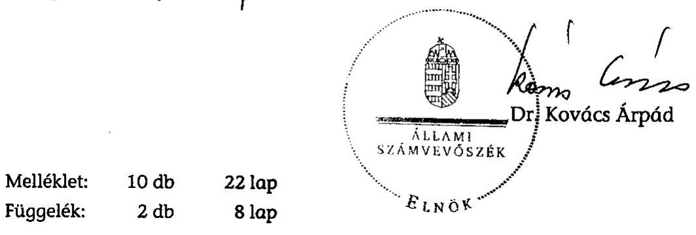

[^0]
[^0]:    ${ }^{55}$ A vagyonkezelés részletes szabályozására a 2005. évi XCII. törvény rendelkezései alapján, az 1990. évi LXV. törvénybe beépített 80/A-B. §-ok, valamint az 1992. évi XXXVIII. törvénybe beépített 105 A-D. § alapján a helyi önkormányzat az önkormányzati közfeladat átadásához használt korlátozottan forgalomképes vagyonára vagyonkezelői jogot alapíthat 2007. január 1-jétől.

---

# MELLÉKLETEK

---

# ÉSZREVÉTEL

---

# EGÉSZSÉGÜGYI MINISZTÉRIUM MINISZTER 

Iktatószám: 2782-14/2009-1000MIN
Hiv.szám: V-2017-111/2008-2009.

## Dr. Kovács Árpád úrnak

elnök
Állami Számvevőszék
Budapest

Tisztelt Elnök Úr!

ÁLLAMI SZÁMVEVÓSZÉK
5702
Erkezett: 2005.07 .29
Htatószám: $1-2049-45 / 2006-49$
Melléklet: $\qquad$

A kórházi tevékenységek kiszervezéséről szóló számvevőszéki vizsgálat során mutatott együttműködésüket, segítőkészségüket köszönjük. Véleményem szerint ennek eredménye, hogy a számvevői jelentés rendkívüli tényszerủ és hasznosítható megállapításokat tartalmaz.

Fenti hivatkozású számú, „Az egyes kórházi tevékenységek kiszervezésének ellenőrzéséről" szóló számvevői jelentést, valamint az ehhez kapcsolódó V-23-085/2006-2007. sz. levelét köszönettel megkaptam. A hivatkozott ügyiratszámú jelentésben foglaltakkal egyetértek.

Budapest, 2009. július 28.
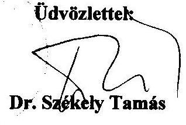

---

2. sz. melléklet a V-2017-114/2008-2009. sz. jelentéshez

# A helyszíni ellenőrzésre kiválasztott intézmények

|  Ssz. | Intézmény | Település | Megye | ÖTEI részvétele | 2.1.3. Osztály | Utóvizsgálattal ellenőrzött | Szervezeti formuváltás | Teljes kórház- kiszervezés | Közremüködői | Kiszervezett háttérszolgáltatás |  |  |  |   |
| --- | --- | --- | --- | --- | --- | --- | --- | --- | --- | --- | --- | --- | --- | --- |
|   |  |  |  |  |  |  |  |  |  | Mosás | Élelmezés | Takarítás | Energia | Örzés  |
|  1. | Dombóvári Szent Lukács Egészségügyi Közhasznú Társaság | Dombóvár | Tolna | x |  | x |  |  | x |  |  |  | x | x  |
|  2. | Siklósi Kórház Humán Egészségügyi Nonprofit Kft. | Siklós | Baranyu | x |  | x |  |  | x |  |  | n.a. |  |   |
|  3. | Pécsi Tudományegyetem | Pécs | Baranyu | x |  |  |  |  | x | x | x | x |  | x  |
|  4. | Borsod-Abuúj-Zemplén Megyei Kórház és Egyetemi Oktató Kórház | Miskolc | BAZ | x |  |  |  |  | x | x | x | x | x | x  |
|  5. | Városi Önkormányzat Almási Balogh Pál Kórház, Ózd | Ózd | BAZ | x |  |  |  | x | x |  |  | x |  | x  |
|  6. | Veszprém megyei Csolnoky Ferenc Kórház Nonprofit Zrt. | Veszprém | Veszprém | x |  |  | x |  | x | x |  | x | x | x  |
|  7. | Palotuhosp Kft. | Várpalota | Veszprém | x |  | x |  |  | x | x |  |  |  |   |
|  8. | Dr. Batthyány-Strattmann László Kórház Kft. | Körmend | Vas | x |  | x |  |  | x |  |  | n.a. |  |   |
|  9. | Vas megyei Markusovszky Kórház Nonprofit Zrt. | Szombathely | Vas | x |  |  | x |  | x | x | x |  | x | x  |
|  10. | Hatvani Kórház Egészségügyi Szolgáltató Kft.(Purádfürdői Kórház) | Hatvan | Heves |  | x |  |  | x | x | x | x | x |  | x  |
|  11. | Gyöngyösi Kórház Kft. | Gyöngyös | Heves |  | x |  |  | x | x | x | x | x | x | x  |
|  12. | Jósa András Megyei Kórház | Nyíregyháza | Szabolcs- Szatmár-Bereg | x |  |  |  |  | x | x | x | x |  | x  |
|  13. | Területi Kórház | Mátészalko | Szabolcs- Szatmár-Bereg | x |  |  |  |  | x |  | Nincs kiszervezett háttérszolgáltatás |  |  |   |
|  14. | Felső-Szabolcsi Kórház | Kisvárda | Szabolcs- Szatmár-Bereg | x |  |  |  |  | x |  | Nincs kiszervezett háttérszolgáltatás |  |  |   |
|  15. | Mezőtúr Városi Kórház-Rendelőintézet Egészségügyi Szolgáltató Kft. | Mezőtúr | Jász-Nagykun- Szolnok |  | x |  |  | x | x | x | x |  | x |   |
|  16. | Tapolcai Dr. Deák Jenő Kórház- Rendelőintézet és Gyógyburlang Kft. | Tapolca | Veszprém |  | x |  |  | x | x |  |  | n.a. |  |   |
|  17. | Fővárosi Önkormányzat Szent János Kórháza és Észak-budai Egyesített Kórházai (Szent Margit; Budai Gyerekk.) | Budapest |  |  | x |  |  |  | x | x | x | x |  | x  |
|  18. | Fővárosi Önkormányzat Péterfy Sándor Utcai Kórház-Rendelőintézet és Baleseti központ (OBSI) | Budapest |  |  | x |  |  |  | x | x |  | x |  | x  |
|  19. | Fővárosi Önkormányzat Heim Pál Gyermekkórház (Madurász) | Budapest |  |  | x |  |  |  | x | x |  | x |  |   |
|  20. | Fővárosi Önkormányzat Egyesített Szent István és Szent László Kórház- Rendelőintézet | Budapest |  |  | x |  |  |  | x | x |  | x |  | x  |
|  21. | Semmelweis Kórház Kht. | Kiskunhalas | Bács-Kiskun |  | x | x |  |  | x | x | x |  | x | x  |
|  22. | Vuszary Kolos Kórház | Esztergom | Komárom- Esztergom |  |  |  |  |  |  | x |  | x | x | x  |

---

# KÉRDÉSEK, KRITÉRIUMOK ÉS ADATFORRÁSOK

## Főkérdés: Az egyes kórházak, tevékenységeinek kiszervezése, múködési formaváltása igazolta-e a szolgáltatók, a tulajdonosok minőségi és költséghatékonysági elvárásait?

|  Kérdések |  | Kritériumok, mutatók | Adatforrás  |
| --- | --- | --- | --- |
|  1. | Indokolt volt-e a háttértevékenységek kiszervezése? |  |   |
|  1.1 | Megalapozott, előkészített volt-e a döntés? | A döntés gazdaságossági számításokkal megalapozott, előkészített volt. | Döntéselőkészítés dokumentumai, hatásszámítás, előterjesztés, tulajdonosi vélemény.  |
|  1.1.1 | A kiszervezés előtt felmérték-e a szükséges beruházás mértékét és a múködtetés költségeit? | A beruházás mértékét és a múködtetés költségeit a kiszervezés előtt felmérték. | Hatásszámítás, eszközök elhasználódottságának felmérése.  |
|  1.1.2 | A kiszervezés magyarázható-e a kötelező létszámleépítés követelményével? | Felmérték a kiszervezés hatására felszabaduló bért, járulékot. | Hatásszámítás, tervezési követlemények, kötelező létszámleépítés kalkulációja.  |
|  1.1.3 | Az adatfeldolgozás alapján jellemző-e az egyes háttértevékenységek kiszervezése? | Jellemzőnek tekintjük ha az intézmények 50\%-nál az öt fő háttértevékenységből legalább három kiszervezett. | ÁSZ kérdőív.
ÁSZ adatlap a kiszervezett tevékenységekről.  |
|  1.1.4 | Elégedettek-e az intézmények a választott szolgáltatóikkal? Tör-tént-e szolgáltató váltás a vizsgált időszakban? | Az intézmények elégedettek a kiszervezett tevékenységekkel, az elvárásaik teljesültek. | ÁSZ kérdőív.  |
|  1.2 | Voltak-e a kiszervezéssel szemben támasztott intézményi elvárások? | Teljesültek az intézményi elvásárok. | Döntéselőkészítés dokumentumai, hatásszámítások, előterjesztés.  |
|  1.2.1 | A közbeszerzési eljárások segítették-e a szolgáltatók kiválasztását? | A kiválasztás közbeszerzéssel történt. | A közbeszerzésekről szóló 2003. évi CXXIX. törvény.  |

---

|  Kérdések |  | Kritériumok, mutatók | Adatforrás  |
| --- | --- | --- | --- |
|   |  |  | Közbeszerzési dokumentumok.  |
|  1.2.2 | Szükséges-e tulajdonosi ellenjegyzés a szerződés megkötéséhez? Vannak-e szerződéses garanciák az elérendő célok teljesülésére, az önkormányzati tulajdon védelmére, az intézményi kontroll gyakorlására, a szerződés felmondásának eseteire? | Bejelentési kötelezettsége van az intézménynek a tulajdonos felé, a tulajdonos ellenjegyzése kötelező. | Szerződések, előterjesztés.
Vezetői anyagok.  |
|  1.3 | Eredményezett-e a háttérszolgáltatások kiszervezése minőségi javulást a szolgáltatásban? | A háttérszolgáltatások kiszervezése minőségi javulást hozott a szolgáltatásban. |   |
|  1.3.1 | Történt-e a szolgáltatás minőségét javító beruházás (épület, géppark)? Korszerübb lett-e a kiszervezett tevékenységhez tartozó géppark, technológia? | A szerződésben vállalt beruházási kötelezettséget teljesítette, korszerübb lett a géppark, technológia. A beruházás megvalósulása javítja a szolgáltatás minőségét. | Szerződés
Beruházás dokumentumai
Ellenőrzési dokumentumok
Az intézmény és a szolgáltató minőségbiztosításának és minőségbiztosítási auditjának dokumentumai.
Minőségbiztosítási rendszer keretében végzett betegelégedettségi vizsgálatok.  |
|  1.3.2 | Vannak-e szerződésben megfogalmazott minőségi garanciák? Az intézmény rendszeresen ellenőrzi-e? | A szerződésben megfogalmaztak minőségi garanciákat, az intézmény a minőséget rendszeresen ellenőrzi. |   |
|  1.3.3 | Rendelkeznek-e minőségbiztosítási rendszerrel az intézmények és a szolgáltatók? Rendszeresen történik-e akkreditáció? Elége-dettek-e a betegek a hotelszolgáltatásokkal? | Minőségbiztosítási rendszerrel rendelkeznek, ezeket rendszeresen akkreditálják.
A betegek megfelelőnek minősítik a szolgáltatást. |   |
|  1.4 | Elemezték-e a kiszervezett szolgáltatások költséghatékonyságát előzetesen, illetve a teljesítés folyamán? | A kiszervezett szolgáltatások költséghatékonyságát a kiszervezését megelőzően és azóta folyamatosan elemezik. | Elemezések, kontrolling adatok.  |
|  1.4.1 | Értékelték-e a kiszervezés várható pénzügyi hatásait? | Hatásszámításokat készítettek. | Pénzügyi hatásszámítások.  |
|  1.4.2 | Állnak-e fenn határidőn túli tartozásai a szolgáltatókkal szemben? Volt-e tartozás átütemezés, fizetési határidő módosítás? | Nincsenek határidőn túli tartozások a szolgáltatóval szemben. | Szállítói tartozások adatai, határidő átütemezésekről szóló megállapodások.  |
|  1.4.3 | Elszámolják-e a szolgáltatóval a múködés során felmerülő költ- | Elszámolják a felmerülő költsége- | Költségelszámolások, szerződések.  |

---

|  Kérdések |  | Kritériumok, mutatók | Adatforrás  |
| --- | --- | --- | --- |
|   | ségeket (rezsi, bérleti dij)? | ket. |   |
|  1.5 | Keletkezett-e a tulajdonosnak pénzügyi kötelezettsége a megszűnt intézmények háttérszolgáltatói szerződései miatt? | A tulajdonos előzetesen felmérte az intézkedések hatását az érvényes szerződésekre. | A megszüntetett intézmények háttérszolgáltatási szerződései EüM, EKI intézkedései.  |
|  1.6 | Végeztek-e összehasonlító számításokat a háttérszolgáltatások kiszervezésére, illetve visszavételére? | Számítások igazolták, hogy az intézmény által végzett háttérszolgáltatások gazdaságosabbak. | Elemzések, háttérszámítások.  |
|  2. | Indokolt volt-e a fekvőbeteg intézményekben a múködési formaváltás? |  |   |
|  2.1 | Teljesültek-e a múködési formaváltással az elérendő célok? | Az intézmények gazdálkodása rugalmasabbá vált, jobban alkalmazkodik a piaci viszonyokhoz. | Az átalakulást megelőző hatás tanulmány, tulajdonosi határozat, előterjesztés.  |
|  2.2 | Vannak-e mérhető eredményei, hatásai a gazdálkodásra, pénzügyi pozícióra? | Csökkent az adósságállomány, javult a likviditás. | Szállítói tartozások adatai.  |
|  3. | A szakellátások kiszervezésében történt-e változás a 2005-2006-os vizsgálat lezárása után? (utóvizsgálat) |  |   |
|  3.1 | Történt-e társasági formaváltás, tulajdonosváltás? | A törvényi változásoknak megfelelő átalakulások megtörténtek. | A gazdasági társaságokról szóló 2006. évi IV. törvény.
Az átalakulás dokumentumai.  |
|  3.2 | 2005 óta történt-e beruházás? | A betegellátás színvonalát javító beruházás történt. | Beruházásra vonatkozó dokumentumok, szerződés.  |
|  3.3 | Történt-e múködtetési szerződésmódosítás a kórházat múködtető társasággal? | A körülményekben beálló lényeges változásokat követi a szerződés módosítása. | Szerződésmódosítás dokumentumai.  |
|  4. | Történtek-e további kórház kiszervezések 2006-2008 között? |  |   |
|  4.1 | Megalapozott volt-e a tulajdonosi döntés? Pályázat keretében választottak-e múködtetőt? Tartalmaz-e a szerződés vagyonra, tőkebevonásra, beruházásra feltételeket? Történt-e vagyonérté- | A tulajdonosi döntésszámításokkal megalapozott, az ellátási kötelezettségért viselt felelősség a tulaj- | Hatásszámítások, előterjesztések, határozat.
Pályázati dokumentumok, szerződé-  |

---

|  Kérdések |  | Kritériumok, mutatók | Adatforrás  |
| --- | --- | --- | --- |
|   | kelés? | donosnál marad.
A működtetőt pályázattal választották ki. A vagyonelemek átadását, eladását megelőzően történt vagyonértékelés. A szerződés tartalmaz az ellátást javító beruházási követelményeket. | sek.
Áht. előírásai a vagyonkezelésre.
Ötv. Előírásai.  |
|  4.2 | Figyelemmel voltak-e a kiszervezés során a munkavállalók érdekeire? | A kiszervezés nem sértette a munkavállalói érdekeket, a továbbfoglalkoztatás és a juttatások megtartása biztosított volt. | Szerződés, munkaszerződések.  |
|  4.3 | Vannak-e szerződéses biztosítékok a szerződés felmondásának, lejáratának esetére a folyamatos betegellátás biztosítása érdekében? | A szerződés tartalmaz garanciális elemeket a felmondás, lejárat eseteire így nem veszélyezteti a betegellátás folytonosságát. | Szerződés.  |
|  4.4 | Biztosított-e az önkormányzati tulajdon védelme? | Az önkormányzat a rendeletein és a szerződéses garanciákon keresztül biztosítja az egészségügyi ellátást nyújtó vagyon megtartását. | Önkormányzati rendeletek.
Szerződés.
Működtető beszámoltatása.  |
|  4.5 | Megvalósultak-e a szerződésben vállalt beruházások? | A szerződésben vállalt beruházások megtörténtek. | Beruházás dokumentumai.
Beszámolók.  |
|  4.6 | Tartalmaz-e a szerződés a minőségi ellátásra vonatkozó garanciákat? | A szerződésben vannak a minőségi betegellátást biztosító garanciális elemek, az önkormányzat rendszeresen ellenőrzi azokat. A működtető rendelkezik minőségbiztosítással, amelynek ellenőrzése rendszeresen megtörténik, rendszeres a betegelégedettség mérése. | A szerződésben rögzített minőségi mutatók.
Minőségbiztosítási rendszer dokumentumai.  |
|  5. | Meghatározóvá vált-e a humánerőforrás biztosításában az orvosi közreműködői szerződés? | A közreműködői szerződéseket egyre kiterjedtebben alkalmazzák elsősorban a hiányte- |   |

---

|  Kérdések |  | Kritériumok, mutatók | Adatforrás  |
| --- | --- | --- | --- |
|   |  | rületek ellátásában. |   |
|  5.1 | Koncentrálódnak-e az orvosi közreműködői szerződések szakmák és terület szerint? | A közreműködői szerződések a hiányszakmákban koncentrálódnak. | Szerződések az intézményeknél.
OEP adatbázisból ÁSZ adatkérés elemzése.
ÁSZ tanúsítvány.  |
|  5.2 | Ellenőrzött-e az orvosi munkaidő korlát betartása? | Az orvosi munkaidőkorlát betartása rendszeresen ellenőrzött. | OEP és ÁNTSZ adatbázisból lekérdezés, elemzés.
ÁSZ tanúsítvány.  |
|  6. | Végrehajtották-e az egészségügyi szakellátások privatizációjának ellenőrzéséről szóló jelentésben a kormánynak tett javaslatokat? | A jelentésben tett javaslatokat végrehajtották. | Minisztériumi intézkedési terv. Beszámoló, realizálási űrlapok.  |

---

# Vállalkozások aránya a fekvőbeteg szakellátás finanszírozásában

|   | 2006 |  |  | 2007 |  |  | 2008 |  |  | 2008/2006 \% |  |   |
| --- | --- | --- | --- | --- | --- | --- | --- | --- | --- | --- | --- | --- |
|   | összes
Mrd Ft | vállalkozások
Mrd Ft | vállalkozások
$\%$ | összes
Mrd Ft | vállalkozások
Mrd Ft | vállalkozások
$\%$ | összes
Mrd Ft | vállalkozások
Mrd Ft | vállalkozások
$\%$ | összes
Mrd Ft | vállalkozások
Mrd Ft | vállalkozások
$\%$  |
|  Aktív fekvőbeteg ellátás | 362,0 | 2,9 | 0,8 | 336,1 | 7,7 | 2,3 | 353,9 | 28,3 | 8,0 | 97,8 | 961,7 | 983,7  |
|  Krónikus fekvőbeteg ellátás | 41,8 | 0,4 | 1,0 | 46,6 | 1,6 | 3,5 | 56,6 | 6,4 | 11,3 | 135,6 | 1518,4 | 1120,0  |
|  Aktív és fekvőbeteg ellátás együtt | 403,7 | 3,4 | 0,8 | 382,7 | 9,3 | 2,4 | 410,5 | 34,7 | 8,4 | 101,7 | 1031,4 | 1014,4  |
|  Gyógyító-megelőző ellátások összesen | 714,0 | 112,5 | 15,8 | 718,7 | 134,9 | 18,8 | 757,2 | 186,5 | 24,6 | 106,1 | 165,8 | 156,3  |

Forrás: OEP

---

# Pénzügyi és ellátási mutatók (2005-2008.)

|  Megnevezés | 2005 | 2006 | 2007 | 2008 | 2008/2005
$\%$ | 2008/2006
$\%$  |
| --- | --- | --- | --- | --- | --- | --- |
|  GDP folyó áron (M Ft) | 21997374,0 | 23785224,0 | 25419164,0 | 26469999,0 | 120,3 | 111,3  |
|  E. Alap kiadása (M Ft) | 1579900,0 | 1678700,0 | 1648600,0 | 1445157,8 | 91,5 | 86,1  |
|  Természetbeni ellátások kiad. (M Ft) | 1100400,0 | 1165600,0 | 1090200,0 | 1136340,0 | 103,3 | 97,5  |
|  Gyógyító-megelőző ell. kiad. (M Ft) | 694452,0 | 713953,5 | 718716,6 | 757214,3 | 109,0 | 106,1  |
|  Fekvőbeteg szakellátás |  |  |  |  |  |   |
|  Fekvőbeteg szakell. fin. össz. (M Ft)* | 396696,0 | 390052,5 | 363301,2 | 411509,1 | 103,7 | 105,5  |
|  ebből |  |  |  |  |  |   |
|  aktív ellátás (M Ft) | 355870,5 | 349821,8 | 317606,5 | 354866,8 | 99,7 | 101,4  |
|  egy fin. esetre jutó fin. összeg (M Ft) | 136,5 | 138,7 | 146,0 | 159,1 | 116,5 | 114,7  |
|  krónikus ellátás (M Ft) | 40825,5 | 40230,7 | 45694,7 | 56642,3 | 138,7 | 140,8  |
|  egy ápolási napra jutó fin. összeg (M Ft) | 6,6 | 6,7 | 6,6 | 7,2 | 109,0 | 107,5  |
|  egy fin esetre jutó fin. összeg (M Ft) | 211,4 | 208,3 | 184,8 | 204,3 | 96,6 | 98,1  |
|  Müködő kórházi ágyak átl. száma | 79394,0 | 79636,0 | 74016,0 | 71406,0 | 89,9 | 89,7  |
|  ebből aktív ágy | 59781,0 | 59680,0 | 48302,0 | 44376,0 | 74,2 | 74,4  |
|  Elbocsátott betegek száma (ezer fő) | 2800,0 | 2716,0 | 2423,0 | 2508,0 | 89,6 | 92,3  |
|  ebből aktív | 2607,0 | 2523,0 | 2176,0 | 2230,7 | 85,6 | 88,4  |
|  Teljesített ápolási napok száma (ezer) | 22700,0 | 21574,6 | 19300,0 | 20071,1 | 88,4 | 93,0  |
|  ebből aktív | 16,5 | 15,3 | 12,2 | 12,2 | 73,8 | 79,6  |
|  Ágykihasználás (\%) | 78,48 | 74,2 | 71,4 | 77,4 | 98,6 | 104,3  |
|  aktív ellátás | 75,68 | 70,3 | 69,2 | 75,3 | 99,5 | 107,1  |
|  krónikus ellátás | 87,02 | 85,9 | 75,5 | 80,8 | 92,9 | 94,1  |
|  Járóbeteg-szakellátás |  |  |  |  |  |   |
|  ebből |  |  |  |  |  |   |
|  Esetek száma (ezer) | 73687,0 | 71936,0 | 59543,0 | 62379,6 | 84,7 | 86,7  |
|  Beavatkozások száma (ezer) | 348800,0 | 333300,0 | 287200,0 | 324800,0 | 93,1 | 97,4  |
|  Finanszírozási összeg (E Ft) | 112850400,0 | 108793600,0 | 106881400,0 | 124111200,0 | 110,0 | 114,1  |

- kórházi napidíj és speciális fin. nélkül

---

# Kórházi mutatók OEP-FIFO (2006-2008)

|  Országos öszesen | 2005 | 2006 | 2007 | 2008 | 2008/2006
$\%$ | változás
nominál\% | 2008/2005
$\%$ | változás
nominál\%  |
| --- | --- | --- | --- | --- | --- | --- | --- | --- |
|  Összes ágyszám dec. 31-én (db) | 80185 | 80252 | 72477 | 71406 | 89,0 | $-11,0$ | 89,1 | $-10,9$  |
|  aktív | 60243 | 59597 | 44791 | 44376 | 74,5 | $-25,5$ | 73,7 | $-26,3$  |
|  krónikus | 19942 | 20250 | 27686 | 27030 | 133,5 | 33,5 | 135,5 | 35,5  |
|  Elbocsátott betegszám (fő) | 2800396 | 2716009 | 2422948 | 2508029 | 92,3 | $-7,7$ | 89,6 | $-10,4$  |
|  aktív | 2607285 | 2552870 | 2175626 | 2230738 | 87,4 | $-12,6$ | 85,6 | $-14,4$  |
|  krónikus | 193111 | 193139 | 247322 | 277291 | 143,6 | 43,6 | 143,6 | 43,6  |
|  Ápolás átlagos időtartama (nap) | 8,1 | 7,9 | 7,8 | 7,9 | 99,4 | $-0,6$ | 97,4 | $-2,6$  |
|  aktív | 6,3 | 6,1 | 5,6 | 5,5 | 90,0 | $-10,0$ | 86,3 | $-13,7$  |
|  krónikus | 31,8 | 32,2 | 27,0 | 27,4 | 85,1 | $-14,9$ | 86,1 | $-13,9$  |
|  Ágykibasználás (\%) | 78,5 | 74,2 | 71,4 | 77,4 | 104,3 | 4,3 | 98,6 | $-1,4$  |
|  aktív | 75,7 | 70,3 | 69,2 | 75,4 | 107,2 | 7,2 | 99,6 | $-0,4$  |
|  krónikus | 87,0 | 85,9 | 75,5 | 80,8 | 94,1 | $-5,9$ | 92,9 | $-7,1$  |
|  Ágyforgó (fő/db) | 34,9 | 33,8 | 33,4 | 35,1 | 103,8 | 3,8 | 100,6 | 0,6  |
|  aktív | 43,3 | 42,8 | 48,6 | 50,3 | 117,4 | 17,4 | 116,1 | 16,1  |
|  krónikus | 9,7 | 9,5 | 8,9 | 10,3 | 107,6 | 7,6 | 105,9 | 5,9  |

A 2006-2008 között kiszervezett, helyszínen vizsgált kórházak összevont mutatói

|  Gyöngyös, Hatvan, Tapolca, Mezőtúr
összesen | 2005 | 2006 | 2007 | 2008 | 2008/2006
$\%$ | változás
nominál\% | 2008/2005
$\%$ | változás
nominál\%  |
| --- | --- | --- | --- | --- | --- | --- | --- | --- |
|  Összes ágyszám dec. 31-én (db) | 1254 | 1254 | 1199 | 1199 | 95,6 | $-4,4$ | 95,6 | $-4,4$  |
|  aktív | 1049 | 1049 | 652 | 652 | 62,2 | $-37,8$ | 62,2 | $-37,8$  |
|  krónikus | 265 | 265 | 607 | 573 | 216,2 | 116,2 | 216,2 | 116,2  |
|  Összes elbocsátott beteg (fő) | 48805 | 47103 | 37305 | 37875 | 80,4 | $-19,6$ | 77,6 | $-22,4$  |
|  aktív | 58291 | 56055 | 43036 | 42879 | 76,5 | $-23,5$ | 73,6 | $-26,4$  |
|  krónikus | 2316 | 2277 | 5182 | 6587 | 289,3 | 189,3 | 284,4 | 184,4  |
|  Ápolás átlagos időtartama (nap) | 7,3 | 7,2 | 7,6 | 7,9 | 110,8 | 10,8 | 108,2 | 8,2  |
|  aktív | 6,2 | 6,0 | 5,3 | 4,9 | 80,5 | $-19,5$ | 78,1 | $-21,9$  |
|  krónikus | 39,0 | 39,7 | 23,5 | 23,8 | 59,9 | $-40,1$ | 61,0 | $-39,0$  |
|  Ágykibasználás (\%) | 77,9 | 75,1 | 66,8 | 72,5 | 96,6 | $-3,4$ | 93,0 | $-7,0$  |
|  aktív | 76,6 | 72,7 | 63,4 | 64,9 | 89,3 | $-10,7$ | 84,8 | $-15,2$  |
|  krónikus | 84,8 | 86,9 | 72,9 | 82,2 | 94,5 | $-5,5$ | 96,9 | $-3,1$  |
|  Ágyforgó (fő/db) | 39,0 | 39,9 | 41,8 | 39,9 | 100,0 | 0,0 | 102,4 | 2,4  |
|  aktív | 44,9 | 43,4 | 50,4 | 49,0 | 113,1 | 13,1 | 109,3 | 9,3  |
|  krónikus | 10,3 | 10,3 | 9,3 | 12,4 | 120,8 | 20,8 | 120,4 | 20,4  |

---

# Beruházások az utóvizsgálatra kijelölt intézményeknél

|  Megnevezés |  | 2005 | 2006 | 2007 | 2008 | Összesen | Megjegyzés  |
| --- | --- | --- | --- | --- | --- | --- | --- |
|  Dombóvári Szent Lukács Egészségügyi Kht. | Összeg |  | 817889,0 | 11791,0 | 22791,0 | 852 471,0 |   |
|   | Megjegyzés |  | HEFOP/2004.4.3. pályázathól |  |  |  |   |
|   | Mire? |  | Tárgyi eszközökre | Számítógép, szoftver, szakmai eszközök | Számítógép, szoftver, szakmai eszközök |  |   |
|  Semmelweis
Kórház Kht. | Összeg | 1581115,8 |  |  |  | 1581115,8 |   |
|   | Megjegyzés | 2004-2008 között beruházások, amelyből ingatlanra 484 334,2 E Ft, energetikai beruházásra 618 950,6 E Ft, műszerberuházásra 477831 E Ft |  |  |  |  |   |
|   | Mire? | Ingatlan beruházás, pl. rendelőintézet tetőfelújítás, SBO, főbejárati előcsarnok és személyzeti öltözők, gyógyszertár, röntgen kialakítás, stb. Energetikai beruházás, pl. gázmotor, távvezeték rendszer, hűtőgép, hűtőtorony, alhőközpontok, stb. Múszerberuházás, pl. CT, röntgen, vegyes műszer. |  |  |  |  |   |
|  Dr. Batthyány-
Strattmann László
Kórház Kft. | Összeg | 91582,0 |  |  |  | 91582,0 | Az önkormányzat 2008. decemberében 2347 E Ft önrészt biztosított az összesen 6747 E Ft összegű kórház szükség-áramellátás biztosítására kiírt pályázathoz, amelyet megnyeretek. Az önkormányzat 2009. évi költségvetésben 15000 E Ft bekerülési költséget biztosított az ingatlanok tervezett beruházására-felújítására.  |
|   | Megjegyzés | Befektető saját forrása (2004-2008): 49 196, Szolgáltató saját forrása (2006-2008): 6 536, Pályázati támogatás (2006-2008): 35850 |  |  |  |   |
|   | Mire? | Körterem átalakítás, VIP szoba kialakítás, gyógyszertár és hőközpont felújítás, mosdó átalakítás, veszélyes hulladékok tárolására szolgáló helyiség kialakítása, új rehabilitációs körterem kialakítása, orvosi szoba átalakítás, ambulancia helyiségeinek felújítása, ágyuk, ápolási eszközök vásárlása |  |  |  |  |   |
|  Siklósi Kórház Kht. | Összeg | 12294,0 | 48543,0 | 41688,0 | 37079,0 | 139604,0 | TIOP 2.1.3. keretében pályázott az aktív kórházi ellátásokat kiváltó járóbeteg szolgáltatások fejlesztésére. A pályázat sikeres volt, a támogatási szerződést 2009. január 8-án írták alá. A projekt elszámolható összköltsége 888344 E Ft, amelyből viscz nem térítendő támogatás az összköltség 89,98\%-a, saját erő 10,02\%. A projekt tervezett megvalósulása 2010. április.  |
|   | Megjegyzés | TRFC pályázat műszerbeszerzésre (25 000 E Ft vissza nem térítendő, 9166 E Ft saját forrás) |  | EüM pályázat + egyéb |  |  |   |
|   | Mire? | Beruházás, felújítás, egyéb berendezés, felszerelés, műszaki berendezés, gép, jármű | Ingatlanok és kapcsolódó vagyoni értékủ jogok, műszaki berendezés, gép, jármű | Struktúra átalakítás kapcsán épület felújítás, eszközbeszerzés (22 258 E Ft EüM pályázatból), műszaki gép, berendezés, stb. | Ingatlanok és kapcsolódó vagyoni értékủ jogok, műszaki berendezések, gépek, beruházás, felújítás |  |   |
|  Palotahosp Kft. | Összeg | 2300 000,0 | 18460,0 | 68620,0 | 9920,0 | 2397 000,0 |   |
|   | Megjegyzés | 2007. január 1-jével kezdte meg működését |  | EüM pályázatból (54 400 E Ft), saját forrásból (14 220 E Ft) |  |  |   |
|   | Mire? | Ingatlanberuházás, új kórházi szárny építése 2005-2006 | Konyha tároló és előkészítő helyiségeinek felújítása elválasztása (15 100 E Ft), központi ügyelet kisebb felújítása (3 360 E Ft) | Ágy, éjjeli szekrény, betegküllntő székek, egyéb eszközök (EüM); Bátor, számítástchnikai eszközök, hűtőszekrény (saját forrás) | Személygépkocsi beszerzés (4 400 E Ft), ellátáshoz szükséges eszközök pl.: betegszállító kocsi, gurulós fürdető szék,stb. (5 520 E Ft) |  |   |
|  ÖSSZESEN |  |  |  |  |  | 5061772,8 |   |

---

# Adatok a helyszínen vizsgált intézmények közreműködői szerződéseiről

|  Intézmények | Létszám (fő) |  |  | 2008/2006 \% | Havi óraszám |  |  | 2008/2006 \% | Tényleges kifizetések (E Ft) |  |  | 2008/2006 \%  |
| --- | --- | --- | --- | --- | --- | --- | --- | --- | --- | --- | --- | --- |
|   | 2006 | 2007 | 2008 |  | 2006 | 2007 | 2008 |  | 2006 | 2007 | 2008 |   |
|  Költségvetési intézmények* | 344 | 340 | 480 | 140 | 13179 | 14786 | 22210 | 169 | 740164 | 807693 | 1102597 | 149  |
|  Társasági formában múködő intézmények** | 264 | 323 | 419 | 159 | 14438 | 25392 | 32882 | 228 | 397316 | 573205 | 941832 | 237  |
|  Összesen | 608 | 663 | 899 | 148 | 27617 | 40178 | 55092 | 199 | 1137480 | 1380898 | 2044429 | 180  |

- Városi Önkormányzat Almási Balogh Pál Kórház, Ózd, Fővárosi Önkormányzat Péterfy Sándor Utcai Kórház-Rendelőintézet és Baleseti központ (OBSI), Jósa András Megyei Kórház Nyíregyháza, Borsod-Abaúj-Zemplén Megyei Kórház és Egyetemi Oktató Kórház, Fővárosi Önkormányzat Egyesített Szent István és Szent László KórházRendelőintézet, Fővárosi Önkormányzat Heim Pál Gyermekkórház (Madarász), Vaszary Kolos Kórház Esztergom, Fővárosi Önkormányzat Szent János Kórháza és Északbudai Egyesített Kórházai (Szent Margit; Budai Gyerekk.), Területi Kórház Mátészalka, Pécsi Tudományegyetem. ** Vas megyei Markusovszky Kórház Nonprofit Zrt., Gyöngyösi Kórház Kft., Siklósi Kórház Humán Egészségügyi Nonprofit Kft., Semmelweis Kórház Kht. Kiskunhalas, Tapolcai Dr. Deák Jenő Kórház-Rendelőintézet és Gyógybarlnag Kft., Veszprém megyei Csolnoky Ferenc Kórház Nonprofit Zrt., Hatvani Kórház Egészségügyi Szolgáltató Kft.(Parádfürdői Kórház), Mezőtúr Városi Kórház-Rendelőintézet Egészségügyi Szolgáltató Kft.

---

# DIAGRAMOK JEGYZÉKE 

| 7/a. sz. diagram | Felmérés a kiszervezett kórházi háttértevékenységekről - MOSÁS (kérdőíves felmérés, 2008. novemberi adatok alapján) |
| :--: | :--: |
| 7/b. sz. diagram | Felmérés a kiszervezett kórházi háttértevékenységekről - ÉLELMEZÉS (kérdőíves felmérés, 2008. novemberi adatok alapján) |
| 7/c. sz. diagram | Felmérés a kiszervezett kórházi háttértevékenységekről - TAKARÍTÁS (kérdőíves felmérés, 2008. novemberi adatok alapján) |
| 7/d. sz. diagram | Felmérés a kiszervezett kórházi háttértevékenységekről - ŐRZÉSVÉDELEM (kérdőíves felmérés, 2008. novemberi adatok alapján) |
| 7/e. sz. diagram | Felmérés a kiszervezett kórházi háttértevékenységekről ENERGIAELLÁTÁS (kérdőíves felmérés, 2008. novemberi adatok alapján) |
| 7/f. sz. diagram | Elégedettek-e a szolgáltatóikkal? |
| 7/g. sz. diagram | Milyen futamidejú a szerződés? |
| 7/h. sz. diagram | A jövőben is ezekkel a cégekkel múködne együtt? |
| 7/i. sz. diagram | Hogyan ítéli meg, előnyös-e gazdaságilag? |
| 7/j. sz. diagram | Ön szerint van-e árverseny a szolgáltatók között? |
| 7/k. sz. diagram | Van-e ellenőrzési, minőségi kontroll lehetősége a kórháznak, mint megrendelőnek? |
| 7/l. sz. diagram | Áll-e fenn kiegyenlítetlen, lejárt tartozása szolgáltatóval szemben? |

---

# Felmérés a kiszervezett kórházi háttértevékenységekről MOSÁS   (kérdőíves felmérés, 2008. novemberi adatok alapján) 

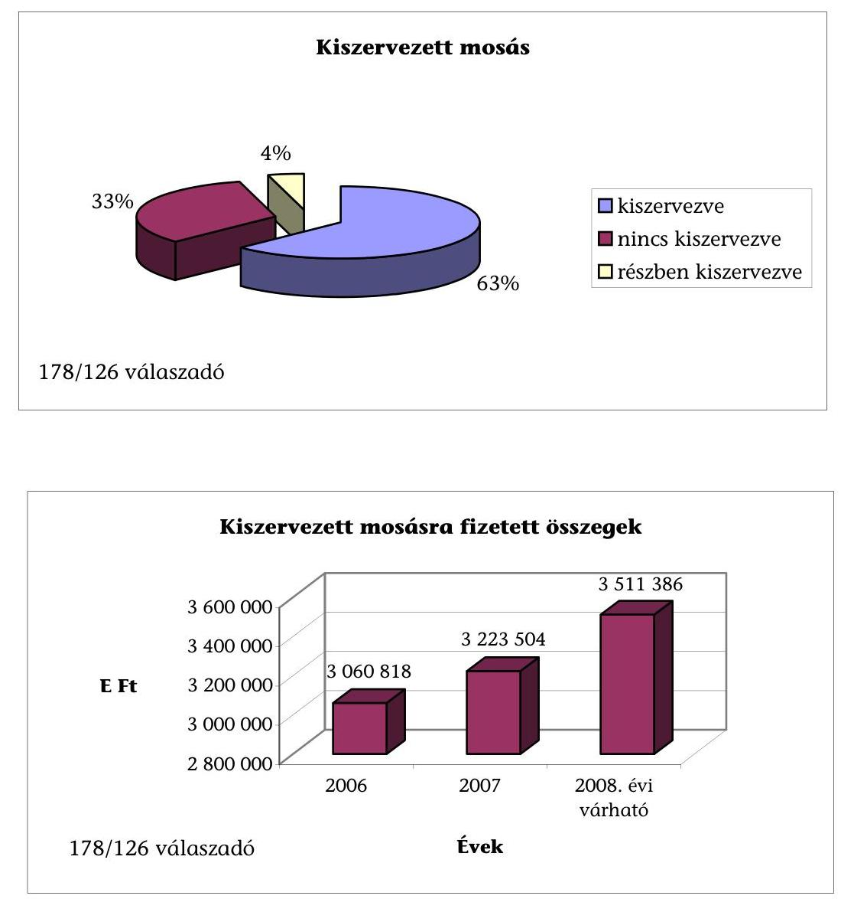

## Tevékenységet ellátó cégek:

I. Miskolci Patyolat Zrt.
II. Hófehér Kft.
III. MEM Kft.
IV. Logo-Tex Kft.
V. Centrál Mosodák Zrt., Nyírségi Patyolat Zrt.

---

# Felmérés a kiszervezett kórházi háttértevékenységekről ÉLELMEZÉS   (kérdőíves felmérés, 2008. novemberi adatok alapján) 

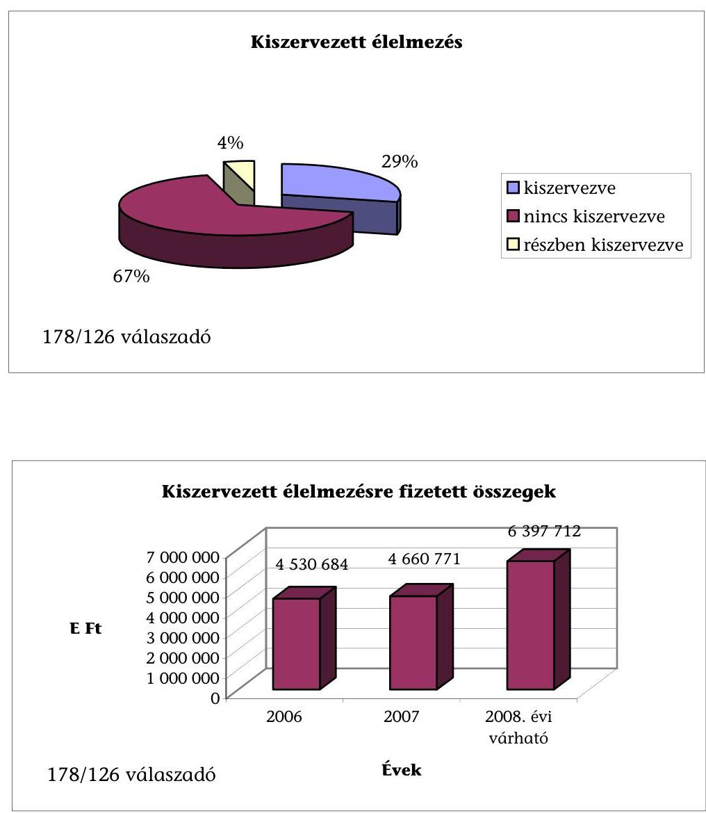

## Tevékenységet ellátó cégek:

I. P. Dussmann Kft.
II. Eurest Kft.
III. Sodexho Kft.

---

# Felmérés a kiszervezett kórházi háttértevékenységekről TAKARÍTÁS   (kérdőíves felmérés, 2008. novemberi adatok alapján) 

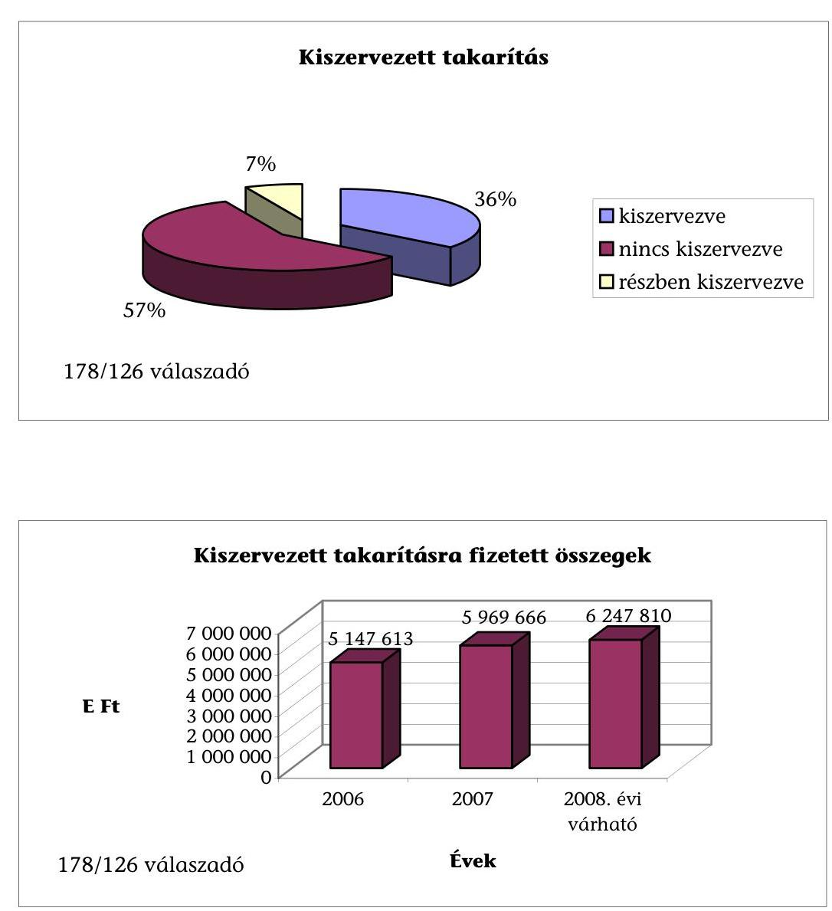

## Tevékenységet ellátó cégek:

I. P. Dussmann Kft.
II. Profi Komfort Kft.
III. PQS Kft.
IV. T.O.M. Kontroll

---

# Felmérés a kiszervezett kórházi háttértevékenységekről ÖRZÉS-VÉDELEM   (kérdőíves felmérés, 2008. novemberi adatok alapján) 

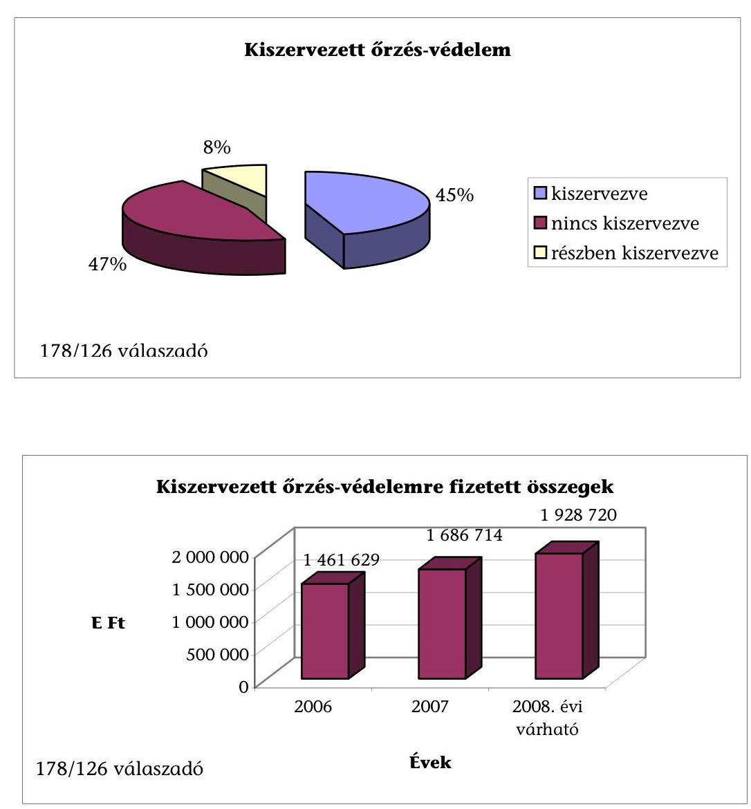

## Tevékenységet ellátó cégek:

I. P. Dussmann Kft.
II. Gransec Kft.

---

# Felmérés a kiszervezett kórházi háttértevékenységekről ENERGIAELLÁTÁS   (kérdőíves felmérés, 2008. novemberi adatok alapján) 

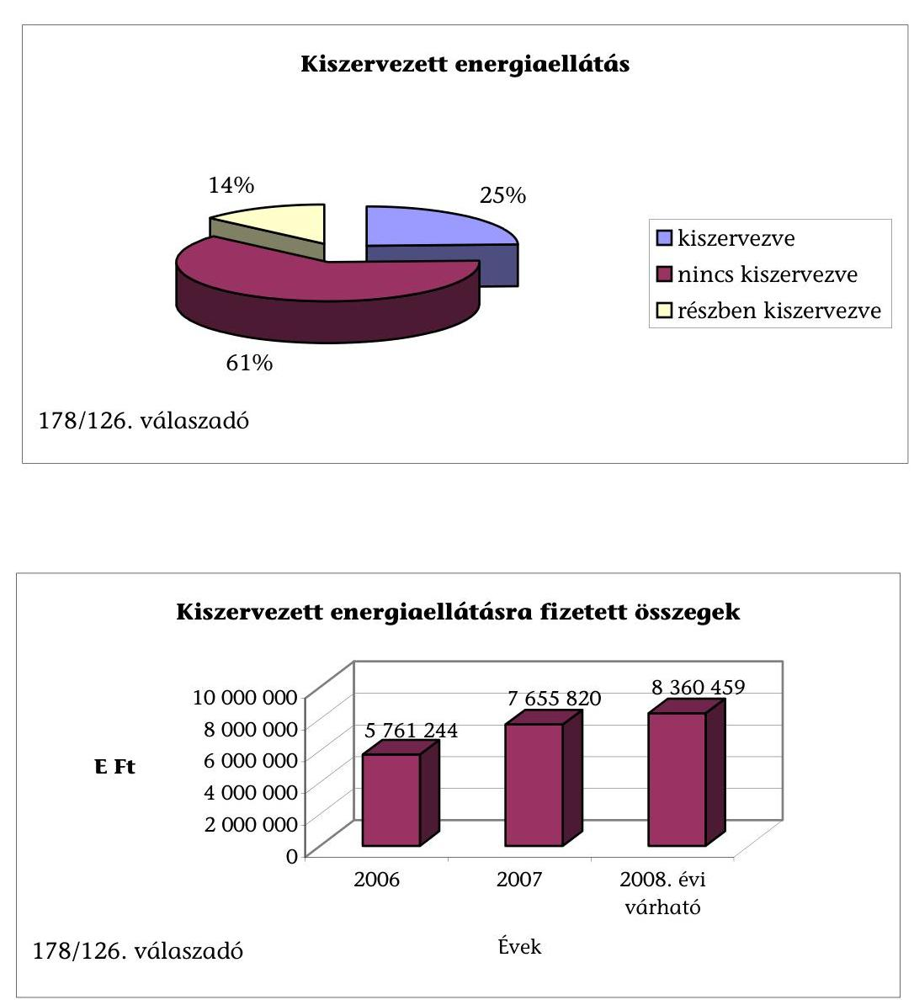

Tevékenységet leggyakrabban ellátó cég:
I. Dalkia Energia Zrt.

---

# Elégedettek-e a szolgáltatóikkal? 

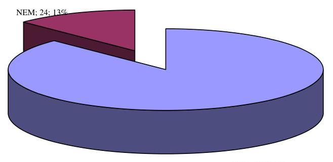

7/g. sz. diagram

## Milyen futamidejű a szerződés?

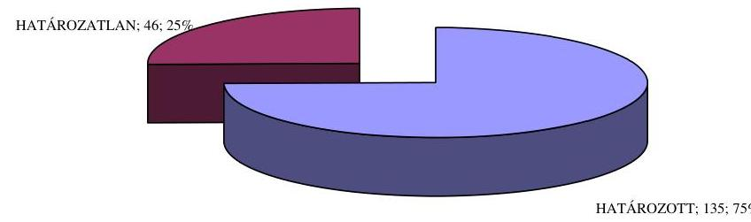

---

# A jövőben is ezekkel a cégekkel múködne együtt? 

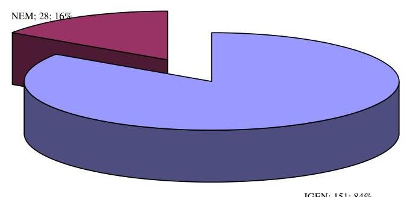

7/i. sz. diagram

Hogyan ítéli meg, előnyös-e gazdaságilag?
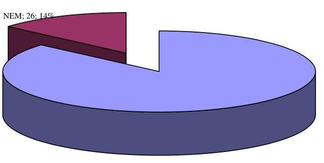

---

Ön szerint van-e árverseny a szolgáltatók között?
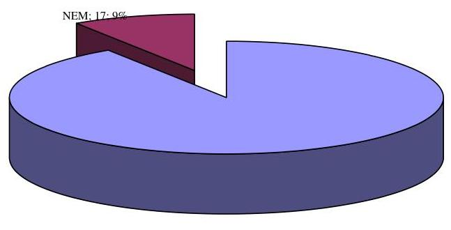
$I G E N ; 171 ; 91 \%$

7/k. sz. diagram

# Van-e ellenőrzési, minőségi kontroll lehetősége a kórháznak mint megrendelőnek? 

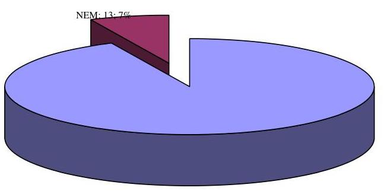

---

# Áll-e fenn kiegyenlítetlen, lejárt tartozása szolgáltatóival szemben? 

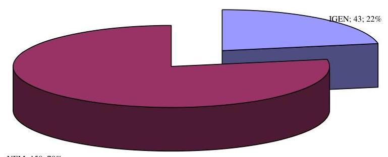

---

## **Adatlap a kiszervezett tevékenységekről***

|  Tevékenység megnevezése | Elégedettek e a szolgáltatóikkal? |  | Milyen
futamidejű a szerződés? |  | A jövőben is ezekkel a cégekkel működne együtt? |  | Hogyan ítéli meg, előnyös e gazdaságláag? |  | Ön szerint van e árverseny a szolgáltatóik között? |  | Értékelje 10-es skálán a szolgáltatás minőségét! (10-es a legjobb) |  | Van e ellenőrzési, minőségi kontroll lehetősége a kórháznak, mint megrendelések? |  | Hány napos a fizetési botáridő? |  | Áll e fenn kiegyenlítetlen, lejárt tartozása szolgáltatóival szemben? |  |  | Ha igen 60 napos túl (f. Ft) |  | 90 napos túl (f. Ft)  |
| --- | --- | --- | --- | --- | --- | --- | --- | --- | --- | --- | --- | --- | --- | --- | --- | --- | --- | --- | --- | --- | --- | --- | --- |
|   | Igen | Nem | Hat | Hat.lan | Igen | Nem | Igen | Nem | Igen | Nem | Összpont | Válaszadás db | Igen | Nem |  | Igen | Nem |  |  |  |  |  |   |
|  Ménés | 27 | 4 | 23 | 8 | 23 | 3 | 29 | 3 | 32 | 1 | 240 | 33 | 22 | 1 | 5 - 128 | 10 | 23 | 32 763 | 30 976 |  |  |  |   |
|  Üzömezés | 18 | 1 | 12 | 5 | 15 | 1 | 16 | 2 | 16 | 3 | 155 | 19 | 18 | 1 | 5 - 90 | 7 | 12 | 61 322 | 36 881 |  |  |  |   |
|  Tukarítás | 25 | 4 | 20 | 7 | 25 | 4 | 25 | 4 | 28 | 0 | 217 | 28 | 28 | 0 | 30 - 313 | 6 | 22 | 24 185 | 63 353 |  |  |  |   |
|  Örzés-védelem | 21 | 4 | 17 | 6 | 19 | 4 | 22 | 2 | 22 | 3 | 176 | 25 | 22 | 1 | 15 - 150 | 5 | 22 | 0 | 0 |  |  |  |   |
|  Kettősert, pukkfentőurító | 11 | 1 | 7 | 4 | 11 | 1 | 10 | 1 | 11 | 0 | 91 | 11 | 11 | 0 | 8 - 90 | 2 | 0 | 0 | 0 |  |  |  |   |
|  Energiasilitás | 19 | 4 | 19 | 2 | 16 | 5 | 18 | 5 | 16 | 6 | 172 | 23 | 18 | 4 | 6 - 60 | 5 | 18 | 14 967 | 20 781 |  |  |  |   |
|  Műszer karbantartás | 9 | 0 | 5 | 4 | 9 | 0 | 9 | 0 | 7 | 2 | 73 | 9 | 9 | 0 | 13 - 150 | 2 | 7 | 1 797 | 2 161 |  |  |  |   |
|  Épület karbantartás | 9 | 3 | 11 | 2 | 6 | 4 | 11 | 2 | 11 | 0 | 96 | 13 | 11 | 0 | 8 - 183 | 2 | 0 | 0 | 0 |  |  |  |   |
|  Kizihaszerzés tevékenység | 11 | 1 | 8 | 4 | 10 | 2 | 9 | 3 | 11 | 0 | 93 | 12 | 8 | 1 | 6 - 30 | 0 | 13 | 0 | 0 |  |  |  |   |
|  Pénzügyi, szimróitól nyilvántartások vezetője | 0 | 0 |  |  | 0 | 0 | 0 | 0 | 0 | 0 | 0 | 0 | 0 | 0 | 0 | 0 | 0 | 0 | 0 |  |  |  |   |
|  Húminn erőforrás gazdálkodás | 3 | 0 | 3 |  | 3 | 0 | 3 | 0 | 3 | 0 | 24 | 3 | 0 | 3 | 10 | 0 | 3 | 0 | 0 |  |  |  |   |
|  Informatikai tevékenység (hőpolttartóval jelentésű osztály információs rendszer, kontrolling) | 6 | 0 | 2 | 4 | 6 | 0 | 6 | 0 | 6 | 0 | 49 | 6 | 5 | 0 | 8 - 30 | 0 | 6 | 0 | 0 |  |  |  |   |
|  Logisztikai tevékenység (anyug-, lehetőségszőlőkodás) | 4 | 2 | 6 |  | 4 | 2 | 2 | 4 | 5 | 1 | 39 | 6 | 6 | 0 | 60 - 120 | 5 | 3 | 2 588 | 0 |  |  |  |   |
|  Egyéb, gyógynyalmazatás | 4 | 0 | 4 |  | 3 | 2 | 4 | 0 | 3 | 1 | 20 | 4 | 3 | 1 | 30 - 120 | 1 | 3 | 0 | 0 |  |  |  |   |
|  Összesen: | 167 | 24 | 135 | 46 | 151 | 28 | 164 | 26 | 171 | 17 |  |  |  | 171 | 13 |  | 43 | 150 | 137 822 | 176 352 |  |  |   |
|  Összesen százalék: | 87% | 13% | 75% | 25% | 84% | 16% | 86% | 14% | 91% | 9% |  |  |  | 93% | 7% |  | 22% | 78% |  |  |  |  |   |

- Készletet: 51 db

Visszámkozott: 59 db

---

8/b. sz. melléklet a V-2017-114/2008-2009. sz. jelentéshez

## **Adatlap a kiszervezett háttértevékenységek megoszlási arányairól** a

|  Tevékenység megnevezése | Elégedettek-e a szolgáltatóikkal? | Milyen futamidejű a szerződés? | A jövőben le ezekkel a cégekkel működés együtt? | Hogyan ítéli meg, előnyes-e gazdaságilag? | Ön szerint van-e árverseny a szolgáltatók között? | Értékelje 10-es alááán a szolgáltatás minőségét! (10-es a legjobb) | Van-e ellenőrzési, minőségi kontroll lehetősége a körbácnak, mint megrendelőnek? | Áll-e fenn kiugyesíthetlen, lejárt tartozása szolgáltatóival szemben? | 00 napon tál (E Ft) | 90 napon tál (E Ft)  |
| --- | --- | --- | --- | --- | --- | --- | --- | --- | --- | --- |
|   | Igen | Nem | Hat. | Hat.lan | Igen | Nem | Igen | Nem | Igen | Nem  |
|  Hissis | 87% | 13% | 74% | 26% | 49% | 11% | 91% | 9% | 97% | 3%  |
|  Önmezés | 93% | 5% | 71% | 29% | 94% | 6% | 89% | 11% | 84% | 16%  |
|  Tykerítés | 86% | 14% | 74% | 26% | 86% | 14% | 86% | 14% | 100% | 0%  |
|  Üzves-védelem | 84% | 16% | 74% | 26% | 83% | 17% | 92% | 8% | 88% | 12%  |
|  Kertézett, puskásosztatás | 92% | 8% | 64% | 36% | 92% | 8% | 91% | 9% | 100% | 0%  |
|  Energiantilátás | 83% | 17% | 90% | 10% | 76% | 24% | 78% | 22% | 73% | 27%  |
|  Milyen karbantartás | 100% | 0% | 43% | 57% | 100% | 0% | 100% | 0% | 78% | 22%  |
|  Épület karbantartás | 75% | 25% | 85% | 15% | 60% | 40% | 85% | 15% | 100% | 0%  |
|  Közbezavízési tevékenység | 92% | 8% | 67% | 33% | 83% | 17% | 75% | 25% | 100% | 0%  |
|  Feszügyi, számviteli nyilvántartások vezetése | n.a. | n.a. | n.a. | n.a. | n.a. | n.a. | n.a. | n.a. | n.a. | n.a.  |
|  Hozzáig vetősztrás gazdálkodás | 100% | 0% | 100% | 0% | 100% | 0% | 100% | 0% | 100% | 0%  |
|  Hozzáigvetési tevékenység (telejselemények jelentése, vezetői információs rendkívat, kontrollínai) | 100% | 0% | 33% | 67% | 100% | 0% | 100% | 0% | 100% | 0%  |
|  Legtisztikai tevékenység (anyag-, keszletgazdálkodás) | 67% | 33% | 100% | 0% | 67% | 33% | 33% | 67% | 83% | 17%  |
|  Egyéb, gyógyszefeszerzés | 100% | 0% | 100% | 0% | 50% | 50% | 100% | 0% | 75% | 25%  |

^{a} Kiküldött: 51 db

^{b} Viszszétkezett: 39 db

---

# Tulajdonviszonyok a müködtetésbe adott és az átalakult intézményeknél

|  Helység | Név | Tulajdonosi összetétel | Ingó és ingatlan vagyon tulajdonosa | Megjegyzés, változás  |
| --- | --- | --- | --- | --- |
|  2005. előtt müködtetésbe adott intézmények |  |  |  |   |
|  Dombóvár | Dombóvári Szent Lukács Egészségügyi Kht. | 100\%-ban önkormányzati | Önkormányzat | -  |
|  Kiskunhalas | Semmelweis Kórház Kht. | 100\%-ban HospInvest Zrt. | Önkormányzat | HospInvest Kft. HospInvest Zrt.-vé alakult át.  |
|  Körmend | Dr. Batthyány-Strattmann László Kórház Kft. | 100\%-ban MediSyst Kft. | Önkormányzat | A korábbi tulajdonos HospInvest Kft. szétvált, és a kivált MediSyst Kft. vette át a müködtetési feladatokot.  |
|  Siklós | Siklósi Kórház Kht. | 74,444\%-ban Mega-Logistic Zrt.
19,123\%-ban Siklósi Önkormányzat
2,923\%-ban Harkányi Önkormányzat
1,755\%-ban Villányi Önkormányzat
1,755\%-ban Beremendi Önkormányzat | 2004-ben a siklósi önkormányzat az ingó vagyont, leltár szerint, valamint az ingatlanokat és az ingatlanon található eszközöket, berendezéseket a Kht-nak adományként átadta. | Tulajdonosi arányban történtek változások. 2008. február 18-i taggyűlésen döntöttek, hogy Siklósi Kórház Nonprofit Kft.-ként müködnek tovább.  |
|  Várpalota | Palotahosp Kft. | 100\%-ban magánszemély | Önkormányzat | 2008. december 3-ával a Medicomplex Kft. eladta a 100\%-os tulajdonában lévő Palotahosp Kft.-t.  |
|  2005. óta müködtetésbe adott intézmények |  |  |  |   |
|  Gyöngyös | Gyöngyösi Kórház Kft. | 100\%-ban HospInvest Zrt. | Önkormányzat | -  |
|  Hatvan | Hatvani Kórház Egészségügyi Szolgáltató Kft.(Parádfürdői Kórház) | 100\%-ban HospInvest Zrt. | Önkormányzat | -  |
|  Mezőtár | Mezőtár Városi Kórház-Rendelőintézet Egészségügyi Szolgáltató Kft. | MediSyst Kft.
Diagon
Kft.
Kft.
Battbyány Strattmann László Kórház Kft. | Önkormányzat | -  |
|  Özd | Almási Balogh Pál Kórház Egészségügyi és Szolgáltató Nonprofit Kft. | 100\%-ban Medcenter Kft. | Önkormányzat | -  |
|  Taploca | Tapolcai Dr. Desik Jenő Kórház-Rendelőintézet és Gyógybarlang Kft. | MediSyst Kft.
Diagon Kft. | Önkormányzat | -  |
|  Átalakult intézmények |  |  |  |   |
|  Szombathely | Vas megyei Markusovszky Kórház Nonprofit Zrt. | 100\%-ban önkormányzati | Önkormányzat | -  |
|  Veszprém | Veszprém megyei Csolnoky Ferenc Kórház Nonprofit Zrt. | 6,22\% Sümeg Önkormányzat
93,78\% Veszprém Önkormányzat | Önkormányzat | -  |
|  Helyszínen nem vizsgált 2005. óta müködtetésbe adott intézmények |  |  |  |   |
|  Jászberény | Szent Erzsébet nonprofit Kórház Kft. | n.a. | n.a. | Az ingatlan vagyon kezelése és a beruházások a profitédekeit Jászberényi Egészségügyi Vagyonkezelő Kft. feladata.  |
|  Kazincbarcika | DEOEC Kazincbarcikai Kórház Kft. | Debreceni Egyetem | n.a. | Müködtetésbe adás dátuma: 2009. 03. 01.  |
|  Nagyatád | NagyatádMed Egészségügyi Szolgáltató Kft | Medicul Investment | n.a. |   |
|  Szigetvár | Szigetvári Egészségügyi Ellátó és Szolgáltató Kft. | Releváns Befektetési Kft. | n.a. | A Releváns Befektetési Kft. a Hospinvest érdekeltségi körébe tartozik. Müködtetésbe adás dátuma: 2009. 04. 01.  |
|  Eger | Egri Markhot Ferenc Kórház | 100\%-ban HospInvest Zrt. | n.a. | A HospInvest Zrt. 2008. november 1-jétől látja el a Heves Megyei Önkormányzat tulajdonában lévő Markhot Ferenc Kórház és Rendelőintézet üzemeltetését.  |

---

# Kérdőív ${ }^{1}$ 

a háttérszolgáltatásokat ki nem szervező vagy részben kiszervező intézményekről

## - összesítés -

1. Volt-e olyan időszak, mikor háttér-szolgáltatásai kiszervezettek voltak?

29 Igen
5 Nem

## Ha igen, melyek voltak ezek?

16 mosás
10 takarítás
5 élelmezés
15 őrzés-védelem
4 energiaellátás
5 egyéb: CT karbantartás, vérszállítás, informatika, közbeszerzés, műszerkarbantartás
2. Tervezi-e a jövőben ezek kiszervezését?

22 Igen
14 Nem

## Ha igen, melyeket?

10 mosás
8 takarítás
9 élelmezés
6 őrzés-védelem
4 energiaellátás
5 egyéb: vérszállítás, könyvelés, (műszak+száll.+karb.), informatika, szállítás
3. Miben látja annak pozitívumát, hogy kiegészítő tevékenységeit intézményen belül látja el? (tehát nem szervezte ki) (Több válasz is adható.)

23 Munkaerő rugalmasabb irányíthatósága
18 Munkaidő rugalmasabb beosztása
14 Munkavégzés minősége jobb
19 Munkavégzés minősége ellenőrizhetőbb

[^0]
[^0]:    ${ }^{1}$ Kiküldött: 47 db; Visszaérkezett: 36 db .

---

15 Intézményi tulajdon védelme biztosított
19 Gazdaságosabb, olcsóbb

- erre vonatkozó számítások ezt igazolják

23 Igen
1 Nem
4. Van-e akkreditált minőségbiztosítása, amiben felméri az élelmezéssel, tisztasággal kapcsolatos betegelégedettséget?

15 Van
3 Nincs
Ha nincs, végzett-e betegelégedettségi vizsgálatot?
19 Igen
1 Nem
5. Forrásaiból biztosítani tudja-e a háttérszolgáltatások beruházásigényét, korszerűsítését?

7 Igen
25 Nem

---

# FÜGGELÉKEK

---

# A VÁRPALOTAI KÓRHÁZ-EGÉSZSÉGÜGYI ÉS SZOCIÁLIS INTÉZMÉNYI BERUHÁZÁSA 

A várpalotai kórház egészségügyi és szociális intézményi beruházáshoz kapcsolódó fejlesztési koncepcióval 2003-ban a Medicomplex Kft., mint befektető kereste meg az Önkormányzatot. A koncepcióban és megvalósíthatósági tanulmányban vállalta a Kórház területén, a betegellátás színvonalát javító és kapacitást bővítő épület felépítését.

A befektető „kórházhoz kapcsolódó egészségügyi és szociális intézményi beruházásra vonatkozó koncepcióját" a Várpalotai Önkormányzat Képviselő-testülete 2003 novemberében finanszírozhatósági és egyéb gazdasági következmények ismerete nélkül fogadta el.

Az új „C" épület alagsorában egynapos sebészeti ellátást, a földszinten járóbeteg szakrendelésre alkalmas helyiségek kialakítását, első emeletén 20 ágyas stroke-rehabilitációt és 20 ágyas krónikus ápolást terveztek. A második és a harmadik szinten, valamint a tetőtérben idősek otthona, továbbá hospice, geriátria, fizetős ápolási otthon kialakítását tervezte a befektető 80 ágyon. Előzetesen az ellátás iránti fizetőképes keresletet nem mérték fel.

A megvalósításhoz a befektetőnek az önkormányzat jelképes áron, 99 évre bérbe adta a kórházhoz tartozó földterület egy részét.

Időközben, 2005. szeptember 1-jétől a Várpalotai Önkormányzat határozatlan időre, - melyet 2007. január 29-i szerződésmódosításban 20 évre változtatott -, ingyenesen átadta a rendszeres adóssággal küszködő, két épületből álló („A" és "B"), 105 ágyas ( 76 aktív+29 krónikus) kórházának és a hozzá tartozó járóbeteg szakrendelésének a múködtetési jogát a befektető tulajdonában lévő Palotahosp Kft-nek.

A befektető saját projekt cégén, a Medicomplex-Várpalota Kft-n keresztül hitelből, mintegy 2,5 Mrd Ft tőke, plusz kamatai összegért a kórház területén építette fel az új „C" épületet, amely 2006 decemberében készült el. Az üzleti terv szerint a beruházási hitel törlesztésére az új ingatlanban zajló közfinanszírozott ellátások és térítési díjbevételek együttesen nyújtottak volna fedezetet.

A „C" épület tulajdonosa a befektető építési projektcége (MedicomplexVárpalota Kft.), aki a felvett hitelt ${ }^{1}$ 2007. április és 2025. április között törleszti vissza a banknak. A tulajdonos az épületet bérbe adja a befektető tulajdonában lévő közhasznú Palotahost Kht-nak², aki tovább adja albérletbe a kórházat üzemeltető Palotahosp Kft-nek. Ez utóbbi „termeli ki" a hitel törlesztő részle-

[^0]
[^0]:    ${ }^{1}$ CHF alapú
    ${ }^{2}$ A felépítendő épület, illetve a benne nyújtandó szolgáltatás múködtetésére a Medicomplex Kft. létrehozta 100\%-os tulajdonosként 2005. február 25-én a Palotahost Kht-t, amely szervezet az Önkormányzattal kötött közhasznúsági szerződést fő tevékenységére a szociális ellátás és elhelyezés feladatra.

---

teit. A hitel visszafizetése után a tulajdonjog marad az építő projekt cégnél. A Palotahosp Kft. által fizetett bérleti dí 2007. évi összege 121,4 M Ft, 2008. évi összege 210,3 M Ft volt.

Az új épület földszintjére, korszerű körülmények közé költözött 2006 végén a járóbeteg szakrendelés. Az önkormányzat azon célkitűzése, hogy az ellátás minőségét javítsa, ezzel megvalósult. A 2005-ben kötött kórház-üzemeltetésre vonatkozó feladat-átadási szerződést 2007. január 29-én - többek között - úgy módosították, hogy lehetővé tették az OEP finanszírozáson felül a térítési díjfizetést.

A országos kórházi struktúra átalakítás kapcsán, Várpalotán megszűnt az aktív ellátás, az intézmény krónikus és rehabilitációs betegekre szakosodott. A térség ellátásához a 2007. április 1-jei miniszteri határozat alapján a meglevő 105 ágy mellé, még 9 krónikus belgyógyászati és 15 ápolási többlet ágyat ismertek el, azaz a helyi ellátás 24 ággyal bővült.

A Veszprém megyei kórházak profiljainak összehangolása eredményeként a Veszprém megyei kórház többletfinanszírozás nélkül átvállalta a várpalotai kórház térségének aktív betegellátását, ugyanakkor átadott 37 rehabilitációs ágyat finanszírozással együtt Várpalotának, így 2007. április 1-jétől összesen 166 ágyra kötött az OEP közvetlenül finanszírozási szerződést a Palotahosp Kftvel. További 58 ágyon ún. közreműködői szerződéssel a dunaújvárosi kórház ellátási területéhez tartozó betegek ellátása folyik. Így összesen 224 ágyat finanszíroz (közvetve és közvetlenül) az egészségbiztosító.

Az önkormányzati tulajdonú és a Palotahosp Kft. által térítésmentesen használt „A" épület leromlott állapota miatt, az ott lévő 30 ágyon szünetel a betegellátás.

A Palotahosp Kft. 2007-től 25 ágyon biztosít ún. alapszintű ellátást, ahol nem kell térítési díjat fizetni. A többi ágyon (199 ágy) az OEP finanszírozás mellett fejenként 1900-4000 Ft/nap térítési díjat állapít meg a kórház térítési díj szabályzata. Az önkormányzat hozzájárult a co-payment széleskörű bevezetéséhez. A Kft-nek a várpalotai kórházban 2007-ben 185,1 M Ft térítési díj bevétele volt, 2008-ban pedig $261,9 \mathrm{MFt}$.

Az alapszintű kórházi hotelszolgáltatás, amiért nem kell térítési díjat fizetni, nincs jogszabályban definiálva. ${ }^{3}$ A jelentős fejlesztést tartalmazó beruházási koncepció megvalósítása miatt emelkedtek a Várpalotán a betegek terhei, egyúttal pedig csökkent a város és kistérsége betegeinek ingyenes egészségügyi ellátáshoz való hozzáférése.

Az egészségügyi szolgáltatást a Palotahosp Kft. a vizsgált időszakban a tulajdonosi érdekkörbe tartozó gazdasági társaságok bevonásával, azok közötti gazdasági események elszámolásával végezte (a kapcsolódásokat a mellékelt ábra mutatja be). A Kft. 2006-2008 között egyszerűsített beszámolói alapján eredményesen működött.

[^0]
[^0]:    ${ }^{3}$ 284/1997.(XII. 23.) Korm. rendelet a térítési dí ellenében igénybe vehető egyes szolgáltatások térítési dijáról.

---

Az új épület meghatározó részén nem az Önkormányzat feladataihoz kötődő, és döntően térítéses egészségügyi ellátást terveztek végezni. A várpalotai kistérség betegeinek biztonságos ellátásához nem volt szükség az új pavilon felépítésére, ez a Medicomplex Kft. jövőbeni terveire épülő konstrukció volt, amely szerint hosszú távon rehabilitációs, krónikus és egyéb szolgáltatások - hospice ellátás, idősek otthona, geriátria, fizetős ápolási otthon - nyújtásában gondolkodott.

---

# A várpalotai egészségügyi ellátás biztosításában résztvevő szervezetek kapcsolatrendszere 

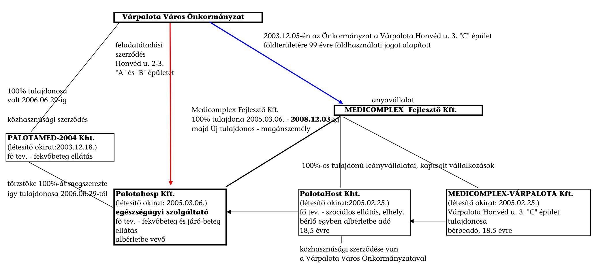

---

# AZ ESZTERGOMI VASZARY KOLOS KÓRHÁZ ÉPÜLET BERUHÁZÁSA 

A Vaszary Kolos Kórház 100 éves, pavilonrendszerű, Komárom-Esztergom megye keleti részében, Budapesttől 46 km-re lévő költségvetési intézmény. A kórház 378 aktív és 105 krónikus ággyal ${ }^{1}$ rendelkezik. Reumatológiai ellátás tekintetében az egész megye lakossága az ellátási kötelezettségébe tartozik. A kórház múködtetője 1994-től 2002. elejéig a megyei önkormányzat volt, ekkor a városi önkormányzat visszavette és azóta is a város üzemelteti. Az egészségügyi struktúraátalakítás és finanszírozási rendszer változása kedvezőtlenül érintette a kórházat, mert a várakozásokkal ellentétben nem került be a súlyponti kórházak közé.

Az önkormányzat a kórház ellátási struktúrájának javítására - külső telephely beköltöztetése a kórház területére, ill. balneoterápiás ( 85 ágyas) egység kialakítására - 2004-ben és 2005-ben is címzett állami támogatásra ${ }^{2}$ pályázott, amelyek számára eredménytelenül zárultak. A terv megvalósítása érdekében a kórház és az önkormányzat 2005-ben úgy döntött, hogy az ingatlanfejlesztést ${ }^{3}$ központi támogatás nélkül, magántőke bevonásával biztosítja, amelyre a kórház 2006 januárjában közbeszerzési eljárást írt ki. Az önkormányzat hozzájárult a magántőke bevonásával történő egység felépítéséhez térítésmentes fölhasználati jog alapításával is.

A közbeszerzési kiírásra egy ajánlat érkezett. A nyertes Medicomplex Kft. konstrukciójának lényege, hogy a befektető 3,0 M Ft-os alaptőkével létrehoz egy építési projekt céget (a Medister Kft-t), aki megtervezi, felépíti és felszereli a kívánt épületet az általa felvett 15 éves lejáratú hitelből. A kórház az építkezés befejeztével megvásárolja a projekt kft. 100\%-os üzletrészét, ezáltal az új épület tulajdonosává válik, és a hitel részleteit törleszti.

A pályáztatást, beruházási döntést megelőzően pénzügyi és finanszírozási számításokat a teljes bekerülésre, a fizetés forrására-ütemezésére, tervet, hatástanulmányt sem a kórház, sem a tulajdonos önkormányzat nem készített/készíttetett. A tervezett épületet (és átköltöztetést) sem a kórház, sem az önkormányzat nem vizsgáltatta felül szakmai (reumatológiai, illetve mozgásszervi) célszerűségi és egyéb hatósági (ÁNTSZ, tűzvédelmi) szempontok szerint. A kórház 2006-ban eladósodott (a beruházástól függetlenül), amelyet napjainkig nem tudott megszüntetni.

2006 és 2008 között a kórház adóssága 604,9-540,9-295,1 M Ft volt és két alkalommal önkormányzati biztost is kijelöltek az intézményhez. (A kórház 2002-ben

[^0]
[^0]:    ${ }^{1}$ 2007. március 31-ig az aktív ágyszám 435, a krónikus 104, összes csökkenés 56 ágy.
    ${ }^{2}$ A pályázat benyújtásához szükséges önrészt az önkormányzat biztosította. Az első esetben a 3 évre vonatkozóan 126854 E Ft, a második esetben 226297 E Ft összegben.
    ${ }^{3}$ Az ingatlanfejlesztés a korábbiakkal szemben nem átépítés/felújítás, hanem egy régi épület elbontásával új kórházi egység felépítése, valamint a patológia régi épületének átépítése, tetőtér beépítése.

---

is adóssággal küszködött, ezért az EüM-től 129700 E Ft összegű, vissza nem térítendő támogatásban részesült.)

A beruházás hitelszerződését 1125000 E Ft-nak megfelelő svájci frank, valamint 200000 E Ft összegre, 15 éves futamidőre kötötték. A teljes bekerülési költséget több tényező negatívan befolyásolja: az árfolyamváltozás (Ft/svájci frank), és a kamatlábváltozás ${ }^{4}$ (nem fix kamatozású, hanem LIBOR). (A beruházás összege a tervezett kiadás többszörösébe is kerülhet.)

A Medicomplex Kft. által benyújtott pénzügyi ütemterv szerint a 180 hónapos futamidő első 12 hónapjában - amelynek kezdőnapja a banki hitel folyósításának napja - a kórháznak nem volt fizetési kötelezettsége. A 13. hónaptól a havi fizetési kötelezettség nettó 8209,1 E Ft, bruttó 9850,9 E Ft, amely összeget az árfolyamváltozás befolyásolja.

A finanszírozó pénzintézet ${ }^{5}$ a hitel folyósításához a befektetőtől szakértői tanulmányt kért az új épület megvalósíthatóságáról. Ezt a tanulmányt a Medicomplex Kft. tanácsadója készítette el - a kórház költségvetési és egyéb adatai tükrében -, majd nyújtotta be a pénzintézethez. A tanulmány tartalmát sem a kórház, sem az önkormányzat máig nem ismeri, kiadását banki titokra hivatkozva a pénzintézet elutasította, a befektető/szakértő nem adta át.

Álláspontunk szerint az esztergomi Vaszary Kolos Kórház által kórházépítés tárgyában indított közbeszerzési eljárás, és az annak eredményeképpen a Medicomplex Kft-vel 2006. április 28-án létrejött vállalkozási szerződés megkötése - konkrét fedezet hiányában - fedezet nélküli kötelezettségvállalásnak minősül. A fedezet nélküli kötelezettségvállalás - az akkor hatályos jogszabályok alapulvételével - ellentétes az államháztartás működési rendjéről szóló 217/1998. (XII. 30.) Korm. rendelet 134. §-ának (7) és (9) bekezdéseiben foglalt előírásokkal. A hivatkozott jogszabályi előírások megsértéséért a kötelezettségvállaló főigazgató főorvos és az ellenjegyző személy munkajogi (fegyelmi) felelőssége megállapítható lenne, de - tekintettel arra, hogy mindkét érintett személy munkaviszonya már megszűnt - személyi felelősségük felvetésére e tekintetben már nincs lehetőség.

A vállalkozási szerződésben a kórház kötelezettséget vállalt arra, hogy a projekt cég (Medister Kft. üzletrész) 100\%-ának megvásárlásával szerzi meg az épület tulajdonjogát. Erre az ellenőrzés lezárásáig (2009. május 25.) nem került sor, mert az ehhez szükséges dokumentumok - pl. könyvvizsgáló által auditált mérleg - nem álltak rendelkezésre.

A Medister Kft. és a kórház 2007. július 4-én közjegyzői okiratba foglalt, 15 évre szóló bérleti szerződést kötött a kivitelezésre kerülő épületre, amelynek használatba vételi engedélye következő év augusztusában került kiadásra. A bérleti díj összegét a tárgyhavi adósságszolgálat + áfa összegben rögzítették. A Medister Kft. a bérleti díj összegéből törleszti az általa felvett hitelt a banknak, azaz a bérleti díj a hiteltörlesztés fedezete.

[^0]
[^0]:    ${ }^{4}$ az ajánlatban szereplő kamat: 1 havi CHF Libor $+2,0 \%$
    ${ }^{5}$ MKB Bank Zrt.

---

A hitel törlesztő részleteit 2008 októberétől a bank inkasszóval emeli le a kórház számlájáról, azaz fizetése nem a bérleti szerződés keretében történik. 2009. március 12-ig összesen 66 054,7 E Ft-ot fizetett ki, amely a tőke és kamatfizetés együttes összege, ez átlagosan kb. havi 11 053,8 M Ft. Jutalék és késedelmi kamat címén további 268,1 E Ft-ot fizetett ki. (Az épület beruházás törlesztő részleteit a kapcsolódó táblázat mutatja be). A kifizetéshez 2008-ban az önkormányzat 67000 E Ft-ot biztosított a kórház számára. A további hitel összegek finanszírozásáról az önkormányzat 7/2009. (III. 10.) sz. Esztergom Város Önkormányzata 2009. évi költségvetéséről és a költségvetés végrehajtásáról szóló rendeletében rendelkezett, amelyben a magántőkés ingatlanfejlesztés támogatására 156000 E Ft-ot hagyott jóvá. A kifizetett összegek nagysága, a fizetés rendszeressége változó.
2007. július 4-én született egy háromoldalú megállapodás is - a Medister Kft., a Kórház és az MKB Bank Zrt. között - amelyben a kórház vállalta, hogy a Medister Kft. helyett a bank részére teljesíti annak fizetési kötelezettségét. Továbbá rögzítették, hogy „A kórház tájékoztatja a Bankot arról, hogy a Hitelfelvevőt a Hitelszerződés alapján terhelő tartozást a Hitelfelvevő helyett esedékességkor az alábbi bankszámláján lévő pénzösszegek terhére átutalással, ennek elmaradása esetén a Bank által a Kórház felhatalmazása alapján benyújtott azonnali beszedési megbizás útján teljesíti."

Szintén 2007. július 4-i dátummal - a hitelszerződés biztosítása céljából - született két - közjegyzői okiratba foglalt - ún. Tulajdonosi projekttámogatási szerződés, egyrészt a Medicomplex Kft. és az MKB Bank Zrt. között, másrészt a Vaszary Kolos Kórház és az MKB Bank Zrt. között.

A közjegyzői okiratba foglalt projekttámogatási szerződés B) fejezetének 3.2. pontjában a Kórház, a hitelfelvevő Medister Kft. nem, vagy nem-szerződésszerű teljesítése esetére, készfizető kezességet vállalt, ami ellentétes az Áht. akkor hatályos 100. §-a (1) bekezdésének b) pontjában foglaltakkal.

Álláspontunk szerint a Ptk. 200. §-ának (2) bekezdése értelmében a jogszabályba ütköző szerződés (vagy egy adott szerződési kikötés) - amennyiben ahhoz a jogszabály más jogkövetkezményt nem fúz - semmis, így a Kórház készfizető kezességre vonatkozó kötelezettségvállalása semmis. Az előzőektől függetlenül a szerződés B) fejezetének 3.3. pontja a készfizető kezességvállalásra is vonatkozó olyan - a hatálybalépés szempontjából felfüggesztő - feltételt tartalmaz, amely szerint a fenti kötelezettség csak akkor áll be, ha a Kórház az alap vállalkozási szerződésben meghatározottak szerint a Medister Kft. üzletrészét megszerzi. Mivel ez a feltétel a mai napig nem következett be - figyelemmel a Ptk. felfüggesztő feltételre vonatkozó 228. §-ának (1) bekezdésében foglaltakra -, a Kórház 2008. októberfől törleszti a felvett hitel tőkerészleteit és annak kamatait. Ez a rendelkezésünkre bocsátott táblázat szerint 2009. márciussal bezárólag összesen 66 054,7 E Ft tartozatlan kifizetését jelenti.

A beruházás kapcsán kötött szerződések és megállapodások sokfélék (vállalkozási szerződés, bérleti szerződés, tulajdonosi projekttámogatási szerződés, stb.) és nem áttekinthetők. Az átláthatóságot tovább nehezíti, hogy a hiteltörlesztést a különböző szerződésekből eredendően bérleti díjként, használati díjként, hitel összegeként tüntetik fel. (A beruházásban résztvevő szervezetek kapcsolatrendszerét a csatolt ábra mutatja be.)

---

A magántőkés ingatlanfejlesztéssel kapcsolatos önkormányzati kötelezettségvállalás költségvetési hatásainak elemzésére - az önkormányzat 105/2008. (II. 21.) önkormányzati határozatával ideiglenes bizottságot hozott létre, valamint egy független szakértővel is felülvizsgáltatta a konstrukciót.

A Bizottság hat alkalommal ülésezett, megállapították, hogy „a Kórház nem tudja alátámasztani azon 2005. augusztus 25 -i állítását, amely szerint a magántőkés ingatlanfejlesztés nem okoz az önkormányzatnak fizetési kötelezettséget."

A Bizottság további megállapításai voltak, hogy az utólagosan - abban az időben a hivatalban lévő gazdasági igazgató által - készített számítások alapján a bevételnövekmény nem fedezi a fizetési kötelezettséget, a 2005-ös finanszírozással számolva kb. havi 5-6 M Ft hiányzik a havi törlesztéshez); a Kórház dokumentumokkal nem tudta alátámasztani, hogy a Medister Kft. hitelfelvétele során vállalt kezesség megalapozott kötelezettségvállalásnak minősül; „sem az önkormányzat illetékes bizottságai, sem a Polgármesteri Hivatal illetékes szervezeti egységei nem kísérték súlyának megfelelő figyelemmel ezen beruházás alakulását";

A Bizottság az ügyben nem állapított meg egyszemélyes felelőst.
A független szakértői felülvizsgálat megállapította, hogy a beruházást nem fedezi az intézmény gazdasági teljesítménye; az új épületben csak finanszírozott ellátás nyújtására alkalmas ágyszám került elhelyezésre, azaz többletkapacitások hiányában az osztály nem növelheti bevételeit térítési dí ellenében; (az épületet nem a kórház területén, hanem a fürdő beruházáshoz kapcsoltan kellett volna megvalósítani;) az új épülettömb felépítésénél célszerűbb lett volna a tömbösítés.

Az önkormányzat a javaslatok kidolgozását az önkormányzati biztos és a megbízott tanácsadó cég útján teljesítette.

Az új kórházi egység törlesztő részleteit a kórház az OEP finanszírozás feltételezett növekedéséből, illetve annak múködésen felüli részéből, valamint többletágyak bevételéből és co-payment bevételekből tervezte fedezni. Azonban az új épületben az OEP finanszírozott ágyakon felül nem teremtették meg a feltételeket további ágyak elhelyezésére. Az intézmény 2008. évi co-payment bevétele ${ }^{6}$ összesen 12,5 M Ft volt, amelyből az új épületszárnyban múködő mozgásszervi rehabilitáció bevétele 56,1 E Ft, míg a reumatológia részlegén nem származott bevétele.

[^0]
[^0]:    ${ }^{6}$ A co-payment bevételek az alábbi szolgáltatásokat tartalmazzák: ápolási díj, ambuláns díj, látlelet, külföldi betegápolási díj, intézményi ellátási díj, vizsgálati díj, külföldi betegek vizsgálati díja.

---

# Az esztergom! Vaszary Kolos Kórház épület beruházásának tőrieszlő részletei

|  Megnevezési/Időnapok |  |  |  |  |  |  |  |  |  |  |  |  |  |  |  |  |  |  |  |  |  |  |  |  |  |  |  |  |  |   |
| --- | --- | --- | --- | --- | --- | --- | --- | --- | --- | --- | --- | --- | --- | --- | --- | --- | --- | --- | --- | --- | --- | --- | --- | --- | --- | --- | --- | --- | --- | --- | --- |
|   |  |  |  |  |  |  |  |  |  |  |  |  |  |  |  |  |  |  |  |  |  |  |  |  |  |  |  |  |  |   |
|   |  |  |  |  |  |  |  |  |  |  |  |  |  |  |  |  |  |  |  |  |  |  |  |  |  |  |  |  |  |   |
|   |  |  |  |  |  |  |  |  |  |  |  |  |  |  |  |  |  |  |  |  |  |  |  |  |  |  |  |  |  |   |
|   |  |  |  |  |  |  |  |  |  |  |  |  |  |  |  |  |  |  |  |  |  |  |  |  |  |  |  |  |  |   |
|   |  |  |  |  |  |  |  |  |  |  |  |  |  |  |  |  |  |  |  |  |  |  |  |  |  |  |  |  |  |   |
|   |  |  |  |  |  |  |  |  |  |  |  |  |  |  |  |  |  |  |  |  |  |  |  |  |  |  |  |  |  |   |
|   |  |  |  |  |  |  |  |  |  |  |  |  |  |  |  |  |  |  |  |  |  |  |  |  |  |  |  |  |  |   |
|   |  |  |  |  |  |  |  |  |  |  |  |  |  |  |  |  |  |  |  |  |  |  |  |  |  |  |  |  |  |   |
|   |  |  |  |  |  |  |  |  |  |  |  |  |  |  |  |  |  |  |  |  |  |  |  |  |  |  |  |  |  |   |
|   |  |  |  |  |  |  |  |  |  |  |  |  |  |  |  |  |  |  |  |  |  |  |  |  |  |  |  |  |  |   |
|   |  |  |  |  |  |  |  |  |  |  |  |  |  |  |  |  |  |  |  |  |  |  |  |  |  |  |  |  |  |   |
|   |  |  |  |  |  |  |  |  |  |  |  |  |  |  |  |  |  |  |  |  |  |  |  |  |  |  |  |  |  |   |
|   |  |  |  |  |  |  |  |  |  |  |  |  |  |  |  |  |  |  |  |  |  |  |  |  |  |  |  |  |  |   |
|   |  |  |  |  |  |  |  |  |  |  |  |  |  |  |  |  |  |  |  |  |  |  |  |  |  |  |  |  |  |   |
|   |  |  |  |  |  |  |  |  |  |  |  |  |  |  |  |  |  |  |  |  |  |  |  |  |  |  |  |  |  |   |
|   |  |  |  |  |  |  |  |  |  |  |  |  |  |  |  |  |  |  |  |  |  |  |  |  |  |  |  |  |  |   |
|   |  |  |  |  |  |  |  |  |  |  |  |  |  |  |  |  |  |  |  |  |  |  |  |  |  |  |  |  |  |   |
|   |  |  |  |  |  |  |  |  |  |  |  |  |  |  |  |  |  |  |  |  |  |  |  |  |  |  |  |  |  |   |
|   |  |  |  |  |  |  |  |  |  |  |  |  |  |  |  |  |  |  |  |  |  |  |  |  |  |  |  |  |  |   |
|   |  |  |  |  |  |  |  |  |  |  |  |  |  |  |  |  |  |  |  |  |  |  |  |  |  |  |  |  |  |   |
|   |  |  |  |  |  |  |  |  |  |  |  |  |  |  |  |  |  |  |  |  |  |  |  |  |  |  |  |  |  |   |
|   |  |  |  |  |  |  |  |  |  |  |  |  |  |  |  |  |  |  |  |  |  |  |  |  |  |  |  |  |  |   |
|   |  |  |  |  |  |  |  |  |  |  |  |  |  |  |  |  |  |  |  |  |  |  |  |  |  |  |  |  |  |   |
|   |  |  |  |  |  |  |  |  |  |  |  |  |  |  |  |  |  |  |  |  |  |  |  |  |  |  |  |  |  |   |
|   |  |  |  |  |  |  |  |  |  |  |  |  |  |  |  |  |  |  |  |  |  |  |  |  |  |  |  |  |  |   |
|   |  |  |  |  |  |  |  |  |  |  |  |  |  |  |  |  |  |  |  |  |  |  |  |  |  |  |  |  |  |   |
|   |  |  |  |  |  |  |  |  |  |  |  |  |  |  |  |  |  |  |  |  |  |  |  |  |  |  |  |  |  |   |
|   |  |  |  |  |  |  |  |  |  |  |  |  |  |  |  |  |  |  |  |  |  |  |  |  |  |  |  |  |  |   |
|   |  |  |  |  |  |  |  |  |  |  |  |  |  |  |  |  |  |  |  |  |  |  |  |  |  |  |  |  |  |   |
|   |  |  |  |  |  |  |  |  |  |  |  |  |  |  |  |  |  |  |  |  |  |  |  |  |  |  |  |  |  |   |
|   |  |  |  |  |  |  |  |  |  |  |  |  |  |  |  |  |  |  |  |  |  |  |  |  |  |  |  |  |  |   |
|   |

---

### **Az esztergomi Vaszary Kolos Kórház épület beruházásában résztvevő szervezetek kapcsolatrendszere**

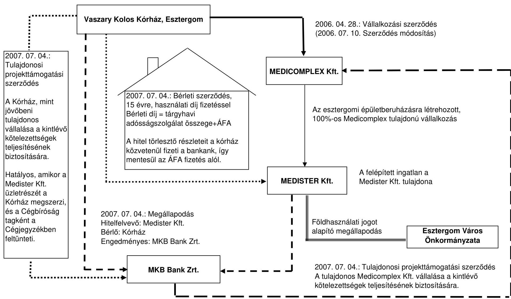