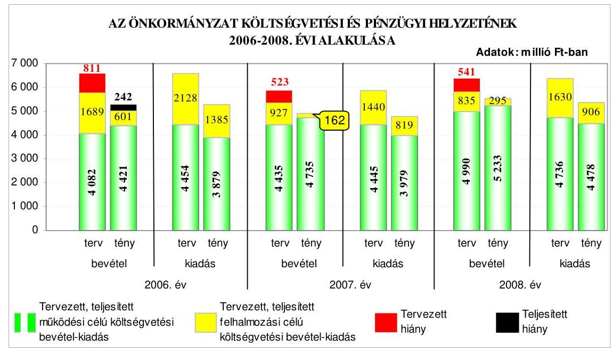
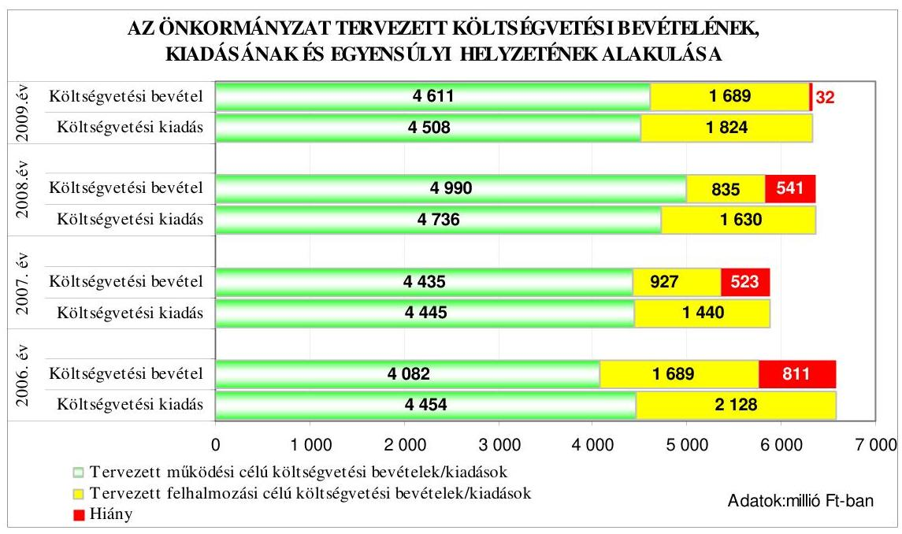
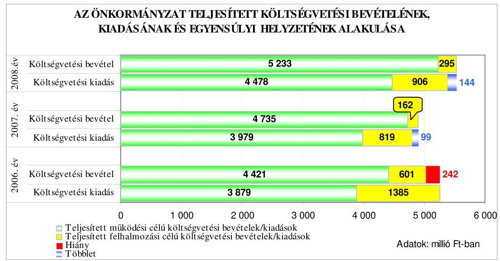
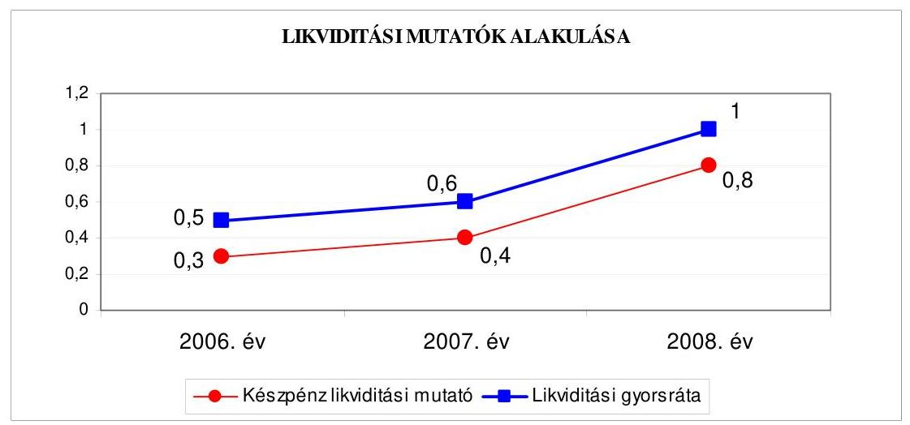
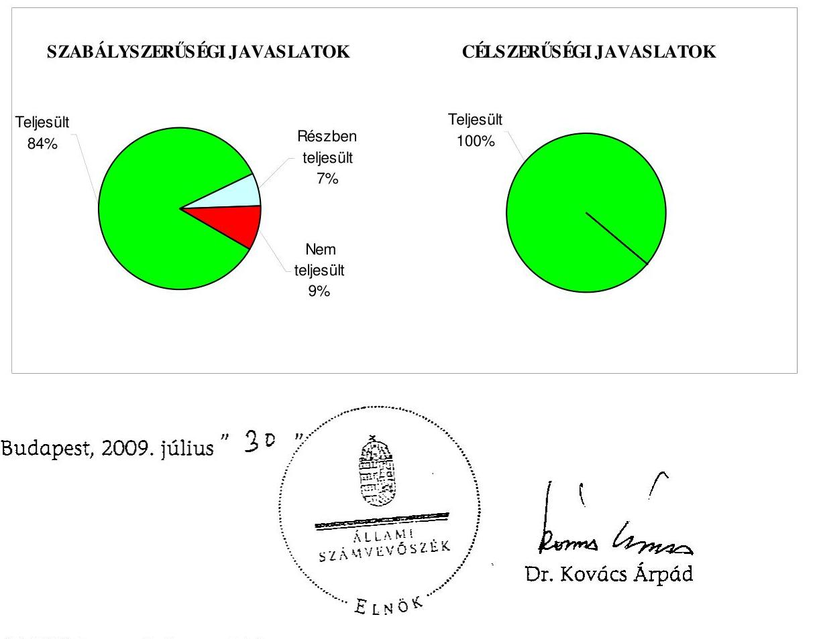
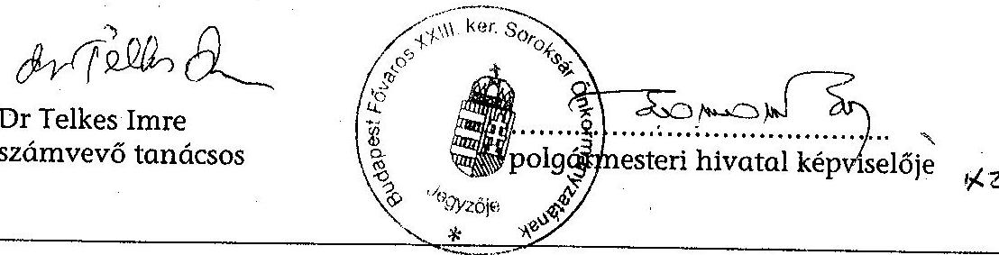
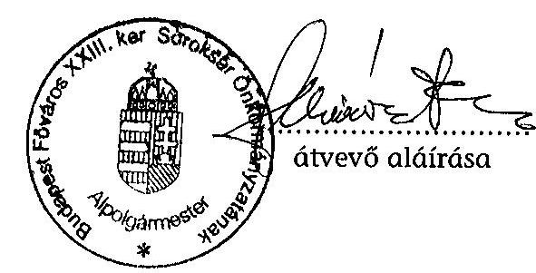
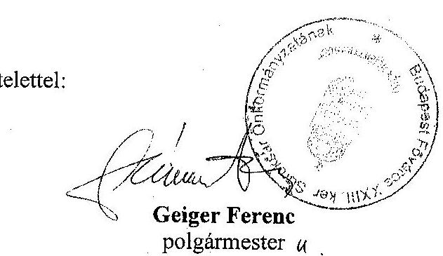
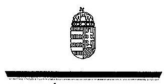
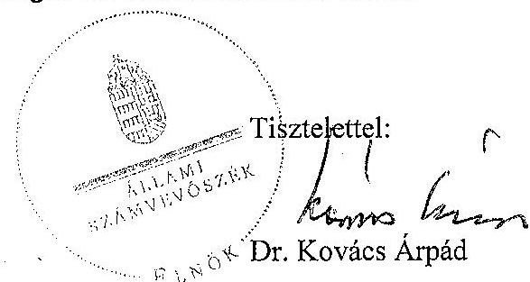

# JELENTÉS 

a Budapest Főváros XXIII. kerület Soroksár Önkormányzata gazdálkodási rendszerének 2009. évi ellenőrzéséről

---

# 3. Önkormányzati és Területi Ellenőrzési Igazgatóság 

## Átfogó Ellenőrzési Főcsoport

Iktatószám: V-3001-4/21/21/2009.
Témaszám: 933
Vizsgálat-azonosító szám: V0449

## Az ellenőrzést felügyelte:

Dr. Lóránt Zoltán
főigazgató
Az ellenőrzés végrehajtásáért felelős:
Dr. Sepsey Tamás
főigazgató-helyettes
Az ellenőrzést vezette:
Molnár Gyula Mihály igazgatóhelyettes

## Az ellenőrzést végezték:

| Vojcsekné | Kozma Gábor | Dr. Telkes Imre |
| :-- | :-- | :-- |
| Szabó Ágnes | számvevő tanácsos | számvevő tanácsos |
| számvevő tanácsos |  |  |

## A témához kapcsolódó eddig készített számvevőszéki jelentések:

## címe

Jelentés a Budapest Főváros XXIII. kerület Soroksár Önkormányzata gazdálkodási rendszerének 2006. évi átfogó ellenőrzéséről
Jelentés a Magyar Köztársaság 2006. évi költségvetése végrehajtásának ellenőrzéséről
Függelék:

- a helyi önkormányzatok beruházásaihoz és rekonstrukcióihoz nyújtott 2006. évi felhalmozási célú támogatások ellenőrzése
Jelentés a helyi és a helyi kisebbségi önkormányzatok gazdálkodási rendszerének 2006. évi átfogó és egyéb szabályszerűségi ellenőrzéséről
Jelentés a fővárosi önkormányzatot és a kerületi önkormányzatokat osztottan megillető bevételek 2007. évi megosztásáról szóló önkormányzati rendelet felülvizsgálatáról

## sorszáma

0661
0724

Jelentéseink az Országgyűlés számítógépes hálózatán és az Interneten a www.asz.hu címen is olvashatóak.

---

# TARTALOMJEGYZÉK 

BEVEZETÉS ..... 9
I. ÖSSZEGZŐ MEGÁLLAPÍTÁSOK, KÖVETKEZTETÉSEK, JAVASLATOK ..... 14
II. RÉSZLETES MEGÁLLAPÍTÁSOK ..... 22

1. Az Önkormányzat költségvetési és pénzügyi helyzete ..... 22
1.1. A tervezett költségvetési bevételek és kiadások alapján a
költségvetési egyensúly, a költségvetési hiány oka,
finanszírozásának tervezett módja és a költségvetési hiány
megállapításának szabályszerűsége ..... 22
1.2. A teljesített költségvetési bevételek és kiadások alapján a pénzügyi
egyensúly, a pénzügyi hiány oka, finanszírozásának módja és
hatása a pénzügyi helyzet alakulására az eladósodás, valamint a
fizetőképesség szempontjából ..... 24
2. Az Önkormányzat felkészültsége az európai uniós források igénylésére és
felhasználására, valamint az elektronikus közszolgáltatási feladatok
ellátására ..... 30
2.1. Az európai uniós források igénybevételére és a várható támogatás
felhasználására történt felkészülés szabályozottságának,
szervezettségének eredményessége ..... 30
2.1.1. Az európai uniós forrásokra történő pályázatok benyújtására
vonatkozó döntések összhangja a fejlesztési célkitűzésekkel ..... 30
2.1.2. Az európai uniós forrásokhoz kapcsolódóan a
pályázatfigyelés, a pályázatkészítés, valamint az európai
uniós támogatással megvalósuló fejlesztés lebonyolítása
belső rendjének szabályozottsága, a végrehajtás személyi,
szervezeti feltételei, az ellenőrzési feladatok meghatározása ..... 32
2.1.3. A fejlesztési feladat lebonyolításánál a feladatellátás
rendjére, az ellenőrzési feladatok teljesítésére, valamint a
felelősségi szabályokra vonatkozó előírások betartása ..... 33
2.2. Az elektronikus közszolgáltatás feltételeinek kialakítása, a
közérdekű gazdálkodási adatok elektronikus közzététele ..... 34
3. A költségvetési gazdálkodás belső kontrolljai ..... 36
3.1. A szabályozottság kockázata a költségvetés tervezési, gazdálkodási,
beszámolási és a folyamatba épített, előzetes és utólagos vezetői
ellenőrzési feladatoknál ..... 36
3.2. A belső kontrollok működése az önkormányzati források
szabályszerű felhasználásában, a költségvetési tervezés,
gazdálkodás, beszámolás folyamataiban ..... 38

---

3.3. A belső ellenőrzési kötelezettség teljesítése, javaslatainak hasznosulása ..... 41
4. Az ÁSZ korábbi ellenőrzési javaslatai alapján készített intézkedési terv végrehajtása, eredményessége ..... 45
4.1. Az Önkormányzat gazdálkodási rendszerének átfogó ellenőrzése során tett javaslatok végrehajtására tervezett intézkedések megvalósulása ..... 45
4.2. A zárszámadáshoz kapcsolódó (állami hozzájárulások, támogatások igénylésének és felhasználásának ellenőrzése), valamint a további vizsgálatok esetében a megállapítások, javaslatok alapján tett intézkedések ..... 49
MELLÉKLETEK

1. számú Az Önkormányzat gazdálkodását meghatározó adatok, mutatószámok (1 oldal)
2. számú Az önkormányzati vagyon alakulása (1 oldal)

2/a. számú Az önkormányzati kötelezettségek alakulása (1 oldal)
3. számú Az Önkormányzat 2006-2009. évi költségvetési előirányzatainak és 2006-2008. évi pénzügyi teljesítéseinek alakulása (1 oldal)
4. számú Tanúsítvány az európai uniós forrásokkal támogatott célok és programok 2006-2009. évi tervezett és teljesített adatairól (1 oldal)
5. számú Adatlap az európai uniós forrással támogatott „Komplex szervezetfejlesztés Soroksár Polgármesteri Hivatalában" című fejlesztésről (3 oldal)
6. számú Az ellenőrzés során átadott munkatáblák, munkalapok és megfelelőségi tesztek jegyzéke (4 oldal)
7. számú Geiger Ferenc úr, a Budapest Főváros XXIII. kerület Soroksár Önkormányzat polgármestere által adott tájékoztatás (1 oldal)
8. számú Geiger Ferenc úr, a Budapest Főváros XXIII. kerület Soroksár Önkormányzat polgármestere tájékoztatására adott válasz (1 oldal)

---

# RÖVIDÍTÉSEK JEGYZÉKE 

## Törvények

Áht.
Eisztv.
Fot.
Ltv.

Ötv.

## Rendeletek

Ámr.
Ber.
18/2005. (XII. 27.) IHM rendelet
vagyongazdálkodási rendelet $_{1}$
vagyongazdálkodási rendelet $_{2}$

Vhr.
2006. évi költségvetési rendelet
2007. évi költségvetési rendelet
2007. évi zárszámadási rendelet
2008. évi költségvetési rendelet
2009. évi költségvetési rendelet
az államháztartásról szóló 1992. évi XXXVIII. törvény
az elektronikus információszabadságról szóló 2005. évi XC. törvény
a fogyatékos személyek jogairól és esélyegyenlőségük biztosításáról szóló 1998. évi XXVI. törvény
a lakások és helyiségek bérletére, valamint elidegenítésükre vonatkozó egyes szabályokról szóló 1993. évi LXXVII. törvény
a helyi önkormányzatokról szóló 1990. évi LXV. törvény
az államháztartás működési rendjéről szóló 217/1998. (XII. 30.) Korm. rendelet
a költségvetési szervek belső ellenőrzéséről szóló 193/2003. (XI. 26.) Korm. rendelet
a 18/2005. (XII. 27.) IHM rendelet a közzétételi listákon szereplő adatok közzétételéhez szükséges közzétételi mintákról
Budapest Főváros XXIII. kerület Soroksár Önkormányzatának 2/1997. (I. 31.) számú rendelete az Önkormányzat vagyonáról, a vagyontárgyak feletti jog gyakorlásáról
Budapest Főváros XXIII. kerület Soroksár Önkormányzatának 32/2004. (IV. 23.) számú rendelete az Önkormányzat vagyonáról, a vagyontárgyak feletti jog gyakorlásáról
az államháztartás szervezetei beszámolási és könyvvezetési kötelezettségének sajátosságairól szóló 249/2000. (XII. 24.) Korm. rendelet
Budapest Főváros XXIII. kerület Soroksár Önkormányzatának 8/2006. (III. 19.) számú rendelete a 2006. évi költségvetésről
Budapest Főváros XXIII. kerület Soroksár Önkormányzatának 19/2007. (III. 9.) számú rendelete a 2007. évi költségvetésről
Budapest Főváros XXIII. kerület Soroksár Önkormányzatának 22/2008. (IV. 25.) számú rendelete a 2007. évi zárszámadásról
Budapest Főváros XXIII. kerület Soroksár Önkormányzatának 11/2008. (III. 10.) számú rendelete a 2008. évi költségvetésről
Budapest Főváros XXIII. kerület Soroksár Önkormányzatának 21/2009. (III. 9.) számú rendelete a 2009. évi költségvetésről

---

| Szórövidítések |  |
| :--: | :--: |
| ÁROP | Államreform Operatív Program |
| ÁSZ | Állami Számvevőszék |
| Belső Ellenőri Szervezeti Egység | Budapest Főváros XXIII. kerület Soroksár Önkormányzata Polgármesteri Hivatalának Belső Ellenőri Szervezeti Egysége |
| EKOP | ÚMFT Elektronikus Közigazgatási Operatív Program |
| e-közigazgatás | elektronikus közigazgatás |
| értékelési szabályzat | Budapest Főváros XXIII. kerület Soroksár Önkormányzata Polgármesteri hivatalának Eszközök és Források Értékelési Szabályzata |
| ESZI | Budapest Főváros XXIII. kerület Soroksár Önkormányzatának Egészségügyi és Szociális Intézménye |
| FEUVE | folyamatba épített előzetes és utólagos vezetői ellenőrzés |
| gazdasági program | Budapest Főváros XXIII. kerület Soroksár Önkormányzatának Képviselő-testülete által a 2007-2010. évekre szóló 246/2007. (IV. 10.) számú határozatában jóváhagyott gazdasági programja |
| gazdasági szervezet ügyrendje | Budapest Főváros XXIII. kerület Soroksár Önkormányzatának Polgármesteri hivatala Pénzügyi-gazdasági Osztályának Ügyrendje |
| GVOP | NFT Gazdasági Versenyképesség Operatív Program |
| hivatali SzMSz | Budapest Főváros XXIII. kerület Soroksár Önkormányzata Polgármesteri hivatalának Szervezeti és Működési Szabályzata |
| INTERREG IVC | Interreg Közösségi Kezdeményezés Támogatási Programja |
| jegyző | Budapest Főváros XXIII. kerület Soroksár Önkormányzatának Jegyzője |
| Képviselő-testület | Budapest Főváros XXIII. kerület Soroksár Önkormányzatának Képviselő-testülete |
| KMOP | Közép-magyarországi Operatív Program |
| Kulturális Szolgáltató Kht. | Galéria'13 Kulturális Szolgáltató Közhasznú Társaság |
| Kulturális Szolgáltató Kft. | Galéria'13 Kulturális Szolgáltató Nonprofit Korlátolt Felelősségű Társaság |
| Leltározási és selejtezési szabályzat | Budapest Főváros XXIII. kerület Soroksár Önkormányzata Polgármesteri hivatalának Leltározási és Selejtezési Szabályzata |
| NFT | Nemzeti Fejlesztési Terv |

---

| SEPSZI | Soroksári Egységes Pedagógiai Szakszolgálat és Pedagógiai Szolgáltató Intézmény |
| :--: | :--: |
| Szociális Foglalkoztató Kht. | Soroksári Szociális Foglalkoztató Közhasznú Társaság |
| Szociális Foglalkoztató Kft. | Soroksári Szociális Foglalkoztató Nonprofit Korlátolt Felelősségű Társaság |
| Szociális Gondozó Szolgálat | Budapest Főváros XXIII. Kerület Soroksár Önkormányzatának Egészségügyi és Szociális Intézménye Szociális Gondozó Szolgálata |
| Pénzügyi-gazdasági Osztály | Budapest Főváros XXIII. kerület Soroksár Önkormányzata Polgármesteri hivatalának Pénzügyi-gazdasági Osztálya |
| polgármester | Budapest Főváros XXIII. kerület Soroksár Önkormányzatának Polgármestere |
| Polgármesteri csoport | Budapest Főváros XXIII. kerület Soroksár Önkormányzata Polgármesteri Hivatala Jegyzői Titkárságának Polgármesteri Csoportja |
| Polgármesteri hivatal | Budapest Főváros XXIII. kerület Soroksár Önkormányzatának Polgármesteri hivatala |
| TÁMOP | Társadalmi Megújulás Operatív Program |
| Társulás | Kisdunáért Önkormányzati Társulás |
| ÚMFT | Új Magyarország Fejlesztési Terv |

---

# ÉRTELMEZŐ SZÓTÁR 

1. elektronikus szolgáltatási szint
2. elektronikus szolgáltatási szint
3. elektronikus szolgáltatási szint
4. elektronikus szolgáltatási szint
európai uniós források
fejlesztési feladat (projekt)
fejlesztési célkitűzés
hazai társfinanszírozás
kedvezményezett

Az 1044/2005. (V. 11.) Korm. határozat alapján olyan információs, tájékoztató szolgáltatás, amely csak általános információkat közöl az adott üggyel kapcsolatos teendőkről és a szükséges dokumentumokról.
Az 1044/2005. (V. 11.) Korm. határozat alapján olyan egyirányú kapcsolatot biztosító szolgáltatás, amely az 1. szinten túl biztosítja az adott ügy intézéséhez szükséges dokumentumok, nyomtatványok letöltését, és azok ellenőrzéssel, vagy ellenőrzés nélküli elektronikus kitöltését, amely esetben a dokumentumok benyújtása hagyományos úton történik.
Az 1044/2005. (V. 11.) Korm. határozat alapján olyan kétirányú kapcsolatot biztosító szolgáltatás, amely közvetlen, vagy ellenőrzött kitöltésű dokumentum segítségével biztosítja az elektronikus adatbevitelt és a bevitt adatok ellenőrzését. Az ügy indításához, intézéséhez személyes megjelenés nem szükséges, de az ügyhöz kapcsolódó közigazgatási döntés (határozat, egyéb aktus) közlése, valamint a kapcsolódó illeték-, vagy díjfizetés hagyományos úton történik.
Az 1044/2005. (V. 11.) Korm. határozat alapján olyan teljes közvetlen kétirányú ügyintézési folyamatot biztosító szolgáltatás, amikor az ügyhöz kapcsolódó közigazgatási döntés is elektronikus úton kerül közlésre, illetve a kapcsolódó illeték-, vagy díjfizetés elektronikus úton is intézhető.
A támogatott projekt megvalósítása érdekében, a fejlesztés lebonyolítása során felmerült kiadások finanszírozási forrása.
A fejlesztési feladat (projekt) tartalmilag és formailag részletesen kidolgozott, megfelelő pénzügyi háttérrel és végrehajtási ütemezéssel rendelkező fejlesztési terv, amely illeszkedik az Európai Unió, illetve a Nemzeti Fejlesztési Terv és az Új Magyarország Fejlesztési Terv által támogatott programokhoz.
Az önkormányzat által ellátott kötelező, vagy önként vállalt feladatok biztosításának mennyiségi, vagy minőségi fejlesztésére vonatkozó terv. A mennyiségi fejlesztés megvalósulhat beszerzéssel, létesítéssel, bővítéssel, átalakítással.
A központi költségvetési és az elkülönített állami pénzalapokból származó finanszírozás.
Az a helyi önkormányzat, amely a támogatási szerződést kedvezményezettként aláírja, a projektet, illetve a központi programhoz kapcsolódó támogatott önkormányzati programot végrehajtja.

---

közreműködő szervezet
lebonyolítás
operatív program

Nemzeti Fejlesztési Terv

Új Magyarország Fejlesztési Terv

A közreműködő szervezet az európai uniós támogatást elnyert kedvezményezettekkel kapcsolatot tartó szerv. Az operatív programok közreműködő szervezetei befogadják, nyilvántartják, döntésre előkészítik a pályázatokat, rögzítik a támogatással kapcsolatos adatokat az Egységes Monitoring Informatikai Rendszerben, elvégzik a támogatások előzetes (szerződéskötést megelőző), közbenső (a pénzügyi elszámolás, finanszírozás folyamatában végzett) és utólagos (a támogatott projekt pénzügyi lezárását megelőző) ellenőrzését. Az önkormányzatoknál a leggyakrabban előforduló operatív program a Regionális Fejlesztési Operatív Program végrehajtásában közreműködő szervezetek a VÁTI Kht. és a regionális fejlesztési ügynökségek.
Az európai uniós források felhasználásával megvalósuló fejlesztésre irányuló műszaki, gazdasági (pénzügyi) tevékenységet magában foglaló szervezési, irányítási szolgáltatás. A szervezési szolgáltatás kiterjedhet a pályázatkészítésre, a közbeszerzési eljárás lebonyolításán keresztül a folyamatos műszaki ellenőrzésre, a pénzügyi elszámolásra, a műszaki átadás-átvételre, az üzembe helyezésre, illetve a fejlesztési folyamat egyes elemeire.
Az Európai Bizottság által jóváhagyott, a Közösségi Támogatási Keret végrehajtására vonatkozó, több évre szóló intézkedésekhez kapcsolódó prioritások egységes rendszerét tartalmazó dokumentum.
Helyzetelemzést, stratégiát a tervezett fejlesztési területek prioritásait, azok céljait és pénzügyi forrásaik megjelölését tartalmazó dokumentum, amelyet a Magyar Köztársaság készített az Európai Unió programozási irányelveinek, célkitűzéseinek megfelelően a fejlődésben
 lemaradó régiók fejlődésének és strukturális átalakulásának elősegítésére a kiemelt szükségletekre figyelemmel. A Nemzeti Fejlesztési Terv stratégiai fejezetének célja, hogy a 2004–2006 közötti időszakra kijelölje a strukturális alapokból támogatható fejlesztéspolitikai célkitűzéseit és prioritásait. A strukturális alapok operatív programjai: Agrár és Vidékfejlesztési Operatív Program (AVOP); Gazdasági Versenyképesség Operatív Program (GVOP); Humánerőforrás-fejlesztési Operatív Program (HEFOP); Környezetvédelmi és Infrastruktúra-fejlesztési Operatív Program (KIOP); Regionális Fejlesztési Operatív Program (ROP).
Az Új Magyarország Fejlesztési Terv célja a foglalkoztatás bővítése és a tartós növekedés feltételeinek megteremtése. Ennek érdekében 2007–2013 között hat kiemelt területen indított el összehangolt állami és európai uniós fejlesztéseket: a gazdaságban, a közlekedésben, a társadalom megújulása érdekében, a környezet és az energetika területén, a területfejlesztésben és az államreform feladataival összefüggésben. Az Új Magyarország Fejlesztési Terv operatív programjai: Államreform Operatív Program (ÁROP); Elektronikus Közigazgatás Operatív Program (EKOP); Gazdaságfejlesztés Operatív Program (GOP); Környezet és Energia Operatív Program (KEOP); Közlekedés Operatív Program (KÖZOP); Dél-Alföldi Operatív Program (DAOP); Dél-Dunántúli Operatív Program (DDOP); Észak-Alföldi Operatív Program (ÉAOP); Észak-Magyarországi Operatív Program (ÉMOP); Közép-Dunántúli Operatív Program (KDOP); Közép-Magyarországi Operatív Program (KMOP); Nyugat-Dunántúli Operatív Program (NYDOP); Társadalmi Infrastruktúra Operatív Program (TIOP); Társadalmi Megújulás Operatív Program (TÁMOP).
támogatási szerződés
A strukturális alapok esetében az irányító hatóságnak, illetve a Kohéziós Alap esetében a közreműködő szervezeteknek a kedvezményezett önkormányzattal kötött szerződése, amely a támogatás felhasználásának részletes feltételeit tartalmazza. Az Új Magyarország Fejlesztési Terv keretében támogatott projektek esetében a támogatási szerződést a kedvezményezett és a Nemzeti Fejlesztési Ügynökség nevében eljáró közreműködő szervezet között jön létre. Nagyprojekt esetén a támogatási szerződést az Nemzeti Fejlesztési Ügynökség ellenjegyzi. A támogatási szerződés képezi a megvalósítás nyomon követésének, finanszírozásának és ellenőrzésének alapját.

---

# JELENTÉS 

## Budapest Főváros XXIII. kerület Soroksár Önkormányzata gazdálkodási rendszerének 2009. évi ellenőrzéséről

## BEVEZETÉS

Az Ötv. 92. § (1) bekezdése, az Állami Számvevőszékről szóló 1989. évi XXXVIII. törvény 2. § (3) bekezdése, valamint az Áht. 120/A. § (1) bekezdése alapján az önkormányzatok gazdálkodását az Állami Számvevőszék ellenőrzi. Az ellenőrzésre az Országgyűlés illetékes bizottságai részére is átadott, országosan egységes ellenőrzési program szerint került sor.

Az Állami Számvevőszék a stratégiájában foglalt célkitűzéseknek megfelelően a helyi önkormányzatok költségvetési gazdálkodási rendszere átfogó ellenőrzésének programját a 2007. évtől megújította, azt kiegészítette további – teljesítmény-ellenőrzési – elemekkel.

## Az ellenőrzés célja annak értékelése volt, hogy az Önkormányzat:

- milyen módon biztosította a költségvetési és a pénzügyi egyensúlyt a költségvetésében és annak teljesítése során, valamint változott-e a hiányzó bevételi források pótlásában a finanszírozási célú pénzügyi műveletek jelentősége, hatása;
- eredményesen készült-e fel a szabályozottság és a szervezettség terén az európai uniós források igénylésére és felhasználására, továbbá biztosította-e az elektronikus közszolgáltatás feltételeit, a gazdálkodási adatok közzétételével a gazdálkodás nyilvánosságát;
- kialakította-e és működtette-e a külső és a belső feltételeknek megfelelően a költségvetés tervezési, gazdálkodási és zárszámadási feladatai belső kontrollrendszerét ${ }^{1}$, ezen tevékenységek szabályszerű ellátásához hozzájárult-e a folyamatba épített, előzetes és utólagos vezetői ellenőrzés, valamint a belső ellenőrzés;

[^0]
[^0]:    ${ }^{1}$ A gazdálkodás szabályszerűségét biztosító kontrollrendszer alatt értjük a kiépített és működő pénzügyi irányítási és szabályozási rendszert, valamint a belső ellenőrzési funkciók ellátásának rendszerét.

---

- megfelelően hasznosították-e a korábbi számvevőszéki ellenőrzések megállapításait, szabályszerűségi ${ }^{2}$ és célszerűségi javaslatait.

Az ellenőrzés típusa: átfogó ellenőrzés, amely – egy ellenőrzés keretében meghatározott területekre összpontosítva – alkalmazza a szabályszerűségi, valamint a teljesítmény-ellenőrzés jellemzőit.

Az ellenőrzött időszak: az 1., 2. és 4. programpontok tekintetében a 2006–2008. évek, a 3. ellenőrzési programpontnál a 2008. év.

Budapest Főváros XXIII. kerület Soroksár lakosainak száma 2009. január 1-jén 21987 fő volt. A 2006. évi önkormányzati választást követően az Önkormányzat 18 tagú Képviselő-testületének munkáját hét állandó bizottság segítette. A helyi önkormányzat mellett a 2006. évi önkormányzati választásokat követően három kisebbségi önkormányzat ${ }^{3}$ működött. A polgármester az 1994. évi önkormányzati képviselő és polgármester választás óta tölti be tisztségét, a jegyző személye 1995. február 1-jétől változatlan.

Az Önkormányzat feladatainak végrehajtása érdekében a 2008. évben 12 költségvetési intézményt működtetett, amelyekből kettő önállóan gazdálkodott. A feladatok ellátásában részt vett kettő közhasznú társasága ${ }^{4}$, öt közalapítványa, és egy Társulás. Az Önkormányzat a 2008. évi költségvetési beszámolója szerint 5528 millió Ft költségvetési bevételt ért el és 5384 millió Ft költségvetési kiadást teljesített. A könyvviteli mérleg szerint 2008. december 31-én 20685 millió Ft értékű vagyonnal rendelkezett. Az Önkormányzat vagyona a 2006. év végi állományhoz viszonyítva a 2008. évre 3,6%-kal, 724 millió Ft-tal emelkedett, ezen belül a forgóeszközök állománya 223,3%-kal nőtt, mivel a pénzeszközállomány több mint ötszörösére emelkedett – a kötvénykibocsátásból származó – átmenetileg szabad pénzeszközök betétként történt lekötése miatt. A kötelezettségek állománya a 2006. évhez viszonyítva a 2008. évre 1313 millió Ft-tal (50,8%-kal) nőtt a 2007. és 2008. évi 1400 millió Ft kötvénykibocsátás miatt, valamint a ki nem egyenlített folyószámla hitelállomány hatására. A saját tőke a 2006. évhez viszonyítva a 2008. év végére 7,5%-kal, 15932 millió Ft-ra csökkent, a tartalék közel ötszörösére, 857 millió Ft-ra nőtt. Az összes költségvetési bevétel 61,6%-át a saját bevétel, illetve 39,8%-át a helyi adó bevétele biztosította a 2008. évben. Az összes költségvetési kiadásból a felhalmozási célú kiadás részaránya a 2008. évben 16,8% volt. A 2009. évi költségvetési rendeletben 6300 millió Ft költségvetési bevételt és 6332 millió Ft költségvetési kiadást irányoztak elő. A Polgármesteri hivatalban dolgozó köztisztviselők száma 2008. december 31-én 152 fő, a költségvetési intézményekben foglalkoztatott közalkalmazottak száma 496 fő volt. Az Önkormányzat gazdálkodását meghatározó adatokat, mutatószámokat az 1–3. számú mellékletek tartalmazzák.

[^0]
[^0]:    ${ }^{2}$ A törvényi előírások betartásának elmulasztásakor a részletes megállapítások fejezetben egységesen a törvénysértés megjelölést alkalmazzuk, mivel az ÁSZ nem tehet különbséget a törvényi előírások között.
    ${ }^{3}$ Kisebbségi önkormányzatok: bolgár, cigány, német.
    ${ }^{4}$ A Szociális Foglalkoztató Kht. 2008. április 1-jével, a Kulturális Szolgáltató Kht. pedig 2008. szeptember 10-ével alakult át nonprofit Kft-vé.

---

Az Önkormányzat költségvetési és pénzügyi helyzetét az elemző eljárás módszerével vizsgáltuk. E körben elemeztük a költségvetés egyensúlyi helyzetének alakulását, a tervezett és tényleges költségvetési hiány okait, a mérséklésére tett intézkedéseket, finanszírozásának módját, az Önkormányzat adósságállományának alakulását, összetevőit. Az európai uniós támogatás igénylésére, felhasználására történt felkészülésre vonatkozóan teljesítmény-ellenőrzést végeztünk. Az európai uniós források figyelésére, igénylésére és felhasználására a felkészülést akkor minősítettük eredményesnek, ha a meghatározott szempontok szerinti feltételeknek megfelelt a felkészülés szabályozottsága, szervezettsége, továbbá értékeltük, hogy az igényelt európai uniós támogatások az Önkormányzat által meghatározott fejlesztési célkitűzésekhez kapcsolódtak-e. Az ellenőrzés során felmértük, hogy az e-közszolgáltatási feladat ellátása, illetve bevezetése, működtetése érdekében milyen intézkedéseket tettek, valamint biztosították-e a közérdekű adatok közzétételét. A költségvetési gazdálkodás belső kontrolljainak ellenőrzése során értékeltük, hogy a Polgármesteri hivatalnál a költségvetés tervezési, gazdálkodási, zárszámadás készítési feladatok belső kontrolljainak kiépítettsége és működése megfelelő biztosítékot ad-e a gazdálkodási feladatok megfelelő, szabályszerű ellátására. Felmértük és minősítettük a költségvetés tervezési, a gazdálkodási, a zárszámadás készítési feladatokkal, továbbá a pénzügyi-számviteli területen az informatikával kapcsolatosan kialakított kontrollok megfelelőségét, valamint a kialakított belső kontrollok működésének megbízhatóságát. Értékeltük a belső ellenőrzés szabályozottságát, működési feltételeinek kialakítását, továbbá működésének megbízhatóságát.

A Polgármesteri hivatalnál értékeltük a gazdálkodás folyamatában kulcsszerepet betöltő belső kontrollok működésének megbízhatóságát, ennek keretében ellenőriztük a szakmai teljesítés igazolására és az utalvány ellenjegyzésére kialakított kontrollok végrehajtását. Az ellenőrzést a következő, kiemelt kockázatuk alapján kiválasztott ${ }^{5}$ kifizetésekre folytattuk le ${ }^{6}$:

- a külső szolgáltató által végzett karbantartási, kisjavítási szolgáltatásokra;
- a gépek, berendezések, felszerelések beszerzésére, továbbá;
- az államháztartáson kívülre teljesített működési és a felhalmozási célú pénzeszköz átadásokra.

[^0]
[^0]:    ${ }^{5}$ Az önkormányzatok kiemelt előirányzataira vonatkozóan, a vertikális folyamatokra elvégeztük a kockázatok becslését, amelynek eredményeként határoztuk meg a magas kockázatú területeket.
    ${ }^{6}$ A korábbi ellenőrzési tapasztalataink szerint ezeken a területeken a jegyzők nem, vagy hiányosan szabályozták a megbízás, megrendelés, illetve beszerzés indokoltságának, szükségességének elbírálására, igazolására, valamint a teljesítések dokumentálására, a kiadások jogosultságának, összegszerűségének ellenőrzésére irányuló kontrollokat. További kockázatot jelentett, ha a külső szolgáltató által végzett karbantartási, kisjavítási munkák 50 ezer Ft alatti megrendelésekre vonatkozóan a jegyzők nem alakították ki a kötelezettségvállalások rendjét és nyilvántartási formáját, valamint a szabályozás elmulasztása esetén nem történt meg az írásbeli kötelezettségvállalás és annak az ellenjegyzése sem.

---

Az ellenőrzés hatékony elvégzése céljából a vizsgálandó területek kiválasztása során a kockázatokon alapuló megközelítés érvényesült, ezáltal az ellenőrzési erőforrásokat azokra a területekre fókuszáltuk, amelyeken legnagyobb a hibák előfordulási valószínűsége. Az ellenőrzési erőforrások ilyen típusú összpontosításával minimálisra csökkenthető a kívánt ellenőrzési bizonyosság eléréséhez szükséges időráfordítás.

A pénzügyi-számviteli folyamatokban alkalmazott belső kontrollok létezésének és működésének ellenőrzésére a vizsgált három terület 2008. évi könyvviteli tételeiből területenként egyszerű véletlen mintát vettünk. A kijelölt gazdasági eseményre elvégzett megfelelőségi tesztek alapján értékeltük a kontrollok működésének megbízhatóságát a vizsgált három területre külön-külön, majd összefoglalón ${ }^{7}$. A helyszíni ellenőrzés megállapításainak részletes dokumentálását megfelelőségi tesztlapokon, elővizsgálati és helyszíni ellenőrzési munkalapokon biztosítottuk. Ezeken a teszt- és munkalapokon a minősítés alapjául szolgáló kérdések és a vonatkozó konkrét jogszabályhelyek megjelölése mellett értékeltük a kialakított belső kontrollokban rejlő kockázatokat ${ }^{8}$ és a kialakított kontrollok működésének megbízhatóságát ${ }^{9}$.

Az ÁSZ korábbi ellenőrzési javaslatai alapján tett intézkedéseket, illetve azok megvalósítását utóellenőrzés keretében vizsgáltuk. A gazdálkodási rendszer átfogó ellenőrzése során megfogalmazott javaslatok végrehajtására tett intézkedések megvalósítását ellenőriztük, az egyéb számvevőszéki ellenőrzések során tett javaslatok esetében pedig a kiadott intézkedéseket tekintettük át.

A helyszíni ellenőrzés során kitöltött – az ellenőrzést végző számvevő és a Polgármesteri hivatal felelős köztisztviselője által aláírt – elővizsgálati és helyszíni ellenőrzési munkalapokat, azok kitöltési útmutatóit, továbbá a megfelelőségi tesztek dokumentumait a polgármester részére a számvevői jelentéssel egyidejűleg átadtuk.

[^0]
[^0]:    ${ }^{7}$ A vizsgált három terület egyedi értékelési pontszámait a területek költségvetési súlyával arányosan összegeztük.
    ${ }^{8}$ A kialakított belső kontrollokban rejlő kockázatot alacsonynak minősítettük, ha a kontrollok – végrehajtásuk esetén – megfelelő védelmet nyújtanak a hibák bekövetkezése ellen. Közepesnek minősítettük a belső kontrollokban rejlő kockázatot, amennyiben a kontrollok – végrehajtásuk esetén – a lehetséges hibák többsége ellen védelmet nyújtanak. Magasnak értékeltük a kockázatot, ha a kontrollok – kialakításuk hiányában, vagy hiányos kialakításuk miatt – nem nyújtanak elegendő védelmet a lehetséges hibákkal szemben.
    ${ }^{9}$ A kontrollok működésének megbízhatóságát kiválónak értékeltük abban az esetben, ha azok működése – esetleges apróbb hiányosságoktól eltekintve – megfelelt a hibák megelőzésére és kijavítására meghatározott szabályozásnak és a legmagasabb szintű

 elvárásoknak. Jónak minősítettük a kontrollok működését, ha a hiányosságok száma ugyan jelentős volt, de nem veszélyeztette az ellenőrzött terület hibáinak megelőzését és kijavítását. Amennyiben a kontrollok - kialakításuk hiánya, illetve hiányosságai miatt - nem biztosították a hibák megelőzését, feltárását, kijavítását és ez veszélyeztette az eredményes, megbízható működést, a kontroll működésének megbízhatósága gyenge minősítést kapott.

---

A jelentés megállapításainak, javaslatainak egyeztetése során a polgármester arról adott részletes tájékoztatást - egyidejűleg csatolta azokat a dokumentumokat, amelyek igazolták - hogy az időközben megtett intézkedésekkel a számvevői jelentésben tett néhány javaslatot ${ }^{10}$ megvalósították. A megtett intézkedéseket a jelentés II. Részletes megállapítások fejezetében az adott témához kapcsolt lábjegyzetben feltüntettük és a vonatkozó javaslatokat elhagytuk.

A jelentést az ÁSZ-ról szóló 1989. évi XXXVIII. tv. 25. § (1) bekezdése alapján észrevétel közlése céljából megküldtük a Budapest Főváros XXIII. kerület Soroksár Önkormányzata polgármesterének. A kapott tájékoztatást a jelentés 7. számú melléklete, az arra adott választ a 8. számú melléklet tartalmazza.

[^0]
[^0]:    ${ }^{10}$ A számvevői jelentésben a helyszíni ellenőrzés során a jegyzőnek 10 szabályszerűségi és kettő célszerűségi javaslatot tettünk, melyből a megtett intézkedésről szóló tájékoztatás alapján kettő szabályszerűségi és egy célszerűségi javaslatot hagytunk el.

---

# I. ÖSSZEGZŐ MEGÁLLAPÍTÁSOK, KÖVETKEZTETÉSEK, JAVASLATOK 

A 2006-2009. évi eredeti előirányzatok alapján a tervezett költségvetési bevételek nem biztosítottak fedezetet a tervezett költségvetési kiadásokra, a költségvetés egyensúlya a tervezés során nem volt biztosított. A költségvetési hiány mértéke a költségvetési kiadásokhoz viszonyítva folyamatosan csökkent. A 2009. évben a költségvetési hiány mértéke nem érte el a költségvetési kiadások egy százalékát. Az Önkormányzat a költségvetési egyensúly biztosításához a 2006-2009. évi költségvetési rendeletekben felhalmozási célú, hosszú lejáratú hitelfelvételeket, illetve kötvénykibocsátást tervezett. A költségvetés végrehajtásához szükséges likviditás folyamatos biztosításáról az Önkormányzat a költségvetési rendelettervezet végrehajtási szabályai között az éven belüli hitelfelvétel hatásköri szabályainak meghatározásával, valamint a jegyző likviditási terv készítésével gondoskodott. Az Önkormányzat az Áht. előírásai ellenére a 2008-2009. évi költségvetési rendeletekben a finanszírozási műveleteket a költségvetési bevételekkel és kiadásokkal összevontan mutatta ki, illetve nem mutatta be a költségvetés hiányát.

A 2006-2008. évek közötti időszakban a teljesített működési célú költségvetési bevételek fedezték a teljesített működési célú költségvetési kiadásokat. A teljesített költségvetési kiadások fedezettsége a 2006-2008. évek közötti időszakban a tervezett fedezettségi mutatóhoz viszonyítva kedvezően változott. A tervezett költségvetési hiányhoz viszonyítva a 2007. és a 2008. évben pénzügyi többlet alakult ki, illetve a 2006. évben a pénzügyi hiány nem érte el a tervezett költségvetési hiány mértékét. A 2006. évben a felhalmozási célú költségvetési bevételeket meghaladó összegben teljesített felhalmozási célú költségvetési kiadásokat a működési célú bevételek és kiadások többlete nem fedezte, ez vezetett a

---

242 millió Ft pénzügyi hiányhoz, amelyet felhalmozási célú hitel felvételével finanszíroztak.

A 2006-2008. évi költségvetések végrehajtása során a pénzügyi fedezet biztosításához, a fizetőképesség fenntartásához az Önkormányzat hosszú lejáratú, fejlesztési célú hiteleket vett igénybe, továbbá fejlesztési céllal kötvényeket bocsátott ki. A hosszú lejáratú hiteleket a felvételi, a kötvénykibocsátásból származó forrásokat a kibocsátási célnak megfelelően felhalmozási feladatokra használták fel, valamint a 2007. júliusi kötvénykibocsátásból származó 400 millió Ft-ból 263 millió Ft-ot, a 2007. decemberi kötvénykibocsátásból származó 1000 millió Ft-ból 800 millió Ft-ot - azok felhalmozási cél szerinti felhasználásáig - lekötött betétként helyezték el. A Képviselő-testület a kötvénykibocsátásról szóló döntés meghozatalakor a döntéskor ismert pénzpiaci feltételekkel számolt. A forint svájci frankhoz viszonyított árfolyamváltozása, valamint a változó kamatmérték miatt az Önkormányzat számára a kötvénykibocsátás kockázatot jelent. A 2006-2008. években az Önkormányzat által felvett folyószámlahitel összegéből a költségvetési év végére a 2007. és a 2008. évben vissza nem fizetett állomány halmozódott fel. Az Önkormányzat eladósodása a 2006-2008. évek között fokozódott, az Önkormányzat könyvviteli mérlegéből számított eladósodási mutatója folyamatosan romlott. Az Önkormányzat fizetőképessége 2006-2008 között ugyan javult - elsősorban a kötvénykibocsátásokból származó lekötött pénzeszközök kedvező hatása miatt -, azonban a pénzeszközök év végi állománya nem nyújtott fedezetet az év végén fennálló rövid lejáratú fizetési kötelezettségek rendezésére. Az Önkormányzat 2006-2008. évek közötti pénzügyi helyzete - az eladósodásának növekedése miatt - fizetőképességének kedvező változása ellenére a 2006. és a 2008. évek között összességében romlott.

Az Önkormányzat rendelkezett a Képviselő-testület által jóváhagyott gazdasági programmal, valamint ágazati, szakmai fejlesztési koncepciókkal. Az Önkormányzat az európai uniós támogatással megvalósítandó fejlesztésekre a 2006-2009. évek alatt 10 pályázatot nyújtott be. Ebből egy támogatásban részesült, hét elutasításra került és kettőnek az elbírálásáról 2009. március végéig nem döntöttek. Az NFT, valamint az ÜMFT keretében megpályázott projektek összhangban voltak az Önkormányzat fejlesztési célkitűzéseivel.

Az Önkormányzatnál a Polgármesteri csoport kettő köztisztviselőjének munkaköri leírásában, valamint 2008. év áprilisától jegyzői utasításban határozták meg az európai uniós források igénybevételének és felhasználásának feladatait. A jegyzői szabályozás magába foglalta a pályázatfigyelés és pályázatkészítés, továbbá az európai uniós forrásokkal támogatott fejlesztés lebonyolításával kapcsolatos eljárási rendet. A szabályozás szerint a pénzeszközök felhasználásának ellenőrzését az Önkormányzat éves belső ellenőrzési tervében szerepeltetni kell. A 2006-2009. évek költségvetési rendeletei nem tartalmazták az európai uniós forrást igénylő fejlesztési feladatok megnevezését, költségvetési, bevételi és kiadási előirányzatait, mivel a 2009. évi költségvetési rendelettervezet beterjesztéséig a nyertes fejlesztési projekt támogatási szerződését nem írták alá.

A pályázatfigyelés és pályázatkészítés személyi és szervezeti feltételeit a Polgármesteri hivatalon belül alakították ki, kettő esetben számoltak külső szervezet igénybevételével is. A nyertes projekt pénzügyi lebonyolítását a Polgármes-

---

teri hivatalon belül szervezték meg, a pályázat szakmai lebonyolítási feladataira külső szervezettel megbízási szerződést kötöttek. Az európai uniós forrással támogatott fejlesztési feladat megvalósítása elkezdődött, de teljesítésére még nem került sor.

A jegyző 2008. áprilisáig nem szabályozta az európai uniós források igénybevételének és felhasználásának feladatait, ezért a 2006-2008. év áprilisáig terjedő időszakban az Önkormányzat a szabályozottság és szervezettség tekintetében nem készült fel eredményesen az európai uniós források igénybevételére és a várható támogatások felhasználására. A jegyző a 2008. év áprilisában kiadott utasításban szabályozta az európai uniós támogatások igénybevételének és felhasználásának feltételeit, ezért az Önkormányzat felkészültsége ettől kezdve a szabályozottság és szervezettség terén eredményes, mivel az európai uniós forrásokra benyújtott pályázatok az Önkormányzat gazdasági programjában, az ágazati, szakmai koncepciókban, tervekben megfogalmazott fejlesztési célkitűzésekhez kapcsolódtak, szabályozták a pályázatfigyelést végző és a döntési, illetve a döntés előterjesztési jogkörrel rendelkezők közötti információszolgáltatás kötelezettségét, valamint biztosították a folyamatba épített előzetes és utólagos vezetői ellenőrzési feladatok ellátását. A Polgármesteri hivatalban, valamint külső szervezetek igénybevételével kialakították a pályázatfigyelés, a pályázatkészítés és a fejlesztési feladat lebonyolításának szervezeti, személyi feltételeit. A külső szervezetekkel a pályázatkészítésre kötött szerződésben a pályázat szakmai és formai követelményeire vonatkozó felelősség meghatározásra került. A 2009. évi belső ellenőrzési munka megtervezéséhez a kockázatelemzést nem terjesztették ki az európai uniós forrással támogatott projektre, mivel a tervkészítés folyamatának befejezését megelőzően az Önkormányzat hivatalos információval nem rendelkezett a pályázat elbírálásának eredményéről, azonban a jegyző előírta az európai uniós forrásokra irányuló pályázat ügymenetének belső ellenőrzési kötelezettségét.

Az Önkormányzat rendelkezett informatikai stratégiával a 2006-2009. évek közötti időszakban. Az Önkormányzat „Komplex szervezetfejlesztés a Soroksári Polgármesteri Hivatalban" című pályázatát az ÁROP keretében támogatásban részesítették. A projekt megvalósításával részben megteremtődnek a feltételei az e-közszolgáltatás fejlesztésének is. Az Önkormányzat az elektronikus ügyintézés szabályairól rendeletet alkotott, melyben meghatározták az elektronikus úton is intézhető, illetve az abból kizárt ügyfajtákat. Az Önkormányzat az állampolgárok és a vállalkozások vonatkozásában az e-közigazgatás keretében történő ügyintézést az 1. és 2. elektronikus szolgáltatási szinten biztosította. A Polgármesteri hivatalban az e-közigazgatási feladatokat ellátó informatikai rendszer ügyfelek általi igénybevételét nem kísérték figyelemmel, csak a látogatottságot mérték. Az Önkormányzat az Eisztv-ben, valamint a vonatkozó IHM rendeletben előírt szerkezetben eleget tett a céljellegű működési és felhalmozási támogatások, valamint az Önkormányzat pénzeszközei felhasználásával, a vagyonnal történő gazdálkodással összefüggő - a nettó öt millió Ft-ot elérő, vagy azt meghaladó értékű - szerződések Áht-ban foglaltak szerinti közzétételi kötelezettségének. A 2007. évi költségvetési beszámoló szöveges indoklását az Ámr-ben előírtak alapján, a Vhr-ben foglalt tartalmi követelményeknek megfelelően tették közzé.

---

A költségvetés tervezési és a zárszámadás készítési folyamatok szabályozottságának hiányosságai közepes kockázatot jelentettek a feladatok szabályszerű végrehajtásában, mivel a jegyző nem szabályozta a Polgármesteri hivatal és az intézmények költségvetési javaslatai előírások szerinti kidolgozásának, a javasolt előirányzatok megalapozottságának, az ismert kötelezettségek megtervezésének, a benyújtott költségvetési igények indokoltságának és teljesíthetőségének, a saját bevételek előirányzatai és a költségvetés megalapozását szolgáló helyi rendeletek összhangjának ellenőrzését. A kialakított belső kontrollok - végrehajtásuk esetén - a lehetséges hibák többsége ellen védelmet nyújtottak. A költségvetés tervezési és zárszámadás készítési folyamatban a belső kontrollok működésének megbízhatósága jó volt, mivel a jegyző ellenőriztette, hogy a költségvetési tervezéshez készített intézményi mutatószám felmérés adatai megalapozottak-e, a zárszámadás készítése során az állami támogatásokkal, hozzájárulásokkal történő elszámoláshoz közölt mutatószámok megbízhatóak-e, valamint az intézmények pénzmaradványainak megállapítása szabályszerű-e. A költségvetési tervezés hiányzó szabályozásai miatt a kapcsolódó ellenőrzési műveleteket nem végezték el, azonban a megállapított hiányosságok nem veszélyeztették a költségvetési tervezés és zárszámadás készítés hibáinak megelőzését, feltárását és kijavítását. Az Önkormányzat az ÁSZ 2006. évi jelentésében tett szabályszerűségi és célszerűségi javaslatok megvalósításával a költségvetés tervezési és a zárszámadás készítési munka szabályozottságát és színvonalát javította.

A gazdálkodási, a pénzügyi-számviteli és a folyamatba épített ellenőrzési feladatok szabályozottsága összességében alacsony kockázatot jelentett a feladatok megfelelő, szabályszerű végrehajtásában, mivel a jegyző a pénzügyi irányítási és ellenőrzési rendszer keretében szabályozta a munkafolyamatba épített ellenőrzési jogkörök gyakorlásának rendjét. A Polgármesteri hivatal feladatait és sajátosságait figyelembe véve 2008. január elejétől újra szabályozták a számviteli politikát és elkészítették a pénzügyi-számviteli szabályzatokat. A hivatali SzMSz feladat- és hatásköri jegyzékében, a gazdasági szervezet ügyrendjében meghatározták a Pénzügyi-gazdasági Osztály felépítését és feladatait, a vezetők és más dolgozók feladat-, hatás- és jogkörét. A jegyző elkészítette a Polgármesteri hivatal ellenőrzési nyomvonalát és a szabálytalanságok kezelésének eljárásrendjét. Annak ellenére összességében alacsony volt a kockázat, hogy a jegyző az érvényesítők megbízása során kettő fő esetében nem tartotta be a pénzügyi-számviteli képesítésre vonatkozó előírást, a leltározási és selejtezési szabályzatban nem rendelkezett az üzemeltetésre, kezelésre átadott eszközök selejtezése vonatkozásában a döntéshozatalra jogosultak köréről, a Polgármesteri hivatalban a selejtezés folyamatba épített ellenőrzéséért felelős kijelöléséről. Az értékelési szabályzat, illetve a dolgozók munkaköri leírása nem tartalmazta az értékelések ellenőrzéséért felelős munkakört és a feladat ellátásának kötelezettségét. A jegyző a feltárt szabályozási hiányosságokat a vizsgálat ideje alatt a számviteli szabályzatok és a munkaköri leírások kiegészítésével megszüntette, az érvényesítők megbízását 2009. I. negyedévében visszavonta. A kockázatkezelési eljárásrend kialakítása során a kockázatok azonosítása - kockázati önértékelés hiányában - nem történt meg, a konkrét
 kockázatok folyamatgazdáinak kijelölése elmaradt, a kockázatok értékelését és kategóriába sorolását nem végezték el. Nem vezettek kockázat-nyilvántartást, valamint

---

nem határozták meg a kockázatok kezelésére adható válaszintézkedéseket, elmaradt a kockázati környezet felülvizsgálata.

A Polgármesteri hivatalnál a karbantartási, kisjavítási szolgáltatások, a gépek, berendezések és felszerelések beszerzése, valamint az államháztartáson kívülre történő működési, illetve felhalmozási célú pénzeszköz-átadások gazdasági eseményei között elszámolt kiadások teljesítése során a belső kontrollok működésének megbízhatósága kiváló volt, mivel a szerződésekben, megrendelésekben meghatározott feladatok teljesítésének, a kiadások jogosultságának, összegszerűségének ellenőrzését a szakmai teljesítés igazolására kijelölt személyek a gazdálkodási jogkörök szabályzatában előírt módon elvégezték. Az utalványok ellenjegyzője a gazdálkodásra vonatkozó szabályok érvényesüléséről, továbbá a szakmai teljesítésigazolás és az érvényesítés elvégzéséről meggyőződött. Három esetben a Vhr-ben foglaltak ellenére tévesen számoltak el szolgáltatás ellenében történt pénzügyi teljesítést pénzeszköz-átadásként, mivel az érvényesítő nem a gazdasági események tartalmának megfelelően jelölte ki a főkönyvi elszámolásra utaló főkönyvi számlaszámot.

A Polgármesteri hivatalban az informatikai rendszerek működésének szabályozottsága összességében alacsony kockázatot jelentett, mivel az Önkormányzat rendelkezett a Képviselő-testület által elfogadott informatikai stratégiával, az arra jogosult munkatársak részére elérhetőek voltak a pénzügyszámvitel által használt programok, az Informatikai Üzemeltetési Szabályzatban meghatározták az informatikai biztonsági, az üzletmenet-folytonossági, valamint a katasztrófa-elhárítási feladatokat, azonban az integrált pénzügyiszámviteli információs rendszert még nem vezették be. A Polgármesteri hivatalnál a pénzügyi-számviteli feladatok ellátásánál alkalmazott informatikai rendszerek belső kontrolljainak megbízhatósága összességében jó volt, mivel a jogosultságokra vonatkozó nyilvántartást teljes körűen és naprakészen vezették, a hozzáférési jogosultságokat ellenőrizték, a pénzügyi-számviteli szoftverek alkalmazása során megvalósították a jelszavakra vonatkozó szabályok teljes körű betartását, azonban az üzletmenet-folytonossági tervet az elmúlt két évben nem tesztelték, az ellenőrzési listát a szabályzatokban előírt rendszerességgel nem vizsgálták. A feltárt hiányosságok azonban nem veszélyeztették az informatikai rendszerek megbízható működtetését.

A belső ellenőrzés szervezeti kereteinek kialakítása és szabályozásának hiányosságai a belső ellenőrzési feladatok megfelelő, szabályszerű végrehajtásában közepes kockázatot jelentettek, mivel a jegyző a Ber-ben foglaltak ellenére nem nevezett ki belső ellenőrzési vezetőt. A stratégiai és a 2008. évi ellenőrzési tervet kockázatelemzéssel nem támasztották alá. A belső ellenőrzési programokat nem a belső ellenőrzési vezető, hanem a jegyző hagyta jóvá, azok 51%-ban nem tartalmazták az ellenőrzések tárgyát és 18%-ban az ellenőrizendő időszak megjelölését. Azonban a kialakított szervezet - szabályszerű működése esetén - a lehetséges hibák többsége ellen védelmet nyújtott, mivel a Képviselő-testület a belső ellenőrzési feladat ellátására 2007. I. negyedévében Belső Ellenőri Szervezeti Egységet hozott létre és a hivatali SzMSz-ben rögzítették annak közvetlen jegyzői irányítását, a belső ellenőrzési kézikönyvben előírták a belső ellenőrzést végzők feladatait, amelynek alapján biztosították funkcionális függetlenségüket a feladatellátás során. A jegyző a hiányosságok megszüntetése érdekében a belső ellenőrzési kézikönyvet 2009. január elejétől a szükséges előírásokkal ki-

---

egészítette, a 2009. évi ellenőrzési terv készítéséhez kockázatelemzést végeztek, azonban az nem terjedt ki az Önkormányzat többségi irányítást biztosító befolyása alatt működő gazdasági társaságokra. A belső ellenőrzés működésénél a kialakított kontrollok megbízhatósága összességében kiváló volt, mivel a belső ellenőrzés ellátása a Belső Ellenőri Szervezeti Egység keretében valósult meg, a jegyző biztosította az ellenőrzést végzők szervezeti és feladatköri függetlenségét, a 2008. évi belső ellenőrzési tervben foglalt feladatokat végrehajtották, az elvégzett ellenőrzésekről jelentést és a hiányosságok megszüntetésére intézkedési tervet készítettek, amelyek végrehajtását a belső ellenőrzés nyomon követte, valamint az előírt nyilvántartást vezették. Annak ellenére összességében kiváló volt a belső ellenőrzés működésének megbízhatósága, hogy az ellenőrzéseket a jegyző által jóváhagyott ellenőrzési program alapján hajtották végre és a 2008. évi belső ellenőrzési tervet nem alapozta meg kockázatelemzés. A 2008. évben a belső ellenőrzés a vizsgálati programnak megfelelően a Polgármesteri hivatalban 21, a költségvetési intézményekben pedig 11 ellenőrzést végzett, soron kívül hét vizsgálatra került sor. A jegyző a 2008. évi költségvetési beszámoló keretében beszámolt a FEUVE, valamint a belső ellenőrzés működéséről. A polgármester a 2007. évi zárszámadási rendelettel egyidejűleg az Ötv. előírásának megfelelően a Képviselő-testület elé terjesztette az éves összefoglaló ellenőrzési jelentést.

A 2003-2006. években az ÁSZ által végzett ellenőrzések során tett javaslatok összességében 87%-ban hasznosultak. Az Önkormányzat gazdálkodási rendszerének 2006. évi ellenőrzéséről készített ÁSZ jelentés 45 szabályszerűségi és kilenc célszerűségi javaslatot tartalmazott. Az ÁSZ ellenőrzés tapasztalatairól a polgármester tájékoztatta a Képviselő-testületet, a javaslatok megvalósítása érdekében intézkedési tervet készítettek, melynek végrehajtását utasításban rendelte el. Az Önkormányzat gazdálkodási rendszerének 2006. évi ellenőrzése során tett javaslatokból az intézkedési tervben foglalt határidőre 86% hasznosult, 6% részben teljesült, és 8% nem hasznosult. A költségvetési koncepció, a költségvetési és a zárszámadási rendelet összeállítására, tartalmára, szerkezetére, mellékleteire, a költségvetési rendeletmódosításra, illetve a jóváhagyott előirányzatokon belüli gazdálkodásra, a gazdálkodás és a pénzügyi-számviteli feladatellátás szabályozottságára, a költségvetési gazdálkodási és ellenőrzési jogkörök gyakorlására, a céljelleggel nyújtott támogatásokra, a közbeszerzési eljárások lefolytatására, a belső ellenőrzési rendszer működésére, az éves ellenőrzési jelentés tartalmára tett szabályszerűségi javaslatok közül 38 teljesült. A javaslatok hasznosítására megtett intézkedések csökkentették a gazdálkodás során lehetséges hibák bekövetkezésének kockázatát. Három szabályszerűségi javaslat részben hasznosult, mivel az Áht-ban foglaltak ellenére finanszírozási célú pénzügyi műveleteket hiányt módosító tételként vettek figyelembe, a 2007. évi költségvetés és zárszámadás előterjesztésekor a Képviselő-testületnek bemutatták a közvetett támogatásokat tartalmazó kimutatást, azonban a jegyző nem gondoskodott az Áht-ban előírt szöveges indoklás elkészítéséről. A 2007. és a 2008. évben a belső ellenőri jelentésekben foglalt megállapítások, javaslatok realizálására készült intézkedési tervek 35%-ánál nem érvényesült a Ber. előírása, mivel az ellenőrzéssel érintett szervezeti egységek vezetői az ellenőrzési jelentés kézhezvételétől számított 15 napon túl készítették el az intézkedési tervet. Négy szabályszerűségi javaslat nem hasznosult. A polgármester nem intézkedett arról, hogy az önkormányzati lakások eladásából származó bevétel Ltv-ben előírt mértékben Budapest Főváros Önkormányzatának számlájára befizetésre kerüljön. A polgármester nem intézkedett - az Ötv. és a vízgazdálkodási törvény előírásai ellenére - a Fővárosi Vízművek Rt. részére térítésmentesen átadott víznyomócső fővárosi önkormányzati tulajdonba adásáról, illetve önkormányzati tulajdonba vételéről. A jegyző kettő fő megbízása során nem tartotta be az Ámr-ben foglalt, az érvényesítők szakképesítésére vonatkozó előírást. A Ber-ben foglalt előírás ellenére a 2008. évi belső ellenőrzési tervet kockázatelemzés nélkül készítették el. Az ÁSZ ellenőrzés által tett valamennyi célszerűségi javaslat teljesült.

A 2006. évi zárszámadáshoz kapcsolódóan az Önkormányzatnál egy ÁSZ ellenőrzés volt. „A helyi önkormányzatok beruházásaihoz és rekonstrukcióihoz nyújtott 2006. évi felhalmozási célú támogatások ellenőrzése" című vizsgálat három célszerűségi javaslatot tartalmazott, melyek mindegyike teljesült. Az ÁSZ vizsgálta „A fővárosi önkormányzatot és a kerületi önkormányzatokat osztottan megillető bevételek 2007. évi megosztásáról szóló fővárosi önkormányzati rendelet" végrehajtását, melynek során javaslatot nem tett.

A helyszíni ellenőrzés megállapításainak hasznosítása mellett javasoljuk:

# a polgármesternek 

a jogszabályi előírások maradéktalan betartása érdekében

1. gondoskodjon az Önkormányzat gazdálkodásának 2006. évi átfogó ellenőrzése során az ÁSZ által részére tett és nem teljesült szabályszerűségi javaslatok végrehajtásáról;
a munka színvonalának javítása érdekében
2. kezdeményezze, hogy a számvevőszéki jelentésben foglaltakat a Képviselő-testület tárgyalja meg és a feltárt hiányosságok megszüntetése érdekében készíttessen intézkedési tervet a határidők és felelősök megjelölésével;

## a jegyzőnek

a jogszabályi előírások maradéktalan betartása érdekében

1. gondoskodjon az Áht. 8/A. § (7) bekezdésében előírtaknak megfelelően a költségvetés megállapításakor, hogy a finanszírozási célú pénzügyi műveleteket ne vegyék figyelembe költségvetési hiányt módosító költségvetési bevételként, illetve költségvetési kiadásként;
2. gondoskodjon a költségvetési tervezési folyamatok munkafolyamatba épített ellenőrzésének szabályozásáról az Ámr. 145/A. § (1)-(2) bekezdésében és a 145/B. § (1) bekezdésében foglaltak érvényesülése érdekében
a) a Polgármesteri hivatal és az intézmények költségvetési javaslatának az Ámr. 26. § előírásainak megfelelő kidolgozása során;

---

b) a Polgármesteri hivatal és az intézmények javasolt előirányzatai megalapozottsága, továbbá az ismert kötelezettségek tervezése, a Polgármesteri hivatal szervezeti egységei és az intézmények által benyújtott költségvetési igények indokoltsága és teljesíthetősége vonatkozásában;
c) a saját bevételek (helyi adók, intézményi térítési díjak, egyéb szolgáltatási díjak) előirányzatai és a költségvetés megalapozását szolgáló helyi rendeletek összhangja biztosításának ellenőrzése kapcsán;
3. gondoskodjon az Ámr. 145/C. § (1)-(4) bekezdéseiben és az Ámr. 145/A. § (3) bekezdésében hivatkozott Pénzügyminisztérium „Útmutató a kockázatkezelés kialakításához" módszertani útmutatójában foglaltak alapján a kockázatkezelési eljárásrendben a kockázatok azonosításáról, a konkrét kockázatok folyamatgazdáinak a kijelöléséről, a kockázatok értékeléséről és kategóriába sorolásáról, határozza meg a kockázatokra adható válaszintézkedéseket, biztosítsa a kockázati környezet felülvizsgálatát és a kockázat-nyilvántartás vezetését;
4. biztosítsa, hogy a Vhr. 9. számú mellékletének a számlaosztályok tartalmára vonatkozó előírása 3. f) pontjában foglaltak alapján szolgáltatás-megrendelést ne mutassanak ki támogatásként;
5. gondoskodjon arról, hogy a belső ellenőrzési vezető a Ber. 18. §-ában foglalt előírásnak megfelelően készítsen kockázatelemzést a stratégiai tervkészítéshez;
6. gondoskodjon az Önkormányzat gazdálkodásának 2006. évi átfogó ellenőrzése során az ÁSZ által részére tett és nem teljesült szabályszerűségi javaslatok végrehajtásáról;
a munka színvonalának javítása érdekében
7. intézkedjen a belső ellenőrzés célszerű működése érdekében, hogy a belső ellenőrzésre vonatkozó stratégiai és éves terv készítése során a kockázatelemzés terjedjen ki az Önkormányzat többségi irányítást biztosító befolyása alatt működő gazdasági társaságokra.

---

# II. RÉSZLETES MEGÁLLAPÍTÁSOK 

## 1. AZ ÖNKORMÁNYZAT KÖLTSÉGVETÉSI ÉS PÉNZÜGYI HELYZETE

### 1.1. A tervezett költségvetési bevételek és kiadások alapján a költségvetési egyensúly, a költségvetési hiány oka, finanszírozásának tervezett módja és a költségvetési hiány megállapításának szabályszerűsége

Az Önkormányzatnál a 2006-2009. évek közötti időszakban a tervezett költségvetési bevételek és kiadások főösszege az előző évhez viszonyítva a 2007. évben csökkent, a 2008. évben növekedett. A 2009. évben az előző évhez viszonyítva a tervezett költségvetési bevételek növekedtek, a tervezett költségvetési kiadások csökkentek.

A tervezett működési célú költségvetési bevételek a 2006-2008. évek közötti időszakban folyamatosan és egyenletes mértékben emelkedtek, a 2009. évben 8%-kal csökkentek. A működési célú költségvetési kiadásokat a 2006. és a 2007. években közel azonos értékben tervezték, a 2008. évben az előző évhez viszonyítva 7%-kal növekedtek, a 2009. évben 5%-kal csökkentek.

A 2006-2009. évi eredeti előirányzatok alapján a tervezett költségvetési bevételek nem biztosítottak fedezetet a tervezett költségvetési kiadásokra, a költségvetés egyensúlya nem volt biztosított. A tervezett működési célú költségvetési kiadásokat a 2006-2007. években hiányzó forrással tervezték meg, azonban a 2008-2009. évi költségvetések tervezése során a működési célú költségvetési bevételekkel fedezték a működési célú költségvetési kiadásokat. A tervezett felhalmozási célú költségvetési kiadások a 2006-2009. évek közötti időszakban folyamatosan meghaladták a tervezett felhalmozási célú költségvetési bevételeket.

A költségvetési hiány mértéke a költségvetési kiadásokhoz viszonyítva folyamatosan csökkent, a 2006. évben 12%, a 2007. évben 9%, a 2008. évben 8% volt. A 2009. évben a költségvetési hiány mértéke nem érte el a költségvetési kiadások egy százalékát. A 2006. évi és a 2007. évi költségvetések hiányát a működési célú hiány és a felhalmozási célú bevételeket
 meghaladó felhalmozási célú kiadások együttesen, a 2008. évi és a 2009. évi költségvetések hiányát a felhalmozási célú bevételeket meghaladó felhalmozási célú kiadások okozták.

A 3. számú melléklet részletezi az Önkormányzatnál a 2006-2009. években tervezett és a 2006-2008. években teljesített működési, illetve felhalmozási célú költségvetési bevételeket és kiadásokat, azok egyenlegeként a kialakult hiány, illetve többlet összegét, valamint a finanszírozási célú pénzügyi műveletek bevételeit és kiadásait.

---

Az Önkormányzat a költségvetési egyensúly biztosításához a 2006-2009. évi költségvetési rendeletekben hosszú lejáratú hitelfelvételeket, illetve felhalmozási célú kötvénykibocsátásokat tervezett. A 2006-2009. évi költségvetési rendeletekben nem terveztek rövid lejáratú hitelfelvételt, illetve működési célú kötvénykibocsátást, valamint hitelviszonyt megtestesítő értékpapírok értékesítését. A 2006-2009. évek közötti időszakban a költségvetések tervezése során egyéb intézkedéseket nem irányoztak elő az évközi többletbevétel hiányt csökkentő felhasználásának előírására, illetve a költségvetési szervek kiadási megtakarítást eredményező átszervezésére.

Az Önkormányzat a költségvetés végrehajtásához szükséges likviditás folyamatos biztosítása érdekében a költségvetési rendelettervezet végrehajtási szabályai között az éven belüli hitelfelvétel hatásköri szabályainak meghatározásával, valamint a költségvetési rendelettervezet mellékleteként likviditási terv készítésével gondoskodott.

Az Önkormányzat a 2006-2009. évi költségvetési rendeletek végrehajtási szabályaiban a polgármestert összeghatár nélkül felhatalmazta éven belüli (likvid) hitel felvételére. A jegyző a költségvetési rendeletek végrehajtása során gondoskodott a likviditási terv folyamatos aktualizálásáról, az intézmények pénzellátási tervének folyamatos ellenőrzéséről a kiskincstári rendszer keretében.

Az Önkormányzat a 2008-2009. évi költségvetési rendeletekben a finanszírozási műveleteket a költségvetési bevételekkel és kiadásokkal összevontan mutatta ki, illetve nem mutatta be a költségvetés hiányát, ezzel megsértette az Áht. 8/A. § (7) bekezdésében előírtakat. A költségvetés bevételeinek és a költségvetés kiadásainak különbségeként - a finanszírozási műveletek figyelembevétele nélkül - a költségvetés tervezett hiánya a 2008. évben 541 millió Ft, a 2009. évben 32 millió Ft volt.

---

# 1.2. A teljesített költségvetési bevételek és kiadások alapján a pénzügyi egyensúly, a pénzügyi hiány oka, finanszírozásának módja és hatása a pénzügyi helyzet alakulására az eladósodás, valamint a fizetőképesség szempontjából 

Az Önkormányzatnál a 2006-2008. évek közötti időszakban a teljesített költségvetési bevételek és kiadások főösszege az előző évhez viszonyítva a 2007. évben csökkent, a 2008. évben növekedett. A teljesített működési célú költségvetési bevételek és kiadások a 2006-2008. évek közötti időszakban folyamatosan, egyenletes mértékben növekedtek.

Az Önkormányzat 2006-2008. évi költségvetéseinek teljesítése során a működési célú költségvetési bevételek fedezték a működési célú költségvetési kiadásokat. A teljesített működési célú költségvetési bevételek és kiadások egyenlege a 2006-2008. években többletet eredményezett, amely a 2007. és a 2008. évben fedezetet biztosított a teljesített felhalmozási célú bevételeket meghaladó teljesített felhalmozási célú kiadásokra. A teljesített felhalmozási célú költségvetési kiadások a teljesített felhalmozási célú költségvetési bevételeket minden évben meghaladták. A 2006. évben a felhalmozási célú költségvetési bevételeket meghaladó összegben teljesített felhalmozási célú költségvetési kiadásokat a működési célú bevételek és kiadások többlete nem fedezte, ez vezetett a 242 millió Ft pénzügyi hiányhoz, amelyet felhalmozási célú hitel felvételével finanszíroztak.

A teljesített költségvetési kiadási főösszegre vonatkozó fedezettségi mutató a 2006-2008. évek közötti időszakban a tervezett fedezettségi mutatóhoz viszonyítva kedvező irányban változott. A tervezett költségvetési hiánnyal szemben a 2007. és a 2008. évben pénzügyi többlettel zártak, valamint a 2006. évben a pénzügyi hiány nem érte el a tervezett költségvetési hiány mértékét.

---

Az Önkormányzatnál a 2006-2009. években tervezett és a 2006-2008. években teljesített működési és felhalmozási célú költségvetési kiadásokra a következő arányban biztosítottak fedezetet a költségvetési bevételek:

Adatok: %-ban

| Megnevezés | 2006.   év |  | 2007.   év |  | 2008.   év |  | 2009.   év |
| :--: | :--: | :--: | :--: | :--: | :--: | :--: | :--: |
|  | Terv | Tény | Terv | Tény | Terv | Tény | Terv |
| Működési célú költségvetési kiadások fedezettsége működési célú költségvetési bevételekből | 91,7 | 114,0 | 99,8 | 119,0 | 105,4 | 116,9 | 102,3 |
| Felhalmozási célú költségvetési kiadások fedezettsége felhalmozási célú költségvetési bevételekből | 79,4 | 43,4 | 64,4 | 19,8 | 51,3 | 32,5 | 92,6 |
| Költségvetési kiadások fedezettsége költségvetési bevételekből | 87,7 | 95,4 | 91,1 | 102,1 | 91,5 | 102,7 | 99,5 |

A 2006-2008. évek közötti időszakban a teljesített működési célú költségvetési bevételek fedezték a teljesített működési célú költségvetési kiadásokat, a teljesített működési célú bevételeknek a teljesített működési célú kiadásokhoz viszonyított többlete a költségvetési kiadási főösszegre vonatkozó fedezettségi mutatót kedvező irányban befolyásolta és a 2006. évben csökkentette a pénzügyi hiányt, illetve a további években hozzájárult a pénzügyi többlethez.

A 2006-2008. években a teljesített felhalmozási célú költségvetési kiadások - az Önkormányzat kiemelt beruházásai, valamint az intézményi bővítések, felújítások miatt - meghaladták a teljesített felhalmozási célú költségvetési bevételeket. A 2006-2008. évek közötti időszakban a felhalmozási célú költségvetési kiadások fedezettsége a tervezetthez viszonyítva kedvezőtlenül alakult a felhalmozási célú költségvetési bevételek alacsony, az évek sorrendjében 36-18-35%-os teljesítése miatt. Az alacsony teljesítési arányt elsősorban a tervezett ingatlanértékesítések elmaradása okozta. Az Önkormányzat hitelfelvételen és kötvénykibocsátáson kívül egyéb intézkedést nem tett a költségvetési hiány mérséklése érdekében.

A helyi adók tervezetthez viszonyított teljesítése a 2006-2008. évek közötti időszakban az évek sorrendjében 101-103-95% volt, az eltérés nem jelentős, nem vezethető vissza tervezési hiányosságra. A 2008. évben a helyi adók bevételének csökkenését egyrészt a telekadó vártnál kisebb bevétele, másrészt a forrásmegosztás keretében elszámolt iparűzési adó tervezetthez viszonyított alacsonyabb teljesítése okozta.

A 2006-2009. években a működési és a felhalmozási célú költségvetési bevételek között figyelembe vették az előző évi pénzmaradványt az áthúzódó kötele-

---

zettségek forrásaként. A tervezett pénzmaradványt az előző évi módosított pénzmaradvány 39-44-80-93%-ában határozták meg a 2006-2009. évi költségvetések tervezése során. A pénzmaradvány 2006. és a 2007. évi eredeti előirányzatának nagyságrendje tervezési hiányosságra vezethető vissza.

A beruházási kiadások tervezetthez viszonyított teljesítése a 2006-2008. évek közötti időszakban 59-43-38% volt, a tervtől való elmaradások az önkormányzati beruházások $^{11}$ előkészítési és a kivitelezési munkáinak elhúzódására vezethetők vissza. A felújítási kiadások tervezetthez viszonyított teljesítése a 2006-2008. évek közötti időszakban 84-93-143% volt, a 2008. évben a járdafelújítások kiadási előirányzatának növekedését a pénzügyi tervezés során előre nem látható műszaki okok (volumen-növekedés) indokolták.

A 2006-2008. évi költségvetések végrehajtása során a pénzügyi fedezet biztosításához, a fizetőképesség fenntartásához az Önkormányzat hosszú lejáratú, fejlesztési célú hiteleket vett igénybe, továbbá fejlesztési céllal kötvényeket bocsátott ki. Az Önkormányzat nem vett fel - a folyószámlahitelen kívül - rövid lejáratú hitelt, működési célra kötvényt nem bocsátott ki, továbbá nem értékesített hitelviszonyt megtestesítő befektetési vagy forgatási célú értékpapírt. Az Önkormányzat a hosszú lejáratú kötelezettségek törlesztésével kapcsolatos éves adósságszolgálati kötelezettségét folyamatosan bemutatta a költségvetési rendeletek, illetve az év végi beszámolók mellékleteiben és előterjesztéseiben.

A hosszú lejáratú hiteleket a felvételi, a kötvénykibocsátásból származó pénzeszközöket a kibocsátási céljuknak megfelelően felhalmozási kiadásokra fordították.

A 2007. júliusi kötvénykibocsátásból származó 400 millió Ft-ból a 2007. évben 137 millió Ft-ot a terv szerinti fejlesztési, beruházási feladatokra használtak fel, a fennmaradó 263 millió Ft-ot - a felhalmozási cél szerinti 2008. évi felhasználásáig - lekötött betétként helyezték el. A 2008. év folyamán a kötvénykibocsátásból származó teljes pénzeszköz állományt a kibocsátási céloknak megfelelően felhasználták.

A 2007. decemberi kötvénykibocsátásból származó 1000 millió Ft-ból a 2008. évben 200 millió Ft-ot fejlesztési, beruházási feladatokra (általános iskolák felújítására és tárgyi eszközök beszerzésére, járdaépítésekre, kerékpárút építésre) használták fel. A fennmaradó 800 millió Ft-ot - a felhalmozási cél (szabadidő sportcentrum építése) szerinti 2009. évi felhasználásáig - lekötött betétként helyezték el.

Az Önkormányzat felhalmozási célokra a 2006-2008. évek közötti időszakban 646 millió Ft hosszú lejáratú hitelt vett igénybe és 1400 millió Ft kötvényt bocsátott ki. A 2006-2008. években felvett hosszú lejáratú hitelekkel és kötvénykibocsátásokkal kapcsolatos jellemzőket mutatja be a következő táblázat:

[^0]
[^0]:    $^{11}$ A 2006. évben a Horgászpart csatorna-beruházás I. üteme, a 2007. évben az önkormányzati irodaház építése és egy csatorna-beruházás, a 2008. évben a szabadidősportcentrum építése.

---

| Szerződéskötés ideje és célja | Hitel összege millió Ft | Futamidő év, | Türelmi idő év | Kamat   (fix, vagy változó) |
| :--: | :--: | :--: | :--: | :--: |
| 2006. május, fejlesztési célú hitel: |  |  |  |  |
| Általános beruházási célok, víziközmű-fejlesztés, járdák és játszóterek építése, sportlétesítmény felújítások | 276 | 10 év | 2 év | változó |
| 2006. június, „Sikeres Magyarországért" önkormányzati infrastruktúra fejlesztési hitelprogram részeként kötött hitelszerződés: |  |  |  |  |
| Intézmények (bölcsőde, óvoda, szociális intézmény) fejlesztése, önkormányzati irodaház építése | 370 | 10 év | 1 év | változó |
| 2007. július, fejlesztési célú kötvénykibocsátás (svájci frank alapon): |  |  |  |  |
| Általános beruházási célok, intézmények (bölcsőde, óvodák és iskolák) fejlesztése, járdaépítések | 400 | 10 év | 5 hó | változó |
| 2007. december, fejlesztési célú kötvénykibocsátás (svájci frank alapon): |  |  |  |  |
| Általános beruházási célok, iskolák fejlesztése, járdaépítések, kerékpárút építés, szennyvízcsatorna építés, szabadidő-sportcentrum létesítése | 1000 | 15 év | 2 év | változó |

A hosszú lejáratú hitelfelvételekből és a kötvénykibocsátásokból származó forrásokat nem fordították működési célokra, illetve a korábbi fejlesztési célú hitelfelvételek adósságszolgálatára $^{12}$.

A kötvénykibocsátásoknál a tőke visszafizetése, illetve annak kamatfizetési kötelezettsége elvált egymástól.

A 400 millió Ft kötvénykibocsátás kamatfizetése 2007. év szeptemberében, a tőketörlesztés kezdete 2007. év decemberében, a 1000 millió Ft-os kötvénykibocsátás kamatfizetése 2008. év márciusában kezdődött, a tőketörlesztés megkezdése 2009. év decemberében esedékes.

A Képviselő-testület a kötvénykibocsátásról szóló döntés meghozatalakor a döntéskor ismert piaci feltételekkel számolt. A forint svájci frankhoz viszonyított árfolyamváltozása, valamint a változó kamatmérték miatt az Önkormányzat számára a kötvénykibocsátás kockázatot jelent. Az

[^0]
[^0]:    $^{12}$ A 2001. év szeptemberében felvett 300 millió Ft felhalmozási célú hitel (út-, csatornaépítés, építési beruházás), a 2005 szeptemberében felvett 700 millió Ft felhalmozási célú hitel (út-, csatornaépítés, épület felújítások) 2006-2008. évek közötti adósságszolgálati kötelezettsége.

---

Önkormányzat adósságszolgálatra a 2006. évben 129 millió, a 2007. évben 443 millió, a 2008. évben 659 millió Ft kiadást teljesített.

A 2006-2008. években a folyószámlahitel igénybevételének jellemző adatai folyamatosan romlottak. A folyószámla hitelkeret összegét 2006. év májusában 300 millió Ft-ról 500 millió Ft-ra, 2007. év augusztusában 500 millió Ft-ról 700 millió Ft-ra növelték. Az Önkormányzatnak 2006. év végén nem volt ki nem egyenlített folyószámlahitel tartozása. A 2007. év végéhez viszonyítva a 2008. év végén a vissza nem fizetett folyószámlahitel
 állomány közel négyszeresére (382%-ra) növekedett. Folyamatosan emelkedett a folyószámlahitellel zárt napok száma, a ténylegesen igénybe vett folyószámlahitel éves, átlagos állománya. Az Önkormányzat a folyószámlahitelen túlmenően nem vett fel likviditási hitelt.

A 2006-2009. években a folyószámlahitellel kapcsolatos jellemzőket mutatja be a következő táblázat:

| Megnevezés | 2006.   év | 2007.   év | 2008.   év | 2009. 1.   negyedév |
| :-- | :--: | :--: | :--: | :--: |
| A folyószámlahitel keretösszege (millió   Ft-ban) | 500 | 700 | 700 | 700 |
| Év végén fennálló folyószámlahitel   (millió Ft-ban) | 0 | 67 | 256 | - |
| Folyószámlahitellel zárt napok száma | 155 | 167 | 237 | 64 |
| A ténylegesen felvett folyószámlahitel   átlagos állománya (millió Ft-ban) | 176 | 200 | 342 | 333 |
| A felvett folyószámlahitel minimum   összege (millió Ft-ban) | 2 | 3 | 5 | 48 |
| A felvett folyószámlahitel maximum   összege (millió Ft-ban) | 471 | 556 | 695 | 617 |

Az Önkormányzat eladósodása a 2006-2008. évek között fokozódott, az Önkormányzat könyvviteli mérlegéből számított eladósodási mutatója ${ }^{13}$ folyamatosan romlott, az évek sorrendjében 13-14-18% volt. Az eladósodási mutató évenkénti romlását az önkormányzati beruházásokhoz igénybe vett fejlesztési célú hitelek állományának növekedése okozta, emiatt a hosszú és a rövid lejáratú fizetési kötelezettségek állományának évenkénti növekedése meghaladta az Önkormányzat könyvviteli mérlegében kimutatott összes forrás állományának növekedését. Az eladósodási mutató 2008. évi jelentős (négy százalékpontos) romlását a 2008. évben igénybe vett 1000 millió Ft kötvénykibocsátás és az év végén vissza nem fizetett folyószámlahitel állomány értékének növekedése okozta. Az Önkormányzat könyvviteli mérleg szerinti kötelezettségeiből a rövid lejáratú kötelezettségek az évek sorrendjében 22-26-27% közötti arányt képviseltek. Az esedékességi aránymutató ${ }^{14}$ romlása

[^0]
[^0]:    ${ }^{13}$ Az eladósodási mutató a hosszú és rövid lejáratú fizetési kötelezettségek önkormányzati összes forráson belüli arányát mutatja.
    ${ }^{14}$ Az esedékességi aránymutató a rövid lejáratú fizetési kötelezettségek arányát fejezi ki az összes - rövid és hosszú lejáratú - fizetési kötelezettségen belül.

---

a rövid lejáratú kötelezettségek állományának növekvő részaránya miatt azt jelezte, hogy a rövid lejáratú fizetési kötelezettségek állománya nagyobb mértékben növekedett, mint az összes fizetési kötelezettség állománya, ezáltal a rövid távon teljesítendő fizetési kötelezettségek eladósodásra gyakorolt hatása erősödött. Az eladósodási mutató 2006-2008. évek közötti emelkedése jelezte, hogy az Önkormányzat pénzügyi helyzete eladósodási szempontból romlott.

Az Önkormányzat fizetőképessége 2006-2008 között növekedett, azonban a készpénz likviditási mutató ${ }^{15}$ alapján a pénzeszközök év végi állománya nem nyújtott fedezetet az év végén fennálló rövid lejáratú fizetési kötelezettségek rendezésére.

A rövid lejáratú fizetési kötelezettségek pénzeszközökből történő azonnali kiegyenlítésének lehetősége javult, mivel az év végi pénzeszközállományt a kötvénykibocsátásból származó lekötött betét a 2007. év végén 263 millió Ft-tal, a 2008. év végén 800 millió Ft-tal növelte. A fizetőképesség a likviditási gyorsráta ${ }^{16}$ alapján javuló tendenciát mutatott, mivel a rövid lejáratú fizetési kötelezettségek kiegyenlítésébe a pénzeszközökön túl bevonható követelések együttes összege a 2006. és a 2007. évben még nem érte el, a 2008. évben azonban már fedezte a rövid lejáratú fizetési kötelezettségeket.

Az Önkormányzat 2006-2008. évek közötti pénzügyi helyzete eladósodásának növekedése miatt - fizetőképességének kedvező változása ellenére - a 2006. és a 2008. évek között összességében romlott.

[^0]
[^0]:    ${ }^{15}$ A készpénz likviditási mutató kifejezi, hogy a pénzeszközök év végi állománya milyen arányban nyújt fedezetet a rövid lejáratú fizetési kötelezettségekre.
    ${ }^{16}$ A likviditási gyorsráta mutatja, hogy a rövid lejáratú fizetési kötelezettségek kiegyenlítéséhez a pénzeszközökön túl bevonható követelések, forgatási célú értékpapírok milyen arányban nyújtanak fedezetet.

---

# 2. Az ÖNKORMÁNYZAT FELKÉSZÜLTSÉGE AZ EURÓPAI UNIÓs FORRÁSOK IGÉNYLÉSÉRE ÉS FELHASZNÁLÁSÁRA, VALAMINT AZ ELEKTRONIKUS KÖZSZOLGÁLTATÁSI FELADATOK ELLÁTÁSÁRA 

2.1. Az európai uniós források igénybevételére és a várható támogatás felhasználására történt felkészülés szabályozottságának, szervezettségének eredményessége

### 2.1.1. Az európai uniós forrásokra történő pályázatok benyújtására vonatkozó döntések összhangja a fejlesztési célkitűzésekkel

Az Önkormányzat rendelkezett a Képviselő-testület által jóváhagyott gazdasági programmal. A fejlesztési célkitűzéseket a gazdasági programon kívül a Képviselő-testület által elfogadott ágazati, szakmai koncepciókban - szociális szolgáltatástervezési koncepció, közoktatási koncepció, közlekedésfejlesztési koncepció, környezetvédelmi program - rögzítették. A szakmai koncepciókban megjelenő fejlesztési célkitűzések összhangban voltak a kerület hosszú távú fejlesztési tervében és az integrált városfejlesztési stratégiában foglalt elgondolásokkal. Kiemelt feladatként határozták meg az óvodai nevelési, az általános iskolai intézményi ellátás, a szociális alapszolgáltatások, a környezetvédelem fejlesztését, valamint a belterületi utak szilárd burkolattal való ellátását.

A tervezett fejlesztési célkitűzések meghatározásánál figyelembe vették a megvalósítás lehetséges pénzügyi forrásait. Az Önkormányzati forrásokon túlmenően számoltak külső, elsősorban európai uniós források bevonásával. A fejlesztési koncepciókban és a gazdasági programban szereplő fejlesztési célkitűzések összhangban voltak az NFT-ben, valamint az ÜMFT-ben megjelent pályázati lehetőségekkel.

Az Önkormányzatnál 10 esetben döntöttek a 2006-2009. évekre vonatkozóan európai uniós forrásokkal összefüggő fejlesztési feladatokról. Az Önkormányzat hat esetben a Képviselő-testület ${ }^{17}$, négy esetben a polgármester döntése alapján nyújtott be pályázatot. A pályázatok közül egy volt eredményes, hetet elutasítottak és kettő elfogadásáról 2009. március 31-ig nem döntöttek.

- a Képviselő-testület 501/2007. (XI. 6.) számú határozata alapján a KMOP2.1.2. „a kerékpárutak fejlesztése" intézkedésre az Önkormányzat a 2007. évben pályázatot nyújtott be. A támogatási igényt a Kerületi Hosszú távú Fejlesztési Terv helyi közlekedés szervezési fejezete indokolta, melyben elfogadták, hogy ki kell terjeszteni a közlekedés lehetőségét kerékpárutak építésével. A projekt tervezett költsége 238,0 millió Ft volt. Az Önkormányzat 190,4 millió Ft támogatásért pályázott és saját forrásként 47,6 millió Ft-ot

[^0]
[^0]:    ${ }^{17}$ Az európai uniós pályázati eljárások rendjéről szóló 15/2008. (IV. 24.) számú jegyzői utasítás 9/2009. (III. 17.) számú módosítása szerint valamennyi európai uniós projekt benyújtásáról a Képviselő-testület dönt.

---

vállalt. A pályázatot elutasították, mivel a kiírásban meghatározott formai követelménynek nem felelt meg, mert három érintett utca Budapest Főváros Önkormányzatának tulajdonában volt és ezekre vonatkozóan nem lettek becsatolva az előírt tulajdonosi, vagyonkezelői hozzájáruló nyilatkozatok;

- a Képviselő-testület 42/2008. (I. 22.) számú határozata alapján a KMOP4.6.1. „a közoktatási intézmények beruházásainak támogatása" intézkedésre az Önkormányzat a 2008. évben kettő pályázatot nyújtott be. Az egyik a „Csillag utcai óvoda komplex fejlesztése" címmel történt. A fejlesztés és korszerűsítés tervezett költsége 72,2 millió Ft volt. Az Önkormányzat 65,0 millió Ft támogatásért pályázott és saját forrásként 7,2 millió Ft-ot vállalt. A pályázatot elutasították, melyet forráshiánnyal indokoltak. A másik pályázat a Mikszáth Kálmán Általános Iskola fejlesztésére irányult. A projekt tervezett költsége 126,1 millió Ft volt. Az Önkormányzat 112,1 millió Ft támogatásért pályázott és saját forrásként 14,0 millió Ft-ot vállalt. A támogatási igényt az Önkormányzat Közoktatási Koncepciója és ezen belül a feladatellátási intézményhálózat működtetési és fejlesztési terv célkitűzései indokolták. A pályázatot forráshiányra hivatkozva elutasították;
- a polgármester döntése alapján a KMOP-4.5.1. „a szociális alapellátások infrastruktúrájának fejlesztése" intézkedésre az Önkormányzat a 2008. évben pályázatot nyújtott be, a Szociális Gondozó Szolgálat infrastruktúrájának fejlesztésére. A támogatási igényt az Önkormányzat 2007. évben felülvizsgált szolgáltatástervezési koncepciója, valamint az intézmény szakmai programja alapozta meg. A projekt tervezett költsége 30,0 millió Ft volt. Az Önkormányzat 27,0 millió Ft támogatásért pályázott és 3,0 millió Ft saját forrást vállalt. A pályázatot forráshiányra hivatkozva elutasították;
- a Képviselő-testület 248/2008. (V. 20.) számú határozata alapján a KMOP5.2.2. „a városközpont rehabilitáció" intézkedésre az Önkormányzat a 2008. évben pályázatot nyújtott be, amelynek célja Soroksár városközpont funkciót bővítő rehabilitációja volt. A fejlesztési igényt az Integrált Városfejlesztési Stratégia támasztotta alá. A projekt tervezett költsége 646,9 millió Ft volt. Az Önkormányzat 545,7 millió Ft támogatásért pályázott és 101,2 millió Ft saját forrás biztosítását vállalta. A pályázat a támogatáshoz szükséges minimális pontszámot nem érte el, ezért elutasították.
- a Képviselő-testület 432/2008. (X. 6.) számú határozata alapján a KMOP-2.1.1/B „Belterületi utak fejlesztése" intézkedésre az Önkormányzat a 2008. évben pályázatot nyújtott be a Horgászpart I. ütem útépítésére. A támogatási igényt a Kerületi Hosszú távú Fejlesztési Terv útépítési fejezete támasztotta alá. A projekt tervezett költsége 176,8 millió Ft volt. Az Önkormányzat 123,8 millió Ft támogatásért pályázott és 53,0 millió Ft saját forrás biztosítását vállalta. A pályázatot forráshiányra hivatkozva elutasították.
- a polgármester döntése alapján a TÁMOP-3.1.4. „a kompetencia alapú oktatás bevezetése" intézkedésre az Önkormányzat, mint fenntartó, négy intézménye fejlesztésére nyújtott be a 2008. évben egy pályázatot. A támogatási igényt az Önkormányzat közoktatási koncepciója, valamint esélyegyenlőségi programja támasztotta alá. A Grassalkovich Antal Általános Iskola, a Török Flóris Általános Iskola és a Páneurópa Általános Iskola esetében egyenként 20,8 millió Ft, az I. számú Összevont Óvoda részére 6,3 millió Ft támogatást

---

kértek. A pályázati kiírás szerint a projekt megvalósításához saját forrást nem kellett biztosítani. A támogatás 2009. március 9-én elutasításra került, melyet azzal indokoltak, hogy a pályázat a kiírásban megfogalmazott jogosultsági kritériumnak nem tett eleget. A Polgármesteri hivatal a jogorvoslati lehetőséget igénybe véve az elutasítással szemben panasszal élt, melynek elbírálása még nem történt meg.

- a Képviselő-testület 390/2008. (VII. 24.) számú határozata alapján az ÁROP3.A.1/B. „szervezetfejlesztési intézkedésre" az Önkormányzat a 2008. évben pályázatot nyújtott be „Komplex szervezetfejlesztés a Soroksári Polgármesteri hivatalban" címmel. A támogatási igényt a Kerületi Hosszú távú Fejlesztési Terv szervezetfejlesztésre vonatkozó célkitűzései támasztották alá. A projekt tervezett költsége 48,3 millió Ft volt. Az Önkormányzat a pályázaton 43,4 millió Ft támogatást nyert el, melyből 36,9 millió Ft európai uniós forrás és 6,5 millió Ft hazai támogatás. Az Önkormányzat saját forrásként 4,9 millió Ft biztosítását vállalta. Az Önkormányzatot a pályázat pozitív elbírálásáról 2008. november 5-én értesítették.
- a polgármester döntése alapján az INTERREG IVC területi együttműködéshez kapcsolódó programjaihoz az Önkormányzat a 2009. évben kettő pályázatot nyújtott be: „Fenntartható vizes élőhelyek, mint gazdasági és környezeti kincsek nemzetközi tapasztalatcsere" projektre, 254150 euró támogatásért, „Az idős emberek és az információ kommunikációs technológia" projektre 121 252,5 euró támogatásért pályázott. A pályázatokhoz önrész biztosítására nem volt szükség. A támogatási igényt az Önkormányzat gazdasági programja, valamint a Kerületi Hosszú távú Fejlesztési Terv célkitűzései alapozták meg, a vizsgálat ideje alatt az elbírálás folyamatban volt.

A 2006-2009. évek költségvetési rendeletei nem tartalmazták az európai uniós forrást igénylő fejlesztési feladatok megnevezését, költségvetési, bevételi és kiadási előirányzatait, mivel a 2009. évi költségvetési rendelet beterjesztéséig a nyertes fejlesztési projekt támogatási szerződését nem írták alá.

# 2.1.2. Az európai uniós forrásokhoz kapcsolódóan a pályázatfigyelés, a pályázatkészítés, valamint az európai uniós támogatással megvalósuló fejlesztés lebonyolítása belső rendjének szabályozottsága,
 a végrehajtás személyi, szervezeti feltételei, az ellenőrzési feladatok meghatározása 

Az Önkormányzatnál 2008. év áprilisáig nem írták elő, azt követően a 15/2008. (IV. 24.) számú jegyzői utasításban, valamint a Polgármesteri csoport két köztisztviselőjének munkaköri leírásában határozták meg az európai uniós források igénybevételének és felhasználásának feladatait, az önkormányzati szintű pályázat koordinálását, valamint a pályázati nyilvántartás vezetését. Az utasítás kiterjedt a pályázatfigyelést végzők és döntési, illetve a döntés előterjesztési jogkörrel rendelkezők közötti információ-szolgáltatási kötelezettség előírásaira, az európai uniós forrásokra irányuló pályázatfigyelés és pályázatkészítés, valamint az európai uniós forrásokkal támogatott fejlesztés lebonyolításával kapcsolatos eljárási

---

rendre, továbbá az európai uniós forrásokra irányuló pályázat ügymenetének belső ellenőrzési kötelezettségére is. A gazdálkodási jogkörök szabályzatának előírásai érvényesek az európai uniós forrásokkal támogatott fejlesztési feladatokra is. A 2009. évi belső ellenőrzési munka megtervezéséhez a belső ellenőrzési vezető a kockázatelemzést nem terjesztette ki az európai uniós forrással támogatott projektre, mivel a tervkészítés folyamata lezárult, mire az Önkormányzat hivatalos információval rendelkezett a pályázat elbírálásának eredményéről.

A pályázatfigyelés és pályázatkészítés személyi és szervezeti feltételeit a Polgármesteri hivatalban alakították ki. A feladatok a Polgármesteri csoport két köztisztviselőjének munkaköri leírásában szerepeltek. A pályázatok elkészítéséhez két esetben vettek igénybe külső szervezetet: az ÁROP-3.A.1/B pont intézkedésre beadott, a „Komplex szervezetfejlesztés a Soroksári Polgármesteri hivatalban" című pályázathoz, valamint a városközpont rehabilitációs pályázatához kapcsolódó integrált városfejlesztési stratégia elkészítéséhez. A megállapodásokban előírták a feladatellátás kötelezettségét, a megbízott külső szervezet és a Polgármesteri hivatal képviselője közötti kapcsolattartás rendjét, az információk átadásának formáját, módját, valamint a felelősség szabályait.

Az európai uniós forrásokkal támogatott fejlesztések lebonyolításának szervezeti, személyi feltételeit a Polgármesteri hivatalon belül alakították ki, azonban a „Komplex szervezetfejlesztés Soroksár Polgármesteri hivatalában" című nyertes pályázat szakmai lebonyolítási feladataira megbízási szerződés alapján külső szervezetet vontak be. A szerződésben rögzítették a feladatellátás kötelezettségét, a kapcsolattartás és az ellenőrzés rendjét, valamint a személyre szóló felelősségi szabályokat. A nyertes projekt tervezett adatait a 4. és 5. számú mellékletek tartalmazzák.

# 2.1.3. A fejlesztési feladat lebonyolításánál a feladatellátás rendjére, az ellenőrzési feladatok teljesítésére, valamint a felelősségi szabályokra vonatkozó előírások betartása 

Az Önkormányzat szabályozottság és szervezettség tekintetében a 2006-2008. áprilisáig terjedő időszakban összességében nem készült fel eredményesen az európai uniós források igénybevételére és a várható támogatások felhasználására, annak ellenére, hogy az európai uniós forrásokra benyújtott pályázatok az Önkormányzat gazdasági programjában, az ágazati, szakmai koncepciókban, tervekben megfogalmazott célkitűzésekhez kapcsolódtak, valamint a folyamatba épített előzetes és utólagos vezetői ellenőrzési feladatok a szabályozás szerint kiterjedtek az európai uniós forrásokkal megvalósuló fejlesztési feladatokra, azonban szabályozás hiányában a pályázatfigyelést és pályázatkészítést, valamint a pályázatfigyelést végző és a döntési, illetve a döntés előterjesztési jogkörrel rendelkezők közötti információszolgáltatás kötelezettségét nem írták elő.

A jegyző 2008. április 24-én a hiányosságot megszüntette, a 15/2008. (IV. 24.) számú utasításban meghatározta az európai uniós pályázati eljárás rendjét. Az Önkormányzat a szabályozottság és szervezettség tekintetében 2008. április 24-től eredményesen felkészült az európai uniós források

---

igénylésére és a várható támogatások felhasználására, mivel az európai uniós forrásokra benyújtott pályázatok az Önkormányzat gazdasági programjában, az ágazati, szakmai koncepciókban, tervekben megfogalmazott fejlesztési célkitűzésekhez kapcsolódtak, szabályozták a pályázatfigyelést végző és a döntési, illetve a döntés előterjesztési jogkörrel rendelkezők közötti információszolgáltatás kötelezettségét, valamint biztosították a folyamatba épített előzetes és utólagos vezetői ellenőrzési feladatok ellátását. A 2009. évi belső ellenőrzési munka megtervezéséhez a kockázatelemzést nem terjesztették ki az európai uniós forrással támogatott projektre, mivel a tervkészítés folyamatának befejezését megelőzően az Önkormányzat hivatalos információval nem rendelkezett a pályázat elbírálásának eredményéről, azonban a jegyző előírta az európai uniós forrásokra irányuló pályázat ügymenetének belső ellenőrzési kötelezettségét. A Polgármesteri hivatalban, valamint külső szervezetek igénybevételével kialakították a pályázatfigyelés, a pályázatkészítés és a fejlesztési feladat lebonyolításának szervezeti, személyi feltételeit. A külső szervezetekkel a pályázatkészítésre kötött szerződésben a pályázat szakmai és formai követelményeire vonatkozó felelősség meghatározásra került.

# 2.2. Az elektronikus közszolgáltatás feltételeinek kialakítása, a közérdekű gazdálkodási adatok elektronikus közzététele 

Az Önkormányzat rendelkezett a 2006-2009. évek közötti időszakban a Képviselő-testület által elfogadott informatikai stratégiával ${ }^{18}$. A dokumentum a meglévő informatikai infrastruktúra értékeléséből kiindulva és a korszerű e-közigazgatás elvárásaihoz, követelményeihez igazodva fogalmazta meg a lakosság, valamint a vállalkozások igényeit. A közép és hosszú távú célkitűzések megvalósítása során számoltak az integrált hálózat kiépítésével, az önkormányzati portál megvalósításával, az ügyfélszolgálat korszerűsítésével, valamint az e-közigazgatás 3. és 4. elektronikus szintjének bevezetésével.

Az Önkormányzat az informatikai feladatellátás továbbfejlesztéséhez a 2006-2009. évek között az ÁROP keretében kiírt támogatásért pályázott. Az ÁROP-3.A.1/B. „Polgármesteri hivatalok szervezetfejlesztése a Közép-magyarországi régióban" intézkedésre benyújtott pályázat támogatást nyert. A szervezetfejlesztésnek kiemelt területe a gördülő stratégiai költségvetési tervezés bevezetése, az ügyfélszolgálati feladatok korszerűsítése, valamint az e-közszolgáltatás fejlesztéséhez szükséges feltételek megteremtése volt. A támogatási szerződést 2009. február 20-án aláírták, a projekt befejezési határidejeként 2010. július 5-ét jelölték meg.

Az önkormányzati szintű e-közigazgatási feladatok ellátását a Polgármesteri hivatal szervezetén belül két fő informatikus segítette. Az e-közigazgatási feladatok megvalósítását saját számítógépes információs rendszeren keresztül működtették, a feladatok ellátását vásárolt szoftverekkel biztosították.

[^0]
[^0]:    ${ }^{18}$ A dokumentumot a Képviselő-testület 247/2003. (VI. 10.) számú határozatával fogadta el.

---

Az Önkormányzat 38/2005. (X. 24.) számon rendeletet alkotott az Önkormányzatnál alkalmazandó elektronikus ügyintézésről. Az Önkormányzat:

- az állampolgárok vonatkozásában a személyi okmányokkal, a lakcímbejelentéssel, a szociális szolgáltatásokkal, a támogatások kifizetésével, az egészségügyi szolgáltatásokkal kapcsolatos e-ügyintézést az 1. elektronikus szolgáltatás szintjén, a hatósági igazolásokkal, a gépjármű regisztrációval, a súlyadó fizetésével, az építési engedélyezéssel, valamint a helyi adózással kapcsolatos e-ügyintézést a 2. elektronikus szolgáltatás szintjén;
- a vállalkozások vonatkozásában a vállalkozási igazolvány igénylése, pótlása és megszűnése miatti visszaadás, az iparűzési adóval, a gépjármű súlyadóval és a telephely engedélyezéssel kapcsolatos e-ügyintézést a 2. elektronikus szolgáltatás szintjén biztosította.

A többi ügyfajtát kizárták az elektronikus úton is intézhető ügyek köréből.
A teljes közvetlen, kétoldalú ügyintézés feltételeit az Önkormányzatnál nem biztosították, mivel az e-közigazgatáshoz kapcsolódó meglévő számítástechnikai eszközök és programok fejlesztését a pénzügyi források hiánya akadályozta.

A Polgármesteri hivatalban az e-közigazgatási feladatokat ellátó informatikai rendszer ügyfelek általi igénybevételét nem kísérték figyelemmel, csak a látogatottságot mérték ${ }^{19}$.

Az Önkormányzat a 200 ezer Ft alatti támogatások közzétételének mellőzését lehetővé tevő, valamint nettó öt millió Ft-nál alacsonyabb összegű szerződések kötelező közzétételét előíró rendeletet nem alkotott.

Az Önkormányzat az Eisztv. alapján eleget tett honlapján a 18/2005. (XII. 27.) IHM rendeletben meghatározott szerkezetben a „Közérdekű adatok" - gazdasági adatok - közzétételi kötelezettségének.

Az Önkormányzat honlapján az Áht. 15/A. § (1) bekezdésében előírtak alapján elektronikusan közzétette a céljellegű működési és felhalmozási támogatások kedvezményezettjeinek nevét, a támogatás célját, összegét, továbbá a támogatási program megvalósítási helyét.

Az Áht. 15/B. § (1) bekezdés előírása alapján közzétették az Önkormányzat pénzeszközei felhasználásával, a vagyonnal történő gazdálkodással összefüggő - a nettó öt millió Ft-ot elérő, vagy azt meghaladó értékű - szerződések ${ }^{20}$ megnevezését (típusát), tárgyát, a szerződést kötő felek nevét, a szer-

[^0]
[^0]:    ${ }^{19}$ A közbenső egyeztetés során a polgármester által adott tájékoztatás szerint a jegyző gondoskodott arról, hogy a Polgármesteri hivatalban az e-közigazgatási feladatokat ellátó informatikai rendszer ügyfelek általi igénybevételét kísérjék figyelemmel.
    ${ }^{20}$ Az előírás alapján árubeszerzésre, építési beruházásra, szolgáltatás megrendelésre, vagyonhasznosításra, vagyonértékű jog átadására, valamint koncesszióba adásra vonatkozó szerződések adatait kellett közzétenni.

---

ződés értékét, határozott időre kötött szerződés esetében annak időtartamát, valamint az említett adatok változását.

A 2007. évi költségvetési beszámoló szöveges indoklását az Ámr. 22. számú melléklete 5. sorában előírtak alapján közzétették a Vhr-ben előírt tartalmi követelményeknek megfelelően.

# 3. A KÖLTSÉGVETÉSI GAZDÁLKODÁS BELSŐ KONTROLLJAI 

### 3.1. A szabályozottság kockázata a költségvetés tervezési, gazdálkodási, beszámolási és a folyamatba épített, előzetes és utólagos vezetői ellenőrzési feladatoknál

A költségvetés tervezési és a zárszámadás készítési folyamatok szabályozottságának hiányosságai közepes kockázatot jelentettek a feladatok szabályszerű végrehajtásában, mivel a jegyző nem szabályozta a Polgármesteri hivatal és az intézmények költségvetési javaslatai jogszabályi előírások szerinti kidolgozásának, a javasolt előirányzatok megalapozottságának, az ismert kötelezettségek megtervezésének, a benyújtott költségvetési igények indokoltságának és teljesíthetőségének, a saját bevételek (helyi adók, intézményi térítési díjak, egyéb szolgáltatási díjak) előirányzatai és a költségvetés megalapozását szolgáló helyi rendeletek összhangjának ellenőrzését. Azonban a kialakított belső kontrollok - végrehajtásuk esetén - a lehetséges hibák többsége ellen védelmet nyújtottak.

A gazdálkodási, a pénzügyi-számviteli és a folyamatba épített ellenőrzési feladatok szabályozottsága összességében alacsony kockázatot jelentett a feladatok megfelelő, szabályszerű végrehajtásában, mivel a jegyző a pénzügyi irányítási és ellenőrzési rendszer keretében szabályozta a munkafolyamatba épített ellenőrzési jogkörök gyakorlásának rendjét, amelynek során meghatározta a szakmai teljesítés igazolásának módját, kijelölte a szakmai teljesítés igazolását végző személyeket, írásban megbízta az érvényesítőket, biztosította a felhatalmazásoknál, a megbízásoknál és a kijelöléseknél az összeférhetetlenségi követelmények érvényesülését. A Polgármesteri hivatal feladatait és sajátosságait figyelembe véve 2008. január 1-jével újra szabályozták a számviteli politikát és elkészítették a pénzügyi-számviteli szabályzatokat ${ }^{21}$. A hivatali $\mathrm{SzMSz}^{22}$ feladat- és hatásköri jegyzékében, a gazdasági szervezet ügyrendjében meghatározták a Pénzügyi-gazdasági Osztály felépítését és feladatait, a vezetők és más dolgozók feladat-, hatás- és jogkörét. A jegyző elkészítette a Polgármesteri hivatal ellenőrzési nyomvonalát és a szabálytalanságok kezelésének eljárásrendjét. Annak ellenére összességében alacsony volt a kockázat,

[^0]
[^0]:    ${ }^{21}$ Leltározási és selejtezési szabályzat, értékelési szabályzat, önköltség számítási szabályzat, pénzkezelési szabályzat.
    ${ }^{22}$ A hivatali SzMSz-t és annak módosításait - átruházott hatáskörben - a polgármester hagyta jóvá.

---

hogy a jegyző az érvényesítők megbízása során két fő esetében ${ }^{23}$ nem tartotta be a pénzügyi-számviteli képesítésre vonatkozó előírást, a leltározási és selejtezési szabályzatban nem rendelkezett az üzemeltetésre, kezelésre átadott eszközök selejtezésére vonatkozóan a döntéshozatalra jogosultak köréről, valamint a Polgármesteri hivatalban a selejtezés folyamatba épített ellenőrzéséért felelős kijelöléséről. Az értékelési szabályzat, valamint a dolgozók munkaköri leírása nem tartalmazta az értékelések ellenőrzéséért felelős munkakört, illetve a feladat ellátásának kötelezettségét. A kockázatkezelési eljárásrend kialakítása során a kockázatok azonosítása - kockázati önértékelés hiányában - nem történt meg, a konkrét kockázatok folyamatgazdáinak kijelölése elmaradt, a kockázatok értékelését és kategóriába sorolását nem végezték el. Nem vezettek kockázat-nyilvántartást, valamint nem határozták meg a kockázatok kezelésére adható válaszintézkedéseket, elmaradt a kockázati környezet felülvizsgálata.

A jegyző a feltárt szabályozási hiányosságokat a számviteli szabályzatok ${ }^{24}$ 2009. március 2-án hatályba lépett módosításával, a munkaköri leírások pontosításával, illetve kiegészítésével megszüntette. A megfelelő képesítéssel nem rendelkező érvényesítők megbízását 2009. január 1-jével, valamint március 5-ével visszavonta.

A Polgármesteri hivatal rendelkezett a Képviselő-testület által elfogadott informatikai stratégiával. Az Informatikai Üzemeltetési Szabályzat a hivatali SzMSz VI/6. számú melléklete. Az Informatikai Üzemeltetési Szabályzatban meghatározták
 az informatikai biztonsági, az üzletmenet-folytonossági, valamint a katasztrófa-elhárítási feladatokat.

A jegyző gondoskodott az informatikával kapcsolatos szabályzatok megismertetéséről és a változások nyomon követéséről. A Polgármesteri hivatalon belül az arra jogosult munkatársak részére az informatikai hálózaton belül elérhetők a pénzügy-számvitel által használt programok. A Polgármesteri hivatalban nem vezették be az integrált pénzügyi-számviteli információs rendszert.

A Polgármesteri hivatalban a pénzügyi-számviteli feladatoknál alkalmazott informatikai rendszerek működésének szabályozottsága összességében alacsony kockázatot jelentett, mivel a Polgármesteri hivatalban szabályozták a hozzáférési jogosultság eljárásrendjét, valamint a pénzügyi-számviteli szoftver mentési eljárásait és az ellenőrzési lista lekérdezhető a pénzügyi-számviteli rendszerből. Annak ellenére összességében alacsony volt a kockázat, hogy nem szabályozták az informatikai fejlesztési és üzemeltetési feladatok ellátásának formális szétválasztását.

[^0]
[^0]:    ${ }^{23}$ A segélyek kifizetésének érvényesítésével megbízott köztisztviselő gyors- és gépírói képesítést nyújtó szakközépiskolai érettségivel, a Polgármesteri hivatal személyi juttatásainak érvényesítésére kijelölt köztisztviselő gimnáziumi érettségivel és középfokú személyügyi szakképesítéssel rendelkezett.
    ${ }^{24}$ Leltározási és selejtezési szabályzat, gazdálkodási jogkörök szabályzata.

---

# 3.2. A belső kontrollok működése az önkormányzati források szabályszerű felhasználásában, a költségvetési tervezés, gazdálkodás, beszámolás folyamataiban 

A költségvetés tervezési és zárszámadás-készítési folyamatban a belső kontrollok működésének megbízhatósága jó volt, mivel a szabályozásban foglaltaknak megfelelően ellenőrizték a költségvetési javaslat összeállításával kapcsolatban az intézmények részére meghatározott követelmények teljesítését; a költségvetési tervezéshez készített intézményi mutatószám-felmérés adatai megalapozottságát. Ellenőrizték továbbá a zárszámadás készítése során az állami támogatásokkal, hozzájárulásokkal történő elszámoláshoz közölt mutatószámok megbízhatóságát, az intézmények pénzmaradványa megállapításának szabályszerűségét, azonban a hiányos szabályozás miatt nem végezték el annak ellenőrzését, hogy a Polgármesteri hivatal és az intézmények a jogszabályi előírásoknak megfelelően dolgozták-e ki költségvetési javaslatukat. Azonban nem győződtek meg a Polgármesteri hivatal és az intézmények javasolt előirányzatainak megalapozottságáról, az ismert kötelezettségek tervbe vételéről, a Polgármesteri hivatal szervezeti egységei és az intézmények által benyújtott költségvetési igények indokoltságáról és teljesíthetőségéről; a saját bevételek (helyi adók, intézményi térítési díjak, egyéb szolgáltatási díjak) előirányzatai és a költségvetés megalapozását szolgáló helyi rendeletek összhangjáról. A megállapított hiányosságok nem veszélyeztették a költségvetés tervezés és zárszámadás-készítés hibáinak megelőzését, feltárását és kijavítását.

Az Önkormányzat gazdálkodását az ÁSZ a 2006. évben vizsgálta. A szabályszerűségi és célszerűségi javaslatok megvalósításával a költségvetés tervezési és zárszámadás-készítési munka szabályozottsága és színvonala javult, mivel az Önkormányzat rendeletben meghatározta az összevont mérlegek, a több éves kihatással járó döntések számszerúsítését, valamint a közvetett támogatásokat tartalmazó kimutatások és szöveges indoklásuk tartalmi követelményeit, a jegyző gondoskodott a költségvetési és zárszámadási rendelettervezet elkészítése során az Önkormányzatra összesített kiemelt előirányzati és teljesítési adatok, az önállóan és részben önállóan gazdálkodó intézmények működési és fenntartási előirányzatainak bemutatásáról. A polgármester a költségvetési rendelet tervezetét határidőben nyújtotta be a Képviselőtestületnek.

A Polgármesteri hivatalban a külső szolgáltató által végzett karbantartási, kisjavítási szolgáltatásokkal kapcsolatos kiadások fedezetére a 2008. évi elemi költségvetésben ${ }^{25} 28,7$ millió Ft eredeti előirányzatot terveztek, ezt év közben 41,4 millió Ft-ra módosították, a 2008. évi teljesítés 32,9 millió Ft volt. Az eredeti előirányzat 3,1%-ot és a teljesítés 3,6%-ot képviselt a tervezett, illetve a teljesített dologi kiadásokból. A 2008. évi költségvetési előirányzatok felhasználása során a szerződések, megrendelések tárgya összhangban volt a Polgármesteri hivatal által ellátott feladatokkal ${ }^{26}$. A Polgármesteri hivatalnál a külső szolgáltató által végzett karbantartási, kisjavítási szolgáltatásokkal kapcsolatos kifizetések során a működési hibák megelőzésére, feltárására, kijavítására kialakított kontrollok működésének megbízhatósága kiváló volt, mivel az önkormányzati intézmények és bérlakások tetőszerkezetének javítására, a fénymásoló gép, a klímaberendezések, a gázkazán, valamint a fűtéshálózat karbantartására, a festési munkák elvégzésére vonatkozó szerződésekben, megrendelésekben meghatározott feladatok teljesítésének, a kiadások jogosultságának, összegszerűségének ellenőrzését a szakmai teljesítés igazolására a jegyző által kijelölt személyek a gazdálkodási jogkörök szabályzatában előírt módon elvégezték. Az utalványok ellenjegyzője meggyőződött a gazdálkodásra vonatkozó szabályok érvényesüléséről, a szakmai teljesítésigazolás és az érvényesítés elvégzéséről.

A Polgármesteri hivatalnál a gépek, berendezések, felszerelések beszerzésével, létesítésével kapcsolatos kiadások fedezetére a 2008. évi költségvetésben ${ }^{27} 70,1$ millió Ft eredeti előirányzatot terveztek, amely összeg az év közbeni módosítások következtében 87,0 millió Ft-ra változott, a 2008. évi teljesítés 48,4 millió Ft volt. Az eredeti előirányzat 4,3%-ot, a módosított előirányzat 5,0%-ot és a teljesített előirányzat 5,9%-ot képviselt a tervezett, illetve teljesített felhalmozási célú kiadásokból. Az előirányzatok felhasználására vonatkozó szerződések, megrendelések tárgya ${ }^{28}$ összhangban volt a Polgármesteri hivatal által ellátott feladatokkal. A Polgármesteri hivatalnál a gépek, berendezések és felszerelések beszerzésével, létesítésével kapcsolatos kiadások teljesítése során a szakmai teljesítésigazolás és az utalványozás ellenjegyzés működésének megbízhatósága kiváló volt, mivel a számítógépek és monitorok, a notebookok, a fénymásoló gépek, a számítástechnikai kiegészítő és oktatási eszközök, a bútorok és a karácsonyi diszkóvilágítási eszközök beszerzésére vonatkozó szerződésekben, megrendelésekben meghatározott feladatok teljesítésének, a kiadások jogosultságának, összegszerűségének ellenőrzését a szakmai teljesítés igazolására kijelölt személyek a gazdálkodási jogkörök szabályzatában előírt módon elvégezték. Az utalványok ellenjegyzője a gazdálkodásra vonatkozó szabályok érvényesüléséről, továbbá a szakmai teljesítésigazolás és az érvényesítés elvégzéséről meggyőződött.

[^0]
[^0]:    ${ }^{26}$ A megfelelőségi teszt elvégzése során ellenőrzött külső szolgáltató által végzett karbantartások, kisjavítások az önkormányzati tulajdonú bérlakások és intézmények tetőszerkezetének javítására, festésre, fűtéshálózat, informatikai rendszer, klímaberendezések, járművek, utánfutó, robogó, irodai gépek, gázkazán és gázkészülék, elektromos vízmelegítő javítására, karbantartására, úthibákat jelző lámpák kihelyezésére irányultak.
    ${ }^{27}$ A 2009. évi költségvetési rendeletben 28,5 millió Ft előirányzatot terveztek, amely 1,7%-ot képviselt a tervezett felhalmozási kiadásokból.
    ${ }^{28}$ A megfelelőségi teszt elvégzése során ellenőrzött gépek, berendezések és felszerelések beszerzésével, létesítésével kapcsolatos kiadások számítógépek és monitorok, notebookok, fénymásoló gépek, számítástechnikai kiegészítő és oktatási eszközök, bútorok, fűszegély-nyíró, mobiltelefon és karácsonyi diszkóvilágítási eszközök, berendezések beszerzésére irányultak.

---

A Polgármesteri hivatalnál a működési célú pénzeszköz-átadások államháztartáson kívülre teljesített kiadásainak fedezetére a 2008. évi költségvetésben ${ }^{29} 223,5$ millió Ft eredeti előirányzatot terveztek, amely összeg az év közbeni módosítások következtében 173,1 millió Ft-ra csökkent, a 2008. évi teljesítés 169,4 millió Ft volt. Felhalmozási célú pénzeszköz államháztartáson kívülre történő átadását a 2008. évi költségvetésben nem tervezték. Évközben a Képviselő-testület a felhalmozási célú pénzeszközök államháztartáson kívülre történő átadásának előirányzatát 8,4 millió Ft-ra módosította, amelynek teljesítése 100% volt. Az államháztartáson kívülre átadott pénzeszközök kiadásaiból a működési célú pénzeszköz-átadások tervezett előirányzata, valamint teljesítése 100%, illetve 95,3% volt, a felhalmozási célú pénzeszköz-átadások teljesítése 4,7%-os részarányt képviselt. A 2008. évi előirányzatok felhasználása során a támogatási szerződésekben ${ }^{30}$, megállapodásokban meghatározott célok összhangban voltak az önkormányzati feladatokkal. A Polgármesteri hivatalnál az államháztartáson kívülre teljesített működési, illetve felhalmozási célú pénzeszköz-átadások gazdasági eseményei között elszámolt kiadások teljesítése során a szakmai teljesítésigazolás és az utalvány ellenjegyzés működésének megbízhatósága kiváló volt, mivel az egyesületek, alapítványi, egyházi és egyéb szervezetek kulturális, oktatási, sport céljainak támogatására kötött megállapodásokban, valamint a Magyar Ökumenikus Segélyszervezettel és a Szociális Foglalkoztató Kft-vel kötött szerződésekben meghatározott feladatok teljesítésének, a kiadások jogosultságának, összegszerűségének ellenőrzését a szakmai teljesítés igazolására kijelölt személyek a gazdálkodási jogkörök szabályzatában előírt módon elvégezték. Az utalványok ellenjegyzője a gazdálkodásra vonatkozó szabályok érvényesüléséről, továbbá a szakmai teljesítésigazolás és az érvényesítés elvégzéséről meggyőződött.

Az érvényesítő a Vhr. 9. számú mellékletének a számlaosztályok tartalmára vonatkozó előírása 3. f) pontjában foglaltak ellenére tévesen jelölte ki a főkönyvi számlaszámot, és ezért kettő esetben (2008. szeptember 17-én és december 4-én) a Magyar Ökumenikus Segélyszervezetnek, egy esetben pedig (2008. október 26-án) a Szociális Foglalkoztató Kft-nek szolgáltatás ellenében - a családsegítő és gyermekjóléti szolgálat működtetéséért, illetve a közcélú foglalkoztatással kapcsolatos feladatok ellátásáért - történt pénzügyi teljesítést pénzeszköz-átadásként számolták el, és azt javító napló útján nem helyesbítették.

A Polgármesteri hivatalnál a karbantartási, kisjavítási szolgáltatások, a gépek, berendezések és felszerelések beszerzése, valamint az államháztartáson kívülre történő működési, illetve felhalmozási célú pénzeszköz-átadások gazdasági eseményei között elszámolt kiadások teljesítése során a belső kontrollok működésének megbízhatósága kiváló volt, mivel a szerződésekben, megrendelésekben meghatározott feladatok teljesítésének, a kiadások jogosultságának, összegszerűségének ellenőrzését a szakmai teljesítés igazolására kijelölt

[^0]
[^0]:    ${ }^{29}$ A 2009. évi költségvetési rendeletben 207,0 millió Ft előirányzatot terveztek.
    ${ }^{30}$ A megfelelőségi teszt elvégzése során ellenőrzött államháztartáson kívülre teljesített működési célú pénzeszköz-átadásokkal az Önkormányzat sport, művelődési, kulturális, szociális, oktatási tevékenységet ellátó szervezeteket támogatott.

---

személyek a gazdálkodási jogkörök szabályzatában előírt módon elvégezték. Az utalvány ellenjegyzője a gazdálkodásra vonatkozó szabályok érvényesüléséről, továbbá a szakmai teljesítésigazolás és az érvényesítés elvégzéséről meggyőződött.

A Polgármesteri hivatalban a pénzügyi-számviteli feladatok ellátásánál az alkalmazott informatikai rendszerek belső kontrolljainak megbízhatósága jó volt, mivel a hozzáférési jogosultságokra vonatkozó nyilvántartást teljes körűen és naprakészen vezették, a hozzáférési jogosultságok ellenőrizhetőségét biztosították, megvalósították a pénzügyi-számviteli szoftverekben a jelszavakra előírt szabályok teljes körű betartását, az alkalmazott szoftverek biztosították az ellenőrzési lista készítését, azonban az üzletmenet-folytonossági tervet az elmúlt kettő évben nem tesztelték, továbbá az előírások ellenére a pénzügyi-számviteli szoftver elemeire vonatkozó változáskezelési eljárások ellenőrzése, tesztelése dokumentáltan nem történt meg, valamint az ellenőrzési listát nem a szabályzatokban előírt rendszerességgel vizsgálták.

A feltárt hiányosságok azonban nem veszélyeztették az informatikai rendszerek megbízható működtetését.

# 3.3. A belső ellenőrzési kötelezettség teljesítése, javaslatainak hasznosulása 

A Képviselő-testület 2007. május 18-tól Belső Ellenőri Szervezeti Egységet hozott létre ${ }^{31}$, a 14/2007. (I. 16.) számú határozatában az ellenőrzési feladat ellátására - a korábbi ÁSZ javaslatot figyelembe véve - 2007. március 1-től még egy fő belső ellenőri státust hagyott jóvá, ezzel kettő főállású belső ellenőr foglalkoztatását biztosította.

A belső ellenőrzés szervezeti kereteinek kialakítása és szabályozásának hiányosságai a belső ellenőrzési feladatok megfelelő, szabályszerű végrehajtásában közepes kockázatot jelentettek, mivel

- a jegyző a Ber. 2. § n) pontjában foglaltak ellenére nem gondoskodott belső ellenőrzési vezető kinevezéséről ${ }^{32}$;
- a belső ellenőrzési kézikönyvben a jelentések tartalmi követelményei között nem írták elő minden olyan lényeges tény, megállapítás, hiányosság és ellentmondás szerepeltetésének kötelezettségét, amely biztosítja az ellenőrzési jelentés teljességét, nem szabályozták az ellenőrzés során büntető, szabálysértési, kártérítési, illetve fegyelmi eljárás megindítására okot adó cselekmény, mulasztás vagy hiányosság feltárása esetén alkalmazandó eljárást

[^0]
[^0]:    ${ }^{31}$ Az Ötv. 2007. január 1-től hatályos 92. § (7) bekezdése a fővárosi kerületi önkormányzatoknál kötelezővé tette a belső ellenőrzési egység létrehozását, kivéve ha az önkormányzat társulás keretében látja el a belső ellenőrzést.
    ${ }^{32}$ Közbenső egyeztetés során a
 polgármester által adott tájékoztatás szerint a jegyző 2009. június 15-ei hatállyal gondoskodott belső ellenőrzési vezető kinevezéséről.

---

rendjét. A jegyző a hiányosságok megszüntetése érdekében a belső ellenőrzési kézikönyvet 2009. január 1-jétől a szükséges előírásokkal kiegészítette;

- az ellenőrzési munka megtervezéséhez az előírások ellenére nem készítettek kockázatelemzést a stratégiai, valamint a 2008. évi ellenőrzési terv alátámasztására. A 2009. évi tervet azonban kockázatelemzést követően készítették el;

A 2009. évi ellenőrzési tervben a Polgármesteri hivatalra vonatkozóan a közbeszerzési tevékenységet, az előirányzat módosítás, a kötelezettségvállalás, valamint a helyi adóbevételek nyilvántartását, a szabálysértési bírságok adók módjára történő behajtását, a gazdálkodási és ellenőrzési jogkörök gyakorlását, a költségvetés tervezése határidejének betartását, az önkormányzati intézmények vonatkozásában hat intézmény ${ }^{33}$ pénzügyi-gazdasági tevékenységét minősítették magas kockázatúnak. A kockázatelemzés nem terjedt ki az Önkormányzat többségi irányítást biztosító befolyása alatt működő gazdasági társaságokra.

A Képviselő-testület a 318/2008. (V. 20.) számú határozatában négy, a 2008. évben támogatásban részesült szervezetet jelölt ki a helyszíni ellenőrzésre, a vizsgálatot nem a belső ellenőrök, hanem a civil referens végezte el ${ }^{34}$.

- az ellenőrzések lefolytatásához összeállított ellenőrzési programokat a jegyző hagyta jóvá ${ }^{35}$, az ellenőrzési programok 51%-ban - 20 esetben - nem tartalmazták az ellenőrzések tárgyát, 18%-ban - hét esetben - pedig az ellenőrizendő időszakot. ${ }^{36}$

A kialakított szervezet - szabályszerű működése esetén - a lehetséges hibák többsége ellen védelmet nyújtott, mivel a hivatali SzMSz-ben meghatározták a belső ellenőrzési kötelezettséget, a Belső Ellenőri Szervezeti Egység, valamint a belső ellenőrök jogállását, közvetlen jegyzői alárendeltségét, irányítását. A hivatali SzMSz mellékletét képező belső ellenőrzési kézikönyvben ${ }^{37}$ előírták a belső ellenőrzést végzők feladatait, amelynek alapján biztosították a funkcionális függetlenséget az éves ellenőrzési terv és az ellenőrzési program elkészítése és végrehajtása során, az ellenőrzési módszerek kiválasztásakor, a következtetések és ajánlások kidolgozása tekintetében és a jelentés elkészítésekor.

[^0]
[^0]:    ${ }^{33}$ Páneurópai Általános Iskola, ESZI, Galambos János Alapfokú Művészetoktatási Iskola, I. és III. számú Összevont Óvoda, és II. számú Napsugár Óvoda.
    ${ }^{34}$ A civil szervezetek pénzügyi támogatásának rendjéről szóló 25/2005. (VI. 19.) számú önkormányzati rendelet 10. §-ának (5) bekezdésében foglalt előírás értelmében 2008. március 28-tól a támogatott civil szervezetek 10%-ánál tételes helyszíni ellenőrzést kell tartani, az ellenőrizendő szervezeteket a Képviselő-testület a pályázat elbírálásával egyidejűleg jelöli ki.
    ${ }^{35}$ A Ber. 23. § (3) bekezdése előírja, hogy az ellenőrzési programot a belső ellenőrzési vezető hagyja jóvá.
    ${ }^{36}$ A közbenső egyeztetés során a polgármester által adott tájékoztatás szerint a jegyző gondoskodott arról, hogy a belső ellenőrzési vezető hagyja jóvá a belső ellenőrzési programot, valamint, hogy a program tartalmazza az ellenőrzések tárgyát és az ellenőrizendő időszakot.
    ${ }^{37}$ A belső ellenőrzési kézikönyv a hivatali SzMSz III/1. számú melléklete.

---

A 2008. évben a Polgármesteri hivatalban 21 - 13 szabályszerűségi és nyolc pénzügyi - ellenőrzést terveztek.

A 2008. évi belső ellenőrzési terv szerint pénzügyi ellenőrzés keretében negyedévenként a főpénztár készpénz állománya, továbbá az értékvesztés, a pénzmaradvány, a gépkocsi átalány elszámolásának, a szociális támogatások, segélyek központi költségvetésből történő igénylésének, szabályszerűségi ellenőrzés keretében a közbeszerzési tevékenységnek, az idegennyelv-tudási pótlék, a közterület használati díj, a rehabilitációs hozzájárulás megállapításának, a térítésmentes vagyonátadásnak, a szerzői jogdíj befizetési kötelezettség teljesítésének, a költségvetési számla al- és hitelszámlái nyilvántartásának és az aláírási jogosultság aktualizálásának, a szabálysértési bírság beszedésének és kintlévőségei nyilvántartásának, a pénzkezelési szabályzat jogszabályi megfelelőségének, a 2006. és 2007. évi költségvetési beszámoló közzétételi kötelezettsége teljesítésének, a negyedéves mérlegjelentés tartalma jogszabályi megfelelőségének, a szigorú számadású nyomtatványok nyilvántartásának, a SEPSZI jogszabályi előírások szerinti alapításának vizsgálatát tervezték.

A 2008. évben 11 - kettő-kettő pénzügyi és szabályszerűségi, hét rendszer - ellenőrzést terveztek az Önkormányzat felügyelete alá tartozó költségvetési intézményekben.

A kettő önállóan gazdálkodó költségvetési intézménynél ${ }^{38}$ pénzügyi ellenőrzés keretében a pénzmaradvány elszámolásának, szabályszerűségi ellenőrzés keretében a negyedéves mérlegjelentés tartalma jogszabályi megfelelőségének ellenőrzését tervezték. Hét intézményben ${ }^{39}$ terveztek a pénzügyi-gazdasági tevékenység szabályozottságának, szabályszerű működésének ellenőrzésére irányuló rendszerellenőrzést, amely egyben utóellenőrzést is jelentett.

A 2009. évben a Polgármesteri hivatalban 18 - 13 szabályszerűségi és öt pénzügyi - ellenőrzést irányoztak elő.

A 2009. évi belső ellenőrzési terv szerint pénzügyi ellenőrzés keretében negyedévenként a főpénztár készpénzállománya elszámolásának, az ingatlankataszter, valamint a vagyonkimutatás egyezőségének, szabályszerűségi ellenőrzés keretében a közbeszerzési tevékenységnek, az előirányzat módosításokról, a kötelezettségvállalásokról, a helyi adóbevételekről, az ingatlan értékesítésekről, a munkáltatói kölcsönökről, az okmányirodai pénztár szigorú számadású nyomtatványairól vezetett nyilvántartásoknak, a költségvetés tervezési határideje betartásának, az építési bírság kivetésének és behajtásának, a szabálysértési bírságok adók módjára történő behajtásának, a 2008. évi költségvetési beszámoló közzétételi kötelezettsége teljesítésének, a jubileumi jutalom megállapításának és folyósításának, a gazdálkodási és ellenőrzési jogkörök szabályszerű gyakorlásának az ellenőrzését tervezték.

[^0]
[^0]:    ${ }^{38}$ Páneurópai Általános Iskola, ESZI.
    ${ }^{39}$ Páneurópai Általános Iskola, Fekete István Általános Iskola, Török Flóris Általános Iskola, Mikszáth Kálmán Általános Iskola, Grassalkovich Antal Általános Iskola, Táncsics Mihály Művelődési Ház, ESZI.

---

Rendszerellenőrzés keretében hat ${ }^{40}$, az Önkormányzat felügyelete alá tartozó költségvetési intézmény pénzügyi-gazdasági tevékenysége szabályozottságának, szabályszerű működésének ellenőrzését vették tervbe a 2009. évre.

A belső ellenőrzés működésénél a kialakított kontrollok megbízhatósága összességében kiváló volt, mivel a belső ellenőrzés ellátása a Belső Ellenőri Szervezeti Egység keretében valósult meg, a jegyző a feladatellátás során biztosította az ellenőrzést végzők funkcionális (szervezeti és feladatköri) függetlenségét, a 2008. évi belső ellenőrzési tervben foglalt feladatokat végrehajtották, minden elvégzett vizsgálatról ellenőrzési jelentést készítettek, az ellenőrzött szervezetek intézkedési tervet állítottak össze ${ }^{41}$, a kijelölt belső ellenőr a jogszabályban előírt tartalommal nyilvántartást vezetett az elvégzett ellenőrzésekről, valamint az ellenőrzési jelentésekben tett megállapítások, javaslatok hasznosulásáról, a végrehajtott intézkedésekről. Annak ellenére összességében kiváló volt a belső ellenőrzés működésének megbízhatósága, hogy az ellenőrzéseket a jegyző által jóváhagyott ellenőrzési program alapján hajtották végre, a 2008. évi tervet nem alapozta meg kockázatelemzés.

A 2008. évi ellenőrzési tervben foglaltakon felül a Polgármesteri hivatalban hét soron kívüli - öt szabályszerűségi és kettő rendszer - ellenőrzést végeztek: a közműfejlesztési támogatás kifizetésének szabályszerűségét, a 2008. március 9-i népszavazásra biztosított központi normatív támogatás és az Önkormányzat saját pénzeszközei elszámolását, a személyi ügyek, valamint az álláshelyek nyilvántartását, a FEUVE működése jogszabályi megfelelőségét ellenőrizték, a kettő önkormányzati üdülő működésének rendszerellenőrzését végezték el.

A jelentések tartalmazták az eredményeket és a hiányosságokat összefoglaló tömör értékelést, következtetéseket, ajánlásokat és javaslatokat a hiányosságok felszámolására, illetve a folyamatok hatékonyabb, eredményesebb működése érdekében.

Az ellenőrzöttek egy alkalommal tettek észrevételt. A belső ellenőrök 2008. évben meggyőződtek a Polgármesteri hivatal és az intézmények gazdálkodásában a feltárt hiányosságok megszüntetéséről, egyrészt a tárgyévet megelőző évek vizsgálatainak utóellenőrzésével, másrészt az intézkedési tervek végrehajtásáról szóló, az ellenőrzött intézmények által 2009. január 31-ig elkészített és megküldött beszámolók alapján. A beszámolókban foglaltak szerint a 2008. évben a belső ellenőrök javaslatainak 100%-a hasznosult.

A jegyző a jogszabályban előírt formában teljesítette a 2008. évi nyilatkozattételi kötelezettségét a Polgármesteri hivatal FEUVE rendszerének, valamint a belső ellenőrzésnek a működtetéséről.

[^0]
[^0]:    ${ }^{40}$ Páneurópai Általános Iskola, ESZI, Galambos János Alapfokú Művészetoktatási Iskola, I. és III. számú Összevont Óvoda, II. számú Napsugár Óvoda.
    ${ }^{41}$ Az ellenőrzöttek öt esetben készítettek intézkedési tervet, a belső ellenőrök 34 ellenőrzéshez kapcsolódóan további intézkedést igénylő hiányosságot nem tártak fel.

---

A polgármester a 2007. évi zárszámadási rendelettervezettel egyidejűleg az Ötv. 92. § (10) bekezdésében előírtakat teljesítve a Képviselő-testület elé terjesztette a 2007. évi összefoglaló ellenőrzési jelentést.

A belső ellenőrzés működése a 2006. évi átfogó ÁSZ ellenőrzés során tett javaslatok hasznosítása következtében javult, mivel a jegyző a törvényi előírásnak megfelelően a belső ellenőrzés ellátását a Képviselő-testület döntése alapján szervezte meg, a belső ellenőri létszám megemelésével az ellenőri kapacitás a feladatok nagyságrendjéhez igazodott, a jegyző a 2008. évi költségvetési beszámoló keretében eleget tett a FEUVE és a belső ellenőrzés működtetésére vonatkozó beszámolási kötelezettségének.

# 4. Az ÁSZ KORÁBBI ELLENŐRZÉSI JAVASLATAI ALAPJÁN KÉSZÍTETT INTÉZKEDÉSI TERV VÉGREHAJTÁSA, EREDMÉNYESSÉGE 

### 4.1. Az Önkormányzat gazdálkodási rendszerének átfogó ellenőrzése során tett javaslatok végrehajtására tervezett intézkedések megvalósulása

Az ÁSZ az Önkormányzat gazdálkodási rendszerét a 2006. évben ellenőrizte átfogó jelleggel, melynek során 45 szabályszerűségi és 9 célszerűségi ${ }^{42}$ javaslatot tett. A Polgármester az ÁSZ ellenőrzés tapasztalatairól - egy célszerűségi javaslatot teljesítve - a 2007. február 26-i Képviselő-testületi ülésen tájékoztatást adott, melyet a Képviselő-testület határozathozatal nélkül tudomásul vett. A javaslatok megvalósítása érdekében a polgármester a felelősök és a határidők megjelölésével intézkedési tervet készített, melynek végrehajtását a 2/2007.(III. 1.) számú polgármesteri utasításában rendelte el.

Az ÁSZ által tett javaslatokból az intézkedési tervben foglalt határidőre 86% hasznosult, 6% részben, és 8% pedig nem teljesült. A szabályszerűségi javaslatok 84%-a realizálódott, 7%-a részben, illetve 9%-a nem hasznosult. A célszerűségi javaslatok 100%-a megvalósult.

## A következő szabályszerűségi javaslatok valósultak meg:

- a költségvetési koncepció és a költségvetési rendelet összeállítására, jóváhagyásának rendjére, tartalmára, szerkezetére, mellékleteire, a végrehajtás szabályaira tett javaslatok realizálása érdekében a jegyző gondoskodott a 2007. évi költségvetési koncepcióban a helyben képződő bevételek és az ismert kötelezettségek számszaki bemutatásáról; a polgármester az előírt határidőre benyújtotta a jegyző által elkészített 2007. évi költségvetési rendelettervezetet a Képviselő-testület részére; a jegyző gondoskodott a 2007. évi költségvetési és zárszámadási rendeletben az Önkormányzatra összesített személyi, dologi és egyéb folyó kiadások, a munkaadót terhelő járulékok, az ellátottak pénzbeni juttatásai kiemelt előirányzati, valamint teljesítési adatainak bemutatásáról; a jegyző intézkedésére a 2007. évi költségvetési rendelettervezetben bemutatták a működési, fenntartási előirányzatok összegét önállóan és részben önállóan gazdálkodó költségvetési szervenként; a Képviselőtestület rendeletben meghatározta az összevont mérlegek, a több éves kihatással járó döntések számszerűsítését, valamint a közvetett támogatásokat tartalmazó kimutatások és szöveges indoklásuk tartalmi követelményeit;

- a költségvetési rendeletmódosítás határidejének betartására tett javaslat hasznosulása érdekében a polgármester biztosította, hogy a 2007. évi költségvetési rendelet módosítására a jogszabályban előírt határidőn belül került sor; a jegyző gondoskodott arról, hogy a Polgármesteri hivatalban a 2007. évi költségvetésének végrehajtása során tárgyévi fizetési kötelezettséget a jóváhagyott kiadási előirányzatok

[^0]
[^0]:    ${ }^{42}$ Az értékelhető célszerűségi javaslatok száma hárommal csökkent. Kettő nem értékelhető, mivel a részvények értékesítésére és az értékpapírok vásárlására vonatkozó javaslatok aktualitásukat vesztették, mert az előző ÁSZ vizsgálat óta az Önkormányzat már nem rendelkezett részvénnyel és értékpapírokat sem vásárolt. A kisebbségi önkormányzatok együttműködési megállapodásának kiegészítését a polgármester és a jegyző részére is javasoltuk, amelyet egy javaslatként vettünk figyelembe.

---
 mértékéig vállaljanak, fedezet nélküli kötelezettség vállalására nem került sor;
- a gazdálkodás és a pénzügyi-számviteli feladatellátás szabályozottságának biztosítása érdekében a jegyző a Polgármesteri Hivatal számviteli politikában előírta a jelentős árfolyamváltozás összege meghatározásának szempontjait, a gazdálkodási jogkörök szabályzatában rendelkezett a bevételek szakmai teljesítésigazolásának módjáról, a Polgármesteri Hivatal számviteli politikájában és a kapcsolódó szabályzatokban meghatározta a kisebbségi önkormányzatok gazdálkodásával összefüggő sajátos feladatokat;
- a költségvetési gazdálkodási és ellenőrzési jogkörök gyakorlásának szabályszerűsége érdekében a polgármester, valamint a felhatalmazottak eleget tettek utalványozási, a kötelezettségvállalás-, az utalványozás ellenjegyzésére felhatalmazottak, a szakmai teljesítés igazolására kijelölt, valamint az érvényesítéssel megbízott személyek a munkafolyamatba épített ellenőrzési feladataiknak. Az érvényesítők a pénzforgalmat érintő gazdasági események bizonylatain elvégezték a főkönyvi számlaszámok kijelölését. A jegyző a 2008. évben eleget tett a FEUVE hatékony működtetésére vonatkozó kötelezettségének;
- a gazdasági eseményeket magukba foglaló bizonylatok alaki és tartalmi követelményeknek való megfelelése érdekében felvezették az utalványrendeletekre az elszámolásra szolgáló könyvviteli számlára történő hivatkozást, a könyvviteli nyilvántartásokban történő rögzítés időpontját és annak igazolását; a kötelezettségvállalás nyilvántartásba vételének sorszámát;
- az önkormányzati vagyonnyilvántartással, a leltározási kötelezettség teljesítésével, a követelések, részesedések értékelésének elszámolásával kapcsolatban az Önkormányzat 2007. évi könyvviteli mérlegében a 100%-os tulajdonú kettő Kht-ban lévő részesedéseket egyéb tartós részesedésként kimutatták; a 2007. évben az év végi értékelések során a jogszabályi előírásoknak megfelelően a követelések értékvesztését elszámolták;
- a vagyongazdálkodási feladatokkal és döntési hatáskörök meghatározásával, a közpénzek felhasználásával, a köztulajdon használatával, nyilvánosságának biztosításával kapcsolatban tett javaslatok hasznosulása érdekében

---

a polgármester gondoskodott a versenyeztetési rendelet módosításáról, melynek keretében megszüntették a kötelező versenyeztetési kötelezettség alól felmentést lehetővé tevő kivételezési szabályozást, valamint érvényt szereztek a versenyeztetési rendelet előírásainak; biztosították a vagyongazdálkodási rendelet ² értékhatárhoz kötött hatásköri szabályainak betartását a vagyonértékesítések során. A polgármester intézkedett a Szentlőrinci úti lezárt temető értékesítése, valamint a fel nem számolt Déli-temető bérletbeadása során előállt korábbi törvénysértő helyzet megszüntetéséről, mivel a temetőt újra önkormányzati tulajdonba vették, valamint a bérleti jogviszonyt megszüntették. A 2007. év során forgalomképtelennek minősített vagyontárgy, ingatlan értékesítése nem volt;

- a céljelleggel nyújtott támogatások szabályszerűsége érdekében tett javaslatok realizálásához kapcsolódóan a polgármester gondoskodott arról, hogy az alapítványok részére nyújtott céljellegű támogatásokról a Képviselő-testület hozzon döntést; a jegyző biztosította a támogatott szervezetek részére a számadási kötelezettség előírását, a közhasznú szervezetek esetében meghatározták a támogatással való elszámolás feltételeit és módját, visszafizetési kötelezettséget írtak elő az elszámolást nem teljesítő szervezetek részére; a jegyző gondoskodott arról, hogy a támogatások közzététele során a támogatási program megvalósítási helyét nyilvánosságra hozzák;
- a közbeszerzési eljárások rendjének szabályozása, a becsült érték kiszámítása, az eljárások lefolytatása szabályszerűségére tett javaslatok realizálása során a jegyző gondoskodott arról, hogy a közbeszerzési értékhatárt elérő, vagy azt meghaladó beszerzések esetében a közbeszerzési eljárást lefolytassák; a közbeszerzési eljárások során a becsült érték kiszámításánál az egybeszámítás követelményét érvényesítették; jegyzői intézkedésre a Polgármesteri Hivatalban a belső ellenőrzés a 2007. és a 2008. évben lefolytatott közbeszerzési eljárások szabályszerűségét vizsgálta;
- a jegyző biztosította, hogy a 2007. évi zárszámadási rendelet a költségvetési rendelettel összehasonlítható módon készült;
- a pénzmaradvány elszámolására, jóváhagyásának rendjére tett javaslatot a polgármester végrehajtotta, a Polgármesteri Hivatal és az önállóan gazdálkodó intézmények pénzmaradványát a Képviselő-testület a 2007. évi zárszámadási rendelet elfogadásával egyidejűleg hagyta jóvá;
- a belső ellenőrzési feladatok szabályszerű ellátásának biztosításához kapcsolódóan tett javaslatok közül a jegyző eleget tett a törvényi előírásnak, a belső ellenőrzés ellátását a Képviselő-testület döntése alapján szervezte meg, biztosította, hogy az éves ellenőrzési jelentés tartalmazza a belső ellenőrzés által tett megállapítások és javaslatok hasznosulását. A Képviselő-testület a belső ellenőri feladatok ellátásához a belső ellenőri létszámot megemelte; a jegyző a 2008. évi költségvetési beszámoló keretében eleget tett a FEUVE működtetésére vonatkozó beszámolási kötelezettségének;
- az önkormányzati gazdálkodás egyéb területeinek törvényes, szabályszerű ellátását érintően tett javaslatok végrehajtása során a jegyző gondoskodott az egyes jövedelempótló támogatások esetében a kötelezettségvállalás nyilvántartásának vezetéséről, a 2007. évi likviditási terv szükség szerinti aktualizálásáról; az Önkormányzat a 2007. évben a Képviselő-testület SzMSz-ében meghatározta, hogy milyen feladatokat és milyen mértékben lát el; a polgármester gondoskodott a középületek akadálymentesítésének tervezése és annak végrehajtása során a Fot-ban foglalt határidők figyelembevételéről.

# A következő szabályszerűségi javaslatok részben hasznosultak: 

- a költségvetési rendelet összeállítására, jóváhagyásának rendjére, tartalmára és szerkezetére tett javaslatok realizálása során a jegyző a 2007. évi költségvetési rendelet elkészítésekor biztosította, hogy a költségvetési rendelettervezetben ne vegyenek figyelembe költségvetési kiadásként költségvetési hiányt módosító finanszírozási célú pénzügyi műveletet. A 2008. és a 2009. évi költségvetési rendeletek elkészítése során azonban megsértették az Áht. 8/A. § (7) bekezdésében foglaltakat és finanszírozási célú pénzügyi műveleteket hiányt módosító tételként vettek figyelembe; a 2007. évi költségvetés és zárszámadás előterjesztésekor a Képviselő-testületnek bemutatták a közvetett támogatásokat tartalmazó kimutatást, azonban a jegyző nem gondoskodott az Áht. 118. § (1) bekezdésében előírt szöveges indoklás elkészítéséről;
- a belső ellenőrzési feladatok szabályszerű ellátásának biztosításához kapcsolódóan tett javaslatok realizálása során a 2007. és 2008. évben készült intézkedési tervek 35%-ánál nem érvényesült a Ber. 29. § (1) bekezdésének előírása, mivel az ellenőrzéssel érintett szervezeti egységek vezetői az ellenőrzési jelentés kézhezvételétől számított 15 napon túl készítették el az intézkedési tervet;

## A következő szabályszerűségi javaslatok nem teljesültek:

- a vagyongazdálkodási feladatokkal és döntési jogkörökkel kapcsolatos javaslatok kapcsán a polgármester nem intézkedett, hogy az Ltv. 63. § (1) bekezdésében előírtaknak megfelelően átadják Budapest Főváros Önkormányzatának az önkormányzati lakások elidegenítéséből származó bevételnek - az Ltv. 62. § (5) bekezdése alapján - a Budapest Főváros Önkormányzatát megillető részét. A polgármester megsértve az Ötv. 79. § (1)-(2) bekezdésében és a vízgazdálkodásról szóló 1995. évi LVII. törvény 6. § (3) bekezdésében foglaltakat, nem rendelkezett a Fővárosi Vízművek Rt. részére térítésmentesen átadott nettó 29,4 millió Ft értékű víznyomócső fővárosi önkormányzati tulajdonba adásáról, illetve a saját tulajdonába vételéről.
- a költségvetési gazdálkodási és ellenőrzési jogkörök szabályozottságának biztosításához kapcsolódóan tett javaslatok közül a jegyző nem gondoskodott az Ámr. 135. § (2) bekezdésében ⁴³ foglaltak érvényesüléséről, mivel az érvényesítéssel megbízott dolgozók közül kettő fő nem rendelkezett a középfokú iskolai végzettségen kívül pénzügyi-számviteli képesítéssel. A jegyző az érvényesítők megbízását 2009. január 1-én, valamint március 5-én visszavonta.
- a belső ellenőrzés stratégiai és éves tervei meghatározására tett javaslatokhoz kapcsolódóan a jegyző nem biztosította, hogy a Ber. 18. § (1) bekezdésében foglalt előírásnak megfelelően a belső ellenőrzési vezető kockázatelem-

[^0]
[^0]:    ⁴³ A hivatkozott jogszabályi hely 2008. január 1-étől a 135. § (4) bekezdésére módosult.

---

zés alapján készítse el a 2008. évi belső ellenőrzési tervet. A 2009. évi belső ellenőrzési terv készíttetésénél érvényesült a Ber. hivatkozott előírása.

A célszerűségi javaslatok hasznosultak, mivel az önkormányzati gazdálkodás egyéb területeinek célszerűbb, gazdaságosabb ellátására tett javaslatok realizálása érdekében a jegyző rögzítette a számviteli politikában a jelentősnek minősített árfolyamváltozás összege meghatározásának szempontjait; szabályozta a gazdálkodási és ellenőrzési jogkörök gyakorlására felhatalmazottak beszámoltatásának rendjét; a polgármester és a jegyző gondoskodott a gazdálkodási és ellenőrzési jogkörök gyakorlóinak beszámoltatásáról. A helyi kisebbségi önkormányzatokkal kötött együttműködési megállapodásokat kiegészítették a költségvetési előirányzat-módosítások rendjére vonatkozó szabályokkal, valamint az ezekről hozott helyi kisebbségi önkormányzati határozatok Önkormányzat részére történő átadási határidejének meghatározásával. A jegyző biztosította, hogy a 2007. évi költségvetési rendeletben, valamint a 2007. évi zárszámadásban a Polgármesteri Hivatal gazdálkodásának terv- és tényadatai között bemutatták - a címrendben foglaltak szerint - a hozzárendelt részben önállóan gazdálkodó költségvetési intézmények adatait, összhangban a központi információs rendszer keretében elkészített, a Polgármesteri Hivatalra vonatkozó adatszolgáltatással.

A javaslatok hasznosítása eredményeként javult a költségvetési és a zárszámadási rendeletkészítés szabályszerűsége, a gazdálkodási, a pénzügyi-számviteli és a folyamatba épített ellenőrzési feladatok, valamint a kisebbségi önkormányzatok gazdálkodásának szabályozottsága, a vagyongazdálkodás és a belső kontrollok működése, a közbeszerzési eljárások törvényessége, a céljellegű támogatások odaítélésének és elszámolásának, a belső ellenőrzés feladatellátásának szabályszerűsége.

# 4.2. A zárszámadáshoz kapcsolódó (állami hozzájárulások, támogatások igénylésének és felhasználásának ellenőrzése), valamint a további vizsgálatok esetében a megállapítások, javaslatok alapján tett intézkedések 

Az ÁSZ 2007. május hónapban vizsgálta a helyi önkormányzatok beruházásaihoz és rekonstrukcióihoz nyújtott 2006. évi felhalmozási célú támogatásokat. A vizsgálatról készített jelentés három célszerűségi javaslatot tartalmazott, azokra intézkedtek:

A polgármester a Képviselő-testület 2007. június 5-i ülésén beszámoló keretében tájékoztatta a Képviselő-testületet az ÁSZ ellenőrzés tapasztalatairól, melyet határozathozatal nélkül tudomásul vettek.

A polgármester Budapest Főváros Önkormányzatával kötött megállapodás alapján gondoskodott arról, hogy a kerület csatornázatlan településrészein a szennyvízcsatorna hálózat kiépítése folytatódjon.

A polgármester a hivatal 2007. évi tevékenységéről szóló beszámoló keretében tájékoztatta a Képviselő-testületet, hogy a fővárosi decentralizált támogatási keretből a Horgászpart I. ütem szennyvízcsatorna kiépítése megvalósult.

---

Az ÁSZ 2007. október hónapban ellenőrizte az Önkormányzatnál a Fővárosi Önkormányzatot és a kerületi önkormányzatokat osztottan megillető bevételek 2007. évi megosztásáról szóló fővárosi önkormányzati rendelet felülvizsgálatát. A számvevői jelentés javaslatot nem tartalmazott.

A 2006-2008. években az Önkormányzatnál végzett ÁSZ ellenőrzések javaslatai összességében 87%-ban hasznosultak, 6%-ban részben teljesültek, 7%-ban nem valósultak meg.

Az Önkormányzatnál végzett ÁSZ ellenőrzési javaslatok hasznosulásának megoszlását a következő ábra szemlélteti:

---

Budapest Főváros XXIII. kerület Soroksár Önkormányzata

# Az Önkormányzat gazdálkodását meghatározó adatok, mutatószámok 

| Megnevezés |  |
| :--: | :--: |
| A település állandó lakosainak száma (fő) 2009. január 1-jén | 21987 |
| A Képviselő-testület tagjainak a száma (fő) (2008. december 31-én) | 18 |
| A Képviselő-testület munkáját segítő állandó bizottságok száma (2008. december 31-én) | 7 |
| A Polgármesteri Hivatalban foglalkoztatott köztisztviselők száma (fő) (2008. december 31-én) | 152 |
| Az összes vagyon értéke a 2008. december 31-i könyvviteli mérleg szerint (millió Ft) | 20685 |
| Az adósságállomány (hosszú és rövid lejáratú kötelezettség) 2008. december 31-én (millió Ft) | 3796 |
| Az egy lakosra jutó adósságállomány 2008. december 31-én (Ft) | 172647 |
| Az összes 2008. évben teljesített költségvetési bevétel (millió Ft) | 5528 |
| Ebből: saját bevétel (millió Ft), melyből | 3405 |
| helyi adóbevétel (millió Ft) | 2198 |
| Az egy lakosra jutó 2008. évi költségvetési bevétel (Ft) | 251421 |
| Az egy lakosra jutó 2008. évi saját bevétel (Ft) | 154864 |
| Az egy lakosra jutó 2008. évi helyi adóbevétel (Ft) | 99968 |
| Saját bevétel/Összes költségvetési bevétel aránya a 2008. évben (%) | 61,6 |
| Helyi adó bevétel/Összes költségvetési bevétel aránya a 2008. évben (%) | 39,8 |
| Az összes teljesített költségvetési kiadás a 2008. évben (millió Ft) | 5384 |
| Ebből: felhalmozási célú költségvetési kiadás (millió Ft) | 906 |
| A 2008. évi költségvetési kiadásból a felhalmozási célú költségvetési kiadás aránya

 (\%) | 16,8 |
| Az egy lakosra jutó 2008. évi költségvetési kiadás (Ft) | 244872 |
| Az egy lakosra jutó 2008. évben teljesített felhalmozási célú költségvetési kiadás (Ft) | 41206 |
| A költségvetési intézmények száma 2008. december 31-én (db) | 12 |
| Ebből: részben önállóan gazdálkodó (db) | 10 |
| A költségvetési intézményekben foglalkoztatott közalkalmazottak száma (fő) (2008. december 31-én) | 496 |

---

Budapest Főváros XXIII. kerület Soroksár Önkormányzata

# Az önkormányzati vagyon alakulása

|  Mérlegsor
megnevezése | 2006.év
(millió Ft) | 2007. év
(millió Ft) | 2008. év
(millió Ft) | Változás %-a (Előző év=100\%) |  |   |
| --- | --- | --- | --- | --- | --- | --- |
|   |  |  |  | 2007/2006. | 2008/2007. | 2008/2006.  |
|  Immateriális javak | 44 | 47 | 62 | 106,8 | 131,9 | 140,9  |
|  Tárgyi eszközök | 18483 | 17935 | 18453 | 97,0 | 102,9 | 99,8  |
|  ebből: ingatlanok | 18116 | 17520 | 17949 | 96,7 | 102,4 | 99,1  |
|  beruházások | 218 | 186 | 262 | 85,3 | 140,9 | 120,2  |
|  Befektetett pénzügyi eszközök | 130 | 129 | 123 | 99,2 | 95,3 | 94,6  |
|  Üzemeltetésre átadott eszközök | 956 | 931 | 922 | 97,4 | 99,0 | 96,4  |
|  Befektetett eszközök összesen | 19613 | 19042 | 19560 | 97,1 | 102,7 | 99,7  |
|  Forgóeszközök összesen | 348 | 566 | 1125 | 162,6 | 198,8 | 323,3  |
|  ebből: követelések | 132 | 151 | 162 | 114,4 | 107,3 | 122,7  |
|  pénzeszközök | 163 | 294 | 856 | 180,4 | 291,2 | 525,2  |
|  Eszközök összesen | 19961 | 19608 | 20685 | 98,2 | 105,5 | 103,6  |
|  Saját tőke összesen | 17232 | 16375 | 15932 | 95,0 | 97,3 | 92,5  |
|  Tartalék összesen | 146 | 345 | 857 | 236,3 | 248,4 | 587,0  |
|  Kötelezettségek összesen | 2583 | 2888 | 3896 | 111,8 | 134,9 | 150,8  |
|  ebből: hosszú lejáratú kötelezettségek | 1955 | 2089 | 2768 | 106,9 | 132,5 | 141,6  |
|  rövid lejáratú kötelezettségek | 559 | 732 | 1028 | 130,9 | 140,4 | 183,9  |
|  Források összesen: | 19961 | 19608 | 20685 | 98,2 | 105,5 | 103,6  |

Forrás: Magyar Államkincstár éves költségvetési beszámoló "01" számú űrlap adatai.

---

# Az önkormányzati kötelezettségek alakulása

|  Mérlegsor megnevezése | 2006.év
(millió Ft) | 2007. év
(millió Ft) | 2008. év
(millió Ft) | Változás %-a (Előző év=100\%) |  |   |
| --- | --- | --- | --- | --- | --- | --- |
|   |  |  |  | 2007/2006. | 2008/2007. | 2008/2006.  |
|  Hosszú lejáratú kötelezettségek összesen
ebből: | 1955 | 2089 | 2768 | 106,9 | 132,5 | 141,6  |
|  hosszú lejáratra kapott kölcsönök |  |  |  |  |  |   |
|  tartozások fejlesztési célú kötvénykibocsátásból |  | 360 | 1288 |  | 357,8 |   |
|  tartozások működési célú kötvénykibocsátásból |  |  |  |  |  |   |
|  beruházási és fejlesztési hitelek | 1111 | 1096 | 938 | 98,6 | 85,6 | 84,4  |
|  működési célú hosszú lejáratú hitelek |  |  |  |  |  |   |
|  egyéb hosszú lejáratú kötelezettségek | 844 | 633 | 542 | 75,0 | 85,6 | 64,2  |
|  Rövid lejáratú kötelezettségek összesen
ebből: | 559 | 732 | 1028 | 130,9 | 140,4 | 183,9  |
|  rövid lejáratú kölcsönök |  |  |  |  |  |   |
|  rövid lejáratú hitelek |  | 67 | 256 |  | 382,1 |   |
|  kötelezettségek áruszállításból, szolgáltatásból | 163 | 222 | 292 | 136,2 | 131,5 | 179,1  |
|  garancia- és kezességvállalásból származó kötelezettség |  |  |  |  |  |   |
|  hosszú lejáratra kapott kölcsön következő évet terhelő törlesztő részlete |  |  |  |  |  |   |
|  felhalm.c.kötvény kibocsátásból származó tartozás következő évet terhelő részlete |  | 40 | 59 |  | 147,5 |   |
|  műk.c.kötvény kibocsátásból származó tartozás következő évet terhelő részlete |  |  |  |  |  |   |
|  beruházási célú hosszú lejáratú hitel következő évet terhelő törlesztő részlete | 171 | 170 | 158 | 99,4 | 92,9 | 92,4  |
|  működési célú hosszú lejáratú hitel következő évet terhelő törlesztő részlete |  |  |  |  |  |   |
|  egyéb hosszú lejáratú kötelezettség következő évet terhelő törlesztő részlete | 211 | 211 | 251 | 100,0 | 119,0 | 119,0  |

Forrás: Magyar Államkincstár éves költségvetési beszámoló "01" számú űrlap adatai.

---

Budapest Főváros XXIII. kerület Soroksár Önkormányzata

Az Önkormányzat 2006-2009. évi költségvetési előirányzatainak és 2006-2008. évi pénzügyi teljesítéseinek alakulása

|  Megnevezés | 2006. év |  |  |  | 2007. év |  |  |  | 2008. év |  |  |  | 2009.  |
| --- | --- | --- | --- | --- | --- | --- | --- | --- | --- | --- | --- | --- | --- |
|   | Eredeti | Módosított | Teljesítés (millió Ft) | Teljesítés/ eredeti előirányzat | Eredeti | Módosított | Teljesítés (millió Ft) | Teljesítés/ eredeti előirányzat | Eredeti | Módosított | Teljesítés (millió Ft) | Teljesítés/ eredeti előirányzat | Eredeti  |
|   | előirányzat (millió Ft) |  |  |  | előirányzat (millió Ft) |  |  |  | előirányzat (millió Ft) |  |  |  | előirányzat (millió Ft)  |
|  Működési célú költségvetési bevételek összesen | 4082 | 4443 | 4421 | 108,3 | 4435 | 4981 | 4735 | 106,8 | 4990 | 5440 | 5233 | 104,9 | 4611  |
|  Működési célú költségvetési kiadások összesen | 4454 | 4407 | 3879 | 87,1 | 4445 | 4706 | 3979 | 89,5 | 4736 | 5086 | 4478 | 94,6 | 4508  |
|  Működési célú költségvetési bevételek és kiadások egyenlege: hiány-, többlet + | -372 | 36 | 542 | -145,7 | -10 | 275 | 756 | -7560,0 | 254 | 354 | 755 | 297,2 | 103  |
|  Felhalmozási célú költségvetési bevételek összesen | 1689 | 1450 | 601 | 35,6 | 927 | 801 | 162 | 17,5 | 835 | 887 | 295 | 35,3 | 1689  |
|  Felhalmozási célú költségvetési kiadások összesen | 2128 | 2206 | 1385 | 65,1 | 1440 | 1599 | 819 | 56,9 | 1630 | 1782 | 906 | 55,6 | 1824  |
|  Felhalmozási célú költségvetési bevételek és kiadások egyenlege: hiány-, többlet+ | -439 | -756 | -784 | 178,6 | -513 | -798 | -657 | 128,1 | -795 | -895 | -611 | 76,9 | -135  |
|  Költségvetési bevételek összesen | 5771 | 5893 | 5022 | 87,0 | 5362 | 5782 | 4897 | 91,3 | 5825 | 6327 | 5528 | 94,9 | 6300  |
|  Költségvetési kiadások összesen | 6582 | 6613 | 5264 | 80,0 | 5885 | 6305 | 4798 | 81,5 | 6366 | 6868 | 5384 | 84,6 | 6332  |
|  Költségvetési bevételek és kiadások egyenlege: hiány-, többlet+ | -811 | -720 | -242 | 29,8 | -523 | -523 | 99 | -18,9 | -541 | -541 | 144 | -26,6 | -32  |
|  Finanszírozási célú pénzügyi bevételek | 811 | 1779 | 503 |  | 905 | 1105 | 612 |  | 1000 | 1000 | 1188 |  | 500  |
|  Finanszírozási célú pénzügyi kiadások | 0 | 1059 | 91 |  | 382 | 582 | 359 |  | 459 | 459 | 473 |  | 468  |
|  Finanszírozási célú pénzügyi műveletek egyenlege | 811 | 720 | 412 |  | 523 | 523 | 253 |  | 541 | 541 | 715 |  | 32  |

Forrás: - Magyar Államkincstár éves költségvetési beszámoló "80" számú űrlap adatai;

- a 2009. évi adatok esetében az Önkormányzat 2009. évi költségvetése;
- a költségvetési bevétel-kiadás működési-felhalmozási célra történt megosztásánál az analitikus nyilvántartás.

---

Budapest Főváros XXIII. kerület Soroksár Önkormányzata Budapest, Grassalkovich út 162.

# TANÚSÍTVÁNY

az európai uniós forrásokkal támogatott célok és programok 2006-2009. évi tervezett és teljesített adatairól

|  Sor-
szám | Az európai uniós forrásokkal
támogatott fejlesztés megnevezése |  |  |  |  |  |  |  |  |  |  |  |  |  |  |  |  |  |  |  |  |  |  |  |  |  |  |  |  |  |  |  |  |  |  |  |  |  |  |  |  |  |   |
| --- | --- | --- | --- | --- | --- | --- | --- | --- | ---

 | --- | --- | --- | --- | --- | --- | --- | --- | --- | --- | --- | --- | --- | --- | --- | --- | --- | --- | --- | --- | --- | --- | --- | --- | --- | --- | --- | --- | --- | --- | --- | --- | --- | --- | --- |
|   |  |  |  |  |  |  |  |  |  |  |  |  |  |  |  |  |  |  |  |  |  |  |  |  |  |  |  |  |  |  |  |  |  |  |  |  |  |  |  |  |  |   |
|   |  |  |  |  |  |  |  |  |  |  |  |  |  |  |  |  |  |  |  |  |  |  |  |  |  |  |  |  |  |  |  |  |  |  |  |  |  |  |  |  |  |   |
|   |  |  |  |  |  |  |  |  |  |  |  |  |  |  |  |  |  |  |  |  |  |  |  |  |  |  |  |  |  |  |  |  |  |  |  |  |  |  |  |  |  |   |
|   |  |  |  |  |  |  |  |  |  |  |  |  |  |  |  |  |  |  |  |  |  |  |  |  |  |  |  |  |  |  |  |  |  |  |  |  |  |  |  |  |  |   |
|   |  |  |  |  |  |  |  |  |  |  |  |  |  |  |  |  |  |  |  |  |  |  |  |  |  |  |  |  |  |  |  |  |  |  |  |  |  |  |  |  |  |   |
|   |  |  |  |  |  |  |  |  |  |  |  |  |  |  |  |  |  |  |  |  |  |  |  |  |  |  |  |  |  |  |  |  |  |  |  |  |  |  |  |  |  |   |
|   |  |  |  |  |  |  |  |  |  |  |  |  |  |  |  |  |  |  |  |  |  |  |  |  |  |  |  |  |  |  |  |  |  |  |  |  |  |  |  |  |  |   |
|   |  |  |  |  |  |  |  |  |  |  |  |  |  |  |  |  |  |  |  |  |  |  |  |  |  |  |  |  |  |  |  |  |  |  |  |  |  |  |  |  |  |   |
|   |  |  |  |  |  |  |  |  |  |  |  |  |  |  |  |  |  |  |  |  |  |  |  |  |  |  |  |  |  |  |  |  |  |  |  |  |  |  |  |  |  |   |
|   |  |  |  |  |  |  |  |  |  |  |  |  |  |  |  |  |  |  |  |  |  |  |  |  |  |  |  |  |  |  |  |  |  |  |  |  |  |  |  |  |  |   |
|   |  |  |  |  |  |  |  |  |  |  |  |  |  |  |  |  |  |  |  |  |  |  |  |  |  |  |  |  |  |  |  |  |  |  |  |  |  |  |  |  |  |   |
|   |  |  |  |  |  |  |  |  |  |  |  |  |  |  |  |  |  |  |  |  |  |  |  |  |  |  |  |  |  |  |  |  |  |  |  |  |  |  |  |  |  |   |
|   |  |  |  |  |  |  |  |  |  |  |  |  |  |  |  |  |  |  |  |  |  |  |  |  |  |  |  |  |  |  |  |  |  |  |  |  |  |  |  |  |  |   |
|   |  |  |  |  |  |  |  |  |  |  |  |  |  |  |  |  |  |  |  |  |  |  |  |  |  |  |  |  |  |  |  |  |  |  |  |  |  |  |  |  |  |   |
|   |  |  |  |  |  |  |  |  |  |  |  |  |  |  |  |  |  |  |  |  |  |  |  |  |  |  |  |  |  |  |  |  |  |  |  |  |  |  |  |  |  |   |
|   |  |  |  |  |  |  |  |  |  |  |  |  |  |  |  |  |  |  |  |  |  |  |  |  |  |  |  |  |  |  |  |  |  |  |  |  |  |  |  |  |  |   |
|   |  |  |  |  |  |  |  |  |  |  |  |  |  |  |  |  |  |  |  |  |  |  |  |  |  |  |  |  |  |  |  |  |  |  |  |  |  |  |  |  |  |   |
|   |  |  |  |  |  |  |  |  |  |  |  |  |  |  |  |

  |  |  |  |  |  |  |  |  |  |  |  |  |  |  |  |  |  |  |  |  |  |  |  |  |  |   |
|   |  |  |  |  |  |  |  |  |  |  |  |  |  |  |  |  |  |  |  |  |  |  |  |  |  |  |  |  |  |  |  |  |  |  |  |  |  |  |  |  |  |   |
|   |  |  |  |  |  |  |  |  |  |  |  |  |  |  |  |  |  |  |  |  |  |  |  |  |  |  |  |  |  |  |  |  |  |  |  |  |  |  |  |  |  |   |
|   |  |  |  |  |  |  |  |  |  |  |  |  |  |  |  |  |  |  |  |  |  |  |  |  |  |  |  |  |  |  |  |  |  |  |  |  |  |  |  |  |  |   |
|   |  |  |  |  |  |  |  |  |  |  |  |  |  |  |  |  |  |  |  |  |  |  |  |  |  |  |  |  |  |  |  |  |  |  |  |  |  |  |  |  |  |   |
|   |  |  |  |  |  |  |  |  |  |  |  |  |  |  |  |  |  |  |  |  |  |  |  |  |  |  |  |  |  |  |  |  |  |  |  |  |  |  |  |  |  |   |
|   |  |  |  |  |  |  |  |  |  |  |  |  |  |  |  |  |  |  |  |  |  |  |  |  |  |  |  |  |  |  |  |  |  |  |  |  |  |  |  |  |  |   |
|   |  |  |  |  |  |  |  |  |  |  |  |  |  |  |  |  |  |  |  |  |  |  |  |  |  |  |  |  |  |  |  |  |  |  |  |  |  |  |  |  |  |   |
|   |  |  |  |  |  |  |  |  |  |  |  |  |  |  |  |  |  |  |  |  |  |  |  |  |  |  |  |  |  |  |  |  |  |  |  |  |  |  |  |  |  |   |
|   |  |  |  |  |  |  |  |  |  |  |  |  |  |  |  |  |  |  |  |  |  |  |  |  |  |  |  |  |  |  |  |  |  |  |  |  |  |  |  |  |  |   |
|   |  |  |  |  |  |  |  |  |  |  |  |  |  |  |  |  |  |  |  |  |  |  |  |  |  |  |  |  |  |  |  |  |  |  |  |  |  |  |  |  |  |   |
|   |  |  |  |  |  |  |  |  |  |  |  |  |  |  |  |  |  |  |  |  |  |  |  |  |  |  |  |  |  |  |  |  |  |  |  |  |  |  |  |  |  |   |
|   |  |  |  |  |  |  |  |  |  |  |  |  |  |  |  |  |  |  |  |  |  |  |  |  |  |  |  |  |  |  |  |  |  |  |  |  |  |  |  |  |  |   |
|   |  |  |  |  |  |  |  |  |  |  |  |  |  |  |  |  |  |  |  |  |  |  |  |  |  |  |  |  |  |  |  |  |  |  |  |  |  |  |  |  |  |   |

---

# ADATLAP 

## az európai uniós forrással támogatott „Komplex szervezetfejlesztés Soroksár Polgármesteri hivatalában" címü fejlesztésről

## 1. A PÁLYÁZÓ ADATAI

1.1. A pályázó Önkormányzat neve: Budapest Főváros XXIII. kerület Soroksár Önkormányzata
1.2. A pályázó Önkormányzat címe: 1239 Budapest, Grassakovich út 162.

## 2. A PROJEKT ÖSSZEGZŐ ADATAI

2.1. A pályázott program megnevezése: ÁROP-3. A. 1/B. A Polgármesteri hivatalok szervezetfejlesztése a Közép-magyarországi régióban
2.2. A pályázott programon belül a projekt címe: Komplex szervezetfejlesztés Soroksár Polgármesteri hivatalában
2.3. A pályázatot készítő megnevezése: a Polgármesteri hivatal és az OPTEN Informatikai Kft.
2.4. A pályázat benyújtásának időpontja: 2008. augusztus 21.

### 2.5. A projekt tervezett

- teljes kiadásának összege: 48,3 millió Ft
- saját forrás: 4,9 millió Ft
- támogatás: 43,4 millió Ft
- európai uniós: 36,9 millió Ft
- hazai társfinanszírozás: 6,5 millió Ft
- EU Önerő Alap: 0
- hitel: 0

---

- egyéb forrás: 0
- a megvalósítás tervezett időpontja (év, hó, nap): 2010. július 5.
2.6 A pályázat elbírálásáról szóló döntés kelte: 2008. november 5.
2.7 A pályázat elbírálásának eredménye: pozitív

# 2.8 A projekt teljesített: 

- kiadásának összege: még nem merült fel kiadás
- saját forrás:
- támogatás:
- európai uniós:
- hazai társfinanszírozás:
- EU Önerő Alap:
- hitel:
- egyéb forrás:
- a megvalósítás időpontja:

3. A TÁMOGATÁSI SZERZŐDÉS ADATAI

### 3.1. A támogatási szerződés:

- megkötésének időpontja: 2009. február 20.
- a projekt kezdési és befejezési időpontja: 2009. január 5.- 2010. július 5.
- a projekt összköltsége (kiadása): 48,3 millió Ft
- a projekt megvalósítás forrásai:
- saját forrás: 4,9 millió Ft
- európai uniós támogatás: 36,9 millió Ft
- hazai társfinanszírozás: 6,5 millió Ft
- EU Önerő Alap: 0
- hitel: 0
- egyéb forrás: 0
- előírt támogatási határidők: I. 2009. július hónap; II. 2009. december hónap; III. 2010. július hónap;

---

- előírt fizetési kötelezettségek: I. 5340 ezer Ft ; II. 18342 ezer Ft; III. 24570 ezer Ft

4. A KIFIZETÉSI KÉRELEM ÉS TÁMOGATÁS FOLYÓSÍTÁS ADATAI

| Kifizetési kérelem   (PEJ/EPEJ) benyújtá-   sának   időpontja | Számla   bruttó   összege   (Ft) | Igényelt   támogatási   összeg   (Ft) | Folyósított   támogatás   összege   (Ft) | Támogatás   folyósításá-   nak   időpontja   (év, hó, nap) | Benyújtás és   a folyósítás   között   eltelt időtar-   tam   (nap) |
| :-- | :--: | :--: | :--: | :--: | :--: |
| Még nem me-   rült fel kiadás |  |  |  |  |  |

# Összesen 

## 5. Ellenőrzések

### 5.1. A külső ellenőrzések:

- az ellenőrzések száma: Ellenőrzésekre még nem került sor
- az ellenőrzést végző szervek megnevezése:
5.2. Szabálytalanságokra vonatkozó adatok:
- mely előírást nem tartotta be az Önkormányzat:
- az

 előírás nem teljesítésének okai:
- a rendezésre előírt kötelezettségek:
- a rendezésre előírt kötelezettséget mennyi időn belül teljesítették:
- mekkora időbeli csúszást eredményezett ez a projekt megvalósításában (év, hó, nap):

Kelt: 2009. május „...."

---

# Az ellenőrzés során átadott munkatáblák, munkalapok és megfelelőségi tesztek jegyzéke 

1. számú elővizsgálati munkalap az eredendő kockázat minősítéséhez
2. számú munkalap: Kitöltési útmutató az eredendő kockázat minősítéséhez készült elővizsgálati munkalaphoz
3. számú munkalap: 1.0. számú munkatábla: A tervezett, illetve teljesített költségvetésekben egyes bevételi, illetve kiadási jogcímek működési és felhalmozási célú megosztásához a 2006-2009. évekre
4. számú munkalap: 1.1. számú munkatábla: Az Önkormányzat 2006-2009. évi költségvetésének és 2006-2008. évi költségvetési beszámolójának elemzéséhez kiválasztott főbb adatai
5. számú munkalap: 1.2. számú munkatábla: Az Önkormányzat 2006-2009. évi működési és felhalmozási célú költségvetési, valamint finanszírozási célú kiadásainak és bevételeinek alakulása, a költségvetési/pénzügyi hiány, illetve többlet bemutatása
6. számú munkalap: 1.3. számú munkatábla: Az Önkormányzat 2006-2009. évi működési és felhalmozási célú költségvetési bevételeinek és kiadásainak részaránya az összeshez, valamint a költségvetési bevételek és kiadások egyenlegének részaránya
7. számú munkalap: 1.4. számú munkatábla: Az Önkormányzat 2006-2009. évi költségvetési bevétellel való fedezettségét mutató indexek
8. számú munkalap: 1.5. számú munkatábla: Az önkormányzati vagyon alakulása
9. számú munkalap: 1.6. számú munkatábla: A 2006-2009. években a folyószámlahitellel kapcsolatos jellemzők
10. számú helyszíni ellenőrzési munkalap az 1.1. számú programponthoz: Biztosított volt-e a tervezett költségvetési bevételek és kiadások alapján a költségvetési egyensúly, volt-e és mi okozta a költségvetés hiányát, milyen módon tervezték azt finanszírozni, valamint a költségvetési hiány megállapításának szabályszerűsége
11. számú munkalap: Kitöltési útmutató a 11. számú helyszíni ellenőrzési munkalaphoz
12. számú helyszíni ellenőrzési munkalap az 1.2. számú programponthoz: Biztosított volt-e és milyen módon a teljesített költségvetési bevételek és kiadások pénzügyi egyensúlya, volt-e és mi okozta a pénzügyi hiányt, a pénzügyi hiány finanszírozásának módja és hatása, a pénzügyi helyzet alakulása az eladósodás, valamint a fizetőképesség szempontjából

---

14. számú munkalap: Kitöltési útmutató a 13. számú helyszíni ellenőrzési munkalaphoz
15. számú helyszíni ellenőrzési munkalap az 1.2. számú programponthoz: Tanúsítvány az Önkormányzat ellenőrzött időszakban történt kötvénykibocsátásáról
16. számú helyszíni ellenőrzési munkalap a 2.1. számú programponthoz: Az európai uniós források igénybevételére és a várható támogatás felhasználására történt felkészülés szabályozottságának, szervezettségének eredményessége
17. számú munkalap: Teljességi Nyilatkozat a 2.1. számú programponthoz
18. számú helyszíni ellenőrzési munkalap a 2.1.1. számú programponthoz: Az európai uniós források igénybevételére és várható támogatás felhasználására történt felkészülés szabályozottsága, szervezettsége 2006-2009. évekre
19. számú helyszíni ellenőrzési munkalap a 2.2. számú programponthoz: Az elektronikus közszolgáltatás feltételeinek kialakítása
19/a. számú munkalap: Kitöltési útmutató a 19. számú helyszíni ellenőrzési munkalaphoz
20. számú munkalap: Tanúsítvány a 2.2.3. számú programponthoz az intézmények által nyújtott támogatások közzétételének ellenőrzéséhez. NEMLEGES MUNKALAP
21. számú munkalap: Tanúsítvány a 2.2.3. számú programponthoz az intézmények által kötött szerződések közzétételének ellenőrzéséhez. NEMLEGES MUNKALAP
22. számú munkalap: Munkadokumentum a 2.2.3. számú programponthoz az intézmények által nyújtott támogatások közzétételének ellenőrzéséhez, illetve az Önkormányzat (Polgármesteri hivatal és intézmények) által kötött szerződések közzétételének ellenőrzéséhez
23. számú munkalap: Kitöltési útmutató a 22. számú munkalaphoz
24. számú elővizsgálati munkalap a 3.1.1. számú programponthoz: A költségvetés tervezési és a zárszámadás készítési folyamat során végrehajtandó belső kontroll tevékenységek meghatározása
25. számú munkalap: Kitöltési útmutató a 24. számú elővizsgálati munkalaphoz
26. számú elővizsgálati munkalap a 3.1.2. számú programponthoz: A Polgármesteri hivatalnál a pénzügyi-számviteli feladatok során elvégzendő belső kontroll tevékenységek szabályozottsága
27. számú munkalap: Kitöltési útmutató a 26. számú elővizsgálati munkalaphoz
28. számú elővizsgálati munkalap a 3.1.3. számú programponthoz: A pénzügyiszámviteli feladatoknál alkalmazott informatikai rendszerek működtetéséhez a belső kontroll eljárások meghatározása
29. számú munkalap: Kitöltési útmutató a 28. számú elővizsgálati munkalaphoz
30. számú helyszíni ellenőrzési munkalap a 3.2.1. számú programponthoz: A költségvetés tervezési és a zárszámadás készítési folyamatban az előírt belső kontroll tevékenységek teljesítése

---

31. számú munkalap: Kitöltési útmutató a 30. számú helyszíni ellenőrzési munkalaphoz
32. számú helyszíni ellenőrzési munkalap a 3.2.2. számú programponthoz: A gazdálkodás folyamatában kulcsszerepet betöltő szakmai teljesítésigazolás és utalvány ellenjegyzés működése
33. számú helyszíni ellenőrzési munkalap a 3.2.3. számú programponthoz: A pénzügyi-számviteli feladatok ellátásánál alkalmazott informatikai rendszerek kialakított belső kontrolljainak működtetése
34. számú munkalap: Kitöltési útmutató a 33. számú helyszíni ellenőrzési munkalaphoz
35. számú elővizsgálati munkalap a 3.3.1. számú programponthoz: A gazdálkodási feladatok szabályszerű és eredményes ellátási feltételeinek biztosítása érdekében a belső ellenőrzés szervezeti és szabályozási kereteinek meghatározása és működési feltételeinek szabályozása
36. számú munkalap: Kitöltési útmutató a 35. számú elővizsgálati munkalaphoz
37. számú helyszíni ellenőrzési munkalap a 3.3.2. számú programponthoz: A szabályozási és működési hibák feltárásával, az intézkedések kezdeményezésével, a javaslatok realizálásának ellenőrzésével a kontroll kockázatok csökkentése a belső ellenőrzés során
38. számú munkalap: Kitöltési útmutató a 37. számú helyszíni ellenőrzési munkalaphoz
39. számú helyszíni ellenőrzési munkalap a 4.1. számú programponthoz: Az Önkormányzat gazdálkodási rendszerének átfogó ellenőrzése során tett javaslatok végrehajtására tervezett intézkedések megvalósítása, a javaslatok hasznosulása

39/a. számú helyszíni ellenőrzési munkalap a 4.1. számú programponthoz: Tanúsítvány a követelésekről való lemondás eseteiről és mértékéről a 2008. évben. NEMLEGES MUNKALAP
39/b. számú helyszíni ellenőrzési munkalap a 4.1. számú programponthoz: Tanúsítvány az ingyenes vagyonátruházás eseteiről és mértékéről a 2008. évben. NEMLEGES MUNKALAP
39/c. számú helyszíni ellenőrzési munkalap a 4.1. számú programponthoz: Tanúsítvány az Önkormányzat forgalomképtelen ingatlanainak elidegenítéséről a 2008. évben. NEMLEGES MUNKALAP

39/d. számú helyszíni ellenőrzési munkalap a 4.1. számú programponthoz: Munkadokumentum az utóvizsgálat során ellenőrzött dokumentumok adatairól
39/e. számú helyszíni ellenőrzési munkalap: Kitöltési útmutató a 4.1. számú programpont munkadokumentumához
40. számú helyszíni ellenőrzési munkalap a 4.2. számú programponthoz: A zárszámadáshoz kapcsolódó (állami hozzájárulások, támogatások igénylésének és felhasználásának ellenőrzése), valamint a további vizsgálatok esetében a megállapítások, javaslatok hasznosítása érdekében tett intézkedések

---

Megfelelőségi tesztek a külső szolgáltató által végzett karbantartási, kisjavítási munkák kiadásainak, a gépek, berendezések és felszerelések beszerzése kifizetéseinek, a működési és a felhalmozási célú pénzeszközátadások államháztartáson kívülre teljesített kifizetéseinek, az állományba nem tartozók megbízási díjai kifizetésének vizsgálatára

Budapest 2009. május hó $\underset{\text {. }}{6}$ nap

---

Budapest Főváros XXIII. kerület Soroksár Önkormányzatának POLGÁRMESTERE

1239 Budapest, Grassalkovich út 162.
Állami Számvevőszék
Önkormányzati és Területi
Ellenőrzési Igazgatóság
1052 Budapest, Apáczai Cs. J. u. 10.

Ikt.szám: I-53/2009
Hiv.szám: V-3001-4/21/2009.
Vizsgálatazonosító: V0449

# Dr. Kovács Árpád 

Állami Számvevőszék
Elnök

## Tisztelt Elnök Úr!

Köszönettel vettem Budapest Főváros XXIII. kerület Soroksár Önkormányzata gazdálkodási rendszerének 2009. évi ellenőrzéséről szóló jelentést.

A jelentésben szereplő javaslatok egy részének megvalósítására intézkedéseket tettünk, megtörtént a belső ellenőrzési vezető kinevezése, 2009. június 15-i hatállyal. A belső ellenőrzési vezető munkaköri leírásába rögzítésre került, hogy feladata a belső ellenőrzési program jóváhagyása.

A többi javaslat hasznosítására intézkedési tervet készítettünk, melyet Polgármesteri Utasítás formájában adtam ki.

Melléklet:
1 db átsorolás
1 db munkaköri leírás
1 db intézkedési terv

Budapest, 2009. július 17.

---

a V-3001-4/21/2009. számú jelentéshez

ELNÖK

Ikt.szám: V-3001-4/21/20/2009.

Geiger Ferenc úr, polgármester
Budapest Főváros XXIII. kerület Soroksár Önkormányzata

Budapest
Grassalkovich u. 162.
1239

# Tisztelt Polgármester Úr! 

Köszönettel vettem a Budapest Főváros XXIII. kerület Soroksár Önkormányzata gazdálkodási rendszerének 2009. évi ellenőrzéséről készült számvevőszéki jelentéshez küldött tájékoztatását a megtett intézkedésekről.

Örömmel értesültem arról, hogy megállapításaink, javaslataink egy részét az ellenőrzést követően megvalósították, a hiányosságokat megszüntették. A tájékoztatása alapján megvalósult intézkedéseket a számvevőszéki jelentésben az érintett megállapításhoz kapcsolt lábjegyzetben szerepeltetjük és a számvevői jelentésben tett, vonatkozó javaslatokat elhagyjuk.

Ilyennek tekintjük, hogy intézkedtek a belső ellenőrzési vezető kinevezéséről, a belső ellenőrzési program Ber. előírásainak való tartalmi megfelelőségéről, valamint az e-közigazgatási feladatokat ellátó informatikai rendszer ügyfelek általi igénybevételének figyelemmel kíséréséről, elemzéséről.

Az ellenőrzés lefolytatásához nyújtott segítő közreműködését köszönöm.
Budapest, 2009. július „ 24 "

