# JELENTÉS 

a Budapest Főváros XII. kerület Hegyvidéki Önkormányzat gazdálkodási rendszerének 2009. évi ellenőrzéséről

---

# 3. Önkormányzati és Területi Ellenőrzési Igazgatóság 

## Átfogó Ellenőrzési Főcsoport

Iktatószám: V-3001-4/20/20/2009.
Témaszám: 933
Vizsgálat-azonosító szám: V0448

## Az ellenőrzést felügyelte:

Dr. Lóránt Zoltán
főigazgató
Az ellenőrzés végrehajtásáért felelős:
Dr. Sepsey Tamás
főigazgató-helyettes
Az ellenőrzést vezette:
Molnár Gyula Mihály
igazgatóhelyettes
Az ellenőrzést végezték:
Dr. Csermák Judit Endrődy Péterné Schósz Attiláné
számvevő tanácsos számvevő tanácsos számvevő tanácsos

A témához kapcsolódó eddig készített számvevőszéki jelentések:
címe
sorszáma
Jelentés Budapest Főváros XII. kerület Hegyvidék Önkormányzata gazdálkodási rendszerének 2006. évi átfogó ellenőrzéséről 0662
Jelentés a helyi és helyi kisebbségi önkormányzatok gazdálkodási rendszerének 2006. évi átfogó és egyéb szabályszerűségi ellenőrzéséről 0726
Jelentés a fővárosi önkormányzatot és a kerületi önkormányzatokat osztottan megillető bevételek 2007. évi megosztásáról szóló önkormányzati rendelet felülvizsgálatáról

---

# TARTALOMJEGYZÉK 

BEVEZETÉS ..... 11
I. ÖSSZEGZŐ MEGÁLLAPÍTÁSOK, KÖVETKEZTETÉSEK, JAVASLATOK ..... 16
II. RÉSZLETES MEGÁLLAPÍTÁSOK ..... 25

1. Az Önkormányzat költségvetési és pénzügyi helyzete ..... 25
1.1. A tervezett költségvetési bevételek és kiadások alapján a
költségvetési egyensúly, a költségvetési hiány oka,
finanszírozásának tervezett módja és a költségvetési hiány
megállapításának szabályszerűsége ..... 25
1.2. A teljesített költségvetési bevételek és kiadások alapján a pénzügyi
egyensúly, a pénzügyi hiány oka, finanszírozásának módja és
hatása a pénzügyi helyzet alakulására az eladósodás, valamint a
fizetőképesség szempontjából ..... 27
2. Az Önkormányzat felkészültsége az európai uniós források igénylésére és
felhasználására, valamint az elektronikus közszolgáltatási feladatok
ellátására ..... 34
2.1. Az európai uniós források igénybevételére és a várható támogatás
felhasználására történt felkészülés szabályozottságának,
szervezettségének eredményessége ..... 34
2.1.1. Az európai uniós forrásokra történő pályázatok benyújtására
vonatkozó döntések összhangja a fejlesztési célkitűzésekkel ..... 34
2.1.2. Az európai uniós forrásokhoz kapcsolódóan a
pályázatfigyelés, a pályázatkészítés, valamint az európai
uniós támogatással megvalósuló fejlesztés lebonyolítása
belső rendjének szabályozottsága, a végrehajtás személyi,
szervezeti feltételei, az ellenőrzési feladatok meghatározása ..... 38
2.1.3. A fejlesztési feladat lebonyolításánál a feladatellátás
rendjére, az ellenőrzési feladatok teljesítésére, valamint a
felelősségi szabályokra vonatkozó előírások betartása ..... 40
2.2. Az elektronikus közszolgáltatás feltételeinek kialakítása, a
közérdekű gazdálkodási adatok elektronikus közzététele ..... 44
3. A költségvetési gazdálkodás belső kontrolljai ..... 47
3.1. A szabályozottság kockázata a költségvetés tervezési, gazdálkodási,
beszámolási és a folyamatba épített, előzetes és utólagos vezetői
ellenőrzési feladatoknál ..... 47
3.2. A belső kontrollok működése az önkormányzati források
szabályszerű felhasználásában, a költségvetési tervezés,
gazdálkodás, beszámolás folyamataiban ..... 49

---

3.3. A belső ellenőrzési kötelezettség teljesítése, javaslatainak hasznosulása ..... 54
4. Az ÁSZ korábbi ellenőrzési javaslatai alapján készített intézkedési terv végrehajtása, eredményessége ..... 58
4.1. Az Önkormányzat gazdálkodási rendszerének átfogó ellenőrzése során tett javaslatok végrehajtására tervezett intézkedések megvalósulása ..... 58
4.2. A zárszámadáshoz kapcsolódó (állami hozzájárulások, támogatások igénylésének és felhasználásának ellenőrzése), valamint a további vizsgálatok esetében a megállapítások, javaslatok alapján tett intézkedések ..... 65

# MELLÉKLETEK 

1. számú Az Önkormányzat gazdálkodását meghatározó adatok, mutatószámok (1 oldal)
2. számú Az önkormányzati vagyon alakulása (1 oldal)

2/a. számú Az önkormányzati kötelezettségek alakulása (1 oldal)
3. számú Az Önkormányzat 2006-2009. évi költségvetési előirányzatainak és 2006-2008. évi pénzügyi teljesítéseinek alakulása (1 oldal)
4. számú Tanúsítvány az európai uniós forrásokkal támogatott célok és programok 2006-2009. évi tervezett és teljesített adatairól (1 oldal)
5. számú Adatlap az európai uniós forrással támogatott Szolgáltató Hegyvidék fejlesztésről (4 oldal)
6. számú Az ellenőrzés során átadott munkatáblák, munkalapok és megfelelőségi tesztek jegyzéke (4 oldal)
7. számú Pokorni Zoltán úr, a Budapest Főváros XII. kerület Hegyvidéki Önkormányzat polgármestere által adott tájékoztatás (2 oldal)
8. számú Pokorni Zoltán úr, a Budapest Főváros XII. kerület Hegyvidéki Önkormányzat polgármestere tájékoztatására adott válasz (1 oldal)

---

# RÖVIDÍTÉSEK JEGYZÉKE 

## Törvények

Áht.
Eisztv.

Kbt.
Ltv.

Ötv.
Számv. tv.

## Rendeletek

Ámr.
Ber.
IHM rendelet
önkormányzati SzMSz
vagyongazdálkodási rendelet

Vhr.
2006. évi költségvetési rendelet
2007. évi költségvetési rendelet
2008. évi költségvetési rendelet
2009. évi költségvetési rendelet
az államháztartásról szóló 1992. évi XXXVIII. törvény
az elektronikus információszabadságról szóló 2005. évi XC. törvény
a közbeszerzésekről szóló 2003. évi CXXIX. törvény
a lakások és helyiségek bérletére, valamint az elidegenítésükre vonatkozó egyes szabályokról szóló 1993. évi LXXVIII. törvény
a helyi önkormányzatokról szóló 1990. évi LXV. törvény
a számvitelről szóló 2000. évi C. törvény
az államháztartás működési rendjéről szóló 217/1998. (XII. 30.) Korm. rendelet
a költségvetési szervek belső ellenőrzéséről szóló 193/2003. (XI. 26.) Korm. rendelet
a közzétételi listákon szereplő adatok közzétételéhez szükséges közzétételi mintákról szóló 18/2005. (XII. 27.) IHM rendelet

Budapest Főváros XII. kerület Hegyvidéki Önkormányzat 12/1995. (X. 25.) számú rendelete a szervezeti és működési szabályzatról
Budapest Főváros XII. kerület Hegyvidéki Önkormányzat 4/1994. (III. 2.) számú rendelete az Önkormányzat vagyona feletti tulajdonosi jogok gyakorlásáról
az államháztartás szervezetei beszámolási és könyvvezetési kötelezettségének sajátosságairól szóló 249/2000. (XII. 24.) Korm. rendelet
Budapest Főváros XII. kerület Hegyvidéki Önkormányzat 2/2006. (III. 8.) számú rendelete a 2006. évi költségvetéséről
Budapest Főváros XII. kerület Hegyvidéki Önkormányzat 9/2007. (III. 21.) számú rendelete a 2007. évi költségvetéséről
Budapest Főváros XII. kerület Hegyvidéki Önkormányzat 8/2008. (III. 19.) számú rendelete a 2008. évi költségvetéséről
Budapest Főváros XII. kerület Hegyvidéki Önkormányzat 5/2009. (II. 24.) számú rendelete a 2009. évi költségvetéséről

---

2006. évi zárszámadási rendelet

2007. évi zárszámadási rendelet

Budapest Főváros XII. kerület Hegyvidéki Önkormányzat 12/2007. (IV. 21.) számú rendelete a 2006. évi zárszámadás elfogadásáról
Budapest Főváros XII. kerület Hegyvidéki Önkormányzat 14/2008. (V. 23.) számú rendelete a 2007. évi zárszámadás elfogadásáról

# Szórövidítések 

Adatvagyon másodlagos hasznosítása projekt
ÁROP
ÁSZ
Belső ellenőrzési csoport
e-közigazgatás
FEUVE
gazdasági program ${ }_{1}$
gazdasági program ${ }_{2}$
gazdálkodási jogkörök szabályzata ${ }_{1}$

GESZ

GVOP
IT Információs Társadalom Kht.
jegyző
KEOP
Képviselő-testület

GVOP-4.3.2. Az önkormányzati adatvagyon másodlagos hasznosítása
ÚMFT Államreform Operatív Program
Állami Számvevőszék
Budapest Főváros XII. kerület Hegyvidéki Önkormányzat Polgármesteri Hivatala Belső Ellenőrzési Csoport
elektronikus közigazgatás
folyamatba épített, előzetes és utólagos vezetői ellenőrzés
Budapest Főváros XII. kerület Hegyvidéki Önkormányzat Képviselő-testületének 252/2005. (XI. 24.) számú határozatával elfogadott, a 2005-2007. évekre vonatkozó gazdasági programja
Budapest Főváros XII. kerület Hegyvidéki Önkormányzat Képviselő-testületének 235/2006. (XII. 7.) számú határozatával elfogadott, a 2007-2010. évekre vonatkozó gazdasági programja
Budapest Főváros XII. kerület Hegyvidéki Önkormányzat Polgármesteri Hivatala számviteli politikájának VI. része, pénzkezelési, pénzgazdálkodási és kötelezettségvállalási szabályzat, hatályos 2007. december 28-tól 2008. június 30-ig
Budapest Főváros XII. kerület Hegyvidéki Önkormányzat Polgármesteri Hivatala számviteli politikájának VI. része, pénzkezelési, pénzgazdálkodási és kötelezettségvállalási szabályzat, hatályos 2008. július 1-től
Budapest Főváros XII. kerület Hegyvidéki Önkormányzat Gazdasági Ellátó Szolgálat intézménye
NFT Gazdasági Versenyképesség Operatív Program
Informatikai és Távközlési Szolgáltató Közhasznú Társaság
Budapest Főváros XII. kerület Hegyvidéki Önkormányzat Jegyzője
ÚMFT Környezet és Energia Operatív program
Budapest Főváros XII. kerület Hegyvidéki Önkormányzat Képviselő-testülete

---

| KMOP | ÚMFT Közép-Magyarországi Operatív Program |
| :--: | :--: |
| NFT | Nemzeti Fejlesztési Terv |
| Oktatási iroda | Budapest Főváros XII. kerület Hegyvidéki Önkormányzat Polgármesteri Hivatala Oktatási és Közművelődési Irodája |
| Önkormányzat | Budapest Főváros XII. kerület Hegyvidéki Önkormányzat |
| PEJ | projekt előrehaladási jelentés |
| Pénzügyi bizottság | Budapest Főváros XII. kerület Hegyvidéki Önkormányzat Képviselő-testülete Pénzügyi Bizottsága |
| Pénzügyi iroda | Budapest Főváros XII. kerület Hegyvidéki Önkormányzat Polgármesteri Hivatala Pénzügyi és Költségvetési Irodája |
| polgármester | Budapest Főváros XII. kerület Hegyvidéki Önkormányzat Polgármestere |
| Polgármesteri hivatal | Budapest Főváros XII. kerület Hegyvidéki Önkormányzat Polgármesteri Hivatala |
| Polgármesteri hivatali SzMSz | Budapest Főváros XII. kerület Hegyvidéki Önkormányzat Képviselő-testületének 198/1991. (V. 23.) számú határozata a Polgármesteri Hivatal Ügyrendjéről |
| Sportcentrum | Budapest Főváros XII. kerület Hegyvidéki Önkormányzat Csörsz utcai Sportcentruma |
| Szolgáltató Hegyvidék projekt | GVOP-4.3.1. Szolgáltató Hegyvidék projekt |
| Tamási Áron Iskola felújítása projekt | KMOP-4.6.1. Tamási Áron Iskola és Német Két Tannyelvű Nemzetiségi Gimnázium komplex felújítása és infrastrukturális fejlesztése |
| ÚMFT | Új Magyarország Fejlesztési Terv |
| Ügyrend $_{1}$ | Budapest Főváros XII. kerület Hegyvidéki Önkormányzat Polgármesteri Hivatala Pénzügyi és Költségvetési Irodájának Ügyrendje, hatályos 2006. november 6-tól 2008. június 30-ig |
| Ügyrend $_{2}$ | Budapest Főváros XII. kerület Hegyvidéki Önkormányzat Polgármesteri Hivatala Pénzügyi és Költségvetési Irodájának Ügyrendje, hatályos 2008. július 1-től |
| Városüzemeltetési iroda | Budapest Főváros XII. kerület Hegyvidéki Önkormányzat Polgármesteri Hivatala Városüzemeltetési Irodája |
| VÁTI Kht. | VÁTI Magyar Regionális Fejlesztési és Urbanisztikai Közhasznú Társaság |

---

# ÉRTELMEZŐ SZÓTÁR 

1. elektronikus szolgáltatási szint
2. elektronikus szolgáltatási szint
3. elektronikus szolgáltatási szint
4. elektronikus szolgáltatási szint
európai uniós források
fejlesztési feladat (projekt)
fejlesztési célkitűzés

Az 1044/2005. (V. 11.) Korm. határozat alapján olyan információs, tájékoztató szolgáltatás, amely csak általános információkat közöl az adott üggyel kapcsolatos teendőkről és a szükséges dokumentumokról.
Az 1044/2005. (V. 11.) Korm. határozat alapján olyan egyirányú kapcsolatot biztosító szolgáltatás, amely az 1. szinten túl biztosítja az adott ügy intézéséhez szükséges dokumentumok, nyomtatványok letöltését, és azok ellenőrzéssel, vagy ellenőrzés nélküli elektronikus kitöltését, amely esetben a dokumentumok benyújtása hagyományos úton történik.
Az 1044/2005. (V. 11.) Korm. határozat alapján olyan kétirányú kapcsolatot biztosító szolgáltatás, amely közvetlen, vagy ellenőrzött kitöltésű dokumentum segítségével biztosítja az elektronikus adatbevitelt és a bevitt adatok ellenőrzését. Az ügy indításához, intézéséhez személyes megjelenés nem szükséges, de az ügyhöz kapcsolódó közigazgatási döntés (határozat, egyéb aktus) közlése, valamint a kapcsolódó illeték-, vagy díjfizetés hagyományos úton történik.
Az 1044/2005. (V. 11.) Korm. határozat alapján olyan teljes közvetlen kétirányú ügyintézési folyamatot biztosító szolgáltatás, amikor az ügyhöz kapcsolódó közigazgatási döntés is elektronikus úton kerül közlésre, illetve a kapcsolódó illeték-, vagy díjfizetés elektronikus úton is intézhető.
A támogatott projekt megvalósítása érdekében, a fejlesztés lebonyolítása során felmerült kiadások finanszírozási forrása.
A fejlesztési feladat (projekt) tartalmilag és formailag részletesen kidolgozott, megfelelő pénzügyi háttérrel és végrehajtási ütemezéssel rendelkező fejlesztési terv, amely illeszkedik az Európai Unió, illetve a Nemzeti Fejlesztési Terv és az Új Magyarország Fejlesztési Terv által támogatott programokhoz.
Az önkormányzat által ellátott kötelező, vagy önként vállalt feladatok biztosításának mennyiségi, vagy minőségi fejlesztésére vonatkozó terv. A mennyiségi fejlesztés megvalósulhat beszerzéssel, létesítéssel, bővítéssel, átalakítással.

---

irányító hatóság
kedvezményezett
közreműködő szervezet
lebonyolítás

A strukturális alapok és a Kohéziós alap forrásainak szabályszerű, hatékony és eredményes felhasználásához szükséges intézményrendszer felső eleme. Az irányító hatóság általános és átfogó felelősséget visel a programok, projektek hatékony és szabályszerű végrehajtásáért. Felelősségi köréből eredően ellenőrzi a közösségi, valamint a hazai jogszabályok betartását, koordinálja az európai uniós források szétosztásának folyamatát, irányítja az intézményrendszer, a statisztikai és a pénzügyi nyilvántartási rendszer működését. Az Új Magyarország Fejlesztési Terv Irányító Hatósága közreműködik az Operatív Program véglegesítésében, irányítja az Operatív Program Program-kiegészítő Dokumentum kidolgozását, és közreműködő szerepet vállal e dokumentumoknak az Európai Bizottsággal történő tárgyalásaiban. Az Irányító Hatóság részt vesz továbbá a költségvetési tervezésében, valamint közreműködő szervezetek bevonásával irányítja a meghirdetett pályázatok és a központi programok végrehajtását.
Az a helyi önkormányzat, amely a támogatási szerződést kedvezményezettként aláírja, a projektet, illetve a központi programhoz kapcsolódó támogatott önkormányzati programot végrehajtja.
A közreműködő szervezet az európai uniós támogatást elnyert kedvezményezettekkel kapcsolatot tartó szerv. Az operatív programok közreműködő szervezetei befogadják, nyilvántartják, döntésre előkészítik a pályázatokat, rögzítik a támogatással kapcsolatos adatokat az Egységes Monitoring Informatikai Rendszerben, elvégzik a támogatások előzetes (szerződéskötést megelőző), közbenső (a pénzügyi elszámolás, finanszírozás folyamatában végzett) és utólagos (a támogatott projekt pénzügyi lezárását megelőző) ellenőrzését. Az önkormányzatoknál a leggyakrabban előforduló operatív program a Regionális Fejlesztési Operatív Program végrehajtásában közreműködő szervezetek a VÁTI Kht. és a regionális fejlesztési ügynökségek.
Az európai uniós források felhasználásával
 megvalósuló fejlesztésre irányuló műszaki, gazdasági (pénzügyi) tevékenységet magában foglaló szervezési, irányítási szolgáltatás. A szervezési szolgáltatás kiterjedhet a pályázatkészítésre, a közbeszerzési eljárás lebonyolításán keresztül a folyamatos műszaki ellenőrzésre, a pénzügyi elszámolásra, a műszaki átadás-átvételre, az üzembe helyezésre, illetve a fejlesztési folyamat egyes elemeire.

---

Nemzeti Fejlesztési Terv
Helyzetelemzést, stratégiát a tervezett fejlesztési területek prioritásait, azok céljait és pénzügyi forrásaik megjelölését tartalmazó dokumentum, amelyet a Magyar Köztársaság készített az Európai Unió programozási irányelveinek, célkitűzéseinek megfelelően a fejlődésben lemaradó régiók fejlődésének és strukturális átalakulásának elősegítésére a kiemelt szükségletekre figyelemmel. A Nemzeti Fejlesztési Terv stratégiai fejezetének célja, hogy a 2004-2006 közötti időszakra kijelölje Magyarország Strukturális Alapokból támogatható fejlesztéspolitikai célkitűzéseit és prioritásait. A Strukturális Alapok operatív programjai: Agrár és Vidékfejlesztési Operatív Program (AVOP); Gazdasági Versenyképesség Operatív Program (GVOP); Humánerőforrás-fejlesztési Operatív Program (HEFOP); Környezetvédelmi és Infrastruktúra-fejlesztési Operatív Program (KIOP); Regionális Fejlesztési Operatív Program (ROP).
operatív program
Az Európai Bizottság által jóváhagyott, a Közösségi Támogatási Keret végrehajtására vonatkozó, több évre szóló intézkedésekhez kapcsolódó prioritások egységes rendszerét tartalmazó dokumentum.
Új Magyarország Fejlesztési Terv

Az Új Magyarország Fejlesztési Terv célja a foglalkoztatás bővítése és a tartós növekedés feltételeinek megteremtése. Ennek érdekében 2007-2013 között hat kiemelt területen indított el összehangolt állami és európai uniós fejlesztéseket: a gazdaságban, a közlekedésben, a társadalom megújulása érdekében, a környezet és az energetika területén, a területfejlesztésben és az államreform feladataival összefüggésben. Az Új Magyarország Fejlesztési Terv operatív programjai: Államreform Operatív Program (ÁROP); Elektronikus Közigazgatás Operatív Program (EKOP); Gazdaságfejlesztés Operatív Program (GOP); Környezet és Energia Operatív Program (KEOP); Közlekedés Operatív Program (KÖZOP); Dél-Alföldi Operatív Program (DAOP); Dél-Dunántúli Operatív Program (DDOP); Észak-Alföldi Operatív Program (ÉAOP); Észak-Magyarországi Operatív Program (ÉMOP); Közép-Dunántúli Operatív Program (KDOP); Közép-Magyarországi Operatív Program (KMOP); Nyugat-Dunántúli Operatív Program (NYDOP); Társadalmi Infrastruktúra Operatív Program (TIOP); Társadalmi Megújulás Operatív Program (TÁMOP).

---

támogatási szerződés

A strukturális alapok esetében az irányító hatóságnak, illetve a Kohéziós Alap esetében a közreműködő szervezeteknek a kedvezményezett önkormányzattal kötött szerződése, amely a támogatás felhasználásának részletes feltételeit tartalmazza. Az Új Magyarország Fejlesztési Terv keretében támogatott projektek esetében a támogatási szerződést a kedvezményezett és a Nemzeti Fejlesztési Ügynökség nevében eljáró közreműködő szervezet között jön létre. Nagyprojekt esetén a támogatási szerződést az Nemzeti Fejlesztési Ügynökség ellenjegyzi. A támogatási szerződés képezi a megvalósítás nyomon követésének, finanszírozásának és ellenőrzésének alapját.

---

.

---

# SZÁMVEVŐI JELENTÉS 

## Budapest Főváros XII. kerület Hegyvidéki Önkormányzat gazdálkodási rendszerének 2009. évi ellenőrzéséről

## BEVEZETÉS

Az Ötv. 92. § (1) bekezdése, az Állami Számvevőszékről szóló 1989. évi XXXVIII. törvény 2. § (3) bekezdése, valamint az Áht. 120/A. § (1) bekezdése alapján az önkormányzatok gazdálkodását az Állami Számvevőszék ellenőrzi. Az ellenőrzésre az Országgyúlés illetékes bizottságai részére is átadott, országosan egységes ellenőrzési program szerint került sor.

Az Állami Számvevőszék a stratégiájában foglalt célkitűzéseknek megfelelően a helyi önkormányzatok költségvetési gazdálkodási rendszere átfogó ellenőrzésének programját a 2007. évtől megújította, azt kiegészítette további - teljesítmény-ellenőrzési - elemekkel.

## Az ellenőrzés célja annak értékelése volt, hogy az Önkormányzat:

- milyen módon biztosította a költségvetési és a pénzügyi egyensúlyt a költségvetésében és annak teljesítése során, valamint változott-e a hiányzó bevételi források pótlásában a finanszírozási célú pénzügyi műveletek jelentősége, hatása;
- eredményesen készült-e fel a szabályozottság és a szervezettség terén az európai uniós források igénylésére és felhasználására, továbbá biztosította-e az elektronikus közszolgáltatás feltételeit, a gazdálkodási adatok közzétételével a gazdálkodás nyilvánosságát;
- kialakította-e és működtette-e a külső és a belső feltételeknek megfelelően a költségvetés tervezési, gazdálkodási és zárszámadási feladatai belső kontrollrendszerét ${ }^{1}$, ezen tevékenységek szabályszerű ellátásához hozzájárult-e a folyamatba épített, előzetes és utólagos vezetői ellenőrzés, valamint a belső ellenőrzés;

[^0]
[^0]:    ${ }^{1}$ A gazdálkodás szabályszerűségét biztosító kontrollrendszer alatt értjük a kiépített és működő pénzügyi irányítási és szabályozási rendszert, valamint a belső ellenőrzési funkciók ellátásának rendszerét.

---

- megfelelően hasznosították-e a korábbi számvevőszéki ellenőrzések megállapításait, szabályszerűségi ${ }^{2}$ és célszerűségi javaslatait.

Az ellenőrzés típusa: átfogó ellenőrzés, amely - egy ellenőrzés keretében meghatározott területekre összpontosítva - alkalmazza a szabályszerűségi, valamint a teljesítmény-ellenőrzés jellemzőit.

Az ellenőrzött időszak: az 1., 2. és 4. programpontok tekintetében a 2006-2008. évek, a 3. ellenőrzési programpontnál a 2008. év.

Budapest Főváros XII. kerület Hegyvidék lakosainak száma 2009. január 1-jén 59148 fő volt. A 2006. évi önkormányzati választást követően az Önkormányzat 28 tagú Képviselő-testületének munkáját 10 állandó bizottság segítette. A helyi önkormányzat mellett a 2006. évi önkormányzati választásokat követően nyolc kisebbségi önkormányzat ${ }^{3}$ működött. A polgármester a 2006. évi önkormányzati képviselő- és polgármester-választás óta tölti be tisztségét, a jegyző személye a 2007. évben változott.

Az Önkormányzat feladatainak végrehajtása érdekében a 2008. évben 41 költségvetési intézményt működtetett, amelyekből hat önállóan gazdálkodott. A feladatok ellátásában részt vett kettő gazdasági társasága, továbbá négy közalapítványa. Az Önkormányzat a 2008. évi költségvetési beszámolója szerint 14150 millió Ft költségvetési bevételt ért el és 11728 millió Ft költségvetési kiadást teljesített. 2008. december 31-én a könyvviteli mérleg szerint 33796 millió Ft értékű vagyonnal rendelkezett. Az Önkormányzat vagyona a 2006. év végi állományhoz viszonyítva 4,7%-kal emelkedett, ezen belül az ingatlanok növekedése volt a meghatározó (13,9%-kal), valamint a kötelezettségek állománya (37,0%-kal emelkedett 5269 millió Ft-ra) nőtt, amit elsősorban (43,5%-kal) befolyásolt a kibocsátott 2500 millió Ft kötvény átértékelése. Az összes költségvetési bevétel 57,2%-át a saját bevétel, illetve 28,2%-át a helyi adó bevétel biztosította a 2008. évben. Az összes költségvetési kiadásból a felhalmozási célú kiadás részaránya a 2008. évben 23,2% volt. A 2009. évi költségvetési rendeletben 13693 millió Ft költségvetési bevételt és 16761 millió Ft költségvetési kiadást irányoztak elő. A Polgármesteri hivatalban dolgozó köztisztviselők száma 2008. december 31-én 246 fő, a költségvetési intézményekben foglalkoztatott közalkalmazottak száma 1101 fő volt. Az Önkormányzat gazdálkodását meghatározó adatokat, mutatószámokat az 1-3. számú mellékletek tartalmazzák.

Az Önkormányzat költségvetési és pénzügyi helyzetét az elemző eljárás módszerével vizsgáltuk. E körben elemeztük a költségvetés egyensúlyi helyzetének alakulását, a tervezett és tényleges költségvetési hiány okait, a mérséklésére tett intézkedéseket, finanszírozásának módját, az Önkormányzat adósságállományának alakulását, összetevőit. Az európai uniós támogatás igénylésére felhasználására történt felkészülésre vonatkozóan teljesítmény-ellenőrzést végez-

[^0]
[^0]:    ${ }^{2}$ A törvényi előírások betartásának elmulasztásakor a Részletes megállapítások fejezetben egységesen a törvénysértés megjelölést alkalmazzuk, mivel az ÁSZ nem tehet különbséget a törvényi előírások között.
    ${ }^{3}$ Kisebbségi önkormányzatok: bolgár, görög, horvát, német, örmény, ruszin, szerb, szlovák.

---

tünk. Az európai uniós források figyelésére, igénylésére és felhasználására a felkészülést akkor minősítettük eredményesnek, ha a meghatározott szempontok szerinti feltételeknek megfelelt a felkészülés szabályozottsága, szervezettsége, továbbá értékeltük, hogy az igényelt európai uniós támogatások az Önkormányzat által meghatározott fejlesztési célkitűzésekhez kapcsolódtak-e. Az ellenőrzés során felmértük, hogy az e-közszolgáltatási feladat ellátása, illetve bevezetése, működtetése érdekében milyen intézkedéseket tettek, valamint biztosították-e a közérdekű adatok közzétételét. A költségvetési gazdálkodás belső kontrolljainak ellenőrzése során értékeltük, hogy a Polgármesteri hivatalnál a költségvetés tervezési, gazdálkodási, zárszámadás készítési feladatok belső kontrolljainak kiépítettsége és működése megfelelő biztosítékot ad-e a gazdálkodási feladatok megfelelő, szabályszerű ellátására. Felmértük és minősítettük a költségvetés tervezési, a gazdálkodási, a zárszámadás készítési feladatokkal, továbbá a pénzügyi-számviteli területen az informatikával kapcsolatosan kialakított kontrollok megfelelőségét, valamint a kialakított belső kontrollok működésének megbízhatóságát. Értékeltük a belső ellenőrzés szabályozottságát, működési feltételeinek kialakítását, továbbá működésének megbízhatóságát.

A Polgármesteri hivatalnál értékeltük a gazdálkodás folyamatában kulcsszerepet betöltő belső kontrollok működésének megbízhatóságát, ennek keretében ellenőriztük a szakmai teljesítés igazolására és az utalvány ellenjegyzésére kialakított kontrollok végrehajtását. Az ellenőrzést a következő, kiemelt kockázatuk alapján kiválasztott ${ }^{4}$ kifizetésekre folytattuk le ${ }^{5}$:

- a külső szolgáltató által végzett karbantartási, kisjavítási szolgáltatásokra,
- a gépek, berendezések, felszerelések beszerzésére, továbbá
- az államháztartáson kívülre teljesített működési és felhalmozási célú pénzeszköz átadásokra.

Az ellenőrzés hatékony elvégzése céljából a vizsgálandó területek kiválasztása során a kockázatokon alapuló megközelítés érvényesült, ezáltal az ellenőrzési erőforrásokat azokra a területekre fókuszáltuk, amelyeken legnagyobb a hibák előfordulási valószínűsége. Az ellenőrzési erőforrások ilyen típusú

[^0]
[^0]:    ${ }^{4}$ Az önkormányzatok kiemelt előirányzataira vonatkozóan a vertikális folyamatokra elvégeztük a kockázatok becslését, amelynek eredményeként határoztuk meg a magas kockázatú területeket.
    ${ }^{5}$ A korábbi ellenőrzési tapasztalataink szerint ezeken a területeken a jegyzők nem, vagy hiányosan szabályozták a megbízás, megrendelés, illetve beszerzés indokoltságának, szükségességének elbírálására, igazolására, valamint a teljesítések dokumentálására, a kiadások jogosultságának, összegszerűségének ellenőrzésére irányuló kontrollokat. További kockázatot jelentett, ha a külső szolgáltató által végzett karbantartási, kisjavítási munkák 50 ezer Ft alatti megrendeléseire vonatkozóan a jegyzők nem alakították ki a kötelezettségvállalások rendjét és nyilvántartási formáját, valamint a szabályozás elmulasztása esetén nem történt meg az írásbeli kötelezettségvállalás és annak az ellenjegyzése sem.

---

összpontosításával minimálisra csökkenthető a kívánt ellenőrzési bizonyosság eléréséhez szükséges időráfordítás.

A pénzügyi-számviteli folyamatokban alkalmazott belső kontrollok létezésének és működésének ellenőrzésére a vizsgált három terület 2008. évi könyvviteli tételeiből területenként egyszerű véletlen mintát vettünk. A kijelölt gazdasági eseményre elvégzett megfelelőségi tesztek alapján értékeltük a kontrollok működésének megbízhatóságát a vizsgált három területre külön-külön, majd összefoglalón ${ }^{6}$. A helyszíni ellenőrzés megállapításainak részletes dokumentálását megfelelőségi tesztlapokon, elővizsgálati és helyszíni ellenőrzési munkalapokon biztosítottuk. Ezeken a teszt- és munkalapokon a minősítés alapjául szolgáló kérdések és a vonatkozó konkrét jogszabályhelyek megjelölése mellett értékeltük a kialakított belső kontrollokban rejlő kockázatokat ${ }^{7}$ és a kialakított kontrollok működésének megbízhatóságát ${ }^{8}$.

Az ÁSZ korábbi ellenőrzési javaslatai alapján tett intézkedéseket, illetve azok megvalósítását utóellenőrzés keretében vizsgáltuk. A gazdálkodási rendszer átfogó ellenőrzése során megfogalmazott javaslatok végrehajtására tett intézkedések megvalósítását ellenőriztük, az egyéb számvevőszéki ellenőrzések során tett javaslatok esetében pedig a kiadott intézkedéseket tekintettük át.

A helyszíni ellenőrzés során kitöltött - az ellenőrzést végző számvevő és a Polgármesteri hivatal felelős köztisztviselője által aláírt - elővizsgálati és helyszíni ellenőrzési munkalapokat, azok kitöltési útmutatóit, továbbá a megfelelőségi tesztek dokumentumait a polgármester részére a számvevői jelentéssel egyidejűleg átadtuk.

A jelentés megállapításainak, javaslatainak egyeztetése során a polgármester arról adott részletes tájékoztatást - egyidejűleg csatolta azokat a dokumentumokat, amelyek igazolták -, hogy az időközben megtett intézkedésekkel a

[^0]
[^0]:    ${ }^{6}$ A vizsgált három terület egyedi értékelési pontszámait a területek költségvetési súlyával arányosan összegeztük.
    ${ }^{7}$ A kialakított belső kontrollokban rejlő kockázatot alacsonynak minősítettük, ha a kontrollok - végrehajtásuk esetén - megfelelő védelmet nyújtanak a hibák bekövetkezése ellen. Közepesnek minősítettük a belső kontrollokban rejlő kockázatot, amennyiben a kontrollok - végrehajtásuk esetén - a lehetséges hibák többsége ellen védelmet nyújtanak. Magasnak értékeltük a kockázatot, ha a kontrollok - kialakításuk hiányában, vagy hiányos

 kialakításuk miatt - nem nyújtanak elegendő védelmet a lehetséges hibákkal szemben.
    ${ }^{8}$ A kontrollok működésének megbízhatóságát kiválónak értékeltük abban az esetben, ha azok működése - esetleges apróbb hiányosságoktól eltekintve - megfelelt a hibák megelőzésére és kijavítására meghatározott szabályozásnak és a legmagasabb szintű elvárásoknak. Jónak minősítettük a kontrollok működését, ha a hiányosságok száma ugyan jelentős volt, de nem veszélyeztette az ellenőrzött terület hibáinak megelőzését és kijavítását. Amennyiben a kontrollok - kialakításuk hiánya, illetve hiányosságai miatt - nem biztosították a hibák megelőzését, feltárását, kijavítását és ez veszélyeztette az eredményes, megbízható működést, a kontroll működésének megbízhatósága gyenge minősítést kapott.

---

számvevői jelentésben tett néhány javaslatot ${ }^{9}$ megvalósították. A megtett intézkedéseket a jelentés II. Részletes megállapítások fejezetében az adott témához kapcsolt lábjegyzetben feltüntettük és a vonatkozó javaslatokat elhagytuk.

A jelentést az ÁSZ-ról szóló 1989. évi XXXVIII. tv. 25. § (1) bekezdése alapján észrevétel közlése céljából megküldtük a Budapest Főváros XII. kerület Hegyvidéki Önkormányzat polgármesterének. A kapott tájékoztatást a jelentés 7. számú melléklete, az arra adott választ a 8. számú melléklet tartalmazza.

[^0]
[^0]:    ${ }^{9}$ A számvevői jelentésben a helyszíni ellenőrzés során a polgármesternek kettő szabályszerűségi és kettő célszerűségi javaslatot tettünk, melyből kettő szabályszerűségi és egy célszerűségi javaslatot elhagytunk. A jegyzőnek 17 szabályszerűségi és kilenc célszerűségi javaslatot tettünk, melyből 16 szabályszerűségi és minden célszerűségi javaslatot elhagytunk.

---

# I. ÖSSZEGZŐ MEGÁLLAPÍTÁSOK, KÖVETKEZTETÉSEK, JAVASLATOK 

Az Önkormányzatnál a 2006-2009. években a tervezett költségvetési bevételek és kiadások főösszege változó tendenciát mutatott, mivel a költségvetési bevételek főösszege a 2006-2008. években folyamatosan növekedett, majd a 2009. évre csökkent. A költségvetési kiadások főösszege az előző évhez képest a 2007. évre csökkent, a 2008. évre növekedett, majd a következő évre újból csökkent. A 2006-2009. évek költségvetési rendeleteiben a költségvetési bevételek és kiadások egyensúlyát nem biztosították, mivel a tervezett költségvetési kiadások meghaladták a tervezett költségvetési bevételeket. A 2006-2009. évek költségvetési rendeleteiben a hiány finanszírozásához, illetve a költségvetési egyensúly biztosításához rövid lejáratú hitelek felvételét, kötvény kibocsátását, valamint bevételt növelő és kiadást csökkentő intézkedések megtételét tervezték. A 2007-2009. évi költségvetési rendeletekben a költségvetési kiadási és bevételi főösszeg megállapításakor az Áht-ban foglaltakkal ellentétesen finanszírozási célú pénzügyi műveleteket vettek figyelembe költségvetési hiányt módosító költségvetési kiadásként és bevételként.
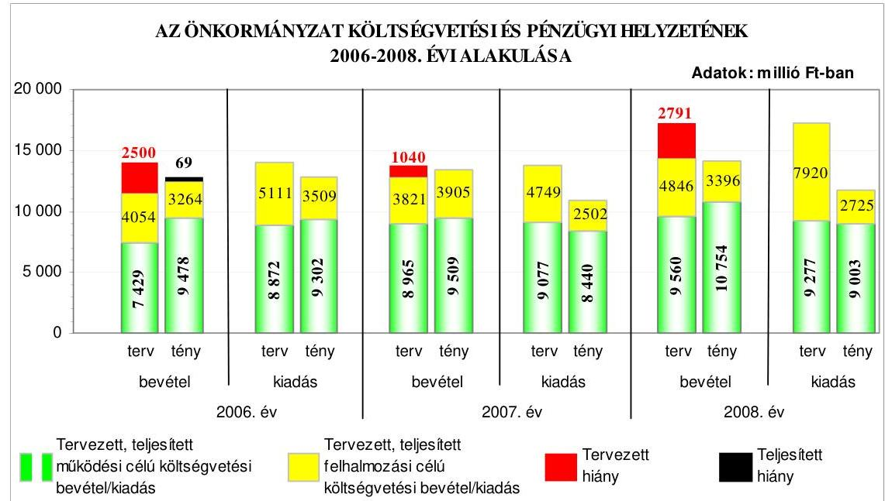

A 2006. évről a 2007. évre - a teljesített költségvetési bevételek főösszegének növekedése mellett - a teljesített költségvetési kiadások főösszege csökkent, míg a 2008. évre a költségvetési bevételek és kiadások főösszege növekedett. A költségvetés végrehajtása során a tényleges pénzügyi egyensúlyi helyzet a tervezetthez viszonyítva javult, a 2006. évben a pénzügyi hiány a tervezett költségvetési hiányhoz képest kedvezőbben alakult, míg a 2007-2008. években a tervezett költségvetési hiánnyal szemben pénzügyi többlet alakult ki. A felhalmozási célú költségvetési kiadásokon belül a beruházási és a felújítási kiadások a 2006-2008. években alulteljesültek, melynek oka, hogy több beruhá-

---

zás és felújítás késve kezdődött meg, illetve az adott évben elmaradt. A tervezetthez viszonyított teljesítések eltérésének okai közül tervezési hiányosságra a 2006. évi felújítási kiadás tervezése vezethető vissza, mivel ezen előirányzaton tervezték a társasházaknak nyújtandó támogatásokat, valamint a 2008. évi beruházási kiadások közül az útépítés teljesítésének következő évre történő áthúzódásához hozzájárult a Polgármesteri hivatal késői adatszolgáltatása. A költségvetés végrehajtása során a pénzügyi fedezet biztosításához és a fizetőképesség fenntartásához az Önkormányzat a 2005. évben a Sportcentrum beruházás megvalósítására - gazdaságossági számítás készítése nélkül - 2500 millió Ft összegű, svájci frank alapú kötvény kibocsátásáról és zártkörű forgalomba hozataláról döntött, melyből 2000 millió Ft névértékű kötvényt a 2006. évben, 500 millió Ft-ot pedig a 2007. évben jegyeztek le. A Képviselő-testület a kötvénykibocsátásról szóló döntés meghozatalakor a döntéskor ismert pénzpiaci feltételekkel számolt. A forint svájci frankhoz viszonyított árfolyamváltozása, valamint a változó kamatérték miatt az Önkormányzat számára a kötvénykibocsátás kockázatot jelentett. Az Önkormányzat pénzügyi helyzete a 2006. évről a 2008. évre az eladósodás növekedése miatt, fizetőképességének kedvező alakulása ellenére összességében romlott.

Az Önkormányzat fejlesztési célkitűzéseit gazdasági programban${ }_{1,2}$-ben, valamint az Integrált Városfejlesztési Stratégiában határozta meg. Az Önkormányzat a 2006-2008. években öt - európai uniós forrással támogatott - fejlesztésre nyújtott be pályázatot. A polgármester döntése alapján benyújtott kettő pályázatot a 2008. évi költségvetési rendelet előírása ellenére önkormányzati bizottság nem véleményezte. A benyújtott pályázatok közül kettő támogatást nyert, kettő pályázatot - tartalmi okokra hivatkozva - elutasítottak, egy esetében a támogatás megítéléséről 2009. márciusáig nem született döntés. A 2004. évben nyújtottak be kettő pályázatot ${ }^{10}$ a GVOP keretében, amelyek lebonyolítása áthúzódott a 2006-2008. évekre. A 2006-2008. évek közötti időszakban benyújtott pályázatok közül három kapcsolódott a Képviselő-testület által meghatározott fejlesztési célkitűzésekhez. A 2006-2008. évi költségvetési rendeletek az Ámr. előírása ellenére nem tartalmazták elkülönítetten az európai uniós forrással megvalósuló fejlesztési feladatok költségvetési bevételi és kiadási előirányzatait, a felhalmozási kiadásokat feladatonként, illetve a kiadásokat és bevételeket a támogatási szerződés szerinti ütemezésben. A 2009. évi költségvetési rendeletben az Ámr. előírásainak megfelelően tervezték az európai uniós támogatással megvalósított fejlesztések előirányzatait.

Az Önkormányzatnál az európai uniós források igénybevételének és felhasználásának belső rendjét a 2006-2008. években hiányosan szabályozták. Az önkormányzati szintű pályázat-koordinálás feladatainak és a pályázatnyilvántartás vezetésének felelősét a Polgármesteri hivatalon belül nem jelölték ki. A pályázatfigyelést végzők és a döntési, illetve a döntés-előterjesztési jogkörrel rendelkezők közötti információ-szolgáltatási kötelezettséget belső szabályozásban nem írták elő. Az európai uniós forrásokra irányuló pályázatfigyelés, -készítés, valamint az európai uniós forrással támogatott

[^0]
[^0]:    ${ }^{10}$ A „Szolgáltató Hegyvidék" és „Az önkormányzati adatvagyon másodlagos hasznosítása" pályázatok.

---

fejlesztés lebonyolításának eljárási rendjét nem szabályozták. A szabályozási hiányosságokat a 2008. év végén kiadott polgármesteri és jegyzői együttes utasítással megszüntették. Az európai uniós források pályázatfigyelésével és pályázatkészítésével összefüggő feladatok végrehajtásának személyi, szervezeti feltételeit a 2006. évben nem biztosították, a feladatok ellátásával a 2007. évben külső szervezetet bíztak meg. A pályázatfigyelés és -készítés személyi, szervezeti feltételeit a 2008. évben részben külső szervezet megbízásával, részben a Polgármesteri hivatalon belül alakították ki. A pályázatfigyelésre és -készítésre a 2007., illetve a 2008. évre kötött szerződésekben a felelősség szabályait és a Polgármesteri hivatal képviselője közötti kapcsolattartást - kapcsolattartó kijelölése hiányában - nem határozták meg. Az európai uniós támogatással megvalósításra kerülő fejlesztések lebonyolítási feladatainak ellátására külső személlyel, szervezettel kötött szerződésekben a kapcsolattartás és az ellenőrzés rendjét nem szabályozták, a személyes felelősségi szabályokat nem határozták meg, valamint a Szolgáltató Hegyvidék projekt lebonyolítása esetében a szerződésben nem jelölték ki a kapcsolattartó személyeket sem.

A Szolgáltató Hegyvidék projekt lebonyolítása során az Önkormányzat gondoskodott a projektnek a hatályos támogatási szerződésben rögzített időbeli megvalósulásáról, az utolsó kifizetési kérelem benyújtása azonban a támogatási szerződésben meghatározott határidőn túl történt. Az európai uniós támogatás kifizetésének igénylésénél a támogatás-igénybevétel tervezett ütemezésének betartását a támogatás igénylését alátámasztó bizonylatok hiányosságai akadályozták. A projekt megvalósításához a költségvetésben tervezett saját forrást a támogatási szerződésben rögzítettek szerint biztosították. A közreműködő szervezet a projekt megvalósításának záró beszámolóját elfogadta, a fenntartási időszak 2006. december végétől kezdődött, azonban az adófolyószámlák kezelésére, az adózók nyilvántartására szolgáló elemet - a Pénzügyminisztérium jóváhagyásának hiányában - 2009. március végéig nem vették használatba. A projektre európai uniós támogatásként elszámolt bevételek beszedésének elrendelése előtt az Ámr. előírása ellenére nem történt meg a munkafolyamatba épített ellenőrzési feladatok végrehajtása. A lebonyolítási szerződésben rögzített vállalkozói díj összegét nem bontották meg a Szolgáltató Hegyvidék projekt és az Adatvagyon másodlagos hasznosítása projekt között, ennek ellenére a kötelezettségvállalás ellenjegyzője a szerződést aláírásával ellátta az Ámr-ben előírtakkal szemben, nem győződött meg arról, hogy a kötelezettségvállalás nem sérti-e a gazdálkodásra vonatkozó szabályokat. A lebonyolítási díj összegének dologi kiadásként történő elszámolása miatt - a Számv. tv. előírása ellenére - az nem képezte a bekerülési érték részét. A belső ellenőrzés a 2008. évi ellenőrzési terve alapján vizsgálta az európai uniós forrásból támogatott projekt megvalósítását. A javaslatok hasznosulása érdekében intézkedési terv készült felelősök és határidő megjelölésével. A közreműködő szervezet három alkalommal ellenőrizte a projektet, szabálytalanságra vonatkozó megállapítást a közbenső és az utóellenőrzés során tett, megállapításaihoz támogatás visszafizetési kötelezettség nem kapcsolódott.

Az Önkormányzat a szabályozottság és szervezettség tekintetében a 2006-2008. évek között annak ellenére nem készült fel eredményesen az európai uniós források igénybevételére és a várható támogatások felhasználására, hogy a folyamatba épített, előzetes és utólagos vezetői ellenőrzési feladatokat a

---

gazdálkodásra vonatkozó területen szabályozták, és a 2008. évi belső ellenőrzési tervet megalapozó kockázatelemzés kiterjedt az európai uniós forrásokkal támogatott fejlesztési feladatokra, valamint a pályázatfigyelés, a pályázatkészítés szervezeti, személyi feltételeit a 2007-2008. években, a fejlesztési feladat lebonyolításának szervezeti, személyi feltételeit mindhárom évben biztosították, azonban kettő pályázat nem kapcsolódott a gazdasági programban${ }_{2}$-ben meghatározott fejlesztési feladathoz, a külső szervezettel kötött szerződésben a pályázat szakmai és formai követelményeire vonatkozóan nem határozták meg a pályázatkészítést végző felelősségét, valamint nem írták elő a pályázatfigyelést végző és a döntési, illetve a döntés-előterjesztési jogkörrel rendelkezők közötti információszolgáltatási kötelezettséget, a fejlesztési feladat lebonyolítását végző ellenőrzési kötelezettségeit.

Az Önkormányzat az informatikai feladatellátás továbbfejlesztéséhez a 2006-2008. közötti években az ÁROP keretében kiírt támogatásra pályázott. Az elektronikus ügyintézés helyi szabályozásáról az Önkormányzat rendeletet alkotott, amelyben tételesen meghatározták az elektronikus úton intézhető közigazgatási hatósági ügyek körét, kizárva azokat, amelyek elektronikus úton nem intézhetők. Az Önkormányzatnál működtettek e-közigazgatási feladatokat ellátó informatikai rendszert, az ügyintézést 2., illetve 3. elektronikus szolgáltatási szinten valósították meg, azonban az ügyfelek általi igénybevételt nem kísérték figyelemmel. Az informatikai rendszeren keresztül végzett ügyintézésnek, az egyes ügykörök igénybevételének tapasztalatait nem értékelték.

Az Önkormányzat a Polgármesteri hivatal pénzeszközei felhasználásával, a vagyonnal történő gazdálkodással összefüggő szerződések adatait megfelelően, a szerkezeti rendre vonatkozó előírásokat betartva honlapján közzétette, míg kettő intézmény a szerződések adatait az Áht. előírása ellenére nem tette közzé, ezt a 2009. évben pótolták. Az Önkormányzat az Áht. előírásával szemben nem tette közzé a társasházak felújítására adott felhalmozási célú támogatások és a 200 ezer Ft alatti működési célú támogatások, valamint egy közhasznú társaságnak nyújtott 200 ezer Ft-ot meghaladó összegű működési támogatás esetében az általa nyújtott céljellegű működési és felhalmozási támogatások kedvezményezettjeinek nevét, a támogatás célját, összegét, továbbá a támogatási program megvalósítási helyét. A közzétett éves költségvetési beszámoló szöveges indoklása nem felelt meg a Vhr-ben rögzített tartalmi követelményeknek.

A költségvetés tervezési és zárszámadás-készítési folyamatok szabályozottságának hiányosságai közepes kockázatot jelentettek a feladatok szabályszerű végrehajtásában, mivel a jegyző nem szabályozta a Polgármesteri hivatalban és az intézményeknél az ismert kötelezettségek megtervezésének, a benyújtott költségvetési igények teljesíthetőségének, a saját
 bevételek előirányzatai és a költségvetés megalapozását szolgáló helyi rendeletek összhangjának ellenőrzését, valamint a költségvetési tervezéshez készített intézményi mutatószám-felmérés adatai megalapozottságának, és az intézmények által az állami támogatásokkal, hozzájárulásokkal történő elszámoláshoz közölt mutatószámok adatai megbízhatóságának ellenőrzését, azonban a kialakított belső kontrollok - végrehajtásuk esetén - a lehetséges hibák

---

többsége ellen védelmet nyújtottak. A szabályozási hiányosságokat 2008. júliusában, illetve 2009. márciusában megszüntették.

A költségvetési tervezési és zárszámadás-készítési folyamatban a kontrollok működésének megbízhatósága gyenge volt, mert a hiányos szabályozás miatt nem végezték el az ismert kötelezettségek megtervezésének ellenőrzését, a költségvetési tervezéshez készített intézményi mutatószám-felmérés adatai megalapozottságának ellenőrzését. Elmaradt a benyújtott költségvetési igények teljesíthetőségének, a saját bevételek előirányzatai és a költségvetés megalapozását szolgáló helyi rendeletek összhangjának, az intézmények által az állami támogatásokkal, hozzájárulásokkal történő elszámoláshoz közölt mutatószámok adatai megbízhatóságának a vizsgálata. A belső szabályozásban előírtak ellenére az abban foglaltak szerint nem történt meg az intézmények pénzmaradvány-megállapítása szabályszerűségének ellenőrzése.

A gazdálkodási, a pénzügyi-számviteli és a folyamatba épített ellenőrzési feladatok szabályozottsága összességében alacsony kockázatot jelentett a feladatok megfelelő, szabályszerű végrehajtásában, mivel a pénzügyi irányítási és ellenőrzési rendszer keretében elkészítették a gazdasági szervezet ügyrendjét, meghatározták a kötelezettségvállalás, ellenjegyzés, utalványozás, érvényesítés rendjét, a szakmai teljesítés igazolásának módját. A jegyző kijelölte a szakmai teljesítés igazolását végző személyeket, biztosította az összeférhetetlenségi követelmények érvényesülését, az önköltségszámítás rendjének elkészítését, kialakította a FEUVE-val kapcsolatos szabályozást és eljárási rendet. Annak ellenére összességében alacsony volt a kockázat, hogy az adókövetelések egyszerűsített értékelési eljárását, besorolásának elveit, dokumentálásának szabályait, az adósonkénti kisösszegű követelések könyvekben elkülönített csoportjára az értékvesztés összegének a követelés nyilvántartásba vételi érték százalékban történő meghatározását nem írták elő, valamint nem határozták meg az értékelések ellenőrzéséért felelős munkaköröket. A selejtezési szabályzatban nem határozták meg a döntéshozatalra jogosultak körét az üzemeltetésre átadott eszközökre vonatkozóan, a selejtezési eljárás szabályszerű végrehajtásának folyamatba épített ellenőrzéséért felelős személyt, valamint a főkönyvi és az analitikus nyilvántartások egyeztetésének módját sem. A feladatot végző köztisztviselők munkaköri leírásai nem tartalmazták az értékelési és értékelés-ellenőrzési feladatokat. A számviteli szabályzatok, a számlarend szabályozási hiányosságait 2008. júliusában a jegyző megszüntette és a munkaköri leírásokat 2009. márciusában kiegészítette. A gazdálkodási, a pénzügyi-számviteli és a folyamatba épített ellenőrzési feladatok szabályozottsága javult a 2009. évre a korábbi ÁSZ vizsgálat javaslatainak hasznosulása következtében, mivel a jegyző gondoskodott a Polgármesteri hivatali SzMSz, valamint az utalványrendelet kiegészítéséről, a FEUVE szabályzatok elkészítéséről.

A Polgármesteri hivatalnál a külső szolgáltató által végzett karbantartási, kisjavítási szolgáltatásokkal, a gépek, berendezések, felszerelések beszerzésével, létesítésével kapcsolatos, továbbá a működési és a felhalmozási célú pénzeszköz-átadások államháztartáson kívülre teljesített gazdasági események között elszámolt kiadások teljesítése során - a három terület költségvetési súlyának figyelembevételével értékelve - a szakmai teljesítésigazolás és utalvány-ellenjegyzés működésének megbízhatósága gyenge volt, mivel a

---

szakmai teljesítésigazolásra kijelölt személyek a folyamatba épített ellenőrzési feladataikat a gazdálkodási jogkörök szabályzata ${ }_{1,2}$-ben foglaltak ellenére nem végezték el a külső szolgáltató által végzett karbantartási munka kifizetésénél, a működési és a felhalmozási célú pénzeszköz-átadások államháztartáson kívülre teljesített kifizetéseinél. Az utalvány-ellenjegyzője nem ellenőrizte, hogy a szakmai teljesítésigazolás belső szabályzatban előírt módon történt-e meg a működési és a felhalmozási célú pénzeszköz-átadások államháztartáson kívülre teljesített kifizetéseinél, és a gazdálkodásra vonatkozó további szabályok betartását - a külső szolgáltató által végzett munkánál -, mivel kötelezettségvállalás hiánya ellenére látta el aláírásával az utalványrendeletet, továbbá - a működési és a felhalmozási célú pénzeszköz-átadások államháztartáson kívülre teljesített kifizetéseinél - nem ellenőrizte a fedezet rendelkezésre állását. A 2008. évben a költségvetési pénzforgalmat érintő gazdasági eseményeknél az érvényesítő az Ámr-ben meghatározott feladatát nem látta el a főkönyvi számlák kijelölésénél, mivel nem a gazdasági események tartalmához illeszkedő főkönyvi számlákat jelölt ki a Vhr-ben előírtak ellenére.

A Polgármesteri hivatal nem rendelkezett a jegyző, vagy a Képviselő-testület által elfogadott informatikai stratégiával, valamint nem gondoskodtak az informatikával kapcsolatos szabályzatok megismertetéséről, melyeket 2009. júniusában pótoltak. Az informatikai biztonsági szabályzat rendelkezésre állt, a Polgármesteri hivatalban a pénzügy-számvitel által használt programok adatai informatikai hálózaton keresztül elérhetőek voltak, és integrált pénzügyi-számviteli informatikai rendszert vezettek be. A Polgármesteri hivatalban a pénzügyi-számviteli feladatoknál alkalmazott informatikai rendszerek működésének szabályozottsága összességében alacsony kockázatot jelentett a feladatok megfelelő, szabályszerű végrehajtásában, mivel a Polgármesteri hivatal rendelkezett katasztrófa-elhárítási tervvel, eljárásrenddel a hozzáférési jogosultságokra, a pénzügyi-számviteli rendszerből lekérhető volt az ellenőrzési lista, valamint szabályozták a mentési eljárásokat. Annak ellenére összességében alacsony volt a kockázat, hogy a külső fejlesztők éles rendszerhez való hozzáférését nem tiltották meg, nem volt az ellenőrzési lista vizsgálatáért felelős kinevezett dolgozó, nem szabályozták a pénzügyi-számviteli szoftverváltozások ellenőrzésére, tesztelésére vonatkozó eljárásokat, valamint a mentési eljárások keretében a felelősségi viszonyokat. A Polgármesteri hivatalnál a pénzügyi-számviteli feladatok ellátásánál alkalmazott informatikai rendszerek belső kontrolljainak megbízhatósága jó volt, mivel biztosították a hozzáférési jogosultságra vonatkozó nyilvántartás teljes körűségét és naprakészségét, a hozzáférési jogosultságok ellenőrzését, valamint az ellenőrzési lista elkészítését. Azonban hiányos szabályozás miatt nem dokumentálták a pénzügyi-számviteli szoftver elemeire vonatkozó változáskezelési eljárásokat, illetve azok ellenőrzését, tesztelését. Az előírások ellenére nem követelték meg a jelszavakra előírt szabályok betartását, valamint nem tesztelték a katasztrófa-elhárítási tervet.

A belső ellenőrzés szervezeti kereteinek kialakítása és szabályozása a belső ellenőrzési feladatok megfelelő szabályszerű végrehajtásában összességében alacsony kockázatot jelentett, mivel a belső ellenőrzés ellátási módját meghatározta a Képviselő-testület, a belső ellenőrök funkcionális

---

függetlenségét biztosították. A belső ellenőrzés rendelkezett a Képviselő-testület által jóváhagyott stratégiai tervvel, éves ellenőrzési tervvel a 2008. és 2009. évre, és a belső ellenőrzési kézikönyv, valamint az ellenőrzések lefolytatásához készített ellenőrzési programok tartalma megfelelő volt. Annak ellenére összességében alacsony volt a kockázat, hogy a kockázatelemzést nem terjesztették ki a közbeszerzési eljárások lebonyolítására, és az Önkormányzat többségi irányítást biztosító befolyása alatt működő gazdasági társaságainál, vagyonkezelő szervezeténél a rendelkezésre álló erőforrásokkal való megfelelő gazdálkodásra, a vagyon megóvásának, gyarapításának, az elszámolások megbízhatóságának vizsgálatára a 2008. évben. A 2009. évi ellenőrzési terv azonban tartalmazta az Önkormányzat többségi irányítást biztosító befolyása alatt működő gazdasági társaságánál, vagyonkezelő szervezeténél a rendelkezésre álló erőforrásokkal való megfelelő gazdálkodás, a vagyon megóvásának, gyarapításának, az elszámolások megbízhatóságának vizsgálatát. A belső ellenőrzés szervezeti kereteinek megfelelő, szabályszerű kialakítása és szabályozása javult a 2009. évre az előző ÁSZ vizsgálat során tett javaslatok hasznosulásával, mivel a jegyző gondoskodott a kockázatelemzéssel alátámasztott stratégiai terv és az éves ellenőrzési terv elkészítéséről, valamint a belső ellenőrzési tevékenység alapjául szolgáló belső ellenőrzési kézikönyv jóváhagyásáról.

A belső ellenőrzés működésénél a kialakított kontrollok megbízhatósága jó volt, mivel a belső ellenőrzéseket ellenőrzési program alapján hajtották végre, minden elvégzett vizsgálatról készítettek ellenőrzési jelentést, az ellenőrzöttek készítettek intézkedési tervet, az elvégzett ellenőrzésekről a belső ellenőrzési vezető nyilvántartást vezetett, azonban a 2008. évi belső ellenőrzési tervben megtervezett ellenőrzéseket nem hajtották végre, az éves ellenőrzési tervet megalapozó kockázatelemzés során a magas kockázatúnak értékelt területek értékelését nem a hatályos kockázatkezelési eljárásrend alapján határozták meg. Az ellenőrzések elmaradásának oka hat soron kívüli ellenőrzés elvégzése volt. A 2008. évi ellenőrzési tervben a Polgármesteri hivatalnál tervezett ellenőrzések 83%-át, míg az intézményeknél tervezett ellenőrzések 29%-át teljesítették. A belső ellenőrzés működésében megállapított hiányosságok nem veszélyeztették, hogy a belső ellenőrzés megelőzze, feltárja, kijavíttassa a lényeges hibákat és szabálytalanságokat. A soron kívüli ellenőrzések keretében vizsgálták a közbeszerzési eljárásokat is. A jegyző teljesítette az Ámr-ben előírt, belső kontroll-rendszerekre vonatkozó nyilatkozattételi kötelezettségét. A polgármester a 2007. évi zárszámadási rendelettel egyidejűleg az Ötv-ben előírtak teljesítésére a Képviselő-testület elé terjesztette az Önkormányzat által alapított és felügyelt költségvetési szervek éves ellenőrzési jelentései alapján összeállított éves összefoglaló ellenőrzési jelentést, melyet a Képviselő-testület határozatával elfogadott.

Az Önkormányzat gazdálkodási rendszerének 2006. évi átfogó ellenőrzéséről készített számvevői jelentés 51 szabályszerűségi és nyolc célszerűségi javaslatot tartalmazott. A javaslatok megvalósulása érdekében a polgármester és a jegyző intézkedési tervet készített határidők és felelősök megjelölésével. Az ÁSZ ellenőrzés által tett javaslatokból az intézkedési tervben foglalt határidőre, illetve az ÁSZ részére megküldött tájékoztatóban megjelölt időpontra 66% hasznosult, 17%-17% részben, illetve nem teljesült. A szabályszerűségi

---

javaslatok 67%-a realizálódott, 14%-a részben, illetve 19%-a nem hasznosult. A célszerűségi javaslatok közül öt realizálódott, három részben valósult meg.

A szabályszerűségi javaslatok közül az intézkedési tervben foglalt határidőre teljesültek a leltározási kötelezettségre, a közbeszerzések szabályszerűségére, az önként vállalt feladatok ellátási mértékének és módjának bemutatására, a középületek akadálymentesítésére, valamint a belső ellenőrzés működésére vonatkozó javaslatok. A költségvetési és zárszámadási rendelettervezet és rendelet tartalmára és módosítására vonatkozó javaslatok több mint fele teljesült, azonban elmaradt a költségvetési koncepciótervezethez a Pénzügyi bizottság véleményének csatolása, a speciális célú támogatások elkülönített bemutatása, a költségvetés előterjesztésekor és a zárszámadáskor tájékoztatásul bemutatandó többéves kihatással járó döntésekről és a közvetett támogatásokról készítendő kimutatások tartalmi követelményeinek szabályozása, az intézményi felhalmozási kiadások feladatonkénti és a felújítási előirányzatok célonkénti bemutatása, a költségvetési rendelet határidőn belüli utolsó módosítása, valamint a bevételi forrásoknak a pénzügyminiszter elemi költségvetés-összeállítására vonatkozó tájékoztatójában foglaltak szerinti tervezése. A gazdálkodás, a pénzügyi-számviteli feladatellátás és az ellenőrzési jogkörök gyakorlásának szabályozottságára vonatkozó javaslatok fele realizálódott, nem teljesült azonban az összesítő feladatok elkészítési határidejének meghatározása, a számlarend kiegészítése és az egyszerűsített értékelési eljárás szabályozása. A folyamatba épített ellenőrzési feladatokra vonatkozó javaslatok fele megvalósult, azonban nem minden esetben tettek eleget ellenőrzési feladataiknak a kötelezettségvállalás-ellenjegyzői, az érvényesítők és az utalvány-ellenjegyzők, továbbá a negyedév végén a pénzkezelési szabályzattal ellentétben elszámolásra kiadott előleg szerepelt a nyilvántartásban. A vagyongazdálkodási feladatok szabályozottságához és szabályszerű működéséhez kapcsolódó javaslatok több mint fele teljesült, azonban a jegyző nem intézkedett annak érdekében, hogy az egyéb tartós részesedések és vevő követelések esetében az értékvesztés és az értékvesztés-visszaírásának értékelésekkel való alátámasztása biztosított legyen. A helyi adókövetelések esetében az elszámolt értékvesztést a beszámoló nem tartalmazta. A céljellegű, nem szociális támogatások nyújtására és elszámolására vonatkozó javaslatok fele teljesült, azonban a támogatással el nem számoló szervezetet közel egy éves késéssel szólították fel az elszámolás benyújtására, valamint a polgármester hatáskör hiányában döntött a közművelődési feladatok esetében támogatások odaítéléséről. A kerületben működő pártszervezetekkel csak az intézkedési tervben foglalt határidőt követően kötöttek bérleti szerződést. A kisebbségi önkormányzatokkal kapcsolatos javaslatok kétharmada teljesült, azonban az előirányzat-módosítások nem azok határozatai alapján történtek. Az önkormányzati lakások elidegenítéséből származó bevételekből a Budapest Főváros Önkormányzatát megillető rész átadásáról nem gondoskodtak.

A célszerűségi javaslatok közül teljesültek a vagyongazdálkodási rendelet módosítására, a forgalmi értékbecslés elvégzésére, valamint a szociális intézmények engedélyezett férőhelyszámának felülvizsgálatára vonatkozó javaslatok. Részben realizálódtak a felhatalmazott személyek beszámoltatására, a zárszámadási rendelettervezet és a költségvetési beszámoló összhangjára, valamint az informatika
 szabályozottságára tett javaslatok.

---

Az ÁSZ a 2007. évben ellenőrizte a fővárosi önkormányzatot és a kerületi önkormányzatokat osztottan megillető bevételek 2007. évi megosztásáról szóló fővárosi önkormányzati rendeletet. Az ÁSZ által tett egy javaslat realizálása érdekében intézkedtek.

A helyszíni ellenőrzés megállapításainak hasznosítása mellett javasoljuk:

# a polgármesternek 

a munka színvonalának javítása érdekében
kezdeményezze, hogy a számvevőszéki jelentésben foglaltakat a Képviselő-testület tárgyalja meg és a feltárt hiányosságok megszüntetése érdekében készíttessen intézkedési tervet a határidők és felelősök megjelölésével;

## a jegyzőnek

a jogszabályi előírások maradéktalan betartása érdekében
biztosítsa az Áht. 8/A. § (7) bekezdésének előírása alapján, hogy a költségvetési rendelettervezetek költségvetési kiadási és bevételi főösszege ne tartalmazzon finanszírozási célú bevételeket, illetve kiadásokat.

---

# II. RÉSZLETES MEGÁLLAPÍTÁSOK 

## 1. AZ ÖNKORMÁNYZAT KÖLTSÉGVETÉSI ÉS PÉNZÜGYI HELYZETE

### 1.1. A tervezett költségvetési bevételek és kiadások alapján a költségvetési egyensúly, a költségvetési hiány oka, finanszírozásának tervezett módja és a költségvetési hiány megállapításának szabályszerűsége

Az Önkormányzatnál a 2006-2009. években a tervezett költségvetési bevételek és kiadások főösszege változó tendenciát mutatott, mivel a költségvetési bevételek főösszege a 2006-2008. években folyamatosan növekedett, majd a 2009. évre csökkent. A költségvetési kiadások főösszege az előző évhez képest a 2007. évre csökkent, a 2008. évre növekedett, majd a 2009. évre újból csökkent.

Az Önkormányzat a 2006-2009. évi költségvetési rendeleteiben a költségvetési bevételek és kiadások egyensúlyát nem biztosította, mivel a tervezett költségvetési kiadások meghaladták a tervezett költségvetési bevételeket.

Az Önkormányzat 2006-2009. években tervezett költségvetési bevételeinek és kiadásainak, valamint egyensúlyi helyzetének alakulását a következő ábra szemlélteti:
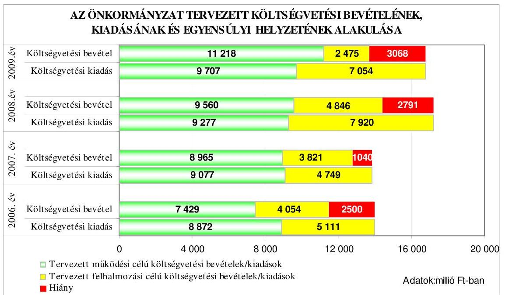

A költségvetési bevételek hiányát a 2006-2007. években a tervezett működési célú költségvetési bevételek hiánya és a felhalmozási célú költségvetési bevételeket meghaladó összegben tervezett felhalmozási célú kiadások együttesen

---

okozták, míg a 2008-2009. években csak a felhalmozási célú költségvetési bevételeket meghaladó összegben tervezett felhalmozási célú kiadások eredményezték. A működési célú költségvetési kiadásoknál a hiányzó forrás a 2006. évben 1443 millió Ft, a 2007. évben 112 millió Ft volt. A felhalmozási célú költségvetési kiadások 928-4579 millió Ft közötti összegekkel haladták meg a felhalmozási célú költségvetési bevételeket.

Az Önkormányzat a 2006-2009. évek költségvetési rendeleteiben a hiány finanszírozásához, illetve a költségvetési egyensúly biztosításához rövid lejáratú hitelek felvételét, kötvény kibocsátását, valamint bevételt növelő és kiadást csökkentő intézkedések megtételét tervezte:

- a Képviselő-testület a 2006. évi költségvetési rendeletben 500 millió Ft rövid lejáratú működési célú hitel felvételét hagyta jóvá;
- a Képviselő-testület kötvény kibocsátásáról hozott határozatot - gazdaságossági számítás készítése nélkül - a 2005. évben, mely alapján a 2006. évi költségvetési rendeletben felhalmozási céllal 2000 millió Ft, a 2007. évi költségvetési rendeletben 500 millió Ft kötvény kibocsátását hagyta jóvá. A 2008. évi költségvetési rendeletben - fejlesztési céltartalék képzésére - 2900 millió Ft, a 2009. évi költségvetési rendeletben - Integrált Városfejlesztési Stratégia pályázat fedezeteként - 2700 millió Ft felhalmozási célú kötvény kibocsátását tervezték, melyeket szintén nem előzött meg gazdaságossági számítás;

A Képviselő-testület az 54-57/2005. (III. 3.) számú határozataiban a Sportcentrum építéséről, a pénzügyi fedezetről (hitel, lízing, vagy kötvénykibocsátás), valamint az üzemeltetésről döntött. A Képviselő-testület a 254/2005. (XI. 24.) számú határozatában rögzítette, hogy a Sportcentrum építésének pénzügyi fedezetét kötvénykibocsátással kell előteremteni a pályázati eljárás keretében kiválasztott, a finanszírozás szempontjából legkedvezőbb ajánlatot nyújtó pénzintézet útján. A kiírásra határidőben egy pályázó nyújtott be ajánlatot, mely alapján a Képviselő-testület a 34/2006. (II. 16.) számú határozatával döntött a Sportcentrum beruházás finanszírozásához 2500 millió Ft értékű, svájci frank alapú kötvény kibocsátásáról és zártkörű forgalomba hozataláról, melyből 2000 millió Ft névértékű kötvény lejegyzését a 2006. évben, a fennmaradó összeg lejegyzését a 2007. évben tervezték.

- a 2006-2009. évi költségvetési rendeletekben előírták, hogy a megüresedő álláshelyek költségvetési előirányzata zárolásra kerül. Évközben - bevétel elmaradása esetén - a polgármester jogosult a költségvetési gazdálkodás biztonsága és egyensúlyának megtartása érdekében kiadási előirányzatokat zárolni. A Képviselő-testület felhatalmazta továbbá a polgármestert arra, hogy az átmenetileg szabad pénzeszközök - rövid lejáratú, kizárólag állampapírokban történő - lekötéséről döntsön. Az Önkormányzat a 2007. évi költségvetési rendeletében 2007. július 1. napjától 60 fős - oktatási, kulturális és sport intézményekben történő - létszámcsökkentésről határozott;
- az Önkormányzat döntött a magánszemélyek kommunális adójának 2007. évtől kezdődő bevezetéséről, valamint a lakások bérleti díjának 2008. évi emeléséről, továbbá a 2006-2008. évek között intézmények megszüntetését, illetve egyesítését tervezte.

---

A jegyző a költségvetés tervezése során a költségvetés végrehajtása érdekében a likviditás feltételeinek kialakításáról a folyószámla hitelkeret költségvetési rendelettervezetbe történő tervezésével, illetve a pénzállomány alakulásáról likviditási terv készítésével ${ }^{11}$ gondoskodott.

Az Önkormányzatnál a 2007-2009. évi költségvetési rendeletek normaszövegében a költségvetési kiadási és bevételi főösszeg megállapításakor megsértették az Áht. 8/A. § (7) bekezdésében foglaltakat, mivel finanszírozási célú pénzügyi műveleteket (rövid és hosszú lejáratú hiteltörlesztéssel kapcsolatos kiadásokat, valamint kötvénykibocsátással kapcsolatos bevételeket) vettek figyelembe költségvetési hiányt módosító költségvetési kiadásként és bevételként.

A költségvetés bevételi és kiadási főösszegei az éves költségvetési rendeletek normaszövegében a 2007. évben 60 millió Ft hosszú lejáratú hiteltörlesztést, 500 millió Ft kötvénykibocsátásból származó bevételt, a 2008. évben 600 millió Ft működési célú és 109 millió Ft felhalmozási célú hiteltörlesztést, valamint 2900 millió Ft kötvénykibocsátásból származó bevételt tartalmaztak, míg a 2009. évi költségvetési bevételi és kiadási főösszeg 2700 millió Ft kötvénykibocsátásból származó bevételt és 132 millió Ft hosszú lejáratú hiteltörlesztést foglalt magában.

Az éves költségvetési rendelet 1. számú mellékletében finanszírozási célú pénzügyi műveletek nélkül állapították meg a költségvetési bevételi és kiadási főösszeget, azonban azok nem a valós költségvetési bevételi és kiadási főösszeget mutatták, mivel a 2007. évben 2484 millió Ft intézményfinanszírozás pénzellátás bevételi összegét tartalmazta, míg a finanszírozási célú pénzügyi műveletek között mutattak be a 2008. évben 2900 millió Ft fejlesztési tartalék kiadást és 2961 millió Ft pénzmaradvány, valamint a 2009. évben 2855 millió Ft pénzmaradvány bevételt.

# 1.2. A teljesített költségvetési bevételek és kiadások alapján a pénzügyi egyensúly, a pénzügyi hiány oka, finanszírozásának módja és hatása a pénzügyi helyzet alakulására az eladósodás, valamint a fizetőképesség szempontjából 

A 2006. évről a 2007. évre - a teljesített költségvetési bevételek főösszegének növekedése mellett - a teljesített költségvetési kiadások főösszege csökkent, míg a 2008. évre a költségvetési bevételek és kiadások főösszege növekedett.

[^0]
[^0]:    ${ }^{11}$ A 2006. évi költségvetési rendeletben 500 ezer Ft, a 2007-2008. évi költségvetési rendeletekben 600 ezer Ft folyószámlahitel felvétele és törlesztése szerepelt. A pénzállomány alakulásáról a likviditási tervet hetente aktualizálták.

---

A teljesített költségvetési bevételek és kiadások, valamint az egyensúlyi helyzet alakulását szemlélteti a következő ábra:
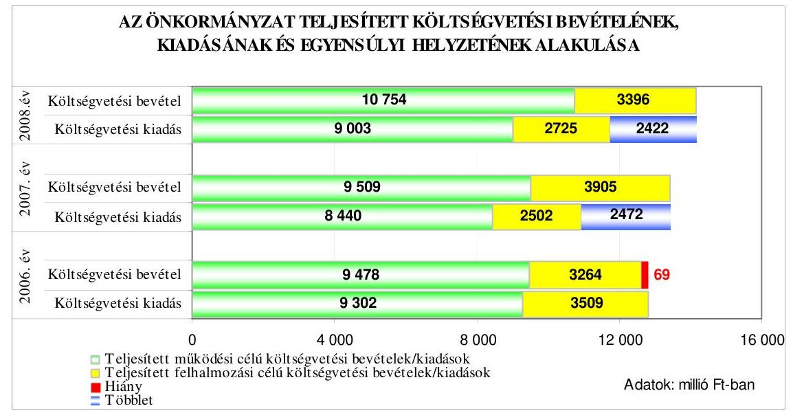

A pénzügyi egyensúly a 2006. évi teljesítés során nem állt fenn, mivel a teljesített költségvetési bevételek és kiadások egyenlege pénzügyi hiányt mutatott, melyet a felhalmozási célú költségvetési bevételeket meghaladó összegben teljesített felhalmozási célú költségvetési kiadások okozták. A 2007-2008. években a bevételi többletet a működési és felhalmozási célú költségvetési kiadásokat meghaladó összegben teljesített működési és felhalmozási célú költségvetési bevételek többlete együttesen eredményezte.

A költségvetési kiadások költségvetési bevételekkel való fedezettsége - a terv és tény adatok alapján is - a 2006. évről a 2007. évre növekedett, majd a 2008. évre csökkent. A 2009. évi terv adatok az előző évhez képest szintén csökkenést mutattak. A költségvetési kiadási főösszegre vonatkozó fedezettségi mutató tervezettől történő eltérését a működési és a felhalmozási célú költségvetési kiadások fedezettségi mutatójának a tervezettől eltérő alakulása együttesen okozta. A költségvetés végrehajtása során a tényleges egyensúlyi helyzet a tervezetthez viszonyítva javult, a 2006. évben a pénzügyi hiány a tervezett költségvetési hiányhoz képest kedvezőbben alakult, míg a 2007-2008. években a tervezett költségvetési hiánnyal szemben nem alakult ki pénzügyi hiány.

A költségvetési bevételek az eredeti előirányzathoz képest a 2006-2008. években az évek sorrendjében 111,0%-ra, 104,9%-ra, illetve 98,2%-ra teljesültek, míg a költségvetési kiadások 8,4%-kal, 20,9%-kal, illetve 31,8%-kal maradtak el a tervezettől. A költségvetési bevételek eredeti előirányzathoz viszonyított túlteljesítését a 2006-2008. években az intézményi működési bevételek, a helyi adó bevételek és azokhoz kapcsolódó pótlékok, bírságok, támogatásértékű működési bevételek, az Önkormányzat működési célú költségvetési támogatása tervezettnél kedvezőbb alakulása, valamint a 2007. évben az előző évi pénzmaradvány alacsony összegben történő tervezése is okozta. A 2008. évi alulteljesítés a tárgyi eszközök, immateriális javak értékesítése és ehhez kapcsolódó áfa visszatérüléséből, a támogatásértékű felhalmozási bevételekből, valamint az önkormányzati lakások és helységek értékesítéséből adódott. A költségvetési kiadások eredeti előirányzathoz

---

viszonyított alulteljesítését a 2006-2008. években a beruházási, felújítási kiadások, míg a 2007. évben a dologi kiadások és az államháztartáson kívüli felhalmozási célú pénzeszköz átadások tervezettől történő elmaradása is okozta.

Az Önkormányzatnál a 2006-2009. években tervezett és a 2006-2008. években teljesített működési és felhalmozási célú költségvetési kiadásokra a következő arányban biztosítottak fedezetet a költségvetési bevételek:

Adatok: %-ban

| Megnevezés | 2006.   év |  | 2007.   év |  | 2008.   év |  | 2009.   év |
| :--: | :--: | :--: | :--: | :--: | :--: | :--: | :--: |
|  | Terv | Tény | Terv | Tény | Terv | Tény | Terv |
| Működési célú költségvetési kiadások fedezettsége működési célú költségvetési bevételekből | 83,7 | 101,9 | 98,8 | 112,7 | 103,1 | 119,4 | 115,6 |
| Felhalmozási célú költségvetési kiadások fedezettsége felhalmozási célú költségvetési bevételekből | 79,3 | 93,0 | 80,5 | 156,1 | 61,2 | 124,6 | 35,1 |
| Költségvetési kiadások fedezettsége költségvetési bevételekből | 82,1 | 99,5 | 92,5 | 122,6 | 83,8 | 120,7 | 81,7 |

A 2006-2007. években keletkezett évközi többletbevételeket a költségvetési hiány csökkentésére fordították.

Az Önkormányzat 2007. január 1-től bevezette a magánszemélyek kommunális adóját, a 2007. évről a 2008. évre megemelte az önkormányzati tulajdonú lakások lakbérének mértékét. Óvodát, valamint általános és középiskolát jogutód nélkül megszüntetett a 2006., illetve a 2007. évben. A GESZ-hez tartozó részben önállóan gazdálkodó költségvetési szervvé minősítettek három költségvetési szervet a 2008. évben, továbbá három szociális feladatot ellátó intézményt összevontak 2008. december 31-i hatállyal. A megtett intézkedések hatására 2006. december 31-ről 2008. december 31-re a foglalkoztatotti létszám 150 fővel csökkent. A rendszeres személyi juttatásokra fordított kiadás ennek hatására a 2006. évről a 2008. évre 71 millió Ft-tal csökkent, azonban összességében a személyi juttatások 43 millió Ft-tal növekedtek, mely növekedésben meghatározó volt a teljes munkaidőben foglalkoztatottak nem rendszeres juttatásaira fordított kiadás 105 millió Ft-tal történő növekedése, melyből csupán 21 millió Ft-os növekedést jelentett a kifizetett végkielégítés.

A jegyző a 2007. évben - a költségvetési egyensúly javítására, a költségtakarékosság érdekében - utasítást adott ki a Polgármesteri hivatali telefonok hivatali és magáncélú használatának
 elkülönítésére, a magánbeszélgetések értékének kiszámlázására, valamint a hivatali gépjárművek magáncélra történő igénybevételének és költségtérítésének megállapítására, valamint a taxi csekk használatának korlátozására.

---

A működési célú költségvetési bevételek közül a helyi adók a 2006. évben a jóváhagyott eredeti költségvetési előirányzathoz képest túlteljesültek, ami az iparűzési adó bevétel növekedéséből adódott. A túlteljesítés nem vezethető vissza tervezési hiányosságra, mivel az iparűzési adó a fővárosi forrásmegosztás részét képezi.

A 2006-2008. években az éves költségvetések eredeti előirányzatainak kialakításánál tervezték az előző évi pénzmaradvány igénybevételét és az előző évről áthúzódó kötelezettségek előirányzatait is. A 2007. évben azonban eredeti előirányzatként az előző évi pénzmaradvány összegének csupán 58,9%-át állították be a költségvetésbe, mivel nem tervezték meg az önkormányzati lakások elidegenítéséből származó bevételekből a levonható költségek után fennmaradó összeg 50%-ának forrását és átadását. Ezáltal az előző évi pénzmaradvány igénybevételének tervezése és ehhez kapcsolódóan Budapest Főváros Önkormányzata részére teljesítendő kötelezettség tervezése nem történt megalapozottan.

A felhalmozási célú költségvetési kiadásokon belül a beruházási kiadások a 2006-2008. években - az évek sorrendjében 9,4%-kal, 44,4%-kal, 76,4%-kal alulteljesültek. A felújítási kiadások az eredeti előirányzathoz viszonyítva a 2006. évben 51,6%-ra, a 2007. évben 33,0%-ra, míg a 2008. évben 73,0%-ra teljesültek. Az alulteljesítésekben közrejátszott, hogy több beruházás és felújítás késve kezdődött meg, illetve az adott évben elmaradt.

A Sportcentrum fejlesztésére a 2006. évben 2000 millió Ft, a 2007. évben 2885 millió Ft kiadást terveztek, amiből 1878 millió Ft, illetve 1818 millió Ft teljesült. Ennek az volt az oka, hogy tervmódosítás miatt a kivitelezési munkák a 2006. évben abbamaradtak, majd a 2007. évben - a tárgyalások elhúzódása miatt csak 2007. októberében kötöttek szerződést a nyertes ajánlattevővel. A 2007. évben tervezett 200 millió Ft értékű telekvásárlás elmaradásának oka az volt, hogy nem jött létre egyezség a tulajdonosok nagy száma miatt. Az útépítési feladatokra előirányzott 207 millió Ft-ból az adott évben 5 millió Ft kifizetést teljesítettek a közbeszerzési eljárás elhúzódása miatt. A 2006-2007. években az intézmények felújítására 160 millió Ft-ot, illetve 60 millió Ft-ot irányoztak elő, melyből 74 millió Ft, továbbá 35 millió Ft pénzügyi teljesítése a következő évben történt meg. Az uszoda fejlesztésre a 2008. évben tervezett 365 millió Ft-ból összesen 14 millió Ft kifizetést teljesítettek, mivel a kivitelezés pénzügyi teljesítése a 2009. évre áthúzódott. Az európai uniós pályázatra önrészként előirányzott 300 millió Ft-tal szemben a 2008. évben 25 millió Ft-ot teljesítettek, mivel a támogatás elnyeréséről 2008. szeptember közepe helyett, csak 2009. március elején kaptak értesítést. A Tamási Áron Iskola felújítás projekthez a 2008. évi 274 millió Ft előirányzathoz képest - a közbeszerzési eljárás kétszeri eredménytelenné nyilvánítása miatt - csupán 56 millió Ft kifizetést teljesítettek. A „magasépítő-ipari felújítás" soron előirányzott 342 millió Ft-ból 54 millió Ft kifizetést teljesítettek a 2008. évben építési engedély hiánya, illetve magas árajánlat, valamint egy vagyonátadás elmaradása miatt.

A tervezetthez viszonyított teljesítések eltérésének okai közül tervezési hiányosságra a 2006. évi felújítási kiadás tervezése vezethető vissza, valamint a 2008. évi beruházási kiadások közül az útépítés teljesítésének következő évre történő áthúzódásához hozzájárult a Polgármesteri Hivatal késői adatszolgáltatása.

---

A 2006. évben felhalmozási kiadásként tervezték meg a társasházaknak pályázat alapján nyújtandó 75 millió Ft összegű támogatást $^{12}$, mely előirányzatot év közben átcsoportosítottak az átadott pénzeszközök előirányzatai közé.

A 2008. évben 300 millió Ft-ot terveztek útépítésre, melyhez pályázatot nyújtottak be a „települési önkormányzati szilárd burkolatú belterületi közutak burkolatfelújításának" támogatására. A Polgármesteri Hivatal 2008. szeptember 17-én kapta meg a Magyar Államkincstár levelét, melyben a támogatási szerződés megkötéséhez postafordultával kellett volna a kért dokumentumokat megküldeni. A Polgármesteri Hivatal azonban csupán 2008. november 27-én küldte meg a nyilatkozatot, aláírási kartont és megbízólevelet.

A költségvetés végrehajtása során a pénzügyi helyzet alakításához, a fizetőképesség fenntartásához az Önkormányzat a 2006. évben 2070 millió Ft, a 2007. évben 524 millió Ft felhalmozási célú kötvényt bocsátott ki. A változó kamatozású kötvények kamatfizetése félévente, míg a kötvény beváltása a lejárat napján egy összegben esedékes. A Képviselő-testület a kötvénykibocsátásról szóló döntés meghozatalakor a döntéskor ismert pénzpiaci feltételekkel számolt. A forint svájci frankhoz viszonyított árfolyamváltozása, valamint a változó kamatmérték miatt az Önkormányzat számára a kötvénykibocsátás kockázatot jelentett. A kötvénykibocsátásból származó bevételek a 2006-2007. évek végén pénzeszközként álltak rendelkezésre, mint kötelezettségvállalással terhelt pénzmaradvány.

Az Önkormányzat Hegyvidéki sportcsarnok I. elnevezéssel 2006. március 31-én, Hegyvidéki sportcsarnok II. elnevezéssel 2007. január 31-én zártkörűen hozott forgalomba 12382 368, illetve 3311258 svájci frank névértékű kötvényt. A kibocsátott kötvények futamideje mindkét esetben 15 év. Az Önkormányzatnak a 2007-2008. években a kötvény-kibocsátásából magasabb kamatfizetési kötelezettsége keletkezett, mint amennyit a betétként történő lekötésekből bevételként realizált $^{13}$.

Rövid lejáratú hitelt a 2006-2007. években annak ellenére nem vettek igénybe, hogy a 2006. évben tervezték. A 2008. évre tervezett kötvénykibocsátás nem realizálódott.

[^0]
[^0]:    $^{12}$ A 2006. évi költségvetési rendeletben a magasépítő-ipari feladatok között a „társasházi pályázat 50 feletti lakásra" soron 35 millió Ft-ot, a „társasház felújítás 2005-2006." soron 40 millió Ft-ot felhalmozási kiadásként terveztek meg, annak ellenére, hogy az tartalmában az államháztartáson kívülre céljelleggel juttatott támogatás volt. A 2007. évi költségvetési rendeletben ezen támogatási előirányzatok már az átadott pénzeszközök között jelentek meg.
    $^{13}$ Az Önkormányzat a 2006-2008. években a kötvény után 39-99-131 millió Ft kamatot fizetett. A kötvénykibocsátásból származó bevételeket 230 millió Ft és 2000 millió Ft közötti összegekben, hat és 150 nap közötti időtartamra kötötték le, melyből - az évek sorrendjében - a realizált kamat 67-48-43 millió Ft volt.

---

A 2006-2009. években a folyószámlahitellel kapcsolatos jellemzőket mutatja be a következő táblázat:

| Megnevezés | 2006.   év | 2007.   év | 2008.   év | 2009.   1.   negyedév |
| :-- | :--: | :--: | :--: | :--: |
| A folyószámlahitel keretösszege (millió   Ft-ban) | 0 | 600 | 600 | 600 |
| Év végén fennálló folyószámlahitel   (millió Ft-ban) | 0 | 600 | 0 | - |
| Folyószámlahitellel zárt napok száma | 0 | 69 | 207 | - |
| A ténylegesen felvett folyószámlahitel   átlagos állománya (millió Ft-ban) | 0 | 600 | 398,9 | - |
| A felvett folyószámlahitel minimum   összege (millió Ft-ban) | 0 | 600 | 30 | - |
| A felvett folyószámlahitel maximum   összege (millió Ft-ban) | 0 | 600 | 600 | - |

Az Önkormányzat 2007. október 4-től rendelkezik folyószámla hitelkerettel, melynek összege nem változott. A folyószámlahitellel zárt napok száma a 2007. évről a 2008. évre háromszorosára emelkedett. A ténylegesen felvett hitel éves átlagos állománya kétharmadára csökkent, a maximum összeg változatlansága és a minimum összeg csökkenése következtében. A 2007. év végén 600 millió Ft folyószámlahitellel rendelkeztek.

Az Önkormányzat hosszú lejáratú kötelezettségének állományi értéke a 2006-2008. években 2874-3166-3610 millió Ft volt, mely a kötvénykibocsátásból származó kötelezettségen kívül beruházási és fejlesztési hiteleket, valamint a 2006-2007. években egyéb hosszú lejáratú kötelezettségeket is tartalmazott.

Az Önkormányzat 2003. szeptember 25-én 301 millió Ft-nak, 2004. október 11-én 660 millió Ft-nak megfelelő euro összegre kötött kölcsönszerződést. A kölcsön célja mindkét esetben irodaház vásárlása volt. A kölcsön futamideje kilenc, illetve 13 év.

Az Önkormányzat adósságszolgálatra a 2006. évben 69,3 millió Ft, a 2007. évben 87,5 millió Ft, a 2008. évben 867,5 millió Ft kiadást teljesített.

Az Önkormányzat eladósodásának arányát mutatja az eladósodási mutató $^{14}$ és az esedékességi aránymutató $^{15}$:

- az eladósodási mutató a 2006. évről a 2008. évre folyamatosan emelkedett, ami az Önkormányzat eladósodásának fokozódását jelezte. Az emelkedés a 2006. évről a 2007. évre a rövid és a hosszú lejáratú kötelezettségek állományának együttes növekedésével függött össze, melyet az év végén fennálló

[^0]
[^0]:    $^{14}$ Az eladósodási mutató a hosszú és rövid lejáratú fizetési kötelezettségek önkormányzati összes forráson belüli arányát mutatja.
    $^{15}$ Az esedékességi aránymutató a rövid lejáratú fizetési kötelezettségek arányát fejezi ki az összes - rövid és hosszú lejáratú - fizetési kötelezettségen belül.

---

folyószámlahitel-tartozás, valamint a kötvénykibocsátás okozta, míg a 2007. évről a 2008. évre az emelkedést - a kötvényállomány átértékelése következtében - a hosszú lejáratú kötelezettségek növekedése okozta;

- az esedékességi aránymutató 2006. évről 2007. évre történő emelkedése azt mutatja, hogy a rövid távon teljesítendő kötelezettségek fizetőképességre gyakorolt hatása fokozódott. A rövid lejáratú kötelezettségek növekedésében az év végén fennálló folyószámlahitel-tartozás volt a meghatározó. A 2008. évre - az előző évhez képest - csökkent az esedékességi aránymutató a rövid lejáratú hitelek állományának csökkenése következtében.

Az Önkormányzat pénzügyi helyzete eladósodási szempontból a 2006-2008. évek között összességében kedvezőtlenül alakult az eladósodási mutató emelkedése miatt.

Az Önkormányzatnál a pénzeszközök év végi állománya a 2006-2008. években fedezetet biztosított a rövid lejáratú kötelezettségek pénzügyi rendezésére. A likviditási mutatók 2006-2007. évi értékét befolyásolta, hogy a kötvénykibocsátásból származó bevételek mindkét év végén pénzeszközként álltak rendelkezésre. A készpénz likviditási mutató $^{16}$ az előző évhez képest a 2007. évre jelentősen, harmadával csökkent a pénzeszközök állományának növekedése ellenére, mivel a rövid lejáratú kötelezettségek állománya ezt meghaladóan növekedett. A 2008. évre növekedés következett be, mivel a pénzeszközök csökkenésének aránya kisebb volt a rövid lejáratú kötelezettségek csökkenésének arányánál. A likviditási gyorsráta $^{17}$ a 2007. évre közel kétharmadával csökkent a 2006. évhez képest, majd növekedett, de a követelések és a pénzeszközök együttesen mindhárom évben fedezetet biztosítottak a rövid lejáratú kötelezettségek pénzügyi rendezésére. A 2007. évi csökkenés oka, hogy a rövid lejáratú kötelezettségek állománya több mint 70%-kal emelkedett, míg a 2008. évi növekedést a rövid lejáratú kötelezettségek közel 30%-os csökkenése okozta.

[^0]
[^0]:    $^{16}$ A készpénz likviditási mutató kifejezi, hogy a pénzeszközök év végi állománya milyen arányban nyújt fedezetet a rövid lejáratú fizetési kötelezettségekre.
    $^{17}$ A likviditási gyorsráta mutatja, hogy a rövid lejáratú fizetési kötelezettségek kiegyenlítéséhez a pénzeszközökön túl bevonható követelések, forgatási célú értékpapírok milyen arányban nyújtanak fedezetet.

---

Az Önkormányzat fizetőképességének alakulását a következő ábra szemlélteti:
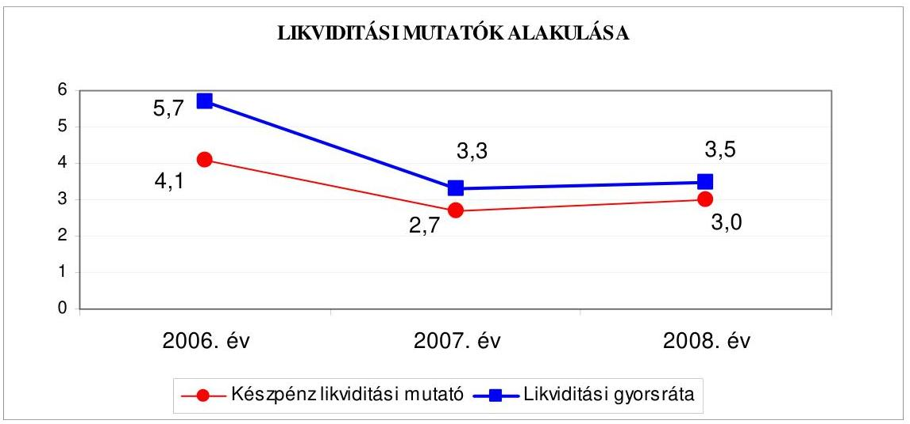

A készpénz likviditási mutató és a likviditási gyorsráta 2006. évről a 2007. évre történő csökkenése az Önkormányzat fizetőképességének gyengülését, míg a 2008. évre történő emelkedés annak erősödését jelzi.

Az Önkormányzat pénzügyi helyzete a 2006. évről a 2008. évre eladósodásának növekedése miatt, fizetőképességének kedvező alakulása ellenére összességében romlott.

# 2. Az ÖNKORMÁNYZAT FELKÉSZÜLTSÉGE AZ EURÓPAI UNIÓS FORRÁSOK IGÉNYLÉSÉRE ÉS FELHASZNÁLÁSÁRA, VALAMINT AZ ELEKTRONIKUS KÖZSZOLGÁLTATÁSI FELADATOK ELLÁTÁSÁRA 

2.1. Az európai uniós források igénybevételére és a
 várható támogatás felhasználására történt felkészülés szabályozottságának, szervezettségének eredményessége

### 2.1.1. Az európai uniós forrásokra történő pályázatok benyújtására vonatkozó döntések összhangja a fejlesztési célkitűzésekkel

Az Önkormányzat fejlesztési célkitűzéseit a Képviselő-testület hosszú távú ágazati koncepciókban ${ }^{18}$ és azok figyelembevételével készített gazdasági programok ${ }_{1,2}$-ben, valamint az Integrált Városfejlesztési Stratégiában határozta meg.

A gazdasági program ${ }_{1}$ tartalmazta a jelzőrendszeres házi segítségnyújtás 2006. évtől kezdődő kiépítését, mélygarázsok kivitelezését, iskola-átalakítást, sportcsarnok létrehozását, az egészségügyi ellátás bővítését Budapest Főváros Önkormányzatától átvételre kerülő járóbeteg-szakellátással, továbbá az Önkormányzat és intézményei, valamint gazdasági társaságai integrált pénzügyi-számviteli rendszerének kialakítását.

A gazdasági program ${ }_{2}$-ben célkitűzésként szerepelt gumitéglás és műfüves pályák kialakítása az oktatási intézményekben, valamennyi óvoda tornaszobával való ellátása. Az Önkormányzat folytatni kívánta a kerületi játszóterek uniós elvárások szerinti átalakítását, felújítását, valamint az iskolai taneszközök korszerűsítését, a számítógépes internet-pontok további bővítését és az úthálózat fejlesztését. Célkitűzésként határozták meg a Kerületi Művelődési Központ épületének európai uniós támogatással való felújítását a 2010. évre, továbbá komplex szolgáltatást nyújtó fogyatékos lakóotthon, illetve idősek otthona intézmény megvalósítását.

A fejlesztési célkitűzések kiadási szükségletét a gazdasági programok ${ }_{1,2}$-ben a Képviselő-testület nem határozta meg, a megvalósítás lehetséges pénzügyi forrásait csak kettő fejlesztési célkitűzésnél vették figyelembe.

A gazdasági program ${ }_{1}$-ben rögzítették, hogy a 2006. évtől kiépítésre kerülő jelzőrendszeres házi segítségnyújtás megvalósítási költségeinek felét pályázati támogatásból tervezik fedezni. A gazdasági program ${ }_{2}$-ben meghatározták, hogy a Kerületi Művelődési Központot uniós támogatással kívánják felújítani.

Az NFT keretében megjelenő pályázati lehetőségek alapján nem módosították a fejlesztési célkitűzéseket, de az ÚMFT prioritásait és intézkedéseit a gazdasági program ${ }_{1}$ felülvizsgálatával elkészített gazdasági program ${ }_{2}$ elkészítésénél figyelembe vették.

Az Önkormányzat a 2006-2008. években öt - európai uniós forrással támogatott - fejlesztésre nyújtott be pályázatot. Három pályázat benyújtásáról a Képviselő-testület, kettő pályázat esetében pedig a polgármester - a 2008. évi költségvetési rendelet felhatalmazása ${ }^{19}$ alapján - döntött. A 2008. évi költségvetési rendelet előírása ellenére a kettő benyújtott pályázat nem volt bizottsági véleménnyel alátámasztva ${ }^{20}$. Az ÚMFT operatív programjaira benyújtott pályázatok közül a bíráló bizottság döntése alapján kettő pályázat támogatást nyert, kettő pályázatot - tartalmi okokra hivatkozással - elutasítottak, egy esetében pedig a támogatás megítéléséről 2009. március 25-ig nem született döntés:

- a Képviselő-testület 143/2007. (VI. 12.) számú határozatával döntött arról, hogy a KMOP-2007-4.6.1. Közoktatási intézmények beruházásainak támogatására megjelent pályázatra kettő ${ }^{21}$ oktatási intézményének fejlesztésére pályázatot nyújt be. A „Tamási Áron Általános Iskola és Német Két Tannyelvű Nemzetiségi Gimnázium komplex felújítása és infrastrukturális fejlesztése" címmel 2007. augusztus 24-én benyújtott pályázat szerint a 274,4 millió Ft kiadással tervezett beruházást 27,4 millió Ft saját forrással és 247,0 millió Ft támogatás igénybevételével szándékoztak megvalósítani. A pályázatot a Regionális Fejlesztési Programok Irányító Hatóságának vezetője „támogatásra érdemesnek ítélte". A támogatási szerződést a támogató képviseletében eljáró VÁTI Kht., mint közreműködő szervezet 2008. február 28-án kötötte meg az Önkormányzattal, amely szerint a projekt befejezésének időpontja 2009. március 15. Az Önkormányzat 2008. november 26-án benyújtotta a közreműködő szervezethez a befejezési határidő változása miatt a szerződésmódosítás tervezetét, azonban ennek a jóváhagyása 2009. március 25-ig nem történt meg, a beruházás folyamatban volt;

- a Képviselő-testület döntése alapján 2008. január 29-én nyújtották be ugyancsak a KMOP-2007-4.6.1. intézkedés keretében az „Esélyegyenlőségorientált eszközfejlesztés a XII. kerületi Mackós Óvodában" című pályázatot. A projekt kivitelezésére 49,5 millió Ft-ot terveztek 44,5 millió Ft igényelt támogatás és 5,0 millió Ft saját forrás mellett. A VÁTI Kht. 2008. február 18-án arról értesítette az Önkormányzatot, hogy a pályázatot nem áll módjukban befogadni és tartalmilag értékelni, mert a pályázati kiírásban megfogalmazott jogosultsági követelményeknek nem tett eleget, ugyanis a betervezett projektmenedzsment költségek meghaladják az összes elszámolható költség 4%-ában meghatározott korlátot. Emiatt a pályázatot az elbírálásból kizárták;
- a Képviselő-testület 64/2008. (V. 15.) számú határozatával döntött arról, hogy a KMOP-2007-5.2.2/B Budapesti integrált városfejlesztési program budapesti kerületi központok fejlesztése keretében meghirdetett felhívásra pályázatot nyújt be „MOM-Gesztenyéskert kulturális, sport és szabadidő negyed funkció bővítő fejlesztése" címmel. A 2002,7 millió Ft kiadással tervezett projektet a Magyar Európai Régiófejlesztő Szövetség Közhasznú Társasággal együttműködve 1290,1 millió Ft támogatás igénybevétele mellett szándékoztak megvalósítani. A 2008. június 18-án benyújtott pályázat szerint a szükséges saját forrásból az Önkormányzat 441,6 millió Ft, a partner pedig 271,0 millió Ft önrészt biztosított. A konzorciumi együttműködési megállapodást az Önkormányzat a partnerrel 2008. június 10-én kötötte meg, amelyben rögzítették, hogy a pályázat támogatása esetén az abban foglalt pályázati célt - az Önkormányzat vezetésével - közösen valósítják meg. A kétfordulós pályázatot 2009. március 25-ig nem bírálták el. Az Önkormányzat 2009. február 24-én feltételekhez kötött előzetes támogatásról szóló döntésről kapott értesítést, amely szerint a 900,0 millió Ft előzetes támogatás feltétele, hogy a projektfejlesztés során az „útvonalterv első mérföldköveként" be kell nyújtani a közreműködő szervezet ${ }^{22}$ iránymutatása alapján javított Integrált Városfejlesztési Stratégiát;

- az ÁROP-3.A.1/B Polgármesteri hivatalok szervezetfejlesztése a Közép-magyarországi régióban intézkedés keretében meghirdetett felhívásra a polgármester a Képviselő-testület felhatalmazása alapján nyújtott be pályázatot 2008. július 22-én „Budapest XII. kerület Hegyvidéki Önkormányzat Polgármesteri hivatala és intézményei működésének átfogó fejlesztése" címmel. A fejlesztést 50,0 millió Ft összköltséggel kívánták megvalósítani 5 millió Ft önerő biztosítása mellett. A 42,0 millió Ft támogatás elnyeréséről a VÁTI Kht. 2008. november 4-én - a formai hiánypótlási felhívásban megjelölt hiányosságok megszüntetését követően - értesítette az Önkormányzatot. A támogatási szerződést a közreműködő szervezet 2009. február 23-án írta alá, amely szerint a 46,7 millió Ft összköltséggel megvalósuló projekt befejezésének várható időpontja 2009. szeptember 30.;
- a KEOP-5.1.0. Energetikai hatékonyság fokozása intézkedés keretében 2008. július 28-án nyújtott be pályázatot a polgármester „Polgármesteri hivatal nyilászáróinak cseréje" címmel. A 77,0 millió Ft összegű fejlesztési feladatot 26,2 millió Ft támogatás mellett 50,8 millió Ft önerő biztosításával szándékoztak megvalósítani. Az Energia Központ Közhasznú Társaság 2008. november 11-i levele szerint a pályázati dokumentációhoz kötelezően csatolandó mellékleteket a hiánypótlás során sem egészítették ki teljes körűen, így a pályázat a teljességi kritériumoknak nem felelt meg. Az indokok között szerepelt, hogy a kötelező mellékleteket nem, vagy hiányosan mutatták be, a projekt adatlap rovatait a hiánypótlás során nem a megadott szempontok szerint mutatták be, a megvalósíthatósági tanulmány adatai egymásnak ellentmondóak és hiányosak voltak. A pályázatot az elbírálásból kizárták.

A 2004. évben a Tulajdonosi és Városfejlesztési Bizottság véleményezése mellett a polgármester kettő pályázatot ${ }^{23}$ nyújtott be, amelyek pénzügyi lebonyolítása a 2008. év végén fejeződött be.

A 2006-2008. évek közötti időszakban benyújtott öt pályázat közül a „Budapest XII. kerület Hegyvidéki Önkormányzat Polgármesteri hivatala és intézményei működésének átfogó fejlesztése" és a „Polgármesteri hivatal nyilászáróinak cseréje"című pályázat nem kapcsolódott a Képviselő-testület által a gazdasági program ${ }_{2}$-ben meghatározott fejlesztési célkitűzésekhez ${ }^{24}$.

A benyújtott európai uniós pályázatok önrészének fedezetére az Önkormányzat a 2007. és 2008. évi költségvetési rendeleteiben 300-300 millió Ft keretet határozott meg, a 2006. évben pályázatot nem nyújtottak be. A 2006. és a 2008. évi költségvetési rendeletek nem tartalmazták elkülönítetten - az Ámr. 29. § (1) bekezdés k) pontjában előírtak ellenére - az európai uniós forrással

megvalósuló fejlesztési feladatok költségvetési bevételi és kiadási előirányzatait, valamint - az Ámr. 29. § (1) bekezdés d) és g) pontjában foglaltak ellenére - a felhalmozási kiadásokat feladatonként, illetve a kiadásokat és bevételeket a támogatási szerződés szerinti ütemezésben. A 2009. évi költségvetési rendeletben az Ámr. előírásainak megfelelően tervezték az európai uniós támogatással megvalósított fejlesztések előirányzatait.

A 2006. évi költségvetési rendelet informatikai pályázat megnevezés alatt kettő európai uniós támogatással megvalósuló projekt kiadását és bevételét összevontan, egy összegben tartalmazta. A Tamási Áron Iskola felújítása projekt bevételeit és kiadásait a 2008. évi költségvetés nem elkülönítetten, továbbá nem a támogatási szerződés szerinti éves ütemezésben tartalmazta.

A 2006-2008. évek közötti európai uniós forrással támogatott befejezett projektek finanszírozási forrásainak tervezett és tényleges megoszlását a következő ábrák mutatják:
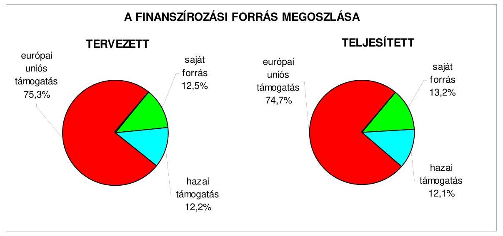

A projektekre elszámolt tényleges kiadások a tervezett kiadásokat 2,5 millió Fttal haladták meg a Szolgáltató Hegyvidék projekt kiadásainak túlteljesítéséből adódóan.

# 2.1.2. Az európai uniós forrásokhoz kapcsolódóan a pályázatfigyelés, a pályázatkészítés, valamint az európai uniós támogatással megvalósuló fejlesztés lebonyolítása belső rendjének szabályozottsága, a végrehajtás személyi, szervezeti feltételei, az ellenőrzési feladatok meghatározása 

Az Önkormányzatnál az európai uniós források igénybevételének és felhasználásának belső rendjét a 2006-2008. években hiányosan szabályozták. Az önkormányzati szintű pályázatkoordinálás feladatainak, valamint az önkormányzati szintű pályázatnyilvántartás vezetésének felelősét a Polgármesteri hivatalon belül nem jelölték ki. A pályázatfigyelést végzők és a döntési, illetve a döntés-előterjesztési jogkörrel rendelkezők közötti információszolgáltatási kötelezettséget belső szabályozásban nem írták elő. Az európai

uniós forrásokra irányuló pályázatfigyelés, pályázatkészítés, valamint az európai uniós forrással támogatott fejlesztés lebonyolításának eljárási rendjét nem szabályozták. A szabályozási hiányosságokat a 2008. december 30-án kiadott polgármesteri és jegyzői együttes utasítással ${ }^{25}$ megszüntették. A folyamatba épített, előzetes és utólagos vezetői ellenőrzési feladatokat a gazdálkodásra vonatkozó területen meghatározták. A 2008. évi éves belső ellenőrzési tervet megalapozó kockázatelemzés kiterjedt az európai uniós forrásokkal támogatott fejlesztési feladatokra, a belső ellenőrzési terv tartalmazta az Önkormányzat által elnyert támogatások 2005-2006. évi felhasználásának ellenőrzését.

Az európai uniós források pályázatfigyelésével és -készítésével összefüggő feladatok végrehajtásának személyi, szervezeti feltételeit a 2006. évben nem biztosították, a feladatok
 ellátásával a 2007. évben külső szervezetet bíztak meg. A pályázatfigyelés és -készítés személyi, szervezeti feltételeit a 2008. évben részben külső szervezet megbízásával, részben a Polgármesteri hivatalon belül alakították ki. Az európai uniós referens munkaköri leírása tartalmazta a pályázatfigyelő cégekkel való kapcsolattartást, illetve a pályázatok készítése során jelentkező koordinátori tevékenységet is. A pályázatfigyelési és -készítési feladatok ellátására a 2007., illetve a 2008. évre kötött szerződésben a feladatellátás kötelezettségeit, az információk átadásának formáját, tartalmát, módját előírták, a felelősség szabályait és a Polgármesteri hivatal képviselője közötti kapcsolattartást - kapcsolattartó kijelölésének hiányában - azonban nem határozták meg. Az NFT keretében meghirdetett pályázati felhívásokra az Önkormányzat a 2006. évben nem nyújtott be pályázatot, az ÚMFT operatív programjaira a 2007-2008. években benyújtott pályázatok közül négyet - megbízási szerződés alapján - külső szervezet, egyet ${ }^{26}$ pedig a Polgármesteri hivatal európai uniós referense készített el.

Az európai uniós támogatással megvalósításra kerülő fejlesztések lebonyolítási feladatainak szervezeti, személyi feltételeit a következők szerint biztosították:

- a Tamási Áron Iskola felújítása projekt esetében a projektmenedzseri feladatok ellátására külső személlyel kötött szerződésben előírták a feladatellátási kötelezettséget, de a kapcsolattartás és az ellenőrzés rendjét, valamint a személyre szóló felelősségi szabályokat nem határozták meg;

A polgármester az iskola igazgatójával megbízási szerződést kötött a projekt lebonyolításának koordinálására és teljes körű felügyeletére. A szerződés szerint a megbízott munkájának irányítására, illetve a megbízás teljesítésének igazolására az Oktatási iroda vezetője volt jogosult. Az Oktatási iroda egyik köztisztviselője szintén szerződéssel kapott megbízást a szakmai adminisztratív feladatok ellátására. A Városüzemeltetési iroda vezetőjének munkaköri leírásában szerepelt a projekt műszaki menedzseri feladatainak ellátása, és a projekt sikeres lebonyolít-

[^0]
[^0]:    ${ }^{25}$ Az 5/2008. számú polgármesteri és jegyzői együttes utasítás az európai uniós és hazai pályázatokkal kapcsolatos feladatokról.
    ${ }^{26}$ „Budapest XII. kerület Hegyvidéki Önkormányzat Polgármesteri hivatala és intézményei működésének átfogó fejlesztése."

---

tásában való közreműködés. A Pénzügyi iroda helyettes vezetőjének munkaköri leírását 2008. november 3-tól kibővítették a projekt pénzügyi menedzseri feladatainak ellátásával.

- a GVOP európai uniós támogatással megvalósított kettő projektnél a polgármester vállalkozási szerződést kötött egy gazdasági társasággal a projektek kapcsán bevezetésre kerülő integrált informatikai rendszer projekttanácsadási és oktatási tevékenységének ellátására. A szerződésben rögzítették, hogy „a projekt-tanácsadás a GVOP 4.3.1. és 4.3.2. pályázatokon elnyert támogatás felhasználásával elkészítendő projektek menedzselésében szakértőként való közreműködést foglalja magában". A lebonyolítási feladatokat a szerződés vállalkozói díj elszámolásának ütemezését tartalmazó - 7. pontjában általánosságban (megvalósításhoz kapcsolódó pénzügyi és szakmai jelentések elkészítése, folyamatos ellenőrzés, felülvizsgálat, tesztek tervezése, ellenőrzése) határozták meg. A szerződésben nem jelölték ki a kapcsolattartó személyeket, nem írták elő a kapcsolattartás és az ellenőrzés rendjét ${ }^{27}$.

# 2.1.3. A fejlesztési feladat lebonyolításánál a feladatellátás rendjére, az ellenőrzési feladatok teljesítésére, valamint a felelősségi szabályokra vonatkozó előírások betartása 

A 255,0 millió Ft összkiadással tervezett Szolgáltató Hegyvidék projekt a GVOP 2004-4.3.1. pályázati cél keretében 223,1 millió Ft támogatást nyert. A támogatási szerződést 2005. július 11-én kötötte meg az IT Információs Társadalom Kht., mint közreműködő szervezet az Önkormányzattal. A támogatási szerződést három alkalommal módosították, első alkalommal az Önkormányzat kezdeményezésére az időbeli ütemezés változása miatt. A második szerződésmódosítás a támogatási előleg felvételi lehetőségéhez kapcsolódott, a harmadik módosítás szerint változott a projekt befejezésének tervezett napja, továbbá módosult a támogatás összegén belül az európai és a hazai támogatás aránya.

Az Önkormányzat gondoskodott a projektnek a hatályos támogatási szerződésben rögzített időbeli megvalósulásáról, a kezdési és befejezési határidőket a támogatási szerződés módosításaiban rögzítetteknek megfelelően betartották. A projekt - a pénzügyi beszámolóban rögzítettek szerint - 2006. december 28-án befejeződött, az utolsó kifizetési kérelem benyújtása azonban a támogatási szerződésben meghatározott 2007. augusztus 14-i határidővel szemben csak 2008. március 30-án történt meg. Az Önkormányzat a támogatás-igénylési határidőt megelőzően nem kapott tájékoztatást a fejlesztési feladat lebonyolítását

[^0]
[^0]:    ${ }^{27}$ A közbenső egyeztetés során a polgármester által adott tájékoztatás szerint az 5/2008. számú polgármesteri és jegyzői együttes utasítás tartalmazza a pályázatok lebonyolítási feladatainak ellátására kötött szerződés ütemezésének betartására, valamint a kapcsolattartó személyek kijelölésére és a kapcsolattartás, illetve az ellenőrzés rendjének előírására vonatkozó szabályozást.

---

végzőtől a támogatási szerződésben meghatározott igénybevételi ütem betartását akadályozó okról ${ }^{28}$.

A közreműködő szervezet 2007. november 11-én értesítette az Önkormányzatot, hogy a Szolgáltató Hegyvidék projektre elnyert támogatás felhasználása annak ellenére nem történt meg teljes mértékben, hogy a pénzügyi elszámolás benyújtási határideje lejárt. Egyúttal kérte a projekt megvalósítása során felmerült, még el nem számolt költségek dokumentumainak 10 napon belül történő benyújtását az elszámolási késedelem indoklásának megküldésével.

Az európai uniós támogatás kifizetésének igénylésénél a támogatásigénybevétel tervezett ütemezésének betartását a támogatás igénylését alátámasztó bizonylatok ellenőrzése során feltárt hiányosságok és azok kijavítása akadályozta.

Az első kifizetés-igénylés ellenőrzése során a közreműködő szervezet hiánypótlásra szólította fel az Önkormányzatot a 2006. június 8-i zárónapra vonatkozó kifizetés igénylés dokumentációjára vonatkozóan, a hiányosságokat 12 pontban összefoglalva. Ugyanezen igényléshez kapcsolódóan újabb felszólítást küldött 2006. október 2-án az igénylési dokumentáció korrekcióját kérve. A támogatás kifizetésére csak a közreműködő szervezet 2006. október 5-i helyszíni ellenőrzése által feltárt hiányosság megszüntetését követően ${ }^{29}$ 2006. november 13-án került sor.

A második támogatás-igénylés dokumentációjának átadását követően - 2007. január 31-én felvett - átadás-átvételi jegyzőkönyv szerint az elszámolás „a nagymértékű hiányosság miatt visszaadásra" került.

A 2006. évre vonatkozó - háromhavonta kötelezően benyújtandó - PEJ-ek, valamint a pénzügyi jelentések ${ }^{30}$ elkészítésére 2007. február 13-án kötött szerződést az Önkormányzat egy gazdasági társasággal. A közreműködő szervezet 2008. június 2-i levelében értesítette az Önkormányzatot a PEJ-ek elfogadásáról, és felszólította a pénzügyi beszámoló, a projekt megvalósításának záró beszámolója, valamint a 2006. és 2007. évre vonatkozó projekt fenntartási jelentés benyújtására.

A projekt megvalósításához a költségvetésben tervezett saját forrást a támogatási szerződésben rögzítettek szerint biztosították, a saját forrás hiánya a tervezett kiadási ütemezés tartását nem akadályozta. Saját forrást kiváltó pénzintézeti hitel felvételére nem került sor. A strukturális alapok által támogatott fejlesztések utófinanszírozási rendszere nem okozott pénzügyi zavart az Ön-

[^0]
[^0]:    ${ }^{28}$ A közbenső egyeztetés során a polgármester által adott tájékoztatás szerint az 5/2008. számú polgármesteri és jegyzői együttes utasításban rendelkeztek a fejlesztési feladatok lebonyolítása során a támogatás tényleges igénybevételének ütemezésére vonatkozó előírások betartásáról.
    ${ }^{29}$ A Szolgáltató Hegyvidék projekt kivitelezésére vonatkozó közbeszerzési eljárást lebonyolító társaság számláihoz kapcsolódó szerződés két projektre vonatkozott, ezért a szerződés és a kapcsolódó számlák összegének megbontását kérte a közreműködő szervezet.
    ${ }^{30}$ A 2007. március 15-i zárónappal készítendő éves beszámoló, pénzügyi beszámoló, és a 2007. április 15-i zárónappal készülő évzáró jelentés.

---

kormányzatnál, a támogatási szerződés második módosítása alapján 55,8 millió Ft támogatási előleg felvételére került sor.

A közreműködő szervezet a Szolgáltató Hegyvidék projekt megvalósításának záró beszámolóját a 2009. január 29-i értesítése szerint elfogadta, tájékoztatva az Önkormányzatot, hogy a projekt fenntartási időszaka 2006. december 28-tól megkezdettnek tekinthető. A projektnek az adófolyószámlák kezelésére, az adózók nyilvántartására szolgáló elemét - a Pénzügyminisztérium jóváhagyásának hiányában - 2009. március 25-ig nem vették használatba, továbbá a közreműködő szervezet megállapítása szerint az egyéb rendszerek közötti integráció foka nem biztosítja a hivatali elektronikus ügyintézést. A projekt lebonyolítója ugyanakkor nem értesítette az Önkormányzatot a támogatási szerződésben rögzített célok és indikátorok teljesülését akadályozó tényezőkről.

A projektre európai uniós támogatásként elszámolt bevételek beszedésének elrendelése előtt nem történt meg a munkafolyamatba épített ellenőrzési feladatok végrehajtása, a teljesítés szakmai igazolása, az érvényesítés, az utalványozás, valamint az utalvány ellenjegyzése - az Ámr. 135. § (1) és (3), 136. § (1), valamint 137. § (3) bekezdéseinek előírásai ellenére - egyaránt elmaradt. A projekt kivitelezésével kapcsolatos kiadások esetében a szabályozásnak megfelelően elvégezték a munkafolyamatba épített ellenőrzési feladatokat.

A lebonyolítási szerződésben rögzített vállalkozói díj 23,3 millió Ft-os összegét nem bontották meg a Szolgáltató Hegyvidék projekt és az Adatvagyon másodlagos hasznosítása projekt között, ennek ellenére a kötelezettségvállalás ellenjegyzője a szerződést aláírásával ellátta az Ámr. 134. § (9) bekezdés c) pontjában előírtakkal szemben, vagyis nem győződött meg arról, hogy a kötelezettségvállalás nem sérti-e a gazdálkodásra vonatkozó szabályokat. Ennek következtében a kifizetés során a lebonyolítási díj összegét nem a projekthez kapcsolódóan, hanem dologi kiadásként számolták el megsértve a Számv. tv. 47. § (4) bekezdés d) pontjában foglaltakat, ezáltal a lebonyolítási díj összege nem képezte a projekt bekerülési értékének részét ${ }^{31}$.

A belső ellenőrzés a 2008. évi ellenőrzési terve alapján vizsgálta az európai uniós forrásból támogatott projekt megvalósítását és a következő megállapításokat tette:

- a benyújtott kifizetési kérelmek és annak mellékletei „hiteles formában nem álltak maradéktalanul rendelkezésre";
- a kifizetés igénylési dokumentációval kapcsolatosan a közreműködő szervezet hiánypótlásra szólította fel az Önkormányzatot, azonban a hiánypótlással kapcsolatos dokumentumok sem álltak a belső ellenőrzés rendelkezésére;

[^0]
[^0]:    ${ }^{31}$ A közbenső egyeztetés során a polgármester által adott tájékoztatás szerint a 2/2009. számú polgármesteri és jegyzői együttes utasításban (2009. június 10.) intézkedtek a szakmai teljesítésigazolás, az érvényesítés, az utalványozás, az utalvány ellenjegyzésének, valamint a kötelezettségvállalás ellenjegyzésének végrehajtására vonatkozóan.

---

- a projekt elkülönített - pénzügyi és dokumentációs - nyilvántartására vonatkozó előírásokat nem tartották be, aláírt iratokat (a beadott pályázati formanyomtatványt és mellékleteit, a PEJ-eket és mellékleteiket, a közreműködő szervezettel folytatott teljes körű levelezést) a vizsgálat során nem talált az ellenőrzés.

A belső ellenőrzés javasolta a projekt szintű nyilvántartási rendszer teljes körű kialakítását, a nyilvántartási rendszer adataira és a projekttel kapcsolatos dokumentumokra vonatkozó - a támogatási szerződésben előírt - iratmegőrzési kötelezettség betartását, továbbá a külső ellenőrzés során feltárt hiányosságok megszüntetését. A javaslatok hasznosulása érdekében a jegyző által 2008. szeptember 1-jén kiadott intézkedési terv készült felelősök és határidő megjelölésével.

A közreműködő szervezet három alkalommal vizsgálta a Szolgáltató Hegyvidék projektet, a helyszínen a megvalósítás folyamatában előzetes, közbenső és a pénzügyi lezárást megelőzően utóellenőrzést tartott. Szabálytalanságra vonatkozó megállapítást a külső ellenőrzés a közbenső és az utóellenőrzés során tett. A külső ellenőrzések szabálytalanságra, illetve mulasztásra vonatkozó megállapításaihoz támogatás visszafizetési kötelezettség nem kapcsolódott. A külső közbenső ellenőrzésnek mulasztásokra vonatkozó megállapításaira csak a belső ellenőrzés javaslatai alapján történt intézkedés, de a harmadik külső ellenőrzést követően a polgármester azonnal intézkedett a hiányosságok megszüntetése érdekében.

Az IT Információs Társadalom Kht. 2005. március 30-án - a támogatási szerződés általa történő aláírása előtt - lefolytatott előzetes ellenőrzése során megállapította, hogy a beruházás nem kezdődött el ${ }^{32}$, a projekt szervezet még nem állt fel. Az ellenőrzés megállapítása szerint a késedelem a beadott pályázat elbírálásának, illetve a támogatási
 szerződés aláírásának elhúzódásával indokolható. Az ellenőrzés szerződéskötést befolyásoló hibát, szabálytalanságot nem állapított meg.

A közreműködő szervezet - az első támogatás kifizetése előtt - 2006. október 5-én végrehajtott közbenső ellenőrzésekor megállapította, hogy a benyújtott dokumentáció összhangban állt a PEJ-ekkel és a helyszínen tapasztaltakkal, a korábban elküldött hiánypótlási felszólításban kért dokumentumok egy része a helyszínen bemutatásra került. A közreműködő szervezet a mulasztások megszüntetésére - az előírt logónak a támogatásból létrehozott portálon való megjelenítésére, valamint vagyonbiztosítási szerződés módosítására - szólította fel az Önkormányzatot a helyszíni ellenőrzési jegyzőkönyvben.

A MAG Zrt., mint közreműködő szervezet hajtotta végre a harmadik - a pénzügyi lezárást megelőző - külső ellenőrzést 2008. szeptember 9-én. Az ellenőrzési jegyzőkönyv megállapításai szerint az elkülönített nyilvántartásra vonatkozó kötelezettség ellenére a főkönyvi könyvelésben a kettő GVOP támogatással megvalósuló projekt ${ }^{33}$ egy azonosító kódszámon volt nyilvántartva, az Önkormányzat vállalta, hogy a kettő projekt elkülönítését végrehajtja. Az ellenőrzés megállapította továbbá, hogy a nyilatkozatban foglalt 2006. december 28-i befejezési határidőt

[^0]
[^0]:    ${ }^{32}$ A benyújtott pályázatban 2005. március 30-i befejezési időpont terveztek.
    ${ }^{33}$ Szolgáltató Hegyvidék projekt, Adatvagyon másodlagos hasznosítása projekt.

---

projekt dokumentum nem támasztja alá, és felkérte az Önkormányzatot a Projekt Megvalósításának Záró Beszámolója szakmai dokumentum, az indikátor felülvizsgálati lehetőséghez tartozó adatlap, valamint a 2006. és 2007. évekre vonatkozó Projekt Fenntartási Jelentések megküldésére. Az ellenőrzés összefoglalóan megállapította, hogy a projekt zárása nem lehetséges, és a ki nem fizetett támogatás felfüggesztését javasolta, elsősorban az adónyilvántartásra szolgáló program akkreditációjának hiánya és az alacsony integráltság miatt. A támogatás utolsó részletét ennek ellenére kifizették.

Az Önkormányzat a szabályozottság és szervezettség tekintetében a 2006-2008. évek között annak ellenére nem készült fel eredményesen az európai uniós források igénybevételére és a várható támogatások felhasználására, hogy a folyamatba épített, előzetes és utólagos vezetői ellenőrzési feladatokat a gazdálkodásra vonatkozó területen szabályozták, a 2008. évi belső ellenőrzési tervet megalapozó kockázatelemzés kiterjedt az európai uniós forrásokkal támogatott fejlesztési feladatokra, valamint a pályázatfigyelés, a pályázatkészítés szervezeti, személyi feltételeit a 2007-2008. években, a fejlesztési feladat lebonyolításának szervezeti, személyi feltételeit mindhárom évben biztosították.

Azonban kettő pályázat nem kapcsolódott ${ }^{34}$ a gazdasági program ${ }_{2}$-ben meghatározott fejlesztési feladatokhoz, a külső szervezettel kötött szerződésben a pályázat szakmai és tartalmi követelményeire vonatkozóan nem határozták meg a pályázatkészítést végző felelősségét, valamint nem írták elő a pályázatfigyelést végző és a döntési, illetve a döntés előterjesztési jogkörrel rendelkezők közötti információszolgáltatási kötelezettséget, a fejlesztési feladat lebonyolítását végző ellenőrzési kötelezettségeit.

# 2.2. Az elektronikus közszolgáltatás feltételeinek kialakítása, a közérdekű gazdálkodási adatok elektronikus közzététele 

Az Önkormányzat nem rendelkezett a Képviselő-testület által jóváhagyott, vagy a jegyző által kiadott informatikai stratégiával.

A Szolgáltató Hegyvidék projekthez a 2004. évben elkészített és a pályázathoz mellékelt informatikai stratégiát a Képviselő-testület nem hagyta jóvá, a jegyző nem adta ki.

Az Önkormányzat az informatikai feladatellátás továbbfejlesztéséhez a 2006-2008. közötti években az ÁROP keretében kiírt támogatásra pályázott. Az ÁROP-3.A.1/B. Polgármesteri hivatalok szervezetfejlesztése a Közép-magyarországi régióban intézkedésre benyújtott pályázat támogatást nyert. A támogatási szerződést 2009. február 23-án kötötte meg a közreműködő szervezet az Önkormányzattal, amely szerint a projektet 2009. szeptember 30-ig tervezik megvalósítani.

[^0]
[^0]:    ${ }^{34}$ A közbenső egyeztetés során a polgármester által adott tájékoztatás szerint az európai uniós és hazai pályázatokkal kapcsolatos feladatokról szóló 5/2008. számú polgármesteri és jegyzői együttes utasításban előírták, hogy a benyújtott pályázatoknak kapcsolódnia kell a Képviselő-testület által meghatározott fejlesztési elképzelésekhez.

---

Az Önkormányzatnál az e-közigazgatási feladat ellátásának személyi, szervezeti feltételeit a Polgármesteri hivatalon belül biztosították. Az e-közigazgatási szolgáltatást az Önkormányzat saját számítógépes informatikai rendszerével, vásárolt szoftvert működtetve végezte.

Az elektronikus ügyintézés helyi szabályozásáról az Önkormányzat rendeletet alkotott ${ }^{35}$, amelyben tételesen meghatározták az elektronikus úton intézhető közigazgatási hatósági ügyek körét, és rögzítették, hogy egyéb közigazgatási ügy elektronikus úton nem intézhető. Az Önkormányzatnál működtettek e-közigazgatási feladatokat ellátó informatikai rendszert, az ügyintézést 2., illetve 3. elektronikus szolgáltatási szinten valósították meg. Az állampolgárok részére az ügyintézést a 2. elektronikus szolgáltatási szinten biztosították a lakcímváltozás bejelentése, a személyi okmányok, a gépjármű regisztráció intézése, a szociális juttatások, támogatások kifizetései és az egészségüggyel kapcsolatos szolgáltatások területén, a szükséges nyomtatványok honlapról letölthetőek voltak. A 3. elektronikus szolgáltatási szinten valósult meg a helyi adózás, a hatósági igazolások és az építési engedélyezés ügyintézése. A vállalkozások részére a gépjármű súlyadó ügyintézését 2. szinten, az engedélyek ügyintézését pedig 3. elektronikus szolgáltatási szinten biztosították. A teljes közvetlen, kétoldalú ügyintézés biztosításának akadálya, hogy informatikai stratégia hiányában nem határozták meg, hogy az e-közigazgatási feladatok melyik szintjét kívánják elérni.

Az e-közigazgatási feladatokat ellátó informatikai rendszer ügyfelek általi igénybevételét nem kísérték figyelemmel az Önkormányzatnál. Az informatikai rendszeren keresztül végzett ügyintézésnek, az egyes ügykörök igénybevételének tapasztalatait nem értékelték ${ }^{36}$.

Az Önkormányzat honlapján ${ }^{37}$ a gazdálkodási adatok közzététele az IHM rendeletben meghatározott szerkezetben történt.

A közzétételre szolgáló honlap megnyitásakor megjelenő oldalon elhelyezték a közzétételi listák által előírt adatokat tartalmazó jegyzékre mutató hivatkozást „Közérdekű adatok" elnevezéssel. A jegyzék a rendelet 1. számú melléklete szerinti tagolásban tartalmazta a közzétételi egységeket, a 3. Gazdálkodási adatok közzétételi egység alatt történt a céljellegű támogatások és a nettó öt millió forint feletti szerződések közzététele.

[^0]
[^0]:    ${ }^{35}$ Az Önkormányzat 19/2007. (V. 17.) számú rendelete az elektronikus hatósági ügyintézés és szolgáltatás helyi szabályozásáról.
    ${ }^{36}$ A közbenső egyeztetés során a polgármester által adott tájékoztatás szerint az e-közigazgatási feladatokat ellátó informatikai rendszer ügyfelek általi igénybevételének figyelemmel kísérését és értékelését a jegyző utasításban rendelte el.
    ${ }^{37}$ A honlap elérhetősége: www.hegyvidek.eu.

---

Az Önkormányzat a nettó öt millió Ft-nál alacsonyabb összegű szerződések kötelező közzétételét előíró rendeletet nem alkotott, de a 200 ezer Ft alatti felhalmozási célú támogatások közzétételének mellőzését lehetővé tette ${ }^{38}$. A közzétételi kötelezettség alóli felmentést azonban nem terjesztették ki a 200 ezer Ft alatti működési célú támogatásokra.

Az Önkormányzat megsértette az Áht. 15/A. § (1) bekezdésének előírását, mert nem tette közzé az általa nyújtott céljellegű működési és felhalmozási támogatások kedvezményezettjeinek nevét, a támogatás célját, összegét, továbbá a támogatási program megvalósítási helyét.

Nem történt meg a közzététel a társasházak felújítására adott felhalmozási célú támogatások, a 200 ezer Ft alatti működési célú támogatások ${ }^{39}$, valamint az OMSZI Intézmény Fenntartó Közhasznú Társaságnak nyújtott 1,6 millió Ft működési támogatás esetében ${ }^{40}$.

Az Önkormányzat a Polgármesteri hivatal pénzeszközei felhasználásával, vagyonnal történő gazdálkodással összefüggő - a nettó öt millió forintot elérő, vagy azt meghaladó értékű - árubeszerzésre, építési beruházásra, szolgáltatás megrendelésre, vagyonértékesítésre, vagyonhasznosításra, vagyon, vagy vagyoni értékű jog átadására, valamint koncesszióba adásra vonatkozó szerződések adatait megfelelően, a szerkezeti előírásokat betartva honlapján közzétette, míg kettő intézmény ${ }^{41}$ adatait - az Áht. 15/B. § (1) bekezdésében foglaltakat megsértve - nem tette közzé honlapján ${ }^{42}$.

Az Önkormányzat által közzétett - az Ámr. 22. számú melléklet 5. sorában meghatározott - éves költségvetési beszámoló szöveges indoklása nem felelt meg a Vhr. 40. § (4), és (7)-(11) közötti bekezdésekben rögzített tartalmi követelményeknek, ezáltal nem tartották be az Ámr. 157/D. § (1) bekezdésében foglalt előírást.

Az önkormányzati költségvetési szervek éves költségvetési beszámolójának szöveges indoklása közzétételi jegyzék alatt tették közzé az Önkormányzat honlapján az „Önkormányzat 2007. évi költségvetési beszámoló és zárszámadási rendelettervezetére" vonatkozó képviselő-testületi előterjesztést, amely tartalmilag nem fe-

[^0]
[^0]:    ${ }^{38}$ A 2008. évi költségvetési rendelet végrehajtási szabályai között rögzítették, hogy „az Önkormányzat által nyújtott, az Áht. 15/A. §-ában nem normatív, céljellegű, fejlesztési támogatásokra vonatkozó közzététel mellőzhető, ha a támogatás összege nem éri el a 200 ezer Ft-ot."
    ${ }^{39}$ A közbenső egyeztetés során a polgármester által adott tájékoztatás szerint az Önkormányzat 6/2009. (IV. 22.) számú rendeletével módosították a 2009. évi költségvetési rendeletet, felmentést adva a 200 ezer Ft alatti működési célú támogatások közzététele alól.
    ${ }^{40}$ A közbenső egyeztetés során a polgármester által adott tájékoztatás szerint a működési célú támogatások adatait - ideértve a társasházak felújítására biztosított támogatásokat is - az Önkormányzat honlapján teljes körűen közzétették.
    ${ }^{41}$ A Kós Károly Ének-zene Emeltszintű Általános Iskola és a Hegyvidéki Lapkiadó.
    ${ }^{42}$ A közbenső egyeztetés során a polgármester által adott tájékoztatás szerint a két intézmény adatainak közzététele az Önkormányzat honlapján megtörtént a 2009. évben.

---

lelt meg az éves költségvetési beszámoló kiegészítő mellékletére vonatkozó követelményeknek. A közzétett előterjesztésben nem ismertették azokat a tényezőket, amelyek befolyásolták az előirányzatok tervezettől eltérő felhasználását, nem indokolták a teljes kötelezettségállomány alakulását befolyásoló tényezőket, nem készült szöveges értékelés az európai uniós támogatási programokkal kapcsolatban felhasznált saját költségvetési források alakulásáról. A közzétett előterjesztés nem tartalmazta a közalapítványok, az alapítványok által ellátott feladatokra teljesített kifizetések részletes felsorolását. A könyvviteli mérlegben kimutatott részesedéseket nem mutatták be a részesedési arány ( $100 \%-\mathrm{os}, 75 \%$-on felüli, $50 \%$-on felüli, illetve $25 \%$-on felüli részesedések) szerinti bontásban a gazdasági társaság nevének, székhelyének, valamint a részesedés mennyiségének és értékének feltüntetésével.

# 3. A KÖLTSÉGVETÉSI GAZDÁLKODÁS BELSŐ KONTROLLJAI 

### 3.1. A szabályozottság kockázata a költségvetés tervezési, gazdálkodási, beszámolási és a folyamatba épített, előzetes és utólagos vezetői ellenőrzési feladatoknál

A költségvetés tervezési és zárszámadás készítési folyamatok szabályozottságának hiányosságai közepes kockázatot ${ }^{43}$ jelentettek a feladatok szabályszerű végrehajtásában, mivel a jegyző nem szabályozta a Polgármesteri hivatalban és az intézményeknél az ismert kötelezettségek megtervezésének, a benyújtott költségvetési igények teljesíthetőségének, a saját bevételek előirányzatai és a költségvetés megalapozását szolgáló helyi rendeletek összhangjának ellenőrzését, valamint a költségvetési tervezéshez készített intézményi mutatószám felmérés adatai megalapozottságának, és az intézmények által az állami támogatásokkal, hozzájárulásokkal történő elszámoláshoz közölt mutatószámok adatai megbízhatóságának ellenőrzését, azonban a kialakított belső kontrollok - végrehajtásuk esetén - a lehetséges hibák többsége ellen védelmet nyújtottak.

A jegyző az Ügyrendben 2008. július 1-től szabályozta a Polgármesteri hivatal szervezeti egységei és az intézmények által benyújtott költségvetési igények teljesíthetőségének, valamint a saját bevételek előirányzatai és a költségvetés megalapozását szolgáló helyi rendeletek összhangjának ellenőrzési kötelezettségét. 2009. március 25-ig az ellenőrzési nyomvonal kiegészítésével előírták a Polgármesteri hivatalban és az intézményeknél az ismert kötelezettségek ellenőrzését, a költségvetési tervezéshez készített intézményi mutatószám felmérés adatai megalapozottságának ellenőrzését, valamint az intézmények által az állami támogatásokkal, hozzájárulásokkal történő elszámoláshoz közölt mutatószámok adatai megbízhatóságának ellenőrzését, továbbá a munkaköri leírásokban rögzítették a mutatószámokkal kapcsolatos ellenőrzési feladatokat.

A gazdálkodási, a pénzügyi-számviteli és a folyamatba épített ellenőrzési feladatok szabályozottsága összességében
 alacsony kockázatú

[^0]
[^0]:    ${ }^{43}$ Közepesnek minősítettük a belső kontrollokban rejlő kockázatot, amennyiben a kontrollok - végrehajtásuk esetén - a lehetséges hibák többsége ellen védelmet nyújtanak.

---

tot ${ }^{44}$ jelentett a feladatok megfelelő, szabályszerű végrehajtásában, mivel a pénzügyi irányítási és ellenőrzési rendszer keretében elkészítették a gazdasági szervezet ügyrendjét, a polgármesterrel közösen a jegyző meghatározta a kötelezettségvállalás, ellenjegyzés, utalványozás, érvényesítés rendjét, a szakmai teljesítés igazolásának módját, kijelölte a szakmai teljesítés igazolását végző személyeket a gazdálkodási jogkörök szabályzata ${ }_{1,2}$-ben. Biztosította az összeférhetetlenségi követelmények érvényesülését, az önköltségszámítás rendjének elkészítését, kialakította a FEUVE-val kapcsolatos szabályozást és eljárási rendet az ellenőrzési nyomvonal, a szabálytalanságok kezelésének szabályozása és a kockázatkezelés rendjének elkészítésével, valamint kiadta a pénzügyigazdasági, számviteli területen foglalkoztatott köztisztviselők munkaköri leírását. Annak ellenére összességében alacsony volt a kockázat, hogy az értékelési szabályzatban az adókövetelések egyszerűsített értékelési eljárását, ezen követelések besorolásának elveit, dokumentálásának szabályait, az adósonkénti kisösszegű követelések könyvekben elkülönített csoportjára az értékvesztés összegének a követelés nyilvántartásba vételi érték százalékban történő meghatározását nem írták elő, valamint nem határozták meg az értékelések ellenőrzéséért felelős munkaköröket. Az eszközök hasznosítási, selejtezési szabályzatában nem határozták meg a döntéshozatalra jogosultak körét az üzemeltetésre átadott eszközökre, valamint a selejtezési eljárás szabályszerű végrehajtásának folyamatba épített ellenőrzéséért felelős személyt. A számlarend nem tartalmazta a főkönyvi és az analitikus nyilvántartások egyeztetésének módját. A munkaköri leírások nem tartalmazták az értékelési és értékelés-ellenőrzési feladatokat.

Az értékelési szabályzat 2008. július 1-i módosításával a jegyző szabályozta az adókövetelések egyszerűsített értékelési eljárását, ezen követelések besorolásának elveit, dokumentálásának szabályait, az adósonkénti kisösszegű követelések könyvekben elkülönített csoportjára az értékvesztés összegének a követelés nyilvántartásba vételi érték százalékban történő meghatározását, az Ügyrendben meghatározta az értékelések ellenőrzéséért felelős munkakört. Az eszközök hasznosítási, selejtezési szabályzatának módosításával kijelölte a döntéshozatalra jogosultak körét az üzemeltetésre átadott eszközökre, valamint a selejtezési eljárás szabályszerű végrehajtásának folyamatba épített ellenőrzéséért felelős személyt. A számlarend módosításával szabályozta a főkönyvi és az analitikus nyilvántartások egyeztetésének módját. A feladatot végző köztisztviselők munkaköri leírását 2009. márciusában kiegészítették az értékelési és értékelés-ellenőrzési feladatokkal.

A gazdálkodási, a pénzügyi-számviteli és a folyamatba épített ellenőrzési feladatok szabályozottsága javult a 2009. évre a korábbi ÁSZ vizsgálat javaslatainak hasznosulása következtében, mivel a jegyző gondoskodott a Polgármesteri hivatali SzMSz, valamint az utalványrendelet kiegészítéséről, a FEUVE szabályzatok (ellenőrzési nyomvonal, szabálytalanságok kezelésének szabályozása, a kockázatkezelés rendje) elkészítéséről.

[^0]
[^0]:    ${ }^{44}$ A kialakított belső kontrollokban rejlő kockázatot alacsonynak minősítettük, ha a kontrollok - végrehajtásuk esetén - megfelelő védelmet nyújtanak a hibák bekövetkezése ellen.

---

A Polgármesteri hivatal nem rendelkezett a jegyző, vagy a Képviselő-testület által elfogadott informatikai stratégiával, valamint nem gondoskodtak az informatikával kapcsolatos szabályzatok megismertetéséről. Az informatikai biztonsági szabályzat rendelkezésre állt, a Polgármesteri hivatalban a pénzügyszámvitel által használt programok adatai informatikai hálózaton keresztül elérhetők, és integrált pénzügyi-számviteli informatikai rendszert vezettek be. A Polgármesteri hivatalban a pénzügyi-számviteli feladatoknál alkalmazott informatikai rendszerek működésének szabályozottsága összességében alacsony kockázatot jelentett a feladatok megfelelő, szabályszerű végrehajtásában, mivel a Polgármesteri hivatal rendelkezett katasztrófa-elhárítási tervvel, eljárásrenddel a hozzáférési jogosultságokra, a pénzügyi-számviteli rendszerből lekérhető volt az ellenőrzési lista, valamint szabályozták a mentési eljárásokat. Annak ellenére összességében alacsony volt a kockázat, hogy a külső fejlesztők éles rendszerhez való hozzáférését nem tiltották meg, nem volt az ellenőrzési lista vizsgálatáért felelős kinevezett dolgozó, nem szabályozták a pénzügyi-számviteli szoftverváltozások ellenőrzésére, tesztelésére vonatkozó eljárásokat, valamint a mentési eljárások keretében a felelősségi viszonyokat ${ }^{45}$.

# 3.2. A belső kontrollok működése az önkormányzati források szabályszerű felhasználásában, a költségvetési tervezés, gazdálkodás, beszámolás folyamataiban 

A költségvetési tervezési és zárszámadás-készítési folyamatban a kontrollok működésének megbízhatósága gyenge ${ }^{46}$ volt, mert a hiányos szabályozás miatt nem végezték el:

- az ismert kötelezettségek megtervezésének ellenőrzését a Polgármesteri hivatalban és az intézményeknél;
- a költségvetési tervezéshez készített intézményi mutatószám-felmérés adatai megalapozottságának ellenőrzését;
- a Polgármesteri hivatal szervezeti egységei, az intézmények által benyújtott költségvetési igények teljesíthetőségének ellenőrzését;

[^0]
[^0]:    ${ }^{45}$ A közbenső egyeztetés során a polgármester által adott tájékoztatás szerint a jegyző a 4/2009. számú utasításával (2009. június 10.) kiadta az Önkormányzat 2009-2012. évre szóló informatikai stratégiáját, az informatikával kapcsolatos szabályzatok megismertetését minden szervezeti egység számára kiosztott szabályzatok útján biztosította. Egy köztisztviselő munkaköri leírásában megjelölték az ellenőrzési lista vizsgálatának feladatát, továbbá mellékelték azon dokumentumot, amely tartalmazta a külső fejlesztők éles rendszerhez való hozzáférésének szabályozását, a pénzügyi-számviteli szoftver változások ellenőrzésére, tesztelésére vonatkozó eljárásokat, valamint a mentési eljárások keretében a felelősségi viszonyokat.
    ${ }^{46}$ Amennyiben a kontrollok - kialakításuk hiánya, illetve hiányosságai miatt - nem biztosították a hibák megelőzését, feltárását, kijavítását és ez veszélyeztette az eredményes, megbízható működést, a kontroll működésének megbízhatósága gyenge minősítést kapott.

---

- a saját bevételek előirányzatai és a költségvetés megalapozását szolgáló helyi rendeletek összhangjának ellenőrzését;
- az intézmények által az állami támogatásokkal, hozzájárulásokkal történő elszámoláshoz közölt mutatószámok adatai megbízhatóságának ellenőrzését.

A belső szabályozásban előírtak ellenére az intézményi pénzmaradványok megállapításának szabályszerűségét belső szabályzatban előírt módon nem ellenőrizték ${ }^{47}$.

A Polgármesteri hivatal a 2008. évi elemi költségvetésében a külső szolgáltatók által végzett karbantartási, kisjavítási szolgáltatásokkal kapcsolatos kiadások fedezetére 338,4 millió Ft eredeti előirányzatot tervezett, amely összeget 363,6 millió Ft-ra növeltek, a 2008. évi teljesítés 279,1 millió Ft volt. Az eredeti és a módosított előirányzat 15%-os, a teljesítés 13%-os részarányt képviselt a dologi kiadásokból. A 2009. évi elemi költségvetésben 190,3 millió Ft eredeti előirányzatot terveztek, ami a dologi kiadások 8%-át képezte. Az előirányzatok felhasználása során a megrendelések, szerződések tárgya ${ }^{48}$ összhangban volt a Polgármesteri hivatal által ellátott feladatokkal. A Polgármesteri hivatalnál a külső szolgáltató által végzett karbantartási, kisjavítási munkák gazdasági eseményei között elszámolt kiadások teljesítése során a szakmai teljesítésigazolás és az utalvány-ellenjegyzés működésének megbízhatósága összességében kiváló ${ }^{49}$ volt, mivel a számítógépes rendszer, programok, vízvezeték, villany, klímaberendezés, kazán, felvonó, gépkocsi szerelésére, karbantartására, park-, útfenntartásra vonatkozó szerződésekben, megrendelésekben meghatározott cél teljesítésének, a kiadások jogosultságának, összegszerűségének ellenőrzését a szakmai teljesítés igazolására kijelölt személyek a gazdálkodási jogkörök szabályzata ${ }_{1+2}$-ben előírt módon elvégezték. Az utalvány-ellenjegyzője a szakmai teljesítésigazolás és az érvényesítés elvégzéséről, valamint a gazdálkodásra vonatkozó további szabályok érvényesüléséről meggyőződött ezen kiadások tekintetében. Annak ellenére összességében kiváló volt a kontrollok működésének megbízhatósága, hogy a fénymásoló-karbantartáshoz kapcsolódó kifizetésnél a szakmai teljesítés igazolására kijelölt személy úgy látta el aláírásával az utalványrendeletet, hogy a kifizetés tárgyához kapcsolódóan nem állt rendelkezésre kötelezettségvállalás, ezáltal nem igazolta a kiadás jogosultságát, összegszerűségét, a kötelezettségvállalásban foglaltak teljesítését. Az utalvány

[^0]
[^0]:    ${ }^{47}$ A közbenső egyeztetés során a polgármester által adott tájékoztatás szerint a 2/2009. számú polgármesteri és jegyzői együttes utasításban (2009. június 10.) rendelkeztek a költségvetés-tervezés és a zárszámadás-készítés folyamatában elvégzendő feladatoknak a végrehajtásáról.
    ${ }^{48}$ Fénymásoló, számítógépes rendszer, programok, vízvezeték, villany, klímaberendezés, kazán, felvonó, gépkocsi karbantartására, szerelésére, park- és útfenntartásra teljesítettek kifizetéseket.
    ${ }^{49}$ A kontrollok működésének megbízhatóságát kiválónak értékeltük abban az esetben, ha azok működése - esetleges apróbb hiányosságoktól eltekintve - megfelelt a hibák megelőzésére és kijavítására meghatározott szabályozásnak és legmagasabb szintű elvárásoknak.

---

ellenjegyzője ezen gazdasági eseménynél a kifizetés teljesítése előtt nem győződött meg a gazdálkodásra vonatkozó további szabályok érvényesüléséről, mivel nem kifogásolta a kötelezettségvállalás hiányát.

Az Önkormányzat szerződést kötött fénymásoló-karbantartásra egy gazdasági társasággal. A megkötött szerződés melléklete sorolta fel azon eszközöket, amelyekre a kötelezettségvállalás kiterjedt. A kifizetés során nem a szerződés mellékletében rögzített fénymásolók után állította ki a számlát a szolgáltató, ennek ellenére az Önkormányzat ezen számla ellenértékét kifizette. A fénymásolók karbantartása megtörtént.

A 2008. évben a költségvetési pénzforgalmat érintő gazdasági események közül a külső szolgáltatók által végzett karbantartási, kisjavítási szolgáltatásokkal kapcsolatos kifizetéseknél az érvényesítő az Ámr. 135. § (5) bekezdésében meghatározott feladatát nem megfelelően látta el a főkönyvi számlák kijelölésénél, mivel a karbantartás főkönyvi számlát jelölte ki egyéb kommunikációs szolgáltatások (számítógép rendszerek, programok karbantartása, rendszerkövetés, rendszerfelügyelet) gazdasági eseményeinél, továbbá bérleti kiadásként jelölte ki az utalványrendeletben egy számítástechnikai szolgáltatás kiadásának főkönyvi számláját a Vhr. 9. számú melléklet 9. c) pontjában előírtak ellenére.

A Polgármesteri hivatal a gépek, berendezések és felszerelések beszerzésével, létesítésével kapcsolatos kiadások fedezetére a 2008. évi elemi költségvetésben 90,0 millió Ft eredeti előirányzatot határozott meg, amely összeg az év közbeni módosítások következtében 48,5 millió Ft-ra csökkent, a 2008. évi teljesítés összege 46,4 millió Ft volt. Az eredeti előirányzat 2%-ot, a módosított előirányzat 1%-ot, míg a teljesítés 3%-ot képviselt a felhalmozási kiadásokból. A 2009. évi elemi költségvetésben 151,6 millió Ft eredeti előirányzatot terveztek, a felhalmozási kiadások 6%-át. Az előirányzatok felhasználása során a szerződések tárgya ${ }^{50}$ összhangban volt a Polgármesteri hivatal által ellátott feladatokkal. A Polgármesteri hivatalnál a gépek, berendezések és felszerelések beszerzése, létesítése gazdasági eseményei között elszámolt kiadások teljesítése során a szakmai teljesítésigazolás és az utalvány-ellenjegyzés működésének megbízhatósága kiváló volt, mivel a gépek, berendezések, felszerelések beszerzésére vonatkozó szerződésekben, megrendelésekben meghatározott feladatok teljesítésének, a kiadás jogosultságának, összegszerűségének ellenőrzését a szakmai teljesítés igazolására kijelölt személyek a gazdálkodási jogkörök szabályzata ${ }_{1,2}$-ben előírt módon elvégezték. Az utalvány-ellenjegyzője a szakmai teljesítésigazolás és az érvényesítés megtörténtéről, a gazdálkodásra vonatkozó további szabályok betartásáról meggyőződött.

A 2008. évben a költségvetési pénzforgalmat érintő gazdasági események közül a gépek, berendezések és felszerelések beszerzésével, létesítésével kapcsolatos kiadásokra teljesített kifizetéseknél az érvényesítő az Ámr. 135. § (5) bekezdésében meghatározott feladatát nem megfelelően látta el a főkönyvi számlák kijelölésénél, mivel gépbeszerzés főkönyvi számlán jelölt ki immateriális javak -

[^0]
[^0]:    ${ }^{50}$ Számítógépegységek, memóriák, szerver beszerzésére, térinformatikai rendszer fejlesztésére, integrált ügyviteli rendszer, leltár modul bevezetésére, ügyfélhívó rendszer bővítésére, gyermekmegőrző kialakítására, konyhabútor beszerzésére történtek kifizetések.

---

vagyoni értékű jogok (integrált ügyviteli rendszer, leltármodul használati joga) és szellemi termék („Tégla” szoftver) - beszerzésére vonatkozó gazdasági eseményeket a Vhr. 9. számú melléklet 1. a) pontjában előírtak ellenére. Gépbeszerzés főkönyvi számlát határozott meg, továbbá tévesen a térinformatikai rendszer fejlesztésére teljesített kifizetések esetében - a Vhr. 9. számú melléklet 9. c) pontjában előírtak ellenére -, mivel a gazdasági eseményt helyesen az egyéb kommunikációs szolgáltatások kiadásteljesítési főkönyvi számlán kellett volna kijelölni.

A Polgármesteri hivatal a működési célú pénzeszközátadások államháztartáson kívülre teljesített kiadásainak fedezetére a 2008. évi elemi költségvetésben 93,0 millió Ft eredeti előirányzatot tervezett, amely összeg az év közbeni módosítások következtében 99,9 millió Ft-ra nőtt, a 2008. évi teljesítés 66,5 millió Ft volt. Az eredeti előirányzat 40%-ot, a módosított 29
 %-ot, a teljesítés 28 %-ot képviselt az államháztartáson kívüli pénzeszközátadások kiadási előirányzatból. A 2009. évi elemi költségvetésben tervezett 278,4 millió Ft működési célú pénzeszközátadás előirányzat az államháztartáson kívüli pénzeszközátadások előirányzatának 35%-a volt. A Polgármesteri hivatal a felhalmozási célú pénzeszközátadások államháztartáson kívülre teljesített kiadásainak fedezetére a 2008. évi elemi költségvetésben 140,0 millió Ft eredeti előirányzatot tervezett, amely összeg az év közbeni módosítások következtében 242,6 millió Ft-ra nőtt, a 2008. évi teljesítés 172,5 millió Ft volt. Az eredeti előirányzat 60 %-ot, a módosított 71 %-ot, a teljesítés 72 %-ot képviselt az államháztartáson kívüli pénzeszközátadások kiadási előirányzatból, míg a 2009. évi elemi költségvetésben megtervezett 510,0 millió Ft 65%-ot.

Az előirányzatok felhasználására vonatkozó megállapodásokban, támogatási szerződésekben ${ }^{51}$ meghatározott cél összhangban volt az önkormányzati feladatokkal. A Polgármesteri hivatalnál a működési és a felhalmozási célú pénzeszközátadások államháztartáson kívülre teljesített kifizetései során a szakmai teljesítésigazolás és az utalvány ellenjegyzés működésének megbízhatósága gyenge volt, mert a szakmai teljesítés igazolására kijelölt személyek ellenőrzési feladataikat a társadalmi szervezetek működéséhez nyújtott működési célú, az egyházak működésének, kulturális tevékenységének működési célú, illetve építési tevékenységének felhalmozási célú támogatása kifizetését megelőzően nem végezték el - a gazdálkodási jogkörök szabályzata ${ }_{1,2}$-ben előírtak ellenére -, mivel az utalványrendeletet aláírásukkal ellátták ugyan, azonban elmaradt a dátum rögzítése, valamint az előírt módon nem ellenőrizték a támogatásról szóló döntésben meghatározott - támogatási szerződésben rögzített - kifizetés jogosultságát, összegszerűségét. Az utalványok jegyző által felhatalmazott ellenjegyzője a társadalmi szervezetek, egyház működése, kulturális működési célú támogatása, valamint a fűtéskorszerűsítés és egyház építési támogatás felhalmozási célú kifizetéseit megelőzően nem győződött meg a szakmai

[^0]
[^0]:    ${ }^{51}$ A megfelelőségi teszt elvégzése során tételesen ellenőrzött államháztartáson kívülre teljesített működési célú pénzeszköz átadások társadalmi szervezetek és egyházak működésének, kulturális céljainak támogatására, míg az államháztartáson kívülre teljesített felhalmozási célú pénzeszközátadások társasházak felújításának, egyházak építési munkáinak támogatására irányultak.

---

teljesítésigazolás belső szabályzatban előírt módon való megtörténtéről. Az érvényesítés megtörténtéről az utalvány ellenjegyzője meggyőződött. A gazdálkodásra vonatkozó további szabályok betartását azonban nem ellenőrizte, mivel annak ellenére látta el aláírásával az utalványrendeletet, hogy egy társadalmi szervezet működési célú támogatásának fedezete átadott pénzeszközként nem állt rendelkezésre, és a további működési és a felhalmozási célú pénzeszközátadások államháztartáson kívülre teljesített kifizetéseinél a fedezet nem állt rendelkezésre elkülönítetten működési és felhalmozási célú pénzeszközátadásként a 2008. évi költségvetésben.

A 2008. évben a költségvetési pénzforgalmat érintő gazdasági események közül a működési célú pénzeszközátadások államháztartáson kívülre teljesített kifizetéseivel kapcsolatban az érvényesítő az Ámr. 135. § (5) bekezdésében meghatározott feladatát nem megfelelően látta el a főkönyvi számlák kijelölésénél a Vhr. 9. számú melléklet 3. f) pontjában előírtak ellenére, mivel államháztartáson kívülre teljesített pénzeszközátadás főkönyvi számlát jelölt ki államháztartáson belülre - költségvetési szervnek - teljesített támogatásértékű kifizetésnél. Államháztartáson kívülre irányuló felhalmozási célú pénzeszközátadásként számolta el egyház autóbusz bérlésének támogatását a gazdasági esemény tartalmának megfelelő működési célú pénzeszközátadás helyett. Egy másik egyház támogatásánál működési célú pénzeszközátadás főkönyvi számlát jelölt ki, azonban a gazdasági esemény felhalmozási célú pénzeszközátadás volt.

A Polgármesteri hivatalnál a külső szolgáltató által végzett karbantartási, kisjavítási szolgáltatásokkal, a gépek, berendezések, felszerelések beszerzésével, létesítésével kapcsolatos, továbbá a működési és a felhalmozási célú pénzeszközátadások államháztartáson kívülre teljesített gazdasági események között elszámolt kiadások teljesítése során - a három terület költségvetési súlyának figyelembevételével értékelve ${ }^{52}$ - a szakmai teljesítésigazolás és utalvány ellenjegyzés működésének megbízhatósága gyenge volt, mivel a szakmai teljesítés igazolására kijelölt személyek a folyamatba épített ellenőrzési feladataikat a gazdálkodási jogkörök szabályzata ${ }_{1,2}$-ben foglaltak ellenére nem végezték el a külső szolgáltató által végzett karbantartási munka kifizetésénél, valamint a működési és a felhalmozási célú pénzeszközátadások államháztartáson kívülre teljesített kifizetéseinél nem előírt módon végezték el.

Az utalvány ellenjegyzője nem ellenőrizte, hogy a szakmai teljesítésigazolás belső szabályzatban előírt módon történt-e meg a működési és felhalmozási célú pénzeszközátadások államháztartáson kívülre teljesített kifizetéseinél, és a gazdálkodásra vonatkozó további szabályok betartását - a külső szolgáltató által végzett munkánál -, mivel kötelezettségvállalás hiánya ellenére látta el aláírásával az utalványrendeletet, továbbá - a működési és a felhalmozási célú

[^0]
[^0]:    ${ }^{52}$ A kontrollok működése megbízhatóságának értékelése során a három vizsgált terület egyedi értékelési pontszámait a területek relatív költségvetési súlyával arányosan összegeztük. Ennek megfelelően a kontrollok működésének megbízhatósága minősítését a külső szolgáltatókkal végzett karbantartás esetében 52%-os, a gépek, berendezések és felszerelések vásárlásánál 11%-os, az államháztartáson kívülre történő működési és a felhalmozási célú pénzeszköz átadások esetében 37%-os súlyarány figyelembevételével végeztük.

---

pénzeszközátadások államháztartáson kívülre teljesített kifizetéseinél - nem ellenőrizte a fedezet rendelkezésre állását ${ }^{53}$.

A Polgármesteri hivatalnál a pénzügyi-számviteli feladatok ellátásánál alkalmazott informatikai rendszerek belső kontrolljainak megbízhatósága jó ${ }^{54}$ volt, mivel biztosították a hozzáférési jogosultságra vonatkozó nyilvántartás teljes körűségét és naprakészségét, a hozzáférési jogosultságok ellenőrzését, valamint az ellenőrzési lista elkészítését, azonban hiányos szabályozás miatt nem dokumentálták a pénzügyi-számviteli szoftver elemeire vonatkozó változáskezelési eljárásokat, illetve azok ellenőrzését, tesztelését.

Az előírások ellenére nem követelték meg a jelszavakra előírt szabályok betartását, valamint nem tesztelték a katasztrófa-elhárítási tervet ${ }^{55}$. A feltárt hiányosságok nem veszélyeztették az informatikai rendszerek megbízható működését.

# 3.3. A belső ellenőrzési kötelezettség teljesítése, javaslatainak hasznosulása 

A belső ellenőrzés szervezeti kereteinek kialakítása és szabályozása a belső ellenőrzési feladatok megfelelő, szabályszerű végrehajtásában összességében alacsony kockázatot jelentett, mivel a belső ellenőrzés ellátási módját - Belső ellenőrzési csoport létrehozásával - meghatározta a Képviselőtestület, a belső ellenőrök funkcionális függetlenségét biztosították, a foglalkoztatott belső ellenőrök megfelelő iskolai végzettséggel és szakmai képesítéssel rendelkeztek. Továbbá a belső ellenőrzés rendelkezett a Képviselő-testület által jóváhagyott stratégiai tervvel ${ }^{56}$, a 2008. és 2009. évre vonatkozó éves ellenőrzé-

[^0]
[^0]:    ${ }^{53}$ A közbenső egyeztetés során a polgármester által adott tájékoztatás szerint a 2/2009. számú polgármesteri és jegyzői együttes utasításban (2009. június 10.) intézkedtek a külső szolgáltató által végzett karbantartási, kisjavítási munkáknál, a működési és a felhalmozási célú pénzeszközátadások államháztartáson kívülre teljesített kifizetéseinél a szakmai teljesítés igazolásának az Ámr. 135. § (2) bekezdésében, valamint a Számviteli politikában előírtak szerinti teljesítéséről. Intézkedtek továbbá az utalvány ellenjegyzéséről az Ámr. 134. § (9) bekezdése a) pontjában és a 134. § (8) bekezdésében előírtaknak megfelelő végzéséről a külső szolgáltató által végzett karbantartási, kisjavítási munkák esetében és az érvényesítés során a gazdasági esemény tartalmának megfelelő főkönyvi számlaszám kijelöléséről az Ámr. 135. § (5) bekezdésében előírtak teljesítésére a kiadások teljesítése során.
    ${ }^{54}$ Jónak minősítettük a kontrollok működését, ha a hiányosságok száma ugyan jelentős volt, de nem veszélyeztette az ellenőrzött terület hibáinak megelőzését és kijavítását.
    ${ }^{55}$ A közbenső egyeztetés során a polgármester által adott tájékoztatás szerint 2009. június 9-én elvégezték a teszteléseket, a 2/2009. számú polgármesteri és jegyzői együttes utasításban (2009. június 10.) intézkedtek a jelszavakra vonatkozó előírások betartásáról.
    ${ }^{56}$ A Képviselő-testület 234/2007. (XI. 8.) számú határozata az Önkormányzat stratégiai ellenőrzési tervéről.

---

si tervvel ${ }^{57}$, és a belső ellenőrzési kézikönyv, valamint az ellenőrzések lefolytatásához készített ellenőrzési programok tartalma megfelelő volt. Annak ellenére összességében alacsony volt a kockázat, hogy a kockázatok elemzését nem terjesztették ki a közbeszerzési eljárások lebonyolítására a Polgármesteri hivatalban, az intézményeknél, és az Önkormányzat többségi irányítást biztosító befolyása alatt működő gazdasági társaságainál, vagyonkezelő szervezeténél a rendelkezésre álló erőforrásokkal való megfelelő gazdálkodásra, a vagyon megóvásának, gyarapításának, az elszámolások megbízhatóságának vizsgálatára a 2008. évben. A 2009. évi ellenőrzési terv azonban tartalmazta az Önkormányzat többségi irányítást biztosító befolyása alatt működő gazdasági társaságánál, vagyonkezelő szervezeténél a rendelkezésre álló erőforrásokkal való megfelelő gazdálkodás, a vagyon megóvásának, gyarapításának, az elszámolások megbízhatóságának vizsgálatát.

A stratégiai tervet, az éves ellenőrzési tervet megalapozó kockázatelemzésben magas kockázatúnak értékelték a 2008. és 2009. években a költségvetési források felhasználásának pénzügyi lebonyolításában közreműködő szervezetek működését, a költségvetési előirányzatok felhasználásának pénzügyi lebonyolítási rendszerét, az ellátandó önkormányzati feladatok sokrétűségét, a felhasznált költségvetési pénzeszközök nagyságát, az előző belső ellenőrzés óta eltelt időt, a foglalkoztatottak számát. Ezen területek ellenőrzését a 2008. és 2009. évi éves ellenőrzési tervekben tervezték, és meghatároztak kapacitást a soron kívüli feladatokra is.

A 2008. és a 2009. évi belső ellenőrzési terv 13-13 ellenőrzést tartalmazott. A 2008. évben hat vizsgálatot a Polgármesteri hivatalban, hét ellenőrzést az intézményeknél, míg a 2009. évben hét vizsgálatot a Polgármesteri hivatalban és hat ellenőrzést az intézményeknél terveztek. A 2008. évi ellenőrzési tervbe a Polgármesteri hivatalban négy szabályszerűségi, egy-egy pénzügyi és informatikai ellenőrzést, míg az intézményeknél három rendszerellenőrzést, kettő pénzügyi, egy-egy szabályszerűségi és teljesítményellenőrzést építettek be. A 2009. évi ellenőrzési tervben a Polgármesteri hivatalban három szabályszerűségi, kettő pénzügyi, egy rendszerellenőrzést és egy informatikai rendszerellenőrzést határoztak meg, míg az intézményeknél három rendszerellenőrzést, kettő teljesítményellenőrzést és egy szabályszerűségi ellenőrzést terveztek.

A 2008. évi ellenőrzési terv Polgármesteri hivatali ellenőrzései egy szervezeti egység működésének szabályozottságára, az előző ÁSZ vizsgálat során tett megállapításokra készített intézkedési terv végrehajtására, kettő esetben a céljelleggel nyújtott támogatásokra, a Szolgáltató Hegyvidék projekt és az Adatvagyon másodlagos hasznosítása projekt európai uniós forrásból elnyert támogatásokra, az informatikai rendszerekre vonatkoztak. A tervezett intézményi ellenőrzések érintették az intézményi gazdálkodás szabályozottságát és működését öt intézménynél, a normatív hozzájárulásokat, valamint a gondozási központok tevékenysége során felhasznált források gazdaságosságának, hatékonyságának és eredményességének vizsgálatát. A 2009. évi ellenőrzési terv a Polgármesteri hivatalban az építményadó megállapításának szabályszerűségére, a telekalakítási és fennma-

[^0]
[^0]:    ${ }^{57}$ A Pénzügyi bizottság átruházott hatáskörben hozott 56/2007. (XI. 7.) számú határozata a 2008. évi belső ellenőrzési tervről, illetve a 48/2008. (X. 12.) számú határozata a 2009. évi belső ellenőrzési tervről.

---

radási engedélyezési eljárásokra, az oktatáshoz kapcsolódó közoktatási megállapodásokra, a követelések behajtására alkalmazott eljárásrendre, az Önkormányzat által nyújtott szociális juttatásokra, a hivatali informatikai rendszer működésére, valamint az Önkormányzat többségi irányítást biztosító befolyása alatt működő gazdasági társaságánál a rendelkezésre álló erőforrásokkal való megfelelő gazdálkodásra, a vagyon megóvásának, gyarapításának, az elszámolások megbízhatóságának vizsgálatára vonatkozott. Az intézmények ellenőrzése során azok gazdálkodásának szabályozottságát, működését négy esetben, egy gondozási központnál és a bölcsődéknél a gazdálkodási keretek felhasználását tervezték vizsgálni.

A belső ellenőrzés szervezeti kereteinek megfelelő, szabályszerű kialakítása és szabályozása javult az előző ÁSZ vizsgálat során tett javaslatok hasznosulásával, mivel a jegyző gondoskodott a kockázatelemzéssel alátámasztott stratégiai terv és az éves ellenőrzési terv elkészítéséről, jóváhagyásáról, valamint a belső ellenőrzési tevékenység alapjául szolgáló belső ellenőrzési kézikönyv jóváhagyásáról.

# A belső ellenőrzés működésénél a kialakított kontrollok megbízhatóság

ága jó volt, mivel a belső
 ellenőrzés ellátási módja Belső ellenőrzési csoport keretében valósult meg, a belső ellenőrzéseket ellenőrzési program alapján hajtották végre, minden elvégzett vizsgálatról készítettek megfelelő ellenőrzési jelentést, az ellenőrzöttek intézkedési tervet állítottak össze, az elvégzett ellenőrzésekről a belső ellenőrzési vezető nyilvántartást vezetett. Azonban a 2008. évi belső ellenőrzési tervben megtervezett ellenőrzéseket nem hajtották végre, az éves ellenőrzési tervet megalapozó kockázatelemzés során a magas kockázatúnak értékelt területek értékelését nem a hatályos kockázatkezelési eljárásrend alapján határozták meg ${ }^{58}$.

A belső ellenőrzés működésében megállapított hiányosságok nem veszélyeztették, hogy a belső ellenőrzés megelőzze, feltárja, kijavíttassa a lényeges hibákat és szabálytalanságokat. A belső ellenőrzés feladatát kettő köztisztviselővel látták el, akiknek függetlensége érvényesült feladatuk ellátása során. Munkájukat külső szakértő igénybevétele segítette. Ellenőrzés megszakítására egy esetben került sor a 2008. évben, soron kívüli ellenőrzés miatt.

A 2008. évi ellenőrzési tervben a Polgármesteri hivatalnál tervezett ellenőrzések 83%-át, hat vizsgálat közül öt ellenőrzést, míg az intézményeknél tervezett ellenőrzések 29%-át, hét ellenőrzésből kettő ellenőrzést hajtottak végre. Az ellenőrzések elmaradásának oka hat soron kívüli ellenőrzés elvégzése volt.

A 2008. évi ellenőrzési tervben meghatározott hat Polgármesteri hivatali ellenőrzés közül teljesült az egy szervezeti egység működésének szabályozottságára, az előző ÁSZ vizsgálat során tett megállapításokra készített intézkedési terv végrehajtására, kettő céljelleggel nyújtott támogatás vizsgálatára, a Szolgáltató Hegy-

[^0]
[^0]:    ${ }^{58}$ A közbenső egyeztetés során a polgármester által adott tájékoztatás szerint intézkedtek a 2/2009. számú polgármesteri és jegyzői együttes utasításban (2009. június 10.) arról, hogy az éves ellenőrzési tervet megalapozó kockázatelemzés során a magas kockázatúnak értékelt területek értékelésének meghatározása a hatályos kockázatkezelési eljárásrend alapján történjen.

---

vidék projekt és az Adatvagyon másodlagos hasznosítása projekt európai uniós forrásból elnyert támogatásokra vonatkozó ellenőrzés. A tervezett hét intézményi ellenőrzés közül kettő valósult meg, egy intézmény gazdálkodás szabályozottságának és működésének, valamint a normatív hozzájárulásoknak a vizsgálata.

A soron kívüli hat ellenőrzés keretében - amelyekből öt a Polgármesteri hivatalt, egy (a közbeszerzési eljárások ellenőrzése) a Polgármesteri hivatalt és az intézményeket is érintette -, három szabályszerűségi ellenőrzés, kettő rendszerellenőrzés, valamint egy utóellenőrzés volt.

Soron kívüli ellenőrzést a Sportcentrum kivitelezési határidejének elhúzódása, a közterület-használattal összefüggő követelések növekedése, a közbeszerzések és a közbeszerzési eljárások vizsgálata, a Szabadidő Sportközpont szervezetének és feladatainak tervezett módosítása, az európai uniós forrásból megvalósuló Tamási Áron Iskola felújítása projekthez szükséges önerő jelentős mértékű növekedése témakörben folytattak.

A 2008. évben a kockázatelemzésben magas kockázatúnak értékelt öt tervezett ellenőrzésből a Polgármesteri hivatalban négy vizsgálatot végrehajtottak, míg az intézményeknél egy magas kockázatú tervezett ellenőrzés elmaradt. A Polgármesteri hivatalban a 2008. évi ellenőrzési tervben tervezett hat ellenőrzés közül négy szabályszerűségi, és egy pénzügyi ellenőrzést végeztek el, míg a tervezett hét intézményi ellenőrzés közül egy-egy szabályszerűségi, illetve pénzügyi ellenőrzés valósult meg.

Az elvégzett belső ellenőrzésekről készített 2008. évi ellenőrzési jelentések értékelték a rendelkezésre álló információkat, tartalmaztak ajánlásokat, következtetéseket, javaslatokat, az ellenőrzöttek kettő esetben tettek észrevételt. Az ellenőrzöttek által készített intézkedési tervek végrehajtásáról, a Polgármesteri hivatal és az intézmények gazdálkodásában feltárt hiányosságok megszüntetéséről a belső ellenőrzés az intézkedési terv végrehajtásáról szóló beszámolókon keresztül győződött meg. A belső ellenőrzési vezető az elvégzett ellenőrzésekről megfelelő tartalommal nyilvántartást vezetett.

A jegyző teljesítette az Ámr. 23. számú mellékletében rögzített formában a belső kontroll rendszerekre vonatkozó nyilatkozattételi kötelezettségét. A polgármester a 2007. évi zárszámadási rendelettel egyidejűleg az Ötv. 92. § (10) bekezdésében előírtak teljesítésére a Képviselő-testület elé terjesztette az Önkormányzat által alapított és felügyelt költségvetési szervek éves ellenőrzési jelentései alapján összeállított éves összefoglaló ellenőrzési jelentést, melyet a Képviselő-testület határozatával ${ }^{59}$ elfogadott.

[^0]
[^0]:    ${ }^{59}$ A Képviselő-testület a 63/2008. (V. 15.) számú határozatával fogadta el.

---

# 4. Az ÁSZ KORÁBBI ELLENŐRZÉSI JAVASLATAI ALAPJÁN KÉSZÍTETT INTÉZKEDÉSI TERV VÉGREHAJTÁSA, EREDMÉNYESSÉGE 

### 4.1. Az Önkormányzat gazdálkodási rendszerének átfogó ellenőrzése során tett javaslatok végrehajtására tervezett intézkedések megvalósulása

Az ÁSZ az Önkormányzat gazdálkodási rendszerét a 2006. évben ellenőrizte átfogó jelleggel, amelynek során 51 szabályszerűségi és nyolc célszerűségi javaslatot tett ${ }^{60}$. A polgármester - az ÁSZ jelentésben foglaltakról - a 2007. március 8-i képviselő-testületi ülésre készített tájékoztatót, melyet a Képviselő-testület tudomásul vett. A javaslatok megvalósulása érdekében a polgármester és a jegyző intézkedési tervet adott ki a határidők és felelősök megjelölésével, melyet a polgármester 2007. március 2-án és annak kiegészítését április 11-én megküldött az ÁSZ-nak. Az intézkedési tervekben a polgármester arról is tájékoztatást adott, mely javaslatok hasznosítására tettek intézkedést az ÁSZ ellenőrzés befejezése óta ${ }^{61}$.

Az ÁSZ által tett javaslatokból az intézkedési tervben foglalt határidőre, illetve a tájékoztatóban megjelölt időpontra 66% hasznosult, 17%-17% részben, illetve nem teljesült. A szabályszerűségi javaslatok 67%-a realizálódott, 14%-a részben, 19%-a nem hasznosult. A célszerűségi javaslatok közül öt javaslat realizálódott, három részben valósult meg.

## A következő szabályszerűségi javaslatok valósultak meg:

- az Önkormányzat a címrendet a 18/2006. (XII. 13.) számú rendelettel módosított 2006. évi költségvetési rendeletben meghatározta. A 2006. december 7-i képviselő-testületi ülésre - a 2006. évi költségvetési rendelet módosítására készített előterjesztésben a Képviselő-testület tájékoztatása céljából bemutatták a közvetett támogatásokat tartalmazó kimutatást és annak szöveges indokolását. A polgármester a 2007. évi költségvetési rendelettervezethez csatolta a Pénzügyi bizottságnak a rendelettervezetről alkotott véleményét;
- a jegyző gondoskodott arról, hogy a 2007. év I. negyedévében kapott központosított előirányzatok miatti módosítás az előírt határidőn belül megtörténjen, mivel az Önkormányzat a 22/2007. (VI. 18.) számú rendelettel módosította a 2007. évi költségvetési rendeletét ezen előirányzatokra vonatkozóan is. A 2005. és a 2006. évi jóváhagyott költségvetési előirányzatok túllépéseinek okait az intézményeknél a 2007. évben a Belső ellenőrzési csoport

[^0]
[^0]:    ${ }^{60}$ A javaslatokba nem számoltuk bele azokat, melyek jogszabályváltozás folytán már nem aktuálisak, illetve egy javaslatnak számoltuk azokat a javaslatokat, amelyeket mind a polgármesternek, mind a jegyzőnek címeztünk.
    ${ }^{61}$ A közbenső egyeztetés során a polgármester által adott tájékoztatás szerint a nem, illetve részben teljesült javaslatok végrehajtásáról a 2/2009. számú polgármesteri és jegyzői együttes utasításban (2009. június 10.), valamint a számviteli szabályzatok kiegészítésével intézkedtek.

---

vizsgálta, melyet követően az ellenőrzöttek intézkedési tervet adtak ki, azokat a jegyző elfogadta és egyben határidőt írt elő az intézkedési tervben foglaltak végrehajtásáról szóló beszámoló megküldésére;

- a jegyző gondoskodott a Polgármesteri hivatali SzMSz kiegészítéséről az alapító okirat keltével, számával, a költségvetés végrehajtására szolgáló számlaszámmal, valamint a Polgármesteri hivatal ellenőrzési nyomvonalának kiépítéséről, a szabálytalanságok kezelésének szabályozásáról, továbbá a Polgármesteri hivatal kockázatkezelés rendjének kialakításáról a Polgármesteri hivatali SzMSz mellékleteként;
- a jegyző gondoskodott a gazdasági eseményenként 50 ezer Ft-ot el nem érő kifizetések esetében a kötelezettségvállalások rendjének és nyilvántartási formájának meghatározásáról a számviteli politikában, továbbá az utalványrendelet formanyomtatványának kiegészítéséről, mivel az tartalmazta a befizető és a kedvezményezett címét és a kötelezettségvállalás nyilvántartásba vételi sorszámát, valamint az utalványrendeleteken valamennyi kötelezettségvállalás nyilvántartásba vételi sorszámot feltüntettek;
- a jegyző gondoskodott a Polgármesteri hivatal költségvetésének teljesítése során a külső szolgáltató által végzett karbantartási, kisjavítási munkák, az államháztartáson kívülre irányuló pénzeszközátadások, valamint a gépek, berendezések és felszerelések beszerzése kifizetéseinél a jóváhagyott kiadási előirányzatokon belül való gazdálkodásról a 2008. évben;
- a jegyző intézkedett arról, hogy a kötelezettségvállalás ellenjegyzése, a szakmai teljesítés igazolása, az érvényesítés és az utalványozás ellenjegyzése során az arra felhatalmazott, illetve kijelölt dolgozók a munkafolyamatba épített ellenőrzési feladataikat aláírásukkal ellássák a 2008. évben. A segély kifizetések alapjául szolgáló összesítő bizonylatokon a kiállító a 2007. évben aláírásával igazolta a határozatok adataival való egyezőséget. A 2007. május havi bevételek beszedését megelőzően a szakmai teljesítés igazolására a jegyző által írásban kijelölt személyek a belső szabályzatban ${ }^{62}$ előírt módon igazolták a jogosultságot, az összegszerűséget és a bevétel teljesítését;
- az Önkormányzat a vagyongazdálkodási rendeletet a 24/2007. (VI. 18.) számú rendeletével módosította és abban az ingatlanok, gépek, berendezések és felszerelések, valamint a járművek kétévenkénti mennyiségi leltározását írta elő, kezdő évként a 2007. évet határozta meg. Az előírásnak megfelelően 2007. december 31-i fordulónappal mennyiségi felvétellel elvégezték a tárgyi eszközök leltározását. A vagyongazdálkodási rendeletben foglalt öt millió Ft összeghatár feletti telek-értékesítések esetében lefolytatták a versenyeztetési eljárást. Törzsvagyonként nyilvántartott vagyont nem idegenítettek el. A jegyző jogi szakértők bevonásával vizsgálta annak lehetőségét, hogy a 2006. évben gazdasági társaságnak ingyenesen átadott vízi közművek visszakerüljenek az Önkormányzat tulajdonába, tekintettel arra, hogy

[^0]
[^0]:    ${ }^{62}$ Az 5/2006. számú polgármesteri és jegyzői együttes utasítással módosított számviteli politika VI. fejezete: a pénzkezelési-, pénzgazdálkodási és kötelezettségvállalási szabályzat.

---

ezen vagyontárgyak az Ötv. 79. § (2) bekezdése alapján törzsvagyon körébe tartoznak és a vízgazdálkodásról szóló 1995. évi LVII. törvény 6. § (3) bekezdésében foglaltak szerint az Önkormányzat tulajdonából nem vonhatók ki. A vizsgálat befejezését megelőzően a Fővárosi Főügyészség pert indított az Önkormányzat és a Fővárosi Csatornázási Művek Zártkörűen Működő Részvénytársaság ellen szerződés érvénytelenségének megállapítása iránt. A Fővárosi Ítélőtábla jogerős ítélete szerint azonban a „megállapodás a közérdek sérelmét nem eredményezte, s a közérdek sérelmének fennállta hiányában helytállóan utasította el a keresetet" az első fokú bíróság;

- az alapítványoknak, közalapítványoknak céljelleggel nyújtott támogatásokról a döntést - betartva a hatásköri szabályokat - a Képviselő-testület hozta meg. A 2006. év II. félévében és a 2007. évben céljelleggel nyújtott támogatások rendeltetés szerinti felhasználását a 2008. évben a Belső ellenőrzési csoport vizsgálta, az ellenőrzést követően javasolta a Pénzügyi iroda részére, hogy intézkedjenek azon szervezetek felé, amelyek nem tettek eleget számadási, visszafizetési kötelezettségüknek;
- az Önkormányzat költségvetési szerveinél lefolytatott közbeszerzési eljárásokat a Belső ellenőrzési csoport a 2008. évben kettő esetben vizsgálta, valamint a 2007-2008. években egy-egy esetben ellenőrizte, hogy a közbeszerzési értékhatárt elérő beszerzéseknél lefolytatta-e a költségvetési szerv a közbeszerzési eljárást. A 2007. évben lefolytatott közbeszerzésekről az éves statisztikai összegzést az előírt - következő év május 31-i - határidőn belül megküldték a Közbeszerzések Tanácsa részére. Az Önkormányzat tulajdonában álló ingatlanokkal kapcsolatos épület-karbantartási és hibaelhárítási feladatok tárgyában kiírt közbeszerzési eljárás eredményéről szóló tájékoztató közzétételét az előírásnak megfelelően az eredményhirdetéstől számított öt munkanapon belül kezdeményezték a Közbeszerzések Tanácsának Szerkesztőbizottságánál;
- a jegyző írásban értesítette a költségvetési szerveket a 2006. évi számszaki beszámolóik és működésük elbírálásáról és jóváhagyásáról. A 2006. évi zárszámadási rendelettervezet előterjesztésekor bemutatták a közvetett támogatásokat tartalmazó kimutatást és annak szöveges indokolását. A 2006. évi zárszámadási rendeletben a Képviselő-testület a részben önállóan gazdálkodó költségvetési szervek pénzmaradványát is jóváhagyta;
- a kisebbségi önkormányzatokkal kötött együttműködési megállapodásokban szabályozták a zárszámadási határozatok Önkormányzat részére történő átadásának határidejét, melyet a Képviselő-testület a 2/2007. (II. 8.) számú határozatával hagyott jóvá;
- a
 jegyző aktualizálta a belső ellenőrzések tervezési, eljárási és végrehajtási rendjének szabályozását a 2007. évben, valamint gondoskodott a kockázatelemzéssel alátámasztott stratégiai terv, a belső ellenőrzési vezető által kockázatelemzéssel alátámasztott 2008. és 2009. évi ellenőrzési tervek elkészítéséről és Képviselő-testület általi jóváhagyásáról. A 11/2007. (VII. 1.) számú utasítással a jegyző jóváhagyta a belső ellenőrzési tevékenység alapjául szolgáló belső ellenőrzési kézikönyvet, és azt a 2008. évben felülvizsgáltatta. A belső ellenőrök létszámát kapacitás felmérés alapján állapították meg a szervezet által ellátott feladatokkal, a kezelt eszközök nagyságával és a kockázatelemzés alapján elkészített stratégiai tervben foglaltakkal összhangban a 2008-2009. évekre. A jegyző intézkedett arról, hogy a belső ellenőrök által feltárt hibák, hiányosságok kijavítása, illetve megszüntetése, a javaslatok realizálása érdekében a Polgármesteri hivatal ellenőrzött szervezeti egységeinek vezetői készítsenek intézkedési tervet. A javaslatok realizálását a 2008. évben belső ellenőrzés keretében az intézkedési tervek végrehajtásáról szóló beszámolóval ellenőrizték a Polgármesteri hivatal szervezeti egységeinél. A jegyző a 2007. évi költségvetési beszámoló keretében beszámolt a FEUVE működtetéséről; - az Önkormányzat folyamatosan gondoskodik a középületek akadálymentessé tételéről, mivel a 2007. évben 11,9 millió Ft, a 2008. évben 4,8 millió Ft összegű beruházási kiadást teljesített, míg a 2009. évben 47,3 millió Ft-ot tervezett e feladatra; - az Önkormányzat meghatározta az önként vállalt feladatok ellátásának mértékét és módját a 37/2007. (XII. 20.) számú rendeletében.

# A következő szabályszerűségi javaslatok részben hasznosultak: 

- a Képviselő-testület - a tájékoztatóban foglalt időpontra - a költségvetés előterjesztésekor és a zárszámadáskor tájékoztatásul bemutatandó mérlegek tartalmi követelményeit meghatározta, azonban a többéves kihatással járó döntésekről és a közvetett támogatásokról készítendő kimutatások tartalmi követelményeit - megsértve az Áht. 118. § (1) bekezdés 2. pontjában és (2) bekezdés 2. pontjában foglalt előírásokat - rendeletben nem szabályozta. A hiányosságot az Önkormányzat a költségvetéséhez és a zárszámadásához csatolandó mérlegek és kimutatások tartalmi követelményeinek meghatározásáról szóló 9/2008. (III. 19.) számú rendeletével megszüntette; - a jegyző kiegészítette a számlarendet az analitikus nyilvántartások formájának és tartalmának meghatározásával, valamint biztosította az önkormányzati törzsvagyon (ezen belül a forgalomképtelen, illetve a korlátozottan forgalomképes) és a nem törzsvagyon részét képező eszközök elkülönített nyilvántartását az analitikus nyilvántartások vezetésénél, azonban a Vhr. 49. § (2) bekezdésében előírt, az analitikus nyilvántartások vezetésének módját, a főkönyvi könyvelés és az analitikus nyilvántartások egyeztetése dokumentálásának módját csak 2008. július 1-től szabályozta. Nem határozta meg az összesítő feladások elkészítésének határidejét a Vhr. 49. § (4) bekezdésében előírtak teljesítésére; - a kötelezettségvállalás ellenjegyzője a jogszabályban és a 2008. évi költségvetési rendeletben foglalt hatásköri szabályok tekintetében meggyőződött arról, hogy a kötelezettségvállalás nem sérti-e a gazdálkodásra vonatkozó jogszabályok betartását a külső szolgáltatók által végzett karbantartási, kisjavítási szolgáltatások, a gépek, berendezések, és felszerelések beszerzésének, valamint a működési és a felhalmozási célú pénzeszközátadások államháztartáson kívülre teljesített kifizetéseinél a 2008. évben. A kötelezettségvállalások ellenjegyzése során az ellenjegyzést végzők - az Ámr. 134. § (9) bekezdés a) pontjában előírtak ellenére - nem győződtek meg arról, hogy a kötelezettségvállalás tárgyával összefüggő kiadási előirányzat - működési és felhalmozási bontásban - a működési célú és a felhalmozási célú pénzeszközátadások államháztartáson kívülre teljesített kifizetéseinél rendelkezésre áll-e, mellyel megsértették az Áht. 12/A. §-ban foglaltakat; - az utalvány ellenjegyzői az utalványrendelet aláírását megelőzően ellenőrizték, hogy az érvényesítés az arra jogosultak által megtörtént-e, valamint a gazdálkodásra vonatkozó szabályok betartását azon szempontból, hogy a kötelezettségvállalások nem sértették-e a 2008. évi költségvetési rendeletben rögzített hatásköri szabályokat a külső szolgáltatók által végzett karbantartási, kisjavítási munkák kifizetése, a gépek, berendezések és felszerelések beszerzése, a működési célú és a felhalmozási célú pénzeszközátadások államháztartáson kívülre teljesített kifizetéseinél. Azonban az utalvány ellenjegyzői nem győződtek meg a szakmai teljesítésigazolás belső szabályzatban előírt módon való megtörténtéről a külső szolgáltató által végzett fénymásoló karbantartási munka, a működési és a felhalmozási célú pénzeszközátadások államháztartáson kívülre teljesített kifizetéseinél. A kötelezettségvállalás tárgyával összefüggő pénzügyi fedezet rendelkezésre állását, illetve - megfelelő kiemelt előirányzatokon való - rendelkezésre állását nem ellenőrizték a működési és a felhalmozási célú pénzeszközátadások államháztartáson kívülre irányuló kifizetéseinél az Ámr. 137. § (3) bekezdésében foglaltak ellenére; - a pénzkezelési szabályzat előírásának megfelelően az előlegekkel való elszámolást követően fizettek ki újabb előlegeket, ugyanakkor nem tartották be a pénzkezelési szabályzat azon előírását, amely szerint a negyedév végén semmilyen jogcímen nem lehet elszámolásra kiadott összeg;

A Polgármesteri hivatalban vezetett analitikus nyilvántartásban 2007. év I. negyedév végén négy személy részére összesen 0,5 millió Ft kiadott és el nem számolt előleg szerepelt.

- a polgármester javaslatára - az intézkedési tervben foglalt 2007. november 30-i határidőn belül - döntött a Képviselő-testület a 219/2007. (XI. 13.) számú határozatában arról, hogy a kerületben működő pártszervezetek részére is a helyiségek mindenkori társasházi közös költségeinek 5%-kal növelt nettó összege alapján kell megállapítani a bérleti díjat. Azonban a szerződéseket az intézkedési tervben foglalt határidőt követően - 2008. január 14. és május 16. között - kötötték meg; - a kisebbségi önkormányzatok költségvetését és zárszámadását határozataiknak megfelelően építették be az Önkormányzat költségvetési, illetve zárszámadási rendeletébe, azonban az előirányzatok módosítása nem a kisebbségi önkormányzatok határozatai alapján történt, ezzel megsértették az Áht. 74. § (3) bekezdésében foglalt előírást.

Az örmény kisebbségi önkormányzat 640 ezer Ft bevételi és kiadási előirányzatát a 2007. évi költségvetési rendeletet módosító 22/2007. (VI. 18.) számú rendeletben 939 ezer Ft-ra, a 29/2007. (IX. 25.) számú rendeletben 1221 ezer Ft-ra módosították a kisebbségi önkormányzat határozatai nélkül.

# A következő szabályszerűségi javaslatok nem teljesültek: 

- a polgármester a 2007. évi költségvetési koncepció-tervezethez az Ámr. 28. § (3) bekezdésében foglaltak ellenére nem csatolta a Pénzügyi bizottság koncepció-tervezetről alkotott véleményét, azt a képviselő-testületi ülésen osztották ki. A 2006. évi zárszámadási rendelettervezetben és a 2008. évi költségvetési rendelettervezetben az Ámr. 29. § (1) bekezdés a) pontja ellenére a bevételi forrásokat nem a pénzügyminiszter elemi költségvetés összeállítására vonatkozó tájékoztatójában rögzítettek szerint tervezték, mely hiányosságot a 2009. évi költségvetési rendelettervezetben pótoltak. A 2006. évi zárszámadási rendelettervezetben és a 2008. évi költségvetési rendelettervezetben az Ámr. 29. § (1) bekezdés c)-d) pontjaiban foglaltak ellenére továbbra sem mutatták be az intézményeknél a felújítási előirányzatokat célonként, a felhalmozási kiadásokat feladatonként, mivel „felhalmozás" előirányzatot terveztek, amelyen belül a felújítási előirányzatokat célonként, illetve a felhalmozási kiadásokat feladatonként nem nevesítették és különítették el. Az Önkormányzat a 15/2008. (V. 23.) számú rendeletével módosította a 2008. évi költségvetési rendeletét és abban az intézményi felhalmozási kiadásokat feladatonként, a felújítási előirányzatokat célonként bemutatta;

A következő intézményekhez rendelten szerepelt „felhalmozás" előirányzat: a 2006. évi zárszámadási rendelettervezetben az Arany János Általános Iskola és Gimnázium, Kiss János Általános és Középiskola, Tamási Áron Iskola, Városmajori Gimnázium, valamint a GESZ esetében, míg a 2008. évi költségvetési rendelettervezetben „Általános Iskola Németvölgyi út 46." esetében.

- az Önkormányzat - a polgármesteri tájékoztatóban foglaltakkal ellentétben - nem mutatta be elkülönítetten a speciális célú támogatásokat, mellyel megsértette az Áht. 69. § (1) bekezdésében foglalt előírást;

A 18/2006. (XII. 13.) számú rendelettel módosított 2006. évi költségvetési rendeletben a speciális célú támogatások az átadott pénzeszközök között szerepeltek, ezáltal az Önkormányzat nem mutatta be ezen kiemelt előirányzatra tervezett kiadási főösszeget, továbbá azt nem bontotta meg működési és felhalmozási célú kiadásokra.

- az Önkormányzat a 2006. évi költségvetési rendeletének egyes kiemelt előirányzatait az Ámr. 53. § (6) bekezdésében előírt határidőn túl ${ }^{63}$ - 2007. március 8 -án - módosította. A 2007. évi költségvetési rendelet utolsó módosítására az előírt határidőn belül - 2008. február 14-én - került sor; - a jegyző nem határozta meg a Vhr. 31/A. § (1) bekezdésében rögzített egyszerűsített (csoportos) értékelési eljárás keretében az adókövetelések negyedévenkénti besorolásának elveit, valamint az előző évi tapasztalati adatok alapján a százalékos mutatók meghatározásának módszerét a Vhr. 31/A. § (2) és (3) bekezdésében foglaltak teljesítésére, mivel ezen előírásokat 2008. július 1-től illesztette csak be az eszközök és források értékelési szabályzatába; - a jegyző nem gondoskodott arról, hogy az érvényesítési feladatokkal írásban megbízott dolgozók az előírt munkafolyamatba épített ellenőrzési feladataiknak eleget tegyenek, mivel - egy külső szolgáltató által végzett karbantartási munka, valamint a működési és a felhalmozási célú pénzeszközátadások államháztartáson kívülre teljesített kifizetéseinél - nem az előírt módon való szakmai teljesítésigazolás alapján ellenőrizték az összegszerűséget, a fedezet meglétét, és az előírt követelmények betartását az Ámr. 135. § (3) bekezdésében előírtak ellenére a 2008. évben; - az önkormányzati szintű 2006. évi beszámoló 57. számú űrlapján az egyéb tartós részesedések esetében 153,6 millió Ft értékvesztést számoltak el, a vevő követelések esetében 0,9 millió Ft előző években elszámolt értékvesztést írtak vissza, mely elszámolást és visszaírást értékelések nem támasztották alá, ezáltal megsértették a Számv. tv. 54. § (1)-(2) bekezdéseiben, illetve az 55. § (3) bekezdésében foglalt előírást. A helyi adókövetelések esetében 28,1 millió Ft értékvesztést a főkönyvi könyvelésben elszámoltak, ami azonban - programhiba miatt - nem jelent meg az éves költségvetési beszámoló 57. számú űrlapján; - nem gondoskodtak az önkormányzati lakások elidegenítéséből származó bevételekből - az Ltv. 62. § (5) bekezdése alapján levonható ténylegesen felmerült költségek figyelembevételével - számított összegnek Budapest Főváros Önkormányzata részére történő átadásáról, ezért megsértették az Ltv. 63. § (1) bekezdésében foglalt előírást; - a polgármester - megsértve az Ötv. 9. § (1) bekezdésében foglalt hatásköri szabályokat - a 2007. évi költségvetési rendeletben a „közművelődési feladatok" költségvetési soron jóváhagyott előirányzat terhére döntött ${ }^{64}$ céljelleggel nyújtott támogatások odaítéléséről, melyeket megelőzően a szükséges előirányzatot dologi kiadásokról átcsoportosította átadott pénzeszközök előirányzatra annak ellenére, hogy a Képviselő-testület nem ruházta át sem az előirányzat átcsoportosítás, sem a támogatásról való döntés jogát. Az Önkormányzat a 22/2007. (VI. 18.) számú rendeletével módosította a 2007. évi költségvetési rendeletét és abban felhatalmazta a polgármestert arra, hogy 15 millió Ft erejéig a kiemelt előirányzatok között átcsoportosítást végezzen. A Polgármesteri hivatal nem kezdeményezte a céljelleggel nyújtott támogatások esetében a számadást nem teljesítő támogatottnál a támogatás visszafizetését, mellyel megsértette az Áht. 13/A. § (2) bekezdésében foglalt előírást.

A Budapest-Zugligeti Szent Család Plébánia részére a támogatási szerződésben 2008. február 28-i határidőt írtak elő a számadás benyújtására. Annak ellenére, hogy a támogatott határidőre nem számolt el, a Polgármesteri hivatal nem szólította fel csak közel egy év után - 2009. január 22-én - a számadás benyújtására.

[^0]
[^0]:    ${ }^{63}$ Az éves költségvetési beszámoló felügyeleti szervhez történő megküldésének külön jogszabályban meghatározott határideje a Vhr. 10. § (1) bekezdése alapján február 28.

 Szolgáltató Kft. részére 0,2 millió Ft, a Magyar Művészeti Akadémia részére 0,15 millió Ft odaítéléséről döntött a polgármester.

---

# A következő célszerűségi javaslatok hasznosultak: 

- a polgármester gondoskodott a kötelezettségvállalásra és az utalványozásra felhatalmazott személyek beszámoltatásáról a gazdálkodási jogkörök szabályzata ${ }_{1,2}$-ben előírt április 30-i határidőig a 2007. évről;
- a polgármester kezdeményezésére az Önkormányzat a 6/2007. (II. 21.) számú rendeletével módosította a vagyongazdálkodási rendeletét, és abban meghatározta a forgalomképesség szerinti besorolás megváltoztatásának módját. A telkek eladása során az eladási ár megállapítását forgalmi értékbecsléssel támasztották alá;
- felülvizsgálták a nappali szociális ellátást végző intézmények engedélyezett férőhelyszámát és - a tényleges ellátotti létszám figyelembevételével - megállapították, hogy a kapacitáskihasználtság növekedése miatt nem célszerű az engedélyezett férőhelyek számát csökkenteni.

## A célszerűségi javaslatok közül részben valósultak meg:

- a jegyző szabályozta az utalvány ellenjegyzésére felhatalmazott személyek beszámoltatása formáját és gyakoriságát, azonban elmulasztotta rögzíteni azt a kötelezettségvállalás ellenjegyzésére felhatalmazott esetében. Az utalványozás ellenjegyzésére felhatalmazott személyek beszámoltatása megtörtént, azonban a kötelezettségvállalás ellenjegyzésére felhatalmazott személyé elmaradt a 2007. évről;
- a 2007. évi zárszámadási rendelettervezet elkészítése során gondoskodtak az éves költségvetési beszámolóban és a rendelettervezetben bemutatott pénzeszköz-átadások összesen adatának összhangjáról, azonban a pénzeszköz-átadásokat nem különítették el működési és felhalmozási célú pénzeszköz-átadásokra;
- a jegyző elkészíttette a Polgármesteri Hivatal informatikai rendszer működésének feltételeit biztosító katasztrófa-elhárítási tervet a 2008. évre, azonban nem rendelkeztek a Képviselő-testület, illetve a jegyző által jóváhagyott informatikai stratégiával.

A javaslatok hasznosítása eredményeként összességében javult a gazdálkodási és a pénzügyi-számviteli feladatok szabályozottsága, a zárszámadási rendeletkészítés és a közbeszerzés szabályszerűsége, illetve a belső ellenőrzés szabályozottsága és működése.

### 4.2. A zárszámadáshoz kapcsolódó (állami hozzájárulások, támogatások igénylésének és felhasználásának ellenőrzése), valamint a további vizsgálatok esetében a megállapítások, javaslatok alapján tett intézkedések

Az ÁSZ a 2006-2008. évek között a fővárosi önkormányzatot és a kerületi önkormányzatokat osztottan megillető bevételek 2007. évi megosztásáról szóló önkormányzati rendelet felülvizsgálata keretében ellenőrizte az Önkormányzat

---

adatszolgáltatását. A számvevői jelentés egy célszerűségi javaslatot tartalmazott. A javaslat hasznosulása érdekében a jegyző 2007. november 5-én kiadott 2/2007. számú intézkedésében előírta a Pénzügyi iroda vezetője számára, hogy a forrásmegosztáshoz kapcsolódó adatok ellenőrzése során minden szakfeladat ellenőrzése történjen meg.

Az Önkormányzatnál végzett ÁSZ ellenőrzések során tett javaslatok hasznosulásának szabályszerűségi és célszerűségi javaslatok szerinti csoportosításban való megoszlását a következő ábra mutatja be:
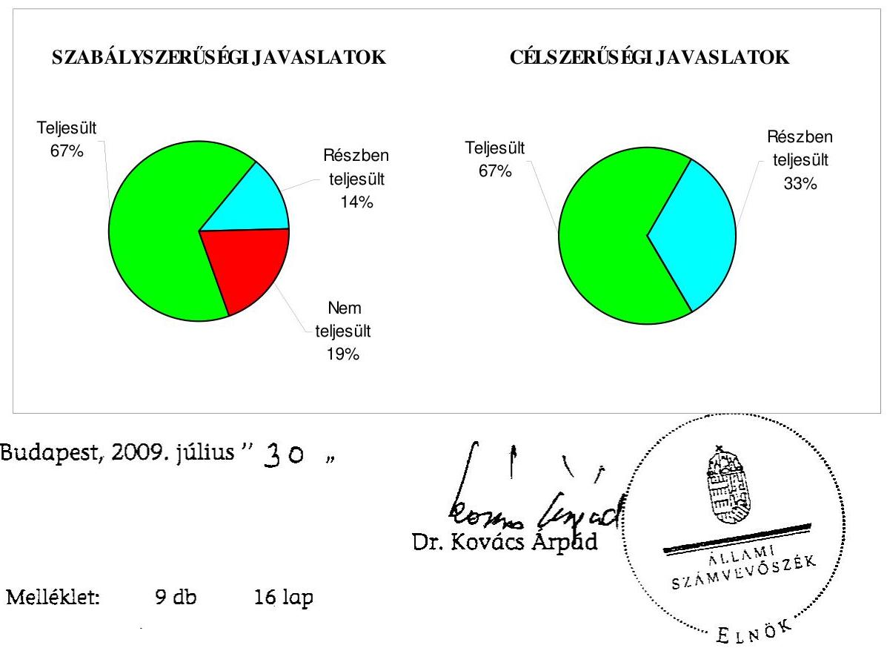

---

Budapest Főváros XII. kerület Hegyvidéki Önkormányzat

# Az Önkormányzat gazdálkodását meghatározó adatok, mutatószámok 

| Megnevezés |  |
| :--: | :--: |
| A kerület állandó lakosainak száma (fő) 2009. január 1-jén | 59148 |
| A Képviselő-testület tagjainak a száma (fő) (2008. december 31-én) | 28 |
| A Képviselő-testület munkáját segítő állandó bizottságok száma (2008. december 31-én) | 10 |
| A Polgármesteri hivatalban foglalkoztatott köztisztviselők száma (fő) (2008. december 31-én) | 246 |
| Az összes vagyon értéke a 2008. december 31-i könyvviteli mérleg szerint (millió Ft) | 33796 |
| Az adósságállomány (hosszú és rövid lejáratú kötelezettség) 2008. december 31-én (millió Ft) | 4590 |
| Az egy lakosra jutó adósságállomány 2008. december 31-én (Ft) | 77602 |
| Az összes 2008. évben teljesített költségvetési bevétel (millió Ft) | 14150 |
| Ebből: saját bevétel (millió Ft), melyből | 8098 |
| helyi adóbevétel (millió Ft) | 3991 |
| Az egy lakosra jutó 2008. évi költségvetési bevétel (Ft) | 239230 |
| Az egy lakosra jutó 2008. évi saját bevétel (Ft) | 136911 |
| Az egy lakosra jutó 2008. évi helyi adóbevétel (Ft) | 67475 |
| Saját bevétel/Összes költségvetési bevétel aránya a 2008. évben (%) | 57,2 |
| Helyi adó bevétel/Összes költségvetési bevétel aránya a 2008. évben (%) | 28,2 |
| Az összes teljesített költségvetési kiadás a 2008. évben (millió Ft) | 11728 |
| Ebből: felhalmozási célú költségvetési kiadás (millió Ft) | 2725 |
| A 2008. évi költségvetési kiadásból a felhalmozási célú költségvetési kiadás aránya (%) | 23,2 |
| Az egy lakosra jutó 2008. évi költségvetési kiadás (Ft) | 198282 |
| Az egy lakosra jutó 2008. évben teljesített felhalmozási célú költségvetési kiadás (Ft) | 46071 |
| A költségvetési intézmények száma 2008. december 31-én (db) | 41 |
| Ebből: részben önállóan gazdálkodó (db) | 35 |
| A költségvetési intézményekben foglalkoztatott közalkalmazottak száma (fő) (2008. december 31-én) | 1101 |

---

Budapest Főváros XII. kerület Hegyvidéki Önkormányzat

# Az önkormányzati vagyon alakulása

|  Mérlegsor megnevezése | 2006.év
(millió Ft) | 2007. év
(millió Ft) | 2008. év
(millió Ft) | Változás %-a (Előző év=100\%) |  |   |
| --- | --- | --- | --- | --- | --- | --- |
|   |  |  |  | 2007/2006. | 2008/2007. | 2008/2006.  |
|  Immateriális javak | 405 | 305 | 193 | 75,3 | 63,3 | 47,7  |
|  Tárgyi eszközök | 26289 | 26965 | 28039 | 102,6 | 104,0 | 106,7  |
|  ebből: ingatlanok | 24207 | 23360 | 27561 | 96,5 | 118,0 | 113,9  |
|  beruházások | 1710 | 3271 | 165 | 191,3 | 5,0 | 9,6  |
|  Befektetett pénzügyi eszközök | 965 | 919 | 902 | 95,2 | 98,2 | 93,5  |
|  Üzemeltetésre átadott eszközök | 1329 | 1303 | 1131 | 98,0 | 86,8 | 85,1  |
|  Befektetett eszközök összesen | 28988 | 29492 | 30265 | 101,7 | 102,6 | 104,4  |
|  Forgóeszközök összesen | 3278 | 4674 | 3531 | 142,6 | 75,5 | 107,7  |
|  ebből: követelések | 873 | 860 | 583 | 98,5 | 67,8 | 66,8  |
|  pénzeszközök | 2352 | 3771 | 2892 | 160,3 | 76,7 | 123,0  |
|  Eszközök összesen | 32266 | 34166 | 33796 | 105,9 | 98,9 | 104,7  |
|  Saját tőke összesen | 26421 | 25803 | 26259 | 97,7 | 101,8 | 99,4  |
|  Tartalék összesen | 1999 | 3554 | 2268 | 177,8 | 63,8 | 113,5  |
|  Kötelezettségek összesen | 3846 | 4809 | 5269 | 125,0 | 109,6 | 137,0  |
|  ebből: hosszú lejáratú kötelezettségek | 2874 | 3166 | 3610 | 110,2 | 114,0 | 125,6  |
|  rövid lejáratú kötelezettségek | 569 | 1384 | 980 | 243,2 | 70,8 | 172,2  |
|  Források összesen: | 32266 | 34166 | 33796 | 105,9 | 98,9 | 104,7  |

Forrás: Magyar Államkincstár éves költségvetési beszámoló "01" számú űrlap adatai.

---

Budapest Főváros XII. kerület Hegyvidéki Önkormányzat

Az önkormányzati kötelezettségek alakulása

|  Mérlegsor megnevezése | 2006.év
(millió Ft) | 2007. év
(millió Ft) | 2008. év
(millió Ft) | Változás %-a (Előző év=100\%) |  |   |
| --- | --- | --- | --- | --- | --- | --- |
|   |  |  |  | 2007/2006. | 2008/2007. | 2008/2006.  |
|  Hosszú lejáratú kötelezettségek összesen
ebböl: | 2874 | 3166 | 3610 | 110,2 | 114,0 | 125,6  |
|  hosszú lejáratra kapott kölcsönök | 0 | 0 | 0 | #ZÉRÓOSZTÓ! | #ZÉRÓOSZTÓ! | #ZÉRÓOSZTÓ!  |
|  tartozások fejlesztési célú kötvénykibocsátásból | 1944 | 2392 | 2790 | 123,0 | 116,6 | 143,5  |
|  tartozások működési célú kötvénykibocsátásból | 0 | 0 | 0 | #ZÉRÓOSZTÓ! | #ZÉRÓOSZTÓ! | #ZÉRÓOSZTÓ!  |
|  beruházási és fejlesztési hitelek | 916 | 768 | 820 | 83,8 | 106,8 | 89,5  |
|  működési célú hosszú lejáratú hitelek | 0 | 0 | 0 | #ZÉRÓOSZTÓ! | #ZÉRÓOSZTÓ! | #ZÉRÓOSZTÓ!  |
|  egyéb hosszú lejáratú kötelezettségek | 14 | 6 | 0 | 42,9 | 0,0 | 0,0  |
|  Rövid lejáratú kötelezettségek összesen
ebböl: | 569 | 1384 | 980 | 243,2 | 70,8 | 172,2  |
|  rövid lejáratú kölcsönök | 0 | 0 | 0 | #ZÉRÓOSZTÓ! | #ZÉRÓOSZTÓ! | #ZÉRÓOSZTÓ!  |
|  rövid lejáratú hitelek | 0 | 600 | 30 | #ZÉRÓOSZTÓ! | 5,0 | #ZÉRÓOSZTÓ!  |
|  kötelezettségek áruszállításból, szolgáltatásból | 289 | 295 | 433 | 102,1 | 146,8 | 149,8  |
|  garancia- és kezességvállalásból származó kötelezettség | 0 | 0 | 0 | #ZÉRÓOSZTÓ! | #ZÉRÓOSZTÓ! | #ZÉRÓOSZTÓ!  |
|  hosszú lejáratra kapott kölcsön következő évet terhelő törlesztő részlete | 0 | 0 | 0 | #ZÉRÓOSZTÓ! | #ZÉRÓOSZTÓ! | #ZÉRÓOSZTÓ!  |
|  felhalm.c.kötvény kibocsátásból származó tartozás következő évet terhelő részlete | 0 | 0 | 0 | #ZÉRÓOSZTÓ! | #ZÉRÓOSZTÓ! | #ZÉRÓOSZTÓ!  |
|  műk.c.kötvény kibocsátásból származó tartozás következő évet terhelő részlete | 0 | 0 | 0 | #ZÉRÓOSZTÓ! | #ZÉRÓOSZTÓ! | #ZÉRÓOSZTÓ!  |
|  beruházási célú hosszú lejáratú hitel következő évet terhelő törlesztő részlete | 59 | 108 | 132 | 183,1 | 122,2 | 223,7  |
|  működési célú hosszú lejáratú hitel következő évet terhelő törlesztő részlete | 0 | 0 | 0 | #ZÉRÓOSZTÓ! | #ZÉRÓOSZTÓ! | #ZÉRÓOSZTÓ!  |
|  egyéb hosszú lejáratú kötelezettség következő évet terhelő törlesztő részlete | 7 | 7 | 0 | 100,0 | 0,0 | 0,0  |

Forrás: Magyar Államkincstár éves költségvetési beszámoló "01" számú űrlap adatai.

---

Budapest Főváros XII. kerület Hegyvidéki Önkormányzat

Az Önkormányzat 2006-2009. évi költségvetési előirányzatainak és 2006-2008. évi pénzügyi teljesítéseinek alakulása

|  Megnevezés | 2006. év |  |  |  | 2007. év |  |  |  | 2008. év |  |  |  | 2009.  |
| --- | --- | --- | --- | --- | --- | --- | --- | --- | --- | --- | --- | --- | --- |
|   | Eredeti | Módosított | Teljesítés (millió Ft) | Teljesítés/ eredeti előirány- zat % | Eredeti | Módosított | Teljesítés (millió Ft) | Teljesítés/ eredeti előirány- zat % | Eredeti | Módosított | Teljesítés (millió Ft) | Teljesítés/ eredeti előirány- zat % | Eredeti  |
|   | előirányzat (millió Ft) |  |  |  | előirányzat (millió Ft) |

 |  |  |  | előirányzat (millió Ft) |  |  |  | előirányzat (millió Ft)  |
|  Működési célú költségvetési bevételek összesen | 7 429 | 9 618 | 9 478 | 127,6 | 8 965 | 9 754 | 9 509 | 106,1 | 9 560 | 10 246 | 10 754 | 112,5 | 11 218  |
|  Működési célú költségvetési kiadások összesen | 8 872 | 10 120 | 9 302 | 104,8 | 9 077 | 9 047 | 8 440 | 93,0 | 9 277 | 10 144 | 9 003 | 97,0 | 9 707  |
|  Működési célú költségvetési bevételek és kiadások egyenlege: hiány-, többlet + | -1 443 | -502 | 176 | -12,2 | -112 | 707 | 1 069 | 104,8 | 283 | 102 | 1 751 | 618,7 | 1 511  |
|  Felhalmozási célú költségvetési bevételek összesen | 4 054 | 3 192 | 3 264 | 80,5 | 3 821 | 3 706 | 3 905 | 102,2 | 4 846 | 5 008 | 3 396 | 70,1 | 2 475  |
|  Felhalmozási célú költségvetési kiadások összesen | 5 111 | 3 935 | 3 509 | 68,7 | 4 749 | 4 870 | 2 502 | 52,7 | 7 920 | 7 901 | 2 725 | 34,4 | 7 054  |
|  Felhalmozási célú költségvetési bevételek és kiadások egyenlege: hiány-, többlet+ | -1 057 | -743 | -245 | 23,2 | -928 | -1 164 | 1 403 | -151,2 | -3 074 | -2 893 | 671 | -21,8 | -4 579  |
|  Költségvetési bevételek összesen | 11 483 | 12 810 | 12 742 | 111,0 | 12 786 | 13 460 | 13 414 | 104,9 | 14 406 | 15 254 | 14 150 | 98,2 | 13 693  |
|  Költségvetési kiadások összesen | 13 983 | 14 055 | 12 811 | 91,6 | 13 826 | 13 918 | 10 942 | 79,1 | 17 197 | 18 045 | 11 728 | 68,2 | 16 761  |
|  Költségvetési bevételek és kiadások egyenlege: hiány-, többlet+ | -2 500 | -1 245 | -69 | 2,8 | -1 040 | -458 | 2 472 | -237,7 | -2 791 | -2 791 | 2 422 | -86,8 | -3 068  |
|  Finanszírozási célú pénzügyi bevételek | 2 500 | 2 570 | 2 070 |  | 1 100 | 1 100 | 1 124 |  | 3 500 | 3 500 | 0 |  | 3 200  |
|  Finanszírozási célú pénzügyi kiadások | 0 | 1 325 | 0 |  | 60 | 642 | 42 |  | 709 | 709 | 752 |  | 132  |
|  Finanszírozási célú pénzügyi műveletek egyenlege | 2 500 | 1 245 | 2 070 |  | 1 040 | 458 | 1 082 |  | 2 791 | 2 791 | -752 |  | 3 068  |

*Forrás:* - Magyar Államkincstár éves költségvetési beszámoló "80" számú űrlap adatai; - a 2009. évi adatok esetében az Önkormányzat 2009. évi költségvetése; - a költségvetési bevétel-kiadás működési-felhalmozási célra történt megosztásánál az analitikus nyilvántartás.

---

Ellenőrzött önkormányzat neve: Budapesti Főváros 59. kerületi Hegyvidéki Önkormányzat Ellenőrzött önkormányzat címe: 1126. Budapest, Böszörményi út 23-25.

TANÚSÍTVÁNY az európai uniós forrásokkal támogatott célok és programok 2008-2009. évi tervezett és teljesített adatairól

|  |   |   |   |   |   |   |   |   |   |   |   |   |   |   |   |   |   |   |   |   |   |   |   |   |   |   |   |   |   |   |   |   |   |   |   |   |   |   |   |   |   |   |   |   |   |   |   |   |   |   |   |   |   |   |   |   |   |   |   |   |   |   |   |   |   |   |   |   |   |   |   |   |   |   |   |   |   |   |   |   |   |   |   |   |   |   |   |   |   |   |   |   |   |   |   |   |   |   |   |   |

---

# ADATLAP 

## az európai uniós forrással támogatott Szolgáltató Hegyvidék fejlesztéséről

## 1. A PÁLYÁZÓ ADATAI

1.1. A pályázó Önkormányzat neve: Budapest Főváros XII. kerület Hegyvidéki Önkormányzat
1.2. A pályázó Önkormányzat címe:1126 Budapest, Böszörményi út 23-25.

## 2. A PROJEKT ÖSSZEGZŐ ADATAI

2.1. A pályázott program megnevezése: Szolgáltató önkormányzat GVOP 2004-4.3.1
2.2. A pályázott programon belül a projekt címe: Szolgáltató Hegyvidék
2.3. A pályázatot készítő megnevezése: Fenntartási iroda
2.4. A pályázat benyújtásának időpontja: 2004. 06. 09.

### 2.5. A projekt tervezett

- teljes kiadásának összege: 255 millió Ft
- saját forrás: 31,9 millió Ft
- támogatás: 223,1 millió Ft
- európai uniós:191,9 millió Ft
- hazai társfinanszírozás:31,2 millió Ft
- EU Önerő Alap:-
- hitel: -
- egyéb forrás: -
- a megvalósítás tervezett időpontja (év, hó, nap): 2005. 03. 31.

---

2.6 A pályázat elbírálásáról szóló döntés kelte: 2004. 12. 22. Gazdasági Minisztérium, mint GVOP Irányító hatóság
2.7 A pályázat elbírálásának eredménye: nyertes pályázat

# 2.8 A projekt teljesített: 

- kiadásának összege: 257,5 millió Ft
- saját forrás: 34,4 millió Ft
- támogatás: 223,1 millió Ft
- európai uniós: 191,9 millió Ft
- hazai társfinanszírozás: 31,2 millió Ft
- EU Önerő Alap: -
- hitel: -
- egyéb forrás: -
- a megvalósítás időpontja: 2006. 12.28.

## 3. A TÁMOGATÁSI SZERZŐDÉS ADATAI

### 3.1. A támogatási szerződés:

- megkötésének időpontja: 2005. 07. 11. utolsó (3.) módosítás 2008. 01. 23.
- a projekt kezdési és befejezési időpontja: kezdési időpont: 2005. 06. 30., befejezés: 2006. 03. 31., de legkésőbb 2007. 06. 30.
- a projekt összköltsége (kiadása): 255 millió Ft
- a projekt megvalósítás forrásai: 255 millió Ft
- saját forrás: 31,9 millió Ft
- európai uniós támogatás: 191,9 millió Ft
- hazai társfinanszírozás: 31,2 millió Ft
- EU Önerő Alap: -
- hitel: -
- egyéb forrás: -
- előírt támogatási határidők: a 2006. éven belüli ütemezés nem volt, az utolsó kifizetési kérelem benyújtásának határideje 2007. 08. 14.
- előírt fizetési kötelezettségek: a 2006. éven belüli ütemezés nem volt.

---

| Kifizetési kérelem   (PEJ/EPEJ) benyújtá-   sának   időpontja | Számla   bruttó   összege   (Ft) | Igényelt   támogatási   összeg   (Ft) | Folyósított   támogatás   összege   (Ft) | Támogatás   folyósításának   időpontja   (év, hó, nap) | Benyújtás   és a fo-   lyósítás   között   eltelt   időtartam   (nap) |
| :--: | :--: | :--: | :--: | :--: | :--: |
| Előleg: 2006.   06.07 . |  | 55781250 | 55781250 | 2006. 06. 26. | 19 |
| 1. elszámolás:   2006. 08.29. | 163009250 | 142633094 | 122718750 | 2006. 11. 13. | 76 |
| 2. elszámolás | 91990750 | 80491906 | 44625000 | 2008. 12. 18. | 262 |
| Összesen | 255000000 | 223125000 | 223125000 |  |  |

# 5. Ellenőrzések 

### 5.1. A külső ellenőrzések:

- az ellenőrzések száma: 3
- az ellenőrzést végző szervek megnevezése: IT Információs Társadalom Kht., MAG Zrt. mint közreműködő szervezetek

### 5.2. Szabálytalanságokra vonatkozó adatok:

- mely előírást nem tartotta be az Önkormányzat: az előírt logót a támogatásból létrehozott portálon nem jelenítette meg, a vagyonbiztosítási szerződésben a támogató nem volt kedvezményezettként megjelölve, a projektet elkülönítetten nem tartották nyilván, két GVOP támogatással megvalósuló projektet egy számviteli kódszámon számoltak el, az ÖNKADÓ program kiváltására szolgáló MySAP program akkreditációjának hiánya;
- az előírás nem teljesítésének okai: a számviteli nyilvántartásban a két GVOP projekt egy kódszámon történő nyilvántartásának oka az volt, hogy a költségvetésben összevontan egy előirányzatként tervezték a két fejlesztési feladatot;
- a rendezésre előírt kötelezettségek: az előírt logó megjelenítése a honlapon, a módosított vagyonbiztosítási szerződés megküldése a közreműködő szervezetnek, a két projekt elkülönítésének végrehajtása;
- a rendezésre előírt kötelezettséget mennyi időn belül teljesítették: a külső közbenső ellenőrzés által megállapított szabálytalanságok megszüntetésére csak két év múlva - a belső ellenőrzési jelentés javaslatait követően - intézkedtek. A MySAP programot a Pénzügyminisztérium az ÁSZ helyszíni ellenőrzésének befejezéséig nem hagyta jóvá;

---

- mekkora időbeli csúszást eredményezett ez a projekt megvalósításában (év, hó, nap): a projekt megvalósításában időbeli csúszást nem okozott.

Kelt: 2009. március 25.
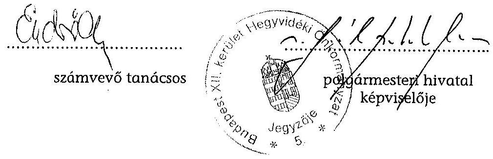

---

# Az ellenőrzés során átadott munkatáblák, munkalapok és megfelelőségi tesztek jegyzéke 

1. számú elővizsgálati munkalap az eredendő kockázat minősítéséhez
2. számú munkalap: Kitöltési útmutató az eredendő kockázat minősítéséhez készült elővizsgálati munkalaphoz
3. számú munkalap: 1.0. számú munkatábla: A tervezett, illetve teljesített költségvetésekben egyes bevételi, illetve kiadási jogcímek működési és felhalmozási célú megosztásához a 2006-2009. évekre
4. számú munkalap: 1.1. számú munkatábla: Az Önkormányzat 2006-2009. évi költségvetésének és 2006-2008. évi költségvetési beszámolójának elemzéséhez kiválasztott főbb adatai
5. számú munkalap: 1.2. számú munkatábla: Az Önkormányzat 2006-2009. évi működési és felhalmozási célú költségvetési, valamint finanszírozási célú kiadásainak és

 bevételeinek alakulása, a költségvetési/pénzügyi hiány, illetve többlet bemutatása
6. számú munkalap: 1.3. számú munkatábla: Az Önkormányzat 2006-2009. évi működési és felhalmozási célú költségvetési bevételeinek és kiadásainak részaránya az összeshez, valamint a költségvetési bevételek és kiadások egyenlegének részaránya
7. számú munkalap: 1.4. számú munkatábla: Az Önkormányzat 2006-2009. évi költségvetési bevétellel való fedezettségét mutató indexek
8. számú munkalap: 1.5. számú munkatábla: Az önkormányzati vagyon alakulása
9. számú munkalap: 1.6. számú munkatábla: A 2006-2009. években a folyószámlahitellel kapcsolatos jellemzők
10. számú helyszíni ellenőrzési munkalap az 1.1. számú programponthoz: Biztosított volt-e a tervezett költségvetési bevételek és kiadások alapján a költségvetési egyensúly, volt-e és mi okozta a költségvetés hiányát, milyen módon tervezték azt finanszírozni, valamint a költségvetési hiány megállapításának szabályszerűsége
11. számú munkalap: Kitöltési útmutató a 11. számú helyszíni ellenőrzési munkalaphoz
12. számú helyszíni ellenőrzési munkalap az 1.2. számú programponthoz: Biztosított volt-e és milyen módon a teljesített költségvetési bevételek és kiadások pénzügyi egyensúlya, volt-e és mi okozta a pénzügyi hiányt, a pénzügyi hiány finanszírozásának módja és hatása, a pénzügyi helyzet alakulása az eladósodás, valamint a fizetőképesség szempontjából

---

14. számú munkalap: Kitöltési útmutató a 13. számú helyszíni ellenőrzési munkalaphoz
15. számú helyszíni ellenőrzési munkalap az 1.2. számú programponthoz: Tanúsítvány az Önkormányzat ellenőrzött időszakban történt kötvénykibocsátásáról
16. számú helyszíni ellenőrzési munkalap a 2.1. számú programponthoz: Az európai uniós források igénybevételére és a várható támogatás felhasználására történt felkészülés szabályozottságának, szervezettségének eredményessége
17. számú munkalap: Teljességi Nyilatkozat a 2.1. számú programponthoz
18. számú helyszíni ellenőrzési munkalap a 2.1.1. számú programponthoz: Az európai uniós források igénybevételére és várható támogatás felhasználására történt felkészülés szabályozottsága, szervezettsége 2006-2009. évekre
19. számú helyszíni ellenőrzési munkalap a 2.2. számú programponthoz: Az elektronikus közszolgáltatás feltételeinek kialakítása
19/a. számú munkalap: Kitöltési útmutató a 19. számú helyszíni ellenőrzési munkalaphoz
20. számú munkalap: Tanúsítvány a 2.2.3. számú programponthoz az intézmények által a 2008. évben illetve 2009. I. negyedévben nyújtott támogatások közzétételének ellenőrzéséhez
21. számú munkalap: Tanúsítvány a 2.2.3. számú programponthoz az intézmények által az intézmények által a 2008. évben, illetve a 2009. I. negyedévben kötött szerződések közzétételének ellenőrzéséhez
22. számú munkalap: Munkadokumentum a 2.2.3. számú programponthoz az intézmények által a 2008. évben, illetve a 2009. I. negyedévben nyújtott támogatások közzétételének ellenőrzéséhez, illetve az Önkormányzat (Polgármesteri hivatal és intézmények) által kötött szerződések közzétételének ellenőrzéséhez
23. számú munkalap: Kitöltési útmutató a 22. számú munkalaphoz
24. számú elővizsgálati munkalap a 3.1.1. számú programponthoz: A költségvetés tervezési és a zárszámadás készítési folyamat során végrehajtandó belső kontroll tevékenységek meghatározása
25. számú munkalap: Kitöltési útmutató a 24. számú elővizsgálati munkalaphoz
26. számú elővizsgálati munkalap a 3.1.2. számú programponthoz: A Polgármesteri hivatalnál a pénzügyi-számviteli feladatok során elvégzendő belső kontroll tevékenységek szabályozottsága
27. számú munkalap: Kitöltési útmutató a 26. számú elővizsgálati munkalaphoz
28. számú elővizsgálati munkalap a 3.1.3. számú programponthoz: A pénzügyiszámviteli feladatoknál alkalmazott informatikai rendszerek működtetéséhez a belső kontroll eljárások meghatározására
29. számú munkalap: Kitöltési útmutató a 28. számú elővizsgálati munkalaphoz

---

30. számú helyszíni ellenőrzési munkalap a 3.2.1. számú programponthoz: A költségvetés tervezési és a zárszámadás készítési folyamatban az előírt belső kontrolltevékenységek teljesítése
31. számú munkalap: Kitöltési útmutató a 30. számú helyszíni ellenőrzési munkalaphoz
32. számú helyszíni ellenőrzési munkalap a 3.2.2. számú programponthoz: A gazdálkodás folyamatában kulcsszerepet betöltő szakmai teljesítésigazolás és utalvány ellenjegyzés működése
33. számú helyszíni ellenőrzési munkalap a 3.2.3. számú programponthoz: A pénzügyi-számviteli feladatok ellátásánál alkalmazott informatikai rendszerek kialakított belső kontrolljainak működtetése
34. számú munkalap: Kitöltési útmutató a 33. számú helyszíni ellenőrzési munkalaphoz
35. számú elővizsgálati munkalap a 3.3.1. számú programponthoz: A gazdálkodási feladatok szabályszerű és eredményes ellátási feltételeinek biztosítása érdekében meghatározták-e a belső ellenőrzés szervezeti keretét és szabályozták-e a működés feltételeit?
36. számú munkalap: Kitöltési útmutató a 35. számú elővizsgálati munkalaphoz
37. számú helyszíni ellenőrzési munkalap a 3.3.2. számú programponthoz: A szabályozási és működési hibák feltárásával, az intézkedések kezdeményezésével, a javaslatok realizálásának ellenőrzésével a kontroll kockázatok csökkentése a belső ellenőrzés során
38. számú munkalap: Kitöltési útmutató a 3.3.2. számú helyszíni ellenőrzési munkalaphoz
39. számú helyszíni ellenőrzési munkalap a 4.1. számú programponthoz: Az Önkormányzat gazdálkodási rendszerének átfogó ellenőrzése során tett javaslatok végrehajtására tervezett intézkedések megvalósítása, a javaslatok hasznosulása
39/a. számú helyszíni ellenőrzési munkalap a 4.1. számú programponthoz: Tanúsítvány a követelésekről való lemondás eseteiről és mértékéről a 2008. évben, valamint a 2009. I. negyedévben
39/b. számú helyszíni ellenőrzési munkalap a 4.1. számú programponthoz: Tanúsítvány az ingyenes vagyonátruházás eseteiről és mértékéről a 2008. évben, valamint a 2009. I. negyedévben
39/c. számú helyszíni ellenőrzési munkalap a 4.1. számú programponthoz: Tanúsítvány az Önkormányzat forgalomképtelen ingatlanainak elidegenítéséről a 2008. évben, valamint a 2009. I. negyedévben

39/d. számú helyszíni ellenőrzési munkalap a 4.1. számú programponthoz: Munkadokumentum az utóvizsgálat során ellenőrzött dokumentumok adatairól
39/e. számú helyszíni ellenőrzési munkalap a 4.1. számú programponthoz: Kitöltési útmutató a 4.1. számú programpont munkadokumentumához

---

40. számú helyszíni ellenőrzési munkalap a 4.2. számú programponthoz: A zárszámadáshoz kapcsolódó (állami hozzájárulások, támogatások igénylésének és felhasználásának ellenőrzése), valamint a további vizsgálatok esetében a megállapítások, javaslatok hasznosítása érdekében tett intézkedések
Megfelelőségi tesztek a külső szolgáltató által végzett karbantartási, kisjavítási munkák kiadásainak, a gépek, berendezések és felszerelések beszerzése kifizetéseinek, a működési és a felhalmozási célú pénzeszközátadások államháztartáson kívülre teljesített kifizetéseinek, az állományba nem tartozók megbízási díjai kifizetésének vizsgálatára

Budapest, 2009. május hó 24. nap
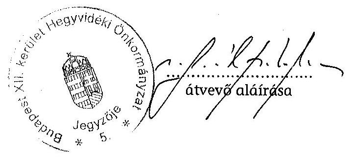

---

Dr. Kovács Árpád úr részére elnök

Állami Számvevőszék

Budapest 4.
Pf. 54.
1364
Tárgy: „A Budapest Főváros XII. kerület Hegyvidéki Önkormányzat gazdálkodási rendszerének 2009. évi ellenőrzéséről" készült jelentéssel kapcsolatos észrevételek

1126 Budapest, Bőszörményi út 23-25. Telefonszám: 224 5900/355 Faxszám: 224-59-27 e-mail cím: tarjanyi.bence@bp12ker.hu

Ügyintéző: dr. Tarjányl Bence Iktatási szám: I-186/4/2009. Hiv. szám: V-3001-4/20/17/2009.

Tisztelt Elnök Úr!

A 2009. július 7-én írt, fenti számú levelét köszönettel vettem, „A Budapest Főváros XII. kerület Hegyvidéki Önkormányzat gazdálkodási rendszerének 2009. évi ellenőrzéséről" készült jelentésben foglaltakra vonatkozóan az alábbi észrevételeket teszem:

1. A polgármesternek tett 1. számú javaslathoz:

Az európai uniós és hazai pályázatokkal kapcsolatos feladatokról szóló 5/2008. számú polgármesteri és jegyzői együttes utasítás 1.3. pontja - a Számvevőszék vonatkozó megállapításaira és a szóban forgó javaslatra tekintettel elrendelt módosítását követően kifejezetten előírja, hogy a benyújtott pályázatoknak kapcsolódniuk kell a Képviselő-testület által meghatározott fejlesztési elképzelésekhez (a módosítást 1. sz. alatt mellékelem).

Álláspontom szerint ezzel az Önkormányzat vezetése megfelelően gondoskodott arról, hogy a jövőben valamennyi pályázat kapcsolódjon a testület fejlesztési célkitűzéseihez, a javaslatban foglaltak tehát megvalósultak, ezért kérem annak elhagyását.
2. A jegyzőnek tett 2. számú javaslathoz:

A működési célú támogatások adatait - ideértve a társasházak felújítására biztosított támogatásokat is - az IHM rendelet 2. § (1)-(2) bekezdéseiben foglaltaknak megfelelően az Önkormányzat honlapján a „Közérdekű adatok" menüpont alatt teljes körűen közzétettük (az adatok a következő linken érhetők el: http://www.hegyvidek.eu/hivatal/kozerdeku-adatok/tamogatasi-szerzodesek-090715).

Mint arról korábbi levelemben már tájékoztatást adtam, a Számvevőszék által javasolt gyakorlat kialakítása érdekében a 2008. évi költségvetési beszámoló szöveges indokolásának kiegészítésére vonatkozóan előterjesztést nyújtottam be az Önkormányzat Képviselő-testületének 2009. június 18-i ülésére. A Képviselő-testület az előterjesztésben foglaltakkal határozatában egyetértett (2.

---

sz. melléklet), a kiegészítésre került indokolásnak az Önkormányzat honlapján történő közzétételéről időközben gondoskodtam http://www.hegyvidek.eu/hivatal/kozerdekuadatok/onkormanyzati).

Mindezek alapján kérem a javaslat törlését.
3. A jegyzőnek tett 3. számú javaslathoz:

A 2008. július 1-jei Számviteli Politika módosítás során kiegészítésre került a Számlarend, és az Értékelési Szabályzat is az egyszerüsített értékelési eljárás szabályozásával, kérem a javaslat elhagyását.
4. A jegyzőnek tett 4. számú javaslathoz:

Az e-közigazgatási feladatokat ellátó informatikai rendszer ügyfelek általi igénybevételének figyelemmel kísérését és értékelését a jegyző a javaslatban foglaltaknak eleget téve utasításban rendelte el, amelyet jelen levelemhez 3. sz. alatt mellékelek. Kérem a javaslat törlését.

Kérem Elnök Urat, hogy a fenti észrevételeket figyelembe venni szíveskedjék. Kérem továbbá a korábban tett és a Számvevőszék által el nem fogadott valamennyi észrevételünk végleges jelentésben történő elhagyását. Az ellenőrzés alapján elrendelt intézkedésekről a törvényes határidőn belül fogok tájékoztatást adni.

Végezetül meg kívánom jegyezni, hogy az ellenőrzés számos olyan megállapítást, illetve javaslatot fogalmazott meg, amely jelentős segítséget nyújt ahhoz, hogy az Önkormányzat a jövőben a jogszabályi rendelkezéseknek mindenben megfelelve és egyúttal hatékonyan működjön. Elnök Úr együttműködését és az ellenőrzésben részt vevő számvevők szakszerű és lelkiismeretes munkáját ezúton is köszönöm.

Budapest Hegyvidék, 2009. július 17.
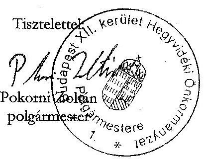

---

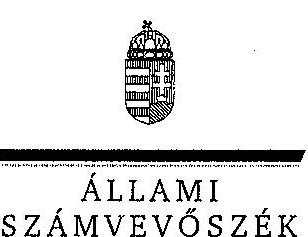
a V-3001-4/20/2009. számú jelentéshez

ELNÖK

ÁLLAMI
SZÁMVEVŐSZÉK

Ikt.szám: V-3001-4/20/19/2009.

# Pokorni Zoltán úr, 

polgármester
Budapest Főváros XII. kerület Hegyvidéki Önkormányzat

## Budapest

Böszörményi u. 23-25.
1126

## Tisztelt Polgármester Úr!

Köszönettel vettem a Budapest Főváros XII. kerület Hegyvidéki Önkormányzat gazdálkodási rendszerének 2009. évi ellenőrzéséről készült számvevőszéki jelentéshez küldött tájékoztatását a megtett intézkedésekről.

Örömmel értesültem arról, hogy megállapításaink, javaslataink egy részét az ellenőrzést követően megvalósították, a hiányosságokat megszüntették. A tájékoztatása alapján megvalósult intézkedéseket a számvevőszéki jelentésben az érintett megállapításhoz kapcsolt lábjegyzetben szerepeltetjük és a számvevőszéki jelentéstervezetben tett, vonatkozó javaslatokat elhagyjuk.

Ilyennek tekintjük, hogy intézkedtek az európai uniós támogatásokra benyújtott pályázatoknak a Képviselő-testület által meghatározott fejlesztési elképzelésekhez való kapcsolódására, a működési célú támogatások adatainak - ideértve a társasházak felújítására biztosított támogatásokat is - teljes körű közzétételére, a számviteli szabályzatok kiegészítésére, valamint az e-közigazgatási feladatokat ellátó informatikai rendszer ügyfelek általi igénybevételének figyelemmel kísérésére és értékelésére.

Kérésének megfelelően a számvevői jelentéshez tett és az ÁSZ által el nem fogadott észrevételeit, valamint az arra adott választ a nyilvánosságra kerülő jelentésben nem tüntetjük fel.

Az ellenőrzés lefolytatásához nyújtott segítő közreműködését köszönöm.
Budapest, 2009. július 29.
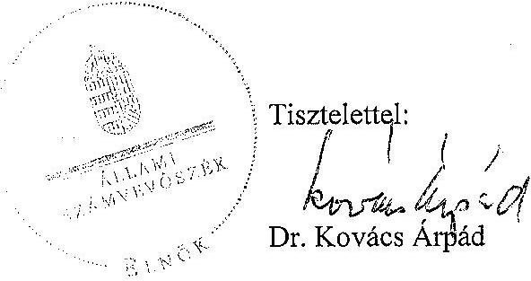
