# ÁLLAMI   SZÁMVEVŐSZÉK 

## JELENTÉS

a sürgősségi betegellátó rendszer kialakítására, fejlesztésére fordított pénzeszközök felhasználásának ellenőrzéséről

---

# 3. Önkormányzati és Területi Ellenőrzési Igazgatóság 

3.2. Szabályszerüségi és Teljesítmény Ellenőrzési Föcsoport

Iktatószám: V-3009-64/2008-09.
Témaszám: 907
Vizsgálat-azonosító szám: V0419

## Az ellenőrzést felügyelte:

## dr. Lóránt Zoltán

főigazgató
Az ellenőrzés végrehajtásáért felelős:
dr. Varga Sándor
főigazgató-helyettes
Az ellenőrzést vezette:
Böröcz Imre
főtanácsadó
A számvevői jelentések feldolgozásában és a jelentés összeállításában közremüködtek:
Böröcz Imre
főtanácsadó
Kisgergely István
számvevő tanácsos

## Az ellenőrzést végezték:

Alexovics Ágota
számvevő tanácsos
Böröcz Imre
főtanácsadó
Huberné Kuncsik Zsuzsanna
tanácsadó
Kis Rita Teréz
számvevő
Pálfi András
számvevő tanácsos
Szalontai Miklós
számvevő tanácsos
Dr. Pikó Károly
külső szakértő
Czakó Imre
külső szakértő

## Dandó Géza

főtanácsadó
Szabó Tamás
számvevő tanácsos

Balogné Dakó Eszter Bencsik Árpád
számvevő tanácsos számvevő
Dankó Géza Hadházy Sándor
főtanácsadó számvevő tanácsos
Humli Tamásné Kisgergely István
számvevő számvevő számvevő tanácsos

Koczor László Laki Dóra
számvevő számvevő tanácsos
Szabó Leonóra Ildikó Szabó Tamás
számvevő számvevő számvevő tanácsos
Szeibel Gáborné Valu Tibor
számvevő tanácsadó
Dr. Fülöp Rudolf Dr. Bodor Szabolcs
külső szakértő
külső szakértő

---

# A témához kapcsolódó eddig készített számvevőszéki jelentések: 

## címe

Jelentés az Egészségügyi Minisztérium fejezet ellenőrzéséről
Jelentés a címzett támogatásból finanszírozott egészségügyi beru- 0523 házások, rekonstrukciók ellenőrzéséről
Jelentés az egészségügyi szakellátások privatizációjának ellenőrzé- 0609 séről

---

# TARTALOMJEGYZÉK 

BEVEZETÉS ..... 11
I. ÖSSZEGZŐ MEGÁLLAPÍTÁSOK, KÖVETKEZTETÉSEK, JAVASLATOK ..... 14
II. RÉSZLETES MEGÁLLAPÍTÁSOK ..... 23

1. A sürgősségi betegellátás egységes rendszerének megszervezése, fejlesztése ..... 23
1.1. A sürgősségi ellátás kialakításának, fejlesztésének programja ..... 23
1.2. A kórházi struktúraátalakítás hatása a sürgősségi ellátásra ..... 27
1.3. A kórházi sürgősségi ellátás finanszírozása, minőségügyi rendszere ..... 30
1.4. A sürgősségi ellátás fejlesztése az ÜMFT TIOP 2007-2008. évi akciótervében ..... 32
2. A háziorvosi ügyeleti ellátás átalakítása, múködtetése ..... 35
2.1. A szolgáltató kiválasztása és támogatása ..... 35
2.2. A készenléti ügyeleti forma megszüntetése, központi ügyeletek megszervezése ..... 37
2.3. Központi ügyeletek kialakítását segítő támogatások ..... 39
2.4. A szabályszerű múködés feltételeinek biztosítása ..... 42
2.5. Az ellátásról szóló beszámolók, a szolgáltatói információk rendszere és tartalma ..... 46
2.6. A háziorvosi ügyeleti ellátás hatékonysága, eredményessége ..... 49
3. A sürgősségi ellátás kialakítása, szerepe a kórházi betegellátásban ..... 52
3.1. A sürgősségi ellátás a kórházak szakmai programjában ..... 52
3.2. A kórházi sürgősségi ellátás múködésének hatékonysága, eredményessége ..... 55
3.3. Kórházi sürgősségi ellátás fejlesztésének támogatása hazai forrásokból ..... 59
3.4. A kórházak pénzügyi egyensúlyát, gazdálkodását befolyásoló tényezők, fenntartói intézkedések hatása ..... 62
3.5. Az ügyeleti, sürgősségi ellátásra, munkaidőre vonatkozó új előírások ..... 64
3.6. A minimumfeltételek teljesítése a sürgősségi ellátásban ..... 67

---

# MELLÉKLETEK 

1. sz. Ellenőrzött önkormányzatok, ellenőrzött többcélú kistérségi társulások (TKT) és székhelyük, ellenőrzött és adatot szolgáltató kórházak
2. sz. A helyszíni ellenőrzésbe bevont szervezetek és az ellátás szervezésének folyamatábrája
3. sz. Észrevételek - ÁSZ Válaszok

## FÜGGELÉKEK

1. sz. A háziorvosi ügyeleti ellátás finanszírozási szerződéseinek száma és a finanszírozás éves összege az egészségbiztosítóval szerződő szervezetek típusa szerint a 2004-2008. években
2. sz. Egy háziorvosi ügyeletre jutó átlagos ellátandó lakosság (ezer fő/ háziorvosi ügyelet) a 2004. és a 2008. évek összehasonlításában
3. sz. A háziorvosi ügyeleti szolgáltatók száma az ügyelet típusa szerint, megyénként a 2008. évben
4. sz. A háziorvosi ügyeletben ellátott esetek az ellátás helye szerint, megyénként a 2008. évben
5. sz. A háziorvosi ügyeletben ellátott esetek az ellátás oka szerint, megyénként a 2008. évben
6. sz. A sürgősségi fekvőbeteg szakellátás kapacitását, teljesítményét, finanszírozását jellemző főbb adatok és mutatók a 2004-2008. években
7. sz. A finanszírozott sürgősségi osztályok ágyszáma településenként 2008 decemberében
8. sz. Az aktív fekvőbeteg ellátás finanszírozási eseteinek száma, valamint ezen belül a mentővel érkező és a sürgős ellátásként nyilvántartott esetek alakulása megyénként a 2008. évben
9. sz. Az aktív fekvőbeteg-szakellátásban a sürgősségi ellátási formák fix összegű díjazásának alakulása megyénként a 2004-2008. években (ezer Ft-ban)
10. sz. A járóbeteg-szakellátáson belül a sürgősségi betegellátási szakma kapacitását, teljesítményét, finanszírozását jellemző főbb adatok, mutatók a 2004-2008. években

---

# RÖVIDÍTÉSEK JEGYZÉKE 

| ÁNTSZ | Állami Népegészségügyi és Tisztiorvosi Szolgálat |
| :--: | :--: |
| ÁRB | Államreform Bizottság |
| ÁSZ | Állami Számvevőszék |
| BM | Belügyminisztérium |
| CMI | Case mix index |
| CT | Computer Tomográf |
| E. Alap | Egészségbiztosítási Alap |
| EBF | Egészségbiztosítási Felügyelet |
| EFK | Egészségügyi Fejlesztéspolitikai Koncepció |
| Eftv. | Az egészségügyi ellátórendszer fejlesztéséről szóló 2006. évi CXXXII. törvény |
| EGVE | Egészségügyi Gazdasági Vezetők Egyesülete |
| ESzCsM | Egészségügyi, Szociális és Családügyi Minisztérium |
| ETKP | Egészséges Társadalom Komplex Program |
| EU | Európai Unió |
| EüM | Egészségügyi Minisztérium |
| Eütv ${ }_{1}$ (hatályon kívül) | Az egészségügyről szóló 1972. évi II. törvény |
| Eütv. | Az egészségügyről szóló 1997. évi CLIV. törvény |
| FKB | Finanszírozási Kódkarbantartó Bizottság |
| HBCS | Homogén Betegségcsoport |
| HEP | Humán Erőforrás Programok |
| KÁNY | Központi Ágynyilvántartás |
| Kr. | Az egészségügyi szolgáltatások Egészségbiztosítási Alapból történő finanszírozásának részletes szabályairól szóló 43/1999. (III. 3.) Korm. rendelet |
| KMOP | Közép-Magyarországi Operatív Program |
| Kormány | Magyar Köztársaság Kormánya |
| Kormányprogram | A Magyar Köztársaság Kormányának programja |
| LEKI | Leghátrányosabb helyzetű kistérségek felzárkóztatásának támogatása |
| Minr. | Az egészségügyi szolgáltatások nyújtásához szükséges szakmai minimumfeltételekről szóló 60/2003. (X. 20.) ESzCsM rendelet |
| MKSZ | Magyar Kórházszövetség |
| MOTESZ | Magyar Orvos Társaságok és Egyesületek Szövetsége |
| NFÜ | Nemzeti Fejlesztési Ügynökség |
| OALI | Országos Alapellátási Intézet |
| OEP | Országos Egészségbiztosítási Pénztár |
| OGY | Országgyúlés |
| OKJ | Országos Képzési Jegyzék |
| OMSZ | Országos Mentőszolgálat |
| OSAP | Országos Statisztikai Adatgyűjtési Program |

---

| OSZMK | Országos Szakfelügyeleti és Módszertani Központ |
| :-- | :-- |
| OTH | Országos Tisztifőorvosi Hivatal |
| ÖTM | Önkormányzati és Területfejlesztési Minisztérium |
| PEMCS | Pályázat Előkészítő Munkacsoport |
| PIC | Perinatális Intenzív Centrum |
| RET | Regionális Egészségügyi Tanács |
| ROP | Regionális Operatív Program |
| Rtg | Röntgen diagnosztika |
| SBO | Sürgősségi betegellátó osztály |
| SF | Sürgősségi fogadóhely |
| SHBCS | Sürgősségi Homogén Betegségcsoport |
| STRAPI | Strukturális Alapok Programiroda |
| Sürgősségi Program | A hazai sürgősségi ellátás fejlesztésének programja |
| Szakmai kollégium | Oxyológiai-sürgősségi, honvéd- és katasztrófaorvostani |
|  | Szakmai Kollégium |
| TÁMOP | Társadalmi Megújulás Operatív Program |
| TEK | Területi ellátási kötelezettség |
| TIOP | Társadalmi Infrastruktúra Operatív Program |
| TKT | Többcélú kistérségi társulás |
| TRFC | Terület- és Régiófejlesztési Célelőirányzat |
| TVK | Teljesítmény volumenkorlát |
| UH | Ultrahang diagnosztika |
| ÚMFT | Új Magyarország Fejlesztési Terv |

---

# ÉRTELMEZŐ SZÓTÁR 

| Ágyszám (időszak végi aktív ágyszám) | Az OEP és az intézmény közötti szerződésben szereplő, a vizsgált év utolsó napján érvényes, aktív kórházi ellátást biztosító ágyszám. |
| :--: | :--: |
| Aktív fekvőbetegszakellátás | A finanszírozás módja szerint aktív ellátás az egészségi állapot mielőbbi helyreállítása, amely időtartama, illetve befejezése többnyire tervezhető és az esetek többségében rövid. Az ellátás aktív fekvőbeteg egységekben történik. |
| Alapellátás | A beteg lakóhelyén, illetve annak közelében, szabad orvosválasztáson, hosszú távú, személyes kapcsolaton alapuló folyamatos egészségügyi ellátása. |
| Betegelégedettség | A betegek véleményét jelenti az egészségügyi ellátásról. (Egyes megközelítések szerint maga a minőség.) A betegek elégedettségét elsősorban az ellátás során szerzett pozitív és negatív élményeik befolyásolják, az egészségi állapotban bekövetkezett változást nem mindig tudják minősíteni. |
| Case mix index (CMI) | Esetösszetétel-mutató. Az aktív kórházi fekvőbeteg-ellátás finanszírozási rendszere szerint elszámolható, adott időszak alatt ellátott finanszírozási esetek összetételét költségigényesség szempontjából jellemző mutató, amely az elszámolt súlyszám és finanszírozási esetszám hányadosa. Minél magasabb az értéke, annál költségesebb és bonyolultabb eseteket lát el az adott intézmény/osztály. |
| Egészségügyi közszolgáltatásért felelős szerv | Az egészségügyi alapellátásért felelős települési önkormányzat, továbbá az egészségügyi szakellátásért felelős települési és megyei önkormányzat, illetőleg központi államigazgatási szerv, mint közfinanszírozott egészségügyi szolgáltató fenntartója. [Az egészségügyi szolgáltatás gyakorlásának általános feltételeiről, valamint a múködési engedélyezési eljárásról szóló 96/2003. (VII. 15.) Korm. rendelet 2. § (1) c)] |
| Egészségügyi szolgáltatatás | Az egészségügyi hatóság által kiadott múködési engedély birtokában végezhető egészségügyi tevékenységek összessége, amely az egyén egészségének megőrzése, továbbá a megbetegedések megelőzése, korai felismerése, megállapítása, gyógykezelése, életveszély elhárítása, a megbetegedés következtében kialakult állapot javítása vagy a további állapotromlás megelőzése céljából a beteg vizsgálatára és kezelésére, gondozására, ápolására, egészségügyi rehabilitációjára, a fájdalom és a szenvedés csökkentésére, továbbá a fentiek érdekében a beteg vizsgálati anyagainak feldolgozására irányul. |
| Egészségügyi szolgáltató | A tulajdoni formától, fenntartótól függetlenül minden, egészségügyi szolgáltatás nyújtására az egészségügyi hatóság által kiadott múködési engedély alapján jogosult jogi személy, jogi személyiség nélküli szervezet és természetes személy, aki a szolgáltatást saját nevében nyújtja. |

---

| Esetszám | Azt mutatja, hogy az egészségügyi intézetbe hány embert vettek fel valamilyen sérüléssel, betegséggel. Az esetszám függ a kórház méretétől, földrajzi elhelyezkedésétől, az ellátási terület nagyságától, a szakmai profiloktól, az ellátási területen élők egészségi állapot jellemzőitől. (A statisztikai számbavételnél alkalmazott mutató, amely eltér a finanszírozott esetszámtól.) |
| :--: | :--: |
| Fekvőbeteg-szakellátás | A betegnek a lakóhelye közelében, fekvőbeteggyógyintézeti keretek között végzett egészségügyi ellátása. Ennek igénybevétele a beteg folyamatos ellátását végző orvos, a kezelőorvos vagy az arra feljogosított más személy beutalása, valamint a beteg jelentkezése alapján történik. A finanszírozás módja szerint lehet aktív és krónikus fekvőbeteg-ellátás. |
| Finanszírozási eset | Egy finanszírozási esetnek kell tekinteni azt az egy vagy több fekvőbeteg-osztályos esetből álló eseménysort, amely az ellátás azonos oka és az elszámolás azonos módja miatt egy elszámolási tételként jelenik meg. Aktívról krónikus osztályra (illetve viszont) áthelyezett beteg ellátását külön-külön finanszírozási esetekként számolják el. |
| Finanszírozási szerződés | Az egészségügyi szolgáltatásra a finanszírozó és a szolgáltató között létrejött szerződés. [Az egészségügyi szolgáltatások Egészségbiztosítási Alapból történő finanszírozásának részletes szabályairól szóló 43/1999. (III. 3.) Korm. rendelet $2 . \S$ ] |
| Fixdíj | Az egészségügyi szolgáltatások E. Alapból történő finanszírozásának részletes szabályairól szóló 43/1999. (III. 3.) Korm. rendeletben meghatározott összegű havi díjazás. |
| Háziorvosi ügyeleti szolgálat | Szervezeti egység, amely a háziorvosi, házi gyermekorvosi feladatok rendelési időn kívüli ellátását biztosítja, illetve a sürgős esetekben - következő rendelési időig nem halasztható - alapellátás keretébe tartozó orvosi tevékenységek elvégzése céljából szervezett szolgálat. Formáját tekintve: központi ügyelet, összevont ügyelet (változó telephelyű, vagy állandó telephelyű ügyelet). |
| Homogén betegségcsoportok (HBCS) | Az aktív fekvőbeteg-ellátás finanszírozásában használt betegosztályozási rendszer. Közel azonos gyógyítási költségigényű betegségek orvosi szempontból is elfogadható csoportjai. |
| Hospitalis szakasz | Kórházi szakasz a sürgősségi betegellátásban, sürgősségi fogadóhelyen, sürgősségi osztályon, sürgősségi centrumban, vagy regionális sürgősségi centrumban. |
| Igénybevétel | A szükségletekkel alátámasztott és alá nem támasztott igények kielégítése egyaránt. Optimális esetben a szükségletek felismerésre kerülnek, a felismert szükségletek igényként megjelennek és az adekvát egészségügyi szolgáltatás igénybevétele megtörténik. Az egészségügyi szolgáltatások szükségletekkel alá nem támasztott igényre épülő igénybevétele az erőforrások pazarlását okozhatja. |

---

Indikátor

Indokolatlan igénybevétel a sürgősségi ellátásban

Járóbeteg-szakellátás

Készenléti ügyelet

Kontrolling

Központi ügyelet

Megfelelőség

Az ellátás során előforduló események mennyiségi mérőszáma, amely felhasználható az ellátás minősége, a lakosság egészségi állapota és az egészségügyi ellátó rendszer mérésére és értékelésére. Az indikátor nem ad közvetlen választ a lehetséges problémákra, hanem felhívja a figyelmet azon területekre, ahol a tapasztalt eltérések okainak feltárására további részletes elemzések elvégzése válik szükségessé.
Igény megjelenése szempontjából: A beteg olyan célra veszi igénybe a sürgősségi ellátást, amely máskor, a hivatalos rendelési időben, egészségi állapotának, életminőségének rosszabbodása nélkül is megoldható lenne (pl. receptírás, igazolás kérése, krónikus betegség gondozása, nem akut panaszok ellátása).
Ellátási szint szempontjából: Ugyanazon ellátási eseménynyel kapcsolatban többes riasztás történik, vagy ha a hívó fél a szükséglethez képest magasabb szintű riasztást alkalmaz (pl. mentőt hív háziorvos/ügyeletes orvos helyett) akár ügyeleti, akár rendelési időben.
A beteg folyamatos ellátását, gondozását végző orvos beutalása vagy a beteg jelentkezése alapján, szakorvos által végzett egyszeri, illetve alkalomszerú egészségügyi ellátás, továbbá fekvőbeteg-szakellátást nem igénylő krónikus betegség esetén a folyamatos szakorvosi gondozás. [Az egészségügyről szóló 1997. évi CLIV. törvény 89. § (1)]
Az orvos az általa megválasztott helyen (általában lakásában) munkaképes állapotban tartózkodik és szükség esetén rövid időn belül munkába áll. A háziorvosi ügyelet 2006. december 30 -éig engedélyezett formája, valamint a kórházi ügyelet szervezésének módja.
Egy olyan eszközrendszer, melynek alapvető rendeltetése a tervezés és a kontroll, valamint a vezetői döntésekhez szükséges információellátás összehangolása és támogatása. Feltétele a költségek és teljesítmények tervezéséért, elszámolásáért felelős, a menedzsment információigényét kielégítő vezetői számvitel. A kórházvezetés igényei szerinti üzemgazdasági szemléletű tervezési, ellenőrzési, információ ellátási, koordináló vezetési rendszer.
Önálló egységként, vagy az OMSZ-el együttmúködő ügyeleti szolgálat, amely alkalmas arra, hogy a prehospitális sürgősségi alapellátásban résztvevő két szakterület (mentő és háziorvos) racionális együttmúködésben tudja a betegellátást biztosítani, több háziorvosi körzetet ellátva.
Szükséglettel alátámasztott egészségügyi szolgáltatás, amely megfelelő, ha az egészségi állapotban az ellátás következményeként várható javulás olyan mértékben meghaladja a várható negatív következményeket (pl. halálozás, mútéti komplikációk), hogy a beavatkozást érdemes elvégezni.

---

Minimumfeltételek

Minőség

Minőségügyi rendszer

Perinatális Intenzív Centrum (PIC)

Prehospitalis szakasz
Progresszivitási szint

SO1 típusú sürgősségi osztály

SO2 típusú sürgősségi osztály

Azon követelmények összessége, amelyek az egészségügyi szolgáltatás teljesítése során a betegek, az ellátást nyújtó személyzet és a környezet biztonsága szempontjából elengedhetetlenek (részletes követelményeit az egészségügyi szolgáltatások nyújtásához szükséges szakmai minimumfeltételekről szóló 60/2003. (X. 20.) ESzCsM rendelet tartalmazza).
Az egészségügyi szolgáltatás minősége olyan értékítélet, amely az egészség megőrzésében, helyreállításában és fenntartásában résztvevők által kinyilvánított, elvárható igények megvalósulásának mértékét fejezi ki.
Az egészségügyi szolgáltatások minőségét és minőségfejlesztését az egészségügyi szolgáltató belső minőségügyi, valamint a szakmai felügyelet rendszere, továbbá a meg-felelőség-tanúsítás (külső minőségi rendszer) biztosítja. [Az egészségügyről szóló 1997. évi CLIV. törvény 120. §]
A koraszülöttek, súlyos állapotú újszülöttek speciális ellátására szervezett, gyermek intenzív kórházi szervezeti egység. Súlyuktól, állapotuktól, betegségüktől függően életük első heteit, hónapjait töltik itt a koraszülöttek. Az intenzív osztályok célja, hogy komplex orvosi kezelést biztosítson az arra rászoruló kora- és újszülöttek számára.
Kórház előtti szakasz a sürgősségi betegellátás rendszerében. Két eleme: a háziorvosi ügyeleti ellátás és a mentés.
A progresszivitási szint az ellátott esetek bonyolultságát tükrözi. A területi kórházak a szakmai szempontból egyszerúbb, de gyakoribb (pl. vakbélmútét), az egyetemi klinikák vagy országos intézetek pedig a legkomplikáltabb eseteket látják el. A szakmai kollégiumokról szóló 52/2008. (XII. 31.) EüM rendelet szerint a szakmai kollégium az adott szakmák tekintetében javaslatot tesz a progresszív ellátási szintekre, és véleményt nyilvánít a progresszivitási szint megváltoztatása kérdésében.
Olyan betegellátó egység, amely az idegsebészet és teljes körú traumatológiai ellátás biztosítása mellett köteles minden, a sürgősségi betegellátásához szükséges szakmai és diagnosztikai feltételt teljes körűen és folyamatosan biztosítani. Döntő többségében a betegek végleges ellátását végzi azokban az esetekben, amelyekben nem rendelkezik a betegek ellátására alkalmas szakmai egységgel, a beteget a sürgősségi centrumba irányítja.
Olyan területi kórházakban múködő betegellátó egység, amely a végtag-traumatológiai ellátás biztosítása mellett három alapszakma (sebészet, szülészet-nőgyógyászat, kardiológiai belgyógyászat), valamint röntgen- és labordiagnosztika folyamatos biztosítására kötelezett. Az ellátás tekintetében részben végleges ellátást végez, a beteget hazabocsáthatja, részben az osztályozás után saját kórházának osztályán helyezi el, vagy állapotstabilizálás után továbbküldi.

---

Speciális sürgősségi centrum

Súlyponti kórház

Súlyszám érték

Sürgősségi állapot

Sürgősségi betegellátó rendszer

Sürgősségi centrum

Sürgősségi fogadóhely (SF)

Sürgős szükség

Egy-egy régió ellátására az egyetemek, egyes országos intézetek, illetve speciális kórházi osztállyal rendelkező egészségügyi szolgáltatók múködtetik a jogszabályban meghatározott szakterületeken (szívsebészet, toxikológia, égéssebészet, idegsebészet, infectológia).
Az egészségügyi ellátórendszer fejlesztéséről szóló 2006. évi CXXXII. tv. 1. számú melléklet B) pontjában felsorolt kórház, a nap 24 órájában folyamatos ellátást nyújt. (A szakmai tartalom meghatározása nem történt meg.)
Aktív fekvőbeteg-szakellátást nyújtó kórházakban ellátott esetek finanszírozása a homogén betegségcsoportokhoz (HBCS) rendelt súlyszám alapján történik, amelynek kialakításánál az ápolást indokoló fődiagnózis mellett a kiemelt beavatkozásokat, mútéteket, társult betegségeket is figyelembe veszik. A súlyszám kifejezi az adott betegségcsoport átlaghoz viszonyított költségigényességét. Az egyes HBCS esetek súlyszám összege megszorozva az aktuális, országosan egységes súlyszám díjjal adódik az OEP díjazás összege. (Az egyes, lezajlott HBCS esetek valós, intézményi költségei ettől különböző mértékben eltérnek.)
Olyan kórfolyamat, ahol a mérhető idő és a kimeneti lehetőség fordítottan arányos - a megkezdett ellátás függvényében.
Az egészségügyi ellátórendszer azon szervezeti egységeiből áll, amelyeket a beteg heveny tünete, hirtelen fellépő fájdalma, illetve egészségromlása miatt távközlési eszköz útján vagy személyesen felkereshet, és ott elsődleges ellátásban részesül, ideértve, ha az alapellátási ügyelet az otthonában, illetve a tartózkodási helyén látja el a beteget. A sürgősségi betegellátó rendszer fekvőbeteg-ellátáson kívül szervezett formája a mentés is.
Olyan SO1 funkcióval rendelkező intézmény, amely azokban a kórházakban szervezendő, ahol az SO1-el rendelkező kórházak szakterületein túl létezik idegsebészeti, invazív kardiológiai, mellkas sebészeti ellátás. (Hazánkban szakmai, szakértői vélemény alapján 11 sürgősségi centrum szervezése indokolt.)
Heveny tünetek vagy sürgősségi ellátást igénylő kórkép miatt jelentkező vagy beszállított beteg fogadására kialakított helyiség, vagy kórházi részleg. A progresszivitási szintnek megfelelő diagnosztikai és konzíliumi háttérrel rendelkező (ezt készenléti ügyelet formájában is lehet biztosítani) részleg, amely az újraélesztési feladatok elvégzésére képes bármely napszakban. A fogadóhelyet mentővel jól megközelítő helyen, a diagnosztikai osztályok közelében kell kialakítani.
Az egészségi állapotban bekövetkezett olyan változás, amelynek következtében azonnali egészségügyi ellátás hiányában a beteg közvetlen életveszélybe kerülne, illetve súlyos vagy maradandó egészségkárosodást szenvedne.

---

Szakmai terv

Ügyeleti ellátás/rendszer/
Teljesítménydij

Területi szakellátási kötelezettség (TEK)

Többcélú kistérségi társulás (TKT)

Traumatológia (baleseti sebészet)

Triage (osztályzás)

A gyógyintézetek múködési rendjéről, illetve szakmai vezető testületéről szóló 43/2003. (VII. 29.) ESzCsM rendeletben az egészségügyi szolgáltatások tervszerű és minőségi fejlesztésére előírt, a fenntartó által elfogadott terv.
A napi munkarenden kívül bekövetkező sürgősségi esetekben az egészségügyi ellátás folyamatosságát biztosítja.
Az alapdíj és a teljesítmény szorzata. [Az egészségügyi szolgáltatások Egészségbiztosítási Alapból történő finanszírozásának részletes szabályairól szóló 43/1999. (III. 3.) Korm. rendelet 2. § h)]
Az egészségügyi szolgáltató fenntartójának, illetve tulajdonosának, valamint az egészségügyi szolgáltatónak az a kötelezettsége, hogy az egészségügyi szakellátásban a meghatározott ellátási területen a lekötött szakellátási kapacitás felhasználásával a kötelező egészségbiztosítás egészségügyi szolgáltatásaira jogosultak számára a külön jogszabályban foglaltak szerint egészségügyi szolgáltatásokat nyújtson.
A kistérségben múködő települési önkormányzatok képi-selő-testületei által a települési önkormányzatok többcélú kistérségi társulásáról szóló 2004. évi CVII. törvény alapján létrehozott társulás.
Olyan, az egész testet érintő problémák kezelésével foglalkozik, amelyek valamilyen fizikai erő behatására keletkeztek. Ilyenek lehetnek a legegyszerúbb, komolyabb elváltozás nélküli zúzódások, vagy ízületi húzódások, de akár több szervrendszert érintő nagyobb sérülések is, mint például a közlekedési balesetek súlyos sérültjei esetében. A friss sérültek ellátása sürgősségi traumatológiai osztályokon történik, ahol állandó készenlét van, hogy a betegek kezelését a lehető legrövidebb idő alatt el lehessen kezdeni.
A betegek állapotuknak megfelelően osztályzásra kerülnek, egy arra kiképzett személy (triage nővér, triage orvos) részéről. Alkalmazási területei: segélyhívás fogadásakor, a beteg mellett a helyszínen valamint a sürgősségi osztályon. A hospitális kategóriák: 5 percen belüli (újraélesztendő - azonnal), 15 percen belüli (kritikus), 30 percen belüli (sürgős), 60 percen belüli (kevésbé sürgős) és 120 percen belüli (halasztható) ellátást igénylők.

---

# JELENTÉS 

## a sürgősségi betegellátó rendszer kialakítására, fejlesztésére fordított pénzeszközök felhasználásának ellenőrzéséről

## BEVEZETÉS

A sürgősségi betegellátó rendszer megszervezése és fejlesztése, a lakosság számára egyenlő és magas színvonalú hozzáférés biztosítása a sürgősségi ellátásokhoz 1998 óta több kormányzati ciklusban is szerepelt az egészségügyi ágazat kiemelt céljai között. A sürgősségi ellátás egységes szakmai elveit, rendszerét, az orvosi ügyeletek múködési formáit, a fogadóhelyek kialakításának feltételeit első ízben a 2004. évben határozta meg jogszabály ${ }^{1}$.

A sürgősségi betegellátás egységes rendszerének kiépítéséről a Kormány részére az Egészségügyi Minisztérium (EüM) által 2005 júliusában készített tájékoztatásban a fejlesztés céljaként az esélyegyenlőség javításának követelménye fogalmazódott meg. Eszerint a lakosság biztonságérzetét és az egészségügyi szolgáltatásokkal kapcsolatos elégedettséget növelheti az ügyeleti és a sürgősségi ellátás megerősítése, a mentés és a sürgősségi betegszállítás fejlesztése, az ügyeletek indokolatlan igénybevételének csökkentését a lakosság tájékozottságának javítása segítheti elő.

A sürgősségi betegellátás fejlesztésére hazai forrásokból 2002-ben 1 milliárd Ft, 2003-ban 0,7 milliárd Ft, 2004-ben 1,3 milliárd Ft támogatást ítélt oda a tárca a fejezeti kezelésű előirányzatokból. Címzett támogatásból², a konszolidációsreorganizációs fejezeti kezelésű előirányzatból ${ }^{3}$ is történt felhasználás a sürgősségi betegellátás feltételeinek kialakítására, javítására. A sürgősségi ellátás jelentősebb fejlesztését tartalmazza - uniós forrásból - az Új Magyarország Fejlesztési Terv (ÚMFT) 2007-2013 közötti időszakban.

A sürgősségi ellátásnak az ellátórendszer különböző szintjeihez tartozó elemei (alapellátási ügyelet, kórházi sürgősségi fogadóhely vagy osztály, a mentés) el-

[^0]
[^0]:    ${ }^{1}$ az egészségügyi ellátás folyamatos múködtetésének egyes szervezési kérdéseiről szóló 47/2004. (V. 11.) ESzCsM rendelet
    ${ }^{2}$ A címzett támogatásból finanszírozott egészségügyi beruházások, rekonstrukciók ellenőrzéséről szóló 0523. számú ÁSZ jelentés szerint a vizsgált megvalósult 19 rekonstrukcióból 7 kórházban került sor a sürgősségi betegellátás feltételeinek javítására 19962004 között.
    ${ }^{3}$ az Egészségügyi Minisztérium fejezet ellenőrzéséről szóló 0522. számú ÁSZ jelentés szerint 83 millió Ft 2003-ban

---

térő tulajdonosi, felelősségi és felügyeleti viszonyok között múködnek, közöttük a feladatmegosztásban, szakmai együttműködésben nem érvényesültek egységes elvek, egységes gyakorlat sem alakult ki. A háziorvosi ügyeleti ellátásról a helyi önkormányzatok kötelesek gondoskodni, maguk döntik el, hogy milyen formában, milyen szolgáltatóval kívánják működtetni. A háziorvosi ügyeletben az összevont és a központi ügyelet mellett 2006. december 31-ig a készenléti forma is múködhetett. Az utóbbiban hol az egyik, hol a másik község orvosa látta el az ügyeletet, a folyamatos készenléti szolgálatot. A sürgősségi ellátáshoz való hozzájutásban az ország különböző térségeiben, településein élők esélye eltérő volt.

A 2004. májusi állapot szerint Magyarországon 23 kórházban múködött sürgősségi betegellátó osztály (SBO), emellett további 64 sürgősségi ambulancia üzemelt, a sürgősségi betegellátás hálózata még fele részben sem fedte le az országot. A sürgősségi betegosztályok kialakításának célja a sürgős betegfelvételeknél és ellátásnál az egykapus belépés feltételeinek megteremtése, a felesleges betegutaztatás elkerülésével az egészségügyi ellátás költséghatékonyságának javítása, a betegutak lerövidítése és az első ellátásig tartó időtartam csökkentése, a racionálisabb kórházi struktúra, ügyeleti rendszer kialakítása.

Az ÁSZ az elmúlt években önálló témaként nem vizsgálta a sürgősségi betegellátás megszervezésére, fejlesztésére tett intézkedések eredményességét, az erre a célra rendelkezésre álló támogatások gazdaságos és hatékony felhasználását. A teljesítmény-ellenőrzés kritériumait előtanulmány alapján az ellenőrzési programban határoztuk meg. A helyszíni ellenőrzést megelőzően, majd az ÁSZ jelentés készítésének időszakában fókuszcsoport keretében összegeztük a sürgősségi betegellátás - háziorvosi ügyeleti szolgálat, kórházi sürgősségi osztályok kialakításával, fejlesztésével kapcsolatos szakmai véleményeket, javaslatokat.

# Az ellenőrzés célja annak értékelése volt, hogy: 

- a sürgősségi betegellátás megszervezésére, fejlesztésére és finanszírozására tett intézkedések biztosították-e a sürgősségi ellátás egységes szakmai elveken alapuló kialakításának feltételeit;
- a helyi önkormányzatok a háziorvosi ügyeleti ellátás megszervezésével, fejlesztésével biztosították-e a lakosság folyamatos egészségügyi alapellátását, a társulás eredményeként javult-e az ügyeleti ellátás méretgazdaságossága;
- a kórházakban a pályázati és egyéb források célszerű felhasználásával a sürgősségi betegellátó-helyek kialakítása a tervezett ütemben valósult-e meg, ezek működtetésében a szakmai programok szerinti szakmai és hatékonysági kritériumok megfelelően érvényesültek-e.

Az ellenőrzés fő kérdése: a sürgősségi betegellátás megszervezésére, fejlesztésére és finanszírozására tett intézkedések megvalósítása biztosította-e az ellátás területi egyenetlenségeinek csökkentését, az ügyeleti ellátás méretgazdaságosság és az ösztönző finanszírozási szabályok szempontjainak megfelelő megszervezését az alapellátásban, illetve a szakmai és gazdasági hatékonyság tervezett mértékű javítását a szakellátásban?

---

Az ellenőrzés típusa: teljesítmény-ellenőrzés. A helyszíni vizsgálat során a telje-ritmény-ellenőrzés módszerével vizsgáltuk a háziorvosi ügyeleti ellátást és a kórházi sürgősségi ellátást, ennek érdekében hatékonysági, illetve eredményességi mátrixba foglaltuk azokat a mutatókat, amelyek változásának iránya alapján megítélhető volt a hatékonyság, eredményesség. A hatékonyság kritériumának a háziorvosi ügyeleti rendszerben a központi ügyeletek és a kórházi sürgősségi osztállyal és a mentőszolgálattal közös diszpécserszolgálatok számának növekedése mellett a méretgazdaságosságot, a kórházi sürgősségi osztályokon a 6-24 órás ellátást követő hazabocsátás arányát és az esetösszetételimutató (CMI) emelkedését tekintettük. Az eredményesség szempontjából az ügyeleti és sürgősségi ellátás folyamatos működésének biztosítását, a hozzáférésben a területi egyenetlenség csökkenését, valamint a végleges működési engedélyt vettük alapul.

Helyszínen az EüM-et, a sürgősségi betegellátás megszervezéséért, működtetéséért felelős fővárosi és 12 városi önkormányzatot, 1 fővárosi kórházat, 2 fővárosi kerületi rendelőintézetet, 7 megyei, 13 városi kórházat, az egészségügyi feladatokat ellátó 29 többcélú kistérségi társulást (TKT) és 33 egészségügyi szolgáltatót vizsgáltuk (a vizsgált önkormányzatokat, TKT-kat, kórházakat az 1. sz. melléklet tartalmazza). A vizsgálatra kijelölt egységek valamennyi statisztikai régiót, a kistérségek egyötödét, az aktív ellátást nyújtó megyei, illetve városi önkormányzati kórházak egynegyedét érintették. A helyszíni vizsgálat a sürgősségi alap- és szakellátásra terjedt ki, a téma összetettségére és a vizsgálati kapacitásra való tekintettel az Országos Mentőszolgálatot (OMSZ) nem vizsgáltuk.

A helyszíni ellenőrzés a 2004-2008 közötti időszakra terjedt ki, a folyamatokat a vizsgálat lezárásáig kísérte figyelemmel. A vizsgálat keretében írásban feltett kérdésekre, információkérésre adott tájékoztatást, adatokat a Strukturális Alapok Programiroda (STRAPI), az Országos Tisztifőorvosi Hivatal (OTH), az Országos Mentőszolgálat (OMSZ), az Országos Egészségbiztosítási Pénztár (OEP). Az ellenőrzésbe bevont szervezetek és az ellátás szervezésének folyamatábráját a 2. sz. melléklet szemlélteti. A sürgősségi ellátásra vonatkozóan három sürgősségi betegosztályt (SBO) működtető kórháztól (Nyíregyházi, Kecskeméti és Székesfehérvári Kórház) bekért adatokat is felhasználtuk az elemzés, értékelés során. (A sürgősségi ellátással kapcsolatos adatokat a függelékben mutatjuk be.)

Az ellenőrzés jogszabályi alapját az Állami Számvevőszékről szóló 1989. évi XXXVIII. törvény 2. § (3), (5)-(6) és (9) bekezdéseiben, valamint 21. § (3) bekezdésében foglaltak teremtették meg.

---

# I. ÖSSZEGZŐ MEGÁLLAPÍTÁSOK, KÖVETKEZTETÉSEK, JAVASLATOK 

A sürgősségi betegellátás fejlesztése több kormányzati ciklusban - időszakonként eltérő prioritásokkal és pénzügyi feltételekkel - szerepelt az egészségügyi ágazat hosszú távú programjaiban. Az utóbbi öt évben a helyzetértékelést bemutató, a sürgősségi ellátás fejlesztésének szükségességét hangsúlyozó dokumentumok készültek (az „Egészséges Társadalom Komplex Program", az „Egészségügyi Fejlesztéspolitikai Koncepció").

Az Egészségügyi Minisztérium „A sürgősségi betegellátás egységes rendszerének kiépitéséröl" szóló előterjesztésében szereplő tájékoztatót 2005 júliusában a Kormány elfogadta. Az előterjesztés részét képező feladatterv jóváhagyásáról kormányhatározat nem született. A fejlesztési célok beépültek a „21 lépés az egészségügy átalakítására" kormányzati programba, ezen belül az ingatlanhasznosításból tervezett 4,5 milliárd Ft felhasználási javaslatába.

A „Biztonság és partnerség: feladatok az egészségügyben 2010-ig" program 2008ban megállapította, hogy a sürgősségi ellátás egész vertikumának fejlesztésére szükség van a laikus segítségnyújtástól a légimentésen keresztül a sürgősségi osztályok fejlesztéséig. Kiemelt feladat a különböző ellátási szintek informatikai összekapcsolása, az összehangolt múködés biztosítása, a meglévő párhuzamosságok felszámolása, a betegutak gyorsabbá, egyértelműbbé, a gyors segítség mindenki számára elérhetőbbé tétele érdekében.

Az „Államreform program" keretében 2006-ban elkészült - az egészségügyi miniszter szakmai tanácsadó szerveként múködő Szakmai Kollégium által elfogadott - „A hazai sürgősségi ellátás fejlesztésének programja" (Sürgősségi Program), amely nem került meghirdetésre. A Sürgősségi Program részét képező Akcióterv összefoglalta a megvalósítandó feladatokat, a végrehajtásban résztvevőket és a várható költségeket. Az egészségügyi miniszter a Magyar Orvos Társaságok és Egyesületek Szövetségét 2006-ban felkérte a Sürgősségi Program végrehajtásának szakmai koordinációjára, azonban annak tapasztalatairól átfogó értékelés, beszámoló nem készült.

Nem egységes a sürgősségi betegellátás szakmai értelmezése, megszervezésének gyakorlata. A támogatásból megvalósult sürgősségi betegosztályok finanszírozási befogadásának, a sürgősségi ellátás humánerőforrás fejlesztésének, az átfogó minőségfejlesztési programnak, a teljesítmény monitoringnak, értékelésnek, a program kommunikációjának hiányában a megvalósítás nélkülözte a komplexitást, elsősorban az infrastruktúra, eszközfejlesztés területére összpontosult.

Az ágazati intézkedések körében a sürgősségi ellátás egységes szakmai elveit, rendszerét első ízben 2004-ben szabályozta az ágazati miniszter. Az ellátás folyamatos múködtetésének szervezési kérdései között szerepelt a háziorvosi ügyeleti ellátásnál a készenléti forma megszüntetése, a mentőkkel együttmúködő központi ügyeletek szervezése, a kórházaknál az ügyeleti rendszer múköd-

---

tetése, a sürgősségi fogadóhelyek vagy osztályok létrehozásának követelménye. A lakosság egészségügyi ismereteinek, tájékozottságának növelése érdekében 2004 májusában kezdte meg múködését a Dr. Info szolgáltatás. Az interneten és telefonon keresztül történő betegtájékoztatás és az ellátórendszer megfelelő szintjére történő betegirányítás tapasztalatait azonban az eltelt időszakban nem értékelték. A sürgősségi ismeretek iskolai tantervekbe építése és az egészségügyi sürgősségi ellátásról, rendszerről szóló oktatás, valamint az érdeklődést fokozó és a tájékozottságot bővítő médiatámogatás nélkül a sürgősség megítélését segítő lakossági ismeretek hiányosak.

A kórházi struktúraátalakítás 2007 áprilisától kijelölte a súlyponti kórházakat, amelyek a tervek szerint egyúttal diagnosztikai háttérrel rendelkező sürgősségi központok is, az év 365 napján 24 órában fogadják a sürgősségi ellátásra szoruló betegeket. A 36 súlyponti kórház közül 19 rendelkezett a sürgősségi betegellátó osztályra meghatározott ágykapacitással, a többi esetben sürgősségi fogadóhelyek és/vagy közvetlenül a kórházi osztályok biztosították a sürgősségi ellátás alapvető feltételeit. A struktúraátalakítás a kórházi sürgősségi ágyak számában meglévő területi aránytalanságokat nem szüntette meg.

A finanszírozási szabályokba a sürgősségi ellátás fejlesztését ösztönző előírások épültek. A szétaprózott készenlétek, valamint az összevont ügyeletek helyett a központi ügyeletek kialakítása, továbbá azok közös diszpécserszolgálattal történő működtetése esetén megemelt finanszírozás illeti meg a szolgáltatót. Az alapellátásban a teljesítménytől nem függ a finanszírozás, a háziorvosi tevékenység keretében végzett sürgősségi ellátásokra nincs külön díjazás. Az aktív fekvőbeteg-szakellátásban a sürgősségi ellátásért - az ellátott esetek bonyolultságát tükröző progresszivitási szinttől függő - havi fix összegű díj illeti meg a szolgáltatót, amelynek alapvető célja a folyamatos, magas szintű rendelkezésre állás költségeinek fedezete. A finanszírozás másik része teljesítményelven történik. A költségfelmérésen alapuló új díjazáshoz szükséges adatgyűjtés megkezdődött, ez alapján tervezik a szükséges javaslatok kidolgozását 2009-ben.

Az egészségügyi törvényben megfogalmazott minőségügyi rendszer részeként az országos szakfelügyelők a létrejött Országos Szakfelügyeleti Módszertani Központ keretén belül végezték tevékenységüket. A sürgősségi ellátás minőségügyi követéséhez szükséges adatszolgáltatás rendszere nem került kialakításra, a szakfelügyelők jelentései alapján a hazai sürgősségi ellátásról nem alkotható valós kép. A finanszírozással összefüggő teljesítményadatok önmagukban nem alkalmasak az ellátás minőségének folyamatos nyomon követésére, a jogalkotás elősegítésére. A sürgősségi ellátás hatékonyságát, az esélyegyenlőség érvényesülését jellemző mutatók - indikátorok - nem kerültek bevezetésre. Ezek hiányában a fejlesztések pályázataiban szereplő hatékonysági követelmények teljesítésének nyomon követése, a hatékony struktúra létrehozásának igazolása is problémát okozhat.

Az Új Magyarország Fejlesztési Terv egyik prioritása a sürgősségi ellátás fejlesztése. A Társadalmi Infrastruktúra Operatív Programban uniós forrásból közvetlenül a mentés, légimentés, mentésirányítás és a kórházak sürgősségi osztályainak fejlesztésére 35 milliárd Ft áll rendelkezésre 2007-2013 között, és közvetetten egyéb (infrastruktúra-fejlesztés az egészségpólusokban, kistérségi járóbeteg-szakellátó központok kialakítása) intézkedések is tartalmazhatnak

---

sürgősségi ellátást érintő fejlesztéseket. A 2007-2008. évi Akcióterv 20,5 milliárd Ft pályázati keretösszeget tartalmazott, azonban a helyszíni vizsgálat 2009. április 27-ei lezárásáig pályázati eljárás nem fejeződött be. Az egészségügyi reformfolyamat teremtette bizonytalan helyzet, a szakmapolitikai változások az ágazatban, valamint az egészségügyi fejlesztések összetettsége és bonyolultsága lassította a pályázatok meghirdetését, illetve a bírálat folyamatát. A mentés, légimentés fejlesztésére vonatkozó pályázat ( 7 milliárd Ft) tervezési dokumentációja nem került meghirdetésre, a mentésirányítási rendszer esetében (3,5 milliárd Ft) szakmapolitikai változtatás miatt 2008-ban visszavonásra került. A kórházi sürgősségi ellátás fejlesztésére (ezen belül gyermek sürgősségi és központi intenzív osztályainak informatikai fejlesztésére) kiírt pályázat ( 10 milliárd Ft) első fordulója zárult le 2009. március 22-én, ezt követően a projektfejlesztési időszakot követően kerül sor végleges eredményhirdetésre. Az első fordulóban 31 kórház 14,7 milliárd Ft uniós támogatásra nyújtott be pályázatot. A Kormány a megvalósítás gyorsítása érdekében a 2009-2010. évi keret részbeni előrehozásával megteremtette a lehetőségét, hogy az első fordulóban 26 kórház 12 milliárd Ft-os pályázata nyertesként kerüljön kihirdetésre. A Bíráló Bizottság 5 pályázó - összesen 1,1 milliárd Ft-os - igényét nem javasolta támogatásra nem megfelelő szakmai-műszaki tartalom, vagy el nem számolható költségtételek magas aránya miatt.

A települési önkormányzatok gondoskodtak az egészségügyi törvényben előírt háziorvosi ügyeleti ellátás megszervezéséről saját maguk, társulás vagy költségvetési intézmény, illetve feladatátvállalási szerződés megkötésével, vállalkozás, nonprofit szervezet útján. A háziorvosi ügyeleti szolgálatok finanszírozási szerződéseinek kétharmadát 2008-ban költségvetési szervvel, egyharmadát vállalkozással (non-profit szervezettel) kötötték. A szolgáltatók kiválasztásánál a korábban már múködő szolgáltatót, vagy a közös fenntartáshoz történő csatlakozást részesítették előnyben.

A készenléti ügyeleti forma a sürgősségi alapellátásban 2006 végére megszűnt. A háziorvosok ügyeleti célú rendelkezésre állása a munkanapokon a szakmai munka egyenetlenségei mellett az uniós és a hazai munkaidő korlátozó szabályoknak sem felelt meg. A kedvezőbb társadalombiztosítási finanszírozási szabályok és a központi ügyeletek kialakítását, fejlesztését ösztönző támogatások hatására - a hagyományok, a kistérségi vagy mikrotérségi központok szerint heterogén módon szerveződött - központi ügyeletek aránya meghatározóvá vált. Az alapellátási ügyeletek négyötöde 2008. év végén központi ügyelet volt, a többi esetben összevont ügyeletek fogadták a sürgős eseteket.

A központi ügyeletek kialakításának támogatását a fejezeti kezelésű előirányzatokból 2004-2006 között 0,7 milliárd Ft, a többcélú kistérségi társulások ösztönzésére 2004-ben és 2005-ben kiírt pályázatokból 1,9 milliárd Ft szolgálta. A benyújtott pályázatok egyharmadában az igényelt és elnyert támogatás különbözete miatt változtatni kellett a fejlesztési célkitűzésen. A támogatások felhasználásakor a központi ügyeletek céljára szolgáló épületek kialakítása, felújítása, berendezése, ügyeleti gépkocsik beszerzése volt az elsődleges cél, a felhasználások ötöde történt csak műszerek és informatikai eszközök vásárlására, hálózati kapcsolatokat kiépítésére.

---

A szakmai minimumfeltételek az ellenőrzött háziorvosi ügyeleteknél rendelkezésre álltak, a személyi és tárgyi körülmények alapján az ÁNTSZ által kiadott múködési engedélyek 2008-ban egy kivételével véglegesek voltak. Az informatikai összeköttetés a mentőkkel és a sürgősségi szakellátást nyújtó kórházzal 2008-ban is csak minden hatodik szolgáltatónál volt, így az ügyeletben dolgozók számára a szakmai segítség igénybevételének feltételei korlátozottak, a labor és képalkotó eljárások informatikai úton történő gyors átvételének hiánya a befejezett ellátások arányának növelését nehezíti. Nem került kidolgozásra és bevezetésre a sürgősségi ellátás fejlesztésére vonatkozó szakmai javaslatok között szereplő licenc rendszer. A sürgősségi alapellátásban közremúködő orvosok 10\%-ának nem volt szakorvosi képesítése 2008-ban, így szakképzett ügyeletvezető mellett nyújthattak ellátást. A személyi feltételek biztosítása során az orvosok ügyeleti dijazásában többszörös különbség alakult ki.

Az ügyeleti időre 2008-ban a leggyakoribb megoldás (58\%) - a háziorvos 40 órás munkaidején túl számított - heti 128 óra ügyeleti idő alkalmazása volt, de a szolgáltatók egyharmada ennél rövidebb idejú ügyeleti ellátásra kapott múködési engedélyt és kötött finanszírozási szerződést. A fővárosban az ellenőrzött kettő kerületi szolgáltatónál heti 168 órás, tehát folyamatos alapellátási ügyelet volt. Ezeknél sikerült annak a feltételét megteremteni, hogy a háziorvosok a rendelési idejükben mentesüljenek a sürgősségi ellátási feladatoktól. Másutt a sürgős esetek ügyeleti időn kívüli alapellátása a tervezett munkát megzavarva a háziorvost terheli, vagy pedig a beteg a magasabb közkiadással járó megoldásként közvetlenül a kórházat keresi fel, illetve a mentőket értesíti.

Az ágazati és finanszírozói előírásoknak megfelelően információs rendszerét minden szolgáltató 2007. évig eltérő módon alakíthatta. A központi ügyeleti forgalmi jelentéshez képest 2007-től bővebb, szakfelügyeleti elemzéshez használhatóbb országos információk álltak rendelkezésre a finanszírozónál. Az ügyeleti ellátás szakmai tartalmának eltérő megítélését mutatja, hogy 2008ban volt olyan szolgáltató, ahol $3 \%$ volt a sürgős esetek aránya és előfordult, hogy minden beteg sürgős esetnek számított.

A háziorvosi ügyeleti ellátás finanszírozása 2004-2008 között 28\%-kal, a lakossági fejkróta szerinti alapdíj $27 \%$-kal emelkedett. A területi szorzók és a finanszírozási ösztönzők hatására a kedvezőbb támogatású központi ügyeletek felé átrendeződött az ellátási struktúra. A háziorvosi ügyeletek átlagos leterheltsége a mutatók alapján alacsony (2008-ban 0,9 eset/óra). A fejkróta rendszerú díjazás nem veszi figyelembe a sürgősségi esetek számát és a befejezett ellátások arányát, a szakmai követelmények teljesítését. Az ellenőrzöttek körében az egy lakosra vetített múködési célú bevétel háromnegyede központi finanszírozásból, egyötöde önkormányzati, illetve társulási támogatásból származott.

A rendelkezésre álló országos adatok, információk alapján a háziorvosi ügyeleti rendszer hatékonysága, méretgazdaságossága javult. A központi ügyeletek száma közel egyharmadával nőtt 2004-2008 között, az egy ügyeletre jutó átlagos lakosságszám a 8,3 ezer föről 28,5 ezer före emelkedett. A háziorvosi ügyeleti rendszer átalakítása eredményes volt abból a szempontból, hogy az alapellátási ügyeleti szolgálatot megszervezték az önkormányzatok. A sürgősségi alapellátás háziorvosi ellátástól független, folyamatos múködése csak a fővárosban fordult elő. A kórházi sürgősségi osztállyal és a mentőszolgálattal

---

közös diszpécserszolgálatok száma 2008 végére az 5\%-os arányt sem érte el, így továbbra is fennmaradt a párhuzamos sürgősségi ellátás és riasztás lehetősége. A háziorvosi ügyeleti rendszer szakmai hatékonyságát, eredményességét országos szakfelügyeleti értékelés évente nem minősítette.

A sürgősségi ellátás új rendszerú kialakításával, fejlesztésével kapcsolatos elképzeléseket, feladatokat a vizsgált kórházak szakmai programjai tartalmazták. Ezek kidolgozottsága, megalapozottsága azonban eltérő volt, attól függően, hogy elkészítésére milyen külső forrás elnyerésével, pályázat benyújtásával kapcsolatosan került sor. A kórházak fele a rendelkezésre álló saját forgalmi adatai, múködési tapasztalatai és beruházási lehetőségei mérlegelésével döntött sürgősségi fogadóhely, osztály kialakításáról. A szakmai programot a vizsgált kórházak $90 \%$-ánál a fenntartó önkormányzat megtárgyalta, elfogadta, azonban az annak megvalósításához szükséges forrásokat, a fejlesztés konkrét módját, ütemezését $25 \%$-a nem határozta meg, csak a pályázati feltételekhez kapcsolódva vállalt kötelezettséget saját forrás biztosítására.

A sürgősségi ok miatt kórházba kerülő betegek fogadásának módja a helyi sajátosságoktól - az intézményvezetés ellátás-szervezési elveitől, a pályázható kórház-rekonstrukciós támogatás (benne sürgősségi ellátás fejlesztési részelem) elnyerésétől és megvalósításától - függött. Ahol a betegfelügyeleti rendszer és a sürgősségi ellátás nem különült el, ott az osztályok a saját sürgősségi eseteiket munkaidőben és ügyeleti időben is ellátták. Az „egykapus" rendszert kiépítőknél a sürgős esetek első kórházi ellátása a folyamatos múködésű sürgősségi osztályon történt, ahol egy napon belül a hazabocsátásról, vagy az állapotstabilizálás, indokolt esetben konzílium után más szervezeti egységnek, illetve magasabb ellátási szintnek történő átadásról döntöttek. További módszer volt a két megoldás különféle munkamegosztású együttes múködtetése ott, ahol a sürgősségi osztály mellett megmaradt a sürgősségi ellátás egyes szakmák szerinti önálló szervezésére és fejlesztésére való törekvés.

A megfelelő időben és feltételek mellett történő sürgősségi betegellátás javította az egészségi állapot visszaállításának esélyét, közvetve hatással volt a kórházi ápolás időtartamára és a kezelés költségeire. A betegek számára a folyamatos sürgősségi ellátás gyorsabb, biztonságosabb, a társszakmák és az ügyeletek szervezése szempontjából kiszámíthatóbb ellátás feltételeit teremtette meg. A vizsgált és adatot szolgáltató kórházak sürgősségi osztályai 2006-ban a sürgős esetek $61 \%$-át, 2007-ben $75 \%$-át és 2008-ban már $78 \%$-át látták el, amely a sürgősségi szemlélet erősödését jelzi. A betegellátás szervezése egyes kórházakon belül javult. Az alapellátás „kapuőri" szerepének és a progresszivitás elvének erősítésére irányuló egészségpolitikai törekvések ellenére azonban magas a háziorvosi ügyeletek által a szakellátásba tovább küldött, valamint közvetlenül a szakellátásba belépő betegek száma.

A sürgősségi ágyat múködtető vizsgált kórházak 77\%-ában rendszeresen figyelték, értékelték a múködésükhöz kapcsolódó adatok változását, azokat intézményenként más-más szempontok szerint értelmezték, és eltérő súllyal vették figyelembe az elemzésekben. A sürgősségi ágyat múködtető vizsgált kórházak közül minden második határozott meg a sürgősségi ellátás teljesítményeire vonatkozó - intézményenként eltérő - kritériumokat. A sürgős esetek összes ellátotthoz viszonyított aránya 2008-ban 40\%, az eltérő minősítési szem-

---

pontok miatt az adatot szolgáltató kórházakban igen eltérő volt. Azonos jellegű, hasonló feladatokat ellátó kórházak között is előfordult, hogy minden második, vagy minden ötödik beteg esetét dokumentálták sürgős felvételként. A mentők és az intézmények minősítési gyakorlata is eltérő. Az Országos Egészségbiztosítási Pénztár adatai szerint a mentővel érkezett betegek 10\%-ánál a kórházak nem sürgős felvételt rögzítettek a nyilvántartásokban 2008-ban. A vizsgált kórházak sürgősségi ellátásra vonatkozó betegforgalmi adataiból számítható különböző mutatók - a szakmai konszenzus hiánya és a sürgősségi részleg intézményen belüli funkcióinak tisztázatlansága miatt - igen eltérőek, az egy napra jutó sürgősségi esetek száma 21-128 között szóródott.

A 2008. év végén a sürgősségi osztályt múködtető vizsgált kórházak 69\%-a, sürgősségi fogadóhellyel rendelkezők mindegyike a 2004-2008 közötti időszakban hozta létre az új sürgősségi betegellátó egységét. A kialakított sürgősségi betegellátást - ahol a 6-24 órán belüli ellátást követő hazabocsátás aránya, az esetösszetételi mutató, a sürgősségi esetszám emelkedett - hatékonynak minősítette a helyszíni vizsgálat. A sürgősségi ellátás kialakítása, fejlesztése három vizsgált kórház kivételével eredményes volt, a sürgősségi betegellátó osztály, vagy fogadóhely határozatlan idejű működési engedéllyel és finanszírozási befogadással rendelkezett, a sürgősségi ellátás folyamatos múködése biztosított volt. A kórházi sürgősségi fogadóhelyek, osztályok száma országosan növekedett. Nem biztosított azonban, hogy az ország lakosai - lakóhelyüktől függetlenül - azonos eséllyel, azonos időn belül jussanak azonos minőségű sürgősségi ellátáshoz, esetlegesek a progresszivitás elvének megfelelő betegutak. A 2008. decemberi finanszírozás alapadatai szerint országos átlagban százezer lakosra 3,9 sürgősségi ágy jutott, de az egyes megyék mutatóinál közel tízszeres különbség is előfordult. Jelentős fejlesztés, a területi aránytalanság csökkenése várható az Új Magyarország Fejlesztési Terv keretében elnyert támogatás eredményeként.

A hazai támogatások között a szaktárca fejezeti kezelésű előirányzatából 2004-2006 között sürgősségi osztályok, fogadóhelyek létrehozására, fejlesztésére, helikopter fel- és leszállóhely létrehozására 1,2 milliárd Ft volt pályázható. Ebből a vizsgált kórházak által elnyert támogatás átlagos összege alacsony ( 10,8 millió Ft) volt. A pályázati aktvitást befolyásolta a magas önrész követelménye. A struktúraátalakítási pályázaton a sürgősségi ellátás fejlesztésével kapcsolatos szakmai programmal a vizsgált kórházak egynegyede vett részt, az átlagos támogatás 16,8 millió Ft volt. Az igényelthez képest alacsonyabb támogatás és az ágystruktúra változása miatt a kórházak 30,8\%-a volt kénytelen a szakmai programot módosítani. A címzett támogatásból megvalósult fejlesztések szakmai programjában a sürgősségi ellátás kiemelten szerepelt. Az átgondolt egészségügyi fejlesztési stratégia hiánya miatt a szakmai program módosítására került sor, vagy a megvalósítás nem a tervezett eredménnyel járt. A fejlesztési támogatások pénzügyi elszámolása a kedvezményezettek részéről megtörtént, azonban konkrét teljesítménykövetelmények hiányában csak kivételesen került sor a fejlesztések szakmai értékelésére. A létrehozott sürgősségi osztályok finanszírozására az Országos Egészségbiztosítási Pénztár által 2008. augusztus 31-i beadási határidővel kiírt pályázaton 13 intézmény jutott támogatáshoz, a 2005-től megvalósult sürgősségi osztályok finanszírozási befogadására csak jelentős késedelemmel került sor.

---

A helyszínen vizsgált kórházak 60\%-ának támogatást nyújtott a fenntartó önkormányzat meghatározott célokhoz. A pénzügyi, gazdálkodási egyensúly megőrzésére, javítására a szigorú keretgazdálkodást bevezető, a teljesítményeket, bevételeket folyamatosan figyelő, elemző kórházaknak volt esélyük. A vizsgált és adatszolgáltató kórházak pénzforgalmi kiadása az ágyszám, a finanszírozott esetek csökkenése ellenére 6,7\%-kal, a szállítói tartozása 21,2\%kal emelkedett 2006-2008 között. A szállítói tartozás a sürgősségi osztállyal rendelkező kórházak esetében mindössze 1,9\%-kal, a sürgősségi fogadó helyet működtető kórházak esetében 38,3\%-kal növekedett. A kórházak bevételei - a közvetlen költségek 58\%-os növekedése miatt - a sürgősségi betegellátás múködésére nem nyújtottak fedezetet 2006-2008 között. Nem tisztázott a sürgősségi osztályon elvégzett diagnosztikai vizsgálatokra és terápiás beavatkozásokra jutó költségek visszaosztása. A sürgősségi betegellátó osztályok finanszírozását csökkenti, ha az „egykapus bemenet" nem tölti be a szűrőfunkcióját (a sürgős kórképpel jelentkező betegek az osztályokon kerülnek közvetlenül felvételre). Nincs elfogadott és egységesen alkalmazott módszer a sürgősségi betegellátás költségeinek bemutatására.

A napi munkaidőn kívül bekövetkező sürgősségi esetekben az egészségügyi ellátások folyamatos igénybevételének biztosítását az egészségügyi törvény az ügyeleti ellátás feladataként határozza meg. Az uniós csatlakozást követően hatályba lépő munkaidő korlátozások, a struktúraátalakítás és a finanszírozási bevétel csökkenése miatt a korábban kialakított ügyeleti rendszer változatlan formában történő működtetésére, az ügyeletet ellátók létszámának bővítésére nem volt fedezet. A kisebb betegforgalmat lebonyolító osztályok esetében ügyelet helyett készenlétet vezettek be, a bent fekvő betegek felügyeletére összevont ügyeletet szerveztek, valamint más szervezési intézkedésekkel is racionalizálták az ügyeleti, sürgősségi ellátást. A szerződéses és egyéb foglalkoztatási benne a vállalkozási - formák térnyerése a létszámhiánnyal küzdő intézményekben felerősödött. Az alacsony létszám miatt a sürgősségi osztályok létszámhiányát más osztályokról vezényléssel pótolták. A sürgősségi betegellátó osztály folyamatos működése lehetővé tette a sürgősségi és a tervezhető betegellátás szétválasztását, megszervezése esetén a többi kórházi osztályon nem történt sürgősségi felvétel (műtétes szakmáktól eltekintve), a betegfelügyeletet biztosító kórházi osztályos ügyeletet kisebb létszámmal látták el.

Az egészségügyi hatóság a vizsgált kórházak sürgősségi osztályaira végleges, határozatlan idejű múködési engedélyt adott ki, egy esetben a helytelen szakmakód megjelölése miatt megtagadta a sürgősségi fogadóhely működési engedélyének kiadását. A szakmai minimumfeltételek, a minőségi követelmények teljesítését az Állami Népegészségügyi és Tisztiorvosi Szolgálat regionális intézetei 2008-ban ellenőrizték, a tapasztalatok összegzése szerint a sürgősségi ellátást nyújtó, ellenőrzött 45 egészségügyi szolgáltató közül 22 felelt meg maradéktalanul az előírt szakmai minimumkövetelményeknek. Az ellenőrzések elsősorban az előírt személyi feltételek hiányát rögzítették, két kórház sürgősségi osztályának múködését felfüggesztették, a hiányosságok megszüntetésére határidőt írtak elő.

Az oxyológus, sürgősségi szakorvosok száma nem biztosítja a mentőszolgálat és a kórházi sürgősségi osztályok szakemberigényét. A szakorvos és ápoló képzésben a sürgősségi betegellátásra való szakosodás az ellátórendszer átala-

---

kításához, a szervezeti, tárgyi feltételekhez képest is lemaradásban van. A sürgősségi szakképesítéssel rendelkező szakorvosok számának növelése érdekében megtörtént az oxyológiai és a sürgősségi orvostan egyesítése, amely szakvizsga mind alap, mind ráépített szakvizsgaként is funkcionál. A sürgősségi szakápoló képzést a felnőttképzés keretében 2008. augusztus 15-e után indult, amely a jelenlegi munkaerő gondokat csak több év múlva enyhítheti.

Az egészségügyi ellátás folyamatos múködtetéséről, valamint a szakmai minimumfeltételekről szóló ágazati jogszabályok között nem teljes az összhang a sürgősségi fogadóhelyek kialakításának követelményében. Az egyik szerint a sürgősségi ellátást nyújtó, a másik szerint az aktív kórházi ellátást végző kórházakra vonatkoztatott a kötelezettség, a szakmai kódjegyzék pedig nem tartalmazza a sürgősségi fogadóhely szakmai kódját.

Összességében a sürgősségi betegellátás megszervezésére, fejlesztésére és finanszírozására tett intézkedések a háziorvosi ügyeletek korszerűsítésében, a központi ügyeletek kialakításában, a kórházak új rendszerú sürgősségi ellátó kapacitásának növekedésében eredményeztek változást, azonban komplex módon nem valósult meg a sürgősségi ellátás modernizálására a Szakmai Kollégium által javasolt akcióterv. A finanszírozás az alapellátásban nem ösztönzi a sürgősségi esetek befejezett (definitív) ellátását (akár ügyeletben, akár azon kívül), sokszor költségtakarékosság miatt is tovább küldik a beteget. Szakmai konszenzus, szakmai alapelvek tisztázásának hiányában az egyes szakmák sürgősségi ellátása között nincs összhang, az ellátó struktúra mind a földrajzi eloszlását mind a szolgáltatás szakmai összetételét illetően heterogén. A sürgősségi ellátás folyamata szabályozatlan, jellemzően több bemeneti kapun keresztül történik a betegfelvétel és az ellátás a kórházakban. A korszerű információtechnológiai eszközök hiánya gátolja a sürgősségi ellátást nyújtó szolgáltatók közötti kommunikációt, a gyógyítás terén a digitális technológia alkalmazását, a diszpécserszolgálat biztonságos múködését, valamint az adat- és információközlést. Az uniós támogatásból tervezett fejlesztések pályázati kiírása szakmapolitikai változások miatt késedelmet szenvedett. A sürgősségi ellátás minőségügyi követését biztosító indikátorrendszer nem került bevezetésre, hiánya a struktúra létrehozására szolgáló uniós támogatások hatékony felhasználásában is kockázatot jelent.

A helyszíni ellenőrzés megállapításainak hasznosítása mellett javasoljuk:

# a Kormánynak 

1. Határozza meg a Sürgősségi Ellátás Fejlesztésének Programja megvalósításának eddigi tapasztalatai alapján a sürgősségi ellátás hatékonyabb megszervezését szolgáló intézkedéseket tartalmazó Feladattervet.
2. Módosítsa az egészségügyi szolgáltatások Egészségbiztosítási Alapból történő finanszírozásának részletes szabályairól szóló 43/1999. (III. 3.) Korm. rendeletet annak érdekében, hogy:

---

a) a háziorvosi ügyeleteknél a finanszírozás a biztonságos és folyamatos betegellátást szolgáló szakmai követelmények érvényesülését és a befejezett (definitív) ellátást ösztönözze;
b) a kórházi sürgősségi ellátásban a rendelkezésre állás és az elvégzett beavatkozások költségeit tükröző finanszírozás ösztönözze a hatékonyabb betegutak szervezését.
3. Intézkedjen az Új Magyarország Fejlesztési Terv sürgősségi ellátás fejlesztését szolgáló forrásai Akcióterv szerinti ütemben történő felhasználására.

# az egészségügyi miniszternek 

1. Tekintse át a laikus elsősegélynyújtással, a lakosság sürgősségi ellátással kapcsolatos ismereteinek bővítését célzó kezdeményezések és a Dr. Info müködésének tapasztalatait, és dolgozzon ki további intézkedéseket a lakossági és betegtájékoztatók, oktatási programok indítására.
2. Határozza meg a sürgősségi ellátás humánerőforrás helyzetének javítása érdekében szükséges feladatokat a sürgősségi szakorvos- és szakápoló képzés és utánpótlás területén.
3. Gondoskodjon a sürgősségi ellátás szakmai felügyeletének erősítését szolgáló feltételek kialakításáról az ellátórendszer valamennyi elemére (alapellátási ügyeletek, kórházi sürgősségi ellátás, mentés) kiterjedően.
4. Biztosítsa az egészségügyi szolgáltatások nyújtásához szükséges szakmai minimumfeltételekről szóló 60/2003. (X. 20.) ESzCsM rendelet, az egészségügyi ellátás folyamatos müködtetésének egyes szervezési kérdéseiről szóló 47/2004. (V. 11.) ESzCsM rendelet, valamint az egészségügyi szolgáltatók és müködési engedélyük nyilvántartásáról, valamint az egészségügyi szakmai jegyzékről szóló 2/2004. (XI. 17.) EüM rendelet közötti összhangot.
5. Gondoskodjon a sürgősségi ellátásban a minőségügyi követést biztosító indikátorok bevezetéséről, rendszeres adatgyűjtésről és értékelésről.

---

# II. RÉSZLETES MEGÁLLAPÍTÁSOK 

## 1. A SÜRGŐSSÉGI BETEGELLÁTÁS EGYSÉGES RENDSZERÉNEK MEGSZERVEZÉSE, FEJLESZTÉSE

### 1.1. A sürgősségi ellátás kialakításának, fejlesztésének programja

A többször módosított Eütv ${ }_{1}$ az 1998. évet megelőzően a sürgős ellátásra szoruló személyek első egészségügyi, illetve orvosi ellátását a mentésügyi intézmények feladataként határozta meg. Követelményként csupán azt rögzítette, hogy a sürgős orvosi ellátásra szoruló állampolgár a nap minden szakában a legrövidebb időn belül megfelelő orvosi ellátásban részesüljön. A sürgős és a tervezhető egészségügyi ellátást ugyanazok a szervezeti egységek és személyzet végezték oly módon, hogy a legsürgősebb eseteknek a várakozók között soron kívüliséget biztosítottak. A kórházban fekvő betegek felügyeletére fenntartott betegfelügyeleti rendszer és a sürgősségi rendszerben történő betegellátás nem különült el.

#### Abstract

Az Államreform Bizottság (ÁRB) Egészségügyi Reform Munkacsoportjának „A magyar egészségügy reformja" című 2006. évi szakmai vitaanyaga ${ }^{4}$ megállapítása szerint „...az osztályonként megszervezett, specializált sürgősségi ellátás biztosítása amely szakorvos állandó helyszíni jelenlétére épít minden fekvőbeteg-ellátó intézményben - pazarló és szakmailag sem kellően hatékony. Az egészségügyi intézmények (szolgáltatók) földrajzi eloszlásában, szakmai felkészültségében, felszereltségében meglévő különbségek miatt, az osztályonként megszervezett ügyeleti ellátás keretei között térben és időben eltérő, egyenetlen ellátás alakult ki. Nem voltak folyamatosan biztosítva, esetlegesek voltak a beteg belépésének feltételei a sürgősségi ellátórendszerbe. Párhuzamosak, ezért gazdaságtalanok, időveszteséggel jártak a mentési útvonalak, a mentők jelentős időveszteséget szenvedtek a betegek ellátását biztosítani tudó, ügyeletet ellátó fekvőbeteg intézmény (osztály) keresése közben."

A kórházi sürgősségi ellátás fejlesztését megelőzően Magyarországon munkaidőben a kórházi osztályokon, ritkábban az ún. betegfelvételi osztályokon került sor a beérkezett - trauma vagy betegség miatt életveszélyes állapotban lévő - sürgős ellátást igénylő betegek vizsgálatára.

Az általános gyakorlat szerint a mentőszolgálat által (eset- vagy rohamkocsival) kórházba szállított beteget az elsődleges ellátást követően a vélt diagnózis szerinti felvételi (ügyeletes) osztályra vitték, ahol sok esetben kiderült, hogy más osztályra, kórházba kell továbbítani. A 2008. évi adatok szerint a betegek 40\%-a sürgősségi ok miatt és ugyanilyen arányban ügyeleti időben került kórházi felvételre.

A sürgősségi betegellátás, a mentőszolgálat fejlesztése több kormányzati ciklusban - időszakonként eltérő prioritásokkal és pénzügyi feltételekkel -

[^0]
[^0]:    ${ }^{4}$ az internetről az Államreform.hu honlapról letölthető anyag

---

szerepelt az egészségügyi ágazat hosszú távú programjai között, azonban a Kormány erre vonatkozó koncepciót nem fogadott el ${ }^{5}$, így a kiemelt előirányzatokból végrehajtott fejlesztések nem elfogadott átfogó program mentén valósultak meg.

A Magyar Köztársaság 2001. és 2002. évi költségvetéséről szóló 2000. évi CXXXIII. törvény a kiemelt költségvetési előirányzatok között az szja adózó rendelkezése szerinti 1\%-ának felhasználási célját 2001-2002-ben a sürgősségi betegellátás feltételeinek javításában jelölte meg. A felajánlott 1\% szja az APEH összesítése szerint 2001-ben 610 millió Ft, 2002. évben 923 millió Ft volt.

A sürgősségi ellátás szempontjából kulcsfontosságú mentők állomásainak és a háziorvosi, valamint kórházi ügyeleteknek a földrajzi elhelyezkedése és múködése közötti összhang nem volt megfelelő, a sürgősségi ellátás egymásra épülő szintjei között - alapellátás, kórházi sürgősségi ellátás - a feladatmegosztásban, szakmai együttmúködésben nem volt egységes gyakorlat. A mentők az azonnali feladatok esetében az uniós normáknak megfelelő 15 percen belül országosan nappal 78,2\%-ban, éjjel 79\%-ban érkeztek ki ${ }^{6}$. A sürgősségi betegellátás fejlesztésének célja, hogy a mentő minden segítségre szorulóhoz 15 percen belül megérkezzen, az eddig nehezen elérhető kistelepüléseken élőknek is javuljanak az ellátás igénybevételének esélyei, a háziorvosi ügyeletek, a mentés és a sürgősségi betegosztályok összehangolt rendszere jöjjön létre.

A sürgősségi ellátás egységes szakmai elveit, rendszerét, az orvosi ügyeletek múködési formáit, a fogadóhelyek kialakításának feltételeit első ízben 2004-ben szabályozta az ágazati miniszter ${ }^{7}$. Ennek célja a biztonságos, többszintű ügyeleti rendszer kialakítása, a mentés, a légimentés fejlesztése az európai normáknak megfelelően. „A sürgősségi betegellátás egységes rendszerének kiépítéséről" 2005 júliusában az EüM előterjesztést készített, amelyet a Kormány elfogadott. Az előterjesztéshez csatolt - a szükséges jogszabálymódosítással és egyéb elvégzendő feladatokkal kapcsolatos határidőket, valamint forrásigényt is tartalmazó - Feladatterv jóváhagyásáról azonban kormányhatározat nem született. A fejlesztések beépültek a „21 lépés az egészségügy átalakítására" kormányzati programba, az ingatlanhasznosításból tervezett 4,5 milliárd Ft felhasználási javaslatába. A fejlesztés céljai között összhangban az EU-s csatlakozással - fogalmazódott meg a bajba jutott beteg 15 percen belül szakszerű sürgősségi ellátásban részesítése, az esélyegyenlőség javítása, a betegutak lerövidítése, a kórházi ügyeleti rendszer problémáinak megoldása, a kistérségi és regionális szervezési elv megerősítésével a jól elérhető, viszonylag közeli, biztonságos sürgősségi ellátás garantálása.

A Kormány a 2007-2013 közötti időszakban elérhető EU-s támogatások fogadására történő felkészüléshez szükséges tervek kidolgozása érdekében az érintett

[^0]
[^0]:    ${ }^{5}$ az Egészségügyi Minisztérium fejezet múködésének ellenőrzéséről szóló 0522. számú ÁSZ jelentés
    ${ }^{6}$ az Országgyúlési Biztos Hivatala 1842/2004. számú összegzése a sürgősségi betegellátással kapcsolatos panasz kivizsgálásáról
    ${ }^{7}$ az egészségügyi ellátás folyamatos múködtetésének egyes szervezési kérdéseiről szóló 47/2004. (V. 11.) ESzCsM rendelet

---

minisztereket 2004. július 31-ig tematikus munkacsoportok, ezen belül az egészségügyi, szociális és családügyi minisztert az „egészséges társadalom" munkacsoport létrehozására hívta fel ${ }^{8}$. Az EüM elkészítette az Egészséges Társadalom Komplex Programot (ETKP), ennek a megalapozását szolgáló ágazati szakmai programok között szerepelt a sürgősségi ellátás fejlesztésének programja. Az ETKP sürgősségi ellátást érintő helyzetértékelése a sürgősségi ellátás hiányosságaira utalt:
„A halálozási és morbiditási statisztikák élén olyan betegségek állnak, melyek az esetek többségében hirtelen jelentkező, klasszikus sürgősségi körképek - így az akut szivizom infarktus, a szélütés (stroke) és a baleseti okokból bekövetkező halálesetek. A sürgősségi ellátást nyújtó egészségügyi szolgáltatók köre heterogén képet mutat, tekintettel arra, hogy mind az alapellátás, mind a járóbeteg-szakellátás, mind a fekvőbeteg-szakellátás szereplői, valamint az Országos Mentő Szolgálat nyújt sürgősségi ellátást. Jelenleg 37 kórházi sürgősségi betegellátó osztály áll rendelkezésre - a szükséges 60-nal szemben így az országos lefedettség nem biztositott."

Az Új Magyarország Fejlesztési Terv (ÚMFT) előkészítési munkálatai keretében 2005-ben - széles körű szakmai részvétellel - az EüM elkészítette a magyar egészségügy fejlesztésének távlati kereteit meghatározó „Egészségügyi Fejlesztéspolitikai Koncepció" (EFK) elnevezésű dokumentumot, amely az egészség ügyét érintő 2007-2013 közötti fejlesztések célrendszerét és a fő beavatkozási területeket jelölte ki. Az EFK helyzetelemzését az ÚMFT készítése során hasznosították, az abban megcélzott részletes elemzés azonban nem készült el.
„Nincs következménye, ha tervezhető ellátást sürgősségiként vesz valaki igénybe, ha pl. indokolatlanul hív ügyeletet vagy mentőt. Az ellátók becslése szerint 10 ügyeleti hívásból, vagy ügyeleten történő megjelenésből 7-8 indokolatlan. Behatárolható az a kevés személy, aki rendszeresen ügyeleti ellátást vesz igénybe, pedig gondjai tervezetten is kezelhetők lennének. Az okok elemzésére és a megoldási javaslatok összeállítására az OEP sürgősségi ellátás minőségbiztosításával foglalkozó munkacsoportja részletes elemzést készít."

A sürgősségi betegellátás rendszerének első lépcsőjeként 2004. május 15-én kezdte meg működését a Dr. Info szolgáltatás, amelynek kommunikációja nem volt kellően hatékony, múködési tapasztalatait nem értékelték rendszeresen. Az elképzelések szerint a lakosság interneten és telefonon keresztül kaphat választ egészségügyi kérdéseire, problémáira, szükség esetén a Dr. Info munkatársai az egészségügyi ellátási rendszer megfelelő szintjére irányítják a beteget.

A Dr. Info múködtetése az Országos Mentőszolgálat (OMSZ) feladata, telefonos hívások száma a 2007. évi 25774 -ről 2008-ban közel felére (12 590-re), ebből az akut tünetek miatti hívások aránya 6\%-ról 5\%-ra csökkent. A 2007. évi struktúraátalakítást követően a lakosság nagyobb információigényét jelzi az ügyeletekkel kapcsolatos hívások száma (6347), amely 2008-ban jelentősen csökkent (634). Ettől magasabb az internetes látogatók száma, a Dr. Info honlapját a web statisztika szerint 2007-ben 965 ezren, 2008-ban 951 ezren látogatták meg. A Dr. Info múködésének eredményességét az EüM a vizsgált időszakban nem értékelte.

[^0]
[^0]:    ${ }^{8}$ az Európa Terv (2007-2013.) kidolgozásának tartalmi és szervezeti kereteiről szóló 1076/2004. (VII. 22.) Korm. határozat

---

Az OMSZ tapasztalata szerint ${ }^{9}$ a lakosság egészségügyi kultúrája és az ellátórendszer ismeretének hiányossága ahhoz vezetett, hogy az adott beteg nem a megfelelő időben és nem a megfelelő progresszivitási szintű egészségügyi ellátást vette igénybe. A betegek gyakran a 104-es segélyhívószámon jelentkeztek akkor is, ha háziorvosi ügyeleti szintű ellátást igényeltek. Előfordult, hogy a mentők hiába adtak át egy nem mentő szintű ellátást igénylő feladatot a háziorvosi ügyeletnek, a beteg mégsem kerül ellátásra az ügyelet által.

Az EüM kérdésekre adott válasza szerint a lakosság sürgősségi ellátással kapcsolatos ismeretei a tájékoztatási formák bővítése ellenére érdemben nem változtak, az iskolai elsősegély-nyújtási ismeretek tantervekbe építését, az egészségügyi sürgősségi ellátásról, rendszerről szóló oktatást, valamint az érdeklődést fokozó és a tájékozottságot bővítő médiatámogatást tartottak szükségesnek.

Az EüM Miniszteri Kabinetje az OGY Egészségügyi Bizottsága 2008. decemberi ülésére elkészítette a „Stratégia az elsősegély-nyújtó mozgalom elindításához" című anyagot, amelyben a laikus elsősegély-nyújtó mozgalom kiterjesztését, továbbá a minél nagyobb lakosságcsoport elérése érdekében egy önálló programiroda létrehozását is javasolták.

Az Országos Alapellátási Intézet (OALI) alapellátásról szóló 2007. évi helyzetelemzésében a gyengeségek között szerepel, hogy a lakosság egészségügyi ismeretei hiányosak. Az elvileg teljes körű lefedettség ellenére a szaporodó betöltetlen körzetek ellátási feszültségeket okoznak. A tartósan betöltetlen háziorvosi álláshelyek miatti kockázatok között sorolja fel, hogy az alapellátás hiányosságai miatt emelkedik az ügyeleti ellátás és a mentőszolgálat igénybevétele.

A sürgősségi betegellátás egységes rendszerének kiépítésével kapcsolatos elképzelések szerint 2006. évig kistérségi diszpécserszolgálati hálózatot kell kiépíteni a mentők, az alapellátás, a központi ügyelet és a kórházi sürgősségi részlegek között, létre kell hozni a sürgősségi osztályt azon fekvőbeteg-gyógyintézetekben, ahol a napi betegforgalom keretében az akut ok miatt jelentkező betegek száma meghaladja a negyvenet. Az éves költségvetési törvényekben jóváhagyott források (ágazati célelőirányzatok, kistérségi feladatellátást ösztönző támogatások) felhasználása kedvezően hatott a sürgősségi betegellátás feltételeire.

A célt szolgáló, elsősorban központi forrásokból 2006. év végéig az alapellátásban a központi ügyeleti hálózat $60 \%$-ban épült ki, a tervezett sürgősségi betegellátó osztályok (SBO) 62\%-a múködött, a kisebb városi kórházak fele rendelkezett sürgősségi fogadóhellyel, és gyakorlatilag kialakult a traumatológiai osztályokhoz csatlakozó sürgősségi fogadóhely-hálózat.

Az „Államreform program" keretében készült el 2006-ban a Szakmai kollégium által is elfogadott „A hazai sürgősségi ellátás fejlesztésének programja", amely nem került meghirdetésre. A dokumentum bemutatta a sürgősségi ellátás helyzetét és problémáit, ezek kialakulásának lehetséges okait. Meghatározta a sür-

[^0]
[^0]:    ${ }^{9}$ 2008. november 27-én kelt levélben adott OMSZ tájékoztató anyaga

---

gősségi betegellátó rendszer átalakításának céljait, fejlesztésének főbb területeit (beleértve az egyes ellátó szintekre, az adatgyűjtésre, az informatikára, a szakemberképzésre, a finanszírozásra, a minőségügyi rendszer fejlesztésére vonatkozó feladatokat) és a várható eredményeket. A sürgősségi ellátás fejlesztésére vonatkozó akcióterv (az egyes feladatokra vonatkozó határidő, a végrehajtásban résztvevők és a várható költségek megjelölésével) összefoglalta a program szerint megvalósítandó feladatokat.

Az egészségügyi miniszter 2006 áprilisában felkérte a Magyar Orvos Társaságok és Egyesületek Szövetségét (MOTESZ) az egészségügyi nemzeti programok (ezen belül a Sürgősségi Betegellátás Fejlesztésének Programja) végrehajtásának szakmai koordinációjával összefüggő feladatok ellátására, azonban annak tapasztalatairól átfogó értékelés, beszámoló nem készült. A programirányítás hiánya miatt a megvalósítás nélkülözte a komplexitást, elsősorban az infrastruktúra, eszközfejlesztés területére összpontosult.

A Kormány átalakítását követően a 2008. évben a „Biztonság és partnerség: feladatok az egészségügyben 2010-1g" program a sürgősségi ellátást illetően megállapítja, hogy a sürgősség egész vertikumának fejlesztésére szükség van a laikus segítségnyújtástól a légimentésen keresztül a sürgősségi osztályok fejlesztéséig. Kiemelt feladat a különböző ellátási szintek informatikai összekapcsolása, az összehangolt működés biztosítása, a meglévő párhuzamosságok felszámolása, a betegutak gyorsabbá, egyértelmúbbé, a gyors segítség mindenki számára elérhetőbbé tétele érdekében.

# 1.2. A kórházi struktúraátalakítás hatása a sürgősségi ellátásra 

Az egészségügyi ellátórendszer fejlesztéséről szóló 2006. évi CXXXII. törvény (Eftv.) a kórházi struktúra átalakítása keretében 2007. április 1-jétől meghatározta a súlyponti kórházakat és azok kapacitását, valamint szakmacsoportonként a Regionális Egészségügyi Tanácsok (RET) által felosztható ágyak számát. Az Eftv. szerint a súlyponti kórházak egyúttal diagnosztikai háttérrel rendelkező sürgősségi központok is, az év 365 napjában 24 órán át fogadják a sürgősségi ellátásra szoruló betegeket. Az Eftv. szerint előnyben kell részesíteni az aktív fekvőbeteg-szakellátási kapacitások felosztásánál azt az egészségügyi szolgáltatót, amelyik sürgősségi betegellátásra megfelelő szakmai felkészültséggel rendelkezik.

Az Eftv. 1. sz. melléklete szerint a 36 súlyponti kórház közül 19 kórház SBO ágyszáma 198 volt, 17 kórház nem rendelkezett SBO-val, a sürgős esetek ellátását szakmánként eltérő módon szervezték. A kapacitás-felosztásról szóló miniszteri döntés alapján a 19 kiemelt és 11 területi kórház SBO ágyszáma összesen 271 volt. A tervezésnél úgy számoltak, hogy a súlyponti kórházak 55 km -en belül, a területi kórházak 30 km -en belül, a területi járóbeteg-központok 20 km -en belül, mentők 15 percen belül mindenki számára elérhetőek legyenek, azonban a hozzáférésben mutatkozó egyenetlenség a különböző szakmákban a feltételek hiányában továbbra is fennmaradt.

---

A kórházi sürgősségi ágyak számában, a területi aránytalanságokban ${ }^{10}$ a 2007. évi struktúraátalakítás a megelőző időszakhoz képest nem eredményezett változást, a 100 ezer lakosra jutó SBO ágyak fajlagos értékét mutatja régiónként az alábbi diagram:
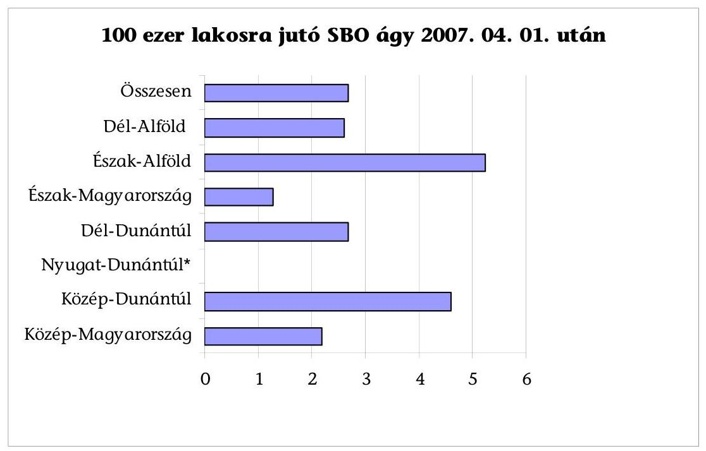

* Megjegyzés: 2,5 milliárd Ft címzett támogatásból a Szombathelyi Kórházban létesült sürgősségi tömb 2007 augusztusában kapott múködési engedélyt, a régióban ekkorra a 100 ezer lakosra jutó SBO ágy 1,3-ra emelkedett.

A kórházi struktúraátalakítást követően a területi ellátási kötelezettség (TEK) is újraszabályozásra került, amelyben fő elvként a lakóhely szerinti illetékesség volt meghatározó. A sürgősségi ellátásban a folyamatos (napi 24 órában elérhető) rendelkezésre állás és a szükséges szakmai háttér megléte követelmény, a TEK a kórházak ügyeleti (felvételi) rendjétől függően eltért a tervezhető ellátásokétól és nem kezelte a progresszivitási szintekből adódó kérdéseket.

A fővárosban a struktúraátalakítást követően a speciális profilú intézmények kerültek be az általános területi ellátásba, nem az intézmények tényleges felkészültségére épült a beutalási rend, az intenzív ellátás nem volt összhangban a szorosan kapcsolódó egyéb szakmák ellátási területeivel (traumatológia, SBO). A sürgősségi ellátási terület és a beutalási terület eltérő, a betegek magas arányban nem ott kapták meg az ellátást, ahova sürgősséggel bekerültek. A Szent Imre Kórház TEK-ébe először egymillió lakos tartozott, amely túlterheltséget csökkentették 900 ezer före (az Állami Egészségügyi Központ átvette a IV. és a XIII. kerület ellátását). A kórház a sürgősségi esetekben befejezett ellátást nem tudott teljes körűen nyújtani, a beteget állapotának stabilizálása után tovább küldték más kórházakba. A kialakult helyzetet nehezítette, hogy a kritikus állapotú, nem szállítható

[^0]
[^0]:    ${ }^{10}$ A sürgősségi osztály ágyszáma a finanszírozási szerződésben rögzített ellátási kapacitásmutató, ugyanakkor a betegfogadás feltételei, lehetőségei - a 6 órát el nem érő, vagy 6-24 órán belüli ellátások szakmai funkciója miatt - eltérnek a kötött ágyszámú más fekvőbeteg osztályokétól.

---

betegek száma növekedett, miközben a múködő intenzív ágyak száma a fővárosban az igényekhez képest alacsony volt.

A sürgősség fogalmának értelmezése körüli bizonytalanság és a teljesítmény volumenkorlát (TVK) okozta ellenérdekeltség miatt előfordultak viták a sürgősségi betegellátás területi ellátási kötelezettsége értelmezésében.

Az Eütv. az egészségi állapotban hirtelen bekövetkezett olyan változásként definiálja a sürgős szükség fogalmát, amelynek következtében azonnali egészségügyi ellátás hiányában az érintett közvetlen életveszélybe kerülne, illetve súlyos, vagy maradandó egészségkárosodást szenvedne. A sürgős szükség körébe tartozó egyes egészségügyi szolgáltatásokról szóló 52/2006. (XII. 28.) EüM rendelet határozza meg azt a 31 betegségcsoportot, ami a sürgős szükség körébe tartozó ellátásokat jelent(het)i. Ezen betegségek és ellátások esetén az állapot stabilizálásáig nem kellett fizetni vizitdíjat, kórházi napidíjat, illetve részleges térítési díjat, valamint beutaló sem szükséges a kezelés igénybevételéhez.

A kórházi struktúra átalakítása, az aktív kórházi ellátást nyújtó intézmények, az aktív kórházi ágyak számának csökkentése 2007-ben a sürgősségi rendszer fontos elemét alkotó mentőszolgálat tevékenységét és múködését is érintette (növekedtek a mentési távolságok). Az első évben a mentési feladatok (hívások számát tekintve) nem növekedtek.

Az Egészségbiztosítási Felügyelet (EBF) az OMSZ adatai alapján elemezte a kiérkezési idők, valamint a kórházi betegátvétel során a mentők várakozási idejének (mentési veszteségek) változását a kórházi kapacitás átalakítását megelőző (2006. II-III. n. év) és azt követő (2007. II-III. n. év) időszak összehasonlításában.

Az EBF megállapítása szerint az országos átlagban az átalakítások ellenére sem romlott a 15 percen belüli kiérkezés $79 \%$-os aránya, amely az egyes földrajzi területek között jelentős mértékben szóródott. A 15 percen túli kiérkezés a DélDunántúli régióban az átlagos $21,03 \%$-kal szemben $25,14 \%$, a NyugatDunántúli régióban $13,16 \%$ volt.

A kórházi betegátvételi veszteglés országos szinten kis mértékben csökkent, kevesebb esetben telt el 10 percnél több a betegek kórházi átvételénél. Az egyes régiók között azonban vannak különbségek. A Nyugat-Dunántúlon és az Észak-Alföldi régióban csökkent, a Dél-Dunántúlon nőtt a veszteglési idő, Budapesten (29,01\%) kiugróan magas volt az ilyen esetek aránya.

A mentés és a betegszállítás 2008. január 1-jei szétválasztása a mentőszolgálatnál az azonnali mentési feladatok ellátása tekintetében javuló mutatókat eredményezett.

Az OMSZ adatai szerint az azonnali mentési feladat 2004-2007 között 1\%-kal növekedett (kismértékű ingadozás mellett), 2008-ban 25,8\%-kal, ezen belül a gyógyintézetbe történő szállítások száma 62,6\%-kal emelkedett. A mentők 15 percen belüli helyszínre érkezésének aránya 2004-2007 között csupán 0,7 százalékponttal javult, a 2008. évi adatok azonban 3,4 százalékpontos javulást mutatnak. Az adatok területi szórása azonban jelentős: a 15 percen belüli kiérkezés aránya 2008-ban Tolna, Bács-Kiskun, Heves, Somogy és Pest megyében az átlagnál alacsonyabb, Győr, Komárom, Vas, Csongrád, Zala megyében magasabb volt.

---

# 1.3. A kórházi sürgősségi ellátás finanszírozása, minőségügyi rendszere 

Az SBO-k kialakításával párhuzamosan a finanszírozási rendszerben is alapvető változtatások váltak szükségessé. Az egészségügyi szolgáltatások Egészségbiztosítási Alapból történő finanszírozásának részletes szabályairól szóló 43/1999. (III. 3.) Korm. rendelet (Kr.) 2004 májusától hatályos módosítását követően az aktív fekvőbeteg-szakellátásban a sürgősségi ellátásért SO1, SO2, sürgősségi centrum progresszivitási szinttől függő - havi fix összegű díj illeti meg a szolgáltatót, amelynek alapvető célja a folyamatos, magas szintű rendelkezésre állás költségeinek fedezete. A Kr. szerint az aktív fekvőbeteg-szakellátást végző szolgáltatók sürgősségi, intenzív, traumatológiai és fertőző betegek ellátására szervezett osztályainak működtetéséhez havi fix összegű (2004-ben napi 1 ezer Ft/ágy) rendelkezésre állási díjra jogosultak, amelyet 2007. április 1-jétől a rendelet módosítása megszüntetett.

A finanszírozás másik része továbbra is teljesítményelven történik, bővítésre kerültek a sürgősségi HBCS (SHBCS) kódok. A költségeket reálisabban tükröző finanszírozás (kódkarbantartás) érdekében az OEP folyamatosan méri a jelenleg is múködő SBO-k segítségével, hogy milyen tevékenységek tipizálhatók és fedhetők le megfelelően kialakított speciális sürgősségi HBCS-kel.

A jogszabály éves kódkarbantartást ír elő, amely az egészségügyi szakellátásban használatos finanszírozási kódok (HBCS), és azok értékének meghatározásával, illetve a finanszírozási kódrendszer általános és speciális karbantartási feladataival kapcsolatos tevékenységet jelenti. A munka komplexitása miatt 1999. óta a HBCS átfogó kódkarbantartására nem került sor, a szakmák kezdeményezésére új eljárások befogadására, illetve eljárások elszámolhatóságának módosítására került javaslat kidolgozásra a Finanszírozási Kódkarbantartó Bizottság (FKB) által. A Szakmai kollégium által az SHBCS módosítására 2007 elején tett javaslat nem került a FKB elé. A költségfelmérésen alapuló átfogó kódkarbantartáshoz szükséges adatgyűjtés 2008. év végén kezdődött, ez alapján tervezik a szükséges javaslatok kidolgozását 2009-ben.

Az SO1, illetve SO2 szintű sürgősségi betegellátás finanszírozására 2008. augusztus 31-i benyújtási határidővel megjelent OEP pályázati felhívás célja a sürgősségi fekvőbeteg ellátást szolgáló, a betegek számára folyamatosan hozzáférhető sürgősségi ellátórendszer múködtetése, a sürgősségi ellátás minőségének javítása és az esélyegyenlőség megteremtése volt. Pályázatot nyújthattak be a finanszírozási szerződéssel rendelkező, aktív fekvőbeteg szakellátást nyújtó egészségügyi intézmények a korábbi években címzett és egyéb támogatásból, valamint 2005-ben az EüM által meghirdetett pályázatból megvalósult sürgősségi osztályok finanszírozására havi 240 millió Ft keret terhére.

A pályázaton 13 egészségügyi intézmény (ebből hét TVK átcsoportosítás, öt ellátási terület átvállalása, illetve átcsoportosítása, egy SO2 ellátási szint átminősítése SO1-re jogcímen) jutott hozzá a pályázati célokban megjelölt támogatáshoz.

A havi teljesítménydíj 2008-ban a 2004. évhez viszonyítva duplájára (105,3\%kal) emelkedett, nem kis mértékben az OEP által 2008-ban meghirdetett befogadási pályázat eredményeként. Az ágyszám növekedése miatt azonban az egy ágyra jutó finanszírozási díj ebben az időszakban csak 21,8\%-kal emelkedett,

---

ezen belül a finanszírozás módosításának (a rendelkezésre állási díj 2007. április 1. utáni megszüntetése) hatására két év alatt (2006. és 2007. év végén a 2005. évhez képest) $24 \%$-kal csökkent.

A kórházi sürgősségi ellátás finanszírozását mutatja be a következő diagram:
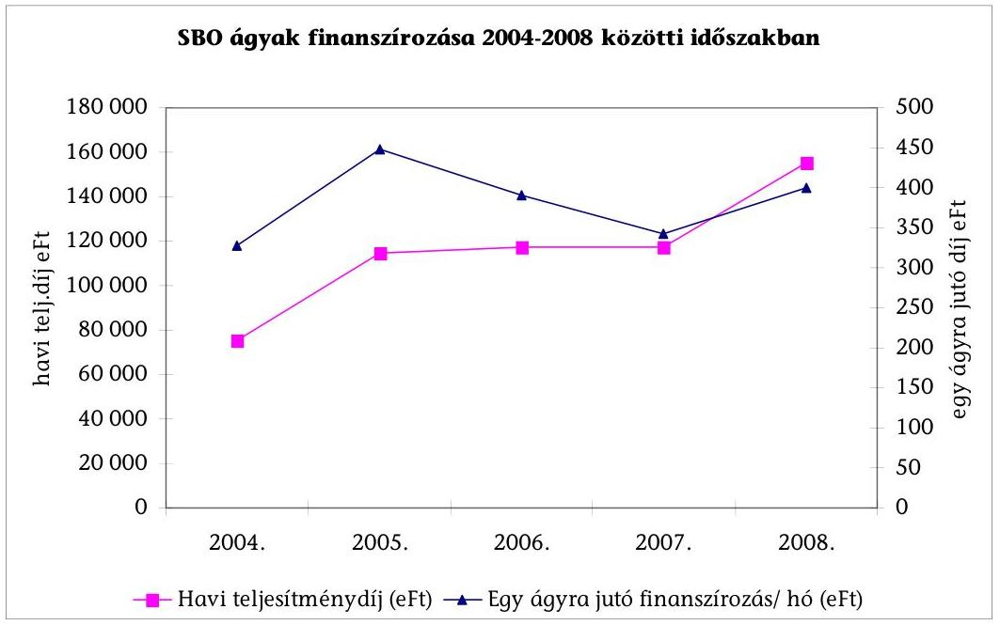

Az Eütv-ben megfogalmazott minőségügyi rendszer részeként a szakfelügyelet 2005. évi átalakítását követően ${ }^{11}$ az országos szakfelügyelők a létrejött Országos Szakfelügyeleti Módszertani Központ (OSZMK) keretén belül végezték tevékenységüket. A Sürgősségi betegellátás, oxyológia, mentés országos szakfelügyelő főorvosa 2005. évi beszámolója szerint a szakfelügyeleti tevékenység elsődlegesen az oxyológia, mentés és a betegszállítás területére korlátozódott, a szakfelügyeletnek nem volt egységesített formája, szempontrendszere sem adatszolgáltatás, sem bírálati (indikátor), sem jelentési szinten.

A felügyelet elsődlegesen a szaktárca által szabályozott szakmai minimumfeltételek meglétének ellenőrzésére fókuszált, a tevékenység során minőségügyi módszerek nem kerültek felhasználásra, a sürgősségi ellátás minőségügyi követésének rendszere nem került kialakításra. A szakfelügyelők jelentése alapján a hazai sürgősségi ellátásról nem alkotható valós kép, az egyes szakterületek adatgyűjtése, értékelési rendszere nem alakult ki.

A sürgősségi ellátás hatékonyságát, az esélyegyenlőség érvényesülését jellemző mutatók (indikátorok) nem kerültek bevezetésre, a sürgősségi ellátás különböző szintjei (alapellátási ügyelet, kórházi SBO-k, mentés) finanszírozásával összefüggő teljesítményadatok önmagukban nem alkalmasak az ellátás minőségének folyamatos nyomon követésére, a jogalkotás elősegítésére.

[^0]
[^0]:    ${ }^{11}$ az egészségügyi szolgáltatók szakmai felügyeletéről szóló 15/2005. (V. 2.) EüM rendelet

---

Sürgősségi osztályt azon fekvőbeteg-gyógyintézetekben kell létrehozni ${ }^{12}$, ahol a várható sürgősségi betegforgalom a napi negyven főt átlagosan meghaladja. A finanszírozási adatok (SHBCS) alapján azonban a sürgősségi osztály kialakításával kapcsolatos kötelezettség teljesítése nem állapítható meg. A sürgős esetek egységes értelmezése hiányában a gyüjtött és különböző rendszerekben (OSAP, OEP) elérhető adatok megbízhatósága eltérő. Számbavételi problémát okoz, hogy sürgősségi ellátást nemcsak SBO-k nyújtanak (nem valósul meg az „egykapus bemenet"), és a sürgősségi osztályok egy része nem nyújt folyamatos ellátást (munkaidőn túl a beteg ügyeletet ellátó intézménybe, osztályra kerülése esetleges, véletlenszerű).

A sürgősségi ellátórendszer múködésére vonatkozó, az ágazati adatgyűjtés keretében előírt adatszolgáltatás, az OEP felé elszámolt finanszírozási adatok között nincs adatkapcsolat, az egységes dokumentáció nem került megszervezésre, az adatok (a betegforgalom, az esetösszetétel, az ellátás jellege, ideje, a továbbküldés, hazaküldés rátái, a halálozás vagy a rehabilitálhatóság alakulása) rendszeres értékelésére nem került sor.

# 1.4. A sürgősségi ellátás fejlesztése az ÚMFT TIOP 2007-2008. évi akciótervében 

Az ÚMFT egyik prioritása a sürgősségi ellátás fejlesztése. A „Társadalmi infrastruktúra operativ program" (TIOP) a sürgősségi ellátás helyzetértékelése alapján fogalmazta meg több területen az infrastruktúra, ezen belül a sürgősségi ellátás fejlesztésére vonatkozó konkrét igényeket.

E szerint a fekvőbeteg-szakellátásban 37 sürgősségi betegellátó osztály (SBO) állt rendelkezésre a szükséges 60 helyett, valamint 22 kistérségben nem volt mentőállomás. A mentésben a roham- és esetkocsik száma alacsony, felszereltségük hiányos, az információtechnológiai eszközök és rendszerek elavultak, ami jelentősen gátolja az intézményközi kommunikációt, a gyógyítás terén a digitális technológia alkalmazását, az adat- és információközlést, a mentés terén pedig a mentésirányítást. Hiányzik a GPS rendszer, valamint a mentőszolgálat és a betegszállítók közötti rádió-kommunikáció és irányítás. A légimentés nem biztosította az ország teljes és folyamatos lefedettségét, nincs éjszakai mentésre alkalmas gép. A légimentő-bázisok és az alkalmas intézményi leszállóhelyek minősége, száma elégtelen.

Az egészségügyi infrastruktúra fejlesztésére 2007-2013 között a TIOP intézkedésein belül EU-s forrásokból van lehetőség, ezen belül a sürgősségi ellátás fejlesztését 35 milliárd Ft szolgálja közvetlenül:

- a mentés, légimentés korszerűsítését 11,5 milliárd Ft, ezen felül a mentésirányítás korszerűsítését 3,5 milliárd Ft forrás szolgálja, amely a KMOP 4.3.3ból további 600 millió Ft-tal egészül ki;
- a kórházak sürgősségi osztályainak további fejlesztésére 20 milliárd Ft támogatási keret áll rendelkezésre a 2007-2013 tervezési időszakban.

[^0]
[^0]:    ${ }^{12}$ az egészségügyi ellátás folyamatos múködtetésének egyes szervezési kérdéseiről szóló 47/2004. (V. 11.) ESzCsM rendelet 19. § (6) bekezdése

---

A 2004. évi Európai Uniós csatlakozás, az uniós előírások hatálybalépése, valamint a korszerűbb, egységesebb rendszer kiépítése érdekében a Kormány elfogadta a légimentés középtávú fejlesztésének koncepcióját ${ }^{13}$ és fontosságára való tekintettel bevette a 100 lépés programba. A fejlesztés fontos eleme a megfelelő számú légibázis kialakítása és múködtetése. A sármelléki bázis beindulásával 2007. május 1-jétől hat légimentő bázis biztosította a prehospitális sürgősségi ellátás egyik legfontosabb és leggyorsabb láncszemét. A hetedik bázis is megkezdte múködését Szentesen 2009. január 5-én, így az eddigi kb. 60\%-ról mintegy $85 \%$-ra nőtt a 15 percen belül helikopterrel elérhető területek aránya. A mentőhelikopterek fogadására a kórházakban megfelelő helikopter-leszállók kiépítésére van szükség. Ezen fejlesztések megvalósításában nagy segítséget jelentenek azok az EU-s pénzügyi források, melyek a kórházi sürgősségi osztályok fejlesztésére kiírt pályázatban rendelkezésre állnak.

Az intézkedésekkel kapcsolatos pályázati kiírások szakmai egyeztetése technikai értelemben korrekt módon megtörtént, az interneten (NFÜ honlapján) megfelelő nyilvánosságot biztosítottak az egyeztetésnek, a pályázati dokumentáció módosításáról rendszeresen közleményt jelentettek meg. A Társadalmi Egyeztetés során beérkezett javaslatokat a PEMCS ülésein megtárgyalták, a vélemények megismerhetők az interneten. A Szakmai kollégium észrevételei a Társadalmi Egyeztetés keretében többnyire olyan koncepcionális kérdésekre vonatkoztak, amelyek megválaszolása néhány szakmai alapelv tisztázásának, vagy egyértelmú szabályozásának, a Sürgősségi Ellátás Nemzeti Programjának hiányával függ össze. Ezek egy részét a PEMCS szakmai összetételénél fogva (sürgősségi ellátásban jártas szakemberek hiányában) nem tudta megjeleníteni a Pályázati kiírásban. Ilyen kérdés például a sürgősségi ellátó kórházi struktúra, a súlyponti kórház definíciójának hiánya, a központi diszpécser szolgálat fogalmi pontosításának, a minimumfeltételeknek megfelelő sürgősségi osztályok automatikus finanszírozási befogadásának igénye.

A sürgősségi ellátás fejlesztésére a felülvizsgált és elfogadott 2007-2008. évi Akcióterv 20,5 milliárd Ft pályázati keretösszeget tartalmazott, azonban a helyszíni vizsgálat befejezéséig pályázati eljárás nem fejeződött be.

Az Akciótervben a Sürgősségi ellátás fejlesztése konstrukció megvalósítással kapcsolatos kockázatai között a beruházások, a közbeszerzés elhúzódása, a lebonyolítás szervezési és/vagy finanszírozási (likviditás) problémák mellett a múködés megkezdéséhez szükséges szakember gárda biztosítása, valamint az egyes szakmák sürgősségi ellátása közötti összhang hiánya szerepel. A kockázat kezelését részben előfinanszírozással, központosított közbeszerzéssel, illetőleg a projekt előkészítési szakaszában a humánerőforrás biztosítására vonatkozó stratégia bemutatásával kívánták biztosítani. A sürgősségi rendszert és annak feltételeit a pályázati dokumentáció szakmai értékelési rendszere keretében definiálták.

A TIOP 2.2.2 „Sürgősségi ellátás fejlesztése - SO1, SO2 (és ezeken belül gyermek sürgősségi), valamint informatikai fejlesztés a koraszülött intenzív és a központi intenzív osztályokon" konstrukció 2008 februárjában megjelent pályázat beadási határ-

[^0]
[^0]:    ${ }^{13}$ a légimentés középtávú fejlesztéséről szóló 2147/2005. (VII. 22.) Korm. határozat

---

ideje 2008. július 15. volt, az első fordulóban a bírálati eljárás 2009. március 22-én zárult le. Az első fordulóban 31 kórház 14,7 milliárd Ft uniós támogatásra nyújtott be pályázatot a 2007-2008. évi Akciótervben szereplő 8,8 milliárd Ft-tal szemben, amelyből 26 kórház 12 milliárd Ft támogatást nyert új sürgősségi osztály kialakítására, vagy meglévő fogadóhely/osztály korszerűsítésére, magasabb szintre történő fejlesztésére. A nyertes pályázók ezt követően a projektfejlesztés keretében dolgozzák ki részletes terveiket. A Kormány 2009. március 25-i döntésével a 2009-2010-es pályázati keret részbeni előrehozásával a pályázat támogatási keretét megemelte, amelyet a kiírásnak megfelelő pályázatokkal és a minél korábbi megvalósítás szándékával indokoltak. A Biráló Bizottság a 31 pályázatból 5 pályázó, összesen 1,1 milliárd Ft igényét nem javasolta támogatásra nem megfelelő szakmai-műszaki tartalom, vagy el nem számolható költségtételek 25\%-nál magasabb aránya miatt.

A vizsgált kórházak 57\%-a (12 kórház) tervezte a sürgősségi ellátás fejlesztését a TIOP 2.2.2 intézkedés keretében összességében 5,7 milliárd Ft uniós támogatásból. Az első fordulóban nyertes tíz pályázó 4,4 milliárd Ft támogatása az összes keret 36,9\%-a (közülük négy korábban az EüM által 2005-ben kiírt pályázaton összesen 95 millió Ft támogatásban részesült, a pályázó kórházak fele a vizsgált években semmilyen más forrásból nem nyert támogatást a sürgősségi ellátás fejlesztésére). A támogatások elszámolása, a pályázatokban szereplő hatékonysági követelmények nyomon követése érdekében szükséges indikátorrendszer kidolgozására és bevezetésére a helyszíni vizsgálat 2009. április 27-ei lezárásáig nem került sor.

Az Akciótervben a TIOP 2.2.1 „Sürgősségi ellátás fejlesztése - mentés, légimentés" konstrukció megjelentetésének tervezett időpontja 2008. II. negyedéve volt, a Tervezési dokumentáció még nem került meghirdetésre.

A TIOP 2.2.1-es konstrukció teljes pénzügyi kerete 11,5 milliárd Ft, ebből a 20072008. évi Akciótervben 7 milliárd Ft, a 2009-2010. évi Akciótervben 4,5 milliárd Ft szerepel. A benyújtott előzetes megvalósíthatósági tanulmányban a két projekt által elérendő célokat, tevékenységet, illetve eredménymutatókat határoztak meg. A tervek szerint két kiírás készül, két külön projekt valósul meg a két fázisban, mind a két esetben a kedvezményezett az OMSZ. Nem racionális ugyanazokat a célokat és tevékenységeket támogatni mind a két időszak alatt, illetve nem reális, nem védhető egy projektben végrehajtható tevékenységeket két tervezési időszakra bontani ${ }^{14}$.
2007. november 14-én a TIOP 2.2.1-es konstrukció pályázat előkészítő munkacsoportja (PEMCS) megtartotta alakuló ülését. A PEMCS elnöke a munkacsoport üléseit felfüggesztette, mivel a tervezés nem tartott olyan fázisban, hogy az érdemi munkát elkezdjék és a szaktárca sem jelent meg az ülésen.

A TIOP 2.3.4 „Mentésirányitási rendszer" fejlesztését szolgáló pályázat meghirdetésének tervezett időpontja 2007. IV. negyedév volt, a Tervezési dokumentáció 2007. november 29-én megjelent. Az OMSZ által benyújtott projekt javaslat értékelése megtörtént, a Humán Erőforrás Programok (HEP) Irányító Hatósága a bíráló bizottság javaslata alapján 2008. augusztus 1-jén feltételes támogató

[^0]
[^0]:    ${ }^{14}$ STRAPI kérdésekre adott írásos válasza alapján

---

döntést hozott. Az OMSZ és az EüM 2008-ban szakmapolitikai változtatás miatt (a pályázat csak az OMSZ informatikai fejlesztését tartalmazta) a pályázat visszavonását kérte a HEP Irányító Hatóságtól. A mentésirányítási rendszer fejlesztésével kapcsolatosan a Nemzeti Fejlesztési Úgynökség (NFÜ) pályázati felhívása az OMSZ részére a támogatás elnyerése céljából 2009. április 27 -én jelent meg, amely tartalmazza a rendszerirányítási terveket, a térinformatikai rendszert, a mentésirányítási algoritmusokat, az automata defibrillátorok telepítési helyének és alkalmazásba vételének, valamint a kórházak sürgősségi osztályaival, és az alapellátási központi orvosi ügyeletekkel kiépítésre kerülő informatikai kapcsolat követelményét.

A TIOP egészségügyi infrastruktúra fejlesztését szolgáló intézkedései (Pl. 2.2.7 „Infrastruktúra-fejlesztés az egészségpólusokban") a sürgősségi ellátást közvetetten érintő célokat, opcionális lehetőséget tartalmaznak. A TIOP 2.1.2 „Kistérségi járóbeteg-szakellátó központok kialakítása és fejlesztése", és a 2.1.3 „Aktiv kórházi ellátásokat kiváltó járóbeteg szolgáltatások fejlesztése" konstrukciók lehetőséget biztosítottak mentőállomás, központi ügyelet fejlesztésére. A benyújtott pályázatok közül kettő tartalmazza mentőállomás létesítésének tervét 108 millió Ft várható költséggel.

Közvetve a TIOP egyéb intézkedései (pl. Infrastruktúra-fejlesztés az egészségpólusokban, Kistérségi járóbeteg-szakellátó központok kialakítása) is tartalmazhatnak sürgősségi ellátást érintő fejlesztéseket, valamint a Regionális Operatív Programok (ROP) lakosság közeli ellátással összefüggő programjai keretében központosított alapellátási ügyeletek kialakítására van lehetőség.

# 2. A HÁZIORVOSI ÜGYELETI ELLÁTÁs ÁTALAKÍTÁSA, MŰKÖDTETÉSE 

### 2.1. A szolgáltató kiválasztása és támogatása

A települési önkormányzatok gondoskodtak az Eütv. 152. § (1) bekezdés c) pontjában előírt háziorvosi ügyeleti ellátásról. A helyi önkormányzatok a közszolgáltatás ellátásának szervezeti kereteiről, az ügyeleti ellátás saját maguk, társulás vagy költségvetési intézmény, illetve feladatátvállalási szerződés megkötésével, vállalkozás, nonprofit szervezet útján történő biztosításáról a törvény keretei között önállóan, szabadon dönthettek. Az önkormányzatok együttmúködésével, társulásaival - a központi ügyeleti forma térnyerésével - az ellátás finanszírozási szerződéseinek száma az utóbbi négy évben 873 -mal ( $71,0 \%$-kal) csökkent. A 2008. évben a 357 háziorvosi ügyeleti szolgálat finanszírozási szerződéseinek kétharmadát költségvetési szervvel, egyharmadát vállalkozással (ide értve a non-profit szervezeteket is) kötötte az E. Alap kezelője.

Az OEP országos adatai szerint a háziorvosi ügyeleti ellátás finanszírozására 2004-ben 89,8\%-ban, 2008-ban 67,8\%-ban az önkormányzatokkal, illetve költségvetési intézményekkel kötöttek szerződést. Ezzel párhuzamosan a vállalkozások és nonprofit szervezetek aránya növekedett, ugyanakkor a velük ügyeletre kötött finanszírozási szerződések száma is csökkent 8,7\%-kal. Az ellenőrzött szolgáltatók körében az ellátást 2008-ban 35,5\%-ban vállalkozási, 65,5\%-ban költségvetési gazdálkodást folytató szervezet biztosította.

---

Az önkormányzatok, illetve azok társulásai a háziorvosi ügyeleti ellátást nyújtó szolgáltatók választásánál a korábban már múködő szolgáltatót, vagy a közös fenntartáshoz történő csatlakozást részesítették előnyben. Az ellenőrzött kistérségek szolgáltatóinak 42\%-ánál az ellátási terület a kistérség területét átlépte, mert az önkormányzatok közötti jól bevált együttműködést fenntartották, vagy célszerűségi szempontokra hivatkozva kibővítették.

A szolgáltatók közül minden ötödiknek a kiválasztása történt az ellenőrzött időszakban, ennek során a döntések megalapozásához az igényeket és lehetőségeket tartalmazó felmérést, elemzést csak minden harmadik, előre tisztázott kiválasztási kritériumokat mindössze minden második esetben alkalmaztak.

A tanúsítványok adatai alapján a szolgáltatók négyötödénél a bevételek önkormányzati támogatás nélkül nem fedezték a kiadásokat. Az ellátás finanszírozásában közvetlenül vagy a társulás pénzforgalmán keresztül az önkormányzatok saját forrásaik terhére részt vállaltak, 2004-2008 között az ellenőrzött alapellátási ügyeletek $81 \%$-ának a múködését támogatták.

A legelterjedtebb megoldásként a lakosságszám alapján (fejkvóta szerint) számított összeggel támogatták a szolgáltatót a háziorvosi ügyeleti ellátás területének önkormányzatai (pl. a csepregi, a móri, a székesfehérvári, a kiskunhalasi kistérségben). A másutt alkalmazott módszerek az előzetesen költségelemek alapján önkormányzatonként kalkulált támogatás, az évenként külön vagy automatizmussal megállapított fix díjazás, a finanszírozáshoz szükséges egyedi döntéseken alapuló támogatás, és ezek különböző variációi voltak.

A feldolgozott tanúsítványok adatai alapján az utóbbi három évben a szolgáltatók átlagosan 2006-ban 10,1 millió Ft, 2007-ben 10,6 millió Ft, 2008-ban 11,7 millió Ft támogatásban részesültek, amely az éves bevételeik 28,7\%-át, $26,6 \%$-át és $26,5 \%$-át jelentette. A szolgáltatóknak 2008-ban adott közvetlen, vagy a társuláson keresztül nyújtott támogatás 2-53 millió Ft között szóródott. Az önkormányzatok tehervállalási készségében való különbségek miatt előfordult, hogy ugyanazon központi ügyelet támogatásában az ellátási terület nem minden önkormányzata vett részt.

Sátoraljaújhelyen a társulásban múködtetett háziorvosi ügyelet fenntartásában problémát okoz, hogy az ellátási területhez tartozó két községi önkormányzat nem járul hozzá a kiadásokhoz. A kistérséghez sem tartozó Alsóberecki és Felsőberecki Községi Önkormányzathoz - amelyek számára a háziorvosi és ügyeleti ellátást évtizedek óta, hagyományosan biztosították - a városi önkormányzat a vizsgált években többször fordult a problémával kapcsolatban, felvetve a társuláshoz való csatlakozás szükségességét. A MEP 2008. júliusi - a problémával kapcsolatos - válasza szerint a körzethatárok módosítására egyoldalúan lehetőség nincs, ahhoz az érintett önkormányzatok képviselő-testületeinek hozzájárulása szükséges, érdemi előrelépés az ügyben nem történt.

A szolgáltatókkal kötött megállapodások szerinti támogatási mértékhez, módhoz kapcsolt feltételeknek, követelményeknek az érvényesülését vizsgáló kontroll csak az esetek 36\%-ában múködött. A megállapodások feltételeinek be nem tartásáért önkormányzati, illetve társulási támogatás visszavonás nem történt, ugyanakkor előfordult a finanszírozási szerződés feltételeitől eltérő múködésért alkalmazott finanszírozói szankció.

---

Az Ibrányi TKT esetében az OEP ellenőrzés megállapította, hogy a közös diszpécserszolgálat működése nem valósult meg, ezért a támogatás folyósítása nem felelt meg a megállapodásban foglaltaknak. Az igénybe vett támogatást (1329 ezer Ft) és kamatait (80 ezer Ft) vissza kellett fizetni az OEP részére.

# 2.2. A készenléti ügyeleti forma megszüntetése, központi ügyeletek megszervezése 

A háziorvosnak munkanapokon sürgős orvosi tevékenységek elvégzése céljából történő - rendelőn kívüli - rendelkezésre állása (készenléti ügyeleti forma) megszüntetésének határideje 2005. december 31-e helyett - a korszerűbb ügyeleti formák kialakításának késedelmére figyelemmel - 2006. december 31-re módosult ${ }^{15}$. A készenléti ügyeleti forma megszüntetését a szakmai munka egyenetlenségei mellett az uniós és a hazai munkaidő korlátozó szabályok indokolták. A feladat nagyságrendjét jelzi, hogy országosan 2004ben még 768 háziorvosi ügyelet ( $38,7 \%$ ) ebben a formában múködött. A lakosság sürgősségi alapellátása lényegében a háziorvosokra hárult, az OMSZ megbízása csak szűk körű volt.

Az OMSZ 1999-2006 között hat megye (Békés, Csongrád, Hajdú-Bihar, Pest, Tolna, Vas) 13 településén és a főváros hét kerületében múködtetett ügyeleti szolgálatot.

Az ellenőrzött önkormányzatok és kistérségek körében minden ötödik esetben került sor a készenléti ügyelet megszüntetésére, a szükséges helyi intézkedések a módosított határidőig megtörténtek és eredményesek voltak. A szétaprózott készenlétek, valamint az összevont ügyeletek helyett a központi ügyeletek kialakítását és közös diszpécserszolgálattal történő müködtetését finanszírozási ösztönzők is segítették, ugyanis a lakosságszámtól függő területi szorzók rendszere mellett megemelt ügyeleti díj járt a kiemelt ellátási formákhoz.

A Kr. 19. § (4) bekezdése alapján a központi ügyeletet múködtető egészségügyi szolgáltató a 20 ezer alatti lakosságszámú település esetében 30\%-kal, a 20-40 ezer közötti lakosságszámú település esetében 20\%-kal megemelt, amennyiben a sürgősségi betegellátó osztályt múködtető és a mentést végző egészségügyi szolgáltatóval kötött megállapodás szerint ügyeleti időben közös diszpécserszolgálatot tart fenn, további $10 \%$-kal megemelt ügyeleti díjazásra jogosult.

A 2004-2008 közötti időszakban hosszabb-rövidebb ideig minden ötödik ellenőrzött önkormányzatnál, illetve kistérségnél összevont ügyelet ${ }^{16}$ egyötödében változó telephellyel, négyötödében állandó telephellyel múködött.

[^0]
[^0]:    ${ }^{15}$ az egészségügyi ellátás folyamatos múködtetésének egyes szervezési kérdéseiről szóló 47/2004. (V. 11.) ESzCsM rendelet módosításáról szóló már hatályon kívül helyezett 65/2005. (XII. 22.) EüM rendelet
    ${ }^{16}$ A háziorvosi ügyelet központi ügyelet, vagy összevont ügyelet formájában szervezhető. Ez utóbbin belül változó telephelyen (az ügyelet helyszíne a háziorvos rendelője, az orvos saját gépkocsival, általában ápolói segítség nélkül), illetve állandó telephelyen (az adott ügyeleti körhöz tartozó háziorvosok egy helyszínen látják el az ügyeletet, ügyeleti gépkocsi és ápoló segítségével) múködhet az ügyelet.

---

A háziorvosi ügyeleti szolgálatok számán belül 2008 végére a központi ügyeletek aránya országosan és a vizsgált körben is meghatározóvá vált.
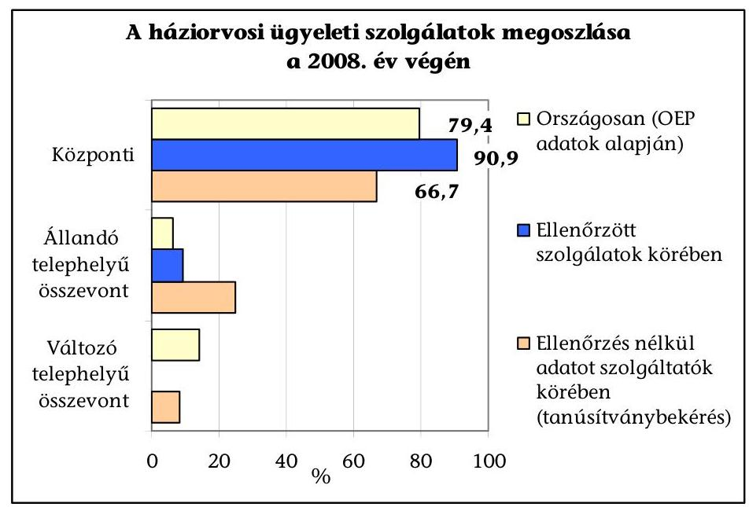

Az ügyeleti központok a hagyományok, a kistérségi vagy mikrotérségi központok szerint, heterogén módon szerveződtek. Az ellátási terület háziorvosi körzeteinek számában, lakosságában, az ügyelet által elérendő távolságokban az egyes ügyeletek között a különbségek többszörösek.

A központi ügyeletek ellátási területében a legkevesebb háziorvosi körzetszám hat, míg a legmagasabb 130 volt. Az ellátási terület lakónépessége alapján legkisebb központi ügyeletben 7730 fő, a legnagyobban 186636 fő sürgősségi alapellátásáról kellett gondolkodni. Az ellátási területen az ügyelet helyétől mért legnagyobb távolság 2-45 km között változott.

A központi ügyeletek finanszírozása 2004 májusától ösztönözte a közös diszpécserszolgálatok ${ }^{17}$ szervezését, amely az eltelt öt év alatt lassan haladt és szerény eredményt hozott. Az OEP adatai szerint 2006-ban kettő, 2007-ben kilenc, 2008-ban 15 szolgáltató (a központi ügyeletek huszad része) volt jogosult a közös diszpécserszolgálat miatti magasabb ügyeleti díjazásra. Az OMSZ 2009. januári adatai 20 központi ügyeleti szolgáltatóval kötött szerződést jeleztek. Az ellenőrzött ügyeleti szolgáltatók körében 2008 végén 13,3\%-os volt az arány (négy szolgálat).

[^0]
[^0]:    ${ }^{17}$ Az orvosi ügyeletre és a mentőszolgálathoz érkező hívásokat a közös diszpécserszolgálat fogadja. A kikérdezés után a tünetek, vagy akár az apróbb jelek alapján döntenek, hogy milyen beavatkozásra van szükség: a legmagasabb szintű rohamkocsit küldjék a helyszínre, az ügyeletes orvos lássa el a beteget, vagy enyhébb panaszok esetén elegendő a tanácsadás is.

---

A közös diszpécserszolgálatok múködésének összegző szakmai értékelését tartalmazó dokumentumot az ellenőrzött szervezetek nem tudtak rendelkezésünkre bocsátani, mindössze egy kórház véleményét továbbította az OMSZ felénk.

A Móri Kórházban összevont háziorvosi és kórházi sürgősségi ügyelet múködik. „Ennek munkájában egyértelmú segítséget jelent a jól funkcionáló diszpécserszolgálat. A nem indokolt riasztások száma csökkent csakúgy, mint az ügyeletre érkező indokolatlan esetek száma is... Az adott hívásokra megfelelő szintü ellátó egységeket inditottak. Jó effektussal döntik el, hogy az adott riasztásra milyen szintü mentőegység, háziorvosügyeleti autó induljon, esetleg a beteg keresse fel a sürgősségi fogadóhelyünket, illetve nem szükséges aktuálisan ügyeleti ellátás. A diszpécserszolgálat egyértelmú előnye a felesleges betegutak megszünése, a nagyobb betegbiztonságot jelentő ügyeleti ellátás megvalósitása."

A közös diszpécserszolgálatoknál szűkebb körben az OMSZ az önkormányzatokkal, illetve azok társulásaival kötött szerződések alapján komplex ügyeleti szolgáltatást is végzett. Az 1996. évtől már alkalmazott ellátási formára az OMSZ információi szerint 2008 végén 12 érvényes megállapodás volt, ebből kettő Vas megyei kistérség (Szombathelyi TKT és Körmendi TKT) a helyszíni ellenőrzésünk körébe tartozott.

Az ellenőrzött TKT-k 86\%-ának társulási szerződése tartalmazta az egészségügyi alapellátáson belül az ügyeleti ellátást. A központi ügyelet kialakítását, illetve feltételeinek javítását célzó pályázatok elkészítésében és az elnyert források felhasználásában, a beszerzett eszközök továbbadásában a TKT-k 93\%-a közreműködött. A TKT-k feladatvállalásának terjedelmét a sokféleség jellemezte. A tevékenységek körébe tartozott a szükséges további teendők ellátásával egy-egy önkormányzat megbízása, míg a legtöbbet azok vállalták, akik szolgáltatóként ügyeleti ellátást is nyújtottak. Az ellenőrzött TKT-k a központi ügyeletek kialakítását, feltételeinek javítását - az általuk pályázatokon nyert, valamint az önkormányzatoktól kifejezetten a szolgáltatónak szánt önkormányzati forrásokat, eszközöket továbbítva - segítették:

- 45\%-nál pénzügyi források átadása történt,
- 34\%-nál ingatlant, ingatlanrészt bocsátottak rendelkezésre (használati jogot biztosítva az ügyeleti szolgáltatónak, kikötve annak karbantartási kötelezettségét),
- 83\%-nál járművek, berendezések átadására került sor (a tulajdonjog fenntartásával).

A központi ügyeletek kialakítását, fejlesztését a készenléti ügyeleti forma megszűnése és a kedvezőbb finanszírozási feltételek mellett az önkormányzati együttműködés szélesítését elősegítő pályázati források is ösztönözték.

# 2.3. Központi ügyeletek kialakítását segítő támogatások 

A fejezeti kezelésú előirányzatok „Az alap- és sürgősségi ellátás, mentés, katasztrófa ellátás feltételeinek javitása" jogcímcsoporton belül az alapellátási központi ügyeletek kialakítását 2004-2006 között 737,6 millió Ft támogatás segí-

---

tette, ezt követően a rendelkezésre álló források ilyen célra új előirányzat tervezését nem tették lehetővé.

A szaktárca által 2003-ban kiírt 237,6 millió Ft keretösszegű pályázati felhívásra 150 pályázat érkezett, az összes támogatási igény 506,8 millió Ft volt. A 96 nyertes pályázónál a központi ügyelet építészeti kialakítása (106,1 millió Ft), ügyeleti gépkocsik vásárlása ( 54,2 millió Ft ), valamint a minimumfeltételek teljesítését eredményező felszerelések vásárlása ( 77,3 millió Ft) részesült 2004. évi áthúzódó támogatásban. Ezt egészítette ki 2005-ben a „21 lépés az egészségügy átalakítására" program keretében kiírt 500 millió Ft-os pályázat.

A többcélú kistérségi társulások megalakulását ösztönző támogatásra kiírt pályázaton 2004-2005. évben az egészségügyi feladatokat vállaló 142 kistérségi társulásból 100 központi orvosi ügyelet kialakítására, fejlesztésére (épületkialakítás, gép-műszer beszerzés, mentőszolgálattal közös diszpécserszolgálat kialakítása, ügyeleti gépjárművek beszerzése) 1,9 milliárd Ft támogatásban részesült.

A többcélú kistérségi társulások ösztönzéséhez szükséges intézkedésekről szóló 1030/2004. (IV. 15.) Korm. határozat felhívta az érintett minisztereket, hogy dolgozzák ki a TKT-k által ellátandó feladatok szervezésének, megvalósításának elvárt módját, a szükséges követelményeket. Az egészségügyi alapellátás többcélú kistérségi társulás útján történő ellátásának szakmai és hatékonysági feltételeit és követelményeit a szaktárca kidolgozta, a BM a pályázati felhívás mellékletében közzétette. E szerint a központi ügyeletnek le kell fednie a kistérséghez tartozó települések összlakosságának legalább 80\%-át. A Társuláson belül több intézményfenntartó társulás abban az esetben hozható létre, ha az egyes intézményfenntartó társulásokban az érintett települések száma legalább kettő vagy több, továbbá az érintett lakosságszám meghaladja a 25 ezer főt. A követelmények teljesítését azonban nem vizsgálták, a támogatások felhasználásáról készített pénzügyi és szakmai beszámolót a BM (illetve jogutód ÖTM) elfogadta és nem tett észrevételt.

A központi ügyeletek kialakítására a helyszínen ellenőrzött TKT-k, helyi önkormányzatok a vizsgált időszakban 834 millió Ft támogatást használtak fel. Ennek 84,3\%-át (703,4 millió Ft) a TKT-ok megalakulásának ösztönzését szolgáló támogatásból, 6,4\%-át (53,3 millió Ft) fejezeti kezelésű előirányzatból, a fennmaradó 9,3\%-át (77,3 millió Ft) a Regionális Fejlesztési Tanácsok által kiírt pályázatokból (TRFC, LEKI) vették igénybe.

Az ellenőrzött TKT-k (megalakulásukat megelőzően a kistérség központ önkormányzatok) egy kivételével mind részt vett a többcélú kistérségi társulások megalakulását ösztönző támogatásra a BM, valamint nyolc az EüM és három a Regionális Fejlesztési Tanácsok által a központi ügyeletek kialakítására, fejlesztésére meghirdetett pályázatokon. A pályázati aktivitást - a rendelkezésre álló források mellett - a pályázati kiírásban meghatározott saját forrás követelménye befolyásolta. A TKT megalakulását ösztönző támogatás és a Regionális Fejlesztési Tanácsok által a TRFC keretében kiírt pályázatok esetében nem volt saját erő követelmény, a célok megvalósítását csak kivételesen egészítette ki saját forrás.

---

A központi ügyeletek létrehozására, illetve az ügyeletek központosítására a fejezeti kezelésú előirányzatból pályázható támogatás forráskiegészítésként múködött, maximum a megvalósításhoz szükséges költségek $60 \%$-a lehetett. A vizsgált önkormányzatok, TKT-k az EüM pályázatán elnyert 53,3 millió Ft támogatásból 103 millió Ft költségű fejlesztést valósítottak meg.

A beadott pályázatok kétharmadában az igényelt és elnyert támogatás különbözzete miatt nem kellett változtatni a fejlesztési célkitüzéseken. A módosítások hét pályázat esetében 17\%-kal csökkentették a tervezett fejlesztések forrását, amely az alacsonyobb beszerzési ár alkalmazása, vagy a nem támogatható pályázati elemek elhagyása miatt nem jártak a pályázati célok érdemi változtatásával.

A Sárospataki TKT az Észak-magyarországi Regionális Fejlesztési Tanács által kiírt LEKI pályázat keretében 2007-ben - a sürgősségi ellátásban kiemelt fontosságú - életmentő készülékek beszerzését tervezte. A fejlesztés tervezett összköltsége 16,3 millió Ft, a támogatás 15,1 millió Ft volt ( $92 \%$-os támogatási arány). A 2008. január hónapban a támogatási szerződést módosították a megváltozott költségvetés alapján, a támogatás összege 12,3 millió Ft-ra csökkent. Az eredeti pályázatban rögzített műszer-fejlesztést olcsóbb egységárú, de a célnak megfelelő, ugyanakkor mennyiségben több oxyológiai felszerelés beszerzésére módosították.

Az igényelt és elnyert pályázati forrás eltérése miatt a pályázatban szereplő orvosi müszerek egy részét nem vásárolták meg (Sárvári, Bajai, Pécsi TKT).

A Sárvári TKT által igényelt 17,2 millió Ft összegű támogatással szemben 14,2 millió Ft összegű támogatást nyertek. A csökkentett összeg a kitűzött célt annyiban befolyásolta, hogy az épület korszerűsítésének műszaki tartalmát, költségeit csökkentették. A támogatási célokban a felhasználás folyamán következett be változás, amelynek indoka az volt, hogy a vásárolni kívánt gépkocsi ára magasabb, az értékesítésre szánt régi gépkocsi ára pedig alacsonyabb volt a tervezettnél. A gépkocsi beszerzésének elsődlegességét hangsúlyozva, ennek megvásárlásához kértek engedélyt az EKG-készülék és a defibrillátor beszerzés terhére.

Két pályázat esetében a támogatás felhasználásának belső arányai módosultak, az nem érintette a jóváhagyott támogatás összegét (Orosháza, Fehérgyarmat TKT).

Az Orosházi TKT pályázatában szereplő két ügyeleti gépjárműből egyet a támogató (BM) fölöslegesnek ítélt és csupán egy gépjármú beszerzését hagyta jóvá. A támogatási megállapodást a TKT kérésére két alkalommal módosították, a támogatás változatlanul hagyásával, amely a felhasználás belső arányait változtatta meg. A központi orvosi ügyelet beindításához szükséges beruházások teljes bekerülési költsége 538 ezer Ft-tal haladta meg a támogatás összegét, amely a teljes bekerülési költségnek csupán 1\%-át jelentette.

A felhasználást az infrastruktúra kiépítésének igénye határozta meg, elsődlegességet élvezett a központi ügyeletek céljára szolgáló épületek kialakítása, felújítása, berendezése, ügyeleti gépkocsik beszerzése. A támogatás $18 \%$-át fordították a sürgősségi ellátást szolgáló műszerbeszerzések-

---

re, 2\%-át informatikai célokra (hálózati kapcsolatok kiépítésére, eszközbeszerzésre). A támogatások felhasználásának összetételét mutatja a diagram:
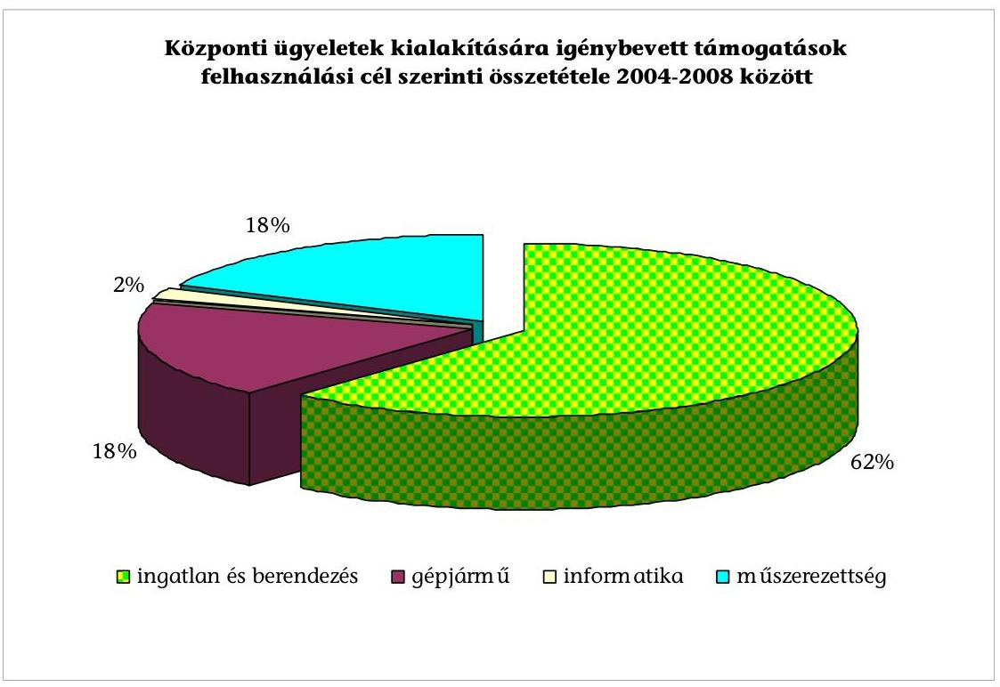

A támogatások eredményeként a központi ügyeletek száma növekedett, a felhasználás eredményeinek értékelésére az OGY szakbizottsága előtt egy alkalommal került sor ${ }^{18}$, amely szerint a háziorvosi ügyeletek az előírt szakmai minimumfeltételeknek megfeleltek. A fejlesztések és finanszírozási ösztönzők hatására a központi ügyeletek által ellátott lakosság aránya 2008 végére $86 \%$-ra emelkedett.

# 2.4. A szabályszerű múködés feltételeinek biztosítása 

Az ellenőrzött háziorvosi ügyeleti szolgáltatók a Mátészalkai TKT kivételével az ÁNTSZ által kiadott végleges múködési engedéllyel rendelkeztek, amelyet az egészségügyi szolgáltatás gyakorlásának általános feltételeiről, valamint a működési engedélyezési eljárásról szóló 96/2003. (VII. 15.) Korm. rendelet alapján az ÁNTSZ regionális és kistérségi intézetei ellenőriztek. Az egészségügyi szolgáltatások nyújtásához szükséges szakmai minimumfeltételekről szóló 60/2003. (X. 20.) ESzCsM rendeletben (Minr.) előírt személyi és tárgyi feltételekhez viszonyítva 2006-ban három szolgáltatónál találtak olyan mértékű hiányosságokat, amelyek miatt ideiglenesen engedélyezték a múködést. A hiányosságokat kettő szolgáltató pótolta, míg egy szolgáltatónál a tárgyi feltételek javítása a 2009. évre húzódott át.

[^0]
[^0]:    ${ }^{18}$ az Országgyűlés Egészségügyi Bizottsága Ellenőrzési Albizottsága 2007. március 7-i ülésére a háziorvosi ügyeleti ellátás kérdéseiről az EüM által készített tájékoztató

---

A Mátészalkai TKT határozott idejű működési engedéllyel rendelkezik az ügyeleti ellátást nyújtó épületek kifogásolt állaga miatt, amely többszöri meghosszabbítás után 2009. június 30-ig hatályos. A hiányosságok pótlása elhúzódásának oka, hogy a központi ügyelet új elhelyezését az épület-felújítás helyett a címzett támogatásból 2009-ben befejeződő kórházberuházás részeként oldják meg.

Az ellenőrzött, valamint a megkeresés alapján információkat nyújtó háziorvosi ügyeleti ellátást biztosító szolgáltatók körében a felmért egyes infrastrukturális feltételek a következők voltak:

- a 2008 végén az ügyeleti ellátásra a szolgáltatók 71\%-ánál egy, 20\%-ánál kettő, $9 \%$-ánál három gépkocsi állt rendelkezésre, a járművek egynegyedét 2004-ben, vagy azt megelőzően helyezték üzembe. A 2008. évről a szolgáltatók $87 \%$-a által szolgáltatott alapadatok alapján a nem rendelőben ellátottakra számított átlagos futásteljesítmény $16,4 \mathrm{~km} / \mathrm{fő}$, az egyedi mutatószámok közül a legkisebb $3,1 \mathrm{~km} /$ fő, a legnagyobb $53,0 \mathrm{~km} /$ fő volt;
- a közvetlen informatikai kapcsolatok kiépítettsége a 2006. és a 2008. év öszszehasonlításában a mentőkkel $11 \%$ majd $20 \%$, a sürgősségi betegellátást biztosító kórházzal $9 \%$ majd $18 \%$ volt, mindkettővel közvetlen informatikai kapcsolattal rendelkező szolgáltatók 7\%-ot, majd 16\%-ot képviseltek. Az ügyeletben a szakmai segítség igénybevétele, a labor és képalkotó eljárások leleteinek gyors átvétele informatikai kapcsolat hiányában nem volt biztosított, amely a befejezett ellátások arányának növelése ellen hatott.

A szolgáltatóknak csak a fele alakította ki az ellátáshoz szükséges eszközök rendelkezésre állása, működőképessége nyomon követésének rendszerét. A többi esetben - a tartalmában és formai kellékeiben előre rögzített napi rutinszerű eljárás helyett - a szóbeli tájékoztatás elfogadását alkalmazták a szolgálat át-adás-átvételek dokumentálásakor. A szükséges eszközök rendelkezésre állásának, működőképességének problémáiból eredő ellátási zavart azonban sehol sem jeleztek.

A személyi feltételek követelményeként nem került kidolgozásra és bevezetésére a sürgősségi ellátás fejlesztésére vonatkozó szakmai javaslatok között szereplő licenc rendszer. A sürgősségi ellátásban résztvevő orvosok és szakdolgozók speciális, sürgősségi ellátásra jogosító képesítését nem kellett igazolni. A szolgáltatók a háziorvosi ügyeleti ellátás személyi feltételeit biztosították, az ellenőrzés során feldolgozott tanúsítványok adatai alapján a finanszírozási szerződés szerinti ügyeleti szolgálati létszám (a szolgáltatók 49\%-ában 3 fős, 29\%-ában 4-6 fős, 22\%-ánál ezektől eltérő személyi igényű) rendelkezésre állt. A 2008. évben ügyeletet ellátó orvosok közül az ellátási területen háziorvosi, házi gyermekorvosi feladatokat is ellátó orvosok aránya $72,9 \%$ volt, az ellátható maximális orvosi tevékenységük nagyobbik hányadában ügyeletet ellátók 6,1\%-ot, míg tevékenységük kisebbik hányadában ügyeletet vállalók (az ellátási területen kívüli alapellátásban, járó- és fekvőbeteg ellátásban dolgozók) 21,0\%-ot képviseltek.

Az ellenőrzött önkormányzatok, illetve társulásaik négyötödében döntöttek úgy, hogy a területi ellátási kötelezettséggel működő háziorvosokkal kötött ellátási szerződésekben szerepeltetik az ügyeleti ellátásban való részvétel kötelezettségét, vagy külön megállapodnak velük az ügyeleti ellátásról. Az ellenőrzött és

---

tanúsítvánnyal információt nyújtó szolgáltatók egynegyedében kizárólag a háziorvosokkal, egytizedében - közte a fővárosban ellenőrzött folyamatos ellátási modellt jelentő mindkét kerületi szolgáltatónál - főállású, vagy más területen alkalmazásban álló orvosok bevonásával oldották meg 2008-ban az ügyeleti ellátást. A háziorvosok bevonásának mértékét befolyásolták a betöltetlen háziorvosi körzetek, amelyek aránya 2006-ban 1,5\%, 2007-ben 1,8\%, 2008-ban $2,1 \%$ volt a vizsgálattal érintett 45 szolgáltató adatai alapján. A szolgáltatók személyi feltételeivel kapcsolatban begyűjtött további információknak a 2008 végi állapot szerinti elemzése a következőket mutatta:

- Az ügyeletben közremúködő orvosok 90\%-a a szolgáltató, vagy valamely szerződött más vállalkozás keretében dolgozott, a szolgáltató intézmény közalkalmazottja mindössze 1,4\% volt. Több szakvizsgával $41 \%$, egy szakvizsgával $49 \%$ rendelkezett, $\mathbf{1 0 \%}$-nak nem volt szakorvosi képesítése. A háziorvosi, házi gyermekorvosi és fogorvosi tevékenységről szóló 4/2000. (II. 25.) EüM rendelet 11. § (9) bekezdése a háziorvosi ügyeleti szolgálatban való közreműködésre széles körű lehetőséget biztosít (elsősorban meghatározott szakképzettségi felügyelet mellett).
- Az orvosok (az adatgyűjtésbe 1088 orvos tartozott) 81,1\%-ának megfelelő létszámot alkalmaztak a nem orvosi feladatok ellátására. Az ügyeletre előírt ápolói feladatok folyamatos ellátásáról a szolgáltatók gondoskodtak, a nem orvosi feladatokat $35,2 \%$-ban szakasszisztensek, $29,3 \%$-ban ápolók, $27,9 \%$ ban gépkocsivezetők, 7,6\%-ban mentőtisztek és egyéb foglalkoztatottak látták el. A nem orvosi munkakörben történő közalkalmazotti foglalkoztatás mértéke ( $17,4 \%$ ) magasabb volt, mint az orvosoknál.

A személyi feltételek biztosítása érdekében a szolgáltatók egymástól független anyagi érdekeltségi rendszereket alakítottak ki, ezeken belül kiemelt jelentősége az orvosi ügyeleti díjtételeknek volt. A feldolgozott tanúsítványok adatai alapján a 2006. és a 2008. évet összehasonlítva az átlagos díjtételek az ügyeleti nap jellegétől függően 12-17\% között emelkedtek, miközben a szolgáltatók egyötödénél a díjtételek nem változtak.

A háziorvosi ügyeleti ellátásban az orvosi díjtételek átlagos mértéke a 20062008. években (Ft/óra):

| Megnevezés | 2006. | 2007. | 2008. | Változás   2008/2006. \% |
| :-- | :--: | :--: | :--: | :--: |
| Munkanap | 1618 | 1756 | 1887 | 116,6 |
| Hétvégi nap | 1782 | 1898 | 2004 | 112,5 |
| Ünnepnap | 2211 | 2377 | 2504 | 113,3 |

A magasabb díjtételek a főváros kerületeiben, a nagyobb városokban jellemzőbbek. Az egyes szolgáltatók között az orvosoknak fizetett fajlagos összegek terén többszörös a különbség.

A 2008. évben pl. a szerződött más vállalkozás keretében foglalkoztatott orvosoknál az ügyeleti nap jellegétől függő díjtétel minimuma 1280-1340 Ft/óra, míg maximuma $3400-5200 \mathrm{Ft} /$ óra volt.

---

Az Ajkai Kórházban az ügyeleti díj mértéke bérfeszültséget okozott az egyes ellátási területeken dolgozók között. A kórház által működtetett központi háziorvosi ügyeleten a Képviselő-testület határozata alapján 2008-ban 3400 Ft/óra díjtételt alkalmaztak, a kórházi ügyeletet ellátók díjazása viszont a Kjt. szerint történt, amely 2008-ban átlag $2500 \mathrm{Ft} /$ óra volt.

Az ellátás személyi feltételeinek biztosításával összefüggő intézkedések körében a szolgáltatók felülvizsgálták az egészségügyi dolgozók foglalkoztatására irányuló szerződéseiket az EU csatlakozást követően hatályba lépő munkaidő korlátozások miatt. Az egészségügyi tevékenység végzésének egyes kérdéseiről szóló 2003. évi LXXXIV. törvény alapján az ellenőrzött szolgáltatók egyharmada új szerződéseket kötött, egynegyede módosította a hatályos megállapodásokat. Az ellenőrzött szolgáltatók úgy nyilatkoztak, hogy köztük és az ügyeleti ellátásban közremúködők között munkaidőkorláttal összefüggésben kezdeményezett peres ügy, vagy munkaügyi vitát követő peren kívüli megállapodás nem volt.

Az ügyelet múködésének időtartamát rendelkezésre állási időként határozta meg az ÁNTSZ a múködési engedélyekben. Az indokolt és célszerú ügyeleti időtartam meghatározásának alapja a háziorvosi, házi gyermekorvosi rendelési időn kívüli idő kiszámítása volt. A háziorvosi ügyeleti ellátás idejével összefüggő megállapításokat a sürgősségi országos szakfelügyelő főorvos éves jelentései nem tartalmaztak. A tanúsítványok adatai szerint 2006-2008 között a szolgáltatók $91 \%$-ánál az ügyeleti óraszámok nem változtak. A 2008. évben a leggyakoribb megoldás (58\%) a heti 128 óra volt, amelynél a heti 40 órás háziorvosi ellátással számoltak, ugyanakkor a szolgáltatók egyharmada a heti 128 óránál kevesebb idejú ügyeleti ellátásra kapott múködési engedélyt és kötött finanszírozási szerződést.

Sajátos modellnek tekinthető az ellenőrzött két fővárosi kerület ügyeleti szolgáltatója, amelyek heti 168 órás, tehát folyamatos alapellátási ügyeletet biztosítottak. A vizsgált szolgáltatók köréből e kettő helyen teremtődött meg annak a feltétele, hogy a háziorvosok a rendelési idejükben mentesüljenek a sürgősségi ellátási feladatoktól. Másutt a sürgős esetek ügyeleti időn kívüli alapellátása a tervezett munkát megzavarva a háziorvost terheli (a rendelési időben végzett sürgősségi ellátásért külön díjazásban nem részesülnek, a költségek miatt a továbbküldésben érdekeltek), vagy a beteg a magasabb közkiadással járó megoldásként közvetlenül a kórházat keresi fel, illetve a mentőket értesíti.

A háziorvosi ügyeleti szolgáltatók az ügyelet rendjét a rendelöben, illetve azon kívül kifüggesztett tájékoztatón közölték a lakossággal. A hirdetményeken túl az ellenőrzött szolgáltatók $61 \%$-a a helyi képújság, $55 \%$-a a helyi televíziós hirdetés, $29 \%$-a a helyi rádiós hirdetés, $74 \%$-a a helyi lapban való közzététel, $58 \%$-a az internet nyújtotta lehetőséget is kihasználta a lakosság tájékoztatására.

---

# 2.5. Az ellátásról szóló beszámolók, a szolgáltatói információk rendszere és tartalma 

Az ellenőrzött önkormányzatoknak, illetve azok társulásainak a 81\%-a túzte napirendre az ellátási kötelezettség teljesítéséről szóló helyi értékelést, amelyben a háziorvosi ügyeleti ellátást nyújtó szolgáltatókat beszámoltatták tevékenységükről. A beszámolók az ellátás körülményeit és teljesítményeit mutatták be, háromnegyedük konkrét célkitűzésekhez, előző időszakokhoz viszonyító elemzéseket, értékeléseket is tartalmaztak

Minden szolgáltató - egymástól függetlenül és a 2007. évig eltérő módon alakíthatta információs rendszerét az önkormányzat, TKT, a statisztika, a vezetői információs rendszer követelményeinek, valamint az ágazati és finanszírozói előírásoknak megfelelő adat- és információs igények kiszolgálására. Az ellenőrzött szolgáltatóktól minden második önkormányzat, illetve az ellátást vagy ellátásszervezést átvállaló TKT, valamint a szolgáltatók vezetőinek kétharmada tartott rendszeresen igényt az ellátással összefüggő adatok továbbítására. Az OEP a finanszírozási szerződéshez, a finanszírozáshoz, majd 2007 áprilisától a számítógépes adatszolgáltatás keretében az ellátási esetek információinak országos gyűjtéséhez minden szolgáltatótól rendszeres információt igényelt.

Az ellátási adatok gyűjtési és feldolgozási folyamata a vizsgált időszak alatt megváltozott, ami elsősorban az országos adatgyűjtés beindításának következménye volt. Az ellenőrzött szolgáltatók körében teljes körúvé vált az egészségügyi dokumentáció vezetésénél a számítógépek alkalmazása, ugyanakkor háromnegyedüknél maradtak olyan nyilvántartások, amelyek kitöltése továbbra is kézzel történik.

A szolgáltatók fele az OEP által 2007-ben bevezetett számítógépes adatszolgáltatást megelőzően is alkalmazott már informatikai megoldásokat az ellátással összefüggő adatok gyűjtésére, elsősorban a háziorvosi nyilvántartási rendszerek adaptációjával. A finanszírozási szerződésekbe épített szabály alapján az egészségbiztosító a vizitdíj bevezetését követően követelte meg a háziorvosi ügyeleti szolgálatok szerinti adatszolgáltatást, amelyet a vizitdíj megszüntetése után is fenntartott. A 2007. évről még nem teljes körű, a 2008. évről már az egész évet tartalmazó adatállomány állt az OEP rendelkezésére. Az OSAP rendszerében, majd az Országos Szakfelügyeleti és Módszertani Központ (OSZMK) által gyűjtött központi ügyeleti forgalmi jelentéshez képest az OEP által gyüjtött adatokkal már bővebb, hasznosíthatóbb, szakfelügyeleti elemzéshez használható országos információk állnak rendelkezésre. A teljesség és pontosság terén ugyanakkor még vannak problémák, amelyek az adatszolgáltatási fegyelem és a finanszírozási szankcionálás hiányosságaira vezethetőek vissza.

Az OEP adatai alapján 2008-ban 357 szolgáltatóval volt érvényes finanszírozási szerződése, ugyanakkor a számítógépes adatszolgáltatás 352 szolgáltató ellátási teljesítményét tartalmazta. Az adatbázisban szereplő 1599405 ügyeletben ellátott eset $49,7 \%$-ánál az ellátás helye, $9,7 \%$-ánál az ellátás oka szerinti kódolás nem volt értelmezhető.

---

A nyilvántartások hiányosságai, valamint az OEP számítógépes adatgyűjtését kiszolgáló szoftverek többfélesége, eltérő felhasználói felülete, a használatukban előforduló gyakorlatlanság és emellett az egyes fogalmak eltérő szolgáltatói értelmezése miatt az ellátási teljesítményeikről a szolgáltatók nem tudtak teljesen egységes tartalmú, többéves adatsorokat rendelkezésre bocsátani az ellenőrzés során.

A tanúsítványokban közölt adatok szerint 2006-2008 között csökkent, de ezen belül az utóbbi két évben emelkedett az ügyeletben ellátottak száma, amelyben szerepe volt a vizitdíj bevezetésének, majd megszüntetésének is. Az OEP 2008. évi adatgyűjtésén alapuló országos esetszám egyötöde az ellenőrzéshez tanúsítványt kitöltő (ellenőrzött, továbbá adatközlő) szolgáltatóknál jelentkezett. A 2007. évben bevezetett számítógépes adatszolgáltatás tartalmához igazodó egyes adatok körében a szolgáltatók egy része már 2006-ban rendelkezett gyűjtött információval, míg voltak olyanok is, amelyek 2008-ban sem tudtak minden adatot szolgáltatni:

- Az ellátásban részesülők egyharmada 18 év alatti, a kétharmada 18 év feletti volt. A 2007. évben történt a kiskorúak és felnőttek között minimális (kettő százalékpontos) átrendeződés, a felnőttek orvoshoz fordulását mérsékelte a nem sürgős esetben fizetendő vizitdíj.
- Az ellátás helye szerinti adatokat a szolgáltatók folyamatosan gyűjtötték, 2008-ban 73\%-ban a rendelöben, 26,5\%-ban a beteg lakásán, 0,5\%-ban egyéb helyen történt az ellátás. Az évek között alig változtak az arányok, három százalékpont alatt nőtt az ügyelet helyén ellátottak aránya.
- Az ellátás okáról 2007-ben 76\%-os, 2008-ban 84\%-os arányban szolgáltattak adatokat. Az akut megbetegedés miatt ügyelethez fordulók aránya 2007ben $75 \%$, 2008-ban $80 \%$ volt, csökkent a krónikus betegséggel összefüggő esetek aránya.
- A vizitdíj fizetés időszakában ellátottak számáról a szolgáltatók 69\%-a, illetve $80 \%$-a tudott megbízható adatot közölni, körükben a nem sürgősségi minősítés miatt vizitdíj köteles ellátások aránya 2007-ben a február 15-ét követő időszakban $38 \%$, 2008-ban az április 1-jéig terjedő időszakban $34 \%$ volt.

A sürgősségi esetek átlagos aránya 2008-ban 57\% volt, ettől az azt megelőző két évben mindössze fél százalékponton belüli volt az eltérés. Az átlag elfedi, hogy volt olyan szolgáltató ahol a sürgős esetek aránya 3,3\% volt, és előfordult, hogy minden - az ügyeletet igénybe vevő - beteg sürgős esetnek számított. A sürgősség szakmai megítélése nem egyértelmú, túl tágan értelmezhetö a sürgős szükség körébe tartozó egyes egészségügyi szolgáltatásokról szóló 52/2006. (XII. 28.) EüM rendelet alapján, amely 31 csoportba sorolja a sürgős szükség körébe tartozó, életet veszélyeztető állapotokat és betegségeket.

Az átlagos mértéket meghaladó egyedi mutatók és a nem sürgősségi esetek aránya is azt jelzi, hogy a lakosság olyan esetben is jelentkezhet az ügyeleti ellátásba, ha a sürgősségi ok nem áll fenn. A messze az átlag alatti egyedi mutatók esetében magas annak a kockázata, hogy a lakosság a sürgősségi alapellátás helyett nagyobb arányban indokolatlanul veszi igénybe a magasabb közkiadással járó kórházi ellátást, vagy a mentőszolgálatot.

---

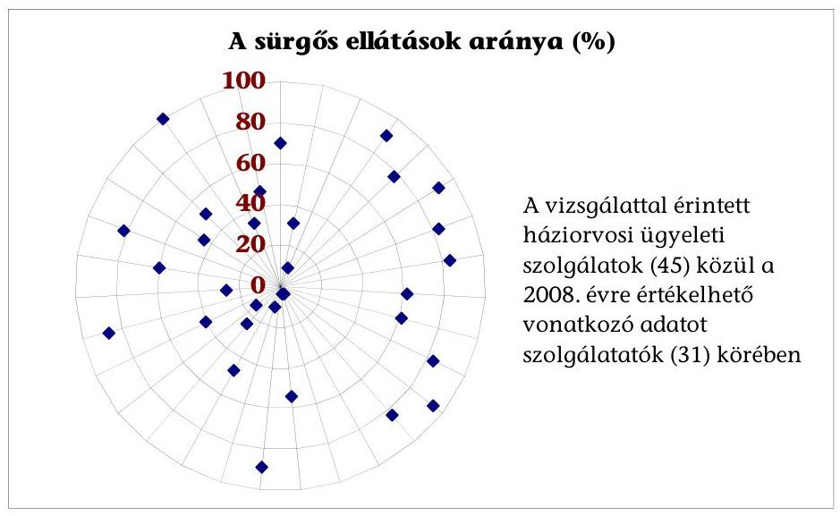

A helyi információs igényektől függő egyéb adatok körében végzett elemzés megállapításai:

- A közvetlen beavatkozás, ellátás (injekció, tabletta, sebellátás stb.) aránya 2008-ban 52,8\% volt, a recept felírás $38,9 \%$-os arányban jelent meg, sürgős ellátást $2,5 \%$ nem igényelt. A szolgáltatók a vizsgálatot (fizikális, EKG, vérnyomás, labor) a betegek 93\%-ánál szükségesnek ítélték, míg 7\%-ánál nem tartották annak.
- Száz betegből 2006-ban átlagosan kilencet, 2008-ban tízet küldtek tovább, az ügyelet az alapvető szűrőfunkciót ellátta, $90 \%$-ban végleges ellátást nyújtott. A mentővel történő tovább küldés $49,2 \%$-ról $44,4 \%$-ra csökkent.
- A kórházba történő tovább küldés irányáról évente a szolgáltatók 60-67\%-a tudott adatot szolgáltatni, amelyek alapján 2006-2008 között növekedett a területileg illetékes kórház sürgősségi osztályának, fogadóhelyének a megjelölése ( $56,5 \%$-ról $69,4 \%$-ra), és ezzel együtt csökkent a kórházak nem sürgősségi osztályaira történő közvetlen beutalás.

Az ellátási terület ezer lakosára jutó ügyeleti eset átlagos mutatója 2008-ban 186 eset/ezer lakos volt, ami csökkenés a 2006. évi 213 eset/ezer lakos és a 2007. évi 191 eset/ezer lakos mutatókhoz képest. (Az OEP 2008. évi adatgyűjtése alapján számítva az országos átlag: 157 eset/ezer lakos volt.) A mutatók átlagos értékétől a szolgáltatók szerint egyedileg számított mutatók eltérése többszörös.

A legkisebb mutató 2008-ban az átlagnak mindössze $21 \%$-a volt, míg az egyedi mutatók maximuma $317 \%$-a volt a minta-, $376 \%$-a az országos átlagnak.

A szolgáltatók tanúsítványaiban közölt egy ügyeleti órára jutó eset átlaga a 2006. évre 1,1 eset/óra, a 2007. és a 2008. évekre is $\mathbf{0 , 9}$ eset/óra volt, amelyet a következő diagram szemléltet:

---

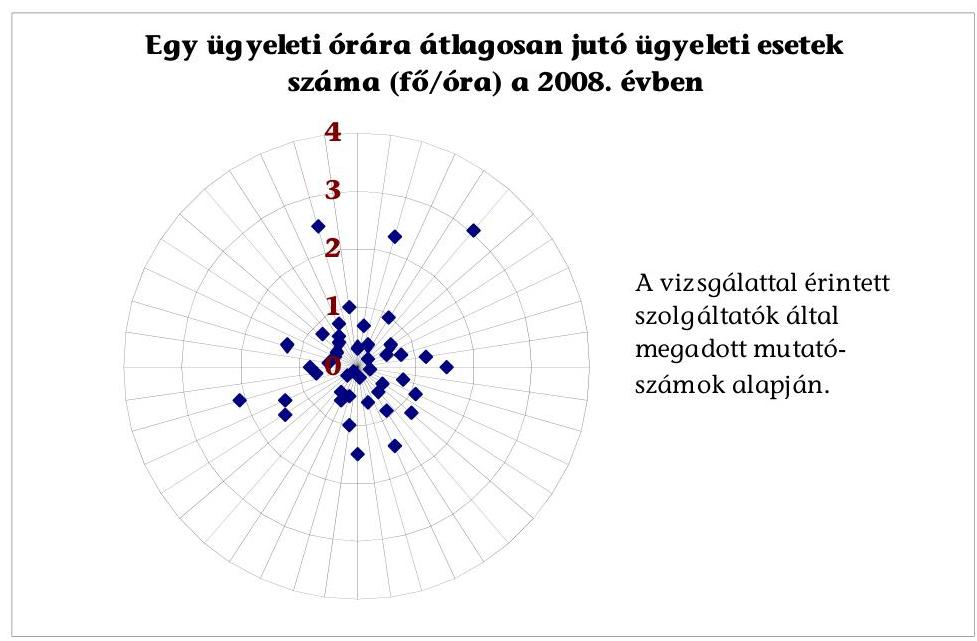

A háziorvosi ügyeletek átlagos leterheltsége a mutatók alapján alacsony, az egyedi mutatók eltérései erősítik azok szakmai álláspontját, akik a szükséges rendelkezésre állás és az elvégzett feladat szerinti külön finanszírozást látnák célszerűbbnek a sürgősségi alapellátásban is.

# 2.6. A háziorvosi ügyeleti ellátás hatékonysága, eredményessége 

A háziorvosi ügyeleti ellátás finanszírozása az E. Alapból 2004-2008 között 27,6\%-kal emelkedett. A fajlagos alapdíj 2004. május 1-jén 17,5\%-kal, 2006ban $8,1 \%$-kal, a vizsgált időszak egészében $27 \%$-kal növekedett. A háziorvosi ügyeleti ellátás finanszírozása egy lakosra vetítve 2004-ben 700 Ft, 2008-ban 900 Ft volt, az alapdíjon felüli hányad 2004-ben 30,2\%, 2008-ban 46,6\% volt.
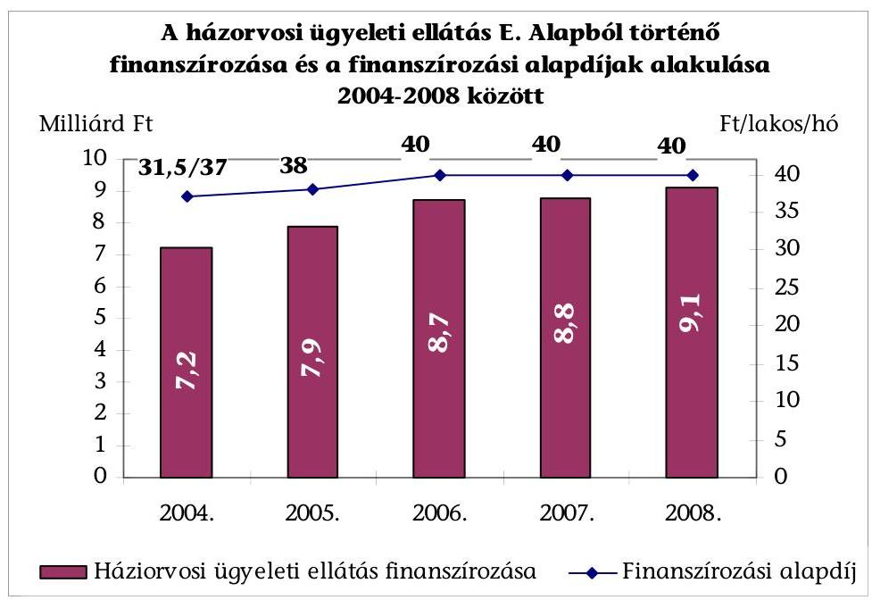

---

A szolgáltatók négyötödénél az egészségügyi közszolgáltatás megszervezéséért felelős települési önkormányzatok támogatásai kiegészítették a társadalombiztosítási finanszírozást. Az önkormányzati, társulási támogatás nélkül múködő szolgáltatók által ellátott lakosságszám átlagosan 52,4 ezer fő volt. A 2006-2008. évek között csak egy-egy százalékponttal változott a múködési bevételek belső összetétele, 2008-ban háromnegyed részt a központi finanszírozás, egyötödét az önkormányzati, illetve társulási támogatás jelentette, míg a fennmaradó hányad a szolgáltatók egyéb bevétele - benne az átmeneti ideig a nem sürgősségi esetekben beszedett vizitdíj - volt. A mintaátlag alapján az ellátási terület egy lakosára vetített múködési célú bevétel 12,7\%-kal, míg a fajlagos müködési kiadás ezt meghaladó, a fogyasztói árváltozással azonos mértékben - 14,3\%-kal - emelkedett.

A kiadások felmérésekor a költségvetésből gazdálkodó szolgáltatók pénzforgalmi és a vállalkozások üzemgazdasági szemléletben vezetett nyilvántartásaiból eredő különbségek korrekciója megtörtént, ugyanakkor a közvetett kiadások/költségek ráosztásának helyi módszerei, az elszámolási- és kontrollingtechnikák eltérőek voltak. A 2008. évi 1191 Ft/lakos/év átlagos múködési kiadáshoz viszonyított egyedi értékek csoportokba rendezett elemzése ugyanakkor egyértelműen igazolta a méretgazdaságossági különbségeket.

A mintaátlag szerint 2006-2008 között a múködési kiadásokon belül a személyi jellegű kiadások aránya 2,5 százalékponttal emelkedett. A múködési kiadások fele 2008-ban az ellátásban vállalkozási formában közremúködőknek kifizetett díjazás volt, $30 \%$-os arányt képviseltek a szolgáltató alkalmazottainak és a megbízással feladatot ellátóknak fizetett személyi jellegű kiadás és a munkaadót terhelő járulékok. A nem közvetlen személyes közremúködéssel összefüggő múködési kiadások átlagosan a $20 \%$-os részarányt sem érik el. A fennmaradó egyéb kiadásokon belül a legjelentősebb tételek a ráosztott közvetett kiadások/költségek $38 \%$-os, továbbá a gépjármú üzemeltetés, fenntartás $16 \%$-os, a gyógyszerkiadás $12 \%$-os aránnyal.
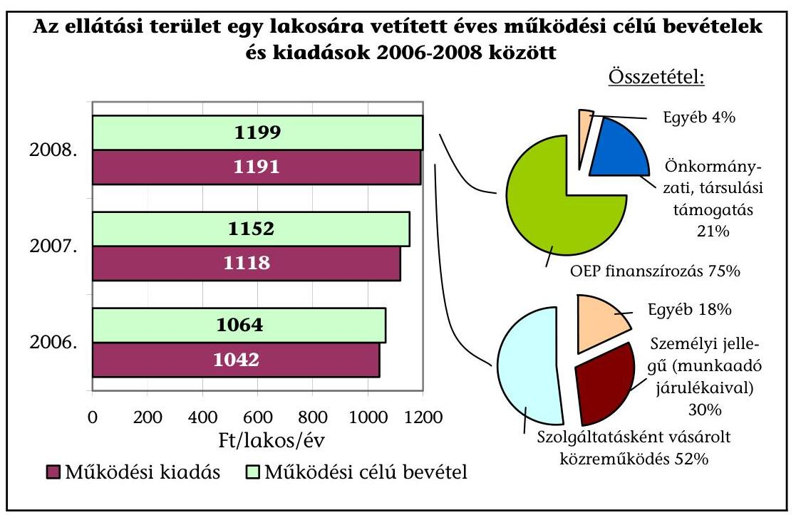

---

A múködési célú bevételek 2006-ban 2,1\%-kal, 2007-ben 3\%-kal, 2008-ban $0,7 \%$-kal haladták meg a tárgyévi múködési kiadásokat. A 2007. évtől egészült ki a Kr. 19. §-a a (7) bekezdéssel, amely szerint az OEP finanszírozás kizárólag az ügyeleti szolgáltatás kiadásaira használható fel. Az ellenőrzött szolgáltatók körében 2008-ban mindössze négynél volt magasabb az E. Alapból származó forrás, mint a kimutatott múködési kiadás, de esetükben sem állapítható meg szabálytalan felhasználás, mert nem korlátozott az évek közötti átcsoportosítás, vagy a nem működési- mint például a felhalmozási, beruházási - célú felhasználás sem.

A felmért információk, valamint a 2006-2008 évekről szóló szolgáltatói adatok alapján a helyszíni ellenőrzések során egyedileg értékeltük a háziorvosi ügyeleti ellátás hatékonyságát, eredményességét. A Mátészalkai TKT háziorvosi ügyeleti szolgáltatója az ellenőrzött időszakban nem rendelkezett végleges múködési engedéllyel, így nem felelt meg az értékelésünk szerinti alapkövetelménynek. A méretgazdaságosságot rontotta 2006-2008 között, hogy az ellenőrzött szolgáltatók 70\%-ánál az ellátási terület lakosságszáma csökkent. Ha az egy százaléknál kisebb mértékű csökkenésektől eltekintünk, akkor a hatékonyságot rontó lakosságszám visszaesés a szolgáltatók 25\%-ánál mutatkozott.

Az ellátási terület csökkenése miatt a szolgáltatók 12\%-ánál az ellátandó lakosok száma három százalékot meghaladó mértékben esett vissza.

Az eredményesség mérhető módját jelenthette volna a háziorvosi ügyeleti ellátásra vonatkozó lakossági vélemény önkormányzati, társulási felmérése. Az ellenőrzött önkormányzatok, társulások közül a vizsgált időszakban mindössze egyetlen helyen készítettek betegelégedettségi felmérést, amely alapján célszerű helyi intézkedések is történtek.

A lakossági elégedettségi vizsgálatban a Sárvári TKT felmérte, hogy a lakosság igénybe vette-e és milyen módon a központi ügyeletet, mennyi ideig várakozott, mekkora volt a lakóhely és az ügyelet távolsága, elégedett volt-e az ellátással és miért, továbbá észrevétel, javaslat megtételére volt lehetőség. A betegek felének fél óránál többet kellett várakozni, ennek ellenére 90\%-ban elégedettek voltak az ellátással. A felmérés szerint a lakosság többsége az ügyeleti ellátást nem a lakóhelyén, hanem a sárvári ügyeleti rendelóben vette igénybe. (Ebben az esetben a beteg előbb jutott ellátáshoz és a gyógyszert ki tudta váltani.) Felülvizsgálták a második gépkocsi indokoltságát, a központi ügyelet létszámának 2007. évi csökkentésére került sor. A felmérésben olyan lakossági igény is jelentkezett, hogy a sürgősségi eset fogalmának meghatározásáról tájékoztatásra lenne szükség.

Az országosan rendelkezésre álló adatok, információk alapján a háziorvosi ügyeleti rendszer hatékonysága javult, a központi ügyeletek száma közel egyharmadával, az egy ügyeletre jutó átlagos lakosságszám a 8,3 ezer főről 28,5 ezer főre növekedett 2004-2008 között, amely a méretgazdaságosság szempontjából kedvező. A kórházi sürgősségi osztállyal és a mentőszolgálattal közös diszpécserszolgálatok száma emelkedett, azonban az 5\%-os arányt sem érte el.

A háziorvosi ügyeleti rendszer átalakítása eredményes volt abból a szempontból, hogy az alapellátási ügyeleteket megszervezték az ön-

---

kormányzatok. A sürgősségi alapellátás háziorvosi ellátástól független, folyamatos múködését csak a fővárosban tapasztaltuk, másutt a sürgős esetek ügyeleti időn kívüli alapellátása a tervezett munkát megzavarva a háziorvosokat terheli, vagy pedig a beteg közvetlenül a kórházat keresi fel, illetve a mentőket értesíti. A háziorvosi ügyeleti rendszer szakmai hatékonyságát, eredményességét országos szakfelügyeleti értékelés évente nem minősítette.

# 3. A SÜRGŐSSÉGI ELLÁTÁs KIALAKÍTÁSA, SZEREPE A KÓRHÁZI BETEGELLÁTÁSBAN 

### 3.1. A sürgősségi ellátás a kórházak szakmai programjában

A sürgősségi betegellátás egységes rendszerének szakmai elveit, eszközeit és formáit 2004 májusától meghatározó jogszabály ${ }^{19}$ írja elő sürgősségi osztály létrehozását a fekvőbeteg intézményekben. Költséghatékonyság és az uniós csatlakozást követően a munkaidő korlátozások szempontjából is kedvezőbb megoldást kínált, hogy a nem gyakran igénybe vett szakmák ügyeletei helyett a sürgősségi osztály fogadja a beteget, és csak szükség esetén kér konzíliumot a behívott szakorvostól. Kevesebb helyen kellett műtőt, intenzív ágyat, folyamatos diagnosztikai hátteret fenntartani, a 6-24 órán belüli definitív (befejezett) ellátás eredményeként csökkenthető volt az aktív osztályokra történő felvétel.

A 2008. év végén sürgősségi fogadóhellyel (SF) rendelkező (vizsgált) kórház mindegyike, a sürgősségi betegellátó osztályt (SBO) működtetők 69\%-a a vizsgált 2004-2008 közötti időszakban hozta létre a sürgősségi betegellátó szervezeti egységét. A sürgősségi kórképek ellátására a 2004. évet megelőzően ún. betegfelvételi osztály (Szt. Imre Kórház, Debreceni Kórház, Fehérgyarmati Kórház), traumatológiával összevont sürgősségi betegfelvételi egység (Váci Kórház) működött, illetve munkaidőben az egyes szakmai osztályok rendelkezésre állásával, munkaidőn túl az ügyeleti rendszer múködtetésével biztosították a kórház szakmai profiljának megfelelő sürgősségi betegellátást.

A sürgősségi ellátás új rendszerú kialakításával, fejlesztésével kapcsolatos elképzeléseket, feladatokat a vizsgált kórházak szakmai program$\mathbf{j a i}^{20}$ tartalmazták. Azok kidolgozottsága, megalapozottsága azonban eltérő volt, attól függően, hogy elkészítésére milyen külső forrás elnyerésével, pályázat benyújtásával kapcsolatosan került sor. A vizsgált kórházak 52\%-a a rendelkezésre álló saját forgalmi adatai, múködési tapasztalatai és lehetőségei mérlegelésével döntött sürgősségi fogadóhely, osztály kialakításáról és nem az ellátandó lakosság egészségügyi helyzetének felmérésén alapuló, a térség egészségfejlesztési tervével összhangban álló szakmai programot készített.

[^0]
[^0]:    ${ }^{19}$ az egészségügyi ellátás folyamatos múködtetésének egyes szervezési kérdéseiről szóló 47/2004. (V. 11.) ESzCsM rendelet
    ${ }^{20}$ A gyógyintézetek múködési rendjéről szóló 43/2003. (VII. 29.) ESzCsM rendelet szerint az egészségügyi közszolgáltatást nyújtó gyógyintézet a szolgáltatások tervszerű és minőségi fejlesztésére szakmai tervet készít, az intézet vezetése évente értékeli a teljesítését, és ez alapján - ha szükséges - a soron következő öt évre módosítja, illetőleg kiegészíti.

---

A szakmai program készítését, elfogadását megelőzően a vizsgált kórházak 45\%-ában nem mérték fel a sürgősségi ellátás iránti igényeket, finanszírozási lehetőségeket, ennek hiányában az igények és a meglévő, valamint a fejlesztések eredményeként létrejött kapacitás közötti összhang, a megtett intézkedések eredményessége nem követhető.

A kórházak 2003-2007 közötti időszakra szóló 5 éves szakmai fejlesztési programját első ízben 2003-ban terjesztették fel a fenntartó helyi önkormányzatokhoz jóváhagyás céljából. A szakmai programot a vizsgált kórházak 90\%ában a fenntartó önkormányzat megtárgyalta, elfogadta, azonban az annak megvalósításához szükséges forrásokat, a fejlesztés konkrét módját, ütemezését $25 \%$-a nem határozta meg, csak a pályázati feltételekhez kapcsolódva vállalt kötelezettséget saját forrás biztosítására. A kórházak szakmai tervei elfogadása során a feladatok megvalósításának pénzügyi forrásait a költségvetésüktől tették függővé, a programok ennek megfelelő módosulását helyezve kilátásba. A szakmai tervek megalapozottságának és az egészségpolitikai célkitűzésekkel való összhangjának hiánya miatt a végrehajtás eredményessége elmaradt a lehetőségektől, a szakmai terveket újra kellett fogalmazni.

A Veszprémi Kórház 2004-2009. évre szóló szakmai programját a Megyei Közgyűlés 2005. február 17-én fogadta el, de az intézményhez ugyanebben az évben kirendelt önkormányzati biztos szükségesnek tartotta annak felülvizsgálatát. Jelentése szerint az SBO sem terjedelmében, sem mélységében nem tudta az SO2 minősítésnek megfelelő valamennyi tevékenységet folytatni, főleg belgyógyászati sürgősség ellátásra szűkült, a sürgősségi esetek ellátásának zöme továbbra is a szakmai osztályokon történt. Ez egyrészt ellentmondott a sürgősségi ellátásra vonatkozó szakmapolitikai elveknek, másrészt terhelte a klinikai osztályok tevékenységét.

A kórház-rekonstrukciókhoz kapcsolódó fejlesztések esetén a beruházásokra vonatkozó szakmai programban csak részelemként jelent meg a sürgősségi szakterület. Az intézményfejlesztési tervek 79\%-a különböző pályázatokhoz készült, az igényelt címzett támogatás hiányában három kórház (Zalaegerszeg, Mór, Sárvár) esetében a tervezett fejlesztés nem valósult meg.

A Zalaegerszegi Kórház címzett támogatásból tervezett rekonstrukciójának 2004ben elfogadott szakmai programja tartalmazta a sürgősségi ellátás fejlesztését, amely igazodott a térség egészségfejlesztési elképzeléseihez (a megyében nem működött sürgősségi betegellátó osztály ${ }^{21}$ ). A sürgősségi osztály kialakítására a címzett támogatás hiányában nem került sor, annak ellenére, hogy 2004-ben az összes felvett beteg $38 \%$ akut, a 2006-2008. években az egy napra jutó sürgős esetek száma 42, 40, illetve 43 volt. A sürgősségi ellátást a szakmai osztályokon a hagyományos keretek között, a tervezhető ellátások mellett biztosították.

A megfelelő időben és feltételek mellett történő sürgősségi betegellátás javította az egészségi állapot visszaállításának esélyét, közvetve hatással volt a kórházi ápolás időtartamára és a kezelés költségeire. A betegek szá-

[^0]
[^0]:    ${ }^{21}$ Zala megyében először a Nagykanizsai Kórházban múködött 2008. január 1-től sürgősségi betegellátó osztály.

---

mára a folyamatos sürgősségi ellátás gyorsabb, biztonságosabb, a társszakmák és az ügyeletek szervezése szempontjából kiszámíthatóbb ellátás feltételeit teremtette meg. A vizsgált és adatot szolgáltató kórházak sürgősségi osztályai 2006-ban a sürgős esetek 61\%-át, 2007-ben 75\%-át és 2008-ban már 78\%-át látták el, amely a sürgősségi szemlélet erősödését jelzi, azonban a szervezhetőbb betegellátás, a betegutak egyértelművé tétele további fejlesztéseket igényel.

A Nagykanizsai Kórházban a sürgősségi betegellátást 2007 végéig a szakmai osztályok látták el, 2008. évtől az SO2 mellett a csecsemő-gyermekgyógyászati, valamint a szülészet-nőgyógyászati osztály közreműködésével biztosították. A sürgősségi ellátás korszerűsítésére 454 millió Ft uniós támogatást nyertek. A pályázat szerint a költséghatékonyság javítását eredményezi, hogy a hagyományos kórházi befektetés helyett legalább 25-30\%-ban 6-24 órás sürgősségi ellátás keretében biztosítható a betegek ellátása.

A Siófoki Kórház kilenc osztállyal, 12 féle járóbeteg-szakrendeléssel és három diagnosztikai osztállyal látja el feladatait. A kórházban az esetek 50\%-át minősítették sürgősnek 2008-ban, a nyári szezonban jelentős a betegforgalom növekedése. A folyamatos ellátást osztályos ügyeleti és készenléti formában biztosítják. A meglévő sürgősségi fogadóhely SO2 szintre történő fejlesztését tervezik a TIOP pályázat keretében 568,6 millió Ft uniós támogatásból.

Az alapellátás „kapuőri" szerepének erősítésére irányuló egészségpolitikai törekvések ellenére magas a szakrendelésre, a kórházba utalt, a háziorvosi ügyeletek által a szakellátásba továbbküldött betegek száma. A térségi alapellátás és szakellátás egymásra épültségének, szakmai együttmüködésének feltételei nem teremtődtek meg, a betegellátás indokolatlanul az ellátórendszer magasabb szintjén valósul meg, amely a szakrendeléseken, kórházakban a tervezhető ellátások szervezésében okoz zavart.

Az Ajkai Kórházban megállapították, hogy a sürgős jelzéssel történő betegbeutalás $80 \%$-a indokolatlan, ezért felhívták a háziorvosok figyelmét a beutalási rendre. „Annyira megszaporodott a sürgős jelzéssel érkező betegek száma (gyakran indokolatlanul), hogy teljesen felborítják az előjegyzési rendszert, és tervezhetetlen a teljesitmény."

A vizsgált kórházak közül kettő SO1, tizenegy SO2 progresszivitási szintnek felelt meg 2008 végén, közülük négyben betegfelvételi osztály volt 2004. évet megelőzően, a többiben a 2004-2008 közötti időszakban kezdte meg működését a sürgősségi osztály. (Az Esztergomi Kórház SBO működési engedélyét az előírt személyi feltételek hiányában az ÁNTSZ felfüggesztette 2008 végén.) Sürgősségi fogadóhelyet hat kórházban alakítottak ki, azonban ezek közül kettő (a szükséges szakmai háttér, illetve személyi feltételek hiányában) nem nyert finanszírozási befogadást (Móri és Karcagi Kórház). A kialakított SF-et egy intézményben fejlesztették SO2 szintre a vizsgált időszakban (Sátoraljaújhelyi Kórház).

Összességében növekedett a kórházi sürgősségi ellátóhelyek száma, azonban a kórházi sürgősségi ágyak (SBO) számában a területi aránytalanságok a struktúraátalakítás és a vizsgált időszak fejlesztései ellenére nem szüntek meg. A százezer lakosra jutó finanszírozott SBO ágyak számában megyénként 2008 decemberében mutatkozó különbségeket mutatja a következő diagram:

---

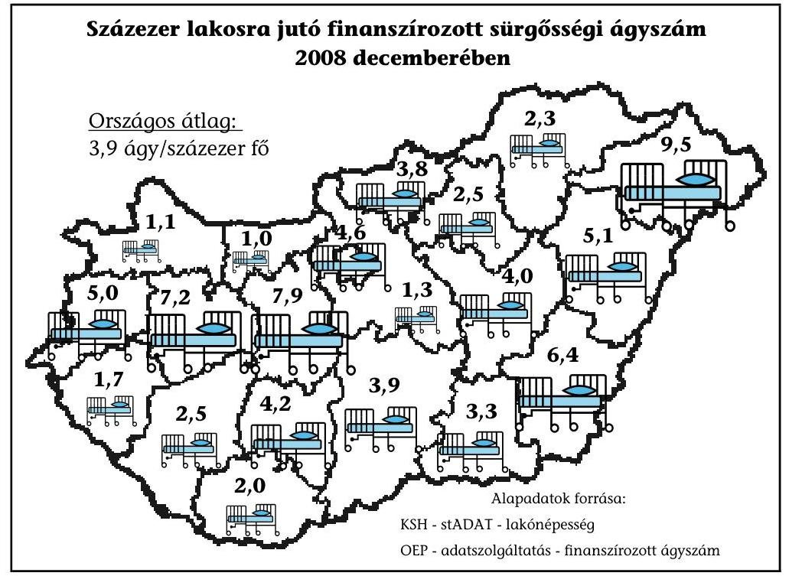

Jelentős fejlesztés, a területi aránytalanság csökkenése várható az ÚMFT keretében elnyert támogatás eredményeként. A kiírt pályázatra 12 vizsgált kórház készített szakmai programot a már meglévő sürgősségi osztályok korszerűsítésére, vagy magasabb szintre történő fejlesztésére, amelyek megfelelő minőségét igazolja, hogy ezek közül az első fordulóban 10 nyertes (83\%) került kihirdetésre.

# 3.2. A kórházi sürgősségi ellátás múködésének hatékonysága, eredményessége 

A vizsgált kórházak 60\%-ában, a sürgősségi ágyat múködtető kórházak 77\%ában rendszeresen figyelték, értékelték a múködésükhöz kapcsolódó adatok változását, különböző belső szakmai, vezetői megbeszéléseken a betegforgalmi adatok és a havi finanszírozási mutatók alapján határoztak meg célkitűzéseket.

A Szombathelyi Kórházban az értékelés kiterjedt a bevételi, a közvetlen költség adatokra és a belső szolgáltatás igénybevételére, ahol a terv- és tényadatokat vetették össze és a kapott teljesítési viszonyszámok alapján került sor a számszaki és szöveges értékelésre. A bevételi adatok körében az aktív fekvő- és járóbetegszakellátás esetszámát, teljesítményét (HBCS, németpont) értékelték.

A sürgősségi ellátás betegforgalmi adataiból a kontrolling által készített elemzéseket nem egészítette ki orvosszakmai értékelés, indokolás, a tervezett, vagy megtett intézkedések dokumentálása. Az adatokat, azon belül a sürgősségi osztályok adatait, intézményenként nem egységes szempontok szerint értelmezték, és eltérő súllyal vették figyelembe az elemzésekben.

---

Az aktív ellátást nyújtó vizsgált 20 és adatot szolgáltató három kórházban a sürgős esetek aránya az összes ellátotthoz viszonyítva igen eltérő, de összességében növekvő volt 2006-2008 között.
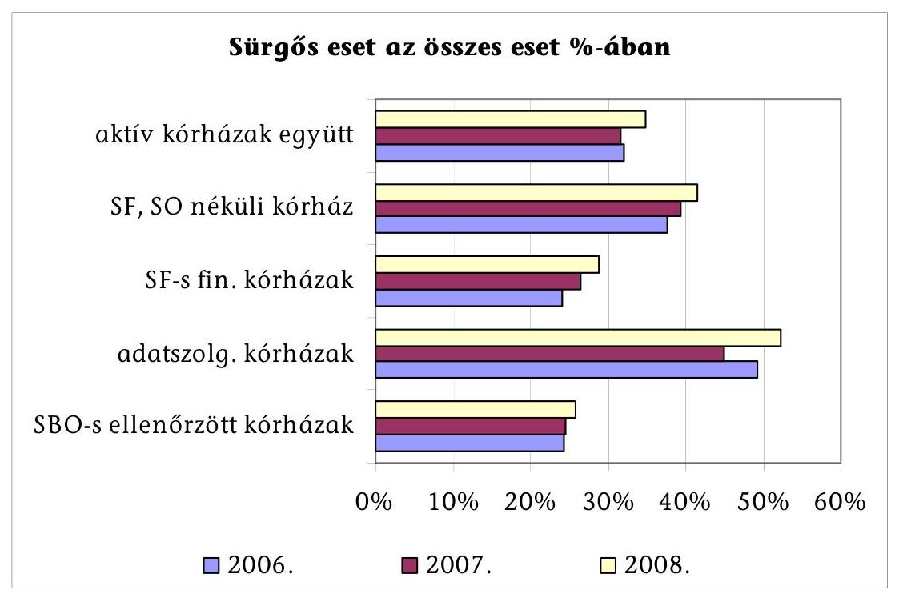

A sürgősségi ellátás hatékonyságát, az esélyegyenlőség érvényesülését jellemző mutatók (indikátorok) nem kerültek bevezetésre és folyamatos gyüjtésre, értékelésre, valamint a finanszírozással összefüggő teljesítményadatok nem alkalmasak az ellátás minőségének nyomon követésére. A sürgősségi ágyat múködtető kórházak 54\%-a határozott meg a sürgősségi ellátás teljesítményeire vonatkozó - intézményenként eltérő - kritériumokat.

Az Orosházi Kórházban a CMI-t, az ágykihasználtságot, a kórházi „visszavételi" és a halálozási arányokat jelölték indikátoroknak, meghatározták azok elvárható szintjét, az éves teljesítést, illetve az eltéréseket. A CMI és a kórházi „visszavétel" javult (3-4,5\%), az ágykihasználtság, a halálozási arány romlott 2008-ban.

A Mátészalkai Kórházban a teljesítményekre vonatkozó kritériumként fogalmazták meg, hogy a mentőktől mennyi időn belül kell átvenni a beteget, illetve a felhasználható gyógyszerkeretet a betegforgalomtól függően határozták meg.

A sürgősségi járóbeteg esetszám 23\%-kal növekedett 2006-2008 között, sürgősségi ellátást azonban nem csak sürgősségi fogadóhelyek, osztályok nyújtanak azokban az intézményekben, ahol sürgősségi részleget ugyan kialakítottak, így nem valósul meg az „egykapus bemenet". Ha a fogadóhelyek személyi feltételek hiányában nem múködnek folyamatosan, az osztályos ügyeletek megszervezése, a nagy értékű műszerek telepítése és nem optimális kihasználtsága többletköltséget okoz. A betegadatok továbbításában az informatikai kapcsolat kihasználása - főként intézmények között - alacsony szintű, a sürgősségi ellátás különböző szintjei között nincs meg az internet alapú konzultáció lehetősége, a betegek „küldözgetése" jellemző.

---

A vizsgált kórházak sürgősségi ellátásra vonatkozó betegforgalmi adataiból számítható különböző mutatók - a szakmai konszenzus hiánya és a sürgősségi részleg intézményen belüli funkcióinak tisztázatlansága miatt igen eltérőek, összehasonlításuk nem mutat valós képet. (Az ezer lakosra jutó sürgősségi esetszám egy évben 24-281 között, az egy napra jutó sürgősségi esetek száma 21-128 között szóródott.) A mentők és az intézmények minősítési gyakorlata is eltérő, az OEP adatai szerint 2008-ban a mentővel érkezett betegek 10\%-ánál nem sürgős felvételt rögzítettek a nyilvántartásokban a kórházak.

A beérkezett tanúsítványok feldolgozását követően az adatszolgáltató sürgősségi betegosztályt működtető kórházak 56\%-ának sürgősségi ellátásban nyújtott teljesítménye volt összehasonlítható. A sürgősségi ellátás kialakításának fontosságát támasztotta alá az SBO-k betegforgalma, amelynek értékei széles határok között szóródtak:

- a sürgős esetek 88,6\%-át 6 órán belül járó-, illetve 11,4\%-át 6-24 órás fekvőbetegként látták el a kórházak (ez utóbbi azonban 3-33\% között szóródott);
- a 6-24 órás fekvőbeteg ellátást követően a betegek 59,5\%-a otthonába távozott, 33,3\%-át más kórházi osztályra, 5\%-át más kórházba helyezték át, a halálozási arány $2,2 \%$ volt (ez utóbbi alacsonyabb, mint az összes kórházi átlag).

A 6-24 órán belül otthonába bocsátott betegek aránya 23-98\% között szóródott 2008-ban, amely az eltérő betegforgalom mellett az egységes szemlélet és gyakorlat (számbavétel) hiányára is utal:
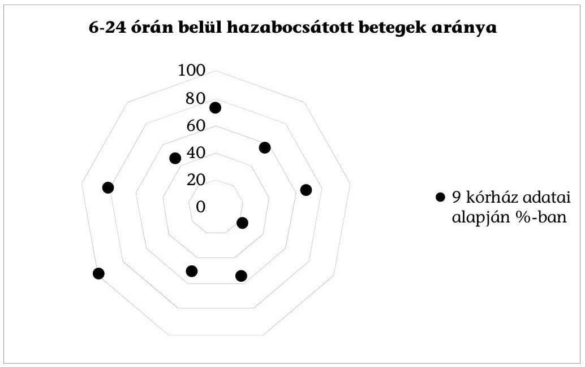

Az SBO-t működtető kórházak kétharmadánál (2 kórházban nem a működési engedélynek megfelelő működés, illetve 2 kórháznál a korábbi működési tapasztalat hiányában a hatékonyság nem volt minősíthető) a kialakított sürgősségi betegellátás - ahol a 6-24 órán belüli ellátást követő hazabocsá-

---

tás aránya, a CMI, a sürgősségi esetszám emelkedett - hatékonyságát javulónak minősítette a helyszíni vizsgálat.

A Szent Imre Kórházban a sürgősségi betegellátás hatékonysága javult, az SBOról 6-24 órán belül a hazabocsátott betegek száma 2007-ben 13\%-os, a CMI egyenletes növekedést mutatott. A Sürgősségi Ellátó Szolgálatot az Intenzív Terápiás Egység személyi állománya biztosítja, múködése nemcsak a betegek biztonságát növelte jelentősen, hanem az ellátó személyzet (orvosok és ápolók) biztonságérzetét is. Létrehozták a Kiemelt Betegmegfigyelő Egységet a súlyos, de az intenzív ellátás szintjét - szakmailag vagy az intenzív ellátás szűk keresztmetszete miatt - el nem érő betegek ellátására.

A Szombathelyi Kórházban a 6-24 órán belül hazabocsátott betegek aránya $50,4 \%$, a hatékonyság az ún. "egykapus belépés" eredményeként javult (minden akut és sürgős ellátást igénylő kórkép esetén a betegeknek a Sürgősségi Tömbben - kivétel a nőgyógyászati és a nem traumás gyermekek ellátása - kell jelentkezni) és a sürgősségi szakambulancián a beteg az állapotának megfelelő ellátást kapta. A bizonytalan kórképű vagy megfigyelést, orvosi ellenőrzést igénylő betegek kerülnek felvételre az SBO-ra, ahol néhány órás megfigyelésben, ápolásban részesülnek, de a tartózkodás maximum 24 óra. Az ellátást igénylők közt nőtt azok aránya, akik 6-24 órán belül hazabocsáthatók voltak, így az SBO szűrőként szolgált a többi osztály felé. A felhasznált erőforrások mellett a hatékonyság javult, hatására az ügyelet racionalizálódott (összevonás, készenlét), az osztályok ügyeleti megterhelése csökkent és a 24 órás megfigyelést követően elbocsátható beteg nem „terheli" a fekvőbeteg ellátást.

A Sátoraljaújhelyi Kórház folyamatosan, ún. egykapus belépési rendszerben fogadja a betegeket. A betegfelvételi rend alapján azonban a meghatározott kórképű, állapotú betegeket (pl. politraumatizált állapot, agyi katasztrófa, súlyos fulladás) közvetlenül veszik fel a magasabb felkészültséget nyújtó osztályra, illetve szállítják tovább más egészségügyi intézménybe. A kivételek köréhez nem tartozó betegek vizsgálata, megfigyelése, ambuláns és 6-24 órás ellátása, konzílium tartása, döntés más osztályra történő felvételről vagy más intézménybe való átszállításról az SO2-re beosztott, illetve műszakvezető orvos feladata.

A sürgősségi ellátás kialakítása, fejlesztése (Zalaegerszegi, Esztergomi, Kalocsai, Móri Kórház kivételével) eredményes volt, az SBO, SF határozatlan idejű működési engedéllyel és finanszírozási befogadással rendelkezett, a sürgőségi ellátás folyamatos működése biztosított.

A sürgősségi ellátás szervezésében tapasztalható működési problémák megszüntetése érdekében tett intézkedések nem voltak eredményesek a fővárosban.

A fővárosban az intézmények az ÁNTSZ területileg illetékes megyei (fővárosi) intézetével történt egyeztetés alapján szervezett ügyeleti, illetve a sürgősségi betegellátási rendszer keretében vesznek részt a területükhöz tartozó lakosság folyamatos ellátásában. Az ügyelet megszervezése során azonban nehéz követni a kórházak naponta változó ellátási kapacitását (az intenzív hátteret, az egyes profilok, a diagnosztikai és a kapcsolódó szakterületek aktuális készségét). A KÁNY és a OMSZ mentésirányítás nem kielégítő együttműködése, a kórházak sorozatos ágyszüneteltetése miatt a betegeket kórházból kórházba küldték. A betegirányítást segítő számítógépes információs rendszer, az alapellátás és a kórházak közötti informatikai kapcsolatot hiánya hátráltatta a betegek gyors, megfelelő ellátását, a legkritikusabb ellátásokra irányuló szükséglet és az ellátó kapacitások folyamatos nyomon követését.

---

# 3.3. Kórházi sürgősségi ellátás fejlesztésének támogatása hazai forrásokból 

A fejezeti kezelésú előirányzatokból sürgősségi fogadóhelyek, centrumok, SBO-k létrehozására, fejlesztésére, helikopter fel- és leszállóhely létrehozására a költségek $80 \%$-a, illetve gép-műszer beszerzésére $60 \%$-a, összesen 1,2 milliárd Ft támogatás volt pályázható 2004-2006 között.

A fejezet 2005. évi beszámolójának szöveges indokolása szerint „a pályázatok ellenőrzése 975,0 ezer Ft összegben az Országos Alapellátási Intézet megvalósitásában történt". Az OALI által a fejezeti kezelésű előirányzatok felhasználásáról 2007. május 10. keltezéssel ellátott „Szakmai beszámoló" azonban a felhasználás szakmai értékelésére nem alkalmas. A helyszíni ellenőrzésekről a beszámolóhoz mellékelt listában több pályázatnál „nem valósult meg", „elálltak a beruházástól" megjegyzés szerepel.

A kórházi helikopter leszállóhely építése elmaradt három nyertes pályázó (Nyíregyháza, Gyula, Miskolc) visszalépése miatt, mert a légügyi hatóság illetékes szakértői, továbbá az OMSZ légimentéssel foglalkozó szakemberei véleménye alapján a megvalósításra nem kerülhetett sor. (Annak ellenére, hogy a pályázat odaítélését megelőző bírálat, értékelés során nem tettek észrevételt.)

A vizsgált kórházak eltérő intenzitással vettek részt 2004-2008 között a sürgősségi ellátás fejlesztését szolgáló pályázatokon.

Hét kórház egyetlen alkalommal sem, három kórház háromszor, két kórház kétszer, nyolc kórház egy alkalommal nyert összesen 3 milliárd Ft támogatást a sürgősségi ellátás fejlesztésére.

A fejezeti kezelésű előirányzatokból elnyert 10 támogatás esetében a támogatás átlagos összege alacsony ( 10,8 millió Ft) volt, a pályázatokon 2004-ben $40 \%$-os, 2005-ben $20 \%$-os önrészt kellett vállalni.

Az egészségügyi ellátórendszer struktúraátalakításának támogatására 2006-ban kiírt pályázat keretében a sürgősségi vagy ügyeleti ellátás szervezésének korszerűsítésére 12 pályázó 328,8 millió Ft támogatásban részesült, amely a szerződés szerint múködési kiadásként volt elszámolható. A pályázatok megvalósításának szakmai értékelésére nem került sor a támogatást nyújtó részéről. A struktúraátalakítási pályázaton a sürgősségi ellátás fejlesztésével kapcsolatos szakmai programmal a vizsgált kórházak egynegyede vett részt, az átlagos támogatás 16,8 millió Ft volt. Saját forrás kiegészítés nem volt követelmény, az elnyert támogatás 2 és 42,7 millió Ft között szóródott. Az igényelthez képest alacsonyabb támogatás és az ágystruktúra változása miatt a kórházak 31\%-a volt kénytelen a szakmai programot módosítani.

A Sátoraljaújhelyi Kórház a struktúraátalakítási pályázat keretében SO2 szintű sürgősségi osztály kialakítására az igényelt 66,8 millió Ft-tal szemben 42,7 millió Ft támogatást nyert. Az eredeti fejlesztési célok közül a helikopter leszállóhely kiépítése maradt el, a sürgősségi osztály kialakítása megtörtént.

A Móri Kórház 2005-ben SBO létrehozására 60,5 millió Ft támogatást igényelt az EüM pályázatán, amelyet a minisztérium nem támogatott. A struktúraátalakítás támogatására kiírt pályázaton a sürgősségi ellátás fejlesztésére 17,1 millió Ft tá-

---

mogatást nyert a kórház, de az aktív ágyak Eftv. alapján 2007-ben történt csökkentése, a területi ellátási kötelezettség változása miatt a pályázatban megfogalmazott célok módosított tartalommal valósultak meg. A kialakított sürgősségi fogadóhely - a megfelelő szakmai háttér hiányában - nem nyert finanszírozási befogadást, itt múködik 2008-tól a kistérségi háziorvosi központi ügyelet.

A címzett támogatásból megvalósult rekonstrukciók, beruházások szakmai programjában a sürgősségi ellátás fejlesztése kiemelt célként szerepelt, de ezek utólagos szakmai és pénzügyi értékelésére nem került sor. A vizsgált kórházak negyedében címzett támogatásból sürgősségi részleg ( 3 SBO , illetve 2 SF ) kialakítása történt ${ }^{22}$, illetve a Mátészalkai Városi Kórházban várhatóan 2009-ben kerül befejezésre.

A Mátészalkai Önkormányzat címzett támogatási igénye 2006. februárban került befogadásra, eredményeként a Kórház központi telephelyén biztosítani tudja a kistérségi központi háziorvosi ügyelet és a sürgősségi betegellátás egy belépőpontos rendszerben történő múködtetését. A sürgősséggel felvett esetek aránya 40$50 \%$ közötti, az ideiglenesen (beruházás átadásáig) kialakított sürgősségi osztályon - építészeti adottságok folytán - nem tudja a sürgősséggel érkező betegeket egy helyen fogadni, a gyermek-, szülészeti-nőgyógyászati-, traumatológiai eseteket nem a sürgősségi osztályon, hanem a megfelelő szakmai osztályon látják el.

A címzett támogatásból indított rekonstrukciók esetében az átgondolt egészségügyi fejlesztési stratégia hiánya ${ }^{23}$ miatt a szakmai program módosítására került sor, vagy a megvalósítás nem a tervezett eredménnyel járt.

A Kalocsai Kórház 2002-ben 1450 millió Ft címzett támogatásból indított rekonstrukciójához kapcsolódóan az Önkormányzat a szakmai minimumfeltételekben előírt sürgősségi fogadóhely kialakítására - jogszabályi változásra hivatkozással - 62,2 millió Ft címzett támogatást igényelt 2004-ben, ezzel szemben 35 millió Ft pótlólagos támogatásban részesült. A fejlesztési célkitűzéseket így csökkentették a fogadóhely orvos-technológiai gép-műszer beszerzése terhére. (A kórház a szükséges szakmai háttér hiányában 2008-ban sem rendelkezett befogadott finanszírozással az SF-re.)

A vizsgált kórházak 46\%-a - a pályázatban meghatározott dokumentummal igazoltan ezeknek csupán kétharmada - értékelte a fejlesztések megvalósítását, eredményességét. A támogatás pénzügyi elszámolása a kedvezményezettek részéről a támogatási szerződésnek megfelelően megtörtént, azonban konkrét teljesítménykövetelmények (indikátorok) hiányában beérték azzal a minősítéssel, hogy a sürgősségi ellátás színvonala javult, csak kivételesen került sor a fejlesztések szakmai értékelésére.

[^0]
[^0]:    ${ }^{22}$ Ebből a legjelentősebb a Szombathelyi Kórházban 2,5 milliárd Ft címzett támogatásból 2007-ben megvalósult sürgősségi tömb beruházás.
    ${ }^{23}$ A címzett támogatásból finanszírozott egészségügyi beruházások, rekonstrukció ellenőrzéséről szóló 0523 . számú ÁSZ jelentés megállapítása szerint a 2003. évi új induló címzett támogatásra a Kormány által támogatott beruházások közül nyolcnak a koncepcióban szereplő beruházási költsége 34,5 milliárd Ft volt a jóváhagyott 18,8 milliárd Ft-tal szemben, a beruházások előkészítése és megvalósulása között eltelt időtartam elérte a hat-tíz évet, amely időszakban a szakmai elképzelések, a műszaki feltételek is módosultak.

---

Az Orosházi Kórház SO2 kialakítását szolgáló támogatás elszámolásának szakmai értékelése szerint a sürgősségi ellátás fejlesztésének eredményeként a hatékonyság javult, a 6-24 órás ellátást követően a hazatávozott betegek aránya $64,5 \%$-ról $67 \%$-ra, és a CMI emelkedett.

A Kaposvári Kórházban a 30 millió Ft támogatással megvalósult SO2 lehetővé tette a rövid ápolási idő alatt tünetmentessé tehető betegek ellátását, az ápolási idő csökkentését.

A sürgősségi ellátás minőségügyi követését biztosító indikátorok rendszeres gyűjtése és értékelése hiányában a sürgősségi ellátás hatékonysága csak korlátozottan értékelhető, amely a sürgősségi ellátás kialakítására, fejlesztésére fordított pénzeszközök - az ÚMFT keretében odaítélt uniós támogatások - hatékony felhasználásának igazolhatóságát veszélyezteti.

A vizsgált aktív ellátást nyújtó kórházak 65\%-a sürgősségi osztályt, 20\%-a sürgősségi fogadóhelyet működtetett 2008-ban, 15\%-uk (3 kórház) nem rendelkezett finanszírozott sürgősségi részleggel. A fejlesztések eredményeként a finanszírozott SBO ágyak száma egyenletesen, az esetszám 2005-ben és 2008-ban növekedett.
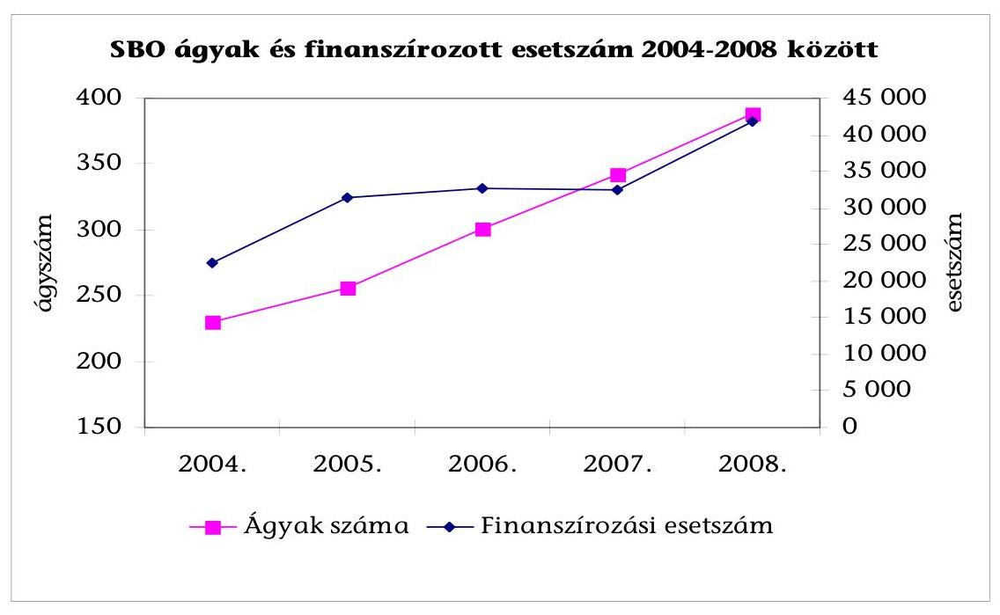

A létrehozott SBO-k finanszírozására az OEP csak 2008. augusztus 31-i beadási határidővel írt ki pályázatot, így a támogatásból megvalósult sürgősségi osztályok finanszírozási befogadására csak jelentős késedelemmel került sor.

A Fővárosi Bajcsy-Zsilinszky Kórház új diagnosztikai és műtéti tömbjének 10 milliárd Ft-os beruházásával egyidejűleg 2006-ban 4 ágyas SBO-t alakított ki, azonban csak 2008. májusban történt meg az OEP részéről a finanszírozási befogadása az aktív ágyak terhére. Az SBO 2008. szeptembertől tudott beteget fogadni, mert akkor tudták biztosítani a személyi feltételeket.

---

# 3.4. A kórházak pénzügyi egyensúlyát, gazdálkodását befolyásoló tényezők, fenntartói intézkedések hatása 

A vizsgált és adatot szolgáltató kórházak E. Alapból származó bevétele 20062008 között 5,6\%-kal emelkedett, miközben az ágyak száma 6,5\%-kal, ezen belül az aktív ágyak száma 20,7\%-kal, a finanszírozott esetszám 9,4\%kal csökkent. Az aktív ellátást az ágyszámcsökkentésnél kisebb mértékű finanszírozott esetszám és súlyszám változás jellemezte. A sürgősségi ellátásban az SBO ágyak száma 11,8\%-kal, az SHBCS 9,4\%-kal emelkedett, az esetszám 1,3\%-os csökkenése mellett. Az adatszolgáltató kórházakban az aktív betegellátásban, ezen belül a sürgősségi ellátásban 2006-2008 között az ágyszámban, teljesítményben (finanszírozott eset, súlyszám, SHBCS) bekövetkezett - az egészségpolitikai célokkal összhangban lévő, az országos adatokhoz hasonló - változásokat mutatja a következő diagram:
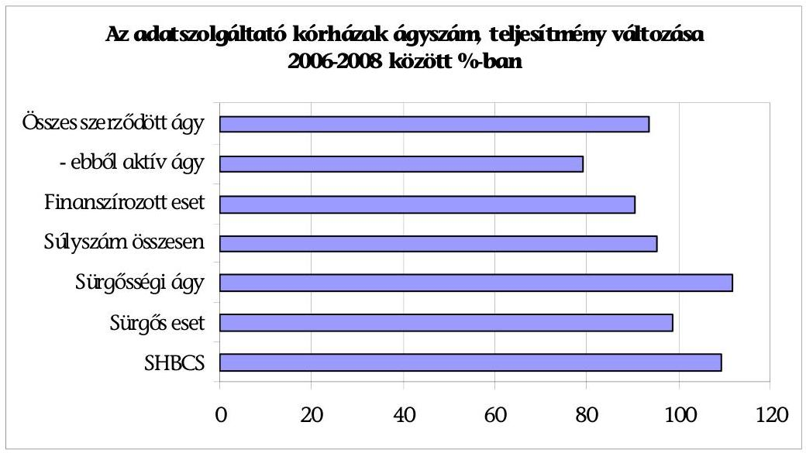

A helyszínen vizsgált kórházak 60\%-ának meghatározott célokhoz (létszámcsökkentéshez, pályázati önrészek biztosításához, a 13. havi illetmény kifizetéséhez) nyújtott támogatást a fenntartó önkormányzat, amelyhez a gazdasági egyensúlyt biztosító követelmények meghatározása csak részben kapcsolódott. Az önkormányzatok a kórházak által készített beszámolókból jutottak a gazdálkodás eredményeivel kapcsolatos információhoz. A pénzügyi egyensúly hiányát, a likviditási gondokat, az adósságállomány alakulását, kórházanként változó, több tényező együttes hatása (az alacsony teljesítmény bázisán megállapított TVK, a TVK csökkentése, a TVK-n felüli teljesítmények részleges finanszírozásának megszűnése, az általánosan romló gazdasági környezet, a saját bevételek csökkenése, a menedzsment válságkezelő tevékenységének hiánya) okozta. A pénzügyi, gazdálkodási egyensúly megőrzésére, javítására a szigorú keretgazdálkodást bevezető, a teljesítményeket, bevételeket folyamatosan figyelő, elemző kórházaknak volt esélyük.

A Szombathelyi Kórház gazdálkodásának racionalizálása érdekében a fenntartó Stabilizációs Intézkedési Tervet fogadott el, amely a létszám csökkentését, a teljesítmények figyelését, külső szakértő igénybevételét is tartalmazta. Ennek eredményeként a kórház szállítói tartozása 21,5\%-kal csökkent.

---

A vizsgált és adatszolgáltató kórházak pénzforgalmi kiadása az ágyszám, a finanszírozott esetek csökkenése ellenére 6,7\%-kal, a szállítói tartozása 21,2\%-kal emelkedett 2006-2008 között. (A 30 napon túli lejárt tartozás - amely a szállítók felé fennálló kötelezettség negyede - intézményenként eltérő mértékben, de összességében csak 2,8\%-kal növekedett.)

A szállítói tartozás a sürgősségi osztállyal rendelkező kórházak esetében mindössze 1,9\%-kal, a sürgősségi fogadóhelyet múködtető kórházak esetében 38,3\%-kal növekedett a 2006-2008 közötti időszakban. A 30 napon túli tartozás a sürgősségi osztállyal rendelkező gyógyintézetekben 60\%-kal - a kórházak 98,5\%-ában - csökkent. Az ettől eltérően emelkedő tartozásállomány a kórházi ágyszám, ellátási terület, teljesítménycsökkenés miatti bevétel kiesésre és a fenntartói intézkedések elmaradására vezethető vissza.

Az Orosházi Kórház bevétele 2007-ben 5,1\%-kal, 2008-ban 3,2\%-kal volt alacsonyabb, mint 2006-ban, az ágyszám 12,3\%-os és az ellátandó lakosság 24,6\%-os csökkenésének következményeként. A szállítói tartozás 2008-ban a 2006. évi másfélszeresére - ezen belül a 30 napon túl lejárt tartozások az összes tartozás 7,5\%-áról 47,6\%-ára - emelkedett. A pénzforgalmi kiadásokat 2006-ban 83,6\%ban, 2007-ben 84,9\%-ban, 2008-ban 81,3\%-ban fedezte a finanszírozás, a 3,6 százalékpontos fedezeti arányromlás miatt a tartalékokat felélte a kórház és csak 2008. év végén jelezte a fenntartó önkormányzat felé a likviditási gondokat, amely az intézmény gazdasági helyzetének javítására nem hozott intézkedéseket.

Az adatot szolgáltató kórházak sürgősségi ellátás finanszírozási bevételei a kapacitásbővüléssel és a növekvő betegforgalommal összhangban 2006-2008 között 28,7\%-kal, ezen belül a fekvőbeteg-szakellátásban 29,7\%-kal, a járóbetegszakellátásban 25,0\%-kal emelkedtek a diagramon látható megoszlásban:
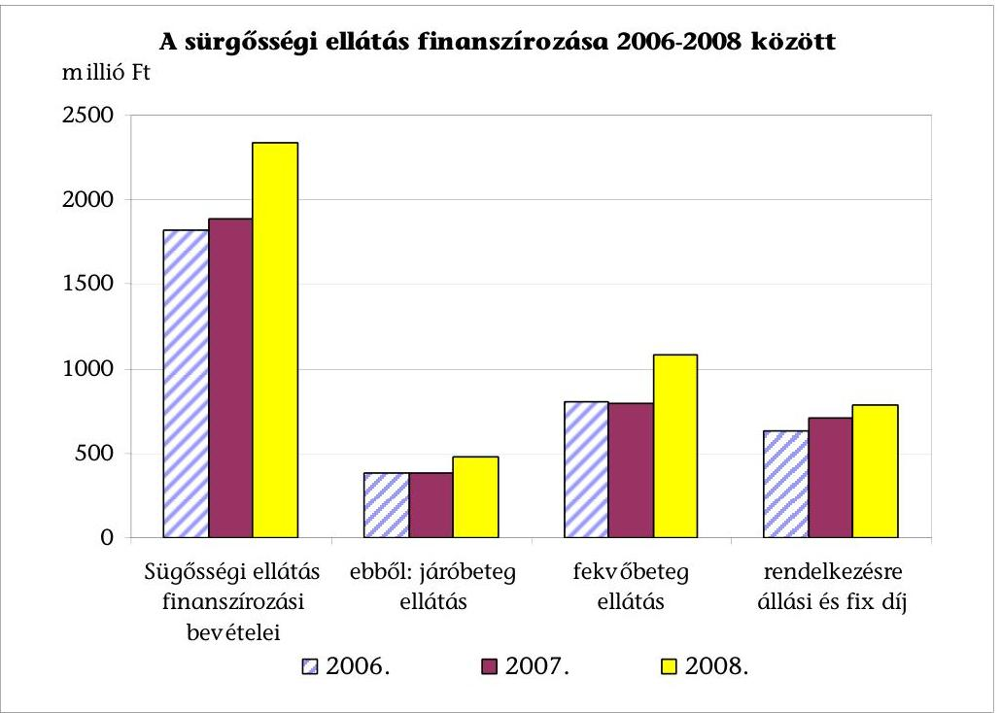

A kórházak E. Alap finanszírozásból származó bevételei - a közvetlen költségek 58\%-os növekedése miatt - a sürgősségi betegellátás múködésére

---

nem nyújtottak fedezetet 2006-2008 között. A pénzforgalmi kiadások a kapacitások, a betegforgalom változása, az ár- és béremelkedés miatt egyaránt növekedtek. A sürgősségi ellátás személyi jellegű kiadásai és a munkaadói járulékok 72\%-os részaránya a 2006-2008 között nem változott. A dologi kiadások - egyéb közvetlen kiadások terhére - 1,2 százalékponttal növekedtek, azonban a pénzforgalmi szemléletű számbavétel a szállítói tartozások, készletváltozások miatt nem nyújt pontos képet a ráfordításokról.

A sürgősségi kórképpel felvett beteg ellátásának költségei az első nap az SBO-n jelennek meg, ekkor kerül sor a beteg elsődleges vizsgálatára, állapotának stabilizálására, diagnosztikai, laboratóriumi vizsgálatok elvégzésére. A sürgősségi osztályok feladatukból adódóan a beteget 6-24 órán belül láthatják el, ezt követően - ha nem bocsátható haza - áthelyezésre kerül más intézménybe, vagy klinikai osztályra, amely a teljesítményei között számolja el az ellátást.

A több osztályon történt fekvőbeteg ellátás egy finanszírozási esetnek számít, amely a legmagasabb HBCS értékű ellátásként kerül elszámolásra. Az SBO-n elkezdett ellátás gyakran nem az ún. sürgősségi HBCS-be kerül besorolásra, emiatt az itt ellátott esetek száma nem egyezik meg az SHBCS esetek számával. A betegforgalmi statisztikák szerint $90 \%$-ot meghaladó mértékben a sürgősségi ellátás elszámolása a járóbeteg-szakellátás keretében történik.

Nem szabályozott a sürgősségi osztályon elvégzett diagnosztikai vizsgálatokra és terápiás beavatkozásokra jutó költségek felosztása. Az SBO-ok finanszírozását csökkenti, ha az „egykapus bemenet" nem tölti be a szűrőfunkcióját (a sürgős kórképpel jelentkező betegek az osztályokon kerülnek közvetlenül felvételre). Központi előírás nem szabályozza, milyen eseteket lehet és kell jelenteni a sürgősségi osztályokról a finanszírozó felé.

A fajlagos (egy súlyszámra jutó) kiadások - az egészségügy fogyasztóiárindexét ${ }^{24}$ meghaladó mértékű - 29,7\%-os növekedése a sürgősségi ellátásban jelentkező magasabb költségigényességgel és a nem egységes számbavétellel egyaránt összefügg. A kórházak belső elszámolási rendszerükben egymástól eltérő belső finanszírozási, vezetői információs rendszert alkalmaznak. A közvetett költségeket (karbantartás, mosoda, energia stb.) is kórházanként más-más módon és mértékben terhelik rá a sürgősségi ellátást nyújtó részlegekre.

# 3.5. Az ügyeleti, sürgősségi ellátásra, munkaidőre vonatkozó új előírások 

A napi munkaidőn kívül bekövetkező sürgősségi esetekben, az egészségügyi ellátások folyamatos igénybevételének biztosítását az Eütv. 93. §-a az ügyeleti ellátás feladataként határozza meg, amelynek célja az egészségügyi szolgáltatók napi munkarend szerinti munkaidő befejezésétől a következő napi munkaidő kezdetéig a beteg vizsgálata, egészségi állapotának észle-

[^0]
[^0]:    ${ }^{24}$ Az egészségügy fogyasztóiár-indexe a fogyasztási szerkezete miatt eltérő (KSH 2007. évi Egészségügyi Statisztikai Évkönyv szerint 2007-ben a harmonizált ár-index az egészségügyben $20,2 \%$, az általános mértéke $7,9 \%$ ).

---

lése, alkalomszerű és azonnali beavatkozások elvégzése, illetve fekvőbeteggyógyintézetbe történő sürgősségi beutalása.

A kórházakban jellemző az a gyakorlat, hogy az egyébként közalkalmazotti státuszban foglalkoztatott dolgozók (elsősorban orvosok) a szerződésükben foglalt heti 40 óra fölött végzett - ügyeletben eltöltött - munkaidejüket saját maguk alapította vállalkozások útján, közreműködői szerződés alapján teljesítik ${ }^{25}$.

Az EU csatlakozást követően hatályba lépő munkaidő korlátozások miatt az egészségügyi tevékenység keretében a heti munkavégzési kötelezettség 48 óra lehet, amely önkéntesen heti 12 órával megtoldható. A munkajogi szabályok változása ${ }^{26}$, a struktúraátalakítás és a finanszírozási bevétel csökkenése miatt a korábban kialakított ügyeleti rendszer változatlan formában történő múködtetésére, az ügyeletet ellátók létszámának bővítésére nem volt fedezet.

A kórházi ügyelet (folyamatos betegfelügyelet) megszervezésénél - miután az ügyeletben töltött idő munkavégzésnek számít - figyelembe kell venni, hogy folyamatosan csak 12 óra munkavégzés engedélyezett, ezután kötelező kiadni a pihenőidőt. Ezért a betegfelügyeletet (ügyeletet) a kórházi osztályok sajátosságait figyelembe véve műszakban célszerű megszervezni, egyes szakmák esetében összevont (mátrix) formában és növelni a készenléti ügyelet formájában az elérhetőséget.

Megszakítás nélküli munkarend kialakítsa során múszak szervezése kötelező sürgősségi betegellátó osztályon, sürgősségi centrumban, központi intenzív, a traumatológiai osztályon a progresszivitás második szintjétől, perinatális intenzív centrumokban (PIC) és a mentésben. Müszak szervezése indokolt - az adott területen becsülhető betegforgalom, sürgősségi esetszám, munkaterhelés mértéke figyelembevételével - idegsebészeti, stroke osztályon, folyamatos rendben működő képalkotó diagnosztikai, radiológiai egységben, műveseállomáson.

Az ellenőrzött kórházak 91\%-a mérte fel dokumentáltan az új munkaügyi előírásokból származó - elsősorban az ügyeleti ellátást érintő - munkaszervezési feladatokat.

Az ügyeleti ellátás megszervezésére tett intézkedések miatt jelentkező többletköltséget a sürgősségi ágyat múködtető kórházak 69\%-ában határozták meg. A felmérések szerint a Mátészalkai Kórházban 17,8 millió Ft, a Szombathelyi Kórházban 180,8 millió Ft, a Veszprémi Kórházban 150-180 millió Ft többletköltséget okozott az új munkaügyi előírások betartása.

Az SBO folyamatos múködése lehetővé tette a sürgősségi és a tervezhető (elektív) betegellátás szétválasztását, megszervezése esetén a többi

[^0]
[^0]:    ${ }^{25}$ az egészségügyi szakellátások privatizációjáról szóló 0609. számú ÁSZ Jelentés megállapítása alapján
    ${ }^{26}$ A Kjt. egészségügyi ágazatban történő végrehajtásáról szóló 233/2000. (XII. 23.) Korm. rendelet ügyeletre vonatkozó előírásait az Alkotmánybíróság a 72/2006. (XII. 15.) AB határozatával alkotmányellenesnek minősítette és megsemmisítette.

---

kórházi osztályon nem történt sürgősségi felvétel (műtétes szakmáktól eltekintve), a betegfelügyeletet biztosító kórházi osztályos ügyeletet kisebb létszámmal látták el.

Az Orosházi Kórház SO2 múködésének megkezdését követően 2007-ben a betegutak egyértelművé váltak, lerövidültek. Kedvező (költségtakarékos, ugyanakkor orvos-szakmailag megfelelő) változás volt elérhető az ügyeleti és készenléti rendben is. Az ügyeletesek száma 20-ról 18-ra, a készenlétezők száma 14-ről 11-re csökkent, melynek hatása az ügyeleti díjak átlagosan havi 133 ezer Ft-os csökkenésében is megjelent.

A munkaidőkeretet - ezen belül a napi munkavégzés korlátait meghatározó új jogszabályok hatálybalépése miatt elkerülhetetlen volt új munkarend meghatározása, elsősorban az ügyeletek átszervezése a folyamatos betegellátás biztosítása érdekében. Az újabb létszám felvételének elkerülése érdekében, az általános napi nyolcórás munkaidő mellett szükségessé vált a nyújtott, 12 órás műszak megszervezése és az éjszakai 12 órás műszak bevezetése. Az ügyeleti időszakban a kisebb betegforgalmat lebonyolító osztályok esetében, ügyelet helyett készenlétet vezettek be, a bent fekvő betegek felügyeletére összevont ügyeletet szerveztek, valamint más szervezési intézkedésekkel is racionalizálták az ügyeleti, sürgősségi ellátást.

A Szombathelyi Kórházban 2007. július 1. előtt önálló ügyeletet láttak el az osztályok, ezt követően összevont, betegfelügyeleti jellegű ügyeleti ellátást vezettek be a belgyógyászati jellegű szakmákban, illetve az ügyeletet készenléttel váltották ki a manuális jellegű szakmákban. A munkaügyi előírások betartására irányuló ellátás szervezési intézkedések hatására az ügyeletek száma jelentősen csökkent, 25 önálló ügyelet helyett 16 összevont ügyelet lett. A készenlétek száma 15 -ről 20-ra emelkedett

A sürgősségi ellátást nyújtó kórházak adatszolgáltatása szerint a sürgősségi ellátásban közreműködő szakorvosok létszáma a 2006-2008. években csupán $12 \%$-kal ( 12 fővel) emelkedett. (Ebben az időszakban országosan 40 sürgősségi és 20 oxyológus szakorvos tett szakvizsgát.) A szerződéses és egyéb foglalkoztatási formák térnyerése a létszámhiánnyal küzdő intézményekben felerősödött. Az ellenőrzésbe vont kórházakban a szerződéses orvosok létszáma a 2006-2008 között 77,9\%-kal emelkedett, amely részarányát tekintve a sürgősségi osztályokon alkalmazott összes orvosnak a 23,4\%-a volt. A sürgősségi osztályokon dolgozó orvosok nem egészen felét, $47,1 \%$-át állandóan az osztályon alkalmazott orvosokkal, míg 29,5\%-át egyéb foglalkoztatási megoldásokkal biztosították az intézmények. Az alacsony létszám miatt a sürgősségi osztályok létszámhiányát más osztályokról vezényléssel pótolják. Egyes kórházakban a sürgősségi osztályokon a fix létszám a minimum létszám alatti és - a sürgős szükség esetén - csak más osztályok orvosaival teljes a létszám.

A minimumfeltételek lehetőséget adnak arra, hogy a szakorvosi létszám összetételében az oxyológus és sürgősségi szakorvos mellett a kórházban rendelkezésre álló belgyógyász, traumatológus, sebész, aneszteziológus végzettségű szakorvost alkalmazzanak az SBO-on, az egyéb szakorvosi létszám meghatározó a sürgősségi osztályokon.

---

A Sátoraljaújhelyi Kórházban az SBO-n nappali műszakban sebész vagy traumatológus és egy sürgősségi szakorvos dolgozik. Az éjszakai műszakban belgyógyász vagy sürgősségi szakorvos van jelen egy intenzív osztályos (egyben műszakvezető) orvossal. A beosztott és a műszakvezető orvos mellett minden szakma orvosa ügyelet, vagy készenlét szervezésével biztosítja a betegek sürgősségi ellátását.

Az Orosházi Kórházban az előírt orvoslétszámot úgy biztosították, hogy a nappali 12 órás műszakban négy - teljes munkaidőben az SO2-n foglalkoztatott - szakorvos dolgozik, míg az éjszakai 12 órás műszakra a Kórház más osztályain dolgozó orvosok kerültek beosztásra. A sebészeti osztályról két szakorvos és két segédorvos, a belgyógyászati osztályról két szakorvos és négy segédorvos, a neurológiai osztályról egy szakorvos dolgozik éjszakai műszakban az SO2-n.

A szakdolgozói létszám a 2006-2008 között 53,1\%-kal emelkedett, amely a Nagykanizsai, Orosházi, Sátoraljaújhelyi Kórház sürgősségi osztályainak belépésével, a Kaposvári és a Szombathelyi Kórház létszámemelésével függ össze.

A vizsgált kórházak 14\%-nál van folyamatban peres eljárás az ügyeleti ellátás díjazását illetően, a sürgősségi ellátásban azonban a kórházak és a munkavállalók között munkaszervezéssel összefüggő viták nem alakultak ki.

A sürgősségi ellátást folytató vizsgált kórházak 54\%-a végzett betegelégedettségi felmérést a vizsgált időszakban, amely az intézmények által működtetett minőségirányítási rendszerekhez kapcsolódott, a sürgősségi osztályokra - négy intézmény kivételével - nem vonatkozott.

A Zalaegerszegi Kórházban az SBO-n megforduló betegek 87,5\%-a elégedett volt a kapott szolgáltatásokkal, a várakozási időt 64,5\% elfogadhatónak ítélte, 22,5\% hosszúnak találta.

A Fehérgyarmati Kórházban a sürgősségi ellátásról a lakosság kedvező véleményt adott, az ellátás színvonala javuló, a megkérdezettek 80\%-a elégedett volt az ellátással.

A betegelégedettségi vizsgálatok rámutattak az ellátással kapcsolatos hiányosságokra, melyek megszüntetésére születtek intézkedések.

A Szent Imre Kórházban - a beutalási rend változása miatt - egyre több sürgős eset ellátását végezték, lényegesen nőtt a várakozási idő, amely a betegek és a hozzátartozók elégedetlenségét váltotta ki. A feszültségek elkerülése érdekében ismeretterjesztés céljából különböző tájékoztató lapokat vezettek be, plakátokat helyeztek el a várókba és videofilmet vetítettek, amelyek segítségével az érintettek (ellátásra szorulók és kísérők) információt kaptak a sürgősségi ellátás sajátos működési rendjéről, a szükséges teendőkről és a várható várakozási időről.

# 3.6. A minimumfeltételek teljesítése a sürgősségi ellátásban 

Az egészségügyi hatóság (ÁNTSZ) a vizsgált kórházak sürgősségi osztályaira végleges, határozatlan idejű múködési engedélyt adott ki, egy esetben (Kalocsai Kórház) tagadta meg - helytelen szakmakód megjelölése miatt - a sürgősségi fogadóhely működési engedélyének kiadását. Az egészségügyi szolgáltatások nyújtásához szükséges szakmai minimumfeltételekről szóló

---

Minr. 2. számú melléklete 4602. szakmakód alatt tartalmazza a sürgősségi betegellátó osztály működésének személyi és tárgyi feltételeire, a szükséges szakmai háttérre vonatkozó követelményeket. A személyi feltételek között a progresszivitási szinteknek megfelelően a szakorvos létszámot konkrétan megjelölték, de azon belül tág teret adtak az intézményeknek, hogy az SBO-n milyen -oxyológus-sürgősségi, vagy más (belgyógyász, traumatológus, sebész, aneszteziológus) - szakorvossal látják el a feladatot.

A szakmai minimumfeltételek, a minőségi követelmények teljesítését az ÁNTSZ regionális intézetei az OTH koordinálásával 2008-ban két ütemben (területi, illetve külön a súlyponti kórházak sürgősségi részlegeit) ellenőrizték. Az ezzel kapcsolatos összegzés szerint a sürgősségi ellátást nyújtó, ellenőrzött 45 egészségügyi szolgáltató közül 22 felelt meg maradéktalanul az előírt szakmai minimumkövetelményeknek. Az ÁNTSZ ellenőrzések elsősorban az előírt személyi feltételek hiányát rögzítették, két kórház sürgősségi osztályának múködését felfüggesztették, a hiányosságok megszüntetésére határidőt szabtak meg.

Nem volt biztosított a rendeletben előírt orvoslétszám, műszakonként mindössze egy orvos volt az osztályon, előfordult, hogy ez az orvos csak rezidens, nem szakorvos. Más osztályról odavezényelt orvosokkal látják el az osztály múködését, valamint nincs minden műszakban előírt képesítésű szakorvos. Az orvosok más szakmai szervezeti egységből vannak beosztva időszakosan 12 órás munkarendben, amely felveti a más szakmai szervezeti egységben a „hiányzó" orvos problémáját. Két kórházban az osztály egyműszakos munkarendben dolgozott, 16 óra után a gyerek, a traumatológia, a belgyógyászat és a sebészet osztály ügyeletesei látták el az SBO feladatait.

A sürgősségi betegellátásban a humánerőforrás biztosítása az ellátórendszer átalakításához, a szervezeti, tárgyi feltételekhez képest is lemaradásban van, a szakmai minimumfeltételekben előírt szakképzett munkaerő hiánya jellemzi a sürgősségi ellátást. Két egyetemen (DOTE, SOTE) alakult az oxyológiai-sürgősségi tanszék, ahol a speciális képzés folyik. A sürgősségi szakképesítéssel rendelkező szakorvosok számának pozitív változása érdekében megtörtént az oxyológiai és a sürgősségi orvostan egyesítése, amely szakvizsga mind alap szakvizsgaként, mind pedig ráépített szakvizsgaként is funkcionál.

Az oxyológus, sürgősségi szakorvosok száma nem biztosítja a mentőszolgálat és a kórházi sürgősségi osztályok szakemberigényét. Az ÁSZ által feltett kérdésekre az EüM által adott válasz szerint a szakorvosigény kielégítését a képzés jelenlegi szerkezete nem tudja biztosítani, az évi 20-25 rendszerbe belépő helyett ennek többszöröse lenne indokolt, az elmúlt évben az egyik vidéki egyetem sürgősségi rezidensi helyére az első körben egyetlen jelentkező sem volt. A sürgősségi szakápoló OKJ-s képzés csak 2008. augusztus 15 -től volt indítható felnőttképzés keretében ${ }^{27}$, amely a jelenlegi utánpótlás gondokat a hároméves képzés befejezését követően enyhítheti.

[^0]
[^0]:    ${ }^{27}$ az egészségügyi miniszter hatáskörébe tartozó szakképesítések szakmai és vizsga követelményeinek kiadásáról szóló 32/2008. (VIII. 14.) EüM rendelet

---

A TÁMOP Egészségügyi szolgáltatások szerkezeti átalakításának támogatása prioritása az átképzésre, továbbképzésre (például sürgősségi ellátás), hiányszakmák képzésére szolgáló támogatásokat tartalmaz.

A TÁMOP 6.2.4./A jelű „A foglalkoztatás támogatása egészségügyi intézmények számára" konstrukció keretében az egészségügyi intézményben alkalmazni kívánt orvos, szakdolgozó foglalkoztatásának elősegítésére 2009. március 2.-június 2. között 4-50 millió Ft vissza nem térítendő támogatás pályázható.

A tárgyi feltéteket illetően az ÁNTSZ ellenőrzés kisebb, az ellátást nem veszélyeztető, pótolható, illetve az építészeti adottságokra visszavezethető hiányosságok mellett a felfüggesztett múködési engedélyú kórházban állapított meg jelentősebb értékű eszközhiányt.

Az Esztergomi Kórház SBO-n hiányzó hordozható hatcsatornás EKG, hordozható defibrillátor, UH (mobil), Rtg (mobil), transzport lélegeztető, altatógép, motoros szívó, inhalátor, mini Doppler, ideiglenes pacemaker, vércukormérő, betegellenőrző monitor, vér- és vérkészítmény hűtő, központi gázellátó és szívó, műszermosó automata, egyéb berendezési és felszerelési tárgyak, egyéb műszerek, kisértékű eszközök beszerzési értéke 104 millió Ft.

A sürgősségi ellátást és a szakmai minimumfeltételeket szabályozó, az egészségügyi miniszter hatáskörébe tartozó rendeletek közötti nincs teljes összhang. A 60/2003. (X. 20.) ESzCsM rendelet (Minr.) szerint a „sürgősségi befogadó hely" az általános minimumfeltétel része és minden aktív ellátást nyújtó kórházban kialakítandó, a 47/2004. (V. 11.) ESzCsM rendelet szerint a sürgősségi befogadó hely a sürgősségi szakellátásnak egy ellátási szintjét képezi, területi ellátási kötelezettséggel. Ebben az esetben csak a sürgősségi ellátásban résztvevő kórházaknak kell kialakítani, külön szakmakód biztosítása szükséges, a szakmai kódjegyzék azonban nem tartalmazza ${ }^{28}$ a sürgősségi fogadóhely szakmai kódját. Az Eftv. végrehajtásáról szóló 337/2008. (XII. 30.) Korm. rendelet szerint a hatálybalépéskor érvényben lévő finanszírozási szerződéseket 2009. április 1-jéig a rendelet 2. sz. melléklete alapján felül kell vizsgálni, amely melléklet a fekvőbeteg-szakellátásban finanszírozható szakmák között a sürgősségi fogadóhelyet is felsorolja.

Budapest, 2009. augusztus 10.
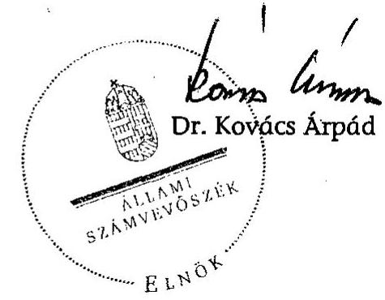

[^0]
[^0]:    ${ }^{28}$ az egészségügyi szolgáltatók és múködési engedélyük nyilvántartásáról, valamint az egészségügyi szakmai jegyzékről szóló 2/2004. (XI. 17.) EüM rendelet 2. sz. melléklete

---

# Ellenőrzött önkormányzatok: 

| Budapest Főváros Önkormányzata | Kaposvár Megyei Jogú Város Önkormányzata |
| :--: | :--: |
| Pécs Megyei Jogú Város Önkormányzata | Balmazújváros Város Önkormányzata |
| Kalocsa Város Önkormányzata | Esztergom Város Önkormányzata |
| Orosháza Város Önkormányzata | Vác Város Önkormányzata |
| Sátoraljaújhely Város Önkormányzata | Mátészalka Város Önkormányzata |
| Mór Város Önkormányzata | Ajka Város Önkormányzata |

## Ellenőrzött többcélú kistérségi társulások (TKT) és székhelyük:

| Bajai TKT (Dávod) | Székesfehérvári TKT | Szatmári TKT (Mátészalka) |
| :--: | :--: | :--: |
| Halasi TKT   (Kiskunhalas) | Balmazújvárosi Kistérség Többcélú Társulás | Felső-Répcementi TKT (Csepreg) |
| Felső-Kiskunsági és   Dunamelléki TKT   (Kunszentmiklós) | Derecske-Létavértes Kistér-   ség Többcélú Társulás   (Létavértes) | Körmend és Kistérsége TKT |
| Pécsi TKT | Esztergom és Nyergesújfalu TKT (Esztergom) | Sárvár és Kistérsége TKT |
| Sellyei Kistérségi Többcélú Társulás | Dunakanyar Többcélú Önkormányzati Kistérségi Társulás (Vác) | Szombathelyi Kistérség Többcélú Társulása |
| Orosházai Kistérségi Többcélú Társulás | Kaposvári TKT | Új Atlantisz TKT (Ajka) |
| Szeghalom Kistérségi Többcélú Társulás | Marcali Kistérség Többcélú Társulás | Lenti Kistérség Többcélú Társulása |
| Sárospataki TKT | Felső-Tiszavidéki TKT (Fehérgyarmat) | Nagykanizsai Kistérség Többcélú Társulása |
| Sátoraljaújhelyi Kistérségi Többcélú Társulás | Közép-Szabolcsi TKT (Ibrány) | Szigetvár Dél-Zselic TKT |
| „Móri" TKT | Kisvárda és Térsége TKT |  |

---

# Ellenőrzött és adatot szolgáltató kórházak 

| Kórház megnevezése | Kórház rövid neve a jelentésben |
| :--: | :--: |
| Magyar Imre Kórház-Ajka | Ajkai Kórház |
| Baranya Megyei Kórház, Pécs | Pécsi Kórház |
| Mór Városi Kórház- Rendelőintézet | Móri Kórház |
| Területi Kórház Mátészalka | Mátészalkai Kórház |
| Egészségügyi Szolgáltató Kft. Szigetvár | Szigetvári Kórház |
| Szatmár-Beregi Kórház és Gyógyfürdő | Fehérgyarmati Kórház |
| Vaszary Kolos Kórház Esztergom | Esztergomi Kórház |
| Kenézy Kórház Rendelőintézet Egészségügyi Szolgáltató Kft. | Debreceni Kórház |
| Kalocsa Város Önkormányzat Kórház-Rendelőintézet | Kalocsai Kórház |
| Kaposi Mór Oktató Kórház (Kaposvár) | Kaposvári Kórház |
| Városi Önkormányzat Kórház-Rendelőintézet (Nagyatád) | Nagyatádi Kórház |
| Kanizsai Dorottya Kórház (Nagykanizsa) | Nagykanizsai Kórház |
| Orosháza Városi Önkormányzat Kórháza | Orosházi Kórház |
| Fővárosi Önkormányzat Szent Imre Kórház és Rendelőintézet | Szent Imre Kórház |
| Önkormányzati Kórház Sárvár | Sárvári Kórház |
| Sátoraljaújhely Város Önkormányzat Erzsébet Kórháza | Sátoraljaújhelyi Kórház |
| Siófok Város Kórház-Rendelőintézete | Siófoki Kórház |
| Jávorszky Ödön Városi Kórház (Vác) | Váci Kórház |
| Veszprém Megyei Csolnoky Ferenc Kórház Nonprofit Zrt. | Veszprémi Kórház |
| Vas Megyei Markusovszky Kórház Nonprofit Zrt. | Szombathelyi Kórház |
| Zala Megyei Kórház (Zalaegerszeg) | Zalaegerszegi Kórház |
| Szabolcs-Szatmár-Bereg Megyei Önkormányzat Jósa András Oktató Kórháza | Nyíregyházi Kórház |
| Fejér Megyei Szent György Kórház | Székesfehérvári Kórház |
| Bács-Kiskun Megyei Önkormányzat Kórháza | Kecskeméti Kórház |

---

# A helyszíni ellenőrzésbe bevont szervezetek és az ellátás szervezésének folyamatábrája 

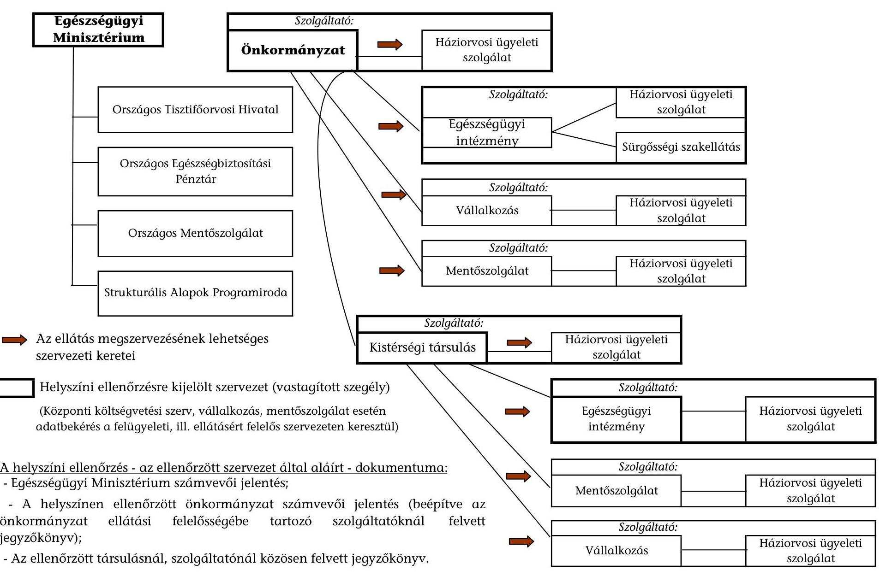

---

.

---

# ÉSZREVÉTELEK - ÁSZ VÁLASZOK

---

# EGÉSZSÉGÜGYI MINISZTÉRIUM MINISZTER 

Iktatószám: 8220- h /2009-0003EGP
Hiv.szám: V-3009-62/2008-09.
Tárgy: sürgősségi betegellátás

## Dr. Kovács Árpád

elnők
Állami Számvevőszék
Budapest

Tisztelt Elnök Úr!

A sürgősségi betegellátó rendszer kialakítására, fejlesztésére fordított pénzeszközök felhasználásának ellenőrzéséről készített jelentés átdolgozott változatára észrevételt nem teszek.

Budapest, 2009. július „ 8 ."

Üdvözlettel:
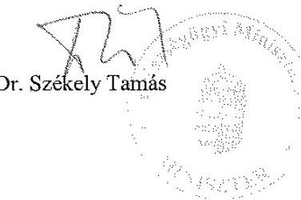

Dr. Székely Tamás

---

H-1031 BUDAPEST V., JÓZSEF NÁDOR TÉR 2-4, POSTACÍM: 1369 BUDAPEST, POSTAFIÓK 481.
TELEFON: (36-1) 327-2100, (+36) 30 371-2100
E-MAIL: peter.ox@ko@pos.gov.hu
FAX: (36-1) 318-2570

PÉNZÜGYMINISZTER

Ikt. sz.: $\quad 8915 / 3 / 2009$.
Hiv. sz.: V-3009-62/2008-09.
Úgyintéző: Fejes László
Tárgy: sürgősségi
betegellátó rendszer
ellenőrzése

# Dr. Kovács Árpád úr 

elnök

## Állami Számvevőszék

Budapest

Tisztelt Elnök Úr!

Tájékoztatom, hogy a sürgősségi betegellátó rendszer kialakítására, fejlesztésére fordított pénzeszközök felhasználásának ellenőrzéséről készített jelentéshez észrevételt nem teszek.

Budapest, 2009. július „, 9 ."

Tisztelettel:

---

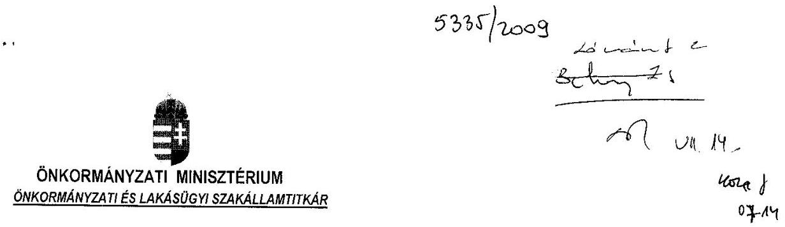

Iktatószám: ÖM/7088/3/2009.

Dr. Kovács Árpád úrnak, az Állami Számvevőszék elnöke Budapest

# Tisztelt Elnök Úr! 

Varga Zoltán önkormányzati miniszter úr a sürgősségi betegellátó rendszer kialakítására, fejlesztésére fordított pénzeszközök felhasználásának ellenőrzéséről készített jelentés megküldését köszönettel vette.

Miniszter úr megbízásából szeretném tájékoztatni, hogy a jelentésben foglaltakra nem kívánunk észrevételt tenni.

Budapest, 2009. július 4, ,

Tisztelettel:
Dr. Forgács Inire

---

A háziorvosi ügyeleti ellátás finaszírozási szerződéseinek száma és a finanszírozás éves összege az egészségbiztosítóval szerződő szervezetek típusa szerint a 2004-2008. években

|  Év | Önkormányzati
eü. intézmény |  | Önkormányzat |  | Központi
eü. intézmény |  | Vállalkozás |  | Non-profit |  | Összesen |   |
| --- | --- | --- | --- | --- | --- | --- | --- | --- | --- | --- | --- | --- |
|   | E Ft | db | E Ft | db | E Ft | db | E Ft | db | E Ft | db | E Ft | db  |
|  2004. | 2236848,9 | 97 | 3377484,6 | 1005 | 47394,1 | 2 | 1151610,5 | 115 | 344861,8 | 11 | 7158 199,9 | 1230  |
|  2005. | 2372039,6 | 98 | 3337531,7 | 869 | 105539,4 | 2 | 1325019,6 | 103 | 789868,9 | 18 | 7929 999,2 | 1090  |
|  2006. | 2531483,5 | 89 | 3226516,5 | 597 | 127388,0 | 3 | 1885156,1 | 91 | 918654,4 | 21 | 8689 198,5 | 801  |
|  2007. | 2377791,5 | 79 | 2910118,3 | 366 | 122243,2 | 3 | 2466311,4 | 102 | 961730,5 | 21 | 8838 194,9 | 571  |
|  2008. | 2225478,2 | 67 | 2571656,3 | 173 | 116250,0 | 2 | 3252740,2 | 95 | 968992,7 | 20 | 9135 117,4 | 357  |

---

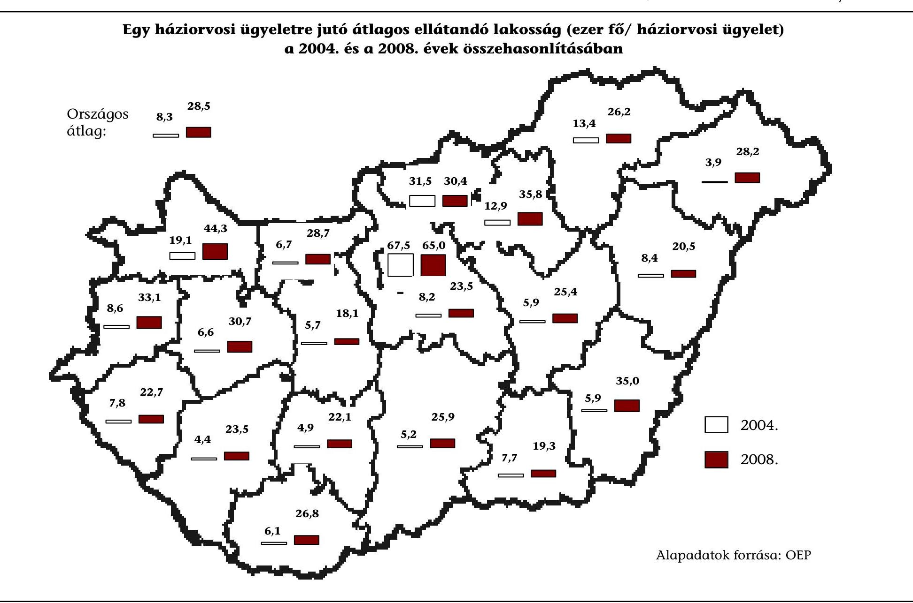

2. számú függelék a V-3009/2008-09. számú ellenőrzési jelentéshez

---

# A háziorvosi ügyeleti szolgáltatók száma az ügyelet típusa szerint, megyénként a 2008. évben 

(az ügyeleti szolgálatok 2008-ban teljesített számítógépes adatszolgáltatása alapján)

| Megye |  | Változó   telephelyü   összevont   háziorvosi   ügyelet | Azonos   telephelyü   összevont   háziorvosi   ügyelet | Központi   háziorvosi   ügyelet | Az adatszol-   gáltatásban   nem   szerepel az   ügyelet   típusa | Együtt   (db) |
| :--: | :--: | :--: | :--: | :--: | :--: | :--: |
| 01 | Baranya | - | 1 | 16 | - | 17 |
| 02 | Bács-Kiskun | 3 | 2 | 16 | - | 21 |
| 03 | Békés | 3 | 1 | 15 | - | 19 |
| 04 | Borsod-Abaúj-Zemplén | 2 | - | 28 | - | 30 |
| 05 | Csongrád | 1 | - | 20 | - | 21 |
| 06 | Fejér | 4 | 1 | 18 | - | 23 |
| 07 | Győr-Moson-Sopron | 1 | 1 | 9 | - | 11 |
| 08 | Hajdú-Bihar | - | - | 18 | - | 18 |
| 09 | Heves | 2 | 1 | 9 | - | 12 |
| 10 | Komárom-Esztergom | - | 1 | 7 | - | 8 |
| 11 | Nógrád | - | - | 9 | - | 9 |
| 12 | Pest | 8 | 2 | 28 | - | 38 |
| 13 | Somogy | 3 | - | 12 | - | 15 |
| 14 | Szabolcs-Szatmár-Bereg | 7 | 4 | 9 | 1 | 21 |
| 15 | Jász-Nagykun-Szolnok | 4 | 2 | 13 | - | 19 |
| 16 | Tolna | - | 1 | 10 | - | 11 |
| 17 | Vas | - | - | 11 | - | 11 |
| 18 | Veszprém | 6 | - | 7 | - | 13 |
| 19 | Zala | 3 | 5 | 7 | - | 15 |
| 20 | Főváros | 3 | - | 15 | 2 | 20 |
| Összesen |  | 50 | 22 | 277 | 3 | 352 |

Adatforrás: OEP

Megjegyzés: A finanszírozással összefüggő adatoknál a 2008. évben 357 ügyelet szerepelt (1. számú függelékben), öt szolgálat adatait nem tartalmazta az adatbázis.

---

# A háziorvosi ügyeletben ellátott esetek az ellátás helye szerint, megyénként a 2008. évben 

(az ügyeleti szolgálatok 2008-ban teljesített számítógépes adatszolgáltatása alapján)

| Megye |  | Rendelöben | A beteg lakásán (állandó v. ideiglenes lakhelyén) | Egyéb helyen | Baleseti ellátás a baleset helyszinén | Nem értelmezhetó az adatszolgáltatás | Együtt |
| :--: | :--: | :--: | :--: | :--: | :--: | :--: | :--: |
| 01 | Baranya | 27656 | 6599 | 510 | 1 | 35394 | 70160 |
| 02 | Bács-Kiskun | 42902 | 7916 | 227 | 17 | 50827 | 101889 |
| 03 | Békés | 21260 | 7822 | 453 | 24 | 31334 | 60893 |
| 04 | Borsod-Abaúj-Zemplén | 52490 | 10832 | 172 | 7 | 55604 | 119105 |
| 05 | Csongrád | 23220 | 2708 | 507 | 6 | 24929 | 51370 |
| 06 | Fejér | 38172 | 10354 | 324 | 6 | 45481 | 94337 |
| 07 | Győr-Moson-Sopron | 24627 | 4999 | 87 | 3 | 31326 | 61042 |
| 08 | Hajdú-Bihar | 25732 | 8161 | 125 | 16 | 42590 | 76624 |
| 09 | Heves | 21177 | 7437 | 123 | 3 | 28289 | 57029 |
| 10 | Komárom-Esztergom | 22227 | 4257 | 111 | - | 28799 | 55394 |
| 11 | Nógrád | 15212 | 8483 | 212 | 3 | 24728 | 48638 |
| 12 | Pest | 59427 | 15633 | 440 | 30 | 74459 | 149989 |
| 13 | Somogy | 31055 | 4653 | 179 | 1 | 32588 | 68476 |
| 14 | Szabolcs-Szatmár-Bereg | 68685 | 7174 | 83 | 6 | 72231 | 148179 |
| 15 | Jász-Nagykun-Szolnok | 28835 | 10909 | 264 | 31 | 45428 | 85467 |
| 16 | Tolna | 22518 | 3467 | 73 | 2 | 23994 | 50054 |
| 17 | Vas | 19353 | 5712 | 181 | 4 | 26086 | 51336 |
| 18 | Veszprém | 30647 | 6340 | 141 | 8 | 34238 | 71374 |
| 19 | Zala | 25875 | 4245 | 164 | 3 | 29959 | 60246 |
| 20 | Főváros | 36177 | 24318 | 364 | - | 56944 | 117803 |
| Összesen |  | 637247 | 162019 | 4740 | 171 | 795228 | 1599405 |

---

5. számú függelék a V-3009/2008-09. számú ellenőrzési jelentéshez

# A háziorvosi ügyeletben ellátott esetek az ellátás oka szerint, megyénként a 2008. évben

(az ügyeleti szolgálatok 2008-ban teljesített számítógépes adatszolgáltatása alapján)

|  Megye |  | Akut megbetegedés miatt | Krónikus betegség | Krónikus betegség fellángolása vagy krónikus megbetegedés mellett akut megbetegedés | Egyéb ok miatt | Baleseti ellátás | Balesettel kapcsolatos ellátás | Nem értelmezhető az adatszolgáltatás | Együtt  |
| --- | --- | --- | --- | --- | --- | --- | --- | --- | --- |
|  01 | Baranya | 41087 | 542 | 570 | 1616 | 121 | 29 | 26195 | 70160  |
|  02 | Bács-Kiskun | 98574 | 874 | 519 | 1064 | 238 | 181 | 439 | 101889  |
|  03 | Békés | 46068 | 1644 | 2490 | 8392 | 1228 | 1069 | 2 | 60893  |
|  04 | Borsod-Abaúj-Zemplén | 105853 | 837 | 168 | 2342 | 618 | 396 | 8891 | 119105  |
|  05 | Csongrád | 46775 | 171 | 280 | 3369 | 11 | 11 | 753 | 51370  |
|  06 | Fejér | 85425 | 1050 | 867 | 1335 | 249 | 182 | 5229 | 94337  |
|  07 | Győr-Moson-Sopron | 58844 | 508 | 393 | 1114 | 71 | 60 | 52 | 61042  |
|  08 | Hajdú-Bihar | 69090 | 857 | 463 | 1247 | 438 | 279 | 4250 | 76624  |
|  09 | Heves | 56828 | 115 | 11 | 63 | 5 | 6 | 1 | 57029  |
|  10 | Komárom-Esztergom | 49408 | 357 | 304 | 5056 | 26 | 16 | 227 | 55394  |
|  11 | Nógrád | 39211 | 2736 | 2781 | 3038 | 308 | 145 | 419 | 48638  |
|  12 | Pest | 137505 | 2197 | 1204 | 2604 | 558 | 350 | 5571 | 149989  |
|  13 | Somogy | 62206 | 557 | 506 | 953 | 294 | 362 | 3598 | 68476  |
|  14 | Szabolcs-Szatmár-Bereg | 137517 | 1230 | 900 | 7378 | 364 | 245 | 545 | 148179  |
|  15 | Jász-Nagykun-Szolnok | 77497 | 1837 | 1322 | 3858 | 26 | 44 | 883 | 85467  |
|  16 | Tolna | 39390 | 259 | 267 | 894 | 11 | 18 | 9215 | 50054  |
|  17 | Vas | 22379 | 699 | 541 | 1686 | 211 | 213 | 25607 | 51336  |
|  18 | Veszprém | 62110 | 392 | 120 | 605 | 224 | 93 | 7830 | 71374  |
|  19 | Zala | 58684 | 486 | 280 | 566 | 77 | 65 | 88 | 60246  |
|  20 | Főváros | 52584 | 3415 | 4380 | 1791 | 8 | 137 | 55488 | 117803  |
|  Összesen |  | 1347035 | 20763 | 18366 | 48971 | 5086 | 3901 | 155283 | 1599405  |

Adatforrás: OEP

---

1. számú függelék a V-3009/2008-09. számú ellenőrzési jelentéshez

# A sürgősségi fekvőbeteg szakellátás kapacitását, teljesítményét, finanszírozását jellemző főbb adatok és mutatók a 2004-2008. években

|  T | Ágyak átlagos száma | Súlyszám összeg | Hosszú nap | Finanszírozási esetszám | Meghalt | Halálozási arány | Ápolási nap | Egy esetre jutó nap | Egy ágyra jutó havi átlagos súlyszám összeg | Egy ágyra jutó esetszám / hó | CMI | Ágykibasz- náltság | Elszámolt teljesít- ménydíj (E Ft) | Egy ágyra jutó teljesítmény- finanszírozás (E Ft)  |
| --- | --- | --- | --- | --- | --- | --- | --- | --- | --- | --- | --- | --- | --- | --- |
|  2004. | 230 | 7 799 | 52 | 22 537 | . | . | 39 959 | 1,8 | 2,8 | 8,2 | 0,35 | 47,5% | 906 780 | 3 942,5  |
|  2005. | 256 | 10 617 | 39 | 31 384 | . | . | 51 331 | 1,6 | 3,5 | 10,2 | 0,34 | 55,0% | 1 373 880 | 5 366,7  |
|  2006. | 301 | 10 660 | 96 | 32 695 | 806 | 2,5% | 51 946 | 1,6 | 3,0 | 9,1 | 0,33 | 47,3% | 1 409 560 | 4 682,9  |
|  2007. | 342 | 10 367 | 45 | 32 472 | 1057 | 3,3% | 49 338 | 1,5 | 2,5 | 7,9 | 0,32 | 39,5% | 1 407 747 | 4 118,4  |
|  2008. | 388 | 13 063 | 182 | 41 795 | 1373 | 3,3% | 58 143 | 1,4 | 2,8 | 9,0 | 0,31 | 41,0% | 1 861 369 | 4 801,4  |

Adatforrás: OEP

---

7. számú függelék a V-3009/2008-09. számú ellenőrzési jelentéshez
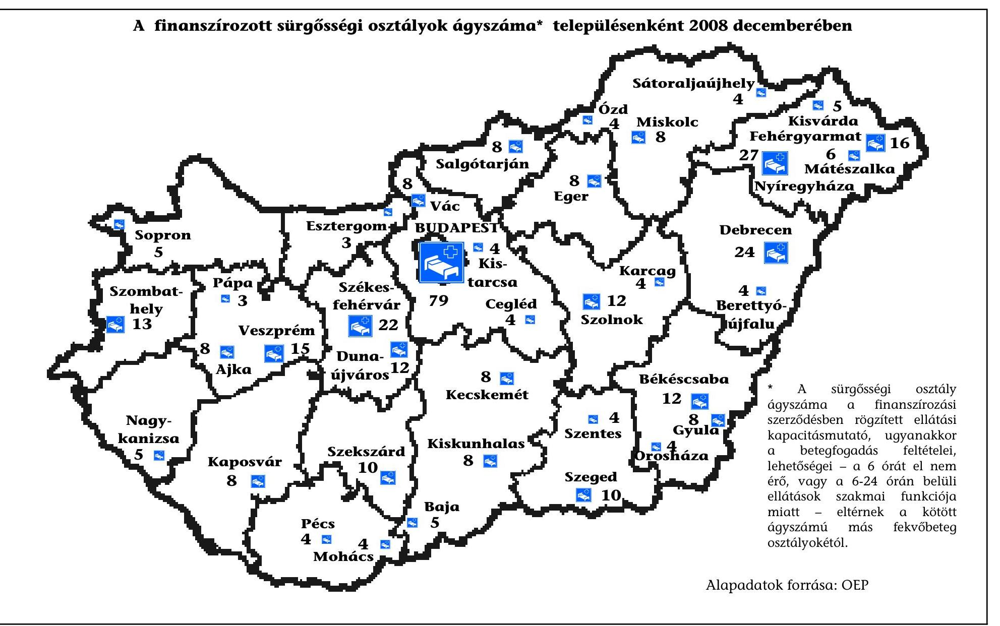

---

# Az aktív fekvőbeteg ellátás finanszírozási eseteinek száma, valamint ezen belül a mentővel érkező és a sürgős ellátásként nyilvántartott esetek alakulása megyénként a 2008. évben* 

| Megye | Összes finanszírozási eset | A felvétel jellege: beutaló nélkül, mentővel | A felvétel típusa: sürgős ellátás | A felvétel jellege:   beutaló   nélkül,   mentővel és   ezen belül a   felvétel típusa:   sürgős ellátás |
| :--: | :--: | :--: | :--: | :--: |
| 01 | Baranya | 117962 | 4712 | 39857 |
| 02 | Bács-Kiskun | 117047 | 1802 | 49034 |
| 03 | Békés | 75797 | 690 | 34334 |
| 04 | Borsod-Abaúj-Zemplén | 160678 | 6651 | 73336 |
| 05 | Csongrád | 114634 | 1724 | 43758 |
| 06 | Fejér | 89417 | 4491 | 44343 |
| 07 | Győr-Moson-Sopron | 79577 | 3347 | 36087 |
| 08 | Hajdú-Bihar | 142094 | 4554 | 34020 |
| 09 | Heves | 62144 | 2417 | 32242 |
| 10 | Komárom-Esztergom | 60267 | 2776 | 27000 |
| 11 | Nógrád | 38265 | 1327 | 11160 |
| 12 | Pest | 104083 | 1348 | 49419 |
| 13 | Somogy | 76846 | 4048 | 30981 |
| 14 | Szabolcs-Szatmár-Bereg | 140163 | 1663 | 60448 |
| 15 | Jász-Nagykun-Szolnok | 77768 | 3252 | 37613 |
| 16 | Tolna | 41631 | 558 | 9123 |
| 17 | Vas | 52946 | 4999 | 21245 |
| 18 | Veszprém | 72903 | 3009 | 27425 |
| 19 | Zala | 71303 | 2498 | 27501 |
| 20 | Főváros | 642581 | 32474 | 241136 |
| Összesen |  | 2338106 | 88340 | 930062 |

* A felvett és még tárgyévben az ellátásból kikerülő betegek alapján gyűjtve.

---

# Az aktív fekvőbeteg-szakellátásban a sürgősségi ellátási formák fix összegű díjazásának alakulása megyénként a 2004-2008. években (ezer Ft-ban)

(az egészségügyi szakellátás társadalombiztosítási finanszírozásának egyes kérdéseiről szóló 9/1993. (IV. 2.) NM rendelet adott időszakaiban hatályos 16. számú melléklete szerinti díjak)

|  Megye |  | 2004.* | 2005. | 2006. | 2007. | 2008.  |
| --- | --- | --- | --- | --- | --- | --- |
|  01 | Baranya | 145000 | 223300 | 212400 | 187380 | 190976  |
|  02 | Bács | 78400 | 160800 | 134400 | 171700 | 185600  |
|  03 | Békés | 55200 | 82800 | 79900 | 138160 | 163072  |
|  04 | Borsod | 64000 | 137500 | 81600 | 160680 | 237096  |
|  05 | Csongrád | 141600 | 230400 | 236400 | 190320 | 186624  |
|  06 | Fejér | 52000 | 121200 | 118000 | 151860 | 160512  |
|  07 | Győr-Sopron | 41200 | 88800 | 70800 | 60720 | 84304  |
|  08 | Hajdú-Bihar | 148800 | 236200 | 223200 | 254280 | 279936  |
|  09 | Heves | 30400 | 45600 | 3800 | 40500 | 46800  |
|  10 | Komárom-Esztergom | 40800 | 61200 | 45600 | 51900 | 57600  |
|  11 | Nógrád | 30400 | 57600 | 88800 | 98700 | 108800  |
|  12 | Pest | 30400 | 104200 | 133000 | 135900 | 144640  |
|  13 | Somogy | 10400 | 84400 | 123800 | 123100 | 129280  |
|  14 | Szabolcs-Szatmár-Bereg | 68000 | 145200 | 134400 | 202300 | 229120  |
|  15 | Jász-Nagykun-Szolnok | 37600 | 101600 | 120000 | 157860 | 180992  |
|  16 | Tolna | 31400 | 60600 | 57600 | 62100 | 67840  |
|  17 | Vas | 30400 | 45600 | 3800 | 40500 | 57600  |
|  18 | Veszprém | 30400 | 113325 | 152846 | 154260 | 161972  |
|  19 | Zala | 14700 | 91300 | 41400 | 50920 | 104704  |
|  20 | Budapest | 299110 | 534878 | 431348 | 510672 | 568284  |
|  21 | MÁV biztosító | 30400 | 45600 | 0 | 0 | 0  |
|  Összesen |  | 1410610 | 2772103 | 2493094 | 2943812 | 3345752  |

- az év májusától

Adatforrás: OEP

---

1. számú függelék a V-3009/2008-09. számú ellenőrzési jelentéshez

# A járóbeteg-szakellátáson belül a sürgősségi betegellátási szakma kapacitását, teljesítményét, finanszírozását jellemző főbb adatok, mutatók a 2004-2008. években

|  Év | Betegek
száma | Beavatko-
zások száma | Egy esetre
jutó
beavat-
kozás | Esetszám | Pontszám | Egy
esetre
jutó
pont | Átlagos heti
rendelési óra |  |  | Átlagos havi
díj (E Ft) | Egy órára jutó |  |  |   |
| --- | --- | --- | --- | --- | --- | --- | --- | --- | --- | --- | --- | --- | --- | --- |
|   |  |  |  |  |  |  | szak-
orvosi | nem
szak-
orvosi | Átlagos havi
díj (E Ft) |  |  |  |  |   |
|  2004. | 235454 | 940553 | 3,18 | 295601 | 357380004 | 1209 | 3133 | 0 | 36 828,4 | 1,9 | 6,1 | 2331 | 2707 |   |
|  2005. | 313843 | 1341536 | 3,48 | 385111 | 510939443 | 1327 | 3139 | 0 | 57 724,1 | 2,5 | 8,7 | 3311 | 4136 |   |
|  2006. | 331209 | 1599450 | 3,84 | 416406 | 609336869 | 1463 | 2912 | 0 | 65 585,7 | 2,9 | 11,1 | 4242 | 5358 |   |
|  2007. | 357269 | 1684581 | 3,83 | 440162 | 668393343 | 1519 | 2842 | 0 | 81 630,0 | 3,2 | 12,1 | 4792 | 6524 |   |
|  2008. | 460036 | 2247679 | 3,93 | 572328 | 912710221 | 1595 | 2912 | 0 | 110 560,3 | 4,1 | 16,0 | 6486 | 9229 |   |