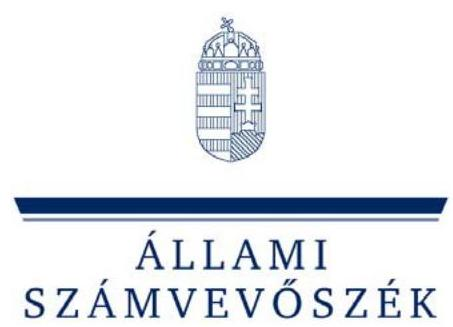
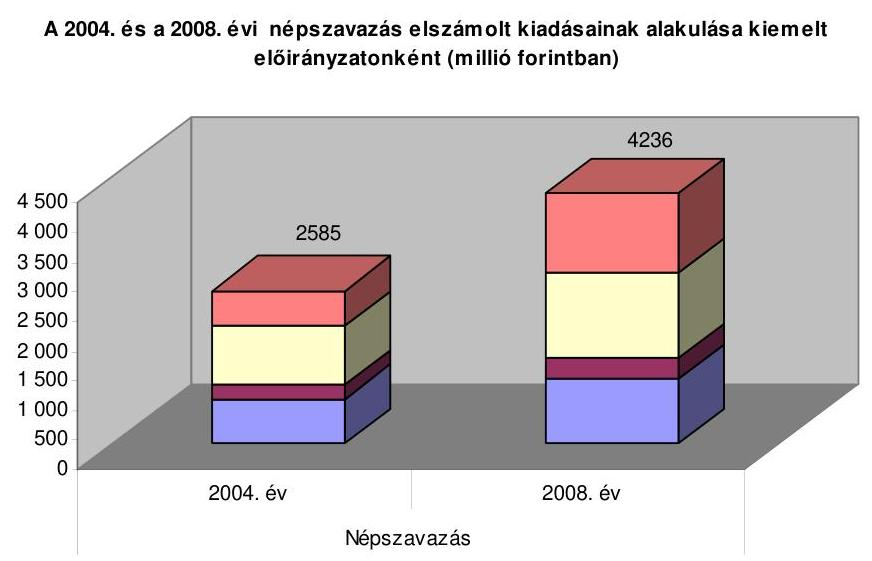
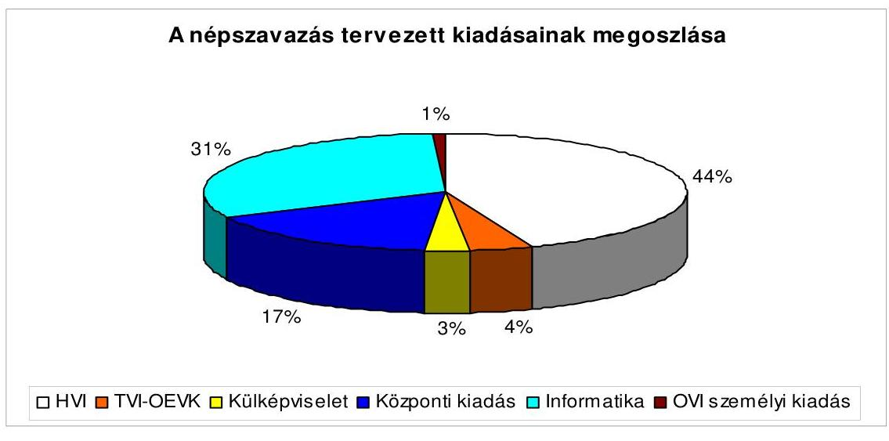
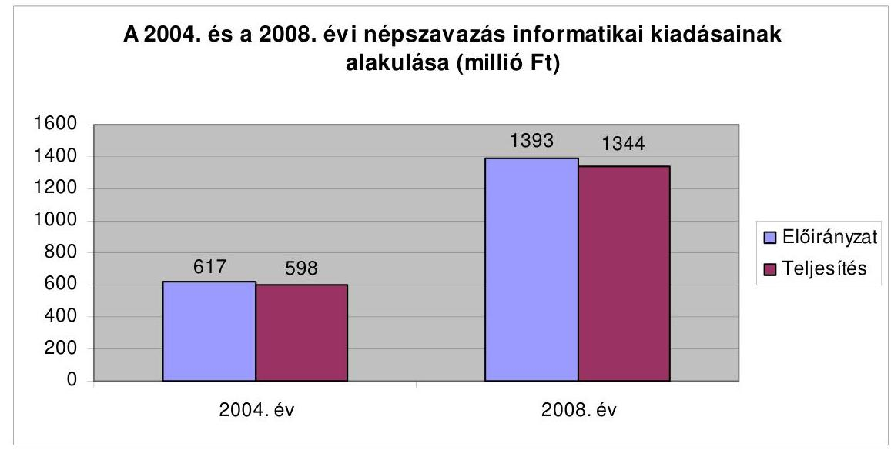
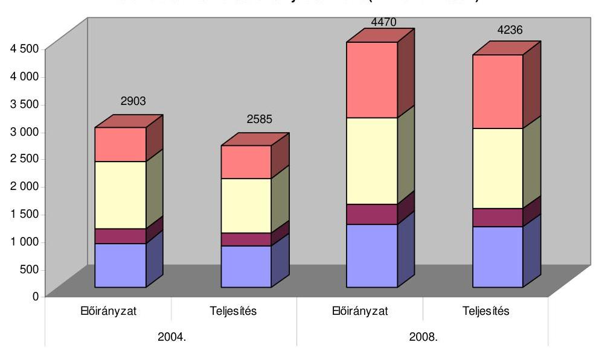
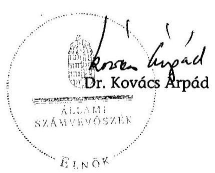
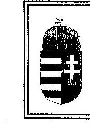
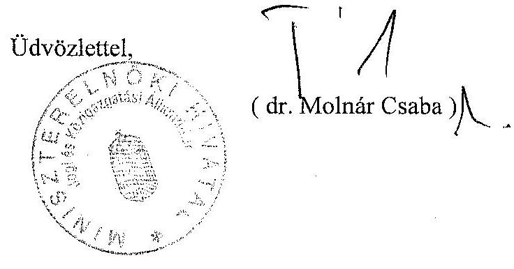
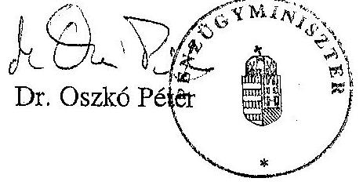
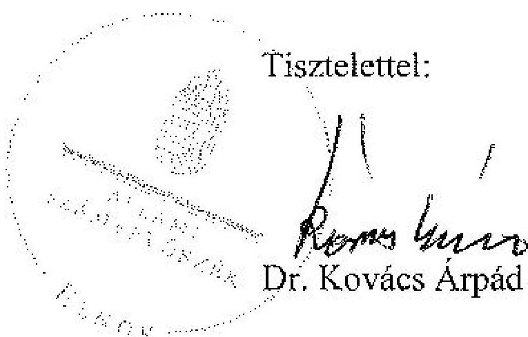

# JELENTÉS 

a 2008. március 9-én megtartott országos ügydöntő népszavazás lebonyolításához felhasznált pénzeszközök elszámolásának ellenőrzéséről

---

# 3. Önkormányzati és Területi Ellenőrzési Igazgatóság 

3.3. Átfogó Ellenőrzések Főcsoport

Iktatószám: V-3002-105/2009.
Témaszám: 934
Vizsgálat-azonosító szám: V0465

## Az ellenőrzést felügyelte:

## dr. Lóránt Zoltán

főigazgató
Az ellenőrzés végrehajtásáért felelős:
dr. Sepsey Tamás
főigazgató-helyettes
Az ellenőrzést vezette:
Molnár Gyula Mihály
igazgatóhelyettes
Az összefoglaló jelentést készítették:
Dér Géza
számvevő tanácsos
Klinga László
számvevő tanácsos
Az ellenőrzést végezték:

| Batkiné Vas Anna | Bialkó Zsolt Gyula | Dér Géza |
| :-- | :-- | :-- |
| számvevő | számvevő tanácsos | számvevő tanácsos |
| György Árpád | Gyulai György Imre | Kéri Péter |
| számvevő tanácsos | számvevő | számvevő tanácsos |
| Klinga László | Köllődné Gátai Mária | Nagy Ervin Barnabás |
| számvevő tanácsos | számvevő | számvevő |
| Pálfiné | Tótfalusi Zoltán | Benczik Lászlóné |
| Pusztai Magdolna | számvevő | külső szakértő |
| számvevő |  |  |

---

# A témához kapcsolódó eddig készített számvevőszéki jelentések: 

## címe

Jelentés az 1990. évi országgyűlési képviselő-választások előkészítésével és lebonyolításával kapcsolatos állami feladatok végrehajtására biztosított költségvetési pénzeszközök felhasználásának ellenőrzéséről (1991. évben elkészített jelentés)
Jelentés az 1994. évi országgyűlési, valamint a helyi és kisebbségi önkormányzati képviselő-választások lebonyolítására felhasznált pénzeszközök ellenőrzéséről (1995. évben elkészített jelentés)
Jelentés az 1997. évi népszavazásra, továbbá az 1998. évi országgyűlési, valamint a helyi és kisebbségi önkormányzati képviselő-választások lebonyolítására felhasznált pénzeszközök vizsgálatáról
Jelentés a 2002. évi országgyűlési, valamint a helyi és kisebbségi önkormányzati képviselő-választásra felhasznált pénzeszközök ellenőrzéséről
Jelentés a 2003. április 12-én megtartott országos népszavazás lebonyolításához felhasznált pénzeszközök elszámolásának ellenőrzéséről
Jelentés a 2004. június 13-án megtartott, az Európai Parlament tagjai választás és a 2004. december 5-én megtartott országos ügydöntő népszavazás lebonyolításához felhasznált pénzeszközök elszámolásának ellenőrzéséről
Jelentés a 2006. évi országgyűlési, valamint önkormányzati és nemzeti, etnikai kisebbségi képviselő-választások lebonyolításához felhasznált pénzeszközök ellenőrzéséről

---

# TARTALOMJEGYZÉK 

BEVEZETÉS ..... 5
I. ÖSSZEGZŐ MEGÁLLAPÍTÁSOK, KÖVETKEZTETÉSEK, JAVASLATOK ..... 7
II. RÉSZLETES MEGÁLLAPÍTÁSOK ..... 15

1. A népszavazással kapcsolatos feladatok végrehajtása ..... 15
1.1. Az ÖTM miniszter népszavazással kapcsolatos feladatainak végrehajtása ..... 15
1.2. Az OVI, a TVI-k és a HVI-k feladatainak megvalósulása ..... 16
2. A népszavazás pénzügyi fedezetének tervezése, az előirányzatok nyilvántartása és módosítása ..... 17
2.1. A központi költségvetési támogatás összegének tervezése és jóváhagyása ..... 17
2.2. Az ÖTM, a KüM és a népszavazást lebonyolító szervezetek tervezési, előirányzat-nyilvántartási, módosítási tevékenysége ..... 19
3. A pénzügyi fedezet biztosítása ..... 20
3.1. A költségvetési támogatás rendelkezésre bocsátása ..... 20
3.2. A népszavazáshoz kapcsolódó feladatok finanszírozása ..... 20
4. A népszavazásra biztosított pénzeszközök felhasználásának szabályszerűsége ..... 21
4.1. A gazdálkodási és ellenőrzési jogkörök, továbbá a nyilvántartási rend szabályozottsága ..... 21
4.2. Az elkülönített számviteli nyilvántartási kötelezettség teljesítése ..... 22
4.3. A népszavazással kapcsolatos kiadások célszerűsége és szabályszerűsége ..... 22
4.4. Dologi kiadások a népszavazást lebonyolító szervezeteknél ..... 24
4.5. Személyi jellegű juttatások az ÖM-nél és a népszavazást lebonyolító szervezeteknél ..... 25
4.6. A közbeszerzési eljárás keretébe tartozó árubeszerzések és szolgáltatás-vásárlások lebonyolítása, illetve eszközbeszerzések ..... 27
4.7. A népszavazás informatikai feladatainak tervezése és végrehajtása ..... 29
5. A népszavazási feladatokra felhasznált pénzeszközök elszámolása ..... 31
5.1. Az ÖM-nél és a KEK KH-nál felhasznált pénzeszközök elszámolása ..... 31
5.2. A KüM, a TVI-k, HVI-k, a RÁH-ok által felhasznált pénzeszközök elszámolása ..... 32
6. A népszavazási pénzeszközök felhasználásának és elszámolásának ellenőrzése ..... 33

---

6.1. Az ÖM miniszter és a KEK KH elnöke ellenőrzési tevékenysége ..... 33
6.2. A KüM szerv, a TVI-k és a HVI-k vezetői, illetve a RÁH-ok ellenőrzési tevékenysége ..... 34
7. Az ÁSZ korábbi választásokkal összefüggő ellenőrzési javaslatai végrehajtásának hasznosulása ..... 35
MELLÉKLETEK

1. számú Az ellenőrzött szervezetek jegyzéke (1 oldal)
2. számú A 2004. és a 2008. évi népszavazások kiadásai kiemelt előirányzatonként (1 oldal)
3. számú A népszavazás lebonyolításához kapcsolódó közbeszerzési eljárások (1 oldal)
4. számú A 2004. és a 2008. évi választások részvételi adatainak és a pénzeszközök felhasználásának alakulása (1 oldal)
5. számú Varga Zoltán önkormányzati miniszter úr észrevétele (1 oldal)
6. számú Dr. Molnár Csaba a Miniszterelnöki Hivatalt vezető miniszter úr észrevétele (1 oldal)
7. számú Dr. Oszkó Péter pénzügyminiszter úr észrevétele (1 oldal)
8. számú Dr. Balázs Péter külügyminiszter úr észrevétele (1 oldal)
9. számú Dr. Balázs Péter külügyminiszter úrnak írt válaszlevél (1 oldal)

---

# RÖVIDÍTÉSEK JEGYZÉKE 

## Törvények

Áht.
ÁSZ tv.

Kbt.
Számv. tv.
Ve.
2008. évi költségvetési törvény
az államháztartásról szóló 1992. évi XXXVIII. törvény
az Állami Számvevőszékről szóló 1989. évi XXXVIII. törvény
a közbeszerzésről szóló 2003. évi CXXIX. törvény
a számvitelről szóló 2000. évi C. törvény
a választási eljárásról szóló 1997. évi C. törvény
a Magyar Köztársaság 2008. évi költségvetéséről szóló 2007. évi CLXIX. törvény

## Rendeletek, határozatok

Ámr.
népszavazási rendelet

Vhr.
10/1998. (II. 20.) BM rendelet
5/2008. (I. 22.) ÖTM rendelet
6/2008. (I. 24.) ÖTM rendelet
109/2007. (XII. 19.) OGY határozat
110/2007. (XII. 19.) OGY határozat
111/2007. (XII. 19.) OGY határozat
2008/2008. (II. 7.) Korm. határozat
2/2008. KüM utasítás

az államháztartás működési rendjéről szóló 217/1998. (XII. 30.) Korm. rendelet
a 2008. évi országos népszavazások költségeinek normatíváiról, tételeiről, elszámolási és belső ellenőrzési rendjéről szóló 7/2008. (I. 24.) ÖTM rendelet
az államháztartás szervezetei beszámolási és könyvvezetési kötelezettségének sajátosságairól szóló 249/2000. (XII. 24.) Korm. rendelet
a választási adatszolgáltatásokért fizetendő igazgatási szolgáltatási díjakról
a választási eljárásról szóló 1997. évi C. törvénynek az országos népszavazáson történő végrehajtásáról
a 2008. március 9. napjára kitűzött országos népszavazás eljárási határidőinek és határnapjainak megállapításáról országos népszavazás elrendeléséről
országos népszavazás elrendeléséről
országos népszavazás elrendeléséről
a 2008. évi központi költségvetés általános tartalékának előirányzatából történő felhasználásáról
a Külügyminiszter 2/2008. KüM utasítása a Magyar Köztársaság külképviseletein lefolytatandó választások és népszavazás pénzügyi tervezésének, lebonyolításának, valamint elszámolásának rendjéről

## Szórövidítések

2004. évi népszavazás
2006. évi országgyűlési
választás
ÁSZ
BM
a 2004. évi országos népszavazás
a 2006. évi országgyűlési képviselő-választás

Állami Számvevőszék
Belügyminisztérium

---

| BMSK Zrt. | Beruházási, Műszaki Fejlesztési, Sportüzemeltetési és Közbeszerzési Zártkörű Részvénytársaság |
| :--: | :--: |
| Duna Palota | Duna Palota Kulturális Közhasznú Társaság |
| HVI | Helyi Választási Iroda |
| KEK KH | Közigazgatási és Elektronikus Közszolgáltatások Központi Hivatala |
| Kormány | Magyar Köztársaság Kormánya |
| KüM | Külügyminisztérium |
| KüM szerv | Külügyminiszter által kijelölt szerv |
| KüVI | Külképviseleti Választási Iroda |
| MÁK | Magyar Államkincstár |
| megállapodás | a Miniszterelnöki Hivatal, a KEK KH és a KüM között létrejött megállapodás a népszavazással kapcsolatban |
| MEH | Miniszterelnöki Hivatal |
| népszavazás | a 2008. március 9-én megtartott országos ügydöntő népszavazás |
| OEVK | Országgyűlési Egyéni Választókerület |
| OVB | Országos Választási Bizottság |
| OVI | Országos Választási Iroda |
| ÖM | Önkormányzati Minisztérium |
| ÖTM | Önkormányzati és Területfejlesztési Minisztérium |
| ÖTM miniszter | önkormányzati és területfejlesztési miniszter |
| RÁH | Regionális Államigazgatási Hivatal |
| SzMSz | KEK KH Szervezeti és Működési Szabályzata |
| SzSzB | Szavazatszámláló Bizottság |
| TVI | Területi Választási Iroda |

---

# JELENTÉS 

## a 2008. március 9-én megtartott országos ügydöntő népszavazás lebonyolításához felhasznált pénzeszközök elszámolásának ellenőrzéséről

## BEVEZETÉS

Az Országgyűlés 2007. december 19-én három ${ }^{1}$ határozatban rendelte el a benyújtott népszavazási kezdeményezések alapján a feltett kérdésekre ${ }^{2}$ vonatkozóan az országos ügydöntő népszavazást, a lebonyolításra 4470 millió forintot biztosított. Az önkormányzati és területfejlesztési miniszter a népszavazás lebonyolításához kapcsolódóan kiadta a 2008. évi országos népszavazások költségeinek normatíváiról, tételeiről, elszámolási és belső ellenőrzési rendjéről szóló 7/2008. (I. 24.) ÖTM rendeletet.

A választások szervezési és lebonyolítási feladatait 2006. június 9. napját követően a Belügyminisztérium megszűnése miatt az Önkormányzati és Területfejlesztési Minisztérium vette át, melynek elnevezése 2008. május 15-től Önkormányzati Minisztériumra változott. A közigazgatási hivatalokról szóló 297/2006. (XII. 23.) Korm. rendeletet 2008. június 30. napjától az Alkotmánybíróság határozatával hatályon kívül helyezte, ezért a 2009. január 1. napjával létrehozott, illetékességgel bíró, a Kormány általános hatáskörű területi államigazgatási szervénél végeztünk ellenőrzést.

Az ellenőrzés célja annak megállapítása, hogy a központi szerveknél, a Kormány általános hatáskörű területi államigazgatási szervénél, valamint a helyi önkormányzatoknál a népszavazással kapcsolatos feladatok ellátása során:

- a bevételek és a kiadások tervezése megalapozottan történt-e;

[^0]
[^0]:    ${ }^{1}$ A 109/2007. (XII. 19.), a 110/2007. (XII. 19.) és a 111/2007. (XII. 19.) OGY határozatok.
    ${ }^{2}$ „Egyetért-e Ön azzal, hogy a fekvőbeteg-gyógyintézeti ellátásért a jelen kérdésben megtartott népszavazást követő év január 1-jétől ne kelljen kórházi napidíjat fizetni?"
    „Egyetért-e Ön azzal, hogy a háziorvosi ellátásért, fogászati ellátásért és a járóbetegszakellátásért a jelen kérdésben megtartott népszavazást követő év január 1-jétől ne kelljen vizitdíjat fizetni?"
    „Egyetért-e Ön azzal, hogy az államilag támogatott felsőfokú tanulmányokat folytató hallgatóknak ne kelljen képzési hozzájárulást fizetniük?"

---

- a pénzeszközöket célszerűen, a jogszabályi előírásoknak megfelelően használták-e fel;
- a pénzügyi elszámolásokat határidőben, a jogszabályban meghatározott módon teljesítették-e;
- megfelelően hasznosultak-e a korábbi számvevőszéki ellenőrzések ${ }^{3}$ megállapításai, valamint javaslatai a népszavazás lebonyolítása során.

A választási eljárásról szóló 1997. évi C. törvény 5. § felhatalmazása, valamint az Állami Számvevőszékről szóló 1989. évi XXXVIII. törvény 2. § (1) és (3) bekezdéseiben foglaltak alapján vizsgáltuk a népszavazásra fordított pénzeszközök szabályszerű és célszerű felhasználását.

A népszavazás adatait, mutatószámait a 2004. évi népszavazás adataival, mutatóival hasonlítottuk össze. A 2004. évi népszavazáson a szavazásra jogosult 8 048 739 fő közül 3 017 739 fő jelent meg, ami 37,5%-os részvételi arányt, míg a 2008. évi népszavazáson a választásra jogosult 8 040 125 fő közül 4 061 015 fő jelent meg, ami 50,5%-os részvételi arányt jelentett.

Helyszíni ellenőrzést folytattunk az ÖM-nél, a KEK KH-nál, a KüM szervnél, három regionális államigazgatási hivatalnál, három megyei, valamint 16 települési önkormányzatnál. A vizsgált szerveket az 1. számú mellékletben soroltuk fel. A 2004. évi népszavazáson helyszíni ellenőrzést folytattunk a BM Központi Adatfeldolgozó, Nyilvántartó és Választási Hivatalban, a KüM Gazdálkodási Főosztálynál, négy közigazgatási hivatalban, három megyei, valamint 25 települési önkormányzatnál.

A jelentést az ÁSZ-ról szóló 1989. évi XXXVIII. törvény 25. § (1) bekezdése alapján észrevétel közlése céljából megküldtük a külügyminiszternek, a Miniszterelnöki Hivatalt vezető miniszternek, az önkormányzati miniszternek, valamint a pénzügyminiszternek. A kapott észrevételeket, és a Külügyminiszter észrevételére adott választ a jelentés 5-9. számú mellékletei tartalmazzák.

[^0]
[^0]:    ${ }^{3}$ A 2006. évet követően végzett, választásokkal kapcsolatos számvevőszéki vizsgálat javaslatainak hasznosulására vonatkozó vizsgálat.

---

# I. ÖSSZEGZŐ MEGÁLLAPÍTÁSOK, KÖVETKEZTETÉSEK, JAVASLATOK 

Az Országgyűlés három határozatban rendelte el a népszavazást, az ahhoz kapcsolódó feladatok végrehajtásáért az ÖTM miniszter felelősségét a Ve. és az ÖTM miniszter feladat- és hatásköréről szóló Kormányrendelet írja elő. Feladatkörébe tartozik a népszavazás szabályozásának és a lebonyolításának biztosítása. A feladat- és hatásköröket az ÖTM, majd 2008. júliustól az ÖM szervezeti és működési szabályzata részletezi, abban meghatározásra kerültek az ÖTM miniszter feladatai, a Választási Főosztály szervezete és tevékenysége. A népszavazás feladatainak végrehajtása a szabályozásnak megfelelően történt.

A népszavazás lebonyolítása során a HVI-ra háruló feladatok teljesítése érdekében választott szervezési és feladat-ellátási megoldások megfelelőek voltak.
 A HVI-k szerződéses kapcsolat keretében a választói névjegyzék készítését igényelték a területileg illetékes RÁH-tól, amely a feladatot a normatívában meghatározott díjtétellel megegyezően végezte el. A népszavazási értesítők továbbítására és kézbesítésére az ellenőrzött HVI-k fele egyedileg kötött szolgáltatási szerződés keretében vette igénybe a Magyar Posta Zrt. szolgáltatását, $35 \mathrm{Ft} /$ küldemény díjtétel ellenében. A feladatellátás költségtakarékos megoldása érdekében központilag nem kezdeményezték az egységes kézbesítési díjazás kialakítását, illetve alkalmazását. A népszavazási feladatok elvégzésére irányuló előzetes gazdaságossági számítást a HVI-k nem végeztek, így a jelentkező megtakarítások vagy többletköltségek várható hatását nem vették figyelembe a döntések meghozatalánál.

A népszavazás végrehajtásához szükséges forrás előirányzatát az ÖTM fejezet egyensúlyi tartalék összegében biztosították a 2008. évben. A népszavazás kiadásainak előzetes számításai alapján az Országgyűlés határozataiban 4470 millió Ft felhasználását hagyta jóvá. Az OVI vezetője, illetve a KEK KH elnöke elkészítette a népszavazás feladatsoros költségtervét, amelyet az ÖTM miniszter jóváhagyott. A Kormány határozatban gondoskodott az előirányzatnak megfelelő támogatás biztosításáról az ÖTM fejezet költségvetésében 33 millió Ft, a KEK KH költségvetésében 4437 millió Ft összegben. A KEK KH a népszavazás pénzügyi tervét részletesen kidolgozta. Az előirányzatból a választási szervek kiadásai közel 50%-ot, a külképviseletek 3%-ot, a központi kiadások közel egyötödöt, az informatikai kiadások háromtized részt meghaladó összeget képviseltek, az OVI kiadásaira tervezett összeg egy százalék alatt volt. A tervezett kiadás a 2004. évi népszavazás tervezett kiadásait 54%-kal haladta meg, a HVI-k esetében a növekedés 526 millió Ft volt, amely a tervezett növekedésből egyharmad részarányt képviselt. A népszavazási rendeletben meghatározott normatíva tételei különböző mértékben emelkedtek, a dologi kiadások tételei 10% és másfélszeres közötti, a személyi juttatások növekedése 25-50% közötti volt. A központi kiadások tervezett összege közel 40%-kal volt magasabb, az in-

---

formatikai kiadások kétszeresére nőttek a 2004. évi azonos adatokhoz viszonyítva.

A Külügyminisztérium szerv a külképviseleti népszavazási feladatok végrehajtásához szükséges kiadásokról pénzügyi tervet készített. Az ellenőrzött HVI-k vezetőinek 94%-a a népszavazás lebonyolítását megelőzően eleget tett a népszavazási rendeletben előírtak szerinti pénzügyi terv készítési kötelezettségének. A 2004. évi népszavazáskor a HVI vezetők 81%-a gondoskodott arról. A TVI-k és a RÁH-ok vezetői minden esetben eleget tettek pénzügyi terv készítési kötelezettségüknek. A népszavazással kapcsolatos előirányzatokat az ÖTM és a KEK KH 2008. februárban előirányzat-módosításként kapta meg, amelyeket megfelelően nyilvántartottak, a módosításokat, átcsoportosításokat szabályszerűen átvezették a számviteli nyilvántartásban. A jóváhagyott kiadási előirányzatot öt alkalommal módosították, a tervezett főösszeget nem növelték. A HVI-k négyötöde, a TVI-k egyharmada a népszavazásra biztosított központi normatív támogatás átvétele miatt indokolt előirányzat-módosítást a jóváhagyást követő negyedévben az Ámr-ben előírtakkal ellentétben nem végezte el.

A központi költségvetés általános tartalékából a népszavazással kapcsolatos feladatok ellátásához szükséges pénzügyi támogatás előirányzatait a KEK KH 2008. évi költségvetésében biztosították. Az előirányzat megnyitása, a források biztosítása három munkanappal az előírt határidő után történt meg. A Külügyminisztérium szerv támogatását fejezetek közötti átcsoportosítással, a Duna Palota népszavazással kapcsolatos kiadásaira a pénzügyi fedezetet külön megállapodás alapján biztosították. A Külügyminisztérium-nél a népszavazással kapcsolatos előirányzati számlákat a megállapodás szerinti előirányzatokkal megnyitották, az előirányzat-módosításokat dokumentált módon elvégezték.

A népszavazás lebonyolításához szükséges pénzeszközök terhére nyújtott előleg a megyei önkormányzati hivatalok bankszámlájára, illetve a RÁH-ok előírá-nyilat-felhasználási keretszámlájára három-négy nappal a népszavazási rendeletben előírt határidő után került jóváírása. A KEK KH késedelmes utalása ellenére a TVI vezetők a központi normatíva előlegeinek összegét a szavazás napját megelőző 15. munkanapig átutalták a polgármesteri hivatalok, illetve a körjegyzőségek költségvetési elszámolási számlájára. A népszavazással összefüggésben az ellenőrzött HVI-k egynegyede, a TVI-k és a RÁH-ok egyharmada előlegezett meg kiadásokat, ami a költségvetési gazdálkodásban likviditási gondokat nem okozott.

A gazdálkodási és ellenőrzési jogköröket a KEK KH elnöke a népszavazásra vonatkozóan szabályozta. A külügyminiszter utasításban határozta meg a népszavazáshoz kapcsolódóan a gazdálkodási és ellenőrzési jogkörök gyakorlásának rendjét, a népszavazási rendeletben előírt követelményeknek megfelelően. Az ellenőrzött HVI-k és TVI-k vezetői, a RÁH-ok hivatalvezetői a népszavazási rendeletben foglalt előírásoknak megfelelően a népszavazással kapcsolatos pénzeszközök felhasználásával összefüggésben a gazdálkodási (kötelezettségvállalás, utalványozás) és az ellenjegyzési jogkör gyakorlásának rendjét szabályozták, ami a 2004. évi népszavazáshoz viszonyítva javuló tendenciát mutatott, mivel akkor 15%-uk nem készített a jogkörökre vonatkozóan szabályozást. A külképviseleteknél az ellenőrzési jogkörök gyakorlása az Ámr. előírásai ellenére a bizonylatok közel egyötödénél nem teljesült a szakmai teljesítés-

---

igazolás, az érvényesítés és az ellenjegyzés ellenőrzési folyamataiban, mivel nem ellenőrizték a megállapodásban engedélyezett nyomtatókhoz használható festékkazettákra vonatkozó előírás teljesítését. A külképviseletek elszámolásaiban élelmezési költségek is szerepeltek, melyekre sem a népszavazási rendelet, sem a megállapodás nem tartalmazott normatívákat. A szavazástechnikai anyagok szállítása nem a Külügyminisztérium utasításnak megfelelően történt. A népszavazáshoz kapcsolódó bizonylatok igazolták az elszámolt kiadások indokoltságát, a népszavazáshoz nem kapcsolódó kiadást - előírt festékkazettától eltérő beszerzések és élelmezési kiadások kivételével - nem számoltak el. A helyi önkormányzatok és a RÁH-ok a könyvviteli nyilvántartásokban elszámolt gazdasági műveletekről, eseményekről a Számv. tv-ben előírt bizonylatokat kiállították és azok adatait a főkönyvi könyvelésben rögzítették. A gazdasági eseményeket magukba foglaló számviteli bizonylatok közel egyharmada része az utalványozás ellenjegyzése, az érvényesítés és a szakmai teljesítésigazolás elmaradása miatt nem felelt meg a Számv. tv-ben előírt alaki és tartalmi követelményeknek. A TVI-k a gazdálkodási és ellenőrzési jogkörök gyakorlása során betartották az Ámr-ben és a népszavazási rendeletben előírtakat. A KEK KH, a Külügyminisztérium, a választási szervezetek és a RÁH-ok a népszavazással összefüggésben felmerült bevételeket és kiadásokat a kijelölt szakfeladaton könyvelték, biztosítva ezzel a népszavazásra fordított pénzeszközök teljes körű számbavételét és átláthatóságát.

A népszavazás dologi kiadásainak eredeti előirányzata 530 millió Ft volt, ami az előirányzat-átcsoportosítást követően nem változott. A felhasználás 493 millió Ft-ra (93%-ra) teljesült, amiből a szavazólapok és nyomtatványok, illetve a kommunikációs kiadások voltak a meghatározók. A népszavazáshoz központilag biztosított nyomtatványok mennyiségének meghatározásánál az igényfelmérésen túl, a lebonyolítás biztonságát tartották elsődleges minősítési szempontnak. Az alkalmazott nyomtatványok mennyiségének megtervezésénél túltervezés nem történt (mindössze a külképviseleti szavazáshoz kapcsolódó nyomtatványokból terveztek többet három esetben, ennek értéke nem érte el a 100 ezer Ft-ot), a tervezett mennyiséghez képest három tételnél volt 15,1-117,8%-kal nagyobb megrendelés, amelynek többletköltsége 1,5-4,4 millió Ft között alakult. A népszavazás során felmerülő általános költséget a HVI-k háromnegyede, a TVI-k egyharmada nem számolt el annak ellenére, hogy annak kötelezettségét a népszavazási rendelet előírta. A szavazóköri feladatokat ellátó intézmények a szavazás napján felmerült általános költségeiket nem mutatták ki, belső bizonylatot nem készítettek, így a felmerült kiadásokat nem a kijelölt szakfeladaton, hanem az igazgatási szakfeladaton könyvelték. Az általános költséget elszámoló HVI-k fele a költségfelosztáshoz számításokat nem végzett, így a kimutatott és a főkönyvi könyvelésben elszámolt összegek nem voltak megalapozottak.

A népszavazás lebonyolításához biztosított és a népszavazási rendelet mellékleteiben meghatározott tételek és normatívák nem tartalmaztak - a dologi kiadások előirányzatain belül - reprezentációs kiadásokkal, élelmezéssel, étkeztetéssel összefüggő tételeket. Ennek ellenére a népszavazás napján a rendelkezésre álló dologi kiadásokra biztosított normatívákból történő átcsoportosítás terhére a HVI-k és TVI-k mindegyike, a RÁH-ok egyharmada teljesített ilyen jellegű kiadásokat, melynek mértéke a dologi kiadásokra biztosított előirányzatok 0,3%-49,0%-át tette ki.

---

Az ÖTM fejezetnél a népszavazáshoz kapcsolódóan csak személyi juttatás és járulék előirányzatot biztosított a Kormány, amelynek felhasználására az OVI tagjai részére célfeladat kitűzése alapján, az ÖTM miniszter jóváhagyása szerint került sor. A kifizetést 49 OVI tag részére 228 ezer Ft/fő átlag összegben teljesítették. A KEK KH a népszavazást követően 86 fő részére 3469 ezer Ft összegű személyi juttatást fizetett ki, amelyről a döntést az ÖTM miniszter hozta meg, a kifizetésről a KEK KH elnöke intézkedett. A kifizetések átlagos összege 109 ezer Ft/fő, a legkisebb juttatás 28 ezer Ft/fő, a legmagasabb 1342 ezer Ft/fő összegű volt. A választási szervezeteknek és a RÁH-oknak személyi juttatásként legalább a népszavazási rendeletben meghatározott normatívákat kellett kifizetni, melynek három HVI vezető nem tett eleget. A dologi kiadások normatíváiból a személyi jellegű kifizetésekre történő átcsoportosításra a feladat-ellátással összefüggésben úgy volt lehetőség, amennyiben a dologi kiadásokra biztosított pénzeszközök a felmerült közvetlen költségek mellett fedezetet nyújtanak az intézményüzemeltetési, fenntartási költségek arányos részére is. Az átcsoportosításokat az ellenőrzött önkormányzatok 10%-a nem a népszavazási rendeletben előírtak szerint végezte el, a RÁH-ok az átcsoportosítás lehetőségével nem éltek. A normatívákban rögzített személyi jellegű juttatásokat saját forrásból a HVI-k és a RÁH-ok egyharmada egészítette ki, amit többletdíjazások kifizetésére használtak fel. A TVI-k a személyi jellegű kiadásaikat saját forrásból nem egészítették ki.

A népszavazás lebonyolításához szükséges közbeszerzési eljárásokat a KEK KH lefolytatta. Közbeszerzési eljárás mellőzésével nem kötöttek értékhatárt meghaladó szállítási szerződést, a Kbt. tárgyalásos eljárásra vonatkozó előírásait betartották, a központosított közbeszerzésekre vonatkozó keretszerződés tartalmától nem tértek el. A KEK KH a népszavazás lebonyolítása érdekében hat közbeszerzési eljárást folytatott le, kettő esetben informatikai eszközöket központosított közbeszerzés keretében szereztek be. A közbeszerzési eljárásokat - a központosított közbeszerzések kivételével - a BMSK Zrt. közreműködésével bonyolították le. A népszavazáshoz kapcsolódó közbeszerzések szerződés szerinti értéke 1209 millió Ft, a teljesítés összege 1202 millió Ft volt. A népszavazás végrehajtásához lefolytatott közbeszerzési eljárásokkal kapcsolatosan a Közbeszerzések Tanácsa Közbeszerzési Döntőbizottság a KEK KH ellen eljárást nem kezdeményezett.

A megvalósított fejlesztések keretében a RÁH-ok részére beszerzett számítástechnikai eszközök üzemeltetésre történő átadási bizonylatai - a Vhr. előírása ellenére - nem tartalmazták a tárgyi eszközök értékadatait és emiatt a számviteli nyilvántartásba vétel nem történt meg az átvevőknél. A KEK KH a népszavazás informatikai feladatainak végrehajtásához kettő darab szervert és kettő darab monitort bocsátott - kirendeltségenként - a RÁH-ok rendelkezésére, az átvett eszközökről készített tárolási nyilatkozatok azonosítható módon tartalmazták az informatikai eszközök adatait.

Az informatikai rendszerek beszerzési kiadásainak tervezésénél a KEK KH figyelemmel volt a korábbi informatikai beszerzésekre, különösen a 2006. évi országgyűlési választásokhoz kapcsolódó, a RÁH-oknál telepített számítógépes kapacitásra. A választásokat támogató informatikai rendszer sajátos közigazgatási funkciót tölt be, a népszavazás során használt számítástechnikai eszközöknek nagy gyorsasággal és pontossággal kellett rövid idő alatt nagy

---

tömegű adatot kezelni, különleges megbízhatóság mellett. Ennek a célnak az elérésére a folyamatos fejlesztés és a meglévő eszközök, részrendszerek cseréje szükséges volt. Az új számítógéprendszerekhez pedig új programjogosultságokat kellett beszerezni. A népszavazás teljesített informatikai kiadásai több mint kétszeresen, 746 millió Ft-tal meghaladták a 2004. évi népszavazás hasonló kiadásait. A többletkiadások indokoltságát, megalapozottságát a névjegyzék és értesítő szelvénykészítő programrendszernél, a tájékoztatási rendszer kialakításánál, a pénzügyi és logisztikai rendszer fejlesztésénél, a kellékanyagoknál, a népszavazási folyamatok igazgatási, informatikai felügyeleténél nem indokolták, számításokkal nem támasztották alá a KEK KH-nál. A népszavazással kapcsolatos informatikai rendszerek
 tervezésekor a korábbi választási feladatok megoldásánál szerzett tapasztalatokra építettek. Az informatikai területen tervezett és a tényleges kiadás között a fel nem használt keretmaradvány 50 millió Ft, 3,6%-os volt.

Az OVB által hitelesített, összesített adatok alapján a népszavazáson belföldön 4058196 fő, külföldön 2819 fő jelent meg. Az elszámolt kiadások és a népszavazáson megjelentek száma alapján az egy főre jutó kiadás összege belföldön 1017 Ft, a külképviseleti szavazáson 27787 Ft volt, ami a belföldön lebonyolított szavazás egy főre jutó kiadásának több mint huszonhétszeresét tette ki, ezt a külképviseleten történő szavazáshoz kapcsolódó utazási, szállítmányozási, napidíj többletkiadások okozták.

A népszavazás lebonyolítására vonatkozóan a KEK KH elnöke az előírtaknak megfelelő határidőben elkészítette és felterjesztette az ÖTM miniszter részére a feladatsoros költségtervhez viszonyított elszámolásokat. Az ÖM-nél a számviteli nyilvántartásokból megállapított maradvánnyal a 2008. évi elszámolással egy időben számoltak el a központi költségvetés felé. Az elkészített elszámolások a jóváhagyott pénzügyi tervvel azonos szerkezetben készültek, minden esetben a módosított előirányzatokhoz viszonyítottan mutatták be a teljesítési adatokat. A feladatonkénti elszámolások szerint a népszavazás módosított pénzügyi előirányzatának összege 4470 millió Ft, a teljesített kiadások összege 4236 millió Ft, a maradvány 234 millió Ft volt. A KüM államtitkára a népszavazási rendeletben előírt összesítőt és KüVI-kénti elszámolást határidőre megküldte a KEK KH elnökének.

A HVI vezetői a népszavazás kapcsán a népszavazási rendeletben meghatározott feladattípusú elszámolást határidőn belül - két esetétől eltekintve - elkészítették és átadták a TVI-nek. A RÁH-ok hivatalvezetői és a TVI-k vezetői a népszavazási rendelet mellékletei szerinti adattartalommal a népszavazás lebonyolítására biztosított normatív támogatás felhasználásáról feladattípusú elszámolást, valamint regionális szintű összesítő elszámolást készítettek, és azokat határidőre megküldték a KEK KH elnökének.

A népszavazásra az elszámolt kiadás (1645 millió Ft-tal) 64,3%-kal haladta meg a 2004. évi népszavazásra teljesített kiadásokat, a személyi juttatások növekedése 45,9%-os, az informatikai kiadásoké 124,9%-os volt. A népszavazási

---

kiadások emelkedése meghaladta a 2004-2008. évi fogyasztói áremelkedés ${ }^{4}$ 23,3%-os mértékét.

- Személyi jellegű kiadások ■ Munkaadót terhelő járulékok ■ Dologi kiadások ■ Informatikai kiadások

A népszavazási rendelet az ÖTM miniszter számára előírta a népszavazás feladataihoz felhasznált előirányzatok pénzügyi ellenőrzését. Az ÖTM 2008. évi ellenőrzési tervében nem szerepelt a népszavazáshoz kapcsolódó pénzügyi ellenőrzés, a 2009. évi módosított ÖM ellenőrzési tervben az első negyedévre 10 választási szerv pénzügyi ellenőrzését ütemezték, amelyeket a Duna Palota pénzügyi ellenőrzésének kivételével teljesítettek.

A népszavazási rendeletben foglaltak ellenére a népszavazási pénzeszközök felhasználásának a KEK KH-en belüli ellenőrzése nem történt meg. A KEK KH elnöke a népszavazás lebonyolításának szabályszerűségi, illetve a felhasznált források pénzügyi ellenőrzését nem végeztette el a belső ellenőrzés keretében az Áht. előírásai ellenére. A KüM-nél a népszavazás kapcsán felmerült kiadásokat belső ellenőrzés keretében vizsgálták. A jegyzőkönyvben rögzítették, hogy a KüVI-ken felmerült kiadások főkönyvi elszámolása a vizsgálat ideje alatt folyamatban volt. A bizonylatokat és az elszámolásokat szabályszerűnek minősítették.

A HVI-k és a TVI-k vezetői a népszavazási rendeletben előírtak szerint a népszavazás pénzügyi kiadásainak elszámolását és utóellenőrzését a választási iroda egy tagjának adott megbízás útján voltak kötelesek ellenőrizni. A HVI-k vezetői a feladattípusú elszámolás teljesítésével egy időben tanúsítványon nyilatkoztak a feladatok elvégzéséről. A HVI vezető díjazásának kifizetésére a népszavazási rendeletben előírtakat figyelembe véve az elszámolási és ellenőrzési kötelezettség teljesítése után kerülhetett sor, melyről a TVI vezetője döntött.

[^0]
[^0]:    ${ }^{4}$ Forrás: KSH honlapja, mely szerint a fogyasztói árindex növekedése a 2005. évben 3,6%-os, a 2006. évben 3,9%-os, a 2007. évben 8,0%-os, a 2008. évben 6,1%-os volt az előző évhez képest.

---

A népszavazási rendelet előírása ellenére a HVI-k vezetői közel egyötöde nem adott megbízást a választási iroda egy tagjának az ellenőrzési feladat elvégzésére, az ellenőrzés elmaradása ellenére az érintett HVI vezető díjazása is megtörtént. A TVI-k vezetői a választási iroda egy tagjának adott megbízás útján gondoskodtak a népszavazás pénzügyi kiadásainak elszámolásáról és utóellenőrzéséről. A RÁH-ok hivatalvezetői a népszavazás pénzügyi kiadásainak utóellenőrzését belső ellenőrzés keretében végeztették el.

A 2006. évi országgyűlési, valamint önkormányzati és nemzeti, etnikai kisebbségi képviselő-választások lebonyolításához felhasznált pénzeszközök ellenőrzéséről készített, az ÖTM miniszter részére átadott ÁSZ jelentés hat javaslatot, a pénzügyminiszternek és az ÖTM miniszternek egy közös javaslatot tartalmazott. A javaslatok 43%-a hasznosult, egy javaslat teljesítése részben történt meg. A népszavazás kiadásainak előirányzatai a HVI, az OEVK, a TVI és a RÁH esetében a tervezett szinten teljesültek, azonban a KEK KH és a KüM kiadásainál a 14-43%-os maradvány alapján túltervezés volt. Három javaslat nem hasznosult, mivel a népszavazási források felhasználása során a KEK KH elnöke az utalványozás jogát nem tartotta fenn magának, az általános hivatali szabályozás szerint azt több vezető munkatársára átruházta a népszavazási rendelet előírásai ellenére. (A 2009. évi EP választásokra vonatkozó, 2009. március hónapban kiadott elnöki intézkedésben már rögzítésre került, hogy az elnök a kötelezettségvállaláson kívül az utalványozási jogot is magánál tartja, másnak arra nem ad felhatalmazást.) A HVI vezetők részére járó díjazás kifizetéséhez javasolt - az ellenőrzési kötelezettség teljesítésének dokumentált végrehajtására vonatkozó - igazolás módját nem szabályozták megfelelően, ugyanis három HVI vezetőnek az ellenőrzési kötelezettség teljesítése nélkül, nyilatkozat alapján fizettek ki díjazást a népszavazási rendeletben foglaltak ellenére. A pénzügyminiszternek és az ÖTM miniszternek tett közös javaslat nem hasznosult. Az intézkedésre és a hasznosításra az országgyűlési képviselő-választások elrendelése után kerülhet sor.

A helyszíni ellenőrzés megállapításainak hasznosítása mellett javasoljuk:

# az önkormányzati miniszternek

1. intézkedjen arra, hogy a belső ellenőrzés keretében a választásokhoz, illetve a népszavazásokhoz biztosított központi források felhasználásának és elszámolásának ellenőrzése az Áht. 121/A. § (3) bekezdésében előírtaknak megfelelően, ésszerű határidőben megtörténjen;
2. intézkedjen annak érdekében, hogy a választások, illetve népszavazások lebonyolítását kiszolgáló informatikai rendszerek fejlesztése a költségtakarékosság és a biztonságos működtetés követelményeinek maradéktalan betartásával, megalapozottan, indokoltan, alátámasztottan történjen;
3. kezdeményezze a normatívában meghatározott személyi jellegű juttatások kifizetésének tételes elszámoltatását annak érdekében, hogy a feladatot ellátók részére a minimálisan meghatározott díjazás kerüljön kifizetésre;

---

4. vizsgálja felül a dologi normatívák jogcímeit és határozza meg a reprezentációs kiadással, élelmezéssel, étkeztetéssel összefüggő tételek normatíváinak összegét;
5. kezdeményezzen egyeztetést és megállapodás-kötést az ajánlószelvények postai kézbesítése kapcsán annak érdekében, hogy az erre vonatkozó normatíva meghatározására az egységes és kedvező díjtétel alapján kerüljön sor;

# a pénzügyminiszternek, illetve az önkormányzati miniszternek

gondoskodjon az országgyűlési választás kampányára biztosított központi támogatás kiutalási határidejének megállapítására és annak betarthatóságára vonatkozó ÁSZ által tett és nem teljesült javaslat végrehajtásáról;

## a külügyminiszternek

1. gondoskodjon arról, hogy ne számoljanak el olyan kiadásokat (előírt festékkazetta beszerzése, élelmezési, reprezentációs kiadások) a következő választás, népszavazás során, amelyekre nem terjed ki a megállapodás, illetve nincs megállapított normatíva;
2. biztosítsa, hogy a jövőben a szavazástechnikai anyagok szállítása a 2/2008. KüM utasításnak megfelelően történjen.

---

# II. RÉSZLETES MEGÁLLAPÍTÁSOK

## 1. A NÉPSZAVAZÁSSAL KAPCSOLATOS FELADATOK VÉGREHAJTÁSA

### 1.1. Az ÖTM miniszter népszavazással kapcsolatos feladatainak végrehajtása

Az Országgyűlés 2007. december 19-én három határozatban rendelte el a benyújtott népszavazási kezdeményezések alapján az országos ügydöntő népszavazást. A Ve. 153. § (1) bekezdésében az ÖTM miniszter felhatalmazást kapott, hogy rendeletben állapítsa meg:

- a névjegyzék és nyilvántartásának, választókerületek és a szavazókörök kialakításának rendjét;
- a választási eljárás határidőit és határnapját;
- a választási irodák feladatait és tagjainak képzését, a választási irodák közötti hatáskör megosztást;
- a választással összefüggő állami feladatokat;
- a választási költségek normatíváit, tételeit, elszámolási és belső ellenőrzési rendjét.

Az ÖTM miniszter feladat- és hatásköréről szóló 168/2006. (VII. 28.) Korm. rendelet 1. § j) és k) pontja alapján a választójogi és népszavazási szabályozásért, illetve a választások és népszavazások lebonyolításáért az ÖTM miniszter a felelős. A részére megállapított feladatkörében eljárva utasítást ${ }^{5}$ adott ki a minisztériumi szervezeti és működési szabályzatról, amely rögzítette feladatait, valamint a Választási Főosztály részletes - választások és népszavazások feladatait ${ }^{6}$. Az ÖTM miniszter a népszavazás lebonyolításához a szabályozási és lebonyolítási feladatát három ${ }^{7}$ rendelet kiadásával biztosította.

A Választási Főosztály a szabályozási, szakmai irányító feladatkörében előírtakat teljesítette, a miniszter által megbízott OVI vezetője és tagjai szakmailag irányítják a választási szervek (TVI, OEVI, HVI) tevékenységét, a népszavazáshoz

[^0]
[^0]:    ${ }^{5}$ A 4/2008. (MK. 101.) ÖM utasítás az Önkormányzati Minisztérium Szervezeti és Működési Szabályzatának kiadásáról.
    ${ }^{6}$ A Választási Főosztály feladatai 11. pontban kerültek összefoglalásra.
    ${ }^{7}$ A választási eljárásról szóló 1997. évi C. törvénynek az országos népszavazáson történő végrehajtásáról szóló 5/2008. (I. 22.) ÖTM, a 2008. március 9. napjára kitűzött országos népszavazás eljárási határidőinek és határnapjának megállapításáról szóló 6/2008. (I. 24.) ÖTM és a 2008. évi országos népszavazások költségeinek normatíváiról, tételeiről, elszámolási és belső ellenőrzési rendjéről szóló 7/2008. (I. 24.) ÖTM rendeletek.

---

kapcsolódóan az OVI vezetője a 2007. évben egy, a 2008. évben öt intézkedést adott ki.

A népszavazási rendelet 1. §-ában kerültek szabályozásra a népszavazás lebonyolításának feltételei, a pénzügyi tervezés, a források felhasználásának és az elszámolás módja, illetve a pénzügyi ellenőrzés rendje a végrehajtásban résztvevő valamennyi választási szervre vonatkozóan.

# 1.2. Az OVI, a TVI-k és a HVI-k feladatainak megvalósulása

Az OVI vezető intézkedéseinek tartalma kiterjedt a szavazókörök területi beosztásának felülvizsgálatára, az adattovábbítások rendjére, a névjegyzék és értesítők elkészítésének technikai lebonyolítására, a választási ügyviteli rendszer működtetésére, a népszavazáson a nemzetközi vendégek, illetve sajtó részvételére, a szavazóköri jegyzőkönyvek OVI-hoz történő továbbítás rendjére és határidejére, valamint a külképviseleti szavazás lebonyolításához kapcsolódó egyes feladatokra.

A népszavazás lebonyolítása során a HVI-ra háruló feladat biztosítása érdekében választott szervezési és feladat-ellátási megoldások (szavazókörök kialakítása, személyi feltételek biztosítása) megfelelőek voltak. A HVI-k szerződéses kapcsolat keretében a választói névjegyzék készítését igényelték a területileg illetékes RÁH-tól, amely a feladatot 15 Ft/fő összegben - a normatívában meghatározott díjtétellel megegyezően - végezte el. A népszavazási értesítők továbbítására és kézbesítésére az ellenőrzött HVI-k fele vette igénybe - egyedileg kötött szolgáltatási szerződés keretében - a Magyar Posta Zrt. szolgáltatását, melynek kedvezményes díja 35 Ft/küldemény volt ${ }^{8}$. A Magyar Posta Zrt-vel a feladatellátás költségtakarékos megoldása érdekében központilag nem kezdeményezték az egységes kézbesítési díj kialakítását a normatíva megállapításának megalapozására - az 50 Ft-os biztosított normatíva összeg helyett -, a kedvezményes kézbesítési díj a helyi egyeztetések során alakult ki. A HVI-k másik fele saját maga gondoskodott (megbízási szerződések keretében) a népszavazási értesítők kézbesítéséről.

Debréte Község Önkormányzatánál népszavazási értesítők kézbesítését a Körjegyzőségi hivatal egyik dolgozója végezte, aki ezért külön díjazásban nem részesült. Egervár Község Önkormányzatnál a választási értesítők kézbesítésére magánszeméllyel kötött megbízási szerződést, aki a kézbesítést 20 Ft/db egységáron
 végezte el. Ibrány Város Önkormányzatánál a népszavazási értesítők kézbesítésének egy választópolgárra vetített tényleges költsége 63 Ft volt, amely 27%-kal meghaladta a meghatározott 50 Ft/db normatíva összeget, ez az Önkormányzatnak 70706 Ft kiadási többletet eredményezett.

A feladatok elvégzésére irányuló előzetes gazdaságossági számítást (kalkulációt) a HVI-k nem végeztek, ennek következtében a jelentkező megtakarítások, vagy többletköltségek várható hatását nem vették figyelembe a döntések meghozatalánál.

[^0]
[^0]:    ${ }^{8}$ A 30 gramm súlyú postai küldeményekre érvényes díjtétel 2008. évben 70 Ft/küldemény volt.

---

A népszavazás lebonyolításához az ellenőrzött HVI-k 38%-a igényelt papír szavazóurnát, egyötöde papír szavazófülkét, amit használtak a népszavazás napján.

# 2. A népszavazás pénzügyi fedezetének tervezése, az előirányzatok nyilvántartása és módosítása 

### 2.1. A központi költségvetési támogatás összegének tervezése és jóváhagyása

Az ÖTM fejezet 2008. évi költségvetési keretszámainak a 2007. augusztus 23-ai tárgyalásakor a fejezeti egyensúlyi tartalék 5000 millió Ft összegű megemelését kérte az ÖTM miniszter - ami beépítésre került - a népszavazási feladatok forrásának biztosítására. A 2008. évi népszavazás kezdeményezésének felülvizsgálata és értékelése alapján az OVI vezetője és a KEK KH elnöke előzetes számításokat készített, ennek alapján az Országgyűlés határozataiban ${ }^{9}$ - az egy naptári napon szavazásra bocsátott kérdések számától függetlenül - 4470 millió Ft felhasználását hagyta jóvá. A népszavazás időpontja ${ }^{10}$ 2008. január 24-én vált ismertté, ekkor az OVI vezetője és a KEK KH elnöke elkészítette a népszavazás feladatsoros költségtervét, amelyet az ÖTM miniszter jóváhagyott. A Kormány a 2008. évi központi költségvetés általános tartalékának előirányzatából biztosította a népszavazás megvalósításának pénzügyi forrását.

A Kormány a népszavazás feladatainak ellátására a módosított előirányzatot határozatban biztosította az Áht. 38. § (1) bekezdésében biztosított jogkörében eljárva a 2008/2008. (II. 7.) Korm. határozatban a költségvetési előirányzatok módosítására került sor kiemelt előirányzat többletként a MEH fejezeten belül a KEK KH költségvetésében 4437,0 millió Ft (3850,6 millió Ft működési, 586,4 millió Ft felhalmozási kiadás), az ÖTM fejezet költségveté-

[^0]
[^0]:    ${ }^{9}$ A 109/2007. (XII. 19.), a 110/2007. (XII. 19.) és a 111/2007. (XII. 19.) OGY határozatok.
    ${ }^{10}$ A 2008. március 9-e.

---

sében 33,0 millió Ft (működési kiadás) összegben. A tervezett 4470 millió Ft-ból a választási szervek (HVI, OEVK, TVI) feladatainak kiadása 2157 millió Ft-ot, a külképviseleti szavazás 138 millió Ft-ot, a központi kiadások (RÁH-ok, KEK KH) 748 millió Ft-ot, az informatikai kiadások 1394 millió Ft-ot tettek ki, az ÖTM-nél a kiadás az OVI személyi juttatás és járulékai 33 millió Ft összeggel szerepelt.

A népszavazás pénzügyi tervében a 2004. évi népszavazás tervezett kiadási összegéhez képest 52,9%-os (1534 millió Ft) emelkedés volt, amelyből a helyi szinten tervezett kiadás-növekedés 36,2%-os (526 millió Ft) mértékű volt. A HVI-k kiadásai a 2004. évi népszavazás óta a személyi és dologi normatívák vonatkozásában megemelkedtek. A népszavazási rendeletben meghatározott dologi kiadások normatíva tételei változó mértékben (14,3-167,9%-kal) növekedtek, a szavazókörre vetített normatívák esetében 500-7500 Ft közötti összegekkel emelkedtek. A személyi juttatások normatívái az SzSzB tagokra és a jegyzőkönyvvezetőre vonatkozóan 5000 Ft/fő (50,0%-os) növekedést tartalmaztak, a HVI tagjainak díja 2000 Ft/fő (25%-kal) összeggel emelkedett. A TVI-k és a külképviseleti népszavazáshoz kapcsolódó feladatok tervezett kiadásai a 2004. évihez viszonyítva 7,0%-kal növelt összeggel tervezték. A központi szintű feladatok kiadásainak 211 millió Ft-tal (39,2%-kal) megemelt összege a tájékoztató anyagok 20 millió Ft-os, a KEK KH népszavazáshoz kapcsolódó tevékenysége általános költségeként elszámolt 55 millió Ft-os, az SzSzB póttagok 34 millió Ft-os díja, továbbá a szavazólapok, nyomtatványok és azok szállítási díja 65 millió Ft-os tételeiből tevődött össze. Az informatikai kiadások a 2004. évi népszavazás adatához viszonyítva 127,3%-kal magasabb összeggel kerültek tervezésre, amelynek kiemelt tételei a választási integrált rendszer módosítása 113 millió Ft-os, az eszközpark cseréje és bővítése 305 millió Ft-os, a rendszerüzemeltetés szolgáltatása 137 millió Ft-os, illetve a projektmenedzsment és minőségbiztosítás díjának ${ }^{11} 177$ millió Ft-os növekedése voltak.

A KüM szerv a népszavazás külképviseleti feladatainak végrehajtásához 2008. február 14-én pénzügyi tervet készített. Az ellenőrzött HVI-k vezetőinek 94%-a a népszavazás lebonyolítását megelőzően eleget tett a népszavazási rendelet 1. § (2) bekezdés c) pontjában előírtak szerinti pénzügyi terv készítési kötelezettségének. A pénzügyi terv készítési kötelezettség előírásának betartása a 2004. évi népszavazáshoz viszonyítva javult, mivel akkor csupán az ellenőrzött HVI vezetők 81%-a gondoskodott arról. A TVI-k és a RÁH-ok vezetői minden esetben eleget tettek pénzügyi terv készítési kötelezettségüknek. A népszavazási rendelet 1. számú mellékletében rögzített költségnormatívák összegét a pénzügyi tervekben figyelembe vették, a kiadásokat feladatonként tervezték meg, saját forrást a HVI-k egynegyede, a RÁH-ok egyharmada tervezett.

A népszavazás lebonyolítására négy HVI 3 ezer és 179 ezer Ft közötti összegben, míg az Észak-magyarországi RÁH Heves megyei Kirendeltsége 100 ezer Ft összegben tervezett saját forrást.

[^0]
[^0]:    ${ }^{11}$ A 2004. évi népszavazás informatikai feladatainak végrehajtása a 2004. évi EP-választás minősített rendszereire támaszkodott, mivel azok érvényes minőségbiztosítással működtethetők voltak, a tervezett összeg így 60 millió Ft-ot tett ki.

---

# 2.2. Az ÖTM, a KüM és a népszavazást lebonyolító szervezetek tervezési, előirányzat nyilvántartási, módosítási tevékenysége 

A népszavazás bevételi és kiadási előirányzataként a 33 millió Ft személyi juttatást és járulékait az ÖTM főkönyvi könyvelésében nyilvántartották, amelynek felhasználása az OVI vezetőjének intézkedése alapján az ÖTM miniszteri jóváhagyással megtörtént.

A KEK KH 2008. évi költségvetésének 2008. február 20-ai módosítása a népszavazás előirányzatainak a 2008/2008. (II. 7.) Korm. határozatban - a 2008. évi központi költségvetés általános tartalékából - biztosított fedezet alapján történt meg. A költségvetési előirányzatok módosításáról - kiemelt előirányzatonként - külön analitikus nyilvántartást készítettek az ÖTM miniszter által jóváhagyott pénzügyi terv részletezettségének megfelelően. A KEK KH 2008. évi költségvetését a népszavazáshoz kapcsolódóan öt alkalommal módosították.

A főkönyvi nyilvántartást a kiadások esetében a Működési célú támogatás értékű kiadási előirányzat, a Működési célú pénzeszköz átadás előirányzat, a Felhalmozási célú támogatás értékű kiadási előirányzat, illetve a Felhalmozási célú pénzeszköz átadás előirányzat főkönyvi számláinak alkalmazásával, a bevételek összegeit a Működési célú költségvetési támogatás előirányzat, valamint az Intézményi felhalmozási kiadás támogatások előirányzat főkönyvi számláira történő könyveléssel valósították meg.

A KüM szervnél a pénzügyi tervet feladatonkénti bontásban, KüVI-ként részletezve, valamint összesítve készítették el. A szavazóhely listát kibővítették az újonnan nyitott nagykövetségek, főkonzulátusok adataival, így összességében 97 KüVI kiadásai képezték a tervszámok összegét. A jóváhagyott előirányzatokat megnyitották, a megállapodás részletezettségének megfelelő kiemelt előirányzatokkal (személyi juttatások előirányzatnál 23096 ezer Ft-tal, a munkaadót terhelő járulékoknál 6173 ezer Ft-tal, a dologi kiadásoknál 104324 ezer Ft-tal, az intézményi beruházásoknál 2675 ezer Ft-tal) módosított előirányzatként.

Az önkormányzatok és a RÁH-ok a központi támogatások megérkezését követően vették nyilvántartásba a bevételi és kiadási előirányzatokat. Az önkormányzatok 73,4%-a ${ }^{12}$, a népszavazásra biztosított központi normatív támogatás átvétele miatt indokolt előirányzat módosítást - a jóváhagyást követő negyedévben - az Ámr. 53. § (2) bekezdésében előírtakkal ellentétben nem végezték el.

[^0]
[^0]:    ${ }^{12}$ Az ÁSZ 2005. évi 0560 számú jelentésében megállapította, hogy az önkormányzatok 50%-a nem gondoskodott a 2004. évi népszavazás pénzeszközeinek határidőn belüli előirányzat módosításáról.

---

# 3. A pénzügyi fedezet biztosítása 

### 3.1. A költségvetési támogatás rendelkezésre bocsátása

A támogatást a KEK KH előirányzat felhasználási keret számláján 2008. február 14-én 4437 millió Ft összegben jóváírták, az előirányzat megnyitása a MÁK részéről megtörtént, a forrás biztosítása három munkanappal a határidő után teljesült, ezért a normatív támogatás kiutalására a TVI-k és a RÁH-ok részére ezután került sor.

A népszavazás lebonyolításához szükséges pénzeszközök terhére nyújtott előleg a megyei önkormányzatok hivatalainak bankszámlájára a népszavazási rendelet 3. § (3) bekezdés a) pontjában, illetve a RÁH-ok előirányzat-felhasználási keretszámlájára a népszavazási rendelet 3. § (3) bekezdés b) pontjában előírt határidőig nem állt rendelkezésre, annak jóváírása 2008. február 14-15. közötti időpontokban (három-négy nappal később) történt. A népszavazási rendelet 3. § (3) bekezdése szerint a KEK KH elnökének a szavazás napját megelőző 20. munkanapig kellett átutalnia a támogatásból az előleget a fővárosi, megyei önkormányzatok hivatalainak bankszámlájára és a RÁH-ok előirányzat felhasználási keretszámláira. A KEK KH késedelmes utalása ellenére a TVI vezetői a központi normatíva előlegeinek összegét a népszavazási rendelet 4. §-ában meghatározott időpontig - szavazás napját megelőző 15. munkanapig - átutalták a polgármesteri hivatalok, illetve a körjegyzőségek költségvetési elszámolási számlájára.

A népszavazással összefüggésben az ellenőrzött HVI-k egynegyede, a TVI-k és a RÁH-ok egyharmada előlegezett meg kiadásokat, melyek a költségvetési gazdálkodásukban likviditási problémát nem okozott. A megelőlegezett dologi kiadások a postaköltség, az irodaszer beszerzés, a nyomdai költségek, az utazási költségtérítés kifizetéseiből, illetve a TVI-k esetében a HVI vezetői részére szervezett oktatások kiadásaiból tevődött össze.

### 3.2. A népszavazáshoz kapcsolódó feladatok finanszírozása

A népszavazási rendelet 3. § (2) bekezdésében foglaltaknak megfelelően - a külképviseleti népszavazás tekintetében - a KüM szerv támogatását fejezetek közötti ${ }^{13}$ költségvetési előirányzat átcsoportosításként biztosították. A Duna Palota népszavazási feladataival kapcsolatos kiadásokra az előleget a 2008. február 28-án aláírt megállapodásban foglaltak ${ }^{14}$ alapján biztosították.

A népszavazási rendelet 3. §-ában előírt pénzügyi fedezet biztosítása a népszavazással összefüggően a résztvevő szervek számára az alábbiak szerint teljesült:

[^0]
[^0]:    ${ }^{13}$ A X. fejezet Miniszterelnökség, a XI. fejezet Önkormányzati és Területfejlesztési Minisztérium, XVIII. fejezet Külügyminisztérium.
    ${ }^{14}$ A megállapodás hatálybalépését követő öt munkanapon belül.

---

- a KEK KH elnöke a TVI-k és a RÁH-ok részére a népszavazási rendelet 3. § (3) bekezdésében előírt (a szavazás napját megelőző 20. munkanapig, azaz 2008. február 11-ig) támogatási határidő után 2008. február 14-én intézkedett az előlegek átutalására;
- a MEH, a KüM és a KEK KH 2008. február 29-én előirányzat-átcsoportosítás végrehajtásában állapodtak meg 136,3 millió Ft összegre vonatkozóan, a népszavazás feladataira biztosított előirányzatot a KEK KH-nál csökkentették, a KüM előirányzatát azonos összeggel növelték. A KEK KH előirányzat csökkentését a MÁK havi finanszírozás ${ }^{15}$ keretében hajtotta végre. A KEK KH-nak márciustól olyan támogatási forrás állt rendelkezésére, amelyhez a kapcsolódó kiadások a KüM-nél teljesültek;
- a Duna Palota és a KEK KH megállapodást kötött a népszavazást előkészítő, lebonyolító és azt követő tevékenység helyszínének biztosítására, az országos népszavazási központ működtetésére. A szolgáltatások, a feladatok ellátásához 12,0 millió Ft működési célú pénzeszközt adott át.

# 4. A népszavazásra biztosított pénzeszközök felhasználásának szabályszerűsége 

### 4.1. A gazdálkodási és ellenőrzési jogkörök, továbbá a nyilvántartási rend szabályozottsága

A KEK KH elnöke a népszavazási rendelet 1. § (5)
 bekezdés c) pontjában foglaltak alapján 2008. január 28-án 4/2008. számon intézkedést adott ki a népszavazás gazdálkodási és ellenőrzési feladatairól, amelyben szabályozta a kötelezettségvállalásra, utalványozásra, ellenjegyzésre vonatkozó előírásokat, meghatározta a számviteli (nyilvántartási) rendet. Az intézkedésben a kötelezettségvállalás jogát magának tartotta fenn, a népszavazási rendelet 1. § (5) bekezdés c) pontjában előírtak (KEK KH elnöke gyakorolja az országos népszavazás pénzeszközei feletti utalványozási jogot) ellenére négy vezető munkatársának ${ }^{16}$ utalványozási jog gyakorlására adott felhatalmazást ${ }^{17}$, a kötelezettségvállalás jogát magának tartotta fenn.

A külügyminisztérium a 2/2008. KüM utasításban, az Ámr-ben és a népszavazási rendeletben előírtakkal összhangban, szabályozta a népszavazáshoz kapcsolódóan a gazdálkodási és ellenőrzési jogkörök gyakorlásának rendjét.

Az ellenőrzött HVI-k és TVI-k vezetői a népszavazási rendelet 1. § (2) bekezdés b) pontjában, a RÁH-ok hivatalvezetői az 1. § (4) bekezdés b) pontjában foglalt előírásoknak megfelelően a népszavazással kapcsolatos pénzeszközök

[^0]
[^0]:    ${ }^{15}$ A KEK KH részére februárban kiutalt támogatást kilenc egyenlő részben áprilistól december 31-ig csökkentette.
    ${ }^{16}$ Hatósági hivatalvezető-helyettesnek, közgazdasági főosztályvezetőnek, számviteli osztályvezetőnek és a pénzügyi osztályvezetőnek.
    ${ }^{17}$ A 2009. évi EP választás előkészítésére kiadott szabályozás szerint az utalványozás gyakorlásának jogát a KEK KH elnöke magának tartotta fenn.

---

felhasználásával összefüggésben a gazdálkodási (kötelezettségvállalás, utalványozás) és az ellenőrzési jogkörök esetében az ellenjegyzési jogkör gyakorlásának rendjét 90,5%-ban szabályozták. A 2004. évi népszavazáshoz viszonyítva javulás tapasztalható, mivel akkor a HVI-k 14,7%-a nem készített szabályozást. A további ellenőrzési jogkörök közül az érvényesítés rendjét az Ámr. 135. § (3)-(6) bekezdésében, a szakmai teljesítésigazolás rendjét az Ámr. 135. § (1) és (2) bekezdésében előírtakkal összhangban a gazdálkodással összefüggő szabályzatokban részletezték.

# 4.2. Az elkülönített számviteli nyilvántartási kötelezettség teljesítése 

A népszavazással kapcsolatos előirányzatokat és az elszámolt teljesítéseket a KEK KH és a KüM a kijelölt 75117-5 számú szakfeladaton elkülönítve tartotta nyilván. A szakfeladatról készített főkönyvi kivonat tartalmazta a népszavazással kapcsolatos összes elszámolt kiadást, az analitikus nyilvántartásokban rögzített adatokkal az egyezőség fennállt.

A KEK KH-nál és a KüM-nél a népszavazással kapcsolatos kiadások elkülönített szakfeladaton való könyvelése megteremtette annak lehetőségét, hogy a népszavazáshoz kapcsolódó összes kiadás a főkönyvi könyvelésből megállapítható legyen. A főkönyvi könyvelésben - a népszavazási rendelet 6. § (1) bekezdésében foglaltak ellenére - a szakfeladaton való könyvelés nem tartalmazta a KüM államtitkár által jóváhagyott 1500 ezer Ft összegű céljuttatást és annak járulékait, aminek fedezetét a KüM Központi Igazgatási személyi juttatáson jóváhagyott előirányzatából biztosították.

A választási szervezetek és a RÁH-ok a népszavazással összefüggésben felmerült bevételeket és kiadásokat - elkülönítetten - a kijelölt 75117-5 számú szakfeladaton könyvelték, biztosítva ezzel a népszavazásra fordított pénzeszközök normatíva alapján járó, saját költségvetésből való kiegészítés - számbavételét és átláthatóságát.

A népszavazás lebonyolításakor az ellenőrzött községi önkormányzatok 60%-a 9 és 90 ezer Ft közötti, a városi önkormányzatok 5 és 204 ezer Ft közötti, a RÁH-ok kétharmada 75 és 197 ezer Ft közötti összegekkel egészítette ki a normatív támogatás összegeit. Az ellenőrzött megyei önkormányzatok a normatívában felül saját forrást nem használtak fel a feladatok finanszírozására.

### 4.3. A népszavazással kapcsolatos kiadások célszerűsége és szabályszerűsége

A KEK KH-nál a népszavazás dologi kiadásainak előirányzata 530 millió Ft volt, mely az előirányzat átcsoportosítást ${ }^{18}$ követően nem változott, a felhasználás 493 millió Ft-ra (93,0%-ra) teljesült. A teljesített kiadásból a szavazólapok és a nyomtatványok kiadása 41,5%-ot, a kommunikációs kiadá-

[^0]
[^0]:    ${ }^{18}$ Az előirányzat átcsoportosítás a dologi kiadások tételei közötti belső változásokra terjedt ki, a főösszeg változatlan maradt.

---

sok 13,3%-ot, a nyomdai szolgáltatások és a nyomtatványok szállítási költsége 10,7%-ot, a KEK KH elszámolt általános költsége 8,6%-ot, a tájékoztató anyagok kiadása 6,9%-ot, valamint a választói névjegyzékek, értesítők előállítása jogcímen elszámolt összegek 6,3%-ot tettek ki. Az OVI működési kiadásai 5,0%-os, az OVB működési kiadásai, a Duna Palota választási központként való működtetése, a köztisztviselők képzési, oktatási költségei, az elektronikus kiadványok szerkesztése és a fordítás, tolmácsolási költségek 0,2-1,6% közötti részarányt képviseltek.

A Számv. tv. 165. § (1) bekezdésében előírtak szerint a gazdasági eseményekről a számviteli bizonylatokat kiállították. A gazdálkodási és az ellenőrzési jogkörök gyakorlása során a feladatokat a szabályozásnak megfelelően teljesítették. A népszavazás lebonyolításával kapcsolatban a KEK KH működési kiadásai között általános költségeket is számoltak el, amelyek megosztását az önköltség-számítási szabályzat ${ }^{19}$ 5. pontja alapján a népszavazás kiadásai módosított előirányzatának intézményi költségvetésből képviselt megosztási aránya alapján állapították meg. Általános költségként 2008. május 14-én a népszavazásra elszámolt kiadásra 3,74%-ot, 42,3 millió Ft-ot könyveltek le.

A KüVI-knél a gazdálkodási és ellenőrzési jogkörök gyakorlása az Ámr. 135. § (1) és (3) bekezdéseiben és a 137. § (3) bekezdésben előírtak ellenére a bizonylatok ${ }^{20}$ 18%-ánál nem volt megfelelő. A szakmai teljesítés igazolására kijelölt személyek nem végezték el a megállapodásban előírt nyomtatókhoz használható festékkazettákra vonatkozó előírás teljesítésének ellenőrzését ${ }^{21}$. Az érvényesítő nem végezte el ellenőrzési feladatát, mivel nem jelezte, hogy a szakmai teljesítés igazolása hiányos volt. Az utalvány ellenjegyzője nem győződött meg a szakmai teljesítésigazolás és az érvényesítés megtörténtéről.

A népszavazáshoz kapcsolódó bizonylatok alátámasztották az elszámolt kiadások indokoltságát, a népszavazáshoz nem kapcsolódó kiadást - a festékkazetta beszerzések és élelmezési költségek kivételével - nem számoltak el. A népszavazáshoz nem kapcsolódó kiadást az előírt fekete színű nyomtatást biztosító festékkazetták helyett beszerzett színes nyomtatást lehetővé tevő festékkazetták vásárlására számoltak el 862 ezer Ft összegben. A KüVI-knél 629 ezer Ft összegű élelmezési költségelszámolás történt a népszavazás lebonyolítása során, azonban arra sem a népszavazási rendelet, sem a megállapodás nem tartalmazott normatíva összeget. A külképviseletek elszámolásaiban az élelmezési költségek elszámolását alátámasztó bizonylatok 34%-a esetében nem jelölték meg az igénybevevők számát. A szavazástechnikai anyagok külképviseletekre való szállítása nem a 2/2008. KüM utasításban előírt futár általi kiszállítással történt, azokat gyorspostával, illetve KÜM szolgálati gépkocsikkal juttatták el KüVI-khez.

[^0]
[^0]:    ${ }^{19}$ A 2007. április 1-jétől hatályba lépett önköltség-számítási szabályzat.
    ${ }^{20}$ A 97 népszavazásra felkészülő KüVI-k gazdasági eseményeiből egyszerű véletlen mintavétel alapján került kiválasztásra.
    ${ }^{21}$ A megállapodásban a KüVI részére csak fekete színű nyomtatásra alkalmas festékkazetta beszerzését engedélyezték.

---

A KüVI-knél a gazdálkodási és ellenőrzési jogkörök ellátása során a gazdasági eseményeket magukban foglaló bizonylatok, a szakmai teljesítésigazolás, az érvényesítés az utalvány ellenjegyzés teljesítésének elmaradása következményeként, a bizonylatok feldolgozásának késedelme miatt nem feleltek meg a Számv. tv. 165. § (1) bekezdésében és a 167. § (1) bekezdés c) pontjában előírt követelményeknek. A helyi önkormányzatoknál és a RÁH-oknál gazdasági eseményeket magukba foglaló bizonylatok az utalványozás ellenjegyzése, az érvényesítés és a szakmai teljesítésigazolás elmaradása miatt nem feleltek meg a Számv. tv. 167. § (1) bekezdés c) pontjában előírt alaki és tartalmi követelményeknek.

Az ellenőrzött HVI-k 38,0%-ánál és a RÁH-ok egyharmadánál az utalványozás ellenjegyzési és az érvényesítési feladatokat nem teljesítették, azok nem szakmai teljesítésigazoláson alapultak. A 2004. évi népszavazáshoz viszonyítva a bizonylatok alaki és tartalmi követelményeinek történő megfelelése romlott, mivel akkor az utalványozás ellenjegyzését és az érvényesítést el nem végző HVI-k aránya 28,5%, a szakmai teljesítésigazolást nem teljesítők aránya 32,1% volt.

Az ellenőrzött TVI-k a gazdálkodási és ellenőrzési jogkörök gyakorlása során betartották az Ámr 134-138. §-aiban, továbbá a népszavazási rendelet 1. § (2) bekezdés b) pontjában előírtakat.

# 4.4. Dologi kiadások a népszavazást lebonyolító szervezeteknél 

A népszavazáshoz központilag biztosított nyomtatványok mennyiségének meghatározásánál, az igényfelmérésen túl, a lebonyolítás biztonságát tartották elsődleges minősítési szempontnak. Az alkalmazott nyomtatványok mennyiségének megtervezésénél túltervezés nem történt (mindössze a külképviseleti szavazáshoz kapcsolódó nyomtatványokból terveztek többet három esetben, ennek értéke nem érte el a 100 ezer Ft-ot), a tervezett mennyiséghez képest három ${ }^{22}$ tételnél történt 15,1-117,8%-kal nagyobb darabszámú megrendelés, amelynek többletköltsége 1,5-4,4 millió Ft közötti összeget tett ki.

Az OVI és a KEK KH eleget tett a népszavazás előkészítéséhez, szervezéséhez, lebonyolításához kapcsolódó feladatainak, mivel teljesítette a választópolgárok tájékoztatását, a népszavazási adatkezelést és a technikai feltételek megteremtését a népszavazási rendelet 1. § (1) bekezdésében előírtak szerint. A népszavazáshoz nem kapcsolódó dologi kiadás nem került elszámolásra a számviteli nyilvántartásban a KEK KH-nál.

A népszavazás lebonyolításához biztosított és a népszavazási rendelet 1-2. számú mellékleteiben meghatározott tételek és normatívák nem tartalmaztak - a dologi kiadások előirányzatain belül - reprezentációs kiadásokkal, élelmezéssel, étkeztetéssel összefüggő tételeket. Ennek ellenére a népszavazás napján a lebonyolításban résztvevők részére a rendelkezésre álló dologi normatívákból történő átcsoportosítással teljesítettek reprezentációs kiadással, élelmezéssel, ét-

[^0]
[^0]:    ${ }^{22}$ A hirdetmény, plakát, a lakossági tájékoztató szórólap, a szavazóköri dobozok szállítása OEVK székhely településekre.

---

keztetéssel összefüggő kiadást. Az ellenőrzött HVI-k és TVI-k mindegyike, a RÁH-ok egyharmada teljesített ilyen jellegű kiadást különböző mértékben. A normatívában biztosított dologi kiadásoknak a községi, önkormányzatok a 17,2%-48,5% közötti, a városi önkormányzatok a 18,1%-48,0% közötti, a megyei önkormányzatok 0,3%-7,8% közötti részét használták fel reprezentációval, élelmezéssel, étkeztetéssel összefüggő kiadásra. A népszavazás teljesített dologi kiadásainak összege a HVI-knél 870354 ezer Ft volt, ennek közel egyharmadát (255014 ezer Ft-ot), a TVI-knél 23298 ezer Ft volt, ennek 4,2%-át fizették ki reprezentációs, élelmezési, étkezési kiadásokra.

A községi önkormányzatok 7,2 és 73,1 ezer Ft közötti, a városi önkormányzatok 79,9-192,3 ezer Ft közötti, a megyei önkormányzatok 4-56 ezer Ft közötti összegekben teljesítettek reprezentációs kiadással, élelmezéssel, étkeztetéssel összefüggő kiadást. Az Észak-magyarországi RÁH Heves megyei Kirendeltsége 22,3 ezer Ft összegben teljesített reprezentációs (élelmiszervásárlási, étkezési) kiadást.

A népszavazás során felmerülő általános költséget (telefonhasználat, gépjárműhasználat, közüzemi szolgáltatások díja, irodatechnikai anyagok felhasználása) a HVI-k 75%-a, a TVI-k egyharmada nem számolt el annak ellenére, hogy annak kötelezettségét a népszavazási rendelet 5. § (3) bekezdése előírta. Az általános költségelszámolás elmaradásának oka, hogy a szavazóköri feladatokat ellátó intézmények a szavazás napján felmerült általános költségeiket nem mutatták ki, belső bizonylatot nem készítettek, így a felmerült kiadásokat nem a kijelölt szakfeladaton, hanem az igazgatási szakfeladaton könyvelték. Ezekben az esetekben a népszavazásra fordított összes kiadás nem tartalmazta az általános költségeket, és nem volt kimutatható, hogy a normatív támogatás milyen mértékben és arányban fedezte azt. A központi dologi támogatás felhasznált és elszámolt összegek a népszavazásban résztvevők feladatellátásához kapcsolható volt.

Az általános költséget elszámoló HVI-k fele a költségfelosztáshoz szükséges számításokat nem végezte, így a kimutatott és a főkönyvi könyvelésben elszámolt összegek nem voltak megalapozottak.

Szamosszeg Község Önkormányzata 34,8 ezer Ft, Olcsva
 Község Önkormányzata 43,7 ezer Ft általános költséget számolt el a kijelölt szakfeladaton, melyhez számítást nem készítettek, az elszámolt összegeket az előző évek tapasztalatai alapján határozták meg, melynek dokumentálására feljegyzést készítettek.

A Külügyminisztériumok a feladat ellátásához kapcsolódóan általános költséget a népszavazási rendelet 5. § (3) bekezdésben meghatározottak ellenére nem számoltak el.

# 4.5. Személyi jellegű juttatások az ÖM-nél és a népszavazást lebonyolító szervezeteknél 

A népszavazási rendelet 5. § (10) bekezdésében foglalt vezetői díjak ${ }^{23}$ kifizetése az előírt elszámolási és ellenőrzési kötelezettségek teljesítésének elbírálása alap-

[^0]
[^0]:    ${ }^{23}$ A TVI vezetők és RÁH vezetők.

---

ján történt, mértéke a népszavazási rendelet 1. számú mellékletében rögzített összegekkel azonos volt.

Az ÖM-ben az OVI 49 tagja részére a díjak kifizetése a népszavazáshoz kapcsolódóan, 27 fő az ÖTM, kettő fő a Külügyminisztérium és 20 fő a KEK KH köztisztviselő részére teljesült, a kifizetések átlaga (nettó) 228 ezer Ft/fő, a legkisebb összeg 47 ezer Ft/fő, a legnagyobb összeg 1342 ezer Ft/fő volt. A népszavazáshoz kapcsolódóan a KEK KH-nál 3469 ezer Ft megbízási díj került kifizetésre 86 fő részére, melynek átlaga 40 ezer Ft/fő volt, a legalacsonyabb összeg 28 ezer Ft/fő, a legmagasabb 90 ezer Ft/fő volt. A kifizetett személyi juttatásokról a döntést az ÖTM miniszter hozta meg, a kifizetésről a KEK KH elnöke intézkedett, amely a jóváhagyott előirányzaton belül történt meg.

A népszavazáshoz kapcsolódóan kifizetett személyi juttatások a központi szerveknél a következők voltak:

| MEGNEVEZÉS | LÉTSZÁM   Fő | KIFIZETETT   SZEMÉLYI   JUTTATÁS ÁTLAGA   Ft/fő |
| :-- | :--: | :--: |
| OVI tagok (ÖM-től) | 27 | 240259 |
| OVI tagok (KEK KH-tól) | 20 | 216300 |
| OVI tagok (KüM-ből) | 2 | 185000 |
| KEK KH | 83 | 32661 |
| Országos Katasztrófavédelmi   Főigazgatóság (kettő hónapra   vonatkozóan) | 1 | 55450 |
| Választási információs szolgál-   tatás, külső megbízott (hat   hónapra vonatkozóan) | 1 | 541578 |
| OVB jegyzőkönyvvezető,   külső megbízott (három hó-   napra vonatkozóan) | 1 | 189222 |
| Összesen | 135 | 108741 |

A választási szervezeteknek és a RÁH-oknak a népszavazási rendelet 5. § (3) bekezdésében foglaltak szerinti - legalább a népszavazási rendelet 1. számú mellékletében meghatározott - normatívákat ki kellett fizetni, melynek három HVI vezető nem tett eleget. A mulasztást az utóellenőrzés nem tárta fel, ezért a különbözet rendezésére intézkedés nem történt, az eljárásra előírást a népszavazási rendelet nem tartalmazott.

Andornaktálya Község Önkormányzatánál a HVI negyedik tagja részére a normatívát (10 ezer Ft) el nem érő, nyolcezer Ft díjazást állapítottak meg. Pétervására Város Önkormányzatánál az OEVK székhely települési feladatok ellátására megbízott hat fő részére a normatívát (10 ezer Ft) el nem érő, öt-hét ezer Ft/fő díjazást állapítottak meg. Egervár Község Önkormányzatánál a HVI tagok közül négy fő egyben a körjegyzőséghez tartozó településeknél az SzSzB mellett

---

múködő jegyzőkönyvvezetői feladatokat is ellátta, és részükre a normatíva szerint elszámolható 25 ezer Ft-tal szemben 21 ezer Ft-ot fizettek ki.

A dologi kiadások normatíváiból a személyi jellegű kifizetésekre történő átcsoportosításra a feladatellátással összefüggésben lehetőség volt, abban az esetben, amennyiben a dologi kiadásokra biztosított pénzeszközök a felmerült közvetlen költségek mellett fedezetet nyújtanak az intézményüzemeltetési, fenntartási költségek arányos részére is. Az átcsoportosításokat - kettő önkormányzat kivételével - a népszavazási rendelet 5. § (3) bekezdésében, illetve az Ámr. 57. § (13) bekezdésében foglaltakkal ellentétben hajtották végre, mivel az átcsoportosításnál figyelmen kívül hagyták az erre vonatkozó előírásokat. Az átcsoportosítás lehetőségével az ellenőrzött községi önkormányzatok fele 7 és 53 ezer Ft közötti, a városi önkormányzatok 83%-a 23 és 159 ezer Ft közötti, a megyei önkormányzatok 100%-a 274 és 812 ezer Ft közötti összegek erejéig élt. A RÁH-ok átcsoportosítást nem hajtottak végre.

A 2004. évi népszavazáskor - kisebb arányban - az ellenőrzött szervezetek 46,4%-a élt a dologi normatívák személyi jellegű kifizetésekre történő átcsoportosításának lehetőségével.

A normatívákban rögzített személyi jellegű juttatásokat saját forrásból a HVI-k 31%-a (a 2004. évi népszavazáskor 14,2%-a), a RÁH-ok egyharmada egészítette ki, amit többletdíjazások kifizetésére használtak fel. A TVI-k a személyi jellegű kiadásaikat saját forrásból nem egészítették ki.

A községi önkormányzatok 25 és 38 ezer Ft közötti, a városi önkormányzatok 12 és 158 ezer Ft közötti, az Észak-alföldi Regionális Államigazgatási Hivatal Szabolcs-Szatmár-Bereg Megyei Kirendeltsége 197 ezer Ft összegű saját forrással egészítette ki a személyi jellegű kiadásokra biztosított normatív összegeit.

A választási szervezetek - egy kifizetéstől eltekintve - és a RÁH-ok betartották, a személyi jellegű juttatások esetében az Ámr. 59. § (9) bekezdésének előírását, mely szerint saját dolgozó részére megbízási díj munkakörébe tartozó feladatra nem fizethető. A népszavazáshoz kapcsolódó gyakorlat, javulást mutat a 2004. évi népszavazás során tapasztaltakhoz képest, mivel akkor az ellenőrzött szervezetek 21,4%-a nem tartotta be az előírást.

# 4.6. A közbeszerzési eljárás keretébe tartozó árubeszerzések és szolgáltatás vásárlások lebonyolítása, illetve eszközbeszerzések 

A KEK KH a népszavazás lebonyolítása érdekében szükséges, összesen hat közbeszerzési eljárást lefolytatta, illetve kettő esetben az informatikai eszközöket és szolgáltatásokat központosított közbeszerzés keretében szereztek be, értékhatárt meghaladó szerződést nem kötöttek a közbeszerzési eljárás mellőzésével. A közbeszerzés fajtájának kiválasztása, a lebonyolítás megfelelt az előírásoknak.

A KEK KH a népszavazással kapcsolatos közbeszerzési eljárásoknál a Kbt. 125. §-ának a tárgyalásos eljárásra, illetőleg kettő megrendelés esetében a központosított közbeszerzésekre vonatkozó előírásait alkalmazta. A közbeszerzési

---

eljárási fajta - hirdetmény közzététele nélküli, tárgyalásos eljárás - kiválasztását követően minden esetben értesítést küldtek arról a Közbeszerzések Tanácsa részére. A Közbeszerzési Döntőbizottság elnöke az egyes ajánlatkéréseknél a rendkívüli sürgősségre, illetve más esetekben a kizárólagos jogok védelmére alapozott döntéseket elfogadta, kifogást nem emelt.

A népszavazáshoz kapcsolódó közbeszerzések szerződés szerinti összesített értéke 1508 millió Ft volt. (A közbeszerzések tárgyát és azok beszerzési értékét a jelentés 3. számú melléklete részletezi.)

A közbeszerzési eljárásokkal kapcsolatos feladatokat, hatásköröket, felelősség rendjét a KEK KH SzMSz-e, valamint Közbeszerzési szabályzata ${ }^{24}$ tartalmazták. A KEK KH a Kbt. szerint kötelezően lefolytatandó közbeszerzési eljárásait, mint megbízó - a központosított közbeszerzés keretében vásárolt informatikai eszközök beszerzése kivételével - a BMSK Zrt. útján bonyolította le.

A KEK KH-nél a közbeszerzési eljárás keretébe tartozó árubeszerzések és szolgáltatás vásárlások esetében érvényesítették az előírásokat, úgy a közbeszerzési eljárások lefolytatása, mind a szerződések megkötése, illetve szükséges módosítása során. A KEK KH az egyes közbeszerzési eljárások tartalmának meghatározásakor gondoskodott a különböző informatikai feladatok szétválasztásáról, egyértelmű elkülönítéséről. A közbeszerzési eljárások alapján megkötött szerződések nem tartalmaztak indokolatlan átfedéseket és feladatellátást akadályozó párhuzamosságokat.

A népszavazáshoz az emberi erőforrások és speciálisan képzett szakértői kapacitások biztosítása, a népszavazás előkészítése és lebonyolítása során a projektmenedzselési, adminisztrációs és dokumentációs tevékenységek ellátása tárgyában a Kbt. 125. § (2) bekezdés c) pontja alapján ${ }^{25}$ indult közbeszerzési eljárás. A hirdetmény közzététele nélkül induló tárgyalásos eljárás keretében az ajánlatkérés 2007. december 12-én történt meg, az erre benyújtott szállítói ajánlat érvényes volt, annak elbírálását szabályosan lefolytatták, az ajánlattevővel a szerződést 2008. január 11-én megkötötték, a hirdetmény az eljárás eredményéről 2008. január 18-án jelent meg a Közbeszerzési Értesítőben. A megkötött vállalkozási szerződés tartalmazta a szerződés tárgyát, a teljesítési időszak részletezését, valamint a teljesítési keretösszeget, amit bruttó 134,4 millió Ft-ban rögzítettek.

A népszavazás lebonyolításához szükséges nyomdai termékek és szolgáltatások biztosítása tárgyában a Kbt. 125. § (2) bekezdés c) pontja alapján indítottak közbeszerzési eljárást. A hirdetmény közzététele nélkül induló tárgyalásos közbeszerzési eljárásra vonatkozóan az ajánlati felhívásra 2008. január 16-án került sor. A tárgyalásra felkért vállalkozás elkészítette ajánlatát, az ajánlat megtárgyalását, elbírálását a szabályzatban foglaltak szerint lefolytatták. Az eredményhirdetés és a szerződéskötés 2008. január 28-án megtörtént. A megkötött vállalkozási szerződésben rögzített teljesítési keretösszeg 341,2 millió Ft volt. A tényleges megrende-

[^0]
[^0]:    ${ }^{24}$ A 6/2006. számú hivatalvezetői intézkedéssel hatályba léptetett Közbeszerzési szabályzat.
    ${ }^{25}$ Ennek alapján, indokolt ez az eljárási forma „szolgáltatás megrendelése esetében, ha a szolgáltatás természete miatt a szerződéses feltételek meghatározása nem lehetséges olyan pontossággal, amely lehetővé tenné a nyílt vagy a meghívásos eljárásban a legkedvezőbb ajánlat kiválasztását".

---

lés (334,1 millió Ft) elmaradt a szerződésben rögzített keretösszegtől, mert abban - a megvalósítás biztonsága érdekében - olyan tételek is szerepeltek, amelyekből csak a szükséges mennyiségek kerültek ténylegesen lehívásra. A Közbeszerzési Értesítőben a tájékoztatás az eljárás eredményéről 2008. február 7-én jelent meg.

A KEK KH által, a népszavazáshoz kapcsolódó közbeszerzési eljárások lefolytatása után megkötött szerződések a tartalmi és a formai előírásoknak megfeleltek. Minden szerződés esetében meghatározták a teljesítés átadásának-átvételének rendjét, és a teljesítés szakmai igazolásának módját. A közbeszerzési eljárások eredményeként megkötött szerződésekhez kapcsolódó számlák ellenőrzése alapján a pénzügyi teljesítés az előírásoknak megfelelően, szabályosan történt. A népszavazás lebonyolítására vonatkozóan lefolytatott közbeszerzési eljárásokkal kapcsolatosan a Közbeszerzések Tanácsa Közbeszerzési Döntőbizottsága a KEK KH, mint ajánlatkérő ellen eljárást nem indított.

A népszavazáshoz kapcsolódóan a tárgyi eszközök főkönyvi számlákon összesen 577,0 millió Ft felhalmozási kiadást könyveltek le a Számv. tv. 23. § (4) és a 24. § (1) bekezdés előírásainak megfelelően. A KEK KH-nél az aktivált eszközök értékéből az egyéb vagyoni értékű jogok értéke 131,5 millió Ft, az egyéb szellemi termék értéke 0,5 millió Ft, a számítástechnikai eszközök értéke 42,7 millió Ft, az aktivált értéknövelés 260,8 millió Ft összegű volt. A RÁH-ok részére üzemeltetésre átadott szerverek és monitorok értéke 142,0 millió Ft-ot tett ki. Az üzemeltetésre történő átadás okmányai a vagyontárgyak értékadatait nem tartalmazták, ezért az üzemeltetésre átvett eszközök számviteli nyilvántartását a RÁH-ok a Vhr. 9. számú melléklet a számlaosztályok tartalmára vonatkozó előírások, 1. f) pontjában előírtak ellenére a 0. számlaosztály nyilvántartási számláin, hiányos adattartalom miatt, nem tudták megnyitni. A KEK KH a népszavazás informatikai feladatainak végrehajtásához kettő darab szervert és kettő darab monitort bocsátott - szállítólevéllel - (kirendeltségenként) a RÁH-ok rendelkezésére. A KEK KH a vagyonnövekedést a Vhr. 20. §-ában előírtak szerint a 16. számlacsoportba - az aktiválással egyidejűleg - átvezette üzemeltetésre és kezelésre átadott eszközként, az év végi leltározáshoz a 2008. december 31-ei fordulónappal a tárolási nyilatkozatokat a RÁH-ok megküldték. A TVI-k és az OEVK-k részére a népszavazáshoz számítástechnikai eszköz nem került átadásra.

A népszavazási rendelet 1. § (6) bekezdés b) pontja előírásának megfelelően a KEK KH részéről meghatározott eszközök, választásszakmai anyagok beszerzésének biztosításáról a Külügyminisztérium szerv gondoskodott. A névjegyzék és a szavazólapok előállításához használt nyomtatók beszerzésére a megállapodás a 2. számú mellékletében foglaltak alapján - a KEK KH előzetes jóváhagyása után -
 csak új képviseletek, illetve a 2006. évben beszerzett nyomtatók műszaki meghibásodása esetében került sor.

# 4.7. A népszavazás informatikai feladatainak tervezése és végrehajtása 

A népszavazáshoz tervezett informatikai kiadási előirányzatok kialakítása során figyelembe vették a már rendelkezésre álló és felhasználásra alkalmas eszközök kapacitásait. Az informatikai rendszerek költségeinek tervezésénél a KEK KH figyelemmel volt a korábbi informatikai beszerzésekre, kü-

---

lönösen a 2006. évi választásokhoz kapcsolódó, a RÁH-oknál telepített számítógépes kapacitásra, amely a népszavazás alkalmával a névjegyzék és értesítőszelvény készítést végezte. A választásokat támogató információs rendszer funkciójánál fogva sajátos közigazgatási rendszer, a népszavazás során használt számítástechnikai eszközöknek nagy gyorsasággal és pontossággal kellett rövid idő alatt nagy tömegű adatot kezelnie különleges megbízhatóság mellett. Ennek a célnak az elérésére a folyamatos fejlesztés és a meglévő eszközök, részrendszerek cseréje indokolt volt. Az új számítógép rendszerekhez pedig új programjogosultságokat kellett beszerezni 126 millió Ft-ért, mert a korábbi programokhoz a gyártó már nem biztosította a programok futtatásához szükséges gyártói terméktámogatásokat, amelyek a rendszerek aktualizálása és a programok hordozhatósága érdekében szükségesek voltak a feladatok végrehajtásához. A 2006. évi országgyűlési választásokra beszerzett informatikai eszközöket a népszavazáskor felhasználták.

A népszavazás informatikai kiadása jelentősen, több mint kétszeresen, 746 millió Ft-tal meghaladta a viszonyítási alapul választott 2004. évi népszavazás hasonló kiadásait.

A népszavazásra tervezett és a tényleges informatikai kiadások adatai alapján a megtakarítás 50 millió Ft összegű, 3,6%-os mértékű volt.

Az informatikai eszközök és segédanyagok tekintetében 11 millió Ft, 3%-os megtakarítást ért el a KEK KH a tervezett előirányzathoz képest, amely összeg az eszközbeszerzés 5 millió Ft-os, illetve a kellékanyagok 6 millió Ft-os megtakarításából származott.

A többletkiadások több tételnél nincs indoklás, alátámasztás a teljesített többletkiadások megalapozottságára.

A népszavazás teljesített informatikai kiadásainál jelentős (10 millió Ft feletti) többletkiadás merült fel a 2004. évi népszavazás hasonló kiadásaihoz képest a névjegyzék és értesítőszelvény készítő programrendszernél (19 millió Ft), a tájékoztatási rendszer kialakításánál (32 millió Ft), a pénzügyi és logisztikai rendszer fejlesztésénél (29 millió Ft), a kellékanyagoknál (20 millió Ft), a népszavazási fo-

---

lyamatok igazgatási, informatikai felügyeleténél, támogatásánál (36 millió Ft) megfelelő indoklás, számszaki alátámasztás és magyarázat nélkül.

# 5. A NÉPSZAVAZÁSI FELADATOKRA FELHASZNÁLT PÉNZESZKÖZÖK ELSZÁMOLÁSA 

### 5.1. Az ÖM-nél és a KEK KH-nál felhasznált pénzeszközök elszámolása

Az ÖM-nél a személyi juttatás és a járulék felhasználás után a nyilvántartott maradvány elszámolásra a 2008. évi maradvány elszámolásakor kerül sor a központi költségvetés felé. A KEK KH elnöke a népszavazás költségvetési előirányzatainak felhasználásáról elkészített beszámolót a népszavazási rendeletben megjelölt határidőn ${ }^{26}$ belül, 2008. május 28-án az önkormányzati miniszterhez felterjesztette és tájékoztatásul az OVI vezetőjének is megküldte. A miniszter a pénzügyi lebonyolításról készített szöveges beszámolót elfogadta és erről a KEK KH elnökét értesítette. A KEK KH elnöke által összeállított beszámolóban értékelték a népszavazási rendeletben meghatározott adattartalommal az előirányzatok alakulását, a végrehajtott átcsoportosításokat részletezték és indokolták. A beszámolóhoz csatolták a jóváhagyott feladatsoros pénzügyi tervet, illetőleg az összesített feladatsoros költségelszámolást.

A 2004. és a 2008. évi népszavazás tervezett és elszámolt kiadásainak alakulása kiemelt előirányzatonként (millió forintban)

- Személyi jellegű kiadások ■ Munkaadót terhelő járulékok ■ Dologi kiadások ■ Informatikai kiadások

A KEK KH felé a RÁH-ok, a TVI-k vezetői, a KüM szerv, valamint a Duna Palota a választások lebonyolításához biztosított források felhasználásáról elszámol-

[^0]
[^0]:    ${ }^{26}$ Az ÖTM rendelet 8. § (1) bekezdése szerint: „...A Hivatal elnöke ... elszámol a pénzügyi feladat- és költségterv végrehajtásáról a népszavazás napját követő 70 naptári napon belül."

---

tak. A feladattípusú elszámolások összesítése alapján az indokolt és elfogadott többletkiadások kiutalásra kerültek, illetve a feladatelmaradások miatt jelentkező többletforrások visszautalásáról gondoskodtak.

Az ÖTM részére biztosított 33 millió Ft előirányzatból 32,5 millió Ft volt a tényleges felhasználás. A KEK KH részére biztosított 4437,0 millió Ft előirányzatból a választási szerveket 2323,3 millió Ft illette meg, a tényleges felhasználás 2242,9 millió Ft, így a maradvány 80,4 millió Ft volt. A 720,3 millió Ft központi kiadási előirányzatot 85,7%-os mértékben (617,0 millió Ft) használták fel, a maradvány 103,3 millió Ft volt. Az informatikai kiadások előirányzatát 1393,4 millió Ft-ban határozták meg, itt a maradvány 49,6 millió Ft volt. A népszavazás lebonyolítására az ÖTM és a KEK KH általi elszámolás alapján 4236,2 millió Ft-ot fordítottak, az előirányzathoz viszonyított maradvány összege 233,8 millió Ft-ban realizálódott.

A KEK KH-től a pártok a népszavazást megelőzően adatszolgáltatásokat ${ }^{27}$ kértek a választópolgárokról különböző szempontok szerint. Az adatszolgáltatásokért fizetendő ellenértéket az igazgatási szolgáltatási díjakról szóló 10/1998. (II. 20.) BM rendeletben előírtak szerint számították fel. A népszavazáshoz kapcsolódó adatszolgáltatásokért kapott igazgatási szolgáltatási díj elszámolása szabályszerű volt, minden esetben az írásbeli megrendelés után, a szolgáltatás teljesítésekor az előírás szerinti díjtétellel számlát állítottak ki. A bevételt a népszavazás bevételeinek és kiadásainak elkülönített nyilvántartására meghatározott szakfeladatra könyvelték, eleget téve a Vhr. 9. § (4) bekezdésében előírtaknak. A KEK KH a népszavazással kapcsolatos adatszolgáltatásokért a 2008. évben összesen 27,1 millió Ft bevételt realizált.

# 5.2. A KüM, a TVI-k, HVI-k, a RÁH-ok által felhasznált pénzeszközök elszámolása 

KüM államtitkára a népszavazási rendelet 7. § (5) bekezdésében foglaltaknak megfelelően a 6. és 7. számú melléklet szerinti adattartalommal 90 KüVI működése alapján és KüVI-nkénti bontásban, valamint összesítő elszámolást készített a rendelkezésre bocsátott támogatás felhasználásáról a KEK KH elnöke részére. Az elszámolást a népszavazási rendelet 8. § (1) bekezdésében előírt határidőt ${ }^{28}$ betartva a felhasználást alátámasztó bizonylatok másolatai alapján az OVI elszámoló program jogcímei szerint teljesítették. Az elszámolás szerint a feladatellátásra biztosított előirányzat 57,5%-át, 78331 ezer Ft-ot használtak fel, az elszámolást követően az 57937 ezer Ft előirányzatmaradvány átcsoportosítása a KEK KH felé megtörtént ${ }^{29}$.

[^0]
[^0]:    ${ }^{27}$ A Ve. 45. § (1)-(2) bekezdése szerint a névjegyzékben szereplő választópolgárok adatait a jelölteknek, a jelölő szervezeteknek kérésükre, a BM Központi Hivatal díjfizetés ellenében átadja.
    ${ }^{28}$ A népszavazás napját követő 45 naptári napon belül.
    ${ }^{29}$ A fel nem használt előirányzat - a megállapodásnak megfelelően - 2008. június 26-án került átcsoportosításra.

---

A HVI vezetői a népszavazás kapcsán a népszavazási rendelet 7. § (1) bekezdésében meghatározott feladattípusú elszámolást a 8. § (1) bekezdésében rögzített (10 naptári nap) határidőn belül - kettő esetétől eltekintve - elkészítették és átadták a TVI-nek. A HVI-knek a népszavazással összefüggésben visszafizetési kötelezettségük nem keletkezett.

Dunaalmás Község HVI vezetője a feladattípusú elszámolás elkészítését és átadását kettő nappal, Kisbér Város HVI vezetője 10 nappal meghaladóan teljesítette az előíráshoz képest.

A RÁH-ok hivatalvezetői a népszavazási rendelet 7. § (2) bekezdésében, a TVI-k vezetői a népszavazási rendelet 7. § (3) bekezdésében foglaltaknak megfelelően, a népszavazási rendelet 4. és 5. számú melléklete szerinti adattartalommal a népszavazás lebonyolítására biztosított normatív támogatás felhasználásáról feladattípusú elszámolást, valamint regionális szintű összesítő elszámolást készítettek, és azokat a népszavazási rendelet 8. § (1) bekezdésében előírt határidőre megküldték a KEK KH elnöke számára.

# 6. A NÉPSZAVAZÁSI PÉNZESZKÖZÖK FELHASZNÁLÁSÁNAK ÉS ELSZÁMOLÁSÁNAK ELLENŐRZÉSE 

### 6.1. Az ÖM miniszter és a KEK KH elnöke ellenőrzési tevékenysége

Az ÖTM 19-9037/2007. számon nyilvántartott 2008. évi ellenőrzési tervében 10 ellenőrzést ütemeztek, amelyek között a népszavazáshoz kapcsolódó pénzügyi ellenőrzés nem szerepelt, annak ellenére, hogy a népszavazási rendelet 9. § (1) bekezdésében rögzítésre került, hogy a miniszter látja el a RÁH-ok, a KüM kijelölt szerve, a Duna Palota, valamint a TVI-k pénzügyi ellenőrzését az ellenőrzési programban meghatározottak szerint.

A 2009. évre elkészített ellenőrzési tervet 2009. február 4-én az ÖM/1825/O/2009. szám alatt módosították. A módosított ellenőrzési tervben 2009. I. negyedévére szabályszerűségi ellenőrzésként az ÖM Választási Főosztálya, a Duna Palota, négy RÁH, az FVI és három TVI népszavazáshoz kapcsolódó tevékenységének pénzügyi ellenőrzését ütemezték. A népszavazáshoz kapcsolódó pénzügyi ellenőrzési feladatokat a Duna Palota pénzügyi ellenőrzésének kivételével elvégezték a tervezett 2009. április 10-ei határidőn belül elkészült ellenőrzési jelentés, négy javaslatot tartalmazott.

A népszavazás feladataihoz kapcsolódó előirányzatok felhasználásának pénzügyi ellenőrzését a KEK KH a belső ellenőrzés keretében tervezte elvégezni, jóváhagyott ellenőrzési program alapján. Az ellenőrzési tervben szereplő vizsgálat végrehajtása nem történt meg, megsértve ezzel az Áht. 121/A. § (3) bekezdésében előírtakat, mely szerint a költségvetési szerveknél a belső ellenőrzés kialakításáról és megfelelő működtetéséről a költségvetési szerv vezetője köteles gondoskodni.

A népszavazás lebonyolítását szabályozó népszavazási rendeletben előírt ellenőrzési kötelezettség nem teljesült, mivel a belső ellenőr közszolgálati jogviszonya

---

2008. októberben megszűnt és a kiírt belső ellenőri pályázat alapján a munkakör betöltésére nem került sor 2009. február 27-ig, a KEK KH elnöke az ellenőrzés végrehajtását külső megbízással sem biztosította.

A KEK KH elnöke nem gondoskodott megfelelően a hivatali belső ellenőrzés keretében a népszavazáshoz biztosított központi források felhasználásának és elszámolásának ellenőrzéséről, a tervezett ellenőrzési feladat végrehajtásáról, annak ellenére, hogy a népszavazási rendelet 1. § (5) bekezdés a) pontja az elnök részére ezt előírta.

# 6.2. A KüM szerv, a TVI-k és a HVI-k vezetői, illetve a RÁH-ok ellenőrzési tevékenysége 

A KüM szerv eleget tett a népszavazási rendelet 9. § (1) bekezdésében, a külügyminiszter 2/2008. KüM utasítás 8. pontjában előírt, a népszavazás kapcsán felmerült belső ellenőrzési kötelezettségének. Az ellenőrzést egy fő megbízott külső szakértő, valamint a KüM munkatársai közül hét fő külképviseleti referens látta el a 2474/GFO számon kiadott ellenőrzési program alapján. Az ellenőrzés hiányosságot nem állapított meg.

A HVI-k és a TVI-k vezetői a népszavazási rendelet 9. § (3) bekezdésében előírtak szerint a népszavazás pénzügyi kiadásainak elszámolását és utóellenőrzését a választási iroda egy tagjának adott megbízás útján voltak kötelesek ellenőriztetni. A HVI-k vezetői a feladattípusú elszámolás teljesítésével egy időben - a TVI által kiadott - tanúsítványon nyilatkoztak arról, hogy az elszámolással és az ellenőrzéssel megbízott dolgozók a kötelezettségüket teljesítették. A HVI-k vezetői díjazásának kifizetésére a népszavazási rendelet 5. § (9) bekezdésében előírtakat figyelembe véve az elszámolási és ellenőrzési kötelezettség teljesítése után kerülhetett sor, melyről a TVI vezetője döntött. Az előírás ellenére a HVI-k vezetőinek 19%-a nem adott megbízást a választási iroda egy tagjának a feladat elvégzésére, ezért jogosulatlanul részesültek díjazásban. Ezekben az esetekben a HVI-k vezetői tanúsítványon nyilatkoztak a TVI felé a feladat elvégzéséről, azonban annak dokumentált végrehajtását az ÁSZ helyszíni ellenőrzésekor nem tudták bizonyítani.

Andornaktálya Község Önkormányzat HVI vezetője nem adott megbízást a választási iroda tagjának a népszavazás pénzügyi kiadásainak utóellenőrzésére, az ellenőrzési feladatot - a TVI által bekért tanúsítványban foglaltak szerint - önmaga látta el.

Szamosszeg Község Önkormányzat, Ibrány Város Önkormányzat HVI vezetői a
 feladattípusú elszámoláshoz csatolt tanúsítványban az ellenőrzési kötelezettség teljesítésének elvégzéséről nyilatkoztak, azonban annak dokumentált elvégzését nem igazolták.

A TVI vezetői a választási iroda egy tagjának adott megbízás útján gondoskodtak a népszavazás pénzügyi kiadásainak elszámolásáról és utóellenőrzéséről. A RÁH-ok hivatalvezetői a népszavazási rendelet 1. § (4) bekezdés a) pontjában foglaltak alapján a népszavazás pénzügyi kiadásainak utóellenőrzését belső ellenőrzés keretében végeztették el. A hivatalvezetők díjazása a népszavazási rendelet 5. § (10) bekezdésében előírtaknak megfelelően a pénzügyi elszámolási és ellenőrzési kötelezettség teljesítését követően került sor.

---

# 7. Az ÁSZ korábbi választásokkal összefüggő ellenőrzési javaslatai végrehajtásának hasznosulása 

A 2006. évi országgyűlési, valamint önkormányzati és nemzeti, etnikai kisebbségi képviselő-választások lebonyolításához felhasznált pénzeszközök ellenőrzéséről készített, az önkormányzati és területfejlesztési miniszter részére a 2007. évben átadott ÁSZ jelentés hat javaslatot, a pénzügyminiszternek és az önkormányzati és területfejlesztési miniszternek egy közös javaslatot tartalmazott.

A javaslatok hasznosulása a következő volt:
„Gondoskodjon arról, hogy a választás lebonyolításához jóváhagyott előirányzatok az országgyűlési határozatban rögzített módon kerüljenek nyilvántartásba és felhasználásra."

A javaslat hasznosult, a népszavazás feladatainak ellátására jóváhagyott előirányzatokat a Kormány 2008/2008. (II. 7.) Korm. határozatában meghatározottaknak megfelelően a MEH fejezeten belül a KEK KH költségvetésében, illetve az ÖTM fejezet költségvetésében vették nyilvántartásba és a felhasználásról a költségvetési gazdálkodás szabályai, valamint a népszavazási rendelet előírása szerint gondoskodtak.
„Hívja fel a KEKK Hivatal vezetőjének figyelmét, hogy a választási feladatok ellátása során a kötelezettségvállalás minden esetben, írásban az Áht. 98. § (2) bekezdésében előírtaknak megfelelően történjen."

A javaslat hasznosult, a népszavazás lebonyolításához kapcsolódóan a kötelezettségvállalások minden esetben, írásban megtörténtek és a kötelezettségvállalási jog gyakorlása megfelelt az Áht. és a népszavazási rendelet előírásainak.
„Gondoskodjon arról, hogy a KEKK Hivatal vezetője a népszavazási rendelet 1. § (5) bekezdés c) pontjában előírtaknak megfelelően gyakorolja az utalványozási jogát, annak átruházására ne kerüljön sor."

A javaslat nem hasznosult, a népszavazási források felhasználása során a KEK KH elnöke az utalványozás jogát nem tartotta fenn magának, a népszavazási rendelet 1. § (5) bekezdés c) pontjában előírtak ellenére, arra az általános hivatali szabályozást vonatkoztatta, ami szerint az utalványozási jogot az elnök több vezető munkatársára átruházta. (A 2009. évi EP választásokra vonatkozó a 2009. március 10-én kiadott elnöki intézkedésben már rögzítésre került, hogy az elnök a kötelezettségvállaláson kívül az utalványozási jogot is magánál tartja, annak ellátására másnak nem ad felhatalmazást).
„Intézkedjen annak érdekében, hogy a választások lebonyolításához (nyomtatványok, szolgáltatások) kapcsolódó megrendelésekre tett kötelezettségvállalások összege ne haladja meg a tervezett és a szükséges mértéket."

A javaslat hasznosult, a népszavazás lebonyolításához szükséges beszerzésekre és szolgáltatás megrendelésekre vonatkozó kötelezettségvállalások során a tervezett mennyiségek csak a biztonsági többletnek tekinthető mértékben haladták meg a ténylegesen szükséges igényeket.
„A következő választások készítése és végrehajtása során biztosítsa, hogy a választások kiadásainak tervezése során a pénzügyi tervekben csak a feltétlenül indokolt ráfordításokat vegyék figyelembe."

A javaslat részben hasznosult, a népszavazás kiadásainak tervezése - a megvalósítás pénzügyi célkitűzéseinek összehasonlítása - során a feladatsoros előirányzatok a HVI, az OEVK, a TVI és a RÁH esetében tervezett szinten alakultak. A KEK KH és a KüM tételei esetében azonban továbbra is 14,3-43,3% közötti túltervezés történt.
„Intézkedjen, hogy a HVI vezetők részére járó díjazás kifizetésére - a nyilatkozat mellett - csak az ellenőrzési kötelezettség dokumentált módon történő elvégzésének igazolása után kerüljön sor".

A javaslat nem hasznosult, mert a HVI vezetők részére járó díjazás kifizetéséhez javasolt -az ellenőrzési kötelezettség teljesítésének dokumentált végrehajtására vonatkozó - igazolás módját nem szabályozták, három HVI vezetőnek az ellenőrzési kötelezettség teljesítése nélkül, nyilatkozat alapján fizettek ki díjazást a népszavazási rendelet 5. § (9) bekezdésében előírtak ellenére, mely szerint nem fizethető ki díjazás, ha a HVI vezetője az e rendeletben előírt elszámolási és ellenőrzési kötelezettségének nem tett eleget, a népszavazási rendelet 9. § (3) bekezdésében meghatározott módon.

A pénzügyminiszternek, illetve önkormányzati és területfejlesztési miniszternek tett javaslat hasznosulása:
„Kezdeményezzék, hogy az országgyűlési választás kampányára biztosított központi támogatás kiutalásának határideje a Ve. 91. § (3) bekezdésében úgy kerüljön megállapításra, hogy betartható legyen."

A javaslat nem hasznosult, mivel hasznosítására irányuló intézkedés megtétele és teljesítése az országgyűlési képviselő-választások elrendelésével, illetve azt követően válik aktuálissá.

Budapest, 2009. augusztus " 4 "

Melléklet: $\quad 9 \mathrm{db} \quad 9$ lap

---

A helyszíni vizsgálatra kijelölt szervezetek listája

| $\begin{gathered} \text { sor- } \\ \text { szám } \end{gathered}$ | Megye iroda | Megnevezés | Regionális államigazgatási hivatal | Megyei /Fővárosi önkormányzat | Város | Község 1000 fő lakosságszám |  |
| :--: | :--: | :--: | :--: | :--: | :--: | :--: | :--: |
|  |  |  |  |  |  | felett | alatt |
| 1 | Baranya | Dél-dunántúli Regionális Államigazgatási Hivatal | x |  |  |  |  |
| 2 |  | Villány |  |  | x |  |  |
| 3 |  | Geresdlak |  |  |  | x |  |
| 4 |  | Bosta |  |  |  |  | x |
| 5 | Borsod | Nógrád Megyei Önkormányzat |  | x |  |  |  |
| 6 |  | Abaújszántó |  |  | x |  |  |
| 7 |  | Borsodszirák |  |  |  | x |  |
| 8 |  | Debréte |  |  |  |  | x |
| 9 | Heves | Észak-magyarországi Regionális Államigazgatási Hivatal | x |  |  |  |  |
| 10 |  | Pétervására |  |  | x |  |  |
| 11 |  | Andornaktálya |  |  |  | x |  |
| 12 | Komárom-   Esztergom | Megyei Önkormányzat |  | x |  |  |  |
| 13 |  | Kisbér |  |  | x |  |  |
| 14 |  | Dunaalmás |  |  |  | x |  |
| 15 |  | Úny |  |  |  |  | x |
| 16 | Szabolcs-   Szatmár-   Bereg | Észak-alföldi Regionális Államigazgatási Hivatal | x |  |  |  |  |
| 17 |  | Ibrány |  |  | x |  |  |
| 18 |  | Szamosszeg |  |  |  |  | x |
| 19 |  | Olcsva |  |  |  |  | x |
| 20 | Zala | Megyei Önkormányzat |  | x |  |  |  |
| 21 |  | Hévíz |  |  | x |  |  |
| 22 |  | Egervár |  |  |  | x |  |
|  | összesen: |  | 3 | 3 | 6 | 5 | 5 |
| 23 |  | Közigazgatási és Elektronikus Közszolgáltatások Központi Hivatal |  |  |  |  |  |
| 24 |  | KüM Gazdálkodási Főosztály |  |  |  |  |  |
| 25 |  | Önkormányzati Min. |  |  |  |  |  |

---

# A 2004. és a 2008. évi népszavazás kiadásai kiemelt előirányzatonként

|  Kiemelt előirányzatok | 2004. évi |  |  |  | 2008. évi |  |  |  | Változás %-ban 2008./2004. |  |   |
| --- | --- | --- | --- | --- | --- | --- | --- | --- | --- | --- | --- |
|   | Tervezett előirányzat | Módosított előirányzat | Tényleges kiadás | Eltérés (túllépés+; maradvány-) | Tervezett előirányzat | Módosított előirányzat | Tényleges kiadás | Eltérés (túllépés+; maradvány-) | Tervezett | Módosított | Tény  |
|  Személyi juttatás | 809032 | 809032 | 760289 | $-48743$ | 1153638 | 1153638 | 1101728 | $-51910$ | 142,6 | 142,6 | 144,9  |
|  Munkaadói járulékok | 256150 | 256150 | 234640 | $-21510$ | 369164 | 369164 | 341797 | $-27367$ | 144,1 | 144,1 | 145,7  |
|  Dologi kiadás | 1219928 | 1219928 | 992083 | $-227845$ | 1553748 | 1553748 | 1448835 | $-104913$ | 127,4 | 127,4 | 146,0  |
|  Informatikai kiadás | 617443 | 617443 | 597583 | $-19860$ | 1393450 | 1393450 | 1343860 | $-49590$ | 225,7 | 225,7 | 224,9  |
|  Összesen | 2902553 | 2902553 | 2584595 | $-317958$ | 4470000 | 4470000 | 4236220 | $-233780$ | 154,0 | 154,0 | 163,9  |

---

# A 2008. évi népszavazás lebonyolításához kapcsolódó közbeszerzési eljárások 

Adatok: ezer Ft-ban

| Sorszám | Közbeszerzési eljárás tárgya | Közbeszerzési eljárás fajtája | Szerződés összege | Teljesítés összege |
| :--: | :--: | :--: | :--: | :--: |
| 1. | A népszavazás előkészítésével és lebonyolításával kapcsolatos projektmenedzselési, adminisztrációs és dokumentációs szolgáltatások biztosítása | Hirdetmény   közzététele nélkül   induló tárgyalásos   eljárás | 134400 | 134400 |
| 2. | Minőségbiztosítási szolgáltatás a 2008. évi országos népszavazás előkészítése és lebonyolítása során | Hirdetmény közzététele nélkül induló tárgyalásos eljárás | 93000 | 93000 |
| 3. | A 2008. évi országos népszavazás lebonyolításához szükséges nyomdai termékek és szolgáltatások biztosítása | Hirdetmény közzététele nélkül induló tárgyalásos eljárás | 341186 | 334051 |
| 4. | A 2008. évi országos népszavazás lebonyolításához szükséges Integrált Választási Szolgáltató Rendszer rendszertervének elkészítése, a választási szakrendszer módosítása, kifejlesztése, tesztelése, a meglévő hálózathoz és rendszerelemekhez való illesztése és az alkalmazásokhoz közvetlenül kapcsolódó oktatási és üzemeltetési szolgáltatások nyújtása | Hirdetmény közzététele nélkül induló tárgyalásos eljárás | 383000 | 383000 |
| 5. | A 2008. évi országos népszavazás pénzügyi-logisztikai lebonyolításához szükséges alkalmazások rendszertervének módosítása, a választási pénzügyi és választási logisztikai alkalmazások módosítása, tesztelése, a meglévő hálózathoz és rendszerelemekhez való illesztése, az alkalmazások üzemeltetése és a közvetlenül kapcsolódó szolgáltatások nyújtása | Hirdetmény közzététele nélkül induló tárgyalásos eljárás |

 103500 | 103500 |
| 6. | A 2008. évi országos népszavazás lebonyolításához kapcsolódó hálózati infrastruktúra műszaki tervének elkészítése és módosítása, a műszaki tervnek megfelelő informatikai szolgáltatások, eszközbérlet és az illetéktelen hozzáférés elleni védelmi szolgáltatás biztosítása | Hirdetmény közzététele nélkül induló tárgyalásos eljárás | 153596 | 153596 |
| ÖSSZESEN |  |  | 1208682 | 1201547 |
| 7. | ORACLE adatbázis-kezelő és adatfeldolgozó szoftver licencek | Központosított közbeszerzés | 126088 | 114689 |
|  | Nagyteljesítményű számítógép- és tárolórendszerek | Központosított közbeszerzés | 173467 | 173467 |
| MINDÖSSZESEN |  |  | 1508237 | 1489703 |

---

# A 2004. és 2008. évi választások és népszavazások részvételi adatainak és pénzeszköz felhasználásának alakulása

|  Megnevezés | A szavazáson megjelentek száma fő |  | Egy szavazóra jutó Ft/fő tényleges árakon |  | Egy szavazóra jutó*** Ft/fő 2008-as árakon** |   |
| --- | --- | --- | --- | --- | --- | --- |
|   | belföldön | külképviseleten | belföldön | külképviseleten | belföldön | külképviseleten  |
|  A 2004. június 13-án megtartott EP tagjai választása | 3095641 | 2016 | 1059 | 50794 | 1395 | 66468  |
|  A 2004. december 5-én megtartott országos ügydöntő népszavazás | 3016005 | 1734 | 832 | 27833 | 1096 | 36332  |
|  A 2006. évi országgyűlési képviselő-választás* | 8703849 | 10948 | 594 | 21355 | 708 | 25484  |
|  A 2008. március 9-án megtartott országos ügydöntő népszavazás | 4058196 | 2819 | 1017 | 27787 | 1017 | 27787  |

- Az országgyűlési választás I.-II. fordulóján megjelent szavazók száma. ** A számítást a Központi Statisztikai Hivatal honlapján a stADAT-táblák 3.6.1. fogyasztói árindex idősorairól közzétett adatok alapján végeztük. *** A 2008-as árakon számított kiadások és a szavazáson megjelentek számának figyelembevételével.

---

5. számú melléklet a V-3002/2009. számú jelentéshez

ÖNKORMÁNYZATI MINISZTER

Iktatószám: ÖM/919/13/2009.
Hiv. szám: V-3002-/0/2009.

Dr. Kovács Árpád Úrnak
Állami Számvevőszék
Elnöke

# Budapest 

## Tisztelt Elnök Úr!

A 2008. március 9-én megtartott országos ügydöntő népszavazás lebonyolításához felhasznált pénzeszközök elszámolásának ellenőrzéséről készített számvevői jelentésre észrevételt nem teszek.

Tájékoztatom Elnök Urat, hogy a 2009. június 7-én megtartott európai parlamenti képviselő választás pénzügyi ellenőrzésének megkezdését 2009. III. negyedévre elrendeltem, a további javaslatok vonatkozásában a Választási Főosztály vezetőjét utasítottam intézkedési terv készítésére.

Végezetül engedje meg, hogy megköszönjem Önnek és munkatársainak a vizsgálat során tanúsított segítő közreműködését. Őszintén remélem, hogy az ellenőrzés alatt munkatársaimmal folytatott szakmai viták mindkét szervezet tevékenységét hatékonyabbá, jogszerűbbé tették.

Budapest, 2009. július

Tisztelettel:
Varga Zoltán

---

# Dr. Kovács Árpád úr részére 

elnök

Állami Számvevőszék

## Tisztelt Elnök Úr!

„A 2008. március 9-én megtartott országos ügydöntő népszavazás lebonyolításához felhasznált pénzeszközök elszámolásának ellenőrzéséről" szóló jelentés-tervezetben foglaltakhoz észrevételt nem teszek.

Elnök úr és munkatársai együttműködését ezúton is köszönöm.

Budapest, 2009. július 15.

---

7. számú melléklet a V-3002/2009. számú jelentéshez

H-1051 BUDAPEST V., JOZSEF NÁDOR TÉR 2-4. POSTACIM: 1369 BUDAPEST, POSTAFIÓK 481.
TELEFON: (36-1) 327-2100, (+36) 30 371-2100
E-MAIL: peter.oszko@pm.gov.hu
FAX: (36-1) 318-2570

PÉNZÜGYMINISZTER

8869/3/2009.
Hiv.szám: V-3002-81/2009.
Úgyintéző: Orosz Edina
Tárgy: Jelentéstervezet véleményezése

# Dr. Kovács Árpád úrnak, 

elnök
Állami Számvevőszék

## Budapest

## Tisztelt Elnök Úr!

A 2008. március 9-én megtartott országos ügydöntő népszavazás lebonyolításához felhasznált pénzeszközök elszámolásának ellenőrzéséről szóló jelentéstervezetre észrevételt nem teszek.

Budapest, 2009. július 16.

Tisztelettel:

---

# MAGYAR KÖZTÁRSASÁG KÜLÜGYMINISZTÉRIUMA

10647/Adm/KuM/2009

Dr. Kovács Árpád úr
elnök
Állami Számvevőszék

## Budapest

Tisztelt Elnök Úr!

Hivatkozással V-3002-78/2009. számú 2009. június 30-án kelt megkeresésére a 2008. március 9-én megtartott országos ügydöntő népszavazás lebonyolításához felhasznált pénzeszközök elszámolásának ellenőrzéséről szóló jelentés tárgyában, az alábbiakban szeretném tájékoztatni a Külügyminisztérium jelentésre vonatkozó észrevételeiről:

A Jelentés részletes adatokat tartalmaz az elszámolt kiadások és a népszavazáson megjelentek száma alapján az egy főre jutó kiadások vonatkozásában, kiemelve, hogy a külképviseleti szavazáson az egy főre jutó kiadások összege több, mint huszonhétszerese a belföldön egy főre jutó kiadások összegének.

Tekintettel arra, hogy az ellenőrzés tényleges célja a népszavazásra fordított pénzeszközök szabályszerű és célszerű felhasználásának ellenőrzése, megfelelően indokolt lenne, ha a Javaslat tartalmazna arra vonatkozó észrevételt, hogy a külföldi szavazatok aránytalan többletköltsége miatt megfontolando a külföldi szavazás ezen formájának felülvizsgálata.

Tekintettel arra, hogy a választási eljárásról szóló 1997. évi C. törvény külképviseleti szavazásra vonatkozó rendelkezései 2009. december 31-én hatályukat vesztik, különösen a külképviseleti szavazás többletköltségeire tekintettel, javasolom, hogy a Jelentés tartalmazzon arra vonatkozó javaslatot, hogy a külképviseleti szavazás helyett alternatív és költségtakarékos módon kerüljön biztosításra a szavazás napján külföldön tartózkodó szavazópolgárok szavazójogának gyakorlása, amely további érvként szolgálhat a folyamatban lévő, a választási eljárásról szóló 1997 évi C. törvény módosítására vonatkozó négypárti egyeztetés során.

Budapest, 2009. július 21.

Tisztelettel:

Dr. Balázs Péter

---

# Dr. Balázs Péter úr, 

miniszter

Külügyminisztérium

Budapest
Bem rakpart 47.
1027

## Tisztelt Miniszter Úr!

A 2008. március 9-én megtartott országos ügydöntő népszavazás lebonyolításához felhasznált pénzeszközök elszámolásának ellenőrzéséről szóló számvevőszéki jelentésre tett észrevételét köszönöm, sajnálom, hogy a korábbi egyeztetés során a tárca ilyen észrevételt nem tett.

Álláspontom szerint az alkotmányos alapjog gyakorlásának biztosítása az Alkotmányból folyó kötelezettség, költségvetési megfontolások e téren nem korlátozzák a jogalkotó mozgásterét, ezért ilyen javaslatot nem tesz az Állami Számvevőszék.

Az Állami Számvevőszék a hivatkozott jelentésében rögzítette a népszavazás során a belföldön, illetve külföldön szavazók között mutatkozó kiadások egyenlőtlenségét, azonban ez attól is függ, hogy a választásra jogosultak mind belföldön, mind külföldön milyen számban élnek állampolgári jogosultságukkal.

Az Ön által említett négypárti egyeztetések során mind a Kormány, mind a résztvevő pártok mérlegelhetik az Állami Számvevőszék jelentésében leírtakat.

Kérem a fentiek szíves tudomásulvételét!
Budapest, 2009. augusztus 2.

