# ÁLLAMI   SZÁMVEVŐSZÉK 

## JELENTÉS

a 2008-ban befejeződő autópálya beruházások ellenőrzéséről

---

2. Államháztartás Központi Szintjét Ellenőrző Igazgatóság
2.1. Teljesítmény Ellenőrzési Főcsoport
Iktatószám: V-2018-44/2008.
Témaszám: 925
Vizsgálat-azonosító szám: V0432
Az ellenőrzést felügyelte:
Bihary Zsigmond
főigazgató
Az ellenőrzés végrehajtásáért felelős:
Kemény Emil
főigazgató-helyettes
Dr. Zöldréti Attila
mb. föcsoportfőnök
Az ellenőrzést vezette:
Makkai Mária
főcsoportfőnök-helyettes
Az ellenőrzést végezték:

| Bank Lajos számvevő tanácsos, főtanácsadó | Barta József számvevő tanácsos | Dr. Dicső Ildikó számvevő |
| :--: | :--: | :--: |
| Gaálné Izsó Éva számvevő tanácsos, tanácsadó | Lucza Anikó számvevő tanácsos | Major Lászlóné számvevő tanácsos |
| Massányi Tibor számvevő tanácsos | Nagy Ákos számvevő | Komáromy Attila külső munkatárs |

A témához kapcsolódó eddig készített számvevőszéki jelentések:
címe
sorszáma
Jelentés a koncesszióba adott állami tevékenységek vizsgálatáról 0114
Jelentés az M3 autópálya beruházás pénzügyi folyamatának el- 0218 lenőrzéséről
Jelentés az M7 autópálya felújítás pénzügyi folyamatának ellenőr- 0342 zéséről
Jelentés a szekszárdi Duna-híd beruházás ellenőrzéséről 0428
Jelentés a Magyar Köztársaság 2004. évi költségvetése végrehajtá- 0540 sának ellenőrzéséről
Jelentés a Magyar Köztársaság 2005. évi költségvetése végrehajtá- 0628 sának ellenőrzéséről

---

Jelentés az autópálya beruházások finanszírozási megoldásainak ..... 0645összehasonlító ellenőrzéséről
Jelentés a 2006-ban befejeződő autópálya beruházások ellenőrzésé- ..... 0712ről
Jelentés a 2007-ben befejeződő autópálya beruházások ellenőrzésé- ..... 0813 ről

---

# TARTALOMJEGYZÉK 

BEVEZETÉS ..... 9
I. ÖSSZEGZŐ MEGÁLLAPÍTÁSOK, KÖVETKEZTETÉSEK, JAVASLATOK ..... 14
II. RÉSZLETES MEGÁLLAPÍTÁSOK ..... 25

1. Hatékonysági, eredményességi és gazdaságossági (3E) értékelés az útszakaszok tényleges költségvetése alapján ..... 25
1.1. A 2008-ban átadott autópálya beruházások műszaki összetétele ..... 25
1.2. Hatékonysági indikátorok kialakítása és összehasonlítása ..... 26
1.3. Gazdaságossági indikátorok ..... 28
2. Az M0 északi szektor beruházás ..... 29
2.1. A beruházás feltételrendszere és előkészítése ..... 29
2.2. Az önkormányzatok, szakhatóságok és civil szervezetek igényeinek figyelembevétele ..... 33
2.3. A területszerzés alakulása ..... 37
2.4. Közműépítések, közműáthelyezések, a régészeti és lőszer-mentesítési feladatok végrehajtása ..... 38
2.5. A gyorsforgalmi úthálózat fejlesztéséért felelős minisztérium szakmai irányítása és felügyelete ..... 39
2.6. A kivitelező és a Mérnök kiválasztása ..... 42
2.7. A beruházás fizikai megvalósítása ..... 43
3. Az M0 körgyűrű keleti szektorában megvalósuló beruházás ..... 47
3.1. A beruházás feltételrendszere és előkészítése ..... 47
3.2. Az önkormányzatok, szakhatóságok és civil szervezetek igényeinek figyelembevétele ..... 51
3.3. A területszerzés alakulása ..... 54
3.4. A közműépítések és a régészeti feladatok végrehajtása ..... 57
3.5. A közbeszerzési eljárások ..... 59
3.6. A beruházások fizikai megvalósítása ..... 64
4. Az M6 autópálya M0-Érdi tető és a kapcsolódó M0 útgyűrű beruházás ..... 68
4.1. A beruházás feltételrendszere, előkészítése ..... 68
4.2. Az önkormányzatok, szakhatóságok, civil szervezetek igényeinek figyelembe vétele ..... 72
4.3. A területszerzés alakulása ..... 73
4.4. A közműáthelyezések, a lőszermentesítési és régészeti feladatok végrehajtása ..... 77

---

4.5. A beruházás nyomon követése a szakmai felügyeletet gyakorló minisztérium által ..... 79
4.6. A beruházás lebonyolításában résztvevők kiválasztása ..... 81
4.7. A beruházás fizikai megvalósításának ellenőrzése ..... 83
5. Az M7 Balatonkeresztúr-Nagykanizsa közötti autópálya szakasz beruházás ..... 87
5.1. A beruházások feltételrendszere, előkészítése ..... 87
5.2. A területszerzés alakulása ..... 89
5.3. A közműépítések alakulása, a régészeti és lőszermente-sítési feladatok végrehajtása ..... 91
5.4. A beruházás nyomonkövetése a szakmai felügyeletet gyakorló minisztérium által ..... 92
5.5. A beruházás lebonyolításában résztvevők kiválasztása ..... 93
5.6. A beruházás fizikai megvalósítása ..... 97
6. Az M7 Letenye-országhatár közötti szakasz az M7 Mura-híd és az M70 tornyiszentmiklós-országhatár közötti szakasz ..... 102
6.1. A beruházás feltételrendszere és előkészítése ..... 102
6.2. A beruházás lebonyolításában résztvevők kiválasztása ..... 105
6.3. A beruházások fizikai megvalósítási fázisa ..... 107
7. A beruházások finanszírozása, pénzügyi elszámolása ..... 109
7.1. A beruházásokhoz biztosított finanszírozási források ..... 109
7.2. Az előlegek és a számlák szerződés szerinti kiegyenlítése ..... 109
7.3. Az autópálya szakaszok beruházási költsége, ezen belül a fópálya költségek ..... 113
8. A környezetvédelmi szempontok érvényesülése ..... 114
9. A minőségi követelmények teljesítése ..... 116
10. A külső ellenőrzések megállapításaira és javaslataira tett intézkedések és azok hasznosulása ..... 129

# MELLÉKLETEK 

1. sz. Közlekedési, Hírközlési és Energiaügyi Minisztérium észrevétele
2. sz. 2008-ban átadott autópálya szakaszok műszaki összetétele főbb építési főcsoportonkénti bontásban
3. sz. 2008-ban megépült autópályák $1 \mathrm{~m}^{2}$ pályaszerkezetének hatékonysági mutatói
4. sz. Előregyártott hidak hatékonysági mutatója a 2008. évben átadott autópálya építéseken
5. sz. A 2008-ban átadott ap. szakaszokon épült vasbeton hidak hatékonysági mutatói

---

6. sz. A 2008-ban átadott ap. szakaszokon épült acélszerkezetű hidak hatékonysági mutatói
7. sz. 2008-ban átadott autópálya szakaszok pályaszerkezeti rétegeinek gazdaságossági mutatói
8. sz. A 2008-ban átadott autópálya szakaszok főbb híszerkezeteinél a pénzügyi elszámolás alapját képező szerkezeti egységárak összehasonlítása
9. sz. 2008-ban átadott ap. szakaszok hídjainál beépített előregyártott vb. tartók fajlagos költségadatai a gerenda hosszak (méter) függvényében
10. sz. 2008-ban átadott autópályák fúrt vasbeton cölöpalapozásának fajlagos költségei, 2008-ban átadott autópályák vert vasbeton cölöpalapozásának fajlagos költségei

# FÜGGELÉKEK 

1. sz. Emlékeztető az ÁSZ „2008-ban befejeződő autópálya beruházások ellenőrzése" programjának 3E (hatékonysági, eredményességi és gazdaságossági) továbbá környezetvédelmi kérdésköreivel kapcsolatban megtartott fókuszcsoport ülésekről
2. sz. Környezetvédelmi szempontok érvényesülése, azok költség és idő kihatásai

---

.

---

# RÖVIDÍTÉSEK JEGYZÉKE 

| Aptv. | a Magyar Köztársaság gyorsforgalmi közúthálózatának   közérdekűségéről és fejlesztéséről szóló 2003. évi CXXVIII.   törvény |
| :--: | :--: |
| ÁAK Zrt. | Állami Autópálya Kezelő Zrt. |
| ÁSZ | Állami Számvevőszék |
| BME | Budapesti Műszaki és Gazdaságtudományi Egyetem |
| BTM | Budapesti Történeti Múzeum |
| EKH | előzetes környezeti hatástanulmány |
| ELTE RTI | Eötvös Lóránd Tudományegyetem Régészettudományi   Intézete |
| GKM | Gazdasági és Közlekedési Minisztérium |
| hatályos Kbt. | a 2003. évi CXXIX. törvény a közbeszerzésekről |
| HM | Honvédelmi Minisztérium |
| KBDB | Közbeszerzési Döntőbizottság |
| Kbt. | az 1995. évi XL. a közbeszerzésekről |
| KEHI | Kormányzati Ellenőrzési Hivatal |
| KHEM | Közlekedési, Hírközlési és Energiaügyi Minisztérium |
| KHVM | Közlekedési, Hírközlési és Vízügyi Minisztérium |
| KKF | Központi Közlekedési Felügyelet (2007-től Nemzeti Közle-   kedési Hatóság) |
| KKK | Közlekedésfejlesztési Koordinációs Központ |
| kmsz. | kilométer-szelvény |
| Közlekedés Kft. | Közlekedés Fővárosi Tervező Iroda Kft. |
| KSH | Központi Statisztikai Hivatal |
| KSZ | Közreműködő Szervezet |
| NA Zrt. | Nemzeti Autópálya Zrt. |
| NIF Zrt. | Nemzeti Infrastruktúra Fejlesztő Zrt. |
| PMMI | Pest Megyei Múzeumok Igazgatósága |
| Rendelet | 14/2004. (VIII. 13.) TNM-GKM-FMM-FVM-PM együttes   rendelet a strukturális alapok és a Kohéziós Alap felhasználásának általános eljárási szabályairól |
| RKH | részletes környezeti hatástanulmány |
| SZF | szerződéses feltételek |
| TIB | Tulajdonosi és Intézmény-felügyeleti Bizottság |
| UVATERV Zrt. | Út- és Vasúttervező Zrt. |
| ÜHK-VJT | üzemi hírközlő rendszer, változtatható jelzésképű tábla-   rendszer |
| Vegyépszer Zrt. | Vegyépszer Építő és Szerelő Zrt. |

---

.

---

# ÉRTELMEZŐ SZÓTÁR 

forgalomba helyezés
kiviteli terv
környezeti hatástanul-
mány
közműkiváltás

Mérnök
műszaki tartalomváltozás
organizáció
pótmunka
töltéskonszolidáció
többletmunka

A közlekedési hatóság (megyei közlekedési felügyelet, illetve Központi Közlekedési Felügyelet) határozatban engedélyezi az útszakasz forgalom általi igénybe vételét a 15/2000. (XI. 16.) KöViM rendeletben leírtak szerint.
A beruházás kivitelezéséhez szükséges valamennyi részletet tartalmazó dokumentációk (útépítési-, hídépítési-, víz-építési-, forgalomtechnikai-, környezetvédelmi-, közműtervek stb.) összessége 45/1997. (XII. 29.) KTM rendelet szerint.
Az építési beruházás-előkészítés keretében a környezetvédelmi szempontok figyelembevételével, a beruházó által készíttetett tanulmány a 314/2005. (XII. 25.) Korm. rendelet előírásai szerint. Az előzetes környezeti hatástanulmány a nyomvonal-változatokat tartalmazza és azokat vizsgálja. A részletes környezeti hatástanulmányt a környezetvédelmi hatóság által kijelölt nyomvonalakra kell készíteni.
Közmű (víz, gáz, elektromos vezeték, telefon) áthelyezése másik nyomvonalra a vízszintes vagy magassági vonalvezetés megváltoztatásával.
A NIF Zrt. gyakorlatában a NIF Zrt. és a Mérnök között létrejött megbízási szerződés szerint a kivitelezési munkák mérnöki felügyeletével és a közbeszerzési eljárás előkészítésében való közremúködéssel megbízott szervezet.
Az építési beruházásnál a különböző tervezési szintek és megoldások, valamint a tényleges megvalósulás közötti eltérések, amelyek elmaradó munkát, pót- vagy többletmunkát eredményeznek.
Az építési folyamat térbeli és időbeli szervezése.
A szerződés alapját képező dokumentációban nem szereplő, külön megrendelt munkatétel (munkatöbblet) a 290/2007. (X. 31.) Korm. rendelet szerint.
A töltés süllyedését eredményező, a töltések önsúlyából származó töltés alatti talajtömörödési folyamat, amely a süllyedés megállásáig tart.
A tervekben szereplő feladat, amelynek nagysága a ténylegesen elvégzett és az ajánlati tervben szereplő mennyiség különbsége, ami fix egységáras szerződéseknél elszámolható, átalányáras szerződés esetében nem.

---

.

---

# JELENTÉS 

## a 2008-ban befejeződő autópálya beruházások ellenőrzéséről

## BEVEZETÉS

A magyar közlekedési hálózat az ország földrajzi meghatározottsága, valamint a gazdasági-társadalmi fejlődés miatt stratégiai pozíciót foglal el KözépEurópában, Európa észak-déli és kelet-nyugati irányú közlekedési kapcsolataiban, különösen pedig Nyugat- és Észak-Európa és a Balkán, valamint a Közelkeleti országokkal fennálló és fejlesztendő szállítási kapcsolatokban.

Az európai országok közlekedési miniszterei 1997-ben Helsinkiben meghatározták az európai közúti közlekedési hálózatot az országok közötti és az országokon belüli tranzit szállítási igények meglévő és előrebecsült mértékei alapján, amit Páneurópai vagy Helsinki közlekedési folyosóknak neveznek. Az Európai Unió szakbizottsága 1999-re kidolgozta azt a TEN (Trans European Network) úthálózatot, amely a Helsinki folyosó mellett az EU tagállamainak olyan kiemelt szállítási útvonal igényeit is rögzítette, amelyek tranzit jellegükből adódóan az EU tagállamain kívüli államok szállítási igényeit is figyelembe vette. Ez a hálózat elsősorban gyorsforgalmi úthálózatot jelent. Az egyes országok TEN hálózata a megkötött EU csatlakozási szerződés mellékleteként rögzítésre került.

A 2008-ban befejezett autópálya beruházások az európai és a magyar közlekedéspolitika harmonizációját szolgáló közlekedési folyosók még kiépítetlen szakaszainak részét képezik, illetve azokkal kapcsolatot teremtenek.

A Velence-Trieszt-Lubljana-Budapest-Lvov-Kijev irányú főközlekedési folyosó, azaz TEN V. sz. helsinki folyosó egyik magyarországi eleme és dél-európai kapcsolata az M7 autópálya, amely az Adriai tenger kikötői és a kelet-európai országok között létesít közvetlen közúti kapcsolatot. A távolsági forgalomban betöltött szerepe alapján illeszkedik az európai közlekedési hálózat fejlesztésére vonatkozó közösségi iránymutatásokhoz. A 2008-ban átadott M7 autópálya és M70 autóút szakaszok ennek a közlekedési folyosónak a részei.

Az M0-ás körgyűrű nem tartozik a TEN úthálózathoz, azonban tehermentesítheti a fővárost a hazai és a külföldi átmenő teherforgalomtól, valamint kiemelt szerepet játszik a Páneurópai közlekedési folyosók összekapcsolásában. A jelen ellenőrzéssel érintett M0 autópálya szakaszok kapcsolatot teremtenek az M1, M3, M5, M6 és az M7 autópályák, azaz a IV. V. és V/C. Páneurópai folyosók között. A teljes, mintegy 103 km hosszúra tervezett M0 körgyűrűből 71 km (69\%) épült meg. A körgyűrű bezárásához a déli szakaszon 6 km , az északi

---

szakaszon 8 km , a nyugati szakaszon 18 km hiányzik (ez utóbbi az északiszektor közvetlen folytatásaként jelentkezik).

Az Állami Számvevőszék (továbbiakban: ÁSZ) stratégiai célkitűzéseinek megfelelően kiemelt figyelmet fordítunk a közlekedési infrastruktúra fejlesztésének, fenntartásának, finanszírozásának ellenőrzésére, amelyhez illeszkedik a 2008-ban befejeződő autópálya beruházások ellenőrzése. ${ }^{1}$

Az országos közúthálózat fejlesztési feladatait 2003 végéig kormányhatározatok szabályozták. 2004. január 1-jétől a 2008-ban befejeződött, valamint a folyamatban lévő beruházásokra a Magyar Köztársaság gyorsforgalmi közúthálózatának közérdekűségéről és fejlesztéséről szóló többször módosított 2003. évi CXXVIII. törvény (a továbbiakban: Aptv.) előírásai rögzítik a gyorsforgalmi utak fejlesztési feladatait.

Az Aptv. 2007. június 30-ig középtávú tervet tartalmazott, miszerint 2004-től 2007 végéig összesen 687 km gyorsforgalmi útszakaszt kellett átadni és forgalomba helyezni. 2004 és 2007 között 412 km gyorsforgalmi utat adtak át a forgalomnak, ami a törvényben meghatározottnak 60\%-a. A 2008-ban átadott összesen $76,2 \mathrm{~km}$ gyorsforgalmi úttal együtt a teljesítés $71,1 \%$. A jelen ellenőrzéssel érintett 10 gyorsforgalmi útszakaszból 4 szakasz forgalomba helyezését az Aptv. 2006. év végére, 6 szakaszét 2007. év végére írta elő. A még hiányzó szakaszok építése folyamatban van, átadásuk 2009-ben és 2010-ben várható.

Az Aptv. 2007. júliusi módosításáig meghatározta az előkészítésre kerülő gyorsforgalmi utak körét, ezt követően azonban már nem nevesíti azokat, és nem tartalmazza éves bontásban az útszakaszok átadási határidejét. A gyorsforgalmi utak jellemzőit és kivitelezésének várható kezdetét a 2007-2013 közötti időszakban megvalósítani tervezett közlekedésfejlesztési projektek indikatív listájáról szóló 1004/2007. (I. 30.) Korm. határozat rögzíti.

A 2006 októberében a Kormány által az 1103/2006. (X. 30.) határozattal elfogadott Új Magyarország Fejlesztési Terv egyik prioritását képezi a közlekedés fejlesztése, ezen belül a gyorsforgalmi úthálózat bővítése. A 7 évre szóló Fejlesztési Terv meghatározta a feladatok ellátásához szükséges forrásokat, amely EU-fejlesztési forrásokat, hazai társfinanszírozást és magántőkét tartalmaz. A Közlekedés Operatív Programra - 2004-es árakon számítva - 1721 Mrd Ft forrást hagyott jóvá a Kormány. A gyorsforgalmi úthálózat fejlesztéséhez szükséges pénzeszközök összege a Fejlesztési Tervben nem szerepel.

A 2004-től felgyorsult és törvényben meghatározott autópálya építések várhatóan 2010-ben befejeződnek, így a hazai autópálya hálózat mennyiségi fejlesztésének üteme várhatóan csökkenni fog. Az országos közúthálózaton szükséges

[^0]
[^0]:    ${ }^{1}$ 2001-ben a koncesszióba adott állami tevékenységeket; 2002-ben az M3 autópálya beruházást; 2003-ban az M7 autópálya felújítás pénzügyi folyamatait; 2004-ben a szekszárdi Duna-híd beruházást; 2005-ben a 2004. évi költségvetés végrehajtásának ellenőrzése keretében az M5 autópálya szerződéseit; 2006-ban előbb az autópálya beruházások finanszírozási megoldásait, majd a 2006-ban befejeződő autópálya beruházásokat, 2007-ben a 2007-ben befejeződő autópálya beruházásokat vizsgáltuk.

---

ráfordítások eddigi elmaradása miatt azonban nem várható, hogy a közlekedési ágazat infrastrukturális fejlesztési kiadásai csökkennek.

Az Aptv. a gyorsforgalmi utak előkészítéséhez és építéséhez szükséges pénzeszközökről globálisan, a különböző finanszírozási forrásokról (központi költségvetés, EU támogatás, magántőke) együttesen rendelkezett (2005. évben 327 Mrd Ft, 2006. évben 347 Mrd Ft és 2007. évben 415 Mrd Ft). A rendelkezésre bocsátott pénzeszközök tényleges nagysága 2005. évben 233 Mrd Ft, 2006. évben 277 Mrd Ft, 2007. évben 230 Mrd Ft volt.

Az Aptv. 2007. júliusi módosítását követően nem számszerúsíti az éves finanszírozási keretet. A Magyar Köztársaság 2008. évi költségvetéséről szóló 2007. évi CLXIX. törvény a Gazdasági és Közlekedési Minisztérium (továbbiakban: GKM) Gyorsforgalmi úthálózat fejlesztése fejezeti kezelésű előirányzata 2008. évre 103,4 Mrd Ft-ot biztosított a gyorsforgalmi utak finanszírozására. A 2038/2008. (III. 29.) Korm. határozat jóváhagyta az előirányzat legfeljebb 61,9 Mrd Ft-tal történő túllépését. A költségvetési évre jóváhagyott források igénybe nem vett része lekötött maradványként a következő költségvetési években igénybe vehető. Az éves szinten meghatározott források az adott évi kiadások (előkészítés, kivitelezés) finanszírozását szolgálták.

A Magyar Köztársaság 2005. évi költségvetéséről szóló 2004. évi CXXXV. törvény 13. §-a előírta a magántőke állami fejlesztési célú bevonását. A Kormány a Program utakról szóló 317/2005. (XII. 25.) Korm. rendeletben meghatározott Program utak finanszírozásához a magántőke bevonását 2005-ben kötvénykibocsátáson keresztül tervezte, ami nem teljesült. A 2008-ban forgalomba helyezett 10 gyorsforgalmi útszakaszból 4 szakasz szerepelt a Program utak között.

Az Aptv. 2007. július 3-tól hatályos szabályozása szerint a gyorsforgalmi utak építtetője - a magántőke bevonásával megvalósított utak kivételével - a Magyar Állam kizárólagos tulajdonában lévő, a gyorsforgalmi úthálózat fejlesztési és építtetői feladatainak ellátásáért felelős Nemzeti Infrastruktúra Fejlesztő Zrt. (továbbiakban: NIF Zrt. vagy NA Zrt.). ${ }^{2}$ Az állam tulajdonosi jogainak gyakorlója 2008. májusig a gazdasági és közlekedési miniszter, azt követően a közlekedési, hírközlési és energiaügyi miniszter.

Az autópálya szakaszok kivitelezőjét az NA Zrt. a közbeszerzésekről szóló 1995. évi XL. törvény, illetve a 2003. évi CXXIX. törvény (továbbiakban: Kbt.) alapján lefolytatott közbeszerzés során választotta ki.

A gyorsforgalmi útépítési beruházások költségeinek csökkentése érdekében a gazdasági és közlekedési miniszter 2005. év végén az ÚT-2-1. 201-2004. útügyi műszaki előírásokban meghatározott műszaki követelmények változtatásának

[^0]
[^0]:    ${ }^{2}$ A Nemzeti Autópálya Zrt. névmódosítását Nemzeti Infrastruktúra Fejlesztő Zrt.-re 2007. február 19-én jegyezte be a cégbíróság. A névváltozást az indokolta, hogy kormányzati döntés eredményeként az addig a MÁV által koordinált, EU-vasúti fejlesztési projektekkel is a NIF Zrt. foglalkozik. Az NA Zrt. rövidítés alkalmazását az indokolja, hogy a 2008-ban befejeződő autópálya beruházások lebonyolítása döntően az NA Zrt. időszakára esik.

---

alkalmazását rendelte el, amely egyben általános szabvány alóli felmentést is jelentett az előkészítés alatt álló projektek tekintetében. A végrehajtandó múszaki változtatások között a tervezési sebesség és annak változásával összefüggő látótávolsági, gyorsító és lassító sávok hosszának módosítása, a pihenőhelyek számának csökkentése, a mezőgazdasági utak tervezési paramétereinek racionalizálása, rézsű hajlások felülvizsgálata szerepelt. A 2008-ban befejezett autópálya beruházások közül a felmentés az M7 Balatonkeresztúr-Zalakomár, valamint a Zalakomár-Nagykanizsa közötti szakaszt érintette.

A 2008-ban átadott, ellenőrzött útszakaszok a következők voltak:

- M0 északi szektor 2. sz. fóút és 11. sz. fóút közötti szakasz (az új Duna-híd építésével);
- M0 keleti szektor 4. sz. fóút - 31. sz. fóút közötti szakasz;
- M0 keleti szektor 31. sz. fóút - 3. sz. fóút közötti szakasz;
- M0 keleti szektor 3. sz. fóút - M3 autópálya közötti szakasz;
- M6 autópálya M0 - Érdi tető közötti szakasz;
- M7 autópálya Balatonkeresztúr-Zalakomár között szakasz;
- M7 autópálya Zalakomár-Nagykanizsa közötti szakasz;
- M7 autópálya Letenye-országhatár közötti szakasz;
- M7 autópálya Mura-híd;
- M70 autóút Tornyiszentmiklós-országhatár közötti szakasz.

Az Aptv.-ben az M7 autópálya Balatonkeresztúr-Nagykanizsa közötti autópálya egy szakasz volt, a megkötött kivitelezési szerződés módosításával vált ketté, Balatonkeresztúr-Zalakomár, illetve Zalakomár-Nagykanizsa közötti szakasszá.

A jelenlegi ellenőrzés célja annak értékelése volt, hogy

- a beruházások előkészítése, a Szerződéses Feltételek (továbbiakban: SZF) összhangban voltak-e a jogszabályokban és kormányhatározatokban meghatározott követelményekkel;
- a beruházások során a határidő, a minőség és a költség célok a jogszabályokkal és a szerződésekben foglaltakkal összhangban teljesültek-e;
- a teljesítések elszámolásának módja biztosította-e a szerződéseknek megfelelő teljesítések nyomon követését;
- az SZF-nek megfelelően történt-e a beruházások megvalósítása; hasznosul-tak-e a korábbi számvevőszéki ellenőrzések javaslatai.

A teljesítmény ellenőrzés módszerével folyamatában tekintettük át a 10 gyorsforgalmi útszakasz megépítését. A 3E módszerú (eredményesség, gazdaságosság, hatékonyság) költség összehasonlítással megvizsgáltuk a megvalósult út-

---

szakaszok költségvetését az összes projekt ciklusra kiterjedően. A vizsgálat során kiemelten foglakoztunk

- a környezetvédelmi szempontok érvényesülésével, ezek költség és idő kihatásaival;
- az önkormányzatokkal, szakhatóságokkal és civil szervezetekkel folytatott egyeztetéseknek a beruházások megvalósulási határidejére gyakorolt hatásával és az egyeztetések dokumentumokkal való alátámasztottságával.

A helyszíni ellenőrzés során a mintegy 20 ezer költségvetési tétel előzetes ellenőri feldolgozási tapasztalatai alapján a NIF Zrt. támogatta a 3E elemzést segítő hatékonysági indikátorok képzését. A megtartott tervezői és mérnök fókuszcsoporton (1. sz. függelék) egyeztettük a költségcsoportosításokat és az indikátorokat.

Az ellenőrzés a GKM, illetve a Közlekedési, Hírközlési és Energiaügyi Minisztérium (továbbiakban: KHEM) és a NIF Zrt. autópálya beruházásokkal kapcsolatos tevékenységére irányult.

A jelentés megállapításai az ellenőrzött autópálya szakaszokra vonatkoznak. Az ellenőrzés nem terjedt ki a NIF Zrt. jelenlegi múködésének, tevékenységének teljes körű vizsgálatára. Az ellenőrzött beruházásoknál tapasztaltakhoz képest bevezetett változásokat - projektszervezet létrehozása és múködtetése 2006. év végétől, a minőségirányítási rendszer bevezetése 2007. március 1-jétől, a kontrolling területen folyamatban lévő informatikai fejlesztés - nem vizsgáltuk, mivel az adott autópálya szakaszokat nem érintették, az ÁSZ ezeket külön ellenőrzés keretében 2009. évben vizsgálja.

Az ellenőrzés jogalapját az Állami Számvevőszékről szóló 1989. évi XXXVIII. törvény 2. § (1) bekezdése képezte.

A jelentést egyeztetésre megküldtük a Közlekedési, Hírközlési és Energiaügyi Minisztérium miniszterének. Levele másolatát az 1. számú melléklet tartalmazza.

---

# I. ÖSSZEGZŐ MEGÁLLAPÍTÁSOK, KÖVETKEZTETÉSEK, JAVASLATOK 

A 2008-ban befejeződő autópálya beruházások kormányzati, szabályozási, műszaki és finanszírozási feltételrendszere megegyezik a 2006-ban és 2007-ben befejezett autópálya beruházásokéval. Az ellenőrzött autópálya szakaszoknál is - hasonlóan a korábbi beruházásokhoz - az átadási határidőnek volt prioritása. A törvény szerinti határidők tarthatatlanok voltak, az autópálya szakaszok forgalomba helyezése az Aptv.-ben meghatározotthoz képest 1-2 évvel később volt. Az Aptv.-ben előírt átadási határidők teljesíthetőségére átfogó megvalósíthatósági tanulmány nem készült, azokat az előkészítettség tényleges állapota és a kivitelezéshez szükséges, műszakilag indokolt időtartam nem támasztotta alá.

Az ellenőrzött beruházásoknál a gazdaságossági szempontok nem kaptak prioritást. Az állami beruházásokra vonatkozó gazdaságossági és az állami beruházókkal szembeni követelményeket jogszabály nem rögzíti, ilyeneket a tulajdonosi jogokat gyakorló minisztérium (GKM, KHEM) sem határozott meg. Olyan komplex összehasonlító számítások, elemzések sem készültek, amelyekben felmérik a megépülő autópályák környezetében lévő úthálózat tehermentesítése révén jelentkező költséghatásokat (rövidebb menetidő, kisebb környezeti terhelés, kisebb üzemanyag felhasználás stb.). Az ellenőrzéseink során évrőlévre, visszatérően hiányoljuk, hogy az autópálya építések megkezdése előtt nincs olyan előzetes költségbecslés, árkalkuláció, amely részletes egységár elemzésen alapszik. A beruházások kivitelezéséhez a NIF Zrt. által készíttetett mérnökárak a korábbi kivitelezői árakon alapultak, amelyek a kivitelezők kockázati felárait is tartalmazták. Az erre alapozott becslés nem mutatta egy-egy szakasz reális költségét. A közbeszerzési törvényben megfogalmazott „összességében legalacsonyabb árajánlat" önmagában nem jelenti a nemzetgazdaság szempontjából legjobb ajánlatot. A beruházásoknál általános gyakorlat volt a nyomvonalváltozatok között a környezetvédelmi szempontokon alapuló választás. A környezetvédelmi hatástanulmányok gazdasági szempontú értékelést nem tartalmaztak, a szakhatóságok határozataikat az átfogó nemzetgazdasági következmények mérlegelése nélkül hozták meg. A jelenlegi szabályozás nem rendelkezik az előkészítő döntések költségkövetkezményeinek, a közpénzek hatékony felhasználásának költségbecslésen alapuló értékeléséről.

A GKM (KHEM) a vizsgált autópálya beruházások kapcsán a közbeszerzési eljárások meghirdetését, valamint a kivitelezési szerződéseket, azok módosítását jóváhagyta. Az útügyi előírások alóli felmentési kérelmeket megvizsgálta, a felmentéseket megadta. A beruházások során felmerült problémák esetében, amennyiben az meghaladta a NIF Zrt. hatáskörét, esetileg, operatív módon beavatkozott, egyeztető tárgyalásokat folytatott önkormányzatokkal, azokkal megállapodást kötött. A közműegyeztetések kapcsán az Aptv. módosítása érdekében intézkedett, illetve azt megelőzően felhatalmazást adott a szükséges megállapodások megkötése érdekében. Az operatív beavatkozások célja az Aptv.-ben és a kivitelezési szerződésekben meghatározott határidőkhöz való alkalmazkodás volt. Mindezeken túl a beruházások megvalósítását befolyásolták

---

olyan minisztériumi elvárások is, amelyek írásban nem voltak dokumentáltak (pl. árcsökkentésre és határidő betartására vonatkozóan).

A tárgyalásos közbeszerzési eljárások során a GKM részéről elvárás volt jelentős árcsökkenés elérése. Az M0 északi szektornál az árcsökkentés érdekében a közbeszerzési eljárás 13 hónapig elhúzódott, emiatt a kivitelezésre rendelkezésre álló idő lerövidült. Az elért árcsökkenés egy része névleges, átmeneti volt. A kivitelezői szerződés tartalmának előkészítése és jóváhagyása során a GKM nem a műszaki tartalom által megkövetelt szükségszerűségekből indult ki, hanem egyéb, nem dokumentált elvárások alapján támasztott követelményeket (áralku, teljesíthetetlen határidő stb.) a NIF Zrt. felé. Ez látszatintézkedésekhez vezetett, mind az árcsökkenés egy részénél, mind a határidő tekintetében. A követelmények érdemi teljesítése alól felmentést jelentett az, hogy a később megvalósított opciós műszaki elemeket az árban nulla értékkel vették figyelembe (árcsökkentő hatás), illetve 6 hónapos kötbérmentes időszakot építettek be a szerződésbe, ami bújtatott határidő meghosszabbítás. Az M0 északi szektornál a közbeszerzési eljárás végére elért árcsökkenés formailag 13,5\% (9,7 Mrd Ft) volt, azonban - figyelembe véve a szerződésben rögzített opciós elemeket - valójában $11,6 \%$-ot ( $8,3 \mathrm{Mrd}$ Ft-ot) tett ki.

Az M7 Balatonkeresztúr-Nagykanizsa közötti szakaszok esetében az árcsökkenéshez hozzájárult a gazdasági és közlekedési miniszter által, a gyorsforgalmi úttervezési előírások racionalizálásának 2005 decemberében történő elrendelése is. Az általános szabványok alóli felmentés alkalmazásával azonban a már kivitelezésre előkészített autópálya szakasznál végleges kiviteli terv és az új múszaki tartalomnak megfelelő építési engedély nem állt rendelkezésre. A NIF Zrt. a szükséges áttervezés és kivitelezés egy eljárásban történő megpályáztatása mellett döntött és az igazgatóság által korábban elhatározott nyílt eljárás helyett hirdetmény közzétételével induló tárgyalásos közbeszerzési eljárást írt ki. Az M7 Balatonkeresztúr-Nagykanizsa közötti szakaszoknál az árverseny és a műszaki tartalom változásának együttes hatásaként 16,5 Mrd Ft-tal, 27,3\%-kal csökkent az első benyújtott ajánlathoz képest a szerződéses ár. Az úttervezési racionalizálás előtti műszaki tartalommal beadott ajánlat és a műszaki tartalomváltozást tartalmazó első ajánlat közötti különbség 3,2 Mrd Ft (5,3\%) volt. A GKM által kiadott műszaki tartalom csökkenés NIF Zrt. szerint becsült értéke 6,2 Mrd Ft.

Az M6 M0-Érdi tető közötti szakasznál az egyetlen meghívott ajánlattevővel folytatott tárgyalások során elért árcsökkenés 3,4\% (1,3 Mrd Ft) volt. Ugyanakkor az engedélyezési terv alapján indult közbeszerzési eljárás során a kivitelező által jelzett közmű és egyéb tervek hiánya miatt bekódoltan jelentkezett a műszaki tartalom változása és ezzel együtt az ár jelentős növekedése. 2008. december 31-én a kivitelezési ár $28 \%$-kal haladta meg az eredeti, tételes felmérésen alapuló, fix egységáras szerződésben rögzített költségvetést, amiből 19\% pont a közművek miatti növekedés volt. A közműáthelyezéseknél a problémát az jelentette, hogy a sűrű közműhálózat részletes felmérése, a megfelelő szintű kiváltási tervek elkészítése nem történt meg az előkészítő szakaszban. Az Aptv. 2007 júliusáig nem szabályozta a közműszolgáltatókkal való egyeztetések feltételeit, folyamatát. A közműszolgáltatókkal való egyeztetések - mivel a szolgáltatók kártalanításra (anyagköltség, tervezési díj, vezetékáthelyezés költsége stb.) tartottak igényt és ehhez kötötték hozzájárulásuk megadását - a beruhá-

---

zás megkezdése után két évvel fejeződtek be. Az előrelépést a gazdasági és közlekedési miniszter által 2007. januárban a közműszolgáltatók kártalanítására kiadott felhatalmazó levél biztosította. A közműáthelyezések elhúzódása alapvető szerepet játszott a beruházás Aptv.-ben előírthoz képest 2 évvel későbbi átadásában. A közmúkiváltások az M0 keleti szektorban sem kezdődtek meg a bázisütemtervek szerint, a közműszolgáltatókkal kötendő együttműködési megállapodások és az engedéllyel rendelkező közműtervek hiánya miatt. A szerződésben megjelölt teljesítési határidőt a tényleges teljesítés 1-6 hónappal haladta meg.

A gyorsforgalmi utak fejlesztésének jogszabályi környezete nem írja elő olyan közlekedésfejlesztési koncepció készítését, amelyet az adott térségre vonatkozóan a beruházás előkészítésének szakaszában az önkormányzatokkal, civil szervezetekkel koordináltan alakítanának ki, és az érintettekre kötelezettségeket, illetve a közérdekre való tekintettel változtatási tilalmat tartalmaz. Két autópálya szakasznál (M0 északi szektor, M0 keleti szektor) volt tapasztalható folyamatos egyeztetési kényszer, a kiadott engedélyek megfellebbezése, az önkormányzatok és a civil szervezetek általi bírósági eljárások kezdeményezése, a meghozott ítéletek ismételt megfellebbezése. A Budapest környéki szakaszok (M0 észak, M0 kelet, M6) tekintetében az érintett önkormányzatok olyan többletigényt támasztottak az építési engedélyekhez való hozzájárulásuk ellenében, amelyek több mint tízmilliárdos többletkiadásokat okoztak/okoznak.

Az M0 északi szektornál a környezetvédelmi engedély szakhatósági kikötései között szerepelt a Budakalászt elkerülő út megépítése és Szigetmonostor részére közúti híd biztosítása a szakasz megépítésével egyidejűleg, amelyek nem készültek el. A Budakalászt elkerülő út KHEM által becsült költsége 3,5 Mrd Ft, annak elkészültéig a település évente 250 M Ft fejlesztési támogatást kap. Szigetmonostor részére a közúti híd helyett 2008-ban a Kormány gyalogoskerékpár híd megépítését (becsült költsége 2 Mrd Ft), valamint egyéb közlekedési hálózat korszerűsítésére 2 Mrd Ft fejlesztési támogatást javasolt. A község által kiírt ügydöntő népszavazás eredménye az volt, hogy Szigetmonostor ragaszkodik a közúti hídhoz. Megállapodás 2009. április végéig a híddal kapcsolatban nem jött létre. A Budapest IV. kerület részére építési, illetve útfelújítási munkákra kifizetett összeg 0,8 Mrd Ft volt, ami további 0,5-1 Mrd Ft-tal növekedhet.

A keleti szektor nyomvonalának kijelölésénél és megépítésénél, az egyeztetések alapján kialakult önkormányzati igények miatt 1,9 Mrd Ft összegű többletköltség volt (két híd építése, két felüljáró szélesítése, bekötőút építése). Civil szervezetek összesen három alkalommal támadták meg az M0 keleti szektor 3. sz. főút és M3 autópálya közötti szakaszának építési, illetve környezetvédelmi engedélyét. Ennek következménye volt, hogy 2006-ban a kivitelezési munkákat 2 hónapra fel kellett függeszteni. A kivitelezők a kivitelezési munkák felfüggesztéséből eredő többletköltség igényeket nyújtottak be 3,8 Mrd Ft összegben. A 2006. év végén a civil szervezetek által benyújtott újabb fellebbezési kérelmeket a bíróság részben - 2007-ben az építési engedélyre vonatkozóan - elutasította, azonban 2009. márciusban a szakasz környezetvédelmi engedélyét hatályon kívül helyezte. Mindennek következménye az, hogy egy már forgalomba helyezett autópálya szakasz érvényes környezetvédelmi engedéllyel nem rendelkezik. A szervezetek folyamatos és eredményes beavatkozása az engedélyezési eljárá-

---

sokba magában hordozta a Kohéziós Alap támogatás elvesztésének a kockázatát.

Az M6 autópálya M0-Érdi tető közötti szakaszánál a két érintett önkormányzattal 2 évig tartottak az egyeztetések. A Budapest, XXII. kerületi önkormányzat igényének megfelelően a nyomvonal a volt Metallochemia gyártelepen vezet keresztül a kármentesítés során képzett töltésen. Az érdi önkormányzat által érvényesített igények miatt építették meg az Érd-Ófalu csomópontot és a 2,5 km hosszú szervizutat. Ezen mútárgyak kivitelezési ráfordítása összesen 1,8 Mrd Ft volt.

A területszerzés ellátására vonatkozó ügyvédi megbízások koncentráltak, három ügyvédi iroda bonyolította az ÁSZ által eddigiekben ellenőrzött valamenynyi autópálya beruházásnál a területszerzést. Az ügyvédi szerződések határidőt nem rögzítettek a területszerzési feladatok elvégzésére, az ügyvédek negyedéves beszámolási kötelezettségüknek részben tettek eleget (2005-től a három ügyvédi irodából kettő). A területszerzések 3-6 évig tartottak. Ebben alapvetően a közigazgatási eljárások elhúzódása (4-26 hónap) játszott szerepet, továbbá befolyásolta a kisajátítási tervek késedelmes elkészítése és azok késedelmes záradékoltatása, a földhivatali rendezetlenség és az ügyvédi késedelmek. Mindez nem segítette a területszerzési feladatok hatékony, ütemezett végrehajtását. Az M6 autópálya beruházás megkezdésekor a területek 20-30\%-a állt rendelkezésre és 2007-ben is volt olyan ingatlan, amely megszerzésének elhúzódása gátolta az építést. Különösen hátráltatták a munkák előrehaladását az ipari ingatlanok, amelyek megszerzése 6-22 hónapot vett igénybe. Az M0 keleti szektornál a közigazgatási hivatalok kisajátítási eljárási időigénye átlagosan 6-7 hónapot vett igénybe, ami a munkaterület késedelmes átadását eredményezte a keleti szektor valamennyi szakaszánál. Az M7 autópálya Balatonkeresztúr-Nagykanizsa szakaszon a területszerzés végrehajtását a közigazgatási eljárások elhúzódása (4-26 hónap), továbbá földhivatali rendezetlenség késleltette. Az ellenőrzött autópálya szakaszoknál a kisajátítások aránya $51,3 \%$ volt. A kisajátítások érdekében indított közigazgatási eljárások után az eredetileg a NIF Zrt. által megajánlott vételárhoz képest 2-4-szeres árnövekedés volt. A közigazgatási határozat megfellebbezését követően kialakuló végső kisajátítási érték tovább nőtt, az M6 autópálya szakasznál például meghaladta a fellelhető piaci árakat. Az ügyvéd a végső árakat magasnak tartotta, de bizonyító dokumentumokkal véleményét nem támasztotta alá.

---

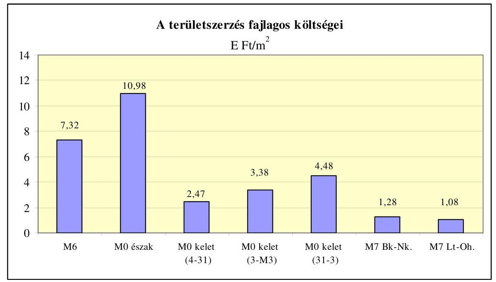

A NIF Zrt. az ellenőrzött 10 szakaszból 4-nél tárgyalásos közbeszerzési eljárást alkalmazott, a többi nyílt eljárás volt. Az M6 és az M70 autópálya szakaszoknál egy ajánlattevőt hívtak meg, így verseny nem volt. Az M70 autópályánál az eljárási módot a NIF Zrt. azzal indokolta, hogy a korábbi szakaszok folytatása az érintett 1 km -es szakasz, ezért a volt kivitelező meghívása célszerű, amelynél a felvonulási költség is megtakarítható. A Közbeszerzési Döntőbizottság (továbbiakban: KBDB) az eljárást törvénysértőnek minősítette és a NIF Zrt.t 4 M Ft pénzbírság megfizetésére kötelezte. Az M6 M0-Érdi tető szakasznál a hirdetmény közzététele nélküli tárgyalásos közbeszerzést, egy pályázó meghívását a NIF Zrt. a Kormány két, 2004. évben, a Metallochemia gyártelepen folyó kármentesítéssel kapcsolatban hozott határozatával indokolták annak ellenére, hogy a Kormány határozatai nem tartalmaztak olyan megkötést, hogy a kármentesítést végző és az autópályát építő azonos legyen. A KBDB az eljárást nem kifogásolta. Az M7 Balatonkeresztúr-Nagykanizsa szakaszoknál a hirdetmény közzétételével induló tárgyalásos közbeszerzési eljárás lefolytatásának valamennyi szakaszában a résztvevők jogorvoslati eljárásokat kezdeményeztek (részvételi szakaszban kettő, az ajánlattételi szakaszban négy, az eljárás eredményével kapcsolatban négy). A NIF Zrt. a benyújtott hat ajánlatból ötöt érvénytelenné nyilvánított, amelyekből háromnál a töltésalapozás műszaki tartalmának nem megfelelőségére hivatkozott. A közbeszerzési eljárás közben vált ismertté az, hogy illegális tőzegkitermelés miatt nem hajtható végre a pálya töltésalapozására az eredeti tervekben szereplő műszaki megoldás, ezért a töltésalapozásra a NIF Zrt. nem dolgozott ki egységes, egzakt feltételrendszert, hiányzott a választható és elfogadható múszaki megoldás objektív mércéje. A NIF Zrt. az eljárás eredményeként egyetlen ajánlatot - PVT-M7 Konzorcium tekintett érvényesnek. A Kbt. 2009 áprilisától hatályos előírása az eljárást eredménytelennek minősíti, ha a benyújtott ajánlatok között csak egyetlen érvényes ajánlat van.

Az ellenőrzött beruházások 70\%-ánál a NIF Zrt. a kivitelezési szerződést átalányáron kötötte meg, amikor a tételes egységárak csak tájékoztatóak, illetve a

---

pótmunkák elszámolásánál alkalmazhatóak. Ez nem tette lehetővé az ajánlatok összehasonlíthatóságát.

A 2006-ban befejezett autópálya beruházások ellenőrzése során megállapítottuk, hogy az Aptv. szerint megépítendő útszakaszok száma meghaladta a lehetséges és alkalmas kivitelezők számát, ami az építési piac felosztásának irányába hatott és a potenciális kivitelezőknek az ajánlati áraik kialakításánál „versenynyomással" nem kellett számolniuk. A 2008-ban befejezett autópálya beruházásoknál a kivitelező cégek azonosak voltak a korábbi években nyertes vállalatokkal, újként a horvát autópálya-szakaszhoz kapcsolódó M7 Letenyeországhatár és M7 Mura-híd beruházások esetén vett részt egy horvát kivitelező cég, valamint az M0 keleti szektor két szakaszánál és az M7 BalatonkeresztúrNagykanizsa szakaszoknál a kivitelező konzorcium tagjaként a Viadom Zrt. (Ez utóbbi társaság ellen a kivitelezés idején felszámolási eljárás indult.)

A NIF Zrt. által megkötött kivitelezési szerződések és az egységes, általánosan érvényes SZF együtt érvényesek, amelyek azt rögzítik, hogy az előre nem látható fizikai akadályok esetében a határidő meghosszabbítható és az állásidőre igazolt költség elszámolható. Ez alapján az M0 északi szektor kivitelezője 824 M Ft költség megtérítésére vonatkozó igényt jelentett be előre nem látható fizikai akadály (vis maior) - a Duna vízállása - miatt, aminek elbírálása még nem fejeződött be. A NIF Zrt.-nél az előre nem látható fizikai akadály esetén az igazolt költségek tartalma, kimutatásának, számításának módja, továbbá a számítás során figyelembe vehető időszak nem volt szabályozva. ${ }^{3}$

A NIF Zrt. a kivitelező tevékenységét, a szerződéses megállapodásban vállalt feladatok teljesítését, a vezetői kooperációs egyeztetéseken és a termelési kooperációs értekezleteken való részvételével kísérte figyelemmel, a rendszeres és folyamatos ellenőrzést a Mérnök feladatává tette.

A NIF Zrt. által kimutatott adatok szerint a 2008-ban átadott autópálya szakaszok hossza $76,2 \mathrm{~km}$, a beruházásokra 2008. december 31-ig kifizetett összeg 270,9 Mrd Ft volt. Ezen belül a kivitelezési költségek 212,6 Mrd Ft-ot tettek ki.

A 2008-ban befejezett autópálya beruházásoknál 1 km autópálya megépítése előkészítéssel együtt átlagosan 3,5 Mrd Ft-ba került. A 2008-ban megépült hidak a teljes építési költség mintegy $40 \%$-át tették ki.

[^0]
[^0]:    ${ }^{3}$ A 2007-ben átadott Dunaújvárosi Duna-híd esetében a szerződéses feltételekben rögzítettek figyelembevételével technológiai állásidő címen 817 M Ft általános költségtérítést kapott a kivitelező.

---

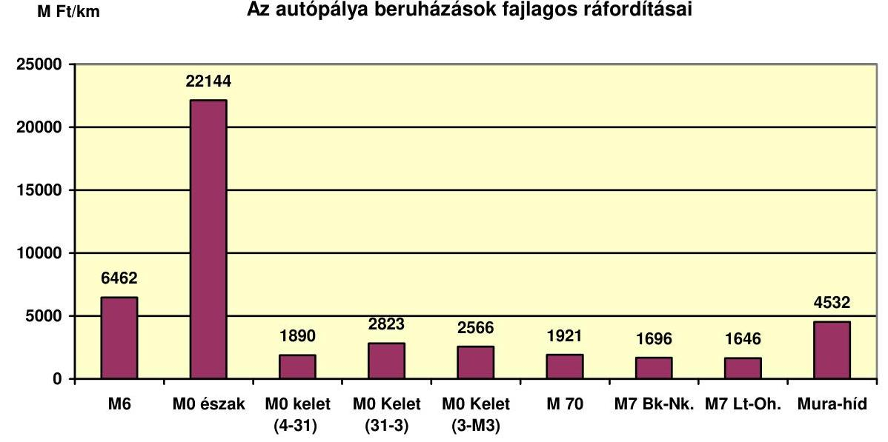

Az M0 északi szektor fajlagos beruházási ráfordítása volt a legmagasabb a Duna híd magas bekerülési értéke miatt. Az M0 északi szektornál negyventagú szakmai és társadalmi zsűri döntött a híd szerkezeti megoldásának kiválasztásáról az elkészült hét változatból úgy, hogy előzetes költségkalkuláció nem készült egyik változatra sem. A döntés során - a NIF Zrt. tájékoztatása szerint főként esztétikai szempontokat vettek figyelembe. A GKM a különleges, hazánkban az eddigiek során nem alkalmazott megoldásokra való tekintettel az NA Zrt. kérésére felmentést adott az útügyi műszaki előírások követelményei alól a Duna-híd tervezésével kapcsolatosan. Az 1862 m hosszúságú híd fajlagos beruházási értéke 29,3 Mrd Ft/km volt. A 2007-ben átadott Dunaújvárosi Duna hídnál, amely azonos sávszámú ( $2 \times 2$ sáv, leállósáv és gyalogos-kerékpár út), közel hasonló hosszúságú, de más műszaki megoldással épült, ez a mutató $25,9 \mathrm{Mrd} \mathrm{Ft} / \mathrm{km}$ volt.

A fajlagos beruházási ráfordítás - az M0 északi szektornál megépült híd és a Mura-híd figyelmen kívül hagyása mellett - az M6 M0-Érdi tető szakasznál a legmagasabb. ${ }^{4}$ Ez annak a következménye, hogy a nyomvonalvezetés miatt a sűrűn elhelyezkedő közművezetékek (közműcsorda) kiváltása a kivitelezési költségek 24\%-át tették ki, a szokásos 3-5\%-kal szemben. A 8,3 km hosszúságú autópálya szakaszon felépült hidak, aluljárók és felüljárók száma 30, a forgalmi csomópontok száma 4 volt. Továbbá a területszerzés fajlagos ára a szakasznál a második legmagasabb volt ( $7345 \mathrm{Ft} / \mathrm{m}^{2}$ ).

[^0]
[^0]:    ${ }^{4}$ Az M0 félpálya szakaszt a bővítés miatt 50\%-os mértékben vettük figyelembe. (M6 8,3 km, M0 1,6 km.)

---

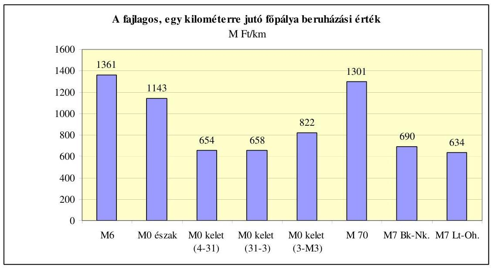

Az egy kilométerre jutó fópálya építési költsége az M6 autópálya M0-Érdi tető esetében volt a legmagasabb és 1361 M Ft -ot tett ki. Közel azonos volt ezzel az M70 autóút Tornyiszentmiklós-országhatár közötti szakasz fajlagos fópálya építési költsége ( 1301 M Ft ). Ezt az okozta, hogy a Szlovén fél kérésére a határátkelőhely miatt a $2 \times 2$ sávon túl még egy sáv épült az országhatár irányába.

Az M70 nyomvonalát a Szlovén Köztársaság és a Magyar Köztársaság kormányai között létrejött egyezmény határozta meg. A Magyarország és Szlovénia által létesítendő gyorsforgalmi közúti kapcsolat megvalósításának kölcsönösen elfogadott és vállalt határideje szerződésben vagy megállapodásban nem volt rögzítve, azt nem hangolták össze. A magyar szakasz 2006. évben, a szlovén szakasznál két évvel korábban készült el. A szlovén fél 2004. decemberben geodéziai eltéréseket tapasztalt az építés alatt álló egymáshoz csatlakozni tervezett szlovén és a már épülő magyar szakaszok tengelyei között. Ennek oka az volt, hogy a magyar tervező nem a szlovén és a magyar fél által 2000. szeptemberben aláírt jegyzőkönyvben meghatározott adriai, hanem a balti szintezési rendszert alkalmazta. Ennek következményeként a magyar szakasz pályaszintje 61 cm -rel magasabb volt a jegyzőkönyvben előírtnál és a csatlakozó szakaszok 2,4 m-rel eltértek egymástól. A szlovén fél észrevételét a GKM úgy ítélte meg, hogy „közlekedési, illetve építési szempontból az eltérésnek nincsen semmi jelentősége". A tervezésből adódó eltérés megoldására az adott lehetőséget, hogy a szlovén szakasz később épült meg, amelynek során a kivitelező figyelembe tudta venni a magyar szakasz koordinátáit.

Az autópálya beruházásokat gazdaságossági, hatékonysági, eredményességi mutatók alapján a NIF Zrt. nem értékelte, erre vonatkozó elvárást a GKM (KHEM) sem írt elő. Az ellenőrzés során a NIF Zrt. közremüködésével határoztuk meg - többek között - a forgalom orientált hatékonysági mutatót. Az átlagos napi forgalom/1 km-re jutó kivitelezési ráfordítás alakulásának vizsgálata alapján az M0 autópálya keleti szektor volt a leghatékonyabb fejlesztés. A legalacsonyabb hatékonyságú fejlesztés az M0 északi szektor volt, annak ellenére, hogy nem készült el a környezetvédelmi engedélyben kötelezően előírt Budakalászt elkerülő út, valamint Szigetmonostor részére a közúti híd. Az alkalmazott mutató rávilágít arra, hogy a Megyeri híd beruházás hatékonyságára ható té-

---

nyezők közül a híd további forgalmi kapcsolatainak bővítése jelenti a garanciát a beruházás hosszú távú hasznosulására.
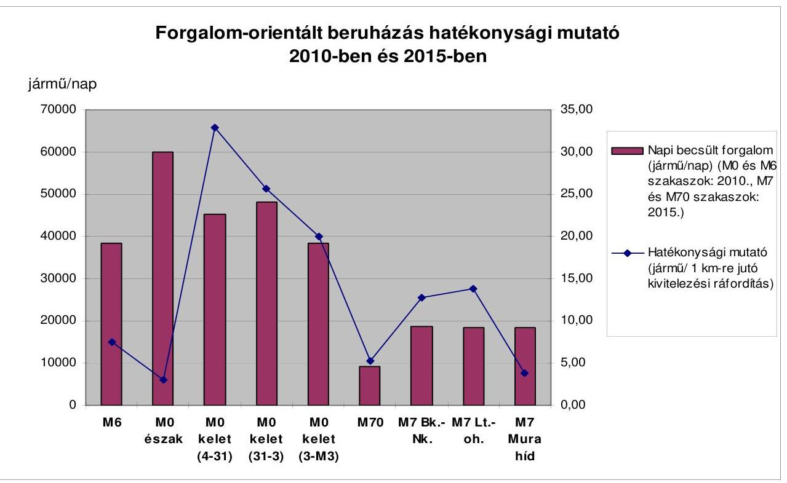

A fajlagos költségadatok (pl. $1 \mathrm{~m}^{3}$ beton, vasbetonoszlop, 1 tonna acél felszerkezet) 50-170\%-kal tértek el az egyes szakaszok között. A költségvetési tételek értelmezése önkényes és projektfüggő. Ez azzal függ össze, hogy az erőforrások fajlagos felhasználásának, a normáknak, az árlistáknak (munkaerő, anyag, gép, szállítás), az árengedményeknek és az alkalmazott fedezetnek az elfogadható mértéke nem volt szabályozott.

A NIF Zrt. kimutatása alapján az ellenőrzött autópálya szakaszok finanszírozása 69\%-ban költségvetési forrásból, 15\%-ban európai uniós forrásból, 14\%-ban hitelből történt, 2\% fedezete a NIF Zrt. saját tőkéje volt. Európai uniós forrás az M0 keleti szektor beruházást finanszírozta. Az M7 autópálya BalatonkeresztúrNagykanizsa szakasznál a támogatási kérelmet benyújtották, döntés a helyszíni ellenőrzés lezárásáig nem született. (A 2007-ben befejezett autópálya beruházásoknál a hitel aránya $57 \%$ volt.)

Az ellenőrzött autópálya szakaszoknál a kivitelezők (fővállalkozók) részére teljesített kifizetések a szerződésnek megfeleltek, teljesítésigazolásokkal alátámasztottak voltak. A NIF Zrt. a fővállalkozókkal áll szerződéses kapcsolatban, a 10\% alatti alvállalkozókról, valamint a fővállalkozók és az alvállalkozók közötti elszámolásokról a NIF Zrt.-nek nincs információja.

A szerződéses megállapodásban előírtaktól eltérően a műszaki átadás-átvételi eljárások megkezdéséig nem készültek el a minősítési dokumentációk. Az eljárásokat jelentős számú hiánypótlási, hibajavítási tétel mellett zárták le. A legnagyobb volumen (mintegy 1000 tétel) az M0 északi szektornál volt. Ez azt mu-

---

tatja, hogy a műszaki átadás-átvétel egy része nem a szükséges készültségi szintet elérő időpontban kezdődött meg.

A jótállási időszakban a NIF Zrt.-hez érkezett hibabejelentések nyilvántartása jól áttekinthető. A bejelentett hibák ( 329 db ) döntően az útburkolathoz (hullámosság, süllyedés, repedés, kátyú, vízmegállás), illetve rézsúkimosódáshoz kapcsolódtak. Mindezek okai a kedvezőtlen talajviszonyokon túlmenően a talaj konszolidációs folyamatok teljes lezajlása előtti burkolatépítések, az alapréteg építési és aszfalt rétegvastagsági hiányosságok (M7 BalatonkeresztúrNagykanizsa szakasz), víztelenítő rendszerben keletkezett hibák (M0 keleti szektor).

A tervtől és/vagy a vonatkozó előírásoktól eltérő kivitelezések miatt jelentkező hiányosságok, kockázatok egy autópálya szakaszra jutó átlagos száma 7 db volt. A felhasználók szempontjából alapvető fontosságú utazáskényelmi méréseket az ellenőrzött autópálya szakaszok közel felénél nem végezték el, mivel azt a NIF Zrt. nem írta elő. Az aszfalt útburkolatok hamarabbi tönkremenetelének kockázatát növelte, hogy több autópálya szakasznál nem vagy csak részben építettek feszültségelnyelő réteget (M6 M0-Érdi tető, M70 és M7 Balatonkeresztúr-Nagykanizsa). Nem megfelelő burkolatvastagság, illetve minőség volt az M6 M0-érdi tető, az M0 keleti szektor két szakaszának hét különböző kilométer szelvényhosszában. A NIF Zrt. a nem megfelelőségek miatt minimális összegű (pl. 163 ezer Ft és 487 ezer Ft) minőségi levonást érvényesít, illetve a jótállási időtartamot növeli.

A helyszíni ellenőrzés megállapításainak hasznosítása mellett javasoljuk:

# a Kormánynak 

1. Kezdeményezze az Aptv. módosítását annak érdekében, hogy a törvény írja elő a gyorsforgalmi útfejlesztések megvalósítása előtt költséghaszon-elemzés készítését.
2. Vizsgálja meg - a gyorsforgalmi utak építésének közérdekűségére való tekintettel - a szakhatósági, önkormányzati, civil szervezeti igények központi, koordinált módon való kezelésének lehetőségét, az ehhez rendelhető olyan eszközrendszert, ami az idő- és költséghatásokat kezeli.

## a közlekedési, hírközlési és energiaügyi miniszternek

1. Követelje meg a NIF Zrt.-től, hogy az autópálya beruházások előkészítése során készítsen előzetes költségkalkulációt.
2. Alakítsa ki az autópálya beruházások értékelési rendszerét hatékonysági, eredményességi és gazdaságossági mutatók alapján, alkalmaztassa azt a tervezési és vezetési folyamatokban és az ezek alapján meghozott intézkedések hasznosulását évente beszámoló keretében értékelje.
3. Intézkedjen a NIF Zrt.-nél annak érdekében, hogy a társaság

---

a) közvetlenül ellenőrizze a kivitelezők és a Mérnök szervezetek tevékenységét a beruházások lebonyolítása alatt;
b) az ügyvédi irodákkal - a területszerzési feladatok elvégzésére - megkötött szerződésekben írjon elő teljesítési határidőt, az ügyvédi késedelemre szankciót, valamint követelje meg a szerződés szerinti beszámolók teljesítését;
c) szabályozza a szerződéses feltételekben rögzített előre nem látható fizikai akadályok esetén az igazolt költségeket (azok tartalmát, számítási módját stb.) és a határidő hosszabbítás során figyelembe vehető időszakot.

---

# II. RÉSZLETES MEGÁLLAPÍTÁSOK 

## 1. HATÉKONYSÁGI, EREDMÉNYESSÉGI ÉS GAZDASÁGOSSÁGI (3E) ÉRTÉKELÉS AZ ÚTSZAKASZOK TÉNYLEGES KÖLTSÉGVETÉSE ALAPJÁN

A gyorsforgalmi úthálózat fejlesztések keretében a legfőbb cél egy olyan fenntartható közlekedési rendszer kialakítása volt, amely figyelembe veszi az aktuális társadalmi-gazdasági és környezetvédelmi körülményeket és megfelel a jövőbeni követelményeknek ${ }^{5}$. A tanulmányok a forgalomba helyezést megelőzően mintegy 1 évtizeddel készültek, illetve az EU projektek esetében a pályázati dokumentáció részeként 2004-ben a gazdasági értékelést a Balatonkeresztúr és Nagykanizsa közti szakaszra és az M0 keleti szektorra aktualizálták.

Az aktuális gazdasági és pénzügyi értékelést megnehezíti az a tény, hogy a gazdasági számítások óta öt-tíz év telt el, és az európai közlekedési folyosókhoz tartozó országok gazdasági helyzete, hálózatfejlesztési stratégiája időközben megváltozott. ${ }^{6}$ Az igény előrejelzések megbízhatósága a változó környezetben nem lehetett megfelelő pontosságú. Összességében a közúti tervezéshez használt költség-haszon elemzésekben kimutatott használói előnyök adatait, kiinduló értékeit és dokumentumait a tulajdonos nem aktualizálta, amelyet a gazdasági és társadalmi környezet változásai indokolttá tettek.

### 1.1. A 2008-ban átadott autópálya beruházások múszaki öszszetétele

A 2008-ban átadott autópálya szakaszok összes hossza $76,2 \mathrm{~km}$ volt, az építési költségek 212,6 Mrd Ft-ot tettek ki. A 2008. évi gyorsforgalmi úthálózat fejlesztés építése során átlagosan 2,6 Mrd Ft-ba került 1 km autópálya építése a hozzá kapcsolódó építményekkel együtt.

A főcsoportonkénti és szakaszonkénti építési költségadatokat tartalmazó 2. sz. melléklet a 2008-ban átadott autópálya szakaszok múszaki összetételét mutatja és hasonlítja össze.

[^0]
[^0]:    ${ }^{5}$ Ennek a célnak a számszerúsítését jelentették a megvalósíthatósági tanulmányokban és gazdasági és pénzügyi értékelésekben meghatározott közgazdasági mutatók (nettó jelenérték, belső megtérülési ráta, stb.), amelyek számítása során egyaránt figyelembe vették a kiadásokat (építési költség, fenntartási költségek), és közvetlen hasznokat (időmegtakarításokat, jármú üzemköltség megtakarításokat, baleset megtakarításokat), továbbá közvetett társadalmi hasznokat például a környezetvédelem területén.
    ${ }^{6}$ Ebből következik az, hogy például a GDP tervezett alakulásából levezetett jármúkilométerek növekedése már másképp prognosztizálható, a költséghaszon mértékét alapvetően befolyásoló utazási idő megtakarítások tendenciái átértékelendők és a diszkontráták értékei is felülvizsgálatra szorulnak. A térségek változó gazdasági fejlődéséből eredően, a közlekedési hálózatfejlesztések eltérő üteme miatt a közlekedési modellek, a forgalomáramlások aktualizálása időszerűvé vált.

---

Az M0 északi szektort és a Mura hidat egyértelműen a hídépítés jellemezte. Az M6-os autópálya szakasz átlagosnál nagyobb építési költségeit az átlagosnál magasabb értékủ közmúépítés okozta. A Megyeri híd és a Mura-híd építési szakaszainak 1 km -re vetített költségmutatói a kis szakaszra jutó hídépítési költségek miatt nagyobbak az átlagosnál.

Az építmény főcsoportonként tapasztalt költségarány szóródás mértéke miatt a szakaszok gazdaságossági kritérium szerinti összehasonlítását - az 1 km -re eső fajlagos építési költségek mutató szerint - elfogadható szakmai korrektséggel nem lehet végrehajtani.

# 1.2. Hatékonysági indikátorok kialakítása és összehasonlítása 

## - Forgalom orientált beruházás hatékonysági mutató (az átlagos napi forgalom (ÁNF) és a szakaszok 1 km -re eső fajlagos építési költségeinek aránya) ${ }^{7}$

A mutató alapján az M0 keleti szektor szakaszai voltak a leghatékonyabb fejlesztések. Az M7-es szakaszok még 2015-ben sem érik el az M0 keleti szektor 2010-re előre jelzett hatékonyságát. Az M0 északi szektor alacsony hatékonysági mutatója alapvetően az adott rövid szakasz $16 \mathrm{Mrd} \mathrm{Ft} / \mathrm{km}$ fajlagos építési költségéből következik, amelyben szerepe van a híd szakmai és kulturális örökség jellegének, továbbá a vízbázis védelmének. A híd hatásterülete nemcsak erre a rövid szakaszra vonatkozik, a többi szakaszra tett forgalomnövelő hatást hatékonyságnövelő tényezőként indokolt számításba venni. Ugyanakkor a mutató rávilágít arra is, hogy a Megyeri híd beruházás hatékonyságára ható tényezők közül a jövőben a híd további forgalmi kapcsolatainak bővítése jelenti a garanciát a beruházás hosszú távú hasznosulására.

| Autópálya | Becslés   ideje | Napi becsült   forgalom   (jármú/nap) | Kivitelezési   költség   (M Ft) | Autópálya   hossza   (km) | Hatékonysági   mutató (napi   becsült forga-   lom/1 km-re jutó   kivitelezési költség) |
| :--: | :--: | :--: | :--: | :--: | :--: |
| M6 | 2010. | 38300 | 50369 | 9,9 | 7,53 |
| M0 észak | 2010. | 60000 | 68860 | 3,4 | 2,96 |
| M0 kelet (4-31) | 2010. | 45300 | 9222 | 6,7 | 32,91 |
| M0 kelet (31-3) | 2010. | 48100 | 20485 | 10,9 | 25,59 |
| M0 kelet (3-M3) | 2010. | 38400 | 17041 | 8,9 | 20,06 |
| M70 | 2015. | 9184 | 2088 | 1,2 | 5,28 |
| M7 Bk.-Nk. | 2015. | 18650 | 51634 | 35,5 | 12,82 |
| M7 Lt.-oh. | 2015. | 18480 | 1476 | 1,1 | 13,77 |
| M7 Mura-híd | 2015. | 18480 | 977 | 0,2 | 3,78 |

[^0]
[^0]:    ${ }^{7}$ A mutató kifejezi mind az adott szakasz, mind a csomópontok vetületében a beruházások forgalmi adatok szerinti hatékonyságát. Ez alkalmas a forgalomtól leginkább függő hasznok alakulásának és költségek arányának kimutatására, a csomópontok megépítésének gazdaságossági indoklására, függetlenül a közutak tervezésében szereplő 2 km -es minimál távolság teljesítésének alakulásától, és nemzetgazdasági és a lokális érdekek közti eltérésekre ráirányítja a figyelmet.

---

A forgalomorientált beruházás hatékonysági indikátor 10-es érték alatti alakulása mutatja a viszonylagosan alacsonyabb beruházási hatékonyságot.

# - Autópályák pályaszerkezeteinek hatékonysági mutatója (fópályán) szakaszonként ${ }^{8}$ 

A 2008-ban átadott autópálya szakaszokon az $1 \mathrm{~m}^{2}$ pályaszerkezet építési költsége (útalapok, kötőrétegek és kopórétegek együttesen) átlagosan $10 \mathrm{E} \mathrm{Ft} / \mathrm{m}^{2}$ körül alakultak (3. sz. melléklet). Tekintettel arra, hogy milliós nagyságrendú burkolati felületek valósultak meg, az átlagártól való kis eltéréseknek is a hatása hatványozottan jelentkezett. A pályaszerkezeti rétegek meghatározása során a lokális, talajmechanikai, kőbánya közelségekből nyerhető gazdasági előnyök feltárása még nem épült be a tervezési folyamatokba.

A beton és aszfalt pályaszerkezetek hatékonysági indikátorai közel azonosak voltak. Ugyanakkor az M6-os autópályához kapcsolódó M0 9+400-12+500 kmsz. közötti beton burkolattal épült szakaszon kialakult kétszeres költség/m² fajlagos mutató kiemeli annak létjogosultságát, hogy a főbb szerkezetek vonatkozásában részletes egységárelemzésekkel, normákkal és erőforrás árakkal (kivitelező, Mérnök, beruházó által igazoltan) is szükséges alátámasztani és átláthatóvá tenni a pályaszerkezetek építési költségeinek megalapozottságát.

Az M0 autópályán a betonpálya szerkezet árának elfogadásakor a költségnövelő tényezők közé sorolta a Mérnök azt, hogy a kivitelező a forgalom mellett épített, többször felvonult, továbbá figyelembe vette az építési feladatok kisebb volumenét, a sajátos organizációs feltételeket.

## - Hídépítési hatékonysági mutató (Költség/hasznos hídfelület indikátor a hídtípusok és fesztávok függvényében) ${ }^{9}$

A 2008-ban megépült hidak a teljes építési költség mintegy 40\%-át jelentik. Az azonos típusú hidak költség fajlagosainak eltérései az átlagtól eltértek $\pm$ 20-25\%-os arányban. Az esztétikai igények jóváhagyott teljesítése, például a Megyeri hídnál külön befolyásolta az építési költségeket. A hídépítési hatékonysági mutatók alakulását előregyártott hídgerendás hidak esetében a 4. sz. melléklet, vasbeton hidak esetében a 5. sz. melléklet, az acélszerkezetű hidak esetében az 6. sz. melléklet részletezi.

Az ellenőrzés során az összes 76 db előregyártott hídgerendás hidat 22,8 Mrd Ft összértékben értékeltük. Az előregyártott gerendás hidak hatékonysági mutatóinak diagramja szerint a 10 és 30 méter közötti fesztávú hidak építési költsége szinte fesztáv független. A $261 \mathrm{E} \mathrm{Ft} / \mathrm{m}^{2}$ átlagtól való eltérés mértéke plusz-mínusz 40-60 E Ft/m² volt.

[^0]
[^0]:    ${ }^{8}$ A mutató alkalmas az előkészítési ciklusban, a pályaszerkezeti rétegrendek tervezésekor a költségcél elérésének ösztönzésére. A kivitelező kiválasztásakor a mutató alkalmas a gazdaságossági kritériumok összehasonlítására, továbbá a versenyhelyzet, az organizációs feltételek hatásainak mérlegelésére.
    ${ }^{9} \mathrm{Az} 1 \mathrm{~m}^{2}$ hasznos hídfelület fajlagos költségére leginkább ható tényezők közé tartozott a funkció, (Duna híd, Völgyhíd, autópálya híd), a hídépítés típusa, technológiája (acélszerkezetű, öszvér, betolt, monolit, előregyártott hídgerendás) és a hídnyílások hossza.

---

A monolit vasbeton nyílt keretü hidak átlagosan $246 \mathrm{E} \mathrm{Ft} / \mathrm{m}^{2}$, a vasbeton monolit felszerkezetü hidak $322 \mathrm{E} \mathrm{Ft} / \mathrm{m}^{2}$, a vasbeton tolt felszerkezetü hidak $404 \mathrm{E} \mathrm{Ft} / \mathrm{m}^{2}$, az öszvér szerkezetű hidak $363 \mathrm{E} \mathrm{Ft} / \mathrm{m}^{2}$ áron épültek. Az átlagártól való eltérések esetenként szélsőségesek, például az M0 északi szektorban $774 \mathrm{E} \mathrm{Ft} / \mathrm{m}^{2}$ áron is előfordult hídépítés. A hatékonysági indikátorok szórása azt mutatta, hogy csak a gazdaságossági indikátorokkal, esetenként a szerkezetek egységárelemzésével együtt lehet szakmailag korrekt hatékonysági öszszehasonlítást végezni.

A 2008-ban megépült hidak fesztávonkénti és hídfelület arányos fajlagos költségeinek összehasonlítása megerősítette, hogy indokolt a műszaki-gazdasági tervezési hatékonyságot fokozó intézkedések előírása, és olyan NIF Zrt. által elindított innovatív kutatások folytatása, mint például az előre gyártott vasbeton gerendás hidaknál a közbenső autópálya híd-pillérek elhagyása. Az acélszerkezetü hidak esetében a munkák tételrendje összevont, nem kellően részletezett, mivel például az $1 \mathrm{~m}^{2}$ hasznos felületre eső fajlagos költség elérte az 1,3 M $\mathrm{Ft} / \mathrm{m}^{2}$ értéket az M0 északi hídnál.

# 1.3. Gazdaságossági indikátorok 

- Főbb pályaszerkezeti rétegek fajlagos költségadatai szakaszonként (7. sz. melléklet)

A pályaszerkezeti rétegek egységárainak összehasonlítása során szakaszonként jelentős eltérések voltak a jellemzőek. A betonburkolatok esetében $1 \mathrm{~m}^{3}$ beton burkolat épült 24 E Ft-ért és 51 ezer Ft-ért is. Cementstabilizáció készült $6 \mathrm{E} \mathrm{Ft} / \mathrm{m}^{3}$ és $13 \mathrm{E} \mathrm{Ft} / \mathrm{m}^{2}$ áron is. A kopórétegek (például mZMA.11/NM) 43-68 E Ft/m² tartományban épültek.

- Főbb hídszerkezetek fajlagos költségadatai szakaszonként (8. sz. melléklet)

A számított hídszerkezeti gazdaságossági mutatók szórása viszonylag nagy volt. Például a cölöp összefogó gerenda minimuma és maximuma között háromszoros szorzó volt. Pillér, vasbeton oszlop épült $100 \mathrm{E} \mathrm{Ft} / \mathrm{m}^{3}$ és $250 \mathrm{E} \mathrm{Ft} / \mathrm{m}^{3}$ áron is. Az acélszerkezetű hidak ugyanazon költségvetési tételszáma szerint 1 tonna acél felszerkezet gyártása és szerelése 660 E Ft és 1300 E Ft között alakult. Mindezen tételek értékeinek szórására egyfelől hatott az ajánlati dokumentációk részeként kidolgozott méret és mennyiség kimutatás részletessége (a NIF Zrt. tételrendje szerint), másfelől a kivitelezők versenystratégiája. A két hatás elkülönítésének előfeltételét szolgáló részletesebb tételrend kidolgozása a 2008-ban átadott projekteknél még nem valósult meg. A NIF Zrt. az ÁSZ 2007. évi autópályákra vonatkozó ellenőrzése során tett javaslatai alapján a tételrendjének fejlesztését, hidakra típus költségvetések kidolgozását és az egységárelemzésen alapuló költségtervezést és értékelést elindította.

- Előregyártott feszített hídgerendák (9. sz. melléklet)

A gazdaságossági mutatók szerint a hídgerendák az M0 autópályán a 60-70 E $\mathrm{Ft} / \mathrm{fm}$ értéktartományba estek, alapvetően függetlenül alakultak a 10 és 30 méter közötti gerendahosszak alakulásától. Az M6-os szakasz esetében ez az értéktartomány mintegy 10 E Ft-al magasabb volt folyóméterenként. Az M7 Balaton-keresztúr-Nagykanizsa szakaszon 40 E Ft és 80 E Ft értéktartományban szórtak hidanként az adatok. Az adott szakaszon nem dokumentált az, hogy miért kerülhet ugyanazon gerenda (például 25 m hosszúságú) 30 illetve 80 E Ft-ba.

---

- Fúrt cölöpök fajlagos költségei átmérőként szakaszonként (10. sz. melléklet)

A gazdaságossági mutató szerint a 80 cm átmérőjű fúrt cölöpök 1 fm -ének építési költségei az M0-nál a 40-50 E Ft/fm tartományba estek. Mind az M7-es, mind az M6-os vizsgált szakaszokon ugyanezen szerkezet előállítása mintegy 50\%-kal drágább volt. Egységárelemzés hiányában az eltérések mértékét befolyásoló műszaki, organizációs tényezők hatása nem átlátható és az eltérést a versenyhelyzet önmagában nem indokolja.

Az elemzett gazdasági mutatók szórása összességében hasonló volt mint a hatékonysági mutatóké.

Az erőforrások fajlagos felhasználásával, normáival, árlistájával (munkaerő, anyag, gép, szállítás), az elérhető anyagbeszerzési árengedményekkel és az alkalmazott fedezet mértékével (20-30\% között) kapcsolatos egyeztetett álláspontok a Mérnök árak képzésekor és a projektfüggő egyedi árdöntések esetében nem volt követhető, nem volt szabályozott. A műszaki-előkészítésre rendelkezésre álló idő hiányának következményeként (amikor például még nem tudni mennyi vasszelés lesz majd a pillérekben, még nem ismertek a talajviszonyok, stb.) kényszerhelyzetben indokolt volt az összevont költségvetési tételek alkalmazása az ajánlati dokumentációban, de ennek kockázati felára terhelte a költségvetést. A közlekedési ágazatban a költségvetési tételek értelmezése önkényes és projektfüggő, a regionális vagy országos szintű gazdaságossági összehasonlítások egzaktul nem valósíthatóak meg, mivel az erőforrások fajlagos felhasználásának, a normáknak, az árengedményeknek az elfogadható mértéke nem szabályozott.

A hatékonyságot befolyásoló tényezők igen sokrétűek és több döntési pontban jelentkeztek. Számos területen hatékonyságjavító tartalékokkal rendelkezik még az autópálya beruházások megvalósításában érintett szervezetrendszer.

Az eddig megtett intézkedések mellett az ellenőrzési tapasztalatok, a NIF Zrt., tervezők, Mérnökök fókuszcsoportján elhangzottak alapján hatékonyságjavító beavatkozási területek jelölhetők ki, amelyek részletesen az 1. sz. függelékben találhatóak.

A NIF Zrt. létrehozott egy költségtakarékosságra fókuszáló munkacsoportot, amelynek munkaprogramja az autópálya építések hatékonyságának fokozását (innováció, termékbeszerzés, stb.) célozza. Ez a program összhangban áll az előbbiekben jelzett tényezők értékelésével. Ugyanakkor a még fejlesztés alatt álló programnak a megvalósítását a jövőben belső és külső utóellenőrzés keretében évente szükséges értékelni.

# 2. Az M0 ÉsZAKI SZEKTOR BERUHÁzÁs 

### 2.1. A beruházás feltételrendszere és előkészítése

Az M0 útgyűrű megvalósításának fontosságát az 1980-as évek közepén felismerte az állami vezetés, megjelent a budapesti agglomeráció regionális rendezési tervének jóváhagyásáról szóló 1027/1986. (V. 22.) MT határozat, amely 2008. január 1-jéig volt hatályban. Ez alapján a fővárosi kerületek rendezési

---

terveiben 1988 végéig, a Pest-megyei települések rendezési terveiben 1989-ig kellett átvezetni a határozat által meghatározott nyomvonalat. A KHEM szerint az MT határozat által előírt intézkedéseket az M0 északi szektor érintett pest megyei települései nem hajtották végre. Az a körülmény is erre utal, hogy az érintett települések a rendezetlenségre hivatkozással megtagadták az építkezéshez szükséges engedélyeket.

Az 1027/1986. (V. 22.) MT határozat mellékletét képező Rendezési Terv Közúti Hálózati tervlapja 1985-ben tartalmazta az M0 nyomvonalát, amitől - a KHEM-től kapott információk szerint - az M0 északi szektor 1993-ban elfogadott végleges nyomvonala alapvetően nem tér el. A végleges nyomvonalat a Közlekedési, Hírközlési és Vízügyi Minisztérium (továbbiakban: KHVM) 1993-ban hagyta jóvá.

A jogerős építési engedély kiadására 2004-ben került sor, az addig eltelt 11 évben a térségben található önkormányzatok és civil szervezetek ellenállása miatt az engedélyezésben érdemi előrelépés nem történt.

Az Aptv. megjelenésekor 2006. év végéig írta elő az M0 északi szektor átadását, ami a 2005. április 6-i módosítását követően 2007. végére változott. A tényleges ideiglenes forgalomba helyezés 2008. szeptember 30-án volt. Az Aptv. az M0 északi szektor megvalósítását - 2005. december 31-éig történt módosításáig - a 10. sz. főút fejlesztésével együtt írta elő, ezt követően a 10. sz. főút fejlesztésére vonatkozó rész az Aptv.-ben már nem szerepelt.

Az Aptv. az M0 északi szektor autópályaként történő megépítését írta elő, azonban a tervezés és előkészítés, valamint megvalósítás során autóút megvalósítására vonatkoztak a munkák, a szakasz - a Duna-híd kivételével - autópályává nem fejleszthető autóútként került átadásra.

Az M0 autóút észak szektorának építését megelőzően 1998 augusztusában a Közlekedési és Hírközlési Minisztérium készített előzetes megvalósíthatósági tanulmányt.

Az 1994 februárjában elkészített előzetes környezetvédelmi hatásvizsgálat (továbbiakban: EKH) egy nyomvonaltervet vizsgál.

A hatásvizsgálat felhívja a figyelmet arra, hogy az építés idejére igénybe vett területek regenerálódása az építés megkezdésétől számítva mintegy 20 évet is igénybe vehet. Ezért a beruházás egy ütemben való kivitelezése indokolt, mivel a több ütemben történő megvalósítás magával vonja a területek többszöri megbolygatását, későbbi regenerációját. Megállapítják, hogy megfelelő előkészítés és műszaki megoldások révén elkerülhető az olyan környezeti terhelés, amely helyrehozhatatlan károkat okozna, az építési reorganizációs tervhez külön környezetvédelmi hatásvizsgálatot kell készíteni.

Az M0 autóút északi szektorának a részletes környezetvédelmi hatásvizsgálata, (továbbiakban: RKH) környezetvédelmi intézkedési terve, valamint a területrendezési szakvélemény 1994. júniusban készült el.

Az RKH szerint az autóút megépítésének hatása vízügyi szempontból terhelő, illetve elviselhető. A tájban okozott változások alapján hatásjavító, az élővilágra gyakorolt hatás alapján elviselhető, a homoktóvis élőhelyén javulás várható. A

---

területhasználatokban okozott változások miatt a minősítés: zavaró. A környezetvédelmi intézkedési tervben szereplő javaslatok végrehajtásával a hatások öszszessége várhatóan kedvezőbb.

A területrendezési szakvélemény megállapítja, hogy a nyomvonal optimális vonalvezetésű, az egyes terület-felhasználási egységektől megfelelő távolságot tart, azonban két nyitott problémát hagy.

Az egyik a Szigetmonostor által kért szigeti lehajtó, amely ellentétes a fővárost ellátó vízművek biztonsági szempontjaival és a sziget környezetvédelmi kérdéseivel. Ez a szigeti lehajtó végül nem épült meg.

A másik a Budakalászt és Ürömöt érintő „végállomás" szerep káros hatása. A két község központján keresztül vezető útvonal nem alkalmas a várható többletterhelés fogadására. A tanulmány a probléma megoldását az északi-szektor 10. számú fơútig történő továbbépítésében látta.

Az M0 északi híd átadása előtti és utáni forgalmi méréseket a Közlekedés Fővárosi Tervező Iroda Kft. (továbbiakban: Közlekedés Kft.) végezte 2008. május hónapban valamint 2008. októberben és decemberben.

A Közlekedés Kft. által készített forgalmi mérésekről készített összefoglaló szerint az M0 északi híd átadása a MÁV Esztergomi vonal, illetve a körvasúton belüli területeken forgalomcsökkentő hatást hozott. Az M0 északi híd átadása után a legjelentősebb visszaesés az Árpád hídon volt, ahol a forgalomcsökkenés 23,7-37,3\%-os volt. Csökkent a Szentendrei út és a XIII. kerület Váci út forgalma is az Árpád híd és az Aquincumi híd közötti szakaszán.

Az M0 északi szektor nyomvonala többszöri önkormányzati egyeztetés és lakossági fórum után vált véglegessé.

A jóváhagyott nyomvonal alapján az UNITEF'83 Műszaki Fejlesztő és Tervező Kft. elkészítette az M3 autópálya és a 11. számú fơút közötti szakasz engedélyezési tervét, az RKH-t, és 6 változatban tanulmánytervet az északi Duna-hídra. Negyventagú szakmai és társadalmi zsűri döntése után építési engedélyt az időközben pótlólagosan elkészített 7M változatra kértek. Előzetes költségkalkuláció a különböző változatokra nem készült.

A NIF Zrt. tájékoztatása szerint a szakmai és társadalmi zsűri döntése során főként esztétikai szempontokat vett számításba a híd szerkezeti megoldásának kiválasztása során. A cél „Budapest gyönyörü, új kapujának" megvalósítása volt. Az olcsóbb, de egyben jellegtelenebb, úgynevezett „gerenda" hidak építését el akarták kerülni, hiszen ezekből már több is van Budapesten (pl. Árpád híd, a Margit híd, Petőfi híd). Valami egyedit, különlegeset, a mai műszaki, technikai színvonalnak megfelelőt akartak létrehozni.

A tervezők kiválasztása közbeszerzési eljárás mellőzésével történt 2002 évben, a kiválasztásra vonatkozó dokumentumok nem álltak a vizsgálat rendelkezésére.

Az NA Zrt. az engedélyezési terveket készítő tervezők kiválasztásakor a Magyar Fejlesztési Bank Rt. tulajdonában volt, nem tartozott a közbeszerzésekről szóló 1995. évi XL. törvény hatálya alá.

---

Az M0 északi Duna-híd engedélyezési tervének elkészítésére a szerződést 2002. április 19-én kötötték meg a CÉH Rt.-vel, a tervezési díj 586400 E Ft+áfa volt. A híd pesti és budai közúti kapcsolatrendszer kialakításának engedélyezési terveit az Unitef'83 Rt. készítette a 2000. december 22-én megkötött tervezési szerződés alapján, a tervezési díj 96 M Ft+áfa volt.

Az NA Zrt. - az engedélyezési szerződésekhez kötődő kizárólagos szerződési és egyéb jogok, szerződéses kötelezettségek és a célszerűség miatt - a kiviteli tervek kidolgozását az engedélyezési tervek elkészítőivel végeztette el.

Az Unitef'83 Rt.-vel a közúti kapcsolatrendszer kialakítása kiviteli terveinek elkészítésére 2003. június 3-án megkötött szerződésben rögzített tervezési díj 118 M Ft+áfa volt, teljesítési véghatáridőként 2004. március 31-ét jelölték meg. A szerződés 5 alkalommal módosult. A módosításra 2 alkalommal - 2004. március 17-én és 2005. június 30-án - pótmunkák elfogadása (híd és gyűjtő-elosztó sáv tervezése, környezetvédelmi monitoring vizsgálati anyag készítése, fakivágási tervek, közmú kiváltási tervek, forgalomtechnikai és szerkezeti tervek, stb.) és a jogerős építési engedély kiadásának időbeli csúszása miatt került sor.

A további 3 szerződésmódosításra (2004. augusztus 18-án, 2004. december 13-án és 2005. október 14-én) a véghatáridő elcsúsztatása miatt került sor, ami az építési engedély hiánya miatt következett be. A többszöri módosítás hatására a tervezési díj 149 M Ft+áfa összegre emelkedett (26,4\%), a teljesítési véghatáridő pedig 2004. március 31-éről 2006. június 30-ára módosult.

A CÉH Rt.-vel az északi Duna-híd kiviteli terveinek elkészítésére 2003. május 22-én megkötött szerződésben rögzített tervezési díj 1198 M Ft+áfa volt, teljesítési véghatáridőként 2004. március 31-ét jelölték meg. A tervezési szerződés 2 alkalommal módosult, amelynek során a díj nem változott, az elvégzendő feladatok határidejét érintették a módosítások.

Az NA Zrt. 2004. április 30-án kiegészítő, hirdetmény közzététele nélküli tárgyalásos közbeszerzési eljárást kezdeményezett a híd tervezési feladatok bővítésére „a hídszerkezet alapozás fúrt cölöpjeinek próbaterheléses vizsgálatával". A közbeszerzési eljárásra a Kbt. 70. § alapján került sor, mivel az NA Zrt. 2004. április 30-i - a KBDB felé tett - bejelentése szerint előre nem látható körülmények folytán az építési beruházás teljesítéséhez az eredeti szerződésben nem szereplő kiegészítő szolgáltatásnak a korábbi nyertes ajánlattevővel való elvégzése vált szükségessé.

A tárgyalásos eljárás során a CÉH Rt. módosította ajánlatát, és a tervezési feladatokra 195 M Ft díjazás ellenében vállalkozott, 2004. augusztus 15-i tervszállítási véghatáridővel. A kiegészítő jellegű tervezési szerződést 2 alkalommal módosították, amelynek következtében a tervezési díj 209 M Ft+áfára, a határidő 2005. február 10-re változott.

A szakasz létesítését a Pest Megyei Közlekedési Felügyelet a 2005. január 25-én kelt építési határozatával engedélyezte.

A határozattal szemben Budakalász Nagyközség Polgármestere fellebbezést nyújtott be, a fellebbezés ügyében eljáró II. fokú közlekedési hatóság, a Közlekedési Főfelügyelet az építési engedélyt a 492/13/2005. számú, 2005. június

---

6-án kelt határozatával helybenhagyta, ezáltal az építési engedély a közlés napjával, 2005. július 13-ával jogerőssé vált.

A Nemzeti Közlekedési Hatóság az M0 északi szakasz ideiglenes forgalomba helyezését 2008. szeptember 30-tól engedélyezte. Az engedély során felülbírálta Budakalász Nagyközségnek, valamint Szigetmonostor és Pócsmegyer Községeknek a forgalomba helyezést elutasító határozatát, azok megalapozottságát megkérdőjelezve és hatásköri túlterjeszkedését megállapítva.

# 2.2. Az önkormányzatok, szakhatóságok és civil szervezetek igényeinek figyelembevétele 

## Önkormányzatok, Duna jobb part

Az önkormányzatok részvételével a terület közigazgatási bejárása 1995-ben megtörtént. Az ezt követően kiadott környezetvédelmi határozat elutasító volt. Változás 1999. szeptember 29-én volt, amikor az Állami Autópálya Kezelő Közhasznú Társaság fellebbezése után a Környezet- és Természetvédelmi Főfelügyelőség az elsőfokú határozatot megváltoztatva a környezetvédelmi engedélyt kikötésekkel megadta.

Az engedély 33 kikötést tartalmaz, amiből 4 környezetvédelmi általános előírásokat tartalmazó kikötés, 29 kikötés pedig szakhatóságokhoz (természetvédelmi, közegészségügyi, vízügyi, talajvédelmi, építési) tartozik.

Az építési szakhatósági kikötések között szerepel többek között a Budakalászt elkerülő út megépítése és Szigetmonostor részére közúti híd biztosítása a szakasz megépítésével egyidejűleg. Az igények eredetére vonatkozó információt az engedély nem tartalmaz.
2005. október 4-én az NA Zrt., Budakalász Nagyközség Önkormányzata és a GKM megállapodást kötöttek az M0 északi szektor építésével kapcsolatos, Budakalászt érintő közlekedési fejlesztések megvalósítása tárgyában. Budakalász Önkormányzata a szakasz megépítését a kezdeti szakaszban is támogatta, ugyanakkor 1992-től folyamatosan jelezte, hogy szükségesnek tartja a Dunahíd forgalomba helyezésével egyidejűleg a 10-es és a 11-es főutak közötti szakasz megépítését, és forgalomba helyezését. Ha ez nem valósul meg, akkor elengedhetetlenül szükséges a Budakalászt elkerülő út megépítése és átadása. Az elkerülő út szükségességét a környezetvédelmi engedély is tartalmazta, és a megállapodásban a GKM is elismerte, mint Budakalász részéről felmerülő jogos igényt.

A megállapodásban a GKM vállalta - többek között - a Budakalászt elkerülő út megvalósításához szükséges pénzügyi fedezet biztosítását (a KHEM által becsült bekerülési költség 3,5 Mrd Ft). Az NA Zrt. vállalta a beruházás haladéktalan lebonyolítását. Továbbá a GKM és az NA Zrt. közösen vállalták, hogy amennyiben az elkerülő út az M0 északi szektor átadásáig nem épül meg, akkor évi 200 M Ft+áfa értékű munkát végeznek Budakalász Önkormányzata részére a megnövekedett forgalomból következő út- és környezetkárosodási helyzet javítására.

---

Az elkerülő út későbbi átadása miatt fizetendő összeg tekintetében Budakalász Önkormányzata határozza meg - a Magyar Közút Kht. kezelésében lévő utakon -, hogy milyen munkákra kell azt felhasználni. Budakalász Önkormányzata vállalta továbbá, hogy visszavonja a másodfokú építési engedéllyel szembeni bírósági keresetét.

Az 1062/2008. (IX. 23.) Korm. határozat rögzítette Budakalász és Szigetmonostor számára az M0 északi szektor átadásával kapcsolatos igényeinek rendezésére szánt egyedi intézkedéseket.

A kormányhatározat Budakalász számára - a peres és vitás ügyek lezárása mellett - az elkerülő út ütemezett megépítését és megállapodás megkötését irányozta elő a forgalomátrendeződés káros hatásainak mérséklésére.

2008 szeptemberében a KHEM infrastruktúra ügyekért felelős szakállamtitkára levelet intézett a NIF Zrt. vezérigazgatójához, melyben részletesebben meghatározta a kormányhatározatban foglalt feladatokat.

2008 novemberében a KHEM és Budakalász Önkormányzata újabb megállapodást kötött, amelyben a KHEM kötelezettséget vállalt az elkerülő út 2012. december 31-ig való megépítésére. Megemelték továbbá - a környezeti terhelés kiküszöbölésére - korábban rögzített 200 M Ft/év beruházási összeget évi 250 M Ft + áfa összegre. Az önkormányzat vállalta, hogy kiadja az M0 északi szektor forgalomba helyezéséhez szükséges szakhatósági hozzájárulást. A megállapodásban nem szerepel indoklás az éves beruházási keretösszeg felemelésére. A várható folyósítási időszak alatt a KHEM által Budakalász számára biztosítandó évi 250 M Ft + áfa beruházási összeg előreláthatóan eléri az 1 Mrd Ft-ot.

Budakalász gépjármú forgalma az M0 északi híd átadását követően elvégzett forgalomszámlálási adatok szerint mintegy 20\%-kal emelkedett. Budakalász kezdeményezésére a 12 tonnánál nehezebb gépjárművek átmenő forgalmát megtiltották a településen.

A Budakalászt elkerülő út megépítését követően a közúti forgalom koncentráltabb megjelenése várható a 10-es út irányába eső következő, Üröm és Pilisborosjenő településeken is. Az érintett önkormányzatok egyetértését tükröző térségi közlekedésfejlesztési koncepció hiányában - a településeket érintő hátrányos környezeti következmények jelentkezése miatt - várhatóan szintén egyedi kezelést igényelő helyzet fog előállni.

A szigetmonostori közúti híd megépítése meghiúsulásának oka az volt, hogy a híd helyére vonatkozóan nem született megállapodás Szigetmonostor és Szentendre között. A korábbi egyeztetések során kiválasztottak egy nyomvonalat, melyet Szentendre Város Önkormányzat Képviselő-testületének 41/2007. (II. 13.) Kt. sz. határozata rögzített. Ennek véglegesítéséhez a Honvédelmi Minisztérium (továbbiakban: HM) hozzájárulása lett volna szükséges. A HM a 820-25/2008. számú, 2008. július 30-án kelt levelében a hozzájárulást nem adta meg, mivel a hídról levezető út érintett volna egy, a HM vagyonkezelésében lévő területet, ahol a Magyar Honvédség Központi Kiképző Bázisa található.

Az 1062/2008. (IX. 23.) Korm. határozat közúti híd helyett kerékpáros-gyalogos hidat javasol a település számára, amit Szigetmonostor Önkormányzata nem fogadott el. A KHEM becslése szerint a kis híd megvalósítási költsége 2 Mrd Ft, a

---

kormányhatározatban rögzített egyéb közlekedési hálózatkorszerűsítésre fordítandó összeg szintén 2 Mrd Ft-ra tehető.

A NIF Zrt. szakemberei szerint egy ilyen kerékpáros-gyalogos híd tervezése során jogosan merülhet fel az igény arra, hogy megépítése során alkalmassá kell tenni eseti gépjármú forgalomra is bizonyos vészhelyzetek esetén (pl.: mentőautó közlekedés). Egy ilyen igény elfogadása viszont a teherbíró képesség növelését, a gépjárművel való megközelíthetőség kialakítását igényli, ezzel egyidejúleg a költségek olyan mértékű növekedését jelenti, hogy az már megközelítheti egy normál közúti híd megvalósításának árát.

Szigetmonostor Község Önkormányzatának Képviselő-testülete a 222/2008. (XII. 11.) határozatával helyi ügydöntő népszavazást rendelt el 2009. március 1-jére annak eldöntésére, hogy a település ragaszkodjon-e a közúti híd megépítéséhez, ami érvényes és eredményes volt. A választópolgárok ragaszkodnak a Szigetmonostort Szentendrével összekötő, közúti közlekedést biztosító autós híd megépítéséhez, és egyben kifejezték akaratukat, hogy egy kerékpáros-gyalogos híd nem helyettesítheti az építendő autós hidat.

Az esetlegesen megvalósítandó közúti híd bekerülési költségeire előzetes becslés nem áll rendelkezésre, azonban a település számára a Kormány által két jogcímen megajánlott, jelenleg becsült 4 Mrd Ft-ot jelentősen meghaladó kiadással kell számolni.

A Szigetmonostor számára a Kormány határozata szerint biztosítandó fejlesztési támogatás mértéke és időtartama nem ismert, a KHEM és Szigetmonostor Önkormányzata között - tekintettel az ügydöntő népszavazásra - még nem jött létre a megállapodás.

A térségben található önkormányzatok - Budakalász, Pomáz, Szigetmonostor -2004-2005. években 3 pert indítottak a Közlekedési Főfelügyelet határozatának felülvizsgálatára, melyben építési engedélyt adott az M0 északi szektor 2. sz. főút 11. sz. főút közötti szakaszára. A perek 2005-2006. évben lezárultak, a bíróság elutasította Pomáz és Szigetmonostor keresetét, Budakalász pedig elállt a pertől.

# Önkormányzatok, Duna bal part 

2003. július 18-án az NA Zrt., Budapest Főváros Önkormányzata, Budapest Főváros IV. kerület Újpest Önkormányzata valamint a GKM megállapodást írtak alá az M0 északi szektor építésével kapcsolatosan Budapest IV. kerületi közlekedési fejlesztések megvalósítása tárgyában.

A megállapodás keretében elvégzendő építési, illetve felújítási munkák az alábbiak voltak:

- a Váci út $2 \times 2$ sávra történő kiszélesítése a Fóti út-Szilas patak közötti szakaszon,
- a Váci út burkolat-felújítása a Megyeri út-Fóti út közötti szakaszon,
- a Szilágyi út kiépítése a Fóti út-Görgey út közötti szakaszon,
- a Görgey út burkolatcseréje.

---

Az építési, felújítási munkák finanszírozása az önkormányzatok és a GKM között felosztásra került a megállapodásban, a KHEM által az építési munkákra kifizetett összeg 801 M Ft volt. Ez az összeg még növekedhet mintegy 500-1000 M Ft-tal, ugyanis a megállapodás szerint egy később elvégzendő forgalomszámlálás alapján a KHEM részt vesz a Görgey út burkolatcseréjének finanszírozásában - az adatok függvényében - a költségek 40 vagy $80 \%$-os arányában.

Az M0 északi szektor építése kapcsán Szigetmonostor, Budakalász és Budapest Főváros IV. kerület Újpest Önkormányzatok által kért, és a Kormány által elfogadott beruházási igények KHEM által becsült összegei a következők szerint alakulnak.

Beruházási igények (Mrd Ft)

| Település | Jogcím | Összeg |
| :-- | :-- | :--: |
| Budakalász | Elkerülő út | 3,5 |
| Budakalász | Fejlesztési támogatás | 1 |
| Szigetmonostor | Gyalogos-kerékpár   híd | 2 |
| Szigetmonostor | Fejlesztési támogatás | 2 |
| Újpest | Építési, illetve felúji-   tási munkák | 0,8 |
| Összesen |  | 9,3 |

A Kormány által elfogadott beruházási igények, és az arra alapozott becslések nem számoltak azzal, hogy Szigetmonostor elutasítja a felajánlott kerékpáros gyalogos hidat.

Az M0 északi szektor építése elôtt nem készült az érintett térségekre vonatkozóan közlekedésfejlesztési koncepció. Az előkészítési és a megvalósítási szakaszban is az érintett önkormányzatok és civil szervezetek részéről folyamatos beavatkozás volt tapasztalható. Az északi-szektor építése a végleges nyomvonal jóváhagyását követően (1993), 13 évvel később (2006) kezdődött el. Az érintett önkormányzatok által kért és a Kormány által elfogadott, a szakasz építéséhez nem közvetlenül kapcsolódó beruházási igények összege eléri, illetve - a szigetmonostori népszavazás eredménye, valamint az újpesti burkolat-felújítási munkálatok esetleges további finanszírozási igény miatt - meghaladja a 9,3 Mrd Ft-ot.

A KHEM-től kapott tájékoztatás szerint az 1027/1986. (V. 22.) MT határozat mellékletét képező Rendezési Terv Közúti Hálózata tervlapja már 1985-ben tartalmazta az M0 nyomvonalát, de sem a főváros kerületei, sem a Pest megyei települések nem hajtották végre azt, ugyanis rendezési terveiken nem vezették át az M0 útgyưrű nyomvonalát. A KHEM álláspontja szerint részben ez a rendezetlenség, és nem a térségi közlekedésfejlesztési koncepció hiánya okozta az érintett önkormányzatok és a civil szervezetek ellenállását, továbbá a nemzetgazdasági beruházások esetén a gazdaságosságnak kell elsősorban érvényesülni az egyes helyi érdekek helyett.

---

A NIF Zrt. álláspontja szerint a térségi közlekedésfejlesztési koncepció hiányával azért nem igazolható a civil szervezetek és az önkormányzatok ellenállása, mert nincs előírás annak elkészítésére.

# 2.3. A területszerzés alakulása 

Az M0 északi szektor területszerzési tevékenységének elvégzése érdekében az NA Zrt. ügyvédi megbízási szerződést kötött a Dr. Korn József Ügyvédi Irodával 2003. január 20-án, amely határozatlan időre szól.

A szerződés 7. pontja szerint az ügyvédi irodát a szerződés mellékletében rögzített területszerzési alaptevékenység ellátásáért 100000 Ft összegű megbízási díj illeti meg ingatlanonként. A szerződés 9. pontja ingatlanonként elszámolható megbízási díjat állapít meg az ügyvédi iroda számára különböző, az alaptevékenységhez tartozó tevékenység elvégzése esetén.

A Dr. Korn József Ügyvédi Iroda és az NA Zrt. között 2005. november 15-én újabb ügyvédi megbízási szerződés jött létre, amely keretszerződés jellegű, több autópálya szakaszra vonatkozik, de ezek megnevezését a szerződés nem tartalmazza. A szerződés II. 2. pontja szerint a konkrét feladatokat a Megbízó írásos formában külön adja meg.

A szerződés az ügyvédi iroda számára - részletes elszámolási kötelezettség melletti - óradíj elszámolási lehetőséget tartalmaz, melynek mértéke a szerződés szerint 38000 Ft +áfa. A szerződő felek megállapodtak, hogy a bírósági szakaszban lévő ügyeknél pernyertesség esetén az ügyvédi irodát a pertárgyérték alapján, az I. fokú eljárásban 3\%+áfa, míg a II. fokú eljárásban további $3 \%+$ áfa peres munkadíj illeti meg.

Az M0 északi szektor előkészítése során 32 db ingatlanra/ingatlanrészre vonatkozóan történt területszerzés, $272817 \mathrm{~m}^{2}$ összes alapterületre. Az összes területszerzési költség 2995 M Ft, ebből a területekért kifizetett összeg 2750 M Ft volt, azaz az összköltség 91,82\%-a. A lebonyolítás költsége 7 M Ft ( $0,24 \%$ ), egyéb területszerzési költség 13 M Ft ( $0,42 \%$ ), a régészeti költség 225 M Ft (7,52\%) volt.

A területekért kifizetett ( 2750 M Ft ) összegből 110 M Ft (4,01\%) volt az adásvétel, 2640 M Ft ( $95,99 \%$ ) a kisajátítás során fizetett összeg.

Az egy $\mathrm{m}^{2}$-re jutó átlagos összköltség 10980 Ft volt, míg a közvetlenül a területért kifizetett átlagos négyzetméter ár 10082 Ft volt. Az átlagár kialakulásában domináns volt a Gyógynövény Kutató Intézet Zrt.-től vásárolt földterület, ugyanis ennek nagysága $183834 \mathrm{~m}^{2}$ volt, ami az összes megszerzett földterület $\left(272817 \mathrm{~m}^{2}\right) 67,4 \%$-a.

A Gyógynövény Kutató Intézet Zrt. tulajdonában lévő 5 db ingatlan összesített kisajátítási értéke 2184 M Ft volt. A végső érték két peres eljárást követően alakult ki, melyek közül az egyiket a Gyógynövény Kutató Intézet Zrt. indította 2004. júliusában a Pest Megyei Közigazgatási Hivatal ellen, az általa megállapított vételárnál magasabb összeg elérése érdekében, a másik pert pedig az NA Zrt. kezdeményezte 2004. júliusában alacsonyabb vételár megállapítása érdekében. Az eredetileg az NA Zrt. által megajánlott vételár 1504 M Ft volt, aminél a végső kisajátítási érték 680 M Ft-tal ( $45 \%$-kal) lett magasabb. A közigazgatási eljárás vé-

---

gén megállapított vételár 1907 M Ft volt, ami 403 M Ft-tal (27\%-kal) volt magasabb az eredetileg az NA Zrt. által megajánlott vételárnál.

Az ingatlanok közül 9 esetben került sor vásárlásra, 23 esetben kisajátítási eljárás, illetve kezelői jog átvételére irányuló közigazgatási eljárás keretein belül történt meg a területszerzés. A területszerzési folyamat során 9 db per indult. A területszerzési eljárás 30 ingatlan tekintetében 2003-2004. években zajlott, a területátadási folyamatot és az építési munkák elkezdését nem akadályozta. A Pilisi Állami Parkerdőgazdaság kezelésében lévő 2 db ingatlan vonatkozásában a vagyonkezelői jog átadására irányuló közigazgatási eljárás 2005-ben zajlott.

A bíróságok - főként a közigazgatási bíróságok - eljárása hosszadalmas volt, három per 2004 nyarán indult, az eljárás 2007-ben és 2008 novemberében fejeződött be. A NIF Zrt. 2009. március végéig nem kapta kézhez az ítéletet.

# 2.4. Közmúépítések, közmúáthelyezések, a régészeti és lő́szermentesítési feladatok végrehajtása 

Az M0 északi szakasz építése során 8 db közművel kapcsolatos munkavégzésre került sor, amelyek tervezése 2005. január és 2008. szeptember között történt, átadására 2006. augusztus 16. és 2008 júniusa között került sor. (A közmúkiváltások a hírközlést, az elektromos vezetékeket, a víz és csatorna, valamint szénhidrogén vezetékeket érintették.) Összességében a közműkeresztezések munkálatai az M0 északi szektor beruházás egészének átfutási idejét, a kritikus úton lévő munkák kivitelezését nem akadályozta.

Az M0 északi szektor kivitelezése során a közműáthelyezésekkel és közműkiváltásokkal kapcsolatosan elvégzett munkák összköltsége 372,5 M Ft volt.

A Pest Megyei Múzeumok Igazgatósága (továbbiakban: PMMI) és az NA Zrt. 2004. december 17-én kötött szerződést az M0 északi szektor építéséhez kapcsolódóan a szentendrei szigeten a hídpillérek helyén, valamint a 11. sz. úti csomópontig terjedő szakasz területén ismertté vált lelőhelyek építést megelőző feltárására. A terepi munkák egyetlen lelőhelyre, a P002. sz. BudakalászCsajerszke helyszínre vonatkoztak.

A szerződésben rögzített megbízási díj 105 M Ft+áfa volt, $40000 \mathrm{~m}^{2}$ kiterjedésű terület feltárására vonatkozott, a határidő 2005. július 15. Budakalász Nagyközség Önkormányzata megfellebbezte az ásatási engedélyt, ezért a terepmunka 2005. március közepe helyett, csak a Kulturális Örökségvédelmi Hivatal 2005. május 3-án kelt, azonnal végrehajtható ásatási engedélyének kézhezvételét követően kezdődhetett el. Az ásatást követően a terepi munkálatok 2005 novemberéig tartottak.

A megelőző feltárások során kiderült, hogy az érintett bronzkori temető olyan mélyen található, hogy szükségessé vált további területek feltárása. Ez alapján 2005. augusztus 12-én módosították a szerződést, a megbízási díj 228 M Ft+áfa összegre ( $217 \%$-ra), a feltárandó terület nagysága $70000 \mathrm{~m}^{2}$-re ( $175 \%$-ra) változott, a helyszíni munkák befejezési határideje 2005. október 31-ére módosult. Az egy $\mathrm{m}^{2}$-re jutó feltárási költség az eredeti szerződésben $2625 \mathrm{Ft} / \mathrm{m}^{2}$ volt, a módosítást követően pedig $3257 \mathrm{Ft} / \mathrm{m}^{2}$-re ( $124 \%$-ra) változott.

---

Az ELTE Régészettudományi Intézete szakvéleményének figyelembevételével a PMMI-nak a régészeti munkákról szóló szakmai beszámoló jelentését az NA Zrt. elfogadta.

Az NA Zrt. 2005. január 24-én régészeti munkák végzésére szerződést kötött a Budapesti Történeti Múzeummal (továbbiakban: BTM) az M0 autópálya északi, 2. és 11. sz. főút közötti szakaszának, valamint a csomóponti ágak területén, összesen $9900 \mathrm{~m}^{2}$ megelőző régészeti feltárására. A munka elvégzésére megállapított megbízási díj összege 60 M Ft+áfa ( $6055 \mathrm{Ft} / \mathrm{m}^{2}$ ) összeg volt.

A lőszermentesítést 2006. február-március hónapban a PMMI végeztette el az NA Zrt. költségére.

# 2.5. A gyorsforgalmi úthálózat fejlesztéséért felelős minisztérium szakmai irányítása és felügyelete 

Az M0 északi szektor kivitelezőjének kiválasztására lefolytatott közbeszerzési eljárás az ajánlatkéréstől a szerződéskötésig közel 13 hónapot vett igénybe (2004. december 16.-2006. január 6.). Az eljárás elhúzódásának legfőbb oka az volt, hogy - az NA Zrt. tárgyaló helyiségében 2005. október hó 3-án megtartott tárgyalásról felvett jegyzőkönyv 1. pontjában rögzítettek szerint - „A tulajdonos GKM részéről határozott elvárás a további jelentős árcsökkenés". Az árcsökkenések elérése érdekében az NA Zrt. 8 alkalommal szólította fel az ajánlattevőket a módosításokra.

A győztes Északi Duna-híd Konzorcium - kezdeti 71555 M Ft-os árajánlatát 8 fordulóban 7 alkalommal csökkentve - végül 61900 M Ft-ért vállalta a munka elvégzését, ez volt a legkedvezőbb árajánlat. Az árcsökkenés mértéke a Konzorciumnál $13,5 \%$ volt.

A Betonút Szolgáltató és Építő Zrt. (továbbiakban: Betonút Zrt.) 7 alkalommal csökkentett árat, így az a kezdeti, 2005. március 8-i 81295 M Ft ajánlatról 2005. november 2-ára 67432 M Ft-ra változott ( $17,1 \%$-os csökkenés). A Vegyépszer Építő és Szerelő Rt. (továbbiakban: Vegyépszer Zrt.) szintén 7 alkalommal csökkentette ajánlati árát, így a kezdeti 78065 M Ft ajánlatról 67982 M Ft-ra változott ( $12,9 \%$-os csökkenés).

A 8 forduló során csökkentették a kivitelezés műszaki tartalmát egyrészt bizonyos elemek végleges elhagyásával, másrészt úgynevezett opciós, azaz utólag választható tétellé történő besorolással. Végleg elmaradt a híd pilléreinek teljes gránitburkolattal való ellátása, helyette kopásálló beton felhasználását írták elő. Opciós tételek közé sorolták a díszkivilágítást, 4 db pilonliftet, a Duna hidak meder- és közös hídpillérek orrkő burkolatát, a hídfők belső kialakítását (gépészet és villamosság), a hídfők mészkő burkolatát. Az opciós tételeket a kivitelezés során utólagos megrendeléssel beépítették. A nyertes pályázónál az opciós tételek összesített értéke 1362 M Ft volt.

A GKM által szorgalmazott árcsökkentést célzó alkufolyamat ellenére nem sikerült leszorítani az árat a mérnökár ( 55729 M Ft), vagy a 2005. szeptember 14én módosított mérnökár ( 60073 M Ft ) alá. A szerződés opciós részévé tettek olyan tételeket, amelyek mindegyikének megvalósítását utólag megrendelték,

---

így ezekkel a tételekkel csak névlegesen, és átmenetileg - a szerződésmódosításig - csökkentek az ajánlatokban szereplő árak.

Az egy évig elhúzódó közbeszerzési eljárás során a teljesítés véghatárideje változatlanul 2007. október 31. volt. A nyertes ajánlattevő - az NA Zrt. által 2005. december 22-én felvett döntés előkészítő jegyzőkönyv szerint - 2005. december 6-án jelezte, hogy ez a véghatáridő nem tarható, mert az építkezés megvalósítási ütemterve 29,5 hónapos ( 892 napos) időtartam igényű, ezért az ezzel összhangban lévő, 2008. június 30-i véghatáridőt javasolja. A másik két ajánlattevő 2008. augusztus 31-ét jelölte meg véghatáridőként 2005-ös szerződéskötést feltételezve.

A döntés előkészítő jegyzőkönyv szerint a GKM a határidő módosítást nem fogadta el, az eredeti teljesítési véghatáridő (2007. október 31.) rögzítését kötötte ki, de azt követő 6 hónapos kötbérmentes időszak adásával kívánt hozzájárulni a helyzet feloldásához, tekintettel a téli munkakezdésre, a dunai vízállás és az időjárás szélsőségei munkákat akadályozó esetleges feltételeire.

A GKM által kiadott 50/2005. (XII. 23.) számú részvényesi (tulajdonosi) határozatban jóváhagyta az M0 északi Duna-híd Konzorciummal való szerződéskötést a december 22-ei állapotában bemutatott Szerződéses Megállapodásnak az NA Zrt. vezérigazgatója általi aláírását. A GKM számára bemutatott Szerződéses Megállapodás tervezete tartalmazta a nyilvánvalóan teljesíthetetlen határidőt ( 22 hónap), mellékletként a megalapozott időtartamot tartalmazó megvalósítási ütemtervet ( 29,5 hónap) és az egyazon szerződésen belül jelentkező - ellentmondás feloldására beépített 6 hónapos kötbérmentes időszakot, mint lehetséges megoldást.

A Szerződéses Megállapodás V. fejezet 1.6. pontjában rögzített vis maior esetek és a Szerződéses Megállapodással együtt kötelező érvényű szerződéses feltételek (továbbiakban: SZF) 12.2 pontjában rögzített „Előre nem látható fizikai akadályok vagy feltételek" alapján a kivitelezőnek lehetősége volt határidő hosszabbítást kérni. A Szerződéses Feltételekben biztosított jogával a kivitelező élt, a beépített 6 hónapos kötbérmentes időszak még ezen felüli lehetőséget biztosított a munkálatok határidejének meghosszabbítására.

A NIF Zrt. 2006. január 6-án kötötte meg a kivitelezői szerződést a győztes M0 Északi Duna-híd Konzorciummal azonnali kezdéssel. A tényleges munkák - a Mérnök és a kivitelező közötti levelezési dokumentumok szerint - a magas vízállás miatt 47 nappal később kezdődtek el. A kivitelező a késedelmek miatt vismajorra hivatkozva a teljesítési véghatáridőre vonatkozó módosítási igényét jelentette be.

Az összességében 119 napnyi „vis mairos" határidő eltolódás a következő részletezettséggel lett jóváhagyva (késedelmes munkaterület átadásból 12 nap, a kéregelem gyártó terület áthelyezése a tavaszi árvíz miatt 47 nap, a bal parti szállítóút miatt 33 nap, kisvíz miatti őrfalelhelyezési problémák miatt 27 nap).

Az igény a szerződés alapján megalapozott volt. Ez a körülmény még rövidebb időszakra zsugorította az amúgy is teljesíthetetlen határidőt. A magas vízállás a vízállás előrejelzések természetéből - megbízhatóságából, és az előre jelzett

---

időszak hosszából - következően előre tudható volt, a szerződéskötés feltételeit előkészítő és jóváhagyó szervezetek - az NA Zrt. és a GKM - azonban a kezdési időpont és a véghatáridő meghatározása során nem számoltak vele, mint biztosan bekövetkező eseménnyel. A M0 északi szektor és a Duna-híd ideiglenes forgalomba helyezésére az eredeti határidőnél 11 hónappal később, 2008. szeptember 30-án került sor.

# A szerződés tartalmának előkészítése és jóváhagyása során a GKM 

nem a műszaki tartalom által megkövetelt szükségszerűségekből indult ki, hanem egyéb, nem dokumentált elvárások alapján támasztott irreális követelményeket (áralku, előre rögzített, de nem teljesíthető határidő, stb.) az építtető felé. Ez vezetett a fentiekben bemutatott látszatintézkedésekhez, az opciós múszaki elemeknek az átalányárban nulla értékkel való figyelembe vételéhez, és 6 hónapos kötbérmentes időtartam beépítéséhez.

A GKM 2003. július 24-én az NA Zrt. kérésére felmentést adott egyrészt az M0 autóút északi szakaszán épülő Duna-híd, másrészt az M8 autópálya dunaújvárosi Duna-hídjának tervezésével kapcsolatosan az ÚT 2-3.401:2002 Közúti hidak tervezése, Általános előírások, valamint az ÚT 2-3.413:2002 Közúti hidak tervezése előírásai III. Közúti acélhidak tervezése című útügyi műszaki előírások követelményei alól. A felmentés a hidak építése során alkalmazott - a 40 tagú társadalmi zsűri által meghatározott - különleges, hazánkban az eddigiek során nem alkalmazott megoldásokra való tekintettel született meg. A KHEM tájékoztatása szerint a Duna hidak egyedi műszaki megoldását, az érvényes útügyi műszaki előírásoktól való eltérést, illetve az abban meghatározottnál jobb és korszerűbb megoldást a 40 tagú szakmai zsűri véleménye támasztotta alá. A GKM felmentést tartalmazó leveléhez csatolták - az NA Zrt. és az Állami Közúti Műszaki és Információs Kht. által kidolgozott és a GKM Közúti Közlekedési Főosztálya által jóváhagyott - „Különleges feltételek ferdekábeles és kábelekkel összefeszített alsópályás ívhidak tervezéséhez" című dokumentációt, amely a fenti számú útügyi műszaki előírások módosításainak részleteit tartalmazza.

A közúti közlekedésről szóló 1988. évi I. törvény 48. § (3) bekezdés b) pontja szerint a miniszter felhatalmazást kapott többek között arra, hogy kiadja a közutak tervezésére és a műszaki tervezési jogosultságra vonatkozó szabályokat, továbbá az újfajta építési módok (műszaki megoldások), technológiák, eljárások engedélyezésének szabályait, valamint az utak építésével kapcsolatos minőségi követelményeket. Ebbe a körbe tartoznak bele az útügyi műszaki előírások.

Az útügyi műszaki előírás a nemzeti szabványnál alacsonyabb szintű műszaki specifikáció: szakmai szabványosítási kiadvány. A dokumentumot szakmai egyesület - az útügyi szakágban érdekelt szakembereket összefogó fórum: a Magyar Útügyi Társaság - bevonásával dolgozzák ki. Bár az útügyi műszaki előírás alapvetően önkéntes alkalmazású dokumentum, az országos közutak kezelői számára mind megrendelőként, mind saját tevékenységükre nézve kötelező. Ennek oka, hogy az országos közutak kezelésért felelős minisztérium szerződésben való hivatkozással teszi azokat kötelezővé. A NIF Zrt. számára a 15/2000. (XI. 16.) KÖVIM rendelet 2. § (1) bekezdés b) és f) pontjaiból lehet levezetni az útügyi műszaki előírások alkalmazásának kötelezettségét.

Az útügyi műszaki előírásoktól csak az előírások alóli felmentés alapján szabad eltérni, a felmentést a KHEM adja ki.

---

# 2.6. A kivitelező és a Mérnök kiválasztása 

Az NA Zrt. 2006. január 6-án kötött Szerződéses Megállapodásban rendelte meg az M0 körgyűrű 72,835-76,708 km sz. közötti 2×2 sávos autóút kivitelezését, valamint a komplett északi M0 Duna-híd megvalósítását.

A kivitelező kiválasztására az NA Zrt. hirdetmény közzétételével induló tárgyalásos közbeszerzési eljárást folytatott le.

Öt részvételi jelentkezés érkezett, az M0 Északi Duna-híd Konzorcium, a PORRBilfinger Berger-MCE Konzorcium, Doprastav, a. s., a Vegyépszer Építő és Szerelő Rt., valamint a Betonút Szolgáltató és Építő Zrt. részéről.

A részvételi jelentkezés hiánypótlási eljárását követően a bíráló bizottság megállapította, hogy 4 pályázó formai és tartalmi szempontból megfelel a részvételi felhívásban foglaltaknak. A PORR-Bilfinger Berger-MCE Konzorciumot pénz-ügyi-gazdasági szempontok alapján alkalmatlannak minősítették.

A pályázatból kizárt jelentkező fellebbezett a döntés ellen a Közbeszerzések Tanácsa KBDB-nél. A KBDB 2005. március 7-én kelt határozatában az eljárást megszüntette, mivel a kérelmező a jogorvoslati eljárás megszüntetését kérte.

Az ajánlattételre felkért 4 jelentkező közül - a Doprastav, a. s. kivételével - a megadott határidőig (2005. március 8.) 3 ajánlattevő adott be pályázatot.

A bíráló bizottság mind a három ajánlattevő ajánlatát érvényesnek minősítette. Az ajánlatok között csak az ajánlati ár tekintetében - amely a legnagyobb súllyal szereplő bírálati szempont volt - volt különbség. A bírálati szempontok többi tételére mind a három ajánlat azonos értéket kapott, mivel a minimálisan elvárt feltételeket ajánlották mind a számlázás, a bankgaranciák és a vállalt kötbérek tekintetében.

A GKM és az NA Zrt. nem írta elő az ajánlattevők számára az egységárelemzés alapján való árajánlat kidolgozását, megengedte az átalánydíjas ár alkalmazását. A beérkezett árajánlatok jelentősen (15 826-25 566 M Ft-tal, azaz 28,4-45,9\%-kal) meghaladták a mérnökárat ( 55729 M Ft ), az NA Zrt. egy évig tartó alkuval próbált árcsökkenést elérni a közbeszerzési eljárás keretén belül.

A NIF Zrt. álláspontja szerint „A GKM és az NA Zrt. a kiadott ajánlati dokumentációra (tételek tartalma, mennyiség kimutatás, Szerződéses Feltételek, Müszaki tervek, stb.) egy összegű átalánydijas ajánlatot kért. Indoklás: az egységár-elemzést átalánydijas szerződéses konstrukcióban nem tartjuk indokoltnak."

A bíráló bizottság 2005. december 22-én megtartott ülésén tett javaslata szerint a közbeszerzési eljárás nyertese az M0 Északi Duna-híd Konzorcium lett. A győztes ajánlattevő által kért ellenszolgáltatás összege ( 61900 M Ft ) volt a legalacsonyabb a végső értékeléskor. A Konzorcium tagjai: a Hídépítő Zrt, mint vezető, és a Strabag Építő Zrt, mint tag.

A közbeszerzési eljárás lezárását követően jogorvoslati eljárás kezdeményezésére nem került sor.

---

A kivitelező kiválasztása során az M0 északi szektorra vonatkozóan a Mérnök áron kívül tételes, előzetes árkalkuláció nem készült. Az ajánlati dokumentáció része volt a pontosított mennyiség-kimutatás, ami alapján az építkezés volumenadatai rendelkezésre álltak.

A közbeszerzési eljárás során az Utiber Kft. a pontosított mennyiség-kimutatás alapján kidolgozta a mérnökárat, ami 2005. március 7-i állapot szerint 55729 M Ft volt. A mérnökár 2005. szeptember 14-én átdolgozásra került, mivel pótlólagos tétel (pontonhíd) vált szükségessé, továbbá a kivitelezés átfutási idejének rövidülése miatt gyorsabb technológia alkalmazása indokolt, valamint a munkák 2005-ről 2006-ra való áttevődése miatt az inflációs értékkel korrigáltak. A módosított mérnökár az átdolgozást követően 60073 M Ft lett.

A Mérnök kiválasztása - hirdetmény közzétételével induló tárgyalásos - közbeszerzési eljárás lefolytatásával történt. Az NA Zrt. 2004. február 13-án kötött megbízási szerződést a szektor mérnöki felügyeletére az Utiber Kft.-vel, a megbízási díj 695 M Ft plusz áfa, a munka elvégzésének határideje 2009. november 30. volt. A megbízási szerződést két alkalommal módosították, amelyek következtében a határidő 2011. április 30-ra, a megbízási díj 980 M Ft+áfa összegre változott.

2009 elején a megbízási szerződés újabb módosítását készítették elő az Üzemi Hírközlő Hálózat (továbbiakban: ÜKH) felépítményi létesítmények kiépítésének megrendelése, és ezzel összefüggésben a véghatáridő módosulása miatt. A szerződésmódosítás jóváhagyása 2009. februárban folyamatban volt.

# 2.7. A beruházás fizikai megvalósítása 

Az M0 északi szektor kivitelezésének érdekében az NA Zrt. 2006. január 24-én megkezdte a munkaterület átadás-átvételi eljárását.

A munkaterület kivitelező részére történő átadásához Pócsmegyer és Szigetmonostor községek nem járultak hozzá arra való hivatkozással, hogy a tervezett beruházás nem szerepel a települések hatályos rendezési tervében. A munkaterület átadás-átvétel ennek ellenére megtörtént, ugyanis a Mérnök, az Utiber Kft. álláspontja szerint - amit levélben közölt az érintett települések jegyzőivel is - jogerős építési engedély birtokában az önkormányzati nemleges nyilatkozat nem akadályozhatja az építési munkák megkezdését a hatályos jogszabályi előírások alapján.

A beruházás megvalósítására megkötött szerződéses megállapodásban rögzített szerződéses összeg 61900 M Ft plusz áfa volt. A szerződéses ár fix átalánydíj, amely a nyertes pályázó nyilatkozata szerint magában foglalta a kivitelező által előzetesen kalkulált beruházási összköltség, és a kiviteli tervek alapján megvalósításra kerülő beruházás tényleges összköltsége közötti eltérés összegét.

A kivitelezői szerződés módosítására 3 alkalommal került sor.
Az 1. számú módosítás 2007. november 21-én történt, amelyre:

- egyrészt a NIF Zrt. által 2006. május 31. napjával adott megrendelés miatt került sor. A megrendelés a Szerződéses Megállapodás VI. fejezet 4. pont

---

alapján előre egységárral beárazott, de az átalányárban figyelembe nem vett, úgynevezett opciós tételek kivitelezését tartalmazta. Az opciós műszaki elemek kivitelezésének ára 1079 M Ft plusz áfa volt;

- másrészt a Szerződéses Megállapodás V. fejezet 1.6 pontjában szabályozott vis major helyzet (Duna építési vízszintje, időjárási körülmények) miatt a beruházás befejezési határidejét az eredeti 2007. október 31-ről 2008. február 27-re módosították;

A 2. számú módosítás 2008. május 26-án történt, amelyre

- egyrészt a NIF Zrt. által elfogadott pótmunkák, valamint a GKM 21134/3/2007 számú levele alapján a díszkivilágítás megrendelése miatt került sor. Ezek összességében a szerződéses ár 219 M Ft plusz áfa növekedését eredményezték;
- másrészt az elvégzendő munkák változásával összefüggésben a beruházás befejezési határidejének 2008. október 1-jére történő változtatása miatt került sor. Részhatáridőként az autóút forgalomba helyezéséhez kapcsolódóan a 2008. augusztus 27-i időpontot rögzítették.

A 3. számú módosítás 2008. november 25-én történt, amelyre

- egyrészt az építkezéshez kapcsolódó ÜHK felépítményi létesítmények kiépítésének megrendelése, továbbá pótmunkák elfogadása miatt került sor. Ezek összességében a szerződéses ár 1831 M Ft plusz áfa növekedését eredményezték;
- másrészt az elvégzendő munkák befejezési határideje meghatározásra került, ami 2009. március 31.

A 3. módosítást követően kialakult szerződéses összeg ( 65029 M Ft plusz áfa) 3129 M Ft-tal ( $5,1 \%$-kal) haladta meg szerződéses megállapodásban rögzített szerződéses összeget.

A szerződéses megállapodás módosításait a GKM, illetve a KHEM mindhárom alkalommal részvényesi (tulajdonosi) határozattal jóváhagyta. A jóváhagyó határozatok számai: 41/2007. (XI. 21.), 13/2008. (IV. 29.), 41/2008. (XI. 19.). A 41/2008. (XI. 19.) határozat a szerződéses határidő 2009. október 31-re történő módosítását írta elő, ezzel szemben a 3. számú szerződésmódosításban 2009. március 31-ei befejezési határidő került rögzítésre.

A kivitelező 47 alkalommal jelentett be pótmunka igényt, ezek mindegyikét Mérnök megvizsgálta, és 4 igényt változatlan összeggel (összesen 74 M Ft értékben), 23 igényt pedig csökkentett összeggel elfogadott, 19 igényt elutasításra javasolt. 1 esetben az igényelt összeg még nincs kidolgozva, itt a Mérnök elvi elfogadást javasolt.

Az összes (kivitelező által számszerűsített) pótmunka igény összege 2269 M Ft, ebből Mérnök által elfogadásra javasolt összeg 1889 M Ft (83,3\%), ami az eredeti ajánlati ár 3,1\%-át éri el. Az elfogadott igények közül 24 db a kivitelezői szerződés módosításaihoz kapcsolódik, 3 esetben egyéb igény (Mérnök, hatósági, építtetői) indokolta.

---

A kivitelezői szerződések módosításához kapcsolódó pótmunka igények esetén a Mérnök által elfogadott összegek a Szerződéses Megállapodás 1. sz. mellékletében rögzített egységárak figyelembevételével történtek.

A kivitelező bejelentette igényét időhosszabbításhoz kapcsolódó költségek térítésére 824 M Ft összegben, mivel a kivitelezői szerződés megkötését követően kivitelező a területre felvonult, de a magas dunai vízállás miatt a munkát 107 nap késéssel tudta elkezdeni. Erre az esetre az SZF 12.2 pont, „Előre nem látható fizikai akadályok" (a) és (b) pontja határidő hosszabbítást és az igazolt költségek megtérítését írja elő. Mind a határidő hosszabbítás, mind pedig az igazolt költségek meghatározásakor a kivitelező és az építtető közötti vita esetén a Mérnök szakmai álláspontját kell alapul venni.

A Mérnök álláspontja szerint a kivitelező az általa kimutatott költségek kalkulálásakor nem a munka kezdetekor jellemző, alacsonyabb kapacitás-lekötésekkel számolt, hanem egy későbbi állapotot vett alapul, ezért a benyújtott igény ebből a szempontból eltúlzott mértékű.

A NIF Zrt. álláspontja szerint a kettős igényérvényesítés (határidő-hosszabbítás és költségtérítés) az SZF hivatkozott pontjai szerint a kivitelezőt jogosan megilleti. A NIF Zrt. 2008 novemberében jóváhagyásra a KHEM-hez benyújtotta az átdolgozott SZF tervezetét. Az átdolgozott változatban is szerepel a kettős igényérvényesítés lehetősége a kivitelező javára (14.2 pont).

A NIF Zrt. jogi álláspontja szerint ilyen vis major esetében a hazai jogszabályok lehetővé teszik, hogy a kivitelező a határidő módosításon túl, az igazoltan felmerült költségeit is érvényesítse az építtető felé. A NIF Zrt. szerint a felmerült, igazolt költségeket - az átalánydíjas szerződésben a kivitelező által vállalt magasabb kockázati szint ellenére is - teljes mértékben el kell ismerni.

A Mérnök álláspontja szerint az időhosszabbításhoz kapcsolódó költségek térítése vonatkozásában természetesen a szerződéses megállapodáshoz csatolt SZF szerint ezen beruházásnál a megfelelő, vonatkozó, igazolt költségek elszámolhatóak. Fentiek tudatában azonban a jövőre nézve Mérnök az alábbiakat megfontolásra javasolja:

Általánosságban egy szerződés véghatáridejét követő kivitelezői befejezést kötbérterhek sújtják. Ezen kötbérterhek mértéke elég gyorsan emelkedik és két-három hónap alatt akár elérheti a 12-15\%-os, szerződésben meghatározott maximális értéket.

A kivitelezési időszak alatt felmerülő és előre nem látható fizikai akadály (árvíz) felmerülése esetén a kivitelező „vis maior" bejelentésével határidő hosszabbításra kap lehetőséget az SZF-ben meghatározott peremfeltételek mellett.

A Mérnök véleménye szerint, amennyiben a kivitelező a határidő hosszabbításon kívül még az ezen időre vonatkozó, igazolt költségeit is elszámolhatja, akkor az egyébként összességében a tervezett időtartam alatt elvégzett beruházására, olyan költségeket tud még elszámoltatni, amely plusz anyagi előnyökhöz is juttatja a kivitelezőt. Természetesen az előre vállalt határidő és a módosított határidő közti eltelt időkülönbségre árindexálási különbözetet felszámolhat a kivitelező.

---

Összességében a Mérnök álláspontja az, hogy a „vis maior"-os határidő hosszabbításnál a leállásra vonatkozó igazolt költségek plusz elszámolása indokolatlan, mintegy „kétszeri" megtérítését szolgálja az árvizi, építtető által elfogadott leállásnak.

Az ÁSZ vizsgálat megállapítása szerint a jelzett kettős igényérvényesítés szabályozása szempontjából különbséget kell tenni az átalánydíjas, és a tételes árkalkuláción alapuló Szerződéses Megállapodások között, mivel a két szerződéses típus eltérő kockázati szintet tartalmaz a kivitelező számára. A szerződéses típuson kívül más tényező (pl.: időtartam) figyelembe vétele is megfontolandó, hiszen egy tartósan fennálló „Előre nem látható fizikai akadály" (pl.: árvíz) akár hónapokig is eltarthat. Ekkor - mint a fent jelzett igénybenyújtás esetében is történt - aránytalanul nagy teheráthárításra nyílik lehetőség a jelenlegi szabályok szerint.

A NIF Zrt. tájékoztatása szerint a kidolgozott és jóváhagyás előtt álló Szerződéses Stratégia és Szerződéses Feltételek értelmében a jövőben csak átalánydíjas szerződéseket kívánnak kötni.

Az „Előre nem látható fizikai akadály" esetén az igazolt költségek tartalma, kimutatásának, számítási módja, továbbá a számítás során figyelembe vehető időszak nincs szabályozva sem a Szerződéses Megállapodásban, sem a jelenleg érvényes SZF-ben, sem a KHEM-be jóváhagyásra benyújtott, módosított SZF tervezetében.

A NIF Zrt. tájékoztatása szerint a Szerződéses Feltételek újabb átdolgozása megtörtént, annak a KHEM általi jóváhagyását kezdeményezték, de erre még nem került sor. Az újabb átdolgozást követően a Szerződéses Feltételekben meghatározásra kerülnek a határidő-módosítás esetén a Kivitelező által igényelhető költségtérítés elemei és mértéke.

A hetente felvett emlékeztetők tanúsága szerint a NIF Zrt. képviseletében a hídmérnök és a projektvezető heti gyakorisággal találkozott a Mérnök képviselőjével a termelési kooperációs értekezleteken, amennyiben az értekezleten tárgyalt téma megkívánta, akkor az építési helyszínen is. Féléves gyakorisággal a vezetői döntést igénylő kérdésekben vezetői szintű kooperációs értekezleten vettek részt az építtető és a Mérnök képviselői.

Kivitelező a pénzügyi kifizetések érdekében a készültségi fokot havonta felmérési naplóban rögzítette, melyben foglaltak valódiságát a Mérnök ellenőrizte, egyetértése esetén ellenjegyezte. A felmérési naplók a készültségi fokot a menynyiségi egységen túl - az átalánydíjas szerződés elszámolási szabályait követve - \%-os arányban határozták meg. A felmérési naplók a Mérnök és az építtető között folyt többszöri egyeztetés során váltak véglegessé.

A végleges, a Mérnök által jóváhagyott felmérési napló alapján a kivitelező elkészítette - a havi pénzügyi kifizetések alapjául szolgáló - teljesítésigazolást, amit a Mérnök ellenőrzött, és ellenjegyzett. A NIF Zrt. a Mérnök által jóváhagyott felmérési naplók tételeit és a teljesítésigazolásokat, külön ellenőrzés keretében nem vizsgálta.

---

# 3. Az M0 KÖRGYŰRŰ KELETI SZEKTORÁBAN MEGVALÓSULÓ BERUHÁZÁs 

### 3.1. A beruházás feltételrendszere és előkészítése

Az Aptv. hatályba lépésekor az M0 keleti szektorát a gödöllői átkötéssel együtt a 2007. végéig átadásra kerülő szakaszok között nevesítette $2 \times 2$ sávos autópályaként. A 2160/2004. (VII. 5.) Korm. határozat tartalmazta az M0 útgyűrű keleti szektor megépítése tárgyú projektjavaslatnak és Kohéziós Alap támogatási kérelemnek az Európai Unió Bizottságához történő benyújtását.

A BUVÁTI 1991-ben készítette el az M0 teljes keleti szektorára - 51. sz. főút és az M3 autópálya között - a döntés előkészítő tanulmányát. A tanulmány az 51. sz. fóút és a 31. sz. fóút között 3 nyomvonal változatott tartalmazott, - amelynek része a jelenlegi ellenőrzéssel érintett 4. sz. fơút és 31. sz. fơút közötti szakasz - (A, B, C) amelyből az önkormányzati egyeztetések után a „B" jelű változat lett kijelölve továbbtervezésre. 1995-ben az UNITEF ' 83 Rt. elkészítette, a „B" változatnak a részletes tanulmánytervét és az EKH-ját, azonban Gyál és Maglód nem támogatta a nyomvonalat. A tanulmány szerint a nyomvonal Pestszentimre térségében jelentős szakaszon alagútban haladt, költséges műszaki megoldásokat alkalmazva, illetve a lakóterület egy részének szanálásával járt volna, ezért kidolgozták a külső „C" változatot 1997-ben.

A Közép-Duna-völgyi Környezetvédelmi Felügyelőség 1998-ban a „C" változatot ítélte környezetvédelmi szempontból kedvezőbbnek és javasolta továbbtervezésre.
1998. februárjában megállapodás jött létre a Közlekedési, Hírközlési és Vízügyi Minisztérium, Budapest Főváros Önkormányzata, valamint a Pest megyei Közgyűlés vezetése között. A megállapodás rögzítette, hogy az M0 gyưrű keleti szektorára, az M5-M3 között több nyomvonalváltozat készült, melyek többsége már sűrű beépítésű területeken haladna, technikailag komplikált, nagy költségekkel járó, megoldásokkal épülhetne meg, ezért a felek, a Vecsést és Gyált délkeletről, Csömört a Főváros felőli oldalról elkerülő „C" változat megvalósítása mellett döntöttek.

2001-ben elkészült, a „C" változat nyomvonalának RKH-ja, amelyre a Közép-Duna-völgyi Környezetvédelmi Felügyelőség 2002. április 15-én környezetvédelmi engedélyt adott, amit 2006. december 19-én a magassági vonalvezetés megváltozása miatt módosítottak.

A RODEN Mérnöki Iroda Kft. 1995-ben készített engedélyezési tervet az M0 autópálya 31. sz. fơút és M3 autópálya közötti szakaszára. A tervhez EKH készült, mely alapján a Környezetvédelmi Hatóság 1995-ben előírta az RKH készítését, ami 1997-ben elkészült.

Az engedélyezési terv az „A" változatra vonatkozott, ami a tanulmány szerint mintegy 700 m-rel rövidebb a „B" változatnál; védett illetve értékes területet nem érint, szemben a „B" változattal, mely a Csömöri patak völgyének keresztezésénél ökológiailag értékes területen halad. Az „A" változat hátrányai között említi a hatástanulmány, hogy magassági és helyszínrajzi vonalvezetése hátrányosabb a felszíni és felszín alatti vizek szempontjából; a forgalomból adódó zaj, légszeny-

---

nyezés értéke nagyobb a „B" változaténál. Az „A" változat 3 meglévő HÉV vonalat és 3 meglévő burkolt utat keresztez külön szintben.

A 31-3. számú fóút közötti nyomvonalra egy változat készült és a követelmény az volt, hogy a 31-es főút csomópontjától a nyomvonal észak felé haladjon, a tervezett M31/M10-es csomópont irányába Rákoscsaba és Pécel között.

A Közép-Duna-völgyi Környezetvédelmi Felügyelőség 1998. november 25-én környezetvédelmi engedélyt adott, amelyet a Környezet- és Természetvédelmi Főfelügyelőség 1999. július 13-án megsemmisített az Árpádföld és Csömör közötti vonalvezetés tisztázatlansága miatt az Árpádföldi Polgárok Érdekközössége és Kistarcsa jegyzője által benyújtott fellebbezés nyomán.

Az engedély a 3. sz. főút csomópontjában kétirányú továbbvezetés lehetőségét biztosította. („A" és „B" változat) Kistarcsa lakossága a Csömör és Kistarcsa, a XVI. kerület lakossága pedig az Árpádföld és Csömör közötti nyomvonalváltozatot nem támogatta. Ezen a ponton kettévált az addig egységesen kezelt 31. sz. főút és M3 autópálya közötti szakasz, 31. sz. főút - 3. sz. főút és 3. sz. főút - M3 autópálya közötti szakaszokra.

A Közép-Duna-völgyi Környezetvédelmi Felügyelőség 2002. október 7-én, környezetvédelmi engedélyt adott az „A" változatra (Csömör és Árpádföld között), amelyet a Környezet- és Természetvédelmi Főfelügyelőség az Árpádföldi Polgárok Érdekközösségének fellebbezése folytán felülvizsgált, a fellebbezést 2003. január 29-én kelt határozatában nem találta megalapozottnak.
2004. augusztusában az EU Bizottság delegációjának magyarországi látogatása során sürgős írásbeli tájékoztatást kért az M0 útgyűrű 31. sz. - 3. sz. főút közötti szakaszának környezetvédelmi engedélyezési eljárásáról.

Az M0 autóút 3. sz. fóút és M3 autópálya közötti szakasza „A" és „B" változatainak 2000-ben készített részletes RKH-ja és összehasonlító elemzése alapján a Közép-Duna-völgyi Környezetvédelmi Felügyelőség 2002. március 19én környezetvédelmi engedélyt adott, az „A" nyomvonalra.

Az érintett önkormányzatok közül Kistarcsa, Fót, Nagytarcsa és Budapest XVI. kerülete jelezték, hogy településszerkezeti tervük alapján hozzájárulást csak az „A" változatra adnak. Csömör Önkormányzata is elfogadta az „A" változatot. A Csömöri Érdekvédelmi Közösség és társai a Környezet- és Természetvédelmi Főfelügyelőség 2002. június 17-én kelt másodfokú határozatának bírósági felülvizsgálata iránt pert indított a Fővárosi Bíróságon. A Fővárosi Bíróság 2002. október 11én kelt végzésében a pert megszüntette, mivel a szakhatósági állásfoglalás csak az építési engedély iránti kérelmet érdemben eldöntő határozattal együtt támadható. A Csömöri Érdekvédelmi Közösség és társai fellebbezése kapcsán a Fővárosi Ítélőtábla 2003. július 9-én az elsőfokú bíróság végzését helybenhagyta.

Valamennyi érintett település által elfogadott nyomvonal kijelölésénél, a kör-nyezet- és egészségvédelmi szempontok csak részben érvényesültek. Az elfogadott nyomvonal - a felszíni és felszín alatti vizek, valamint a zaj- és légszenynyezettség értékei tekintetében - a hatástanulmány szerint kedvezőtlenebb, az alternatív nyomvonalnál. A káros kibocsátások elleni védő létesítmények építése, összesen 2421 M Ft költséget eredményezett a beruházáson. Az esetlegesen

---

fellépő negatív hatásokra hivatkozva a környezetvédelmi és civil szervezetek az építéssel kapcsolatos eljárásokba folyamatosan beavatkoztak.

Az építési engedélyezési eljárás a főpályára, csomóponti ágaira és a kapcsolódó építményeire 9 hónapot, illetve 1 évet vett igénybe a jogorvoslati eljárások elhúzódása miatt.

A 4. sz. fơút és a 31. sz. fôút közötti szakaszra az építési engedély 2005. augusztus 17-én jogerőre emelkedett. A Központi Közlekedési Felügyelet (továbbiakban: KKF) 2005. október 4-én engedélyt adott az aszfalt pályaszerkezet helyett beton pályaszerkezet építésére, annak következtében, hogy rövid időn belül jelentkeztek az aszfalt esetében a felújítási igények.

Az engedélyt 2007. február 23-án módosították, ami 2,150 km-t érintett. A módosítás következtében a Budapest-Újszász vasútvonalat és a 31110. j. utat, a korábbi felüljáró helyett aluljáró keresztezte. 2007. március 8-án az építési engedélyt ismételten módosították az ütközési kísérlettel rendelkező, töréspróbákkal igazolt H2 visszatartási fokozatú szalagkorlátok építtetésével.

A 31. sz. fôút-M31 közötti szakaszra vonatkozó építési engedély 2005. augusztus 29-én kelt, és november 14-én jogerőre emelkedett. Az M31-3 sz. fôút közötti szakasz építési engedélye 2005. szeptember 2-án kelt, 2005. november 11-én jogerőssé vált. Az építési engedélyt módosították 2005. december 14-én és november 8-án, a módosítás az aszfalt pályaszerkezet helyett beton pályaszerkezet építését engedélyezte.

A KKF 2005. október 26-án építési engedélyt adott a keleti szektor 3. sz. fôút és M3 autópálya közötti szakaszára. Az építési engedély ellen az NA Zrt, Budapest XVI. kerületi Önkormányzat Polgármestere, és Dr. Lóránt Iván fellebbezéssel éltek, mely alapján a Közlekedési Főfelügyelet 2005. december 21-én az építési engedélyt egy pontjában megváltoztatta, egyebekben helybenhagyta.

A fellebbezések közül az NA Zrt. beadványát találta a hatóság megalapozottnak, ami szerint nem az úttengelytől számított legalább, hanem átlag 70 méter szélességig terjedő védőerdő sáv telepítése az NA Zrt. kötelezettsége.

A SZIKE Egyesület kereseti kérelme alapján a Fővárosi Bíróság 2006. szeptember 21-én a másodfokú környezetvédelmi engedélyt és az arra hivatkozó másodfokú építési engedélyt hatályon kívül helyezte, a másodfokú környezetvédelmi hatóságot és az elsőfokú építési hatóságot új eljárásra kötelezte. A Fővárosi Bíróság ítélete alapján a kivitelezőnek a kivitelezési munkákat fel kellett függeszteni, ami két hónapot vett igénybe.

Az ítélet indokolásában az szerepelt, hogy az elsőfokú környezetvédelmi engedélyt kiadó hatóság 4 csomópontról rendelkezett, a fellebbezést követően eljáró másodfokú környezetvédelmi hatóság - bár helyben hagyta az első fokú határozatot - indokolásában a Timur utcai csomópont elhagyásának okait ismertette. A bíróság szerint a változás ( 3 csomópont, 4 csomópont helyett) olyan mértékben megváltoztatja az RKH-ban vizsgált forgalmi viszonyokat, hogy indokolt egy új engedélyezési eljárás lefolytatása.

---

Az új eljárásban 2006. október 16-án a környezetvédelmi hatóság a 2. csomópont (Timur utcai) építésére vonatkozó rendelkezést megsemmisítette. A szakaszra vonatkozó új építési engedély 2006. november 23-án kelt és azonnal végrehajthatóvá vált.

Az új építési engedély ellen a SZIKE Környezet- és Egészségvédelmi Egyesület és a Csömöri Érdekvédelmi Közösség közös fellebbezést nyújtott be. A Nemzeti Közlekedési Hatóság Központi Hivatala a fellebbezők költségmentességére irányuló kérelmét elutasította, másodfokú eljárást 2007. május 14-én kelt végzésével megszüntette.

A 2006. október 16-án kelt új környezetvédelmi engedélyt 2006. december 11-én a SZIKE Környezet- és Egészségvédelmi Egyesület, a Csömöri Érdekvédelmi Közösség és a Majorszegi Érdekvédelmi Egyesület újra megtámadta. Indokaik között az szerepelt, hogy a Főfelügyelőség az engedély kiadásakor nem hajtotta végre a bírósági határozatban foglaltakat, a környezeti hatások változását érdemben nem vizsgálta, a rendelkezésre álló iratok alapján hozta meg döntését. A Fővárosi Bíróság 2008. szeptemberben forgalomba helyezett 3-M3 közötti szakaszra vonatkozó környezetvédelmi engedélyt 2009. március 3-án hatályon kívül helyezte.
2009. január 30-án, a Közép-Duna-völgyi Környezetvédelmi, Természetvédelmi és Vízügyi Felügyelőség - a sorozatos, a forgalomba helyezést követően a közlekedési létesítmények környezetében található lakóterületeken fellépő zajterhelés miatti lakossági panaszok alapján - a zajvizsgálatok elvégzésére vonatkozó kötelezés céljából, hivatalból eljárást indított az M0 3-M3 közötti szakaszán, ami a helyszíni vizsgálat idején folyamatban volt.

A 2009. február 25-én kelt, a Mérnök által készített, környezeti monitoring eredmények összefoglalásából megállapítható, hogy a 3-M3 közötti szakaszon a forgalomba helyezést követően a 10 zajmérési pont eredményei az egyik mérés alkalmával, egy helyszín (Budapest, XVI. kerület Magtár utca) kivételével a megengedett határérték alatt voltak. Az elvégzett zajmérések alapján, a lakossági panaszok figyelembe vételével az esetlegesen szükséges beavatkozások meghatározása még folyamatban van a NIF Zrt. részéről.

A 3-M3 közötti szakaszon az építési engedélyezési eljárások elhúzódása veszélyeztette a beruházás szerződés szerinti határidejének teljesítését, magában hordozta a Kohéziós Alap támogatás visszafizetésének a kockázatát.

A GKM a beruházás előkészítésével összefüggésben felmerült problémák kezelésében a NIF Zrt. hatáskörét meghaladó esetekben vett részt. Egyeztető tárgyalásokat kezdeményezett Budapest XVI. kerület és Csömör önkormányzataival a projekt elfogadtatása céljából. A Csömöri Önkormányzat által megfogalmazott igények (útépítések, közlekedésbiztonsági beruházások) keretek között tartása érdekében, a GKM a Csömöri Önkormányzattal 2005-ben megkötött megállapodásban vállalt konkrét kötelezettségeket a projekt sikeres, határidőben történő megvalósítása érdekében.

---

# 3.2. Az önkormányzatok, szakhatóságok és civil szervezetek igényeinek figyelembevétele 

Az 1991-ben elkészült döntés-előkészítő tanulmány szerint az M0 keleti szektora nyomvonalának meghatározásánál, konfliktusmentes folyosó kijelölése volt az elsődleges szempont. A vizsgált szakaszok közül a 3. sz. főút és M3 autópálya közötti szakasz nyomvonalának elfogadtatása volt a legkritikusabb.

Az autóút Budapest XV. kerület, XVI. kerület és Csömör nagyközség (érintőlegesen Fót nagyközség) közigazgatási területén helyezkedik el. Az autóút a 3. sz. főközlekedési út csomópontjától először a XVI. Kerület közigazgatási részén, zártkertes területen halad. A kerület közigazgatási határát Csömör község felé átlépve a nyomvonal a két lakóterület között kb. fél távolságban került kijelölésre nagyrészt 4-5 m mély bevágásban. A Budapest-Csömör HÉV vonal keresztezése után a nyomvonal a Csömöri-patakkal megközelítőleg párhuzamosan halad mezőgazdasági művelésű területen, majd keresztezve a patakot éri el az M3 autópályát.

Az M0 3-M3 közötti szakaszon a tervek szerint 4 helyen épült volna csomópont, azonban a nyomvonal egyeztetése kapcsán 2001-ben a XVI. kerület részéről felmerült a Timur utcai forgalmi csomópont elhagyásának az igénye. Az NA Zrt. 2001. májusában valamennyi tervezett csomópontra kiterjedő forgalmi vizsgálatot készíttetett, célzottan a Timur utcai csomópont elhagyhatóságát elemezve. A Csömöri Önkormányzat a csomópont elhagyását elfogadta, azzal a feltétellel, hogy Csömör csatlakozása a körgyűrűhöz, a Rákospalotai határútnál kialakítandó csomóponttal kerül biztosításra az M0-val párhuzamosan kiépített, 21105. j. útról, a Rét utcai bekötés megvalósításával együtt.

Az egyes építményekkel, építési munkákkal és építési tevékenységekkel kapcsolatos építésügyi hatósági engedélyezési eljárásokról szóló 46/1997. (XII. 29.) KTM rendelet 2.§ (3) bekezdése alapján a közlekedési nyomvonal jellegű építményekre - utak, járdák, vasutak, repülőterek, valamint a nyomvonal jellegű építmények közbeiktatott, illetőleg csatlakozó műtárgyaira - vonatkozó hatósági engedélyek megadásához az építésügyi hatóság (jegyző/közigazgatási hivatal) hozzájárulása szükséges.

Ennek során az építmények építésének engedélyezésére irányuló eljárásban szakhatóságként közreműködő építésügyi hatóság csak azt vizsgálja, hogy az építmény elhelyezése és megépítése megfelel-e a településrendezéssel és az építményekkel kapcsolatos országos szakmai követelményeknek, a helyi településrendezési terveknek és a helyi építési szabályzatnak. A fenti bekezdést a 37/2007. (XII. 13.) ÖTM rendelet 52. § b) pontja hatályon kívül helyezte 2008. január 1-jétől.
2005. március 4-én Csömör Nagyközség Polgármesteri Hivatalának Műszaki Osztálya az építési engedélyezési eljárás során szakhatósági hozzájárulását nem adta meg. Kifogásolta, hogy az engedélyezési tervdokumentáció ellentétes a 12/2002. (IX. 19.) önkormányzati rendelettel, annak az út menti véderdő kialakítására vonatkozó, valamint zaj- és rezgésvédelmi előírásaival.

A jogerős környezetvédelmi engedélyt követően lépett hatályba Csömör település 12/2002. (IX. 19.) önkormányzati rendelete. A környezetvédelmi engedély előírta, hogy az autópálya létesítése során az út tengelyétől számított 50 m -es védelmi övezetet kell kialakítani (közvetett hatásterület), ahol a szennyezőanyag tartalom

---

a megengedett határérték 30-40\%-a. A környezetvédelmi engedély nem írt elő véderdő telepítési kötelezettséget.

Az NA Zrt. az önkormányzati rendelettel szemben a Pest Megyei Közigazgatási Hivatal törvényességi felülvizsgálatát kezdeményezte. A közigazgatási hivatal 2005. május 17 -én törvényességi észrevételben hívta fel a képviselőtestületet az önkormányzati rendelet zaj- és rezgésterhelési tárgyú rendelkezéseinek hatályon kívül helyezésére.

A GKM kezdeményezésére egyeztető tárgyalás jött létre a Csömöri Önkormányzattal 2005. október 20-án, hogy a Kohéziós Alapból megvalósítani tervezett szakasz építési engedélyezési eljárása során a különböző érdekeket és igényeket egyeztessék, ami megállapodással zárult. 2005. október 21-én a Csömöri Önkormányzat műszaki osztályának vezetője az elutasító szakhatósági hozzájárulását visszavonta és a GKM-mel kötött megállapodástól részben eltérő feltételekkel adta meg a hozzájárulását.

A megállapodás értelmében önkormányzati igény alapján épült meg a 603. j. híd 406 M Ft , valamint az önkormányzat biztosította tervek és terület alapján az ún. 3-as számú bekötőút (Rét utcai bekötés) GKM forrásból valósul meg. A NIF Zrt. tájékoztatása alapján, az építési engedély rendelkezésre áll, azonban forráshiány miatt az út megépítésére 2010-ben kerül sor. A beruházás becsült építési, előkészítési és egyéb költsége a régészet nélkül 1230 M Ft. A megépülő $2,3 \mathrm{~km}$ hosszú út az önkormányzat vagyonkezelésébe kerül helyi közútként. A GKM az önkormányzattal kötött megállapodásban átlagosan 70 m távolságig terjedő erdőtelepítést vállalt.

A szakhatósági hozzájárulásban az önkormányzat a GKM-mel kötött megállapodásban szereplő átlagosan 70 m távolságig terjedő erdőtelepítést, legalább 70 m -re szigorította.

Az NA Zrt. fellebbezése folytán a Közlekedési Főfelügyelet megkeresése alapján a Pest Megyei Közigazgatási Hivatal, a Csömöri Önkormányzat kikötéseit megváltoztatta és megállapította, hogy a Csömöri Önkormányzat I. fokú szakhatósági hozzájárulásában többféle hatáskörbe tartozó kikötés is szerepel, ezért azok építésügyi hatáskör hiányában nem vehetők figyelembe.

A Közlekedési Főfelügyelet a 2005. december 21-én kelt határozatában, az NA Zrt. fellebbezését megalapozottnak ítélte és a KKF 2005. október 26-án kelt első fokú határozatát, a szakhatóság előírása alapján részben megváltoztatta.
2007. októberében a Csömöri Civil Egyesület aláírásgyűjtéssel egybekötött demonstrációt szervezet a biztonságos gyalogos és kerékpáros közlekedés megoldása érdekében. Az M0 körgyűrű építése előtt 4 földúton és 2 országos közúton bonyolódott a gyalogos és kerékpáros közlekedés. A körgyűrű építésével a 4 földutat teljesen lezárták, a két országos közúton felüljárót építettek gyalogos és kerékpáros sáv nélkül.
2008. február 5-én egyeztetés jött létre az M0 autópálya feletti gyalogos és kerékpáros átvezetések megvalósításának érdekében a Csömöri Önkormányzat és a NIF Zrt. között.

---

A már megépült felüljárók (616. j. és a 626. j.) szélesítésére 24 M Ft, 27 M Ft, illetve a GKM-mel kötött megállapodásban rögzített, 620. j. híd építésére került sor 198 M Ft értékben.

Az önkormányzat által megfogalmazott igények 0,5-1 évvel meghosszabbították a beruházás előkészítésének időtartamát, 1886 M Ft többletköltséget okozva. A nyomvonal kijelölésénél és az ahhoz kapcsolódó műtárgyak megépítésénél nem gazdaságossági szempontok játszottak szerepet, hanem kompromiszszumok árán kialakult, többletköltséget jelentő megoldásokat fogadtak el.

Az önkormányzatok szakhatósági hozzájárulásaikban többféle hatáskörbe tartozó (pl. közútkezelői, környezetvédelmi) kikötéseket szabnak, melyek - a közigazgatási hivatal, mint másodfokú építésügyi szakhatóság állásfoglalása szerint - az építési engedélyezési eljárás során, hatáskör hiányában nem vehetők figyelembe.

A 2008. január elsejétől hatályos, 37/2007. (XII. 13.) ÖTM rendelet 5. § (5) alapján a szakhatóság állásfoglalása csak a hatáskörébe tartozó szakkérdésekre terjedhet ki és az építésügyi hatóság eljárása során csak ezt veszi figyelembe.

Az NA Zrt. létrejötte előtt, a szaktárca más-más háttérintézményeinél indult a tervezés az M0 keleti szektorának megvalósítására. Az NA Zrt. létrejöttekor (2000-ben) előzményként vette át az elkészült terveket. Az M0 keleti szektor szakaszainak tervezési (engedélyezési és kiviteli terv) feladatait az UNITEF ' 83 Rt. és az UNITEF-CÉH Mérnökiroda Kht. végezte.

Az M0 keleti szektorának tervezéséhez 2002-ben az NA Zrt. felmentést kért és kapott az (ÚT 2-1.201:2001) Útügyi Műszaki Előírások alól a Közlekedési és Vízügyi Minisztérium Közúti Főosztályától. A felmentés többek között a tervezési sebességet; a keresztszelvény szélességet; a rézsúhajlásokat; a padka szélességét; a kapaszkodó, gyorsító-lassító sávok tervezését érintették. 2004-ben az NA Zrt., a 2004. január 1-jétől hatályos (ÚT 2-1. 201:2004) Útügyi Műszaki Előírások alól a GKM-től kapott felmentést. A 2004-es minisztériumi felmentés a tervezési sebességre, az összekötő pályák leállósáv szélességeire, a folyópálya biztonsági sáv szélességére, a különszintű csomópontok összekötő ágainak tervezési paramétereire vonatkozott. A 2 km -en belül elhelyezkedő csomópontok között gyűjtő-elosztó pálya helyett, gyűjtő elosztó sáv épült; a csomópontokban a hurokágak ívsugara csökkenthető volt a felmentés alapján. A tervezési sebesség a teljes szakaszon 110 km/óra volt.

Az engedélyezési tervvel párhuzamosan haladt a kiviteli tervek készítése. Az engedélyezési tervek elkészítésének több mint 6 éves időbeli elhúzódása, a hozzájuk tartozó kiviteli tervek elkészítésének idejét átlagosan 2,5 évvel meghoszszabbította. Az eredeti diszpozíció szerinti műszaki tartalom többszöri változása, kiegészítése, ezáltal a tervezési feladatok bővülése, a tervezési folyamat 2648 M Ft-os költségigényét 1780 M Ft-tal növelte.

A tervek módosítását tette szükségessé, amikor Budapest Főváros Önkormányzatának Közgyűlése a módosított Fővárosi Szabályozási Kerettervet 2005. június 30-án elfogadta. A keretterv az M0 keleti szektora 31-M3 közötti szakaszának engedélyezési és kiviteli tervi fázisában lépett hatályba, az M0 mindkét oldalán 30-30 m széles véderdősáv kialakítását írta elő, ezért az érintett terveket módosítani kellett.

---

A kiviteli tervek módosítására került sor a 4-31. sz. fóút közötti szakaszon 2006. novemberében. A módosítás a Budapest-Újszász vasútvonalat és a 3111. j. utat, a korábbi felüljáró helyett aluljáróval keresztezi.

A Budapesti Műszaki Gazdaságtudományi Egyetem (továbbiakban: BME) Építőmérnöki Kar Geotechnikai Tanszéke által készített szakértői vélemény szerint, az eredeti tervek szerinti kivitelezés, csak nagy mennyiségű, rendkívül idő- és költségigényes a 15 m magas töltéstest konszolidációját gyorsító, műszaki beavatkozások mellett lett volna teljesíthető. A kivitelező alternatív műszaki megoldást javasolt, a felüljáró helyett, - amely 15 m magas csatlakozó töltést igényelt, 2-3 év konszolidáció mellett - aluljáró építésére került sor.

A kivitelező által kezdeményezett változtatással megszűnt a beruházás határidőben történő befejezése elhúzódásának kockázata, a változtatás többletköltséget nem eredményezet. A kivitelező által készíttetett kiviteli tervekben a csatlakozó szelvénynél, hibás tervezői adatszolgáltatás alapján a vízelvezetés rendszere, valamint a pályakönyv értékei eltértek egymástól. A tervek összhangjának megteremtéséig a kivitelező a 4.-31. és 31.-3. szakaszok csatlakozásánál, egyes munkafolyamatok esetében (pl. vízelvezető árok építés) a kivitelezési munkákat szüneteltette mintegy másfél hónapos időtartamig. A 31. sz. főút korrekció fővárosi szakaszán - a területek hiánya miatt - a visszacsatlakozás ideiglenes megoldással került kialakításra a befejezési határidő tarthatósága érdekében. A megszerzett területeken a kivitelező ideiglenes pályaszerkezetet készített (terelőútként), amely a forgalom ideiglenes levezetésére szolgált, aminek megszüntetése a műszaki átadás-átvétel után, 2008. november 27 -én megtörtént.

Az Állami Erdészeti Szolgálat Budapesti Igazgatósága 2003. december 15-én kelt határozatában elvi engedélyt adott az M0 autópálya körgyűrű nyomvonalának, illetve a beruházás kapcsán szükségessé váló erdőterületek termelésből történő kivonására, ezzel egyidejűleg arra kötelezte a NIF Zrt.-t, hogy az M0 autópálya nyomvonalán gondoskodjon 247,6024 ha csereerdő telepítéséről.

A NIF Zrt. 2004. április 23-án kérte fel ajánlattételre a Pilisi Parkerdő Zrt.-t, aki 2133 M Ft + áfa értékű ajánlatot adott be. A vállalkozási szerződést 2004. május 27 -én kötötte meg a NIF Zrt. és a Pilisi Parkerdő Zrt., amit 2008. december 19-én módosítottak, a csereerdő-telepítéssel érintett területek az előzetesen számított mennyiségnél nagyobbak lettek (a földhivatali és az erdészeti hatósági nyilvántartások eltértek egymástól). A vállalkozási díjat a szerződésmódosítás 3370 M Ft + áfában maximálta. 2009. február 19-ig a NIF Zrt. a Pilisi Parkerdő Zrt. részére bruttó 3105 M Ft -ot fizetett ki.

# 3.3. A területszerzés alakulása 

Az M0 autópálya keleti szektor 4. sz. főút - 31. sz. főút közötti szakasza megvalósításához szükséges területeknek megszerzése érdekében, az NA Zrt. 2002. decemberében megbízási szerződést kötött a Harsányi Ügyvédi Irodával, 2003. január 20-án az M0 autópálya 31. sz. főúttól a 2. sz. főúttal összekötő szakaszára a Dr. Korn József Ügyvédi Irodával. A szerződések nem írtak elő teljesítési határidőket, sem az NA Rt. részére, a nyomvonalra vonatkozó adatszolgáltatási kötelezettségekkel összefüggésben, (záradékolt kisajátítási tervek, tulajdoni lap másolata, terület kimutatás átadása) sem az ügyvédi irodák által ellátandó

---

feladatok elvégzésére (adásvételi szerződések megkötése, jogerős kisajátítási határozat megszerzése). A megbízási szerződésekben a megbízási díj az ingatlan megszerzési módjától függetlenül, ingatlanonként egységesen került meghatározásra.

A Harsányi Úgyvédi Irodával megkötött megbízási szerződést 2003 januárjában módosították, az ügyvédi feladatok teljesítésének időtartamát 9 hónapban, határidejét 2003. augusztus 31-ében határozták meg, melyet az ügyvédi iroda nem tudott tartani. A Dr. Korn József Úgyvédi Irodával megkötött szerződésben, a területszerzés vonatkozásában teljesítési határidőket nem határoztak meg.

A 4. sz. főút - 31. sz. főút közötti szakaszon 2002-ben indult a területszerzés, a 2002-ben elkészült és záradékolt Ecseri és Üllői alap-kisajátítási tervek alapján. A 31. sz. fóút utáni szakasz építéséhez szükséges területeknek a megszerzését 2003-ban nem lehetett megkezdeni, mivel záradékolt kisajátítási tervek nem álltak rendelkezésre. A 31. sz. főút - M31 autópálya közötti szakaszon 2004-ben megkezdődött a területek megszerzése, ugyanakkor az M31 autópálya - 3. sz. fóút és a 3. sz. főút - M3 autópálya közötti szakaszokon 2004-ben még nem volt területszerzés, bár a 3. sz. főút - M3 autópálya közötti szakaszon a Csömöri alap-kisajátítási terv 2003. május 14-én elkészült és utolsó záradékolása 2003. októberében megtörtént. Településenként 2-3 pót-kisajátítási terv készült, kivéve Csömör települést, ahol 5 pótterv készült.

A kivitelezői szerződések a NIF Zrt.-nek, - a kivitelezési ütemtervre figyelemmel, a munkakezdési engedéllyel összhangban - szakaszos munkaterület átadási kötelezettséget írtak elő.

A 4.-31. sz. főutak közötti szakaszon 2006. áprilisában a munkaterület 95\%-ban rendelkezésre állt, mindezek ellenére több szakaszban, 2008. februárjában került sor a teljes $6,7 \mathrm{~km}$ hosszú főpálya munkaterületének átadására.

A 47,7-48,1 kilométer-szelvény (továbbiakban: kmsz.) között egy Budapest XVII. kerületi, per alatti ingatlan kisajátítási problémája miatt, ami akadályozta a fópálya és 31. sz. úti csomópont kivitelezését, kétszer módosították a kivitelezés teljesítési határidejét 2008. július 31-ére, majd 2008. október 31-ére.

A NIF Zrt. tájékoztatása szerint, a XVII. kerületi ingatlannal kapcsolatban, a tulajdoni viszonyok miatt per volt folyamatban, ezért a közigazgatási hivatal nem akarta lefolytatni az eljárást. 2008. február 13-án a kártalanítási összeg bírósági letétbe helyezésével - a tulajdonos kilétének tisztázásáig - lehetővé vált az érintett terület kivitelezés céljára való igénybevétele.

A 31. sz főút - 3. sz. főút közötti 10,9 km hosszú főpálya szakaszból 2006. február 28-án 1,5 km került átadásra, a kivitelező által bérelt területekkel együtt a teljes fópálya szakaszon 2008 januárjában lehetett munkát végezni.

A 31. sz. fóút - 3. sz. főút közötti szakaszon a NIF Zrt. 2007. december 31-éig nem tudott maradéktalanul eleget tenni a munkaterület-átadási kötelezettségének. 5 kisajátítás alatt álló földrészlet hiánya részlegesen akadályozta több építmény (a fópálya, a 491. sz. híd, a 3. sz. főúti csomópont, vadvédő kerítés, növénytelepítés) terv szerinti megépítését.

---

A kisajátítási eljárás elhúzódását a NIF Zrt. tájékoztatása szerint a Pest Megyei Közigazgatási Hivatal beolvadása - az ügyek átadásának elhúzódása, az ingatlanok tulajdonosainak nagy száma - a Közép-magyarországi Közigazgatási Hivatalba okozta.

A 3. sz fôút - M3 autópálya közötti szakaszon 2006 áprilisában 5 km állt rendelkezésre. A kivitelező 2008 februárjában vehette át a teljes $8,9 \mathrm{~km}$ hosszú fópálya területét.

A vizsgált szakaszokon a NIF Zrt. által átadott tanúsítvány alapján 4526382 $\mathrm{m}^{2}$, helyrajzi szám szerint 3807 db ingatlan megszerzése vált szükségessé. A teljesítés 2008. december 31-ei állapot szerint $98,3 \%$-os volt. A megszerzett területeknek a $48 \%$-a került kisajátítási eljárással a Magyar Állam tulajdonába. A közigazgatási eljárásban 15-30\%-kal, illetve a peres eljárásban további 10-$30 \%$-kal haladták meg a megállapított kártalanítási összegek, a kisajátítást helyettesítő adásvételi szerződések megkötéséhez felajánlott árakat. A területszerzési költségek, 2008. december 31-éig elérték a 1658 M Ft-ot a teljes keleti szektoron, melyből a területért fizetett összegek, összesen 13960 M Ft-ot, 84,2\%-ot jelentettek. A lebonyolítói költségek a területszerzési költségeknek 7,3\%-át tették ki. A keleti szektoron átlagosan $3120 \mathrm{Ft} / \mathrm{m}^{2}$ kártalanítási árak alakultak ki.

A közigazgatási hivatalok (Fővárosi Közigazgatási Hivatal, Pest Megyei Közigazgatási Hivatal) kisajátítási eljárási időigénye a NIF Zrt. által a vizsgálat részére átadott - „ügyvédi táblák"- kimutatások alapján 3 hónaptól 1 évig terjedt, átlagosan 6-7 hónapot vett igénybe.

Az ügyvédi irodák által képviselt peres eljárásokban a per tárgya a megállapított kártalanítási összeg és a visszamaradó ingatlan kisajátítása volt. A Korn Ügyvédi Iroda 134 ügy peres képviseletét látta el, amelyből a helyszíni vizsgálat idején még 105 ügyben volt a per folyamatban. A Harsányi Ügyvédi Iroda 6 folyamatban lévő perről adott tájékoztatást.

Az autópálya építések törvényben rögzített megvalósítási ütemének tarthatósága érdekében 2005-ben a NIF Zrt.-nél a területszerzés folyamatát racionalizálták és részletesen szabályozták. Az előkészítési feladatok nyomon követése érdekében 2005. szeptember 1-jétől nyomvonal felelősi rendszer múködik a NIF Zrt.-n belül.

A nyomvonal kisajátítási terveit és változási vázrajzait a NIF Zrt. a közigazgatási hivatalhoz nyújtja be, amelyeket a közigazgatási hivatal küld tovább 8 napon belül a földhivatalhoz. A megfelelőnek talált kisajátítási terveket és változási vázrajzokat a beérkezéstől számított 15 napon belül „helyrajzi számozás és területszámítás helyes" záradékkal kell ellátnia az érintett földhivatalnak és visszajuttatnia a közigazgatási hivatalnak.

A NIF Zrt. elnök-vezérigazgatója, 2006. május 10-én kelt az M0 autópálya 4. sz. fơút és M3 közötti szakaszok területszerzésének gyorsítása tárgyában, a GKM EU Fejlesztési Alapokért Felelős Helyettes államtitkárának írt tájékoztatójában azt írta, hogy annak ellenére, hogy a jogszabály szoros határidőket ír elő a hatóságok számára, kapacitáshiányra való hivatkozással a záradékolt tervek kiadása jelentős késedelmet szenved. A NIF Zrt. számos írásbeli és személyes megkeresést kezdeményezett az eljárás gyorsítása érdekében a hivatalok felé, azonban a jogszabály által előírt határidőket mindezek ellenére nem sikerült tartani. Fentiekre te-

---

kintettel, a NIF Zrt. utasította az érintett ügyvédi irodákat, hogy a folyamatban lévő záradékolással párhuzamosan az ingatlanforgalmi szakértői véleményeket készíttessék el, melyek birtokában az alap-kisajátításokra az ajánlatokat soron kívül tegyék meg és személyes megkereséssel törekedjenek az adásvételi szerződések mielőbbi megkötésére. Az utasítás tartalmazta továbbá, hogy az ajánlattételnél és a szerződéskötésnél vegyék figyelembe a kivitelező cégtől kapott munkate-rület-prioritási listát. A NIF Zrt. intézkedései jelentős megbízói kockázatviselést rejtettek magukban, azonban az intézkedés indokoltságát a Kohéziós Alap források megfelelő ütemben történő lehívásával támasztották alá. A kivitelezés 40\%os készültségi szintjének eléréséhez alapfeltétel volt a NIF Zrt. részéről a munkaterület biztosítása.

Az ÁSZ helyszíni ellenőrzése idején a keleti szektor valamennyi szakaszánál voltak meg nem szerzett ingatlanok. A NIF Zrt. tájékoztatása szerint a legnagyobb problémát a nagy tulajdonosszámú ingatlanok kisajátítása jelentette, mely során a közigazgatási hivataloknak több évig is eltart, míg jogerős kisajátítási határozatok vannak. Ezen felül előfordult, hogy építésügyi, földhivatali záradékok, kivonási határozatok hiánya, tervek eltűnése okozta a területszerzés időbeli elhúzódását.

A munkaterület késedelmes átadása többletköltséget eredményezett a keleti szektor három szakaszára összesesen 9709 M Ft értékben, melyet a Mérnök felülvizsgált és 3830 M Ft-ot elfogadott.

# 3.4. A közmúépítések és a régészeti feladatok végrehajtása 

A kivitelezői szerződés alapján a közmű-kiváltásokat, valamint az új építésű, de harmadik személy kezelésébe kerülő vezetékek, létesítmények terveztetését; a Mérnök véleményezését követően azok engedélyeztetését, megvalósítását a kivitelező végezte el a vizsgált szakaszokon.

A keleti szektor építése közel 100 közművet érintett, többek között a Barátság 1. kőolajvezetéket, az Ócsa-Zugló 220 kv-os távvezetéket, Vecsés-Ecser DN 160 gázvezetéket, Gödöllő-Cinkota gázvezetéket, az ELMŰ kis-közép és nagyfeszültségű hálózatát, valamint távközlési közműveket.

A kiváltások nem kezdődtek meg a bázisütemtervek szerint, a többoldalú együttműködési megállapodások és az engedéllyel rendelkező közműtervek hiánya miatt.

Az első együttműködési és vezetékjogi megállapodások megkötésére a MAVIR Zrt.-vel, a Főgáz Zrt.-vel és a Mol Nyrt.-vel, 2006 augusztusában és szeptemberében került sor. A közművekre vonatkozó engedélyezési tervek 2005. október és 2007. október között készültek el. A szerződésben megjelölt teljesítési határidőt, a tényleges teljesítési határidő átlagosan 1-6 hónappal haladta meg.

A 4. sz. főút - 31. sz. főút közötti szakaszon a főpálya építését közműkiváltás nem akadályozta. A közművek esetében a pótmunka költsége nettó 42 M Ft volt.

A 31. sz. főút - 3. sz. főút közötti szakaszon, a 3. sz. főút végcsomópontjának kivitelezésénél 2 db ivóvíz és 2 db szennyvíz vezeték valamint távközlési kábe-

---

lek kiváltására (átépítésére) került sor. A MÁV Zrt. üzembiztonsággal kapcsolatos igénye, a kivitelezési munkák megkezdésekor felfedezett kábel kiváltása, valamint egy ismeretlen hírközlő kábel elbontása miatt a közművekkel összefüggésben nettó 105 M Ft pótmunka költség volt. A hírközlési vezetékek, elektromos vezetékek, szénhidrogén vezetékek, vasúti üzemi vezetékek miatt nettó 50 M Ft többletmunka költség keletkezett a szerződésben rögzített munkamennyiségek felmérés miatti változása alapján.

A 3. sz. főút - M3 autópálya közötti szakaszon összesen 56 db közmúkiváltás vált szükségessé. A közmútulajdonosokkal a kapcsolatfelvétel 2006 márciusában megtörtént. A szénhidrogén vezeték kiváltási munkái 2006. augusztus 21én kezdődtek meg és 2006. szeptember 21-én befejeződtek. Az üzemi hírközlés energiaellátása, és Vecsés-Rákospalota DN 400 PN 40 gáz szállítóvezeték keresztezése a közművekkel összefüggésben a pótmunka pótköltséget és az elmaradó költséget figyelembe véve, összességében nettó 36 M Ft költségmegtakarítást eredményezett. A közműveknél - hírközlési vezetékek, elektromos vezetékek, segélykérő telefon, vasúti felső vezetékek vonatkozásában, a pótmunka pótköltséget és az elmaradó költséget figyelembe véve - nettó 17 M Ft pótmunka költséget és nettó 9 M Ft többletmunka költséget eredményezett a szerződésben rögzített munkamennyiségek változása alapján.

A NIF Zrt. által az ellenőrzés számára átadott, a régészeti feltárási tevékenységre vonatkozó szerződések az M0 keleti szektor egészét lefedték.

Az M0 útgyűrű keleti szektor 55 km - 69 km szelvények közötti szakaszának területén ismertté vált lelőhelyek megelőző régészeti feltárása, próbafeltárása, dokumentálása tárgyában a NIF Zrt. és a PMMI 2004. december 27-én kötött szerződést, 2006. december 31-ig terjedő időszakra. A megállapodás szerint régészeti munkához a NIF Zrt. nettó 78 M Ft összeget, továbbá ezen felül a feltáráshoz szükséges megelőző és kapcsolódó feladatok igazolt költségét biztosította a múzeumnak. A szerződést 2 alkalommal módosították, amelyek során az eredetileg vállalt 2005. augusztus 30-i véghatáridő 2006. június 15-re, majd 2006. november 30-ra, a vállalkozási díj nettó 118 M Ft-ra módosult. A NIF Zrt. nyilvántartása szerint a múzeumnak 2009. február 10-ig összesen 87 M Ft-ot fizettek ki.

A NIF Zrt. 2001. július 9-én kötött szerződést az M0 autópálya Pest megyei, az M5 autópálya és a 31. sz. főút közti szakaszának, valamint a Vecsést és Üllőt elkerülő 4. sz. főút megelőző régészeti feltárásának elvégzésére a PMMI-vel. Az ellenszolgáltatás összegét nettó 790 M Ft-ban határozták meg. Az eredetileg vállalt határidő (2003. szeptember 30.) 5 szerződés módosítás során 2006. május 31-re, a megbízási díj nettó 2232 M Ft-ra módosult. A NIF Zrt. 2009. február 10-ig a múzeum részére összesen 1207 M Ft-ot fizetett ki.

Az M0 útgyűrű keleti szektor 48 km - 55 km szelvények közötti szakaszának területén ismertté vált lelőhelyek összesen 70000 m 2 -en történő építést megelőző régészeti feltárása és dokumentálása tárgyában a NIF Zrt. és a BTM 2004. április 1-jén kötött megállapodást. A régészeti munkához a szerződés szerint a NIF Zrt. 300 M Ft + áfa, összesen 345 M Ft-t biztosított a múzeum részére. A szerződést 4 alkalommal módosították, amelyek során a 2005. június 30-i véghatáridő 2006. május 31-re, a megbízási díj 478 M Ft + áfára változott. A NIF Zrt.

---

nyilvántartása szerint a múzeum részére 2009. február 10-ig összesen 305 M Ft-ot fizettek ki.

A múzeumok által a NIF Zrt. részére készített beszámolók szerint a régészeti feltárások a 4. sz. főút - 31. sz. főút közötti autópálya szakaszon 2006. május 31-én, a 31. sz. főút - 3. sz. főút közötti szakaszon 2006. június 30-án, a 3. sz. főút - M3 autópálya közötti szakaszon pedig 2006. május 31-én fejeződtek be. Az érintett múzeumok a szakmai összefoglaló jelentéseket elkészítették. A múzeumokkal kötött szerződések módosításaiban a munkák befejezési véghatáridejét területátadási problémákra, valamint arra hivatkozva, hogy időközben a feltárandó területek nagysága megnőtt, rendszeresen elhalasztották, de a módosított határidőkre a régészeti feltárási munkák befejeződtek. A régészeti feladatok elvégzése a területkisajátítások elvégzése után következhetett, így a projektek előrehaladását végső soron nem a régészeti feltárási munkálatok, hanem az azokat megelőző - elsősorban területszerzési - problémák nehezítették.

Az M0 autópálya keleti szektorának 4. sz. főút - 31. sz. főút közötti szakaszán végzendő műszeres talajvizsgálatot és lőszer- (harci anyag-) mentesítési tevékenységet vállalkozási szerződés keretében a Defend Security Kft. végezte. A vállalkozási díj 240 M Ft+áfa volt. A szerződés végrehajtásáról a teljesítésigazolások elkészültek, a 2001. augusztus 22-én készült jegyzőkönyv szerint a Defend Kft. a munkát 2001. július 31-én befejezte.

A NIF Zrt. tájékoztatása szerint a 31. sz. főút - 3. sz. főút és a 3. sz. főút - M3 autópálya közötti szakaszokon a lőszer- és harci anyag mentesítést a kivitelező végezte el.

# 3.5. A közbeszerzési eljárások 

A NIF Zrt. a Kohéziós Alap támogatási kérelmet a a „Radarrendszer fejlesztése" és „M0 útgyưrű keleti szektor épitése" című projektek Kohéziós Alap támogatási kérelmének az Európai Bizottsághoz történő benyújtásáról szóló 2160/2004. (VII. 5.) Korm. határozat alapján 2004. június 30-án benyújtotta a Közreműködő Szervezet részére (GKM Kohéziós Alap, TEN-T és Intézményfejlesztési EU Forások Főosztálya, a továbbiakban KSZ), amely azt az Irányító Hatósághoz (a Kohéziós Alapból származó támogatások felhasználásának irányítására és koordinálására kijelölt, a Nemzeti Fejlesztési Hivatalban működő szervezeti egység) továbbította. Az Irányító Hatóság a magyar állam nevében benyújtotta azt az Európai Bizottság részére.

A támogatási kérelmet az M0 keleti szektor négy szakaszára adták be, azonban az EU pénzügyi korlátai miatt az EU Bizottság 3 szakasz társfinanszírozásáról határozott. A Bizottság határozata a $26,5 \mathrm{~km}$ hosszú, az M0 42+200 kmsz.-től a 68+700 kmsz.-től terjedő szakaszokat tartalmazta: 4. sz. főút - 31. sz. főút közötti szakasz, hossza $6,7 \mathrm{~km}$, 31. sz. főút - 3. sz. főút közötti szakasz, hossza $10,9 \mathrm{~km}$, valamint a 3. sz. főút - M3 autópálya közötti szakasz, hossza $8,9 \mathrm{~km}$.

Az M0 keleti szektor Kohéziós Alapból való támogatásáról az Európai Közösségek Bizottságának 2004. december 17-én hozott CCI: 2004 HU 16 C PT 002 számú határozata döntött. A határozat értelmében a projektet 85\%-ban finan-

---

szírozza az EU Kohéziós Alapja. A teljes költség 334893000 Európa, ebből a Kohéziós Alapból történő finanszírozás összege 284659050 Európa.

A beruházás keretében két szolgáltatási és három építési közbeszerzési pályáztatást volt szükséges lefolytatni a kommunikációs, a Mérnök lebonyolítási és az építési feladatok ellátását végző vállalkozók kiválasztására.

A 2005. július 7 -én aláírt támogatási szerződésben a projekt (M0 keleti szektor egységesen) kezdési időpontját 2004. július 6-ban, a befejezési véghatáridőt 2008. december 31-ben határozták meg. A támogatási szerződést 2006. október 25 -én módosították, amelynek értelmében a projekt befejezési időpontja 2010. december 31 -re módosult.

A támogatási szerződés módosítása szerint az M0 keleti szektor Kohéziós Alapból támogatást nyert szakaszainak a kivitelezésére, mérnöki feladataira, kommunikációjára kiírt közbeszerzési eljárások során olyan jelentős megtakarítás keletkezett, mely lehetővé tette a 2005-ben megkötött támogatási szerződés 2006-os módosítását, az M31 gödöllői átkötés 2010. december 31-éig történő megépítését, a beruházás elszámolható költségeinek változtatása nélkül.

Az EU Bizottsága évente két alkalommal, június 30-i és december 31-i fordulónappal ún. projekt monitoring jelentések formájában kapott tájékoztatást a beruházások előrehaladásáról.

A kivitelező kiválasztására lefolytatott közbeszerzési eljárások során a KSZ a strukturális alapok és a Kohéziós Alap felhasználásának általános eljárási szabályairól szóló 14/2004. (VIII. 13.) TNM-GKM-FMM-FVM-PM együttes rendelet (a továbbiakban: Rendelet) előírásai szerint az ajánlati felhívásokat és a bíráló bizottság összetételét jóváhagyta. A KSZ vezetője a kivitelezési szerződéseket és azok módosításait a Rendelet 38. § (10) bekezdésének megfelelően ellenjegyezte. A Rendelet 29. § (1) bekezdés szerinti független közbeszerzési szakértői jelentéseket az Európai Uniós Közbeszerzési Koordinációs és Szabályossági Egység (a továbbiakban: EKKE) a közbeszerzési eljárások kapcsán elkészítette.

A közbeszerzési eljárások indításakor a kiviteli szintű ajánlati tervek csak a 4. sz. főút - 31. sz. főút közötti szakaszon álltak rendelkezésre. A 31. sz. főút - 3. sz. főút és a 3. sz. főút - M3 közötti szakaszokon az ajánlati terv az engedélyezési terv alapján készült el.

Az engedélyezési tervek szintjén költségbecslés, méret- és mennyiségkimutatás nem készült. Az engedélyezési, kivitelezési és ajánlati tervek közötti eltéréseket sem a Mérnök, sem a NIF Zrt. nem vizsgálta és nem elemezte.

Az engedélyezési és a kiviteli tervek közötti eltérések oka a kivitelező által eszközölt változtatások, a kiviteli tervfázisban történt pontosítások, illetve az engedélyezési és kiviteli tervi tervfázis közötti időszakban életbe lépett Fővárosi Szabályozási Keretterv miatti módosítások voltak.

A Mérnök a mérnökárakat - szerződéses kötelezettségének megfelelően - elkészítette. A mérnökár elkészítésére vonatkozóan a Mérnökkel kötött szerződések előírásokat nem tartalmaztak. A mérnökárak a nyertes ajánlattevők árait átla-

---

gosan 39,5\%-kal haladták meg, ami a Mérnök által alkalmazott magasabb egységárak alkalmazásából származott.

Az ajánlattételkor, a nyertes ajánlattevő kiválasztásakor és a kivitelezés során a különböző munkatételek fajlagos árait (egységárait) a mögöttük lévő erőforrások, ráfordítások mennyiségének és összetételének elemzésével nem vizsgálták, összességében nem volt átlátható az autópálya szakaszok előzetesen kalkulált bekerülési értéke.

A keleti szektor mindhárom szakaszánál a KSZ részt vett a közbeszerzési eljárással kapcsolatos egyeztetésekben. A NIF Zrt. az ajánlattevők alkalmasságát komplex módon, azok műszaki-szakmai és pénzügyi-gazdasági alkalmasságát egyaránt figyelembe vette. Az ajánlatok elbírálásánál a fő szempont az összességében legelőnyösebb ajánlat volt. A KSZ a közbeszerzési eljárásokat az EU támogatás szempontjából megfelelőnek értékelte, az eljárások eredményét jóváhagyta.

# A 4. sz. fóút - 31. sz. fóút közötti szakasz kivitelezőjének kiválasztása 

A NIF Zrt. az M0 autópálya keleti szektor 4. sz. főút - 31. sz. főút közötti szakaszának kivitelezése tárgyú közösségi, nyílt közbeszerzési eljárás megindítására vonatkozó ajánlati felhívását 2005. augusztus 4-én tette közzé, amelyre hat db érvényes ajánlatot adtak be a következő pályázók: Bilfinger Berger-Swietelsky M0 Konzorcium, PVT - M0 Konzorcium, Bazaltút Konzorcium, Mota-Skanska Konzorcium, „ED"-M0 Közös Vállalkozás, Hódút Hódmezővásárhelyi Útépítő Kft.

A Hódút Kft. ajánlatát a bíráló bizottság érvénytelennek minősítette, mert az nem tudta igazolni a munkák elvégzéséhez szükséges műszaki, illetve szakmai alkalmasságát.

Az ajánlatok értékelése alapján az összességében legkedvezőbb ajánlatot a PVT-M0 Konzorcium adta be nettó 8965 M Ft ajánlati áron, így ez a társaság lett az eljárás nyertese, akivel a kivitelezési szerződést 2005. október 4-én kötötték meg az ajánlati áron (fix átalányár).

## A 31. sz. főút - 3. sz. főút kivitelezőjének kiválasztása

2005. szeptember 16-án a KSZ jelezte a NIF Zrt. vezérigazgatójának, hogy az M0 31. sz. főút - 3. sz. főút és az M0 3. sz. főút - M3 autópálya szakaszok pályáztatása indok nélkül jelentős - közel két hónapos - késedelmet szenvedett a korábbiak során a NIF Zrt. által vállalt 2005. júniusi határidőhöz képest. A KSZ vezetője a kivitelezési szerződések megkötésének határidejét legkésőbb 2005. november 15-ben határozta meg.

A NIF Zrt. a nyílt közbeszerzési eljárás megindítására vonatkozó ajánlati felhívását 2005. szeptember 20-án tette közzé. A felhívásra határidőben 4 ajánlatot nyújtottak be: Bilfinger Berger-Swietelsky M0 Konzorcium, Bazaltút Konzorcium, PVT-M0 Konzorcium és a Hódút Kft.

A bíráló bizottság 2005. november 4-i ülésén döntött a hiánypótlási felhívásokról és egy esetben felvilágosítás kéréséről. A bizottság úgy döntött, hogy a Hó-

---

dút Kft. ajánlatát a hatályos Kbt. 88. § (1) bek. e) pontja értelmében érvénytelennek nyilvánítja arra figyelemmel, hogy pályázata nem felelt meg az ajánlati felhívásban meghatározott alkalmassági követelményeknek.

A közbeszerzési eljárás eredményét 2005. november 8 -án kihirdették. A nyertes az összességében legelőnyösebb ajánlatot tevő PVT-M0 Konzorcium lett, amelylyel a szerződést 2005. november 15 -én kötötték meg nettó 19604 M Ft tételes elszámolású ajánlati áron.

A Bilfinger Berger AG Ingenieurbau és a Swietelsky Építő Kft. által alkotott M0 Konzorcium 2005. november 3-án jogorvoslati kérelmet nyújtott be a KBDB-hez, mert álláspontja szerint a hiánypótlási felhívások során nem érvényesült az egyenlő elbánás, esélyegyenlőség elve. A KBDB 2005. november 23-án hozott D.886/9/2005. határozatában a jogorvoslati kérelmet elutasította. A lefolytatott közbeszerzési eljárás kapcsán az M0 Konzorcium 2005. november 11-én ismételten jogorvoslati kérelmet nyújtott be, amelyben a jogsértés megállapítását, az eljárást lezáró döntés megsemmisítését és a NIF Zrt. költségekben történő marasztalását kérte hivatkozással arra, hogy a NIF Zrt. az M0 Konzorcium véleménye szerint indokolatlanul hozta előre az eredményhirdetés időpontját, valamint arra, hogy a nyertes PVT-M0 Konzorcium ajánlata a Porr AG. és Viadom Rt. hamis adatszolgáltatása miatt érvénytelen, mert a Porr AG referenciái kérdésesek, az általa csatolt, az építési tevékenységből származó éves árbevételről szóló nyilatkozata ellentmondásos, valamint a Viadom Rt. nem csatolta be valamennyi - többek között a már megszűnt - bankszámlájára vonatkozó pénzintézeti igazolást. A KBDB álláspontja szerint a NIF Zrt. a Kbt. előírásainak megfelelően járt el az eredményhirdetés új időpontjának megállapítása kapcsán, valamint a Porr AG. és a Viadom Rt. által csatolt igazolások megfelelőek. A KBDB 2005. december 21én hozott D.911/10/2005. sz. határozatában a megalapozatlan jogorvoslati kérelmet elutasította.

# A 3. sz. főút-M3 autópálya közötti szakasz kivitelezőjének kiválasztása 

A NIF Zrt. nyílt közbeszerzési eljárás megindítására vonatkozó ajánlati felhívását 2005. szeptember 17-én tette közzé. A felhívásra 5 ajánlatot nyújtottak be (Hódút Kft., „ED"-M0 2005 Közös Vállalkozás, Bazaltút Konzorcium, Bilfinger Berger-Swietelsky M0 Konzorcium és PVT-M0 Konzorcium).

A bíráló bizottság a hatályos Kbt. 88. § (1) bek. e) pontja alapján a Hódút Kft. ajánlatát a szerződés teljesítésére alkalmatlannak, ajánlatát érvénytelennek nyilvánította, mert az nem felelt meg az ajánlati felhívásban meghatározott alkalmassági követelményeknek, így - többek között - a megelőző három évben az út- és hídépítési tevékenységből származó árbevétele nem érte el az átlagosan nettó 8 Mrd Ft/év értéket. A kizárás további indokai megegyeztek a 31. sz. főút 3. sz. főút kivitelezési közbeszerzési eljárásában rögzített indokokkal. A Hódút Kft. mindhárom szakaszhoz benyújtott pályázatában a referenciák és az előírt igazolások nem voltak megtalálhatóak, így a közbeszerzési eljárásból való kizárása véleményünk szerint indokolt volt.

A közbeszerzési eljárás eredményét 2005. december 16-án hirdették ki. A nyertes az összességében legelőnyösebb ajánlatot tevő „ED"- M0 2005 Közös Vállalkozás lett. A beruházási szerződést nettó 14686 M Ft tételes elszámolású ajánlati áron kötötték meg, anélkül azonban, hogy erről előzőleg tulajdonosi határozat rendelkezésre állt volna.

---

A GKM Vagyongazdálkodási Főosztályának helyettes vezetője a NIF Zrt. vezérigazgatója részére 2006. január 19-én írt levelében észrevételezte, hogy a beruházási szerződés megkötésére 2005. december 27-én sor került, anélkül, hogy a szerződés megkötéséről a tulajdonos az alapító okirat 14.2.16. pontja szerint döntött volna.

Az NA Zrt. nyílt közbeszerzési eljárás megindítására vonatkozó ajánlati felhívását az M0 keleti szektor mindhárom szakaszának mérnöki feladatai ellátására és a kivitelezői közbeszerzésekben való közreműködésre 2005. júniusban 16-án tette közzé.

A felhívásra négy ajánlatot nyújtottak be (Utiber Kft., Főber Rt., ÁMI Általános Mérnöki Iroda Kft., Metrober Kft.) A bíráló bizottság 2005. szeptember 6-i ülésén az ÁMI Kft. pályázatát a hatályos Kbt. 62. § (1) bekezdése alapján érvénytelennek nyilvánította, mert az az ajánlatában a valóságnak megfelelően ismert adatot a valóságtól eltérően, ill. a közbeszerzés tárgya szerinti tevékenységből származó árbevétele tekintetében hamis adatot közölt. (A KBDB határozata szerint a hamis adatszolgáltatás az ajánlattevő részéről nem valósult meg.)

A közbeszerzési eljárás eredményét 2005. szeptember 8-án hirdették ki. A nyertes az összességében legelőnyösebb ajánlatot tevő Utiber Kft. lett. A szerződést 2005. szeptember 16-án kötötték meg az Utiber Kft.-vel, a szerződéses összeg az áfá-t is tartalmazó 1205 M Ft volt. A szerződést egy alkalommal módosították, amelynek eredményeképpen a szerződéses összeg bruttó 1489 M Ft-ra módosult és módosították a befejezési véghatáridőt is.

A NIF Zrt. az Utiber Kft. részére 2009. február 19-ig összesen bruttó 1316 M Ft-ot fizetett ki.

A KBDB a 2005. szeptember 2-án kelt D.538/2/2005. sz. határozata szerint az ajánlatkérő NIF Zrt. az ajánlattevői kérdésekre adott válaszában érdemben módosította az ajánlati felhívás és a dokumentáció előírását és ezzel megsértette a Kbt. 41. § (2) bekezdésének ajánlati kötöttségre vonatkozó rendelkezését. A KBDB a NIF Zrt.-vel szemben 3000 E Ft bírságot szabott ki. A közbeszerzési bírságot a NIF Zrt. 2006. április 1-jén kifizette.

Az EU Bizottságának az M0 keleti szektor projektnek a Kohéziós Alapból való támogatásáról szóló határozata előírta, hogy a projekttel kapcsolatos költségek 0,2\%-át PR-tevékenységre kell fordítani.

A NIF Zrt. a kommunikációs tevékenységgel kapcsolatos vállalkozási szerződés nyílt közbeszerzési eljárására vonatkozó ajánlati felhívást 2005. szeptember 1jén jelentette meg. A bíráló bizottság 2005. november 30-i ülésén értékelte a beérkezett ajánlatokat ( 3 db$)$.

A nyertes ajánlattevő a Grant Reklám Kft, amellyel a NIF Zrt. a vállalkozási szerződést 2005. december 9-én kötötte meg, 2008. július 31-ig tartó határozott időtartamra, a vállalkozási díj 152 M Ft + áfa volt. A szerződést 2008. május 7-én módosították, amelynek értelmében a határozott időtartam lejártát 2008. december 31-ben határozták meg a vállalkozási díj változatlanul hagyásával. A NIF Zrt. a Grant Reklám Kft. részére 2009. február 19-ig összesen bruttó 181 M Ft-ot fizetett ki.

---

# 3.6. A beruházások fizikai megvalósítása 

## A 4. sz. főút - 31. sz. főút közötti szakasz kivitelezői szerződése

A szerződéskötés időpontja 2005. október 4., a vállalt teljesítési határidő 2007. november 30. volt. A szerződéses árat (fix átalánydíjas) 8965 M Ft + áfában határozták meg. A kivitelezési szerződést 6 alkalommal módosították.

Az első munkaterület átadás-átvételi eljárás 2005. december 13-án zárult le, amelynek keretében a munkaterület $95 \%$-át adták át a kivitelező számára.

A kivitelezési szerződés 1. sz. módosítása (2006. június 8.) szerint a szerződés megkötését követően vált ismertté, hogy a projekt megvalósításához szükséges töltésanyag egy, az Aptv. 17/A §-a szerinti célkitermelőhelyről kitermelhető. A szerződés módosítás rögzítette a vállalkozónak a a célkitermelőhely létesítésével kapcsolatos feladatait és 1345 M Ft + áfa összegű előleg kifizetésének tényét. A szerződés módosításáról igazgatósági és tulajdonosi határozat nem volt.

A 2. sz. és 3. sz. módosítások szerint a szerződés megkötésekor előre nem látható, a szerződő feleken kívül álló okok miatt olyan feladatok elvégzése vált szükségessé, amelyet az eredeti szerződés nem tartalmazott. A 2. szerződésmódosítás szerint (2006. szeptember 30.) az alap beruházási szerződésben meghatározott 40\%-os kötbérterhes részhatáridő 2007. május 31-re változott. A pótmunka igények részletes indokolását tartalmazó változtatási utasítások rendelkezésre álltak, a szerződéses ár a 3. szerződés módosításkor (2007. május 31.) nettó 8991 M Ft összegre változott.

A 4. és 5. szerződés módosítás oka pótmunka igényekből eredt; a 4. szerződésmódosítás (2007. november 30.) során a projekt teljes befejezési határideje 2008. július 31-re módosult. A teljes befejezési határidő a 2008. augusztus 28-án aláírt 5. sz. szerződésmódosításban 2008. október 31-re változott, azzal az indokolással, hogy a megrendelő NIF Zrt. nem tudta a vállalkozó részére időben biztosítani a munkaterületet. A 6. szerződésmódosítás 2008. október 24-én jött létre, ami a befejezési határidőt 2009. március 31-re módosította és a szerződéses árat nettó 9507 M Ft-ra emelte meg.

A NIF Zrt. tájékoztatása szerint a kivitelező a határidő meghosszabbításból eredő többletköltségeit (általános és finanszírozási költségek, állásidő, árindex stb.) a beruházó felé érvényesíteni kívánja, amelynek értéke összesen 1932 M Ft.

## A 31. sz. főút - 3. sz. főút közötti szakasz kivitelezői szerződése

A szerződéskötés időpontja 2005. november 16., a vállalt teljesítési határidő 2007. november 30-a volt. Az egységáron alapuló tételes elszámolású szerződéses árat 19604 M Ft + áfa áron határozták meg. Az autópálya szakasz mérnökára 26702 M Ft volt, amely a szerződéses árat 36,2\%-kal haladta meg. A kivitelezési szerződést 5 alkalommal módosították.

Az első munkaterület átadás-átvételi folyamat 2006. február 28-án zárult, amelynek keretében $1,5 \mathrm{~km}$ hosszú főpálya szakaszt adtak át, a további munkaterület átadások szakaszosan történtek.

---

A kivitelezési szerződés 1. sz. módosítása 2006. szeptember 30-án volt. Indoka az volt, hogy előre nem látható okok miatt az előírt műszaki részteljesítés lehetetlenné vált, így új kötbérterhes részhatáridőt (2007. május 31.) határoztak meg (a részhatáridő eredetileg szeptember 30. volt).

A szerződés 2. módosítása 2007. május 31-én és 3. módosítása pótmunka igényekből fakadt, a szerződéses ár nettó 20756 M Ft-ra, majd 21111 M Ft-ra változott. A teljes befejezési határidőt 2008. július 31-re módosították.

A szerződés 4. módosítása a projekt befejezési határidejét 2008. október 31-re módosította, a szerződéses ár 21111 M Ft. A 4. szerződésmódosítást (2008. augusztus 28.) az is indokolta, hogy a vízilétesítmények vízjogi létesítési engedélyei nem álltak rendelkezésre, valamint megemelt jótállási kötelezettséget rögzítettek. Az 5. szerződésmódosítás 2008. október 24-én jött létre, ami a befejezési határidőt 2009. március 31-re módosította és a szerződéses árat nettó 22252 M Ft-ra emelte meg.

Az autópálya szakaszt 2008. szeptember 16-án helyezték ideiglenesen forgalomba. A forgalomba helyezés után a kivitelező a határidő meghosszabbításból eredő többlet költségeinek (általános költségek, finanszírozás, állásidők stb.) érvényesítését kezdeményezte, amelynek értéke összesen 5355 M Ft.

# A 3. sz. főút-M3 autópálya közötti szakasz kivitelezői szerződése 

A szerződéskötés időpontja 2005. december 27., a vállalt teljesítési határidő 2007. november 30. volt. Az egységáron alapuló tételes elszámolású szerződéses árat 14686 M Ft + áfában határozták meg. A kivitelezési szerződést 6 alkalommal módosították. A mérnökár 18798 M Ft volt és a szerződéses árat 28,0\%-kal haladta meg. Az 1. sz. módosítás (2006. március 7.) az áfakulcs mértékének változása miatt történt.

Az első munkaterület átadás-átvételi eljárás 2006. március 20-án lezárult, amelynek keretében a vállalkozó részére az össz munkaterület $1 \%$-át adták át. A továbbiakban a munkaterület átadása szakaszosan történt.

A 2. sz. módosítás rögzítette, hogy az eredetileg vállalt kötbérterhes részhatáridő (2006. szeptember 30.) a szerződés megkötésekor előre nem látható, a szerződő feleken kívül álló okok miatt nem tartható, így azt 2007. május 31-ben határozták meg. A beruházási szerződés 3. és 4. módosítása 2007. május 31-én és 2007. december 10-én pótmunkák és többletmunkák elvégzése miatt vált szükségessé. A 3. szerződésmódosítás a módosított szerződéses árat nettó 15284 M Ft-ban, a 4. szerződésmódosítás 16168 M Ft-ban határozta meg. A 4. módosítás kapcsán a teljes befejezési határidő is változott, 2008. július 31-re. A 2008. július 31-én életbe lépett 5. sz. szerződésmódosítás is a befejezési határidőt módosította 2008. december 15-re. 2008. szeptember 29-én az üzemi hírközlő rendszer változtatható jelzésképű táblarendszer (továbbiakban: ÜHK-VJT) miatt módosították a kivitelezési szerződést (6. sz. módosítás), a szerződéses ár nettó 17214 M Ft-ra növekedett.

A kivitelezési szerződések előírásai szerint az M0 keleti szektor mindhárom szakasza esetében a beruházó a szerződéses ár 15\%-ának megfelelő előleget fizetett a kivitelező részére, amelyet a NIF Zrt. a munkakezdéssel kapcsolatos költ-

---

ségei előfinanszírozásának szükségességével indokolt. Az előleget a részszámlákból való levonással egymással szemben elszámolták.

Az M0 keleti szektor projektjeivel kapcsolatban a GKM ellenőrzést nem végzett, gazdaságossági számításokat nem készíttetett. Az M0 körgyűrű megvalósíthatósági előtanulmánya - amely 1998. augusztusában készült el - szakágankénti bontásban (útépítés, vízépítés, műtárgyépítés, forgalomtechnika, környezetvédelem, közműkiváltás, tervezés, lebonyolítás, kisajátítás) tartalmazott költségkalkulációkat 1998-tól 2005-ig.

Az M0 keleti szektor projektjei esetében a jogerős építési engedélyek a beruházási szerződések megkötésekor rendelkezésre álltak.

A kivitelezési szerződésekben eredetileg meghatározott befejezési határidők nem voltak tarthatóak. A kivitelezők a szerződésekben foglalt részhatáridőket csak a szerződések módosításaival tudták teljesíteni. A kivitelezés időigényét eredetileg két idényre tervezték (2006 és 2007 évek), ugyanakkor a projektek teljes befejezési határidejét a kivitelezési szerződések módosításaiban két ízben elhalasztották. A határidő túllépések kivitelezési szerződésekben rögzített szankciója a napi 2\%-os késedelmi kötbér volt, amelyet nem alkalmaztak, mivel a szerződésekben rögzített befejezési határidőket módosították. A beruházások időbeni elhúzódásának hatásait a NIF Zrt. nem elemezte, ennek elvégzését a tulajdonos sem követelte meg.

A Mérnök már az 1. negyedévi jelentéseiben megállapította, hogy a beruházások késedelmet szenvedtek. Ezt követően rendszeresen észrevételezte a végleges kiviteli tervek hiányát, a kivitelező tevékenységében tapasztalható hiányosságokat és a területbiztosítási problémákat.

A projekt előrehaladás jelentések és a 2008 júliusáig átadott műszaki kooperációs jegyzőkönyvek szerint mindhárom autópálya szakasz esetében kiemelt probléma volt, hogy a végleges kiviteli terveket a tervező nem biztosította a megfelelő időpontban. Ezen túlmenően a beruházások előrehaladását akadályozták a mindhárom projekt esetében fennálló területátadási problémák.

A kooperációs jegyzőkönyvek szerint a kivitelező, illetve a tervező tevékenységével kapcsolatos kritikák jellemzően a Mérnöktől hangzottak el, a NIF Zrt. a véleményét egy-egy esetben fogalmazta meg.

Az autópálya szakaszokhoz a bázisütemterveket a kivitelező az - SZF-ekben előírt 30 napon belül elkészítette. A bázisütemterveket a szerződés módosításoknak megfelelően aktualizálták, azokat a Mérnök felülvizsgálta és elfogadta.

A megkötött beruházási szerződések a kiviteli tervek végleges jóváhagyásához szükséges minden, a tervezői szerződésben rögzítettek szerinti egyeztetés lefolytatását, a jóváhagyások és engedélyek beszerzését a kivitelező feladatává tették. A generáltervező Unitef-Céh Mérnökiroda Kkt. a kivitelezőkkel a kiviteli tervek elkészítésére vonatkozó szerződéseket a 4. sz. főút - 31. sz. főút közötti szakasz és a 31. sz. főút - 3. sz. főút közötti szakaszok esetében 2006. május 8án, a 3. sz. főút - M3 autópálya közötti szakasz esetében pedig 2006. augusztus 31-én kötötte meg.

---

A végleges kiviteli tervek hiányával kapcsolatos problematika megoldása érdekében a NIF Zrt. megbízására eljáró Mérnök 2007. nyarától 2008 júliusáig tervezői kooperációs értekezleteket hívott össze.

A NIF Zrt. a kivitelező tevékenységét elsősorban a Mérnökön keresztül - a Mérnöktől származó információszolgáltatás útján - ellenőrizte. A kivitelező munkájának közvetlen ellenőrzése a teljesítés igazolások, illetve a termelési, minőségi és vezetői bejárásokon (kooperációkon) keresztül történt, amelyeket szakaszonként kétheti gyakorisággal tartottak. Erre vonatkozó kötelezettséget a Mérnökkel kötött szerződés, valamint a vezérigazgatói utasítás formájában 2007. november 8-án kiadott Projekt Szervezeti és Múködési Kézikönyv tartalmaz. A NIF Zrt. 2008 júliusától az építési naplók és a felmérési naplók alapján szúró-próba-szerűen ellenőrizte a kivitelezés során megvalósult lépések dokumentációját és azt, hogy a Mérnök bejegyzései az építési naplóban a vonatkozó előírások szerinti időközökben és a kivitelezéssel összhangban történtek-e meg.

A NIF Zrt. és a kivitelezők, valamint a Mérnök között szerződéses megállapodások rögzítették a beruházások megvalósításában résztvevő felek kötelezettségeit.

A Mérnökkel kötött szerződés szerint a Mérnök kötelessége volt többek között minden elvárható intézkedés megtétele a projektelemek határidőre történő, műszakilag kifogástalan és költségeiben leggazdaságosabb megvalósítása érdekében. A Mérnökkel kötött szerződés nem határozta meg konkrétan a Mérnök feladatait a közbeszerzési eljárásban való közremúködés során. A Mérnök különböző típusú és információtartalmú dokumentációkat készített az ajánlatok értékeléséről, a Mérnök és a NIF Zrt. által a közbeszerzési eljárások során elvégzett tevékenységek az ellenőrzés számára átadott dokumentumok alapján nem voltak egymástól elhatárolhatóak.

A kivitelezőkkel megkötött szerződések nem tartalmazták az ÜHK felépítmény és VJT kivitelezését, azok pótmunkaként valósultak meg.

A 2004. június 30-án benyújtott Kohéziós Alap támogatási kérelmet felülvizsgálva az EU a Projektre az igényeltnél kisebb összegű támogatást jelzett vissza, ezért a $85 \%$-os támogatási arány megtartása érdekében a műszaki tartalom került módosításra. Leválasztották a teljes keleti szektorhoz kapcsolódó üzemi hírközlő rendszert, amelyet kiegészítő, biztonságot növelő szolgáltatásnak ítéltek meg, mely nélkül a beruházás ideiglenesen forgalomba helyezhető.

A NIF Zrt. 2006. és 2007. évi üzleti terveiben nem állt rendelkezésre elég forrás az elektronikus hírközlő eszközök és hálózat megvalósítására. A 2008. évi „Gyorsforgalmi úthálózat fejlesztése" fejezeti kezelésű költségvetési előirányzat tartalmazott az ÜHK és VJT kivitelezésekre előirányzatot. A teljes költség fennmaradó részét a NIF Zrt. 2009. évi üzleti tervében szerepeltették.

A 4. sz. főút - 31. sz. főút közötti szakaszon az ÜHK és VJT pótmunka a befejezési határidőt 2008. július 31 -éről, 2009. március 31 -ére módosította, költsége nettó 482 M Ft volt.

A 31. sz. főút - 3. sz főút közötti szakaszon az ÜHK és VJT kivitelezése nettó 1080 M Ft pótmunka költséget eredményezett. A pótmunka a befejezési határidőt 2008. július 31 -éről, 2009. március 31 -ére módosította. A 2008. évi „Gyorsforgalmi

---

úthálózat fejlesztése" fejezeti kezelésű költségvetési előirányzat 750 M Ft -ot biztosított az ÜHK és VJT kivitelezésére, a fennmaradó részt a NIF Zrt. 2009. évi üzleti terve tartalmazza.

A 3.sz. főút - M3 autópálya közötti szakaszon az ÜHK-VJT rendszer felépítmény megvalósítása miatti pótmunka költsége nettó 1039 M Ft volt. Az ÜHK rendszer vonatkozásában a befejezési határidő 2009. március 31-re módosult. A 2008. évi „Gyorsforgalmi úthálózat fejlesztése" fejezeti kezelésű költségvetési előirányzat 620 M Ft-ot biztosított az ÜHK és VJT kivitelezésére, a fennmaradó részt a NIF Zrt. 2009. évi üzleti terve tartalmazza.

A NIF Zrt. tájékoztatása szerint a várható többletköltségek (pótmunkák és többletmunkák) összegét a helyszíni vizsgálat lezárásakor nem lehetett meghatározni, mert a kivitelező még teljes körűen nem nyújtotta be a változtatási kérelmeit, illetve a benyújtottakat még nem vizsgálta meg teljes körűen sem a Mérnök, sem a NIF Zrt.

A 4. sz. főút - 31. sz. közötti szakasz esetében 2008. december 8-án a kivitelező által a Mérnök számára felterjesztett változtatási kérelmek összege 61 M Ft , a 31. sz. főút - 3. sz. főút közötti szakasz esetében (2008. december 3.) 550 M Ft , a 3. sz. főút - M3 autópálya közötti szakasz esetében 1210 M Ft volt. A felterjesztett összegek a helyszíni ellenőrzés lezárásakor elbírálás alatt voltak.

A 3. sz. főút - M3 autópálya közötti szakasz esetében a szúrópróbaszerűen kiválasztott pótmunkák (71-k9. számú és 85. számú változtatási utasítások) egységárai azonosak voltak a nyertes ajánlattevő beárazott méret- és mennyiségkimutatásában szereplő egységárakkal.

# 4. Az M6 autópálya M0-Érdi tető és a kapcsolódó M0 útGYŰRŰ BERUHÁZÁs 

### 4.1. A beruházás feltételrendszere, előkészítése

Az országos közúthálózat fejlesztésének, fenntartásának és üzemeltetésének 2003-2006. közötti feladatairól és finanszírozásáról szóló, a Kormány által 2003. februárjában tárgyalt GKM előterjesztésben az Európai Unió Kohéziós Alapjából is támogatható nagy volumenű és jelentős beruházások (M0 négy szakasza, M6, M7), azaz a „Helsinkiben meghatározott korridorok felgyorsult építését", azok kivitelezésének megindítását, az előkészített bővítések folytatását tűzték ki célul. Az előterjesztés tartalmazta, hogy az M6 az „egyetlen olyan összefüggő, teljes gyorsforgalmi útszakasz, ahol lehetőség nyílhat magántőke bevonására." A 2009. januári állapotok alapján ez az elvárás teljesült az M0-Érdi tető szakasz kivételével.

A 2044/2003. (III. 14.) Korm. határozat az M0-Érdi tető-Dunaújváros szakasz kiépítését 2006. évre írta elő, ami 2 évvel korábbi időpont, mint az 1 hónappal korábbi előterjesztésben foglalt dátum (2008.).

Az Aptv.-ben a vizsgált szakasz átadására vonatkozó 2006. évi dátum megalapozottsága az ellenőrzés rendelkezésére álló dokumentumok alapján hiányzott.

---

Az M0-Érdi tető közötti szakasz átadására az Aptv.-ben foglaltakkal szemben 2008. évben került sor, a tervezetthez képest két évvel később. 2003. márciusban, illetve decemberben a tervezési folyamat folyamatban volt, a műszaki tartalom az egyeztetési folyamatok elhúzódása következtében folyamatosan változott, az engedélyezési terv nem készült el. Az autópálya szakasz fekvése különösen érintett volt közmű-hálózatokkal, melyekre vonatkozóan tervezési feladatot a tervező nem kapott. ${ }^{10}$

A 2044/2003. (III. 14.) Korm. határozatban és az Aptv.-ben meghatározott átadási határidőhöz illeszkedtek a megkötött tervezői és kivitelezői szerződésekben rögzített határidők.

Az EKH-t 1999-ben készítette el a Főmterv Rt. az M0-Dunaújváros közötti szakaszra. Az RKH 2001. májusban készült el két nyomvonalra. A tanulmányban leírtak szerint a nyomvonal kialakítása, valamint a szakasz műszaki tartalmának meghatározása során figyelembe vették az önkormányzati igényeket, szempontokat.

Az M0-Érdi tető szakaszra vonatkozóan a XXII. kerületi önkormányzat a Metallochemián keresztülvezető nyomvonalváltozatot támogatta a 2001. áprilisban tartott egyeztető tárgyaláson. Érd önkormányzatával 1999. márciusban folytattak egyeztetést, amelyen érdekütközések nem voltak. Az RKH a Metallochemia gyártelepén átvezető nyomvonal tervet (1/M. változat) javasolta elfogadni.

Az egyes nyomvonalváltozatokra az RKH nem tartalmazott költségvetést. A nyomvonalak közötti választást csak környezetvédelmi szempontból támasztották alá.

Az M0-Dunaújváros autópálya-szakaszra a környezetvédelmi engedélyt 2002. július 23 -án adták ki. A jóváhagyott nyomvonal a volt Metallochemia gyártelepén keresztül vezet. A terület kárrendezésével a Kormány 2004. márciusban több ülésén is foglalkozott.

A 1024/2004. (III. 31.) Korm. határozat elrendelte, hogy az M6 autópálya volt Metallochemia gyáregységet érintő szakaszán kármentesítési tevékenységet és az autópálya nyomvonalán a környezeti, műszaki védelmi rendszer kialakítását kormányzati beruházásként kell megvalósítani. A Kormány előírta, hogy a terület és a felszín alatti vizek fokozottan szennyezett állapota (nehézfémek) miatt a kármentesítés lebonyolítójának szakmailag kiemelkedő felkészültséggel kell rendelkeznie. A lebonyolító kiválasztása a környezetvédelmi és vízügyi miniszter feladata volt.

[^0]
[^0]:    ${ }^{10}$ A NIF Zrt. 2009. május 28-án kelt levele szerint: „A Tervező a 2004. június elején leszállított engedélyezési tervhez szerződése szerint az útépítési elöírásoknak megfelelően a közmúvek esetén közmú tanulmánytervet készített. Az engedélyező hatóság (KKF KF) 2004. december 15-én adta ki az építési engedélyt a tárgyi projektre. A NIF (NA) Zrt. az engedélyezési tervek alapján készült ajánlati tervvel kötötte meg a szerződést a kivitelezővel. A közmú létesítési engedélyekhez jóváhagyott útépítési kiviteli tervek szükségesek, ezért az ajánlat adás alapját szolgáló engedélyezési tervek nem tartalmazhatták a részletes közmú terveket, ezért lett tételes elszámolású a Vállalkozóval kötött szerződés.,,

---

Az 1063/2004. (VI. 28.) Korm. határozatban a Kormány felhívta a környezetvédelmi és vízügyi minisztert, hogy gondoskodjon arról, hogy 2005. november 30-ig az NA Zrt. igényei szerint megépítve elkészüljön és az NA Zrt. részére átadásra kerüljön az autópálya földműve a burkolat ágyazati rétegének alsó szintjéig kiépítve. E határozat keretében hívta fel a gazdasági és közlekedési miniszter figyelmét az autópálya forgalomba helyezésére előírt 2006. március 31-i határidő betartására.

Az Észak-Magyarországi Környezetvédelmi Felügyelőség 1999-ben meghozott határozata értelmében a Metallochemia gyártelepét érintő kármentesítés keretében egy olyan teljesen zárt szarkofágot kellett kialakítani, amely biztosítani tudja a szennyezett anyag elhelyezését. A 2002-ben jóváhagyott változat szerint a nyomvonal ezen a szarkofágon keresztül halad át a volt gyárterületen.

Az autópálya projekt engedélyezési tervének műszaki leírása az M6 autópálya M0-Érdi tető ( $14+000-22+336 \mathrm{~km}$ sz.) közötti szakasza az alábbi műszaki tartalmat foglalta magában: M6 autópálya építése $8,3 \mathrm{~km}$ hosszon; M0 útgyűrű bővítése 9+400-12+500 km hosszon (félpálya építés); 4 csomópont, egyes utak korrekciója, 26 felüljáró, 3 aluljáró építése.

A XXII. kerületi szakaszon az engedélyezési tervben rögzítettek szerint „a kerületi szerkezeti tervben rögzített nyomvonal, továbbá az önkormányzati egyeztetések alapján kialakult csomóponti sűrűség nem tette lehetővé" a hatályos útügyi előírás (ÜT 2-1.201) minden pontjának betartását. A vonatkozó útügyi előírás betartása alóli felmentést a GKM 2003. szeptember 26-án kelt levelében adta ki.

A Metallochemia gyártelepen keresztülhaladó nyomvonal kisívű pályavezetése miatt $80 \mathrm{~km} / \mathrm{h}$ tervezési sebességet kellett alkalmazni az útügyi műszaki előírás szerinti $90 \mathrm{~km} / \mathrm{h}$ helyett a $14+000-17+500 \mathrm{kmsz}$.-ek között.

Az M0 autóúton a tervezési sebesség $100 \mathrm{~km} / \mathrm{h}$ volt, amely a tervezési osztálynál alkalmazott tervezési sebességnél ( $110 \mathrm{~km} / \mathrm{h}$ ) kisebb. Ennek oka az, hogy a műszaki tartalomra, a vonalvezetési sajátosságokra vonatkozó diszpozíciós vizsgálatok alapján nem lehetett biztosítani a nagyobb tervezési sebességhez szükséges paramétereket. Az NA Zrt. ezzel kapcsolatban szintén felmentést kért és kapott az előírások teljesítése alól.

A felmentés alapján a csomóponti sűrűség miatt a 6. sz. főúti és Érd-Ófalu csomópontok között gyűjtő-elosztó sáv került megépítésre, nem gyorsító és lassításáv, mivel nem teljesült az útügyi előírásban foglalt minimális távolság a csomópontok között. A $8,3 \mathrm{~km}$ hosszú M6 pályaszakaszon a gyorsító- és lassításávok távolsága a 6. sz. főúti és az ófalui csomópontok között 1,1 és $1,4 \mathrm{~km}$, az ófalui és a 6.,7. sz. főúti csomópont között $1,8 \mathrm{~km}$ lett volna, az előírt 2 km helyett.

Az UNITEF '83 Rt.-vel a NIF Zrt. 2002. március 29-én kötött szerződést az engedélyezési terv elkészítésére, aminek véghatárideje 2002. október 21., vállalási díja 142,6 M Ft+áfa volt. A szerződést 8 alkalommal módosították, a vállalási ár $65,1 \%$-kal nőtt, míg a határidő kitolódása közel 6 év volt. A módosítások az eredeti tervezési feladatok változásával, bővülésével voltak összefüggésben, illetve azzal, hogy az ott meghatározott határidők tarthatatlanok voltak.

---

A NIF Zrt. kötbér érvényesítési lehetősége lényegében megszűnt a 2. sz. módosításban, mivel a felek abban állapodtak meg, hogy „amennyiben indokolt, a szerződés jelen módosításában meghatározott véghatáridő, illetve a részhatáridők megváltozhatnak".

Az engedélyezési tervhez egyeztetéseket - ezen belül az érintett önkormányzatokkal - is köteles volt a tervező lefolytatni. Az egyeztetések önkormányzatokkal való lefolytatását a megrendelő NA Zrt. a 2002. március 29-én megkötött tervezési szerződésben jelentősen alábecsülte, mivel az az eredetileg betervezett egy hónap helyett hozzávetőleg két évet igényelt.

2002-2003. években nőtt a megtervezendő pályahossz, a megtervezendő műtárgyak száma, változtak az M0-M6 elválási csomóponttal szemben támasztott igények. Új tervezési feladatként jelentkezett a 6. sz. főút korrekciójához kapcsolódóan a környezeti hatástanulmány és engedélyezési terv elkészítése, az M0 útgyűrű átépítésének megtervezése.

A kiviteli tervek elkészítésére az NA Zrt. 2003. november 21-én szerződött az Unitef ' 83 Rt.-vel. A tervező kiválasztása tárgyalásos közbeszerzési eljárás keretében történt. A szerződést két alkalommal módosították, amelyek során a szerződéses összeg 30\%-kal (586,9 M Ft-ról 762,6 M Ft-ra) emelkedett - ebből a végül nem megépített 6. sz. útkorrekció tervezésének 53,7 M Ft-ja 9\%-pontnyi növekedést tett ki.

A bírálati tervre, valamint a végleges építési tervre kiadott határidőket (2004. március - április, valamint 2004. április-június) a tervező nem tudta tartani. A szerződés 1. sz. módosítása a Metallochemia környezete kármentesítésére, az engedélyezés során a közlekedési hatóságok igényeire és egyéb műszaki szempontokra hivatkozva tolta ki a határidőt. Mindez részleteiben nem volt alátámasztott a vizsgálat rendelkezésére bocsátott dokumentumok alapján.

A tervezői elképzelések, diszpozíciók folyamatosan módosultak a különféle - elsősorban önkormányzatokkal való - egyeztetések során, amely miatt plusz tervezési feladatok váltak szükségessé. Emellett az is előfordult, hogy a kiadott pluszfeladatot - így a 6. sz. főút korrekciója - megtervezték, kidolgozták a kisajátításhoz szükséges terveket is, azonban a tervezőtől függetlenül zajló egyeztetések során a 6. sz. útkorrekciót nem valósították meg.

A végleges kiviteli tervek szállítását a tervező 2005. júliusban kezdte meg az útépítési, vízépítési, fogalomtechnikai tervek átadásával. Mindennek következményeként az érdemi munka - az állapotjelentések, teljesítésigazolások szerint - 2005. augusztusban kezdődött el.

Az építési engedélyek kiadása a fópálya esetében 6 hónapig, a fővárost érintő utak esetében 5 hónapig, az országos és helyi utak esetében 7 hónapig tartott.

A 2004. februárban elkészült engedélyezési terveket az NA Zrt. 2004. júniusban adta be a felügyeletek felé engedélyezésre. Az egyeztetésekbe 94 szervezet került bevonásra a fópálya esetében (ebből 33 szakhatóság, 38 közműszolgáltató volt). A fővárosi utak esetében 77 szakhatóság, kezelő, üzemeltető esetében történt egyeztetés, valamint a nagyobb ingatlantulajdonosokat is bevonták ( 23 szervezet vagy magánszemély). A közműszolgáltatók kérelmeit, előírásait az engedélyek

---

tartalmazták, akik egyeztetést, koordinációt írtak elő a kiváltásra vonatkozó kiviteli terv készítése során a beruházó, illetve tervező felé.

Az építési engedélyeket a főpályára 2004. december 15-én adta ki a KKF. A KKF a 2005. júliusban készített eltérési terv alapján engedélyt adott az M0 útgyűrű pályaszerkezetének változtatásra, amely alapján a korábbi aszfaltburkolat helyett betonburkolatot építettek.

# 4.2. Az önkormányzatok, szakhatóságok, civil szervezetek igényeinek figyelembe vétele 

Az NA Zrt. igazgatósága, illetve ezt követően a tulajdonosi joggyakorló miniszter részére a kivitelezési szerződés aláírása előtt készített 2005. márciusi előterjesztés alapján az autópálya-szakaszok (M6 beruházás és M0 bővítés) belterületi környezetben történő kiépítése igen jelentős mennyiségű kapcsolódó létesítmény megépítését tette szükségessé „jelentős hányadában" az önkormányzati igények miatt. Az előterjesztésben szereplő műszaki tartalmat, árat, szerződéses tartalmat mind az igazgatóság, mind a felügyelő bizottság, mind a tulajdonosi jogokat gyakorló miniszter elfogadta és jóváhagyta.

Az engedélyezési tervet készítő tervező és az NA Zrt. a XXII. kerület és Érd város önkormányzatával folytatott részletes egyeztetéseket. A XXII. kerületi önkormányzattal az NA Zrt. 2003. április 11-én kötött együttműködési megállapodást. Érd önkormányzatával megállapodás nem született, csupán egyeztetési jegyzőkönyvek állnak rendelkezésre.

A XXII. kerületi és az érdi önkormányzat az engedélyezési terv elkészítése előtti két éven keresztül folyó egyeztetések során többletigényt támasztott a beruházó NA Zrt. felé, amelyeket érdemi dokumentumokkal (pl. forgalomszámlálás, egyéb felmérések, baleseti statisztikák) nem támasztottak alá a vizsgálat rendelkezésére álló egyeztetési jegyzőkönyvek alapján. Egyetlen elem került elhagyásra, a 6. sz. főút korrekciójának megépítése.

Az egyes elemek előkészítési ráfordításokat is tartalmazó pontos költségvonzata nem ismert. A kivitelezési ráfordítások összege a szervízút esetében 650,2 M Ft, az Érd-Ófalu csomópont esetében 324,5 M Ft, a csomóponthoz kapcsolódó korrekciónál (6-7. sz. főút K1 körforgalommal) 452,4 M Ft, külön kapcsolódó körforgalom felvezető útnál (E ág K2 körforgalommal) 215,4 M Ft volt, a bekötő utak kivitelezése (F és G ág) 192,6 M Ft volt.

Az M0-M6 elválási csomópont esetében a 2001-2003 között folyt egyeztetések eredményeként a csomópont egyszerűsítésében állapodott meg a NIF Zrt. és önkormányzat, a kialakított csomópontban az M6 autópályára való felhajtás nem lehetséges, csak az M0 útgyűrűre. A csomópont egyszerűsítése miatt épült ki a XXII. kerületben a Szervizút (M6-6. sz. főút csomópontig, mintegy 2,5 km hosszan), valamint a Barackos út és a Párhuzamos út egyes szakaszai. Mindezek megépítésének szükségessége a vizsgálat rendelkezésére álló dokumentumok alapján nem volt alátámasztott.

A Szervizút megépítésének indoka az önkormányzati kérés alapján a XXII. kerületi forgalom M6 autópályára való felvezetése volt (a felhajtás az M6-6.sz. főúti csomópontban biztosított). Ez a megoldás a KKF által javasolt felhajtási lehetőség

---

ellenére került megépítésre. A KKF a XXII. kerületből az M6 irányába tartó felhajtó forgalom autópálya-kapcsolatára az M0-7. sz. főúti (diósdi) csomópontot ajánlotta. 2003. januárban a KKF elfogadta az átdolgozott tervben az M0-hoz kapcsolódó gyűjtő-elosztó pályát, a csomóponti kapcsolatokat. Megerősítették, hogy „a XXII. kerület érintett részének M6 gyorsforgalmi úttal való kapcsolata az M0-7., ill. az M6-6.sz. főúti csomópontokon keresztül, jelentős többletút megtétele nélkül megfelelően biztosítottnak látszik".
2002. áprilisban az NA Zrt. nem kívánta a szervízutat megépíteni, azonban 2003-ban egyértelműen támogatta és az emiatt szükséges Kerületi Szabályozási Terv módosítás finanszírozását is vállalta. A tárgyalási pozíció változásának oka a rendelkezésre álló anyagok alapján nem ismert.

Jelenleg a forgalom a két város között $2 \times 4$ sávon halad (plusz a gyűjtő-elosztó sávon).

A 6. sz. főutat érintő korrekció megtervezésére az érdi önkormányzat igénye alapján került sor. (A terv megvalósulása esetén Budapes-Érd között a forgalom a Szervizúton, az autópályán, a régi és az új 6. sz. főúton haladhatott volna, azaz összesen $2 \times 5$ sávon.) A tervet az NA Zrt. nem támogatta és végül a korrekció nem valósult meg.

Az Érd-Ófalu csomópont megépítését Érd önkormányzata kérte úgy, hogy a leendő csomópont főúti csatlakozást nem érintett. Az Érdi önkormányzat fenntartotta igényét, a tervező és az NA Zrt. nem javasolta a csomópont megépítését. A csomópont távolsága a 6. sz. főúti és a 6-7.sz. főúti csomópontoktól nem érte el az útügyi előírás szerinti 2 km -es mértéket.

Részlet a bejárásról készített emlékeztetőből: „Az Érd-Ófalu csomópont esetében megállapítható volt, hogy a bal pálya mentén kialakított körforgalom két lehajtó ága közül az egyik - kétirányú elválással - szántóföldre vezet, ahol sem lakott, sem ipari építmények nem találhatóak (a terület iparterületté minősített). A másik lehajtó ág végén, a lakott terület (Érd-Ófalu) kezdetén behajtani tilos tábla található, azaz a csomópontból szabályosan nem közelíthető meg a lakott terület. A lehajtó ág ennek ellenére kétsávos, kétirányú".

A kivitelezés folyamán az érdi önkormányzat igénye volt, hogy ideiglenes közúti kapcsolat épüljön ki az ófalui csomópont és a 6. sz. főút között a lakott területek tehermentesítése érdekében az autópálya tervezett átadása előtt 9 hónappal. A NIF Zrt. elkészíttette a terveket, a kivitelező árajánlatot is adott (117,5 M Ft). Az ideiglenes forgalmi kapcsolat kiépítése nem valósult meg.

# 4.3. A területszerzés alakulása 

A projekthez kapcsolódó területszerzéseket két ügyvédi iroda végezte. Az M6 és M0 szakasz esetében a Dr. Korn József Ügyvédi Iroda, az M0 útgyűrű déli szektort érintő területein a Harsányi Ügyvédi Iroda (összesen 108 ingatlan).

A területszerzések a Dr. Korn József ügyvédi irodával 2003. április 7-én kötött szerződés alapján folytak. Határidőt a szerződés, illetve későbbi módosításai nem rögzítettek az ügyvédi iroda felé a területszerzés lebonyolítására. Az eredeti szerződés csupán a tervek átadása és az ügyvédi intézkedések közötti időtartamokat rögzítette. Ezt követően még ilyen határidőt sem határoztak meg a

---

szerződések. Kötbérezési lehetőséget a szerződések a megbízó javára nem tartalmaztak. Az ügyvédi szerződést összesen 5 alkalommal módosították.

A szerződések nem dotálták az adásvételt magasabb összeggel a kisajátítási eljárással szemben, viszont külön díjazásokat határoztak meg a különféle koordinációs, egyeztetéses, engedélyeztetési feladatok elvégzésére (30-100 E Ft/ingatlan). Mindezek alapján az ügyvédi iroda nem volt érdekelt a gyorsabb és a tényadatok alapján olcsóbb adásvételek lebonyolításában.

Az ügyvédi irodával 2003. áprilisban kötött szerződés szerint a területszerzés várható kezdése 2003. május hó volt, ami 1 évet csúszott.

Az NA Zrt. a Harsányi Ügyvédi Irodával 2002. december 9-én kötött megbízási szerződést többek között az M0 autópálya/autóút déli szektorának területszerzése érdekében. A szerződés a határidőre konkrét előírásokat, illetve kötbérfizetési szankciókat nem tartalmazott, ami nem szolgálta a területszerzés gyors, hatékony lebonyolítását.

A kisajátítások a tervek hiánya miatt csak 2004. februárban kezdődtek meg a XXII. kerületben a záradékolásokat követően, míg az érdi közigazgatási egységhez tartozó ingatlanok alap-kisajátítási tervei 2005. februárban kerültek záradékolásra. A területszerzések állapota nem tette lehetővé, hogy a kivitelezői szerződés 2005. áprilisi megkötését követően érdemi kivitelezési munka kezdödhessen a pályaszakaszokon.

A kisajátítások előrehaladását az illetékes építésügyi hatóság, a XXII. kerületi önkormányzat nem segítette az NA Zrt. véleménye szerint, valamint további problémát okozott a korábbi M0 kiépítését követően nem rendezett területnyilvántartás.

Az NA Zrt. 2004. decemberében a XXII. kerületi önkormányzat polgármesterének írott levelében kifogásolta az önkormányzat felé benyújtott telekmegosztási kérelmek elbírálása során tapasztalható hozzáállást, a segítőkészség hiányát. (Az M0 szakaszt érintően az érintett ingatlanok a Magyar Állam és magánszemélyek osztatlan közös tulajdonát képezték.) A jelen beruházáshoz kapcsolódó kisajátítás során nem vásárolták meg az érintett ingatlanok teljes területét, ezért szükségessé vált az ingatlanok megosztása, azok önálló helyrajzi számon (albetétként) való szerepeltetése. Az NA Zrt. által az önkormányzatnak benyújtott vázrajzok „jelentős hányadát" azonban az önkormányzat jóváhagyás nélkül visszaküldte. Ennek indoka a levélben foglaltak alapján az volt, hogy az önkormányzat szóban a saját hatáskörébe tartozó szabályozási terv hiányára illetve az attól való eltérésre hivatkozott. (A szabályozási terv módosítását az önkormányzattal kötött megállapodás keretében az NA Zrt. finanszírozta.)

A területek megszerzését, kisajátítását az M0 útgyűrű mellett hátráltatták, illetve drágították a Budapest XXII. kerület esetében tapasztalt ellentmondásos területbesorolások.

Az M0 útgyűrű déli szektorának nyomvonalába tartozó kisajátítandó ingatlanok besorolása 1976. év óta 8 alkalommal módosult. Az Angeli út - Kanyar utca Dézsma utca - Barackos út által határolt ingatlanok besorolása 1976-ban a Budapesti Városrendezési szabályzat szerint mezőgazdasági termelő terület és véderdő besorolást kapott, melyek beépíthetősége korlátozott (kb. 3\%). A módosítá-

---

sok során a beépíthetőség érdemben csupán a közlekedési területbe való átsorolással változott.

A besorolások ellenére a beruházáshoz kisajátítandó XXII. kerületi ingatlanok alapvetően családi házakkal épültek be. A NIF Zrt. a területet érintő kisajátítás során nem csak a földterületek, hanem a felépítmények értékét is kártalanításként kifizette az ingatlanok tulajdonosai részére, melyekből való kiköltözés, illetve az épületek bontása időben hátráltatta a munkaterület átadást.

Amennyiben a tulajdonos nem fogadta el az ügyvédi árajánlatot, akkor az iroda 2004. évben 3-5 hónapon belül adta be a közigazgatási hivatalnak a kisajátítási kérelmet, míg 2005-2006-ban, a kivitelezés elkezdését követően ez 1-2 hónapra lerövidült.

A közigazgatási hivatalhoz továbbított kisajátítási kérelmek esetében az átlagos határozathozatali idő 199 nap, azaz 6,5 hónap volt. Az 1 évnél tovább húzódó ügyek száma 135 volt, ami a kisajátítással érintett - és a pontos dátumokat tartalmazó - ügyletek 36\%-át tette ki.

25 tétel kisajátítási eljárása legalább 17 hónapig, ebből 7 esetben előfordult a 20-22 hónap lezajlású kisajátítás is.

A tételek közül 341 tételnél haladta meg a közigazgatási határozatban szereplő ellenérték a vételi ajánlat összegét, átlagosan 2,6-szeresen. Mindezzel szemben 61 esetben haladta meg a vételi ajánlat a közigazgatási határozat szerinti ellenértéket, átlagosan 4,1-szeresen.
2007. júniusban a kivitelezést akadályozták egyes, addig ki nem sajátított ingatlanok, mivel ezekkel kapcsolatban a Közigazgatási Hivatal nem hozott határozatot. Az M0 útgyűrű déli szektorát érintően a kisajátítások jelenleg is zajlanak ingatlan nyilvántartási problémák miatt ( 108 db ingatlan).

A vizsgálat során részletesen áttekintettük 11 ingatlan kisajátítását, amelyek megszerzésének elhúzódása érdemben hátráltatta a kivitelezést. A két közigazgatási hivatalnál - a vizsgált 11 kisajátított ingatlan kapcsán - megállapítható volt, hogy az ügyekkel 1-1 ügyintéző foglalkozott, azonban az eljárásokat érdemben, alapvetően nem ez hosszabbította meg.

A kisajátítási határozatokat a közigazgatási hivatalok a kérelem beadásától számított 6-17 hónapon belül adták ki, ezen belül a kisajátítási kérelem és a szakértői vélemények elkészülte között hozzávetőleg 3-15 hónap telt el. A hoszszabb ideig tartó értékelésekre azon ipari ingatlanoknál került sor, amelyeknél szakértői véleményt készítettek a működő üzemek értékelése érdekében, illetve amelyeknél a tulajdonosok vitatták a szakértők által megállapított ellenértéket, ezért újabb szakértők kirendelésére került sor.

A tulajdonosok több (2-4) alkalommal kifogásolták az értékelést (a tulajdonosok pert is indítottak). Egy esetben az átadott dokumentumokból nem volt megállapítható a szakértői vélemény és a közigazgatási határozat kiadása között eltelt közel 10 hónapos késedelem pontos oka.

A tulajdonos miatt nem folyhatott a beruházás Érden a Turbucz-féle ingatlan esetében. A tulajdonos 2007. júniusban már a Magyar Állam volt, de a bontási

---

engedélyt nem tudták megszerezni, és a volt tulajdonos a szomszéd, szintén már kisajátított ingatlanának második bontási engedélyét is megtámadta, megfellebbezte, ami az ott lévő közmú kiváltását, valamint az autópálya egyik hídtöltésének kiépítését akadályozta.

Az ipari ingatlanok szakértői értékelése több hónapig-évig elhúzódott, a szakértői vélemények szükséges aktualizálása (a szakértők véleményüket 180 nap érvényességgel határozták meg) során a szakértők újabb értéknövekedést állapítottak meg. Az elhúzódó kisajátítások maguk kiadásnövelő tényezők voltak.

A NIF Zrt. megbízásából a kisajátításokat végző Dr. Korn József Ügyvédi iroda a közigazgatási hivatal által megbízott szakértők szerint megállapított fajlagos értékeket (telek, felépítmények) magasnak tartotta minden vizsgált esetben, azonban véleményét bizonyító dokumentumokkal nem támasztotta alá, aminek következtében a szakértők és a hivatal által megállapított fajlagos értékeket nem korrigálták.

A közigazgatási hivatal által kirendelt szakértők az ingatlanok, telkek fajlagos árait jelentős eltéréssel állapították meg. Így két szomszédos, azonos tulajdonban lévő, azonos színvonalú felépítményeket tartalmazó ingatlan (XXII. ker. 233096/3 és 233096/15. Hrsz.) esetében a telkek fajlagos árát 79\%-os különbséggel állapították meg ( 8824 és $15849 \mathrm{Ft} / \mathrm{m}^{2}$ ). Ez további szakértői vizsgálatot követelt, melynek eredményeként a hivatal a magasabb árat javasló szakértő véleményét fogadta el aki véleményét úgy aktualizálta, hogy további évi 20\%-os értéknövekedést állapított meg ( $17585 \mathrm{Ft} / \mathrm{m}^{2}$ ). Mindezt a közigazgatási hivatal korrigálta, mivel ezt az árat meghaladta egy szomszédos kisajátított ingatlan (XXII. ker. 233096/16 Hrsz.) fajlagos $19000 \mathrm{Ft} / \mathrm{m}^{2}$ ára. A közigazgatási hivatal végül ezt az árat határozta meg a telkek kisajátítási áraként annak ellenére, hogy a hivatal által fellelt piaci árak 4154-16289 Ft/m² között szóródtak.

A beruházás területszerzési költsége $11064,1 \mathrm{M} \mathrm{Ft}$, az $1 \mathrm{~m}^{2}$ megszerzésének költsége (bonyolítói költségekkel együtt) $7345 \mathrm{Ft} / \mathrm{m}^{2}$ volt. Az egyedi vizsgálatok során megállapítható, hogy az átlagos fajlagos árat a Budapest körzetében fekvő ún. nagyértékű ipari ingatlanok emelték meg.

A területszerzési eljárás tekintetében a NIF Zrt. 2008-ban felülvizsgálatot kért független ingatlanszakértőtől a GKM belső vizsgálata alapján egyes, a beruházással érintett ingatlanok esetében, aki a megvizsgált 32 ingatlan közül 23 esetében állapította meg, hogy a korábbi értékelések megalapozottsága hiányzik vagy kétséges.

A NIF Zrt. a problémák esetében a helyszíni vizsgálatok időpontjáig intézkedést - pl. jogi úton történő kártérítés igénylése - még nem tett. A NIF Zrt. tájékoztatása szerint erre a kisajátítások lezárultakor tér vissza.

A KHEM is „megfontolásra ajánlotta az önkormányzatokkal szemben kártérítési igény érvényesitését az autópálya nyomvonalába eső ingatlanok átsorolása, engedély nélkül épített építményekre adott fennmaradási engedélyek kiadása és egyéb anomáliák esetében" 2008. november 22-én megküldött levelében.

---

# 4.4. A közmúáthelyezések, a lőszermentesítési és régészeti feladatok végrehajtása 

A közművek tekintetében az engedélyezési terv részeként tanulmánytervek készültek, azok engedélyezési terv szintű elkészítése nem volt a tervező feladata.

A Mérnök által a vizsgálat rendelkezésére bocsátott közmúlista alapján a beruházás során összesen 181 közmúépítést, -kiváltást kellett megvalósítani, amelyből 1 db volt a jelen beruházás keretében kiépítendő üzemi hírközlő berendezés. A 2005 márciusában, a szerződéses tartalomról tartott igazgatósági ülés jegyzőkönyve szerint az M6 szakasza közműfolyosóban halad, amely miatt 16 km hosszon kell a közművezetékeket kiváltani.

A Budapest belterülethez tartozó részen a közművek egyes szakaszokon 1-10 mként voltak elhelyezve (közműcsorda). Az érdi szakaszon is sűrű volt a közművezetékhálózat (kb. 50-300 m-ként). Közműsávon feküdt a 6. sz. főút és Ófalui csomópont közötti M6 fópálya az engedélyezési tervben foglaltak szerint, ezért „igen nagymértékü kiváltási munkákra van szükség, mely csak rendkívül körültekintő és előkészített organizációval valósitható meg".
2005. júniust megelőzően a közmúkiváltások tekintetében érdemi feladatvégzés nem történt, a megfelelő (kivitelezési) szintű közműtervek, illetve az ez alapján kiadható létesítési engedélyek nem álltak rendelkezésre. A közműtervek hiányában az ajánlatát 2005. januárban beadó kivitelező nem tudta szerződéskötésig (2005. április) pontosan meghatározni a közmú-kivitelezések költségeit. Az előkészítettség ilyen mértékű hiányossága előre vetítette a későbbi határidőkitolódást és a költségek tervezhetetlenségét.

A közmú kiváltások tervei 2005. szeptember-2006. augusztus között készültek el (volt olyan terv is azonban, pl. Chinoint ellátó szénhidrogén vezeték, amely 2007. májusban készült el).

A tervek műszaki leírásai, helyszínrajzai, mennyiség-kimutatásai a tervek elkészülése után 1-2 évvel később készültek el. A tervekhez kiegészítő tervek is születtek az igények módosulása (pl. szénhidrogén vezetékek üzemeltető általi módosítása, fogyasztói igények, szabványhoz igazítás) miatt. Az ilyen módon változó tervek 2006-2007. években váltak véglegessé.

A közműáthelyezések érdemi akadályát az jelentette, hogy a közművezetékek üzemeltetői a közmű létesítési engedélyhez való hozzájárulásuk megadásához három- vagy négyoldalú - beruházó, üzemeltető, kivitelező, esetleg autópályakezelő között létrejött - megállapodások megkötését szabták feltételül.

A közműkiváltások során a közműszolgáltatók azon igénye, miszerint a közmű kiváltások elvégzéséhez csak kártérítés vagy a kiváltott közmű térítésmentes átadása esetén járulnak hozzá, 1,5-2 évig késleltette a beruházások elvégzését, a kivitelezés folytatását. A probléma megoldása érdekében az Aptv. ezen szakaszát módosították, ami 2007. júliusban lépett hatályba. A közműszolgáltatókkal való tárgyalások ezt megelőzően, 2007. januárban folytatódtak a gazdasági és közlekedési miniszter által 2007. januárban kiadott, a közműszolgáltatók kártalanítására vonatkozó felhatalmazó levél alapján és lényegében 2007. júniusra lezárultak.

---

A tervező által 2006. februárban elkészített összegzés szerint összesen 105 vezeték (38 szénhidrogén, 5 víz- és szennyvízvezeték, 15 kis-, 35 közép-, 2 nagyfeszültségű vezeték, 10 hírközlési vezeték) esetében folyt a szolgalmi és vezetékjogi ügyintézés. Ezek közül 4 esetben rögzítette az ügyvédi iroda, hogy az eljárások rendben folynak.
2006. decemberben az autópálya-szakaszon meghatározott 7 közműcsomópont mindegyikénél probléma volt a szénhidrogén vezetékekkel, melyekből egy csomópontnál indult meg ekkor a vezetékjogi eljárás.

A hozzájárulások beszerzésének nehézkessége lényegében ellehetetlenítette a közművek létesítési engedélyeztetését, a közmű-kiváltások elvégzését. A kivitelezővel kötött szerződésben a forgalomba helyezésre előírt 2006. márciusi határidő törlésére 2006. márciusban részben a közmúkiváltások elhúzódása, és annak építést gátló hatása miatt került sor.

A közműszolgáltatók a vezetékek megépítését saját hatáskörükben - mint a kivitelező alvállalkozója - kívánták lebonyolítani, ezt feltételül szabták üzemeltetői hozzájárulásukhoz. A közműszolgáltatók ezáltal közbeszerzési eljárás lefolytatását mellőzve végeztek el közvetve költségvetési pénzekből finanszírozott tevékenységet. A közműszolgáltatók által meghatározott kivitelezési költségek tervezhetetlenek voltak.

Az engedélyek megszerzését követően rövid időn belül lezajlottak a kivitelezések, azonban e tekintetben a szénhidrogén vezetékek - a 31 db vezetékből 28 db-ot 2007-2008. években váltottak ki -, a vasúti biztosítóvezetékek - 6 db mindegyike 2008-ban került kiváltásra -, és a vízvezetékek - 33 db-ból 24 db kiváltása 2007-2008. években történt meg - kiváltása volt a legkritikusabb.

A közműkiépítések költsége az eredeti szerződéses összegnek 12\%-át, a 7. sz. szerződésmódosítás szerint $24 \%$-át képezte.

Az ellenőrzés során részletesen vizsgáltuk a nagyfeszültségű (120kV és 220kV) vezetékek, valamint a százhalombattai átadóállomásról induló és a Kelenföldi Erőmű gázturbinájának ellátását biztosító nagynyomású szénhidrogén-vezeték (DN600, PN40) közműáthelyezését, mint különösen magas összegű kiváltásokat.

A közművek esetében a kivitelezői szerződés 2005. áprilisi megkötésekor nem határoztak meg minden költségelemhez kapcsolódóan mennyiséget, csupán az egységárat.

A nagyfeszültségű vezetékek esetében a tényleges költség 1320,9 M Ft, ami 51\%kal haladta meg a tervezett kiadásokat. A szénhidrogén-vezetéknél a DN600vezeték esetében a végleges költség 1184 M Ft volt, ami 200\%-kal több a tervezett kiadásnál.

A Főgáz Zrt. vezeték esetében a bányakapitányság által kiadandó építési engedélyhez szükséges tulajdonosi nyilatkozatok nem álltak rendelkezésre 2006. szeptemberig - ezek megszerzése az egyeztetésen részt nem vevő, ekkor a kivitelező megbízottjaként eljáró Dr. Korn József Ügyvédi Iroda feladata volt - illetve a tulajdonviszonyok nem voltak rendezettek. A munkaterületek átadására 2006. október és 2007. május között került sor. A bányakapitányság a létesítési

---

engedélyeket 2007. májusig kiadta és 2007. júniusban a vezetékek kiváltása, élőre kötése megtörtént.

Telekkönyvi rendezetlenség miatt (osztatlan közös tulajdon M0 autópálya mellett) egy erdőként bejegyzett ingatlan esetében 51 tulajdonos hozzájárulása, valamint a Környezetvédelmi Hivatal szakhatósági hozzájárulása hiányzott. Továbbá nem kezdődött el egyes területeket érintően még a vezetékjogi és szolgalmi jogi eljárás, egyes területek esetében pedig pótkisajátítás mellett döntöttek, amelyek még nem zárultak le.

A 220 kV feszültségű, a Dunamenti Erőmű és Albertfalva között húzódó MAVIR Zrt. által üzemeltetett vezeték áthelyezése 2006. június 30-ig befejeződött. A műszaki átadás-átvételre a MAVIR Zrt. hozzájárulása hiányában csak 2008. áprilisban került sor.

A vizsgálat rendelkezésére bocsátott jegyzőkönyvek alapján a lőszermentesítés 2005. július - 2007. szeptember között zajlott.

Az M6 autópálya vizsgált szakaszán két múzeum, a BTM (Budapest XXII. területén) és a PMMI (Érd területén) végzett megelőző régészeti feltárásokat.

A BTM-mel az NA Zrt. 2004. november 30-án kötött megállapodást az M6 autópálya szakaszának próbafeltárására. A feltárások költsége az eredeti - próbafeltárásokra vonatkozó - szerződéses összeg ( $25,3 \mathrm{M} \mathrm{Ft}+$ áfa) közel hatszorosára (146,3 M Ft + áfa) emelkedett a 2006. március 15-i 3. sz. szerződésmódosítással.

A PMMI-vel az NA Zrt. 2005. október 18-án kötött szerződést. A szerződés szerint a helyszíni munkákat 2006. november 30-ig volt köteles a múzeum befejezni, ami teljesült. A feltárás költsége 75,6 M Ft+áfa volt. A feltárások időtartama 1-2 hónap volt lelőhelyenként, azaz a régészeti munkák érdemben nem hátráltatták a kivitelezést.

# 4.5. A beruházás nyomon követése a szakmai felügyeletet gyakorló minisztérium által 

Az M6 autópálya M0-érdi tető szakaszával kapcsolatban a GKM szakmai felügyelete alapvetően a beruházó NIF Zrt. által előkészített kivitelezési szerződés és annak módosításai feltételeinek áttekintésére, jóváhagyására terjedt ki.

A NIF Zrt. igazgatósága és felügyelő bizottsága által jóváhagyott SZF-eket, valamint azok módosítását - ezen belül a kivitelezés több mint két évvel való meghosszabbítását, a kivitelezési ár $28 \%$-os emelkedését - a szakmai felelős minisztérium változtatás nélkül hagyta jóvá, elfogadva a NIF Zrt. által benyújtott szakmai indoklásokat.

A minisztérium eseti beavatkozás során lépett fel, amikor a kivitelezés továbbfolytatása került veszélybe (közműáthelyezések).

A GKM Ellenőrzési Főosztálya 2007. évben célvizsgálatot folytatott az M6 autópálya M0-Érdi tető szakasz tekintetében. Az ellenőrzés tárgya a szakasz út-, híd és közmúépítési beruházásának beszerzési eljárásai, szerződései és szerződésmódosításai voltak. A jelentés a költségnövekedés (10,3 Mrd Ft) és a határidő

---

kitolódás miatt nem tárt fel beruházói hiányosságot. Az összefoglaló megállapítások szerint a szerződésmódosítások „oka nem vezethető vissza a jogszabályok és a NIF Zrt. belső szabályzatainak megsértésére. A projektben halmozottan elöforduló közmúhálózat áthelyezése és a hatósági engedélyek kiadási nehézségei miatt került sor az Aptv. 2007. évi LXVIII. számú törvénnyel történő módosítására."

A jelentés a projekt „atipikusságára" vezette vissza a költség- és határidőtúllépéseket, amit elsősorban a közmúhálózat sűrűsége, valamint két állami beruházás (a Metallochemia gyártelepen folyó kármentesítés és az autópályaberuházás) egy időben való lebonyolítása okozott.

A jelentés feltárta, hogy „az engedélyezési terv - elsődlegesen közmükiváltás, áthelyezés vonatkozásában - nem volt olyan mélységü, ami egy ilyen bonyolult beruházás előkészítéseként elvárható lenne. ... A tervezőnek jobban figyelembe kellett volna venni azt a tényt, ami előrelátható volt, hogy a közmúvek ilyen kis helyen ilyen nagy mennyiségben történő megjelenése nemcsak egyesek kiváltási megoldását igényli, hanem ezek egymásra hatását is." A jelentés nem állapított meg felelősséget, pl. a NIF Zrt. esetében, aki a tervezővel megkötötte a szerződést és az abban foglalt díjazás mérséklésére nem tett intézkedést a tervek állapota miatt.

Az ÁSZ ellenőrzés keretében az volt megállapítható, hogy a tervező feladataként a közmúkiváltásokhoz kapcsolódó terveket tanulmányterv szinten kellett kidolgozni. A gazdasági és közlekedési miniszter a kivitelezési szerződés jóváhagyásakor - 2005. márciusban - nem kért intézkedést a közműtervezéssel kapcsolatban, miközben a kivitelezési szerződés egyértelműen kockázatként rögzítette a közműtervek állapotát. A közműszolgáltatókkal való megállapodások elősegítése érdekében az előkészítés során, illetve a kivitelezés megkezdését követően a minisztérium nem intézkedett. A közműszolgáltatókkal való megállapodások előrehaladását a 2007. januárban kiadott miniszteri felhatalmazás tette lehetővé - a kivitelezés megkezdését több mint 1,5 évvel követően.

A jelentés többletköltség, időbeni elhúzódást állapított meg a XXII. kerületi önkormányzat övezeti átminősítései kapcsán, mivel az önkormányzat „az M6 autópálya nyomvonalának előzetes, feltételezhető ismeretében minősített át ipari területté majdnem értéktelen ingatlanokat, és adott ki építési engedélyeket, illetve az önkormányzat rendezési tervének autópálya építésre tervezett területén a régebben zártkerti övezetnek kijelölt részeken építési, illetve fennmaradási engedélyeket adott ki nagyértékü felépitményekre".

A GKM indokoltnak tartotta a közmúkiváltásokhoz szükséges területhasználattal (az ingatlanok szolgalmi jogával) kapcsolatos kivitelezői kártalanítási költségek és a közmúkiváltási költségváltozások tételes felülvizsgálatát. A NIF Zrt. válaszlevelében 2008-ban tételes összefoglaló táblázatot küldött meg a minisztérium részére. A KHEM 2008. novemberi válaszlevelében további intézkedést nem sürgetett a NIF Zrt. felé.

A GKM által, az adott beruházás egészére elvégzett célvizsgálat előrelépés a korábbi időszakhoz képest, mivel az ÁSZ eddigi autópálya-beruházásokat érintő ellenőrzési tapasztalatai szerint vizsgálatokat a minisztérium nem végzett. A határidő több mint 2 éves elhúzódása, a kivitelezési költségek 28\%-os emelkedése meghaladta az ilyen jellegű beruházásoknál elfogadhatónak tekintett mértéket (EU projekteknél 10\%). A közműszolgáltatói igények felmerülése miatt az Aptv. 4. § (3-5) bezedései már a vizsgálat előtt módosultak (2007. júliusban),

---

de ezzel kapcsolatban a minisztérium késedelmes intézkedésére a GKM ellenőrzése nem tett észrevételt. További feladatokat (önkormányzatok felé jogi eljárás indítása) a NIF Zrt. részére állapított meg.

# 4.6. A beruházás lebonyolításában résztvevők kiválasztása 

Az M6 autópálya M0-Érdi tető közötti szakasz híd- és útépítési, valamint közműépítési munkáinak megvalósítása tárgyában a NIF Zrt. a részvényesi jogokat gyakorló gazdasági és közlekedési miniszter 56/2004. (XII. 22.) sz. részvényesi (tulajdonosi) határozata alapján hirdetmény közzététele nélküli tárgyalásos közbeszerzést folytatott le a Kbt. 125. § (2) bek. b) pontja szerint, melyet az ajánlatkérő akkor alkalmazhat, ha a szerződést műszaki-technikai sajátosságok miatt kizárólag egy meghatározott személy képes teljesíteni. A közbeszerzési eljárás megindításának alapját az engedélyezési tervek képezték.

A Vegyépszer Rt. közbeszerzési eljárással nyerte el az Országos Környezetvédelmi, Természetvédelmi és Vízügyi Főigazgatóságtól 2004. október 1-jén az M6 autópálya M0-Érdi tető közötti szakaszán található Metallochemia gyáregység veszélyes hulladékainak kármentesítését. Az NA Zrt. igazgatósági előterjesztése szerint a kármentesítés összekötése az útépítéssel az a műszaki technikai sajátosság, amely a meghívásos közbeszerzési eljárás igénybevételét alátámasztotta, és amelyről két kormányhatározat is rendelkezik (1024/2004. (III. 31.) és 1063/2004. (VI. 28.)).

Az NA Zrt. 2005. márciusi igazgatósági előterjesztésében hivatkozásként feltüntetett két kormányhatározat szövegezése nem tartalmaz olyan előírást, miszerint a kármentesítés lebonyolítójának és az autópálya szakasz építőjének meg kell egyeznie. (A KBDB részére megküldött tájékoztatás szerint műszakitechnikai sajátosságok miatt alátámasztott a kármentesítés összekötése az útépítéssel.) A KBDB nem tett észrevételt az eljárás módjával kapcsolatban.

Az ajánlati felhívást az NA Zrt. 2004. december 23-án a Vegyépszer Rt.-nek küldte meg, az ajánlattétel határideje 2005. január 11. volt (eredetileg január 6.), ami egy ilyen nagyságrendű beruházásnál szűk határidőnek tekinthető abban az esetben, amennyiben az ajánlatkérésre felkért szervezet nem rendelkezik előzetes ismeretekkel az adott beruházásról.

Többfordulós egyeztetést tartott az NA Zrt., a tárgyalások eredményeként kialakult ár 37,14 Mrd Ft + áfa volt. A kialakult árat - még az utolsó, az igazgatóság kérésének eleget tevő 1,5\%-os árcsökkentés előtt - a Mérnök felülvizsgálta, azt elfogadta.

- Az egyeztetések keretében az NA Zrt. a beruházási érték 65-80\%-át kitevő tételekre egységárelemzést kért, amelyek tekintetében „százmilliós nagyságrendü" megtakarítás következett be. Az egységárcsökkentések mellett az NA Zrt. kérésére a Vegyépszer Rt. valamennyi egységárát 3\%-kal mérsékelte. A Mérnök az így kialakult egységárakat elfogadta. A felek abban is megállapodtak, hogy a közmű tételek egységára vonatkozásában a tételek műszaki tartalmának bizonytalansága és az üzemeltetők előírásai ismeretének hiánya miatt, a kiviteli tervek elkészülte és az egyeztetések lefolytatása után az egységárak felülvizsgálhatóak. Az ajánlati árat a VEGYÉPSZER Rt. az engedélyezési tervekben szereplő mennyiségek alapján határozta meg.

---

- A 2005. márciusban tartott igazgatósági ülés alapján az NA Zrt. az ár újabb felülvizsgálatára kérte az ajánlattevőt. Az így kialakult ár 2005. március 4-én 37,14 Mrd Ft + áfa volt ( $1,5 \%$ csökkenés).

A Mérnök a kivitelező által adott ajánlattal megegyezően az engedélyezési tervek tervezői mennyiségszámításai alapján dolgozta ki a költségbecslést (mérnökár). A mérnökár összege 35,25 Mrd Ft, közel 2 Mrd Ft-tal alacsonyabb volt, mint a kivitelezőtől elfogadott végső ajánlati ár ( 37,14 Mrd Ft). A mérnökár nem tartalmazott általános költségeket. A kivitelezői ajánlati ár általános költségek nélküli összege ( 35,18 Mrd Ft) azonban lényegében megegyezett a mérnökárral.

A Mérnök által végzett felülvizsgálaton túl további költségbecslés nem készült.
A 2007-ben befejeződött autópálya beruházások ellenőrzéséről készült ÁSZ jelentés megállapításaival megegyező következtetések állapíthatóak meg jelen beruházás kapcsán is. A gazdaságossági követelmények teljesülése az egységárak - független - vizsgálata hiányában nem volt ellenőrizhető, a korábbi projektek árainak alapul vétele - saját egységár-adatbázis hiányában - csak részben biztosította a kivitelezői ár átláthatóságát.

A kivitelező által beadott ajánlat a végleges kivitelezési költségek tekintetében nem volt mérvadó az engedélyezési tervben foglalt mennyiség-kimutatások hiányossága következtében, ami elsősorban a közmúkiváltások esetében jelentkezett.

A műszaki tartalom változása, pótmunkák miatt további közbeszerzési eljárásokat folytatott le a NIF Zrt. A hirdetmény közzététele nélküli tárgyalásos közbeszerzési eljárásoknál a már meglévő kivitelező felkérésénél a Kbt. 125.§ (3) bek. a) pontjára hivatkozott, amit a KBDB nem kifogásolt.

Ilyen közbeszerzés lefolytatására került sor az üzemi hírközlő rendszer kiépítése (2. sz. szerződésmódosítás), az M0 útgyűrű pályaszerkezetének megváltozása, M6 koncessziós szakaszához kapcsolódó csomópont kiépítése és egyéb hídépítési többletmunkák (3. sz. szerződésmódosítás) miatt, azonban az üzemi hírközlő berendezéseinek felépítménye tekintetében (7. sz. szerződésmódosítás) nem.

Az M6 autópálya M0-Érdi tető közötti szakasza, illetve a mellette futó szervizút tervezési és kivitelezési munkáinak mérnöki felügyeletére, a kivitelezésre vonatkozó közbeszerzési eljárásban való közreműködésre az NA Zrt. 2004. április 28 -án hirdetmény közzétételével induló tárgyalásos eljárást indított. A bíráló bizottság a 6 pénzügyi, gazdasági és múszaki szempontokból alkalmasnak minősülő pályázóból 3 meghívását terjesztette a döntéshozó elé.

A benyújtott ajánlatok közül, a legalacsonyabb ajánlat - a későbbi nyertes M6 Autópálya Mérnöki Konzorciumé - a legmagasabb ajánlathoz képest 26\%-kal, 101 M Ft-tal, a második legmagasabb ajánlathoz (Óbuda-Újlak Rt.) képest 23\%-kal ( 87 M Ft-tal) volt alacsonyabb. Az összességében legelőnyösebb ajánlat az M6 Autópálya Mérnöki Konzorciumé volt, akit az NA Zrt. 2004. augusztus 9-én nyertes ajánlattevőként hirdetett ki.

---

A három pályázó közül történő választás, közbeszerzés lebonyolítása átlátható és szabályszerű volt.

# 4.7. A beruházás fizikai megvalósításának ellenőrzése 

A Vegyépszer Zrt.-vel a NIF Zrt. a kivitelezési munkákra vonatkozó szerződéses megállapodást tételes egységár alkalmazásával 2005. április 4-én kötötte meg, az autópálya szakasz koronaélen belüli kiépítésére és forgalomba helyezésére előírt határidő 2006. március 31., a szerződéses ár 37,14 Mrd Ft + áfa volt. (A végső befejezés határideje 2007. február 28. volt.) A kivitelezésre megkötött szerződést hét alkalommal módosították.

A kivitelezési szerződésben meghatározott határidő (2006. március 31.) nem volt tartható. Ennek oka a mérnöki előrehaladási jelentések és a 2006. márciusi szerződésmódosítás szerint a területbiztosítás (tulajdonjogi rendezetlenség, közigazgatási eljárások elhúzódása) és a közmúkiváltás szolgalmi/vezetékjogi ügyei (tervek hiánya a földhivatali záradékolás, tulajdonjogi rendezetlenség miatt) rendezésének nehézsége volt. A területbiztosítás késedelme miatt a kivitelezési szerződés 1. sz. módosításában a határidőt törölték a szerződésből. Új határidőt a 4. sz. módosítás során (2007. március 28.) határoztak meg. E szerint a befejezési határidő 2008. augusztus 31. lett.

Az ellenőrzés során áttekintett dokumentumok alapján megállapítható, hogy a beruházás szerződéskötéskori előkészítettsége nem tette lehetővé a határidőben történő megvalósítást. A közművek esetében nem álltak rendelkezésre a kivitelezési szerződés megkötésekor engedélyezési tervek sem, csupán tanulmánytervek, amelyek részletes kidolgozására a szerződés megkötését követően került sor. A kivitelezési szerződés lehetőséget biztosított a kivitelező részére, hogy határidő hosszabbítást kezdeményezzen, a közműkiváltások miatt felmerülő problémákat nevesítették is a szerződésben.

Az üzemi hírközlő rendszer alépítménye és az azt ellátó elektromos hálózat kiépítését a GKM helyettes államtitkárának 2005. november 17-i levele írta elő. Ez eredményezte a 2. sz. szerződésmódosítást, amelyet hirdetmény közzététele nélküli (kiegészítő) tárgyalásos közbeszerzés előzött meg. A kivitelező által beadott árajánlatot a Mérnök véleményezte, melynek következtében a beadott árajánlatot a kivitelező csökkentette (végső ár: $609,7 \mathrm{M} \mathrm{Ft}+$ áfa). Az elfogadott ajánlat a szerződéses megállapodásba beépült.

A 3. sz. módosítás oka az volt, hogy a kiviteli tervek eltérő mennyiségei (út-, víz-, forgalomtechnika, hídépítési munkáknál) felülvizsgálata eredményeként a Mérnök 2032 M Ft + áfa összegű többletmunkát fogadott el. Ezen túl pótmunkák elvégzése is szükségessé vált, melyekhez az NA Zrt. hirdetmény közzététele nélküli tárgyalásos közbeszerzési eljárást folytatott le. A többletfeladatok értéke 1401 M Ft + áfa volt, amelyet a Mérnök felülvizsgált és elfogadásra javasolt.

Az érintett tételek közé tartozott az M0 útburkolat aszfaltszerkezetének betonburkolattal való kiváltása, illetve a korábbi pályaszerkezet részleges bontása.

A 4. sz. szerződésmódosításra 2007. március 28-án került sor. A késedelmet az igazgatósági előterjesztés alapján a közműáthelyezések lebonyolításának elhú-

---

zódása (közműszolgáltatókkal megkötött szerződések megkötésének hiánya), egyes nagy értékű ipari ingatlanok késedelmes elbontása okozta. További tényező volt a késedelemben a kisajátítások elhúzódása a telekkönyvi rendezetlenség, tulajdonosi ellenállás miatt. A szerződésmódosítás indokoltságát a Mérnök megvizsgálta, aki a kivitelezői indokokat megerősítette és alátámasztottnak ítélte.

Az ellenőrzés rendelkezésére álló dokumentumok tekintetében nem állapítható meg a késlekedések okaként felelős, mivel a felelősségi viszonyok nem egyértelmúek.

A területszerzésben, kisajátításban részt vevő szervezetek tekintetében felmerül a megfelelő kapacitás hiánya (pl. ügyvédi iroda intézi a beruházó több projektjéhez kapcsolódó területszerzéseket, emiatt nem biztosított minden esetben az azonnali intézkedés lehetősége - így pl. a közigazgatási hivatal felé megküldött kérelmek beküldése tekintetében is érdemi különbségek figyelhetőek meg 2004. és 2005-2006. évek között).

Az önkormányzatok tekintetében az NA Zrt. legalább 2 alkalommal kérést fogalmazott meg a XXII. kerületi önkormányzat, mint építési hatóság felé az ügyek gyorsítása érdekében, amelyeket megismételt. A közigazgatási hivatalok esetében az ügyintézők száma szintén kapacitáshiányt jelzett a megvizsgált egyedi kisajátítási ügyletek tekintetében.
2006. márciustól 1 éven keresztül határidő tekintetében a kivitelező nem volt szankcionálható a határidő szerződésből való törlése következtében. A NIF Zrt.nek ebben a szerződéses struktúrában nem volt érdemi eszköze a határidő - és ezen keresztül a beruházási költségek - kontrollálására, csupán a folyamatos személyes beavatkozás, az egyeztetések lefolytatása (pl. hatóságok felé).

A közmúkiváltások kapcsán felmerült többletköltségeket az 5. sz. szerződésmódosításban rendezték a felek. Az 5. sz. szerződésmódosítás keretében a szerződéses ár 6,26 Mrd Ft-tal, 15\%-kal, az eredeti szerződéses árhoz képest 17\%-kal nőtt. A közmúépítés terhei a módosítás eredményeként a teljes szerződéses ár 25\%-át tették ki (ez a 7. sz. szerződésmódosítás során a tételek közötti átcsoportosítások eredményeként $28 \%$-ra nőtt).

A 6. és 7. sz. szerződésmódosítások során nem változott a szerződéses határidő és a kivitelezési költségek sem. A szerződésmódosítások oka a műszaki tartalom részbeni változása volt, azonban a módosítást úgy hajtották végre, hogy a többlet- és pótmunkák értéke pontosan megegyezett az elmaradt feladatok értékével. A vonatkozó igazgatósági előterjesztésekben költségátcsoportosításként feltüntetett összegek nem egyeztek meg a végleges, a Mérnök által a vizsgálat részére átadott költségkimutatások (költségvetések) értékeivel, illetve az - ellenőrzés részére átadott - igazgatósági előterjesztések nem tartalmazták az átcsoportosítások tételszintű részleteit.

A tételszintű mennyiségi felmérések eredményeként az átcsoportosítás összege a 6. sz. szerződésmódosításnál 2722 M Ft, a 7. sz. szerződésmódosításnál 3711 M Ft volt. Az igazgatósági előterjesztések nem rögzítették az elmaradó munkákat és azok okait.

---

Az ÜHK alépítmény esetében a kivitelezési szerződést 2006. szeptember 6-án - a 2006. február 3-tól hatályos, a közúti közlekedésről szóló 1988. évi I. törvény rendelkezéseinek betartása érdekében, a törvényi változás hatályba lépését követően - módosították. Az ÜHK felépítmény és kommunikációs rendszer kiépítése esetében a vonatkozó igazgatósági előterjesztés a közúti közlekedésről szóló törvény rendelkezéseinek betartása érdekében megépítendő felépítmény kivitelezését és annak költségét a szerződés részévé javasolta tenni - 2008. novemberben. A törvény változását követően majdnem 3 évvel később a felépítmény megépítése érdekében elrendelt többletmunka 992 M Ft összegű volt, a felépítmény értéke meghaladta az alépítmény értékét.

A 6. és 7. szerződésmódosításokra a NIF Zrt. közbeszerzést nem folytatott le a NIF Zrt. közbeszerzési szabályzatára, illetve a Kbt. 303. §-ára való hivatkozással.

A Kbt. 303. §-a alapján felek csak akkor módosíthatják a szerződésnek a felhívás, a dokumentáció feltételei, illetőleg az ajánlat tartalma alapján meghatározott részét, ha a szerződéskötést követően - a szerződéskötéskor előre nem látható ok következtében - beállott körülmény miatt a szerződés valamelyik fél lényeges jogos érdekét sérti.

A műszaki tartalom változása az egész beruházás során folyamatos volt. Az engedélyezési terv alapján indult közbeszerzés során a kivitelező által jelzett elsődleges probléma, azaz a közmű- és egyéb tervek hiánya miatt a beruházás kivitelezésénél kódoltan jelentkezett a műszaki tartalom jelentős változása. A tartalomváltozásokat és azok költségét a Mérnök ellenőrizte és a leegyeztetett tételek tekintetében a kifizetésre tett javaslatot. A 6. és 7. sz. szerződésmódosítás esetében az elmaradó munkákat a szerződésmódosítás mellékleteként elkészített költségvetés tartalmazta, azok okait azonban nem.

A műszaki tartalomváltozások, pótmunkák elfogadásának rendszere szabályozott volt. A NIF Zrt. a változásokat már a szerződésmódosítások előtt, valamint a szerződésmódosítások keretében is jóváhagyta. Az ellenőrzés megítélése szerint a műszaki tartalomváltozások jóváhagyása a kivitelezési folyamatba beépült, nem utólagos volt. Az építmények értékeiben bekövetkező változások és azok okai azonban nehezen nyomon követhetőek, az elmaradó tételeknél hiányoznak.

A szerződésmódosításokhoz kapcsolódóan a megrendelő NIF Zrt. részben bekapcsolódott a tételes egyeztetések lefolytatásába, de azt alapvetően a Mérnök feladatának tekintette. Így pl. a vállalkozó által támasztott igények tekintetében 2 kivétellel elfogadta a Mérnök javaslatát.

A Mérnök a kivitelezői kifizetések alátámasztásaként a kivitelező által benyújtott állapotjelentéseket áttekintette, és kiadta a teljesítésigazolásokat.

A kivitelezővel megkötött szerződés alapján a munkaterületeket a megrendelő szakaszosan adta át a kivitelező részére az elfogadott kivitelezési ütemtervvel összhangban.

A NIF Zrt. az első munkaterületeket 2005. június 14-22 között adta át a kivitelezőnek, amelyeken a munkák a Mérnök által készített előrehaladási jelentés

---

szerint 2005. augusztusban elkezdődtek. Az átadott ingatlanok a munkaterület 20-30\%-át tették ki.

Vezetői koordinációs egyeztetésen történt megállapodás alapján 2006. október 19-én a 21. rész-munkaterület átadás-átvétel során azonban az összes addig megszerzett területet a kivitelező átvette. Mindennek eredményeként a Mérnök által készített kimutatás alapján 2006. év végéig a területek rendelkezésre állása $98 \%$-os volt. A magas arány ellenére 6 db kisajátításának elhúzódása, valamint a bontási engedélyek megszerzése ( 8 db ) továbbra is gátolta a kivitelezés előrehaladását, mivel a kivitelezés szempontjából érzékeny szakaszon feküdtek.

A vizsgálat részére átadott dokumentumok alapján összesen 24 területátadási eljárásra került sor 2008. január 28-ig. 2008. júniusban a még nem megszerzett területek a kivitelezést nem gátolták, azonban a forgalomba helyezést akadályozzák (pl. MÁV területek).

A 2005. áprilisban megkötött kivitelezői szerződés a pótmunkák, a szerződésmódosításból adódó és az egyéb kivitelezői követelések tekintetében kifizetést kizárólag a végszámla ellenében engedélyezett. A 2006. decemberi (3. sz.) szerződésmódosítás ezt a szerződéses feltételt megszüntette, és lehetővé tette a kivitelezőnek az addig elvégzett és Mérnök által igazolt pótmunkákhoz kapcsolódó többletkifizetések igénylését.

A 6. és 7. sz. szerződésmódosításnál tapasztalt elszámolás azt mutatja, hogy a tételes egységáras szerződés tekintetében a felek folyamatosan módosították a mennyiségi értékeket. A mérnöki egységárelemzések a változtatási utasításokban alapvetően fellelhetőek voltak, a nyolcból egy változtatási utasításnál utólagosan küldte meg a Mérnök az ellenőrzés részére az elemzéseket.

A 7. sz. szerződésmódosításkor a pótlólagosan elfogadott tételeknél részben került sor a Mérnök általi felülvizsgálatra a vonatkozó igazgatósági előterjesztés szerint. Mindez nem mondott ellent a szerződéses megállapodásban foglaltaknak, amely szerint „az esetlegesen elrendelt pótmunkák, valamint a vállalkozót a szerződés alapján megillető egyéb követelések elszámolása a beárazott mennyiségkimutatásban szereplő árakon és egységárakon történik, tételes elszámolás alapján, kivéve ha a szerződés másként rendelkezik".

A 6. és 7. sz. szerződésmódosításhoz kapcsolódó igazgatósági előterjesztések utalást nem tartalmaznak az egységárak változására, csupán azt, hogy „részben a költségvetési tételek tényszámok - vagyis a tételes mérnöki igazolások - alapján történő pozitív vagy negatív kiigazítása" indokolta a költségvetés módosítását.

Az ellenőrzés véleménye szerint a szerződésmódosítások kapcsán az ár változatlansága a 2,7 Mrd Ft, és a 3,7 Mrd Ft összegű költség átcsoportosítása, azaz ekkora mértékű többletmunka elrendelése, illetve elmaradó munkaként való rögzítése mellett azt igazolja, hogy a beruházás költségeit a NIF Zrt. nem kívánta tovább emelni a többlet- és pótmunka tételekkel, és ennek érdekében foganatosította az azonos mértékű csökkenést.

A Mérnök a NIF Zrt.-vel megkötött megbízási szerződése szerint köteles volt rendszeres kooperációkat tartani, ami a vizsgált projekt esetében megvalósult.

---

A Mérnök tevékenységére vonatkozóan a szerződés tartalmazta a tervek minőségi ellenőrzését, elfogadását, annak határidejét azonban nem. A vizsgálat rendelkezésére bocsátott tervek mérnöki ellenőrzése nem húzódott, megfelelőség esetén az ellenőrzés, jóváhagyás néhány napot tett ki, a projekt előrehaladását nem gátolta.

A NIF Zrt. részére rendszeres tájékoztatásra kötelezett Mérnök havonta készített projekt-előrehaladási jelentést, amely tartalmazta a beruházás folyamatának előrehaladását, a felmerülő problémákat, a határidőket veszélyeztető eseményeket, tényezőket.

# 5. Az M7 Balatonkeresztúr-Nagykanizsa KÖzÖTti autÓpálya SZAKASZ BERUHÁZÁs 

### 5.1. A beruházások feltételrendszere, előkészítése

A 2004. január 1-jétől hatályos Aptv. a 2003-2007. években előkészítés alatt álló gyorsforgalmi utak megvalósítása között nevesítette az M7 BalatonkeresztúrNagykanizsa autópálya szakaszt. Az Aptv. 2005. június 29-i módosítása az ellenőrzött $36 \mathrm{~km}, 2 \times 2$ sávos autópálya szakasz átadásának határidejét 2007. év végében határozta meg.

Az Aptv. szerint a Balatonkeresztúr-Nagykanizsa közötti autópálya szakasz (170+700 km - 206+200 kmsz.) egy szakasz volt, a megkötött kivitelezési szerződés módosításával vált szét a befejezési határidő, amely a BalatonkeresztúrZalakomár közötti 20 km szakasz esetében 2008. május 31-e volt, míg a Zalakomár-Nagykanizsa közötti 15,5 km szakasznál 2008. július 31-re módosult.

A KHVM 1999 júniusában készíttetett megvalósíthatósági előtanulmányt amelyben a Balatonkeresztúr-Nagykanizsa közötti szakaszra becsült megvalósítási költségek az 1999. január 1-jei árszinten összesen nettó 19807 M Ft-ot tettek ki.

A 2001 júniusában készített részletes nemzetgazdasági vizsgálat szerint a szakasz $2 \times 1$ sávos kiépítésének 2001. január 1-jei árszinten becsült megvalósítási költsége nettó 37275 M Ft.

A Nyugat-Dunántúli Környezetvédelmi Felügyelőség többszöri hiánypótlás kérés után 2001. június 14-én kiadott 74/67/2001. számú határozatában RKH elkészítését írta elő.

Az RKH hivatkozik EKH-ra, azonban a helyszíni vizsgálatkor az M7 autópálya Balatonkeresztúr-Nagykanizsa szakaszra vonatkozó EKH-t nem kaptunk. Az ÁSZ vizsgálat részére átadott írásos nyilatkozat szerint: „Az M7 autópálya Balatonkeresztúr-Nagykanizsa közötti szakasz EKH dokumentációval a NIF Zrt. nem rendelkezik. A környezetvédelmi engedélyezési eljárás még a NA Rt. 2000. évben történt alakulása előtti időben indult meg, a kérelmező 1999-ben az Állami Autópálya Fejlesztő és Tervező Rt. volt. Az eljárás az M7 autópálya teljes, Zamárdi-országhatár szakaszára vonatkozott. "

---

A NIF Zrt. tájékoztatása szerint a vizsgált szakasz végleges nyomvonalát környezetvédelmi szempontok figyelembevételével történt széles körű egyeztetés önkormányzatok, kezelők, hatóságok, szakhatóságok eredményeként - a környezetvédelmi és az illetékes közlekedési hatóság által kiadott határozatok hagyták jóvá. Dokumentum hiányában a tervezett autópálya szakaszok nyomvonal változatairól, a nyomvonal kijelölés időbeli alakulásáról, annak szempontjairól az ellenőrzés nem rendelkezett érdemi információval. A végleges nyomvonalat az RKH-val kiadott környezetvédelmi engedély hagyta jóvá.

A környezetvédelmi hatóság a környezetvédelmi előírások, szakhatósági feltételek betartásával 2001. december 19-én az M7 Balatonszárszó-országhatár szakaszra a környezetvédelmi engedélyt megadta.

Az építési engedélyek kiadására 2005. év első felében került sor. Az önkormányzatok, szakhatóságok igényeinek figyelembevétele a hatósági engedélyezési eljárásokban érvényesült.

A NIF Zrt. 2000. október 17-én tervezési szerződést kötött az UVATERV Zrt.-vel az M7 Zamárdi-Letenye országhatár közötti szakasz módosított engedélyezési terveinek 2001. február 15-i véghatáridőre történő felülvizsgálatára és átdolgozására. A nettó tervezési díjat 492 M Ft-ban határozták meg. A tervezési szerződést a tervezési feladat bővülése, új tervezési szabványok megjelenése, a teljesítési határidő, illetve a tervezési díj változása miatt 6 alkalommal módosították.

Az M7 autópálya Zamárdi-Letenye országhatár közötti szakasz kiviteli tervei elkészítésére az engedélyezési terveket készítő UVATERV Zrt.-t hívták meg.

A közbeszerzési eljárás eredményeként a NIF Zrt. 2003. június 3-án az UVATERV Zrt.-vel szerződést kötött a kiviteli terv 2004. június 30-i véghatáridőre történő elkészítésére. A tervezői díj összegét nettó 2878 M Ft-ban határoztak meg. Ebből a Balatonkeresztúr-Zalakomár-Nagykanizsa szakasz nettó tervezési díja 982 M Ft volt.

A NIF Zrt. 2004. június 4-én új tervezési szerződést kötött az UVATERV Zrt.-vel az M7 autópálya Zamárdi-Letenye szakasz kiviteli tervének elkészítésére a tervezési feladatok bővülése miatt. A tervezési szerződés szerinti teljesítési véghatáridő 2005. december 15-e volt, ami két módosítást követően - az engedélyezési eljárások elhúzódása, a kezelői hozzájárulások és a jogerős építési engedélyek hiánya miatt -2006. február 28-ra változott.

Az ellenőrzött autópálya szakasz tervezési feladatai (2000-2006) a műszaki előírások gyakori módosításával több mint 6 évig húzódtak, a kimutatott tervezési költségek nettó összege 1274 M Ft.

A KKF az M7 autópálya Balatonkeresztúr-Somogy-Zala-megyehatár (170+700$187+485,37 \mathrm{~km}$ ) szakaszra 2005. április 19-én, a Somogy-Zala-megyehatárNagykanizsa (187+485,37-206+200 km) közötti szakaszra 2005. február 10-én adott építési engedélyt.
2005. év végén a GKM által az útépítési beruházások útügyi műszaki előírásokban meghatározott követelmények változtatásának elrendelése, ezáltal általános szabvány alóli felmentése szükségessé tette az építési engedélytől való

---

eltérési engedélyek kiadását, illetve a környezetvédelmi engedély módosítását az ellenőrzött szakaszokra vonatkozóan. Az építési engedélytől eltérést és kiviteli terv jóváhagyását 2007. október 15-én adta ki a NKH Kiemelt Ügyek Igazgatósága.

A környezetvédelmi engedélyt módosították 2007. szeptember 19-én.
A vizsgált autópálya szakaszok építési engedélyezési eljárását két alkalommal kellett lefolytatni - ami alapvetően hozzájárult az engedélyezési eljárás (2004. július 5.- 2005. április 19., illetve 2007. április 25. - 2008. január 11.) 9,5 hónap, illetve 8,5 hónapos összesen 18 hónapig tartó elhúzódásához.

# 5.2. A területszerzés alakulása 

A NIF Zrt. 2000 októberében az ellenőrzött autópálya szakaszt magába foglaló - az M7 autópálya Zamárdi-Letenye, illetve az M70 autóút LetenyeTornyiszentmiklós szakaszának megvalósításához szükséges - területek megszerzésére kötött megbízási szerződést Dr. Boda Veronika ügyvéddel. A szerződéses ütemterv 10 hónapot rögzített a feladatellátásra, az ügyvédi teljesítés határidejét 2002. március végében határozták meg.

Az ügyvéd tevékenysége ellátásáról beszámolót nem készített, a területszerzési feladatok nem voltak számszerűsíthetők. A szerződés az ügyvédi késedelemre és az el nem végzett feladatokra szankciót nem tartalmazott.

A területszerzési feladatok koordinálása nem volt kellően megtervezett. A területszerzési feladatok elvégzését a 2000. évben megkötött ügyvédi szerződésben 2002. március végében határozták meg. Az alapkisajátítási tervek azonban 2000. december és 2003 júniusa között készültek el, azok záradékolására, illetve újrazáradékolására alapvetően 2003. áprilisa és 2006. március közötti időben került sor. A területek megszerzésének elhúzódása miatt szükségessé vált a kisajátítási tervek földhivatal által történő többszöri újrazáradékoltatása, mivel a záradék a keltezésétől számított 1 évig érvényes. A tervezési folyamat elhúzódásához a többszöri pótkisajátítási igények is hozzájárultak. Az engedélyezési tervek alapján elkezdődött alapkisajátításokat kiegészítették a kiviteli tervek változásai miatti többlet területigények. A projekten belül az alap és pótkisajátítások időben egybefolytak. A pótkisajátítások egyes helyeken még 2008. év végén is folyamatban voltak.

Az M7 autópálya Balatonkeresztúr-Nagykanizsa projekt területszerzési költségeinek összege (2008. december 31-én) 6105 M Ft. A területszerzési költségek $37,07 \%$-át - 2263 M Ft-ot - a földterületek megszerzésére, $34,8 \%$-át -2125 M Ft-ot - régészeti feladatok elvégzésére, $23,3 \%$-át egyéb területszerzési költségekre, a többit bonyolítói költségekre fordítottak. A földterületekért kifizetett összeg $40 \%$-a ( 896 M Ft ) az adásvétellel, $60 \%$-a pedig ( 1367 M Ft ) a kisajátítások útján megszerzett területekhez kapcsolódik. A területszerzési költségeket ezáltal a beruházás ráfordításait - jelentősen növeli egy jogerős bírósági végzés alapján 1291 M Ft összegben kártalanítás címén területszerzéshez kapcsolódóan kifizetett összeg, amit a NIF Zrt. az egyéb területszerzési költségei között mutatott ki.

---

A Zalakomár 0249 hrsz.-ú ingatlan adásvételére 2002. május 17. napján kötött adásvételi szerződést a tulajdonos az ÁAK Zrt.-vel ingatlanforgalmi szakvélemény alapján megállapított 23939080 Ft vételár ellenében. A szerződés 8.3. pontjában rögzítették, hogy vevő a hivatkozott ingatlanon található elmaradt bányászati tevékenységből származó - szakvélemény szerint $270000 \mathrm{~m}^{3}$ építési homok, $630000 \mathrm{~m}^{3}$ közlekedési homok, továbbá $50000 \mathrm{~m}^{3}$ tőzeg ásványvagyonértékével kártalanítja. ÁAK Zrt. a szerződésben vállalt kártalanítási kötelezettségét nem teljesítette, amelynek következtében az eladó peres eljárást kezdeményezett az elmaradt bányászati tevékenységből származó kárának megtérítése céljából. A peres eljárás eredményeként a Zala Megyei Bíróság 2005. október 13. napján jogerőre emelkedett ítélete alapján az eladó inkasszó útján 1287782568 Ftot leemelt ÁAK Zrt. számlájáról. A NIF Zrt. igazgatósága 35/2006. (III. 23.) számú határozatában felhatalmazta az elnök-vezérigazgatót, hogy a fenti ingatlanra a hivatkozott, jogerőre emelkedett ítélete alapján 1287782586 Ft tőke + kamat összeget az ÁAK Zrt. részére kifizessen, amelyre 2006. március 31-én került sor. A hivatkozott perköltség 3002653 Ft összegű áfájának kiegyenlítésére a Zala Megyei Bíróság I. P.22069/2004/57. számú kiegészítő ítélete alapján 2006. szeptember 8-án került sor. Az ingatlan ÁAK Zrt. részére történő tulajdonjogi bejegyzését a Nagykanizsai Földhivatal elutasította, arra hivatkozva, hogy az adásvételi szerződés előzményeként az ingatlan megosztását a 42820/2003. sz. alatt elutasították. A jogügyletben eljáró ügyvédek ellen a NIF Zrt. 2007 májusában fegyelmi és kártérítési eljárást kezdeményezett. A peres eljárás folyamatban van.
2008. év végéig a területszerzés aránya $95,7 \%$, a megszerzett területek fajlagos ára $495 \mathrm{Ft} / \mathrm{m}^{2}$ - az adásvételeknél $475 \mathrm{Ft} / \mathrm{m}^{2}$, a kisajátításoknál $509 \mathrm{Ft} / \mathrm{m}^{2}$ - ami átlagosan $7,1 \%$ körüli emelkedést mutat.

A területszerzés végrehajtása az ügyvédi szerződésben rögzített 10 hónappal szemben 5-6 évig elhúzódott, amelyet a kisajátítási tervek késedelmes szállítása, kisajátítási eljárások elhúzódása az ügyvédi késedelem mellett, a közigazgatási eljárások elhúzódása, továbbá földhivatali rendezetlenség is késleltetett.

A területszerzések 2008. év végi állásáról a Harsányi Ügyvédi Iroda által készített aktuális kimutatás a megszerzett földterületek legfontosabb jellemzőit tartalmazza. A hivatkozott dokumentum szerint a közigazgatási hivatalnak kisajátításra átadott területek és a kisajátítási határozat meghozatala jellemzően 4-26 hónap között szóródott. Közel 4 évig hátráltatta a területszerzést és ingatlannyilvántartási bejegyzést a Nagykanizsai Földhivatal hibás adatszolgáltatása és az ingatlan-nyilvántartási átvezetéseknél elkövetett hiányosságai (helyrajzi számok felcserélése, kisajátítási tervben rögzített helyrajzi számok kiosztása a nyomvonaltól több km-re fekvő földterületek számára) miatt Nagyrécse település 1. sz. pótkisajátítási tervénél, amelyet (átdolgozások sorozata után) 2007 áprilisában záradékoltak.

A földhivatali hiányosságok következtében a kisajátítási határozatok utólagos módosítására, a tévesen fizetett kártalanítási összegek korrigálására is sor került.

Az M7 autópálya Balatonkeresztúr-Nagykanizsa szakasz területszerzési folyamata időben elhúzódott, azonban a kivitelezés biztonságos megkezdését nem hátráltatta. A 2006. szeptember 26-án Mérnök által összehívott tárgyi beruházás kivitelezésével érintett felek nyitó kooperációján megállapították, hogy a területek megszerzése a főpálya nyomvonalában elérte a $99 \%$-ot.

---

# 5.3. A közmúépítések alakulása, a régészeti és lőszermentesítési feladatok végrehajtása 

A kivitelezői szerződés 3.4. és 3.5. pontjában rögzítettek szerint a „Szerződéses ár tartalmazza a Projektelem megvalósitásához szükséges bármely közmücsatlakozás, hálózat és közmüfejlesztés diját, vagy költségét, a közmüvek akadálymentesitése, a teljes végrehajtás költségét."

A kiviteli tervek összesen 51 db közművekkel kapcsolatos építményt tartalmaztak. A kivitelező a szerződés megkötését követően megkezdte a közmükiváltások előkészítését.

Az E-ON és MOL tulajdonú/üzemeltetésű vezetékek kiváltásánál az E-ON a hozzájárulást háromoldalú együttműködési megállapodáshoz kötötte (NIF Zrt.E-ON-PVT-M7 Konzorcium), amely nem került aláírásra.

2007 júniusában módosult az Aptv.-nek a közmúkiváltásokkal kapcsolatos előírása. Az Aptv. 4. § (4) bekezdése szerint a közműszolgáltató meghatározott időn belül „köteles a közmüszakaszok kiváltását vagy fejlesztését elvégezni, vagy elvégeztetni". Az Aptv. módosításáról szóló 2007. évi LXVIII. törvény 14. § (2) bekezdése rögzíti, hogy amennyiben a törvény hatálybalépésekor a közmükiváltási munkálatok már megkezdődtek, nem kell alkalmazni az Aptv. 4. § (3-7) bekezdésekben foglaltakat. A GKM álláspontja szerint a közmükiváltások részletes szabályai a gyorsforgalmi úthálózat fejlesztésének gyorsítása érdekében épültek be a törvénybe.

Az érintett felek eltérő álláspontot képviseltek, a levelezések szerint a kivitelező és a megrendelő a közmükiváltásokat megkezdettnek tekintve a szerződés megkötésekor érvényes feltételek szerinti közmükiváltások mellett foglalt állást. A több közmúkeresztezésben tulajdonosként érintett E-ON ragaszkodott az Aptv. szerinti új előírásokhoz - vagyis az általa történő kivitelezéshez. A kivitelező 2007. október 15 -én az E-ON-nal együttmúködési megállapodást kötött, amely szerint „az autópálya (I. szakasz elkészült) nyomvonalát érintő akadálymentesités feladatait, a Generálkivitelező által átadott pénzeszközből, saját beruházásban" valósítja meg.

Az Aptv. módosításából adódóan a közmúkiváltások egyeztetésének elhúzódására - ebből adódóan töltéskonszolidációs munkák késedelemmel történő megépítésére - hivatkozva a kivitelező nettó 893 M Ft követelést és a projekt határidejének 90 nappal történő meghosszabbítását kérte, melyből NIF Zrt. a Mérnök javaslata alapján nettó 28 M Ft összeget, illetve 61 napot ismert el, így a befejezési határidő az érintett $15,5 \mathrm{~km}$ szakaszon 2008. július 31-re módosult.

A régészeti feladatok végrehajtására a NIF Zrt. az illetékes megyei múzeumokkal megkötött szerződéseket a lelőhelyek számának bővítése és a határidők változása miatt módosította, a szerződött összegek nettó összege 2510 M Ft lett.

Az ellenőrzött autópálya szakasz régészeti munkálatainak módszertani összehangolására és szakértői ellenőrzésére NIF Zrt. az ELTE RTI-vel kötött megbízási szerződést, a pénzügyi ellenőrzést ügyvédi irodák végezték. A múzeumok által végzett megelőző feltárási programot a szakértő az SZF-nek és a szakmai elvá-

---

rásoknak minden tekintetben megfelelőnek minősítette. A végelszámolást és a 2008. évi szakmai beszámolót a Zala Megyei Múzeumok Igazgatósága a helyszíni vizsgálat időszakában készítette el.

A régészeti tevékenységre kifizetett összegek kellő alátámasztottsága, a Zala megyei szakasz projekt szintű pénzügyi lebontása nem volt biztosított.

# 5.4. A beruházás nyomonkövetése a szakmai felügyeletet gyakorló minisztérium által 

A GKM tulajdonosi irányítása az autópálya beruházásokkal kapcsolatos közbeszerzési eljárások meghirdetésére, azok eredményének jóváhagyására, a szerződéskötések és azok módosításainak jóváhagyására terjedt ki, szakmai irányítása a NIF Zrt. éves tervei jóváhagyása során érvényesült.

Az M7 autópálya Balatonkeresztúr-Nagykanizsa szakaszokkal kapcsolatosan a GKM részvényesi határozattal hagyta jóvá az alapító okiratban meghatározott kizárólagos jogkörébe tartozó kérdéseket. A NIF Zrt. tájékoztatása szerint a GKM tagokat delegált a kivitelezők kiválasztására lebonyolított közbeszerzési eljárások bíráló bizottságába.

A NIF Zrt. alapító okiratában foglalt igazgatósági feladatokat az ellenőrzött projektre vonatkozóan az igazgatóság teljes körűen nem hajtotta végre, nem hozott elvi döntést a tanulmányok, engedélyezési tervek elfogadásáról, a területbiztosítás módja és feltételei tárgyában. Az igazgatóság az ellenőrzött autópálya szakasszal kapcsolatosan megtárgyalta és határozatot hozott a kiviteli tervek elkészítésére vonatkozó szerződések aláírásáról, közbeszerzési eljárás esetében a tervezési és kivitelezési munkák felügyeletét ellátó Mérnök kiválasztásáról, a kivitelező kiválasztására vonatkozó közbeszerzési eljárás eredményéről, a szerződés megkötéséről, valamint annak 2008. év végéig két alkalommal történt módosításáról. Az igazgatóság az alapító okiratban foglaltaknak megfelelően a tulajdonosi jogokat gyakorló hatáskörébe tartozó döntéseket előzetesen véleményezte, javaslatait a GKM (illetve KHEM) felé felterjesztette részvényesi jóváhagyás céljából.

A GKM 2005. év végén a gyorsforgalmi útépítési beruházások költségeinek csökkentése érdekében ÚT-2-1. 201-2004. útügyi műszaki előírásokban meghatározott műszaki követelmények változtatásának alkalmazását rendelte el, amely egyben általános szabvány alóli felmentést is jelentett az előkészítés alatt álló - az ellenőrzéssel érintett - projekt tekintetében.

A NIF Zrt. a GKM úttervezési racionalizálásra vonatkozó előírásait a meghirdetett közbeszerzési eljárás ajánlatkérési dokumentációjához csatolta, annak végrehajtása tervezési és engedélyezési feladatait a leendő kivitelező feladatai közé sorolta.

A GKM úttervezési irányelvek felülvizsgálatára létrejött munkabizottsága az elérhető megtakarításokat részben számszerűsítette azzal, hogy a tervezési sebesség megválasztásánál és a földmunka meredekség növelésénél jelentős eltérés adódhat a környezeti adottságok függvényében.

---

A tervezési sebesség csökkentésénél $20 \mathrm{M} \mathrm{Ft} / \mathrm{km}$; a pihenőhelyek számának csökkentéséből adódóan $15 \mathrm{M} \mathrm{Ft} / \mathrm{km}$; a mezőgazdasági utak tervezésénél $30 \mathrm{M} \mathrm{Ft} / \mathrm{km}$; a földmunka meredekség növelése miatt $50 \mathrm{M} \mathrm{Ft} / \mathrm{km}$; a megállási látótávolság hosszához kapcsolódóan $30 \mathrm{M} \mathrm{Ft} / \mathrm{km}$ fajlagos megtakarítást prognosztizált a minisztérium. A GKM által átadott anyag a további vizsgálatot igénylő műszaki javaslatokra összegszerűen nem határozott meg becsült megtakarításokat (sávszélesség és elválasztó sáv csökkentése, segélykérés modernizálása). A minisztérium összességében az előkészítés közbeni szakaszokra rövidtávú megtakarításként 14 \%, középtávú megtakarításként $2 \%$, a pályaszerkezetet tekintve $5 \%$ költségmegtakarítást mutatott ki.

Az M7 autópálya Balatonkeresztúr-Nagykanizsa szakaszra minimum 5 Mrd Ft költségmegtakarítás becsülhető a minisztérium által megjelölt értékek alapján.

# 5.5. A beruházás lebonyolításában résztvevők kiválasztása 

Az M7 autópálya Balatonkeresztúr-Nagykanizsa közötti szakasz megvalósítására a NIF Zrt. 2005. december 14-én hozott igazgatósági határozat alapján nyílt közbeszerzési eljárás kiírását határozta el, amit nem hirdettek meg. A NIF Zrt. tájékoztatása szerint a GKM Közúti Közlekedési Főosztályával tartott egyeztetés alapján a NIF Zrt. vállalta, hogy a gyorsforgalmi útépítési beruházások költségeinek csökkentése érdekében kiadott ÚT 2-1.201:2004 útügyi műszaki előírásban meghatározott követelmények változtatását a beruházásnál figyelembe veszi.

A közbeszerzési eljárás előzetes tájékoztatója - amely az ajánlati felhívás megjelentetésének feltétele - 2005. június 11-én jelent meg az Európai Unió Hivatalos Lapjában.

A 2005. december 31-én megjelent részvételi felhívás (előminősítés) szerint a kivitelező feladata az engedélyezési és kiviteli tervek áttervezése GKM által kiadott útmutatónak megfelelően, és a szakasz kivitelezésének megvalósítása, melyekre tekintettel a kivitelezés mennyiségei csak becsültek voltak.

A részvételi jelentkezési határidőben hét jelentkezést nyújtottak be. A bíráló bizottság 2006. február 9-én megtartott ülésén valamennyi részvételre jelentkezőt a szerződés teljesítésére alkalmasnak, részvételi jelentkezésüket érvényesnek minősíteni javasolta.

A közbeszerzési eljárás lefolytatásának valamennyi szakaszában a résztvevők jogorvoslati eljárásokat kezdeményeztek, amelyekből adódó határidőcsúszások is hozzájárultak a projektek befejezési határidejének 2008. május végére történő módosításához.

A részvételi (előminősítés) szakaszban két vállalkozó nyújtott be jogorvoslati kérelmet. A KBDB mindkét jogorvoslati kérelmet elutasította.

A beruházás befejezési határideje (2007. december 31.) miatt a NIF Zrt. a feltétlenül szükséges áttervezés és kivitelezés egy eljárásban történő megpályáztatása mellett döntött és a korábbi igazgatósági határozatban foglalt nyílt eljárás helyett hirdetmény közzétételével induló tárgyalásos közbeszerzési eljárást írt ki. A GKM az eljárás megindítását 14/2006. (III. 8.) sz. részvényesi (tulajdonosi) határozatával jóváhagyta.

---

A szakasz teljes hossza $35,5 \mathrm{~km}, 2 \times 2$ sávos (leállósávval) autópálya. A szakaszon az alul- és felüljárók száma 39, csomópontoké 4, pihenőhelyeké 2 db .

A megjelent ajánlati dokumentációban a NIF Zrt. megadta azokat a paramétereket, amelyek alapján a beruházás költségeinek csökkentése érdekében a jelen beruházás terveit módosíthatja. Kiadta továbbá az érvényes építési engedéllyel rendelkező kiviteli terveket is, amelyeket az ajánlattevők az áttervezés során alapnak tekinthetnek, továbbá a kiviteli tervek alapján elkészített mennyiségkimutatást, amelyet az ajánlattevőknek - tájékoztató ár megadása céljából be kellett árazniuk. A tájékoztató ár tehát az eredeti műszaki tartalommal történő megvalósításra vonatkozik, azzal, hogy jelen eljárásban alternatív ajánlat nem volt benyújtható. A tájékoztató árat nem értékelték.

A 2006. május 31-én benyújtott első ajánlatban (6 ajánlattevő volt) az eredeti műszaki tartalomra megadott nettó tájékoztató árak 50 151,9-63 552,8 M Ft között szóródtak, míg a módosított műszaki tartalomnak megfelelő ajánlati árak értéke 49 484,5-60 367,8 M Ft között mozgott.

Az eredeti műszaki tartalomhoz kapcsolható építtető által elkészíttetett 69,3 Mrd Ft+áfa összegű mérnökár. Az ajánlattevők által megadott tájékoztató árak 8,8-21,1\%-kal voltak alacsonyabbak a mérnökárnál, amelyeket a pályázóknak ajánlataikban a műszaki tartalom változásaival kellett csökkenteni.

A Mérnök a műszaki javaslatok összevetése alapján - az ajánlatok műszaki tartalmának egységesítése céljából - egységes feltételrendszert dolgozott ki, amelyet NIF Zrt. az ajánlattevőkkel az első tárgyalási fordulón (2006. június 12.) ismertetett. Ezen túl a műszaki megoldások módosulását jelentette az, hogy az ajánlattételt követően szerzett tudomást a NIF Zrt. az adott szakaszon folyó illegális tőzegkitermelésről.

A 187+500-188+500 km szelvények közötti illegális tőzegkitermelés miatt az ajánlatkérő az ajánlatkérési dokumentációban szereplő - töltésalapozásra vonatkozó - műszaki megoldás helyett új műszaki megoldásra kért javaslatot és annak megvalósításához szükséges munkanemekre vonatkozóan meghatározott költségeket az ajánlati árban kérte szerepeltetni.

Módosított ajánlatot 6 ajánlattevő nyújtott be 2006. június 21-én. A beérkezett árajánlatok 9,0-22,6\%-kal csökkentek az első forduló módosított műszaki tartalomnak megfelelő ajánlati áraihoz képest. Az ajánlatok nettó értéke 41 741,5-49 089,6 M Ft között mozgott.

A Mérnök az ajánlatok megvizsgálása után megállapította, hogy az ajánlatok műszaki tartalma nem megfelelő, ezért javasolta, hogy a NIF Zrt. kérjen valamennyi ajánlattevőtől felvilágosítást az ajánlatukkal kapcsolatban. A bíráló bizottság a javaslatot elfogadta, és a tisztázó kérdéseket 2006. június 30 -án kiküldték.

A bíráló bizottság 2006. július 18-án megtartott ülésén úgy döntött, hogy az ajánlatok múszaki részével kapcsolatos tárgyalásokat nem nyitja meg újra, a módosított ajánlatok múszaki tartalma alapján fogja azokat elbírálni, figyelembe véve a felvilágosítás kérésre adott válaszokat is. Az utolsó tárgyalási forduló tervezett napján 2006. július 20-án a KBDB egy vállalkozó kérelmére a közbeszer-

---

zési eljárást felfüggesztette, majd 2006. július 25 -én a jogorvoslati eljárást megszüntette.

A NIF Zrt. 2006. július 26-án úgy döntött, hogy további tárgyalási fordulót nem tart, a végső, egyösszegű ajánlat megtételére az ajánlattevők írásban benyújtott nyilatkozatával került sor. Az ajánlattevők ajánlati nyilatkozatukban vállalták, hogy a 2006. június 21-én benyújtott ajánlatuk részét képező ajánlati költségvetésben megadott - tételekhez vagy tételcsoportokhoz tartozó - összegek a nyilatkozatban rögzített végső ajánlati ár és a 2006. június 21-én benyújtott módosított ajánlatban megadott ajánlati ár arányának megfelelően módosulnak, tudomásul véve azt, hogy a továbbiakban ajánlati költségvetésnek az így módosított ajánlati költségvetés minősül.

A végső ajánlatokat valamennyi ajánlattevő benyújtotta 2006. július 31-ig, az ajánlati áron kívül az egyéb értékelésre kerülő ajánlati elemeket nem módosították. A bíráló bizottság négy ajánlattevő ajánlatát érvénytelennek nyilvánította, két ajánlatot érvényesnek minősített, az eljárást eredményesnek, annak nyerteseként a PVT-M7 Konzorciumot javasolta kihirdetni és vele a szerződést megkötni.

Az érvénytelen ajánlatok (ADRIA Konzorcium, GranDo Autópályaépítő 2006 Konzorcium, Zala-Somogy Konzorcium, Bilfinger Berger-Swietelsky M7 Konzorcium) közül három esetben a töltésalapozás műszaki megoldását műszakilag nem tartották elfogadhatónak, egy esetben pedig a műszaki javaslat nem tartalmazta az építményt (cölöpfal), de annak megépítési költségeit az ajánlati árban szerepeltették.

Az ajánlati árak változása:

| Ajánlattevő neve | 2006. május 31.   ajánlati ár | 2006. június 21.   ajánlati ár | 2006. július 31.   ajánlati ár |
| :-- | :--: | :--: | :--: |
| Bilfinger Berger - Swietelsky | 51334446627 + áfa | 46259597099 + áfa | 45698644699 + áfa |
| COLAS Autópálya Építő   Közös Vállalkozás | 58861635188 + áfa | 48848000000 + áfa | 48848000000 + áfa |
| PVT-M7 Konzorcium | 60367778298 + áfa | 49089558326 + áfa | 43871000000 + áfa |
| Zala-Somogy Konzorcium | 59797589362 + áfa | 46299235997 + áfa | 41400000000 + áfa |
| GranDo Autópályaépítő   2006. | 49484492264 + áfa | 41741507017 + áfa | 41741507170 + áfa |
| ADRIA Konzorcium | 50530255729 + áfa | 45798664699 + áfa | 41740000000 + áfa |

A jegyzőkönyvekben rögzítettek szerint az ajánlattevők a tárgyalásos eljárást elsősorban árversenyként értékelték, az ajánlatok műszaki megfelelőségét, a tárgyalások során feltett műszaki kérdések megválaszolását ajánlattevők másodlagos feladatnak tekintették.

A tulajdonosi jogokat gyakorló gazdasági és közlekedési miniszter elrendelte az ajánlatok műszaki tartalmának - független szakértők bevonásával történő - felülvizsgálatát annak érdekében, hogy a benyújtott ajánlatok közül a legkedvezőbb kerüljön kiválasztásra. A szakértői vélemények a bizottság korábbi javaslataiban megállapított érvénytelenné nyilvánítási indokokat helytállónak találták, azok megfogalmazását pontosították, illetve egy újabb - a COLAS Au-

---

tópálya Építő Közös Vállalkozás által benyújtott - ajánlat érvénytelenné nyilvánítását javasolták. Az ismételt felülvizsgálat alapján egyetlen ajánlat - a PVT-M7 Konzorcium ajánlata - maradt érvényes. A győztes pályázó nyilatkozata szerint 10\%-nál nagyobb alvállalkozói kört nem kívánt igénybevenni.

Az ajánlattevők az ajánlattételi szakaszban négy jogorvoslati eljárást, az eljárás eredményével kapcsolatosan további négy jogorvoslati eljárást kezdeményeztek.

A Zala-Somogy Konzorcium első jogorvoslati kérelmére a KBDB ideiglenes intézkedésként az eljárást felfüggesztette, majd lezárta azt, az újabb - az ajánlattételi határidő meghosszabbítása iránti - kérelmét elutasította. Az Adria Konzorcium a benyújtott jogorvoslati kérelmét visszavonta, a KBDB a GranDo Autópályaépítő 2006. Konzorcium jogorvoslati kérelmét elutasította.

Az eljárás eredményével kapcsolatban a négy érvénytelen ajánlattevő mindegyike sérelmezte ajánlata érvénytelenné nyilvánítását, kérte a PVT-M7 Konzorcium ajánlata érvénytelenné nyilvánítását, és ideiglenes intézkedésként a szerződéskötés megtiltását. Az ügyeket egyesítő jogorvoslati eljárásban a KBDB ideiglenes intézkedést nem alkalmazott, ezért a szerződés megkötésére sor kerülhetett.

KBDB ugyanakkor a II. sz. kérelmező Zala-Somogy Konzorcium (tagjai Betonút Szolgáltató és Építő Zrt., és a VEGYÉPSZER Zrt.) jogorvoslati kérelmének részben helyt adott és megállapította, hogy a NIF Zrt. megsértette a Kbt. 121. § (8) bekezdése, a Kbt. 88. § (1) bekezdése f) pontjára tekintettel a Kbt. 81. § (3) bekezdését, ezért ajánlatkérővel szemben 15 M Ft pénzbírságot szabott ki, melyet NIF Zrt. tájékoztatása szerint befizetett.

A KBDB indokolása szerint a II. kérelmező javaslatai konkrétan nem ütköznek a dokumentáció előírásaiba, a vonatkozó műszaki előírások teljesíthetősége nem kizárt, általánosságban közölte, hogy a javasolt műszaki megoldás eredményeként egyenlőtlen süllyedés következne be. A NIF Zrt. a KBDB határozatának bírósági felülvizsgálatát kérte a Fővárosi Bíróságtól, a peres eljárás még nem zárult le.

A szerződéskötést a pályázati kiírás szerint 2007. december 31-i befejezési határidővel 2006. április 28-án tervezte ajánlatkérő megkötni, mellyel szemben arra 4,5 hónapos késéssel került sor, a befejezési határidő 5 hónappal 2008. május 31-re módosult.

A tulajdonosi jogokat gyakorló gazdasági és közlekedési miniszter a 35/2006. (IX. 07.) sz. részvényesi (tulajdonosi) határozattal hagyta jóvá az autópálya szakasz kivitelezőjét (PVT-M7 Konzorcium).

Az árverseny és a műszaki módosulások költségcsökkentő hatása eredményeként a szerződött összeg (43,8 Mrd Ft+áfa) 16,5 Mrd Ft-tal 27,3\%-kal csökkent a pályázó elsőként benyújtott ajánlatához viszonyítva.

A közbeszerzési eljárásban a kiviteli tervek alapján a mennyiség-kimutatás beárazása megtörtént, azonban a tájékoztató ár az eredeti, (nem a módosított) műszaki tartalomra vonatkozott, azt a NIF Zrt. és a Mérnök nem értékelte. Nem vizsgálták a műszaki tartalom változása miatt tételesen becsülhető árcsökkenést. A kivitelező végső ajánlata nem tartalmazott tételes beárazott mennyiségkimutatást, az ár csak építményszintű, tételfőcsoport bontásban készült el. A

---

mennyiségek és az egységárak hiánya nehezítette a kivitelezővel való folyamatos, egzakt elszámolást. Az ajánlati árképzésre vonatkozó, a NIF Zrt. által képviselt álláspont miatt a szerződéses megállapodás és az SZF rendelkezéseit az ellenőrzött projektre nem tartották be.

A szerződéses megállapodásban foglaltak szerint annak elválaszthatatlan részét képezték az SZF és az Ajánlati Költségvetés (SZF-ben beárazott mennyiségkimutatás), mennyiségi-kimutatás tételeinek leírása és a bázisütemterv dokumentumai.

A szerződéses összegnek megfelelő, minden fejezetbe kibontott költségvetés 2008. október 15 -én készült el, így az autópálya szakasz átadását követően, utólagosan hajtották végre a beruházás árazását.

Az előkészítési időszakban a Mérnök részére történt kifizetések teljesítésigazolása azt tanúsította, hogy 2006 májusában a Mérnök összeállította és átadta a pályázati dokumentációban kiadott költségvetési kiírás alapján kalkulált mérnökárat, amelyet a NIF Zrt. megrendelt. Az ellenőrzés megállapítása az, hogy 2006. májusban nem készült mérnökár, az 2006. márciusi keltezésű.

A NIF Zrt. - 2009 februárjában az ellenőrzés részére átadott - árelemzésben a műszaki tartalom csökkenése eredményeként 14,463 Mrd Ft árcsökkenést mutat ki. A különbség azonban a műszaki tartalom csökkenés és az árverseny együttes hatása.

A Mérnök kiválasztására az M7 autópálya Balatonkeresztúr-Becsehely (170+700-222+500 kmsz.-ek) közötti szakaszaira 2003 októberében hirdetmény közzétételével induló tárgyalás közbeszerzési eljárást folytattak le.

A NIF Zrt. mind a hat részvételre jelentkezőt pénzügyi, gazdasági, valamint műszaki szempontból a szerződés teljesítésére alkalmasnak minősítette, három ajánlattevőt - FŐBER Nemzetközi Ingatlanfejlesztő és Mérnöki Rt.-t OVIBEREUROÚT Konzorciumot, METFÓBER Kft.-ÓBUDA-Újlak Rt. Konzorciumot - kért fel ajánlattételre.

A tárgyalásos eljárás során az ajánlattevők csökkentették áraikat. A NIF Zrt. 2004. július 13 -án a METRÓBER Kft.-ÓBUDA-Újlak Rt. Konzorciummal 1138 M Ft+áfa összegű megbízási szerződést kötött, amelyet 7 alkalommal módosították. Az első - 2004. június 30 -i - módosításkor a szerződött szakasz mérnöki felügyeletét megosztották, a megbízási díjat arányosították. A Balatonkeresztúr-Nagykanizsa közötti $35,5 \mathrm{~km}$ szakasz megbízási díja $753,7 \mathrm{M}$ Ft+áfa, a Nagykanizsa-Becsehely 384,3 M Ft+áfa összeg lett. Az ellenőrzött (Balatonkeresztúr-Nagykanizsa közötti) szakasznál három alkalommal módosították a fizetési feltételeket, a szerződött összeg nem változott.

A kivitelező és a Mérnök feladatait és kötelezettségeit a NIF Zrt.-vel létesített szerződések és az SZF együttesen rögzítették.

# 5.6. A beruházás fizikai megvalósítása 

A NIF Zrt. 2006. szeptember 15-én kötötte meg a szerződéses megállapodást a PVT-M7 Konzorciummal az M7 autópálya Balatonkeresztúr-Nagykanizsa kö-

---

zötti szakasz módosított engedélyezési és kiviteli terveinek elkészítése és az építési engedélynek megfelelő kivitelezési munkák megvalósítására.

A beruházás befejezési határideje 2008. május 31-e volt. A kivitelezői konzorciumot a VIADOM Építőipari Zrt. (konzorciumvezető), a Porr Technobau und Umwelt AG, és a Teerag-Asdag AG alkották. A VIADOM Építőipari Zrt. ellen 2007. július 5-vel felszámolási eljárás indult ${ }^{11}$ a társaság pénzügyi nehézségei miatt. A Porr Technobau und Umwelt AG konzorciumi vezetőként felülvizsgálta a VIADOM Építőipari Zrt. teljesítését, az alvállalkozókkal tárgyalásokat folytatott a kivitelezési munkák folytatásáról.

A 2008. február 11-én létrejött három engedményezési megállapodás (NIF Zrt. - fővállalkozó - alvállalkozó) alapján a fővállalkozó (kivitelezői konzorcium) az alvállalkozóra engedményezte (a NIF Zrt. közvetlenül az alvállalkozónak fizetett) az őt megillető vállalkozási díjnak azon részét, amely megfelelt - az alvállalkozói szerződés alapján - a szerződésszerú teljesítés esetén esedékes alvállalkozói díj összegének, az alvállalkozó a Lavinamix Kft. volt.

Az engedményezési megállapodásokban rögzítették, hogy a fővállalkozó a havi számlája NIF Zrt. részére történő megküldésével egyidejúleg összegszerűen, írásban közli a számlában szereplő vállalkozói díj azon részét, amelyet közvetlenül az alvállalkozó részére köteles megfizetni a NIF Zrt. (havi engedményezési értesítő).

A kivitelező a NIF Zrt.-hez küldött, 2008. február 27-i levelében bejelentette, hogy az M7 autópálya Balatonkeresztúr-Nagykanizsa szakaszán alvállalkozói szerződéseket kötött a Betonút Zrt.-vel, továbbá egy kivitelezői konzorciummal (Vegyépszer Zrt., Mahíd 2000 Zrt.). A NIF Zrt. vezérigazgatója 2008. február 29én írásban nyilatkozott az engedményezések tudomásulvételéről.

A kivitelezővel kötött szerződéses megállapodás 1. sz. módosítása 2008. május 29-én volt.

A gazdasági és közlekedési miniszter a 17/2008. (IV. 29.) számú részvényesi (tulajdonosi) határozatával jóváhagyta a szerződéses megállapodás 1. sz. módosítását, amely a kivitelezés határidejét 2008. július 31-re változtatta, a Balatonkeresztúri csomópont és a Zalakomári csomópont közötti szakasznál a szerződésben rögzített határidő részhatáridőként változatlanul 2008. május 31-e maradt. A szerződéses ár nem módosult, a kivitelező azonban bejelentette költségei megtérítésére vonatkozó igényét.

A NIF Zrt. képviselője a beruházási határidő módosítását azzal indokolta, hogy a Zalakomár és Nagykanizsa közötti szakaszon 61 napos csúszás várható; a közmúkiváltás időtartama meghosszabbodott; és egy méteres töltés megcsúszás következett be egy szakaszon. A felelős kérdésében nem foglalt állást, mivel annak megállapítása további vizsgálatot igényelt. A többletköltség építtető által becsült értékét 1 Mrd Ft-ban rögzítette a jegyzőkönyv. Az ÁSZ ellenőrzése részére a NIF Zrt. a közmúkiváltásoknál a kezelő (E-On) felelősségét jelölte meg a jogszabályi változás mellett, a rendkívüli altalajsüllyedéseknél a tervező felelősségét rögzítette.

[^0]
[^0]:    ${ }^{11}$ Forrás: Complex Céghírek

---

A 2. sz. kivitelezői szerződésmódosításról 2008. december 15-én kiadott 42/2008. sz. részvényesi (tulajdonosi) határozat a jóváhagyás feltételeként a szerződésmódosításból eredő fizetési kötelezettség - a 2700,5 M Ft szerződéses ártöbblet - 2008. évi pénzügyi teljesítéséről rendelkezett. A részvényesi határozatban foglalt jóváhagyási feltétel nem volt teljesíthető, hiszen a NIF Zrt. által elismert, illetve igazolt kivitelezői teljesítmény (számlák összege) 2008. december 10-ig nettó 1,2 Mrd Ft-tal haladta meg az aktuális nettó szerződéses összeget (módosítás előtt).

A kivitelezővel kötött szerződéses megállapodás 2008. december 15-16-i 2. sz. módosítása a beruházás egészének befejezési határidejét 2009. szeptember 30-ban határozta meg, az ÜHK esetében 2009. március 31-i részhatáridővel, a megemelt szerződéses ár nettó 46571,5 M Ft.

A Mérnök által átadott tételes kimutatás alapján a beruházás műszaki tartalma az áttervezés során módosult, a teljes szakaszon a tervezési sebesség 140 $\mathrm{km} / \mathrm{h}$-ról $130 \mathrm{~km} / \mathrm{h}$-ra csökkent, mindhárom szakaszon módosult a pályaszerkezet (folyópálya, csomópont) a NIF Zrt., ÁAK Zrt. diszpozíciója alapján.

A Mérnök a műszaki tartalomváltozások felülvizsgálata során a kockázati tényezőket nem vizsgálta, a változtatások szükségességét elfogadta. A NIF Zrt. a műszaki tartalomváltozások kockázati tényezőire vonatkozó külön elemzést nem végzett. A NIF Zrt. álláspontja szerint a műszaki tartalomváltozásoknál a kockázati tényezők vizsgálatával egyenértékűek a változtatásokhoz készített szakértői és tervezői vizsgálatok, ami alapján egyértelműen eldönthető azok indokoltsága.

A szerződéses megállapodás, annak aláírásától számított 15 napon belül a bázisütemterv benyújtásáról rendelkezett, és előírta a kivitelező részére a bázisütemterv havi aktualizálását és benyújtását az SZF rendelkezésével összhangban. Az SZF tartalmazza, hogy a bázisütemtervnek az ajánlati költségvetés (beárazott mennyiség-kimutatás) szerinti tételes részletezéssel tartalmaznia kell az elvégzendő munkamennyiség - egységár - költség adatait, és alkalmasnak kell lennie a százalékos készültség bemutatására. Az előírást az ellenőrzött beruházásra nem teljesítette a kivitelező. ${ }^{12}$

A bázisütemtervet és a pénzügyi tervet - a szerződéses megállapodás megkötését öt hónappal követően - 2007. február 15-én fogadta el a Mérnök. A pénzügyi ütemterv a 2006. évi, a kivitelező által tervezett költség-ütemezést tartalmazta és nem a tényleges helyzetet rögzítette. A VIADOM Építőipari Zrt. kiválása után a kivitelező módosított bázisütemtervet és pénzügyi tervet készített a 2007. október 31-i állapotra vonatkozóan. 2007 októberétől a kivitelező havonta aktualizálta az ütemterveket és tett eleget szerződéses kötelezettségének.

A NIF Zrt. a kivitelező tevékenységét, a szerződéses megállapodásban vállalt feladatok teljesítését közvetlenül nem ellenőrizte, azt a Mérnök feladatává tette.

[^0]
[^0]:    ${ }^{12}$ A NIF Zrt. 2009. május 28-án kelt levele szerint: „Mérnök és a Megbízó elsőre nem fogadta el a Kivitelező által benyújtott bázisütemtervet. Az ezt követő egyeztetés és véglegesités miatt tartott 15 napnál tovább a folyamat."

---

A NIF Zrt. a Mérnök által kiadott teljesítésigazolásokat azonos összegben fogadta el valamennyi ellenőrzött gyorsforgalmi útszakasznál. Nem követhető nyomon, hogy a konkrét munkák elvégzését ellenőrizte-e az építtető, a helyszíni bejárásokon tapasztaltakról nem készült írásos anyag. Az ütemterveket - a rendelkezésre álló mérnökjelentések alapján - közvetlenül a Mérnök véleményezte. A NIF Zrt. a vezetői kooperációs egyeztetéseken, valamint a termelési kooperációs értekezleteken való részvételével, figyelemmel kísérte a beruházás előrehaladását. Ezeken - a rendelkezésre bocsátott emlékeztetők alapján megállapítható, hogy - a szakmai kérdésekben a Mérnök és a tervező foglalt állást, az építtető néhány esetben fejtette ki véleményét.

A NIF Zrt. közvetlenül nem ellenőrizte a Mérnök tevékenységét, egy-egy esetben (szúrópróba) sem vizsgálta felül a Mérnök által készített jelentésekben foglaltak valódiságát.

Az ellenőrzött autópálya szakasz vezetői kooperációs egyeztetései 2007 februárjában kezdődtek meg az ellenőrzés részére átadott dokumentumok szerint (14 alkalom). Ezeken a NIF Zrt., a Mérnök és a kivitelező képviselői vettek részt, megtartásuk havi gyakorisággal történt.

A termelési kooperációs értekezletek 2006. szeptember végével kezdődtek meg, amelyet 1-3 hetente tartottak (45 alkalom) a NIF Zrt., a Mérnök, a tervező és a kivitelező részvételével az aktuális feladatok egyeztetése és a felmerült problémák rendezése céljából.

A szerződéses megállapodásban a felek a munkakezdési engedéllyel összhangban lévő szakaszos területátadásban állapodtak meg. A munkaterület összevont átadás-átvételi eljárását 2006. november 3-án folytatták le. A területszerzési arány a fópálya vonalán 2006. szeptember végével meghaladta a $90 \%$-ot, így az nem akadályozta a kivitelezést.

A beruházás fizikai megvalósításának ütemezett végrehajtását akadályozta a tervezett műszaki tartalomnak megfelelő jóváhagyott építési engedélyek hiánya.

A generáltervező 2007. május 15-től szállította folyamatosan az autópálya szakasz kiviteli terveit. 2007 májusában a NIF Zrt. hozzájárult ahhoz, hogy az építési engedélytől való eltérési terv engedélyezési eljárásával összhangban - az egyéb SZF megléte esetén - a kivitelező a beadott tervdokumentációk alapján, az útszakaszon egyes építményekre és résszakaszokra a munkakezdési engedélyt megkapja.
2007. augusztus - szeptember hónapban indult meg a teljes szakaszon a folyamatos kivitelezési útépítési munka.
2008. év elején a Mérnök nem látta reálisnak, illetve elégségesnek a 2008. május 31-ig rendelkezésre álló időt a fópálya útépítés készültsége, a magas töltések konszolidációja, és a kritikusnak ítélt talajcserés szakasz miatt, az újraépítést a geotechnikai szakvélemény szerint sem lehetett határidőre elvégezni. A lemaradások a kivitelezővel kötött szerződéses megállapodásban rögzített határidő módosításához vezettek.

---

A kivitelező álláspontja a beruházás megvalósításának időtartamára vonatkozóan az, hogy a számos jogorvoslati eljárás miatt bekövetkezett időcsúszás hatására a megvalósítási határidő 2 hónappal rövidebb lett. A kivitelezés időigényét növelték a projekt talajmechanikai adottságai, amelyek 2-6 hónapos töltéskonszolidációt tettek szükségessé, ez alatt a továbbépítés nem volt lehetséges, valamint az áttervezések és az engedélyezések időszükséglete. A kivitelező az ajánlatadási szakaszban jelezte, hogy a befejezési határidő irreális. A hatósági engedélyek késedelme 3-6 hónap volt a közigazgatási eljárási törvényben meghatározott ügyintézési időhöz (60 nap) képest. A VIADOM Építőipari Zrt. kiválásáról a kivitelező álláspontja az, hogy a Porr Technobau und Umwelt AG hibáján kívül 1,5 hónapig elhúzódó alvállalkozói elszámolás ideje kiesett a munkavégzésből, a NIF Zrt. részéről a munkák leállítása nem volt megalapozott. A kivitelező a projekt egészére vonatkozó időbeli és pénzügyi hatásokat úgy összegezte, hogy a kb. 7 hónapos késést 3 hónapra tudta csökkenteni a rendkívüli gyorsítási intézkedésekkel.

A beruházás - Mérnök által igazolt - fizikai megvalósításának teljesítése a következőképpen alakult: 2007 januárjáig nem volt értékelhető műszaki teljesítmény; amely 2007. augusztus végén haladta meg a 10\%-ot (közel egy évvel a szerződéses megállapodás megkötése után); és a 2007. év lezárásakor 28\%-os arányt mutatott. A teljesítés 2008. március végén haladta meg az 50\%-ot, az eredeti határidő szerint 2008. május 31-i időpontban $79 \%$ volt.

A beruházás lebonyolításáról megállapítható, hogy az előkészített autópálya szakasznál a műszaki tartalom változás elrendelése után, a fizikai megvalósítási szakaszban áttervezés vált szükségessé. A kivitelezési szakaszból az előkészítés, tervezés 9 hónapot, az engedélyezés közel 6 hónapot vett igénybe. A kivitelezés/építés a rész szakaszokon 2007 májusában, a teljes szakaszon 2007 októberétől kezdődött meg. A pótmunkákat - ideértve az ÜHK kiépítését - 9-15 hónap alatt végzi el a kivitelező.

A szerződéses stratégia, a szerződéses megállapodás átalányáras formájának alkalmazása a beruházás előkészítésének, kivitelezésének körülményeiből adódóan nem volt megalapozott.

Az ellenőrzött autópálya szakasznál a Mérnök a kivitelező által jelzett, és a szerződés-módosítás keretében elfogadásra javasolt műszaki tartalomváltozásokat és pótmunkákat elismerte, azok összegét elfogadásra javasolta a NIF Zrt.-nek, ami megtörtént. Az ellenőrzés részére átadott dokumentációkban rögzítettek szerint a Mérnök a mennyiséget ellenőrizte, az egységáraknál azok ellenőriztetését javasolta állásfoglalásaiban.

A NIF Zrt. kimutatása szerint a kivitelező által jelentett összes követelés nettó összege 13 240,6 M Ft ( 53 db és további két árkülönbözet követelés és egy átfogó igény). 2008 decemberében 2700,5 M Ft kivitelezői követelést ismertek el, 2009-ben a Mérnök tájékoztatása szerint az elbírált, és várhatóan elismerésre kerülő további pótmunkák összege nettó 298,7 M Ft.

Két helyen a különösen kedvezőtlen altalaj-viszonyok (tőzeg), az altalajsüllyedések miatt szükségessé vált beavatkozások miatt jelentkezett késedelem. A kivitelező nettó 536,4 M Ft követelését a Mérnök és a NIF Zrt. elfogadta.

---

Az elkészült töltéseket el kellett bontani és a körülményekhez igazodó műszaki megoldással újraépíteni. Az időhosszabbítás egybeesett közműkiváltások, és töltéskonszolidáció megvalósítási ideje meghosszabbodásának időszakával.

A NIF Zrt. álláspontja szerint a beruházásnál a bevágásból kikerülő talajok alkalmatlanok voltak a töltésépítésére, amit csak drágább anyagnyerő helyről beszerzett töltésanyaggal lehetett pótolni, ennek költsége 443,7 M Ft volt, amelyet elismertek.

Az indoklás szerint a talajmechanikai probléma a tervben szereplő megoldás végrehajtása után jelentkezett, amelyet a geotechnikai szakvélemény nem tudott feltárni.

A változtatási kérelmeknél az árelemzéseket a kivitelező végezte el, amelyet a Mérnök bírált el.

A kivitelező az új tételeknél alvállalkozói árajánlatot, illetve az elvégzett munkáknál a teljesített számlák összegét állította be a költségvetésbe (pl. tervezői díj, közműkiváltás), amely ár tartalmazott alvállalkozói fedezetet. Az új tételek elszámolásakor a kivitelező az árba $18 \%$ fedezetet állított be, amelyet a Mérnök előzetesen nem fogadott el, a pótmunkák végleges elbírálásakor azonban jóváhagyta.

A kivitelező költségvetése a szerződéses ár összegének építményekre meghatározott költségeit egy összegben rögzíti, amely nem tartalmaz mennyiséget és egységárat. A kivitelezői igények elszámolásához a kivitelező, a NIF Zrt. és a Mérnök korrekciós tényező alkalmazásában állapodtak meg.

A pótmunka tételek költségelszámolása a mennyiséget, az egységárat és a számított összeget tartalmazza azok utólagos meghatározásával.

A NIF Zrt. belső utasításban nem szabályozta a műszaki tartalomváltozás, a pótmunka és egyéb kivitelezői követelések elbírálásának rendjét.

Az ellenőrzés részére a NIF Zrt. azt a tájékoztatást adta, hogy az el nem ismert követelésekre vonatkozóan a kivitelező 2008. december 8-án a NIF Zrt.-vel felvett jegyzőkönyvben foglaltak szerint perindítási szándékot jelentett be. A felek megkísérelték a békés megegyezést (2008. december 8.), amely eredménytelenül zárult, a NIF Zrt.-nek nincs tudomása a per megindításáról.

# 6. Az M7 LETENYE-ORSZÁGHATÁr KÖzÖTTI SZAKASZ AZ M7 MURAhíd És AZ M70 TORNYISZENTMIKLÓs-ORSZÁGHATÁr KÖzÖTTI SZAKASZ 

### 6.1. A beruházás feltételrendszere és előkészítése

Az M70 autóút Letenye-Tornyiszentmiklós-országhatár közötti szakaszának a megépítése a 2044/2003. (III. 14.) Korm. határozatban szerepel, ennek értelmében kezdődtek meg 2003. évben az előkészületi és kivitelezési munkák. A szakasz határában ( $18+600 \mathrm{~km}$ sz.-ben) határátkelő létesítése volt tervezve a VPOP beruházásaként. A Tornyiszentmiklós-országhatár közötti szakaszon létesítendő határátkelőhely műszaki kialakításáról a VPOP - többszöri egyeztetést követő-

---

en - 2004. február 4-én nyilatkozott. Ennek alapján vált lehetségessé a szakasz engedélyezési terveinek az elkészítése és engedélyeztetése. (2004. augusztus 6.)

A határátkelőhelyek fejlesztésének időszerű feladatairól és a Határellenőrzési Tárcaközi Bizottság létrehozásáról szóló 2070/2008. (VI. 6.) Korm. határozat 1. számú melléklete tartalmazza a 2008-ban fejlesztendő határátkelőhelyek listáját, amelyben - többek között - „a Mura-híd megépitése, valamint az M7 autópálya szakasz (Letenye-Mura-híd között) megépitése" szerepel.

Az Aptv. a 2006 végéig átadásra kerülők között sorolta fel az M7-es autópálya Letenye-országhatár és az M70-es autóút Tornyiszentmiklós-országhatár szakaszt. (2006. január 1-jétől az M7 Letenye-országhatár szakasznál már a Murahidat is megemlítve.)

A Magyar Köztársaság és a Szlovén Köztársaság illetékes minisztériumai 1997-ben kétoldalú munkacsoportot alakítottak az V. számú páneurópai közlekedési folyosóban létesítendő autópálya-összeköttetés előkészítésére. A mindkét fél számára megfelelő nyomvonal szerinti határcsatlakozási szakaszokhoz tartozó határmetszéspont koordinátáinak a jegyzőkönyvbe foglalására a Tornyiszentmiklóson, 2000. szeptember 21-én lezajlott tárgyaláson került sor.

A Tornyiszentmiklós és Pince közötti gyorsforgalmi közúti kapcsolat létesítéséről a Magyar Köztársaság Kormánya és a Szlovén Köztársaság Kormánya közötti Egyezmény jött létre, amelyet 2001. március 2-án írtak alá. (A határellenőrzésre vonatkozó megállapodást a két ország Kormánya 2004. április 16-án kötötte meg.) Az autópálya kapcsolat kiépítésének az időpontjáról a magyar és a szlovén hatóságok nem állapodtak meg év, hónap, nap pontossággal. A 2001. március 2-án aláírt, és 2002. július 21-én hatályba lépett Egyezmény kihirdetése a 198/2004. (VI. 23.) Korm. rendelettel történt.

A két ország által létesítendő gyorsforgalmi közúti kapcsolat megvalósításának kölcsönösen elfogadott és vállalt határideje szerződésben vagy megállapodásban nem lett rögzítve. A szlovén és a magyar oldali pályaépítés megvalósításának határidejét nem hangolták össze. A magyar szakasz 2004. évben, a szlovén szakasz pedig 2008-ban készült el.

2004-ben elkészült az M7 autópálya Letenye elkerülő, valamint az M70 autóút Letenye-Tornyiszentmiklós közötti szakasza. A 2005. évben adták át a Tornyiszentmiklós-országhatár közötti szakaszt. A határcsatlakozási szakasz kitűzése, és az áteresz megépítése körül a szlovén és a magyar fél között 2005-ben nézeteltérés támadt.
„2004. december közepén a szlovén fél telefonon jelezte, hogy a megépült magyar autópálya tengelye méréseik szerint nem egyezik a 2000. szeptember 21-én közös jegyzőkönyvben rögzített ponttal, hanem attól vízszintesen 2,40 m távolságra és 0,61 méterrel magasabban van."

A szlovén fél által tapasztalt geodéziai eltérések okát a GKM Hálózati Infrastruktúra Főosztálya utólag a következőkben valószínűsítette:
„1. Vizszintes vonalvezetés

---

A magyar tervező a határmetszéspont koordinátáit rögzítő 2000. szeptember 21-i jegyzőkönyv szerint járt el: határmetszéspontnak az ott megadott pontot tekintette ( $P M=$ azonos Ptg) és a határcsatlakozási szakaszt egyenesben tervezte meg. Ez az eltérés a megadott irányszögben mintegy 2' eltérést eredményez. Közlekedési, illetve építési szempontból az eltérésnek nincsen semmi jelentősége, a csatlakozó szakaszon ilyen kis eltérés gyakorlatilag következmények nélkül kiegyenlíthető.

A szlovén tervező bizonyára térképi és GPS adatokkal dolgozott, ezért észlelte eltérésként ezt a csekély differenciát. Ha terepi munkával a megépült magyar szakaszból adottságként indul ki, az eltérés alig észrevehető. Sik terepen, vízszintes vonalvezetési kötöttségek nélkül ebből az eltérésből többletköltség gyakorlatilag nem származtatható.

# 2. Magassági vonalvezetés 

A pályaszintet a 2000. szeptember 21-i jegyzőkönyv teljesen egzakt, ám a magyar tervezési gyakorlatban szokatlan módon határozza meg. Eszerint Psz = 157,862 mAf. Tehát a Magyarországon általánosan használt Balt-i szintezési rendszer helyett az Adria-i rendszert alkalmazza.

A magyar úttervező azonban sajnálatos módon nem ügyelt erre a szokatlan körülményre és az adriai viszonylatban megadott magasságot baltinak tekintette, miáltal a megtervezett pályaszint és a határárok átereszének folyásfenék-szintje 0,61 m-rel a jegyzőkönyvben megadott szint fölé került. Ezt az eltérést észlelte a szlovén tervező és a vízügyi szakszolgálat is.

A magassági eltérés a csatlakozó autópálya-szakaszon földmunka-többletet jelent, ami nem éri el a $10000 \mathrm{~m}^{2}$-t. A többletköltség számításának esetleg ez lehet az alapja".

A nem kellő gondosságú tervezésből eredő hibás terv alapján elkészült autóút nem a magyar-szlovén kétoldalú megállapodásban rögzített pontban érte el az országhatárt.

Az eredetileg a szlovén fél által megépítendő áteresz megépítését a magyar fél átvállalta a tervezési (és ezáltal kivitelezési) pontatlanságok ellentételezéseképpen. A munkálatok végzése közben a szlovén fél bejelentette, hogy a készülő áteresz nem felel meg a szlovén szabványnak, amely ezekben az esetekben monolit vasbeton szerkezetű átereszt ír elő. A munkálatokat leállították, a Strabag Építő Rt. levonult a területről és szlovén kivitelező építette meg az átereszt. Költségigényt a NIF Zrt. felé nem jelentett be. A Strabag Építő Rt. a NIF Zrt. felé az áteresz megépítésével kapcsolatban 7,8 M Ft költségigényt érvényesített. Az előre gyártott betonelemeket felhasználás céljából a NIF Zrt. átadta az M7 BalatonkeresztúrNagykanizsa szakasz Vállalkozójának. Ennek pénzügyi rendezése folyamatban van.

## Az M7 Letenye-országhatár közötti szakasz és az M7 Mura-híd

Az UVATERV Rt. által kidolgozott engedélyezési terv előzménye a Pro Industry Bt. részéről (az UVATERV Rt. megbízásából) 2003. februárjában „Az M7-es, valamint a Letenye-Gorican határátkelő és az új híd megépítésének makrogazdasági hatásai" címen elkészített megvalósíthatósági tanulmány.

A megvalósíthatósági tanulmány készítésénél abból indultak ki, hogy Magyarország és az M7-es autópályával érintett országrész komparatív előnye - olcsó munkaerő és építési telek, adókedvezmények, stb. - tartósan megmarad a fejlettebb európai térségekkel szemben.

---

# M70 Tornyiszentmiklós-országhatár közötti szakasz 

Az UVATERV Rt. 1992-ben készítette el az M70 autópálya helykijelölési vizsgálatát előterv szintjén. Az előtervet követően az UNITEF Mérnöki Iroda 1994-ben készítette el az M70 autópálya M7 autópálya-Tornyiszentmiklós közötti szakaszának az EKH-ját. A nyomvonal a tornyiszentmiklósi határátkelőhely térségében, a szlovén féllel egyeztetett helyen, a kijelölt országhatárkőnél keresztezi az államhatárt.

A NIF Zrt. az M7 és az M70 egyes szakaszaira vonatkozó tervek elkészíttetésére az UVATERV Rt.-vel kötött szerződés rendszeres módosításának a módszerét alkalmazta.

Az M7 Letenye-országhatár közötti szakasz és az M7 Mura-híd esetében a Horvát Köztársasággal való megállapodás határozta meg az előkészítés ütemezett végrehajtását.

Az NA Zrt. és a Z. I. B. Consulting Kft. 2000. október 10-én megbízási szerződést kötött az M7 autópálya Zamárdi-Letenye közötti szakaszának, valamint az M70 autóút Letenye-Tornyiszentmiklós közötti szakaszának megvalósítása érdekében szükséges területszerzési feladatok végrehajtása céljából. Az előbbinek része a Letenye-országhatár és a Mura-híd, az utóbbinak pedig a Tornyiszentmiklós-országhatár.

A 3 szakasz megépítéséhez szükséges területek egy részét - a területszerzési tevékenység folyamatos bonyolítása miatt - már a korábbi szakaszok előkészítési fázisaiban megvásárolták.

A Strabag Építő Rt., mint vállalkozó és a Magyar Villamos Művek, mint alvállalkozó 2004. december 1-jén alvállalkozási szerződést kötöttek az M70 autóút Tornyiszentmiklós-országhatár közötti szakasza által érintett, az MVM Rt. tulajdonát képező Hévíz-országhatár (Szlovénia) I. sz. 400 kV-os távvezeték áthelyezésének kivitelezésére. A bontási és kivitelezési munkák határideje: 2004. december 15. Az alvállalkozó a munkát nettó 360 M Ft-ért vállalta. A távvezeték áthelyezése 2005. évben megtörtént. Az eredeti szerződéses összegen felül az MVM további 149 M Ft pótmunka-igényt érvényesített a Vállalkozón keresztül az építtető felé. Így tehát a 400 kV -os távvezeték áthelyezésének teljes költsége nettó 509 M Ft volt.

### 6.2. A beruházás lebonyolításában résztvevők kiválasztása

## M7 Letenye-országhatár közötti szakasz

Az NA Zrt., az Európai Unió Hivatalos Lapjában 2006. november 7-én közzétett ajánlati felhívással nyílt közbeszerzési eljárást indított.

A bíráló bizottság 2007. január 5-én megtartott ülésén, a benyújtott hiánypótlások figyelembevételével, megtörtént az ajánlattevők és az ajánlatok érvényességének a vizsgálata, továbbá döntés született a bírálati szempont - a legalacsonyabb összegű ellenszolgáltatás - szerinti ajánlati sorrend kialakításáról. Ezek alapján a bíráló bizottság javasolta, hogy az eljárást eredményesnek,

---

nyertes ajánlattevőnek a BETONÚT MOTA-ENGIL KONZORCIUM-ot hirdessék ki, továbbá, hogy a tárgyi munkára a szerződést a Konzorciummal kössék meg. (A nyertes ajánlat 1099 M Ft+áfa.)

# M7 Mura-híd 

A Magyar Köztársaság Kormánya és a Horvát Köztársaság Kormánya között az V/B összeurópai közlekedési folyosó Letenye és Gorican közötti határhídjának a Mura folyón történő építéséről 2004. december 16-án kötött egyezmény, valamint annak módosításai és az egyezmény szerves részét képező eljárási szabályok alapján nyilvános pályázatot hirdettek a határhíd megépítésére. Az ajánlatkérő egy szerződéses egyesülés, amelyet két tag képezett a Hrvatske Autoceste d.o.o. (HAC d.o.o.) és a NIF Zrt. Az ajánlati felhívás - amely 2007. január 31-én jelent meg - tartalmazta, hogy a legkedvezőbb ajánlat kiválasztásának a kritériuma a legalacsonyabb ár.

Az ajánlatok beadási határidejéig - 2007. április 16-ig - 8 ajánlatot nyújtottak be. A pályázatok áttekintésére, értékelésére és összehasonlítására alakult bizottság az ajánlatok megvizsgálása után megállapította, hogy valamennyi ajánlattevő alkalmas. A legkedvezőbb ajánlatot a Hidroelektra Niskogradnja d.d. (HE-NG) nyújtotta be.

## M70 Tornyiszentmiklós-országhatár közötti szakasz

Az NA Zrt. 2004. április 29-én a Kbt. 70. § (2) bekezdése alapján hirdetmény közzététele nélküli tárgyalásos eljárásra szóló ajánlattételi felhívást intézett a Strabag Építő Rt.-hez. Ezzel egyidejúleg az eljárásról tájékoztatta a KBDB elnökét. A GKM Közúti Közlekedési Főosztályának 2004. április 27-én kelt levele tartalmazza azt, hogy „Az elmondottak alapján célszerü, hogy az M70 autóútnak a tornyiszentmiklósi csomópont és az országhatár közötti szakasza épüljön meg a folyamatban lévő beruházás megfelelő kiegészítése révén."

Az ajánlattevő a megjelölt határidőre benyújtotta ajánlatát, amelyben a kért ellenszolgáltatás összege 2378 M Ft+áfa volt. Ezt az összeget az ajánlattevő a vele folytatott tárgyalások eredményeképpen két lépésben lecsökkentette 1995 M Ft-ra.
2004. június 2-án az NA Zrt. és a Strabag Építő Rt. között Szerződéses megállapodás jött létre, amelynek tárgya az érintett szakasz elkészítése, a Projektelem megvalósítása.

A KBDB - a hivatalból kezdeményezett jogorvoslati eljárás keretében - 2004. január 23-án hozott határozata szerint az ajánlatkérőt 4 M Ft pénzbírság megfizetésére kötelezte.

Az ítélet indoklásában az szerepel, hogy:
...A Döntőbizottság megállapította, hogy a Kbt. 70. § (2) bekezdésében foglalt az az alapfeltétel, mely szerint jelen beszerzési igény kielégítése nélkül a korábban kötött szerződésben foglaltak nem teljesíthetők, nem valósultak meg, így ajánlatkérő eljárása jogsértő volt. Ajánlatkérő alaptalanul hivatkozott az előre nem látható ok fennállására is fenti indokokra való tekintettel...."

---

Az M7 autópálya Letenye-országhatár közötti szakaszának esetében a kivitelező előbb került kiválasztásra, mint a Mérnök. Mérnökár nem készült.

A M7 Mura-híd esetében a 2007. január 10-én készült mérnökárnál (5341 E EUR csak a magyar részre) alacsonyabb a nyertes pályázó ajánlati ára ( 3967 E EUR csak a magyar részre).

Az M70 autóút Tornyiszentmiklós-országhatár közötti szakaszának esetében a 2004 februárjában készült mérnökárnál ( 2037 M Ft ) a nyertes pályázó 2004. június 2-án benyújtott ajánlati ára ( 1995 M Ft ) kedvezőbb.

A vizsgált három szakasz esetében szakaszonként a szerződésekben megfelelően szabályozták a résztvevők (építtető, kivitelező, Mérnök, független labor) közötti együttműködést. A megkötött szerződések feltételei a költség, a minőség és a határidő közötti összhangot kellőképpen biztosították. Az egyes szakaszok vonatkozásában a résztvevők közötti tényleges együttmúködés nem okozott határidőcsúszást.

Az M7 Letenye-országhatár közötti szakasz és az M7 Mura-híd építésének időbeli megegyezősége az autópálya-szakasz végének megvalósítását - a hídépítésnek biztosítandó helyigény miatt - gátolta. A Mura-híd építése ugyanis nagyobb részben a magyar oldalról történt. A kivitelezéshez szükséges szerelőtér az épülő autópálya-szakasz végének egy részét elfoglalta. Amíg a szerelőtérre szükség volt, addig az autópálya-szakaszt nem lehetett befejezni. Az autópályaépítés a hídépítéshez képest mindig követő pozícióban volt.

Ennek a két szakasznak az építésénél az egymás közötti együttműködés az autópálya szakasz építésének utolsó fázisát csak a hídépítés befejezése után tette lehetővé. Ezért a két munkának nem lehet azonos befejezési határideje.

# 6.3. A beruházások fizikai megvalósítási fázisa 

## M7 Letenye-országhatár közötti szakasz

Az NA Zrt. és a BETONÚT MOTA-ENGIL KONZORCIUM 2007. január 19-én megkötött Szerződéses megállapodás 1. sz. módosítása 2008. június 18-án történt. Erre azért volt szükség, mert a Mura-híd szerkezetének betolása és a kivitelezéséhez szükséges szerelőtér elbontása késedelmesen valósult meg, így az érintett szakaszon a földmunkák befejezése, a pályaszerkezet és a befejező munkák elkészítése csak azok után történhetett. A módosított befejezési határidő 2008. szeptember 12. volt.

Az Utiber Kft. az M7 autópálya Letenye-országhatár közötti szakaszának mérnöki felügyeletét 2007. februárjától látta el. A február-március havi projekt státuszjelentés tartalmazza, hogy a munkaterület átadása február 15-én megtörtént, az alaptervek rendelkezésre állnak. Igazolta a Mérnök, hogy az érintett terület előzetes régészeti feltárása, lőszermentesítése és a létesítmény területének megszerzése hiánytalanul megtörtént.

---

A Mérnök álláspontja az volt, hogy a hídépítés előkészítettsége az autópályaszakasz véghatáridejének a tarthatóságát megkérdőjelezi, amennyiben a magyar oldalról történik az építés.

Az ezt követő időszakban a havi és a negyedévi projekt státuszjelentésekben rendszeresen szerepel, hogy az autópálya-beruházás követő, a híd építési ütemétől függő helyzetben van. Minthogy a Mura-híd szerződés szerinti befejezési határideje 2008. szeptember 12., ezért már 2008. I. negyedévében várható volt, hogy így az autópálya-beruházás véghatáridejét ennek megfelelően módosítani kell.

# M7 Mura-híd 

A NIF Zrt. és a HAC d.o.o. 2007. június 6-án megállapodást kötött a HE-NG d.d.-vel (kivitelező) a Mura-híd kivitelezésére, és elfogadták a vállalkozó ajánlatát a kivitelezésre és a felmerülő hibák kijavítására.

Az ajánlati nyilatkozattal összhangban a szerződés elfogadott végösszege 7934 E EUR. A Via-Pontis Kft. a Mura-híd építésével kapcsolatban 2007. augusztus 10-én készítette az első - június 1 - július 31 közötti időszakra vonatkozó - mérnöki előrehaladási jelentést. Ebben - többek között - rögzítve van, hogy a „híd kivitelezésére vonatkozóan mindkét országban rendelkezésre állnak az építési engedélyek, illetve magyar oldalon a vízjogi létesítési engedély is jogerős, továbbá a kiviteli tervek hatósági jóváhagyása megtörtént. Ezeken túlmenően a végleges létesítmények megépítésével érintett valamennyi terület felett a Megrendelők rendelkeznek, nincs szükség további kisajátításra. A Vállalkozó által igénybe venni kívánt felvonulási területek bérleti szerződéseinek ügye a Vállalkozó lebonyolításában folyamatban van".

A Mérnök észrevételezte, hogy az engedélyes tervhez képest a mederfenék módosulásokat mutat, amelyeknek megfelelően várható a mederpillérek áttervezése.

A 2007. év IV. negyedévére vonatkozó mérnöki összefoglaló jelentés szerint a Mérnök jelezte, hogy a vállalkozó által megjelölt 2008. november 7-i véghatáridő nem fogadható el, felhívta továbbá a vállalkozó figyelmét, hogy az ütemterv nem tartalmaz lényeges és a technológia szempontjából az időjárásra kényes munkarészeket.

A 2008. év I. negyedévére vonatkozó mérnöki összefoglaló jelentés szerint a mederpillérek áttervezése miatti módosított tervre vonatkozó hatósági jóváhagyás folyamatban. A göngyölített pénzügyi teljesítés 3526 E EUR, ami $44,4 \%$-nak felel meg. Ez a tervezetthez képest kb. 22,3\% lemaradást jelent.

A 2008. év III. negyedévére vonatkozó mérnöki összefoglaló jelentés szerint a jobb híd elkészült pályalemezének szintezési eredményei eltérést mutatnak a tervezett alaktól.

A Mura-híd kivitelezésére kiírt versenytárgyalás ajánlati tervdokumentációja a magyar közlekedési hatóság által jóváhagyott kiviteli terv volt, amely egyben megfelelt a horvátországi építési engedély alapjául szolgáló főtervnek. A terv elkészítése és a kiviteli munkák megkezdése közötti időben a Mura medre jelentősen megváltozott. A híd egyik támaszának környezetében egy zátony, míg a

---

másik támasz sekélyebb meder szakaszánál nagymértékű kimélyedés keletkezett.

Az eredeti tervet a megváltozott mederalak, vagyis műszaki indokok miatt kellett módosítani, a döntést költséghatások nem befolyásolták.

A kivitelező változtatási bejelentéseket tett költségei elismertetésére, azonban Mérnökök és megrendelők azokat nem fogadták el. A megrendelők, a kivitelező és a Mérnökök egyeztetése jelenleg is folyamatban van.

# M70 Tornyiszentmiklós-országhatár közötti szakasz 

2004. június 2-án az NA Zrt. és a Strabag Építő Rt. között szerződéses megállapodás jött létre, amelynek tárgya a projektelem megvalósítása.

Az UTIBER Kft. az M7 autópálya Becsehely-Letenye közötti szakaszának, az M70 autóút Letenye-Tornyiszentmiklós közötti és a Tornyiszentmiklósországhatár közötti szakaszának építésénél egyaránt ellátta a Mérnök teendőit.

## 7. A beruházások finanszírozása, pénzügYi elszámolása

### 7.1. A beruházásokhoz biztosított finanszírozási források

Az ellenőrzött beruházások beruházási értéke - a NIF Zrt. kimutatása alapján 2008. december 31-i állapotnak megfelelően 270 859,2 M Ft. Ennek a finanszírozási forrásösszetétele: $69 \%$ költségvetési forrás ( $187537,2 \mathrm{MFt}$ ), $15 \%$ európai uniós forrás ( $40805,1 \mathrm{MFt}$ ), $14 \%$ hitel ( $36558,6 \mathrm{MFt}$ ), $2 \%$ (5 958,1 M Ft) a NIF Zrt. saját tőkéje.

Az ÁSZ által ellenőrzött, 2007-ben átadott gyorsforgalmi úthálózat fejlesztéseknél a költségvetési forrásból történt finanszírozás aránya $42 \%$, a hitelezési forrás $57 \%$ volt.

Az ellenőrzött autópálya szakaszok közül az M0 keleti szektor beruházás európai uniós forrás igénybevételével valósul meg, az M7 autópálya Balatonkeresztúr-Nagykanizsa szakasznál a támogatási kérelem benyújtása megtörtént.

Az M7 Balatonkeresztúr-Nagykanizsa szakaszra a támogatási kérelem 2008. augusztus 7-én érkezett be az Európai Bizottsághoz. A lefolytatott egyeztetések eredményéről, a támogatási kérelem jóváhagyásáról nem áll rendelkezésre hivatalos dokumentum.

### 7.2. Az előlegek és a számlák szerződés szerinti kiegyenlítése

A NIF Zrt. 18/2006. sz. vezérigazgatói utasítása (2006. október) a társaság kötelezettségvállalási, teljesítésigazolási és utalványozási rendjéről rögzíti, hogy a teljesítések igazolását mind a számlán vagy a számlát helyettesítő számviteli bizonylaton, mind a számla mögötti, részletes teljesítésigazoláson el kell végezni.

---

A megvizsgált tételeknél az előkészítésre - tervezés, régészet, területszerzés - teljesített kifizetések összege megegyezett a benyújtott számlák összegével.

A NIF Zrt. a kivitelezők és a Mérnökök által benyújtott számlák teljesítésigazolását végrehajtotta. A kivitelezők által benyújtott számlák a Mérnökök által elismert, igazolt teljesítéseken (\%, összeg) alapultak. Az ellenőrzött szakaszoknál 2008 végével benyújtott számlák nettó összege megegyezett a NIF Zrt. kimutatásában rögzített összegekkel.

A Mérnökök részére teljesített kifizetések vizsgálata azt mutatta, hogy a szerződés szerint esedékes összegben benyújtott számlák összegét átlagosan harminc napon belül átutalták. A Mérnök által elvégzett tevékenységek elvégzését (teljesítésigazolás) a NIF Zrt. dokumentálta.

Az ellenőrzött gyorsforgalmi útszakaszok közül az M0 északi szektor (2. sz. - 11. sz. főút, Duna híd), az M7 autópálya Mura-híd beruházások és az M0 keleti szektor szakaszainál a kivitelezési szerződéses megállapodásokban a szerződő felek előlegfizetést rögzítettek. Ezen szakaszoknál a beruházás előfinanszírozását, az előlegfizetés nélkül létrejött kivitelezési szerződéseknél az utófinanszírozást alkalmazta a NIF Zrt.

A FIDIC a szerződéses ár, fizetési feltételekre vonatkozó része azt tartalmazza, hogy a „Megrendelő köteles elóleget fizetni, kamatmentes kölcsönként a felvonulás fedezetéül".

A NIF Zrt. a kivitelezőkkel kötött szerződésekben nem egységes pénzügyi teljesítési feltételeket alkalmazott, az európai uniós finanszírozással megvalósult beruházásoknál a számlák kézhezvételétől számított 60, a további projekteknél 30 napos fizetési határidőt rögzítettek.

A kivitelezők részére teljesített kifizetések ellenőrzött tételeinél késedelmes pénzügyi teljesítések fordultak elő.

Az M0 keleti szektor szakaszainál az ellenőrzött tételeknél a számla benyújtása után két - három hónapot követően utalták a kivitelező részére a számla öszszegét. A vizsgált tételeknél két esetben fordult elő, amikor a teljesítés időtartama meghaladta a négy hónapot (2008. év: M0 keleti szektor (4. sz. - 31. sz. főút), illetve a 31. sz. - 3. sz. főút). 2008-ban három esetben, három hónapot meghaladó időtartamon túl utalták el a kivitelezői számla összegét az M0 autópálya (3. sz. főút - M3 autópálya) szakaszára, erre a beruházásra 2008. október közepétől benyújtott számlák összegét a tárgyévben nem utalta át a NIF Zrt., egy-egy esetben pedig az M0 keleti szektor másik két szakaszánál fordult elő három hónapot meghaladó pénzügyi teljesítés. (Az utalások vizsgálata a 2006-2008 közötti éveket érintette.)

A 60 napos pénzügyi teljesítés határidő 30, illetve 60 nappal történt túllépése a közreműködő szervezetek (kohéziós alap közreműködő szervezet, NIF Zrt.) együttműködéséből származó hiányosságok a késedelmi kamatfizetés, és így a projekt költségemelkedésének kockázatát növelték meg. Az év elején tapasztalt fizetési késedelmek okai között szerepelt, hogy a felügyeletet ellátó minisztérium részéről a gyorsforgalmi úthálózat fejlesztése előirányzat jóváhagyását követően, időben elhúzódva teljesíthette az utalásokat a kivitelező részére.

---

Az M0 keleti szektorban és az M0 északi szektor (2. sz. - 11. sz. fóút, Duna híd) beruházásoknál az előlegek összegére a kivitelezők előlegbekérő levelet nyújtottak be, amely alapján a teljesítés megtörtént, a számlákat ezt követően állították ki. A kivitelezők az előleggel a szerződésekben foglalt feltételek szerint számoltak el.

M6 autópálya M0-Érdi tető szakaszánál a kivitelezői számlákhoz csatolták a teljesítésigazolási jegyzőkönyvet. A vizsgált tételeknél egy utalás volt harminc napon túli.

Az M0 északi szektornál a számlák teljesítése a kézhezvételtől számított 30 napon túl történt négy alkalommal. 2007 februárjától havi számlázás volt, igazolt teljesítmények alapján 2008. augusztus közepéig, a benyújtott és teljesített számlák nettó összege (a 2007. februári számla kivételével) 913,5 M Ft és 3045,5 M Ft között volt. 2008. augusztus 12-e után három és fél hónappal 2008. november 30 -án bocsátott ki számlát a kivitelező nettó $7798,3 \mathrm{M}$ Ft öszszegben, amelynek bruttó összegét ( 9358 M Ft ) a NIF Zrt. 2008. december 22-én teljesítette.

A 2008. december 31-i nettó 85,4 M Ft számla utalására 2009. február 12-én került sor. Ebben az időpontban a kivitelező részére teljesített kifizetések a módosított szerződéses összeg 99,6\%-át tették ki.

Az M0 északi szektor és az M6 autópálya M0-Érdi tető beruházások szerződéses megállapodása éves kifizetési maximumot tartalmazott (2006. és 2007. évek), ami teljesült.

Az M7 autópálya Balatonkeresztúr-Nagykanizsa közötti szakasz szerződéses megállapodása havi kifizetésről, a szerződéses feltételek előlegfizetésről is rendelkezett, a két szerződéses dokumentum ellentétes rendelkezéseket tartalmazott.

A benyújtható számlák összegét minden tételnél teljesítésigazolási jegyzőkönyvekben rögzítették. Az utalások esetében három alkalommal lépték túl a kézhezvételtől számított 30 napos fizetési határidőt. A NIF Zrt.-nél fellelhetők az engedményezési értesítők. A benyújtott és teljesítési igazolással elszámolható számlák nettó összege 2008. december 10-vel bezárólag 45 094,9 M Ft volt, az aktuális 43871,0 M Ft szerződéses összeget meghaladta, a szerződésmódosítás jóváhagyása ezt követően volt.

Az M7 autópálya Letenye-országhatár szakaszon a számlák melléklete volt a NIF Zrt. és a Mérnök által igazolt teljesítés, az utalás két számla kivételével 30 napon belüli volt. Az M7 autópálya Mura-hídnál a pénzügyi teljesítés a számla kiállításának napján, vagy azt követően két hónapon belül történt meg. Az előleg a szerződéses ár $10 \%$-a volt, megállapítása és levonása négy egyenlő részletben történt. A szerződéses ár $88,8 \%$-a került kifizetésre a kivitelező részére. Az M70 autóút Tornyiszentmiklós-országhatár szakaszon a teljesítésigazolt összeg és a kifizetett összeg egyezősége állapítható meg, annak összege nettó 2088,52 M Ft, a szerződéses összeg 2143,66 M Ft a NIF Zrt. kimutatása szerint. A benyújtott számlák utalása - a 2004. évi pénzügyi teljesítések kivételével - a szerződés szerinti 30 napon belül történt meg.

---

| Gyorsforgalmi útszakasz | Módosított nettó szerződéses ösz-   szeg: 2008.   december 31. | Teljesítésigazolt nettó összeg: 2008. december 31. |
| :--: | :--: | :--: |
| M0 keleti szektor (4.   sz.-31. sz. főút) | 9507335423 | 8774067403 |
| M0 keleti szektor (31.   sz. - 3. sz. főút) | 22251585851 | 19096678830 |
| M0 keleti szektor (3. sz.   főút - M3) | 17213620415 | 15953530073 |
| M6 autópálya M0-Érdi tető | 47447614099 | 46875339297 |
| M0 északi szektor (2.   sz. - 11. sz. főút, Duna híd) | 65028877551 | 64761556433 |
| M7 Balatonkeresztúr-   Nagykanizsa | 46571814000 | 45094953462 |
| M7 autópálya Letenye-   országhatár | 1098664582 | 1034732746 |
| M7 autópálya Murahíd | 974523741 | 865396419 |
| M70   Tornyiszentmiklós-   országhatár | 2088520821 | 2088520821 |

A táblázatban 1-4 soron felsorolt gyorsforgalmi szakaszoknál egy-egy év kifizetéseit ellenőriztük. Az 5-9 soron felsorolt szakaszoknál cél a teljes körű, tételes ellenőrzés volt (teljesítésigazolás, számla, utalás).

Az ellenőrzött autópálya szakaszoknál a kivitelezők részére teljesített kifizetések nem haladták meg a szerződéses összeget az átadott dokumentumok alapján.

A kivitelezők részére teljesített kifizetések pénzügyi rendezése 2008. évben bruttó módon (áfával növelt összegben), 2006-ban és 2007-ben nettó összegben történt a Magyar Államkincstáron keresztül.

A Magyar Államkincstár részfeladat-finanszírozási felhasználási értesítője, valamint a banki utalások bizonylatai nem tartalmazzák, hogy a pénzügyi teljesítések mely gyorsforgalmi útszakaszra vonatkoznak.

A NIF Zrt. az ellenőrzés részére - az M0 északi szektor (2. sz.-11. sz. főút, Duna híd) egy, 2009. évben teljesített utalását kivéve - nem adott át az ellenőrzött gyorsforgalmi útszakaszokra 2009. február 28-val bezárólag pénzügyi teljesítésekről bizonylatot. 2009. év első két hónapjában a feladatfinanszírozás keretében finanszírozandó projektekre pénzügyi teljesítés nem volt, mivel a kapcsolódó okmányokat és dokumentumokat a KHEM nem ellenjegyezte a NIF Zrt. tájékoztatása szerint.

---

# 7.3. Az autópálya szakaszok beruházási költsége, ezen belül a fópálya költségek 

A le nem zárult pótmunkák elszámolása miatt a beruházások ráfordításai előzetesen elemezhetők.

A NIF Zrt. monitoring rendszerében nyilvántartott adatok nettó értéken szerepelnek, a számviteli nyilvántartásban 2008-ig nettó, 2008-tól pedig bruttó értékeket mutatnak ki.

A beruházási értéken belül az előkészítési ráfordítások aránya jelentős eltéréseket mutat. Az M0 keleti szektor útszakaszainál az előkészítési ráfordítások aránya 23-32\%-ot ért el a területszerzés költségei miatt, az M6 autópálya M0-Érdi tető esetében 20\%-ot, az M0 északi szektor beruházásnál 7\%-ot tett ki, az M7 autópálya szakaszainál 0-17\% között volt (az alacsony arány a Mura-híd-nál mutatható ki).

A kivitelezési ráfordítások a beruházási értéken belül 68-100\% közötti arányt mutatnak. A Mérnökök részére teljesített kifizetések aránya a kivitelezési ráfordításokon belül 0-3\% között alakult.

A fajlagos, egy kilométerre jutó fópálya beruházási érték az M6 autópálya M0-Érdi tető esetében 1182 M Ft-ot tesz ki, az M0 északi szektor között ez az öszszeg 1143 M Ft. Az M0 keleti szektor két szakaszánál a fajlagos fópálya beruházási érték 650-660 M Ft, a harmadik szakaszánál pedig 820 M Ft (3. sz. főút M3 autópálya). Az M7 autópálya Balatonkeresztúr-Nagykanizsa szakasznál az egy kilométerre jutó fópálya beruházási érték 690 M Ft, a Letenye-országhatár szakaszon 634 M Ft, az M70 autóút Tornyiszentmiklós-országhatár közötti szakaszán 1301 M Ft. A Mura-híd beruházás 1015 M Ft beruházási értéke 200 méteres szakaszra mutatható ki.

A kivitelezési munkák kifizetéseiből (a költségvetési főösszesítő szerint) az M0 keleti szektor 4-31. sz. főút esetében 6421 M Ft-ot (70\%) tesz ki az útépítésre teljesített kifizetés, a 3. sz. főút-M3 autópálya közötti szakaszon ez 11099 M Ft (65\%), a 31-3. sz. főút közötti szakaszon az útépítés és hídépítés együttes összege 14665 M Ft ( $72 \%$ ).

Az M0 északi szektor esetében a 68860 M Ft kivitelezésre teljesített kifizetésből a hídépítésre 58034 M Ft-ot, az útépítésre 6976 M Ft-ot fordítottak (együttes arány a kivitelezési munkákon belül 94\%).

Az M6 autópálya M0-Érdi tető beruházásnál a kivitelezési munkák értékéből (50 369 M Ft kifizetés) az útépítésre 17987 M Ft, a hídépítésre 11023 M Ft, a különböző vezetékek építésére és kiváltására (víz- és szennyvíz, gázvezeték, elektromos vezeték, távközlés) összesen 11784 M Ft kifizetést teljesítettek.

Az M7 autópálya Balatonkeresztúr-Nagykanizsa szakaszánál a kivitelezési munkák kifizetéseiből ( 51634 M Ft ) az útépítésre és a hídépítésre fordított öszszeg 42822 M Ft (83\%) volt. Az M7 autópálya Letenye-országhatár közötti szakaszon az útépítésre a kivitelezési munkák 43\%-át, az M70 autóút Tornyiszentmiklós-országhatár közötti szakaszán 68\%-át fizették ki. Az M7 au-

---

tópálya Mura-híd beruházásnál a hídépítés kifizetéseinek aránya 98\%-ot tesz ki a kivitelezés kifizetéseiből.

# 8. A KÖRNYEZETVÉDELMI SZEMPONTOK ÉRVÉNYESÜLÉSE 

A környezetvédelmi szempontokat, - amelyeket minden közút tervezése során a tervező köteles volt betartani -, a jogszabályi környezet alapvetően meghatározta. Ezeket a követelményeket fogalmazza meg például a Közutak tervezése (KTSZ) az Útügyi Műszaki előírás részeként (ÚT2-1-201), amelyet 2004. január 1-jétől alkalmaznak.

Az EKH, az RKH és az engedélyezési dokumentumok szerint a gyorsforgalmi úthálózat fejlesztését összehangolták az élet és- környezetminőség javításával, a környezeti értékek megőrzésével, a természeti erőforrások fenntartható használatával. Ugyanakkor mindezen dokumentumok feltárták, hogy konfliktuspontok alakultak ki elsősorban az épített környezet védelme területén (zaj és levegőszennyezés), amelyek legtöbbször a közmeghallgatások során a civil szféra javaslatai és a tervezői megoldások, beruházói döntések között jelentkeztek.

A gyorsforgalmi úthálózat fejlesztéshez kapcsolódóan környezetünk védelmének és a környezetvédelmi célok teljesítésének társadalmi haszna és költsége egyaránt volt.

A környezetvédelmi költségek a 2008. évben átadott autópálya szakaszok esetében átlagosan 2,1\%-ot tettek ki a költségvetés környezetvédelmi fejezete szerint. A Központi Statisztikai Hivatal (továbbiakban: KSH) értelmezése szerint kigyűjtött környezetvédelmi célú költségek elérték az 5,2\%-ot. Például az M7 autópálya Balatonkeresztúr-Nagykanizsa szakaszán a költségvetés környezetvédelmi fejezetéhez képest 14,5-szeres értéket mutatott ki a Mérnök a KSH értelmezés alapján.

A környezetvédelemmel kapcsolatos kiadások csoportosítását és gyűjtését megnehezítette az, hogy egyes építmények több funkciósak (pl. patakot áthidalás + vadátjáró), vagy a költségvetésben nem a környezetvédelmi fejezetben találhatók (burkolt árok, olajfogó, stb.).

A hasznosulás és a költségkövetkezmények számszerűsítésére csak korlátozottan volt lehetőség, mivel a különböző tervfázisokban a környezetvédelemre fordított költségkihatások követése nem volt beruházói követelmény.

Például a vízbázisok védelme miatt 560 méteres hosszúságú hidat kellett kiépíteni az M0 északi szektornál a sziget felett. Az építés során két évig a Szentendrei Duna-ágon keresztül átmenő pontonhidat kellett üzemeltetni a megközelíthetőség érdekében.

Az EKH és RKH, továbbá a környezetvédelmi engedélyezési dokumentumok szerint általános gyakorlat volt a nyomvonalváltozatok között a környezetvédelmi szempontokon alapuló választás a környezetvédelmi, és a szakhatósági állásfoglalások alapján. Ezek a hatástanulmányok nem tartalmaztak „több szempontú" (müszaki, településrendezési, környezetvédelmi, tájképi, stb.) értékelést, beleértve a gazdaságossági szempontokat. A szakhatóságok határozataikat azok nemzetgazdasági következményeinek mérlegelése nélkül hoz-

---

ták meg. Az önkormányzatok és a civil szféra által felmerült környezetvédelmi igények teljesítése során nem értékelték azok költségkövetkezményeit.

Ennek oka elsősorban az volt, hogy a jogszabályi környezet és módszertan nem adott kellő mértékű támogatást arra, hogy a „több-szempontú értékelések" megvalósuljanak, a kialakult konfliktusok a fenntartható fejlődés szellemében feloldhatók legyenek.

A vizsgált projekteknél még nem alapozta meg a környezetvédelmi engedélyezési eljárásokat az építmények költségeinek meghatározása, például nyomvonalváltozatoknak az előzetes költségbecslése. A beruházó, a tervezők és mérnökök egybehangzó tapasztalatai szerint nem fejlődött a fogadókészség a gazdaságossági elemzések kezelésére, igénylésére a szakhatóságoknál, az önkormányzatoknál és a civil szervezeteknél.

Az úttervezési folyamatokba integrált szakhatósági feladatok, a környezetvédelmi engedélyezési eljárások garanciát jelentettek arra, hogy a projektek megvalósítása során az EU és a nemzeti környezetvédelmi célrendszer teljesüljön és a környezetvédelmi előírások érvényesüljenek.

Az autópálya szakaszok terv-dokumentumaiban, a megvalósíthatósági hatástanulmányokban a pozitív használói hatásokat értékelték. A környezetvédelmi tanulmányokban a környezetvédelemre gyakorolt káros hatások kimutatása nagyobb súllyal szerepelt. Ez utóbbi elemzések az indokolt mérnöki beavatkozások meghatározását megfelelően célozták.

A környezetvédelmi civil szervezetek, a közvetlenül érintett lakosság, a független szakértők leginkább a közmeghallgatások kapcsán fejtették ki észrevételeiket, vitatva a nyomvonal változatok megfelelőségét elsősorban az emberi környezetre gyakorolt zaj és levegőszennyezés miatt. Az építés közben is nyújtottak be panaszokat. A műszaki átadások után még hátralévő egyeztetések és a mérnöki adatszolgáltatások szerint mindezek összefüggnek a mért környezetvédelmi határértékek értelmezésbeli különbségével, az eredeti tervektől történő eltérő műszaki megoldásokkal (például csomópont elhagyáskor), eljárásbeli problémákkal. (Például az M0 északi beruházásnál a Lupa-sziget déli csúcskénél, illetve Budakalász-Üdülőtelepen lakók panasza a megnövekedett zajhatás miatt.)

A környezetvédelmi engedélyezési folyamatok időigénye szakaszonként eltérően játszott szerepet a megvalósítási folyamatokban. Ennek egyik sajátos példája az volt, hogy az M0 keleti szektor egyik szakaszán nem sikerült megelőzni, hogy rövid időre leálljon az építés. Az ügyben még a bírósági eljárás folyamatban van (részletesen az 2. sz. függelékben).

Az M0 keleti szektor 3. sz. fóút - M3 autópálya közötti szakaszra 2009 januárjában környezetvédelmi teljesítményértékelési dokumentáció készült. A környezetvédelmi felülvizsgálat kiterjedt a beruházási tevékenység során bekövetkezett, illetőleg jelentkező környezetterhelés és igénybevétel bemutatására, a megvalósult védelmi intézkedésekre.

Az összefoglaló értékelés szerint a védelmi létesítmények elkészültek, biztosítják, hogy az autóút a környezetet ne szennyezze.

---

Az építés alatti környezetvédelem egyik eszköze a környezetvédelmi monitoring tervek elkészítése volt, felkészülve katasztrófa helyzetekre is. A rendelkezésre álló monitoring adatok szerint a határértékektől való eltéréseket nem észleltek.

Az M0 keleti szektor 3. sz. főút - M3 autópálya közötti szakasz környezetvédelmi felülvizsgálatban foglalt javaslat szerint, amennyiben a monitoring vizsgálatok határérték túllépést mutatnak, további védelmi intézkedések, létesítmények kialakítása válhat szükségessé (például zajvédő falak magasságának, vagy hoszszának növelése).

Az EU tagságunk révén a civil szervezetek bevonása a beruházási döntési folyamatokba nőtt, az EU és nemzeti környezetvédelmi célok teljesülésének ez további biztosítékát adta. A környezetvédelmi célzatú beavatkozások és döntések költségkövetkezményeit, a közpénzek hatékony felhasználásának lehetőségeit nem értékelték ezt támogató költségbecslések hiányában. A jelenlegi szabályozási környezet ezt nem ösztönözte.

# 9. A MINŐSÉGI KÖVETELMÉNYEK TELJESÍTÉSE 

A minőségi követelmények teljesülése érdekében a NIF Zrt. 2007-től a következő intézkedéseket tette:

- az új SZF-ben a minőséggel kapcsolatban hangsúlyosabb előírásokat írt elő;
- a kivitelezési, jótállási tapasztalatok és az ÁSZ észrevételei alapján 2008 elején elkezdte az ME korszerűsítését;
- a 2007. óta bevezetett minőségirányítási rendszer rendszeres felülvizsgálattal feltárja a fejlesztendő területeket, a fejlesztése folyamatos;
- az új Mérnök és tervezői szerződés szigorúbb követelményeket támaszt a szerződött partnerekkel szemben;
- a közbeszerzési pályázatoknál szigorúbb alkalmassági feltételeket írnak elő.

Mindezek hatása a következő időszakban megvalósuló projekteknél lesz értékelhető.

A minőségbiztosítás egyes feladatai és követelményei különböző dokumentumokban megtalálhatóak. Projekt szintű szabályozás készítését, amely meghatározza a beruházások minőségbiztosítás követelmény rendszerét, folyamatát és a beruházás megvalósításában résztvevő szervezetek együttmúködésének minőségbiztosítással kapcsolatos feladatait, a hatásköröket és felelősségeket, a tulajdonos nem írt elő a NIF Zrt. részére.

A minőségi követelményeket tartalmazó - a szerződéses megállapodás részét képező - műszaki előírások nem voltak egységesek az utazáskényelmi mérések elvégzése, a horgany rétegvastagságok, a burkolatalap tömörsége tűrésének vonatkozásában. Az M0 keleti szektor beruházásnál nem készültek a pályázati kiírás keretében műszaki előírások az acélszerkezetű hidak (összesen 4 db ) gyártására, szerelésére és korrózióvédelmére (festésére). A NIF Zrt. e nélkül hirdette meg a tendert, a kivitelező az előírt minőségi követelmények hiányában tette

---

meg az ajánlatát. A NIF Zrt. 2006. április 24-én tartott egyeztetést a műszaki előírásról a nyertes kivitelezővel.

A projekteknél rendelkezésre állt - a Mura-híd kivételével - a Projekt minőségügyi (minőségbiztosítási) kézikönyv.

A Nemzeti Közlekedési Hatóság által előírt próbaterhelések megtörténtek, a próbaterhelési vizsgálatok és a szakvélemények szerint a hídszerkezetek az előírt követelményeknek megfeleltek. A Mérnökök és kivitelezők bemutatták az érvényes MSZ EN ISO 9001 tanúsítványokat.

A minőségi követelmények teljesítése (talaj konszolidáció lezajlása, burkolatalap minősítő mérések előírásoknak megfelelő végzése, útburkolatok vastagsági hiánya és tömörségi nem megfelelősége miatt a bontások és újraépítések, stb.) nem történtek meg a kivitelezés határidőre történő befejezése miatt. A minőségi követelmények háttérbe szorulását a Mérnökök több esetben írásban közölték. A NIF Zrt. észrevételében megerősítette, hogy a burkolatalap minősítő méréseit azért kellett az előírt 14 napos kor előtt elvégezni, mert gyorsítani kellett az útépítési burkolati rétegek építését, és a projektek szerződéses határidői az esetek többségében nem teszik lehetővé a 14 napos technológiai szünet betartását.

A kivitelező nem adta át a műszaki átadás-átvételi eljárás általa javasolt időpontja előtt legalább 21, illetve 28 nappal a minősítési dokumentációt és a megvalósulási terveket, emiatt a műszaki átadás-átvételi eljárás megkezdéséig nem történtek meg a szükséges kiegészítések, javítások. Ennek hiányában a Mérnök nem készítette el a minősítést a műszaki átadás-átvételi eljárás megkezdéséig.

A végleges minősítések a műszaki átadás-átvételi eljárások lezárása után a hiánypótlási időszakban készültek el. A NIF Zrt. 2009. május 28 -ai levelében jelezte, hogy ezzel összefüggésben levonás történik a végszámlából. A minősítések részletezettsége, formai megoldása különböző, van önálló dokumentum, vagy minősítő eljárást lezáró jegyzőkönyv, vagy NIF Zrt.-nek írt két oldalas levél. Nem volt olyan szabályozás, amely meghatározza a Mérnök minősítés formai és tartalmi követelményeit.

A műszaki átadás-átvételi eljárások minden esetben a kitűzött időpontban megkezdődtek.

Nincs olyan dokumentum, amely meghatározza a műszaki átadás-átvételi eljárás során a NIF Zrt. képviselőjének feladatait, a hatásköröket és felelősségeket, a nyilatkozattételi, jegyzőkönyv aláírási jogosultságokat, továbbá a teendőket arra az esetre, ha az eljárás megkezdésének és lezárásának szerződéses feltételei nem teljesültek.

A műszaki átadás-átvételi eljárások jegyzőkönyveit a NIF Zrt. képviseletében a beruházási igazgató, a projektvezetők és a híd szakági mérnökök írták alá. A beruházási igazgató jogosultsága rendezett volt, azonban a projektvezetők és a híd szakági mérnökök nyilatkozattételi és aláírási joggal nem rendelkeztek, a beruházási igazgató a projekt szintű átadás-átvételi eljárások jegyzőkönyvét azonban minden esetben aláírta.

---

A műszaki átadás-átvételi eljárás dokumentumai a Mérnök minősítéseket - az M7 Balatonkeresztúr-Nagykanizsa projekt kivételével - nem tartalmazták, az M0 keleti szektor projekteknél hivatkozás történt azokra. A dokumentációk hiánya miatt előfordult, hogy a NIF Zrt. a létesítményt jogfenntartással vette át.

Az eljárásokat jelentős számú hiánypótlási, hibajavítási tétel mellett zárták le. A legnagyobb volumen az M0 északi szektor projektnél volt, ahol az eljárás során mintegy 1000 tétel felvétele történt meg és a lezáráskor közel 500 hibajavítási, hiánypótlási tétel maradt. Ez azt mutatja, hogy a műszaki átadásátvételek egy része nem a szükséges készültségi szintet elérő időpontban kezdődött meg. Az eljárás kezdetétől 1-1,5 hónap múlva zárták le az átadás-átvételt. A lezárás (befejezés) után újabb 1,5-3,5 hónap eltelt a hiánypótlások teljesítéséig, miközben az ideiglenes forgalomba helyezés megtörtént.

Az SZF 39.5 pontja szerint a műszaki átadás-átvételi eljárás javasolt időpontját a kivitelező tűzi ki és a Mérnök vezeti le. A hibakijavítás és hiánypótlás határideje legfeljebb 21 nap lehet.

A projekt tényleges befejezési határideje - amikor a hiánypótlások megtörténtek - több esetben 3-4-6 hónappal későbbi, mint a Szerződéses megállapodás vonatkozó utolsó befejezési határideje.

A szerződés szerinti befejezési határidőket több projektnél módosították, az átadott autópálya szakaszok befejezési határideje részhatáridővé változott, így az új befejezési határidők által a tényleges késedelem papíron eltűnt. A határidő módosítás által érintett feladatok új témák, ennek ellenére nem történik meg a tőlük független szerződéses projektek külön számbavétele, a késedelmek kimutatása, továbbá a befejezési igazolások kiadása.

A NIF Zrt. az SZF alapján a Szerződéses megállapodás befejezési határidejét teljesítettnek tekinti, ha a műszaki átadás-átvételi eljárás legkésőbb a befejezési határidő napján megkezdődik. Ez azt jelenti, hogy az átadás-átvételi eljárás kezdetétől a hibajavítás, hiánypótlás lezárásáig - a jótállási időszak kezdetéig nem definiált időszak jelenik meg. A kivitelező a befejezési határidőre teljesített, mivel a műszaki átadás-átvételi eljárás megkezdődött, de a jótállási idő csak később kezdődik. Ez ellentétes a FIDIC SZF-ekkel és a NIF Zrt. Minőségirányítási Kézikönyv folyamat leírásával.

A FIDIC szerint a Projekt megvalósításának időtartama az átadás-átvételi igazolás kibocsátásáig, a jótállási időszak kezdetéig tart.

A Minőségirányítási Kézikönyv Kivitelezés folyamatleírása egyértelműen helyesen a Kivitelezés részeként tárgyalja a műszaki átadás-átvételi eljárást.

A SZF 43.2. pontja szerint a projektet a szerződéses megállapodásban előírt befejezési határidőre hiánymentesen kell megvalósítani.

A jótállási, szavatossági időtartamok a szerződéses megállapodásban eltérőek. A jótállási időszakok 36 hónap vagy 60 hónap, a jótállás és szavatosság együttes időtartama 36 hónap és 132 hónap között változik. A legalacsonyabb időtartam az M7 Mura-híd projektnél, a leghosszabb időtartamok az M0 keleti szektor projekteknél vannak.

---

A NIF Zrt. nyilvántartásában az M0 északi szektor Duna híd festés, az M0 keleti szektor 3-31 között a betonburkolat és az M6 M0-Érdi tető B14 jelű hídnál a jótállási idő növelése szerepel. A betonburkolat esetében a Szerződéses megállapodás módosítása megtörtént, a másik két projektnél nem.

A jótállási időszakban a NIF Zrt.-hez érkezett hibabejelentések nyilvántartása folyamatos, jól áttekinthető, tartalmazza az Állami Autópálya Kezelő Zrt. (ÁAK Zrt.) bejelentését, a NIF Zrt. intézkedéseit a kivitelező és a Mérnök felé, a lefolytatott egyeztetéseket és a hibák kijavításának adatait.

A bejelentett hibák ( 329 db ) több, mint a fele az M7 BalatonkeresztúrNagykanizsa projektre vonatkozott és itt a legnagyobb a burkolati hibák száma is. A szakasz hosszát figyelembe véve a hibák előfordulási aránya átlagos. Az egyéb hibák között a legnagyobb arányt a rézsúkimosódások jelentik, amelynek elsődleges oka a füvesítés és növénytelepítés nem megfelelő, késő őszi (október, november) végzése. A NIF Zrt. a javítások elvégzésére általában 2009. április 30-i határidőt írt elő.

Az ÁSZ ellenőrzés által két ütemben elvégzett - az általános jellegű kiemelt és a projekt részletezettségű témákra vonatkozó - kockázatelemzés alapján meghatároztuk a tervtől és/vagy a vonatkozó előírásoktól eltérő kivitelezéseket, amelyek a minőségi követelmények teljesítésének kockázati tényezőit, a szerződéses előírásokban meghatározott követelmények nem, illetve nem megfelelő teljesítését jelentik és mutatják a minőségbiztosítási folyamat múködési kockázatát.

A minőségi nem megfelelőségek, hiányosságok, kockázatok egy projektre jutó átlagos száma 7 db /projekt és elsősorban a következő építési területeken, illetve kivitelezési tevékenységek során jelentek meg.
A) Utazáskényelmi mérések, útburkolat süllyedések, hullámosság, felületi hibák.

A tender Műszaki előírások az utazás kényelmi mérések elvégzését nem minden esetben rögzítették. A használók szempontjából alapvető fontosságú utazáskényelmi méréseket, emiatt az M7 Balatonkeresztúr-Nagykanizsa és az M70 Tornyiszentmiklós-országhatár szakaszokon, az aszfaltburkolatú útpályákon nem végezték el, ami az ellenőrzött autópályák közel fele.

Az M0 keleti szektor 3-M3 közötti szakaszon az utazáskényelmi mérések egy része a megengedett határértéket meghaladta, továbbá a betonburkolat felületen a megfelelő tartománynál nagyobb egyedi hullámok voltak összesen 36 db 1 km hosszúságú autópálya sávban. A nagyobb elmozdulások a betontáblák munkahézagainál lévő hullámok. Ezen túlmenően a hibakataszterben mintegy 200 db felületi hibát, élletörést, repedést, hézagsérülést stb. regisztráltak. Nincs a javítások elvégzését és a Mérnök általi átvételét igazoló dokumentum. A NIF Zrt. 2009. május 28-i levelében jelezte, hogy a javítások elvégzése 2009-ben folytatódik, valamint több mint 10 M Ft értékcsökkenést alkalmazott.

Az M7 Balatonkeresztúr-Nagykanizsa közötti szakaszon a jótállási időszakban 20 db burkolati hibáról (süllyedés, deformálódás, hullámosság, ke-

---

resztirányú repedés, vízmegállás stb.) érkezett bejelentés. A süllyedések a geodéziai mérések szerint 1-9 cm közöttiek voltak. A hibák okai lehetnek többek között a kedvezőtlen talajviszonyokon (tőzeges terület) túlmenően a talaj konszolidációs folyamatok teljes lezajlása előtti burkolatépítések, a vízelvezetési, alapréteg építési és aszfalt rétegvastagsági hiányosságok. Az elkészítendő szakvélemény alapján a végleges helyreállítást 2009-ben tervezik.

Az M0 északi szektor beruházásnál 2008. évben az előírásokkal ( 7 cm vastag kötőréteg) ellentétben 6 cm vastagságú rétegek épültek a vasbeton falszerkezetű szentendrei szigeti és ártéri hidakon, a 11. sz. fóüt több szakaszán, egyes ágakon és csomóponti hidakon. (A szerződéskötéskor 6 cm volt az előírás, az ezt követően bekövetkezett változás miatt 2008-ban ez már nem volt érvényes.) A NIF Zrt. az eltérésekre nem kért felmentést, miközben „Az útügyi múszaki előirásban foglaltaktól az országos közutak esetében csak az elöírások alóli felmentés alapján szabad eltérni!"
B) A talaj konszolidáció lezajlásának hiánya, vízelvezetési hiányosságok

Az M0 keleti szektor 4-31 közötti szakaszon a 422. jelű híd támaszok és a háttöltés süllyedése miatt útpálya korrekciót hajtottak végre az aszfalt burkolatvastagság növelésével. A süllyedések oka a tervező szerint a rendezetlen terepviszonyok, az alaptest felett a földvisszatöltés hiánya és az alaptest alatti kimosódások voltak. Az aszfalt réteg vastagitás dokumentumainak hiányában nem igazolt a maximális vastagsági előírásoknak való megfelelőség. A műszaki átadás-átvételi eljárás jegyzőkönyvében a Mérnök úgy nyilatkozott, hogy a híd szerződés szerinti minőségben és a jóváhagyott tervek szerint készül.

Az M0 keleti szektor 31-3 közötti szakaszon a főpálya betonburkolata és a burkolt padka csatlakozásánál lévő hosszhézag megnyílt, továbbá a megépült burkolatalap mintegy 50 m hosszon kb. 5 cm -t süllyedt. A szakvélemény kiemelte, hogy a víztelenítő rendszerben keletkező hibákat azonnal ki kell javítani, mert károsodáshoz vezet.

Az M6 M0-Érdi tető beruházásnál a B9 jelű és B11 jelű hidak háttöltéseknél nem végeztek süllyedésméréseket, ennek hiányában a Mérnök a megállapított kb. 2 hónapos konszolidációs idő elteltéig nem engedélyezte a továbbépítést. A kivitelező ennek ellenére - időhiányra hivatkozva bebetonozta a kiegyenlítő lemezt. A Mérnök és a kivitelező 12 hónap többlet jótállásban állapodtak meg.

Az M7 Balatonkeresztúr-Nagykanizsa közötti szakasznál a Récsei patak vasbetoncső átereszt a kivitelező 2008 tavaszán a süllyedésmérések 1 $\mathrm{cm} /$ hó követelmény teljesítése előtt építette, amely a töltés konszolidációjának lezajlása után megsüllyedt. A helyreállítását kisebb átmérőjű horganyzott acélcső beépítésével végezték. A Mérnök tájékoztatása szerint a jótállási időt a szavatosság idejére kiterjesztették, ez azonban a NIF Zrt. nyilvántartásában nem szerepelt.

---

C) A hidraulikus kötőanyagú burkolatalap (Ckt-4 réteg) előírásokkal ellentétes építése

Mindegyik beruházásnál a burkolatalap (a Mura-hídon nem készült) minősítő teherbírás vizsgálatokat döntően - a szerződés részét képező műszaki előírásokkal ellentételesen - 14 napos kor előtt végezték. A Mérnökök megadták a továbbépítési engedélyt, elfogadva a 3-10 napos korban végzett méréseket, amit a kivitelezés késedelmével, a határidő tartásával indokoltak. Például: „A véghatáridő tarthatósága érdekében az útburkolati rétegek építésének gyorsítása vált szükségessé" (M0 északi szektor beruházás). A továbbépítés miatt - azért, hogy a burkolatalap elbírja a burkolatépítő gép súlyát - több projektnél igen magas teherbírás értékek is voltak, ami által megnőtt a nagyobb zsugorodásnak és repedésérzékenységnek a kockázata.

A Magyar Közút Kht. az M7 Balatonkeresztúr-Nagykanizsa projektnél megállapította, hogy a gyors eltakarások miatt néhány napos korban is kellett mérni teherbírást. „Tapasztaltunk olyan erős burkolatalapot, aminek a teherbírása 3 naposan $300 \mathrm{~N} / \mathrm{mm}^{2}$ feletti volt. Ez véleményünk szerint a későbbi repedés kockázatát jelenti még utókezelés mellett is". Az M7 Letenyeországhatár projektnél a Mérnök az építési naplóban engedélyezte, hogy a burkolat alapréteg „eltakarása legkorábban 7 napos korban kezdhető meg". A kért építési naplókat a NIF Zrt. az M0 keleti szektor 4-31 és 3-M3, továbbá az M70 projektek esetében nem adta át.

Az aszfalt útburkolatok hamarabbi tönkremenetelének kockázatát növelte, hogy több projektnél nem vagy csak részben építettek feszültségelnyelő réteget (M6 M0-Érdi tető, M7 Balatonkeresztúr-Nagykanizsa, M70 projekt) és az M0 északi szektor főút forgalmi csomópontnál nem végeztek feszültségmentesítést.

Mindezek azt mutatják, hogy továbbra is az autópálya beruházások kritikus területe az útburkolat élettartamának biztosítása szempontjából meghatározó fontosságú burkolatalap építés.
D) Az aszfalt és beton útburkolat építések

A minősítési dokumentációk nem tartalmazták az aszfalt fúrt minta rétegvastagsági adatok alapján az alap+kötőréteg vastagságát a nagymodulusú burkolatnál, illetve a három réteg összvastagságát valamennyi burkolat esetében. Ezért nem volt megállapítható, hogy a tervben előírt vastagsági követelmények teljesítésével épültek az útpályák. Az adatok hiányában a Mérnökök a minősítési dokumentációkat jóváhagyták.

Az M6 M0-Érdi tető projektnél a K1 körforgalom D-i ágában a Magyar Közút Kht. által nem megfelelő vastagságú és tömörségű aszfalt rétegeket a Mérnök nem bonttatta el, illetve a javítás után sem volt megfelelő a vizsgálati eredmény. A NIF Zrt. 2009. május 28-i levele szerint a tervezettnél kisebb vastagság miatt többlet jótállást alkalmaztak.

Az M0 keleti szektornál a betonburkolat vastagságának minősítésénél az összes minta átlagát vették figyelembe. A Mérnök az így számított átlagér-

---

téket szerződésszerű teljesítésnek elfogadta, vagyis egy átlagértékkel minősítették az adott pályaszakaszok teljes hosszát - 6,7 illetve $10,9 \mathrm{~km}$-es szakaszt - a jobb, illetve baloldalon.

Az M0 keleti szektor 3-M3 közötti szakaszán a 67+175-295 kmsz-nél a Magyar Közút Kht. 26 cm burkolatvastagságnál kisebb (25,3, 24,8 és $24,6 \mathrm{~cm}$ ) vastagságokat mért az egyes sávoknál. A nem megfelelő vastagságú szakasz behatárolása megtörtént, a $\pm 15 \mathrm{~m}$-re történt mintavételi helyeken a vastagság megfelelő volt, de ezeket a méréseket csak 2-2 sávban végezték.

A bal pálya $67+100,+200,+220,+235 \mathrm{kmsz}$-nél is voltak nem megfelelő vastagságú fúrt mintavételek. A Mérnök a hiba további behatárolására, a szakasz elbontására és újraépítésére nem intézkedett. Arra hivatkozott, hogy a „a beépités folyamatosan haladt elöre, tehát geometriailag nem lett volna lehetséges a hullámmentes csatlakozás a követő szakaszhoz az újbóli épitést követően". A Mérnök jelezte továbbá, hogy „határidő tarthatósága érdekében sem volt mód a hibás szakasz elbontására és újraépitésére" A Mérnök és a kivitelező által készített, 2008. május 16-án kelt jegyzőkönyv szerint „Tekintettel a híd feletti betonburkolat vasalására, továbbá a híd felszerkezetének védelme érdekében a nem megfelelő vastagságú betonburkolat elbontását és újraépitését nem tartották indokoltnak."

A megfelelő vastagságú mintavételi helyek alapján 120 méter hosszban nem igazolt a bal pálya mindhárom sávjában a burkolatvastagság megfelelősége. A NIF Zrt. egyetértett azzal, hogy nem szükséges javítani, az értékcsökkenés összege a számítás szerint 163361 Ft . A levonás összege nem éri el $6,0 \mathrm{~m}^{3}$ beton költségét.

Az M6 M0-Érdi tető beruházás M0 baloldal 10+365, 11+200, +300, +400, +625 km szelvényekben a Magyar Közút Kht. és a kivitelező 26 cm -nél kisebb burkolatvastagságokat mértek. A Mérnök további vizsgálatok elvégzésére nem intézkedett, „a nem megfelelő vastagságú betonburkolatot a Mérnök azért nem bonttatta el, mert a projekt megvalósitás ütemterve, a forgalomterelési ütemezés a bontást és a technológiai szünetet is figyelembe vevő újjáépités ezt nem tette lehetővé". A minőségi levonás összege 487284 Ft volt, ami $9,5 \mathrm{~m}^{3}$ beton útburkolat árának felel meg. Ez töredéke annak, mint ami a vastagsági hiány miatti kevesebb beton beépítés mennyisége.

Az M0 keleti szektor 31-3 közötti szakaszon a nem megfelelő minőségű beton útburkolat elbontására és újraépítésére vonatkozó utasítást a kivitelező nem hajtotta végre, helyette a jótállási időtartamot növelték.

Az MK Kht. jelentése szerint a CP 4/3 beton pályaburkolat nyomószilárdsági vizsgálatai során nem megfelelő minőségű szakaszt észleltek. „Ezen a szakaszon a burkolat felső részén, szemmel is észrevehető tömörítetlen rész volt tapasztalható". A Mérnök 2007. szeptember 28-án a betonburkolat építését leállította, majd a 2007. október 15-i levelében a porózus felső réteg további vizsgálatát elrendelte. A kivitelező és az MK Kht. vizsgálati eredményeit a Mérnök 2008. január 10-i levelében értékelte és megállapította, hogy több rész-szakaszon az ME követelményei nem teljesültek. „A felső betonréteg porózus szerkezete miatt kijelenthető, mivel ez van az időjárás, téli üzemelte-

---

tés és a forgalom miatt leginkább kitéve, az elkészült betonburkolat tartóssága, várható élettartama nem fogja elérni az elvárt 35-40 évet". A 2008. január 29-i jegyzőkönyv szerint a NIF Zrt., a Mérnök és az MK Kht. vezető munkatársai felszólították a kivitelezőt 2007. augusztus 27 - szeptember 27 közötti időszakban beépített betonburkolat elbontására és újraépítésére. A NIF Zrt. vezérigazgató-helyettese és beruházási igazgatója ezt levélben megerősítette.

A 2008. március 19-i jegyzőkönyvben a kivitelező kijelentette, hogy az érintett burkolatszakaszok az MMT szerinti vizsgálatok alapján „megfelelő minőségűek és ezért a burkolatot nem kívánja elbontani. A Vállalkozó felajánlja a jótállási időszakra vonatkozó bankgaranciájának a szavatossági időszakra való kiterjesztését". A Mérnök képviselői a kivitelező javaslatát nem fogadták el.

A Mérnök 2008. április 2-i levele szerint: „a szerződés részét képező Müszaki Előirások és ehhez kapcsolódó szabványok, Útügyi Müszaki Előirások alapján nem megfelelő a betonburkolat tömörsége: a kifogásolt szakaszokon nem éri el az előirt 95\%-ot". Továbbá „a 26 cm vastag betonburkolat teljes keresztmetszetében homogén, a Müszaki Előirásoknak mindenben megfelelő teljesítést vár el a Vállalkozótól". „A többletjótállásra vonatkozó vállalkozói javaslattal kapcsolatosan előadja a Mérnök, hogy attól még a betonburkolat nem fogja a Müszaki Előírások és kapcsolódó szabályozási dokumentumok követelményeit kielégíteni". Ezt követően a kivitelező benyújtotta a betonburkolat bontási TU-t, amelyet a Mérnök 2008. április 7-én jóváhagyott.

A NIF Zrt. 2009. május 28-i levele szerint a 2007. augusztus 27 - szeptember 27 között épített pályaszakaszok kapcsán született döntés indokai között szerepelt az EKKE ${ }^{13}$ szakvélemény, amely szerint a kivitelező a bontás és újraépítés költségét visszaperelhette volna.

A kivitelező a benyújtott TU ellenére a beton útburkolatot nem bontotta el és nem építette újjá. Ez a 2008. július 31-i befejezési határidőre nem is volt elvégezhető. A műszaki átadás-átvételi eljárás 2008. július 30-án megkezdődött.

A NIF Zrt. igazgatósága a 2008. július 30-i ülésén (amikor a műszaki át-dadás-átvétel megkezdődött) az elnök-vezérigazgató előterjesztésében megtárgyalta - többek között - a 2007. augusztus 27 -szeptember 27 közötti időszakban épített pályaszakasz jótállási időszak módosítási előterjesztését 240 hónapos jótállási kötelezettség megállapítására. Az írásos előterjesztés az előzmények következő fontos tényeit nem ismertette, az igazgatósági tagokat szóban tájékoztatták.

- a Mérnök az előterjesztésben szereplő útpálya szakaszok építését 2007. szeptember 28-án az MK Kht. nem megfelelő vizsgálati eredményei alapján azonnal leállította;
- az elvégzett további vizsgálatok kiértékelése mutatta - a Mérnök 2008. januári 10-i NIF Zrt.-nek küldött levele szerint - a nyomószilárdság és tömörség nem megfelelőségét, ezért ezek a rész-szakaszok nem elégítették ki összesen 5895 m hosszban a szerződéses feltételeket a minősítő jellegű vizsgálatok alapján;

[^0]
[^0]:    ${ }^{13}$ Európai Uniós Közbeszerzési Koordinációs és Szabályossági Egység

---

- a NIF Zrt., a Mérnök és az MK Kht., illetékes vezetői egybehangzóan az érintett betonburkolat elbontását tartották indokoltnak;
- a NIF Zrt. vezérigazgató-helyettese és beruházási igazgatója a 2008. január 28-i levelében elrendelte az érintett szakaszok bontását és újraépítését;
- az eredménytelen egyeztetések után a Mérnök 2008. április 2-án részletes indokolás mellett ismételten felszólította a kivitelezőt a hibás teljesítés megszüntetésére;
- a kivitelező a felszólítás után a bontási TU-t benyújtotta, azt a Mérnök 2008. április 7-i levelében jóváhagyta;
- a jóváhagyott TU ellenére a kivitelező a bontási munkákat nem kezdte el.;
- az előterjesztés nem tartalmaz információt arra vonatkozóan, hogy milyen események, körülmények változása miatt állt el a NIF Zrt. a bontás és újraépítés teljesítési igényétől.

A 2008. augusztus 27-i Mérnök minősítések lezárása jegyzőkönyv a következőket tartalmazza a 2007. augusztus 27-szeptember 28 között épített betonburkolat minőségével kapcsolatban: „A Mérnök a fenti időszakban készült betonburkolat szakaszokat a Vállalkozóval egyeztetett vizsgálatokkal és vizsgálati módszerekkel a felső 8 cm vastag rétegre kiterjedően külön is megvizsgáltatta mind a Vállalkozóval, mind a Magyar Közút Kht. ellenőrző laboratóriumával. Ezekről a vizsgálatokról külön dokumentáció készült. Mindkét vizsgálatsorozat igazolta a felső betonréteg nem megfelelő szilárdságát, tömörségét és vizzáróságát".

A szerződéses megállapodás 4. sz. módosítása szerint az érintett szakaszokon a jótállási idő 240 hónapra növekszik, a kiegészítő jótállási biztosíték összege 503 M Ft. A módosítást a NIF Zrt. elnök-vezérigazgatója 2008. augusztus 28 -án írta alá.

A beton útburkolat építések további hiányosságai voltak:

- A 3-M3 közötti szakasznál a levegő és beton hőmérsékleti adatoknak különösen fontos szerepe van a kedvezőtlen időjárási körülmények között, mivel a burkolat betonozását külön intézkedések megtétele nélkül csak $5-30^{\circ} \mathrm{C}$ léghőmérséklet között szabad végezni, száraz időben. Betonozási munkákat 2007. november-december hónapokban is végeztek. Nincs olyan dokumentum, ami igazolja a $+5^{\circ} \mathrm{C}$ alatti beton hővédelmet és utókezelést.
- A beépített acélbetétek megfelelőség igazolásai nincsenek vagy hiányosak. A tender műszaki előírás az acélbetétek paramétereit tartalmazza. Az útügyi műszaki előírás szerint a betontáblák közötti hézagokba kerülő teherátadó acélbetétek „teljes felületükön korrózióvédő anyaggal bevontak legyenek". Az összekötő "acélbetétek középső 200 mm hosszúságon korrózióvédő anyaggal legyen bevonva. A korrózióvédő réteg vastagsága legalább $0,3 \mathrm{~mm}$ legyen". A 31-3 közötti szakaszon a minőségügyi értekezlet emlékeztető tartalmazta, hogy az utólag elhelyezett keresztvasak továbbra sem az előírásoknak megfelelően kerülnek elhelyezésre és sérül a korrózióvédő bevonat.
A hézagaiban vasalt útburkolat meghatározó szerkezeti eleme a teherátadó acélbetét, amely lehetővé teszi a betontáblát terhelő függőleges vagy közel függőleges erő egy részének a továbbadását a másik táblavégre, így a hézag felett átgördülő kerekterhelés viselésében mindkét betontábla részt vesz. A

---

nem megfelelő korrózióvédelem az acélbetétek, a pályaburkolat hamarabbi tönkremenetelét okozza.

- A tender műszaki előírásban és az építőipari műszaki engedélyben előírt 63 napos nyomószilárdság és hasító-húzószilárdság minősítő vizsgálatokat 28 nap után végezték el a betonburkolatból 5000 m 2 -ként kifúrt próbatestekkel. A Mérnökök a minősítési dokumentációkat ezek hiányában elfogadták és a pótlásra nem intézkedtek.
- A 3-M3 közötti szakasznál az útburkolat téli sózás miatti betonkorrózió elleni védelem, impregnálás elvégzését igazoló dokumentumok nincsenek, így nem állapítható meg az előírt feladatok teljesítése az építési napló alapján. A 290/2007. (X. 31.) Korm. rendelet 18. § (2) bekezdése előírja, hogy az építési naplót az építőipari tevékenység kezdetétől annak befejezéséig kell vezetni és az tartalmazza a munka menetére és megfelelőségére vonatkozó, továbbá az elszámoláshoz szükséges jelentős tényeket. A NIF Zrt. 2009. május 28-i levele szerint a sózás elleni betonkorrózió védelmet csak a bal pályán a 60+830-940 km között ( 110 m ) kellett alkalmazni.
E) Hídszerkezetek tervtől eltérő megvalósítása, minőségi kockázatok

Az M0 keleti szektor 3-M3 közötti szakaszon a 672 jelű híd terv szerinti építését a kivitelező nem kezdte el, a NIF Zrt. hozzájárult másik, gyorsabban megépíthető hídszerkezethez. A Mérnök saját hatáskörben betonacél háló beépítéséről döntött, mivel a híd acéllemez kis vastagságú takarása miatt a betonburkolat a szerkezet felett a forgalom hatására megrepedhet, összetöredezhet. Jelezte, hogy „a jótállási időszak alatt ki fog derülni, hogy az alkalmazott megoldás megfelel-e a fellépő forgalmi igénybevételeknek vagy sem". Nem közölte azonban, hogy a nagymértékű kockázat miatt milyen intézkedést tart szükségesnek. Az acél hullámlemez horgany vastagsága nem érte el a kivitelező által megadott értéket, ezért felajánlotta, hogy a szerződéses árból levonás történjen. A Mérnök ezt nem realizálta, levelében azt közölte, hogy „többletjótállás alkalmazására került sor". A minősítésben a híd minőségét megfelelőnek értékelte, további intézkedést nem tartott szükségesnek. A NIF Zrt. 2009. május 29-i levele szerint a horganyréteg vastagsága az MSZEN-t kielégíti.

A 682 gy3 és gy4 jelű hidaknál a pillérek és fejgerendák nyomószilárdsága az előírtnál alacsonyabb volt, az ellenőrző statikai számítás megállapította, hogy ebben az esetben is a szerkezetek teherbírása megfelel. Beton korrózióvédelmi szempontból ezek a szerkezeti részek nem felelnek meg az előírt minimális betonosztálynak, ezért fokozott korrózióvédelmet, BV3 bevonatot alkalmaztak. Nincs olyan dokumentum, amely szerint ez a bevonat teljes mértékben egyenértékű a híd tervezett élettartamára az előírt betonminőség esetében megvalósuló korrózióvédelemmel. A NIF Zrt. 2009. május 28 -ai levele szerint: „A 682 gy3 és gy4 jelű hidaknál az eltérő betonszilárdság miatt az egységár különbözetből eredő összeget a Mérnök a végszámlából levonja. A bevonat vizsgált paraméterei megfelelőek voltak, ez egyben azt is jelenti, hogy a bevonattól ugyanaz az élettartam várható el így, mintha a terv szerinti betonminőségre került volna felhordásra."

Az M6 M0-Érdi tető beruházásnál a B14 jelű híd felszerkezet építésnél statikai nem megfelelőség volt. A módosított tervet a Nemzeti Közlekedési Ható-

---

ság jóváhagyta. A minősítési dokumentáció tartalmazta a híd szerkezet utólagos megerősítésével kapcsolatos szakértői véleményt. A terveltérés miatt 24 hónap többletjótállást vállalt a kivitelező.

Az M7 Letenye-országhatár közötti szakaszon a H10 jelű híd pályalemez betonozását a téli időszakban végezték. Az építési naplók, betonozási naplók alapján nem állapítható meg, hogy a fólia takarás alatt a beton és a levegő hőmérséklete legalább három napon keresztül elérte a $+5^{\circ} \mathrm{C}$-t. Az adatok hiánya a pályalemez minőségi kockázati tényezője. A híd baloldali pálya felszerkezetének terveltérése következett be a hídgerendák tervezettnél kisebb függőleges síkú lehajlása miatt, így a támaszközepeknél magas pontok alakultak ki. A támaszok feletti mélypontokat vastagabb aszfaltréteg építéssel egyenlítették ki. A tényleges megoldást a megvalósulási terv nem tartalmazta, így nem igazolt a támaszközepeknél a minimálisan előírt kötőréteg és kopóréteg vastagsági követelmény teljesítése. A NIF Zrt. 2009. május 28 -ai levele szerint a követelmények teljesítését geodéziai mérések igazolták.

A Mura-híd beruházásnál a híd betonszerkezet utókezelés és hővédelem dokumentálása hiányzik. A Műszaki Specifikáció rögzíti, hogy a „beton utókezelés jelentősen befolyásolja a szerkezet tartósságát, ezért különleges gondosságot igényel" és konkrétan meghatározza a követelményeket. Olyan dokumentumok nincsenek, amelyek az előírások teljesítését igazolják, a hiányuk élettartam kockázati tényezők. A Mérnök írásban azt közölte, hogy a dokumentálásra nincs adminisztrációs kötelezettség. Az 51/2000. (VIII. 9.) FVM-GM-KöViM együttes rendelet az építőipari kivitelezési, valamint a felelős műszaki vezetői tevékenység gyakorlásának részletes szakmai szabályairól és az építési naplóról előírja, hogy az építési napló tartalmazza a kivitelezési tevékenység megfelelőségére vonatkozó jelentős tényeket.

A hídszerkezeten 7 db mozgó sarut 15-45 mm közötti külpontossággal építettek. A saruk elmozdulásának értékelése, a híd dilatációs viselkedésének megállapítása a szükséges hőmérsékleti adatok hiányában bizonytalansággal történt. A tervező a tervtől eltérő építést elfogadta, de rögzítette, hogy a saruk „mozgásának szélső értékei a kihasználhatóság határának közelében vannak, ezért javasoljuk további ellenőrző mérések elvégzését, különösen a téli alacsony hőmérsékleteknél is". Ilyen mérési adatok nincsenek. A Mérnök 5\%-os árleszállítást alkalmazott összesen 1493 euro összegben, ami aránytalanul alacsony a saruk funkcionális megfelelőségi kockázatához viszonyítva, különös tekintettel az ellenőrző mérések hiányára.
F) Híd acélszerkezetek korrózióvédelem (festés) nem megfelelőségek, dokumentálási hiányosságok

Az M0 északi szektor Nagy Duna-ág korrózióvédelemnél nem a kivitelező ajánlatában lévő festék bevonatrendszer készült. Az alkalmazott festék a tender korrózióvédelmi tervben előírt festék mélyhúzási rugalmassági érték követelmény teljesítését a 300-320 mikron vastagságú bevonatrendszerre vizsgálati jegyzőkönyvekkel nem igazolta. A kivitelező ajánlatában lévő festék forgalmazójának jogi képviselője a NIF Zrt.-nek írt 2006. július 12-i levelében hangsúlyozta, hogy a megbízója által forgalmazott bevonatrend-

---

szer a szerződés részét képezi és „ne engedjék, hogy az üzleti érdekeket a szakmai szempontok elé helyezve a Hídépítő Zrt. eltérjen a Nemzeti Autópálya Zrt.-vel kötött szerződésben rögzített bevonatrendszertől és más olcsóbb bevonatrendszert használjon ezen nagy értékú budapesti hídon". A levélben kijelenti, hogy „a Hídépítő Zrt. megbízottjaként eljáró Hídtechnika Kft. müszaki okokra hivatkozva, de nyilvánvalóan minél nagyobb profit realizálása érdekében - más bevonatrendszer alkalmazását próbálja elérni". A jogi képviselő leveléhez kapcsolódóan a Mérnök 2006. július 27-i levelében javasolta a NIF Zrt.-nek, hogy „a Hídépítő Zrt. nyilatkozzon, a szerződéskötést követően mely előre nem látható okból beállott körülmények indokolják az ajánlattól való eltérést". Kijelenti továbbá, hogy ha „a Hídtechnika Kft. kizárólag a minél nagyobb profit realizálása érdekében" szeretné a szerződés módosítását elérni, úgy álláspontunk szerint a Hídtechnika Kft.-nek illetve a Hídépítő Zrt.-nek az eljárása a Kbt.-be ütközö".

A jelzett nyilatkozat és a két gyártmányú festékbevonat költség összehasonlító számítás nélkül a NIF Zrt. a tendertől eltérő gyártmányú festék alkalmazását jóváhagyta. A szerződéses árat nem változtatták, a jótállási idő két évvel való növelését vállalta a kivitelező. A NIF Zrt. 2009. május 28 -ai levele szerint az ajánlatban szereplő bevonat cinkfoszfátos volt, míg az alkalmazott bevonat a drágább cinkes alapozást tartalmazta. A Mérnök javaslatát elfogadva a NIF Zrt. az ajánlati árat kifizette.

Az egyes hidaknál a korrózióvédelmi nem megfelelőségek és kockázatok a következők:

A Szentendrei Duna-ág híd minősítő méréseket végző szervezetek NAT akkreditációs okirattal nem, hanem ÁKMI Kht. jártassági igazolással - ami a mérések elvégzésére vonatkozó jogosultságot igazolja - rendelkeztek. Az építési naplók nem tüntetik fel az alkalmazott festék típusát, a korrózióvédelmi adatlapok csak a festékek gyártási számát tartalmazták, nincs a gyártási számok és a festék típusok kapcsolatát bemutató kimutatás.

Az M0 keleti szektor 4-31 közötti szakasz 456 jelű híd építési naplók alapján nem állapítható meg, hogy az előírt festéket alkalmazták. A minősítő méréseket végző szervezet NAT akkreditációs okirattal nem, hanem ÁKMI Kht. jártassági igazolással rendelkezett. A mérési adatok szerint a nem megfelelő, 256 mikron alatti rétegvastagságok a híszerkezeten 11,6\%, illetve $10,2 \%$, a kábelcsatornánál $6,8 \%$-os arányt jelentenek, ezeken a felületeken a festékbevonat nem megfelelő. A csatolt hisztogram alapján közelítő számítással megállapítható, hogy a 320 mikron alatti mérések aránya jelentősen meghaladja az engedélyezett 5\%-os arányt (kb. 25, 35, 37 és 10\%), ezért a bevonatrendszer egyik szerkezeti egységnél sem felel meg az előírásoknak. A NIF Zrt. 2009. május 28-i levele szerint a hibákat javították és a javítást minősítették.

Az M0 keleti szektor 31-3 közötti szakasz 5967 jelű híd dokumentumaiban többféle rétegrend szerepel, nem állapítható meg, hogy ténylegesen melyik készült, milyen korrózivitási kategóriának felel meg és mekkora a tervezett élettartam. A kész bevonat maximális összvastagságát előíró festékgyártó nyilatkozat hiányzik, az összvastagság mérési eredményeiről nincs összesítés. A NIF Zrt. 2009. május 28-i észrevételében közölte hogy 4x80=320 mik-

---

ron vastagságú az elkészült bevonatrendszer. Ez azt jelenti, hogy az előírt korrózivitású kategóriának és élettartamnak megfelel.

Az M0 keleti szektor 3-M3 közötti szakasz 625 jelű híd technológiai utasítás (amely a 603 jelű hídra is vonatkozik) nem tartalmazta a bevonatrendszer korrózivitási kategóriáját. Az összvastagság mérési adatok között igen magas 800-900 mikron értékek is vannak a pályalemez, trapézbordák, kereszttartók, alsó övlemezek felületein. A minősítési dokumentáció a minőségtanúsítási összefoglalót nem tartalmazta. Az átadott rövid értékelés szerint a korrózióvédelmi munkák minősége az előírt követelményeknek megfelel.

A 603 jelű híd bevonatrendszer építési naplóban és a vizsgálati jegyzőkönyvekben feltüntetett rétegvastagsági adatok egymásnak ellentmondóak és eltértek az építőipari műszaki engedély és a technológiai utasítás értékétől. Megvalósulási terv hiányában nem állapítható meg a tényleges rétegrend, a korrózivitási kategória és a várható élettartam. A minősítés és az összrétegvastagság vizsgálati jegyzőkönyv selejtnek minősülő minimális (192 mikron) és maximális (1423 mikron) értékeket tartalmaztak. Nem adta meg azonban az előírt maximális rétegvastagságot. A minősítés rögzíti, hogy a felület csak javítások esetében felel meg az előírásoknak. A NIF Zrt. 2009. május 28-i észrevételéhez csatolta a javítás utáni rétegvastagsági jegyzőkönyveket.

Az M6 M0-Érdi tető beruházás B6 jelű híd minősítési dokumentációjában a száraz rétegvastagság és tapadásvizsgálat adatai egy összesített táblázatban szerepeltek, nem állapítható meg, hogy a mérések melyik szerkezeti elemre vonatkoztak.

A B12 jelű híd korrózióvédelmének nagyfokú minőségi és élettartam kockázata, hogy a helyszínen készült fedőbevonatot az előírásokat figyelmen kívül hagyva több mint egy évvel később festették (hordták fel) a gyártóhelyi közbenső rétegre. A fedőréteg festés előtti felület-előkészítését, annak megfelelőségét igazoló dokumentumok nincsenek.

A Mura-híd acélszerkezet korrózióvédelem rétegrend eltér az építőipari műszaki engedélytől, a minősítési dokumentáció tapadószilárdság és alapozó rétegvastagság mérési eredményei eltérnek az előírt követelményektől. A technológiai utasítás az előírt 80 mikron vastagságú átvonóréteg helyett 60 mikron értéket tartalmaz, nem igazolt a korrózivitási kategória és a legalább 15 éves élettartam. A korrózióvédelmi napló adatai szerint az általánosan alkalmazott 80 mikron alapozó rétegvastagság helyett a 40 mikron követelmény sem teljesült, többségében ez az érték 30-33 mikron között van, de előfordul 26 mikron is. Ezek az értékek igen kedvezőtlenek, tekintettel az alapozóréteg meghatározó fontosságára a bevonat minősége és élettartama szempontjából. Nincs olyan dokumentum, amely a 40 mikron alatti rétegvastagságot megfelelőnek jelöli.

A Mura-híd esetében a Mérnök azt jelezte, hogy kiegészítő vizsgálatok elrendelése szükséges és felkért egy független szakértőt, „a korrózióvédelemmel kapcsolatos problémák megnyugtató rendezése érdekében". A NIF Zrt. 2009. május 28-i leveléhez csatolta a 2009. május 5-i vizsgálati jegyzőkönyvet,

---

amely 3 db kijelölt $35 \times 23 \mathrm{~cm}=805 \mathrm{~cm}^{2}$ nagyságú felületen az elvégzett rétegvastagsági mérési eredményeket tartalmazza. A 2. sz. mérési helyen az összesen 101 db mérésből 92 db nem érte el a 320 mikron tervezett rétegvastagságot. A $91 \%$-os arány az UME $95 \%$-os követelményét nem teljesíti, a Műszaki specifikáció $85 \%$-os követelménye teljesült. A vizsgálatot 1 év múlva megismétlik.

A kész bevonatrendszer tapadószilárdság követelménye nagyobb mint 3 $\mathrm{N} / \mathrm{mm}^{2}$ (nulla tűréssel). A vizsgálati mérési eredmények szerint a külső felületen az összes mérések $45 \%$-a, a belső felületen $46 \%$-a $3 \mathrm{~N} / \mathrm{mm}^{2}$ és ennél kevesebb. A minősítési dokumentáció adatai szerint a szárazréteg összvastagság mérések $95 \%$-a nem érte el a belső felületeken az előírt értéket, voltak az előírt érték $80 \%$-nál kisebb rétegvastagságok a külső és belső felületen egyaránt, ezért az UME előírásai nem teljesültek. A 40 mikron alapozóréteget tartalmazó ÉME hivatkozik az UME alkalmazására, továbbá csak a vonatkozó MSZF-ben szereplő adatokkal, műszaki jellemzőkkel mindenben megegyező bevonatrendszerre vonatkozik. A dokumentáció nem tartalmaz információt a Műszaki specifikációban előírt 25 éves élettartam teljesítésére, amelynek igazolása a kivitelező szerződéses kötelezettsége. Továbbá nem közli, hogy az előírás szerint a kezelőjárdákon a korrózióvédő bevonatok egyúttal csúszásmentes járható szigetelésként is megfelelnek.

A dokumentumok adatai alapján (rétegrend, tapadószilárdság, rétegvastagságok, korrózivitási kategória, várható élettartam) nem felel meg az elkészült bevonatrendszer az előírásoknak.

A korrózióvédelmi nem megfelelőségekhez nagymértékben hozzájárult, hogy az M0 keleti szektor három beruházásánál összesen 4 db acélszerkezetű híd esetében nem készült a korrózióvédelmi munkák követelményeit meghatározó tender műszaki előírás. Nem írták elő a korrózivitási kategória, a várható élettartam, a bevonatrendszer és rétegvastagsági, a mintavételi és minősítési követelményeket. A hiányosságok pótlására a NIF Zrt. nem intézkedett. Ezeknél a hidaknál (és a Mura-hídnál) az útügyi műszaki előírás szerinti korrózióvédelmi terv nem készült, így gyakorlatilag semmiféle követelményt nem határozott meg a NIF Zrt. az előírásoknak megfelelő bevonatrendszer készítésére.

A minőségi nem megfelelőségekhez hozzájárult, hogy a NIF Zrt. nem végezte el a projektekre, illetve az útépítés, hídépítés projektcsoportokra a minőségi kockázati tényezők elemzését, értékelését, nincsenek kidolgozott kockázatkezelési javaslatok és azok megvalósítását biztosító előírások.

# 10. A KÜLSŐ ELLENŐRZÉSEK MEGÁLLAPÍTÁSAIRA ÉS JAVASLATAIRA TETT INTÉZKEDÉSEK ÉS AZOK HASZNOSULÁSA 

A 2008-ban átadott gyorsforgalmi úthálózat elemeire, szakaszaira irányuló külső ellenőrzéseket az EU Bizottság ( 1 db ), a KEHI ( 2 db ) és GKM ( 1 db ), továbbá közvetetten az ÁSZ (a 2007. évben forgalomba helyezett szakaszok ellenőrzése révén) végzett.

---

A külső ellenőrzések megállapításainak figyelembevételével a NIF Zrt. az intézkedési terveket kidolgozta. Az intézkedési tervek ütemezései a rendszerfejlesztési feladatok időarányos teljesülését biztosították. Részben a fejlesztéseket követő időszak rövidsége miatt, részben a jelen vizsgálat körébe eső projektek kapcsán még nem volt értékelhető a javaslatok hasznosulása.

Az EU Bizottság egy kivétellel elfogadta a NIF Zrt. észrevételeit és indokolásait. A támogatási szerződés és a monitoring jelentések indikátorainak egyeztetése még folyamatban volt. Az ellenőrzés alapvetően azt vizsgálta, hogy a műszaki tartalomváltozásból eredően indokolható-e a költségnövekedés. A tulajdonos elfogadta az általa felkért szakértő értékelését azzal, hogy elsősorban a részletes közműtervek hiánya indokolta a szerződésmódosítást.

A KEHI ellenőrzései az EU projektekre terjedtek ki, elsősorban szabályossági szempontból. Az ellenőrzések nem tártak fel a támogatások felhasználását kockáztató szabálytalanságot. A hiányosságok kiküszöbölésére javaslatokat fogalmaztak, meg, amelyek hasznosításának követését, utóértékelését megfelelő gyakorisággal megvalósítják.

A 2007-ben átadott autópályákra kiterjedő ÁSZ ellenőrzés alapján az ÁSZ javaslatotokat tett rendszer szintű fejlesztésekre. A tulajdonos, az ágazati miniszter intézkedési terv készítését rendelte el a NIF Zrt.-től. Az intézkedési tervben foglaltak szerint az ÁSZ javaslatok hasznosultak, illetve a korábban megkezdett rendszerfejlesztések és vezérigazgatói utasítások, belső szabályozások következtében időarányosan érvényesültek. A tulajdonos 4/2009. (I. 30.) határozatával elfogadta a szerződési stratégiát.

Budapest, 2009. augusztus fo.

| Melléklet: | 10 db | 7 lap |
| :-- | --: | --: |
| Függelék: | 2 db | 11 lap |

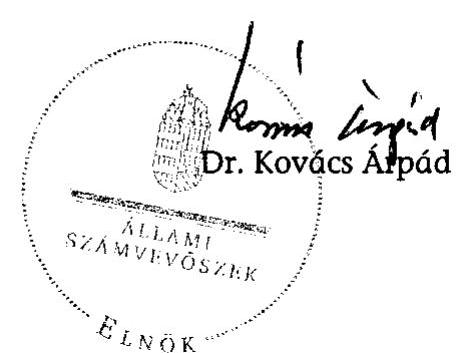

---

MELLÉKLETEK

---

# 1. sz. melléklet 

a V-2018-44/2008. sz. jelentéshez

KÖZLEKEDÉSI, HÍRKÖZLÉSI ÉS ENERGIAÜGYI MINISZTÉRIUM MINISZTEK

## 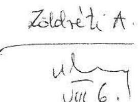

Iktatószám: KHEM/6939/6/2009. Hiv. szám: V-2018-42/2008-2009.

Budapest

## Tisztelt Elnök Úr!

Köszönettel megkaptam a „2008-ban befejeződő autópálya beruházások" ellenőrzéséről készített jelentés-tervezetet.

A megküldött jelentés-tervezetre észrevételt nem kívánok tenni.

Budapest, 2009. augusztus „ 3 "

Üdvözlettel:
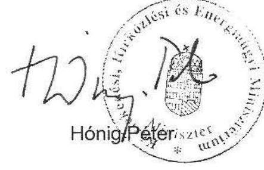

---

2. sz. melléklet a V-2018-44/2008. sz. jelentéshez

|  Építési szakasz |  | 1 km-re eső építési költség millió FT | Összesen eFT | Közművezetékek (millió Ft/km) | Főpálya millió Ft/km) | Csomópontok (millió Ft/km) | Hídépítések főp. (millió Ft/km) | Országos közofak műtárgyakkal (millió Ft/km) | Főpályát keresztező egyéb utak műtárgyakkal (millió Ft/km) | Környezetvé delem (millió Ft/km)  |
| --- | --- | --- | --- | --- | --- | --- | --- | --- | --- | --- |
|  M0EH | 3 873 | 19 790 | 85 028 878 | 101 | 1 004 | 342 | 14 083 | 668 | 24 | 36  |
|  M0kelet 4-31 | 6 700 | 20 419 | 9 507 335 | 52 | 654 | 64 | 121 | 287 | 57 | 36  |
|  M0kelet 31-3 | 10 900 | 22 041 | 22 251 587 | 158 | 658 | 247 | 498 | 178 | 31 | 107  |
|  M0kelet 3-M3 | 8 900 | 17 213 620 | 75 | 621 | 285 | 144 | 179 | 53 | 114 |   |
|  M6 ap. M0 ap.- Érdi tető | 11 438 | 4 149 | 47 447 614 | 974 | 1 179 | 238 | 897 | 123 | 222 | 126  |
|  M7 BK_NK | 35 500 | 1 912 | 46 571 514 | 20 | 690 | 39 | 251 | 112 | 60 | 11  |
|  M7 L-O | 1 099 | 1 319 | 1 449 571 | 18 | 631 | 21 | 229 | 0 | 0 | 6  |
|  MURA-híd 1 (Euro=250 Ft) | 216 | 4 512 | 974 524 | 0 | 0 | 0 | 4 414 | 0 | 0 | 0  |
|  M70 T-O | 1 100 | 3 252 | 2 088 521 | 390 | 1 419 | 0 | 0 | 0 | 0 | 52  |
|  Összesen | 29 129 | 2 898 | 212 833 154 | 193 | 790 | 125 | 1 034 | 165 | 15 | 58  |
|   |  |  |  | 7% | 30% | 5% | 39% | 6% | 3% | 2%  |

Az alapadatok a NIF Zrt. nyilvántartási rendszerében található 2008.12.31. állapot szerinti adatoknak megfelelnek.

C9.03.11. fut

---

# 3. sz. melléklet   a V-2018-44/2008. sz. jelentéshez 

2008-ban megépült autópályák 1 m 2 pályaszerkezetének hatékonysági mutatói
(föpályákon és ágyazati réteg felett értelmezve)
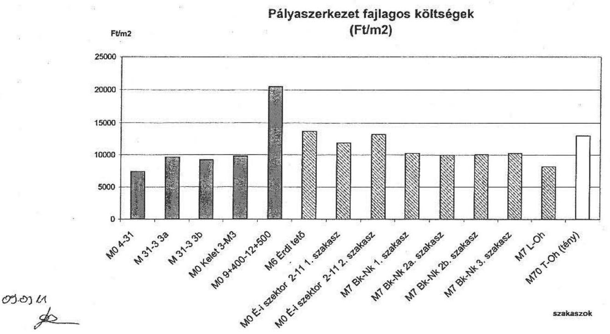

---

# 4. sz. melléklet   a V-2018-44/2008. sz. jelentéshez 

Elöregyártott hidak hatékonysági mutatója a 2008 évben átadott autópálya építéseken
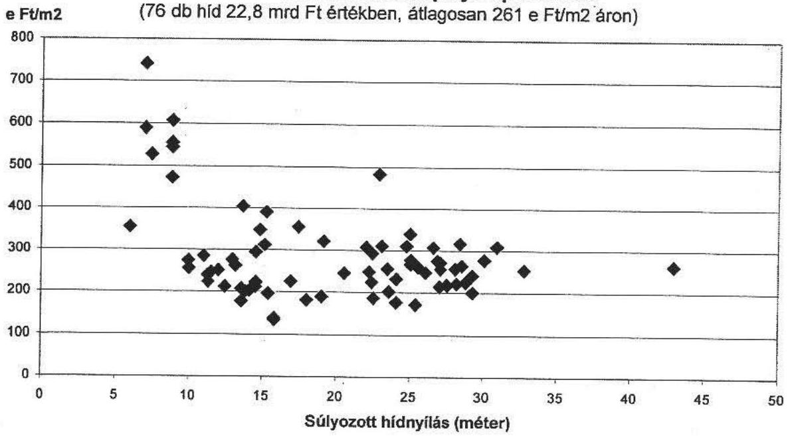

---

5. sz. melléklet a V-2018-44/2008. sz. jelentéshez

A 2008-ban átadott ap. szakaszokon épült vasbeton hidak hatékonysági mutatói

|  |   |   |   |   |   |   |   |   |   |
| --- | --- | --- | --- | --- | --- | --- | --- | --- | --- |
|  M0 kelet 4-31 | E14 j. hid * | Felüljáró Maglódi 173 csatorna felett | 187 | 48 | 0,25 | Maglódi 173-as csatorna felett | monolit vb. nyilt keret | 6,00 |   |
|  M6 Érdi tető | B9 M0/123b *** | M0 útgyűrű bal pálya felüljáró szélesítés Diós-árok felett | 148 | 34 | 0,232 | patak feletti híd szélesítés | monolit vb. nyilt keret | 3,30 |   |
|  3. ÖSSZÉSEN | Monolit vb. nyilt keret |  | 555 | 62 | 0,246 |  |  |  |   |
|  M0 kelet 31-3 | 558 j. híd * | Aluljáró földút alatt | 501 | 110 | 0,225 | Aluljáró földút alatt | Monolit vb. Lemez | 12,25+17,4+15,9+9,25 |   |
|  M0 kelet 31-3 | 575 j. híd * | Aluljáró a 3102. j. út alatt | 662 | 169 | 0,256 | Aluljáró a 3102. j. út alatt | Monolit vb. Lemez | 12,24+15,89+15,89+12,24 |   |
|  M0 kelet 3-M3 | 616. j. híd ** | Aluljáró a 21103 j. út alatt | 596 | 198 | 0,221 | közüli híd | monolit felszerkezet | 10,0+16,5+16,5+10,0 |   |
|  M0 kelet 3-M3 | 626. j. híd ** | Aluljáró a 21104 j. út alatt | 783 | 240 | 0,307 | közüli híd | monolit felszerkezet | 10,0+16,5+16,5+10,0 |   |
|  M0 kelet 3-M3 | 636. j. híd ** | Aluljáró földút alatt | 584 | 176 | 0,301 | egyéb utakhoz tartozó híd | monolit felszerkezet | 10,0+16,0+16,0+10,0 |   |
|  M0 kelet 3-M3 | 650. j. híd ** | Aluljáró a 21105 j. út alatt | 958 | 234 | 0,244 | közüli híd | monolit bordás felszerkezet | 12,5+17,0+21,0+15,0 |   |
|  M0 kelet 3-M3 | 666. j. híd ** | Aluljáró földút alatt | 505 | 187 | 0,370 | egyéb utakhoz tartozó híd | monolit felszerkezet | 12,5+16,5+16,5+12,5 |   |
|  M0 északi híd | 756.sz. * | aluljáró | 900 | 468 | 0,370 | csomópontt közüli aluljáró | vb. monolit felszerkezet | 13,25+17,50+17,50+13,25 |   |
|  M0 északi híd | 783.sz. * | felüljáró | 415 | 321 | 0,274 | földút feletti pályádvezetés | vb. monolit felszerkezet | 13,7 |   |
|  M6 Érdi tető | B1 M0/109j *** | M0 útgyűrű felüljáró a Barackos út felett | 1 082 | 297 | 0,275 | közüli híd szélesítés és felújítás | monolit lemez | 12,65+14,10+12,65 |   |
|  M6 Érdi tető | B2 M0/109b *** | M0 útgyűrű bal pálya felüljáró a Barackos út felett | 757 | 191 | 0,253 | közüli híd | monolit lemez | 12,63+14,11+12,67 |   |
|  M6 Érdi tető | B3 M0/109gy *** | M0 útgyűrű gyep felüljáró a Barackos út felett | 456 | 163 | 0,353 | közüli híd | monolit lemez | 12,68+14,12+12,64 |   |
|  M6 Érdi tető | B19 M6/192 *** | M6 autópálya aluljáró Érd-Öfalu csomópontt út alatt | 755 | 203 | 0,269 | közüli híd | takaréküzeges monolit lemez | 13,26+18,58+16,29+11,34 |   |

- 4-

---

|  M6 Érdi tető | 827 M6/214 *** | M6 autópálya felüljáró 6 sz. főút felett | 1 639 | 452 | 0,275 | kőzúti híd | takaréküreges monolit lemez | 13,67+17,40+13,98  |
| --- | --- | --- | --- | --- | --- | --- | --- | --- |
|  4. ÖSSZESÉN | vb. monolit: felszerkezet |  | 10 863 | 3 407 | 0,222 |  |  |   |
|  M0 északi híd | bal ártéri híd * | vb. tolt felszerkezet | 5 068 | 2 066 | 0,428 | felüljáró Duna ártéren (2-es út felett) | vb. tolt felszerkezetű híd | 37,15+33,0+33,0+45,5  |
|  M0 északi híd | Szente. szigeti híd * | vb. tolt felszerkezet | 18 987 | 7 556 | 0,298 | Szentendrei sziget (víznyertő bázis) fel. a | vb. tolt felszerkezetű híd | 42,5+ 10x47,0 +47,75  |
|  M0 északi híd | jobb ártéri híd * | vb. tolt felszerkezetű híd | 7 425 | 3 089 | 0,416 | jobb parti árteret hídalja át | vb. tolt felszerkezetű híd | 42,68+43,99+44,01+44,02+43,5  |
|  5. ÖSSZESÉN | vb. tolt felszerkezetű híd |  | 31 481 | 12 711 | 0,454 |  |  |   |
|  M6 Érdi tető | 86 M6/142k *** | M6-M0 csomópont "B" ők. pálya felüljáró az Angeli út felett | 1 473 | 568 | 0,386 | kőzúti híd | öszvér szerkezetű | 30,6+40,0+30,6  |
|  M6 Érdi tető | 812 M6/147 *** | M6 autópálya felüljáró a MÁV Bp. - Puszta szabotcs vv. (118+880,8 hm.) felett | 3 781 | 1 690 | 0,447 | vasút feletti híd | öszvér szerkezetű | b.p. 30,58+50,61+30,57 j.p. 28,88+47,89+28,87  |
|  M7 Mura híd | M7 Mura-híd * |  | 6 323 | 1 949 | 0,308 | folyami híd | öszvér szerkezetű | 36+3x48+36  |
|  6. ÖSSZESÉN | öszvér szerkezetű |  | 11 817 | 4 277 | 0,163 |  |  |   |
|  M6 Érdi híd | 914 M6/156 *** | M6 autópálya felüljáró a Bányszeg út korrekció alatt | 1 129 | 337 | 0,215 | kőzúti híd | mórkát szentmédiától | 28,88+28,00+28,88  |
|  M7 Bányszegi Négtartásai | 314011 | 570 Négtartásai | 9 100 | 3 715 | 0,403 |  | öszver. utasázi híd | 3,62+ 5 x 48,0 + 39,0  |

Megjegyzések:

- a jelölt hidak esetében építési költségük (nettó millió Ft) megfelel az adott projekt alapszerződése szerintinek

* a jelölt hidak esetében építési költségük (nettó millió Ft) megfelel az adott projekt 4. sz. szerződés módosítása szerintinek

*** a jelölt hidak esetében építési költségük (nettó millió Ft) megfelel az adott projekt 2008. december 31-én érvényben lévő szerződés módosítása szerintinek

Az alapadatok a NIF Zrt. nyilvántartási rendszerében található 2008.12.31. állapot szerinti adatoknak megfelelnek.

2008.12.31.

---

6. sz. melléklet a V-2018-44/2008. sz. jelentéshez

A 2008-ban átadott ap. szakaszokon épült acélszerkezetű hidak hatékonysági mutatói

|  |   |   |   |   |   |   |   |   |
| --- | --- | --- | --- | --- | --- | --- | --- | --- |
|  M0 kelet 6-31 | 456 j. híd ** | Aluljáró MÁV Budapest - Újraias
vasítvonal alatt | 581 | 516 | 20,885 | Aluljáró MÁV vv. Aket | Orustója alulpályás gerinckenszes
főrariós acélszerkezet | 22,20×22,20  |
|  M0 kelet 31-3 | 5967 j. híd * | Aluljáró Budapest-Gödöllő HEV
vonal alatt | 735 | 456 | 8,533 | Aluljáró Budapest-Gödöllő
HEV vonal alatt | Orustója alulpályás gerinckenszes
főrariós acélszerkezet | 26,5×26,5  |
|  M0 kelet 3-M3 | 603. j. híd *** | Aluljáró Celsede-Gödöllő HEV
vonal alatt 603. sz. híd | 551 | 405 | 8,733 | HEV híd | előlyszeret ortomóp pályás,
gerinckenszes főrariós acél
háborázsat | 24,0×32,0  |
|  M0 kelet 3-M3 | 625. j. híd *** | Aluljáró Budapest-Celsede HEV
vonal alatt 625. sz. híd | 351 | 278 | 8,732 | HEV híd | időlyszeret ortomóp pályás,
gerinckenszes főrariós acél
háborázsat | 25,0×25,0  |
|  M0 északi híd | nagy-ág híd * | fordokálozás acélhíd | 21 093 | 27 422 | 8,898 | Duna felirti átvannós | két vb-pilones fordokálozás acélhíd | 145,5×300,8×145,5  |
|  M0 északi híd | Szemendmi Duna-ág * | szakrényes acélhíd | 11 270 | 10 794 | 8,858 | szentendmi Duna-ágot ívői
ít | szekrényes ortomóp p. acél híd | 94,25×144×94,3  |
|  |   |   |   |   |   |   |   |   |
|  ZihhíZ 300 átszaki híd
Ámnesen: |  |  | 12 363 | 38 215 | 1,181 |  |  |   |
|  Megjegyzések: |  |  |  |  |  |  |  |   |

- a jelölt hidak esetében építési költségük (nettó millió Ft) megfelel az adott projekt alapszerződése szerintinek

* a jelölt hidak esetében építési költségük (nettó millió Ft) megfelel az adott projekt 2. sz. szerződés módosítása szerintinek

*** a jelölt hidak esetében építési költségük (nettó millió Ft) megfelel az adott projekt 4. sz. szerződés módosítása szerintinek

Az alapadatok a NIF Zrt. nyilvántartási rendszerében található 2008.12.31. állapot szerinti adatoknak megfelelnek.

09.03.11. fev

---

### 2008-ban átadott autópálya szakaszok pályaszerkezeti rétegeinek gazdaságossági mutatói

|   |  |  |  |  | M0 4-31 | M0 31-3 | M0 Északi
híd | M6 M0-Érdi
tető | M7 Bk-NK | M7 L-oh | M70 T-oh | M0 3-M3  |
| --- | --- | --- | --- | --- | --- | --- | --- | --- | --- | --- | --- | --- |
|   |  |  |  |  | 6 700 | 6 700 | 1 047 | 6 190 | 35 500 | 1094 | 1 100 | 6 900  |
|   |  |  |  |  | 169 700 | 136 238 | 30 492 | 69 140 | 675 000 | 25525 | 35 584 | 192 969  |
|   |  |  |  |  | 4 383 | 3 596 | 2 087 | 3 399 | 24 468 | 675 | 1 369 | 6 129  |
|   |  |  |  |  |  |  |  |  |  |  |  |   |
|   |  |  |  |  |  |  |  |  |  |  |  |   |
|   |  |  |  |  |  |  |  |  |  |  |  |   |
|  Tételszám | Megnevezés | Ráteg
vestageág
(cm) |  | Kültségvetés
szerinti
mértékegység
a |  | Egység ár | Egység ár | Egység ár | Egység ár | Egység ár | Egység
ár | Egység ár  |
|  32 321 | CTh stabilizált réteg beépítése földmű felső
részébe (15 cm) | 15 | m3 |  | 5 725 | 5 725 |  |  |  |  |  | 5 089  |
|  33 133 | Cementes stabilizáció építése (20 cm CKI-4) | 20 | m3 |  | 6 097 | 6 097 | 13 244 |  |  | 3 347 | 7980 |   |
|  33 651 | Két forgalmi sáv + leállósáv egy fogásban, 11 m
szélességben építve | 26 | m3 |  | 24 551 | 24 439 |  |  |  |  |  | 27 514  |
|  33 652 | Két forgalmi sáv egy fogásban 8,25 m
szélességben építve | 26 | m3 |  | 25 440 | 25 298 |  |  |  |  |  | 27 632  |
|  33 653 | Gyűjtő-elosztó pályák, összekötő pályák,
csomópontí ágak 6-10 m szélességben egy,
esetleg két fogásban építve | 26 | m3 |  | 31 193 | 31 193 |  |  |  |  |  | 27 632  |
|  33 654 | Gyorsítő és lassító sávok, leállósávok egy
fogásban 2,75-3,75 m szélességben építve | 26 | m3 |  | 28 808 | 28 864 |  |  |  |  |  | 28 837  |
|  33 656 | CP 4/3-35KK jelű, eruptív kőzetből készített
durva ásványi vázu betonkeverékből készült,
hézegyban vaselt betonburkola t készítése,
formasínek között, négyszög, paralelogramma,
trapéz alakú felületeken, 0,5-8 m között változó
szélességben, kézi beépítési | 26 | m3 |  | 22 773 | 22 610 |  |  |  |  |  | 24 603  |
|  33 663 | Csatlakozó szoros hossz- és kereszthézag
vasalás készítése a megszilárdult betonba
befúrt hézag-vasfészkekbe beragasztott
hézegvesékkel |  | hézag m |  | 3 956 | 3 966 |  |  |  |  |  | 4 933  |
|  33 667 | Ditatációs hézag kialakítása az ÁKM! 1/2004- sz.
Építőipari Műszaki Engedélye szerint |  | hézag m |  | 29 853 | 29 853 |  |  |  |  |  | 5 922  |
|  33 668 | Betonburkola t letorgonyzása 1000 mm mély és
610 mm széles vasbeton horgonygerendákkal a
terv szerinti kiviteiben és helyen a szóban forgó
pályalemhez teljes szélességében, az ÁKM!
1/2004- sz. Építőipari Műszaki Engedélye szerint |  | m3 |  | 76 186 | 76 186 |  |  |  |  |  | 76 186  |
|  T2+835 -
T3+800 (1715
m szélesítés) | CM: |  |  |  |  |  |  |  |  |  |  |   |
|   |  | 15 m3 |  |  |  |  |  |  |  |  |  | 13 537  |
|   |  | 3/3-32/F | 12 m3 |  |  |  |  |  |  |  |  | 29610  |
|   |  | K-22/F | 7 m3 |  |  |  |  |  |  |  |  |   |
|   |  | m2MA-11 | 4 m3 |  |  |  |  |  |  |  |  | 56 009  |

---

|   |  |  |  |  |  |  |  |  |  |  |  |  |  |  |  |  |  |  |  |  |  |  |  |  |  |  |  |  |  |  |  |  |   |
| --- | --- | --- | --- | --- | --- | --- | --- | --- | --- | --- | --- | --- | --- | --- | --- | --- | --- | --- | --- | --- | --- | --- | --- | --- | --- | --- | --- | --- | --- | --- | --- | --- | --- |
|   |  |  |  |  |  |  |  |  |  |  |  |  |  |  |  |  |  |  |  |  |  |  |  |  |  |  |  |  |  |  |  |  |   |
|   |  |  |  |  |  |  |  |  |  |  |  |  |  |  |  |  |  |  |  |  |  |  |  |  |  |  |  |  |  |  |  |  |   |
|   |  |  |  |  |  |  |  |  |  |  |  |  |  |  |  |  |  |  |  |  |  |  |  |  |  |  |  |  |  |  |  |  |   |
|   |  |  |  |  |  |  |  |  |  |  |  |  |  |  |  |  |  |  |  |  |  |  |  |  |  |  |  |  |  |  |  |  |   |
|   |  |  |  |  |  |  |  |  |  |  |  |  |  |  |  |  |  |  |  |  |  |  |  |  |  |  |  |  |  |  |  |  |   |
|   |  |  |  |  |  |  |  |  |  |  |  |  |  |  |  |  |  |  |  |  |  |  |  |  |  |  |  |  |  |  |  |  |   |
|   |  |  |  |  |  |  |  |  |  |  |  |  |  |  |  |  |  |  |  |  |  |  |  |  |  |  |  |  |  |  |  |  |   |
|   |  |  |  |  |  |  |  |  |  |  |  |  |  |  |  |  |  |  |  |  |  |  |  |  |  |  |  |  |  |  |  |  |   |
|   |  |  |  |  |  |  |  |  |  |  |  |  |  |  |  |  |  |  |  |  |  |  |  |  |  |  |  |  |  |  |  |  |   |
|   |  |  |  |  |  |  |  |  |  |  |  |  |  |  |  |  |  |  |  |  |  |  |  |  |  |  |  |  |  |  |  |  |   |
|   |  |  |  |  |  |  |  |  |  |  |  |  |  |  |  |  |  |  |  |  |  |  |  |  |  |  |  |  |  |  |  |  |   |
|   |  |  |  |  |  |  |  |  |  |  |  |  |  |  |  |  |  |  |  |  |  |  |  |  |  |  |  |  |  |  |  |  |   |
|   |  |  |  |  |  |  |  |  |  |  |  |  |  |  |  |  |  |  |  |  |  |  |  |  |  |  |  |  |  |  |  |  |   |
|   |  |  |  |  |  |  |  |  |  |  |  |  |  |  |  |  |  |  |  |  |  |  |  |  |  |  |  |  |  |  |  |  |   |
|   |  |  |  |  |  |  |  |  |  |  |  |  |  |  |  |  |  |  |  |  |  |  |  |  |  |  |  |  |  |  |  |  |   |
|   |  |  |  |  |  |  |  |  |  |  |  |  |  |  |  |  |  |  |  |  |  |  |  |  |  |  |  |  |  |  |  |  |   |
|   |  |  |  |  |  |  |  |  |  |  |  |  |  |  |  |  |  |  |  |  |  |  |  |  |  |  |  |  |  |  |  |  |   |
|   |  |  |  |  |  |  |  |  |  |  |  |  |  |  |  |  |  |  |  |  |  |  |  |  |  |  |  |  |  |  |  |  |   |
|   |  |  |  |  |  |  |  |  |  |  |  |  |  |  |  |  |  |  |  |  |  |  |  |  |  |  |  |  |  |  |  |  |   |
|   |  |  |  |  |  |  |  |  |  |  |  |  |  |  |  |  |  |  |  |  |  |  |  |  |  |  |  |  |  |  |  |  |   |
|   |  |  |  |  |  |  |  |  |  |  |  |  |  |  |  |  |  |  |  |  |  |  |  |  |  |  |  |  |  |  |  |  |   |
|   |  |  |  |  |  |  |  |  |  |  |  |  |  |  |  |  |  |  |  |  |  |  |  |  |  |  |  |  |  |  |  |  |   |
|   |  |  |  |  |  |  |  |  |  |  |  |  |  |  |  |  |  |  |  |  |  |  |  |  |  |  |  |  |  |  |  |  |   |
|   |  |  |  |  |  |  |  |  |  |  |  |  |  |  |  |  |  |  |  |  |  |  |  |  |  |  |  |  |  |  |  |  |   |
|   |  |  |  |  |  |  |  |  |  |  |  |  |  |  |  |  |  |  |  |  |  |  |  |  |  |  |  |  |  |  |  |  |   |
|   |  |  |  |  |  |  |  |  |  |  |  |  |  |  |  |  |  |  |  |  |  |  |  |  |  |  |  |  |  |  |  |  |   |
|   |  |  |  |  |  |  |  |  |  |  |  |  |  |  |  |  |  |  |  |  |  |  |  |  |  |  |  |  |  |  |  |  |   |
|   |  |  |  |  |  |  |  |  |  |  |  |  |  |  |  |  |  |  |  |  |  |  |  |  |  |  |  |  |  |  |  |  |   |
|   |  |  |  |  |  |  |  |  |  |  |  |  |  |  |  |  |  |  |  |  |  |  |  |  |  |  |  |  |  |  |  |  |   |
|   |  |  |  |  |  |  |  |  |  |  |  |  |  |  |  |  |  |  |  |  |  |  |  |  |  |  |  |  |  |  |  |  |   |
|   |  |  |  |  |  |  |  |  |  |  |  |  |  |  |  |  |  |  |  |  |  |  |  |  |  |  |  |  |  |  |  |  |   |

---

8. sz. melléklet a V-2018-44/2008. sz. jelentéshez

A 2008-ban átadott autópálya szakaszok főbb hídszerkezeteinél a pénzügyi elszámolás alapját képező szerkezeti egységárak összehasonlítása

|  Tételszám | Tétel megnevezése | M.E. | M0 kelet 4 31 | M0 kelet 31-3 | M0 kelet 3 M3 | M0 Északi Híd | M6 Érdi tető | M7 B.keresztúr-Nagykanizsa | M7 Lefonye - oh. | M7 Mura híd  |
| --- | --- | --- | --- | --- | --- | --- | --- | --- | --- | --- |
|   |  |  |  |  |  |  |  |  |  | egység ár  |
|  51001 | Földkészmecks | m3 | 5 692 | 47 119 | 1 986 | 19 461 | 1 772 | 6 551 | 1 776 | 151136  |
|  51020 | Hütőtőlés, elötőttés, többelszárd-kép építési | m3 | 3 720 | 3 720 | 5 217 | 6 467 | 7 227 | 19 698 | 6 336 | 1860  |
|  51155 |  |  |  |  |  |  |  |  |  |   |
|  51381 | Cöldpéket összefogó gerend | m3 | 59 342 | 57 527 | 63 485 | 164 640 | 68 940 | 86 451 | 69 658 | 53228  |
|  51510 | Szabadon álló vesdletön oszlop | m3 | 100 580 | 95 710 | 95 587 | 141 836 | 103 318 | 147 281 | 86 573 | 0  |
|  51520 | Földdet takart vesdletön oszlop | m3 | 93 717 | 89 355 | 96 463 | 170 026 | 105 422 | 251 795 | - | 0  |
|  51530 |  |  |  |  |  |  |  |  |  |   |
|  51550 |  |  |  |  |  |  |  |  |  |   |
|  51561 | Törmör vesdletön hüllő számofölési | m3 | 58 326 | 56 587 | 93 397 | 220 151 | 94 934 | 76 099 | - | 55109  |
|  51552 | Hüllő felmerülési |  |  |  | 93 397 | 170 073 |  | 61 013 | - | 0  |
|  51561 |  |  |  |  | 93 397 |  | 98 599 | - | - | 0  |
|  51562 | Számofal | m3 | 57 098 |  |  |  | 99 012 | 121 563 | - | 0  |
|  51571 | Rejtett hüllő szerkezeti gerenda számofölési | m3 | 60 917 | 58 986 | 93 397 | 127 785 | 93 181 | 64 136 | 86 573 | 0  |
|  51573 |  |  |  |  |  |  |  |  |  |   |
|  51575 | Pilkér közeljentő gerend | m3 |  |  | 111 648 | 178 713 |  | 151 737 | 88 858 | 0  |
|  51602 | Visszáldom idegenlétől terjesztés | m3 | 80 155 | 76 798 | 66 775 | 105 199 | 62 104 | 113 776 | 59 808 | 53681  |
|  52001 | Előmegyártolt tartóinak együtszáldozatáti v.b. pályázat | m3 | 70 998 | 79 978 | 89 786 | 175 832 | 105 426 | 120 296 | - | 0  |
|  52002 |  |  |  |  |  |  |  |  |  |   |
|  52003 | Mondó lemez | m3 | 123 740 | 117 164 | 104 011 | 161 664 | 103 749 | - | - | 123103  |
|  52003 | Mondó takarékűrégés lemeztárulhordás lemez | m3 |  | 118 417 | 104 644 |  | 125 137 | - | - | 0  |
|  52505 | Feszített mondó v.b. belső felszerkezet | m3 |  |  |  | 366 172 |  | 292 494 | - | 0  |
|  52506 |  |  |  |  |  |  |  |  |  |   |
|  52507 | Mondó vesdletön szegély (C0945) | m3 | 83 045 | 86 539 | 120 862 | 125 470 | 114 277 | 114 176 | 94 579 | 82004  |
|  52511 | Mondó vesdletön szegély (C0375) | m3 |  |  | 150 291 |  |  | - | - | 0  |
|  52514 | Mondó rájött keret | m3 | 79 850 |  |  |  |  |  |  | 0  |
|  52601 | Avál felszerkezet gyártás és szerelés | 1 |  |  | 667 746 | 1 398 432 | 901 551 | - | - | 708139  |
|  52601 | Avál felszerkezet gyártás és szerelés | 1 |  |  |  |  |  |  |  | 609000  |
|  52600 | Horganyozó hullámokból száltetnéz holszerkezet | 1 |  |  | 1 308 777 |  |  | - | - | 0  |
|  53003 | Rugolinas műanyg alapú szórt szigetelés | m2 | 12 276 | 8 784 | 12 090 | 20 987 | 14 141 | 55 814 | 9 821 | 4316  |

Az alapadatok a NIF Zrt. nyilvántartási rendszerében található 2008.12.31. állapot szerint adatoknak megfelelnek.

---

2008-ban átadott ap. szakaszok hídjainál beépített előregyártott vb. tartók fajlagos költségadatai a gerenda hosszak (méter) függvényében

M0 kelet 4-31 előregyártott vb. tartók fajlagos költségadatai
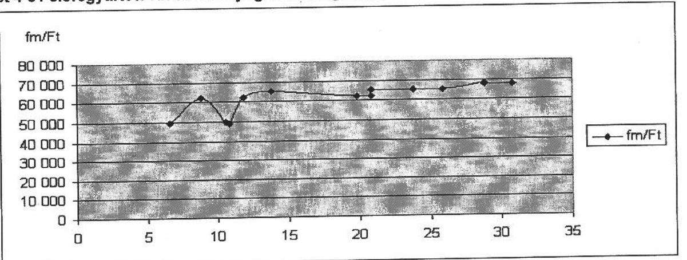

M0 kelet 31-3 előregyártott vb. tartók fajlagos költségadatai
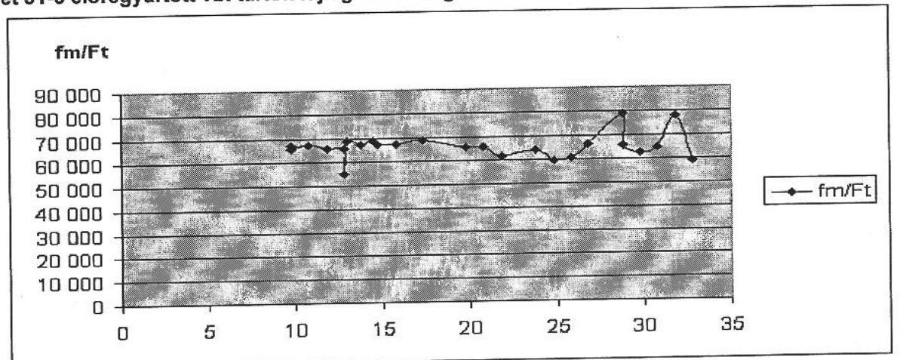

M0 kelet 3-M3 előregyártott vb. tartók fajlagos költségadatai
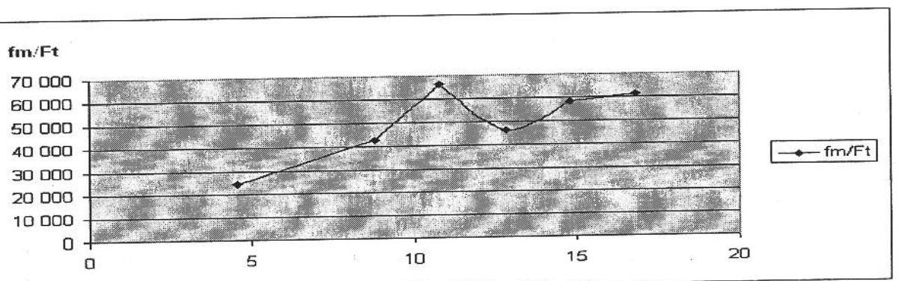

---

M6 előregyártott vb. tartók fajlagos költségadatai
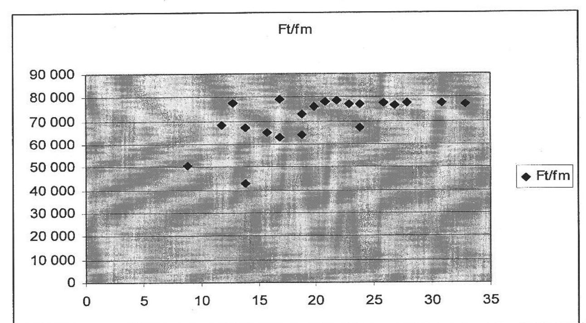

M7 Balatonkeresztúr- Nagykamizsa előregyártott vb. tartók fajlagos költségadatai
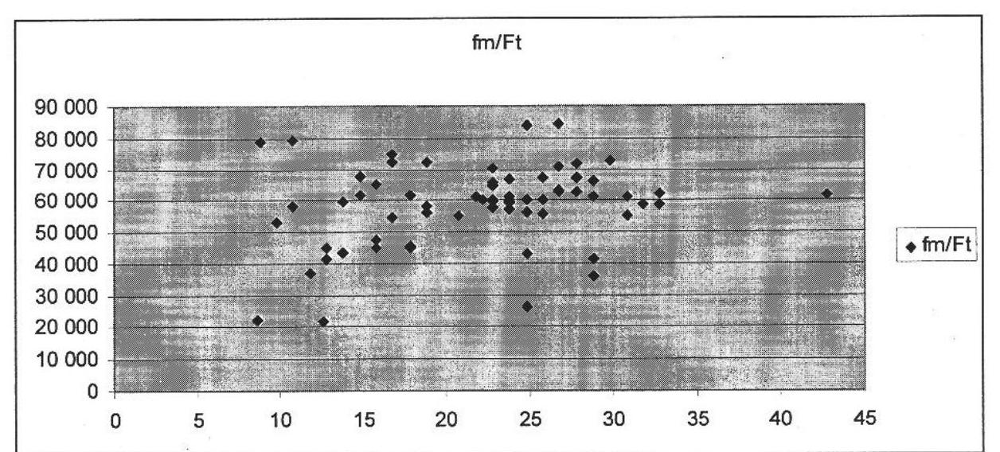

---

2008-ban átadott autópályák fúrt vasbeton cölöpalapozásának fajlagos költségei

| Projekt | eFt/fm | átmérő |
| :-- | --: | :--: |
| M7-BKNK_F60 | 84 | 60 |
| M7-BKNK_F80 | 73 | 80 |
| M0-k 4-31 F80 | 46 | 80 |
| M0-k 31-3 F80 | 44 | 80 |
| M0-k 3-M3 F80 | 46 | 80 |
| M6 F80 | 84 | 80 |
| M0-k 4-31 F120 | 96 | 120 |
| M0-k 31-3 F120 | 96 | 120 |
| M0-k 31-3 F150 | 129 | 150 |

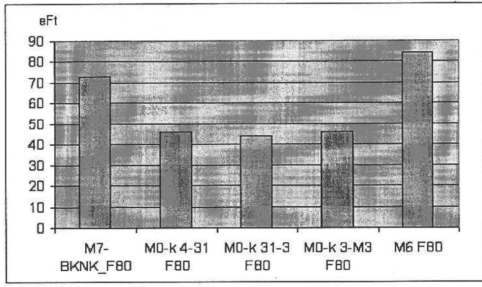

2008-ban átadott autópályák vert vasbeton cölöpalapozásának fajlagos költségei

| Projekt | eFt/fm | méret |
| :-- | --: | --: |
| M7-BKNK_ |  |  |
| V30*30 | 38 | 30 |
| M0-k 31-3 |  |  |
| V30*30 | 21 | 30 |
| M0-k 3-M3 |  |  |
| V30*30 | 36 | 30 |
| M7-BKNK_V50 | 60 | 50 |
| M7-Murahid V50 | 29 | 50 |
| M7-LO V50 | 34 | 50 |

---

FÜGGELÉKEK

---

# EMLÉKEZTETŐ 

## Az Állami Számvevőszék ,,2008-ban befejeződő autópálya beruházások ellenőrzése" programjának 3E (hatékonysági, eredményességi és gazdaságossági) továbbá környezetvédelmi kérdésköreivel kapcsolatban megtartott fókuszcsoport ülésekröl

## Az ülés helye: NIF Zrt.

Időpontja: 2009. február 20.
A résztvevők: tervezők és mérnökök, továbbá a NIF Zrt. képviseletében résztvevők névsorát a mellékelt jelenléti ívek tartalmazzák.

## A fókuszcsoportok megtartásának célja:

- a témakörhöz kapcsolódó a jelen vizsgálat keretében javasolt - a 2008. évben átadott beruházások összes költségvetési tételének feldolgozása során szerzett ellenőri tapasztalatok alapján kialakított - ellenőrzési kritériumrendszer, és fajlagos mutatók (indikátorok) áttekintése, egységesítése és értelmezésük pontosítása, továbbá kiegészítése, különös tekintettel a forgalmi adatokra és a nettó jelenértékre;
- a hatékonysági, eredményességi és gazdaságossági indikátorok adatszolgáltatási munkamegosztásának, határidejének egyeztetése NIF Zrt., tervezők és Mérnökök között;
- az ellenőrzött útszakaszok összes projektciklusára kiterjedően mindazon tervezői és Mérnöki, továbbá beruházói vélemények és javaslatok összegyűjtése, amelyeknek 3E hatása van;
- a környezetvédelmi témakörben:
- a környezetvédelmi költségek csoportosítási lehetőségeinek feltárása (példák a költségnövelésre és időelhúzódásokra);
- a környezetvédelmi monitoring aktuális helyzetével kapcsolatos adatszolgáltatás kérése;
- a műszaki átadást követően még fennmaradt nyitott, rendezetlen és problémás ügyek összefoglaló áttekintése (hatósági, önkormányzati, civil szervezetek részéről panaszok, bírósági ügyek, stb.).

## Bevezetés

Szilágyi András vezérigazgató-helyettes úr a NIF Zrt. részéről nyitotta meg a fókuszcsoportot és a 3E ellenőrzési teljesítménymutatók rendszerének többcélú

---

alkalmazási lehetőségeire, az értékelési feladatokra, továbbá a közbeszerzésekkel összefüggő korlátozó tényezőkre (időkorlátok) hívta fel a figyelmet.

Bank Lajos főtanácsos az ÁSZ részéről jelezte, hogy az autópályák 3E vizsgálatához a most javasolt kritérium rendszer alkalmazása újszerű és hozzájárulhat az ezzel kapcsolatos ellenőrzési módszertan továbbfejlesztéséhez. Ezt követően az általa feldolgozott több mint 20000 költségvetési tétel eredményeként kapott fajlagos mutatókról (azok minimális és maximális és átlagértékeiről) adott összefoglaló tájékoztatást a résztvevőknek:

- az összes projekt tételfőcsoportok szerinti \%-os megoszlásáról;
- a hídépítéseken belül az aluljáró és felüljárók egységnyi felületére eső fajlagos költségekre;
- a hídszerkezetek fajlagos költségmutatóinak feldolgozásával kapott a fesztáv függő fajlagos költségekről („U" függvény érzékelhető, mivel kis fesztávoknál magasabb, majd nagyobb fesztávoknál növekvő lett a fajlagos költségfüggvény);
- szakaszonként a fópálya szerkezetek és rétegeinek alakulásáról, különös tekintettel a beton és aszfalt pályaszerkezetek összehasonlítására.

A „mitől drága a magyar autópálya építés" kérdéskörrel kapcsolatban a fajlagos mutatók minimális és maximális értékeinek összehasonlítása kapcsán kiemelte az összehasonlíthatóság nehézségeit és a szakmai kihívásokat. A mutatók (megbízhatósági, pontossági szintektől függő) alkalmazásának - szakmai korrektségből eredő - korlátozó tényezőit számításba kell venni. Például egyaránt a nemzetközi összehasonlítások, a médiákban szereplő adatok, vagy a gazdasági döntések, ellenőri megállapítások és következtetések vonatkozásában is.

A javító és fejlesztő szándék szellemében kérte a fókuszcsoport résztvevőitől a segítő együttműködést mind az adatszolgáltatásban, mind annak feltárásában, hogy tapasztalataik szerint az előrelépések ellenére még milyen korlátozó tényezők befolyásolják hazánkban az autópálya beruházások gazdaságos, eredményes és hatékony megvalósítását.

# A tervezői fókuszcsoporton elhangzott vélemények és álláspontok összefoglalása 

Az aluljárókra és felüljárókra vonatkozó ÁSZ által ismertetett fajlagos adatokra reagálva a tervezők és a beruházó részéről elhangzott az, hogy a hidak tervezése során a hatékonyságnövelő tényezőt jelent a jövőben már az, hogy a tervezők és a NIF Zrt. innovációs tevékenysége révén 40 m-es fesztávú tartókat gyártanak. Ez a körülmény ugyanis lehetővé teszi az autópálya hidaknál az alépítményi és felépítményi költségek csökkentését. Ez azonban igényli a tervezői folyamatban az alépítményi és felépítményi és felszerkezeti munkák megfelelő pontosságú költségarányainak elemzését és kimutatását.

---

A NIF Zrt. jelezte, hogy saját szakértői elemzései 2005-ben azt mutatták (ld. melléklet), hogy az autópálya szakaszokon a középső pillérek elhagyása növeli a hatékonyságot.

A hidak esetében a tervezők hangsúlyozták, hogy az $1 \mathbf{m}^{2}$ hasznos hídfelületre eső fajlagos költségek alakulására jelentős hatással volt a cölöpöszszefogó gerenda és a hídfők kialakítása, valamint a hídfők és híd háttöltések magassága, funkciója, valamint különösen a terület talajmechanikai adottsága összefüggésben a kapcsolódó autópálya szakasszal.

ÁSZ képviselői megjegyzés: A hidak terveinek összehasonlító gazdaságossági elemzése célszerűen tervezői, esetleg mérnöki feladat, (kevésbé kivitelező függő, hogy a haszon a közé legyen), feltételezve azt, hogy elsősorban az engedélyezési tervszinten dőlnek el a műszaki, ill. gazdaságossági kérdések. Ennek elvi feltételei adottak, hiszen a NIF Zrt. a tervezői szerződésekben a hatékonysági cél teljesítését, mint feltételt már előírja - a miniszter által az ÁSZ 2008. évi javaslatainak figyelembevételével elrendelt intézkedési terv eredményeként is. A megvalósítás dokumentálási feltételeit azonban célszerű szabályozni, az átláthatóság biztosítása érdekében. Ezzel együtt célszerú kialakítani a tervezők motiválási lehetőségeit a hatékonysági, gazdaságossági célok teljesítése érdekében, egy értékelési információs rendszer (hatékonysági és gazdaságossági indikátorokra épülő) segítségével. A tervezői díjszabást ezzel összefüggésben felül kell vizsgálni, és aktualizálni szükséges. A kérdéskörhöz tartozik az is, hogy a beruházónál a projektmenedzserek motiválása hasonló elvekre épülhetne.

A tervezők szerint az azonos funkciójú létesítményekre és ugyanazon szerkezetekre vonatkozó fajlagos mutatók alakulását - esetenként kétszeres eltéréseit - elsősorban a következő tényezők befolyásolták:

- anyagbeszállítási útvonalak lehetőségei, a projekthez közeli bányák tulajdonosai és vállalkozók közötti kapcsolatrendszer (saját, vagy versenytárs, ill. árengedmények, vagy versenytársi felár alkalmazásával);
- a felvonulási költségek mértéke, attól függően, hogy a közelben van-e vállalkozónak keverő telepe, kihasználatlan kapacitása, stb.

Az út és hídépítések fajlagos költségeinek alakulását befolyásolta továbbá az, hogy milyen volt az alvállalkozói munkák aránya, az építési piac helyzete, a kőbányák távolsága, a geológiai, geotechnikai és topográfiai viszonyok, a pályaszerkezeti réteg építésére alkalmas talaj.

Az autópálya építések költséghatékonyságát érintő témákban a tervezők általános álláspontja az volt, hogy az indokolatlan önkormányzati igények rontják a költséghatékonyságot. Ez megjelenik abban, hogy az engedélyezési tervezés során merülnek fel újabb igények, például elkerülő utak építésére, azok költségkövetkezményeinek figyelembevétele nélkül. A tervezők és a beruházók ki voltak/vannak szolgáltatva annak, hogyha ezek az elkerülő utak nem épülnek meg, akkor az önkormányzatok nem járulnak hozzá az autópálya megépítéséhez. A tervezők és a NIF Zrt. álláspontja az volt, hogy hosszú távú megoldásként meg kellene változtatni az Önkormányzati törvényt. Eklatáns példaként hangzott el a Szigetmonostori híd esete.

---

Megjegyzés az ÁSZ témafelelős részéről: A törvény módosítása egy hosszabb folyamat lehet, addig is az önkormányzatokat, környezetvédelmi hatóságokat, közszolgáltatókat tájékoztatni kell igényeiknek, döntéseiknek az állami költségvetésre gyakorolt hatásáról. Mindehhez a gyakorlatban tapasztalt „más pénze nem drága szemlélet miatt" az engedélyezési folyamatban felmerült igényekről egy a pótmunkákhoz hasonló költségcsoportosítási nyilvántartást lenne célszerű kialakítani a tervezőknél és a beruházóknál (projektmenedzsereknél). A költségbecslések és nyilvántartások vonatkozásában ugyan ez újabb feladatot jelent a mérnököknek és költségszakértőknek, viszont belátható, hogy szükségessé vált a követhetetlen költségkövetkezmények, és a gazdaságossággal szemben kialakult érzéketlenség miatt. A beruházói és tervezői tapasztalatok szerint ugyanis mindezt a jogszabályi környezet lehetővé teszi. (Az igénylőkre ugyanis nem érvényes, hogy döntéseiket a közpénzekkel való takarékosság jegyében hozzák meg.)

A tervezők és a NIF Zrt. tapasztalatai azt mutatták, és ennek hangot is adtak a fókuszcsoporton, hogy a közvetetten kapcsolódó pótlólagos építési feladatokat támasztó hatóságok, önkormányzatok, közszolgáltatók többségénél nem alapvető szempont a gazdaságosság. A jogszabályok által támogatottan a saját prioritásaiknak érvényesítése mellett ezért nem várható pozitív eredmény még akkor sem, ha szembesülnek döntéseik, vagy igényeik költségkövetkezményeivel.

A közművekkel kapcsolatos költségek autópályánként igen eltérő mértékben merültek fel. Van olyan szakasz ahol eléri az autópálya építési költségek 25\%-át. A közmúvekkel kapcsolatos költségek csökkentését alapvetően a közmúszolgáltatói érdekek maximális érvényre juttatatási gyakorlata korlátozta, a magyar költségvetés terhére. Tervezői álláspont az, hogy rossz a szabályozás.

A tervezők önmagukban ezen az Ap. törvényre figyelembevételével sem tudtak változtatni, mivel a közműszolgáltatók magatartását „állam az államban" jellemzi. Egyes, privatizált közműszolgáltatók nem adták/adják ki addig például a létesítési engedélyt, amíg az általuk előírt munkákat a tervezők hiánytalanul figyelembe nem vették. Ugyanis háromoldalú megállapodás szükséges az engedélyezéshez (kivitelező, közműszolgáltató, beruházó). A közművekkel kapcsolatos költségekkel való takarékosság szempontjából az is problémát jelent, hogy a közműszolgáltatók jelölik ki, hogy kik végezhetnek munkát közműveiken, valamint saját minősített tervezőik vannak.

A tervezői vélemények szerint problémát jelent az, hogy a közmúkiváltási tervek készítésével kapcsolatban, amikor elindul a létesítés engedélyezés, előírnak még környezetvédelmi hatásvizsgálatot indokolatlan esetekben is. A jogszabály szerint erre, csak meglévő vezetékeket érintő jelentősebb változtatások esetén volna szükség, de ezt „szokás alapon" megkövetelik.

A nemzetközi összehasonlítás vonatkozásában példaként merült fel a horvát autópályákra való hivatkozás. A horvát és a magyar autópálya szakaszok összehasonlíthatósági problémáit a NIF Zrt. a pályákról készített fényképfelvételekkel is igazolta. Ugyanis a magyar és a horvát autópályák összehasonlítása során számos tényezőt kell számításba venni. Többek között az engedélyezési eljárás egyszerűségét, a sziklás talajviszonyokat, a csomópontok kisebb gyakoriságát, a kapcsolódó úthálózat állapotát, amelyek mind a fajlagos költségek

---

csökkentésével jártak. Hangsúlyozták a tervezők, hogy a magyar autópálya hálózat fejlesztésével egyidejűleg rendbe kell hozni a környező úthálózatot, amelyet az építési forgalom tovább ronthat. A kapcsolódó útépítések felújítási ára tovább növeli a gyorsforgalmi úthálózat fejlesztési költségeit.

A gyakorlat azt mutatta, hogy a nagyberuházások építési engedélyezési eljárása során egy projektre vonatkozóan 14 db építési engedélyt kell beszerezni, miközben a hatóságok a saját szakterületükre koncentrálva nem számolnak az előírásaik teljes autópályát érintő költség és időkövetkezményeivel. Előfordult például az, hogy Vízügyi Igazgatóság az autópályától 6 km -re eső földterület megszerzési késedelme miatt nem adott ki létesítési engedélyt. A már forgalomba helyezett autópályáknál a földutakkal kapcsolatos kezelői hozzájárulások megadását az önkormányzatok késleltetették.

Az építési szerkezetek országos fajlagos költségmutatóinak képzése témakörben a fókuszcsoporton az a közös álláspont alakult ki, hogy a NIF Zrt által alkalmazott módosított tételrend elsősorban a közbeszerzés orientált, a vállalkozók kiválasztási céljait szolgálja. A tételrend alkalmas arra, hogy egyetlen, konkrét projekt esetében a vállalkozói árak összehasonlítását szerkezeti szinten támogassa, mivel az organizációs feltételek, a műszaki paraméterek mindegyik vállalkozónál azonosak. Ugyanakkor országos egységár adatbázis képzésére, megfelelő pontosságú költségbecslésekre csak fenntartásokkal vehető számításba, hiszen a nagy mennyiségű anyagok szállítása miatt, a változó organizációs feltételek következtében, egy-egy építményhez tartozó műszaki paraméterek (hídfő, pillér magassága, vasalás mennyisége, zsaluzási feltételek és funkciók sokrétűsége, vasúti-, autópálya híd, stb.) jelentős eltérései miatt a szerkezetek egységárait szakmai korrektséggel nem lehet közös nevezőre hozni.

# A NIF Zrt. a költségbecslési pontosság javítása érdekében ezért fejlesztette ki a hídépítési költségek becslését támogató segédletét, amely már figyelembe veszi a múszaki paraméterek változatosságát. 

ÁSZ részéről megjegyzés: A költségbecslési segédlet finomítása, a hatékonyság, gazdaságosság mérésére alkalmas értékelési információ rendszer kifejlesztése a projektek összes életciklusára kiterjedően, elsősorban a főbb szerkezetekre - építve a NIF fejlesztésekre és a jelen ÁSZ vizsgálatok tapasztalataira - szükséges és indokolt.

A fókuszcsoport áttekintette a pályaszerkezetek fajlagos költségeinek optimalizálási lehetőségeit, korlátait. Tekintettel arra, hogy Magyarország átvette azt az európai gyakorlatot, hogy a pályaszerkezeti rétegrendet pályaszerkezeti előírás alapján tervezik, gyakorlatilag nincs mód logisztikai alapon történő (például kőbányaközelség alapján) pályaszerkezeti tervezésre méretezésre. (ld. 2005-ben készült Keleti Imre tanulmányt, KTI dr Gáspár dokumentumok). Másrészt a stabilizációra alkalmas talajok szerint behatárolt az alaprétegek megválasztási lehetősége.

Szilágyi András vezérigazgató-helyettes úr jelezte, hogy újabban változóban van a pályaszerkezeti rétegek kialakításának uniós, szakmai megközelítése, mert a pályaszerkezetek méretezése témakörben ismét napirendre került a típus

---

pályaszerkezetekről az adott projektre és egyedi méretezésre történő visszatérés. (ld. tudományos előadás a témában).

Az autópálya építések fajlagos költségeinek alakulását befolyásolják az országonként eltérő tervezési és múszaki előírások, a tervezési sebességek függvényében (ld. képiesen horvát, osztrák, szlovén és magyar ap. szakaszokat). A Közutak Tervezési Szabályzatának finomításával elsőként például az M7 Balatonkeresztúr- Nagykanizsa szakasznál értek el jelentős megtakarításokat.

A fókuszcsoport résztvevői áttekintették az átlagos napi forgalomnak, és a nettó jelenérték számításoknak az összefüggéseit. Az autópálya beruházások nemzetgazdasági hatékonyságának elemzése (vele vagy nélküle gazdaságossági számítások) általános követelménnyé vált. Ezek az elemzések azonban időközben elavultak, mivel az EU hálózatfejlesztési és egyúttal a magyar fejlesztési stratégia is időközben többszörösen változott, fejlődött. A regionális és gazdasági, turisztikai kapcsolatok átrendeződtek, az autópálya használati díjak változtak és ezzel együtt a forgalmi prognózisok módosultak. Mindezek hatásaként a megvalósíthatósági tanulmányokban figyelembe vett forgalmi adatoknak, a forgalomba helyezés évének változásai az építési költségbecslés bizonytalanságaival együtt, továbbá a diszkont tényező kockázatai nem tették lehetővé a társadalmi és gazdasági haszon figyelembevételén alapuló nettó jelenérték számítások hosszú távú hasznosítását az autópálya beruházások hatékonysági összehasonlításaiban.

Például az M0 forgalmi modellezése a szakminisztérium és a Főváros közti megállapodás alapján történt, amelynek során figyelembe vették a fővárosi párhuzamos fejlesztések (feltételezett) ütemét a belső körgyűrű vonatkozásában.

A fókuszcsoport résztvevői elfogadták azt az ÁSZ javaslatot, hogy egyszerűsített hatékonysági indikátorként az autópálya szakaszok esetében a csomópontok közti átlagos napi forgalmak súlyozott átlagát veszik alapul (a 2008. évi forgalomba helyezéskor tervezett és tényleges értéken, valamint a tervezési időszak végén, az X-ik évben). A csomópontoknál a csomóponti ágak összesített átlagos napi (ÁNF) forgalmát használják a hatékonysági mutató képzéséhez NIF Zrt. vállalta az adatszolgáltatást, részben az engedélyezési tervekből kigyűjtött, részben a üzemeltetőktől kapott adatok alapján. Az építési költségadatokat a csomópontokra a Mérnökök állítják elő, beszámítva a műtárgyépítési munkákat is.

A tervezők részéről az országos közúthálózat fejlesztési program iránti igény, a NIF Zrt. részéről az egységes forgalmi matrix követelménye fogalmazódott meg. A NIF Zrt. előrelépésnek tekintette, hogy elfogadták az OTrT-t, amely a települések közti forgalmi kapcsolatokat (csapásirány szinten) meghatározza.

A környezetvédelem költségeinek alakulását több tényező befolyásolhatja. A környezetvédelmi előírások teljesítése során a költségkihatások követése, ill. a gazdaságossági összehasonlítások végzése nem vált gyakorlattá. A hatékonysági és gazdaságossági elemzések hasznosulását tekintve a beruházó és a tervező nem tapasztalt fogadó készséget a környezetvédelmi hatóságok részéről.

---

Korábbi időszak példájaként merült fel az M3 Fűzesabony-Polgár szakaszon 1 Mrd Ft értékű híd kiépítése a hernyópázsit „védelme" miatt.

# A Mérnöki fókuszcsoporton elhangzott vélemények és álláspontok összefoglalása 

A fókuszcsoporton elhangzott vélemények megerősítették, kiegészítették a szerkezeti egységárak szintjén az eltérések nagyságrendjével (esetenként kétszeres árak) kapcsolatos tervezői és beruházói álláspontokat, mely szerint a főbb okok a következők szerint csoportosíthatók:

- építési piac aktuális helyzete;
- a vállalkozó versenystratégiája (például autópálya építési piacra jutás érdeke ld. betonburkolat esetében);
- műszaki paraméterek (pillér magasság, stb.);
- organizációs feltételek;
- esztétikai tényezők (erőteljesen jelent meg a Megyeri hídnál);
- garanciális feltételek különbözősége és beépítése a szerkezei egységárakba;
- kockázatok átvállalása, különösen átalányáras szerződések esetén.

A beruházói vélemény szerint előfordulhat az, hogy bár az ajánlati ár tartalmaz akár alulról, akár felülről, vagy a racionális szerkezeti egységár tartományon kívül eső egységárat, a közbeszerzési törvény, illetve a szűkös határidő korlátok miatt nyertes pályázót kell hirdetni.

A tapasztalatok szerint a pályázók rendszerint a nyerést követően kezdik pontosítani az organizációs feltételeket, hajtják fel a bányákat. Célszerű volna ezért az organizációs feltételeket az ajánlati dokumentációban rögzíteni. Ugyanakkor ebben az esetben a vállalkozó kifogásokat támaszthatna az anyagminőségre. A gyakorlat szerint az organizációs tervekből is szerezhető információ a szállítási útvonalakról, melyek további lehetőséget adnak az országos szerkezeti egységár adatbázis költségadatainak pontosításához.

A kőanyagok árai attól függnek leginkább, hogy a kőbánya saját tulajdonú, verseny semleges cégé, vagy versenytársé-e, továbbá az anyagmennyiségek nagyságrendjétől.

Megjegyzés az ÁSZ témafelelőse részéről: A költségbecslések és gazdaságossági számítások pontosságának fokozása érdekében célszerű a közbeszerzést szolgáló szerkezeti tételrend mellett kialakítani egy fizikai indikátorokat kezelő adatbázist is, elsősorban a főbb szerkezeti tételekre kiterjedően. Ennek nyitottnak kell lenni a költségeket befolyásoló aktuális organizációs feltételek és műszaki paraméterek kezelésére a megvalósíthatósági tanulmányok, az engedélyezési tervek, az ajánlati és a kiviteli tervek szintjén.

---

A környezetvédelmi költségek csoportosítási nehézségeit mutatja az a körülmény amikor például egy 2 m -es vízfolyás feletti áteresz helyett egy 20 m fesztávú ökológiai átjáró épül meg.

A környezetvédelmi költségek alakulására egyik példaként az északi M0-ás szakasz szolgálhat, kitekintéssel a lábakon álló 560 méteres hídra. (ld UNITEF Rt. ad összefoglalást). További példát jelent a Bárka híd fenntartása, vagy a csapadék vízgyűjtő rendszer kiépítése a teljes szakaszon.

# Az NIF Zrt. a KSH-nak évente jelenti a környezetvédelemre fordított 

források mértékét. Ugyanezen struktúrában a Mérnökök kigyűjtik a 2008-ban átadott autópálya szakaszok környezetvédelmi költségeit.

A fókuszcsoporton megállapodás született arról, hogy a Mérnökök adatszolgáltatásának egységesítése érdekében a mintatáblázatokat a NIF Zrt. Monitoring Osztálya és az ÁSZ témafelelőse közösen kidolgozzák és február 20-án e-mailen megküldik az érintetteknek. A táblázatok kitöltési határideje 2009. február 24 .

A környezetvédelemmel kapcsolatosan a „környezetvédelmi monitoring" és a múszaki átadást követően nyitva maradt, problémás ügyek összefoglalóinak megküldési határideje a NIF Zrt. monitoring osztálya felé 2009. február 25. Amenynyiben további előre vivő javaslatok, vagy újabb vélemények merülnek fel, azokat bankl@asz.hu címre 2009. február 25-ig lehet megküldeni.

A NIF Zrt. a forgalmi és amely projekt esetében készült (M0 keleti szektor, M7 Balatonkeresztúr-Nagykanizsa), a nettó jelenérték, megtérülési adatokat projektenként legkésőbb 2009. február 25-ig bocsátja ÁSZ témafelelős rendelkezésére.

A jelen munkaközi emlékeztetővel kapcsolatos esetleges pontosításokra, vagy kiegészítésekre az adatszolgáltatásig bezárólag, február 24-ig van lehetőség.

A fókuszcsoporton elhangzottnak közös hasznosításában bízva Szilágyi András vezérigazgató-helyettes úr és Bank Lajos főtanácsos úr megköszönte a részvételt és az alkotó együttműködést.

## Az emlékeztetőt készítette: Bank Lajos (ÁSZ)

Az emlékeztetővel kapcsolatos egyeztetést a tervezőkkel és Mérnökökkel a NIF Zrt. lefolytatta.

---

# 1. KÖRNYEZETVÉDELMI SZEMPONTOK ÉRVÉNYESÜLÉSE, AZOK KÖLTSÉG ÉS IDŐ KIHATÁSAI 

### 1.1 A gyorsforgalmi úthálózat fejlesztésének összehangoltsága az élet- és környezetminőség javításával, a környezeti értékek megőrzésével és a természeti erőforrások fenntartható használatával

### 1.1.1 Környezeti hatástanulmányok

Az autópálya és az autóút létesítése részletes környezeti hatásvizsgálat köteles tevékenység a 152/1995.(XI. 12.) Korm. rendelet 1. sz. melléklet 62. pontja alapján. A hatásvizsgálat tartalmi követelményeit az 1995. évi LII. törvény (A környezet védelmének általános szabályai) 71. §-a és a 152/1995. (XII. 12.) Korm. rendelet (XI. 12.) 13. §-a és a 20/2001., továbbá a 314/2005 (XII. 25) Korm. rendelet határozta meg.

### 1.1.1.1 Részletes Környezeti Hatástanulmány

A Részletes Környezeti Hatástanulmány (továbbiakban: RKHT) készítését a Környezetvédelmi Felügyelőség írta elő a Korm. rendeletben meghatározottak szerint. A Környezetvédelmi Felügyelőség a benyújtott Előzetes Környezeti Hatástanulmányban bemutatott lehetséges nyomvonalakból kiválasztotta az összehasonlítandó nyomvonalakat, meghatározta a vizsgálandó kérdések körét. Vizsgálták az alábbi környezetvédelmi kérdéseket, meghatározva nyomvonalanként a létesítés, az építés feladatait, és a talajra, felszíni és felszín alatti talajvizekre, a levegőre, zajra és rezgésre gyakorolt negatív hatását. Vizsgálták továbbá az egyes nyomvonalakon a forgalom változásait, a régészeti lelőhelyeket, a geológiai- és hidrológiai viszonyokat, a vegetációt, a védett és a természeti értékeket, a már meglévő épített létesítményeket. A részletes hatástanulmány prognosztizálta:

- a megépült gyorsforgalmi út környezetre gyakorolt hatását,
- közlekedés eredetű levegőszennyezést, terjedését és kiülepedését,
- téli síkosság mentesítés hatását,
- talajminőség változását a levegőszennyezés és a téli síkosság mentesítés következtében,
- felszín- és felszín alatti vízminőség változását, a csapadékvíz elvezetés kiépítését,
- zaj-és rezgésprognózist,
- ökológiai prognózist,
- egészségügyi hatásokat,

---

- gazdasági és társadalmi következményeket.

Monitoring rendszer üzemeltetését határozta meg a mérési feladatokkal, helyszínekkel, mérési időszakokkal (építés előtti alapállapotban, építés alatt, forgalomba helyezést követően és az üzemeltetési időszakban).

# 1.1.1.2 Építés alatti környezetvédelmi terv, kivitelezés közbeni havária elhárítási terv 

Például az M0 Megyeri-híd kivitelezés megkezdésének feltétele volt az építés alatti környezetvédelmi terv elkészítése, mely tartalmazta az egyes munkafázisoknál előfordulható környezetkárosítást és megelőzését. Az építés indításának további feltétele volt a kivitelezés közbeni havária elhárítási terv elkészítése. A tervek a Duna védelme mellett a Szentendrei szigeten lévő Budapest ivóvíz bázisának védelmét szolgálták, felügyelve a havária elkerülését.

### 1.1.2 Élet és környezetminőség javítása

### 1.1.2.1 Légszennyezés

A levegő, mint környezeti elem az építés alatt (szállítási útvonalakkal együtt) környezeti terhelést jelentett. A forgalomba helyezést követően, az üzemeltetés során a gépjárművek káros-anyag kibocsátása jelentett légszennyezést, mely függött a forgalom nagyságától, összetételétől és az időjárás alakulásától. Az RKHT vizsgálta a megépült út forgalmának levegőszennyezését és hatását a környező településekre és a tájvédelmi körzetekre.

A levegő védelmével kapcsolatos 21/2001.(II. 14.) Korm. rendelet és annak 120/2001. (VI. 30.) Korm. rendeleti módosításában meghatározottak figyelembevételével a 2008. évben átadott gyorsforgalmi utaknál védelmi övezetet alakítottak ki.

- Az M0 keleti szakaszán a fővárosi területeken az FS2KT-ban előírták a védőerdő telepítést. A védőerdők telepítések a lakosság és az őket képviselő önkormányzatok kéréseinek megfelelően teljesültek, az útpálya látványának takarását is célozva.
- Az M7 autópálya Letenye-országhatár közötti szakaszán az RKHT vizsgálta a levegőtisztaság védelmét. Az elfogadott nyomvonal a lakott területet elkerüli, negatív hatását a lakóépületekre nem prognosztizálták.

### 1.1.2.2 Zaj- és rezgés

Az engedélyezési terv készítésekor a monitoring tervben meghatározott mérési pontokon vizsgálták a zaj és a rezgés mértékét az építés előtti alapállapotban. A tervezett forgalmi adatokból számították a forgalomba helyezést követő zajterhelést és a távlati forgalomnövekedés zavaró hatását.

A 8/2002. (III. 22.) KöM-EüM rendelet (zaj és rezgésterhelési határérték megállapítása) és a módosító 27/2008. (XII. 3.) KvVM-EüM együttes rendelet meghatározta a betartandó értékeket. A gyorsforgalmi utak mentén lévő lakóterület

---

határértékét a hivatkozott rendelet a nappali időszakban (6-22 óra között) 65 dB, míg az éjjeli időszakban (22-6 óra között) 55 dB értékben határozta meg.

Az építést megkezdődően a monitoring tervben meghatározott mérési pontokon elvégezték a zajszint méréseket.

- Az M0 keleti 3-M3 szakaszán 6 mérési helyből 2 helyszínen alapállapotban a zaj éjszaka 3-4 dB-el meghaladta a főutakra előírt értéket.
- Az M6 autópálya közvetlen hatásterület 50-300 m-es sávjában a zajterhelés a Bp. XXII. ker. Rakodó u. 1. sz. alatti épület környezetét kivéve a RKHT szerint nem haladta meg az előírt határértéket.
- Az M7 autópálya Letenye-országhatár közötti szakaszán a zaj a lakott területeket nem zavarja, melyet az út vonalvezetése biztosított.

A tervezési időszakban számították a várható forgalom zajterhelő hatását és megtervezték a védelem létesítményeit.

Az építés alatti forgalom zaj- és rezgés terhelésének mérésére a szállítási útvonalakon is jelöltek ki monitoring mérési pontokat, bővítve a lakossági panaszok helyszíneivel. Vizsgálták, hogy az építés alatti forgalom zajterhelése eléri, vagy meghaladja-e a rendeletben meghatározott értéket.

A zajvédelemre kiépítették a zajvédő falakat és zajárnyékoló dombokat, védőtöltéseket.

Például az M0 keleti 3-M3 szakaszán Csömörnél az autóút bevágásban a terepszint alatt fut és az autóút két oldalán a terepszintre töltést építette. A védőtöltés teteje a pálya burkolati szintje fölött 7 m -rel van. A védőtöltésre és a mögé telepített növényzet együtt optikai takarását biztosította az autóútnak, és megnövelte település felöl a zaj- és a levegővédelmet.

A zaj terhelését a forgalomba helyezést követően mérték a monitoring tervben előírtak szerint.

# 1.1.3 Környezeti értékek megőrzése 

### 1.1.3.1 Élővilágra vonatkozó környezetterhelés és igénybevétel

Az átadott autópályák tervezésénél fontos szempont volt az érzékeny és védett élőhelyek megóvása. Ezért a nyomvonalakat úgy tervezték, hogy lehetőleg kerüljék el az érzékeny- és védett élőhelyeket, a lehető legkisebb mértékben érintsék a természetvédelmi területeket.

Például az M6 az RKHT szerint természetvédelmi területeket nem érintett.
A 2008. évben átadott autópályák és autóutak külterületi szakaszain élőhely vesztés keletkezett a beépített földterületeken. Az útszakaszok környezetében az élettér is megváltozott, mely a vegetáció megváltozását jelentette. Az építés és az üzemeltetés veszélyeztető hatása az élőhelyek keresztezésében jelentkezett, mivel az élőhelyek elvágása, feldarabolása egy-egy genetikai állomány elszigetelésével járt. Állatoknak vadátjárókat terveztek. A hüllők védelmére a keresz-

---

tező vízfolyások felújítását, mélyfekvésű területeken az ökológiai folyósok kiépítését végezték el. A madárvilág védelmére a növényzet helyreállítása, a költésre alkalmas cserjéket és fasorokat telepítettek.

A közúti forgalom veszélyt és veszteséget jelent az ott élő állatállományban, az állatok elütése miatt. Az állatok védelme és a forgalombiztonság növelése érdekében az utak mindkét oldalán védőkerítés építését tervezték be.

Az építés további, időleges élőhely veszteséget okozott a szállítási útvonalakon, az építési anyagok lerakóhelyein és az anyagnyerő-helyeken. Az építési időszakban kerítéssel védték az élőhelyeket.

A 2008. évben átadott autópályákon és autóutakon az átszelt területek ökológiai kapcsolatát elsősorban az állatok igényei szerint tervezett speciális átjárók megépítésével biztosították, melyek a természetes környezet összekapcsolását is szolgálták.

- Az M0 Megyeri-hídnál Budapest ivóvízbázisának védelme érdekében a Duna két oldalán lévő árvízvédelmi töltés között az út hídon halad végig. Ez a körülmény egyben biztosította a Szentendrei-sziget egész Európában egyedülálló élővilágának védelmét.
- Az M0 keleti szakaszán a Szilas-patak élővilágát a patak felett átvezetett 100 m hosszú híddal védték meg. Ezáltal biztosították a vízfolyás és az azt kísérő természetes állapotú élőhely érintetlenségét, a kapcsolatot és az átjárást az élővilág számára.
- Az M7 autópálya Letenye-országhatár közötti szakaszán a Mura folyó hullámterében a vadátjárást $42,0 \mathrm{~m}$ nyílású hullámtéri híd építésével biztosították.
- Az M7 autópálya Mura folyó feletti határhíd építési engedélyében a Balatonfelvidéki Nemzeti Park Igazgatóság előírta, hogy a hídépítés során csak a végleges igénybevételre kijelölt területeket használhatják a kivitelezők, az építési területen kívüli gyepterület bolygatását megtiltotta, mert a Mura e szakasza része a Natura 2000 területnek. A Mura-folyó zátonyai fokozottan védett élőlények fontos élőhelyeinek számítanak, ezért a mederpilléreket a zátonyok kímélésével kellett megépíteni.

# 1.1.4 Természeti erőforrások 

### 1.1.4.1 Felszín alatti és felszín feletti vizek védelme

### 1.1.4.1.1 Felszín alatti vizek

A 10/2000. (VI. 2.) KÖM-EÜM-FVM-KHVM együttes rendelete a felszín alatti víz és a földtani közeg minőségi védelméhez szükséges határérték betartását írta elő. A környezetvédelmi hatástanulmányok feltárták a felszín alatti vízkészleteket, fúrt kutakat. A felszín alatti vizek védelmére az autópályák és az autóutak építésénél és üzemeltetésénél az összegyűlt csapadékvizet elvezették (burkolt árok, olaj-iszapfogók stb.) az engedélyekben foglalt előírásoknak megfelelően.

- Az M0 Megyeri-híd alapozása a Fővárosi Vízmúvek védett ivóvízbázisának területére esett. Ez a kötöttség befolyásolta a hídnyílások kiosztását, az alapo-

---

zást, a kivitelezést és az organizáció hozzájáró utjait. A környezetvédelmi engedélyben az ivóvízbázis védelme érdekében előírták, hogy a Duna két oldalán lévő árvízvédelmi töltések közötti csak hídszerkezettel szabad átvinni az utat. Ezért az új Duna-híd áthidalja a Duna fő ágát (Váci Duna), a Szentend-rei-sziget déli részét, a Szentendrei Duna-ágat és az árterületet.

- Az M6 autópályánál a felszín alatti vizek védelme szempontjából az Érd térségében haladó $17+000-20+000 \mathrm{~km}$ közötti szakasz különösen érzékeny terület, melyet a tervezésnél, az építésnél és az üzemeltetésnél kiemelten kezeltek.
- Az M7 autópálya Letenye-országhatár közötti szakaszán a letenyei-vízbázis védelme érdekében az árkokat burkolták és a burkolt árokban lefolyt csapadékvizet olajmentesítő műtárgyon keresztül tisztításnak vetették alá. A Letenye-Mura parti regionális távlati vízbázis 50 éves elérési idejű védőterületét érintette az M7 fenti szakasz és az M7 231+530 km szelvényében induló M70 autóút nyomvonala. A csapadékvíz burkolt elvezetését építették ki ezeken a szakaszokon.

A felszín alatti vizekre veszélyt jelent a közúti balesetnél kiömlő vegyi anyagok beszivárgása. Megelőzésére az üzemeltető havária tervet dolgozott ki.

Például M0 keleti 3-M3 szakaszán a 2008. szeptemberi ideiglenes forgalombahelyezést követően az M0 autóút $48+000 \mathrm{~km}$ szelvényében kamionbalesetnél olajfolyás keletkezett. Az üzemeltető a havaria terv szerint eljárva megakadályozta a szennyezés továbbterjedését a burkolatról, megvédte a felszín alatti vizet az esetleges szennyezéstől.

A monitoring terv alapján létesített megfigyelő kutakban mérték az építés előtti felszín alatti vízminőséget. Üzemeltetés alatt évente kétszer írtak elő ellenőrző méréseket a monitoring tervek.

# 1.1.4.1.2 Felszín feletti vizek 

A felszín feletti vizeket megvédték az autópályáról, autóútról érkező szennyezett vizekkel szemben. A csapadékvíz elvezetésére az árkokat leburkolták, tisztító műtárgyakat építettek be.

- Az M0 Megyeri-hídnál a felszíni és a felszín alatti vizek és Budapest ivóvízbázisának védelme érdekében a híd csapadékvíz elvezetését zárt rendszerüre építették ki. Felszíni víztároló medencében összegyűjtött csapadékvizet ülepítés után vezették be a Dunába.
- Az M7 autópálya Mura-híd építésénél a Mura folyó vizének védelme érdekében a csapadékvíz és az úttest sózásából adódó szennyezések elvezetését a hídon zárt rendszerú vízelvezetéssel építették ki.

A felszíni vizek keresztezésénél (folyók, patakok, csatornák, tavak) a mederkorrekciók, mederburkolások és a vízfolyások eséseinek megváltoztatása volt negatív hatással.

- Az M7 autópálya Mura-híd építésénél a hídtól lefele és felfele a folyón kiépítették a partvédelmet, javítva a vízminőséget és megőrizve a folyópart faunáját

A légszennyezés káros hatással volt a felszíni vizekre, a lehulló és leülepedő szennyezésekből.

---

A téli síkosság-mentesítés jelenti a legjelentősebb veszélyforrást a felszíni vizekre. A síkosság-mentesítésre évente kiszórható só mennyiségét az 1/1988. KM-ÉVM-BM-KVM együttes rendelet $1200 \mathrm{~g} / \mathrm{m}^{2}$-ben határozta meg. Az üzemeltetéskor az évente kiszórható só mennyiség túllépésének megakadályozását segítette az autópályák és az autóutak mellett üzemeltetett meteorológiai állomások.

A monitoring terv alapján kijelölték a felszíni vizek minőségének mérési helyeit, ahol az előírtak szerint mintavételeket végeztek az építés megkezdése előtti időszakban, és üzemeltetéskor tavasszal és ősszel.

# 1.1.5 Talajvédelem 

A talajt a légszennyező anyagok kicsapódásánál érheti szennyezés, és az üzemeltetés alatti baleseteknél keletkező vegyi-anyag szennyezés is kárt okozhat a talajban. A talajt szennyezi a téli síkosság-mentesítés, mely az útpadkánál, a rézsúkben és a csapadékvíz elvezető árkok környezetében idézett elő talaj minőségi változást.

Az építés hatására egyrészt az autópályák és autóutak területigényével csökkent a termőföld, a korábbi területhasználók helyett közlekedési terület létesült. Másrészt az építési tevékenység többlet terület-igénybevétellel járt (hozzájáró utak, munkagépek tárolása, anyag-nyerőhelyek stb.), mely a kisajátítási területen túli termőföld átmeneti használatát jelentette. A környező mezőgazdasági területeken folyó gazdálkodás fenntartásához a földút átvezetéseket és a vízelvezetéseket a beruházás részeként kiépítették. A talajt a burkolatra és a mútárgyakra eső csapadékvíz nem szennyezte, mert az előírtak szerint a felszíni vizek védelmét kiépítették (burkolt árok, szikkasztó stb.).

Az RKHT vizsgálta az alapállapotban szennyezett talajokat, és ezen területek hasznosíthatóságát a gyorsforgalmi utaknál.

Például az M6 autópályánál a nyomvonal kiválasztásánál vizsgálták a talajszennyeződés mértékét a Metallochem Bp. Nagytétényi gyártelepén (14+500$16+000 \mathrm{~km}$ ), ahol az útvonal az egykori kémiai gyártelepen felhagyott talajszennyezések kárelhárítása során kialakításra került, szennyezett anyagot magába foglaló szarkofág felett haladt.

A megépült autópálya mentén a növénytelepítés és a fásítás munkák a felszíni talaj védelmét is szolgálták.

Az M7 autópálya Letenye-országhatár közötti szakaszán az út menti növénytelepítésnél az RKHT felhívta a figyelmet az uralkodó széljárásra és nagy sebességére. A növénytelepítést a szél irányának és sebességének figyelembevételével javasolta.

A monitoring tervek előírták a talaj és növényvédelmi méréseket, vizsgálatokat, az építés megkezdése előtt és üzemeltetés alatt évente egy alkalommal.

---

# 1.1.5.1 Hulladékok kezelése 

Hulladék keletkezett az építés és az üzemeltetés alatt. A keletkező hulladék veszélyt jelent a talajra, a felszín alatti és feletti vizekre. Az építési, kivitelezési munkák során keletkezett hulladékok kezelését, a 45/2004.(VII. 26.) BM-KVVM együttes rendelete (építési és bontási hulladékok kezelésének részletes szabályai) határozták meg.

Speciális feladatként jelentkezett az a tény, hogy az M0 keleti 3-M3 szakaszán felhagyott hulladéklerakó mellett halad az autóút, ahol Csömör település 1983-ig kommunális hulladéklerakót üzemeltetett. Az engedélyezési és a kiviteli tervekben meghatározták a hulladéklerakó felszámolását, a felhagyott és lefedett hulladéklerakó rézsújének kialakítását követően a takarás rétegrendjét. A részletes környezeti hatástanulmányban meghatározták a feltárt hulladék típus szerinti elszállítását és elhelyezését. A rézsú alján kialakított vízelvezető árokba a rézsún lefolyt csapadék-vízen kívül csurgalék-víz nem került be a felhagyott hulladéktelepre megépített takarás eredményeként.

Az üzemeltetés során az autópályák és autóutak mellett összegyújtött hulladékokat az üzemeltető a telephelyén szelektíven gyűjtötte és szállíttatta el.

### 1.1.5.2 Humuszgazdálkodás

Az építési munkák megkezdése előtt a humuszréteget leszedték átlagosan 50-100 m távolságon belül, és a megbontott talaj szélén deponálták. Az építés végeztével az elkészült földmunkák szabad sík és rézsús felületeire a deponált humuszt visszaterítették.

Például az M7 autópálya Letenye-országhatár közötti szakaszon az RHKT meghatározta a humuszleszedés, megőrzés és visszaépítés munkáit.

### 1.1.6 Építés közbeni környezetvédelmi tevékenység

Az építés idejére építés alatti környezetvédelmi terv készült az átadott autópálya és autóút szakaszokon.

- Az M0 Megyeri-híd építésének időszakára készült környezetvédelmi tervben kiemelt szerepet kapott az esetlegesen balesetekből adódó kockázatok, azok elkerülésére tett intézkedések és havária tervek. A kivitelezésből keletkezett környezeti ártalmak csökkentésére az építés ütemezésénél a meteorológiai előrejelzések adatait felhasználták (szél sebessége és iránya, csapadék típusa és mennyisége). A vízbázis és a védett természeti terület kímélése érdekében korlátozták az építési területet. Az építési tevékenységet lehetőség szerint a Duna felől végezték a Szentendrei sziget védelme céljából.
- Az M7 Balatonkeresztúr-Nagykanizsa és Letenye-országhatár közötti szakaszra készített RHKT kiemelten foglalkozott az építési időszak alatti levegőtisztaság védelmével. Az elvégzendő munkafolyamatoknál alkalmazott munkagépek és szállítójármúvek kibocsátott légszennyező anyagai, zajkeltése alapján számolta a környezeti terhelést. A munkavégzést a zajhatás miatt csak nappal engedélyezték 6-22 óra között. Az RHKT figyelembe vette az építés típusából, a munkafolyamatból származott porkibocsátást.

---

- Az M70 autóútnál az RKHT vizsgálta az építés alatti légszennyezést, zaj terhelést. Az építkezés a szabványok betartása mellett a lakott területeken nem okozott határérték feletti szennyezést a hatástanulmány szerint.

Az építési időszak alatt elsősorban a nagyvadak mozgása, a költőhelyek bolygatása, és a növényzet egységének megbontása okozott kárt a környezet biológiai egyensúlyában. Az építési időszakban a vadátjárók kiépítéséig szükséges intézkedéseket az RKHT meghatározta.

Például az M7 autópálya Letenye-országhatár közötti szakaszán az RHKT meghatározta a nagyvadak, és a vadmozgások összefüggő védelmére modul rendszerủ (alacsony feszültségű) vadkerítések alkalmazását.

# 1.1.7 Építés alatti környezeti monitoring 

Monitoring terv készült, meghatározva a mérési pontokat, a mérési és vizsgálati feladataikat és azok gyakoriságát. A monitoring tervben meghatározottak szerint az építés megkezdése előtt elvégezték a megelőző alapállapotok bemérését az egyes tényezőkre.

Építés alatti időszakban méréseket végeztek a keletkezett környezetterhelés nagyságának mérésére.

Például az M7 Letenye-országhatár autópálya szakaszon az RHKT szerint a szilárd és nem toxikus port, az út nyomvonalához legközelebb eső lakóháznál az ülepedő port mérték az építési tevékenység előtt és közben. Az építés közbeni mérések biztosították a szükséges intézkedések bevezetését (zaj és légszennyezés csökkentésére a munkagépek számát, a szállítási útvonalnak a megváltoztatását alkalmazták, a porzás csökkentésére az időszakos vagy rendszeres locsolást).

A monitoring tervek lehetőséget biztosítottak a lakosság panaszai alapján további mérési pontok felvételére, a lakosságot érintő negatív jelenségek mérésére.

Az üzemeltetés alatti méréseket és azok időpontját, gyakoriságát a monitoring tervek tartalmazták. Kiemelten kezelték a forgalomba helyezési időszakot, melyre vonatkozóan a monitoring tervek külön előírást is tartalmaztak. Az üzemelés első évében a monitoring vizsgálatokat a NIF Zrt. végezteti. Az első mérések megvalósultak. A kiértékelésük folyamatban van.

Az üzemeltetést a 2008. évben átadott autópályákon és autóutakon az Állami Autópálya Kezelő Zrt. végezte. A 6/1998. (III. 11.) KHVM rendelet és az azt módosító 23/2002. (IV. 29.) KÖVIM rendeletben (közutak kezelése, üzemeltetése, karbantartása) meghatározottak szerint az üzemeltető karbantartási és kezelési kézikönyvet készíteni. A havária terv elkészítése és alkalmazása a mentési munkák és a forgalombiztonság növelése mellett a környezeti ártalmak minimalizálását célozta.

---

# 1.2 Környezetvédelmi költségek alakulása 

### 1.2.1 Nyomvonal változatok

A Részletes Környezeti Hatástanulmány alapján kiválasztott autópálya nyomvonalak döntését a környezetvédelmi kérdések határozták meg. A kiválasztott nyomvonalak költségnövelő hatása több helyszínen érvényesült.

Például az M6 tervezett nyomvonalán az RKHT megvizsgált egy nyomvonal változtatást. Javaslatot tett az út Metallochem Bp. Nagytétényi felhagyott gyártelepén történő vezetésre. A gyártelep talaja veszélyes hulladékkal szennyezett volt. A terület kármentesítését követően a szarkofágban elhelyezett hulladék felett vezették az utat. Az RKHT a javasolt változatot azzal indokolta, hogy a gyártelep területe kármentesítési munkák elvégzését követően sem hasznosítható emberi tartózkodásra szolgáló létesítmény építésére. Ugyanakkor környezetvédelmi szempontból gyorsforgalmi út kialakítható a hulladékok végleges elhelyezését követően a szarkofág felett.

### 1.2.2 Környezetvédelmi engedély szakhatósági előírásai

A környezetvédelmi engedély kiadásakor a szakhatóság környezetvédelmi kikötéseinek - a feladatok jellegéből következően - több esetben költségnövelő hatása is volt. A szakhatóságok közül a természetvédelmi szakhatóság előírásai is több esetben költségnövelést jelentettek. Előírták a levegőtisztaság védelmére erdők telepítését, a zajszint káros hatásának kiküszöbölésére zajárnyékoló falakat és zajvédő dombokat. Meghatározták az élő vízfolyások védelmére a csapadékvíz elvezetés és szennyezettségtől való megszűrésének módját.

- Például az. M0 Megyeri-híd építésénél, az északi szektorban a természetvédelmi szakhatóság kikötése között szerepelt, hogy a Duna-híd a Szentendrei szigetnél töltésen nem haladhat csak hídpilléreken, a terület őshonos növényzetének védelme érdekében.

### 1.2.3 Környezetvédelmi monitoring tevékenység

Az elvégzendő monitoring tevékenységet, azok mérési pontját, mérés jellegét és időszakát a környezetvédelmi engedélyben írta elő a szakhatóság. Az környezetvédelmi monitoring tevékenység elvégzésére monitoring tervet készítettek (az M0 keleti szektor egyes szakaszaira 2006. júliusban), meghatározva a rendszer múködését, a mérési módszereket. Tájékoztatást adott a terv az érvényben lévő előírásokról és a megengedett határértékekről.

További méréseket és megfigyeléseket végeztek a természetvédelmi monitoring keretében az M7 BK-NK szakaszon, mely kiterjedt:

- a növény és állatvilág természetvédelmi vizsgálatára;
- kisemlősök, hüllők és kétéltűek mozgásának megfigyelésére;
- a nagyvadak és szőrmés apróvadak vadátjáró használatára.

A méréseket az építés előtti alapállapot felvétele indította, ezt követték az építés alatti mérések. Az ideiglenes forgalomba helyezést követően végezték el az

---

üzem alatti méréseket. Az ellenőrzésnek átadott mérési adatok nem voltak teljes körűek:

- Az M0 keleti szektorában az építési időszakra nem álltak rendelkezésre adatok a 4-31-es fơút közötti szakasz zajterhelési adatát kivéve.
- Az M0 Megyeri-híd üzemeltetési adatai teljes mértékben hiányoztak.
- Az üzemeltetés mérési adatai hiányosak voltak az M0 keleti szektorára és az M6 átadott szakaszára.

A mérési dokumentációk szerint időarányosan nem teljesült a környezeti monitoring feladatok ellátása. Például nem tartozott mindenegyes monitoring jelentéshez kiértékelés, a határértékekkel való összehasonlító elemzés. Ezt a NIF Zrt. azzal indokolta, hogy a műszaki átadásokat követő rövid és téli időszak miatt nem volt tartható a 90 , ill. 120 napos határidő.

A mérések helyszínét a környezetvédelmi engedély és a monitoring terv tartalmazta. Az építés megkezdése előtt mérték az alapállapotot. Az üzemelés hatását a környezetre az alapállapot mérési helyszínein figyelték meg. Lehetőséget adtak a civil szervezeteknek és a lakosságnak további mérési pontok felvételére.

Az átadott dokumentumok alapján a kivitelező is kijelölhetett mérési pontokat, például az M6 úton a légszennyezés mérésnél.

Már az alapállapotban a zajterhelés mért adatai egyes mérési pontokon elérték és meghaladták a megengedett határértéket.

- Például. nappal és éjjel az M0 keleti szektorban éjjel az M0 Megyeri-hídon és az M6 autópályán. Az üzemeltetés alatti zajterhelés kismértékben növelte az alapállapot értékeit.
- Az M0 keleti 3-M3 szakaszán épített négy zajárnyékoló fal mögött végeztek zajterhelési méréseket a környezetvédelmi intézkedés hatásosságára. A zajárnyékoló falak a közlekedési zajt felfogták, szűrték, a zajterhelés mért értékei a megengedett érték alatt maradtak.

Az építés zajnövelő és légszennyezô hatását több átadott szakaszon mérték, a rendelkezésre bocsátott dokumentumok szerint a mérési pontokon a légszennyezés és a zajterhelés a megengedett határérték alatt maradt.

A levegőminőség mért eredményei a megengedett érték alatt voltak, kivéve az M6 átadott szakaszát, ahol az alap állapot mérésekor a nitrogén-oxid határérték feletti értékeket mutatott a reggeli és a délutáni órákban, a helyi közúti forgalom csúcsidőszakával összhangban. Az építési időszakban ezek az értékeket csak kismértékben változtak meg. A nitrogén-oxid koncentráció a 24 órás határértéket nem haladta meg, ugyanakkor óracsúcsértéke határérték feletti volt két mérési helyen.

A felszíni vizek minőségének mérésénél a kémiai oxigén igény határérték feletti értéket mutatott az M0 keleti szektorban a Maglódi-csatornánál, a Rá-kos-, a Szilas- és a Csömör-patakon. Ezek a magas értékek a szakértők véleménye alapján nem a megváltozott közúti közlekedéshatására alakultak ki, attól függetlenek.

---

Az M7 autópálya Balatonkeresztúr-Nagykanizsa átadott szakaszán a növény és az állatvilág védelmére természetvédelmi monitoringot üzemeltettek. A tevékenység természetvédelmi vizsgálattal indult, és két helyszínen felmérte a növény és állatvilágot az építés indítása előtt. A nagyvadak védelmére az építési területeket védőkerítéssel vették körül a jelentősebb állatállományú területeken. A közúti forgalom megindulását követően megismételték a természetvédelmi vizsgálatot. Az átadás évében tavasszal és ősszel megfigyeléseket végeztek a kétéltűek, hüllők és a kisemlősök mozgására az autópálya környékén.

A megépült vadátjáróknál megfigyelték a nagyvadak (gímszarvas, dámszarvas, őz, muflon, vaddisznó) és a szőrmés apró állatok vonulását, vadátjáró használatát. A vizsgált négy vadátjárónál a vadmozgások és áthaladások száma lecsökkent a megelőző év azonos időszakához viszonyítva. Az állatokat a közúti járműzaj távol tartotta a vadátjáró használatától. A tapasztalatok szerint a vadak 1-2 év alatt szokják meg az átjáró használatát.

Környezetvédelmi monitoringgal kapcsolatos hátralévő feladatokat határozott meg az ideiglenes forgalomba helyezési eljárás az M0 keleti szektorára. Előírta, hogy a végleges forgalomba helyezés iránti kérelem benyújtásáig a kérelmezőnek:

- bizonyítani kell a zaj- és rezgéshatárok teljesülését;
- nyilatkozatot kell adnia a csapadékvíz elvezetésének végleges kialakításáról és megfelelő funkciójáról.

Az ellenőrzésnek átadott dokumentumok alapján a környezetvédelmi monitoring tevékenység dokumentálása hiányos volt, hiányoztak mérések, és a mérési jegyzőkönyvek szakértői értékelései. A monitoring tervek szerkezete és részletezettsége eltérő, és még nem készült minden átadott szakaszon. A NIF Zrt. jelezte, hogy a végleges forgalomba helyezésig a hiányzó dokumentumok elkészülnek. A környezetvédelmi monitoring nem tartalmazott arra vonatkozó információt, hogy az alap állapotban mért határértéket meghaladó helyszíneken milyen intézkedést tettek, hogy elkerüljék a további romlást az üzemelés alatt.

Összességében az átadott dokumentumok igazolták a környezetvédelmi monitoring tevékenység indokoltságát. Az elvégzett mérésekkel követték az építés és az üzemelés környezetre gyakorolt negatív hatásait, lehetőséget teremtve a védő intézkedések megtételére.

# 1.3 Környezetvédelmi engedélyezési eljárás, környezetvédelmi panaszok, bírósági ügyek 

A környezetvédelmi engedélyek kiadását megelőzően lakossági közmeghallgatásokat tartottak.

- Például az M0 keleti szektor 31-3. utak közötti szakasz részletes környezeti hatástanulmányának megtárgyalására közmeghallgatási eljárást tartott a környezetvédelmi hatóság 2002. július 30 -án. A megjelent lakosság, civil szervezetek képviselői, önkormányzatok dolgozói elmondták véleményüket, kérdéseiket. A jelenlévők többsége az M0 vonalvezetésével, a lakott területtől való távolságával, és a kisajátításra kerüléssel kapcsolatos kérdésekre várta a választ.

---

Az M0 keleti 3-M3 szakaszára az építési engedélyt a Központi Közlekedési Felügyelet 2005. október 28 -án kiadta. Az engedélyes tervek a Környezet- és Természetvédelmi Főfelügyelőség által 2002. június 17-én kiadott környezetvédelmi engedélyben foglaltakat vették alapul. A civil szervezetek, a SZIKE Környe-zet- és Természetvédelmi Egyesület, a Csömör érdekvédelmi Közösség, és az Árpádföldi Polgárok Érdekközössége az építés indítását követően kifogást nyújtott be 2006. január 16-án a környezetvédelmi engedély ellen a Fővárosi Bírósághoz. A bíróság megállapította, hogy a 2002. március 17-én az elsőfokú környezetvédelmi hatóság által kiadott határozat négy csomópont építésére adott engedélyt. A másodfokú 2002. június17-én kelt környezetvédelmi határozat jóváhagyta az elsőfokú határozatot, ugyanakkor Timur utcai csomópont elhagyásának okait ismertette. A bíróság a másodfokú környezetvédelmi engedélyt és az arra hivatkozó másodfokú építési engedélyt hatályon kívül helyezte és új eljárásra kötelezte a hatóságot.

A SZIKE civil szervezet bírósági úton újra megtámadta a környezetvédelmi engedélyt azon indoklással, hogy az engedély kiadásakor nem hajtották végre a bírósági határozatban foglaltakat, a környezeti hatások változását érdemben nem vizsgálták, nem mérték fel a négy csomópont helyett tervezett háromra nehezedő terhelést és annak környezeti hatását. A per a helyszíni ellenőrzés időszakában is tartott.

A lakosság az M0 keleti 3-M3 szakaszán az ideiglenesen forgalomba helyezést követöen panaszt nyújtott be az éjszakai zajra. A panaszos helyszíneket felvették a mérési helyszínek közé. Az elvégzett mérések határérték alatti eredményeket mutattak. Az M0 keleti 3-M3 szakaszán lakossági bejelentésre az önkormányzat megmérette az üzemeltetés által okozott éjszakai zajt 2008. IV. negyedévben. A mért értékek a jogszabályban meghatározott határérték alatt voltak.

# 1.3.1 Engedélyezési eljárás időigénye 

A környezetvédelmi engedély kiadása időigényes volt. Először elkészítették az Előzetes Környezeti Hatástanulmányt több útvonal változatra, és benyújtották a környezetvédelmi szakhatósághoz. A szakhatóság döntésében előírta, hogy mely nyomvonalakra kell kidolgozni a Részletes Környezeti Hatástanulmányt. Az elkészített Részletes Környezeti Hatástanulmányt beadva a szakhatósághoz kérték meg a környezetvédelmi engedély kiadását. Az egyeztetések, lakossági közmeghallgatások, helyszíni szemlék után adta ki az elsőfokú hatóság a környezetvédelmi engedélyt. Ez az idő tovább növekedett, amennyiben a döntést megfellebbezték, vagy bírósághoz fordultak a civil szervezetek, például az M0 keleti 3-M3 szakaszon.

Engedély kiadásának elhúzódása volt tapasztalható más engedélyek kiadásakor is.

Pl. az M7 autópálya Balatonkeresztúr-Nagykanizsa közötti szakaszon. Az útszakasz vízépítési munkáinak vízjogi létesítési engedélyét a vízépítési munkák kivitelezéséhez a Nyugat-Dunántúli Környezetvédelmi, Természetvédelmi és Vízügyi Felügyelőség 2008. szeptember 11-én adta ki, jogerőre 2008. október 24-én lépett.

---

A vízjogi létesítési engedély iránti kérelmet az UVATERV Zrt. 2007. október 24-én nyújtotta be a NIF Zrt. megbízásából. Az engedély kiadása és jogerőre emelkedése egy évet vett igényelt. 2008 májusában és augusztusban megtörtént az M7 autópálya Balatonkeresztúr-Nagykanizsa közötti szakaszának ideiglenes forgalomba helyezése. Az átadásig a vízépítési munkák vízjogi létesítési engedélye nem állt rendelkezésre ezen a szakaszon.