# ÁLLAMI   SZÁMVEVŐSZÉK 

## JELENTÉS

a helyi önkormányzatok gazdálkodási rendszerének 2008. évi ellenőrzéséről

---

3. Önkormányzati és Területi Ellenőrzési Igazgatóság
3.3. Átfogó Ellenőrzések Főcsoport

Iktatószám: V-3003-57/2008.
Témaszám: 898
Vizsgálat-azonosító szám: V0418

# Az ellenőrzést felügyelte: 

Dr. Lóránt Zoltán
főigazgató
Az ellenőrzés végrehajtásáért felelős:
Dr. Sepsey Tamás
főigazgató-helyettes
Az ellenőrzést vezette:
Csecserits Imréné
főcsoportfőnök-helyettes
A Budapest fővárosi kerületi önkormányzatok ellenőrzését vezette:
Molnár Gyula Mihály
osztályvezető, számvevő igazgatóhelyettes
A nagyközségek, községek egyéb szabályszerűségi ellenőrzését vezette:
Gyüre Lajosné
számvevő tanácsos

A számvevői jelentések feldolgozásában és a jelentés összeállításában közremúködtek:

Bauer Lajosné
főtanácsadó
Gyüre Lajosné
számvevő tanácsos
Kántor Ilona
főtanácsadó, irodavezető
Köcse Istvánné
főtanácsadó, irodavezető
Körmendi Tibor
számvevő
Puchy Márta
főtanácsadó, irodavezető

---

Az ellenőrzést végezték:

| Alexovics Ágota számvevő tanácsos | Ambrus Lajos főtanácsadó | Balogné Dakó Eszter számvevő tanácsos |
| :--: | :--: | :--: |
| Batkiné Vas Anna számvevő | Bauer Lajosné   főtanácsadó | Bencsik Árpád számvevő |
| Benczik Lászlóné számvevő tanácsos | Benkéné dr. Lavner Klára számvevő tanácsos | Benn Imréné számvevő tanácsos |
| Bialkó Zsolt Gyula számvevő tanácsos | Bíró Zsolt   számvevő tanácsos | Dr. Boda Sándor számvevő tanácsos |
| Buús Zoltánné Hütter Erzsébet számvevő | Castro Hurtadoné Juhász Erika tanácsadó | Dr. Csapó Anna tanácsadó |
| Csepreginé Tancsik Erzsébet számvevő tanácsos | Dr. Csermák Judit számvevő, tanácsos | Csényi István számvevő |
| Dr. Csikai Zsolt irodavezető főtanácsadó | Csiszárné dr. Kosik Mária   főtanácsadó, irodavezető | Csuti Lajos számvevő tanácsos |
| Csutora Erzsébet   külső szakértő | Czifra Erzsébet tanácsadó | Dér Géza számvevő tanácsos |
| Dér Lívia számvevő tanácsos | Eigner György Zoltán számvevő | Endrődy Péterné számvevő tanácsos |
| Ébner Vilmosné irodavezető főtanácsadó | Dr. Fátrainé Zsebedics Katalin tanácsadó | Fejszák Tamás számvevő tanácsos |
| Fercsik Gyula   főtanácsadó | Fodor Tivadarné   külső szakértő | Dr. Fónagy Diána számvevő |
| Fórián Erika számvevő tanácsos | Gaál László számvevő tanácsos | Galuska Józsefné külső szakértő |
| Groholy Andrásné Hanyyál Márta számvevő | György Árpád számvevő tanácsos | Gyüre Lajosné számvevő tanácsos |
| Dr. Hegedűs György irodavezető főtanácsadó | Hegyes Mária számvevő tanácsos | Dr. Horváth Klára számvevő |
| Humli Tamásné számvevő | Huszár Sándorné számvevő tanácsos | Iszakné Dóczé Katalin számvevő tanácsos |
| Jakubcsák Jenő számvevő tanácsos | Kalmár István számvevő | Kántor Ilona irodavezető főtanácsadó |
| Kányáné Murvai Tünde   számvevő | Dr. Karáné Kőszegi   Zsuzsanna   tanácsadó | Kenéz Sándor irodavezető főtanácsadó |

---

| Kersmájer Ágota számvevő tanácsos | Keszthelyi Zoltán számvevő tanácsos | Kéri Péter számvevő tanácsos |
| :--: | :--: | :--: |
| Kisapáti Angéla számvevő | Kisgergely István számvevő | Kispálné Wiedemann Györgyi tanácsadó |
| Dr. Kiss Károly számvevő tanácsos | Kiss Rita Teréz számvevő | Klinga László számvevő tanácsos |
| Koczor László számvevő | Koltay Zsoltné külső szakértő | Komlósiné Bogár Éva számvevő tanácsos |
| Kopaczné Horváth Zsuzsanna számvevő tanácsos | Kozák György irodavezető főtanácsadó | Kozma Gábor számvevő tanácsos |
| Köcse Istvánné irodavezető főtanácsadó | Köllődné Gátai Mária számvevő | Körmendi Tibor számvevő |
| Dr. Lacó Bálintné főtanácsadó | Lakatos József számvevő | Laki Dóra számvevő tanácsos |
| Lingné Rajz Borbála számvevő tanácsos | Luhály Matild számvevő | Dr. Marosi Gyöngyi tanácsadó |
| Moder Beatrix számvevő | Mohl Anna számvevő tanácsos | Mokánszkiné Mengyi Andrea számvevő |
| Molnár Istvánné számvevő | Nagy Ervin Barnabás számvevő | Nagy Istvánné dr. tanácsadó |
| Nagy László Csaba számvevő tanácsos | Nagy Sándorné külső szakértő | Nyikon Zsigmondné számvevő tanácsos |
| Papp József számvevő tanácsos | Pappné dr. Szamosi Éva számvevő tanácsos | Pálfi András számvevő tanácsos |
| Pálfiné Pusztai Magdolna számvevő | Péntek László irodavezető főtanácsadó | Pintérné Sándor Éva számvevő |
| Puchy Márta irodavezető főtanácsadó | Puskás Balázs számvevő | Reichert Margit számvevő |
| Renkó Zsuzsanna számvevő tanácsos | Ritecz Tibor számvevő tanácsos | Schósz Attila Ferencné számvevő tanácsos |
| Szabó Leonóra Ildikó számvevő | Szabó Tamás számvevő tanácsos | Szalontai Mária külső szakértő |
| Szarvas Szilárd számvevő | Szenténé Tubak Klára számvevő tanácsos | Szihalminé Kovács   Zsuzsanna   számvevő tanácsos |
| Dr. Szücs Zoltán számvevő tanácsos | Dr. Telkes Imre számvevő tanácsos | Tótfalusi Zoltán számvevő |

---

Tóth László számvevő

Ujvári Józsefné számvevő

Veres Jánosné számvevő

Tóth Péter számvevő
Varga József irodavezető főtanácsadó
Vida László számvevő tanácsos

Tóth Tamás számvevő
Varga Józsefné
külső szakértő
Vojcsekné Szabó Ágnes számvevő tanácsos

# A témához kapcsolódó eddig készített számvevőszéki jelentések: 

címe
sorszáma
Jelentés az egyes települési és helyi kisebbségi önkormányzatok 9908 pénzügyi-gazdasági tevékenységének 1998. évi ellenőrzési tapasztalatairól
Jelentés a helyi és a helyi kisebbségi önkormányzatok pénzügy10010 gazdasági tevékenységének 1999. évi ellenőrzési tapasztalatairól
Jelentés a helyi és a helyi kisebbségi önkormányzatok átfogó ellenőrzéséről
Jelentés a helyi és a helyi kisebbségi önkormányzatok gazdálkodás0220
sának átfogó ellenőrzéséről
Jelentés a helyi és a helyi kisebbségi önkormányzatok gazdálkodás0319
sának átfogó ellenőrzéséről
Jelentés a helyi és a helyi kisebbségi önkormányzatok gazdálkodás ..... 0436
sának átfogó ellenőrzéséről
Jelentés a helyi és a helyi kisebbségi önkormányzatok gazdálkodás ..... 0544
rendszerének átfogó és egyéb szabályszerűségi ellenőrzéséről
Jelentés a helyi és a helyi kisebbségi önkormányzatok gazdálkodási ..... 0634
rendszerének 2006. évi átfogó és egyéb szabályszerűségi ellenőrzéséről
Jelentés a helyi önkormányzatok gazdálkodási rendszerének 2007. ..... 0822
évi átfogó és egyéb szabályszerűségi ellenőrzéséről

---

# TARTALOMJEGYZÉK 

BEVEZETÉS ..... 9
I. ÖSSZEGZŐ MEGÁLLAPÍTÁSOK, KÖVETKEZTETÉSEK, JAVASLATOK ..... 14
II. RÉSZLETES MEGÁLLAPÍTÁSOK ..... 36

1. Az önkormányzatok költségvetési és pénzügyi helyzete ..... 36
1.1. A költségvetési és pénzügyi egyensúly biztosítása ..... 37
1.2. A költségvetési bevételek és kiadások tervezése és teljesítése ..... 44
2. Az önkormányzatok felkészültsége az európai uniós források igénylésére és felhasználására ..... 46
2.1. Az európai uniós források igénybevételére és a várható támogatás felhasználására történt felkészülés szabályozottságának, szervezettségének eredményessége ..... 46
2.1.1. Az európai uniós forrásokra történő pályázatok benyújtására vonatkozó döntések összhangja a fejlesztési célkitűzésekkel ..... 47
2.1.2. Az európai uniós forrásokhoz kapcsolódóan a pályázatfigyelés, a pályázatkészítés, valamint az európai uniós támogatással megvalósuló fejlesztés lebonyolításának szabályozottsága, a végrehajtás személyi, szervezeti feltételei ..... 51
2.1.3. Az európai uniós forrással támogatott fejlesztési feladatok megvalósítása ..... 53
3. Az elektronikus közigazgatási feladatok ellátása, a gazdálkodási adatok nyilvánosságának biztosítása ..... 58
4. A költségvetési gazdálkodás kontrolljai ..... 61
4.1. A szabályozottság kockázata, valamint a belső kontrollok érvényesülése a költségvetés tervezési, gazdálkodási, beszámolási és a folyamatba épített ellenőrzési feladatainál ..... 61
4.1.1. A költségvetés tervezési és a zárszámadás készítési folyamat szabályozottsága, a belső kontroll tevékenységek meghatározottsága és teljesítése ..... 61
4.1.2. A pénzügyi-számviteli feladatoknál végrehajtandó belső kontroll tevékenységek kialakítása, a szakmai teljesítésigazolás és az utalvány ellenjegyzés múködésének megbízhatósága ..... 65
4.1.3. A pénzügyi-számviteli feladatoknál alkalmazott informatikai rendszerek szabályozottsága, biztonságos és dokumentált múködési feltételeinek kialakítása ..... 75
4.2. A belső ellenőrzés szabályozottsága, szervezettsége és múködése ..... 77
5. Az ÁSZ korábbi ellenőrzési javaslatai alapján készített intézkedési terv végrehajtása, hasznosulása ..... 85

---

# MELLÉKLETEK 

1. számú Az ellenőrzött önkormányzatok jegyzéke (2 oldal)
2. számú A vagyon és az adósságállomány alakulása önkormányzat-típusok szerint (1 oldal)
3. számú A helyi önkormányzatok eszközei és azok forrásai (1 oldal)

3/a. számú A Budapest fővárosi és kerületi önkormányzatok eszközei és azok forrásai (1 oldal)

3/b. számú A helyi önkormányzatok eszközei és azok forrásai a Budapest fővárosi és fővárosi kerületi önkormányzatok adatai nélkül (1 oldal)
3/c. számú Az ellenőrzött önkormányzatok eszközei és azok forrásai (1 oldal)
4. számú A helyi önkormányzatok 2005-2008. évi tervezett és teljesített bruttó és nettósított bevételeinek és kiadásainak alakulása (2 oldal)
4/a. számú Az ellenőrzött helyi önkormányzatok 2005-2008. évi tervezett és teljesített bruttó és nettósított bevételeinek és kiadásainak alakulása (2 oldal)
5. számú Az ellenőrzött önkormányzatok 2005-2008. évi költségvetési előirányzatainak és azok 2005-2007. évi pénzügyi teljesítésének alakulása (1 oldal)
6. számú Az ellenőrzött önkormányzatok tervezett és teljesített költségvetési bevételei, kiadásai és egyensúlyi helyzete (1 oldal)
6/a. számú Az ellenőrzött önkormányzatok tervezett és teljesített finanszírozási bevételei és kiadásai ( 1 oldal)
7. számú A fizetőképességi mutatók alakulása (1 oldal)
8. számú Az eladósodási és esedékességi mutató alakulása az ellenőrzött önkormányzatoknál (1 oldal)
9. számú A kialakított belső kontrollok megbízhatósága tekintetében vizsgált területek kiadásainak és azok részarányának alakulása az ellenőrzött önkormányzatoknál (1 oldal)
10. számú Az elektronikus közigazgatási ügyintézési lehetőségek biztosítása (1 oldal)
11. számú A számvevői jelentésekben a helyi önkormányzatok szabályszerű és célszerű működése érdekében a 2008. évben tett javaslatok (11 oldal)
12. számú Dr. Oszkó Péter pénzügyminiszter úr észrevétele (2 oldal)
13. számú Dr. Avarkeszi Dezső igazságügyi államtitkár úr észrevétele (1 oldal)
14. számú Dr. Molnár Csaba Miniszterelnöki Hivatalt vezető miniszter úr észrevétele (1 oldal)
15. számú Varga Zoltán önkormányzati miniszter úr észrevétele (2 oldal)
16. számú Dr. Oszkó Péter pénzügyminiszter úrnak írt válaszlevél (1 oldal)
17. számú Dr. Draskovics Tibor miniszter úrnak írt válaszlevél (1 oldal)
18. számú Varga Zoltán önkormányzati miniszter úrnak írt válaszlevél (1 oldal)

---

# RÖVIDÍTÉSEK JEGYZÉKE 

| Törvények |  |
| :--: | :--: |
| Áht. | az államháztartásról szóló 1992. évi XXXVIII. törvény |
| Eisztv. | az elektronikus információszabadságról szóló 2005. évi XC. törvény |
| Htv. | a helyi önkormányzatok és szerveik, a köztársasági megbízottak, valamint egyes centrális alárendeltségű szervek feladat- és hatásköreiről szóló 1991. évi XX. törvény |
| Kbt. | a közbeszerzésekről szóló 2003. évi CXXIX. törvény |
| Ötv. | a helyi önkormányzatokról szóló 1990. évi LXV. törvény |
| Számv. tv. | a számvitelről szóló 2000. évi C. törvény |
| Rendeletek, határozatok |  |
| Ámr. | az államháztartás múködési rendjéről szóló 217/1998. (XII. 30.) Korm. rendelet |
| Ber. | a költségvetési szervek belső ellenőrzéséről szóló 193/2003. (IX. 26.) számú Korm. rendelet |
| Vhr. | az államháztartás szervezetei beszámolási és könyvvezetési kötelezettségének sajátosságairól szóló 249/2000. (XII. 24.) számú Korm. rendelet |
| közigazgatás korszerűsítéséről szóló kormányhatározat | a közigazgatás korszerűsítését szolgáló aktuális e-kormányzati feladatokról szóló 1044/2005. (V. 11.) Korm. határozat |
| IHM rendelet | a közzétételi listákon szereplő adatok közzétételéhez szükséges közzétételi mintákról szóló 18/2005. (XII. 27.) IHM rendelet |
| Szórövidítések |  |
| ÁROP | ÚMFT Államreform Operatív Program |
| ÁSZ | Állami Számvevőszék |
| EKOP | ÚMFT Elektronikus Közigazgatási Operatív Program |
| EU Önerő Alap | Önkormányzatok európai uniós, valamint hazai fejlesztési pályázati saját forrás kiegészítésének támogatása |
| e-közigazgatás | elektronikus közigazgatás |
| FEUVE | folyamatba épített, előzetes és utólagos vezetői ellenőrzés |
| GVOP | NFT Gazdasági Versenyképesség Operatív Program |
| jegyző | főjegyző, jegyző, körjegyző |
| KDB | Közbeszerzések Tanácsa Közbeszerzési Döntőbizottság |
| KEHI | Kormányzati Ellenőrzési Hivatal |
| képviselő-testület | közgyűlés, képviselő-testület |
| kiemelt önkormányzati kör | megyei, megyei jogú városi és Budapest fővárosi kerületi önkormányzatok |
| NFT | Nemzeti Fejlesztési Terv |
| önkormányzati hivatal | megyei önkormányzati hivatal, főpolgármesteri hivatal, polgármesteri hivatal, körjegyzőségi hivatal |

---

| PEJ | projekt előrehaladási jelentés |
| :-- | :-- |
| polgármester | polgármester, közgyülés elnöke, főpolgármester |
| SzMSz | Szervezeti és Müködési Szabályzat |
| ÚMFT | Új Magyarország Fejlesztési Terv |

---

# ÉRTELMEZŐ SZÓTÁR 

1. elektronikus szolgáltatási szint
2. elektronikus szolgáltatási szint
3. elektronikus szolgáltatási szint
4. elektronikus szolgáltatási szint
elektronikus ügyintézés
európai uniós források
fejlesztési feladat (projekt)

Az 1044/2005. (V. 11.) Korm. határozat alapján olyan információs, tájékoztató szolgáltatás, amely csak általános információkat közöl az adott üggyel kapcsolatos teendőkről és a szükséges dokumentumokról.
Az 1044/2005. (V. 11.) Korm. határozat alapján olyan egyirányú kapcsolatot biztosító szolgáltatás, amely az 1. szinten túl biztosítja az adott ügy intézéséhez szükséges dokumentumok, nyomtatványok letöltését, és azok ellenőrzéssel, vagy ellenőrzés nélküli elektronikus kitöltését, amely esetben a dokumentumok benyújtása hagyományos úton történik.
Az 1044/2005. (V. 11.) Korm. határozat alapján olyan kétirányú kapcsolatot biztosító szolgáltatás, amely közvetlen, vagy ellenőrzött kitöltésű dokumentum segítségével biztosítja az elektronikus adatbevitelt és a bevitt adatok ellenőrzését. Az ügy indításához, intézéséhez személyes megjelenés nem szükséges, de az ügyhöz kapcsolódó közigazgatási döntés (határozat, egyéb aktus) közlése, valamint a kapcsolódó illeték-, vagy díffizetés hagyományos úton történik.
Az 1044/2005. (V. 11.) Korm. határozat alapján olyan teljes közvetlen kétirányú ügyintézési folyamatot biztosító szolgáltatás, amikor az ügyhöz kapcsolódó közigazgatási döntés is elektronikus úton kerül közlésre, illetve a kapcsolódó illeték-, vagy díffizetés elektronikus úton is intézhető.
A honlapon keresztül történő elektronikus ügyintézés megvalósításához kétféle rendszerbelépési lehetőség van, az egyik az ügyfélkapus rendszerhez történő azonosító adatok és jelszó megadásával, a másik mód a digitális aláírással. Az okmányirodák feladatkörébe tartozó - az állampolgárok és vállalkozások részére történő - ügyintézések kezdeményezésére lehetőség van a www.magyarorszag.hu weboldalon található ügyfélkapun keresztül (az Önkormányzati és Területfejlesztési Minisztérium által telepített szoftverek segítségével).
A támogatott projekt megvalósítása érdekében, a fejlesztés lebonyolítása során felmerült kiadások finanszírozási forrása. Az Európai Unió költségvetéséből, illetve az Európai Gazdasági Térség Európai Unión kívüli tagállamainak költségvetéséből származó támogatások, valamint a „Svájci Hozzájárulás" programból származó támogatások.
A fejlesztési feladat (projekt) tartalmilag és formailag részletesen kidolgozott, megfelelő pénzügyi háttérrel és végrehajtási ütemezéssel rendelkező fejlesztési terv, amely illeszkedik az Európai Unió, illetve a Nemzeti Fejlesztési Terv és az Új Magyarország Fejlesztési Terv által támogatott programokhoz.

---

fejlesztési célkitúzés
kedvezményezett
közremúködő szervezet
lebonyolítás
operatív program

Nemzeti Fejlesztési Terv

Az önkormányzat által ellátott kötelező, vagy önként vállalt feladatok biztosításának mennyiségi, vagy minőségi fejlesztésére vonatkozó terv. A mennyiségi fejlesztés megvalósulhat beszerzéssel, létesítéssel, bővítéssel, átalakítással.
Az a helyi önkormányzat, amely a támogatási szerződést kedvezményezettként aláíria, a projektet, illetve a támogatott önkormányzati programot végrehajtja.
A közremúködő szervezet az európai uniós támogatást elnyert kedvezményezettekkel kapcsolatot tartó szerv. Az operatív programok közremúködő szervezetei befogadják, nyilvántartják, döntésre előkészítik a pályázatokat, rögzítik a támogatással kapcsolatos adatokat az egységes monitoring informatikai rendszerben, elvégzik a támogatások előzetes (szerződéskötést megelőző), közbenső (a pénzügyi elszámolás, finanszírozás folyamatában végzett) és utólagos (a támogatott projekt pénzügyi lezárását megelőző) ellenőrzését. Az önkormányzatoknál a leggyakrabban előforduló operatív program a Regionális Fejlesztési Operatív Program végrehajtásában közremúködő szervezetek a VÁTI Kht. és a regionális fejlesztési ügynökségek.
A Kohéziós alap kettő közreműködő szervezete (Nemzeti Fejlesztési és Gazdasági Minisztérium, Környezetvédelmi és Vízügyi Minisztérium) a támogatott projektek végrehajtásához kapcsolódó operatív feladatokat látják el. Ennek keretében megkötik a szerződéseket a projekt kedvezményezettjével, folyamatosan nyomon követik a teljesítéseket, lebonyolítják a támogatások kifizetését, vezetik az Egységes Monitoring Informatikai rendszert.
Az európai uniós források felhasználásával megvalósuló fejlesztésre irányuló műszaki, gazdasági (pénzügyi) tevékenységet magában foglaló szervezési, irányítási szolgáltatás. Kiterjedhet a pályázat-készítésre, a közbeszerzési eljárás lebonyolításán keresztül a folyamatos múszaki ellenőrzésre, a pénzügyi elszámolásra, a múszaki átadásátvételre, az üzembe helyezésre, illetve a fejlesztési folyamat egyes elemeire, és ezek irányítására.
Az Európai Bizottság által jóváhagyott, a Közösségi Támogatási Keret végrehajtására vonatkozó, több évre szóló intézkedésekhez kapcsolódó prioritások egységes rendszerét tartalmazó dokumentum.
Helyzetelemzést, stratégiát a tervezett fejlesztési területek prioritásait, azok céljait és pénzügyi forrásaik megjelölését tartalmazó dokumentum, amelyet a Magyar Köztársaság készített az Európai Unió programozási irányelveinek, célkitűzéseinek megfelelően a fejlődésben lemaradó régiók fejlődésének és strukturális átalakulásának elősegítésére a kiemelt szükségletekre figyelemmel. A Nemzeti Fejlesztési Terv stratégiai fejezetének célja, hogy a 2004-2006 közötti

---

időszakra kijelölje a strukturális alapokból támogatható fejlesztéspolitikai célkitúzéseit és prioritásait. A strukturális alapok operatív programjai: Agrár és Vidékfejlesztési Operatív Program (AVOP); Gazdasági Versenyképesség Operatív Program (GVOP); Humánerőforrás-fejlesztési Operatív Program (HEFOP); Környezetvédelmi és Infrastruktúra-fejlesztési Operatív Program (KIOP); Regionális Fejlesztési Operatív Program (ROP).
Új Magyarország Fejlesztési Terv
Az Új Magyarország Fejlesztési Terv célja a foglalkoztatás bővítése és a tartós növekedés feltételeinek megteremtése. Ennek érdekében 2007-2013 között hat kiemelt területen indított el összehangolt állami és európai uniós fejlesztéseket: a gazdaságban, a közlekedésben, a társadalom megújulása érdekében, a környezet és az energetika területén, a területfejlesztésben és az államreform feladataival összefüggésben. Az Új Magyarország Fejlesztési Terv operatív programjai: Államreform Operatív Program (ÁROP); Elektronikus Közigazgatás Operatív Program (EKOP); Gazdaságfejlesztés Operatív Program (GOP); Környezet és Energia Operatív Program (KEOP); Közlekedés Operatív Program (KÖZOP); Dél-Alföldi Operatív Program (DAOP); Dél-Dunántúli Operatív Program (DDOP); Észak-Alföldi Operatív Program (ÉAOP); Észak-Magyarországi Operatív Program (ÉMOP); Közép-Dunántúli Operatív Program (KDOP); Közép-Magyarországi Operatív Program (KMOP); Nyugat-Dunántúli Operatív Program (NYDOP); Társadalmi Infrastruktúra Operatív Program (TIOP); Társadalmi Megújulás Operatív Program (TÁMOP).
támogatási szerződés
A strukturális alapok esetében az irányító hatóságnak, illetve a Kohéziós Alap esetében a közremúködő szervezeteknek a kedvezményezett önkormányzattal kötött szerződése, amely a támogatás felhasználásának részletes feltételeit tartalmazza. Az Új Magyarország Fejlesztési Terv keretében támogatott projektek esetében a támogatási szerződést a kedvezményezett és a Nemzeti Fejlesztési Ügynökség nevében eljáró közremúködő szervezet között jön létre. Nagyprojekt esetén a támogatási szerződést a Nemzeti Fejlesztési Ügynökség ellenjegyzi. A támogatási szerződés képezi a megvalósítás nyomon követésének, finanszírozásának és ellenőrzésének alapját.

---

.

---

# JELENTÉS 

## a helyi önkormányzatok gazdálkodási rendszerének 2008. évi ellenőrzéséről

## BEVEZETÉS

Az államháztartás önkormányzati alrendszerét 2008-ban 3194 helyi önkormányzat és 173 kistérségi társulás alkotta. A helyi önkormányzatok könyvviteli mérlegben kimutatott vagyona 2005-2008 között 9861 milliárd Ft-ról 11099 milliárd Ft-ra nőtt ${ }^{1}$. Az önkormányzatok a 2005. évben 3364 milliárd Ft, a 2008. évben ennél $21 \%$-kal magasabb összegű, 4083 milliárd Ft nettósított ${ }^{2}$ költségvetési bevétellel gazdálkodtak. A feladatok ellátásában a 2008. évben 40 ezer köztisztviselő és 361 ezer teljes munkaidőben foglalkoztatott közalkalmazott vett részt.

A helyi önkormányzatok gazdálkodását az ÁSZ az Ötv. 92. § (1) bekezdése, valamint az Áht. 120/A. § (1) bekezdése alapján ellenőrzi. Az ÁSZ a stratégiájában foglalt célkitűzéseknek megfelelően a helyi önkormányzatok költségvetési gazdálkodási rendszerének ellenőrzési programját a 2007. évtől megújította, azt kiegészítette további - teljesítmény-ellenőrzési - elemekkel.

## Az ellenőrzés célja annak értékelése volt, hogy az önkormányzatok:

- milyen módon biztosították a költségvetési és a pénzügyi egyensúlyt a költségvetésben és annak teljesítése során, valamint változott-e a finanszírozási célú pénzügyi műveletek jelentősége a hiányzó bevételi források pótlásában;
- eredményesen készültek-e fel a szabályozottság és a szervezettség terén az európai uniós források igénylésére és felhasználására, továbbá biztosítottáke az elektronikus közigazgatás feltételeit, az adatok közzétételével a gazdálkodás nyilvánosságát;

[^0]
[^0]:    ${ }^{1}$ A jelentésben szereplő 2005-2008. évre vonatkozó önkormányzati adatok forrása a Magyar Államkincstár által készített összegzés a helyi önkormányzatok költségvetési beszámolójáról.
    ${ }^{2}$ A nettósítás tartalma: a számítás során megtörténik az önkormányzati hivatalok és az intézmények közötti, valamint az önkormányzatok közötti pénzeszközátadásokátvételek miatti halmozódások kiszűrése, a rövid lejáratú hitelfelvételek, visszafizetések, és a pénzforgalom nélküli kiadások-bevételek miatti halmozódások kiszűrése, továbbá a függő, átfutó és kiegyenlítő tételek figyelmen kívül hagyása.

---

- kialakították-e a külső és a belső feltételeknek megfelelően a költségvetés tervezési, gazdálkodási és zárszámadási feladatok belső kontrollrendszerét ${ }^{3}$, ezen tevékenységek szabályszerű ellátásához hozzájárult-e a folyamatba épített, előzetes és utólagos vezetői ellenőrzés, valamint a belső ellenőrzés;
- megfelelően hasznosították-e a korábbi számvevőszéki ellenőrzések megállapításait, szabályszerűségi és célszerűségi javaslatait.

Az önkormányzatok gazdálkodási rendszerének ellenőrzéséhez kapcsolódva a nagyközségi, községi önkormányzatoknál végzett szabályszerűségi ellenőrzések célja a gazdálkodás szabályszerűségét biztosító belső kontrollok kialakításának, múködésének vizsgálata volt. Ezért ezen önkormányzatoknál a gazdálkodás szabályozottságát, szabályszerűségét, a belső ellenőrzési rendszer kialakítását, múködését, valamint a korábbi számvevőszéki ellenőrzések javaslatainak hasznosulását ellenőriztük.

Az ellenőrzésre az Országgyűlés illetékes bizottságai részére is átadott, országosan egységes ellenőrzési program szerint került sor, így az ahhoz nem kapcsolódó, de a gazdálkodást érintő egyéb, esetleges közérdeklődésre is számító további kérdések vizsgálatára, valamint a helyi gazdaságpolitikát megvalósítani szándékozó helyi intézkedések szakmapolitikai elemzésére az ellenőrzés nem terjedt ki.

Az Országgyűlés 47/2006. (X. 27.) számú határozata 3. c) pontjában foglaltaknak megfelelően a kiemelt önkormányzati körben és a városi önkormányzatoknál előre meghatározott négy éves ütemezés második évi időarányos teljesítését biztosítottuk, a nagyközségeknél és községeknél a szabad ellenőri kapacitás mértékéig, véletlenszerű kiválasztás alapján végeztünk ellenőrzést. A 2008. évben 109 helyi önkormányzatnál - ezen belül a kiemelt önkormányzati körbe tartozó önkormányzatok és a városi önkormányzatok 25\%-ánál (öt megyei, hat megyei jogú városi, hat Budapest fővárosi kerületi, 65 városi önkormányzatnál) valamint kettő nagyközségi, 25 községi önkormányzatnál - folytattunk vizsgálatot. Az ellenőrzött önkormányzatok jegyzékét és az általuk teljesített 2005-2008. évi bevételek és kiadások összegét a jelentés 1. és 4/a számú mellékletei tartalmazzák.

Az ÁSZ ellenőrzései egy adott - múltbeli - időszakra vonatkoznak, s ez már önmagában megnehezíti, hogy az ellenőrzés megállapításai minden fenntartás nélkül adaptálhatóak lennének a jelenre is. Sok esetben a helyszíni ellenőrzés lefolytatása alatt az ellenőrzött önkormányzatnál megszüntették a feltárt szabálytalanságot, hiányosságot. Előfordult több esetben, hogy az interneten közzétett jelentésünket olvasva egy-egy önkormányzat vezetése már az ellenőrzés megkezdése előtt feltárta és kijavíttatta a tipikus szabálytalanságokat. Ezért az ellenőrzött önkormányzatnál készült jelentés a múltra nézve rögzítette a hiányosságot, azonban, mivel ténylegesen működött az önkéntes hibafeltáró és ki-

[^0]
[^0]:    ${ }^{3}$ A gazdálkodás szabályszerűségét biztosító kontrollrendszer alatt értjük a kiépített és múködő belső irányítási és szabályozási rendszert, valamint a belső ellenőrzési funkciók ellátásának rendszerét.

---

javító kontroll, s a jövőre nézve kiküszöbölte a hibát, ezt a tényt a jelentésekben rögzítettük, és a hiba kijavítására már nem tettünk javaslatot.

A helyszíni ellenőrzéseket 2008. január 7. és december 19. közötti időszakban folyamatosan végeztük. Az ellenőrzött időszak a 2005-2007. évek, valamint az ellenőrzés végrehajtásának idejétől függően, év közben a 2008. évre vonatkozóan folyamatosan bővült. Az ellenőrzés során alapvetően a 2007. évi gazdálkodásra koncentráltunk, de a helyszíni vizsgálat befejezéséig figyelemmel kísértük a pénzügyi-gazdasági folyamatokat, és az egyes gazdálkodási tendenciák megítélésénél a 2005-2008 közötti időszak eseményeit, adatait is értékeltük.

A költségvetési és pénzügyi helyzetet az összehasonlító elemzés módszerével vizsgáltuk a kiemelt önkormányzati körnél és a városi önkormányzatoknál. A költségvetési és pénzügyi egyensúly alakulásának bemutatása mellett elemeztük a tervezett és tényleges költségvetési hiány okait, a mérséklésére tett intézkedéseket, finanszírozásának módját, a pénzügyi helyzet alakulását.

Az európai uniós támogatás igénylésére, felhasználására történt felkészülésre vonatkozóan teljesítményellenőrzést végeztünk. Az európai uniós források figyelésére, igénylésére és felhasználására a felkészülést akkor minősítettük eredményesnek, ha a meghatározott szempontok szerinti feltételeknek megfelelt a felkészülés szabályozottsága, szervezettsége, továbbá az igényelt európai uniós támogatások az önkormányzat által meghatározott fejlesztési célkitűzésekhez kapcsolódtak. Az ellenőrzés során a közigazgatás korszerűsítési céljaihoz kapcsolódva felmértük, hogy az e-közigazgatási feladatok ellátása, illetve bevezetése, működtetése érdekében az önkormányzati hivatalokban milyen intézkedéseket tettek, valamint biztosították-e a gazdálkodáshoz kapcsolódó közérdekű adatok közzétételét.

A költségvetési gazdálkodás belső kontrolljainak ellenőrzése során felmértük és minősítettük, hogy a kiemelt önkormányzati körbe tartozó, a városi és a nagyközségi, községi önkormányzatok hivatalában a költségvetés tervezési, gazdálkodási, zárszámadás készítési feladatokra, továbbá a pénzügyi-számviteli területen biztosított informatikai folyamatokra, feldolgozásokra kialakított belső kontrollok (a FEUVE és a belső ellenőrzés) kiépítettsége megfelelő biztosítékot ad-e a gazdálkodási feladatok szabályszerű ellátására. Értékeltük ezen kialakított belső kontrollok működésének megbízhatóságát, továbbá az önkormányzati belső ellenőrzés szervezeti és szabályozási keretét, valamint, hogy annak múködése hozzájárult-e a szabályozási és múködési hibák feltárásával, intézkedések kezdeményezésével, a javaslatok végrehajtásának ellenőrzésével a kontroll kockázat csökkentéséhez. Ellenőriztük a folyamatba épített ellenőrzés területén kialakított kontrollok között kiemelkedő jelentőséggel bíró szakmai teljesítésigazolás és utalvány ellenjegyzés végrehajtását. Az értékeléshez az el-

---

lenőrzést a következő, kiemelt kockázatuk alapján kiválasztott gazdasági eseményekkel kapcsolatos kifizetésekre folytattuk le ${ }^{4}$ :

- a külső szolgáltató által végzett karbantartási, kisjavítási munkákra;
- a gépek berendezések, felszerelések beszerzésére;
- az államháztartáson kívülre teljesített működési célú pénzeszközátadásokra.

A kijelölt „tartalék terület": a személyi juttatások közül az állományba nem tartozók megbízási díjai ${ }^{5}$.

Az ellenőrzés hatékony elvégzése céljából a vizsgálandó területek kiválasztása során a kockázatokon alapuló megközelítés érvényesült, ezáltal az ellenőrzési erőforrásokat azokra a területekre fókuszáltuk, amelyeken legnagyobb a hibák előfordulási valószínűsége. Az ellenőrzési erőforrások ilyen típusú összpontosításával minimálisra csökkenthető a kívánt ellenőrzési bizonyosság eléréséhez szükséges időráfordítás.

A pénzügyi-számviteli folyamatokban alkalmazott belső kontrollok létezésének és működésének ellenőrzéséhez a vizsgált területek 2007. évi és - a helyszíni ellenőrzés idejét megelőző negyedév végéig terjedően - 2008. évi könyvviteli tételeiből területenként egyszerű véletlen mintát vettünk. Az így kijelölt gazdasági eseményekre elvégzett többlépcsős megfelelőségi tesztek alapján értékeltük a kontrollok működésének eredményességét, megbízhatóságát ${ }^{6}$. A helyszíni ellenőrzés megállapításainak részletes dokumentálását megfelelőségi tesztlapokon, elővizsgálati és helyszíni ellenőrzési munkalapokon biztosítottuk. Ezeken a teszt- és munkalapokon a minősítés alapjául szolgáló kérdések és a vonatkozó konkrét jogszabályhelyek megjelölése mellett értékeltük a kialakított belső

[^0]
[^0]:    ${ }^{4}$ A korábbi ellenőrzési tapasztalataink szerint ezeken a területeken a jegyzők nem, vagy hiányosan szabályozták a megbízás, megrendelés, illetve beszerzés indokoltságának, szükségességének elbírálására, igazolására, valamint a teljesítések dokumentálására, a kiadások jogosultságának, összegszerűségének ellenőrzésére irányuló kontrollokat. További kockázatot jelentett, ha a külső szolgáltató által végzett karbantartási, kisjavítási munkák 50 ezer Ft alatti megrendeléseire vonatkozóan a jegyzők nem alakították ki a kötelezettségvállalások rendjét és nyilvántartási formáját, valamint a szabályozás elmulasztása esetén nem történt meg az írásbeli kötelezettségvállalás és annak az ellenjegyzése sem.
    ${ }^{5}$ Az ügyvitel- és számítástechnikai eszközök és az egyéb gépek, berendezések és felszerelések beszerzésével kapcsolatosan 14 önkormányzati hivatalnál nem rögzítettek gazdasági eseményt, így az ellenőrzést (ezen ellenőrzésre kijelölt terület helyett) az állományba nem tartozók megbízási díjainak kifizetéseire vonatkozóan végeztük el.
    ${ }^{6}$ A többlépcsős megfelelőségi teszt lényege, hogy a kiválasztott minta ellenőrzését csak addig végezzük, amíg elegendő és megfelelő bizonyítékot nem szerzünk a vizsgált kontroll megbízható/nem megbízható voltáról.

---

kontrollokban rejlő kockázatokat ${ }^{7}$ és a kialakított kontrollok múködésének megbízhatóságát ${ }^{8}$. A helyszíni ellenőrzés során kitöltött - az ellenőrzést végző számvevő és az önkormányzati hivatal felelős köztisztviselője által aláírt - elővizsgálati és helyszíni ellenőrzési munkalapokat, azok kitöltési útmutatóit, továbbá a megfelelőségi tesztek dokumentumait a polgármester részére a számvevői jelentéssel egyidejúleg átadtuk.

Az ÁSZ korábbi ellenőrzési javaslatai alapján a tett intézkedéseket, illetve azok megvalósítását utóellenőrzés keretében vizsgáltuk. A gazdálkodási rendszer átfogó ellenőrzése során megfogalmazott javaslatok végrehajtására tett intézkedések megvalósítását ellenőriztük, a központi költségvetés zárszámadásához kapcsolódó és az egyéb ellenőrzések során tett javaslatok esetében pedig a megvalósítás érdekében kiadott intézkedéseket tekintettük át.

A jelentést egyeztettük a Miniszterelnöki Hivatalt vezető miniszterrel, a pénzügyminiszterrel, az önkormányzati miniszterrel és az Igazságügyi és rendészeti miniszterrel. Az egyeztetés során kapott észrevételeket, valamint az arra adott válaszokat a jelentéshez mellékletként csatoljuk.

[^0]
[^0]:    ${ }^{7}$ A kialakított belső kontrollokban rejlő kockázatot alacsonynak minősítettük, ha a kontrollok - végrehajtásuk esetén - megfelelő védelmet nyújtottak a hibák bekövetkezése ellen. Közepesnek minősítettük a belső kontrollokban rejlő kockázatot, amennyiben a kontrollok - megfelelő működtetésük esetén - a lehetséges hibák többsége ellen védelmet nyújtottak. Magasnak értékeltük a kockázatot, ha a kontrollok - kialakításuk hiányában, vagy hiányos kialakításuk miatt - nem nyújtottak elegendő védelmet a lehetséges hibákkal szemben.
    ${ }^{8}$ A kontrollok múködésének eredményességét, megbízhatóságát kiválónak értékeltük abban az esetben, ha azok múködése - esetleges apróbb hiányosságoktól eltekintve megfelelt a hibák megelőzésére és kijavítására meghatározott szabályozásnak és a legmagasabb szintű elvárásoknak. Jónak minősítettük a kontrollok múködését, ha a hiányosságok száma ugyan jelentős volt, de azok nem veszélyeztették az ellenőrzött terület hibáinak megelőzését és kijavítását. Amennyiben a kontrollok - kialakításuk hiánya, illetve hiányosságai miatt - nem biztosították a hibák megelőzését, feltárását, kijavítását és ezáltal veszélyeztették az eredményes, megbízható múködést, a kontrollok múködésének megbízhatósága gyenge minősítést kapott.

---

# I. ÖSSZEGZŐ MEGÁLLAPÍTÁSOK, KÖVETKEZTETÉSEK, JAVASLATOK 

A helyi önkormányzatok a lakosság részére nyújtott szolgáltatások, feladataik és a rendelkezésükre álló eszközök alapján az államháztartás rendszerében meghatározó jelentőséggel bírnak. Az államháztartás önkormányzati alrendszerének bevétele az elmúlt négy évben évente folyamatosan, kiadása a 2007. év kivételével mindegyik évben az előző évhez viszonyítva emelkedett, a 2008. évi nettósított bevétel a 2005. évinél $21 \%$-kal, a nettósított kiadás $12 \%$ kal volt magasabb.

A kiadások - ezen belül a személyi kiadások 6\%-os, valamint a dologi és a felhalmozási célú kiadások 12\%-os - emelésére 2005-2008 között a helyi adóbevételek $39 \%$-os, a személyi jövedelemadó bevételek és a kapott támogatások együttesen $8 \%$-os ${ }^{9}$, valamint a hitelfelvételekből és az értékpapír kibocsátásból (értékesítésből) származó bevételek együttesen 115\%-os növekménye nyújtott fedezetet. A hitelek visszafizetése miatti kiadás a 2008. évben $88 \%$-kal magasabb volt a 2005. évinél, az előző évhez képest kiugróan magas ( $60 \%$-os) volt a növekedés a 2007. évben.

## NETTÓSÍTOTT BEVÉTELEK ÉS KIADÁSOK ALAKULÁSA

(ORSZÁGOS ÖSSZESEN)

| Megnevezés | 2005. év | 2006. év | 2007 év | 2008. év |
| :-- | :--: | :--: | :--: | :--: |
| Bevételek (milliárd Ft) | 3364 | 3585 | 3708 | 4083 |
| Kiadások (milliárd Ft) | 3036 | 3275 | 3250 | 3407 |

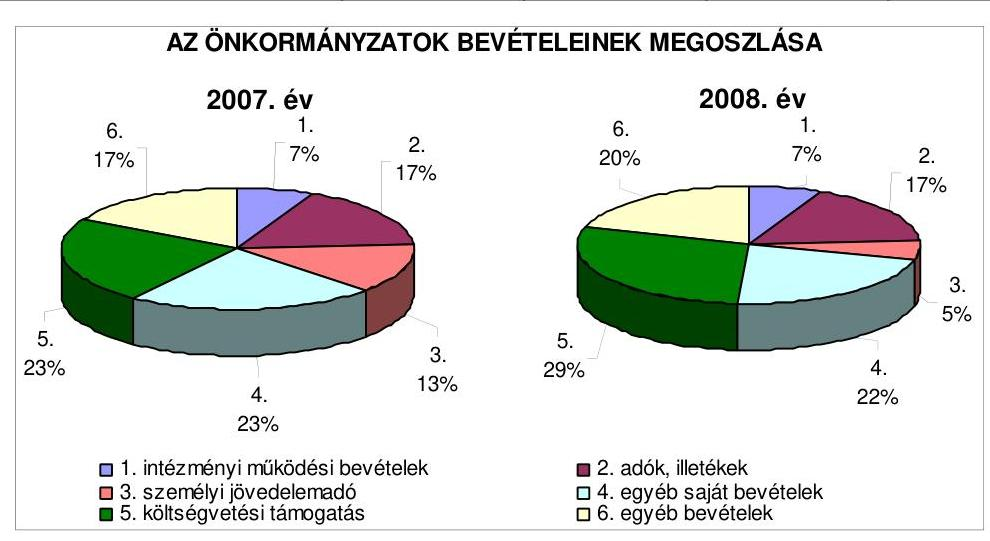

A helyi önkormányzatok könyvviteli mérleg szerinti vagyona a 2008. év végére a 2005. évihez viszonyítva 12,6\%-kal nőtt, a 2008. év végén 11099 mil-

[^0]
[^0]:    ${ }^{9}$ A helyi önkormányzatok 2008. évi személyi jövedelemadó bevétele 49\%-kal kisebb, a kapott költségvetési támogatása $36 \%$-kal magasabb volt, mint a 2005. évben.

---

liárd Ft volt ${ }^{10}$. A könyvviteli mérleg szerinti vagyon értékének a 2005. évről a 2008. évre történő növekedését elsősorban az ingatlanok és a kapcsolódó vagyoni értékű jogok $8 \%$-os, a befektetett pénzügyi eszközök $7 \%$-os, valamint az üzemeltetésre, kezelésre, koncesszióba átadott, vagyonkezelésben lévő eszközök $23 \%$-os emelkedése eredményezte. A pénzeszközök év végi állománya a 2005. évihez viszonyítva a 2008. év végéig $126 \%$-kal nőtt döntően a 2007. és 2008. évi kötvénykibocsátásokból származó bevételek következtében.

Adatok: milliárd Ft-ban

| A HELYI ÖNKORMÁNYZATOK VAGYONA |  |  |  |  |
| :-- | --: | --: | --: | --: |
| Eszközök | 2005. | 2006. | 2007. | 2008 |
| Immateriális javak | 21 | 25 | 26 | 25 |
| Tárgyi eszközök | 7238 | 7576 | 7688 | 7803 |
| Befektetett pénzügyi eszközök | 556 | 558 | 557 | 592 |
| Üzemeltetésre, kezelésre átadott eszközök | 1482 | 1587 | 1721 | 1824 |
| FORGÓESZKÖZÖK | 564 | 554 | 632 | 855 |
| ESZKÖZÖK ÖSSZESEN | $\mathbf{9 8 6 1}$ | $\mathbf{1 0 3 0 0}$ | $\mathbf{1 0 6 2 4}$ | $\mathbf{1 1 0 9 9}$ |
| KÖTELEZETTSÉGEK | $\mathbf{6 9 7}$ | $\mathbf{9 2 5}$ | $\mathbf{1 0 8 8}$ | $\mathbf{1 3 9 5}$ |
| SAJÁT VAGYON | $\mathbf{9 1 6 4}$ | $\mathbf{9 3 7 5}$ | $\mathbf{9 5 3 6}$ | $\mathbf{9 7 0 4}$ |

A beruházások hatására növekvő ingatlanértékkel szemben kedvezőtlen, hogy évente nagymértékben növekedett a kötelezettségek év végi állománya, amelynek értéke a 2008. év végén a 2005. év végi érték kétszeresére emelkedett. A növekedés $87 \%$-át a hosszú lejáratú kötelezettségek, ennek $63 \%$-át a kötvénykibocsátások okozták. A helyi önkormányzatok 2008. év végi könyvviteli mérleg szerinti 1274,3 milliárd Ft hosszú és rövid lejáratú kötelezettségéből a kötvénykibocsátások miatti kötelezettségállomány összesen 444,7 milliárd Ft. A kötvénykibocsátás miatti 2009. évi fizetési kötelezettség 2,9 milliárd Ft. A törlesztési kötelezettség éves összege az átlagosan 3-4 évre halasztott tőketörlesztési kötelezettség következtében emelkedni fog.

A 2005-2008. években a helyi önkormányzatok több mint kétharmada költségvetési hiánnyal hagyta jóvá az éves költségvetését. A költségvetés végrehajtása során a teljesített költségvetési bevételek az önkormányzatok tervezettnél jelentősen kisebb arányánál (25-32-26-23\%-ánál) nem fedezték a költségvetési kiadásokat. A 2007-2008. évben a költségvetési hiány finanszírozásában szerepet játszó pénzügyi műveleteken belül csökkent a hitelt felvevő önkormányzatok száma a kötvénykibocsátás elterjedése következtében. A gazdálkodáshoz hitelt legnagyobb arányban a megyei jogú városi önkormányzatok (96-96-74-87\%-uk), valamint a Budapest fővárosi kerületi önkormányzatok és a városi önkormányzatok - közel azonos, kétharmad arányban - vettek igénybe. A költségvetési beszámolók szerint a 2005-2008 közötti években a helyi önkormányzatok növekvő aránya egészítette ki kötvénykibocsátás útján bevételeit.

[^0]
[^0]:    ${ }^{10}$ A helyi önkormányzatok eszközeinek és azok forrásainak részletezését a jelentés 3. számú melléklete tartalmazza.

---

Helyi önkormányzat kötvényt a 2005. évben nem bocsátott ki, míg 2006-2008 között a 0,3-3,1-3,9\%-uknál - elsősorban a kiemelt önkormányzati körbe tartozóknál - történt kötvénykibocsátás. A 2007. évi 174,7 milliárd Ft kötvénykibocsátás $99,7 \%$-a, a 2008. évi 196,4 milliárd Ft kötvénykibocsátás $98,7 \%$-a fejlesztési célú volt. A kötvénykibocsátás legkisebb, illetve legnagyobb összege a 2007. évben 0,2-9,4 milliárd Ft, a 2008. évben 0,02-12 milliárd Ft volt. A 2006-2008 közötti években az összes önkormányzat 6,9\%-ánál volt kötvénykibocsátásból elért bevétel, a megyei önkormányzatok $94,7 \%$-ánál ${ }^{11}$, a megyei jogú városi és a Budapest fővárosi kerületi önkormányzatok 56,5-56,5\%-ánál, valamint a városi önkormányzatok $45,7 \%$-ánál ${ }^{12}$.

# A költségvetési és pénzügyi egyensúly 

Az országos tendenciához hasonlóan, az ellenőrzött önkormányzatok évente jelentős aránya, a 2005-2007. években mintegy nyolctizede, a 2008. évben héttizede nem biztosította a tervezett költségvetési bevételek és kiadások egyensúlyát, költségvetési bevételeik nem nyújtottak fedezetet a költségvetési kiadásokra. A tervezett költségvetési kiadások finanszírozása és az évközi likviditás érdekében, illetve a költségvetési egyensúly kialakításához 2005-2008 között mintegy kétharmaduk tervezett rövid lejáratú és likvid hitel felvételből, valamint 52-70-56-39\%-uk hosszú lejáratú hitel felvételéből származó bevételt. Az ellenőrzött önkormányzatok tervezettnél alacsonyabb aránya (27-44-39-29\%ánál) zárta az egyes éveket pénzügyi hiánnyal, és a tervezettnél kisebb arányuk (44-51-52-38\%-uk) vett fel rövid lejáratú és likvid hitelt. Az ellenőrzött önkormányzatok közül kötvénykibocsátásból származó bevételt eredeti előirányzatként tervezett a 2007. évben egy önkormányzat, a 2008. évben 12\%-uk, a költségvetés végrehajtása során azonban már mintegy negyedük ( $26 \%$-uk), illetve $23 \%$-uk bocsátott ki kötvényt.

A költségvetés végrehajtása során a tervezetthez viszonyítva nőtt a kötvényt kibocsátó önkormányzatok száma, az ellenőrzött önkormányzatok negyede a 2007-2008. évben - többségében (74\%) deviza alapú, változó kamatozású kötvényt bocsátott ki, amelyek közel nyolctizedénél a futamidő 20 év volt. A tőketörlesztés megkezdéséhez meghatározott türelmi idő 1-10 év között változott, de három önkormányzat a futamidő végére egyösszegű tőketörlesztést vállalt. A kötvénykibocsátások az önkormányzatok fokozódó eladósodását jelentették, az ebből származó kötelezettség visszafizetését - a képviselő-testületi előterjesztések szerint - a működési célú költségvetési bevételből tervezték. A 2007. évi bevételek összetételét figyelembe véve az ellenőrzött önkormányzatok a kötvénykibocsátásokhoz kapcsolódó tőke és kamatfizetési kötelezettségvállalások során betartották az Ötv-ben meghatározottak szerinti felső határt, annak átlag harmadáig vállaltak hosszú távra évenkénti fizetési kötelezettséget. A kötvénykibocsátásból származó bevétel $71 \%$-át felhalmozási célra, $10 \%$-át

[^0]
[^0]:    ${ }^{11}$ A megyei önkormányzatok közül egyedül Győr-Moson-Sopron Megyei Önkormányzat nem élt a 2006-2008. években kötvénykibocsátással.
    ${ }^{12}$ Kötvénykibocsátásból volt bevétel 2006-2008 között a nagyközségi-községi önkormányzatok 16,4-1,4\%-ánál.

---

múködési célra, 19\%-át adósságrendezésre ${ }^{13}$ tervezték felhasználni a későbbi években. A kibocsátás első éveiben a kötvénykibocsátásból elért bevétel mintegy $95 \%$-át betétként helyezték el, valamint rövid és hosszú lejáratú értékpapírok vásárlásra fordították. A kötvénykibocsátás a visszafizetendő deviza árfolyamváltozása, valamint a változó kamatfeltétel miatt az önkormányzatok számára kockázatot jelent ${ }^{14}$.
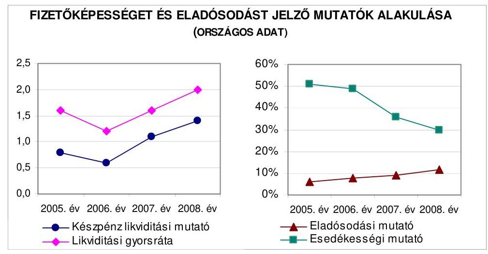

A helyi önkormányzatok összesített adatai alapján számított eladósodási mutató ${ }^{15}$ 2005-2008 közötti folyamatos emelkedése jelzi, hogy az összes forráson belül emelkedett a hosszú és rövid lejáratú kötelezettségek együttes aránya. Ugyanezen időszakban az összes fizetési kötelezettségen belül csökkent a rövid lejáratú kötelezettségek aránya, a hosszú lejáratú kötelezettségek ennél nagyobb arányú emelkedése hatására. Az esedékességi mutató ${ }^{16}$ csökkenését eredményezte, hogy a rövid lejáratú kötelezettségek állományának növekedési üteme kisebb mértékű (29\%) volt, mint az összes fizetési kötelezettség növekedése (119\%), így a rövid távon teljesítendő kötelezettségek fizetőképességre gyakorolt hatása mérséklődött. Az eladósodás az önkormányzatok pénzügyi helyzetét hosszú távon kedvezőtlenül befolyásolja. A 2005-2006. évi likviditási mutatók ${ }^{17}$ fizetőképességi szempontból jeleztek rosszabbodó pénzügyi helyzetet. A készpénz likviditási mutató és a likviditási gyorsráta 2005-2006 között csökkent, azonban a 2007-2008. évek végén mindkét mutató értéke növekedett az

[^0]
[^0]:    ${ }^{13}$ Fejlesztési-beruházási hitelek törlesztésére a kötvénykibocsátásból elért bevétel 12\%át, múködési célú hitelek törlesztésére 7\%-át tervezték felhasználni.
    ${ }^{14}$ A helyi önkormányzatok kötvénykibocsátásának makrogazdasági hatásait elemzi az ÁSZ Fejlesztési és Módszertani Intézete által a 2009. évi költségvetési tervezés makrogazdasági kockázatainak elemzéséről 2008. november hóban nyilvánosságra hozott értékelő tanulmány (74-77. oldal).
    ${ }^{15}$ Eladósodási mutató = (összes kötelezettség-egyéb passzív pénzügyi elszámolások)/öszszes forrás
    ${ }^{16}$ Esedékességi mutató = rövid lejáratú kötelezettségek/(összes kötelezettség-egyéb paszszív pénzügyi elszámolások)
    ${ }^{17}$ Készpénz likviditási mutató = pénzeszközök/rövid lejáratú kötelezettségek
    Likviditási gyorsráta = (követelések+forgatási célú értékpapírok+pénzeszközök)/rövid lejáratú kötelezettségek

---

év utolsó hónapjaiban történt kötvénykibocsátásokból származó bevétel betétlekötése, illetve pénzeszközök közötti nyilvántartása hatására. A likviditási mutatók 2007-2008. év végi emelkedései azonban nem jelentik a fizetőképesség tartós, kedvező irányú változását, mivel a kötvénykibocsátásból származó bevétel visszafizetési kötelezettsége - az 1-10 éves türelmi idő lejáratát követően mint rövid lejáratú kötelezettség a tárgyévi fizetőképességet a korábbiakhoz viszonyítva csökkenteni fogja. A pénzügyi mutatók együttesen rámutatnak az önkormányzatok fokozódó eladósodására, a pénzügyi helyzet kedvezőtlen irányú változására.

Az ellenőrzött önkormányzatok közel négyötöde 2005-2008 között az évenkénti költségvetés megállapításakor - az Áht-ban előírtak ellenére - a költségvetési hiány finanszírozásával kapcsolatos pénzügyi műveletek bevételeit költségvetési hiányt, illetve költségvetési többletet módosító költségvetési bevételként számolta el. Ezáltal a költségvetési rendeletben nem mutatták be az önkormányzat valós pénzügyi helyzetét, a költségvetési hiány, vagy többlet összegét, valamint a finanszírozási célú pénzügyi műveletek bevételeit, kiadásait és az ezek egyenlegeként keletkező hiányt, vagy többletet.

A költségvetésben jóváhagyott eredeti előirányzatokat 2005-2007 között az ellenőrzött önkormányzatok növekvő arányánál, - a költségvetési bevételek főösszegét 74-82-89\%-nál, a költségvetési kiadások főösszegét 54-56-65\%-nál teljesítették túl. A 2005-2007. évi eredeti előirányzatok alul- vagy túlteljesítése a költségvetés tervezésének hiányosságára vezethető vissza az ellenőrzött önkormányzatok mintegy kétharmadánál. Az eredeti elöirányzatok tervezését nem kellő megalapozottsággal végezték az előző évi pénzmaradvány igénybevétel vonatkozásában 54-55-65\%-nál, a beruházási, felújítási kiadások esetében közel egyharmadnál, a helyi adóbevétel tervezése területén 17-18-21\%-nál. A helyi adóbevételeket és a pénzmaradvány igénybevételt alultervező önkormányzatok az indokoltnál nagyobb költségvetési hiányt hagytak jóvá a 20052007. évi költségvetési rendeleteikben. Az előző évi pénzmaradvány igénybevétel tervezésével összefüggő hiányosság miatt az érintett önkormányzatoknál elmaradt, vagy az indokoltnál kisebb összegben tervezték meg bevételként az előző évi - szabad, vagy kötelezettséggel terhelt - pénzmaradvány igénybevételét, valamint e bevételi előirányzathoz kapcsolódóan az előző évről áthúzódó kiadásaikat, kötelezettségeiket. Az ellenőrzött önkormányzatok mintegy fele figyelmen kívül hagyta az Áht-nak azt a rendelkezését, hogy a költségvetésnek az érvényességi időtartam alatt a feladat ellátásához teljesíthető jóváhagyott kiadásokat és a teljesítendő várható bevételeket előirányzatként kell tartalmaznia.

# Felkészültség az európai uniós források igénybevételére 

Az ellenőrzött önkormányzatok mintegy tizede 2005-2008 között eredményesen felkészült az európai uniós források igénybevételére és a várható támogatás felhasználására. Az európai uniós források igénybevételére irányuló pályázatok a gazdasági programokban, ágazati, szakmai és területfejlesztési koncepciókban megfogalmazott fejlesztési célkitűzésekhez kapcsolódtak, azonban nem készült fel eredményesen az európai uniós források igénybevételére és felhasználására a szabályozottság terén az ellenőrzött önkormányzatok 82\%-a, a szervezettség vonatkozásában 17\%-a. A szabályozások ezen önkormányza-

---

toknál nem tartalmazták a pályázatfigyelést végzők és a döntés, illetve a dön-tés-előkészítési jogkörrel rendelkezők közötti információk szolgáltatásának kötelezettségét, a polgármester és a fejlesztési feladat lebonyolítója közötti kapcsolattartás rendjét, nem írták elő a folyamatba épített, előzetes és utólagos vezetői ellenőrzési feladatokat, továbbá a belső ellenőrzési stratégiát és éves terveket megalapozó kockázatelemzések nem terjedtek ki az európai uniós forrásokkal támogatott fejlesztési feladatokra. Az önkormányzati hivatalok szervezetén belül, valamint külső szervezetek igénybevételével a pályázatfigyelés és a pályázatkészítés személyi feltételeit az ellenőrzött önkormányzatok biztosították, azonban a külső szervezetekkel kötött szerződések mintegy felében nem rögzítették a pályázatkészítést végző személyek és a pályázat benyújtásáért felelős személyek közötti kapcsolattartás és felelősség szabályait. Nem határozták meg a külső szervezetekkel kötött szerződésben a fejlesztési feladatok lebonyolítását végző személyek feladatait és a kapcsolattartás rendjét, továbbá a személyre szóló felelősséget.
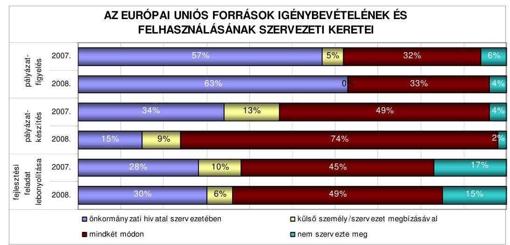

Az ellenőrzött önkormányzatok a 2005-2008. évekre vonatkozó fejlesztési célkitűzéseiket meghatározták, amelyek közel $80 \%$-a helyzetelemzésen, valamint a megvalósítás lehetséges pénzügyi forrásainak figyelembevételén alapult. Az Ötv. előírása ellenére a 2006-2010 közötti időszakra az ellenőrzött önkormányzatok közel egytizede nem fogadta el gazdasági programját. A fejlesztési célkitűzéseik megvalósításához az ellenőrzött önkormányzatok 98\%-a európai uniós forrás igénybevételéről döntött, amelyek alapján benyújtott pályázatok mintegy fele részesült támogatásban ${ }^{18}$.

[^0]
[^0]:    ${ }^{18}$ Az Egységes Monitoring Informatikai Rendszer adatai szerint a helyi önkormányzatok 2008. december 31-ig az NFT 2004-2006 közötti operatív programjai keretében 2765 projekthez 175 milliárd Ft, az ÚMFT 2007-2013 közötti operatív programjai esetében 893 projekthez 491 milliárd Ft összegű támogatási szerződést kötöttek.

---

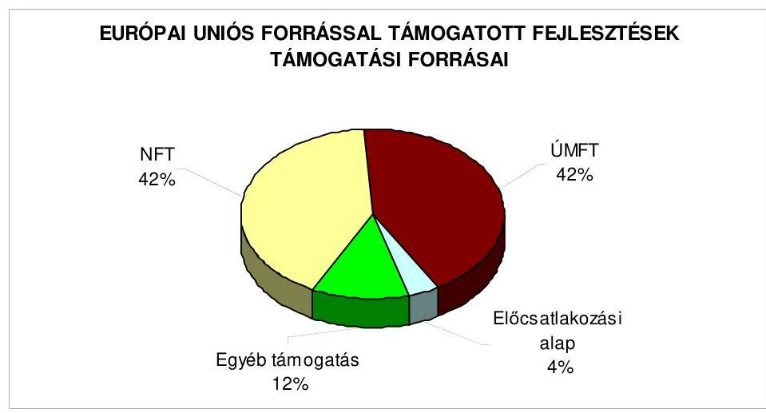

A pályázatok elutasításának okai között a pályázati források hiánya, a pályázatok szakmai kidolgozatlansága, tartalmi és formai hibái, a pályázati feltételek hiányos vagy nem teljesítése szerepelt. A 2005-2008. évek költségvetési rendeleteiben az ellenőrzött önkormányzatok a pályázatokhoz szükséges saját forrás biztosításáról gondoskodtak, annak fedezetét mintegy tizedük pénzintézeti hitel felvételével, valamint kötvénykibocsátásból származó bevételből tervezte finanszírozni. Az ellenőrzött önkormányzatok 2005-2008 között az európai uniós forrással támogatott, befejezett fejlesztési feladatokat a tervezett mértékű finanszírozási forrásmegosztástól csak kis mértékben ( $0,3 \%$-kal) eltérő forrásösszetétellel valósították meg. A támogatással megvalósított célkitűzések kiadásainak finanszírozásában a teljesített saját forrás részaránya a tervezetthez viszonyítva, a megvalósítás során jelentkezett pót- és többletmunkák, valamint a nem támogatott feladatok kiadásai miatt emelkedett. A hatályos támogatási szerződésben rögzített európai uniós és hazai támogatások részaránya a tervezettnél alacsonyabb mértékben teljesült, amelyet a közbeszerzési eljárás eredményeként megkötött vállalkozási szerződések előirányzottnál alacsonyabb összegei, az általános forgalmi adókulcs $25 \%$-ról $20 \%$-ra történő csökkentése, valamint a projektek külső ellenőrzésekor feltárt hiányosságok miatt csökkentett összegű támogatás folyósítása okozott.

Az európai uniós forrással támogatott, ellenőrzött fejlesztési feladatok megvalósítása során a támogatási szerződések több mint kétharmadát módosították, az időbeli csúszások, az előlegigénylések, a támogatási és a kiadási ütemezések évek közötti átcsoportosításai, valamint a műszaki tartalom változásai miatt. A kifizetési kérelmek benyújtása után a támogatások folyósítása átlagosan fél hónap és egy év közötti időtartamot vett igénybe, az időbeli elhúzódást elsősorban az igénylést alátámasztó dokumentumok hiánya, a számlák alaki és tartalmi hiányosságai okozták. A közremúködő szervezetek a hiánytalanul benyújtott kifizetési kérelmeket az ellenőrzött projektek mintegy háromnegyedénél 60 napon túl teljesítették. Az európai uniós forrással támogatott fejlesztési feladatok megvalósításához az önkormányzatok a saját forrást biztosították, annak fedezete közel egytizedüknél hitel volt. A strukturális alapok által támogatott fejlesztési feladatok esetében az önkormányzatok eleget tettek a támogatás megelőlegezési követelményének, amelynek fedezetét közel tizedük rövid lejáratú hitelből biztosította. A fejlesztési feladatok megvalósításakor több mint egynegyedüknél a tervezetthez viszonyítva többletkiadás jelentkezett.

---

A támogatási szerződésekben rögzített célok megvalósultak, azonban az ellenőrzött feladatoknál a tervezett feladatmutatók mintegy három százaléka nem teljesült.

Az önkormányzati hivatalok közel kétharmadánál az európai uniós források felhasználásával megvalósított feladatok kiadásainak és bevételeinek teljesítése során a folyamatba épített, előzetes és utólagos vezetői ellenőrzéseket végrehajtották. A támogatásban részesült önkormányzatok döntő többségénél (98\%nál) azonban a belső ellenőrzés nem vizsgálta a 2005-2008. években az európai uniós forrás felhasználását. Az európai uniós forrással támogatott fejlesztési feladatok megvalósulását a közremúködő szervezetek, az ÁSZ, a KEHI és az Európai Bizottság az ellenőrzött önkormányzatok mintegy 80\%-ánál vizsgálták, megállapításaikra a polgármesterek intézkedést tettek.
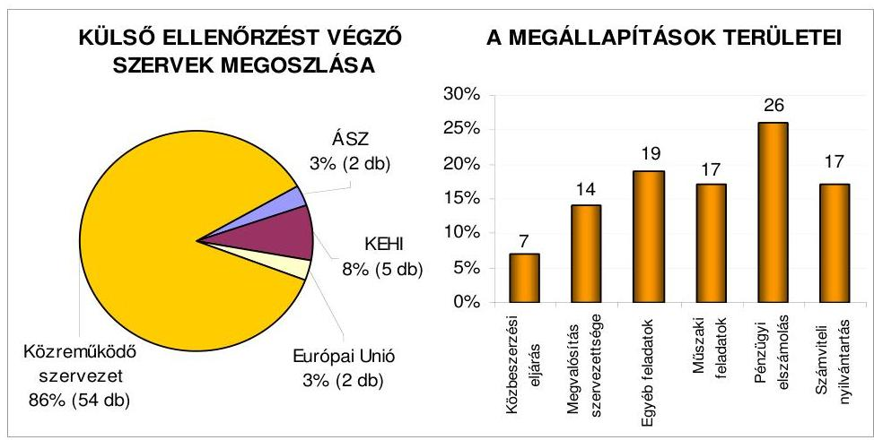

# Az e-közigazgatásra történő felkészülés, egyes gazdálkodási adatok nyilvánossága 

Az ellenőrzött önkormányzatok ${ }^{19}$ közel fele meghatározta az informatikai és/vagy közigazgatási stratégiáját, amelyben a közigazgatás korszerűsítéséről szóló kormányhatározatban előírt feltételek alapján mintegy negyedük a 4. elektronikus szolgáltatási szint, egytizedük a 3. elektronikus szolgáltatási szint elérését tűzte ki célul. A korszerű, hatékony és átlátható e-közigazgatás kialakításához és múködtetéséhez szükséges feltételek biztosítása érdekében az önkormányzatok közel egyharmada európai uniós támogatásra nyújtott be pályázatot. Ezen belül a városi önkormányzatok egyharmada több önkormányzattal összefogva, társulás keretében pályázott. Az ellenőrzött önkormányzatok mintegy 90\%-ánál működtettek e-közigazgatási szolgáltatásokat biztosító informatikai rendszert, ezek mintegy harmada az 1., közel kétharmada a 2., 2\%a a 3. elektronikus szolgáltatási szinten biztosította az ügyintézést. A 3. és a 4. elektronikus szolgáltatási szintnek megfelelő ügyintézés széles körű kialakítását a pénzügyi források, az informatikához értő humán erőforrás, valamint a szükséges szoftver hiánya késleltette, és megvalósítását - az ellenőrzés során kapott tájékoztatás szerint - lakossági igény sem sürgette.

[^0]
[^0]:    ${ }^{19}$ Az e-közigazgatási feladatok ellátását a nagyközségi, községi önkormányzatoknál nem vizsgáltuk.

---

A közérdekú adatok elektronikus közzétételére az Eisztv. alapján valamennyi önkormányzat 2008. július 1-jétől kötelezett ${ }^{20}$. A közzétételi listákat az ellenőrzött önkormányzatok negyede jelentette meg az IHM rendeletben előírt szerkezetben és tartalommal. Az Áht-ban előírt közzétételi kötelezettségét azonban sem honlapján, sem a helyben szokásos módon nem teljesítette az ellenőrzött önkormányzatok több mint fele (58\%-a) a múködési és fejlesztési célú támogatások, valamint közel fele (43\%-a) az Áht-ban meghatározott szerződési adatok esetében, továbbá $40 \%$-a - az Ámr-ben előírtakat figyelmen kívül hagyva -elmulasztotta az éves költségvetési beszámoló szöveges indoklásának közzétételét. A közérdekú adatok közzétételi kötelezettségére vonatkozó jogszabályi előírások - a közzétételi idő és a közzéteendő adatok meghatározása tekintetében - évek óta nincsenek összhangban egymással, mivel a nem normatív, céljellegú, múködési és fejlesztési támogatások, továbbá az államháztartás pénzeszközei felhasználásával, az államháztartáshoz tartozó vagyonnal történő gazdálkodással összefüggő szerződések, megrendelések meghatározott adatainak közzétételét az Áht. szerint a döntés meghozatalát követő hatvanadik napig kell teljesíteni. Ezzel szemben az Eisztv-ben foglalt szabályozás a közzétételi kötelezettséget negyedévente írja elő, valamint az IHM rendelet közzétételi egységeket tartalmazó melléklete a múködési célú támogatások közzétételi kötelezettségét nem tartalmazza.

# A költségvetési gazdálkodás kontrolljai 

A költségvetés tervezési és a zárszámadás készítési folyamatok szabályozottsága az ellenőrzött kiemelt önkormányzati körbe tartozó, valamint városi önkormányzatok több mint felénél (55\%-ánál, az előző évben 57\%-ánál) összességében alacsony kockázatot jelentett a feladatok megfelelő és szabályszerű végrehajtásában, mivel a jegyzők az Ámr. előírásainak és a helyi sajátosságoknak megfelelően kialakították a tervezési és a zárszámadás készítési feladatok belső kontrolljait, előírták az ellenőrzési feladatokat, határidőket és kijelölték azok felelőseit. Az előző évhez hasonlóan az önkormányzatok mintegy ötödénél a szabályozottság hiányosságai közepes kockázatot jelentettek a költségvetés tervezési és a zárszámadás készítési feladatok végrehajtásában, mivel a jegyzők hiányosan szabályozták az ellenőrzési feladatokat, azonban a kialakított belső kontrollok végrehajtásuk esetén a lehetséges hibák többsége ellen védelmet nyújtottak.

A tervezési és a zárszámadás készítési feladatok belső kontrolljainak kialakítására vonatkozó kötelezettség teljesítését a jegyzők az előző évhez hasonló arányban, az önkormányzatok közel negyedénél - az Áht. előírásai ellenére elmulasztották, ezért a szabályozás hiányosságai magas kockázatot jelentettek ezen feladatok megfelelő és szabályszerű végrehajtásában. Nem írták elő a költségvetési intézmények részére a költségvetési javaslat összeállításával kapcsolatos követelményeket a kiemelt önkormányzati körbe tartozók, valamint a városi önkormányzatok mintegy ötödénél. Nem határozták meg az önkormányzatok kétötödénél a költségvetési intézmények és az önkormányzati

[^0]
[^0]:    ${ }^{20}$ A közérdekú adatok honlapon történő közzétételére az Eisztv. 21. § (3) bekezdése alapján a megyei, valamint az 50 ezernél nagyobb lakónépességú városi önkormányzatok 2007. január 1-től kötelezettek.

---

hivatal szervezeti egységei által benyújtott költségvetési igények indokoltságának, illetve teljesíthetőségének ellenőrzésére, az önkormányzatok felénél a tervezett saját bevételek előirányzatainak és az azok megalapozását szolgáló önkormányzati rendeletek összhangjának felülvizsgálatára vonatkozó belső kontroll tevékenységeket. Nem írták elő az intézményi pénzmaradványok kimunkálásának felülvizsgálatára vonatkozó feladatokat az önkormányzatok közel egyharmadánál.
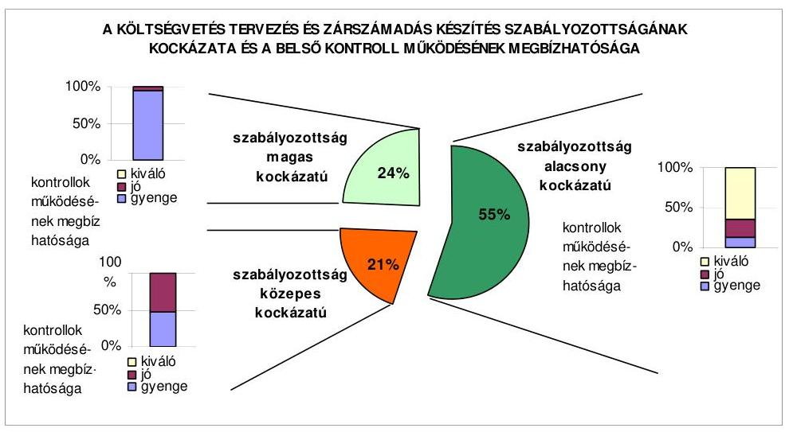

A költségvetés tervezés és a zárszámadás készítés folyamatában kialakított belső kontrollok múködésének megbízhatósága kiváló volt az ellenőrzött önkormányzatok 15\%-ánál, mivel hiányosság nem fordult elő a költségvetés tervezési és a zárszámadás készítési folyamatok belső kontrolljainak kialakításában és múködésében. Az önkormányzatok ötödénél összességében kiváló volt a belső kontrollok megbízhatósága, mert a kontrollok múködtek, teljesítették a lényeges hibák, szabálytalanságok és gyenge teljesítmények megelőzésével, feltárásával és kijavításával kapcsolatos funkciójukat. A belső kontrolleljárások az önkormányzatok egynegyedénél (az előző évben ötödénél) jól múködtek, a megállapított hiányosságok ellenére kielégítették a célszerűségi elvárásokat a múködésbeli hibák megelőzése, feltárása és kijavítása tekintetében. Az önkormányzatok 40\%-ánál (az előző évben mintegy harmadánál) a költségvetés tervezés és a zárszámadás készítés ellenőrzésére vonatkozó kötelezettségük teljesítését az Áht-ban foglalt előírások ellenére elmulasztották, ezért a belső kontrollok múködésének megbízhatósága gyenge volt, amit ezen önkormányzatok közel kétharmadánál a jegyzői szabályozás hiánya okozott. Nem vizsgálták az intézmények és az önkormányzati hivatalok szervezeti egységei által benyújtott költségvetési igények indokoltságát, valamint a zárszámadás készítés során az intézményi pénzmaradvány megállapítás szabályszerűségét az önkormányzatok négytizedénél, az intézményi számszaki beszámolók, és azok jegyző által meghatározott adatszolgáltatással való összhangját az önkormányzatok közel kétharmadánál. Nem ellenőrizték az önkormányzatok mintegy negyedénél az Áht. és az Ámr. előírásai ellenére - a költségvetési intézmények részére meghatározott, tervezéssel kapcsolatos követelmények teljesítését, továbbá közel kétharmadnál nem végezték el a tervezett saját bevételek előirányzatainak, valamint azok megalapozását szolgáló önkormányzati rendeletek összhangjának ellenőrzését.

---

A gazdálkodási, a pénzügyi-számviteli és a folyamatba épített, előzetes és utólagos vezetői ellenőrzési feladatok szabályozottsága az önkormányzatok közel egyharmadánál (az előző évben ellenőrzöttek azonos arányánál) összességében alacsony kockázatot jelentett a feladatok megfelelő és szabályszerű végrehajtásában, mivel a belső kontrolltevékenységeket a jegyzők a jogszabályi előírásoknak és a helyi sajátosságoknak megfelelően kialakították. Az önkormányzatok közel felénél (az előző évhez viszonyítva növekvő hányaduknál) a szabályozás hiányosságai közepes kockázatot jelentettek a feladatok megfelelő végrehajtásában, mert a jegyzők hiányosan szabályozták az ellenőrzési feladatokat, azonban a kialakított belső kontrollok - megfelelő múködtetésük esetén - a lehetséges hibák többsége ellen védelmet nyújtottak. A belső kontrollok kialakítására vonatkozó kötelezettségük teljesítését az önkormányzatok mintegy egynegyedénél (az előző évhez képest csökkenő hányaduknál) a jegyzők - az Áht. előírásai ellenére - elmulasztották, ezáltal a szabályozás hiányosságai a gazdálkodási feladatok megfelelő és szabályszerű végrehajtásában magas kockázatot jelentettek.
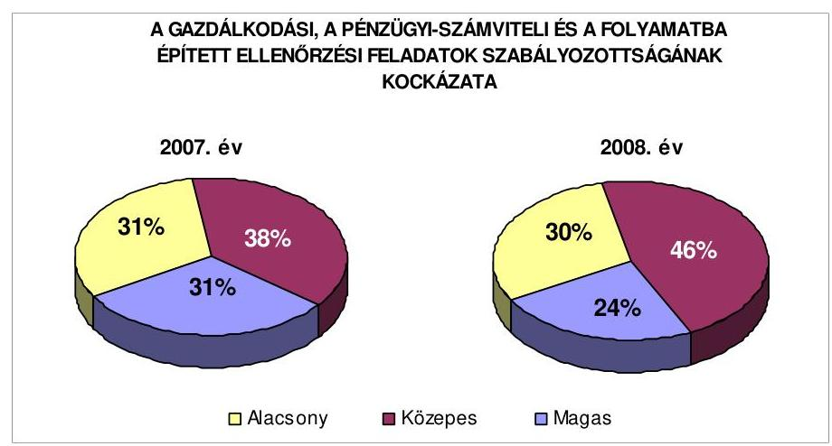

Az önkormányzati hivatalok mintegy egyharmada - az Ámr. előírása ellenére - a képviselő-testület által jóváhagyott SzMSz-szel nem rendelkezett, egynegyedénél a gazdasági szervezet által ellátandó feladatok szabályozására nem készítettek ügyrendet. A pénzügyi dolgozók munkaköri leírásai az önkormányzati hivatalok közel felénél nem tartalmazták a munkafolyamatba épített ellenőrzési jogköröket és feladatokat. Az önkormányzatok mintegy negyedénél (az előző évinél nagyobb arányánál) a jegyzők belső szabályzatban nem rendelkeztek a pénzgazdálkodás meghatározó belső kontrollját jelentő szakmai teljesítésigazolás módjáról, valamint ötödénél (az előző évinél kisebb arányánál) az ellenőrzési feladatok elvégzésére jogosult személyeket nem jelölték ki. A szakmai teljesítésigazolás módjára vonatkozó szabályozást elmulasztó önkormányzatok arányának növekedésében közrejátszott, hogy a jogszabályi előírás változását a jegyzők a helyi szabályozásban későn, esetenként egyáltalán nem vették figyelembe. Az érvényesítési feladatok ellátására az önkormányzatok közel tizedénél a jegyzők nem adtak írásban megbízást, továbbá az írásbeli megbízások ugyanilyen arányánál az iskolai végzettségre és a képesítésre vonatkozó előírást nem tartották be. A Vhr-ben előírt évenkénti, illetve kétévenkénti leltározási kötelezettséget az önkormányzatok előző évinél kisebb arányánál ( $20 \%$-ánál) a számviteli szabályzatokban nem rögzítették a jegyzők. Az üzemeltetésre, kezelésre átadott eszközök leltározásának módját, valamint ezen

---

eszközök selejtezésével, hasznosításával kapcsolatos döntés hozatalára jogosultak körét azonban - az évek óta tett javaslataink ellenére - az önkormányzatok még mindig indokolatlanul magas arányánál (mintegy felénél) nem határozták meg. Az önköltségszámítás rendjét és a pénzkezelés során az utólagos vezetői ellenőrzés gyakoriságát és az ellenőrzés dokumentálásának módját az Ámr. előírása ellenére az önkormányzatok előző évivel hasonló arányánál - közel kétharmadánál - nem határozták meg.

A FEUVE rendszerét az Áht. és az Ámr. előírásai ellenére nem, illetve nem az önkormányzati gazdálkodás folyamataira és sajátosságaira tekintettel alakították ki a jegyzők. Az ellenőrzési nyomvonalat az előző évinél nagyobb arányban (az önkormányzatok mintegy háromnegyedénél) elkészítették, amelyek $90 \%$-ában azonosították a folyamatokat és a folyamatgazdákat, illetve megjelölték az egyes feladatok végrehajtásáért felelős személyeket. Az önkormányzatok közel felénél kockázatkezelési eljárásrendben rögzítették a kockázatok azonosítását, azonban mintegy kétharmadnál elmaradt a kockázatok folyamatgazdáinak, és az elfogadható kockázati szintnek a meghatározása. A jegyzők mintegy háromnegyede meghatározta a szabálytalanságok kezelésének eljárásrendjében a szabálytalanság fogalmát, észlelési kötelezettségét, azonban mintegy harmadnál elmaradt a szabálytalanság esetén teendő intézkedések (eljárások) nyomon követésének és nyilvántartásának előírása.
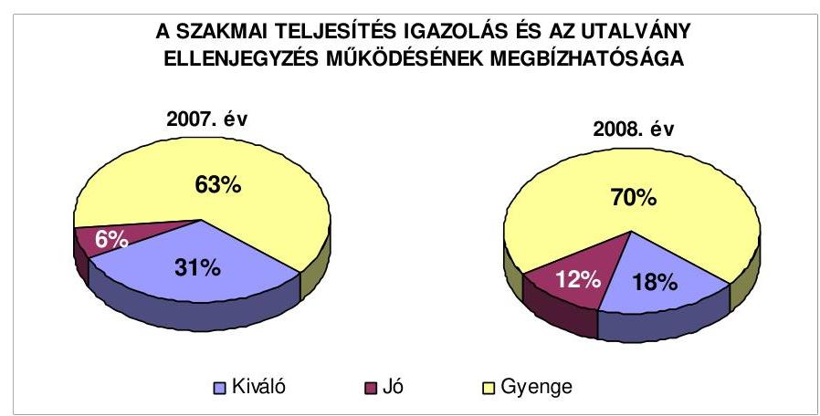

A szakmai teljesítésigazolás és az utalvány ellenjegyzés múködésének megbízhatósága az ellenőrzött önkormányzatok előző évinél alacsonyabb hányadánál volt összességében kiváló. Ezen önkormányzati hivataloknál a kialakított belső kontrollok folyamatosan és hatékonyan múködtek, az esetleges apróbb hiányosságok ellenére teljesítették a lényeges hibák, szabálytalanságok, gyenge teljesítmények megelőzésével, feltárásával és kijavításával kapcsolatos funkciójukat. A belső kontrollok az önkormányzati hivatalok előző évinél nagyobb hányadánál a gazdálkodás folyamatában jól múködtek, a megállapított hiányosságok ellenére kielégítették a célszerűségi elvárásokat a múködésbeli hibák megelőzése, feltárása és kijavítása tekintetében. Az önkormányzatok előző évinél nagyobb arányánál azonban a szakmai teljesítésigazolás és az utalvány ellenjegyzés múködésének megbízhatósága gyenge volt, mert az operatív gazdálkodás folyamatba épített ellenőrzési feladataikra vonatkozó kötelezettség teljesítését - az Ámr-ben foglalt előírások ellenére - elmulasztották. Ezeknél az önkormányzatoknál a belső kontrollok múködésével kapcsolatban megállapított hiányosságok, mulasztások rendszeresek voltak, egy-egy gazdasági ese-

---

mény folyamatában egyidejúleg több kontroll végrehajtása elmaradt, vagy nem folyamatosan és következetesen múködött, amihez a belső szabályozás hiányosságai, köztük a folyamatba épített ellenőrzési feladatok elvégzésére jogosult személyek kijelölésének elmaradása is hozzájárult.

A pénzügyi gazdálkodás során a kiadások jogosultságának, összegszerűségének ellenőrzését, valamint a szerződések, megrendelések, megállapodások teljesítésének szakmai igazolását a kijelölt személyek az Ámr-ben foglalt előírások ellenére nem, vagy nem az előírásoknak megfelelően végezték el az önkormányzatok közel kétharmadánál. A szakmai teljesítést az ellenőrzési feladatra kijelölt személyek - aláírásukkal, az igazolás dátumával, valamint az igazolási kötelezettség végrehajtásának megjelölésével - nem igazolták az önkormányzatok ötödénél. Ezen mulasztások legnagyobb arányban az ellenőrzött megyei jogú városi, városi, községi önkormányzatoknál (ezek mintegy felénél) történtek. A kiadások jogosultságának és összegszerűségének ellenőrzését a legnagyobb arányban (az önkormányzatok közel felénél, a kiemelt önkormányzati körbe tartozó önkormányzatok mintegy kétharmadánál) az államháztartáson kívülre nyújtott múködési célú pénzeszköz átadások teljesítését megelőzően mulasztották el, amihez hozzájárult, hogy a jegyzők által kijelölt személyek a támogatási célok teljesítését az utólagos számadási kötelezettséggel nyújtott támogatások kifizetéseit megelőzően még nem tudták ellenőrizni, így a kapcsolódó ellenőrzési feladatokat - a kiadások jogosultságának és összegszerűségének ellenőrzését - sem végezték el. Az Ámr. 2009. január 1-jétől kiegészült, amely szerint a kiadás teljesítésének és a bevétel beszedésének elrendelése előtt a szerződés, megrendelés, megállapodás teljesítését, „illetve végrehajthatóságát" kell ellenőrizni, azonban az új rendelkezés nem rögzíti, hogy mely kiadások, esetleg bevételek esetében kell a szakmai teljesítés igazolására kijelölt személyeknek a szerződések, megrendelések, megállapodások végrehajthatóságát ellenőrizni.

Az önkormányzatok mintegy tizedénél a szakmai teljesítés igazolására kijelölt személyek a kifizetések alapbizonylatait aláírásukkal és az igazolás dátumával ugyan ellátták, azonban a szakmai teljesítésigazolási mód meghatározásának hiánya miatt ezen aláírások önmagukban nem jelentették a kiadások teljesítésének elrendelése előtti ellenőrzés elvégzésének igazolását. Jogosulatlanul végezték a szakmai teljesítés igazolását a jegyző kijelölésével nem rendelkező személyek az önkormányzatok mintegy negyedénél. A szakmai teljesítést igazoló személyek -az igazolás elvégzését tanúsító aláírásuk ellenére - alapdokumentumok hiánya miatt nem látták el ellenőrzési feladataikat az önkormányzatok közel negyedénél, mivel a kötelezettségvállalásra vonatkozó okmányok hiányában nem ellenőrizték a szerződésben, megrendelésben előírt feladatok teljesítését, a kiadás jogosultságát, összegszerűségét.

Az utalvány ellenjegyzés feladatait - az Ámr. előírásai ellenére - az önkormányzatok előző évihez hasonló arányánál (mintegy kétharmadánál) nem végezték el, mivel a jegyző, vagy az általa felhatalmazott személyek nem ellenőrizték, hogy az utalványozás nem sérti-e a gazdálkodásra vonatkozó szabályokat, illetve mintegy felénél nem győződtek meg arról, hogy a szakmai teljesítés igazolása és az érvényesítés megtörtént-e. Az utalványok ellenjegyzése az önkormányzatok mintegy felénél formai volt, mivel az ellenjegyzők aláírásuk ellenére nem győződtek meg a gazdálkodásra vonatkozó szabályok betartásá-

---

ról azoknál az önkormányzatoknál, amelyeknél a kötelezettségvállalásokat nem foglalták írásba. Az utalványok ellenjegyzői az önkormányzatok mintegy tizedénél nem kifogásolták, hogy a kötelezettségvállalásokat - az Ámr. előírása ellenére - nem előzte meg azok ellenjegyzése, ezáltal a kötelezettségvállalások ellenjegyzői nem hajtották végre a kiadási előirányzat által biztosított fedezet meglétének, valamint a kötelezettségvállalás jogszerűségének munkafolyamatba épített ellenőrzését. Az utalványok ellenjegyzése tekintetében a Budapest fővárosi kerületi önkormányzatoknál tapasztaltunk hiányosságokat legkisebb arányban (egyharmadnál). A kötelezettségvállalások során tapasztalataink szerint bizonytalanságot jelentettek az önkormányzati hivataloknál a Htv., az Áht. és az Ámr. - kötelezettségvállalásra jogosultak körének meghatározására irányuló - rendelkezései, mivel a Htv-ben és az Ámr-ben foglaltak szerint a helyi önkormányzat nevében kötelezettséget a polgármester vagy az általa felhatalmazott személy vállalhat, míg az Áht., valamint az Ámr. egy másik előírása arról rendelkezik, hogy a költségvetési szerv nevében, a költségvetési szerv feladatainak ellátása során fizetési vagy más teljesítési kötelezettséget vállalni az önállóan gazdálkodó költségvetési szerv, illetve a részben önállóan gazdálkodó költségvetési szerv vezetője, vagy az általa, illetve a költségvetési szerv vezető testülete által írásban megbízott személy jogosult. A fenti szabályozás alkalmazásánál a bizonytalanságot az okozza, hogy az Ámr. költségvetési szerv vezetőjének kötelezettségvállalási jogosultságára vonatkozó szabályozása hiányos, mivel nem utal a Htv-ben foglalt eltérő szabályozásra, nem határozza meg az önkormányzati hivatal, mint költségvetési szerv nevében kötelezettségvállalásra jogosult személyeket.

A szakmai teljesítésigazolás és az utalvány ellenjegyzés működésének értékelésére vonatkozó megfelelőségi tesztek eredményei azt mutatták, hogy a vizsgált kulcsfontosságú belső kontrollok az önkormányzatok mintegy kétharmadánál továbbra sem teljesítették a működésbeli hibák megelőzésére, feltárására és kijavítására irányuló céljaikat, így fennállt a lényeges hiba, szabálytalanság, illetve gyenge teljesítmény kockázata. A belső kontrollok működésének hiányosságai következtében az önkormányzatok mintegy tizedénél nem a szerződésben meghatározott összeget fizették ki, illetve nem a jogosult részére teljesítettek kifizetést, továbbá ugyanilyen arányuknál előirányzat nélküli kötelezettségvállalások alapján teljesítettek kiadásokat, ezáltal nem teljesítették az Áht-ban foglalt, a jóváhagyott előirányzatokon belüli gazdálkodásra vonatkozó kötelezettséget.

Az informatikai környezet szabályozottsága az ellenőrzött önkormányzatok 27\%-ánál (az előző évhez viszonyítva csökkenő hányadánál) összességében alacsony kockázatot jelentett az informatikai feladatok biztonságos végrehajtásában, mivel az önkormányzati hivatalok rendelkeztek az informatikai feladatok biztonságos végrehajtásához szükséges szabályzatokkal. A szabályozás hiányosságai az önkormányzatok mintegy egyharmadánál (az előző évhez viszonyítva csökkenő arányánál) közepes kockázatot jelentettek a feladatok megfelelő végrehajtásában, mert a jegyzők hiányosan szabályozták az informatikai feladatokat, azonban a kialakított belső kontrollok - megfelelő működtetésük esetén - a lehetséges hibák többsége ellen védelmet nyújtottak. Az informatikai környezet szabályozásának hiányosságai az önkormányzatok $41 \%$-ánál (az előző évhez viszonyítva növekvő hányaduknál) magas kockázatot jelentettek az informatikai feladatok végrehajtásában, mivel nem készítet-

---

ték el, illetve a képviselő-testületek nem fogadták el az informatikai stratégiát, nem határozták meg az informatikai biztonsági követelményeket, nem készítettek üzletmenet folytonossági tervet, illetve katasztrófa elhárítási tervet, és nem szabályozták az informatikai eszközökhöz történő hozzáférés rendjét.

Az informatikai rendszerek múködtetésénél a kialakított kontrollok megbízhatósága az ellenőrzött önkormányzatok közel egyharmadánál (az előző évhez viszonyítva csökkenő hányadánál) összességében kiváló volt, mivel a használt informatikai programok, programrendszerek követték a jogszabályi változásokat, s egyúttal biztosították a számlarend változásainak kezelését, a pénzügyi-számviteli adatok visszamenőleges elérhetőségét, hálózati rendszert múködtettek, és biztosították az internet használatához szükséges védelmet. Az önkormányzatok közel kétharmadánál (az előző évhez viszonyítva növekvő hányadánál) az informatikai rendszerek múködtetéséhez kialakított kontrollok megbízhatósága jó volt, mivel az alkalmazott szoftverek biztosították a múködésbeli hibák megelőzését és kijavítását, azokban követték a jogszabályi változásokat, a kontrollok múködésében feltárt hiányosságok nem veszélyeztették az eredményes, megbízható múködést. Az informatikai rendszerek múködtetésénél a belső kontrollok megbízhatósága az önkormányzatok 7\%-ánál (az előző évhez viszonyítva csökkenő hányadánál) volt gyenge, mivel ezen önkormányzatok hivatalaiban nem biztosították a számítógépen vezetett analitikus nyilvántartás és a főkönyvi könyvelés automatikus kapcsolatát, illetve a pénzügyiszámviteli számítógépes programokban használt adatok kapcsolatait nem dokumentálták, nem végezték el az informatikai rendszerek belső kontroll tevékenységeit, nem biztosították a hibák megelőzését, feltárását, kijavítását és ezáltal veszélyeztették az eredményes, megbízható múködést.

A belső ellenőrzés szervezeti kereteinek kialakításánál, szabályozásánál és múködésénél a korábbi évekhez viszonyítva előre lépés tapasztalható, különösen a feladatok megszervezésénél, a múködéshez szükséges személyi, szervezeti, szabályozási feltételek biztosításánál. Míg az előző évben ellenőrzött önkormányzatok 11\%-ánál, addig a 2008. évben ellenőrzött önkormányzatok közül csak egynél ${ }^{21}$ nem végeztek ellenőrzést sem az önkormányzati hivatalban, sem a költségvetési intézményeknél. Az Ötv. és a Ber. előírásai alapján a belső ellenőrzés szervezeti kereteinek kialakítására, feladatainak szabályozására vonatkozó kötelezettségét az önkormányzatok 97\%-a teljesítette. A belső ellenőrzés szervezeti kereteinek kialakítása és szabályozása az ellenőrzött önkormányzatok ${ }^{22}$ felénél összességében alacsony kockázatot jelentett a belső ellenőrzés szabályszerű végrehajtásában, mivel előírták a belső ellenőrzési kötelezettséget, meghatározták annak szervezeti és szabályozási kereteit, ellátási módját, továbbá szabályzatban, megállapodásban rögzítették az ellenőrzést végzők jogállását és feladatait, ezáltal a kialakított belső ellenőrzési szervezet, annak szabályszerű működése esetén megfelelő védelmet nyújtott a hibák bekövetkezése ellen. Az önkormányzatok közel felénél a belső ellenőrzési tevékenység szervezeti kereteinek kialakítása, illetve szabályozásának hiányosságai közepes kockázatot jelentettek a feladatok megfelelő végrehajtásában, mivel

[^0]
[^0]:    ${ }^{21}$ Nem végeztek belső ellenőrzést Lőrinci Város Önkormányzatánál.
    ${ }^{22}$ A belső ellenőrzés szervezeti kereteinek szabályozását és múködését mind a 109 ellenőrzött önkormányzatnál vizsgáltuk.

---

hiányosan határozták meg a belső ellenőrzés ellátási módját, e feladatokkal kapcsolatos szabályokat, azonban a kialakított szervezet szabályszerű működtetése esetén a lehetséges hibák többsége ellen védelmet nyújtott. Az ellenőrzött önkormányzatok 3\%-ánál a belső ellenőrzés szervezeti kereteinek kialakítása, illetve szabályozásának hiányosságai magas kockázatot jelentettek a feladatok megfelelő ellátásában, mert a jogszabályi előírások ellenére elmulasztották a belső ellenőrzés szervezeti kereteinek kialakítását, illetve feladatainak szabályozását, ezáltal az nem nyújtott elegendő védelmet a lehetséges hibákkal szemben.

A belső ellenőrzési rendszer múködésénél a megbízhatóság közepes és magas kockázatát okozta, hogy az ellenőrzést végző személy, szervezet jogállását, feladatait hiányosan határozták meg, a belső ellenőrzést külső szolgáltatóval - társulással, vállalkozóval - megszervező önkormányzatok esetében a belső ellenőrzési feladatoknál átláthatatlanná vált a felelősség meghatározása, mivel a megállapodások háromnegyedében nem rendelkeztek a belső ellenőrzési vezetői feladatokról, annak ellátási módjáról. A belső ellenőrzési feladatok stratégiai és éves tervezését az önkormányzatok háromnegyede hiányosan végezte, mert nem, vagy nem a Ber-ben előírtaknak megfelelő stratégiai és éves ellenőrzési tervet készített. Az önkormányzatok több mint felénél (57\%-ánál) nem készítettek kockázatelemzéssel alátámasztott stratégiai tervet, valamint 16\%-ánál a képviselő-testület által jóváhagyott éves ellenőrzési tervet. A jóváhagyott éves ellenőrzési tervek mintegy fele tartalmilag hiányos volt. Az önkormányzatok 14\%-ánál az éves ellenőrzési tervet önállóan a kistérségi társulás hagyta jóvá, a jegyzővel történt előzetes egyeztetés nélkül, amelynek következtében a belső ellenőrzési tevékenység keretében tervezett feladatokat az ellenőrzési terv jóváhagyására jogosult képviselő-testület nem ismerte meg. Az önkormányzatok 50\%-a nem tervezte az éves ellenőrzési tervet megalapozó kockázatelemzésben magas kockázatúnak értékelt valamennyi terület ellenőrzését. Belső ellenőrzési kézikönyvet az önkormányzatok 7\%-ánál nem készítettek, az ellenőrzési programok mintegy felét a Ber. előírása ellenére nem a belső ellenőrzési vezető hagyta jóvá, az ellenőrzési programok 20\%-a tartalmilag hiányos volt.

A belső ellenőrzés működésének megbízhatósága az önkormányzatok 14\%ánál, az előző évhez viszonyítva növekvő hányadánál összességében kiváló volt, mivel a hibák feltárásával, az ellenőrzés javaslataival és célirányos intézkedések kezdeményezésével, valamint a javaslatok hasznosításának ellenőrzésével megfelelt a hibák megelőzésére és kijavítására meghatározott szabályozásnak. Az önkormányzatok több mint felénél (55\%-ánál), az előző évhez viszonyítva növekvő arányánál a belső ellenőrzés működésének megbízhatósága jó volt, mivel a belső ellenőrzés működésében meglévő hiányosságok még nem veszélyeztették, hogy a belső ellenőrzés megelőzze, feltárja, kijavítsa a lényeges hibákat, szabálytalanságokat és gyenge teljesítményeket. Az önkormányzatok közel egyharmadánál, az előző évhez viszonyítva csökkenő hányadánál gyenge volt a belső ellenőrzés működésének megbízhatósága, mert a belső ellenőrzési feladatokra vonatkozó kötelezettség teljesítését az Ötv. és a Ber. előírásai ellenére elmulasztották, ezáltal a belső ellenőrzés nem teljesítette a lényeges hibák, szabálytalanságok és gyenge teljesítmények megelőzésével, feltárásával és kijavításával kapcsolatos funkcióját, veszélyeztette az eredményes, megbízható múködést. Az önkormányzatok mintegy negyedénél az ellenőrzési tervben fog-

---

lalt feladatokat hiányosan teljesítették, tizedénél nem végezték el, ugyanakkor ezen önkormányzatok háromnegyedénél a tervezettől eltérő, soron kívüli ellenőrzést is lefolytattak. A tervezett ellenőrzési feladatok ellátásához szükséges belső ellenőri kapacitás a társulások mintegy harmadánál nem állt rendelkezésre, ennek következtében a belső ellenőrzést társulással ellátó önkormányzatok tizedénél a tervezett ellenőrzéseket nem hajtották végre, ötödénél részben teljesítették. A társulások az éves ellenőrzési terv végrehajtásáról, valamint az abban foglaltaktól történő eltérésről év közben az érintett önkormányzat jegyzőjét nem tájékoztatták, illetve a jegyző és a képviselő-testület előzetes egyetértése nélkül tértek el az éves ellenőrzési tervben foglaltaktól. Az önkormányzatok felénél a kockázatelemzés során magas kockázatúnak értékelt területek ellenőrzését az éves ellenőrzési terv tartalmazta, azonban ennek végrehajtása az önkormányzatok tizedénél nem valósult meg.

A belső ellenőrzés keretében a FEUVE rendszerek kiépítésének és múködésének központi és helyi szabályoknak való megfelelését az önkormányzatok kétharmadánál nem ellenőrizték, háromnegyedüknél pedig elmaradt a pénzügyi irányítási és ellenőrzési rendszer múködésének gazdaságossági, hatékonysági és eredményességi ellenőrzése. A közbeszerzési eljárást lefolytató önkormányzatok háromnegyede nem végeztette el a közbeszerzések, közbeszerzési eljárások végrehajtásának, továbbá a gazdasági társasággal rendelkező önkormányzatok többségi irányítást biztosító befolyása alatt múködő gazdasági társaságoknál, közhasznú társaságoknál, illetve vagyonkezelőknél a rendelkezésre álló erőforrásokkal való gazdálkodásnak, a vagyon megóvásának, gyarapításának, az elszámolások megbízhatóságának az ellenőrzését. A céljellegú támogatást nyújtó önkormányzatok háromnegyedénél nem ellenőrizték a céljelleggel nyújtott támogatások rendeltetés szerinti felhasználását.

Az önkormányzatok 17\%-ánál az elvégzett ellenőrzésekről készített jelentések formailag hiányosak voltak, mivel nem tartalmazták az ellenőrzött időszakban hivatalban lévő vezetők nevét, beosztását, az ellenőrzés tárgyát, az ellenőrzésre vonatkozó jogszabályi felhatalmazás megjelölését, az alkalmazott ellenőrzési módszereket és eljárásokat. A belső ellenőrzést végzők az önkormányzatok 5\%-ánál tártak fel fegyelmi eljárás megindítására okot adó cselekményt. A belső ellenőrzések során feltárt hiányosságok kijavítására tett javaslatok végrehajtása érdekében az önkormányzatok mintegy kétharmadánál intézkedési tervet készítettek és a feltárt hiányosságok megszüntetését figyelemmel kísérték. A jegyzők az önkormányzatok kétharmadánál az Áht. előírása ellenére a költségvetési beszámoló keretében nem számoltak be a FEUVE rendszer, valamint a belső ellenőrzés múködéséről. A költségvetési szervek ellenőrzési tapasztalatairól a polgármesterek közel kétharmada tájékoztatta a képviselő-testületet a zárszámadással egyidejúleg. E tájékoztatás elmaradt azonban az önkormányzatok mintegy harmadánál, amelyhez hozzájárult, hogy a polgármesterek nem kaptak beszámolót a belső ellenőrzési vezetőktől, illetve a belső ellenőrzést végző társulásoktól a belső ellenőrzési feladatok ellátásának értékeléséről, a tervtől való eltérés indokáról, a terven felüli ellenőrzések indokoltságáról, a fontosabb megállapításokról, javaslatokról, a megállapítások és javaslatok hasznosításáról.

---

# Az ÁSZ javaslatok realizálásának tapasztalatai 

A 2003-2007 között ellenőrzött önkormányzatoknál a számvevői jelentésekben összesen 3500 javaslatot tettünk, amelyek héttizedét hasznosították az önkormányzatok. A javaslatok háromnegyede a gazdálkodás szabályszerűségének, egynegyede a célszerűségének javítására irányult. Az ellenőrzések megállapításai szerint az átfogó ellenőrzések javaslatainak végrehajtása, valamint a zárszámadáshoz kapcsolódó és az önkormányzati feladatellátás különböző területeire vonatkozó ellenőrzések javaslataira tett intézkedések eredményeként javult a költségvetés és zárszámadás készítés rendjének, a gazdálkodási és a pénzügyi-számviteli feladatok ellátásának szabályozottsága, a vagyonnyilvántartás és vagyongazdálkodás szabályszerűsége, a belső ellenőrzés kialakítása és múködése.

Az önkormányzatok gazdálkodási rendszerének 2008. évi ellenőrzése során a számvevői jelentésekben tett javaslatok száma a kiemelt önkormányzati körbe tartozó önkormányzatoknál negyedével csökkent - a polgármesterek és a jegyzők által a helyszíni ellenőrzés, illetve a közbenső egyeztetések idején - a feltárt hiányosságok megszüntetésére elrendelt intézkedések eredményeként ${ }^{23}$.

Az ellenőrzött önkormányzatoknál a gazdálkodási rendszer előző átfogó ellenőrzésekor 2500 javaslatot tettünk, amelyek többségét (kétharmadát) eredményesen hasznosították az önkormányzatok. A tett intézkedések hatására a képviselő-testületek tájékoztatása pontosabbá, teljesebbé vált, javult a döntéseik megalapozottsága a költségvetési koncepció, a költségvetési és a zárszámadási rendelettervezetek előírt határidőben és tartalommal történt előterjesztésével, a javasolt előirányzatokat megalapozó rendelettervezetek bemutatásával. Javult az önkormányzatok gazdálkodásának szervezettsége, az önkormányzati hivatalok és intézmények pénzügyi-számviteli tevékenységének szabályozottsága a költségvetési szervek egységes számviteli rendjének kialakításával, a számlarend, a számviteli politika és a kapcsolódó belső szabályzatok aktualizálásával, kiegészítésével. Az önkormányzatok mintegy tizedénél a tett javaslatok és az Ötv. előírásai ellenére nem határozták meg, hogy a lakosság igényei alapján, anyagi lehetőségüktől függően mely feladatokat, milyen mértékben és módon látnak el. Előrelépés történt a vagyonnal való gazdálkodás szabályszerűségét biztosító feltételek kialakításában, a vagyont érintő döntési jogkörök, a vagyon tulajdonjogára és kezelési jogára vonatkozó ingyenes átruházás és a követelésről való lemondás módjának, eseteinek meghatározásával, a törzsvagyon és a nem törzsvagyon részét képező eszközök szabályszerű nyilvántartásának kialakításával. A jogszabályi előírásoknak megfelelőbbé váltak a települési kisebbségi önkormányzatokkal való együttmúködés feltételei az együttműködési megállapodások megkötésével, javaslataink szerinti kiegészítésével. Javaslataink és az időközben hatályba lépett Ber. előírásainak érvényesítésével javultak a belső ellenőrzési rendszer kialakításának, múködtetésének feltételei az ellenőrök funkcionális függetlenségének biztosításával, az éves el-

[^0]
[^0]:    ${ }^{23}$ Az önkormányzatok gazdálkodási rendszerének 2008. évi ellenőrzése során készített számvevői jelentésekben a helyi önkormányzatok szabályszerű és célszerű múködése érdekében tett javaslatokról a jelentés 11. számú melléklete nyújt részletes tájékoztatást.

---

lenőrzési tervek elkészítésével, jóváhagyásával, az ellenőrzések megállapításairól szóló jelentések összeállításával.

Az ellenőrzések javaslatainak közel harmadát nem, vagy csak részben hasznosították az önkormányzatok. Javaslataink ellenére az ellenőrzött önkormányzatok mintegy fele a költségvetési főösszeg megállapításakor továbbra is finanszírozási célú pénzügyi műveleteket vett figyelembe költségvetési hiányt módosító bevételként és kiadásként, közel ötöde nem határozta meg a költségvetés és a zárszámadás előterjesztésekor bemutatandó mérlegek, kimutatások tartalmi követelményeit. Az önkormányzatok ötödénél nem realizálták a költségvetés módosításának határidejére, mintegy tizedénél az önkormányzati hivatal SzMSz-ének és a gazdasági szervezet ügyrendjének elkészítésére, kiegészítésére, a kötelezettségvállalás nyilvántartására, rendjének, formájának szabályozására, valamint negyedénél a szakmai teljesítésigazolás módjának meghatározására, ötödénél a jogosultjainak kijelölésére irányuló javaslatainkat, továbbá az önkormányzatok mintegy tizedénél a belső kontrollrendszer múködésének megbízhatóságára, közel harmadánál a belső ellenőrzés eredményességére vonatkozó javaslatainkat. Nem, vagy csak részben teljesítették a jóváhagyott előirányzatokon belüli gazdálkodásra, a leltározásra, valamint a közbeszerzési eljárások szabályszerű lebonyolítására irányuló javaslatokat. A gazdálkodási rendszer előző átfogó ellenőrzése során tett javaslatok realizálásának elmulasztása, és a gazdálkodás különböző területeit érintő hiányosságok miatt személyes felelősséget állapítottunk meg 17 önkormányzatnál.

Az ellenőrzött önkormányzatoknál intézkedéseket tettek a 2003-2007. években végzett, zárszámadáshoz kapcsolódó ellenőrzések során tett 626 javaslat mintegy kilenctizedének, valamint az önkormányzati gazdálkodás 24 területén lefolytatott ellenőrzések közel 400 javaslata háromnegyedének hasznosítására. A tett intézkedések a normatív, a normatív kötött és a központosított állami hozzájárulások, támogatások igénylésének és elszámolásának szabályszerűségére, a helyi önkormányzatok beruházásaihoz nyújtott támogatások igénybevételének és felhasználásának jogszerűségére, az önkormányzati feladatellátás ellenőrzéssel érintett területein a szabályszerűség, eredményesség javítására, az önkormányzati feladatok ellátásának célszerűbb megszervezésére irányultak.

A 2003-2007 között végzett ÁSZ ellenőrzések javaslatainak hasznosulását a következő ábra szemlélteti:
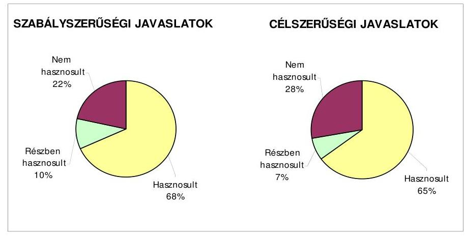

---

Javaslatunkra az Országgyúlés meghatározta a gazdasági program tartalmi követelményeit, elkészítési határidejét, felülvizsgálati kötelezettségét, a helyben (önkormányzati szinten) központosított közbeszerzésekre vonatkozó szabályokat, versenyeztetési kötelezettség egységes értékhatárát, a megyei önkormányzatok kötelező szociális feladatait. Előírta a nem normatív céljellegú múködési támogatások közzétételi kötelezettségét, a kisebbségi önkormányzatokkal kötött megállapodások, az adósságot keletkeztető éves kötelezettségvállalások felső határa megállapításának és az önkormányzati költségvetési szervek felügyeleti ellenőrzésének követelményeit.

A Kormány egységesítette az érvényesítést végzők képesítési előírásait, meghatározta a költségvetési és a zárszámadási rendeletek előterjesztésekor bemutatandó mérlegek, kimutatások képviselő-testületi bemutatására, a kötelezettségvállalás rendjének belső szabályozására, a szakmai teljesítésigazolás tartalmára vonatkozó követelményeket. Biztosította az önállóan gazdálkodó költségvetési szerv vezetőjének döntési jogkörét a számviteli politika és a kapcsolódó szabályzatok részben önállóan gazdálkodó költségvetési szervekre történő kiterjesztésére, meghatározta a helyi kisebbségi önkormányzatok előirányzatmódosítási hatáskörét, kiegészítette a szakfeladat-rendet és a belső ellenőrzési kézikönyv-mintát. A szakfeladat-rend átdolgozásával részletesen kidolgozva közzé tette a kötelező és önként vállalt feladatok elkülönítését segítő számviteli nyilvántartási rendszer követelményeit.

Előkészítés hiánya miatt nem történt intézkedés az önkormányzatok kötelező feladatainak egyértelmű meghatározására, valamint a nem lakás céljára szolgáló helyiségek esetében az elővásárlási jog gyakorlására jogosult személy kijelölésére - a gazdálkodó szervezet bérlő részére - biztosított lehetőség megszüntetésére. Nem valósult meg a Kbt-ben az eljárás hivatalból való kezdeményezésére az ÁSZ részére a tudomásra jutás után nyitva álló jogvesztő határidő javaslat szerinti legalább 30 naptári napra történő módosítása. A Kbt. 2008. évi módosítása során megszűnt az ÁSZ számára az a lehetőség, hogy a jogsértés tudomásra jutásához viszonyított három éves objektív jogvesztő határidőn belül jogorvoslati eljárást kezdeményezzen. Elmaradt a költségvetési hiány számításánál a hitel figyelembevételi módjának meghatározása; az Eisztv-ben a közzétételi idő Áht-ban foglaltakkal való összhangba hozatala; az önkormányzati gazdálkodás társulások általi belső ellenőrzési feladatainak elősegítése és a jegyzők felelősségének érvényesíthetősége érdekében tett javaslataink jogszabályba történő beépítése; az egyéb, nem pénzforgalommal járó gazdasági eseményekre (elkészült beruházások számviteli nyilvántartásba vétele, értékcsökkenés és értékvesztés elszámolása, értékvesztés visszaírása, követelések, kötelezettségek állományváltozásának elszámolása) a vezetői elrendelés és az érvényesítés kötelezettségének előírása; a kisebbségi önkormányzatok gazdálkodásával összefüggő pénzügyi-számviteli nyilvántartási követelmények, valamint az operatív gazdálkodási és belső ellenőrzési feladatok sajátos rendjét összefoglaló kézikönyv kiadása.

---

A helyszíni ellenőrzés megállapításainak hasznosítása mellett javasoljuk:

# a Miniszterelnöki Hivatalt vezető miniszternek 

1. kezdeményezze az Eisztv. mellékletében a III. Gazdálkodási adatok 3. és 4. pontjainak módosítását annak érdekében, hogy azokban az Áht. 15/A. § (1) bekezdésében és 15/B. § (2) bekezdésében foglaltakkal összhangban történjen a közzétételi idő meghatározása;
2. egészítse ki a közzétételi listákon szereplő adatok közzétételéhez szükséges közzétételi mintákról szóló 18/ 2005 (XII. 27.) IHM rendelet 2. számú mellékletében a 3. gazdálkodási adatok 3.3. költségvetési beszámolók „Támogatások" közzétételi egység adatainak megnevezését a múködési célú támogatásokkal;

## a pénzügyminiszternek és az önkormányzati miniszternek

1. kezdeményezzék a kötelezettségvállalásra jogosult személyeket meghatározó jogszabályok összhangjának biztosítása érdekében az Ámr. 134. § (1) bekezdésében rögzített - a költségvetési szerv vezetőjének kötelezettségvállalási jogosultságára irányuló - szabályozás kiegészítését a Htv. 139. § (1) bekezdésében, valamint az Ámr. 134. § (2) bekezdésében foglalt eltérő szabályozásra történő utalással, ennek során az önkormányzati hivatal, mint költségvetési szerv nevében kötelezettségvállalásra jogosult személyek meghatározásával;
2. az önkormányzatok belső ellenőrzési feladatainak elősegítése és a jegyzők Ötv. 92. § (4)-(5) bekezdéseiben foglalt kötelezettségeihez kapcsolódó felelősségének érvényesíthetősége érdekében
a) kezdeményezzék a Ber. kiegészítését, hogy az tartalmazza a belső ellenőrzést végző társulások esetében a belső ellenőrzési feladatokat meghatározó stratégiai terv és éves ellenőrzési terv tartalmára, módosítására, végrehajtására vonatkozóan, valamint a belső ellenőrzési feladatok tervezését megalapozó kockázatelemzés esetében a jegyző és a társulás közötti egyeztetési kötelezettséget, valamint a jegyző egyetértési jogosultságát;
b) kezdeményezzék, hogy jogszabály írja elő a belső ellenőrzési feladatokat ellátó társulások részére, hogy évente készítsenek a belső ellenőrzési feladatok ellátásáról, az éves ellenőrzési tervtől történt eltérés indokáról, a terven felüli ellenőrzések indokoltságáról, a fontosabb megállapításokról, javaslatokról, a megállapítások és javaslatok hasznosításáról beszámolót a társulásban érintett önkormányzatok polgármesterei rézére annak érdekében, hogy a polgármester a képviselőtestületet tájékoztathassa a belső ellenőrzési feladatok ellátásáról;

## az önkormányzati miniszternek

kezdeményezze az önkormányzatok kötelező feladatainak egyértelmű meghatározását;

---

# az igazságügyi és rendészeti miniszternek 

kezdeményezze a Kbt. 327.§ (2) bekezdésének módosítását annak érdekében, hogy az ÁSZ részére a jogorvoslati eljárás kezdeményezésére nyitva álló határidő a közbeszerzési eljárás megsértésének, illetve jogellenes mellőzésének az ÁSZ tudomására jutásától számított 30 napra vonatkozzon, továbbá a jogsértés megtörténtétől számított objektív jogvesztő határidő három évre változzon;

## a pénzügyminiszternek

1. kezdeményezze az Áht. módosítását annak érdekében, hogy az önkormányzatokra vonatkozóan egyértelműen meghatározásra kerüljön a hiány számításának, valamint a költségvetési rendeletben a finanszírozási célú pénzügyi műveletek bevételei és kiadásai figyelembevételének módja;
2. kezdeményezze az Ámr. 135. § (1) bekezdése 2009. január 1-jétől hatályos kiegészítésében foglalt - a szerződés, megrendelés, megállapodás végrehajthatóságának szakmai teljesítés igazolására vonatkozó - előírás pontosítását azzal, hogy a szerződés, megrendelés, megállapodás végrehajthatóságát mely kiadások, illetve bevételek esetében kell ellenőrizni, szakmailag igazolni;
3. kezdeményezze a helyi és a helyi kisebbségi önkormányzatok gazdálkodási rendszerének 2006. évi átfogó és egyéb szabályszerűségi ellenőrzéséről készített jelentésben tett és nem hasznosított javaslat megvalósítása céljából a Számv. tv. 167. § (1) bekezdés a)-j) pontjaiban foglalt alaki és tartalmi követelményekkel összhangban az Ámr. kiegészítését, hogy abban előírásra kerüljön - a pénzforgalmat érintő gazdasági eseményekre vonatkozó szabályokhoz hasonlóan - az egyéb gazdasági események bizonylataira is a vezetői elrendelés és az érvényesítés kötelezettsége;
4. gondoskodjon a Miniszterelnöki Hivatal bevonásával a helyi és a helyi kisebbségi önkormányzatok gazdálkodási rendszerének 2005. évi átfogó és egyéb szabályszerűségi ellenőrzéséről készített jelentésben tett és nem hasznosított javaslat megvalósítása céljából a helyi kisebbségi önkormányzatok szabályszerű működésének elősegítése érdekében a gazdálkodásukkal összefüggő pénzügyi-számviteli nyilvántartási követelményeket, valamint az operatív gazdálkodási és belső ellenőrzési feladatok sajátos rendjét összefoglaló kézikönyv megjelentetéséről.

---

# II. RÉSZLETES MEGÁLLAPÍTÁSOK 

## 1. AZ ÖNKORMÁNYZATOK KÖLTSÉGVETÉSI ÉS PÉNZÜGYI HELYZETE

A helyi önkormányzatok által tervezett és teljesített bruttó költségvetési ${ }^{24}$ bevételek és kiadások 2005-2008 között összességében ${ }^{25}$ folyamatosan emelkedtek. A tervezett költségvetési bevételek a 2005. évhez viszonyítva a 2008. évben 12\%-kal, 2878 milliárd Ft-ról 3219 milliárd Ft-ra, a költségvetési kiadások - a költségvetési bevételekkel azonos mértékben - 12\%-kal (3115 milliárd Ft-ról 3479 milliárd Ft-ra) növekedtek. A teljesített költségvetési bevételek 19\%-kal, 3424 milliárd Ft-ról 4076 milliárd Ft-ra, a teljesített költségvetési kiadások - a költségvetési bevételeknél hét százalékponttal kisebb mértékben - 12\%-kal (3178 milliárd Ft-ról 3559 milliárd Ft-ra) emelkedtek a 2008. évben a 2005. évhez viszonyítva. A helyi önkormányzatoknál 2005-2008 között - az előző évhez viszonyítva - a tervezett és teljesített költségvetési kiadások összege nagyobb arányban növekedett, mint a tervezett és teljesített költségvetési bevételek (a tervezett adatok szerint egy, a teljesítési adatok szerint három százalékponttal). A 2007. évben az előző évhez viszonyítva a tervezett és teljesített költségvetési bevételek 2-1\%-os növekedésével szemben a tervezett és teljesített kiadások 0,1-1,6\%-kal csökkentek. A 2008. év költségvetések tervezésekor a helyi önkormányzatok az előző évhez viszonyítva a költségvetési bevételek és kiadások közel azonos mértékű (6\%-os) növekedésével számoltak, ezzel szemben a teljesített költségvetési bevételeik 7 százalékponttal meghaladták a költségvetési kiadások emelkedését. (A helyi önkormányzatok 2005-2008. évi teljesített bruttó és nettósított bevételeinek és kiadásainak alakulását a jelentés 4. számú melléklete részletezi.)

A helyi önkormányzatok 91-91-92-69\%-a 2005-2008 között költségvetési hiányt tervezett, mivel a költségvetési bevételek eredeti előirányzata nem biztosított fedezetet a tervezett költségvetési kiadásokra. A költségvetési hiány finanszírozását hitel felvételével ${ }^{26}$, valamint támogatások elnyerésével tervezték. Az évközi likviditás, valamint a költségvetési egyensúly kialakításához az összes helyi önkormányzat 70-73-68-64\%-a tervezett rövid- és likvid hitel felvételből, 56-58-63-21\%-a hosszú lejáratú hitel felvételből származó bevételt 2005-2008 között. A tervezettel szemben a teljesített költségvetési bevételek az önkormányzatok jelentősen kisebb arányánál (19-26-33-23\%-ánál) nem fedezték a költségvetési kiadásokat, azonban a költségvetési évet pénzügyi hiánnyal

[^0]
[^0]:    ${ }^{24}$ Finanszírozási célú pénzügyi műveletek bevételei-kiadásai (hitelek felvétele és törlesztése, értékpapírok kibocsátása, értékesítése és visszavásárlása) nélkül számított bevételkiadás.
    ${ }^{25}$ A teljesített költségvetési kiadásoknál a 2007. évben 1,6\%-os csökkenés következett be a 2006. évhez viszonyítva.
    ${ }^{26}$ Rövid- és hosszú lejáratú hitelek felvételével, hitelviszonyt megtestesítő értékpapírok kibocsátásával, illetve a birtokukban lévő, hitelviszonyt megtestesítő értékpapírok értékesítésével.

---

záró önkormányzatok aránya 2005-2007 között évről évre növekedett. A 2005-2007. évek végén likvid hitele volt az összes helyi önkormányzat 11\%ának, a 2008. év végén 12\%-ának.

# 1.1. A költségvetési és pénzügyi egyensúly biztosítása 

Az ellenőrzött önkormányzatok mintegy négyötöde (84-87-81-74\%-a) 2005-2008 között az éves költségvetésében költségvetési hiányt tervezett. Az egy önkormányzatra jutó tervezett költségvetési hiány összege 405 millió Ftról 663 millió Ft-ra, átlag $64 \%$-kal emelkedett.

A tervezett összes költségvetési kiadáshoz viszonyított költségvetési hiány részaránya 2005-2007 között a megyei önkormányzatoknál 0,2-11,5\%, a megyei jogú városi önkormányzatoknál 1,7-16,1\%, a Budapest fővárosi kerületi önkormányzatoknál 2,2-24,0\%, és a városi önkormányzatoknál 0,1-20,5\% közötti volt.
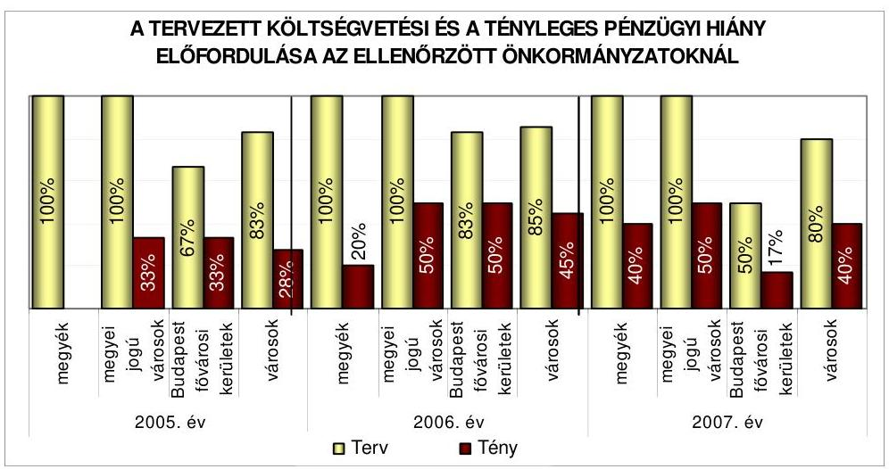

A tervezett költségvetési hiány átlagos összege 2005-2007 között a legnagyobb az ellenőrzött Budapest fővárosi kerületek önkormányzatainál, (a 2005. évben 1878 millió Ft, a 2007. évben 2632 millió Ft), legkisebb a városi önkormányzatoknál volt (a 2005. évben 169 millió Ft, a 2007. évben 198 millió Ft). A 2008. évben a megyei önkormányzatoknál volt legnagyobb a tervezett költségvetési hiány átlagos összege ( 2229 millió Ft), a legkisebb a városi önkormányzatoknál ( 324 millió Ft), de annak összege 64\%-kal nagyobb volt a 2007. évinél. Az egy önkormányzatra jutó tervezett költségvetési hiány átlagos összege folyamatosan emelkedett, a 2005-2008. években 405-502-559-663 millió Ftot tett ki.

Az ellenőrzött önkormányzatoknál 2005-2007 között tervezett és teljesített múködési és felhalmozási célú költségvetési kiadásokra a következő arányban biztosítottak fedezetet a költségvetési bevételek:

---

| Megnevezés | 2005. év |  | 2006. év |  | 2007. év |  |
| :--: | :--: | :--: | :--: | :--: | :--: | :--: |
|  | Terv | Tény | Terv | Tény | Terv | Tény |
| Múködési célú költségvetési kiadások fedezettsége múködési célú költségvetési bevételekből | 98,2 | 105,5 | 96,4 | 104,1 | 95,9 | 104,2 |
| Felhalmozási célú költségvetési kiadások fedezettsége felhalmozási célú költségvetési bevételekből | 84,1 | 93,8 | 84,1 | 88,4 | 84,4 | 87,2 |
| Költségvetési kiadások fedezettsége költségvetési bevételekből | 95,3 | 103,5 | 93,9 | 101,0 | 93,7 | 101,0 |

(A jelentés 5., 6. és 6/a. számú mellékletei részletezik az ellenőrzött önkormányzatok által a 2005-2007. években tervezett és teljesített költségvetési - azon belül a múködési és a felhalmozási célú - bevételeket és kiadásokat, az azok egyenlegeként kialakult hiány vagy többlet összegét, valamint a finanszírozási célú pénzügyi múveletek bevételeit és kiadásait.)

Az ellenőrzött önkormányzatok közül a költségvetés teljesítése során a tervezettnél kevesebb önkormányzatnál (a 2005. évben 27\%-nál, a 2006. évben $44 \%$-nál és a 2007. évben $39 \%$-nál) volt év végén pénzügyi hiány, melynek részaránya a teljesített költségvetési kiadásokhoz viszonyítva 0,0317,4\% között szóródott a 2005-2007. években. A 2008. év végén az ellenőrzött önkormányzatok $29 \%$-ánál nem fedezték a teljesített költségvetési bevételek a költségvetési kiadásokat.

A teljesített összes költségvetési kiadáshoz viszonyított költségvetési hiány részaránya a 2006-2007. években a megyei önkormányzatoknál 0,4-3,5\%, a 20052007. években a megyei jogú városi önkormányzatoknál 0,3-11,4\%, a Budapest fővárosi kerületi önkormányzatoknál 0,4-9,8\% és a városi önkormányzatoknál $0,03-17,4 \%$ közötti volt.

Az egy önkormányzatra jutó teljesített költségvetési hiány összege a 2005. évről a 2007. évre $189 \%$-kal, 160 millió Ft-ról 463 millió Ft-ra emelkedett, legnagyobb volt a 2005. évben az ellenőrzött városi önkormányzatoknál (169 millió Ft), a 2006. évben a megyei jogú városi önkormányzatoknál ( 972 millió Ft), míg a 2007. évben a Budapest fővárosi kerületi önkormányzatoknál (1738 millió Ft). A 2008. év végén az egy ellenőrzött önkormányzatra jutó teljesített pénzügyi hiány 276 millió Ft volt, ami $40 \%$-kal kisebb a 2007. évi összegnél.

Legnagyobb volt a teljesített költségvetési hiány a 2005. év végén Veresegyháza város ( 712 millió Ft), a 2006. év végén Miskolc megyei jogú város ( 2255 millió Ft), a 2007. év végén Cegléd város ( 2652 millió Ft) és a 2008. év végén Miskolc megyei jogú város ( 1188 millió Ft) önkormányzatánál.

---

A 2005-2008. években az ellenőrzött önkormányzatok tervezettnél kisebb aránya, 44-51-52-38\%-a ${ }^{27}$ vett fel rövid lejáratú és likviditási célú hitelt ${ }^{28}$, 48-61-56-43\%-a hosszú lejáratú hitelt, illetve 22-33-28-57\%-a rövid- és hosszú lejáratú hitelt is. A hosszú lejáratú hitelek futamideje 2-25 év között szóródott, a tőketörlesztés megkezdésére a pénzintézetek 4 hónap és 5 év közötti türelmi időt biztosítottak. A likviditást biztosító hitelek közül a 2005-2007. években folyószámlahitelt felvevő ellenőrzött önkormányzatoknál az egy napra jutó legnagyobb folyószámlahitel összege ${ }^{29}$ 2005-2007 között közel négyszeresére (399\%) növekedett.

A folyószámla-hitel igénybevételével gazdálkodó ellenőrzött önkormányzatok aránya a 2005. évi 57\%-ról a 2007. évre 73\%-ra emelkedett. Az ellenőrzött megyei önkormányzatok mindegyike folyószámlahitel felvételével gazdálkodott a 2007. évben, míg ez az arány a 2005. évben $40 \%$ volt. A 2005-2007. évek végén vissza nem fizetett folyószámlahitellel rendelkezett az önkormányzatok 28-43-$35 \%$-a.
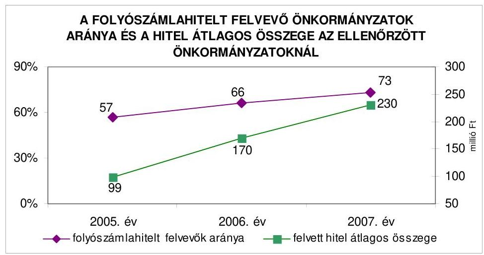

Az ellenőrzött önkormányzatok közül a 2006. évben kettő ${ }^{30}$, a 2007. évben azonban már 21, a 2008. évben 19 önkormányzatnak volt kötvénykibocsátásból teljesült bevétele, a 2006. évben összesen 2146,7 millió, a 2007. évben 43622,4 millió Ft, és a 2008. évben 47420,3 millió Ft értékben.

Az ellenőrzött önkormányzatok közül kötvénykibocsátásból származó bevételt eredeti előirányzatként tervezett a 2007. évben egy önkormányzat, a 2008. évben

[^0]
[^0]:    ${ }^{27}$ A 2005-2007. évi költségvetési rendeletében az ellenőrzött önkormányzatok 60-67-66-$58 \%$-a rövid lejáratú, 52-70-56-39\%-a hosszú lejáratú hitelfelvételből származó bevételt tervezett a költségvetési egyensúly biztosításához.
    ${ }^{28}$ Likviditási célú hitelként kell kimutatni a Vhr. számlaosztályok tartalmára vonatkozó előírásokat tartalmazó 9. számú mellékletének 14. f) pontja alapján a folyószámla-, a rulírozó- és a munkabér-megelőlegezési hitelek révén befolyó bevételeket.
    ${ }^{29}$ Az egy napra jutó legnagyobb folyószámlahitel összege a 2005. évben 875 millió Ft (Székesfehérvár megyei jogú város), a 2006. évben 2264 millió Ft (Debrecen megyei jogú város) és a 2007. évben 3493 millió Ft (Pest megye) volt.
    ${ }^{30}$ Székesfehérvár Megyei Jogú Város Önkormányzata 1345 millió Ft és Gödöllő Város Önkormányzata 801,7 millió Ft kötvényt bocsátott ki a 2006. évben.

---

12\%, a költségvetés végrehajtása során azonban már mintegy negyede ( $26 \%$, illetve $23,2 \%$ ) bocsátott ki kötvényt. Az összes helyi önkormányzat közül eredeti előirányzatként a 2007. évben tíz, a 2008. évben 73 tervezett kötvénykibocsátást, a költségvetés végrehajtása során a 2007. évben 103, a 2008. évben 129 hajtott végre kötvénykibocsátást az éves költségvetési beszámolók adatai szerint.

A kötvények futamideje 5 év és 25 év közötti - 79\%-nál 20 év - volt. A kötvénykibocsátással elért bevétel legkisebb összege 200 millió Ft (a 2007. évben Vésztő, a 2008. évben Lőrinci Város Önkormányzatánál), a legnagyobb összege 71806000 millió Ft (a 2007. évben Székesfehérvár Megyei Jogú Város Önkormányzatánál, a 2008. évben Szabolcs-Szatmár-Bereg Megyei Önkormányzatnál) volt. A kötvénykibocsátásból elért bevétel átlagos összege a 2007. évben 2021 millió Ftot, a 2008. évben már 2496 millió Ft-ot tett ki. A 2006-2008. évi kötvénykibocsátások következtében a hosszú lejáratú kötelezettségek állománya a 2007. év végére 107 392, illetve a 2008. év végére 172326 millió Ft-ra növekedett ${ }^{31}$, ami ezen önkormányzatok fokozódó eladósodását eredményezte. Az ellenőrzött önkormányzatok a kötvénykibocsátásból származó bevétel 71\%-át felhalmozási célra, 10\%-át múködési célra, 19\%-át adósságrendezésre ( $7 \%$-ot korábbi múködési és $12 \%$-ot korábbi felhalmozási célra felvett hitelek visszafizetésére) tervezték felhasználni. Valamennyi kötvény változó mértékű kamatfizetési kötelezettséget jelentett. A tőketörlesztés megkezdéséhez meghatározott türelmi idő 1-10 év között változott, de három önkormányzat ${ }^{32}$ a futamidő végén egyösszegű tőketörlesztést vállalt. A tőketörlesztés és kamatfizetés együttes összege - a 2008. évi költségvetési adatok alapján számítva - az éves adósságot keletkeztető kötelezettségvállalás felső határához viszonyítva a kötvényt kibocsátó önkormányzatok kétharmadánál 30\% alatti volt.

Az adósság visszafizetését a működési célú költségvetési bevételből tervezték az önkormányzatok. A kötvénykibocsátás bevételét felhalmozási célú felhasználást megelőzően, valamennyi esetben átmenetileg hasznosították (lekötötték rövid időszakokra, forgatási célú értékpapírt vásároltak). A deviza árfolyamváltozása, valamint a változó kamatmérték miatt az önkormányzatok számára a kötvénykibocsátás kockázatot jelent.

A helyi önkormányzatoknál az eladósodási mutató 2005-2008 közötti folyamatos emelkedése jelzi, hogy az összes forráson belül emelkedett a hosszú és rövid lejáratú fizetési kötelezettségek aránya. Ugyanezen időszakban az esedékességi aránymutató folyamatos csökkenése azt jelzi, hogy az összes fizetési kötelezettségeken belül csökkent a rövid lejáratú fizetési kötelezettségek aránya, mivel a hosszú lejáratra vállalt fizetési kötelezettségek (hitelek felvétele, kötvénykibocsátás) következtében emelkedett a hosszú lejáratú kötelezettségek aránya. (A helyi önkormányzatok fizetőképességi mutatóinak alakulását a jelentés 7. számú melléklete szemlélteti.) Az ellenőrzött önkormányzatok eladósodási folyamata az országos tendenciával egyező, mivel a hosszú és rövid lejáratú fizetési kötelezettség összes forráshoz viszonyított arányát jelző eladósodási

[^0]
[^0]:    ${ }^{31}$ A 2007-2008 évi könyvviteli mérlegek szerint a hosszú lejáratú kötelezettségek között a múködési célú kötvénykibocsátás miatti tartozásállomány 6585-12 858 millió Ft, a fejlesztési célú kötvénykibocsátás miatti 39 872-88 059 millió Ft volt.
    ${ }^{32}$ A kibocsátott kötvény visszafizetésére a futamidő végén egyösszegű tőketörlesztést vállalt Székesfehérvár megyei jogú város, Gödöllő, Újfehértó városok önkormányzata.

---

mutató 2005-2008 között az ellenőrzött önkormányzatoknál is folyamatosan emelkedett, átlagos értéke 5,7-7,7-9,3-12,3\% volt ${ }^{33}$. A helyi önkormányzatoknál, és ezen belül az ellenőrzött önkormányzatoknál is a legnagyobb mértékben a megyei önkormányzatok, a legkisebb mértékben a Budapest fővárosi kerületi önkormányzatok adósodtak el.

Az ellenőrzött önkormányzatok eladósodási mutatója a 2005. évben 0,4-36,2\%, a 2006. évben 0,7-26,4\%, a 2007. évben 0,6-38,0\%, a 2008. évben 0,5-4,9\% ${ }^{34}$ között alakult, a legnagyobb a megyei önkormányzatoknál ${ }^{35}$ volt. Az ellenőrzött önkormányzatok 55\%-a a 2005. év végén 5\% alatti eladósodási mutatóval rendelkezett. A pénzügyi helyzet kedvezőtlen változása következtében a 2006. év végén az ellenőrzött önkormányzatok 29\%-ánál, a 2007. év végén 32\%-ánál 5-10\% közöttire emelkedett az eladósodási mutató, míg a 2008. évben 30\%-nál volt 5-10\% közötti. A 2005. év végén 21\%-nak, a 2007. év végén már 35\%-nak, a 2008. év végén $47 \%$-nak $10 \%$ feletti volt az eladósodási mutatója.

Az ellenőrzött önkormányzatok 2005-2008. év végi rövid lejáratú kötelezettségeinek állománya az összes kötelezettséghez viszonyítva (esedékességi aránymutató) évente csökkent, 57,0-55,7-37,2-27,1\% volt. A könyvviteli mérleg szerinti hosszú és rövid lejáratú kötelezettségek együttes összegének 2005-2008 közötti 145,1\%-os növekedésén belül a hosszú lejáratú kötelezettségek növekedése 315,2\%-os volt, amelynél kisebb arányban - 16,6\%-kal - emelkedtek a rövid lejáratú kötelezettségek. Az összes kötelezettségen belül a hosszú lejáratú kötelezettségek 2005-2007 közötti növekedése legnagyobb - 21,8-szeres - mértékű volt az ellenőrzött megyei önkormányzatoknál, ugyanakkor ebben az önkormányzat-típusban a rövid lejáratú kötelezettségek állománya 20\%-kal csökkent a 2008. év végére a 2005. évhez viszonyítva.

Az ellenőrzött önkormányzatok esedékességi aránymutatója a 2005. évben 5,8100\%, a 2006. évben 6,2-100\%, a 2007. évben 3,4-100\%, a 2008. évben 1,1-100\% között szóródott, a legkisebb és a legnagyobb mutató érték a 2005-2007. években a városi önkormányzatoknál fordult elő. Az ellenőrzött városi önkormányzatok 7,7-12,3-9,2\%-a a 2005-2007. évek végén csak rövid lejáratú fizetési kötelezettséggel rendelkezett ${ }^{36}$.

Az összes kötelezettségen belül a rövid lejáratú kötelezettségek 2005-ben az ellenőrzött önkormányzatok 48\%-ánál, 2006-ban 43\%-ánál, a 2007. évben 23\%nál képviseltek 70\% feletti arányt. A rövid lejáratú kötelezettségek állományának csökkenését okozta átmenetileg, hogy a hitelt nyújtó pénzintézetek a szerződésekben a 2005-2008. években felvett hosszú lejáratú hitelek törlesztésének megkezdésére 0,3-5 év között változó türelmi időt biztosítottak, valamint a kibocsátott kötvények visszafizetése több év - 1,5-20 év között - múlva lesz esedékes.

[^0]
[^0]:    ${ }^{33}$ Az ellenőrzött önkormányzatoknál az egyéb passzív pénzügyi elszámolások nélkül számított kötelezettségek állománya az előző évhez viszonyítva a 2006-2008. években $41-26-38 \%$-kal növekedett.
    ${ }^{34}$ Az eladósodási mutató a 2007. év végén Simontornya város, a 2008. év végén Pest Megyei Önkormányzatnál volt a legnagyobb.
    ${ }^{35}$ A 2008. év végén az ellenőrzött öt megyei önkormányzat közül négynél (Csongrád, Bács-Kiskun, Pest és Szabolcs-Szatmár-Bereg) az eladósodási mutatója 30\% feletti értéket mutatott, Jász-Nagykun-Szolnok Meggyei Önkormányzat mutatója 21,5\% volt.
    ${ }^{36}$ Kistarcsa, Pannonhalma, Sándorfalva és Szeghalom városok önkormányzatainál a 2005-2008. év végi fizetési kötelezettség állománya teljes egészében rövid lejáratú volt.

---

Az ellenőrzött önkormányzatok pénzügyi helyzete eladósodási szempontból 72\%-nál 2005-2008 között kedvezőtlenül változott, mert az eladósodási mutató 2005-2006 között 79\%-nál, 2006-2007 között 61\%-nál, 2007-2008 között 52\%nál növekedett. Valamennyi ellenőrzött megyei és a megyei jogú város önkormányzatánál fokozódott az eladósodás, ezen belül azonban csökkent a rövid lejáratú kötelezettségek aránya. (Az eladósodási és esedékességi mutatók alakulását az ellenőrzött önkormányzatoknál a jelentés 8. számú melléklete szemlélteti.)

A készpénz likviditási mutatók ${ }^{37}$ fizetőképességi szempontból 2005-től 2006. év végéig romló pénzügyi helyzetet jeleztek, majd a 2007-2008. évben - Budapest fővárosi kerületi önkormányzatok kivételével - javulás következett be a kibocsátott kötvényekből befolyt és a kibocsátás évében fel nem használt pénzeszközök hatására, amelyet szemléltet a következő diagram:
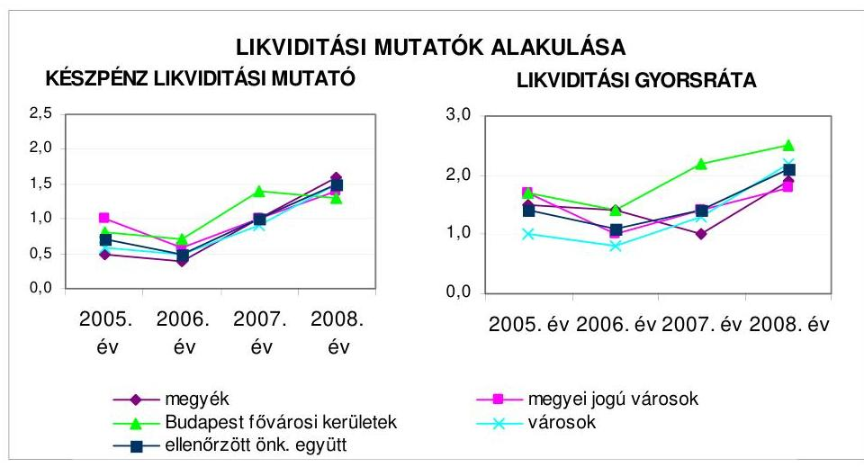

Az ellenőrzött önkormányzatoknál 2005-2006 között csökkenő mértékben nyújtottak fedezetet a pénzeszközök a rövid lejáratú kötelezettségek teljesítésére. Fizetőképességi szempontból a legkedvezőtlenebb pénzügyi helyzetűek voltak a megyei önkormányzatok, ahol a rövid lejáratú kötelezettségek pénzeszközökből történő azonnali kiegyenlítésének lehetősége - a készpénz likviditási mutató - a 2006. év végére csökkent. A 2007. évben a kötvénykibocsátásokból elért és fel nem használt bevételek következtében a pénzeszközök év végi állománya növekedett, ami kedvezően hatott az ellenőrzött önkormányzatok fizetőképességére. A 2007. év végi készpénz likviditási mutató valamennyi önkormányzatnál, a 2008. évi - a Budapest fővárosi kerületi önkormányzatok kivételével - javult a 2006. évhez viszonyítva.

Az ellenőrzött önkormányzatok készpénz likviditási mutatója a 2005. évben 0,06,8, a 2006. évben 0,0-7,6, a 2007. évben 0,0-15,4, a 2008. évben 0,0-38,0 között szóródott, a legnagyobb és a legkisebb mutatóértékekkel is a városi önkormány-

[^0]
[^0]:    ${ }^{37}$ Készpénz likviditási mutató = pénzeszközök/rövid lejáratú kötelezettségek. Likviditási gyorsráta = (követelések+forgatási célú, hitelviszonyt megtestesítő értékpapírok+pénzeszközök)/rövid lejáratú kötelezettségek.

---

zatok rendelkeztek ${ }^{38}$. Az ellenőrzött önkormányzatok 43\%-ánál a 2005. év végi pénzeszközök állománya fedezetet nyújtott a rövid lejáratú kötelezettségek teljesítésére, míg a 2006. év végén csak 27\%-nál, de a 2007. év végén 49\%-nál, a 2008. év végén $61 \%$-nál.

Az összes helyi önkormányzat átlagos készpénz likviditási mutatója is csökkent 2005-2006 között, a 2005. év végi 0,8 -ról a 2006. év végére 0,6-ra, azonban a 2007-2008. év végén a kötvénykibocsátások miatti pénzeszköz-növekedés következtében 1,1-re, illetve 1,4-re emelkedett.

Az ellenőrzött önkormányzatok fizetőképességének 2005-2006 közötti rosszabbodását mutatja a likviditási gyorsráta csökkenése is, mely szerint a rövid lejáratú kötelezettségek kiegyenlítésébe a pénzeszközökön túl bevonható követelések és hitelviszonyt megtestesítő értékpapírok valamennyi önkormányzat-típusnál csökkenő arányban biztosítottak fedezetet. A 20072008. évi kötvénykibocsátások következtében megnövekedett év végi pénzesz-köz-állomány miatt az előző évhez viszonyítva emelkedett a likviditási gyorsráta a megyei jogú, a Budapest fővárosi kerületi és a városi önkormányzatoknál. A megyei önkormányzatoknál csökkent a likviditási gyorsráta 2007. év végi értéke, mert a pénzeszközök állományának 30\%-os növekedésénél nagyobb volt a követelések év végi állományának csökkenése (95\%), melyet az illetékhivatali tevékenység átszervezése, illetve az illetékkövetelések átadása okozott.

Az ellenőrzött önkormányzatok likviditási gyorsrátája a 2005. évben 0,1-8,3, a 2006. évben 0,0-8,4, a 2007. évben 0,1-39,7 és a 2008. évben 0,0-40,1 között szóródott, a legkisebb és a legnagyobb mutatóértékkel is a városi önkormányzatok rendelkeztek a 2005-2008. években. Rosszabbodott 2005-2007 között a megyei önkormányzatok fizetőképessége, a 2005. évben még $80 \%$-nál, 2006-ban azonban már csak 40\%-nál volt 2,0 feletti a likviditási gyorsráta értéke. A 2008. évben a megyei önkormányzatok $60 \%$-a - a 2008. évi kötvénykibocsátások hatására megnövekedett pénzeszközök következtében - 2,0 feletti likviditási gyorsráta értékkel rendelkezett. A megyei jogú városi önkormányzatoknál is rosszabbodott a fizetőképesség 2005-2007 között, mert míg a 2005. évben 0,2-6,5 között, addig a 2007. évben 0,7-2,4 közötti volt a likviditási gyorsráta. Ezen önkormányzatoknál a fizetőképesség romlását okozta, hogy a követelések, pénzeszközök és forgatási célú értékpapírok együttes állományának növekedési üteménél nagyobb arányban nőtt a rövid lejáratú kötelezettségek állománya. A Budapest fővárosi kerületi önkormányzatoknál a likviditási gyorsráta a 2005. évben 1,2-4,0 között, míg a 2007. évben 1,3-5,0 között szóródott, a mutató javulását az okozta, hogy a pénzeszközök, a követelések és a hitelviszonyt megtestesítő értékpapírok együttes értékének növekedése nagyobb volt a rövid lejáratú kötelezettségek értékének növekedésénél. A 2008. év végén a likviditási gyorsráta értéke javult a pénzeszközök növekedése miatt, amely a megyei jogú városi önkormányzatoknál a 1,4-3,1 között, a Budapest fővárosi kerületi önkormányzatoknál 1,5-12,3 között szóródott.

A likviditási gyorsráta értéke 1,0 alatti volt a 2005. év végén az ellenőrzött önkormányzatok 29\%-ánál, a fizetőképesség romlása következtében a 2006. év végén 46\%-nál, míg a pénzeszközök növekedésének hatására a 2007. év végén 30\%-nál, a 2008. év végén 20\%-nál. A likviditási gyorsráta alakulása rámuta-

[^0]
[^0]:    ${ }^{38}$ Legnagyobb volt a készpénz likviditási mutató a 2005. évben Bélapátfalva, a 2006. évben Pannonhalma, a 2007. évben Tapolca, a 2008. évben Sándorfalva városi önkormányzatoknál.

---

tott arra, hogy a pénzeszközök, a követelések és a hitelviszonyt megtestesítő értékpapírok együttes értéke a 2007. év végén az önkormányzatok közel egyharmadánál, a 2008. év végén egyötödénél - a 20072008. évi kötvénykibocsátások miatti pénzeszköz-növekedések ellenére mindössze egyszeri vagy annál kisebb mértékben biztosított fedezetet a rövid lejáratú kötelezettségek teljesítésére.

# 1.2. A költségvetési bevételek és kiadások tervezése és teljesítése 

A 2005-2007. években az ellenőrzött önkormányzatok magas aránya, 84-87-81\%-a költségvetési hiánnyal tervezte meg az éves költségvetését, ezzel szemben a teljesítési adatok szerint az önkormányzatok lényegesen alacsonyabb arányánál, 27-44-39\%-nál volt pénzügyi hiány.

Az ellenőrzött önkormányzatok 82-79-78-75\%-a a 2005-2008. évi költségvetések megállapításakor az Áht. 8/A. § (7) bekezdésében előírtak ellenére a költségvetési hiány finanszírozásával kapcsolatos pénzügyi műveletek bevételeit költségvetési hiányt, illetve költségvetési többletet módosító költségvetési bevételként számolta el. Az elfogadott költségvetési rendelettervezetekben az előterjesztők nem mutatták be az önkormányzat valós pénzügyi helyzetét, a tervezett költségvetési hiány, vagy többlet összegét, valamint a finanszírozási célú pénzügyi műveletek bevételeit, kiadásait és az azok egyenlegeként keletkező hiányt, vagy többletet.

Az összes költségvetési bevételen-kiadáson belül a múködési és a felhalmozási célú tervezett és teljesített költségvetési bevételek és kiadások aránya az ellenőrzött önkormányzatoknál a következők szerint alakult:
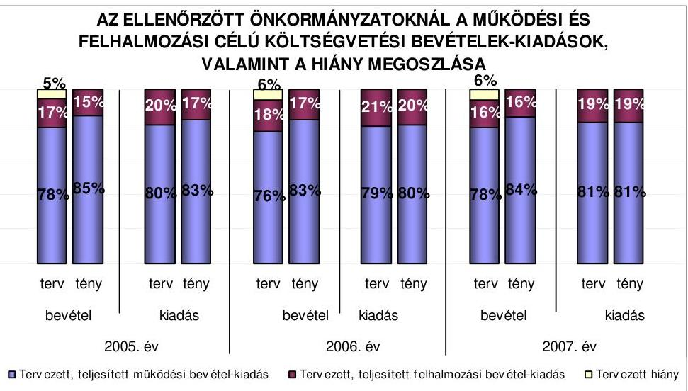

A tervezett múködési célú költségvetési bevételek 2005-2007 között az ellenőrzött önkormányzatok évente 32\%-ánál fedezték a múködési célú költségvetési kiadásokat, míg a teljesítési adatok szerint - a tervezettnél kedvezőbben, az ellenőrzött önkormányzatok évente közel azonos hányadánál - 74-73-74\%-nál nyújtottak erre fedezetet.

---

A felhalmozási célú költségvetési bevételeket meghaladó összegben terveztek felhalmozási célú költségvetési kiadásokat a 2005-2007. években az ellenőrzött önkormányzatok 77-67-68\%-ánál. A tendencia nem változott a költségvetések végrehajtása során sem, a felhalmozási célú költségvetési kiadásokat a felhalmozási célú költségvetési bevételeket meghaladó összeggel teljesítette az ellenőrzött önkormányzatok 70-71-65\%-a.

Az ellenőrzött önkormányzatok a 2005-2007. évi költségvetéseikben jóváhagyott eredeti előirányzatokat jellemzően túlteljesítették ${ }^{39}$, mivel a feladataik ellátásához teljesíthető kiadásokat és várható bevételeket nem kellő körültekintéssel és alapossággal határozták meg. A 2005-2007. évi eredeti előirányzatok alul- vagy túlteljesítése a költségvetés tervezésének hiányosságára volt visszavezethető az ellenőrzött önkormányzatok 61-65-63\%-ánál. Az eredeti előirányzathoz viszonyított túlteljesítések hatására az önkormányzatok 19-38-$33-\%$-ánál kisebb lett a hiány a tervezettnél, valamint 72-52-58\%-ánál a tervezettel szemben nem volt az egyes évek végén pénzügyi hiány. A 2005-2007. év végi hiány tervezettnél kedvezőbb alakulásában szerepet játszott a költségvetési hiánnyal tervező önkormányzatok 79-81-92\%-ánál a költségvetési bevételek túlteljesítése, illetve 49-45-35\%-nál a költségvetési kiadások alulteljesítése.

Az eredeti előirányzatok túlteljesítése tervezési hiányosságra volt visszavezethető a 2005-2007. években a következő vizsgált területeken:

- az előző évi pénzmaradvány igénybevételt nem körültekintően tervezte az ellenőrzött önkormányzatok 54-55-65\%-a, mivel nem vették figyelembe az Áht. 7. § (2) bekezdésében foglaltakat, miszerint a költségvetés az érvényességi időtartam alatt a feladat ellátásához teljesíthető jóváhagyott kiadásokat és a teljesítendő várható bevételeket előirányzatként kell, hogy tartalmazza. Az előző évi pénzmaradvány igénybevétel tervezésével összefüggő hiányosság miatt az érintett önkormányzatoknál elmaradt, vagy az indokoltnál kisebb összegben tervezték meg bevételként az előző évi - szabad, vagy kötelezettséggel terhelt - pénzmaradvány igénybevételt, valamint e bevételi előirányzathoz kapcsolódóan az előző évről áthúzódó kiadásokat, kötelezettségeiket annak ellenére, hogy ezen feladatok ellátásához teljesíthető kiadások és azok forrásai az eredeti előirányzatok tervezésekor ismertek voltak. Az előző évi pénzmaradvány igénybevételt nem, vagy a teljesített összegnél kisebb értéken tervezte eredeti előirányzatként a 2005-2007. években az ellenőrzött megyei önkormányzatok egyaránt $80 \%$-a, a megyei jogú városi önkormányzatok 50-50-67\%-a, a Budapest fővárosi kerületi önkormányzatok 83-67-83\%-a, valamint a városi önkormányzatok 50-52-62\%a;

Az ellenőrzött önkormányzatoknál a múködési célra ténylegesen igénybe vett előző évi pénzmaradvány 93-80-91\%-át nem vették figyelembe a költségvetési

[^0]
[^0]:    ${ }^{39}$ Túlteljesítették a költségvetési bevételek főösszegét az ellenőrzött önkormányzatok 74-82-89\%-ánál, a költségvetési kiadások főösszegét 54-56-65\%-nál (ezen belül a múködési célú költségvetési bevételeket 99-98-98\%-nál, a felhalmozási célú költségvetési bevételeket 45-54-61\%-nál, a múködési célú költségvetési kiadásokat 76-80-77\%-nál, a felhalmozási célú költségvetési kiadásokat 40-44-55\%-nál).

---

rendeletben az eredeti bevételi előirányzatok meghatározásakor, amely a működési célú költségvetési bevételeknél 5-4-3 százalékpontos túlteljesítést okozott.

A felhalmozási célú költségvetési bevételeknél a felhalmozási célra ténylegesen igénybe vett előző évi pénzmaradvány 58-47-71\%-át nem vették figyelembe a költségvetés eredeti előirányzatainak meghatározásakor, ezért azokat alultervezték. A felhalmozási célú előző évi pénzmaradvány tényleges igénybevételénél kisebb összegben történt tervezés miatt a felhalmozási célú költségvetési bevételek eredeti előirányzatát 8-5-9 milliárd Ft-tal tervezték alul az ellenőrzött önkormányzatok.

- a helyi adóbevételek eredeti előirányzathoz viszonyított alul- vagy túlteljesítése tervezési hiányosság miatt következett be az ellenőrzött önkormányzatok 17-18-21\%-nál. A helyi adók eredeti előirányzatát nem megalapozottan tervező önkormányzatok 93-93-94\%-ánál a tervezési hiányosság túlteljesítést okozott;

Jellemzően a városi önkormányzatoknál nem tervezték körültekintően a helyi adóbevételeket, ahol tervezési hiányosságot állapítottunk meg 22-23-25\%-nál. A helyi adóbevételek alultervezése elsősorban az iparűzési adóbevétel tervezési bizonytalanságai miatt következett be.

- az eredeti előirányzathoz viszonyított alul- vagy túlteljesítése tervezési hiányosságra volt visszavezethető a beruházási kiadások esetében az ellenőrzött önkormányzatok 24-30-29\%-ánál. A tervezési hiányosság a beruházási kiadásoknál az eredeti előirányzathoz viszonyított túlteljesítést okozott az önkormányzatok 50-52-58\%-ánál;
- a felújítási kiadások eredeti előirányzathoz viszonyított alul- vagy túlteljesítését tervezési hiányosság okozta az ellenőrzött önkormányzatok 26-29-29\%-ánál.

# 2. AZ ÖNKORMÁNYZATOK FELKÉSZÜLTSÉGE AZ EURÓPAI UNIÓS FORRÁSOK IGÉNYLÉSÉRE ÉS FELHASZNÁLÁSÁRA 

### 2.1. Az európai uniós források igénybevételére és a várható támogatás felhasználására történt felkészülés szabályozottságának, szervezettségének eredményessége

Az ellenőrzött önkormányzatok 11\%-a felkészült ${ }^{40}$, 89\%-a nem készült fel eredményesen az európai uniós források igénybevételére és a várható támogatás felhasználására 2005-2008 között. Az európai uniós források igénybevételére irányuló pályázatok a gazdasági programokban, ágazati, szakmai és területfejlesztési koncepciókban megfogalmazott fejlesztési célkitűzésekhez többségükben (93\%-ban) kapcsolódtak, azonban a szabályo-

[^0]
[^0]:    ${ }^{40}$ Eredményesen felkészültek az európai uniós források igénybevételére és a várható támogatás felhasználására Székesfehérvár és Debrecen megyei jogú városok, valamint Bélapátfalva, Csongrád, Emőd, Hajdúszoboszló, Nagyatád, Siklós, Újszász városok önkormányzatai.

---

zottság ${ }^{41}$ terén az ellenőrzött önkormányzatok 82\%-a, a szervezettség ${ }^{42}$ vonatkozásában $17 \%$-a nem készült fel eredményesen ${ }^{43}$ az európai uniós források igénybevételére és felhasználására. A szabályozások nem tartalmazták a pályázatfigyelést végzők és a döntési, illetve a döntéselőkészítési jogkörrel rendelkezők közötti információk szolgáltatásának kötelezettségét, a polgármester és a fejlesztési feladat lebonyolítója közötti kapcsolattartás rendjét, nem írták elő a folyamatba épített, előzetes és utólagos vezetői ellenőrzési feladatokat, továbbá a belső ellenőrzési terveket megalapozó kockázatelemzések nem terjedtek ki az európai uniós forrásokkal támogatott fejlesztési feladatokra.

Az ellenőrzött önkormányzatok 96-98\%-a biztosította 2005-2008 között az önkormányzati hivatal szervezetén belül, valamint külső szervezetek igénybevételével a pályázatfigyelés és a pályázatkészítés személyi feltételeit. A külső szervezetekkel kötött szerződések 46\%-ában nem rögzítették a pályázatkészítést végző személyek és a pályázat benyújtásáért felelős személyek közötti kapcsolattartás és felelősség szabályait. A szerződések 12\%-ában a fejlesztési feladat lebonyolítását végző személyek feladatait és $42 \%$-ában a kapcsolattartás rendjét, továbbá $60 \%$-ában a személyre szóló felelősséget nem határozták meg.

# 2.1.1. Az európai uniós forrásokra történő pályázatok benyújtására vonatkozó döntések összhangja a fejlesztési célkitúzésekkel 

Az ellenőrzött önkormányzatok a 2005-2008. évekre fejlesztési célkitűzéseiket szociális szolgáltatás-tervezési koncepciókban, feladat-ellátási, intézményháló-zat-működtetési és fejlesztési tervekben, településfejlesztési és ágazati koncepciókban ${ }^{44}$, valamint $92 \%$-uk gazdasági programokban határozta meg. Az Ötv. 91. § (7) bekezdésében foglaltak ellenére a 2007-2010 között időszakra gazdasági programot az önkormányzatok $8 \%$-a nem készített ${ }^{45}$.

A fejlesztési célkitűzések között a megyei önkormányzatok a szociális ellátóhálózat bővítését, az infrastruktúra, valamint az energiagazdálkodás környezetbarát fejlesztését, továbbá a nemzetközi kapcsolatok kiépítését, a megyei jogú vá-

[^0]
[^0]:    ${ }^{41}$ Önkormányzati szintű szabályozás azoknak a lényeges információknak, területeknek, kapcsolattartási és ellenőrzési feladatoknak a meghatározása, amelyek hatást gyakorolnak a döntést hozó döntéseire, a sikeres pályázati tevékenységre, valamint annak eredményes megvalósítására.
    ${ }^{42}$ Az önkormányzati hivatal szervezetén belül, vagy külső személy, szervezet igénybevételével a pályázatfigyelés, a pályázatkészítés és a fejlesztési feladat lebonyolításának a személyi és szervezeti feltételeit biztosították.
    ${ }^{43}$ Az előző évben nem készült fel eredményesen a szabályozottság terén az ellenőrzött önkormányzatok $92 \%$-a, a szervezettség vonatkozásában $17 \%$-a.
    ${ }^{44}$ A szociális igazgatásról szóló 1993. évi III. törvény 92. § (3) bekezdésében, a közoktatásról szóló 1993. évi LXXIX. törvény 85. § (4) bekezdésében előírtaknak megfelelően, valamint a területfejlesztésről és a területrendezésről szóló 1996. évi XXI. törvény és a területfejlesztési koncepciók, programok és a területrendezési tervek tartalmi követelményeiről szóló 18/1998. (VI. 25.) KTM rendelet figyelembevételével, továbbá az idegenforgalmi koncepciókban, és a környezetvédelmi programokban.
    ${ }^{45}$ Budapest főváros II. és IV. kerületi, Bóly, Szikszó, Gödöllő, Szigetszentmiklós és Veresegyház városok önkormányzatai gazdasági programot nem készítettek.

---

rosi önkormányzatok az oktatás és szakképzés fejlesztését, környezeti és állati hulladékkezelés kiépítését, a szociális ellátórendszer fejlesztését, a Budapest főváros kerületi önkormányzatok az alapfokú oktatás fejlesztését, a kerületek belső forgalmi rendjének és közlekedéshálózatának megújítását tervezték. A városi önkormányzatok fejlesztési célkitúzéseiben az út,- és szennyvízhálózat, idegenforgalom és turizmus, óvodai nevelési és alapfokú oktatási intézmények infrastrukturális fejlesztését, a városközpont rekonstrukcióját, kerékpárutak, ipari parkok infrastruktúrájának kiépítését, a középületek akadálymentesítését, a foglalkoztatás, munkahelyteremtés bővítését fogalmazták meg.

A fejlesztési célkitűzések az ellenőrzött önkormányzatok 79\%-ánál helyzetelemzésen alapultak, 76\%-nál figyelembe vették a fejlesztések meghatározásakor azok megvalósításának lehetséges pénzügyi forrásait. Az önkormányzatok 13\%-a az NFT-ben, 18\%-a az ÚMFT-ben megjelenő pályázati lehetőségek megismerését követően módosította fejlesztési célkitűzéseit.

Az ellenőrzött önkormányzatok 98\%-a a 2005-2008. évekre vonatkozóan 778 fejlesztési feladat megvalósításához európai uniós források igénybevételéről döntött ${ }^{46}$.
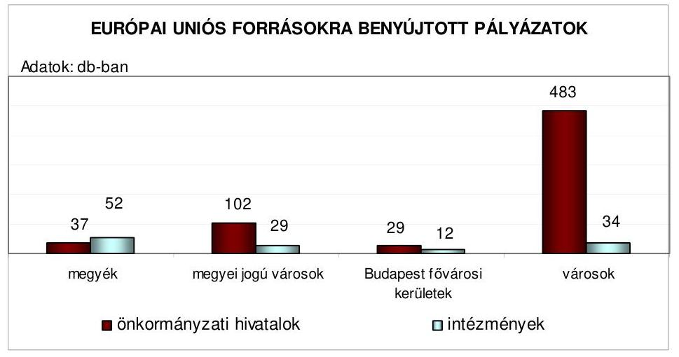

A benyújtott pályázatokban szereplő fejlesztési célok az önkormányzatok 93\%-ánál összhangban voltak a gazdasági programokban, ágazati, szakmai, településfejlesztési koncepciókban, tervekben foglalt fejlesztési célkitűzésekkel ${ }^{47}$. Az ellenőrzött önkormányzatok 90\%-a kapott támogatást az

[^0]
[^0]:    ${ }^{46}$ Nem döntöttek európai uniós pályázat benyújtásáról 2005-2008 között Bábolna, Berhida városok önkormányzatai. Kistarcsa Város Önkormányzata a 2007. évben kilenc fejlesztési feladat megvalósításához tervezte az európai uniós támogatás igénybevételét, azonban a 2008. évig a pályázatokat nem nyújtotta be. A Bács-Kiskun Megyei Önkormányzat intézményei annak ellenére nem kérték a képviselő-testület jóváhagyását 2006-2007. években benyújtott nyolc (önerőt nem igénylő) európai uniós pályázathoz, hogy a 2006. és a 2007. évi költségvetési rendeletekben szabályozottak szerint, a pályázatok benyújtására vonatkozó döntési jogkörrel a képviselő-testület rendelkezett.
    ${ }^{47}$ Budapest főváros X. kerületi (10 pályázatból kilenc esetben), Veresegyház, Szigetszentmiklós városi önkormányzatok európai uniós pályázatai a gazdasági, illetve más szakmai koncepcióban meghatározott fejlesztési célkitűzésekhez nem kapcsolódtak.

---

NFT ${ }^{48}$ és az ÚMFT ${ }^{49}$ operatív, valamint az előcsatlakozási alapok programjaira, továbbá egyéb támogatásokra ${ }^{50}$ benyújtott pályázatok $51 \%-a^{51}$ alapján.

A benyújtott pályázatok elutasítását a pályázati források hiánya, a szakmai kidolgozatlanság, a pályázatok tartalmi és formai hibái, a pályázati feltételek hiányos teljesítése okozta. Négy önkormányzat viszszavonta pályázatát ${ }^{52}$.
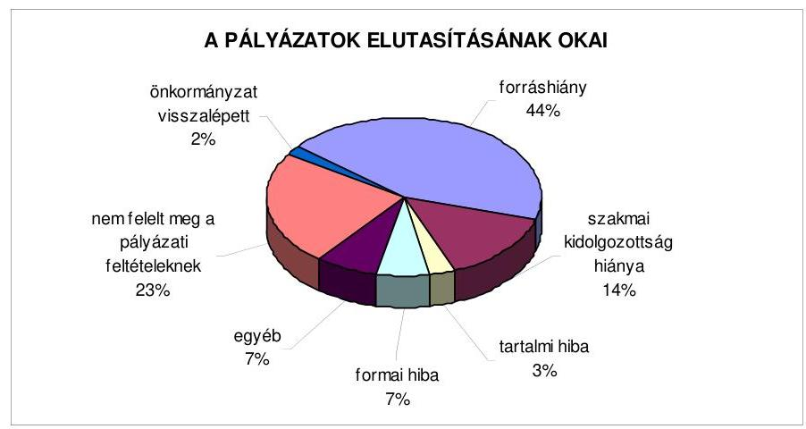

A pályázatok elutasításának szakmai hiányosságai a következők voltak: nem szerepelt a pályázatban szükségletfelmérés; elmaradt a téma választás indokolása és a várható eredmények ismertetése; nem volt összhangban a projekt tartalma és címe; el nem számolható költségeket tartalmazott a pénzügyi terv; szerény eredményeket jeleztek a feladatmutatók a támogatási igény összegéhez képest; kidolgozatlan volt a fejlesztési változatok elemzése és a megvalósíthatósági tanulmány; a projektmenedzsment szervezet tervezett struktúráját bemutatták, azonban nem ismertették az önkormányzati szervezethez, a döntéshozatali rendszerhez való kapcsolatát; nem volt megalapozva a bevételszámítás; nem csatolták a létesíteni kívánt technológia magyarországi építési engedélyét. Tartalmi és formai hibát jelentett a cselekvési ütemterv átgondolatlansága, a minőségbiztosí-

[^0]
[^0]:    ${ }^{48}$ Az önkormányzatok 2008. december 31-ig országosan összesen 5277 pályázat alapján 499,5 milliárd Ft támogatást igényeltek, amelyekből 2769 pályázat 176,8 milliárd Ft támogatásban részesült. (Forrás: Egységes Monitoring Informatikai Rendszer)
    ${ }^{49}$ Az önkormányzatok 2008. december 31-ig országosan összesen 8502 projekt megvalósításához 1024,3 milliárd Ft támogatásra nyújtottak be pályázatot, amelyekből 1868 fejlesztési feladat 582,7 milliárd Ft támogatásban részesült. (Forrás: Egységes Monitoring Informatikai Rendszer)
    ${ }^{50}$ Európai Gazdasági Térség és Norvég Finanszírozási Mechanizmus, INTERREG Közösségi Kezdeményezés, Európai Unió Socrates, Comeneus, Leonardo közösségi programjai, „EURPE Direck" információs hálózat, testvérvárosi kapcsolatok, találkozók, Balti Városok Szövetsége, EQUAL Közösségi Kezdeményezés magyarországi programja, az Európai Unió kommunikációs együttmúködési megállapodás keretében „Igazgatási partnerség", Szlovénia-Magyarország-Horvátország Szomszédsági program támogatására pályáztak az önkormányzatok.
    ${ }^{51}$ Az előző évben a benyújtott pályázatok alapján az ellenőrzött önkormányzatok 35\%a részesült támogatásban.
    ${ }^{52}$ Jász-Nagykun-Szolnok, Pest megyei, Gárdony és Sümeg városi önkormányzatok viszszavonták pályázatukat.

---

tásra utaló elemek, valamint a pályázat gazdasági, foglalkoztatási és képzési adatokkal alátámasztott összefüggései bemutatásának, a horizontális célok kifejtésének hiánya, továbbá az oldalszámozás, az adatlap kitöltésének pontatlansága, a hiánypótlás előírt határidőn túli teljesítése. Nem feleltek meg a pályázati feltételeknek, mivel nem szerepelt a tervezett célú létesítmény a támogatott tevékenységek között; nem az önkormányzat tervezte üzemeltetni a megvalósítandó létesítményt; az iskola integrációja következtében a kapacitáskihasználtság 67\% alá csökkent, nem érte el a számított mutatók alapján a kapacitáskihasználtság a pályázati kiírásban előírt $80 \%$-os mértéket; az igényelt támogatás összege meghaladta az igényelhető maximum összeget; a projekt a pályázatban szereplőnél rövidebb időtartamra vonatkozott, nem biztosította a környezeti fenntarthatósági szempontok érvényesülését. A pályázatok elutasításának egyéb okai között szerepelt az ingatlanok tulajdonviszonyának rendezetlensége, nem érte el a minimális ponthatárt, új pályázatot írnak ki, az árhullám okozta károk nem voltak közvetlen összefüggésbe hozhatók a Tiszán levonuló árhullámmal, illetve nem tájékoztatták a pályázót az elutasítás indokáról.

Az ellenőrzött önkormányzatok 2005-2008 között az európai uniós forrással támogatott befejezett és folyamatban lévő fejlesztési feladataikhoz 309,9 milliárd Ft költségvetési kiadásról döntöttek, amelyek pénzügyi fedezetét 5,9\%ban saját forrásból, $90 \%$-ban támogatásból ( $72,3 \%$ európai uniós és 17,7\%-ban hazai), 3,8\%-ban EU Önerő Alapból és 0,3\%-ban pénzintézeti hitelből és egyéb forrásból tervezték. A támogatási szerződésekben meghatározott kiadások 72\%-át a már befejezett európai uniós forrással támogatott projektek kivitelezéséhez használták fel. A befejezett fejlesztések tervezett és teljesített költségvetési kiadásaira a következő összetételű finanszírozási források biztosítottak fedezetet:
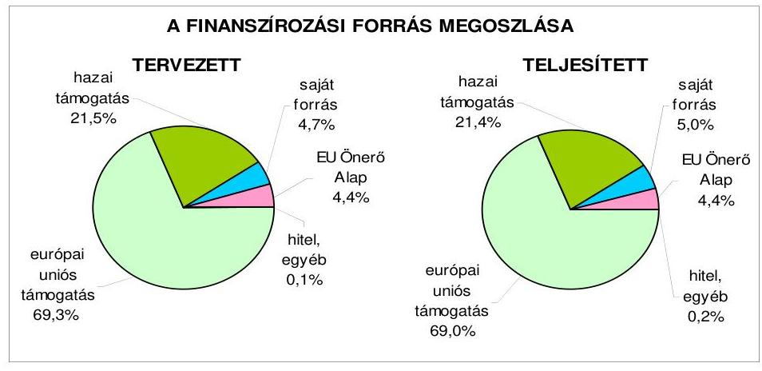

A 2005-2008 között megvalósult fejlesztési feladatok kiadásainak teljesítése öszszesen 59,5 millió Ft-tal volt alacsonyabb a tervezettnél. A költségvetési kiadások finanszírozási forrásaiban a teljesített saját forrás részarányának a tervezetthez viszonyított 0,3 százalékponttal magasabb mértékét a megvalósítás során jelentkező pót- és többletmunkák, valamint a nem támogatott feladatok kiadásai okozták. A hatályos támogatási szerződésekben rögzített európai uniós és hazai támogatások részaránya 0,3-0,1-0,4 százalékponttal a tervezett alatt teljesült, amelyet a közbeszerzési eljárás eredményeként megkötött vállalkozási szerződések tervezetthez képest alacsonyabb összegei, az általános forgalmi adókulcs $25 \%$-ról $20 \%$-ra történő csökkentése, valamint a számlák ellenőrzésekor feltárt hiányosságok miatt a közreműködő szervezetek által csökkentett összegű támogatás folyósítás okozott.

---

A 2005-2008. évi költségvetési rendeletekben eredeti előirányzatként az ellenőrzött önkormányzatok $51 \%$-a tervezte az európai uniós forrásokkal támogatott fejlesztési feladatok bevételeit és kiadásait. Az Ámr. 29. § (1) bekezdés k) pontjában foglaltak ellenére önkormányzati szinten elkülönítetten az európai uniós támogatással megvalósuló programok bevételeit és kiadásait az önkormányzatok 67\%-ánál nem, 13\%-ánál csak a fejlesztési feladat egy részére tartalmazták költségvetési rendeletek. Az Áht. 118. §-ában előírtaknak eleget téve a képviselő-testületek tájékoztatása céljából az önkormányzatok 39\%-a bemutatta az Áht. 116. § 9. pontjában ${ }^{53}$ foglaltaknak megfelelően a többéves kihatással járó európai uniós forrásból megvalósuló fejlesztési feladatokat számszerúsítve évenkénti bontásban, szöveges indokolással. Költségvetési rendeletükben az önkormányzatok az európai uniós támogatással megvalósuló fejlesztési feladatok saját forrását a pályázatukban foglaltak szerint biztosították. Az ellenőrzött önkormányzatok 15\%-a a saját forrást pénzintézeti hitel felvételével, valamint kötvény kibocsátásából származó bevételből tervezte biztosítani.

# 2.1.2. Az európai uniós forrásokhoz kapcsolódóan a pályázatfigyelés, a pályázatkészítés, valamint az európai uniós támogatással megvalósuló fejlesztés lebonyolításának szabályozottsága, a végrehajtás személyi, szervezeti feltételei 

Az európai uniós források igénybevételének és felhasználásának feladatait 2005-2008 között az ellenőrzött önkormányzatok 18\%-a szabályozta, $60 \%$-a nem, további $22 \%$-a hiányosan szabályozta, mivel:

- nem írták elő az önkormányzati szintű pályázat-koordinálás feladatait és felelősét $63 \%$-nál, nem jelölték ki a pályázat-nyilvántartás vezetésének felelősét $70 \%$-nál;
- nem tartalmazta a szabályozás a pályázatfigyelést végzők és a döntési, illetve döntés-előterjesztési jogkörrel rendelkezők közötti információ-szolgáltatási kötelezettséget $66 \%$-ánál, a polgármester és a fejlesztési feladat lebonyolítója közötti kapcsolattartás rendjét $76 \%$-ánál;
- nem határozták meg 71\%-nál a pályázatfigyelés, 68\%-nál a pályázatkészítés, valamint $76 \%$-nál az európai uniós támogatással megvalósuló fejlesztési feladat lebonyolítási rendjét;
- nem szabályozták az európai uniós forrással támogatott fejlesztési feladatok lebonyolításával kapcsolatos folyamatba épített, előzetes és utólagos vezetői ellenőrzési feladatokat $61 \%$-nál, továbbá nem terjedt ki a belső ellenőrzési stratégiát megalapozó kockázatelemzés az európai uniós forrásokkal támogatott fejlesztési feladatokra 93\%-nál.

Az európai uniós források igénybevételének és felhasználásának szabályozásáról, illetve a meglévő szabályzatok kiegészítéséről a 2008. év folyamán az önkormányzatok $16 \%$-ánál gondoskodtak.

[^0]
[^0]:    ${ }^{53}$ 2007. január 1-től Áht. 118. § (1) bekezdés 2. b) pontja,

---

Az európai uniós forrásokkal kapcsolatos pályázatfigyelés, pályázatkészítés, továbbá a fejlesztési feladat lebonyolítás végrehajtásának szervezeti, személyi feltételeit az önkormányzatok 83\%-a kialakította ${ }^{54}$, amelyet a következő táblázat foglal össze:

# A SZEMÉLYI FELTÉTELEK KIALAKÍTÁSA 

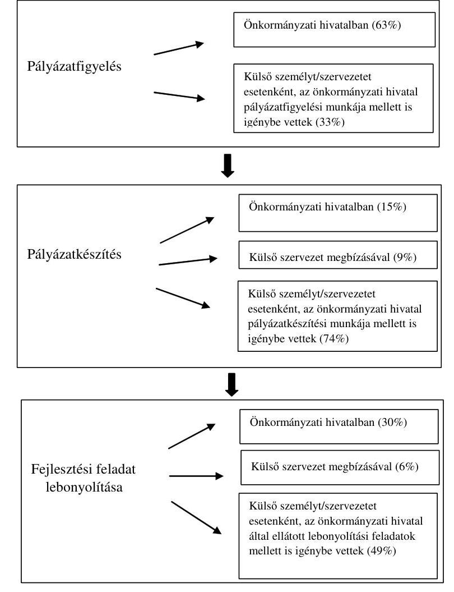

Az ellenőrzött önkormányzatok 4\%-a a pályázatfigyelés, 2\%-a a pályázatkészítés, és $15 \%$-a a fejlesztési feladat lebonyolításának személyi, szervezeti feltételeit nem alakította ki.

[^0]
[^0]:    ${ }^{54}$ A szervezeti, személyi feltételeket nem alakította ki a pályázatfigyeléshez Budapest főváros IV. kerületi, Dunavecse és Gönc városi, a pályázatkészítés esetében Budapest főváros IV. kerületi, valamint Bábolna városi, a fejlesztési feladat lebonyolítása vonatkozásában Budapest főváros IV. kerületi, Pécsvárad, Vámospércs, Bélapátfalva, Bábolna, Berhida, Abony, Albertirsa, Szigetszentmiklós, Kistarcsa, Kapuvár városi önkormányzat.

---

Az ellenőrzött önkormányzatok a külső szervezettekkel kötött szerződésekben:

- előírták a pályázatfigyelést végző feladatait 82\%-nál, a pályázatfigyelést végző és a döntési,- döntés előterjesztési jogkörrel rendelkezők közötti infor-máció-szolgáltatási kötelezettséget 58\%-nál;
- meghatározták a pályázat készítést végző feladatait 84\%-nál, a pályázatkészítő és a pályázat benyújtásáért felelős személy közötti kapcsolattartás rendjét $54 \%$-nál;
- rögzítették a fejlesztési feladatok lebonyolításánál a feladat ellátási kötelezettséget $88 \%$-nál, a projektmenedzser és a polgármester közötti kapcsolattartás rendjét $43 \%$-nál, a fejlesztési feladat lebonyolítását végző felelősségét $40 \%$-nál.

# 2.1.3. Az európai uniós forrással támogatott fejlesztési feladatok megvalósítása 

A fejlesztési feladatok lebonyolítását az ellenőrzött önkormányzatok 79\%-ánál - 65 projekt vonatkozásában - értékeltük ${ }^{55}$, amelyek közel kilenctizede befejeződött, az önkormányzatok a támogatást igénybe vették, mintegy tizedénél az ellenőrzés időszakában a megvalósítás folyamatban volt.

Az európai uniós forrással támogatott fejlesztési feladatok megvalósítása során a 2005-2008. években a támogatási szerződések 74\%-át ${ }^{56}$ módosították. A módosítások okai között szerepelt az időbeli ütemtervek és a befejezési határidők csúszása, a támogatás és a kiadás évek közötti ütemezésének változása, az előlegek igénylése, a támogatási szerződés mellékletében a költségvetés fősorai közötti átcsoportosítások, a műszaki tartalom módosulásai, a projektmenedzseri, műszaki ellenőri személyek cseréje. A közreműködő szervezetek a kifizetési kérelmek és jelentési kötelezettség változása ${ }^{57}$ miatt kezdeményezték a támogatási szerződések módosítását.

[^0]
[^0]:    ${ }^{55}$ A 2005-2008. években európai uniós forrással támogatott fejlesztései feladat nem valósult meg Budapest főváros V. kerületi és 16 városi önkormányzatnál. Nem volt nyertes európai uniós pályázat 12 önkormányzati hivatalban, ezért az intézményeinél ellenőriztük a fejlesztési feladatok megvalósítását.
    ${ }^{56}$ A támogatási szerződéseket egy-öt alkalommal módosították.
    ${ }^{57}$ A strukturális alapok és a Kohéziós Alap felhasználásának általános eljárási szabályairól szóló 14/2004. (VIII. 13.) TNM-GKM-FMM-FVM-PM együttes rendelet 30. § (2) és (4) bekezdései szerint a PEJ-eket a támogatási szerződés megkötésétől számítva félévente, a strukturális alapokból és a hazai társfinanszírozásból együttesen 10 millió Ft-ot nem meghaladó mértékben támogatott, vagy a hat hónapot meg nem haladó időtartamú projektek esetében egyetlen PEJ-t kell benyújtani a projekt megvalósításának befejezését követő 45 napon belül, továbbá módosult a 33. §-ban a támogatás kifizetés igénylésének rendje.

---

# AZ ELLENŐRZÖTT FEJLESZTÉSI FELADATOK MEGVALÓSULÁSA 

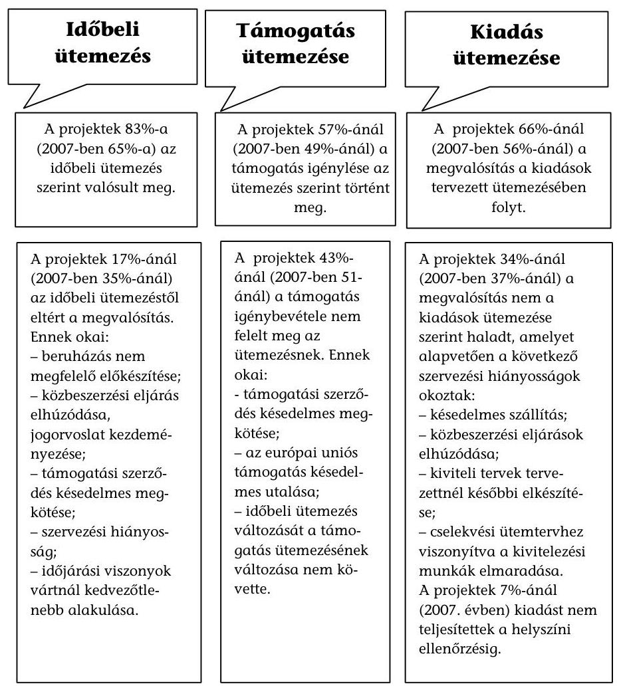

Az európai uniós támogatások kifizetésénél a PEJ-ek, valamint a támogatás kifizetés igénylését alátámasztó számlák, bizonylatok ellenőrzése, a hiánypótlások teljesítése 14-456 nap közötti időtartamot vett igénybe ${ }^{58}$. A közreműködő szervezetek a támogatási előlegigényléseket 30 napon belül, a hiánytalanul benyújtott kifizetési kérelmeket 60 napon belül teljesítették az ellenőrzött projektek 26\%-ánál. Az európai uniós források igénylését megalapozó dokumentumok ellenőrzése, a hiánypótlások teljesítése 60-100 nap között volt 18\%-nál, 100-180 nap közötti volt 36\%-nál, 180-360 nap közötti volt 13\%-nál és 360 nap feletti volt $7 \%$-nál.

A kifizetési kérelmek és a támogatás folyósítása közötti időtartamot befolyásolta a bizonylatok, dokumentációk hiányossága, azok pótlása, amelyek hatást gyakoroltak a felülvizsgálat időtartamára. A számlák alaki és tartalmi hibái: hiányzott a számla sorszáma, a teljesítés szakmai igazolása elmaradt, illetve nem az arra jogosult végezte, a számla és a szakmai teljesítésigazolás dátuma nem volt összhangban, a számla összege nem felelt meg az ajánlatnak, a pénzügyi jelentésben az önerő nem volt megbontva saját forrásra és EU Önerő Alapra. A számlaösszesítő és a mellékelt számlák adatai nem egyeztek meg, a számlák el nem

[^0]
[^0]:    ${ }^{58}$ Az előző évben átlagosan 30-240 nap közötti időtartam volt a bizonylatok ellenőrzéséhez és a hiánypótlások teljesítéséhez szükséges idő.

---

számolható költségeket tartalmaztak, az egyes kiadásokat nem a megfelelő költségsoron számolták el. Nem csatolták a kifizetési kérelmekhez a megrendelőt, szerződést, a szakmai teljesítés igazolását, a bankszámlakivonat hiteles másolatát, a tervezői számlához az átadás-átvételi jegyzőkönyvet, a hatósági igazolásokat, a jogerős használatba vételi engedélyt, a projekt teljes időszakára vonatkozó könyvvizsgálói jelentést.

A közremúködő szervezetek elutasították Elek Város Önkormányzata esetében 0,4 millió Ft összegű támogatás kifizetését, mivel az meghaladta az egyéb költségek tervezett keretét, Túrkeve Város Önkormányzata 2,4 millió Ft összegű üzletviteli tanácsadás számláját, mert a szerződés szerint az önkormányzat alaptevékenységébe tartozó feladat volt. Baktalórántháza Város Önkormányzatának a közremúködő szervezet a 0,4 millió Ft összegű támogatást nem folyósított, mivel többszöri hiánypótlási felszólítása ellenére az útszegélykő számlájához nem csatolták a minőségi tanúsítványokat.

Az ellenőrzött önkormányzatok 58\%-a a befejezett fejlesztési feladatai megvalósításához a támogatási szerződésben meghatározott támogatást igénybe vette.

A megítélt támogatás teljes összegét nem használta fel egy Budapest főváros kerületi, három megyei, öt megyei jogú város és 15 városi önkormányzat. Az összesen 159,8 millió Ft megtakarítást a tervezett támogatásnál alacsonyabb összegű személyi jellegű kiadások és járulékai, a szolgáltatás jellegű kiadások körében a projektmenedzser, könyvvizsgáló díjai és a kis értékű tárgyi eszközök kiadásai, valamint a közbeszerzési eljárások lefolytatásának eredményeként az építési beruházások kivitelezésére megkötött vállalkozási szerződések tervezettnél alacsonyabb kiadásai okozták.

Az önkormányzatok 90\%-a biztosította a támogatási szerződésben vállalt saját forrást az európai uniós forrással támogatott fejlesztési feladatok megvalósításához. Öt önkormányzat ${ }^{59}$ a saját forrást kiváltó pénzintézeti hitelt vett igénybe. A strukturális alapok által támogatott fejlesztések esetében az önkormányzatok eleget tettek a támogatás megelőlegezés követelményének. A támogatás megelőlegezését hét városi önkormányzat likviditási, hat városi önkormányzat rövid lejáratú hitel felvételével biztosította ${ }^{60}$. Bács-Kiskun megyei, Budapest főváros XIX. kerületi, és Gödöllő városi önkormányzatok intézményei a kifizetések megelőlegezését saját forrásból nem tudták finanszírozni, ezért részükre a fenntartó önkormányzatok előfinanszírozást nyújtottak.

Az ellenőrzött önkormányzatok a befejezett fejlesztési feladatok 23\%-át többletkiadással valósították meg, amelyet a feladat megvalósításához kapcsolódó, pályázatban nem szereplő kiadások okoztak. A támogatási szerződésben tervezett kiadásaihoz viszonyítva a többletkiadások mértéke 5\% alatt volt hét, 5-10\% közötti volt három és 10\% feletti volt öt önkormányzatnál.

[^0]
[^0]:    ${ }^{59}$ Csongrád, Kunszentmiklós, Solt, Újfehértó és Veresegyház városi önkormányzatok a saját forrás fedezetét pénzintézeti hitel felvételével biztosították.
    ${ }^{60}$ Dunavecse, Füzesgyarmat, Kunszentmiklós, Tiszacsege, Tótkomlós, Túrkeve, Újszász városi önkormányzatok likviditási, Gönc, Kenderes, Őriszentpéter, Solt, Vésztő, Újfehértó városi önkormányzatok rövid lejáratú hitelt vettek igénybe a támogatás megelőlegezésére.

---

Három megyei jogú város, és 12 városi önkormányzat fejlesztési feladatát a tervezetthez képest összesen 291,3 millió Ft többletkiadással valósította meg. Az európai uniós forrás igénylésére szóló pályázatban nem tervezett közbeszerzési eljárás hirdetési, közzétételi és tanácsadás díjai, építésengedélyezési és kiviteli tervdokumentáció készítése, a kivitelezés során pót- és többletmunkák kiadása, továbbá a közbeszerzési eljárás eredményeként megkötött szerződések összegei - a legalacsonyabb ajánlat is magasabb összegű volt a tervezett költségnél okozták a tervezettnél magasabb kiadásokat.

A fejlesztési feladatok megvalósítása a hatályos támogatási szerződésben rögzített határidőben az ellenőrzött önkormányzatok 97\%-ánál befejeződött ${ }^{61}$. A támogatási szerződésben meghatározott fejlesztési célok megvalósultak, valamint az önkormányzatok 96\%-ánál a tervezett feladatmutatók teljesültek.

Bóly Város Önkormányzata az INTERREG III/A Szlovénia-MagyarországHorvátország Szomszédsági Program keretében megvalósított „Kerékpárral a borutakon" projekt feladatmutatói közül nem érte el a támogatási szerződésben vállalt értéket a kerékpárutat használó turisták száma (tervezett érték 12000, megvalósított 50), az új munkahelyek száma (tervezett érték 90, megvalósított 0 ) és a határokon fenntartható közlekedésre irányuló közös beruházások száma (a tervezett érték 3, a megvalósított 1) esetében. A célértékek a megvalósítás szakaszában nem voltak teljesíthetőek, ezért a közreműködő szervezet a projekt utánkövetési időszakára írta elő a teljesítés határidejét.

Solt Város Önkormányzatnál a GVOP 4.4.2. szélessávú Internet hálózat kiépítésének megvalósításakor nem teljesültek a célértékek a szélessávú hálózatot elérő háztartások száma (célérték 2727 db , teljesített érték 2684 db ), valamint az egyéni végfelhasználók száma (célérték 1373 db , teljesített érték 1069 db ) esetében, mivel a célérték módosítása nélkül megváltoztatták a hálózati nyomvonalat. (A település központi belterületétől 11 km -re eső lakótelep, mint egyéb belterület 43 lakását a pályázatban foglaltak ellenére kihagyták a fejlesztési területből.)

Az európai uniós forrásból támogatott fejlesztési feladatokkal kapcsolatos bevételek és kiadások teljesítésénél a szabályozásban elöírtak szerint az ellenőrzött önkormányzatok $62 \%-\mathbf{a}^{62}$ a folyamatba épített, előzetes és utólagos vezetői ellenőrzési feladatokat elvégezte. A kötelezettségvállalás és az utalványozás ellenjegyzését az arra jogosultak, a teljesítés szakmai igazolását a kijelölt személyek a belső szabályzatban előírt módon, az érvényesítést a megfelelő végzettséggel, képesítéssel rendelkező, írásban megbízottak végezték. Az Ámr. 145/A. § (1) bekezdésében foglaltak ellenére az ellenőrzött önkormányzatok 38\%-ánál a jegyző nem gondoskodott a folyamatba épített, előzetes és utólagos vezetői ellenőrzési kötelezettség múködtetéséről.

A kötelezettségvállalások ellenjegyzése az Ámr. 134. § (2) bekezdésében foglaltak ellenére a Pest megyei, Budapest főváros IV., X. kerületi, Szekszárd megyei jogú városi és kilenc városi önkormányzatnál elmaradt, így nem tettek eleget az Ámr.

[^0]
[^0]:    ${ }^{61}$ A fejlesztési feladat Tiszaújváros és Tompa városi önkormányzatoknál a tervezett határidőre nem valósult meg.
    ${ }^{62}$ Az előző évben ellenőrzött önkormányzatok 63\%-a végezte el az ellenőrzési feladatokat.

---

134. § (9) bekezdésében foglaltnak, mivel az ellenjegyzést megelőzően nem győződtek meg a fedezet rendelkezésére állásáról, valamint a gazdálkodásra vonatkozó szabályok betartásáról. Az Ámr. 135. § (2) bekezdésében foglaltakat figyelmen kívül hagyva a szakmai teljesítésigazolás módjáról, az azt végző személyek kijelöléséről Budapest főváros IV. kerület, Szekszárd megyei jogú város és hét város önkormányzatánál a jegyző belső szabályzatban nem rendelkezett. Budapest főváros X. kerületi és öt városi önkormányzatnál nem tettek eleget az Ámr. 135. § (4) bekezdésében foglaltaknak, mivel az érvényesítést nem a jegyző által írásban megbízott dolgozó végezte, továbbá az Ámr. 135. § (3) bekezdésében foglaltakkal ellentétben - Budapest főváros IV., X., kerületi és hét városi önkormányzatnál az érvényesítés nem a szakmai teljesítés igazolásán alapult. Szekszárd megyei jogú és öt városi önkormányzatnál az Ámr. 137. § (3) bekezdésében foglaltak ellenére a jegyző vagy az általa írásban felhatalmazott személy nem végezte el az utalvány ellenjegyzését. Budapest főváros IV., X. kerületi, Jász-Nagykun-Szolnok és Pest megyei, valamint hat városi önkormányzatnál az utalvány ellenjegyzője nem tett eleget az Ámr. 134. § (9) bekezdés c) pontjában foglaltaknak, mivel az utalványozás ellenjegyzését megelőzően nem győződött meg arról, hogy az utalványozás sérti-e a gazdálkodásra vonatkozó szabályokat, mivel nem észrevételezte, hogy nem történt meg a kötelezettségvállalás ellenjegyzése.

A támogatásban részesült ellenőrzött önkormányzatok 98\%-ánál a belső ellenőrzés nem vizsgálta az európai uniós források felhasználását a 2005-2008. években

A közreműködő szervezetek, a KEHI, az ÁSZ, és az Európai Bizottság a 20052008. években az európai uniós forrással támogatott fejlesztési feladatok megvalósításának folyamatában az ellenőrzött önkormányzatok 83\%-ánál (62 önkormányzatnál ${ }^{63}$ ) végeztek ellenőrzést, melynek során az ellenőrzött projektek 74\%-ánál állapítottak meg hiányosságokat.
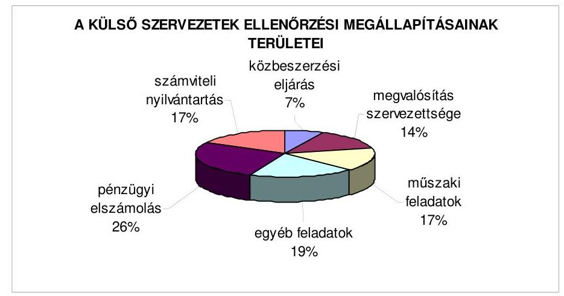

A közreműködő szervezetek ellenőrzéseik során megállapították az árajánlatok, a szakmai teljesítésigazolás, a munkaidő elszámolás hiányát, a közbeszerzési eljárás bíráló bizottsági tagjai összeférhetetlenségi és titoktartási nyilatkozatai-

[^0]
[^0]:    ${ }^{63}$ A közreműködő szervezetek 54, a KEHI Miskolc, Szekszárd megyei jogú, Gárdony, Tiszaújváros, Vásárosnamény városi önkormányzatoknál, az ÁSZ Zalaegerszeg megyei jogú és Marcali városi önkormányzatoknál, valamint az Európai Bizottság Szekszárd megyei jogú és Hatvan városi önkormányzatoknál végzett ellenőrzést.

---

nak és egyéni bírálati lapjainak hiányát, a határidő után érkezett ajánlat elfogadásánál a Kbt. megsértését, az el nem számolható, illetve el nem végzett munkák költségeit tartalmazó számlák befogadását, továbbá egyéb észrevételeket tettek ${ }^{64}$.

# 3. AZ ELEKTRONIKUS KÖZIGAZGATÁSI FELADATOK ELLÁTÁSA, A GAZDÁLKODÁSI ADATOK NYILVÁNOSSÁGÁNAK BIZTOSÍTÁSA 

Az ellenőrzött önkormányzatok 39\%-a határozta meg az informatikai stratégiai célkitűzéseit. A stratégiák $91 \%$-a tartalmazott helyzetelemzést, értékelte az informatikai infrastruktúra állapotát. Az önkormányzatok 88\%-a az informatikai stratégiában határozta meg a közép- és hosszú távú célkitűzéseit, az eközigazgatás biztosításához szükséges tárgyi, személyi és pénzügyi feltételeket, feladatokat.

A közigazgatás korszerűsítéséről szóló Korm. határozat 1. § a) pontjában meghatározott négyszintű skálát figyelembe véve az ellenőrzött önkormányzatok 21\%-a a 4., 10\%-a a 3., 5\%-a a 2. elektronikus szolgáltatási szint elérését tervezte. (A 4. elektronikus szolgáltatási szint elérését tervezte a megyei önkormányzatok 20\%-a, a megyei jogú városok 50\%-a, a Budapest fővárosi kerületi önkormányzatok 17\%-a, a városi önkormányzatok 18\%-a. A 2. elektronikus szolgáltatási szint elérését tervezte a megyei önkormányzatok 20\%-a.) Az önkormányzatok 64\%-ánál nem határozták meg, hogy melyik elektronikus szolgáltatási szintre kívánnak eljutni.

Az e-közigazgatás kialakításához és múködtetéséhez az ellenőrzött önkormányzatok 31\%-a pályázatot nyújtott be európai uniós ${ }^{65}$ támogatásra. Ezen belül a városi önkormányzatok egyharmada több önkormányzattal összefogva, társulás keretében pályázott. A megyei jogú városi, Budapest fővárosi kerületi önkormányzatok $42 \%$-a nyújtott be pályázatot, amelyek mindegyike támogatásban részesült. A városi önkormányzatok 26\%-a nyújtott be pályázatot, amelyek alapján ezen önkormányzatok $71 \%$-a kapott támogatást az e-közigazgatás kialakításához és múködtetéséhez. Az ellenőrzött önkormányzatok körében a lehetőséghez viszonyítva alacsony volt az eközigazgatás fejlesztésére irányuló pályázatok száma, azonban a lehetőséggel élők közül magas (77\%) volt a sikeresen pályázók aránya.

Az ellenőrzött önkormányzatok 89\%-ánál működtettek különböző szinten eközigazgatási szolgáltatásokat biztosító informatikai rendszert és rendelkeztek internetes honlappal. Az ügyintézést a 2007. évben az önkormányzatok 35\%-

[^0]
[^0]:    ${ }^{64}$ A pályázati dokumentációt áttekintették, a megvalósítás helyszínét ellenőrizték, megállapították, hogy a projekt további fejlesztésre is alkalmas, a beszerzett laptopot az önkormányzati hivatal a partnertől visszavette, annak ellenére, hogy azt az utánkövetési időre a rendelkezésére kellett volna bocsátania, értékelték a partnerségi megállapodásban foglaltak betartását, előírták a projektmenedzser munkaköri leírásának pontosítását, ráirányították a figyelmet az önkormányzatnál finanszírozási nehézségek és a saját erő hiánya miatti jelentős kockázatra.
    ${ }^{65}$ Az önkormányzatok az NFT keretén belül a GVOP, az ÜMFT keretén belül az ÁROP és EKOP programjaiból kaphattak támogatást az e-közigazgatás fejlesztéséhez.

---

nál az 1., 63\%-nál a 2., 2\%-nál a 3. elektronikus szolgáltatási szinten múködtették. (Az elektronikus közigazgatási ügyintézési területek alakulását szemlélteti a jelentés 10 . számú melléklete.)

# Állampolgárokat érintő e-közigazgatási ügyköröknél biztosított elektronikus szolgáltatási szint az ellenőrzött önkormányzatoknál 

| Ügykörök | 1. szint | 2. szint | 3. szint | Nincs |
| :-- | :--: | :--: | :--: | :--: |
| Személyi okmányok elkészítése | $29 \%$ | $27 \%$ | $0 \%$ | $44 \%$ |
| Hatósági igazolások kiadása | $24 \%$ | $34 \%$ | $0 \%$ | $42 \%$ |
| Lakcímváltozás bejelentése | $31 \%$ | $23 \%$ | $0 \%$ | $46 \%$ |
| Gépjármú regisztráció, adófizetés | $17 \%$ | $38 \%$ | $1 \%$ | $44 \%$ |
| Építési engedélyezés | $20 \%$ | $46 \%$ | $1 \%$ | $33 \%$ |
| Szociális juttatások, támogatások   kifizetései | $15 \%$ | $60 \%$ | $2 \%$ | $23 \%$ |
| Helyi adózás | $13 \%$ | $57 \%$ | $3 \%$ | $27 \%$ |
| Egészségüggyel kapcsolatos szolgál-   tatások | $34 \%$ | $21 \%$ | $1 \%$ | $44 \%$ |

A 4. elektronikus szolgáltatási szintnek megfelelő ügyintézés kialakítását akadályozta a pénzügyi források, az informatikához értő humán erőforrás, valamint a megfelelő és korszerű hardver és szoftver hiánya, továbbá megvalósítását - az ellenőrzés során kapott tájékoztatás szerint - a lakosság sem sürgette ${ }^{66}$.

Az ellenőrzött önkormányzatok az e-közigazgatási feladatok megoldását az önkormányzati hivatal köztisztviselőivel és emellett külső szervezetek bevonásával biztosították.

Az e-közigazgatási feladatokat ellátó önkormányzatok 75\%-ánál vásárolt szoftvereket használtak, mivel kevés informatikai szakember állt rendelkezésükre saját informatikai fejlesztések elvégzéséhez.

Az e-közigazgatási feladatokat ellátó informatikai rendszer ügyfelek általi igénybevételének figyelési rendszerét az ellenőrzött önkormányzatok közül mindössze $6 \%$, és ezen belül a kiemelt önkormányzati körbe tartozók közül is csak $14 \%$ alakította ki. Az igénybevétel figyelési rendszerével rendelkező önkormányzatok mintegy negyede értékelte különböző gyakorisággal a tapasztalatokat.

A közérdekú adatok elektronikus közzétételére az Eisztv. 21. § (3) bekezdése alapján 2007. január 1-jétől kötelezett volt az ellenőrzött megyei önkormányzatok mindegyike, valamint lakosságszáma alapján az ellenőrzött megyei jogú városi önkormányzatok közül négy és a Budapest fővárosi kerületi önkormány-

[^0]
[^0]:    ${ }^{66}$ A digitális aláírásra - az ellenőrzés során kapott tájékoztatás szerint annak hitelesítési költségei miatt - az állampolgárok és a vállalkozások körében a kialakított lehetőségekhez képest alacsony számú az igény.

---

zatok közül öt. Valamennyi önkormányzatnak 2008. július 1-jétől kell biztosítania a közérdekú adatok elektronikus közzétételét. A 2007. január 1-jétől kötelezett önkormányzatok csupán 50\%-a (az előző évben 35\%-a) teljesítette honlapján a közzétételi kötelezettségét.

Az ellenőrzött önkormányzatok 75\%-a nem az IHM rendeletben elöírt szerkezetben és tartalommal jelentette meg a közzétételi listákat, mivel a közzétételi honlapok megnyitásakor megjelenő oldalon az adatközlő nem helyezte el a közzétételi listák által előírt adatokat tartalmazó jegyzékre vagy felületre mutató hivatkozást. Az ellenőrzött önkormányzatok 35\%-a honlapján, 7\%-a a helyben szokásos módon tette közzé a 2007-2008. évben nyújtott nem normatív, céljellegú múködési és fejlesztési támogatások kedvezményezettjeinek nevét, a támogatás célját, összegét, továbbá a támogatási program megvalósítási helyét. A közzététel elmulasztásával az ellenőrzött önkormányzatok 58\%-a (az előző évben 51\%-a) megsértette az Áht. 15/A. § (1) bekezdésében foglalt elöírást.

Az ellenőrzött önkormányzatok 31\%-a a honlapján, 26\%-a pedig a helyben szokásos módon közzétette a nettó ötmillió Ft-ot elérő vagy azt meghaladó értékű árubeszerzésre, építési beruházásra, szolgáltatás megrendelésre, vagyonértékesítésre, vagyonhasznosításra vonatkozó szerződések megnevezését, tárgyát, a szerződő felek nevét, a szerződés értékét, határozott időre kötött szerződés esetében annak időtartalmát, valamint az adatok változását. Az önkormányzatok 43\%-a (az előző évben 42\%-a) az Áht. 15/B. § (1) bekezdésében foglalt előírást megsértve közzétételi kötelezettségének nem tett eleget.

Az éves költségvetési beszámoló szöveges indoklását honlapján nem, vagy nem megfelelő adattartalommal hozta nyilvánosságra az ellenőrzött önkormányzatok $40 \%$-a (az előző évben $64 \%$-a) ezen belül a kiemelt önkormányzati körbe tartozók 24\%-a, az Ámr. 157/D. § (1) bekezdésében előírtak ellenére.

A közérdekú adatok közzétételi kötelezettségére vonatkozó jogszabályi előírások az előző évben tett észrevételünk és javaslatunk ${ }^{67}$ ellenére a közzétételi idő, és a közzéteendő adatok meghatározása tekintetében nincsenek összhangban. A nem normatív, céljellegú, múködési és fejlesztési támogatások adatainak ${ }^{68}$, továbbá az államháztartás pénzeszközei felhasználásával, az államháztartáshoz tartozó vagyonnal történő gazdálkodással össze-

[^0]
[^0]:    ${ }^{67}$ A 0822 sorszámú jelentésben (a helyi önkormányzatok gazdálkodási rendszerének 2007. évi átfogó és egyéb szabályszerűségi ellenőrzéséről) javasoltuk a Miniszterelnöki Hivatalt vezető miniszternek, hogy kezdeményezze az Eisztv. mellékletében a III. Gazdálkodási adatok 3. és 4. pontjainak módosítását annak érdekében, hogy azokban az Áht. 15/A. § (1) bekezdésében és 15/B. § (2) bekezdésében foglaltakkal összhangban történjen a közzétételi idő meghatározása.
    ${ }^{68}$ A támogatások kedvezményezettjeinek nevére, a támogatás céljára, összegére, továbbá a támogatási program megvalósítási helyére vonatkozó adatok.

---

függő szerződések, megrendelések adatainak ${ }^{69}$ közzétételét az Áht. 15/A. § (1) bekezdése és a 15/B. § (1) bekezdése szerint a döntés meghozatalát követő hatvanadik napig kell teljesíteni. Ezzel szemben az Eisztv. mellékletében a III. Gazdálkodási adatok 3. és 4. pontjaiban foglalt szabályozás a közzétételi kötelezettséget negyedévente írja elő, valamint az IHM rendelet nem tartalmazza közzétételi egységeket ismertető 2. számú mellékletében a múködési célú támogatások közzétételi kötelezettségét.

# 4. A KÖLTSÉGVEtÉsi GAZDÁlKODÁs KONTROLLJAI 

### 4.1. A szabályozottság kockázata, valamint a belső kontrollok érvényesülése a költségvetés tervezési, gazdálkodási, beszámolási és a folyamatba épített ellenőrzési feladatainál

### 4.1.1. A költségvetési tervezés és a zárszámadás készítési folyamat szabályozottsága, a belső kontroll tevékenységek meghatározottsága és teljesítése

A költségvetés tervezési és a zárszámadás készítési folyamatok belső kontrolljait a kiemelt önkormányzati körbe tartozók 59\%-ánál (az előző évben 81\%-ánál), valamint a városi önkormányzatok több mint felénél (54\%) - az Áht. 120. § (1) bekezdésében foglalt előírásoknak és a belső feltételeknek - megfelelően alakították ki a jegyzők. Az ellenőrzött önkormányzatok 55\%-ánál (az előző évben 57\%-ánál) a költségvetés tervezés és a zárszámadás készítési tevékenységek szabályozottsága összességében alacsony kockázatot jelentett a feladatok szabályszerú végrehajtásában, mivel a folyamat belső kontrolljait a jegyzők kialakították a jogszabályi előírások és a helyi sajátosságok figyelembevételével. Ennek keretében az Ámr. 145/A. § (1)-(2) és a 145/B. § (1) bekezdéseiben előírtaknak megfelelően rögzítették az elvégzendő ellenőrzési feladatokat és azok felelőseit ${ }^{70}$. Ezeknél az önkormányzatoknál a költségvetés tervezés és a zárszámadás készítés folyamatában kialakított belső kontrollok - végrehajtásuk esetén - az előforduló apróbb szabályozási hiányosságok ${ }^{71}$ ellenére megfelelő védelmet nyújtottak a hibák bekövetkezése ellen. Ezen önkormányzatok 27\%-ánál a költségvetés tervezési és a zárszámadás ké-

[^0]
[^0]:    ${ }^{69}$ A nettó ötmillió forintot elérő vagy azt meghaladó értékű árubeszerzésre, építési beruházásra, szolgáltatás megrendelésre, vagyonértékesítésre, vagyonhasznosításra, vagyon vagy vagyoni értékú jog átadására, valamint koncesszióba adásra vonatkozó szerződések megnevezésére (típusára), tárgyára, a szerződést kötő felek nevére, a szerződés értékére, határozott időre kötött szerződés esetében annak időtartamára vonatkozó adatok.
    ${ }^{70}$ Az ellenőrzési feladatokat belső szabályzatokban, leíró és folyamatábrával szemléltetett ellenőrzési nyomvonalban, a gazdasági szervezetek ügyrendjében, jegyzői rendelkezésekben, körlevelekben, illetve a dolgozók munkaköri leírásaiban határozták meg.
    ${ }^{71}$ Az önkormányzatok felénél nem írták elő a jegyzők a saját bevételek eredeti előirányzatainak és az azok megalapozását szolgáló önkormányzati rendeletek összhangjának ellenőrzését, közel kétharmadnál nem szabályozták a költségvetési szervek elemi beszámolója felülvizsgálatának rendjét, tartalmát és felelőseit, mintegy harmadánál az intézményi pénzmaradványok kimunkálásának felülvizsgálati kötelezettségét.

---

szítési folyamatok belső kontrolljainak kialakításánál nem állapítottunk meg hiányosságot.

Az ellenőrzött önkormányzatok 21\%-ánál (az előző évben 18\%-ánál) a költségvetés tervezés és a zárszámadás készítés szabályozottságának hiányosságai közepes kockázatot jelentettek a feladatok megfelelő és szabályszerű végrehajtásában, mivel a jegyzők hiányosan szabályozták az ellenőrzési feladatokat, de a kialakított belső kontrollok végrehajtásuk esetén a lehetséges hibák többsége ellen védelmet nyújtottak. A szabályozottság hiányosságai az önkormányzatok 24\%-ánál (az előző évben 25\%-ánál) magas kockázatot jelentettek a feladatok szabályszerű végrehajtásában, mivel az önkormányzati hivatalokban az Áht. 121. § (1) bekezdésében foglalt előírásokat megsértve a jegyzők nem szabályozták, illetve hiányosan határozták meg a költségvetés tervezés és a zárszámadás készítés során elvégzendő belső kontroll tevékenységeket, ezáltal a kontrollok nem nyújtottak elegendő védelmet a lehetséges hibákkal szemben.
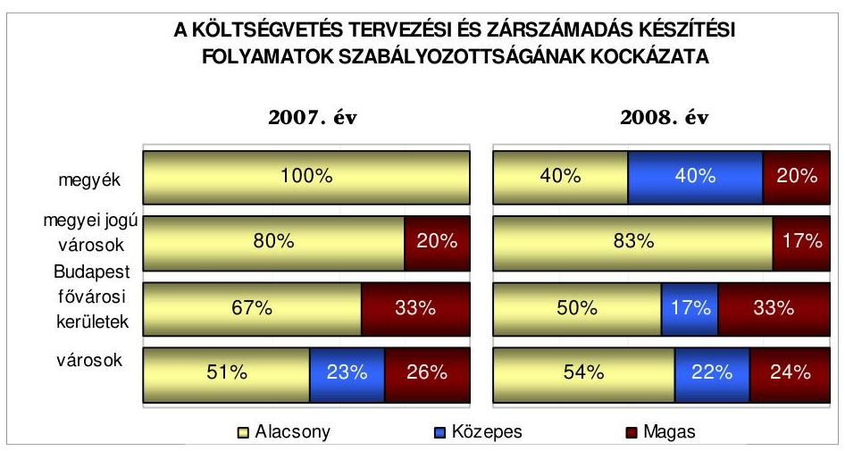

A közepes és magas kockázatot a FEUVE rendszer kialakításának következő szabályozási hiányosságai okozták:

- a városi önkormányzatok 22\%-ánál (az előző évben 23\%-ánál) nem határozták meg a költségvetési intézmények részére a költségvetési javaslat összeállításával kapcsolatos követelményeket. A követelményeket a kiemelt önkormányzati körbe tartozók 82\%-ánál meghatározták (az előző évben teljes körben).
- a költségvetési intézmények és az önkormányzati hivatal szervezeti egységei által benyújtott költségvetési igények indokoltságának, illetve teljesíthetőségének ellenőrzésére, valamint a tervezett saját bevételek előirányzatainak és az azok megalapozását szolgáló önkormányzati rendeletek összhangjának felülvizsgálatára vonatkozó belső kontroll tevékenységeket az önkormányzatok $51 \%$-ánál (az előző évben 56\%-ánál) nem határozták meg ${ }^{72}$;

[^0]
[^0]:    ${ }^{72}$ Ezen belső kontroll tevékenységeknek a szabályozását a megyei önkormányzatok 80\%-ánál, a megyei jogú városi önkormányzatok 33\%-ánál, a Budapest fővárosi kerületi önkormányzatok 67\%-ánál, valamint a városi önkormányzatok 51\%-ánál mulasztották el.

---

- a költségvetés tervezéséhez készített intézményi mutatószám felmérés megalapozottságának ellenőrzését az önkormányzatok 22\%-ánál (az előző évben 29\%-ánál) nem írták elő;
- az intézményi pénzmaradványok kimunkálásának felülvizsgálatát az Ámr. 66. § (4) bekezdésében foglalt előírás ellenére az önkormányzatok 30\%-ánál (az előző évben 33\%-ánál) nem írták elő, nem jelölték ki annak felelőseit;
- az önkormányzati költségvetési szervek elemi beszámolója felülvizsgálatának rendjét, tartalmát és felelőseit az Ámr. 149. § (2) bekezdés a)-c) pontjaiban előírtak ellenére az önkormányzatok 61\%-ánál (az előző évben 42\%-ánál) nem határozták meg ${ }^{73}$, a zárszámadási feladatok koordinálásáért felelős személyek kijelölését 11\%-ánál (az előző évben 16\%-ánál) elmulasztották a jegyzők.

A költségvetési tervezés és a zárszámadás készítés folyamatában kialakított belső kontrollok múködésének megbízhatósága az önkormányzatok 35\%-ánál (az előző évben 45\%-ánál) összességében kiváló volt, mivel az Áht. 121. § (1) bekezdésében foglalt előírások alapján a belső szabályozásban előírt ellenőrzési és egyeztetési feladatokat elvégezték. Ellenőrizték a költségvetési tervezéshez készített intézményi mutatószám felmérés adatainak megalapozottságát, a költségvetési javaslat összeállítására meghatározott követelmények betartását, a költségvetési intézmények és az önkormányzati hivatalok szervezeti egységei által benyújtott költségvetési igények indokoltságát, teljesíthetőségét, továbbá a zárszámadás előkészítése során felülvizsgálták az intézményi pénzmaradvány megállapításának szabályszerűségét. A költségvetés tervezés és a zárszámadás készítés folyamatára kialakított belső kontrollok a kiemelt önkormányzati körbe tartozó, valamint a városi önkormányzatok egyaránt 35\%-ánál (az előző évben háromnegyedénél, illetve 38\%-ánál) megbízhatóan, összességében kiválóan működtek, - a megállapított eseti kisebb hiányosságok ellenére - teljesítették a lényeges hibák, szabálytalanságok és gyenge teljesítmények megelőzésével, feltárásával és kijavításával kapcsolatos funkciójukat. Ezen önkormányzatok 41\%-ánál a költségvetés tervezési és a zárszámadás készítési folyamatok belső kontrolljainak kialakításában és működésében hiányosságot nem állapítottunk meg.

# A költségvetési tervezés és a zárszámadás készítés folyamatában a belső kontrollok múködésének megbízhatósága az önkormányzatok 

25\%-ánál (az előző évben 20\%-ánál) jó volt, mivel az elvégzett kontrolleljárások kielégítették a hibák megelőzésére és kijavítására vonatkozó célszerűségi elvárásokat. Ezen önkormányzatoknál a kontrollok működésénél a feltárt hiányosságok száma ugyan jelentős volt, azonban azok még nem veszélyeztették a hibák megelőzését, kijavítását. A belső kontrollok múködésének megbízhatósága az önkormányzatok 40\%-ánál (az előző évben 35\%-ánál) volt gyenge, mivel az Áht. 121. § (1)-(3) bekezdésében foglalt előírásokat megsértve a tervezés és a beszámolás folyamatában a belső kontroll tevékenységeket az önkormányzati hivatalokban nem végezték el, nem biztosították a hibák megelőzését, feltárását, kijavítását és ezáltal veszélyeztették az eredményes, megbízható múködést. Ezen önkormányzatok 58\%-ánál (az előző évben 69\%-ánál) belső

[^0]
[^0]:    ${ }^{73}$ Az ellenőrzési feladatokat a kiemelt körbe tartozó önkormányzatok 71\%-ánál, valamint a városi önkormányzatok 58\%-ánál nem írták elő.

---

kontrollok kialakításuk hiánya miatt, míg 42\%-ánál ${ }^{74}$ (az előző évben 31\%ánál) a belső szabályozás megtörténte ellenére nem múködtek. Önkormányzat típusonként a költségvetési tervezés és a zárszámadás készítés folyamatában a belső kontrollok múködésének megbízhatósága a következő:
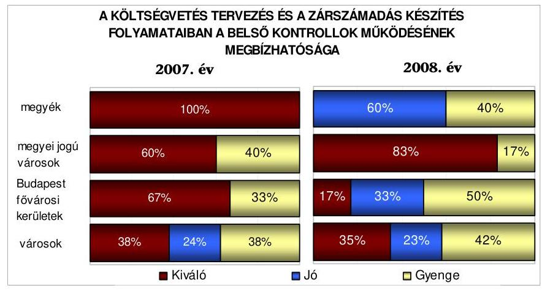

A költségvetési tervezés és a zárszámadás készítés során az Ámr. 145/A. § (1)-(2) és a 145/B. § (1) bekezdésében foglalt előírások ellenére nem ellenőrizték:

- az önkormányzatok 24\%-ánál ${ }^{75}$ (az előző évben 35\%-ánál), hogy a költségvetési intézmények teljesítették-e a költségvetési javaslat összeállításával kapcsolatban részükre meghatározott szakmai és pénzügyi követelményeket, amit ezen önkormányzatok $80 \%$-ánál (az előző évben $48 \%$-ánál) a kontrollok kialakításának hiánya okozott. Az intézmények és az önkormányzati hivatalok szervezeti egységei által benyújtott költségvetési igények indokoltságát az önkormányzatok $41 \%$-ánál (az előző évben $37 \%$-ánál) nem vizsgálták, ennek oka - az előző évhez hasonlóan - az ellenőrzési feladat előírásának elmaradása volt. A tervezett saját bevételek előirányzatai és az azok megalapozását szolgáló önkormányzati rendeletek összhangját az önkormányzatok előző évivel közel azonos arányánál (62\%-ánál) nem ellenőrizték, amit 82\%-ban az ellenőrzési feladat előírásának hiánya okozott;
- az intézményi pénzmaradványok megállapításának szabályszerűségét az Ámr. 66. § (4) bekezdésében foglalt előírás ellenére az önkormányzatok előző évivel azonos arányánál ${ }^{76}$ (mintegy négytizedénél) nem vizsgálták felül, a

[^0]
[^0]:    ${ }^{74}$ A belső kontrollok múködésének megbízhatósága Jász-Nagykun-Szolnok megye, Budapest főváros XXII. kerület, Elek, Kenderes, Kistarcsa, Marcali, Nyergesújfalu, Őriszentpéter, Solt, Sümeg, Szigetszentmiklós, Tiszacsege, Újszász, Várpalota városok önkormányzatainál gyenge volt annak ellenére, hogy a szabályozottság alacsony, illetve közepes kockázatot jelentett a feladatok szabályszerű végrehajtásában.
    ${ }^{75}$ A kontrollok nem múködtek Szabolcs-Szatmár-Bereg megye, Szekszárd megyei jogú város, Budapest főváros IV. kerület önkormányzatainál, valamint a városi önkormányzatok 26\%-ánál (az előző évben 39\%-ánál).
    ${ }^{76}$ A belső kontroll tevékenységeket a kiemelt körbe tartozó önkormányzatok közül Szekszárd megyei jogú város és Budapest főváros X. kerület önkormányzatainál nem végezték el.

---

kontrollok - kialakításuk hiánya miatt - nem múködtek az ellenőrzési feladatot elmulasztó önkormányzatok 64\%-ánál (az előző évben 71\%-ánál). A költségvetési beszámolókban az eredeti és a módosított előirányzatok, valamint a teljesítési adatok eltérése indokoltságának ellenőrzését az önkormányzatok 56\%-ánál (az előző évben 51\%-ánál) az Ámr. 149. § (3) bekezdés c) pontjában előírtak ellenére nem végezték el ${ }^{77}$. Az intézményi számszaki beszámolók belső, valamint azok jegyző által meghatározott adatszolgáltatással való összhangjának felülvizsgálata az Ámr. 149. § (3) bekezdés d) pontjában foglaltak ellenére az önkormányzatok 61\%-ánál ${ }^{78}$ (az előző évben 39\%-ánál) maradt el, ami 81\%-ban (az előző évben 77\%-ban) az ellenőrzési feladat előírásának és a felelősök kijelölésének hiányára vezethető vissza.
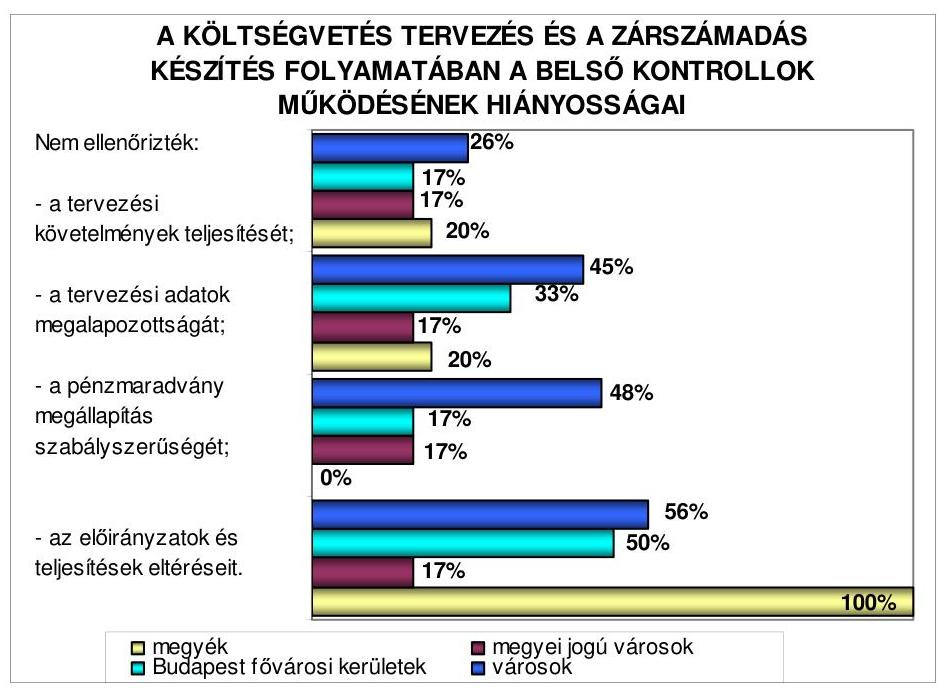
4.1.2. A pénzügyi-számviteli feladatoknál végrehajtandó belső kontroll tevékenységek kialakítása, a szakmai teljesítésigazolás és az utalvány ellenjegyzés múködésének megbízhatósága

A gazdálkodási, a pénzügyi-számviteli és a folyamatba épített előzetes és utólagos ellenőrzési feladatok szabályozottsága az önkormányzatok 30\%-ánál (az előző évben 31\%-ánál) összességében alacsony kockázatot jelentett a feladatok szabályszerú végrehajtásában, mivel a jegyzők az Áht. 121. § (1) bekezdésében foglalt előírásoknak és a helyi sajá-

[^0]
[^0]:    ${ }^{77}$ Az ellenőrzést elvégezték Debrecen, Miskolc, Salgótarján, Székesfehérvár, Zalaegerszeg megyei jogú városi önkormányzatok valamint Budapest főváros IV., V. és XIX. kerület önkormányzatainál, továbbá a városi önkormányzatok 44\%-ánál.
    ${ }^{78}$ Az intézményi számszaki beszámolókat felülvizsgálták Bács-Kiskun megye, Salgótarján, Székesfehérvár megyei jogú város, Budapest főváros V. és XIX. kerület önkormányzatainál, valamint a városi önkormányzatok 43\%-ánál.

---

tosságoknak megfelelően kialakították ${ }^{79}$ a belső kontrollokat, amelyek - végrehajtásuk esetén - az előforduló apróbb szabályozási hiányosságok ${ }^{80}$ ellenére megfelelő védelmet nyújtottak a múködésbeli hibák bekövetkezése ellen. A gazdálkodási, a pénzügyi-számviteli és a folyamatba épített ellenőrzési feladatok belső kontrolljait a jegyzők a külső és a belső feltételeknek megfelelően alakították ki a kiemelt önkormányzati körbe tartozók 29\%-ánál (az előző évben felénél), a városi önkormányzatok 39\%-ánál (az előző évivel azonos hányadánál), valamint a nagyközségi és községi önkormányzatok 11\%-ánál (az előző évben 22\%-ánál).

A gazdálkodási, a pénzügyi-számviteli és a folyamatba épített ellenőrzési feladatok szabályozásának hiányosságai az önkormányzatok 46\%-ánál (az előző évben 38\%-ánál) közepes kockázatot jelentettek az elvégzendő feladatok megfelelő végrehajtásában, mert a jegyzők hiányosan szabályozták az ellenőrzési feladatokat, azonban a kialakított belső kontrollok - megfelelő múködtetésük esetén - a lehetséges hibák többsége ellen védelmet nyújtottak. Az önkormányzatok 24\%-ánál (az előző évben 31\%ánál) az Áht. 121. § (1) bekezdésében foglalt előírásokat megsértve nem határozták meg a gazdálkodási, a pénzügyi-számviteli és a folyamatba épített ellenőrzési feladatokat, a szabályozás ezen hiányosságai magas kockázatot jelentettek a feladatok szabályszerű végrehajtásában.
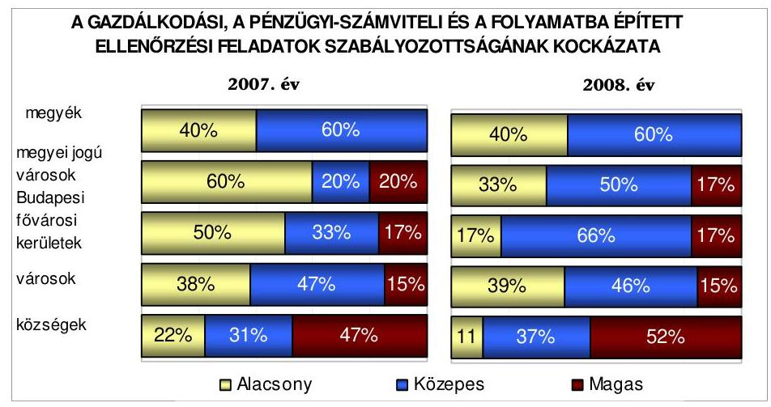

[^0]
[^0]:    ${ }^{79}$ A pénzügyi-számviteli feladatok során végrehajtandó belső kontrolltevékenységeket az SzMSz-ekben, a gazdasági szervezetek ügyrendjében, a gazdálkodási és ellenőrzési jogköröket, feladatokat rögzítő szabályzatokban, a pénzügyi-számviteli szabályzatokban, az ellenőrzési nyomvonalakban, a kockázatkezelésre és a szabálytalanságok kezelésére vonatkozó szabályozásban, valamint a feladatok ellátásáért felelős köztisztviselők munkaköri leírásaiban szabályozták.
    ${ }^{80}$ Az önkormányzatok előző évivel azonos hányadánál, mintegy felénél, nem készítettek az önköltségszámítás rendjére vonatkozó szabályzatot, az ellenőrzési nyomvonal nem tartalmazta az egyes feladatok elvégzését igazoló dokumentumok nyilvántartási helyét a rendszerben, valamint a kockázatkezelési eljárásrendben nem írták elő a kockázati környezet rendszeres felülvizsgálatát.

---

A közepes és magas kockázatot a következő szabályozási hiányosságok okozták:

- az ellenőrzött önkormányzati hivatalok 36\%-a ${ }^{81}$ (az előző évben 23\%-a) az Ámr. 10. § (5) bekezdésében foglaltak ellenére nem rendelkezett a képviselőtestület által jóváhagyott SzMSz-szel ${ }^{82}$. A jóváhagyott SzMSz-ek 19\%-ában (az előző évben 16\%-ában) az Ámr. 17. § (4) bekezdésében foglaltakat figyelmen kívül hagyva nem rögzítették a gazdasági szervezet felépítését és feladatait ${ }^{83}$. A gazdasági szervezetek 25\%-ánál ${ }^{84}$ (az előző évben 20\%-ánál) az Ámr. 17. § (5) bekezdésében előírtak ellenére nem készítettek ügyrendet, az elkészített ügyrendek az önkormányzatok 34\%-ánál (az előző évben 26\%-nál) nem tartalmazták a pénzügyi-gazdasági feladatok ellátásáért felelős személyek feladatait, továbbá a vezetők és más dolgozók feladat-, hatás- és jogkörét ${ }^{85}$. A vezetők és a pénzügyi dolgozók munkaköri leírásai nem tartalmazták a gazdálkodási és ellenőrzési jogköröket és feladatokat az önkormányzatok (előző évivel azonos hányadánál) 47\%-ánál ${ }^{86}$;
- a szakmai teljesítés igazolásának módjáról az önkormányzatok 28\%-ánál (az előző évben 41\%-ánál) a jegyzők - az Ámr. 135. § (2) bekezdésében foglaltak ellenére - belső szabályzatban nem rendelkeztek, nem írták elő a feladatra kijelölt személyek részére a kiadások teljesítésének és a bevételek beszedésének elrendelése előtt elvégzendő ellenőrzési feladatuk végrehajtásának, dokumentálásának módját. A szakmai teljesítésigazolás módjára vonatkozó szabályozást elmulasztó önkormányzatok arányának növekedésében közrejátszott, hogy a jogszabályi előírás változását a jegyzők a helyi szabályozásban későn, vagy esetenként egyáltalán nem vették figyelembe. A szakmai teljesítés igazolását végző személyeket az ellenőrzött önkormányzatok 21\%-ánál (az előző évben $28 \%$-ánál) nem jelölték ki a jegyzők;
${ }^{81}$ A kiemelt önkormányzati körbe tartozók 29\%-a (az előző évben 6\%-a), a városi önkormányzatok 32\%-a (az előző évben 17\%-a), valamint a nagyközségi és községi önkormányzatok 48\%-a (az előző évben 32\%-a) nem rendelkezett a képviselő-testület által jóváhagyott SzMSz-szel.
${ }^{82}$ A költségvetési szervek szervezeti és múködési szabályzatával kapcsolatos előírásokat 2009. január 1-jétől az Ámr. 13/A. § tartalmazza.
${ }^{83}$ Az Ámr. 17. § (4) bekezdése 2009. január 1-jétől módosult előírása szerint a gazdasági szervezet felépítését, az általa, illetve a más, külső szervezet által végzendő részletes feladatokat a költségvetési szerv szervezeti és múködési szabályzatában kell rögzíteni.
${ }^{84}$ A gazdasági szervezetek nem rendelkeztek ügyrenddel a kiemelt önkormányzati körbe tartozók 41\%-ánál (az előző évben 6\%-ánál), a városi önkormányzatok 18\%-ánál (az előző évben 15\%-ánál), valamint a községi önkormányzatok 30\%-ánál (az előző évben 27\%-ánál).
${ }^{85}$ Az Ámr. 17. § (5) bekezdésének 2009. január 1-jétől módosult előírása szerint a gazdasági szervezetnek olyan ügyrenddel kell rendelkeznie, amely részletesen tartalmazza az általa ellátandó feladatokat, a vezetők és a pénzügyi-gazdasági feladatok ellátásáért felelős alkalmazottak feladat- és hatáskörét, felelősségi körét, a helyettesítés rendjét, a belső (szerven belüli) és külső kapcsolattartás módját.
${ }^{86}$ A munkaköri leírások nem tartalmazták a gazdálkodási és ellenőrzési jogköröket, illetve feladatokat a kiemelt önkormányzati körbe tartozók 59\%-ánál (az előző évben 44\%-ánál), a városi önkormányzatok 37\%-ánál (az előző évben 42\%-ánál), valamint a községi önkormányzatok 63\%-ánál (az előző évben 52\%-ánál).

---

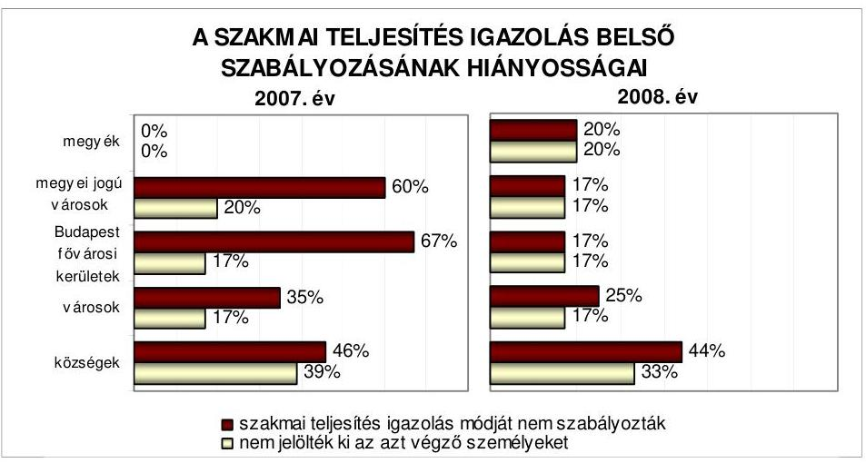

- az érvényesítési feladatok ellátására a jegyzők az Ámr. 135. § (4) bekezdésében foglaltak ellenére nem adtak írásban megbízást az önkormányzatok 8\%ánál (az előző évben 14\%-ánál), továbbá az írásbeli megbízások 6\%-ánál (az előző évben 13\%-ánál) nem tartották be - az Ámr. 135. § (4) bekezdés előírásai ellenére - az iskolai végzettségre és a szakmai képesítésre vonatkozó előírást ${ }^{87}$. A gazdálkodási és az ellenőrzési jogkörökre adott felhatalmazások, kijelölések, illetve megbízások során az önkormányzatok 9\%-ánál (az előző évben 30\%-nál) nem biztosították az - Ámr. 138. § (1), az Ámr. 135. § (6), valamint az Ámr. 138. § (3) bekezdésében előírt - összeférhetetlenségi követelmények érvényesülését ${ }^{88}$;
- a jegyzők nem rögzítették a számviteli szabályzatokban a Vhr. 37. § (1) és (7) bekezdésében előírt évenkénti, illetve kétévenkénti leltározási kötelezettséget az önkormányzatok 21\%-ánál (az előző évben 25\%-ánál). Az üzemeltetésre, kezelésre átadott eszközök leltározásának módját a Vhr. 37. § (5) bekezdésének előírása ellenére az önkormányzatok 46\%-ánál (az előző évben 47\%ánál) nem szabályozták, továbbá ezen eszközök selejtezésével, hasznosításával kapcsolatos döntés hozatalára jogosultak körét 52\%-ánál (az előző évben 56\%-ánál) nem határozták meg. Az adókkal kapcsolatos követelések egyszerűsített (csoportos) értékelési eljárásának szempontjait, dokumentumait - a Vhr. 31/A. §-ban biztosított lehetőség, illetve a 8. § (18) bekezdésében foglalt előírás ellenére - az önkormányzatok 40\%-ánál (az előző évben 34\%-ánál) nem szabályozták. Az önköltségszámítás rendjét a Vhr. 8. § (4) bekezdés c) pontjában, illetve (16) bekezdésében foglaltak ellenére az önkormányzatok 56\%-ánál (az előző évben 64\%-ánál) belső szabályzatban nem rögzítették. Az analitikus nyilvántartások vezetésének, valamint főkönyvi számlákkal történő egyeztetésének és a feladat elvégzésének dokumentálási módját az önkormányzatok 42\%-ánál (az előző évben 43\%-ánál) a Vhr. 49. § (2) bekezdésében előírtak ellenére nem szabályozták. A pénzkezelés során az utólagos vezetői ellenőrzés gyakoriságát és az ellenőrzés dokumentálásának módját az Ámr. 145/A. § (1)-(2) bekezdéseiben foglaltak ellenére az önkormányzatok 60\%ánál (az előző évben 61\%-ánál) nem határozták meg. A pénzügyi dolgozók munkaköri leírásai a számviteli szabályzatokban meghatározott egyeztetési és

[^0]
[^0]:    ${ }^{87}$ Az iskolai végzettségre és a szakmai képesítésre vonatkozó előírásokat nem tartották be a városi önkormányzatok 8\%-ánál (az előző évben 6\%-ánál), valamint a községi önkormányzatok 8\%-ánál (az előző évben 24\%-ánál).
    ${ }^{88}$ a szabályozás megfelelő volt a megyei és a megyei jogú városi önkormányzatoknál,

---

ellenőrzési feladatokat az önkormányzatok (előző évivel azonos hányadánál) mintegy felénél nem tartalmazták;
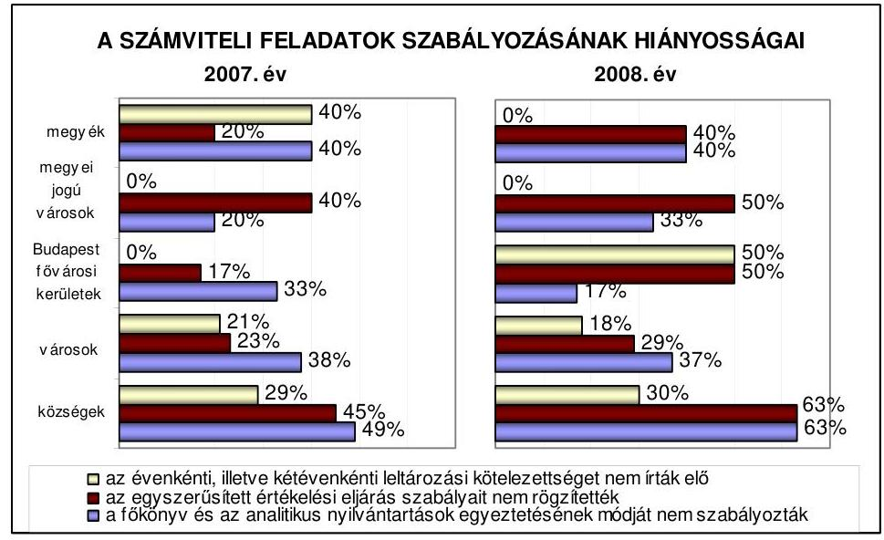

- a jegyzők a FEUVE rendszerét az Ámr. 145/A. § (1) bekezdésében előírtak ellenére nem, illetve nem a gazdálkodás folyamataira és sajátosságaira tekintettel alakították ki, mivel az Ámr. 145/B. § előírása ellenére az önkormányzatok 26\%-ánál (az előző évben 34\%-ánál) nem készítették el az ellenőrzési nyomvonalat. A FEUVE rendszer részeként elkészített ellenőrzési nyomvonalak 10\%ánál (az előző évben 12\%-ánál) a jegyzők nem határozták meg a folyamatokat és a folyamatgazdákat, valamint 14\%-ánál (az előző évben 16\%-ánál) nem jelölték meg az egyes feladatok végrehajtásért felelős szervezeti egységeket, személyeket. Az elkészített ellenőrzési nyomvonalak 35\%-a (az előző évben 45\%-a) nem tartalmazott utalást arra, hogy a tevékenységeket, feladatokat részletesen mely belső szabályzatokban rögzítik, továbbá 31\%-a (az előző évben 68\%-a) nem tartalmazta az egyes tevékenység, feladat elvégzését igazoló dokumentum megnevezését és nyilvántartási helyét a rendszerben. Az önkormányzatok 49\%-ánál (az előző évben 60\%-ánál) az Ámr. 145/C. § előírása ellenére kockázatkezelési eljárásrendben nem rögzítették a kockázatok azonosítását, illetve (előző évivel azonos hányadánál) 61\%-ánál nem határozták meg a kockázatok folyamatgazdáit, valamint 66\%-ánál (az előző évben 71\%ánál) az elfogadható kockázati szintet. Az Ámr. 145/A. § (5) bekezdésében előírtak ellenére a szabálytalanságok kezelésének eljárásrendjében a jegyzők 27\%-a (az előző évben 39\%-a) nem határozta meg a szabálytalanság fogalmát, illetve észlelési kötelezettségét, valamint 37\%-a (az előző évben 48\%-a) nem írta elő a szabálytalanság esetén teendő intézkedések (eljárások) nyomon követését, a szabálytalanságok és az intézkedések nyilvántartását, továbbá 71\%-a nem írta elő a kockázati környezet rendszeres felülvizsgálatát.

---

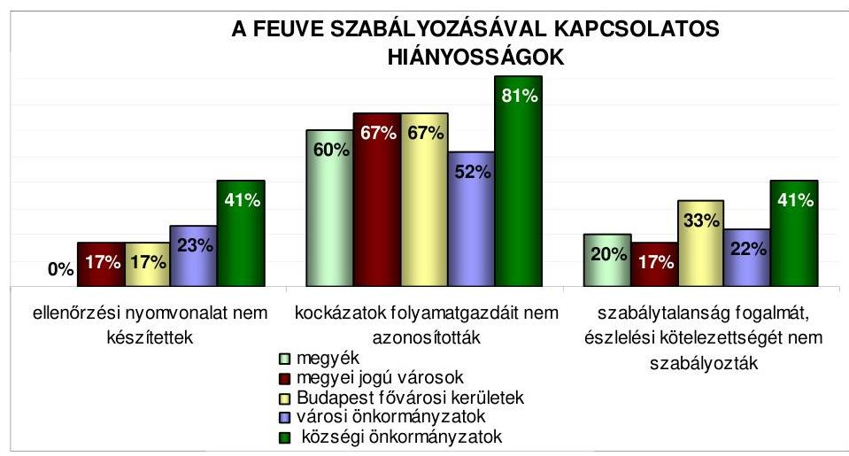

A pénzgazdálkodás folyamatában meghatározó, kulcsfontosságú belső kontrollok - a szakmai teljesítésigazolás és az utalvány ellenjegyzés - az önkormányzatok 18\%-ánál (az előző évben 31\%-ánál) megbízhatóan, kiválóan múködtek ${ }^{89}$, mivel azok teljesítették a lényeges hibák, szabálytalanságok és gyenge teljesítmények megelőzésével, feltárásával és kijavításával kapcsolatos funkciójukat. A szerződésekben, megrendelésekben, megállapodásokban meghatározott feladatok szakmai teljesítésének igazolását, a kiadások jogosultságának és összegszerűségének ellenőrzését a jegyző́k által kijelölt személyek az Ámr 135. § (2) bekezdésében előírt tartalommal, a belső szabályzatban előírt módon elvégezték. Az utalványok ellenjegyzésére jogosult személyek a folyamatba épített ellenőrzési feladataikat teljesítették, meggyőződtek arról, hogy az utalványozás nem sérti a gazdálkodásra vonatkozó szabályokat, továbbá ellenőrizték a szakmai teljesítésigazolás és az érvényesítés megtörténtét. Ezeknél az önkormányzatoknál a pénzügyi gazdálkodás folyamatában kialakított belső kontrollok - az eseti apróbb hiányosságok ellenére - megbízhatóan múködtek.

A belső kontrollok múködésének megbízhatósága az önkormányzatok 12\%-ánál (az előző évben 6\%-ánál) jó volt, mivel a szakmai teljesítésigazolás és az utalvány ellenjegyzés múködésében feltárt hiányosságok - amelyek száma ugyan jelentős volt - még nem veszélyeztették a hibák megelőzését és kijavítását. A szakmai teljesítésigazolás és az utalvány ellenjegyzés múködésének megbízhatósága az önkormányzatok 70\%-ánál (az előző évben 63\%ánál) gyenge volt, mivel a folyamatba épített ellenőrzési feladatokat a jegyző által kijelölt, illetve felhatalmazott személyek az Ámr. 135. § (1)-(2) bekezdéseiben, valamint az Ámr. 137. § (3) bekezdésében foglalt előírások ellenére nem végezték el. A belső kontrollok múködésével kapcsolatban megállapított hiányosságok, mulasztások rendszeresek voltak, egy-egy gazdasági esemény fo-

[^0]
[^0]:    ${ }^{89}$ Az értékelés alapjául szolgáló megfelelőségi teszteket a kiemelt kockázatuk alapján kiválasztott területek gazdasági eseményeivel - a külső szolgáltató által végzett karbantartási, kisjavítási szolgáltatásokkal, az ügyvitel- és számítástechnikai eszközök és az egyéb gépek, berendezések és felszerelések beszerzésével, létesítésével, valamint az államháztartáson kívülre teljesített múködési célú pénzeszköz átadásokkal, továbbá mint tartalék területre, az állományba nem tartozók megbízási díjaival - kapcsolatos kifizetésekre folytattuk le.

---

lyamatában egyidejűleg több kontroll végrehajtása elmaradt, illetve nem folyamatosan és következetesen múködött. Ezen önkormányzatok 41\%-ánál a belső kontrollok a kialakításuk hiánya (a szakmai teljesítésigazolás módjára irányuló belső szabályozás, illetve az azt végző személyek kijelölésének elmaradása) miatt nem múködtek, míg 59\%-uknál a kialakított kontrolltevékenységeket nem hajtották végre.
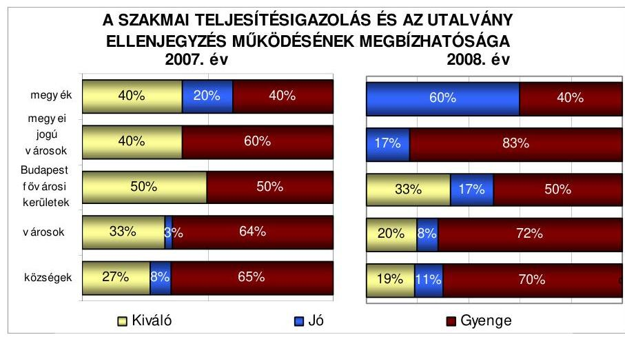

A külső szolgáltató által végzett karbantartási, kisjavítási szolgáltatásokkal ${ }^{90}$, az ügyvitel- és számítástechnikai eszközök és az egyéb gépek, berendezések és felszerelések beszerzésével, létesítésével ${ }^{91}$, az államháztartáson kívülre teljesített múködési célú pénzeszköz átadásokkal ${ }^{92}$, valamint az állományba nem tartozók megbízási díjaival ${ }^{93}$ kapcsolatos 2007. és 2008. évi kiadásokat és azok megoszlásainak alakulását az ellenőrzött önkormányzatoknál a jelentés 10. számú melléklete mutatja be.

A pénzügyi gazdálkodás során az önkormányzatok 57\%-ánál (az előző évben 54\%-ánál) - az Ámr. 135. § (1) bekezdésében foglalt előírás ellenére - elmaradt, illetve nem az előírásoknak megfelelően történt a kiadások jogo-

[^0]
[^0]:    ${ }^{90}$ A külső szolgáltató által végzett karbantartások, kisjavítások az önkormányzati ingatlanok, informatikai, irodatechnikai és biztonsági berendezések, gépjárművek, felvonók, fűtési rendszerek, klíma berendezések, telefonhálózatok, vízvezeték rendszerek karbantartására, javítására vonatkoztak.
    ${ }^{91}$ Az ügyvitel- és számítástechnikai eszközök és az egyéb gépek, berendezések és felszerelések beszerzése, létesítése során az önkormányzatok informatikai berendezéseket, ügyviteli eszközöket, gépeket, fénymásolókat, nyomtatókat, irodai bútorokat, vagyonvédelmi és térfigyelő rendszereket, egészségügyi gépeket, műszereket, intézményi eszközöket, telefonokat vásároltak.
    ${ }^{92}$ A múködési célú pénzeszközátadások államháztartáson kívülre teljesített kifizetései oktatási-, kulturális-, művészeti- sport-, közbiztonsági-, szociális-, gyermeknevelési-és gyermekjóléti feladatokat ellátó szervezetek, különböző kulturális, ifjúsági és sport rendezvények támogatására irányultak, továbbá az épített és természeti környezet védelmét szolgálták.
    ${ }^{93}$ A megbízási szerződések szakértők megbízására, szaktanácsadásra, anyakönyv vezetői, takarítási feladatok elvégzésére, hivatásos gondnoki, üdülő-gondnoki, sportpályagondnoki, kézbesítési feladatok ellátására, továbbá európai uniós támogatással finanszírozott programok megvalósításában való közreműködésre irányultak.

---

sultságának vizsgálata, 59\%-ánál (az előző évben 56\%-ánál) a kifizetések összegszerűségének ellenőrzése, valamint 57\%-ánál (az előző évben 55\%ánál) a szerződés, megrendelés, megállapodás teljesítésének szakmai igazolása.
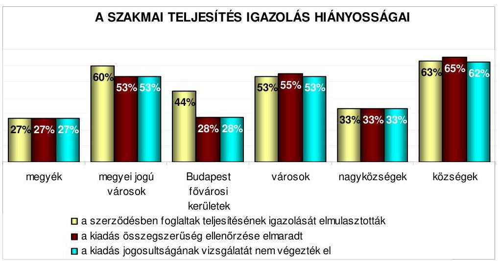

A kiadások jogosultságának és összegszerűségének ellenőrzését, valamint a szerződésben, megrendelésben, megállapodásban foglaltak szakmai teljesítését az ellenőrzési feladatra kijelölt személyek az önkormányzatok 20\%-ánál nem igazolták, mert az Ámr. 135. § (2) bekezdésében előírtak ellenére a kifizetések alapját képező bizonylatokon nem tüntették fel a szakmai teljesítést igazoló aláírását, az igazolás dátumát, valamint nem jelölték meg az - Ámr. 135. § (1) bekezdésében meghatározott - igazolási kötelezettség végrehajtását ${ }^{94}$ (az előző évben ellenőrzöttek 8\%-ánál nem igazolták a jogosultak aláírásával a szakmai teljesítést). A kiadások jogosultságának és összegszerűségének ellenőrzését a legnagyobb arányban ${ }^{95}$ az államháztartáson kívülre nyújtott múködési célú pénzeszköz átadások teljesítését megelőzően mulasztották el, amihez hozzájárult, hogy a jegyzők által kijelölt személyek a támogatási célok teljesítését az utólagos számadási kötelezettséggel nyújtott támogatások kifizetéseit megelőzően még nem tudták ellenőrizni, így a kapcsolódó ellenőrzési feladatokat - a kiadások jogosultságának és összegszerűségének ellenőrzését sem végezték el. Az Ámr. 135. § (1) bekezdése 2009. január 1-jétől kiegészült, amely szerint a kiadás teljesítésének és a bevétel beszedésének elrendelése előtt

[^0]
[^0]:    ${ }^{94}$ Az államháztartáson kívülre nyújtott múködési célú pénzeszköz átadások esetében az önkormányzatok 46\%-ánál, a külső szolgáltató által végzett karbantartási, kisjavítási munkákkal kapcsolatos kiadások tekintetében 8\%-ánál, az ügyvitel- és számítástechnikai eszközök és az egyéb gépek, berendezések és felszerelések beszerzésévek kapcsolatos kifizetések során 6\%-ánál, míg az állományban nem tartozók megbízási díjaival kapcsolatos kiadások tekintetében 36\%-ánál szakmailag nem igazolták a kiadások jogosultságának és összegszerűségének ellenőrzését, valamint a szerződésben, megrendelésben, megállapodásban foglaltak teljesítését.
    ${ }^{95}$ A kiemelt körbe tartozó önkormányzatok 65\%-ánál, a városi önkormányzatok 40\%ánál, valamint a nagyközségi és községi önkormányzatok 48\%-ánál a szakmai teljesítésigazolásra kijelölt személyek - az államháztartáson kívülre nyújtott múködési célú pénzeszköz átadások pénzügyi teljesítését megelőzően - nem ellenőrizték a kiadások jogosultságát és összegszerűségét.

---

a szerződés, megrendelés, megállapodás teljesítését, „illetve végrehajthatóságát" kell ellenőrizni, azonban az új rendelkezés nem rögzíti, hogy mely kiadások, esetleg bevételek esetében kell a szakmai teljesítés igazolására kijelölt személyeknek a szerződések, megrendelések, megállapodások végrehajthatóságát ellenőrizni, igazolni. Az önkormányzatok 14\%-ánál (az előző évben 11\%ánál) a szakmai teljesítés igazolásának módjáról - az Ámr. 135. § (2) bekezdésében előírtak ellenére - a jegyzök belső szabályzatban nem rendelkeztek, a szakmai teljesítés igazolására kijelölt személyek a kifizetések alapbizonylatait aláírásukkal és az igazolás dátumával ugyan ellátták, azonban, ezen aláírások önmagukban nem jelentették a kiadások teljesítésének elrendelése előtti ellenőrzések elvégzésének, a jogosultság, az összegszerűség ellenőrzésének, valamint a kötelezettségvállalásokban (szerződésben, megrendelésben, megállapodásban) foglaltak teljesítésének szakmai igazolását. Jogosulatlanul végezték a szakmai teljesítés igazolását az önkormányzatok 27\%-ánál (az előző évben 33\%-ánál). A hiányosságot ezen önkormányzatok 79\%-ánál az okozta, hogy a jegyzők elmulasztották kijelölni az ellenőrzési feladatok ellátására jogosult személyeket, míg 21\%-uknál nem a kijelölt személyek végezték a szakmai teljesítés igazolását. A szakmai teljesítést igazoló személyek - az igazolás elvégzését tanúsító aláírásuk ellenére - az önkormányzatok 23\%-ánál (az előző évben 20\%-ánál) alapdokumentumok hiánya, illetve hiányosságai ${ }^{96}$ miatt nem látták el az ellenőrzési feladataikat, mivel a kiadások teljesítését megelőzően a kötelezettségvállalásokat az Ámr. 134. § (8) bekezdésében előírtak ellenére nem foglalták írásba, így okmányok (írásos dokumentumok) hiányában nem ellenőrizték ${ }^{97}$ a szerződésben, illetve megrendelésben előírt feladatok teljesítését, a kiadás jogosultságát, valamint összegszerűségét. (A kötelezettségvállalások írásba foglalását legnagyobb arányban ${ }^{98}$ a külső szolgáltatók által végzett karbantartási, kisjavítási feladatokkal kapcsolatos 50 ezer Ft-ot el nem érő kifizetések ${ }^{99}$ tekintetében mulasztották el.)

Az utalvány ellenjegyzésekor elvégzendő ellenőrzési feladatokat a jegyző, vagy az általa felhatalmazott személyek az Ámr. 137. § (3) bekezdésében foglalt elő-

[^0]
[^0]:    ${ }^{96}$ Az önkormányzatok 6\%-ánál a dokumentumok nem tartalmazták a megrendelt termék, szolgáltatás összegét, illetve a szállító, a szolgáltató megnevezését.
    ${ }^{97}$ A külső szolgáltató által végzett karbantartási, kisjavítási munkákkal kapcsolatos kiadások tekintetében az önkormányzatok 44\%-ánál, az ügyvitel- és számítástechnikai eszközök és az egyéb gépek, berendezések és felszerelések beszerzésévek kapcsolatos kifizetések során 20\%-ánál, míg az államháztartáson kívülre nyújtott működési célú pénzeszköz átadások, és az állományba nem tartozók megbízási díjaival kapcsolatos kifizetések esetében is 7\%-ánál megfelelő okmányok hiánya miatt nem ellenőrizték a kiadások jogosultságát, összegszerűségét, illetve a szerződésben, megrendelésben foglaltak szakmai teljesítését.
    ${ }^{98}$ A kiemelt körbe tartozó önkormányzatok 35\%-ánál (az előző évben 31\%-ánál), a városi önkormányzatok 43\%-ánál (az előző évben 39\%-ánál), valamint a nagyközségi és községi önkormányzatok 52\%-ánál (az előző évben 41\%-ánál) a külső szolgáltató által végzett karbantartási munkákkal kapcsolatos kötelezettségvállalásokat nem foglalták írásba.
    ${ }^{99}$ Az önkormányzatok 27\%-ánál (az előző évben 17\%-ánál) a hivatali belső szabályozás szerint nem volt szükséges írásbeli kötelezettségvállalás az 50 ezer Ft-ot el nem érő kötelezettségvállalások esetében, azonban - az Ámr. 134. § (3) bekezdésében foglalt előírás ellenére - ennek rendjét és nyilvántartási formáját nem szabályozták.

---

írások ellenére nem látták el, mivel az önkormányzatok 66\%-ánál (az előző évben 62\%-ánál) nem ellenőrizték, hogy az utalványozás nem sérti-e a gazdálkodásra vonatkozó szabályokat, illetve 56\%-ánál (az előző évben 57\%-ánál) nem győződtek meg a szakmai teljesítésigazolás, valamint 49\%-ánál (az előző évben 54\%-ánál) az érvényesítés megtörténtéről.
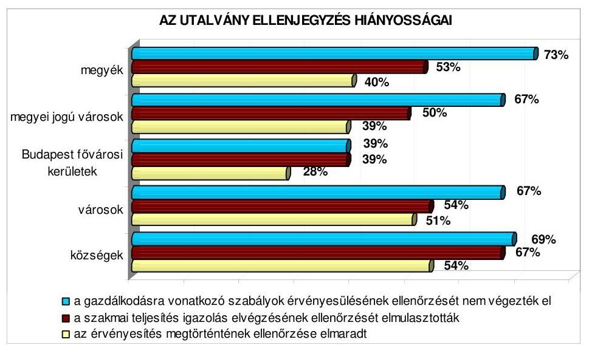

A jegyző, vagy az általa felhatalmazott személyek az utalványokat nem ellenjegyezték az önkormányzatok 4\%-ánál (az előző évben 5\%-ánál), további 7\%ánál (az előző évben 10\%-ánál) az ellenőrzési feladatokat jogosulatlanul - az Ámr. 137. § (2) bekezdésében foglaltak ellenére - a jegyző írásos felhatalmazásával nem rendelkező személyek végezték. Az utalványok ellenjegyzése az önkormányzatok 55\%-ánál (az előző évben 44\%-ánál) formai volt, mivel az utalvány ellenjegyzők - aláírásuk ellenére - nem végezték el a szakmai teljesítésigazolás és az érvényesítés megtörténtének, illetve a gazdálkodási szabályok betartásának ellenőrzésére vonatkozó feladataikat. Ezen önkormányzatoknál az utalványok ellenjegyzői nem észrevételezték, hogy a kötelezettségvállalásokat (főként az 50 ezer Ft alattiakat) nem foglalták írásba, vagy a kötelezettségvállalásokat az Ámr. 134. § (8) bekezdésének előírása ellenére nem előzte meg azok ellenjegyzése ${ }^{100}$, ezáltal nem hajtották végre a kiadási előirányzat által biztosított fedezet meglétének, a kötelezettségvállalás jogszerüségének munkafolyamatba épített ellenőrzését.

A kötelezettségvállalások során tapasztalataink szerint bizonytalanságot jelentettek az önkormányzati hivataloknál a Htv., az Áht. és az Ámr. - kötelezettségvállalásra jogosultak körének meghatározására irányuló - rendelkezései, mivel a Htv. 139. § (1) bekezdésében, valamint az Ámr. 134. § (2) bekezdésében foglaltak szerint a helyi önkormányzat nevében kötelezettséget a polgármester vagy az általa felhatalmazott személy vállalhat, míg

[^0]
[^0]:    ${ }^{100}$ A kötelezettségvállalások ellenjegyzése az önkormányzatok 12\%-ánál (előző évivel azonos hányadánál) maradt el.

---

az Áht. 2009. január 1-jéig hatályos 98. § (1) bekezdése ${ }^{101}$, valamint az Ámr. 134. § (1) bekezdése azt írja elő, hogy a költségvetési szerv nevében, a költségvetési szerv feladatainak ellátása során fizetési vagy más teljesítési kötelezettséget vállalni az önállóan gazdálkodó költségvetési szerv, illetve a részben önállóan gazdálkodó költségvetési szerv vezetője, vagy az általa, illetve a költségvetési szerv vezető testülete által írásban megbízott személy jogosult. A fenti szabályozás alkalmazásánál a bizonytalanságot az okozza, hogy az Ámr. 134. § (1) bekezdésében rögzített - a költségvetési szerv vezetőjének kötelezettségvállalási jogosultságára irányuló szabályozás - hiányos, mivel nem utal a Htv. 139. § (1) bekezdésében, valamint az Ámr. 134. § (2) bekezdésében foglalt eltérő szabályozásra, nem határozza meg az önkormányzati hivatal, mint költségvetési szerv nevében kötelezettségvállalásra jogosult személyeket.

Az ellenőrzött önkormányzatok mintegy kétharmadánál a vizsgált kulcsfontosságú belső kontrollok nem teljesítették a múködésbeli hibák megelőzésére, feltárására és kijavítására irányuló céljaikat, ezáltal fennállt a lényeges hiba, szabálytalanság, illetve gyenge teljesítmény kockázata. A belső kontrollok múködésének hiányosságai következtében az önkormányzatok 8\%-ánál nem a szerződésben meghatározott összeget fizették ki, illetve nem a jogosult részére teljesítettek kifizetést, további 10\%-ánál ${ }^{102}$ a kötelezettségvállalás tárgyával összefüggő előirányzat nélküli kötelezettségvállalások alapján teljesítettek kifizetéseket. A kiadási előirányzatok hiányában teljesített kötelezettségvállalásokkal a polgármesterek, jegyzők megsértették az Áht. 93. § (1) bekezdésében foglalt, a jóváhagyott előirányzatokon belüli gazdálkodásra vonatkozó kötelezettséget, valamint az Áht. 12/A. § (1) bekezdésének azon előírását, amely szerint tárgyévi fizetési kötelezettség a jóváhagyott kiadási előirányzatok mértékéig vállalható és kifizetés is ezen összeghatárig rendelhető el.

# 4.1.3. A pénzügyi-számviteli feladatoknál alkalmazott informatikai rendszerek szabályozottsága, biztonságos és dokumentált múködési feltételeinek kialakítása 

A jól kialakított és szabályozott informatikai biztonsági rendszer csökkenti a hibák, a csalások, és más illegális múveletek bekövetkezésének esélyeit, ennek ellenére az önkormányzatok tevékenységében egységesen érvényesítendő informatikai, informatikai biztonsági követelményrendszert központilag még nem alakítottak ki.

[^0]
[^0]:    ${ }^{101}$ 2009. január 1-jétől az Áht. 100/B. § (1) bekezdése szerint a költségvetési szerv feladatainak ellátását (végrehajtását) szolgáló, a kiadási előirányzatokat terhelő fizetési vagy más teljesítési kötelezettség vállalása vagy ilyen követelés előírása - törvényben meghatározott kivétellel - a költségvetési szerv vezetőjének vagy az általa írásban megbízott személynek a hatáskörébe tartozik.
    ${ }^{102}$ A városi önkormányzatok 11\%-ánál, valamint a községi önkormányzatok 16\%-ánál a kifizetés időpontjában nem állt rendelkezésre a kötelezettségvállalás tárgyával összefüggő kiadási előirányzat a 2007. évi költségvetési rendeletekben.

---

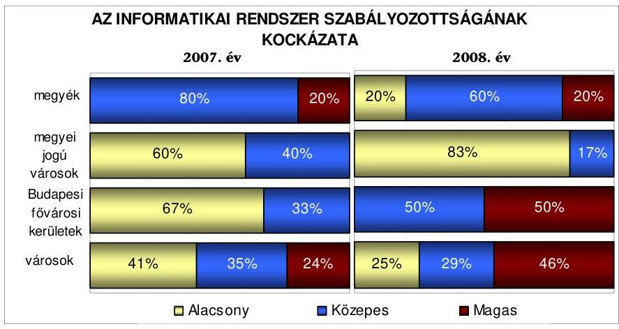

Az informatikai rendszer szabályozottsága az ellenőrzött önkormányzatok 27\%-ánál (az előző évben 41\%-ánál) összességében alacsony kockázatot jelentett az informatikai feladatok biztonságos végrehajtásában, mivel az önkormányzati hivataloknál készítettek informatikai biztonsági szabályzatot, illetve rendelkeztek olyan dokumentummal, belső utasítással, amely tartalmazta az üzletmenet folytonossági tervet és/vagy a váratlan események bekövetkezésekor teendő intézkedéseket meghatározó informatikai katasztrófa elhárítási tervet.

Az ellenőrzött önkormányzatok 32\%-ánál (az előző évben 38\%-ánál) az informatikai rendszer szabályozásának hiányosságai közepes kockázatot jelentettek az informatikai rendszer szabályszerű használatában, mivel nem ismertették a pénzügy-számvitel területén dolgozókkal az informatikával kapcsolatos szabályzatokat, a dolgozók munkaköri leírásai hiányosan tartalmazták az informatika eszközökkel végrehajtott feladataikat, azonban a kialakított kontrollok - végrehajtásuk esetén - a lehetséges hibák többsége ellen védelmet nyújtottak. Magas kockázatot jelentett az informatikai rendszer szabályszerű használatában az önkormányzatok 41\%-ánál (az előző évben 21\%ánál), hogy nem készítették el, illetve a képviselő-testületek nem fogadták el az informatikai stratégiát, nem szabályozták az informatikai biztonsági követelményeket, nem készítettek üzletmenet folytonossági tervet, illetve katasztrófa elhárítási tervet, és nem határozták meg az informatikai eszközökhöz történő hozzáférés rendjét.

Az informatikai rendszerek múködtetésénél a kialakított belső kontrollok megbízhatósága az önkormányzatok 32\%-ánál (az előző évben $40 \%$-ánál) összességében kiváló volt, mivel az önkormányzati hivatalokban a pénzügy-számviteli feladatok közül a főkönyvi könyvelést teljes mértékben informatikai eszközökkel látták el, a használt informatikai programok követték a jogszabályi változásokat és egyúttal biztosították a számlarend változásainak kezelését, a pénzügyi-számviteli adatok visszamenőleges elérhetőségét, illetve múködtettek hálózati rendszert, rendelkeztek internettel kapcsolatos védelmi rendszerekkel ${ }^{103}$.

[^0]
[^0]:    ${ }^{103}$ Az önkormányzatoknál védelmi rendszerként alkalmaztak túzfalakat az internetes behatolások ellen, továbbá kémprogram semlegesítő figyelőrendszereket.

---

Az önkormányzatok 61\%-ánál (az előző évben 39\%-ánál) az informatikai rendszerek belső kontrolljainak megbízhatósága jó volt, mivel az alkalmazott szoftverek biztosították a múködésbeli hibák megelőzését és kijavítását, azokban követték a jogszabályi változásokat, a kontrollok múködésében feltárt hiányosságok nem veszélyeztették az eredményes, megbízható múködést. Az informatikai rendszerek biztosították a számítógépen vezetett számviteli analitikus nyilvántartások és a főkönyvi könyvelés automatikus kapcsolatát, megoldott volt a csak engedélyezett tranzakciók, illetve az adatok egyszeri bevitelének lehetősége. A pénzügyi-számviteli szoftverek rögzítették az elvégzett múveleteket és automatikusan ellenőrizték az adatok számszaki pontosságát. A belső kontrollok múködésének megbízhatósága az önkormányzatok 7\%-ánál (az előző évben 21\%-ánál) gyenge volt, mivel ezen önkormányzatok hivatalainál az informatikai rendszerek belső kontroll tevékenységeit nem végezték el, nem biztosították a hibák megelőzését, feltárását, kijavítását és ezáltal veszélyeztették az eredményes, megbízható múködést. Az informatikai rendszerek nem biztosították a számítógépen vezetett számviteli analitikus nyilvántartások és a főkönyvi könyvelés automatikus kapcsolatát, emiatt a számviteli analitikus nyilvántartások adatainak időszaki összesítését nem a számítógépes program végezte, nem dokumentálták a pénzügyi-számviteli számítógépes nyilvántartásokban használt adatok kapcsolatait, nem oldották meg, hogy csak engedélyezett tranzakciókat lehessen a könyvvitelben elszámolni, nem alakították ki a rögzített, de hibás, törölt adatok kezelését, nem biztosították a pénzügyiszámviteli adatok visszamenőleges elérhetőségét.
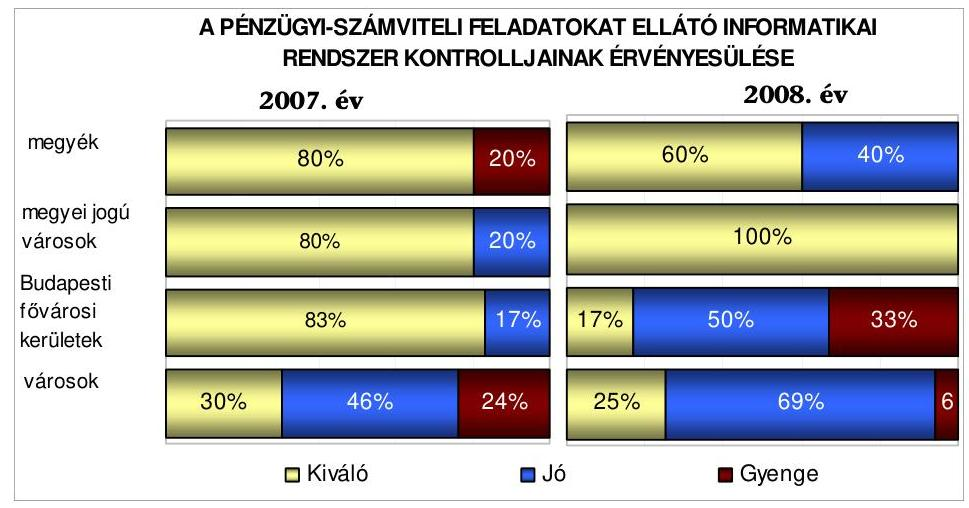

# 4.2. A belső ellenőrzés szabályozottsága, szervezettsége és múködése 

A belső ellenőrzés szervezeti kereteinek kialakítása és szabályozása az önkormányzatok 50\%-ánál (az előző évben 57\%-ánál) összességében alacsony kockázatot jelentett ${ }^{104}$ a belső ellenőrzés szabályszerű végrehajtásában, mivel meghatározták a szervezeti és szabályozási kereteket, a belső ellen-

[^0]
[^0]:    ${ }^{104}$ A belső ellenőrzés szervezeti kereteinek kialakítása és szabályozása a kiemelt önkormányzati kör 59\%-ánál, a városi önkormányzatok 55\%-ánál, a községi önkormányzatok 30\%-ánál jelentett alacsony kockázatot.

---

őrzés ellátási módját, továbbá szabályzatban rögzítették a belső ellenőrzési kötelezettséget, az ellenőrzést végzők jogállását és feladatait, ezért a kialakított belső ellenőrzési szervezetek - szabályszerű működtetése esetén - az előforduló kisebb szabályozási hiányosságok ellenére megfelelő védelmet nyújtottak a hibák bekövetkezése ellen.

Az ellenőrzött önkormányzatok 47\%-ánál (az előző évben 27\%-ánál) a belső ellenőrzés szervezeti kereteinek kialakítása, illetve szabályozásának hiányosságai közepes kockázatot jelentettek ${ }^{105}$ a feladatok megfelelő és szabályszerű végrehajtásában, mivel hiányosan határozták meg a belső ellenőrzési feladatok ellátási módját, az önkormányzati hivatalokon belül elfoglalt helyét, a feladatainak ellátásával kapcsolatos szabályokat, azonban a kialakított szervezet - szabályszerű működtetés esetén - a lehetséges hibák többsége ellen védelmet nyújtott.

Az ellenőrzött önkormányzatok 3\%-ánál (az előző évben 16\%-ánál) a belső ellenőrzés szervezeti kereteinek kialakítása, illetve szabályozásának hiányosságai magas kockázatot jelentettek a feladatok megfelelő ellátásában, mert a jogszabályi előírások ellenére elmulasztották a belső ellenőrzés szervezeti kereteinek kialakítását, illetve feladatainak szabályozását, ezáltal az nem nyújtott elegendő védelmet a lehetséges hibákkal szemben ${ }^{106}$.
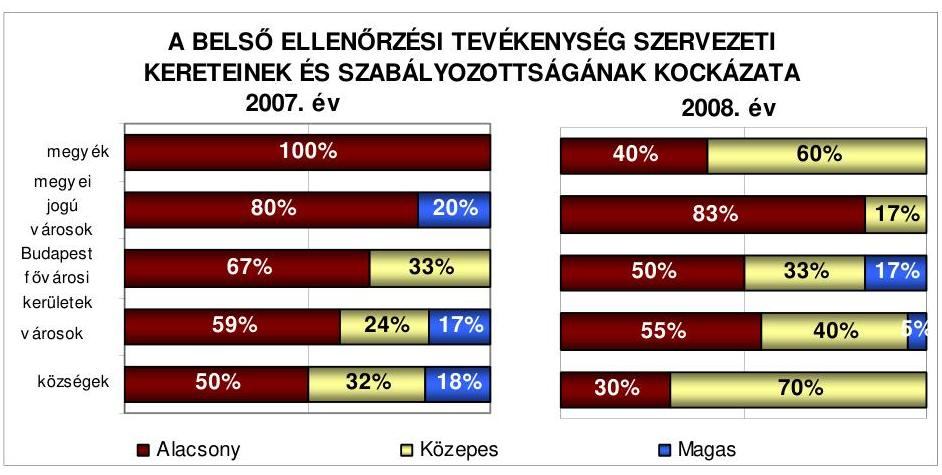

A belső ellenőrzési rendszer múködésének közepes és magas kockázatát a következő szabályozási hiányosságok okozták:

- nem határozták meg az önkormányzatok 48\%-ánál (az előző évben 53\%ánál) a Ber. 4. § (2) bekezdésben foglaltak ellenére SzMSz-ben a belső ellenőrzési kötelezettséget, az ellenőrzést végző személy, egység jogállását, az ellenőrzést végzők feladatait;

[^0]
[^0]:    ${ }^{105}$ A belső ellenőrzés szervezeti kereteinek kialakítása és szabályozása kiemelt önkormányzati kör 35\%-ánál, a városi önkormányzatok 40\%-ánál, a községi önkormányzatok 70\%-ánál jelentett közepes kockázatot.
    ${ }^{106}$ A szabályozás hiányosságai magas kockázatot jelentettek Budapest Főváros XIX. kerületi Önkormányzatnál, Pécsvárad, Újfehértó, Lőrinci városi önkormányzatoknál.

---

- nem rendelkeztek a belső ellenőrök az önkormányzatok 7\%-ánál a Ber. 11. § (1) bekezdésében előírt iskolai végzettséggel, illetve szakmai képesítéssel, továbbá nem biztosították a belső ellenőrzési vezetői feladatokat ellátók, a Ber. 12. § k) pontjában foglaltak ellenére, az önkormányzatok 37\%-ánál a belső ellenőrzési képzési tervek készítésének elmulasztásával a belső ellenőrök rendszeres továbbképzését;
- nem készítettek a belső ellenőrzési vezetők a Ber. 12. § a) pontjában meghatározott ellenőrzési kézikönyvet az ellenőrzési tevékenységre vonatkozó szabályok és eljárások rögzítésére ${ }^{107}$ az önkormányzatok 7\%-ánál;
- nem rendelkezett - a Ber. 4/A. § (2) bekezdésének előírása ellenére - a külső szolgáltatóval történő feladatellátásról szóló megállapodásban az önkormányzatok 75\%-a a belső ellenőrzési vezetői feladatok ellátási módjáról ${ }^{108}$. E hiányosság miatt az érintett önkormányzatoknál nem rendelkeztek arról, hogy ki a felelős a belső ellenőrzési tevékenység megszervezéséért, a tárgyi és személyi feltételek megteremtéséért, a belső ellenőrzési kézikönyv elkészítéséért, a kockázatelemzéssel alátámasztott stratégiai tervek és éves ellenőrzési tervek összeállításáért, jóváhagyásáért, végrehajtásáért, továbbá az ellenőrzések végrehajtásának irányításáért, nyomon követéséért, nyilvántartásáért, az ellenőrzések összehangolásáért, az éves ellenőrzési jelentés, és az összefoglaló ellenőrzési jelentés összeállításáért, az ellenőrök továbbképzésének megszervezéséért, az éves ellenőrzési tervtől való eltérésről a képviselő-testület tájékoztatásáért, valamint az intézkedési tervek végrehajtásának figyelemmel kíséréséért;
- nem rendelkezett a belső ellenőrzés a Ber. 19. §-ban foglaltak ellenére, az önkormányzatok 57\%-ánál (az előző évben 60\%-ánál) kockázatelemzéssel alátámasztott stratégiai tervvel ${ }^{109}$, ezáltal nem határozták meg a belső ellenőrzésre vonatkozó stratégiai célkitűzéseket, nem értékelték a kockázati tényezőket, nem végezték el a szükséges ellenőri létszám és ellenőri képzettség felmérését, a belső ellenőrök hosszú távú képzési tervét nem állították össze, nem mérték fel a belső ellenőrzés tárgyi és információs igényét;
- hiányosan végezték a belső ellenőrzési feladatok tervezését az önkormányzatok 74\%-ánál ${ }^{110}$, (előző évben 76\%-ánál), az Ötv. 92. § (6) bekezdésében foglalt előírást figyelmen kívül hagyva nem rendelkezett a belső ellenőrzés a

[^0]
[^0]:    ${ }^{107}$ A belső ellenőrzési kézikönyvet nem készítette el a belső ellenőrzési vezető egy megyei jogú városi önkormányzatnál, egy Budapest fővárosi kerületi önkormányzatnál és öt városi önkormányzatnál.
    ${ }^{108}$ A társulással történő feladatellátás esetén - a Ber. 2007. április 18-ig hatályos 4.§ (5) bekezdésének előírásai ellenére - az ellenőrzött önkormányzatok 64\%-a a társulási megállapodásban nem rendelkezett arról, hogy a belső ellenőrzési vezetői feladatokat a társulás lássa el.
    ${ }^{109}$ A megyei önkormányzatok 60\%-a, a megyei jogú városi önkormányzatok 17\%-a, a Budapest fővárosi kerületek 67\%-a, a városi önkormányzatok 55\%-a, a községi önkormányzatok 67\%-a nem rendelkezett kockázatelemzésen alapuló stratégiai tervvel.
    ${ }^{110}$ A megyei önkormányzatok 80\%-a, a megyei jogú városi önkormányzatok 50\%-a, a Budapest fővárosi kerületi önkormányzatok 80\%-a, a városi önkormányzatok 69\%-a, a községi önkormányzatok 89\%-a hiányosan hajtotta végre a belső ellenőrzési feladatok tervezését.

---

képviselő-testület által jóváhagyott éves ellenőrzési tervvel az önkormányzatok 16\%-ánál (az előző évben 34\%-ánál). Az önkormányzatok 14\%-ánál az éves ellenőrzési tervet önállóan a kistérségi társulás hagyta jóvá a jegyzővel történt előzetes egyeztetés nélkül, amelynek következtében a belső ellenőrzési tevékenység keretében tervezett feladatokat az ellenőrzési terv jóváhagyására jogosult képviselő-testületek nem ismerték meg. A képviselőtestületek által elfogadott éves ellenőrzési tervek 51\%-a (az előző évben 42\%a) a Ber. 21. § (3) bekezdésében foglalt előírásoknak nem felelt meg, mivel nem határozta meg a szükséges ellenőri kapacitást, vagy nem tartalmazta az ellenőrzési tervet megalapozó elemzéseket, az ellenőrzések típusát és módszereit, illetve az ellenőrzések célját, az ellenőrizendő időszakot, az ellenőrzések ütemezését. Az éves ellenőrzési tervek 45\%-ánál (az előző évben 53\%ánál) a Ber. 21. § (4) bekezdésében foglaltak ellenére nem biztosítottak kapacitást a soron kívüli ellenőrzési feladatokra;

- az ellenőrzött önkormányzatok 50\%-a nem tervezte az éves ellenőrzési tervet megalapozó kockázatelemzésben magas kockázatúnak értékelt terület ellenőrzését;
- az ellenőrzések lefolytatásához a Ber. 23. § (1) bekezdésének előírása ellenére az önkormányzatok 5\%-ánál (az előző évben 23\%-ánál) nem készítettek ellenőrzési programot. Az ellenőrzési programok 19\%-a (az előző évben 14\%a) hiányosan felelt meg a Ber. 23. § (4) bekezdésben foglalt tartalmi követelményeknek, mivel elmaradt vagy az ellenőrzési módszer meghatározása, az ellenőrök megnevezése, feladatmegosztásának ismertetése, illetve az ellenőrzés tárgyának, céljának, részletes feladatainak a meghatározása. Az ellenőrzési programok 47\%-át a Ber. 23. § (3) bekezdésének előírása ellenére nem a belső ellenőrzési vezető hagyta jóvá;
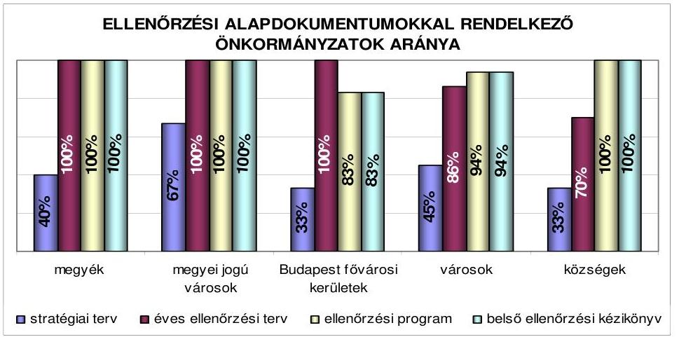

A költségvetési szervek belső ellenőrzési feladatainak ellátását a képviselőtestületek 97\%-a (az előző évben 73\%-a) az Ötv. 92. § (7)-(8) bekezdéseiben előírtaknak megfelelő módon (szervezeti megoldással) biztosította.

---

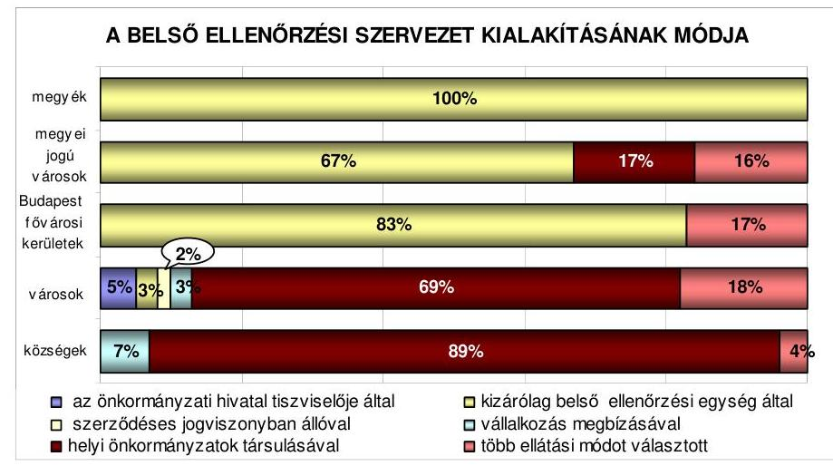

A belső ellenőrzési feladatok végrehajtása érdekében az önkormányzatok 18\%a kizárólag az önkormányzati hivatalon belül foglalkoztatott belső ellenőrt, 64\%-a társulási megállapodást kötött, 5\%-a vállalkozást bízott meg a belső ellenőrzési feladatok ellátásával. Az önkormányzatok 13\%-a a belső ellenőrzési feladatok ellátását több módon - társulás és vállalkozás, társulás és köztisztviselő, vállalkozó és köztisztviselő, illetve belső szervezeti egység és társulás formában - biztosította ${ }^{111}$.

A belső ellenőrzés múködésének megbízhatósága az önkormányzatok 14\%-ánál (az előző évben 7\%-ánál) összességében kiváló volt, mivel a hibák feltárásával, javaslataival, célirányos intézkedések kezdeményezésével, valamint a realizálás ellenőrzésével hozzájárult a kontroll kockázatok csökkentéséhez. Ezeknél az önkormányzatoknál a belső ellenőrzés - az eseti hiányosságok ellenére - eredményesen múködött.

A belső ellenőrzés múködésének megbízhatósága az ellenőrzött önkormányzatok 55\%-ánál (az előző évben 40\%-ánál) jó volt, mivel tevékenységével hozzájárult a kontroll kockázatok csökkentéséhez, a belső ellenőrzés múködésében feltárt hiányosságok nem veszélyeztették a lényeges hibák, szabálytalanságok és gyenge teljesítmények megelőzését, feltárását, illetve kijavítását.

A belső ellenőrzés múködésének megbízhatósága az ellenőrzött önkormányzatok 31\%-ánál (az előző évben 53\%-ánál) gyenge volt, mert nem teljesítették a lényeges hibák, szabálytalanságok és gyenge teljesítmények megelőzősével, feltárásával és kijavításával kapcsolatos funkcióját és veszélyeztette az eredményes, megbízható múködést.

[^0]
[^0]:    ${ }^{111}$ Ezen önkormányzatok 93\%-ánál nem rendelkeztek a belső ellenőrzési vezető személyéről, elmaradt a belső ellenőrzési vezető számára meghatározott tevékenységek ellátási módjának meghatározása.

---

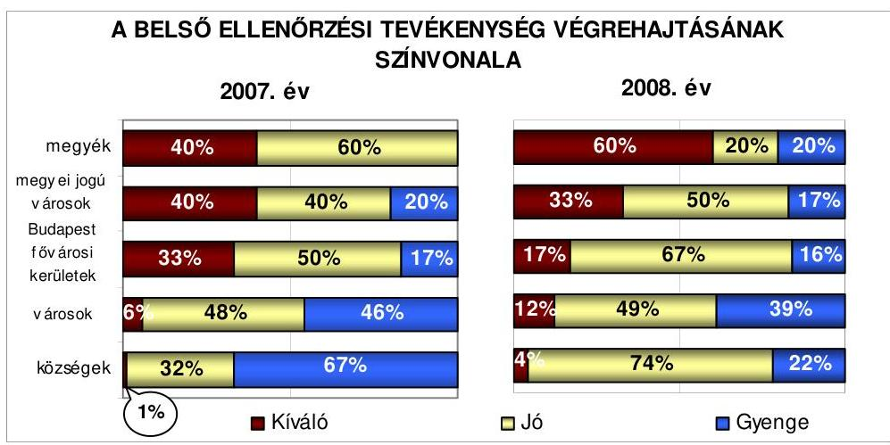

A belső ellenőrzési rendszer múködésében a következő hiányosságokat állapítottuk meg:

- az önkormányzatok közül Lőrinci Város Önkormányzatánál a jegyző az Ötv. 92. § (5) bekezdésben foglaltakat megsértve nem gondoskodott az önkormányzati belső ellenőrzés múködtetéséről, az önkormányzati hivatal belső ellenőrzéséről, valamint a felügyelt költségvetési szervek ellenőrzéséről. Az önkormányzatok 23\%-ánál (az előző évben 29\%-ánál) nem hajtották végre maradéktalanul, 10\%-ánál (az előző évben 18\%-ánál) pedig nem végezték el a tervezett belső ellenőrzési feladatokat, ugyanakkor ezen önkormányzatok $82 \%$-ánál ${ }^{112}$ a tervezettől eltérő, soron kívüli ellenőrzési feladatokat is végrehajtottak ${ }^{113}$. A társulások 30\%-ánál (az előző évben 40\%-ánál) nem állt rendelkezésre a tervezett ellenőrzési feladatok ellátásához szükséges belső ellenőri kapacitás, ennek következtében a belső ellenőrzést társulással ellátó önkormányzatok $11 \%$-ánál a tervezett ellenőrzéseket nem hajtották végre, 19\%-ánál részben teljesítették. E feladat ellátása során a társulások az éves ellenőrzési terv végrehajtásáról, valamint az abban foglaltaktól történő eltérésről év közben az érintett önkormányzat jegyzőjét nem tájékoztatták, illetve a jegyző és a képviselő-testület előzetes egyetértése nélkül tértek el az éves ellenőrzési tervben foglaltaktól;
- a kockázatelemzésnél magas kockázatúnak értékelt területek ellenőrzését tervező önkormányzatok 13\%-a (az előző évben 69\%-a) nem végezte el valamennyi magas kockázatúnak minősített terület tervezett ellenőrzését ${ }^{114}$. A tervezett összes ellenőrzés $36 \%$-át kitevő magas kockázatúnak értékelt területek ellenőrzésével szemben a ténylegesen végrehajtott ellenőrzések 31\%a terjedt ki a magas kockázatúnak értékelt területekre;

[^0]
[^0]:    ${ }^{112}$ az ellenőrzött önkormányzatok 28\%-a,
    ${ }^{113}$ Az önkormányzatok 66\%-ánál a tervezett ellenőrzéseket lefolytatták, 81\%-uknál terven felüli (soron kívüli) vizsgálatot is végeztek.
    ${ }^{114}$ A magas kockázatúnak értékelt területek ellenőrzését tervező megyei önkormányzatok 17\%-a, a Budapest fővárosi kerületi önkormányzatok 50\%-a, valamint a városi önkormányzatok 13\%-a nem hajtotta végre ezen területek ellenőrzését.

---

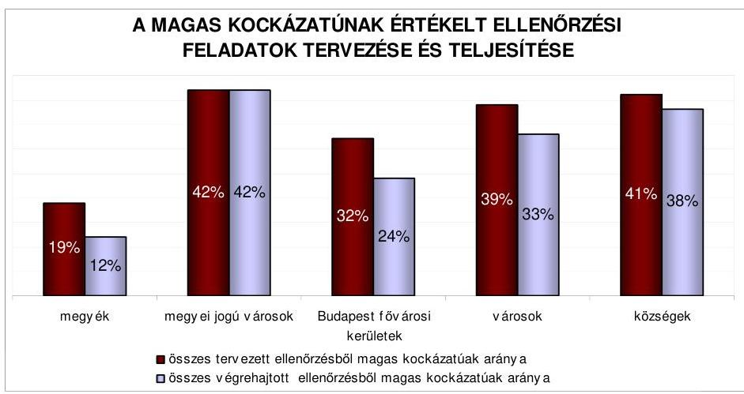

A kockázatelemzéssel alátámasztott stratégiai tervekben, éves ellenőrzési tervekben a vizsgált önkormányzatok 27\%-ánál a költségvetés tervezését, a beszámolók megbízhatóságát, az intézmények költségvetési előirányzatainak alakulását, a költségvetési gazdálkodást, az előirányzatok nyilvántartását, az önállóan és részben önállóan gazdálkodó költségvetési szervek közötti együttműködést, a társulási megállapodással történő feladatellátást, a számviteli rendet, a belső szabályzatok és munkaköri leírások összhangját; 21\%-ánál nagy költségvetési súlyú, összetett, illetve egyes kiemelt feladatot ellátó intézmények gazdálkodását, a kapacitások kihasználtságát, az intézményi gazdálkodás hatékonyságát, az intézményi rendszer változását, humánerőforrás gazdálkodást, szerződések szabályszerűségét, saját bevételek beszedését, az élelmezési tevékenységet, gyógyszergazdálkodást, konyha üzemeltetést; 18\%-ánál az igénybe vett és nyújtott költségvetési támogatások elszámolását, az elszámolások alapjául szolgáló mutatószámok megalapozottságát, a pályázaton elnyert támogatások elszámolásának vizsgálatát, a nyújtott céljellegú (nem szociális) támogatások ellenőrzésének végrehajtását; 16\%-ánál a beruházási tevékenységet, a közbeszerzési eljárások lebonyolítását, a vagyongazdálkodási feladatokat; 11\%-ánál a pénzgazdálkodással, valamint a bevételek beszedésével összefüggő feladatokat értékelték magas kockázatúnak.

- a belső ellenőrzés keretében a FEUVE rendszerek kiépítésének és múködésének központi és helyi szabályoknak való megfelelését a Ber. 8. § a) pontjában foglalt előírás ellenére az önkormányzatok 67\%-ánál (előző évben 63\%nál) nem, vagy nem teljes körűen ellenőrizték. A Ber. 8. § b) pontjában foglaltak ellenére az önkormányzatok 75\%-ánál nem ellenőrizték a pénzügyi irányítási és ellenőrzési rendszerek múködésének gazdaságosságát, hatékonyságát, eredményességét. A Ber. 8. § c) pontja ellenére, az önkormányzatok $41 \%$-ánál nem végezték el a rendelkezésre álló erőforrásokkal való gazdálkodás, a vagyon megóvása és gyarapítása, az elszámolások, beszámolók megbízhatósága vizsgálatát. Az önkormányzatok 74\%-ánál nem ellenőrizték a lefolytatott közbeszerzési eljárásokat. Az önkormányzatok 75\%ánál (ez előző évben 83\%-ánál) az Ötv. 92. § (11) bekezdés b) pontjában és a Ber. 8. § c) pontjában foglalt lehetőség ellenére nem ellenőrizték az önkormányzat többségi irányítást biztosító befolyása alatt múködő gazdasági társaságoknál, közhasznú társaságoknál, illetve vagyonkezelőknél a rendelkezésre álló erőforrásokkal való gazdálkodást, a vagyon megóvását, gyarapítását, az elszámolások, a beszámolók megbízhatóságát. Az önkormányzatok 71\%-ánál (az előző évben 80\%-ánál) nem végeztek ellenőrzést a kedvezmé-

---

nyezett szervezeteknél a céljelleggel nyújtott támogatósok rendeltetés szerinti felhasználásáról ${ }^{115}$;

- az ellenőrzéseket az önkormányzatok 19\%-ánál nem a Ber. 23. § (1) bekezdésében előírtaknak megfelelő tartalmú ellenőrzési program alapján, 47\%nál a Ber. 23. § (3) bekezdése ellenére a belső ellenőrzési vezető jóváhagyása nélküli ellenőrzési program alapján, továbbá 5\%-ánál ellenőrzési program nélkül hajtották végre;
- az önkormányzatok 17\%-ánál az elvégzett ellenőrzésekről készített jelentések a Ber. 27. § (2) bekezdés k) pontjában foglaltak ellenére nem tartalmazták az ellenőrzött időszakban hivatalban lévő vezetők nevét, beosztását, d) pontjában előírtak ellenére az ellenőrzés tárgyát, c) pontjában foglaltakkal szemben az ellenőrzésre vonatkozó jogszabályi felhatalmazás megjelölését, a h) pontjában foglaltak ellenére az alkalmazott ellenőrzési módszereket és eljárásokat;
- a belső ellenőrzést végzők az önkormányzatok 5\%-ánál tártak fel fegyelmi eljárás megindítására okot adó cselekményt;

Az eljárások az intézményeknél a karbantartások és felújítási feladatok számviteli elszámolási szabálytalanságai; a normatív költségvetési hozzájárulás alapját szolgáló adatszolgáltatás hiányosságai; a gazdasági szervezet ügyrendjének hiánya, a munkáltató engedélye nélküli, intézményi költségvetés terhére elszámolt tanulmányutak, a valutaellátmány felhasználásának szabálytalansága; a lakóotthoni ellátottak részére biztosított költőpénz szabálytalan kezelése; a dolgozókkal kötött szerződések szabálytalansága; közbeszerzési eljárás szabálytalanságai; a szabályzatok aktualizálásának elmulasztása, az uszodabérletek szabálytalan kezelése, intézményi büfé befizetéseinél tapasztalt eltérés, valamint a vezetői feladatkörbe tartozó tevékenységért elszámolt külön juttatás szabálytalansága miatt indultak.

- a belső ellenőrzések során feltárt hiányosságok megszüntetésére tett javaslatok ${ }^{116}$ ellenére nem készítettek intézkedési tervet a megyei jogú városi önkormányzatok 17\%-ánál, a városi önkormányzatok 40\%-ánál, és a községi önkormányzatok 42\%-ánál. Az ellenőrzöttek az önkormányzatok 22\%-ánál a megállapításokkal szemben észrevételt tettek. A belső ellenőrzés az önkormányzatok 40\%-ánál a Ber. 8. § f.) pontjában foglaltak ellenére nem követte nyomon a belső ellenőrzési jelentések alapján megtett intézkedéseket. A belső ellenőrzés által megállapított hiányosságok ${ }^{117}$ megszüntetéséről az

[^0]
[^0]:    ${ }^{115}$ A megyei önkormányzatok 20\%-a, a megyei jogú városi önkormányzatok 50\%-a, a Budapest fővárosi kerületi önkormányzatok 67\%-a, a városi önkormányzatok 75\%-a, a községi önkormányzatok 74\%-a nem végzett ilyen jellegű ellenőrzést.
    ${ }^{116}$ A belső ellenőrzési jelentések 94\%-a a szabályozottságra és a szabályszerű működésre, 63\%-a a gazdaságos, hatékony működésre vonatkozó javaslatokat tartalmazott.
    ${ }^{117}$ A megállapítások, javaslatok 37\%-ban a szabályozottságra, 54\%-ban a szabályszerű működésre, 9\%-ban az önkormányzat rendelkezésére álló források gazdaságos, hatékony és eredményes felhasználására vonatkoztak.

---

önkormányzatok 37\%-a utóellenőrzéssel, illetve beszámoltatással sem győződött meg ${ }^{118}$;

- a belső ellenőrzési vezető a Ber. 12. § l) pontjában foglaltak ellenére az önkormányzatok 53\%-ánál az éves ellenőrzési jelentések elkészítésekor önértékelés keretében nem értékelte a belső ellenőrzés tárgyi, személyi feltételeit, nem tett javaslatot a költségvetési szervek vezetőjének a feltételek éves tervvel történő összehasonlítására;
- a jegyzők 65\%-a az Áht. 2007-2008-ban hatályos 97. § (2) bekezdésében foglalt előírást megsértve a költségvetési beszámoló keretében nem számolt be a FEUVE rendszer, valamint a belső ellenőrzés múködtetéséről;
- a polgármesterek 38\%-a (az előző évben 46\%-a) - az Ötv. 92. § (10) bekezdésében foglalt előírást megsértve - a zárszámadási rendelettel egyidejúleg nem terjesztette a képviselő-testület elé az önkormányzat felügyelete alá tartozó költségvetési szervek éves ellenőrzési jelentései alapján készített összefoglaló jelentést. A mulasztáshoz hozzájárult, hogy a polgármesterek nem kaptak beszámolót a belső ellenőrzési vezetőtől, illetve a belső ellenőrzést végző társulásoktól a belső ellenőrzési feladatok ellátásának értékeléséről, a tervtől való eltérés indokáról, a terven felüli ellenőrzések indokoltságáról, a fontosabb megállapításokról, javaslatokról, a megállapítások és javaslatok hasznosításáról. Az előterjesztések, illetve az éves ellenőrzési jelentések hiánya miatt nem történt meg a belső ellenőrzés által végzett tevékenység bemutatása, a feladatok teljesítésének értékelése, az éves ellenőrzési tervtől történt eltérések indoklása, a tevékenységet befolyásoló tényezők, fontosabb ellenőrzési megállapítások, tett javaslatok hasznosításának bemutatása.
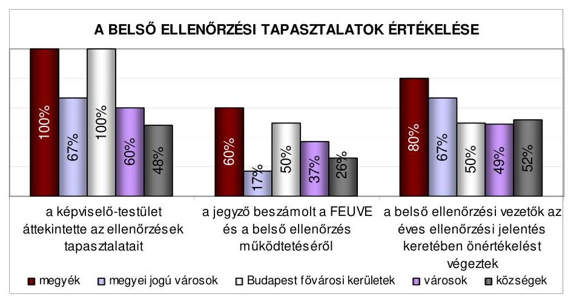

# 5. Az ÁSZ KORÁBBI ELLENŐRZÉSI JAVASLATAI ALAPJÁN KÉSZÍTETT INTÉZKEDÉSI TERV VÉGREHAJTÁSA, HASZNOSULÁSA 

ÁSZ vizsgálat volt 2003-2007 között az ellenőrzött önkormányzatok $91 \%$-ánál. Ezen időszak alatt ellenőrzést folytattunk valamennyi megyei, me-

[^0]
[^0]:    ${ }^{118}$ Nem követelte meg a hiányosságok felszámolásának nyomon követését a megyei jogú városi önkormányzatok $17 \%$-a, a városi önkormányzatok $38 \%$-a, a községi önkormányzatok $36 \%$-a.

---

gyei jogú városi, Budapest fővárosi kerületi, városi önkormányzatnál, a nagyközségi önkormányzatok felénél, a községi önkormányzatok 64\%-ánál. A 20032007 között lezárt ÁSZ ellenőrzések 35\%-a a helyi és a helyi kisebbségi önkormányzatok gazdálkodási rendszerének átfogó ellenőrzésére, 39\%-a a zárszámadáshoz kapcsolódóan az állami támogatások igénylésére és felhasználására, $26 \%$-a az önkormányzati gazdálkodás különböző területeinek ellenőrzésre irányult.
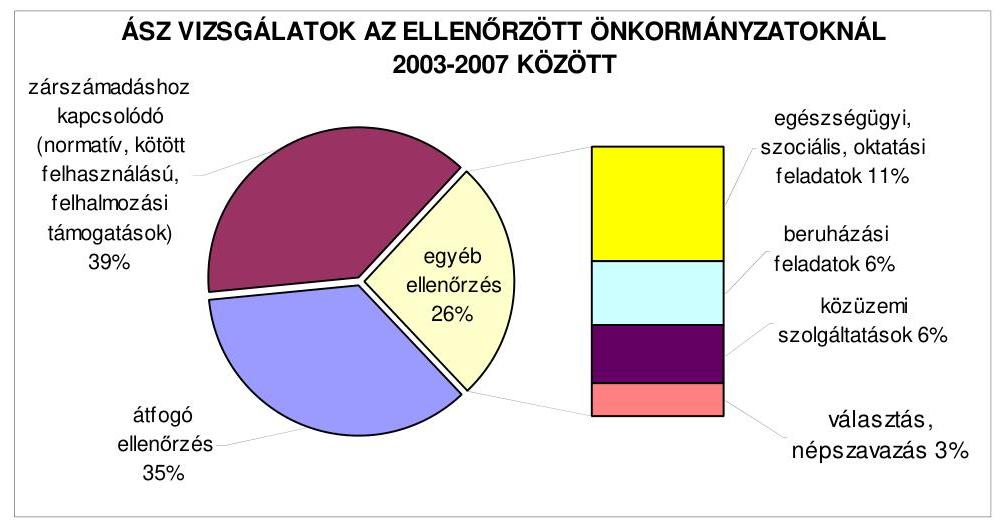

A 2003-2007 között elkészített számvevői jelentések összesen 3500 javaslatot tartalmaztak a feltárt hiányosságok megszüntetése, a feladatok szabályszerűbb, célszerűbb és hatékonyabb megoldása érdekében. A javaslatok 74\%-a a gazdálkodás szabályszerűségének, 26\%-a a célszerűségének, hatékonyságának javítására irányult, amelyek mintegy kétharmada hasznosult. A javaslatok realizálásának elmulasztása, valamint a gazdálkodási és pénz-ügyi-számviteli, belső ellenőrzési szabályok hiányos kialakítása és múködtetése miatt a 2008. évben 17 önkormányzatnál ${ }^{119}$ állapítottunk meg személyes felelősséget.

A helyi önkormányzatok gazdálkodási rendszerének ellenőrzésekor 2500 javaslatot tettünk, amelyek többségét (kétharmadát) eredményesen hasznosították az önkormányzatok.

A költségvetési tervezés szabályszerűségének biztosítása érdekében tett javaslatok közel kétharmadának hasznosításaként elfogadták, módosították a gazdasági programot, a költségvetési koncepciót a helyben képződő bevételek és az ismert kötelezettségek alapján állították össze, a költségvetési rendelettervezetet az előírt határidőben, a javasolt előirányzatok megalapozottságát biztosító rendelettervezetekkel együtt terjesztették a képviselő-testület elé. A költségvetési rendeletek tartalmazták a múködési és felhalmozási célú bevé-

[^0]
[^0]:    ${ }^{119}$ A jegyző személyes felelősségre vonását kezdeményeztük Szekszárd megyei jogú város, Budapest főváros II. és IV. kerület, Baktalórántháza, Dunavecse, Jászárokszállás, Kistarcsa, Túrkeve városok önkormányzatánál, valamint a jegyző mellett a polgármester felelősségre vonását is kezdeményeztük Őriszentpéter Város Önkormányzatánál. Nyolc önkormányzatnál a felelősséggel érintett jegyzőnek a jelentés átadásakor már nem volt köztisztviselői jogviszonya, ezért felelősségre vonásukat nem kezdeményeztük.

---

teleket és kiadásokat, ezen belül költségvetési szervenként a személyi jellegű kiadásokat, a dologi jellegű kiadásokat, az ellátottak pénzbeli juttatásait, a speciális célú támogatásokat, a költségvetési létszámkeretet, a költségvetés végrehajtásának szabályait. A költségvetési rendelettervezetekben az előírt részletezettséggel mutatták be az önállóan és a részben önállóan gazdálkodó költségvetési szervek ${ }^{120}$ bevételeit, kiemelt előirányzatonként a kiadásokat, célonként a felújítási előirányzatokat, feladatonként a felhalmozási kiadásokat és az önkormányzati hivatal költségvetését, külön tételben az általános és céltartalékot, a létszámkeretet. A költségvetési rendeletekben rendelkeztek a bevételi többlet felhasználásáról, a hiány finanszírozásának módjáról, a hitelműveletekkel kapcsolatos hatáskörökről, továbbá változatlan formában beépítették a helyi kisebbségi önkormányzatok költségvetési határozatait.

Az ellenőrzött önkormányzatok mintegy felénél azonban javaslataink ellenére, megsértve az Áht. 8/A. § (7) bekezdés előírásait, a költségvetés bevételi és kiadási főösszegének megállapításakor finanszírozási célú pénzügyi műveleteket (hitelbevételeket és hiteltörlesztéssel kapcsolatos kiadásokat) vettek figyelembe költségvetési hiányt módosító költségvetési bevételként és kiadásként. Az önkormányzatok mintegy ötödénél a képviselő-testületek nem határozták meg az Áht. 118. §-ában ${ }^{121}$ foglalt előírást megsértve a költségvetés és a zárszámadás előterjesztésekor a képviselő-testület tájékoztatása céljából bemutatandó mérlegek, kimutatások tartalmi követelményeit. A jegyzők az önkormányzatok 11\%-ánál a javaslataink és az Ámr. 29. § (4) bekezdés előírásai ellenére írásban nem rögzítették a költségvetési rendelettervezet költségvetési szervek vezetőivel történt egyeztetését. A polgármesterek a költségvetési koncepció előterjesztéséhez az önkormányzatok mintegy tizedénél továbbra sem csatolták az Ámr. 28. § (3) bekezdés előírásai ellenére a helyi önkormányzatnál múködő bizottságok és a kisebbségi önkormányzatok véleményét, a költségvetési rendelettervezetekhez a 29. § (9) bekezdésének előírása ellenére a pénzügyi bizottság véleményét. A javaslatok és az Ötv. 8. § (2) bekezdésében foglalt előírást megsértve nem határozta meg az önkormányzatok mintegy tizede, hogy a lakosság igényei alapján, anyagi lehetőségeitől függően mely feladatokat, milyen mértékben és módon kíván ellátni.

A jóváhagyott költségvetési előirányzatokon belüli gazdálkodás érdekében tett javaslataink alapján az ellenőrzött önkormányzatok közel hattizedénél történtek intézkedések. A polgármesterek az önkormányzat önállóan gazdálkodó költségvetési szervei ${ }^{122}$ saját hatáskörében végrehajtott elői-rányzat-változásáról a jegyző előkészítésében 30 napon belül tájékoztatták a képviselő-testületeket és megtörtént a költségvetési rendeletek emiatti módosítása is. Az önkormányzatok ötödénél azonban a központi költségvetésből biztosított pótelőirányzattal a költségvetési rendeletet az Ámr. 53. § (2) bekezdésé-

[^0]
[^0]:    ${ }^{120}$ Az önállóan és a részben önállóan gazdálkodó költségvetési szervek elnevezését a 2009. január 1-jétől önállóan múködő és gazdálkodó, illetve önállóan múködő költségvetési szervre módosította a 2008. évi CV. tv. 3. § (1) bekezdés b) pontja.
    ${ }^{121}$ 2007. január 1-től Áht. 118. § (1) és (2) bekezdések 2. pontjai,
    ${ }^{122}$ Az önállóan gazdálkodó költségvetési szervek elnevezését a 2009. január 1-jétől önállóan múködő és gazdálkodó költségvetési szervre módosította a 2008. évi CV. tv. 3. § (1) bekezdés b) pontja.

---

ben foglalt határidőn belül nem módosították, mintegy tizedénél a költségvetés végrehajtása során a jóváhagyott előirányzatokat és azok teljesülésének alakulását az Áht. 103. § (1) bekezdésében foglalt előírást megsértve folyamatosan nem tartották nyilván, valamint az önkormányzatok több mint ötödénél (22\%ánál) a költségvetési szervek megsértve az Áht. 12/A. § (1) bekezdésében foglalt előírást tárgyévi fizetési kötelezettséget vállaltak és kifizetéseket rendeltek el a jóváhagyott kiadási előirányzatokon túlmenően, amellyel a jóváhagyott előirányzatokat túllépték.

A gazdálkodás és a pénzügyi-gazdasági feladatok ellátásának szabályozottsága, a bizonylati rend és fegyelem szabályszerüségének javítása érdekében tett javaslataink közel hattizedét hasznosítva a jegyzők kialakították a költségvetési szervek egységes számviteli rendjét, aktualizálták és kiegészítették a számviteli politikát. A számlarendben rendelkeztek a könyvviteli számlákhoz kapcsolódó analitikus nyilvántartások vezetésének módjáról, formájáról, tartalmáról. Az eszközök és források leltározási és leltárkészítési szabályzatában a leltározás módjának és gyakoriságának meghatározásánál figyelembe vették a Vhr. előírásait. A javaslatok és az Ámr. 10. § (4) ${ }^{123}$ bekezdésében foglalt előírások ellenére az önkormányzatok 11\%-ánál az önkormányzati hivatalok SzMSz-ét nem egészítették ki, közel tizedénél az Ámr. 17. § (5) bekezdésében előírtak ellenére a gazdasági szervezetek ügyrendjét nem készítették el, illetve nem egészítették ki. Az önkormányzatok mintegy tizedénél az írásbeli kötelezettségvállalást nem igénylő, 50 ezer Ft-ot el nem érő kifizetések nyilvántartási rendjét és formáját az előző ellenőrzés javaslatai, illetve az Ámr. 134. § (3) bekezdésében foglaltak ellenére belső szabályzatban nem rögzítették, a nyilvántartások nem voltak alkalmasak a kötelezettségvállalás évenkénti összegének Ámr. 134. § (13) bekezdésében előírt megállapítására. A jegyzők az önkormányzatok mintegy negyedénél nem határozták meg a szakmai teljesítés igazolásának módját és ötödénél nem jelölték ki az azt végző személyeket az Ámr. 135. § (2) bekezdésében foglaltak ellenére, valamint a kötelezettségvállalás, utalványozás gazdálkodási és az ellenjegyzés, érvényesítés, szakmai teljesítésigazolás ellenőrzésének jogosultjai meghatározásakor nem érvényesítették az Ámr. 134-138. §-ában foglaltakat.
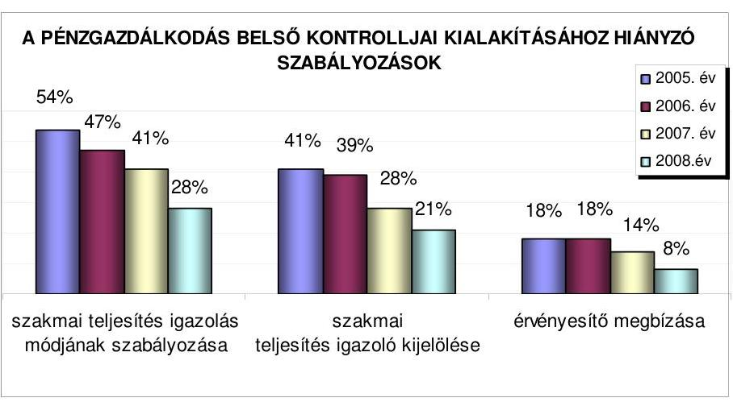

[^0]
[^0]:    ${ }^{123}$ 2008. január 1-től Ámr. 10. § (5), a 2009. január 1-től 13/A. § (3) bekezdés,

---

A költségvetési gazdálkodási és ellenőrzési jogkörök gyakorlása szabályszerűségének biztosítása érdekében tett javaslatok több mint felét ( $56 \%$-át) hasznosítva az önkormányzati hivataloknál a gazdasági műveletekről, eseményekről - amelyek az eszközök, illetve az eszközök forrásainak állományát vagy összetételét megváltoztatják - az előírt alaki és tartalmi követelményeknek megfelelő bizonylatokat kiállították. A bizonylatokon a gazdálkodási jogkört gyakorlók az utalványozás és a kötelezettségvállalás elvégzését aláírásukkal igazolták. A költségvetési pénzforgalmat érintő gazdasági események bizonylatainak adatait késedelem nélkül, megfelelő időben rögzítették a könyvekben. A belső kontrollok a javaslatok és az Ámr. 134-138. § előírásai ellenére továbbra sem múködtek megfelelően, mivel a jegyző, vagy az általa felhatalmazott személy ellenjegyzése nélkül is végeztek a pénzgazdálkodás folyamatában kötelezettségvállalást az önkormányzatok mintegy tizedénél, utalványozást $4 \%$-nál, valamint a jegyző felhatalmazásával nem rendelkező személyek jogosulatlanul végezték az utalványok ellenjegyzését az önkormányzatok 7\%-ánál. A kiadások teljesítésének és a bevételek beszedésének elrendelése előtt az önkormányzatok ötödénél okmányok alapján nem ellenőrizték, szakmailag nem igazolták azok jogosultságát, összegszerűségét, a szerződés, megrendelés, megállapodás teljesítését, illetve az érvényesítő nem tett eleget a munkafolyamatba épített ellenőrzési feladatainak, a szakmai teljesítésigazolás alapján nem ellenőrizte az összegszerűséget, a fedezet meglétét és az előírt alaki követelmények betartását.

Az önkormányzati vagyon nyilvántartása, a vagyonnal való gazdálkodás szabályszerűsége, célszerűsége érdekében tett javaslatok közel kétharmadának végrehajtásaként módosították, kiegészítették a vagyongazdálkodási rendeletet. Rögzítették a vagyon tulajdonjoga és vagyonkezelési joga ingyenes átruházásának, a követelésről való lemondásnak a módját és eseteit. Rendelkeztek a forgalomképesség szerinti besorolás megváltoztatásának módjáról. A főkönyvi számlák további bontásával, vagy részletező analitikus nyilvántartás vezetésével biztosították a törzsvagyon (ezen belül a forgalomképtelen, illetve korlátozottan forgalomképes) és nem törzsvagyon részét képező eszközök értékének számviteli nyilvántartását. Elmaradt a javaslatok hasznosítása az önkormányzatok mintegy ötödénél, mivel az eszközök és források évenkénti leltározására vonatkozó kötelezettséget a Vhr. 37. § (1) bekezdés előírása ellenére nem teljesítették, az értékvesztés elszámolásának szükségességét a Vhr. 31. § előírása ellenére nem vizsgálták, elszámolását elmulasztották a Számv. tv. 5456. §-aiban előírtakat megsértve.

A céljelleggel, nem szociális ellátásként szervezetek, magánszemélyek számára nyújtott támogatások rendeltetésszerú felhasználásáról az önkormányzatok mintegy hattizedénél a javaslatokat hasznosítva számadási kötelezettséget írtak elő, múködtették a számadások, felhasználások ellenőrzési rendszerét, intézkedtek a céltól eltérő, nem rendeltetésszerú felhasználás esetén a visszafizetésre, illetve a számadási kötelezettség elmulasztása esetén a kötelezettség teljesítéséig a további támogatás felfüggesztésére. Az önkormányzatok mintegy 5\%-ánál azonban előfordult, hogy közhasznú szervezet támogatásának kifizetése az Ötv. 10. § (1) bekezdés d) pont előírását megsértve, a képviselő-testület döntésének hiányában történt.

---

A közbeszerzési eljárások ellenőrzésére vonatkozó javaslatokat 16 önkormányzatnál nem, háromnál csak részben hasznosították, mivel a Kbt. 6. § (1) bekezdés előírásait megsértve elmulasztották a beszerzések rendjének szabályozását, a közbeszerzési eljárást lezáró döntés meghozatala jogosultsági körének meghatározását, nem folytatták le valamennyi indokolt esetben a közbeszerzési eljárást, illetve az intézményi és hivatali közbeszerzések központi megvalósíthatóságát nem vizsgálták, a megkötött szerződések tartalma nem volt összhangban az ajánlati felhívás és dokumentáció tartalmával. Az ÁSZ az ellenőrzési tevékenysége során tudomására jutott mulasztások miatt a KDB hivatalból való eljárását hat önkormányzatnál kezdeményezte ${ }^{124}$ a Kbt. 327. § (1) bekezdés b) pontja alapján.

A zárszámadási kötelezettség teljesítésére vonatkozó jogszabályi előírások betartása érdekében tett javaslatok közel kétharmadát hasznosították az önkormányzatok. A költségvetés végrehajtásáról szóló zárszámadást az elfogadott költségvetéssel összehasonlítható módon készítették el. A költségvetési szervek beszámolóját felülvizsgálták, annak eredményéről a költségvetési intézmények vezetőit írásban értesítették. A javaslatokat nem, vagy csak részben hasznosították az ellenőrzött önkormányzatok mintegy harmadánál, mivel a zárszámadási rendelet előterjesztéséhez az Áht. 2006. december 31-ig hatályos 118. §-ában ${ }^{125}$ előírtakat megsértve nem csatolták az önkormányzat vagyonkimutatását, valamint szöveges indokolással a közvetett támogatásokat tartalmazó kimutatást és a többéves kihatással járó kiadások számszerúsítését.

A kisebbségi önkormányzatokkal kötött megállapodások felülvizsgálatához, gazdálkodási és ellenőrzési jogköreinek szabályozottságához kapcsolódó javaslatok közel háromnegyedét hasznosították az önkormányzatok. Megkötötték az együttmúködési megállapodást a kisebbségi önkormányzatokkal, illetve elvégezték a megállapodások kiegészítését, módosítását a költségvetés tervezéséhez, az előirányzatok módosításához, illetve a zárszámadás elkészítéséhez kapcsolódó feladatokkal, valamint az önkormányzat nyilvántartásain belül elkülönítetten vezették a települési kisebbségi önkormányzatok vagyoni és számviteli nyilvántartásait. Az ellenőrzött önkormányzatok közel negyedénél a javaslatokat nem, vagy csak részben hasznosították, mivel a kisebbségi önkormányzatok múködéséhez kapcsolódó gazdálkodási és ellenőrzési jogkörök szabályozásánál nem érvényesítették az Áht., és az Ámr. előírásait.

Az ellenőrzési rendszer kialakítása és múködése érdekében tett javaslatokat hasznosítva az önkormányzatok több mint kétharmadánál (70\%-ánál) gondoskodtak az ellenőrzési feladatok ellátási feltételeinek meghatározásáról, kialakításáról, a belső ellenőrök funkcionális függetlenségét biztosító feltételek megteremtéséről, éves ellenőrzési terv jóváhagyásáról, a megállapítások ellenőrzési jelentésben történő rögzítéséről. Nem, vagy csak részben hasznosították a belső ellenőrzésre vonatkozó javaslatokat az önkormányzatok közel egyharmadánál, ahol az önkormányzati hivatalok SzMSz-ében nem ha-

[^0]
[^0]:    ${ }^{124}$ A KDB határozatában mind a hat esetben megállapította, hogy az önkormányzat megsértette a Kbt-t és összesen 7,3 millió Ft bírságot szabott ki, ebből egy önkormányzatnál a 2008. évi beszerzések vonatkozásában megszüntette az eljárást.
    ${ }^{125}$ 2007. január 1-től Áht. 118. § (2) bekezdése,

---

tározták meg a belső ellenőrzést végző szervezet jogállását és feladatait, nem készítették el a belső ellenőrzési stratégiai tervet, nem győződtek meg a feltárt hiányosságok megszüntetéséről. A polgármesterek közel egytizede a javaslat ellenére és a Htv. 138. § (1) bekezdés g) pont előírásait megsértve évente továbbra sem tájékoztatta a képviselő-testületet a költségvetési szervek ellenőrzésének tapasztalatairól.
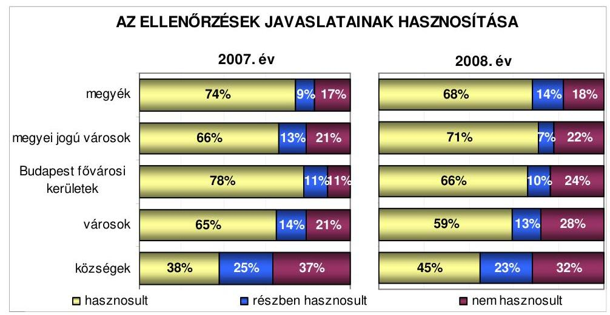

Az önkormányzatoknál intézkedéseket tettek a 2003-2007. években végzett, zárszámadáshoz kapcsolódó vizsgálatok során tett 626 javaslat közel $90 \%$-ának a megvalósítására. Elrendelték a támogatott feladatok jogszabályban előírt feltételeinek kialakítását, önkormányzati rendeleti szabályozásának aktualizálását, a feladatok ellátásának ügyrendben, belső szabályzatban, szerződésben történő szabályozását, az intézmények alapító okiratának, múködési engedélyének módosítását, az ágazati szakmai továbbképzésiés beiskolázási tervek, programok megfelelő tartalommal történő elkészítését, kiegészítését, aktualizálását. Intézkedtek a támogatási kérelmek írásban és határidőben történő bejelentésére, a megfelelő igazolások, nyilatkozatok, csatolására, a támogatások, hozzájárulások alapját képező mutatószámok törvényi előírásoknak megfelelő kialakítására, a szükséges OKÉV (Országos Közoktatási Értékelési és Vizsgaközpont) engedélyek beszerzésére, az igénylések jogszabályi előírások szerinti dokumentálására, az elszámolások különbözetének pótlólagos igénylésére, kiutalására, a jogosulatlanul igénybe vett támogatások visszafizetésére. Előírták egyes pénzbeli szociális ellátások jogosultsági feltételeinek eseti, illetve rendszeres felülvizsgálatát, a sajátos nevelési igényú tanulókról a megfelelő szakvélemények, a támogatások szabályszerű igényléséhez a hiányzó dokumentumok bekérését, nyilvántartásuk pontosítását. Intézkedtek, hogy a belső ellenőrzés terjedjen ki az állami támogatások, hozzájárulások igénylésére, elszámolására, az intézményi adatszolgáltatások szakmai nyilvántartásokkal való összhangjára, az önkormányzati hivatalok vezessék a közmúfejlesztési támogatások elkülönített analitikus nyilvántartását, a támogatási igényeket az előírt jogosultsági feltételek szerint bírálják el, intézkedjenek az igényelt támogatások határidőn belüli kifizetésére.

A 2003-2007 között az önkormányzati gazdálkodás 24 különböző területén lefolytatott ellenőrzések 386 javaslata mintegy háromnegyedének hasznosítására történt intézkedés. Kezdeményezték a gazdasági

---

program ágazati fejlesztési célkitűzésekkel, az önkormányzati SzMSz kötelező és önként vállalt ágazati feladatokkal történő kiegészítését, a települési környezetvédelmi program felülvizsgálatát, a településfejlesztési, a helyi foglalkoztatási és a szociális szolgáltatástervezési koncepció elkészítését, felülvizsgálatát, a közoktatási feladat ellátási és fejlesztési terv módosítását, önkormányzati rendelet alkotását, felülvizsgálatát, módosítását a közterületek tisztántartásáról, a települési hulladékkezelés feladatairól, a szociális ellátások rendjéről, a közművelődési feladatokról. Intézkedtek a közműfejlesztési támogatásokra az előírásoknak megfelelő igénylések, igazolások, bizonylatok továbbítására, az igénylések jogosságának ellenőrzésére, az önkormányzati forrás terhére történt kétszeres kiutalások rendezésére, a hajléktalanok ellátása múködési feltételeinek biztosítására, férőhelyszám bővítésére, egészségügyi intézmény szakmai tervének elfogadására, a közfoglalkoztatásban ellátott feladatok értékelésére, az önkormányzatokkal, társulásokkal való együttműködésre. Kezdeményezték a középiskolai kollégium tárgyi feltételeinek javítását, szakképzés fejlesztési stratégia elfogadását, a szakiskolai fejlesztési programban szereplő célok teljesülésének felülvizsgálatát, a közművelődési könyvtári feladatok képviselő-testület általi értékelését, művelődési ház intézményesítését, munkatervének elfogadását, intézményi térítési díjak felülvizsgálatát, törvényi előírásoknak megfelelő megállapítását. Intézkedtek annak érdekében, hogy az önkormányzati hivatalokban gondoskodjanak a gyógyfürdő fejlesztési tervének, üzemeltetési programjának elkészítésére, kivitelezési szerződésének a képviselő-testület általi jóváhagyására, a strandfürdő tulajdonlásának szerződésben történő meghatározására, a gazdasági társasági üzemeltetésre átadott vagyonról vagyonhasznosítási szerződés megkötésére. Rögzítsék az ingatlanvagyon kataszterben a vízrendezési célú vagyonok adatait, kezdeményezzék a népszavazáshoz kapcsolódó pótelőirányzat miatti költségvetési rendelet módosítását, biztosítsák az ágazati feladatokra, valamint a választásokra, népszavazásra juttatott pénzeszközök szabályszerű felhasználását, elszámolását.

Az önkormányzatok gazdálkodásának átfogó ellenőrzéséről a 20032008. években készült összefoglaló jelentésekben a Kormánynak és a minisztereknek 35 javaslatot tettünk.

# A javaslatok a következők szerint teljesültek: 

- javaslatunkra az Országgyűlés meghatározta a gazdasági program tartalmi követelményeit, elkészítési határidejét, felülvizsgálati kötelezettségét, a helyben központosított közbeszerzésekre vonatkozó szabályokat, a vagyonértékesítés, használat és hasznosítás versenyeztetési kötelezettségének egységes értékhatárát, a megyei önkormányzatok kötelező szociális feladatait. Előirta a nem normatív céljellegú múködési támogatások közzétételi kötelezettségét, a kisebbségi önkormányzatokkal kötött megállapodások tartalmi követelményeit, az önkormányzati költségvetési szervek felügyeleti ellenőrzésének gyakoriságát, az ellenőrzések jellegét, módszerét, dokumentálási és realizálási rendszerét, az adósságot keletkeztető éves kötelezettségvállalások felső határának meghatározásakor a több éven keresztül fizetési kötelezettségként jelentkező váltótartozások, illetve a szállítóknak több év alatt részletekben fizetendő összeg figyelembe vételét. Elősegítette a társulások számának növekedését a költségvetési törvényekben a belső ellenőrzési társuláshoz tartozó önkormányzatok minimális számát meghatározó előirás törlésével;

---

- a Kormány egységesítette az érvényesítést végzők szakmai képesítési követelményeit, meghatározta a költségvetési és zárszámadási rendeletek előterjesztésekor a kötelezően bemutatandó mérlegek, kimutatások tartalmi követelményeit, a közvetett támogatások bemutatásának részletezettségét, a kötelezettségvállalások nyilvántartási rendjének belső szabályozására vonatkozó konkrét követelményeket, a szakmai teljesítésigazolás záradékban történő rögzítésének kötelezettségét és tartalmát. Az önállóan gazdálkodó költségvetési szerv vezetője részére biztosította a döntési lehetőséget, hogy a számviteli politikát és a kapcsolódó szabályzatokat a költségvetési szervhez csatlakozó, részben önállóan gazdálkodó költségvetési szerveke kiterjessze, meghatározta a helyi kisebbségi önkormányzatok előirányzat-módosítási hatáskörét, elvégezte a szakfeladat-rend javasolt bővítését, , a szakfeladatrend átdolgozásával részletesen kidolgozva közzé tette a kötelező és önként vállalt feladatok elkülönítését segítő számviteli nyilvántartási rendszer követelményeit, kiegészítette a belső ellenőrzési kézikönyv mintát a céljelleggel nyújtott támogatások ellenőrzésének egységes szempontjaival;
- a Földművelődési és Vidékfejlesztési Minisztérium körlevélben felhívta a földhivatalok figyelmét, hogy az önkormányzatok forgalomképtelen ingatlanjai esetében ne jegyezzék be a tulajdonos változást.

# Nem történt döntés javaslatunk ellenére a következő esetekben: 

- a korlátozottan forgalomképes törzsvagyonként meghatározott vagyon értékesítését megelőzően a törzsvagyonon kívüli egyéb forgalomképes vagyonkategóriába önkormányzati rendelettel történő átsorolási kötelezettség előírását az illetékes minisztérium az Ötv. következő módosításakor tervezi kezdeményezni;
- a pénzügyminiszter tájékoztatása szerint a belső ellenőrzési társulások és az abban résztvevő önkormányzatok, illetve a jegyzők közötti - a stratégiai és éves ellenőrzési tervek elkészítésére, az attól való eltérésre, a belső ellenőrzési feladatok és kapacitás összhangjának biztosítására, az ellenőrzések terv szerinti elvégzésére és nyomon követésére vonatkozó - együttmúködési, egyeztetési, tájékoztatási kötelezettség szabályozása a Ber. 2009. évi módosítása során valósulhat meg, a pénzügyi hiány vagy többlet képviselő-testület részére történő bemutatási kötelezettségének előírására az önkormányzatok információs rendszerét is érintő jogszabály módosításával kerülhet sor;
- a pénzügyminiszter az önkormányzatok kötvénykibocsátására vonatkozó döntés előkészítési módszertani útmutató közreadására vonatkozó javaslat figyelembevételével módszertani ajánlás elkészítését tervezi, hogy a költségvetési szervek a változó gazdasági környezethez milyen szigorító, megtakarítást eredményező intézkedéseket tudnak érvényesíteni;
- a belügyminiszter kezdeményezésére az NFT és ÚMFT pályázati célkitűzései keretében megteremtették a hardver-szoftver ellátottság fejlesztésének lehetőségét, viszont nem történt intézkedés az önkormányzatok pénzügyiszámviteli feladatainak ellátását segítő informatikai rendszer területén a szakmai követelmények egységesítésére, az integrált adatnyilvántartások, feldolgozások elterjesztésére;

---

- nem történt intézkedés az önkormányzatok kötelező feladatainak egyértelmű meghatározására.

A közbenső egyeztetés során az Önkormányzati Minisztérium államtitkára által adott észrevétel szerint az önkormányzatok kötelező feladatainak meghatározását az ágazati miniszterek részére kell javasolni.

Az észrevétel nem megalapozott, mivel az önkormányzati miniszter feladat- és hatásköréről szóló 132/2008. (V. 14.) Korm. rendelet 3. § aa) pontjában foglaltak figyelembevételével az önkormányzati miniszter felelősségi körébe tartozik a helyi önkormányzatokról szóló jogszabályok előkészítése.

Nem történt meg az önkormányzati tulajdonú nem lakás céljára szolgáló helyiségeknél az elővásárlási jog gyakorlására jogosult személy kijelölésére a gazdálkodó szervezet bérlő részére - biztosított lehetőség megszüntetése, a Kbt-ben az eljárás hivatalból való kezdeményezésére az ÁSZ részére a tudomásra jutás után nyitva álló jogvesztő határidő javaslat szerinti legalább 30 naptári napra történő módosítása. A Kbt. 2008. évi módosítása során megszűnt az ÁSZ számára az a lehetőség, hogy a jogsértés tudomásra jutásához viszonyított három éves objektív jogvesztő határidőn belül jogorvoslati eljárást kezdeményezzen.
Nem kezdeményezte a Miniszterelnöki Hivatalt vezető miniszter az Eisztv. módosítását annak érdekében, hogy az Áht-ban foglaltakkal összhangban történjen a közzétételi idő meghatározása. A pénzügyminiszter nem kezdeményezte a hiány számításánál a hitel figyelembevételi mód egyértelmű meghatározását. Nem történt intézkedés az egyéb gazdasági események (elkészült beruházások számviteli nyilvántartásba vétele, értékcsökkenés és értékvesztés elszámolása, értékvesztés visszaírása, követelések, kötelezettségek állományváltozásának elszámolása) bizonylataira a vezetői elrendelés és az érvényesítési kötelezettség előírására, így továbbra sem biztosított a számviteli nyilvántartásban elszámolt vagyonváltozások elrendelésének szabályszerű dokumentálása. Nem jelent meg a kisebbségi önkormányzatok gazdálkodásával összefüggő pénzügyi-számviteli nyilvántartási követelmények, valamint az operatív gazdálkodási és belső ellenőrzési feladatok sajátos rendjét összefoglaló kézikönyv.

Budapest, 2009. augusztus " 4 " 18 db 38 lap
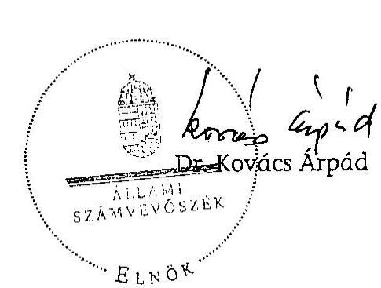

---

# AZ ELLENŐRZÖTT ÖNKORMÁNYZATOK JEGYZÉKE

|  Sorszám | Megye / főváros | Önkormányzat / település neve | megye/ főváros | megyei jogú város | város / fővárosi kerület | nagyközség | község | Az önkormányzatok 2008. évi bruttó kiadásai (millió Ft)  |
| --- | --- | --- | --- | --- | --- | --- | --- | --- |
|  1 | Bács-Kiskun | BACS-KISKUN MEGYE | X |  |  |  |  | 29218  |
|  2 |  | DUNAVECSE |  |  | X |  |  | 903  |
|  3 |  | KUNSZENTMIKLÓS |  |  | X |  |  | 3241  |
|  4 |  | SOLT |  |  | X |  |  | 1603  |
|  5 |  | TOMPA |  |  | X |  |  | 694  |
|  1 | Baranya | BÖLY |  |  | X |  |  | 2199  |
|  2 |  | PÉCSVÁRAD |  |  | X |  |  | 950  |
|  3 |  | SIKLÓS |  |  | X |  |  | 4846  |
|  4 |  | SZIGETVÁR |  |  | X |  |  | 2731  |
|  1 | Békés | ELEK |  |  | X |  |  | 1231  |
|  2 |  | FÜZESGYARMAT |  |  | X |  |  | 1122  |
|  3 |  | SZEGHALOM |  |  | X |  |  | 2042  |
|  4 |  | TÖTKOMLÓS |  |  | X |  |  | 1465  |
|  5 |  | VÉSZTŐ |  |  | X |  |  | 1533  |
|  1 | Borsod-Abaúj-Zemplén | BÜKKZSÉRC |  |  |  |  | X | 95  |
|  2 |  | CSERÉPFALU |  |  |  |  | X | 176  |
|  3 |  | CSERÉPVÁRALJA |  |  |  |  | X | 89  |
|  4 |  | EMÓD |  |  | X |  |  | 867  |
|  5 |  | GÖNC |  |  | X |  |  | 744  |
|  6 |  | MISKOLC |  | X |  |  |  | 62745  |
|  7 |  | SZERENCS |  |  | X |  |  | 3444  |
|  8 |  | SZIKSZÓ |  |  | X |  |  | 1363  |
|  9 |  | TISZAÚJVÁROS |  |  | X |  |  | 7972  |
|  1 | Csongrád | CSONGRÁD |  |  | X |  |  | 5725  |
|  2 |  | CSONGRÁD MEGYE | X |  |  |  |  | 23039  |
|  3 |  | SÁNDORFALVA |  |  | X |  |  | 1168  |
|  1 | Fejér | GÁRDONY |  |  | X |  |  | 2094  |
|  2 |  | POLGÁRDI |  |  | X |  |  | 1121  |
|  3 |  | SZÉKESFEHÉRVÁR |  | X |  |  |  | 37018  |
|  1 | Főváros | BUDAPEST II. KERÜLET |  |  | X |  |  | 16582  |
|  2 |  | BUDAPEST IV. KERÜLET |  |  | X |  |  | 18749  |
|  3 |  | BUDAPEST V. KERÜLET |  |  | X |  |  | 20881  |
|  4 |  | BUDAPEST X. KERÜLET |  |  | X |  |  | 15618  |
|  5 |  | BUDAPEST XIX. KERÜLET |  |  | X |  |  | 10771  |
|  6 |  | BUDAPEST XXII. KERÜLET |  |  | X |  |  | 9578  |
|  1 | Győr-Moson-Sopron | KAPUVÁR |  |  | X |  |  | 3248  |
|  2 |  | PANNONHALMA |  |  | X |  |  | 546  |
|  3 |  | TÉT |  |  | X |  |  | 825  |
|  1 | Hajdú-Bihar | DEBRECEN |  | X |  |  |  | 57273  |
|  2 |  | ESZTÁR |  |  |  |  | X | 480  |
|  3 |  | HAJDÚSZOBOSZLÓ |  |  | X |  |  | 6278  |
|  4 |  | LÉTAVÉRTES |  |  | X |  |  | 1446  |
|  5 |  | MEZÖPETERD |  |  |  |  | X | 101  |
|  6 |  | NYIRMÁRTONFALVA |  |  |  |  | X | 349  |
|  7 |  | TISZACSEGE |  |  | X |  |  | 1112  |
|  8 |  | VÁMOSPÉRCS |  |  | X |  |  | 1411  |
|  1 | Heves | BÉLAPÁTFALVA |  |  | X |  |  | 692  |
|  2 |  | GYÖNGYÖSHALÁSZ |  |  |  |  | X | 367  |
|  3 |  | HALMAJUGRA |  |  |  |  | X | 577  |
|  4 |  | HATVAN |  |  | X |  |  | 5846  |
|  5 |  | LÖRINCI |  |  | X |  |  | 1337  |
|  1 | Jász-Nagykun-Szolnok | JÁSZÁROKSZÁLLÁS |  |  | X |  |  | 1522  |
|  2 |  | JÁSZ-NAGYKUN-SZOLNOK MEGYE | X |  |  |  |  | 20550  |
|  3 |  | KENDERES |  |  | X |  |  | 1461  |
|  4 |  | TÜRKEVE |  |  | X |  |  | 1648  |
|  5 |  | ÚJSZÁSZ |  |  | X |  |  | 1656  |

---

| $\begin{aligned} & \text { Sor- } \\ & \text { szám } \end{aligned}$ | Megye / főváros | Önkormányzat / település neve | megye/   főváros | megyei   jogú   város | város /   fővárosi   kerület | nagy-   község | község | Az önkormányzatok 2008. évi bruttó kiadásai (millió Ft) |
| :--: | :--: | :--: | :--: | :--: | :--: | :--: | :--: | :--: |
| $\begin{aligned} & 1 \\ & 2 \\ & 3 \end{aligned}$ | Komárom-Esztergom | BÁBOLNA   NYERGESÚJFALU   TATA |  |  | $\begin{aligned} & \mathrm{X} \\ & \mathrm{X} \\ & \mathrm{X} \end{aligned}$ |  |  | $\begin{array}{r} 730 \\ 2798 \\ 8933 \end{array}$ |
| $\begin{aligned} & 1 \\ & 2 \end{aligned}$ | Nógrád | DEJTÁR   SALGÓTARJÁN |  |  |  |  | X | $\begin{array}{r} 187 \\ 11237 \end{array}$ |
| $\begin{aligned} & 1 \\ & 2 \\ & 3 \end{aligned}$ | Pest | ABONY   ALBERTIRSA   BIATORBÁGY   CEGLÉD   GÖDÖLLÖ   KISTARCSA   ÖRBOTTYÁN   PEST MEGYE   SZIGETSZENTMÁRTON   SZIGETSZENTMIKLÓS   TÖKÖL   VERESEGYHÁZ |  |  | $\begin{aligned} & \mathrm{X} \\ & \mathrm{X} \\ & \mathrm{X} \\ & \mathrm{X} \\ & \mathrm{X} \\ & \mathrm{X} \\ & \mathrm{X} \end{aligned}$ |  |  | $\begin{array}{r} 3570 \\ 1991 \\ 2579 \\ 7867 \\ 8608 \\ 1428 \\ 1962 \\ 37696 \\ 312 \\ 4838 \\ 1311 \\ 9912 \end{array}$ |
| $\begin{aligned} & 1 \\ & 2 \\ & 3 \end{aligned}$ | Somogy | MARCALI   NAGYATÁD   SIÓFOK |  |  | $\begin{aligned} & \mathrm{X} \\ & \mathrm{X} \\ & \mathrm{X} \end{aligned}$ |  |  | $\begin{array}{r} 6282 \\ 5503 \\ 14626 \end{array}$ |
| $\begin{aligned} & 1 \\ & 2 \\ & 3 \\ & 4 \\ & 5 \\ & 6 \\ & 7 \\ & 8 \\ & 9 \end{aligned}$ | Szabolcs-Szatmár-Bereg | BÁKTALÓRÁNTHÁZA   DOMBRÁD   ÉRPATAK   FÜLESD   MEZÖLADÁNY   SZABOLCS-SZATMÁR-BEREG MEGYE   TISZAVASVÁRI   ÚJFEHÉRTÓ   VÁSÁROSNAMÉNY |  |  | $\begin{aligned} & \mathrm{X} \\ & \mathrm{X} \\ & \mathrm{X} \\ & \mathrm{X} \\ & \mathrm{X} \\ & \mathrm{X} \end{aligned}$ |  |  | $\begin{array}{r} 2434 \\ 931 \\ 222 \\ 118 \\ 287 \\ 37760 \\ 3293 \\ 2280 \\ 3086 \end{array}$ |
| $\begin{aligned} & 1 \\ & 2 \\ & 3 \\ & 4 \\ & 5 \end{aligned}$ | Tolna | KAKÁSD   MÓRÁGY   SIMONTORNYA   SIÓAGÁRD   SZEKSZÁRD |  |  |  |  | $\begin{aligned} & \mathrm{X} \\ & \mathrm{X} \\ & \mathrm{X} \end{aligned}$ | $\begin{array}{r} 236 \\ 371 \\ 1113 \\ 157 \\ 9177 \end{array}$ |
| $\begin{aligned} & 1 \\ & 2 \\ & 3 \end{aligned}$ | Vas | CELLDÖMÖLK   ÖRISZENTPÉTER   SÁRVÁR |  |  | $\begin{aligned} & \mathrm{X} \\ & \mathrm{X} \\ & \mathrm{X} \end{aligned}$ |  |  | $\begin{array}{r} 4116 \\ 484 \\ 4609 \end{array}$ |
| $\begin{aligned} & 1 \\ & 2 \\ & 3 \end{aligned}$ | Veszprém | BERHIDA   DUDAR   ÖSI   SÜMEG   TAPOLCA   VÁRPALOTA |  |  | $\begin{aligned} & \mathrm{X} \\ & 2 \\ & 2 \\ & 2 \\ & 2 \end{aligned}$ |  | $\begin{aligned} & \mathrm{X} \\ & \mathrm{X} \\ & \mathrm{X} \end{aligned}$ | $\begin{array}{r} 965 \\ 220 \\ 248 \\ 1549 \\ 3088 \\ 4603 \end{array}$ |
| $\begin{aligned} & 1 \\ & 2 \\ & 3 \end{aligned}$ | Zala | BAGOD   BATYK   BECSVÖLGYE   GYENESDIÁS   HAHÓT   KISPÁLI   NAGYPÁLI   NOVA   ZALAEGERSZEG   ZALASZENTGRÓT |  |  |  |  | $\begin{aligned} & \mathrm{X} \\ & \mathrm{X} \\ & \mathrm{X} \\ & \mathrm{X} \\ & \mathrm{X} \\ & \mathrm{X} \end{aligned}$ | $\begin{array}{r} 242 \\ 43 \\ 204 \\ 717 \\ 190 \\ 22 \\ 63 \\ 98 \\ 23438 \\ 1417 \end{array}$ |

[^0]
[^0]:    05szesen: $\quad 109 \quad 5 \quad 6 \quad 71 \quad 2 \quad 25 \quad 642494$

---

# A VAGYON ÉS AZ ADÓSSÁGÁLLOMÁNY ALAKULÁSA ÖNKORMÁNYZAT-TÍPUSOK SZERINT 

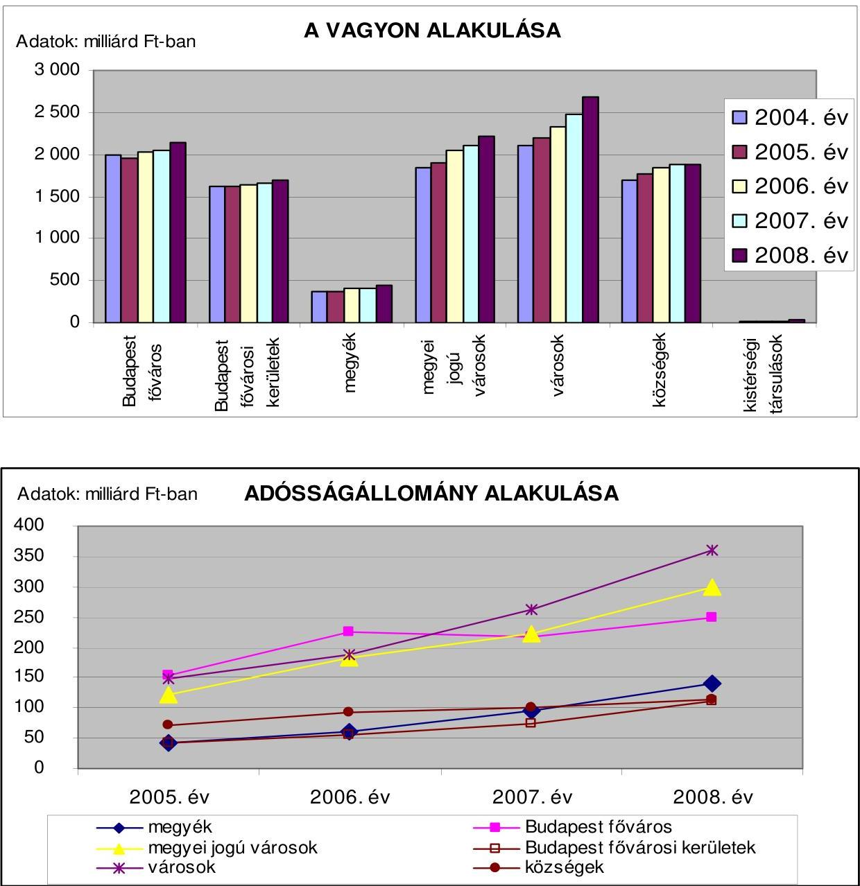

---

# A HELYI ÖNKORMÁNYZATOK ESZKÖZEI ÉS AZOK FORRÁSAI 

| Eszközök | 2005. év | 2006. év | 2007. év | 2008. év | Változás 2008/2005 | Változás 2006/2005 | Változás 2007/2006 | Változás 2008/2007 |
| :--: | :--: | :--: | :--: | :--: | :--: | :--: | :--: | :--: |
|  | milliárd Ft |  |  |  | \% |  |  |  |
| I. Immateriális javak | 21,0 | 24,9 | 26,1 | 24,5 | 116,7 | 118,6 | 104,8 | 93,9 |
| II. Tárgyi eszközök | 7238,3 | 7575,9 | 7687,9 | 7803,2 | 107,8 | 104,7 | 101,5 | 101,5 |
| Ebböl: |  |  |  |  |  |  |  |  |
| Ingatlanok és a kapcsolódó vagyoni értékú jogok | 6623,7 | 6854,5 | 7019,0 | 7153,0 | 108,0 | 103,5 | 102,4 | 101,9 |
| Beruházások, felújítások | 310,6 | 397,1 | 372,4 | 356,8 | 114,9 | 127,8 | 93,8 | 95,8 |
| Beruházásra adott elólegek | 3,3 | 11,2 | 7,6 | 5,1 | 154,5 | 339,4 | 67,9 | 67,1 |
| III. Befektetett pénzügyi eszközök | 555,8 | 557,6 | 557,0 | 592,2 | 106,5 | 100,3 | 99,9 | 106,3 |
| Ebböl: |  |  |  |  |  |  |  |  |
| Egyéb tartós részesedés | 477,0 | 479,9 | 484,6 | 496,0 | 104,0 | 100,6 | 101,0 | 102,4 |
| Tartós hitelviszonyt megtestesitő értékpapír | 16,2 | 15,6 | 16,5 | 37,6 | 232,1 | 96,3 | 105,8 | 227,9 |
| IV. Üzemeltetésre, kezelésre átadott, koncesszióba adott, vagyonkezelésbe vett eszközök | 1482,3 | 1586,9 | 1721,2 | 1824,0 | 123,1 | 107,1 | 108,5 | 106,0 |
| A) BEFEKTETETT ESZKÖZÖK | 9297,4 | 9745,3 | 9992,2 | 10243,9 | 110,2 | 104,8 | 102,5 | 102,5 |
| I. Készletek | 12,4 | 12,3 | 12,0 | 11,6 | 93,5 | 99,2 | 97,6 | 96,7 |
| II. Követelések | 169,5 | 167,8 | 111,8 | 134,4 | 79,3 | 99,0 | 66,6 | 120,2 |
| Ebböl: |  |  |  |  |  |  |  |  |
| Adósok | 115,6 | 115,2 | 56,1 | 62,3 | 53,9 | 99,7 | 48,7 | 111,1 |
| III. Értékpapírok | 69,6 | 57,1 | 53,6 | 77,7 | 111,6 | 82,0 | 93,9 | 145,0 |
| Ebböl: |  |  |  |  |  |  |  |  |
| Egyéb részesedés | 5,8 | 6,9 | 0,4 | 0,8 | 13,8 | 119,0 | 5,8 | 200,0 |
| Forgatási célú hitelviszonyt megtestesitő értékpapírok | 63,8 | 50,2 | 53,2 | 76,8 | 120,4 | 78,7 | 106,0 | 144,4 |
| IV. Pénzeszközök | 237,2 | 245,5 | 381,7 | 537,1 | 226,4 | 103,5 | 155,5 | 140,7 |
| V. Egyéb aktív pénzügyi elszámolások | 74,8 | 71,6 | 73,1 | 93,9 | 125,5 | 95,7 | 102,1 | 128,5 |
| B) FORGÓESZKÖZÖK | 563,5 | 554,3 | 632,2 | 854,7 | 151,7 | 98,4 | 114,1 | 135,2 |
| ESZKÖZÖK ÖSSZESEN | 9860,9 | 10299,6 | 10624,4 | 11098,6 | 112,6 | 104,4 | 103,2 | 104,5 |
| D) SAJÁT TÖKE | 8967,0 | 9178,2 | 9195,0 | 9186,1 | 102,4 | 102,4 | 100,2 | 99,9 |
| E) TARTALÉKOK | 197,0 | 196,0 | 341,4 | 517,7 | 262,8 | 99,5 | 174,2 | 151,6 |
| I. Hosszú lejáratú kötelezettségek | 286,0 | 411,3 | 620,0 | 893,8 | 312,5 | 143,8 | 150,7 | 144,2 |
| Ebböl: |  |  |  |  |  |  |  |  |
| tartozások fejlesztési célú kötvénykibocsátásból | 3,6 | 22,1 | 188,2 | 399,8 | 11105,6 | 613,9 | 851,6 | 212,4 |
| tartozások müködési célú kötvénykibocsátásból | 0,0 | 0,0 | 20,4 | 42,0 |  |  |  | 205,9 |
| beruházási és fejlesztési hitelek | 245,4 | 342,7 | 367,0 | 395,2 | 161,0 | 139,6 | 107,1 | 107,7 |
| müködési célú hosszú lejáratú hitelek | 2,1 | 7,2 | 5,3 | 4,6 | 219,0 | 342,9 | 73,6 | 86,8 |
| II. Rövid lejáratú kötelezettségek | 295,6 | 392,9 | 349,3 | 380,5 | 128,7 | 132,9 | 88,9 | 108,9 |
| III. Egyéb passzív pénzügyi elszámolások | 115,3 | 121,2 | 118,7 | 120,5 | 104,5 | 105,1 | 97,9 | 101,5 |
| F) KÖTELEZETTSÉGEK | 696,9 | 925,4 | 1088,0 | 1394,8 | 200,1 | 132,8 | 117,6 | 128,2 |
| FORRÁSOK ÖSSZESEN | 9860,9 | 10299,6 | 10624,4 | 11098,6 | 112,6 | 104,4 | 103,2 | 104,5 |

Forrás: Magyar Államkincstár önkormányzati éves költségvetési beszámoló "01" számú űrlapja

---

# A BUDAPEST FÖVÁROSI ÉS KERÜLETI ÖNKORMÁNYZATOK ESZKÖZEI ÉS AZOK FORRÁSAI

|  Eszközök | 2005. év | 2006. év | 2007. év | 2008. év | Változás 2008/2005 | Változás 2006/2005 | Változás 2007/2006 | Változás 2008/2007  |
| --- | --- | --- | --- | --- | --- | --- | --- | --- |
|   | milliárd Ft |  |  |  | \% |  |  |   |
|  I. Immateriális javak | 3,4 | 3,9 | 4,4 | 4,2 | 123,5 | 114,7 | 112,8 | 95,5  |
|  II. Tárgyi eszközök | 2485,8 | 2571,0 | 2611,2 | 2663,9 | 107,2 | 103,4 | 101,6 | 102,0  |
|  Ebböl: |  |  |  |  |  |  |  |   |
|  Ingatlanok és a kapcsolódó vagyoni értékú jogok | 2311,3 | 2375,6 | 2411,5 | 2440,3 | 105,6 | 102,8 | 101,5 | 101,2  |
|  Beruházások, felújítások | 46,9 | 58,4 | 77,5 | 108,8 | 232,0 | 124,5 | 132,7 | 140,4  |
|  Beruházásra adott előlegek | 1,3 | 8,5 | 5,4 | 2,3 | 176,9 | 653,8 | 63,5 | 42,6  |
|  III. Befektetett pénzügyi eszközök | 345,8 | 334,3 | 321,4 | 318,5 | 92,1 | 96,7 | 96,1 | 99,1  |
|  Ebböl: |  |  |  |  |  |  |  |   |
|  Egyéb tartós részesedés | 311,8 | 303,3 | 300,4 | 298,4 | 95,7 | 97,3 | 99,0 | 99,3  |
|  Tartós hitelviszonyt megtestesítő értékpapír | 0,8 | 0,5 | 0,1 | 0,2 | 25,0 | 62,5 | 20,0 | 200,0  |
|  IV. Üzemeltetésre, kezelésre átadott, koncesszióba adott, vagyonkezelésbe vett eszközök | 556,5 | 577,0 | 588,0 | 593,6 | 106,7 | 103,7 | 101,9 | 101,0  |
|  A) BEFEKTETETT ESZKÖZÖK | 3391,5 | 3486,2 | 3525,0 | 3580,2 | 105,6 | 102,8 | 101,1 | 101,6  |
|  I. Készletek | 2,8 | 2,9 | 3,1 | 3,0 | 107,1 | 103,6 | 106,9 | 96,8  |
|  II. Követelések | 55,8 | 47,2 | 30,1 | 40,1 | 71,9 | 84,6 | 63,8 | 133,2  |
|  Ebböl: |  |  |  |  |  |  |  |   |
|  Adósok | 43,4 | 35,9 | 17,0 | 18,7 | 43,1 | 82,7 | 47,4 | 110,0  |
|  III. Értékpapírok | 35,4 | 30,2 | 14,1 | 18,8 | 53,1 | 85,3 | 46,7 | 133,3  |
|  Ebböl: |  |  |  |  |  |  |  |   |
|  Egyéb részesedés | 5,4 | 6,6 | 0,0 | 0,0 | 0,0 | 122,2 | 0,0 |   |
|  Forgatási célú hitelviszonyt megtestesítő értékpapírok | 30,0 | 23,6 | 14,1 | 18,8 | 62,7 | 78,7 | 59,7 | 133,3  |
|  IV. Pénzeszközök | 85,0 | 80,8 | 119,8 | 173,1 | 203,6 | 95,1 | 148,3 | 144,5  |
|  V. Egyéb aktív pénzügyi elszámolások | 20,4 | 20,2 | 19,7 | 23,5 | 115,2 | 99,0 | 97,5 | 119,3  |
|  B) FORGÓESZKÖZÖK | 199,4 | 181,3 | 186,8 | 258,6 | 129,7 | 90,9 | 103,0 | 138,4  |
|  ESZKÖZÖK ÖSSZESEN | 3590,9 | 3667,5 | 3711,8 | 3838,8 | 106,9 | 102,1 | 101,2 | 103,4  |
|  D) SAJÁT TÖKE | 3289,1 | 3286,0 | 3281,5 | 3282,2 | 99,8 | 99,9 | 99,9 | 100,0  |
|  E) TARTALÉKOK | 79,4 | 73,2 | 114,1 | 171,5 | 216,0 | 92,2 | 155,9 | 150,3  |
|  I. Hosszú lejáratú kötelezettségek | 113,8 | 159,2 | 185,0 | 211,7 | 186,0 | 139,9 | 116,2 | 114,4  |
|  Ebböl: |  |  |  |  |  |  |  |   |
|  tartozások fejlesztési célú kötvénykibocsátásból | 0,0 | 1,9 | 15,6 | 33,6 |  |  | 821,1 | 215,4  |
|  tartozások müködési célú kötvénykibocsátásból | 0,0 | 0,0 | 1,0 | 1,2 |  |  |  | 120,0  |
|  beruházási és fejlesztési hitelek | 111,0 | 154,1 | 164,0 | 167,8 | 151,2 | 138,8 | 106,4 | 102,3  |
|  müködési célú hosszú lejáratú hitelek | 0,0 | 0,0 | 0,0 | 0,0 |  |  |  |   |
|  II. Rövid lejáratú kötelezettségek | 82,7 | 121,2 | 105,8 | 148,3 | 179,3 | 146,6 | 87,3 | 140,2  |
|  III. Egyéb passzív pénzügyi elszámolások | 25,9 | 27,9 | 25,4 | 25,1 | 96,9 | 107,7 | 91,0 | 98,8  |
|  F) KÖTELEZETTSÉGEK | 222,4 | 308,3 | 316,2 | 385,1 | 173,2 | 138,6 | 102,6 | 1214,0  |
|  FORRÁSOK ÖSSZESEN | 3590,9 | 3667,5 | 3711,8 | 3838,8 | 106,9 | 102,1 | 101,2 | 103,4  |

Forrás: Magyar Államkincstár önkormányzati éves költségvetési beszámoló "01" számú űrlapja

---

# A HELYI ÖNKORMÁNYZATOK ESZKÖZEI ÉS AZOK FORRÁSAI, A BUDAPEST FÖVÁROSI ÉS FÖVÁROSI KERÜLETI ÖNKORMÁNYZATOK ADATAI NÉLKÜL 

| Eszközök | 2005. év | 2006. év | 2007. év | 2008. év | Változás 2008/2005 | Változás 2006/2005 | Változás 2007/2006 | Változás 2008/2007 |
| :--: | :--: | :--: | :--: | :--: | :--: | :--: | :--: | :--: |
|  | milliárd Ft |  |  |  | \% |  |  |  |
| I. Immateriális javak | 17,6 | 21,0 | 21,7 | 20,3 | 115,3 | 119,3 | 103,3 | 93,5 |
| II. Tárgyi eszközök | 4752,5 | 5004,9 | 5076,7 | 5139,3 | 108,1 | 105,3 | 101,4 | 101,2 |
| Ebböl: |  |  |  |  |  |  |  |  |
| Ingatlanok és a kapcsolódó vagyoni értékú jogok | 4312,4 | 4478,9 | 4607,5 | 4712,7 | 109,3 | 103,9 | 102,9 | 102,3 |
| Beruházások, felújítások | 263,7 | 338,7 | 294,9 | 248,0 | 94,0 | 128,4 | 87,1 | 84,1 |
| Beruházásra adott előlegek | 2,0 | 2,7 | 2,2 | 2,8 | 140,0 | 135,0 | 81,5 | 127,3 |
| III. Befektetett pénzügyi eszközök | 210,0 | 223,3 | 235,6 | 273,7 | 130,3 | 106,3 | 105,5 | 116,2 |
| Ebböl: |  |  |  |  |  |  |  |  |
| Egyéb tartós részesedés | 162,2 | 176,6 | 184,2 | 197,6 | 121,8 | 108,9 | 104,3 | 107,3 |
| Tartós hitelviszonyt megtestesítő értékpapír | 15,4 | 15,1 | 16,4 | 37,4 | 242,9 | 98,1 | 108,6 | 228,0 |
| IV. Üzemeltetésre, kezelésre átadott, koncesszióba adott, vagyonkezelésbe vett eszközök | 925,8 | 1009,9 | 1133,2 | 1230,4 | 132,9 | 109,1 | 112,2 | 108,6 |
| A) BEFEKTETETT ESZKÖZÖK | 5905,9 | 6259,1 | 6467,2 | 6663,7 | 112,8 | 106,0 | 103,3 | 103,0 |
| I. Készletek | 9,6 | 9,4 | 8,9 | 8,6 | 89,6 | 97,9 | 94,7 | 96,6 |
| II. Követelések | 113,7 | 120,6 | 81,7 | 94,3 | 82,9 | 106,1 | 67,7 | 115,4 |
| Ebböl: |  |  |  |  |  |  |  |  |
| Adósok | 72,2 | 79,3 | 39,1 | 43,6 | 60,4 | 109,8 | 49,3 | 111,5 |
| III. Értékpapírok | 34,2 | 26,9 | 39,5 | 58,9 | 172,2 | 78,7 | 146,8 | 149,1 |
| Ebböl: |  |  |  |  |  |  |  |  |
| Egyéb részesedés | 0,4 | 0,3 | 0,4 | 0,8 | 200,0 | 75,0 | 133,3 | 200,0 |
| Forgatási célú hitelviszonyt megtestesítő értékpapírok | 33,8 | 26,6 | 39,1 | 58,0 | 171,6 | 78,7 | 147,0 | 148,3 |
| IV. Pénzeszközök | 152,2 | 164,7 | 261,9 | 364,0 | 239,2 | 108,2 | 159,0 | 139,0 |
| V. Egyéb aktív pénzügyi elszámolások | 54,4 | 51,4 | 53,4 | 70,4 | 129,4 | 94,5 | 103,9 | 131,8 |
| B) FORGÓESZKÖZÖK | 364,1 | 373,0 | 445,4 | 596,1 | 163,7 | 102,4 | 119,4 | 133,8 |
| ESZKÖZÖK ÖSSZESEN | 6270,0 | 6632,1 | 6912,6 | 7259,8 | 115,8 | 105,8 | 104,2 | 105,0 |
| D) SAJÁT TÖKE | 5677,9 | 5892,2 | 5913,5 | 5903,9 | 104,0 | 103,8 | 100,4 | 99,8 |
| E) TARTALÉKOK | 117,6 | 122,8 | 227,3 | 346,2 | 294,4 | 104,4 | 185,1 | 152,3 |
| I. Hosszú lejáratú kötelezettségek | 172,2 | 252,1 | 435,0 | 682,1 | 396,1 | 146,4 | 172,6 | 156,8 |
| Ebböl: |  |  |  |  |  |  |  |  |
| tartozások fejlesztési célú kötvénykibocsátásból | 3,7 | 20,2 | 172,6 | 366,2 | 9897,3 | 545,9 | 854,5 | 212,2 |
| tartozások müködési célú kötvénykibocsátásból | 0,0 | 0,0 | 19,4 | 40,8 |  |  |  | 210,3 |
| beruházási és fejlesztési hitelek | 134,4 | 188,6 | 203,1 | 227,4 | 169,2 | 140,3 | 107,7 | 112,0 |
| müködési célú hosszú lejáratú hitelek | 2,1 | 7,2 | 5,3 | 4,6 | 219,0 | 342,9 | 73,6 | 86,8 |
| II. Rövid lejáratú kötelezettségek | 212,9 | 271,7 | 243,5 | 232,2 | 109,1 | 127,6 | 89,6 | 95,4 |
| III. Egyéb passzív pénzügyi elszámolások | 89,4 | 93,3 | 93,3 | 95,4 | 106,7 | 104,4 | 100,0 | 102,3 |
| F) KÖTELEZETTSÉGEK | 474,5 | 617,1 | 771,8 | 1009,7 | 212,8 | 130,1 | 125,1 | 130,8 |
| FORRÁSOK ÖSSZESEN | 6270,0 | 6632,1 | 6912,6 | 7259,8 | 115,8 | 105,8 | 104,2 | 105,0 |

---

# AZ ELLENŐRZÖTT ÖNKORMÁNYZATOK ESZKÖZEI ÉS AZOK FORRÁSAI*

|  Eszközök | 2005. év | 2006. év | 2007. év | 2008. év | Változás 2008/2005 | Változás 2006/2005 | Változás 2007/2006 | Változás 2008/2007  |
| --- | --- | --- | --- | --- | --- | --- | --- | --- |
|   | milliárd Ft |  |  |  | \% |  |  |   |
|  I. Immateriális javak | 2,6 | 3,2 | 3,7 | 3,3 | 126,9 | 123,1 | 115,6 | 89,2  |
|  II. Tárgyi eszközök | 1372,8 | 1431,9 | 1459,6 | 1472,7 | 107,3 | 104,3 | 101,9 | 100,9  |
|  Ebböl: |  |  |  |  |  |  |  |   |
|  Ingatlanok és a kapcsolódó vagyoni értékú jogok | 1297,0 | 1339,4 | 1362,5 | 1389,6 | 107,1 | 103,3 | 101,7 | 102,0  |
|  Beruházások, felújítások | 43,6 | 60,1 | 63,5 | 49,9 | 114,4 | 137,8 | 105,7 | 78,6  |
|  Beruházásra adott előlegek | 1,5 | 1,4 | 0,3 | 1,0 | 66,7 | 93,3 | 21,4 | 333,3  |
|  III. Befektetett pénzügyi eszközök | 78,5 | 81,6 | 82,2 | 99,3 | 126,5 | 103,9 | 100,7 | 120,8  |
|  Ebböl: |  |  |  |  |  |  |  |   |
|  Egyéb tartós részesedés | 62,8 | 67,0 | 68,5 | 74,4 | 118,5 | 106,7 | 102,2 | 108,6  |
|  Tartós hitelviszonyt megtestesítő értékpapír | 2,5 | 2,1 | 1,3 | 8,4 | 336,0 | 84,0 | 61,9 | 646,2  |
|  IV. Üzemeltetésre, kezelésre átadott, koncesszióba adott, vagyonkezelésbe vett eszközök | 153,2 | 160,5 | 179,1 | 197,4 | 128,9 | 104,8 | 111,6 | 110,2  |
|  A) BEFEKTETETT ESZKÖZÖK | 1607,1 | 1677,2 | 1724,6 | 1772,7 | 110,3 | 104,4 | 102,8 | 102,8  |
|  I. Készletek | 2,8 | 2,7 | 2,9 | 2,6 | 92,9 | 96,4 | 107,4 | 89,7  |
|  II. Követelések | 35,5 | 41,8 | 24,3 | 35,0 | 98,6 | 117,7 | 58,1 | 144,0  |
|  Ebböl: |  |  |  |  |  |  |  |   |
|  Adósok | 24,1 | 29,4 | 9,4 | 11,7 | 48,5 | 122,0 | 32,0 | 124,5  |
|  III. Értékpapírok | 3,4 | 2,6 | 3,0 | 5,6 | 164,7 | 76,5 | 115,4 | 186,7  |
|  Ebböl: |  |  |  |  |  |  |  |   |
|  Egyéb részesedés | 0,1 | 0,2 | 0,2 | 0,7 | 700,0 | 200,0 | 100,0 | 350,0  |
|  Forgatási célú hitelviszonyt megtestesítő értékpapírok | 3,3 | 2,5 | 2,4 | 4,9 | 148,5 | 75,8 | 96,0 | 204,2  |
|  IV. Pénzeszközök | 37,8 | 38,8 | 64,0 | 93,5 | 247,4 | 102,6 | 164,9 | 146,1  |
|  V. Egyéb aktív pénzügyi elszámolások | 11,6 | 10,8 | 13,0 | 14,4 | 124,1 | 93,1 | 120,4 | 110,8  |
|  B) FORGÓESZKÖZÖK | 91,0 | 96,7 | 107,6 | 151,1 | 166,0 | 106,3 | 111,3 | 140,4  |
|  ESZKÖZÖK ÖSSZESEN | 1698,1 | 1773,9 | 1832,2 | 1923,8 | 113,3 | 104,5 | 103,3 | 105,0  |
|  D) SAJÁT TÖKE | 1552,3 | 1588,3 | 1583,8 | 1575,1 | 101,5 | 102,3 | 99,7 | 99,5  |
|  E) TARTALÉKOK | 28,9 | 27,3 | 53,2 | 90,1 | 311,8 | 94,5 | 194,9 | 169,4  |
|  I. Hosszú lejáratú kötelezettségek | 41,5 | 60,3 | 107,4 | 172,3 | 415,2 | 145,3 | 178,1 | 160,4  |
|  Ebböl: |  |  |  |  |  |  |  |   |
|  tartozások fejlesztési célú kötvénykibocsátásból | 2,5 | 3,3 | 39,9 | 88,1 | 3524,0 | 132,0 | 1209,1 | 220,8  |
|  tartozások müködési célú kötvénykibocsátásból | 0,0 | 0,0 | 6,6 | 12,9 |  |  |  | 195,5  |
|  beruházási és fejlesztési hitelek | 33,3 | 45,8 | 50,6 | 60,2 | 180,8 | 137,5 | 110,5 | 119,0  |
|  müködési célú hosszú lejáratú hitelek | 0,6 | 3,4 | 0,3 | 0,7 | 116,7 | 566,7 | 8,8 | 233,3  |
|  II. Rövid lejáratú kötelezettségek | 54,9 | 75,8 | 63,5 | 64,0 | 116,6 | 138,1 | 83,8 | 100,8  |
|  III. Egyéb passzív pénzügyi elszámolások | 20,5 | 22,2 | 24,3 | 22,3 | 108,8 | 108,3 | 109,5 | 91,8  |
|  F) KÖTELEZETTSÉGEK | 116,9 | 158,3 | 195,2 | 258,6 | 221,2 | 135,4 | 123,3 | 132,5  |
|  FORRÁSOK ÖSSZESEN | 1698,1 | 1773,9 | 1832,2 | 1923,8 | 113,3 | 104,5 | 103,3 | 105,0  |

- Az ellenőrzött megyei, megyei jogú városi, Budapest fővárosi kerületi és városi önkormányzatok adataival.

Forrás: Magyar Államkincstár önkormányzati éves költségvetési beszámoló "01" számú űrlapja

---

# A HELYI ÖNKORMÁNYZATOK 2005-2008. ÉVI TERVEZETT ÉS TELJESÍTETT BRUTTÓ ÉS NETTÓSÍTOTT BEVÉTELEINEK ÉS KIADÁSAINAK ALAKULÁSA

|  |   |   |   |   |   |   |   |   |   |   |   |   |
| --- | --- | --- | --- | --- | --- | --- | --- | --- | --- | --- | --- | --- |
|  Megnevezés | 2005. év |  |  | 2006. év |  |  | 2007. év |  |  | 2008. év |  |   |
|   | Eredeti elöirányzat | Teljesítés bruttó összege | Teljesítés nettósított összege | Eredeti elöirányzat | Teljesítés bruttó összege | Teljesítés nettósított összege | Eredeti elöirányzat | Teljesítés bruttó összege | Teljesítés nettósított összege | Eredeti elöirányzat | Teljesítés bruttó összege | Teljesítés nettó összege  |
|  Bevételek |  |  |  |  |  |  |  |  |  |  |  |   |
|  Intézményi müködési bevételek | 226933 | 258655 | 258655 | 233881 | 264792 | 264792 | 248261 | 272339 | 272339 | 253087 | 286201 | 286201  |
|  Kamatbevételek | 14935 | 18131 | 18131 | 11619 | 15652 | 15652 | 9797 | 19449 | 19449 | 20159 | 47694 | 47694  |
|  Gépjárműadó | 46058 | 49177 | 49177 | 49141 | 51266 | 51266 | 56635 | 62432 | 62432 | 62196 | 65713 | 65713  |
|  Helyi adók és kapcsolódó pótlékok, bírságok | 387030 | 397923 | 397923 | 409482 | 448936 | 448936 | 455021 | 505267 | 505267 | 520453 | 553342 | 553342  |
|  Illetékek | 61031 | 67288 | 67288 | 65326 | 71097 | 71097 | 57781 | 58540 | 58540 | 61561 | 67359 | 67359  |
|  Személyi jövedelemadó | 465660 | 439932 | 439932 | 467970 | 459973 | 459973 | 484406 | 492188 | 492188 | 235075 | 222622 | 222622  |
|  Egyéb átengedett adók, adójellegü bevételek | 395 | 359 | 359 | 415 | 641 | 641 | 624 | 1052 | 1052 | 1072 | 1417 | 1417  |
|  Önkorm. megillető bírságok és egyéb sajátos bevételek | 31136 | 37034 | 37034 | 34447 | 38477 | 38477 | 34923 | 39035 | 39035 | 34715 | 40996 | 40996  |
|  Müködési célra átvett pénzeszközök | 431529 | 471491 | 439049 | 450539 | 493931 | 457250 | 471866 | 486649 | 434378 | 490208 | 500892 | 436735  |
|  Költségvetési kiegészítések, visszatérülések és előző évi pénzmaradvány átvétel |  | 157245 | 2534 |  | 150972 | 7993 |  | 159631 | 9307 | 0 | 241136 | 8484  |
|  Felhalmozási és tőkejellegü bevételek | 152578 | 137111 | 137111 | 195018 | 144845 | 144845 | 194611 | 134267 | 134267 | 197766 | 158329 | 158329  |
|  ebböl: |  |  |  |  |  |  |  |  |  |  |  |   |
|  Tárgyi eszköz, immateriális javak értékesítése | 80062 | 63680 | 63680 | 105596 | 70613 | 70613 | 93583 | 55942 | 55942 | 112440 | 77282 | 77282  |
|  Önkorm. lakások, egyéb helyiségek ért., cseréje | 37336 | 28574 | 28574 | 38121 | 34336 | 34336 | 34012 | 27888 | 27888 | 35381 | 27361 | 27361  |
|  Részesedések értékesítése | 11506 | 15565 | 15565 | 27847 | 15228 | 15228 | 42632 | 23496 | 23496 | 26089 | 24317 | 24317  |
|  Felhalmozási célra átvett pénzeszközök | 245110 | 167899 | 150519 | 302353 | 223239 | 210280 | 245607 | 186329 | 175367 | 270740 | 178031 | 168551  |
|  Kölcsönök visszatérülése és igénybevétele | 8924 | 11955 | 11955 | 9696 | 14320 | 14320 | 8754 | 14721 | 14721 | 9856 | 13028 | 13028  |
|  Saját bevételek összesen | 2071319 | 2214200 | 2009667 | 2229887 | 2378141 | 2185522 | 2268286 | 2431899 | 2218342 | 2156888 | 2376760 | 2070471  |
|  Önkormányzat költségvetési támogatása | 730335 | 880902 | 880902 | 688264 | 868179 | 868179 | 701756 | 861877 | 861877 | 890763 | 1199087 | 1199087  |
|  Előző évi pénzmaradvány igénybevétele | 76142 | 328477 | 327188 | 71160 | 312396 | 311116 | 69770 | 312460 | 311885 | 171077 | 500211 | 499700  |
|  Költségvetési bevételek | 2877796 | 3423579 | 3217757 | 2989311 | 3558716 | 3364817 | 3039812 | 3606236 | 3392104 | 3218728 | 4076058 | 3769258  |
|  Hitelek bevételei | 246327 | 143208 | 110246 | 312872 | 207575 | 175171 | 292956 | 151063 | 109946 | 228135 | 114779 | 87390  |
|  Értékpapírok bevételei | 64976 | 35718 | 35718 | 49207 | 44512 | 44512 | 44117 | 205954 | 205955 | 138112 | 226804 | 226804  |
|  Egyéb finanszírozás bevételei |  | $-3809$ | 0 |  | 4534 | 0 |  | $-2339$ | 0 | 0 | 2489 | 0  |
|  BEVÉTELEK ÖSSZESEN | 3189099 | 3598696 | 3363721 | 3351390 | 3815337 | 3584500 | 3376885 | 3960914 | 3708005 | 3584975 | 4420130 | 4083452  |

---

|  Mégnevezés | 2005. év |  |  | 2006. év |  |  | 2007. év |  |  | 2008. év |  |   |
| --- | --- | --- | --- | --- | --- | --- | --- | --- | --- | --- | --- | --- |
|   | Eredeti elöirányzat | Teljesítés bruttó összege | Teljesítés nettósított összege | Eredeti elöirányzat | Teljesítés bruttó összege | Teljesítés nettósított összege | Eredeti elöirányzat | Teljesítés bruttó összege | Teljesítés nettósított összege | Eredeti elöirányzat | Teljesítés bruttó összege | Teljesítés nettó összege  |
|  Kiadások |  |  |  |  |  |  |  |  |  |  |  |   |
|  Személyi juttatások | 1053857 | 1066138 | 1066138 | 1101661 | 1113502 | 1113502 | 1088701 | 1122656 | 1122656 | 1095756 | 1143692 | 1143692  |
|  Munkaadókat terhelő járulékok | 344479 | 346625 | 346625 | 348743 | 351427 | 351427 | 346233 | 355234 | 355234 | 346529 | 358990 | 358990  |
|  Dologi kiadások | 655708 | 704538 | 704538 | 677240 | 750810 | 750810 | 696284 | 732020 | 732020 | 734289 | 808797 | 808797  |
|  Egyéb folyó kiadások | 33817 | 195045 | 40334 | 35107 | 201708 | 58728 | 44676 | 215273 | 64950 | 63616 | 322768 | 90116  |
|  Elíátottak pénzbeli juttatása | 7464 | 8973 | 8973 | 7797 | 9256 | 9256 | 8018 | 8903 | 8903 | 8393 | 9598 | 9598  |
|  Működési célú pénzeszköz átadás | 88993 | 133169 | 100727 | 107997 | 156088 | 119407 | 144621 | 178508 | 126237 | 172841 | 203184 | 139027  |
|  Társadalom- és szociálpolitikai juttatások | 107387 | 130749 | 130749 | 90390 | 109421 | 109421 | 101609 | 127738 | 127738 | 112307 | 138899 | 138899  |
|  Tervezett maradvány, eredmény, tartalék | 167753 | 1289 | 0 | 116742 | 1279 | 0 | 125381 | 575 | 0 | 245392 | 511 | 0  |
|  Felújítás | 91001 | 98863 | 98863 | 125499 | 127397 | 127397 | 99237 | 99298 | 99298 | 102156 | 90181 | 90181  |
|  Intézményi beruházási kiadások | 448143 | 372567 | 372567 | 509386 | 437645 | 437645 | 428450 | 373195 | 373195 | 426846 | 338849 | 338849  |
|  Részesedések vásárlása | 2139 | 5514 | 5514 | 3958 | 7834 | 7834 | 2314 | 5769 | 5769 | 2181 | 8388 | 8388  |
|  Felhalmozási célú pénzeszköz átadások | 106076 | 102836 | 85455 | 135256 | 122173 | 109214 | 181349 | 116380 | 105418 | 161345 | 122671 | 113192  |
|  Kölcsönök nyújtása, törlesztése | 7881 | 11934 | 11934 | 10910 | 15582 | 15582 | 7662 | 13605 | 13605 | 7266 | 12906 | 12906  |
|  Költségvetési kiadások | 3114698 | 3178240 | 2972417 | 3270686 | 3404122 | 3210223 | 3274535 | 3349154 | 3135023 | 3478917 | 3559434 | 3252635  |
|  Hitelek törlesztése | 60518 | 76503 | 43542 | 79047 | 85607 | 53203 | 100384 | 126404 | 85287 | 101371 | 108997 | 81607  |
|  Értékpapírok kiadásai | 13883 | 20492 | 20492 | 1657 | 11370 | 11370 | 1966 | 29710 | 29710 | 4687 | 73115 | 73115  |
|  Egyéb finanszírozás kiadásai |  | 307 | 0 |  | 3197 | 0 |  | 2766 | 0 | 0 | 21609 | 0  |
|  Kiadások Összesen | 3189099 | 3274928 | 3036451 | 3351390 | 3497902 | 3274796 | 3376885 | 3508034 | 3250020 | 3584975 | 3763155 | 3407357  |

---

AZ ELLENŐRZŐTT HELYI ÖNKORMÁNYZATOK* 2005-2008. ÉVI TERVEZETT ÉS TELJESÍTETT BRUTTÓ ÉS NETTÓSÍTOTT BEVÉTELEINEK ÉS KIADÁSAINAK ALAKULÁSA

|  Megnevezés | 2005. év |  |  | 2006. év |  |  | 2007. év |  |  | 2008. év |  |   |
| --- | --- | --- | --- | --- | --- | --- | --- | --- | --- | --- | --- | --- |
|   | Eredeti elöirányzat | Teljesítés bruttó összege | Teljesítés nettósított összege | Eredeti elöirányzat | Teljesítés bruttó összege | Teljesítés nettósított összege | Eredeti elöirányzat | Teljesítés bruttó összege | Teljesítés nettósított összege | Eredeti elöirányzat | Teljesítés bruttó összege | Teljesítés nettósított összege  |
|  Bevételek |  |  |  |  |  |  |  |  |  |  |  |   |
|  Intézményi müködési bevételek | 46086 | 50048 | 50048 | 46070 | 51968 | 51968 | 48181 | 52934 | 52934 | 45710 | 56516 | 56516  |
|  Kamatbevételek | 2403 | 2875 | 2875 | 1401 | 2301 | 2301 | 1283 | 2477 | 2477 | 3304 | 6739 | 6739  |
|  Gépjárműadó | 8554 | 9173 | 9173 | 9119 | 9407 | 9407 | 10951 | 11635 | 11635 | 11580 | 12287 | 12287  |
|  Helyi adók és kapcsolódó pótlékok, bírságok | 70768 | 70891 | 70891 | 74851 | 82967 | 82967 | 83313 | 91837 | 91837 | 93644 | 102550 | 102550  |
|  Illetékek | 16471 | 18285 | 18285 | 17963 | 19160 | 19160 | 14772 | 15526 | 15526 | 15778 | 18082 | 18082  |
|  Személyi jövedelemadó | 77572 | 72670 | 72670 | 78774 | 77191 | 77191 | 73800 | 76950 | 76950 | 33709 | 31785 | 31785  |
|  Egyéb átengedett adók, adójellegű bevételek | 43 | 48 | 48 | 130 | 104 | 104 | 111 | 183 | 183 | 156 | 246 | 246  |
|  Önkorm. megillető bírságok és egyéb sajátos bevételek | 7468 | 7592 | 7592 | 8168 | 7734 | 7734 | 7417 | 7754 | 7754 | 7075 | 10114 | 10114  |
|  Müködési célra átvett pénzeszközök | 89007 | 97816 | 95609 | 94586 | 102316 | 99887 | 92925 | 97462 | 94186 | 92869 | 99692 | 96098  |
|  Költségvetési kiegészítések, visszatérülések és előző évi pénzmaradvány átvétel | 0 | 6474 | 0 | 0 | 5198 | 933 | 0 | 5984 | 1346 | 0 | 7440 | 1312  |
|  Felhalmozási és tőkejellegű bevételek | 37389 | 27334 | 27334 | 41682 | 26556 | 26556 | 34214 | 21013 | 21013 | 44099 | 35630 | 35629  |
|  ebből |  |  |  |  |  |  |  |  |  |  |  |   |
|  Tárgyi eszköz, immateriális javak értékesítése | 19607 | 12980 | 12980 | 24912 | 13529 | 13529 | 21266 | 11473 | 11473 | 29164 | 22233 | 22233  |
|  Önkorm. lakások, egyéb helyiségek ért., cseréje | 8977 | 5716 | 5716 | 8635 | 7099 | 7099 | 7317 | 4698 | 4698 | 8340 | 7395 | 7395  |
|  Részesedések értékesítése | 1966 | 1321 | 1321 | 4149 | 2089 | 2089 | 1859 | 754 | 754 | 3280 | 769 | 769  |
|  Felhalmozási célra átvett pénzeszközök | 32605 | 23600 | 22795 | 34853 | 41829 | 40821 | 32290 | 37901 | 36592 | 30153 | 29688 | 28689  |
|  Kölcsönök visszatérülése és igénybevétele | 1732 | 2122 | 2122 | 1799 | 2257 | 2257 | 1783 | 4040 | 4040 | 1810 | 3744 | 3744  |
|  Saját bevételek összesen | 390098 | 388928 | 379442 | 409396 | 428988 | 421286 | 401040 | 425696 | 416473 | 379887 | 414513 | 403791  |
|  Önkormányzat költségvetési támogatása | 128270 | 145307 | 145307 | 118557 | 133925 | 133925 | 114329 | 137431 | 137431 | 147614 | 186306 | 186306  |
|  Előző évi pénzmaradvány igénybevétele | 7477 | 35005 | 34861 | 9633 | 30264 | 30132 | 5016 | 28200 | 28050 | 17869 | 45261 | 45211  |
|  Költségvetési bevételek | 525845 | 569240 | 559610 | 537586 | 593177 | 585343 | 520385 | 591327 | 581954 | 545370 | 646080 | 635308  |
|  Hítelek bevételei | 32953 | 21820 | 16686 | 43582 | 29565 | 26546 | 45513 | 26927 | 21212 | 27314 | 17564 | 14474  |
|  Értékpapírok bevételei | 3404 | 3187 | 3187 | 1643 | 3793 | 3793 | 3007 | 44394 | 44394 | 28228 | 51070 | 51070  |
|  Egyéb finanszírozás bevételei | - | 1422 | 0 | - | 1312 | 0 | - | 1993 | 0 | 0 | 2063 | 0  |
|  BEVÉTELEK ÖSSZESEN | 562202 | 592825 | 579483 | 582811 | 627847 | 615682 | 568905 | 664641 | 647560 | 600912 | 712631 | 700852  |

---

|  Adatok millió Ft-ban |  |  |  |  |  |  |  |  |  |  |  |   |
| --- | --- | --- | --- | --- | --- | --- | --- | --- | --- | --- | --- | --- |
|   | 2005. év |  |  | 2006. év |  |  | 2007. év |  |  | 2008. év |  |   |
|  Megnevezés | Eredeti előirányzat | Teljesítés bruttó összege | Teljesítés nettósított összege | Eredeti előirányzat | Teljesítés bruttó összege | Teljesítés nettósított összege | Eredeti előirányzat | Teljesítés bruttó összege | Teljesítés nettósított összege | Eredeti előirányzat | Teljesítés bruttó összege | Teljesítés nettósított összege  |
|  Kiadások |  |  |  |  |  |  |  |  |  |  |  |   |
|  Személyi juttatások | 198 473 | 203 762 | 203 762 | 209 727 | 213 259 | 213 259 | 204 810 | 211 714 | 211 714 | 205 046 | 216 628 | 216 628  |
|  Munkaadókat terhelő járulékok | 65 086 | 66 334 | 66 334 | 66 328 | 67 449 | 67 449 | 65 361 | 67 200 | 67 200 | 64 936 | 68 282 | 68 282  |
|  Dologi kiadások | 129 402 | 136 979 | 136 979 | 132 491 | 143 521 | 143 521 | 133 182 | 141 008 | 141 008 | 139 046 | 159 300 | 159 300  |
|  Egyéb folyó kiadások | 6 835 | 13 932 | 7 458 | 6 580 | 13 181 | 8 916 | 7 530 | 15 737 | 11 099 | 9 545 | 22 182 | 16 054  |
|  Eltátottak pénzbeli juttatása | 2 539 | 2 961 | 2 961 | 2 747 | 3 168 | 3 168 | 2 809 | 3 072 | 3 072 | 2 957 | 3 261 | 3 261  |
|  Működési célú pénzeszköz átadás | 15 486 | 20 611 | 18 403 | 17 114 | 21 567 | 19 138 | 17 645 | 23 694 | 20 418 | 18 879 | 25 208 | 21 615  |
|  Társadalom- és szociálpolitikai juttatások | 14 461 | 17 488 | 17 488 | 12 348 | 15 095 | 15 095 | 13 135 | 17 410 | 17 410 | 14 813 | 18 497 | 18 497  |
|  Tervezett maradvány, eredmény, tartalék | 25 134 | 144 | 0 | 19 270 | 133 | 0 | 18 357 | 150 | 0 | 40 014 | 51 | 0  |
|  Felújítás | 11 074 | 13 241 | 13 241 | 17 694 | 15 028 | 15 028 | 14 070 | 14 035 | 14 035 | 12 460 | 12 944 | 12 944  |
|  Intézményi beruházási kiadások | 75 624 | 64 045 | 64 045 | 77 374 | 81 237 | 81 237 | 65 480 | 77 162 | 77 162 | 66 350 | 59 937 | 59 937  |
|  Részesedések vásárlása | 192 | 840 | 840 | 1 182 | 1 405 | 1 405 | 905 | 1 413 | 1 413 | 392 | 1 984 | 1 984  |
|  Felhalmozási célú pénzeszköz átadások | 5 637 | 7 687 | 6 883 | 8 093 | 10 237 | 9 229 | 10 729 | 8 263 | 6 954 | 9 033 | 11 640 | 10 641  |
|  Kölcsönök nyújtása, törlesztése | 1 630 | 1 598 | 1 598 | 1 677 | 2 193 | 2 193 | 1 203 | 3 313 | 3 313 | 1 451 | 3 544 | 3 544  |
|  Költségvetési kiadások | 551 573 | 549 622 | 539 992 | 572 625 | 587 473 | 579 638 | 555 216 | 584 171 | 574 798 | 584 922 | 603 458 | 592 687  |
|  Hitelek törlesztése | 9 484 | 14 010 | 8 876 | 9 759 | 10 038 | 7 019 | 12 371 | 20 787 | 15 072 | 13 884 | 16 991 | 13 901  |
|  Értékpapírok kiadásai | 1 145 | 380 | 380 | 427 | 787 | 787 | 1 318 | 2 354 | 2 354 | 2 106 | 12 477 | 12 477  |
|  Egyéb finanszírozás kiadásai | - | -1 056 | 0 | - | -790 | 0 | - | 3 027 | 0 | 0 | 1 434 | 0  |
|  Kiadások összesen | 562 202 | 562 956 | 549 248 | 582 811 | 597 508 | 587 444 | 568 905 | 610 339 | 592 224 | 600 912 | 634 360 | 619 065  |

- megye, megye jogú városi, Budapest fővárosi kerületi és városi önkormányzatok adatai

---

AZ ELLENŐRZÖTT ÖNKORMÁNYZATOK 2005-2008. ÉVI KÖLTSÉGVETÉSI ELŐIRÁNYZATAINAK ÉS AZOK 2005-2008. ÉVI PÉNZÜGYI TELJESÍTÉSÉNEK ALAKULÁSA

|  Megnevezés | 2005. év |  |  |  | 2006. év |  |  |  | 2007. év |  |  |  | 2008. év |   |
| --- | --- | --- | --- | --- | --- | --- | --- | --- | --- | --- | --- | --- | --- | --- |
|   | Eredeti elöirányzat milliárd Ft | Megosz-
lás
\% | Teljesítés milliárd Ft | Megosz-
lás
\% | Eredeti elöirányzat milliárd Ft | Megosz-
lás
\% | Teljesítés milliárd Ft | Megosz-
lás
\% | Eredeti elöirányzat milliárd Ft | Megosz-
lás
\% | Teljesítés milliárd Ft | Megosz-
lás
\% | Eredeti elöirányzat milliárd Ft | Megosz-
lás
\%  |
|  Müködési célú költségvetési kiadások összesen | 438 | 80\% | 457 | 83\% | 453 | 79\% | 472 | 80\% | 451 | 81\% | 476 | 81\% | 442 | 79\%  |
|  Felhalmozási célú költségvetési kiadások összesen | 113 | 20\% | 92 | 17\% | 120 | 21\% | 115 | 20\% | 105 | 19\% | 109 | 19\% | 118 | 21\%  |
|  Költségvetési kiadások összesen | 551 | 100\% | 549 | 100\% | 573 | 100\% | 587 | 100\% | 556 | 100\% | 585 | 100\% | 560 | 100\%  |
|  Müködési célú költségvetési bevételek összesen | 430 | 82\% | 482 | 85\% | 437 | 81\% | 491 | 83\% | 432 | 83\% | 496 | 84\% | 424 | 81\%  |
|  Felhalmozási célú költségvetési bevételek összesen | 95 | 18\% | 87 | 15\% | 101 | 19\% | 102 | 17\% | 89 | 17\% | 95 | 16\% | 98 | 19\%  |
|  Költségvetési bevételek összesen | 525 | 100\% | 569 | 100\% | 538 | 100\% | 593 | 100\% | 521 | 100\% | 591 | 100\% | 522 | 100\%  |
|  Müködési célú költségvetési bevételek és kiadások egyenlege: hiány-, többlet+ | $-8$ |  | 25 |  | $-16$ |  | 19 |  | $-19$ |  | 20 |  | $-18$ |   |
|  Felhalmozási célú költségvetési bevételek és kiadások egyenlege: hiány-, többlet+ | $-18$ |  | $-5$ |  | $-19$ |  | $-13$ |  | $-16$ |  | $-14$ |  | $-462$ |   |
|  Költségvetési bevételek és kiadások egyenlege: hiány-, többlet+ | $-26$ | - | 20 | - | $-35$ | - | 6 | - | $-35$ | - | 6 | - | $-38$ | -  |
|  Finanszírozási célú pénzügyi kiadások | 10 | - | 14 | - | 10 | - | 11 | - | 14 | - | 24 | - | 15 | -  |
|  Finanszírozási célú pénzügyi bevételek | 36 | - | 25 | - | 45 | - | 33 | - | 49 | - | 72 | - | 53 | -  |
|  Finanszírozási célú pénzügyi műveletek egyenlege | 26 | - | 11 | - | 35 | - | 22 | - | 35 | - | 48 | - | 38 | -  |

Forrás: - Magyar Államkincstár éves költségvetési beszámoló "80" számú űrlap adatai;

- a költségvetési bevétel-kiadás müködési-felhalmozási célra történt megosztásánál az önkormányzatok analitikus nyilvántartása.

---

# AZ ELLENŐRZÖTT ÖNKORMÁNYZATOK* TERVEZETT ÉS TELJESÍTETT KÖLTSÉGVETÉSI BEVÉTELEI, KIADÁSAI ÉS EGYENSÚLYI HELYZETE 

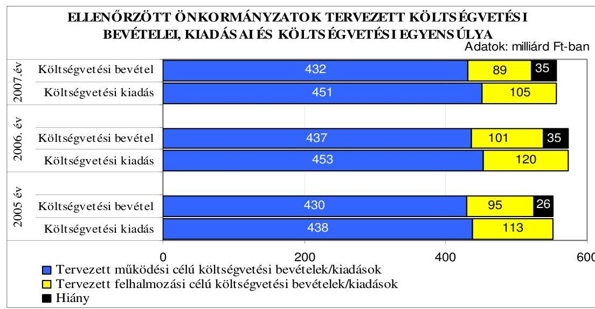

| ELLENŐRZÖTT ÖNKORMÁNYZATOK TELJESÍTETT KÖLTS ÉGVETÉSI BEVÉTELEI, KIADÁSAI ÉS PÉNZÜGYI EGYENSÚLYA |  |  |
| :--: | :--: | :--: |
|  | Adatok: millárd Ft-ban |  |
|  |  |  |
| 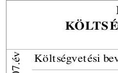 | 408 | 95 |
|  | 476 | 109 |
|  |  |  |
|  | 481 | 102 |
|  | 492 | 115 |
|  |  |  |
|  | 485 | 87 |
|  | 457 | 92 |
|  | 0200 | 600 |

* Ellenőrzött megyei, megyei jogú városi, Budapest fővárosi kerületi és városi önkormányzatok adataival.

---

# AZ ELLENŐRZÖTT ÖNKORMÁNYZATOK* TERVEZETT ÉS TELJESÍTETT FINANSZÍROZÁSI BEVÉTELEI ÉS KIADÁSAI 

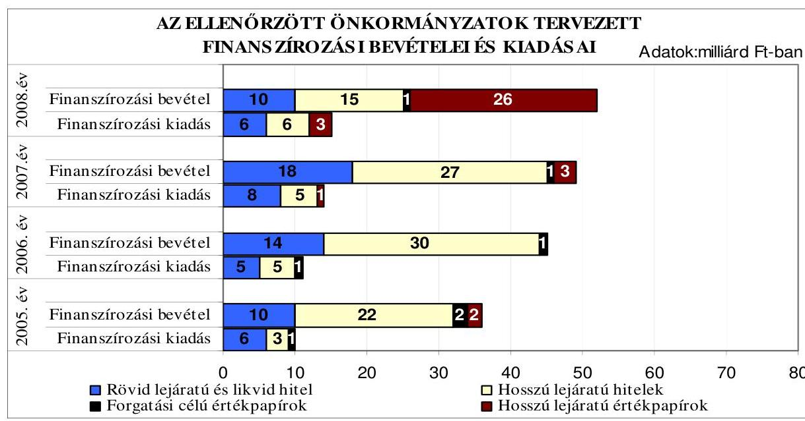
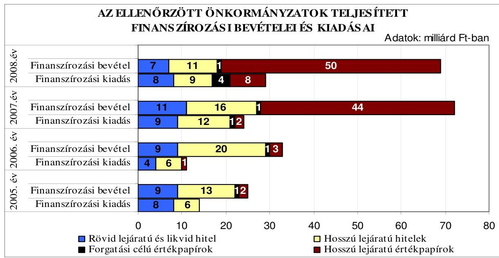

[^0]
[^0]:    * Ellenőrzött megyei, megyei jogú városi, Budapest fővárosi kerületi és városi önkormányzatok adataival.

---

# FIZETŐKÉPESSÉGI MUTATÓK ALAKULÁSA 

(országos adatok alapján)
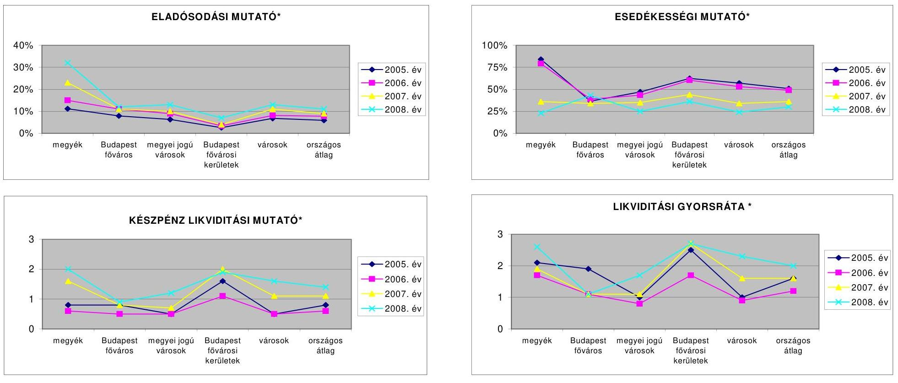

* Eladósodási mutató = [(Összes kötelezettség-egyéb passzív pénzügyi elszámolások)/Összes forrás]*100
Esedékességi aránymutató = [Rövid lejáratú kötelezettségek/(Összes kötelezettség-egyéb passzív pénzügyi elszámolások)]*100
Készpénz likviditási mutató = pénzeszközök/rövid lejáratú kötelezettségek.
Likviditási gyorsráta = (követelések+értékpapírok+pénzeszközök)/rövid lejáratú kötelezettségek

---

# AZ ELADÓSODÁSI ÉS ESEDÉKESSÉGI MUTATÓ ALAKULÁSA AZ ELLENŐRZÖTT ÖNKORMÁNYZATOKNÁL 

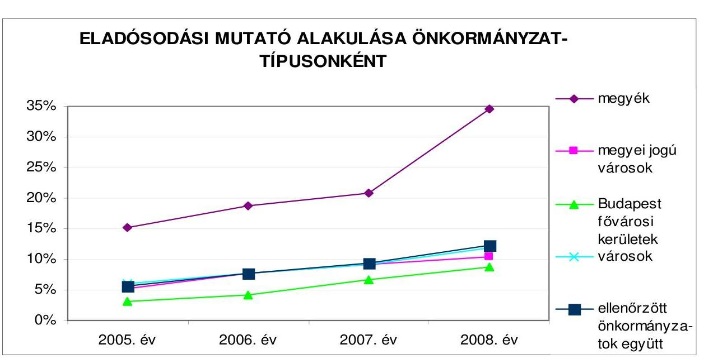

ESEDÉKESSÉGI ARÁNYMUTATÓ ALAKULÁSA ÖNKORMÁNYZATTÍPUSONKÉNT
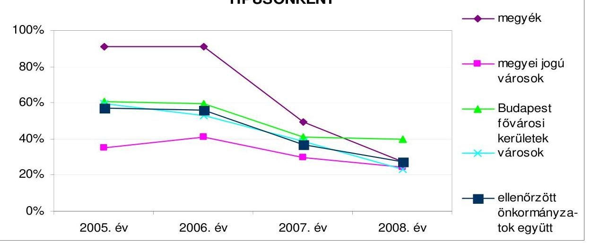

---

# A KIALAKÍTOTT BELSŐ KONTROLLOK MEGBÍZHATÓSÁGA TEKINTETÉBEN VIZSGÁLT TERÜLETEK KIADÁSAINAK ÉS AZOK RÉSZARÁNYÁNAK ALAKULÁSA AZ ELLENŐRZÖTT ÖNKORMÁNYZATOKNÁL

|  Megnevezés | Eredeti |  | Módosított |  | Teljesítés |   |
| --- | --- | --- | --- | --- | --- | --- |
|   | előirányzat |  | előirányzat |  |  |   |
|   | 2007. év | 2008. év | 2007. év | 2008. év | 2007. év | 2008. év  |
|  Karbantartási, kisjavítási szolgáltatások kiadásai ${ }^{[1]}$ (millió Ft) | 7652198 | 8457050 | 8904753 | 9899022 | 7775671 | 8897568  |
|  Karbantartási, kisjavítási szolgáltatások kiadásainak részaránya a dologi kiadásokból (\%) | 5,7 | 6 | 5,7 | 5,7 | 5,5 | 5,5  |
|  Gépek berendezések és felszerelések vásárlása, létesítése ${ }^{[2]}$ (millió Ft) | 4075532 | 4046847 | 7977233 | 8516457 | 6401966 | 5255047  |
|  Gépek, berendezések és felszerelések vásárlása, létesítése kiadásainak részaránya a felhalmozási kiadásokból (\%) | 6,2 | 5,9 | 8,1 | 7,6 | 8,3 | 8,6  |
|  Müködési célú pénzeszköz átadások államháztartáson kívülre ${ }^{[3]}$ (millió Ft) | 15500379 | 15164446 | 21101357 | 21365489 | 19916107 | 20234350  |
|  Müködési célú pénzeszköz átadások részaránya az államháztartáson kívüli pénzeszközátadásokból (\%) | 60,3 | 63,1 | 59 | 60,7 | 74,1 | 63,7  |
|  Állományba nem tartozók juttatásai ${ }^{[4]}$ (millió Ft) | 8149493 | 8556175 | 11832611 | 12509287 | 11897113 | 13035350  |
|  Állományba nem tartozók juttatásainak részaránya az összes személyi juttatásból (\%) | 3,9 | 4,1 | 5,4 | 5,5 | 5,6 | 5,9  |

[^0] [^0]: ${ }^{[1]}$ A 2008. évben ellenőrzött 109 önkormányzatnál az önkormányzati hivatal 2007. és 2008. évi költségvetési beszámolója 03. űrlap 27. sor, illetve 28. sor összesített adatai szerint. ${ }^{[2]}$ A 2008. évben ellenőrzött 109 önkormányzatnál az önkormányzati hivatal 2007. és 2008. évi költségvetési beszámolója 05. űrlap 10. sor összesített adatai szerint. ${ }^{[3]}$ A 2008. évben ellenőrzött 109 önkormányzatnál az önkormányzati hivatal 2007. és 2008. évi költségvetési beszámolója 04. űrlap 22., illetve 24. sorok adatai szerint. ${ }^{[4]}$ A 2008. évben ellenőrzött 109 önkormányzatnál az önkormányzati hivatal 2007. és 2008. évi költségvetési beszámolója 02. űrlap 43. sorok összesített adatai szerint

---

# AZ ELEKTRONIKUS KÖZIGAZGATÁSI ÜGYINTÉZÉSI LEHETŐSÉGEK BIZTOSÍTÁSA 

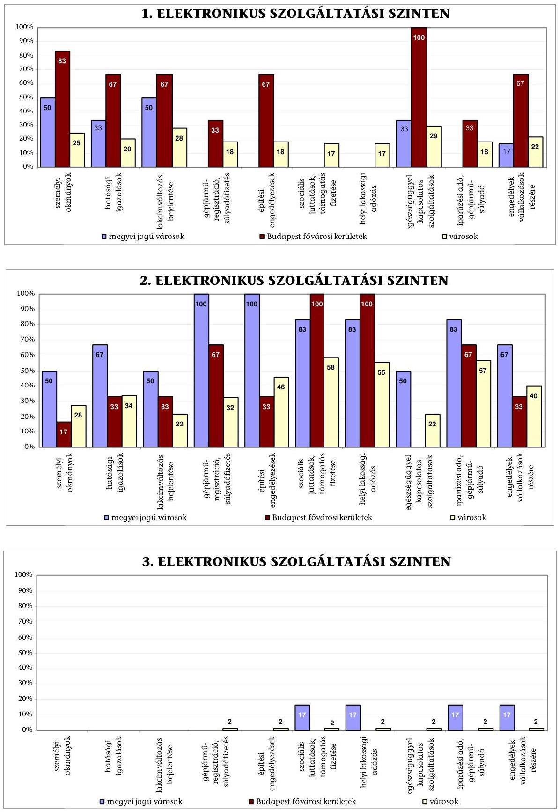

---

# A SZÁMVEVŐI JELENTÉSEKBEN A HELYI ÖNKORMÁNYZATOK SZABÁLYSZERŰ ÉS CÉLSZERŰ MŰKÖDÉSE ÉRDEKÉBEN A 2008. ÉVBEN TETT JAVASLATOK 

#### Abstract

A helyi önkormányzatok gazdálkodási rendszerének ellenőrzéséről készült számvevői jelentésekben a megállapításaink hasznosítása és a hiányosságok megszüntetése érdekében az előző évinél több, mintegy 5500 (az előző évben közel négyezer) javaslatot tettünk ${ }^{1}$. Javaslataink kétötöde a jogszabályokban és az önkormányzati hivatalok belső szabályzataiban előírtak betartására, a szabályszerű múködésre, és gazdálkodásra hívta fel a figyelmet, egyötöde (az előző évben egyharmada) az önkormányzati feladatok célszerúbb, színvonalasabb ellátásának elősegítésére, az önkormányzati hivatalok munkájának célszerűbb megszervezésére, szabályozottságának javítására irányult.

## 1. A JOGSZABÁLYI ELŐíRÁSOK MARADÉKTALAN BETARTÁSA ÉrDEKÉBEN TETT SZABÁLYSZERŰSÉGI JAVASLATOK

1.1. A költségvetési előirányzatok, valamint az európai uniós forrásokkal kapcsolatos fejlesztési célkitűzések és előirányzatok jogszabályi előírásoknak megfelelő meghatározását, a kapcsolódó pályázatok benyújtásának szabályszerűségét, a közérdekű gazdálkodási adatok közzétételét a javaslatok 16\%-a (az előző évben mintegy 7\%-a) szolgálta.

Az európai uniós forrásokkal kapcsolatos fejlesztési célkitüzések és előirányzataik jogszabályi előírásoknak megfelelő meghatározása, az európai uniós forrásokból támogatott fejlesztési feladatokhoz benyújtott pályázatok szabályszerűsége érdekében javasoltuk, hogy:

- biztosítsák a költségvetési rendelettervezet előkészítésekor az Áht. 8/A. § (7) bekezdése előírásainak betartását, ne tartalmazzanak a költségvetés bevételi és kiadási előirányzatai finanszírozási célú bevételeket és kiadásokat;
- fogadják el a képviselő-testületek az Ötv. 91. § (1) bekezdésében előírtak betartása érdekében az önkormányzat több évre szóló gazdasági programját, és azt szükség esetén az európai uniós forrásokkal kapcsolatos fejlesztési célkitűzésekkel egészítsék ki;

[^0]
[^0]:    ${ }^{1}$ A kiemelt körbe tartozó önkormányzatoknál a javaslatok száma 25\%-kal (819-ről 613-ra) csökkent a közbenső egyeztetések során, a feltárt hiányosságok megszüntetésére a polgármester és a jegyző által az ellenőrzés ideje alatt tett intézkedések hatására.

---

- tartalmazza a költségvetési rendelettervezet az Áht. 69. § (1) bekezdés előírásainak megfelelően az európai uniós források igénybevételével tervezett fejlesztések előirányzatait, a támogatási szerződésekben szereplő ütemezésben a beruházási és egyéb felhalmozási célú kiadásokat, a támogatásból származó bevételeket, valamint a saját forrás előirányzatát;
- tartalmazza a költségvetési rendelettervezet az európai uniós forrásokkal kapcsolatos felhalmozási kiadásokat feladatonként az Ámr. 29. § (1) bekezdés d) pontjában, a több éves kihatással járó feladatok előirányzatait éves bontásban a g) pontjában, az európai uniós támogatással megvalósuló programok, projektek bevételi és kiadási előirányzatait elkülönítetten is, valamint az önkormányzaton kívüli projektekhez történő hozzájárulást a k) pontjában foglalt előírások alapján;
- tájékoztassák a képviselő-testületeket a költségvetési rendelet-tervezet előterjesztésekor az Áht. 118. § (1) bekezdés 2. b) pontjának megfelelően a többéves kihatással járó döntések számszerűsítéséről évenkénti bontásban, összesítve, valamint szöveges indokolással.

A közérdekü, gazdasági adatok nyilvánossága érdekében:

- tegyék közzé az Eisztv. 21. § (3) bekezdésében előírtak szerinti csoportosításban a gazdálkodásra vonatkozó közérdekű adatokat;
- biztosítsák az önkormányzat költségvetéséből nyújtott céljellegű támogatások kedvezményezettjeinek nevére, a támogatás céljára, összegére, továbbá a támogatási program megvalósítási helyére vonatkozóan az Áht. 15/A. §-a, a vagyonnal történő gazdálkodással összefüggő - nettó ötmillió Ft-ot elérő vagy azt meghaladó - árubeszerzésre, építési beruházásra, szolgáltatás megrendelésre, vagyonértékesítésre, vagyonhasznosításra, vagyon vagy vagyon kezelői jog átadásra az Áht. 15/B. §-a hatálya alá tartozó szerződések és a költségvetési beszámoló szöveges indoklásának az Ámr. 157/D. § (1) bekezdésében előírt közzétételét.
1.2. A gazdálkodási feladatok szabályszerű és eredményes feltételeinek biztosítása, a költségvetés tervezési, gazdálkodási, beszámolási és folyamatba épített ellenőrzési feladatoknál a szabályozottság kockázatának csökkentése, illetve a belső kontrollok kialakítása érdekében közel kettőezer (a szabályszerűségi javaslatok közel fele; az előző évben több mint másfélezer, a szabályszerűségi javaslatok közel kétharmada) javaslatot tettünk.

A költségvetési tervezés és a zárszámadás készítés folyamatában elvégzendő kontroll tevékenységek meghatározása érdekében javasoltuk, hogy szabályozzák a költségvetés tervezés és a zárszámadás elkészítés rendjét az Áht. 121. § (1) és (3) bekezdése, az Ámr. 145/A. § (1)-(2) bekezdés és 145/B. § (1) bekezdés és 66. § (4) bekezdés előírásai alapján. Javasoltuk, hogy

- határozzák meg az intézmények részére a költségvetés tervezetének összeállításával kapcsolatos követelményeket, írják elő annak ellenőrzését, hogy

---

- megalapozottak-e a költségvetési tervezéshez készített intézményi mutatószám felmérés adatai, indokoltak-e és teljesíthetőek-e az intézmények, hivatali szervezeti egységek által benyújtott költségvetési igények;
- biztosított-e a saját bevételek (helyi adók, intézményi térítési díjak, egyéb szolgáltatási díjak) előirányzatai és a költségvetés megalapozását szolgáló helyi rendeletek összhangja;
- megbízhatóak-e az intézmények által az állami támogatásokkal, hozzájárulásokkal történő elszámoláshoz közölt mutatószámok, szabályszerű-e az intézményi pénzmaradvány kimunkálása, valamint
- jelöljék ki az önkormányzati hivatalokban a tervezési és a zárszámadási feladatok koordinálásáért, valamint az intézményi költségvetésekben szereplő adatok egyeztetéséért, ellenőrzéséért felelős személyeket.

A gazdálkodási, a pénzügyi-számviteli tevékenység és a folyamatba épített előzetes és utólagos vezetői ellenőrzés szabályozottsága, a hibák és szabálytalanságok megelőzésére szolgáló belső kontrollok kialakítása tekintetében javasoltuk, hogy:

- készítsék el az önkormányzati hivatalok szervezeti és múködési szabályzatait, valamint egészítsék ki az Ámr. 10. § (5) ${ }^{2}$ bekezdésében foglalt tartalmi előírásoknak megfelelően;
- rendelkezzenek ügyrenddel a gazdasági szervezetek, amely az Ámr. 17. § (5) bekezdésében előírtaknak megfelelően részletesen tartalmazza a szervezet feladatait, a vezetők és a pénzügyi-gazdasági feladatok ellátásáért felelős alkalmazottak feladat-, hatás- és jogkörét;
- határozzák meg a jegyzők az Ámr. 135. § (2) bekezdésében foglaltakat figyelembe véve a szakmai teljesítés igazolásának módját és rendelkezzenek belső szabályzatban az azt végző személyek kijelöléséről, valamint az Ámr. 135. § (4) bekezdés előírása alapján bízzák meg írásban az érvényesítést végző személyeket;
- érvényesítsék a kötelezettségvállalás, utalványozás gazdálkodási, valamint az ellenjegyzés, érvényesítés, szakmai teljesítés igazolás ellenőrzésének jogosultjai meghatározásánál, kijelölésénél az Ámr. 134-138. §-aiban foglaltakat;
- rögzítsék belső szabályzatban a gazdasági eseményenként 50 ezer Ft-ot el nem érő, írásbeli kötelezettségvállalás nélküli kifizetések rendjét és nyilvántartási formáját, amennyiben ezen kifizetéseknél élni kívánnak az Ámr. 134. § (3) bekezdésében foglalt lehetőséggel, továbbá az Ámr. 134. § (13) bekezdés előírása alapján a kötelezettségvállaláshoz kapcsolódóan vezessenek olyan analitikus nyilvántartást, amelyből megállapítható az évenkénti kötelezettségvállalás összege;

[^0]
[^0]:    ${ }^{2}$ A 2009. január 1-től Ámr. 13/A. § (3) bekezdés h) és i) pontjai.

---

- aktualizálják a Vhr. 8. § (5) bekezdés b) és g) pontjában foglaltak betartása érdekében a számviteli politikát és egészítsék ki a jelentős összeg, nem jelentős összeg meghatározásával, valamint a kis értékű tárgyi eszközök, vagyoni értékű jogok és a szellemi termékek minősítésénél figyelembe veendő szempontokkal;
- tartalmazza az önkormányzati hivatalok számlarendje a Számv. tv. 161. § (2) bekezdés a)-d) pontjaiban előírtakat, valamint az analitikus nyilvántartások, formáját, tartalmát, vezetésének módját, a főkönyvi és az analitikus nyilvántartások egyeztetését, és annak dokumentálását a Vhr. 49. § (1)-(2) bekezdése alapján;
- határozzák meg a Vhr. 8. § (4) bekezdés a) pontja alapján elkészített leltározási és leltárkészítési szabályzatban a Vhr. 37. § (1), (5), (7) bekezdéseinek megfelelően, a sajátosságokat figyelembe véve az évenkénti (kétévenként) leltározási kötelezettséget, az üzemeltetésre, kezelésre átadott eszközök leltározási módját, a leltárkülönbözetek megállapításának és rendezésének, a leltár és a könyvviteli adatok egyeztetésének módját;
- tartalmazza a Vhr. 8. § (4) bekezdés b) pontja alapján elkészített értékelési szabályzat a követelések év végi értékelésének elveit, az adók, illetékek egyszerűsített értékelési eljárásának szempontjait, dokumentumait a Vhr. 8. § (17)-(18) bekezdés és 31/A. § előírásainak megfelelően, az értékvesztés elszámolásának és visszaírásának részletes rendjét a Számv. tv. 54-56. § és a Vhr. 31. § előírásai alapján,;
- készítsék el az önköltségszámítás rendjére vonatkozó belső szabályzatot a közérdekű adatszolgáltatáshoz kapcsolódó költségtérítés összege megállapítására vonatkozóan a Vhr. 8. § (4) bekezdésének c) pontjában és a (16) bekezdésében meghatározott esetekben, illetve az Ámr. 157/C. § (1)-(2) bekezdésében foglalt előírás alapján;
- rögzítsék a készpénz felvételének részletes rendjét, a házipénztáron kívüli pénzkezelés és elszámolás szabályait a Vhr. 8. § (4) bekezdés d) pontja alapján elkészített pénzkezelési szabályzatban a Számv. tv. 14. § (8) bekezdés és a Vhr. 2. § előírásai alapján, valamint határozzák meg a sajátosságok figyelembe vételével az utólagos vezetői ellenőrzés gyakoriságát, dokumentálásának módját az Ámr. 145/A. § (1)-(2) bekezdés alapján;
- tartalmazza az eszközök hasznosítási és selejtezési szabályzata a sajátosságok figyelembe vételével és a vagyongazdálkodási rendelet előírásainak megfelelően ezen eszközök selejtezésével, hasznosításával kapcsolatban minősítési jogkört gyakorló munkaköröket, a hasznosítás, nyilvántartás során követendő eljárási rendet, az ármegállapítás szabályait, a döntéshozatalra jogosultak körét a Vhr. 37. § (5) bekezdésében foglaltak alapján, valamint az eljárás szabályszerű végrehajtásának folyamatba épített ellenőrzéséért felelős személy meghatározását az Ámr. 145/A. § (1)-(2) bekezdés előírásai alapján;
- egészítsék ki az ellenőrzési nyomvonalat az elvégzendő tevékenységek, feladatok és azok végrehajtásáért felelős szervezeti egység (személy), valamint az egyes tevékenységeket, feladatokat részletesen tartalmazó belső szabály-

---

zatok megnevezésével, a végrehajtásukért felelős szervezeti egység, személy egyértelmú megfeleltetésével, az ellenőrzési pontok és a tevékenység, feladat elvégzését igazoló dokumentum megnevezésével, nyilvántartási helyének meghatározásával az Ámr. 145/B. § (1) bekezdésében előírtak és az Ámr. 145/A. § (3) bekezdésében hivatkozott PM „Útmutató az ellenőrzési nyomvonal kialakításához" módszertani útmutató alapján;

- tartalmazza a kockázatkezelési eljárásrend a kockázatok azonosítását, folyamatgazdáinak, értékelésének és kategóriákba sorolásának, valamint az elfogadható kockázati szintnek a meghatározását, a kockázatokra adható válaszok (válaszintézkedések) megvalósíthatóságának mérlegelését, a kockázat nyilvántartását, a válaszintézkedések beépítését a folyamatba és a kockázati környezet rendszeres felülvizsgálatát az Ámr. 145/C. § (1)-(4) bekezdésében foglaltak és az Ámr. 145/A. § (3) bekezdésében hivatkozott PM „Útmutató a kockázatkezelés kialakításához" módszertani útmutató alapján;
- rögzítsék a szabálytalanságok kezelése eljárás rendben a szabálytalanság fogalmát, észlelési kötelezettségét, az intézkedések (eljárások) meghatározását, a szabálytalanságok, intézkedések nyilvántartását az Ámr. 145/A. § (5) bekezdés és a PM „Útmutató a szabálytalanságok kezeléséhez" módszertani útmutató alapján.

A belső ellenőrzés szervezeti és szabályozási kereteinek kialakítása érdekében:

- határozzák meg a képviselő-testületek a belső ellenőrzés ellátásának módját az Ötv. 92. § (8) bekezdés előírásainak megfelelően;
- gondoskodjon a jegyző a Ber. 4/A. § (1) bekezdés előírásai alapján amennyiben nem foglalkoztatnak belső ellenőrt, a belső ellenőri tevékenység külső erőforrással (társulással, vállalkozással) történő megszervezéséről, rendelkezzenek a társulással, vállalkozással történő feladatellátás esetén megállapodásban arról, hogy a belső ellenőri vezetői feladatokat a társulás látja el, illetve a Ber. 4/A. § (2) bekezdés előírásai alapján belső ellenőri vezető számára meghatározott feladatokat milyen módon látják el;
- határozzák meg az önkormányzati hivatalok SzMSz-ében a belső ellenőrzési kötelezettséget a Ber. 4. § (2) bekezdése alapján, biztosítsák a szabályozás során a belső ellenőrök funkcionális függetlenségét a Ber. 6. § (1) bekezdésnek megfelelően, rendelkezzen a belső ellenőrzés kockázatelemzéssel alátámasztott stratégiai tervvel a Ber. 19. § alapján, feleljen meg az éves ellenőrzési terv tartalmában a Ber. 21. § (1) és (1)-(3) bekezdésében előírtaknak, legyen összhangban a stratégiai tervvel és tartalmazzon időkeretet a soron kívüli ellenőrzésekre;
- hagyják jóvá a képviselő-testületek az éves ellenőrzési tervet az Ötv. 92. § (6) bekezdésében foglalt határidőn belül;
- tervezzék meg az éves ellenőrzési tervet megalapozó kockázatelemzésben magas kockázatúnak értékelt területek ellenőrzését, a Ber. 23. § (1) bekezdés előírásai alapján minden ellenőrzés lefolyatatásához, a belső ellenőrzési vezető által jóváhagyott, a Ber. 23. § (3)-(4) bekezdésében előírt tartalmú ellenőrzési programot készítsenek;

---

- készítsék el, illetve egészítsék ki a belső ellenőrzési kézikönyvet a Ber. 5. § (2) bekezdés d), i)-j) pontjaiban foglalt tartalmi előírásoknak megfelelően;
- biztosítsák, hogy a belső ellenőrök rendelkezzenek a Ber. 11. § (1) bekezdés előírásainak megfelelő felsőfokú iskolai végzettséggel, illetve képesítéssel, valamint legalább két éves gyakorlattal, továbbá a Ber. 12. § k) pontjának megfelelően készítsenek képzési tervet a belső ellenőrök továbbképzéséhez.
1.3. A költségvetés tervezés és zárszámadás készítés folyamatában, továbbá a külső szolgáltató által végzett a karbantartási, kisjavítási munkákkal, a gépek, berendezések, felszerelések beszerzésével, továbbá az államháztartáson kívülre történt működési célú pénzeszközátadásokkal, és tartalék területként az állományba nem tartozók megbízási díjaival, kapcsolatos kifizetések során a múködésbeli hibák megelőzésére, feltárására, illetve kijavítására kialakított belső kontrollok múködésének megbízhatóságára vonatkozott a szabályszerűségi javaslatok közel egyötöde (az előző évben egytizede).

A költségvetés tervezés folyamatában a belső kontroll feladatok teljesítése érdekében az Áht. 121. § (1) és (3) bekezdés, az Ámr. 145/A. § (1)-(2) bekezdés, illetve a 145/B. § (1) bekezdés előírásait figyelembe véve javasoltuk, hogy a jegyző dokumentáltan ellenőriztesse, hogy:

- teljesítették-e az intézmények a költségvetési javaslat összeállításával kapcsolatban részükre meghatározott követelményeket, megalapozottak-e a költségvetés tervezéshez készített intézményi mutatószám felmérés adatai;
- indokoltak-e, teljesíthetőek-e az intézmények, hivatali szervezeti egységek által benyújtott költségvetési igények;
- biztosított-e a saját bevételek (helyi adók, intézményi térítési díjak, egyéb szolgáltatási díjak) előirányzatai és a költségvetés megalapozását szolgáló helyi rendeletek összhangja.

A zárszámadás készítés folyamatában az Áht. 121. § (1) és (3) bekezdés, az Ámr. 145/A. § (1)-(2) bekezdés, a 145/B. § (1) bekezdés, 66. § (4) bekezdés, illetve 149. § (3) bekezdés c)-d) pont előírásait figyelembe véve javasoltuk, hogy a jegyző dokumentáltan ellenőriztesse:

- az intézmények által az állami támogatásokkal, hozzájárulásokkal történő elszámoláshoz közölt mutatószámok adatainak megbízhatóságát, az intézmények pénzmaradvány megállapításának szabályszerűségét;
- az intézményi eredeti, módosított előirányzatok és teljesítések eltérésének indokoltságát, továbbá számszaki beszámolójuk belső, valamint annak a jegyző által meghatározott adatszolgáltatással való összhangját.

Az operatív gazdálkodás során a múködésbeli hibák megelőzése, feltárása, illetve kijavítása érdekében a szakmai teljesítés igazolásra és az utalvány ellenjegyzésre vonatkozóan javasoltuk, hogy:

---

- írásban történjen meg a kötelezettségvállalás a jegyző vagy az általa felhatalmazott személy ellenjegyzése után az Ámr. 134. § (2) és (8) bekezdésében foglaltak érvényre jutása érdekében;
- ellenőrizzék, szakmailag igazolják a kiadások teljesítésének elrendelése előtt a jegyző által kijelölt személyek okmányok alapján a belső szabályzatban előírt módon azok jogosultságát, összegszerűségét, a szerződés, megrendelés, megállapodás teljesítését az Ámr. 135. § (1), (3) bekezdésében előírtak alapján, valamint az érvényesítő tegyen eleget munkafolyamatba épített ellenőrzési feladatainak, a szakmai teljesítés igazolás alapján ellenőrizze az öszszegszerűséget, a fedezet meglétét és az előírt alaki követelmények betartását;
- az arra jogosult személyek végezzék el az utalvány ellenjegyzését az Ámr. 137. § (2) bekezdés előírásainak megfelelően;
- győződjenek meg az utalvány ellenjegyzői az Ámr. 134. § (9) bekezdés, illetve 137. § (3) bekezdés előírásai alapján a folyamatba épített ellenőrzési feladatok teljesítésével arról, hogy a kiadási előirányzat rendelkezésre áll-e, az utalványozás nem sérti-e a gazdálkodásra - összeférhetetlenségi követelmények érvényesítésére, a fedezet meglétére, a kötelezettségvállalás ellenjegyzésére - vonatkozó, az Ámr. 138. § (3) bekezdésében, az Áht. 12/A. § (1) bekezdésében, a 93. § (1) bekezdésében, Ámr. 134. § (2) bekezdésében rögzített szabályokat, továbbá, hogy a szakmai teljesítés igazolása az Ámr. 135. § (1) bekezdésében előírtak alapján és az érvényesítés az Ámr. 135. § (3) és (4) bekezdéseiben foglaltak szerint az arra jogosultak által megtörténte;
- a jóváhagyott előirányzatokon belül gazdálkodjanak az önkormányzati hivatalok és az intézmények az Áht. 93.§ (1) bekezdés előírásainak megfelelően, és tárgyévi fizetési kötelezettséget a jóváhagyott kiadási előirányzatok mértékéig vállaljanak az Áht. 12/A. § (1) bekezdésében foglaltakat betartva.
1.4. Az ellenőrzési kötelezettség teljesítését, megállapításainak hasznosulását a szabályozási és múködési hibák feltárásával, intézkedések kezdeményezésével, a javaslatok realizálásának ellenőrzésével, az előző évhez hasonlóan a szabályszerűségi javaslatok egyötöde érintette. Javasoltuk, hogy az Ötv. 92. § (3), (5) bekezdés és a Htv. 140. § (1) bekezdés e) pontjában meghatározott gazdálkodási feladat és hatáskörük keretében a jegyzők gondoskodjanak az önkormányzat által alapított és fenntartott költségvetési szervek éves ellenőrzési tervben foglalt ellenőrzéseinek végrehajtásáról. A belső ellenőrzés rendszerében vizsgálják meg:
- az önkormányzati hivatalnál és az önkormányzat költségvetési intézményeinél a Ber. 8. § a)-c) pontjai alapján a FEUVE rendszer kiépítésének és múködésének központi és helyi szabályoknak való megfelelését, a pénzügyi irányítási és ellenőrzési rendszerek múködésének gazdaságosságát, hatékonyságát és eredményességét, a rendelkezésre álló erőforrásokkal való gazdálkodást, a vagyon megóvását, gyarapítását, az elszámolások, beszámolók megbízhatóságát, a Kbt. 308. § (2) bekezdés előírásainak megfelelően a közbeszerzéseket, illetve a közbeszerzési eljárásokat;

---

- a rendelkezésre álló erőforrásokkal való gazdálkodást, a vagyon megóvását, gyarapítását, az elszámolások, beszámolók megbízhatóságát az önkormányzat többségi irányítást biztosító befolyása alatt múködő gazdasági társaságoknál, közhasznú társaságoknál, vagyonkezelőknél az Ötv. 92. § (11) bekezdés b) pont és a Ber. 8. § c) pont előírásai alapján;
- az önkormányzat költségvetéséből céljelleggel nyújtott támogatások rendeltetés szerinti felhasználását dokumentumok, vagy helyszíni ellenőrzés alapján a kedvezményezett szervezeteknél az Áht. 13/A. § (2) bekezdés és az Ötv. 92. § (11) bekezdés b) pont előírásainak megfelelve;
- az ellenőrzéseket a Ber. 23. § (4) bekezdésében előírt tartalmú ellenőrzési program alapján végezzék, a végrehajtás során biztosítsák a belső ellenőrök funkcionális függetlenségét az Áht. 121/A. § (4) és a Ber 6. § (1) bekezdésének megfelelően;
- feleljen meg az ellenőrzések megállapításairól készült jelentések tartalma a Ber. 27. § (2)-(6) bekezdés előírásainak, gondoskodjanak a Ber. 8. § f) pont előírása alapján a belső ellenőrzési jelentésekben javasolt intézkedések nyomon követéséről, győződjenek meg a feltárt hiányosságok megszüntetéséről;
- az éves ellenőrzési jelentés elkészítésekor önértékelés keretében értékelje a belső ellenőrzési vezető a belső ellenőrzés tárgyi, személyi feltételeit, tegyen javaslatot a költségvetési szerv vezetőjének a feltételek éves tervvel történő összehangolására a Ber. 12. § l) pont előírásainak megfelelően;
- a jegyzők számoljanak be az éves költségvetési beszámoló keretében a folyamatba épített előzetes és utólagos vezetői ellenőrzés, valamint a belső ellenőrzés múködéséről az Áht. 97. § (2) bekezdés előírása alapján;
- a polgármesterek tájékoztassák a képviselő-testületet a tárgyévet követően, a zárszámadási rendelettel egyidejúleg az önkormányzat felügyelete alá tartozó költségvetési szervek éves ellenőrzési jelentései alapján készített éves öszszefoglaló jelentésben az ellenőrzések tapasztalatairól az Ötv. 92. § (10) bekezdésben foglaltak alapján.
1.5. A számvevői jelentésekben rögzített jogszabálysértésekért, illetve az előző ÁSZ ellenőrzés által feltárt hiányosságok megszüntetésének elmaradásáért, javasoltuk a polgármesternek, hogy kezdeményezze a képviselő-testületnél Ktv. 51. § (1) bekezdés előírásai alapján a jegyző felelősségének megvizsgálását kilenc (az előző évben tíz) önkormányzatnál ${ }^{3}$, köztük egy városi önkormányzatnál kezdeményeztük a polgármesteri tisztség ellátásának egyes kérdéseiről és az önkormányzati képviselők tiszteletdíjáról szóló 1994. évi LXIV. tv. 7. § (1) bekezdése alapján a polgármester felelősségének megvizsgálását, és a szükséges intézkedés megtételét. Eltekintettünk a jegyzők felelősségének megál-

[^0]
[^0]:    ${ }^{3}$ A személyes felelősség megvizsgálását és a szükséges intézkedés megtételét az ellenőrzött megyei jogú városi önkormányzatok 17\%-ánál, fővárosi kerületek 33\%-ánál, városi önkormányzatok 9\%-ánál (az előző évben a városi önkormányzatok 15\%-nál) javasoltuk.

---

lapításától a városi önkormányzatok közül hétnél és egy községi önkormányzatnál, mert megszűnt a jegyző közszolgálati jogviszonya az önkormányzatnál.

# 2. A munka szíivonalának JAvítÁsa ÉrDEKÉben tett CélsZERÚ. SÉGI JAVASLATOK 

Az önkormányzatok európai uniós források igénylésére és felhasználására, valamint az e-közigazgatási feladataik ellátására való felkészülésével, a gazdálkodás egyes területeire vonatkozó szabályozási kérdésekkel, a pénzügyiszámviteli feladatok informatikai támogatottságával, az alkalmazott informatikai rendszerek szabályozottságával, dokumentált múködési feltételeinek kialakításával és egyéb kérdésekkel összefüggésben az előző évhez hasonlóan több mint ezer javaslatot tettünk.

Az önkormányzatok európai uniós források igénylésére, felhasználására, és az e-közigazgatási feladataik ellátására való felkészülésének szabályozottabbá, szervezettebbé tétele érdekében javasoltuk, hogy:

- szabályozzák az európai uniós források igénybevételével összefüggő önkormányzati szintű feladatokat, ennek keretében a döntési jogköröket,a pályázatfigyelés és pályázatkészítés eljárási rendjét, a pályázat-koordinálás feladatait és felelőseit, az önkormányzati szintű pályázat nyilvántartás vezetésének felelősét, a pályázatokkal kapcsolatos információ szolgáltatási kötelezettséget, a támogatott fejlesztési feladatok lebonyolításának rendjét, a polgármester és a fejlesztési feladat lebonyolítója közötti kapcsolattartás rendjét, az ellenőrzési kötelezettséget, az ellenőrzés feladatait;
- rögzítsék belső szabályzatban az európai uniós források igénylésével, felhasználásával összefüggő feladatok rendjét, határozzák meg a pályázatfigyelés, a pályázatkészítés, és a fejlesztési feladatok lebonyolítását végző személyek feladatait, felelősségét, a megvalósításukkal kapcsolatos folyamatba épített ellenőrzés és belső ellenőrzés feladatait;
- vegyék figyelembe a fejlesztési célkitűzések meghatározásánál a megvalósítás lehetséges pénzügyi forrásait;
- alakítsák ki az európai uniós forrásokra irányuló pályázatfigyelés, pályázatkészítés, valamint az európai uniós támogatással megvalósuló fejlesztési feladtok lebonyolításának személyi, szervezeti feltételeit;
- rögzítsék a vonatkozó szerződésekben a külső szervezet pályázatfigyelésre, pályázatkészítésre, európai uniós forrásokkal megvalósuló fejlesztési feladat lebonyolítására való megbízása esetén a feladat ellátási kötelezettséget, annak rendjét, a kapcsolattartás és az információk átadásának szabályait, a felelősség névre szóló meghatározását, illetve az ellenőrzési feladatok megosztását;
- biztosítsák az európai uniós forrással támogatott fejlesztési feladatok támogatási szerződésekben rögzített ütemezésnek megfelelő megvalósítását, gondoskodjanak a lebonyolítás folyamatba épített előzetes és utólagos vezetői ellenőrzéséről;

---

- terjedjen ki a belső ellenőrzésre vonatkozó stratégiai tervet megalapozó kockázatelemzés az európai uniós forrással megvalósított fejlesztési feladatok teljesítésére és annak alapján a belső ellenőrzés vizsgálja az európai uniós forrással támogatott fejlesztések megvalósítását;
- készítsék el a pénzügyi-számviteli területen alkalmazott informatikai rendszerek biztonságos, szabályozott múködése érdekében az informatikai és/vagy közigazgatási stratégiát, biztonsági szabályzatot és a váratlan események bekövetkeztére a katasztrófa elhárítási tervet, az informatikai stratégia tartalmazza a helyzetelemzést, a közép- és hosszú távú célkitűzéseket, valamint annak meghatározását, hogy az elektronikus szolgáltatás mely szintjére kívánnak eljutni;
- szabályozzák az informatikai rendszerekkel történő biztonságos munkavégzés érdekében az informatikai eszközökhöz történő hozzáférést, azok ellenőrzését, a pénzügyi-számviteli számítógépes programrendszerekben az adatkarbantartási folyamatot, gondoskodjanak az informatikával kapcsolatos szabályzatok érintett köztisztviselők általi megismertetéséről;
- múködtessék az e-közigazgatási szolgáltatásokat biztosító informatikai rendszert, amennyiben a teljes közvetlen ügyintézés még nem biztosított, gondoskodjanak annak továbbfejlesztéséről a szükséges eszközök, illetve feltételek megteremtésével, kísérjék figyelemmel, és értékeljék az e-közigazgatási feladatokat ellátó informatikai rendszer ügyfelek általi igénybevételét.

A pénzügyi-számviteli feladatok ellátásának informatikai rendszerekkel történő támogatása, valamint azok biztonságos, dokumentált múködési feltételeinek kialakítása érdekében javasoltuk, hogy:

- informatikai eszközökkel végezzék az analitikus nyilvántartások vezetését, a költségvetési beszámoló készítését, a rendező és a záró tételek átvezetését;
- biztosítsák a számítógépen vezetett analitikus nyilvántartások és a főkönyvi könyvelés kapcsolatát, számítógépes programmal a könyvviteli mérleg és a főkönyv, illetve a főkönyv és a költségvetési beszámoló kapcsolódó adatainak egyezőségét, a számlarend változásainak kezelését;
- biztosítsák, hogy a könyvviteli feladatok informatikai elvégzése során csak engedélyezett tranzakciók könyvelésére legyen lehetőség, gondoskodjanak az adatok egyszeri beviteléről, a bizonylatok adatainak rögzítésénél a számszaki pontosság automatikus ellenőrzéséről, a könyvelési tételek visszamenőleges azonosításáról a rögzítési idő, a rögzítő és az elvégzett múvelet jellege szerint, a rögzített, de hibás, törölt bizonylatok kezeléséről;
- tegyék elérhetővé az informatikai hálózaton keresztül a pénzügy-számvitel által használt programok adatait, biztosítsák a számítógépes programok a pénzügyi-számviteli adatok visszamenőleges elérhetőségét, gondoskodjanak az adatok feldolgozásának naprakészségéről, az outputok folyamatos kontrolljáról;
- a költségvetési rendelettervezet előkészítése során tervezzék meg az előző évről áthúzódó feladatok ellátásához teljesíthető jóváhagyott kiadásokat és a teljesítendő várható bevételeket, különös tekintettel az előző évi kötelezett-

---

ségvállalások áthúzódó kiadásaira és forrásaira, valamint a beruházási és felújítási feladatok áthúzódó üteméhez kapcsolódó előirányzatokra;

- készítsék el, egészítsék ki a pénzügyi-gazdasági, számviteli munkakört betöltő dolgozók munkaköri leírását, a belső szabályzatok előírásainak megfelelően rögzítsék a vezetők és a munkatársak feladatait, kötelezettségeit, hatásköreit és felelősségi jogkörüket, az informatikai rendszerek használatához kapcsolódó feladatokat;
- számoltassák be a felhatalmazottakat a gazdálkodási és ellenőrzési jogkörök gyakorlásáról;
- kezdeményezzék az éves ellenőrzési terv tervezetének elkészítésekor a kockázatelemzésben magas kockázatúnak értékelt területek ellenőrzését és végezzék el valamennyi tervezett ellenőrzést.

---

H-1051 BUDAPEST V., JÓZSEF NÁDOR TÉR 2-4. POSTACIM: 1369 BUDAPEST, POSTAFIÓK 481.

TELEFON: (36-1) 327-2100, ( +36 ) 30 371-2100
FAX: (36-1) 318-2570

PÉNZÜGYMINISZTER

Dr. Kovács Árpád úr részére elnök
Állami Számvevőszék

Budapest

# Tisztelt Elnök Úr! 

A helyi önkormányzatok gazdálkodási rendszerénck 2008. évi ellenőrzéséről szóló jelentést köszönettel megkaptam.

Örömmel vettem, hogy a jelentéstervezethez tett észrevételeink döntő része elfogadásra került. A jelentésben - a pénzügyminiszter részére - megfogalmazott javaslatokkal alapvetően egyetértek.

A jelentéshez a következő észrevételeket teszem:
Az ellenőrzés megállapításait különösen hasznosnak tartom az európai uniós támogatással érintett fejlesztések jövőbeni megvalósításánál és az önkormányzati belső ellenőrzés társulásban történő továbbfejlesztésénél.

Az ellenőrzés megállapítja, hogy a 2007. évben az önkormányzatok pénzügyi helyzete összességében - az előző két évhez viszonyítva - nem javult, a költségvetési egyensúly biztosítása érdekében többen a kötvénykibocsátás módszerét választották, amely nagyobb kockázattal, hosszú távú kötelezettséggel jár.
Mind a jogszabályalkotó, mind az önkormányzatok számára hasznosnak tartanám, ha a jövőben a helyi önkormányzatok éves gazdálkodásának ellenőrzése kitéme arra is, hogy az önkormányzatok milyen intézkedést tettek pénzügyi helyzetük stabilizálása érdekében, hogyan vették figyelembe a változó jogszabályi követelményeket és makrogazdasági körülményeket. Milyen eredményt - kiadási megtakarítást - értek el pl. a pedagógus óraszám 2007. szeptember 1-jei növelése végrehajtása során, hogyan alkalmazkodtak a bevezetett közoktatási teljesítménymutató által közvetített követelményekhez.

A pénzügyminiszter részére tett javaslat 4. pontjának elhagyását vagy módosítását javasolom az alábbiak miatt.
A javaslat azt tartalmazza, hogy a pénzügyminiszter gondoskodjon a Miniszterelnöki Hivatal bevonásával a helyi kisebbségi önkormányzatok szabályszerű müködésének elősegítése érdekében az operatív gazdálkodási és belső ellenőrzési feladatok sajátos rendjét összefoglaló kézikönyv megjelentetéséről. E javaslat már a 2005. évi önkormányzati ellenőrzési jelentésben is szerepelt.

---

Nem vitatom a kisebbségi önkormányzatok részére ilyen kiadvány célszerüségét. A pénzügyminiszternek az államháztartásért való felelőssége körében első helyi feladata a helyi és kisebbségi önkormányzatok gazdálkodásáról, a részükre nyújtandó támogatásokról jogszabályok előkészítése, illetve törvény, vagy kormányrendelet felhatalmazása alapján miniszteri rendeletek megalkotása.
A Nemzeti és Etnikai Kisebbségi Jogok Országgyűlési Biztosa - a Nemzeti és Etnikai Kisebbségi Hivatal közremüködésével - 2006. augusztus hónapban kiadta a kisebbségi önkormányzatok kézikönyvét, amely tartalmazza a müködés jellemzői mellett a költségvetés, gazdálkodás, ellenőrzés rendszerének szabályait, sajátosságait, segítséget nyújtva a kisebbségi joganyag gyakorlatban történő alkalmazásához. Ez alapján a javaslatban megfogalmazott feladatot kérem elhagyni, vagy a kisebbségi politikáért felelős kormányzati szerv részére célszerűen a már meglévő kézikönyv aktualizálását - felvetni.

Kérem Elnök urat, hogy észrevételeimet elfogadni szíveskedjék.

Budapest, 2009. július 13.
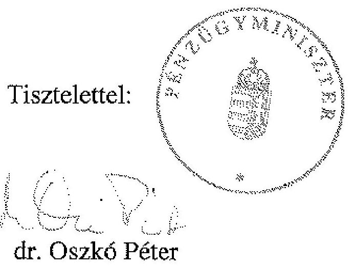

---

# IRM   IGAZSÁGGGYI   ES RENDÉSZETI   MINISZTÉRIUM 

13. számú melléklet
a V-3003/2008. számú jelentéshez
Iktatószám: IRM/CGKFO/1215-4/2009

## Dr. Lóránt Zoltán Úr   föigazgató   Állami Számvevőszék   Budapest   Apáczai Csere János utca 10. 1052

Tárgy:a helyi önkormányzatok gazdálkodási rendszerének 2008. évi ellenőrzéséről szóló jelentéstervezet, a közbeszerzésekről szóló 2003. évi CXXIX. törvény módosítására irányuló javaslat

## Tisztelt Föigazgató Úr!

A helyi önkormányzatok gazdálkodási rendszerének 2008. évi ellenőrzéséről szóló jelentéstervezet kapcsán megküldött levelét, amelyben arról tájékoztat, hogy a jelentésben javaslatot fognak tenni a közbeszerzésekről szóló 2003. évi CXXIX. törvény (a továbbiakban: közbeszerzési törvény) módosítására az Állami Számvevőszék számára nyitva álló jogorvoslat-indítási határidő meghosszabbítása érdekében, köszönettel megkaptam.

A közbeszerzésekről szóló 2003. évi CXXIX. törvény módosításáról szóló 2008. évi CVIII. törvény az Állami Számvevőszék és más jogorvoslat indításra jogosult szervezetek részére rendelkezésre álló tizenöt napos határidőt a helyi és helyi kisebbségi önkormányzatok gazdálkodási rendszerének 2006. évi átfogó és egyéb szabályszerűségi ellenőrzéséről szóló jelentésben tett javaslatuk alapján módosította harminc napra.

A helyi önkormányzatok gazdálkodási rendszerének 2008. évi ellenőrzéséről szóló jelentésben megtenni tervezett javaslatot, amely a harminc napos határidőnek a jogsértés tudomásra jutástól való számítására, valamint egy három éves objektív jogvesztő határidő előírására vonatkozik, a közbeszerzési törvény egy esetleges későbbi módosítása során tudjuk figyelembe venni.

Budapest, 2009. július „ 20. "
Tisztelettel:
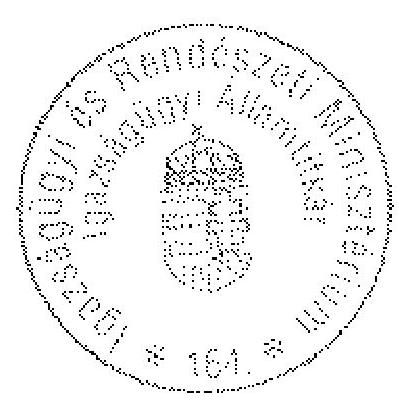

Dr. Avarkeszi Dezső
igazságügyi államtitkár

---

MinisZterelnÖKI Hivatalt Vezetó MinisZter
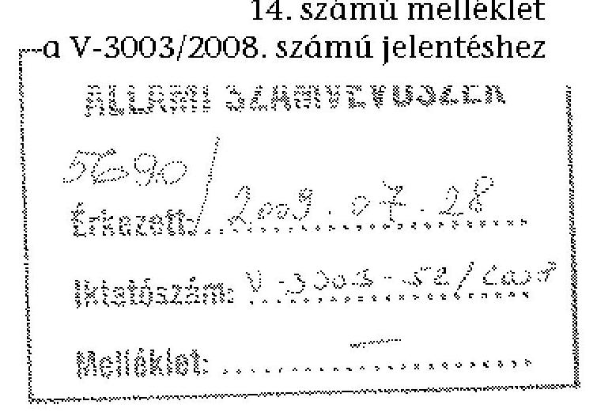
iktatási szám: VIII/1632/2/2009
hivatkozásl szám: V-3003-49/2008.

# Dr. Kovács Árpád úr részére 

elnök

Állami Számvevőszék

## Tisztelt Elnök Úr!

A „helyi önkormányzatok gazdálkodási rendszerének 2008. évi ellenőrzéséről" szóló jelentés-tervezetben a Miniszterelnöki Hivatalt vezető miniszternek tett javaslatokban foglaltakkal egyetértek, s egyben tájékoztatom Elnök Urat, hogy a jelzett közzétételi hutáridök - öszzhongho hozását hizositó törvènys módosítást az 2009. ǒesi törvénykezési időszak során kezdeményezni fogom, továbbá a 18/2005. (XII. 27.) IHM rendeletnek az elektronikus információszabadságról szóló 2005. évi XC. törvényben foglaltak szerinti módosításáról gondoskodom.

Elnök úr és munkatársai együttműködését ezúton is köszönöm.

Budapest, 2009. július „E.S."
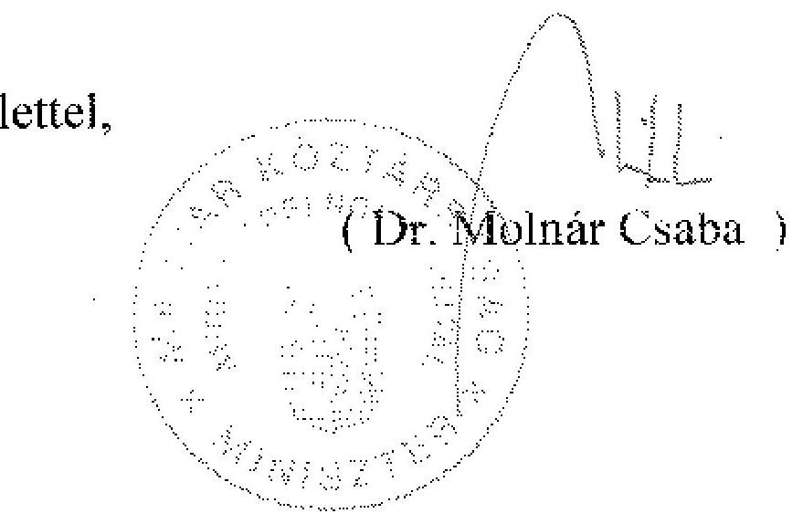

---

15. számú melléklet a V-3003/2008. számú jelentéshez

ÖSKORMÁNYZATI MISISZTER
Iktatószám: ÖM/74/4/4/2009.

Dr. Kovács Árpád úrnak, elnök

# Állami Számvevőszék 

## Budapest

## Tisztelt Elnök Úr!

A helyi önkormányzatok gazdálkodási rendszerének 2008. évi ellenőrzéséről szóló számvevőszéki Jelentés megküldését köszönettel vettem.

Örömmel tapasztaltam, hogy az Állami Számvevőszék a szokásos alapossággal vizsgálta a helyi önkormányzatok gazdálkodását. Megállapítható, hogy a korábbi ellenőrzések során tett javaslatok közel kétharmadát az önkormányzatok eredményesen hasznosították, ezáltal javult a gazdálkodásuk szabályszerűsége, hatékonysága.

Az önkormányzati miniszternek tett javaslatra, mely szerint „kezdeményezze az önkormányzatok kötelezö feladatainak egyértelmü meghatározását", az alábbi észrevételt teszem.

Továbbra is fenntartom a Jelentés-tervezet korábbi véleményezése során Államtitkár úr által jelzett azon álláspontot, mely szerint a fenti javaslatot pontosítani szükséges úgy, hogy az ágazati miniszterek számára legyen előírva az önkormányzati kötelező feladatok egyértelmű meghatározásának elvégzése.

Természetesen egyetértek azzal, hogy az önkormányzati miniszter koordinációs szerepet lát el az önkormányzatok feladat- és hatáskörcit érintő jogszabályok módosításakor. Jelenleg azonban többről van szó, ugyanis az önkormányzati feladat- és hatáskörök csak egy részét képezik az egyes feladatellátó-rendszerek szabályozásának. Az ágazati szektorokban jogszabály nem csupán az önkormányzatok, hanem az állam, a civil szervezetek és egyéb szervek, szereplők számára is meghatároz feladatokat. Az önkormányzati feladat- és hatásköröket éppen ezért nem lehet az adott társadalmi viszony rendszerszerű ágazati szabályozásából kiragadva, külön vizsgálni.

---

Mindezekre tekintettel a fenti feladat-meghatározást úgy javasolom pontosítani, hogy a feladatellátó-rendszert érintő szabályozás komplex felülvizsgálatához kapcsolódóan az ágazati miniszterek végezzék el az önkormányzati kötelező feladatok egyértelmú meghatározását. Ehhez az önkormányzati miniszter természetesen minden - a feladatmeghatározáshoz szükséges - szakmai együttmúködői segítséget megad.

Bízva további eredményes együttmúködésünkben, munkájukhoz sok sikert kívánok.

Budapest, 2009. július, 5 .

Üdvözlettel:

---

# Dr. Oszkó Péter úr 

miniszter
Pénzügyminisztérium

Budapest, Pf. 481.
József nádor tér 3-4.
1369

## Tisztelt Miniszter Úr!

Köszönettel megkaptam a helyi önkormányzatok gazdálkodási rendszerének 2008. évi ellenőrzéséről szóló jelentésünkre adott válaszát. Örömmel vettem, hogy a jelentésben szereplő megállapítások, javaslatok többségével egyetért.

Az észrevételében foglaltak alapján tájékoztatom, hogy a helyi önkormányzatok gazdálkodási rendszerének 2008. évi ellenőrzéséhez készített, országosan egységes ellenőrzési program alapján az önkormányzatoknál végzett ellenőrzések során kitértünk arra, hogy az adott önkormányzat pénzügyi helyzete stabil-e, illetve szükség esetén milyen intézkedést tett a pénzügyi helyzet stabilizálása érdekében, a költségvetés jóváhagyott költségvetési hiány összegét év közben, a költségvetés végrehajtása során milyen intézkedésekkel mérsékelte, vagy azt tervezési hiányosság okozta-e. A tapasztalatokat összegző jelleggel a jelentés tartalmazza. Az önkormányzati feladatok (pl. oktatás, egészségügyi, szociális ellátás) megoldásának eredményességét, hatékonyságát az Állami Számvevőszék az önkormányzati feladatok széleskörüsége miatt külön, önálló vizsgálatok keretében ellenőrzi.

A helyi kisebbségi önkormányzatok sajátos gazdálkodási rendjét meghatározó pénzügyiszámviteli és belső ellenőrzési követelmények kézikönyvben történő közreadására vonatkozó javaslat esetében a javaslat címzettjének módosítását nem tartjuk indokoltnak, különös tekintettel arra, hogy a 2006. évben kiadott kézikönyv a pénzügyi-számviteli nyilvántartási kötelezettségekre nem tért ki, valamint indokolt annak módosítása, kiegészítése a költségvetési szervekre vonatkozó gazdálkodási jogszabályok bekövetkezett változásai miatt.

Budapest, 2009. augusztus " $t$ ".
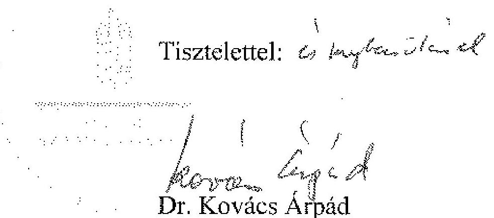

---

# Dr. Draskovics Tibor úr 

miniszter
Igazságügyi és Rendészeti Minisztérium

Budapest, Pf. 54.
Kossuth Lajos tér 4.
1363

## Tisztelt Miniszter Úr!

Köszönettel megkaptam a helyi önkormányzatok gazdálkodási rendszerének 2008. évi ellenőrzéséről szóló jelentésünkre adott válaszát. Az észrevételében hivatkozott, a 2006. évben tett javaslatunkban kezdeményezett 30 napos határidő módosítása során sajnálatosan a viszonyítási alap is megváltozott, így összességében nem bővült, hanem lényegesen csökkent az Állami Számvevőszék számára rendelkezésre álló idő. A módosítás következtében megszűnt az Állami Számvevőszék számára az a lehetőség, hogy a jogsértés tudomásra jutásához viszonyított három éves objektív jogvesztő határidőn belül jogorvoslati eljárást kezdeményezzen.

Örömmel vettem tájékoztatását arról, hogy az így kialakult helyzet módosítására vonatkozóan ez évben tett javaslatunkat a közbeszerzési törvény módosítása során figyelembe kívánják venni.

Budapest, 2009. augusztus " 4 ".
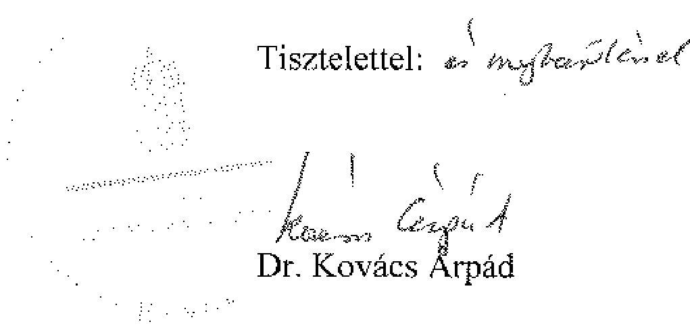

---

# 18. számú melléklet   a V-3003/2008. számú jelentéshez 

## ELNÖK

ÁLLAMI
SZÁMVEVÓSZÉK

Ikt.szám: V-3003-55/2008.

## Varga Zoltán úr

míniszter
Önkormányzati Minisztérium

Budapest, Pf. 314.
József Attila u. 2-4.
1903

## Tisztelt Miniszter Úr!

Köszönettel megkaptam a helyi önkormányzatok gazdálkodási rendszerének 2007. évi átfogó és egyéb szabályszerűségi ellenőrzéséről szóló jelentésünkre adott válaszát. Örömmel vettem, hogy a jelentésben szereplő megállapítások többségével egyetért. Az önkormányzatok számára a kötelező feladatok egyértelmű, mindenki számára „átlátható" meghatározása mind a fejlesztési követelmények, mind a finanszírozási feltételek központi és helyi kialakításához szükségesek. A kötelező feladatok helyi szinten történő meghatározásához indokoltnak tartjuk annak előírását is, hogy ezt milyen szabályozási módon, milyen tartalmi részletezettséggel kell megoldaniuk, mivel a jelenlegi jogi szabályozás nem egyértelmü.

A kötelező önkormányzati feladatok meghatározására vonatkozó javaslat megvalósítására - figyelembe véve az önkormányzati miniszter észrevételben is hivatkozott koordinációs szerepét - véleményünk szerint továbbra is elsősorban az önkormányzati miniszternek van lehetősége. Egyetértünk azzal, hogy az Ötv-ben előírtakon túlmenően a különböző ágazati feladatokat rögzítő törvények is előírnak az önkormányzatok számára kötelező feladatokat, azonban szükséges és indokolt, hogy az önkormányzatok feladat- és hatásköre "risztuljon" és ehhez az ágazati tárcákkal együttműködve, az általuk megfogalmazottak önkormányzati miniszteri összehangolásával kell az ellátandó feladatok körére és az ellátási feltételek meghatározására vonatkozó javaslatot megtenni.

Budapest, 2008. augusztus " $h$ ".
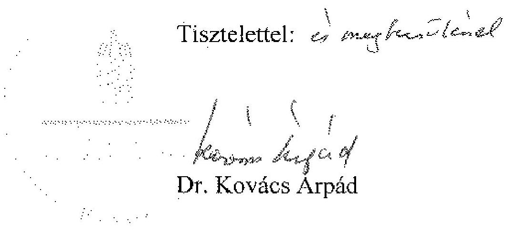