# ÁLLAMI   SZÁMVEVŐSZÉK 

## JELENTÉS

a Magyar Köztársaság 2008. évi költségvetése végrehajtásának ellenőrzéséről

0928
T/10380/1
2009. augusztus
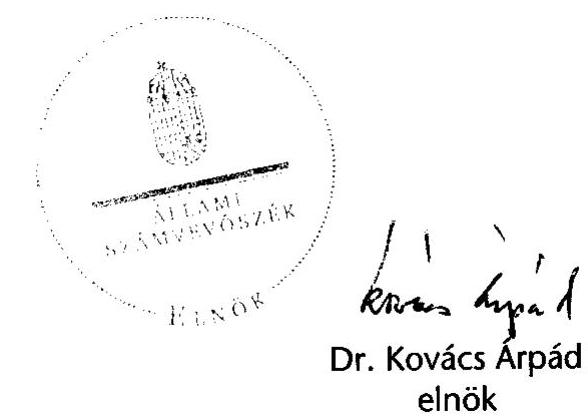

---

# 1. Szervezetirányítási és Müködtetési Igazgatóság 

Vizsgálat-azonosító szám: V0411
Témaszám: 927

## Az ellenőrzést felügyelte:

Dr. Csapodi Pál
főtitkár

## Az ellenőrzés végrehajtásáért felelős:

Dr. Kékesi László
főtitkárhelyettes

## Az ellenőrzést vezette:

Horváthné Menyhárt Erika
főcsoportfőnök-helyettes

## Az ellenőrzést végezték:

| Bojtos Rozália | Göller Géza | Nagyné Lakhézi Éva |
| :-- | :-- | :-- |
| tanácsadó | főtanácsadó | számvevő tanácsos |
| Dr. Somorjai Zsoltné | Vicze Klára | Bálint Józsefné |
| számvevő tanácsos | számvevő tanácsos | címzetes főmunkatárs |

## 2. Államháztartás Központi Szintjét Ellenőrző Igazgatóság

## Az ellenőrzést felügyelte:

Bihary Zsigmond
főigazgató

## Az ellenőrzés végrehajtásáért felelős:

Horváth Sándor
főcsoportfőnök

## Az ellenőrzést vezették:

Dr. Csépán Mária Magdolna Hámoriné Maróti Györgyi igazgatóhelyettes igazgatóhelyettes

Lődiné Cser Zsuzsanna
osztályvezető főtanácsos
Pongrácz Éva
osztályvezető főtanácsos
Hámoriné Maróti Györgyi
főcsoportfőnök-helyettes
Morvay András
osztályvezető főtanácsos
Szabóné Farkas Katalin
osztályvezető főtanácsos

## Az összefoglaló jelentést készítették:

Balázs Melinda
tanácsadó
Dancsóné Kuron Ildikó
számvevő tanácsos
Dr. Domján Eszter
tanácsadó
Fekete Győr László
számvevő
Gyarmati István
tanácsadó
Jeszenkovits Tamás
tanácsadó
Kiss Ferenc Károlyné
számvevő

Bamberger Mária
tanácsadó
Deli Gáborné
számvevő tanácsos
Dormán István Zoltán
számvevő
Gáspár Eszter
számvevő gyakornok
Gyeraj Péter
számvevő
Karsai Lászlóné
főtanácsadó
Dr. Mészáros Leila
számvevő

Holé Sándorné dr.
igazgatóhelyettes
Norczen Győzőné
osztályvezető főtanácsos
Szarka Péterné
igazgatóhelyettes

Béres László
számvevő
Dombovári Nóra
számvevő
Farkas László
főtanácsadó
Görgényi Gábor
számvevő tanácsos
Dr. Jakab Kornél
számvevő tanácsos
Dr. Király László
tanácsadó
Marozsán Katalin
számvevő

---

| Molnár Bálint   számvevő | Molnár Imre   számvevő tanácsos | Pető Krisztina   számvevő tanácsos |
| :-- | :-- | :-- |
| Peisch Annamária   számvevő | Polyák Ferenc   számvevő tanácsos | Dr. Pósch Gábor   főtanácsadó |
| Dr. Remport Katalin   főtanácsadó | Séra Andrásné   főtanácsadó | Szabó Erzsébet   számvevő tanácsos |
| Szabóné Simai Mária   számvevő tanácsos | Szilágyi Gyöngyi   főtanácsadó | Dr. Szima Mária   főtanácsadó |
| Vas Lajos   főtanácsadó | Zakar László   számvevő | Zaroba Szilvia   számvevő tanácsos |

# Az ellenőrzést végezték: 

| Antal Lajosné   külső munkatárs | Dr. Antal Zoltán   külső munkatárs | Bacsa Györgyné   külső munkatárs |
| :-- | :-- | :-- |
| Baki István   számvevő | Bakó Anikó   külső munkatárs | Balázs Melinda   tanácsadó |
| Balkay Attila   tanácsadó | Dr. Baloghné Sebestyén Éva   számvevő | Bamberger Mária   tanácsadó |
| Bedécs Erzsébet   számvevő | Dr. Beregi Anna   főtanácsadó | Béres László   számvevő |
| Boros Ferenc   főtanácsadó | Bődi Judit   külső munkatárs | Bravics Judit Barbara   számvevő gyakornok |
| Burenzsargal Narantuja   számvevő tanácsos | Czmarkó Frigyes   számvevő | Csatlós Pálné   külső munkatárs |
| Csomsztek Ramóna   számvevő gyakornok | Csongor Mária   külső munkatárs | Csóry Györgyné   főtanácsadó |
| Dr. Csubákné Osztoics Danica   számvevő | Dallos Hajnalka   külső munkatárs | Dancsóné Kuron Ildikó   számvevő tanácsos |
| Deák Tamásné   főtanácsadó | Deli Gáborné   számvevő tanácsos | Dr. Deli Lajosné   külső munkatárs |
| Dobos András   főtanácsadó | Dombování Nóra   számvevő | Dr. Domján Eszter   tanácsadó |
| Domokosné Kurilla Edit   tanácsadó | Dormán István Zoltán   számvevő | Dr. Endrédy Györgyina   számvevő |
| Eötvös Magdolna   tanácsadó | Éva Katalin   főtanácsadó | Farkas László   főtanácsadó |
| Federics Adrienn   számvevő tanácsos | Fehérné Jagasich Mariann   számvevő tanácsos | Fekete Gábor   tanácsadó |
| Fekete Győr László   számvevő | Feketéné Hajkó Andrea   számvevő | Ferencz Katalin   tanácsadó |
| Félegyházi-Törökné,   Somogyi Éva   külső munkatárs | Fogarasi Miklós   külső munkatárs | Ganter Ildikó   számvevő |
| Gáspár Eszter   számvevő gyakornok | Dr. Gerencsér László   külső munkatárs | Gerencsérné Szabó Erika   külső munkatárs |
| Gergely Tilda   számvevő | Gerner Attila   külső munkatárs | Gombás István   számvevő |
| Görgényi Gábor   számvevő tanácsos | Gyarmati István   tanácsadó | Gyeraj Péter   számvevő |
| Haáz Andorné   külső munkatárs | Hadnagyné Papp Ildikó   számvevő | Hajdu Károlyné   tanácsadó |

---

Hajduné Sipos Erika számvevő tanácsos

Hegedűs Miklós külső munkatárs

Hollósi Györgyi külső munkatárs

Hozleiter Erika külső munkatárs

Jagicza Istvánné számvevő tanácsos

Jeszenkovits Tamás tanácsadó

Karsai Lászlóné főtanácsadó

Kincses Erzsébet Eszter számvevő

Kiss Józsefné külső munkatárs

Kocsis Ferencné számvevő

Krémó Márkné számvevő tanácsos

Dr. Lengyel Attila főtanácsadó

Maklári Ferencné főtanácsadó

Mátyási József számvevő

Molnár Imre
főtanácsadó
Némethné Nagy Mária számvevő

Dr. Pataki Magdolna főtanácsadó

Pető Krisztina számvevő tanácsos

Radics-Ludvig Györgyi számvevő gyakornok

Rumpler Erzsébet külső munkatárs

Sápi Henriett számvevő gyakornok

Dr. Sipos Dóra számvevő tanácsos

Szabóné Simai Mária számvevő tanácsos

Szilágyi Zsuzsanna tanácsadó

Szöllősiné Hrabóczki Etelka főtanácsadó

Tóth Bálint
főtanácsadó

Haklik Józsefné külső munkatárs

Dr. Hódos Ágnes külső munkatárs

Horcsin Attila számvevő tanácsos

Huszár József számvevő tanácsos

Dr. Jakab Kornél számvevő tanácsos

Jordanics Tamás számvevő

Keskenyné Varga Gyöngyi Éva külső munkatárs

Dr. Király László tanácsadó

Dr. Knapp József külső munkatárs

Komáromi Gyula külső munkatárs

Kriston-Vizi János számvevő tanácsos

Dr. Lezák György külső munkatárs

Marozsán Katalin számvevő

Dr. Mészáros Leila számvevő

Nagy József külső munkatárs

Niklai Heléna számvevő tanácsos

Pánczél Zsuzsanna külső munkatárs

Polyák Ferenc számvevő tanácsos

Dr. Remport Katalin főtanácsadó

Salamin Viktor számvevő

Sebők Katalin számvevő gyakornok

Szabó Erzsébet számvevő tanácsos

Szentesiné Tuka Margit külső munkatárs

Dr. Szima Mária
főtanácsadó
Takács Andrea
külső munkatárs
Tukacs Éva
főtanácsadó

Hankóné Király Ilona külső munkatárs

Holló András számvevő

Horváth József
főtanácsadó
Huszárné Borbás Melinda számvevő

Dr. Jártas Ágnes tanácsadó

Dr. Kádár Andrásné külső munkatárs

Dr. Kevevári Edit számvevő gyakornok

Kiss Ferenc Károlyné számvevő

Knoppné Szabó Ildikó számvevő tanácsos

Koska János
külső munkatárs
Krüzselyi Attila számvevő tanácsos

Lődiné Cser Zsuzsanna számvevő tanácsos

Marusa Mária külső munkatárs

Molnár Bálint számvevő

Németh Mária külső munkatárs

Dr. Novák Csilla tanácsadó

Peisch Annamária számvevő

Dr. Pósch Gábor
főtanácsadó
Dr. Rugár Oszkár külső munkatárs

Samu István számvevő tanácsos

Séra Andrásné
főtanácsadó
Szabó Orsolya külső munkatárs

Szilágyi Gyöngyi
főtanácsadó
Szólya Ildikó számvevő tanácsos

Terbe Mónika számvevő tanácsos

Vacsora Erika számvevő tanácsos

---

| Varsányiné Dudás Eleonóra | Vas Istvánné |
| :-- | :-- |
| számvevő | külső munkatárs |
| Dr. Vass Gábor | Vári Jánosné |
| tanácsadó | külső munkatárs |
| Vásárhelyi Zoltán | Verő Tünde |
| tanácsadó | számvevő |
| Vörös Katalin | Vörös Lászlóné dr. |
| külső munkatárs | külső munkatárs |
| Zaroba Szilvia |  |
| számvevő tanácsos |  |

| Vas Lajos   főtanácsadó |
| :-- |

Váriné Kádár Margit külső munkatárs

Villányi Antal számvevő tanácsos

Zakar László számvevő

# 3. Önkormányzati és Területi Ellenőrzési Igazgatóság 

## Az ellenőrzést felügyelte:

Dr. Lóránt Zoltán
föigazgató

## Az ellenőrzés végrehajtásáért felelős:

Dr. Sepsey Tamás Varga Sándor
föigazgató helyettes
Az ellenőrzést vezették

| Dr. Ernst László   főtanácsadó | Németh Gábor   igazgató helyettes | Borbély Zsuzsanna   mb. osztályvezető főtanácsos |
| :-- | :-- | :-- |

## Az összefoglaló jelentést készítették:

| Borbély Zsuzsanna   főtanácsos | dr. Ernst László   főtanácsadó | Gelencsér Zoltán   számvevő tanácsos |
| :-- | :-- | :-- |
| Korsósné Vígh Andrea   tanácsadó | Nagy Attila   számvevő tanácsos | Preller Zsuzsanna   főtanácsadó |
| dr.Vasváriné dr. Rózsa Anikó   főtanácsadó | Varga József   főtanácsadó |  |

## Az ellenőrzést végezték:

Alexovics Ágota
számvevő tanácsos
Batkiné Vas Anna
számvevő
Bocsi Sándor
főtanácsadó
Csényi István
számvevő tanácsos
Dr. Fátrainé Zsebedics Katalin
tanácsadó
Gelencsér Zoltán
számvevő tanácsos
Humli Tamásné
számvevő tanácsos

Ambrus Lajos
főtanácsadó
Bencsik Árpád
számvevő
Borbély Zsuzsanna
főtanácsos
Csiszárné dr. Kosik Mária
főtanácsadó
Fórián Erika
számvevő tanácsos
Gyulai György Imre
számvevő
Kalmár István
számvevő

Baloghné Dakó Eszter számvevő tanácsos
Bialkó Zsolt számvevő tanácsos
Buús Zoltánné Hütter Erzsébet számvevő
Dér Lívia számvevő tanácsos
Gaál László számvevő tanácsos
Hegyes Mária számvevő tanácsos
Kéri Péter számvevő tanácsos

---

| Kersmájer Ágota   főtanácsadó | Kisapáti Angéla   számvevő | Kiss Rita Teréz   számvevő |
| :-- | :-- | :-- |
| Koczor László   számvevő | Korsósné Vigh Andrea   tanácsadó | Kozma Gábor   számvevő tanácsos |
| Lakatos József   számvevő | Laki Dóra   számvevő tanácsos | Dr. Láng Ágnes   számvevő |
| Lingné Rajz Borbála   főtanácsadó | Moder Beatrix   számvevő | Mokánszkyné Mengyi Andrea   számvevő |
| Nagy Attila   számvevő tanácsos | Nagy Ervin Barnabás   számvevő tanácsos | Nagy László Csaba   számvevő tanácsos |
| Palágyiné dr. Gömöri Katalin   számvevő | Pálfiné Pusztai Magdolna   számvevő | Papp József   számvevő tanácsos |
| Péntek László   főtanácsadó | Preller Zsuzsanna   főtanácsadó | Puskás Balázs   számvevő |
| Renkó Zsuzsanna   tanácsadó | Ritecz Tibor   számvevő tanácsos | Szalontai Miklós   számvevő tanácsos |
| Szarvas Szilárd   számvevő tanácsos | Szihalminé   Kovács Zsuzsanna   számvevő tanácsos | Szilágyi Nándorné   számvevő |
| Tóth Pál   számvevő tanácsos | Tóth Péter   számvevő | Tóth Tamás   számvevő |
| Varga József   főtanácsadó | Dr. Vasváriné   dr. Rózsa Anikó   főtanácsadó |  |

# A témához kapcsolódó eddig készített számvevőszéki jelentések: 

| címe | sorszáma |
| :-- | :-- |
| Jelentés a Magyar Köztársaság 2004. évi költségvetése végrehajtásának ellenőrzéséről | 0540 |
| Jelentés a Magyar Köztársaság 2005. évi költségvetése végrehajtásának ellenőrzéséről | 0628 |
| Jelentés a Magyar Köztársaság 2006. évi költségvetése végrehajtásának ellenőrzéséről | 0724 |
| Jelentés a Magyar Köztársaság 2007. évi költségvetése végrehajtásának ellenőrzéséről | 0824 |

---

# TARTALOMJEGYZÉK 

BEVEZETÉS ..... 7
I. ÖSSZEGZŐ MEGÁLLAPÍTÁSOK, KÖVETKEZTETÉSEK, JAVASLATOK ..... 10
II. RÉSZLETES MEGÁLLAPÍTÁSOK ..... 57
A) A ZÁRSZÁMADÁSI DOKUMENTUM TÖRVÉNYESSÉGI ÉS SZÁMSZAKI ELLENŐRZÉSE ..... 59

1. A zárszámadási dokumentum tartalma, szerkezete ..... 61
2. A dokumentumra vonatkozó Áht.-előírások teljesítése ..... 63
3. A zárszámadási dokumentum külső, belső egyezősége, átláthatósága ..... 65
4. Fejezeti indokolások ..... 67
B) HELYSZÍNI ELLENŐRZÉS ..... 69
B1. AZ ÁLLAMHÁZTARTÁS KÖZPONTI SZINTJE ..... 71
B.1.1. A KÖZPONTI KÖLTSÉGVETÉS ..... 71
5. A központi költségvetés 2008. évi törvényi előirányzatainak teljesítése, a hiány alakulása ..... 71
6. A központi költségvetés finanszírozása és a kincstári egységes számla likviditása ..... 73
2.1. A központi költségvetés finanszírozási igénye ..... 73
2.2. A központi költségvetés tényleges finanszírozása ..... 76
7. A központi költségvetés közvetlen előirányzatai ..... 82
3.1. A központi költségvetés közvetlen bevételei ..... 82
3.1.1. Vállalkozások költségvetési befizetései ..... 83
3.1.2. Fogyasztáshoz kapcsolt adók ..... 89
3.1.3. A lakosság befizetései ..... 92
3.1.4. Egyéb költségvetési bevételek ..... 99
3.1.5. Az állami vagyonnal kapcsolatos bevételek ..... 103
3.1.6. Uniós elszámolások ..... 103
3.1.7. A vám és egyes adónemek visszatérítése ..... 104
3.2. A központi költségvetés közvetlen bevételei elszámolásának megbízhatósága ..... 105
3.2.1. A belső kontrollok működése az APEH-nél és a VP-nél ..... 105

---

3.2.2. Az APEH és a VP főkönyvi- és analitikus nyilvántartásának egyezősége ..... 106
3.2.3. Az állami vagyonnal kapcsolatos bevételek elszámolásának megbízhatósága ..... 113
3.3. A köztartozások behajtására tett intézkedések ..... 113
3.3.1. Az adóhátralékok behajtására tett intézkedések ..... 113
3.3.2. Végrehajtói letéti rendszer ..... 117
3.3.3. Fizetési könnyítés, méltányossági jogok gyakorlása az APEH- nél ..... 117
3.3.4. A vámhatóságok által kezelt vám- és adótartozások behajtására tett intézkedések ..... 119
3.3.5. A központi költségvetési szervek tartozásállománya, köztartozásai ..... 120
3.4. A központi költségvetés közvetlen kiadásai ..... 122
3.4.1. Az előirányzatok felhasználása ..... 122
3.4.2. A központi költségvetés kamatelszámolásai, tőkevisszatérülései, adósság- és követeléskezelés költségei ..... 130
3.4.3. A központi költségvetés terhére vállalt kezességek ..... 140
3.4.4. A központi költségvetés általános, cél- és központi egyensúlyi tartalékának felhasználása ..... 148
3.4.5. Az állami vagyonnal kapcsolatos kiadások ..... 156
3.5. A központi költségvetés közvetlen kiadásai elszámolásainak megbízhatósága ..... 156
4. A közvetlen bevételek és kiadások elszámolásában érintett szervezetek informatikai rendszereinek értékelése ..... 171
5. A fejezetek költségvetésének végrehajtása ..... 181
5.1. A 2008. évet érintő főbb megállapítások ..... 181
5.1.1. A 2008. évi struktúraváltozás ..... 181
5.1.2. Az államháztartás hatékony működését elősegítő 2008. évi szervezeti átalakítások és az azokat megalapozó intézkedések ..... 185
5.1.3. A vagyontörvény végrehajtásának 2008. évi tapasztalatai ..... 191
5.1.4. A Központosított Illetményszámfejtő Rendszer (KIR) múködése ..... 196
5.1.5. A Teljesítményértékelési rendszer (TÉR) múködése ..... 199
5.1.6. Összkormányzati projekt alakulása ..... 200
5.1.7. Az előfinanszírozás problémái ..... 201
5.1.8. A zárszámadással kapcsolatos egyéb ellenőrzések ..... 203
5.1.8.1. Kulturális Örökségvédelmi Szakszolgálat közbeszerzési tevékenysége ..... 203
5.1.8.2. Az MKI létrehozásával kapcsolatos feladatokról szóló 2200/2006. (XI. 22.) Korm. határozat végrehajtása ..... 205
5.1.8.3. Az egyházi kiegészítő támogatás 2008. évi alakulása ..... 207
5.1.9. A fejezeti egyensúlyi tartalék felhasználása ..... 211

---

5.2. A fejezetek bevételi és kiadási előirányzatainak teljesítése, az előirányzat-maradványok alakulása, az intézmények finanszírozása ..... 212
5.2.1. A bevételi és kiadási előirányzatok teljesítése ..... 212
5.2.2. Az előirányzat-maradványok alakulása ..... 214
5.2.3. A költségvetési intézmények finanszírozása ..... 216
5.2.3.1. Az előirányzat-felhasználási keret megnyitása, felhasználása ..... 216
5.3. A beszámolók megbízhatósága ..... 219
5.3.1. Alkotmányos fejezetek, igazgatási címek, fejezeti kezelésű előirányzatok beszámolóinak megbízhatósága ..... 219
5.3.1.1. Az ún. alkotmányos, illetve egyintézményes fejezetek, fejezeti jogosítványú költségvetési címek beszámolóinak megbízhatósága ..... 219
5.3.1.2. Az igazgatási címek, alcímek elemi beszámoló jelentéseinek megbízhatósága ..... 222
5.3.1.3. A fejezeti kezelésű előirányzatok elszámolásainak megbízhatósága ..... 230
5.3.2. A fejezetek felügyelete alá tartozó intézmények és címek beszámolóinak megbízhatósága ..... 234
5.3.2.1. Az ÁSZ által ellenőrzött intézmények és címek ..... 234
5.3.2.2. A fejezetek belső ellenőrzési egységei által ellenőrzött intézmények ..... 238
5.3.3. Az Uniós Fejlesztések fejezeti kezelésű előirányzatairól készített beszámoló megbízhatósága ..... 242
6. Az EU-támogatások és az uniós tagsággal összefüggő hazai befizetések ..... 244
7. Belső kontroll rendszerek múködése ..... 250
8. Letéti számlák ..... 254
8.1. A központi letéti számla ..... 254
8.2. A fejezeti letéti számlák ..... 255
9. A korábbi ÁSZ ellenőrzések megállapításaival kapcsolatban tett intézkedések ..... 258
B.1.2. AZ ELKÜLÖNÍTETT ÁLLAMI PÉNZALAPOK ..... 271

1. Munkaerőpiaci Alap ..... 271
1.1. Az MPA költségvetési beszámolója ..... 271
1.2. Az MPA pénzügyi helyzete ..... 272
1.2.1. Az MPA bevételei ..... 272
1.2.2. Az MPA kiadásai ..... 272
1.3. Az MPA ellenőrzési rendszere ..... 274
2. Szülőföld Alap ..... 274
2.1. Az SZA költségvetési beszámolója ..... 275
2.2. Az SZA pénzügyi helyzete ..... 275

---

2.2.1. Az SZA bevételei ..... 275
2.2.2. Az SZA kiadásai ..... 276
2.3. Az SZA ellenőrzési rendszere ..... 276
3. Központi Nukleáris Pénzügyi Alap ..... 277
3.1. A KNPA költségvetési beszámolója ..... 277
3.2. A KNPA pénzügyi helyzete ..... 277
3.2.1. A KNPA bevételei ..... 277
3.2.2. A KNPA kiadásai ..... 278
3.3. A KNPA ellenőrzési rendszere ..... 279
4. Nemzeti Kulturális Alap ..... 279
4.1. Az NKA költségvetési beszámolója ..... 280
4.2. Az NKA pénzügyi helyzete ..... 280
4.2.1. Az NKA bevételei ..... 280
4.2.2. Az NKA kiadásai ..... 281
4.3. Az NKA ellenőrzési rendszere ..... 281
5. Wesselényi Miklós Ár- és Belvízvédelmi Kártalanítási Alap ..... 281
5.1. A WMA költségvetési beszámolója ..... 282
5.2. A WMA pénzügyi helyzete ..... 283
5.2.1. A WMA bevételei ..... 283
5.2.2. A WMA kiadásai ..... 283
5.3. A WMA ellenőrzési rendszere ..... 283
5.4. A WMA-ra vonatkozó korábbi javaslatok utóellenőrzése ..... 284
6. Kutatási és Technológiai Innovációs Alap ..... 284
6.1. A KTIA költségvetési beszámolója ..... 285
6.2. A KTIA pénzügyi helyzete ..... 286
6.2.1. A KTIA bevételei ..... 286
6.2.2. A KTIA kiadásai ..... 287
6.3. A KTIA ellenőrzési rendszere ..... 287
6.4. A KTIA-ra vonatkozó korábbi javaslatok utóellenőrzése ..... 287
B.1.3. A TÁRSADALOMBIZTOSÍTÁS PÉNZÜGYI ALAPJAI ..... 289

1. Nyugdíjbiztosítási Alap ..... 289
1.1. A Nyugdíjbiztosítási Alap költségvetési beszámolóinak minősítése ..... 289
1.2. A költségvetési beszámoló tartalma ..... 289
1.2.1. Az Ny. Alap pénzügyi helyzetének értékelése ..... 289
1.2.2. Nyugdíjbiztosítási Alap pénzforgalma és likviditása ..... 291
1.2.3. A Ny. Alap mérlegeinek értékelése ..... 291
1.3. Az alapkezelő feladatellátása ..... 292
1.4. Az Ny. Alap 2008. évi bevételeinek alakulása ..... 292
1.4.1. Az Ny. Alap költségvetési bevételeinek teljesülése ..... 292

---

1.4.2. Az APEH éves adatszolgáltatása és az abból előállított adatok megbízhatósága ..... 293
1.5. Az Ny. Alap kiadásainak alakulása ..... 295
1.6. A működési kiadások alakulása ..... 300
1.7. Utóellenőrzés ..... 301
2. Egészségbiztosítási Alap ..... 302
2.1. Az E. Alap 2008. évi költségvetési beszámolóinak elkészítése, tartalma ..... 302
2.2. Az E. Alap 2008. évi pénzügyi helyzete ..... 303
2.2.1. Az Alapkezelő feladatellátása ..... 304
2.2.2. Az E. Alap 2008. évi bevételeinek alakulása ..... 304
2.2.3. Az APEH éves adatszolgáltatása és az ebből nyert adatok megbízhatósága ..... 307
2.2.4. Az E. Alap 2008. évi kiadásainak alakulása ..... 309
2.2.4.1. Egészségbiztosítás pénzbeni ellátásai ..... 309
2.2.4.2. Gyógyító-megelőző egészségügyi ellátás ..... 311
2.2.5. Az OEP orvosszakmai ellenőrzési tevékenysége ..... 315
2.2.6. Anyatej-ellátás ..... 316
2.2.7. Gyógyszertámogatási kiadások ..... 316
2.2.8. Gyógyászati segédeszközök támogatása ..... 320
2.2.9. Az E. Alap múködési kiadásai ..... 321
2.3. Utóellenőrzés ..... 322
MELLÉKLETEK

1. számú Az Nyugdíjbiztosítási Alap kiadása, hiánya és közvetlen költségvetési ..... 323 támogatása 2001-2008. között
2. számú Az APEH adatszolgáltatása alapján a kintlévőségek* ..... 324
B. 2. AZ ÁLLAMHÁZTARTÁS HELYI SZINTJE, A HELYI ÖNKORMÁNYZATOK ..... 325
3. A Kvtv. mellékleteiben meghatározott központi támogatások elszámolásának szabályszerűsége ..... 325
1.1. Előirányzatok nyilvántartása ..... 325
1.1.1. Az eredeti előirányzatok jogcímenkénti megfelelősége a Kvtv.- ben és a PM-ÖTM együttes rendeletben ..... 325
1.1.2. Az előirányzat módosítások szabályszerűsége ..... 326
1.2. A helyi önkormányzatok jogcímenkénti támogatásai és hozzájárulásai ..... 332
1.2.1. A települési önkormányzatot megillető, a településre kimutatott személyi jövedelemadó ..... 332
1.2.2. A megyei önkormányzatok személyi jövedelemadó részesedése ..... 332

---

1.2.3. A települési önkormányzatok jövedelem differenciálódásának mérséklése ..... 332
1.2.4. Normatív hozzájárulások ..... 333
1.2.5. A helyi önkormányzatok által felhasználható központosított előirányzatok ..... 336
1.2.6. A helyi önkormányzatok múködőképességének megőrzését szolgáló kiegészítő támogatások ..... 343
1.2.6.1. Önhibájukon kívül hátrányos helyzetben lévő helyi önkormányzatok támogatása ..... 344
1.2.6.2. Állami támogatás a tartósan fizetésképtelen helyzetbe került helyi önkormányzatok adósságrendezésére irányuló hitelfelvétel visszterhes kamattámogatására, az adósságrendezés alatt múködési célra igényelhető támogatásra, valamint a pénzügyi gondnok díjára ..... 346
1.2.6.3. A múködésképtelen önkormányzatok egyéb támogatása ..... 347
1.2.7. A helyi önkormányzatok színházi támogatása ..... 349
1.2.7.1. Kőszínházak és bábszínházak múködtetési hozzájárulása ..... 350
1.2.7.2. Színházak pályázati támogatása ..... 350
1.2.8. Normatív, kötött felhasználású támogatások ..... 351
1.2.8.1. Kiegészítő támogatás egyes közoktatási feladatokhoz ..... 352
1.2.8.2. Kiegészítő támogatás egyes szociális feladatokhoz ..... 352
1.2.8.3. Helyi önkormányzati hivatásos tűzoltóságok támogatása ..... 352
1.2.8.4. A többcélú kistérségi társulások támogatása ..... 353
1.2.9. Felhalmozási célú támogatások ..... 356
1.2.9.1. Címzett és céltámogatások ..... 356
1.2.9.2. A helyi önkormányzatok fejlesztési és vis maior feladatainak támogatása ..... 366
1.2.9.3. Vis maior tartalék ..... 367
1.2.10.Budapest 4-es - Budapest Kelenföld pályaudvar-Bosnyák tér közötti metróvonal építésének támogatása ..... 368
1.2.11.A leghátrányosabb helyzetű kistérségek felzárkóztatásának támogatása ..... 375
2. A helyi önkormányzatok előző évi elszámolása és ellenőrzése során megállapított eltérések rendezésének szabályszerűsége ..... 376
3. A helyi önkormányzatoknak nyújtott támogatások folyosításának megbízhatósága ..... 378
4. A könyvvizsgálati kötelezettség teljesítésének 2009. évi országos tapasztalatai ..... 379
RÖVIDÍTÉSEK JEGYZÉKE ..... 383

---

# BEVEZETÉS 

A Magyar Köztársaság 2008. évi költségvetését a 2007. évi CLXIX. törvény (Kvtv.) hagyta jóvá, amely magában foglalta a központi költségvetés, az elkülönített állami pénzalapok és a társadalombiztosítás pénzügyi alapjai előirányzatait (továbbiakban: állami költségvetés). A Kvtv. az állami költségvetés összességében 13802 097,2 M Ft kiadási és 12691 351,3 M Ft bevételi főösszegének elfogadása mellett az összesített hiány összegét 1110 745,9 M Ft-ban állapította meg.

A Magyar Köztársaság minisztériumainak felsorolásáról szóló 2006. évi LV. törvény módosításáról rendelkező 2008. évi XX. törvény - a kiadási és bevételi főösszeg és ennek megfelelően a hiány összegének változatlanul hagyása mellett - módosította a 2008. évi költségvetés szerkezeti rendjét, valamint a fejezetek közötti előirányzat-átcsoportosítások végrehajtását a Kormány hatáskörébe utalta.

A központi költségvetés kiadási előirányzatát módosította - az egyházak hitéleti és közcélú tevékenységének anyagi feltételeiről szóló 1997. évi CXXIV. törvény előírása alapján - a Magyar Köztársaság 2007. évi költségvetésének végrehajtásáról szóló 2008. évi LXXVIII. törvény (továbbiakban: zárszámadási törvény) 11. § (3) bekezdése, és ennek következtében a központi költségvetés 2008. évi kiadási előirányzatai, ezen belül az Oktatási és Kulturális Minisztérium kiadási előirányzatai, valamint a hiány összege 146,1 M Ft-tal növekedtek.

A Kormány a költségvetés végrehajtásáról készített törvényjavaslatot és a döntéshozatalhoz szükséges információkat az éves zárszámadási dokumentumban terjeszti az Országgyúlés elé, amit az - az Áht. előírása szerint - együtt tárgyal a zárszámadás ellenőrzéséről készített számvevőszéki jelentéssel.

Az ellenőrzés célja annak értékelése volt, hogy

- a 2008. évi költségvetési törvény végrehajtása törvényesen, szabályszerűen történt-e;
- a központi költségvetési szervek (elemi) költségvetései végrehajtásáról szóló beszámolók és elszámolások, valamint a központi költségvetés közvetlen bevételei és kiadásai megbízhatóak-e;
- a helyi önkormányzatokat és többcélú kistérségi társulásokat megillető hozzájárulások, támogatások előirányzatainak módosítását szabályszerűen vé-gezték-e, azok folyósítása a jogszabályi előírások szerint történt-e;

---

- a helyszíni vizsgálatba vont önkormányzatok és többcélú kistérségi társulások a jogszabályoknak megfelelően igényelték, használták fel és számolták-e el a hozzájárulásokat és a támogatásokat;
- a támogatások igénylésére vonatkozó pályázati kiírások tartalma és a pályázatokról hozott döntés összhangban van-e a tárgyévre vonatkozó költségvetési törvénnyel és a kapcsolódó ágazati jogszabályokkal.

A Magyar Köztársaság 2008. évi költségvetése végrehajtását (zárszámadás) - törvényi kötelezettségünknek és az országgyűlési határozatoknak megfelelően - szabályszerűségi, megbízhatósági szempontból vizsgáltuk. Az ellenőrzés során nem volt célunk a gazdálkodás változó körülményei miatt meghozott kormányzati intézkedések társadalmi-gazdasági hatásainak, a költségvetés végrehajtása gazdasági folyamatainak célszerüségi, eredményességi szempontból való értékelése. Ez utóbbiakról az ÁSZ különféle tematikus jelentései szólnak.

A költségvetések végrehajtásának szabályszerűségét, a beszámolók megbízhatóságát a financial audit módszerével értékeltük. Teljes körűen ellenőriztük az ún. alkotmányos és egyintézményes fejezetek; a fejezeti jogosítvánnyal rendelkező költségvetési címek; az ME, az IRM, a KvVM, az Uniós Fejlesztések, a Kutatás és Technológia/NKTH és a PM (az APEH kivételével, amelyet a fejezeti ellenőrzés hajtott végre) fejezeteket; továbbá a fejezetek igazgatási címeinek és a fejezeti kezelésű előirányzatok beszámolóit; valamint a központi költségvetés központosított bevételeinek és kiadásainak elszámolását. A fejezeti ellenőrök közremúködésével az ÖM, az NFGM és a KSH fejezeteknél teljes körűvé vált a megbízhatósági ellenőrzés.

A fejezetek igazgatási címeinek és fejezeti kezelésű előirányzatainak ellenőrzésén felül az OKM fejezet öt intézményénél, az SZMM fejezet három címénél, illetve intézményénél folytattuk le az ellenőrzést. Emellett a fejezetek is végeztek - intézményeik nem teljes körére kiterjedően - megbízhatósági ellenőrzéseket.

Az elkülönített állami pénzalapoknál és a társadalombiztosítás pénzügyi alapjainál ellenőrzésünknek nem volt célja a beszámolók megbízhatóságának értékelése, mivel ebben a körben a 2008. évre vonatkozóan jogszabályon alapuló kötelező könyvvizsgálat van, annak megállapításait hasznosítottuk.

A 2008. évi zárszámadáshoz kapcsolódóan az önkormányzati alrendszer vonatkozásában 1348,6 Mrd Ft központi költségvetésből nyújtott hozzájárulás és támogatás igénylését, felhasználását és elszámolását ellenőriztük szabályszerűségi szempontból.

A normatív hozzájárulás, az átengedett személyi jövedelemadó és a többcélú kistérségi társulásoknak járó normatív, kötött felhasználású támogatás elszámolását 71 önkormányzatnál és 16 többcélú kistérségi társulásnál, a felhalmozási célú támogatásokat 30 önkormányzatnál ellenőriztük.

Az ellenőrzés keretében külön értékeltük az Európai Unióval kapcsolatos elszámolásokat.

---

A költségvetések szabályszerű végrehajtásában meghatározó szerepe van a belső ellenőrzési rendszernek, azon belül a pénzügyi kontrollrendszereknek, ezért kiemelt figyelmet fordítottunk azok kiépítettségére és múködésére. Ellenőrzésünk keretében azon fő kontrollokat értékeltük, amelyek a számviteli nyilvántartások pontosságát és teljességét, a beszámoló készítés követelményeinek érvényesítését, a vagyon és a források védelmét biztosítják.

Az ellenőrzéseink során áttekintettük továbbá a Magyar Köztársaság 2007. évi költségvetése végrehajtásának ellenőrzéséről készített jelentésünkben (számvevői jelentésekben) rögzített hiányosságok felszámolására tett intézkedéseket.

Zárszámadási ellenőrzésünk alapján 64 javaslatot tettünk, melyekkel erősíteni kívánjuk a zárszámadás adatainak megbízhatóságát, a pénzfelhasználások átláthatóságát, illetve elősegíteni a feltárt hibák jövőbeni elkerülését esetenként megismételve, nyomatékosítva korábbiakban már megtett egyes javaslatainkat.

Az ellenőrzés lefolytatásának jogi alapját az Állami Számvevőszékről szóló 1989. évi XXXVIII. törvény 1. § (2), a 2. § (1), valamint ezen jogszabályi előírásokra figyelemmel a 2. § (3), (5)-(6) és (9) bekezdései, a 17. § (1), a 18. § (2) bekezdései, továbbá az államháztartásról szóló 1992. évi XXXVIII. törvény 104. § (3) és a 120/A. § (1) bekezdései együttesen képezték.

A jelentés két kötetből áll. Az első kötet az ellenőrzés legfontosabb megállapításait és javaslatait, illetve a zárszámadási dokumentum törvényességi és számszaki ellenőrzésére, az államháztartás alrendszereire, valamint az egyes kiemelt témákra vonatkozó részletes megállapításokat tartalmazza. A második kötet (Függelék) a költségvetési fejezetekre, az EU-támogatásokkal és az uniós tagsággal összefüggő hazai befizetésekre, az elkülönített állami pénzalapokra, a társadalombiztosítási alapokra és a helyi önkormányzatok költségvetési kapcsolataira vonatkozó részletes megállapításokat és javaslatokat foglalja magában.

---

# I. ÖSSZEGZŐ MEGÁLLAPÍTÁSOK, KÖVETKEZTETÉSEK, JAVASLATOK 

Az államháztartás alrendszereinek 2008. évi tervezett bevételi előirányzata 15 978,1 Mrd Ft, kiadási előirányzata 17 199,9 Mrd Ft, hiánya 1221,8 Mrd Ft volt, ami a GDP 4,5\%-ának felelt meg.

Az államháztartás tényleges hiánya 893,7 Mrd Ft (a GDP 3,4\%), ami 328,1 Mrd Ft-tal ( $26,9 \%$-kal) alacsonyabb az eredetileg előirányzottnál. Az államháztartási hiány tervezettnél kedvezőbb alakulását a központi költségvetés 247,6 Mrd Ft-tal kisebb hiánya, az elkülönített állami pénzalapok 23,3 Mrd Ft-tal nagyobb többlete, a helyi önkormányzatok 126,7 Mrd Ft-tal jobb egyenlege, valamint a társadalombiztosítási alapok 69,5 Mrd Ft-os egyenlegromlása eredményezte.
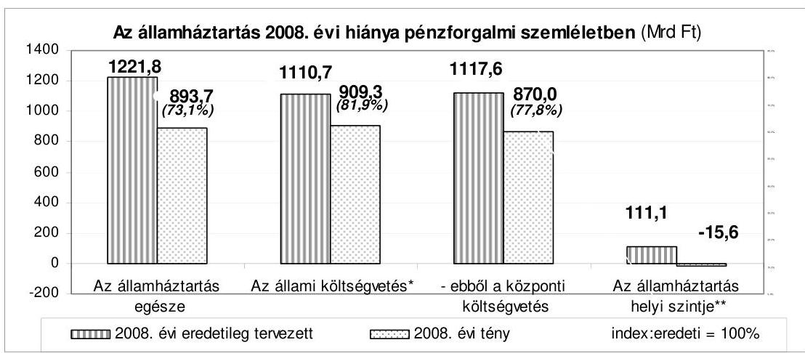

Forrás: a zárszámadási törvényjavaslat

* központi költségvetés, elkülönített állami pénzalapok és a tb alapok együttesen
** helyi önkormányzatok (a negatív érték mutatja a többletet)
A Magyar Köztársaság éves költségvetései végrehajtásának megítélése szempontjából - különösen uniós csatlakozásunk folyamata végétől - kulcsfontosságú a kitűzött hiánycél betartása. Az elmúlt hét évben az éves költségvetések tényleges hiányai - a 2006. év kivételével - jelentősen eltértek a tervezettől, amit alapvetően a nem teljes körűen prognosztizálható hatások okoznak. Kedvezőnek minősíthető, hogy 2008-ban a hiány összege kisebb a tervezettnél.

Az államháztartási törvény 2007. január 1-jétől előírja, hogy a Kormány olyan éves költségvetési törvényjavaslatot köteles az Országgyúlés elé terjeszteni, amely a maastrichti elsődleges egyenleg tekintetében többletet biztosít. A költségvetési politika alakításában, a költségvetés fenntarthatóságának elemzésében fontos mutató a folyó gazdálkodás eredményét kifejező ún. elsődleges egyenleg, amely a múltban felhalmozott adósság kamatterhe nélkül veszi figyelembe a kiadásokat.

---

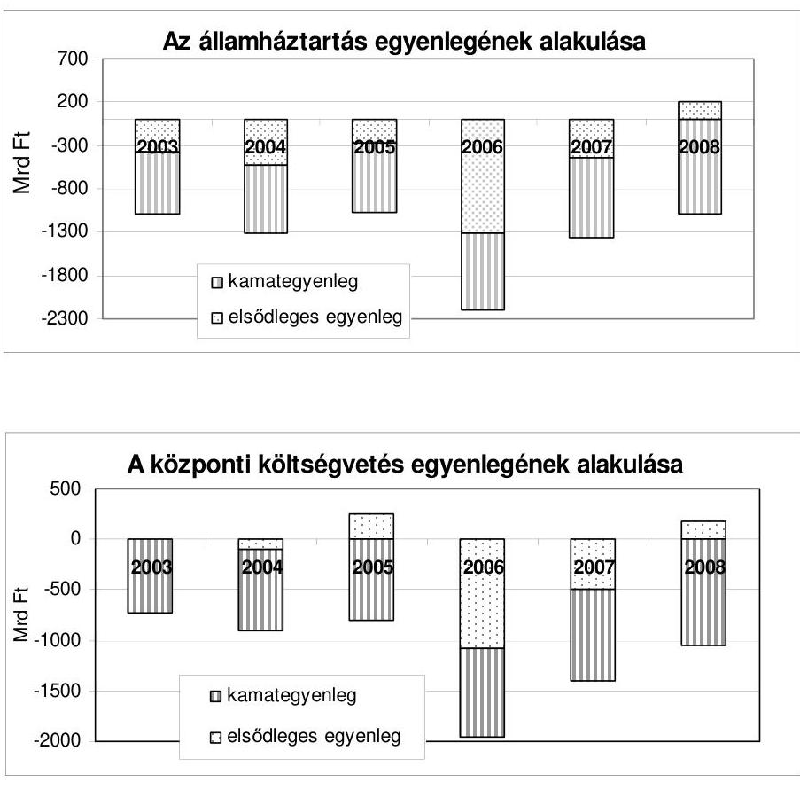

Forrás: zárszámadási törvényjavaslatok

A költségvetés vitelének fenntarthatósága érdekében hosszú távon biztosítani kell az adósságráta csökkentését. Ennek feltétele az elsődleges többlet. 2008ban az államháztartás elsődleges egyenlege többletet mutatott. Ugyanakkor az államadósság 2008 során tovább nőtt (a növekmény 2518,4 Mrd Ft, amiből az IMF/EU betételhelyezés 2008. december 31-i állománya 1483,6 Mrd Ft). Mindez előrevetíti, hogy 2009-ben az adósságállomány és hozzá kapcsolódóan a kamatkiadások csökkentése érdekében az elsődleges egyenlegnek a tervezettnél jelentősebb többletet kell elérnie, s ezt 2010-re is biztosítani kell.

# A ZÁRSZÁMADÁSI DOKUMENTUM 

A törvényjavaslat normaszövege és a törvényi mellékletek összhangban állnak. Az általános indokolás és mellékleteinek egyezősége megfelelő. A dokumentumban bemutatott adatok összevetése az intézményi beszámolók összesített adataival évről-évre kisebb eltérést mutat. Az általános indokolás esetenként kiegészül új és aktuális, informatív elemekkel (pl. központi és fejezeti egyensúlyi tartalék felhasználása, az önkormányzati kötvényállomány alakulása, a maradványok keletkezésének főbb okai).

---

Mindezen kedvező változások és az alapvetően jellemző tartalmi összhang mellett, a hatályos szabályozási környezet keretei között továbbra is tapasztalhatók a korábbi hiányosságok, melyek alátámasztják, hogy a jelenlegi prezentációs rendszer nem támogatja megfelelően az információtartalom állandóságát, az átláthatóságot, az évek közötti összevetést és a folyamatokról való képalkotást, ide értve a célok és azok teljesülésének követhetőségét.

A zárszámadási dokumentumra vonatkozó Áht.-előírások teljesítésében az elmúlt években lényeges elmozdulás nem érzékelhető. Az Áht. éves zárszámadás alkalmával teljesítendő előírásainak a törvényjavaslat jellemzően megfelel. Néhány előírás azonban - főként a mérlegek, kimutatások, többéves kihatással járó döntések vonatkozásában - nem pontos, ezek teljesítése rendre hiányos, illetve nem egyértelmúen megítélhető.

A költségvetési törvény előírásainak teljesítése nehezen áttekinthető, az információk a zárszámadási törvényjavaslat különféle részeiben - esetenként évenként változó módon - jelennek meg: a zárszámadási törvényjavaslat normaszövegében, törvényi mellékleteiben, általános indokolásában, illetve fejezeti köteteiben.

Az éves zárszámadási dokumentumokra vonatkozó ellenőrzési tapasztalatok alapján megállapítható, hogy a prezentáció minősége érdemben nem javulhat a zárszámadási törvényjavaslat tartalmi, szerkezeti meghatározása nélkül.

A zárszámadási dokumentumra vonatkozó megállapítások részletes kifejtése a jelentés első kötetének II. Részletes megállapítások fejezet A) A zárszámadási dokumentum törvényességi és számszaki ellenőrzése c. pontjában található meg.

# A KÖZPONTI KÖLTSÉGVETÉS 

A 2008. évi központi költségvetés törvényben rögzített bevételi főösszege 7899,5 Mrd Ft, módosított kiadási főösszege 9017,2 Mrd Ft és módosított hiánya 1117,7 Mrd. A hiány ettől lényegesen kisebb összegben, 870,0 Mrd Ftban teljesült.

A központi költségvetés hiányának a tervezetthez képest kedvezőbb alakulása az elmúlt 7 évben csak 2005-ben és 2007-ben volt tapasztalható. A hiány, bár kedvezőbb a tervezettnél, de az elmúlt évekhez hasonlóan 2008-ban is (247,7 Mrd Ft-tal, 22,2\%-kal) eltér a törvényben rögzített összegtől.

A központi költségvetés hiánya 2002-ben 251,6 Mrd Ft-tal (20,7\%-kal), 2003-ban 163,4 Mrd Ft-tal ( $28,7 \%$-kal), 2004-ben 218,2 Mrd Ft-tal ( $32,6 \%$-kal) haladta meg a tervezettet, 2005-ben 265,4 Mrd Ft-tal ( $32,6 \%$-kal) maradt el az előirányzattól, 2006-ban ismét 40,3 Mrd Ft-tal ( $2,1 \%$-kal) haladta meg a törvényben előirányzott összeget, míg a 2007. évben 258,4 Mrd Ft-tal ( $16,6 \%$-kal) alacsonyabb volt a törvényben előirányzott összegnél.

---

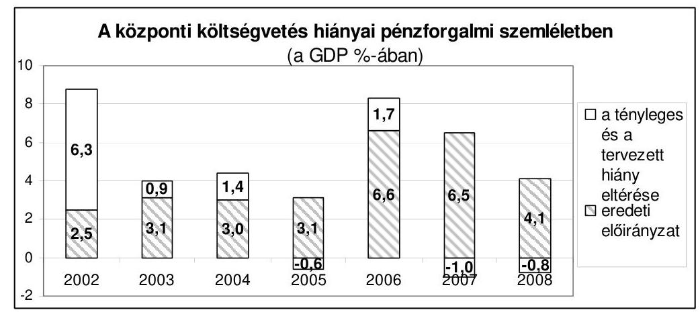

Forrás: zárszámadási törvényjavaslatok

A központi költségvetés bevételeinek több mint háromnegyed részét 6240,7 Mrd Ft-ot - az APEH és a VP felelősségi körébe tartozó adónemek adták. Az adóbevételi előirányzatok és teljesítésük azt jelzik, hogy a tervezés megalapozottsága ezen a területen javult és a korábbi évektől eltérően „felültervezettség" a 2007. évhez hasonlóan 2008-ban sem volt. (A 31,4 Mrd Ft adóbevételi többlet a tervezési hibahatáron belül van.) A kiemelt adónemek (áfa, szja, jövedéki adó, társasági adó) teljesítése változó képet mutat. A társasági adóbevétel elmaradását a társasági különadó többletbevétele ellensúlyozta. Az áfa bevételek kismértékben maradtak el az előirányzattól. A személyi jövedelemadó bevétel meghaladta a tervezettet. A jövedéki adóbevételek az előirányzatnak megfelelően alakultak. A kisebb adók bevételei - a regisztrációs adó kivételével - az előirányzatnak megfelelően alakultak.

A 2008. évi költségvetési törvényjavaslat véleményezése során az ÁSZ-nak a tervezett adóbevételek mindössze 54\%-át állt módjában véleményezni, mivel a helyszíni ellenőrzés lezárásakor a kellő részletezettségű számítási anyagok és indokolások nem álltak rendelkezésre. Kiemelendő, hogy a központi költségvetés meghatározó adóbevételei közül a szja, a társasági adó és az ezekhez kapcsolódó különadók összesen 2665,8 Mrd Ft tervezett bevételéről a dokumentumok nem szolgáltak megfelelő alapul arra, hogy a Számvevőszék ezek teljesülését megítélhette volna.

Évről-évre ismétlődő probléma, hogy a társasági adónál és a személyi jövedelemadónál a tárgyévi bevallások összesített adatait a zárszámadás készítésének időpontjában még nem dolgozták fel. Erre való hivatkozással pl. a társasági adónál az adóalapot befolyásoló legfontosabb tényezők alakulásának elemzése az indokolásokból kimarad. A feldolgozott bevallások összegzett adatai azonban augusztus végén, a zárszámadási törvényjavaslat benyújtásakor rendelkezésre állnak, ezért az indokolások az adatok ismeretében kiegészíthetők lennének.

A zárszámadási törvényjavaslatban a teljesítési adatok megbízhatóak, az adó-és vámbevételek egészében és bevételi nemenként is megegyeztek a Kincstárba befolyt összegekkel. A beszedő szervek a vizsgálat alá vont bevételek esetében valamennyi lényeges adóztatási, vámigazgatá-

---

si, jövedéki tevékenységet az elöírások és a saját belső utasításaik szerint látták el. A belső kontrollok megfelelően töltötték be funkciójukat. A kontrollok bővítését a folyamatos informatikai fejlesztések is lehetővé tették.

A központi költségvetés hiányát mérsékelte az ún. egyéb bevételek előirányzatát jelentősen ( $40,1 \mathrm{Mrd}$ Ft-tal) meghaladó többletbevétel. Ennek döntő részét a MAVIR Zrt. 30,5 Mrd Ft összegű - egyszeri, törvényi kötelezettségen alapuló befizetése adta. A Társaság szóbeli tájékoztatása alapján azonban az ún. átállási költség finanszírozása jogcímen felhalmozódott összegből (a befizetett 30,5 Mrd Ft-os összegen felül) - a vonatkozó kormányrendelettel ellentétben, de a pénzügyminiszterrel egyeztetve - mintegy 3,0 Mrd Ft, a MAVIR Zrt. által kezelt átállási költségfinanszírozási díjbevétel a társaságnál maradt. A számvevőszéki ellenőrzés úgy ítéli meg, hogy a díjmaradványt árkedvezményre, támogatásra lehetett volna felhasználni, miután e díjat a hatósági áras rendszerben kényszerűen maradt fogyasztók fizették meg.

Az állami vagyonnal kapcsolatos bevételek előirányzott 96,4 Mrd Ft bevételével szemben $71,7 \mathrm{Mrd}$ Ft realizálódott. A jelentős ( $25,6 \%$-os) bevételi elmaradást a kormányzati ingatlanok értékesítéséből származó bevételek, a központi költségvetési szervek által fizetett bérleti díj 2008. évi teljes összegű kiesése, valamint a koncessziós díjak közül az infrastruktúrából származó tervezett bevételek egy része teljesítésének - a 2007. évi befizetés miatti - elmaradása okozta. A cím 2008. évi bevételkieséseit részben kompenzálták az egyes jogcímek előirányzaton felüli teljesülései. A kormányzati ingatlanok értékesítési lehetőségét a Kormányzati Negyed építésének felfüggesztése megszüntette. A központi költségvetési szervek által teljesítendő bérleti díjfizetési kötelezettség 2008. és 2009. évekre vonatkozó „szüneteltetése" a PM és a tárcák közötti megállapodás eredménye.

A PM és a tárcák közötti 2008. évi megállapodás nem felel meg a vonatkozó törvényi elöírásoknak, mivel - központi költségvetési szervek állami tulajdonú ingatlan használatáért fizetendő bérleti díj törvényi előírásaira vonatkozóan - sem a Kvtv., sem pedig a Vtv. módosítására nem került sor.

Az állami vagyonnal kapcsolatos bevételeket - a koncessziós díjbevételeket kivéve - a financial audit módszerrel nem lehetett ellenőrizni, mivel az állami vagyonnal kapcsolatos bevételek főösszegének 96,5\%-áról való elszámolást a Vtv. 17. § b) pontja, valamint a számvitelről szóló 2000. évi C. törvény 169. § (1) és (2) bekezdései alapján az MNV Zrt. teljes körű dokumentációval alátámasztani nem tudta ${ }^{1}$. Az elő̉dszervezetek nem készítették el a 2007. december 31-ei záró állományt, a vagyonmérleget és a vagyonleltárt. A 2008. január 1-jei nyitó állományt - az elő̉dszervezetek 2007. december 31-ei megszűnését követően - az MNV Zrt. közel 1,5 éves késéssel 2009. I. negyedévét követően - vette nyilvántartásba. Az állami vagyon mérlegszerű nyilvántartás

[^0]
[^0]:    ${ }^{1}$ Az MNV. Zrt. 2008. évi tevékenységének ellenőrzéséről külön jelentés készül.

---

hiányában teljes körűen nem volt ismert. ${ }^{2}$ A nyilvántartás nem biztosítja a teljes körűséget és ellenőrizhetőséget, ezért a 2008. január 1-jei nyitó és a 2008. december 31-ei záró állomány meghatározása sem fogadható el. A PM észrevételében jelezte, „hogy a PM Számviteli főosztálya szerint sem a Számviteli politika, sem a Számlarend nem felel meg a jogszabályi elöírásoknak, az azokban foglaltakkal nem ért egyet".

A 2008. évben az államháztartás finanszírozási ${ }^{3}$ igénye a 2008. évi költségvetés előirányzatait megalapozó előzetes finanszírozási ${ }^{4}$ tervhez, a 2007. decemberi, illetve a 2008. I. félévében többször módosított finanszírozási tervekben szereplő összegekhez képest kedvezőbben, a 2008. novemberi módosított összegekkel szinte megegyezően alakult.

A kincstári kör ${ }^{5}$ nettó finanszírozási igénye 910,1 Mrd Ft volt, amely 84,6 Mrd Ft-tal alacsonyabb az előzetes finanszírozási tervben szereplő összegnél ( 994,7 Mrd Ft).

Ennek oka, hogy a központi költségvetés egyenlege 20,1 Mrd Ft-tal, a társadalombiztosítás egyenlege 50,0 Mrd Ft-tal, illetve az elkülönített állami pénzalapok egyenlege 14,5 Mrd Ft-tal kedvezőbben alakult az előzetes finanszírozási tervhez képest.

A 2008. évi teljes nettó finanszírozási igény ${ }^{6} 939,0$ Mrd Ft volt, amely szintén 84,6 Mrd Ft-tal maradt el az előzetes finanszírozási tervben tervezett 1023,6 Mrd Ft összegtől.

Az államháztartás központi szintjének forrásszükségletét - az előzetes finanszírozási tervhez ( 1148,2 Mrd Ft) viszonyítva 1162,1 Mrd Ft-tal magasabb -

[^0]
[^0]:    ${ }^{2}$ A 2008. január 1-jei nyitó állományt csak 2009 májusában állapították meg és vették fel az MNV Zrt. főkönyvi nyilvántartásába. Az MNV Zrt. 2008. január 1-jei nyitó állományáról nem készült az Sztv. szerinti: „az éves beszámoló alátámasztására alkalmas leltár, amely tételesen és ellenőrizhető módon tartalmazza a mérleg fordulónapján meglévő eszközöket és azok forrásait mennyiségben és értékben".
    ${ }^{3}$ Az éves finanszírozási szükségletet a lejáró adósság megújítási igénye, valamint a központi költségvetés, a TB alapok, az elkülönített állami pénzalapok mindenkori hiánya határozza meg. Ezen túl a finanszírozási igényt módosíthatja a KESZ egyenlegének és az MNB kiegyenlítési tartalékának változása, az Áht.-ban nevesített megelőlegezési, illetve likvidítási hitelek nyújtása, az uniós kifizetésekkel kapcsolatos megelőlegezések és a privatizációs bevételek költségvetést érintő hányada.
    ${ }^{4}$ A finanszírozási terv magába foglalja a nettó finanszírozási igényt, valamint az adósság finanszírozását. Az adósságkezelési műveletek közé a hitelfelvételek és törlesztések, az állampapír visszafizetések és kibocsátások, valamint a hitelátvállalások miatti kifizetések tartoznak.
    ${ }^{5}$ A központi költségvetés, a társadalombiztosítás pénzügyi alapjainak és az elkülönített állami pénzalapok egyenlegei együttesen.
    ${ }^{6}$ A központi költségvetés hiánya, a TB pénzügyi alapjainak finanszírozási szükséglete, az elkülönített állami pénzalapok finanszírozási szükséglete, az MNB tartalékfeltöltésének, valamint az európai uniós mezőgazdasági támogatások előfinanszírozása és viszszatérítése egyenlegének összege, amely nem tartalmazza az adósságátvállalásokat.

---

2310,3 Mrd Ft összegű teljes nettó kibocsátás ${ }^{7}$ biztosította, amely tartalmazza az IMF-től 2008. november 12-én, illetve az Európai Bizottságtól 2008. december 9-én lehívott, összesen (a lehívás időpontjában érvényes árfolyam szerint) 1824,8 Mrd Ft összegű devizahitelt is.

Az ÁKK Zrt. az 1824,8 Mrd Ft összegű devizahitelből - az állampapírok iránti kereslet jelentős mértékű csökkenése miatt - 262,0 Mrd Ft-ot használt fel finanszírozásra, a fennmaradó rész az MNB-nél betétként került elhelyezésre.

# A központi költségvetés, a társadalombiztosítás és az elkülönített pénzalapok finanszírozása 2008-ban is biztosított volt. 

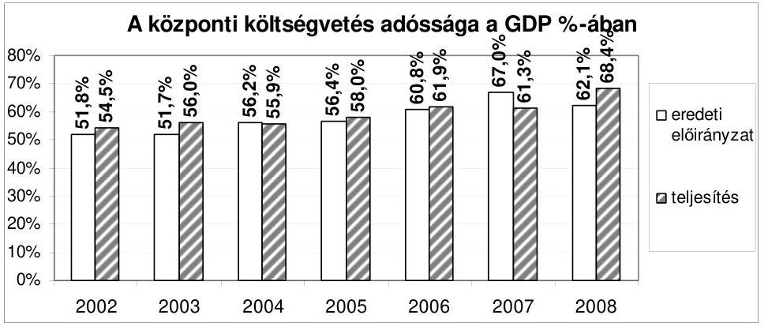

Forrás: költségvetési és zárszámadási törvényjavaslatok
A központi költségvetés bruttó adóssága a 2008. év végén - a 2008. évi zárszámadásról szóló törvényjavaslat alapján - 18 103,9 Mrd Ft, ami 6,2\%-kal haladja meg a tervezettet és $16,2 \%$-kal a 2007. évit.

Az adósságállomány - a betétként elhelyezett IMF/EU hitelrésszel együtt - a GDP arányában $68,4 \%$-ot tett ki, amely $7,1 \%$-ponttal magasabb az előző évi (61,3\%) értéknél.

Az adósságállomány növekedési üteme 2002-től 2006-ig, évről-évre meghaladta a 10,0\%-ot, a 2007. évi mérséklődése után 2008-ban ismét jelentős mértékben növekedett. (Az előző évhez viszonyítottan a növekedési ütem 2002-ben 19,5\%, 2003-ban 14,8\%, 2004-ben 9,5\%, 2005-ben 10,1\%, 2006-ban 15,2\%, 2007-ben $6 \%, 2008$-ban $16,2 \%$.)

A növekedést több, ellentétes irányban ható tényező együttes hatása okozta. A 2008. évben a központi költségvetés finanszírozási igénye kedvezőbben alakult, 236,3 Mrd Ft-tal elmaradt a 2007. decemberi tervtől, a társadalombiztosítási alapok hiánya azonban 73,4 Mrd Ft-tal növelte a finanszírozást. A KESZ likviditását tovább rontotta az európai uniós elszámolások 29,2 Mrd Ft-os egyenlege, ami szintén kedvezőtlenebbül alakult a tervezettnél. Az adósság növekedésének legfontosabb tényezője az IMF/EU/Világbank által nyújtott 1824,8 Mrd Ft összegű hitel felvételéből finanszírozási célra fel nem

[^0]
[^0]:    ${ }^{7}$ A forint és deviza kibocsátások, hitelfelvételek és törlesztések, illetve a deviza betét műveletek egyenlegei összesen.

---

használt és a Magyar Nemzeti Banknál év végi árfolyamon számolva 1483,6 Mrd Ft összegű devizabetétként elhelyezett rész, ami az adósság növekedésének 59,0\%-át tette ki. Tovább növelte (156,1 Mrd Ft-tal) az adósságot az átlagos devizaárfolyam tervezéskori ( $251 \mathrm{Ft} /$ euró) árfolyamához viszonyított növekedés ( $264 \mathrm{Ft} /$ euró).

Az adósságállomány összetétele jelentősen megváltozott az egy évvel korábbihoz képest. A devizában fennálló adósság aránya 37,6\%-ot tett ki. Az előzőekben jelzett, devizabetétként elhelyezett hitellehívás nélkül a devizaadósság aránya 32,0\% lett volna. (Ez az arány 2002-ben 24,5\%, 2003-ban 24,3\%, 2004ben $25,7 \%$, 2005-ben $28,2 \%$, 2006-ban $28,0 \%$, 2007-ben $28,8 \%$ volt.) Ennek oka egyrészt a forint állampapírok iránti kereslet nagymértékű csökkenésének ellensúlyozása, amelyet az ÁKK Zrt. az Európai Bizottság által nyújtott devizahitel részbeni felhasználásával pótolt, másrészt a forint euróhoz viszonyított árfolyamának gyengülése.

Az adózók központi költségvetés felé fennálló tartozása - az APEH nyilvántartása szerint 330,7 Mrd Ft-tal - 1410,4 Mrd Ft-ra emelkedett, ezzel szemben a VP hátralékállománya 2,1 Mrd Ft-tal csökkent az előző évhez képest (a 2008. évi záró állomány 48,4 Mrd Ft volt).

A zárszámadás általános és fejezeti indokolása az APEH kezelésébe tartozó adónemek és illetékek év végi hátralékát, annak alakulását, a változások okait nem tartalmazza. Erre a hiányosságra az ÁSZ a költségvetés végrehajtásának ellenőrzése során szinte minden évben felhívta a figyelmet. A központi költségvetés követelésállománya az utóbbi 3 évben progresszíven emelkedett, ezért is indokolt lenne a zárszámadás során annak bemutatása.

A Magyar Köztársaság 2007. évi költségvetése végrehajtásáról szóló jelentésünkben már jeleztük az adózók tartozásállományának az előző évhez viszonyított növekedését.
„Az adózók központi költségvetés felé fennálló tartozása - az APEH nyilvántartása szerint 130,3 Mrd Ft-tal - 1079,7 Mrd Ft-ra emelkedett. A hátralékállomány a 2007. évi nyitóállomány tekintetében - a 2006. évben hibásan kitöltött és javítás nélkül feldolgozott ún. forintos bevallások adatainak figyelembe vétele miatt - nem valós, a záró állomány pedig - az illetékkövetelések átvétele során felmerült problémák következtében nem tekinthető hitelesnek.

Az APEH által kimutatott adókra vonatkozó 1079,7 Mrd Ft kintlévőségi állományból 427,8 Mrd Ft a késedelmi pótlék és a bírságok együttes összege, amelynek közel egyharmad része a járulékokhoz kapcsolódik.

A felhalmozódott hátralék összege azért érdemel kiemelt figyelmet, mert az közel azonos például az államadóssággal kapcsolatos 2007. évi kamattérítésre fordított költségvetési kiadásokkal, vagy a központi költségvetés személyi jövedelemadó bevételének háromnegyedével.

A hátraléknövekedés - az adózói magatartáson és a behajthatatlanságon túlmenően - közvetett oka a gazdasági növekedés mérséklődése, melynek következtében a gazdasági társaságoknál likviditási problémák merültek fel. ... A gazdasági növekedés ütemének csökkenése a fizetésképtelen vállalkozások számának növekedésében is mutatkozik."

---

A 2006. évben az előző évhez képest az adóhátralék növekedése 23,3\% volt, a 2007. évben már meghaladta az előző évi állomány $1 / 4$ részét ( $26,3 \%$ ), a 2008. évben pedig tovább gyorsult ( $30,6 \%$-kal nőtt). A gyorsuló növekedés a felszámolással érintett hátralékok emelkedésével függ össze.

Az állami adóhatóságnál az adatok nem minden esetben voltak megbízhatóak az illetékállomány nem pontos kimutatása miatt.

Az adózók folyószámlái a követelésállomány folyamatos rendezése mellett is mintegy 5,0\%-ban nem valós illetéktartozásokat tartalmaztak (a 2007. évben a tartozásállomány 20,0\%-a nem volt hiteles). A módosításra váró tételek feladása elmaradt, vagy jelentős késedelemmel történt meg.

Az APEH - a behajtási bevételek progresszív növelése mellett - a rendelkezésre álló valamennyi hátralékkezelési technikát felhasználta.

A hátralékos és túlfizetéses állományok egyenlegei*

| Megnevezés | 2005 | 2006 |  | 2007 |  | 2008 |  |
| :-- | :--: | :--: | :--: | :--: | :--: | :--: | :--: |
|  | Mrd Ft | Mrd Ft | $\begin{gathered} 2006 / \\ 2005 \end{gathered}$ | Mrd Ft | $\begin{gathered} 2007 / \\ 2006 \end{gathered}$ | Mrd Ft | $\begin{gathered} 2008 / \\ 2007 \end{gathered}$ |
| Hátralékos állomány | 735,2 | 949,4 | $129,1 \%$ | 1079,7 | $113,7 \%$ | 1410,4 | $130,6 \%$ |
| Túlfizetéses állomány | 585,6 | 772,4 | $131,9 \%$ | 836,5 | $108,3 \%$ | 766,9 | $91,7 \%$ |

* az APEH 2009. évi adatszolgáltatása alapján

# A hátralékállomány összetétele a behajthatóság szempontjából év-ről-évre kedvezőtlenebb. 

A hátralékállomány 64,8\%-a - az APEH kimutatásai szerint - nem behajtható. (A 2007. évben az állomány 58,2\%-a származott a nem múködő adózói körből.) A felszámolás alatt állók tartozása 23,9\%-kal, a felszámolás kezdeményezéssel érintetteké 21,6\%-kal növekedett a 2007. évhez képest.

Az APEH túlfizetéses állományának ( 766,9 Mrd Ft) jelentős része nem jelent - az adózók felé fennálló - fizetési kötelezettséget. Az állomány 69,6 Mrd Ft-tal volt kevesebb, mint a 2007. évben. A túlfizetéses állomány döntően adózói hibából (feldolgozhatatlan, hibásan benyújtott bevallások, téves bevételi vagy beszedési számlára utalt tételek), kismértékben az október-november havi viszszaigénylést tartalmazó bevallások pénzügyi rendezésének 2009. évre történő áthúzódásából származott.

A letéti számla kezelése terén az APEH kiemelkedő eredményt ért el. A regionális igazgatóságok végrehajtói letéti számláinak év végi állománya - a letéti számlák forgalmának növekedése ellenére - a 2007. évi záró állományhoz mérten 40,2\%-kal csökkent, amelynek eredményeként ez a költségvetés (bevételi nemekre felosztott) bevételeinél 2,7 Mrd Ft többletet jelentett.

A központi költségvetési szervek finanszírozási helyzetét 2008-ban is a tartósan magas - az év végére azonban jelentősen csökkenő - tartozásállomány jellemezte. Az elmúlt évektől eltérően az is megállapítható, hogy a fi-

---

nanszírozási problémák nagyságrendje és aránya mérséklődött. Figyelemreméltó a minősített állomány nagymértékű csökkenése is.

A minősített (az eredeti költségvetési előirányzat 3,5\%-át, illetve az 50,0 M Ft-ot meghaladó) tartozás átlagos mértéke $2,3 \mathrm{Mrd}$ Ft volt, ami az előző évi érték 50,0\%-a. A 2008. december végi állomány 1,4 Mrd Ft volt, amely az előző évi záró állománynak mindössze 28,0\%-a. (A Pécsi Tudományegyetem átlagos minősített tartozása 1,9 Mrd Ft, közel 83,0\%-a az összes minősített adósságnak.)

A tartozásállomány adósság-nemenkénti megoszlása is jelentősen változott. Az összegében és arányában továbbra is meghatározó mértékű egyéb szállítói tartozás mellett, a megtett intézkedések és az állami adóhatósággal közös tartozásfigyelő rendszer múködésének, valamint a Kincstár (új köztartozás keletkezését megakadályozó) nettó finanszírozási rendjének együttes hatására az intézmények köztartozása tovább csökkent. Az állammal szembeni tartozás (adók, valamint a felügyeleti szervhez be nem fizetett összegek) az összes adósság mindössze 3\%-át tette ki, a járuléktartozás gyakorlatilag megszűnt.

A központi költségvetés tartalékainak (általános tartalék, céltartalékok, központi egyensúlyi tartalék) 2008. évi módosított előirányzatai összesen 235,3 Mrd Ft-ot tartalmaztak. Az egyik céltartalék fajtánál (különféle személyi kifizetések) az előirányzatot 21,0 Mrd Ft-tal meghaladó, jogszerű felhasználásra került sor. Az előirányzat túllépése annak következménye, hogy a 28,3 Mrd Ft összegű eseti kereset-kiegészítés kifizetésről csak az elemi költségvetés elfogadását követően született döntés, ennek megfelelően a céltartalék tervezésekor még nem vehették figyelembe. A túlteljesítést ( $7,3 \mathrm{Mrd}$ Ft) részben ellensúlyozták az egyéb jogcímeken a tervezettnél alacsonyabb támogatás-igénylések. Egy előirányzat (központi egyensúlyi tartalék) teljes egészében felhasználásra került, míg a többi előirányzatot részben (általános tartalék, TÉR), vagy egészben (központi költségvetési szervek bérleti díja) nem használták fel, így éves szinten összesen 8,3 Mrd Ft maradvány keletkezett a tartalékoknál.

Az elmúlt évek ellenőrzési tapasztalataival egyezően az általános tartalék felhasználása - az átcsoportosítások mintegy 33,0\%-ánál, az előirányzat öszszegének 19,0\%-ával - 9,6 Mrd Ft összegben eltért a jogszabályi előírásoktól. A fejezetek többletforrás igénye egyes feladatok esetében nem minősült előre nem valószínűsíthetőnek, nem tervezhetőnek, illetve előirányzott, de elháríthatatlan ok miatt elmaradó bevétel miatt pótolandónak (pl. a kormányzati reformok lakossági tájékoztató kampánya, a Kormányfői Protokoll kiadási előirányzat megemelése, az V. Európai Jogász Fórum lebonyolítása stb.). A módosított éves előirányzat 51,7 Mrd Ft-os összegének 12,0\%-át kitevő felhasználásra 2008 decemberének második felében (14-e és 23-a között) került sor.

A Kvtv. központi egyensúlyi tartalék címén 20,0 Mrd Ft-ot tartalmazott, mely összeg felhasználásra került. A Kvtv. általános jellegű felhatalmazást adott a Kormánynak, hogy a központi egyensúlyi tartalék felhasználásáról a költségvetési és gazdasági folyamatok függvényében dönthet. E felhatalmazás korlátlan felhasználási lehetőséget jelentett, miután egyetlen jogszabályban sem történt rendelkezés a felhasználás céljáról, feltételeiről, igénybevételi módjáról. Emiatt a számvevőszéki ellenőrzésnek nem volt lehetősége a költségvetés ezen kiadásai jog- és célszerűségét megítélni.

---

A Magyar Köztársaság minisztériumainak felsorolásáról szóló 2008. évi XX. törvényben foglaltak alapján 2008. május 15 -étől a GKM fejezet átalakításával módosult a kormányzati szerkezet (a GKM fejezet bázisán létrejött az NFGM és a KHEM fejezet, az ÖTM fejezet feladatokat adott át az NFGM fejezet részére, valamint a megnevezése ÖM-re változott, az ME és az NKTH fejezeteknek feladatátadások történtek).

A törvény végrehajtása érdekében az érintett minisztériumok között keret-, illetve költségvetési megállapodások születtek, amelyek tartalmazták a feladatokhoz kapcsolódó előirányzatok, a létszám, a fejezeti kezelésű előirányzatok és a feladat-megoldáshoz szükséges vagyonelemek átadás-átvételének szabályozását is.

A kormányzati struktúraváltás folyamatában az előirányzatok, a létszám, a fejezeti kezelésű előirányzatok, valamint a pénzeszközök átadás-átvétele megtörtént, de áthúzódtak feladatok 2009. évre is.

Az NFGM és az ME közötti megállapodás alapján egy költségvetési intézmény (NIIFI) a ME fejezethez került. Az NFGM és az NKTH közötti megállapodás kitért a szakmai feladatok megosztására és az ehhez kapcsolódó létszám, eszközök és fejezeti kezelésű előirányzatok és intézmény átadására. A megállapodásokban foglaltak maradéktalanul megvalósultak.

Az NFGM és az ÖM a Költségvetési Megállapodásban 101 fő és az ahhoz tartozó személyi juttatások, járulékok és dologi kiadások, valamint fejezeti kezelésű előirányzatok NFGM fejezetnek történő átadásában állapodtak meg. Az eszközök át-adás-átvétele nem történt meg, mert a KSZF a Vtv.-re hivatkozva nem vette át azokat. Az eszközökre a két tárca üzemeltetési szerződést kötött.

Az NFGM és a KHEM a kormányzati szerkezetváltás végrehajtása érdekében 2008. június 3-án Keretmegállapodást, majd 2008. augusztus 18-án Költségvetési Megállapodást kötöttek, amelyekben foglaltak egy része - a KÖZHÁLÓ program eszközeinek átadása, a HungaroControl megszünéséhez kapcsolódó feladatok rendezése - a beszámoló elkészítéséig nem valósult meg.

Az államháztartás hatékony múködését elősegítő szervezeti átalakításokról szóló kormányhatározat, valamint ezzel összefüggésben a KSZF múködését meghatározó jogszabály 2006. évi módosítása a KSZF alaptevékenységének egyrészt mennyiségi bővülését, másrészt minőségi változását eredményezte, mely szerint a MeH mellett, már a Magyar Köztársaság minisztériumai számára is a KSZF szolgáltatja a szakfeladatok ellátásához szükséges infrastruktúrát és munkakörnyezetet.

A minisztériumok feladatellátásához szükséges eszközök átadása 2007. évben elkezdődött, de még 2008. évben sem fejeződött be. A jogszabályok végrehajtását nagymértékben befolyásolta a 2007. szeptember 24-én hatályba léptetett Vtv., és annak hatására bekövetkezett jogszabályváltozások (Áht.), valamint nemzetbiztonsági szempontok érvényesítése (KüM fejezetet érintően).

A nem teljes körű eszközátadások számviteli rendezetlenséget eredményeztek. A KSZF-el kötött vagyonkezelési szerződésekben, szolgáltatási megállapodásokban szereplő, azonban még át nem adott vagyonelemeket az érintett fejezetek

---

döntően saját mérlegükben, saját eszközként szerepeltették, de előfordult, hogy a „0" számlaosztályban tartották nyilván azokat.

A 2008. évi struktúraváltozással kapcsolatban további feladatátadáshoz kapcsolódó eszközátadások megvalósítása is szükségessé vált, részben az érintett minisztériumok (ME, ÖM, NFGM, KHEM) részben a minisztériumok és a KSZF között.

Az át nem adott eszközökkel kapcsolatos feladatok ellátására (nyilvántartás, könyvelés, leltározás) a minisztériumok sem létszámmal, sem előirányzattal nem rendelkeztek.

A KSZF - a fejezetekkel kötött megállapodások alapján — alapfeladatként ellátta a fejezetek múködéséhez szükséges közbeszerzési feladatokat. A 2008. évre több minisztérium (OKM, SZMM) saját hatáskörben folytatott le közbeszerzési eljárást gépjárművek beszerzésére a központosított közbeszerzési rendszerről szóló, valamint a központi beszerző szervezet feladat- és hatásköréről szóló kormányrendelet alapján, mivel nem rendelkeztek a KSZF-fel érvényes keretszerződéssel a beszerzések lebonyolítására.

Az egységes normatív alapú ellátás hatályba léptetése 2008. évben sem történt meg, amelynek késedelme több minisztériumnál azt eredményezte, hogy a központosított szolgáltatás előnyeit az igénybevevők nem egyértelműen érzékelték.

# A kormányhatározatban meghatározott feladatok végrehajtása a 

2008. év végéig csak részben valósult meg, több feladat esetében még nem zárult le (a határidő elhúzódott az Informatikai és Technológiai Innovációs Park Zrt. privatizációjánál és a Club Aliga Rt. felszámolása esetében, nem a jogszabálynak megfelelően valósult meg az Avicenna, Közel-Kelet Kutatások Közalapítvány átalakítása, nem történt meg a BUÉSZ költségvetési szerv irányításának átadása az SZMM fejezet részére, valamint a NGYIK jogutód nélküli megszüntetése).

Az állami vagyonnal való gazdálkodásról szóló kormányrendelet szerint a központi költségvetési szervek elhelyezésének biztosítása az MNV Zrt. feladata. Ugyanakkor a Központi Szolgáltatási Főigazgatóságról szóló kormányrendelet a minisztériumok tekintetében az elhelyezési feltételek biztosítását a KSZF feladataként határozza meg. A Vtv. alapján az MNV Zrt. lett az egységes vagyonkezelő. A minisztériumok elhelyezéséhez, múködtetéséhez köthető vagyon tekintetében a vagyonkezelő jogait és kötelezettségeit a Központi Szolgáltatási Főigazgatóságról szóló kormányrendelet alapján a KSZF-hez rendelték.

A Vtv. végrehajtásával kapcsolatban a 2007. évi zárszámadási ellenőrzés során kifogásolt, társasági részesedésekkel kapcsolatos átadásátvételek 2008. évben alapvetően rendeződtek, a szerződéseket az MNV Zrt. és az ellenőrzött intézmények többsége megkötötte, amelynek alapján a társaságokban lévő részesedéseket az intézmények kivezették könyveikből.

Az ingatlanokra vonatkozó vagyonkezelői szerződések - amelyeket a jogelőd KVI-vel kötöttek az intézmények - Vtv.-ben előírt felülvizsgálata a 2008. évben nem történt meg. Az MNV Zrt. által a költségvetési szerveknek meg-

---

küldött vagyonkezelői, illetve bérleti szerződés tervezetek nem kerültek aláírásra.

A szervezetek részére az MNV Zrt. által 2008. június hónapban megküldött szerződés tervezetek bérleti, illetve vagyonkezelési díffizetési kötelezettséget tartalmaztak, amelyek alapját és mértékét a költségvetési szervek vitatták, továbbá jelezték, hogy a költségvetésük 2008. évre a bérleti díjra nem tartalmaz fedezetet. Az MNV Zrt. a szerződéstervezeteket úgy módosította, hogy azok már nem tartalmaztak díffizetési kötelezettséget, de a szerződések megkötésére a helyszíni ellenőrzés időszakában továbbra sem került sor.

A vagyonkezelői szerződések felülvizsgálatának elmaradása, illetve az új szerződések hiánya többek között a KvVM fejezetbe tartozó VKKI-nél veszélyeztette a KIOP által finanszírozott projekt lezárását, az OKM fejezetbe tartozó MNG kezelésében lévő múemlékek jogi helyzetének rendezését.

Az Áht. 2008. évre vonatkozóan nem tette lehetővé az eszközök térítésmentes átadását. A tárcák egy része (BIR, IRM, KvVM, KüM) azonban a 2008. évben is hajtott végre fejezeten belül térítésmentes eszközátadást. Az államháztartás szervezetei beszámolási és könyvvezetési kötelezettségének sajátosságairól szóló kormányrendelet (Áhsz.) változatlanul tartalmaz térítésmentes eszközátadásra vonatkozó előírásokat.

A Vtv.-ben, az Áhsz.-ben valamint a PM tájékoztatóban foglaltak ellentmondásai miatt a fejezeten belüli térítésmentes átadások gyakorlatát a beszámolók megbízhatósága szempontjából az ellenőrzés nem minősítette szabálytalannak.

A 2006. és a 2007. évi zárszámadás keretében is felhívtuk a figyelmet a Központosított Illetmény-számfejtési Rendszer (KIR) programhibájára. A beszámolási időszakban pozitív változás nem történt, a KIR adatszolgáltatásai nem lettek biztonságosabbak. A korábbi időszakhoz képest lényegesen megnőtt az egyeztetések száma és időigénye.

A 2008. év végén módosították a köztisztviselői teljesítményértékelés és jutalmazás szabályairól (TÉR) szóló kormányrendeletet. Év végén a hivatkozott kormányrendeletet módosító jogszabály megváltoztatta az értékelési kategóriákat és lecsökkentette a kifizethető jutalmak maximális mértékét is, ugyanakkor lehetőséget biztosított 2008. november 18 -áig előlegfizetésre.

A tárcák a jogszabályban meghatározott előlegfizetés lehetőségével éltek, a MEH kormányhivatal kivételével az év végi értékelések alapján a kormányhatározatban meghatározott határideig - 2008. december 15. - a kifizetéseket teljesítették.

A TÉR múködésében átfedést okozott, hogy a Ktv. továbbra is előírta a köztisztviselő szakmai munkája értékelését pl. címadományozás esetén, soron kívüli előléptetéskor, illetve illetményeltérítéskor.

A Kormány a Ktv.-ben foglalt felhatalmazása alapján kormányrendeletben határozta meg az ún. összkormányzati projektek szabályait. A kormányrendeletben foglalt előírással ellentétben a MeHVM 2008-ban nem tette közzé a

---

tárgyévben indult összkormányzati projektek megnevezését és a tárgyévben befejeződő projektek esetében a miniszterelnök által jóváhagyott keretösszegek értékét.

A 2008. évre a miniszterelnök négy programot minősített (2008 júliusa és novembere között) összkormányzati projektté. A projektekben közremúködő projekttagok premizálása a miniszterelnök által jóváhagyott összegben (2008 decemberében, illetve 2009 januárjában) történt.

A központi költségvetési szervek havi előirányzat-felhasználási keretét a Kincstár automatikusan állapította meg és utalta át az előirányzatfelhasználási keretszámlákra. Az átmeneti likvidítási problémák áthidalása érdekében a fejezetek többsége 2008-ban is élt az időarányos havi ütemezéstől eltérő keretnyitás (keret-előrehozás) lehetőségével. Az előrehozott keretek visszapótlási kötelezettségének a központi költségvetési szervek eleget tettek.

A fejezeti egyensúlyi tartalék felhasználásáról a Kvtv. rendelkezett. Az IVI., a VIII., a XXX. és a XXXIII. fejezetek saját hatáskörben, feltételekhez kötötten - a KE fejezet kivételével - felhasználták a fejezetnél megképzett egyensúlyi tartalék összegét.

A fejezetek - az I-VI., a VIII., a XXX. és a XXXIII. fejezetek kivételével - a Kormány engedélyével, az általa meghatározott célokra használhatták fel a fejezeti egyensúlyi tartalékot. A Kormány felhatalmazást kapott a fejezeti egyensúlyi tartalék fejezeten belüli, fejezetek, illetve az államháztartás alrendszerei közötti átcsoportosítására is. A fejezeteknél megtervezett fejezeti egyensúlyi tartalékok felhasználása kormányhatározatok alapján történt. Egy fejezettől teljes mértékben elvonták a tartalékot, három fejezet a képzettnél magasabb, kilenc fejezet alacsonyabb összegű tartalékot használhatott fel. A 2008. év folyamán a központi egyensúlyi tartalék felhasználása is megtörtént.

A bevételek teljesítése a Kvtv.-ben meghatározott eredeti bevételi előirányzatokhoz viszonyítva - a KüM és az UF fejezetek kivételével - 100\% feletti volt valamennyi fejezetnél és fejezeti jogosítványú szervnél. Négy fejezetnél a teljesítés az eredeti előirányzat több mint kétszerese volt, amelyek feladatváltozással (ÖM fejezet), egyszeri eseménnyel (a KvVM fejezetnél a kiotói egységek átruházásából származó bevétel), valamint különféle díjbevételek növekedésével indokolhatók. A bevételek teljesítése a módosított előirányzatokhoz képest 100\% feletti volt öt fejezetnél, és két fejezeti jogosítványú költségvetési szervnél, de hat fejezetnél 10\%-nál nagyobb bevételi lemaradás következett be.

Az UF fejezetnél a bevételek teljesítése az eredeti és módosított előirányzatnak csak valamivel több mint a felét a módosítottnak a $45 \%$-át érte el, mert az előirányzatok tervezésénél az uniós támogatások kifizetésének korábbi indulásával számoltak, de a kifizetések időbeni csúszása az EU-tól származó bevétel elmaradásával járt együtt.

A kiadások teljesítése két fejezetnél (KE és UF fejezetek), valamint két fejezeti jogosítványú költségvetési szervnél (KEHI és EBF) nem érte el a Kvtv.-ben meghatározott eredeti kiadási előirányzatokat sem. A többi tárcánál és fejezeti jogosítványú költségvetési szervnél (a KHEM és a PM fejezetek kivételével) a teljesítés a módosított kiadási előirányzatokon belül maradt. Jelentős, 20\%-nál na-

---

gyobb megtakarítás mutatkozott három fejezetnél, valamint három fejezeti jogosítványú költségvetési szervnél. 30\% körüli elmaradást tapasztaltunk az NFGM fejezetnél (a jogelőd GKM-től átvett feladatok elhúzódó megvalósítása miatt), valamint a KvVM fejezetnél (a Zöld Beruházási Rendszer elindulásának késedelme okán). A kiadási megtakarításokban szerepet játszott a fejezeti egyensúlyi tartalékok késői feloldása is.

Az ellenőrzöttek többsége rendelkezett a jogszabályoknak megfelelő, a szervezeti sajátosságokat figyelembevevő belső szabályzatokkal. A szabályzatok közötti összhang biztosított volt, azonban egyes szabályzatok hiányoztak, illetve kiegészítésük, pontosításuk szükséges volt.

A mérlegek ellenőrzésénél állapítottuk meg a legtöbb hiányosságot, amelyek elsősorban az eszközök üzembe helyezéséhez, besorolásához, a követelések értékelésének elmaradásához, valamint a függő, átfutó tételek nem megfelelő besorolásához kapcsolódtak.

A kiadási és bevételi előirányzatok teljesítésénél jellemzően szabályszerűségi hiányosságokat (teljesítésigazolás, utalványozás, ellenjegyzés hiánya, jogosultsági problémák stb.) tárt fel az ellenőrzés.

A minisztériumokban, az igazgatási és az igazgatás jellegű tevékenységet ellátó központi költségvetési szerveknél foglalkoztatottak létszámának alakulása több esetben eltért a vonatkozó jogszabályban foglaltaktól. Az egyéb hatályos jogszabályban foglalt létszámtöbbleteket a Miniszterelnöki Hivatalban, a minisztériumokban, az igazgatási és az igazgatás jellegű tevékenységet ellátó központi költségvetési szerveknél foglalkoztatottak létszámáról szóló kormányhatározat nem teljes körűen vette figyelembe.

A Kiegészítő Mellékletet az ellenőrzöttek elkészítették, azonban a szöveges értékelések nem minden esetben feleltek meg az előírásoknak.

Két tárcát - az ÖM, az FVM - érintően állapította meg az ellenőrzés, hogy a fejezeti kezelésű előirányzatokból történt finanszírozás lehetőséget teremtett az átutalt támogatások kamatoztatására, amely összegek felhasználásáról a minisztériumok nem rendelkeztek. Az államháztartási kár a kamatot meghaladó, mivel a Kormány a nemzetközi hiteleket a hazai kihelyezések betéti kamatainál magasabb kamatokkal veszi igénybe.

A fejezeteknél keletkezett maradvány mintegy 57,9\%-kal haladta meg az előző évit. A fejezetek igazgatási címeinek maradványa megegyezett a 2007. évben keletkezettel, míg a fejezetek - igazgatásokon kívüli - intézményeinek maradványa 72,0\%-kal meghaladta a 2007. évit. A legjelentősebb előirányzatmaradványok a fejezeti kezelésű előirányzatoknál keletkeztek (FVM, KvVM, KHEM, OKM, SZMM).

A 2008. évi zárszámadás ellenőrzése keretében vizsgáltuk a 2007. évi zárszámadás ellenőrzésekor feltárt hiányosságok megszüntetésére tett intézkedéseket. Az ellenőrzés során megállapítottuk, hogy a javaslatokban megjelölt feladatokat a tárcák csak részben teljesítették, illetve azok végrehajtása folyamatban van.

---

A 2008. évi zárszámadás ellenőrzése során - az ÁSZ és a fejezetek ellenőrzési szervezetei által - lefolytatott pénzügyi szabályszerűségi vizsgálatok alapján a központi költségvetés kiadási főösszegének 92\%-ának megbízhatóságát minősítettük. A minősítések alapján a központi költségvetés zárszámadási törvényjavaslatban szereplő pénzforgalmi adatai összességében megbízhatóak.

Az állami vagyonnal kapcsolatos bevételeket - a koncessziós bevételek kivételével - az MNV Zrt.-nél nem lehetett a financial audit módszerével felülvizsgálni, mivel a XLIII. fejezet bevételi főösszegének 96,5\%-át kitevő elszámolást a jogszabályi előírásoknak megfelelő teljes körű dokumentációval alátámasztani nem tudta, ezért arról nem tudtunk véleményt alkotni.

A lényegességi küszöböt meghaladó mértékű hibákat és hiányosságokat tártunk fel, és elutasító véleményt fogalmaztunk meg a következő területeken: a lakástámogatásoknál, az ÖM fejezet NUSI, továbbá a KMOP, és a KÖZOP fejezeti kezelésű előirányzatoknál. A fejezetek ellenőrzési szervei hasonló véleményt fogalmaztak meg a KHEM fejezet Közlekedésbiztonsági Szervezet és az OKM fejezet Balassi Intézet intézményeknél.

A beszámolóban feltárt hibák, hiányosságok miatt a beszámolókat korlátozó minősítéssel láttuk el a NIIFI, a BME, az EBF, a MÁK intézmények, az ÖM az NFGM, a KHEM, az NKTH igazgatása címek, a HM igazgatása alcím, az ÖM, az FVM, a HM, az NFGM, az SZMM, az MTA fejezeti kezelésű előirányzatok, az UF fejezet AVOP fejezeti kezelésű előirányzata esetében. A fejezetek ellenőrzési szervei által végzett ellenőrzések közül korlátozó minősítést kaptak a HM fejezetnél a Fejlesztési és Logisztikai Ügynökség Budapest csapat, az Infrastrukturális Ügynökség központi, a Dr. Radó György Honvéd Egészségügyi Központ Budapest csapat, a Dr. Radó György Honvéd Egészségügyi Központ Budapest központi, Támogató Dandár Budapest csapat beszámolói, valamint az NFGM fejezet Magyar Kereskedelmi Engedélyezési Hivatal, az OKM fejezetnél a Nyíregyházi Főiskola, az Iparművészeti Múzeum, a Magyar Természettudományi Múzeum, az EüM fejezetnél a Parádfürdői Állami kórház, az Egészségügyi Készletgazdálkodási Intézet, a PM fejezetnél a PmISZK.

Az ellenőrzés során feltárt a lényegességi küszöböt el nem érő, a beszámoló megbízhatóságát nem befolyásoló hibákra, hiányosságokra hívtuk fel a vezetés figyelmét a BIR, az MKÜ fejezetek, a KSZF, az FVM, az IRM, a KvVM, a KüM, az NFÜ, az OKM, az EüM, a PM, az SZMM, az MTA igazgatásai, a KT, a KEKKH, a Szülőföld Alap Iroda, az NBH, az RSZVSZ, a KGF, a KvVM FI, az Országos Meteorológiai Szolgálat, a VKKI, az NHH, az OAH, az ELTE, a KÖH, az MNG, a KÖSZ, a VP, az EBH, az NFH intézmények, a BV, a Rendőrség, a BÁH, az OI, az NPI, az ÁSZI címek, az ME, az IRM, a KvVM, a KüM, az OKM, a PM, az NKTH fejezeti kezelésú előirányzatok, valamint az UF fejezet GVOP, HEFOP, KIOP, ROP, KA közlekedés, EQUAL, Interreg, ÁROP, EKOP, GOP, KEOP, TÁMOP, TIOP, KDOP, DDOP, NYDOP, ÉAOP, ÉMOP, DAOP, VOP és egyéb EU előirányzatok, ETE, INTERACT 2007-2013. fejezeti kezelésű előirányzatok esetében. A fejezetek ellenőrzési szervei által végzett ellenőrzések során hasonló megállapatást tettek az FVM fejezetnél az MVH, a HM fejezetnél az Fejlesztési és Logisztikai Ügynökség Központi, Fejlesztési és Logisztikai Ügynökség nemzetközi, Közgazdasági és Pénzügyi Ügynökség Budapest csapat, Logisztikai Ellátó

---

Központ Budapest központi, a KHEM fejezetnél a Nemzeti Közlekedési Hatóság és a Közlekedésfejlesztési Koordinációs Központ, az OKM fejezetnél a PTE, a Liszt Ferenc Zeneművészeti Egyetem, az SE, az SZTE, a Magyar Nemzeti Galéria, a Szabadtéri Néprajzi Múzeum, a Néprajzi Múzeum, a Magyar Állami Operaház, a Magyar Művelődési Intézet és Képzőművészeti Lektorátus, az OFI és az OH, a PM fejezetnél az APEH KAIG beszámolóira.

A költségvetésben megjelenő és költségvetésen kívül felhasznált európai uniós források (583,9 Mrd Ft) összességében meghaladták a teljesített hazai befizetési kötelezettség (210,6 Mrd Ft) összegét.

A költségvetésben megjelenő uniós források felhasználása 45,2\%-kal elmaradt a tervezettől ( 601,1 Mrd Ft), ugyanakkor a központi költségvetési eszközök felhasználása 36,9\%-kal maradt el a tervezett előirányzattól (221,7 Mrd Ft). Ennek eredőjeként az uniós forrásokat is tartalmazó előirányzatok teljesülése öszszesen 43,0\%-kal maradt el a tervezettől (822,8 Mrd Ft). Az uniós források és a hazai társfinanszírozás tényleges felhasználásának a tervezettől eltérő alakulását az egyes támogatási csoportoknál különféle indokok magyarázzák.

Az NFT-hez tartozó operatív programok végrehajtása során a kifizetések jelentősen felgyorsultak, a kifizetések volumene így meghaladta az előirányzott mértéket. Ennek magyarázata, hogy az n+2 szabály szerint az ezekre a programokra kifizethető támogatások kifizetési határideje 2008. december 31-én járt le. Ugyanakkor a pénzügyi válságra tekintettel az Európai Bizottság az eredeti 2008. december 31-ei zárási határidőt meghosszabbította 2009. június 30áig, így még 2009. évben is teljesíthetőek az NFT-hez kapcsolódó kifizetések.

A Kohéziós Alap esetében a korábbi évekhez hasonlóan jelentős elmaradás tapasztalható a tervezetthez képest a kivitelezések különböző okokra visszavezethető csúszása miatt.

A legnagyobb elmaradás - a tervezetthez képest mintegy 267,7 Mrd Ft, amely az összes elmaradás háromnegyedét adja - az ÚMFT programjaival kapcsolatban figyelhető meg. Annak ellenére, hogy Magyarország a tervezéssel, programozással és a pályázatok indításával időben elkészült, a kifizetések folyósítása a költségvetésben tervezett ütemhez képest csak később indult meg, melynek következtében a teljesítési adatok jelentősen elmaradtak a tervezettől.

Az Egyéb strukturális támogatások kategóriába tartozó INTERREG Közösségi Kezdeményezés Program a 2007-2013-as időszakban a kohéziós politika önálló célkitűzése lett Európai Területi Együttmüködés (ETE) néven. A határmenti és transznacionális operatív programok túlnyomó többsége 2007 nyarán került benyújtásra az Európai Bizottsághoz, és többségüket 2007 során jóváhagyták. Az IPA (Előcsatlakozási Támogatási Eszköz Horvátország és Szerbia tekintetében) programok Európai Bizottság általi elfogadása ugyan 2008 márciusában megtörtént, de a két körös pályázati kiírások időbeli elhúzódása miatt a kifizetések jelentősen elmaradtak a tervezettől. Az EQUAL Közösségi Kezdeményezés kifizetési sebessége a programindítás óta felgyorsult.

---

Az NVT esetében a 2008. évi eredeti kiadási előirányzatának ( $9,4 \mathrm{Mrd}$ Ft) megfelelően alakult a teljesítés ( $9,9 \mathrm{Mrd}$ Ft). Tekintve, hogy az uniós szabályok értelmében az NVT keret utolsó 5\%-a csak a program teljes lezárása után kerül megtérítésre (várhatóan 2009 végén), a fenti összeg teljes egészében költségvetési forrásból került biztosításra. Az NVT kifizetései 2008. október 15-ével lezárultak.

Az ÚMVP esetében a tervezettnél alacsonyabb volt a felhasználás, melynek oka a 2007. évben induló programok elfogadásának késedelme, illetve az utófinanszírozás. A felhasználást befolyásolta, hogy a hitel- és pénzügyi válság következtében az agrárvállalkozók hitelhez jutása megnehezült, így a beruházási projektek megvalósítása lassult.

A HOP előirányzatból 2008-ban teljesítés nem történt, mert a Bizottság határozatában csak 2008. szeptember 8-án hagyta jóvá az Európai Halászati Alapból származó közösségi támogatással összefüggő magyarországi operatív programot.

A Schengen Alap programjai alapvetően a 2007. év végével lezárultak, a 2008. évi költségvetés eredeti előirányzatot nem tartalmazott. Egyes áthúzódó tételek teljesítése a korábbi évek maradványaaiból 591,1 M Ft összegben történt.

Az Átmeneti Támogatás 2006. évi keretéből támogatott projektek utolsó szerződéseit 2008. december 15-éig lehetett megkötni. Határidőre a keret 83,06\%-át kötötték le. A 16,94\%-os elmaradás oka, hogy az Oktatási Minisztérium „2006/018-176.03.02 Felsőoktatási intézményi kapacitásfejlesztés a Bolognai követelményekkel kapcsolatban" projektje nem valósult meg.

Az egyéb európai uniós támogatások közül összegükben a legjelentősebbek az ún. TEN-T programok (közlekedési, energetikai és távközlési hálózatok fejlesztése) és a Norvég Alap támogatásai. Ezen programok eredeti tervezett kiadásai az összes egyéb uniós kiadásnak mintegy kétharmadát képviselték. Ezen programok megvalósítása elhúzódott, ami magyarázza az egyéb európai uniós kiadások alacsonyabb teljesülését.

A költségvetésen kívüli támogatások finanszírozása a KESZ-ről történik. A költségeket a Kifizető Ügynökség a KESZ-ről megelőlegezi, és azt az EU utólag megtéríti az államháztartás számára. A támogatások ezen körébe tartoznak a közvetlen termelői támogatások (egységes terület alapú támogatás) és az agrárpiaci támogatások. ${ }^{8}$

A közvetlen termelői támogatások címén feltüntetett 156 173,0 M Ft tartalmazza a 2008. év során 2006. évi jogalap után kifizetett 137,7 M Ft-ot, a 2007. évi jogalap után kifizetett 47 799,3 M Ft-ot és a 2008. évi jogalap után kifizetett 108 379,0 M Ft-ot. Tartalmazza továbbá levonandó tételként a már kifizetett,

[^0]
[^0]:    ${ }^{8}$ Az utóbbi kategóriába tartoznak az exporttámogatások, belpiaci támogatások, az egyéb agrárpiaci támogatások és az intervenciós felvásárlásokhoz kapcsolódó raktározási szállítási költségtérítés és a finanszírozási költségtérítés.

---

de az EU által keret túllépés miatt nem finanszírozott 139,2 M Ft-ot, valamint a 2008. évben megtérült 3,8 M Ft összegű követeléseket.

A 36,7 Mrd Ft összeget kitevő agrárpiaci támogatások tartalmazzák az exporttámogatásokra kifizetett 3,6 Mrd Ft-ot, a belpiaci támogatások címén folyósított 21,6 Mrd Ft-ot, és az egyéb agrárpiaci támogatásokra kifizetett 11,5 Mrd Ftot.

Az intervenciós felvásárlás esetében, a Kifizető Ügynökség szintén a KESZ útján megelőlegezi és kifizeti a termelők számára a felvásárolt termék értékét. Ezt az összeget az Európai Unió a költségek vonatkozásában utólag megtéríti, míg az értékesített termékek ellenértéke a vevőtől térül meg a KESZ javára.

Az intervenciós beavatkozás során a 2008. évben 1,3 Mrd Ft-ot fordított az MVH a felvásárlás megelőlegezésére. Ezzel szemben a gabona, cukor és alkohol értékesítéséből befolyt összeg 45,4 Mrd Ft. Az egyenleg ennek megfelelően 44,1 Mrd Ft. Hasonlóan az elmúlt esztendőhöz a 2008. évben is sikerült értékesíteni a korábbi években intervencióra felvásárolt termékeket.

Az Európai Unió által közvetlenül térített egységes területalapú támogatásokra (SAPS) a KESZ-ről történő finanszírozás keretében 2008-ban 156,2 Mrd Ft kifizetés történt, melyet a tisztán hazai forrásból finanszírozott kiegészítő nemzeti támogatás (top-up) 74,2 Mrd Ft-tal egészített ki. ${ }^{9}$

A központi költségvetésre vonatkozó megállapítások részletes kifejtése a jelentés első kötetének II. Részletes megállapítások fejezet B) Helyszíni ellenőrzés B.1.1. A központi költségvetés c. pontjában, illetve a Függelék c. második kötet „A" részében található meg.

# AZ ELKÜLÖNÍTETT ÁLLAMI PÉNZALAPOK 

Az államháztartás elkülönített állami pénzalapok alrendszerét 2008. évben is hat alap: a Munkaerőpiaci Alap (MPA), a Szülőföld Alap (SZA), a Központi Nukleáris Pénzügyi Alap (KNPA), a Nemzeti Kulturális Alap (NKA), a Wesselényi Miklós Ár- és Belvízvédelmi Kártalanítási Alap (WMA), valamint a Kutatási és Technológiai Innovációs Alap (KTIA) alkotta. Az alapok az államháztartás önálló alrendszerét, az állami költségvetés 1-1 fejezetét képezték.

Az elkülönített állami pénzalapok súlya az államháztartásban alacsony, az alapok 485,4 Mrd Ft bevétele a központi költségvetés bevételeinek 5,9\%-át, mintegy 457,2 Mrd Ft kiadása pedig a kiadásainak 5,1\%-át képezték. Az alapok között - költségvetési bevételi és kiadási előirányzatai alapján meghatározó az MPA, részesedése 2008-ban az alapok összes bevételéből $81,0 \%$, összes kiadásából $84,0 \%$ volt.

[^0]
[^0]:    ${ }^{9}$ A 74 191,2 M Ft összeg része a XII. fejezet 10. cím (fejezeti kezelésű előirányzatok) 5. alcím (nemzeti támogatások) 8. jogcímcsoport (folyó kiadások és jövedelemtámogatások) kiadásainak.

---

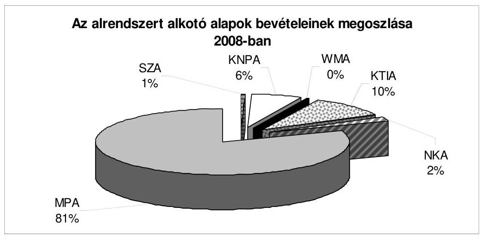

Az alapok pénzügyi helyzete a 2008. évben alaponként és összességében is kiegyensúlyozott volt. Alrendszeri szinten a bevételek a vártnál kedvezőbben alakultak, a kiadások a tervezettől elmaradtak. Az alrendszer befizetése a központi költségvetésbe 119,3 Mrd Ft volt, az alrendszer költségvetési támogatása 32,8 Mrd Ft-ot tett ki. A különbözet 86,5 Mrd Ft-ot jelentett a központi költségvetés javára. Az alapok pozitív egyenlege is kedvezően befolyásolta az államháztartás 2008. évi egyenlegének alakulását.

Az alapok 2008. december 31-én fennálló összesített pénzkészlete 261,7 Mrd Ft volt.
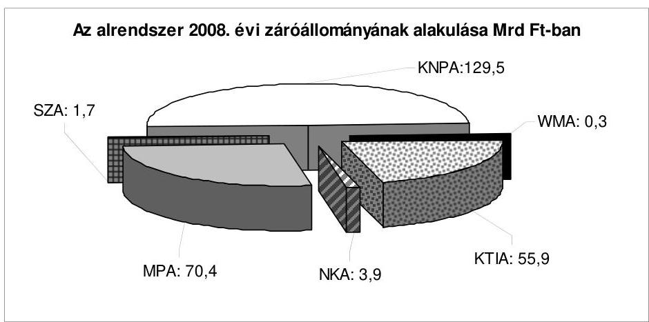

A KNPA 14,9 Mrd Ft szufficitet tervezett, a KTIA 10,0 Mrd Ft-ot költhetett volna el a tartaléka terhére. A többi alap vonatkozásában egyenlegtartási kötelezettség állt fenn, mely alól a Kvtv. 68. §-ában meghatározottak jelentettek kivételt. A majdnem 5,0 Mrd-os tervezett többlettel szemben az összesített pénzforgalmi egyenleg 28,2 Mrd Ft volt, ami javította az államháztartás egészének egyensúlyi helyzetét.

Az Áht. vonatkozó rendelkezése szerint az elkülönített állami pénzalapok gazdálkodásáról éves beszámolót kell készíteni, az alapok beszámolóját az Áht.nak megfelelően évente könyvvizsgáló hitelesíti. Az alapok beszámolóját a könyvvizsgálat minden alapnál hitelesítő záradékkal látta el.

---

Az alapok ellenőrzési rendszere, ahogyan múködésük is, különböző. Az alapok pénzeszközei felhasználásának ellenőrzése a jogszabályi előírások ellenére sem minden esetben biztosított, ezért az alapok felügyeletét ellátó szervek vezetőinek felül kell vizsgálniuk az alapok múködtetését és ellenőrzési rendszerét.

Az MPA 2008. évi bevételeinek és kiadásainak különbözeteként 6,5 Mrd Ft többlet keletkezett. A nyitó állományt is figyelembe véve az Alap maradványa 69,9 Mrd Ft-ra nőtt, ami meghaladja a likviditási tartalékot (26,9 Mrd Ft). A foglalkoztatás elősegítéséről és a munkanélküliek ellátásáról szóló törvény értelmében, amennyiben a tárgyévi likviditási szintet meghaladja a maradvány, akkor az e feletti rész - a Kormány előzetes jóváhagyását követően - a tárgyévben felhasználható. Az Alap maradványát a zárszámadási törvény melléklete rögzíti. A maradvány felhasználására a beszámolási időszakban nem került sor.

Az MPA részére a Kvtv. 2008. évre 394,1 Mrd Ft kiadási és bevételi előirányzatot hagyott jóvá. Az Alap bevételeit járulékok, hozzájárulások és egyéb bevételek képezték.

Az MPA bevételi előirányzata 391,0 Mrd Ft-ra teljesült. A teljesített bevételek 82,5\%-át a járulékbevételek - 54\%-a munkaadói, 25\%-a munkavállalói, 3,5\%a vállalkozói járulék -, több mint $14 \%$-át a hozzájárulások - 10\%-a szakképzési, $4 \%$-a rehabilitációs hozzájárulás -, további $2 \%$-át a bérgarancia törlesztés és egyéb bevételek képezték. A 2008-ban nevesített 2 új bevételi címen - Méltányosságból elengedett követelés, valamint a TÁMOP intézkedés előfinanszírozásának megtérítéséből származó bevétel - az Alap bevételeinek alig 0,5\%-a keletkezett. A kiadások összege 9,7 Mrd Ft-tal maradt el a tervezettől, 384,4 Mrd Ft-ra teljesült.
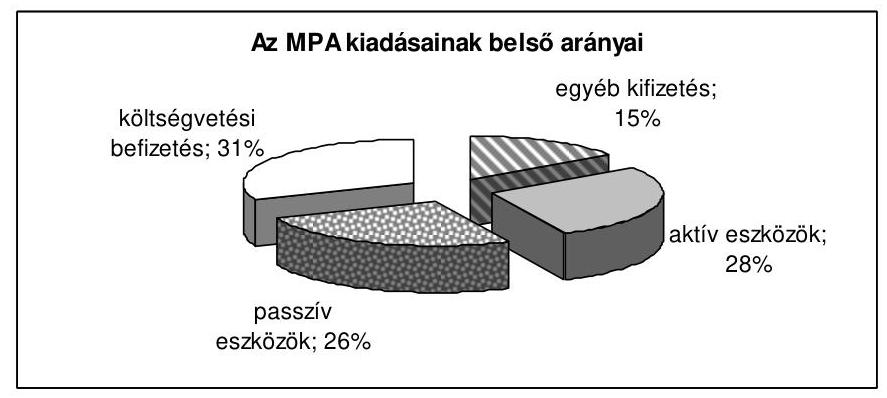

Az MPA központi költségvetésbe történő befizetési kötelezettsége 2 jogcímen a 2008. évben összesen 119,3 Mrd Ft (31\%) volt. Az Alap kiadásainak belső szerkezetében bekövetkezett változások azt mutatják, hogy egyre nagyobb hányadot képeznek - a Kvtv.-ben meghatározott - az MPA által a központi költségvetésbe teljesítendő pénzeszköz átadások.

A foglalkoztatáspolitika aktív eszközeinek - aktív foglalkoztatási eszközök, rehabilitációs célú kifizetések, járulékkedvezmény visszatérítés stb. - felhasználása az Alap költségvetésének új tagolása miatt átláthatóbbá vált, számításaink szerint aktív eszközökre 107,6 Mrd Ft-ot (28\%) fordítottak.

---

A foglalkoztatáspolitika passzív eszközrendszerébe tartozó - az álláskeresők részére nyújtott pénzbeli ellátások, jövedelempótló támogatás, vállalkozói járadék stb. - kiadások teljesítése 100,4 Mrd Ft (26\%) volt, mely elmaradt a tervezettől. A munkanélküli ellátásokra fordított pénzeszközök 2008. évben teljesített kiadásaira a pénzügyi válság munkaerőpiacra gyakorolt hatása még nem volt érezhető. A passzív ellátásoknál 6,1 Mrd Ft, az aktív eszközöknél 4,1 Mrd Ft, a bérgarancia kifizetéseknél 2,5 Mrd Ft megtakarítás keletkezett.

Az MPA kiadásaiból az Alaphoz kötődő (közvetlenül, illetve közvetett módon az Alap feladatait lebonyolító, pénzeszközeinek elosztásában közremúködő) szervezetek múködési kiadásainak finanszírozására 30,4 Mrd Ft-ot fordítottak.

Az MPA-ra vonatkozó független belső ellenőrzés múködtetése az SZMM feladata. Az SZMM Ellenőrzési Osztálya az MPA felhasználását, múködését célzó ellenőrzést 2008-ban nem végzett.

Az SZA részére a Kvtv. a 2008. évre összesen 1000,1 M Ft kiadási és bevételi előirányzatot hagyott jóvá. A bevételi előirányzaton önkéntes befizetések, adományok címen 0,1 M Ft-ot, költségvetési támogatásként 1000,0 M Ft-ot terveztek, egyéb bevétellel nem számoltak. A kiadási előirányzatból 900,1 M Ft-ot az SZA-ból nyújtott támogatásokra, 100,0 M Ft-ot az Alapkezelő múködési költségére terveztek felhasználni.

Az SZA bevételei nem felelnek meg az Áht. 54. § (2) bekezdése - „Az alap létrehozásának feltétele, hogy a meghatározott feladatok állami ellátásához részben célzott adójellegú befizetések, hozzájárulások, járulékok, illetve bírságok címén, államháztartáson kívülről származó források legyenek közvetlenül hozzárendelhetők." előírásának, mert az Alap Kvtv. szerinti bevételi előirányzatának 92,8\%-át költségvetési támogatás biztosította.

Az Alap számláján 2008-ban az Önkéntes befizetések, adományok címen bevétel nem keletkezett, 927,7 M Ft adomány-kiegészítés címén költségvetési támogatásból, 72,3 M Ft a személyi jövedelemadó a rendelkező nyilatkozata szerinti, az Alap javára átcsoportosított 1\%-ból, míg 1933,5 M Ft egyéb bevétel az MPAtól, illetve a központi költségvetésből való átadásból származott.

A bevételek előirányzata a beszámolási időszakban 2930,3 M Ft-ra módosult, melyet a nem tervezett, egyéb bevételek címen keletkezett bevétel (1930,2 M Ft) eredményezett. Az egyéb bevételek az MPA-ból - a szakképzési hozzájárulásról és a képzés fejlesztésének támogatásáról szóló 2003. évi LXXXVI. törvény (Szht.) 9. § e) pontja alapján - átadott 760,2 M Ft-ból, illetve a MeH fejezeti kezelésú előirányzatából átvett összesen 1170,0 M Ft átcsoportosításából adódtak. A pénzforgalom nélküli bevételek módosított előirányzata (251,2 M Ft) nem teljesült.

Az évközi előirányzat módosítások következtében a kiadási előirányzat a beszámolási időszakban 3181,5 M Ft-ra - az SZA-ból nyújtott támogatások előirányzata 2956,7 M Ft-ra, az alapkezelő múködési költségeinek előirányzata 221,0 M Ft-ra növekedett, az eredetileg nem tervezett egyéb kiadások módosított előirányzata 3,8 M Ft-ra - módosult. A kiadások teljesítése 2486,7 M Ft volt,

---

melyből 2264,0 M Ft-ot a támogatások finanszírozására, 221,0 M Ft-ot az alapkezelő működési költségeire, 1,7 M Ft-ot egyéb kiadásokra fordítottak.

Az Alapból nyújtott támogatások 100\%-át nyilvános pályázat keretében használták fel. A pályáztatás lebonyolítása, a pénzeszközök felhasználása során a kollégiumok egységes pályázati és elszámolási szabályzat alapján jártak el. Az Alap elektronikus pályázati rendszert alkalmazott, a pályázatokat elektronikus úton is be lehetett nyújtani. A jogszabályban a pályázathoz előírt mellékleteket a szerződéskötést megelőzően kérték be. A pályázati felhívások nem tartalmazták teljes körűen az alapról szóló törvényben meghatározott elemeket. A pályázati kiírásokban megjelentek az érvénytelenség esetei, de a pályázat elbírálásának szempontjait nem szerepeltették. A pályázati felhívás nem tartalmazta továbbá a pályázat elbírásához szükséges adatokat, dokumentumokat, a támogatási szerződés megszegésének szankcióit.

Az SZA pénzeszközeire a 2008. évben beérkezett 2966 pályázatban az igényelt támogatás összege összesen 6398,0 M Ft volt. A jóváhagyott 1496 programban igényelt 3926,6 M Ft-hoz képest a jóváhagyott támogatások összege 1989,0 M Ft volt, mely összeg az igényelt támogatásoknak az 50,6\%-át jelentette.

Az SZA kezelője felelős az Alap ellenőrzési feladatai ellátásáért, ennek keretében a pénzügyi és teljesítmény ellenőrzések lebonyolításáért. Az alapkezelő ellenőrzési szervezeti egységgel nem rendelkezett. A belső ellenőrzési feladatokat vállalkozói szerződés alapján külső szervezet látta el, az ellenőrzések nem terjedtek ki a pályázati rendszer múködésének, a források felhasználásának vizsgálatára, teljesítmény-ellenőrzést nem végeztek.

A KNPA 2008. évi bevételeinek előirányzatát a Kvtv. 31,1 Mrd Ft-ban, a kiadási előirányzatát 16,2 Mrd Ft-ban és a betétállomány növekedését 14,9 Mrd Ftban határozta meg. Az Alap költségvetése év közben módosult, a bevételi előirányzat 31,3 Mrd Ft-ra, a kiadási előirányzat 16,4 Mrd Ft-ra emelkedett, az egyenleg nem változott.

Az Alap 2008. évi bevétele 31,4 Mrd Ft-ra, kiadása 16,3 Mrd Ft-ra teljesült, a bevételi többlet 15,1 Mrd Ft volt.

A bevételek 72,8\%-a - 22,8 Mrd Ft - a Kvtv. 65. §-ban, a Paksi Atomerőmú Zrt. részére meghatározott befizetési kötelezettségből keletkezett. Az Alap további bevételét jelentette az Atomtörvény 64. §. (2) bekezdése szerint a felhalmozott pénz értékállóságát biztosító költségvetési támogatás, amelynek összege a 2008. évben 8450,4 M Ft volt.

A teljesített kiadások 71,6\%-át (11,7 Mrd Ft-ot) fejlesztési és beruházási célra, 28,4\%-át (4,6 Mrd Ft-ot) múködtetési feladatokra, ebből 1,1 Mrd Ft-ot a társadalmi ellenőrzési és információs társulások támogatására használtak fel.

A KNPA alapkezelője a támogatottaknak a beszámolási kötelezettséget előírta, a pénzeszközök felhasználását ellenőrizte. A támogatások, a beruházások elszámolása, az állományok kimutatása az ellenőrzött dokumentumok alapján szabályszerűen történt.

---

Az NKA kiadási és bevételi előirányzatát a 2008. évi Kvtv. megegyező összegben, 8,6 Mrd Ft-ban határozta meg. A bevételi előirányzatból a kulturális járulékbevételt 8,5 Mrd Ft-ban, az egyéb (nem adójellegű) bevételek összegét 115,0 M Ft-ban rögzítette. A kiadási előirányzatból 7,8 Mrd Ft-ot pályázati támogatásra, 830,0 M Ft-ot múködési kiadásra terveztek. Ezen túlmenően a Kvtv. 68. § (10) bekezdése felhatalmazta a Kormányt, hogy amennyiben 2008. október 31-éig a kulturális járulék bevétele nem éri el a 2007. év azonos időszakáig elért szintet, akkor a központi költségvetés terhére a különbözettel az NKA bevételeit egészítse ki. Így a beszámolási időszakban az NKA előirányzata, az előbbiekben foglaltakat figyelembe véve 9,7 Mrd Ft-ra módosult.

Az NKA 2008. évi bevétele 9,7 Mrd Ft-ra teljesült. A bevételek 88,7\%-a (8,6 Mrd Ft) kulturális járulékbevételből származott. A külső forrásból átvett bevétel $59,0 \mathrm{M} \mathrm{Ft}$, a más tárcákkal kötött megállapodás alapján a fejezetektől és az NKA Igazgatóságtól átvett támogatásértékű bevétel 606,5 M Ft, a visszatérítendő támogatásokból és a pályázati visszafizetésekből befolyt egyéb (nem adójellegű) bevételek összege 187,8 M Ft, illetve az egyszeri költségvetési támogatás 242,5 M Ft volt.

Az NKA kiadási előirányzata 9,3 Mrd Ft-ban teljesült. Az Alap év végi egyenlege $369,2 \mathrm{M} \mathrm{Ft}$, a halmozott felhasználható előirányzat-maradvány 3,9 Mrd Ft volt. A kiadások csaknem $90 \%$-a ( $8,4 \mathrm{Mrd}$ Ft) a pályázatok támogatásának finanszírozására szolgált, 959,4 M Ft a működési kiadásokat fedezte. A beszámolási időszakban 17,8 M Ft külső forrás maradvány visszautalásra került.

A WMA bevételi előirányzatát a Kvtv. a 2008. évre 75,0 M Ft-ban határozta meg, amelyből 8,0 M Ft-ot rendszeres befizetésként (a kártalanítási szerződések díjfizetései) és 67,0 M Ft-ot költségvetési támogatásként irányoztak elő. Az Alap létrehozásáról szóló törvény biztosítja önkéntes, nem rendszeres befizetéseknek és adományoknak az elfogadását és bevételek közé sorolását, de az Alap múködésének eltelt ötéves időszakában, ilyen jogcímen befizetés nem volt. A kártalanítási szerződéssel rendelkezők rendszeres befizetéseinek összege 2008-ban 5,5 M Ft volt, a bevétel 72,5 M Ft-ra teljesült.

A WMA Kvtv.-ben rögzített kiadási előirányzata - a bevételi előirányzattal megegyezően - 75,0 M Ft volt. Az Alapra vonatkozóan a Kvtv. káreseménnyel összefüggő kiadási előirányzatot nem tartalmazott, az év közben felmerült káresemény miatt az alapkezelő - a múködési kiadások terhére - előirányzatátcsoportosítást végzett $0,2 \mathrm{M}$ Ft összegben, így a kiadások előirányzata 74,8 M Ft-ban teljesült.

A WMA az év során múködési kiadásként az előirányzat 54,1\%-át használta fel, 2008-ban a kiadások összege 40,5 M Ft, melyből az Alap múködési költsége 40,3 M Ft volt. A múködési költségből az Alapot kezelő Kincstár részére múködési célú pénzeszközátadás 36,9 M Ft-ot, a könyvvizsgálói díj 3,3 M Ft-ot, a postaköltség pedig 0,17 M Ft-ot tett ki.

A WMA létrehozásától (2003. december 17.-2008. december 31. közötti időszakban) a tevékenységéhez fűződő kiadások összege 284,7 M Ft volt, amelyből káreseményekkel kapcsolatosan 45,9 M Ft-ot (16,2\%), múködési kiadásként pedig 238,8 M Ft-ot (83,8\%) számoltak el.

---

Az előirányzatnak az előző évekhez viszonyított alacsonyabb felhasználása a WMA tervezett megszüntetésével, jövőjének bizonytalanságával függött össze.

A WMA-nak likviditási problémája a beszámolási időszakban nem volt. Az előző évek felhalmozódott maradványát ( $255,1 \mathrm{M} \mathrm{Ft}$ ) az év során fel nem használt előirányzatok maradványa 32,0 M Ft-tal - a jogszabálynak megfelelően megnövelte, a maradvány az év végére 287,1 M Ft-ra növekedett.

A Kormány a közfeladatok felülvizsgálatával kapcsolatos további feladatokról szóló határozatában az Alap megszüntetéséről döntött.

A szerződések felmondása esetén várható jogi és pénzügyi problémák miatt a Kormány a határozatát hatályon kívül helyezte és az Alap további múködtetéséről döntött annak ellenére, hogy a létrehozáskor megjelölt célját az Alap továbbra sem érte el.

A WMA elkülönített állami pénzalapként való fennmaradásával, jövőjével kapcsolatban további szakértői egyeztetéseket, megbeszéléseket írásos dokumentum nem támasztotta alá a vizsgált időszakban.

A KTIA 2008. évi bevételi előirányzatát a Kvtv. 46,8 Mrd Ft-ban, kiadási előirányzatát 56,8 Mrd Ft-ban határozta meg, az Alap 10,0 Mrd Ft negatív egyenlege mellett.

A bevételi és kiadási előirányzatok eredetileg tervezett főösszege 2008-ban nem módosult, ugyanakkor - előirányzat-átcsoportosítás révén, a miniszter jóváhagyását követően - változtak az egyes kiadási címek előirányzatai.

A bevételi előirányzat teljesített összege - 50,3 Mrd Ft - 8\%-kal haladta meg a tervezettet, a teljesített kiadások összege - 44,5 Mrd Ft - 22\%-kal kevesebb felhasználást mutatott. A költségvetési bevételek és kiadások 2008. évi egyenlege 5743,1 M Ft volt, az előirányzat-maradvány 55,8 Mrd Ft-ra nőtt.

Az Alap kezelését a Nemzeti Kutatási és Technológiai Hivatal (NKTH) látta el. A KTIA működésének jogszabályi háttere a vizsgált időszakban változott, de a szabályozást nem aktualizálták. A működés és gazdálkodás szabályozottsága nem mindenben felelt meg az érvényes jogszabályi előírásoknak. A pályázatkezelési rendszer teljes egészére kiterjedő szabályozás nem volt.

Az állami támogatások átláthatósága és nyomon követhetősége érdekében valamennyi, az államháztartás valamely alrendszeréből közpénzt használó kuta-tást-fejlesztést végző szervezet köteles adatot szolgáltatni, az ezen összegekkel érintett kutatásairól nyilvántartást kell vezetni. A jogszabályi előírás ellenére az NKTH nem teljesítette az előírt adatszolgáltatási kötelezettséget, a nyertes pályázatok nem szerepeltek teljes körűen a nyilvántartásban.

A Magyar Köztársaság 2007. évi költségvetésének végrehajtásáról szóló jelentésben az alapok felügyeletét ellátó minisztereknek, valamint az alapok kezelőinek tett javaslatok többségében megvalósultak.

---

Az elkülönített állami pénzalapokra vonatkozó megállapítások részletes kifejtése a jelentés első kötetének II. Részletes megállapítások fejezet B) Helyszíni ellenőrzés B.1.2.) Az elkülönített állami pénzalapok c. pontjában, illetve a második Függelék c. kötet „B" részében található.

# A TÁRSADALOMBIZTOSÍTÁS PÉNZÜGYI ALAPJAI 

Az államháztartás társadalombiztosítási alrendszerét a Nyugdíjbiztosítási Alap (Ny. Alap) és az Egészségbiztosítási Alap (E. Alap) alkotja. Az államháztartás társadalombiztosítási alrendszerének 2008. évi teljesített bevételi főösszege 4302,8 Mrd Ft, kiadási főösszege 4370,3 Mrd Ft, összevont hiánya 67,5 Mrd Ft volt. A 2008. évi hiány az államháztartási hiányt növelte.

A társadalombiztosítás pénzügyi alapjainak költségvetési beszámolóit könyvvizsgálók hitelesítették.
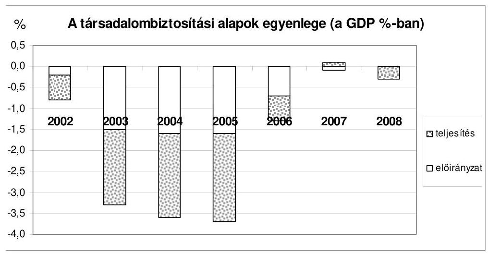

Forrás: költségvetési és zárszámadási törvényjavaslatok
A társadalombiztosítási alapok meghatározó bevételi forrása a társadalombiztosítási járulékok és egyéni biztosítotti járulékok. Ezek együttes mértéke a 2008. évben összességében változatlan, (bérarányosan) 44,5\% volt. A járulékok megosztása a két alap között változott, a korhatár alatti rokkantnyugdíj fedezetét jelentő 3+1\%-os járulékátcsoportosítás következtében. (Ennyivel csökkent az E. Alapot megillető járulékmérték az Ny. Alap javára.)

Az átláthatóság követelményét nem elégíti ki az az évek óta kifogásolt gyakorlat, hogy az E. Alapot és az Ny. Alapot megillető járulékbevételek összevont számlára érkeznek és a járuléknemek közötti megosztásból származó adatok elemzésre, értékelésre alkalmatlanok, a tervezéshez nem használhatók fel. Ezért az elmúlt évben javasoltuk a munkáltatói és biztosítotti járulékok külön-külön számlára történő befizetését.

---

A javaslat nem valósult meg annak ellenére, hogy azt az ONYF vezetése mellett támogatta a Nyugdíjbiztosítási Ellenőrző Testület és megvalósíthatónak tartotta az APEH is. A javaslat megvalósításának előkészítése 2008. évben megtörtént, de döntés nem született, ezért az összevont számlára történő befizetés 2009. évre is fennáll ${ }^{10}$.

Szakmai meggyőződésünk, hogy az állami bevételekről, ezen belül különösen a biztosítási alapon befizetett járulékbevételekről pontos információval kell rendelkezni mindazoknak, akik e rendszerek tervezésére, irányítására és ellenőrzésére hivatottak. Az egy számlára, összesítve befizetett járulékok esetében az sem állapítható meg, hogy a dolgozóktól levont egyéni biztosítotti járulék valóban befizetésre került-e. A nem fizetés veszélye a gazdaság romló feltételei mellett növekszik. Miután a munkáltató által fizetett nyugdíjbiztosítási járulék alapja más, mint a biztosítotti járuléké (az egyiké a teljes járulékalap, a másiké a nyugdíjplafonig terjedő járulékalap), a magánnyugdíjpénztári tagok és az oda nem tartozók esetében eltérő a járulékmérték, a részletes arányok ismeretének hiányában a megosztást elvégezni csak vitatható módon lehet.

Az APEH-nak évenként és alaponként (járulék-nemenként és szektoronként) kell adatot szolgáltatnia - az analitikus nyilvántartásokkal megegyezően - a tárgyévi járulékbevallások és a teljesített befizetések/túlfizetések teljes körű éves feldolgozása alapján.

Az Ny. Alap a 2008. évet 67,6 Mrd Ft hiánnyal zárta. Az Ny. Alapnak azért nem alakult ki egyensúlyi helyzete az év végére, mert a járulékbevételek növekedése nem teremtette meg a nyugdíjemelések fedezetét és a központi költségvetés az előirányzottnál alacsonyabb térítést adott át a magánnyugdijpénztár tagjai által fizetett tagdij összegének pótlására. Az Ny. Alap saját tőke értéke továbbra is negatív előjelű, ami a já-rulék-kintlévőség növekvő értékvesztésének következménye.

Az Alap napi likviditását, az ellátási kiadások teljesítésének zavartalanságát a Kvtv. rendelkezése alapján a KESZ-ről igénybe vett kamatmentes hitel biztosítja. Az év első hónapjában három, második hónapjában négy munkanapon állt fenn hiteltartozás, majd a finanszírozási szükséglet szerint növekedett. A hitelfelvételek alapvetően az előírások szerint, havonta módosított ütemezésű terv szerint alakultak.

Az Ny. Alap 2008. évi bevételének eredeti előirányzata 2872,2 Mrd Ft volt, a teljesítés 2857,6 Mrd Ft, ami az előirányzatnál 0,5\%-kal alacsonyabb. A 2007. évi teljesítéshez viszonyított növekedés $8,1 \%$. A teljesítésen belül meghatározó (az összes bevétel 80,2\%-a) a járulékbevételek és hozzájárulások 2292,9 Mrd Ftos összege. Ez az előirányzott értéknél 0,5\%-kal alacsonyabb, a 2007. évi korrigált tényt $23,5 \%$-kal haladja meg, amiből 15-16,0\%pontot a járulékmérték növekedése tesz ki.

[^0]
[^0]:    ${ }^{10}$ 2010. január 1-jétől az E. Alap és az MPA bevételeinek összevont befizetését rendelte el a közteherviselés rendszerének átalakítását célzó törvénymódosításokról szóló 2009. évi LXXVII. törvény.

---

A központi költségvetés hozzájárulása az 534,2 Mrd Ft-os előirányzattal szemben 523,8 Mrd Ft-ban, $98,1 \%$-on teljesült, kisebb részben a korkedvez-mény-biztosítási járulék tervezettől eltérő alakulása, és nagyobb részben a magánnyugdíjpénztári tagdíjbevétel éves összegének pontatlan becslése miatt.

# Az Ny. Alappal szembeni járuléktartozás az APEH adatközlése szerint a 2008. év végén bruttó 142,0 Mrd Ft volt. 

A járuléktartozásból év végén - az Áhsz. vonatkozó, a korábbi ÁSZjelentésekben évek óta kifogásolt szabályai szerint - 80,0 Mrd Ft értékvesztést számoltak el, ez a járuléktartozás 56,3\%-a volt. Az elszámolási szabályok, valamint a bevallások hibás teljesítése olyan értékeket keletkeztettek, amelyekre nem lehet közgazdasági értékelést adni. Az ÁSZ évek óta kifogásolja az egyedi értékelés elvétől eltérő, ún. csoportos értékelés gyakorlatát.

Az Ny. Alap 2008. évi kiadási főösszege 2925,2 Mrd Ft, ami a törvényi előirányzatot 52,9 Mrd Ft-tal haladta meg. Az ellátási kiadások törvényi előirányzata 2848,1 Mrd Ft volt, ami 2897,8 Mrd Ft-ra teljesült. Az előirányzat alakulását döntően a nyugdíjkiadások határozták meg, az ellátási kiadások 99,8\%-át tették ki.

Az Ny. Alapot terhelő nyugellátások eredeti kiadási előirányzata 2841,8 Mrd Ft volt, ami 2891,7 Mrd Ft-ra teljesült. Az eltérés 1,8\%, ami a nyugdíjemelési mértéket meghatározó makrogazdasági mutatók alakulása miatti többletnyugdíj kifizetés összegénél alacsonyabb érték. Ez a 2008. január 1-jét követően bevezetett nyugdíjszámítási szabályok változásának következménye, ami az automatizmusok csökkenő mértékű emelkedését eredményezte.

A nyugellátásokat a 2008. évben - minden 2008. év előtt nyugdíjba vonult személyre kiterjedően - három alkalommal emelték, valamint teljesítették a 2008. január 1-jén esedékes korrekciós célú nyugdíjemeléseket is. A 2008. évtől új kiadási elemet jelentett a nyugdíj mellett munkát végzőkre vonatkozó nyug-díj-megállapítási szabály ${ }^{11}$ bevezetése. Az elmúlt évben az ellenőrzés kifogásolta a nyugdíj melletti munkavégzés során megszerzett nyugdíjnövelés megállapításának alapját képező jövedelem (kereset) meghatározásának bonyolult, bürokratikus rendszerét, a visszaélés lehetőségét. Javasoltuk a Kormánynak, hogy tegyen javaslatot az Országgyúlésnek (OGY) a szabályozás módosítására. Jelentésünk elkészítésének idején az OGY előtt van a módosítási javaslat, ami a visszaélés lehetőségét megszünteti.

Az Ny. Alap múködési kiadásai az alkalmazottak keresete reálértékének szinten tartását a 2008. évben biztosították. Az ágazat új, átvett és ellenőrzési feladatainak ellátásához a létszámot 115 fővel emelték, gazdálkodása fegyelmezett, feladatait ez évben is jó szervezettségi színvonalon látta el. A dologi és a felhalmozási kiadások továbbra is szűkösen álltak rendelkezésre. A hosszú távú biztonságos múködtetéshez szükséges források hiánya veszélyezteti a munka minőségének megtartását.

[^0]
[^0]:    ${ }^{11}$ A társadalombiztosítási nyugellátásról szóló 1997. évi LXXXI. törvény (Tny.) 22/A. §.

---

Az Ny. Alap ellenőrzési rendszerének múködése megfelelő.
Az E. Alap létrejötte (1992) óta a 2008. volt a második év, amikor az E. Alap nem hiánnyal zárt, amely a kiadások és a bevételek összehangolásának következménye volt. E tekintetben csak az összkiadás és az összbevétel megfeleltetésére törekedtek. A tartós egyensúly megteremtésének feltétele a klasszikus járulék (fedezet) kalkuláció, amelynek keretében egy meghatározott ellátási rendszer koncepciója alapján hosszú távra összehangolják a kiadásokat és a bevételeket.

Az E. Alap 2008. évi, lényegében „0" szaldós költségvetésében, illetve annak teljesítésében az alapvető szerepet a kiadások és a bevételek összhangjának megteremtésére irányuló intézkedések hozták. A járulékot nem fizetők utáni kötelezettség 2007. január 1-jétől rendeződött, a gyógyszerekért fizetett térítési díjak megemelkedtek és a hatályba lépett gyógyszergazdaságossági törvény intézkedéseinek hatására stabilizálódott a gyógyszerkiadás.

A Kvtv. az E. Alap 2008. évi bevételi főösszegét 1437,9 Mrd Ft-ban, kiadási főösszegét 1436,0 Mrd Ft-ban, többletét 1,9 Mrd Ft-ban állapította meg. Az E. Alap a 2008. évi költségvetését 1445,2 Mrd Ft bevételi és 1445,1 Mrd Ft kiadási főösszeggel, 73,4 M Ft többlettel teljesítette.

Az egyenleg oly módon alakult ki, hogy az E. Alap lényegében megtérítette a központi költségvetésnek azt az összeget, amelyet utóbbi az egészségügyi intézmények bérpolitikai intézkedéseire fizetett ki. Ez az E. Alap ellátási kiadási előirányzatai között nem szerepelt, külön soron a céltartalék címen (24,1 Mrd Ft teljesítés) jelent meg. Az eljárás a Kvtv. vonatkozó előírásai szerint történt.

A GYED kiadásokat korábban megtérítette a központi költségvetés, a 2008. évben csak a kiadások felét vállalta. Az E. Alap által fedezett GYED kiadás 41,8 Mrd Ft volt. Ugyanakkor a rokkant nyugdíjak finanszírozása kikerült az E. Alapból, ennek fedezetét biztosító járulékok is átcsoportosításra kerültek a Ny. Alaphoz.

A könyvvizsgálói vélemény szerint az E. Alap működési, ellátási, és konszolidált 2008. évi beszámolói megbízható és valós képet adnak az E. Alap költségvetési teljesítéséről, az Alap december 31-én fennálló vagyoni, pénzügyi és jövedelmi helyzetéről. A könyvvizsgálat vezetői levélben ajánlásokat fogalmazott meg a belső ellenőrzés színvonalának javítása érdekében.

Az E. Alap gazdálkodásában fontos szerepet játszó - az előirányzatok közötti, évközben végrehajtható - átcsoportosítások a Kvtv.-ben előírt módon valósultak meg. Kiszámítható és objektív finanszírozási rendszer hiányában célszerűségüket azonban nehéz megítélni. Kialakítását a 2007. évben is javasoltuk a Kormánynak.

A bevételek teljesítése az előirányzatot minimális mértékben, 0,5\%-kal haladta meg. A két meghatározó nagyságrendű bevételi forrásnál, az egészségbizto-

---

sítási járulékoknál és az egészségügyi hozzájárulásoknál ellentétes irányú eltérések jelentkeztek.

A kiadások 0,6\%-kal meghaladták a tervezettet. Az ellátások közül az összevont szakellátás, az ellátáson kívüli kiadások közül a céltartalék jelentősen (20,5 Mrd Ft-tal és 24,0 Mrd Ft-tal) meghaladták a törvényi előirányzatot, a legnagyobb megtakarítás ( $22,2 \mathrm{Mrd} \mathrm{Ft}$ ) a gyógyszerkiadásoknál jelentkezett.

Az ellátórendszerben a fekvőbeteg szakellátás 2007. évi átalakításának 2008. évi hatásai mellett nem került sor lényeges változtatásokra. Megítélésünk szerint a földrajzi-területi megosztást is figyelembe véve az aktív ellátásban inkább hiány, a krónikus (rehabilitációs) ellátásban pedig inkább felesleg van.

Az elmúlt másfél évtized tapasztalatai azt mutatták, hogy az E. Alap kiadásai között a legnagyobb kockázatot a gyógyszerkiadás jelentette. Ezen a területen a 2008. évben a kiadások stabilizálódása volt megfigyelhető, amiben jelentős szerepet játszott a versenyt élénkítő piaci helyzet, az adminisztratív szabályozás valamint a keresleti oldal (orvos, gyógyszerész, beteg) költségtudatos választásának támogatása.

A gyógyszerszektorban bevezetett intézkedések mintájára a gyógyászati segédeszközök körében is hasonló átalakítás valósult meg, azonban a hatásukra kialakult verseny jelentősen elmarad a gyógyszerszektorban tapasztalttól.

A 2007. évi költségvetés végrehajtásának ellenőrzéséről készített jelentésben rögzített hiányosságok felszámolására történtek intézkedések, de az alapvető hiányosságok továbbra is fennállnak. Érdemi előrelépés nem történt az egészségügyi finanszírozási rendszer racionalizálásában, a munkáltatói és biztosítotti járulék-befizetés szétválasztásában, a központi költségvetésből az egészségügyi intézményeknek fizetett összegek (pl. a 13. havi illetmény) elszámolásában.

Az egészségügyi struktúra-átalakítás eddig lezajlott folyamatairól és a szükségesnek tartott korrekciókról az egészségügyi miniszter a törvényben ${ }^{12}$ előírt beszámolási kötelezettsége keretében adott tájékoztatást.

A gyógyszer- és gyógyászati segédeszköz ellátás, valamint a gyógyszerforgalmazás területén a jogi szabályozás ${ }^{13}$ hatásainak értékelése 2008-ban megtörtént, ugyanakkor a hatályba lépés óta eltelt időszak alapján már egy átfogó értékelés lenne indokolt.

Az E. Alap múködési kiadásai az alkalmazottak keresete reálértékének szin-ten-tartását a 2008. évben biztosították. A dologi és felhalmozási kiadások fedezete az alapvető működési feltételekhez rendelkezésre álltak. A visszalépés az egészségügyi reform keretében tervezett több biztosítós modell bevezetésétől a feladatok újrafogalmazását tette szükségessé.

[^0]
[^0]:    ${ }^{12}$ Az egészségügyi ellátórendszer fejlesztéséről szóló 2006. évi CXXXII. törvény.
    ${ }^{13}$ A biztonságos és gazdaságos gyógyszer- és gyógyászati segédeszköz ellátás, valamint a gyógyszerforgalmazás általános szabályairól szóló 2006. évi XCVIII. törvény.

---

Az E. Alap ellenőrzési rendszere átfogta a költségvetési gazdálkodás és a szakmai, ellátási feladatok végrehajtásának területét. A belső ellenőrzési tevékenység ellátásának minősége a jogszabályi előírásoknak megfelelt.

A társadalombiztosítás pénzügyi alapjaira vonatkozó megállapítások részletes kifejtése a jelentés első kötetének II. Részletes megállapítások fejezet B) Helyszíni ellenőrzés B.1.3.) A társadalombiztosítás pénzügyi alapjai c. pontjában, illetve a második, Függelék c. kötet „C" részében található.

# A HELYI ÖNKORMÁNYZATOK KÖLTSÉGVETÉSI KAPCSOLATAI 

A helyi önkormányzatokat, a helyi kisebbségi önkormányzatokat és a többcélú kistérségi társulásokat megillető támogatások és hozzájárulások előirányzatait a Kvtv. 1. számú mellékletében a IX. Helyi önkormányzatok támogatásai és átengedett személyi jövedelemadója fejezet tartalmazta. Ennek alapján az önkormányzatokat a 2008. évben 1348,6 Mrd Ft illette meg, ami 0,4 Mrd Ft-tal kevesebb a 2007. évinél.

Az előirányzat módosítások - Kormány és fejezeti hatáskörben - az Áht.ban és a Kvtv.-ben meghatározott szabályoknak megfelelően történtek. Év végére az előirányzat 1435,9 Mrd Ft-ra változott. A helyi önkormányzatok támogatásai és átengedett személyi jövedelemadójának módosított előirányzata 6,5\%-kal, 87,3 Mrd Ft-tal haladta meg az eredeti előirányzatot. A pénzügyi teljesítés 1421,7 Mrd Ft, ami az eredeti előirányzatnál 5,4\%-kal magasabb, a módosított előirányzatnál 1\%-kal alacsonyabb.

A Kormány a 2008. évben létrehozott új címekből 33 költségvetési címet december 17. után alkotott meg. A kormányhatározatok alapján 2008. december 29-ig az előirányzatokat teljes egészében folyósították, annak ellenére, hogy a szerződések megkötésére a kormányhatározatokat követő két, illetve több hónap múlva került sor. A számvevőszéki ellenőrzés aggályosnak ítéli az ÖM eljárását, amelynek keretében a minisztérium a 2008. évben az önkormányzatoknak úgy biztosított összességében 17 123,3 M Ft-ot az év utolsó időszakában (2008. december 17-től december 31-éig), hogy a pénzügyi folyósítást megelőzően a támogatásokra szerződéseket nem kötött. Ezzel a minisztérium figyelmen kívül hagyta az állami kötelezettségvállalást tartalmazó támogatási szerződések megkötésének a feltételeire vonatkozó Ptk., Áht., és Ámr. előírásokat.

Az ellenőrzésbe bevont 71 önkormányzat és 16 többcélú kistérségi társulás öszszesen 24 106,3 M Ft normatív hozzájárulással és 2 386,6 M Ft - a többcélú kistérségi társulásokat megillető - kötött felhasználású normatív támogatással számolt el.

Az ellenőrzött önkormányzatok 453,2 M Ft normatív hozzájárulást jogtalanul vettek igénybe és számoltak el, 438,4 M Ft pedig pótlólagosan jár részükre a feladatellátás alapján. A feltárt eltérések egyenlege $-14,8 \mathrm{MFt}$ jogtalan igénybevétel, az önkormányzatok által elszámolt normatív hozzájárulás 0,06\%-a, ami az előző évi 0,83\%-hoz képest javulást mutat. Ezzel összefüggésben a zárszámadás megbízhatósága a normatív hozzájárulások elszámolása

---

tekintetében javult. Ennek oka a figyelmesebb elszámoláson kívül a Kincstár ellenőrzési tevékenységének kiterjesztése.

A normatív hozzájárulással elszámoló önkormányzatok és többcélú kistérségi társulások 28\%-a nyújtott be hibátlan elszámolást, a normatív kötött felhasználású támogatással elszámoló többcélú kistérségi társulások egyike sem. A normatív hozzájárulásnál a lényegességi küszöböt (2\%) meghaladó elszámolási hibát négy önkormányzat esetében állapítottunk meg. A 2\% feletti hibát tartalmazó önkormányzati beszámolók aránya az előző évi 29\%-ról 5\%-ra csökkent. Egy-egy jogcím esetében a hibaarány 5\%-nál nagyobb volt az ellenőrzött önkormányzatok 20,3\%-ánál, szemben az előző évi 44,6\%-kal

Az alapfokú múvészetoktatás normatív hozzájárulás igénylése és elszámolása a 2008/2009. tanévben megváltozott, mivel a feladat finanszírozása ketté vált. Egyrészt valamennyi alapfokú művészetoktatási intézmény részesült a teljesítménymutatóval számított közoktatási alap hozzájárulásból, másrészt a minősített alapfokú művészetoktatást biztosító intézmények kiegészítő hozzájárulásban részesültek. A változás miatt nem volt meg az összhang a Kvtv. és a Közokt. tv. között a térítési díj számítására vonatkozóan, mivel a Közokt. tv. csak az alaphozzájárulást nevesíti - a kiegészítő hozzájárulást nem - a térítési díj minimumának meghatározásánál.

A tanévre való tervezéssel megváltozott az óvodában, iskolában, kollégiumban szervezett kedvezményes étkeztetés jogcímen a hozzájárulás elszámolása. Míg a Kvtv. a jogcímre vonatkozó szabályozásban a tanévekre vonatkozó elszámolást írta elő, ezzel nincs összhangban a Kvtv. kiegészítő szabályozása, amelyben az étkezésben részt vevők naptári évre, naponként összesített éves létszámát kellett visszaosztani az intézménytípusonként meghatározott - éves szintű - napszámmal. A tanévenkénti megbontás miatt az önkormányzatok 7\%-ának az elszámolása volt hibás.

A Kvtv. előírásában megjelölte az adott központosított elöirányzatok igénybevételi feltételének, döntési rendjének, folyósításának, felhasználásának, elszámolásának részletes szabályairól szóló rendelet kiadásáért felelős ágazati minisztert. Nem tartotta be a Kvtv.-ben meghatározott határidőt a rendeletalkotás során az önkormányzati miniszter négy jogcím esetében, az oktatási és kulturális miniszter három jogcím esetében, továbbá a közlekedési, hírközlési és energiaügyi miniszter, a környezetvédelmi és vízügyi miniszter és a szociális és munkaügyi miniszter egy-egy jogcím esetében.

A lakossági víz- és csatornaszolgáltatás támogatása jogcímnél a KvVMtől nem a miniszter által jóváhagyott és aláírt támogatási összeget tartalmazó döntési táblázat került az ÖM-hez, ami miatt a megítélt 4307,1 M Ft összegű támogatás helyett 3,2 M Ft-tal magasabb összeget utalványozott az ÖM. A hibát a folyamatba épített ellenőrzés elmaradása okozta.

A helyi közösségi közlekedés normatív támogatása jogcímen egy önkormányzat részére a megítélt támogatás összege alacsonyabb volt a beadott pályázatban szereplő összeghez képest, amelyről a belső vizsgálat alapján kiderült, hogy adminisztrációs hiba történt, (helyiérték tévesztés az adatbázisban) 22 M Ft helyett 22 E Ft került jóváhagyásra. Az eltérés pénzügyi rendezése megtörtént, de a hiba előfordulása rámutatott a folyamatba épített ellenőrzés hiányára.

---

Az ellenőrzött többcélú kistérségi társulások az ellenőrzés megállapítása alapján $29,9 \mathrm{M}$ Ft normatív kötött felhasználású támogatást jogtalanul vettek igénybe és számoltak el, $31,8 \mathrm{M}$ Ft pedig pótlólagosan jár részükre. Az egyenlegében $1,9 \mathrm{MFt}$ pótlólagos támogatás abszolút összegre vetítve 2,6\%-os eltérést jelent az elszámoláshoz képest. A többcélú kistérségi társulások normatív kötött felhasználású támogatás elszámolásából három volt 5\% feletti hibaarányú.

A többcélú kistérségi társulások ösztönző támogatását bonyolult szabályozási feltételek mellett nyújtotta a központi költségvetés. A közös feladatellátást szervező tevékenységével is biztosíthatta a többcélú kistérségi társulás, amelynek konkrét tartalmát nem szabályozták. A támogatás igénylése és elszámolása az ÖM által kidolgozott adatbázis rendszerben történt, mely terjedelmes és nehezen áttekinthető volt, számítási módszere a mutatószámok kerekítésére vonatkozó szabályok tekintetében nem volt összhangban a Kvtv. előírásaival.

A szabályozás - bizonyos megkötésekkel - lehetőséget biztosított az ösztönző támogatás támogatott feladatok közötti átcsoportosítására, de a központi információs rendszer keretében a különböző feladatokra igénybe vett támogatásokról egy soron kellett elszámolni a feladatmutató feltüntetése nélkül, így a költségvetési beszámolóban nem volt lehetőség annak kimutatására, hogy az átcsoportosítást követően a felhasználás milyen feladatokra, milyen nagyságrendben történt. A cél szerinti felhasználás elszámolási, dokumentálási rendszerét központilag nem szabályozták. Az ösztönző támogatások cél szerinti felhasználása az intézményfenntartó társulások gesztor önkormányzatokon keresztül történő többlépcsős finanszírozása miatt nehezen volt követhető.

Az ellenőrzött intézményeknél a fenntartó önkormányzatok és a feladatellátás szervezésében részt vevő többcélú kistérségi társulások részére történt hibás adatszolgáltatás oka az volt, hogy az óvodai és általános iskolai ellátottak számbavételét a Kvtv. mellékletei a 2008. költségvetési évre nem azonos módon szabályozták. A 3. számú melléklettel szemben a 8. számú mellékletből kimaradt a Közokt. tv. - a normatív hozzájárulás meghatározásakor figyelembe vehető gyermek-, tanulói létszám meghatározása - előírásaira történő hivatkozás, továbbá nem tartalmazta a támogatás igénybevételi lehetőségét az óvodai nevelésben részesülő azon gyermekek esetében, akik a költségvetési év december 31-éig a harmadik életévüket betöltik és az óvodai nevelésüket megkezdik, mely hiányosságokat a 2009. évi Kvtv. megszüntette. Ugyanakkor a 8. számú melléklet közoktatási intézményi feladatait érintően - szemben a 3. számú melléklet előírásával - a gyermekek, tanulók létszámának számításánál a Közokt. tv-nek az osztályok szervezésére vonatkozó előírásait is figyelembe kellett venni, mely eltérés a 2009. évi Kvtv.-ben is megmaradt. A bejáró, az iskolabusszal utaztatott, továbbá a tagintézményekbe járó beilleszkedési, tanulási, magatartási zavarral küzdő, illetve sajátos nevelési igényű gyermekek/tanulók két, illetve három főként történő számbevételét, így a 8. számú melléklet szerinti „többszörös" finanszírozását többlet szakmai tartalom (többlet pedagógus szükséglet, egyéb költség) nem indokolja, különösen, hogy a közoktatási intézmények alaptevékenysége finanszírozását biztosító 3. számú melléklet szerint e gyermekek/tanulók a normatív (alap és kiegészítő) hozzájárulások szempontjából egy főként vehetők figyelembe.

A szociális alapszolgáltatási feladatokhoz igényelhető ösztönző támogatás ellenőrzése során a legtöbb eltérést az okozta, hogy a Kvtv. a mellékleteiben eltérően határozta meg a kerekítési szabályokat. A 3. számú melléklet szerint fenntartói szinten a kerekítés általános szabályait kellett alkalmazni, a 8. számú melléklet szerint ugyanazokra a jogcímekre egy tizedesre kerekített mutatószámok

---

alapján részesültek támogatásban. Az eltérő szabályozás miatt a feladatellátást biztosító szociális intézmények adatszolgáltatása és az intézményfenntartó többcélú kistérségi társulások elszámolása hibás volt.

A belső ellenőrzési feladatok ösztönző támogatása a feladatellátásban résztvevő önkormányzatok és költségvetési szerveik alapján illette meg a többcélú kistérségi társulásokat. A támogatás összege független volt a tárgyévben ténylegesen elvégzett belső ellenőrzési feladatoktól. A jelenlegi szabályozás külön veszi figyelembe az önkormányzatokat, illetve a polgármesteri hivatalokat, továbbá a többcélú kistérségi társulásokat és munkaszervezeteiket, annak ellenére, hogy ez a belső ellenőrzés szempontjából nem jelent külön ellenőrzési feladatot. A szabályozás saját feladatként ismerte el a külső erőforrás bevonásával végzett tevékenységet is.

A helyi önkormányzatok jövedelem-differenciálódás mérséklésének elszámolása a vizsgálatba bevont települési önkormányzatok közül hetvenet érintett. A számvevőszéki ellenőrzés a vizsgált önkormányzatok jövedelemkülönbség mérséklésére vonatkozó elszámolásait teljes körűen felülvizsgálta, ennek alapján tíz önkormányzatnál 31,9 M Ft befizetési kötelezettség, valamint hat önkormányzatnál együttesen 6,3 M Ft összegű további kiegészítés egyenlegeként 25,6 M Ft összegű visszafizetési kötelezettséget állapított meg. Az eltéréseket minden esetben a nem kötelezően ellátott térségi feladatok mutatószámának változása okozta. A jövedelem-differenciálódás mérséklés elszámolás ellenőrzésénél megállapított eltérések következményeként a saját forrásból beruházásra felhasznált összeg visszaigényelhető része nem változott.

A múködésképtelen önkormányzatok egyéb támogatására vonatkozóan a méltánylást érdemlő körülmény lehetséges eseteit nem szabályozták egyértelműen. Az utasítás és az útmutató felsorolta azokat a tényezőket, amelyekre kiemelt figyelmet kell fordítani a döntés előkészítés során, arra vonatkozóan azonban nem tartalmazott előírást, hogy ezen tényezők fennállását, vagy mértékét hogyan kell számba venni, milyen mértékben kell érvényesíteni. Továbbra sem volt megítélhető az egyes szempontok támogatási összegre gyakorolt hatása.

A címzett és céltámogatási támogatások odaítélése során a Cct. nevesíti a Regionális Egészségügyi Tanácsot, illetve a Területi Vízgazdálkodási Tanácsot, amelyek szakmai szervezetként javaslatot tesznek a támogatásra. A folyósítás során azonban nem ezek a szervezetek ellenőrzik, hogy a számlán jelzett szolgáltatás, elvégzett munka stb. ténylegesen kapcsolódik-e a beruházáshoz, és a támogatási cél megvalósulását szolgálja-e, ezáltal a beruházás megvalósításáról, annak szabályszerűségéről nem rendelkeznek megfelelő információval.

Címzett és céltámogatási igénybejelentéseiket az önkormányzatok a jogszabályokban előírt célokra, feladatokra nyújtották be. A benyújtott igénybejelentések 87\%-a megfelelt a jogszabályokban előírt tartalmi és formai követelményeknek. A tartalmi és formai követelmények érvényesülését a többi önkormányzat is hiánypótlás teljesítésével biztosította.

A beruházások szakmai-müszaki előkészítését a fejlesztési cél meghatározása, a lakossági szükségletre és a gazdaságosságra irányuló elemzések elvégzése, a hatósági engedélyek, műszaki tervek időben rendelkezésre állása és a

---

beruházás műszaki tartalmának módosítását kiváltó okok figyelembevételével a beruházások 67\%-ánál minősítettük megfelelőnek.

A beruházások pénzügyi előkészítése keretében a céltámogatásban részesült önkormányzatok megkötötték a támogatási szerződést az illetékes regionális fejlesztési tanáccsal. A címzett és céltámogatásban részesült önkormányzatok finanszírozási szerződést kötöttek a Kincstárral, illetve a számlavezető pénzintézetükkel. A finanszírozási szerződések tartalma összhangban volt az igénybejelentésekkel és - egy kivételével - a jogszabályi előirásokkal.

Az egyéb pénzforrások időben való rendelkezésre állása és a forrástervezés megalapozottsága alapján a beruházások kétharmadának volt megfelelő a pénzügyi előkészítése. E beruházásoknál a decentralizált támogatások (TEKI, CÉDE, TRFC), valamint az egyéb pénzforrások (tényleges önkormányzati saját forrás, fejlesztési hitel, lakossági hozzájárulás stb.) időben rendelkezésre álltak, és az előre felmérhetetlen körülmények kivételével nem, illetve csak kismértékben módosult a beruházás forrásösszetétele. A beruházások pénzügyi előkészítése részben volt megfelelő a beruházások egyharmadánál. E beruházásoknál a pénzügyi források nem voltak megfelelően összehangolva, mert a decentralizált támogatásokat a címzett és céltámogatási igénybejelentésnél nem tervezték az önkormányzatok. Tervezési hiányosság miatt az önkormányzati saját források az ütemezettnél későbbi időben álltak csak rendelkezésre, amely azonban nem hátráltatta a beruházások megvalósításának folyamatát. A beruházási költségek nem teljes körű számbavétele plusz önkormányzati saját források biztosítását tette szükségessé.

Az ellenőrzött beruházások forrásösszetétele a címzett és céltámogatási igénybejelentésben tervezetthez képest változott. Az önkormányzatok az egyéb állami támogatások elnyerésével csökkentették az igénybejelentésben tervezett saját forrásokat, vagy a többletköltségek fedezetének biztosítására használták fel azokat. A befejezett beruházások forrásai között a címzett támogatás részaránya az eredeti 70,6\%-ról 67,9\%-ra, míg a céltámogatás 8,7\%-os részaránya 8,4\%-ra csökkent. A decentralizált állami támogatások aránya az igénybejelentésekben mindössze $0,7 \%$-ot tett ki, amely $2,2 \%$-ra nőtt. Az eredetileg tervezettnek több mint háromszoros összegével szerepeltek a decentralizált támogatások a befejezett beruházások forrásösszetételében.

A vizsgált beruházásokkal összefüggésben az érintett önkormányzatok 93\%-a alkalmazta a közbeszerzési törvény előírásait a beruházás megvalósításában részt vevő szolgáltatók kiválasztásában. A közbeszerzési eljárások lefolytatása során az önkormányzatok 83\%-a betartotta a törvényi előírásokat és a helyi szabályozásnak megfelelően járt el. Az önkormányzatok 17\%-ánál állapítottunk meg hiányosságot a közbeszerzési eljárás szabályozási teendőinek ellátása és az eljárás lefolytatása során a törvényi előírások és a helyi szabályozás érvényesítése tekintetében.

A címzett és céltámogatás 2008. évben rendelkezésre álló 52500 M Ft módosított előirányzatából 34 940,7 M Ft (66,6\%) felhasználása történt meg 2008-ban. Az előirányzat-maradvány 2008. december 31-én 17 559,3 M Ft volt, a rendelkezésre álló előirányzat 33,4\%-a.

---

Az ellenőrzött helyi önkormányzatoknak 2008-ban összesen 6847 M Ft címzett és céltámogatási előirányzat állt rendelkezésre beruházásaik megvalósításához. Az önkormányzatok 2008-ban 5961,3 M Ft-ot, a rendelkezésre álló címzett és céltámogatási előirányzat $87,1 \%$-át felhasználták, 10 MFt-ról $(0,1 \%)$ pedig lemondtak. A vizsgált címzett és céltámogatások 2008. év végi előirányzatmaradványa 875,6 M Ft volt, a 2008-ban rendelkezésre álló előirányzat 12,8\%a, amely 14 beruházásnál, a vizsgált beruházások $47 \%$-ánál képződött. Az elői-rányzat-maradvány nagyobb része, $517,9 \mathrm{M} \mathrm{Ft}(59,1 \%)$ a még folyamatban lévő 4 maradványa volt és még felhasználásra kerülhet. Az előirányzatmaradvány kisebb része $357,7 \mathrm{M} \mathrm{Ft}(40,9 \%)$, a befejezett beruházások $38 \%$ ánál keletkezett és végleges maradványnak tekinthető. Az ellenőrzött címzett és céltámogatások 2005-2008. évekre rendelkezésre álló $20456,7 \mathrm{M}$ Ft-os előirányzatából 19571,1 M Ft ( $95,7 \%$ ) felhasználása történt meg 2008 végéig.

A vizsgálattal érintett önkormányzatoknál az ellenőrzés nem állapított meg az Áht. szerinti pótlólagos bevételt, így ezek elszámolására vonatkozó javaslatunk nem volt. Az ellenőrzött 27 címzett támogatást és 3 céltámogatást a támogatások elnyerésére vonatkozó igénybejelentésekben meghatározott célokra, feladatokra, műszaki tartalomra használták fel az önkormányzatok. A vizsgálat a felhalmozási célú támogatások igénybevételénél és felhasználásánál nem állapított meg szabálytalanságot, így az önkormányzatoknak nem javasoltunk címzett vagy céltámogatás visszafizetést. A címzett és céltámogatási előirányzatról való lemondási kötelezettség teljesítése 2008-ban, illetve a helyszíni vizsgálatok befejezéséig 7 esetben szabályszerűen megtörtént. A címzett támogatási előirányzatról való lemondási kötelezettségének a Cct.-ben foglalt előírás ellenére 2 önkormányzat nem tett eleget, akik a beruházás tervezett befejezését követő év végéig összesen 53,8 M Ft címzett támogatást nem használtak fel, amelyről haladéktalanul le kellett volna mondaniuk.

A Budapest 4-es - Budapest Kelenföldi pályaudvar-Bosnyák tér közötti - metróvonal építésének támogatása 2008. évi 16,2 Mrd Ft-os előirányzata 43,5 Mrd Ft-on teljesült, amely több mint 2,5-szer magasabb a tervezettnél.

A 2008. évben valamennyi devizás kifizetés esetében eltér az ÖTM/ÖM által kiadott utalványon szereplő összeg és a Kincstár által ténylegesen teljesített kifizetés összege.

A 2008. évben a forint euróhoz viszonyított árfolyama 25 devizás kifizetés esetében - összesen 212,6 M Ft összegben - kedvezőbb, 24 devizás kifizetés esetében - összesen 237,4 M Ft összegben - kedvezőtlenebb volt a teljesítés napján, mint az utalvány elkészítésekor. A 2008. évben a Kincstár a teljesítéseknek és az utalványokon szereplő összegeknek - az árfolyamváltozásból adódó - különbözetéről korrekciós utalványok kiállítását kérte az ÖTM/ÖM-től. Ennek következtében az ÖTM/ÖM 17 esetben negatív összeget tartalmazó utalványt is kiállított.

A 2008. év I. félévében 6 kifizetést, továbbá 17 díjfizetést indítottak el utalvány hiányában. Ez a teljesült előirányzatnak 0,7\%-a. A kifizetések és a díjtételek a hozzájuk tartózó devizautalásokkal együtt minden esetben a számlákon feltüntetett fizetési határidőkre teljesültek. A díjkifizetések összegére

---

vonatkozó forrásbiztosítást a Kincstár utólag kérte az ÖTM/ÖM-től. A díjfizetések értéknapjai így korábbiak voltak, mint az ÖTM/ÖM által kiállított utalványok kelte, ezáltal megállapítható, hogy az ÖTM/ÖM utalványozása - a korábbi évekkel egyezően - a 2008. évben is formális volt.

A 2008. év I. félévében a Kincstárnál a 4-es metró finanszírozási folyamatba épített ellenőrzése nem megfelelően múködött és szükségessé vált annak szigorítása. Az ÁSZ ezeket a hiányosságokat a 2006. és a 2007. évi zárszámadás ellenőrzése során is jelezte, amely megállapítást a KEHI 2008. évi jelentése is alátámaszt. A 4-es metró beruházás finanszírozása során a folyamatba épített ellenőrzés fokozottabb érvényesülése érdekében új ellenőrző pontként beépítésre került az átutalások indítását közvetlenül megelőző vizsgálat, amely az ÖM utalvány meglétére vonatkozik, utalvány hiányában az átutalási megbízás nem teljesíthető. A 2008. év második félévében - a 2007. évi számvevőszéki vizsgálat lezárását követően - utalvány hiányában kifizetés már nem történt.

A 2008. évben a Kincstár negyedévente küldött tájékoztatást az ÖTM/ÖM részére a tényleges kifizetésekről. Mivel a tájékoztatás nem állt az ÖTM/ÖM rendelkezésére minden olyan napon, amikor pénzforgalmi tranzakció történt, az utalvány és a kifizetések egyeztetése nem volt naprakész.

A számvevőszéki ellenőrzés megítélése szerint a Budapest 4-es metróvonal beruházásának előirányzata kezelését és a teljesítés ellenőrzését azon fejezet kötelezettségei között kell megjeleníteni, amely fejezet a beruházás szakmai megvalósításáért felelős. Ez a fejezet azonban nem az ÖTM/ÖM, annak ellenére, hogy a 2005. évi LXVII. törvény alapján az állam által vállalt támogatást költségvetési kiadásként a IX. Helyi önkormányzatok támogatása és átengedett személyi jövedelemadója fejezetben kell előirányozni. A változtatásra a metrótörvény módosításával van lehetőség.

A Kincstár - a BKV Zrt.-vel kötött szerződés alapján - valamennyi szerződést, számlát, az ahhoz tartozó teljesítésigazolást, a forrásrészletezést minden lehívás kezdeményezésekor megkapott a beruházótól. A Kincstárban rendelkezésre álló dokumentációk alapján a Kincstár minden esetben ellenőrizte a beküldött dokumentumok szabályszerűségét, a forrásmegosztás arányát. Ezután kérte az ÖTM/ÖM-től a forrás biztosítását. A szerződésnek megfelelően a Kincstár a számlatulajdonost összevont és tételes számlakivonattal értesítette minden olyan napon, amikor a számlán pénzforgalmi tranzakció történt, illetve minden hónap 10 -ig az előző hónap összevont kimutatásával. A 2008. évben a Kincstár valamennyi beérkezett lehívásnál - a beérkező szerződések, számlák ellenőrzése, illetve a számlatulajdonos tájékoztatása vonatkozásában - a szerződésben leírtak alapján járt el. A Kincstár által teljesített kifizetések szerződésekkel, számlákkal alátámasztottak.

A budapesti 4-es - Budapest Kelenföldi pályaudvar-Bosnyák tér közötti - metróvonal megépítésének állami támogatásáról szóló kormányhatározat értelmében a 4-es metró beruházója a főváros 100\%-os tulajdonában lévő Budapesti Közlekedési Részvénytársaság. A határozat tartalmazza a projektköltségek arányosítását, azaz a főváros vállalja, hogy a projektköltség 21,02197\%-át maga finanszírozza.

---

A főváros a Finanszírozási Szerződés hatályba lépése előtt a projekt előkészítésével és megvalósításával kapcsolatban felmerült költségeket (a továbbiakban: Előkészítési Kiadások) 100\%-ban finanszírozta. A Finanszírozási Szerződés szerint az ún. Megelőlegezett Támogatás az Előkészítési Kiadások fedezetére nyújtott Fővárosi Támogatásnak azt a részét jelenti, amely meghaladja a Fővárosi Támogatásnak (21,0219\%) a tervezett projektköltséghez viszonyított aránya szerinti összegét. A Megelőlegezett Támogatás teljes összegének visszafizetése olyan formában történik, hogy 2007 és 2008 között - egyenlően megosztva - az állam a beérkező számláknak nemcsak a ráeső részét, hanem a főváros részét is kiegyenlíti. A 2008. évben az állam eleget tett kötelezettségének és 6993,2 M Ft összegű megelőlegezett támogatást fizetett vissza.

A 2005. évi LXVII. törvény előírása értelmében a kontrollpozíció gyakorlását segítő szakértői szolgáltatás igénybevételére az állam az állami támogatásból évente legfeljebb 50 M Ft összeget használhat fel. Ebből a keretből a 2008. évben sem történt felhasználás.

Az ÁSZ helyszíni ellenőrzésének lezárásáig - 2009. május 29-ig - az állami szakértői szolgáltatás beszerzésére irányuló pályázatot nem írták ki. A projekt I. szakasza - a PM tájékoztatása szerint - várhatóan uniós forrásból kerül finanszírozásra. Így a pénzügyi ellenőrzés minősége és mélysége, illetve a projekt megvalósításának ellenőrzése szigorúbb lehet az uniós rendszer szabályai szerint, mint azt a jelenlegi finanszírozási struktúra lehetővé teszi. Előbbiek következményeként a PM az állami szakértő beszerzésére irányuló közbeszerzési folyamatot a 2006. évben leállította. A 2007. év folyamán azonban nyilvánvalóvá vált, hogy az EU az uniós finanszírozásba várhatóan nem fogadja be a metróprojektet teljes terjedelmében. Így a PM újra indította - a korábbi években már megkezdett - az állami szakértő igénybevételét célzó közbeszerzési eljárás előkészítését. A 2008. évben még nem született meg az EU Bizottságának döntése a metróprojektet illetően. Az EU támogatási döntését követően a pályázati kiírásra sor kerülhet, mivel akkor már ismert lesz, mely projektrészek kerülnek be a szigorúbb uniós kontrollmechanizmusba és melyek nem.
2008. december 12-én aláírták Budapest Főváros Önkormányzata, a Nemzeti Fejlesztési Ügynökség, a KIKSZ Közlekedésfejlesztési Zrt. és a BKV Zrt. között az Európai Unió Kohéziós Alapjából és az Operatív Program hazai központi költségvetési előirányzatából származó támogatásnak a Budapesti 4. sz. metróvonal I. szakasz (Kelenföldi pályaudvar-Keleti pályaudvar) és kapcsolódó felszíni beruházásai megvalósításának finanszírozására való felhasználásáról szóló Támogatási Szerződést.

A Gazdasági és Közlekedési Minisztérium 2008. május 15-én szétvált két jogutód intézményre: a Közlekedési, Hírközlési és Energiaügyi, illetve a Nemzeti Fejlesztési és Gazdasági Minisztériumra. A számvevőszéki ellenőrzés véleménye szerint a kormányhatározat pontositására van szükség, amely előírja, hogy mely jogutód intézmény felelős a jelentéstételi kötelezettségért.

A beruházásra fordítandó összeg nagysága - a 2008. évi szárszámadás számvevőszéki ellenőrzésekor tapasztaltnál - fokozottabb ellenőrzési tevékenységet indokol a Magyar Állam képviseletével meg-

---

bízott PM részéről. A fokozottabb ellenőrzésnek az eddiginél jelentősebb szakmai kontrollt kell biztosítania. Az erőteljesebb szakmai ellenőrzésnek - a Kormány tájékoztatásán túlmenően - a megvalósítás folyamatának közvetlen vizsgálatát is magában kell foglalnia.

A Finanszírozási Szerződésben a főváros kötelezettséget vállalt arra, hogy a BKV Zrt. a közbeszerzési eljárás előkészítésének megkezdése előtt írásban megküldi az állam részére a tervezett beszerzés tárgyának meghatározását. A főváros kötelezettséget vállalt arra is, hogy a BKV Zrt. a közbeszerzési eljárás eredményeként kötött szerződést megküldi az állam részére. Az állam és a főváros közötti szerződésben foglaltaknak megfelelően a BKV Zrt. a 2008. évben tervezett beszerzések dokumentációját, illetve a megkötött szerződéseket megküldte az állam részére, melyekkel kapcsolatban az állam kifogást nem emelt.

A Finanszírozási Szerződés ezen módosítása a korábbinál nagyobb lehetőséget ad ugyan az állami kontroll érvényesülésére, de a jelenlegi szerződéses struktúra továbbra is a kontroll szűk körű szintjét teszi csak lehetővé. A módosított Finanszírozási Szerződés alapján az állam még mindig nem emelhet kifogást a megküldött szerződést illetően a beszerzés tárgyának meghatározásával kapcsolatos rendelkezésével szemben, ha az lényegében megegyezik a tervezett beszerzés tárgyával. A Finanszírozási Szerződés szerint lényegében megegyezőnek minősül a beszerzés tárgya különösen abban az esetben, ha az eltérés csupán az, hogy a mennyisége kisebb, vagy meghatározása részletesebb.

A Finanszírozási Szerződés szerint „amennyiben az állam jogosulatlanul emel kifogást, az szerződésszegésnek minősül, és következményeiért felel.

A számvevőszéki ellenőrzés megítélése szerint a szerződés - a módosítás ellenére - továbbra is olyan tág lehetőséget biztosít a tervezettől való eltérésre, ami alapján az államnak nincs reális lehetősége kifogást emelni a beszerzéseket illetően. A szerződések módosítására azonban csak a főváros egyetértésével van lehetőség. Budapest Főváros Önkormányzata és a BKV Zrt. között létrejött - a budapesti 4-es metróvonal Budapest Kelenföldi pályaudvar és Budapest Keleti pályaudvar közötti szakasza beruházói feladatainak ellátására 2004. január 19-én megkötött és 2005. augusztus 17-én módosított - szerződés értelmében a BKV köteles a beruházás során hozott beruházói döntések és a beruházás megvalósítása ellenőrzésére Független Ellenőrző Mérnököt megbízni. Budapest Főváros Önkormányzata és az Európai Beruházási Bank között 2005. július 18-án létrejött pénzügyi szerződés 6.09 pontja is előírja „egy független és nemzetközi gyakorlattal rendelkező mérnök" alkalmazását. A Független Ellenőrző Mérnök a BKV által - a főváros egyetértésével - meghatározott feltételek szerint végezné feladatát, azonban a számvevőszéki ellenőrzés lezárásáig továbbra sem alkalmaztak mérnököt.

A helyi önkormányzatokra vonatkozó megállapítások részletes kifejtése a jelentés első kötetének II. Részletes megállapítások fejezet B) Helyszíni ellenőrzés B.2.) A helyi önkormányzatok c. pontjában, illetve a második, Függelék c. kötet „D" részében található.

---

# JAVASLATOK 

A helyszíni ellenőrzés megállapításainak hasznosítása mellett javasoljuk:*

## a Kormánynak

1. Fordítson figyelmet arra, hogy a központi költségvetés általános tartalékából csak az Áht. 25. § (1) bekezdésében előírt feltételek megléte esetén kerüljön előirányzatátcsoportosításra a fejezetekhez.
2. Kezdeményezze az Áht. 26. § (4) bekezdésében foglaltak módosítását úgy, hogy
a) valamennyi, az általános tartalékból nyújtott támogatás a felhasználást követő 30 napon belüli elszámolási és - az igényelt célra fel nem használt része tekintetében, illetve nem az igényelt célra történő felhasználás esetén - egyidejű visszatérítési kötelezettséggel kerüljön átcsoportosításra. A módosításban szabályozza az elszámolás és a visszafizetés rendjét;
b) abban meghatározásra kerüljön az elszámolási és a fel nem használt rész tekintetében visszatérítési kötelezettséggel átcsoportosított általános tartalék előirányzat felhasználása elszámolásának, az esetleges visszatérítési kötelezettség teljesítésének figyelemmel kísérésért felelős, illetve felelősök személye.
3. Gondolja át a központi költségvetés céltartalékának felhasználásával kapcsolatos KEHI ellenőrzések kiterjesztési lehetőségeit és intézkedjen annak megvalósítása érdekében.
4. Határozza meg a központi költségvetésen keresztül finanszírozott állami feladatok MPA-ból történő hozzájárulásának arányát. Ezzel egyidejűleg intézkedjen az MPA gazdálkodásának racionalizálásáról.
5. Alakítsa ki az egészségügyi finanszírozás stabil, kiszámítható és objektív rendszerét. Határozza meg az ellátási rendszer koncepcióját és ennek alapján készíttesse el a járulék (fedezet) kalkulációt, amely figyelembe veszi a szükségletek, a lehetőségek és a kívánalmak egyeztetett rendszerét, ami hosszú távon biztosítja a kiadások és bevételek összhangját.
6. Követelje meg a 2008. évi XX. tv. és a végrehajtását szolgáló jogszabályokból adódó kormányzati struktúra-változásokkal összefüggő feladatok teljes körű teljesítését, és az érintett tárcák vezetőit ezek végrehajtásáról számoltassa be.
7. Fordítson figyelmet arra, hogy a 2006. évi kormányzati struktúra-váltás következtében (a GKM jogutódjánál) az NFGM fejezetnél nyilvántartott eszközök átadásra kerüljenek azokhoz a tárcákhoz, ahol azok szakmai feladatellátáshoz szükségesek (ME és HM fejezetek), illetve átadásra kerüljenek az azokat használó államháztartáson kívüli szervezetek részére.
[^0]
[^0]:    * A javaslatok - címzettenként - a jelentésben foglaltak sorrendjéhez alkalmazkodnak.

---

8. Intézkedjen a budapesti 4-es - Budapest Kelenföldi pályaudvar-Bosnyák tér közötti metróvonal megépítésének állami támogatásáról szóló 1059/2005. (VI. 4.) Korm. határozat 10. pontjának módosításáról a GKM jogutód intézményei beszámolási kötelezettségének tisztázása és érvényesítése érdekében.

# a pénzügyminiszternek 

9. Gondoskodjon arról, hogy
a) a központi költségvetés általános tartalékának átcsoportosítására készített kor-mány-előterjesztésekben a tárcák által jelzett forrásigények kellően megalapozottak és indokolással alátámasztottak legyenek;
b) a központi költségvetés céltartalék előirányzata fejezetekhez történő átcsoportosításának feltételét képező, jogszabályban előírt előzetes ellenőrzési kötelezettségüknek mind az érintett tárcák, mind a PM dokumentált módon tegyenek eleget.
10. Intézkedjen, hogy a kincstári körbe tartozók költségvetési előirányzatai módosításának nyilvántartási rendje minden évben a költségvetési törvény jóváhagyásával egyidejűleg, de legkésőbb a tárgyévet megelőző év végéig - amennyiben szükséges aktualizálásra, módosításra kerüljön.
11. Gondoskodjon arról, hogy az APEH kezelésébe tartozó adónemek és illetékek év végi hátraléka, annak alakulása, a változások okai a költségvetés zárszámadása során bemutatásra kerüljenek.
12. Ismételten tekintse át a VP által kezelt - az APEH részére behajtásra átadott - hátralékok alakulását, és intézkedjen az azokból származó megtérülési arány növelése érdekében.
13. Biztosítsa az előirányzat-maradvány jogszabályban előírt elfogadási határidejének betartását.
14. Intézkedjen a központi költségvetéssel történő elszámolás elveinek, módszertanának és számviteli eljárásainak jogszabályi kialakításáról azoknál a fejlesztéseknél, ahol a beruházást először a hazai költségvetésből finanszírozták, majd ezt később EUtámogatással váltják fel. Olyan egyértelmú, minden érintettre kiterjedő, általánosan alkalmazandó előírás készüljön, amely megfelel a hazai költségvetési szabályozásnak, és egyúttal lehetővé teszi az EU-s támogatások és költségvetési előirányzatok felhasználásának átláthatóságát.
15. Tekintse át a NFT operatív programjainak zárásához kapcsolódó sajátos nyilvántartási, számviteli és előirányzat-kezelési teendőket (az EU-tól a jövőben beérkező források, az operatív programokban szereplő követelések, kötelezettségek zárás utáni kezelése, a projektek fenntartási időszak alatti, pénzmozgással járó feladatok stb.).
16. Fontolja meg, hogy a munkáltatói nyugdíjbiztosítási járulék és a biztosítotti nyugdíijárulék realizált összegének pontos ismerete érdekében az APEH a munkáltatói és biztosítotti járulékot önálló „adónemnek" tekintse, és ennek megfelelő külön számlára történjen a befizetés.
17. Segítse az egészségügyi ellátórendszer hosszú távú finanszírozási lehetőségeinek elemzésével az egészségügyi finanszírozás stabil, kiszámítható és objektív rendszerének kialakítását.

---

18. Gondoskodjon arról, hogy az előirányzatoktól eltérő teljesítések okai a társadalombiztosítási alapok vonatkozásában is egzaktan levezethetők legyenek és ezek a zárszámadásban megjelenjenek.
19. Gondoskodjon az MNV Zrt. rábízott vagyonnal kapcsolatos beszámolási kötelezettsége, valamint a zárszámadáshoz kapcsolódóan a költségvetési beszámolási kötelezettsége időbeli összehangolásáról.
20. Gondoskodjon az állami vagyonnal kapcsolatos bevételek és kiadások esetében az előirányzat megalapozottságáról, az előirányzat és a teljesítés összhangjának a megteremtéséről.
21. Intézkedjen annak érdekében, hogy a Nemzeti Vagyongazdálkodási Tanács, valamint az MNV Zrt. döntéseit a rábízott vagyon hasznosítása során a költségvetési előirányzatok figyelembe vételével hozza meg.
22. Gondoskodjon arról, hogy a PM fordítson különös figyelmet a fejezeti kezelésű előirányzatok eljárási szabályairól szóló miniszteri rendelettervezetek véleményezésekor a kezelési költség, illetve az előlegek folyósítási és elszámolási rendjének tervezett szabályozására.
23. Kezdeményezze
a) a mindenkori költségvetési törvény 3. és 8. számú mellékletében a szociális alapszolgáltatási feladatok azonos jogcímeire vonatkozóan a kerekítés szabályainak egységes meghatározását;
b) a következő évekre vonatkozó költségvetési törvények 3. és 8. számú mellékleteiben a mutatószám meghatározásánál a Közokt. tv. 3. számú melléklet II. rész 3. pontja alá tartozó sajátos nevelési igényű, vagy beilleszkedési, tanulási, magatartási nehézséggel küzdő ellátottak azonos módon történő számbavételét.
24. Kezdeményezze a pénzügyi információs rendszer módosítását annak érdekében, hogy a többcélú kistérségi társulások az igénybe vett ösztönző támogatások felhasználásáról feladatonként megbontva, a feladatok közötti átcsoportosításokat, a költségvetési évben jogszerűen elszámolt kiadásokat és vállalt kötelezettségeket figyelembe véve számoljanak el.
25. Gondoskodjon a Budapest 4-es - Budapest Kelenföldi pályaudvar-Bosnyák tér közötti - metróvonal építésével kapcsolatos 2005. évi LXVII. törvény 2. § (2) bekezdésének megfelelő állami kontrollpozíció érvényesítéséről.
26. Kezdeményezze a Magyar Államkincstár elnökénél, hogy gondoskodjon a Budapest 4-es - Budapest Kelenföldi pályaudvar-Bosnyák tér közötti - metróvonal építése finanszírozását érintő átfogó belső ellenőrzés megvalósításáról.

# a Miniszterelnöki Hivatalt vezető miniszternek 

27. Intézkedjen a hatályos jogszabályi előírások módosításának kezdeményezésével az NFGM és KSZF közötti átadás-átvétel mielőbbi megvalósítása érdekében.

---

28. Intézkedjen a 2007. évben beszerzett tárgyi eszközök állományba vételéről és a vagyonkezelési szerződés MNV Zrt.-vel való megkötéséről.
29. Gondoskodjon a Szülőföld Alapból nyújtott támogatások felhasználásának ellenőrzéséről.
30. Intézkedjen a Szülőföld Alap kezelője felé, hogy a Szatv. 15. §. (4) bekezdésében foglaltaknak megfelelően a pályázati felhívások teljes körűen tartalmazzák a pályázatok tartalmi elemeit.
31. Gondoskodjon
a) a MeH Alapító Okiratának módosításáról és a Kockázatkezelési Szabályzat kiadásáról;
b) a KSZF által a MeH és más minisztériumok zavartalan feladatellátásának érdekében informatikailag üzemeltetett CARISMA alkalmazás éves rendszeres felülvizsgálatáról;
c) a szükséges intézkedésekről annak érdekben, hogy a szakmai kezelő szervezetek kiemelt figyelmet fordítsanak a szakmai beszámolók és a pénzügyi elszámolások határidejének betartatására.

# az önkormányzati miniszternek 

32. Intézkedjen a lakástámogatások folyósításában érintett hitelintézetek esetében a szerződések mielőbbi megkötése érdekében.
33. Intézkedjen a jogtalanul igénybe vett költségtérítés mielőbbi visszafizetése érdekében.
34. Intézkedjen annak érdekében, hogy
a) a Helyi önkormányzatok támogatásai és átengedett személyi jövedelemadója fejezet Kormány hatáskörben létrehozott új címei közül vizsgálják felül azokat a 2008. év végén folyósított támogatásokat, amelyeknél még a 2009. évben sem került sor szerződéskötésre;
b) a többcélú kistérségi társulások ösztönző támogatásának igényléséhez és elszámolásához kidolgozott adatbázis rendszer a kerekítési szabályok tekintetében összhangban legyen a költségvetési törvény előírásaival;
c) a belső ellenőrzési feladatok ösztönző támogatása jogcímen a mutatószámban az önkormányzatot és hivatalát, valamint a többcélú kistérségi társulást és munkaszervezetét ne külön vegyék számításba.
35. Gondoskodjon az egyes helyi önkormányzatok által le nem mondott, jogtalanul lekötött, összesen 53830 ezer Ft címzett támogatási előirányzat elvonásáról, figyelemmel a képviselő-testület (közgyűlés) döntése alapján időközben lemondott előirányzatokra (az 5. számú melléklet szerint).

---

36. A múködésképtelen önkormányzatok egyéb támogatásaira vonatkozóan intézkedjen
a) az ÖM utasításban és az ahhoz kiadott Útmutatóban meghatározott szempontok szabályozásban való érvényesítéséről annak érdekében, hogy a támogatási öszszeg odaítélése egységes és szakmailag megalapozott legyen;
b) a méltánylást érdemlő körülmények egyértelműbb szabályozásáról az utasítással ellentétes gyakorlat megszűntetése érdekében.
37. Gondoskodjon a helyi önkormányzatok központosított támogatásai tekintetében a rendeletalkotási kötelezettség jogszabályban előírt határidejének betartásáról.

# a nemzeti fejlesztési és gazdasági miniszternek 

38. Kezdeményezze a Regionális Egészségügyi Tanács és a Területi Vízgazdálkodási Tanács bevonását a Címzett és céltámogatások rendeltetésszerű felhasználásának ellenőrzésébe annak érdekében, hogy az ÖM és a szakminisztériumok mellett szakmai szervezetek is elvégezzék a teljesítések igazolását.
39. Gondoskodjon arról, hogy — az Áht. 49. § o) pontjában előírtaknak megfelelően a fejezeti kezelésű előirányzatok bevételeiről és kiadásairól, felhasználásáról, kezelési költségeiről, az előirányzat-maradványok jóváhagyásáról és következő évi felhasználásáról, az éven túli kötelezettségvállalásról, a visszterhesen nyújtható támogatások (kölcsönök) folyósításának és visszatérítésének, az előlegek folyósításának és elszámolásának, a behajthatatlan követelésekről való lemondásnak a rendjéről szóló szabályozás (rendelet) évente február 15-ig megjelentetésre kerüljön.
40. Gondoskodjon a Kutatási és Technológiai Innovációs Alap gazdálkodásának szabályairól szóló 11/2008. (II. 25.) GKM Utasítás aktualizálásával az Alap szabályszerű működése feltételeinek megteremtéséről.

## az egészségügyi miniszternek

41. Az egészségügyi ellátórendszer egészének helyzetét elemezve, tegye meg a rövidtávon szükséges intézkedéseket és dolgozzon ki az ellátórendszer hosszú távú koncepciójára vonatkozó megoldási javaslatokat.

## a közlekedési hírközlési és energiaügyi miniszternek

42. Intézkedjen a helyi közösségi közlekedés normatív támogatása felosztásával kapcsolatos eljárásrend felülvizsgálatáról, a támogatás odaítélésében résztvevő KHEM, PM és ÖM közötti feladatmegosztás újragondolása érdekében.
43. Gondoskodjon a helyi közösségi közlekedés normatív támogatása odaítélésénél a folyamatba épített ellenőrzés fokozottabb érvényesüléséről.
44. Gondoskodjon a helyi önkormányzatok helyi közösségi közlekedés normatív támogatása tekintetében a rendeletalkotási kötelezettség jogszabályban előírt határidejének betartásáról.

---

# a környezetvédelmi és vízügyi miniszternek 

45. Gondoskodjon a lakossági víz- és csatornaszolgáltatás támogatása odaítélésénél a folyamatba épített ellenőrzés fokozottabb érvényesüléséről.
46. Gondoskodjon a helyi önkormányzatok lakossági víz- és csatornaszolgáltatás támogatása tekintetében a rendeletalkotási kötelezettség jogszabályban előírt határidejének betartásáról.

## az oktatási és kulturális miniszternek

47. Gondoskodjon a pénzügyminiszterrel együtt a Közokt. tv. 117. § (2) bekezdés térítési díra vonatkozó előírása és a mindenkori költségvetési törvény alapfokú múvészetoktatással kapcsolatos előírása közötti összhang megteremtéséről.
48. Gondoskodjon a helyi önkormányzatok központosított támogatásai tekintetében a rendeletalkotási kötelezettség jogszabályban előírt határidejének betartásáról.

## a szociális és munkaügyi miniszternek

49. Vizsgálja felül az MPA ellenőrzési rendszerét, és intézkedjen, hogy a jogszabályban meghatározott hatáskörök érvényre juttatásával az ellenőrzési kötelezettségek teljesüljenek.
50. Kezdeményezze az OFA programoknál a végrehajtás ütemezésének előírását, annak következetes ellenőrzését.
51. Gondoskodjon a helyi önkormányzatok központosított támogatásai közül a nyári gyermekétkeztetés tekintetében a rendeletalkotási kötelezettség jogszabályban előírt határidejének betartásáról.

## az igazságügyi és rendészeti miniszternek

52. Vizsgáltassa felül a Vas Megyei Országos Bv. Intézet megszüntetésével kapcsolatos eljárást, rendelje el az adminisztrációs hiányosságok megszüntetését, intézkedjen, hogy a jogutódlással összefüggő, még hiányzó feladatokat pótlólag, mind a felügyeleti gazdálkodó szervnél, mind pedig a jogutód Szombathelyi Országos Bv. Intézetnél elvégezzék.

## a társadalompolitika összehangolásáért felelős tárca nélküli miniszternek

53. Gondoskodjon arról, hogy
a) a 9.2.25 Kisebbségi intézmények átvételének és fenntartásának támogatása és a 9.2.26. Kisebbségi koordinációs és intervenciós keret célelőirányzatokhoz kapcsolódóan kötött támogatási szerződések minden kedvezményezettje a saját forrással, illetve társfinanszírozás összegével az 1/2008. (V. 8.) MeHVM rendeletnek és a szerződéseknek megfelelően - utólagosan - számoljon el, valamint arról, hogy

---

a céleIőirányzatokat kezelő szakmai szervezet a belső kontrollrendszer hiányosságait küszöbölje ki, ezáltal biztosítsa a FEUVE megfelelő múködését;
b) amennyiben a pályázat megvalósításához saját, illetve egyéb forrás megléte is szükséges, ennek biztosítékait már a pályázati kiírás is tartalmazza annak befogadási feltételeiként, valamint a szerződésben kerüljenek rögzítésre az önrész és a társfinanszírozás elszámolásának tartalmi és formai követelményei;
c) a kedvezményezettekkel - a pályázatokkal összhangban - csak olyan szerződések kerüljenek megkötésre, amelyek a múködési és felhalmozási célra juttatott támogatások összegét elkülönítve tartalmazzák, szükség esetén a támogatások felhasználását érintő kiemelt előirányzatok közötti átcsoportosítás történjen meg.
54. Intézkedjen annak érdekében, hogy
a) a Nemzetpolitikai tevékenységek támogatása előirányzatnál csak jogszerú tamo-gatás-felhasználásra kerüljön sor;
b) a szakmai kezelő szervezetek kiemelt figyelmet fordítsanak a szakmai beszámolók és a pénzügyi elszámolások határidejének betartatására.

# a polgári nemzetbiztonsági szolgálatokat felügyelő tárca nélküli miniszternek 

55. Kezdeményezze a 32/2004. (III. 2.) Korm. rendelet módosítását annak érdekében, hogy a polgári nemzetbiztonsági szolgálatok költségvetési beszámolója elkészítésekor a számvitelről szóló 2000. évi C. törvény és a kormányrendelet közötti összhang a külső számlák vonatkozásában biztosítható legyen.

## a fejezetek, fejezeti jogosultságú költségvetési szervek felügyeletét ellátó szervek vezetőinek

56. Intézkedjenek a folyamatba épített, előzetes és utólagos vezetői ellenőrzések hatékonyságának növelésére, valamint a fejezeti kezelésű előirányzatok ellenőrzésére.
57. Gondoskodjanak arról, hogy a fejezeti kezelésű előirányzatok felhasználásának keretében az Áht. 24. § (9) bekezdésében meghatározottak szerint kerüljön szabályozásra a fejezeti kezelésű előirányzatok kezelési költsége, illetve az előlegek folyósításának és elszámolásának rendje.

## a fejezetek, az alapok felügyeletét ellátó szervek vezetőinek

58. Vizsgálják felül az alapok ellenőrzési rendszerét - különös tekintettel az MPA-ból és az SZA-ból nyújtott támogatásokra -, hogy a jogszabályban előírt hatáskörök érvényre juttatásával az ellenőrzési kötelezettségek teljesüljenek.

## az infokommunikációért felelős kormánybiztosnak

59. Vizsgálja felül, hogy a KEKKH informatikai rendszerei vonatkozásában a müködésfolytonosságot biztosító elemek telephelyenkénti duplikálása mellett a replikált te-

---

lephelyek kialakítása, az adatbázisok és alkalmazások teljes körű másodlagos helyszínre történő tükrözése megvalósul-e a gyakorlatban.

# az APEH elnökének 

60. Intézkedjen a fogyasztói árkiegészítés esetén - különösen az adózási szempontból kevésbé megbízható adózók tekintetében - a kiutalás előtti ellenőrzések számának növeléséről.
61. Gondoskodjon arról - az „egyéb" ok kód tartalmának meghatározásával -, hogy csak szakmai indokokkal alátámasztottan kerüljenek elengedésre az ellenőrzésre kiválasztott adó-visszatérítések, támogatások, illetve átvezetések.
62. Intézkedjen
a) hogy a 2008. december 31-éig beérkezett, a családi gazdahitelekkel kapcsolatos kezességbeváltási kérelmek 2009. szeptember 30 -áig, a 2009. évi beváltási kérelmek az Art. előírásai szerinti határidőben elbírálásra kerüljenek;
b) a fizetési könnyítések teljesítésének folyamatos figyelemmel kíséréséről, továbbá gondoskodjon arról, hogy a teljesítés elmaradása esetén a hátralék egyösszegben előírásra és behajtásra kerüljön.

## a Vám- és Pénzügyőrség Országos Parancsnokának

63. Gondoskodjon
a) az informatikai biztonság felügyeleti ellenőrzési rendszerének kiegészítéséről úgy, hogy az ellenőrzések tervezési folyamatának a kockázatelemzés is részévé váljon;
b) a VP országos intézményi körében az immateriális javak és tárgyi eszközök használatbavételére, üzembe helyezésére, bekerülési értékük meghatározására és értékcsökkenésük elszámolására vonatkozó, a Szt.-ben és az Áhsz.-ben foglalt számviteli szabályok betartásáról;
c) a VP országos intézményi körében a Szt. 55.§-ának 1-2. bekezdése, valamint az Áhsz. 31. §-ának 2-3. bekezdése alapján a követelések egyedi minősítésére és a kétes követelésekre történő értékvesztés elszámolására vonatkozó szabályok betartásáról, valamint a behajthatatlan követeléseknek a nyilvántartásból való kivezetéséről.

## a Garantiqa Hitelgarancia Zrt. vezérigazgatójának

64. Intézkedjen, hogy a Garantiqa Hitelgarancia Zrt.-nél a jelentősen megnövekedett behajtási ügyek érdemi ellátásához a szükséges létszám - megfelelő munkaszervezéssel és létszám átcsoportosítással, illetve bővítéssel - biztosításra kerüljön.

---

# II. RÉSZLETES MEGÁLLAPÍTÁSOK

---

.

---

A) A ZÁRSZÁMADÁSI DOKUMENTUM TÖRVÉNYESSÉGI ÉS SZÁMSZAKI ELLENŐRZÉSE

---

.

---

# 1. A ZÁRSZÁMADÁSI DOKUMENTUM TARTALMA, SZERKEZETE 

A törvényjavaslat normaszövege, törvényi mellékletei és általános indokolásának alapvetően jellemző tartalmi összhangja mellett továbbra is - a korábbi évekével egyező vagy azokhoz hasonló - hiányosságok tapasztalhatók a zárszámadási dokumentum átláthatósága, döntéselőkészítést támogató jellege tekintetében.

Az ÁSZ évek óta megtett azonos tartalmú észrevétele ellenére a zárszámadási dokumentum tartalma, szerkezete változatlanul szabályozatlan, nehezen áttekinthető. Az Áht. zárszámadásra vonatkozó megfogalmazásai továbbra sem határozzák meg egyértelmúen, hogy mit kell törvényi normaszövegben, annak mellékleteként, illetve mit kell az általános indokolás tájékoztató kimutatásaként, mellékleteként, vagy a fejezeti indokolások között bemutatni, nincs meghatározva a mellékletek, kimutatások köre, azok információ tartalma.

A dokumentum tartalma, szerkezeti megjelenítése kialakult gyakorlatot követ, a mellékletek, információs táblák többségének megjelenítése az évek során azonos, azonban az előterjesztésekben a számozott törvényi mellékletek köre folyamatosan változik. Egyes törvényi mellékletek az évek során különböző szerkezetben, illetve esetlegesen jelennek meg. Az előző évekhez hasonlóan az új mellékletek megjelenésének, illetve a régiek elmaradásának indokairól az általános indokolás nem tesz említést.

A törvényi mellékletek között újra megtalálható a 2007-es zárszámadási dokumentumból hiányzó „A helyi önkormányzatok központosított előirányzatainak és pénzforgalmi teljesítésének alakulása" című 4. számú melléklet, de a tavaly még 4. számú mellékletként bemutatott „Egyes központosított előirányzatok 2007. évi felhasználásának levezetése, továbbá korábbi évek maradványának megállapítása" című melléklet számozása 7.-re változott és a címe is más lett.

Három új törvényi melléklet jelent meg: a 6. számú, „Az önkormányzatok és jogi személyiségű társulásaik európai uniós fejlesztési pályázatai saját forrás kiegészítésének támogatás 2008. évi előirányzatainak, pénzforgalmi teljesítésének és maradványának alakulása", a 12. számú „A leghátrányosabb helyzetű kistérségek felzárkóztatásának támogatása előirányzatainak, pénzforgalmi teljesítésének és maradványának alakulása", valamint a 18. számú „Az uniós programok kötelezettségvállalási keret-előirányzatai és azok teljesülése" című mellékletek.

A helyi önkormányzatok többcélú kistérségi társulásai normatív, kötött felhasználású támogatásának alakulását (tavaly 9. számú melléklet) a törvényjavaslat nem tartalmazza, annak ellenére, hogy a 2007-es 22,6 Mrd Ft-hoz képest 2008ban 29,2 Mrd Ft-os forrást biztosított a központi költségvetés e feladat ellátásához.

Az elkülönített állami pénzalapok költségvetési mérlegeiben a 2007. évi teljesítési adatok nem szerepelnek, a korábbi években a tárgyévet megelőző adatsor is megjelent a táblázatban.

A törvényi rendelkezésekről való döntéshozatalt az általános indokolás hivatott elősegíteni. Tartalmi szabályozás a törvényjavaslat általános indokolására vonatkozóan sincs, így az elő́terjesztő megítélése és a rendelkezésre

---

# álló információk határozzák meg annak részletezettségét, mélységét. 

Az Áht. előírja a címrend megváltozásának részletes bemutatását a zárszámadási törvényjavaslat indokolásában, míg a fejezetrend változásának bemutatására hasonló kötelezettség nincs. A fejezeti indokoló kötetek mindkét típusú változtatásról tájékoztatást adnak, de jelentőségére tekintettel célszerű lenne a fejezetrend változtatás előnyeit, hatásait, illetve megvalósítását az általános indokolásban röviden bemutatni.

Az Áht. előírja, hogy mind a társadalombiztosítási alapok, mind az elkülönített állami pénzalapok beszámolóját könyvvizsgáló hitelesítse. A könyvvizsgálat eredményéről a zárszámadás keretében tájékoztatni kell az Országgyűlést. Ez a tájékoztatás az elkülönített állami pénzalapok esetében az általános indokolásban szerepel, míg a társadalombiztosítási alapok tájékoztatója a fejezeti indokolásban jelenik meg.

Az általános indokolás állami kezességekkel és viszontgaranciák érvényesítésével foglalkozó részének 4. pontjában bemutatja az MFB Zrt. különféle költségvetési kereteinek kihasználtságát. Ezek megfelelnek a Kvtv. 36. (1), (2) és (3) bekezdéseiben előírt állományoknak. A paragrafus (4) bekezdése szerint az MFB Zrt. által saját kockázatára nyújtott azon hitelek állománya, amelyekhez a Kormány határozatában forrás- és eszközoldali kamattámogatást biztosít, a 2008. év folyamán legfeljebb 300 Mrd Ft lehetett. Ezen állomány kihasználtsága nem jelenik meg az indokolásban.

Az adóbevételi előirányzatok teljesítésének indoklása nem egyenszilárdságú. A beszámoló a forgalmi típusú adók pénzforgalmának alakulását továbbra is alapos makrogazdasági háttérelemzéssel igyekszik alátámasztani. Nem ad azonban magyarázatot arra, hogy miért marad el számottevően a vásárolt fogyasztásból származó eredményszemléletű áfa-bevétel növekedési üteme (2,3\%) a folyóáras vásárolt fogyasztás növekedésétől (indokolás szerint 4,7\%, KSH 2009. 06. 09-i közzététel szerint 5\%). A jövedelem típusú adóbevételek teljesítésének makrogazdasági okai az általános és a fejezeti indokolásból egyaránt hiányoznak. A fejezeti indokolás az általános indokoláshoz képest csekély többlet információt nyújt, bár jelzi, hogy a 2008. évi bevallások összesítése még nem áll rendelkezésre, de a beszámoló nem ad magyarázatot arra, hogy a társasági adóbevételeknél a decemberi feltöltési kötelezettség várakozásoktól való elmaradása, valamint az adózók részére történő, a számítottnál magasabb kiutalások hátterében milyen (makrogazdasági) tényezők húzódhatnak meg. Továbbá mi az oka annak, hogy míg a társasági adóbevételek lényegesen alatta maradnak a várakozásoknak, addig a társas vállalkozások különadója a számítottnál jobban teljesült. A törvényjavaslat általános és fejezeti indokolása nem tér ki a hitelintézeti járadék előirányzathoz viszonyított $16 \%$-os elmaradásának, valamint az eva esetében a tényleges adóalap tervezetthez képesti csökkenésének okaira. A 2008. évi beszámoló az szja esetében a többletbevételek realizálásának okaként - az összevont adóalap és kamatjövedelem számítottnál dinamikusabb növekedésén, illetve a kiutalások tervezettnél nagyobb csökkenésén túlmenően - az elvonás (adóterhelés) mértékének növekedését jelöli meg. Az szja-bevétel GDP-vel való összehasonlítása megtörtént, de hiányzik az adóbevétel jövedelemkiáramlással (bruttó, nettó), illetve annak változásával történő összevetése. Az ún. kisebb adónemek közül a környezetterhelési dij esetében sem ad magyarázatot az előterjesztés az adóbevétel előirányzathoz képesti $43,3 \%$-os túlteljesítésének okaira.

---

Az általános indokolásban évről évre megjelenik olyan önálló alcímmel jelölt elemző, értékelő rész, amely jószerint a vonatkozó mellékletekben bemutatott számadatok, százalékos viszonyszámok megismétlésére korlátozódik, a megvalósult feladatokról információt nem, vagy kevéssé nyújt.

Az általános indokolás „Az állami feladatellátás funkcionális bemutatása, változásának jellemzői" fejezete szinte csak „az államháztartás konszolidált funkcionális kiadásai" melléklet százalékos megoszlási adatait mutatja be.

Az általános indokolásban szereplő, „Az önkormányzatok funkcionális főcsoportjainak mérlegét hitel és értékpapír műveletek nélkül" c. táblázat alatti elemzés (két bekezdés) a táblázat által mutatott összegeket és megoszlásokat írja le, hozzáadott információt nem tartalmaz.

Az általános indokolás és az általános indokolás mellékletei között teljesen megegyező táblázatként továbbra is megtalálható az önkormányzati vagyonmérleg, valamint a települési és területi kisebbségi önkormányzatok 2007. évi és 2008. évi bevételi forrásainak, illetve kiadásainak alakulása.

A törvényjavaslat részletes indokolása - a korábbi évekhez hasonlóan - érdemi indokoló elemeket, új információkat, alátámasztó adatokat nem tartalmaz, a legtöbb esetben a normaszöveg egyes bekezdéseinek szinte változatlan megismétlésére szorítkozik.

A több kötetes zárszámadási előterjesztés áttekintése, ellenőrizhetősége érdekében az ÁSZ évek óta hiányolja a dokumentum részletes tartalomjegyzékét, ami a 2008. évi elő́terjesztésben sem szerepel.

A zárszámadási törvényjavaslat összeállítása és a dokumentum Országgyúlés elé történő terjesztésének időbeli eltéréséből adódóan a különböző makrogazdasági paraméterek tekintetében frissebb számadatok jelentek, jelennek meg. Így törvényjavaslatnak a gazdasági fejlődés főbb jellemzőit bemutató táblázatában nem a lehető legfrissebb adatok kerülnek az Országgyűlés elé.

Több év ellenőrzési tapasztalata indokolja a zárszámadási dokumentum tartalmi és formai követelményei teljes körű meghatározásának szükségességét ahhoz, hogy biztosítható legyen az információtartalom állandósága, a folyamatok követése és az évek közötti összehasonlítás lehetősége.

# 2. A DOKUMENTUMRA VONATKOZÓ ÁHT.-ELŐÍRÁSOK TELJESÍTÉSE 

Az Áht. zárszámadás alkalmával teljesítendő hatályos előírásainak a törvényjavaslat jellemzően megfelel, néhány rendelkezés teljesítésében azonban évről-évre, így a jelen előterjesztésben is a korábbiakhoz hasonló hiányosságokat tapasztal az ÁSZ.

A zárszámadási ellenőrzések alkalmával folyamatosan jeleztük, hogy az Áht.nak a zárszámadási dokumentum összeállítására vonatkozó előírásai - tartalmi, szerkezeti vonatkozásban - nem teljes körűek. Ennek következtében a törvényjavaslat összeállításához, és így annak ellenőrzéséhez sem adnak teljes körű hátteret. Többször észrevételeztük, hogy indokoltnak tartjuk külön szabályo-

---

zás kialakítását a törvényjavaslat tartalmi, szerkezeti összeállításához szükséges és elégséges információ egyértelmű meghatározásával. E tekintetben érdemi elmozdulás nem történt, így ismételtem megállapíthatjuk, hogy az Áht. egyes előírásai - melyeknek a korábbiakban is jellemzően megfelelt a törvényjavaslat - most is teljesülnek (például a hiány finanszírozásának, a központi beruházásoknak, valamint az állami kezességek és viszontgaranciák bemutatása). Az előző évekhez hasonlóan több előirás teljesitése nem történt meg, illetve egyes elöírások teljesítésének megítélését rontják a rendelkezések egyértelmüségének hiányosságai.

Az Áht. 12/C. § (7) bekezdése előírja, hogy a költségvetési törvényjavaslat, illetve a zárszámadási törvényjavaslat benyújtásakor a Kormány tájékoztatni köteles az Országgyűlést a hosszú távú kötelezettségvállalások állományáról a fejezetek és a várható kifizetések éve szerinti bontásban. Sem a törvényjavaslat, sem az indokolások nem mutatják be összefoglalóan, rendszerezetten a hosszú távú kötelezettségvállalások állományát. Az előző évhez hasonlóan a PPP projektek és más programok megvalósítási folyamatairól, eredményeiről, illetve ezek következő évekre vonatkozó számszerú kihatásairól sem tartalmaz tájékoztatást a törvényjavaslat. Az egyes projektekre néhány mondatos utalás található az általános indokolásban, illetve a fejezeti kötetekben.

Az elsődleges egyenleg szerepének növekedését mutatja, hogy az Áht. 35. § (2) bekezdése alapján a Kormány olyan éves költségvetési törvényjavaslatot köteles az Országgyúlés elé terjeszteni, amely az Áht.-ban meghatározott maastrichti elsődleges egyenleg tekintetében többletet biztosít. Ennek ellenére az általános indokolás az elsődleges egyenleg alakulását nem elemzi, arra nem tér ki. Az elsődleges egyenlegek - mint a tavalyi évben - 2008ban is tartalmazzák a kamatbevételeket. A központi költségvetés elsődleges pozitív egyenlege 263,5 Mrd Ft, ami 82 Mrd Ft kamatbevételt tartalmaz. Ez összhangban áll az EDP és az ESA adatközlési rendszerrel, mivel azok az elsődleges egyenlegmutató meghatározásakor csak a kamatkiadásokkal korrigálnak, a kamatbevételekkel nem. Ezzel szemben az Áht. 2010. január 1-jétől hatályos módosítása az elsődleges bevételt „a hitelviszonyon alapuló pénzügyi eszközök utáni kamatbevételek nélkül számított költségvetési bevételek"-ként határozza meg. Az évek közötti összehasonlítást szolgálta volna, ha a bemutatási gyakorlat a 2007-2008. évek vonatkozásában nem változik.

Az Áht. 115. §-ának előírása szerint a mérlegeknek a zárszámadáskor a vonatkozó év terv- és tény-, illetve az előző év tényadatait kell tartalmazniuk. Az általános indokolás mellékleteiként az államháztartás alrendszereire vonatkozó, funkcionális és közgazdasági osztályozás szerint bemutatott mérlegek megfelelnek ezen előírásnak, de a központi költségvetés végrehajtásának mérlege nem tartalmazza a 2007. évi teljesítési adatokat.

Az Áht. 116. §-ban meghatározott mérlegek tartalmának részletes szabályozására az Áht. 124. §-ában a Kormány kapott felhatalmazást. Az Áht. 116. §ának időközbeni változásai, valamint a 124. § felhatalmazására hivatkozó több, már megjelent kormányrendelet ellenére továbbra sem egyértelmű, hogy zárszámadáskor pontosan milyen mérlegeket kellene tájékoztatásul bemutatni.

---

A zárszámadási dokumentumban előterjesztett mérlegek, kimutatások egyike sem feleltethető meg egyértelműen a kormányrendeletekben szereplőkkel.

Az Áht. 116. § (2) bekezdés 3. pontja előírja, hogy az Országgyűlés részére zárszámadáskor be kell mutatni a központi költségvetés adóbevételeiben érvényesülő közvetett támogatásokat (pl. adóelengedéseket, adókedvezményeket) tartalmazó kimutatást adónemenként. Az adóelengedésről a törvényjavaslat, annak általános és fejezeti indokolása tájékoztatást nem tartalmaz. A társasági adó és az szja adókedvezmények számadatai a fejezeti indokolás XLII. A központi költségvetés főbb bevételei fejezet mellékletében megtalálhatók (XLII. fejezeti kötet: 42 17. old, 42 24. old), a változásokról azonban szöveges elemzés, értékelés nem készült.

# 3. A ZÁrSZÁMADÁSI DOKUMENTUM KÜLSŐ, BELSŐ EGYEZŐSÉGE, ÁTLÁTHATÓSÁGA 

A zárszámadási dokumentum átláthatósága tekintetében összességében nem tapasztalható pozitív változás. A megismerést nehezítő tényezők továbbra is fennállnak. Továbbra is jellemző, hogy az általános indokolás elemző, értékelő része nem nyújt tájékoztatást a kitűzött célok végrehajtásáról, a prioritást élvező feladatokról és azok teljesítéséről. Hiányzik a strukturális változások mélyrehatóbb elemzése, valamint az előző évhez (évekhez) mért változások bemutatása.

Az általános indokolás és annak mellékletei összhangjának hiányosságait az ÁSZ az utóbbi években konkrét példaszerű észrevételekkel folyamatosan jelezte. Ezek egy részét az előterjesztő a 2008. évi törvényjavaslatnál figyelembe vette, de az általános indokolás és annak mellékletei összhangja továbbra sem teljes körü.

Az általános indokolás 2.6.4. A központi beruházások kiadásai c. pontjának bemutatása és felsorolása szerint „2008. évben 1 milliárd forint feletti kifizetés öt központi beruházásnál ment végbe:" Az általános indokolás szerint 6,1 Mrd Ft kifizetése történt meg a „Vásárhelyi terv továbbfejlesztése" címen, mely nincs összhangban az 1. sz. melléklet és a központi beruházásokat összefoglaló melléklet adataival. A két mellékletben (XVI. fejezet 10. cím, 1. alcím, 7. jogcímcsoport, 5. jogcímén) előirányzatként 6,9 Mrd Ft, teljesítésként 1,6 Mrd Ft szerepel. A további négy beruházás adatai között nincs eltérés.

A törvényjavaslat 13. § (2) bekezdése a Kincstár által kezelt, állami kölcsönből és állami alapjuttatás járadékából fennálló követelések 2007. év végi 1195,9 M Ftos állománynak a bekezdés a) és b) pontjaiban megjelölt összegekkel való csökkenését mutatja be. Az állomány 0,4 M Ft-os növekedéséről azonban csak az általános és a részletes indokolás szól. A teljeskörűség érdekében célszerű lenne, hogy az állománynövekedés értékét és eredetét is a normaszöveg rögzítené, hasonlóan az állományt csökkentő tételek bemutatásához.

Az általános indokolás mellékletei között bemutatásra kerülnek az állami kezességek és garanciák állományi adatai, illetve azok kihasználtsága. A táblázat adatai jórészt megfeleltethetők az általános indokolásban leírtaknak, kivéve az MFB Zrt. állományai esetében, melyek nem összevethető szerkezetben kerültek bemutatásra. Az egyedi kezességek, illetve a nemzetközi pénzintézetektől felvett

---

hitelek állományi adatai a szöveges indokolásban számszerúen nem jelennek meg.

Az általános indokolás egyes részei tartalmilag nem következetesek, az indokolások hiányosak, illetve nem felismerhető, hogy milyen szempontok alapján került sor egyes - változó súlyú - témák kiemelésre.

Az általános indokolás 2.6.8. pontja értékeli a bevételek és kiadások kormányzati funkciónkénti alakulását. Az egyes funkciók értékelése az általános indokolás mellékletei között szereplő „központi beruházások, költségvetési szervek, szakmai fejezeti kezelésű sorok előirányzatai" c. melléklet adatai alapján évről évre tartalmaz hiányosságokat. 2008. évi előterjesztésben pl. az alap és középfokú oktatásról, a társadalombiztosítási és jóléti szolgáltatásokról nem történik említés.

Az általános indokolás 2.6.2. pontja - cím és tartalom szerint is - egyes szakmai fejezeti kezelésű előirányzatok kiadásait értékeli, de - az előző évhez hasonlóan ugyanitt részletezésre került a központosított bevételek teljesülése is.

Az általános indokolás fejezeti egyensúlyi tartalék előirányzatainak alakulására vonatkozó részében szerepel néhány felhasználási cél bemutatása, de ez mindössze $22 \%$-át teszi ki a teljes előirányzat-felhasználásnak.

Az általános indokolás 2.6.2. pontja az „Egyes szakmai fejezet kezelésű előirányzatok kiadásai" alakulásáról szól. Az értékelés az előző évhez hasonlóan túlnyomórészt XII. FVM fejezetben szereplő előirányzatokat tartalmaz. Az előterjesztésből nem derül ki, hogy miért csak ez a terület szerepel az elemzésben.

Az általános indokolás 2.9. A helyi önkormányzatok támogatása pontja a főbb támogatási jogcímek teljesítését sorolja fel, melyek a későbbiekben a X. Helyi önkormányzatok gazdálkodása fejezet 2.2.4. Az állami hozzájárulások és támogatások pontjában részletesebben is bemutatásra kerülnek. A 2.9. pontban a 41 új címen keresztül juttatott támogatás elemzésénél az indokolás szerint a jelentősebbeket sorolják fel. A Szentgotthárdi gyógyfürdő támogatásánál ( 300 millió forint) magasabb összegű, tehát „jelentősebb" 7 címen található a 41 között, köztük 10 Mrd Ft-os is, melyek megemlítése indokoltabb lett volna.

Az általános indokolás mellékletei között szerepelnek olyan mellékletek, amelyek a szöveges indokoláshoz képest többlet információt nem tartalmaznak.

Az általános indokolás mellékletei között lévő „központi egyensúlyi tartalék előirányzatának alakulásáról" szóló tájékoztató kimutatás - az általános indokolás ide vonatkozó hivatkozása ellenére - részletes adatokat nem tartalmaz, az előirányzat és a felhasználás csak egyösszegben van feltüntetve.

A korábbi évek tapasztalataihoz hasonlóan a törvényjavaslat 1. sz. melléklete önkormányzati támogatások teljesítésére vonatkozó adatai eltérést mutatnak az önkormányzatok beszámolóinak összesített adataitól, azonban az előző évekhez képest alacsonyabb összegekben és kevesebb előirányzaton. A legnagyobb eltérés 23 M Ft , ami a cél- és címzett támogatások előirányzaton található.

Az általános indokolás XIII. fejezete évről-évre teljesebb körben és tartalommal számol be a költségvetési törvényben kapott felhatalmazások teljesítéséről, bemutatva azt is, ha az érintettek nem éltek a felhatalmazással. Mindezek mellett

---

előfordul, hogy a költségvetési törvény egyes rendelkezéseiről nem tesz említést a beszámoló.

A Kvtv. 51. §-a - 18 bekezdésen át felsorolva - tartalmazza a Kormány, a pénzügyminiszter és a fejezetet irányító szervek vezetőinek különleges jogosítványait. Ezek közül a (8), (12), (13) és (14) bekezdésekben foglalt rendelkezés teljesítéséről beszámol az előterjesztés, a többiről nem történik említés.

A Kvtv. 4. és 5. §-a rendelkezik a „céltartalék" előirányzatok felhasználási jogcímeiről. Az előterjesztés XIII. fejezete csak a 4. § bekezdéseinek teljesítéséről számol be, az 5. § rendelkezésének végrehajtásáról nem. A céltartalék felhasználásáról az általános indokolás vonatkozó része ad részletes tájékoztatást.

Nem számol be az előterjesztés a Kvtv. 66. § (3) bekezdésében, valamint a 84. § (1) bekezdésének a) és b) pontjában kapott felhatalmazások teljesüléséről sem.

2008-ban összesen 41 új címen keresztül jutott támogatás a helyi önkormányzatok számára. A IX. Helyi önkormányzatok támogatásai fejezeten belül új előirányzat létrehozására a Kormány a Kvtv. 51. § (1) bekezdésében kapott felhatalmazást. A felhatalmazás teljesítéséről az általános indokolás XIII. Felhatalmazások c. része nem számol be.

# 4. Fejezeti indokolások 

A fejezeti indokolások összeállításának szempontjait a Pénzügyminisztérium a zárszámadási köriratban tette közzé. A fejezetek az előző évekhez hasonlóan eltérő színvonalon tartották magukat a köriratban megfogalmazottakhoz. Minden szempontra részletesen kitérő beszámolót ismét a XIII. Honvédelmi Minisztérium és a XXI. Egészségügyi Minisztérium készített. A fejezeti indokolások esetenként több száz oldal terjedelműek, a tájékozódást továbbra is csak három fejezet könnyítette meg tartalomjegyzék mellékelésével (XIX. Uniós fejlesztések, XXI. EüM, XXVI. SzMM).

A fejezet általános ismertetését, küldetését az indokolások nagy része - változó terjedelemben és részletezettséggel - bemutatta, egyes fejezeteknél csak jogszabályra való hivatkozással. A fejezet felügyeletét ellátó szerv és a fejezethez tartozó intézmények nevének, internet címének és törzskönyvi azonosítójának bemutatása 2008-ra szinte általánossá vált.

A megvalósult feladatokat, az intézmény-korszerúsítéseket, az érintett fejezeteknél a feladatkör változásának hatását a gazdálkodásra a fejezetek nagy része bemutatta. Létszámcsökkentésről, a dologi kiadások terén tett takarékossági intézkedésekről az előző évinél kevesebb fejezet számolt be.

A vagyonváltozás bemutatása a fejezetre összesítve az indokolások felében található meg, változó terjedelemben (előfordul, hogy csak a fő mérlegsorok kerülnek bemutatásra), a követelésállomány alakulását, a behajtási problémákat, a behajtás érdekében tett intézkedéseket, az elszámolt értékvesztést, illetve a behajthatatlan követelésként kivezetett állomány nagyságát a fejezetek zöme bemutatta.

---

Az érintett tárcák beszámolnak a letéti számlák egyenlegének, forgalmának alakulásáról, a vállalkozási tevékenységek bevételeiről. Az érintett fejezetek kitértek Vtv. hatálybalépése miatti változásokra is, valamint bemutatták az MNV Zrt.-től vagyonkezelésbe, tulajdonosi joggyakorlásra átvett társasági részesedések körét.

A kincstári finanszírozás továbbfejlesztéséről, a kincstári információszolgáltatás tapasztalatairól, valamint a KESZ-en kívül lebonyolított pénzforgalomról való beszámolás aránya továbbra is alacsony, bár az előző évihez képest növekedett az erről beszámoló fejezetek száma. A kincstári vagyon hasznosítását az előző évhez hasonló információ-tartalommal mutatják be a fejezeti indokolások.

A fejezeti beszámolók az előző évekhez hasonlóan tartalmazzák a feladatok, tevékenységek, az intézményi működőképesség, az előirányzat-módosító intézkedések hatásának, a főbb bevételi és kiadási tételek, a személyi juttatások, a dolgozók lakásépítési támogatására fordított pénzeszközök, a munkaerőre vonatkozó adatok bemutatását. Az előirányzat-módosítások alakulásáról, az elői-rányzat-maradványokról való beszámolás teljes körűnek tekinthető. A fejezetek a fejezeti és központi egyensúlyi tartalék felhasználásáról, valamint a maradványképzési kötelezettség teljesítéséről jellemzően beszámolnak.

A fejezeti indokolások a kiszervezett tevékenységekről általában nem számolnak be, a tevékenységi körre, feladatokra vonatkozó információkat, a legfontosabb bevételi és kiadási tételeket, az előirányzat-maradványt tartalmazzák.

---

B) HELYSZÍNI ELLENŐRZÉS

---

.

---

# B1. AZ ÁLLAMHÁZTARTÁS KÖZPONTI SZINTJE 

## B.1.1. A központi költségvetés

## 1. A KÖZPONTI KÖLTSÉGVETÉS 2008. ÉVI TÖRVÉNYI ELŐIRÁNYZATAINAK TELJESÍTÉSE, A HIÁNY ALAKULÁSA

A Magyar Köztársaság 2008. évi költségvetése végrehajtásának alrendszerenkénti összesített adatait - összevetve az előző évi teljesítéssel - a következő táblázat tartalmazza.

| Megnevezés |  | 2007. évi teljesítés | 2008. évi |  |  |
| :--: | :--: | :--: | :--: | :--: | :--: |
|  |  |  | Eredeti ${ }^{14}$ | Módosított ${ }^{15}$ | Teljesítés |
|  |  | elöirányzat |  |  |  |
|  |  | M Ft-ban |  |  |  |
| Központi költségvetés | Bevételi   föösszeg | 7100009,6 | 7899542,1 | 7899542,1 | 8159285,1 |
|  | Kiadási   föösszeg | 8498 126,3 | 9017 138,9 | 9017 285,0 | 9029247,4 |
|  | Egyenleg | $-1398116,7$ | $-1117596,8$ | $-1117742,9$ | $-869962,3$ |
| TB alapok | Bevételi   föösszeg | 4318710,2 | 4310 159,2 | 4310 159,2 | 4302 832,0 |
|  | Kiadási   föösszeg | 4291 095,9 | 4308 204,2 | 4308 204,2 | 4370325,5 |
|  | Egyenleg | 27614,3 | 1955,0 | 1955,0 | $-67493,5$ |
| Elkülönített állami pénzalapok | Bevételi   föösszeg | 459518,3 | 481650,0 | 481650,0 | 485379,5 |
|  | Kiadási   föösszeg | 396590,1 | 476754,1 | 476754,1 | 457182,6 |
|  | Egyenleg | 62 928,2 | 4895,9 | 4895,9 | 28 196,9 |
| Összesen | Bevételi   föösszeg | 11878 238,1 | 12691351,3 | 12691351,3 | 12947 496,6 |
|  | Kiadási   föösszeg | 13185 812,3 | 13802 097,2 | 13802 243,3 | 13856755,5 |
|  | Egyenleg | $-1307574,2$ | $-1110745,9$ | $-1110892,0$ | $-909258,9$ |

[^0]
[^0]:    ${ }^{14}$ A Magyar Köztársaság 2008. évi költségvetéséről szóló 2007. évi CLXIX. törvény szerint.
    ${ }^{15}$ A Magyar Köztársaság 2007. évi költségvetésének végrehajtásáról szóló 2008. évi LXXVIII. törvény 11. § (3) bekezdése alapján.

---

A 2008. évi hiány 201 487,0 M Ft-tal, 18,1\%-kal alacsonyabb az eredeti törvényi és a módosított előirányzatnál is.

A zárszámadási törvényjavaslat számozott mellékletét képező, a központi költségvetés 2008. évi végrehajtását tartalmazó mérleg föösszegei eltérnek a tervezett összegektől. A bevételi főösszeg (8 159 285,1 M Ft) 259 743,0 M Ft-tal magasabb, a kiadási főösszeg (9 029 247,4 M Ft) 12 108,5 M Ft-tal, míg a hiány ( $869962,3 \mathrm{MFt}$ ) 247 634,5 M Ft-tal alacsonyabb a költségvetési törvényben meghatározott összegeknél.

A központi költségvetés hiányának a tervezetthez képest kedvezőbb alakulása az elmúlt 7 évben csak 2005-ben és 2007-ben volt tapasztalható. A hiány, bár kedvezőbb a tervezettnél, de az elmúlt évekhez hasonlóan 2008-ban is jelentős összeggel (247,6 Mrd Ft-tal, 22,2\%-kal) tér el a törvényben rögzített összegtől.

A központi költségvetés hiánya 2002-ben 251,6 Mrd Ft-tal (20,7\%-kal), 2003-ban 163,4 Mrd Ft-tal ( $28,7 \%$-kal), 2004-ben 218,2 Mrd Ft-tal ( $32,6 \%$-kal) haladta meg a tervezettet, 2005-ben 265,4 Mrd Ft-tal ( $32,6 \%$-kal) maradt el az előirányzattól, 2006-ban ismét 40,3 Mrd Ft-tal ( $2,1 \%$-kal) haladta meg a törvényben előirányzott összeget, míg a 2007. évben 258,4 Mrd Ft-tal ( $16,6 \%$-kal) alacsonyabb volt a törvényben előirányzott összegnél.

A 2008. évi hiány alakulását befolyásolta, hogy a költségvetés egyensúlya szempontjából meghatározó jelentőségű egyes előirányzatok és azok teljesítése kisebb vagy nagyobb mértékben eltérnek egymástól.

A beszedő szervek (az APEH és a VP) a tervezetthez viszonyítva közel 40,0 Mrd Ft többletbevételt realizáltak. A központi költségvetés főbb bevételi jogcímei közül a társasági adóból 43,1 Mrd Ft-tal, az általános forgalmi adóból 16,5 Mrd Ft kevesebb folyt be. A bevételi többletek a 60,6 Mrd Ft összegű személyi jövedelemadó többletből és a - társasági adó elmaradás annak részbeni ellentételezéseként - társas vállalkozások 29,9 Mrd Ft összegű különadójából származtak. Az állami vagyonnal kapcsolatos befizetésekből 24,7 Mrd Ft-tal kevesebb bevétele származott a központi költségvetésnek. Az egyéb bevételekből 41,5 Mrd Ft-tal, az adósságszolgálattal kapcsolatos bevételekből 31,6 Mrd Ft-tal, és az egyéb uniós bevételekből 20,0 Mrd Ft-tal több bevétele származott a költségvetésnek az eredeti előirányzatnál. A bevételek növekedéséhez jelentősen hozzájárult, hogy a költségvetési szervek és a fejezeti kezelésű előirányzatok bevételei 44,2 Mrd Ft-tal, illetve az államháztartás alrendszereinek befizetései 107,4 Mrd Ft-tal meghaladták a törvényi előirányzatot.

Az egyes kiadási tételeknél a költségvetési szervek és a fejezeti kezelésű előirányzatok 119,0 Mrd Ft-tal, a helyi önkormányzatok támogatása 73,2 Mrd Fttal, az egyedi és normatív támogatások 61,3 Mrd Ft-tal, az adósságszolgálat és kamattérítés 43,3 Mrd Ft-tal haladta meg a törvényi módosított előirányzatot. Az állami vagyonnal kapcsolatos kiadások 21,2 Mrd Ft-tal, a fogyasztói árkiegészítés 9,4 Mrd Ft-tal, a családi támogatások és szociális juttatások 8,6 Mrd Ft-tal, a kormányzati rendkívüli és egyéb kiadások 5,3 Mrd Ft-tal, a lakásépítési támogatások 5,2 Mrd Ft-tal, az állam által vállalt kezesség érvényesítése 2,2 Mrd Ft-tal maradt el a törvényi módosított előirányzattól.

---

# 2. A KÖZPONTI KÖLTSÉGVEtÉS FINANSZíROZÁSA ÉS A KINCSTÁRI EGYSÉGES SZÁMLA LIKVIDITÁSA 

### 2.1. A központi költségvetés finanszírozási igénye

A 2008. évi költségvetésről szóló 2007. évi CLXIX. tv. 3. §-ában az Országgyúlés felhatalmazta a pénzügyminisztert, hogy a központi költségvetés 2008. évi hiányát finanszírozza, a KESZ folyamatos likviditását biztosítsa és a központi költségvetés adósságát, valamint a Magyar Államkincstár által kezelt követeléseit kezelje.

A 2008. évi költségvetési tervezés során figyelembe vett, a költségvetés kamatelőirányzatait megalapozó előzetes finanszírozási tervet az ÁKK Zrt. Igazgatósága 2007 augusztusában fogadta el, majd szeptemberben - a PM által megküldött prognózisokat figyelembe véve - felülvizsgálta. Ez utóbbi tervváltozatot (a továbbiakban: előzetes finanszírozási terv) tartalmazza a költségvetési törvény. Az előzetes finanszírozási terv a kincstári kör ${ }^{16}$ nettó finanszírozási igényét 994,7 Mrd Ft-ban határozta meg. A központi költségvetés pénzforgalmi hiánya 884,8 Mrd Ft, a társadalombiztosítás pénzügyi alapjainak hiánya 123,4 Mrd Ft, valamint az elkülönített állami pénzalapok többlete pedig 13,5 Mrd Ft volt. A teljes nettó finanszírozási igényt ${ }^{17}$ a terv 1023,6 Mrd Ft-ban határozta meg, tekintettel az európai uniós elszámolások egyenlegére (11,3 Mrd Ft), illetve az MNB kiegyenlítési tartalékának 40,2 Mrd Ft feltöltésére. Az előzetes finanszírozási terv a 2008. évre hitelátvállalást és privatizációs bevételt nem tartalmazott. A KESZ-t érintő nettó piaci kibocsátás 1148,2 Mrd Ft volt. Az ÁPV Zrt. számlaállományát a terv még 9,0 Mrd Ft-os szinten tartalmazta (az ÁPV Zrt. 2007. december 31-én szűnt meg), míg az év végi megelőlegezések összegét 105,0 Mrd Ft-ban irányozta elő.

A költségvetés 2008. évi alakulását az ÁKK Zrt. Igazgatósága 2007 december, 2008 január, április, június és november hónapokban tárgyalta. A finanszírozási terv módosításánál az ÁKK Zrt. figyelembe vette a PM által az ÁKK Zrt. részére megküldött és a PM hivatalos honlapján megjelent, a 2008. évi költségvetési törvény teljesülésére vonatkozó prognózisokat (a központi költségvetés, a társadalombiztosítás pénzügyi alapjai, az elkülönített állami pénzalapok havi egyenlegét, a központi kormányzat elsődleges egyenlegét, a várható kamategyenleget, a központi kormányzat teljes egyenlegét, továbbá az MNB és a költségvetés közötti finanszírozási jellegű átutalásokat, az európai uniós elszámolások egyenlegét).

A pénzügyminiszter a 2008. évi előzetes finanszírozási tervet a 2007. decemberi jóváhagyása után - alapítói határozattal - négy alka-

[^0]
[^0]:    ${ }^{16}$ A központi költségvetés, a társadalombiztosítás pénzügyi alapjai és az elkülönített állami pénzalapok egyenlegei együttesen.
    ${ }^{17}$ A központi költségvetés hiánya, a TB pénzügyi alapjainak finanszírozási szükséglete, az elkülönített állami pénzalapok finanszírozási szükséglete, az MNB tartalékfeltöltésének, valamint az európai uniós mezőgazdasági támogatások előfinanszírozása és viszszatérítése egyenlegének összege, amely nem tartalmazza az adósságátvállalásokat.

---

lommal (januárban, áprilisban, júniusban és novemberben) módosította. A módosítás szükségességét indokolta, hogy a PM előrejelzései alapján a teljes nettó finanszírozási igény és a nettó kibocsátás jelentősen eltért a finanszírozási tervtől.

- A finanszírozási terv 2007 novemberében kidolgozott és az alapító által decemberben jóváhagyott módosítását az indokolta, hogy 216,2 Mrd Ft-tal növekedett a központi költségvetés hiánya. A költségvetési törvényjavaslatban szereplő nettó kamatkiadást ( $994,7 \mathrm{Mrd}$ Ft) a 2007 decemberi finanszírozási terv 9,1 Mrd Ft-tal magasabb összegben, 1003,8 Mrd Ft-ban tartalmazta. A kincstári kör finanszírozási igénye a decemberi tervben (1094,1 Mrd Ft) jelentősen, 99,4 Mrd Ft-tal magasabb volt az előzetes finanszírozási tervben szereplő ( $994,7 \mathrm{Mrd}$ Ft) összegnél. Ennek alapvető oka, hogy a decemberi finanszírozási terv magasabb összegű nettó kamatkiadást prognosztizált, továbbá a központi költségvetés egyenlegének 216,2 Mrd Ft-os és az elkülönített állami pénzalapok finanszírozási szükségletének 8,6 Mrd Ft-os romlásával, míg a társadalombiztosítás hiányának jelentős, 125,4 Mrd Ft összegű javulásával számolt. A decemberi tervben az MNB kiegyenlítési tartalékának feltöltési igénye ( $-1,4 \mathrm{MrdFt}$ ) 38,8 Mrd Ft-tal alacsonyabb összegben, míg az európai uniós elszámolások ( $-23,1 \mathrm{MrdFt}$ ) 34,4 Mrd Ft-tal alacsonyabb egyenlege szerepelt a költségvetési törvényjavaslathoz készített tervhez képest. A teljes nettó finanszírozási igény 1118,6 Mrd Ft volt, amely az előzetes finanszírozási tervhez képest (1023,6 Mrd Ft) 95,0 Mrd Ft-tal magasabb. A decemberi finanszírozási terv a 2008. évre hitelátvállalást és privatizációs bevételt továbbra sem tartalmazott. A KESZ-t érintő nettó piaci kibocsátás 1063,1 Mrd Ft volt. Az ÁPV Zrt. számlaállományát a terv továbbra is 9,0 Mrd Ft-os szinten, míg az év végi megelőlegezések összegét 120,0 Mrd Ftban (az előzetes tervhez képest 15,0 Mrd Ft-tal magasabb összegben) irányozta elő.
- A finanszírozási terv 2008 januárjában kidolgozott és az alapító által jóváhagyott módosítását az indokolta, hogy 64,3 Mrd Ft-tal növekedett a teljes nettó finanszírozási igény a 2007. decemberi finanszírozási tervhez képest. A PM által prognosztizált teljes nettó finanszírozási igény éven belüli lefutása jelentős mértékben - kedvezően - megváltozott, ami szintén a finanszírozási terv jelentős átdolgozását tette szükségessé. A 2008. januári terv szerint a deviza kibocsátásokat éven belül későbbre ütemezték a 2007. decemberi finanszírozási tervhez képest. A finanszírozási igény éven belüli kedvezőbb lefutása következtében az ÁKK Zrt. a bruttó kibocsátást a diszkont kincstárjegyek esetében 617,1 Mrd Ft-tal, az államkötvények esetében 79,6 Mrd Ft-tal csökkentette. A januári tervmódosításban a központi költségvetés, a társadalombiztosítás pénzügyi alapjai és az elkülönített állami pénzalapok hiánya 1111,2 Mrd Ft volt. A teljes nettó finanszírozási igény 1182,9 Mrd Ft volt, tekintettel az MNB kiegyenlítési tartalékának 2,8 Mrd Ft-os feltöltésére, az európai uniós elszámolások -102,8 Mrd Ft-os egyenlegére és a privatizációs bevételek 33,9 Mrd Ft-os összegére. (A 2007. decemberi finanszírozási terv még nem tartalmazott privatizációs bevételt.) A teljes nettó kibocsátást a januárban módosított terv 36,3 Mrd Ft-tal magasabb összegben, 1099,5 Mrd Ft-ban tartalmazta. A tervek szerint a teljes nettó finanszírozási igény (1182,9 Mrd Ft) és a nettó kibocsátás (1099,5 Mrd Ft) 83,4 Mrd Ft-os különbözetét a KESZ és az aktív repó állomány csökkenése biztosítja. A 2008. ja-

---

nuári tervmódosítás az ÁPV Zrt. számlaállományát már nem tartalmazta, mert a szervezet 2007. december 31 -én megszűnt a 2007. évi CVI. törvény 60. § (1) bekezdése értelmében, jogai és kötelezettségei pedig az MNV Zrt.-re szálltak át.

A Magyar Köztársaság 2008. évi költségvetéséről szóló 2007. évi CLXIX. tv. 6. § (1) bekezdése alapján az ÁPV Zrt. számlája 2007. december 31-én megszűnik. A törvényi előírásoknak megfelelően a számla lezárása megtörtént.

- A 2008. januári finanszírozási terv 2008 márciusában átdolgozott és az alapító által áprilisban jóváhagyott módosítását az indokolta, hogy jelentős mértékben, 167,7 Mrd Ft-tal növekedett a teljes nettó finanszírozási igény. Ennek oka alapvetően az európai uniós elszámolások egyenlegének 172,8 Mrd Ft-tal (-102,8 Mrd Ft-ról -275,6 Mrd Ft-ra) történő emelkedése. Az ÁKK Zrt. magasabb, 1120,5 Mrd Ft összegű nettó pénzforgalmi kamatkiadással számolt az állampapírok iránti belföldi és külföldi kereslet csökkenésének ellensúlyozása érdekében. A prognosztizált nettó pénzforgalmi kamatkiadás a 2008. januári tervet ( 1008,9 Mrd Ft) 111,6 Mrd Ft-tal és a 2008. évi előirányzatot ( 994,7 Mrd Ft) 125,9 Mrd Ft-tal haladta meg. A kedvezőtlenebb teljes nettó finanszírozási igény, a nemzetközi kereslet csökkenése és a belföldi befektetői kör változása következtében az ÁKK Zrt. a diszkont kincstárjegyek nettó értékesítését 434,8 Mrd Ft-tal megemelte, míg az államkötvények nettó értékesítését 170,2 Mrd Ft-tal csökkentette a 2008. januári tervhez képest. E módosított tervben a központi költségvetés, a társadalombiztosítás pénzügyi alapjai és az elkülönített állami pénzalapok hiánya 1100,4 Mrd Ft volt. A teljes nettó finanszírozási igény 1350,6 Mrd Ft, tekintettel az MNB kiegyenlítési tartalékának 2,8 Mrd Ft-os feltöltésére, az európai uniós elszámolások -275,6 Mrd Ft-os egyenlegére és a privatizációs bevételek 28,2 Mrd Ft összegére. A teljes nettó kibocsátást az áprilisi módosított terv a 2008 januári tervtől 129,3 Mrd Ft-tal magasabb összegben ( 1229,0 Mrd Ft-ban), míg az év végi megelőlegezéseket változatlan összegben, 120,0 Mrd Ft-ban tartalmazta. A terv szerint a teljes nettó finanszírozási igény ( 1350,6 Mrd Ft) és a nettó kibocsátás ( 1229,0 Mrd Ft) 121,6 Mrd Ft-os különbözetét a KESZ és az aktív repó állomány csökkenése biztosítja.
- A finanszírozási terv 2008 júniusában átdolgozott és az alapító által jóváhagyott módosítását az indokolta, hogy a 2008. március vége és június közepe közötti időszakban az állampapír-piacon a belföldi és külföldi kereslet jelentős mértékben tovább csökkent, valamint az állampapír-piaci hozamok is megemelkedtek. Ezért az ÁKK Zrt. szükségesnek találta a 2008. év második félévi állampapír kibocsátások felülvizsgálatát. Ennek következtében a 2008. áprilisi finanszírozási tervhez képest az államkötvények nettó értékesítését 263,8 Mrd Ft-tal, míg a diszkont kincstárjegy nettó értékesítését 58,3 Mrd Fttal csökkentette, valamint a deviza kibocsátásokat 700,0 millió euró összegben megemelte az áprilisi finanszírozási tervhez képest. Az ÁKK Zrt. felhívta a figyelmet, hogy a hitelválság egyre komolyabb méreteket ölt világszerte és annak tartós fennállására lehet számítani, ezért a Kormánynak szükséges az államháztartási hiányt és ezáltal a kibocsátási igényt csökkenteni. A júniusi tervmódosításban a központi költségvetés, a társadalombiztosítás pénzügyi alapjai és az elkülönített állami pénzalapok hiánya 1076,1 Mrd Ft volt. A teljes nettó finanszírozási igény 1237,1 Mrd Ft volt, tekintettel az MNB kiegyenlítési tartalékának 2,8 Mrd Ft-os feltöltésére, az európai uniós elszámo-

---

lások -183,0 Mrd Ft-os egyenlegére és a privatizációs bevételek 24,9 Mrd Ft összegére. A teljes nettó kibocsátást a júniusi módosított terv 88,1 Mrd Ft-tal alacsonyabb összegben (1140,9 Mrd Ft-ban) tartalmazta, mint a 2008 áprilisában jóváhagyott terv, míg az év végi megelőlegezéseket változatlanul (120,0 Mrd Ft) hagyta.

- Az ÁKK Zrt. észrevételében jelezte, hogy „2008. október-novemberben több alkalommal készült finanszírozási terv, illetve csúszott az Igazgatósági ülés (amik között folyamatos PM-ÁKK egyeztetés folyt. A végül megtartott novemberi Igazgatósági ülés, és a döntés pénzügyminiszteri jóváhagyása ugyanakkor már azt a finanszírozási tervet hagyta jóvá, amiben a kisebb költségvetési hiány mellett jelentősen csökkent a piaci finanszírozás és figyelembe vételre került az IMF/EU/Világbanki hitelkeret is." A finanszírozási terv 2008 novemberében átdolgozott és az alapító által jóváhagyott módosítását az indokolta, hogy a kialakult nemzetközi és belföldi tőkepiaci helyzetre tekintettel a Kormány jelentősen csökkentette a költségvetés 2008., valamint 2009. évi hiányszámait. Ennek hatására jelentős mértékben csökkent a teljes nettó finanszírozási igény. A 2008. novemberi tervmódosításban a központi költségvetés, a társadalombiztosítás pénzügyi alapjai és az elkülönített állami pénzalapok hiányát 902,9 Mrd Ft-tal vették figyelembe, amely a 2008. júniusi tervmódosításhoz képest 173,2 Mrd Ft-tal, az előzetes finanszírozási tervhez képest 91,8 Mrd Ft-tal alacsonyabb összegű. A teljes nettó finanszírozási igény 909,6 Mrd Ft volt, tekintettel az MNB kiegyenlítési tartalékának 2,8 Mrd Ft-os feltöltésére, az európai uniós elszámolások -9,1 Mrd Ft-os egyenlegére és a privatizációs bevételek 5,1 Mrd Ft-os összegére. A teljes nettó kibocsátást a novemberi módosított terv a 2008 júniusában jóváhagyott tervtől 1026,1 Mrd Ft-tal magasabb összegben (2167,1 Mrd Ft-ban), míg az év végi megelőlegezéseket változatlan összegben (120,0 Mrd Ft-ban) tartalmazta.

# 2.2. A központi költségvetés tényleges finanszírozása 

A 2008. évben az államháztartás finanszírozási igénye a 2008. évi költségvetés előirányzatait megalapozó előzetes finanszírozási tervhez, a 2007. decemberi, illetve a 2008. januári, áprilisi és júniusi módosított finanszírozási tervekben szereplő összegekhez képest kedvezőbben, a 2008. novemberi módosított összegekkel szinte megegyezően alakult.

A 2008. évben a kincstári kör ${ }^{18}$ nettó finanszírozási igénye 910,1 Mrd Ft volt, amely 84,6 Mrd Ft-tal alacsonyabb az előzetes finanszírozási tervben szereplő összegnél ( 994,7 Mrd Ft).

Ennek oka, hogy a központi költségvetés egyenlege 20,1 Mrd Ft-tal, a társadalombiztosítás egyenlege 50,0 Mrd Ft-tal, illetve az elkülönített állami pénzalapok egyenlege 14,5 Mrd Ft-tal kedvezőbben alakult az előzetes finanszírozási tervhez képest.

[^0]
[^0]:    ${ }^{18}$ A központi költségvetés, a társadalombiztosítás pénzügyi alapjainak és az elkülönített állami pénzalapok egyenlegei együttesen.

---

A 2008. évi teljes nettó finanszírozási igény 939,0 Mrd Ft volt, amely szintén 84,6 Mrd Ft-tal maradt el az előzetes finanszírozási tervben tervezett 1023,6 Mrd Ft összegtől. Az általános indokolás nettó finanszírozási igény címen 909,7 Mrd Ft összeget említ, amely a teljes nettó finanszírozási igénytől annyiban tér el, hogy nem tartalmazza az európai uniós elszámolások -29,2 Mrd Ft-os egyenlegét.

Az MNB kiegyenlítési tartalékának feltöltési igénye - a módosításokkal megegyezően - 2,8 Mrd Ft volt, amely az előzetes finanszírozási tervben szereplő összegnél (40,2 Mrd Ft) 37,4 Mrd Ft-tal alacsonyabb. A 2008. évben 3,1 Mrd Ft privatizációs bevétel teljesült, azonban e címen bevételt az előzetes finanszírozási terv még nem tartalmazott, a módosított finanszírozási tervekben azonban már megjelentek a különböző (33,9 Mrd Ft, 28,2 Mrd Ft, 24,9 Mrd Ft és 5,1 Mrd Ft) összegű tervezett privatizációs bevételek.

A 2008. évben hitelátvállalás nem történt.
A központi költségvetés, a társadalombiztosítás pénzügyi alapjai és az elkülönített állami pénzalapok finanszírozása 2008-ban is biztosított volt.

Az államháztartás központi szintjének forrásszükségletét - az előzetes finanszírozási tervhez képest (1148,2 Mrd Ft) 1162,1 Mrd Ft-tal magasabb 2310,3 Mrd Ft összegű teljes nettó kibocsátás ${ }^{19}$ biztosította, amely tartalmazza az IMF-től 2008. november 12-én, illetve az Európai Bizottságtól 2008. december 9-én lehívott, összesen 1824,8 Mrd Ft összegű devizahitelt is. A devizahitel nélküli nettó kibocsátás 747,5 Mrd Ft volt.

Az ÁKK Zrt. az 1824,8 Mrd Ft összegű devizahitelből - az állampapírok iránti kereslet jelentős mértékű csökkenése miatt - 262,0 Mrd Ft-ot használt fel finanszírozásra, a fennmaradó rész az MNB-nél betétként került elhelyezésre, amelynek 2008. december 31-én fennálló állománya 1483,6 Mrd Ft.

A 939,0 Mrd Ft teljes nettó finanszírozási igényt a 747,5 Mrd Ft összegű finanszírozási célú nettó kibocsátás mellett, a KESZ állományának 69,4 Mrd Ft-os és a 2007. év végén fennálló aktív repó állomány 89,2 Mrd Ft-os csökkenése, a 2008. év végi passzív repó állomány 10,5 Mrd Ft-os növekedése, valamint az egyéb műveletek 41,0 Mrd Ft-os összege biztosította.

A 2008. évi kibocsátásokat az előzetes finanszírozási tervhez viszonyítottan az alábbiak jellemezték:

- A kötvények esetében a nettó kibocsátás 175,6 Mrd Ft-ot tett ki, amely 888,3 Mrd Ft-tal elmaradt a tervezett 1063,9 Mrd Ft-tól. A 888,3 Mrd Ft elmaradás oka a kötvénykibocsátások 906,4 Mrd Ft-os csökkenése és a törlesztések 18,1 Mrd Ft-os növekedése a tervezetthez képest.
- A diszkont kincstárjegyek nettó piaci értékesítése -193,7 Mrd Ft volt, amely 6,9 Mrd Ft-tal alacsonyabb a tervezett -186,8 Mrd Ft-nál. A 6,9 Mrd Ft

[^0]
[^0]:    ${ }^{19}$ A forint és deviza kibocsátások, hitelfelvételek és törlesztések, illetve a deviza betét műveletek egyenlegei összesen.

---

különbség oka a törlesztések 60,1 Mrd Ft-os és a kibocsátások 53,2 Mrd Ft-os tervezetthez képest bekövetkezett növekedése.

- A lakossági nettó piaci értékesítés összege -7,6 Mrd Ft volt, amely lényegesen, 19,6 Mrd Ft-tal alacsonyabb az előzetes finanszírozási tervben szereplő 12,0 Mrd Ft-nál. A lakossági állampapírokon belül a kincstári takarékjegyek nettó értékesítése 18,5 Mrd Ft-tal, míg a kamatozó kincstárjegy nettó értékesítése 1,1 Mrd Ft-tal elmaradt a tervezettől.
- A forint hitelek nettó forgalma 74,2 Mrd Ft, amely 34,4 Mrd Ft-tal magasabb a tervezett 39,8 Mrd Ft-hoz képest.
- A nettó deviza kibocsátás 2261,9 Mrd Ft-ot tett ki, amely 2042,5 Mrd Fttal magasabb az előirányzott 219,4 Mrd Ft-nál. A 2261,9 Mrd Ft tartalmazza az IMF és az Európai Bizottság által nyújtott 1824,8 Mrd Ft összegű devizahitelből az MNB-nél elhelyezett devizabetétet is.

A KESZ átlagos állománya 377,7 Mrd Ft volt, amely az előző évektől eltérően lényegesen kisebb összeggel (43,7 Mrd Ft-tal, 13,1\%-kal) haladta meg az előzetes finanszírozási tervben szereplő 334,0 Mrd Ft-ot.

Az ellenőrzés által vizsgált KESZ átlagos állomány a finanszírozási terv hó végi állományainak súlyozott átlagából került kiszámításra. A KESZ átlagos állománya 2004-ben a tervezett 281,0 Mrd Ft-tal szemben 401,2 Mrd Ft (142,8\%), 2005ben a tervezett 330,0 Mrd Ft-tal szemben 435,0 Mrd Ft (131,8\%), 2006-ban a tervezett 376,9 Mrd Ft-tal szemben 438,9 Mrd Ft (116,4\%) és 2007-ben a tervezett 342,2 Mrd Ft-tal szemben 391,6 Mrd Ft (114,4\%) volt.

A KESZ napi állományai alapján számított átlag 2004-ben 342,4 Mrd Ft, 2005ben 392,4 Mrd Ft, 2006-ban 383,5 Mrd Ft, 2007-ben 396,2 Mrd Ft és 2008-ban 381,4 Mrd Ft volt.

A Kincstár 2008. évről szóló zárszámadási dokumentumának adatai alapján a KESZ optimális szintje és a finanszírozási folyamatokkal, azoknak a KESZ napi egyenlegével való összevetése az előző évben tapasztaltaknál kedvezőbb képet mutat.

A Kincstár 2008. évről szóló zárszámadási dokumentumának adatai alapján KESZ egyenlege a 2008. évben csak 10 napon ( $4,0 \%$ ) nem érte el az optimális szinthez tartozó devizamúveletekkel nem korrigált sáv alsó határát, míg a 2007. évben 12, a 2006. évben 118, a 2005. évben 93 volt ezen napok száma. A KESZ optimálisként meghatározott sávján belüli napi egyenlegek - a 2007. évi 127, a 2006. évi 68 és a 2005. évi 99 nappal ellentétben - 125 nap (49,2\%) esetében fordultak elő, míg 119 nap során ( $46,8 \%$ ) a sáv felső határát meghaladó értékek voltak. A sáv szélessége (az optimális állománytól számított $\pm 50,0 \mathrm{Mrd}$ Ft) ellenére a napi záró egyenlegek (a 2007. évhez képest 1,4\%-kal magasabb, a 2006. évhez képest $22,2 \%$-kal, a 2005 . évhez képest $10,6 \%$-kal alacsonyabb) $50,8 \%$-a sávon kívüli érték volt, ami azonban 2,2\%-ponttal alacsonyabb a 2007. évinél.

Az ÁKK Zrt. észrevételében jelezte, hogy számításai szerint a KESZ egyenlege a 2008. évben csak 7 napon nem érte el az optimális szinthez tartozó devizamúveletekkel nem korrigált sáv alsó határát és a KESZ optimálisként meghatározott sávján belüli napi egyenlegek 128 nap esetében fordultak elő. A sáv szélessége (az optimális állománytól számított $\pm 50,0 \mathrm{Mrd}$ Ft) ellenére a napi záró egyenlegek $49,6 \%$-a sávon kívüli érték volt.

---

A KESZ egyenlege a 2008. évben 7 napon ( $2,7 \%$ ) nem érte el az optimális szinthez tartozó devizamúveletekkel korrigált sáv alsó határát. A KESZ optimálisként meghatározott (devizaműveletekkel korrigált) sávján belül a napi egyenlegek - a 2007. évi 194, a 2006. évi 173 és a 2005. évi 186 nappal ellentétben - 214 nap ( $84,3 \%$ ) esetében fordultak elő, míg 33 nap során ( $13 \%$ ) a sáv felső határát meghaladó értékek voltak. A sáv szélessége ellenére a napi záró egyenlegek 15,7\%-a sávon kívüli érték volt, ami azonban 7,0\%-ponttal alacsonyabb a 2007. évinél.

Az Áht. alapján az ÁKK Zrt. feladatai közé tartozik az állami költségvetés fizetőképességének fenntartása és az állam átmenetileg szabad pénzeszközeinek kezelése.

Ezen feladat ellátása keretében a 2004. évtől az ÁKK Zrt. aktívan kezeli a KESZ állományát. Ez egy bizonyos szintnél magasabb KESZ állomány esetén aktív repó ügyletek útján történő forráskihelyezést, illetve túl alacsony KESZ szint esetén rövid futamidejű forrásbevonást jelent a piacról. Ezek figyelembevételével az ÁKK Zrt. meghatározza azt az optimális KESZ állományt, amely biztosítja a költségvetés likviditását és biztonságos finanszírozását.

Az ÁKK Zrt. likviditáskezelési tevékenységének elsődleges célkitűzése a KESZ nap végi állományának az optimális szint körüli sávba igazítása, amelynek két legfontosabb eszköze a likviditási diszkont kincstárjegy és a repózás. 2008 áprilisától - az Igazgatóság döntése alapján - a likviditáskezelés tevékenységnek célja, hogy - az év hátralévő részében - a KESZ napi záró egyenlegét továbbra is az alsó határ felett kell tartani, és a KESZ napi záró egyenlegei tartósan átléphetik az optimális szint körüli sáv felső határát. Ennek az ún. aszimmetrikus sávtartási szabály bevezetésének oka az volt, hogy az év első negyedévében az állampapír-piacon tapasztalt kedvezőtlen változások következtében a finanszírozás kockázatát a több likvid eszköz tartása csökkentette.

Az ÁKK Zrt. észrevételében jelezte, hogy „az aszimmetrikus sávtartási szabály indítéka az volt, hogy az év első negyedében, majd később több alkalommal is tapasztalt állampapír-piaci helyzet következtében az ideiglenesen a KESZ-en lévő többletlikviditás (mely például a tervezettnél jobb költségvetési pozíció miatt alakult ki) tartalékot jelent, és az ÁKK Zrt.-nek nem szükséges erre a kibocsátások visszafogásával reagálni. Aktív repókötésekkel azonban továbbra is kezelhető volt a likviditástöbblet."

Tekintettel a kialakult finanszírozási helyzetre, a KESZ optimális állományának emelése nem jelentett volna megoldást, miután az a kibocsátások - a 2008. év végi és a 2009. évben is fennálló gazdasági körülmények között - nehezen megvalósítható növelését igényelte volna, azonban a likvid eszközállomány megemelése elérhető a sáv aszimmetrikus tartásával. Az ÁKK Zrt. tájékoztatása szerint az aszimmetrikus sávtartási szabályban foglaltak megvalósítása hozzájárult az állampapír-piac működési zavarainak, így az állam finanszírozási problémáinak megoldásához.

A 2008. évben a KESZ likviditására alapvetően két tényező hatott:

- az év jelentős részében a költségvetés helyzete kedvezőbben alakult az előre jelzettnél,
- a kedvezőtlen állampapír-piaci helyzet következtében több lépésben visszafogott, majd leállított aukciós állampapír-kibocsátásból adódó pótlólagos likviditásigény.

---

Mindebből adódóan a rövid forrásbevonást célzó likviditási diszkont kincstárjegy kibocsátási igény nőtt. A 2008. évben összesen 12 alkalommal, 396,0 Mrd Ft névértékben került sor likviditási diszkont kincstárjegy aukcióra, szemben a 2007. évi 6 alkalommal, amikor 245,0 Mrd Ft névértékben történt aukció.

A likviditáskezelés 2008. évi tevékenységére - a tervezettnél kedvezőbb költségvetési egyenleg és a KESZ állomány emelkedése következtében - az aktív oldali repó tevékenység volt jellemző. Az ÁKK Zrt. a repózás segítségével 126 munkanapon helyezte sávba a KESZ-t, 34 napon a sáv felé tolta, 4 napon a piaci korlátok miatt kitolta a sávból. A 2008. évben 247 értéknapon került sor repózásra (2007-ben ez 226, 2006-ban ez 209 napon történt), amely az aktivitás növekedését mutatja. A 2008. évben a megkötött repó tranzakciók abszolút összege 19,0\%-kal emelkedett az elmúlt évhez képest.

Az év végi megelőlegezés 111,8 Mrd Ft összeget tett ki, amely 6,8 Mrd Ft-tal magasabb, mint a 2008. évre előirányzott ( 105,0 Mrd Ft) összeg. A megelőlegezések (az önkormányzatok támogatásának megelőlegezése 63,6 Mrd Ft, a TB ellátás megelőlegezése 12,8 Mrd Ft, a munkabér megelőlegezése 35,4 Mrd Ft) 2009 januárjában visszafizetésre kerültek. A 2007. év végi megelőlegezésekkel összehasonlítva az önkormányzatok támogatásának megelőlegezése 2,4 Mrd Ft-tal, a TB ellátás megelőlegezése 1,8 Mrd Ft-tal, a munkabér megelőlegezése 6,7 Mrd Ft-tal volt magasabb.

A Kvtv. 28. § (1) bekezdése alapján a központi költségvetés a Kincstár útján kamatmentes hitelt nyújt az MVH részére az EMGÁ-ból finanszírozott közvetlen piaci támogatások, az intervenciós intézkedésekhez kapcsolódó kifizetések, valamint az Európai Mezőgazdasági Vidékfejlesztési Alapból finanszírozott vidékfejlesztési támogatások felhasználására vonatkozó nemzeti stratégiai tervekben foglalt támogatások EU által finanszírozott részének (a továbbiakban: agrártámogatások) teljesítéséhez. A Kincstár adatai szerint a 2008. évben az EMGA támogatások KESZ-ről történő megelőlegezése 173,5 Mrd Ft, az Unió által visszatérített összeg 133,8 Mrd Ft volt, így a megelőlegezés egyenlege -39,7 Mrd Ft volt.

A Kincstár adatai szerint a 2004-2008. években az EMGA (a 2007. év előtt EMOGA) támogatások KESZ-ről történő megelőlegezése összesen 979,6 Mrd Ft, az Unió által visszatérített összeg összesen 870,8 Mrd Ft volt, így a megelőlegezés egyenlege öt év alatt összesen -108,8 Mrd Ft.

A társadalombiztosítás pénzügyi alapjai (a Nyugdíjbiztosítási Alap és az Egészségbiztosítási Alap) az Áht. 18/B. § (1) bekezdésének d) pontja, valamint a Kvtv. 24. § (1) bekezdése alapján a Nyugdíjbiztosítási Alapot és az Egészségbiztosítási Alapot terhelő ellátások, valamint az alapokat nem terhelő ellátások folyamatos teljesítése érdekében a bevételek és a kiadások időbeli eltéréséből adódó átmeneti pénzügyi hiányok fedezetére a központi költségvetésből a Kincstár útján, a KESZ-hez kapcsolódó megelőlegezési számlákról rendszeresen vettek igénybe kamatmentes hitelt.

A hitel igénybevételéhez az Alapok az Áht. 101. §-ának (1) bekezdésében, a Kvtv. 24. §-ának (2) bekezdésében, az Ámr. 115. §-ában, a kincstári rendszer müködésével kapcsolatos pénzügyi szolgáltatások teljesítésének rendjéről szóló

---

36/1999. (XII. 27.) PM rendelet 17/A §. (1) bekezdésében foglaltaknak megfelelően készítettek finanszírozási tervet.

A 2008. évben a Nyugdíjbiztosítási Alap 310, az Egészségbiztosítási Alap 25 napon vett igénybe megelőlegezési hitelt, amelyet az Ámr. 116. §-ának, valamint a Kvtv. 24. §-a (3) bekezdésének megfelelően törlesztettek.

# A központi költségvetés adóssága 

| 2007. évi | 2008. évi terv | 2008. évi | 2008. évi /   2008. évi terv | 2008. évi /   2007. évi |
| :--: | :--: | :--: | :--: | :--: |
| Mrd Ft-ban |  |  | \%-ban |  |
| 15585,5 | 17040,3 | $18103,9^{*}$ | 106,2 | 116,2 |

* Az összeg a központi költségvetés forintban fennálló 11 250,6 Mrd Ft összegű, a devizában fennálló 6774,8 Mrd Ft összegű állományát, továbbá az ÁKK Zrt.-nél elhelyezett M2M betétek 78,5 Mrd Ft összegű állományát tartalmazza.

Az adósságállomány növekedési üteme 2002-től 2006-ig, évről-évre meghaladta a 10,0\%-ot, a 2007. évi mérséklődése után 2008-ban ismét jelentős mértékben növekedett. (Az előző évhez viszonyítottan a növekedési ütem 2002-ben 19,5\%, 2003-ban 14,8\%, 2004-ben 9,5\%, 2005-ben 10,1\%, 2006-ban 15,2\%, 2007-ben 6,0\%, 2008-ban 16,2\%.)

A központi költségvetés 2008. év végi adósságállományának a tervtől (9,3\%) nagyobb mértékű ( $16,2 \%$-os) növekedését több, ellentétes irányban ható tényező együttes hatása okozta. A 2008. évben a központi költségvetés finanszírozási igénye kedvezőbben alakult (236,3 Mrd Ft-tal maradt el a 2007. decemberi tervtől) a társadalombiztosítás pénzügyi alapjai hiánya azonban 73,4 Mrd Ft-tal növelte a finanszírozást. A KESZ likviditását tovább rontotta az európai uniós elszámolások -29,2 Mrd Ft összegű egyenlege, amely szintén kedvezőtlenebbül alakult a tervekhez képest. Jelentős adósságnövekedést okozott az IMF/EU/Világbank által nyújtott 1824,8 Mrd Ft összegű hitellehívás. A központi költségvetés adósságát tovább (151,6 Mrd Ft-tal) növelte az átlagos devizaárfolyam tervezéskori 251,0 Ft/euróról 264,8 Ft/euróra történő növekedése. Az adósságállomány - a betétként elhelyezett (1483,6 Mrd Ft) IMF/EU/Világbank által nyújtott hitellel együtt - a GDP arányában 68,4\%-ot tett ki, amely 7,1\%ponttal magasabb az előző évi (61,3\%) értéknél. Az adósság növekedésének legfontosabb tényezője az IMF/EU/Világbank által nyújtott 1824,8 Mrd Ft öszszegű hitel felvételéből finanszírozási célra fel nem használt és a Magyar Nemzeti Banknál év végi árfolyamon számolva 1484,0 Mrd Ft összegű devizabetétként elhelyezett rész, ami az adósság növekedésének 59,0\%-át tette ki.

A központi költségvetés forintban fennálló adósságállománya az egyéb forint kötelezettségekkel együtt 2008. december 31-én 11 250,6 Mrd Ft volt, amely 146,8 Mrd Ft-tal (1,3\%-kal) haladta meg a 2007. évit (11 103,8 Mrd Ft).

A központi költségvetés devizában fennálló adósságállománya az egyéb deviza kötelezettséggel együtt 6774,8 Mrd Ft-ot tett ki, amely 2302,2 Mrd Ft összegű (51,5\%-os) emelkedést jelent a 2007. évihez képest (4472,6 Mrd Ft).

---

Az adósságállomány összetétele jelentősen megváltozott az egy évvel korábbihoz képest. A devizában fennálló adósság aránya 37,4\%-ot tett ki. Az előzőekben jelzett, devizabetétként elhelyezett hitellehívás nélkül a devizaadósság aránya $32,0 \%$ lett volna. A teljes adósságon belül a devizaadósság részaránya a háromhavi mozgóátlaggal számolva $30,6 \%$ volt, amely megfelel az ÁKK Zrt. Igazgatósága és az Alapító által elfogadott teljesítménymutató részarányának. (Ez az arány 2002-ben 24,5\%, 2003-ban 24,3\%, 2004-ben 25,7\%, 2005-ben $28,2 \%$, 2006-ban $28,0 \%$, 2007-ben $28,8 \%$ volt.) Ennek oka egyrészt a forint állampapírok iránti kereslet nagymértékű csökkenésének ellensúlyozása, amelyet az ÁKK Zrt. az Európai Bizottság által nyújtott devizahitel részbeni felhasználásával pótolt, másrészt a forint euróhoz viszonyított árfolyamának gyengülése.

A KESZ forintállománya után az MNB által fizetett kamat előirányzata (a 2007. évi CLXIX. törvény XLI. A központi költségvetés kamatelszámolásai, tő-ke-visszatérülései, az adósság- és követeléskezelés költségei fejezet 2/4. Kincstári egységes számla forint-betét kamatelszámolásai alcímen) 16 638,6 M Ft. A teljesítés 33515,1 M Ft volt, amely 16 876,5 M Ft-tal, több mint kétszeresével haladta meg az előirányzatot. A KESZ egyenlege után a központi költségvetésbe befolyt kamat összege a magasabb állomány miatt 13,2 Mrd Ft-tal, a tervezett kamatláb kedvezőbb alakulása miatt 3,7 Mrd Ft-tal volt magasabb.

A Kincstári egységes számla forint-betét kamatelszámolásai alcímen az előirányzott összeghez képest a teljesítés 2002-ben 7816,0 M Ft-tal ( $40,4 \%$-kal) volt magasabb, 2003-ban 7992,4 M Ft-tal ( $23,8 \%$-kal) volt alacsonyabb, míg 2004-ben 19 372,5 M Ft-tal ( $95,4 \%$-kal), 2005-ben 15 005,0 M Ft-tal (108,1\%-kal), 2006-ban 4388,6 M Ft-tal ( $20,5 \%$-kal) és 2007-ben 12 644,4 M Ft ( $68,2 \%$-kal) volt magasabb.

A KESZ forintbetét kamatából származó bevétel egyeztetése és elszámolása a Kincstár és az ÁKK Zrt. között megtörtént.

# 3. A KÖZPONTI KÖLTSÉGVETÉS KÖZVETLEN ELŐIRÁNYZATAI 

### 3.1. A központi költségvetés közvetlen bevételei

Az APEH és a VP a 2008. évben 6240,7 Mrd Ft bevételt realizált, 6,8\%-kal többet, mint a 2007. évben. A beszedő szervek által realizált bevételek aránya központi költségvetés bevételeinek főösszegén belül 76,4\%, míg a 2007. évi arány $74,6 \%$ volt.

Az APEH felelősségi körébe tartozó adónemekből a központi költségvetésnek a 2008. évben 4931,7 Mrd Ft bevétele származott. (Ezen összegből az önkormányzatoknak átengedett bevétel 558,6 Mrd Ft volt.) A VP a 2008. évben 1309,0 Mrd Ft-ot szedett be, 68,0 Mrd Ft-tal meghaladva az előző évi teljesítést.

A főbb adónemek teljesítése - a személyi jövedelemadó kivételével - elmaradt az előirányzattól. Az általános forgalmi adó ( $0,8 \%$ ) és a jövedéki adó ( $0,1 \%$ ) kismértékben, a társasági adó bevétel viszont 8,1\%-kal (43,1 Mrd Ft-tal) maradt el az előirányzattól. A személyi jövedelemadó $3,1 \%$-kal haladta meg az éves előirányzatot.

---

# 3.1.1. Vállalkozások költségvetési befizetései 

Társasági adó

| 2007. évi teljesítés | 2008. évi |  |  | 2008. évi teljesítés / 2008. évi módosított elöirányzat | 2008. évi teljesítés / 2007. évi teljesítés |
| :--: | :--: | :--: | :--: | :--: | :--: |
|  | Eredeti | Módosított | Teljesítés |  |  |
|  | elöirányzat |  |  |  |  |
| Mrd Ft-ban |  |  |  | \%-ban |  |
| 510,8 | 530,6 | 530,6 | 487,5 | 91,9 | 95,4 |

Az előirányzat teljesíthetősége a 2008. évi költségvetés véleményezésekor nem volt megítélhető, mivel a helyszíni ellenőrzés lezárásáig nem álltak rendelkezésre olyan számítási anyagok, dokumentációk, amelyek alapján az előirány-zat-tervezet megalapozottságát az ÁSZ megítélhette volna.

Az előirányzat teljesítésére vonatkozó általános indokolás helytálló, de nem teljes, miután a tényleges helyzetet tükröző, összefüggésekre világos magyarázatot adó, lényeges információk (pl. adóalap alakulására ható tényezők) hiányoznak. Az indokolás szerint - helyesen - az előirányzattól elmaradó teljesítés az adóelőleg feltöltési kötelezettség tervezettnél alacsonyabb, illetve a kiutalások számítottat meghaladó összegével kapcsolatos. A decemberi feltöltés az előző évitől 30 Mrd Ft-tal kisebb összegének okaira azonban az indokolás nem tér ki, pedig elsősorban a magyar gazdaság visszaesése a pénzügyi-gazdasági válság következtében jelentkező eredményromlással függ össze a 43,1 Mrd Ft bevétel elmaradása.

A 2008. I-IX. havi társasági adó 244,0 Mrd Ft volt és a számítások szerint alakult, sőt a befizetés az előző év hasonló időszakához képest 6,0 Mrd Ft-tal több is volt (238,0 Mrd Ft).

Az indokolás - a korábbi évekhez hasonlóan - ezúttal is nagyobb figyelmet fordít az adókedvezmények alakulására, mint a nagyságrendekkel magasabb összegű, adóalapot módosító tételek bemutatására és a változások okaira.

A 2008. évről csak előzetes adatok állnak rendelkezésre, tekintve, hogy a benyújtott bevallások összesítésére a zárszámadás készítésekor még nem került sor, így az adóalap korrekciós tételek alakulásáról elemzés - a PM tájékoztatása szerint nem készíthető.

Az adóalap alakulását meghatározó főbb elemek összegeinek változását - az ÁSZ évről évre ismétlődő megállapításai ellenére - a zárszámadási törvényjavaslat indokolása nem tartalmazza. E tényezők változásai megkülönböztetett figyelmet érdemelnek akkor, amikor a 2008. évi adózás előtti nyereség (5903,7 Mrd Ft) és a pozitív adóalap (3404,0 Mrd Ft) még a 2007. évi adatokat sem éri el, és az előirányzathoz mérten 7,1\%-kal, illetve 10,9\%-kal alacsonyabb.

A 2007. évi adózás előtti eredményt csökkentő tételek közül - a 2006. évi adatokhoz képest - kiemelkedő volt a kedvezményezett eszközátruházás esetén az átruházó társaság által érvényesíthető kedvezmény 317,9 Mrd Ft-os (102,0 Mrd Ft-ról 419,9 Mrd Ft-ra való) növekedése, a kapott osztalék és részesedés összegének

---

277,0 Mrd Ft-os növekménye (581,7 Mrd Ft-ról 858,8 Mrd Ft-ra), az előző évek elhatárolt veszteségéből a következő évre átvitt összeg 620,8 Mrd Ft-os (2070,4 Mrd Ft-ról 1449,6 Mrd Ft-ra való) csökkenése és a visszafizetési kötelezettség nélkül kapott támogatás, elengedett kötelezettség miatt bevételként elszámolt összeg 662,2 Mrd Ft-os ( 877,2 Mrd Ft-ról 215,0 Mrd Ft-ra való) csökkenése, illetve ezzel összefüggésben az adózás előtti eredményt növelő tételek közül a ráfordításként elszámolt, visszafizetési kötelezettség nélkül adott támogatás, juttatás, tartozásátvállalás 632,2 Mrd Ft-os ( 745,6 Mrd Ft-ról 113,4 Mrd Ft-ra való) csökkenése.

Említésre sem került az indokolásban, hogy az érvényesíthető adókedvezményt az adózók 107,7 Mrd Ft összegben vették igénybe, ami 14,6 Mrd Ft-tal kevesebb, mint a tervezett összeg.

Társas vállalkozások különadója

| 2007. évi teljesítés | 2008. évi |  |  | 2008. évi teljesítés / 2008. évi módosított elöirányzat | 2008. évi teljesítés / 2007. évi teljesítés |
| :--: | :--: | :--: | :--: | :--: | :--: |
|  | Eredeti | Módosított | Telje-   sítés |  |  |
|  | elöirányzat |  |  |  |  |
| Mrd Ft-ban |  |  |  | \%-ban |  |
| 178,6 | 170,6 | 170,6 | 200,5 | 117,5 | 112,3 |

Az előirányzat teljesíthetősége a 2008. évi költségvetési törvényjavaslat véleményezésekor nem volt megítélhető, mivel a helyszíni ellenőrzés lezárásáig dokumentációk, számítási anyagok nem álltak az ellenőrzés rendelkezésére.

Az általános és fejezeti indokolás szerint az előirányzathoz viszonyított többlet a tervezettet meghaladó, decemberben esedékes feltöltési kötelezettséggel van összefüggésben. Az ellenőrzés az indokolásban foglaltakkal egyetért.

# Hitelintézeti járadék 

| 2007. évi teljesítés | 2008. évi |  |  | 2008. évi teljesítés / 2008. évi módosított elöirányzat | 2008. évi teljesítés / 2007. évi teljesítés |
| :--: | :--: | :--: | :--: | :--: | :--: |
|  | Eredeti | Módosított | Telje-   sítés |  |  |
|  | elöirányzat |  |  |  |  |
| Mrd Ft-ban |  |  |  | \%-ban |  |
| 12,6 | 15,0 | 15,0 | 12,6 | 84,0 | 100,0 |

Az előirányzat teljesíthetősége a 2008. évi költségvetési törvényjavaslat véleményezésekor nem volt megítélhető, mivel a helyszíni ellenőrzés lezárásáig dokumentációk, számítási anyagok nem álltak az ellenőrzés rendelkezésére.

Az általános indokolás szerint az előirányzattól való elmaradás a 2008. évi adóalap csökkenésével kapcsolatos. Az indokolás hiányos, mivel nem tér ki az elmaradás részletes okaira. Az előirányzat kialakításánál figyelembe vettnél kisebb adóalap oka, hogy míg a 2007. évben 34,8 Mrd Ft, addig a 2008. évben 25,8 Mrd Ft volt a költségvetésből igényelt lakásépítési kedvezmény összege. Ez annak következménye, hogy az államilag támogatott lakossági hitelek állománya a tervezés során számítottnál - a deviza alapú lakáshitelek előző évek-

---

ben tapasztalt ugrásszerű emelkedése miatt - kisebb volt, és mindössze 1,2 Mrd Ft-tal haladta meg a 2007. évi állományt. Ebben szerepet játszott az állami támogatású lakásvásárlás (-építés) csökkenő üteme mellett az is, hogy az állami kezességvállalással biztosított ezen hitelekből 1,1 Mrd Ft összegű beváltás volt a 2008. évben. Figyelemre méltó, hogy a központi költségvetésből támogatott, állami kezességgel biztosított lakáshitel állomány a 2007. évben 12,4 Mrd Ft-tal növekedett az előző évi záróállományhoz képest.

# Bányajáradék 

| 2007. évi teljesítés | 2008. évi |  |  | 2008. évi teljesítés / 2008. évi módosított elöirányzat | 2008. évi teljesítés / 2007. évi teljesítés |
| :--: | :--: | :--: | :--: | :--: | :--: |
|  | Eredeti elöirányzat | Módosított | Teljesítés |  |  |
| Mrd Ft-ban |  |  |  | \%-ban |  |
| 31,5 | 29,0 | 29,0 | 38,8 | 133,8 | 123,2 |

Az előirányzat jelentős mértékű túlteljesítése abból adódik, hogy a tervezés időszakában még valószínűsíteni sem lehetett, hogy a kőolaj 2008. évi világpiaci ára a korábbi években elért csúcsszinteket jelentősen meghaladó mértékre emelkedik. A bányajáradék bevétel növekedést célzó jogszabályváltozások pedig a tervezési időszak lezárását követően történtek.

A 2008. évi költségvetési törvényjavaslathoz adott ÁSZ vélemény a bányajáradék előirányzat teljesítését alacsony kockázatúnak minősítette, ami a teljesítési adatok ismeretében helytálló.

Az előirányzat 9,8 Mrd Ft-os túlteljesítésében a kőolaj világpiaci árának emelkedése és a 2008. február hónapban hatályba lépett törvénymódosítás mellett, az ásványi nyersanyagok és a geotermikus energia fajlagos értékét, valamint az értékszámítás módját meghatározó 54/2008. (III. 20.) Korm. rendelet 2008. márciusi hatályba lépése is szerepet játszott.

A jogszabályi változások a szénhidrogének esetében a kitermelésbe állítás ideje szerint differenciált járadék mértékeket határoztak meg, amelyek a korábbi 12,0\%-tól 30,0\%-ig terjedtek. Ezek a mértékek a szabályozás új elemeként további 3 vagy $6,0 \%$-ponttal emelkedtek, ha a Brent kőolaj tőzsdei jegyzési ára a törvényben megszabott 80, illetve 90 USD/bbl árat elérte.

A szilárd ásványi nyersanyagok bányajáradékának mértékében változás nem történt, de fajlagos $\left(\mathrm{Ft} / \mathrm{m}^{3}\right)$ értékeit a kormányrendelet a KSH által közzétett ipari termelési árindex alapján $27,3 \%$-kal megemelte.

A bányajáradék bevétel növekedését eredményező további - a költségelszámolást érintő - jogszabályi változás az „ásványvagyon veszteség" elszámolási lehetőségének a megszüntetése.

A központi költségvetés 2008. évi bányajáradék bevételének 92,8\%-a a szénhidrogének után fizetett járadékból származik.

A szénhidrogének kitermelése után fizetett bányajáradék összegének emelkedése több tényező együttes hatásával függ össze.

---

- A bányászati törvénynek a bányajáradék százalékos mértékére vonatkozó új előírásai 2,4 Mrd Ft-tal növelték a bányajáradék befizetéseket annak ellenére, hogy a kőolaj esetében a kitermelt mennyiség 2,4\%-kal csökkent a 2007. évhez képest.
- A földgáz esetében a kitermelt járadékköteles volumen a 2007. évhez képest $4,8 \%$-kal növekedett, míg az 1998. év előtt termelésbe állított mezőkön kitermelt földgáz után fizetendő bányajáradék mértéke 64,3\%-ról 70,9\%-ra nőtt.
- A bányajáradék számítási alapját képező éves átlagos fajlagos értéke, a kőolaj éves világpiaci átlagára 2007. évhez viszonyított mintegy 46,0\%-os növekedésének hatására a kőolaj esetében 29,1\%-kal, míg a földgáz esetében 7,9\%-kal emelkedett.

Az építőanyagok kitermelése után 2008-ban befizetett 1,6 Mrd Ft bányajáradék 22,7\%-kal volt magasabb a 2007. évhez képest.

A növekedést a legnagyobb volument képező építési homok és kavics kitermelésének bővülése, valamint a bányajáradék alapjának számítási tényezőjét képező fajlagos érték egy köbméterre vonatkozó árának az 54/2008. (III. 20.) Korm. rendeletben előírt emelkedése eredményezte.

A további bányatermékek tekintetében a szén és lignit 2008. évi kitermelése után fizetett 543,5 M Ft bányajáradéknak a 2007. évhez viszonyított 12,6\%-os növekedése tekinthető számottevőnek, amely alapvetően a hivatkozott kormányrendeletben szereplő fajlagos érték növekedésével függ össze.

A bányászatról szóló törvény lehetőséget biztosít arra, hogy ásványvagyongazdálkodási vagy egyéb közérdekből, a bányászati ügyekért felelős miniszter a pénzügyminiszterrel egyetértésben - a bányajáradék mértékét csökkentse. Ebben a kedvezményben ugyanaz a két vállalkozás részesült a 2008. évben is, amelyek 100,0\%-os mértékben már 2007. évben is kedvezményezettek voltak. A bányajáradék 2008. évi 100,0\%-os mértékű elengedése miatt a kiesett bányajáradék összege 26,2 M Ft a 2007. évi 2,3 M Ft-tal szemben.

# Játékadó-bevétel 

| 2007. évi teljesítés | 2008. évi |  |  | 2008. évi teljesítés / 2008. évi módosított elöirányzat | 2008. évi teljesítés / 2007. évi teljesítés |
| :--: | :--: | :--: | :--: | :--: | :--: |
|  | Eredeti | Módosított | Teljesítés |  |  |
|  | elöirányzat |  |  |  |  |
| Mrd Ft-ban |  |  |  | \%-ban |  |
| 71,5 | 73,5 | 73,5 | 72,7 | 98,9 | 101,7 |

Az ÁSZ a Magyar Köztársaság 2008. évi költségvetéséről szóló véleményében a játékadó-bevétel teljesülését reálisan alacsony kockázatúnak ítélte meg, figyelembe véve, hogy a 2005. évi tervezési időszak óta nyomon követhető az előirányzat - teljesítések alakulásában visszaigazolódó - körültekintő tervezése.

A játékadó bevételek növekedése a 2007. évi stagnálást követően következett be, változatlan jogszabályi feltételek mellett.

---

A 2008. évi játékadó bevételek forrását 39,1\%-ban a sorsolásos játékok, 58,0\%ban a kaszinók, a pénznyerő- és játékautomaták, 2,2\%-ban pedig a fogadások utáni befizetések képezték. (A játékadó bevétel $0,7 \%$-a származik az előző, illetve a következő éveket érintő - az év végi adókötelezettségek pénzügyi rendezésével összefüggő - pénzforgalmi áthúzódásokból.)

Az áthúzódó pénzforgalmi tételek nélkül számított 2008. évi játékadó bevételnövekedés a 2007. évhez képest 433,3 M Ft. Ez az összeg a sorsolásos játékok után a 2007. évhez viszonyítva 1837,5 M Ft-tal magasabb adóbefizetés és a nem sorsolásos játékok utáni 1404,2 M Ft összegű kisebb adófizetés egyenlege.

A sorsolásos játékok utáni adóbevétel növekedés a játékadó bevételek jelentős arányát ( $33,8 \%$-át) képező lottó játékok és a sorsjegyek utáni befizetésekből származik. Döntően a 6 a 45 -ből lottó $15,4 \%$-os és a sorsjegyek $32,4 \%$-os játékadó növekedése következtében.

A nem sorsolásos játékok köréből a pénznyerő automaták játékhelye után fizetett adó ( $1126,7 \mathrm{M}$ Ft-tal), továbbá a kaszinók játékbevétele utáni adóbefizetés ( 357,1 M Ft-tal) csökkent, amit az előirányzat tervezés során a PM reálisan vett számításba.

A Magyarországon üzemelő kaszinók - a sávos játékadózás 2006. évi bevezetése óta - az éves játékbevételüknek a 0 -tól az 5,0 Mrd Ft-ig terjedő legalacsonyabb adósávja szerinti 30,0\%-os adómértékkel adóztak a 2008. évben is. A korábbi szabályozáshoz képest az új adózási mód pénzügyi hatása még nem volt érzékelhető.

A PM írásbeli tájékoztatása szerint a degresszíven sávos adózásban érvényesülő a nagy kaszinókat célzó - kedvezmény bevezetésének szerepe van két külföldi befektető magyarországi megjelenésében. Ezek tényszerűen a szerencsejáték szervezéséről szóló 1991. évi XXXIV. törvény I. fejezet 3. címe szerinti I. kategóriába tartozó játékkaszinók működését lehetővé tevő - a pénzügyminiszter által 2006 augusztusában és 2008 júliusában aláírt - koncessziós szerződésekben mutatkoznak. Fontos megemlíteni, hogy 2009 februárjában a pénzügyminiszter újabb pályázatot írt ki az I. kategóriába sorolt játékkaszinó múködtetésére.

# Egyszerúsített vállalkozói adó 

| 2007. évi teljesítés | 2008. évi |  |  | 2008. évi teljesítés / 2008. évi módosított előirányzat | 2008. évi teljesítés / 2007. évi teljesítés |
| :--: | :--: | :--: | :--: | :--: | :--: |
|  | Eredeti | Módosított | Teljesítés |  |  |
|  | elöirányzat |  |  |  |  |
| Mrd Ft-ban |  |  |  | \%-ban |  |
| 152,8 | 168,7 | 168,7 | 166,5 | 98,7 | 109,0 |

Az előirányzattól való elmaradás a PM zárszámadási indokolása szerint a tervezettnél alacsonyabb összegű 2008. évi adóalappal függ össze. Az adóalap elmaradásának okaira azonban az indokolás nem tér ki.

A 2008. évi költségvetés véleményezésekor a számvevőszéki ellenőrzés részére nem állt rendelkezésre olyan számítási anyag, amely alapján az ÁSZ az előirányzat megalapozottságát megítélhette volna.

---

A PM a 2008. évi előirányzat tervezése során azzal számolt, hogy az eva alanyainak száma és összetétele (egyéni vállalkozás, társas vállalkozás) 2008-ban lényegesen nem változik, valamint a 2008. évre vonatkozó eva törvény módosítása a bevételek alakulását érdemben nem befolyásolja.

# Energiaadó 

| 2007. évi teljesítés | 2008. évi |  |  | 2008. évi teljesítés / 2008. évi   módosított elöirányzat | 2008. évi teljesítés / 2007. évi teljesítés |
| :--: | :--: | :--: | :--: | :--: | :--: |
|  | Eredeti | Módosított | Telje-   sítés |  |  |
|  | elöirányzat |  |  |  |  |
| Mrd Ft-ban |  |  |  | \%-ban |  |
| 11,9 | 13,3 | 13,3 | 14,8 | 111,3 | 124,4 |

A PM indokolása szerint a bevétel növekedést döntően a január 1-jei adómérték emelések eredményezték. Az indokolással a számvevőszéki ellenőrzés egyetért.

A számvevőszéki ellenőrzés a 2008. évi előirányzat-tervezetet alacsony kockázatúnak minősítette, amelyet a teljesítés alátámasztott.

## Környezetterhelési díj

| 2007. évi   teljesítés | 2008. évi |  |  | 2008. évi teljesítés / 2008. évi   módosított elöirányzat | 2008. évi teljesítés / 2007. évi   teljesítés |
| :--: | :--: | :--: | :--: | :--: | :--: |
|  | Eredeti | Módosított | Telje-   sítés |  |  |
|  | elöirányzat |  |  |  |  |
| Mrd Ft-ban |  |  |  | \%-ban |  |
| 8,0 | 7,2 | 7,2 | 10,3 | 143,1 | 128,8 |

A 2007. évi költségvetés zárszámadásához hasonlóan a 2008. évben ismét megállapítható, hogy a környezetterhelési díj 2004. évi bevezetése óta nem sikerült kialakítani az előirányzat és a teljesítése közötti összhangot, mivel minden évben számottevően eltér egymástól az előirányzat és a teljesítés. A helyszíni ellenőrzés lezárásáig - 2009. június 19-éig - a PM a környezetterhelési dí előirányzatának teljesítéséről elemző anyagot nem adott át a számvevőszéki ellenőrzés számára.

A 2008. évi költségvetésről szóló számvevőszéki véleményben - a 2006. évtől ismétlődően - megállapításra került, hogy a környezetterhelési dí előirányzatának megalapozottsága, illetve teljesíthetőségének kockázata számítási anyag hiányában nem értékelhető.

A zárszámadás általános indokolásának a környezetterhelési díj 2008. évi teljesítéséről szóló része a befizetések és a visszafizetések összegére és az ennek egyenlegeként számított, az előirányzatot 43,3\%-kal meghaladó teljesítés számadataira korlátozódik, a jelentős mértékű túlteljesítés okaira történő utalás nélkül.

---

# Egyéb befizetések* 

| 2007. évi teljesítés | 2008. évi |  |  | 2008. évi teljesítés / 2008. évi módosított elöirányzat | 2008. évi teljesítés / 2007. évi teljesítés |
| :--: | :--: | :--: | :--: | :--: | :--: |
|  | Eredeti | Módosított | Teljesítés |  |  |
|  | elöirányzat |  |  |  |  |
| Mrd Ft-ban |  |  |  | \%-ban |  |
| 19,3 | 31,0 | 31,0 | 30,1 | 97,1 | 156,0 |

* A realizált bevételekből a központi költségvetést megillető összeg

Az egyéb befizetések (bírságok, késedelmi pótlék) jogcímen az APEH és a VP a központi költségvetés és a TB alapok részére 44,8 Mrd Ft-ot szedett be.

Az APEH a TB alapok részére átengedett hányadot az előírásoknak megfelelően, határidőben bocsátotta rendelkezésre.

Az ÁSZ a 2008. évi költségvetésről szóló véleményében az előirányzat teljesíthetőségét alacsony kockázatúnak értékelte, amit a teljesítés igazolt.

A zárszámadási törvényjavaslat indokolása szerint - az ellenőrzés véleményével egyezően - az előirányzattól való kismértékű eltérés elsősorban a központi költségvetés és a TB alapok eredeti előirányzatok szerinti megosztásával, valamint az adózók likviditási gondjaival kapcsolatos, ami a szankciós bevételek csökkenésében és az engedélyezett fizetési könnyítési kérelmek összegének növekedésében mutatkozik.

Az Ámr. előírásai szerint az APEH által kezelt szankciós bevételeket a központi költségvetés és a TB alapok között az eredeti előirányzat arányában kell megosztani. A központi költségvetés teljesítése 0,9 Mrd Ft-tal elmaradt az előirányzattól, a TB alapok azonban a tervezetthez képest közel 2,7 Mrd Ft többletbevételben részesültek.

Kedvezőnek értékelhető, hogy az APEH a 2007. évinél (735,0 M Ft) 22,5\%-kal kevesebbet, 570,0 M Ft-ot fizetett vissza késedelmi kamatként az adózók részére.

### 3.1.2. Fogyasztáshoz kapcsolt adók

## Általános forgalmi adó

| 2007. évi teljesítés | 2008. évi |  |  | 2008. évi teljesítés / 2008. évi   módosított elöirányzat | 2008. évi teljesítés / 2007. évi teljesítés |
| :--: | :--: | :--: | :--: | :--: | :--: |
|  | Eredeti | Módosított | Telje-   sítés |  |  |
|  | elöirányzat |  |  |  |  |
| Mrd Ft-ban |  |  |  | \%-ban |  |
| 1979,4 | 2130,6 | 2130,6 | 2114,0 | 99,2 | 106,8 |

Az ÁSZ a 2008. évi előirányzat megalapozottságáról szóló véleményében az előirányzat teljesíthetőségét - a feszítettnek ítélt tényező (a vásárolt fogyasztásból származó bevétel) és a nem tervezett, illetve nem tervezhető bevételek (a fordított adózás kiterjesztése, az egyetemleges fizetési kötelezettség beveze-

---

tése) figyelembevételével - alacsony kockázatúnak minősítette, ami a teljesítését tekintve, az előre nem látható hatások figyelembevétele mellett is, helyes volt.

A vásárolt fogyasztásra vonatkozó megítélést alátámasztja a fejezeti indokolás mellékletének a 2008. évi bevételi adata, mely szerint a vásárolt fogyasztásból származó bevétel 3,0\%-kal csökkent, míg a lakossági beruházások és az egyéb vásárlás bevétele azonos volt a tervezettel.

Az előirányzat teljesítésére vonatkozó általános és fejezeti indokolások helytállóak. Az ellenőrzés véleményével egyezően az év utolsó negyedévében érzékelhető globális pénzügyi válság hatására mérséklődött a bevételek teljesítésének tervezett üteme. A pénzügyi-gazdasági válság a külpiaci forgalom visszaesésében, az értékesítési lehetőségek szűkülésében, a feldolgozó ipar (főképp az exportorientált ágazatokban és a beszállítók értékesítése mérséklésében) termelése csökkenésében, a tervezettől eltérő fogyasztásban és a beruházásokban, valamint az infláció lassulásában jelentkezett a legintenzívebben.

A fogyasztóiár-index 2008. IV. negyedévében 4,2\% (a tervezett 4,5\%) volt.
A 2008. év I-VIII. hónapjában a bevételek befolyása az előirányzat alapját képező számításokkal összhangban alakult, miután a teljesítés az időarányost meghaladva az éves előirányzat 68,4\%-át érte el. 2008. minden egyes negyedévében a bázisidőszak felett és a tervezett ütemben realizálódtak a bevételek. 2008. IV. negyedévében azonban már 14,4 Mrd Ft-tal kevesebb bevétel folyt be, mint az előző év azonos időszakában.

Jövedékiadó-bevételek

| 2007. évi teljesítés | 2008. évi |  |  | 2008. évi teljesítés / 2008. évi módosított elöirányzat | 2008. évi teljesítés / 2007. évi teljesítés |
| :--: | :--: | :--: | :--: | :--: | :--: |
|  | Eredeti elöirányzat | Módosított   Telje-   sítés |  |  |  |
| Mrd Ft-ban |  |  |  | \%-ban |  |
| 818,6 | 843,9 | 843,9 | 843,0 | 99,9 | 103,0 |

A jövedékiadó-bevételeken belül az üzemanyagok termékcsoportjában 485,2 Mrd Ft (a bevétel 57,6\%-a), az egyéb termékek után 86,9 Mrd Ft (a bevétel $10,3 \%$-a), míg a dohány termékek után 270,8 Mrd Ft (a bevétel $32,1 \%$ ) volt a befizetés. A bevételcsoport összetételének szerkezetében kisebb mértékű módosulás történt (az üzemanyagok részaránya 0,5\%-ponttal, az egyéb termékeké $0,7 \%$-ponttal csökkent, azonban a dohánytermékeké $1,2 \%$-ponttal növekedett).

A 2008. évben a jövedéki adóból beszedett bevételek lényegében az éves előirányzatnak megfelelően alakultak. A cigaretta esetében az EU minimum adószinthez való közelítés céljából 2008 áprilisában és szeptemberében a jövedéki adó mintegy 3-3,0\%-os emelésére került sor. Emelkedett egyúttal a finomra vágott fogyasztási dohány és az egyéb fogyasztási dohány adóminimuma is. Az üzemanyagok biotartalom szerinti differenciálódásához kapcsolódóan módosult az adómérték konstrukció, ez azonban a jövedéki adóbevételekre érdemi hatást nem gyakorolt (a forgalmazók már átálltak a kénmentes és megfelelő biotartalmú üzemanyagok forgalmazására).

---

A számvevőszéki ellenőrzés a 2008. évi előirányzat véleményezésekor a teljesíthetőséget alacsony kockázatúnak minősítette, amelyet a tények lényegében alátámasztanak.

A PM fejezeti indokolásában termékcsoportonként értékelte a jövedéki adóbevételek 2008. évi alakulását. Az indokolásban foglaltakkal a számvevőszéki ellenőrzés egyetért.

A jövedéki adó visszautalások összege a 2008. évben 23,9 Mrd Ft volt, az előző évinél (30,5 Mrd Ft) 21,4\%-kal alacsonyabb. A visszautalások összege a jövedéki adóbevétel $2,7 \%$-ának felelt meg a 2008. évben, míg az előző évben 3,6\%-os arányú volt.

A visszautalásokból 23,3 Mrd Ft-ot ( $97,4 \%$-ot) tett ki az üzemanyag jövedéki adójának a visszautalása, amely a mezőgazdaságban felhasznált gázolaj utáni, valamint a vasúti, hajózási és légiforgalmi társaságok részére történő visszafizetéseket tartalmazta.

A mezőgazdasági felhasználáshoz kapcsolódó visszatérítések 5,5 Mrd Ft-os csökkenést tettek ki, amely a bevallási szabályok változásával [341/2007. (XII.15.) Korm. rendelet módosítása] függött össze. Ennek következtében a visszatérítések egy része a 2009. évre is áthúzódott.

A kiutalás előtti ellenőrzés esetszáma 3568 db volt, amely növekedést jelentett a 2007. évi esetszámhoz ( 3333 db ) viszonyítva.

Az elutasított igények száma 33 db , az előző évben 22 db volt. Az elutasított igények összege 10,3 M Ft, ami az előző évinél 57,2\%-kal volt alacsonyabb.

A kiutalás előtti ellenőrzések döntő része (97,4\%) a mezőgazdasági visszatérítésekhez kapcsolódott, hasonlóan a korábbi évekhez.

A bevallások utólagos vizsgálatára irányuló adóellenőrzés 2008. évi esetszáma 383 db volt, az előző évinél 40,3\%-kal magasabb.

Az ellenőrzések döntő része (94,7\%) a mezőgazdasági visszatérítésekhez kapcsolódott, hasonlóan a korábbi évekhez.

Az ellenőrzés során megállapított jogosulatlan visszaigénylések esetszáma 169 db volt, az összes ellenőrzés $44,1 \%$-a, a 2007 . évi $53,1 \%$-kal szemben. A jogosulatlan igények összege 39,1 M Ft volt, melyből 31,2 M Ft a mezőgazdasági visszatérítéseket érintette. (A jogosulatlan igények 2007-ben 61,6 M Ft-ot tettek ki.)

# Regisztrációs adó 

| 2007. évi teljesítés | 2008. évi |  |  | 2008. évi teljesítés / 2008. évi módosított elöirányzat | 2008. évi teljesítés / 2007. évi teljesítés |
| :--: | :--: | :--: | :--: | :--: | :--: |
|  | Eredeti   elöirányzat | Módosított | Telje-   sítés |  |  |
| Mrd Ft-ban |  |  |  | \%-ban |  |
| 93,4 | 93,7 | 93,7 | 86,8 | 92,6 | 92,9 |

---

A teljesítés alakulása azzal függött össze, hogy az év második félévében a gazdasági válság hatásaként a gépjárművek iránti kereslet fokozatosan csökkent, miután az első félévi 2,3\%-os adóbevétel növekedést a harmadik negyedévben $4,3 \%$, míg a negyedik negyedévben $26,6 \%$ csökkenés követte.

A 2008. évben a bevételek alakulását befolyásoló szabályozó változás nem történt. Az import használt gépjárművek esetében az adózók által április 1-jétől kérelmezhető egyedi regisztrációs adóigazgatási eljárások száma jelentéktelen volt, így ezek nem gyakoroltak hatást a bevételek alakulására.

A PM fejezeti indokolása szerint e jelentős bevételkiesést az év második félévében a gazdasági válság hatására kialakult kereslet csökkenése okozta. A regisztrációs adóigazgatási eljárások alá vont gépjárművek száma 12,0\%-kal csökkent az előző évihez képest. Az import használt gépjárművek forgalma az átlagosnál kisebb mértékben, mintegy 6,0\%-kal, az új gépjárműveken belül döntően az alacsonyabb adókategóriába tartozó (a legnagyobb volument képviselő 1100-1400 $\mathrm{cm}^{3}$-es) motorral felszerelt személygépjárművek forgalma 20,0\%-ot meghaladó mértékben csökkent. A 2008. évben a gépjárművek mindössze $0,6 \%$-kal kerültek többe, mint az előző évben, így a szinte stagnáló árak a kereslet alakulását nem befolyásolták.

A kereslet csökkenésében a világgazdasági válság hatásaként a vásárlóerő viszszaesése, valamint a vállalati üzleti lehetőségek beszűkülése miatt elhalasztott gépjármúbeszerzések, illetve gépjármúpark csere játszott döntő szerepet. Az év második félévében kialakult hitelválság és a romló forint árfolyam elsősorban a hitelből finanszírozott és importból származó kisautók keresletének további csökkenését okozta.

Az ellenőrzés a PM fejezeti indoklásában foglaltakkal egyetért.
A számvevőszéki ellenőrzés a 2008. évi költségvetési törvényjavaslat véleményezésekor az előirányzat-tervezetet alacsony kockázatúnak minősítette, a teljesítés azonban jelentős elmaradást mutat, mivel az előrejelzések nem számolhattak világgazdasági válsággal.

# 3.1.3. A lakosság befizetései 

## Személyi jövedelemadó

| 2007. évi   teljesítés | 2008. évi |  |  | 2008. évi telje-   sítés / 2008. évi   módosított elö-   irányzat | 2008. évi teljesí-   tés / 2007. évi   teljesítés |
| :--: | :--: | :--: | :--: | :--: | :--: |
|  | Eredeti | Módosított | Teljesí-   tés |  |  |
|  | Elöirányzat |  |  |  |  |
| Mrd Ft-ban |  |  |  | \%-ban |  |
| 1800,0* | 1938,3* | 1938,3* | 1998,9* | 103,1* | 111,1* |
| 1305,7** | 1367,2** | 1367,2** | 1440,3** | 105,3** | 110,3** |

* államháztartási szintű bevétel
** központi költségvetést megillető bevétel

---

A Magyar Köztársaság 2008. évi költségvetéséről szóló 2007. évi CLXIX. törvényben - a bruttó elszámolási mód 2008. évtől történő alkalmazása következtében a központi költségvetés személyi jövedelemadó előirányzata tartalmazza a törvény 4. sz. mellékletében szereplő, a helyi önkormányzatokat megillető személyi jövedelemadó 571,1 Mrd Ft összegű előirányzatát.

A személyi jövedelemadó teljesítéséből az önkormányzatokat megillető 2008. évi részesedés összege 558,6 Mrd Ft volt.

Az ÁSZ-nak a 2008. évi költségvetési törvényjavaslat véleményezésekor - a részletes számítások hiányában - nem állt módjában a személyi jövedelemadó előirányzatának megalapozottságát minősíteni, illetve ezen adóbevétel realizálásának kockázatát megítélni.

A zárszámadási törvényjavaslat fejezeti indokolása szerint az előirányzattól való eltérés az összevont adóalap és a kamatjövedelem tervezettet meghaladó növekedésével, valamint a kiutalások tervezettnél alacsonyabb összegével kapcsolatos.

Az ellenőrzés a fejezeti indokolásban foglaltakat nem tartja teljes körűnek. A változások okait, a lényeges összefüggéseket az indokolás nem tartalmazza.

A személyi jövedelemadó bevallások összesített adatai az indokolás készítése során ugyan még nem állhattak a PM rendelkezésére, azonban az előzetes adatok a bevétel alakulását befolyásoló néhány tényező bemutatására és az indokolásban való megjelenítésére lehetőséget nyújtottak. A helyszíni ellenőrzés célszerúnek tartja, hogy az Országgyúlésnek augusztus végén benyújtandó zárszámadási törvényjavaslat ezen indokolása - már a feldolgozott bevallások összegzett adatai ismeretében - a jelenleginél részletesebb elemzést tartalmazzon.

Az indokolás nem tér ki - többek között - a kifizetői, társasházi személyi jövedelemadó tervezetthez viszonyított 56,3 Mrd Ft-os növekményére sem, pedig a 60,6 Mrd Ft-os szja többletbevétel jelentős része ebből keletkezett. Különösen fontos lenne a különadózó jövedelmek csökkenésének (31,1 Mrd Ft) okait a fejezeti indokolásban megjeleníteni, tekintettel a kamatadóból származó bevétel összegének növekedésére.

A PM véleménye szerint „az 56,3 Mrd Ft elsősorban módszertani változásra vezethető vissza: a tervszámnál a kamatadóból származó bevétel még nem a kifizetői, társasházi személyi jövedelemadó soron, hanem az elkülönülten adózó jövedelmek adója soron jelent meg, míg a teljesítést tartalmazó oszlopnál már a kifizetői, társasházi személyi jövedelemadó sornál szerepel a kamatadó. Az előbbi módszertani váltás megfigyelhető az elkülönülten adózó jövedelmek adójánál is, ahol a teljesítés összege mintegy 31,0 Mrd Ft-tal alacsonyabb a tervezett összegnél. A kamatadóból származó bevétel átsorolását az indokolta, hogy a szóban forgó adó túlnyomó részét a kifizető levonja és a saját, havi adóbevallásában szerepelteti, míg a magánszemélyek által benyújtott éves adóbevallásban feltüntetett kamatadó jelentéktelen nagyságrend."

Az összevont adóalap (8552,9 Mrd Ft) 5,9\%-os növekedése a 2008. évi előirányzat képzésénél alapul vett bér- és keresettömeg emelkedést 2,1\%-ponttal meghaladó emelkedésével függ össze. Az indokolás ezt nem tartalmazza.

---

Az igénybe vett kedvezmények tervezettnél 54,5 Mrd Ft-tal alacsonyabb összegét, ennek okait a fejezeti indokolás meg sem említi.

A többletteljesítéshez a 2007. évit 8,9 Mrd Ft-tal meghaladó végrehajtási bevétel (35,6 Mrd Ft) is hozzájárult.

Az összevont adóalapra vetített átlagos adóterhelés a 2007. évi 18,6\%-ról 19\%ra nőtt.

A PM előzetes számításai szerint a pénzforgalmi szja bevétel GDP-hez viszonyított aránya a 2008. évben 7,6\%-ot ért el, ami a 2007. évi 0,5\%-pontos emelkedést követően további 0,5\%-ponttal növekvő jövedelemelvonást jelentett.

A vagyongyarapodási vizsgálatok egységes elvek szerinti végrehajtására az APEH már a 2006. évben módszertani útmutatót készített, amelyet a 2008. évben aktualizált.

Az átdolgozott módszertan egészében érvényesülő következetes jogszabályi hivatkozások a törvényi megalapozottságot, míg a bírósági ítéletekre történő hivatkozások az ellenőrzési és a hatósági tevékenység összhangját biztosítják.

A vagyongyarapodási vizsgálatok integrált informatikai támogatottságát az APEH az Ellenőrzés Korszerúsítési Projekt keretében végrehajtott fejlesztésekkel már a 2007. évtől biztosította. Az informatikai háttér segíti (a szürési szempontok széleskörű alkalmazásával és a kiválasztás során szerzett információk pontos elemzésével) a vagyonosodási vizsgálatok eredményes lefolytatását.

Az APEH 2008-ban az előző évitől lényegesen, mintegy 40,0\%-kal kevesebb vagyongyarapodási vizsgálatot végzett.

A vagyongyarapodási vizsgálatok eredményessége a 2007. évhez képest javult.

- a 2008. évben befejezett mintegy hatezer vagyongyarapodási vizsgálattal feltárt 31,8 Mrd Ft nettó adókülönbözet alig 9,0\%-kal marad el a 2007. évben a 10690 vizsgálat során megállapított 34,9 Mrd Ft nettó adókülönbözettől. A megállapítással zárult vizsgálatok aránya a 2008. évben 66,8\%-ra emelkedett az előző évi 64,9\%-os aránnyal szemben,

A vagyongyarapodási vizsgálatok 2007. évi magas aránya azon a 2006. évben hozott kormányzati döntésen alapul, amely az APEH egyik kiemelt feladatává tette 10 ezer vizsgálat végrehajtását.

- a vagyongyarapodási vizsgálatok által a 2008. évben lekötött revizori kapacitás arányban áll a vizsgálatok I. és II. fokú jogerős határozataiban megállapított nettó adókülönbözetek összegének az ellenőrzés által feltárt összes jogerős nettó adókülönbözethez viszonyított 2008. évi 9,3\%-os arányával, ami a 2007. évben csak 6,3\% volt.

A vagyongyarapodási vizsgálatok az APEH teljes revizori kapacitásának 10,6\%-át kötötték le a 2008. évben, szemben a 2007. évi 18,7\%-kal. Ez annak is a következménye, hogy az eddigi tapasztalatok felhasználásával az ellenőrzésre történt kiválasztás célzottabb volt.

---

A 2008. évben is a „tagi kölcsön növekményes" listáiból kiválasztott magánszemélyek ellenőrzései voltak a legeredményesebbek, 6,8 Mrd Ft nettó adókülönbözettel.

- A vagyongyarapodási vizsgálatok eredményessége kifejeződik a 2008. évi I. fokú határozatok számának előző évhez viszonyított csökkenésében és a nettó adókülönbözetek 2007. évihez viszonyított egyidejű növekedésében.

Az I. fokú nem jogerős határozatok száma a 2008. évben 2744 darabbal kevesebb volt a 2007. évhez képest, míg a bennük foglalt adókülönbözet 26,1 Mrd Ftról 28,8 Mrd Ft-ra emelkedett a 2008. évben.

A 2008. évben az I. fokú határozatok 65,8\%-a vált jogerőssé, ami 7,0\%-ponttal marad el a 2007. évi aránytól. A jogerős határozatokban kiszabott nettó adókülönbözet viszont 1,3 Mrd Ft-tal - 15,7\%-kal - magasabb 2008-ban.

A vizsgálatok megállapításainak megalapozottsága és a jegyzőkönyvekbe foglaltak jogszerűsége ellentmondásos képet mutat.

Az I. fokú adóhatósági munka eredményességét árnyalja, hogy a jogerős határozatok által megállapított nettó adókülönbözet aránya lényegében alig változott, mindössze $24,9 \%$-ot ért el a 2008 . évben a 2007 . évi $24,0 \%$-kal szemben.

A vagyongyarapodási vizsgálatok megalapozottságát támasztja alá ugyanakkor, hogy az I. fokú nem jogerős határozatok nettó adókülönbözetének 91,3\%a - 26,3 Mrd Ft - került a II. fokú hatósági szakaszba, amely összeg a 2008. évben 2053 jogerős végrehajtható határozatban kiszabásra került. Az így megállapított összeg 17,7 Mrd Ft-tal több a 2007. évinél.

Az előzőek egyúttal azt is jelentik, hogy a vagyonosodási vizsgálatok 2008. évi 31,8 Mrd Ft nettó adókülönbözetének 82,7\%-a II. fokú jogerős határozatokban került kiszabásra.

Kiemelkedő az is, hogy a vagyongyarapodási vizsgálatokhoz kapcsolódó ügyekben tett felügyeleti intézkedések száma sokszorosára - a 2007. évi 10 darabról a 2008. évi 119 darabra - emelkedett.

A II. fokú határozatokat minősíti, hogy az APEH elnöke felügyeleti jogkörében 89 esetben helybenhagyó, 9 esetben megváltoztató és 11 esetben megsemmisítő, új eljárásra utasító döntést hozott. Az utóbbi két csoport szerinti döntésekkel (20 db) a II. fokú határozatok nettó adókülönbözeteit összesen 138,0 M Ft öszszegben törölte.

A PM felügyeleti jogkörében eljárva a 2008. évben 7 db helybenhagyó és 3 db megsemmisítő, új eljárásra utasító jogerős határozatot hozott.

A bírósági szakaszba került pernyertesség 2008. évi 72,8\%-os aránya a II. fokú hatósági munka megalapozottságát bizonyítja.

A vagyongyarapodási vizsgálatok kapcsán a 2008. évben a bíróságok 542 ítéletet hoztak a 2007. évi 31-gyel szemben. A 2008. évben 3,6 Mrd Ft pertárgy értékre vonatkozóan az APEH 394 db pert nyert meg. A 114 vesztett per aránya az összes ítéleten belül 21,0\% és összesen 315,0 M Ft pertárgy értékre vonatko-

---

zik. A bíróságok összesen 34 esetben hoztak az adóhatósági határozatot megváltoztató ítéletet, amely során a vitatott adókülönbözetből mindössze 657,0 E Ft került törlésre és 19,4 M Ft-ot hagytak helyben.

Az Art. 149. §-a alapján az APEH a 2008. évi vagyongyarapodási vizsgálatokhoz kapcsolódóan 558 esetben adott ki pénzkövetelés biztosítását elrendelő végzést, amely $16,8 \mathrm{Mrd}$ Ft-ra vonatkozott.

Az APEH a 2008. évben összesen 644 vizsgálathoz kapcsolódóan intézkedett pénzkövetelés biztosításra, amelynek 86,6\%-a - 558 ügy - kapcsolódik a vagyongyarapodási vizsgálatokhoz. A végzéssel biztosított összeg összesen 26,1 Mrd Ft, amelynek $64,4 \%$-a kötődött a vagyongyarapodási vizsgálatokhoz.

A 2008. évben a pénzkövetelés biztosítási intézkedések száma mintegy 20,0\%-kal, míg a biztosított összeg mindössze 5,0\%-kal csökkent a 2007. évhez képest. A vagyongyarapodási vizsgálatokhoz kötődő intézkedések száma mintegy 24,0\%-kal, a biztosított összeg pedig 1,2\%-kal csökkent a vizsgált időszakban.

Az APEH által a hátralékos adónemek állományáról készített kimutatás alapján a személyi jövedelemadó adónemen nyilvántartott hátralék összege 2008. december 31-én 97,5 Mrd Ft volt, ami a nyitó állományhoz képest 15,9 Mrd Ft növekedést jelent. A növekedést - az APEH tájékoztatása alapján - a 2008. évi esedékességi dátummal előírt és év végéig meg nem fizetett, a vagyonosodási vizsgálatok során feltárt és határozattal előírt adóhiány eredményezi. (Ez számos esetben egy-egy adózót terhelő többszázmillió forintos megállapítást jelent).

Az adóhatósági adómegállapítást (ADAM) az adózók igen szűk köre választotta a bevezetés óta eltelt adóévek során. Az adóhatóság ugyanakkor az adózói igények nagyságától függetlenül létrehozta a feladat ellátásához szükséges informatikai és szervezeti kapacitásokat.

A 2008. évben az adóhatósági adómegállapításra benyújtott nyilatkozatok száma 5703 db volt, ami a korábbi évekhez képest jelentős visszaesést jelent és az adóhatósághoz beérkezett és nyilvántartásba vett szja bevallások számának mindössze 0,15\%-át teszi ki. Különösen a 2007. évhez viszonyítva számottevő - mintegy 60,0\%-os - az ADAM-ot választók számának csökkenése.

Az ADAM-ot a 2005. évben 9900, 2006-ban 9997, 2007-ben 14150 adózó választotta, ami mindhárom évben az adóhatósághoz beérkezett és nyilvántartásba vett bevallások számának mindössze $0,4 \%$-a volt.

Az adóhatósági adómegállapítás elkészítésének informatikai háttere biztosított. Ennek keretében e célra kifejlesztett számítástechnikai program biztosítja azokat a kontrollokat, amelyek a jogszabályokban megfogalmazott feltételeknek megfelelően vizsgálják az ADAM-ra jogosultságot, valamint az összhangot a kapcsolódó járulékbevallások és adatszolgáltatások kontroll adataival.

A kontroll folyamatok eredményeként az ADAM-ra 2008-ban benyújtott 5703 db nyilatkozatból 466 db került kizárásra jogosulatlanság miatt. Kiszürésre került 490 db hibás nyilatkozat, amelyeket az eljárás menetében kijavítottak.

---

Az adóhatósági adómegállapításokra a magánszemélyek által tett észrevételek aránya 2008-ban $2,8 \%$ ( 146 db ) volt, ami érdemben nem összehasonlítható a 2007. évi lényegesen magasabb számú ( 9414 db ) adóhatósági adómegállapítás alapján tett $14,2 \%$ arányú ( 1341 db ) észrevétellel.

Az ADAM témakörében az APEH belső törvényességi ellenőrzést végzett a 2008. évben, amelynek megállapításai alkalmasak arra, hogy az adóhatósági adómegállapítást 2009. január 1-jétől felváltó „egyszerűsített bevallás" eljárási rendjére kialakítandó belső szabályozás során értelemszerűen figyelembe vegyék.

Az ADAM-ra létrehozott erőforrásokhoz és múködtetett kapacitásokhoz képest az adózói igények aránytalanul alacsonyak. Ezért az ÁSZ már a 2007. évi költségvetés végrehajtásáról szóló Jelentésében jelezte, hogy az eddigi évek tapasztalatai alapot szolgáltatnak azon érvek és célkitúzések felülvizsgálatára, amelyek alapján az adóhatósági adómegállapítás intézménye létrehozásra került.

# Magánszemélyek különadója 

| 2007. évi teljesítés | 2008. évi |  |  | 2008. évi teljesítés / 2008. évi módosított elöirányzat | 2008. évi teljesítés / 2007. évi teljesítés |
| :--: | :--: | :--: | :--: | :--: | :--: |
|  | Eredeti | Módosított | Teljesítés |  |  |
|  | Előirányzat |  |  |  |  |
| Mrd Ft-ban |  |  |  | \%-ban |  |
| 20,8 | 26,9 | 26,9 | 27,6 | 102,6 | 132,7 |

A 4,0\%-os különadó fizetési kötelezettség 2006. szeptember 1-jétől először az egyéni vállalkozókra terjedt ki. Az adóalapot a bevezetés évében a vállalkozói jövedelem, illetve átalányadózás esetén az átalányadó-alap képezték.

Az APEH 2006., a 2007. és 2008. évi jövedelmeket tartalmazó bevallási adatai alapján a törvény hatálya alá tartozó (nem evás) egyéni vállalkozók a 2006. évben 2,4 Mrd Ft, a 2007. évben 3,7 Mrd Ft, a 2008. évben 4,0 Mrd Ft különadót vallottak be. Ezek az adatok a 2006. évben 129 411, míg a 2007. évben 175 051, a 2008. évben - az APEH előzetes adata alapján - 189788 egyéni vállalkozóhoz kapcsolódtak.

Különadót kell fizetniük 2007. január 1-jétől az egyéni vállalkozói tevékenységet nem folytató magánszemélyeknek is összevont adóalapjuk, valamint az egyszerűsített vállalkozói adó alanyainak is, az eva-alapba nem tartozó szja bevallásban bevallott összevont adóalapjuk járulékfizetés felső határát meghaladó része után.

Az APEH 2007. évi jövedelmeket tartalmazó bevallási (nem pénzforgalmi) adatai alapján 110371 fő egyéni vállalkozói tevékenységet nem folytató magánszemély 21,5 Mrd Ft különadót vallott be.

A jövedelem kategóriák szerint a különadót fizető adózók 60,0\%-ának jövedelme a járulékfizetés felső határa és $10,0 \mathrm{M}$ Ft közé, $32,0 \%$-a $10,0 \mathrm{M}$ Ft-tól a $20,0 \mathrm{M}$ Ftig terjedő jövedelem kategóriákba, míg az e fölötti kategóriába a 8,0\%-uk tartozik.

---

Egyéb lakossági adóbevételek*

| 2007. évi teljesítés | 2008. évi |  |  | 2008. évi teljesítés / 2008. évi módosított elöirányzat | 2008. évi teljesítés / 2007. évi teljesítés |
| :--: | :--: | :--: | :--: | :--: | :--: |
|  | Eredeti | Módosított | Telje-   sítés |  |  |
|  | Elöirányzat |  |  |  |  |
| Mrd Ft-ban |  |  |  | \%-ban |  |
| 5,6 | 5,3 | 5,3 | 5,8 | 109,4 | 103,6 |

* bérbefőzési szeszadó, egyéb vámbefizetések

A realizált bevételből 5,3 Mrd Ft-ot a bérfőzési szeszadó, 0,5 Mrd Ft-ot pedig az egyéb, döntően lakossági vámbefizetés tette ki.

A 2008. évben a bérfőzési szeszadót érintően szabályozó-változás nem történt. A bevételnövekményt a kedvező gyümölcstermés következtében megnövekedett bérfőzetés eredményezte.

A számvevőszéki ellenőrzés a költségvetési törvényjavaslat véleményezésekor az egyéb lakossági adóbefizetésekből származó bevételek előirányzatát közepes kockázatúnak minősítette, a teljesítés azonban kedvezőbben alakult. A 2008. évi költségvetés véleményezésekor a javasolt előirányzat nagyfokú bizonytalanságot tartalmazott a gyümölcstermés mennyiségét és a felvásárlási árak alakulását illetően.

# Illetékbevétel* 

| 2007. évi   teljesítés | 2008. évi |  |  | 2008. évi teljesítés / 2008. évi   módosított elöirányzat | 2008. évi teljesítés / 2007. évi   teljesítés |
| :--: | :--: | :--: | :--: | :--: | :--: |
|  | Eredeti | Módosított | Telje-   sítés |  |  |
|  | Elöirányzat |  |  |  |  |
| Mrd Ft-ban |  |  |  | \%-ban |  |
| 177,4* | 195,4* | 195,4* | 198,3* | 101,5* | 111,8* |
| 118,8** | 131,4** | 131,4** | 131,0** | 99,7** | 110,3** |

* államháztartási szintű bevétel
** a központi költségvetést megillető bevétel
Az előirányzattól való kismértékű eltérés oka elsősorban az önkormányzatokat megillető - a költségekre való visszatartás után érvényesíthető - bevételi hányad 43,2\%-ról 43,4\%-ra emelkedése. Az eltérésben az is szerepet játszott, hogy a pénzügyi-gazdasági válság következtében visszaesett a gépjármú forgalmazás.

Az ÁSZ - a 2008. évi költségvetési törvényjavaslat véleményezését megalapozó ellenőrzése során - az előirányzat teljesíthetőségét alacsony kockázatúnak értékelte. A minősítést a teljesítés igazolta.

A fejezeti indokolás szerint - az ellenőrzés véleményével egyezően - az előirányzat teljesítését az APEH illetékeztetési tevékenységének javuló hatékonysá-

---

ga tette lehetővé. A teljesítésben az is szerepet játszott, hogy az ingatlanpiac év végi stagnálása az illetékbevételekben a tárgyévben még nem volt érzékelhető.

A központi költségvetést a 2008. évben is az illetékbélyegekből befolyt összeg 100,0\%-a és az APEH által realizált illetékbevétel 50,0\%-a illette meg, melyből a főváros területén képződött illeték $4,0 \%$-át, a megyei jogú városok és a megyék területén képződött illeték $8,5 \%$-át a beszedési költségekre visszatartották.

A központi költségvetés teljes illetékbevételének 67,2\%-a (87,9 Mrd Ft) az APEH által realizált bevétel (a Magyar Posta 14,4\%-ot, a Magyar Államkincstár 15,6\%ot, a VPOP és a Cégbíróság együttesen 2,8\%-os arányt képvisel).

Pozitívnak értékelhető, hogy a központi költségvetést megillető illetékbevétel 12,9\%-a (16,9 Mrd Ft) az APEH végrehajtási tevékenységének eredménye. (A 2007. évben 14,7 Mrd Ft származott a végrehajtási cselekményekből a 2006. évről áthúzódott 6,9 Mrd Ft követeléssel együtt.)

A 2,2 Mrd Ft bevételi növekmény azért is figyelemre méltó, mert az illetékek végrehajtás alá vonása (az illetékügyi hatáskör átvételével kapcsolatos problémák miatt) a kedvező változások ellenére a 2008. évben sem volt problémamentes (pl. a kötelezettségállomány nem megbízható nyilvántartása, a törlések, a módosítások feladásának hiánya, illetve késedelme).

# 3.1.4. Egyéb költségvetési bevételek 

Egyéb vegyes bevételek

| 2007. évi teljesítés | 2008. évi |  |  | 2008. évi teljesítés / 2008. évi módosított előirányzat | 2008. évi teljesítés / 2007. évi teljesítés |
| :--: | :--: | :--: | :--: | :--: | :--: |
|  | Eredeti | Módosított | Teljesítés |  |  |
|  | Előirányzat |  |  |  |  |
| Mrd Ft-ban |  |  |  | \%-ban |  |
| 17 339,8 | 4689,0 | 4689,0 | 44 763,0 | 954,6 | 258,2 |

A jogcímcsoportban elszámolt bevételek jellege (önkormányzatok büntető kamatai, különböző díjak és bírságok, az általános tartalékból elszámolási, valamint visszatérítési kötelezettséggel nyújtott támogatások visszatérülései, felszámolásokból és szanálásokból származó bevételek, talált tárgyak értékesítéséből eredő bevételek stb.) miatt azok pontosan nem tervezhetők. A tárgyév előre nem látható költségvetési intézkedései, valamint az évente új bevételi jogcímeken jelentkező egy-egy bevétel, amelyek a költségvetési jogcímek közé nem sorolhatók be, szintén nagymértékben befolyásolják a jogcímcsoport teljesítését. Az adott évi költségvetések teljesítési adatait - a jogcímcsoporton belül - a Kincstár a munkaanyagában minden évben bevételcsoportokra osztja. E bevételcsoportok azonban a zárszámadásokról szóló törvényekben nem szerepelnek.

A 2008. évi előirányzat és a teljesítés jelentős eltérését meghatározóan az egyéb vegyes bevételek jogcímcsoport - Előző évi költségvetési kiadásokból visszatérülő bevételeket összegező bevételcsoportban elszámolt - új, évi egyszeri és nagy összegű bevételi, valamint az évi szokásos bevételek tervezettnél, illetve a korábbi éveknél nagyobb összegű teljesülései adják.

---

A 2008. évben nagy összegű, évi egyszeri és új bevételnek minősül a MAVIR Zrt. 30 473,5 M Ft összegű befizetése, amelyet a Társaság a villamos energiáról szóló 2007. évi LXXXVI. törvény egyes rendelkezéseinek végrehajtásáról szóló 273/2007. (X. 19.) Korm. rendelet módosításáról szóló 188/2008. (VII. 28.) Korm. rendelet 1. §-a alapján teljesített. Eszerint a villamos-energia rendszerirányító, a MAVIR Zrt. a nála 2008. január 1-je előtt átállási költségfinanszírozási jogcímen felhalmozódott, de 2008. január 1-jéig fel nem használt pénzeszközöket 2008. augusztus 15-éig köteles befizetni a Kincstár által vezetett Különleges bevételek számlára. A MAVIR Zrt. 30 473,5 M Ft-ot fizetett be a meghatározott számlára és határidőre.

A Társaság szóbeli tájékoztatása alapján azonban az átállási költség finanszírozása jogcímen felhalmozódott összegből (a befizetett 30 473,5 M Ft-os összegen felül) - a kormányrendelettel ellentétben, de a pénzügyminiszterrel egyeztetve - mintegy 3000,0 M Ft a MAVIR Zrt. által kezelt átállási költségfinanszírozási díjbevétel a társaságoknál maradt. Erre vonatkozóan dokumentum nem állt az ellenőrzés rendelkezésére.

Az átállási költségfinanszírozási díj bevezetése a villamosenergia-piac belső szabályozásairól szóló 92/96/EK irányelv elfogadásához kötődik, amely a közösségen belüli villamos energia kereskedelem fokozatos piacnyitásáról döntött. Az uniós csatlakozás előtt Magyarországon is szükségessé és aktualitássá vált a villamos energia piac részbeni nyitása. Ennek első lépéseként az Országgyúlés elfogadta a villamos energiáról szóló 2001. évi CX. törvényt (VET), amely a fogyasztókat a korábbi egységes közüzemi besorolás helyett két csoportra osztotta, a termelőktől és a kereskedőktől közvetlenül, szabad áron, kétoldalú megállapodás alapján vásárolt villamos energiát fogyasztókra és a közüzemi (hatósági áras) villamos energia fogyasztókra, mely csoportba meghatározóan a lakossági/kommunális kisfogyasztók tartoztak.

A VET bevezetésének előrelátható következménye volt, hogy a hazai piacon monopolhelyzetben lévő elektromos áram nagykereskedőnek, az MVM Zrt.-nek amelynek a termelőkkel a törvénymódosítást megelőzően hatályos és hosszú távú szerződésekben lekötött vásárlási/átvételi kötelezettségei voltak, és a piacnyitásából következően, részben a vevők csökkenése, részben pedig a kínálati áram többletének a szükségszerúen csak alacsonyabb áron való értékesíthetősége miatt - bevétel/eredmény kiesése keletkezhet.

Ezért a VET - többek között - az MVM Zrt. várható bevétel/eredmény kiesésének a kompenzálására a hatósági áras közüzemi fogyasztói körben - a több költség/díj elemet összesítő ún. rendszerirányítási díjban - hatósági ármegállapítással (a VET 95-96. és 99. §-ai alapján) egy új, a KW-óránkénti fogyasztás után fizetendő, az ún. átállási költségfinanszírozási díjat építette be, amelynek a mértéke a 20032007. években $0,216-1,528 \mathrm{Ft} / \mathrm{KWh}$ között mozgott.

Az átállási költségfinanszírozási díjból származó bevételek kezelését a VET (a 3638. és a 98-99. §-ok, valamint a 183/2002. (VIII. 23.) Korm. rendelet 9. §-a alapján) a rendszerirányító MAVIR Zrt. kezelésébe utalta, amely a befolyt pénzeszközt a hivatkozott kormányrendelet 10. §-a alapján az egyéb pénzeszközeitől elkülönítetten és külön bankszámlán kezelte. Az MVM Zrt. a bevétel/eredmény kiesése miatti igényét [a 183/2002. (VIII. 23.) Korm. rendelet 11-13. §-ai alapján] a Magyar Energia Hivatalhoz (Hivatal) nyújtotta be, amit a Hivatal bírált el, és annak alapján a MAVIR Zrt. a kifizetést teljesítette.

---

A hivatkozott jogszabályok az átállási költségfinanszírozási díjbevétel év végi költségvetési elszámolására nem terjedtek ki.
2007. július 2-án kihirdetésre került a villamos energiáról szóló 2007. évi LXXXVI. tv., amely a villamosenergia-piacot teljes körűen és minden fogyasztóra kiterjedően szabaddá tette, és az előbbiekben hivatkozott jogszabályokat hatályon kívül helyezte. Emiatt az átállási költségfinanszírozási díj („kassza") további fenntartása (a díj fizetésére kötelezhetők jogi értelemben való megszűnése miatt) indokolatlanná vált. A Kormány számára a 2008. évben, az MVM és az MNV Zrt. között, a Magyar Energia Hivatal által jóváhagyott elszámolást követően nyílt meg annak a lehetősége, hogy a „kasszában" - a 2007. évi LXXXVI. tv. kihirdetéséig, a 2007. júliusig az évek során - felhalmozódott többletbevételek összegéből 30 473,5 M Ft-ot a költségvetésbe a MAVIR Zrt.-vel befizettessen.

A MAVIR Zrt. 2008. évi befizetésének az elrendeléséhez kapcsolódóan szükséges megjegyezni, hogy az átállási költségfinanszírozási díjat a közüzemi (hatósági áras) rendszerben kényszerűen maradt fogyasztók fizették meg, ami után a 20032008. évek közötti időszakban semmilyen kedvezményben nem részesültek. Ezért a MAVIR Zrt.-nél felhalmozódott díjmaradvány a 2008. évtől árkompenzálásra/támogatásra a rászorultak körében alkalmas költségvetési fedezet lehetett volna.

A 2008. évben szintén nagy összegű, évi egyszeri és új bevételi jogcímnek minősül a bevételcsoportban a „Pótelőirányzat ellensúlyozása" címen - a központi költségvetési fejezetek 2007. évi kötelezettségvállalással nem terhelt előirány-zat-maradványainak kezeléséről szóló 2075/2008. (VI. 28.) Korm. határozat alapján - az ÓM által a költségvetésbe befizetett 2260,0 M Ft összegű teljesítés. A kormányhatározat az ÓM számára előírta, hogy a 2007. évi előirányzatmaradvány összegéből 2260,0 M Ft-ot a kincstári Különleges bevételek bevételi számlájára befizessen. Az ÓM a befizetési kötelezettségét a meghatározott számlára, határidőre teljesítette. Ez a pénzügytechnikai megoldás a maradványösszeg fejezetek közötti átcsoportosítása mellett, a kedvezményezett fejezet 2008. évi új kiadási címei pótelőirányzatainak bevétellel ellensúlyozott megoldását eredményezte.

A 2008. évben a Kincstár Önkormányzati Főosztálya az ÓM által befizetett 2260,0 M Ft-ból az előirányzat-nyilvántartó rendszerében a Helyi önkormányzatok támogatásai és átengedett személyi jövedelemadója fejezet 17. Támogatás a hivatásos önkormányzati tűzoltóságok nyugdíitörvény változása miatti 2007. II. félévi többletkiadásokhoz címen 660,0 M Ft-ot, a 18. Bölcsődék és közoktatási intézmények infrastrukturális fejlesztése a leghátrányosabb helyzetű kistérségekben címen 1600,0 M Ft-ot, mint bevétellel ellensúlyozott pótelőirányzatot tartotta nyilván. A költségvetési befizetéssel átcsoportosított előirányzat-maradvány a 2008. évben a nevezett címeken felhasználásra került.

Az Előző évi költségvetési kiadásokból származó bevételcsoportban évi rendszeres költségvetési bevételt jelentenek az Áht. 26. § (4) bekezdése alapján a központi költségvetés általános tartalékából kapott visszatérítendő, vagy a támogatás fel nem használt részének a visszafizetéséből származó bevételek. A 2008. évben 40 költségvetési szerv 5121,1 M Ft-ot fizetett vissza a költségvetésbe. A 2008. évi zárszámadásról szóló törvényjavaslatban szereplő 5121,1 M Ft összegtől eltérően a Kincstár analitikus nyilvántartása 0,9 M Ft-tal nagyobb összeget tartalmaz. A Kincstár észrevételében jelezte, hogy „az általános tartalékalapból visszatérítési, illetve fel nem használt része vonatkozásában visszafizetési köte-

---

lezettséggel nyújtott támogatásokból visszafizetett összeg kincstári analitikájának egyeztetése a PM-mel folyamatban van a $0,9 \mathrm{M}$ Ft eltérés tisztázása érdekében."

Az Áht. 26. § (4) bekezdése alapján az általános tartalékból elszámolási, valamint visszatérítési kötelezettséggel nyújtott támogatásokból származó visszatérülésekből 2008-ban a legnagyobb hányadot, 4437,0 M Ft-ot a Miniszterelnökség fejezetbe tartozó Közigazgatási és Elektronikus Közszolgáltatások Központi Hivatala teljesítette. A Hivatal a támogatást a 2008/2008. (II. 7.) Korm. határozat alapján kapta, zömében dologi és egyéb múködésú célú kiadásokra. A Hivatal a támogatás teljes összegét visszafizette. A 2126/2008. (IX. 12.) Korm. határozat alapján a Közlekedési, Hírközlési és Energiaügyi Minisztérium fejezetbe tartozó Magyar Energia Hivatal dologi kiadásokra 500,0 M Ft összegű támogatást kapott, a támogatás fel nem használt részének a visszafizetési kötelezettségével. A támogatásból a Hivatal a 2008. évben 462,8 M Ft-ot a költségvetésbe visszafizetett. A nevezett támogatások indokoltságáról - a teljes összegű visszafizetés, valamint a kisarányú felhasználás miatt - nem állt az ellenőrzés rendelkezésére dokumentum.

A bevételcsoport éves rendszeres bevételeit jelentik a lakáskedvezmények és a jogszerűtlenül nem lakás céljára felhasznált állami támogatások visszafizetéséből származó bevételek is. A 2008. évben - a tervezetthez, illetve a korábbi évekhez képest nagyobb összegben - 1329,7 M Ft lakáskedvezmény és 1762,9 M Ft nem lakás céljára igénybe vett állami támogatás visszafizetés történt. E befizetéseket, amint a korábbi években is, meghatározóan a támogatások elbírálását, folyósítását, valamint a visszafizetések költségvetési elszámolását bonyolító OTP Bank Nyrt. és a Fundamenta-Lakáskassza Zrt., illetve, a velük szerződéses viszonyban álló hitelintézetek, valamint (az 1996. évi CXIII. tv. 24. § (5) bekezdésének a felhatalmazása alapján) a hitelintézetek sikertelen beszedési kezdeményezései után az APEH - végrehajtási eljárások után - teljesítette.

A 2008. évben - a tervezetthez, illetve a korábbi évekhez képest - a jogcímcsoportban növekedett az önkormányzatok kamattérítéséből származó bevételek összege is. A tárgyévben az önkormányzatok a támogatások jogszerútlen felhasználása, az indokoltnál nagyobb összegű támogatás igénylése, vagy a támogatások jogszerútlen elszámolása után mindösszesen 1579,7 M Ft késedelmi, kiegészítő és igénybevételi kamatot fizettek be a költségvetésbe.

A Kincstár Önkormányzati Főosztályának írásbeli tájékoztatása szerint a 2008. évi kamattérítés növekedését meghatározóan az okozta, hogy a 2008. évben (17 009,7 M Ft) a 2007. évhez (11 331,6 M Ft) képest lényegesen nagyobb összegű volt az önkormányzatok tőketörlesztése, ami a számított kamat növekedését is maga után vonta.

Az előbbi bevételeken felül - amelyek a jogcímcsoport 2008. évi teljes bevételének, a 44 763,0 M Ft-nak a 95,4\%-át adják - a 2008. évben az állami kezességek vállalásához kapcsolódóan 431,9 M Ft, a különféle díjak és egyéb befizetések címén összesen 1214,1 M Ft folyt be a költségvetésbe. Ez utóbbi összegből a legnagyobb részt a verseny-felügyeleti bírság 984,8 M Ft-os összege adja. A ver-seny-felügyeleti bírságokból a 2008. évben befolyt összeg jelentősen elmarad a korábbi évek (6000-8000,0 M Ft-os) teljesítéseitől. Ennek a Gazdasági Versenyhivatal tájékoztatása alapján kiemelendő okai nincsenek. A 2008. évben be-

---

folyt verseny-felügyeleti bírság összegének meghatározó hányadát a 2008. évben is a megbírságolt cégek kartellezési ügyletei adják.

Az ellenőrzés 2008. évi bevételek tervezésére vonatkozó azon véleménye, mely szerint a PM által tervezett bevétel összege megalapozott és nagy valószínűséggel teljesíthető, helytálló volt.

# 3.1.5. Az állami vagyonnal kapcsolatos bevételek 

Az állami vagyonnal kapcsolatos bevételekre vonatkozó megállapításokat a Függelék (XLIII. Az állami vagyonnal kapcsolatos bevételek és kiadások fejezet) tartalmazza.

### 3.1.6. Uniós elszámolások

Vámbeszedési költség megtérítése*

| 2007. évi teljesítés | 2008. évi |  |  | 2008. évi teljesítés / 2008. évi módosított előirányzat | 2008. évi teljesítés / 2007. évi teljesítés |
| :--: | :--: | :--: | :--: | :--: | :--: |
|  | Eredeti | Módosított | Teljesítés |  |  |
|  | Előirányzat |  |  |  |  |
| Mrd Ft-ban |  |  |  | \%-ban |  |
| 9,2 | 8,6 | 8,6 | 9,2 | 107,0 | 100,0 |

*A táblázat adatai nem tartalmazzák a cukorilleték visszatérítésének 0,3 Mrd Ft összegű előirányzatát és 0,5 Mrd Ft összegű teljesítését.

A PM és a VP munkaanyagaiban a nemzeti vámbevételek szempontjából meghatározó, a közösségi bevételeket is tartalmazó összes vámbevétel a 2008. évben 36,7 Mrd Ft volt, az előző évinél 2,0\%-kal magasabb.

Az uniós csatlakozás óta a közösségi egységes vámtarifa szerinti és az egységes elvek alapján meghatározott, a közös vámtarifánál kedvezőbb vámtételeket (vámkedvezményeket) kellett alkalmazni a harmadik országból származó termékbehozatal fizetési kötelezettségének meghatározásakor. A 2008. évben a közösségi előírásokban nem történt olyan, fizetési feltételeket meghatározó változás, ami érdemben befolyásolta volna a vámbevételek képződését. A nemzeti vámjogi eljárásokat érintő szabályokban történt pontosítások a hatékonyabb vámbeszedési tevékenységet szolgálták.

A PM fejezeti indokolása szerint a bevételek alakulására kedvező hatással volt az import érték változása miatti kedvező forgalom, a tervezéskor alapul vett szabályozás-változás elmaradása (az átlagvám további csökkenése, illetve az egyszerűsített közösségi vámeljárási szabályok bevezetése miatti forgalom átterelődés), valamint a vámvisszatérítések csökkenése.

A magyar importforgalom az EU-hoz viszonyítva nagyobb arányban tartalmaz alacsony vámtételű termékeket, illetve meghatározóbb a vámkedvezményekkel érintett országokból származó forgalom aránya. A közösségi szintű 1,41\% átlagvámhoz képest a magyar átlagvám lényegesen alacsonyabb, $0,49 \%$ volt. A számvevőszéki ellenőrzés az indokolásban foglaltakkal egyetért.

---

A számvevőszéki ellenőrzés a 2008. évi költségvetés tervezésének véleményezésekor a 8,6 Mrd Ft előirányzatot alacsony kockázatúnak minősítette, amelyet a teljesítés igazolt.

# 3.1.7. A vám és egyes adónemek visszatérítése 

A 2008. évben a vám, áfa, statisztikai illeték, fogyasztási adó, vámpótlék, regisztrációs adó, környezetvédelmi termékdíj és az uniós vámszámláról összesen 4,2 Mrd Ft határozattal elrendelt visszatérítés történt, a 2007. évinél 40,8\%-kal kevesebb. A csökkenés a regisztrációs adó részleges visszatérítéséről szóló 2006. évi CXXX. tv. előírásaival függ össze. A visszatérítések a 2008. évre történő áthúzódó hatása miatt a 2008. évben a határozattal elrendelt regisztrációs adó visszatérítése 1,7 Mrd Ft volt az előző évi 7,6 Mrd Ft-tal szemben.

A regisztrációs adó részleges visszatérítésére vonatkozó kérelmeket a törvény hatályba lépését - 2007. február 15. - követő 180 napon belül lehetett előterjeszteni annál a fővámhivatalnál, amelyik a regisztrációs adót eredetileg kiszabta.

Az uniós vámszámláról a 2008. évben 1,5 Mrd Ft visszautalás történt, amely 50,0\%-kal kevesebb, mint az előző évben (3,0 Mrd Ft). Hasonló mértékű csökkenés volt tapasztalható az áfa számla tekintetében is, amelyről a 2008. évben 0,75 Mrd Ft visszautalás történt, míg a 2007. évben 1,6 Mrd Ft volt a visszautalt összeg. A csatlakozás előtti időszakban vezetett vámszámláról a 2008. évben 0,2 Mrd Ft visszautalás történt, amely egyharmadával kevesebb, mint az előző évben $(0,3 \mathrm{Mrd} \mathrm{Ft})$.

A vámteher visszautalások tételszáma az előző́ évhez képest növekedett 28,7\%kal.

A visszautalások 91,6\%-a, 8655 db 1 M Ft alatti, az 1-3,0 M Ft közötti tétel 586 db $(6,2 \%)$, a 3,0 M Ft feletti tétel $212 \mathrm{db}(2,2 \%)$ volt.

A visszatérítési eljárásokat minden évben pénzügyi és szakmai felülvizsgálat alá vonták, amelynek módja azonos volt a korábbi évekével.

A Számlavezető Parancsnokságnak az 1,0 M Ft-ot meghaladó visszatérítések esetén - a 9/1998. (III. 11.) számú VPSZP Belső utasítás alapján - felülvizsgálatot kellett lefolytatni a fővámhivatal által visszautalni rendelt összeg pénzügyi teljesítése érdekében, hogy csak a kiegyenlített vámteher kerülhessen visszautalásra.

A szakmai felülvizsgálatot a többször módosított 136/2003. (XI. 06.) VP belső utasítás alapján a regionális parancsnokságok végezték a felügyeletük alá tartozó fővámhivataloknál. A felülvizsgálat során ellenőrizték a vámhivatalok döntéseinek jogszerűségét, az ügyintézési határidő és az illetékességi szabályok betartását, a visszatéríteni kívánt vámteher korábbi befizetését, a feltételek meglétét igazoló dokumentumokat.

A 2008. év során összesen 995 vámvisszatérítéshez kapcsolódó felülvizsgálat történt (1,1 Mrd Ft) a 2007. évi 745 esettel szemben.

A 7 regionális parancsnokság, valamint a Központi Repülőtéri Parancsnokság 909 esetben vizsgálta felül az 1,0 E Ft és 3,0 M Ft közötti visszatérítésről rendelkező határozatokat. A vizsgálatok 371,7 M Ft-ra terjedtek ki. A vámhatóság fel-

---

ügyeleti jogkörénél fogva a jogszerútlennek talált 2 határozatnál 2,5 M Ft megalapozatlan visszatérítést az államháztartásba ismételten bevételezett.

A $3,0 \mathrm{M} \mathrm{Ft}$ feletti visszatérítésekről rendelkező határozatok közül 86 esetben, 757,9 M Ft értékre kiterjedően történt felülvizsgálat. A felülvizsgálatok jogsértő határozatot nem találtak.

# 3.2. A központi költségvetés közvetlen bevételei elszámolásának megbízhatósága 

### 3.2.1. A belső kontrollok múködése az APEH-nél és a VP-nél

Az APEH adóztatási tevékenységét átfogó belső kontrollrendszer a 2008. évben is - az ellenőrzési tapasztalatok szerint - megfelelően működött. A belső kontrollok bővítésében a tárgyévben kiemelt szerepet kaptak az adóelkerülés visszaszorítását célzó elemek.

Az adóügyi feladatoknál az ellenőrzés és a feldolgozás valamennyi szakaszában kontrollok szolgálják a szabályszerűség és a megbízhatóság követelményeinek érvényesülését.

Az adóügyi terület kiemelt feladatai között is megtalálhatók a gazdaság „kifehérítését" elősegítő intézkedések. A törzsadattár az új, korszerűsített Oracle rendszerben történő alkalmazásával pontosabbá és naprakészebbé vált, amely az adóztatási tevékenység egészére meghatározó jelentőséggel bír. A fiktív (nem működő, adókötelezettségüket nem teljesítő) adózók elleni fellépést segíti az adószám felfüggesztés törvényi feltételeinek bővítését szolgáló program is.

Az ellenőrzési feladatok kontrolljának integrálását és a 2008. évben indult továbbfejlesztését szolgálja az Ellenőrzés Korszerűsítési Projekt második szakasza, amely biztosítja az ellenőrzési célú adatok legfontosabb adattárakból való megszerzését, ezáltal támogatva az ellenőrzést. Egy új, egységesített ellenőrzési alapfolyamatot támogató rendszer kifejlesztésével pedig kiváltja az ellenőrzött időszakban és a jelenleg is működő „R" és „R+" kockázatkezelő rendszereket.

Az adózók költségvetési kapcsolatain alapuló kategorizálási rendszerben (KAT) új, a vállalkozások kockázatelemzését támogató programbővítést hajtottak végre.

A rendszer az ellenőrzést segítő több menüponttal bővült (rövid ideig működő új vállalkozások listája, gyanús székhelycímek kimutatása).

A magas kockázatú, adózási szempontból nem megbízható adózók érdekeltségi köreinek feltárására, a legkockázatosabb adózók kiválasztására országos állomány készült, amely kb. 45 ezer vállalkozó adatait, valamint a KAT rendszerben az elévülési időre képzett kockázati mutatókat tartalmazza.

Az adattárház alapon készült információs rendszert a 2006. évben - többek között - a vagyonosodási vizsgálatok támogatására fejlesztették ki. Az ellenőrzési „adatpiac" egyik elemeként megvalósult a jelenlegi revizori rendszer és az adattárház integrációja. Ez az ellenőrzési folyamatok átláthatóságát növeli és a belső kontrollok működésében jelentős előrelépést jelent.

---

A Vám- és Pénzügyőrségnél a vámbeszedés törvényességét - az ellenőrzés tapasztalatai szerint - a 2008. évben is biztosították a belső kontrollok. A vámigazgatási, adóügyi, jövedéki, ellenőrzési tevékenység menetében a folyamatba épített belső kontrollok betöltötték a szerepüket. A kialakított feldolgozási rend megfelelő, a kontrollfunkciók szabályozottan működnek, így az adatfeldolgozás zártsága és megbízhatósága biztosított.

A szakmai (felügyeleti) ellenőrzéseket a vámhatóság felső-, közép- és alsófokú szervei (szakmai igazgatóságok, középfokú, illetve fő/vámhivatalok) útján látja el.

Az ellenőrzési terv összeállításához - a hatékony feladatellátás érdekében - kockázatelemzés készült.

A VP-nél a 2008. évben az államháztartási bevételi számlákon történő elszámolások feldolgozási folyamatai ellenőrizhetően és átláthatóan múködtek. A kialakított szakterületenkénti ellenőrzési nyomvonalakat folyamatosan aktualizálták, amelyekben a feladatok (a vonatkozó szabályzatokkal), illetve a végrehajtásért felelős szervezeti egységek, ellenőrzési pontok meghatározásra kerültek. Megállapítható, hogy a 2008. évben a VP általi 2008. évi ellenőrzések a hatályos jogszabályok és a kiadott belső utasítások szerint történtek.

A vámraktározási engedélyezésnél, az engedélyek kiadásánál azonban a belső kontrollok nem múködtek kielégítően, amit a VP Ellenőrzési Igazgatósága tárt fel a 2008. évi vizsgálata során.

Az Informatikai Biztonsági Szabályzat hozzáférés védelem témakörében megfogalmazott rendelkezései nem kerültek beépítésre az Egységes Engedélyezési Szabályrendszerbe, ami kockázatot hordoz. A VP ellenőrzése feltárta továbbá, hogy az engedélyek kiadására nem a Vámkódexben előírt rendelkezéseknek megfelelő módon került sor.

A VP belső kontrollrendszerének fejlesztése igazodott a jogszabályváltozásokhoz (pl. a 2008. évtől az elektronikusan benyújtott jövedéki adóbevallások és az ehhez kapcsolódó visszaigénylések az ellenőrzési tapasztalatok szerint megfelelően múködtek). Az új rendszerbe való átmenet a feldolgozás és az ellenőrzés folyamatában problémamentes volt. A bevallás felülvizsgálatok során a rögzített adatokban eltérés nem volt.

# 3.2.2. Az APEH és a VP főkönyvi- és analitikus nyilvántartásának egyezősége 

A 2008. évi zárszámadási törvényjavaslatban az APEH felelősségi körébe tartozó adóbevételek összege valamennyi adónemnél megegyezett a nemzetgazdasági számlákon teljesített 2008. évi pénzforgalom év végi záró egyenlegeként kimutatott adatokkal.

A Kincstár a 2008. évben is teljes körűen tisztázta a hibás tételeket és a tételek helyesbítését az előírásoknak megfelelően dokumentálta.

Az APEH által kezelt bevételekről vezetett analitikus nyilvántartás adatai - a nem azonosított 1592,8 M Ft (13 102 tétel) figyelembevételével - megegyeztek a

---

Kincstár adónemenként vezetett főkönyvi számláinak egyenlegével és a zárszámadási törvényjavaslatban kimutatott bevételek adataival. A 2007. évben a nem azonosított állomány 4028,0 M Ft (55 504 tétel) volt.

A 2008. évi azonosítatlan állományból 532,8 M Ft-ot ( 7400 tételt) az illetékek képviseltek. (A 2007. évben a nem azonosított illetéktételek száma 34 763, összege 1434,0 M Ft volt.) A folyószámlák logikai zárásakor, 2009. április 17-én a nem azonosított állomány $26,2 \mathrm{M}$ Ft volt, melyből az illetékek 13,6 M Ft-ot képviseltek. A tételszám az előző évi 3357-ről 562-re csökkent, melyből az illetékek (elsősorban a vagyonszerzési illeték) 492 darab volt.

Az azonosítatlan állomány kedvező alakulása azzal kapcsolatos, hogy az illetékeknél is az adószámmal, illetve adóazonosítóval ellátott, névre szóló csekkeket biztosított az APEH az adózók részére.

Az APEH - a 2008. évi beszámolóhoz és mérlegjelentéshez szükséges - a központi költségvetés követelésállományáról szóló információkat a Kincstár részére határidőben biztosította. A Kincstár által vezetett főkönyvi könyvelés és az APEH-SZTADI kincstári elszámolása alapján készített analitikus nyilvántartás összhangban van a 240/2003. (XII. 17.) Korm. rendelet előírásaival, beleértve a zárómérleg, az adósok főkönyvi számlái és az adósleltár közötti egyezőséget.

Az APEH a társasági adóbevételek 2008. évi elszámolása során valamennyi lényeges adóztatási területre vonatkozóan törvényesen és a saját belső rendelkezései, irányelvei szerint járt el. Az elszámolási és az ellenőrzési rendszer biztosította, hogy a terhelések és jóváírások, valamint az adónemet terhelő kiutalt visszatérítések, illetve az egyes adónemek közötti átvezetések az előírásoknak megfelelően, határidőre megtörténjenek.

A 2008. évben is jellemző volt, hogy a kiutalások az előírások betartása mellett az esedékességi határnapon, illetve az azt megelőző napon történtek.

A visszautalásokat és átvezetéseket szabályszerűen, a szükséges és indokolt adóügyi felülvizsgálatok után engedélyezték.

A zárszámadás helyszíni ellenőrzésekor megállapításra került, hogy adóügyi felülvizsgálat történt, beleértve az 500,0 M Ft feletti visszautalásokat, illetve átvezetéseket, amelyeknél - „az igazgatóságok által az APEH-SZTADI-ba továbbított pénzforgalmi tételek kezelésének rendjéről" szóló 1031/B/2006. APEH utasítás 16. § (3) bekezdésében előírt - engedélyek rendelkezésre álltak.

A köztartozás felülvizsgálata során a belső kontrollok jól múködtek.
A bevallások ellenőrzésére kialakított kiutalás előtti kiválasztó rendszer - az Art. 90. §-ának előírása szerint - meghatározott szempontrendszer alapján választotta ki a bevallásokat. Az ellenőrzésre kijelölt tételek jelentős részére azonban nem rendeltek el ellenőrzést. A rendszer lehetővé teszi, hogy a revízió különféle elengedési jogcímeken eltekintsen a vizsgálat végrehajtásától, ami kockázatot hordoz.

A számvevőszéki ellenőrzés során kiválasztott - kötelezettséget (visszaigénylést), illetve átvezetést tartalmazó - tételek 21,0\%-át az APEH kiválasztó rendszere kijelölte ugyan ellenőrzésre, de revízió ennek ellenére nem történt.

---

A leggyakoribb az „egyéb" elengedési jogcím. Az adóellenőrzésre kiutalt tételek közel 2/3-ad része „egyéb" jogcímen mentesült az ellenőrzés alól. E jogcímen többek között - egy 1,8 Mrd Ft-ot meghaladó kiutalás és egy 5,9 Mrd Ft-os átvezetési kérelem pénzügyi rendezését engedélyezték. Az „egyéb" okkód tartalmának leírása az APEH belső utasításaiban, útmutatóiban, irányelveiben nem található és az okkódot alkalmazótól sem követelik meg a döntés indokolását.

A „törzsadatok stabilak" indokolással az esetek 7,8\%-át mentesítették az ellenőrzés alól.

A tételek 15,0\%-ánál „nem kezdő vállalkozás" jogcímen tekintettek el az ellenőrzéstől.
„Szűk revizori kapacitás" miatt is történt revízió alóli felmentés. Egy fővárosi kft.nél vitatható a vizsgálat alóli felmentés, amikor az adózónál a 2007. évben zárult utólagos ellenőrzés több adónemnél adóhiányt állapított meg.

A behajtási szakterület belső kontrolljai megfelelően múködtek. A végrehajtási eljárást általában az esedékességi határidőre tekintettel kezdték meg. Mindöszsze az esetek 3,0\%-ában fordult elő, hogy a fizetési határidőt követő több hónap elteltével indították a végrehajtást.

Egy pest megyei Kft. 2006. 05. 30-ai esedékességű kötelezettségét (2 381024 Ft ) 2007. 04. 03-án vonták végrehajtás alá. A tartozást 2007. 12. 14-én egyenlítették ki, de egy téves utalás következtében a tao-ra történt átvezetés a 2008. évre húzódott át.

Egy veszprém megyei Kft. 2007. 05. 31-ai tao elszámolás után esedékes kötelezettségét ( $69000,0 \mathrm{Ft}$ ) 2007. 12. 17-én vonták végrehajtás alá (a letéti kartonnyitás időpontja 2007. 08. 03.). A tao számlára történt átvezetés időpontja 2008. 01. 12.

Egy borsod megyei bt. 2008. 04. 21-ei esedékességű tao előleg (216 000,0 Ft) megfizetése a késedelmes inkasszó benyújtás miatt 4 hónapot késett.

Az egyszerúsített vállalkozói adó bevételi számlán lebonyolított tranzakciók elszámolása mind a befizetéseknél, mind a kiutalásoknál (átvezetéseknél) a törvényi előírásoknak és a vonatkozó belső utasításoknak megfelelően történt. A vizsgálatra kiválasztott tételek ellenőrzése alapján megállapítható, hogy az APEH belső kontrolljai megfelelően múködtek.

Az APEH az eva tv.-ben foglaltaknak megfelelően a 2008. évben is felülvizsgálta az adóalanyiság feltételeinek meglétét és törölte a nyilvántartásból a törvényi előírásoktól eltérően múködő adózókat.

A végrehajtási eljárást általában az esedékességi határidőre tekintettel kezdeményezték. Mindössze az esetek 2,0\%-ában (kis összegű tartozásoknál) indították később - a fizetési határidőt követő több hónap elteltével - a végrehajtást.

Egy budapesti kft. esetében a 2008. 06. 02-ai esedékességű (223,2 E Ft) befizetést 2008. 11. 04-én vontak végrehajtás alá (a letéti kartonnyitás időpontja 2008. 08. 12.).

Egy budapesti bt. 2007. 04. 12-ei esedékességű fizetési kötelezettségét (72,0 E Ft), több mint egy év után vonták végrehajtás alá (letéti kartonnyitás 2008. 05. 21., a beszedési megbízás 2008. 05. 21.).

---

Az APEH által - az egyszerűsített vállalkozói adó hatálya alá tartozó adózók ellenőrzéséhez - készített Módszertani útmutató aktualizált, megfelelt a 2008. évi hatályos törvényi előírásoknak.

Az adóhatóság részére benyújtott személyi jövedelemadó bevallások érkeztetésének, befogadásának, valamint feldolgozásának folyamata - az egységes ügymenetet biztosító - belső utasításban foglalt eljárási rendnek megfelelően történt.

A bevallások tartalmi, számszaki, logikai, nagyságrendi, valamint értékhatárhoz kötött ellenőrzése az APEH informatikai rendszerének támogatásával valósult meg. A feldolgozás folyamatában összefüggés-vizsgálatokon alapuló kontrollok elősegítették a hibák kiszűrését.

A számvevőszéki ellenőrzés által vizsgált esetekben az adóhatóság az Art. előírásaival összhangban, a belső utasításban rögzített eljárási rendnek megfelelően, értesítő levélben szólította fel az adózókat a hivatalnál történő hibajavítás szükségességére és az adatok dokumentálására.

A bevallások feldolgozása során hibátlannak minősített visszaigénylő bevallások alapján a 2008. évben az APEH 74,8 Mrd Ft-ot térített vissza az adózók részére.

A 2008. évben a beérkezett hibátlan bevallások 46,5\%-a volt visszaigénylő pozícióban, ami a 2007. évhez képest 297577 darabbal kevesebb visszaigénylőt jelent. (A 2007. évi visszaigényelt összeg 91,4 Mrd Ft volt.)

A bevallás-feldolgozás folyamatában a visszaigényléseket tartalmazó és hibátlan bevallások kiutalás előtti ellenőrzését és annak dokumentálását - az Art. 90. § (6) bekezdése szerinti ellenőrzési kötelezettséggel összhangban - a belső utasításnak megfelelően végezték.

Az adóalany ellenőrzésre történő kiválasztását az igénylést tartalmazó bevallás adatai, valamint az adóalanyról rendelkezésre álló nyilvántartási adatok és egyéb információk alapján megfelelő szűrő paraméterek beállításával végzi az adóhatóság.

A személyi jövedelemadó bevallásoknak a kiutalás előtti ellenőrzésre történő kiválasztásánál a bevallások tételszáma a 2007. évi 240537 darabról a 2008. évben 308255 darabra emelkedett, amellyel a visszaigénylő bevallások számához viszonyított arányuk 11,9\%-ról 17,9\%-ra emelkedett.

A helyszíni ellenőrzés által vizsgálatra kiválasztott visszaigénylést, illetve átvezetést tartalmazó tételek 18,5\%-át a kiválasztó rendszer kijelölte ellenőrzésre, de revízió mindössze 2,0\%-ban történt.

Egy vállalkozó 15,5 M Ft-ot meghaladó átvezetését „Bevalláson belüli tartalmi összefüggések egyezősége alapján" - ellenőrzés nélkül - engedélyezték.

Egy egyéni vállalkozó közel 8,3 M Ft összegű kiutalás iránti kérelmet nyújtott be. A revízió „Előírásszerűen teljesített bevallási kötelezettség" indok alapján eltekintett az ellenőrzéstől.

---

A tételek 9,0\%-át „egyéb" jogcímen mentesítették az ellenőrzés alól. Az egyéb jogcímek tartalmát a belső utasítások nem rögzítik.

Az ingatlan átruházásából származó jövedelem lakáscélú felhasználása jogcímen visszaigényelt adók esetében - amelyek a helyszíni ellenőrzés által vizsgált tételek 9,2\%-át képezték - az adóhatóság a hatályos jogszabályoknak megfelelően, az igény jogosságát alátámasztó dokumentumok alapján, megalapozottan hozott határozatokat.

A kiutalás előtti ellenőrzés folyamata a vizsgált tételek dokumentumai alapján nyomon követhető és megfelel a vonatkozó belső utasítás előírásainak.

A köztartozás felülvizsgálata során, amelyek a vizsgált tételek 7,7\%-ában fordultak elő, a belső kontrollok jól múködtek.

Az adóügyi feladatokról szóló irányelvek a 2008. évben is kiemelt jelentőségű feladatként írták elő a köztartozással rendelkező adózók visszaigényléseinek visszatartását és az ehhez kapcsolódó pénzforgalmi rendezések határidőben történő elvégzését.

A nagyösszegű 500,0 M Ft feletti kiutalást, amely az esetek 2,0\%-át érintette, az APEH SZTADI - a pénzforgalmi tételek kezelésének rendjét szabályozó - belső utasítása szerint bonyolította le.

Az általános forgalmi adónál az APEH teljes adóztatási tevékenységét átfogó belső kontrollok megfelelően múködtek. A kiutalások és az adónemek közötti átvezetések szabályszerűségét és az elszámolások megbízhatóságát a folyamatba épített kontrollok biztosították.

A számvevőszéki ellenőrzés által vizsgált kiutalásokat (átvezetéseket) tartalmazó tételeknél minden esetben adóügyi felülvizsgálat történt (az ellenőrzés alá vontak kivételével). Az 500,0 M Ft feletti kiutalásoknál, illetve átvezetéseknél a belső utasítás szerinti engedélyek rendelkezésre álltak. Az import termékek és szolgáltatások után elszámolandó áfa (kivetés helyett) önadózással történő bevallását lehetővé tevő VPOP engedélyeket a dokumentációk tartalmazzák.

Előfordulhat azonban, hogy nem álltak az ÁSZ ellenőrzés rendelkezésére az uniós cégekkel üzleti kapcsolatban álló adózók összesítő nyilatkozatainak (bevallásokkal egyező) adatai és a VIES kontroll adatoknak az összevetését rögzítő kimutatások.

Az uniós ajánlások alapján készült belső utasítások szerint az adózóknak a bevallások alapján negyedéves összesítő nyilatkozatot kell készíteniük. (A bevallások és nyilatkozatok adatainak egyezőségét az APEH ellenőrzi és az eltéréseket az adózóval rendezik.) A beszerzések adatait tartalmazó összesítők és az információt szolgáltató tagállamok (cégeinek) hasonló tartalmú adatainak összehasonlítása elsősorban a fiktív ügyletek és az ún. láncügyletek kiszűrését szolgálhatja.

A bevallási és kontroll adatok közvetlen összehasonlításakor rendszerbeli problémát okoz az a körülmény, hogy a kiutalás előtti ellenőrzésekhez a VIES rendszer adatai az uniós tagországok bevallásainak időbeli eltérései miatt közvetlenül nem alkalmazhatók. Hosszabb időszakra, több negyedévre vonatkozó ada-

---

tok birtokában azonban - bizonyos megszorításokkal - az összevetés elvégezhető, de erre a lényeges, milliárdos nagyságrendű eltérések esetén sem került sor.

A kiutalás előtti áfa ellenőrzések elvégzésének elősegítését szolgáló 7006/2008. (AEÉ12) APEH irányelv az „adóhatóság bizonyítási kötelezettsége a fiktív számlás ügyekben követendő eljárás" címszó alatt kitér ugyan a láncügyletekre, de az EU-ban vásárolt termékek bevallás és kontrolladatainak eltérései esetén követendő konkrét tennivalókra az irányelv már nem tért ki. Ennek indoka, hogy az utólagos ellenőrzésre történő kiválasztásnál a VIES adatok és az áfa bevallásadatok közötti eltérésekből képzett göngyölített kockázati értékeket kockázati szempontként figyelembe veszi az APEH.

A rendelkezésre álló dokumentációk szerint sem az ellenőrzési feladatok 2008. évi ellátáshoz készült 7001/2008. (AEÉ2) APEH irányelv segítségével, sem a helyszíni ellenőrzések végrehajtásával nem gondoskodtak az eltérések rendezéséről a gazdasági események valóságtartalmának felderítése érdekében.

Egy Kft. kiutalás helyett 2008. 01. 17-én két adónemre átvezetést kért 360,0 M Ft, illetve 500,0 M Ft összegben, 2008. 04. 21-én az adózó újabb átvezetési kérelmet nyújtott be két adónemre vonatkozóan szintén 360,0 M Ft, illetve 500,0 M Ft öszszegben. A tételeket a kiutaló rendszer kijelölte ellenőrzésre, de revízió nem történt. Az elengedés jogcímeként az első ( 01.17 -ei) esetben több okot is („törzsadatok stabilak" és a „többszörös megállapítás nélküli revízió") megjelöltek. A második (04. 21-ei) esetben „szűk revízori kapacitás" miatt maradt el az ellenőrzés.

Az összegeket az előírt adóügyi felülvizsgálatok után a megjelölt bevételi nemekre átvezették. Az egymást követő negyedévekre vonatkozóan rendelkezésre álló beszerzési adatok eltérései indokolták volna a revízió végrehajtását. A 2007. IV. negyedévi kimutatás mintegy 9,3 Mrd Ft pozitív eltérést mutatott (a bevallott öszszeg meghaladta a kontroll adatokat), melyből a németországi vásárlás 7,7 Mrd Ft volt, a 2008. I. negyedévi kimutatás szerint 19,5 Mrd Ft pozitív eltérés jelentkezett, melyből a németországi beszerzés 17,4 Mrd Ft volt.

Ezen tételekre vonatkozóan nem állt az ÁSZ ellenőrzés rendelkezésére olyan dokumentum, hogy az (elmaradt kiutalás előtti ellenőrzéseket a KAT rendszer felhasználásával) utólagos ellenőrzés keretében a bevallás és a VIES adatok közötti eltérést értékelték volna. Ezen tranzakcióknál az elengedési jogcímek között nem szerepel az „utólagos ellenőrzésre javasolt" indok.

A rendelkezésre álló összehasonlításokat tartalmazó kimutatások közel 70,0\%-ában az egyes országokból érkezett kontroll adatok és a bevallások öszszegei között lényeges különbség mutatkozott.

Egy gazdasági társaság 10 950,0 M Ft befizetést teljesített a 2008. VI. havi bevallásának időpontjában, 2008. 07. 21-én. A 2008. második negyedévi kimutatás mintegy 1,1 Mrd Ft pozitív eltérést rögzített (a bevallott beszerzési összeg 1,1 Mrd Ft-tal meghaladta a visszaigazolt kontrolladatokat), melyből az olaszországi beszerzés 0,4 Mrd Ft volt. A negatív eltérés 4,5 Mrd Ft volt (a bevallott beszerzés összege 4,5 Mrd Ft-tal kevesebb volt, mint a kontrolladat), melyből a Szlovákiában történt vásárlás 3,4 Mrd Ft-ot tett ki.

Egy Kft. 124,0 M Ft áfa-t fizetett 2008. 06. 24-én. A 2008. II. negyedévi kimutatás 377,0 M Ft pozitív eltérést jelzett, melyből 220,0 M Ft volt az ausztriai beszerzés.

---

Egy Kft. 615,0 M Ft áfa-t fizetett 2008. 07. 22-én. A 2008. II. negyedévi kimutatás szerint 253,6 M Ft volt a pozitív különbözet, melyből 175,6 M Ft csehországi vásárláshoz kapcsolódik.

Figyelemreméltó, hogy - az APEH adatszolgáltatása szerint - a VIES eltérés adatokkal rendelkező adózók közül elévülési időn belül 24437 adózónál folytattak utólagos ellenőrzést, melynek során 241,8 Mrd Ft nettó adókülönbözet került megállapításra.

A kiutalás előtti ellenőrzéseket szabályszerűen folytatták le, a határozathozatal során az áfa törvény, az Art. és a Ket. előírásait betartották.

Kedvezőnek tekinthető, hogy a visszaigénylést tartalmazó bevallások ellenőrzöttségi szintje az előző évi 9,4\%-ról 12,0\%-ra emelkedett.

Az ellenőrzésre kiválasztott tételek $2 / 3$ részénél különféle okok miatt eltekintettek az ellenőrzéstől. Egy esetben szakmailag nem megalapozott indokkal egy adózót mentesítettek az ellenőrzés alól, melynek következtében a költségvetést megillető bevétel csak az esedékességet követő 1 év után, a behajtást követően került az áfa számlára.

Egy budapesti társas vállalkozás 2008. évi első havi bevallásában 19,3 M Ft viszszaigényelhető adó szerepelt. Az „összeg nagyságára való tekintettel" a revízió a tételt elengedte, így a kért összeget 2008. 04. 04-én kiutalták. Az adózó bevallását önrevízió útján helyesbítette, amit az adóügy az eredeti bevallásban szerepeltetett előzetes felszámított áfa helyett 19,3 M Ft fizetendő áfára javított. A 2008. 05. 09-ei esedékességű követelést egy hónapos késedelem után vonták végrehajtás alá, de csak 2008. 12. 10-én (a felosztás után) került az összeg egy része (11,5 M Ft) a letéti számlára. A teljes összeg kiegyenlítése 2009. 04. 10-én történt meg.

Az „egyéb" jogcímen történt elengedés az áfa adónemnél is kiemelkedik a többi jogcímeken történt revízió alóli mentességek közül. Az „egyéb" okkód miatt a tranzakciók 19,3\%-ánál nem rendeltek el ellenőrzést.

# A VP által vezetett központi költségvetést megillető vám, adó, illeték, pótlék bevételi számlák 2008. évi záró egyenlege megegyezett a Kincstár azonos megnevezésú számláinak év végi záró egyenlegeként kimutatott adatokkal. 

Az államháztartási számlákon kimutatott bevételek az analitikus ügyfél folyószámlákon és a függő bevételi számlákon lévő befizetések összesítésével alátámasztottak.

A VP-nél az ügyfél részére megküldött egyenlegközlők, illetve az azok alapján elvégzett folyószámla egyeztetések képezték az analitika alátámasztásának, a tartozások és a követelések leltározásának alapját.

A 2008. évben is az Európai Uniót megillető vámösszegek könyvelése és elszámolása, valamint az Európai Uniót megillető áfa alapú hozzájárulás meghatározása a 66/2006. (VII. 10.) VPOP utasításnak megfelelően történt.

---

A VPSZP az „AB" számlarendszer üzemeltetésével kapcsolatos feladatait a belső utasítások szerint látta el.

Az Európai Közösség saját forrásainak biztosítása érdekében, a VPSZP a 2008. évben manuálisan készített nyilvántartások, jelentési kötelezettségek megszüntetése érdekében a korábban alkalmazott „AB" számla programot felülvizsgálta. Ennek eredményeként a VP Rendszerfejlesztő Központjával együttmúködve 2008. szeptember 4-én új felhasználói program került telepítésre és ezzel egyidejúleg megkezdődött a tesztelése, amelyet a számvevőszéki ellenőrzés lezárásakor is végeztek (folyamatos a jelentések összevetése, az eltérések okainak elemzése-javítása, további lekérdezési funkciók kidolgozása stb.).

A Vám- és Pénzügyőrség belső kontrolljai, a belső szabályzatok és utasítások a 2008. évben biztosították a bevételek elszámolásának szabályozottságát.

Az uniós vámbevételek, a regisztrációs adó, az üzemanyagok jövedéki adója és az energiaadó, az import áfa, a dohánygyártmány áfa és a dohánygyártmány jövedéki adó bevételi számlákra a 2008. évi befizetések határidőre megtörténtek. A dokumentumok a tartalmi és formai követelményeknek megfeleltek.

Az egyéb termékek jövedéki adója 2008. évi befizetéseiből kiválasztott tranzakciók azonnali fizetési móddal megtörténtek. A VP részére a közigazgatási hatósági eljárás és szolgáltatás általános szabályairól szóló 2004. évi CXL. tv. és a 38/2007. (XII. 29.) PM-MeHVM együttes rendelet 5. § (2) és (4) bekezdéseiben foglaltak lehetőséget biztosítanak elektronikus adóbevallások fogadására, amelynek bevezetését az egyéb jövedéki termékek esetében 2008. január 1jével fokozatosan megkezdték.

Az egyéb vegyes bevételek elszámolását a vonatkozó jogszabályok és belső utasítások előírásai szerint végezték el. A jogcímcsoport előirányzatának a teljesülésére és elszámolására vonatkozó adatot a központi költségvetés végrehajtásáról szóló törvényjavaslat megbízhatóan tartalmazza.

# 3.2.3. Az állami vagyonnal kapcsolatos bevételek elszámolásának megbízhatósága 

Az állami vagyonnal kapcsolatos bevételek elszámolásának megbízhatóságára vonatkozó megállapításokat a Függelék tartalmazza.

### 3.3. A köztartozások behajtására tett intézkedések

### 3.3.1. Az adóhátralékok behajtására tett intézkedések

A zárszámadás általános és fejezeti indokolása az APEH kezelésébe tartozó adónemek és illetékek év végi hátralékát, annak alakulását, a változások okait nem tartalmazza. Erre a hiányosságra az ÁSZ a költségvetés végrehajtásának ellenőrzése során szinte minden évben felhívta a figyelmet. A központi költségvetés követelésállománya az utóbbi 3 évben progresszíven emelkedett, ezért is indokolt lenne a zárszámadás során annak bemutatása.

---

A 2006. évben az előző évhez képest az adóhátralék növekedése 23,3\% volt, a 2007. évben már meghaladta az előző évi állomány $1 / 4$ részét ( $26,3 \%$ ), a 2008. évben pedig tovább gyorsult ( $30,6 \%$-kal nőtt). A gyorsuló növekedés a felszámolással érintett hátralékok emelkedésével függ össze.

Az adózók központi költségvetés felé fennálló tartozása - az APEH folyószámla állományának adónemre egyenlegezett 2008. évi adatai szerint 1410,4 Mrd Ft volt (ebből az illetékhátralék 86,7 Mrd Ft).

A hátralékállomány adatai - az illetékállomány nem pontos kimutatása miatt - nem minden esetben voltak megbízhatóak, azonban a folyószámla 2008. évi zárásáig ezeket a problémákat döntő mértékben tisztázták.

Az illetékhátralékkal rendelkező adózóknál a 2008. évben is előfordult, hogy a folyószámlákon nem valós tartozásokat rögzítettek. A módosításra váró tételek feladása elmaradt, vagy csak jelentős késedelemmel történt meg.

Az adózók folyószámlái a követelésállomány folyamatos rendezése mellett is mintegy 5,0\%-ban nem valós illetéktartozásokat tartalmaztak (a 2007. évben a tartozásállomány 20,0\%-a nem volt hiteles). A módosításra váró tételek feladása elmaradt, vagy jelentős késedelemmel történt meg.

Az APEH 2008. évi összevont (adó+járulék+illetéktartozások) behajtási előirányzatát ( 275,0 Mrd Ft) 106,3\%-ra teljesítette. Az előirányzatot meghaladó végrehajtási bevételek realizáláshoz progresszíven növelni kellett a végrehajtási eljárások számát és összegét.

Az APEH 484977 végrehajtási ügyet indított, 44,1\%-kal többet, mint a 2007. évben. Az új ügyletekhez kapcsolódóan a 2008. évben 827,8 Mrd Ft adó- és járuléktartozást vontak végrehajtás alá, $30,7 \%$-kal meghaladva az előző évi összeget.

A végrehajtási bevételekből az adóbevétel 172,3 Mrd Ft volt, 17,1\%-kal több, mint az előző évben. Az illetékbevételek 17,3 Mrd Ft-ot tettek ki, 16,3\%-kal meghaladva a 2007. évit.

A behajtásból származó bevételek - végrehajtási cselekmények szerinti legfontosabb jogcímeinek - adóra, illetékre és járulékokra elkülönített nyilvántartását a végrehajtási statisztika a 2008. évben sem biztosította, így azok csak együtt értelmezhetők.

A kibocsátott beszedési megbízásokból 177,8 Mrd Ft folyt be 11,0\%-os megtérülés mellett (a 2007. évben 142,5 Mrd Ft volt a bevétel, a megtérülési mutató 13,2\% volt).

A végrehajtási cselekményt követően teljesített befizetés 107,6 Mrd Ft volt, 9,2\%kal több mint 2007. évben (98,5 Mrd Ft).

A jövedelemletiltásokból 3,8 Mrd Ft bevétel származott, ami több mint 2-szerese a 2007. évinek ( $1,7 \mathrm{Mrd} \mathrm{Ft})$.

A követelésfoglalásból 1,9 Mrd Ft folyt be, ami a 2007. évi bevételnek (5,0 Mrd Ft) mindössze 38,0\%-a. A csökkenés is hozzájárult ahhoz, hogy bevezetésre került a követelésfoglalás modul.

---

Az ingatlan- és ingó árverésből származó bevétele 1,5 Mrd Ft volt (a 2007. évben $1,0 \mathrm{Mrd} \mathrm{Ft})$.

Figyelemre méltó, hogy a végrehajtás által 36,0 Mrd Ft szankciós bevétel is teljesült, 7,8\%-kal több mint az előző évben. Ez az összeg az APEH által realizált egyéb befizetések (a központi költségvetés és a TB alapok részére befizetett késedelmi pótlék és bírságok) 84,3\%-a. A jogerős adóhatósági határozatokra kiszabott szankcióknak mindössze 15,7\%-át fizették meg az adózók az APEH-nek.

A hátralékállomány összetétele a behajthatóság szempontjából évről-évre kedvezőtlenebb.

A hátralékállomány 64,8\%-a - az APEH kimutatása szerint - nem behajtható. (A 2007. évben az állomány 58,2\%-a származott a nem működő adózói körből.) A felszámolás alatt állók tartozása 23,9\%-kal, a felszámolás kezdeményezéssel érintetteké 21,6\%-kal növekedett a 2007. évhez képest.

Az APEH a rendelkezésre álló valamennyi hátralékkezelési technikát felhasználta, de a hátralékállomány növekedését csak mérsékelni tudta. Figyelemre méltó, hogy a havi járulékbevallásra történő átállás mellett (ahol a hátralékok havonta újratermelődnek) a működő gazdálkodók hátralékát sikerült szinten tartani.

A hátralékkezelési intézkedések - a költségkímélés elve mellett - a szervezet kapacitásának figyelembevételével történtek, pl. a kisösszegű tartozásoknál, illetve az illetékhátralékok esetében a fizetési felszólítások száma 1,5-szeresére növekedett (2227 fizetési felszólítást bocsátottak ki).

A hátralékkezelési eszközök között a legnagyobb hatású intézkedés a felszámolások kezdeményezése, amelyre kizárólag eredménytelen végrehajtás esetén került sor.

Az APEH a 2008. évben 6841 cég ellen, 252,5 Mrd Ft hátralékra vonatkozóan kezdeményezett felszámolást, közel 50,0\%-kal többet, mint az előző évben $(172,0 \mathrm{Mrd} \mathrm{Ft})$.

A felszámolás alatt álló gazdálkodókkal szembeni követelések engedményezése, valamint a nem engedményezett követelések miatti törlések - az APEH adatszolgáltatása szerint - összesen 276,0 Mrd Ft-tal csökkentették a hátralékok állományát (a 2007. évben 295,0 Mrd Ft volt a törlések összege).

A felszámolás alatt álló gazdálkodók hátraléka - a nagy összegű törlések és a követelés engedményezések ellenére - ugrásszerűen emelkedett.

A felszámolás alatt állók tartozása 606,6 Mrd Ft volt, ami 23,9\%-kal magasabb, mint a 2007. évben (489,6 Mrd Ft). A kintlévőségek 61,7\%-a (374,4 Mrd Ft) tőketartozás, melyből 1,8\% (6,9 Mrd Ft) illetéktartozás.

A követelés engedményezés a 2008. évben is érvényes szerződés alapján történt.
A követelés engedményezésből származó megtérülési arány a 2008. évben is - az előző évek arányszámát követve - rendkívül alacsony volt.

---

A felszámolás alatt állókkal szembeni hitelezői követelés engedményese - az MKK Zrt. - 1,3 M Ft-ot fizetett (az előző évi áthúzódó elszámolásokkal együtt) a 164,0 Mrd Ft összegű átadott követelésekért. A megtérülés a tőkére vetítve 1,3\%, szankciókkal együtt $0,79 \%$ volt.

Az engedményezésen kívül (a jóváhagyott közbenső és zárómérlegek alapján, valamint az egyezséggel végződött felszámolásokból és egyéb hitelezői kielégítésből) 1197,5 M Ft felszámolási bevétel folyt be.

A hátralékcsökkentés további eszköze a végrehajthatatlanság és az elévülés miatti törlés. A törlések az előírásoknak megfelelően történtek.

Az igazgatóságok 42,0 Mrd Ft-ot végrehajthatatlanság, 37,6 Mrd Ft-ot elévülés miatt töröltek. A 79,6 Mrd Ft törölt összeg 31,1\%-kal haladta meg a 2007. évi adatot.

Az APEH nyilvántartása szerint az adónemre egyenlegezett túlfizetéses állomány a 2008. évben 766,9 Mrd Ft volt, 69,6 Mrd Ft-tal kevesebb, mint a 2007. évben. Az állomány nem megbízható - a hátralékokhoz hasonlóan - az illetékállomány ( $17,6 \mathrm{Mrd}$ Ft) nem pontos kimutatása miatt.

Az állomány jelentős része azonban nem jelent - az adózók felé fennálló - fizetési kötelezettséget. A túlfizetéses állomány képződése egyfelől adózói hibával, másfelől az Art. előírásaival van összefüggésben. A feldolgozhatatlan, hibásan benyújtott bevallások mellett befizetett összegek átmenetileg, a rendezésig a folyószámlán túlfizetést mutatnak, mert a befizetésekkel szemben nincs előírás.

Szintén ún. tartozatlan befizetésként tartják nyilván a téves bevételi vagy beszedési számlára utalt tételeket.

A társasági adó és a társas vállalkozások különadója túlfizetéses állományának alakulása összefügg a gyakori téves (felcserélt) utalásokkal. (A társasági különadót megillető bevételt tévesen a társasági adó számlára utalták.) Ennek következtében a társasági adó túlfizetés állománya a nyitóállományhoz képest 54,6 Mrd Ft-tal emelkedett és az év végén 155,4 Mrd Ft volt. A társas vállalkozások különadója ezzel szemben a 2008. évben 51,8 Mrd Ft-tal csökkent. (A záróállomány 71,0 Mrd Ft.)

Átmeneti túlfizetést mutat a folyószámla abban az esetben is, ha az adózónak tartozása van, mivel csak az adózó rendelkezése alapján lehet a többletet a tartozást mutató adónemre átvezetni. (2009. január 1-jével az Art. 150/A. §-a alapján a túlfizetéses állomány lényegesen csökkenni fog, mivel a módosítás szerint, ha az adózónak az adótartozása mellett egyes adónemeken túlfizetést is nyilvántartanak, végrehajtási cselekményként a túlfizetés összegét a tartozás erejéig az APEH elszámolhatja.)

Túlfizetést tartanak nyilván a folyószámlán abban az esetben is, ha a visszaigénylési pozícióban lévők, jellemzően a kiemelt adózók október havi elszámolásuk után, november 20 -áig nyújtják be bevallásukat, de a kiutalás áthúzódik a következő évre.

---

# 3.3.2. Végrehajtói letéti rendszer 

Az APEH végrehajtói letéti számlái év végi állományának csökkentésére vonatkozó intézkedései a 2008. évben kiemelkedő eredményt hoztak.

A regionális igazgatóságok végrehajtói letéti számláinak 2008. évi záróegyenlege - a letéti számlák forgalmának növekedése (14,5\%) ellenére a 2007. évi záró állományhoz mérten 40,2\%-kal - 2737,3 M Ft-tal csökkent.

A letéti állomány ilyen mértékű csökkenését a letéti számlákra befolyt összegek gyors felosztásával és a központi költségvetés bevételi számláira történt, legrövidebb időn belüli utalással érték el.

A végrehajtói letéti számlák 2008. december 31-ei állománya 2830,4 M Ft, az előző évi záró kimutatás szerint 5567,7 M Ft volt. A letéti számlák forgalma több, mint 33400,0 M Ft-tal növekedett (244 502,2 M Ft, a 2007. évben pedig $211088,0 \mathrm{M}$ Ft volt).

A letéti számlák év végi egyenlegének növekedése a 2008. évben sem érte el az APEH által realizált bevételek 1 ezrelékét sem, így érdemben nem volt hatással az egyes bevételek éves összegére.

A regionális igazgatóságok letéti számláin lévő év végi összeg 99,7\%-át a folyószámlák zárásának időpontjáig, 2009. április 19-éig a megfelelő bevételi számlákra utalták.

### 3.3.3. Fizetési könnyítés, méltányossági jogok gyakorlása az APEHnél

Az APEH a törvényi előírások és a belső utasítások szerint járt el a fizetési könnyítésekkel (fizetési halasztás, részletfizetés) és az adómérsékléssel kapcsolatos hatósági tevékenysége során. A kérelmek feldolgozása és elbírálása tekintetében - az illetékekre benyújtott kérelmek körében tapasztalható növekedés mellett is - a késedelem nem volt számottevő.

A fizetési kedvezmények körültekintőbb elbírálását, az adózói kockázatok teljes körű mérlegelését segítette a 2008. évben is a - 2002. év óta eredményesen múködő - adósminősítő rendszer (AMIR).

A tárgyévben 160 esetben, 40,7 Mrd Ft-ra vonatkozóan végeztek adósminősítést olyan ügyben, amelyben kötelező volt a minősítés. A kockázatkezelés a fizetési kedvezménnyel érintett tartozások 14,0\%-ára terjed ki.

A fizetési kedvezményekre irányuló kérelmek száma (elsősorban az illetéktartozások miatt) az előző évben benyújtott kérelmekhez képest számottevően növekedett, azonban a kérelmekben érintett összeg - az illetékek kivételével - jelentősen mérséklődött.

A 2008. évben benyújtott fizetési kedvezményekre vonatkozó kérelmek száma 275974 db volt, ami 286,0 Mrd Ft tartozást érintett. Az úgyszám 21,3\%-kal emelkedett, a kérelmezett összeg viszont $28,3 \%$-kal csökkent az előző évhez képest. Ebből az illetékekre irányulóan benyújtott kérelmek száma 131258 db volt,

---

amely 57,4 Mrd Ft tartozást tartalmazott. Az ügyszám 41,0\%-kal, a tartozás $57,7 \%$-kal haladta meg az előző évit.

A 2008. évben (a 2007. évről áthúzódó kérelmekkel együtt) 215012 db I. fokú határozat készült, melynek 88,2\%-a vált jogerőssé a tárgyévben. A határozatok elbírálásának döntések szerinti megoszlása az előző évhez képest lényegesen nem változott. Az illetékekre vonatkozó I. fokú határozatoknál - méltányossági okokból - nagyobb arányú engedélyezés volt a jellemző.

Az I. fokú jogerős határozatok 39,0\%-a helyt adó, 25,0\%-a részben helyt adó, $24,0 \%$-a elutasító volt, $12,0 \%$-ban pedig megszüntették az eljárást.

Az illetékekre vonatkozó határozatoknál 52,0\% volt a helybenhagyó, 25,0\% volt a részben helyt adó, $19,0 \%$ az elutasító és $4,0 \%$-nál megszüntették az eljárást.

A fizetési kedvezményekre vonatkozóan hozott I. fokú határozatokat a 2008. évben - az előző évhez képest - szigorúbb elbírálás jellemezte.

Az I. fokú határozatokban engedélyezett kedvezmények összege 116,2 Mrd Ft volt, ami a 2007. évi összegnek mindössze 51,6\%-a. A fizetési könnyítésekre irányuló határozatokban 106,8 Mrd Ft hátralék átütemezését engedélyezték. A méltányosságból törölt összeg 9,4 Mrd Ft volt, amelyből a tőke 2,7 Mrd Ft-ot tett ki.

Az I. fokú határozatokban elutasított kérelmekben a tartozás összege 101,5 Mrd Ft volt, 24,7\%-kal több, mint a 2007. évben. Az átütemezések elutasítása 86,8 Mrd Ft tartozást érintett. A tartozás mérséklésére irányuló határozatokban 14,6 Mrd Ft törlését nem engedélyezték.

Az illeték ügyekben hozott fizetési kedvezményekre vonatkozó határozatokat az előírások szerinti döntéshozatal jellemezte.

Az I. fokú határozatokban engedélyezett kedvezmények összege 24,5 Mrd Ft volt, 48,5\%-kal több, mint az előző évben. Ebből a fizetési könnyítésre irányuló határozatokban 22,2 Mrd Ft tartozás átütemezését engedélyezték. A méltányosságból törölt összeg 2,3 Mrd Ft volt.

Az I. fokú határozatban elutasított kérelmekben a hátralék összege 14,3 Mrd Ft volt, ami közel háromszorosa a 2007. évi összegnek. Ebből 12,2 Mrd Ft összegű tartozás átütemezését utasították el. A hátralékok mérséklésére irányuló határozatokban 2,1 Mrd Ft törlését nem engedélyezték.

A fizetési kedvezmények iránti kérelmek alapján született I. fokú döntések jogszerűségét mutatja, hogy a másodfokon hozott határozatok az alaphatározatokat 85,3\%-ban helyben hagyták. (A 2007. évben ez az arány 82,2\% volt.)

Az alaphatározatokkal szemben az áthúzódásokkal együtt 1775 esetben fellebbeztek az adózók, ami az I. fokon hozott határozatoknak mindössze 0,9\%-a.

Az objektív elbírálást alátámasztja, hogy a fizetési kedvezményekből a fizetési könnyítésre és mérséklésre is egyaránt irányuló ún. vegyes típusú kérelmeknél az adózó javára történt döntések ( 638,3 M Ft) meghaladták az adózók terhére hozott ( 61,3 M Ft) döntéseket. A tartozás mérséklésére, illetve törlésére vonatkozó másodfokú határozatokban az adózó javára történt döntések összege (35,9 M Ft) szintén több volt, mint az elutasított kérelmezett összeg (26,4 M Ft).

---

A fizetési könnyítésekben született másodfokú határozatokban átütemezett öszszeg egyenlege az adózó terhére 202,4 M Ft-ot, a tartozás mérséklésére irányuló másodfokú döntés az adózó terhére egyenlegében 53,7 M Ft-ot állapított meg.

# 3.3.4. A vámhatóságok által kezelt vám- és adótartozások behajtására tett intézkedések 

A VP nyilvántartásai szerint 2008. december 31-én a tartozások összege 48,4 Mrd Ft, a túlfizetések összege 20,9 Mrd Ft volt.

A tartozásokon belül a tőke összege 21,0 Mrd Ft-ot, a kamat, bírság összege 27,4 Mrd Ft-ot tett ki. A túlfizetéseken belül a tőke összege 19,0 Mrd Ft, a kamat, bírság összege 1,9 Mrd Ft volt.

A 2007. december 31-ei adatokhoz viszonyítva 2008-ra a tartozások összege (4,4\%-kal), a túlfizetések összege jelentősen, 28\%-kal csökkent.

A tartozásállomány csökkenésének okai továbbra is a befizetések, a folyószámla rendezések, az elévülés miatti törlések és az elszámolatlan vámbiztosíték rendezése. A túlfizetések jelentős csökkenését a folyószámlán lévő rendezetlen tételek egyeztetésének hatékonyabbá és korszerűbbé tétele eredményezte [a 73/2008. (VII. 16.) számú VPOP utasítás, amelyben a közép- és alsó-fokú vámszervek kapcsolatát szabályozták a folyószámla folyamatos egyeztetésének érdekében]. A még fennálló túlfizetés állomány az ügyfelek többlet - jelentős öszszegben kétszeres, az előleget figyelmen kívül hagyó - befizetéseiből, a nem egyeztetett folyószámlák rendezetlenségéből stb. adódott.

A kintlévőségi állomány összetétele a beszedhetőség szempontjából pozitív irányban alakult, tekintve, hogy a működő vállalkozások hátraléka az összes tartozás mintegy háromnegyedét tette ki.

A 48,4 Mrd Ft tartozásállomány $24 \%$-át tették ki a folyamatban lévő csőd-, fel-számolási- és végelszámolási eljárással érintett tartozások. A hátralék 3,8\%-a a törölt és jogutóddal megszűnt szervezetek tartozása. A múködő szervezetek, valamint a folyamatban lévő végrehajtási eljárás alatt állók hátraléka az összes tartozás $72,2 \%$-a volt.

Az elévült tételek törlésének eredményeként az 1996. év előtti folyószámla rendszerben nyilvántartott tartozások összege a 2007. évi 2,7 Mrd Ft-ról 2008-ra 1,6 Mrd Ft-ra csökkent.

A behajtási tevékenységből származó összes bevétel a 2008. évben 400,6 M Ftot tett ki, ami az előző évinél 41,3\%-kal alacsonyabb. Ennek oka, hogy az azonnali beszedési megbízások teljesüléséből befolyt összeg az előző évinek csak egyharmadát érte el.

A beszedési megbízással követelt összeg 3911,0 M Ft-ot tett ki. A beszedési megbízás eredményeként teljesült összeg 148,0 M Ft, a követelés mindössze 3,8\%-a. Ennek oka a gazdálkodók pénzintézeteknél vezetett számláin mutatkozó fedezethiány. Ezzel függ össze, hogy a VP által a 2008. évben kibocsátott 3878 db azonnali beszedési megbízás $23,5 \%$-a, 913 db eredménytelen, $33,1 \%$-a, 1285 db időközben törölt volt. A VP által vezetett végrehajtói letéti számlára az APEH 2008. december 31-éig 252,6 M Ft-ot utalt. A megtérülés a behajtani kért

---

összeg mindössze 1,9\%-a (a 2007. évi 1,2\% volt). Az APEH-nek végrehajtásra 2008-ban átadott követelések összege 13,5 Mrd Ft volt, 5,2 Mrd Ft-tal kevesebb, mint az előző évben.

A csődegyezség alatt állók részéről a 2008. évben befizetés nem történt, a felszámolási eljárásokból 2,3 M Ft folyt be. A 2008. évben csődeljárás nem zárult le, az eljárással érintettek folyószámláján 15,6 M Ft tartozás mutatkozott. A 2008. december 31-én csődeljárás alatt álló gazdálkodók száma 17 db volt.

A 2008. évben 2613 db felszámolási eljárás fejeződött be (14,8\%-kal több az előző évinél), a hitelezői veszteség 2890,8 M Ft volt, a 2007. évi fele. A hitelezői igény-kielégítés 2,3 M Ft, a 2007. évinek mindössze 2,0\%-a. 2008. december 31-én a felszámolás alatt álló gazdálkodók száma valamivel meghaladta az előző évit.

A 2008. évben a VP-nél végelszámolás alatt állók folyó évi kötelezettségeik (vám- és adótartozások) teljesítésére 87,0 M Ft-ot fizettek be.

# 3.3.5. A központi költségvetési szervek tartozásállománya, köztartozásai 

A központi költségvetési szervek finanszírozási helyzetét 2008-ban is a tartósan magas - az év végére azonban jelentősen csökkenő - tartozásállomány jellemezte. Az elmúlt évektől eltérően az is megállapítható, hogy a finanszírozási problémák nagyságrendje és aránya mérséklődött. Figyelemreméltó a minősített állomány nagymértékű csökkenése is.

A 2008. év folyamán a tartozásállomány egyenletesen magas - 10-15,0 Mrd Ft közötti - volt, azonban az előző évhez képest jelentősen (átlagosan 8,3 Mrd Ft-tal) alacsonyabb (60,5\%). (Az éves átlagos tartozásállomány 12,8 Mrd Ft-ot jelentett.)

A költségvetési intézmények tartozásának záró állománya december 31-én 10,2 Mrd Ft volt, ami az előző évi záró állomány 69,0\%-a.

Az év során a költségvetési előirányzatokhoz viszonyított tartozásállomány átlagosan $0,67 \%$, ami $0,46 \%$-pontos csökkenést jelent.

A minősített (az eredeti költségvetési előirányzat 3,5\%-át, illetve az 50,0 M Ft-ot meghaladó) tartozás átlagos mértéke $2,3 \mathrm{Mrd}$ Ft volt, ami az előző évi érték 50,0\%-a. A 2008. december végi állomány 1,4 Mrd Ft volt, amely az előző évi záró állománynak mindössze 28,0\%-a. (A Pécsi Tudományegyetem átlagos minősített tartozása 1,9 Mrd Ft, tehát közel 83,0\%-a az összes minősített adósságnak.)

Megállapítható, hogy az adósság kincstári és ezen belül biztosi eszközökkel kezelhető mértékű volt.

A 2008. évben átlag 475 intézmény teljesítette jogszabály szerinti kötelezettségét, és adott jelentést adósságának havi alakulásáról.

Az adósság lejárat szerinti összetételében is javulás volt tapasztalható.

---

Az adósság lejárat szerinti összetételében továbbra is a 30 nap alatti tartozás a legjelentősebb, ami éves átlagban 7,1 Mrd Ft volt és az összes tartozás 56,0\%-át tette ki. A 30-60 nap közötti állomány 20,0\% (2,5 Mrd Ft), a 60 napon túli szintén $20,0 \%(2,6 \mathrm{MrdFt}$ ), az átütemezett adósság $4,0 \%(0,5 \mathrm{MrdFt})$ volt. Ezen adatok 2007-ben rendre a következők voltak: $55,0 \%, 17,0 \%, 24,0 \%, 4,0 \%$.

Kedvező, hogy csökkent a 60 napon túli és az átütemezett tartozás összege is, 2,4 Mrd Ft-tal, illetve 0,4 Mrd Ft-tal.

A tartozásállomány adósság-nemenkénti megoszlása is jelentősen változott. Az összegében és arányában továbbra is meghatározó mértékű egyéb szállítói tartozás mellett, a megtett intézkedések és az állami adóhatósággal közös tartozásfigyelő rendszer múködésének, valamint a Kincstár (új köztartozás keletkezését megakadályozó) nettó finanszírozási rendjének együttes hatására az intézmények köztartozása tovább csökkent.

Az egyéb (szállítókkal, szolgáltatókkal szembeni) tartozásállomány mértéke éves átlagban 12,3 Mrd Ft, aránya az össztartozás 97,0\%-a volt. Az állammal szembeni tartozás (adók, valamint a felügyeleti szervhez be nem fizetett összegek) az összes adósság 3,0\%-át tette ki, a járuléktartozás gyakorlatilag megszűnt (ugyanezek az adatok 2007-ben rendre a következők voltak: 87,0\%, 6,0\%, $7,0 \%)$.

Az adós költségvetési szervek száma 2008-ban 130-150 között alakult, az átlagosan 138 intézmény 9,0\%-kal kevesebb az előző évinél.

Átlagosan 76 intézménynek csak 30 nap alatti tartozása volt, ebből a többségnek 1-2,0 M Ft között mozgott az adóssága. Átlagosan 29 intézmény viszont minden lejárati időre jelzett tartozást. Fontos változás, hogy a csökkenő adós intézményszám, és a radikálisan csökkenő tartozás mellett az egy adós intézményre jutó átlagos tartozás a 2007. évi 141,0 M Ft-ról 93,0 M Ft-ra csökkent. Néhány kiugróan magas adóssággal rendelkező intézmény (pl. Pécsi Tudományegyetem) mellett a kis mértékű és rövid lejáratú tartozás vált jellemzővé, mutatva az átmeneti likviditási zavarokat.

A Kincstári Biztosi Iroda szervezi a kincstári biztosi rendszer múködésének folyamatát. 2008-ban mindössze 2 intézménynél volt szükség az adósság kincstári biztosi eszközökkel történő kezelésére. (Ennek keretében összesen 3 kincstári biztos, illetve biztosi szakértő kirendelésére került sor.)

Az előző évről áthúzódóan folytatódott a kincstári biztosi tevékenység az Országos Idegsebészeti Tudományos Intézetnél. A kincstári biztos súlyos gazdálkodási szabálytalanságokat tárt fel, ami felvetette az intézmény korábbi vezetőségének felelősségét is. Jelentése alapján az Egészségügyi Minisztérium belső ellenőrzési szervezete felügyeleti vizsgálatot végzett az intézetnél. A biztos az új vezetéssel együttműködve megkezdte a gazdasági helyzet, ezzel együtt az adósság rendezését. Az Intézkedési Tervben foglaltak (jogszabály szerinti) ellenőrzési tapasztalatai alapján megállapítható, hogy annak végrehajtása folyamatos, a személyi felelősség megállapítását a felügyeleti szerv és az intézet jogi útra terelte. A megkezdett rekonstrukció elhúzódása azonban újabb adósságot keletkeztet, egyrészt a bevétel-kiesés, másrészt a várható többletkiadás miatt.

A Pécsi Tudományegyetemen a 2006 márciusában zárult kincstári biztosi tevékenység eredményeként a minősített adósság felszámolásra került. Ezt követően

---

azonban a tartozásállomány újra növekedni kezdett, és az év végére már minősített lett. 2007 február és március hónapokban utóellenőrzés jelleggel kincstári biztos vizsgálta a korábban elfogadott intézkedési terv végrehajtását, illetve az intézmény gazdálkodási helyzetét. A jelentésben feltárt problémák alapján az ad hoc bizottság május 1. napjától újra kirendelte a kincstári biztost, aki több hoszszabbítást követően, 2008-ban is folytatta munkáját. Tevékenységének köszönhetően az egyetem gazdálkodása stabilizálódott, a gazdálkodási folyamatok szabályozottabbá és átláthatóbbá váltak. A 2008. év végére az adósságállomány a kincstári biztosi időszak legalacsonyabb értékét mutatta.

A zárolás intézményével a Kincstári Biztosi Irodának 2008-ban sem kellett élnie.

Összefoglalva megállapítható, hogy a kincstári biztosi rendszer a felügyeleti szervekkel közösen és közvetlenül az intézményekkel együttműködve jelentős adósság és köztartozás keletkezését akadályozta meg és több milliárdos adósságot számolt fel a 2008. év folyamán is. A köztartozások (ezen belül az átütemezett tartozások megfizetésének) kiemelt kezelése eredményes volt.

A költségvetési intézmények adósságállománya elmúlt 3 éves alakulásának áttekintése azt mutatja, hogy a kincstári biztosi rendszer eredményesen működött.

A 2006. évi kiugróan magas adósság elsődleges oka az átütemezett köztartozás (adó- és TB-járulék) volt. Ennek felszámolása történt meg 2007-ben és főleg 2008ban az intézmény, annak felügyeleti szerve és főleg a Kincstár, valamint az APEH segítségével. A tartozásállomány 2007-ben már csökkent ugyan, de elsősorban kormányzati többletforrás terhére történt tartozástörlesztés. 2008-ban a megtett intézkedések hatására állt vissza a megfelelőnek tekinthető, 2005. évi tartozásállományhoz közeli szint. Bár az év végén az egészségügyi intézmények és ezen belül a négy orvosi egyetem az OEP finanszírozás keretében kapott visszapótlást (1,1 Mrd Ft összegben) a teljesítmény volumenkorlát évközi maradványából, de a tartozástörlesztés fő forrása az intézményi előirányzat volt.

A kincstári biztosi rendszer a feladatát a rendelkezésre álló források takarékos, gazdaságos, hatékony felhasználásával oldotta meg. A rendszer múködtetéséhez szükséges pénzügyi fedezetet az érintett intézmények felügyeletét ellátó felügyeleti szerveknél biztosították A tárcák a biztosi kinevezéseket, megbízási szerződéseket minden esetben előzetesen ellenjegyezték és a Kincstár által megelőlegezett kifizetéseket számlák alapján utólagosan megtérítették. A Kincstár 2008-ban is többször kezdeményezte, hogy a pénzügyi fedezet a Kincstár költségvetésében legyen biztosítva.

# 3.4. A központi költségvetés közvetlen kiadásai 

### 3.4.1. Az előirányzatok felhasználása

A Kvtv. 46. §-ának (1) bekezdése szerint a tv. 14. sz. melléklete tartalmazza azon előirányzatok körét, ahol a teljesülés külön szabályozott módosítás nélkül is eltérhet az előirányzattól. Ezen kiadási előirányzatok esetében a túllépés jogszerűen történt.

---

K-600 hírrendszer múködtetése

| 2007. évi teljesítés | 2008. évi |  |  | 2008. évi teljesítés / 2008. évi módosított elöirányzat | 2008. évi teljesítés / 2007. évi teljesítés |
| :--: | :--: | :--: | :--: | :--: | :--: |
|  | Eredeti | Módosított | Teljesítés |  |  |
|  | Elöirányzat |  |  |  |  |
| M Ft-ban |  |  |  | \%-ban |  |
| 393,1 | 400,0 | 400,0 | 369,6 | 92,4 | 94,0 |

A K-600 hírrendszer múködtetésére cím 2007. január 1-jétől a X. Miniszterelnökség fejezet 13. címén szerepel.

A cím előirányzata az ország biztonságát és védelmi felkészítését szolgáló K-600 távközlési- és informatikai rendszer meghatározott követelmények szerinti múködtetésének, karbantartásának és fejlesztésének pénzügyi forrásait biztosítja. A feladatok végrehajtását 3000-es kormányhatározatok írják elő.

A 2008-ban felhasznált 369,6 M Ft a K-600 hírrendszer üzemeltetésére és fenntartására szolgált, beruházás keretében a 2008. évben nem szereztek be eszközt.

# Egyéb lakástámogatások 

| 2007. évi teljesítés | 2008. évi |  |  | 2008. évi teljesítés / 2008. évi módosított elöirányzat | 2008. évi teljesítés / 2007. évi teljesítés |
| :--: | :--: | :--: | :--: | :--: | :--: |
|  | Eredeti | Módosított | Teljesítés |  |  |
|  | Elöirányzat |  |  |  |  |
| M Ft-ban |  |  |  | \%-ban |  |
| 228 470,7 | 190 737,0 | 190 737,0 | 185 574,9 | 97,3 | 81,2 |

A 14. Lakástámogatások cím a 2008. évben a XI. Önkormányzati Minisztérium fejezetén belül a 14/1. Egyéb lakástámogatások alcímböl állt. Az Egyéb lakástámogatás alcímen belül az ÖM Lakásügyi főosztálya által kidolgozott, az előirányzat terhére teljesítendő, az ellátandó feladathoz igazodó speciális jogcímcsoportokat a lakáscélú állami támogatásokról szóló 12/2001. (I. 31.) Korm. rendelet alapján alakította ki az ÖM. Az alcím évek óta egy összegben jelenik meg a költségvetésről szóló törvényekben és a zárszámadási törvényekben egyaránt. A speciális jogcímcsoportok egyikben sem szerepelnek.
Az ÁSZ a 2008. évi költségvetés véleményezésénél már az előirányzatot megalapozottnak ítélte, amit a teljesítés igazolt.
OKM fejezet 15. Kormányzati rendkívüli kiadások cím

| 2007. évi   teljesítés | 2008. évi |  |  | 2008. évi teljesítés / 2008. évi   módosított elöirányzat | 2008. évi teljesítés / 2007. évi teljesítés |
| :--: | :--: | :--: | :--: | :--: | :--: |
|  | Eredeti | Módosított | Telje-   sítés |  |  |
|  | Elöirányzat |  |  |  |  |
| M Ft-ban |  |  |  | \%-ban |  |
| 8812,0 | 9018,5 | 9018,5 | 9008,5 | 99,9 | 102,2 |

---

Az előirányzattól való nem jelentős elmaradást egy megítélt kárpótlás kártalanítási összegének csökkentése okozta.

# Vállalkozások folyó támogatása 

| 2007. évi teljesítés | 2008. évi |  |  | 2008. évi teljesítés / 2008. évi módosított elöirányzat | 2008. évi teljesítés / 2007. évi teljesítés |
| :--: | :--: | :--: | :--: | :--: | :--: |
|  | Eredeti | Módosított | Teljesítés |  |  |
|  | Elöirányzat |  |  |  |  |
| Mrd Ft-ban |  |  |  | \%-ban |  |
| $172,5 *$ | $136,5 *$ | $136,5 *$ | $199,4^{*}$ | $146,1^{*}$ | $115,6^{*}$ |
| $3,1^{* *}$ | $5,2^{* *}$ | $5,2^{* *}$ | $3,8^{* *}$ | $73,1^{* *}$ | $122,6^{* *}$ |
| 175,6 | 141,7 | 141,7 | 203,2 | 143,4 | 115,7 |

* KHEM-nél, illetve jogelődjénél, a GKM-nél
** PM-nél
A KHEM fejezet címrendjében a 13. Vállalkozások folyó támogatása cím Egyedi támogatások, ellentételezések 1. alcímének előirányzata a Bányabezárás (1000,0 M Ft), valamint A helyközi személyszállítási közszolgáltatások és a vasúti pályahálózat múködtetésének ellentételezése ( $135501,5 \mathrm{M}$ Ft) jogcímcsoportokat tartalmazza.

A Bányabezárás jogcímcsoportról a 2008. évben 880,0 M Ft-ot fizettek ki, ami az 1000,0 M Ft előirányzattól 12,0\%-kal maradt el.

A helyközi személyszállítási közszolgáltatások és a vasúti pályahálózat múködtetésének ellentételezése (amely a MÁV-START Zrt., a GYSEV Zrt., a MÁV Zrt. és az autóbusszal szolgáltatást nyújtó társaságok személyszállítási közszolgáltatásaihoz, valamint a MÁV Zrt., illetve a GYSEV Zrt. által múködtetett vasúti pályahálózatokhoz kapcsolódó költségtérítések teljesítéséhez járul hozzá) előirányzat 135501,5 M Ft volt. A kifizetés 198501,5 M Ft volt, amelyből a MÁV Zrt. 9105,6 M Ft-tal, a MÁV-START Zrt. 160 000,0 M Ft-tal, a GYSEV 5395,9 M Ft-tal, míg az autóbusszal szolgáltatást végző társaságok 24000,0 M Ft-tal részesültek. Az előirányzat módosítás nélküli túlteljesítését az tette lehetővé, hogy az 55/2008. (III. 26.) Korm. rendelet a 2008. év folyamán két alkalommal módosult. A 233/2008 (IX. 23.) Korm. rendelet az autóbusszal szolgáltatást nyújtó társaságok részére további 16000,0 M Ft-ot, míg a 262/2008. (XI. 3.) Korm. rendelet a MÁVSTART Zrt. részére további 47000,0 M Ft-ot biztosított.

A zárszámadási indokolás szerint a közlekedési társaságok részére nyújtott 63000,0 M Ft többlettámogatás a közszolgáltatások ellátásával kapcsolatosan felmerült többletköltségek megtérítésével függött össze. Az indokolás a felmerült többletköltségek okait, indokoltságát nem tartalmazza.

A PM fejezet címrendjében a 15. Vállalkozások folyó támogatása cím Egyedi támogatások alcímének előirányzata az Eximbank Zrt. kamatkiegyenlítése (5000,0 M Ft) jogcím-csoportot, az Egyéb vállalati támogatások alcím a Termelési támogatások jogcím-csoport előirányzatát (215,0 M Ft) foglalja magába.

---

Az Eximbank Zrt. kamatkiegyenlítése jogcím-csoport 3511,7 M Ft éves folyósítással az 5000,0 M Ft törvényi előirányzat alatt teljesült, ami az előirányzat 70,2\%a. A fejezeti indokolás, amellyel az ellenőrzés egyetért, az alulteljesülés okaként részben a refinanszírozási konstrukció év közbeni - a pénzpiacokon kialakult kedvezőtlen likviditási helyzet miatti - kényszerú felfüggesztését, részben az év folyamán még kedvező forint/euró árfolyam alakulását jelölte meg.

A termelési támogatások jogcím-csoport Mecseki uránbányászok baleseti járadékainak és egyéb kártérítési kötelezettségeinek átvállalása jogcímen 240,8 M Ft-ot használtak fel, 14,7\%-kal többet, mint az előirányzat (210,0 M Ft). Az Egyéb megszűnt jogcímek miatt járó támogatások jogcímről a 2008. évben 6,7 M Ft-ot fizettek ki, 34,0\%-kal többet, mint az előirányzat (5,0 M Ft).

Az ÁSZ a 2008. évi költségvetési törvényjavaslatról szóló Véleményében az előirányzatokat megalapozottnak értékelte, ugyanakkor jelezte az esetleges túlteljesülés lehetőségét A helyközi személyszállítási közszolgáltatások és a vasúti pályahálózat múködtetésének ellentételezésére jogcím-csoport esetében. A minősités reálisnak tekinthető.

Fogyasztói árkiegészítés

| 2007. évi teljesítés | 2008. évi |  |  | 2008. évi teljesítés / 2008. évi módosított előirányzat | 2008. évi teljesítés / 2007. évi teljesítés |
| :--: | :--: | :--: | :--: | :--: | :--: |
|  | Eredeti | Módosított | Teljesítés |  |  |
|  | Előirányzat |  |  |  |  |
| M Ft-ban |  |  |  | \%-ban |  |
| 111885,4 | 117000 | 117000 | 107623 | 92,0 | 96,2 |

Az ÁSZ a 2008. évi költségvetés véleményezése során az előirányzatot megalapozottnak minősítette, melyet a teljesítés igazolt.

Az előirányzattól 9377,0 M Ft-tal elmaradó kifizetés okait a zárszámadási indokolás megfelelő részletességgel tartalmazza.

Az indokolás szerint - az ellenőrzés véleményével megegyezően - az alulteljesülés elsősorban azzal függ össze, hogy a 2007. évi évközi tarifa- és kedvezményrendszert, valamint ehhez kapcsolódóan a fogyasztói árkiegészítést érintő szabályozóváltozások hatásaként a kiutalások a vártnál nagyobb mértékben csökkentek. Ez a 2008. év első felében még éreztette hatását [(míg 2008. első félévében mintegy 6,0 Mrd Ft-tal ( $10,0 \%$-kal) volt alacsonyabb a kiutalások szintje a bázisév azonos időszakához képest, addig a második félévben már 1,8 Mrd Ft-tal (3,5\%-kal) a bázis felett alakultak a kifizetések)].

# Egyéb költségvetési kiadások 

| 2007. évi   teljesítés | 2008. évi |  |  | 2008. évi telje-   sítés / 2008. évi   módosított elö-   irányzat | 2008. évi teljesítés / 2007. évi teljesítés |
| :--: | :--: | :--: | :--: | :--: | :--: |
|  | Eredeti | Módosított | Teljesítés |  |  |
|  | Elöirányzat |  |  |  |  |
| M Ft-ban |  |  |  | \%-ban |  |
| 22 120,0 | 22948,1 | 21 149,8 | 25753,2 | 121,8 | 116,4 |

---

A túlteljesítés alapvetően a Helyi önkormányzatok állami támogatásának elszámolásából eredő fizetési kötelezettség több mint kétszeres teljesítéséből adódott. A Magán és egyéb jogi személyek kártérítése (38,3\%), az Egyéb vegyes kiadások (83,3\%), az ÁKK Zrt. közreműködési díja (6,1\%) alulteljesült, az Elengedett kezesség- és garanciavállalási dí előirányzata ( $870,0 \mathrm{M} \mathrm{Ft}$ ) nem teljesült.

# Vámbiztosíték 

| 2007. évi teljesítés | 2008. évi |  |  | 2008. évi teljesítés / 2008. évi módosított elöirányzat | 2008. évi teljesítés / 2007. évi teljesítés |
| :--: | :--: | :--: | :--: | :--: | :--: |
|  | Eredeti | Módosított | Telje-   sítés |  |  |
|  | Elöirányzat |  |  |  |  |
| M Ft-ban |  |  |  | \%-ban |  |
| 201,8 | 50,0 | 50,0 | 51,2 | 102,4 | 25,4 |

A 2007. év végén a vámbiztosíték maradvány 3,8 Mrd Ft volt, amelyből a 2008. évben 1,7 Mrd Ft került elszámolásra.

## Normatív támogatás

| 2007. évi teljesítés | 2008. évi |  |  | 2008. évi teljesítés / 2008. évi módosított elöirányzat | 2008. évi teljesítés / 2007. évi teljesítés |
| :--: | :--: | :--: | :--: | :--: | :--: |
|  | Eredeti | Módosított | Telje-   sítés |  |  |
|  | Elöirányzat |  |  |  |  |
| M Ft-ban |  |  |  | \%-ban |  |
| 21 741,1 | 100,0 | 100,0 | $-57,8$ | $-57,8$ | $-0,3$ |

Az előirányzat 57,0 M Ft kiutalás és 114,8 M Ft befizetés egyenlegeként teljesült.
A megváltozott munkaképességűek foglalkoztatását szolgáló, a 8/1983. (VI. 29.) EüM-PM együttes rendeleten alapuló normatív támogatás rendszere 2007. július 1-jével megszűnt. Az EU előírásaival nem harmonizáló támogatási rendszer átalakítása a 2180/2005. (VIII. 26.) Korm. határozat alapján 2006. január 1-jével kezdődött meg. A fokozatos átmenetet követően, 2007. július 1-jétől már csak az új támogatási és finanszírozási rendszer szabályai szerint lehet pénzügyi forráshoz jutni.

A megváltozott munkaképességű dolgozók foglalkoztatásáról és szociális ellátásáról szóló - 2008. január 1-jétől hatálytalan - 8/1983. (VI. 29.) EüM-PM együttes rendelet alapján a 2008. év időszakára szóló támogatás bevallási igényt az APEH nem fogadott be.

A normatív támogatás számla bevételi oldalának 114,8 M Ft összegű forgalmából a közvetlen adózói befizetések összege 22,3 M Ft volt, míg a további 92,4 M Ft befizetés államháztartáson belüli átvezetésekből származott.

A PM fejezet 19. címének 2. alcímén a megváltozott munkaképességűek kere-set-kiegészítése $640,0 \mathrm{M}$ Ft előirányzata $665,2 \mathrm{M}$ Ft-ra teljesült. A 3,9\%-os mértékű túlteljesítés okát a törvényjavaslat indokolásai nem tartalmazzák.

---

Az előirányzat az egyes bányászati dolgozók társadalombiztosítási kedvezményeiről szóló 23/1991. (II. 9.) Korm. rendelet alapján került megtervezésre és felhasználásra. Az előirányzat teljesítése a központi költségvetés mérlegének kiadási oldalán a „Jóvedelempótló és jövedelem kiegészítő szociális támogatások" soron került elszámolásra.

Kormányzati rendkívüli kiadások

| 2007. évi teljesítés | 2008. évi |  |  | 2008. évi teljesítés / 2008. évi módosított elöirányzat | 2008. évi teljesítés / 2007. évi teljesítés |
| :--: | :--: | :--: | :--: | :--: | :--: |
|  | Eredeti | Módosított | Telje-   sítés |  |  |
|  | Elöirányzat |  |  |  |  |
| M Ft-ban |  |  |  | \%-ban |  |
| 6181,0 | 13923,3 | 13923,3 | 5877,3 | 42,2 | 95,1 |

Az év során a PM a Kormányzati rendkívüli kiadások címen belüli pénzügyigazgatás korszerűsítése alcím előirányzatát ( $7857,3 \mathrm{M} \mathrm{Ft}$ ) teljes egészében átcsoportosította a PM fejezet 6 Vám- és Pénzügyőrség címének, 2 Felhalmozási költségvetés, 1 Intézményi beruházási kiadások kiemelt előirányzataira (2415,0 M Ft) és a 10 Magyar Államkincstár címének, 2 Felhalmozási költségvetés, 1 Intézményi beruházási kiadások kiemelt előirányzatára (5442,3 M Ft). Az elmaradás az év közbeni átcsoportosításon kívül a magasabb életjáradékkal rendelkező kárpótoltak arányának csökkenésével függ össze.

Garancia és hozzájárulás a társadalombiztosítási ellátásokhoz

| 2007. évi teljesítés | 2008. évi |  |  | 2008. évi teljesítés / 2008. évi   módosított   elöirányzat | 2008. évi teljesítés / 2007. évi teljesítés |
| :--: | :--: | :--: | :--: | :--: | :--: |
|  | Eredeti | Módosított | Teljesítés |  |  |
|  | Elöirányzat |  |  |  |  |
| M Ft-ban |  |  |  | \%-ban |  |
| 777765,9 | 841260,2 | 845454,6 | 835048,8 | 98,8 | 107,4 |

A módosított előirányzat és a teljesítés közötti eltérést a Magánnyugdíjpénztárba átlépők miatti járulékkiesés pótlása 97,3\%-os, és a Korkedvezmény-biztosítási járulék címén átadott pénzeszköz jogcímcsoport $90,2 \%$-os teljesítése okozta.

A Magánnyugdíjpénztárba átlépők miatti járulékkiesés pótlása jogcímcsoport előirányzata $339446,4 \mathrm{M}$ Ft volt, amely $97,3 \%$-ban teljesült ( $330333,2 \mathrm{M} \mathrm{Ft}$ ). A PM a PSZÁF 2008. december 15-ei előrejelzését alapul véve a térítendő összeget 330333,2 M Ft-ban határozta meg, így az előirányzatból 9113,2 M Ft nem került átutalásra.

A Korkedvezmény-biztosítási járulék címén átadott pénzeszköz jogcímcsoport előirányzata 13 209,0 M Ft volt, amely $90,2 \%$-ban teljesült (11 916,4 M Ft). Az elmaradást az okozta, hogy a befolyt járulék összege nem érte el a tervezéskor számított összeget.

---

Az év során a Kormány 4194,4 M Ft-tal módosította az előirányzatot, az alapkezelők által nem tervezhető múködési kiadások biztosítása érdekében. Az átcsoportosítás 53,6\%-a a Nyugdíjbiztosítási Alapot, míg 46,4\%-a az Egészségbiztosítási Alapot érintette. Az átcsoportosítások az általános tartalék (1480,8 M Ft) és a céltartalék (2713,6 M Ft) terhére történtek, melynek során új költségvetési jogcímcsoportok jöttek létre.

A Nyugdíjbiztosítási Alap támogatása alcímen belül az általános tartalékból a Nyugdíj és nyugdíjszerű ellátások kerekítési feladatainak végrehajtásával kapcsolatos támogatás jogcímcsoport előirányzataként 249,7 M Ft, az ONYF ellenőrzési feladatainak támogatása jogcímcsoport előirányzataként 166,7 M Ft és Az előrehozott öregségi nyugdíjjogosultság feltételeivel rendelkező köztisztviselők felmentéséhez kapcsolódó egyes kifizetések támogatása jogcímcsoport előirányzataként 452,0 M Ft került átcsoportosításra. A céltartalékból a Létszámcsökkentéssel kapcsolatos kiadások támogatása jogcímcsoport előirányzataként 43,0 M Ft, az Ösztöndíjasok foglalkoztatásával kapcsolatos támogatás jogcímcsoport előirányzataként 5,9 M Ft, a 2007. év után járó 13. havi illetmény 2008. évi elszámolása jogcímcsoport előirányzataként 480,5 M Ft, a 2008. évi illetményemelés támogatása jogcímcsoport előirányzataként 759,4 M Ft, a Teljesítményösztönzési és értékelési keret jogcímcsoport előirányzataként 88,5 M Ft és az Összkormányzati projekt jogcímcsoport előirányzataként 1,6 M Ft került átcsoportosításra.

Az Egészségbiztosítási Alap támogatása alcímen belül az általános tartalékból az Egészségügyi reformhoz kapcsolódó múködési kiadások támogatása jogcímcsoport előirányzataként 402,2 M Ft és Az előrehozott öregségi nyugdíjjogosultság feltételeivel rendelkező köztisztviselők felmentéséhez kapcsolódó egyes kifizetések támogatása jogcímcsoport előirányzataként 210,2 M Ft került átcsoportosításra. A céltartalékból a Létszámcsökkentéssel kapcsolatos kiadások támogatása jogcímcsoport előirányzataként 198,9 M Ft, a 2007. év után járó 13. havi illetmény 2008. évi elszámolása jogcímcsoport előirányzataként 436,8 M Ft és a 2008. évi illetményemelés támogatása jogcímcsoport előirányzataként 699,0 M Ft került átcsoportosításra.

Nemzetközi elszámolások kiadásai

| 2007. évi teljesítés | 2008. évi |  |  | 2008. évi teljesítés / 2008. évi módosított elöirányzat | 2008. évi teljesítés / 2007. évi teljesítés |
| :--: | :--: | :--: | :--: | :--: | :--: |
|  | Eredeti | Módosított | Teljesítés |  |  |
|  | Előirányzat |  |  |  |  |
| M Ft-ban |  |  |  | \%-ban |  |
| 14624,5 | 14243,0 | 14243,0 | 14158,8 | 99,4 | 96,8 |

Az eltérést a tervezéskor használt árfolyamok és a teljesítés időpontjában aktuális árfolyamok különbsége, illetve az egyéb kiadásoknak az előirányzattól való 77,1\%-os elmaradása eredményezte. Az egyéb kiadások 22,9\%-on való megvalósulása annak az eredménye, hogy az előirányzat előre nem látható eseményekre való tartalékolást is tartalmazott, amelyek azonban nem következtek be.

A PM fejezeti indokolása pontos képet ad a vizsgált időszakban a cím előirányzatának megvalósulásáról.

---

# Családi támogatások 

| 2007. évi teljesítés | 2008. évi |  |  | 2008. évi teljesítés / 2008. évi módosított elöirányzat | 2008. évi teljesítés / 2007. évi teljesítés |
| :--: | :--: | :--: | :--: | :--: | :--: |
|  | Eredeti | Módosított | Teljesítés |  |  |
|  | Elöirányzat |  |  |  |  |
| M Ft-ban |  |  |  | \%-ban |  |
| 508 147,4 | 507 219,5 | 507 219,5 | 502 971,9 | 99,2 | 99,0 |

A 20. Családi támogatások költségvetési cím nyolc alcímet foglalt magába: 20/1. családi pótlék, 20/2. anyasági támogatás, 20/3. gyermekgondozási segély, 20/4. gyermekgondozási-díj részleges megtérítése, 20/5. gyermeknevelési támogatás, 20/6. apákat megillető munkaidő-kedvezmény távolléti díjának megtérítése, 20/7. pénzbeli gyermekvédelmi támogatások és a 20/8. életkezdési támogatás.

A Családi pótlék alcím előirányzata 369 828,0 M Ft, a teljesítés 365 984,3 M Ft ( $99,0 \%$ ) volt. A 2008. évi előirányzat 2086229 gyermek figyelembevételével került megtervezésre, 2008-ban 2028947 gyermek után fizetett a központi költségvetés családi pótlékot.

Az Anyasági támogatás előirányzata 6451,0 M Ft, a Kincstár által teljesített kiutalás 5928,6 M Ft ( $91,9 \%$ ) volt. Az előirányzat alulteljesülésének oka, az ellátásban részesülők átlagos létszáma a tervezettnél alacsonyabban alakult.

A Gyermekgondozási segély előirányzata 61 990, M Ft, a Kincstár által kiutalt ellátmány $61432,5 \mathrm{M} \mathrm{Ft}(99,1 \%)$ volt.

A Gyermekgondozási díj részleges megtérítésének előirányzata $40794,5 \mathrm{M}$ Ft, a Kincstár által kiutalt ellátmány $42046,5 \mathrm{M}$ Ft (103,1\%). Az előirányzathoz viszonyított többletteljesítés oka, hogy a 2008. évben is tovább folytatódott a - tervezettnél valamivel nagyobb mértékben - a gyesen lévők átstrukturálódása a gyedet igénybevevők javára.

A Gyermeknevelési támogatás előirányzata 15 630,0 M Ft, a Kincstár által teljesített kiutalás $15878,2 \mathrm{M} \mathrm{Ft}(101,6 \%)$ volt.

Az Apákat megillető munkaidő-kedvezmény távolléti díjának megtérítése alcím előirányzata 1719,0 M Ft, a Kincstár által kiutalt ellátmány 1553,9 M Ft (90,4\%) volt. Az előirányzattól 9,6\%-kal elmaradó felhasználás oka, hogy az igénybevevők átlagkeresete alacsonyabb volt ( $7,5 \%$ ), mint a korábbi években.

A Pénzbeli gyermekvédelmi támogatások alcím előirányzata 6000,0 M Ft, a Kincstár által kiutalt ellátmány 5795,3 M Ft (96,6\%) volt. Az előirányzat alulteljesülésének oka, hogy a tervezettnél kevesebb gyermek részesült rendszeres gyermekvédelmi kedvezményben.

Az életkezdési támogatás alcím kiadási előirányzata alcím kiadási előirányzata 4807,0 M Ft, amely 4352,6 M Ft-ra ( $90,5 \%$ ) teljesült. Az előirányzat alulteljesülésének oka, hogy az átmeneti, vagy tartós nevelésbe vett gyermekeket a gyámhivatalok nem minden esetben jelentik be, így részükre az adott évben nem kerül jóváírásra a Start számlán az évenkénti 12 000,0 Ft-os állami támogatás, hanem azt csak a következő évben írják jóvá részükre.

---

Egyéb szociális ellátások és költségtérítések

| 2007. évi teljesítés | 2008. évi |  |  | 2008. évi teljesítés / 2008. évi módosított elöirányzat | 2008. évi teljesítés / 2007. évi teljesítés |
| :--: | :--: | :--: | :--: | :--: | :--: |
|  | Eredeti | Módosított | Teljesítés |  |  |
|  | Elöirányzat |  |  |  |  |
| M Ft-ban |  |  |  | \%-ban |  |
| 177 542,2 | 186 635,0 | 186 635,0 | 182 305,6 | 92,7 | 102,7 |

A 21. Egyéb szociális ellátások és költségtérítések cím három alcímet foglalt magába, amelyek a következőképp teljesültek. A 21/2. Jövedelempótló és jövedelemkiegészítő szociális támogatások alcím 2008. évi előirányzata 159 085,0 M Ft volt, amely 155 958,0 M Ft-ra ( $98,0 \%$ ) teljesült. A $21 / 3$ alcím a Különféle jogcímen adott térítések alcím előirányzata 26100,0 M Ft volt, amely 24 804,3 M Ft-ra ( $95,0 \%$ ) teljesült. A 20/4 alcím a Folyósított ellátások utáni térítés alcím előirányzata 1450,0 M Ft, amely 1543,3 M Ft-ra (106,4\%) teljesült.

A jövedelempótló és jövedelemkiegészítő ellátások előirányzattól való elmaradása a politikai rehabilitációs ellátások 9,4\%-os, a mezőgazdasági járadék 7,0\%-os a megváltozott munkaképességű személyek ellátásának 1,3\%-os, az egészségkárosodási járadék 1,5\%-os tervezettnél alacsonyabb és a bányászok korengedményes nyugdíja, szénjárandóság kiegészítése és kereset-kiegészítése tervezettet -$2,4 \%$-kal, a rokkantsági járadéknál 1,3\%-kal, a házastársi pótléknál 3,2\%-kal meghaladó teljesülésének egyenlegeként alakult ki.

A különféle jogcímen adott térítések alulteljesülése a közgyógyellátás 93,8\%-os teljesülésével függött össze.

# 3.4.2. A központi költségvetés kamatelszámolásai, tőkevisszatérülései, adósság- és követeléskezelés költségei 

A központi költségvetés kamatelszámolásai, tőkevisszatérülései, adósság- és követeléskezelés költségei

| 2007. évi teljesítés | 2008. évi |  |  | 2008. évi teljesítés / 2008. évi módosított elöirányzat | 2008. évi teljesítés / 2007. évi teljesítés |
| :--: | :--: | :--: | :--: | :--: | :--: |
|  | Eredeti | Módosított | Teljesítés |  |  |
|  | Elöirányzat |  |  |  |  |
| Mrd Ft-ban |  |  |  | \%-ban |  |
| 1006,1 | 1110,8 | 1110,8 | 1154,1 | 103,9 | 114,7 |

Az előirányzottnál magasabb kamatkiadás a forintban fennálló adósság kamatának 49 242,1 M Ft-os, az egyéb költségek 8301,6 M Ft-os többletkiadásából és a devizában fennálló adósság kamatának 14281,0 M Ft-os megtakarításából származott.

A kamatkiadások növekedését az okozta, hogy a 2008. évi költségvetés kamatkiadási előirányzatainak kialakításánál figyelembe vett egyes tényezők kedvezőtlenebbül alakultak a prognosztizált értékeknél.

---

Az állampapír-piacon 2008-ban a kedvezőtlen nemzetközi folyamatok hatására a hozamszint emelkedett. A 2008. évi megvalósult hozamok eltértek a költségvetési előirányzatok alapjául szolgáló hozamoktól.

A forint hozamgörbe átlaga magasabb volt a tervezett három hónapos hozamnál 1,9\%-ponttal, az egy évesnél 2,17\%-ponttal, a három évesnél 2,6\%-ponttal, az öt évesnél 2,49\%-ponttal, a tíz évesnél 2,72\%-ponttal.

A magyar állampapírok iránti kereslet jelentősen csökkent annak ellenére, hogy 2008 márciusától a kötvénykibocsátásokat az ÁKK Zrt. 30,0\%-kal mérsékelte. A kereslet csökkenésében szerepe volt a nyugdíjpénztárak szabályozásváltozáson (a portfoliók átalakítása, a választható portfoliók bevezetése) alapuló keresletcsökkenésének. A külföldi befektetők kötvény állománya (a sokéves növekedés után) 930,7 Mrd Ft-tal csökkent az év végére, valamint a belföldi befektetők kötvények utáni kereslete visszaesett. Az első félévben az MNB 100 bázisponttal emelte a jegybanki alapkamat mértékét, ami növelte a forinthozamszintet.

A Nemzetközi Fejlesztési Intézményektől 2008-ban az előirányzott értékhez viszonyítva $26,2 \%$-kal magasabb összegű hitel felvételére (a tervezettől eltérő ütemezésben) került sor, ami növelte a kamatkiadásokat.

Az egyéb költségek többletkiadása a Nemzetközi Valutaalappal 2008 novemberében megkötött készenléti hitelkeret megállapodás utáni rendelkezésre tartási jutalékból, illetve a szerződés szerinti hitelfelvételhez kapcsolódó szervezési díjból, valamint az EU Bizottság keretéből 2008. december 9-én lehívásra került hitel után fizetett (több részből álló) jutalékköltségből származott.

# Devizában fennálló adósság kamatkiadás 

| 2007. évi teljesítés | 2008. évi |  |  | 2008. évi teljesítés / 2008. évi módosított előirányzat | 2008. évi teljesítés / 2007. évi teljesítés |
| :--: | :--: | :--: | :--: | :--: | :--: |
|  | Eredeti | Módosított | Teljesítés |  |  |
|  | Elöirányzat |  |  |  |  |
| M Ft-ban |  |  |  | \%-ban |  |
| 186 226,8 | 210 167,1 | 210 167,1 | 195 886,1 | 93,2 | 105,2 |

Az előirányzathoz viszonyított 14281,0 M Ft-os megtakarításból 12261,3 M Ft a devizakötvények, 2019,7 M Ft a devizahitelek után fizetett kamatkiadás csökkenéséből származott. A devizaadósság után fizetett kamat a fejezet összes kiadásának $17,0 \%$-a volt.

A devizahitelek kamatelszámolásainak 42714,1 M Ft-os előirányzata 95,3\%on (40 694,4 M Ft) teljesült. A devizahitelek után elszámolt kamatmegtakarítás (2019,7 M Ft), a belföldi devizahitelek kamatának 6340,0 M Ft-os elmaradásából, a nemzetközi pénzügyi szervezetektől felvett hitelek után fizetett kamatok 2554,8 M Ft-os és az 1999-től felvett devizahitelek kamatterhének 1765,5 M Ftos többletkamatából származott. A devizában fennálló adósság kamatkiadásainak $20,8 \%$-át a devizahitelek kamatkiadásai képezték.

---

A nemzetközi pénzügyi szervezetektől és külföldi pénzintézetektől (Világbank, EBB, KfW, ET Fejlesztési Bank, EBRD) felvett devizahitelek, valamint az átvállalt (MÁV Rt.-től, GySEV Rt.-től, ÁAK Rt.-től) hitelek utáni kamatkiadás 29 353,0 M Ft-os előirányzata 108,7\%-ban (31 907,8 M Ft) teljesült. A többlet kamatkiadást az okozta, hogy a hitellehívások összege és ütemezése eltért a tervezettől.

Az előirányzatokban az Európai Beruházási Banktól összesen 120,2 Mrd Ft hitel lehívása szerepelt és ez 128,1 Mrd Ft összegben valósult meg, az ET Fejlesztési Banktól összesen 15,1 Mrd Ft hitel lehívása szerepelt és ez 19,6 Mrd Ft összegben valósult meg.

Az 1999-től felvett devizahitelek utáni kamatfizetés 6751,3 M Ft-os előirányzata 126,2\%-ban ( $8516,8 \mathrm{MFt}$ ) valósult meg. Az alcímhez a szindikált, a készenléti és a rulírozó hitelek után fizetett kamatkiadások tartoznak. Az 1765,5 M Ft többlet kamatkiadás a készenléti és a rulírozó hitelek nem pontos tervezhetőségéből adódott. A készenléti hitel igénybevétele az adott időszak likviditási helyzetétől függ. A lehívandó rulírozó hitelek összegét pedig az ÁKK Zrt. által a partnereknél elhelyezett betétek nagysága határozza meg.

Amennyiben nem euróban, hanem más devizában (elsősorban USD, JPY, GPB) von be forrást az állam, akkor azokat az ÁKK Zrt. devizacsereügyletek (swapok: egy devizában esedékes kifizetést cserélnek el egy másik devizában esedékes kifizetésre) segítségével átalakítja euró alapú kötelezettségekre. Az ilyen fedezeti ügyletekhez kapcsolódóan az ÁKK Zrt. és a vele szerződésben álló külföldi partnerek partnerkockázatot csökkentő eljárást (ún. marked-to-market (M2M): pozíció pillanatnyi piaci árfolyamok melletti kiértékelése) alkalmaznak, mely megállapodások keretében a felek rendszeresen ( 3 vagy 6 havonta) meghatározzák az egymással kötött swap ügyletek piaci értékét. Az a fél, akinek oldaláról a swap piaci értéke negatív és az a kiértékelési küszöbértéket meghaladja, ezen piaci értékkel megegyező összegű betétet helyez el a másik félnél. Abban az esetben, ha az ÁKK Zrt.-nek betétet kell elhelyeznie valamelyik partnerénél, az befolyásolja a likviditáskezelést. A marked-to-market ügyletek nem átmeneti forrásigényének biztosítására az ÁKK Zrt. rulírozó deviza hitelkeret felvételét tartotta indokoltnak. Az ÁKK Zrt. Igazgatósága 44/2006. (08. 30.) sz. határozatával döntést hozott a swap ügyletek miatti fedezetnyújtást biztosító rulírozó hitelkeret-megállapodás megkötésére. A 2007. év során az ÁKK Zrt. a 2006. évivel azonos összegben kötött rulírozó hitelkeret szerződéseket. Az ÁKK Zrt. Igazgatósága 18/2008. (04. 14.) sz. határozatával jóváhagyta az ÁKK Zrt. marked-to-market betéteinek fedezetére szolgáló hitelkeret összegének megemelését. A Magyar Köztársaság adósságminősítésében bekövetkezett változás befolyásolta a megkötött hitelszerződések feltételeit. Az ÁKK Zrt. a felmondott és lejárt hitelszerződések miatt a 2008. év végén kevesebb rulírozó hitelkerettel rendelkezett.

A szindikált hitel a kedvezőtlen kamatozású átvállalt devizahitelek előtörlesztését biztosította.

A készenléti hitelkeret likviditási hiányt finanszíroz és lehetőséget ad arra, hogy a pénzügyi folyamatok kedvezőbb alakulása esetén az ügyfél a hitelt visszafizesse, majd újból felvehesse azt. Az ÁKK Zrt. 2007-ben meghosszabbította a 2006. évi készenléti hitelkeret szerződést változatlan feltételek mellett. 2008-ban is kezdeményezte a hitel egy évvel történő meghosszabbítását, változatlan feltételek mellett. A hitelezők azonban a megváltozott finanszírozási környezet miatt nem járultak hozzá az azonos feltételekkel való meghosszabbításához. A hitelkeret 2008. november 21 -én lejárt.

---

Az Állami Számvevőszékről szóló 1989. évi XXXVIII. törvény 2. § (2) bekezdése alapján az Állami Számvevőszék elnöke - kizárólag szabályossági szempontból minden alkalommal ellenjegyezte a szindikált hitel, a likviditási hiányt finanszírozó készenléti hitel és a rulírozó hitelkeret szerződéseket.

A belföldi devizahitelek kamatelszámolásainak 6609,8 M Ft-os előirányzata 4,1\%-ban teljesült ( $269,8 \mathrm{MFt}$ ), ami a tervhez képest $6340,0 \mathrm{M}$ Ft-tal kevesebb kiadást jelentett. A kamatkiadások csökkenését egyes hitelelemek előtörlesztése (1997-ben átváltott devizaadósság) okozta.

Az 1997-ben átváltott devizaadósság még fennálló hitelelemei és kamatai a 2007. év végén a kedvező likviditási helyzet eredményeként előtörlesztésre kerültek. Az MNB-vel szembeni, devizában denominált hiteltartozás ezzel a rendkívüli előtörlesztéssel megszűnt. A MÁV Rt.-től 2002-ben átvállalt devizahitelek kamatkiadásainak 258,4 M Ft-os előirányzata 104,6\%-ban teljesült (270,2 M Ft), ami a tervhez képest 11,8 M Ft-tal több kiadást jelent.

Az 1999-től kibocsátott devizakötvények után fizetendő kamat előirányzata 167 450,5 M Ft, 92,5\%-ban teljesült ( $154813,6 \mathrm{M}$ Ft), ami a tervhez képest 12 636,9 M Ft-tal kevesebb kiadást jelent. Az előirányzathoz képest 6000,0 M Ft megtakarítást okozott a 2007. évben a tervezettnél kisebb összegben megvalósuló kibocsátás alacsonyabb kamatkiadása és 6636,9 M Ft-ot a rövid futamidejű külföldi hozamok csökkenése és az árfolyamváltozás.

Az angol és amerikai kötvények után kifizetett kamat összege 2008-ban 1,7 M Ft volt, ami $0,8 \mathrm{M}$ Ft-tal kevesebb volt az árfolyamnyereség hatására, mint az előirányzott ( $2,5 \mathrm{MFt}$ ) összeg.

Az adósságkezelő 1998-ban átvette az angol fontban és amerikai dollárban denominált kötvényeket. A szerződés szerint az amerikai kötvények 2027-ben, az angol kötvények viszont 2018-ban jártak volna le. Az angol kötvények azonban visszafizetésre kerültek 2005. 05. 01-jén az ütemezett törlesztéseken felüli visszavásárlások eredményeként. Jelentősen lerövidült az amerikai kötvények hátralevő futamideje is (lejárat: 2013. 07. 01). A fennálló tartozás a 2008. év végén $36,4 \mathrm{M} F \mathrm{t}$ volt.

Az M2M betétekkel kapcsolatos kamatkiadásoknak nem volt előirányzata. A teljesült összeg 376,4 M Ft. Az M2M betétek nagyságát (közvetve a kamatkiadását) a partnerek által elhelyezett betétetek összege határozza meg. Az előirányzatok elkészítésének időszakában az elhelyezendő betétek összege nem pontosan ismert.

A külföldi partnerek a 2008. év végén 78 514,9 M Ft értékben helyeztek el betétet az ÁKK Zrt.-nél.

---

# Forintadóssággal kapcsolatos kamatkiadások 

| 2007. évi teljesítés | 2008. évi |  |  | 2008. évi teljesítés / 2008. évi módosított elöirányzat | 2008. évi teljesítés / 2007. évi teljesítés |
| :--: | :--: | :--: | :--: | :--: | :--: |
|  | Eredeti | Módosított | Teljesítés |  |  |
|  | Elöirányzat |  |  |  |  |
| M Ft-ban |  |  |  | \%-ban |  |
| 809 517,1 | 888 337,0 | 888 337,0 | 937 579,1 | 105,5 | 115,8 |

A fejezet összes kiadásának 81,2\%-át a forintban fennálló adósság után fizetett kamat képezte. Az előirányzottnál magasabb kamatkiadás az államkötvényekben fennálló adósság után fizetett összeg 48 689,8 M Ft-os, a forinthitelekben fennálló adósság kamatának 3265,3 M Ft-os többletkiadásából, és a kincstárjegyek után fizetett kamat 2713,0 M Ft-os csökkenéséből származott.

A forinthitelek kamatkiadásainak 9510,9 M Ft-os előirányzata 134,3\%-on teljesült (12 776,2 M Ft). Az eltérés az Európai Beruházási Banktól (M3 autópálya hitel kamata, Innovációs hitel kamata, Kohéziós hitel kamata, Térség hitel kamata) felvett forinthitelek kamatkiadásainak 3264,8 M Ft-os és az ÁAK Rt.től 2002-ben átvállalt forinthitelek kamatelszámolásainak 0,5 M Ft-os többletköltségéből származott. 2008-ban a Magyar Állam forintban is vett fel hiteleket az Európai Beruházási Banktól 74 400,0 M Ft összegben, amelyből 3264,8 M Ftos többlet kamatkiadás származott. A lehívásra tervezett összeg 40000,0 M Ft volt.

A forint államkötvényekkel kapcsolatos kamatelszámolások 693 819,3 M Ft-os előirányzata 107,0\%-on ( $742509,1 \mathrm{M}$ Ft) teljesült, ami a tervezetthez képest 48 689,8 M Ft-tal magasabb kamatkiadást jelentett. A piaci értékesítésű államkötvények kamatelszámolásainál 46 618,9 M Ft-os, míg a nem piaci értékesítésű kötvények kamatelszámolásainál 2070,9 M Ft-os többlet jelentkezett.

A piaci értékesítésű, hiányt finanszírozó államkötvények kamatkiadásának 655 658,4 M Ft-os előirányzata 107,1\%-on ( $702277,3 \mathrm{M}$ Ft) teljesült. A piaci értékesítésű államkötvények hozamának tervezetthez viszonyított kedvezőtlenebb (magasabb) alakulása okozta a kamatkiadások összegének növekedését.

A nem piaci értékesítésű államkötvények 38 160,9 M Ft-os előirányzata 105,4\%on (40 231,8 M Ft) teljesült. A lakással, konszolidációval kapcsolatos államkötvények, a kamatmentes adósság kötvényesítésével kapcsolatos államkötvények és egyes Postabanknak átadott államkötvények változó kamatozásúak. A magasabb évközi hozamok növelték (a tervezett értékhez képest) a kötvények kamatkiadásait. A rubelkövetelések megvásárlását fedező államkötvények kamatkiadásainak 599,1 M Ft-os előirányzata 100,0\%-on teljesült. Az ÁPV Rt. gázközművek miatti tartalékfeltöltést fedező kötvényei utáni kamatkiadás 380,8 M Ft-os előirányzata 106,7\%-ban ( 406,2 M Ft) teljesült. A 25,4 M Ft többletkiadást a visszavásárlások összegének előirányzattól való elmaradása okozta. Az MFB Rt.-nek átadott államkötvények kamatának 1378,2 M Ft-os előirányzata 100,0\%-ban teljesült. Az átadott államkötvények fix kamatozásúak, és ennek következtében a hozamok változása nem befolyásolta a kamatkiadást.

A kincstárjegyek 185 006,8 M Ft-os előirányzata 98,5\%-on teljesült (182 293,8 M Ft). A diszkont kincstárjegyek és a lakossági kincstárjegyek ka-

---

matkiadása kevesebb volt az előirányzottnál. A kincstárjegyek kamatkiadásainak $77,8 \%$-át a diszkont kincstárjegyek kamatkiadása képviselte.

A diszkont kincstárjegyek 141 984,9 M Ft-os előirányzata 99,8\%-on teljesült (141 758,4 M Ft). A diszkont kincstárjegyek értékesítése a lejáratok megújítását és a Kincstári Egységes Számla likviditásának biztosítását szolgálta. A tervezetthez képest kisebb kibocsátás ellensúlyozta a hozamemelkedés hatását.

A lakossági kincstárjegyek 43 021,9 M Ft-os előirányzott kamatkiadása 94,2\%-on (40 535,4 M Ft) teljesült, 2486,5 M Ft-tal elmaradt az előirányzattól. A lakossági állampapírok átlagos tartási ideje rövidebb lett a tervezett tartási periódushoz viszonyítva, ami csökkentette a kifizetett átlagos kamatot.

Adósságkezelés és követeléskezelés egyéb kiadásai

| 2007. évi teljesítés | 2008. évi |  |  | 2008. évi teljesítés / 2008. évi módosított előirányzat | 2008. évi teljesítés / 2007. évi teljesítés |
| :--: | :--: | :--: | :--: | :--: | :--: |
|  | Eredeti | Módosított | Teljesítés |  |  |
|  | Elöirányzat |  |  |  |  |
| M Ft-ban |  |  |  | \%-ban |  |
| 10321,0 | 12334,5 | 12334,5 | 20636,1 | 167,3 | 199,9 |

A deviza elszámolások 1382,5 M Ft-os előirányzata 10 632,9 M Ft-on teljesült, ami 9250,4 M Ft többletkiadást jelent. A piaci kibocsátások, hitelfelvételek, átvállalások jogcímen 77,1 M Ft többletköltség keletkezett, mivel a tervezetthez képest növekedtek a devizakötvény kibocsátásához kapcsolódó díjak.

A deviza elszámolások kiadásait növelte a Nemzetközi Valutaalappal 2008 novemberében megkötött készenléti hitelkeret megállapodás és felvétel után fizetett 8042,7 M Ft-os és az EU Bizottság keretéből 2008. december 9-én lehívásra került 2,0 Mrd euró után fizetett költség (1130,6 M Ft). Ezeken a jogcímeken mivel a 2008. évi költségvetés tervezésekor a hitelfelvételi szándék még nem volt ismert - nem szerepeltek kiadási előirányzatok.

A Nemzetközi Valutaalap értesítése szerint a 2009. november 5-éig lehívható keretre ( 8851500000 SDR) számítottak rendelkezésre tartási jutalékot. Ennek öszszege 10409100 SDR, amely 3145,8 M Ft-nak felel meg (az MNB által számolt SDR középárfolyamon). A díj mértéke megtalálható a Nemzetközi Valutaalap honlapján. Attól függően, hogy a Nemzetközi Valutaalaptól kért készenléti hitel összege miként aránylik a tagország SDR kvótájának nagyságához, a pénzintézet más mértékű díjat alkalmaz. A Magyar Köztársaság kvótája 1038400000 SDR, amelyre a pénzintézet 25 bázis pontot alkalmazott a készenléti hitel időtartamára ( 365 nap) és ez 2596000 SDR összeget jelentett. A kvótán felüli hitel összegére ( 7813100000 SDR) 10 bázis pontot alkalmazott, amely 7813100 SDR összeget jelentett.

Magyarország 2008. november 12-én a készenléti hitelkeretből 4215000000 SDR összegű hitelt lehívott. A Nemzetközi Valutaalap a folyósított hitelfelvételre 21075000 SDR összegű szervezési díjat számolt fel, amely 6744,2 M Ft-nak felel meg (az MNB által számolt SDR középárfolyamon). A díj mértéke megtalálható a Nemzetközi Valutaalap honlapján. A díj mértéke $0,5 \%$ a felvett összeghez viszonyítva.

---

A Nemzetközi Valutaalap - mivel a hitelkeret egy része (4 215000000 SDR) lehívásra került - a rendelkezési tartási jutalékból 5772600 SDR összeget visszautalt, amely 1847,3 M Ft-nak felelt meg (az MNB által számolt SDR középárfolyamon).

A Nemzetközi Valutaalap készenléti hitelének jutalékával kapcsolatos 8042,7 M Ft összegű kiadás a következőképpen alakult: 3145,8 M Ft jutalék kiadás (terhelés 2008. 11. 12-én), 6744,2 M Ft jutalék kiadás (terhelés 2008. 11. 17én), 1847,3 M Ft jutalék kiadás visszatérítés (jóváírás 2008. 11. 17-én).

Az EU Bizottság keretéből 2008. december 9-én lehívásra került 2,0 Mrd euró után fizetett költségeket az Európai Közösség és a Magyar Köztársaság között megkötött Hitelmegállapodás 3. cikkének 4. bekezdése és a 7. cikkének 5. bekezdése szabályozza. A 2,0 Mrd eurós kötvény kibocsátása során 4315110 euró költség keletkezett (árfolyam diszkont 1120000 euró, banki jutalék 2500000 euró, EU költség 695110 euró), ami 1130,6 M Ft-nak felel meg (262,01 Ft/euró árfolyamon).

A forint elszámolások 9319,3 M Ft-os előirányzata 8541,2 M Ft-on (91,7\%) teljesült. A 778,1 M Ft-tal alacsonyabb költséget a lakossági állampapírok értékesítésében történt forgalomcsökkenés okozta.

Az állampapírok lakossági értékesítését támogató kommunikációs kiadásokra előirányzott 800,0 M Ft 78,6\%-on teljesült (628,4 M Ft). A PM döntése következtében a költségvetési előirányzatból csak 630 M Ft volt felhasználható. Az állampapírok lakossági értékesítését támogató kommunikációs kiadásokra az ÁKK Zrt. ügyvezetése, az ÁKK Zrt. Igazgatóságának 42/2007. (09. 24.) sz. határozatában a 2008. évben 800,0 M Ft költségvetési előirányzat felhasználására tett javaslatot. A PM azonban a 2007. november 29-én kelt 16524/2/2007 iktatószámú levelében a 2008. évi marketing tevékenységgel összefüggő kiadások 2007-es szinten ( 600 M Ft ) tartása mellett foglalt állást. Az ÁKK Zrt. vezérigazgatója a 6515/2008. iktatószámú levelében kérte, hogy a PM a 600,0 M Ft kereten felül további 30,0 M Ft -ot bocsásson rendelkezésére, amelyet a PM 18344/2/2008 iktatószámú levelében jóváhagyott. A Magyar Állampapír ima-ge- és termékkommunikációra 509,5 M Ft-ot, 36,1 M Ft-ot jogszabályi kötelezettségek teljesítésére, 22,2 M Ft-ot internetes és nemzetközi kommunikációra és 60,6 M Ft-ot reklámanyag felhasználási jogdíjra, reklámanyagok újragyártására használt fel az ÁKK Zrt., ezáltal az előirányzat 100,0\%-on teljesült.

A Követeléskezelés költségei alcím 2,7 M Ft-os előirányzata 3,6 M Ft-on (133,3\%) teljesült. A belföldi követelések kezelésére előirányzott 0,5 M Ft-ból felhasználás nem történt. A külföldi követelések lebontásához kapcsolódó költségekre előirányzott 2,2 M Ft-tal szemben 3,6 M Ft kifizetés történt. Az előirányzat felhasználása a tervezettet 63,6\%-ban meghaladja. Ennek oka, hogy a Kincstár számlájára a Speed-Ex Kft. részéről - a pénzügyi szerződések aláírásával egyidejűleg - befizetett és a 2006. év végéig el nem számolt óvadék (20 030 USD) forint ellenértékéből 2008-ban 3073231 Ft visszafizetés történt.

---

Töke- és kamatbevételek

| 2007. évi teljesítés | 2008. évi |  |  | 2008. évi teljesítés / 2008. évi módosított elöirányzat | 2008. évi teljesítés / 2007. évi teljesítés |
| :--: | :--: | :--: | :--: | :--: | :--: |
|  | Eredeti | Módosított | Teljesítés |  |  |
|  | Elöirányzat |  |  |  |  |
| M Ft-ban |  |  |  | \%-ban |  |
| 96 381,3 | 61 494,6 | 61561,7 | 93 122,1 | 151,3 | 96,6 |

A többletbevétel a tőke követelések visszatérülésének többletéből, a Kincstári Egységes Számla, a devizaszámla, az M2M betétekkel kapcsolatos kamatok, a Nemzetközi Valutaalap és az EU Bizottság hiteleiből származó betétek bevételeiből adódott. A lehívott hitelek egy részét betétként helyezték el az MNB-nél és ebből kamatbevétel származott. Az államkötvények felhalmozott kamatbevételének előirányzata alulteljesült, ami csökkentette a bevételeket.

A devizában fennálló adósság és követelések kamatelszámolásainak előirányzata 136,3 M Ft volt. A bevétel 9648,4 M Ft, ami 9512,1 M Ft-tal magasabb a tervezettnél.

A nemzetközi pénzügyi szervezetektől és külföldi pénzintézetektől felvett hitelek kamatelszámolásai jogcímcsoporton belül a Világbanki hitelek elszámolásai jogcím 16,9 M Ft-os előirányzata 23,4 M Ft-on (138,5\%) teljesült. A többletbevételt a kamatlábak tervezettnél kedvezőbb alakulása okozta, illetve az adósok a 2007. évben tévesen kiszámolt kamatösszeg korrekciójaként - összesen 6,0 M Ft összegű befizetést teljesítettek.

A Világbank az általa adott kamatkedvezményt (waiver) évente felülvizsgálja. A 2008. pénzügyi évre érvényes waiver a júniusi kamatfizetésnél 367,93 EUR érvényesíthető kedvezményt jelentett. A Világbanki kölcsön 3596 HU Nyugdíjigazgatási és egészségbiztosítási program 2008 júniusában lezárult.

A Devizaszámla kamatelszámolásainak 5,5 M Ft-os bevételi előirányzatát a teljesülés ( 965,6 M Ft) 960,1 M Ft-tal haladta meg, mivel az előirányzottnál több devizabetét elhelyezésére került sor.

Az M2M betétekkel kapcsolatos kamatbevételek 113,9 M Ft-os előirányzata 7521,1 M Ft-on teljesült, ami a tervhez képest 7407,2 M Ft-os többletbevételt jelentett. Az M2M betétek nagyságát (közvetve a kamatbevételt) az ÁKK Zrt. által elhelyezett betétek összege határozza meg. Az előirányzatok elkészítésének időszakában az elhelyezett betétek nagysága előre nem tervezhető.

Az ÁKK Zrt. és a Kincstár nyilvántartása szerint a XLI. adósságszolgálat bevételeit is tartalmazó fejezet, valamint a Devizában fennálló adósság és követelések kamatelszámolásai cím összbevételei egyezőek. A Kincstár egy 668,8 M Ft összegű bevételt a közlemény rovatban téves ÁHT kóddal feltüntetve, a Devizaszámla kamatelszámolásai alcím helyett az M2M-mel kapcsolatos kamatok alcímen szerepeltette, az ÁKK Zrt. (önálló kiegészítő szelvénnyel való) korrekciójának elmaradása miatt. Ebből adódóan az M2M-mel kapcsolatos kamatok alcímén 668,8 M Ft-tal magasabb a teljesülés összege. (A 668,8 M Ft a XLI. fejezet összesen kamatbevételének 0,9\%-át jelenti.) A költségvetést ebből adódó kár nem érte.

---

A Nemzetközi Valutaalap és az EB hitelekből származó betétek kamatbevételeinél nem szerepelt előirányzat, mivel a hitelek felvételét nem tervezték. A nemzetközi hitelcsomagból 1824,8 Mrd Ft összegű hitellehívás történt. A fel nem használt hitel a 2008. év végén az MNB-nél devizabetétként került elhelyezésre, melynek összege december 31 -én 1483,6 Mrd Ft-ot tett ki. A betét után fizetett kamat $1138,3 \mathrm{M}$ Ft volt.

A forintban fennálló adósság kamatbevételeinek 58 951,3 M Ft-os előirányzata 72 311,9 M Ft-on ( $122,7 \%$-on) teljesült. A többletbevétel a diszkont kincstárjegyek kamatelszámolásainak 1954,1 M Ft-os, a KESZ kamatbevételének 16 876,5 M Ft-os, az alárendelt kölcsöntőke-kötvény kamatelszámolásának 104,1 M Ft-os, az intervenciós felvásárlás előfinanszírozási költségének megtérülése 508,6 M Ft-os és az ÁPV Rt. Gázközművek miatti tartalékfelöltését fedező kötvény-kamatelszámolásának 1,3 M Ft-os többletéből adódott. Az államkötvények felhalmozott kamatbevételének előirányzata viszont nem teljesült és ez 6084,0 M Ft összeggel csökkentette a bevételeket.

Tökekövetelések visszatérülése

| 2007. évi teljesítés | 2008. évi |  |  | 2008. évi teljesítés / 2008. évi módosított 2008. évi tés / 2007. évi teljesítés |  |
| :--: | :--: | :--: | :--: | :--: | :--: |
|  | Eredeti | Módosított | Teljesítés |  |  |
|  | Elöirányzat |  |  |  |  |
| M Ft-ban |  |  |  | \%-ban |  |
| 3684,5 | 2407,0 | 2474,1 | 11161,8 | 451,1 | 302,9 |

A tervezettől való eltérés a kormányhitelek lebontásából származó bevételek 806,6 M Ft-os és a nemzetközi pénzügyi szervezetek által nyújtott és belföldre kihelyezett hitelek törlesztése 6,5 M Ft-os elmaradásának, valamint az állami alapjuttatásban részesült társaságok törlesztéseinek 0,8 M Ft-tal magasabb, illetve az alárendelt kölcsöntőke visszatérüléséből befolyt - nem tervezett 9500,0 M Ft-os befizetések egyenlegeként alakult ki.

A Kormányhitelek visszatérülése alcím eredeti előirányzata 1424,9 M Ft volt. Az 1492 M Ft-os módosított előirányzat 685,4 M Ft-on, 45,9\%-ban valósult meg.

A 2008. évi előirányzatok kialakításakor Albánia esetében 342,3 M Ft bevételt terveztek, amelyből 20,8 M Ft-tal, míg Nicaragua esetében 23,7 M Ft bevételt terveztek, amelyből 2,7 M Ft-tal alacsonyabb összeg térült meg. Ennek oka, hogy a tervezéskor figyelembe vett 182,1 Ft/USD árfolyam alacsonyabb, 172,61, illetve 149,76 Ft/USD szinten alakult. Az Oroszországi Föderáció esetében a 2008. évre 1058,9 M Ft költségvetési bevétellel számoltak. A 716,0 M Ft összegű elmaradás oka, hogy - az Oroszországi Föderációval szemben fennálló követelés lebontásával összefüggően - a System Consulting Zrt. már a 2007. évben, azaz határidő előtt maradéktalanul eleget tett a költségvetéssel szemben fennálló fizetési kötelezettségének.

A volt rubel elszámolású országoknak korábban nyújtott kormányhitelek viszszatérülésére 1401,3 M Ft előirányzatot terveztek, a módosított előirányzat 1468,4 M Ft, amelyből 664,4 M Ft bevétel teljesült. A bevételek az Oroszországi

---

Föderációval (342,9 M Ft) és Albániával (321,5 M Ft) szemben fennálló követelések tervezett visszatérüléséből származtak.

Az Oroszországi Föderációval szemben fennálló követelések tekintetében 2008ban a hadisírgondozási projekt esetében $67,1 \mathrm{M} \mathrm{Ft}$, a fennálló követelés rendezési folyamatának lezárásából $275,5 \mathrm{MFt}$, illetve késedelmi kamat megtérítése címén $0,3 \mathrm{M}$ Ft, összesen 342,9 M Ft összeg folyt be a központi költségvetésbe.

A 2008. évben a Speed-Ex Kft. részére 3,1 M Ft összegű visszautalás történt óvadék elszámolás címen. Az elszámolásra 2008 áprilisában került sor oly módon, hogy a „Volt rubel követelések törlesztése" nemzetgazdasági számla terhére a késedelmi kamatokkal csökkentett óvadék összegét, azaz 3073 231,0 Ft-ot (18 573,86 USD értékben) átutalták a Speed-Ex Kft. részére. A teljes óvadék 3341 925,0 Ft (20 030 USD értékben) összegének - a visszautalt óvadék 3073 231,0 Ft, valamint a fent nevezett nemzetgazdasági számlán 2008-ban jóváírt kamat, azaz 268 694,0 Ft (1456,14 USD értékben) - elszámolása a „Kincstár Követeléskezelés költségei, egyéb kiadások" nemzetgazdasági számla terhére valósult meg. A Speed-Ex Kft. 20030 USD értékű óvadék forint ellenértékét, azaz 4,4 M Ft-ot fizetett be a központi költségvetésbe 2006. július 4-ei értéknappal. A Speed-Ex Kft. a Magyar Köztársaságnak a volt Szovjetunióval szemben keletkezett, az Orosz Föderációval szemben fennálló követelésének polgári célú lebontásában való közreműködésről szóló megállapodás (a továbbiakban: 3. sz. Szerződés) által előírt óvadékfizetési kötelezettségének maradéktalanul eleget tett. A 3. sz. Szerződés 5.2. pontja értelmében az Óvadék a Nettó Forintellenérték utolsó részletébe kerül beszámításra vagy a 3. sz. Szerződésben foglalt ügylet Speed-Ex Kft.-nek fel nem róható okból történő meghiúsulása esetén visszajár.

A 2007. évben a Kincstár KKF a nyilvántartásában a 20030 USD összegű óvadékot összesen 1456,14 USD összegű késedelmi kamattal - jogszerűen - csökkentette, így 2007. december 31-én az óvadék fennálló állománya 18 573,86 USD.

Az Oroszországi Föderációval szemben fennálló követelés fennmaradó részét (1 618 407,19 USD) 2008. március 13-án - 2008. március 11-ei értéknappal 275533824 Ft összegben az Oroszországi Föderáció Külgazdasági Bankja átutalta a megjelölt nemzetgazdasági számlára. A Kincstár KKF 2008. március 17-én - 2008. március 11-ei értéknappal - 1618 407,19 USD összeggel nullára csökkentette az Oroszországi Föderációval szemben fennálló követelést.

A fentiek alapján a Magyar Köztársaság Pénzügyminisztériuma - mint az 1994. áprilisi 1-jei Egyezmény végrehajtásával megbízott magyar kormányzati szerv 2008 májusában az Oroszországi Föderáció Pénzügyminisztériumának küldött levelében megerősítette, hogy az egyezményben vállalt kötelezettségek mindkét Fél részéről maradéktalanul teljesültek, így a Magyar Köztársaságnak az Oroszországi Föderációval szemben az 1994. áprilisi 1-jei Egyezménnyel kapcsolatban nincsenek további követelései, és ilyen igényeket a jövőben sem támaszt.

A volt dollár elszámolású országoknak korábban nyújtott kormányhitelek viszszatérülése $21,0 \mathrm{M}$ Ft volt. A bevétel a Nicaraguával szemben fennálló követelés tervezett visszatérüléséből származott.

A Nemzetközi pénzügyi szervezetek és külföldi pénzintézetek belföldre kihelyezett hiteleinek tőke-visszatérülése előirányzat (823,1 M Ft) 816,6 M Ft-on $(99,2 \%)$ teljesült.

---

A Világbanki hitelek tőke-visszatérülése jogcímcsoport esetében a tervezett 561,6 M Ft-tal szemben 556,3 M Ft folyt be a költségvetésbe, ami $0,1 \%$-os elmaradást jelent.

Az OECF hitelek tőke-visszatérülése jogcímcsoportra előirányzott 261,5 M Ft 260,3 M Ft-on ( $99,5 \%$ ) teljesült. A Magyar Köztársaság 2008. évi költségvetéséről szóló törvény 96. §-a értelmében: „Az Országgyúlés elengedi a Várpalota és Régiója Környezetvédelmi Rehabilitációs Programra létrehozott céltársulásnak (Várpalota, Berhida, Pétfürdő, Öskü, Ősi, Tés, Balatonalmádi) a Programban meghatározott beruházáshoz kapcsolódó, 2008. év folyamán esedékes kölcsöntartozások 50,0\%-át, azaz 130725784 forintot."

Az Állami alapjuttatás járadéka alcím 159,0 M Ft-os előirányzata 159,8 M Fton $(100,5 \%)$ teljesült.

A 2008. évre az Alárendelt kölcsöntőke visszatérülése alcímen előirányzatot nem terveztek, a megtérülés $9500,0 \mathrm{M}$ Ft volt.

Az MFB Zrt. 1998. április 30-án alárendelt kölcsöntőke bevonása céljából részvénnyé átváltoztatható 10 éves lejáratú, kamatmentes alárendelt kölcsöntőke kötvényt bocsátott ki 9500,0 M Ft névértéken, amelyet a Szerencsejáték Rt. jegyzett le. A Szerencsejáték Rt. a megállapodás alapján a kötvényt átadta a PM részére. A kötvény részvénnyé történő átváltoztatásáról a Magyar Állam nem döntött, így az MFB Zrt. a lejáratkor, 2008. április 30-án átutalta a részére megadott nemzetgazdasági számlára a 9500,0 M Ft-ot.

# 3.4.3. A központi költségvetés terhére vállalt kezességek 

Az állam által vállalt kezesség és viszontgarancia érvényesítése

| 2007. évi teljesítés | 2008. évi |  |  | 2008. évi teljesítés / 2008. évi módosított elöirányzat | 2008. évi teljesítés / 2007. évi teljesítés |
| :--: | :--: | :--: | :--: | :--: | :--: |
|  | Eredeti | Módosított | Teljesítés |  |  |
|  | Elöirányzat |  |  |  |  |
| M Ft-ban |  |  |  | \%-ban |  |
| 10328,4 | 19311,2 | 19311,2 | 17138,5 | 88,7 | 165,9 |

Az előirányzatnál kisebb összegű kifizetés okai az alábbiak:

- A költségvetés a Kormány által vállalt egyedi kezességek érvényesítéséből eredő fizetési kötelezettségekre 4454,2 M Ft előirányzatot tartalmazott, amely 3100,0 M Ft-ban (69,6\%) teljesült.

A Profi Liga Kft. kötvénykibocsátásához nyújtott egyszerű állami kezesség érvényesítéséhez szükséges jogerős bírósági végzés a 2007. év végén meghozatalra és a 3100,0 M Ft összegű kezesség 2008 januárjában beváltásra és kifizetésre került.

A Budapesti Vegyiművek Zrt. felszámolása 2007. 10. 05-én megkezdődött és a társaság állami kezességgel biztosított hitele miatt követelését az Erste Bank Nyrt. 1354,2 M Ft összegben már 2007. év végén érvényesítette. A PM az előirányzat kialakítása során 2008. évi kifizetéssel számolt.

---

- Az Eximbank Zrt. által vállalt garancia ügyletekből eredő fizetési kötelezettségek fedezetéül szolgáló 1600,0 M Ft-os előirányzat terhére mindössze $0,8 \mathrm{M} \mathrm{Ft}(0,05 \%)$ kifizetés történt.

A tervezettel szemben 2008-ban garancia beváltására nem került sor. A $0,8 \mathrm{M} \mathrm{Ft}$ egy korábbi évi garanciabeváltás árfolyam-különbözetének elszámolásából keletkezett.

- A MEHIB Zrt. általi biztosítási tevékenységből eredő fizetési kötelezettség 800,0 M Ft-os előirányzata terhére $0,4 \mathrm{M} \mathrm{Ft}(0,05 \%)$ kifizetés történt.

A tervezett kárfizetés azért nem realizálódott, mert a MEHIB Zrt.-nek az év folyamán sikerült a biztosítottakkal rendezni a tudomására jutott kárveszélyes ügyleteket. A $0,4 \mathrm{M}$ Ft-os kárfizetés egy (kis- és középvállalkozás) KKV ügylethez kapcsolódott.

- Az Agrár-Vállalkozási Hitelgarancia Alapítvány költségvetési viszontgaranciái fedezetéül 1100,0 M Ft előirányzat szolgált, melyből 676,7 M Ft került felhasználásra.

Az előirányzat kialakításánál meghatározó szerepet játszott, hogy az Alapítvány által garantált Agrár-Európa hitelek a kezességállomány mintegy 2/3-át tették ki. Ennek 3,0\%-os valószínűsített beváltási arányaira tekintettel a tervezett összeg reálisnak volt tekinthető. Az előirányzat kialakításánál figyelembe vételre került, hogy 2007. I-VIII. hónapjában már 482,3 M Ft összegű kifizetés történt és az év végéig további 450,0-500,0 M Ft beváltása volt várható.

Az Alapítvány által garantált Agrár-Európa hitelek tervezettnél lényegesen kisebb összegű beváltásához nagymértékben hozzájárult az, hogy a fizetési gondok áthidalása érdekében a hitelek, így a kezességek futamidejét is meg lehetett hosszabbítani, a törlesztéseket át lehetett ütemezni.

- Az agrárhitelekhez vállalt kezességekből eredő fizetési kötelezettség jogcímen rendelkezésre álló 1437,0 M Ft-os előirányzat 620,1 M Ft-ban (43,2\%) teljesült.

Az előirányzat tervezése során kockázatot jelentett, hogy az ún. családi gazdahitelek kezességérvényesítése jogcímen a 2008. évben benyújtandó kérelmeken túlmenően az MFB Zrt. 2006. és 2007. évi 168 db 1517,3 M Ft összegű beváltási kérelméből 2008-ban az APEH milyen összeget bírál el és fizet ki. A PM 750,0 M Ft beváltást prognosztizált, azonban az APEH kimutatása szerint 2008-ban a családi gazdahitelek kezességérvényesítése jogcímen 277,8 M Ft került kifizetésre, amelyből $18,0 \mathrm{M}$ Ft 2008. évi beváltási kérelem teljesítését jelentette. A további agrárhiteleknél a PM az állomány 4,0\%-os beváltási arányát valószínűsítette, mely az előző évek adatai alapján is túlzottnak minősült. (A prognosztizált kifizetés $687,0 \mathrm{M}$ Ft, a kifizetés $342,3 \mathrm{M}$ Ft volt.) A 2008. évi költségvetési törvényjavaslat véleményezése során a helyszíni ellenőrzés az előirányzat ezen összegét nem tartotta megalapozottnak.

- A Garantiqa Hitelgarancia Zrt. (HG Zrt.) 9200,0 M Ft-os előirányzata terhére pénzforgalmilag 10864,9 M Ft (118,1\%) kifizetés történt. (Ezen összegből 6,7 M Ft technikai pénzmozgás volt.)

Az előirányzottat jóval meghaladó beváltási többlet döntően az egyedi bírálatos, ún. normál ügyletkörben történt. E körben a beváltások számának és összegének

---

növekedése a hazai gazdasági környezet KKV-k számára kedvezőtlenebbé válásával magyarázható. Több esetben tapasztalható volt, hogy korábban sikeresen garantált ügyfeleknél is beváltásra került sor, mivel vevőik fizetési képessége romlott, továbbá számos esetben megfigyelhető a piacvesztés miatti gazdálkodási problémák fellépése is.

- A közszférában dolgozók lakáshiteleihez vállalt kezességből eredő fizetési kötelezettség 240,0 M Ft összegű előirányzata terhére 583,5 M Ft (243,1\%) kifizetés történt.

A tervezettet jelentősen meghaladó beváltások fő oka a köztisztviselői és közalkalmazotti állomány létszámának korábbi években történt jelentős (a 2006-2008. évek között 24800 fő) csökkentése, melynekéetében a hitelfelvevők egy része nem tudta a vállalt törlesztést teljesíteni és a bankok felmondták a szerződést, majd beváltották a kezességet.

- Az ún. fészekrakó programhoz vállalt kezességből eredő fizetési kötelezettség 80,0 M Ft-os előirányzatával szemben 459,4 M Ft (574,2\%) kezességérvényesítés történt.

A közel hatszoros előirányzat-teljesülés oka, hogy a 2008. évre tervezett 2,8\%-os gazdasági növekedés mindössze $0,6 \%$-os volt, melynek hatásaként a 2008. évre prognosztizált $7,3 \%$-os munkanélküliségi ráta az év során $7,82 \%$-ra emelkedett, míg a foglalkoztatottak számának $0,2 \%$-os tervezett emelkedése helyett $0,13 \%$-os létszámcsökkenés következett be.

- Az MFB Zrt. által nyújtott hitelekből és vállalt garanciaügyletekből eredő kötelezettség 400,0 M Ft-os előirányzata 832,1 M Ft-ra (208,0\%) teljesült.

A tervezett beváltásokkal szemben egy - nem tervezett - beváltásra került sor. Az MFB Zrt. kérelmére az APEH beváltotta a bank HELIBOR Kft. f.a. hitelnyújtásához kapcsolódó állami jogszabályi készfizető kezességet.

A kezesség- és viszontgarancia érvényesítésének megtérüléséből származó költségvetési bevételként a Kincstár a 2008. évben 2910,2 M Ft-ot mutatott ki. Ezen összeg jelentős mértékben ( $90,2 \%$-kal) meghaladta a XLII. központi költségvetés fő bevételei fejezet $4 / 1 / 9$ jogcímcsoportjának 1530,0 M Ft-os előirányzatát. A túlteljesítés főbb okai a következők:

- A Szövetkezeti Üzletrész-hasznosító Kft. f. a. felszámolásának befejezéséből a 2008. évben származó 142,7 M Ft összegű bevétel realizálását az APEH a felszámoló jelzése alapján a 2007. évre prognosztizálta a 2008. évi költségvetés tervezése során.
- A MEHIB Zrt.-nél 80,0 M Ft került megtervezésre kárkinnlevőség megtérüléséből, míg a megtérülés $9,0 \mathrm{M}$ Ft volt négy biztosítási ügyletből. Ezen felül az előirányzat terhére további 991,5 M Ft került a 2008. évre bevételként kimutatásra, amely a Kvtv. 94. § (1) bekezdésében az Országgyúlés döntése alapján elengedett - 11 különböző biztosítási kötvény alapján devizában fennálló - követelés elszámolt összege;
- a Garantiqa Hitelgarancia Zrt. a 2008. évre tervezett 990,0 M Ft-tal szemben 1322,7 M Ft megtérülésből származó összeget fizetett be a költségvetésbe. (Ezen összegből 6,7 M Ft technikai pénzmozgás volt.)

---

A 2008. évi költségvetés megalapozottságának véleményezése során az ÁSZ az állami kezességekkel és garanciákkal kapcsolatos kiadási és bevételi előirányzatokat - az agrárgazdasági kezesség kivételével - megalapozottnak minősítette.

A Kormány a Kvtv. 34. § (1) bekezdése szerinti 150,0 Mrd Ft összegű egyedi állami kezesség- és állami garanciavállalási keret terhére 2008-ban három egyedi állami kezességet vállalt, összesen 14,0 Mrd Ft (9,3\%) összegben.

A Kormány 1031/2008. (V. 20.) sz. határozatában 5,2 Mrd Ft összegű kezességet vállalt a labdarúgás szervezeti és infrastrukturális feltételeinek javítását szolgáló (Advertum Kft. általi) hitelfelvételhez. A Kormány az előzőekben említett kezességvállalást 1069/2009. (V. 14.) sz. határozatával visszavonta.

A 1068/2008. (XI. 6.) határozatával a Kormány készfizető állami kezességet vállalt a Zalabaromfi Zrt. által termeltetett élőpulyka-állományt felvásárló és feldolgozó társaságok (SÁGA, Sárvár, Gallicoop Szarvas) által felveendő, együttesen legfeljebb 1,0 Mrd Ft összegű hitel tőkeösszegének 80,0\%-ára, továbbá egy már korábban folyósított 52,0 millió euró összegű hitel mögé is állami kezességet biztosított.

A 1086/2008. (XII. 20.) határozatával a Kormány készfizető állami kezességet vállalt a Nitrogénművek Zrt. által az MFB Zrt.-től felveendő 4 éves lejáratú, legfeljebb 10,0 Mrd Ft összegű hitel és járulékainak 80,0\%-ára.

A Kormány 2008-ban egy esetben vállalt egyedi állami kezességet nemzetközi fejlesztési intézménytől felveendő hitelhez kapcsolódóan, mely kezességvállalás a Kvtv. 34. § (3) bekezdése értelmében nem terheli a 150,0 Mrd Ft-os egyedi állami kezesség- és állami garanciavállalási keretet.

A 2022/2008. (II. 27.) határozatával a Kormány a Magyar Állam nevében egyedi állami garanciát vállalt az EIB által részben finanszírozott „Európa Kulturális Főváros - Pécs, 2010" projekthez 39 millió euró összegű hitel és járulékai visszafizetésére.

Az államháztartásért felelős miniszter 150,0 Mrd Ft összegű (a vállalás időpontjában Ft-ra átszámított) állomány mértékéig vállalhatott - a kultúráért felelős miniszter javaslatára - 2008-ban kiállítási garanciát és viszontgaranciát (Kvtv. 35. §). E felhatalmazás alapján 2008-ban 10 kiállításhoz kapcsolódva történt 28,9 Mrd Ft-nak megfelelő devizaösszegben garanciavállalás.

Ebből egy garanciavállalás 13,8 Mrd Ft-os összege 2008-ban csak a keretet terhelte, az állományt nem, mivel a 2008. decemberi kötelezettségvállalás és keretterhelés alapján a kiállítás megrendezésére 2009-ben került sor. Emellett 2008. január 1-jétől június 15-éig (különböző lejárattal) terhelte az állományi keretet négy, 2007-ben megnyitott kiállításra vállalt kiállítási garancia összesen 84,7 Mrd Ft-os összege is.

Az év folyamán 10 kiállítás befejeződött, így az ezekre vállalt kiállítási garanciák nem terhelték tovább a 150,0 Mrd Ft-os állományi keretet. A 2008-ban vállalt kiállítási garanciák együttes állománya az év egyetlen napján sem haladta meg a 150,0 Mrd Ft-ot.

---

A 2008. év végével a keretterhelés 4 kiállításra vonatkozóan - a 2009. évre szóló $13,8 \mathrm{M}$ Ft-os kötelezettségvállalást is figyelembe véve - 17,3 Mrd Ft volt. Az év végén nyitva tartó - kiállítási garanciával biztosított - 3 kiállításhoz kapcsolódó garanciaállomány december 31-ei záró állománya a PM nyilvántartásában 3,5 Mrd Ft, a Kincstár nyilvántartásában 3,9 Mrd Ft. Az árfolyamkülönbözet miatti eltérés a két nyilvántartás között 0,4 Mrd Ft.

Az eltérés oka az, hogy a garanciaállományt a PM a Kötelezvény pénzügyminiszter által történő aláírásának napján érvényes MNB árfolyammal számított Ft öszszegben, a Kincstár pedig a PM negyedéves, devizában készített adatszolgáltatása alapján az MNB által a negyedév utolsó banki napján közzétett devizaárfolyamon forintosítva köteles nyilvántartani.

Kiállítási garancia érvényesítésére 2008-ban - a korábbi évekhez hasonlóan nem került sor.

Az MFB Zrt. ügyleteiért három módon vállalhatott a Kormány kezességet, illetve garanciát (Kvtv. 36. §).

Forrásszerzés céljából felvett éven túli lejáratú hiteleiért, kölcsöneiért, valamint kötvénykibocsátásaiért 1200,0 Mrd Ft, harmadik fél javára készfizető kezességeiért és nyújtott bankgaranciáiért, illetve hitelnyújtásaiért 400,0 Mrd Ft és az általa finanszírozott ügyletekhez kapcsolódó - euróban meghatározott - hosszúlejáratú külföldi hitelek árfolyamkockázatára 1200,0 Mrd Ft összegben.

A Kvtv.-ben foglaltakat az MFB Zrt. betartotta, miután forrásbevonása 833,2 Mrd Ft (69,4\%), készfizető kezessége, illetve hitelnyújtása 99,1 Mrd Ft (24,8\%), árfolyamgarancia-vállalása 1062,2 Mrd Ft (88,5\%) volt a 2008. év végén.

A Kvtv. 38. § (1) bekezdése az EXIMBANK Zrt. által forrásszerzés céljából felvett hitelek és hitelintézetektől elfogadott betétek, valamint a kibocsátott kötvények együttes állományának 2008. évi felső határát 220,0 Mrd Ft-ban határozta meg. A Bank hitelintézetekkel szemben fennálló kötelezettségei 2008. december 31-én 180,0 Mrd Ft-ot $(82,0 \%)$ tettek ki.

A Kvtv. 38. § (2) bekezdése az EXIMBANK Zrt. számára a központi költségvetési terhére vállalt exportcélú garanciaügyletek 2008. december 31-én fennálló állományát legfeljebb 80,0 Mrd Ft összegben írta elő. A Bank ezen előírást betartotta, miután a kibocsátott garanciaállomány az év végén 38,0 Mrd Ft-ot (47,5\%) tett ki. Ez az állomány az előző évihez viszonyítva 6,4 Mrd Ft összegű növekedést jelent.

A MEHIB Zrt. által vállalható nem piacképes kockázatok elleni biztosítási kötelezettség keretösszegét a Kvtv. 38. § (3) bekezdése 350,0 Mrd Ft-ban határozta meg. A keret kihasználása a 2008. december 31-ei állomány alapján 48,4\% (169,4 Mrd Ft) volt, amely 34,0 Mrd Ft-tal meghaladta az előző évi állományt.

A biztosítási állomány 2008 őszéig folyamatos növekedést mutatott, az utolsó negyedévben azonban a világgazdasági válság hatására a MEHIB Zrt. igazgatósága felfüggesztette az orosz és FÁK-országokbeli relációba irányuló fedezetbevételt.

---

A Kvtv. 39. § (5) bekezdésének előírása szerint a Garantiqa Hitelgarancia Zrt. (HG Zrt.) által vállalt készfizető kezesség állománya 2008. december 31-én a 450,0 Mrd Ft-ot nem haladhatta meg. A kezességállomány ezen időpontban 361,8 Mrd Ft volt, mely összeg 80,4\%-os keretkihasználást jelentett a Kincstárnak küldött auditált adatok szerint. Az állomány a 2007. év végit 44,7 Mrd Fttal haladta meg.

Az állománynövekedés az ún. hagyományos („normál ügyek") termékek (49,7 Mrd Ft összegű) garanciavállalása révén valósult meg. A Széchenyikártya típusú hitelek garanciavállalása kis mértékben (3,3 Mrd Ft-tal) csökkent az előző évi záróállományhoz viszonyítottan, azonban a garancia portfólióban súlya változatlanul jelentős (30,8\%). A lízing ügyletekhez vállalt garanciák állománya ( $0,7 \mathrm{Mrd}$ Ft) változatlan maradt, a faktoring ügyletekhez kapcsolódó kezességek állománya 1,4 Mrd Ft-tal, a „Sikeres Magyarországért Program" keretében vállalt állomány minimálisan ( $0,3 \mathrm{Mrd}$ Ft) csökkent az előző év végi állományhoz képest.

A 2006-ban bevezetett új termékekkel (lízing és faktoring ügyletek) kapcsolatosan a számvevőszéki ellenőrzés megállapítja, hogy ezen ügyletekhez kapcsolódó garanciavállalások (az állomány egészéhez képest) elhanyagolható és a faktoring ügyletek csökkenő állománya nem igazolta a HG Zrt. vezetése azon elképzeléseit, melyek az állami garanciavállalás ezen ügyletekre való kiterjesztésére irányultak. A számvevőszéki ellenőrzés a 2006. évi költségvetési törvényjavaslat felhatalmazó rendelkezései kapcsán felhívta a figyelmet arra, hogy megfelelő háttértanulmányok hiányában nem indokolt ezek bevezetése.

A 2008. évi költségvetési törvényjavaslatról készített véleményben az ÁSZ a normaszövegben szereplő ( 450,0 Mrd Ft-os) állományt túlzottnak minősítette. A 2008. december 31-ei (auditált) állományi adatok a helyszíni ellenőrzés értékelését alátámasztották.

A Kvtv. 39. § (10) bekezdésének rendelkezése alapján lehetővé tett saját kockázatra és az EIB viszontgaranciával vállalt kezességek állománya jelentősen, a 2007. évi 11,5 Mrd Ft-ról 48,9 Mrd Ft-ra nőtt.

A saját kockázatra vállalt állomány beváltási valószínűségét mérsékli, hogy mintegy 2/3-ot jelent az önkormányzati kötvényekhez, hitelekhez vállalt - részben a 11,0 Mrd Ft összegű EIB viszontgaranciájú - állomány. A saját kockázatra vállalt kezességek közül 633,6 M Ft összegben a CIB Bank beváltási kérelmet nyújtott be 2008 őszén. E kérelem elbírálását a HG Zrt. felfüggesztette, mivel a CIB Bank megsértette a HG Zrt. üzletszabályzatában foglaltakat. A számvevőszéki ellenőrzés e minősítéssel egyetértve hangsúlyozza, hogy az esetleges beváltás jogszerútlen lenne, tekintettel a Hpt. 78. § (1) és (4) bekezdései és a Ptk. 273. § (2) bekezdése vonatkozó előírásaira, miután nem a hitelcélnak megfelelő felhasználás történt (a hitelt a hiteladós kezességvállalásának teljesítésére fordították, ezáltal elvonva a garancia fedezetét is).

A HG Zrt. 2008-ban több mint 1200 beváltásnál közel 16,0 Mrd Ft kezességet fizetett ki. A kifizetett garanciák volumene több mint 6,0 Mrd Ft-tal nőtt a megelőző évihez képest, és két év alatt megduplázódott. Ennek következtében a költségvetési viszontgarancia előirányzat ( $9,2 \mathrm{Mrd}$ Ft) is túlteljesült

---

(10,9 Mrd Ft). Ez egyúttal azt is jelenti, hogy a 2007. évi előirányzatot meghaladó költségvetési kiadás ( $93,1 \mathrm{M} \mathrm{Ft}$ ) a többszörösére ( $1,7 \mathrm{Mrd}$ Ft-ra) emelkedett.

Mind a költségvetési előirányzatok, mind a kifizetések elmúlt 5 évben tapasztalt jelentős emelkedése szoros összefüggésben van a HG Zrt. kezességállományának ugrásszerú növekedésével.

A kezességállomány a 2004. évi 174,6 Mrd Ft-ról a 2008. év végére 361,8 Mrd Ftra, azaz a kétszeresére növekedett. Ezen időszak alatt a költségvetés kiadásai megötszöröződtek (2004: 2,2 Mrd Ft; 2008: 10,9 Mrd Ft).

Az Agrár-Vállalkozási Hitelgarancia Alapítvány (AVHA) készfizető kezességállományának felső határát a Kvtv. 40. § (6) bekezdése 120,0 Mrd Ft-ban határozta meg. A 2008. december 31-én fennálló állomány - az előző évit 11,2\%-kal meghaladva - 56,6 Mrd Ft volt, amely 47,2\%-os keretkihasználást jelentett.

Az Alapítvány 2008-ban összesen 2510 darab új kezességet vállalt 36,8 Mrd Ft összegben, továbbá 7,0 Mrd Ft meglévő kötelezettségvállalást hosszabbított meg. Az állománynövekedésben a 2008-ban még meglévő erőteljes hitelezési kedv és az alapítványi kezesség - konkurenciával szemben meglévő - előnyei (gyors bírálat, alacsony díj) játszottak szerepet, míg kisebb szerepe volt az ún. Gazda kártya konstrukciónak (mintegy 4,5 Mrd Ft).

A 2008. éves költségvetés tervezéséről szóló véleményben az ÁSZ az állomány összegét túlzottnak minősítette, amit a teljesítés igazolt.

A költségvetés tervezésekor az Alapítvány 2008-ra a beváltások növekedésével számolt. A 2007. évi 413,8 M Ft összegű viszontgaranciával szemben 2008-ban már 676,7 M Ft-ot kellett teljesíteni a költségvetésnek. A növekedés az előirányzat összegét ( $1100,0 \mathrm{M} \mathrm{Ft})$ nem érte el.

A beváltások alakulására a 2008. második felében kibontakozó pénzügyi és gazdasági válság hatással volt. A 2008. évi beváltások összege ( $1,1 \mathrm{Mrd}$ Ft) közel azonos volt a 2000. évivel ( $1,3 \mathrm{Mrd}$ Ft). Emellett figyelemreméltó, hogy a tárgyévben nyújtott kezességekből mindössze 2 került beváltásra.

2008-ban 96 behajtás fejeződött be, melyek megtérülése 28,6\%-os volt. Ezen belül 38 ügyben $60,0 \%$ feletti, 24 esetben pedig teljes megtérülés volt. Ezzel együtt is a befejezett behajtások megtérülési aránya az előző évekhez viszonyítottan visszaesést jelent (2004. 37,7\%; 2005. 43,1\%; 2006. 49,1\%; 2007. 31,4\%.)

A lezárt kezességek visszatérülési aránya az Alapítvány megalapításától kezdődően (1991-2008) $39,2 \%$.

A korábbi évektől elmaradó visszatérülési arányt az magyarázza, hogy a befejezett behajtások több mint felét az eladott követelések tették ki. Ezek közül 30 követelés névleges áron került eladásra, amelyek gyakorlatilag behajthatatlan követelések voltak és portfólió tisztítási céllal kerültek eladásra. (Az eladott követelések megtérülési aránya 16,0\% volt.) Ez rontotta le a továbbra is kedvező visszatérülési arányt.

---

Az Alapítvány az elmúlt 5 évben (a 2004-2008. közötti időszakban) alapvetően eredményesen működött. Az Alapítvány tevékenységének egyes jellemzőiben azonban jól érzékelhetően megmutatkozik a magyar gazdaság 2006-tól kezdődő, évről-évre gyorsuló ütemű visszaesése.

- A kezességállomány 2004. évi (az Agrár-Európa hitelek hatását tükröző) igen magas (67,8 Mrd Ft összegű) állománya kétévi (2006., 2007.) stagnálást követően 2008-ban 5,9 Mrd Ft-tal (56,6 Mrd Ft-ra) nőtt. Az állomány 2006. és 2007. évi alakulásában szerepet játszott, hogy az EU-hoz való csatlakozást követően az uniós előírások lényegesen átalakították a mezőgazdasági támogatási rendszert. Ennek hatása megjelent a hitelezési rendszerben is.
- Az átlagosnál kockázatosabb Agrár-Európa hitelekhez vállalt kezességállomány ( $42,0 \mathrm{MrdFt}$ ) következtében a költségvetés kiadásai a 2004. évi 465,0 M Ft-ról 2008-ra mintegy 212,0 M Ft-tal nőttek, azonban minden egyes évben az előirányzatnál lényegesen (40-50,0\%-kal) kisebb összeget jelentettek. Kiemelkedő, hogy a beváltási arány (2004. 1,79\%; 2008. 2,13\%) még a felét sem érte el a nemzetközi gyakorlatban elfogadott 5,0\%-os értéknek.
- A beváltott kezességek megtérülési aránya - évről-évre változóan ugyan - magas, ami a jó minőségű portfólió, egyúttal a megalapozott, az indokolatlan kockázatokat mellőző garanciavállalás eredménye.
- Az Alapítvány saját tőkéje az elmúlt 5 évben 6,8 M Ft-tal (20,9 Mrd Ft-ra) emelkedett. Az áttekintett időszak első három évében a mérleg szerinti eredmény $2,0 \mathrm{Mrd}$ Ft körül alakult, amely 2007-ben és 2008-ban csökkent ugyan, de valamivel meghaladta az 1,4 Mrd Ft-ot. Figyelemreméltó, hogy a garanciavállalás eredménye $674,4 \mathrm{M}$ Ft volt éves átlagban; 2007-ben kiemelkedő értékű (1008,4 M Ft), míg 2008-ban igen alacsony (137,0 Mrd Ft) volt.

A mérleg szerinti eredmény alakulásában meghatározó szerepet játszott az Alapítvány szabad pénzeszközei befektetéseiből származó hozam. A hozamok az elmúlt években 1,2-1,4 Mrd Ft között alakultak csökkenő átlagos hozamráta (2004. 8,0\%; 2008. 6,9\%) és a befektetések növekvő átlagos állománya (2004. 14,8 Mrd Ft; 2008. 20,4 Mrd Ft) mellett.

A Kvtv. 41. §-a szerint állami kezesség állt fenn a Diákhitel Központ Zrt.nek (DK) a diákhitelezési rendszer finanszírozására felvett hiteleiből, illetve kibocsátott kötvényeiből eredő fizetési kötelezettségei mögött.

A DK 2007. szeptember - 2008. december időszakra vonatkozó finanszírozási tervét a pénzügyminiszter 2007. június 27 -én hagyta jóvá. A diákhitelek refinanszírozását szolgáló kötelezettségek teljes összege 2008. december 31-én 170,7 Mrd Ft volt, ami 20,8 Mrd Ft-tal haladta meg az előző év végi állományt. Kezesség beváltására a DK forrásbevonásai kapcsán 2008 végéig nem került sor.

Az APEH nyilvántartásai szerint 2008. december 31-én az egyedi, jogszabályon alapuló és agrárgazdasági kezesség beváltással érintett gazdálkodó szervezetek és magánszemélyek 6,9 Mrd Ft hátralékkal rendelkeztek (2007. XII. 31-én a

---

fennálló hátralékállomány 3,1 Mrd Ft volt). Az egyedi, illetve jogszabályon alapuló kezességbeváltás miatti hátralék 5,4 Mrd Ft, az agrárgazdasági kezesség beváltással érintettek hátraléka 1,5 Mrd Ft.

A hátralékállomány jelentős növekedése az egyedi kezességeknél következett be a Profi Liga Kft. 3,1 Mrd Ft összegű, valamint az állami kezességvállalással biztosított lakáshitelek beváltása ( 0,8 Mrd Ft ) következtében.

Az állami kezességvállalások és nyújtott hitelek állománya a Kincstár nyilvántartásai szerint 2008. december 31-én 2316,9 Mrd Ft volt, ami 346,8 Mrd Ft-tal (17,6\%-kal) több volt az előző év végi állománynál.

Az állam által vállalt kezességek és nyújtott hitelek állományáról - az ellenőrzés többszöri észrevételei alapján - a Kincstár teljes körű és az érintett szervezetekkel egyező nyilvántartással rendelkezik.

A XXII. PM fejezet 17. Egyéb költségvetési kiadások 19. jogcímcsoport EXIMBANK és MEHIB Zrt. behajtási jutaléka előirányzat 4,0 M Ft-ot tartalmazott. Az előirányzat terhére mindössze 0,3 M Ft kifizetése történt - jogszerűen a MEHIB Zrt. részére az előző évben behajtott összeg jutalékaként.

A XXII. PM/17/25 jogcímcsoport előirányzata 26,1 M Ft volt, mely terhére az ÁKK Zrt. részére az Advertum Kft. egyedi állami kezességvállalásához kapcsolódóan - az 5,2 Mrd Ft összegű hitelt nyújtó pénzintézetek pályáztatásában való - közreműködési dijként 1,6 M Ft került kifizetésre.

A XXII. PM/17/26 jogcímcsoport 870,0 M Ft összegű előirányzata terhére 2008ban nem történt kifizetés. A Kormány az 1068/2008. (XI. 6.) határozatában ugyan elengedte a 16,0 M Ft összegű kezességvállalási díjat a Zalabaromfi Zrt. által termeltetett élőpulyka-felvásárló és feldolgozó társaságoknak, azonban az állami kezességgel biztosított hitel felvétele és így a kezességvállalási szerződés megkötése sem történt meg.

A zárszámadási törvényjavaslat - PM által készített - általános indokolásában az állami kezességvállalás és viszontgarancia 2008. évi teljesítési adatai helytállóak.

# 3.4.4. A központi költségvetés általános, cél- és központi egyensúlyi tartalékának felhasználása 

A Kvtv. 1. sz. mellékletében a X. Miniszterelnökség fejezet 20. cím 1. Költségvetés általános tartaléka alcím 2008. évi előirányzata 46 733,1 M Ft. Bevétel elmaradás miatt az általános tartalék zárolására, illetve törlésére a 2008. évben nem került sor.

A kormányhatározatok egy részénél - több fejezetet érintően - a 2008. évi előirányzat átcsoportosítására teljes egészében visszatérítési, illetve utólagos elszámolási és fel nem használt része tekintetében előirányzat-visszarendezési kötelezettséggel került sor. A visszatérítési kötelezettségek teljesítését követően a Kormány két alkalommal - az Áht. 26. § (4) bekezdésében kapott felhatalma-

---

zás alapján eljárva - összesen 4932,8 M Ft-tal megemelte a Költségvetés általános tartalékának előirányzatát.

A Kormány az Áht. 38. §-ának (1) bekezdésében biztosított jogkörében eljárva a központi költségvetés általános tartalékának kormányhatározattal 51 665,9 M Ft-ra módosított előirányzatából - a pénzügyminiszter és a fejezet felügyeletét ellátó szerv vezetője által benyújtott előterjesztések alapján - 2008ban 27 határozattal, összesen 49 739,1 M Ft felhasználását (fejezetekhez történő átcsoportosítását) rendelte el.

A központi költségvetés általános tartalékának év végi fel nem használt összege (maradványa) 1926,8 M Ft volt.

A központi költségvetés általános tartalék előirányzatának képzése az Áht. 26. § (1) bekezdésében előírt mérték (kiadási főösszeg 0,5\%-a és 2,0\%-a között) alsó határán történt.

A Kvtv. szerinti általános tartalék előirányzat 46 733,1 M Ft-os összege a központi költségvetés kiadási főösszegének ( 9017 138,9 M Ft) 0,5\%-át tette ki.

Az általános tartalék felhasználásánál a Kormány betartotta az első félévi kötelezettségvállalás $40,0 \%$-os felső korlátját (Áht. 26. § (2) bekezdés). Az első félévben kiadott kormányhatározatokban történt 16 200,6 M Ft kötelezettségvállalás az általános tartalék 2008. június 30 -án érvényben lévő 46 733,1 M Ft-os előirányzatának $34,7 \%$-át tette ki.

A tárgyidőszakot megelőző kötelezettségvállalás az általános tartalék terhére nem történt \{Áht. 26. § (3) bekezdés].

Az általános tartalékból a Kormány 26 fejezethez csoportosított át előirányzatot, amelyből 22,1\%-kal 1 fejezet (HM), 18,6\%-kal szintén 1 fejezet (MeH), 510,0\% közötti arányban, összesen 44,5\%-kal 6 fejezet (HÖT, ÖM, IRM, KüM, EüM, PM), míg 5,0\% alatti arányban, összesen 14,9\%-kal 18 fejezet (OGY, KE, AB, OBH, ÁSZ, FVM, NFGM, KvVM, KHEM, OKM, SZMM, GVH, KSH, MTA, NKTH, ÁVKBK, Ny. Alap, E. Alap) részesült.

A központi költségvetés általános tartaléka 49 739,1 M Ft-os előirányzatátcsoportosításának jogcímek szerint 14,0\%-át (6969,2 M Ft) az előrehozott öregségi nyugdíjjogosultság egyéb feltételeivel rendelkező - helyi önkormányzatoknál és központi költségvetési szerveknél alkalmazott - köztisztviselők felmentéséhez kapcsolódó kifizetések támogatása, 11,3\%-át (5630,0 M Ft) a HM Zrínyi Miklós Nemzetvédelmi Egyetem áthelyezésével kapcsolatos ingatlan beruházási, felújítási feladatok költségeinek támogatása, 7,1\%-át (3543,5 M Ft) a Legfelsőbb Bíróság határozata alapján a fegyveres szervek hivatásos állományú tagjait megillető juttatások finanszírozásához adott támogatás, 5,2\%-át (2560,4 M Ft) a 2011. évi magyar EU elnökségre való felkészülés 2008-ban elvégzendő feladataihoz kapcsolódó kifizetések támogatása, míg a fennmaradó $62,4 \%$-ot ( $31036,0 \mathrm{M}$ Ft) számos tevékenység egyenként kisebb összegű és arányú ( $5,0 \%$ alatti) támogatása tette ki.

A jogszabályi előírás szerint \{Ámr. 47. § (2) bekezdés\} a pénzügyminiszternek az előterjesztéssel egyidejűleg tájékoztatnia kell a Kormányt az általános tartalék

---

igénybevételének naprakész helyzetéről. Ez valamennyi esetben megtörtént a PM által készített és az előterjesztéshez csatolt kimutatással, mellyel a jogszabályi előírásoknak tett eleget tett a PM. Emellett magában az előterjesztésben is bemutatásra került a jóváhagyott előirányzat, a felhasznált előirányzat és a még rendelkezésre álló, átcsoportosítható előirányzat.

A PM 2008-ban a 2007. évihez hasonlóan - amire a számvevőszéki ellenőrzés már akkor felhívta a figyelmet - az éves szinten rendelkezésre álló, átcsoportosítható szabad keretösszegnél nagyobb összeget mutatott ki folyamatosan az előirányzat átcsoportosítására készített előterjesztésekben, illetve az azokhoz csatolt kimutatásában.

Év közben a PM az előterjesztésekben az addigi felhasználások után éves szinten még rendelkezésre álló előirányzat összegében szerepeltette a visszatérítési kötelezettséggel átcsoportosított általános tartalék összegeket is, holott azok csak akkor válnak újból felhasználhatóvá, ha a Kormány a későbbiekben nem engedi el újabb határozatban ezen kötelezettségeket részben, vagy egészben (mint ahogy azt tette 2008 decemberében) és az adott fejezet az előírt határidőre eleget tesz a visszatérítési kötelezettségnek (ami 2008-ban több esetben csak késedelmesen történt meg), a Kormány pedig ezt követően - az Áht. 26. § (4) bekezdésében kapott felhatalmazás alapján eljárva - megemeli a Költségvetés általános tartalékának 2008. évi előirányzatát.

Az általános tartalék terhére átcsoportosított előirányzatokból a visszapótlási, illetve a fel nem használt rész tekintetében elszámolási és visszafizetési kötelezettség került előírásra, melyből egy esetben a Kormány elengedte az előírt viszszapótlási kötelezettséget. A többi esetben 2008-ban megtörtént az elszámolás és az összesen 5121,2 M Ft visszatérített összegből az általános tartalék előirányzatát a Kormány két határozattal összesen 4932,8 M Ft-tal megemelte.

Az Áht. 26. § (4) bekezdésében foglalt rendelkezés szerint az általános tartalékból elszámolási, valamint visszatérítési kötelezettséggel nyújtott támogatás összegét, illetve annak fel nem használt részét az Egyéb vegyes bevételek számlára kell befizetni, amellyel az adott évi általános tartalék előirányzatát a Kormány megnövelheti.

A 2008. évi általános tartalék terhére megemelt fejezeti előirányzatok felhasználására, esetleges maradványára vonatkozó információval a PM a többi esetben - ahol elszámolási, illetve visszapótlási kötelezettséget nem írt elő a kormányhatározat - a korábbi évekhez hasonlóan nem rendelkezik.

A Kormány döntéseinél a kedvezményezettek részére nem fogalmazott meg az általános tartalékból juttatott forrás felhasználására vonatkozó, a PM felé teljesítendő célszerűségi, eredményességi és egyéb beszámolási kötelezettséget, az - kiemelés nélkül - a fejezet beszámolójában szerepel.

A Kvtv. 1. sz. mellékletében a X. Miniszterelnökség fejezet 20. cím 2. Céltartalékok alcímen belül a 2008. évre három jogcímcsoporton került kiadási előirányzat jóváhagyásra.

Az 1. Különféle személyi kifizetések jogcímcsoport 2008. évi kiadási előirányzata 133 598,3 M Ft volt, melynek terhére 155 548,2 M Ft átcsoportosításáról született kormánydöntés, illetve PM intézkedés. Év közben az - egyes kor-

---

mányzati rendelkezésekben előírt - elszámolási kötelezettségek egy részének teljesítése megtörtént. Ez alapján 2008-ban összesen 902,1 M Ft visszatérítésére született döntés kormányzati, illetve pénzügyminiszteri hatáskörben, amelyből 885,2 M Ft került visszarendezésre, a teljesítés $154663,0 \mathrm{M}$ Ft (115,8\%) volt. A Kvtv. 4. §-a szerinti célokat szolgáló előirányzat - módosítás nélküli 21 064,7 M Ft-os túlteljesítését a Kvtv. 46. §-a értelmében a 14. sz. melléklet 1. pontjában foglalt rendelkezés tette lehetővé. Elszámolása jogszerű volt.

A túlteljesítést (28 307,4 M Ft összegben) egy, a költségvetési tervezés időszakában még nem ismert, 2008. VI. 19-étől hatályos előírás okozta, melynek hatását részben ( 7242,7 M Ft összegben) ellensúlyozták az egyéb jogcímeken a tervezettnél alacsonyabb támogatásigénylések.

Az előirányzat túllépése azzal függ össze, hogy a 28 307,4 M Ft összegű eseti kere-set-kiegészítésről csak a költségvetési törvényjavaslat elfogadását követően született döntés, ennek megfelelően a céltartalék tervezésekor még nem vehették figyelembe.

Az előirányzat megalapozottságát a 2008. évi költségvetési törvényjavaslat számvevőszéki véleménye nem minősítette.

A Kvtv. 4. § (1) bekezdése szerinti céltartalék előirányzatának - felmérés alapján történő - átcsoportosítására a pénzügyminiszter kapott felhatalmazást (Kvtv. 51. § (3) bekezdés).

A Kvtv. 4. §-a 9 címen biztosított lehetőséget a központi költségvetés céltartalékának felhasználására a vonatkozó jogszabályokban előírt feltételek teljesülése esetén. 2008-ban valamennyi címen történt felhasználás.

A Kvtv. 4. § (1) bekezdésének a) pontja alapján, a 2863/2008. PM intézkedéssel és kiadott Útmutatóval, a központi költségvetési szerveknél 2008. évben megvalósuló létszámcsökkentések többletkiadásainak finanszírozására kiadott 59/2008. (III. 26.) Korm. rendeletben szabályozott módon, a tárgyévben megvalósuló létszámcsökkentések 2008. évi egyszeri többletkiadásainak fedezetére - a fejezetek előirányzat-igénylése alapján - a céltartalék előirányzatából 2 ütemben, összesen 7226,3 M Ft átcsoportosítás történt. A támogatás jogosultságáról és felhasználásáról a fejezeteket elszámolási kötelezettség terhelte. Év közben 332,0 M Ft visszarendezése megtörtént. Így a 2008. évi felhasználás az alcímen 6894,3 M Ft volt. A céltartalékból létszámcsökkentés címén igényelt támogatás 2. ütemének fel nem használt részét az előirányzat-maradvány elszámolás keretében vissza kellett fizetni, abból tárgyévi kifizetés nem volt teljesíthető és nem volt figyelembe vehető a tárgyévi igénylésnél.

A Kvtv. 4. § (1) bekezdésének b) pontja alapján, a 11638/2008. PM intézkedéssel az EU intézményeiben foglalkoztatott köztisztviselő és hivatásos állományú nemzeti szakértők számára a 209/2004. (VII. 9.) Korm. rendeletben meghatározott kiadások fedezetére a 146/2005. (VII. 27.) Korm. rendeletben szabályozott módon történő előirányzat-igénylés alapján 179,7 M Ft átcsoportosítás történt a céltartalék előirányzatából.

A Kvtv. 4. § (1) bekezdésének c) pontja alapján, a 6738/2008. PM intézkedéssel, az ösztöndíjas foglalkoztatásról szóló 2004. évi CXXIII. törvényben meghatározott kiadások fedezetére a 20/2005. (II. 11.) Korm. rendeletben szabályozott elői-

---

rányzat-igényléssel 138,4 M Ft előirányzat-átcsoportosítás történt a céltartalékból.

A Kvtv. 4. § (1) bekezdésének d) pontja alapján a PM negyedévenkénti, összesen négy intézkedésével a prémiumévek programmal és a különleges foglalkoztatási állománnyal kapcsolatos egyes munkáltatói kiadások költségvetési megtérítésére a 2004. évi CXXII. tv. alapján kiadott 8/2005. (II. 8.) PM rendelettel szabályozott módon 3133,9 M Ft került átcsoportosításra a céltartalékból. A rendelet alapján a PM-nek ellenőrzési kötelezettsége a beérkezett igényekkel kapcsolatban nem volt. A KEHI részéről a témával kapcsolatban ellenőrzésre még nem került sor. A program 2005-ben kezdődött, 2006. december 31-éig történő belépési lehetőséggel és a legfeljebb 3 éven belül előrehozott öregségi nyugdíjat figyelembe véve 2009-es befejezéssel. Időközben a 2004. évi CXXII. tv. módosításával 5 évre emelkedett a figyelembe vehető előrehozatal, amellyel két évvel kitolódott a programban való részvétel lehetősége. A program vége 2006-ban került meghosszabbításra a legkésőbb 2008. december 31-éig történő belépéshez igazodóan 2013. december 31-éig. Konkrét forrásmegjelölésre a rendelet módosítása során nem került sor. A rendelet „a 2006-2013. évekre vonatkozóan az éves költségvetési törvényben meghatározott forrás"-t jelöli meg a program fedezetéül. Ez 2008-ban is - a korábbi évekkel egyezően - a központi költségvetés céltartaléka volt.

A Kvtv. 4. § (1) bekezdésének e)-f) pontjai alapján, a Kormány 86/2008. (IV. 15.) rendeletével szabályozottan a központi költségvetés céltartalékából egyszeri támogatás igénylése vált lehetővé egyrészt a száz százalékban állami, illetve helyi önkormányzati tulajdonú - 2006. december 31-én - közhasznú vagy gazdasági társasági formában múködő, aktív fekvőbeteg szakellátást biztosító egészségügyi szolgáltatók (jogosultak), másrészt azon nem száz százalékban állami, illetve helyi önkormányzati tulajdonú, valamint az egyházak, az alapítványok által fenntartott közhasznú, vagy gazdasági társasági formában múködő aktív fekvőbetegszakellátást biztosító egészségügyi szolgáltatók részére, amelyek 2007-ben az E. Alap terhére pályázat útján nyertek támogatást feladatellátásuk racionálisabb megszervezése érdekében történt létszámcsökkentésükhöz, a 2007-2008. évben megvalósuló létszámcsökkentések 2008-ban esedékessé váló személyi kifizetéseinek részbeni, illetve teljes fedezetére. A benyújtott igényléseket a Kincstár felülvizsgálta a rendeletben foglalt előírások szerint. Ezt követően - az EüM-mel kötött támogatási szerződés alapján - intézkedett a PM az igényelt előirányzatok átcsoportosítására, összesen 74,9 M Ft összegben.

A Kvtv. 4. § (2) bekezdése alapján, a Kormány a 2144/2008. (X. 22.) határozatával 4721,9 M Ft átcsoportosításáról rendelkezett azon, 2008-ban esedékessé vált személyi kifizetések és az azokhoz kapcsolódó, munkaadókat terhelő járulékok támogatásáról, amelyek a 2006-2008-ban elrendelt szervezeti és egyéb intézkedésekkel összefüggésben a költségvetési szerv, valamint a helyi önkormányzat tervezettől eltérő fizetési kötelezettsége esetén keletkeztek.

A Kvtv. 4. § (7) bekezdése alapján, a Kormány a 32/2008. (II. 21.) rendeletével 70 365,9 M Ft átcsoportosításáról rendelkezett a költségvetési szerveknél foglalkoztatottak 2007. év után járó tizenharmadik havi illetménye 2008. évi részletének finanszírozásáról. Az évközi 252,9 M Ft-os visszarendezés figyelembevételével a felhasználás 2008-ban 70 113,0 M Ft volt.

A Kvtv. 4. § (8) bekezdése alapján, a Kormány a 49/2008. (III. 14.) rendeletével 41 193,7 M Ft átcsoportosításáról rendelkezett a közszféra területén dolgozók 2008. évi illetményemelésének és egyéb személyi célú kifizetéseinek támogatására. Év közben 94,2 M Ft elszámolásra és visszarendezésre került, így a felhasználás 41 099,5 M Ft volt.

---

A Kvtv. 4. § (8) bekezdése alapján, a Kormány a 162/2008. (VI. 19.) és a 273/2008. (XI. 19.) rendeleteivel szabályozott módon, két ütemben biztosított támogatást, összesen 28513,5 M Ft összegben a költségvetési szerveknél foglalkoztatottak 2008. évi eseti kereset-kiegészítéséhez. Az évközi elszámolás alapján 206,1 M Ft visszarendezésre került, így a 2008. évi felhasználás 28307,4 M Ft volt.

A számvevőszéki helyszíni ellenőrzés a Kvtv., a kapcsolódó jogszabályok, a vonatkozó kormánydöntések és a PM rendelet, illetve az Útmutató alapján készített fejezeti felmérések, egyéb munkaanyagok és összesítő kimutatások felülvizsgálatára terjedt ki.

A PM valamennyi beérkezett igényt - a rendelkezésére álló adatok alapján megvizsgálva, szükség szerint egyeztetve - teljesítette.

Az írásos előterjesztéseknek és a határozatoknak minden esetben mellékletét képezte az Ámr. 3. sz. mellékletében meghatározott adatlap az előírt adattartalommal (Ámr. 47. § (2) és (3) bekezdés).

A Kvtv.-ben az 5. § alatt került definiálásra a központi költségvetési szerveknél foglalkoztatottak munkateljesítményeinek elismerésére szolgáló, a 2007. évben bevezetett új céltartalék fajta, mely a X. Miniszterelnökség fejezet, 20. cím 2. alcím 2. Központi teljesítményösztönzési és -értékelési keret jogcímcsoporton jelenik meg.

A keret felhasználásának teljesítményelv-érvényesítésen alapuló szempontjait, a támogatásban részesíthető költségvetési szervek körét, az igénylés feltételeit a Kormány állapítja meg az Országgyűlés Kvtv.-ben adott felhatalmazása alapján.

A Kormány a 301/2006. (XII. 23.) Korm. rendeletben határozta meg a köztisztviselői teljesítményértékelés és jutalmazás (a továbbiakban TÉR) szabályait.

A jutalomkeret fejezetek közötti felosztását a MeH határozta meg, az előirányzat céltartalék terhére történő átcsoportosítására a Kvtv. 51. § (3) bekezdésének rendelkezése alapján a pénzügyminiszter volt jogosult.

2008-ban - a 12000,0 M Ft-os kiadási előirányzat terhére - összesen 2616,5 M Ft jutalomkeret került felosztásra, és az alapján a fejezetekhez az elői-rányzat-átcsoportosításra. Az év végi maradvány összege: 9383,5 M Ft.

A Központi költségvetési szervek bérleti díjának fedezete a Kvtv. 8. §ában foglalt rendelkezés alapján a központi költségvetés tartalékelőirányzatainak 2008. évi új fajtája volt, amely a X. Miniszterelnökség fejezet 20. cím 2. alcím 3. jogcímcsoportján jelent meg. Előirányzata 18000,0 M Ft volt, melynek terhére felhasználás nem történt. Így a maradvány összege megegyezik az éves előirányzat összegével.

Az állami vagyonról szóló 2007. évi CVI. törvény (a továbbiakban Vtv.) 28. §-ának (2) bekezdése értelmében állami tulajdonban lévő ingatlant központi költségvetési szerv is csak az általános piaci feltételek szerint, így különösen amennyiben azt az ingatlan jellege, piaci hasznosíthatósága indokolja - visszterhes szerződés alapján, megfelelő ellenérték kikötésével kaphat bármely jogcí-

---

men használatba. A bérleti szerződés alapján keletkező fizetési kötelezettség teljesítéséhez szükséges kiadási többlet előirányzat megállapítására és annak fejezetekhez történő átcsoportosítására a Kormány kapott felhatalmazást [Kvtv. 8. § (2) bekezdés].

A PM-től írásban kapott tájékoztatás szerint az MNV Zrt. a törvényi határidőre 326 db vagyonkezelési és 206 db bérleti szerződéstervezetet küldött ki az érintett központi költségvetési szervek részére, azonban azokat az érintettek nem írták alá.

A központi költségvetési szervek az érvényes szerződéseik módosítását ahhoz a feltételhez kötötték, hogy egyidejűleg garanciát kapjanak arra, hogy a fizetendő ellenértékre a szükséges fedezet a központi költségvetésben a bérleti/vagyonkezelési időszak alatt évente a rendelkezésükre áll majd.

A jogértelmezést az érintettek az államháztartásról szóló 1992. évi XXXVIII. törvény hatályos 12/A. §-ának (1) bekezdésére, valamint 93. §-ának (1) bekezdésére alapozták, mely szerint költségvetési szerv fizetési kötelezettséget csak a jóváhagyott kiadási előirányzatai mértékéig vállalhat, túl azon, hogy döntő többségük vitatta - a Vtv. és a 254/2007. (X.4.) Korm. rendelet kötelező előirása ellenére - az MNV Zrt. által előírt bérleti díj, illetve vagyonkezelői díj mértékének jogosságát is.

A végrehajtást akadályozta - az érintett költségvetési szervek ellenállásán, együttműködésük hiányán túl - az is, hogy valójában az MNV Zrt.-nek is fel kellett készülnie arra, hogy a bérleti szerződések kapcsán a bérbeadóra háruló kötelezettségeinek eleget tudjon tenni, részben a szükséges források és kapacitások, másrészt az ingatlanok egyedi állapotának ismeretével kapcsolatos információk megszerzése útján.

A tárcákkal 2008 nyarán olyan megállapodás született, hogy a 2008-2009. években nem kerül sor a bérleti díjas konstrukció bevezetésére.

A PM-től kapott írásbeli tájékoztatás szerint ezen döntés „előnye volt, hogy az érintettek hatályos szerződések alapján múködhettek/működhetnek az állami ingatlanokban, egyúttal a költségvetési tervezést is jelentősen meg lehetett könnyíteni, a 2009. évi költségvetési tervezésnél nem kellett szembesülni a bérleti díj céltartalékolási és elosztási, valamint a bérelt ingatlanokon végzett beruházások költségvetési szerveknél történő betervezésének és az MNV Zrt. felé való továbbszámlázásának problémájával."

A központi költségvetés tartalék-előirányzatainak a 2007. évtől bevezetett új fajtája a Központi egyensúlyi tartalék, amely a X. Miniszterelnökség fejezet 20. cím 3. alcímén jelent meg.

A központi egyensúlyi tartalék 2008. évi előirányzata 20000,0 M Ft volt, mely teljes egészében felhasználásra került.

A forrásigények alapján készített kormány-előterjesztés tartalmi-formai kidolgozására és dokumentáltságára, valamint az előirányzat-átcsoportosításhoz kapcsolódó további eljárásra a számvevőszéki helyszíni vizsgálat nem terjedt ki. Nincs az egyensúlyi tartalékra vonatkozó jogszabályi háttér, ami alapján és amire hivatkozással az ezt illető vizsgálatot el lehetett volna végezni.

---

A központi költségvetés tartalék-előirányzatainak tervezésére, módosítására, nyilvántartására, valamint várható teljesítésének adatszolgáltatási és nyilvántartási rendjére vonatkozó előírásokat - a hatályos Áht. és Ámr. rendelkezésein túl - 2008. április 14-éig a PM részéről kiadott 8001/1997. (PK. 3.) PM tájékoztató tartalmazta. Ezt követően a kincstári körbe tartozók költségvetési előirányzatai módosításának nyilvántartási rendjéről szóló 8005/2008. (PK. 5.) szám alatt kiadott PM tájékoztató előírásai voltak hatályban a 2008. év folyamán.

A tájékoztatót - mint az már a 2004. évi, 2005. évi, 2006. évi és 2007. évi állami költségvetés végrehajtásának számvevőszéki ellenőrzése során is megállapításra került - a kiadása óta nem módosította a PM, így az Ámr. vonatkozó hatályos rendelkezései helyett több, 1999 óta már hatályon kívül helyezett jogszabályra történő hivatkozást és jogszabályhely idézetet tartalmazzott. Az ÁSZ már a 2005. évi állami költségvetés végrehajtásának ellenőrzéséről szóló jelentésében javasolta a pénzügyminiszternek a tájékoztató aktualizálását, erre azonban csak 2008 áprilisában került sor.

A számvevőszéki ellenőrzés véleménye szerint a tájékoztatót minden évben - a költségvetési törvény jóváhagyásával egyidejűleg, de legkésőbb a tárgyévet megelőző év végéig - aktualizálni kell, amennyiben a költségvetési törvényben a tárgyévre jóváhagyott bármely előirányzathoz kapcsolódóan új kódszám kiadása válik szükségessé az adott előirányzat Kincstárban történő nyilvántartásba vételéhez és évközi átcsoportosításához.

A 2008 áprilisában kiadott 8005/2008. (PK. 5.) PM tájékoztatót 2009. március 20ával hatálytalanította a 2009. évre jóváhagyott költségvetési törvényhez kapcsolódóan helyette hatályba lépő - 6/2009. (IV. 15.) PM tájékoztatóval módosított 4/2009. (III. 20.) PM tájékoztató. Ez azt jelenti, hogy az év első 3 hónapjában nem állt rendelkezésre teljes körűen a 2009. évi előirányzatok kincstári nyilvántartásához szükséges kódrendszer állomány, miközben 2009-ben a költségvetési törvény egy új tartalékfajta, a stabilitási tartalék bevezetéséről rendelkezett.

A 8001/1997. (PK. 3.) PM tájékoztató, majd évközi hatályba lépését követően a 8005/2008. (PK. 5.) PM tájékoztató alapján vezetett - az előirányzatmódosításokat kóddal ellátó és regisztráló, ügyirat számot is tartalmazó - számítógépes nyilvántartás a központi költségvetés tartalék-előirányzatait és azok évközi módosításait a kiadott kormányhatározatokban, illetve PM intézkedésekben foglaltaknak megfelelően tartalmazza.

A Kormány által jóváhagyott előirányzat-módosításokkal kapcsolatos nyilván-tartásba-vételről és a nyilvántartási adatokról a PM a közzétételtől számított 5 munkanapon belül köteles tájékoztatni a Kincstárt [(Ámr. 55. § (1) és (2) bekezdés)]. A tájékoztatás - két kivételtől eltekintve - az előírt határidőn belül megtörtént.

A Kincstár a könyvviteli nyilvántartásában (főkönyv, analitikus és kiegészítő nyilvántartások) - a Kincstárra vonatkozó előírások betartásával - a jogszabályi előírásoknak megfelelő rendelkezéssel kiadott, előirányzat-módosításra vonatkozó kormányhatározatokat és PM rendelkezéseket tartotta nyilván.

A Kincstár a 240/2003. (XII. 17.) Korm. rendeletben foglaltaknak megfelelően (12. §) a 2008. évi költségvetésről szóló törvényben meghatározott központi költ-

---

ségvetési tartalék-előirányzatokat és az azokban bekövetkezett - a jogszabályi előírásoknak megfelelő kormányhatározatokon és PM intézkedéseken alapuló változásokat a könyvviteli nyilvántartásában folyamatosan úgy rögzítette, hogy az aktuális előirányzat az információs igényeknek megfelelően, bármely időpontban megállapítható volt. Ezzel teljesítette az Áht. 18/B. § (1) bekezdésének a) pontjában előírtakat is, mely szerint a Kincstár feladata, hogy nyilvántartsa a költségvetési előirányzatokat, azok változását és teljesülését, a zárszámadás előkészítésével kapcsolatos ügyviteli, nyilvántartási, információgyűjtési és szolgáltatási feladatokat, továbbá az előirányzati fedezetvizsgálatot.

A központi költségvetés 2008. évi tartalék-előirányzatairól, valamint azok felhasználásáról és év végi maradványáról a zárszámadási törvényjavaslat tervezet általános indokolásában a PM megfelelően - a kincstári nyilvántartással egyezően - számol be.

# 3.4.5. Az állami vagyonnal kapcsolatos kiadások 

Az állami vagyonnal kapcsolatos kiadásokra vonatkozó megállapításokat a Függelék (XLIII. Az állami vagyonnal kapcsolatos bevételek és kiadások fejezet) tartalmazza.

### 3.5. A központi költségvetés közvetlen kiadásai elszámolásainak megbízhatósága

A zárszámadási törvényjavaslatban a központi költségvetés 2008. évi közvetlen kiadásai - a lakástámogatások kivételével - teljes körúek, megbízható és valós képet mutatnak az elszámolásokról.

A K-600 hírrendszer múködtetésére szolgáló előirányzatok terhére korábban beszerzett eszközök átadás-átvétele 2008-ban sem történt meg.

A 2006. október 10-én a GKM és a ME fejezet minisztere által megkötött XIX829/8/2006. számú Megállapodás írta elő a vagyon átadás-átvételét a GKM és KSZF között.

Az átadás-átvétel elmaradásának okát a 2007. és a 2008. évi zárszámadás számvevőszéki ellenőrzései során készült közös jegyzőkönyvek tartalmazzák.

A Miniszterelnöki Hivatal Infokommunikációért és e-Közigazgatásért felelős Szakállamtitkárságának képviselője és az ÁSZ munkatársa által 2009. március 31-én készült közös jegyzőkönyv szerint a 2008. évben a K-600-as hírrendszer 2007. évi és a korábbi eszközbeszerzése vagyonkezelésének tárgyában, illetve nyilvántartásba vételével kapcsolatban nem történt előrelépés. Továbbra is fennállnak az Állami Számvevőszéknek 2008. március 20 -ai közös jegyzőkönyvében megfogalmazottak, miszerint 2007 decembere óta a MeH EKK kezdeményezi a KSZF-nél a beszerzett eszközök nyilvántartásba vételét. A KSZF-től a MeH EKK azt a tájékoztatást kapta, hogy az eszközöket nem vehetik át, mert az állami vagyonnal való gazdálkodásról szóló 254/2007. (X. 4.) Korm. rendelet 9. § (8) bekezdése értelmében ez vagyonkezelői jog átruházásnak minősülne, amihez az MNV Zrt. jóváhagyása szükséges. A kormánybiztos 2008. január 31-ei XIX1204/2/2007. számú levelében megkereste az MNV Zrt.-t és kérte az állásfoglalását. Az MNV Zrt. 2008. március 11-ei MNV/01/18228/2008. számú állásfoglalása szerint a beszámolási és könyvvezetési tevékenységet a KSZF-nek kell ellátnia, de

---

a vagyonkezelés tárgyában a KSZF-nek az MNV Zrt.-vel vagyonkezelési szerződést kell kötnie.

A KSZF képviselője és az ÁSZ munkatársa által 2009. április 10-én készített közös jegyzőkönyv szerint a K-600-as hírrendszerhez és a KTIR védelmi igazgatási rendszerhez tartozó eszközök az NFGM mérlegében szerepelnek. Az átvétellel kapcsolatos egyeztetések a 2008. évben tovább folytatódtak a KSZF és az NFGM között, azonban a jogi háttér értelmezésével kapcsolatos problémák miatt az átadásátvétel a helyszíni ellenőrzés lezárásáig nem valósult meg. A KSZF az alapfeladatait abban az esetben tudja ellátni, ha a múködéshez szükséges eszközök vagyonkezelői jogával rendelkezik, azonban az eszközök ellenérték fejében történő újbóli megvásárlására, illetve a piaci érték után felszámított áfa megfizetésére fedezettel nem rendelkezik. Az ügyben érdemi előrelépés 2008. december 31-éig az előző évhez képest nem történt.

A NFGM képviselője és az ÁSZ munkatársa által 2009. április 16-án készült közös jegyzőkönyv szerint az NFGM, mint a GKM igazgatás jogutódja háromoldalú Megállapodás-tervezetet készített az eszközök átadás-átvételéről 2008. július 31ével, amelyet az NFGM és a MeH részéről a miniszter, illetve a KSZF főigazgatója írt alá. Ezen Megállapodás 8.8 pontja alapján a K-600-as hírrendszer, a KTIR eszközcsoport és a két létesítmény MeH-hez tartozó eszközcsoportjainak nyilvántartásáról a KSZF-nek kell gondoskodnia. Az NFGM kezdeményezi ezen vagyonelemek vagyonkezelői jogának visszavonását, illetve a háromoldalú megállapodás keretében a KSZF vagyonkezelővé történő kijelölését az MNV Zrt.-nél.

A KSZF 2008. november 28-ai KSZF/6137/4/2008. számú levelében jelezte, hogy a két létesítményben feltüntetett tárgyi eszközöket azonosítható tárolási nyilatkozatok hiányában nem tudja analitikus nyilvántartásába venni, a háromoldalú megállapodásban foglaltak ellenére. Ezt követően az NFGM állásfoglalást kért 2008 november hónapban az MNV Zrt.-től az eszközök átadás-átvételéről. Az MNV Zrt. 2009. február 13-ai állásfoglalása szerint az átvevő (KSZF) szándéknyilatkozata, illetve a vagyonkezelési szerződés megkötése után kezdeményezhető az eszközök átadás-átvétele.

Az MNV Zrt. egyeztetést folytatott a PM-mel az Áht. 108. § (2) bekezdésének módosítása kapcsán, amely a vagyonkezelői jog átadását-átvételét érinti. A hivatkozott jogszabályhelyet 2009. január 1. napjától módosította a 2009. évi költségvetést megalapozó egyes törvények módosításáról szóló 2008. évi LXXXII. törvény. A módosult jogszabályhely azonban továbbra sem ad egyértelmú útmutatást arra, hogy lehetővé vált-e a vagyonkezelői jog ingyenes átadása, illetve problémát jelent-e az áfa fizetési kötelezettség, amely még térítésmentesség esetén is felmerül.

A helyszíni ellenőrzés lezárásakor a korábbi években beszerzett eszközök továbbra is a GKM jogutódjának, az NFGM-nek a könyveiben szerepelnek. A 2007. évben beszerzett 30,4 M Ft összegű tárgyi eszközök ideiglenes személyhez kötése azonban a Miniszterelnöki Hivatal Infokommunikációért és eKözigazgatásért felelős Szakállamtitkárságnál megtörtént. Az Áhsz. 15. § (1)-(2) és 20. § (1) bekezdései értelmében ezen eszközöknek - mivel a Központi Szolgáltatási Főigazgatóságról szóló 272/2003. (XII. 24.) Korm. rendelet 2. §-ának a) bekezdése alapján a KSZF feladata a beszámolási és könyvvezetési kötelezettség - a KSZF mérlegében kell szerepelniük. Emellett - a szabályozás szerint - a KSZF-nek kellett volna gondoskodni az értékcsökkenés elszámolásáról is. Ennek feltételei azonban az előzőekben leírtak következtében nem voltak adottak.

---

A lakástámogatásnál a számvevőszéki ellenőrzés a 2005., a 2006. és a 2007. években megállapította, hogy az előirányzat terhére - hat hitelintézet esetében - aláírt szerződés hiányában történt kifizetés. Ez a szabálytalanság 2008-ban továbbra is fennállt. Az elszámolt összeg 11,5\%-a, 21,4 Mrd Ft került kifizetésre aláírt új szerződés hiányában. A hat hitelintézet közül csak egy hitelintézet volt azonos a korábban szerződést meg nem kötő hitelintézetek közül. A helyszíni ellenőrzés időszaka alatt a hatból három hitelintézettel 2009. I. negyedévében megkötötték a szerződést.

Az új megbízási szerződések a 2008. évben - a 2005., 2006. és 2007. évhez képest - tartalmi kérdésekben is ismét változtak, illetve új rendelkezésekkel egészültek ki. (Így többek között a kamattámogatás adott évi összegének meghatározása, a nem magyar állampolgár igénylőnél a jogosultsági feltételek megszủnése esetén a visszafizetendő összeg számítása, a hitelintézet tájékoztatási kötelezettsége a hiteladósok részére az állami kamattámogatás összegéről, a hiteladós felhatalmazása a személyi adatok Kincstár részére való átadására, a hitelintézetek Magyar Állammal szembeni felelőssége, a Kincstár helyszíni ellenőrzésének jogosultsága, közreműködés hatósági eljárásban.)

A lakástámogatások folyósításáról, illetve elszámolásáról szóló szerződéseket alá nem író hitelintézetek 2008-ban nem tettek eleget a 12/2001. (I. 31.) Korm. rendelet 24. § (15) bekezdésében foglaltaknak, mely szerint a hitelintézet a támogatások, valamint az előlegek folyósításáról és az azokkal való elszámolás rendjéről a miniszterrel és a Kincstárral szerződést köt.

Az ÖM a támogatást 3 hitelintézet részére 2009-ben - aláírt új szerződés nélkül - is folyósította, melynek összege 2009. január 1-március 31. között 3,8 Mrd Ft volt.

A lakáscélú állami támogatásokról szóló 12/2001. (I. 31.) Korm. rendelet módosításáról szóló 165/2008. (VI. 27.) Korm. rendelet 7. §-a alapján 2008. augusztus 31-éig a hitelintézeteknek az ÖM miniszterével és a Kincstárral új „Megbízási szerződést" kell kötniük. Ezen szerződéseket csak 2008. szeptember és december között kötötték meg.

2008-ban az egyéb lakástámogatásokon belüli tájékoztatási költségek speciális jogcímcsoport terhére $7,5 \mathrm{M}$ Ft összeg szabálytalanul került kifizetésre, ami a teljesült előirányzatnak a 0,004\%-a.

Az ÖM a 2008. év folyamán támogatási szerződést kötött négy céggel időszakos szakmai kiadvány elkészítésére, két szakmai konferencia megszervezésére, tanulmány készítésére és panelos tervtári szolgáltatás, valamint az ingyenes lakossági tanácsadás múködtetése céljából. A szerződések két cégnél 5050,0 E Ft-ról szóltak.

Az ÖM két cégnek a támogatási szerződés alapján 2421,5 E Ft összeget elmaradt illetmény és annak a járuléka, ásványvíz, TOP Prémium utalvány, kiszállási díj és egy újság 2008/III. negyedéves előfizetésére fizetett ki.

Az előzőekben jelzett esetekben a kifizetések, nem feleltek meg a számvitelről szóló 2000. évi C. törvény 167. §-ának, illetve az Áhsz. 2. §-ának, illetve a 12/2001. (I. 31.) Korm. rendelet 25/A. §-ának.

---

Az általános tartalék esetében a 2008. évben sem minden esetben feleltek meg a kormány-előterjesztések, illetve a kormányhatározatok a jogszabályi előírásoknak, mivel 31 esetben, az átcsoportosított előirányzat 19,3\%-át kitevő összegben ( $9577,7 \mathrm{M}$ Ft) az általános tartalék előirányzatának átcsoportosítása nem volt indokolt, az igénylés nem felelt meg az Áht. 25. § (1) bekezdésében előírtaknak.

A fejezetek többletforrás igénye egyes feladatok esetében nem minősült előre nem valószínűsíthetőnek, nem tervezhetőnek, illetve előirányzott, de elháríthatatlan ok miatt elmaradó bevétel miatt pótolandónak.

A kormány-előterjesztésekben foglalt átcsoportosítási igények jelentős hányadánál csak az került feltüntetésre, hogy mire kéri az adott tárca az előirányzatot a központi költségvetés általános tartalékából, arról azonban nem nyilatkozott, hogy a saját költségvetésében a jelzett feladathoz szabad előirányzat, illetve pénzeszköz nem áll rendelkezésre. Olyan feladathoz is kértek a tárcák (pl. KE, KüM) többletforrást indokolás nélkül, amelyre a költségvetésük nevesítetten (jogcím, alcím) tartalmazott előirányzatot.

A fejezet felügyeletét ellátó szerv vezetőjének - a benyújtást megelőzően elvégzett felülvizsgálat alapján - nyilatkoznia kell arról az előterjesztésben, hogy a fejezet költségvetésében nem áll rendelkezésre az igényelt feladat ellátására felhasználható szabad előirányzat, pénzeszköz [Ámr 47. § (1) bekezdés a) pont].

A szükséges előirányzat az egyes fejezeteknél - azon esetekben, amikor a feladat, illetve tevékenység a tervezéskor már ismert, egyes esetekben folyamatban lévő volt - átgondoltabb költségvetés készítéssel, illetve forrásbiztosítással tervezhető lett volna.

A 2004/2008. (I. 24.) Korm. határozattal 100,0 M Ft került átcsoportosításra az IRM-hez a 2009-ben Magyarországon megrendezendő V. Európai Jogász Fórum lebonyolításához. A Kormány a 2007. május 2 -ai ülésén támogatta a konferenciát, annak zavartalanságáért garanciát vállalt. A rendezvény becsült összköltsége közel 320,0 M Ft. A tervezés időszakában a várható költségek ismertek voltak, így nem volt indokolt azok egy részének az általános tartalék terhére történő finanszírozása.

A 2046/2008. (IV. 15) Korm. határozattal több fejezethez került előirányzatátcsoportosításra, melyekből a következőknél nem volt indokolt az általános tartalék terhére történő finanszírozás:

- A 2006-ban megkezdődött cégbírósági reformok részeként 2008. július 1-jétől bevezették az egyszerűsített cégeljárást, amellyel kizárólagossá vált az elektronikus cégeljárás. Ehhez került biztosításra a kormányhatározattal az általános tartalékból $60,0 \mathrm{M}$ Ft számítógépes fejlesztésekre, melyeket az IRM éves költségvetése terhére kellett volna biztosítani - a tervezés időszakában már ismert folyamat részét képező - feladatra.
- A KüM 180,0 M Ft-os Kormányfői Protokoll kiadási előirányzata megemelésre került 450,0 M Ft-tal, az eredeti előirányzat 2,5-szeresével. Az indokolás szerint az előirányzat már az I. negyedévi kormányfői programokhoz sem nyújtott fedezetet. Az ilyen mérvű fedezetbiztosítás a Miniszterelnöki Hivatal látogatási programjában szereplő, éves szinten tervezett feladatok elvégzéséhez az általános tartalék terhére nem volt indokolt.

---

- A PM 402,2 M Ft támogatást kapott az általános tartalék terhére az egészségügyi reform egyes feladatainak végrehajtásával összefüggő 2008. I. félévi OEP múködési kiadások finanszírozásához azzal az indokolással, hogy a 2007. évi többletfeladatok végzése, melyeket 2008-ban is folytatni kell, szintén az általános tartalékból kerültek finanszírozásra. A tervezéskor már ismert többletfeladatokhoz szükséges fedezet tartalékkeret terhére történő biztosítása nem volt indokolt.

A 2059/2008. (V. 16.) Korm. határozattal átcsoportosításra került az általános tartalék előirányzatából a Miniszterelnöki Hivatalhoz 1600,0 M Ft a kormányzati reformok minél szélesebb körű lakossági tájékoztatásához szükséges kommunikációs kampány II-IV. negyedévi kiadásainak fedezeteként. A reformlépések intézkedéseinek népszerűsítésére már a tervezés időszakában be kellett volna állítani a szükséges előirányzatot az egész évre vonatkozóan.

A 2072/2008. (VI. 13.) Korm. határozattal a KüM 50,0 M Ft támogatást kapott a Demokrácia Központ Közalapítvány feladatainak ellátásához. Érdemi indokolást az előterjesztés az évközi, általános tartalékból történő finanszírozásra nem tartalmaz, csak az ellátandó feladatokat írja le, amelyek végzéséhez az átcsoportosítást végrehajtották.

A 2074/2008. (VI. 27.) Korm. határozattal a KvVM 99,6 M Ft támogatást kapott 48 ezer hektár természetvédelmi terület kisajátítási eljárást megelőző, kedvezőbb kondíciójú kivásárlására. Az ügylet alapja az 1995. évi XCIII. tv., melynek értelmében a 2010. év végéig még 109 ezer hektár területet kell állami tulajdonba venni. Ily módon a feladat a tervezés időszakában már ismert volt és költsége tervezhető lett volna.

A 2083/2008. (VII. 8.) Korm. határozattal az OKM 335,0 M Ft támogatást kapott a Magyar Alkotóművész Alapítványnak a 117/1992. (VII. 29.) Korm. rendelet alapján történő, a Művészeti Alappal tagsági viszonyban álló művészeknek visszajáró, korábban levont járulék 2008-ban esedékes visszafizetésére, mely kötelezettség a tervezéskor már ismert és így tervezhető lett volna.

A 2103/2008. (VIII. 5.) Korm. határozattal 250,0 M Ft-tal (60\%-kal) megemelésre került a Miniszterelnöki Hivatal Nemzeti és kiemelt ünnepek, egyéb rendezvények, események támogatásának eredetileg 418,5 M Ft-os előirányzata az október 23-ai programok költségeire való hivatkozással, csakúgy, mint 2007-ben.

A 2135/2008. (IX. 30.) Korm. határozattal az OKM 300,0 M Ft támogatást kapott. Ebből 100,0 M Ft-ot a szombathelyi felsőoktatási potenciál regionális pozíciójának erősítése, a régiós fejlesztések, felsőoktatási, innovációs és munkahely teremtő hatásainak katalizálása érdekében, 200,0 M Ft-ot pedig az „Új tudás Műveltség Mindenkinek" programban tervezett intézkedések minél teljes körűbbé tétele érdekében. Mindkét feladat költségigényét a tervezéskor kellett volna biztosítani teljes egészében.

A 2167/2008. (XII. 14.) Korm. határozattal két fejezethez került előirányzatátcsoportosításra. Egyik esetben nem volt indokolt az általános tartalék terhére történő finanszírozás. A feladat már a tervezéskor ismert volt:

- Az OGY 100,0 M Ft támogatást kapott az MTI stratégiai tervében meghatározott közszolgálati feladatok fejlesztésére.

---

A 2177/2008. (XII. 18.) Korm. határozattal több olyan feladatra került egyes fejezetekhez előirányzat átcsoportosításra, amelyekhez az előirányzatot a 2008. évi költségvetés tervezése során kellett volna biztosítani az akkor már ismert szükségletek alapján. Az előirányzat átcsoportosítása egy - még 2008. évben soron kívül elvégzendő és valóban elvégzett - jövőbeni feladathoz, vagy egy eleve 2009-re tervezett feladathoz, illetve - a még rendelkezésre álló szabad általános tartalékkeret kihasználása érdekében - egy már elvégzett feladathoz történő forrásátrendezés célját is szolgálhatta az adott fejezetek és önkormányzatok esetében a következő témák vonatkozásában:

- Az Országgyúlés fejezet 250,0 M Ft támogatást kapott a Magyar Rádiónál folyamatban lévő digitális átállással összefüggésben felmerülő technológiai és szoftver beszerzésekhez, szolgáltatások igénybevételéhez.
- A Helyi önkormányzatok támogatásai és átengedett személyi jövedelemadója fejezet összesen 568,1 M Ft-ot kapott, melyből 149,7 M Ft a Letkésen építendő új óvoda, főzőkonyha és étterem, 250,0 M Ft a Vácrátóti Petőfi Sándor Általános Iskola épületének bővítése, akadálymentesítése, 57,6 M Ft Ikladon a nemzetiségi óvoda átalakításának I. üteme, 110,8 M Ft Dánszentmiklóson a Mosolygó Alma Óvoda tanulási feltételeinek a javítása céljából került átcsoportosításra.
- A MeH 952,7 M Ft-ban részesült, melyből 752,7 M Ft-ot kapott - az OGY által alkotott törvény értelmében - Tom Lantos munkásságának továbbviteléhez életre hívott alapítvány múködéséhez, és további 200,0 M Ft-ot a Millenáris Kht. által üzemeltetett Millenáris Park múködtetésére, támogatására.
- Az IRM 100,0 M Ft-ot kapott a budaörsi kapitányság épületének homlokzat felújítási, valamint a pilisvörösvári rendőrőrs elektromos hálózatának felújítási munkáira.
- Az NFGM 66,5 M Ft támogatást kapott egy mindenki által ingyenesen elérhető központi honlap létrehozásához a közpénzből finanszírozott támogatások átláthatósága és a nyilvánosság általi ellenőrizhetősége érdekében.
- Az OKM 250,0 M Ft-ot kapott a HIT Gyülekezet támogatására, a Bornemissza Péter Gimnázium, Általános Iskola és Alapfokú Művészetoktatási Intézmény gimnáziumi épületszárnyának építésére és az oktatás tartalmi megújítására, fejlesztésére.

A 2184/2008. (XII. 23.) Korm. határozattal 140,0 M Ft támogatást kapott Nagyatád Város Önkormányzata a városközpontban fekvő, esztétikailag „rossz képet" nyújtó temető tervezett felújításához (kerítés és ravatalozó építése, tetőszerkezet felújítás stb.). A felújítási munkákra a szükséges fedezetet a tervezéskor kellett volna biztosítani 2008-ra vagy 2009-re.

Az előirányzat átcsoportosítási kérelmek egy részére 2008-ban is egyes előirányzatok alultervezettsége, illetve a fejezeti és a helyi önkormányzati kötelező egyensúlyi tartalék-képzés miatt került sor. Mindezek együtt olyan terheket rónak a fejezetekre és az önkormányzatokra, amelyek már veszélyeztetik a feladatok ellátását és emiatt van szükség a támogatás más forrásból való biztosítására. Az ilyen kérelem alapján hozott előirányzat-átcsoportosítási döntéssel a Kormány valójában az általános tartalékból - az általános tartalék Áht.-ban meghatározott céljától eltérően - a tárcák, illetve az önkormányzatok múködési és felhalmozási költségeit finanszírozta, a 2005., 2006. és 2007. évihez hasonlóan, amit az ÁSZ már akkor kifogásolt a zárszámadásról szóló jelentéseiben.

---

A 2083/2008. (VII. 8.) Korm. határozattal az OKM 70,0 M Ft-ot kapott a Szépművészeti Múzeum 2008. II. félévben megrendezendő 4 kiállításához. A múzeum 2008. évi költségvetési támogatása a múzeum fenntartását is csak részben fedezi az OKM szerint, a bérjellegű kiadásoknak pedig a 85,0\%-át fedezi csak.

A 2108/2008. (VIII. 15.) Korm. határozattal a KüM 77,9 M Ft támogatást kapott a költségvetés általános tartalékából olyan, 2008-ban végrehajtandó informatikai infrastrukturális fejlesztésekhez, amelyeket a minisztérium az előterjesztésben tett nyilatkozata szerint saját költségvetési előirányzatából nem képes végrehajtani.

A 2121/2008. (IX. 9.) Korm. határozattal a Köztársasági Elnökség fejezet 257,9 M Ft-os előirányzata megemelésre került az általános tartalék terhére 183,0 M Ft-tal. A Köztársasági Elnök II. félévi változatlan programjaihoz a szükséges fedezetnek csak egy kis része ( $33,1 \mathrm{M}$ Ft) állt rendelkezésre, ezért volt szükség a különbözet más forrásból történő finanszírozására.

A 2135/2008. (IX. 30.) Korm. határozattal két fejezet is azzal az indokolással kért és kapott támogatást a központi költségvetés általános tartalék előirányzatából, hogy a tervezéskor már ismert feladataihoz a Kvtv.-ben jóváhagyott előirányzat nem nyújt kellő fedezetet.

- Az FVM 500,0 M Ft támogatást kapott a közcélú vízgazdálkodási művek fenntartására, mivel az éves szinten szükséges 2400,0 M Ft-os fenntartási és prevenciós forrásból a minisztérium 400,0 M Ft-ot, a vízitársulatok 1500,0 M Ft-ot tudtak elkülöníteni saját forrásból. A forrásátcsoportosításra szükség volt, mivel a vízkár elhárítása a művek állapotán múlik.
- Az MTA észrevételében jelezte, hogy „a 20,0 millió Ft pótlólagos támogatás a Nagy Imre Emlékház és Nagy Imre Társaság müködtetésének alapítványi támogatást növelte, mely támogatást nem az Akadémia kérte, erről külön kormánydöntés született."

A 2146/2008. (X. 22.) Korm. határozattal az OKM 44,0 M Ft-ot kapott a Nemzeti Emlékhely és Kegyeleti Bizottság éves költségvetésében biztosított fedezet kiegészítésére, a Nemzeti Sírkertben lévő síremlékek felújítási munkáira. Az indokolás szerint a Bizottság éves költségvetése nem biztosít pénzügyi hátteret szakmai munkájához, a 2008. évi munkatervében szereplő feladatok ellátásához.

Az általános tartalék terhére átcsoportosított előirányzatokból 6 alkalommal a vonatkozó kormányhatározatban visszapótlási, illetve fel nem használt része tekintetében elszámolási és visszafizetési kötelezettség került előírásra. Ebből egy esetben a kormány elengedte az előírt visszapótlási kötelezettséget, ami a számvevőszéki ellenőrzés álláspontja szerint nem volt indokolt.

A HM a 2103/2008. (VIII. 5.) Korm. határozattal a Zrínyi Miklós Nemzetvédelmi Egyetem áthelyezésével kapcsolatos ingatlan beruházási, felújítási feladatok költségeinek támogatása címén 5630,0 M Ft-ot kapott a költségvetés általános tartalékából 2008. december 15-ei visszapótlási kötelezettség mellett. Decemberben - a visszapótlási határidő lejárta után - a Kormány a 2177/2008. (XII. 18.) határozatával elengedte a visszapótlást a HM 2008. évi rendkívüli feladataira, valamint arra tekintettel, hogy a HM egy IX. kerületi ingatlanának értékesítéséből befolyt 5630,0 M Ft a vagyontörvénynek megfelelően a XLIII. Az állami vagyonnal kapcsolatos bevételek és kiadások fejezet MNV Zrt. értékesítési bevételek számlán került jóváírásra. Ez utóbbi körülmény azonban már a korábbi határozat előterjesztési anyagában is szerepelt, mégis előírta a Kormány

---

a visszapótlási kötelezettséget. Így emiatt nem volt indokolt az elengedés, amennyiben pedig rendkívüli feladatok merültek fel a HM-nél évközben, úgy azokra újból igényelni kellett volna megfelelő indokolással az általános tartalékból átcsoportosítást.

A központi költségvetés céltartaléka Különféle személyi kifizetések jogcímcsoportjának a Kvtv. 4. §-a szerinti célokat szolgáló előirányzatából támogatás a vonatkozó jogszabályokban meghatározott támogatásigénylési feltételeket és szempontokat érvényesítő felmérés keretében volt igényelhető.

A költségvetési szerv a támogatási igényét a felmérés szerinti adatlapon a fejezet felügyeletét ellátó szervnek nyújthatta be. E szerv a vonatkozó jogszabályban foglalt igénylési feltételeknek való megfelelés vizsgálatát és a számszaki ellenőrzést követően a fejezet összesített igényét küldhette meg a Pénzügyminisztériumnak.

A pénzügyminiszter a beérkezett támogatásigénylések felülvizsgálatát követően, a feltételek megléte esetén intézkedhetett az igényelt összeg átcsoportosításáról. Kivétel ez alól a Prémiumévek program, ahol a PM-nek nincs az előirányzat átcsoportosítását megelőzően ellenőrzési kötelezettsége.

A számvevőszéki ellenőrzés a vonatkozó kormányrendeletekben a PM részére előírt ellenőrzési kötelezettséggel (a támogatási igény jogosultságának teljesítés előtti vizsgálata) kapcsolatban - a 2005., 2006. és a 2007. évekhez hasonlóan megállapította, hogy a többnyire nem egyértelmú kormányrendeletek alapján készített költségvetési intézményi igénylések - felügyeleti szervek által sem kerültek ellenőrzésre - anyaga alapján a PM nem tudott e kötelezettségének eleget tenni.

A kormányrendeletek vonatkozó rendelkezése értelmében a jogosulatlanul benyújtott támogatás iránti igény teljesítését a PM-nek meg kell tagadnia. Az igénylés feltételeit nem egyértelmúen meghatározó kormányrendeleteknél a beküldésre kerülő adatszolgáltatások miatt azonban a jogosulatlanság megállapítására nincsen módja. A rendelkezésre álló adatok alapján a PM az alaki, a címrend, az ÁHT azonosító helyességét tudja vizsgálni. Emellett számszaki ellenőrzéseket végez, a jogszabályi előírásoknak nem megfelelő kérelmeket egyezteti a tárcákkal. Vizsgálja a személyi juttatás és a munkaadói járulékok arányosságát, egyezteti az elszámolt munkaadói járulékok helyességét, ellenőrzi a támogatási igény létszámarányosságát, vizsgálja az arányosítások helyességét. Ellenőrzi továbbá a bázisba épülő költségek valódiságát.

A felhasználás jogszerúségének utólagos vizsgálata a KEHI hatáskörébe tartozik a 312/2006. (XII. 23.) Korm. rendelet értelmében. A KEHI összesen két ellenőrzést folytatott 2008-ban a céltartalékból biztosított korábbi évi költségvetési támogatás jogszerú igénybevételének és a létszámcsökkentés végrehajtásának témakörében. A KEHI jelentésekben foglalt megállapítások szerint a kormányrendeletek nem minden esetben adnak egyértelmú útmutatást az igénylések szabályszerű összeállításához és későbbi ellenőrzéséhez. A PM részére megfogalmazásra került javaslatként a gyakorlati alkalmazást fokozottabban támogató útmutatók kidolgozása.

A felügyeleti szervek többségében nem ellenőrizték tartalmilag a támogatási igényeket. Az ellenőrzött szervek ezekben az esetekben figyelmen kívül hagyták a

---

támogatás igénybevételének feltételeit és eljárásrendjét szabályozó Korm. rendelet és a végrehajtására kiadott PM útmutató szabályait.

A központi költségvetés tartalék-előirányzatainak a 2007. évtől bevezetett új fajtája a Központi egyensúlyi tartalék, amely a X. Miniszterelnökség fejezet 20. cím 3. alcímén jelenik meg.

A számvevőszéki vizsgálat már a 2007. évi zárszámadás ellenőrzése során megállapította és jelezte, hogy a központi egyensúlyi tartalék céljáról, képzésének módjáról, mértékéről, igénybevételének feltételeiről sem az Áht., sem az Ámr., sem az adott évi költségvetési törvény nem rendelkezik. Kizárólag a felhasználás egy feltételét tartalmazza a Kvtv. 52. § (3) bekezdése, melynek értelmében az Országgyűlés felhatalmazza a Kormányt, hogy a költségvetési és gazdasági folyamatok függvényében döntsön a központi egyensúlyi tartalék felhasználásáról. Arról azonban egyetlen jogszabályban sem történik rendelkezés, hogy mi célból, milyen körben, milyen feltételek mellett és hogyan lehet igénybe venni a központi egyensúlyi tartalék éves előirányzatát.

A 2008. év során egy kormányhatározat került kiadásra, amely rendelkezést tartalmazott a központi egyensúlyi tartalék előirányzatának fejezetekhez történő átcsoportosítására. Előfordult, hogy a kormányhatározat és annak előterjesztési anyaga, valamint a mellékletüket képező adatlap az átcsoportosítás esetében nem tartalmazott egyértelmú rendelkezést arra, hogy az érintett fejezet milyen összegben részesült ezen előirányzatból.

A központi egyensúlyi tartalék átcsoportosításáról rendelkező 2077/2008. (XII. 18.) Korm. határozatban egyidejúleg átcsoportosítás történt a központi költségvetés általános tartalékáról és a fejezeti egyensúlyi tartalékokról is. Ahol a különböző tartalékfajtákból átcsoportosított előirányzat egy összegben szerepel az adott fejezetnél, csak az derül ki egyértelműen a határozatból, hogy hová csoportosított át a Kormány egy adott összeget, de az nem, hogy az hogyan oszlik meg az átcsoportosítással érintett előirányzatok között.

A PM-ben készült egy táblázat, így az alapján került sor a Kincstárban az előirányzat tételes átcsoportosítására. A számvevőszéki ellenőrzés megállapítása szerint mind a kormányhatározatnak, mind az előterjesztésnek, valamint az ezek mellékletét képező adatlapnak tartalék-fajtánként bontva kell tartalmaznia a kormányzati rendelkezést a forrásokra vonatkozóan minden egyes átcsoportosított összeg esetében.

A fogyasztói árkiegészítésből azon közlekedési szolgáltató társaságok részesültek, amelyeket a FAT szerint megillet. E támogatás esetében az APEH belső kontrolljai - az ellenőrzésre történő kiválasztást követő gyakorlat kivételével - jól működtek. A támogatások elbírálása, folyósítása a törvényi előírások és a belső utasítások szerint történt.

A számvevőszéki vizsgálatra átadott tételek 27,1\%-át jelölték ki ellenőrzésre és a további szűréseket követően azok 53,8\%-át adták át az ellenőrzésnek.

A revízió nélkül elengedett tételek 42,9\%-ánál a 01-es okkód ("tevékenységből kifolyólag visszaigénylő (szállítás, export)") került megjelölésre a revízió elengedésének okaként, mely indok kevésbé elfogadható támogatás igénylése esetén. Az

---

elengedett tételek 28,6\%-ánál „egyéb" indokolással eltekintettek az ellenőrzéstől. A helyszíni ellenőrzés szükségesnek tartja ezen okkód tartalmának pontosítását, részletezését, azaz az elengedés megfelelő alátámasztását. A további elengedési indokok között szerepelt a „stabil, folyamatos, ismert működés", a „többszöri egymást követő megállapítás nélkül zárult revízió", az „összeg nagysága" és a „törzsadatok stabilak (székhely, tagok)".

A költségvetési érdekek szempontjából a kiutalás előtti ellenőrzéseknek kiemelt jelentőségük van. A többletigénylések és a 2008. évi APEH által végzett kiutalás előtti (jogerős határozattal zárult) ellenőrzések által megállapított adókülönbözet összege és aránya miatt indokolt a kiutalás előtt végzett ellenőrzések számának további növelése, különösen az adózási szempontból kevésbé megbízható adózók tekintetében.

A 2008. évre vonatkozóan benyújtott bevallásokat érintő kiutalás előtt végzett APEH ellenőrzések száma a 2008. évben 57 db (2007. évben 36 db ) volt. Az elvégzett ellenőrzések 42,1\%-a zárult megállapítással, melyek 58,3\%-a - a helyszíni ellenőrzés időpontjáig - jogerőssé vált. Az ellenőrzések keretében összesen 246122 E Ft összegű támogatás folyósítását tartalmazó bevallások vizsgálatára került sor, melyből a megállapított támogatás különbözet összege 53852 E Ft volt. A támogatás folyósítását tartalmazó adott évre vonatkozóan benyújtott bevallások kiutalás előtti ellenőrzöttségi szintje a 2007. évi 2,1\%-ról a 2008. évben $1,8 \%$-ra csökkent.

A fogyasztói árkiegészítést igénylő vállalkozások ellenőrzéséhez az APEH Módszertani útmutató elavult (a 2002. évi jogszabályi környezetnek felel meg). Az APEH észrevételében jelezte, hogy a „fogyasztói árkiegészítéssel foglalkozó, ellenőrzést támogató segédlet aktualizálása megkezdődött, az ellenőrzések egységesítését szolgáló belső útmutató összeállítása folyamatban van".

A normatív támogatás esetében az ellenőrzési szakterület a bevallások feldolgozása során, egy gazdasági társaságnál utólagos ellenőrzésre javasolt két támogatást igénylő bevallásának revízióját az adóhatóság a számvevőszéki ellenőrzés időszakáig nem kezdte meg, bár az elévülési időn belül az ellenőrzésre még lehetősége van az APEH-nak.

Az adózók közvetlen befizetéseit az adóhatóság szabályszerűen könyvelte az adózói folyószámlákra. Az adózói befizetések tranzakciói alapján az is megállapítható, hogy a megváltozott munkaképességű foglalkoztatás normatív támogatásának megszűnését követően is az APEH ellenőrzések részét képezi az elévülési időn belül igényelt támogatások vizsgálata a bevallások utólagos ellenőrzése keretében.

A pénzforgalmi tranzakciókhoz kapcsolódó átvezetési és kiutalási kérelmek feldolgozása során a folyószámlák fedezetvizsgálata megtörtént, adóhátralék, vagy köztartozás miatt a számítógépes szűrés által kiválasztott esetekben az APEH a belső utasításoknak megfelelően hozott végzést és alkalmazta a pénzforgalmi átvezetéshez szükséges bizonylatokat, illetve rendezte a köztartozás miatt indított végrehajtási eljárás alapján megnyitott letéti számlát.

A Kormányzati rendkívüli kiadások (PM fejezet 24. cím, OKM fejezet 15. cím) előirányzatának teljesülését, illetve az annak terhére történt kifizetéseket, azok könyvelési és bizonylati alátámasztását, illetve az adott cím mérlegadata-

---

it a vonatkozó jogszabályok, valamint belső utasítások előírásai szerint állították össze.

A PM fejezet 26. Garancia és hozzájárulás a társadalombiztosítási ellátásokhoz cím mérlegadatai az előirányzat teljesüléséről és az elszámolásról megbízható képet mutatnak.

A viszontgaranciával érintett és ellenőrzött szervezetek (Garantiqa Hitelgarancia Zrt., Agrár-Vállalkozási Hitelgarancia Alapítvány) szerződésállományának, a garanciabeváltás és -megtérülés dokumentumainak helyszíni ellenőrzése során megállapítható volt, hogy ezen szervezetek a vonatkozó jogszabályok előírásait betartották.

A Garantiqa Hitelgarancia Zrt.-nél és az Agrár-Vállalkozási Hitelgarancia Alapítványnál a belső kontrollok megfelelően múködtek.

A Garantiqa Hitelgarancia Zrt. a 2008. évben 547 db, összesen 27,1 Mrd Ft összegű hitelhez kapcsolódó garanciavállalási kérelmet utasított el, továbbá 250 esetben 19,7 Mrd Ft összegű hitelhez kért garanciakérelmet módosított. Az elutasítás, illetve módosítás okait alapvetően a vonatkozó jogszabályi előírásoknak, illetve a belső szabályzatoknak való meg nem felelés, a korábbi évek kevésbé eredményes gazdálkodása, az üzleti tervek megalapozatlansága, a saját tőke jegyzett tőkéhez viszonyított alacsony volta, a hitelcél megvalósíthatatlansága képezték.

A gazdasági társaság 0,61 Mrd Ft összegű kérelem beváltását tagadta meg, elsősorban a fedezeti háttér hozzájárulás nélküli változtatása, határidőn túl kezdeményezett beváltás, a hitellel kapcsolatos eseményről történő banki tájékoztatás elmaradása miatt, valamint a beváltás kapcsán végzett ellenőrzés szerint a garanciavállaláskor nem álltak fenn a kezességvállalás feltételei. A módosított öszszegű beváltási kérelmek 9,1 M Ft-ot tettek ki 2008-ban.

A Széchenyi-kártya beváltási kérelmek közül 68 db-ot (372,4 M Ft-os összegben) utasítottak el, illetve módosították a kért összeget.

Az Agrár-Vállalkozási Hitelgarancia Alapítvány a 2008. évben 118 db 7,0 Mrd Ft összegű garanciakérelmet utasított el, miután az ezekben foglaltak nem feleltek meg az üzletszabályzat előírásainak (hitelképtelen vállalkozás, fedezethiány, az alapítványi adósminősítés szerint túlzott kockázat). Az Alapítvány 22 esetben 469,5 M Ft összegű garancia beváltását utasította el a folyósítási feltételek nem teljesítése, fennálló köztartozás és hitelkiváltás miatt.

Az elsőfokú adóhatóságok - a családi gazdahitelekhez kapcsolódó kezességbeváltási kérelmek elbírálásának késedelme miatt a Kiemelt Adózók Igazgatósága (KAIG) kivételével - az agrárgazdasági hitelekhez és a lakáshitelekhez vállalt állami kezesség érvényesítésének elbírálása során jogszerűen jártak el.

Az APEH KAIG a családi gazdahitelekkel kapcsolatos állami kezesség beváltási kérelmeknél (14 kérelem kivételével) nem tartotta be az Art. 92. § (2) bekezdésében meghatározott ( 30 napos) határidőt.

Az APEH észrevételében jelezte, hogy „az ellenőrzés határidejét az Art. 92. § (4) bekezdése rögzíti fószabályként 30 napban [beleértve az ellenőrzés megkezdésének és befejezésének napját is], és e határidő az Art. 92. § (2) bekezdésében foglaltak szerint

---

meghosszabbítható. Az Art. rendelkezései alapján - többféle okból is - lehetséges az ellenőrzési határidő meghosszabbítása. A beváltással kapcsolatos döntés meghozatalára pedig - ami az Art. 105. szerint az állami garanciabeváltáshoz kapcsolódó ellenőrzés esetén minden esetben határozati formában történik - értelemszerüen az ellenőrzés befejezését követően ( 30 napon belül) van mód."

A számvevőszéki ellenőrzés rendelkezésére álló (az APEH Adóügyi Főosztály és az APEH SZTADI által készített) kimutatás szerint 2006. január 1-jétől 2008. december 31-éig az MFB Zrt. 265 db és 2085,1 M Ft összegű beváltási kérelmének döntő többsége nem 60 napon belül, hanem évek elteltével került elbírálásra. (A kimutatás tartalmazza az új eljárásra utasított ügyeket is, így halmozódásként jelentkezik 61 db kérelem 239,1 M Ft összegben.)

A 2006-ban beadott 83 db (880,4 M Ft összegű) kérelem 37,3\%-a (31 db, 200,3 M Ft) 2007-ben, 64,5\%-a ( $51 \mathrm{db}, 676,6 \mathrm{M}$ Ft) 2008-ban került elbírálásra, $1 \mathrm{db} 3,5 \mathrm{M}$ Ft összegű beváltási kérelemről a helyszíni ellenőrzés lezártáig, még 2009. május végéig sem született határozat.

A 2007-ben benyújtott 85 db ( 637,0 M Ft összegű) beváltási kérelem 35,3\%-a (119,6 M Ft) még abban az évben, 34,1\%-a (203,2 M Ft) csak 2008-ban, míg 27,1\%-a (289,0 M Ft) 2009-ben került elbírálásra, további 3 kérelemről (25,2 M Ft összegben) határozat a számvevőszéki ellenőrzés befejezéséig nem került kiadásra.

A 2006-ban és részben egyes 2007-ben beadott kezességbeváltási kérelmek elbírálásának nagyfokú késedelmében szerepet játszott az, hogy a 317/2001. (XII. 29.) Korm. rendeletben meghatározott hitel minimum követelményekkel kapcsolatos pénzügyminiszteri állásfoglalás 2007. augusztus 30 -át követően vált ismertté. Az ezen állásfoglalás alapján kiadott I. fokú határozatokat (az indokolás egyes hiányosságai miatt, így pl. a vizsgálatra történő hivatkozás nem volt tényszerú) az APEH Hatósági Főosztálya megsemmisítette és új eljárás lefolytatását rendelte el. (Ez 47 db kérelmet érintett.)

A 2008-ban benyújtott 97 db (658,0 M Ft összegű) kérelem 29,9\%-a (154,3 M Ft) az év során, 13,0\%-a (51,4 M Ft) pedig 2009 első öt hónapjában került elbírálásra. Így e kérelmek több mint fele ( $55 \mathrm{db}, 365,9 \mathrm{M}$ Ft) változatlanul további jelentős késedelemmel kerül elbírálásra.

Összességében az állapítható meg, hogy a helyszíni ellenőrzés lezárásáig az elmúlt 3 évben benyújtott kérelmek 22,3\%-ának (395,0 M Ft) az elbírálása nem történt meg.

A kialakult helyzet alapvető oka az, hogy a KAIG vezetése nem biztosította a megnövekedett feladatok elvégzéséhez szükséges létszámot. Ez annak ellenére sem történt meg, hogy a 2007. évi zárszámadás ellenőrzése során tapasztalt hiányosságokat az Állami Számvevőszék jelentése tartalmazta.

A különböző lakáshitelekhez (köztisztviselők és hivatásos állomány, „fészekrakó") kapcsolódó kezességbeváltások során az adósok határozatban való kötelezésének eljárása az APEH-on belül nem egységes és az esetek nagy hányadánál nem az előírásoknak megfelelően történt, így nem volt jogszerú, szabályszerű.

---

A lakáshitelekhez kapcsolódó 2008. évi kezességbeváltások több mint felénél helytelenül csak az adóst kötelezte az APEH határozatban a beváltott kezesség összegének megfizetésére, az adóstársat nem. Ennek következtében a kötelezettség előírására is csak az adós folyószámláján, a behajtási intézkedésekre pedig csak az adóssal szemben került, illetve kerül sor, annak ellenére, hogy a hitelt nyújtó pénzintézet a kezességbeváltási kérelemmel egyidejűleg minden adatot, információt és dokumentumot megadott az APEH részére az adóstárs adataira, a kezességvállalással érintett hitelből vásárolt ingatlanban szerzett - zálogjoggal terhelt - tulajdoni hányadára vonatkozóan. (Az Indokolásban a határozatok egyébként nevesítik is mind az adóst, mind az adóstársat a hitelfelvétel kapcsán).

A Kincstár kimutatása szerint 2008-ban a köztisztviselők és a hivatásos állomány lakáshiteleihez kapcsolódóan vállalt kezességből 124 esetben történt beváltás 583,5 M Ft összegben, a „fészekrakó" program keretében vállalt kezességből pedig 309 esetben történt beváltás $459,4 \mathrm{M}$ Ft összegben.

E gyakorlat következtében az APEH 250 esetben, összesen 537,0 M Ft összegű beváltott kezességnél nem kötelezte határozatban az adóstársat a beváltott kezesség megtérítésére. Emiatt csökken a teljes megtérülés valószínúsége, és hoszszabb idő alatt történik a megtérülés is, mivel csak a határozatban kötelezett személlyel szemben, annak az ingatlanban szerzett tulajdoni hányadát illetően tud az APEH eljárni a beváltott kezesség megtérülése érdekében.

A számvevőszéki helyszíni vizsgálat során az APEH-tól kért kimutatás adatai alapján a 2008. évi összesen 433 db beváltásból 335-nél (77,4\%) az adós mellett adóstárs is szerepel a hitelszerződésben, de ezek közül 250 beváltási eljárás során (57,7\%) csak az adósra írt elő az APEH a határozatában visszafizetési kötelezettséget, az adóstársra nem. Emiatt a 2008. évi 1042,9 M Ft kezességbeváltásból - a több adóstárs hitelfelvételéhez kapcsolódó - összesen 680,5 M Ft-os (65,3\%) beváltott összegből $537,0 \mathrm{MFt}(51,5 \%)$ megfizetésére csak az adóst kötelezte az APEH a határozatában, az adóstársat nem.

Az APEH-tól kapott írásbeli tájékoztatás szerint: „Az eltérő igazgatósági gyakorlat egységesitését szolgáló informatikai rendszer jelenleg kialakítás alatt áll. Elkészüléséig, az átmeneti időszakra vonatkozóan az eljárási rend kidolgozása már a vizsgálat megkezdésekor is folyamatban volt.,,

Az óvadékkal biztosított hitelszerződések alapján történő kezességbeváltás adóhatósági ellenőrzésének gyakorlata a 2008. évben egységes és megfelelő volt. Valamennyi - óvadékkal biztosított hitelügylethez kapcsolódó - kezességbeváltási kérelem esetén ( 7 beváltott, 6 elutasított) megtörtént az adóhatósági vizsgálat során az óvadék szerződésben történő kikötésének, valamint a lekötött óvadék sorsának a vizsgálata és a vizsgálati megállapítások alapján került sor a kezességbeváltási kérelem elbírálására, a kérelem teljesítésére, vagy elutasítására.

A költségvetés agrárgazdasági kezesség érvényesítése jogcímen történt kiadásai mérsékléséhez érdemben járult hozzá az APEH magas színvonalú hatósági tevékenysége.

A korábbi évek kezességbeváltásaihoz kapcsolódó és 2008-ban befejeződő 8 polgári peres eljárásban a Legfelsőbb Bíróság ítéleteiben helybenhagyta a jogerős

---

adóhatósági határozatban foglaltakat. Ezen ítéletek 204,8 M Ft összegű kezességbeváltási kérelem jogszerű elutasítását tanúsítják.

A fellebbezések elbírálása során 9 másodfokú helybenhagyó határozat került kiadmányozásra, amelyekben összesen 34,0 M Ft összegű kezesség beváltását utasította el a másodfokú adóhatóság.

Előfordult, hogy a Garantiqa Hitelgarancia Zrt. követelésbehajtáshoz kapcsolódó tevékenysége nem volt kellően dokumentált. A Társaság a beváltott kezességekből származó követeléseinek behajtására azzal a hitelintézettel köt megállapodást, amelynek a hitelfolyósításához kapcsolódott a kezességvállalása. A behajtási tevékenységért 1,5\% jutalékot fizet a behajtott összegből elszámolás alapján az adott hitelintézetnek.

Az esetek nagy részében nem történik meg - az adatszolgáltatást az előírt határidőre nem teljesítő - hitelintézetek felszólítása írásban az adatszolgáltatás megküldésére. Emiatt nem dokumentált kellőképpen a behajtási tevékenység folyamata a HG Zrt.-nél, nem áll rendelkezésre írásos információ az egyes követelések megtérülésének várható időpontjáról és összegéről, illetve a behajtás eredménytelenségéről, továbbá a követelésekre előírt értékvesztés elszámolásához szükséges követelésminősítéshez sem.

A HG Zrt.-től kapott írásbeli tájékoztatás szerint a behajtás - 2007. I. n.évről 2009. I. n.év végére - megkétszereződött ügyeit változatlanul három fő intézi, így nincs biztosítva a személyi feltétel valamennyi ügy érdemben történő, folyamatos kezeléséhez. 2007. I. n. év végén 429 ügy volt behajtás alatt 7268,5 M Ft összeggel, míg 2009. I. n. év végén 864 (201,4\%) behajtási ügy volt folyamatban $20523,9 \mathrm{M} \mathrm{Ft}(282,4 \%)$ összeggel.

A behajtási tevékenység aktuális állásáról, a várható megtérülés időpontjáról és mértékéről, illetve a megtérülés bizonytalanságáról szóló aktuális információk és dokumentumok hiánya esetén értékvesztés túlképzés, vagy alulképzés történik. A hiányos információk alapján történő értékvesztés képzése és elszámolása az adófizetési kötelezettségre ugyan nincs hatással, mivel a HG Zrt. nem alanya a társasági adónak, de a társaság éves eredményét és saját tőkéjét befolyásolhatja. Emiatt az írásbeliségtől eltekinteni nem lehet, azt meg kell követelni minden behajtást végző hitelintézettől rendszeresen, az előírt határidőre.

A Kvtv. 94. § (1) bekezdése értelmében az Országgyűlés 2008. január 2-ai hatállyal lemondott a Magyar Államot megillető, a Magyar Exporthitel Biztosító Zrt. (MEHIB Zrt.) által kezelt 11 db biztosítási kötvény alapján fennálló kárkintlévőség jellegű követelésekről. A bekezdés név szerint és összegszerűen felsorolja az összesen 11 db, 1085585 EUR és 4153259 USD összegű biztosítási kötvények alapján fennálló követeléseket.

A Kvtv. 94. §-ában foglaltaknak megfelelően az elszámolás 2008. január 2-ai értéknappal 991451229 Ft összegben teljesült a MEHIB Zrt. által kezelt kárkintlévőség jellegű állami követelésekről történő lemondás jogcímen.

A Kvtv. 94. § (1) bekezdése értelmében az előirányzat - a 2007. augusztus 29-ei MNB devizaárfolyamon számítva - együttesen 1068,6 M Ft volt. A 94. § (2) be-

---

kezdés értelmében az (1) bekezdés szerinti követelés-elengedés alapján elszámolt összeg a devizaárfolyam változás következtében eltérhet az előirányzattól.

A Nemzetközi elszámolások kiadási adatait a vonatkozó jogszabályok, valamint belső utasítások előírásai szerint állították össze, a központi költségvetés mérlege ezen adatokat megbízhatóan tartalmazza.

A XXVI. SZMM fejezet 20. Családi támogatások, valamint a 21. Egyéb szociális ellátások és költségtérítések címek vonatkozásában a szabályozási rendszer kialakított, a kiutalás rendszere megfelelt a jogszabályi követelményeknek. A nemzetgazdasági számlákról teljesített Családi támogatások, valamint Egyéb szociális ellátások és költségtérítések címek kiadásainak folyósítása az OEP által beküldött, és a PM által jóváhagyott finanszírozási terveken, továbbá az ONYF által a Kincstárhoz benyújtott elszámolásokon alapult. Az utalványozás és az ellenjegyzés az előírásoknak megfelelően történt. Az átutalások jogosságát alátámasztó levelezések, kimutatások és egyéb dokumentumok az ellenőrzés rendelkezésére álltak, szabálytalanságot a számvevőszéki ellenőrzés nem tárt fel. A Kincstár betartotta a 4/2008. (PK.3.) számú pénzügyminiszteri utasításban foglaltakat. A kincstári nemzetgazdasági számlákról Családi támogatások és Egyéb szociális ellátások és költségtérítések címek - teljesített kiadásainak mérlegtételeit alátámasztó nyilvántartás és a főkönyvi kivonat megegyezett.

A központi költségvetés 2008. évi mérlege az adósságszolgálattal kapcsolatos adatokat megbízhatóan tartalmazza.

A forint- és devizaadósságból származó kamatkiadások tranzakcióinak ellenőrzése után megállapítható, hogy az integrált adósságkezelő és elszámoló rendszerben rögzített adatok azonosak az alapdokumentáció (szerződések, kifizetőhelyek jelentései, jegyzési összesítők stb.) adataival (összeg, kamatláb, devizanem, esedékesség stb.).

Az adósság után fizetendő kamat összegét jól állapították meg. A változó kamatozású devizaadósság esetében a kamatláb mértéke megfelel az adott időszakban érvényes kamatlábnak (EURIBOR, EONIA, LIBOR) és a felárnak. A devizaadósság elszámolásánál az időszakra alkalmazott árfolyamok megegyeznek az MNB által nyilvántartott árfolyamokkal. A változó kamatozású forint adósság esetében a kamat mértékét a megfelelő lejáratú kincstárjegyek átlaghozama alapján határozták meg.

A forint- és deviza adóssághoz kapcsolódó költségek és jutalékok tranzakcióinak ellenőrzése után megállapítható, hogy az adósság után fizetendő költségek összegét jól állapították meg. A devizaadósság jutalékai és egyéb költségei elszámolásánál az időszakra alkalmazott árfolyamok megegyeznek az MNB által nyilvántartott árfolyamokkal.

Az elszámolások megfeleltek a 4/2008. számú a pénzügyminiszter által kiadott utasításban (a pénzügyminiszter rendelkezése alatt álló központi költségvetési előirányzatok és finanszírozási kiadások kezelésének eljárási rendjéről) foglaltaknak.

---

Az adósságszolgálattal kapcsolatos elszámolások megbízhatóak, szabályosak és bizonylati alátámasztottságuk megfelelő. A kamatelszámolásokkal, jutalékokkal és egyéb költségekkel kapcsolatos jogszabályi előírásokat és utasításokat betartották és a belső kontrollok az előírtaknak megfelelően múködtek.

Az ÁKK Zrt. 2008. évi leltára az ÁKK Zrt. leltározási szabályzata alapján készült, amely tartalmazza az adósságállomány leltározásának módját, az adósságleltárok alátámasztására bekért dokumentumok körét, az egyeztetések munkafolyamatait és a benne részt vevő egységek feladatait. Az egyeztetés az Inforex és egyéb nyilvántartások, számlakivonatok, bankkivonatok és a partnerek által szolgáltatott adatok alapján történt. Az Inforex rendszer adatainak és a leltárak adatainak egyezősége biztosított és a számítógépes lekérdezések (riportok) alapján ellenőrizhető.

A Kincstárnál a kamatbevételekhez és a tőkevisszatérülésekhez kapcsolódó szerződések, megállapodások, levelezések és az átutalások dokumentumai szabályszerűen rendelkezésre álltak. Az adósok a kivetett kamat összegének megfelelően teljesítették fizetési kötelezettségeiket. A Kincstár munkatársai által kiszámolt kamatösszegek számszakilag helyesek és számításokkal alátámasztottak. A kamatbevételek és tőkevisszatérülések tételeit a szerződésekben és megállapodásokban foglaltaknak megfelelően számolták el, a nyilvántartások egyezőek, a jogszabályi előírásokat és a belső szabályozásokban foglaltakat betartották.

Az állami vagyonnal kapcsolatos kiadások elszámolásának megbízhatóságára vonatkozó megállapításokat a Függelék tartalmazza.

# 4. A KÖZVETLEN BEVÉTELEK ÉS KIADÁSOK ELSZÁMOLÁSÁBAN ÉRINTETT SZERVEZETEK INFORMATIKAI RENDSZEREINEK ÉRTÉKELÉSE 

Az APEH adóigazgatási feladatainak teljes körét információs rendszerek támogatják, amelyek szerves részét képezik a szervezet elszámolási és adattovábbítási folyamatainak, valamint adatnyilvántartásainak.

A szervezetnél a Számítástechnikai és Adóelszámolási Intézet (SZTADI) igazgatója felelős a Hivatal központját és igazgatóságait átfogó informatikai stratégia kialakításáért és az APEH informatikai múködéséért. Az intézet felügyeletét az APEH informatikai elnökhelyettese (Elnökhelyettes III.) látja el. A szervezet munkavégzésének szabályozási feltételei biztosítottak. A jelenlegi szervezeti és ügyviteli szabályzatok alapján az informatikai feladatellátásban a feladat- és felelősségi körök egyértelműen elhatároltak. A SZTADI feladatainak és hatásköreinek meghatározását a vizsgált időszakban a 2008. évi APEH SZTADI SzMSz tartalmazza. Az APEH rendelkezik Informatikai Stratégiával (a továbbiakban: Stratégia), amelynek célja, hogy a szervezeti és az információtechnológiai szempontokat összeegyeztesse az elérendő célok, a fejlesztési prioritások és a fejlesztések megszervezésének módját illetően.

Az APEH informatikai biztonságát egy több szabályzatból álló Biztonsági Szabályzat (1108/B/2007. APEH Elnöki utasítás) biztosítja, amelynek célja az APEH információs rendszereinek biztonságát szavatoló megoldások, szabályok és eljárások egységes keretbe foglalása, valamint azok központosított szabályozása

---

(Adatvédelmi- és Adatbiztonsági Szabályzat; Informatikai Biztonsági Szabályzat; Informatikai Katasztrófa Elhárítási Szabályzat; Megelőzési Szabályzat; Őrzésbiztonsági Szabályzat; Vírusvédelmi Szabályzat; Vizsgálati Szabályzat).

Az APEH Informatikai Biztonsági Szabályzata (IBSZ) rendelkezik az informatikai rendszerekhez való logikai hozzáférések szabályozásáról a Hivatal valamennyi számítástechnikai környezetére vonatkozóan. Tartalmát tekintve összhangban van a megfelelő jogszabályokkal, szabványokkal és nemzetközi ajánlásokkal.

Az informatikai rendszer logikai és fizikai hozzáférési szabályozása többszintű, amelyet betartottak. Az APEH személyi számítógépeinek, valamint adathordozóinak vírusvédelme megoldott és végrehajtásuk a szabályzatoknak megfelelő. Az adatok mentése és a mentéseket tartalmazó adathordozók biztonságos tárolása szabályozott, a végrehajtás a szabályzatoknak megfelelően történt. A mentésre használt adathordozók kezelését az IBSZ, illetve a SZTADI igazgatójának 8/2008/50. utasítása a Mentési Szabályzatról pontosan rögzíti.

A biztonságvédelmi feladatokat egy független szervezeti egység, a közvetlen elnöki irányítás alá tartozó Biztonsági Főosztály látja el, szervezi és ellenőrzi. Tevékenysége kiterjed a komplex módon értelmezett biztonság (objektumvédelem, informatikai rendszer védelme, humán védelem, biztonsági krízis kezelése) minden elemére.

Azokban az esetekben, amikor a védendő információt tartalmazó adathordozó, vagy maga az adat kikerül az APEH védett környezetéből (pl.: laptopok, palmtopok épületen kívüli használata, bérelt vonalon folytatott adattovábbítás), az APEH kriptográfiai módszereket alkalmaz, a védelem több szintű, megfelelően szabályozott. A SZTADI-nál a biztonság és az adatvédelem követelményei szabályozottak, ellenőrzésük többszintű.

Az APEH rendelkezik Informatikai Katasztrófa Elhárítási Szabályzattal (1111/B/2007. APEH utasítás), ami előírja a helyi katasztrófa elhárítási tervek kidolgozását az egyes üzemeltetési helyszínekre, azonban ezek kidolgozása a helyszíni ellenőrzés lezárásig nem történt meg. A helyszíni ellenőrzés időszakában egy új Informatikai Katasztrófa Elhárítási Szabályzat kidolgozása volt folyamatban, mely központilag határozza meg a cselekvési tervet olyan esetekre, amelyekben a szükséges erőforrások normál múködését valamely rendkívüli esemény időszakosan vagy véglegesen akadályozza, illetve lehetetlenné teszi. Az üzemeltetési szakterület azonban rendelkezik központi szolgáltatás helyreállítási forgatókönyvvel.

Az APEH-nél a hálózatok, illetve az egyéb telekommunikációs rendszerek megfelelő szintű védelme biztosított. A bérelt vonali adatátvitel az ügyfélszolgálati irodák irányába azonban még nem titkosított. A helyszíni ellenőrzés időszakában az ügyfélszolgálati irodák felé mutató bérelt vonali kapcsolatok titkosítása még folyamatban volt. A feldolgozási programok szoftver védelme biztosított, a programokban ellenőrizetlenül módosítások nem hajthatók végre.

Az APEH információvagyonának a kategóriákba való besorolása 2008. évben megtörtént.

---

A 2008 januárjában megalakult APEH Projekt Iroda átvette az Informatikai Módszertani és Projekttámogatási Osztály által kidolgozott Projektmenedzsment Szabályzat tervezetet. E tervezetből kiindulva, az új múködési modellnek és a múködés során felhalmozott tapasztalatoknak megfelelően az APEH Projekt Iroda elkészítette az APEH Projektmenedzsment Szabályzatát. Az e szabályzatról szóló elnöki utasítás és az APEH SzMSz szabályozza a projektek indításának, múködtetésének és felügyeletének rendjét.

Az APEH informatikai rendszereihez és eszközeihez történő külsős hozzáférés csak hatályos szerződés szerint, kivételes esetekben, az informatikát felügyelő elnökhelyettes írásos engedélyével történhet. A szolgáltatók tevékenységének szabályozása teljes körú, amelyet betartottak.

Az APEH Biztonsági Főosztályának biztonsági referense ellenőrzi a szervezet biztonságvédelmi tevékenységét. Ellenőrzési metodikáját a 1110/B/2007. APEH utasítása szabályozza.

A SZTADI rendelkezik belső ellenőrrel. A SZTADI Költségvetési Belső Ellenőrzési Szabályzatáról az ellenőrzött időszakban a 15/2007/50. Igazgatói utasítás, majd 2008. február 21-ei hatállyal az 5/2008/50. Igazgatói utasítás rendelkezik az APEH Költségvetési Belső Ellenőrzési Szabályzatáról szóló, az 1005/B/2008. APEH utasítással módosított 1116/B/2007. APEH utasítással összhangban. A SZTADI belső ellenőrzése vizsgált időszakban nem végzett informatikai témájú ellenőrzéseket.

Az APEH belső ellenőrzési egységei munkatervi és soron kívüli ellenőrzések keretében végeznek informatikai rendszervizsgálatokat. A 2008. évben e témakörben helyi szinten 4 vizsgálat került lefolytatásra.

A VP szervezetében a munkavégzés alapvető szabályozási feltételei biztosítottak. Az ellenőrzésben érintett szervezeti egységek feladatait és hatásköreit a vizsgált időszakban hatályos Szervezeti és Múködési Szabályzatok (a továbbiakban: SzMSz), illetve ügyrendek meghatározták. A 87/2008. (VIII. 22.) számú VPOP utasítással kiadott SzMSz alapján a korábbi egy helyett már két helyettes van. Ezáltal az informatikai terület képviselete a VP felső vezetésében a 2008. évben megfelelően biztosított volt.

A testület informatikai szervezete három szintre tagolódik: az informatikai terület központi irányító szerve a VPOP Informatikai Főosztálya (VPIF), amely közvetlen felügyeletet gyakorol a központi rendszerek fejlesztéséért felelős Vámés Pénzügyőrség Rendszerfejlesztő Központ (VPRK) és a központi infrastruktúrát üzemeltető Vám- és Pénzügyőrség Informatikai Üzemeltetési Központ (VPIÜK) felett. Az alsó és középfokú szervek a helyi üzemeltetési feladatok ellátására saját informatikai szervezeti egységekkel rendelkeznek, amelyek felett szintén a VPIF gyakorolja a szakmai felügyeletet. A fejlesztési és üzemeltetési feladatkörök - többek között az Informatikai Tárcaközi Bizottság 12. sz. ajánlásában előírt - szervezeti szinten történő szétválasztását a VPIÜK és a VPRK elhatárolása megfelelően biztosította.

A VP a vizsgált időszakban rendelkezett Biztonsági politikával, Informatikai Biztonsági Szabályzattal, valamint informatikai adatbiztonsági és adatvédelmi

---

szabályzattal. Az IBSZ az Informatikai Tárcaközi Bizottság 12. sz. ajánlása valamint a COBIT informatikai szabálykönyv (nemzetközileg elfogadott informatikai kontroll célok gyújteménye) előírásain alapul. A VP 2008-ban rendelkezett aktualizált Információ-technológiai Stratégiával (Stratégia). A szervezet rendelkezik a vámadat-feldolgozó rendszerek üzemen kívül kerülése esetén követendő eljárásról szóló utasítással, azonban a múködésfolytonossági terveket csak 2008 decemberében készítették el külső vállalkozó bevonásával. Kiadásuk az helyszíni ellenőrzés időszakában még folyamatban volt, így azok tesztelésére sem kerülhetett még sor. A VP fizikai és logikai hozzáférési jogosultságainak kialakítása szabályozott. A szabályozás teljes körű és betartották. Az adatok mentése és a mentéseket tartalmazó adathordozók biztonságos tárolása szabályozott. A vírusvédelem szabályozási és szervezeti kereteit a VP kialakította, a vírusvédelemmel kapcsolatos követelményeket és eljárásokat az adatbiztonsági szabályzat határozta meg.

A VP központi rendszereinél a külső és belső szabályozásnak megfelelően kialakított ügyviteli és adminisztrációs rendszer megteremti a lehetőséget a feladatoknak a jogszabályokban meghatározott feltételek szerinti elvégzésére, a folyamatos és biztonságos üzemeltetés feltételei kialakítottak.

A 2007. évben a VPOP OPH és a VPIF - külső vállalkozók által végrehajtott biztonsági felmérések eredményei alapján - egy Biztonsági Fejlesztési Koncepciót (Koncepció) dolgozott ki. 2008. évben a Koncepció egységes formában nem került kiadásra és nem készült belőle intézkedési terv, mivel döntés született, hogy a Biztonsági Stratégiába kerüljenek beépítésre a Koncepcióban meghatározott feladatok. A Koncepcióban szereplő feladatok közül az ellenőrzött időszakban már többet megvalósítottak. Az informatikai biztonsági terület személyi állományát növelték. Külső vállalkozó bevonásával elkészítették az adatvagyon felmérést, a katasztrófa elhárítási és múködésfolytonossági terveket, azonban ezeknek az utasításokba rendezése a helyszíni ellenőrzés időszakában még folyamatban volt. A vírus- és spyware-védelemmel kapcsolatban előírt feladatokat a SEP védelmi szoftver, valamint a Websense tartalomszűrő alkalmazással megvalósították.

A VP folyószámla rendszere biztosítja a kötelezettségek és azok teljesítésének zárt rendszerú vezetését és figyelését. A folyószámla rendszert széttagolt, informatikai szempontból heterogén, kötegelt adatfeldolgozás jellemzi. Jelentős a manuális, operátori beavatkozást igénylő tevékenységek száma, a jelenleg múködő platformok nem egységes szerkezetűek és jellemzően nem kompatibilisek. A zárt rendszerben való megfelelő szintű működését adminisztratív szabályozással és folyamatokkal biztosítják, ami nem csak kockázatot jelent, de jelentős többletterheket is ró a szervezetre. A jelenlegi rendszer felváltására a 2006. évben döntés született és a Folyószámla Projekt keretében megkezdődött az új moduláris és dinamikus felépítésű, a folyószámla vezetéssel kapcsolatos ügyviteli tevékenységet támogató rendszer létrehozásának folyamata. Az új rendszer migrációja három ütemben, 2008-ban elkezdődött és - a Számlavezető Parancsnokság tájékoztatása szerint - várhatóan 2010. januárban zárul le teljes körűen.

Az informatikai rendszer hardver és szoftver elemeire vonatkozó változáskezelési eljárások csak a Vám- és Pénzügyőrség Rendszerfejlesztő Központ (VPRK) ál-

---

tal fejlesztett szakmai rendszerek vonatkozásában szabályozott. Az informatikai rendszer bármely elemére vonatkozó változtatási kérelem dokumentált. A változtatások ellenőrzésére, tesztelésére vonatkozó eljárások szabályozottak. A VP rendelkezik fizikailag, illetve logikailag elkülönített informatikai rendszerrel a változások előzetes tesztelésére.

Az informatikai rendszerek fejlesztésének és dokumentálásának rendszere több szinten szabályozott és betartott. Az IBSZ tartalmazza a rendszer-, az IT infrastruktúra, valamint az alkalmazásfejlesztések követelményeit. A külső és belső fejlesztésekre vonatkozó előírások elkülönülten is jelentkeznek a szabályzatban. A VP alkalmazásfejlesztési feladatait szabályozott módon, projektek formájában valósítja meg a Rendszerfejlesztő Központ keretein belül. Mind a külső, mind a belső fejlesztésekre vonatkozó szervizelési rend szabályozott.

A testület szakmai feladatvégzését támogató informatikai rendszereinek fejlesztése folyamatos. A szakmai tevékenység támogatása, felgyorsítása és biztonságossá tétele érdekében a legkülönfélébb munkaterületekre készültek felhasználói szoftverek. Ezek folyamatos aktualizálás alatt állnak, a naprakész jogkövetés és újabb feladatkör lefedés, funkció támogatása érdekében.

A VPOP 2008. évben hatályos Szolgálati Ügyrendje még kifejezetten az OPH Koordinációs Osztály feladataként írja elő, hogy „tervezi és végrehajtja az informatikai biztonsággal kapcsolatos ellenőrzéseket", a VPIF számára pedig általános jellegű informatikai ellenőrzési feladatot határoz meg. Az informatikai szakterületi ellenőrzésről szóló 36/2008. VPOP utasítás ugyanakkor kijelenti, hogy „az informatikai ellenőrzések tekintetében az Informatikai Főosztály rendelkezik országos hatáskörrel", és - az OPH Koordinációs Osztály ügyrendben megjelölt feladataival átfedésben - az ellenőrzési tevékenység tárgyi hatálya alatt kizárólag biztonsági előírások vizsgálatát jelöli meg. A szabályzat ugyanakkor az OPH Koordinációs Osztály ellenőrzési feladatait nem említi. A középfokú szervek az általuk felügyelt szervek tekintetében rendelkeznek hatáskörrel, feladatkörükbe tartozik az alsó fokú vámszervek rendszeres, legalább havi gyakoriságú vizsgálata. A VP észrevételében jelezte, „hogy az ellentmondás megszüntetése érdekében kiadásra került az informatikai szakterületi ellenőrzésről szóló 72/2009. (VI. 18.) VPOP utasítás, amely a VPOP OPH Koordinációs Osztályának ellenőrzési feladatait egyértelmúen meghatározza."

A VP az OPH Koordinációs Osztálya Informatikai Biztonsági Csoportjának személyi állománya a 2008. évben 1 fő informatikai biztonsági szakreferens volt, a helyszíni ellenőrzés időszakában létszáma 2 főre nőtt.

Az informatikai biztonság felügyeleti ellenőrzésének rendszere az előbbiekben ismertetett szabályozások és gyakorlat mellett is kiegészítésre szorul. Az ellenőrzések tervezési folyamatának nem képezi részét kockázatelemzés, így magas annak kockázata, hogy egyes, biztonságilag érzékeny területek vizsgálatára nem kerül sor.

A költségvetési szervek belső ellenőrzéséről szóló 193/2003. (XI. 26.) Korm. rendeletben előírt, az operatív feladatellátástól független informatikai rendszerellenőrzés szervezeti feltételei a VP-nél rendelkezésre álltak.

---

Az ÁKK szervezetében a munkavégzés szabályozási feltételei biztosítottak. Az ellenőrzésben érintett szervezeti egységek feladatainak és hatásköreinek meghatározását a vizsgált időszakban a 2008. évi SzMSz tartalmazza. Az SzMSz megteremti a lehetőséget a feladatok informatikai támogatásának központi szervezésére, irányítására, illetve a függetlenített informatikai belső ellenőrzésre. Az SzMSz az ITB. 12. számú ajánlásának megfelelően rögzíti az informatikai feladatellátás felügyeletét és képviseletét a testület felső vezetésében.

Az ÁKK a 2007. év első felében elvégezte az MSZ ISO/IEC 17799:2006 szabvány javaslatainak implementálását a szabályozási környezetbe. 2008-ban az audit második szakaszában az ÁKK általi, az E\&Y javaslatai szerinti átdolgozását követően, az E\&Y a fenti követelményrendszernek való megfelelőség ismételt vizsgálatát végezte el. Az ÁKK IBSZ-ét a lefolytatott audit és a belső ellenőrzés javaslatai alapján az Informatikai főosztály átdolgozta és 2008. április 1-jei hatállyal kiadásra került.

Az informatikai biztonság szabályozása megfelel Az informatikai biztonság menedzselésének eljárásrendjéről szóló MSZ ISO/IEC 17799. sz. szabványnak (a továbbiakban: Szabvány). A jelenleg hatályban lévő szabályzatok biztosítják az informatikai rendszerek zárt, teljes körű, folyamatos és kockázatokkal arányos védelmét. Az ÁKK teljes körű biztonságvédelmének feltételei biztosítottak.

Az ÁKK rendelkezik Informatikai Stratégiával, Informatikai Biztonsági Politikával. A szervezetnél a vírusvédelem szabályozása megoldott. Az ÁKK rendelkezik katasztrófa elhárítási tervvel. A katasztrófaterv évenkénti tesztelése a 2008. év folyamán nem történt meg, melynek indoka az informatikai szakterület leterheltsége volt.

Az ÁKK rendelkezik adatbiztonsági szabályzattal és Informatikai Biztonsági Szabályzattal. Az IBSZ az informatikai rendszerekre (eszközökre) vonatkozó biztonsági, védelmi intézkedéseket fogalmazza meg. Az IBSZ tartalmazza a védelmi intézkedéseket, a karbantartási előírásokat, a módosítások és elfogadások után szükségszerű tájékoztatásokat, illetve az azzal kapcsolatos szabályozásokat. Összhangban van az informatikai infrastruktúrára vonatkozó és az ahhoz kapcsolódó, hatályban lévő jogszabályokkal és más belső szabályozásokkal. A feldolgozási programok szoftvervédelme biztosított, a programokban ellenőrizhetetlenül módosítások nem hajthatók végre.

A központi számítógépes helyiségek fizikai hozzáférésének védelme biztosított. A jogosultságok kiadása és karbantartása az IBSZ alapján történik, a szabályozás teljes körű. Az ÁKK meghatározó informatikai rendszereinél az adatbiztonságot a rendszeres mentések, valamint a backup-gépek biztosítják. A mentési tevékenység részletesen, minden egyes rendszerre vonatkozóan szabályozott.

A számítógépes hálózat stratégiai elemei (szerverek, aktív eszközök, rendezőmezők) megfelelő fizikai védelemmel ellátott helyiségekben kerültek elhelyezésre. A helyiségek szünetmentes áramellátása, hőmérséklet szabályozása biztosított.

Az ÁKK 2004/2005-ben az E\&Y-vel elvégeztette a rendszer auditálását. A jelenlegi szervezeti és ügyviteli szabályzatok alapján (18/2005. sz. Vezérigazgatói

---

Utasítás) az Inforex múködtetésében a feladat- és felelősségi körök egyértelműen elhatároltak. Létezik éles rendszer és az új funkciók tesztelését szolgáló teszt adatbázis, így a fejlesztés és az éles üzem elválasztása részben megvalósult.

A külső és belső informatikai hálózatok üzemeltetése teljes körűen szabályozott, a szabályozás biztosítja azok folyamatos és kockázatokkal arányos védelmét.

Az ÁKK informatikai beruházásainak nincs elfogadott, megkövetelt és általánosan érvényesítendő standard projektvezetési és minőségbiztosítási módszertana és eljárásrendje. A jelenleg futó projektek egységes, szabályozott kezelése a szállítók standardjai alapján valósul meg. A projektvezetés szakszerűen, jól dokumentált.

Az Inforex rendszert külső szolgáltató fejlesztette ki, illetve az ÁKK megbízása alapján továbbfejleszti azt. A szerződésekben a fejlesztés, a rendszertámogatás és a rendszerkövetés általános elvárásait rögzítették. A külső szolgáltató a karbantartási feladataiból adódóan az Inforex rendszer adatbázisainak másolatához, azok teljes adattartalmához hozzáfér, ami kockázatot jelent. A Vállalkozó az ÁKK számára nyilatkozatot tett, amelyben kijelenti, hogy a titkos adatkezelés személyi és tárgyi feltételeit biztosítja.

A belső ellenőrzés szabályozása a 16/2008. sz. Vezérigazgatói Utasítás alapján történt. Az informatikai biztonsági belső ellenőrzést ellátó személy szervezeti függetlensége mind az informatikai, mind a pénzügyi-gazdasági operatív területektől biztosított. Az informatikai ellenőrzéseket a belső ellenőr végzi, aki közvetlenül a vezérigazgató alárendeltsége alá tartozik.

A Kincstár feladatainak teljes körét információs rendszerek támogatják, amelyek szerves részét képezik a szervezet elszámolási és adattovábbítási folyamatainak, valamint adatnyilvántartásainak.

A Kincstárnál a szervezet munkavégzésének alapvető szabályozási feltételei biztosítottak. A Kincstár a vizsgált időszakban rendelkezett elfogadott SzMSz-szel [7/2007. (III. 30.) PM utasítás], illetve annak 2008. évi módosításával [8/2008. (VI. 6.) PM utasítás] amely tartalmazza az ellenőrzésben érintett szervezeti egységek feladatainak és hatásköreinek meghatározását. Az SzMSz egyértelműen rögzíti az informatikai feladatellátás felügyeletét és képviseletét a felső vezetésben. Az informatikai igazgató közvetlenül a Kincstár elnökének irányítása alá tartozik, az informatikai feladatellátást a megfelelő szinten képviselték a szervezetben. Az informatikai rendszer egységes irányítása, fejlesztése, üzemeltetése szempontjából a vizsgált időszakban előrelépést jelentett, hogy az informatikai igazgató a regionális igazgatóságokban múködő területi szervek informatikai irodáinak tevékenysége felett közvetlen szakmai irányítást gyakorol.

A Kincstárnál az informatikai feladatokat az informatikai igazgató alá tartozó főosztályok - az Alkalmazásfejlesztési Főosztály, az Alkalmazott Rendszerek Üzemeltetési Főosztály, az Informatikai Üzemeltetési Főosztály, és a regionális igazgatóságok tekintetében az informatikai irodák - látják el, ami tükrözi azt a nemzetközi sztenderdek szerinti szakmai elvárást, hogy az informatikai fejlesztést és üzemeltetést egymástól elkülönített szervezeti egységek lássák el. Az el-

---

lenőrzött időszakban érvényes szervezeti és ügyviteli szabályzatok alapján, illetve a fentebb említett átszervezés kapcsán az informatikai feladatellátásban egyértelműen elhatárolhatók a feladat- és felelősségi körök.

A Kincstárnál sem a 2008. évben, sem az ellenőrzés lezárásig nem volt olyan szervezeti egység, illetve személy, akinek előírt feladata az informatikai biztonsági ellenőrzés. Az informatikai biztonsági ellenőrzési funkció hiánya magas kockázatot jelent a Kincstár, valamint - az államháztartás pénzügyi rendszerében betöltött szerepe miatt - az államháztartás múködésében is.

A Kincstár Minőségbiztosítási és Fejlesztési Módszertani Osztálya a 2008. 06. 06-ai SzMSz módosítással került felállításra, az osztályra 2008. szeptember 1jétől került vezető kinevezésre. Az osztály feladatait a helyszíni ellenőrzés lezárásáig szabályzat nem tartalmazta.

A Kincstár írásbeli tájékoztatása szerint a helyszíni ellenőrzés lezárásakor még előkészítési szakaszban lévő új SzMSz fogja tartalmazni az osztály feladatait. Az osztály a helyszíni ellenőrzés lezárásakor egy főből állt, aki rendelkezett munkaköri leírással. E szerint előkészíti az informatikai igazgató által irányított szervezeti egységek szakmai tevékenységi körébe tartozó feladatok végrehajtásáról szóló igazgatói utasításokat, véleményezi más főosztályok és a minisztériumok előterjesztéseinek és jogszabályainak szakmai tervezeteit, az informatikai szakterület szervezeti egységeinek a munkavégzése során felmerülő jogértelmezési kérdésekben állásfoglalást készít.

A Kincstár rendelkezik Informatikai Biztonsági Szabályzattal (48/2004. sz. Elnöki utasítás), ugyanakkor az informatikai biztonság részletes eljárásait szabályozó előírások hiányosak. A Kincstár a vizsgált időszakban nem rendelkezett informatikai biztonsági politikával, átfogó múködésfolytonossági és katasztrófatervvel, aktualizált informatikai stratégiával. A Kincstár érvényes stratégiája a 2005. év végére készült el, a 2006-2008. évekre dolgozták ki, aktualizálása az elmúlt három évben azonban nem történt meg.

Az adatvagyon felmérése a 2008. évben elkezdődött, a helyszíni ellenőrzés időszakában a felmérés folyamatban volt. A Kincstár észrevételében jelezte, hogy az alkalmazás 2009 júliusától múködik.

Az informatikai rendszer üzemzavara esetén felmerülő rendkívüli helyzetben történő pénzforgalmi szolgáltatások (számlavezető-, értékpapír-forgalmazórendszer) teljesítése szabályozott, de a Kincstár nem rendelkezik az összes rendszerére vonatkozó átfogó múködésfolytonossági tervvel. Az informatikai rendszer üzemzavara esetén felmerülő rendkívüli helyzetben történő pénzforgalmi szolgáltatások teljesítésének rendjét a 43/2008. sz. Elnöki utasítás tartalmazza. Az utasítás célja a Kincstárnál az informatikai és adatátviteli rendszerek időleges meghibásodása miatt előforduló rendkívüli helyzetekben a minimális pénzforgalmi szolgáltatások teljesítésének szabályozása. A szabályzatban foglalt technológia tesztelése az elmúlt 3 évben nem történt meg. A Kincstárnál a katasztrófaterv elkészítése elkezdődött a Költségvetési Gazdálkodási Rendszere (KGR) projekt megvalósításával párhuzamosan, amelynek során földrajzilag elkülönült katasztrófaközpontot fognak létrehozni.

---

A Kincstár a vizsgált időszakban rendelkezett projektvezetési módszertannal, de nem rendelkezett minőségbiztosítási eljárásrenddel. A Kincstár nem rendelkezik olyan szabályzattal, amely egyértelműen meghatározza a számítástechnikai eszközök és dokumentációk kezelését, nyilvántartását, a változáskezelés folyamatát és dokumentáltságát.

A szabályozórendszer további hiányossága, hogy korszerűsítése a kialakítása óta elmaradt. A Kincstár szóbeli tájékoztatása szerint a KGR elkészültéig erőforrások hiányában már nem tudnak a régi szabályzatok aktualizálásával foglalkozni, belső kapacitásuk e célra nincs, illetve külső vállalkozó bevonására nem rendelkeznek elegendő forrással. Céljuk a KGR realizálásának időpontjára a megfelelő szabályzatrendszer kialakítása.

A központi szervereket befogadó helyiségek fizikai hozzáférésének védelme megfelel az ITB. 12. sz. ajánlásában rögzített fokozott biztonsági szintnek. A jogosultságok kezelése szabályozott, azt az üzemeltetés végzi, de nincs elkülönített szervezeti egység kijelölve a fizikai megvalósításra. A Kincstár az általa elfogadott biztonsági irányelvekkel ellentétes gyakorlatot folytat azáltal, hogy a jelszó megváltoztatását nem mindegyik rendszer kényszeríti ki, sőt a UNIX operációs rendszer esetén és a T200X rendszerbe való bejelentkezéshez az elérés technológiájából adódóan nem oldható meg a jelszó-változtatás. Az ezzel kapcsolatos kockázatot csökkenti, hogy ez a hálózatra történő bejelentkezéshez használt jelszótól eltérő. A különböző alkalmazások indításához más, akár több felhasználói azonosító és jelszó is szükséges.

Az IBSZ-ben megfogalmazott biztonsági szabályozások alapvető hiányossága, hogy az alkalmazásokra nézve nem határoz meg sem naplózási, sem felügyeleti előírásokat (mit és milyen tartalommal kell naplózniuk a szoftvereknek, ki a felelős a felülvizsgálati szempontok meghatározásáért és a rendszeres felülvizsgálat végrehajtásáért).

Az alkalmazások közül csak a Clavis rendszer naplózása elégíti ki az általános biztonsági elvárásokat (minden tranzakció esetében utólag is nyomon követhető, hogy ki, mikor, mit hajtott végre a rendszerben, illetve lehetőség van különböző szempontú szűrések (riportok) végrehajtására). Ezen naplófájlokhoz azonban csak az illetékes rendszergazdáknak van hozzáférési jogosultságuk. A T200X is rendelkezik speciális naplózással (pénzmozgással kapcsolatos tranzakciók naplózása).

A Kincstár személyi számítógépeinek, valamint adathordozóinak a vírusvédelme megoldott. Az adatok mentése és a mentéseket tartalmazó adathordozók biztonságos tárolása szabályozott, a mentések végrehajtása megfelelően megoldott. Azonban a mentett adatokkal visszatöltési tesztet nem végeztek. A 2008. évben többször történt éles helyreállítás, de ez nem tekinthető tesztnek. A helyreállítások sikeresek voltak, a mentések szabályszerű végrehajtása a rendszer folyamatos, biztonságos múködését garantálta.

A mentéseket tartalmazó adathordozók a mentés helyszínétől fizikailag elkülönített, legalább külön épületben történő tárolása megoldott. Az IBSZ rögzíti továbbá, hogy minden egyes, a „Katasztrófa Elhárítási Terv"-ben rögzített katasztrófa típushoz rendelni kell egy „Mentési utasítást". A vizsgált időszakra

---

vonatkozóan sem a „Katasztrófa Elhárítási Terv", sem a „Mentési utasítás" nem állt rendelkezésre.

A Kincstárnál a hivatalos adatforgalmazásban felhasználásra kerülő adathordozókon történő adatátvitel, az adathordozók tárolása, és az épületből (használatból) kikerülő adathordozók megsemmisítése szabályozott, amit az IBSZ egyértelműen rögzít.

A Kincstárnak a rendszergazdák munkájára vonatkozó szabályozása hiányos, tevékenységük nem megfelelően ellenőrzött.

A számítógépes hálózat központi elemei (szerverek, aktív eszközök, rendezőmezők) megfelelő fizikai védelemmel ellátott helyiségekben kerültek elhelyezésre. A hálózat központi elemeit befogadó helyiségek tűzvédelme, szünetmentes áramellátása, hőmérséklet és páratartalom szabályozása biztosított.

Az CLAVIS és a T200X alkalmazások által támogatott üzleti folyamatokban, az adatok bevitelére és a bevitel ellenőrzésére kialakított alkalmazás kontrollok megfelelően támogatják a pontos adatrögzítést. A T200X rendszer üzemeltetését géptermi operátorok végzik. Probléma esetén kérik a „fejlesztők segítségét." A fejlesztők részére az éles adatbázishoz történő hozzáférés csak a hiba elhárításáig történő időre érvényes, ezután a jogosultság visszavonásra kerül, azonban az ellenőrzés megítélése szerint ez további kockázatot jelent, mert így nem biztosítható a fejlesztési és üzemeltetési funkciók megfelelő elválasztása. Így a számlavezető rendszer biztonságos üzemeltetése veszélybe kerülhet, mert, ha egy fejlesztő rendelkezik hozzáféréssel az éles rendszerhez, akkor olyan adatmódosításokat hajthat végre, amelyek utólag már felderíthetetlenek, a CLAVIS és a T200X alkalmazás esetében az éles- és a teszt adatbázis szétválasztása a 2008. évben megtörtént, ezáltal a fejlesztők csak a teszt adatbázishoz férhetnek hozzá.

A K11 feldolgozó rendszer egy DOS alapú, Clipperben fejlesztett elavult informatikai alkalmazás. Feladata a költségvetés tervezésének és a beszámoló öszszeállításának támogatása. A rendszer igen magas kockázatot hordoz, ugyanis 15 éves technológiára épül, továbbfejlesztése ezen a platformon nem megoldható. A rendszer üzemeltetése során nincsenek elhatárolva a feladat- és felelősségi körök, ami szintén magas kockázatot jelent. A K11 rendszer kiváltására a KGR keretében kerül sor.

A külső és belső informatikai hálózatok, illetve telekommunikációs rendszerek kapcsolódása, üzemeltetése teljes körűen szabályozott, a szabályozás biztosítja azok folyamatos és kockázatokkal arányos védelmét.

A Kincstár egyes szervereinek elavultsági szintje az utóbbi években kritikussá vált, azonban a 2007-2008. években jelentős szervercseréket végeztek el, amik a T200X, a Clavis, a KIR, a Családtámogatási rendszer, a régiós iktatórendszer, az önkormányzati kapcsolatrendszer és a levelezőrendszer szervereit érintették.

A külső szervezetek bevonásával megvalósuló fejlesztési projektek egységes, szabályozott kezelése a szállítók standardjai alapján történik. A tesztelés folyamata nem értékelhető, mivel nem került rögzítésre a tesztelés egységes követelménye.

---

A vizsgált időszak folyamán a Kincstár megkezdte a felkészülést a KGR-re való átállásra. Ennek során új, központosított, on-line, integrált rendszer kerül kifejlesztésre és üzembeállításra, a költségvetési folyamatok egységes informatikai támogatásának érdekében. A rendszer bevezetése során az intézmények szakmai és gazdálkodási kompetenciái változatlanok maradnak.

A külső támogatást biztosító cégek feladatait az IBSZ és a szolgáltatókkal kötött szerződések rögzítik.

Az informatikai biztonsági intézkedések és azok betartásának rendszeres ellenőrzése csak részlegesen megoldott, mivel az informatikai terület végez folyamatba épített ellenőrzést, de az informatikai terület függetlenített belső ellenőrzése megfelelő szakképzettségű munkatárs hiányában nem megoldott. Ennek következtében informatikai rendszerellenőrzés a 2008. évben nem történt, így a Kincstár működésében kritikus szerepet betöltő informatikai rendszerek belső ellenőrzése a vizsgált időszakban megoldatlan volt.

# 5. A FEJEZETEK KÖLTSÉGVEtÉSÉNEK VÉGREHAJTÁSA 

### 5.1. A 2008. évet érintő főbb megállapítások

### 5.1.1. A 2008. évi struktúraváltozás

A Magyar Köztársaság minisztériumainak felsorolásáról szóló 2006. évi LV. törvény módosításáról szóló 2008. évi XX. törvényben foglaltak alapján 2008. május 15 -étől a GKM fejezet átalakításával módosult a kormányzati szerkezet (létrejött az NFGM és a KHEM fejezet, az ÖTM fejezet feladatokat adott át az NFGM fejezet részére, valamint a megnevezése megváltozott (ÖM), az ME és az NKTH fejezeteknek feladatátadások történtek).

A 2008. évi XX. törvény 2. §-ából eredő egyes feladatok végrehajtását (2008. június 30 -ai fordulónappal) a 2067/2008. (V. 31.) Korm. határozat tartalmazza. További feladatváltozást jelentett a 2099/2008. (VII. 24.) Korm. határozat, amely elrendelte, hogy a KHEM fejezethez (2067/2008. (V. 31.) Korm. határozat alapján) átkerült, informatikával kapcsolatos három fejezeti kezelésű előirányzat az ME fejezethez kerüljön (jegyzőkönyvvel) átadásra 2008. július 31-ei határidővel.

A Miniszterelnöki Hivatalban, a minisztériumokban, az igazgatási és az igazgatás jellegű tevékenységet ellátó központi költségvetési szerveknél foglalkoztatottak létszámáról szóló 2057/2008. (V. 14.) Korm. határozat állapította meg a minisztériumok és az érintett költségvetési szervek létszámát, amelyet a 2008. év folyamán többször módosítottak.

A GKM jogutódja az NFGM, melynek feladata a gazdaságpolitikával, az iparügyekkel, a kereskedelemmel, valamint a külgazdasággal kapcsolatos feladatok elvégzése. A tárcánál az átszervezést követően az intézmények száma 18 -ról 2-re, az egyéb tartós részesedések száma 16 -ról 6 -ra csökkent.

---

Egyes tárcák feladatai módosultak az alábbiak szerint:
A Miniszterelnöki Hivatalt vezető miniszter feladat- és hatásköréről szóló 29/2008. (II. 19.) Korm. rendelet módosításáról szóló 102/2008. (IV. 29.) Korm. rendelet értelmében 2008. május 1-jei hatállyal, az informatikával kapcsolatos feladatok ellátása a GKM fejezettől jogutódlással a Miniszterelnöki Hivatalhoz került. További feladatváltozást jelentett a 2008. december 1-jén hatályba lépett, az egyes, a miniszteri feladat- és hatáskörök ellátását érintő kormányrendeletek módosításáról szóló 285/2008. (XI. 28.) Korm. rendelet, amely szerint az elektronikus hírközlésért való felelősség a Miniszterelnöki Hivatalt vezető miniszter hatáskörébe tartozik.

Az ÖTM fejezet, illetve az önkormányzati és területfejlesztési miniszter hatáskörébe tartozó területfejlesztési, területrendezési, településfejlesztési, településrendezési, építésügyi és fejlesztéspolitikai feladatok a NFGM fejezet, illetve a nemzeti fejlesztési és gazdasági miniszter hatáskörébe kerültek.

A közlekedéssel, energiapolitikával, bányászattal, elektronikus hírközléssel, postaüggyel kapcsolatos feladatok ellátása a GKM fejezettől az újonnan XVII. fejezetként létrehozott KHEM fejezethez került.

A kutatás-fejlesztéssel és technológiai innovációval kapcsolatos feladatok ellátása 2008. május 1-jei hatállyal a GKM fejezettől az NKTH-hoz került, a kutatásfejlesztésért felelős tárca nélküli miniszter feladat- és hatásköréről szóló 103/2008. (IV. 29.) Korm. rendelet értelmében.

A kutatás-fejlesztésért felelős tárca nélküli miniszter feladat- és hatásköréről szóló 103/2008. (IV. 29.) Korm. rendelet 2009. április 15-től hatályát vesztette (a társadalompolitika összehangolásáért felelős tárca nélküli miniszter feladat- és hatásköréről szóló 88/2009. (IV. 13.) Korm. rendelet 12. § (8) és (10) bekezdés c) pontja értelmében), ezért ahol a jogszabályokban a kuta-tás-fejlesztésért felelős tárca nélküli miniszter szerepel, ott a továbbiakban a nemzeti fejlesztési és gazdasági minisztert kell érteni.

A 2008. évi XX. törvény végrehajtása érdekében az érintett minisztériumok között keret-, illetve költségvetési megállapodások születtek, amelyek tartalmazták a feladatokhoz kapcsolódó előirányzatok, a létszám, a fejezeti kezelésű előirányzatok és a feladat megoldáshoz szükséges vagyonelemek átadásátvételének szabályozását is.

A NFGM és az ME közötti, 2008. július 31-én aláírt megállapodás alapján a ME fejezethez került egy költségvetési intézmény (NIFI), a feladatok ellátásához szükséges létszám, valamint az átadott létszámhoz kapcsolódó személyi juttatások, járulékok és dologi kiadások, továbbá fejezeti kezelésű előirányzatok. A megállapodásban foglaltak az előirányzatok és a létszám tekintetében maradéktalanul megvalósultak.

A K600 hírrendszer, a KTIR eszközcsoport és a K1 és K2 létesítmények átadás- átvételével kapcsolatban problémák merültek fel. Az eszközök az ME fejezet feladatellátását szolgálják, de a Vtv. által kötelezővé tett térítési kötelezettség miatt a KSZF az eszközöket nem vette át, így azok továbbra is az NFGM fejezetnél vannak nyilvántartva (nettó érték 399,8 M Ft).

---

A kormányzati eTÜK-höz tartozó eszközök ugyancsak az NFGM igazgatás befejezetlen beruházásának állományában szerepelnek (nettó érték $618,5 \mathrm{M} \mathrm{Ft}$ ), amelyek üzembe helyezéséről az azt használó ME fejezet nem gondoskodott, valamint a vagyonkezelést végző KSZF sem vette át azokat.

Az NFGM és az ÖM a Költségvetési Megállapodásban 101 fő és az ahhoz tartozó személyi juttatások, járulékok és dologi kiadások, valamint fejezeti kezelésű előirányzatok NFGM fejezetnek történő átadásában állapodtak meg.

Az ÖM fejezet könyveiben maradt (a megállapodásnak megfelelően) 110,5 M Ft bruttó értékű eszköz (nettó érték 17,3 M Ft), mert a KSZF a Vtv.-re hivatkozva nem vette át azokat. Az eszközökre a két tárca üzemeltetési szerződést kötött. (Ezzel további eszközöknél vált szét a szakmai feladat ellátása és az azok megvalósításához használt eszközök kezelői joga.)

A megállapodásnak megfelelően az NFGM fejezeti kezelésű előirányzatai közé került az Építésügyi céle1̋̋irányzatok törvényi soron átvett 662,5 M Ft függő és 306,8 M Ft átfutó tétel, összesen 969,3 M Ft összegű passzív pénzügyi elszámolás. Megállapítható, hogy ezek már több éve, gyakorlatilag 2001. évtől halmozódó, több ezer darab rendezetlen tétel összessége volt.

Az előző években az Építésügyi céle1̋̋irányzatok mindenkori kezelője, nem fordított kellő figyelmet a céle1̋̋irányzat elszámolásainak szabályszerű vezetésére. Az elmúlt években nem, vagy nem megfelelő hatékonyságú intézkedések történtek annak érdekében, hogy a céle1̋̋irányzat bevételeinek és kiadásainak analitikus és főkönyvi elszámolási rendje szabályszerűen működjön.

Az NFGM és a KHEM a kormányzati szerkezetváltás végrehajtása érdekében 2008. június 3-án Keret-megállapodást, majd 2008. augusztus 18-án Költségvetési Megállapodást kötöttek, amelyekben foglaltak döntő része - az alábbiak kivételével - 2008. december 31-éig realizálódott.

A helyszíni ellenőrzés lezárásáig az alábbi tételek rendezése nem történt meg:

- A KÖZHÁLÓ program eszközei (50,1 M Ft nettó érték a 2008. június 30-ai állapot szerint) nem kerültek átadásra az NFGM fejezettől a KHEM igazgatásának, annak ellenére, hogy a Költségvetési Megállapodás 4.6. pontja erről rendelkezett. (A KHEM háromoldalú megállapodás alapján közvetlenül a KSZF részére kívánta átvenni-átadni az eszközöket, de a KSZF a Vtv.-re való hivatkozással azokat továbbra sem vette át.)
- A KHEM igazgatás a 2008. évben nem vette át a - Költségvetési Megállapodás 6/B. mellékletében részletezett - követeléseket (vevők), amelyek döntően a HungaroControl volt költségvetési szerv megszüntetéséhez kapcsolódtak.
- Az NFGM igazgatás mérlegében az egyéb követelések soron szereplő 286,6 M Ft (többek között) tartalmazta - a Megállapodás 6/B. melléklete alapján - a KHEM fejezetet illető, a 2006. évben megszűnt HungaroControl költségvetési szervvel kapcsolatos 2006. IV. negyedévi rendezetlen áfa visszaigénylést ( $229,7 \mathrm{M} \mathrm{Ft}$ ), továbbá az egyéb járulékok rendezésével kapcsolatos követelést ( $19,0 \mathrm{M} \mathrm{Ft}$ ) is.

---

- Az NFGM igazgatás mérlegében a tartósan adott kölcsönök összege 2008. december 31 -én 187,4 M Ft volt, amely magában foglalta az NFGM-től a KHEM-hez jogutódlással átkerült dolgozók, valamint a HungaroControl és az LRI lakáskölcsönének állományát is. A Költségvetési Megállapodás 6/C. mellékletében foglaltak szerint a lakáskölcsön állomány KHEM-et illető része 72,4 M Ft. Ezen összeg még nem tartalmazta az LRI dolgozóinak tartozásállományát. Az LRI dolgozók OTP-nél vezetett tartozásállománya a 2008. november 30 -ai állapot szerint $5,5 \mathrm{M}$ Ft, ezen kívül egy LRI-s dolgozónak az ERSTE Banknál vezetett tartozásállománya $0,1 \mathrm{M} \mathrm{Ft}$, így a ténylegesen kimutatott tartósan adott kölcsönök összege 78,0 M Ft volt, melyet a KHEM igazgatásnak kellett volna átvenni és a 2008. évi költségvetési beszámolójában kimutatni a Megállapodás alapján.

Az OTP a lakáskölcsön követelésállományt 2008. december 31-éig nem forgatta át az NFGM banki nyilvántartásaiból a KHEM OTP banki nyilvántartásába, erre 2009. március 1-jével került sor. A KHEM igazgatásnak azonban a Költségvetési Megállapodás 6/C. melléklete alapján rendelkezésére álltak azok az információk (az érintettek OTP határozat száma, követelésállomány 2008. június 30-án, havi törlesztés összege), amelyek alapján a tartozásállományt a könyveikben kimutathatták volna, de erre nem került sor 2008. évben.

Az NFGM igazgatás a lakáskölcsön állomány KHEM fejezetnek történő átadása érdekében szükséges intézkedéseket megtette, de - a kormányzati szerkezet átalakulással kapcsolatos feladat-átadások és egyéb egyeztetési többletmunkák miatt - azok késedelmesen történtek. Ennek következtében a Költségvetési Megállapodás 4.6. pontjában előírt határidőt (amely szerint 2008. augusztus 29-éig az NFGM tételes analitika alapján átadja a KHEM-nek a Megállapodás 6/A-6/C. mellékleteiben meghatározott eszközöket) nem tartották be. Az ellenőrzésnek nem áll rendelkezésére olyan dokumentum, amely szerint a KHEM jelezte volna a határidő késedelmet, illetve a határidő esetleges módosítását.

Az NFGM fejezet és az NKTH közötti megállapodás kitért a szakmai feladatok megosztására és az ehhez kapcsolódó létszám, eszközök és fejezeti kezelésű előirányzatok és intézmény átadására. A megállapodást a felek 2008. december 31-ig maradéktalanul végrehajtották.

A kormányzati struktúraváltás folyamatát összefoglalva megállapíthatjuk, hogy az előirányzatok, a létszám, a fejezeti kezelésű előirányzatok, valamint a pénzeszközök átadás-átvétele megtörtént, de áthúzódtak feladatok 2009. évre is.

Az átadás-átvételi folyamat során egyedi és rendszerbeli problémák merültek fel:

- Az egyedi problémák elsősorban a követelésekhez kapcsolódnak és a nyilvántartások és analitikák szabálytalan vezetéséből adódtak, esetenként a korábbi évek rendezetlen ügyei miatt (volt HungaroControl költségvetési szerv, Építésügyi célelőirányzatok);
- Rendszerbeli problémának tekinthető a befektetett eszközök átadásátvételének megtagadása a Vtv.-re való hivatkozással.

---

Az immateriális javak, a tárgyi eszközök és az üzemeltetésre átadott eszközök nyilvántartása, kezelése, leltározása, valamint az eszközök analitikában, főkönyvben és mérlegben történő megjelenítése a többször módosított 272/2003. (XII. 24.) Korm. rendelet 2. § a) pontjában foglaltak alapján a KSZF feladata. Ezen eszközök a KSZF részére nem kerültek átadásra, mert a Vtv. 58. §-a hatályon kívül helyezte az Áht. 109/G. § (1) bekezdését. Ez a hatályon kívül helyezett jogszabály tette lehetővé a költségvetési intézmények között az eszközök térítésmentes átadását.

# 5.1.2. Az államháztartás hatékony múködését elősegítő 2008. évi szervezeti átalakítások és az azokat megalapozó intézkedések 

Az államháztartás hatékony működését elősegítő szervezeti átalakításokról és az azokat megalapozó intézkedésekről szóló 2118/2006. (VI. 30.) Korm. határozat 2006. december végi módosításával (2255/2006. (XII. 25.) Korm. határozat) párhuzamosan a Központi Szolgáltatási Főigazgatóságról (KSZF) szóló 272/2003. (XII. 24.) Korm. rendelet is aktualizálásra került (298/2006. (XII. 23.) Korm. rendelet). 2007. január 1-jétől a Korm. határozat 7/h, illetve a Korm. rendelet 2. § a) pontjaiban rögzített feladatok a KSZF alaptevékenységének egyrészt mennyiségi bővülését, másrészt minőségi változását eredményezték. A korábbi gyakorlattól eltérően a Miniszterelnöki Hivatal (MeH) mellett, már a Magyar Köztársaság minisztériumai számára is a KSZF szolgáltatja a szakfeladatok ellátásához szükséges infrastruktúrát és munkakörnyezetet.

A kormányhatározat előírásai szerint az ingatlanok vagyonkezelési, üzemeltetési és ellátási feladatai, valamint az ellátási feladatokhoz kapcsolódó vagyonkezelési feladatok átcsoportosítása a minisztériumok és a KSZF között - döntően 2007. I. negyedévében - megkötött szolgáltatási és költségvetési megállapodások létrehozása révén történt meg.

A KSZF részben jogutódlással (272/2003. (XII. 24.) Korm. rendelet 1. §), részben ingyenes vagyonátadásra irányuló szerződésekkel szerzett vagyonkezelői jogokat. Az időközben hatályba lépett, az állami vagyonról szóló 2007. évi CVI. törvény (Vtv.) rendelkezései, valamint nemzetbiztonsági szempontok érvényesítése miatt azonban a központosításhoz szükséges eszközök és előirányzatok átadás-átvétele nem volt teljes körű. (Egy fejezet esetében - EüM - maradéktalanul realizálódtak az előírt feladatok.)

A Vtv. hatálybalépését követő térítésmentes átadás-átvételekkel kapcsolatos jogszabályi változásokból adódó problémát az 5.1.3. pont tartalmazza.

A HM sajátos helyzetére hivatkozva kivonta magát a KSZF által nyújtott, központosított szolgáltatások alól. A HM többszöri próbálkozása ellenére sem a Határozat ilyen irányú módosítására nem került sor, sem a KSZF feladatait szabályozó kormányrendeletben nem kapott felmentést a tárca. A Kormány 2006. december 1-2. napján tartott ülésén született jkv-i határozat 5. pontjában előírt egyeztetés eredménytelenül zárult. A HM kabinetfőnökének a MeH államtitkárához (2007. október 5-én) küldött tájékoztatása szerint a MeHVM tudomásul vette a HM sajátos helyzetéről közölt tényeket.

A KüM és a KSZF között létrejött szolgáltatási megállapodásban - nemzetbiztonsági megfontolásból - a biztonságtechnikai, számítástechnikai, híradástechnikai eszközök nem képezték az átadás-átvétel tárgyát annak ellenére, hogy a

---

2118/2006. (VI. 30.) Korm. határozatban szerepelnek. A Védett Külügyi Hálózatot és a Konzuli Információs Rendszert hazai és külföldi egységekre nem lehetett szétbontani, mivel az egységes, speciális szakmai irányítással működtethető, illetve a szolgáltatás papíron létező átadása is sérti a nemzeti EU/NATO minősített információk forgalmazására vonatkozó hazai és EU/NATO/NYEU előírási kötelezettségeket.

A vagyonkezelői jog átruházásának tilalma miatt a KSZF a fejezetektől teljes körűen nem tudta átvenni térítésmentesen az eszközöket, így gyakorlatilag a működéshez nélkülözhetetlen vagyonelemek áramlása lehetetlenült el a központi költségvetésben. Az MNV Zrt.-hez érkeztek kezdeményezések a térítésmentes átadás engedélyezése iránt, de az MNV Zrt. vagy nem is reagált a kérésekre (pl. az ÖM-nél és az FVM-nél rendelkezésre álló információk szerint), vagy a hozzájárulást az Áht. 108. § (2) bekezdése, illetve a 109/G. § (1) bek. hatályon kívül helyezésére hivatkozással nem adta meg (pl. SZMM).

Az MNV Zrt.-től származó információk szerint a vagyonkezelői jog átruházásának tilalma miatt az MNV Zrt. többször egyeztetett a PM-mel a szabályozási probléma megoldása érdekében, ennek érdemi vizsgálatára azonban a zárszámadás ÁSZ-ellenőrzése keretében nem került sor.

A szervezeti átalakulásokkal kapcsolatos eszköz átadások leállása számviteli rendezetlenséget eredményezett. A KSZF-fel kötött vagyonkezelési szerződésekben, szolgáltatási megállapodásokban szereplő, azonban még át nem adott vagyonelemeket az érintett fejezetek döntően saját mérlegükben, saját eszközként szerepeltették (pl. FVM, IRM, KvVM, KüM, OKM, ÖM, NFGM, SZMM), ugyanakkor a PM a „0" számlaosztályban tartotta nyilván azokat.

Egyes feladat változások következtében olyan helyzet állt elő, hogy ingatlanok, tárgyi eszközök és befejezetlen beruházások a már hatáskörileg nem érintett fejezet (ÖM) mérlegében szerepelnek, ami nem felel meg a valódiság követelményének.

Az ÖM 2008. évi mérlegében 414,0 M Ft értékű ingatlant (a 2006. évben megszüntetett ISM Hold utcai székháza) annak ellenére szerepeltettek, hogy annak vagyonkezelési jogát a 2007. július 17-én kelt szerződéssel átadták a KSZF részére és ennek alapján a vagyonkezelői jog földhivatali bejegyzése is megtörtént 2007. szeptember 17-én. Az érvényes szerződés figyelmen kívül hagyásával 2007. szeptember 24-én az ÖTM és a KVI közötti vagyonkezelési szerződésben ismételten szerepeltették a Hold utcai ingatlant. Az ÖM a Vtv. alapján a 2008. év során több alkalommal kezdeményezte a KSZF-nél és az MNV Zrt.-nél a tétel helyesbítését (kivezetését), ennek jóváhagyására azonban nem került sor. A Vtv. 59. § (5) bekezdése alapján az ÖM és az MNV Zrt. megkezdte a vagyonkezelési szerződés felülvizsgálatát, melynek keretében az önkormányzati miniszter az MNV Zrt. elnökének javaslatot tett a mérlegben szereplő ingatlanok, valamint a kapcsolódó beruházások hasznosítására. A vagyonkezelési szerződés felülvizsgálata a 2008. év végéig nem zárult le, és nem született döntés a vagyonhasznosítási javaslatról sem.

A számvitelileg rendezetlen állapotú Budapest, V. Hold utcai ingatlanban a KSZF 2008. július hónapban 4,9 M Ft könyv szerinti értékű ingóságot leltározott, amelynek térítésmentes átvételét a 2008. július 9-én kelt tájékoztatásával az MNV Zrt. hozzájárulásához kötötte. Az ÖM 2008. szeptember 17-én kelt előterjesztésével az MNV Zrt. hozzájárulását kezdeményezte, azonban a beszámoló ké-

---

szítés időpontjáig az ügyben döntés nem volt. Ennek megfelelően a KSZF vagyonkezelésében álló Hold utcai épületben található 4,9 M Ft értékű ingóságot az ÖM mérlegében szerepeltették.

A Magyar Köztársaság minisztériumainak felsorolásáról szóló 2006. évi LV. törvény módosításáról szóló 2008. évi XX. törvény 2. §-ának (3) bekezdésének bb) pontja alapján a korábban ÖTM miniszter hatáskörébe tartozó területfejlesztési, területrendezési, településfejlesztési, településrendezési, építésügyi és fejlesztéspolitikai feladatok az NFGM miniszter hatáskörébe kerültek. Az NFGM-nek átadott feladatokhoz kapcsolódó, a múködés feltételeit biztosító, a Budapest, VII. Kéthly Anna téri bérleményben lévő eszközök számviteli nyilvántartását a KSZF részére történő térítésmentes átadással tervezték rendezni. A KSZF álláspontjának ismeretében az ÖM 2008. október 9-én kelt megkeresésében kérte az érintett eszközök térítésmentes átadásának engedélyezését az MNV Zrt.-től. A 2008. év során a kérelemmel kapcsolatban döntés nem született. Az ÖM és az NFGM megállapodásban rögzítették, hogy amennyiben az MNV Zrt. a KSZF részére történő ellenérték nélküli vagyonátadáshoz nem járul hozzá, úgy az eszközök az ÖM vagyonkezelésében maradnak, és az ÖM-NFGM között Üzemeltetési szerződés jön létre. A tételeket 2008. év végén az ÖM beszámolójában szerepeltették.

A KSZF vagyonkezelésében lévő épületekkel kapcsolatos befejezetlen beruházás 49,4 M Ft volt. Ennek számviteli rendezését a KSZF a Vtv. alapján az MNV Zrt. hozzájárulásától tette függővé. Az ÖM ennek alapján a befejezetlen beruházás engedélyezését kérelmezte az MNV Zrt.-től. A 2008. szeptember 17-én kelt kérelemben az ÖM a KSZF vagyonkezelésében lévő, illetve bérelt ingatlanon az ÖM mérlegében nyilvántartott, a Budapest, V., Roosevelt téri ingatlanon végrehajtott 17,4 M Ft bruttó értékú beruházás és 32,0 M Ft bruttó értékú, bérelt (Budapest, I., Hattyú utcai) ingatlanon végrehajtott értéknövelő beruházás számviteli rendezésének engedélyezését kérte. Az MNV Zrt. a 2008. év folyamán a kérelemben döntést nem hozott. Ennek alapján a tételeket az ÖM mérlegében az épületek, építmények, beruházások, bérelt ingatlanon végrehajtott beruházás esetében a szabályosan elszámolt értékcsökkenéssel csökkentett értéken, de az Szt. 23. § (1)-(2) bekezdései szabályaival ellentétesen mutatták ki.

A 272/2003. (XII. 24.) Korm. rendelet alapján a KSZF a fejezetekkel kötött megállapodások alapján alapfeladatként ellátta a fejezetek múködéséhez szükséges közbeszerzési feladatokat. Volt azonban ettől eltérő gyakorlat is.

A PM felülvizsgálta a vezetői gépkocsik állományát és állapotát, az ennek alapján szükségesnek minősített cserék végrehajtásával a VP-t bízta meg. A beszerzések fedezetére a VP-nek 37,1 M Ft pótelőirányzatot biztosított. A pótelőirányzat terhére a PM felsővezetőinek használatára 1 db miniszteri gépkocsit, 3 db szakállamtitkári gépkocsit vásároltak összesen 39,5 M Ft-ért. A pótelőirányzat és a teljesítés közötti 2,4 M Ft többletet a VP a saját forrásai terhére finanszírozta. A gépjárműveknek a VP-n keresztül történt beszerzése nem volt összhangban a 2118/2006. (VI. 30.) Korm. határozatban, valamint a Központi Szolgáltatási Főigazgatóságról szóló 272/2003. (XII. 24.) Korm. rendelet 2. §-ában foglaltakkal, mivel a PM gépjármúellátása közvetlenül a KSZF feladata.

Az SZMM és az OKM fejezetek is saját hatáskörben szereztek be gépjárműveket. Mivel nem volt érvényes keretszerződésük a beszerzések lebonyolítására a KSZFfel, a központosított közbeszerzési rendszerről szóló, valamint a központi beszerző szervezet feladat- és hatásköréről szóló 168/2004. (V. 25.) Korm. rendelet 7. § (1) bekezdés b) pontja lehetővé teszi, hogy az adott intézmény saját hatáskörében bonyolítsa le a beszerzést.

---

Az egységes, normatív alapú ellátás kidolgozásának késedelme, illetve feladat ellátási problémák egy fejezetnél (OKM) feladat finanszírozási feszültséget is okoztak. A központosított szolgáltatás előnyei az igénybevevők részéről esetenként nem voltak egyértelműen érzékelhetők (FVM, IRM, KüM, OKM).

A 272/2003. (XII. 24.) Korm. rendelet 2. § a) pontjában meghatározott feladatok ellátásának szándékolt pozitív hatása az FVM-ben még nem volt érzékelhető. 2007. január 1-jétől szolgáltatási megállapodás alapján a KSZF végzi a székház üzemeltetési feladatait. A minisztériumtól átadott dolgozók - megegyezően a többi fejezet gyakorlatával - munkajogilag a KSZF-hez kerültek, de fizikailag ugyanazon a helyen, a minisztérium épületében dolgoznak. A KSZF részére történt feladat átadását követően az igazgatásnak sem raktárai, sem eszközgazdálkodási, sem informatikai osztályai nincsenek.

Az IRM fejezet álláspontja szerint a 272/2003. Korm. rendelet 2. § a) pontjában meghatározott feladatok ellátásának - formális szempontból - nem volt hatása az IRM kiadási előirányzatainak teljesítésére. A feladatok ellátásának színvonalával kapcsolatban ugyanakkor nagyszámú kifogás merült fel. Az esetek legjelentősebb részében még a minisztérium alapfeladatainak ellátása szempontjából döntő jelentőségű ellátási igényei is csak nagyon komoly késéssel, vagy egyáltalán nem teljesültek. Ennek indokaként a Központi Szolgáltatási Fölgazgatóság a minisztérium által átadott előirányzat elégtelen voltát jelölte meg, ugyanakkor számos felszólítás után sem bocsátott a minisztérium rendelkezésére az előirányzat felhasználására vonatkozó tételes elszámolást.

A KüM fejezetnél tapasztaltak szerint a 272/2003. (XII. 24.) Korm. rendelet 2. § a) pontjában meghatározott KSZF feladatok ellátásában problémák mutatkoznak. A KSZF, mint üzemeltető nincs a helyszínen, nem érzékeli a napi teendőkhöz kapcsolódó ellátási prioritásokat, megszűnt a feladat-ellátás operativitása, gyorsasága, a feladatok megoldása csak áttételeken, bürokratikus levelezések útján történik, illetve nem történik. A KSZF közvetlen felelőssége nem érzékelhető az egyes szolgáltatások ellátásának színvonalában.

A 2007. március 30-án létrejött szolgáltatási megállapodás alapján a KSZF 2007. április 1-jétől biztosítja az OKM fejezet részére a - feladatai ellátásához szükséges - tárgyi feltételeket, a munkakörnyezetet és infrastruktúrát, beleértve ezek üzemeltetését és karbantartását. Az átvett feladatok, szolgáltatások nagyobb részét néhány feladat kivételével - a szervezet ellátta. Az ellátatlan feladatok tárgyában többszöri levelezést követően sem történt érdemi előrelépés. Az OKM kérte többletköltségei megtérítését a KSZF-től. Összességében az az álláspont alakult ki, hogy az átvett feladatokkal nincs arányban az átcsoportosított forrás. A tervezett normarendszer - ami alapján a KSZF egységesen nyújtja szolgáltatásait - nem jött létre, így nem minden esetben egyértelmű, hogy az egyes ellátotti szinteken milyen szolgáltatások igénybevételére van jogosultság, illetve, hogy az átadott források milyen feladatokra kötelezik a szolgáltatót.

A Magyar Köztársaság 2009. évi költségvetését megalapozó egyes törvények módosításáról szóló 2008. évi LXXXII. törvény többek között több ponton módosította az Áht.-t (pl. Áht. 108. §. (2) bek.). A módosult rendelkezés alapján 2009. január 1-jétől át lehet adni ingyenesen a vagyonkezelői jogot, de az áfa fizetési kötelezettség - az általános forgalmi adóról szóló 2007. évi CXXVII. törvény 66. § (2) bekezdése szerint - továbbra is fennáll. Ezért jelenleg nem jogszabályi, hanem finanszírozási akadálya van az átadásoknak, ugyanis az áfa fizetésére nincs költségvetési fedezet.

---

A vagyontörvény előírásainak betartása jelentős mértékben akadályozta az integrált központi szolgáltatás kialakítása érdekében hozott korábbi kormányhatározatok, illetve kormányrendelet végrehajtásával elindult folyamatot.

A kormányhatározat által meghatározott feladatok végrehajtása a 2008. évben csak részben valósult meg, több feladat esetében még nem zárult le.

A 2118/2006. (VI. 30.) Korm. határozatban megjelölt következő feladatok végrehajtása befejeződött:

A Korm. határozatnak megfelelően a Kormány a 2243/2006. (XII. 23.) Korm. határozatában döntött az egységes élelmiszerbiztonsági szervezet létrehozásáról. A 138/2007. (VI. 18.) Korm. rendelet alapján a Magyar Élelmiszerbiztonsági Hivatal irányítása visszakerült az FVM-hez, az átadott feladatokhoz kapcsolódó bevételi és kiadási előirányzat átadásáról - egyeztetést követően - 2008 áprilisában született megállapodás a két fejezet között.

A Korm. határozat 2007. január 1-jei hatállyal elrendelte a Magyar Koraszülött Mentő Közalapítvány megszüntetését, feladatainak és eszközeinek átadását az Országos Mentőszolgálat (OMSZ) részére. A Korm. határozat módosításával a végelszámolás határideje 2008. március 31-ére változott. A minisztérium a végelszámolási feladatok végrehajtására 2008 áprilisában szerződést kötött, melynek eredményeként a Fővárosi Bíróság 2008. szeptember 30-án kelt végzésében elrendelte a közalapítvány nyilvántartásából való törlését.

A Korm. határozatnak megfelelően, a Kormány a 2249/2006. (XII. 23.) Korm. határozatában döntött a Hungarotransplant Kht. végelszámolással történő megszüntetéséről és a szervtranszplantációs feladatoknak az Országos Vérellátó Szolgálathoz való telepítéséről. A Korm. határozat módosítása a végelszámolás határidejét 2008. március 31-ével állapította meg. Az EüM és az MNV Zrt. 2008. április 30-án - a Vtv. 59. § (6) bekezdésében foglaltaknak megfelelő állapot elérése céljából - megállapodást kötött, mely alapján az EüM a Hungarotransplant Kht. üzletrészeit térítésmentesen az MNV Zrt. részére átadta.

A környezetvédelmi, természetvédelmi és vízügyi felügyelőségek önállóságának fenntartása mellett a gazdasági irányítási tevékenységgel (kontrolling) járó feladatoknak az Országos Környezetvédelmi, Természetvédelmi és Vízügyi Főfelügyelőségnél történő kialakításához, és ezzel összefüggésben a területi szervek tervezési és beszámolási operatív tevékenységeinek központosított formában történő menedzseléséhez - a párhuzamosságok felszámolásával - a feladat végrehajtásához szükséges részfeladatok azonosítása - a Főfelügyelőség és a környezetvédelmi, természetvédelmi és vízügyi felügyelőségek szakmai felügyeletéért felelős vezető, illetve az érintett intézmények bevonásával - megtörtént. A Főfelügyelőség részére a feladatellátáshoz szükséges személyi és tárgyi feltételek 2008. július 1-jétől rendelkezésre álltak és annak ellátása megkezdődött.

A Korm. határozat 8. pontja szerint a Dunakő Közép-Duna Kőbánya Kft. (KvVM) privatizációja, az ÉPVÍZKÖR Kft. (KvVM) privatizációja, a Róna Ipari és Mélyépítő Kft. (KvVM) privatizációja, a Vasi Víz-Kör Kft. (KvVM) végelszámolással megszüntetése és a „Drégelyvár" Alapítványt a KvVM átadta a társtulajdonos önkormányzatnak.

A 2118/2006. (VI. 30.) Korm. határozat által megjelölt feladatok közül a következők végrehajtása a határidők mulasztása mellett történt, illetve 2008. december 31. utánra tolódott.

---

A MeHVM-nek fejezeti kezelésű (központi) költségvetési előirányzattá kellett alakítania az Avicenna, Közel-Kelet Kutatások Közalapítványt 2008. március 31 -ével, a Korm. határozat 6. pont q) bekezdése alapján, ennek végrehajtása az előírt határidőre nem történt meg. A közalapítványt 2008. március 27 -én megszüntették.

A Korm. határozat 8. pontjában - a pénzügyminiszter felelőssége mellett - a Kormány elrendelte a Club Aliga Rt. 2008. március 31 -éig történő végelszámolással való megszüntetését. A felszámolást 2008. június 23 -án kezdték meg, az eljárás várhatóan 2010. június 23 -ára fejeződik be.

A NORMON-TOOL Gép- és Szerszámgyártó Kft. privatizációjának határideje 2008. március 31-e volt. 2008. december végén az állami tulajdonú vagyonrész árverés keretében történő értékesítése meghirdetésének előkészítése volt folyamatban. A privatizáció lezárása 2009-re húzódik át.

Az Informatikai és Technológiai Innovációs Park Zrt. privatizációja 2008. július 2-án sikeresen lezárult (a határidő ez esetben is 2008. március 31-e volt).

A Korm. határozat több feladat felelőseként az igazságügyi és rendészeti minisztert nevesítette. A korábban végrehajtott átszervezések (pl. feladatátadás a Központi Gazdasági Főigazgatóságnak, Határőrség integrációja a Rendőrségbe stb.) mellett több feladat végrehajtása elhúzódott, illetve azok határideje módosult. A kormányhatározat 2007. december 15-étől hatályos előírása öt konkrét feladatot (vizsgálat elvégzését és javaslat kidolgozását írta elő a fogvatartottak foglalkoztatására alapított gazdasági társaságok szervezeti és múködési rendszerére, az IRM Oktatási Főigazgatóság Rendőrtiszti Főiskolába történő integrációjára és annak hatékonyabb múködésére, a Rendvédelmi Szervek Védelmi Szolgálata szervezeti kereteinek átalakítására, az Igazságügyi Megfigyelő és Elmegyógyító Intézet korszerű működési feltételeinek megteremtésére) nevesített az IRM fejezet számára 2008. évi határidővel. A kormányhatározat egyeztetést írt elő továbbá - többek között az igazságügyi és rendészeti miniszter részvételével - az állami feladatok jellegének és mértékének megfelelő teljesítménykövetelmények meghatározásáról és érvényesítéséről, valamint az intézményekhez igazodó szervezet- és múködésracionalizálásról. A feladatok megvalósítása határidőre nem történt meg, azok folyamatban vannak, illetve végrehajtásuk késik.

A Korm. határozatból adódó 2008. évi feladatok közül nem valósult meg a KHEM fejezetnél a 6. m) pont. A kormányhatározat szerint a Bányászati Utókezelő és Éjjeli Szanatórium (BUÉSZ) költségvetési szerv irányítását 2008. március 31-i határidővel az SZMM fejezet részére kell átadni. A KHEM fejezet 2008 szeptemberében a KHEM/3375/1/2008. sz. levelében kérte a szociális és munkaügyi miniszter asszony intézkedését annak érdekében, hogy soron kívül, de legkésőbb 2008. október 1-jéig jelölje ki azt a vezetőt és szervezeti egységet, aki átveszi a BUÉSZ irányítását. 2008 decemberéig az SZMM-től érdemi válasz nem érkezett.

A KüM fejezet és a KSZF között létrejött - 2007. évben megkötött - költségvetési megállapodás tartalmazta a KüM állományában levő személygépkocsi átadásátvételét, de az eszközök nem kerültek átadásra arra való hivatkozással, hogy a gépjármú állomány az állami protokoll ellátását, állami vezetők, középvezetők, diplomaták és diplomáciai futárok diplomáciai védelmét szolgálják, valamint a KSZF részére a személygépkocsik átadása a diplomáciai kapcsolatokról szóló Bécsben, 1961. április 18-án aláírt szerződésnek is ellent mondana. Az állami protokoll feladatokra alkalmas személygépkocsik a feladat ellátáshoz kapcsolódóan a 2008. évben a Külképviseletek igazgatása eszközei között szerepeltek.

---

A Nemzeti Gyermek és Ifjásági Közalapítvány (NGYIK) jogutód nélküli megszüntetésével kapcsolatban: a Korm. határozat 8. pontjában a Kormány elrendelte, hogy a szociális és munkaügyi miniszter készítsen előterjesztést az NGYIK jogutód nélküli megszüntetésére. Az előterjesztésben be kellett mutatni az NGYIK által fenntartott iskolák, valamint a Közalapítvány által alapított gazdasági társaságok vagyoni és tulajdoni helyzetét, valamint a részvételük mellett zajló peres eljárások körét. Az előterjesztés több körös közigazgatási egyeztetést követően még nem került elfogadásra.

# 5.1.3. A vagyontörvény végrehajtásának 2008. évi tapasztalatai 

2007. szeptember 25-én hatályba lépett a Vtv., amelynek 1. § (2) bekezdés e) pontja szerint állami vagyonnak minősül az államot megillető társasági részesedés és más vagyoni értékű jog.

A Vtv. végrehajtásával kapcsolatban a 2007. évi zárszámadás ellenőrzése során elsősorban az államot megillető társasági részesedések kezelése okozott problémát.

A Vtv. 59. § (6) bekezdése alapján a törvény hatályba lépésének napján (2007. szeptember 25-én) a központi költségvetési szervekkel a társasági részesedések vagyonkezelésére kötött szerződések megszűntek. A Vtv. előírása alapján a társaságok esetében a tulajdonosi joggyakorló az MNV Zrt. lett.

A 2007. évi beszámolók elkészítéséig két fejezet és egy intézmény (ÖTM, GKM, PTE) kötött megállapodást a társasági részesedések átadás-átvételére.

A 2007. évi zárszámadás ellenőrzési tapasztalatai alapján az ÁSZ által ellenőrzött - a beszámoló elkészítéséig átadás-átvételi megállapodást nem kötött - intézmények - a Vtv. előírásai érvényesítésének elhúzódása, a számviteli elszámolás módjára vonatkozó egyértelmű tájékoztatás elmaradása miatt - az államot megillető társasági részesedésekkel kapcsolatban nem egységesen jártak el.

A 2008. évben a társasági részesedésekkel kapcsolatos átadásátvételi szerződéseket az MNV Zrt. és az ellenőrzött intézmények többsége megkötötte, amelynek alapján a társaságokban lévő részesedéseket az intézmények kivezették könyveikből.

A tárcák, illetve az intézmények egy része később ideiglenes vagyonkezelési szerződést kötöttek, amelyben a részesedés feletti tulajdonosi jogok gyakorlását az MNV Zrt. átengedte. A társasági részesedések átadása könyvszerinti értéken történt. Az új vagyonkezelői szerződésekben az átadott részesedéseket a vagyonkezelői szerződésekben rögzített értéken vették az átvevők nyilvántartásba.

Az ME 2008. március 28-án 6 gazdasági társaságban lévő részesedését átadásátvételi megállapodás alapján átadta az MNV Zrt.-nek. 2008. november 28-án egy társaságra vonatkozóan kötöttek vagyonkezelői szerződést.

Az FVM 2008. június 30-án 14 gazdasági társaságot adott át az MNV Zrt. részére. Ezt követően egy társaság esetében (Concordia Zrt.) a vagyonkezelői szerződést meghosszabbították, egy társaságra (TIG Kht.) új vagyonkezelői szerződést kötöttek.

---

Az OKM 2008. május 8-án adta át az MNV Zrt. részére a társasági részesedéseit, majd két újabb megállapodás alapján 12 társasági részesedés feletti tulajdonosi jogot kapott vissza.

A BVOP és az MNV Zrt. 2008. május 26-án ideiglenes vagyonkezelői szerződést kötött - az IRM minisztere egyetértő nyilatkozatával - a fogvatartottak foglalkoztatását ellátó 12 Kft . vagyonelemeinek kezelésére.

Az SZMM 2008. március 31-ével átadta társasági részesedéseit az MNV Zrt.-nek. A Zrt. 2008. június 10-én az ESZA Kht. társasági részesedés feletti tulajdonosi jogok gyakorlását átengedte az SZMM-nek.

Két felsőoktatási intézmény az 1046/1996. (V. 15.), valamint az 1096/1996. (IX. 17.) Korm. határozatok alapján tulajdonosi részesedéssel rendelkezett az InfoPark Zrt.-ben. A részesedések Vtv.-nek megfelelő átadása az MNV Zrt. részére nem történt meg. A Cégbíróság 01-10-043294/158 számú végzése szerint az InfoPark Zrt. részesedése 2008. május 6-án az MNV Zrt. tulajdonába került, amely azt 2008 júliusában értékesítette. Az értékesítésről a két felsőoktatási intézményt nem értesítették, aminek következtében az egyik intézmény beszámolója tartalmazta az InfoPark Zrt.-ben lévő részesedés értékét. A másik intézmény a Céginformációs szolgálat adatbázisából szerzett tudomást az értékesítésről, majd a Cégbíróságtól beszerzett végzés alapján a részesedést 2008. évben a könyveiből kivezette. A helyszíni ellenőrzés befejezéséig a hivatkozott részesedések átadás-átvétele nem történt meg.

Az MNV Zrt. észrevételében jelezte, hogy: „A Nemzeti Vagyongazdálkodási Tanács a Vtv. 3. §-a és 59. §-ának (6) bekezdése alapján a Vtv. hatálybalépésével, azaz 2007. szeptember 25-től megszerezte az Infopark Zrt. korábban négy központi költségvetési szerv vagyonkezelésében állt, a társasági részesedések 100\%-át kitevő állami részesedése feletti tulajdonosi jogosultságot. Az ELTE és a BME Infopark Zrt.-ben fennállt társasági részesedése nem minősült felsőoktatási intézményi saját tulajdonú részesedésnek a Vtv. 2 §-ának (2) bekezdése alapján, ezért 2007. szeptember 25-től kezdődően az Infopark Zrt. vagyonkezelésükben volt részesedése mielőbbi átadása iránt kellett volna intézkedniük az ÁPV Zrt., majd 2008. január 1-jétől az MNV Zrt. felé.

Megállapítható, hogy az ELTE és a BME az Infopark Zrt.-vel kapcsolatosan nem vitatta az MNV Zrt. tulajdonosi joggyakorlóként történő fellépését, az Infopark Zrt. Alapszabálya módosítását és a Magyar Állam képviseletében az MNV Zrt. 100\%-os tulajdonosi joggyakorlásának részvénykönyvi bejegyzését a részesedés MNV Zrt. általi értékesítését megelőzően tudomásul vették."

A Vtv. hatálybalépése előtt a költségvetési szervek a vagyonkezelésükben lévő ingatlanra a KVI-vel kötöttek szerződést. A Vtv. 59. § (5) bekezdése úgy rendelkezett, hogy a központi költségvetési szervekkel kötött, a törvény hatályba lépésekor hatályos vagyonkezelési szerződéseket 2008. június 30 -áig felül kell vizsgálni és e törvény előírásainak megfelelően kell módosítani. A Vtv.ben elöírt felülvizsgálat a 2008. évben nem történt meg. Az MNV Zrt. által a költségvetési szerveknek megküldött vagyonkezelési, illetve bérleti szerződés tervezetek nem kerültek aláírásra.

Az MNV Zrt. észrevételében jelezte, hogy: „A Vtv. 59. § (5) bekezdés által előírt, a vagyonkezelési szerződések felülvizsgálatát az MNV Zrt. elvégezte, azonban a szerződések aláírására, módosítására nem került sor, mivel a vagyonkezelők az állami vagyon

---

használatáért fizetendő ellenérték és ÁFA tekintetében nem rendelkeztek fedezettel. A szerződés-módosítások aláírása az MNV Zrt.-n kívül álló okok miatt maradt el."

A szervezetek részére az MNV Zrt. által 2008 június hónapban megküldött szerződés tervezetek bérleti, illetve vagyonkezelési díffizetési kötelezettséget tartalmaztak, amelyek alapját és mértékét vitatták a költségvetési szervek, továbbá jelezték, hogy a költségvetésük a bérleti díjra nem tartalmaz fedezetet. Az MNV Zrt. a szerződés tervezeteket úgy módosította, hogy azok már nem tartalmaztak bérleti díffizetési kötelezettséget.

A költségvetési szervek 2009. évi előirányzatai között a PM 2008 júliusi tervezési körirata alapján nem jelent meg a bérleti, illetve vagyonkezelői díjak fedezete, mert „azt a szervek év közben átcsoportosítással kapják meg." A PM 2008 októberében jelezte, hogy „a bérleti díjas konstrukció alkalmazására a 2010. évtől kerül sor".

Az intézmények véleményezték az újabb szerződés tervezetet, amelyre az MNV Zrt. a helyszíni ellenőrzés időszakában nem válaszolt.

Az OGY Hivatala jelezte, hogy a szerződés tervezethez az Országgyúlés hatalmi ágakban elfoglalt helyét a törvényekben meghatározott egyedi, speciális feladatait, kötelezettségeit, a gazdálkodás specifikumait nem vették figyelembe. Jelezték továbbá, hogy a Hivatal vagyongazdálkodásában, illetve az általa használt épületek tekintetében a célszerűség, gazdaságosság nem könnyen értelmezhető. Nem tisztázott, hogy a MeH , illetve a KEH Országházban történő elhelyezéséből származó teljes összege megilleti-e az OGY Hivatalt. A bérbeadás nem a fölösleges ingatlankapacitás kihasználása, hanem elhelyezési kötelezettség miatt történt.

A vagyonkezelői szerződések felülvizsgálatának elmaradása, illetve az új szerződések hiánya az egyes szervezetek gazdálkodásában, illetve beszámolásában különböző problémákat okozott.

Az ÖM a kormányzati struktúraváltással összefüggésben feladatot adott át az NFGM részére. Az átadott feladatokhoz kapcsolódó eszközök térítésmentes átadásához az MNV Zrt. hozzájárulását kérték, amellyel kapcsolatban döntés nem született. A két fejezet megállapodásban rögzítette, hogy az MNV Zrt. hozzájárulásának hiányában az eszközök az ÖM vagyonkezelésében maradnak és arra üzemeltetési szerződést kötnek.

A KvVM fejezet alá tartozó VKKI a befejezetlen beruházások állományának lezárásához nem rendelkezett vagyonkezelői szerződéssel, a megvalósult létesítmények (árvízi tározó, árvízvédelmi töltés, nyárigát stb.) vagyonkezelésbe adása nem történt meg. A vagyonkezelői szerződések hiánya veszélyezteti a KIOP által finanszírozott projekt lezárását.

Az MNV Zrt. észrevételében jelezte, hogy: "A KvVM fejezet alá tartozó VKKI a befejezetlen beruházások állományának lezárásához nem rendelkezett vagyonkezelői szerződéssel, a megvalósult létesítmények (árvízi tározó, árvízvédelmi töltés, nyárigát, stb.) vagyonkezelésbe adása a VKKI illetékességi és feladatkörébe történő adatszolgáltatási pontatlanságok miatt nem történt meg, annak egyeztetése az MNV Zrt.-vel folyamatban van."

Az NFÜ használati megállapodást kötött (irodaház, parkolóház) a KVI-vel, amely 2008. december 31-én lejárt. A szervezet az MNV Zrt.-nél kezdeményezte

---

az új szerződés megkötését, amelyre a helyszíni ellenőrzés befejezéséig nem került sor.

Az OKM fejezet alá tartozó MNG kezelésében lévő műemlékek jogi helyzete évek óta rendezetlen. Az intézmény 46 műemlék vagyonkezelését végzi. A vagyonkezelt ingatlanokból csak 26 múemlék szerepel a KVI-vel kötött, jelenleg is érvényben lévő vagyonkezelői szerződésben. A további műemlékeket a NKÖM miniszterének kikérése alapján átvétel alatt álló ingatlanokként kezelik, melyekhez a vagyonkezelési szerződés megkötésére nem került sor. Az átvétel alatt álló műemlékek közül 17 esetben a birtokbaadás megtörtént, de vagyonkezelői szerződés nem jött létre. 4 műemlék esetében vagyonkezelői szerződés nélkül a birtokbaadás alapján az MNG-t bejegyezték az ingatlan nyilvántartásba. Kikérés alapján 3 ingatlan esetében az MNG-t bejegyezték az ingatlan nyilvántartásba annak ellenére, hogy birtokbaadás nem történt és vagyonkezelői szerződéssel sem rendelkeztek.

Az EüM fejezet mérlegében 5 olyan ingatlan szerepel, melyeket a KVI-vel kötött vagyonkezelői szerződés melléklete nem tartalmaz. Az EüM kezelői jogát tulajdoni lap támasztja alá. A tárca az MNV Zrt.-nek küldött adatszolgáltatásaiban jelezte, hogy az 5 ingatlan valós használói nem voltak, azokra nem tartanak igényt. A vagyonkezelői jog átadása 2008. évben nem történt meg.

Az SZMM fejezethez tartozó Fogyasztóvédelmi felügyelőségek átvételéhez kapcsolódóan az általuk használt helyiségek további használatának feltételeit az átadó ÖTM és az átvevő SZMM fejezetek 2007 szeptemberében keretmegállapodásban rögzítették. A keret-megállapodás szerint az átadó ÖTM kezdeményezi a KVI-nél a vagyonkezelésben lévő helyiségek vagyonkezelői jogának térítésmentes átadását az NFH részére. A keret-megállapodás rendelkezett arról, hogy a részletes átadás-átvételt 2007. november 30-ig megkötendő egyedi megállapodásokban rögzítik. Az egyedi megállapodások előkészítése és az egyeztetések elhúzódtak. A Vtv. hatálybalépése miatt az egyedi megállapodások megkötéséhez az MNV Zrt. jóváhagyása szükséges, melynek várható időpontja 2009. június 30.

Az ellenőrzés tapasztalata szerint a 2008. évben is történt fejezeten belüli térítésmentes eszközátadás.

A korábbi években (2007. szeptember 24-éig) ennek jogszabályi alapját az Áht. 109/G. § (1) bekezdése teremtette meg:
„(1) A vagyonkezelői jog jogosultját - ha jogszabály másként nem rendelkezik - megilletik a tulajdonos jogai, és terhelik a tulajdonos kötelezettségei - ideértve a számvitelről szóló törvény szerinti könyvvezetési és beszámoló készitési kötelezettséget is - azzal, hogy a vagyont nem értékesítheti, illetve arra zálogjogot, illetve haszonélvezeti jogot nem alapithat. A vagyonkezelő a vagyonkezelői jogát írásbeli megállapodás alapján és a kincstári vagyon kezeléséért felelős szervvel kötött megállapodásban foglalt, akár a versenyeztetés alól is felmentést biztositó feltételek szerint, ellenérték fejében - központi költségvetési szervek egymás közti ügylete esetén ingyenesen is - átruházhatja - a vagyonhoz kapcsolódó jogokkal és kötelezettségekkel együtt - a vagyon kezelésére jogosult más szervre, a kincstári vagyon kezeléséért felelős szerv egyidejű értesítése mellett. A vagyonkezelői jog átruházása esetén a kincstári vagyon kezeléséért felelős szervvel kötött vagyonkezelési szerződés a szükséges módosítások átvezetésével továbbra is hatályban marad. A kincstári vagyon kezelésére vonatkozó szakmai feltételeket a Kormány rendeletben állapítja meg. Az átruházás joga a 109/K. § (6) bekezdésében meghatározott használót csak az ott meghatározott feltétellel illeti meg."

---

A 2008. évre az Áht. 108. § (2) bekezdése nem tette lehetővé az eszközök térítésmentes átadását.

Ezzel egyidejúleg az Áht. 109/G. § (2) bekezdését a Vtv. 58. § (1) bekezdés a) pontja hatályon kívül helyezte.

Az Áhsz. 24. § (7) - (8) bekezdései - az előző jogszabályokban foglaltaktól eltérően - 2008. évre vonatkozóan változatlanul szerepeltetik a térítésmentesen átvett eszköz fogalmát, és a 32. § (3) és a 42. § (3) bekezdés b) pontja a térítésmentesen átvett-átadott eszközök könyvekben történő értékének meghatározását is tartalmazza.

Az Áhsz. előírásaival összhangban az államháztartás szervezetei 2008. évi éves költségvetési beszámolójának összeállítására szolgáló PM Tájékoztató (50. oldal) rendelkezik arról, hogy a térítésmentesen átvett eszközöket az átvevő könyveiben milyen értékben kell nyilvántartásba venni.

Az előzőekben foglaltak ellenére a fejezetek egy része 2008. évben változatlanul adott át térítésmentesen eszközöket.

A BIR fejezet központosított beruházás keret terhére közbeszerzési eljárásban beszerzett eszközöket adott át térítésmentesen intézményei részére. Az átadásátvételek megállapodások, illetve jegyzőkönyvek alapján történtek.

Az IRM fejezet 2008 decemberében 22 számítástechnikai eszközt adott át térítésmentesen a Roma Polgárjogi Mozgalom B.-A.-Z. megyei szervezete részére.

A KvVM fejezeten belül az intézmények részére adtak át térítés nélkül eszközöket megállapodás alapján, átadás-átvételi jegyzőkönyv szerint.

A KüM fejezeten belül a fejezeti kezelésű előirányzatok terhére beszerzett eszközöket adtak át a feladatokhoz kapcsolódóan az intézményeik részére.

A 2082/2008. (VI. 30.) Korm. határozat döntött arról, hogy az állami tulajdonban lévő Kazinczy utca 21. számú épület kerüljön ingyenesen a VII. kerületi Önkormányzat tulajdonába közművelődési feladatok ellátása és kulturális központ létrehozása céljából. Az átadásról az MNV Zrt. az Önkormányzattal szerződést kötött. Az átadás átvételi eljárást - az OKM, az MNV Zrt. az Önkormányzat, valamint az ingatlant használó Országos Műszaki Múzeum képviselői - 2008. szeptember 30-án folytatták le, melyről jegyzökönyvet készítettek. Az OKM igazgatása az MNV Zrt. részére átadott eszközöket a könyvviteli nyilvántartásából kivezette.

A PSZÁF nullára leírt használatra alkalmas, de a felügyeletnél már nem használt eszközöket helyi önkormányzatok, általános iskolák és szociális intézmény részére adott át térítés nélkül.

A Vtv.-ben, az Áhsz.-ben valamint a PM tájékoztatóban foglaltak ellentmondásai miatt a fejezeten belüli térítésmentes átadások gyakorlatát a beszámolók megbízhatósága szempontjából az ellenőrzés nem minősítette szabálytalannak. A minősítést alátámasztja, hogy az Áht. 108. § (2) bekezdése 2009. január 1-jétől ismét lehetőséget ad az önállóan nem forgalomképesnek minősített vagyonkezelési jog térítésmentes átadás-átvételére.

---

A 2008. évi zárszámadás ellenőrzése megállapította, hogy a vagyongazdálkodás vonatkozásában a hatályos jogszabályok alapján párhuzamosságok találhatók az MNV Zrt. és a KSZF jogkörében.

Az állami vagyonnal való gazdálkodásról szóló 254/2007. (X. 4.) Korm. rendelet 52. § (1) bekezdése szerint központi költségvetési szervek elhelyezésének biztosítása az MNV Zrt. feladata. Ugyanakkor a Központi Szolgáltatási Főigazgatóságról szóló 272/2003. (XII. 24.) Korm. rendelet a minisztériumok tekintetében az elhelyezési feltételek biztosítását a KSZF feladataként határozza meg. A Vtv. alapján az MNV Zrt. lett az egységes vagyonkezelő. A minisztériumok elhelyezéséhez, múködtetéséhez köthető vagyon tekintetében a vagyonkezelő jogai és kötelezettségei a Központi Szolgáltatási Főigazgatóságról szóló kormányrendelet alapján a KSZF-hez lettek rendelve.

# 5.1.4. A Központosított Illetményszámfejtő Rendszer (KIR) múködése 

A központosított illetményszámfejtésről szóló 172/2000. (X. 18.) Korm. rendelet szerint a rendszer múködtetésének célja a Korm. rendelet hatálya alá tartozó szervezetek egységes munkaügyi, ügyviteli, eljárási és információs rendszerének megteremtése volt. A rendelet szabályozza a központosított illetményszámfejtésre, a nettó illetmények, egyéb személyi jellegű kifizetések és a közterhek elszámolására, az ezzel kapcsolatos információszolgáltatásra és ellenőrzésre vonatkozó előírásokat.

A 2006. és a 2007. évi zárszámadás kertében többek között a KIR programhibájára hívtuk fel a figyelmet.

A 2006. évi zárszámadás keretében megállapítottuk, hogy az érintett szervezetek „az adó- és járulékfizetési, valamint elektronikus bevallási kötelezettségüknek a KIR által előállított havi összesitő listák, illetve bevallások alapján tettek eleget. A KIR programhibája miatt (az elért javulás ellenére) a havi bevallások adatai a fizetési kötelezettség adataival nem egyeztek meg, ezért az intézmények - tőlük független okok miatt - elöirt adóbevallási kötelezettségüknek szabályszerűen nem tudtak eleget tenni."

2007. évre vonatkozóan a KIR múködéséről alkotott véleményünk alapjaiban nem változott. „...a 2007. évi müködésben visszatérő és új problémák jelentkeztek (pl. a nyugdíjas munkavállalók foglalkoztatása következtében felmerülő nyugdijjárulék elszámolását a szoftverfejlesztők késve oldották meg; a START-kártyás munkavállalók foglalkoztatása következtében jelentkező kedvezmények elszámolása a rendszer keretében nem volt megoldott)".

A beszámolási időszakban pozitív változás nem történt, a KIR adatszolgáltatásai nem lettek biztonságosabbak. A korábbi időszakhoz képest lényegesen megnőtt az egyeztetések száma és időigénye. A KIR a könyveléshez, a beszámolóhoz nem szolgáltat egyértelmú és megbízható adatokat, illetve az adatok hibásan, késedelmesen jutottak el az intézményekhez. A KIR és az EBEV rendszer közötti problémamentes adatszolgáltatást teljes körűen nem sikerült megoldani. Az intézmények kézi nyilvántartás vezetésére kényszerültek. A rendszert üzemeltető szakemberek a jogszabályi változásokat nem időben vezették át.

Az APEH elnöke 2009. augusztus 3-án kelt észrevételében jelezte: „Az APEH Központi Hivatala, illetőleg a regionális igazgatóságok napi szinten figyelemmel kísér-

---

ték/kísérik a hibás bevallások darabszámát, szükség esetén azonnali segítséget nyújtottak/nyújtanak a foglalkoztatóknak a bevallások javítása, illetve azok hibátlan kitöltése érdekében."

A MeHIg a havi adó- és járulékfizetési kötelezettségének a KIR adatbázisából készült - a munkatársak részére számfejtett levonásokat és közterheket tartalmazó - összesítő alapján rendszeresen eleget tett. A nettó finanszírozás miatt minden hónapban a járulékok teljesítése és bevallása eltért egymástól, melynek korrekciójára a következő hónapban került sor.

A KSZF-nél a 2008. év szeptember havi állomány vizsgálatánál 15 esetben talált hibát a rendszer. A helyesbítő adatállományok keletkezésének oka járulékkorrekció, betegség miatti utólagos munkabér levonás, valamint megszűnt jogviszonyok utólagos rendezése volt.

Az MSZH-nál a bérszámfejtés informatikai rendszerében a helyesbítések kezelése nem megoldott. Nem biztosítható a könyvelés alapbizonylatául szolgáló finanszírozási listák és elektronikus állományok teljes körű egyezősége. Az alapbevallások és helyesbítések több esetben is késedelmesen kerültek teljesítésre, amely a magánnyugdíjpénztárak vonatkozásában is az intézmény által teljesítendő késedelmi pótlékfizetési kötelezettséget vont maga után.

A NUSI-nál a KIR és az APEH felé teljesítendő 08-as számú magánszemélyenként részletezett, illetve intézményi szinten összesített adó- és járulék bevallási rendszer között az összhang nem volt igazolható. Az eltérés abból adódott, hogy a KIR a tárgyhavi számfejtésben előző hóra vonatkozó jövedelem, illetve kapcsolódó adó és járulékhelyesbítéseket is tartalmazott akár úgy is, hogy az elszámolás eredményeként az adott hóban negatív adatok keletkeztek. A rendszer sok utólagos javítást, önellenőrzést igényelt, melyek nagyon megnehezítették az egyeztetést a könyveléssel. A jogszabályi változásokat többször csak a felhasználók jelzései alapján követte a program. A végrehajtott programmódosításokról nem kaptak leírást a felhasználók. A programmódosításokban sok volt a hiba, melyek a tesztelések hiányosságaira utaltak.

Az IRM fejezetnél a KIR és az EBEV rendszer közötti adatátvitelben jelentkező problémák - az esetenként végrehajtott programmódosítások ellenére is - évek óta lényegében fennállnak (pl. az önrevízió következtében keletkező negatív számokat az EBEV rendszer nem tudta kezelni, a nyugdíjas munkavállalók foglalkoztatása következtében felmerülő nyugdíjárulék elszámolását a szoftverfejlesztők késve oldották meg). Az intézmény a jövedelmekkel kapcsolatos szja és járulékbevallását késve teljesítette az adóhatóság felé. Az IRM igazgatás analitikus adó- és járulék-nyilvántartásának összevont egyenlege eltérést mutat az APEH folyószámlára befizetett összevont adó- és járulékegyenlegtől. Az eltérést az okozta, hogy a havi adó- és járulékbefizetések a KIR-ből előállított finanszírozási összesítő alapján kerültek elszámolásra, míg a Kincstár az összevont adó- és járulékbevallások alapján utalta a befizetéseket az APEH számlájára.

A Rendőrségnél az előző évekhez hasonlóan továbbra is több probléma merült fel. Pl.: Az adóbevallással kapcsolatban az „ABEV" program nem tudja érzékelni és feldolgozni a mínusz előjelű összegeket, a térítményeket, ezért azokat is adóköteles bevételnek tekinti. A KIR-ből - 2006. májustól kezdődően - nem volt határidőre végrehajtható az Art. 31. §-a szerinti adatszolgáltatási kötelezettség, mert a kapott tájékoztatás szerint - a KIR nincs kellőképpen felkészítve az adatszolgáltatások határidőre történő elkészítéséhez a megfelelő programokkal. A probléma 2008. második felében „már csak" esetenként, egyes hónapokban jelentkezett. Valamennyi „START-kártyás" dolgozó bevallásában szereplő jövedelem és adó-

---

előleg adata eltért a számfejtési adatoktól. Az év során a közteher fizetési kötelezettség teljesítése (bevallás benyújtása nélkül) a finanszírozási összesítők alapján történt, de az utólagosan elkészített bevallás a finanszírozási összesítőkben szereplő összeget több hónapban meghaladta.

A BV-nél a 2008 február havi adóbevallás során az egyes intézményeknél a hibás tételek száma elérte az 50,0\%-ot. A programmódosítással a hibaszám nem csökkent. A lakhatási hozzájárulás a rendszeres bér elemei közt szerepelt, miközben a feladás nem így történt. Hóközi kifizetés esetén a tévesen számfejtett adatokat a következő havi számfejtés során a program nem rendezte, a táppénzalapot a program helytelenül állapította meg. Jövedelemigazolás kiadásakor a 13. havi adóelőleg időpontját a program helytelenül jeleníti meg, mivel egy hónap helyett 13 hónapra visszamenőleg adja. A már ismert hibatípusokat rendszeresen ellenőrizték, és manuális úton javították.

Az OAH-nál a KIR nem működött az elvártaknak megfelelően, minden havi számfejtés után helyesbíteni kellett az elszámolásokat. A 8M adóbevallás nem tartalmazta az önkéntes nyugdíjpénztári munkáltatói hozzájárulás adóköteles részét, magánnyugdíjpénztár tag esetében duplán tartalmazta az önkéntes nyugdíjpénztári munkáltatói hozzájárulás adóköteles részét.

A KvVM-nél a KIR bérszámfejtő rendszernek nincs automatikus feladási kapcsolata a főkönyvi rendszer felé, a rendszer állományi bérszámfejtés lekérdezési ága nem megoldott. A rendszert üzemeltető szakemberek a jogszabályi változásokat nem időben vezették át, a hibákat késve javították. A munkaviszony megszűnése esetén a kiadott elszámolások hibáit utólag problémás javítani. A KIR által előállított helyesbítő bevallásokat minden esetben az APEH-től letöltött programban manuálisan kellett előállítani.

Az EüM-nél évek óta fennálló problémák, hogy pl. új belépőknél (a belépéssel kapcsolatos dokumentumok megküldését követően) 1-2 hónap telik el, mire a Kincstár adatrögzítésén keresztül az intézmény IMI rendszerének törzsállományában is megjelenik a belépő személy, addig a hóközi járandóságot (pl. étkezési jegy, stb.) az új dolgozó részére az intézmény nem tudta számfejteni. Az intézmény által közölt költséghely-változások, és ez által bekövetkezett személyi változások szintén 1-2 hónap elteltével jelentek meg az IMI rendszerben. A rendszer múködésével, illetve a Kincstári adatszolgáltatással kapcsolatos probléma továbbá, hogy pl. E-adaton küldött anyagokat a program nem jelzi, a program lassulása, magánnyugdíjpénztárral kapcsolatos listák késése. A Kincstár által küldött bevallásokban a levonások, illetve a munkáltató által kifizetett járulékok értékei nem azonosak a bérfeladásban megadott, illetve a lekönyvelt levonások és járulékok adataival.

A PM-nél a KIR 2008-ban sem múködött problémamentesen. Egész évben visszatérő anomáliát jelentett, hogy a jogcímes összesítők, a főkönyvi feladások és a nettó finanszírozás alapján utalt összegek egyezősége mellett a havi adó- és járulék bevallások, valamint a folyószámla-kivonat eltérő összegeket tartalmazott. A problémát az év végére sikerült rendezni.

A Kincstár-nál a bérszámfejtés adatai, így a személyi juttatások kifizetései sokkal megbízhatóbb információkat tartalmaztak, mint az elmúlt évben. A számfejtési adatokat minden hónapban érdemi ellenőrzést követően rendezték. A hiányosságok javítása azonban hosszadalmas, mert a számfejtési területen nincs egy olyan fejlesztő, aki az intézmények gondjaival érdemben tudna foglalkozni, emiatt sokszor hónapokat csúszik a hiba kijavítása. Ez a szakterület tevékenységét tovább nehezítette, mivel görgeti a megoldatlan problémákat.

---

# 5.1.5. A Teljesítményértékelési rendszer (TÉR) múködése 

A 2007. évben bevezetett és 2008-ban továbbfejlesztett teljesítményértékelési rendszer szabályait a köztisztviselői teljesítményértékelés és jutalmazás szabályairól szóló 301/2006. (XII. 23.) Korm. rendelet határozta meg.

A kormányrendelet „a közigazgatás személyi állománya teljesítményének hatékonyabb értékelése érdekében" szabályozta a teljesítményértékelés és a jutalmazás rendjét. A kormányrendelet értelmében a köztisztviselői besorolású dolgozók részére teljesítményhez kötött jutalom állapítható meg az egyénileg kitűzött célok és fejlesztési feladatok teljesítése alapján.

A 2008. év folyamán a hivatkozott Korm. rendelet módosítására két alkalommal került sor. A 301/2006. (XII. 23.) Korm. rendelet módosításáról szóló 31/2008. (II. 21.) Korm. rendelet lehetőséget biztosított a kormányhivatalok és központi hivatalok részére a 2007. évben múködő normatív módon szabályozott teljesítményértékelési rendszer és egyéni teljesítményalapú jutalmazási rendszer további alkalmazására, amelyet a MeHVM a Korm. rendeletben foglaltakkal egyenértékűnek fogadott el.

Az Uniós Fejlesztések fejezet rendelkezett a MeHVM 2008. június 4-én kelt hozzájárulásával, mely szerint a 2007-ben működő teljesítményértékelési- és egyéni teljesítményalapú jutalmazási rendszert használhatja a tárca 2008. évre vonatkozóan. A tárca így jogosult volt a teljesítményértékelési és jutalmazási rendszerét a hivatkozott Korm. rendeletben foglaltaktól eltérően alkalmazni.

A PSZÁF cím jutalmazási rendszerét a MeHVM a VI-KKMSZ/33/3/08. iktatószámú levelében egyenértékűnek minősítette a hivatkozott Korm. rendeleten alapuló jutalmazási rendszerrel.

Az állami vezetők és köztisztviselők jutalmazásának egyes átmeneti szabályairól szóló 260/2008. (XI. 3.) Korm. rendelet 2008. évre vonatkozóan megváltoztatta az értékelési kategóriákat és lecsökkentette a kifizethető jutalmak maximális mértékét is.

A Korm. rendelet a részjutalom kifizetésének végső időpontját az augusztus 15-i időpontról november 18-ra változtatta. A rendelet módosította a jutalom alapját, valamint kimondta, hogy a részjutalom összege nem számít bele az éves komplex teljesítményértékelés alapján kiszámított összegbe.

A Kvtv. 5. §-a alapján a központi költségvetési szerveknél foglalkoztatottak munkateljesítményeinek elismerésére céltartalék szolgált a X. Miniszterelnökség fejezet, 20. cím, 2. alcím, 2. Központi teljesítményösztönzési és -értékelési keret jogcím-csoporton.

A keret felhasználásának teljesítményelv-érvényesítésen alapuló szempontjait, a támogatásban részesíthető költségvetési szervek körét, az igénylés feltételeit a Kormány állapította meg.

A tárcák a jogszabályban meghatározott előlegfizetés lehetőségével éltek, továbbá a MEH kormányhivatal kivételével az év végi értékelések alapján a Korm. határozatban meghatározott határideig - 2008. december 15. - a kifizetéseket teljesítették.

---

A MEH kormányhivatalnál - mivel a jogszabályi rendelkezés nem ad lehetőséget áthúzódó kifizetésre - a jutalom II. részletének kifizetése végleg elmaradt.

A tárcák egy része a TÉR szabályai alapján kifizetett jutalmat normatív jutalomként tervezte meg, illetve számolta el.

Az SZMM igazgatása a normatív jutalom eredeti előirányzatából TÉR jutalom, illetve céljuttatás kifizetésére előirányzat-átcsoportosítást végzett.

Az FVM központi igazgatása és az ÖM igazgatása a dolgozók teljesítményértékelése alapján kifizetett jutalmat a normatív jutalom között számolta el.

A TÉR múködésében átfedést okozott, hogy a Ktv. továbbra is előírta a köztisztviselő szakmai munkájának értékelését pl. címadományozás esetén, soron kívüli előléptetéskor, illetve illetményeltérítéskor.

# 5.1.6. Összkormányzati projekt alakulása 

A Kormány a Ktv.-ben foglalt felhatalmazása alapján a 246/2007. (IX. 26.) Korm. rendeletben határozta meg az ún. összkormányzati projektek szabályait.

Stratégiai kormányzati célok elérése érdekében a miniszter, illetve a kormánybiztos kezdeményezheti összkormányzati projekt indítását. A MeHVM véleményezi a kezdeményezést és jóváhagyásra felterjeszti a miniszterelnöknek.

Az összkormányzati prémium igénylését szintén a MeHVM véleményezi és továbbítja jóváhagyásra a miniszterelnöknek. Jóváhagyás után tájékoztatja a pénzügyminisztert, aki gondoskodik az összegek átcsoportosításáról.

A kormányrendelet 10. §-a előírja, hogy a MeHVM évente december 31-ig a honlapon közzéteszi a tárgyévben indult összkormányzati projektek megnevezését és a tárgyévben befejeződő projektek esetében a miniszterelnök által jóváhagyott keretösszegek értékét. A jogszabályi előírással ellentétesen a közzététel nem történt meg.
2008. évre a miniszterelnök négy programot minősített összkormányzati projektté. A szakfeladatrend korszerűsítése, valamint az Európa gyakorlati bevezetésének előkészítése elnevezésű összkormányzati projektet a PM indította el, a résztvevő minisztériumok a projektek indításáról a PM által megküldött projektalapító okiratokból értesültek. A szakfeladatrend korszerűsítése projektet 2008 júliusában hagyták jóvá 15 fejezet, illetve 34 fő közreműködésével. Az Európa gyakorlati bevezetésének előkészítése projektben négy minisztérium (IRM, NFGM, PM, SZMM) vett részt összesen 22 fő projekttaggal.

A diplomás pályakezdők ösztöndíjas foglalkoztatása elnevezésű projekt 2008. szeptember 1-jétől indult újra az SZMM, és az MeH Kormányzati Személyügyért Felelős államtitkársága közös kezdeményezésére. A projektben 11 minisztérium vett részt.

A KSZSZR folyamatfelmérés összkormányzati projektté minősítéséről a MeH emailben küldött 2008. november 18-án tájékoztatást az érintett fejezetek részére.

Az elfogadott és lezárt összkormányzati projektekre a MeH-nél határozták meg a projektprémiumok szervezetenkénti összegeit, melynek megfelelően az érin-

---

tett fejezetek pótelőirányzatot kaptak a céltartalék központi teljesítményösztönzési és -értékelési keretéből. A kifizethető egyéni prémiumok összegéről a miniszterelnök döntése után a MeH küldött értesítést 2008 decemberében, az idő rövidségére tekintettel először e-mail formájában (majd hivatalosan levélben megerősítette azt). Az előirányzatok módosítása december végén szabályosan megtörtént.

A tárcák által a projektbe delegált tagokról a vonatkozó Korm. rendelet 7. § (1) bekezdésében foglalt előírással kapcsolatos nyilatkozatot megtették.

A nyilatkozatban igazolták, hogy a projekttagokra nem áll fenn a következő korlátozás, vagy tiltás:
„- a projekttag részére a teljesítményértékelés során megállapított feladat nem azonos az összkormányzati projektfeladattal;

- a projektfeladat nem azonos a projekttag részére meghatározott célfeladattal;
- a projekttag a projektben végzett munkájáért jutalomban nem részesült."

A ME, az IRM, az EüM, a PM, az SZMM és a KSH fejezetnél a kifizetés áthúzódott 2009. január hónapra, így a fejezetek kötelezettségvállalással terhelt elő-irányzat-maradványában jelent meg.

A projektekben közremúködő projekttagok premizálása a miniszterelnök által jóváhagyott összegben történt meg.

# 5.1.7. Az előfinanszírozás problémái 

Az ÖM fejezetnél a fejezeti kezelésű előirányzatokból az Ámr. 109/A. § (1) bekezdése előírásaitól eltérő finanszírozás biztosítása teremtett lehetőséget az átutalt támogatások kamatoztatására.

A központi egyensúlyi tartalék és a központi költségvetés általános tartalékának felhasználásáról valamint a 2006. évi előirányzat-maradvány átcsoportosításáról szóló 2258/2007. (XII. 23.) Korm. határozattal létrehozott Örbottyán és térsége csatorna és szennyvízelvezetési rendszer kiépítése ( $5100,0 \mathrm{MFt}$ ), valamint az Egyedi önkormányzati beruházások ( $863,5 \mathrm{M}$ Ft) fejezeti kezelésű előirányzatok támogatását a finanszírozás ütemezését figyelmen kívül hagyva 2007. december 27-én egy összegben átutalták a feladatok végrehajtásában közreműködő Beruházási, Műszaki Fejlesztési, Sportüzemeltetési és Közbeszerzési Zrt.-nek.

A Turisztikai Célelóirányzatból 2007-ben (a 2008. évi támogatás terhére) 3400,0 M Ft előleget nyújtottak a Magyar Turizmus Zrt.-nek. Előleg nyújtását sem az Ámr., sem a Turisztikai Célelóirányzat felhasználásának és kezelésének részletes szabályairól szóló 14/2002. (XI. 16.) MeHVM rendelet, sem a fejezeti kezelésű előirányzatok felhasználásának rendjéről szóló 8/2008. (HÉ. 41.) ÖM utasítás, sem a költségvetési alapokmány nem tette lehetővé. A 2007. évi támogatásból a teljesítményarányos finanszírozástól eltérő támogatással együtt a gazdasági társaság 2008. január 1-jén 5079,3 M Ft betétállománnyal rendelkezett.

A két, államháztartáson kívüli gazdasági társaságnál a kihelyezett támogatások után 2008-ban $365,4 \mathrm{MFt}$, illetve $177,7 \mathrm{M}$ Ft olyan kamatbevétel keletkezett, amelyről az ÖM nem rendelkezett. Az államháztartási kár ezt meghaladó

---

mértékű, mivel a kormány a nemzetközi hiteleket a hazai kihelyezések betéti kamatainál magasabb kamatokkal veszi igénybe.

Az Áht. 24. § (9) bekezdésének f) pontja előírja, hogy a fejezeti kezelésű előirányzatok terhére (többek között) az előlegek folyósításának és elszámolásának rendjét a fejezetet irányító szerv vezetője - az államháztartásért felelős miniszterrel egyetértésben - rendeletben szabályozza, illetőleg a jogszabály kiadását nem igénylő rendelkezéseket belső normákban állapítja meg. Az FVM, az NFGM és a KHEM fejezetek esetében a fejezeti kezelésű előirányzatokból támogatási előleg fizetésére került sor, hiányosságokat az FVM fejezetnél tártunk fel:

Az FVM fejezet a fejezeti kezelésű előirányzatok terhére kifizetett előlegek szabályozási környezetét nem alakította ki, annak ellenére, hogy a Folyó kiadások és jövedelemtámogatások előirányzatból nagy összegű előleg kifizetések történtek.

Az Egyes állatbetegségek megelőzésével, leküzdésével kapcsolatos támogatások lebonyolításával az FVM megbízta a Vágóállat-és Hús Szakmaközi szervezet és Terméktanácsot (VHT) és Baromfi Termék Tanács a Baromfi és Tojástermelők Szövetségét (BTT). A Folyó kiadások és jövedelemtámogatások előirányzatból 2007. december 13-án a tárca a VHT részére 2000,0 M Ft, a BTT részére pedig 1500,0 M Ft támogatási előleget utalt át a feladat finanszírozására. Mindkét szervezetnek a támogatási előlegként kapott összegekkel legkésőbb 2008. december 10-ig kellett volna elszámolnia a támogatási megállapodásban foglaltak szerint, de határidőre egyik szervezet sem számolt el, és erre a tárca sem hívta fel az érintettek figyelmét. (A VHT a miniszternek küldött levélben ugyan utalt arra, hogy a fenti összeg 80,0\%-át felhasználta és kéri az újabb összeg utalását, de ez nem tekinthető elfogadott elszámolásnak.)

Annak ellenére, hogy a terméktanácsok nem számoltak el a 2007. évben kapott előlegekkel, a tárca újabb átutalásokat teljesített 2008. évben (a VHT-nak 2008. december 12-én 1000,0 M Ft-ot, majd december 22-én 1500,0 M Ft-ot, a BTT-nek 600,0 M Ft-ot). Az elszámolás végső határideje 2009. december 10.

A számvevőknek az ellenőrzés során a hiányosságra való jelzése alapján a tárca (2009. március 31-ei állapot szerint) elszámoltatta a terméktanácsokat:

A VHT részére átutalásra került 2007. december 13-án 2000,0 M Ft, 2008. december 12-én 1000,0 M Ft, 2008. december 22-én 1500,0 M Ft, összesen 4500,0 M Ft, melyből 2951,0 M Ft került felhasználásra.

A BTT részére átutalásra került 2007. december 13-án 1500,0 M Ft, 2008. december 22-én 600,0 M Ft, összesen 2100,0 M Ft, melyből 1279,8 M Ft került felhasználásra.

Megállapítható, hogy a BTT 2009. március 31-éig még a 2007. évben átutalt támogatást sem használta fel, a VHT pedig a 2008. december 22-én utalt második előleget egyáltalán nem, a 2008. évi első részlet mintegy 95\%-át használta fel.

---

A felügyeleti szerv tehát nem tett eleget az Áht. 24. § (9) bekezdésében foglaltaknak, nem szabályozta a fejezeti kezelésű előirányzatok eljárási rendjében az előlegek átadásának, elszámolásának kérdéseit. Az eljárást a belső szabályzat tervezetének véleményezésekor a PM sem kifogásolta.

A tárcánál nem tartották be a szakmai jogszabályban foglaltakat sem. Az egyes állatbetegségek megelőzésével és leküzdésével kapcsolatos támogatások igénylésének és kifizetésének rendjéről szóló 148/2007. (XII. 18.) FVM rendelet 7. § (2) bekezdése szerint a szolgáltató részére a további támogatási összeg az előleggel történő elszámolást követően folyósítható. A támogatásról szóló megállapodásokban ezt a követelményt nem építették be, nem érvényesítették.

A támogatási előlegnél nem vették figyelembe az Ámr. 91. § (3) bekezdésében foglalt azon követelményt sem, hogy a támogatási előleg indokolt esetben a program beindításához, illetve likviditásának biztosításához szükséges legkisebb összegben nyújtható.

Az előlegfolyósítás a terméktanácsoknál indokolatlan volt, átmeneti forrástöbblet eredményezett, ezért az átmenetileg szabad pénzeket a számlavezető banknál lekötötték. 2008-ban a VHT-nál 100,4 M Ft, a BBT-nél 81,7 M Ft kamatbevétel realizálódott. A támogatási megállapodások nem tértek ki az átmenetileg szabad összegek betétként való hasznosítására. A terméktanácsok éves költségvetéséhez viszonyított nagy összegű kamatbevétel elvonása indokolt volt.

A közgazdasági szakállamtitkár 2009. május 28-én kelt 31390/2009. sz. levelében intézkedett a terméktanácsoknál keletkezett kamatbevételek elvonásáról.

# 5.1.8. A zárszámadással kapcsolatos egyéb ellenőrzések 

### 5.1.8.1. Kulturális Örökségvédelmi Szakszolgálat közbeszerzési tevékenysége

2007. április 3-án lépett hatályba a régészeti lelőhely, lelet megtalálója anyagi elismerésének részletes szabályairól szóló 18/2001. (X. 18.) NKÖM rendeletet módosító 21/2007. (III. 26.) OKM rendelet, mely alapján a beruházásokkal érintett területeken a régészeti lelőhelyek megelőző feltárása, illetve ennek előkészítő munkálatai a Kulturális Örökségvédelmi Szakszolgálat (KÖSZ) kizárólagos hatáskörébe tartoznak.

A feltárások jelentős része a közlekedési infrastruktúra fejlesztéséhez kapcsolódott, melyek közül a legjelentősebbek a $85,86,74,76,67$ számú fơutak, M43, M9 és az M6 autópálya nyomvonalán végzett régészeti feltárások. Az egyik legnagyobb jelentőségű beruházás a 2007. évről áthúzódó stratégiai gázvezeték építése mintegy 200 km hosszan, mely összesen 115 nyilvántartott régészeti lelőhelyet érintett. A KÖSZ a feladatot a területen feltárásra jogosult intézmények bevonásával, valamint saját erővel végezte. 2008-ban kezdődött meg az önálló szakszolgálati régiók kialakítása, melynek eredményeként az intézmény saját erővel ellátott munkáinak száma és szakmai minősítése emelkedett. Az ásatási engedély kérelmek száma 2008. évben 61,0\%-kal nőtt. A 254 ásatási engedély kérelemből az Intézmény kérelmeinek száma 102, a bevont intézmények kérelmeinek száma 152 volt.

---

A KÖSZ a jogszabályban meghatározott feladatok ellátására vonatkozó első szerződést 2007. május 14-én kötötte meg a Nemzeti Infrastruktúra Fejlesztő Zrt.-vel, amely az M31 autópálya 12 km-es szakaszára és az M6 autópálya egyes szakaszához kapcsolódó munkákra vonatkozott. A beruházás júniusban indult, így a közbeszerzésekről szóló 2003. évi CXXIX. törvény (Kbt.) IV. fejezete szerinti gyorsított meghívásos eljárás megindítására vonatkozó részvételi felhívást tettek közzé 2007/S 132-161989 számon az Európai Unió Hivatalos Lapjában.

Az ajánlatkérés: „Nagyberuházásokhoz kapcsolódó megelőző régészeti feltárások területén, továbbá a szondák alapján szükséges bővülések területén és a régészeti megfigyelések során előkerülő egyéb lelőhelyeken a régészeti feltárásokhoz kapcsolódó gépi és kézi földmunkák elvégzése évente 1100000 négyzetméter-30,0\% területen" tárgyban keret megállapodás megkötésére vonatkozott.

A felhívásban lévő további információk: Keret megállapodás több ajánlattevővel, időtartama: négy év. A közbeszerzésnek a keret megállapodás teljes időtartamára vonatkozó becsült nettó összértéke 6,0 Mrd Ft, a megkötendő szerződések értéke és gyakorisága évente 1,5 Mrd Ft, a szerződések értéke 100,0-300,0 M Ft, gyakorisága évi 5-15 alkalom, a részvételi jelentkezések benyújtásának határideje: 2007. július 31. volt.

A felhívásra három ajánlattevő nyújtott be ajánlatot. A KÖSZ valamennyi ajánlatot érvénytelennek nyilvánította a Kbt. 88. § (1) bekezdés d), g) és b) pontjaira való hivatkozással.

Ezt követően a KÖSZ a Kbt. 125. § (1) bekezdése alapján hirdetmény közzététele nélkül induló tárgyalásos eljárást indított egy ajánlattevővel kötendő keret megállapodás megkötésére. Ajánlattételre - az első pályázati felhívásra jelentkező - egy Kft.-t és egy Zrt.-t kért fel közös pályázatra.

Az első tárgyalás 2007. október 1-jén, az eredményhirdetés 2007. október 2-án volt.

A földmunkákra vonatkozó keretszerződést a KÖSZ a felkért pályázóval kötötte meg és jelenleg is ennek alapján dolgoznak.
2007. szeptember 21-én - a tárgyalásos eljárás bejelentésének kézhezvételekor a Közbeszerzési Döntőbizottság hivatalból történő eljárás megindítását kezdeményezte, miszerint indítványozta, hogy az eljáró tanács vizsgálja meg a közbeszerzési eljárás jogalapját és az ajánlattételi felhívás jogszerúségét.

A Közbeszerzések Tanácsa Közbeszerzési Döntőbizottság által hivatalból kezdeményezett jogorvoslati eljárásban 2007. október 20-án hozták meg a határozatot, melyben a Döntőbizottság megállapította, hogy a KÖSZ a Kbt. 125. § (1) bekezdésére alapított közbeszerzési eljárása nem volt jogsértő.

A KÖSZ 2007. szeptember 6-án újabb részvételi felhívást tett közzé gyorsított meghívásos közbeszerzési eljárás megindítására, keret megállapodás megkötésére az Európai Unió Hivatalos Lapjában 2007/S 144-179270 TED (előzményi hirdetmény száma: 2007/S 132-162474) hivatkozási szám alatt.

---

Az ajánlatkérés tárgya: „Nagyberuházásokhoz kapcsolódó megelőző régészeti feltárások területén, a régészeti megfigyelések során előkerülő egyéb lelőhelyeken, terepi-geodéziai,- térinformatikai, utófeldolgozó, valamint dokumentációs munkák kivitelezése" volt.

Az eljárás sikeres volt, három jelentkezővel kötöttek keret megállapodást, mivel a pályázók kapacitása a feladat ellátására egyenként nem volt elégséges. A megállapodás a megrendelhető szolgáltatás mennyiség kimerüléséig, de legfeljebb 48 hónap (4 év) időtartamra 1,0 Mrd Ft + áfa keretösszegig érvényes.

Hirdetmény közzétételével induló tárgyalásos közbeszerzési eljárás eredményeként kötöttek keret megállapodást egy Kft.-vel a tűzszerészeti felderítés munkákra százmillió négyzetméternyi, és a bozót és cserje irtási szolgáltatások esetében pedig negyvenmillió négyzetméternyi területre. A megállapodás 48 hónapra, illetve a megrendelhető szolgáltatás mennyiség kimerüléséig érvényes.

# 5.1.8.2. Az MKI létrehozásával kapcsolatos feladatokról szóló 2200/2006. (XI. 22.) Korm. határozat végrehajtása 

A Magyar Külügyi Intézet (MKI) létrehozásával kapcsolatos feladatokról szóló 2200/2006. (XI. 22.) Korm. határozat értelmében a KüM Központi igazgatás alcím átvette a megszűnt Atlanti Kutató és Kiadó Közalapítvány és a Teleki László Alapítvány mérlegében szereplő vagyonát.

A Fővárosi Bíróság a 8528. sorszám alatt bejegyzett Atlanti Kutató és Kiadó Közalapítványt megszüntette (12. Pk. 60.046/2002/20 jogerőre emelkedett 2007. január 2.). A KüM 2009. július 6-i - a beszámoló kitöltéséért felelős vezető - nyilatkozata alapján az Atlanti Kutató és Kiadó Közalapítvány záró mérlegében kimutatott tartozások és követelések rendezése után a fennmaradó 3,4 M Ft pénzmaradványt 2007. december 17-én átutalta az MKI részére.

A Teleki László Alapítványt a Fővárosi Bíróság a 16. Pk. 66.459/1991/18. számú 2006. november 17-én kelt, 2006. december 29-én jogerőre emelkedett végzésével jogutód nélkül megszüntette.

A Teleki László Alapítvány 2006. december 29-én kelt 2006. évi éves beszámolójában kimutatott vagyoni, pénzügyi és jövedelmi helyzetéről a könyvvizsgáló, korlátozó véleményt adott és felhívta a figyelmet „a mérleg 240 737,0 E Ft befektetett pénzügyi eszközök sorának 142 586,0 E Ft hosszúlejáratú TLA Kft.-vel kötött kölcsönszerződés tételére. A hosszúlejáratú - lejárat nélküli - kölcsön 2004. évben olyan lejárt kötvénykibocsátást hivatott kiváltani, aminek éves törlesztési kötelezettségére 1994. évtől (a kötvény kibocsátásától) 10 éven keresztül egy évben sem került sor. A kölcsön kamatmentes, a kölcsön visszafizetése, a TLA Kft. további müködésétől, finanszírozási lehetőségétől függ. A TLA Kft. jövőbeni müködésére vonatkozó konkrét ismeretek hiányából eredő bizonytalanságok, a társaság jelenlegi jövedelemtermelő képessége, pénzügyi helyzete indokolttá teszik az értékvesztés elszámolását. A becsült értékvesztés 45,0 M Ft, ami az eredmény kimutatás Pénzügyi múveletek ráfordításai soron szerepel."

A könyvvizsgálói vélemény tartalmazta továbbá „Véleményünk további korlátozása nélkül megjegyezzük, hogy az Alapítvány felperesként indított 961,0 E Ft kár és annak kamatainak követelésével kapcsolatos pere a mérlegzárásig lezáratlan. Kedvezőtlen esetben - a kereset elutasítása esetén - az Alapítvány terhére megítélhető perköltségre -

---

aminek nagysága eddig nem ismert - az egyszerúsített mérlegben céltartalékot nem képeztek."

A KüM 2009. július 6-ai - a beszámoló kitöltéséért felelős vezető - nyilatkozata alapján a Teleki László Alapítvány záró mérlegében szereplő tartozások és követelések rendezése után a fennmaradó 5,7 M Ft pénzmaradványt a KüM 2007. december 13-án átutalta az MKI részére.

A Teleki László Alapítvány vagyonkezelésében levő ingatlant a KüM átadta a Kincstári Vagyoni Igazgatóság (KVI) részére. A háromoldalú „Megállapodás" 2007. július 27-én készült az ingatlan vagyonkezelői jog rendezéséről, a KüM mint átadó, a KVI mint átvevő és az MKI mint érdekelt fél között.

A Megállapodás 1. pontja rögzítette a megszűnt Alapítvány vagyonába tartozó 1125 Budapest, Szilágyi Erzsébet fasor 22/c. ingatlant, melynek könyv szerinti értéke 92,6 M Ft volt. A tulajdoni lapon a HYPO-BANK Hungaria Rt. javára 925,0 E DEM-nek megfelelő keretbiztosítéki jelzálog volt bejegyezve. A Megállapodás 7. és 8. pontjában a KüM nyilatkozattal (TLA Kft nyilatkozata a hitel viszszafizetéséről) igazolta, hogy a jelzálogjog megszűnt, a Magyar Állam az ingatlanon tehermentes tulajdonjogot szerzett.

Az iratanyagban nem található keretbiztosítéki jelzálogjog törlését tartalmazó tulajdoni lap.

A Megállapodás 4. pontjában a KüM felkérte a KVI-t, hogy az MKI elhelyezésére alkalmas Budapest I. Bérc u. 17. ingatlan vagyonkezelőjévé az MKI-t jelölje ki. A Megállapodás 5. pontja alapján az MKI használatába adott ingatlant 2007. július 31-éig használhatja. A Megállapodás 10. pontjában a KVI vállalta, hogy az MKI-nek a 4. pont szerinti ingatlanból való kiköltözésére bármilyen okból kerül sor, úgy más hasonlóan megfelelő ingatlant bocsát az MKI rendelkezésére.

A Teleki László Alapítvány által alapított TLA Vagyonkezelő és -hasznosító Kft. részesedését - a vagyonkezelői jogának térítés nélküli lemondásával - a KüM átadta a KVI részére. A kétoldalú „Megállapodás" 2007. július 27-én jött létre az üzletrészre vonatkozó vagyonkezelői jog rendezéséről, a KüM mint átadó, a KVI mint átvevő között.

A KüM az üzletrészre vonatkozó vagyonkezelői jog rendezéséről szóló Megállapodásban rögzítette a Korm. határozat 7. pont TLA Kft. végelszámolásra vonatkozó jogszabályi előírását, ugyanakkor a 2200/2006. (XI. 22.) Korm. határozat 5. és 7. pontjaiban megfogalmazott szándékra hivatkozva adta át a részesedést a KVI-nek. A KüM rögzítette a kormányzati szándékot, miszerint a megszűnt Alapítvány közérdekű feladatait az MKI látja el, így a Kft. üzletrészben megtestesült vagyont tevékenysége jellegénél fogva nem tudná a korábban ellátott közcélra fordítani.

A Complex Céghírek 2009. július 9-ei adata szerint a TLA Vagyonkezelő és hasznosító Kft. nincs végelszámolás alatt. Tulajdonosa 2008. január 1-jétől az MNV Zrt., székhelye 1125 Budapest, Szilágyi Erzsébet fasor 22/c., jegyzett tőkéje 98,2 M Ft, 2007. évben 23,1 M Ft veszteséget számolt el.

A KüM nem tett eleget a 2200/2006. (XI. 22.) Korm. határozat 7. pontjában foglaltaknak, mely szerint a TLA Kft-t végelszámolással szüntesse meg és vagyonát a 3. és 5. pontok szerint használja fel. A KüM az üzletrész átadását kö-

---

vetően nem tett lépéseket - a KüM a végelszámolási kötelezettség átadásról a KVI részére - a jogszabályi módosításra.

A MKI 2008. évi beszámolójának auditálását megbízott könyvvizsgáló végezte, elfogadó véleménnyel látta el, de felhívta a figyelmet arra, hogy az intézmény elhelyezési problémáit haladéktalanul meg kell oldani.

A könyvvizsgálói figyelem felhívó vélemény: „A Bérc utcai épület használati jogát nem kapták meg a KVI-től, bár ez a probléma a vizsgálat időpontjában megoldódni látszik. Mivel a Szilágyi Erzsébet fasorban volt előző épületüket visszaadták, könnyen előfordulhat, hogy egyik napról a másikra ki kell az MKI-nak költözni a Bérc utcából, és megoldatlan lesz az elhelyezése."

Az MKI mérlegében induló tőkét nem mutat ki, ami ellentétes az Áhsz. 24. § (3) bekezdésével.
(3) Induló tőkeként kell a könyvviteli mérlegben kimutatni az államháztartás szervezete eszközeinek forrásául szolgáló 1993. január 1-jén meglévő tartós források állományát. Az 1993. január 1-je után alapított államháztartás szervezetének induló tőkéje az alapító által rendelkezésre bocsátott forrás, ide nem értve a költségvetési előirányzat terhére történt beszerzéseket, létesítéseket. Az induló tőke csak megszűnéskor, átszervezéskor (összevonás, beolvasztás, kiválás, megosztás, szétválás) változhat. Újonnan alakuló, illetve összevonással létrejövő államháztartás szervezete a nyitómérlegben tőkeváltozást nem mutathat ki.

Az alapításkori, az alapító által rendelkezésre bocsátott forrás nem állapítható meg az MKI mérlegéből.

# 5.1.8.3. Az egyházi kiegészítő támogatás 2008. évi alakulása 

Az egyházi közoktatási intézmények állami támogatását a lelkiismereti és vallásszabadságról, valamint az egyházakról szóló 1990. évi IV. törvény és a Vatikáni megállapodást kihirdető 1999. évi LXX. törvény alapozza meg.

A támogatásra vonatkozó konkrét szabályozást alapvetően a közoktatásról szóló 1993. évi LXXIX. törvény, az annak végrehajtásáról szóló 20/1997. (II. 13.) Korm. rendelet, valamint a kapcsolódó miniszteri rendeletek tartalmazzák.

Az ágazati törvény mellett egy speciális törvény - az egyházak hitéleti és közcélú tevékenységének anyagi feltételeiről szóló 1997. évi CXXIV. törvény (un. egyházfinanszírozási törvény) - is rendelkezik az egyházi közoktatás feladatellátásának állami támogatásáról.

A közoktatási közfeladatot ellátó egyházak az egyház-finanszírozási törvény és annak indoklása alapján kiegészítő támogatásra jogosultak ${ }^{20}$.

[^0]
[^0]:    ${ }^{20}$ A 0807 sz. 2008 májusában közzétett, az Oktatási és Kulturális Minisztérium fejezetnél a közoktatási feladatok finanszírozására fordított pénzeszközök hasznosulásának ellenőrzéséről szóló ÁSZ jelentés foglalkozott részletesen az egyházi kiegészítő támogatás 2005. és 2006. évi alakulásával. A 0824 sz. 2008 augusztusi, a Magyar Köztársaság 2007. évi költségvetése végrehajtásának ellenőrzéséről szóló ÁSZ jelentés tartalmazta az egyházi kiegészítő támogatás 2007. évi alakulását.

---

Az egyházak hitéleti és közcélú tevékenységének anyagi feltételeiről szóló 1997. évi CXXIV. törvény szerint a kiegészítő támogatás biztosításával az állam az egyházi közoktatási tevékenységet a helyi önkormányzatok hasonló tevékenységével azonos mértékű támogatásban részesíti. A törvény szabályozza a kiegészítő támogatás meghatározását, számítását, valamint a tervezett és tényleges adatok ismeretében az eltérés rendezését.

A 2008. évi kiegészítő támogatás előzetes összegének meghatározása a törvényi előírásnak megfelelően a költségvetés tervezésekor ismert adatok alapján, az éves költségvetésről szóló törvényben történt.

A kiegészítő támogatás (előleg) összege a 2008. évben 217 000,0 Ft/fő/év volt.
Az ellenőrzés részére adott OKM tanúsítványi adatszolgáltatás szerint a 2008. évben az egyházi közoktatási intézmények kiegészítő támogatásának teljesített összege 21017,8 M Ft volt. A kiegészítő támogatás végleges összege a tényleges zárszámadási adatok ismeretében állapítható meg.

Az egyházi kiegészítő támogatás 2008. évi számításához - a helyszíni ellenőrzés ideje alatt - az OKM nem közölt adatokat.

A 2009. július 15-én kelt feljegyzés szerint „a 2008. évi egyházi kiegészítő támogatás meghatározása folyamatban van. A pályázati összegek még nem állnak rendelkezésünkre, mivel az érintett szervezetek a mai napig nem szolgáltattak adatokat. Ismételten felszólítottuk az adatszolgáltatásban érintetteket, hogy szolgáltassanak adatot. Ezt követően tudjuk a szükséges számításokat elvégezni. Az elkészült számításokat megküldjük az Állami Számvevőszék ellenőrzésben érintett kollégájának."

Az OKM 2009. augusztus 3-án kelt levele szerint: „Az egyház-finanszírozási törvény 6. § (3) bekezdése szerinti pályázati úton biztosított külön támogatások összegének meghatározásához szükséges a közoktatási pályázatok lebonyolítói által adatszolgáltatás kérése, amelynek birtokában a Pénzügyminisztérium által rendelkezésre bocsátott kiadás-bevételi adatok alapján meghatározható az egyházi kiegészítő támogatás alapja."

Az Állami Számvevőszék - OKM adatok hiányában - csak a PM által az egyházi kiegészítő támogatás 2008. évi számításához, a részére megküldött adatszolgáltatás (működési és felújítási kiadások, intézményi saját bevételek, valamint szakfeladatok) jogszabály szerinti megfelelősségét tudta ellenőrizni. Ennek során megállapította, hogy az adatszolgáltatás - a megmaradt hiányosságok mellett - a 2007. évihez viszonyítva nem változott kedvező irányban.

A PM által készített táblázat a figyelembe vehető kiadások között, a jogszabályi előírásoknak megfelelően tartalmazza a 2008. évi támogatásértékű működési kiadásokat, ugyanakkor a jogszabályi előírásoktól eltérően, a 2008. évi intézményi saját bevételek között szerepel a támogatásértékű működési bevétel.

A PM a jogcímek között négy olyan szakfeladatot (551360, 803416, 804017, 804028) is szerepeltet, amelyek az ellenőrzés megállapítása szerint nem tartoznak a közoktatás szakfeladat-rendjébe.

---

Az Állami Számvevőszék a hatályos jogszabályok, az egyházak hitéleti és közcélú tevékenységének anyagi feltételeiről szóló 1997. évi CXXIV. törvény ${ }^{21}$ (ún. egyház-finanszírozási törvény) és az államháztartás működési rendjéről szóló 217/1998. (XII. 30.) Korm. rendelet (Ámr.) előírásai alapján alakította ki az ellenőrzési álláspontját.

A 2008. évben - az előző évhez viszonyítva - sem az egyház-finanszírozási törvény kiegészítő támogatásra vonatkozó, sem az Ámr. saját bevételre vonatkozó előírásai nem változtak.

Az egyház-finanszírozási törvény alapján az önkormányzatok közoktatási múködési kiadási és felújítási költségei közé az elemi beszámoló következő tételei tartoznak: személyi juttatások összesen, munkaadókat terhelő járulékok, dologi kiadások, egyéb folyó kiadások, támogatásértékű működési kiadás, működési célú pénzeszközátadás államháztartáson kívülre, társadalom-, szociálpolitikai és egyéb juttatás, támogatás, ellátottak pénzbeli juttatásai, felújítás.

A PM által az OKM és az ellenőrzés részére átadott táblázat tartalmazza a támogatási kölcsönök nyújtását, törlesztését. Ez a tétel nem képezi részét az önkormányzati ágazati múködési kiadásoknak és felújítási költségeknek az egy-ház-finanszírozási törvény szerint.

Az önkormányzati közoktatási múködési kiadások és felújítási költségek 2008. évi összegei - figyelmen kívül hagyva a PM által közölt négy nem közoktatási szakfeladat kiadási és felújítási összegét - a kincstári adatbázis alapján a következők: személyi juttatások összesen ( 520079973 E Ft), munkaadókat terhelő járulékok (163191618 E Ft)), dologi kiadások (183736154 E Ft), egyéb folyó kiadások (2 902900 E Ft), támogatásértékű múködési kiadás (11 952250 E Ft), múködési célú pénzeszközátadás államháztartáson kívülre (2 666280 E Ft), társadalom-, szociálpolitikai és egyéb juttatás, támogatás ( 631298 E Ft), ellátottak pénzbeli juttatásai ( 3997726 E Ft), felújítás (12 957512 E Ft), összesen 902115711 E Ft.

Az Ámr. 8. § (3) bekezdés c) pontja és az 57. § (2) bekezdése szerint - az elemi beszámoló tételei közül - saját bevétel ${ }^{22}$ : hatósági jogkörhöz köthető múködési bevétel, egyéb saját bevétel, áfa-bevételek, -visszatérülések, hozam- és kamat-

[^0]
[^0]:    ${ }^{21}$ Az 1997. évi CXXIV. törvény 6. § (3) bekezdés előírása szerint „Az önkormányzatok adott ágazati müködési kiadásainak és felújítási költségeinek összegét csökkenteni kell az intézményi saját bevételekkel, továbbá a közoktatásra központosított elöirányzatból adott olyan külön támogatással, amelyhez pályázat útján az önkormányzati és egyházi fenntartó, illetve intézményei egyaránt hozzájuthatnak. Az így megállapított összegből határozandó meg a normatív támogatás aránya és a kiegészitő támogatás számított összege."
    ${ }^{22}$ A 8. § (3) bekezdés ca)-cb) pontja szerint a saját bevétel: „hatósági jogkörhöz köthető a költségvetési szervet a külön jogszabályban meghatározott mértékben megillető - bevételekből (igazgatási szolgáltatási dij, felügyeleti dij, birság), egyéb saját bevételként a költségvetési szerv tevékenysége során keletkező müködési és felhalmozási célú bevételből" származik.
    Az 57. § (2) bekezdése szerint „a költségvetési szerv saját bevételei különösen a következők: a) az igazgatási szolgáltatási dij, b) a felügyeleti jellegü tevékenység dija, c) a birságból származó bevétel, d) az áru- és készletértékesités ellenértéke, e) a szolgáltatások ellenértéke, f) bérleti és lizingdij, g) az intézményi ellátási dijak, h) az alkalmazottak térítése, i) az alkalmazott, hallgató, tanuló stb. kártérítése és egyéb térítése, j) a felhalmozási és tőke jellegü bevételek."

---

bevételek, tárgyi eszközök, immateriális javak értékesítése, pénzügyi befektetések bevételei.

A PM táblázat tartalmazza a támogatásértékű működési bevételt, illetve adatai között szerepel a működési célú pénzeszközátvétel államháztartáson kívülről és a támogatási kölcsönök visszatérülése, amelyek az Ámr. szerint nem tartoznak a saját bevételek közé.

A kiegészítő támogatásnál figyelembe vehető intézményi saját bevételek között ugyanakkor nem szerepelnek az áfa-bevételek és -visszatérülések, a hozam- és kamatbevételek, a tárgyi eszközök és immateriális javak értékesítése, valamint a pénzügyi befektetések bevételei.

Az önkormányzati saját bevételek 2008. évi összege - figyelmen kívül hagyva a PM által közölt négy nem közoktatási szakfeladat bevételi összegeit - a kincstári adatbázis alapján: hatósági jogkörhöz köthető múködési bevétel (21 793,0 E Ft), egyéb saját bevétel ( 43476142 E Ft), áfa-bevételek, -visszatérülések (8 710422 E Ft), hozam- és kamatbevételek ( 673311,0 E Ft), tárgyi eszközök, immateriális javak értékesítése ( $165336,0 \mathrm{E}$ Ft), pénzügyi befektetések bevételei (470,0 E Ft), összesen 53047474 E Ft.

Az OKM - a 2008. évi egyházi kiegészítő támogatás zárszámadási egyenlegrendezéséhez - 2009. június 18-án, elektronikus úton, június 26-án, papíralapon is megkapta a Pénzügyminisztériumtól az önkormányzati költségvetési beszámolók 21. és 22. számú űrlapjának - a négy nem közoktatási szakfeladat adatait is tartalmazó - közoktatásra vonatkozó, a 2008. évi kincstári adatokon alapuló összegezett adatait tartalmazó táblázatot. Az OKM adategyeztetés és adatbekérés elhúzódása miatt nem tudta átadni az ellenőrzés részére a - zárszámadási törvényjavaslathoz készített - 2008. évi egyházi kiegészítő támogatás egyenlegrendezés levezetését tartalmazó táblázatot.

Az ellenőrzés megállapítása szerint a PM által közölt adatok - a négy nem közoktatási szakfeladat adatait figyelmen kívül hagyva - kincstári adatbázissal való egyezősége biztosított.

A Magyar Köztársaság 2008. évi költségvetésének végrehajtásáról szóló törvényjavaslat tervezet 9. § (1) bekezdése rendelkezik az egyházi közoktatási intézményfenntartókat megillető egyszeri - a 2008. évi önkormányzati közoktatási támogatást kompenzáló - közoktatási kiegészítő támogatásról. A normaszöveg nem tartalmaz összeget, mivel a zárszámadási egyenlegrendezés - egy-ház-finanszírozási törvény szerinti - kiszámítása és annak egyeztetése még nem történt meg.

A Magyar Köztársaság 2008. évi költségvetéséről szóló törvény végrehajtásáról (zárszámadás) készített törvényjavaslat tervezet Általános indoklás című részének 4.1. pontja tartalmazza a helyi önkormányzatok közoktatási feladatokra fordított kiadásait, illetve bevételeit.

A helyi önkormányzatok közoktatási feladatokra fordított folyó (múködési) kiadásainak összege:

- zárszámadási törvényjavaslat általános indokolásának 4.1 pontja szerint: 879,2 Mrd Ft

---

- az önkormányzati beszámolók 21. úrlapjának összesítésével, az egyházfinanszírozási törvény előírásainak figyelembevételével az ellenőrzés háttérszámítása szerint: 889,2 Mrd Ft.

A zárszámadási törvényjavaslat tervezetének indokolásában szereplő múködési kiadások az ÁSZ háttérszámításaitól való eltérésének ( $889,2 \mathrm{MrdFt}-879,2 \mathrm{MrdFt}=$ -10,0 Mrd Ft ) oka a múködési kiadások részletezésének hiányában nem állapítható meg.

A 2008. évi zárszámadási törvényjavaslat tervezetének általános indokolása nem tartalmazza a 46,1 Mrd Ft összegű közoktatási felhalmozási célú kiadásokból kiemelten a felújítási kiadásokat, amelynek ismerete szükséges az egyházi kiegészítő támogatás számításához.

A zárszámadási törvényjavaslat tervezetének általános indoklása nem tartalmazza kiemelten sem az intézményi saját bevételeket, sem a pályázati forrásokból kapott olyan támogatásokat, amelyekhez az önkormányzati és egyházi fenntartók egyaránt hozzájuthatnak. Az indokolásban mindössze az szerepel, hogy „a müködéshez és egyéb folyó kiadásokhoz kapcsolódóan az intézmények 64,5 Mrd Ft bevételt értek el. Ezt 9,2 Mrd Ft felhalmozási, tőkejellegú bevétel egészítette ki."

A 2008. évi költségvetés végrehajtásáról szóló (zárszámadási) törvényjavaslat tervezetének általános indokolása nem tartalmazza megfelelő részletezettséggel, átláthatóan, ellenőrizhetően azokat az alapadatokat, amelyek az egyházfinanszírozási törvényben meghatározottak szerint az egyházi kiegészítő támogatás számításához szükségesek.

# 5.1.9. A fejezeti egyensúlyi tartalék felhasználása 

A Kvtv. 52. § (1) bekezdése rendelkezett a fejezetek költségvetésében jóváhagyott fejezeti egyensúlyi tartalék felhasználásáról.

A Kvtv. 52. § (1) bekezdés a) pontja alapján az OGY, a KE, az ALB, az OBH, a BIR, az MKÜ, a GVH valamint az MTA fejezet saját hatáskörben, feltételekhez (saját bevétel teljesítése, működőképesség fenntartásának megtartása, megkezdett beruházások, felújítások készültségi foka) kötötten használhatta fel a fejezetnél megképzett egyensúlyi tartalék összeget.

A KE kivételével a fejezeti egyensúlyi tartalékot a felsorolt fejezetek felhasználták.

A KE fejezet a fejezeti egyensúlyi tartalékot nem használta fel. Az összesített mérlegben kiadási megtakarításként és bevételi lemaradásként is szerepel.

A Kvtv. 52. § (1) bekezdés b) pontja alapján - az a) pont alá nem tartozó fejezeteknél - a Kormány engedélyével, az általa meghatározott célokra lehetett felhasználni a fejezeti egyensúlyi tartalékot. A hivatkozott § (2) bekezdése alapján a Kormány felhatalmazást kapott a fejezeti egyensúlyi tartalék fejezeten belüli, fejezetek, illetve az államháztartás alrendszerei közötti átcsoportosításra is.

---

A fejezeti egyensúlyi tartalék felhasználásáról a 2060/2008. (V. 16.), a 2123/2008. (IX. 9.), a 2175/2008. (XII. 17.) és a 2177/2008. (XII. 18.) számú kormányhatározatok rendelkeztek.

A 1040/2008. (VI. 19.) Korm. határozat rendelkezett a költségvetési szerveknél foglalkoztatottak eseti kereset-kiegészítésének finanszírozásáról, melynek forrása ME fejezetnél képzett Tartalékok cím Céltartalékok alcíméből $10363,5 \mathrm{M} \mathrm{Ft}$, illetve a HM fejezet fejezeti egyensúlyi tartalékából $3000,0 \mathrm{M} \mathrm{Ft}$ volt. A kormányhatározat melléklete a forrás megjelölése nélkül tartalmazza az előirányzatmódosítás kedvezményezetteit.

Az Uniós Fejlesztések fejezettől és a KEHI-től - a Kormány 2008. december 18 -ai döntése alapján - a fejezeti egyensúlyi tartalékot teljes mértékben elvonták.

A fejezetnél képzett egyensúlyi tartaléknál magasabb összeget kapott az ME, a KvVM, a KüM fejezetek és a PNSZ cím.

A 2008. évi struktúraváltást követően a GKM jogutódja az NFGM fejezet lett, és újonnan alakult a KHEM és az NKTH fejezet. A Kvtv.-ben jóváhagyott fejezeti egyensúlyi tartalék az NFGM költségvetésében jelent meg. A fejezeti egyensúlyi tartalékból a három fejezet összesen a Kvtv.-ben képzett tartaléknál magasabb összeget kapott.

A 2177/2008. (XII. 18.) Korm. határozat rendelkezett - a fejezeti egyensúlyi tartalékok, valamint a költségvetési általános tartalék felhasználása mellett - az ME fejezetnél lévő $20000,0 \mathrm{M}$ Ft központi egyensúlyi tartalék átcsoportosításáról.

A kormányhatározat nem tartalmazza, hogy melyik fejezet mennyi előirányzatot kap külön a központi és külön a fejezeti egyensúlyi tartalékból illetve a költségvetési általános tartalékból.

Az ÖM, az FVM, a HM, az IRM, az OKM, az EüM, a PM, az SZMM és a KSH fejezetek a Kvtv.-ben jóváhagyott fejezeti egyensúlyi tartaléknál alacsonyabb összegű támogatásban részesültek.

# 5.2. A fejezetek bevételi és kiadási előirányzatainak teljesítése, az előirányzat-maradványok alakulása, az intézmények finanszírozása 

### 5.2.1. A bevételi és kiadási előirányzatok teljesítése

A bevételek teljesítése a Kvtv.-ben meghatározott eredeti bevételi előirányzatokhoz viszonyítva a fejezeteknél és a fejezeti jogosítványú költségvetési szerveknél - az Uniós Fejlesztések és a KüM fejezetek kivételével - 100,0\% feletti volt. (A módosított bevételi előirányzatok és a teljesítési adatok nem tartalmazzák a pénzforgalom nélküli bevételeket.)

Az Uniós Fejlesztések fejezetnél a bevételek teljesítése az eredeti előirányzatnak csak valamivel több, mint a felét érte el. A bevételek alakulását a kiadásoknál érvényesülő tendencia határozta meg, mert az előirányzatok tervezésénél az EU-

---

támogatások kifizetésének korábbi indulását tervezték, de a kifizetések időbeni csúszása az EU-tól származó bevétel elmaradásával járt együtt.

A KvVM, a PM és az SZMM fejezeteknél (amelyeknél az eredeti bevételi előirányzat a kiadási előirányzat több mint 10,0\%-át finanszírozza) az eredeti bevételi előirányzatokhoz viszonyítva 200,0\% feletti a teljesítés.

A KvVM fejezetnél az eredeti előirányzathoz képest különösen jelentős - közel nyolcszoros - teljesítést elsősorban egyszeri tételek okozták, az úgynevezett kiotói egységek átruházásából származó - eredetileg nem tervezett - felhalmozási és tőke jellegű bevétel $28,1 \mathrm{Mrd}$ Ft volt.

A PM fejezetnél a hatósági, engedélyezési, felügyeleti, ellenőrzési feladatok bevételéből származó díjak növekedése miatt nőttek a bevételek az eredeti előirányzathoz képest.

Az SZMM fejezetnél az eredeti előirányzathoz képest a jogszabályi változások következtében a Munkaerőpiaci Alapból befolyt bevételek okozták a növekedést.

A jelentős, 50,0 Mrd Ft feletti eredeti bevételi előirányzattal rendelkező tárcák közül a KHEM, az OKM és az EüM fejezeteknél a bevételi teljesítés 120,0\% feletti volt.

A KHEM fejezetnél a bevételek növekedését a megszűnt GKM fejezettől átvett feladatok bevételei, valamint az Útpénztár bevételi túlteljesítése okozta.

Az OKM fejezetnél a tervezetthez képest 21,0 Mrd Ft-tal több múködési bevétel folyt be, nem tervezett ingatlan- és termőföld értékesítés történt ( $2,2 \mathrm{Mrd}$ Ft), valamint 27,5 Mrd Ft-tal több támogatásértékű bevételt kapott a fejezet. Az elkülönített állami pénzalapokból, illetve a helyi önkormányzatoktól származó bevételek jellemzően alultervezettek voltak.

Az EüM fejezetnél a növekedés az intézményi működési bevételekből és az előző évi maradványok igénybevételéből származott.

Az ÖM, az NFGM, az OKM, az SZMM, az MTA és az NKTH fejezetek, valamint a KT és a MEH fejezeti jogosítványú költségvetési szervek a módosított bevételi előirányzat teljesítése 100,0\% feletti volt.

Az FVM, a HM, az IRM, a KüM, az Uniós Fejlesztések és a KSH fejezeteknél 10,0\%-nál nagyobb volt a bevételi lemaradás a módosított előirányzathoz képest.

Az Uniós Fejlesztések fejezetnél a bevételi lemaradás több mint 55,0\% volt.
A kiadási előirányzatok teljesítése a fejezetek és fejezeti jogosítványú költségvetési szervek közel 90,0\%-ánál meghaladta az eredeti kiadási előirányzatot.

Az ME, a KvVM, a KHEM, az EüM, a PM, a GVH és az NKTH fejezeteknél, valamint a MEH fejezeti jogosítványú költségvetési szervnél a teljesítés az eredeti kiadási előirányzathoz képest $\mathbf{1 2 0 , 0 \%}$ feletti.

---

Az ME fejezetnél a túlteljesítést a kormányzati struktúraváltás (elsősorban a KSZF és a KEKKH feladatbővülése) okozta.

A KvVM fejezetnél a túlteljesítés oka a Zöld hatósági intézményrendszer kiépítésének megkezdése volt.

Az EüM fejezetnél a túlteljesítés az intézményi múködési bevétel növekedéséből (hatósági jogkörhöz tartozó bevételek, szolgáltatások bevételei) következett be.

A KE és az Uniós Fejlesztések fejezeteknél, valamint a KEHI és az EBF fejezeti jogosítványú költségvetési szervnél a Kvtv.-ben meghatározott eredeti kiadási előirányzat teljesítése $\mathbf{1 0 0 , 0 \%}$ alatt volt.

Az Uniós Fejlesztések fejezetnél az eredeti előirányzathoz képest 56,0\%-os a teljesítés, melyet az uniós programok tervezetthez képest késői indulása okozta.

A módosított kiadási előirányzatokon belül teljesített - a KHEM és a PM fejezetek kivételével - valamennyi fejezet és fejezeti jogosítványú költségvetési szerv.

Jelentős (20,0\%-nál nagyobb) megtakarítás mutatkozott az NFGM, a KvVM, az Uniós Fejlesztések fejezeteknél, valamint a KT, a PSZÁF és az EBF fejezeti jogosítványú költségvetési szerveknél.

Az NFGM fejezetnél a 30,0\% körüli elmaradást a jogelőd GKM-től átvett feladatok elhúzódó megvalósítása okozta.

A KvVM fejezetnél a módosított előirányzat közel egyharmadát kitevő elmaradást elsősorban a fejezeti kezelésű előirányzatok teljesítéselmaradása (a Zöld Beruházási Rendszer elindulásának késedelme) okozta.

A kiadási megtakarításokban szerepet játszott a fejezeti egyensúlyi tartalékok késői feloldása is.

# 5.2.2. Az előirányzat-maradványok alakulása 

A fejezetek 2007. évi előirányzat-maradványának PM általi felülvizsgálata és jóváhagyása 2008. május 17 -én és szeptember 17 -én történt meg, melyekről a leveleket a fejezetek részére június 3 -án és szeptember 30 -án küldte meg a PM.

Az Ámr. 66. § (1) és (3) bekezdése szerint a pénzügyminiszter a kötelezettségvállalással nem terhelt maradványokat a tárgyévet követő év május 15 -éig. Az elői-rányzat-maradványt szeptember 15-éig hagyja jóvá.

2007-ben összesen 333 131,9 M Ft maradvány keletkezett (a társadalombiztosítási alapok maradványai nélkül). A 2216/2007. (XI. 16.) Korm. határozatban előírt maradványképzési kötelezettség szerint a fejezeteknek - az ún. alkotmányos fejezetekkel együtt - 2007-ben 256280,2 M Ft előirányzat-maradványt kellett teljesíteni.

Az előírtat jelentősen (több, mint 30,0\%-kal) meghaladó tényleges maradványnyal rendelkezett az OGY, a KE, az OBH, az ÖM, a HM, az IRM, a KüM, az OKM, az EüM, a PM, és a GVH fejezet. Többszörös túlteljesítés a KT, a BIR, a ME és a KvVM fejezetnél fordult elő.

---

A 2008-ban jóváhagyott 2007. évi kötelezettségvállalással nem terhelt elői-rányzat-maradványokból a Kormány döntése alapján a 2075/2008. (VI. 28.), valamint a 2136/2008. (IX. 30) Korm. határozatokkal átcsoportosításra került sor az évközi gazdasági folyamatok alakulása, illetve az előző években vállalt kötelezettségek módosulása következtében.

A hivatkozott Korm. határozatok a 2007. évi előirányzat-maradványok fejezeten belüli (BIR, ME, ÖM, FVM, GKM, NFGM, KvVM, KHEM, KüM, OKM, EüM, SZMM) átcsoportosítására vonatkoztak.

A fejezeteknél 2008-ban összesen 525 960,5 M Ft maradvány keletkezett, ami a 57,9\%-kal haladta meg az előző évit. Az igazgatási címek, alcímek maradványa megegyezett a 2007. évben keletkezettel, míg a fejezetek - igazgatásokon kívüli - intézményeinek maradványa 72,0\%-kal haladta meg a 2007. évit.

A 2008. évi maradvány 62,5\%-a (328,7 Mrd Ft) a fejezeti kezelésű előirányzatokhoz, 37,5\%-a (197,3 Mrd Ft) az intézményi gazdálkodáshoz kapcsolódott, amelyből 20,8 Mrd Ft az igazgatási címek, alcímek maradványa volt.

A legjelentősebb előirányzat-maradvány növekedés a fejezeti kezelésű előirányzatoknál következett be.

A KvVM fejezetnél a fejezeti kezelésű előirányzatok 2008. évi szabad előirányzat maradványának összege 28640,1 M Ft, mely a fejezeti kezelésű előirányzatok éves kiadási előirányzatának mintegy 70,0\%-a. A kötelezettségvállalással nem terhelt előirányzat-maradvány oka a kvóta bevételekből (a 2008 augusztusában, illetve szeptemberében Belgiummal, valamint Spanyolországgal megkötött értékesítési szerződés) származó $28153,9 \mathrm{M}$ Ft decemberben végrehajtott előirányzatosítása a Zöld Beruházási Rendszer végrehajtásának feladataira.

A KHEM fejezetnél a fejezeti kezelésű előirányzatok 2008. évi előirányzat maradványának mintegy 50,0\%-a az Útpénztár törvényi soron $22046,9 \mathrm{M}$ Ft kötelezettségvállalással terhelt előirányzat-maradványból keletkezett, mert a közbeszerzési eljárások és a szerződések megkötése csak az év végén zárult le, ezért a kifizetések áthúzódtak a 2009. évre.

Az OKM fejezetnél a fejezeti kezelésű előirányzatok tárgyévben keletkezett maradványa 10505,1 M Ft, az előző évekből származó felhasználatlan maradvány 2365,1 M Ft. A maradvány az előző évi összevont adatokhoz képest 63,0\%-kal nőtt. A keletkezett maradvány a több éven keresztül megvalósuló beruházásokhoz, felújításokhoz, a folyamatban lévő PPP és egyéb programokhoz, a nemzetközi szerződésekhez, az előző évben vállalt több éven át folytatódó kötelezettségekhez köthető, illetve a le nem kötött előirányzatok miatti befizetési kötelezettségekhez kapcsolódik.

Az SZMM fejezetnél a korábbi évekhez hasonlóan 2008-ban is jelentős összegű (41 539,4 M Ft) a fejezeti kezelésű előirányzatok maradványa. Az előirányzatmaradványok több mint 50,0\%-a négy törvényi soron (Képzéssel támogatott közmunkaprogram, Megváltozott munkaképességűek foglalkoztatásával összefüggő költségkompenzáció, Szociális alap és szakosított ellátások fejlesztése, Hozzájárulás a lakossági energiaköltségekhez) keletkezett. Ennek okai az áthúzódó kifizetések, a visszahagyott előirányzatok, az év közben meghirdetett pályázati keretek maradványa, valamint a beérkezett bevételek terhére december hónapban kiírt újabb pályázatok voltak.

---

Az FVM fejezetnél, a fejezeti kezelésű előirányzatokon belül az Új Magyarország Vidékfejlesztési Program előirányzaton keletkezett nagymértékű maradvány (17500,1 M Ft) oka a 2007. évben induló programok elfogadásának késedelme. A felhasználást befolyásolta, hogy a válság következtében az agárvállalkozók hitelhez jutása nehezült. A 2008. év végéig az Új Magyarország Vidékfejlesztési Program kötelezettség-vállalása mintegy 429,0 Mrd Ft.

# 5.2.3. A költségvetési intézmények finanszírozása 

### 5.2.3.1. Az előirányzat-felhasználási keret megnyitása, felhasználása

A központi költségvetési szervek havi előirányzat-felhasználási keretét - az Áht. 102. § (1), valamint az Ámr. 109. § (1) és (2) bekezdéseiben előírtak alapján - a Kincstár automatikusan állapította meg és utalta át - a fejezeti elosztási számlákon keresztül - az előirányzat-felhasználási keretszámlákra. Az Ámr. 2008. január 1-jétől hatályos módosítása értelmében a január havi időarányos keret megnyitásakor a Kincstár a támogatásarányos személyi juttatások eredeti támogatási előirányzata 1/12-ének 40,0\%-ával, és a támogatásarányos munkaadókat terhelő járulékok eredeti támogatási előirányzata 1/12-ével csökkentett keretet nyitotta meg. Az Ámr. 2008. július 19-étől hatályos módosítása értelmében - a felügyeleti szervek adatszolgáltatása alapján - automatikussá vált a 13. havi illetmények (munkabér, távolléti díj) és járulékaik keretnyitása. Az átmeneti likviditási problémák áthidalása érdekében a fejezetek többsége 2008ban is élt az időarányos havi ütemezéstől eltérő keretnyitás (keret-előrehozás) lehetőségével. Az előrehozott keretek visszapótlási kötelezettségének a központi költségvetési szervek eleget tettek.

A Kincstár által megállapított havi időarányos kerettől eltérő, előrehozott keretnyitásra az OGY, az ALB, a BIR, az FVM, a HM, az IRM, a KvVM, a KüM, az EüM, a PM, az SZMM, a KSH, valamint az MTA fejezetek esetében került sor. A teljesített keret-előrehozások indokoltak és dokumentáltak voltak.

Az OGY fejezeten belül az OGY Hivatalnál két alkalommal, a (2007. évi, illetve a tárgyévi) tizenharmadik havi illetmény és az ahhoz kapcsolódó járulékok és adók kifizetésével összefüggésben került sor (januárban 54,2 M Ft, februárban $95,5 \mathrm{M} \mathrm{Ft})$ a támogatási keret előrehozására.

Az ALB fejezetnél az évközi kormányzati intézkedések hatására 157,3 M Ft-tal nőtt a személyi juttatások, 50,1 M Ft-tal a járulékok előirányzata. Miután a fejezet kiadásainak $77,4 \%$-át a személyi juttatások és annak járulékai képezték, az időarányosan megnyitott támogatási keretek nem voltak elegendőek a többletkifizetések fedezetére, ezért azt a Kincstár keret-előrehozással biztosította.

A BIR fejezetnél fellépő, a finanszírozási rendből származó likviditási problémákat a zárolt előirányzatok feloldásával, a költségvetési előirányzatok belső átcsoportosításaival, valamint 12 alkalommal, összesen 5242,9 M Ft értékben az elői-rányzat-felhasználási keret előrehozásával oldották meg. Keret-előrehozásra volt szükség a 13. havi illetményekre és járulékaira 3309,1 M Ft, ruházati költségtérítésre 270,6 M Ft, a 2008. évi illetményemelésre 1089,1 M Ft, ádülési csekk és egyéb adómentes juttatások finanszírozására $80,4 \mathrm{M} \mathrm{Ft}$, valamint az eseti keresetkiegészítésekre 493,7 M Ft összegben.

---

Az FVM fejezetnél a 2008. évben 32 intézménynél összesen 950,1 M Ft támogatás előrehozására került sor. Ezen felül a kormányhatározatok alapján kapott támogatások, valamint 2008. január és február hónapban a 13. havi illetmények és járulékaik fedezete került előfinanszírozásra.

A HM fejezetnél az időarányostól eltérő finanszírozási igények miatt két esetben, 21 500,0 M Ft összegben valósult meg keret-előrehozás (GRIPEN bérleti díj, HM ÁEK-finanszírozás). A visszapótlást a havi finanszírozás arányos csökkentésével valósította meg a Kincstár.

Az IRM fejezet irányítása alá tartozó intézményeknél fellépő finanszírozási gondok jellemzően a Rendőrség költségvetési szerveit és a büntetés-végrehajtás egyes intézeteit érintették, amelyet keret-előrehozással oldottak meg. Pl. a Büntetésvégrehajtás Országos Parancsnoksága 2008. május 8 -án 30 intézet részére összesen 627,7 M Ft előrehozatalt kért a büntetés-végrehajtás hivatalos állománya részére kifizetni tervezett ruházati utánpótlási ellátmány biztosításához, illetve az emelt összegű illetmények kifizetéséhez. Az előfinanszírozott összegek visszapótlása 2008. december 31-éig minden intézménynél megtörtént.

A KvVM fejezetnél több alkalommal került sor előirányzat felhasználási keret előrehozására, jellemzően a 2007. év után járó 13. havi illetmény, a nemzetközi pályázatok utófinanszírozására, a nem feladatfinanszírozásba vont és a fejezet felügyelete alá tartozó intézmények részére átcsoportosított előirányzatok terhére végrehajtott feladatok időarányostól eltérő finanszírozására, továbbá a szezonálisan teljesülő saját bevételek miatt jelentkező likviditási problémák áthidalására. Az előfinanszírozott összegek visszapótlása megtörtént.

A KüM fejezetnél a Külképviseletek igazgatásánál került sor előirányzatfelhasználási keret előrehozására, két alkalommal. A keretek előrehozásának indoka a kedvező makrogazdasági helyzet, illetve a forint árfolyamának várható erősödése volt. Annak érdekében, hogy a devizás kifizetéseket kedvező árfolyamon tudják átváltani, 3-3 havi támogatási keretösszeg megnyitását kérték. A KüM az előrehozott összeget - amelyből devizát vásárolt - a Kincstárnál vezetett devizasámlán helyezte el. A külképviseletek részére a támogatás kiutalása továbbra is időarányosan történt.

Az EüM fejezeten belül a Parádfürdői Állami Kórháznál a 2007. évi létszámleépítésből a 2008. év elejére áthúzódó felmentési illetmények és végkielégítések kifizetése, az Egészségügyi Minőségfejlesztési és Kórháztechnikai Intézetnél a be nem folyt követelések által okozott átmeneti likviditási problémák miatt került sor az előirányzat-felhasználási keret előrehozására. Az intézmények a keretelőrehozási kérelmüket indokolták, év közben az előfinanszírozás visszapótlása megtörtént.

A PM fejezetnél likviditási probléma miatt az APEH január hónapban a 2007. év után járó 13. havi illetmény 2008-ban esedékes összegére ( 720,3 M Ft), február hónapban a kapcsolódó járulékok kifizetésére ( 1199,0 M Ft) kért és kapott előrehozott támogatást. A VP ugyanerre a célra 871,2 M Ft keret-előrehozást vett igénybe. Az előfinanszírozott összegek visszapótlása megtörtént.

Az SZMM fejezetnél az előirányzat-felhasználási keret előrehozására a Szociálpolitikai és Munkaügyi Intézet (SZMI) esetében amiatt volt szükség, hogy meg kellett előlegezni az SZMI nemzetközi projektekben való részvételeinek költségeit, ugyanakkor a várható bevételek határidőre nem érkeztek be, valamint az időarányos kifizetések miatt többletkiadások keletkeztek. Az SZMM igazgatásánál az

---

időarányostól eltérő, visszapótlási kötelezettség melletti előrehozott támogatási keretnyitásra a 13. havi illetmény finanszírozása miatt került sor.

A KSH fejezet intézményeinél a 13. havi illetmény és a kereset-kiegészítés fedezetének biztosítása kapcsán fordult elő keret-előrehozás.

Az MTA fejezetnél a likviditási problémák egy része fejezeten belül rendezhető volt. Az év folyamán 91 esetben nyújtottak be előfinanszírozási kérelmet - ebből decemberig 34 esetben a likviditási problémák megoldása, decemberben 57 esetben a kincstári finanszírozási rendszer múködése miatt volt szükség - melyeket a felügyeleti szerv indokoltnak tartott és engedélyezett. Visszapótlásuk szabályosan megtörtént.

Likviditási problémák jelentkeztek a $\mathbf{K E}$, az $\mathbf{M E}$, az ÖM, a KHEM és az OKM fejezeteknél.

A KE az államfői kitüntetések egyszeri, nagy összegű kifizetésére kért keretelőrehozást, amelyet szabályszerűen dokumentáltak. A kitüntetések eredeti előirányzata nem fedezte a 2008. évi kitüntetésekhez járó személyi juttatások mértékét, ezért a KE többlettámogatást kért és kapott. A kiegészítést azonban időarányosan utalta át a Kincstár, míg a kiadás - a Kossuth és Széchenyi díjak március 15 -ei átadásakor - egy összegben jelentkezett. Az időarányosan járó támogatást meghaladó többletet a KE saját forrásból finanszírozta.

Az ME fejezeten belül a KEKKH-nál jelentkezett likviditási probléma. Az intézmény a 2007. évhez hasonlóan a 2008. évben is forráshiánnyal küzdött, amit a Kormánynak készített negyedéves fejezeti teljesítés-jelentések is megerősítettek. A 2035/2007. (III.7.) Korm. határozat alapján az intézmény átvilágítása megtörtént. A Kormány hatáskörében eljárva összesen 14 705,5 M Ft-tal, az eredeti támogatási előirányzat $87,0 \%$-ával emelte az intézmény múködési és felhalmozási előirányzatait. Az intézmény az év végéig esedékes fizetési kötelezettségeinek teljesítése, valamint a finanszírozatlan feladatainak ellátása érdekében - a jóváhagyott póttámogatása terhére - 4810,0 M Ft keret-előrehozási igénnyel élt 2008. december 12-én. A biztosított forrás 2008. december 31-éig teljes egészében felhasználásra került.

Az ÖM fejezetnél az igazgatás cím a központi költségvetés általános tartalékából az országos ügydöntő népszavazással kapcsolatos személyi többletkiadások és járulékai fedezetére visszapótlási kötelezettség kikötésével kapott 33,0 M Ft-ot, tekintettel arra, hogy a népszavazás időpontja megelőzte az egyensúlyi tartalékról való döntés időpontját, amiből ténylegesen finanszírozták a feladatot. A visszapótlás teljes mértékben megtörtént. A fejezet intézményeinél a finanszírozási rendből, vagy a bevételek elmaradásából származó lényeges likviditási probléma nem volt, a felmerült előfinanszírozás azonban indokolt volt.

A KHEM fejezetnél finanszírozási rendből adódó likviditási gond a MÁV Kórház és Központi Rendelőintézetnek, valamint a Budai MÁV Kórháznak az Állami Egészségügyi Központ létrehozásával kapcsolatos, soron következő feladatokról szóló 2100/2007. (VI. 7.) Korm. határozat szerinti megszüntetésével összefüggő felszámolási és felmentési folyamatok 2008. augusztus 31 -éig történő elhúzódása miatt következett be. A két intézmény további hat hónapon keresztül történő múködéséhez a GKM a Fejezeti általános tartalékából biztosított forrást 70,0 M Ft összegben, az időarányostól eltérően. A Budai MÁV Kórház Felszámoló Szervezet 2008. augusztus 31-ei megszűnése után jogutódja, a Budapesti MÁV Kórházak és Központi Rendelőintézet Kötelezettségrendező Szervezet a 2008. szeptember-

---

december közötti időszak működési kiadásainak fedezetére - a fejezeti általános tartalék terhére - 53,3 M Ft összegű támogatásban részesült.

Az OKM fejezet intézményeinek 2008. évi gazdálkodása kiegyensúlyozott volt. A Kincstár által megállapított időarányos költségvetési előirányzat-felhasználási keret és a saját bevételek fedezték a havi feladatok ellátását. Az intézmények átmeneti likviditási problémáik mellett - döntően megtartották fizetőképességüket, működőképességüket. Néhány intézmény azonban likviditási gondokkal küzdött, így például adósságállománya miatt kincstári biztos felügyelte a PTE múködését, gazdálkodását.

# 5.3. A beszámolók megbízhatósága 

### 5.3.1. Alkotmányos fejezetek, igazgatási címek, fejezeti kezelésú előirányzatok beszámolóinak megbízhatósága

### 5.3.1.1. Az ún. alkotmányos, illetve egyintézményes fejezetek, fejezeti jogosítványú költségvetési címek beszámolóinak megbízhatósága

A Magyar Köztársaság 2008. évi költségvetése végrehajtásának vizsgálata keretében végzett pénzügyi (szabályszerúségi) ellenőrzés során az ún. alkotmányos fejezetek (az OGY, a KE, az ALB, az OBH, a BIR és az MKÜ), az egyintézményes fejezet (GVH), valamint a KT, az MSZH, a PNSZ, az NHH, az OAH, a MEH, az EBF, a PSZÁF és a KEHI fejezeti jogosítványú költségvetési címek éves beszámolójának megbízhatóságát és az Szt.-ben foglalt alapelveknek való megfelelését ellenőriztük.

A fejezetek és a fejezeti jogosítványú címek feladatköre és szervezeti felépítése lényegesen nem változott. A kormányzati átalakítás következtében az MSZH, a PNSZ, az NHH, az OAH, a MEH fejezeti besorolása és felügyeleti szerve módosult.

Az OGY, az OBH és a GVH fejezet tevékenysége kibővült.
Az OGY fejezet új feladatköre a Nemzeti Fenntartható Fejlődési Tanács és a Független Rendészeti Panasztestület titkárságának múködtetése.

Az OBH fejezetnél a jövő nemzedékek országgyűlési biztosa feladatkörébe tartozik, hogy figyelemmel kíséri és értékeli a környezet és a természet állapotának fenntarthatóságát és a visszásságok orvoslása érdekében intézkedéseket kezdeményez.

A GVH hatásköre 2008. szeptember 1-jétől kiterjed a fogyasztókkal szembeni tisztességtelen kereskedelmi gyakorlat tilalmának megsértése miatt folytatott eljárásokra is.

A fejezetek és a fejezeti jogosítványú címek többségében rendelkeztek a jogszabályoknak megfelelő, a szervezeti sajátosságokat figyelembevevő belső szabályzatokkal. A szabályzatok közötti összhang biztosított volt.

---

Néhány fejezetnél és fejezeti jogosítványú címnél a szabályozottság nem felelt meg teljes körűen az előírásoknak, szabályzatok hiányoztak, illetve kiegészítésük, pontosításuk szükséges.

A KE fejezetnél a gazdasági szervezet Úgyrendjét a vizsgálat lezárásáig nem léptették hatályba.

A BIR fejezet felügyeletét ellátó szerv (OITH) törekedett az egységes szabályozás megteremtésére, azonban a címszintú beszámoló alapját képező önálló intézményi beszámolók nem egységes értékelési és szabályozási elvek alapján készültek.

Az MKÜ fejezet nem rendelkezett Közbeszerzési Szabályzattal, a Kötelezettségvállalás szabályzatát pontosítani és a Gazdasági Főigazgatóság Úgyrendjét aktualizálni kell.

Az MSZH cím Önköltségszámítási Szabályzatát aktualizálni, a Közbeszerzési és a Közszolgálati Szabályzatát kiegészíteni, Számlarendjét pontosítani indokolt.

Az OAH cím Közszolgálati és Közbeszerzési Szabályzatát pontosítani kell.
Az EBF cím több szabályzata csak a második félévben került kiadásra, 2008. első félévében hiányos szabályozási környezetben múködött a szervezet. A Pénzkezelési szabályzat nem volt megfelelő, a Közszolgálati és Bizonylati szabályzat kiegészítésre szorult.

A fejezeteknél és a címeknél a költségvetési és kincstári beszámolók egyezőségének felülvizsgálata során az eltérések jellemzően rendszerbeli különbségből illetve téves kincstári kód alkalmazásából adódtak. A fejezetek felügyeleti szervei a beszámolókat felülvizsgálták, hiányosságot nem állapítottak meg.

A beszámolók adatait főkönyvi kivonat, analitikus nyilvántartások és leltárak támasztották alá, a leltár eltéréseket szabályszerűen rendezték. A beszámolók mérlegsorainak tartalma és értékelése megfelelt a Szt. és az Áhsz. előírásainak, nem tartalmaztak a megbízható és valós képet lényegesen befolyásoló hibás állításokat. A BIR fejezetnél, a KT, az OAH és az EBF intézményeknél a mérlegsorokat érintően hiányosságok kerültek feltárásra:

A BIR fejezet nem tartotta be az egyedi értékelés elvét a jogszabályon alapuló jogerős követelések (adósok) értékvesztésének elszámolásánál. Az éves értékelés keretében arra a követelésre, amelyre nem történt év közben befizetés, egységesen 20,0\%-os értékvesztést számoltak el. A követelések speciális jellege indokolná az egyszerűsített értékelési eljárást, azonban az egyedi értékelést mellőző eljárás a vonatkozó, hatályos jogszabályi előírásokkal nem volt összhangban.

A KT beszámolójában a közzétételi díjakra befizetett összegekből 6,9 M Ft értékben előre befizetett közzétételi díjat bevételként mutatott ki, amely még csak előlegnek volt tekinthető.

Az OAH mérlegében nem mutatta ki az egyéb tartós részesedést, annak ellenére, hogy 2008. június 10-én megállapodást kötött az MNV Zrt.-vel a Radioaktív Hulladékokat Kezelő Közhasznú Nonprofit Kft. hasznosítási jogának átvételére, melynek törzstőkéje $90,2 \mathrm{M}$ Ft. A részesedést a KNPA mérlegében mutatták ki,

---

amely nem felel meg a Vtv. előírásainak, a cégnyilvántartásnak és az MNV Zrt.vel kötött vagyonhasznosítási Megállapodásnak.

Az EBF 2007. évi beszámolója a költségvetési szerv vagyoni, pénzügyi helyzetéről nem adott megbízható és valós képet, mert a mérleg adatok korrekciója a saját tőke és a tartalékok együttes értékének 10,0\%-át meghaladta. A Felügyelet az Áhsz. 40. § (5) bekezdése előírásának megfelelően az előző évet érintő hibákat a 2008. évi folyó könyvelésben számolta el, de nem tett eleget az Áhsz. 45/A. § (7) bekezdésében foglaltaknak, mely szerint a megbízható és valós képet lényegesen befolyásoló hiba esetén a már letétbe helyezett éves költségvetési beszámolót ismételten letétbe kell helyezni. A Felügyelet a 2007. évi korrigált mérlegét nem készítette el, ezért a 2008. évi mérleg nyitó adataiban a megbízható és valós képet lényegesen befolyásoló hibák még szerepelnek. A nyitó állományi adatok korrekcióját a 2008. évi forgalmi adatok tartalmazzák, ezért a 2008. évi mérleg záró állományára a hibák már nincsenek hatással.

Az előirányzatok közötti átcsoportosítások és dokumentálásuk kormányzati és saját hatáskörben szabályszerűek voltak, a felügyeleti szervi módosításoknál a BIR és az MKÜ fejezeteknél az előirányzatot nem a jóváhagyott célnak megfelelően csoportosították át.

A BIR fejezetnél a Ptk. alapján történő kártérítés előirányzat év végéig várható 5,7 M Ft-os megtakarításának összegét az OIT határozata alapján átcsoportosították dologi kiadások fedezetére. Az eljárás nem felelt meg az Áht. 24. § (9) és (12) bekezdései előírásainak.

Az MKÜ fejezet csökkentette a Jogerősen megállapított kártérítések céleIőirány-zat-maradványát a kártérítési igények kielégítése után 29,4 M Ft összegben, amellyel a dologi kiadások előirányzatát megemelte. Az átcsoportosítás nem felel meg a Kvtv. 14. melléklet 3. pont és az Ámr. 45. § (5) bekezdésében foglaltaknak.

A kiadási és bevételi előirányzatok felhasználása - két esettől eltekintve - szabályszerű volt. A módosított előirányzatok felhasználása során a kötelezettségvállalási jogkörök érvényesültek, a szerződéskötések, az utalványozások, a teljesítésigazolások és az érvényesítések szabályosan történtek.

Az NHH-nál a normatív jutalom előirányzat teljesítése a rendszeres személyi juttatások 19,5\%-a, amely nem felelt meg az Ámr. 58. § (5), és az 59. § (2) bekezdéseiben előírtaknak.

Az OAH a saját kiadásai között számolta el a KNPA egyes kiadásait (pl. bankkezelési költség, könyvvizsgáló díjazása). A KNPA költségek elszámolására vonatkozó eljárás szabályozása nem lelhető fel az intézménynél.

A fejezeti kezelésű előirányzatokat - két előirányzat (BIR, MKÜ fejezetek céleIőirányzatai) kivételével - a költségvetési alapokmányban rögzítetteknek és a belső szabályzatnak megfelelően használták fel, az átvett előirányzatokról elkülönített analitikus nyilvántartást vezettek.

A 2007. évi előirányzat-maradványok felhasználása az előzetes kötelezettségvállalásnak megfelelően történt.

A 2008. évi maradványok elszámolása a jogszabályi előírásoknak megfelelt.

---

A Kiegészítő melléklet adatai alátámasztották a mérlegben és a pénzforgalmi jelentésben szereplő adatokat.

Minden fejezet és cím az engedélyezett létszámkeretét betartotta.
Az OBH-nál és az MKÜ-nél feladatbővülés miatt létszámfejlesztést engedélyeztek, azonban a létszám feltöltése csak részben valósult meg.

A tartósan üres álláshelyek száma jelentős a BIR és az MKÜ fejezeteknél, mert a bírói és ügyészi állások csak pályáztatással tölthetők be.

Az NHH és az OAH az évközben kapott létszámfejlesztési lehetőséget idő és forrás hiányában nem töltötte fel.

Az ÁSZ 2007. évi pénzügyi szabályszerűségi ellenőrzése során tett javaslatokra az ellenőrzött szervezetek a szükséges intézkedéseket általában megtették.

Az informatikai biztonsággal kapcsolatos szabályozások elkészítése folyamatban van a BIR és az MKÜ fejezetnél, azonban még nem léptették hatályba azokat.

A MEH-nél nem történt meg a jogszabályi változásokkal összefüggésben a Hivatal Alapító Okiratának és SzMSz-ének módosítása és jóváhagyása.

A vagyoni, pénzügyi helyzetről megbízható, valós képet adott az OGY, a KE, az ALB, az OBH, a GVH fejezetek, az MSZH, a PNSZ címen belül az Információs Hivatal, a Nemzetbiztonsági Szakszolgálat és a Szervezett Bűnözés Elleni Koordinációs Központ, valamint a MEH, a PSZÁF és a KEHI intézmények 2008. évi beszámolója.

A 2008. évi beszámolók a vagyoni és pénzügyi helyzetről megbízható és valós képet adtak, azonban indokolt volt felhívni a BIR, az MKÜ fejezetek, a KT, a PNSZ címen belül a Nemzetbiztonsági Hivatal, az NHH és az OAH intézmények vezetésének a figyelmét az ellenőrzés során feltárt hiányosságok megszüntetésére.

Az EBF 2008. évi beszámolója a költségvetési szerv vagyoni, pénzügyi helyzetét - a nyitó mérleg adatok hibája miatt - csak korlátozott módon mutatta. (Részletes megállapításokat a Függelék tartalmazza.)

# 5.3.1.2. Az igazgatási címek, alcímek elemi beszámoló jelentéseinek megbízhatósága 

A Magyar Köztársaság 2008. évi költségvetése végrehajtásának vizsgálata keretében végzett pénzügyi (szabályszerúségi) ellenőrzés során az igazgatás címek, alcímek (az ME fejezet két címe a MeHIg és a KSZF, az ÖM igazgatása, az FVM központi igazgatása, a HM igazgatás 1/1. alcíme, az IRM igazgatása, az NFGM igazgatása, KvVM igazgatása, a KHEM igazgatása, KüM központi igazgatása, az NFÜ, az OKM igazgatása, az EüM központi igazgatás, PM igazgatása, az SZMM igazgatása, a KSH intézmény és az MTA Titkársága cím) éves beszámolójának megbízhatóságát és az Szt.-ben foglalt alapelveknek való megfelelését ellenőriztük.

---

A minisztériumok igazgatásai rendelkeztek Alapító Okirattal, Szervezeti és Müködési Szabályzattal, azonban több fejezetnél nem végezték el azok aktualizálását.

Az MeHIg, az FVM központi igazgatása és az EüM központi igazgatása nem vezette át az alaptevékenység, az intézményi kör változását, a jogszabályi változásokat, valamint az előző évek átszervezései miatti módosulásokat.

Az NFGM igazgatásánál az SzMSz csak részben felelt meg az Ámr. 10. § (5) bekezdés e) és f) pontjai előírásainak, mert az nem tartalmazta a telephelyeket és a feladatmutatókat.

A KvVM igazgatása SzMSz-e nem tartalmazta az Ámr. 10. § (5) bekezdésében meghatározott kötelező elemek közül az állami feladatként ellátott alaptevékenységeket meghatározó jogszabályo(ok) megjelölését, a feladatmutatók megnevezését, körét.

A szervezetek - a KvVM igazgatása kivételével - rendelkeztek az Ámr. 17. § (5) bekezdése szerinti, a gazdasági szervezetre vonatkozó Ügyrenddel. A HM igazgatása 1/1 alcíme külön ügyrendet nem készített, annak tartalmi elemeit a gazdálkodási utasítás szabályozta. Az SZMM igazgatása Ügyrendjét a gazdálkodásáról szóló Múködési Kézikönyvben határozták meg.

Az alábbi intézményeknél az Ügyrendek hiányosságát állapítottuk meg:
Az NFGM igazgatása Ügyrendje nem tartalmazta a vezetők és beosztottak fel-adat-, hatás- és jogköreit.

Az NFÜ a 2008. elején elkészült Ügyrendjét év végéig nem léptette hatályba.
A folyamatba épített, előzetes és utólagos vezetői ellenőrzéshez kapcsolódó szabályzatok nem minden intézménynél feleltek meg a jogszabályi előírásoknak.

Az SZMM igazgatása az Ámr. 145/A. §-ában foglaltaknak megfelelően nem alakította ki a Szabálytalanságok kezelésének eljárásrendjét és nem végezte el a FEUVE módosítását sem.

Az NFÜ nem rendelkezett - az Ámr. 145/B. §-ban előírt - jóváhagyott ellenőrzési nyomvonallal.

Az Ámr. 145/C. §-ában foglaltaknak megfelelően a MeHIg nem dolgozta ki a kockázatkezelés eljárásrendjét, a KvVM igazgatása nem készítette el a Kockázatkezelési szabályzatot.

A fejezetek igazgatási címei a gazdálkodásra vonatkozó belső szabályzatok aktualizálását 2008. évre elvégezték, azok összhangban voltak az Szt., az Áhsz. és az Ámr. vonatkozó előírásaival.

Az NFÜ-nél a 2008. évre vonatkozó, az intézményi gazdálkodást szabályozó legfontosabb belső utasítások a gazdálkodási év végén készültek el, ezért az adott gazdálkodási év jelentős részében a régi szabályzatok voltak hatályban.

---

Az IRM igazgatása a számviteli szabályzatok aktualizálását 2008 áprilisában végezte el, azonban a miniszter által történő jóváhagyásukra csak 2008. december 9 -én került sor.

A KHEM igazgatása a Kötelezettségvállalás, érvényesítés, utalványozás, ellenjegyzés rendjéről szóló szabályzat kivételével nem készítette el a gazdálkodásra vonatkozó szabályzatait a 9/2008. (HÉ 45.) KHEM Utasítás 3. § (2) bekezdésében meghatározott határidőre. A Gazdasági és Ágazatfinanszírozási szakállamtitkár 2008. december 30-án, visszamenőleges hatállyal (2008. július 01.) adta ki a Számviteli politikát és mellékleteit. A megalakulást követően év végéig a jogelőd GKM szabályzatait alkalmazták.

Az igazgatási címek gazdálkodási szabályzatai egy részének kiegészítése, pontosítása, aktualizálása szükséges.

A Számviteli politikát, illetve a Számlarendet az IRM, a KvVM, a KüM, az OKM az SZMM és az NKTH igazgatás címeknél kell kiegészíteni, pontosítani. A Pénzkezelési szabályzatot az FVM, az NFGM, a KvVM, a KüM, az OKM, az EüM, az SZMM és az NKTH igazgatási címeknél, a Leltározási, leltárkészítési, valamint selejtezési szabályzatot az FVM, az NFGM, a KvVM, a KüM és az OKM igazgatási címeknél szükséges kiegészíteni, pontosítani. A Kötelezettségvállalás, érvényesítés, utalványozás, ellenjegyzés rendjének szabályzatát a KvVM, a PM és az NKTH igazgatási címeknél, a Közszolgálati szabályzatot az NFGM, a KvVM, az NFÜ és a PM igazgatási címeknél, míg a Közbeszerzési szabályzatot az NFGM, a KüM és az NKTH igazgatási címeknél kell aktualizálni.

Az intézmények a Kincstári adatokkal a 2008. évi Intézményi költségvetési beszámoló egyeztetését elvégezték. Az eltérések - amelyek jellemzően rendszerbeli eltérések és téves kód használat voltak - levezetését és a szöveges indokolást elkészítették.

A fejezetek felügyeleti szervei a beszámolók felülvizsgálatát elvégezték.
A beszámolók adatait főkönyvi kivonatok, analitikus nyilvántartások és leltárak támasztották alá. A leltárak értékelése megtörtént.

A PM igazgatása a „0" számlaosztályban kimutatott a KSZF által át nem vett eszközökre vonatkozóan a 2008. évi, fordulónapi leltározást nem végezte el. (Az igazgatás leltározási szabályzatának 5. A. pontja szerint e befektetett eszközök vonatkozásában a leltározási tevékenységet a KSZF látja el.)

Az EüM központi igazgatás leltárában és mérlegében 2008. december 31-én 439,5 M Ft értékben öt ingatlan (telek, épület) szerepelt, melyeket a vagyonkezelési szerződés melléklete nem tartalmazott. Az EüM vagyonkezelői jogát tulajdoni lap támasztotta alá.

A befektetett eszközök egyes mérlegsorainak ellenőrzése során hiányosságokat tártunk fel.

Az ÖM igazgatás mérlegében kimutatott ingatlan állomány értéke nem felelt meg a valódiság követelményének. A mérlegben $414,0 \mathrm{M}$ Ft értékű ingatlant (a 2006. évben megszüntetett ISM Hold utcai székháza) annak ellenére szerepeltettek, hogy annak vagyonkezelői jogát a 2007. július 17-én kelt szerződéssel átad-

---

ták a MeH Központi Szolgáltatási Főigazgatósága (KSZF) részére, és ennek alapján a vagyonkezelői jog földhivatali bejegyzése is megtörtént 2007. szeptember 17-én.

Az FVM központi igazgatása mérlegében az immateriális javak 2008. évi nyitó adatai nem tartalmazták a tárca tulajdonában lévő tudományos szaklapok vagyoni értékét, ezért a minisztérium Szakállamtitkári Értekezlete elrendelte a lapok igazságügyi szakértővel történő felértékelését. Az igazságügyi szakértő az FVM tulajdonában lévő tudományos lapok vagyoni értékét 104,5 M Ft-ra értékelte. A minisztérium Szakállamtitkári Értekezlete jóváhagyta a tudományos lapok vagyoni értékét és elrendelte azoknak az FVM könyveibe történő bevezetését, amely megtörtént.

A KHEM igazgatása három tanulmány terven felüli értékcsökkenését nem számolta el, amely nem felel meg az Szt. 15. § (3) bekezdésében foglalt valódiság számviteli alapelvének. A KHEM 2009. június 3 -ai nyilatkozata szerint a KHEM által az NFGM-től - 2008. július 1-jei fordulónappal - átvett befejezetlen beruházások 8,0 M Ft-os értéke a GKM által 2007. január 1-jén a HC költségvetési szervtől jogutódlással átvett - ingatlanokhoz kapcsolódó - tanulmányok nem aktivált értéke. A HC Zrt. „2009. 06. 03-ai" nyilatkozata szerint a tanulmányokban szereplő beruházások technikai, műszaki, szabályozási feltételek, valamint a fejlesztési célok változásai miatt nem kerülnek megvalósításra, ezért rendeltetésüknek megfelelően nem használhatók.

A KHEM fejezet észrevételében jelezte, hogy „A HC Zrt. 2009. 06. 03-ai nyilatkozatára alapozva a terven felüli értékcsökkenés elszámolásának engedélyezési eljárását megindította."

A KvVM igazgatása mérlegében nem mutatott ki egyéb tartós részesedést, mivel a Kormány által meghatározott gazdasági társaságok esetében a tulajdonosi joggyakorlás átengedéséhez szükséges szerződés megkötése nem történt meg. A Kormánykabinet 2008. június 9-ei ülésén döntött arról, hogy a KvVM-nél maradjon a Vízgazdálkodási Tudományos Kutató Kht. - de csak a múködéséhez szükséges ingatlanvagyonnal -, a Hortobágyi Természetvédelmi és Génmegőrző Kht. és a Hortobágyi Halgazdasági Zrt. esetében legyen osztott tulajdonlás az MNV Zrt. és a KvVM között. Az MNV Zrt. Részvényesi Jogok Gyakorlójának 15/2008. (07. 11.) határozata 2. pontjában kérte a Nemzeti Vagyongazdálkodási Tanácsot (NVT), hogy tegye meg az intézkedéseket. Az MNV Zrt. Részvényesi Jogok Gyakorlójának 15/2008. (07. 11.) határozat 2. pontjában foglaltak nem valósultak meg.

Az MNV Zrt. észrevételében jelezte, hogy: „Az MNV Zrt. álláspontja szerint az egyszemélyes társaság vagyonkezelői jogának megosztása aggályos tekintettel arra, hogy a gazdasági társaságokról szóló 2006. évi IV. törvény alapján egyszemélyes társaságnál csak egy tulajdonosi joggyakorló lehet, aki a közgyülés hatáskörébe tartozó kérdésekben Alapitói határozattal dönt. A Cégbíróság az egyszemélyes állami tulajdonú társaságok feletti „megosztott" tulajdonosi joggyakorlást nem jegyezné be.

A lefolytatott egyeztetések eredményeképpen a Pénzügyminisztérium szakállamtitkára arról tájékoztatott 272/5/2009. sz. levelében, hogy tárca osztja az MNV Zrt. álláspontját. A levél szerint a Pénzügyminisztérium szükségesnek tartja a szóban forgó RJGY határozat (illetve az annak alapjául szolgáló Kormánykabinetdöntés) módosítását."

A KüM központi igazgatása az immateriális javak és tárgyi eszközök analitikus nyilvántartását Excel táblában vezeti. Az immateriális javak és tárgyi eszközök használatba vétele nem volt dokumentálva. A használatba vételi dokumen-

---

tumok hiánya miatt az Áhsz. 30. § előírásaiban meghatározottak szerinti érték és az elszámolt értékcsökkenés értéke között a különbség nem volt számszerúsíthető. Az értékcsökkenés elszámolásának kezdő napját nem egységes elvek alapján állapították meg az év folyamán.

Az OKM igazgatásánál az immateriális javak, tárgyi eszközök aktiválásának nem megfelelő dokumentálása miatt a tényleges használatba vétel időpontja nem volt megállapítható, ebből adódóan nem volt számszerúsíthető az elszámolt értékcsökkenés eltérése.

A Követelések és az Egyéb aktív, passzív pénzügyi elszámolások mérlegsorokhoz kapcsolódó hiányosságok az alábbiak voltak:

A HM igazgatás 1/1. alcíme a költségvetési aktív függő elszámolások között tévesen mutatott ki bírósági letétet.

Az NFGM igazgatása mérlegében a követelésállomány (vevők) kivezetésének szabályszerűségét a jelen vizsgálat lezárásáig az ellenőrzés részére átadott dokumentumok nem támasztották alá. Ez az eljárás ellentétes az Szt. 15. § (3) bekezdés valódiság elvével. A könyvviteli mérleg Tartósan adott kölcsön sora tartalmazta a KHEM fejezethez átkerült dolgozók tartozásállományát is, melyet a Magyar Köztársaság minisztériumainak felsorolásáról szóló 2006. évi LV. törvény módosításáról szóló 2008. évi XX. tv. végrehajtására a KHEM és NFGM között 2008. augusztus 18 -án létrejött Költségvetési Megállapodás alapján a KHEM fejezetnek 2008. évben át kellett volna adni.

Az KHEM igazgatása a 2008. III. n. évi dolgozói lakáskölcsön törlesztést a költségvetésen kívüli passzív pénzügyi elszámolások mérlegsoron mutatta ki, mert a költségvetési beszámolója nem tartalmazta a dolgozók tartozás állományát. Az elszámolás nem felelt meg az Szt. 15. § (3) bekezdés szerinti valódiság számviteli alapelvének.

A KüM központi igazgatásánál az egyéb aktív átfutó kiadás mérlegtétel tartalma, besorolása nem felelt meg az Áhsz. 22. § (8) és (9) bekezdés előírásainak, mert az aktív átfutó kiadások között mutatták ki az aktív függő kiadásokat. A feltárt hiba a mérleg főösszegét nem módosította.

Az intézmények a KüM és az EüM igazgatásai kivételével az elöirányzatmódosításokat szakmailag indokoltan és szükséges mértékben, megfelelően dokumentálva, megfelelő hatáskörben (Ámr. 46-48. és 51. §-ok) hajtották végre, azok bejelentése a Kincstár részére a 36/1999. (XII. 27.) PM rendelet 16. § (3) bekezdésének megfelelően történt. Az analitikus nyilvántartások megfelelően alátámasztották a beszámoló 23. úrlapjában szerepeltetett adatokat.

A KüM központi igazgatása által végrehajtott előirányzat módosítások dokumentáltak voltak, de az analitikus nyilvántartás előirányzat csoportonként, a módosítás jogcímek szerinti bontása alapján elkészített, a költségvetési beszámoló 23. úrlapján rögzített összeg nem egyezett meg a kormányzati, illetve felügyeleti hatáskörben végrehajtott előirányzat-módosítások tételeinek összegével. A beszámolóban kimutatott kormányzati hatáskörben végrehajtott előirányzatmódosítások összege ugyan akkora összeggel volt magasabb, mint amennyivel kevesebb volt a felügyeleti szervi hatáskörben végrehajtott előirányzat-módosítás, az előirányzat-módosításokat megalapozó dokumentumok pontatlan vezetése következtében.

---

Fejezeten belül a KüM központi igazgatása és a Külképviseletek igazgatása között, illetve a KüM központi igazgatása és a fejezeti kezelésű előirányzatok között gazdasági eseményenként átutalást teljesítenek (nem hajtanak végre előirányzatmódosítást). Az utóbbi eljárás ellentétes az Ámr. 46. § (6) a) pontjában meghatározott végrehajtási rendelkezéssel.

Az EüM Központi igazgatás előirányzat módosításainak ellenőrzése során megállapítottuk, hogy a fejezeti kezelésű előirányzatok terhére vállalt kötelezettségek (többnyire vállalkozási és megbízási szerződések) pénzügyi ellenjegyzését több esetben a Központi igazgatás pénzügyi ellenjegyzésre jogosult vezetője hajtotta végre, ugyanakkor a fejezet előirányzat-átcsoportosításról rendelkező dokumentuma, illetve a pénzeszköz átadásáról szóló megállapodás a pénzügyi ellenjegyzés időpontjában még nem állt a Központi igazgatás rendelkezésére. Az eljárás nem felelt meg az Ámr. 134. § (9) bekezdése előírásának.

A kiadási és bevételi előirányzatok felhasználása alapvetően szabályszerű volt, azonban az ellenőrzés különböző hiányosságokat tárt fel. A pénzügyi teljesítések dokumentálása megfelelt a jogszabályi követelményeknek és a belső szabályzatokban foglaltaknak.

A személyi juttatásoknál továbbra is problémát okozott a KIR nem megfelelő működése, az ezzel kapcsolatos megállapításokat az ÁSZ Jelentés 5.1.4. pontja tartalmazza.

A megbízási szerződések munkaviszonyra utaló elemeket tartalmaztak, illetve a megbízások nem konkrét feladatra irányultak az IRM, a KüM és az EüM igazgatásainál.

A HM igazgatás 1/1. alcíménél év közben az Áht. 93. § (1) bekezdésében foglaltakkal ellentétben fedezet nélküli kötelezettségvállalás és ellenjegyzés történt, amelyet az év végéig rendeztek. A jutalmak megállapítására vonatkozó parancsokat (kötelezettségvállalások) a vizsgált esetekben hét alkalommal nem jegyezték ellen, három esetben nem a jogosult ellenjegyezte azokat. A dologi kiadásoknál két esetben a szerződést, parancsot nem ellenjegyezték. Egy esetben nem az arra jogosult végezte az ellenjegyzést, egy esetben az ellenjegyzés a kötelezettségvállalás időpontjánál később történt. Ezzel nem vették figyelembe az Ámr. 134. § (8) bekezdésének előírását. Müködési bevételként számoltak el bérleti díjat olyan eszközök használata után, amelyek nem voltak a nyilvántartásában, ezzel megsértették az Szt. 15. § (4) bekezdésében foglalt világosság elvét.

Az IRM igazgatása év végén közbeszerzési eljárás lefolytatása nélkül szerezett be összesen 88,0 M Ft összegben étkezési- és ajándék utalványokat. Az IRM 2008. január 31-én közbeszerzési eljárás mellőzésével olyan határozatlan idejű Megállapodást kötött a Cégközlöny (jogszabály alapján az IRM hivatalos lapja) szerkesztésével, kiadásával összefüggő feladatok ellátására, illetve a Honlap múködtetésére IM rendeletben megjelölt Magyar Hivatalos Közlönykiadóval, mely a jogszabályi előírásokkal ellentétben - nem tartalmazta a szolgáltatásért kifizetendő összeget. Ezzel nem tartották be az Ámr. 57/A. § (1) bekezdés b) pontjában megfogalmazott, a szerződések speciális tartalmi követelményeiről szóló előírását.

A KüM központi igazgatása a külföldi kiküldetési előlegekkel történő elszámolás során nem minden esetben tartotta be a hatályos belső szabályzatokban foglalt elszámoltatási határidőket.

---

Az EüM központi igazgatásnál egy esetben a munkavégzés alóli mentesítés mértéke meghaladta az egyéb jogszabályokban (Ktv. 18. § (1) bekezdése, Kjt. 27. § (2) bekezdése, Hszt. 57. § (1) bekezdése) meghatározott mértéket. A közszolgálati jogviszony közös megegyezéssel történő megszüntetése esetén a jogszabályok nem rendelkeznek a munkavégzés alóli mentesítés mértékéről. Bár a hivatkozott jogszabályhelyek felmentésre vonatkoznak, de ezek a mértékek irányadónak tekinthetők a közös megegyezés alapján történő munkavégzés alóli mentesítés megállapításakor is.

Az SZMM igazgatása határozatlan időre kötött megbízási szerződést. A külföldi kiküldetési és reprezentációs előlegekkel történő elszámolás során nem minden esetben tartotta be a hatályos belső szabályzatokban foglalt elszámoltatási határidőket.

Az MTA Titkársága alcímen a rendszeres személyi juttatások előirányzat átmeneti megtakarítása terhére tartósan kötelezettséget vállaltak. Egy esetben a Ktv. 78. § (1)-(5) bekezdései alapján - céljuttatásként - kifizetett összeg magasabb volt, a jogszabályban előírtnál.

Az NKTH-nál rendszeresen előforduló hiba volt, hogy a megbízási szerződéseket utólag kötötték meg, a szerződés dátuma későbbi volt, mint a megbízási időszak kezdő időpontja. Az intézmény rendszeresen csökkentett összegben fizette meg a cégautó utáni havi adót, amely eljárás nem teljes körűen felelt meg a személyi jövedelemadóról szóló 1995. évi CXVII. tv. 70. § (3) bekezdésében foglaltaknak. Egy autó esetében téves volt a besorolás.

A fejezetek igazgatási címeinek engedélyezett létszámát a Miniszterelnöki Hivatalban, a minisztériumokban, az igazgatási és az igazgatás jellegű tevékenységet ellátó központi költségvetési szerveknél foglalkoztatottak létszámáról szóló 2229/2007. (XII. 5.) Korm. határozat állapította meg. Az engedélyezett létszám módosítását a 2057/2008. (V. 14.) Korm. határozat tartalmazta.

A kormányzati szerkezetátalakítás miatt létszámcsökkenés történt a MeHIg, a KSZF intézményeknél, az ÖM, az NFGM és a PM igazgatási címeknél.

A KSH számára a 2057/2008. (V. 14.) Korm. határozat 1486 főt engedélyezett, azonban a 2008. évre tervezett létszám 1450 fő volt, mivel a tervezési köriratnak megfelelően az intézmény létszámot csak abban az esetben tervezett, ha legalább a munkaköri csoportra számított átlag személyi juttatás és járulékai rendelkezésre álltak.

A KHEM igazgatása engedélyezett létszámkeretét a 2057/2008. (V. 14.) Korm. határozat 246 főben állapította meg, majd 2008. augusztus 1-jétől 242 főre csökkentette. A költségvetési beszámoló 35. úrlap 3. sorában helytelenül 246 fő szerepelt.

A kormányhatározatban megállapított létszámkeretet az FVM, a HM, az IRM és az SZMM igazgatási címei túllépték.

Az FVM központi igazgatása 2008. évre engedélyezett létszáma nem tartalmazta a korábban már az EMVA T5 keret terhére engedélyezett 42 fő létszámot, amely 2008. évben további 31 fővel bővült.

A HM igazgatás engedélyezett létszáma 499 fő, a statisztikai átlaglétszám az intézményi nyilvántartás szerint 489 fő volt. Az illetmény-számfejtési adatok, va-

---

lamint a beszámoló alapján az átlagos statisztikai létszám 506 fő volt. Az eltérés abból adódott, hogy a Honvédelmi Minisztérium NATO-képviseletéhez, illetve a Honvédelmi Minisztérium EBESZ Katonai Képviseletéhez áthelyezett személyek továbbra is a HM igazgatás címrend-kódon kapták illetményüket, ezért a HM KPÜ által számított létszámban is szerepeltek. A HM SZÜO ezeket a személyeket létszámnyilvántartásában - helyesen - nem szerepeltette, mert a két képviselet önálló munkaköri jegyzékkel rendelkezett. Ezen személyek nélkül a létszám az engedélyezett 499 fő alatt maradt volna.

Az IRM igazgatásnál a 2008. évre engedélyezett költségvetési létszámkereten felül átlagban további 25 fôt foglalkoztattak megbízási szerződéssel, ebből 20 fôt rendszeres megbízással tartós (egész évre szóló, esetenként évente megújításra kerülő) foglalkoztatás céljából alkalmaztak.

Az SZMM igazgatása 2008. évi nyitó engedélyezett létszáma 436 fő volt a 2057/2008. (V. 14.) Korm. határozata alapján. Az SzMSz-ben a korrigált nyitó létszám 442 fő volt. (A 1033/2007. (V. 23.) Korm. határozatában a kormány engedélyezte az SZMM igazgatása létszámának 5 fő köztisztviselői státusszal történő megemelését. 1 fő átcsoportosítása a Szociálpolitikai és Munkaügyi Intézettől az Országos Örökbefogadási Nyilvántartás múködtetési feladatainak ellátása miatt történt. A létszámnövekedés fedezetére költségvetési támogatás állt rendelkezésre.) Az SZMM 2008. januárban kezdeményezte a vonatkozó Korm. határozat módosítását, azonban a MeH az SZMM létszámát a 2057/2008. (V. 14.) Korm. határozatban nem korrigálta, így az változatlanul 436 fóben került meghatározásra.

Az NFGM igazgatásánál 2008. december 31-ei munkajogi létszámában szerepelt 98 fő, akiket a KüM Külképviseletek igazgatása intézményéhez határozott időre, tartós külszolgálatra áthelyeztek.

Az alkalmazott megoldás nincs összhangban a PM által kiadott - költségvetési szervek részletes költségvetési előirányzatainak összeállítására szolgáló 7. számú mellékletében foglaltakkal. A 8/2005. GKM-KüM együttes utasítás alapján a felek között létrejött háromoldalú megállapodás szerint is határozott időre történő áthelyezés valósul meg, azzal a feltétellel, hogy a tartós külszolgálat lejártát követően a dolgozót vissza kell helyezni az NFGM-hez.

A Miniszterelnöki Hivatalban, a minisztériumokban, az igazgatási és az igazgatás jellegű tevékenységet ellátó központi költségvetési szerveknél foglalkoztatottak létszámáról szóló 2057/2008. (V. 14.) Korm. határozat nem teljes körűen vette figyelembe a jogszabályok által meghatározott állami feladatváltozások létszámra gyakorolt hatásait.

A fejezetek igazgatási címei, alcímei a Kiegészítő melléklet számadatokat tartalmazó űrlapjait és a szöveges indoklást elkészítették. A Kiegészítő melléklet az FVM, a HM igazgatás 1/1. alcím, a KHEM, az NFÜ igazgatásai kivételével megfelelt a jogszabályokban és a PM Tájékoztatóban foglalt követelményeknek.

Az FVM központi igazgatása szöveges indoklása nem tartalmazta a vagyon átadásával kapcsolatos megoldatlan feladatok ismertetését.

A HM igazgatás 1/1. alcím szöveges beszámolójában nem tért ki a saját bevételként elszámolt bérleti díra.

---

A KHEM igazgatás szöveges indoklása hiányos, nem tartalmazza az NFGMKHEM megállapodások és az MNV Zrt.-vel nem rendezett vagyon helyzetét.

Az NFÜ szöveges értékelésében nem tér ki az előző évi maradvány felhasználására, a követelések, kötelezettségek alakulására az értékvesztések és értékhelyesbítések elszámolására.

A vagyoni és pénzügyi helyzetről megbízható és valós képet adott a MeHIg és a KSH intézmény 2008. évi beszámolója.

A 2008. évi beszámolók a vagyoni és pénzügyi helyzetről megbízható és valós képet adtak, azonban indokolt volt felhívni az intézmények vezetésének figyelmét az ellenőrzés során feltárt hiányosságok megszüntetésére a KSZF és az NFÜ intézmények, valamint az FVM, az IRM, a KvVM, a KüM, az OKM, az EüM, a PM, az SZMM és az MTA fejezetek igazgatási címei esetében.

Az ÖM, a HM, az NFGM, a KHEM és az NKTH fejezetek igazgatási címeinek 2008. évi beszámolója a vagyoni és pénzügyi helyzetet csak korlátozott módon mutatta (részletes megállapításokat a Függelék tartalmazza).

# 5.3.1.3. A fejezeti kezelésú előirányzatok elszámolásainak megbízhatósága 

A 2008. évi zárszámadás keretében a fejezetek fejezeti kezelésű előirányzatairól összeállított 2008. évi költségvetési beszámolóit, a beszámolók részeit és tételeit, könyvelési és bizonylati alátámasztását a financial audit módszertanban foglaltak szerint felülvizsgáltuk, és ennek alapján elegendő és megfelelő bizonyosságot szereztünk arról, hogy a fejezeti kezelésű előirányzatokkal történő gazdálkodásról készült 2008. évi pénzügyi kimutatásokat és az azokból összeállított költségvetési beszámolóikat az Szt. és a végrehajtására kiadott Áhsz. előírásai szerint készítették el.

A költségvetési beszámoló megfelel a törvényi előírásoknak és a vonatkozó egyéb rendelkezéseknek, a vagyoni, pénzügyi helyzetről megbízható és valós képet ad a KHEM, az EüM és a KSH fejezeteknél.

A 2008. évi fejezeti kezelésű előirányzatokról készített éves költségvetési beszámoló a vagyoni, pénzügyi helyzetről megbízható és valós képet ad a ME, az IRM, a KvVM, a KüM, az OKM, a PM és az NKTH fejezetnél, azonban a véleményünket figyelemfelhívó megjegyzéssel egészítettük ki.

Az ÖM, az FVM, a HM, az NFGM, az SZMM és az MTA fejezetek fejezeti kezelésű előirányzatairól készített beszámolók az Szt. és a végrehajtására kiadott Áhsz. előírásainak eleget tesznek, de a feltárt hibák, hiányosságok befolyásolják a fejezeti kezelésű előirányzatokkal való gazdálkodásról kialakított képet, emiatt a beszámolójelentések részét képező egyes előirányzatokat, illetve mérlegsorokat korlátozó minősítéssel láttuk el. (véleményünk indoklását a Függelék tartalmazza.)

Az Uniós Fejlesztések fejezet fejezeti kezelésű előirányzatról összeállított 2008. évi költségvetési beszámolóról szóló véleményünket a Jelentés 5.3.3. pontja tartalmazza.

---

# 5.3.1.3.1. A fejezeti kezelésú előirányzatok felhasználási céljainak, valamint a rendeltetésszerú felhasználások ellenőrzésének értékelése 

A tárcák a 2008. évre vonatkozóan az Áht. 24. § (9)-(10) bekezdései alapján az államháztartásért felelős miniszter egyetértésével elkészítették - az NKTH fejezet kivételével - a fejezeti kezelésű előirányzatok felhasználására vonatkozó rendeleteket, illetve belső normákat (továbbiakban: eljárási rendek).

Az NKTH fejezet nem rendelkezett a fejezeti kezelésű előirányzatok felhasználására vonatkozó saját belső szabályzattal, feladatát a GKM - PM által jóváhagyott szabályozásának alkalmazásával látta el.

A fejezeti kezelésű előirányzatok felhasználásának céljait az eljárási rendek, valamint az Ámr. 10. § (7) bekezdése, illetve 21. számú melléklete szerinti költségvetési alapokmányok alapján ellenőriztük.

Az ME, az ÖM, az FVM, az NFGM és a KHEM fejezetek szabályzatai az egyes fejezeti kezelésű előirányzatok tekintetében nem pontosan, illeetve nem egyértelmúen határozták meg a felhasználási célokat. A feladatok és programok tartalmi és mennyiségi jellemzőinek meghatározása pontatlan, illetve hiányos volt. Az okmányok nem feleltek meg teljes körűen az előírt tartalmi és formai követelményeknek. Számadási kötelezettséget nem határoztak meg, illetve a cél megvalósulását nem ellenőrizték megfelelően. A cél szerinti felhasználás minősítését a tárcák érintett előirányzatainál nem lehetett elvégezni.

Az NFGM fejezetnél a Közpolitikai kutatások, elemzések fejezeti kezelésű előirányzat költségvetési alapokmánya a feladatokat és programokkal megvalósuló célt és eredményt a következők szerint tartalmazza: „A jogszabály-előkészités folyamatában a társadalmi szempontok fokozottabb megjelenitése."

Az ME, az ÖM és az MTA fejezeteknél az elszámolási kötelezettséggel nyújtott támogatásoknál előfordult, hogy az elszámolások hiányosságai, illetve azok késedelmes benyújtása miatt nem volt megállapítható a cél szerinti felhasználás.

Az ÖM fejezet esetében MT Zrt. beszámolójának a támogatási szerződéstől eltérő szerkezete, illetve az elszámoltatás hiányosságai hozzájárultak ahhoz, hogy nem volt megállapítható 80,4 M Ft értékben a cél szerinti felhasználás.

A fejezeti kezelésű előirányzatok rendeltetésszerú felhasználásának ellenőrzését, ennek keretében a benyújtott elszámolások felülvizsgálatát a tárcák elvégezték, azonban az ellenőrzésünk hiányosságokat tárt fel a ME, az ÖM, az FVM, az OKM, az SZMM, és az MTA fejezetek esetében, az elszámolások tartalmával, azok késedelmes benyújtásával (az FVM-mel kapcsolatos megállapítást a jelentés 5.1.7. pontja tartalmazza).

Az FVM fejezet az „egyes állatbetegségek megelőzésével, leküzdésével kapcsolatos támogatások" lebonyolításával megbízta a Vágóállat-és Hús Szakmaközi szervezet és Terméktanácsot (VHT) és Baromfi Termék Tanács a Baromfi és Tojástermelők Szövetségét (BTT). Anélkül, hogy a terméktanácsok a 2007. évben nyújtott támogatási összegekkel elszámoltak volna, a tárca 2008 decemberében átutalt a VHT-nak 2500,0 M Ft-ot, a BTT-nek pedig 600,0 M Ft-ot. A tárca a szám-

---

vevőknek az ellenőrzés során tett megállapítása, illetve jelzése alapján számoltatta el a lebonyolítást végző két terméktanácsot a korábbi támogatási összegekkel.

Az OKM fejezetnél a szakmai szervezeti egységek a rendszeres és az eseti támogatások, illetve az átadott előirányzatok felhasználásának elszámoltatása során nem minden esetben nem tartották be a 13/2008. (IV. 10.) OKM rendeletben, a Gazdálkodási szabályzatban - és az annak mellékletét képező - támogatási szerződésekben foglaltakat.

Az SZMM fejezet szakmai főosztályai az ellenőrzési kötelezettségeiknek késedelmesen tettek eleget, illetve a benyújtott pénzügyi elszámolásokban a szerződésben meghatározott időszaktól eltérő teljesítésű bizonylatokat is elfogadtak.

A ME és az FVM fejezetek esetében előfordultak a fejezeti kezelésű előirányzatok céljaitól eltérő kifizetések is.

Az ME fejezetnél a Nemzetpolitikai tevékenység támogatása előirányzat terhére a Nemzeti jelentőségú intézmények és programok támogatása néven elkülönített keretből egy esetben történt jogszerútlen felhasználás ( $3,2 \mathrm{M}$ Ft), mert a 13/2007. (IV. 24.) MeHVM utasítás kizárta a használt eszközök beszerzésére nyújtott támogatás lehetőségét.

# 5.3.1.3.2. A fejezeti kezelésű előirányzatok lebonyolításában résztvevő közremúködő szervezetek és díjazásuk 

A fejezeti kezelésű előirányzatok kezelésével (szakmai, pénzügyi), és/vagy lebonyolításával a közremúködő szervezeteket is megbíztak a tárcák. A fejezeti kezelésű előirányzatok kezelésével kapcsolatos kezelési költségek mértéke a felhasználásra vonatkozó rendeletekben, belső normákban szabályozásra került (a díj mértékét a kezelt összeg \%-ában vagy egy összegben határozták meg). A kezelési költségek mértékét egyes fejezeti kezelésű előirányzatok esetében külön jogszabályokban is rögzítették (pl. NCA fejezeti kezelésű előirányzat).

A HM, a KvVM és a KSH fejezetek a felügyeletük alá tartozó költségvetési intézményeket bízták meg az egyes előirányzatok szakmai, vagy pénzügyi lebonyolításával.

Az ÖM, az FVM, az NFGM, a KHEM, az OKM, a PM és az SZMM fejezetek esetében külső közreműködők is részt vettek a szakmai, illetve pénzügyi lebonyolításban. A külső közreműködők jellemzően más tárcához tartozó költségvetési intézmények, közhasznú, illetve gazdasági társaságok voltak.

Az ÖM, az FVM, az NFGM, a KHEM és az SZMM fejezetek a külső közreműködőnek lebonyolítási díjat is fizettek.

Az ÖM fejezet esetében a lakáscélú fejezeti kezelésű előirányzatok szakmai és pénzügyi kezelésére az ÖM közhasznú szerződést kötött az ÉMI Kht.-val. A szolgáltatás ellenértéke 221,0 M Ft. A Turisztikai célelőirányzattal kapcsolatos feladatokra közreműködői megállapodást kötöttek a MAG Zrt.-vel. A szolgáltatás 2008. évi ellenértéke bruttó 156,0 M Ft volt. Szintén a MAG Zrt. látta el közreműködői megállapodás alapján a Szabadidősport támogatása, valamint a Stratégiai és Sporttudományi innovációs folyamatok múködtetése és projektjei fejezeti kezelésű előirányzatok pályázatkezelési feladatait, bruttó 28,0 M Ft ellenszolgáltatásért.

---

A Kincstár a 2008. július 30-án aktualizált szerződés alapján ellátta a Turisztikai célelőirányzat támogatásainak, valamint pályázatainak pénzügyi lebonyolítói, folyamatba épített ellenőrzési, utóellenőrzési feladatait, valamint zárójegyzőkönyv készítési feladatait. Az ellenszolgáltatás mértéke a pályázati támogatás $1,4 \%$-a, utóellenőrzés esetén 30,0 E Ft/projekt.

Az FVM fejezet lebonyolítási díjat fizet a MÁK-nak, mint analitikus nyilvántartóhelynek, az agrár-beruházási pályázatokkal járó feladatok pénzügyi lebonyolításáért. A lebonyolítási díját 2008-ban 78,0 M Ft-ra csökkentették.

Az SZMM fejezet az ESZA Kht.-nak az előirányzatok kezelésért 1316,8 M Ft-ot fizetett ki, a fejezeti kezelésű előirányzatok között jóváhagyott múködési támogatáson felül. A többi közremúködő szervezet részére az általuk elvégzett feladat kiadására az előirányzat 4-6,0\%-ának megfelelő, egyes esetekben a szerződésben konkrétan meghatározott összeget fizettek ki kezelési költségként az előirányzat terhére.

Az NFGM és a KHEM fejezetek esetében a szakmai feladatok költségei és a kezelési költségek nem minden esetben választhatóak el egymástól, ezért teljes körűen nem lehetett meggyőződni lebonyolítási díjak nagyságáról.

A NFGM fejezetnél az előirányzatok kezelésére fordítható költségeket az előirányzatok felhasználása keretében az Áht. 24. § (9) bekezdése előírásainak megfelelően teljes körűen nem szabályozták. A kifizetett közreműködői díjak, kezelési költségek teljes összegének megállapítására - analitikus nyilvántartás hiányában - nem volt lehetőség, mert ennek minden előirányzatra kiterjedő vezetését a hatályos jogszabályok nem teszik kötelezővé. A felkérésünkre elkészített kimutatás az NBC és a KKC előirányzatokból kifizetett kezelési költségeket tartalmazzák. Az NBC előirányzatból 687,1 M Ft, a KKC előirányzatból 2072,6 M Ft, együttesen 2759,7 M Ft kifizetése történt, amely a kezelt három előirányzat kiadásainak 5,0\%-át, az NFGM fejezeti kezelésű előirányzatai kiadási összegének 4,0\%-át tette ki.

A KHEM fejezet esetében a KKK és a közreműködő szervezetek (ÁAK Zrt., a NIF Zrt., a Magyar Közút Kht.) által ellátott feladatok, a jogszabályokban meghatározottak szerint egyaránt vonatkoztak az előirányzatok szakmai múködtetése körébe tartozó feladatokra, és a pénzügyi, számviteli, feladatok egy részének vagy teljes körének ellátására.

A kezelő szervezetek tevékenységét a KKK múködtetési jogkörébe tartozó előirányzatok esetében az Útpénztár előirányzatból, a további előirányzatok esetében az érintett előirányzatokból finanszírozták. Az ellenőrzésünk felkérésére elkészített összesített kimutatás szerint 2008. évben a közreműködő szervezetek részére az érintett előirányzatok kezelésével és a szakmai feladatok ellátásával kapcsolatos költségekre 78 875,6 M Ft (a fejezeti kezelésű előirányzatok összes kiadásának 23,0\%-a) került kifizetésre az Útpénztár előirányzatból. (Az ÁAK Zrt.-nek 22 431,4 M Ft, a Magyar Közút Kht.-nak 37 535,6 M Ft, a NIF Zrt.-nek 17 623,3 M Ft, a Nemzeti Közlekedési Hatóságnak 505,4 M Ft, az Energia Kp. Kht. részére az EHJC előirányzatból 234,7 M Ft kifizetés történt.)

# 5.3.1.3.3. A kincstári szolgáltatási díjak rendszere 

A tárcáknak az Ámr. 108/A. § alapján a fejezeti kezelésű előirányzatok felhasználását biztosító forintszámlákhoz kapcsolódóan számlavezetési díjat kell fizetniük a Kincstár részére.

---

A ME, az ÖM, az FVM, a HM, az IRM, az NFGM, a KvVM, a KHEM, az OKM és a PM fejezetek a számlavezetési díjak finanszírozására külön fejezeti kezelésű előirányzatot nyitottak. A díjak mértékét az Ámr. 24. számú melléklete tartalmazza.

# 5.3.2. A fejezetek felügyelete alá tartozó intézmények és címek beszámolóinak megbízhatósága 

### 5.3.2.1. Az ÁSZ által ellenőrzött intézmények és címek

A Magyar Köztársaság 2008. évi költségvetése végrehajtásának vizsgálata keretében az ÁSZ a fejezetek felügyelete alá tartozó intézmények és címek beszámolóinak megbízhatóságát, az Szt.-ben foglalt számviteli alapelveknek, valamint az Áhsz. előírásainak való megfelelést a ME, az ÖM, a KvVM, az IRM, az OKM, a PM és az SZMM fejezetnél minősítette.

A vizsgálat a ME fejezet 4 db önállóan gazdálkodó költségvetési szervére, az ÖM fejezet 1 db költségvetési szervre és a Közigazgatási Hivatalok címhez tartozó 7 db költségvetési szervből 3 db költségvetési szervezetre terjedt ki. A KvVM fejezetnél 3 db költségvetési szervet, valamint 3 db címhez tartozó 9 db intézményt vizsgáltunk. Az ellenőrzés az IRM fejezethez tartozó 5 db intézményre és 4 db címnél 28 db szervezetre terjedt ki. Az OKM fejezethez tartozó 5 db , a PM fejezetnél 2 db költségvetési szervezetet, az SZMM fejezetnél 2 db intézményt és 1 db cím 4 db intézményét vizsgáltuk.
2008. évben az intézmények többségénél jelentős szervezeti és feladat változás nem történt. A KÖH, BME, MÁK, ISZKI, KEKKH esetében a feladat változások szervezeti változásokkal jártak együtt.

A KÖH szervezetében a Filmiroda, a Sajtó Iroda és a regionális igazgatások szervezeti felépítése módosult.

A BME-nél az intézményi bölcsödét és óvodát alapítványi fenntartásba adták át, és változott az egyetem szervezeti felépítése is.

A MÁK 2007. évi szervezet átalakítási programja folytatódott 2008-ban. Az átszervezés a szakmai területeket és a feldolgozási rendszert is érintette. Létrehozták az elektronikus ügyfélszolgálatot, a START-számla nyitása is az intézmény feladat körébe került.

Az ISZKI feladatai öt orvos szakértői csoport létrehozásával bővültek.
A MeH-KEKKH feladatkörét a 2008-ban hatályba léptetett 81/2008. (IV. 4.), és a 278/2008. (XI. 28.) Korm. rendeletek bővítették ki.

Az intézmények és a címek intézményei is rendelkeztek hatályos Alapító Okirattal, több esetben azonban azok kiegészítésre, pontosításra szorultak (MeHKEKKH, BME, MNG, KÖH), illetve szükséges módosításuk elmaradt (MÁK), az ÁSZI Alapító Okiratát 2008. július 30-án, 2008. január 1-jei, visszamenőleges hatállyal léptették hatályba. Előfordult, hogy az Alapító Okirat, SzMSz és Ügyrend összhangja nem volt biztosított (ÁSZI), nem korszerűsítették az SzMSz-t (BÁH).

---

Az intézmények és a címek múködésének, gazdálkodásának szabályozottsága általában biztosított, de a szabályzatokat több esetben nem aktualizálták (OI, Országos Meteorológiai Szolgálat, KGF), esetenként nem volt biztosított az intézmények belső szabályzatai közötti összhang (VP), átfedések voltak tapasztalhatók az egyes szabályzatok tartalma között és a sajátságokra nem adaptálták a szabályzatokat (MeH-KEKKH). Sok esetben a szabályzatok kiegészítésre (BÁH, Rendőrség cím, NFH, EBH, SZAI, NUSI, RSZVSZ, IRM IH, ISZKI, KÖH, KÖSZ, MNG), pontosításra szorulnak (Közigazgatási Hivatal, NIIFI). Előfordult, hogy a szabályzatokat ugyan elkészítették, de azok hatályba léptetése elmaradt (BME).

A Rendörség cím esetében nem készített és nem adott ki Közbeszerzési szabályzatot az ORFK. Az intézmények egy része a kötelezettségvállalás rendjét nem szabályozta le teljes körúen.

A Kincstári és az intézményi költségvetési beszámolók egyeztetését minden ellenőrzött intézmény elvégezte, a rendszerbeli és nem rendszerbeli eltéréseket kimunkálták és indokolták (leggyakrabban az eltérések kerekítésből eredőek, a függő, átfutó, kiegyenlítő bevételek előző évi állományrendezéséből adódóak, téves kódhasználat, illetve beazonosítatlan bevételek téves rendezése miattiak). A felügyeleti szerv az intézményi beszámolókat jóváhagyta, vagy azok jóváhagyása folyamatban volt.

A beszámolók adatait főkönyvi kivonat, analitikus nyilvántartások és az Áhsz. 37. §-ában foglaltaknak megfelelően leltárak támasztották alá, a beszámoló összeállításánál érvényesültek az Szt.-ben meghatározott alapelvek. A leltárakat szabályszerűen kiértékelték és az eltéréseket szabályszerűen rendezték, kivéve a BÁH két intézményét, ahol a leltározás során a leltározásra vonatkozó előírásokat nem egységesen alkalmazták, ezért annak eredményét nem lehetett egyértelmúen minősíteni. A számvevők nem minden esetben tudtak meggyőződni a mérleg leltárral való alátámasztottságáról (NIIFI), a leltár kiértékelés nem mindenütt fejeződött be (KÖH) a helyszíni ellenőrzés lezárásáig. A selejtezett eszközök elszállítása nem mindenhol történt meg a vizsgálat lezárásáig (NFH).

A beszámolók mérlegsorainak tartalma és értékelése megfelelt az Szt. és az Áhsz. előírásainak, nem tartalmaztak a megbízható és valós képet lényegesen befolyásoló hibás állításokat. Több címnél a mérlegsorokat érintően hiányosságot tártunk fel.

A Rendörség címnél a pénzügyi ellenjegyzés dátuma teljes körűen nem volt követhető, az ellenjegyzés külön lapon történt, melyet csak 1 évig őriznek meg. Az RRI-nél a Kötelezettségvállalási szabályzatban nem az Ámr. 134-138. §-aiban rögzített fogalmakat használták. A Határőrséggel történt integráció után a Határőrségnél korábbi években kiadott előlegeket tárgyévben nem rendezték.

Az OI címnél a kifizetett kártérítés után elmaradt az adó felszámítása, bevallása és befizetése.

Az ÁSZI címnél az ingatlanokhoz kapcsolódó beruházási munkák besorolása nem felelt meg az Szt. 3. § (4) bekezdés 7. pontjában foglaltaknak. Előfordult, hogy gépüzembe helyezésének időpontja az állományba vételi bizonylat alapján nem volt megállapítható.

---

A BÁH címnél értékcsökkenést számoltak el olyan ingatlanoknál, ahol a szakhatóság szükséges engedélyeket még nem adta ki.

A KTVF érintett intézményei az Áhsz. 13/A. §-ának megfelelően készítették el az átadás-átvételre került vagyonelemek leltárait, azonban a vagyonkezelői jog átruházásáról az MNV Zrt.-től még nem kaptak értesítést, ennek hiányában az ingatlan nyilvántartási bejegyzésre nem kerülhetett sor.

A BV címnél a Tiszalöki Országos BV intézetnél a műszaki ellenőri és PPPlebonyolítási díj könyvelése nem volt helyes, mert az az „ingatlanok és vagyonértékü jogok" mérlegtételében szerepel, az „idegen tulajdonon végzett beruházások" helyett. A Vas megyei BV intézetnél beruházásként vettek négy telket felépítményekkel, amelyeket korábban a Honvédség térítésmentesen adott át.

A MeH-KEKKH által saját hatáskörben lefolytatott közbeszerzési eljárások közül egy esetben az eljárás lefolytatása nem volt teljes mértékben szabályszerű, mert nem tartották be a Kbt. 7. §-ában előírt dokumentálási kötelezettséget.

Az RSZVSZ helytelenül vette állományba és tévesen számolta el az értékcsökkenést az 1 éves lejáratú vírusirtó szoftverek esetében.

A VKKI-nál az MNV Zrt.-vel való vagyonkezelői szerződések hiánya veszélyezteti a KIOP által finanszírozott cigándi projekt lezárását, mert nem volt tulajdonosi hozzájárulás az állam tulajdonú erdőterületek igénybevételéhez. Ez határidőcsúszást eredményezett az építési munkák megkezdésében.

Az ELTE egyéb tartós részesedés mérlegsor értéke nem tartalmazza az intézmény két társaságban és két egyesületben lévő részesedésének értékét. Helytelen elszámolás és értékelés következtében a befejezetlen termelés és az áruk mérlegsor értéke is pontatlan.

A KÖSZ-nél az alvállalkozói teljesítéseket helytelenül a szellemi tevékenység végzésére történő kifizetések között mutatták ki.

Az MNG a követelések év végi értékelését és az értékvesztés elszámolását - a Számviteli politikában előírtakkal ellentételesen - nem hajtotta végre.

A VP az immateriális javak és tárgyi eszközök bruttó értékét nem megfelelő módon állapította meg, mert a használatba vett eszközök egy részénél az aktiválás és ehhez kapcsolódóan az értékcsökkenés elszámolás is elmaradt.

Az NFH az eszközök aktiválása során megsértette a jogszabályi előírásokat.
A kormányzati, felügyeleti és intézményi hatáskörben végrehajtott elöirányzat módosítások indokoltak, dokumentáltak és szabályszerűek voltak, kivéve az OI címnél két intézmény (MRSZ és KRSZ) esetében.

Az MRSZ és a KRSZ beszámolóban kormányzati hatáskörú előirányzat módosítást tévesen, felügyeleti szervi hatáskörben történő módosításként mutattak ki.

A beszámolóban lévő hatáskörönkénti kimutatások megfeleltek a jogszabályi előírásoknak. Az analitikus nyilvántartások a jogszabályban rögzített elvárások szerint napra készen mutatták a változásokat. Előirányzat túllépésre csak a VP-nél került sor, melyre a Kvtv. 48. §-a adott felhatalmazást. A Kormány ha-

---

táskörében történő előirányzat-módosításokra jellemző volt, hogy azok nem mindig a szakmailag indokolt időpontban történtek.

A kiadási és bevételi előirányzatokat többségében a költségvetési alapokmányban meghatározottaknak és a belső szabályzatoknak megfelelően használták fel.

A pénzforgalmi jelentések ellenőrzése során a vizsgált címeknél és intézményeknél több szabálytalanságot is tapasztaltunk: figyelmen kívül hagyták a kötelezettségvállalási szabályokat (NUSI, ELTE, VP, RSZVSZ, SZAI, MeH-KEKKH, BV, Rendőrség), felhatalmaztak nem megfelelő képesítési előírással rendelkező érvényesítőt (NUSI, PMRFK), hiányosak voltak a kötelezettségvállalás analitikus nyilvántartásai (NUSI, KÖSZ, ÁSZI), szabálytalanul munkavégzésre irányuló megbízási jogviszonyt létesítettek (NUSI, ELTE, SZAI, NIIFI), elmulasztották az átadott pénzeszközök esetében az elszámolási kötelezettség előírását (ELTE), szabálytalanul osztályozták a dologi és felhalmozási kiadási tételeket (KÖSZ, NFH, VP, RSZVSZ, KÖH, ÁSZI), eltértek a Kbt. előírásaitól (SZAI), nem számoltak el a felvett előlegekkel (Rendőrség).

A 2007. évi előirányzat-maradványok felhasználása az előzetes kötelezettségvállalásnak megfelelően, a jóváhagyott maradvány összegében történt, de esetenként szerkezetében eltért (KGF). A befizetési kötelezettségnek eleget tettek (Rendőrség Határőrség integrációja következtében). Az OI címnél a 2007. évi előirányzat-maradványt a felügyeleti szerv engedélye alapján 2009. évben használták fel az online átképzési program fedezeteként.

A 2008. évi maradványok elszámolása megfelelt a jogszabályi előírásoknak, az intézményeket meg nem illető maradványokat szabályosan kimutatták, a kötelezettségvállalással terhelt előirányzatok számlákkal, szerződésekkel dokumentáltak voltak, kivételt képezett az RSZVSZ, ahol kötelezettségvállalással nem terhelt maradványt kötelezettségvállalással terheltként jelentettek.

A költségvetési beszámoló Kiegészítő mellékletét az Áhsz. 40-44. §-a szerint állították össze. A Kiegészítő melléklet űrlapjai és a beszámoló egyes űrlapjai között az egyezőség fennállt az adatok alátámasztották a mérlegben és a pénzforgalmi jelentésben szereplő adatokat. A szöveges indoklás sok esetben nem tartalmazott információt a pénzügyi helyzetre, az eszközök nagyságára és/vagy összetételére, értékelésére, nemzetközi támogatási programokra, előző éveket érintő hibákra vonatkozóan (KÖH). Előfordult, hogy a maradványt terhelő kötelezettségvállalások dokumentációja nem támasztotta alá a kötelezettségvállalást (RSZVSZ), nem taglalták (BÁH vagyonváltozása) és/vagy nem dokumentálták (BV) a változások okait, vagy nem hivatkoztak a beszámoló megfelelő űrlapjaira (NIIFI).

Az ÁSZ 2007. évi pénzügyi szabályszerűségi ellenőrzése során tett javaslatokra az ellenőrzött szervezetek a szükséges intézkedéseket általában megtették, a szabályzatok aktualizálását (OI, RSZVSZ), hatályba helyezését és bevezetését (Rendőrség) azonban nem minden esetben végezték el.

---

A vagyoni, pénzügyi helyzetről megbízható, valós képet adott az SZBEKK, az IRM IH, az RTF és az ISZKI intézményi, továbbá a Közigazgatási Hivatal, a KÖVIZIG és a KTVF cím 2008. évi beszámolója.

A 2008. évi beszámolók a vagyoni és pénzügyi helyzetről megbízható és valós képet adtak, azonban indokolt volt felhívni a SZAI, a MeH-KEKKH, a VKKI, a FI, az Országos Meteorológiai Szolgálat, a KGF, az RSZVSZ, az ELTE, a KÖH, a KÖSZ, az MNG, a VP, az EBH és az NFH intézményi, továbbá az NPI, a BÁH, a BV, az OI - az MRSZ kivételével - a Rendörség és az ÁSZI cím vezetésének a figyelmét az ellenőrzés során feltárt hiányosságok megszüntetésére.

A 2008. évi intézményi beszámolók közül a NIIFI beszámolója - üzemeltetésre átadott eszközök helytelen kimutatása miatt -, a BME beszámolója - befektetett eszközök helytelen aktiválása, készletek nem megfelelő értékelése miatt -, a MÁK beszámolója - a vagyoni értékű jogok és szellemi termékek mérlegsorok hibája miatt -, az OI cím MRSZ intézményi beszámolója - a tárgyi eszközök mérleg tétel hibája miatt - az intézmény vagyoni és pénzügyi helyzetet csak korlátozott módon mutatta.

A NUSI 2008. évi intézményi beszámolója nem felelt meg az Szt.-ben előírtaknak, a költségvetési szerv vagyoni, pénzügyi helyzetéről nem adott megbízható és valós képet a követelés kivezetésének, a felhasználói jog elszámolásának hibája stb. miatt.

Részletes megállapításokat a Függelék tartalmazza.

# 5.3.2.2. A fejezetek belső ellenőrzési egységei által ellenőrzött intézmények 

2008. évi zárszámadáshoz kapcsolódóan 12 fejezet (ME, ÖM, FVM, HM, NFGM, KHEM, KüM, OKM, EüM, PM, SZMM, KSH) ellenőrzési szervezete vállalta, hogy a Ber. 9. §-ában foglaltaknak megfelelően elvégezi a felügyeletük alá tartozó kiválasztott intézmények ellenőrzését. Az ellenőrzési szervezetek összességében 63 intézmény ellenőrzését tervezték.

A fejezetek ellenőrzési szervezetei közül a legtöbb vizsgálatot az FVM (6 beszámoló), a HM (19 beszámoló), a KHEM (9 beszámoló), az OKM (15 beszámoló) vállalta.

A tervezett ellenőrzésekből 62 valósult meg. A fejezet teljes intézményi körének ellenőrzését a KSH (2 intézmény) és az NFGM (1 intézmény) végezte el, míg az ME fejezet 2 intézmény, az ÖM fejezet egy intézmény megbízhatósági ellenőrzését látta el. Az EüM két intézmény ellenőrzését vállalta, melyből az egyik intézmény ellenőrzése elmaradt, helyette három másik intézmény beszámolójának minősítését végezték el. A KüM fejezet a Magyar Külügyi Intézet pénzügyi szabályszerűségi ellenőrzését végezte el. A PM fejezet a PmISZK és az APEH három intézményét ellenőrizte. Az SZMM fejezet a vállalt három pénzügyi szabályszerűségi ellenőrzést lefolytatta.

A vizsgálatot végző ellenőrök az intézmény múködése és gazdálkodása szabályozottságával kapcsolatban kifogásolták, hogy a szabályzatokat több

---

esetben nem aktualizálták, nem követték a felügyeletben, az intézmények szervezeti struktúrájában bekövetkezett változásokat. Több esetben nem volt biztosított az intézmények belső szabályzatai közötti összhang.

A hatályos Alapító Okirat nem minden esetben tartalmazta az intézmény felügyeletében bekövetkezett változásokat, nem teremtették meg a kellő összhangot az SzMSz-szel és az Úgyrenddel.

A gazdálkodás szabályozottsága területén a leggyakrabban előforduló hiányosság az volt, hogy a jogszabályi környezetben bekövetkezett, illetve az intézményi szervezeti változásokból adódó aktualizálásokat nem teljes körűen hajtották végre, a különböző szabályzatok között az összhang nem állt fenn.

A számviteli politikában, illetve a számlarendben eltérő módon határozták meg a kis értékű tárgyi eszközök fogalmát.

A gazdálkodási szabályzatokban az ellenőrzések az alábbi általánosan előforduló problémákat tárták fel:

A Számviteli politika nem tartalmazta a számviteli elszámolás és az értékelés szempontjából nem lényeges, jelentős és nem jelentős összegeket, valamint a mérlegkészítés dátumát.

A Számlarendben nem határozták meg a zárlati teendőket, valamint az analitikus és főkönyvi nyilvántartás egyeztetésének módját, határidejét, az ellenőrzési feladatokat.

A Pénzkezelési szabályzatban nem rögzítették az aláírás bejelentő okmányok kezelésével kapcsolatos hatásköröket, a fedezetigazolásra vonatkozó rendelkezéseket, valamint a kerekítések elszámolásának szabályait. Nem határozták meg a készpénzben teljesíthető kiadások értékhatárait.

A Leltározási szabályzat nem tartalmazta a könyvviteli mérlegben értékkel nem szereplő, használt és használatban levő készletek, kis értékű eszközök, 0-ra leírt eszközök, üzemeltetésre, kezelésre átadott, vagyonkezelésbe vett, illetve idegen helyen tárolt eszközök leltározásának módját, valamint a záró jegyzőkönyvek elkészítésének határidejét.

Az Értékelési szabályzatban nem rögzítették követeléstípusonként az adós minősítés szempontjait és az év végi értékelés elveit, továbbá a dokumentálás rendjét.

Az Önköltség-számítási szabályzatban nem határozták meg a közérdekú adatszolgáltatáshoz kapcsolódó költségtérítés megállapításának módszerét.

A Kötelezettségvállalás, érvényesítés, utalványozás, ellenjegyzés rendjéről szóló szabályzatban nem határozták meg a kötelezettségvállalásokhoz kapcsolódó analitikus nyilvántartás egyeztetési időpontját, dokumentálásának módját és a felelőst.

A gazdálkodáshoz kapcsolódó egyéb szabályzatok esetében feltárt főbb hiányosságok az alábbiak voltak:

---

A Közszolgálati szabályzat nem tartalmazta a személyi juttatások kifizetés előtti ellenőrzésének, egyeztetésének rendjét, felelőseit, valamint a bér- és munkaügyi nyilvántartás és adatszolgáltatás rendjét, és az adatvédelmi előírásokat.

A Közbeszerzési szabályzatban nem határozták meg a központosított közbeszerzési eljárás eljárásrendjét.

Az Informatikai szabályozás hiányossága következtében az adatbázisok védelmi igényének meghatározása és besorolása nem volt megfelelő. Nem szabályozták a szoftver-változtatások ellenőrzésének, tesztelésének módját. Az informatikai fejlesztési és üzemeltetési feladatok formális szétválasztása nem történt meg.

Az intézményi beszámolók felügyeleti szervi felülvizsgálata megtörtént. A Kincstári és az intézményi költségvetési beszámoló egyeztetését minden ellenőrzött intézmény elvégezte, a rendszerbeli és nem rendszerbeli eltéréseket indokolták.

A Kincstári és az intézményi beszámoló adatai közötti nem rendszerbeli eltérések határidőn túl könyvelt tételek, illetve téves kód használat miatt keletkeztek.

A beszámolók főkönyvvel és analitikus nyilvántartással való alátámasztása általában megtörtént, azonban a mérlegsorokat alátámasztó analitikus nyilvántartások több helyen is hiányosak voltak (pl. nem állt rendelkezésre tételes kimutatás a nem tisztázott függő bevételekről, a még nem rendezetett átfutó tételekről, a szállítói analitikus nyilvántartás nem volt teljes körű, mivel nem tartalmazta a 2009. január 10-e után beérkezett 2008. évi teljesítésű számlákat).

A vizsgált intézmények többsége nem rendelkezett új vagyonkezelői szerződéssel. Az ellenőrzött intézmények az MNV Zrt. felé az adatszolgáltatási kötelezettségüknek eleget tettek.

A leltárak nem minden esetben támasztották alá a mérleg egyes sorait.
Egyes intézmények a leltár kiértékeléseket csak részben végezték el, az eltérések tisztázása a mérleg elkészítéséig nem zárult le, így a mérleg a főkönyvi nyilvántartás adatait tartalmazta, más intézménynél kapacitás hiányában a leltározást nem teljes körűen hajtották végre, illetve a mérlegsorok leltári alátámasztásának dokumentálása nem felelt meg a jogszabályi előírásoknak.

Az ellenőrzést végzők az egyes mérlegsorok ellenőrzése során a következő hiányosságokat tapasztalták:

Az immateriális javaknál a szoftver használati jogokat helytelen besorolás miatt a vagyoni értékű jogok helyett a szellemi termékek között tartották nyilván.

Az ingatlanoknál végrehajtott telekcsere esetében aktiválásra - az üzembe helyezési jegyzőkönyv alapján - csak a különbözet került. Így a mérlegben kimutatott vagyon alacsonyabb a valós értéknél.

Az immateriális javak és a tárgyi eszközök aktiválásának időpontját nem a rendeltetésszerú használatbavétel alapján határozták meg. A szervezetek egy részénél az eszközök állományba vétele a pénzügyi teljesítés időpontjában történt.

---

A bekerülési érték meghatározásának hiányossága volt, hogy pl. a közbeszerzési díjat nem aktiválták. A hiányosság következtében az értékcsökkenés elszámolása nem felelt meg a jogszabályi előírásoknak.

A követelések értékelését és tartalmának meghatározását az ellenőrzések kifogásolták, mert a követelések minősítése elmaradt és ennek következtében értékvesztés elszámolására nem került sor. A mérlegkészítés időpontjáig be nem folyt peresített tételeket - az Szt. előírásaival ellentétesen - követelésként mutatták ki.

A rövid lejáratú kötelezettségek (szállítói állomány), és egyéb aktív és passzív pénzügyi elszámolások besorolása nem minden esetben felelt meg a jogszabályi előírásoknak (pl. a külföldi kiküldetések megtérítéséig a kiadást részben a függő, részben az átfutó kiadások között számolták el).

Egy intézmény esetében - a folytonosság számviteli alapelvével ellentétben - a 2008. évi mérleg tartalék sorát nem a 2007. évi záró főkönyvi kivonatban szereplő összeggel nyitották meg.

A pénzforgalom mintavételes ellenőrzése során elsősorban szabályszerűségi hiányosságokat tártak fel az ellenőrzések.

A támogatás értékű működési célú pénzeszkózátadás esetén nem írtak elő elszámolási kötelezettséget, egy esetben kétszeresen számolták el a nyelvpótlékot, határozatlan időre szóló megbízási szerződést kötöttek. Előfordult, hogy a hatályos munkaköri leírásban előírt feladat és a kereset kiegészítés alapjául meghatározott feladat között átfedés volt. Az ellenőrzések több esetben tapasztalták, hogy a számlakiállítás a banki jóváírással egy időben történt, illetve egy esetben a pénzügyi teljesítést követő 70 nap múlva.

A pénzügyi bizonylatokon jellemző hibaként fordult elő, hogy a jogszabályban meghatározott aláírások (kötelezettségvállaló, ellenjegyző) hiányoztak (egy bizonylaton akár több aláírás is hiányzott egyszerre). A mintákon szereplő aláírások esetében a jogosultságok nem minden esetben voltak megállapíthatóak.

A kötelezettségvállalások nyilvántartása sok helyen rendezetlen volt (előző évi kötelezettségvállalás is bekerült a tárgyéviek közé, nem időrendi sorrendben, és előirányzathoz rendelten vezették fel az egyes kötelezettségvállalásokat).

Több esetben nem érvényesültek a Kbt. előírásai (pl. gépjárművek javítására, illetve szervizszolgáltatásra vonatkozó szerződést megelőzően nem folytatták le a közbeszerzési eljárást, valamint gépjárművek, étkezési utalványok beszerzését nem a Kbt. előírása szerint bonyolították le).

Nem a jogszabálynak megfelelően szabályozták az EU-s projektek költségeinek elszámolási és nyilvántartási rendjét, a főkönyvi könyvelésben nem jelenítették meg elkülönítetten a felmerült költségeket. A nem megfelelő szabályozások miatt pl. a meg nem térített kiadásokat a dologi kiadások között számolták el átfutó kiadás helyett.

A 2008. évi beszámolók befejezett 62 megbízhatósági ellenőrzésének 77,4\%-a zárult elfogadó minősítéssel. Ebből 19 beszámoló esetében (30,6\%) az ellenőrzés indokoltnak találta felhívni a figyelmet a feltárt hibák, hiányosságok meg-

---

szüntetésére. 12 beszámolót az ellenőrzés korlátozottan megbízhatónak minősített. 2 beszámolóban tárt fel az ellenőrzés a lényegességi határértéket meghaladó hibát és ennek alapján nem megbízható minősítést fogalmaztak meg.

# 5.3.3. Az Uniós Fejlesztések fejezeti kezelésú előirányzatairól készített beszámoló megbízhatósága 

A fejezeti kezelésű előirányzatok feladatrendszere és az előirányzatok köre az előző évhez képest nem változott. Igen jelentős pozitív változás, hogy a 2008. évtől már a XIX. Uniós Fejlesztések fejezet fejezeti kezelésű előirányzatairól készített beszámolóknak részét képezték azok a Kohéziós Alaphoz, az NFT-hez és az ÚMFT-hez tartozó előirányzatok is, amelyek az előző évben még a szakmai irányításukat végző minisztériumok beszámolójában jelentek meg.

A X. Miniszterelnökség fejezetből az ÁROP és az EKOP, a XI. Önkormányzati és Területfejlesztési Minisztérium fejezetből hét regionális operatív program, a XII. Földművelésügyi és Vidékfejlesztési Minisztérium fejezetből az AVOP, a XV. Gazdasági és Közlekedési Minisztérium fejezetből a KÖZOP, a GOP, a GVOP, a KIOP és a Kohéziós Alap, a XVI. Környezetvédelmi és Vízügyi Minisztérium fejezetből a KEOP és a Kohéziós Alap, míg a XX. Oktatási és Kulturális Minisztérium, a XXI. Egészségügyi Minisztérium, valamint a XXVI. Szociális és Munkaügyi Minisztérium fejezetekből a HEFOP, az EQUAL, a TÁMOP és a TIOP került a XIX. Uniós Fejlesztések fejezetbe.

A 2008. évben az egységes irányítás érdekében az operatív programok NFÜ szervezetébe 2006-ban beolvadt irányító hatóságai - az Agrár- és Vidékfejlesztési Operatív Program kivételével - már az NFÜ főosztályaiként működtek.

Kisebb szervezeti változást jelentett, hogy az NFÜ 2007-ben még részben önállóan gazdálkodó költségvetési szerve a Központi Pénzügyi és Szerződéskötő Egység (KPSZE), 2008. január 1-jétől főosztályként az igazgatási szervbe integrálódott.

Az NFÜ 2008-ban 31 önálló beszámolót készített, amelyek összegzésének eredménye a fejezeti kezelésű előirányzatok összesített beszámolója. A zárszámadási vizsgálat az operatív programokhoz igazodó főkönyvi kivonattal alátámasztott és ezért jól elkülöníthető önálló beszámolókról adott véleményt.

A Magyar Köztársaság 2008. évi költségvetése végrehajtásának ellenőrzése során pénzügyi (szabályszerúségi) ellenőrzés keretében minősítettük az Uniós Fejlesztések fejezetnél a fejezeti kezelésű előirányzatok megbízhatóságát és az Szt.ben, valamint Áhsz.-ben foglaltaknak való megfelelését.

A XIX. Uniós Fejlesztések fejezet fejezeti kezelésű előirányzatainak 2008. évi felhasználásáról 31 beszámoló készült, melyről beszámolónként és az Egyéb Európai Uniós előirányzatok ${ }^{23}$ tekintetében beszámoló csoportonként adtunk

[^0]
[^0]:    ${ }^{23}$ Magába foglalja a Kvtv. XIX. Uniós Fejlesztések fejezet Egyéb Uniós előirányzatok, Szakmai fejezeti kezelésű előirányzatok, Uniós programok céltartaléka és a Fejezeti egyensúlyi tartalék alcímeket.

---

véleményt. Ennek eredményeképpen 26 beszámolót/beszámolócsoportot minősítettünk.

Ezek közül 1 (KA környezetvédelem) maradéktalanul megfelelt az előírásoknak, 22-őt (GVOP, HEFOP, KIOP, ROP, KA közlekedés, EQUAL, INTERREG, ÁROP, EKOP, GOP, KEOP, TÁMOP, TIOP, KDOP, NYDOP, DDOP, ÉAOP, ÉMOP, DAOP, VOP + Egyéb Uniós előirányzatok ETE, INTERACT 2007-2013) figyelemfelhívással láttunk el, egy beszámoló (AVOP) korlátozó záradékot kapott, a KMOP beszámolóját elutasítottuk, mert az a vagyoni, pénzügyi helyzetről nem ad megbízható valós képet.

A KÖZOP esetében az NFÜ a nyilvántartási és könyvelési tevékenysége során az Áhsz.-ben előírtak szerint járt el, számviteli előírást nem sértett, ugyanakkor az a sajátos helyzet állt elő, hogy szabályozás hiányában a KÖZOP beszámoló mégsem mutat megbízható, valós képet, mert a felhasználást és ez által még a jövőben felhasználható forrásokat nem a tényleges helyzetnek megfelelően tükrözi, melyet továbbiakban és a Függelék részben is részletesebben kifejtünk.

Az NFÜ 22 fejezeti kezelésű előirányzatról összeállított önálló 2008. évi költségvetési beszámolóját az Szt.-ben foglaltak és az annak végrehajtására kiadott Áhsz. előírásai szerint készítették el. A beszámolók által bemutatott fejezeti kezelésű előirányzatok 2008. évi gazdálkodása és a fejezeti kezelésű előirányzatok felhasználása összhangban volt a költségvetési gazdálkodásra vonatkozó szabályokkal. A beszámolók a vagyoni, pénzügyi helyzetről megbízható és valós képet adtak, de beszámolónként eltérő okokból fel kellett hívni a figyelmet különböző kisebb mértékű hiányosságra és szabálytalanságra, melyeket a Függelék részletesen tartalmaz.

A XIX. Uniós Fejlesztések fejezet AVOP fejezeti kezelésű előirányzatokról összeállított 2008. évi költségvetési beszámolót korlátozott véleménnyel láttuk el, mivel az egyéb követelések év végi záró állományát és a főkönyvi alszámla soroknak megfelelően összeállított leltárt az analitikus nyilvántartások nem támasztották alá, továbbá a peres eljárás alá vont tételek is szerepeltek a mérlegben. (Részletes megállapításainkat a Függelék tartalmazza).

A XIX. Uniós Fejlesztések fejezet KMOP fejezeti kezelésű előirányzatról összeállított 2008. évi költségvetési beszámolói az Szt.-ben foglaltak és annak végrehajtására kiadott Áhsz. előírásainak nem felelnek meg. A beszámoló a vagyoni, pénzügyi helyzetről nem ad megbízható és valós képet, mivel a jelentős hibák összege meghaladja a fejezeti kezelésű előirányzat kiadási főösszegének 2\%-át, a deklarált lényegességi küszöböt.

A KMOP esetében a mérleg nem tartalmazza azt az év végén a Lebonyolítási számlán maradt 500,0 M Ft záró egyenleget, amit az Áhsz. előírása szerint viszsza kellett volna utalni az EFK-ra. A pénzforgalmi jelentés ezt a tételt kiadásként tartalmazza, holott az a JEREMIE programszámlára nem érkezett meg.

A KÖZOP esetében az a sajátos helyzet állt elő, hogy az NFÜ a nyilvántartási és könyvelési tevékenysége során az Áhsz.-ben előírtak szerint járt el, számviteli előírást nem sértett, ugyanakkor a KÖZOP beszámoló a tényleges felhasználási adatokat mégsem a valóságnak megfelelően tükrözi. A beszámolóban nem

---

szerepel a KÖZOP forrásainak három forráslehívás szerinti 99174962 E Ft felhasználása, melyeket az EMIR-ben szabályszerűen rögzítettek, azonban ezeket a PM kérésére - mivel a felhasználás nem banki átutalással történt, hanem a PM által végzett átvezetéssel —, az IH és a KSZ munkatársai által készített jegyzőkönyvben foglaltak szerint a felhasználások összegeivel azonos nagyságú storno-tételek EMIR-ben történő rögzítésével ellentételezték. Így az EMIR-ben a felhasználásnak van nyoma, de a fenti három tranzakció összegét az EMIR nem mutatja ki.

Az előző három tétel összegéből az EU Bizottság által 2008. december 31-éig, már hazánknak átutalt összeget - 48095,2 M Ft - a PM a XIX. fejezeten történő átfuttatás nélkül közvetlenül a költségvetés XLII. fejezetébe tovább utalta. Ezért az NFÜ a KÖZOP előirányzataiból történt felhasználást elszámolható támogatás és EU-bevétel, valamint tényleges banki teljesítés hiányában nem is tudta lekönyvelni.

A KÖZOP forrásainak felhasználásáról készített nyilvántartás és beszámoló nem mutat megbízható, valós képet, mert a felhasználást és ez által még a jövőben felhasználható forrásokat nem a tényleges helyzetnek megfelelően tükrözi. Jogi szabályozás nem született arra vonatkozóan, hogy milyen elszámolási technikát kell alkalmazni a korábbi években hazai forrásból megvalósuló, de a későbbiekben Európai Uniós támogatási forrásokból elszámolt esetekben. Jogszabály hiányában az NFÜ és a PM által a források felhasználásának elszámolására alkalmazott technikai megoldás a költségvetés egésze szempontjából elfogadható.

# 6. AZ EU-TÁmOGATÁsOK És AZ UNIÓs TAGSÁGGAL ÖSSZEFÜGGŐ HAZAI BEFIZETÉSEK 

Azon előirányzatok részére, amelyek európai uniós támogatásokat (uniós befizetést) és a hozzájuk kapcsolódó hazai társfinanszírozást egyaránt tartalmaztak, a 2008. évre a Kvtv. 822 821,0 M Ft kiadási, 604 265,8 M Ft bevételi előirányzatot és 218 555,2 M Ft költségvetési támogatást hagyott jóvá. A beszámolási időszakban a kiadási előirányzat 970 216,8 M Ft-ra, a bevételi előirányzat (pénzforgalom nélküli bevételek nélkül) 686 118,4 M Ft-ra, a támogatási előirányzat 215 635,7 M Ft-ra módosult. A pénzforgalom nélküli bevételek módosított előirányzata 68462,7 M Ft volt. A teljesítés a kiadásoknál 468 996,4 M Ft a bevételeknél (pénzforgalom nélküli bevételek nélkül) 338 303,9 M Ft, a támogatásoknál 215635,7 M Ft volt. A pénzforgalom nélküli bevételek 54311,4 M Ft-ra teljesültek.

A költségvetésben megjelenő uniós források felhasználása 45,2\%-kal elmaradt a tervezettől ( 601090,8 M Ft), ugyanakkor a központi költségvetési eszközök felhasználása csak 36,9\%-kal maradt el a tervezett előirányzattól (221 730,2 M Ft). Ennek eredőjeként az uniós forrásokat is tartalmazó előirányzatok teljesülése összesen 43,0\%-kal marad el a tervezettől (822 821,0 M Ft). Az uniós források és a hazai társfinanszírozás tényleges felhasználásának a tervezettel szembeni, egymástól eltérő mértékű tendenciáját az egyes támogatási csoportoknál megfigyelhető eltérő indokok magyarázzák.

---

Az I. NFT-hez kapcsolódó 116 753,8 M Ft teljesítési kiadást 101 633,5 M Ft EU-s és 15 120,3 M Ft hazai forrás finanszírozta. Az I. NFT-hez tartozó operatív programok végrehajtása során a kifizetések jelentősen felgyorsultak, a kifizetések volumene így meghaladta az előirányzott mértéket. Ennek magyarázata, hogy az n+2 szabály szerint az I. NFT-hez tartozó programokra a támogatások kifizetési határideje eredetileg 2008. december 31 -én járt le. Megjegyezzük, hogy a pénzügyi válságra tekintettel az Európai Bizottság az eredeti 2008. december 31-ei zárási határidőt meghosszabbította 2009. június 30 -áig.

A Kohéziós Alap vonatkozásában a 107 444,4 M Ft teljesítési kiadást 43587,3 M Ft EU-s és 63 857,1 M Ft hazai forrás finanszírozta. A Kohéziós Alap esetében jelentős elmaradás tapasztalható a tervezetthez képest. A közlekedési projektek esetében sok számla kifizetése átcsúszott 2009-re, melynek fő oka az, hogy a kifizetési folyamat sok szereplőt tartalmaz, időigénye így hosszú. A környezetvédelmi projektek esetében az önerő hiánya késleltette a számlák kifizethetőségét. A kivitelezés időtartamának elhúzódását pedig több esetben az okozta, hogy a közbeszerzési eljárások eredménytelenül zárultak, illetve az eredményes eljárásokat megtámadták.

Az ÚMFT esetében a 124 957,5 M Ft teljesítési kiadást 94 423,5 M Ft EU-s és 30534,0 M Ft hazai forrás finanszírozta. A legnagyobb elmaradás - a tervezetthez képest mintegy 267 715,6 M Ft, amely az összes elmaradás háromnegyedét adja - az ÚMFT programjaival kapcsolatban figyelhető meg. Ennek oka, hogy a kifizetések folyósítása a költségvetésben tervezett ütemhez képest csak később - az OP-k EU Bizottság általi elfogadása után - indult meg, így a teljesítési adatok jelentősen elmaradtak a tervezettől.

Az Egyéb strukturális támogatásokhoz kapcsolódó 8251,2 M Ft teljesítési kiadást 8875,9 M Ft EU-s és 624,7 M Ft hazai forrás finanszírozta ${ }^{24}$. Az Egyéb strukturális támogatások kategóriába tartozó INTERREG Közösségi Kezdeményezés Program a 2007-2013-as időszakban a kohéziós politika önálló célkitűzése lett Európai Területi Együttmúködés (ETE) néven. A határmenti és transznacionális operatív programok túlnyomó többsége 2007 nyarán került benyújtásra az Európai Bizottsághoz, és többségüket 2007 során jóváhagyták. Az IPA (Előcsatlakozási Támogatási Eszköz, Horvátország és Szerbia tekintetében) programok Európai Bizottság általi elfogadása ugyan 2008 márciusában megtörtént, de a két körös pályázati kiírások időbeli elhúzódása miatt a kifizetések jelentősen elmaradtak a tervezettől. Az EQUAL Közösségi Kezdeményezés kifizetési sebessége a programindítás óta felgyorsult.

Az NVT esetében a 2008. évi eredeti kiadási előirányzatnak (9351,3 M Ft) megfelelően alakult a teljesítés ( 9911,8 M Ft). Tekintve, hogy az uniós szabályok értelmében az NVT keret utolsó 5\%-a csak a program teljes lezárása után kerül megtérítésre (várhatóan 2009 végén), a fenti összeg teljes egészében költségve-

[^0]
[^0]:    ${ }^{24}$ A magasabb uniós és alacsonyabb hazai kiadási szám oka, hogy egy korábbi év kiadásaihoz kapcsolódó bevétel elszámolása történt 2008-ban uniós bevételként, és éves szinten a hazai társfinanszírozás negatív értékú. (Természetesen 2008. év egyes hónapjait tekintve nem negatív értékű a hazai rész.)

---

tési forrásból került biztosításra. Az NVT kifizetései 2008. október 15-ével lezárultak.

Az ÚMVP esetében a 84803,0 M Ft teljesítési kiadást 73721,9 M Ft EU-s és 11081,1 M Ft hazai forrás finanszírozta. Az ÚMVP esetében a tervezettnél alacsonyabb volt a felhasználás, melynek oka a 2007. évben induló programok elfogadásának késedelme, illetve az utófinanszírozás, ugyanis az agrárvállalkozások hitelhez jutását megnehezítette a hitel- és pénzügyi válság.

A HOP előirányzatból 2008-ban teljesítés nem történt, mert a Bizottság C (2008) 4684 sz. határozatában csak 2008. szeptember 8-án hagyta jóvá az Európai Halászati Alapból származó közösségi támogatással összefüggő magyarországi operatív programot.

A Schengen Alap programjai alapvetően 2007 végével lezárultak, eredeti előirányzat nem került betervezésre. Egyes áthúzódó tételek teljesítése a korábbi évek maradványaiból 591,1 M Ft összegben történt.

Az Átmeneti Támogatás 4386,8 M Ft-os kiadását 2482,1 M Ft EU-s és 1904,7 M Ft hazai forrás finanszírozta. Az Átmeneti Támogatás 2006. évi keretéből támogatott projektek utolsó szerződéseit 2008. december 15-éig lehetett megkötni. Határidőre a keret $83,06 \%$-át kötötték le. Az elmaradást az okozta, hogy az Oktatási Minisztérium „2006/018-176.03.02 Felsőoktatási intézményi kapacitásfejlesztés a Bolognai követelményekkel kapcsolatban" projektje nem valósult meg, mert a minisztérium az önerőt nem tudta kifizetni.

Az egyéb európai uniós támogatások esetében a 11 896,8 M Ft-os teljesítést 4280,8 M Ft EU-s és 7616,0 M Ft hazai forrás finanszírozta. Az egyéb európai uniós támogatások közül összegükben a legjelentősebbek az ún. TEN-T programok (közlekedési, energetikai és távközlési hálózatok fejlesztése) és a Norvég Alap támogatásai. A két program eredeti tervezett kiadásai az összes egyéb uniós kiadásnak mintegy kétharmadát képviselték. Az említett két program megvalósításának elhúzódása magyarázza az egyéb európai uniós kiadások alacsonyabb teljesülését.

A 2008. évi költségvetési előirányzat 205 274,0 M Ft-ban határozta meg az EU költségvetéséhez történő hozzájárulás összegét. A 2008-ban teljesített nemzeti hozzájárulás összege 210 581,0 M Ft volt. Az előirányzat és a teljesítés közötti eltérés egyik oka a 2007. évben keletkezett EU költségvetési többlet, amelyet a 2008. évben elosztottak a tagállamok között, így csökkent hazánk befizetési kötelezettségének mértéke. A befizetés összegét befolyásolta a közösségi költségvetés megállapításánál figyelembe vett alapadatok (pl. a tagállami bruttó nemzeti jövedelem szintje) év közbeni felülvizsgálatának eredménye, valamint a 2008. évi költségvetés tervezésekor érvényes és a 2007. december 31-én az EKB által megállapított EUR árfolyam különbsége.

A nemzeti hozzájárulás pontos összegét minden esetben az Európai Unió határozza meg. A tagállamok feladata ebben az esetben az így meghatározott öszszegek átutalására korlátozódik. Az átutalásnak minden hónap első munkanapján kell megtörténni.

---

A költségvetésen kívüli támogatások finanszírozása a KESZ-ről történik. A támogatások ezen körébe tartoznak a közvetlen termelői támogatások (egységes terület alapú támogatás) és az agrárpiaci támogatások. ${ }^{25}$ A költségeket a Kifizető Ügynökség a KESZ-ről megelőlegezi, és azt az EU utólag megtéríti az államháztartás számára.

A közvetlen termelői támogatások címén feltüntetett 156 173,0 M Ft tartalmazza a 2008. év során 2006. évi jogalap után kifizetett 137,7 M Ft-ot, a 2007. évi jogalap után kifizetett 47 799,3 M Ft-ot és a 2008. évi jogalap után kifizetett 108 379,0 M Ft-ot. Tartalmazza továbbá levonandó tételként a már kifizetett, de az EU által keret túllépés miatt nem finanszírozott 139,2 M Ft-ot, valamint a 2008. évben megtérült 3,8 M Ft összegű követeléseket.

Az agrárpiaci támogatásokra kifizetett 36671,3 M Ft magába foglalja az exporttámogatásokra kifizetett 3608,8 M Ft-ot, a belpiaci támogatások címén folyósított 21600,1 M Ft-ot, és az egyéb agrárpiaci támogatásokra kifizetett 11 462,4 M Ft-ot.

Az intervenciós felvásárlás esetében, a Kifizető Ügynökség szintén a KESZ útján megelőlegezi és kifizeti a termelők számára a felvásárolt termék értékét. Ezt az összeget az Európai Unió a költségek vonatkozásában utólag megtéríti, míg az értékesített termékek ellenértéke a vevőtől térül meg a KESZ javára.

Az intervenciós beavatkozás során a 2008. évben 1283,4 M Ft-ot fordított az MVH a felvásárlás megelőlegezésére, a gabona, cukor és alkohol értékesítéséből viszont 45410,1 M Ft folyt be a KESZ-re. A 44 126,7 M Ft-ot kitevő pozitív egyenleg azt jelenti, hogy a 2008. évben sikerült értékesíteni a korábbi években intervencióra felvásárolt termékeket. Az Európai Unió által közvetlenül térített egységes területalapú támogatásokra (SAPS) a KESZ-ről történő finanszírozás keretében 2008-ban 156 173,0 M Ft kifizetés történt (jelentés 6.3. pontja), melyet a tisztán hazai forrásból finanszírozott kiegészítő nemzeti támogatás (topup) 74 191,2 M Ft-tal egészített ki. ${ }^{26}$

Az uniós támogatások felhasználásában alapvetően az NFÜ, a Kincstár, a PM NAO Iroda, az MVH, a KEHI mint Ellenőrzési Hatóság és a KSZ-ek vesznek részt.

Az NFÜ szervezetén belül kiemelkedő szerepük van az operatív programok IHinak, amelyek keretében szervezi az NFÜ az operatív programok végrehajtását. Az operatív programok kezelésében az IH-k munkáját KSZ-ek (a Kohéziós Alap vonatkozásában lebonyolító testületek) támogatták. A KSZ-eket azok a közhasznú szervezetek és gazdasági társaságok alkották, amelyek a projektek adminisztrációját, valamint a támogatások pénzügyi lebonyolítását végezték.

[^0]
[^0]:    ${ }^{25}$ Az agrárpiaci támogatás kategóriába tartoznak az exporttámogatások, belpiaci támogatások, az egyéb agrárpiaci támogatások és az intervenciós felvásárlásokhoz kapcsolódó raktározási szállítási költségtérítés és a finanszírozási költségtérítés.
    ${ }^{26}$ A 74 191,2 M Ft összeg része a XII. fejezet 10. cím (fejezeti kezelésű előirányzatok) 5. alcím (nemzeti támogatások) 8. jogcímcsoport (folyó kiadások és jövedelemtámogatások) kiadásainak.

---

Az NFÜ által kezelt uniós elszámolások hazai jogszabályai változtak az elmúlt esztendőre vonatkozóan.

A strukturális alapok és a Kohéziós Alap felhasználásának általános szabályairól szóló 14/2004. (VIII. 13.) TNM-GKM-FMM-FVM-PM együttes rendelet a 2008. év folyamán háromszor módosult.

A 2007-2013. programozási időszakban az Európai Regionális Fejlesztési Alapból, az Európai Szociális Alapból és a Kohéziós Alapból származó támogatások fogadásához kapcsolódó pénzügyi lebonyolítási és ellenőrzési rendszerek kialakításáról szóló 281/2006. (XII. 23.) Korm. rendeletet a 402/2007. (XII. 27.) Korm. rendelet változtatta meg több helyen.

Alapvető változást jelentett, hogy az ÚMFT vonatkozásában az IH-k, és a KSzek számviteli nyilvántartási kötelezettségeit az NFÜ által átruházott feladatként a Kincstár teljesíti, a Nemzeti Fejlesztési Ügynökség végső felelősségének megtartása mellett. Lényeges változás történt a pénzügyi irányítás és kontroll, az uniós hozzájárulások fogadására és kifizetésére szolgáló bankszámlák, a forráslehívás, a támogatások kifizetése, a számviteli nyilvántartás és az adatszolgáltatás rendje, a költségigazolási tevékenység, a szabálytalanságok kezelése, az alapokból származó támogatások ellenőrzése, az alkalmazandó biztosítékokra vonatkozó szabályok valamint a jogsértő, nem rendeltetésszerű vagy szerződésellenes módon felhasznált támogatások behajtásának eljárási rendjére vonatkozóan.

A pénzügyi irányítási és ellenőrzési rendszerrel kapcsolatos változás egyik fő eleme, hogy változott a Kincstár ellenőrzési kötelme. Ennek alapján, az NFÜ a KSZ-ekre átruházott feladatok ellátásának első szintű ellenőrzésébe bevonja a Kincstárt. Ezen felül a Kincstár önállóan illetve KSZ-ekkel közösen — az NFÜ által meghatározott projekteknél — elsőszintű helyszíni ellenőrzéseket is végez.

A 2008. évben az IH-k és KSZ-ek képviselői a pályázati rendszer egyszerűsítésére, az európai uniós támogatásokra vonatkozó jogszabályi környezet felülvizsgálatára, a pályázók és a projektgazdák adminisztratív terheinek csökkentésére jogszabály módosításokat kezdeményeztek. A jogszabály változások eredményeként a kifizetések gyorsultak, a biztosíték terhek enyhültek, a biztosítékmentes kör bővült, az előleg fizetés vonatkozásában pedig annak maximumát $40 \%$-ra emelték, átfutási idejét pedig gyorsították. ${ }^{27}$

A 2008. év folyamán több olyan jogszabály is született, amely az operatív programok, a közösségi kezdeményezések illetve a XIX. Uniós Fejlesztések fejezetbe tartozó egyes előirányzatok 2008. évi felhasználását szabályozzák.

Az NFÜ, az európai uniós támogatások felhasználásának átláthatósága érdekében, és egyúttal a lebonyolítási intézményrendszer munkájának informatikai

[^0]
[^0]:    ${ }^{27}$ A jogszabályváltozások elsősorban a 16/2006. (XII. 28) MeHVM-PM együttes rendelet, 217/1998. (XII. 30.) Kormány rendelet, és a 281/2006. (XII. 23.) Kormány rendelet vonatkozásában okoztak módosulásokat.

---

támogatására múködteti az EMIR-t. Az EMIR egy olyan adminisztratív és napi menedzsment munkát is támogató, átfogó rendszer, mely nyomon követi a finanszírozott projektek előrehaladását a befogadástól a kifizetésen át a fenntartási időszakban is.

Az EMIR üzemeltetése során több olyan probléma is felmerült, amelyek befolyásolták a megbízható múködést.

A PM NAO Iroda 2008. évi szakmai tevékenységét bemutató dokumentum szerint a 2008. évben az automatikus zárás funkció három támogatási eszköznél (Kohéziós Alap, INTERREG, strukturális alapok) hibásan múködött. A beszámoló szerint az INTERREG program számviteli beszámolóját az EMIR múködési hiányosságai miatt nem lehet főkönyvi kivonattal alátámasztani.

Az NFÜ Informatikai és Tájékoztatási Főosztály (NFÜ IT) tájékoztatása szerint az EMIR ÚMFT alrendszer pénzügyi modulja a követeléskezelés funkciót nem tudta megfelelően kezelni.

Mivel az EMIR-ben a kötelezettségvállalás analitikus nyilvántartása az operatív programok esetében globálisan történik, abból az évenkénti kötelezettségvállalás mértéke nem állapítható meg. Emiatt az Ámr. 134. § (13) bekezdése sérül.

Az NFÜ tájékoztatása szerint a probléma kezelésére EMIR fejlesztés készül a pénzügyi modulban, ami biztosíthatja az évenkénti ütemek nyilvántartását és lekérdezését.

Az NFÜ által az EMIR adatállományból operatív programok szintjére legyűjtött 2008. december 31-éig történt összes kifizetés, és az NFÜ által készített beszámolókban (2007. évi és 2008. évi beszámoló összesített adatai) megjelent ÚMFT operatív programok összes teljesített kiadás adatai között eltérések mutatkoznak. Az NFÜ Fejezeti Főosztálya szerint a két adattípus között - annak eltérő tartalma miatt - nem is kell az egyenlőségnek feltétlenül fennállni. Az ÁSZ jelen zárszámadás keretében az eltérés okait nem vizsgálta.

Az OTMR 1998 óta végzi a költségvetési támogatással megvalósuló programok adatainak nyilvántartását. Az OTMR feladata többek között, hogy a döntéshozókat információval lássák el az adott pályázó eddigi projektjeiről, azok megvalósításáról, illetve a köztartozás közlésével, hogy a köztartozással rendelkező gazdálkodókat azonosíthatóvá tegye a pályázatok elbírálása során.

Az OTMR-re vonatkozó szabályokat 2008-ban az Ámr. hatályos előírásai tartalmazták, mely szerint az adatok a strukturális alapok vonatkozásában az EMIR közbeiktatásával jutnak el az OTMR-be.

Az OTMR üzemeltetéséért felelős Kincstár tájékoztatása szerint - egyezően az NFÜ közlésével - az adatcsere technikai feltételei adottak, azonban a rendszeres adatküldés nem történik meg az EMIR oldaláról, illetve nem teljes körű az adatküldés.

Az NFÜ tájékoztatása szerint a problémát az okozza, hogy az EMIR oldalán kiszűrésre kerültek azon pályázatok, amelyek adatai az OTMR interfészdefinícióban megfogalmazott ellenőrzési szempontrendszer alapján hibásnak vagy hi-

---

ányosnak minősülnek. A szigorú szűrésnek megfelelően nem a teljes EMIR adattartalom került megküldésre a Kincstárnak, hanem azon pályázatok, amelyeket az OTMR rendszer be tudott fogadni.

A 2008. évben hatályos, a Nemzeti Fejlesztési Terv operatív programjai, és a Kohéziós Alap projektek támogatásainak fogadásához kapcsolódó pénzügyi lebonyolítási, számviteli és ellenőrzési rendszerek kialakításáról szóló 360/2004. (XII. 26.) Korm. rendelet, és a 2007-2013. programozási időszakban az Európai Regionális Fejlesztési Alapból, az Európai Szociális Alapból és a Kohéziós Alapból származó támogatások fogadásához kapcsolódó pénzügyi lebonyolítási és ellenőrzési rendszerek kialakításáról szóló 281/2006. (XII. 23.) Korm. rendelet szerint elkülönítetten vezetett, eredményszemléletű kettős könyvviteli nyilvántartások alapján kell a pénzügyminiszter felé teljesíteni a beszámolási és adatszolgáltatási kötelezettséget.

A Kohéziós Alap záró főkönyvi kivonatai a 2004., a 2005. és a 2006. év vonatkozásában elkészültek. 2004. évre vonatkozóan az összevont éves beszámoló a vizsgálat lezárásakor végső egyeztetés alatt volt. A 2005. és a 2006. évre vonatkozó beszámolókat a PM NAO Iroda nem tudta elkészíteni, mivel a KSZ-ek 2005. és 2006. évi záró főkönyvi kivonataiban a 8018/2005. PM tájékoztatóban előírt alapösszefüggések nem álltak fenn.

A strukturális alapok vonatkozásában a 2004. év zárása megtörtént, a 20052008. évekre vonatkozóan viszont a vizsgálat lezárásáig még nem történt meg a zárás, mivel a 2005-2007. évekre vonatkozóan a KSZ szintű számviteli nyilvántartásban könyveléstechnikai hibák kerültek feltárásra a zárást megelőző ellenőrzések során, a 2008. év tekintetében pedig a KSZ-ek könyvelése nem teljes körű. (Ezek javításai az IH/KSZ-ek részéről a vizsgálat lezárásakor folyamatban voltak.)

Az ÚMFT esetében a 2007. évi és a 2008. évi rész-beszámolókat a Kincstár az Igazoló Hatóság részére 2009. május hónapban megküldte. A 2007. évi részbeszámolót az Igazoló Hatóság elkészítette. A 2008. évi KH szintű részbeszámoló elkészítéséhez további EMIR fejlesztés szükséges. (A fejlesztés egyeztetése a fejlesztővel folyamatban van.)

A zárással kapcsolatos hiányosságok az uniós támogatásokhoz és azok hazai társfinanszírozásához kapcsolódó államháztartási, pénzforgalmi szemléletű számviteli nyilvántartás vezetését és az erről szóló zárszámadás végrehajtását nem befolyásolják, illetve az államháztartási beszámoló teljességét és megbízhatóságát nem érintik.

# 7. BELSŐ KONTROLL RENDSZEREK MŰKÖDÉSE 

A 2008. évi zárszámadás ellenőrzésének keretében a központi költségvetési szervek és a fejezeti kezelésű előirányzatok körében végzett - a financial audithoz kidolgozott munkalapok alapján előzetesen, majd az ellenőrzés során megvalósított tesztelés - értékelések alapján kiemelten elemeztük a fejezetek igazgatási címei és a fejezeti kezelésű előirányzatok belső kontrollrendszereinek kiépítettségét és működését a költségvetési beszámolók megbízhatóságát befolyásoló kockázatok mérséklése szempontjából.

---

Az intézményi és a fejezeti kezelésű előirányzatok költségvetési beszámolóját egyaránt érintő legkockázatosabb terület az informatikai környezet szabályozottsága és múködése, a belső ellenőrzési tevékenység, valamint a folyamatba épített, előzetes és utólagos vezető ellenőrzés (FEUVE) múködése volt. Pozitívumként értékelhető ugyanakkor, hogy a pénzügyi és számviteli rendszer szabályozottsága alacsony kockázatot képviselt.

Az informatikai környezet szabályozottsága és múködése - amely a belső kontrollrendszer kulcsfontosságú eleme - az intézmények és a fejezeti kezelésű előirányzatokat kezelő szervezetek több mint 1/3-ánál volt magas kockázatú.

A kockázatot növelte, hogy az intézmények, illetve a fejezeti kezelésű előirányzatokat kezelő szervezetek mintegy 10,0\%-a nem rendelkezett informatikai biztonsági szabályzattal, közel felük nem készített múködés folytonossági tervet. Az elkészített szabályzatoknál, illetve azok alkalmazásánál egyidejúleg több olyan jelentős kockázatnövelő hiányosság (az éles adatokhoz a fejlesztők hozzáférhetnek, nincs naprakész nyilvántartás arra vonatkozóan, hogy mely dolgozó milyen hozzáférési jogosultsággal rendelkezik a szervezet hálózati rendszeréhez, operációs rendszereihez, pénzügyi számviteli szoftvereihez, továbbá az, hogy a dokumentumok védelmi igényét nem határozták meg) is előfordult, amely az intézmények legalább 1/3-ára jellemző volt. Ezek a hiányosságok növelik a munkafolyamatba épített szükséges kontrollokat, valamint a hibalehetőségeket.

A belső ellenőrzési tevékenység az intézmények több mint felénél (57,0\%ánál) volt közepes, illetve magas kockázatú. A kockázat növekedéséhez legnagyobb arányban járult hozzá az éves költségvetési beszámolók megbízhatóságára irányuló ellenőrzések elmaradása (az intézmények 52,0\%-ánál), továbbá az, hogy az intézmények 3/4-e nem végzett informatikai rendszerellenőrzést, több mint 1/3-uk nem végzett pénzügyi ellenőrzést.

A belső ellenőrzési tevékenység hatékonysága az ajánlások és a nyomon követés tekintetében nem volt kielégítő. Az intézmények 1/5-énél nem tettek ajánlást a FEUVE és a belső ellenőrzési rendszerek, a belső kontrollok javítására, továbbfejlesztésére. Az ellenőrzések megállapításai alapján elkészített intézkedési tervek utóellenőrzését az intézmények közel fele nem végezte el.

A fejezeti kezelésű előirányzatok felhasználásának ellenőrzése a szervezetek 20,0\%-ánál magas, 27,0\%-ánál közepes kockázatú terület volt.

A kockázatot növelte, hogy a fejezeti belső ellenőrzési egységek több mint 10,0\%-a ellenőrzési tervébe sem iktatta be a fejezeti kezelésű előirányzatok ellenőrzését, illetve nem hajtotta végre teljes körűen a tervezett ellenőrzéseket. Évközi döntések alapján ugyanakkor terven felüli vizsgálatokat végzett az ellenőrzési egységek több mint fele a fejezeti kezelésű előirányzatokat érintően.

Az ellenőrzések lefolytatása terén kockázatnövelő tényező volt, hogy a témakiválasztás nem kockázatelemzés alapján történt a fejezetek 27,0\%-ánál. Az ellenőrzések 20,0\%-a terjedt ki a fejezeti kezelésű előirányzatok célszerű felhasználására, továbbá a felhasználókat a vizsgálatok 53,0\%-a nem érintette. A fe-

---

jezeti kezelésű előirányzatok kezelésének rendszerét az ellenőrzések 20,0\%-a nem érintette.

A belső ellenőrzés vizsgálatai, értékelései és javaslatai révén - feladat ellátásának hiányosságai következtében - nem támogatta teljes körűen a belső kontroll folyamatok eredményességét, az elszámoltathatóságot, így csak korlátozott mértékben járult hozzá a kontroll kockázatok mérsékléséhez.

A FEUVE megfelelő kiépítése, folyamatos és hatékony múködése a belső kontrollrendszer súlyponti eleme, amely felöleli a kontroll tevékenységek - ezen belül a megelőző és feltáró kontrollok - széles körét, valamint a kockázatkezelés, az ellenőrzési nyomvonal és a szabálytalanságok kezelésének eljárásrendjét.

A FEUVE elemei körében a kötelezettségvállalás, szakmai igazolás, utalványozás, ellenjegyzés, érvényesítés rendjét a szervezetek megfelelően kidolgozták. A feladatkörök szabályszerű elkülönítéséről valamennyi szervezet gondoskodott. A könyvelés, adatrögzítés területén, azonban a szabályozottság nem volt teljes körú.

Az intézmények elkészítették az ellenőrzési nyomvonalat. A rendelkezésre álló ellenőrzési nyomvonalak több tekintetben nem feleltek meg a kiadott módszertani útmutatónak, a leggyakoribb hiányosság az egyes tevékenységek elvégzését igazoló dokumentumok azonosítója, illetve fellelhetési helyének megjelölése, az ellenőrzési pontok kijelölése volt.

A kockázatkezelés a megfelelő kontrollrendszer kialakításának kulcsfontosságú eleme. Az intézmények 30,0\%-a míg a fejezeti kezelésű előirányzatok vonatkozásában a szervezetek 20,0\%-a nem rendelkezett kockázatkezelési eljárásrenddel. A kialakított eljárásrendek sem voltak teljes körűek, így nem tértek ki a kockázatok értékelésére, kategorizálására az elfogadható kockázati szint meghatározására, nem építették be a kockázatokra való válaszintézkedéseket a folyamatba, továbbá nem írták elő a kockázati környezet rendszeres felülvizsgálatát. Mindezek jelzik, hogy az ellenőrzött intézmények nem rendelkeztek a teljes időszakban a tevékenység céljainak elérését, gazdaságosságát, hatékonyságát, eredményességét veszélyeztető kockázatok felmérésén, értékelésén alapuló, azok hatásainak mérséklésére irányuló kockázatkezelési eljárásrenddel.

A szabálytalanságok kezelésének eljárásrendjét - egy kivételével - valamennyi intézmény elkészítette. A kidolgozott eljárásrendek hiányossága, hogy nem tértek ki a szabálytalanságokat követő intézkedések nyomon követésére és a szabálytalanságok, illetve intézkedések nyilvántartására. A vizsgált szervezetek 3/4-énél nem hoztak létre szakértői csoportot az előforduló szabálytalanságok észlelése és kezelése érdekében, valamint nem neveztek ki szabálytalansági felelőst a szabálytalanságok észlelésével és kezelésével kapcsolatos feladatok koordinálására az intézmények több mint felénél. Nem szabályozták az eljárásrendtől eltérő esetek kezelését a szervezetek 3/4-énél.

A FEUVE rendszere a belső szabályzatok, valamint ezzel is összefüggésben a folyamatos múködés hiányosságai következtében nem volt hatékony eszköze a beszámolók megbízhatóságára irányuló kockázatok mérséklésének.

---

A kontrollok folyamatos múködésének hiányosságaira utalnak, hogy a kontrolltesztek eredményei alapján az intézmények közel 1/6-ánál módosítottuk a kockázati minősítést. Valamennyi változtatás magasabb kockázati besorolást eredményezett.

A FEUVE elemei összehangolt kiépítésének hiányosságai, esetenkénti múködési zavarai is hozzájárultak a költségvetési beszámolók megbízhatóságát befolyásoló hibák, szabálytalanságok előfordulásához, amelyek miatt a beszámoló minősített záradékot kapott.

A beszámolók megbízhatóságát befolyásoló hibák, szabálytalanságok előfordulása az intézmények körében az ellenőrzési nyomvonal tartalmi hiányosságaival, a pénzügyi jogkörök gyakorlását támogató kontrollok és a könyvelés, adatrögzítés kontrolljainak nem megfelelő múködésével függtek össze. A fejezeti kezelésú előirányzatok tekintetében a beszámolók megbízhatóságát befolyásoló hibák és szabálytalanságok a pénzügyi jogkörök gyakorlásához kapcsolódó kontrollok hiányos múködése; a teljesítésigazolás kontrolljának nem megfelelő működése, illetve hiánya; a számviteli területhez tartozó létező, de nem múködő kontrollok; az analitikus könyvelés és a főkönyvi könyvelés közötti automatikus adatkapcsolat hiánya és az adatszolgáltatás rendszerének múködési hiányosságai miatt keletkeztek. Mindezek szerepet játszottak abban, hogy az intézmények 20,0\%-ánál míg a fejezeti kezelésű előirányzatok 40,0\%ánál a feltárt hibák és a tapasztalt szabálytalanságok miatt a beszámolót korlátozott véleménnyel láttuk el.

A Kincstár munkafolyamatba épített ellenőrző funkciója területén a kockázatnövelés irányába hatott, hogy a fejezeti kezelésű előirányzatokat kezelő szervezetek 2/3-ának volt intézkedési kötelezettsége a kincstári költségvetési jelentés alapján a függő-, átfutó- és kiegyenlítő kiadások-bevételek eltérései következtében. Ezek okait egy szervezet kivételével feltárták, és rendezték. A kincstári költségvetési beszámoló és az elemi beszámoló egyeztetését elvégezték, azonban annak eredménye az intézmények közel 40,0\%-nál, a fejezeti kezelésű előirányzatokat kezelő szervezetek felénél nem egyezett. Az eltérések - amelyek legnagyobb arányban az előirányzatok teljesítésénél fordultak elő - indoklása és rendezése megtörtént. A feladat finanszírozásba vont fejezeti kezelésű előirányzatok és a központi beruházások feladatismertetőit, engedélyokiratait, finanszírozási okmányait minden érintett szervezet elkészítette. Az EU támogatások egyeztetése a Kincstárral negyedévente minden szervezetnél megtörtént. A Kincstár biztosította a szervezetek részére az éves zárszámadáshoz az előirány-zat-módosítással átcsoportosított előirányzatok pénzügyi teljesítésének adatait.

A pénzügyi számviteli rendszer szabályozottsága az intézmények, valamint a fejezeti kezelésű előirányzatokat kezelő szervezetek körében több mint 90,0\%-ánál alacsony kockázatú terület volt. Az intézményeknél kockázat növelő tényező volt, hogy a pénzkezelési szabályzatok közel fele kiegészítést igényel, továbbá a leltározási és selejtezési szabályzat, az értékelési szabályzat, az önköltség számítási szabályzat és a bizonylati rend szabályzatainak több mint 20,0\%-a nem kapta meg a megfelelő minősítést. A fejezeti előirányzatokat kezelő szervezeteknél növelte a kockázatot, hogy a kezelési költségek nyilvántartási és elszámolási rendjét, a fejezeti kezelésű előirányzatokat érintő követelések értékelését, a behajthatatlan követelésekről való lemondás és elszámolás rend-

---

jét a szervezetek 20,0\%-a, valamint a fejezeti kezelésű előirányzatok terhére nyújtott visszterhes támogatások folyósításának és elszámolásának rendjét a szervezetek 7,0\%-a nem szabályozta.

A gazdálkodási tevékenység informatikai támogatottsága az intézmények közel 80,0\%-ánál, míg a fejezeti kezelésű előirányzatokat kezelő szervezetek több mint 90,0\%-ánál alacsony kockázatú volt. Kockázat növelő tényezőként hatott az analitikus nyilvántartások és a főkönyvi számlák közötti automatikus kapcsolat hiánya, illetve hiányosságai. Ez azt jelenti, hogy az analitikus nyilvántartások adatai manuális úton kerültek a főkönyvi nyilvántartásba, növelve a hibák előfordulásának lehetőségét. Az intézményi körben fokozta a kockázatot, hogy több mint 1/4-üknél nem volt követelmény a hibák feltárása és javítása érdekében a rendszerbe került adatok ellenőrzése.

A belső kontrollrendszerek összehangolt kiépítésének, következetes és folyamatos múködésének - az ellenőrzésünk során feltárt - hiányossága miatt nem szolgáltak hatékony eszközként az elemi beszámolók megbízhatóságát befolyásoló kockázatok mérsékléséhez, a hibák, szabálytalanságok előfordulásának kiküszöböléséhez.

# 8. LETÉTI SZÁMLÁK 

### 8.1. A központi letéti számla

A költségvetési szervek tevékenységi körén kívül eső, nem az állami, illetve önkormányzati feladatellátást finanszírozó pénzeszközök átmenetileg vagy megbízás alapján bonyolított forgalma letéti számlán történik [Áht. 12/A. § (4) bekezdés]. A központi költségvetés 2008-ban két letéti számlával rendelkezett, melyek kezelése a Kincstár feladatkörébe tartozik.

A 10032000-01501308 számú Központi letéti számlának nyitó egyenlege nem volt. A számlára 2008-ban összesen 1,1 M Ft utalás történt, melyből $0,6 \mathrm{M}$ Ft kifizetésre került, így a számla év végi záró egyenlege $0,5 \mathrm{M}$ Ft volt.

12 megszűnt társadalmi szervezet vagyonának értékesítéséből 0,5 M Ft származott. Felajánlásra és utalására 2009-ben, a 2009. évi megmaradt vagyonértékesítésből befolyó összegek ismeretében, azzal összevontan kerül majd sor.

A befolyt összeg - döntési jogosultság betartásával történő - közérdekű célra való felajánlására és utalására (1989. évi II. törvény 21. § (2) bekezdés) 2008-ban a Kincstár PM-mel történt egyeztetése alapján nem került sor.

Egyéb jogcímen összesen 0,6 M Ft utalása történt a számlára, mely összeg a következők szerint továbbutalásra került a jogosult részére a 2008. év folyamán. Elszámolása a Központi letéti számlán jogszerú volt.

A 2006. és a 2007. évihez hasonlóan 2008-ban is egy magyar állampolgár részére, az EU Közösségen belül különélő nem magyar állampolgárságú házastársa után családi pótlék került megállapításra, melynek pénzforgalmi elszámolása (utalása és továbbutalása a felmerült banki és postaköltségek levonása után) a központi költségvetés fenti számú letéti számláján történt a Magyar Államkincstár 2006. március 22-én hozott végzése alapján, az abban foglaltak szerint.

---

2008-ban megnyitásra került egy másik letéti számla is. A 10032000-01501315 számú Lakáscélú kedvezmények letéti számla megnyitására a Kincstári Vagyoni Igazgatóság (a továbbiakban: KVI) megszűnése miatt került sor, mivel a KVI lakáscélú elszámolásokhoz kapcsolódó - többek között a jelzálogjog felfüggesztésére vonatkozó - feladatait a 2008. évtől a Kincstár vette át.

Olyan lakás értékesítése esetén, amelyre szociálpolitikai támogatást nyújtott az állam, az újonnan épített, illetve vásárolt új ingatlan megvételéig ezen a számlán kell letétbe helyezni a támogatás összegét. A letétbe helyezett összeg visszafizetéséről, vagy végleges költségvetési bevételként történő elszámolásáról, valamint a jelzálogjog áthelyezéséről a jegyzők értesítése alapján a Magyar Államkincstár Állampénztári Irodái rendelkeznek.

A nyitóegyenleg nélküli számlára az év során befolyt 3316,6 M Ft-ból 956,0 M Ft kifizetésre került. A számla év végi záró egyenlege 2360,6 M Ft volt.

A központi letéti számlák kezelése és analitikájának vezetése a pénzügyi-, számviteli előírásokkal összhangban történt.

# 8.2. A fejezeti letéti számlák 

A központi költségvetési szervek számára a letéti számlák nyitásának, a számlák vezetésének szabályait, a letéti pénzkezelést és az arról való beszámolást az Áht. 12/A. § (4) bekezdése, az Ámr. 108. §-a, valamint az Áhsz. 44. § (4) bekezdése határozza meg.

A fejezetek közül az MKÜ és az EüM rendelkezett fejezeti letéti számlával, azok kezelése szabályszerűen történt. Az ME, az ÖM, az NFGM és a KvVM fejezetek rendelkeztek ugyan letéti számlával, azonban azokon, a 2008. évben nem volt forgalom.

Az MKÜ letéti számlák (forint és deviza) 16,7 M Ft nyitó egyenlege a tárgyidőszak végén 28,5 M Ft-ra növekedett. A letéti számlákon elsősorban a bírói ítélet alapján átmenetileg letétként kezelendő járandóságokat, az Úgyészség által lefoglalt külföldi fizetőeszköz bűnjeleket tartják nyilván.

Az EüM fejezet letéti számláján az egészségvédelmi, a kémiai terhelési, helyszíni fogyasztóvédelmi bírságok, illetve az államháztartáson kívülről érkező pénzeszközök kezelése történt. A fejezet 2006. szeptember 1-jétől a jogszabályi környezet változása miatt nem a letéti számlán kezeli a bírság bevételeket. Az év közben letéti számlára beérkezett bírságok az előirányzat-felhasználási keretszámlán megnyitásra, illetve felhasználásra kerültek.

Az egészségvédelmi bírság jogalapját a nemdohányzók védelméről és a dohánytermékek fogyasztásának, forgalmazásának egyes szabályairól szóló 1999. évi XLII. törvény, a kémiai terhelési bírság jogalapját a kémiai biztonságról szóló 2000. évi XXV. törvény határozza meg. A bírságbevétel felhasználását eredetileg a 189/2000. (XI. 8.) Korm. rendelet 5. §-a határozta meg (illetve a 2008. szeptember 10-től hatályos 224/2008. (IX. 9.) Korm. rendelet), mely szerint a bírságbevétel felhasználásáról az egészségügyi miniszter évente dönt.

Az egészségügyi törvények módosításáról szóló 2005. évi CLXXXI. törvény 40. §-a módosította a befizetési eljárást. A bírság összegét 2006. szeptember 1-jétől az

---

ÁNTSZ számára nyitott számlára kell befizetni, amelyből 30,0\%-ot kell az EüM fejezethez átutalni.

Fejezeti letéti számlákkal nem, de intézményi letéti számlákkal rendelkezett a BIR, az FVM, a HM, az IRM, az OKM, a PM és az SZMM fejezet. Fejezeti letéti számla mellett intézményi letéti számlával is rendelkezett az NFGM.

A BIR fejezethez tartozó intézmények letéti számlái bírói letétből, végrehajtói letétből, felszámolói díj letétből álltak, kezelésük és nyilvántartásuk megfelelt az Áht. 12/A. § (4) bekezdésében foglaltaknak. A letéti számlák 17 006,8 M Ft nyitó egyenlege a tárgyidőszak végén 15 232,9 M Ft-ra csökkent.

Az FVM intézményeinél 3 letéti számlát (Állami Erdészeti Szolgálat letéti számla, Mezógazdasági Szakigazgatási Hivatal letéti számla, Mezógazdasági és Vidékfejlesztési Hivatal Biztositék számla) kezeltek.

Az intézmény kijelölt szervezetként a letéti számlán a személyi jövedelemadóról szóló 1995. évi CXVII. tv. 20. § (1) bekezdése alapján, a törvény hatálya alá tartozó erdőgazdálkodók által befizetett összegeket és az erdőfelújítás teljesítésének arányában történő kifizetéseket kezeli és számolja el. Az erdőgazdálkodók 2008ban gyakorlatilag alig használták a törvény által nyújtott lehetőségeket.

Az egyes mezőgazdasági és élelmiszeripari termékek támogatott exportjára, intervenciós jogcímre az FVM szükség szerint, vámkedvezményes importjára a GKM évente állapított meg kontingenseket, melyek igénybevételére a vállalkozások pályázatok útján váltak jogosulttá. A pályázati díjhoz kötött termékekre befizetett összegeket a Mezőgazdasági és Vidékfejlesztési Hivatal letéti díjként kezelte. A biztosíték letétbe helyezését előíró jogcím az Európai Unióhoz való csatlakozásunk óta megszűnt. A számla 2008. évi nyitó egyenlege $124,1 \mathrm{M} \mathrm{Ft}$, bevétel nem volt, $124,1 \mathrm{M}$ Ft kiadás mellett záró egyenleg nem volt.

Az Európai Mezőgazdasági Vidékfejlesztési Alapból, az Európai Halászati Alapból, és az Európai Mezőgazdasági Garancia Alapból támogatott programok és intézkedések pénzügyi, számviteli és ellenőrzési rendszerek kialakításáról, lebonyolításának rendjéről szóló 82/2007. (IV. 25.) Korm. rendelet 5. §. (1) bekezdés 1) pontja alapján az MVH az EMGA, EMVA, illetve EHA Alapokból finanszírozott intézkedésekkel kapcsolatosan ezen a számlán fogadják az ügyfelek által befizetett készpénzletéteket. Az ügyfél teljesítése esetén az MVH innen utalja vissza az ügyfeleknek a felszabadított biztosítékok összegét. A lehívott biztosítékok összegei szintén ezen a számlán jelennek meg. Az MVH esetében a letéti számla és a biztosíték számla együttesen adják ki a letéti számla 2008. évi pénzforgalmát. A számla 2008. évi nyitó egyenlege $1391,6 \mathrm{M}$ Ft, a bevétel $7257,3 \mathrm{M}$ Ft, a kiadás 7302,2 M Ft mellett, a záró egyenleg 1346,7 M Ft volt.

A HM fejezet egy letéti számlával rendelkezett (év végi záró egyenlege $0,3 \mathrm{M} \mathrm{Ft}$ ). A számlán a Katonai Főügyészség kezelésében a büntetőeljárások során lefoglalt hazai pénzeszközök kezelése valósult meg.

Az IRM fejezetnél 2008. évben a Büntetés-végrehajtás és a Rendőrség intézményei, valamint a Bevándorlási és Állampolgársági Hivatal rendelkezett letéti számlával. A letéti pénzkezelés lebonyolítása, nyilvántartása és az adatszolgáltatás megfelelt a jogszabályi előírásoknak.

A büntetés-végrehajtási intézetek kezelésében lévő letéti számlákon nyilvántartott pénzeszközök a fogvatartottak tulajdonát képezték. A pénzügyi tranzakciók rögzítése név szerinti számlalapokon történt.2008-ban a letéti számlák összesített

---

nyitóegyenlege 421,0 M Ft , bevétele 3449,6 M Ft , kiadása 3442,9 M Ft , záró egyenlege $427,7 \mathrm{M}$ Ft volt.

A Rendőrség 25 költségvetési szerve közül 2008-ban - a korábbi évekhez hasonlóan - 3 intézmény (Nemzeti Nyomozó Iroda, Köztársasági Örezred, Készenléti Rendőrség) nem rendelkezett letéti számlával. 2008-ban a letéti számlák összesített nyitóegyenlege $380,8 \mathrm{M} \mathrm{Ft}$, bevétele $195,6 \mathrm{M} \mathrm{Ft}$, kiadása $185,7 \mathrm{M} \mathrm{Ft}$, záró egyenlege $390,7 \mathrm{M}$ Ft volt.

A Rendőrség 2008. évi letéti számláinak összesített nyitóegyenlege a Rendőrség 2007. évi, 369,9 M Ft-os záró egyenlegének, valamint a - a Rendőrségbe történt integráció miatt megszűnő - Határőrség 10,9 M Ft-os záró egyenlegének összegéből adódott.

A Bevándorlási és Állampolgársági Hivatal letéti számláját 2008. augusztus 13án megszüntették, egyenlegét átvezették az intézmény előirányzat keretszámlájára. Az 1,6 M Ft-ot kitevő nyitóegyenleg teljes egészében átvezetésre került.

A Bevándorlási és Állampolgársági Hivatal Befogadó Állomás Debrecen letéti számlán a befogadó állomás szociális és elme részlegén elhelyezettek költőpénzét tartották nyilván, helyezték letétbe. A letéti számlát a Hivatal 2008 augusztusában megszüntette.

Az NFGM fejezethez tartozó Magyar Kereskedelmi Engedélyezési Hivatal letéti számlájának 2008. évi nyitó egyenlege $75,6 \mathrm{M}$ Ft, a záró egyenlege $264,6 \mathrm{M}$ Ft volt. Év közben az egyéb letéti kiadások 49,3 M Ft-ot és az egyéb letéti bevételek értéke 238,3 M Ft. A fenti letéti számlákkal kapcsolatos forgalom dokumentáltsága az Áht. 12/A. § (4) bekezdésében foglaltaknak megfelelt. A letéti számla tényleges forgalma a letéti kezelés (Ámr. 108. § szerinti) előírásainak megfelelt.

Az OKM fejezet 2008-ban 2 db letéti számlával rendelkezett. Új számlát a vizsgált év során nem nyitottak, és meglévő számlát sem szüntettek meg.

Az Iparművészeti Múzeum 2008-ban a kincstári körön kívül nyitott számlájára helyezett el egy magánszemélytől kapott $60,0 \mathrm{M}$ Ft értékű adományt, és azt a beszámolójában letétként mutatta ki. (Letéti számla nyitására vonatkozó kérelmet nem nyújtottak be.) A szabálytalanságot 2009-ben szüntették meg, a MÁK-nál célekszámolási forint számlát nyitottak a közérdekú felajánlás elkülönített kezelésére.

Az OKM igazgatása 2008-ban egyetlen letéti számlával rendelkezett, melyet 2003. december 17-én nyitottak meg. A minisztérium volt köztisztviselőinek járandóságait mutatják ki a számlán, melynek nyitó és záró értéke $6,4 \mathrm{M}$ Ft volt. Az ellenőrzött időszakban a számlának $45,0 \mathrm{E}$ Ft jóváírási és terhelési forgalma volt, két elhunyt dolgozó illetményének átmeneti elkülönítése miatt. A hagyatéki eljárások lefolytatását követően az örökösök javára a járandóságokat átutalták.

A Kecskeméti Főiskola rendelkezett letéti számlával, a számla nyitó és záró egyenlege 1,2 M Ft volt. A Kecskemét Megyei Jogú Város által felújított homokbányai lakások használatba adásakor a Kecskeméti Főiskola által kijelölt bérlők (oktatók) kauciót fizettek be, amelyet a Főiskola letétként kezel. Ezen kívül egyéb letétként kezelte a dolgozói és hallgatói kapu-távirányító és étkezési kártya letéti díjainak befizetéseit, melyeket a jogviszony megszűnésekor visszafizet. A számlának 2008-ban 26,0 E Ft bevételi és 5,0 E Ft kiadási forgalma volt.

---

A PM fejezeten belül a Magyar Államkincstár rendelkezett 2008-ban letéti számlával, melynek záró egyenlege 135,0 M Ft volt, a számlákon önkormányzatok adósságrendezési eljárásaival összefüggésben történtek jóváírások, illetve kifizetések.

Az SZMM fejezethez tartozó nyolc intézmény rendelkezett letéti számlával 2008ban. A letéti számlák nyitó egyenlege $18,9 \mathrm{M} \mathrm{Ft}$, a záró egyenlege $32,7 \mathrm{M} \mathrm{Ft}$ volt. A letéti számlák forgalma szabályszerű, dokumentált volt. A letéti számlák forgalma megfelelt a letéti kezelés előírásainak.

A 2008. évben letéti számlával rendelkezett az Országos Munkabiztonsági és Munkaügyi Főfelügyelőség, a Reménysugár Habilitációs Intézet, három javítóintézet (Aszódi, Rákospalotai, Debreceni), két gyermekotthon (Kalocsai és Zalaegerszegi) és a Károlyi István Gyermekközpont.

# 9. A KORÁBBI ÁSZ ELLENŐRZÉSEK MEGÁLLAPÍTÁSAIVAL KAPCSOLATBAN TETT INTÉZKEDÉSEK 

## A központi költségvetés nemzetgazdasági számláin elszámolt közvetlen bevételek és kiadások utóellenőrzése során a következők állapíthatók meg:

A PM - a korábbi évekhez hasonlóan - két nyilvántartást vezetett 2008-ban is a központi költségvetés általános tartalékának előirányzatáról és az előirányzat évközi módosításairól. A tájékoztatót - mint az már a 2004., a 2005., a 2006. és a 2007. évi állami költségvetés végrehajtásának számvevőszéki ellenőrzése során is megállapításra került - a kiadása óta nem módosította a PM, így az Ámr. vonatkozó hatályos rendelkezései helyett több, 1999. óta már hatályon kívül helyezett jogszabályra történő hivatkozást és jogszabályhely idézetet tartalmazott. Az ÁSZ már a 2005. évi állami költségvetés végrehajtásának ellenőrzéséről szóló jelentésében javasolta a pénzügyminiszternek a tájékoztató aktualizálását, erre azonban csak 2008 áprilisában került sor.

A nyilvántartás (amely valamennyi, a Kvtv.-ben jóváhagyott központi költségvetési előirányzatot - így az általános tartalék előirányzatát is - és azok módosításait tartalmazza) az előirányzat-módosítások összegét nem áttekinthető formában, külön oszlopban kimutatva szerepelteti, hanem az előirányzatmódosítás jogcíménél. Így nincs előirányzat-fajtánkénti összesítés sem, ezáltal a nyilvántartás nem biztosítja az előirányzatok felhasználásának átláthatóságát, amit a számvevőszéki ellenőrzés már 2004-ben, 2005-ben, 2006-ban és 2007-ben is megállapított. A PM-től kapott szóbeli tájékoztatás és az ellenőrzés részére átadott PM tájékoztató melléklet tervezete szerint az átcsoportosított előirányzatok 2009-ben is az előirányzat-módosítás jogcíménél kerülnek feltüntetésre, de külön oszlopban kerül kimutatásra a nyilvántartásban minden átcsoportosítást követően a még rendelkezésre álló előirányzat összege.

A számvevőszéki vizsgálat már a 2007. évi zárszámadás ellenőrzése során megállapította és jelezte, a központi egyensúlyi tartalék céljáról, képzésének módjáról, mértékéről, igénybevételének feltételeiről sem az Áht., sem az Ámr., sem az adott évi költségvetési törvény nem rendelkezik. Kizárólag a felhasználás egy feltételét tartalmazza a Kvtv. 52. § (3) bekezdése, melynek értelmében az Országgyűlés felhatalmazza a Kormányt, hogy a költségvetési és gazdasági

---

folyamatok függvényében döntsön a központi egyensúlyi tartalék felhasználásáról. Arról azonban egyetlen jogszabályban sem történik rendelkezés, hogy mi célból, milyen körben, milyen feltételek mellett és hogyan lehet igénybe venni a központi egyensúlyi tartalék éves előirányzatát.

A Magyar Köztársaság 2007. évi költségvetése végrehajtásának ellenőrzéséről készült ÁSZ Véleményben javasoltuk a pénzügyminiszternek, hogy rendelje el az APEH elnökénél annak ellenőrzését, hogy a számvevőszéki ellenőrzés által jelzett társaságok a normatív termelési támogatás számítását meghatározó tényezők szabályszerű alkalmazásával igényeltek-e időarányosan, az átlagosnál magasabb dotációt. Az APEH a számvevőszéki ellenőrzés által jelzett három társaság esetében a normatív támogatás adónemben a bevallások utólagos ellenőrzését rendelte el 2007. január 1-jétől 2007. június 30 -áig terjedő időszakra. Egy társaság esetében állapítottak meg 140,0 E Ft jogosulatlan támogatás igénybevételt. A másik esetben az ellenőrzés megállapítás nélkül zárult. A harmadik esetben az ellenőrzést a társaság átalakulása és a jogutód illetékesség váltása miatt nem tudták befejezni.

Az előző évek számvevőszéki ellenőrzéseinek megállapítása ellenére, 2008-ban sem történt meg az APEH-nál a fizetési könnyítések teljesítésének figyelése automatikusan és emiatt - az előírt fizetési határidők elmulasztása esetén - a részletfizetések visszarendezése, valamint a végrehajtási eljárás megindítása sem történt meg minden esetben - a fizetési könnyítést megállapító adóhatósági határozat rendelkezésétől eltérően - még több hónappal a fizetési határidő lejárta után sem.

Az ügyintézői kontroll 2008-ban sem múködött minden esetben megfelelően csakúgy, mint a korábbi években -, mivel több alkalommal elmaradt a vonatkozó adóhatósági határozatban előírt intézkedés a kedvezmény megvonására és a hátralék egyösszegű visszarendezésére a fizetési könnyítési kedvezmény teljesítésének elmaradását követően és végrehajtási cselekmény sem történt minden esetben, pedig az ellenőrzés megállapítása szerint indokolt lett volna.

A helyszíni ellenőrzés rendelkezésére álló (az APEH Adóügyi Főosztály és az APEH SZTADI által készített) kimutatás szerint 2006. január 1-jétől 2008. december 31-éig az MFB Zrt. 265 db és 2085,1 M Ft összegű beváltási kérelmének döntő többsége nem 60 napon belül, hanem évek elteltével került elbírálásra. Összességében az állapítható meg, hogy a helyszíni ellenőrzés lezárásáig az elmúlt 3 évben benyújtott kérelmek $22,3 \%$-ának ( $395,0 \mathrm{MFt}$ ) az elbírálása nem történt meg. A KAIG vezetése nem biztosította a megnövekedett feladatok elvégzéséhez szükséges létszámot. Ez annak ellenére sem történt meg, hogy a 2007. évi zárszámadás ellenőrzése során tapasztalt hiányosságokat az ÁSZ Jelentése tartalmazta.

A Magyar Köztársaság 2007. évi költségvetése végrehajtásának ellenőrzéséről készített számvevőszéki jelentés tartalmazta, hogy az APEH-nél a bérelt vonali adatátvitel az ügyfélszolgálati irodák irányába történő titkosítása nem volt megoldott. A helyszíni ellenőrzés időszakában az ügyfélszolgálati irodák felé mutató bérelt vonali kapcsolatok titkosítása még folyamatban volt, ezáltal a 2008. év folyamán továbbra sem volt titkosított. A szükséges eszközök megegyeznek az ügyfélszolgálati sávszélesség bővítése miatt alkalmazásra kerülő új

---

routerekkel. Ezen eszközök beszerzésének megrendelése, valamint leszállítása a helyszíni ellenőrzés időszakában megtörtént.

Az APEH információvagyonának a kategóriákba való besorolása a 2007. évben nem, azonban a 2008. évben a Biztonsági Főosztály által megtörtént.

A 2007. évi zárszámadás ellenőrzésekor a pénzügyminiszter számára javasoltuk, vizsgálja meg, hogy az eltérő jogszabályi helyeken szabályozott (a közösségi vámjog végrehajtásáról szóló 2003. évi CXXVI. törvény 51. § (5) bekezdésében, illetve a Vám- és Pénzügyőrség szervezetéről, valamint egyes szervek kijelöléséről szóló 314/2006. (XII. 23.) Korm. rendelet 10. § i. pontjában előírt) folyószámla egyenlegközlők megküldése egységesíthető-e oly módon, hogy a VP egyetlen szervéhez, a Vám- és Pénzügyőrség Számlavezető Parancsnokságához rendeljék az illetékességet. A Vám- és Pénzügyőrség szervezetéről, valamint egyes szervek kijelöléséről szóló 314/2006. (XII. 23.) Korm. rendelet 10. § i. pontja 2009. január 1-jei hatállyal módosításra került, amely szerint a közösségi vámjog végrehajtásáról szóló 2003. évi CXXVI. törvény 51. § (5) bekezdése szerint az egyenlegközlők kiküldése a VPSZP feladat és hatáskörébe tartozik.

A 2007. évi zárszámadás vizsgálatánál a számvevőszéki ellenőrzés a Pénzügyminiszter részére javasolta, hogy „Tekintse át a VP által kezelt - az APEH részére behajtásra átadott - hátralékok alakulását, és intézkedjen az azokból származó megtérülési arány növelése érdekében". Az ÁSZ részére megküldött intézkedési terve tartalmazza az APEH véleményét, mely szerint a behajtás eredményét az összes végrehajtási cselekmény figyelembe vételével kell mérni, tehát a VPOP-nél és az APEH-nál behajtott összeg csak együtt viszonyítható a behajtandó tartozásokhoz. Az intézkedési terv a PM álláspontját nem tartalmazza. A számvevőszéki ellenőrzés véleménye szerint a végrehajtás eredményét a két szervezetnél külön kell minősíteni, törekedve a megtérülési arány növelésére.

A 2007. évi zárszámadás vizsgálatánál a számvevőszéki ellenőrzés a VP részére javasolta, hogy „Intézkedjen jövedéki adó esetén a kiutalás előtti ellenőrzések számának növeléséről, elsősorban a mezőgazdasági visszatérítéseknél", valamint „Intézkedjen, hogy a Regionális Jövedéki Központok növeljék az Art. 87. § (1) bekezdés a) pontja (a bevallások utólagos vizsgálatára irányuló) szerinti ellenőrzések esetszámát." A VP a jövedéki adót érintő adóellenőrzések számának emelését, illetve a 2009. évben a mezőgazdaságban felhasznált gázolaj utáni jövedéki adó visszaigénylés esetén benyújtott bevallások 8,0\%-a tekintetében kiutalás előtti ellenőrzés elvégzését írta elő.

A 2007. évi zárszámadás ellenőrzésekor a pénzügyminiszter számára javasoltuk, rendelje el a Vám- és Pénzügyőrség Országos Parancsnokánál, hogy VPSZP zárt informatikai rendszerben készítse el a jelentéseit és a kimutatásait. A VPnél intézkedési tervben nem határoztak meg feladatot a VPSZP-n kockázatot jelentő kézi beavatkozások megszüntetése érdekében, azonban az új folyószámla rendszer bevezetésével egyidejűleg (várhatóan 2010. január 1-jétől) a rendszeren kívüli kézi beavatkozásokat megszüntetik.

A 2007. évi költségvetés végrehajtásának számvevőszéki ellenőrzésekor javasoltuk, hogy a VP biztosítsa a megfelelő mennyiségű és képzettségű humán erőforrást a független informatikai biztonsági terület múködéséhez, az informatikai

---

biztonsági kontrollrendszer kidolgozásához, naprakészen tartásához és eredményes felügyeletéhez. Javaslatunk alapján, a helyszíni ellenőrzés időszakában a VPOP Országos Parancsnoki Hivatala (továbbiakban: OPH) Koordinációs Osztály Informatikai Biztonsági Csoportjának létszáma bár 2 főre nőtt, azonban ez még mindig nem elegendő.

Az ellenőrzés javasolta továbbá, hogy a VP gondoskodjon a VPOP OPH Koordinációs Osztálya és a VPIF által kidolgozott Informatikai Biztonsági Koncepció végrehajtásáról, a szükséges erőforrások biztosításáról. A 2008. évben a Koncepció egységes formában nem került kiadásra és nem készült belőle intézkedési terv, mivel döntés született, hogy a Biztonsági Stratégiába kerüljenek beépítésre a Koncepcióban meghatározott feladatok. A Biztonsági Stratégia kialakításának első lépéseként a Koncepció és a hozzá kapcsolódó intézkedési terv 2009 első negyedévében kiadásra került. A VP tájékoztatása szerint a Biztonsági Stratégia végleges elkészítése a 2009. évben várható.

Ellentmondásos volt a 2007. évben a szabályozás az informatikai biztonsággal összefüggő tevékenységek és a felügyeleti ellenőrzés területén. A VPOP Szolgálati Úgyrendje kifejezetten az OPH Koordinációs Osztály feladataként írta elő, hogy „tervezi és végrehajtja az informatikai biztonsággal kapcsolatos ellenőrzéseket", a VPIF számára pedig általános jellegű informatikai ellenőrzési feladatot határozott meg. Az informatikai szakterületi ellenőrzésről szóló 75/2004. VPOP utasítás ugyanakkor azt tartalmazta, hogy „az informatikai ellenőrzések tekintetében az Informatikai Főosztály rendelkezik országos hatáskörrel", és - az OPH Koordinációs Osztály ügyrendben megjelölt feladataival átfedésben az ellenőrzési tevékenység tárgyi hatálya alatt kizárólag biztonsági előírások vizsgálatát jelölte meg. A szabályzat ugyanakkor az OPH Koordinációs Osztály ellenőrzési feladatait nem említette. A 2008. évben még nem, azonban 2009ben, a helyszíni ellenőrzés lezárásakor a szabályozás rendezése folyamatban volt. A VP tájékoztatása szerint az ellentmondást megszüntető utasításmódosítás 2009. június 30 -áig megtörténik.

A szervezet a 2007. évben nem rendelkezett múködésfolytonossági tervvel, valamint a vizsgált időszakban - az Inter-operabilitási Projekt (IOP) rendszerei kivételével - nem történt helyreállítási teszt annak ellenőrzésére, hogy az elmentett állományokból a kritikus fontosságú rendszerelemek helyreállíthatóak-e. A szervezet rendelkezik a vámadat-feldolgozó rendszerek üzemen kívül kerülése esetén követendő eljárásról szóló utasítással, azonban a múködésfolytonossági terveket csak 2008 decemberében készítették el külső vállalkozó bevonásával, kiadásuk a helyszíni ellenőrzés időszakában még folyamatban volt, így azok tesztelésére sem kerülhetett még sor.

Az informatikai biztonság felügyeleti ellenőrzésének rendszere már a 2007. évi ellenőrzés véleménye szerint is kiegészítésre szorult. Az ÁSZ kifogásolta, hogy az ellenőrzések tervezési folyamatának nem képezi részét kockázatelemzés, így magas annak kockázata, hogy egyes, biztonságilag érzékeny területek vizsgálatára nem kerül sor. E hiányosság kiküszöbölésére a helyszíni ellenőrzés időszakáig nem történt intézkedés.

A Magyar Köztársaság 2006. évi költségvetése végrehajtásának ellenőrzéséről készített számvevőszéki jelentés tartalmazta, hogy az ÁKK Zrt. az OTP Bank

---

Nyrt.-vel 2005-ben nem zárta le értékpapír-oldali elszámoltatását. Az OTP Bank Nyrt. elszámoltatása (19 értékpapír sorozatra) 2006-ban sem zárulhatott le, mivel az elszámoltatás csak a mintegy 860 ezer darab visszaváltott kamatozó kincstárjegy hivatalos megsemmisítése után valósulhatott volna meg. A megsemmisítés a 2007. év elején elkezdődött. A kamatozó kincstárjegyek megsemmisítését 2007. február 19-éig vállalta a Codex Zrt. A feladatot késedelmesen, de még a 2007. év folyamán teljesítette a Zrt. Az ÁKK Zrt. ezt követően megkereste az OTP Bank Nyrt.-ét az elszámoltatás rendezése végett, de 2007ben nem kapott érdemi választ, következésképpen az elszámoltatás 2007-ben sem zárult le. Az OTP Bank Nyrt. 2008. június 30 -át adta meg a végelszámolás új időpontjaként, amelyről az ÁKK Zrt.-t e-mailben értesítette. 2008. szeptember 25-én az OTP Bank Nyrt. és az ÁKK Zrt. között a kamatozó kincstárjegy végelszámolása megtörtént.

A számvevőszéki ellenőrzés jelezte, hogy a Kincstárnál a 2007. évben sem volt megoldott az informatikai terület függetlenített belső ellenőrzése megfelelő szakképzettségű munkatárs hiányában. Ennek következtében informatikai rendszerellenőrzés a 2007. évben nem történt, így a Kincstár múködésében kritikus szerepet betöltő informatikai rendszerek belső ellenőrzése a 2007. évben megoldatlan volt. A helyszíni ellenőrzés időszakáig ezen a területen nem történt változás, az informatikai rendszerek belső ellenőrzése továbbra is megoldatlan.

Az ellenőrzés jelezte, hogy a 2007. évben az informatikai biztonság részletes eljárásait szabályozó előírások az ellenőrzés, a felügyeleti tevékenységek, a logikai védelem, az alkalmazási kontrollok és a fejlesztések tervezésére vonatkozó biztonsági előírások tekintetében hiányosságokat mutattak. A helyszíni ellenőrzés időszakáig ezen a területen nem történt változás.

A Kincstár 2007-ben nem rendelkezett informatikai biztonsági politikával, átfogó működésfolytonossági és katasztrófatervvel, aktualizált informatikai stratégiával, minőségbiztosítási eljárásrenddel, valamint olyan szabályzattal, amely egyértelmúen meghatározza a számítástechnikai eszközök és dokumentációk kezelését, nyilvántartását, a változáskezelés folyamatát és dokumentáltságát. A szabályozórendszer további hiányossága, hogy aktualizálása a kialakítása óta elmaradt. A helyszíni ellenőrzés időszakáig ezen a területen nem történt változás. A Kincstár tájékoztatása szerint a KGR elkészültéig erőforrások hiányában már nem tudnak a régi szabályzatok aktualizálásával foglalkozni. Céljuk a KGR realizálásának időpontjára a megfelelő szabályzatrendszer kialakítása.

Az ellenőrzés a 2007. évi zárszámadás ellenőrzése során is felhívta a figyelmet, hogy az üzemeltetési és a fejlesztői funkciók nem megfelelő módon vannak szétválasztva a T200X rendszer esetében.

A helyszíni ellenőrzés időszakáig ezen a területen nem történt változás. A T200X leváltására a KGR keretében kerül sor.

A 2007. évben a CLAVIS alkalmazás esetében az éles- és a teszt adatbázis nem volt szétválasztva, ami kockázatot tartalmazott, és nem felelt meg a jogszabá-

---

lyi előírásoknak. A CLAVIS és a T200X alkalmazás esetében az éles- és a teszt adatbázis szétválasztása a 2008. évben megtörtént.

Az ellenőrzés jelezte, hogy a K11 feldolgozó rendszer igen magas kockázatot hordoz, ugyanis közel 15 éves technológiára épül, továbbfejlesztése ezen a platformon nem megoldható. A rendszer üzemeltetése során egyáltalán nincsenek elhatárolva a feladat és felelősségi körök, ami szintén magas kockázatot jelent. A helyszíni ellenőrzés időszakáig ezen a területen nem történt változás. A K11 rendszer kiváltására a KGR keretében kerül sor.

A 2002. évi költségvetés végrehajtásának számvevőszéki ellenőrzése óta minden évben megállapításra került, hogy a K-600 hírrendszer múködtetésére megvalósult beruházásokra beszerzett eszközök az adott években az érintett intézmények költségvetési beszámolóiban nem szerepeltek. A beszerzett eszközök nyilvántartása a 2008. évben sem a jogszabály által előírt szervezetnél (KSZF) valósult meg. Az eszközök átadás-átvételében és a vagyonkezelési szerződés megkötésében sem történt előrelépés.

A 2005. évi költségvetés végrehajtásának számvevőszéki ellenőrzésekor javasoltuk a XI. ÓTM fejezet 14. Lakástámogatás cím, Egyéb lakástámogatás alcímnek a jogcím-csoportonkénti megbontását. Az összevont jogcímcsoportonkénti megjelenítésére vonatkozóan az ÓM Lakásügyi főosztálya az ellenőrzés lezárásáig nem intézkedett. A 4114/2007. számú levele alapján az ÓTM nem tartotta indokoltnak az előirányzat jogcímcsoportonkénti megjelenítését. Az igényelhető támogatások - véleménye szerint - nem tekinthetők önálló előirányzatnak, legfeljebb technikai jogcímcsoportoknak.

A 2007. évi költségvetés végrehajtásának ellenőrzéséről szóló ÁSZ jelentésben 26 hitelintézet közül 20 írta alá a támogatások folyósításához szükséges szerződést, 6 hitelintézettel a szerződések megkötése nem történt meg. Az új megbízási szerződések megkötése 2008 szeptemberétől elkezdődött, de továbbra sem kötötték meg 6 hitelintézettel az új szerződést.

Az ÁSZ a 2005. évi zárszámadási ellenőrzése során megállapított késedelmi kamatot - a költségtérítést szabálytalanul igénybe vevő hitelintézetek közül egy hitelintézet továbbra sem fizette vissza, melynek 2007. évi összege $1,14 \mathrm{M}$ Ft volt.

Az erdészeti társaságok a Magyar Köztársaság 2007. évi költségvetéséről szóló 2006. évi CXXVII. törvény 15. számú mellékletének I./ 1. c) pontja szerinti előirányzat terhére 1775,0 M Ft vissza nem térítendő támogatást kaptak a 2007. évi erdőművelés részbeni finanszírozására. A hivatkozott törvény 6. § (7) bekezdése kimondja, hogy a hozzárendelt vagyonba tartozó társaságok támogatása esetében az ÁPV Zrt. egyedi, 1000,0 M Ft feletti döntéseihez a Kormány egyedi jóváhagyása volt szükséges. Az ÁPV Zrt. a támogatást jóváhagyó Tanácsi döntés előtt nem szerezte be a Kormány jóváhagyását, így az ÁSZ véleménye szerint megsértette fenti hivatkozott költségvetési törvény előírásait.

A Magyar Köztársaság 2008. évi költségvetéséről szóló 2007. évi CLXIX. törvény és az állami vagyonról szóló 2007. évi CVI. törvény, az állami tulajdonban lévő

---

gazdasági társaságok esetén a tőkeemelés megtörténtéhez nem írt elő kormányzati jóváhagyást.

# Az egyes fejezetek korábbi vizsgálatai kapcsán tett megállapítások utóellenőrzése: 

A 2007. évi zárszámadás ellenőrzésekor megfogalmazott javaslatainkra intézkedési tervet készített az OBH, az IRM, a KvVM, az NFGM, a KüM, az Uniós Fejlesztések, az OKM, az SZMM és az MTA fejezetek.

A javaslatainkban megfogalmazott feladatokat csak részben teljesítették, illetve azok végrehajtása folyamatban van az ALB, a BIR, az MKÜ, az ME, az ÖM, az FVM, a HM, az NFGM, a KüM, az Uniós Fejlesztések, az OKM, az EüM, a PM és az SZMM fejezeteknél, valamint a MEH fejezeti jogosítványú költségvetési címnél.

Az ALB, a BIR és az MKÜ fejezetek részére a belső szabályzatok felülvizsgálatát, azok módosított kiadását, illetve a közös használatban levő épületek vagyonkezelői, használati jogának rendezését javasoltuk, amelyek teljes körű végrehajtására a helyszíni vizsgálat lezárásáig nem került sor.

Az ME fejezet részére javasoltuk, hogy teljesítményhez köthető jutalom csak valós célkitúzés és személyre lebontott értékelés alapján legyen adható, valamint a MeH az állami vagyonról szóló Vtv. 59. § (6) bekezdésében foglaltaktól eltérően a társasági részesedéseket vezesse ki a főkönyvi nyilvántartásából, és a mérlegében részesedést saját vagyonként ne mutatasson ki.

A számvevői jelentésben foglalt további javaslatokra a MeH intézkedési tervet készített 2008. július 28 -án. Az intézkedési tervet végrehajtották, a gazdálkodást érintő belső szabályozási hiányosságokat pótolták, az intézkedési tervben foglaltak azonban nem teljesültek maradéktalanul.

A számviteli belső szabályzatok kiegészítését elvégezték, a jogszabály alapján az MNV Zrt. részére átadott részesedéseket kivezették a Hivatal mérlegéből, a Forrás SQL hibás paraméterezését kijavították. A jogszabályi változásokkal összefüggésben, az alapító okirat és az SzMSz módosítására 2008. év második felében nem került sor. A közszolgálati szabályzatnál javasolt kiegészítést nem végezték el.

Az ÖM fejezet számára javasoltuk az ÖM és az MT Zrt. közötti támogatási szerződés felülvizsgálatát, a támogatások elszámolásának szabályozását és módosítását és az MT Zrt. részére adható előleg és technikai lebonyolításának olyan rendszerének, szabályozásának kialakítását, amely megfelel az Áht., valamint az Ámr. előírt feltételeinek.

A javaslatot továbbra is fenntartjuk. Az ÖM-MT Zrt. közötti támogatási szerződés 2008. október 8 -ai módosításakor a 2008-2009. évi utó-előszezoni kampányra nyújtott támogatás felhasználásáról a szakmai és pénzügyi beszámoló elkészítését 2009. május 15 -éig írták elő, az MT Zrt. ennek eleget is tett. A támogatás teljesítésével kapcsolatban az ezt meghaladó átutalt összegek vonatkozásában fenntartottuk, hogy az elszámolási rendszer módosítása indokolt.

Az MT Zrt. részére a finanszírozás módját (1/12-ed arányú kifizetés) 2008-ban nem módosították. Fenntartjuk, hogy az MT Zrt. által végzett marketing- és pro-

---

móciós tevékenység ellátásához a marketing- és célfeladatok támogatásánál be kell tartani az Ámr. 109/A. § (1) bekezdésének előírásait.

A 2007. évi zárszámadási vizsgálat keretében az FVM-nek javaslatokat fogalmaztunk meg, amelyekre a minisztérium intézkedési tervet készített. Az intézkedési terv alapján 5 javaslat megvalósult, 6 javaslat azonban nem valósult meg, illetve a megvalósulásuk folyamatban van.

A 2007. évi zárszámadás ellenőrzése kapcsán a HM fejezetnek javasoltuk, hogy gondoskodjanak a fejezetek közötti előirányzat-átadások ellenjegyezetéséről, valamint a támogatási szerződésben a támogatott összeggel való elszámolási kötelezettség előírásáról.

Ellenőrzésünk során megállapítottuk, hogy nőtt az ellenjegyzéssel ellátott elői-rányzat- átadási szerződések aránya, de az ellenjegyzés továbbra sem volt teljes körű. A nem ellenjegyzett szerződések aránya továbbra is meghaladta az összes szerződés egy harmadát.

A Magyar Köztársaság 2007. évi költségvetése végrehajtásának ellenőrzéséről szóló jelentés az igazságügyi és rendészeti miniszternek két javaslatot tett. Mindkét javaslat hasznosult.

A KGFO múködésénél gondoskodtak a költségvetési szerv vezetői és a gazdasági vezetői megbízások személyi hatályának elkülönítéséről, a gazdasági vezető kinevezésre került. A második javaslat alapján az Állami Egészségügyi Központ létrehozásához kapcsolódó vagyonleltár elkészítése, a vagyon átadása az MNV Zrt. részére megtörtént, a létszámleépítéshez kapcsolódó, központi költségvetésből származó többletforrások teljes körú és pontos elszámolására az IRM a szükséges intézkedést megtette.

# A fejezetek, fejezeti jogosultságú költségvetési szervek felügyeletét ellátó szervek vezetőinek tett javaslatok szintén hasznosultak, az IRM fejezetnél. 

A javaslatok hatására - többek között - a fejezet felhívta a felügyelete alá tartozó intézmények figyelmét a megállapított hibák, szabálytalanságok megszüntetésére, intézkedési terv összeállítására és annak végrehajtásáról történő beszámolásra, a múködés, a gazdálkodás és a beszámolás szabályzatainak elkészítésére és aktualizálására. A megbízási szerződések felülvizsgálata a vonatkozó javaslatnak megfelelően megtörtént. A minisztérium belső ellenőrzésének szervezeti függetlenségét a 2008. július 20-ától hatályos SzMSz biztosította.

A Magyar Köztársaság 2007. évi költségvetése végrehajtásának ellenőrzése keretében készült számvevői jelentésekben tett javaslatokra az IRM fejezetnél intézkedési terv készült.

A kötelezettségvállalással terhelt maradvány önrevízióval történő kijavítására, az EU-s előirányzatoknál kimutatott „vis major" tartalék helyes minősítésére vonatkozó javaslattal a felügyeleti gazdálkodó szerv vezetője nem értett egyet, önrevíziót nem hajtottak végre.

A 2007. évi beszámoló pénzügyi ellenőrzéséről készített jelentésben megfogalmazott javaslatok végrehajtása során a beszámoló-készítés kapcsán az adósok év végi minősítését elvégezték, a társadalmi szervezetek esetében a Szakszervezetek

---

támogatása (ÁHT 1975) kivételével a Támogatási szerződéseket megújították. A kötelezettségvállalással terhelt és nem terhelt előirányzat-maradványokat a zárlati teendők során megállapították, a fejezeti kezelésű előirányzatok eljárásrendjét 11/2008. és 20/2008. számú IRM utasítással, a Számviteli politikát és mellékleteit 569/2008. számon aktualizálták, aktualizálták az IH-val kötött szerződést, továbbá az FKO munkatársak közül 8 fő munkaköri leírását aktualizálták.

Az IRM 2007. évi költségvetése végrehajtásának ellenőrzés kapcsán tett javaslatok hatására a leltár hiányosságait és eltérését megszüntették. Az intézmény alapfeladatainak ellátásában 2008. évben is foglalkoztattak megbízásos jogviszonyban. A vezetői reprezentáció után 2007-ben be nem fizetett adót és járulékokat pótolták, 2008-ban a vezetői reprezentációs kiadások elszámolásánál betartották a személyi jövedelemadóról szóló 1995. évi CXVII. törvény előírásait. A vizsgált évben szerződéskötéseknél betartották a közbeszerzésekről szóló 2003. évi CXXIX. törvény előírásait.

Az NFGM-nél intézkedési terv készült a Magyar Köztársaság 2007. évi költségvetése végrehajtásának ellenőrzéséről készült ÁSZ jelentésben tett javaslatok végrehajtására.

A NFGM igazgatásnál készített 2007. évi zárszámadási jelentés javaslatai között szerepelt a Magyar Köztársaság 2004. évi költségvetéséről és az államháztartás hároméves kereteiről szóló 2003. évi CXVI. törvény 130. § (2) bekezdése k) pontja alapján a GKM könyveiben nyilvántartott a kisebbségi önkormányzatok részére pályázati úton biztosított 2007-ben 0-ra leírt eszközök átadásáról szóló intézkedés. 2007. december 21-én kelt levelében a GKM az MNV Zrt.-hez fordult, kérve a Nemzeti Vagyongazdálkodási Tanács hozzájárulását az IHM-ITP-12 és az IHM-ITP-25 kódjelű pályázatokon elnyert eszközök (ezek a kérdéses, 2. és 3. pontban említett eszközök) tulajdonjogának ingyenes átruházásához a kedvezményezettek, illetve azok jogutódjai részére (GKM/17281/38/2007.). Az MNV Zrt. 2008. március 6-án kelt levelében arról tájékoztatta a GKM-t, hogy a szükséges egyeztetéseket a GKM illetékes szervezeti egységével megkezdte. Érdemi előrelépés az ügyben a továbbiakban jelen vizsgálat lezárásáig nem történt. A GKM 2008. január 23-án kelt levelében kérte a MeH-EKK együttműködését a kisebbségi önkormányzatok részére pályázati úton biztosított informatikai eszközök átruházása tárgyában (GKM/2108/2/2008.). Az EKK kormánybiztosa elutasította a tárgyban való együttműködést (XIX-114/2/2008.).

AZ ÁSZ jelentésben tett másik javaslat a GKM igazgatás befejezetlen beruházásában szereplő eTÜK eszközcsoport üzembe helyezésére, aktiválásának lehetőségére, vagy azok esetleges feleslegessége esetén azok selejtezésére és a beszerzések indokoltságának jövőbeni vizsgálatára vonatkozott. Az NFGM 2008 szeptemberében a MeH-EKK-hoz fordult levélben az eTÜK eszközök üzembe helyezését kérve (NFGM/3204/1/2008.). Az EKK 2008. október 5-én kelt válaszlevelében elhárította a kérés teljesítését (XIX-1135/2/2008.). Az NFGM 2008. november 27-én kelt levelében válaszolt az EKK-nak, továbbra is kérve az eszközök üzembe helyezését, illetve annak indoklását, hogy az eszközök miért nincsenek használatba véve (NFGM/3204/2/2008.). Az újabb megkeresésre válaszolva az EKK úgy nyilatkozott, hogy a kérdéses eszközök üzemelnek (XIX-1135/4/2008.). 2009 januárjában az NFGM betekintési jogosultságot kért az EKK-tól az eTÜK eszközök dokumentációjának megtekintésére annak érdekében, hogy az eszközök üzemeltetéséről az NFGM is meg tudjon győződni. Az EKK hozzájárult a betekintéshez (XIX1135/8/2008.). Az NFGM és az EKK képviselői 2009. február 19-én személyesen egyeztettek és betekintettek az eszközök dokumentációjába. Megállapították, hogy végleges üzembe helyezési dokumentumok nincsenek, ellenben a KGYHSZ rendszer egészében, a BHSZ rendszer részlegesen üzemel. Megállapították továb-

---

bá, hogy az eTÜK rendszer egyes hardver és szoftver elemei leszállításra kerültek a társ minisztériumokba, de erről a rendszerről és az eTÁR rendszerről semmilyen üzembe helyezési dokumentáció sem került az EKK-ba (XIX-601/1/2009.).

Összefoglalóan megállapítható, hogy a GKM igazgatás, illetve az NFGM igazgatás kísérleteket tett a kérdés megoldására 2008-ban is, de ezek mindeddig eredménytelenek maradtak.

A 2007. évi zárszámadás ellenőrzése során a KüM vezetője részére az ÁSZ jelentés által megfogalmazott javaslatok, valamint a számvevői jelentések javaslatainak megvalósítására intézkedési terv készült. Az intézkedési tervben foglalt feladatok megvalósítása részben történt meg.

A fejezeti kezelésű előirányzatok esetében a 2008. évi zárszámadás ellenőrzése az előző évhez hasonlóan állapította meg a támogatási szerződések, belső dokumentációk pontos keltezésének hiányát.

A KüM gazdálkodásának egyes kérdéseiről szóló 3/2007. KüM utasítás 8.2. pontja szerint az előirányzattal gazdálkodó szervezeti egységeknek ügyrendet kell készíteniük, az előirányzatok jóváhagyását követően minden év március 31-éig. Az ügyrendek az utasításban előírt határidőre nem készültek el. A KüM központi igazgatásánál a 2008. évi zárszámadás ellenőrzése megállapította, hogy a Közbeszerzési Szabályzatban pontosítani kell a dokumentáció tartalmát, a közbeszerzési tanácsadó feladatait és pótolni kell az előző évben jelzett (a központosított közbeszerzési eljárás szabályozásával kapcsolatos) hiányosságokat.

Hasonlóan a 2007. évi zárszámadás vizsgálatakor kifogásolt hiányossághoz, a 2008. évben sem tartották be a 13/2005. KüM utasítás előírásait a külföldi kiküldetést teljesítők költségtérítésére, annak bizonylatolási rendjére és a felvett útielőleggel való elszámolására vonatkozóan. 2008-ban is határidőn túl számolt el 14 kiküldött 2,1 M Ft-tal.

A 2008 évi beszámolóban kimutatott kormányzati hatáskörben végrehajtott elői-rányzat-módosítások összege 122,9 M Ft-tal magasabb, a felügyeleti szervi elői-rányzat-módosítás pedig ugyanennyivel kevesebb volt az előirányzatmódosításokat megalapozó dokumentumok adatainak nem pontos vezetése következtében. Az ÁSZ - a 2007. évi beszámoló ellenőrzésénél - véleményében szerepeltette és javasolta, hogy az előirányzat-módosításokat megalapozó dokumentumok adatait teljes körűen rögzítsék.

Az Uniós Fejlesztések fejezet részére több javaslat is megfogalmazódott a 2007. évi zárszámadás vizsgálatakor. Ezeknek végrehajtására intézkedési terv készült, amelynek megvalósulását a fejezet Belső Ellenőrzési Főosztálya is figyelemmel kísérte. Az erről készült összefoglaló szerint az intézkedések egy (kisebb) részét az ellenőrzött szervek/szervezeti egységek nem vagy csak részben tudták végrehajtani a vállalt határidőig.

Az eljárásrendek átdolgozása és elfogadtatása (IGF Úgyrend, Közszolgálati Szabályzat, FEUVE rendszer leírása) illetve informatikai rendszert érintő fejlesztések végrehajtása a szükséges egyeztetések miatt elhúzódott.

Az előző évi zárszámadási vizsgálat javaslatot tett az intézmény részére, hogy tegyen intézkedést - az intézmény likviditási problémáinak elkerülése érdekében a fejezeti kezelésű előirányzatok kifizetésének intézmény általi megelőlegezésének a fejezet által történő rendszeres ütemű visszapótlására. Az intézmény külső

---

vállalkozással kifejlesztette „Morfeusz" Informatikai rendszert a rendszeres lehívások elkészítésére, amelyet 2008 májusában élesben alkalmaztak, fejlesztése folyamatos. Ugyanakkor a visszapótlások 2008-ban is több hónapos késéssel követték a felhasználást. A fejezet részére javasoltuk, hogy a naprakészség, a kiszámítható és átlátható gazdálkodás érdekében az ütemes, de legalább 30 napon belüli visszapótlást valósítsa meg.

A 2007. évi költségvetés végrehajtásának ÁSZ által az OKM-nél végzett ellenőrzéséhez kapcsolódó megállapítások alapján 2008. november 17 -én a miniszter által jóváhagyott Intézkedési tervet adtak ki.

Intézkedés történt a beruházások év közben történt átadásakor azok nyilvántartásának helyesbítéséről, befejezetlen beruházásként egyetlen tétel szerepel már csak a fejezeti kezelésű előirányzatok mérlegében (az Erzsébet téri Gödör), amelynek a Fővárosi Önkormányzattal történő rendezésére tárgyalásokat kezdeményeztek, eddig eredmény nélkül.

Részleges eredmények születtek az elszámoltatást végző szakmai szervezeti egységeknek a megállapodásokban/szerződésekben foglaltak maradéktalan és következetes betartását szorgalmazó javaslataink hasznosítása terén. Az elszámoltatások ellenőrzése során még mindig jelentős hibákat, hiányosságokat állapítottunk meg, melyekre továbbra is felhívtuk a figyelmet. Tapasztaltuk azt is, hogy a szakmai szervezeti egységek nagyobb figyelemmel kísérik a visszafizetési kötelezettség teljesítését, azonban az erre felszólító levélnek nem kötelező kelléke a határidő megjelölése, illetve a beszámoló beérkezését követően nem tartják be az ellenőrzésre (elfogadásról vagy visszafizetési kötelezettségről való értesítésre) előírt 60 napos határidőt a 13/2008. (IV. 10.) OKM rendelet szerint, amit hiánypótlás, pótlólagos adatszolgáltatás mellett is be kell tartani. Az elszámolásoknak a fejezeti nyilvántartásból való kivezetése nem közvetlenül az elfogadást követően történik.

Az elszámoltatás rendszerében a gazdaságossági és hatékonysági követelmények szempontjainak, a céltól eltérő és a fel nem használt támogatás visszafizettetésének követelményei sem érvényesültek teljes körűen, mivel ezek értelmében pl. a közbeszerzési törvény figyelmen kívül hagyásával megkötött szerződések szerinti kifizetéseket nem lehet elfogadni, a Költségtervtől való eltérést pedig engedélyeztetni kellene az elszámolás benyújtása előtt.

Továbbra is késedelmet tapasztaltunk a fejezeti kezelésű előirányzatok felhasználásáról - a kedvezményezettektől bekért elszámolások és a helyszíni ellenőrzések tapasztalatai alapján - legkésőbb 2009. március 1-jéig benyújtandó szakmai és számszaki beszámolók határidőben és az előírt tartalommal való elkészítésében.

Továbbra is gondot okoz, hogy - a fejezetnél rendelkezésre álló elegendő ellenőrzési kapacitás hiányában - nem valósult meg a helyszíni ellenőrzés a támogatás felhasználásáról a 13/2008. (IV. 10.) OKM rendelet „Beszámoltatás" részének 16. § (2) bekezdése szerint a - normatív, továbbá a XX. OKM fejezet 11. cím 39. alcím 1., 4., 5., 6. és 8. jogcímcsoportjáról nyújtott támogatások kivételével - a megkötött támogatások számának minimum 5\%-át érintően, de minden 100,0 millió forint feletti kötelezettségvállalás esetében.

A 2007. évi költségvetés végrehajtásának ellenőrzése során az EüM-nél készült számvevői jelentés több javaslatot fogalmazott meg, de a javaslatok csak részben hasznosultak.

---

A leltárkészítési és leltározási szabályzat kiegészítésére, a leltározás során elvégzendő feladatok, valamint a leltárkülönbözetek megállapítása és rendezésének módjára vonatkozó javaslat hasznosult, a szabályzatot kiegészítették.

Az SzMSz, a főosztályok ügyrendje és a munkaköri leírások közötti összhang megteremtésére vonatkozó javaslat csak részben hasznosult. Az EüM az SzMSzének csak a második módosításakor vette figyelembe azt a javaslatot, hogy a szabályzatát úgy alakítsa ki, hogy a szervezet osztályszintig kerüljön lebontásra. A Költségvetési Főosztály ügyrendje az SzMSz változásokkal összefüggésben nem módosult, ezért az SzMSz és a főosztály ügyrendje közötti összhang teljes körűen továbbra sem állt fenn.

Javasoltuk, hogy gondoskodjanak a folyamatba épített ellenőrzés érvényesüléséről a szakmai beszámolók és pénzügyi elszámolások, bizonylatok elfogadása során, hogy a számviteli törvény szabályozása, illetve az általános forgalmi adóról szóló törvényben a számla kötelező tartalmi elemeire vonatkozóan előírtak maradéktalanul érvényesüljenek. A javaslat az ellenőrzött programok közül két esetet kivéve - az OMSZ és a Peter Cerny Alapítvány támogatásának elszámolása (36,0 M Ft), illetve az SKBH Tanácsadó, Képviseleti, Ügynöki Kft. számlájának (8,4 M Ft) befogadása esetében nem érvényesült - hasznosult.

Javaslatot tettünk a fejezeti kezelésű előirányzatok felhasználásának ellenőrzésére irányuló vizsgálatok számának és az ellenőri létszámnak a növelésére, de a javaslat a finanszírozási korlátozások miatt nem hasznosult. A 2008. évi ellenőrzési tervben újonnan induló vizsgálatot a fejezeti kezelésű előirányzatok felhasználására nem terveztek, a tervben csak az előző évi vizsgálat utóellenőrzése szerepelt. Az ellenőri létszám nem változott.

A 2007. évi zárszámadás során az ÁSZ kifogásolta, hogy az EüM nem tett eleget a 2118/2006. (VI. 30.) Korm. határozatban foglalt kötelezettségének, mert a meghatározott időpontig a Magyar Koraszülött Mentő Közalapítvány végelszámolással való megszüntetése nem történt meg. A minisztérium a Magyar Koraszülött Mentő Közalapítvány végelszámolását a 2008. évi költségvetés végrehajtásának helyszíni ellenőrzéséig befejezte. A Fővárosi Bíróság 2008. szeptember 30-án kelt 16. Pk. 60.144/2002/10. számú végzésében a Magyar Koraszülött Mentő Közalapítvány nyilvántartásból való törlését rendelte el.

A PM 2007. évi költségvetése végrehajtásának ellenőrzéséről lefolytatott ÁSZ vizsgálat a Fejezeti kezelésű előirányzatok címnél több észrevételt is megfogalmazott.

Az Alapító okirat és az Ügyrend aktualizálása megtörtént, az SzMSz feladatmutatókkal történő kiegészítése elmaradt.

Az évközben megnyitott előirányzatokra 2008-ban sem készítették el az alapokmányokat, amelyek elkészítését annak ellenére célszerűnek tartottuk volna, hogy azt hatályos előírások nem tették kötelezővé. Véleményünk szerint nincs érdemi különbség az év elején és évközben megnyitott előirányzatok között. (A javaslat a 2009. évre vonatkozóan oka fogyottá vált, tekintettel arra, hogy a 6/2009. (I. 20.) Korm. rendelet hatályon kívül helyezte az Ámr.18. pontjának a költségvetési alapokmányra vonatkozó értelmező rendelkezését, valamint az alapokmány tartalmi előírásait tartalmazó 21. számú mellékletet.)

A szervezeti egységek munkatársai rendelkeznek munkaköri leírással, azonban annak aktualizálása továbbra sem követte az Ügyrend változásait.

---

Javasoltuk, intézkedjenek arról, hogy a fejezeti kezelésű előirányzatok felhasználásának rendje határidőig elfogadásra kerüljön, és teljes körűen tartalmazza a fejezeti kezelésű előirányzatokat. A megfogalmazott javaslat hasznosult, a fejezeti kezelésű előirányzatok felhasználásának rendjét a miniszter 2008. február 13-án írta alá. Az évközben indított új előirányzatokkal a felhasználási rend függelékét utólag, 2008. december 1-jei dátummal módosították.

Tavalyi javaslatunkkal ellentétben, a bevételek utalványozásának, a kötelezettségvállalás, ellenjegyzés, teljesítés igazolás rendjének kidolgozását a fejezet továbbra sem tartja indokoltnak.

A beszámoló aláírásával kapcsolatban az Áhsz., a belső szabályzatok és a gyakorlat összehangolására vonatkozó javaslatunkat a PM elfogadta, belső szabályzatának 2008. évi módosításakor beépítette. Ennek ellenére a 2008. évi beszámoló aláírásánál sem jártak el a szabályzatban leírt módon.

A korábbi gyakorlattal ellentétben a 2008-ban a személyi jövedelemadó előleg késedelem nélkül átutalásra került az APEH részére.

A 2007. évi költségvetés végrehajtása ellenőrzésekor az SZMM számára tett javaslatokra a miniszter által jóváhagyott intézkedési tervet adtak ki. Az intézkedési tervben foglalt feladatok végrehajtása - egy kivételtől eltekintve - megtörtént.

A 1091 szektorra vonatkozóan a teljesítésigazolások pontos kitöltésére vonatkozó intézkedést végrehajtották, azt a szakmai főosztályok vezetői, valamint a GF munkatársai ellenőrzik.

A támogatási szerződések szabálytalan javítása a szerződési sablonok használatával már nem fordult elő. A jogutódlás (Mobilitás - ESZA Kht.) miatti utólagos javítás problémája időközben okafogyottá vált.

Az aláírás-bélyegző használatára vonatkozó szabályzat módosítása 2008. szeptember 3-án megtörtént.

Az ESZA Kht. aláírásra jogosultak listája és az aláírás minták összeállítása megtörtént, a Jogi és Közbeszerzési Főosztályon azok rendelkezésre állnak.

A követelés-leltárban negatív előjellel megjelenő többletbefizetések visszautalása megtörtént a 2008. évben

Az ESZA Kht. által kötött támogatási szerződéseken ellenjegyzés továbbra sincs. A Kht. szerint az Ámr. 134. § (8) bekezdése a központi költségvetési szervekre vonatkozik, ők a támogatási forrásnak a rendelkezésre állásáról a kötelezettségvállalási nyomtatványon nyilatkoznak. Az alkalmazott támogatási szerződések sablonját a minisztérium jóváhagyta.

---

# B.1.2. AZ ELKÜLÖNÍTETT ÁLLAMI PÉNZALAPOK 

## 1. Munkaerőpiaci Alap

A Munkaerőpiaci Alap (MPA) 1996-ban jött létre a Munkanélküliek Szolidaritási Alapja, a Foglalkoztatási, a Szakképzési, a Rehabilitációs, valamint a Bérgarancia Alap összevonásával és egységes kezelésével.

Az MPA célja - a foglalkoztatás elősegítéséről és a munkanélküliek ellátásáról szóló többször módosított 1991. évi IV. törvény alapján - foglalkoztatás elősegítése, a munkanélküliség megelőzése és hátrányos következményeinek enyhítése, és az álláskeresők támogatása érdekében a források biztosítása.

Az MPA pénzeszközei felett döntési jogköre a Munkaerőpiaci Alap Irányító Testületének (MAT) és a szociális és munkaügyi, valamint az oktatási miniszternek van.

### 1.1. Az MPA költségvetési beszámolója

Az MPA költségvetésére vonatkozó általános szabályokat az Áht. elkülönített állami pénzalapokra vonatkozó 57-58. §-ai, a 2008. évre vonatkozó szabályait a Kvtv. 68. §-a, a költségvetési előirányzatokat a törvény 9. sz. melléklete, elői-rányzat-módosítási kötelezettség nélkül teljesülő kiadási előirányzatait a törvény 14. sz. melléklete tartalmazza.

Az MPA beszámolóját készítő Szociális és Munkaügyi Minisztérium (SZMM) Alapkezelési Főosztályának pénzügyi számviteli feladatai szabályozottak. Az Alapkezelési Főosztály az MPA beszámolójának készítéséhez szükséges adatszolgáltatást megfelelően koordinálta. Az MPA nyilvántartási rendszere rendkívül élőmunka-igényesen szolgálja ki a beszámoló készítés folyamatát. Az Alap számviteli politikájában rögzítettek szerint a beszámolóra nem érvényesül a bruttó elszámolás elve.

A követelés és kötelezettség állomány, továbbá értékvesztés elszámolása tekintetében az APEH által 2009. május 12-én, jogszabály alapján szolgáltatott adatokkal kiegészített könyvviteli mérleg mutatja a pénzügyi, vagyoni, és jövedelmi helyzetet.

A könyvviteli mérleg föösszege a 2007. évi 132 139,9 M Ft-ról 152074,0 M Ft-ra növekedett. Forrás oldalon a saját tőkén belül a tőkeváltozás az előző évhez képest $62872,4 \mathrm{M}$ Ft-ra, $22427,3 \mathrm{M}$ Ft-tal emelkedett. A költségvetési tartalék növekedése 6532,0 M Ft-ot tett ki. Az egyéb rövid lejáratú kötelezettségek összege a 2007. évi 23 397,8 M Ft-ról 14 551,3 M Ft-ra csökkent, amiből az adóhatóság által kimutatott túlfizetés állománya 96,7\%-ot jelentett.

Eszköz oldalon az adósként nyilvántartott bruttó követelésállomány 29 707,0 M Ft volt, amelyből $17824,0 \mathrm{MFt}(60,0 \%-a)$ az értékvesztésként elszámolt állomány. Ebből az Alapot megillető hátralék bruttó összege az APEH

---

adatszolgáltatás alapján 24 967,0 M Ft volt, az értékvesztésként elszámolt öszszeg $80,4 \%$-a az egyszerúsített értékelési eljárás alá tartozott.

Az MPA jogszabályban előírt könyvvizsgálata 2009. május 31-ére befejeződött, a könyvvizsgáló az Alap beszámolóját minősítés nélküli, hitelesítő záradékkal látta el.

# 1.2. Az MPA pénzügyi helyzete 

A Kvtv. az MPA bevételi és kiadási föösszegét 394 064,0 M Ft-ban határozta meg, előírt " 0 " egyenleg mellett. A tárgyévben realizált többletbevételek miatt a bevételek és kiadások módosított előirányzatai 5689,4 M Ft-tal emelkedtek. Az Alap bevételi főösszegének teljesítése 391015,7 M Ft, költségvetési kiadásának összege 384 483,7 M Ft volt, a 2008. évi pénzforgalmi egyenlege 6532,0 M Ft-ra teljesült. A záró pénzkészlet 2008. december 31-én 70 350,7 M Ft-ot tett ki. Az MPA pénzügyi helyzete a 2008. évben is kiegyensúlyozott volt, a KESZ igénybevételét az Alap likviditási helyzete nem tette szükségessé.

### 1.2.1. Az MPA bevételei

Az Alap tárgyévi bevétele 391015,7 M Ft volt, az eredeti előirányzathoz viszonyítva 106,5\%-ra teljesült. A teljesített költségvetési bevételek 54,0\%-át a munkaadói járulék, $25,0 \%$-át a munkavállalói járulék, több mint 10,0\%-át a szakképzési hozzájárulás, $4,0 \%$-át a rehabilitációs hozzájárulás, $3,5 \%$-át a vállalkozói járulék, további 2,0\%-át a bérgarancia törlesztés és az egyéb bevétel tette ki. Két új bevételi cím jelent meg 2008-ban: a „Méltányosságból elengedett követelés", valamint a „TÁMOP intézkedés előfinanszírozásának megtérítéséből származó bevétel", amelyek nem tették ki az MPA összes bevételeinek 0,5\%át.

Az MPA bevételei közel elöirányzati szinten teljesültek, kivétel ez alól a szakképzési hozzájárulás, amely az eredeti előirányzatot 10,0\%-kal, és az egyéb bevételek, amelyek az eredeti előirányzatot több mint 20,0\%-kal meghaladó szinten folytak be. A TÁMOP kiadások folyósításának elhúzódása miatt a megtérítésből származó bevételek az eredeti előirányzat 11,0\%át tették ki.

### 1.2.2. Az MPA kiadásai

Az Alap kiadási főösszegét a Kvtv. 394 064,0 M Ft-ban határozta meg, azonos nagyságú bevétel mellett. A 2008. évi összes kiadás az előirányzottól 9706,0 M Ft-tal maradt el, 384 358,0 M Ft-ban teljesült, mely összeg a költségvetési kiadásokból és a függő, átfutó kiegyenlítő tételekből adódott.

Az Alap által a Kvtv.-ben meghatározott pénzeszköz átadások - költségvetési befizetések, múködésre átadott pénzeszközök, EU társfinanszírozás, TÁMOP előfinanszírozás, Ny. Alapnak korengedményes nyugdíjak különbözetének megtérítése, közmunka céljára pénzeszköz átadás, társadalmi párbeszéd programok,

---

járulékkedvezmény megtérítés - az Alap kiadási főösszegéhez viszonyítva egyre nagyobb hányadot $(47,3 \%)$ képviselnek.

Az MPA a „Megváltozott munkaképességű személyek foglalkoztatásának támogatása" alcímen a központi költségvetésbe befizetést teljesít, amely közvetve forrása az SZMM fejezetben kiadásként megjelenő, a megváltozott munkaképességűeket foglalkoztató akkreditált intézmények és védett szervezetek részére adható támogatásoknak, költségkompenzációnak. A felhasználás 2008-ban kevesebb volt az MPA befizetésénél még sincs visszatérítés az Alap felé. Ugyanez vonatkozik a másik központi költségvetési befizetési alcímnél (Egyéb költségvetési befizetés), melynek célja, hogy az önkormányzatok - az aktív korúakkal kapcsolatos segélyezésének és a közcélú munkavégzésének költségeihez az MPA hozzájáruljon. 2004-ben határozták meg az Alap hozzájárulásának arányát és számoltak el a felhasználással az ÁSZ kezdeményezésére. A fel nem használt pénzeszközökkel az Alap felé nem történik elszámolás, illetve azt nem utalják vissza az Alap javára.

Az OECD módszertan alapján számított aktív foglalkoztatáspolitikai eszközök 2007-ben az előző évhez viszonyítva 11,0\%-kal nőttek, ezzel szemben a 2008. évben a növekedés mértéke csökkent (5,0\%). Kedvező, hogy az aktív foglalkoztatási eszközök kiadása a 2007. évi összeget 4100,0 M Ft-tal meghaladta. Az aktív eszközökre fordítható kiadásokat az Alapot terhelő központi költségvetési befizetés és átadott pénzeszközök nagysága nagyban korlátozta. Ezek közül a szervezet múködésére fordított kiadások is évről évre növekednek. Az MPA-nál a működési alaprész terhére megvalósuló kiadások mellett az egyes alaprészek is tartalmaztak a programokhoz, többletfeladatokhoz kapcsolódó múködési kiadásokat, melyek 2008-ban az Alap összes kiadásainak 3,0\%-át, 11 298,3 M Ftot jelentettek.

Hosszabb időtávot nézve, folyamatosan csökkent a Foglalkoztatási Alaprész decentralizált forrásából az aktív munkaerőpiaci eszközökben részesülők átlagos száma, mérséklődött e támogatási rendszer foglalkoztatási hatása, a munkanélküliségből kivont létszám. A tendencia a 2008. évben megtörni látszott, a változásban jelentős szerepet játszott az Flt. módosítása, amely alapján egyes aktív eszközök alkalmazásának feltételei módosultak, lehetőség nyílt a támogatás feltételeinek mérlegelésére (támogatási időszak rövidülése, támogatási összeg csökkentése).

Az MPA forrásaiból származó különféle támogatásokat rendeltetésük alapján megítélve, az MPA pénzeszközeiből a 2008. évben az ellenőrzés számítása szerint 107 556,2 M Ft-ot fordítottak aktív eszközökre. Ez azt jelenti, hogy az MPA költségvetésében - a megelőző évhez képest - az ezen eszközökre fordított kiadások kisebb mértékben ( $5,1 \%$-kal) emelkedtek, mint az MPA 13,2\%-kal bővülő kiadási főösszege.

Az MPA költségvetésében a passzív kiadások a 2008. évben sem haladták meg a tervezett mértéket (100 358,8 M Ft). Az ellátásban résztvevők - tervezéskor várt - létszámnövekedése elmaradt: az álláskeresési járadékosok havi záró létszáma összességében az előző évi szinten alakult, az álláskeresési segélyeseké kismértékben nőtt. A pénzügyi válság munkaerőpiacra gyakorolt hatá-

---

sa eltolódva jelentkezett, a passzív kifizetések megnövekedését nem eredményezte.

# 1.3. Az MPA ellenőrzési rendszere 

A költségvetési szervek belső ellenőrzéséről szóló 193/2003. (XI. 26.) Korm. rendeletnek (Ber.) megfelelő, az MPA-ra vonatkozó független belső ellenőrzés múködtetése az SZMM feladata. Az SZMM Ellenőrzési Osztálya az MPA felhasználását, múködését célzó ellenőrzést 2008-ban nem végzett.

Az Flt. alapján igényelhető foglalkoztatási támogatásokat az álláskeresőknek folyósítható juttatásokkal kapcsolatos feladatokat az Állami Foglalkoztatási Szolgálat látja el, amely a Foglalkoztatási és Szociális Hivatalból (FSZH) és a regionális munkaügyi központokból áll.

Az FSZH Ellenőrzési Irodája végezte a regionális munkaügyi központok megbízhatósági ellenőrzését 2008-ban. Ez az ellenőrzési tevékenység nem felelt meg a központi államigazgatási szervekről, valamint a Kormány tagjai és az államtitkárok jogállásáról szóló 2006. évi LVII. tv.-ben meghatározottaknak (a törvény nem teszi lehetővé a hatékonysági és a pénzügyi ellenőrzési hatáskör leadását).

## 2. Szülöföld Alap

Az Alapot az Áht. 54. § (1) bekezdésének megfelelően törvénnyel hozták létre. Az SZA célja - a Szülőföld Alapról szóló 2005. évi II. törvény alapján - a határon túli magyarságnak a szülőföldjén való egyéni és közösségi boldogulásához, anyagi és szellemi gyarapodásához, nyelvének és kultúrájának megőrzéséhez és továbbfejlesztéséhez, az anyaországgal való és egymás közötti sokoldalú kapcsolatának fenntartásához és erősítéséhez támogatások nyújtása.

Az Alap a Miniszterelnöki Hivatalt vezető miniszter felügyeletével működik, az Alapot a miniszter által alapított és a nemzetpolitikáért felelős szakállamtitkár irányítása alatt működő Szülőföld Alap Iroda kezeli.

Az Alap céljainak megvalósítását elvi iránymutatása és ajánlásai alapján a Regionális Egyeztető Fórum (REF) segíti. A pénzeszközök pályázatos rendszerben történő felhasználásáról a szakmai kollégiumok döntenek. A Társadalmi Tanácsadó Testület - az Alap szakértői, tanácsadó szervezete - a REF és a szakmai kollégiumok munkáját támogatta a támogatási rendszer hatékonyabb múködése és megalapozottabb döntéshozatal elősegítése érdekében.

Az Alapból pályázat útján igényelhetnek támogatást külhoni magánszemélyek, szervezetek, oktatási intézmények, kutatóintézetek, civil szervezetek és magyar lakta települések önkormányzatai.

Az Alapból nyújtott támogatások 100,0\%-áról nyilvános pályázat keretében döntöttek. A pályáztatás lebonyolítása, a pénzeszközök felhasználása során a kollégiumok egységes pályázati és elszámolási szabályzat alapján jártak el. Az Alap elektronikus pályázati rendszert alkalmazott, a pályázatokat elektronikus

---

úton is be lehetett nyújtani. A jogszabályban a pályázathoz előírt mellékleteket a szerződéskötést megelőzően kérték be.

A pályázati felhívások nem tartalmazták az Alapról szóló törvényben meghatározott elemeket teljes körűen. A pályázati kiírásokban megjelennek az érvénytelenség esetei, de a pályázat elbírálásának szempontjait nem szerepeltetik. A pályázati felhívás nem tartalmazza továbbá a pályázat elbírásához szükséges adatokat, dokumentumokat, a támogatási szerződés megszegésének szankcióit.

A tételesen vizsgált pályázatok alapján megállapítható volt, hogy az Alap pénzeszközeinek felhasználása, a szerződéskötés, valamint a pénzügyi teljesítés során a kötelezettségvállalásra, érvényesítésre, ellenjegyzésre, utalványozásra vonatkozó előírásokat, jogköröket betartották. A pályázatok lebonyolítása során, a döntési mechanizmusban, a pályázat nyilvántartási és az ellenőrzési rendszerben az átláthatóság, a nyilvánosság biztosított volt.

# 2.1. Az SZA költségvetési beszámolója 

Az Alap gazdálkodásáról az Áht. 57. § (3) bekezdése szerint beszámolót és mérleget kell készíteni. A beszámolót és a mérleget könyvvizsgálóval hitelesíttetni kell.

A 2008. évi beszámoló felülvizsgálatát az Áht. 57. § (5) bekezdése szerint az ÁSZ elnökének javaslata ismeretében kiválasztott és az alappal rendelkező miniszter által megbízott könyvvizsgáló végezte el. A könyvvizsgálat megállapította, hogy az SZA 2008. évi költségvetési beszámolóját és mérlegét az Szt.-ben, illetve az Áhsz. -ben foglaltaknak megfelelően készítették el. A beszámoló az Alap vagyoni, pénzügyi és jövedelmi helyzetéről, valamint a múködés eredményéről megbízható és valós képet ad.

Az Alap 2008. évi mérlegében az eszközök és források egyező főösszege 2362,1 M Ft volt, amely az előző évhez ( 1616,2 M Ft ) viszonyítva 46,2\%-kal (745,9 M Ft-tal) növekedett. A növekedést a támogatási program előlegek, valamint az elszámolási számlák egyenlegei jelentették. A forrás oldali változás az előirányzat-maradvány mérlegsoron történt.

A könyvvizsgálat a pénzeszközök felhasználásának ellenőrzése során az Alapról szóló törvényben meghatározott jogcímektől eltérő teljesítést nem állapított meg.

### 2.2. Az SZA pénzügyi helyzete

Az Alap bevételei 2932,6 M Ft-ban, költségvetési kiadásai 2485,8 M Ft-ban teljesültek, a 2008. évi pénzforgalmi egyenlege 446,8 M Ft-ot tett ki.

### 2.2.1. Az SZA bevételei

Az SZA részére a Kvtv. a 2008. évre összesen 1000,1 M Ft - önkéntes befizetések, adományok címen $0,1 \mathrm{M}$ Ft és költségvetési támogatásként 1000,0 M Ft - bevételi előirányzatot hagyott jóvá, egyéb bevételt nem terveztek.

---

Az Alap számláján 2008-ban „Önkéntes befizetések, adományok" címen bevétel nem keletkezett, a költségvetési támogatásból 927,7 M Ft adománykiegészítés, $72,3 \mathrm{M}$ Ft a személyi jövedelemadó $1 \%$-a volt.

Az Alap bevételei nem az Áht. 54. § (2) bekezdés - „Az alap létrehozásának feltétele, hogy a meghatározott feladatok állami ellátásához részben célzott adójellegú befizetések, hozzájárulások, járulékok, illetve bírságok címén államháztartáson kívülről származó források legyenek közvetlenül hozzárendelhetők." - előírásának megfelelőek, mert az Alap bevételi előirányzatának szinte 100,0\%-át költségvetési támogatás biztosítja.

A bevételek előirányzata a beszámolási időszakban 2930,3 M Ft-ra módosult, melyet a nem tervezett, egyéb bevételek címen keletkezett bevétel (1930,2 M Ft) okozott. Az egyéb bevételek az SZA részére az Szht. 9. § e) bekezdése alapján 2008. évben a Munkaerőpiaci Alapból átadott 760,2 M Ft-ból, illetve a MeH fejezeti kezelésű előirányzatából további forrás átcsoportosításból ( $450,0 \mathrm{M} \mathrm{Ft}$, illetve további $720,0 \mathrm{M} \mathrm{Ft}$ ) adódtak.

A bevételek teljesített összege 2933,5 M Ft volt, így az összes bevétel módosított előirányzatához ( 3181,5 M Ft ) képest 248,0 M Ft bevételi lemaradás keletkezett, amelyből 251,2 M Ft az előző évi előirányzat-maradvány miatti lemaradás és az egyéb bevételek jogcímen keletkezett 3,2 M Ft bevételi többlet különbsége. A bevételek túllépését az egyéb bevételeknél jelentkező $2,7 \mathrm{MFt}$, a támogatottak által fel nem használt átadott pénzeszközökből származó visszautalások, valamint az Alap kezelője által 0,5 M Ft pénzeszköz átadás eredményezett.

# 2.2.2. Az SZA kiadásai 

A Kvtv. az SZA részére a 2008. évre 1000,1 M Ft kiadási előirányzatot tartalmazott, amelyből jogcím szerint az Alapból nyújtott támogatások előirányzata 900,1 M Ft, az Alapkezelő működési költsége 100,0 M Ft volt.

Az évközi előirányzat módosítások következtében a kiadási előirányzat a beszámolási időszakban 3181,5 M Ft-ra - az Alapból nyújtott támogatások előirányzata 2956,7 M Ft-ra, az alapkezelő működési költségeinek előirányzata 221,0 M Ft-ra növekedett, az eredetileg nem tervezett egyéb kiadások módosított előirányzata 3,8 M Ft-ra - módosult. A teljesítés 2486,7 M Ft volt, melyből 2264,0 M Ft-ot a támogatások finanszírozására, 221,0 M Ft-ot az alapkezelő működési költségeire, 1,7 M Ft-ot egyéb kiadásokra fordítottak.

Az Alapból a 2008. évben a beérkezett 2966 pályázat közül 1496 programot támogattak, a támogatások 100,0\%-át nyilvános pályázat keretében használták fel.

### 2.3. Az SZA ellenőrzési rendszere

Az alapkezelő felelős az Alap ellenőrzési feladatai ellátásáért, ennek keretében pénzügyi és teljesítmény ellenőrzések lebonyolításáért. Az alapkezelő ellenőrzési szervezeti egységgel nem rendelkezett. A belső ellenőrzési feladatokat vállalkozói szerződés alapján külső szervezet látta el. A belső ellenőrzések nem terjedtek ki a pályázati rendszer múködésének, a források felhasználásának vizsgála-

---

tára, teljesítmény-ellenőrzést nem végeztek. A pályázati elszámolások szakmai és pénzügyi áttekintését, a helyszíni ellenőrzéseket az alapkezelő szakmai pénzügyi referensei folyamatba épített ellenőrzésként, munkaköri leírásuk alapján látták el.

# 3. Központi NukleÁris Pénzügyi Alap 

A KNPA célja - az atomenergiáról szóló 1996. évi CXVI. törvény (Atomtörvény) alapján - a radioaktív hulladékok, valamint a kiégett üzemanyagok átmeneti és végleges elhelyezésére szolgáló tárolók létesítésének és üzemeltetésének, illetve a nukleáris létesítmények leszerelésének finanszírozásához forrás biztosítása.

### 3.1. A KNPA költségvetési beszámolója

Az Alap gazdálkodásáról az Áht. 57. § (3) bekezdése szerint beszámolót és mérleget kell készíteni. A beszámolót és a mérleget könyvvizsgálóval hitelesíttetni kell.

A 2008. évi beszámoló felülvizsgálatát az Áht. 57. § (5) bekezdése szerint az ÁSZ elnökének javaslata ismeretében kiválasztott és az alappal rendelkező miniszter által megbízott könyvvizsgáló végezte el. A könyvvizsgálat megállapította, hogy a KNPA 2008. évi költségvetési beszámolóját és mérlegét az Szt.-ben, illetve az Áhsz.-ben foglaltaknak megfelelően készítették el. A beszámoló az Alap vagyoni, pénzügyi és jövedelmi helyzetéről, valamint a működés eredményéről megbízható és valós képet ad.

A KNPA mérleg főösszege 129 631,7 M Ft-ra, 15 073,7 M Ft-tal nőtt, ami eszközoldalon a pénzeszközök, forrás oldalon a költségvetési tartalékok növekedéséből származott.

Az Alap 2008. évi „E" jelű költségvetési beszámolója és a kincstári beszámoló előirányzatai és teljesítési adatai között eltérés nem volt.

### 3.2. A KNPA pénzügyi helyzete

A Kvtv. az Alap 2008. évi bevételeinek előirányzatát 31 135,0 M Ft-ban, a kiadási előirányzatát 16239,1 M Ft-ban és a betétállomány növekedését 14 895,9 M Ft-ban határozta meg. Az Alap költségvetése év közben módosult, a bevételi oldal $31285,4 \mathrm{M}$ Ft-ra, a kiadási oldal $16389,5 \mathrm{M}$ Ft-ra emelkedett. A módosítás eredményeként az egyenleg nem változott.

Az Alap 2008. évi bevétele 31 362,6 M Ft-ra (100,2\%-ra), kiadása 16 288,8 M Ft-ra ( $99,4 \%$-ra) teljesült, amely eredményeképpen a pénzforgalmi egyenlege 15073,7 M Ft-ra teljesült.

### 3.2.1. A KNPA bevételei

Az Alap bevételei a Paksi Atomerőmű Zrt. befizetéseiből, az eseti beszállításokból, a központi költségvetési támogatásból, és a kitermelt gránit értékesítéséből keletkeztek.

---

A Kvtv. 65. §-ban meghatározott befizetési kötelezettségét a Paksi Atomerőmú Zrt. teljesítette. A befizetett összeg - 22 827,5 M Ft - az Alap legnagyobb bevételi forrása ( $72,8 \%$ ). A radioaktív hulladékok végleges, eseti elhelyezések befizetéseiből származó 2008. évi bevétel 7,3 M Ft, ami 0,8 M Ft-tal (12,3\%) volt magasabb az eredeti előirányzatnál ( $6,5 \mathrm{M}$ Ft). A beszállítások kapcsán követelés 2008. december 31 -én nem állt fenn. Az Alap további bevételét jelentette az Atomtörvény 64. §. (2) bekezdése szerint a felhalmozott pénz értékállóságát biztosító költségvetési támogatás, amelynek 2008. évi 8450,4 M Ft-os összege az összes bevétel $26,9 \%-a$. Az egyéb bevételek címen tervezett $1,0 \mathrm{M}$ Ft helyett $77,4 \mathrm{M}$ Ft folyt be.

# 3.2.2. A KNPA kiadásai 

Az Alap módosított előirányzatából a teljesített kiadások 71,6\%-át, 11 668,2 M Ft-ot fejlesztési és beruházási célra, $28,4 \%$-át 4620,6 M Ft-ot müködtetési feladatokra, ebből 1090,2 M Ft-ot a társadalmi ellenőrzési és információs társulások támogatására használtak fel.

A Radioaktív Hulladékokat Kezelő Kft. (RHK Kft.) az Alap felhalmozási célú támogatás előirányzatának 99,2\%-át, 11 668,2 M Ft-ot használt fel. Az Alap forrásaiból megvalósítandó beruházási feladatokat a Kft. látja el A Kft. a fejlesztési támogatás terhére a szerződéseket a Kbt. betartásával, az Alapkezelő ellenjegyzésével kötötte meg. A beruházásokat külső vállalkozókkal végeztette, aktivált saját teljesítményként 111,6 M Ft-ot számolt el. A fejlesztési támogatással a támogatási keretszerződésben foglaltak szerint, havonta elszámolt az Alapkezelő felé. A felhalmozási kiadásokra a költségvetésben biztosított összeg 99,2\%-át (11 668,2 M Ft) használta fel, a szerződéseket több esetben módosították. A módosítások a munkák természeténél fogva teljesítési határidőket, számlázással kapcsolatos részösszegeket érintettek. A módosítás minden esetben az Alapkezelő ellenjegyzését követően történt meg. A beruházások elszámolása, az állomány kimutatása a vizsgálat során ellenőrzött dokumentumok alapján szabályszerúen történt.

A 240/1997. (XII. 18.) Korm. rendelet 2. § (1) bek. c) pontban előírtaknak megfelelően készített közép- és hosszú távú tervek elemzik a radioaktív hulladékok és a kiégett nukleáris üzemanyag tárolási lehetőségeit és annak forrás oldalát. A tervek tartalmazzák a feladatok ütemezését és a várható költségeket 2108-ig.

A múködési kiadások finanszírozására az Alapból 4620,6 M Ft kifizetése történt. A múködési és felhalmozási kiadások aránya kedvezőtlenebb volt, mint 2007-ben. Ez annak köszönhető, hogy a $22,8 \%$-os felhalmozási kiadásnövekedés mellett a múködési kiadások gyorsabban, 29,3\%-kal emelkedtek. (Az Alap 2008-ban a kiadásainak 29,3\%-át, 2007-ben 27,3\%-át fordította múködési kiadásokra.)

Az Alapból 4 társadalmi ellenőrző és információs társulás és ezen keresztül 37 önkormányzat részesült 1090,2 M Ft támogatásban. Az Alapkezelő a támogatottaknak az elszámolási kötelezettséget előírta és azokat ellenőrizte.

Az Alapkezelői tevékenységre 114,0 M Ft (az előirányzattal azonos összegű) pénzeszköz átadása történt meg. Az elszámolt tételek szabályosak, bár az alap-

---

kezelő nem rendelkezik belső szabályzattal a kezelési költségek elszámolásának rendjéről.

Az Alap 2008. december 31-én követelés és kötelezettség állománnyal nem rendelkezett.

Az Alap a 2008. év végén 129 541,5 M Ft felhalmozott pénzeszközzel zárt, amely a jövőbeni tevékenységek fedezetét képezi.

A RHK Kft. 2008. évi gazdálkodása során az üzleti tervében foglaltakat betartotta.

# 3.3. A KNPA ellenőrzési rendszere 

Az Alap 2008. évi költségvetésében biztosított keret felhasználására az RHK Kft. éves munkaprogramot készített, melyet az alappal rendelkező miniszter 2008. március 17 -én jóváhagyott. A munkaprogram alapján az OAH főigazgatója elfogadta a társaság 2008. évi Üzleti Tervét. A munkaprogramot az Alapkezelő Szakiroda és a Szakbizottság megtárgyalta, elfogadta, az Alap felett rendelkező Miniszter jóváhagyta.

Az Alapkezelő a Kft. által benyújtott fejlesztési támogatások fedezetigényének szakmai ellenőrzését, ellenjegyzését és a végrehajtott munkákról a Kft. számára előírt és benyújtott elszámolások ellenőrzését, ellenjegyzését az Alapkezelő Szakiroda (KNPA kezelési és szakmai feladatait szabályozó eljárásrendben foglaltaknak megfelelően) elvégezte. A „papír" alapú ellenőrzések teljes körűek, minden szerződés tervezetet, módosítást és teljesítésigazolást ellenőriztek. Helyszíni ellenőrzést beruházási területenként eltérő mértékben végeztek. A szakiroda alkalmazottai az ellenőrzési feladatot folyamatosan dokumentálják és a szerződések „állapotát" (teljesítések, módosítások) folyamatosan követik.

Az Alapkezelő a Kft. múködési célú támogatásainak felhasználását - figyelembe véve, hogy a Kft.-nek csak az Alapból származik forrása - a féléves és éves beszámolójával számoltatta el.

## 4. Nemzeti Kulturális Alap

Az Alapot az Áht. 54. §. (1) bekezdésének megfelelően törvénnyel hozták létre. Az NKA célja - a Nemzeti Kulturális Alapról szóló többször módosított 1993. évi XXIII. törvény alapján - a nemzeti és egyetemes értékek létrehozásának, megőrzésének, valamint hazai és határon túli terjesztésének támogatása. Az Alap feletti rendelkezési jogot - ágazati stratégiai döntéseivel összhangban - a kultúráért felelős miniszter gyakorolja, és felel az Alap forrásainak felhasználásáért. Az Alapot az NKA Igazgatósága kezeli. Az Alap céljainak megvalósítását, az elvi, irányító és koordináló döntések meghozatalával a NKA Bizottsága segíti. A pénzeszközök pályázatos rendszerben történő felhasználásáról állandó és ideiglenes szakmai kollégiumok döntenek. Az Európai Bizottság B (2008) 300 számú határozata alapján az NKA támogatásai nem minősülnek állami támogatásnak, így a 2007-ben kialakított „de minimis" eljárás megszüntethető. Ezzel együtt a támogatási felhívásokat továbbra is vizsgálja a PM Támogatásokat Vizsgáló Iroda, az eljárás a pályázatok átfutási idejét növelte.

---

A tételesen vizsgált pályázatok alapján megállapítható volt, hogy az Alap pénzeszközeinek felhasználása, a pályázatok lebonyolítása szabályszerű, a törvényi céloknak megfelelő. A döntési mechanizmusban, a pályázat nyilvántartási és az ellenőrzési rendszerben az átláthatóság, a nyilvánosság biztosított.

# 4.1. Az NKA költségvetési beszámolója 

Az Alap gazdálkodásáról az Áht. 57. § (3) bekezdése szerint beszámolót és mérleget kell készíteni. A beszámolót és a mérleget könyvvizsgálóval hitelesíttetni kell.

A 2008. évi beszámoló felülvizsgálatát az Áht. 57. § (5) bekezdése szerint az ÁSZ elnökének javaslata ismeretében kiválasztott és az alappal rendelkező miniszter által megbízott könyvvizsgáló végezte el. A könyvvizsgálat megállapította, hogy a KNPA 2008. évi költségvetési beszámolóját és mérlegét az Szt. ben, illetve az Áhsz.-ben foglaltaknak megfelelően készítették el. A beszámoló az Alap vagyoni, pénzügyi és jövedelmi helyzetéről, valamint a múködés eredményéről megbízható és valós képet ad.

Az NKA mérleg főösszege az előző évi 3714,3 M Ft-ról - 505,3 M Ft-tal 4219,6 M Ft-ra nőtt.

### 4.2. Az NKA pénzügyi helyzete

Az Alapnak a 2008. év során likviditási problémája nem volt, a támogatási szerződésekhez kapcsolódó kincstári utalásokat mindig a járulék bevételek havi alakulásának nyomon követésével, a rendelkezésre álló pénzeszközök figyelembe vételével kezdeményezték.

A 2008. évi mérlegben az eszközök záró állománya ( 4219,6 M Ft), a nyitó állományhoz képest 13,6\%-kal emelkedett. Az Alap pénzkészlete a tárgyidőszak végén 3946,9 M Ft volt, ami 10,0\%-kal magasabb a nyitóállománynál. Az NKA 2008. évi bevételeinek 4,0\%-a nem került a tárgyévben felhasználásra, 369,2 M Ft tárgyévi maradvány keletkezett. A halmozott felhasználható elői-rányzat-maradvány 3946,9 M Ft volt.

### 4.2.1. Az NKA bevételei

Az Alap bevételei megfelelnek az Áht. 54. § (2) bekezdése előírásának. Az Alap bevételeit az Alapot létrehozó törvény mellékletében felsorolt termékek, szolgáltatások és építmények után fizetendő járulékok, a központi költségvetési előirányzatokból átvett pénzeszközök, és egyéb bevételek képezik. A bevételek felett kizárólag az Alap rendelkezik, ezáltal az Alaphoz rendelt bevételeknek az Alap céljaira történő felhasználása biztosított.

Az NKA eredeti bevételi előirányzata 8615,0 M Ft, a módosított 9666,3 M Ft volt, mely a beszámolási időszakban 9708,4 M Ft-ban teljesült. A bevételek 88,7\%-a ( 8612,6 M Ft) kulturális járulékbevételből származott. A külső forrásból átvett bevétel 59,0 M Ft, a más tárcákkal - az ÖTM-mel (később ÖM) és az IRM-mel - kötött megállapodás alapján a fejezetektől és az NKA Igazgatóságtól átvett támogatásértékű bevétel 606,5 M Ft volt. Az egyéb (nem adójellegű) be-

---

vételek ( $187,8 \mathrm{M} \mathrm{Ft}$ ) a visszatérítendő támogatásokból, a fel nem használt pályázati támogatások visszafizetéséből, illetve bírság, kötbér és késedelmi pótlék jogcímen befolyt bevételekből keletkeztek. További bevételt képezett az egyszeri költségvetési támogatás $242,5 \mathrm{M} \mathrm{Ft}$, amelyet a PM az év végén, december hónapban utalt át.

# 4.2.2. Az NKA kiadásai 

Az Alap kiadásai a kulturális támogatásokból, az Alap múködtetésének kiadásaira fordított költségekből tevődnek össze.

Az NKA kiadási előirányzata 9339,2 M Ft-ban teljesült. Az év végi egyenlege $369,2 \mathrm{M} \mathrm{Ft}$, a halmozott felhasználható előirányzat-maradvány $3946,9 \mathrm{M} \mathrm{Ft}$ volt. A kiadások csaknem 90,0\%-a ( $8362,0 \mathrm{M} \mathrm{Ft}$ ) a pályázatok támogatásának finanszírozására szolgált, $959,4 \mathrm{M} \mathrm{Ft}$ a múködési kiadásokat fedezte. A beszámolási időszakban $17,8 \mathrm{M}$ Ft külső forrás maradvány visszautalásra került.

### 4.3. Az NKA ellenőrzési rendszere

A támogatások pénzügyi és szakmai ellenőrzése a jogszabályok szerint a miniszter feladata, amelyet átruházott jogkörben az OKM Ellenőrzési Főosztálya és az NKA Igazgatóságának Belső Ellenőrzési Osztálya lát el. A szakmai és pénzügyi ellenőrzés szempontjait a 9/2006. (V. 9.) NKÖM rendelet alapján az Úgyrend rögzíti, míg a Belső Ellenőrzési Osztály hatáskörét, feladatait és céljait, az ellenőrzési eljárásokat, módszertant a költségvetési szervek belső ellenőrzéséről szóló 193/2003. (XI. 26.) Korm. rendelet (Ber.) előírásainak megfelelő Kézikönyv tartalmazza.

Az OKM Ellenőrzési Főosztálya 2008-ban az NKA Igazgatósága belső ellenőrzésének szabályszerűségi vizsgálatát végezte el, megállapította, hogy a múködés a Ber. előírásainak megfelelő.

Az NKA Igazgatósága Belső Ellenőrzési Osztályának 2008. évi jelentése 110 pályázatot érintően több mint 70 teljesítmény és pénzügyi szabályszerűségi ellenőrzésről, közel 1,3 Mrd Ft támogatás felhasználásának vizsgálatáról adott számot. Az ellenőrzések során feltárt hiányosságok alapján közel 3,5 M Ft összegű támogatás visszafizetésére tettek javaslatot.

Az NKA a pályáztatási tevékenységének átláthatósága, a nyilvánosság biztosítása érdekében honlapot múködtet, az adattartalom naprakész. A tájékoztatás teljes körűsége, az ellenőrzések tapasztalatainak hasznosulása érdekében az NKA az éves ellenőrzésekről szóló beszámolóit is a honlapon közzé teszi.

## 5. Wesselényi Miklós Ár- és Belvízvédelmi Kártalanítási Alap

Az Alapot az Áht. 54. § (1) bekezdésének megfelelően törvénnyel hozták létre. A WMA célja - a Wesselényi Miklós Ár- és Belvízvédelmi Kártalanítási Alapról szóló 2003. évi LVIII. törvény alapján - az ár- és árvízből eredő belvíz által veszélyeztetett területeken lakóingatlannal rendelkező természetes személyek ré-

---

szére lehetőség biztosítása egy öngondoskodáson alapuló, hosszú távú, előre kiszámítható és az állam által garantált kártalanítási konstrukcióban való részvételre.

A WMA-val a rá vonatkozó törvény szerint az államháztartásért felelős miniszter, a pénzügyminiszter rendelkezik, működtetését a Magyar Államkincstár látja el.

A Kincstár a 2008. év végén 959 kártalanítási szerződést kezelt, amely az év elejei 1035 darabnál 76 -tal kevesebb volt. 2008-ban 97 új szerződést kötöttek. A szerződések számának csökkenését több tényező együttes hatása okozta. Magyarországon 2008-ban nem volt olyan jelentősebb árvíz, amely a szerződéskötési hajlandóságot növelte volna. A növekvő gazdasági nehézségeik miatt voltak, akik nem teljesítették a kártalanítási szerződésben vállalt díjfizetési kötelezettségeiket, így azt - jogszabály alapján a 60. nap elteltével - a Kincstár megszüntette. Az Alap létének bizonytalansága miatt a Kincstár - az előző évekkel ellentétben - nem propagálta hirdetésekben a szerződéskötésekhez kapcsolódó, az Alapról szóló törvényben megfogalmazott előnyöket.

# 5.1. A WMA költségvetési beszámolója 

Az Alap gazdálkodásáról az Áht. 57. § (3) bekezdése szerint beszámolót és mérleget kell készíteni. A beszámolót és a mérleget könyvvizsgálóval hitelesíttetni kell. A beszámoló felülvizsgálatát az Áht. 57. § (5) bekezdése szerint az ÁSZ elnökének javaslata ismeretében kiválasztott és az alappal rendelkező miniszter által megbízott könyvvizsgálóval kell elvégeztetni.

A WMA könyvvizsgálatát végző külső szakértő megbízása 2008. április 30-ával lejárt. A PM - a megbízás határidejének lejárta előtt - kérte ki az ÁSZ elnökének véleményét a könyvvizsgálóra vonatkozóan. Az ÁSZ elnöke - figyelemmel a közfeladatok felülvizsgálatával kapcsolatos további feladatokról szóló 2233/2007. (XII. 12.) Korm. határozat 2.26. pontjára, amely az Alap 2008. december 31-ei megszüntetéséről rendelkezett - a 2008. üzleti év lezárásáig javasolta a könyvvizsgáló továbbfoglalkoztatását.

A PM 2008 októberében újra javaslatot kért a könyvvizsgálatra és jelezte, hogy folyamatban van annak a kormányhatározatnak a hatályon kívül helyezése, amely a WMA megszűntetésről rendelkezett. Az ÁSZ elnöke, figyelemmel a PM által jelzett megváltozott körülményekre, javasolta a könyvvizsgáló szerződésének újbóli meghosszabbítását a 2009. üzleti évvel bezárólag terjedő időszakra. A javaslatot a PM elfogadta.

A Megbízási Szerződést a Kincstár - a 2008. évi költségvetési évre a könyvvizsgálói feladatok ellátására - megkötötte. A könyvvizsgálat a beszámolót minősítés nélküli hitelesítő záradékkal látta el, mely szerint az Alap 2008. évi beszámolója a költségvetése teljesítéséről, a vagyoni, pénzügyi helyzetéről, valamint a múködés eredményéről megbízható és valós képet ad.

Az Alap 2008. évi mérleg főösszege 287,1 M Ft.

---

# 5.2. A WMA pénzügyi helyzete 

Az Alapnak likviditási problémája a beszámolási időszakban nem volt. Az előző évek felhalmozódott maradványát ( 255,1 M Ft) az év során fel nem használt előirányzatok maradványa 32,0 M Ft-tal - a jogszabálynak megfelelően megnövelte, a maradvány az év végére 287,1 M Ft lett.

### 5.2.1. A WMA bevételei

A Kvtv. szerint a WMA bevételi előirányzata összesen 75,0 M Ft volt, amelyből $8,0 \mathrm{M}$ Ft-ot rendszeres befizetésként (a kártalanítási szerződések díjfizetései) és 67,0 M Ft-ot költségvetési támogatásként irányoztak elő.

Az Alap létrehozásáról rendelkező törvény biztosítja önkéntes, nem rendszeres befizetéseknek és adományoknak az elfogadását és bevételek közé sorolását, de az Alap múködésének eltelt öt éves időszakában, ilyen jogcímen befizetés nem volt. 2008-ban a kártalanítási szerződéssel rendelkezők rendszeres befizetéseinek összege 5,5 M Ft volt, a bevétel 72,5 M Ft-ra teljesült.

### 5.2.2. A WMA kiadásai

Az Alap Kvtv.-ben rögzített kiadási előirányzata - a bevételi előirányzattal megegyezően - 75,0 M Ft volt. Az Alapra vonatkozóan, a Kvtv. káreseménnyel összefüggő kiadási előirányzatot nem tartalmaz. Az év közben felmerült káresemény miatt az alapkezelő - a múködési kiadások terhére - előirányzatátcsoportosítást végzett $0,2 \mathrm{M}$ Ft összegben, így a kiadások előirányzata 74,8 M Ft-ban teljesült.

Az Alap az év során kiadásként az előirányzat 54,1\%-át használta fel, 2008ban a kiadások összege $40,5 \mathrm{M}$ Ft volt, melyből az Alap múködési költsége 40,3 M Ft volt. A múködési költségből az Alapot kezelő Kincstár részére múködési célú pénzeszközátadás 36,9 M Ft-ot, a könyvvizsgálói díj 3,3 M Ft-ot, a postaköltség pedig $0,17 \mathrm{M}$ Ft-ot tett ki.

A WMA létrehozásától (2003. december 17-2008. december 31. közötti időszakban) a tevékenységéhez fúződő kiadások összege 284,7 M Ft volt, amelyből káreseményekkel kapcsolatosan 45,9 M Ft-ot (16,2\%), múködési kiadásként 238,8 M Ft-ot $(83,8 \%)$ számoltak el.

Az előirányzatnak az előző évekhez viszonyított alacsonyabb felhasználása a WMA tervezett megszűntetésével, jövőjének bizonytalanságával függött össze.

### 5.3. A WMA ellenőrzési rendszere

A WMA az ellenőrzés területén is sajátos helyet foglal el az alapok között. Az ellenőrzés a befizetések ellenőrzésére vonatkozik. A Kincstár az egységes számítástechnikai hálózatán az Alappal szerződöttekröl - az adatvédelmi törvényben meghatározott szabályok betartása mellett - személyre szóló, naprakész, analitikus nyilvántartást vezet, a befizetéseket nem teljesítők szerződéseit megszüntetik.

---

Az Alapkezelő 2008-ban 465 szerződőnek küldött fizetési felhívást, ebből 300an utólagosan eleget tettek fizetési kötelezettségüknek, 165 esetben a szerződést megszüntették.

# 5.4. A WMA-ra vonatkozó korábbi javaslatok utóellenőrzése 

Az ÁSZ a Magyar Köztársaság 2007. évi költségvetése végrehajtásának ellenőrzése során a WMA-ra vonatkozó javaslatot nem tett.

A korábbi években viszont az ÁSZ többször - a Magyar Köztársaság 2003. évi, 2004. évi, illetve a 2005. évi költségvetése végrehajtásának ellenőrzéséről szóló jelentéseiben (0443., 0540., 0628. számú jelentések) - megfontolásra javasolta a WMA működtetésének indokoltságát.

A Kormány a közfeladatok felülvizsgálatával kapcsolatos további feladatokról szóló 2233/2007. (XII. 12.) Korm. határozat 2.26. pontjában az Alap megszüntetéséről 2008. december 31-ei határidővel döntött.

A szerződések felmondása esetén várható jogi és pénzügyi problémák miatt a Kormány 2008 decemberében az erről szóló határozatot - a közfeladatok felülvizsgálatával kapcsolatos további feladatokról szóló 2171/2008. (XII. 12.) Korm. határozattal - hatályon kívül helyezte. A Kormány az Alap tovább működtetéséről döntött annak ellenére, hogy a létrehozáskor megjelölt célját az Alap továbbra sem érte el. A WMA jövőjével kapcsolatban további szakértői egyeztetéseket, megbeszéléseket írásos dokumentum nem támasztotta alá a vizsgált időszakban.

## 6. Kutatási és TeChnológiai InNOVÁciós Alap

A KTIA célja - az alapról szóló 2003. évi XC. törvény alapján - az ország gazdasági versenyképességének javítása érdekében kiszámítható és biztos forrás biztosítása a magyar gazdaság technológiai innovációjának ösztönzésére és támogatására, a gazdaságban és a társadalmi élet egyéb területein hasznosuló kutatás és fejlesztés erősítésére, a hazai és külföldi kutatási eredmények hasznosítására, az innovációs infrastruktúra és annak körébe tartozó szolgáltató tevékenységek fejlesztésére.

Az Alap múködésének jogszabályi háttere vizsgált időszakban változott. Az Alap pénzeszközeire vonatkozó döntési jogosultságot az Alapról szóló törvény 2008. január 1-jétől a Nemzeti Kutatási és Technológiai Hivatal (NKTH) elnökéhez delegálta, a döntési jogkört előző évben a kutatásért és fejlesztésért felelős miniszter gyakorolta. A 103/2008. (IV. 29.) Korm. rendelet 3. § (3) bekezdése alapján 2008. május 1-jétől - a gazdasági és közlekedési miniszter helyett - a kutatás-fejlesztésért felelős tárca nélküli miniszter irányította az NKTH-t, mint a kutatás-fejlesztésért és technológiai innovációért felelős szervet.

Az Alap kezelését 2008. február 1-jétől az NKTH látja el, az Alap kezelésének és felhasználásának szabályait a 133/2004. (IV. 29.) Korm. rendelet tartalmazta.

Nem történt meg a Kutatási és Technológiai Innovációs Alap gazdálkodásának szabályairól szóló 11/2008. (II. 25.) GKM utasítás aktualizálása annak ellenére,

---

hogy 2008 folyamán a kutatás-fejlesztésért felelős tárca nélküli miniszterhez került az Alap feletti rendelkezési jog.

Az Alap működésének és gazdálkodásának szabályozottsága nem felelt meg teljes körűen az érvényes jogszabályi előírásoknak. A pályázatkezelési rendszer teljes egészére kiterjedő szabályozás nem volt.

Az állami támogatások átláthatósága és nyomon követhetősége érdekében a Nemzeti Kutatás-nyilvántartási Rendszerről szóló 160/2001.(IX. 12.) Korm. rendelet értelmében 2002. január 1-jétől valamennyi, az államháztartás valamely alrendszeréből közpénzt használó kutatást-fejlesztést végző szervezet köteles adatot szolgáltatni az ezen összegekkel érintett kutatásairól a Nemzeti Kutatásnyilvántartási Rendszernek.

A jogszabályi előírás ellenére a nyilvántartás nem teljes körű, az NKTH nem teljesítette a 160/2001. (IX. 12.) Korm. rendelet 1. § (4) bekezdésében, valamint a 133/2004. (IV. 29.) Korm. rendelet 24. §-ában rá nézve előírt adatszolgáltatási kötelezettséget, a nyertes pályázatok nem teljes körűen szerepeltek a nyilvántartásban. Nem teljesült a 160/2001. (IX. 12.) Korm. rendelet 2. § (1) bekezdésének azon előírása sem, amely a nyilvántartási rendszerrel kapcsolatos elemző munka elvégzésére az NKTH-t jelölte ki. Az NKTH semmiféle vonatkozó elemzést nem készített 2008-ban.

# 6.1. A KTIA költségvetési beszámolója 

Az Alap beszámolóját a könyvvizsgáló hitelesítő záradékkal látta el. A könyvvizsgáló a zárszámadás szempontjából több, lényeges megállapítást tett.

A könyvvizsgáló megállapította, hogy a támogatási előlegeknél az el nem ismert követelésként kezelt állomány magas.

A nem adó jellegű bevételek teljesítési adatainál a részletező soroknál 205,3 M Ft eltérést tapasztalt a könyvvizsgálat, amit a teljes összeghez viszonyítva nem minősített jelentősnek. Az „Egyes nem adójellegű bevételek", pl. kamat, ügyvédi díjak, könyvelése - a szükséges kincstári tranzakciós kódok hiánya miatt - ellentétes a számviteli előírásokkal, mivel nem a megfelelő soron szerepel a közgazdasági osztályozás szerinti kimutatásban.

A könyvvizsgálat azt is megállapította, hogy nem mutat valós képet a mérlegben a nyilvántartott innovációs járulékkövetelés és kötelezettség, mivel az APEH ezen adónemnél alkalmazott adófolyószámla nyilvántartásában az általa teljesített adatszolgáltatás időszakában még nincsenek rögzítve a bevallások, így a követelés és a kötelezettség állománya nem pontos. A pontosság a bevallási kötelezettség korábbi időpontra való előrehozatala nélkül nem megvalósítható.

A könyvvizsgálói megállapítás rögzítette, hogy az Alap tekintetében nincs olyan szabályozás, amely rendezné az éven túli kötelezettségvállalás kérdését. Így az Áht. 12/A. § (2) bekezdésének általános szabályozását kell alkalmazni, amely megengedhetőnek tekinti mindazokat, amelyek a további rendeltetésszerű működést nem veszélyeztetik. Ez azonban a kutatás-fejlesztési célok hosz-

---

szabb távú megvalósulása és a költségvetési források bizonytalansága közötti ellentmondás miatt nehezen megítélhető. Az Alap 2008. december 31-én fennálló teljes kötelezettség állománya 63 689,6 M Ft volt.

Az Alap mérleg föösszege 87253,0 M Ft-ra, az előző évihez viszonyítva 14 700,0 M Ft-tal nőtt. A növekedés nagyobb hányada ( $9599,4 \mathrm{M}$ Ft) az egyéb követelés állomány emelkedéséből, kisebb részben ( 5608,5 M Ft) a pénzeszközök növekedéséből adódott.

# 6.2. A KTIA pénzügyi helyzete 

A Kvtv. a KTIA 2008. évi bevételi előirányzatát 46 760,9 M Ft-ban, kiadási előirányzatát 56 760,9 M Ft-ban határozta meg, -10 000,0 M Ft GFS egyenleg mellett.

A bevételi és kiadási előirányzatok eredetileg tervezett főösszege 2008-ban nem módosult, ugyanakkor - előirányzat-átcsoportosítás révén, a miniszter jóváhagyását követően - változtak az egyes kiadási címek előirányzatai.

A bevételi előirányzat teljesített összege - 50286,8 M Ft - 8,0\%-kal haladta meg a tervezettet, a kiadási előirányzatnál a teljesített kiadások összege 44 543,7 M Ft - 22,0\%-kal kevesebb felhasználást mutatott. A költségvetési bevételek és kiadások 2008. évi egyenlege 5743,1 M Ft lett, az előirányzatmaradvány 55819,7 M Ft-ra nőtt.

### 6.2.1. A KTIA bevételei

Az Alap előző évi összes bevételéhez (51 892,6 M Ft) viszonyítva a 2008. évi realizált bevétel $50152,2 \mathrm{M}$ Ft volt, 3,0\%-os csökkenést mutat. A tényleges teljesítés a tervezett 46760,9 M Ft előirányzathoz képest 107,0\%-ra valósult meg, amely a tervszámhoz viszonyítva 3391,3 M Ft többletbevételt jelentett. A bevételek túlteljesítését jelentősen befolyásolta az innovációs járulék bevétel alakulása, amely $10,0 \%$-kal, 2319,5 M Ft-tal haladta meg a tervezettet, ugyanakkor 11,0\%-kal maradt el a 2007. évitől.

Az Alap bevételeit a vállalkozók innovációs járulékfizetési kötelezettségéből és költségvetési támogatásból befolyt pénzeszközök képezték. A vállalkozók befizetési kötelezettségének tényleges teljesítése alapján az Alapba - az eredeti tervszámhoz képest 2319,4 M Ft-tal több - összesen 25 615,5 M Ft innovációs járulék folyt be. A költségvetési támogatás az eredeti előirányzattal egyezően, 23 060,2 M Ft összegben teljesült.

A bevételeken belül az innovációs járulék és a költségvetési támogatások aránya $51,1 \%$, illetve $46,0 \%$-ot képviselt 2008-ban (az arány 2007-ben 55,3\%, illetve $39,6 \%$ volt).

A bevételek túlteljesítésének fő oka a bevallások szerinti innovációs járulékelőleg és a tényleges elszámoláskor jelentkező, előre nem tervezhető különbözet volt, ami a járulékbevallásra kötelezettek pontatlan adatszolgáltatására vezethető vissza.

---

# 6.2.2. A KTIA kiadásai 

Az Alap kiadási előirányzata 44 543,7 M Ft összegben teljesült, ami az előirányzathoz képest $22,0 \%$-os, 12217,2 M Ft elmaradást jelent, ugyanakkor 138,0\%-kal haladja meg a 32 298,4 M Ft 2007. évi teljesített előirányzatot.

A 2008. évi elmaradást döntően a tervezett pályázati programok - különösen a regionális pályázatok - teljesítésének 2009-re történő áthúzódása okozta, de a szervezeti és pályázatkezelési területen bekövetkezett változások is hozzájárultak.

### 6.3. A KTIA ellenőrzési rendszere

Az Alap múködtetésének, pénzforgalmának és felhasználásának belső ellenőrzése a Hivatal feladatát képezte. A belső ellenőrzés nem terjedt ki az Alap pénzeszközeinek felhasználására.

A pályázati felhasználások ellenőrzését az NKTH-nál elkülönült szervezeti egység, 2008 október végéig az Ellenőrzési Csoport, majd 2008. november 1-jétől az osztállyá alakult Ellenőrzési Osztály végezte. A 2008. évi ellenőrzési terv 22 projekt ellenőrzését irányozta elő. A tervezett vizsgálatok közül 16 valósult meg. A tíz, soron kívüli ellenőrzéssel együtt 26 projekt, ezen belül 93 támogatási szerződés ( 7940,2 M Ft támogatási összeget képviselt) vizsgálatát fejezték be. A kiválasztás kockázatelemzés (projekt összköltségvetése, megítélt támogatás összege, pályázat típusa, regionális elhelyezkedés) alapján történt.

Az ellenőrzések összesen 21,3 M Ft visszafizetésére tettek javaslatot, amit a kedvezményezettek hiánytalanul visszafizettek ( $1,0 \mathrm{M}$ Ft a vizsgálat javaslatára nem került folyósításra).

Az ellenőrzések - többek között - vizsgálták a nyilatkozattal történő elszámolások alátámasztottságát. Az Ellenőrzési Osztály megállapítása szerint a kedvezményezettek által bemutatott - a nyilatkozatok alapjául szolgáló - nyilvántartások és a benyújtott nyilatkozatokban közölt adatok az esetek nagy többségében nem egyeztek meg. Az ellenőrzöttek számos esetben nem vezettek elkülönített nyilvántartást a pályázatról. A szabálytalanságok súlya miatt viszont egyetlen esetben sem volt indokolt a támogatási szerződéstől való elállás.

### 6.4. A KTIA-ra vonatkozó korábbi javaslatok utóellenőrzése

A Magyar Köztársaság 2007. évi költségvetés végrehajtásának ellenőrzéséről szóló ÁSZ jelentés javaslatokat fogalmazott meg a Hivatal elnöke számára. A javaslatra intézkedési terv készült. A tett javaslatok részben hasznosultak.

Intézkedés történt a kötelezettségvállalások analitikus nyilvántartásának kialakítására, a szabályszerű kimutatására a mérlegbeszámolóban az Ámr. 85. § (9) bekezdése előírásaival összhangban. Megkezdődött a projektek helyszíni ellenőrzésével foglalkozó szakterület megerősítése.

---

Nem hasznosult teljes körűen az Alap működésének, pénzfelhasználásának ellenőrzésére, valamint a pályázatkezeléssel kapcsolatos folyamatok átfogó szabályozására irányuló javaslat. A vezetői és munkafolyamatokba épített ellenőrzés hatékonyságának fokozására, a határidőn túli előlegek felszámolására irányuló javaslatok sem hasznosultak. A javaslatok egy részének hasznosulását a szervezeti változások, valamint a pályázatkezelési feladatok kiszervezése is akadályozta.

---

# B.1.3. A TÁRSADALOMBIZTOSÍTÁS PÉNZÜGYI ALAPJAI 

## 1. NyUGDÍJbIZtOSÍTÁsi Alap

### 1.1. A Nyugdíjbiztosítási Alap költségvetési beszámolóinak minősítése

Az Ny. Alap beszámolóinak (a működési „A" jelű, az ellátási „D" jelű és a kettőből konszolidált „G" jelű) kötelező könyvvizsgálata 2008. évben megtörtént. A független könyvvizsgáló jelentése szerint a beszámolókban szereplő adatok az Ny. Alap 2008. december 31-én fennálló vagyoni, pénzügyi és jövedelmi helyzetéről megbízható és valós képet adnak.

A könyvvizsgálattal nem egyező tényt jelen vizsgálat nem tárt fel. Az elmúlt évben az ÁSZ egyet nem értését jelezte a „D", illetve „G" jelű beszámoló járulék-nemenkénti bevételi adatainak, az ahhoz kapcsolódó adósok és kötelezettségek adatainak vonatkozásában - a 2006. évi beszámoló minősítésekor a könyvvizsgáló véleménye is ez volt -, miután a 2006. évi bevallási rendszer változásából eredően az APEH által szolgáltatott adatminőséget nem tartotta megfelelőnek. Ez évben az adatok minősége - az előző évhez hasonlóan - tovább javult, mind a bevallások teljesítése, mind a feldolgozásban történt további ellenőrzési pontok beépítése miatt. Mindezek mellett a járulék-nemenkénti bevételi adatok megfelelőségét - az egy számlára történő összevont befizetés miatt továbbra is problematikusnak tartjuk.

A 2008. évi beszámolók esetében az analitikus nyilvántartásban, a fókönyvi kivonatban és a beszámolóban szereplő adatok közötti egyezőség a múködési és az ellátási szektor esetében is fennállt. A kincstári és az ONYF beszámolói közötti előirányzati és teljesítési adatok egyeztetése év közben folyamatosan, illetve az év végén megtörtént. Az eltérések levezetését az ellenőrzés megfelelőnek minősítette, amelyek technikai okokból (eltérő zárási időszak, eltérő beszámoló sorok) és kerekítésekből adódtak.

### 1.2. A költségvetési beszámoló tartalma

### 1.2.1. Az Ny. Alap pénzügyi helyzetének értékelése

Az Ny. Alap évközi pénzügyi helyzete kiegyensúlyozott, likviditását a KESZ igénybevétele biztosítja. A pénzügyi helyzetet az éves Kvtv.-ben rögzített bevételi és kiadási előirányzatoknak a tényleges adatoktól való eltérései határozzák meg. Ennek alakulását ez évben is jelentős mértékben befolyásolták a tervezett és tényleges makrogazdasági mutatók eltérései, valamint a központi költségvetési támogatás ütemezése és mértéke.

Az év végére az Ny. Alap 2008. évi költségvetésben meghatározott nullszaldós követelménye nem teljesült. Az Alap 67 566,9 M Ft-os deficittel

---

zárta az évet. Az Ny. Alap 2008 évi bevételei (2 857 647,6 M Ft) nem érték el, kiadásai (2 925 214,5 M Ft) meghaladták az előirányzott (2 872 222,6 M Ft) értéket. A járulékbevételek és hozzájárulások előirányzathoz viszonyított teljesítése $99,5 \%$-os, ami megegyezik az összbevételek elmaradásával, ugyanakkor ezen belül az APEH-tól érkező járulékbevételek teljesítése ennél alacsonyabb, $98,9 \%$-os. A központi költségvetésben tervezett pénzeszközátadás teljesítése 523 816,4 M Ft, ami 10 405,8 M Ft-tal kevesebb az előirányzatnál, a magánnyugdíj pénztári bevételek helytelen év végi becslése miatt. A nyugdíjkiadások növekedése - a tervezéskor figyelembevett reálfolyamatok változása következtében megvalósult kétszeri $1,1 \%$-os emelés mellett - az előirányzatot csak 1,8\%kal haladta meg, azonosan az összkiadások eltéréséhez. A múködési kiadások 14,0\%-kal haladták meg a törvényi előirányzatot, miután az érvényes szabályok szerint az előző évi előirányzat-maradvány, a központi költségvetés céltartalékában tervezett kiadások felhasználása és a Kvtv. szerinti kiadások „túlteljesülésének" engedélyezése magában hordozza a törvényi előirányzat feletti teljesítést
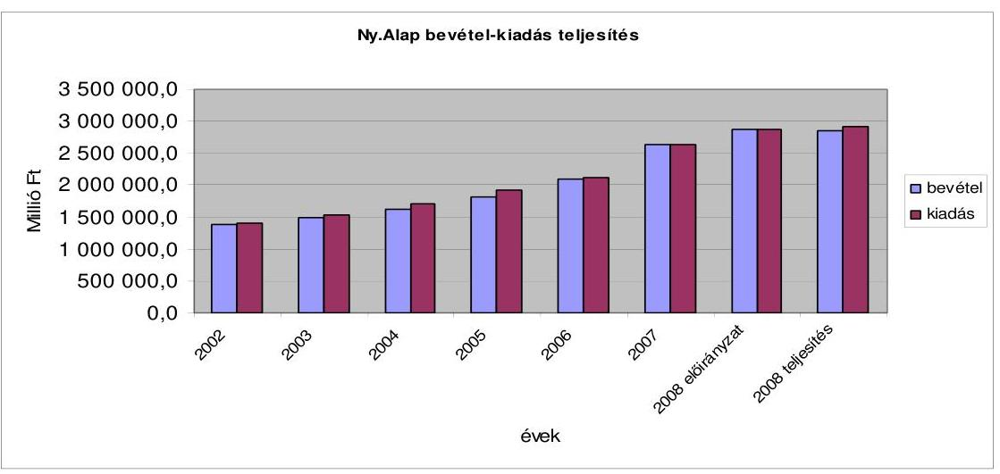

Az Ny. Alap elmúlt évek hiányalakulását a központi költségvetés közvetlen támogatásával hasonlította össze az ellenőrzés annak érdekében, hogy láthatóvá váljon, ténylegesen mekkora az Ny. Alap járulékpótlási kötelezettség nélküli költségvetési támogatása (a központi költségvetésben tervezett pénzátadás sor a közvetlen támogatás mellett járulék típusú hozzájárulásokat is tartalmaz). Az Alap kiadásának, hiányának és közvetlen költségvetési támogatásának alakulását a 2001-2008. évek között az 1. sz. melléklet szemlélteti.

A 2008. évben a központi költségvetés közvetlen támogatásának hiánnyal öszszevont aránya 2 százalékponttal növekedett. A magánnyugdíj pénztári tagdíjkiesés teljes megtérítését figyelembe véve a növekedés csak 1,2 százalékpont, ami közel azonos az APEH-tól érkező járulékbevételek előirányzattól történő elmaradásának mértékével ( $1,1 \%$ ).

Az előző évhez viszonyítva a 2008. évben az összes bevétel 8,1\%-kal, az összes kiadás 10,7\%-kal növekedett. (A bevételi oldalon átcsoportosítás történt; a korhatár alatti rokkantnyugdíj fedezetét jelentő járulék 2008 februárjától az Ny. Alap bevétele lett, az E. Alap térítése megszűnt, a teljesítési adat csak január hónapra vonatkozik.) A nyugdíjkiadások a kiadási oldallal azonos 10,7\%-os

---

mértékkel növekedtek, de ettől elmaradt a járulékbevételek és az E. Alaptól kapott térítések összege (105,8\%). A járulékbevételek összes (23,5\%-os) növekedésből az APEH-tól érkező járulékbevételek növekedése csak 21,4\%-os volt, miközben a járulékmérték növelés hatása 15-16,0\%-ot tett ki, és az egyéni járulékplafon növekedése is jelentkezett, mint növelési tényező. A különbség nem éri el a bruttó keresettömeg növekedését. A központi költségvetési hozzájárulások 8,2\%-kal emelkedtek, ezen belül a közvetlen pénzeszköz átadás növekedése 3,5\%-os volt. A múködési kiadások 9,0\%-kal haladták meg a korábbi év kiadásait, de nem érték el a kiadási főösszeg 1,0\%-át sem (0,94\%).

A bevételek növekedésében továbbra is a járulékbevételek növekedése a meghatározó, amelynek egyes tényezőit a későbbiekben részletezzük. A makrogazdasági mutatóknak a tervezettől eltérő alakulása 2008. évben kétszer is kiegészítő nyugdíjemelést indukált, ami a kiadási előirányzat túlteljesülését eredményezte. A kiegészítő nyugdíjemelés fedezetét azonban 2008. évben nem biztosította a járulékok növekedése, sőt a járulékbevétel a tervezettnél nagyobb bérnövekedés ellenére az eredetileg tervezettől is elmaradt. Így alakult ki az Ny. Alap 67 566,9 M Ft-os hiánya, melynek rendezésére a zárszámadási törvényjavaslat intézkedik.

# 1.2.2. Nyugdíjbiztosítási Alap pénzforgalma és likviditása 

Az Alap napi likviditását, az ellátási kiadások teljesítésének zavartalanságát a Kvtv. 24. §-a alapján a KESZ-ről igénybevett kamatmentes hitel biztosította. Az év első hónapjában három, második hónapjában négy munkanapon állt fenn hiteltartozás. Március hatodikát követően a havi átlagos hitelállomány 25-45,0 Mrd Ft között változott. November és december hónap folyamán 100,0 Mrd Ft fölé emelkedett a hitelszámla napi egyenlege, december 9-én érte el legmagasabb értéket, 280,5 Mrd Ft-ot. A hitelfelvételek alapvetően az előírások szerint havonta módosított ütemezésnek megfelelően, terv szerint alakultak.

### 1.2.3. A Ny. Alap mérlegeinek értékelése

Az ONYF ellátási szektor mérlegében az eszközök és források év végi állománya 78 729,2 M Ft volt. Az eszközök csak forgóeszközöket tartalmaztak, két meghatározó tétele a követelések és a pénzeszközök. Az elmúlt évben a pénzeszközök csökkenése nagyobb mértékű volt, mint a követelések növekedése, így az eszközök értéke 480,0 M Ft-tal csökkent.

A források csökkenése a saját tőke, a költségvetési tartalékok csökkenésének és a rövidlejáratú kötelezettségek emelkedésének együttes hatásaként alakult ki. A hitelállomány növekedését mérsékelte a túlfizetés állomány csökkenése. A saját tőke értéke továbbra is negatív előjelű.

A követelés és kötelezettségállomány adatainak bizonytalanságai az eszközök és források értékét is bizonytalanná teszik, azok nem a reálfolyamatoknak megfelelő értéket mutatnak.

Az ONYF múködési szektor mérlegében az eszközök és források év végi állománya 18 279,2 M Ft volt. Az eszközök 2008. év végi állománya az előző

---

évhez mérten 0,7\%-os csökkenést mutat. Legnagyobb hányadát (91,5\%) a befektetett eszközök képezik 16 732,3 M Ft, a forgóeszközök 1546,9 M Ft-tal 8,5\%ot képviselnek. A befektetett eszközök között az immateriális javak 9,1\%-ot, a tárgyi eszközök 89,2\%-ot tesznek ki, a befektetett pénzügyi eszközök mindösszesen 1,7\%-ot. A források 93,0\%-át, azaz 17 001,1 M Ft-ot a saját tőke képviseli, amelynek értéke növekedett. A tartalékok 1061,0 M Ft-ot, azaz 5,8\%-ot, a kötelezettségek 1,2\%-ot, 217,1 M Ft-ot tesznek ki.

Az APEH által kimutatott követelés és kötelezettségállományának alakulását önálló pont tartalmazza.

# 1.3. Az alapkezelő feladatellátása 

Az ONYF a 2008. évi munkatervi feladatait jó színvonalon teljesítette és arról beszámolt a felügyeletet ellátó szociális és munkaügyi miniszternek.

Az alapkezelő Szervezeti és Működési Szabályzatát a 2008. évben a csak a kormányzati szerveknél bekövetkezett szervezeti, illetve más névváltozások átvezetése miatt módosította, szervezeti változás nem történt.

A gazdálkodás szabályozottsága továbbra is megfelelő. Az előírt szabályzatokat folyamatosan aktualizálják, azok tartalma megfelelő.

Az ONYF teljes körű (belső ellenőrzés, felügyeleti ellenőrzés, szakellenőrzés) ellenőrzési rendszerét jó színvonalúan működteti. A főigazgató az éves költségvetési beszámoló keretében beszámolt a folyamatba épített, előzetes és utólagos vezetői ellenőrzésről és a belső ellenőrzésről is.

### 1.4. Az Ny. Alap 2008. évi bevételeinek alakulása

### 1.4.1. Az Ny. Alap költségvetési bevételeinek teljesülése

Az Ny. Alap 2008. évi bevételének törvényi előirányzata 2872 222,6 M Ft volt. A bevételi előirányzat 2857 647,6 M Ft-ra teljesült, ami az előirányzottnál 0,5\%-kal kevesebb. A 2007. évi bázishoz viszonyított növekedés 8,1\%. A teljesítésen belül meghatározó, az összes bevétel $80,2 \%$-a - a korábbi évhez viszonyítva a rokkantsági nyugdíj járulékfedezetének átcsoportosítás miatt 10\%kal növekvő arányú - a járulékbevételek és hozzájárulások 2292 933,7 M Ft-os összege. Ez az előirányzott értéknél 0,5\%-kal alacsonyabb, a 2007. évi tényt pedig 23,5\%-kal haladja meg.

A központi költségvetési hozzájárulás 534 222,2 M Ft-os előirányzata 523 816,4 M Ft-ban, 98,1\%-on teljesült. A nyugdíjbiztosítási tevékenységgel kapcsolatos egyéb bevételek 11448,1 M Ft-os összege 44,9\%-os növekedést jelentett az előirányzathoz képest és $8,8 \%$-kal volt magasabb az előző évi értéknél. A rokkantsági nyugdíjak 2008 januári járulékfedezete még az Egészségbiztosítási Alapot illette, ezért azt a tervezett összegben átutalták. A vagyongazdálkodás bevétele 26,6 M Ft volt, amely az előirányzatot és az elmúlt évi tényt is többszörösen meghaladta a járuléktartozás fejében átvett vagyon értékesítésének beindulásának köszönhetően. A múködési célú bevételek teljesülése

---

4400,8 M Ft volt, ami az eredeti előirányzatnál 158,9\%-kal magasabb, és az elmúlt évi bevételt is meghaladja 37,2\%-kal, döntően az alap kiadásai között nem tervezhető - a központi költségvetés céltartalékában tervezett - személyi jellegű kifizetések növekedése miatt.

# 1.4.2. Az APEH éves adatszolgáltatása és az abból előállított adatok megbízhatósága 

A Ny. Alap járulékbevételeinek 99,4\%-át az APEH-hez érkező járulékbevétel teszi ki. Az APEH az Ámr. 114. § (5), (6) bekezdése alapján szolgáltat adatokat az alapkezelő részére. ${ }^{28}$

Az éves beszámoló elkészítéséhez az APEH-nak évenként és alaponként adatot kell szolgáltatnia - az analitikus nyilvántartásokkal megegyezően - a tárgyévre esedékes járulékbevallások és a teljesített befizetések/visszafizetések teljes körű éves feldolgozása alapján. Az adatszolgáltatás kiterjed a tárgyévben esedékes öszszes bevallások jogcímenkénti (járulék-nemenkénti, szektoriális) bontására, a kötelezettségek összegére, az értékvesztés összegére, a tárgyévben és a megelőző időszakban keletkezett tartozások és túlfizetések nyitó és záró állományára (éves leltár), továbbá a behajtásból származó bevételek december 31-éig teljesített befizetéseinek összegére. Az adatszolgáltatás határideje a beszámolást követő év május 5. és május 15 .

Az Ámr. 114. § (8) bekezdése előírja, hogy az ONYF-nek a bevallott kötelezettség arányában kell megosztani a járulék címen részére egy összegben átutalt bevételeket. A (9) bekezdés rögzíti, hogy a szolgáltatott adatok valódiságáért az APEH tartozik felelősséggel.

Az elmúlt két évben az éves zárszámadási ellenőrzések kapcsán megállapítottuk, hogy a bevallási rendszer 2006. évi változását követően az APEH adatszolgáltatásában szereplő adatok nem megfelelő minősége bizonytalanságot okozott a járulék-elemek és a szektorok közötti felosztás eredményét illetően, miközben az adatszolgáltatás javuló minőségét is rögzítette az elmúlt évi vizsgálat. Az ez évi bevallási adatszolgáltatás adatait elemezve megállapítható volt az adatminőség további javulása. Mindemellett ellenőrzésünk a felosztás eredményét továbbra is bizonytalannak tartja, mivel a bizonylatsoros bevallások kimutatása nem tartalmazza az adózók számának kontrolladatát, a bizonylatsoros kimutatások adattartalmát ugyanis jogszabály nem szabályozza.

A 2008. évi beszámoló elkészítéséhez tartozó adatszolgáltatási kötelezettségének az APEH - 2009. április 20-ai feldolgozás alapján - határidőben eleget tett. Az APEH adatainak minősége 2007-ben a korábbi évhez viszonyítva, a feldolgozottság mértékét, az ellenőrzési pontok beépítését tekintve je-

[^0]
[^0]:    ${ }^{28}$ A 2009. évi adatszolgáltatás - a korkedvezmény biztosítási járulék bevezetéssel összefüggésben - már két „adónem" számla adatait tartalmazza. Az összehasonlítás érdekében a folyószámlákkal kapcsolatos megállapításainkban a 125-ös számlával kapcsolatos adatokat szerepeltetjük az előző évi adatokkal történő összehasonlíthatóság érdekében.

---

lentősen javult és a 2008. évi adatok további adatminőség javulást mutatnak a következő tényezők alapján.

- A leltártáblákban elszámolt pénzforgalom értéke megegyezik az Ny. Alap számlájára ténylegesen 2008. december 31-éig befolyt, e jogcímen járó öszszeggel.
- A „hiba ágon" lévő, feldolgozott, de folyószámlára nem könyvelt 2008. évi bevallások adatainak összege 27,0 M Ft, a tárgyévi kötelezettség 0,01 ezreléke.
- A felosztás alapját képező 2008. évi bizonylatsoros bevallásokból készített összérték és a leltár-táblákban szereplő kötelezettség értéke közötti eltérés az elmúlt évi 92,0 Mrd Ft-tal szemben 61,5 Mrd Ft. A két kimutatás tartalma (a bizonylatsoros az adott évre vonatkozó bevallásokat tartalmazza, a leltár tábla az évi nyitóegyenleget, az ún. január 1-jei nyitó-korrekciót és az adott évben esedékes összes kötelezettséget) eltérő, ami különbséget indokolhat. A 2008. évre vonatkozó bevallás-adatok és a 2008. évi tárgyévi kötelezettségként könyvelt adatok között sincs egyezőség, a különbség (2007-ben 43,0 Mrd Ft, a 2008. évben 13,1 Mrd Ft), amit a folyószámlán kötelezettségként előírt revizori megállapítások indokolhatnak, miután a tavalyi évben az eltérés tartalmazott 35,6 Mrd Ft előző évre vonatkozó önellenőrzést is. A csökkenő eltérés a korábbi évekre vonatkozó csökkenő önellenőrzési esemény megtörténtét is mutatja.
- A 2008. évi havi adatszolgáltatásokban közölt bevallások értéke és az éves bevallások összértéke közötti 34170,0 M Ft-os eltérés is javuló adatminőségre utal. Az elmúlt évi eltérés 617 917,0 M Ft volt.

Az ONYF az Ámr. előírásának megfelelőnek osztotta fel a 125-ös adónem számlára érkező befizetéseket munkáltatói és biztosítotti járulékbevételekre. Az elmúlt évhez hasonlóan „a más adónem" számlákra (START kártya, EKHO, illetve a 2008. évtől bevezetett rehabilitációs járadék után fizetett egyéni járulék), de munkáltatói és biztosítotti járulékok közé tartozó befizetéseket a tényleges összegben vették figyelembe.

Ez sem teremtette meg azonban annak az alapját, hogy az Ámr. alapján kiszámított járulékértékekből a reálfolyamatok alakulására következtethessünk, mivel sem megalapozott bázis, sem megalapozott előirányzati adatok nem állnak rendelkezésünkre. A korábbi bevallási rendszerre kialakított felosztási rendszer nem alkalmas a reálfolyamatoknak megfelelő visszatükrözésére. Ez a folyamatok elemzéséhez, a tervezés szempontjából nélkülözhetetlen (miként azt korábbi évi jelentésünkben is rögzítettük). Ezt a helyzetet csak a járu-lék-nemenkénti (munkáltatói nyugdíjbiztosítási járulék és egyéni nyugdíijárulék) befizetés és ennek megfelelő számlavezetés oldhatja meg.

Az Ny. Alap zárszámadási törvényjavaslata nem tartalmaz szektorális bontást, ami nem kifogásolható, mivel a 2008. évre a Kvtv. előkészítése során sem határoztak meg ezekre előirányzatot. A felosztás az adatszolgáltatás alapján elvégezhető, de az adatok változásai ezek esetében sem hoztak értékelhető eredményt.

Az APEH hátralékokat és túlfizetéseket tartalmazó adatszolgáltatása alapján is mutatkozik az adatminőség javulás. Az APEH-nál folytatott helyszíni ellenőrzés

---

azt bizonyította, hogy még mindig sok a korábbi évekre vonatkozó önellenőrzés, illetve, hogy a legmagasabb túlfizetéssel rendelkezők közül egy gazdálkodó bevallása késve (határidőt követően) került benyújtásra, emiatt az év végi leltár túlfizetést mutat. Az adatok ez esetben nem tükrözik a reálfolyamatokat. A 2. sz. mellékletben bemutatott 2008. évi kintlévőségek és túlfizetések adatait a könyvvizsgálat elfogadta.

A 141 991,7 M Ft-os járuléktartozásából év végén - az értékvesztés elszámolásra vonatkozó, a zárszámadási jelentésekben évek óta kifogásolt Áhsz. szabályai szerint - 79 954,8 M Ft értékvesztést (ez a járuléktartozás 56,3\%-a) számoltak el. Kifogásainkat nem ismételve, a Szt. és az Ámr. közötti ellentmondás feloldását - az egyedi értékelés elve érvényesülése érdekében - továbbra is megvalósítandónak tartjuk.

Az elmúlt évi zárszámadási jelentésben is kifogásoltuk, hogy a kintlévőségekre és túlfizetésekre vonatkozó adatszolgáltatás nem terjed ki a START-kártyával és az EKHO-val összefüggő járuléktartozásokra és túlfizetésekre. Az adathiány torzítja az Ny. Alap mérlegét.

A START-kártyával és az EKHO-val összefüggő járulékfizetés bevezetése óta nem szabályozott, hogy e számlákon keletkezett tartozásokról és túlfizetésekről is adatot kell szolgáltatni, illetve hogy ki köteles az alapok közötti felosztást elvégezni. E járuléknemek növekvő aránya szükségessé teszi a mielőbbi intézkedést.

Az APEH az Ny. Alapot megillető, behajtásból származó összeg 2008. évre vonatkozó értékéről csak június 15 -én közölt adatot az alapkezelő részére. A 60 669,9 M Ft-os összegből 60360,7 M Ft végrehajtásból származik, amelynek 60,0\%-a inkasszó alkalmazásával folyt be, zömében adott évi járuléktartozási bevétel.

# 1.5. Az Ny. Alap kiadásainak alakulása 

Az Alap 2008. évi kiadási főösszege 2925 214,5 M Ft, ami a törvényi előirányzatot 52 991,9 M Ft-tal, 1,8\%-kal haladta meg. Ezen belül a nyugellátások teljesítése 2891678,9 M Ft, a postaköltség és egyéb kiadásoké 6131,0 M Ft, a vagyongazdálkodási kiadásoké $0,5 \mathrm{MFt}$, a múködési célú kiadásoké pedig $27404,1 \mathrm{MFt}$.

A nyugdíjkiadásokkal kapcsolatos kiadási többlet a törvény értelmében előirányzat módosítási kötelezettség nélkül túlléphető. A múködési kiadások tervezettől eltérő többlete az előirányzatban nem tervezhető (a központi költségvetés általános és céltartalékában tervezett) kiadásokból, előző évi jóváhagyott elői-rányzat-maradvány felhasználásából, többletbevételből, illetve engedélyezett túllépési lehetőségből adódott.

Az ellátási kiadások 2848 144,2 M Ft-os tervezett összege 2897 809,9 M Ft-ra teljesült. Az előirányzat alakulását döntően, a nyugellátási kiadások határozzák meg, ami évek óta az ellátási kiadások 99,8\%-a.

Az Ny. Alapot terhelő nyugellátások eredeti kiadási előirányzata 2841 844,2 M Ft volt, ami 2891 678,9 M Ft-ra teljesült. Az eltérés - 1,8\%,

---

49 834,7 M Ft - a kiegészítő nyugdíjemelés mértékét meghatározó makrogazdasági mutatók következménye. A két kiegészítő emelés ennél magasabb értékű volt ( $60952,1 \mathrm{M} \mathrm{Ft}$ ).

A nyugdíjkiadások 2007. évi összege 2611 588,9 M Ft, amit a 2008. évi kiadások 280 090,0 M Ft-tal, 10,7\%-kal haladtak meg. Ebből a januári, májusi és novemberi nyugdíjemelések 7,3\%-ot, a nyugdíjkorrekciós emelések 1,5\%-ot, az automatizmusok (létszámváltozás, összetétel változás, kiegészítő ellátások számának változása, a cserélődés) 1,9\%-ot tettek ki. Abban, hogy a 2008. évben a cserélődés hatása lényegesen alacsonyabb volt, mint az előző évben, fontos szerepet játszott a nyugdíj kiszámítási szabályainak 2008. évi megváltoztatása. Az intézkedés az induló nyugdíjszínvonalat mintegy 7-8,0\%-kal csökkentette.

#### Abstract

A nyugdíjkiadásokon belül öregségi nyugdíjakra 1712 409,0 M Ft-ot, rokkantsági nyugellátásokra 630 703,7 M Ft-ot, rehabilitációs járadékra 562,1 M Ft-ot, hozzátartozói ellátásokra 330619,1 M Ft-ot fordítottak. A 13. havi nyugdíj teljes összege 217 210,4 M Ft volt. A méltányossági alapon egyszeri segélyt 174,6 M Ft értékben folyósítottak.

Az öregségi nyugdíjak havi átlagos értéke 2008-ban 82 806,0 Ft volt. Az átlagnál jóval magasabb az előrehozott öregségi nyugdíjban részesülők (havi 98 181,0 Ftról 101 116,0 Ft-ra nőtt), valamint a korkedvezményes nyugdíjasok ellátása (124 971,0 Ft-ról 141 052,0 Ft-ra nőtt). A rokkantsági és baleseti nyugdíjak átlaga a 2008. évben 61 209,0 Ft-ról, 66 700,0 Ft-ra nőtt. A hozzátartozói főellátások átlaga 43 300,0 Ft-ról 45 742,0 Ft-ra, a hozzátartozói kiegészítő ellátások átlagos kiegészítése 23 459,0 Ft-ról 25 345,0 Ft-ra emelkedett. Az Ny. Alapból finanszírozott ellátottak átlagos létszáma 2007-ről 2008-ra 12000 fővel növekedett, 2755 E fő volt.

A költségvetési előirányzat elkülönítetten tartalmazta a méltányossági nyugdíjintézkedések (megállapítások, emelések, egyszeri segélyek) 1050,0 (200,0+700,0+150,0) M Ft-os keret összegét. Ennek módosításáról és felhasználásáról szóló megállapításainkat a Függelék tartalmazza. A méltányossági nyugdíjemelések és megállapítások kiadásait a zárszámadásban a megfelelő nyugellátási kiadások adatai tartalmazzák, az egyszeri segély összegét önálló soron mutatják be.

A nyugellátásokat a 2008. évben - minden 2008. év előtt nyugdíjba vonult személyre kiterjedően - három alkalommal emelték. 2008. január 1-jétől a Kvtv.-ben rögzített 5,2\%-os nettó keresetnövekedés és 4,8\%-os áremelkedés alapul vételével 5,0\%-os nyugdíjemelés valósult meg. Erről a nyugellátások és a baleseti járadékok emeléséről szóló 352/2007. (XII. 23.) Korm. rendelet intézkedett. A rendelet rögzítette a nyugellátások 2008. évi legkisebb összegeit is. Az öregségi nyugdíjminimum havi 27 130,0 Ft-ról 28 500,0 Ft-ra emelkedett.

A makroparaméterek eltérő alakulása miatt a 71/2008. (IV. 3.) Korm. rendelet május 1-jétől, majd a 241/2008. (X. 1.) Korm. rendelet november 1-jétől viszszamenőleges hatállyal 1,1-1,1\%-os kiegészítő nyugdíjemelésről intézkedett. Ennek végrehajtása után az egyes ellátások 2008. évi emelése 7,3\%-os mértékű volt.

---

A kiegészítő nyugdíjemelést meghatározó paraméterek a kormány által - a döntés meghozatalakor - várt mértéknél alacsonyabban alakultak az év átlagában. A nettó keresetek 2008-ban 6,8\%-kal, a nyugdíjasokat érintő árak 6,9\%-kal nőttek.

# A nyugdíjak reálértékének és relatív pozíciójának változása 

\%-ban

| Évek | nyugdíjak növekedése* | nyugdíjak vásárlóérték   változása | nyugdíjak relatív pozíció   változása |
| :--: | :--: | :--: | :--: |
| 2002 | 15,8 | 10,0 | $-3,1$ |
| 2003 | 13,6 | 8,6 | $-0,5$ |
| 2004 | 10,8 | 3,3 | 4,3 |
| 2005 | 10,4 | 6,3 | 0,0 |
| 2006 | 8,2 | 3,0 | $-0,4$ |
| 2007 | 8,3 | $-2,2$ | 2,8 |
| 2008 | 8,8 | 1,8 | 1,1 |

*a nyugdíjemelés összes tényezőjét figyelembe véve
A nyugdíjak vásárlóértékének és a nettó keresetekhez viszonyított relatív pozíció változásának elmúlt évekbeli alakulását mutatja a táblázat. A nyugdíjak vásárlóértéke az elmúlt évi csökkenésével szemben a 2008. évben 1,8\%-kal emelkedett és $1,1 \%$-kal javult a nettó keresetek változásához viszonyítva is.

A nyugdíjak korrekciós célú emeléséről szóló 2005. évi CLXXIII. törvény előírásai alapján 2008. január 1-jétől az 1991-1996. évek között megállapított saját jogú nyugellátásban részesülőknek legalább 4,0\%-kal emelték a nyugdíját. Ezen általános mértéken felül a szolgálati időtől függően 0,5-0,5 százalékpont többletemelést kaphattak a 29 év felett megszerzett minden szolgálati év után, a mérték maximum 10,0\% lehetett.

Az 1991. január 1-je és 1996. december 31-e közötti időponttól kezdődően megállapított saját jogú nyugdíjak korrekciós emelése - a 13. havi nyugdíjban jelentkező hatást is figyelembe véve - 2008-ban 37,9 Mrd Ft forrásigénnyel járt. A saját jogú nyugdíjak korrekciós célú emelése január hónapban 695 ezer főt érintett, havi ellátásuk 4330,0 Ft-tal emelkedett.

A 2008. évi korrekciós intézkedés 1,5\%-kal emelte a teljes nyugdíjas állomány nyugdíjszínvonalát.

Az Ny. Alap nyugdíjkiadása az automatizmusok hatására együttesen 49,0 M Ft-tal, 1,9\%-kal növekedett. A kiadásnövelő hatás kisebb részben a létszám növekedéséből, nagyobb részben a nyugdíjas létszám összetétel változásából és a cserélődés miatt következett be. A növekedés mértéke alacsonyabb a korábbi évi növekedésnél.

Az automatizmusok növekedésének meghatározója az összetétel-változás, cserélődés hatása, ami 2008-ban 36,8 Mrd Ft-os, 1,4\%-os kiadásnövekedést eredményezett. Ez az egy évvel korábbinál 0,7 százalékponttal alacsonyabb érték. A növekedési mérték csökkenése mutatja a nyugdíj kiszámítási szabályok változtatásának hatását. Az intézkedés az induló nyugdíjszínvonalat mintegy 7-8,0\%-kal csökkentette.

---

Az utóellenőrzés kiterjedt a 2008. évi kiadást már kb. 1,0 Mrd Ft értékben érintő új jogintézmény (a Tny. 22/A. §-ába foglalt nyugdíj megállapítási szabály) hatásának vizsgálatára.

Az elmúlt évi megállapításainkkal összefüggésben is az ONYF főigazgatója soron kívüli ellenőrzési feladatot határozott meg a Nyugdíjellenőrzési Osztály részére. Valamennyi regionális nyugdíjbiztosítási igazgatóságon ellenőrizték és feldolgozták a Tny. 22/A. §-ában foglaltak alkalmazását, elemezték és értékelték a feldolgozásból nyert adatokat. Az ellenőrzés visszaélést nem állapított meg, annak felfedésére, figyelemmel kisérésére fokozott odafigyelést kértek az igazgatási szervektől. Az ellenőrzéskor, 2008 júliusában közel 90000 fő részére állapítottak meg már nyugdíjemelést. Az első teljes év adata ennél 20000 fővel magasabb.
2008. december 31-éig 111089 főnek növelték nyugdíját, mert nyugdíjasként 365 napi járulékfizetéssel erre jogot szerzett (Tny. 22/A. § alapján). A nyugdíjmegállapítási statisztika alapján az éves megállapítások száma mintegy 7000 fővel magasabb, és ugyanennyi kérelmet valamely feltétel hiányában elutasítottak.

Az APEH 2008. évi bevallási nyilvántartásából az ellenőrzés kérésére kigyűjtötte azok számát, akik nyugdíj melletti foglalkoztatás alapján fizettek a 2008. évben egyéni biztosítotti járulékot. A 83 ezer fő létszámadat, csak az elmúlt évihez viszonyított csökkenést mutatja, azt nem, hogy hányan álltak 365 napig jogviszonyban, mert nyugdíjnövelés csak ennek igazolása után jár. Az a nyugdíjas, aki 365 napi munkavégzést nem tud igazolni, a befizetett járulékával szemben nem kap ellátást. Az éveken keresztüli „gyűjtés" nem csak a nyugdíjassal szembe állít irreális követelményeket (vezessen nyilvántartást foglalkoztatási jogviszonyairól a 365 nap leteltéig), hanem a megállapító szervezet munkáját még bonyolultabbá teszi (itt is kell a valorizációt alkalmazni).

A Tny. 22/A. §-án alapuló nyugdíjnövelési kérelmek száma a 2008. évben 124760 volt. Egy igény elbírálása átlagosan 28 napot vett igénybe (a KET szerint 18 -at), ami alátámasztja az elmúlt évben kifogásolt hosszadalmas és bürokratikus ügyintézést. Ugyanebben az időben az 77239 elbírált öregségi nyugdíjigény átlagos időszükséglete 67 nap volt (a KET szerint 34). A számok mutatják az aránytalanságot, a nyugdíjnövelés elbírálásához egy év adatait, öregségi nyugdíj esetén több évtizedes szolgálati idő és több mint 20 év kereseti adatait kell tisztázni, meghatározni stb.

A nyugdíjfolyósítási adatok szerint a 2008. évben 111098 fő átlagosan 827,0 Ft emelést kapott, így a növelés havi hatása 91,8 M Ft. Az összevont statisztikából nem állapítható meg az egyes nyugdíjak folyósításának kezdete - annak megfigyelése is célszerű lehet -, de azt az adatot ismeri az ellenőrzés, hogy az év első felében állapították meg a növelések 80,0\%-át. E szerint az éves hatás mintegy egymilliárd Ft lehet, miközben az emelést megalapozó keresetek után mintegy 140,0 Mrd Ft adó és járulékbevétele keletkezett az államháztartásnak.

A nyugdíj melletti munkavégzés első éves adatainak statisztikai összegzéséből megállapítható, hogy a növelésben részesültek 35,0\%-a korhatár alatti öregségi nyugdíjas átlagosan havi $1019,0 \mathrm{Ft}, 46,1 \%$-a nyugdíjkorhatár felett van, átlagosan havi 834,0 Ft emelést kapott.

---

A nyugdíj melletti foglalkoztatás a bevételek és kiadások összehasonlítása alapján az államháztartás szempontjából kedvező. A növelés átlagos értékéből számítva a $827,0 \mathrm{Ft}$-os havi növelést átlagosan $165400,0 \mathrm{Ft} /$ hó bruttó kereset alapoz meg, ami $8,5 \%$-kal számított biztosítotti nyugdíjjárulék esetén kamatok nélkül számítva 17 év, a jelenlegi 9,5\%-kal számítva 19 év megtérülésnek felel meg. Államháztartási többletbevétel, hogy a nyugdíjas foglalkoztatott 4,0\% természetbeni egészségbiztosítási járulékot is fizet és sávváltás esetén magasabb kulcs szerint fizeti az szja-t valamint plafon felett a különadót. E mellett a munkáltatók megfizetik az E. Alapot, Ny. Alapot és az MPA-t megillető járulékokat is. A foglalkoztatás korlátozása miatti jogviszony megszüntetése esetén ezeknek a bevételeknek jelentős részétől elesik az állam, miközben a nyugdíakat fizetnie kell. A számítások különböző nyugdíjas kategóriákban más és más eredményre vezetnek, azok elvégezhetők és információt adhatnak a nyugdíj melletti munkavégzés korlátozásra vonatkozó döntésekhez.

A 2008. évtől megváltozott a jogszabály a korhatár alatti öregségi nyugdíj és kereset együttes igénybevételét illetően. Egyrészt az előrehozott öregségi nyugdíj megállapításának feltétele lett, hogy a biztosítás alapjául szolgáló jogviszony megszűnjön, másrészt a 62 év alatti, keresőtevékenységet folytató korai öregségi nyugdíjasok esetében meghatározott (az éves szintű minimálbérnek megfelelő) éves kereseti összeg elérése után a nyugdíj folyósítását követő hónaptól kezdve az év végéig szüneteltetni kell. Ez utóbbi korlátozás 2008-ban és 2009ben csak a 2007-et követően nyugdíjba vonulókra vonatkozik, 2010-től azonban azokra is kiterjed, akik 2008 előtt már öregségi nyugdíjasok voltak (és még nem töltötték be 62 . életévüket).

A beszámolási évben a korlátozás a 2008. január 1-jétől újonnan nyugdíjba vonulókra vonatkozott (összesen 178 fő nyugdíjkifizetését szüntették meg). Megszervezték, hogy az APEH adatot szolgáltasson a korlátozásban érintett személyekről. Kialakították annak informatikai rendszerét, hogy az APEH által biztosított „nyers" adatok további szűréseit (kor, ellátás típus, az ellátás megállapításának hatálya) a NYUFIG elvégezhesse. A 2008. május 15 -étől érkező APEH adatszolgáltatás szerint a jövedelemkorláton felüli foglalkoztatottak havi átlagos létszáma 7758 fő volt. A vizsgálat a nyugdíj melletti foglalkoztatás korlátozásának előkészítő munkáját megfelelőnek ítélte.

A 2010. évtől a hatályos szabályozás már az öregségi nyugdíjkorhatárt el nem érő nyugdíjasok teljes körére kiterjed. A szabályozás több jogi aggályt is felvetett, amelyeket az alapkezelő - megoldási javaslattal együtt - jelzett a felügyeletet ellátó miniszternek. Hasonlóan jelezte, hogy „a 2010.-től kiterjesztett hatállyal érvényesülő korlátozás bizonyos területeken (pl. az egészségügyben) munkaerőhiányt okozhat, a foglalkoztatás csökkenésével járhat (aminek jelentős adó- és járulékcsökkenés lehet a következménye), illetve a fekete és szürke gazdaság felé terelheti a munkavégzést." ${ }^{29}$ A nyugdíjas foglalkoztatás ugyanis a mellett, hogy plusz jövedelemhez juttatja a nyugdíjast, jelentősen növeli az államháztartás bevételeit is. A nyugdíj melletti foglalkoztatást személyi jövedelemadó többlet (a nyugdíj összege feletti sávban), nyugdíj plafon elérése után különadó is terheli a járulékfizetési kötelezettség mellett. Ez azt jelenti, hogy a

[^0]
[^0]:    ${ }^{29}$ Az ONYF főigazgatójának 9-82/2/2009. sz. levele.

---

nyugdíj mellett foglalkoztatott a keresetének jelentős hányadát (átlagosan 35-$40,0 \%$-át), képező adó és járulékfizetést teljesít, amelynek összege sok esetben megközelíti a részére kifizetett nyugdíj összegét.

A 2008. évi Tny. 22/A. §-a alapján megállapított nyugdíjnövelés adatából (az egy év alatt kifizetett összeg 1,0 Mrd Ft alatti) visszaszámolva a korhatár alatt foglalkoztatott személyek után az államháztartásnak mintegy 50,0 Mrd Ft járulék bevétele, és szja bevételi, illetve különadó többlete keletkezett egy év alatt. A nyugdíjnövelés miatti kifizetés ennek töredéke (ld. 7.7. pont). A foglalkoztatás adminisztratív korlátozása esetén az adó- és járulékbevételek elmaradnak, az államháztartás bevételei csökkennek. Az ellenőrzés megítélése szerint a foglalkoztatási helyzeten sem segít a korlátozás, hiszen a munkaerőpiacon az idősebb korosztály hátrányban van és csak a piacon igényelt szaktudás birtokában van esély a foglalkoztatásra, sőt egyes ágazatok foglalkoztatási helyzete előreláthatóan ellehetetlenül (pl. az egészségügy, ahol jellemző a szakember hiány miatti nyugdíjas foglalkoztatás). A korlátozás, a nyugdíj melletti munkavállalók egy részét a fekete foglalkoztatás irányába terelheti (feltehetően a munkaképes nyugdíjas munkaerő sokasága a „lemondok a nyugdíjamról", „lemondok a munkámról és plusszjövedelmemről" választás dilemmájából a harmadik - társadalmilag káros - utat választja).

# 1.6. A múködési kiadások alakulása 

A Kvtv.-ben a 2008. évre meghatározott múködési kiadások előirányzata a 2007. évi tényleges kiadások 95,7\%-ban határozták meg, miközben az ágazat jogszabályban előírt feladatai növekedtek. Ezt jelzi pl., hogy a csökkentett előirányzat tartalmazta ugyanakkor a MÁV Nyugdíj Igazgatóság, továbbá a GYSEV állományába tartozók nyugdíjügyeinek - megállapítás, folyósítás - átvételéhez szükséges 40 fő létszám fedezetét és az átvett dokumentáció számítástechnikai feldolgozására biztosított $442,5 \mathrm{M}$ Ft-ot is.

A nyugdíj ágazat 2008. évi múködési kiadása 27 404,1 M Ft, ami kiadások főösszegének $0,94 \%$-a. Az arány igen alacsony, mind a korábbi évekhez viszonyítva, mind a magán-nyugdíjpénztárak arányát nézve (a PSZÁF adatai szerint a 2008. évben 5,0\%-os a bevételekhez viszonyított arány). A 2008. évben ugyan a létszámfeltételekben javulás következett be, továbbra is érvényes több éves jelzésünk, az ágazat hosszú-távú múködésének biztosítása érdekében, a jogszabályban elöírt feladatok elvégzéséhez szükséges források nem állnak rendelkezésre. A jogszabályok évről évre növekvő feladatokat rónak az ágazatra, amelyeknek az áremelések ellentételezése és az amortizációhoz szükséges, továbbá fejlesztési források nélkül kell megfelelnie, ami a feladat ellátásának színvonalát is veszélyezteti.

A Kvtv. a Nyugdíjbiztosítási Alap 2008. évi múködési kiadásaira 24 048,4 M Ftot hagyott jóvá. Ebből a központi hivatali szerv múködési kiadására (beleértve az ágazatban központosított feladatok - pl. informatika - kiadásait is) 5720,3 M Ft-ot, az igazgatási szervek múködésére 18 328,1 M Ft-ot állapított meg.

A 2008. évi múködési kiadások teljesítése 27 404,1 M Ft volt, ami a 2007. évit $9,1 \%$-kal haladja meg. A teljesítés a központi hivatalnál 6403,0 M Ft, igazgatá-

---

si szerveknél 21 0010,1 M Ft volt. Az eredeti előirányzatnál magasabb teljesülés összetevői: 673,1 M Ft az előző évi előirányzat-maradvány felhasználása, 907,5 M Ft túlteljesülési lehetőségből adódott, a központi költségvetés általános és céltartalékából kormányhatározatokhoz kapcsolódóan 2247,2 M Ft előirányzatot kapott az ágazat, a saját bevételi többlete 453,6 M Ft felhasználására adott lehetőséget. A képződött előirányzat-maradvány 1061,0 M Ft, amelyből az előző évi 135,3 M Ft, a tárgyévi 925,7 M Ft volt. A 2008. évi előirányzatmaradvány összegéből 418,2 M Ft-ot a folyamatos múködési kiadásokra, 624,8 M Ft-ot informatikai fejlesztésekre kötelezettségvállalással kötöttek le. Az előirányzat-maradványból 11,0 E Ft-ot kötelezettségvállalás nem terhelt.

Az ONYF által készített előirányzat-felhasználási terv elkészítésekor a terv és az ismert feladat ellátás finanszírozási igénye között az összhang megvolt. A kiadási előirányzat-növeléseket a bevételi előirányzat-növelések megelőzték, illetve egyidejúek voltak.

A Magyar Államkincstár által megállapított időarányos felhasználási keret minden hónapban elegendő volt az ONYF és igazgatási szervei havi kötelezettségei fedezetére. Likviditási probléma nem merült fel.

A költségvetési előirányzat 2008. évi átcsoportosításai megfeleltek a hatásköri előírásoknak, a kiemelt előirányzatokra vonatkozó szabályoknak. Az előirányzat módosításáról szóló tájékoztatási kötelezettségének az ONYF a 217/1998. (XII. 30.) Korm. rendelet 55. § (4)-(5) bekezdése szerint eleget tett. Az átcsoportosítások a zavartalan múködés biztosítása érdekében történtek és indokoltak voltak.

# 1.7. Utóellenőrzés 

A 2007. évi költségvetés végrehajtásának ellenőrzéséről szóló Jelentésben kifogásoltuk a nyugdíj melletti munkavégzés során megszerzett a Tny. 22/A. § szerinti nyugdíjnövelés megállapításának alapját képező jövedelem (kereset) meghatározásának bonyolult, bürokratikus rendszerét, a visszaélés lehetőségét. Javasoltuk a Kormánynak, hogy tegyen javaslatot az Országgyúlésnek (OGY) a Tny. 22/A. §-ában foglalt előírás módosítására annak érdekében, hogy a viszszaélések lehetősége elkerülhető legyen, és a kereső tevékenységet folytató nyugdíjasok évente egyszer, egyszerú módon, a tárgyévi járulékalapot képező jövedelemmel arányos nyugdíjemelésben részesüljenek. Jelentés elkészítésekor az OGY előtt van a módosítás javaslata, ami a visszaélés lehetőségét megszünteti. A bonyolult, bürokratikus rendszer felszámolása érdekében intézkedés nem történt.

Mindezek figyelembe vételével az elmúlt évi megállapításunkat, javaslatunkat fenntartjuk.

A korábbi években kifogásoltuk a társadalombiztosítási alapok között megosztott járulékokkal (START kártya, EKHO) kapcsolatos Kincstári adatszolgáltatás hiányát, amit 2008. évben a PM szabályozott. A kintlévőségekről az APEH-nek továbbra sincs adatszolgáltatási kötelezettsége.

---

# 2. EgészsÉGbiztosítÁsı Alap 

### 2.1. Az E. Alap 2008. évi költségvetési beszámolóinak elkészítése, tartalma

Az Országos Egészségbiztosítási Pénztár, mint Alapkezelő, beszámolási kötelezettségének - az Áhsz.-ben foglaltaknak megfelelően - eleget tett. Az Alapkezelő az előírt formában, tartalommal, határidőre teljesítette az „A" működési, a „D" ellátási, valamint a „G" E. Alap konszolidált 2008. évi beszámoló készítési kötelezettségét.

Az Alapkezelő az E. Alap költségvetési beszámolóinak könyvvizsgálói hitelesítésére kötelezett. A 2008. évi könyvvizsgálatot ugyanaz a könyvvizsgáló kft. végezte, mint aki 2007. évben. A könyvvizsgáló véleménye szerint az Alap múködési, ellátási és a konszolidált 2008. évi költségvetési beszámolói a költségvetés teljesítéséről, a 2008. december 31-én fennálló vagyoni, pénzügyi és jövedelmi helyzetéről, valamint a múködési eredményről megbízható és valós képet adnak. A könyvvizsgáló vezetői levélben ajánlásokat fogalmazott meg az ellenőrzés színvonalának javítása érdekében. A könyvvizsgálathoz kapcsolódva emlékeztetünk arra, hogy az előző években rendre kifogásoltuk a bevallások állapotát és az ezekre alapozott adatokat. E vonatkozásban - elismerve az APEH-adatszolgáltatás minőségének javulását -, véleményünket fenntartjuk. A kötelezettségeket, hátralékokat, túlfizetéseket mutató adatok megfelelősége érdekében az APEH intézkedéseket tett. Ugyanakkor hiányzik az a kontroll-mechanizmus, amely kimutatná, hogy minden kötelezett eleget tett-e bevallási kötelezettségének és, hogy a bevallásadatok mennyire megfelelőek. Ezt a problémakört részletesen a 8.2.3. Az APEH éves adatszolgáltatása és az ebből nyert adatok megbízhatósága pontban fejtjük ki.

A jogszabályokban előírt gazdálkodási, múködési szabályzatok, dokumentumok az OEP-nél megtalálhatók a 2008. évi költségvetési alapokmány kivételével, ami azt jelenti, hogy az OEP nem tett eleget az Ámr. 10. § (7) bekezdésében szereplő előírásnak.

A kincstári beszámolóval való egyeztetés is megtörtént, az eltéréseket tételesen levezették, megindokolták.

Az E. Alap összevont beszámolójának 2008. évi mérleg föösszege 81 160,0 M Ft, ami 2007-ben 86 838,5 M Ft volt. Az ellátási szektor mérlegének főösszege 67 191,1 M Ft, amely 10,2\%-kal kevesebb az előző évinél. Az eszközeinek főösszege és változása megegyezik a forrás oldallal. Eszköz oldalon a kintlevőségek és a pénzeszközök a meghatározóak. A forrás oldalon pedig a túlfizetések és a tartalékok. A kintlevőségek nominális összege kis mértékben növekedett az előző évihez képest, de értékcsökkenése nagyobb volt annál. A túlfizetések összege közel felére csökkent. A múködési szektor mérlegének a főösszege 13 968,9 M Ft. Az eszközök év végi állománya az előző évhez mérten 16,4\%-os emelkedést mutat alapvetően a tárgyi eszközök állományának, valamint a pénzeszközök állományának növekedése következtében. Az eszközök legnagyobb hányadát ( $74,2 \%$ ) a befektetett eszközök képezik, a forgóeszközök

---

25,8\%-ot képviselnek. A források legnagyobb hányadát 72,3\%-át, 10 101,9 M Ft-tal a saját tőke képviselte. A tartalékok aránya $23,5 \%$, a kötelezettségeké $4,2 \%$, a forrásokon belül. A múködési szektor mérlegsorai az előírás szerint leltárral alátámasztottak voltak. Az analitikus nyilvántartások és a főkönyvi kivonat egyezőséget mutattak.

# 2.2. Az E. Alap 2008. évi pénzügyi helyzete 

Az Országgyűlés (OGY) az E. Alap 2008. évi eredeti bevételi főösszegét 1437 936,6 M Ft-ban, kiadási főösszegét 1435 981,6 M Ft-ban, többletét 1955,0 M Ft-ban állapította meg. A teljesítés a bevételeknél 1445 184,4 M Ft, a kiadásoknál 1445 111,0 M Ft, a többlet pedig 73,4 M Ft. Az E. Alap létrehozása (1992) óta, 2007. után a 2008. a második év, amikor az Alap nem hiánnyal zárt.
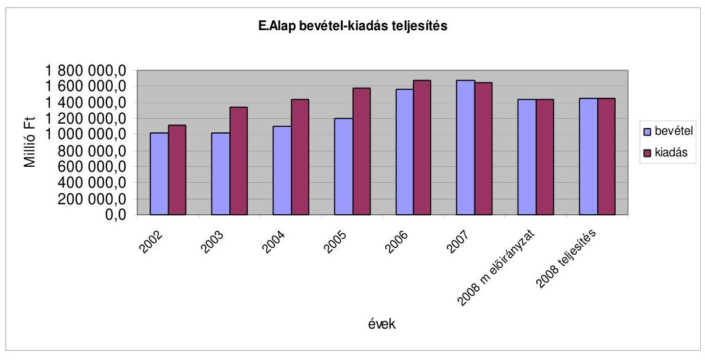

Az E. Alap 2008. évi, lényegében „0" szaldós költségvetésében, illetve annak teljesítésében az alapvető szerepet a 2007. évihez hasonlóan, a kiadások és a bevételek összhangjának megteremtésére irányuló intézkedések hozták. 2007. január 1-jétől rendeződött a járulékot nem fizetők utáni kötelezettség, valamint emelkedett a gyógyszerekért fizetett térítési díj és hatályba lépett a gyógyszer-gazdaságossági törvény. A bevételek és a kiadások összhangját célzó intézkedések közé tartozik az is, hogy visszakerült az Áht.-be, hogy ha az Alap bevételei tartósan nem fedezik a várható kiadásokat, a Kormánynak az egyensúlyt helyreállító javaslatokat kell az OGY elé terjesztenie. A hatályos szabályozás csak a tárgyévi deficitet kezeli. A tartós egyensúly (egyensúly-közeli állapot) alapvető feltétele, hogy elkészítsék a járulék (fedezet) kalkulációját, amelynek keretében egy meghatározott ellátási rendszer-koncepció alapján, hosszú távon hangolják össze a bevételeket és a kiadásokat. Az E. Alap gazdálkodásában fontos szerepet játszó - az előirányzatok közötti, évközben végrehajtható - átcsoportosítások a Kvtv.-ben előírt módon valósultak meg. Változatlanul nincs stabil, kiszámítható és objektív finanszírozási rendszer, amelynek kialakítását a múlt évben is javasoltuk a Kormánynak.

---

Az E. Alap a 2008. évre előirányzott kiadások mellett fedezni tudta a központi költségvetés által év közben az egészségügyi intézmények részére bérpolitikai és létszám-gazdálkodási célra kifizetett összegeket, úgy, hogy azt év végén az Alap pozitív egyenlegére tekintettel megtérítette a céltartalék előirányzata terhére. Az elmúlt évben alkalmazott hasonló konstrukció esetén már jeleztük, hogy a konkrét megoldást nem tartjuk célszerűnek, mert ezek a kiadások nem jelennek meg a gyógyító-megelőző kiadások között, hanem az E. Alap céltartalék címén találhatók, holott a gyógyító-megelőző egészségügyi ellátás kiadásai körébe tartoznak. Az eljárás megfelelt a Kvtv. vonatkozó előírásainak.

Az ellátási kiadások teljesítése a pénzellátás szempontjából zavartalan volt, amit a Kincstár - szükség esetén a KESZ igénybevételével - biztosított. A hitelszámla-egyenleg kimutatása szerint 2008. évben csak az év első hónapjaiban (összesen 25 napon) kellett hitelt igénybe venni az egészségbiztosítási kiadások fedezetére.

# 2.2.1. Az Alapkezelő feladatellátása 

Az Alapkezelő részére a 2008. év a bizonytalanság éve volt. Az egészségügyi reform keretében tervezett több biztosítós modell a feladatok újrafogalmazását követelte meg.

Az egészségügy továbbfejlesztési irányával kapcsolatos bizonytalanság, a gyakran változó követelmények jelentős többlet feladatot jelentettek, csökkentették az OEP tevékenységének hatékonyságát. A Regionális Egészségbiztosítási Pénztárak (REP) létrehozása csak 2009. január 1-jétől valósult meg.

Az OEP 2008. II. féléves feladatai közül kiemelkedő feladatként szerepelt a REPek felállítása. Ez a legtöbb főosztályt érintette. Az Országos Egészségbiztosítási Pénztárról szóló 317/2006. (XII. 23.) Korm. rendelet módosításának megfelelően kidolgozták az SzMSz-eket, elkészítették a REP-ek mintaügyrendjét, megpályáztatták az REP igazgatói állásait, elkészítették a REP-ek alapító okiratait, a törzskönyvi nyilvántartást módosították és benyújtották a 2009. évi kincstári költségvetéseket.

Az OEP, mint alapkezelő az év elteltével nem számol be feladatai teljesítéséről a felügyeletet ellátó egészségügyi miniszternek. Beszámolási kötelezettségének csak az éves beszámoló elkészítésével tesz eleget. A minisztérium közvetlen kapcsolatot tart az OEP főosztályaival, feladatokat határoz meg és közvetlenül kéri számon azok végrehajtásának eredményeit.

### 2.2.2. Az E. Alap 2008. évi bevételeinek alakulása

Az E. Alap 2008. évi bevételének módosított előirányzata 1437 936,6 M Ft. A bevételi előirányzat teljesítésének összege 1445 184,4 M Ft, amely az előirányzat összegét 7247,8 M Ft-tal, 0,5\%-kal haladja meg. Az előző évhez képest a 2008. évben realizált bevétel $86,2 \%$-os teljesítést mutat.

Az E. Alap bevételeinek meghatározó részét (2008. évben 71,2\%) a különféle járulékbevételek és hozzájárulások alkották, amelyek döntően az APEH-en ke-

---

resztül érkeznek az Alap számlájára. Az E. Alap járulékokból és hozzájárulásokból származó bevétele 2008. évben 1028 377,2 M Ft, ami az 1023 303,8 M Ft-os (összevont) előirányzatot 0,5\%-kal haladja meg. (A járulékokból és hozzájárulásokból származó bevétel a bevételi főösszeg 71,2\%-át teszi ki.) Az előző évinél (1 249 462,7 M Ft) 221 085,5 M Ft-tal kisebb bevétel a járulék-mértékek csökkentéséből adódik. A 2008. évtől a rokkantsági nyugdíjak finanszírozása az E. Alaptól a Nyugdíjbiztosítási Alaphoz került és ennek következtében a munkáltatók által fizetett egészségbiztosítási járulék ( $8,0 \%$-ról $5,0 \%$-ra) és a biztosítottak által fizetett egészségbiztosítási járulék ( $7,0 \%$-ról $6,0 \%$-ra) csökkent.

A munkáltatói egészségbiztosítási járulékokból származó bevétel 424 622,0 M Ft, 1,6\%-kal, 6846,1 M Ft-tal több volt, mint az előirányzat ( 417775,9 M Ft). Ugyanakkor az egyéni egészségbiztosítási járulékok bevétele ( 447761,4 M Ft) 1,7\%-kal, 7759,5 M Ft-tal elmaradt az előirányzattól ( $455520,9 \mathrm{MFt})$.

A tételes egészségügyi hozzájárulásból adódó bevétel (84 730,2 M Ft) 8,0\%-kal, 7323,8 M Ft-tal kevesebb az előirányzatnál, miközben a százalékos egészségügyi hozzájárulás soron 40,9\%-os, 9931,8 M Ft-os túlteljesítés jelentkezett a 24 306,0 M Ft-os előirányzattal szemben.

Az APEH által szolgáltatott adatok szerint 2008. évben a járulékokból és hozzájárulásokból származó bevételeket a kintlévőségek alakulása érdemben nem befolyásolta. A járulék-kintlévőség 72782,3 M Ft volt, ami 0,5\%-kal kevesebb az előző évinél. A munkáltatói táppénz-hozzájárulásból származó kintlévőség 2049,3 M Ft, 16,1\%-kal több az előző évinél. Az egészségügyi hozzájárulás kintlévősége 20 984,9 M Ft, ami 2,8\%-kal több a 2007. évi értéknél. A három tétel együttesen 95816,5 M Ft, az előző évinek 100,5\%-a. A különbözet ( 471,7 M Ft) az összes, 2008. évi járulék- és hozzájárulás bevétel (1 028 377,2 M Ft) 0,05\%-a. Ugyanakkor mind a kintlévőségekre, mind pedig a túlfizetésekre vonatkozó adatokat óvatosan kell kezelni, mert az elmúlt években (különösen a 2006. évben) azokban nagymértékű torzulások voltak, amelyek - a visszamenőleges évekre vonatkozó adózói önellenőrzéseket figyelembe véve - a 2008. évre is befolyással lehetnek. A problémakört a járulékok és hozzájárulások elszámolásával kapcsolatosan a következő pontban mutatjuk be.

Az Alap bevétele a központi költségvetés hozzájárulásaiból 2008. évben összesen 354384,5 M Ft, míg a költségvetésben meghatározott összeg 353 132,5 M Ft volt. Az alcímen belül csak a GYED folyósítási kiadásainak megtérítési összege tér el - 3,1\%-os többlettel - az előirányzottól. A többi előirányzat 100,0\%-osan teljesült a finanszírozási tervben rögzített módon.

A központi költségvetésből érkező bevételek 2007. évhez képest 4,9\%-kal csökkentek, amelyet a GYED kiadás megtérítési szabályának módosítása okozott. Míg 2007-ben a GYED kiadást 100,0\%-ban finanszírozta a központi költségvetés, addig 2008-ban már csak 50,0\%-ban. A 100,0\%-os térítéshez képest 41770,8 M Ft, míg az előző évhez képest 35 199,5 M Ft a bevétel csökkenés.

---

Az egészségbiztosítási tevékenységgel kapcsolatos egyéb bevételek alcímen a bevételek együttes összege 59015,1 M Ft, amely 2,5\%-kal volt kevesebb az előirányzott összegnél. Az alcímen belül a legnagyobb volument képviselték a gyógyszergyártók és forgalmazók befizetései, amely a tervezett 35500,0 M Ft helyett 9,3\%-kal lett több, és 38 799,4 M Ft-ra teljesült. Ezen belül, a szerződés szerinti gyógyszergyártói és forgalmazói befizetések jogcímre 3507,4 M Ft, a folyamatos gyógyszerellátást biztosító gyógyszergyártói és forgalmazói befizetések és egyéb gyógyszerforgalmazással kapcsolatos bevételek jogcímre 35 292,0 M Ft érkezett.

Adatok M Ft-ban

|  | 2007. tény | 2008. eredeti   előirányzat | 2008. tény |
| :-- | :--: | :--: | :--: |
| 1.7.7.1 Szerződés szerinti befizetések | 9095,7 | 5000,0 | 3507,4 |
| 1.7.7.2 Folyamatos ... bevételek (Gyftv.) | 22296,5 | 30500,0 | 35292,0 |
| Gyógyszergyártók befizetése összesen: | 31392,2 | 35500,0 | 38799,4 |

A szerződés szerinti gyógyszergyártói és forgalmazói befizetések 94,0\%-a a tá-mogatás-volumen szerződésekkel kapcsolatos befizetéseket tartalmazta. A tá-mogatásvolumen-szerződésekből származó 2008. évi bevétel (3507,4 M Ft) azért maradt el a várttól (5000,0 M Ft), mert a 2008. évi pénzforgalom főképp a 2007. évben hatályos szerződések befizetéseit tartalmazta.

Ezzel szemben a folyamatos gyógyszerellátást biztosító gyógyszergyártói és forgalmazói befizetések és egyéb gyógyszerforgalmazással kapcsolatos bevételeken 4792,0 M Ft-os túlteljesítés jelentkezett.

A forgalom utáni $\mathbf{1 2 , 0 \%}$-os befizetés összege a 2007. évhez képest 78,4\%-kal megemelkedett, 26881,7 M Ft-ban teljesült. Az emelkedés több tényező együttes hatására következett be. A 2007-es adat csak 9 havi befizetést tartalmazott, míg a 2008. év adata legalább 12 hónapnyi teljesítést foglalt magában, melynek kihatása minimum 5,0 Mrd Ft volt. Az árcsökkentési kedvezmény szabályainak változásából 2,0 Mrd Ft-tal több befizetés adódott, kb. 3,0 Mrd Ft abból származott, hogy a nagy támogatottságú készítmények forgalma 32 385,3 M Ft-tal megemelkedett, illetve a befizetési kötelezettség alóli mentesítés szabályainak pontosítása kevesebb esetben vezetett mentesítéshez.

A nagykereskedőkre vonatkozó forgalom utáni 2,5\%-os befizetés 500,0 M Ft értékben teljesült.

A biztonságos és gazdaságos gyógyszer- és gyógyászati segédeszköz-ellátás, valamint a gyógyszerforgalmazás általános szabályairól szóló 2006. évi XCVIII. törvény alapján a gyógyszerismertetó tevékenység után évente 5,0 M Ft-ot kell fizetni minden munkavégzésre irányuló jogviszonyban foglalkoztatott személy után, ez a gyógyászati segédeszközt ismertető személy után 1,0 M Ft-ot jelentett. Az E. Alap bevételei közt ilyen címen 2008-ban 7902,0 M Ft jelent meg. A 87/2008. (VI. 18.) AB határozat június 18 -ai hatállyal megsemmisítette a gyógyszer és gyógyászati segédeszköz ismertetők utáni befizetési kötelezettségeket. A testület alkotmányellenesnek találta, hogy a közteher a munkaviszony

---

után és nem a gazdasági hasznot hajtó munkavégzés után fizetendő. (A gyógyszerismertető tevékenység utáni befizetési kötelezettséget módosított formában 2009. február 15-étől léptették ismét hatályba.)

A gyógyszergyártói befizetések között sávos kockázatviselésből eredően 8,3 M Ft jelent meg az ennek megfelelő OEP számlán. A Gyftv 42. § alapján a gyártókat befizetési kötelezettség ilyen címen nem terhelte. A 8,3 M Ft-os tétel elszámolása a gyógyszertámogatás-többlet sávos kockázatviselésből eredő befizetés címen - nem lévén ilyen befizetési kötelezettség 2008-ban - nem valós kötelezettségből származó bevétel volt, hanem azoknak a technikai tételeknek az elszámolási különbözete, amelyeket az ezzel kapcsolatos kötelezettségek rendezése során itt átvezettek. Ez a hiba az E. Alap főösszegének jelentéktelen ( $0,0005 \%$ ) hányada ugyan, azonban az előirányzat teljesítési sor nem a reálfolyamatok eredményét tükrözi. A 2007. január 1-jétől bevezetésre került „sávos befizetés" címén az E. Alap a két év vonatkozásában összesen 73,6 M Ft bevételt realizált. Ugyanakkor 2008. december 31-én az APEH leltárjában 0,3 M Ft hátralék és 20,0 M Ft túlfizetés szerepelt. Az eltérés 53,8 M Ft, tekintettel arra, hogy a folyószámlákon ez az összeg kötelezettségként „előírásként" megjelent, amit az APEH-nak - figyelembe véve a mindenkor hatályos jogszabályokat - kizárólag csak a gyógyszerforgalmazók önellenőrzését követően van joga módosítani. Az elszámolás szabályai nem biztosítják, hogy az E. Alap a reálfolyamatoknak megfelelően mutassa ki bevételét. Ez a kockázati tényező a következő években is a beszámoló eredményeinek torzulását eredményezheti.

A gyógyszerkiadások stabilizálásának eredményessége miatt 2008. évben sávos befizetésre nem volt szükség.

Az Alapkezelő szerint sokkal transzparensebb módon valósult meg a TB támo-gatás-kiáramlás korlátozása a támogatási szabályok szintjén.

# 2.2.3. Az APEH éves adatszolgáltatása és az ebből nyert adatok megbízhatósága 

A járulékok és a hozzájárulások befizetése nem a befizetési kötelezettséget előíró törvényben (Tbj.) meghatározott jogcímek szerinti bontásban, hanem összevontan történt, és a befolyó összegeket az OEP az APEH-tól kapott be-vallás-összesítők alapján osztotta meg a jogszabályi kötelezettségeknek megfelelő bontásban. (A megosztás elveit és az ebben közreműködők feladatait az Ámr. határozta meg. A különböző START-kártyás és az EKHO-s bevételek külön számlán szerepeltek, így ezek nem voltak részei a megosztásnak.)

Az elmúlt évek ÁSZ jelentései feltárták az APEH adatszolgáltatás hiányosságait. Az APEH tapasztalatai azt mutatták, hogy rendkívül sok volt a hibásan beküldött bevallás. A feltárt hibákat javították és azok ismétlődésének megelőzésére is intézkedéseket tettek. E téren kiemelkedő az ellenőrző programok alkalmazása. Az intézkedések hatására az APEH által szolgáltatott adatok megbízhatósága sokat javult. Azt azonban nem állíthatjuk, hogy a megbízhatósági szint minden tekintetben elfogadható, mert:

---

- Jelenleg nincs olyan teljes körű kontroll-mechanizmus, amely kimutatná, hogy minden kötelezett eleget tett-e bevallási kötelezettségének. Ehhez a mindenkor hatályos jogszabályi előírások járulnak hozzá. Ugyanis a foglalkoztatónak kizárólag akkor kell az Art. 31. § (2) bekezdés szerinti bevallást benyújtania, ha az abban foglaltak szerint kötelezettsége keletkezett. Tekintettel arra, hogy erre vonatkozóan az APEH-nak nem áll rendelkezésére információ, ezért az Art. szabályai alapján annak vizsgálatára, hogy a foglalkoztatónak az adott hónapra vonatkozóan keletkezett-e kötelezettsége, vagy sem, kizárólag - az adózónál vezetett nyilvántartások tételes vizsgálatával utólagos ellenőrzés keretében van lehetősége. Ebből következően a havonta végzett teljességvizsgálatok során az adóhivatal csak „vélelmezett" kötelezetti kört tud meghatározni, ugyanis nem áll rendelkezésére olyan információ, amely alapján megállapíthatja, hogy mely foglalkoztató tekinthető kötelezettnek az adott hónapban. Az adóhivatal a teljességvizsgálatok során úgy állapítja meg a tárgyhónapra vonatkozó kötelezetti kört, hogy számítástechnikai programmal támogatva - megvizsgálja, hogy az előző hónapra (időszakra) vonatkozóan benyújtott bevallásban szereplő magánszemélyt (foglalkoztatottat) a foglalkoztató kijelentette-e és ha nem, úgy arra vonatkozóan várja a havi bevallást. Ezen körből azonban kieshetnek azok a foglalkoztatók, akik a foglalkoztatott bejelentését is elmulasztják megtenni, mivel ezekre csak egy esetleges helyszíni ellenőrzés során derül fény. A teljes körű kontroll-mechanizmus megvalósulása jogszabály módosítás útján lehetséges az APEH javaslata alapján.
- A járulék-folyószámlák korábbi hibáit (melyek az adózók által beadott bevallásokból származtak, mivel a bevallásban a kötelezettséget nem a valós nyilvántartásukon alapulóan állították be) a rendszer tovább „görgetheti". (Egy korábbi hiba, az önellenőrzés benyújtásáig, torzíthatja a - szükségszerűen - bázisra épülő leltár-táblákat.)
- Nem zárható ki, hogy olyan bevallások is átmentek a feldolgozási ellenőrzés szűrőjén, amelyek nem az adózónál vezetett valós nyilvántartási adatokon alapulnak (ez az önbevallás rendszeréből következik).

Mindezekre való tekintettel ez évben az E. Alap járulékbefizetéseivel kapcsolatban kiegészítő vizsgálatot folytattunk az APEH-nál. A vizsgálat szerint a szolgáltatott adatok nem biztosították a reálfolyamatok visszatükrözését. A legnagyobb túlfizetésekkel rendelkezők esetében azt tapasztaltuk, hogy egyes gazdálkodók a korábbi évekre vonatkozóan egyes hónapokra nem tettek eleget bevallási kötelezettségüknek, és ezért az APEH csak úgy tudta zárni a 2008. évet, hogy ezen összegek ellenértékét túlfizetésként szerepeltette.

Vizsgálatunkat 22 túlfizetéses folyószámla leltáradataira terjesztettük ki, amelyek 50-50\%-ban az egészségbiztosítási járulék, illetve az egészségügyi hozzájárulás elszámolására szolgáltak. Kiválasztásuk a szektoronként 5-5 legnagyobb túlfizetést mutató leltáradatokból történt.

A 11 járulék-folyószámlánál 3 esetben a bevallás hiánya okozta a „túlfizetést", egy esetben revizor vizsgálta, hogy jogos volt-e a túlfizetés. Korábbi nem megfelelő bevallásra utalt az a tény, hogy 4 esetben „önellenörzéssel" került rendezésre a túlfizetés.

---

A 11 hozzájárulás-folyószámla közül egynél okozott „túlfizetést" a bevallás hiánya, egy esetben pedig revizor vizsgálta a túlfizetés jogosságát. Két esetben tévesen fizettek erre a folyószámlára és ez okozta a túlfizetést. A vizsgált esetek közül két esetben rendezték a túlfizetést „önellenőrzéssel".

# 2.2.4. Az E. Alap 2008. évi kiadásainak alakulása 

Az E. Alap 2008. évi kiadásai 1445 111,0 M Ft-ra teljesültek, ami 9129,4 M Ft-tal több a törvényi módosított előirányzatnál.
A kiadások 91,3\%-át a pénzbeni ellátás, a gyógyító megelőző egészségügyi ellátás, a gyógyszertámogatás és a gyógyászati segédeszköz támogatás kiadásai teszik ki, emiatt ezen kiadások alakulását meghatározó fő tendenciákat az alábbiakban ismertetjük. A többi kiadási jogcím ellenőrzési tapasztalatait a Függelék tartalmazza.

### 2.2.4.1. Egészségbiztosítás pénzbeni ellátásai

A pénzbeni ellátások alcímen az előirányzott összegnél 1311,2 M Ft-tal kevesebb a kiadás, így ez az Alap költségvetési egyenlegének alakulására kedvezően hatott. A tervezett kiadásnál kedvezőbb teljesítés 2007. évhez hasonlóan, most is elsősorban a táppénz előirányzat csoporthoz köthető.

| Előirányzat megnevezése | 2007. évi tény | 2008. évi eredeti   előirányzat | 2008. évi kiadás |
| :-- | --: | --: | --: |
| Terhességi-gyermekágyi   segély | $\mathbf{3 3 1 6 5 , 3}$ | $\mathbf{3 5 8 4 3 , 0}$ | $\mathbf{3 6 7 7 6 , 3}$ |
| Táppénz összesen | $\mathbf{9 7 3 8 9 , 6}$ | $\mathbf{1 0 6 8 7 4 , 1}$ | $\mathbf{1 0 2 6 2 0 , 7}$ |
| ebből: Táppénz | 88009,9 | 96260,6 | 92214,7 |
| Gyermekápolási táppénz | 3083,2 | 3351,1 | 3475,3 |
| Baleseti táppénz | 6296,5 | 7262,4 | 6930,7 |
| Külföldi gyógykezelés | $\mathbf{8 5 9 , 7}$ | $\mathbf{7 8 0 , 0}$ | $\mathbf{7 6 4 , 3}$ |
| Egyszeri segély | $\mathbf{4 5 0 , 0}$ | $\mathbf{4 5 0 , 0}$ | $\mathbf{4 5 0 , 0}$ |
| Kártérítési járadék | $\mathbf{1 1 7 8 , 9}$ | $\mathbf{1 2 6 7 , 4}$ | $\mathbf{1 0 1 9 , 9}$ |
| Baleseti járadék | $\mathbf{7 3 5 3 , 3}$ | $\mathbf{7 7 0 5 , 5}$ | $\mathbf{7 7 4 9 , 3}$ |
| Gyermekgondozási díj | $\mathbf{7 7 1 2 7 , 1}$ | $\mathbf{8 1 5 8 9 , 0}$ | $\mathbf{8 3 8 1 7 , 3}$ |
| Pénzbeni ellátások   összesen | $\mathbf{2 1 7 5 2 3 , 9}$ | $\mathbf{2 3 4 5 0 9 , 0}$ | $\mathbf{2 3 3 1 9 7 , 8}$ |

A terhességi-gyermekágyi segélyre fordított 2008. évi kiadás 36 776,3,0 M Ft volt, amely a Kvtv.-ben előirányzott összegnél 933,3 M Ft-tal (2,6\%) több. A törvényben meghatározott összeg felett teljesülő kiadás oka, hogy a bázis (tervezés alapját jelentő várható 2007. évi) összeget minimálisan ( $0,9 \%$-kal), volumenét tekintve 280,0 M Ft-tal alulbecsülték és az egy napra fizetett átlagos segély dinamikusabban növekedett. A tervezésnél kalkulált 7,0\% körüli növekedés helyett az előző évi szinttel megegyezően 10,1\%-kal nőtt a segély összege.

---

A 2007. évet követően 2008. évben is az előirányzott összeg alatt teljesült a táppénz jogcímcsoport kiadása. A kiadás a törvényi előirányzatnál 4253,4 M Ft-tal kevesebb, 102 620,7 M Ft, amely 4,0\%-os eltérést jelent. A tervezésnél alkalmazott paraméterek közül a táppénzes napok száma az 1,2\%-os csökkenés helyett csak 0,4\%-kal csökkent. A tervezés alapját jelentő 2007. évi várható táppénz végül $0,8 \mathrm{Mrd}$ Ft-tal kevesebbre teljesült és az egy napi táppénz összeg növekedése is a tervezett 8,7\%-os mértékéhez képest mérsékeltebben, $5,8 \%$-kal emelkedett.

A táppénz jogcímcsoporton belül a táppénz és baleseti táppénz kiadása az előirányzott összegnél alacsonyabbra teljesült. Az előirányzatcsoporton belül a saját betegség miatt igénybe vett táppénz a fő kiadási tétel, a táppénzteljesítés $89,9 \%$-át teszi ki. Ezen a jogcímen az előirányzott összeg $95,8 \%$-át, $92214,7 \mathrm{M}$ Ft-ot fizettek ki és ezzel a pénzbeni ellátások kiadásai közül a legjelentősebb „megtakarítást" itt érték el (4045,9 M Ft-ot).

A 2008. évi táppénz kiadás 5231,1 M Ft-tal (5,4\%-kal) több mint 2007. évben. A táppénzes napok számát tekintve a 2007. évi csökkenési ütem nem folytatódott, a statisztikai adatok alapján a táppénzes napok száma az előző évihez képest minimálisan $0,4 \%$-kal csökkent. A napok számának csökkenése csak a passzív jogú táppénzhez köthető, mert az ún. aktív jogú táppénznél a napok száma $1,5 \%$-kal nőtt.

Passzív jogú a táppénz, ha a biztosítási jogviszony megszűnését követő első három napon belül kezdődik a keresőképtelenség, vagy ha a keresőképtelenség a biztosítás fennállása alatt kezdődött és a táppénz folyósítása a biztosítás megszűnését követően is folytatódott. Ezt az ellátási formát sokan választják a biztosítási jogviszony és/vagy a munkahelyük megszűnésekor, vagy már előtte, mert összege magasabb, mint a munkanélküli segély.

Aktív jogon igénybe vett táppénz: a biztosítási jogviszony alatt folyósított táppénz.

A passzív táppénz esetében a 17,8\%-os csökkenés legfőképpen annak hatására következett be, hogy a folyósítás időtartamának maximális hosszát 2007. április 1-jétől fele időtartamra ( 90 -ről 45 napra) rövidítették és ennek hatása egész évre vonatkozóan 2008. évben érvényesült. A rövidítés hatását támasztja alá az is, hogy ezzel párhuzamosan az esetszám ellentétes irányba mozdult, 3,1\%kal emelkedett.

A napi táppénz összegét vizsgálva, 2007. évhez képest kedvezőbb a változás, mert a 2007. évi 7,4\%-os szintről 5,8\%-ra mérséklődött a növekedés. Az Alapkezelő a táppénz napi összegére hatást gyakorolni nem tud, annak összege folyamatosan növekszik, mert az a keresetek függvénye a táppénz számítás mechanizmusa szerint.

A 2008. évi gyermekgondozási díj kiadása $83817,3 \mathbf{M}$ Ft volt, így a teljesítés az előirányzott összeget 2228,3 M Ft-tal (2,7\%-kal) haladta meg. A gyermekgondozási díj 2008. évi teljesítése az előző évhez képest 8,7\%-kal emelkedett. Az előirányzat túllépés az alultervezett kiadási összeg miatt következett be. A bázis összeget 1,3 Mrd Ft-tal alulbecsülték, másrészt a növekedés ütemét a bruttó keresetnövekedésnél kisebben határozták meg. A statisztikai adatok

---

alapján a kiadás bővülését legnagyobb súllyal az egy napra kifizetett ellátási összeg átlagos $8,0 \%$-os emelkedése okozta. A segélyezési napok száma és az igénybe vevők létszáma minimális mértékű volt, az 1\%-os emelkedést sem érte el.

# 2.2.4.2. Gyógyító-megelőző egészségügyi ellátás 

A gyógyító-megelőző ellátások eredeti előirányzata 741 431,1 M Ft. Az eredeti előirányzat 3,2\%-kal nagyobb a 2007. évben felhasznált összegnél ( $718716,6 \mathrm{M}$ Ft.) A növekedésnek egy része ( $3560,0 \mathrm{M}$ Ft) azonban abból adódik, hogy egyes gyógyszerek kiadása szakmai okokból a gyógyszerkassza helyett a gyógyító-megelőző kasszát terheli. Változatlan szerkezetben az előző évhez viszonyított növekedés $2,7 \%$.

Év közben a Kormány döntése alapján a gyógyító-megelőző ellátások előirányzata a 22 138,2 M Ft-tal emelkedett. A Kvtv. alapján (73. § (1) bekezdés) a Kormány a gyógyító-megelőző ellátás, a gyógyszertámogatás és a gyógyászati segédeszköz támogatás előirányzatai között átcsoportosítást hajthat végre. E felhatalmazás alapján a Kormány a 2008. év folyamán három alkalommal csoportosított át összesen 22 138,2 M Ft-ot a gyógyító-megelőző ellátások előirányzatára. A Kormány olyan felhatalmazást kapott az Országgyűléstől, hogy a „lényegét tekintve", nyitott kasszákból (gyógyszer, gyógyászati segédeszköz) csoportosíthatott át zárt kasszákba. Olyan esetekben, amikor nyitott kasszából történt az átcsoportosítás, fennállt a veszélye az átcsoportosítás miatti kiadási többlet kialakulásának (a nyitott kassza lényege, hogy kiadásait a Kvtv.-n kívüli jogszabályok határozzák meg). Ezt a Kormány azáltal kerülte el, hogy az átcsoportosítás egy részét (mégpedig a nagyobbik részét) decemberben hajtotta végre. A decemberi intézkedéseknél már viszonylag jól látható volt a várható megtakarítás (a december véginél pedig szinte biztosra vehető), így a túllépés elkerülhető volt. A korábbi intézkedésből eredő veszélyt egyébként jól illusztrálta az, hogy a december eleji döntés során korrigálni kellett a július végi döntést.

A gyógyító-megelőző ellátások előirányzatán belül az egészségügyi miniszter csoportosíthatott át a pénzügyminiszter egyetértésével (Kvtv. 73. § (2) bek.) E jogkörében az egészségügyi miniszter (a pénzügyminiszterrel egyetértésben) az év első felében kétszer hajtott végre átcsoportosítást. Év végén pedig a fel nem használt előirányzatokat újra osztották.

Az átcsoportosítások a Kvtv.-ben előírt módon valósultak meg, azonban csak néhány esetben volt indoklás. Az átcsoportosításokhoz a forrásszükségletet nem mértek fel. Az Alapkezelő véleménye szerint „a valós költségek alapján múködő finanszírozási rendszer kialakítása természetesen az OEP alapvető céljai között szerepel, évtizedes törekvésünk, hogy az ehhez szükséges pénzügyi és létszámfedezetet a költségvetési tervezés során érvényesitsük. Ezen területen mindeddig annyit sikerült elérnünk, hogy 2008 novemberében elindulhatott a járó- és fekvőbeteg szakellátásban alkalmazott finanszírozási rendszer dïparamétereinek átfogó felülvizsgálatára irányuló felmérés. Az eredmények feldolgozása, ellenőrzése, javítása hosszú időt vesz igénybe (és aztán természetesen a későbbiekben is szükség van a folyamatos kódkarbantartásra), de várhatóan legalább ezen az egy területen a valós költségekhez igazodó finanszírozási rendszert eredményez".

---

A 2007. évi jelentésünkben javasoltuk a Kormánynak, hogy ,,alakítsa ki az egészségügyi finanszírozás stabil, kiszámítható és objektív rendszerét". A gyógyító-megelőző ellátások stabil, kiszámítható és objektív rendszerének kialakítását előírta az egészségügyi ellátórendszer fejlesztéséről szóló 2006. évi CXXXII. törvény 16. § (5) bekezdése, mely szerint az egészségügyért felelős miniszternek évente meg kell vizsgálni az egészségügyi ellátórendszer múködését (és annak eredményéről beszámolóban tájékoztatja az OGY Egészségügyi Bizottságát). Az egészségügyi miniszter beszámolói, abból kiindulva, hogy a feladatot előíró törvény a fekvőbeteg-szakellátás átalakítását célozta, erre a szakterületre szorítkoztak, nem adtak áttekintést az egészségügyi rendszer egészének múködéséről, átfogó változáshoz egy ilyen komplex helyzetfelmérés szükséges.

A gyógyító-megelőző ellátások - az előzőekben tárgyalt átcsoportosításokkal - módosított előirányzata 763 569,3,0 M Ft. A teljesítés 757 214,3 M Ft. Az eltérés 6355,0 M Ft, ami lényegében abból adódik, hogy a vizitdíj és a kórházi napidíj megszűnése miatt az előirányzottnál 6352,2 M Fttal kevesebb összeg folyt be ezen a címen. Gyakorlatilag tehát a felhasználható előirányzat teljesítése $\mathbf{1 0 0 , 0 \%}$-os volt. Zárt kasszákról lévén szó a túllépés nem megengedett. Az elszámolás jellegéből és a finanszírozási feszültségekből adódóan viszont az előirányzat teljes felhasználása volt jellemző. Ennek gyakorlati eszköze az év végéig fel nem használt előirányzatok újraelosztása minden évben megvalósult.

A 2008. évi adatok bázishoz való viszonyítását zavarja a 2007. évben struktúra átalakításra, valamint intézményi átalakításra és kapacitáscsökkentésre előirányzott összegek felhasználásának elszámolása, mert ezek az összegek nem kerültek annak a szakellátásnak a kiadásai közé, ahol azokat felhasználták. Ennek következtében az auditált adatokból (66. űrlap) számított indexek nem a tényleges növekedést jelzik, hanem annál nagyobbat. Az elszámolási probléma a járó- és a fekvőbeteg szakellátást érinti.

A háziorvosi, háziorvosi ügyeleti ellátás területén a 2008. évben felhasznált összeg ( $78681,5 \mathrm{M}$ Ft) 8,7\%-kal haladta meg az előző évit. Az elemzésnél a vizitdíjat magában foglaló összeggel számoltunk. A rendelkezésre álló többlet alapvetően a finanszírozás egyes elemeinek módosítását szolgálta. Megemelték a háziorvosi szolgáltatók fix összegű díját és a szakképzettségi szorzószámok növelésén keresztül emelkedtek a teljesítménydíjak. Külön díjazást kaptak a jogviszony-ellenőrzésekért. Nőtt a 3000 fő alatti lakosságszámú települések ügyeleti ellátásának díja. Ugyanakkor ezeket az intézkedéseket a szakmai indítékok mellett az is motiválta, hogy ellensúlyozzák a vizitdíj megszüntetéséből adódó bevétel-kiesést.
A védőnői szolgálat, anya-, gyermek- és ifjúságvédelem finanszírozására a Kvtv. 18 485,4 M Ft módosított előirányzatot határozott meg, amiből a teljesített kiadás 18 485,3 M Ft volt, szinte azonos a 2007. évi kiadással.

A fogászati ellátásra fordított összegek 6,2\%-kal emelkedtek. A szakmai színvonal emelkedését és az irreális teljesítmények kiszűrését szolgálta a minimumidő szabály bevezetése.

---

A gondozóintézeti gondozás előirányzatából fix összegű díjazásban és az elvégzett tevékenység alapján - a járóbeteg-szakellátás kassza terhére, annak teljesítményegységére megállapított forintérték és a jelentett teljesítményük alapján - teljesítménydíjazásban részesültek. A Kvtv. a gondozóintézeti gondozás fix összegű díjazására 4752,1 M Ft-ot irányzott elő, mely az évközi előirány-zat-átcsoportosításokat követően 4634,9 M Ft-ra módosult és a kifizetés 4634,8 M Ft volt. A gondozóhálózat finanszírozásában 2007-ben bekövetkezett változás, a fix díjak felezése, 2008. évben is meghatározta az intézményhálózat helyzetét. A fix díjak a teljesítmény alapú finanszírozási rendszer bevezetése óta megőrizték a költségvetési alapú finanszírozás azon sajátosságát, hogy intézményre szabott a kifizetés, nem a betegforgalommal arányos, és nem is a tételesen elszámolt tevékenységeken alapul. A gondozók finanszírozásában bekövetkezett változást a kompenzációra szánt intézkedésekkel nem sikerült ellensúlyozni, a gondozók helyzetének rendezése továbbra is szükséges.

A betegszállítás és orvosi rendelvényú halottszállítás módosított előirányzata $40,6 \%$-kal haladta meg az eredeti előirányzatot, de így is elmaradt a 2007. évi teljesítéstől. A mentési és a betegszállítási tevékenységek teljes szétválasztása 2008. január 1-jén történt meg. A betegszállítás kassza terhére végelszámolás címén 109,4 M Ft került kifizetésre 2008. januárban az OMSZ részére. A betegszállítás 2008. évi finanszírozási adatai szolgáltatónkénti bontásban, feltűnően egyenetlen mértékű finanszírozási díj kifizetéseket mutat.

A mentés finanszírozására összesen 22801,5 M Ft került kifizetésre a 2008. évben, mely 1950,0 M Ft-tal ( $9,4 \%$-kal) több mint az előző évi összeg. A 2008. évben csak az Országos Mentőszolgálat (OMSZ) mentési tevékenységét finanszírozta az OEP, alternatív mentőkkel nem állt szerződéses jogviszonyban.
Az összevont szakellátás 2008. évi eredeti előirányzata 532 871,8 M Ft volt, a teljesítés 553 413,9 M Ft a következő bontásban:

| Összevont szakellátás | 2008. évi   előirányzat | 2008. évi   teljesítés |
| :--: | :--: | :--: |
| Járóbeteg szakellátás | 95547,0 | 103486,3 |
| CT, MRI | 11708,7 | 14658,9 |
| Fekvőbeteg szakellátás | 400571,7 | 411509,1 |
| Extrafinanszírozás | 61,7 | 13,3 |
| Speciális fin. Fekvőbeteg | 24982,7 | 23746,3 |
| Összesen | $\mathbf{5 3 2 8 7 1 , 8}$ | $\mathbf{5 5 3 4 1 3 , 9}$ |

Az egészségügyi ellátórendszer fejlesztéséről szóló 2006. évi CXXXII. törvény célul tűzte ki az államnak az Egészségügyi Ellátó Rendszer megszervezéséért és müködtetéséért fennálló felelősségének hatékony érvényesítését és a lakosság számára egészségügyi szakellátáshoz való egyenlő hozzáférését. A törvény előírása szerint kiemelt kórházak a súlyponti kórházak. Ezen intézmények az országban egyenletesen elosztva az egyetemi klinikák, országos intézetek, megyei kórházak bázisán biztosítják a hatékony ellátást. Ezek

---

egyáttal sürgősségi központok is és az év 365 napjában fogadják a sürgősségi ellátásra szoruló betegeket.

A járóbeteg szakellátást a területi egészségügyi központok végezték. A területi aránytalanságok kiegyenlítésére, ellátási hiányok megszüntetésére a leépítésre kerülő aktív fekvőbeteg szakellátások kapacitásának 20\%-ának megfelelő mennyiségű potenciális többletkapacitás jelentett fedezetet. Ez a törvény rendelkezett a fogalom meghatározásokról. A törvényben előírt egyenlő hozzáférés célkitűzését regionális viszonylatban nem sikerült elérni.

A járóbeteg-szakellátás betegforgalmának szakmánkénti összesített adatai (2007. október - 2008. szeptember)

| Szakma | Szakmák   száma | Betegek   száma | Pontszám | Egy órára jutó   díj (Ft) |
| :-- | :--: | :--: | :--: | :--: |
| Országos összes | 104 | 31614971 | 104024410421 | 8269,0 |
| Közép-   Magyarország | 91 | 11744392 | 40822448067 | 7406,0 |
| Közép-Dunántúl | 69 | 2960870 | 8662241073 | 8160,0 |
| Nyugat-   Dunántúl | 77 | 2433206 | 7917861123 | 8926,0 |
| Dél-Dunántúl | 75 | 2931095 | 9700123488 | 8542,0 |
| Dél-Alföld | 79 | 3749050 | 12093601893 | 8598,0 |
| Észak-Alföld | 74 | 4581811 | 15635654145 | 10268,0 |
| Észak-   Magyarország | 76 | 3214547 | 9192480632 | 8580,0 |

A fekvőbeteg szakellátásban az aktív és a krónikus fekvőbeteg szakellátás eredeti előirányzatainak összege 399 571,5 M Ft. (BVOP nélkül) Az évközi átcsoportosítások és a külső forrásbevonások hatására - az előirányzat és annak megfelelően a kifizetés 409 185,1 M Ft volt. (Kb. 10,0 Mrd Ft-tal nőtt).

A két fekvőbeteg szakellátási kassza aránya a korábbi évektől eltérően kis mértékben eltolódott a krónikus - rehabilitációs ellátások irányába. 2008-ban az arány: krónikus fekvőbeteg szakellátás $14,0 \%$, az aktív fekvőbeteg szakellátás $86,0 \%$ volt.

Kiemelve a fekvőbeteg intézetek aktív betegforgalmának szakmánkénti összesített adataiból néhány mutatót és hét szakmát (onkológia, intenzív ellátás, su-gárterápia-onkoradiológia, idegsebészet, stroke, szívsebészet, kardiológia), azt tapasztaljuk, hogy a régiókban jelentősen különbözik az egy ágyra jutó finanszírozási díj. Pl. Nyugat-Dunántúl régióban 31048,0 E Ft, Észak-Alföld régióban 11776,0 E Ft jut egy onkológiai ágyra egy évre. Hasonlóan nagy különbséget találunk az intenzív betegellátás finanszírozásában, mert amíg az ÉszakAlföld régióban 22508,0 E Ft, addig az Észak-Magyarország régióban 13 749,0 E Ft jut egy ágyra.

---

Néhány kiemelt szakma hiányát tapasztaltuk a régiókban például a KözépDunántúlon nincs sugárterápiai, onkoradiológiai, szívsebészet. Egyelőre tehát - 2008-ban - a törvényi célkitúzésében szereplő egyenlő hozzáférést még nem sikerült megvalósítani. A jogszabályok lehetővé teszik, hogy egyes közigazgatási területeken múködő szakellátást végző intézetek egymás között - az ÁNTSZ jóváhagyásával - TVK átcsoportosítást hajtsanak végre, ami ténylegesen betegátcsoportosítást eredményez.

A fekvőbeteg ellátás 2007. évi erőteljes strukturális átalakítása után a 2008. év az első teljes év, amikor az az új struktúrában múködött. Az aktív fekvőbeteg szakellátásban - a struktúra-átalakítás következtében - az ágyak száma több mint 25,0\%-kal csökkent, 2008. évben 44411 volt. Az ágykihasználtság 10,6\%-kal emelkedett 2007. évhez viszonyítva. A teljesítményt leginkább tükröző súlyszám összeg 1,8\%-kal emelkedett. Az elszámolt teljesítménydíj 6,3\%-kal volt magasabb, mint 2007. évben. A jelentett teljesítmények 3,2\%kal haladták meg a rendelkezésre álló TVK-t. A TVK feletti teljesítmények léte arra utal, hogy a finanszírozott teljesítmények nem elégségesek az igények kielégítésére. Erre utalnak a várólisták is. Ugyanakkor a várólisták nem alkalmasak arra, hogy az átalakítás hatását tükrözzék, mert az általános (teljes körű) adatszolgáltatást először 2008. április 15-éig kellett teljesíteni, így a jelenlegi és a jövőbeni várólistáknak nincs olyan bázisuk, amely a struktúraátalakítás előtti állapotot mutatja. A 2008-as időszakban az aktív fekvőbeteg szakellátásban érvényes alapdíj nem változott, a teljes időszakban $146000,0 \mathrm{Ft} /$ súlyszám volt. A krónikus fekvőbeteg szakellátás területén a struktúraátalakítás következtében egyharmadával növekedett az ágyak száma.

# 2.2.5. Az OEP orvosszakmai ellenőrzési tevékenysége 

Orvosszakmai szempontból az Országos Egészségbiztosítási Pénztár nagyfokú külső irányítás alatt álló szervezet, amelynek nagymértékű visszajelző lehetősége és kötelezettsége van. Ennek a kötelezettségének egyrészt a finanszírozási információs rendszerek múködtetésével, másrészt az Elemzési, Orvosszakértői és Szakmai Ellenőrzési Főosztály munkájával tesz eleget, amely irányítja a MEP-ek szakmai ellenőreit, illetve felügyeli a keresőképtelenséget ellenőrző főorvosi hálózat múködését.

Az OEP Elemzési, Orvosszakértői és Szakmai Ellenőrzési Főosztálya 2008. decemberben Egészségügyi Szakértői Ellenőrzési Évkönyvet adott ki a 2008. évről. Azonban ez zömmel 2007. évre vonatkozó eseményeket ír le. Ezeknek a vizsgálatoknak egy része 2007-ben kezdődött és áthúzódott a 2008. évre.

A régiónkénti ellenőrzéseket nem egységes szempontok szerint végezték, bár erre vonatkozólag több szabálykönyv is áttekinthetően rendelkezett. Ellenőrzési adatok az Orvostudományi Egyetemekre, speciális ellátó helyekre vonatkozóan nem találhatók.

A Főosztály országosan koordinálta és szakmailag irányította - az adott évben -, a MEP-ek tevékenységét. Az általuk végzett felülvizsgálatok szinte kizárólag adminisztratív ellenőrzésben nyilvánultak meg, a háziorvosok részére orvosszakmai támogatást kevéssé tudtak nyújtani.

---

# Az Irányított Betegellátási Rendszer 

A Kvtv. lehetővé tette, hogy az OEP az irányított betegellátási rendszerben korábban már részt vett ellátásszervezők közül az erre vállalkozókkal, legfeljebb 2,3 millió lakosra köthet szerződést. (Kvtv. 80. § (1) bek.). 2008. év folyamán azonban nem került sor szerződéskötésre, az Irányított Betegellátási Rendszer 2008. évben nem működött, kifizetések sem történtek az egykori ellátásszervezők részére.

Az egyes egészségügyi tárgyú törvények módosításáról szóló 2008. évi CVI. törvény, valamint ennek felhatalmazása alapján megjelent 348/2008. (XII. 31.) Korm. rendelet 2009. január 1-jétől megszüntette az Irányított Betegellátási Rendszert és záró-elszámolási kötelezettséget írt elő a modellkísérletben és/vagy a rendszerben korábban részt vett és még el nem számolt ellátásszervezők részére. Az elszámolásokat a 2009. évben kell elvégezni. Az irányított betegellátás keretében utalványozott pénzeszközökből megvalósított beruházásokat, vásárolt nagy értékű eszközöket a betegellátás érdekében kell hasznosítani. Mindezekre tekintettel az irányított betegellátást lezáró elszámolás, valamint a modellkísérlet és a rendszer tapasztalatainak összegzése a 2009. évben történik. Az eredeti céloknak megfelelően működtetendő eszközök használatának biztosítása és ellenőrzése azok múködéséig feladatot jelent.

### 2.2.6. Anyatej-ellátás

Az anyatej-ellátás támogatására előirányzott 300,0 M Ft-tal szemben a tényleges teljesítés mindössze 181,8 M Ft-ot tett ki. Ezen a területen évek óta csökkenő tendencia tapasztalható, a folyamat megfordítása a hatályos egészségügyi programok prioritásai között nem szerepelt, holott orvosszakmai szempontból az anyatejes táplálás mind a csecsemő pillanatnyi, mind a későbbi fejlődése szempontjából nélkülözhetetlen.

### 2.2.7. Gyógyszertámogatási kiadások

Az elmúlt másfél évtized tapasztalatai azt mutatták, hogy az E. Alap kiadásai között a legnagyobb rizikó-faktor a gyógyszerkiadás. E téren 2008. évben a kiadások előző évi szinten való stabilizálódása volt megfigyelhető, amiben kulcsfontosságú volt egyrészt a versenyt élénkítő piaci helyzet és adminisztratív környezet megteremtése, másrészt a keresleti oldal (orvos, gyógyszerész, beteg) költségtudatos választásának támogatása.

A gyógyszertámogatás jogcímcsoport eredeti előirányzata 347940,0 M Ft volt, ami az évközi módosítások eredményeképp 326 501,8 M Ft-ra változott. A teljesítés 325 720,3 M Ft volt, ami az előző évinél mindössze $0,6 \%$-kal több.

---

|  | 2007. évi tény | 2008. évi   eredeti   előirányzat | 2008. évi   módosított   előirányzat | 2008. évi   teljesítés |
| :--: | :--: | :--: | :--: | :--: |
| Gyógyszertámogatás   kiadásai | 299982,5 | 300040,0 | 309881,8 | 309563,4 |
| Speciális beszerzésú kiadás | 18049,3 | 9000,0 | 9620,0 | 9528,1 |
| Gyógyszertámogatás   tartalék | 0,0 | 34500,0 | 0,0 | 0,0 |
| Méltányossági gyógyszer-   támogatás | 5607,2 | 4400,0 | 7000,0 | 6628,8 |
| Jogcímcsoport összesen | 323639,0 | 347940,0 | 326501,8 | 325720,3 |

Az év végi átcsoportosítások hatására a módosított előirányzat és a teljesítés összege csaknem azonos volt. Az év folyamán átcsoportosításra ötször került sor, ezek szabályosan történtek. A gyógyszertámogatás kiadásainak stagnálása következtében rendelkezésre álló forrás az E. Alap más ellátásainál jelentkező finanszírozási hiány pótlását tette lehetővé. A gyógyszertámogatási jogcímcsoportról összesen 20138,2 M Ft került átcsoportosításra a gyógyító-megelőző előirányzatokra, és 1300,0 M Ft a gyógyászati segédeszköz támogatására.

A jogcímcsoporton belül a tartalékot teljes mértékben (34500,0 M Ft) átcsoportosították. A gyógyszertámogatás kiadásai jogcímre a folyamatos gyógyszerellátást biztosító gyógyszergyártói és forgalmazói befizetések és egyéb gyógyszerforgalmazással kapcsolatos bevételek és többlet erejéig, 2008-ban 35 292,0 M Ft-ig lehetett átcsoportosítani a Kvtv. értelmében, amit nem léptek túl.

A 2006. év végén hozott jogszabályi változások és az ezeken alapuló reformintézkedések 2007. évben 72 044,9 M Ft-tal alacsonyabb kiadáshoz vezettek, a 2008-as teljesítésen pedig egyértelmúen a kiadások stabilizálása figyelhető meg. Eredményességük oka az volt, hogy nemcsak a támogatási rendszert érintették, hanem az egész gyógyszerpiacra, a gyógyszerpiaci szereplők viselkedésére is befolyást gyakoroltak.

A gyógyszertámogatás jogcím kiadása a 2007. évi 299 982,5 M Ft-ról 2008-ra 309 563,4 M Ft-ra változott. A patikai kiadások 9580,9 M Ft-os növekedésében a korábban speciális beszerzésű 5 féle indikáció gyógyszertámogatási kiadások jogcímen való megjelenésének finanszírozási hatása jelenik meg. A 2007-től bevezetett változások hatására az addig erőteljesen növekvő támogatás-kiáramlás jelentős mértekben csökkent, miközben a lakossági terhek növekedése folyamatos volt. 2008-ban a támogatás-kiáramlás (megtisztítva a fenti átcsoportosítás hatásától) az előző évi szinten stagnált, ugyanakkor a lakossági terhek 4,8\%-kal, mintegy 6,0 Mrd Ft-tal csökkentek a támogatott gyógyszerkört tekintve. 2008-ban a fogyasztott gyógyszermennyiség ugyanannyi terápiás napra volt elegendő, mint 2007-ben.

---

A hatékonyságnövelő intézkedések elemei a fixesítés, az árverseny, a delistázás és a vényírási gyakorlat megreformálása, amelyek operatív működtetéséről az Alapkezelő gondoskodott. A hatékonyságnövelő intézkedések, és egyéb ezeket támogató fejlesztések alkalmazása eredményes versenyt gerjesztett a gyógyszerpiacon. Az árlicitek hatására 786 db gyógyszerkiszerelés ára csökkent átlagosan $14,0 \%$-kal. Összesen 40 első, második és harmadik generikus gyógyszer került támogatásba.

Az emberi alkalmazásra kerülő gyógyszerek forgalomba hozataláról szóló 52/2005. (XI. 18.) EüM rendelet 2.§ 20. pontja szerint „a referenciagyógyszerrel a hatóanyagok tekintetében azonos minőségi és mennyiségi összetételű, illetve azonos gyógyszerformájú gyógyszer, amelynek a referencia-gyógyszerrel való bioegyenértékűségét megfelelő biohasznosulási vizsgálatokkal igazolták." Tipikusan a szabadalom oltalommal már nem védett termékek tartoznak ide.

A költséghatékony fogyasztásból származó megtakarítás jelentős tartalékokat szabadított fel a rendszerben, melynek köszönhetően új, drága készítmények befogadására is sor kerülhetett anélkül, hogy a kiadások megemelkedtek volna.

A gyógyszerfelírás 2008. június 30-a után kizárólag a gyógyszerrendeléshez használandó számítógépes program minősítésének szabályairól szóló 53/2007. (XII. 7.) EüM rendeletnek megfelelő szoftverrel történhet. A szoftvereket az Egészségbiztosítási Felügyelet (EBF) minősítette. A vényíró program zöld színnel jelöli a fix csoportokon belül a referenciaterméket illetve az attól olcsóbb készítményeket, sárgával a referenciaterméknél 10,0\%-kal nem drágább, pirossal pedig a 10,0\%-kal vagy annál drágább gyógyszereket, továbbá tartalmaz más költséghatékonysági információkat is. Amennyiben az orvos nem a zöld sávból rendel, úgy ezt a döntését indokolnia kell. Az OEP által fejlesztett szoftver, az Orvosi Receptkitöltő Alkalmazás rendelkezik az EBF akkreditációjával, a honlapról ingyenesen elérhető.

A gyártók/forgalmazók árcsökkentésére ösztönzőleg hatottak az ún. delistázási szabályok, melynek értelmében hatóanyagfix csoport esetében a legalább 20,0\%-kal drágább napi terápiás költségű, terápiásfix csoport esetében a legalább 50,0\%-kal drágább napi terápiás költségű gyógyszereket ki kell zárni a támogatási rendszerből. Erre 2008-ban kb. 150 készítmény esetében került sor.

A költséghatékonyabb fogyasztás irányába mutató tendencia a normatív támogatású gyógyszerek körén volt ellenőrizhető, mivel ezekre vonatkozóan elkülönítetten gyűjtik a fixesített kör fogyasztását. A normatív fixesített körbe tartozó gyógyszerek fogyasztása dobozszámban is és a vények számában is enyhe emelkedést mutatott 2008-ban, ugyanakkor a patikai forgalom 12,0 Mrd Ft-tal csökkent. Ebből kb. 8,5 Mrd Ft a TB támogatást, kb. 3,5 Mrd Ft a lakossági térítési díjakat csökkentette. AZ OEP beszámolója a teljes támogatott gyógyszerkörre vonatkozóan 23-25,0 Mrd Ft-ban állapítja meg a realizált hatékonysági eredményt a társadalombiztosítási kiadások oldalán.

---

# A minőségi és hatékony gyógyszerrendelés ösztönzésének bevezetése 

A minőségi és hatékony gyógyszerrendelés ösztönzéséről szóló 17/2007. (II. 13.) Korm. rendelet alapján 2008-ban az OEP folytatta az orvosok monitorozásának és kiértesítésének gyakorlatát. A felkészülési periódus alatt nyilvánvalóvá vált, hogy a számítási algoritmus nem - így az erre épülő szankciórendszer sem - harmonizál az orvosszakmai szempontrendszerrel. 2008 folyamán megtörtént a rendelet szakmai szempontú átdolgozása, az ennek megfelelő módosítások 2008. november 15 -én és 2009. január 28 -án léptek hatályba.

Az új koncepció alapján a minőségi és hatékony gyógyszerrendelés ösztönzése kétpilléres rendszerben valósul meg, aminek az az alapgondolata, hogy másfajta ösztönzés alkalmazható hatékonyan a normatív (általában minden orvos által felírható) támogatású gyógyszerek körében és az Eü indikációs gyógyszerek (általában csak szakorvos által vagy szakorvosi javaslatra írható fel) körében. Az első pillérben az általánosan felírható gyógyszerek statisztikai jellegű értékelése által késztetik a felírói kört a rendelés átgondolására. Ennek részletszabályait a módosított 17/2007. (II. 13.) Korm. rendelet tartalmazza. A második pillérben, az Eü indikációs gyógyszerek esetében a hatékonyság akkor biztosított, ha egyrészt az indikációs pontszövegben fennálló feltételek teljesülnek, másrészt az indikációs pontszövegnek megfelelő szakorvos által vagy javaslatára írták fel. Ennek monitorozása és betartatása szakmai ellenőrzés útján biztosított, és további jogszabályok módosítása szükséges.

Az ellenőrzés és a hatékony szankcionálás akadálya jelenleg, hogy az Ebtv. 37. § (3) bekezdése csupán a rendelésre jogosult orvostól vonja vissza a társadalombiztosítási támogatást a jogszabályokkal ellentétes rendelés esetén, miközben az Eü indikációs gyógyszerek zöme szakorvos által és szakorvosi javaslatra is felírható, míg egyes gyógyászati segédeszközök esetében a szakorvos csak javasol, de nincs felírási joga. Ilyen esetekben nem tisztázott a felelősség, sem annak esetleges megosztása az érintettek között.

## A „keretes" közgyógyellátás

A közgyógyellátási jogosultak száma 2008. év végén 341876 fó volt, ami az előző év végéhez képest 12,0\%-os csökkenést jelent. A csökkenés a legnagyobb mértékű a méltányos körben volt. A 2007. évre vonatkozó megállapításaink a tárgyévre is érvényesek: a 2008. év folyamán is a legkisebb csökkenés az alanyi jogcímen volt. A normatív jogcímen 11,0\%-os csökkenés volt megfigyelhető. A méltányos jogcímen 17,9\%-kal lett kevesebb a jogosultak száma. A közgyógyellátási rendszer múködésének részletes elemzésével külön ÁSZ jelentés foglalkozott, ennek megállapításait jelen ellenőrzés is fenntartja. ${ }^{30}$

[^0]
[^0]:    ${ }^{30}$ 0855. ÁSZ jelentés a közgyógyellátási rendszer múködésének ellenőrzéséről.

---

# A speciális beszerzésú gyógyszerek finanszírozásának változása 

A Minisztérium 2008. évben mérlegelte és elfogadta a különkeret majdnem teljes felszámolását, ami a transzparencia direktívának való megfelelést is szolgálja. A korábbi 11 különkeretes indikáció helyett 2008. februárról 2 indikáció (a vérzékenység és a HIV/AIDS kezelése) maradt a speciális beszerzés hatálya alatt. Az indikációk közül négyet (cardiotoxicitás, vesedaganat, focalis dystonia, Fabry-kór) a fekvőbeteg-ellátás keretében finanszíroztak tovább, ezért ezeket a HBCS-be építették. Öt indikáció (növekedési hormonzavar, csont-anyagcsere-zavar, alultápláltság, sclerosis multiplex, krónikus myeloid leukemia) finanszírozása a patikai forgalomban valósult meg.

A 2007. évi 18 100,0 M Ft kiadási előirányzatot ezért 2008. évre 9000,0 M Ft-ra csökkentették, az év folyamán az előirányzatot módosították 9620,0 M Ft-ra a vérzékenység indikáción szükséges pótbeszerzés miatt. A kiadás 9528,1 M Ftra teljesült.

### 2.2.8. Gyógyászati segédeszközök támogatása

## Az előirányzat teljesítése, átcsoportosítások

A teljesítés a módosított előirányzatoknak megfelelően alakult, a tavalyihoz képest a kiadás $14,3 \%$-kal emelkedett.

M Ft-ban

|  | 2007. évi   tény | 2008. évi   eredeti   előirányzat | 2008. évi   módosított   előirányzat | 2008. évi   teljesítés |
| :-- | :--: | :--: | :--: | :--: |
| Kötszertámogatás | 3612,2 | 4794,4 | 5244,4 | 5133,8 |
| GYSE kölcsönzés | 69,3 | 650,0 | 100,0 | 88,4 |
| Egyéb GYSE támogatás | 32944,6 | 37255,6 | 36655,6 | 36654,5 |
| Összesen | $\mathbf{3 6 6 2 6 , 1}$ | $\mathbf{4 2 7 0 0 , 0}$ | $\mathbf{4 2 0 0 0 , 0}$ | $\mathbf{4 1 8 7 6 , 7}$ |

A kötszertámogatási kiadás 42,1\%-os növekedését elsősorban a normatív kötszerek fogyasztása okozta, ahol a támogatásnövekedés és a felvásárolt készletek elfogyása együttesen hatott. A kölcsönzésen mutatkozó emelkedés látszólagos, mert 2007. július 1-jétől, a vényen történő rendelés bevezetésétől számolták el a teljesítést ezen az előirányzaton, azaz a 2007-es adat félévre vonatkozik. Az egyéb gyógyászati segédeszköz támogatás emelkedésének oka, hogy a 39/2007. (VII. 25.) EüM rendelet a korábban hozott megszorító intézkedéseken enyhített, a betegterheket az egyes gyógyászati segédeszközök körében csökkentette. A 8/2008. (III. 4.) EüM rendelet hatására további csoportokban csökkentek a betegterhek, miközben a módosítások a támogatások jobb körülhatárolására is irányultak.

A gyógyszerpiacon bevezetett intézkedések mintájára a gyógyászati segédeszközök társadalombiztosítási támogatásba történő befogadásáról, támogatással történő rendeléséről, forgalmazásáról, javításáról és kölcsönzéséről szóló

---

14/2007. (III. 14.) EüM rendelettel bevezették a transzparens befogadási eljárást, a fixesítést, az árversenyt, és a delistázást. Az OEP 193 gyógyászati segédeszköz befogadási kérelmében hozott határozatot 2008-ban, 175 terméket fogadtak be a támogatási rendszerbe, ezek általában magas támogatási arányt kaptak (közülük 74 termék 100,0\%-os támogatásban részesül). Árcsökkentésre 101 db termék esetében került sor, melyek jellemzően a betegtérítési díj csökkenéséhez vezettek.

A verseny intenzitása a gyógyszerszektorban tapasztalttól elmaradt, ennek oka a rendszert alkotó szabályozókból adódott. A szigorító-enyhítő rendelkezések váltogatása rövidtávú szempontok, finanszírozási lehetőségek mentén történt, ezért támogatható az Alapkezelő véleménye, miszerint szakmailag megalapozott, rendszerszintú átalakítására van szükség.

# 2.2.9. Az E. Alap múködési kiadásai 

Az E. Alap működési költségvetése részére a Kvtv. az Egészségbiztosítási költségvetési szervek és központi kezelésű előirányzatok címszámon $22336,0 \mathrm{M}$ Ft kiadási főösszeget hagyott jóvá. A beszámolási időszakban a kiadás 26 228,7 M Ft-ra módosult. A tényleges, konszolidált teljesítés $23091,8 \mathrm{M}$ Ft, az év végi előirányzat-maradvány összege 3285,9 M Ft volt.

Az OEP rendelkezett előirányzat felhasználási tervvel. A terv elkészítésekor az ismert feladatellátás finanszírozási igénye és a terv összhangban voltak. A múködési kiadások finanszírozásánál 2008. évben likviditási probléma nem volt. A megnyitott időarányos kereten felül 3 esetben volt szükség támogatási keret előrehozatalra.
Kiemelt előirányzatok közötti átcsoportosításra 880,6 M Ft összegben került sor.
Az átcsoportosítások indokoltak voltak, mivel a Kvtv. már évek óta nem biztosított felújításra előirányzatot, a beruházásra történő átcsoportosítás pedig az informatikai fejlesztéssel kapcsolatosan szintén szabályszerű volt.

A saját hatáskörben végrehajtott előirányzat-módosításoknál az OEP kizárólag az előző évi pénzmaradvány igénybevételének összegét 1449,2 M Ft-ot mutatott ki beszámolójában, mely nem felel meg a 217/1998. (XII. 30.) Korm. rendelet 51. § (1) bekezdés c) pontjának.

A MEP-ek és az OEP központ többletbevételének előirányzat módosítását teljes összegben felügyeleti szervi előirányzat-módosításként mutatta ki.

Az OEP múködési szektorában a 2007. évi 1450,7 M Ft jóváhagyott előirányzat-maradványból 1449,2 M Ft került felhasználásra. Az 1,5 M Ft visszafizetésre került az Alap javára.

A múködési szektor 2008. évi teljes előirányzat-maradványa 3285,9 M Ft. A maradványból kötelezettség vállalással terhelt 3281,5 M Ft, a szabad előirányzat-maradvány összege 4,4 M Ft.

---

# 2.3. Utóellenőrzés 

A Kormánynak tett javaslatunk, hogy „Alakítsa ki az egészségügy-finanszírozás stabil, kiszámítható és objektív rendszerét", nem hasznosult, a javaslatot továbbra is fenntartjuk. A Pénzügyminiszternek tett javaslatunk, hogy a munkáltatói és a biztosítotti egészségbiztosítási járulék összegének pontos ismerete érdekében segítse elő a járuléknemenkénti (munkáltatói, biztosítotti) számlák mielőbbi bevezetését, nem hasznosult, de tekintettel arra, hogy az Országgyűlés az E. Alap járulékainak befizetését 2010. január 1-jétől a közteherviselés rendszerének átalakítását célzó törvénymódosításokról szóló 2009. évi LXXVII. tv. alapján összevonta a Munkaerőpiaci Alap járulékainak befizetésével, a javaslat okafogyottá vált, az erre vonatkozó ismételt javaslatunkat töröltük.

Melléklet: $\quad 2 \mathrm{db} \quad 2$ lap

---

# Az Nyugdíjbiztosítási Alap kiadása, hiánya és közvetlen költségvetési támogatása 2001-2008. között

|  év | Hiány | Ebből:
Magánnyugdíj pénztári kötelező tagdíjbevételből meg nem térített összeg | Központi költségvetésben tervezett és átadott pénzeszköz | Hiány és központi költségvetés által átadott pénzeszköz összesen
2.+4. | Nettó hiány és központi költségvetés által átadott pénzeszköz összesen
2.-3.+4. | Ny. Alap kiadási föösszege | $\begin{gathered} 5 . / 7 . \ \% \end{gathered}$ | $\begin{gathered} 6 . / 7 . \ \% \end{gathered}$  |
| --- | --- | --- | --- | --- | --- | --- | --- | --- |
|  1. | 2. | 3. | 4. | 5. | 6. | 7. | 8. | 9.  |
|  2001. | $+1,5$ | 12,7 | 51,8 | 50,3 | 37,6 | 1175,1 | 4,3 | 3,2  |
|  2002. | $-14,2$ | 21,6 | 185,2 | 199,4 | 177,8 | 1405,9 | 14,2 | 12,6  |
|  2003. | $-39,0$ | 27,0 | 115,9 | 154,9 | 127,9 | 1540,1 | 10,1 | 8,3  |
|  2004. | $-80,2$ | 41,2 | 144,3 | 224,5 | 183,3 | 1707,0 | 13,2 | 10,7  |
|  2005. | $-93,5$ | 29,8 | 187,3 | 280,8 | 251,0 | 1916,0 | 14,7 | 13,1  |
|  2006. | $-19,5$ | 33,0 | 321,0 | 340,5 | 307,5 | 2113,1 | 16,1 | 14,6  |
|  2007. | 0 | 1,8 | 138,5 | 138,5 | 136,7 | 2 354,1* | 5,9 | 5,8  |
|  2007. | 0 | 1,8 | 138,5 | 138,5 | 136,7 | 2 642,6** | 5,2 | 5,2  |
|  2008. | $-67,6^{ *** }$ | 23,1**** | 143,4 | 211,0 | 187,9 | 2925,2 | 7,2 | 6,4  |

*A korábbi évek adattartamával azonosan, korábban az E. Alap által fedezett rokkantnyugdíjjal kapcsolatos kiadások nélkül **A 2008. év adattartalmával azonosan a rokkantnyugdíjjal kapcsolatos kiadásokkal együtt ***ebből -9,1 Mrd Ft-ot a magánnyugdíj pénztári tagdíj megtérítési előirányzatánál kisebb összegű központi költségvetési pótlás eredményezett ${ }^{* * * *}$ előzetes nem auditált adatból számolva

---

# Az APEH adatszolgáltatása alapján a kintlévőségek*

|  Megnevezés | 2005.XII. 31 | 2006.XII. 31 | 2007.XII. 31 | 2008. XII. 31.  |
| --- | --- | --- | --- | --- |
|  Költségvetési szervek | 395253 | 8767239 | 4538951 | 920512  |
|  Vállalkozások | 82811656 | 118309888 | 89842316 | 113779309  |
|  Egyéni vállalkozások | 14434714 | 42036093 | 13680890 | 13632195  |
|  Non profit szervezetek | 2102100 | 30255634 | 1610183 | 2016460  |
|  Magánszemélyek | 11069170 | 14314554 | 11704944 | 11643227  |
|  APEH adósok összesen | 110812893 | 213683408 | 121377284 | 141991703  |
|  APEH értékvesztés | -68378682 | -100988945 | -66 150217 | -79954866  |

*a korkedvezmény biztosítási járulék adataival együtt

## Az APEH adatszolgáltatása alapján a túlfizetések*

|  Megnevezés | 2005.XII. 31 | 2006.XII. 31 | 2007.XII. 31 | 2008. XII. 31.  |
| --- | --- | --- | --- | --- |
|  Költségvetési szervek | 4021442 | 68989042 | 32555299 | 7685429  |
|  Vállalkozások | 9520118 | 25963059 | 22719121 | 13677225  |
|  Egyéni vállalkozások | 5145744 | 4805202 | 5833665 | 4548112  |
|  Non profit szervezetek | 1414523 | 3373283 | 2858377 | 4695097  |
|  Magánszemélyek | 1474872 | 2182683 | 1729220 | 1788996  |
|  APEH túlfizetés összesen | 21576699 | 105313269 | 65695682 | 32394859  |

*a korkedvezmény biztosítási járulék adataival együtt

---

# B. 2. AZ ÁLLAMHÁZTARTÁS HELYI SZINTJE, A HELYI ÖNKORMÁNYZATOK 

## 1. A KvTv. MELLÉKLETEIBEN MEGHATÁROZOTT KÖZPONTI TÁMOGATÁSOK ELSZÁMOLÁSÁNAK SZABÁLYSZERÜSÉGE

A Magyar Köztársaság minisztériumainak felsorolásáról szóló 2006. évi LV. törvényt módosító 2008. évi XX. törvény 2. § (3) bekezdésének b) pontja alapján, ahol ezen törvény hatálybalépését megelőzően kiadott törvény vagy rendelet Önkormányzati és Területfejlesztési Minisztériumot, valamint önkormányzati és területfejlesztési minisztert említ, ott Önkormányzati Minisztériumot, valamint önkormányzati minisztert kell érteni.

A Magyar Köztársaság 2008. évi költségvetéséről szóló 2007. évi CLXIX. törvény (továbbiakban: Kvtv.) harmadik fejezetének A) pontja meghatározza a helyi önkormányzatok és a központi költségvetés kapcsolatrendszerét. A törvény1519. §-ai tartalmazzák a helyi önkormányzatok központi költségvetési kapcsolatokból származó forrásait.

A IX. Helyi önkormányzatok támogatásai és átengedett személyi jövedelemadója fejezet eredeti előirányzata $1348635,5 \mathrm{M}$ Ft, a módosított előirányzata 1435 894,5 M Ft volt. Az előirányzat 1421 716,0 M Ft-ra teljesült, ami az eredeti előirányzatnál 5,4\%-kal magasabb, a módosított előirányzatnál 1\%-kal alacsonyabb.

### 1.1. Elöirányzatok nyilvántartása

### 1.1.1. Az eredeti előirányzatok jogcímenkénti megfelelősége a Kvtv.ben és a PM-ÖTM együttes rendeletben

A helyi önkormányzatok, valamint a helyi kisebbségi önkormányzatok és a többcélú kistérségi társulások normatív állami hozzájárulásának és normatív részesedésű átengedett személyi jövedelemadójának jogcímeit és fajlagos összegeit a Kvtv. 15. § (1) bekezdése értelmében az Országgyúlés a Kvtv. 3., 4. és 8. számú mellékletében foglaltak szerint állapította meg.

A helyi önkormányzatokat és többcélú kistérségi társulásokat a 2008. évben egyes központi költségvetési kapcsolatokból megillető forrásokról szóló 2/2008. (I. 30.) PM-ÖTM együttes rendelet megalkotásával a pénzügyminiszter és az önkormányzati és területfejlesztési miniszter eleget tett a Kvtv. előírásának. Az Áht. 64. § (3) bekezdése, illetve az Áht. 71. § (1) bekezdése által adott határidőt a rendelet megalkotása során betartották, a rendelet hatályba lépésének ideje 2008. január 30. volt.

A 2/2008. (I. 30.) PM-ÖTM együttes rendeletben megjelent önkormányzatonkénti, valamint a többcélú kistérségi társulásonkénti támogatások és hozzájá-

---

rulások összege és a Kvtv. 1., 3., 4. és 8. számú mellékletében szereplő előirányzatok egy jogcímnél összesen 27,7 M Ft-tal tér el.

A PM-ÖTM együttes rendeletben A többcélú kistérségi társulások támogatása (Kvtv. 8. számú melléklet IV. pont) jogcím összege 27,7 M Ft-tal kevesebb a Kvtv.ben meghatározott előirányzatnál. ${ }^{31}$

# 1.1.2. Az előirányzat módosítások szabályszerűsége 

Az előirányzat módosítások hatáskör szerinti alakulása a következő volt:
M Ft

|  | Támogatások, hozzájárulások |
| :-- | :--: |
| Szággyưlés hatáskörben | $-100,0$ |
| Irmány hatáskörben | 82815,4 |
| lezeti hatáskörben | $-4581,6$ |
| uradvány-felhasználás előirányzatosítása | 9125,2 |
| ơirányzat módosítás összesen | $\mathbf{8 7} \mathbf{2 5 9 , 0}$ |

Országgyűlési hatáskörben 1 db előirányzat módosítás történt.
A IX. Helyi önkormányzatok támogatásai és átengedett személyi jövedelemadója fejezet 5. cím előirányzatából a Kvtv. 5. számú mellékletében 19. jogcímen szereplő, Egyes szociális szolgáltatások kiegészítő támogatására biztosított 100,0 M Ft összegű előirányzat - Országgyűlési hatáskörben - teljes egészében átcsoportosítására került - a XXVI. SZMM fejezet 16. cím 48. alcím, 2. Szociális szolgáltatások kiegészítő támogatása jogcímcsoportra.

A Kormány 2008. II. 21. - 2008. XII. 23. között 10 határozatával 41 új költségvetési címet hozott létre a IX. Helyi önkormányzatok támogatása és átengedett személyi jövedelemadója fejezeten belül. A kormányhatározatokkal létrehozott különböző költségvetési címek előirányzatainak összege 84 065,5 M Ft.

A Kormány a 2016/2008. (II. 21.) határozatában döntött a költségvetési szerveknél foglalkoztatottak 2007. év után járó tizenharmadik havi illetménye 2008. évi elszámolásával összefüggő átcsoportosításokról. A IX. Helyi önkormányzatok támogatásai és átengedett személyi jövedelemadója fejezet 14. új címeként létrehozott támogatás fedezetére - a Kvtv. 4. §-ának (7) bekezdésében foglaltak alapján - 40000,0 M Ft átcsoportosítását rendelte el a X. Miniszterelnökség fejezet 20. Tartalékok címen belül, a 2. Céltartalékok alcím, 1. Különféle személyi kifizetések jogcímcsoport terhére. A Kormány a 2062/2008. (V. 16.) határozatában a

[^0]
[^0]:    ${ }^{31}$ Az összehasonlítás a 2007. XII. 23-án (közlönyállapot) megjelent Kvtv. 8. számú melléklete és a 2008. I. 30-án (közlönyállapot) megjelent PM-ÖTM együttes rendelet 4. számú melléklete alapján történt.

---

helyi önkormányzati költségvetési szerveknél foglalkoztatottak számára további 1700,0 M Ft átcsoportosítását rendelte el a 14. cím javára - a Kvtv. 4. §-ának (7) bekezdésében foglaltak alapján - a X. Miniszterelnökség fejezet 20. Tartalékok címen belül, a 2. Céltartalékok alcím, 1. Különféle személyi kifizetések jogcímcsoport terhére.

A Kormány a 2054/2008. (V. 9.) határozatában döntött a 2008. évi központi költségvetés általános tartalékénak előirányzatából történő felhasználásról. A IX. Helyi önkormányzatok támogatásai és átengedett személyi jövedelemadója fejezet 16. Szentgotthárdi gyógyfürdő támogatása új cím javára 300,0 M Ft átcsoportosítását rendelte el - az Áht. 38. § (1) bekezdésének felhatalmazása alapján - a X. Miniszterelnökség fejezet 20. Tartalékok címen belül, az 1. Költségvetés általános tartaléka alcím terhére.

A Kormány a 2072/2008. (VI. 13.) határozatában a 2008. évi központi költségvetés általános tartalékának előirányzatából történő felhasználásáról és a 2054/2008. (V. 9.) Korm. határozat módosításáról szóló határozatával - az Áht. 38. § (1) bekezdésének felhatalmazása alapján - a IX. Helyi önkormányzatok támogatásai és átengedett személyi jövedelemadója fejezet 15. Hivatásos önkormányzati tűzoltóságok szakközépiskolai évek beszámításából eredő támogatása új cím javára 406,6 M Ft-ot biztosított a X. Miniszterelnökség fejezet 20. Tartalékok címen belül, az 1. Költségvetés általános tartaléka alcím terhére. A Kormány a 2177/2008. (XII. 18.) határozatában további 125,2 M Ft átcsoportosítását rendelte el - a Kvtv. 4. §-ának (7) bekezdésében foglaltak alapján - a X. Miniszterelnökség fejezet 20. Tartalékok címen belül, a 2. Céltartalékok alcím, 1. Különféle személyi kifizetések jogcímcsoport terhére.

A Kormány 2075/2008. (VI. 28.) határozatában döntött a központi költségvetési fejezetek 2007. évi kötelezettségvállalással nem terhelt előirányzatmaradványainak kezeléséről. A IX. Helyi önkormányzatok támogatásai és átengedett személyi jövedelemadója fejezet 17. Támogatás a hivatásos önkormányzati tűzoltóságok nyugdíjtörvény változása miatti 2007. II. félévi többletkiadásaihoz új cím javára $660,0 \mathrm{M} \mathrm{Ft}$, továbbá a 18. Bölcsődék és közoktatási intézmények infrastrukturális fejlesztése a leghátrányosabb helyzetű kistérségekben új cím javára 1600,0 M Ft biztosított az - Áht. 93. §-ának (10) bekezdésében foglaltak alapján - a XI. Önkormányzati és Területfejlesztési Minisztérium fejezet, 2007. évi kötelezettségvállalással nem terhelt előirányzat-maradványainak terhére.

A Kormány 1040/2008. (VI. 19.) határozatában döntött a költségvetési szerveknél foglalkoztatottak eseti kereset-kiegészítésének finanszírozásáról. A IX. Helyi önkormányzatok támogatásai és átengedett személyi jövedelemadója fejezet 19. A helyi önkormányzatok által fenntartott költségvetési szerveknél foglalkoztatottak eseti kereset-kiegészítése új cím javára 8409,0 M Ft átcsoportosítását rendelte el a Kvtv. 4. §-ának (7) bekezdésében foglaltak alapján - a XIII. Honvédelmi Minisztérium fejezet 8. Fejezeti kezelésű előirányzatok cím, 2. Ágazati célelőirányzatok alcím, 39. Fejezeti tartalék jogcímcsoport, 2. Fejezeti egyensúlyi tartalék jogcím terhére 3000,0 M Ft-ot, a fennmaradó 5409,0 M Ft-ot a X. Miniszterelnökség fejezet, 20. Tartalékok cím, 2. Céltartalékok alcím, 1. Különféle személyi kifizetések jogcímcsoport terhére. A Kormány 1071/2008. (XI. 19.) határozatában döntött a költségvetési szerveknél foglalkoztatottak eseti kereset-kiegészítése finanszírozásának második üteméről. Ennek keretében a 19. cím javára további 11 220,0 M Ft átcsoportosítását rendelte el a X. Miniszterelnökség fejezet, 20. Tartalékok cím, 2. Céltartalékok alcím, 1. Különféle személyi kifizetések jogcímcsoport terhére.

---

A Kormány 2098/2008. (VII. 24.) határozatában döntött a Hajdúszoboszlói Hivatásos Önkormányzati Tűzoltóság készenléti szolgálattal rendelkező tűzoltósággá történő átalakításához szükséges pénzügyi forrás biztosításáról. A IX. Helyi Önkormányzatok támogatásai és átengedett személyi jövedelemadója fejezet 20. Hajdúszoboszlói HÖT készenléti szolgálattal rendelkező tűzoltósággá történő átalakítása új cím javára 41,4 M Ft átcsoportosítását rendelte el, a IX. Helyi önkormányzatok támogatásai és átengedett személyi jövedelemadója fejezet, 5. Központosított előirányzatok cím 17. Hivatásos önkormányzati tűzoltóságok kiegészítő támogatása előirányzat terhére.

A Kormány 2103/2008. (VIII. 5.) határozatában döntött a 2008. évi központi költségvetés általános tartalékának előirányzatából történő felhasználásról. Ennek keretében a IX. Helyi önkormányzatok támogatásai és átengedett személyi jövedelemadója fejezetben a 21. Az előrehozott öregségi nyugdíjjogosultság feltételeivel rendelkező helyi önkormányzatoknál alkalmazott köztisztviselők felmentéséhez kapcsolódó egyes kifizetések támogatása cím javára $2480,0 \mathrm{M}$ Ft átcsoportosítását rendelte el a X. Miniszterelnökség fejezet, 20. Tartalékok cím, 1. Költségvetés általános tartaléka alcím terhére.

A Kormány a 2008. évben létrehozott új címekből 33 költségvetési címet 17 123,3 M Ft összegben az év vége előtt - a 2175/2008. (XII. 17.), a 2177/2008. (XII. 18.) és 2184/2008. (XII. 23.) határozataival - alkotta meg. Az igénylések minden esetben polgármesteri levél útján történtek. A kormányhatározatokhoz kapcsolódó előterjesztések elkészültek.

A 2177/2008. (XII. 18.) határozat 2010. december 31-i elszámolási határidőt, valamint a támogatási szerződések megkötésének kötelezettségét írja elő. Nem tartalmaz határidőt a szerződés megkötésére, kivéve a fővárosi közösségi közlekedés 2008. évi kiegészítő támogatása címnél, amelynél a szerződéskötés időpontját 2009. február 28 -ában határozza meg. E szerződés megkötésére 2009. április 6-án került sor.

A kormányhatározatok alapján 2008. december 29-ig az előirányzatokat teljes egészében folyósították, annak ellenére, hogy a szerződések megkötésére - a többi előirányzat esetében is - a kormányhatározatokat követő két, illetve több hónap múlva került sor. Három önkormányzatnál (szikszói, makói, miskolci) a számvevőszéki ellenőrzés lezárásáig nem került sor szerződéskötésre, annak ellenére, hogy 604,0 M Ft összegű támogatást részükre is már a 2008. évben folyósítottak. Egy önkormányzat (szombathelyi) esetében új Korm.határozat 1043/2009. (IV. 8.) - kiadására került sor, amely megváltoztatta a támogatás célját és szerződéskötésre ez esetben sem került sor az ellenőrzés lezárásáig.

A 2177/2008. (XII. 18.) Korm. határozatban a támogatás célja: „A Szombathelyi színház előkészítésének és a kivitelezés I. ütemének támogatása". A 1043/2009. (IV. 8.) Korm. határozat alapján a támogatás célja: „Szombathelyi színház játszóhely kialakításának támogatása".

A számvevőszéki ellenőrzés aggályosnak ítéli az ÖTM/ÖM eljárását, amelynek keretében a minisztérium 2008. évben az önkormányzatoknak úgy biztosított összességében 17 123,3 M Ft-ot az év utolsó időszakában (2008. december 17től december 31-éig), hogy a pénzügyi folyósítást megelőzően a támogatásokra szerződéseket nem kötött. Ezzel a minisztérium figyelmen kívül hagyta az ál-

---

lami kötelezettségvállalást tartalmazó támogatási szerződések megkötésének a feltételeire vonatkozó Ptk. 1. § (1) bekezdését, és az Ámr. 134. § (1) bekezdését.

A helyi szervezési intézkedésekhez kapcsolódó többletkiadások támogatása előirányzat javára - a Kormány a 2173/2008. (XII. 17.) határozatában 2700,0 M Ft-ot csoportosított át a X. Miniszterelnökség fejezet 20. Tartalékok címen belül, a 2. Céltartalékok alcím, 1. Különféle személyi kifizetések jogcímcsoport terhére.

A Kormány a 2177/2008. (XII. 18) határozata alapján a IX. fejezet 5. Központosított előirányzatok cím 17. Helyi önkormányzatok hivatásos tűzoltóságok kiegészítő támogatása jogcím előirányzata terhére 1148,0 M Ft átcsoportosítás történt a IX. fejezet 26. Hivatásos önkormányzati tűzoltók egyszeri juttatásának támogatása cím javára.

A 2008. évi bérpolitikai intézkedések támogatása előirányzat javára - a Kormány a 2173/2008. (XII. 17.) határozatában - 6300,0 M Ft-ot csoportosított át a X. Miniszterelnökség fejezet 20. Tartalékok címen belül, a 2. Céltartalékok alcím, 1. Különféle személyi kifizetések jogcímcsoport terhére.

A Kvtv. 51. § (1) bekezdésében kapott felhatalmazás alapján és A fejezetek egyensúlyi tartalékának és a központi egyensúlyi tartalék felhasználásáról, illetve a 2008. évi központi költségvetés általános tartalékát érintő egyes intézkedésekről szóló 2177/2008. (XII. 18.) Korm. határozat értelmében a Kormány összesen 3037,9 M Ft-ot csoportosított át az ÖNHIKI-ről a IX. fejezeten belül létrehozott 19 db új előirányzatra.

A Kvtv. 51. § (1) bekezdése értelmében felhatalmazást kap a Kormány, hogy a IX. Helyi önkormányzatok támogatásai és átengedett személyi jövedelemadója fejezeten belül új előirányzatot hozzon létre fejezeten belüli és más fejezettől történő átcsoportosítással.

Fejezeti hatáskörben a Kvtv. 51. § (5) bekezdésében foglaltak alapján az alábbi előirányzat módosítások történtek:

- Fejezeti hatáskörben - a Kvtv. 51. § (5) bekezdése alapján - a Lakossági közmúfejlesztés előirányzat terhére összesen 1224,8 M Ft átcsoportosítás történt az alábbi bontásban: az 5. Központosított előirányzatok cím 9. Helyi szervezési intézkedésekhez kapcsolódó többletkiadások támogatása jogcím javára 1142,9 M Ft átcsoportosítás történt. További 80,0 M Ft-tal csökkentette az előirányzatot A helyi önkormányzatok múködőképességének megőrzését szolgáló kiegészítő támogatások 6. cím 3. A működésképtelen helyi önkormányzatok egyéb támogatása jogcím javára történt átcsoportosítás. Ezen kívül az 5. cím 13. Helyi közösségi közlekedés normatív támogatása jogcím javára 1,9 M Ft átcsoportosítás történt,
- A Helyi szervezési intézkedésekhez kapcsolódó többletkiadások támogatása előirányzat javára Fejezeti hatáskörben - a Kvtv. 51. § (5) bekezdése alapján összesen 2000,0 M Ft átcsoportosítás történt az alábbi bontásban: 5. Központosított előirányzatok cím 1. Lakossági közmúfejlesztés támogatása előirányzat terhére 1142,9 M Ft, 21. A vizitdíj visszatérítésének támogatása előirányzat terhére 55,9 M Ft, továbbá a 24. 2006. év tavaszán kialakult árvíz és belvíz miatti károk enyhítése előirányzatból 801,2 M Ft,
- Fejezeti hatáskörben - a Kvtv. 51. § (5) bekezdése alapján - a Helyi közösségi közlekedés normatív támogatása előirányzat javára 1,9 M Ft átcsoportosítás

---

történt az 5. Központosított előirányzatok cím 1. Lakossági közműfejlesztés támogatása előirányzat terhére. Fejezetek közötti megállapodáson alapuló egyszeri előirányzat átcsoportosítás történt 8,7 M Ft összegben a XVII. KHEM fejezet 12. Fejezeti kezelésű előirányzatok cím 8. alcím 1. jogcímcsoport Fejezeti általános tartalék előirányzat terhére,

- Fejezeti hatáskörben - a Kvtv. 51. § (5) bekezdése alapján - az 5. Központosított előirányzatok cím 21. A vizitdíj visszatérítésének támogatása előirányzat terhére 55,9 M Ft átcsoportosítás történt az 5. cím 9. Helyi szervezési intézkedésekhez kapcsolódó többletkiadások támogatása jogcím javára,
- Fejezeti hatáskörben - a Kvtv. 51. § (5) bekezdése alapján - az 5. Központosított előirányzatok cím 24. 2006. év tavaszán kialakult árvíz és belvíz miatti károk enyhítése előirányzat terhére 801,2 M Ft átcsoportosítás történt az 5. cím 9. Helyi szervezési intézkedésekhez kapcsolódó többletkiadások támogatása jogcím javára,
- A Kvtv. 16. § (2) bekezdésének megfelelően a 2. A megyei önkormányzatok személyi jövedelemadó-részesedése címről 32,9 M Ft-ot csoportosítottak át a 6. sz. melléklet 1. pontjában meghatározott, az Önhibájukon kívül hátrányos helyzetben lévő települési önkormányzatok támogatása előirányzatra. A Kvtv. 16. § (2) bekezdése értelmében a normatív hozzájárulások és támogatások lemondásból felszabaduló előirányzatai - a nem helyi önkormányzat részére történő feladatátadással összefüggő előirányzat-csökkenés kivételével - az alábbi sorrendben növelik az előirányzatokat: ÖNHIKI (6. sz. melléklet 1. pont), Vis maior tartalék (11. cím), A működésképtelen önkormányzatok egyéb támogatása (6. sz. melléklet 3. pont) és az Állami támogatás a tartósan fizetésképtelen helyzetbe került helyi önkormányzatok adósságrendezésére irányuló hitelfelvétel visszterhes kamattámogatására, az adósságrendezés alatt működési célra igényelhető támogatásra, valamint a pénzügyi gondnok dijára (6. sz. melléklet 2. pont). Ugyanilyen sorrendben növeli továbbá ezen előirányzatokat az intézményátadásból felszabaduló olyan összeg, amely nem illeti meg az átvevő intézményt,
- A Kvtv. 16. § (2) bekezdésének megfelelően a 2. A megyei önkormányzatok személyi jövedelemadó-részesedése címről 23,9 M Ft-ot, a 3. A települési önkormányzatok jövedelemdifferenciálódásának mérséklése címről 3344,6 M Ftot, a 4. Normatív hozzájárulások címről 3383,2 M Ft-ot, illetve a 8. Normatív, kötött felhasználású címről 348,3 M Ft-ot csoportosítottak át a 6 . címen belül a Kvtv. 6. sz. mellékletének 3. pontjában meghatározott, A működésképtelen helyi önkormányzatok egyéb támogatása előirányzatra, összesen 7100,0 M Ft összegben,
- A 4. Normatív hozzájárulások címen belül a 3. Körjegyzőség működése alcím előirányzatából 30,7 M Ft, a 6. Lakossági települési folyékony hulladék ártalmatlanítása alcím előirányzatából 1,1 M Ft, a 8. Üdülőhelyi feladatok alcím előirányzatából 0,7 M Ft, a 11. Szociális és gyermekjóléti alapszolgáltatás feladatai alcím előirányzatából 1193,8 M Ft, a 12. Szociális és gyermekvédelmi bentlakásos és átmeneti elhelyezés alcím előirányzatából 346,1 M Ft, illetve a 13. Közoktatási hozzájárulások alcím előirányzatából 1810,8 M Ft került átcsoportosításra a 6. címen belül a Kvtv. 6. sz. mellékletének 3. pontjában meghatározott, A működésképtelen helyi önkormányzatok egyéb támogatása előirányzatra,
- A 8. Normatív, kötött felhasználású támogatások címen belül az 1. Kiegészítő támogatás egyes közoktatási feladatokhoz alcím előirányzatából 27,0 M Ft, a 2. Kiegészítő támogatása egyes szociális feladatokhoz alcím előirányzatából 1,7 M Ft, illetve a 4. A többcélú kistérségi társulások támogatása alcím elői-

---

rányzatából 319,6 M Ft került átcsoportosításra a 6. címen belül a Kvtv. 6. sz. mellékletének 3. pontjában meghatározott, A működésképtelen helyi önkormányzatok egyéb támogatása előirányzatra,

- A Kvtv. 51. § (5) bekezdése alapján - felhasználási igény figyelembevételével átcsoportosításokat hajtott végre a IX. Helyi önkormányzatok támogatásai és átengedett személyi jövedelemadója fejezeten belül az 5. és 6. cím, valamint a 11. cím között. Ennek megfelelően az 5. Központosított előirányzatok címen belül a Kvtv. 5. sz. mellékletének 1. pontjában meghatározott Lakossági közműfejlesztés támogatása előirányzatból összesen 80,0 M Ft került átcsoportosításra a 6. címen belül a Kvtv. 6. sz. mellékletének 3. pontjában meghatározott, A működésképtelen helyi önkormányzatok egyéb támogatása előirányzatra,
- A Kvtv. 51. § (5) bekezdése értelmében a 6. cím A helyi önkormányzatok működőképességének megőrzését szolgáló kiegészítő támogatások 6. sz. melléklet támogatási jogcímei között átcsoportosításokat hajthat végre. Ennek megfelelően 6. sz. melléklet 1. pontjában meghatározott, az Önhibájukon kívül hátrányos helyzetben lévő települési önkormányzatok támogatása előirányzatról 920,0 M Ft-ot átcsoportosítottak a 3. pont A működésképtelen helyi önkormányzatok egyéb támogatása előirányzatra.

A Kvtv. 51. § (5) bekezdésében foglaltaknak megfelelően valamennyi átcsoportosítás az önkormányzati és területfejlesztési miniszter/önkormányzati miniszter, a pénzügyminiszter és a támogatás jellege szerint illetékes miniszter egyetértésével történt.

Az Áht. 101. § (5) bekezdése alapján a IX. Helyi önkormányzatok támogatásai és átengedett személyi jövedelemadója fejezeten belül a Címzett-és céltámogatások 9. címéről 500,0 M Ft került átcsoportosításra a 11. Vis maior tartalék cím javára.

Az Áht. 101. § (5) bekezdése értelmében, amennyiben a tárgyévben a helyi önkormányzat a számára jóváhagyott címzett és céltámogatás tárgyévben igénybe vett összegéről, vagy annak egy részéről lemond, azt visszafizeti, illetve a helyi önkormányzatok címzett és céltámogatási rendszeréről szóló 1992. évi LXXXIX. törvény rendelkezései alapján elvonásra kerül, továbbá a tárgyévet megelőzően igénybe vett összeget, vagy egy részét visszafizeti, az így felszabaduló előirányzat a működésképtelenné vált helyi önkormányzatok kiegészítő támogatása, valamint az éves költségvetési törvényben meghatározott vis maior tartalék előirányzatát növeli.

Az Áht. 101. § (12) és (13) bekezdései alapján a maradvány-felhasználás előirányzatosításánál 3 előirányzatot érintő módosítás történt 9125,2 M Ft összegben.

A módosítás az alábbi költségvetési sorokat érintette: A IX. Helyi önkormányzatok támogatásai és átengedett személyi jövedelemadója fejezeten belül az 5. Központosított előirányzatok cím 14. Települési önkormányzati szilárd burkolatú belterületi közutak burkolatfelújításának támogatása előirányzatra 3581,8 M Ft, a 10. A helyi önkormányzatok fejlesztési és vis maior feladatainak támogatása címre 2840,7 M Ft, továbbá a 13. A leghátrányosabb helyzetű kistérségek felzárkóztatásának támogatása címre 2702,7 M Ft.A Kormány és fejezeti hatáskörben történt 2008. évi előirányzat módosítások és átcsoportosítások az Áht.-ban és a Kvtv.-ben meghatározott szabályoknak megfeleltek.

---

# 1.2. A helyi önkormányzatok jogcímenkénti támogatásai és hozzájárulásai 

### 1.2.1. A települési önkormányzatot megillető, a településre kimutatott személyi jövedelemadó

A Kvtv.-ben a fenti jogcím 114 215,8 M Ft eredeti előirányzatot tartalmazott, amellyel a módosított előirányzat és a teljesítés is megegyezett.

A helyi önkormányzatokat a településre kimutatott személyi jövedelemadó $32 \%-a$, a Kvtv. 4. számú melléklet I-III. pontja szerint.

### 1.2.2. A megyei önkormányzatok személyi jövedelemadó részesedése

A Kvtv.-ben a fenti jogcímen 12 256,6 M Ft az eredeti előirányzat, a módosított előirányzat 12 197,6 M Ft. A teljesítés 12 206,3 M Ft volt, ami az eredeti előirányzatnál $0,4 \%$-kal kevesebb, a módosított előirányzatnál $0,1 \%$-kal több.

A megyei önkormányzatok személyi jövedelem adó-részesedése 12 256,6 M Ft. A minden megyei önkormányzatot megillető rész egységesen $355,0 \mathrm{MFt}$, a megye 2007. január 1-jei lakosságszáma után 110,0 Ft/fő, a megyei fenntartású intézményekben ellátottak után $20000,0 \mathrm{Ft} / \mathrm{fő}$.

### 1.2.3. A települési önkormányzatok jövedelem differenciálódásának mérséklése

A Kvtv.-ben a fenti jogcímen 108 602,8 M Ft eredeti előirányzat volt, a módosított előirányzat 96 183,1 M Ft. A teljesítés 96 186,8 M Ft volt, ami az eredeti előirányzatnál $11,4 \%$-kal kevesebb, a módosított előirányzattal közel egyező.

Az iparűzési adóerő-képesség az adott költségvetési évben a települési önkormányzat iparűzési adóalapjának $1,4 \%$-a. A települési önkormányzat a jövedelem különbségek mérséklésénél a 2008. évi iparűzési adóról - az Áht. 64. §-ának (1) bekezdése szerint - adatot szolgáltat a Kincstár illetékes Regionális Igazgatósága részére. A helyi önkormányzat az Áht. 64. §-a (7) bekezdése szerint a költségvetési év végét követően a tényleges mutatók alapján, külön jogszabályban meghatározott határidőig, a Kvtv. szabályai szerint számol el az igénybe vett normatív hozzájárulásokkal és támogatásokkal.

A helyi önkormányzatok jövedelem-differenciálódás mérséklésének elszámolása a vizsgálatba bevont települési önkormányzatok közül hetvenet érintett. A számvevőszéki ellenőrzés a vizsgált önkormányzatok jövedelemkülönbség mérséklésére vonatkozó elszámolásait teljes körűen felülvizsgálta, ennek alapján 10 önkormányzatnál 31920 ezer Ft befizetési kötelezettség, valamint hat önkormányzatnál együttesen 6320 ezer Ft összegű további kiegészítés egyenlegeként 25600 ezer Ft összegű visszafizetési kötelezettséget állapított meg. Az eltéréseket minden esetben a nem kötelezően ellátott térségi feladatok mutatószámának változása okozta. A jövedelem-differenciálódás mérséklés elszámolás ellenőrzésénél megállapított eltérések következményeként a saját forrásból beruházásra felhasznált összeg visszaigényelhető része nem változott.

---

# 1.2.4. Normatív hozzájárulások 

A Kvtv. a normatív hozzájárulások címen összesen 679 313,7 M Ft eredeti előirányzatot tartalmazott, a módosított előirányzat 673 590,8 M Ft. A teljesítés 673 722,0 M Ft volt, ami az eredeti előirányzatnál 0,8\%-kal kevesebb, a módosított előirányzattal közel egyező.

A teljesítést - a módosított előirányzathoz képest - a következő tényezők befolyásolták: A 10/2008. (IV. 22.) PM-ÖTM rendeletben jóváhagyott kiegészítő felmérés eredménye $96,5 \mathrm{M} \mathrm{Ft}$, a helyi önkormányzatok egymás közötti átadásakor keletkezett előirányzat csökkenés: -2768,0 M Ft, a helyi önkormányzatok egymás közötti átadásakor keletkezett előirányzat növekedés 2802,7 M Ft.

A Kvtv. 14. sz. melléklete szerint a IX. Helyi önkormányzatok támogatásai és átengedett személyi jövedelemadója fejezet 4. Normatív hozzájárulások cím alatt szereplő előirányzatok teljesülése módosítás nélkül eltérhet az előirányzattól. A normatív hozzájárulások eredeti és módosított előirányzatát, illetve a teljesítés összegét alcímenként, valamint forrásonként a Kvtv. 1. számú mellékletével összhangban a 3. számú melléklet tartalmazza.

A helyi önkormányzatok az Áht. 64. § (1) bekezdésében foglaltaknak megfelelően a feladatmutatók szerint járó normatív hozzájárulásokat valamennyi jogcímnél a Kincstár útján igényelték a központi költségvetésből. Az igénylés lebonyolítási rendjéről a pénzügyminiszter, az önkormányzati és területfejlesztési miniszterrel/önkormányzati miniszterrel együttmúködve tájékoztatót adott ki.

A tájékoztatókat időben, a felmérés indítása előtt bocsátották ki, melyek a szakmai segédleteket és a lebonyolítás ütemtervét tartalmazták. Külön készült tájékoztató az önkormányzatoknak/többcélú kistérségi társulásoknak és külön a Kincstár megyei/regionális igazgatóságai számára.

Az önkormányzatokat megillető normatív hozzájárulások összegét az Ámr. 119. § (1) és (2) bekezdései a Korm. rendelet 10/a. és 16. számú mellékletei alapján az ÖTM/ÖM utalványozta.

A normatív állami támogatások és hozzájárulások ÖTM/ÖM által kimutatott előirányzatai és teljesítési adatai megegyeztek a Kincstár által kimutatott adatokkal.

A normatív hozzájárulás szabályszerű igénybevételét és elszámolását nehezítette és a hibák elkövetésének kockázatát növelte - a korábbi évekhez hasonlóan -, hogy az igénybevételre vonatkozó szabályokat az Országgyúlés évről évre lényegesen módosította. Különösen vonatkozik ez a Szociális gyermekvédelmi szolgáltatásokra, a Szociális és gyermekvédelmi bentlakásos és átmeneti elhelyezésre, a Közoktatási alap-hozzájárulásra és a Közoktatási kiegészítő hozzájárulásra.

A Kvtv. a Települési önkormányzatok feladatai alcímen 20 842,6 M Ft eredeti előirányzatot tartalmazott, amellyel a módosított előirányzat és a teljesítés is megegyezett. A Kvtv. a Körzeti igazgatás alcímen 11 687,2 M Ft eredeti előirányzatot tartalmazott, amellyel a módosított előirányzat és a teljesítés is megegyezett.

---

A Kvtv. a Körjegyzöség múködése alcímen 6182,3 M Ft eredeti előirányzatot tartalmazott, a módosított előirányzat 6257,2 M Ft. A teljesítés 6267,7 M Ft volt, ami az eredeti előirányzatot 1,4\%-kal, a módosított előirányzatot 0,2\%-kal haladja meg.

A Kvtv. a Megyei, fővárosi önkormányzat feladatai alcímen 2861,6 M Ft eredeti előirányzatot tartalmazott, amellyel a módosított előirányzat és a teljesítés is megegyezett.

A Kvtv. a Lakott külterülettel kapcsolatos feladatok alcímen 1149,5 M Ft eredeti előirányzatot tartalmazott, amellyel a módosított előirányzat és a teljesítés is megegyezett.

A Kvtv. a Lakossági települési folyékony hulladék ártalmatlanítása alcímen 162,8 M Ft eredeti előirányzatot tartalmazott, a módosított előirányzat 157,0 M Ft, a teljesítés 156,9 M Ft volt, ami az eredeti előirányzatnál 3,7\%-kal, a módosított előirányzatnál 0,1\%-kal alacsonyabb.

A Kvtv. A társadalmi-gazdasági és infrastrukturális szempontból elmaradott, illetve súlyos foglalkoztatási gondokkal küzdő települési önkormányzat feladatai alcímen 5510,0 M Ft eredeti előirányzatot tartalmazott, amellyel a módosított előirányzat és a teljesítés is megegyezett.

A Kvtv. az Üdülőhelyi feladatok alcímen 8957,8 M Ft eredeti előirányzatot tartalmazott, a módosított előirányzat 9384,0 M Ft, ami megegyezik a teljesítéssel.

A Kvtv. a Pénzbeli szociális juttatások alcímen 67 610,2 M Ft eredeti előirányzatot tartalmazott, amellyel a módosított előirányzat és a teljesítés is megegyezett.

A Kvtv. a Közművelődési és közgyűjteményi feladatok alcímen 17 203,3 M Ft eredeti előirányzatot tartalmazott, amellyel a módosított előirányzat és a teljesítés is megegyezett.

A Kvtv. a Szociális és gyermekjóléti alapszolgáltatás feladatai alcímen 44 642,7 M Ft eredeti előirányzatot tartalmazott, a módosított előirányzat 42 540,4 M Ft. A teljesítés 42 589,8 M Ft volt, ami 4,6\%-kal kevesebb az eredeti előirányzatnál, a módosított előirányzatot 0,1\%-kal haladja meg.

A Kvtv. a Szociális és gyermekvédelmi bentlakásos és átmeneti intézményi ellátások alcímen 59 623,8 M Ft eredeti előirányzatot tartalmazott, a módosított előirányzat 58 428,1 M Ft. A teljesítés 58 438,7 M Ft volt, ami 2,0\%kal kevesebb az eredeti előirányzatnál, a módosított előirányzattal közel egyező.

A Kvtv. a Közoktatási hozzájárulások alcímen 432 879,9 M Ft eredeti előirányzatot tartalmazott, a módosított előirányzat 429 959,7M Ft. A teljesítés 430 020,5 M Ft volt, ami 0,7\%-kal kevesebb az eredeti előirányzatnál, a módosított előirányzattal közel egyező.

---

Az ellenőrzésbe bevont 71 önkormányzat és 16 többcélú kistérségi társulás öszszesen 24 106,3 milliót Ft normatív hozzájárulással számolt el.

Az ellenőrzés megállapítása alapján az ellenőrzött önkormányzatok 453,2 millió Ft normatív hozzájárulást jogtalanul vettek igénybe és számoltak el, 438,4 millió Ft pedig pótlólagosan jár részükre a feladatellátás alapján. A feltárt eltérések egyenlege $-14,8$ millió Ft jogtalan igénybevétel, az önkormányzatok által elszámolt normatív hozzájárulás $0,06 \%$-a, ami az előző évi 0,83\%-hoz képest jelentős javulást mutat. Ezzel összefüggésben a zárszámadás megbízhatósága a normatív hozzájárulások elszámolása tekintetében javult. Ennek oka a figyelmesebb elszámoláson kívül a Kincstár ellenőrzési tevékenységének kiterjesztése.

A szociális étkeztetés és a házi segítségnyújtás szociális alapellátások normatív hozzájárulásának elszámolásánál, e feladatok finanszírozása során változást jelentett a korábbi évek gyakorlatához képest, hogy az év közben felmerült többletigényekre a Szociális és Munkaügyi Minisztérium „Szociális szolgáltatások kiegészítő támogatása" előirányzatból, pályázati úton lehetett támogatást nyerni. Emiatt az előírás miatt - a leggyakrabban igénybe vett és a legtöbb ellátottat érintő két jogcímen -az ellenőrzött önkormányzatok a feladat ellátása alapján őket jogszerűen megillető normatív hozzájárulást nem tudták teljes mértékben igénybe venni, mivel a pályázat benyújtási határideje nem tette lehetővé az év második felében jelentkező többletigények érvényesítését. Az ellenőrzöttek közül mindössze öt önkormányzat igényelt pályázat útján támogatást, amiből négy volt eredményes, de ezek is csak az év közben jelentkező többletigény egy részét tudták realizálni. A 2009. évi szabályozás ismét lehetővé tette az évközi többletigények érvényesítését.

Az önkormányzatok közoktatási célú feladatai finanszírozási rendszerének változtatása a 2008/2009. tanévre vonatkozóan tovább folytatódott. A kialakított teljesítménymutatóval számított alap-hozzájárulások közé sorolták az alapfokú művészetoktatást, a napközis, tanulószobai foglalkozás és iskolaotthonos oktatást, valamint a kollégiumi, externátusi nevelést.

Az alapfokú múvészetoktatás normatív hozzájárulás igénylése és elszámolása a 2008/2009. tanévben megváltozott, mivel a feladat finanszírozása ketté vált. Egyrészt valamennyi alapfokú művészetoktatási intézmény részesült a teljesítménymutatóval számított közoktatási alap hozzájárulásból, másrészt a minősített alapfokú művészetoktatást biztosító intézmények kiegészítő támogatásban részesültek. A változás miatt nem volt meg az összhang a 2008. évi Kvtv. és a Közokt. tv. között a térítési díjra vonatkozóan, mivel a Közokt. tv. csak az alap-hozzájárulást nevesíti a térítési díj minimumának számításánál.

A tanévre való tervezéssel megváltozott az óvodában, iskolában, kollégiumban szervezett kedvezményes étkeztetés jogcímen a hozzájárulás elszámolása. Míg a 2008. évi Kvtv. a jogcímre vonatkozó szabályozásban a tanévekre vonatkozó elszámolást írta elő, ezzel nincs összhangban a 2008. évi Kvtv. kiegészítő szabályozása, amelyben az étkezésben részt vevők naptári évre, naponként öszszesített éves létszámát kellett visszaosztani az intézménytípusonként meghatározott - éves szintű - napszámmal. A tanévenkénti megbontás miatt az önkormányzatok 7\%-ának az elszámolása volt hibás.

---

# 1.2.5. A helyi önkormányzatok által felhasználható központosított előirányzatok 

A Kvtv. 16. § (1) bekezdése a) pontjában az Országgyúlés felhasználási kötöttséggel járó állami támogatást állapított meg központosított előirányzatonként az 5. számú mellékletben felsorolt, a helyi önkormányzatok és a többcélú kistérségi társulások által ellátandó feladatokra. A központosított előirányzat formájában biztosított támogatás az önkormányzatok sajátos feladataihoz járul hozzá és kiegészíti a normatív alapú támogatási rendszert. A 2008. évben a központosított előirányzatok eredeti előirányzata másfélszerese volt a 2007. évi előirányzatnak.

A 2003. évben a Kvtv. eredeti előirányzatként 19 alcímen 20013,5 M Ft-ot, a 2004. évben 24 alcímen 53789,4 M Ft-ot, a 2005. évben 27 alcímen 94 450,3 M Ft-ot, a 2006. évben 28 alcímen 63 954,1 M Ft-ot, a 2007. évben 24 alcímen 98 723,8 M Ft-ot, a 2008. évben 28 jogcímen 149 407,6 M Ft-ot tartalmazott.

A 2008. év során a központosított előirányzatok közül egy jogcímmel csökkent a támogatott feladatok köre, mivel az egyes szociális szolgáltatások kiegészítő támogatására biztosított előirányzat teljes egészében átcsoportosításra került a XXVI. Szociális és Munkaügyi Minisztérium fejezetben.

A Kvtv. alapján a Központosított előirányzatok cím 28 jogcímének összesített eredeti előirányzata 149 407,6 M Ft, a módosított előirányzata 160 628,7 M Ft volt, amely 143013,5 M Ft-ra teljesült. A teljesülés az eredeti előirányzatnál $4,3 \%$-kal, a módosított előirányzatnál 11,0\%-kal alacsonyabb.

Az eredeti előirányzat 11 221,1 M Ft összegű növekedése döntően (98\%) a Helyi szervezési intézkedésekhez kapcsolódó többletkiadások támogatása jogcím előirányzatának 4700,0 M Ft, illetve a 2008. évi bérpolitikai intézkedések támogatása jogcím előirányzatának 6300,0 M Ft összegű emelésével függött össze.

A központosított előirányzatok teljesülésében a következő két előirányzat a meghatározó: a Helyi közösségi közlekedés normatív támogatása, amely a központosított előirányzatok éves felhasználásának 24,6\%-át adta (143 013,5 M Ft-ból 35 250,6 M Ft), valamint a 2008. évi bérpolitikai intézkedések támogatása, melynek részaránya $32,3 \%$-ot ( 46139,5 M Ft ) tett ki.

A központosított előirányzatokon belül az éves teljesítés mértéke két - a Kvtv. 5. számú mellékletének kiegészítő szabálya alapján túlléphető - előirányzat esetében meghaladta a 100,0\%-ot, hét előirányzat esetében az előirányzat teljes egészében felhasználásra került, tizennyolc előirányzat esetében pedig az éves felhasználás a módosított előirányzat alatt maradt, előirányzat maradvány tizenkilenc jogcímnél, 17 615,2 M Ft összegben keletkezett.

A 217/1998. (XII. 30.) Korm. rendelet 121. § (1) bekezdésének megfelelően az ÖTM/ÖM utalványozta a központosított előirányzatok terhére megállapított támogatásokat, amelyek a Kincstár ellenjegyzésével kerültek jóváírásra az önkormányzatok számláján. A Kincstár a megítélt támogatásokat nyolc jogcím esetén a Kvtv. 23. § (2) bekezdésének megfelelően a nettó finanszírozás keretében utalta ki.

---

A Kvtv. 5. számú melléklete kijelölte az igénybevétel feltételének, döntési rendjének, folyósításának, felhasználásának, elszámolásának részletes szabályairól szóló rendelet kiadásáért felelős minisztert. A központosított előirányzatok vonatkozásában 22 rendelet megalkotását írta elő a Kvtv. A rendeletalkotásra vonatkozó határidőt két rendelet esetében tartották be a miniszterek.

Az ÖTM/ÖM-hez hat, a KvVM-hez egy, a GKM/KHEM-hez kettő, az SZMM-hez kettő, az OKM-hez nyolc jogcím szabályozási feladatai tartoztak. A területfejlesztéshez kapcsolódó jogcím, a települési és területi kisebbségi önkormányzatok működésének támogatása jogcím, továbbá a 2008. évi bérpolitikai intézkedések támogatása jogcím esetében az Országgyűlés felhatalmazta a Kormányt a felhasználás általános és sajátos szabályainak rendeleti úton történő megállapítására.

A központosított előirányzatokból az önkormányzatok egyrészt pályázat, másrészt igénylés, valamint központilag rendelkezésre álló információk alapján részesültek. A központosított előirányzatok tizenkét jogcíménél pályázati úton ítélték oda a támogatást. A pályáztatás eredményeként folyósított támogatások $48 \%$-os arányt képviseltek a központosított előirányzatok teljesített összegéből.

A pályázati úton elnyerhető központosított előirányzatok jogcímeinek száma nem változott az előző évhez képest, míg a folyósított támogatások részesedése a teljesített kiadásokból 36,1\%-kal csökkent a 2007. évhez képest.

A kincstári Igazgatóságok (a továbbiakban: Igazgatóságok) számára rendelkezésre áll a Kincstár Önkormányzati Főosztálya által kidolgozott és az érintett fejezetek szakfőosztályaival egyeztetett egységes iránymutatás a központosított előirányzatokkal összefüggő pályázatok előzetes szabályszerűségi ellenőrzésének gyakorlatára vonatkozóan. Az érintett fejezetek szóbeli tájékoztatása szerint - 1-2\%-ban mégis szükség volt az Igazgatóságok formai megfelelőségre vonatkozó ellenőrzését követően - a szakmai ellenőrzés mellett - arra, hogy a fejezetek formai okok miatt hiánypótlást kérjenek az önkormányzatoktól.

Az Áht. 64/B. § (3) bekezdése értelmében az Igazgatóságok - a támogatásról szóló jogszabály, illetve tájékoztató alapulvételével - a rendelkezésükre álló iratok, saját nyilvántartásuk, illetve helyszíni vizsgálat alapján szabályszerűségi szempontból megvizsgálják a támogatási igényeket, és szükség esetén, jogszabályban meghatározott rövid határidő kitűzésével hiánypótlásra, módosításra hívják fel az önkormányzatokat. Amennyiben az önkormányzatok a hiánypótlásra való felhívásnak nem tettek eleget, vagy nem megfelelően teljesítették azt, a kincstári Igazgatóságok a támogatási igényeket nem továbbították az elbírálásra jogosult szervnek és erről értesítették az önkormányzatokat.

Az Áht. 64/D. § (1) bekezdése alapján a helyi önkormányzatok központi költségvetésből származó, a Helyi önkormányzatok támogatásai és átengedett személyi jövedelemadója fejezetben szereplő támogatásai, hozzájárulásai és év végi elszámolásának szabályszerűségét a Kincstár a tárgyévet követő év végéig felülvizsgálta.

A minisztériumokban a pályázatok szakmai felülvizsgálatát a rendeletben meghatározott feltételek teljesítésére vonatkozóan, illetve a szakértők által kialakított bírálati szempontok alapján végezték el. Az egyes jogcímek esetében az igen terjedelmes pályázatok felülvizsgálata, a döntés előkészítéssel kapcsola-

---

tos feladatok elvégzése a minisztériumok apparátusainak, a szabályszerűségi felülvizsgálat, a hiánypótoltatás az Igazgatóságoknak adott jelentős feladatot.

Az önkormányzatoknál nem, csak a minisztériumoknál végzett ellenőrzés megállapításai a következők:

A Lakossági víz- és csatornaszolgáltatás támogatása előirányzat az előző évivel megegyező volt. A támogatás igénybevételi, felhasználási szabályait az ágazati minisztérium - a Kvtv. előírásaihoz képest - két hónap késedelemmel alkotta meg. Az ÁSZ előző években tett - az elszámolással és az elszámoltatással kapcsolatos - javaslatai a 2008. évi szabályozásban részben rendezésre kerültek. A támogatás szabályozását tartalmazó KvVM rendelet előírta az önkormányzatok számára a támogatással való elszámolás határidejét a tényleges felhasználás alapján, meghatározta a támogatás-visszafizetés eseteit, a visszafizetendő összeg meghatározásának módját. Továbbra sem határozta meg azonban azt, hogy a támogatás elszámolásakor van-e lehetősége a gesztor önkormányzatnak az azonos vízbázishoz, illetve azonos szennyvíztisztítóhoz tartozó településeket együtt kezelni, vagy önállóan kell minden település támogatását elszámolni. A PM észrevételében jelezte, hogy „a 2009. évi lakossági víz- és csatornaszolgáltatás támogatás igénylésének és elbírálásának részletes feltételeiről, valamint az egészséges ivóvízzel való ellátás ideiglenes módozatainak ellentételezéséről szóló 3/2009. (III. 10.) KvVM rendelet 6. § (6) bekezdése azonban már tartalmazza a számvevőszéki ellenőrzés által javasolt elszámolási szabályokat."

A Kompok, révek fenntartásának, felújításának támogatása előirányzat az előző évivel megegyező volt. A támogatás igénybevételi, felhasználási szabályait az ágazati minisztérium - a Kvtv. előírásaihoz képest - három hónap késedelemmel alkotta meg. A támogatási célok között - a rendeletnek megfelelőn - első helyen szerepelt a vízi járművek biztonságos közlekedéséhez szükséges fejlesztések támogatása, ezt követte az átkelés működőképességét biztosító feltételek megteremtésének támogatása, nem volt támogatható azonban az átkelésekhez vezető utak felújítása.

A Kiegészítő támogatás nemzetiségi nevelési, oktatási feladatokhoz előirányzatát a Kvtv. az előző évivel azonos összegben tartalmazta. A támogatás igénybevételi, felhasználási szabályait az ágazati minisztérium a Kvtv.-ben előírt határidőhöz képest 4 nap késéssel tette közzé. A támogatott feladatok száma az előző évhez képest nem változott. A támogatás pályázati rendszere, döntési mechanizmusa - az ellenőrzött esetekben - megfelelt a 4/2008. (II. 19.) OKM rendelet előírásainak.

A Könyvtári és közmúvelődési érdekeltségnövelő támogatás, múzeumok szakmai támogatása előirányzat az előző évivel megegyező volt. Mind a könyvtári, mind a közművelődési támogatás esetében a döntési javaslatok előkészítése, a támogatási összegek meghatározása a jogszabályi előírásoknak megfelelően történt. A döntéshozatal során a támogatási összegek meghatározására a helyi ráfordítások arányában került sor és nem a szakmai szempontok kerültek előtérbe. A múzeumok szakmai támogatását szabályozó ágazati rendelet - az ÁSZ előző években tett javaslatai alapján - már pontosan meghatározza a támogatás igénybevételéhez szükséges önerő számításához fi-

---

gyelembe veendő vetítési alapot. A támogatás feltétele a teljes fejlesztési költség 10\%-ának megfelelő önrész. A múzeumok szakmai támogatásának pályázati rendszere, döntési mechanizmusa - az ellenőrzött esetekben - megfelelt a 4/2004. (II. 20.) MKÖM rendelet és a 3/2008. (II.19.) OKM rendelet előírásainak.

A Helyi önkormányzatok hivatásos zenekari és énekkari támogatása előirányzat az előző évivel megegyező volt. A támogatás igénybevételi, felhasználási szabályait az ágazati minisztérium a Kvtv.-ben előírt határidőt követően, közel három hét késedelemmel tette közzé. A rendelet melléklete volt az a két adatlap, amelyet a pályázathoz ki kellett tölteni. Az adatlapon az OKM továbbra sem határozta meg, hogy a létszámadatot milyen időpontra vonatkozóan (adatlap 1-7 sorai), az önkormányzati, fenntartói és egyéb költségvetési forrást milyen mértékegységben (Ft-ban, E Ft-ban) kell megadni. A 2009. évre vonatkozó rendeletben ezek az információk már pontosításra kerültek.

A Helyi szervezési intézkedésekhez kapcsolódó többletkiadások támogatása előirányzat az előző évivel megegyező volt. A támogatás igénybevételi, felhasználási szabályait az ágazati minisztérium a Kvtv.-ben előírt határidőt követően, egy hónap késedelemmel tette közzé. Az előző évhez képest az ágazati rendeletben rögzítésre került - ha 2007. szeptember 30-át megelőző döntésekből adódó létszámcsökkentéssel járó álláshely megszüntetés támogatására pályázott az önkormányzat, azonban a pályázat benyújtására a 2007. évben nem volt lehetősége (mivel a foglalkoztatott felmentésének utolsó napja 2007. év szeptember 30-át követően telt le) - a pályázatot csak abban az esetben lehetett elfogadni, ha a pályázó a 2007. szeptember 30-a után hozott határozatában a korábbi döntését megerősítette. További változás volt, hogy a pályázónak csatolnia kellett a nyugdíjasok felmentési idején belül megszületett álláshely megszüntetéséről szóló határozatát.

A 2008. évi támogatást szabályozó rendeletből kikerültek egyes - kizárólag a 2007. évre vonatkozó - feladatok: a polgármesterek - öregségi nyugdíjkorhatár elérése előtt folyósított - öregségi nyugdíjazásával járó kifizetések támogatása, a helyi önkormányzati fenntartású költségvetési szervek által foglalkoztatottak részére folyósított 13. havi illetmény VII-XII. havi részleteinek, valamint az egészségügyi struktúra átalakításával kapcsolatos fizetési kötelezettségek támogatása.

A pályázat keretében a - tényleges létszámcsökkentést megvalósító - munkaviszony megszüntetése miatt a jogszabályban előírt, kötelező mérték szerint megállapított és kifizetendő felmentési időre járó illetmény fele, a végkielégítés jogszabály szerinti teljes összege, valamint mindezek járulékai voltak támogathatók. Az öregségi nyugdíjban, a csökkentett összegű előrehozott öregségi nyugdíjban, a rokkantsági nyugdíjban, valamint a baleseti rokkantsági nyugdíjban részesülők esetében a felmentési időre járó illetmény fele, valamint ezen összeg járulékai voltak támogathatók. A támogatás pályázati rendszere, döntési mechanizmusa megfelelt a jogszabályi előírásoknak.

Az Önkormányzatok és jogi személyiségú társulásaik európai uniós fejlesztési pályázatai saját forrás kiegészítésének támogatása jogcímen biztosított előirányzat az előző évihez képest 49,5\%-kal többet tartalmazott. A támogatás igénybevételi, felhasználási szabályait az ágazati minisztéri-

---

um - a Kvtv. előírásaihoz képest - egy hónap késedelemmel alkotta meg. A 2008. évben a támogatás felhasználására vonatkozó szabályokban - az előző évhez hasonlóan - érvényesült az elmaradottság, illetve a jövedelmi viszonyok alapján differenciált támogatás elve. A támogatás pályázati rendszere, döntési mechanizmusa megfelelt - az ellenőrzött esetekben - a 16/2008. (III. 28.) ÖTM rendelet előírásoknak.

A Helyi közösségi közlekedés normatív támogatása előirányzat az előző évivel megegyező volt. A támogatás igénybevételi, felhasználási szabályait az ágazati minisztérium a Kvtv.-ben előírt határidőhöz képest két hónap késedelemmel tette közzé. A 2008. évben az előző évekhez képest változott a helyi közösségi közlekedés normatív támogatás igénylésének szabályozása. Az Európai Uniós előírás miatt a 2008. évben már kötelezően veszteségtérítés jellegűvé kellett tenni a támogatást, amit a korábbi támogatási rendszer kiegészítésével biztosítottak. Az 1/2008. (V. 30.) KHEM-ÖM együttes rendelet 3. §-a alapján a normatív támogatás igénylésének korábban is alkalmazott feltételei mellett rögzítésre került, hogy az önkormányzatok által igényelt támogatás összege nem haladhatta meg a helyi közlekedési közszolgáltatás ellátása során felmerülő, a tárgyévet megelőző évi - az 1191/69/EGK és 1370/2007/EK rendelet alapján megállapított - bevételekkel nem fedezett indokolt költségek és az ágazatban szokásos ésszerű haszon összegét, illetve a költségtérítés nem eredményezhette a közszolgáltatást végző szolgáltató túlfinanszírozását. További változás volt az előző évhez képest, hogy az önkormányzatok részére megítélt támogatás folyósítása nem egy összegben, hanem 2008. szeptember hónaptól havi részletekben történt a tényleges támogatás és az év közben igénybe vett előleg figyelembe vételével. Ezen túlmenően a Kvtv. alapján a Fővárosi Önkormányzat 2008. évi támogatása nem lehetett kevesebb a 2007. évinél, de nem haladhatta meg a veszteség mértékét.

A Települési önkormányzati szilárd burkolatú belterületi közutak burkolatfelújításának támogatása előirányzat az előző évivel megegyező volt. A 2008. évben is az előző évben le nem hívott, de szerződéssel lekötött támogatások tényleges lehívási összegével továbbra is túlléphető volt a tárgyévi előirányzat. A 2008. évi rendeleti szabályozás az útpadka felújítását és az út csapadékvíz-elvezetését is támogatta, a forgalmi sáv növekedése nélküli burkolatszélesítés támogatását megszüntette. A támogatás pályázati rendszere, döntési mechanizmusa - az ellenőrzött esetekben - megfelelt a 47/2008. (III. 57.) Kormányrendelet előírásainak.

Az alapfokú múvészetoktatás támogatása előirányzat az előző évi 2,5szeresét tartalmazta. A támogatás igénybevételi, felhasználási szabályait az ágazati minisztérium a Kvtv.-ben előírt határidőhöz képest 5 nap késéssel tette közzé. A Kvtv. két részre bontotta a támogatási előirányzatot: 500,0 M Ft a 2008. január 1-jétől augusztus 31-ig, illetve 360,0 M Ft a 2008. szeptember 1jétől 2008. december 31-ig igénybe vehető keretre. A támogatás pályázati rendszere, döntési mechanizmusa - az ellenőrzött esetekben - megfelelt a 8/2008. (III. 20.) OKM rendelet előírásainak.

A kistelepülési iskolák és a körjegyzöségek tárgyi feltételeinek javítása, valamint közösségi buszok beszerzése támogatása jogcímet a Kvtv. új előirányzatként tartalmazta. A támogatás igénybevételi, felhasználási sza-

---

bályait az ágazati minisztérium - a Kvtv. előírásaihoz képest - egy hónap késedelemmel alkotta meg. A támogatás pályázati rendszere, döntési mechanizmusa - az ellenőrzött esetekben - megfelelt a 18/2008. (III. 28.) ÖTM rendelet előírásainak.

A Belterületi belvízrendezési célok támogatása jogcím előirányzata az előző évihez képest 66,7\%-kal kevesebbet tartalmazott. A támogatás igénybevételi, felhasználási szabályait az ágazati minisztérium - a Kvtv. előírásaihoz képest - két hét késedelemmel alkotta meg. A támogatás pályázati rendszere, döntési mechanizmusa - az ellenőrzött esetekben - megfelelt a 13/2008. (III. 26.) ÖTM rendelet előírásainak.

A központosított előirányzatok 11 jogcíménél az önkormányzatok részére igénylés alapján nyújtottak támogatást. Ezen előirányzatok 42\%-kal részesedtek a központosított előirányzatok 2008. évi teljesítési összegéből.

Az igénylés alapján juttatott központosított előirányzatok jogcímeinek száma hárommal nőtt a 2007. évi nyolc alcímhez képest, a teljesített kiadásokból 33,3\%-kal nőtt a részesedés a 2007. évi 8,7\%-hoz képest.

Az önkormányzatoknál nem, csak a minisztériumoknál ellenőrzött igénylés alapján folyósított támogatások ellenőrzési megállapításai az alábbiak:

A Lakossági közmúfejlesztés támogatása előirányzat az előző évihez képest 21,7\%-kal kevesebbet tartalmazott. A 2008. évben az önkormányzatoknak kétféle támogatásmértéket és - a közműfejlesztési hozzájárulás megállapítási időpontjától függően - háromféle feltételrendszert kellett figyelembe venniük és alkalmazniuk a támogatási igények befogadásakor és a központi támogatás igénylésekor. A 2008. évi szabályozás sem zárja ki annak lehetőségét, hogy egy magánszemély akár több lakóingatlan közművesítésére is igényeljen és kapjon közműfejlesztési támogatást, és azt sem, hogy a tulajdonos helyett olyan nem haszonélvező használó vagy a tulajdonostárs igényelje a támogatást, aki megfelel a szociális rászorultsági feltételnek. Ugyanakkor a 2008. évi támogatás feltételeit szabályozó kormányrendeletek már pontosan meghatározzák a magánszemélyek nyilatkozatának és a közműfejlesztési hozzájárulás megfizetéséről szóló igazolásnak a tartalmi követelményeit, sőt a jegyzői nyilvántartásra is tartalmaznak mintát.

Az Ózdi martinsalak felhasználása miatt kárt szenvedett lakóépületek tulajdonosainak kártalanítása előirányzat az előző évivel megegyező volt. A támogatás igénylésének, döntési rendszerének, folyósításának és elszámolásának részletes feltételeit az ózdi martinsalak felhasználásával készült lakóépületek tulajdonosainak kárenyhítéséről szóló 40/2003. (III. 27.) Korm. rendelet határozza meg. Az OKF a támogatási igények jogszerüségét a vonatkozó jogszabályi előírásoknak megfelelően felülvizsgálta. A támogatás igénylési rendszere, döntési mechanizmusa megfelelt a jogszabályi előírásoknak.

A szakmai vizsgák lebonyolításának támogatása előirányzata az előző évivel megegyező volt. A támogatás igénybevételi, felhasználási szabályait az ágazati minisztérium a Kvtv.-ben előírt határidőt követően, két hét késede-

---

lemmel tette közzé. Az előirányzat felhasználása megfelelt az ágazati rendeletben előírtaknak.

Az Esélyegyenlőséget, felzárkóztatást segitő támogatások előirányzata az előző évihez képest 7,7\%-kal többet tartalmazott, a támogatott feladatok száma hatról nyolcra növekedett. A támogatás igénybevételi, felhasználási szabályait az ágazati minisztérium a Kvtv.-ben előírt határidőt követően, két hét késedelemmel tette közzé. A támogatás pályázati rendszere, döntési mechanizmusa - az ellenőrzött esetekben - megfelelt a 9/2008. (III. 29.) OKM rendelet előírásainak.

A Hivatásos önkormányzati túzoltóságok kiegészítő támogatása előirányzat az előző évihez képest 8\%-kal többet tartalmazott. A támogatás igénybevételi, felhasználási szabályait az ágazati minisztérium a Kvtv.-ben előírt határidőt követően, két hónap késedelemmel tette közzé. Az ÁSZ a 2007. évi zárszámadás során tett - az elszámolással és az elszámoltatással kapcsolatos - javaslata alapján a 14/2008. (III. 27.) ÖTM rendelet 8. § (4) bekezdése a 13/2008. (XII. 20.) ÖM rendelet 1. §-ával módosításra került. A módosítás alapján az önkormányzatok a túlszolgálatra járó támogatásának az év első tíz hónapjára járó összegével a tárgyév december 31-ig, a november és december hónapra járó összegével a tárgyévet követő év február 28-ig, a mindenkori zárszámadás keretében köteles elszámolni. A támogatás pályázati rendszere, döntési mechanizmusa - az ellenőrzött esetekben - megfelelt a 14/2008. (III. 27.) ÖTM rendelet előírásainak.

A Közoktatás-fejlesztési célok támogatása előirányzat az előző évhez viszonyítva 6,4\%-kal többet tartalmazott. Az előirányzat a szakmai és informatikai fejlesztésekre, a minőségbiztosítás, mérés, értékelés, ellenőrzés feladataira, valamint a teljesítmény motivációs pályázati alapból a kiemelt munkavégzésért megállapítható kereset-kiegészítéshez nyújtott fedezetet. A támogatás igénybevételi, felhasználási szabályait az ágazati minisztérium a Kvtv.-ben két hét késedelemmel tette közzé. A támogatás pályázati rendszere, döntési mechanizmusa - az ellenőrzött esetekben - megfelelt a 23/2008. (VIII.6.) OKM rendelet és a 11/2008. (III.29.) OKM rendelet előírásainak.

A vizitdíj visszatérítésének támogatása előirányzata az előző évivel megegyező volt. A vizitdíj és a kórházi napidíj fizetési kötelezettséget a Kormány 2008. április 1-jétől megszüntette. A biztosítottaknak a 2008. évben visszatérített vizitdíjak után a támogatás igénylésére az önkormányzatoknak 2008. augusztus 31-ig volt lehetőségük. A támogatás pályázati rendszere, döntési mechanizmusa - az ellenőrzött esetekben - megfelelt a 217/1997. (XII.1.) Kormányrendelet előírásainak.

A 2006. év tavaszán kialakult árvíz és belvíz miatti károk enyhítése támogatásának igénybevételi, felhasználási szabályait az ágazati minisztérium a Kvtv.-ben előírt határidőt követően két hét késedelemmel tette közzé. A támogatás pályázati rendszere, döntési mechanizmusa - az ellenőrzött esetekben - megfelelt a 17/2008. (III. 28.) ÖTM rendelet előírásainak.

A Nyári gyermekétkeztetés támogatásának igénybevételi, felhasználási szabályait az ágazati minisztérium a Kvtv.-ben előírt határidőhöz képest egy

---

hét késedelemmel alkotta meg. A támogatás pályázati rendszere, döntési mechanizmusa - az ellenőrzött esetekben - megfelelt a 5/2008. (IV. 22.) SZMM rendelet előírásainak..

A 2008. évi bérpolitikai intézkedések támogatása igénybevételi, felhasználási szabályait a Kormány - a Kvtv. 84. § (1) bekezdés b) pontjában és az 5. számú mellékletének 26. pontjában foglalt felhatalmazás alapján - a 49/2008. (III. 14.) Korm. rendeletben tette közzé és szabályozta a köztisztviselői illetményalap, a közalkalmazotti illetménytábla (ideértve a felsőoktatási intézményi oktatói és a tudományos kutatói illetménytáblát is) és a pótlékalap, továbbá a bírói és az ügyészi alapilletmény 2008. január 1-jétől hatályos emelésével összefüggésben a központi költségvetés terhére igénybe vehető támogatás igénylésének, meghatározásának, folyósításának, felhasználásának és elszámolásának rendjét.

A Villamosenergia áremelkedés hatásának ellentételezése támogatását az az önkormányzat igényelhette, amely megfelelt a Kvtv. 6. számú mellékletének 1. pontjában szereplő feltételeknek, azaz önhibájukon kívül hátrányos helyzetben lévő települési önkormányzatnak minősült. A támogatás a Kvtv. 6. számú melléklet 1.3. pontjának 1.3.1.2 alpontja szerint számított - de legfeljebb a működési forráshiánynak megfelelő - összegben járt. A támogatás igénylési rendszere, döntési mechanizmusa megfelelt a jogszabályi előírásoknak.

A központosított előirányzatok négy jogcíménél - a határátkelőhelyek fenntartásának támogatása, a települési és területi kisebbségi önkormányzatok múködésének támogatása, a 2007. évi jövedelemdifferenciálódás mérséklésénél beszámítással érintett önkormányzatok támogatása, és a belterületi utak szilárd burkolattal való ellátásának támogatása - pályázat és igénylés nélkül, a központilag rendelkezésre álló információk alapján biztosították a támogatást az önkormányzatok részére. Az előző évihez viszonyítva a pályázat és igénylés nélkül nyújtott támogatások jogcímeinek a száma nem változott, ugyanakkor a teljesített összes kiadásból a folyósított támogatások aránya is 7,8\%-ról 10,0\%-ra módosult. A támogatás mértékének megállapítására és folyósítására - az ellenőrzött esetekben - a Kvtv, a 375/2007. (XII. 23.) Kormányrendelet előírásainak megfelelően került sor.

# 1.2.6. A helyi önkormányzatok múködőképességének megőrzését szolgáló kiegészítő támogatások 

A helyi önkormányzatok múködőképességének megőrzését szolgáló kiegészítő támogatások alcím eredeti előirányzata $14000,0 \mathrm{M} F \mathrm{Ft}$, módosított előirányzata $18175,0 \mathrm{M} \mathrm{Ft}$, amely $18044,1 \mathrm{M}$ Ft-on teljesült. A teljesítés az eredeti előirányzatnál 4044,1 M Ft-tal ( $28,9 \%$-kal) magasabb, a módosított előirányzatnál 130,9 M Ft-tal ( $0,7 \%$-kal) alacsonyabb.

---

# 1.2.6.1. Önhibájukon kívül hátrányos helyzetben lévő helyi önkormányzatok támogatása 

Az Önhibájukon kívül hátrányos helyzetben lévő települési önkormányzatok támogatása (a továbbiakban: ÖNHIKI) előirányzatot a Kvtv. 6. számú mellékletének 1. pontja tartalmazza. Az ÖNHIKI eredeti előirányzata 12 500,0 M Ft. A módosított előirányzat $8575,0 \mathrm{M}$ Ft. A 3925,0 M Ft előirányzat csökkenés a normatív hozzájárulásokról és támogatásokról történt lemondásokból, illetve az intézményátadásokból felszabaduló összegek ÖNHIKI-re, illetve fejezeti hatáskörben történő ÖNHIKI-ről való átcsoportosításból ered, amely megfelel a Kvtv. vonatkozó előírásainak.

A Kvtv. 51. § (1) bekezdésében kapott felhatalmazás alapján és A fejezetek egyensúlyi tartalékának és a központi egyensúlyi tartalék felhasználásáról, illetve a 2008. évi központi költségvetés általános tartalékát érintő egyes intézkedésekről szóló 2177/2008. (XII. 18.) Korm. határozat értelmében a Kormány összesen 3037,9 M Ft-ot csoportosított át az ÖNHIKI-ről a IX. fejezeten belül létrehozott 19 db új előirányzatra.

A Kvtv. 16. § (2) bekezdésének megfelelően a 2. A megyei önkormányzatok személyi jövedelemadó-részesedése címről 32,9 M Ft-ot csoportosítottak át a 6. sz. melléklet 1. pontjában meghatározott, az Önhibájukon kívül hátrányos helyzetben lévő települési önkormányzatok támogatása előirányzatra. A Kvtv. 16. § (2) bekezdése értelmében a normatív hozzájárulások és támogatások lemondásból felszabaduló előirányzatai - a nem helyi önkormányzat részére történő feladatátadással összefüggő előirányzat-csökkenés kivételével - az alábbi sorrendben növelik az előirányzatokat: ÖNHIKI (6. sz. melléklet 1. pont), Vis maior tartalék (11. cím), A múködésképtelen önkormányzatok egyéb támogatása (6. sz. melléklet 3. pont) és az Állami támogatás a tartósan fizetésképtelen helyzetbe került helyi önkormányzatok adósságrendezésére irányuló hitelfelvétel visszterhes kamattámogatására, az adósságrendezés alatt múködési célra igényelhető támogatásra, valamint a pénzügyi gondnok díjára (6. sz. melléklet 2. pont). Ugyanilyen sorrendben növeli továbbá ezen előirányzatokat az intézményátadásból felszabaduló olyan összeg, amely nem illeti meg az átvevő intézményt.

A Kvtv. 51. § (5) bekezdése értelmében az önkormányzati és területfejlesztési/önkormányzati miniszter a pénzügyminiszterrel és a támogatás jellege szerint illetékes miniszterrel egyetértésben a 6. cím A helyi önkormányzatok múködőképességének megőrzését szolgáló kiegészítő támogatások 6. sz. melléklet támogatási jogcímei között átcsoportosításokat hajthat végre. Ennek megfelelően a 6. sz. melléklet 1. pontjában meghatározott, az Önhibájukon kívül hátrányos helyzetben lévő települési önkormányzatok támogatása előirányzatról 920,0 M Ft-ot átcsoportosítottak a 3. pont A múködésképtelen helyi önkormányzatok egyéb támogatása előirányzatra.

Az ÖNHIKI teljesítése 8570 M Ft volt, ami az eredeti előirányzatnál (12500 M Ft) 3930 M Ft-tal, 31,4\%-kal, míg a módosított előirányzatnál (8575 M Ft) 5 M Ft-tal, 0,1\%-kal alacsonyabb.

A Kvtv. alapján ÖNHIKI támogatást a múködési forráshiányból és az önkormányzati kötelező feladatok alacsony szintű ellátási képességéből eredően az önhibájukon kívül hátrányos helyzetben levő települési önkormányzatok igényelhetnek. E támogatást csak azok az önkormányzatok igényelhetik, amelyek a

---

normatívan képződő forrásokon túl a saját források maximális feltárására és a kiadások lehetséges csökkentésére tett intézkedések mellett sem képesek a kötelező önkormányzati feladatok ellátására.

A Kvtv. alapján az önkormányzatoknak lehetőségük volt a tárgyévi kiegészítő támogatás terhére 2008. február 5-éig, illetve március 5-éig előleget igénybe venni. Az igénybe vett előlegről az önkormányzatok 2008. május 31-éig mondhattak le írásban. A 2008. évben 450 önkormányzat 5340,3 M Ft előleget vett fel.

Az önkormányzat által igényelt előleg összege nem haladhatta meg az önkormányzat részére a 2007. évben folyósított kiegészítő támogatás összegének 70\%át. Azon önkormányzatok esetében, amelyek a 2007. évben nem igényeltek kiegészítő támogatást, az előleg az önkormányzat költségvetési rendeletében meghatározott múködési célú hitel összegének legfeljebb 50\%-a. Az előleg folyósításától a lemondás időpontjáig igénybe vett előleget a 2007. évi átlagos jegybanki alapkamat kétszeresével növelten, a nettó finanszírozás keretében kell elszámolni. Mind az igénybevételi, mind a lemondási szándékot - a Magyar Államkincstár Regionális Igazgatósága megyei szervezeti egységein keresztül - az ÖTM/ÖM részére kellett jelezni.

A Kvtv. 2008. február 10-ei határidővel Módszertani útmutató elkészítését írta elő a pénzügyminiszter számára az önkormányzattól elvárható bevételek és az elismerhető kiadások számításához. A PM a jogszabályi határidőt betartva 2008. február 8-án - küldte meg az Útmutatót a Magyar Államkincstár Regionális Igazgatósága megyei szervezeti egységéhez (a továbbiakban: Igazgatóság).

Az Útmutató részletesen tartalmazta az igénylés összeállításának, benyújtásának feltételeit. Az önkormányzatok a tárgyév április 20-ig, illetve szeptember 30-ig nyújthatták be az igénylést az Igazgatóságokon keresztül a Pénzügyminisztériumba. Az igényléshez szöveges indokolást és a Kvtv.-ben előírt dokumentumokat kellett csatolni. A második ütemben - főszabályként - az az önkormányzat igényelhetett támogatást, amely az első ütemben ezt nem tette meg.

Az Igazgatóságok ellenőrzését követően az igénylések további felülvizsgálatát a PM végezte. Ennek keretében a PM ellenőrizte az igénylések törvényi előírásoknak való megfelelését, a kizáró feltételek figyelembe vételét, illetve a csatolt mellékletek meglétét, az adatok valódiságát és egyezőségét.

A jelenlegi vizsgálatunk megállapította, hogy Sárospatak Város Önkormányzata által a második ütemben benyújtott igénylés felülvizsgálata során az Igazgatóság a felülvizsgálati lapra, korrekciós tételként tévesen 30 000,0 Ft-tal alacsonyabb összeget vezetett át, amelyet a PM ellenőrzés is figyelmen kívül hagyott. Ennek eredményeként Sárospatak Város Önkormányzatának megítélt támogatási összeg 30 000,0 Ft-tal alacsonyabb összegben került jóváhagyásra a második ütemben.

A pénzügyminiszter a támogatásról a Kvtv.-ben előírt határidőt betartva2008. július 15 -ig, illetve november 30 -ig - hozta meg döntését. Ennek alapján a 2008. évben az első támogatási ütemben 865 önkormányzatból 723 önkor-

---

mányzat kapott 7791,9 M Ft támogatást, a második ütemben 171 önkormányzatból 152 önkormányzat kapott 778,1 M Ft támogatást.

A második ütem 152 támogatott önkormányzata közül 127 az első ütemben is kapott támogatást, így összesen 748 önkormányzat részesült támogatásban.

A pénzügyminiszter - a Kvtv.-ben előírt határidőt betartva - az előirányzat felhasználásáról az Országgyúlés Önkormányzati és Területfejlesztési Bizottságát 2009. február 28-áig tájékoztatta.

# 1.2.6.2. Állami támogatás a tartósan fizetésképtelen helyzetbe került helyi önkormányzatok adósságrendezésére irányuló hitelfelvétel visszterhes kamattámogatására, az adósságrendezés alatt müködési célra igényelhető támogatásra, valamint a pénzügyi gondnok díjára 

Az Állami támogatás a tartósan fizetésképtelen helyzetbe került helyi önkormányzatok adósságrendezésére irányuló hitelfelvétel visszterhes kamattámogatására, az adósságrendezés alatt működési célra igényelhető támogatásra, valamint a pénzügyi gondnok díjára előirányzatot a Kvtv. 6. számú mellékletének 2. pontja tartalmazza. A Kvtv. ezen sorra vonatkozóan 100,0 M Ft eredeti előirányzatot tartalmaz. A 2008. évi teljesítés $4,2 \mathrm{M}$ Ft volt, ami az eredeti előirányzatnál 95,8 M Ft-tal, 95,8\%-kal volt alacsonyabb.

A Kvtv. értelmében - a helyi önkormányzatok adósságrendezési eljárásáról szóló 1996. évi XXV. törvény, valamint az ezen törvény végrehajtásának egyes kérdéseiről szóló 95/1996. (VII. 4.) Korm. rendeletnek megfelelően - állami támogatás adható a tartósan fizetésképtelen helyzetbe került helyi önkormányzatok adósságrendezésére irányuló hitelfelvétel visszterhes kamattámogatására, az adósságrendezés alatt müködési célra igényelhető támogatásra, valamint a pénzügyi gondnok díjára.

A tartósan fizetésképtelen helyzetbe került helyi önkormányzatok támogatására a 2008. évben két igénybejelentés érkezett az ÖTM/ÖM-be, amelynek felülvizsgálatát követően Nemesgulács 2,4 M Ft, illetve Boba község 1,8 M Ft támogatásban részesült.

A Veszprém Megyei Bíróság Nemesgulács Község Önkormányzata ellen indított adósságrendezési eljárását 2008. január 16-án kelt végzésével, illetve a Vas Megyei Bíróság Boba Község Önkormányzata ellen indított adósságrendezési eljárását 2008. május 20-án kelt végzésével - a hitelezők és az adós között létrejött egyezségre figyelemmel - befejezettnek nyilvánította. Az illetékes bíróság az eljárást befejező végzéssel egyidejűleg a helyi önkormányzatok adósságrendezési eljárásáról szóló 1996. évi XXV. tv. 32. § (5) bekezdése értelmében a pénzügyi gondnokot felmentette tisztsége alól és megállapította a díját, amely Nemesgulács Község Önkormányzata esetében 2,4 M Ft, míg Boba Község Önkormányzata esetében 1,8 M Ft volt.

A helyi önkormányzatok adósságrendezési eljárásáról szóló 1996. évi XXV. tv. 33. § (1) bekezdése értelmében a pénzügyi gondnoki díj összegét a mindenkori éves költségvetési törvény határozza meg. A Kvtv. 6. sz. mellékletének 2.3. pontja alapján a 2008. évben a pénzügyi gondnok díjának összege - az általános forgalmi adóval együtt - legalább 0,8 M Ft, legfeljebb 3,0 M Ft lehetett.

---

Az ÖTM/ÖM a támogatás odaítélését illetően a Kvtv. előírásainak megfelelően járt el. A támogatásokat a helyi önkormányzatok adósságrendezési eljárásáról szóló 1996. évi XXV. törvény végrehajtásának egyes kérdéseiről szóló 95/1996. (VII. 4.) Korm. rendelet 9. § (2) bekezdése alapján az illetékes Igazgatóságoknál vezetendő elkülönített letéti számlákra átutalták.

# 1.2.6.3. A múködésképtelen önkormányzatok egyéb támogatása 

A működésképtelen önkormányzatok egyéb támogatása előirányzatot a Kvtv. 6. számú mellékletének 3. pontja tartalmazza. A Kvtv.-ben A múködésképtelen önkormányzatok egyéb támogatásának eredeti előirányzata 1400,0 M Ft , módosított előirányzata 9500,0 M Ft volt. A 8100,0 M Ft előirányzat növekedés 6 előirányzat átcsoportosításából ered. Az előirányzatok a jogszabályi előírásoknak megfelelően kerültek módosításra.

A hat átcsoportosítás fejezeti hatáskörben történt. A Kvtv. 16. § (2) bekezdésének megfelelően a normatív hozzájárulások és támogatások lemondásából felszabaduló összegekből 7100,0 M Ft-ot csoportosítottak át. A Kvtv. 16. § (2) bekezdésének megfelelően a 2. A megyei önkormányzatok személyi jövedelemadórészesedése címről 23,9 M Ft-ot, a 3. A települési önkormányzatok jövedelemdifferenciálódásának mérséklése címről 3344,6 M Ft-ot, a 4. Normatív hozzájárulások címről 3383,2 M Ft-ot, illetve a 8. Normatív, kötött felhasználású címről 348,3 M Ft-ot csoportosítottak át a 6. címen belül a Kvtv. 6. sz. mellékletének 3. pontjában meghatározott, A múködésképtelen helyi önkormányzatok egyéb támogatása előirányzatra.

A 4. Normatív hozzájárulások címen belül a 3. Körjegyzőség múködése alcím előirányzatából 30,7 M Ft, a 6. Lakossági települési folyékony hulladék ártalmatlanítása alcím előirányzatából 1,1 M Ft, a 8. Üdülőhelyi feladatok alcím előirányzatából 0,7 M Ft, a 11. Szociális és gyermekjóléti alapszolgáltatás feladatai alcím előirányzatából 1193,8 M Ft, a 12. Szociális és gyermekvédelmi bentlakásos és átmeneti elhelyezés alcím előirányzatából 346,1 M Ft, illetve a 13. Közoktatási hozzájárulások alcím előirányzatából 1810,8 M Ft került átcsoportosításra a 6. címen belül a Kvtv. 6. sz. mellékletének 3. pontjában meghatározott, A múködésképtelen helyi önkormányzatok egyéb támogatása előirányzatra.

A 8. Normatív, kötött felhasználású támogatások címen belül az 1. Kiegészítő támogatás egyes közoktatási feladatokhoz alcím előirányzatából 27 M Ft, a 2. Kiegészítő támogatás egyes szociális feladatokhoz alcím előirányzatából 1,7 M Ft, illetve a 4. A többcélú kistérségi társulások támogatása alcím előirányzatából 319,6 M Ft került átcsoportosításra a 6. címen belül a Kvtv. 6. sz. mellékletének 3. pontjában meghatározott, A múködésképtelen helyi önkormányzatok egyéb támogatása előirányzatra.

A Kvtv. 51. § (5) bekezdése alapján az önkormányzati és területfejlesztési/önkormányzati miniszter a pénzügyminiszterrel és a támogatás jellege szerint illetékes miniszterrel egyetértésben - a felhasználási igény figyelembevételével átcsoportosítást hajthat végre a IX. Helyi önkormányzatok támogatásai és átengedett személyi jövedelemadója fejezeten belül az 5. és 6. cím, valamint a 11. cím között. Ennek megfelelően az 5. cím Központosított - Lakossági közműfejlesztés támogatása - előirányzatokból összesen 80,0 M Ft került átcsoportosításra a 6. címen belül a Kvtv. 6. sz. mellékletének 3. pontjában meghatározott, A múködésképtelen helyi önkormányzatok egyéb támogatása előirányzatra.

---

A Kvtv. 51. § (5) bekezdése értelmében az önkormányzati és területfejlesztési/önkormányzati miniszter a pénzügyminiszterrel és a támogatás jellege szerint illetékes miniszterrel egyetértésben a 6. cím A helyi önkormányzatok működőképességének megőrzését szolgáló kiegészítő támogatások 6. sz. melléklet támogatási jogcímei között átcsoportosításokat hajthat végre. Ennek megfelelően a 6. sz. melléklet 1. pontjában meghatározott, az Önhibájukon kívül hátrányos helyzetben lévő települési önkormányzatok támogatása előirányzatról 920,0 M Ft-ot átcsoportosítottak a 3. pont A működésképtelen helyi önkormányzatok egyéb támogatása előirányzatra.

A 2008. évi teljesítés 9469,9 M Ft volt, ami az eredeti előirányzatot (1400,0 M Ft) 8069,8 M Ft-tal, 6,7-szeresével haladta meg, a módosított előirányzathoz ( $9500,0 \mathrm{MFt}$ ) képest azonban 30,1 M Ft-tal, 0,3\%-kal maradt el.

Az önkormányzati és területfejlesztési miniszter számára a támogatás igényléséhez és felhasználásához Útmutató elkészítését írta elő a Kvtv. 2008. február 10-i határidővel, amely az előírt határidőben aláírásra került.

A működésképtelen helyi önkormányzatok egyéb támogatásával kapcsolatos döntés-előkészítési feladatokról szóló 3/2008. (BK 4.) ÖTM utasítás tartalmazza az igénylés kötelező mellékleteként beküldendő adatlapokat. Az útmutató pedig kellő részletességgel tartalmazza a kitöltésükhöz szükséges információkat.

Az utasítás és az útmutató értelmében támogatás ugyanazon helyi önkormányzat részére adott költségvetési éven belül csak egyszeri alkalommal javasolható, kivéve, ha különös méltánylást érdemlő körülmény áll fenn. Ezzel szemben a 2008. évben támogatott önkormányzatok között 439 azok száma, amelyek az év során egynél többször kaptak támogatást.

404 önkormányzat kétszer, 33 önkormányzat háromszor, 2 önkormányzat Nagyesed és Győrtelek - négyszer kapott támogatást a 2008. év folyamán.

A méltánylást érdemlő körülmény lehetséges eseteit - a szabályozás és a gyakorlat jelentős eltérésére való tekintettel - szükséges egyértelműbben szabályozni. Mind az utasítás, mind az útmutató felsorolta azokat a tényezőket, amelyekre kiemelt figyelmet kell fordítani a döntés előkészítés során. Arra vonatkozóan azonban nem tartalmazott előírást a 3/2008. (BK 4.) ÖTM utasítás, hogy ezen tényezők fennállását, vagy mértékét hogyan kell számbavenni, milyen mértékben kell érvényesíteni. Továbbra sem volt megítélhető az egyes szempontok támogatási összegre gyakorolt hatása. Ezen hiányosságot az ÁSZ a 2006. és 2007. évi zárszámadási jelentésében is jelezte és javaslatot fogalmazott meg az önkormányzati és területfejlesztési miniszter részére.

Az önkormányzati és területfejlesztési miniszter A működésképtelen önkormányzatok egyéb támogatásaira vonatkozóan intézkedjen az ÖTM utasításban és az ahhoz kiadott Útmutatóban meghatározott szempontok érvényesítésének szabályozásáról annak érdekében, hogy a támogatási összegre gyakorolt hatás egységes és szakmailag megalapozott legyen, illetve intézkedjen a méltánylást érdemlő körülmények egyértelműbb szabályozásáról az utasítással ellentétes gyakorlat megszüntetése érdekében.

Az ÖTM/ÖM elkészítette a Magyar Köztársaság 2006. évi költségvetése végrehajtásának ellenőrzéséről készült ÁSZ jelentés javaslatai hasznosulására intéz-

---

kedési tervét. Az ÖTM/ÖM Önkormányzati Gazdasági Főosztálya a szabályozás lehetőségeit megvizsgálta és jelezte, hogy a 2008. évi Útmutató már az ÁSZ javaslatok figyelembevételével készül el. Ennek ellenére az Útmutató továbbra sem tartalmazza, hogy a döntés-előkészítés során kiemelt figyelmet érdemlő tényezők fennállását hogyan kell számbavenni, milyen mértékben kell érvényesíteni és továbbra sem ítélhető meg az egyes szempontok támogatási öszszegre gyakorolt hatása.

A támogatási kérelmek benyújtása év közben - az Igazgatóságokon keresztül folyamatos volt. Az Igazgatóságok a szabályszerűségi vizsgálatot követőn továbbították az igényléseket az ÖTM/ÖM részére. A kérelmek ÖM-be való beérkezésének utolsó határideje 2008. november 28. volt a jóváhagyott támogatások tárgyévi felhasználhatósága érdekében.

Az utasítás értelmében a támogatás összegéről az önkormányzati és területfejlesztési/önkormányzati miniszter - az előre nem látható, soron kívüli döntést igénylő esetek kivételével - négy ütemben dönt.

A 2008. évben a Kvtv. 6. sz. mellékletének 3. pontjában meghatározott A múködésképtelen önkormányzatok egyéb támogatása előirányzaton 1421 önkormányzat igényelt támogatást, közülük 1364 részesült támogatásban, ami az igénylő önkormányzatok $96 \%$-a.

A 2008. évi támogatások odaítélése és utalása vonatkozásában a támogatási kérelmek nyilvántartása, a döntések előkészítése és a támogatási összegek folyósítása a Kvtv., az Áht. 64/B. § (3) bekezdés és a 3/2008. (Bk 4.) ÖTM utasítás előírásának megfelelően történt.

# 1.2.7. A helyi önkormányzatok színházi támogatása 

A Kvtv. 16. § (1) bekezdés b) pontja szerint az Országgyűlés felhasználási kötöttséggel járó állami támogatást állapított meg az önálló színházat fenntartó, illetve színházat vagy színházi produkciót támogató helyi önkormányzatok részére 11 010,0 M Ft összegben. A teljesítés megegyezett az előirányzattal.

A támogatás önkormányzatok részére való folyósítása - a Kvtv. 23. § (2) bekezdésének alapján - a nettó finanszírozás keretében történt. A támogatások igénylésének, odaítélésének és folyósításának rendje megfelelt Kvtv. előírásainak.

M Ft

| A) Alcím | A) Előirányzat |
| :-- | --: |
| Kőszínházak működtetési hozzájárulása | B) 9679,7 |
| Bábszínházak működtetési hozzájárulása | C) 387,3 |
| Színházak pályázati támogatása | D) 943,0 |
| Összesen: | E) $\mathbf{1 1 0 1 0 , 0}$ |

---

# 1.2.7.1. Kőszínházak és bábszínházak múködtetési hozzájárulása 

A támogatásban a költségvetési szervként, vagy közhasznú társasági formában, állandó vagy alkalmi társulattal új produkciókat létrehozó, folyamatosan játszó kőszínházat, illetve bábszínházat fenntartó helyi önkormányzatok részesültek. A támogatás 24 önkormányzat 38 színházának, illetve 11 megyei bábszínház működtetéséhez járult hozzá.

### 1.2.7.2. Színházak pályázati támogatása

A támogatást az OKM pályázati felhívása alapján a helyi önkormányzatok által fenntartott, illetve az általuk támogatott - múködtetési, valamint művészeti tevékenység kiadásaihoz kapcsolódó támogatásban nem részesülő - szabadtéri színpadok, nemzetiségi színházak, valamint független színházi és táncszínházi műhelyek igényelhették.

Az OKM a Kvtv. előírásának megfelelően a támogatáshoz pályázati felhívást adott ki, amelyben meghatározták a támogathatók körét, a pályázat feltételeit, beadási határidejét, valamint a kitöltendő űrlapot.

A pályázatok elbírálására különböző összetételű, a szakmai ismereteket és az érdekeket is képviselő kuratóriumokat hoztak létre. A kuratóriumok tagjai a támogatás odaítélés feltételeinek súlyponti kérdéseit meghatározták. A vitás kérdésekről és a konkrét támogatási összegekről konszenzussal döntöttek. A döntések az OKM rendelet és a pályázati kiírások előírásai szerint történtek. A pályázat nyerteseit, illetve a támogató önkormányzatokat levélben értesítették.

Az öt tagú kuratórium 2008. március 29-én döntött a támogatás felosztásáról. Valamennyi beérkezett pályázatot elfogadták. A nemzetiségi színházak pályázati támogatására a Kvtv.-ben 102,0 M Ft állt rendelkezésre, amelyre 16 színház pályázott. A hat tagú kuratórium 2008. március 29-i ülésén 8 pályázat jóváhagyását javasolta a miniszter felé.

Mind a szabadtéri, mind a nemzetiségi színházak számára megítélt összegről az OKM 2008. április 3-án értesítette a támogatást folyósító Kincstárat, valamint április 28-án az érintett önkormányzatokat, színházakat.

A független színházi műhelyek, kiemelt független színházi műhelyek, vállalkozói színházak támogatására a Kvtv.-ben összességében 269,0 M Ft-ot, a független tánc- és mozgásszínházi műhelyek, kiemelt független tánc- és mozgásszínházi műhelyek támogatására pedig 145,0 M Ft-ot irányoztak elő.

A független színházi és táncszínházi társulatokat befogadó műhelyek támogatására a Kvtv.-ben összességében 137,0 M Ft-ot irányoztak elő.

A pályázat kedvező elbírálásának feltétele az volt, hogy az előző évi támogatások felhasználásával elszámoljanak a színházak. Valamennyi színház szakmai beszámolót mellékelt a pályázatához, amelyben a pályázaton nyert összeg felhasználásával elszámolt, valamint a kitöltendő adatlapon beszámolt bevételeiről és kiadásairól. Ez utóbbiból megállapítható, hogy a színházak összes kiadásainak 12-50\%-át fedezte ez a támogatás.

---

A támogatásban részesített önkormányzatokat és színházakat az OKM levélben értesítette, egyben a döntést az OKM honlapján 2008. május 7 -én közzétették. Az önkormányzatoknak jóváhagyott támogatási összeg jegyzékét utalványozás céljából megküldték az ÖTM/ÖM részére.

A színházi támogatások előirányzati és teljesítési adatai az ÖM és a Kincstár kimutatásában megegyeztek.

# 1.2.8. Normatív, kötött felhasználású támogatások 

A Kvtv. ezen a címen összesen 173 599,0 M Ft eredeti előirányzatot tartalmazott, amely év közben 174 054,1 M Ft-ra módosult. A teljesítés 178 695,6 M Ft, ami az eredeti előirányzatot 2,9\%-kal, a módosított előirányzatot 2,7\%-kal haladta meg.

A támogatásokat - a helyi önkormányzatok az Áht. 64. § (1) bekezdésében meghatározott adatszolgáltatása szerinti feladatmutatók, illetve szakmai mutatók alapján - önkormányzatonként és jogcímenként a pénzügyminiszter és az önkormányzati és területfejlesztési miniszter a 2/2008. (I. 30.) PM-ÖTM együttes rendeletben tette közzé.

A Kvtv. 15. § (2) bekezdése szerint az Országgyúlés felhasználási kötelezettséggel járó normatív állami támogatást állapított meg a helyi önkormányzatok és a többcélú kistérségi társulások részére a Kvtv. 8. számú mellékletében meghatározott feltételek szerint.

A Kvtv. 14. számú mellékletének 1. pontja szerint e címen a teljesülés külön szabályozás nélkül is eltérhet az előirányzattól.

A módosított előirányzat a következők alapján alakult ki: Az önkormányzatok 2008. évi feladatmutatóit érintő lemondások és pótigények alapján: az április 30ai lemondás alapján: -386,0 M Ft; a július 31-ei lemondás alapján: -130,4 M Ft; a július 31-ei pótigénylés alapján: 1344,5 M Ft; az október 15-ei lemondás alapján: -369,8 M Ft. A nem helyi önkormányzat részére történt évközi feladat átadások miatti előirányzat csökkenés: -3,2 M Ft. A nem helyi önkormányzattól történt évközi feladat átvételek miatti előirányzat növekedés: $0,1 \mathrm{M} \mathrm{Ft}$.

A 2008. évi teljesítés - a módosított előirányzathoz képest - az alábbiak szerint alakult:

- A 10/2008. (IV. 22.) PM-ÖTM rendeletben jóváhagyott eredeti igényfelmérés módosításának összege: $20,2 \mathrm{M} \mathrm{Ft}$.
- A normatív kötött felhasználású támogatások automatikus többletfelhasználásának összege: $4621,3 \mathrm{M} \mathrm{Ft}$.

A normatív kötött felhasználású támogatások folyósítása legtöbb jogcímnél igénylés alapján történt. Amennyiben az adott támogatás szerepel a 2/2008. (I. 30.) PM-ÖTM együttes rendeletben, úgy a normatív kötött támogatások folyósítása nem igénylés, hanem felmérés alapján történt.

---

# 1.2.8.1. Kiegészítő támogatás egyes közoktatási feladatokhoz 

A Kvtv. ezen az alcímen összesen 6912,2 M Ft eredeti előirányzatot tartalmazott. A feladatmutatókról történt lemondások, a kiegészítő felmérés, a pótigények, az önkormányzati körön kívülről származó feladatátvétel, továbbá az önkormányzati körön kívülre történő feladatátadások együttesen alakították ki a 6938,8 M Ft összegű módosított előirányzatot. A teljesítés 6274,7 M Ft volt, ami az eredeti előirányzatnál 9,2\%-kal, a módosított előirányzatnál 9,6\%-kal kevesebb.

A Pedagógus szakvizsga, továbbképzés, emelt szintű érettségi vizsgáztatásra való felkészülés támogatása 1671,0 M Ft eredeti előirányzatot tartalmazott, a módosított előirányzat $1662,3 \mathrm{M}$ Ft, a teljesítés $1672,7 \mathrm{M}$ Ft volt, ami az eredeti előirányzatot $0,1 \%$-kal, a módosított előirányzatot $0,6 \%$-kal haladta meg.

A fővárosi és megyei közalapítványok szakmai tevékenységének támogatása 1000,0 M Ft eredeti előirányzatot tartalmazott, ami megegyezett a módosított előirányzattal és a teljesítéssel.

A Pedagógiai szakszolgálat támogatásán 4241,2 M Ft az eredeti előirányzat, a módosított előirányzat $4276,5 \mathrm{M}$ Ft, a teljesítés $3602,0 \mathrm{M}$ Ft volt, ami az eredeti előirányzatnál $15,1 \%$-kal, a módosított előirányzatnál $15,8 \%$-kal alacsonyabb.

A teljesítés elmaradását együttesen befolyásolták a feladatmutatókról történt lemondások, a kiegészítő felmérés, a pótigények, az önkormányzati körön kívülről származó feladatátvétel, továbbá az önkormányzati körön kívülre történő feladatátadások.

### 1.2.8.2. Kiegészítő támogatás egyes szociális feladatokhoz

A Kvtv. ezen az alcímen összesen 103 171,6 M Ft eredeti előirányzatot tartalmazott, amely év közben 103 173,1 M Ft-ra módosult. A teljesítés 107 822,2 M Ft, ami az eredeti előirányzatot és a módosított előirányzatot is $4,5 \%$-kal haladta meg.

Az Egyes jövedelempótló támogatások kiegészítésére a Kvtv. 87 759,0 M Ft eredeti előirányzatot tartalmazott. A teljesítés 92670,6 M Ft volt, ami az eredeti előirányzatot $5,6 \%$-kal haladta meg.

Az Önkormányzat által szervezett közfoglalkoztatás támogatása 15073,7 M Ft eredeti előirányzatot tartalmazott. A teljesítés 14811,3 M Ft volt, ami az előirányzatnál $1,7 \%$-kal alacsonyabb.

A Szociális továbbképzés és szakvizsga támogatása a Kvtv.-ben 338,9 M Ft az eredeti előirányzatot tartalmazott, a módosított előirányzat 340,4 M Ft, a teljesítés 340,3 M Ft volt, ami az eredeti előirányzatot $0,4 \%$-kal haladta meg, a módosított előirányzattal közel megegyezik.

### 1.2.8.3. Helyi önkormányzati hivatásos tűzoltóságok támogatása

A Kvtv. ezen a alcímen összesen 35 419,4 M Ft eredeti előirányzatot tartalmazott, ami megegyezik a módosított előirányzattal és a teljesítéssel.

---

Az önkormányzat a hivatásos önkormányzati tűzoltóság állományának személyi juttatásaihoz és a dologi kiadásaihoz vehette igénybe a támogatást.

A támogatás mértékének megállapítására és folyósítására - az ellenőrzött esetekben - a Kvtv. alapján került sor.

# 1.2.8.4. A többcélú kistérségi társulások támogatása 

A Kvtv.-ben az alcímen 28 095,8 M Ft az eredeti előirányzat, 28 522,8 M Ft a módosított előirányzat, 29 179,3 M Ft volt a teljesítés, ami az eredeti előirányzatnál 3,8\%-kal, a módosított előirányzatnál 2,3\%-kal több.

A támogatás a többcélú kistérségi társulásokat a közszolgáltatási feladataik ellátásához és munkaszervezetük múködési és fejlesztési kiadásaihoz, a kistérséget alkotó települések száma és lakosság száma szerint illeti meg.

A támogatás mértékének megállapítására és folyósítására a Kvtv. alapján került sor.

Az ellenőrzésbe bevont 16 többcélú kistérségi társulás összesen 2386,6 millió Ft - a többcélú kistérségi társulásokat megillető - kötött felhasználású normatív támogatással számolt el.

Az ellenőrzött többcélú kistérségi társulások az ellenőrzés megállapítása alapján 29,9 millió Ft normatív kötött felhasználású támogatást jogtalanul vettek igénybe és számoltak el, 31,8 millió Ft pedig pótlólagosan jár részükre. Az egyenlegében 1,9 millió Ft pótlólagos támogatás abszolút összegre vetítve 2,6\%-os eltérést jelent az elszámoláshoz képest.

A többcélú kistérségi társulások ösztönző támogatását bonyolult szabályozási feltételek mellett nyújtotta a központi költségvetés. A közös feladatellátást szervező tevékenységével is biztosíthatta a többcélú kistérségi társulás, amelynek konkrét tartalmát nem szabályozták. A támogatás igénylése és elszámolása az ÖM által kidolgozott adatbázis rendszerben történt, mely terjedelmes és nehezen áttekinthető volt, számítási módszere a mutatószámok kerekítésére vonatkozó szabályok tekintetében nem volt összhangban a 2008. évi Kvtv. előírásaival.

A szabályozás - bizonyos megkötésekkel - lehetőséget biztosított az ösztönző támogatás támogatott feladatok közötti átcsoportosítására, de a központi információs rendszer keretében a különböző feladatokra igénybe vett támogatásokról egy soron kellett elszámolni a feladatmutató feltüntetése nélkül, így a költségvetési beszámolóban nem volt lehetőség annak kimutatására, hogy az átcsoportosítást követően a felhasználás milyen feladatokra, milyen nagyságrendben történt. A cél szerinti felhasználás elszámolási, dokumentálási rendszerét központilag nem szabályozták. Az ösztönző támogatások cél szerinti felhasználása az intézményfenntartó társulások gesztor önkormányzatokon keresztül történő többlépcsős finanszírozása miatt nehezen volt követhető.

A 2008. évi Kvtv-ben előírt támogatási feltételeknek az ellenőrzött többcélú kistérségi társulások megfeleltek. A társulási megállapodások a közösen vállalt

---

feladatokat tartalmazták, azonban ezeknek ellátási módját az ellenőrzöttek egynegyedénél nem, vagy csak részben határozták meg. A többcélú kistérségi társulások munkaszervezetei - egy kivétellel - gondoskodtak az ösztönző támogatások igényléséhez és elszámolásához szükséges adatszolgáltatás megszervezéséről, azonban a támogatások célszerinti felhasználásának elszámolási, dokumentálási rendszerét nem alakították ki.

Az ellenőrzött többcélú kistérségi társulások eleget tettek az általános támogatás igénybevételi feltételeinek. Az erre a feladatra igénybe vett támogatás egy részét a társulások egyharmada átcsoportosította egyéb támogatott feladatok ellátására.

A közoktatási feladatokhoz igénybe vehető ösztönző támogatás finanszírozási szabályai az átlaglétszámra vonatkozó feltételeken túl egyéb feltételeket nem határoztak meg. Az átlaglétszám feltételeket az ellenőrzött többcélú kistérségi társulások teljesítették. A többcélú kistérségi társulás közoktatási feladatainál a gyermekek, tanulók számának meghatározását az átlaglétszám-számítás és támogatás szempontjából a 2008. évi Kvtv. ellentmondásosan szabályozta, mert az összevont csoportokra/osztályokra előírt számítási mód - mely ezekre a csoportokra/osztályokra a többitől elkülönítve számolja és értékeli az átlaglétszámot - ellentmond az átlaglétszám feltételre meghatározott intézményi szintű megfelelési követelménynek. Az átlaglétszámot ÖM által készített, az elszámolást alátámasztó táblarendszer (az azonos szabályok ellenére) eltérően számolta a 2007/2008., illetve a 2008/2009-es tanévek létszám adataira vonatkozóan. Az értékelő táblázat a 2007/2008. tanévben az összevont iskolai osztályokat a létszámfeltétel teljesítése vonatkozásában a többi osztálytól külön értékelte, a 2008/2009. tanévben pedig intézményi szinten összevontan. Az ÁSZ ellenőrzés a 2007/2008. tanévre az összevont osztályokat érintően mindkét számítási móddal meghatározta az átlaglétszámot azokban az esetekben, ahol az ÖM adatbázis értékelése alapján az átlaglétszám feltétel nem teljesült, és azzal ellentétesen az igényjogosultsági feltétel teljesülését állapította meg, ha az intézményi szinten összevontan számítva az (1-3. évfolyamra előírt magasabb) átlaglétszám követelmény az alsó tagozat osztályaira teljesült. Az ellentmondást a 2009. évre vonatkozó költségvetési törvény megszüntette.

Azon intézményfenntartó társulások, amelyek az átlaglétszám követelményeknek meg nem felelő tagintézményt tartottak fenn, ezen intézményekbe járó gyermekek, tanulók után közoktatási feladatra támogatást nem igényelhettek. Ez a szabály a „vétkes" tagintézménnyel együtt az intézményfenntartó társuláshoz tartozó összes önkormányzatot büntette nem csak a közoktatási intézményi, hanem az ettől független közoktatási szakszolgálati feladatokra igénybe vehető támogatások elvesztésével. Mivel a közoktatási szakszolgálati feladatok igényjogosultsági feltételeinél nem, csak a közoktatási intézményi feladatokhoz kapcsolódó bonyolult átlaglétszám feltételek között szerepel ez a kizáró szabály, az intézményfenntartó társulások ezzel több esetben az elszámolást alátámasztó tábla kitöltése során, annak figyelemfelhívása kapcsán szembesültek. E szabály elfogadása nehézséget jelentett azoknál a többcélú kistérségi társulásoknál, ahol a közoktatási szakszolgálati feladatot az átlaglétszám feltételek be nem tartásában „vétlen" intézmény (pl. a többcélú kistérségi társulás saját fenntartású intézménye), a szakszolgálati feladatra előírt igényjogosultsági feltételek betartásával biztosította.

---

Az ellenőrzött intézményeknél a fenntartó önkormányzatok és a feladatellátás szervezésében részt vevő többcélú kistérségi társulások részére történt hibás adatszolgáltatás oka az volt, hogy az óvodai és általános iskolai ellátottak számbavételét a 2008. évi Kvtv. mellékletei a 2008. költségvetési évre nem azonos módon szabályozták. A 3. számú melléklettel szemben a 8. számú mellékletből kimaradt a Közokt. tv. - a normatív hozzájárulás meghatározásakor figyelembe vehető gyermek-, tanulói létszám meghatározása - előírásaira történő hivatkozás, továbbá nem tartalmazta a támogatás igénybevételi lehetőségét az óvodai nevelésben részesülő azon gyermekek esetében, akik a költségvetési év december 31-éig a harmadik életévüket betöltik és az óvodai nevelésüket megkezdik, mely hiányosságokat a 2009. évi Kvtv. megszüntette. Ugyanakkor a 8. számú melléklet közoktatási intézményi feladatait érintően - szemben a 3. számú melléklet előírásával - a gyermekek, tanulók létszámának számításánál a Közokt. tv-nek az osztályok szervezésére vonatkozó előírásait is figyelembe kellett venni, mely eltérés a 2009. évi Kvtv-ben is megmaradt. A bejáró, az iskolabusszal utaztatott, továbbá a tagintézményekbe járó beilleszkedési, tanulási, magatartási zavarral küzdő, illetve sajátos nevelési igényű gyermekek/tanulók két, illetve három főként történő számbevételét, így a 8. számú melléklet szerinti „többszörös" finanszírozását többlet szakmai tartalom (többlet pedagógus szükséglet, egyéb költség) nem indokolja, különösen, hogy a közoktatási intézmények alaptevékenysége finanszírozását biztosító 3. számú melléklet szerint e gyermekek/tanulók a normatív (alap és kiegészítő) hozzájárulások szempontjából egy főként vehetők figyelembe.

A többcélú kistérségi társulások a pedagógiai szakszolgálati feladatok közös ellátását elsősorban szervező tevékenységükkel biztosították. Az ösztönző támogatás igénybevételi mutatószámánál feltárt eltérések, az ellenőrzés által megállapított jogtalaln támogatás igénybevétel oka az volt, hogy az ellátottak mutatószámát hibásan, a 2007. évi Kvtv. előírásai alapján határozták meg. Figyelmen kívül hagyták, hogy a 2008. évi Kvtv. az előző évtől eltérően írta elő az átlaglétszám megállapításának módját. A nevelési tanácsadás a tanévhez kapcsolódó szolgáltatás, amellyel a támogatás igénybevételi feltételeinek (2008. évben legalább hat alkalommal történő ellátás) költségvetési évre történő meghatározása nem volt összhangban, így abban az esetben, ha a hat alkalom tanévenként, de két költségvetési évet érintően teljesült, a támogatás a feladatok ellátáshoz nem volt igénybe vehető.

A szociális alapszolgáltatási feladatokhoz igényelhető ösztönző támogatás ellenőrzése során a legtöbb eltérést az okozta, hogy a 2008. évi Kvtv. a mellékleteiben eltérően határozta meg a kerekítési szabályokat. A 3. számú melléklet szerint fenntartói szinten a kerekítés általános szabályait kellett alkalmazni, a 8. számú melléklet szerint ugyanazokra a jogcímekre egy tizedesre kerekített mutatószámok alapján részesültek támogatásban. Az eltérő szabályozás miatt a feladatellátást biztosító szociális intézmények adatszolgáltatása és az intézményfenntartó többcélú kistérségi társulások elszámolása hibás volt.

A mozgókönyvtári és egyes közmúvelődési feladatok támogatása igénybevételi feltételeinek az elszámoló többcélú kistérségi társulások megfeleltek. Három többcélú kistérségi társulás önkormányzatai - a támogatás igénybevételének érdekében - képviselőtestületi határozattal megszüntették a nyilvános könyvtáraikat és azokat könyvtári szolgáltató hellyé alakították. A 2007-

---

2008. években országosan 695 önkormányzati nyilvános könyvtárat szüntettek meg az ösztönző támogatás igénybevehetőségének érdekében. A többcélú kistérségi társulások által igénybe vett ösztönző támogatás célszerinti, szakmai célokra történő felhasználása biztosított volt.

A belső ellenőrzési feladatok ösztönző támogatása a feladatellátásban résztvevő önkormányzatok és költségvetési szerveik alapján illette meg a többcélú kistérségi társulásokat. A támogatás összege független volt a tárgyévben ténylegesen elvégzett belső ellenőrzési feladatoktól. A jelenlegi szabályozás külön veszi figyelembe az önkormányzatokat, illetve a polgármesteri hivatalaikat, továbbá a többcélú kistérségi társulásokat és munkaszervezeteiket, annak ellenére, hogy ez a belső ellenőrzés szempontjából nem jelent külön ellenőrzési feladatot. A szabályozás saját feladatként ismerte el a külső erőforrás bevonásával végzett tevékenységet is.

# 1.2.9. Felhalmozási célú támogatások 

### 1.2.9.1. Címzett és céltámogatások

A Kvtv. a Címzett és céltámogatások 2008. évi eredeti előirányzatát 53000,0 M Ft-ban határozta meg, a módosított előirányzata $52500,0 \mathrm{M} \mathrm{Ft}$ volt, amely 34940,7 M Ft-on teljesült. A teljesülés az eredeti előirányzattól 18059,3 M Ft-tal, $34,1 \%$-kal, míg a módosított előirányzattól 17559,3 -tal, $33,4 \%$-kal marad el.

A helyi önkormányzatok címzett és céltámogatásáról szóló 1992. évi LXXXIX. törvény (a továbbiakban: Cct.) alapján az önkormányzatok címzett támogatást igényelhetnek a céltámogatási körben nem támogatható vízgazdálkodási, egészségügyi fekvő- és járóbeteg-szakellátási célú, szociális, közoktatási és kulturális önkormányzati térségi, vagy jogszabály által elfogadott országos, illetve törvényben meghatározott fővárosi, megyei szakmai fejlesztési programba foglalt önkormányzati feladatok ellátását szolgáló, kiemelt fontosságú, 250 M Ft feletti beruházási összköltségű önkormányzati beruházások, továbbá a szennyvízelvezetést és- tisztítást szolgáló, 1 Mrd Ft feletti összköltségű beruházások megvalósítására.

A Magyar Köztársaság 2007. évi költségvetését megalapozó egyes törvények módosításáról szóló 2006. évi CXXI. tv. 34. § (1) bekezdése alapján 2008-ban az Országgyűlés nem nyújtott címzett támogatást új induló beruházásokhoz.

Magyarország 2007 és 2013 között az EU kohéziós politikája keretében 22,4 Mrd euró, illetve az Európai Mezőgazdasági és Vidékfejlesztési Alapból további, mintegy 3 Mrd euró fejlesztési forrásra jogosult, így lehetőség nyílik többek között a korábban címzett támogatással megvalósuló beruházási célok uniós forrásokból történő finanszírozására is.

A Cct. 7. sz. melléklete egy fő területet jelöl meg támogatható célként a 20082009. évekre: a múködő kórházak és szakrendelők gép-műszer beszerzései. A céltámogatás nyújtása - az igények rangsorolását követően - a megvalósíthatósági tanulmány alapján meghatározott szakmai, műszaki és pénzügyi szempontból legkedvezőbb változat szerinti költség alapján történik. A Cct. 4. § (1)

---

bekezdése értelmében céltámogatás 1 Mrd Ft , illetve az 1 Mrd Ft alatti beruházási összköltségű önkormányzati beruházások megvalósításához igényelhető.

A 2008. évben 6 önkormányzati beruházás kapott összesen 166,5 M Ft céltámogatást, amely támogatási összegből $90,6 \mathrm{M}$ Ft összeget ütemeztek a tárgyévre, a fennmaradó $75,9 \mathrm{M}$ Ft a beruházás befejezését követő év végéig hívható le.

A Cct. alapján a beruházó önkormányzatnak finanszírozási szerződést kellett kötnie címzett támogatás esetén a Kincstárral. Céltámogatás esetén a Kincstár keret-megállapodást kötött az önkormányzat számlavezető hitelintézetével a céltámogatás lehívásáról, illetve a finanszírozás rendjéről. Ennek értelmében a számlavezető bank a céltámogatást a Kincstártól hívta le.

A Kincstár vagy a számlavezető bank a központi támogatást a támogatási cél teljesítését igazoló, ki nem egyenlített számla alapján hívhatta le a támogatási arányok betartásával. A Kincstár a jogszabályoknak megfelelően megkötötte valamennyi érintett önkormányzattal a finanszírozási szerződést, illetve pénzintézettel a megállapodást. A finanszírozási szerződések - a Cct. 17. § (4) bekezdés előírásainak eleget téve - felhatalmazást tartalmaznak az önkormányzat részéről arra, hogy a pénzintézet az arányos központi támogatáson felüli összeget minden számla kiegyenlítésekor leemelje a központi támogatás címzettjeként megnevezett önkormányzat számlájáról.

A támogatások odaítélése során a Cct. 1. § (3) és 4/A. § (2) bekezdései nevesítik a Regionális Egészségügyi Tanácsot, illetve a Területi Vízgazdálkodási Tanácsot, amelyek szakmai szervezetként javaslatot tesznek a támogatásra. A folyósítás során azonban nem ezek a szervezetek ellenőrzik, hogy a számlán jelzett szolgáltatás, elvégzett munka stb. ténylegesen kapcsolódik-e a beruházáshoz, és a támogatási cél megvalósulását szolgálja-e. Az Igazgatóságok - a támogatások folyósítása és a pénzügyi lebonyolítás során - a benyújtott számláknak a támogatási/finanszírozási szerződéssel, illetve ezek hátterét jelentő dokumentumokkal (igénybejelentés, vállalkozási szerződések) való összhangját, továbbá a benyújtott számla szabályosságát ellenőrzik.

A megvalósítást követő ellenőrzésről a helyi önkormányzatok címzett és céltámogatása felhasználásának részletes szabályairól szóló 19/2005. (II. 11.) Korm. rendelet 14. § (9) bekezdése úgy rendelkezik, hogy az ÖTM/ÖM és - az ÖTM/ÖM koordinálásával - a szakminisztériumok a támogatás rendeltetésszerú felhasználását ellenőrizhetik, ez azonban nem jelent ellenőrzési kötelezettséget. A számvevőszéki ellenőrzés megítélése szerint átgondolásra érdemes az ellenőrzési lehetőség azon szervezetekhez - a Regionális Egészségügyi Tanácshoz és a Területi Vízgazdálkodási Tanácshoz - történő rendelése, amelyek szakmai szervezetként javaslatot tesznek a támogatásra.

A címzett és céltámogatásokra irányuló pályázatok elökészítése során a tervezett beruházásaikhoz az önkormányzatok határidőben - céltámogatási igényléseknél az építési engedélyezési terveket megelőzően - elkészítették a megvalósíthatósági tanulmányokat, amelyek érvényességét biztosították. A beruházási támogatási döntéseket megalapozó megvalósíthatósági tanulmányok $80 \%$-a megfelelt a megvalósíthatósági tanulmány tartalmáról és értékelésének rendjéről szóló kormányrendelet mellékleteiben foglalt általános és

---

az egyes ágazatokra vonatkozó részletes tartalmi követelményeknek. A megvalósíthatósági tanulmányokban foglalt elemzések tartalmazták a beruházások szakmai indokoltságának megalapozását, amelynek során figyelembe vették a vonzáskörzet ellátottainak számát, a meglévő állapotot, az igények várható alakulását, valamint a beruházással elérni kívánt ellátottsági szintet.

A címzett támogatások felhasználásával megvalósult beruházások esetében az önkormányzatok elkészítették beruházási koncepciójukat és az előírásoknak megfelelően benyújtották a MÁK Igazgatóságokhoz, amelyeket azok az előírásoknak megfelelően felülvizsgáltak, és a beruházási koncepciók 56\%-ánál hiánypótlásra szólították fel az érintett önkormányzatokat. A hiánypótlásnak az önkormányzatok határidőben eleget tettek.

Címzett és céltámogatási igénybejelentéseiket az önkormányzatok a jogszabályokban előírt célokra, feladatokra nyújtották be. A benyújtott igénybejelentések 87\%-a megfelelt a jogszabályokban előírt tartalmi és formai követelményeknek. A tartalmi és formai követelmények érvényesülését a többi önkormányzat is hiánypótlás teljesítésével biztosította.

A beruházások szakmai-múszaki előkészítését a fejlesztési cél meghatározása, a lakossági szükségletre és a gazdaságosságra irányuló elemzések elvégzése, a hatósági engedélyek, műszaki tervek időben rendelkezésre állása és a beruházás műszaki tartalmának módosítását kiváltó okok figyelembevételével a beruházások 67\%-ánál minősítettük megfelelőnek.

Az önkormányzatok 93\%-a meghatározta a konkrét fejlesztési célt gazdasági programjában és/vagy ágazati fejlesztési koncepciójában. A címzett és céltámogatások felhasználásával megvalósult beruházások megvalósíthatósági tanulmányai tartalmazták a beruházások gazdaságosságának vizsgálatát, amelynek során bemutatták és elemezték a becsült beruházási költségeket, a járulékos költségeket, továbbá kitértek a beruházási költségek évenkénti alakulására, valamint a létesítmények éves üzemeltetési költségeire.

A beruházások 93\%-ánál a megvalósításhoz szükséges hatósági engedélyek (jogerős építési engedély, vízgazdálkodási beruházás esetén vízjogi létesítési engedély, egyéb hatósági engedélyek) műszaki leírások, helyszínrajzok, műszaki tervek és dokumentumok időben rendelkezésre álltak.

A beruházások egyharmadánál állapítottunk meg különböző hiányosságokat, amelyek a műszaki tervezői tevékenység hibáival, az építésre jogosító engedélyek hiányával, illetve a műszaki dokumentációk késedelmes - a beruházások pénzügyi előkészítését vagy megvalósítását késleltető - rendelkezésre állásával voltak kapcsolatban. A szakmai-műszaki előkészítés, tervezés hiányosságai miatt a beruházások 27\%-ánál (nyolc beruházás esetében) módosították a műszaki terveket, a beruházások műszaki tartalmát. A beruházások 7\%-ánál késleltette a kivitelezés kezdését, hogy a szükséges hatósági engedélyek nem álltak időben rendelkezésre.

A beruházások műszaki tartalmát egyéb okok - előre nem látható körülmények, a kivitelezés folyamán felmerülő szakmai-műszaki szükségesség, jogsza-

---

bály-változás hatásainak figyelembevétele - miatt a beruházások közel egynegyedénél módosították.

A beruházások pénzügyi elő́készítése keretében a céltámogatásban részesült önkormányzatok megkötötték a támogatási szerződést az illetékes regionális fejlesztési tanáccsal. A címzett és céltámogatásban részesült önkormányzatok finanszírozási szerződést kötöttek a Kincstárral, illetve a számlavezető pénzintézetükkel. A finanszírozási szerződések tartalma összhangban volt az igénybejelentésekkel és - egy kivételével - a jogszabályi előírásokkal.

Az egyéb pénzforrások időben való rendelkezésre állása és a forrástervezés megalapozottsága alapján a beruházások kétharmadának volt megfelelő a pénzügyi előkészítése. E beruházásoknál a decentralizált támogatások (TEKI, CÉDE, TRFC), valamint az egyéb pénzforrások (tényleges önkormányzati saját forrás, fejlesztési hitel, lakossági hozzájárulás stb.) időben rendelkezésre álltak, és az előre felmérhetetlen körülmények kivételével nem, illetve csak kismértékben módosult a beruházás forrásösszetétele. A beruházások pénzügyi előkészítése részben volt megfelelő a beruházások egyharmadánál. E beruházásoknál a pénzügyi források nem voltak megfelelően összehangolva, mert a decentralizált támogatásokat a címzett és céltámogatási igénybejelentésnél nem tervezték az önkormányzatok. Tervezési hiányosság miatt az önkormányzati saját források az ütemezettnél későbbi időben álltak csak rendelkezésre, amely azonban nem hátráltatta a beruházások megvalósításának folyamatát. A beruházási költségek nem teljes körű számbavétele plusz önkormányzati saját források biztosítását tette szükségessé.

A forráskoordináció, a címzett és céltámogatások, valamint a decentralizált állami támogatások összehangolása a támogatási döntések időbeli eltérései miatt - az elmúlt évekhez hasonlóan - továbbra sem múködött hatékonyan. A beruházások forrásainak tervezését nehezítette, hogy a pályázati lehetőségek összehangolatlansága miatt az önkormányzatok a címzett és céltámogatási igénybejelentésekben a decentralizált támogatásokkal nem számolhattak.

Az ellenőrzött beruházások forrásösszetétele a címzett és céltámogatási igénybejelentésben tervezetthez képest változott. Az önkormányzatok az egyéb állami támogatások elnyerésével csökkentették az igénybejelentésben tervezett saját forrásokat, vagy a többletköltségek fedezetének biztosítására használták fel azokat. A befejezett beruházások forrásai között a címzett támogatás részaránya az eredeti $70,6 \%$-ról $67,9 \%$-ra, míg a céltámogatás $8,7 \%$-os részaránya $8,4 \%$-ra csökkent. A decentralizált állami támogatások aránya az igénybejelentésekben mindössze $0,7 \%$-ot tett ki, amely $2,2 \%$-ra nőtt. Az igénybejelentésekben két önkormányzat egy-egy TRFC és CÉDE támogatási ígérvény alapján összesen 153738 ezer Ft forrással számolt, azonban ténylegesen hét önkormányzatnak három-három TEKI és CÉDE és két TRFC pályázat elnyerésével összességében 489489 ezer Ft támogatás felhasználására nyílott lehetősége. Az eredetileg tervezettnek több mint háromszoros összegével szerepeltek a decentralizált támogatások a befejezett beruházások forrásösszetételében.

A beruházásokhoz biztosított központi és egyéb állami támogatások együttes előirányzata az elmúlt évekhez képest magasabb arányt, $80 \%$-ot képviselt az igénybejelentésben, amely a megvalósítás során kis mértékben, 78,5\%-ra csök-

---

kent. A címzett és céltámogatásokon és decentralizált támogatásokon kívüli források (önkormányzati saját forrás, fejlesztési hitel, lakossági és egyéb források) $20 \%$-át tették ki az igénybejelentés szerinti, és $21,5 \%$-át a tényleges forrásösszetételnek. Ezen belül a lakossági hozzájárulások aránya 6,1\%-ról 8,8\%-ra nőtt, az önkormányzati saját forrás aránya $11,1 \%$-ról $9,3 \%$-ra csökkent a megvalósítás során. A lakossági forrásokat a lakossági közmúfejlesztési hozzájárulások képviselték, amelyeket a szennyvízberuházások esetében terveztek az önkormányzatok. Ennek egyik formája a lakástakarék-pénztári megtakarítási konstrukció volt. A lakossági forrásokat Hatvan Város és Mátranovák Község Önkormányzata emelte jelentősen ( 69 és 102\%-kal) a szennyvízberuházás megvalósítása során. A vizsgált körben a fejlesztési hitelek részaránya a címzett és céltámogatással megvalósuló beruházások finanszírozásában - az előző évhez viszonyítva - csökkent. A befejezett beruházások esetében a fejlesztési hitelek aránya a tervezéskor $2,8 \%$ volt, és a megvalósítás során ez $3 \%$-ra növekedett. Az önkormányzatok a beruházások mindössze $17 \%$-a esetében terveztek hitelfelvételt 596817 ezer Ft összegben, ténylegesen a beruházások 20\%-ának a finanszírozására 651345 ezer Ft hitelt vettek igénybe. Nógrádmarcal és Csonkahegyhát községek önkormányzatai összesen 80400 ezer Ft alapítványi támogatást kaptak a TESZI Alapítványtól beruházásaik megvalósításához.

A 2005. évi induló beruházások esetében az érintett önkormányzatoknál előre nem látható, műszakilag indokolt pótmunkák, többletmunkák jelentkeztek, ebből következően az önkormányzatok kérelmezték a 2006. január 1-jéig fel nem használt támogatás áfa kulcs csökkenéséből fennmaradó részének pótmunkákra történő felhasználása engedélyezését. Az ÖTM az engedélyt minden esetben megadta a támogatási arányok megtartása mellett.

A vizsgált beruházásokkal összefüggésben az érintett önkormányzatok 93\%-a alkalmazta a közbeszerzési törvény előírásait a beruházás megvalósításában részt vevő szolgáltatók kiválasztásában. Tass Község Önkormányzata a lebonyolítói és műszaki ellenőri feladatok, Celldömölk Város Önkormányzata a tervezési feladatok ellátására nem folytatta le a közbeszerzési eljárást. A feltárt jogsértések esetében nem álltak fenn az ÁSZ jogorvoslat kezdeményezésének feltételei, mivel a Kbt-ben foglalt jogorvoslati eljárásra vonatkozó jogvesztő határidő valamennyi jogsértés vonatkozásában eltelt.

A beruházások kivitelezőinek kiválasztására irányuló közbeszerzési eljárások esetében az önkormányzatok az egyes eljárási fajtákat (nyílt, meghívásos, tárgyalásos) a Kbt-ben foglalt feltételeknek megfelelően választották meg. A közbeszerzések ajánlati felhívásainak részét képező műszaki dokumentációban a Cct-ben foglalt előírásoknak megfelelően a beruházások $90 \%$-ánál nem tértek el az önkormányzatok a címzett és céltámogatás alapját képező jogerős, érvényes (építésre jogosító) engedély és az ahhoz tartozó tervdokumentáció tartalmától.

A közbeszerzési eljárások lefolytatása során az önkormányzatok 83\%-a betartotta a törvényi előírásokat és a helyi szabályozásnak megfelelően járt el. Az önkormányzatok 17\%-ánál állapítottunk meg hiányosságot a közbeszerzési eljárás szabályozási teendőinek ellátása és az eljárás lefolytatása során a törvényi előírások és a helyi szabályozás érvényesítése tekintetében.

---

A közbeszerzési eljárások befejezését követően az építési vállalkozási szerződéseket az esetek 94\%-ában az ajánlati felhívások, a dokumentációk és az ajánlatok tartalmával egyezően kötötték meg. A vizsgált beruházások körében a kivitelezésre kötött vállalkozási szerződés megszűnésére Ózd Város Önkormányzata által kötött szerződés esetében került sor, amelynek oka a kivitelezés - a kivitelező szerződésszegő magatartása miatti - késedelme volt. A vállalkozási szerződéseket a beruházások 80\%-ánál, 38 esetben módosították. A szerződésmódosítások a beruházások $40 \%$-a esetében a kivitelezés során szükségessé vált pótmunka, és az ezzel összefüggő vállalkozói díj-módosítás szerződéses feltételeinek meghatározására irányultak, míg a további esetekben a teljesítési határidőket, a garancia eredeti szerződésben foglalt feltételeit, valamint a szerződésben rögzített egyéb feltételeket (műszaki és pénzügyi ütemterv módosítása, bankszámlaszám változása, próbaüzem befejezési határidejének módosítása stb.) változtatták. A pótmunkák a kivitelezés során felmerült műszaki szükségesség és műszaki problémák, valamint az előre nem látható műszaki okok és egyéb körülmények miatt merültek fel. Az önkormányzatok a szerződésmódosítások során a Kbt-ben foglalt előírásoknak megfelelően jártak el, és rendelkeztek a szerződésmódosítások szükségességét, megalapozottságát alátámasztó dokumentumokkal.

A szerződés módosításáról és teljesítéséről az érintett önkormányzatok 87\%-a határidőn belül közzétette a Közbeszerzési Értesítőben az ajánlattevő egyetértő nyilatkozatát is tartalmazó tájékoztatót. A szerződés módosításával és a szerződés teljesítésével kapcsolatos tájékoztatási kötelezettségének Ózd Város és Tass Község Önkormányzata nem tett eleget. Tótkomlós és Hatvan városok önkormányzatai késedelmesen teljesítették a hirdetmény feladását. A feltárt jogsértések esetében nem álltak fenn az ÁSZ jogorvoslat kezdeményezésének feltételei, mivel a Kbt-ben foglalt jogorvoslati eljárásra vonatkozó jogvesztő határidő valamennyi jogsértés vonatkozásában eltelt.

A közbeszerzési eljárások 13\%-ánál került sor jogorvoslati eljárás kezdeményezésére. A jogorvoslati eljárások kezdeményezői az esetek 90\%-ában az ajánlattevők voltak, az esetek 10\%-ában pedig a Közbeszerzési Döntőbizottság hivatalból indított eljárást. A jogorvoslati eljárás Szigetvár Város Önkormányzata esetében zárult az ajánlatkérő önkormányzatot elmarasztaló jogerős döntéssel. A jogorvoslati eljárás az esetek 30\%-ánál a jogorvoslati eljárást kezdeményező fél jogorvoslati kérelmének visszavonása miatt szűnt meg, 40\%-ánál a Közbeszerzési Döntőbizottság a jogorvoslati kérelmet jogsértés hiányában elutasította. A Közbeszerzési Döntőbizottság jogsértést megállapító döntését Szentes Város Önkormányzata esetében a Fővárosi Ítélőtábla jogsértés hiányában hatályon kívül helyezte, Pápa Város Önkormányzata a jogsértést megállapító határozat ellen keresetet nyújtott be a Fővárosi Bírósághoz, amelyben jogerős ítélet a helyszíni vizsgálat befejezéséig nem született. A közbeszerzésekkel összefüggő jogorvoslati eljárások során jogerős döntéssel nem került sor pénzbírság kiszabására. A jogorvoslati eljárás Nógrádmarcal beruházása esetében késleltette a kivitelezés megkezdését, azonban érdemben nem befolyásolta a felhalmozási célú támogatások felhasználását.

A beruházások megvalósítása, illetve a címzett és céltámogatások lehívása érdekében benyújtott számlák megfeleltek a jogszabályok által előírt általános és speciális tartalmi, formai követelményeknek. A beruházások kivitelezői

---

által kibocsátott számlák a műszaki-pénzügyi ütemterveknek és a műszaki ellenőr által igazolt teljesítéseknek megfelelő teljesítményértéket tartalmaztak. Az önkormányzatok a teljesítés-igazolást tartalmazó számlák alapján hívták le a címzett és céltámogatásokat, biztosítva a teljesítményarányos folyósítás törvényi előírásának érvényesülését.

A címzett és céltámogatás 2008. évben rendelkezésre álló 52500 millió Ft módosított előirányzatából 34940,7 millió Ft (66,6\%) felhasználása történt meg 2008-ban. Az előirányzat-maradvány 2008. december 31-én 17559,3 millió Ft volt, a rendelkezésre álló előirányzat $33,4 \%-a^{32}$.

Az ellenőrzött helyi önkormányzatoknak 2008-ban összesen 6847 millió Ft címzett és céltámogatási előirányzat állt rendelkezésre beruházásaik megvalósításához. Az önkormányzatok 2008-ban 5961,3 millió Ft-ot, a rendelkezésre álló címzett és céltámogatási előirányzat 87,1\%-át felhasználták, 10 millió Ft-ról $(0,1 \%)$ pedig lemondtak. A vizsgált címzett és céltámogatások 2008. év végi előirányzat-maradványa 875,6 millió Ft volt, a 2008-ban rendelkezésre álló előirányzat $12,8 \%$-a, amely 14 beruházásnál, a vizsgált beruházások $47 \%$-ánál képződött. Az előirányzat-maradvány nagyobb része, 517,9 millió Ft (59,1\%) a még folyamatban lévő négy beruházás (Balassagyarmat Kórház rekonstrukció, Kazár belterületi vízrendezés, Péteri Általános Iskola bővítése, és Szentes Idősek Integrált Szolgáltató Centruma) maradványa volt és még felhasználásra kerülhet. Az előirányzat-maradvány kisebb része 357,7 millió Ft (40,9\%), a befejezett beruházások 38\%-ánál keletkezett és végleges maradványnak tekinthető. Az ellenőrzött címzett és céltámogatások 2005-2008. évekre rendelkezésre álló 20456,7 millió Ft-os előirányzatából 19571,1 millió Ft (95,7\%) felhasználása történt meg 2008 végéig.

A vizsgálattal érintett önkormányzatoknál az ellenőrzés nem állapított meg az Áht. szerinti pótlólagos bevételt, így ezek elszámolására vonatkozó javaslatunk nem volt. Az ellenőrzött 27 címzett támogatást és három céltámogatást a támogatások elnyerésére vonatkozó igénybejelentésekben meghatározott célokra, feladatokra, műszaki tartalomra használták fel az önkormányzatok. A vizsgálat a felhalmozási célú támogatások igénybevételénél és felhasználásánál nem állapított meg szabálytalanságot, így az önkormányzatoknak nem javasoltunk címzett vagy céltámogatás visszafizetést. A címzett és céltámogatási előirányzatról való lemondási kötelezettség teljesítése 2008-ban, illetve a helyszíni vizsgálatok befejezéséig hét esetben szabályszerűen megtörtént. A címzett támogatási előirányzatról való lemondási kötelezettségének a Cct-ben foglalt előírás ellenére Bölcske Község Önkormányzata és Győr Megyei Jogú Város Önkormányzata nem tett eleget. A beruházás tervezett befejezését követő év végéig Bölcske 1395 ezer Ft, Győr 52435 ezer Ft címzett támogatást nem használt fel, amelyről haladéktalanul le kellett volna mondania. A helyszíni ellenőrzést követően Bölcske Község Önkormányzata a számvevői jelentésben foglalt javaslatra figyelemmel 1395 ezer Ft címzett támogatási előirányzat lemondási kötelezettségének eleget tett.

[^0]
[^0]:    ${ }^{32}$ forrás: A Magyar Köztársaság 2008. évi költségvetésének végrehajtásáról szóló törvényjavaslat-tervezet

---

A beruházások számviteli szabályozását és elszámolását tekintve az önkormányzatok 73\%-a szabályozta a beruházásokkal kapcsolatos analitikus nyilvántartások formáját, tartalmát és azok vezetésének módját. Szabályozási kötelezettségének nem, illetve részben tett eleget az önkormányzatok 20\%-a, illetve 7\%-a. A szabályozási hiányosságok ellenére a beruházásokról vezettek analitikus nyilvántartásokat az önkormányzatok, amelyek a beruházások 90\%-ánál megegyeztek a kapcsolódó főkönyvi elszámolások adataival.

A beruházások 83\%-ánál a kiadásokat teljes körűen, a jogszabályokban és az önkormányzatok számlarendjében foglaltaknak megfelelően számolták el. Az önkormányzatok 90\%-ának számviteli politikája tartalmazta az előállított tárgyi eszközök, immateriális javak üzembe helyezése dokumentálásának szabályait.

A befejezett beruházások üzembe helyezését az önkormányzatok 77\%-a a számviteli politika részét képező belső szabályozásnak megfelelően, hitelt érdemlően dokumentálta. Az önkormányzatok a beruházások 15\%-a esetében nem állították ki az üzembe helyezési okmányt, illetve Csonkahegyhát Község Önkormányzata üzembe helyezési engedély hiányában állította ki, Tótkomlós Város Önkormányzata pedig helytelenül tüntette fel az üzembe helyezés időpontját. Műszaki és pénzügyi szempontból a beruházások 87\%-át befejezték az önkormányzatok. A befejezett beruházások 88\%-ánál az üzembe helyezés megtörtént, $12 \%$-ánál a vizsgálat ideje alatt folyamatban volt az üzembe helyezési eljárás. A befejezett és üzembe helyezett beruházásoknál - Császártöltés Község Önkormányzata beruházásának kivételével - a használatba vételt követően megtörtént a beruházás aktiválásának főkönyvi elszámolása, amelynek során Mátranovák és Csonkahegyhát községi önkormányzatok beruházása esetében nem a jogszabályi előírásoknak megfelelően jártak el, mivel a társönkormányzat tulajdoni hányadának rendezése nem a számviteli előírásoknak megfelelően történt, illetve nem rendelkeztek az aktiválás elszámolásának hiteles bizonylatával. A befejezett és üzembe helyezett beruházások 87\%-ánál az aktivált ingatlanvagyon-tárgyakat az ingatlanvagyon-kataszterben a számviteli elszámolásokkal egyezően nyilvántartották.

A folyamatban levő beruházásokkal kapcsolatos címzett és céltámogatásokkal az összes ellenőrzött önkormányzat - az adott éveket érintő költségvetési beszámolóval egyidejűleg - pénzügyi szempontból megbízhatóan elszámolt. A beruházások befejezéséről az önkormányzatok az üzembe helyezett beruházások 74\%-ánál az előírt határidőn, 15 napon belül értesítették a MÁK Igazgatóságot, a beruházások 26\%-a esetében határidőn túl küldték meg az értesítést. Az önkormányzatok a beruházások teljes (műszaki-pénzügyi) befejezését követően a Cct-ben foglalt előírások szerint - Bölcske Község Önkormányzata kivételével - elszámoltak a címzett és céltámogatási előirányzataik felhasználásáról. Jobbágyi és Mátranovák községi önkormányzatok az elszámolást a jogszabályban előírt határidőt meghaladva, késedelmesen teljesítették.

A címzett és céltámogatások, illetve a felhasználásukkal megvalósuló beruházások és rekonstrukciók külső és belső ellenőrzésének ellátásában a korábbi évekhez képest nem történt érdemi előrelépés. A Kincstár ellenőrzési tevékenysége - az elmúlt időszakhoz hasonlóan - megfelelő volt, mert a címzett és céltámogatások igénylésének és elszámolásának szabályszerűségét a MÁK Igazga-

---

tóságok a Cct. végrehajtására kiadott kormányrendeletben szereplő előírás alapján valamennyi támogatásra kiterjedően felülvizsgálták, és szükség esetén hiánypótlásra, illetve javításra szólították fel az önkormányzatokat. Az ÖTM ${ }^{33}$ (az ÖM) nem élt a címzett és céltámogatások rendeltetésszerú felhasználásának - kormányrendeletben biztosított - ellenőrzési lehetőségével. A szakminisztériumok közül egy esetben az Egészségügyi Minisztérium ellenőrizte a címzett támogatás felhasználásának szabályszerűségét. A beruházásokhoz kapcsolódó egyéb állami támogatások felhasználásának helyszíni ellenőrzését Mátranovák Község és Szombathely Megyei Jogú Város Önkormányzatánál a megyei, illetve a regionális területfejlesztési ügynökségek végezték el, amelyek közül Mátranovák Község Önkormányzatánál a Kincstár is végzett ellenőrzést. Belső ellenőrzés keretében a vizsgált önkormányzatoknak mindössze 13\%-a ellenőriztette beruházásait műszaki-gazdasági szempontból.

A beruházásokkal összefüggő közbeszerzések ellenőrzésére - a Kbt-ben foglalt előírás ellenére - a vizsgált önkormányzatok mindössze 10\%-ánál került sor ${ }^{34}$. A beruházások, illetve a beruházásokhoz kapcsolódó közbeszerzések ellenőrzésének eredményéről négy önkormányzatnál tájékoztatták a képviselő-testületet, illetve a közgyűlést. Az ellenőrzések jelentősebb szabálytalanságot nem tártak fel. A beruházások befejezését követően az érintett önkormányzatok mindössze 12\%-a értékelte a beruházás megvalósításának tapasztalatait, és tájékoztatta annak eredményéről a képviselő-testületet, illetve a közgyűlést.

Az önkormányzatok a 2007. és 2008. évi befejezésre tervezett beruházások 87\%-át fejezték be teljesen - műszaki és pénzügyi szempontból - 2008-ban. Műszaki szempontból a beruházások 97\% befejeződött.

A műszaki szempontból befejezett beruházások 72\%-a az igénybejelentés szerinti tervezett határidőre, vagy azon belül valósult meg, 28\%-a határidőn túl készült el. A pénzügyi szempontból is befejezett beruházások esetében a beruházási összköltség összességében 3,4\%-kal magasabb volt a tervezettnél, ezen belül azonban jelentős eltérések mutatkoztak. Az igénybejelentésben szereplő tervezett összköltséget a befejezett beruházások 54\%-ánál tudták tartani az önkormányzatok. A tervezettnél alacsonyabbak voltak a költségek a beruházások 27\%-ánál és szinten maradtak, illetve minimálisan ( $1 \%$-on belül) növekedtek ugyancsak 27\%-ánál. A beruházások 46\%-a a tervezett összköltségnél magasabb ráfordítással készült el. (A legjelentősebb költségnövekedés Özdon és Budapest Főváros VI. kerület Terézváros Önkormányzatánál volt.)

Az önkormányzatok a címzett és céltámogatási igénybejelentésben szereplő tervezett műszaki tartalommal valósították meg a műszakilag már befejezett beruházások 76\%-át. A beruházások 70\%-ánál a megvalósítás során különböző pótmunkák végzésére került sor. A pótmunkák indokaként az épületbontá-

[^0]
[^0]:    ${ }^{33}$ A korábbi szabályozásban 2007. III. 4-ig Hivatal (OTH, előtte MTRFH, azt megelőzően BM). A tevékenységet a 2006. évi LV törvény alapján 2006. július 1-től 2008. május 14 -ig az ÖTM látta el, ezt követően a 2008. évi XX. törvény 1. §-a alapján 2008. május. 15 -től az ÖM látja el.
    ${ }^{34}$ A beruházásokkal összefüggő közbeszerzések ellenőrzésének kötelezettségére felhívtuk az érintett önkormányzatok figyelmét.

---

sok, feltárások miatt jelentkező többletfeladatok és ezek költségei voltak jellemzőek, a szennyvízberuházások esetében pedig a csapadékos időjárás miatti talajvízszint süllyesztés, valamint a vártnál kedvezőtlenebb talajszerkezet volt a pótmunka indoka. Az elvégzett pótmunkák műszaki tartalma minden esetben megfelelt a címzett, illetve a céltámogatási igénybejelentésben szereplő műszaki tartalomnak. A 2005. évben indult beruházásoknál a pótmunkák többletköltsége fedezetének biztosítására az áfa mértékének változásával összefüggő jogszabályi módosítások adtak lehetőséget. A 2006. évben indult beruházások 47\%-ánál (Szentes, Siklós, Tolna Megyei Önkormányzat, Ózd, Budapest Főváros VI. kerület Terézváros Önkormányzata, Csömör, Mosonmagyaróvár, Szombathely esetében) volt szükséges pótmunka elrendelése.

A beruházások műszaki átadása-átvétele - Balassagyarmat Város Önkormányzatának beruházása kivételével - megtörtént. Az átadás-átvételi eljárásról készült jegyzőkönyvek közül Kazár Község Önkormányzatának jegyzőkönyve nem tartalmazta az észlelt hibákat, hiányosságokat. A felmerült hibák, hiányosságok kapcsán az építtetők (önkormányzatok) az érvényesíteni kívánt szavatossági igényeiket az esetek 38\%-ában nem szerepeltették a jegyzőkönyvekben. A jegyzőkönyvek közül Celldömölk Város Önkormányzatának jegyzőkönyve nem tartalmazta a megrendelő önkormányzat elfogadó nyilatkozatát, Csonkahegyhát Község Önkormányzatának beruházása esetében pedig egy hatósági hozzájárulás hiányzott. Az érintett önkormányzatok a befejezett beruházások 73\%-ánál lefolytatták az alkalmassági vizsgálatot (próbaüzemet), amelyet követően minden esetben megkapták a használatba vételi engedélyt. A használatba vételi engedéllyel már rendelkező önkormányzatok közül Mecseknádasd Község Önkormányzatánál nem állították ki az üzembe helyezési okmányt, illetve Csonkahegyhát Község Önkormányzatánál használatbavételi engedély hiányában is megtörtént az üzembe helyezési okmány kiállítása és az üzembe helyezés.

Az önkormányzatok a megvalósított létesítmények múködtetéséhez szükséges forrásokat minden esetben biztosították a központi költségvetésből származó forrásaik saját bevételeikből történő kiegészítésével. A szennyvízközmű beruházások üzemeltetéséről az önkormányzatok gondoskodtak. Az öt befejezett szennyvízközmű beruházás üzemeltetését az önkormányzatok többségi részesedésével múködtetett gazdasági társaság részére történt üzemeltetésbe adással biztosították.

Összességében megállapítottuk, hogy a helyi önkormányzatok részére biztosított 2008. évi felhalmozási célú támogatások igénylésénél, igénybevételénél és felhasználásánál érvényesült a törvényesség, a szabályszerűség. Az önkormányzatok jogtalanul nem vettek igénybe címzett és céltámogatást. Előirány-zat-lemondási kötelezettségét Bölcske Község és Győr Megyei Jogú Város önkormányzata nem teljesítette. A helyi önkormányzatok éves költségvetési beszámolóik kiegészítő mellékletében elszámoltak a címzett és céltámogatások felhasználásáról. Az ellenőrzött 2008. évi felhalmozási célú támogatások előirányzatainak és felhasználásának adatai az önkormányzatok költségvetési beszámolóiban valósak, megbízhatóak, a támogatások elszámolásai jogszerűek voltak. A felhalmozási célú támogatások összesített önkormányzati elszámolásaiban a valószínűsíthetően előforduló hiba nem éri el a lényegességi szintet. Tekintettel az előzőekre, a helyi önkormányzatok 2008. évi felhalmozási célú

---

támogatásainak igénylése, felhasználása és elszámolása a Magyar Köztársaság 2008. évi költségvetésének végrehajtásáról szóló törvényjavaslatban - a lényegesség figyelembevételével - megbízható képet mutat.

# 1.2.9.2. A helyi önkormányzatok fejlesztési és vis maior feladatainak támogatása 

A Kvtv. ezen a címen 10 870,0 M Ft eredeti előirányzatot tartalmazott, a módosított előirányzat $13710,7 \mathrm{M}$ Ft, a teljesítés 7327,1 M Ft volt. A teljesítés az eredeti előirányzattól $32,6 \%$-kal, a módosított előirányzattól $46,6 \%$-kal alacsonyabb.

A 47/2008. (III. 5.) Korm. rend. megjelenésének elhúzódása miatt az önkormányzatok csak később tudták a pályázatokat benyújtani. Ennek következtében a támogatási szerződéseket a Kincstárnál egy hónap határidő csúszással kötötték meg. A Tanácsok döntéshozatalai és az önkormányzatoknak jóváhagyott összegek kiutalása később történt meg. Ennek következtében a felhasználás elmaradt a tervezettől.

Az Országgyűlés a Kvtv. 16. § (1) bekezdés d) pontjában felhasználási költséggel járó támogatást állapított meg a helyi önkormányzatok fejlesztési és vis maior feladataira, amely a helyi önkormányzatok támogatásai fejezet 7. címén jelent meg. Az előirányzat a Regionális Területfejlesztési Tanácsokat (továbbiakban: Tanácsok) és a Fővárosi Önkormányzatot illette meg. A helyi önkormányzatok fejlesztési és vis maior feladataira összesen rendelkezésre álló 10 870,0 M Ft régiónkénti felosztását a Kvtv. 16. számú mellékletében határozták meg.

A régiók közötti felosztást a 47/2008. (III. 5.) Korm. rendelet 1. számú melléklete tartalmazta. Az eredeti előirányzat 5035,0 M Ft , a módosított előirányzat 7014,8 M Ft, a teljesítés összege 3596,7 M Ft volt. A teljesítés az eredeti előirányzattól $28,6 \%$-kal, a módosított előirányzattól $48,7 \%$-kal kevesebb.

A helyi önkormányzatok a 47/2008. (III. 5.) Korm. rendelet 17. §-ában meghatározott célok megvalósításához igényelhettek támogatást.

A Kincstárnál és az ÖTM/ÖM-nél szükség volt több esetben az Igazgatóságok formai megfelelőségre vonatkozó ellenőrzését követően - a szakmai ellenőrzés mellett - arra, hogy formai okok miatt hiánypótlást kérjenek az önkormányzatoktól.

Az Áht. 64/B. § (3) bekezdése értelmében az Igazgatóság - a támogatásról szóló jogszabály, illetve tájékoztató alapulvételével - a rendelkezésre álló iratok, saját nyilvántartása, illetve helyszíni vizsgálata alapján szabályszerűségi szempontból megvizsgálja a támogatási igényt, és szükség esetén, jogszabályban meghatározott rövid határidő kitűzésével hiánypótlásra hívta fel az önkormányzatot. Amennyiben az önkormányzat a hiánypótlásra való felhívásnak nem tett eleget, vagy nem megfelelően teljesítette azt, a Kincstár a támogatási igényt nem továbbította az elbírálásra jogosult szervnek és erről értesítette az önkormányzatot.

Az Áht. 64/D § (1) bekezdése alapján a helyi önkormányzatok a központi költségvetésből származó, a IX. Helyi önkormányzatok támogatásai és átengedett személyi jövedelemadója fejezetben szereplő támogatásai, hozzájárulásai és év

---

végi elszámolásának szabályszerűségét a Kincstár a tárgyévet követő év végéig felülvizsgálta.

A helyi önkormányzatok fejlesztési és vis maior feladatainak támogatásánál igen terjedelmes a pályázatok felülvizsgálata és a döntés előkészítéssel kapcsolatos feladatok elvégzése. A Kincstár és az ÖTM/ÖM-nél az Igazgatóságoknak adott jelentős feladatot a szabályszerűségi felülvizsgálat és a hiánypótoltatás.

# A területi kiegyenlítést szolgáló önkormányzati fejlesztések támogatása (a továbbiakban: TEKI) eredeti előirányzata 5035,0 M Ft , a módosított előirányzata $5895,9 \mathrm{M}$ Ft, a teljesítés összege $3110,8 \mathrm{M}$ Ft volt. A teljesítés az eredeti előirányzattól $38,2 \%$-kal, a módosított előirányzattól $47,3 \%$-kal marad el. 

A támogatás keretfeltételeit, valamint a kiemelt célokat a 47/2008. (III. 5.) Korm. rendelet 18. § (2) bekezdése szabályozta.

## Az Önkormányzati fejlesztések támogatása területi kötöttség nélkül

(a továbbiakban: CÉDE) eredeti előirányzata 5035,0 M Ft , a módosított előirányzata $7014,8 \mathrm{M}$ Ft, a teljesítés összege $3596,7 \mathrm{M}$ Ft volt. A teljesítés az eredeti előirányzattól $28,6 \%$-kal, a módosított előirányzattól $48,7 \%$-kal kevesebb.

A helyi önkormányzatok a 47/2008. (III. 5.) Korm. rendelet 17. §-a alapján meghatározott célok megvalósításához igényelhettek támogatást. A helyi önkormányzatok fejlesztési és vis maior feladatainak támogatása cím előirányzatából $800,0 \mathrm{M}$ Ft az önkormányzatok vis maior feladatainak támogatását szolgálta. A támogatások odaítéléséről a Tanácsok döntöttek. A teljesítés ( $619,6 \mathrm{M} \mathrm{Ft}$ ) $32,6 \%$-kal volt kevesebb a módosított előirányzatnál.

A támogatásból a Tanácsok döntése szerint 183 önkormányzatot ért kár helyreállítása valósulhatott meg.

A 47/2008. (III. 5.) Korm. rendelet 21. § (1) bekezdésének b) pontja alapján az önkormányzat támogatást igényelhet a Tanácstól az önkormányzati tulajdonban lévő építményt (épületet, utat, hidat, kompot, ár- és belvízvédelmi létesítményt, közművet és műtárgyait) sújtó, a védekezési költségek előre nem látható természeti vagy más károk helyreállításának részbeni támogatására a biztosításból vagy egyéb módon megtérülő károk figyelembevételével.

A 47/2008. (III. 5.) Korm. rendelet 1. § (3) bekezdésének a) pontja alapján a Tanácsok döntöttek - pályázati rendszer keretében - a helyi önkormányzatokhoz benyújtott igények alapján a TEKI és a CÉDE támogatás felhasználásáról.

A vis maior feladatok támogatásának a pénzügyi lebonyolítását, utalványozását az ÖTM/ÖM végezte.

### 1.2.9.3. Vis maior tartalék

A Kvtv. ezen a címen $360,0 \mathrm{M}$ Ft eredeti előirányzatot tartalmazott, a módosított előirányzat $860,0 \mathrm{M}$ Ft volt, $500,0 \mathrm{M}$ Ft fejezeten belüli átcsoportosítás eredményeként. A teljesítés $635,1 \mathrm{M} \mathrm{Ft}(73,8 \%-o s)$ volt, amelyből 131 önkormányzat részesült.

---

A Kvtv. 16. § (1) bekezdésének e) pontja alapján az Országgyűlés felhasználási kötöttséggel járó állami támogatást állapít meg vis maior tartalék címen.

A támogatások pályázati rendszere, döntési mechanizmusa a 2008. évben megfelelt a jogszabályi előírásoknak.

# 1.2.10. Budapest 4-es - Budapest Kelenföld pályaudvar-Bosnyák tér közötti metróvonal építésének támogatása 

A Budapest 4-es - Budapest Kelenföldi pályaudvar-Bosnyák tér közötti - metróvonal építésének támogatása 2008. évi 16200 M Ft-os előirányzata 43 482,8 M Ft-on teljesült, amely 27 282,8 M Ft-tal, több mint 2,5-szeresével magasabb a tervezettnél.

A költségvetés tervezése során a 2008. évben az uniós forrás metróprojektbe történő bevonásával számoltak. Az uniós támogatási igény Európai Bizottság felé történő benyújtásának időpontja a tervezéskor még bizonytalan volt, ezért lehetővé tették az előirányzat túllépését. A Kvtv. 14. számú mellékletének 7. pontja rendelkezik erről: „Az európai uniós támogatások megelőlegezése miatt; de legfeljebb a budapesti 4-es - Budapest Kelenföldi pályaudvar-Bosnyák tér közötti metróvonal megépítésének állami támogatásáról szóló 2005. évi LXVII. törvény szerinti építési feladatok finanszírozási szerződésben foglalt arányos támogatás folyósítása céljából túlléphető." Az Európai Unió 2008-ban nem döntött a metróprojekt támogatásáról, ezért szükségessé vált az előirányzat túllépése.

A budapesti 4-es - Budapest Kelenföldi pályaudvar-Bosnyák tér közötti - metróvonal megépítésének állami támogatásáról szóló 2005. évi LXVII. törvény 2. § (1) bekezdése az Állam által a Főváros részére a budapesti 4-es metróvonal megépítéséhez nyújtott támogatás maximális összegét 2002. évi áron, általános forgalmi adó nélkül, összesen 208 869,6 M Ft-ban határozta meg.

A PM 2008. novemberi prognózisa alapján az Állam által a Főváros részére nyújtott támogatás 2008. évi folyóáron számított összege 267 862,9 M Ft, amely az állami támogatás felső korlátja. Ennek megfelelően a felmerülő többletköltségeket a Magyar Állam és a Budapest Főváros Önkormányzata között létrejött - a budapesti 4-es metróvonal Budapest Kelenföldi pályaudvar és Budapest Keleti pályaudvar közötti szakasza közös finanszírozásáról 2004. január 19-én megkötött, 2005. június 18-án módosított - szerződés (a továbbiakban: Finanszírozási Szerződés) szerint nem az Államnak, hanem a Fővárosnak kell finanszíroznia.

A 2005. évi LXVII. törvény 4. §-a alapján az Állam által vállalt támogatási kötelezettség folyóáras összegét, valamint az állami támogatás felhasználásának állami kontrolljára fordítandó összeget a 2006-2010. évekre vonatkozó éves költségvetési kiadásként elő kell irányozni a IX. Helyi önkormányzatok támogatása és átengedett személyi jövedelemadója (korábban: IX. Helyi önkormányzatok támogatásai) fejezetben.

A 1059/2005. (VI. 4.) Korm. határozat 6. pontja értelmében a projekt teljes lebonyolítása a Magyar Államkincstáron keresztül történik, amit a Budapest 4-es metróvonal beruházás finanszírozásának eljárásrendjéről szóló 17/2007. sz. 2007. november 13-án hatályba lépett - Elnöki Utasítás szabályoz.

---

A számvevőszéki ellenőrzés megállapította, hogy a 2008. évben valamennyi devizás kifizetés esetében eltér az ÖTM/ÖM által kiadott utalványon szereplő összeg és a Kincstár által ténylegesen teljesített kifizetés összege.

A Kincstár által gyakorolt forrásbiztosítási eljárás során a Kincstár a beérkezett és formailag ellenőrzött számlák tényleges kifizetését néhány nappal megelőzően az adott napi MNB árfolyamot figyelembe véve - forrás biztosítására kéri fel az ÖTM/ÖM-et. Ebben az időpontban a tényleges kifizetéskor érvényes hivatalos árfolyam nem ismert. A kifizetéskor az aznapra érvényes árfolyamon történik a számla kiegyenlítése. A forintárfolyam javulása/romlása alacsonyabb/magasabb összeg kifizetését eredményezi, mint ami az utalványon megjelölt összeg.

A 2008. évben a forint euróhoz viszonyított árfolyama 25 db devizás kifizetés esetében - összesen 212,6 M Ft összegben - kedvezőbb, 24 db devizás kifizetés esetében - összesen 237,4 M Ft összegben - kedvezőtlenebb volt a teljesítés napján, mint az utalvány elkészítésekor. A 2008. évben a Kincstár a teljesítéseknek és az utalványokon szereplő összegeknek - az árfolyamváltozásból adódó - különbözetéről korrekciós utalványok kiállítását kérte az ÖTM/ÖM-től. Ennek következtében az ÖTM/ÖM 17 esetben negatív összeget tartalmazó utalványt is kiállított.

A 2008. évben az ÖTM/ÖM összesen 20 esetben állított ki negatív összeget tartalmazó utalványt, 17 esetben devizakorrekció, 3 esetben visszavont utalás miatt.

Az ÁSZ ezeket a hiányosságokat a 2006. és a 2007. évi zárszámadás ellenőrzése során is jelezte. Ennek eredményeként megszületett az utalvány kiállításának időpontja és a tényleges utalás időpontja szerinti árfolyamkülönbségek elkerülését szolgáló Ámr. módosítás, amely 2009. január 1-től lépett hatályba.

Az Ámr. 136. § (4) bekezdésének e) pontja értelmében az utalványon fel kell tüntetni a fizetés időpontját, módját, összegét és annak devizanemét. Ugyanezen paragrafus (7) bekezdése rendelkezik arról, hogy a külföldi devizanemben utalványozott összeg forintértékét a terhelési értesítő alapján kell figyelembe venni.

A 2008. évi számvevőszéki ellenőrzés megállapította, hogy a 2008. év I. félévében 6 db kifizetést 317653334 Ft , továbbá 17 db díjfizetést 36000 Ft (összesen 317689334 Ft ) összegben indítottak el utalvány hiányában. Ez a teljesült előirányzatnak ( $43482,8 \mathrm{MFt}$ ) 0,7\%-a. A kifizetések és a díjtételek a hozzájuk tartózó devizautalásokkal együtt minden esetben a számlákon feltüntetett fizetési határidőkre teljesültek. A díjkifizetések összegére vonatkozó forrásbiztosítást a Kincstár utólag kérte az ÖTM/ÖM-től. A díjfizetések értéknapjai így korábbiak voltak, mint az ÖTM/ÖM által kiállított utalványok kelte.

Az 1/2008. sz. utalvány 4 db összesen 304863334 Ft összegben, míg a 13/2008. sz. utalvány 2 db összesen 12790000 Ft összegben tartalmazott olyan kifizetéseket, amelyeket korábban indítottak el, mint ahogy az utalvány a Kincstárba beérkezett volna.

Az 1/2008. és a 10/2008. sz. utalványok nem tartalmaztak egyenként 4000 Ft , összesen 8000 Ft összegben 2-2 db díjfizetési tételt, amelyek azonban elutalásra kerültek. Ezeket a 1/K/2008., illetve a 10/2008. sz. utalványokon utólag utalványozták.

---

A 2/2008., a 3/2008. az 5/2008., a 6/2008. és a 11/2008. sz. utalványok nem tartalmaztak egyenként 2000 Ft összegű díjkifizetést, összesen 10000 Ft összegben, amelyek azonban elutalásra kerültek. Ezeket a 2/K/2008., a 3/K/2008., az 5/K/2008. 6/K/2008. és a 11/K/2008. sz. utalványokon utólag utalványozták.

Az 9/2008. sz. utalvány nem tartalmazott összesen 8000 Ft összegben 4 db díjfizetési tételt, amely azonban elutalásra került. Ezeket a 9/K/2008. sz. utalványon utólag utalványozták.

A 35/2008. sz. utalvány nem tartalmazott 2500 Ft összegben 1 db díjfizetési tételt, amely azonban elutalásra került. Ezt a 35/K/2008. sz. utalványon utólag utalványozták.

Az 36/2008. sz. utalvány nem tartalmazott összesen 7500 Ft összegben 3 db díjfizetési tételt, amelyek azonban elutalásra kerültek. Ezeket a 36/K/2008. sz. utalványon utólag utalványozták.

Az előzőekben leírtak alapján megállapítható, hogy az ÖTM/ÖM utalványozása - a korábbi évekkel egyezően - a 2008. évben is formális volt, így nem felel a Kincstár 17/2007. sz. Budapest 4-es metróvonal beruházás finanszírozásának eljárás rendjéről szóló Elnöki Utasításának 6. b) pont alapján: „Az ÖTM által engedélyezett kifizetésekre vonatkozó „UTALVÁNY" megérkezéséig a támogatás nem indítható". Az Ámr. 136. § (4) bekezdése e) pontja alapján az elkészített utalványon fel kell tüntetni a fizetés összegét, azaz ettől eltérő összegben kifizetés nem történhet.

Az ÁSZ ellenőrzés megállapította, hogy 2008. év I. félévében a Kincstárnál a 4es metró finanszírozási folyamatba épített ellenőrzése nem megfelelően működött és szükségessé vált annak szigorítása. Az ÁSZ ezeket a hiányosságokat a 2006. és a 2007. évi zárszámadás ellenőrzése során is jelezte, amely megállapítást a KEHI 2008. évi jelentése is alátámaszt. A 4-es metró beruházás finanszírozása során a folyamatba épített ellenőrzés fokozottabb érvényesülése érdekében új ellenőrző pontként beépítésre került az átutalások indítását közvetlenül megelőző vizsgálat, amely az ÖM utalvány meglétére vonatkozik, utalvány hiányában az átutalási megbízás nem teljesíthető. A 2008. év második félévében - a 2007. évi számvevőszéki vizsgálat lezárását követően - utalvány hiányában kifizetés már nem történt.

Az ÖTM/ÖM-nek az utalvány elkészítésekor szakmai vagy pénzügyi szempontból a 2008. évben sem volt ellenőrzési lehetősége. A helyzetből adódóan az ÖTM/ÖM nem tett eleget a Kvtv. 53. § (5) bekezdésében meghatározott ellenőrzési kötelezettségének, amelyet a jogszabály a IX. Helyi önkormányzatok támogatásai és átengedett személyi jövedelemadója fejezet vonatkozásában számára előír. Továbbá - az előzőekben leírtakra tekintettel - a 2008. évben sem érvényesíthette az utalványozási felelősségét, mivel - a korábbi évekkel egyezően - a finanszírozási folyamatra sem rálátása, sem befolyása nem volt.

A 2008. évben a Kincstár negyedévente küldött tájékoztatást az ÖTM/ÖM részére a tényleges kifizetésekről. Mivel a tájékoztatás nem állt az ÖTM/ÖM rendelkezésére minden olyan napon, amikor pénzforgalmi tranzakció történt, az utalvány és a kifizetések egyeztetése nem volt naprakész.

---

A számvevőszéki ellenőrzés megítélése szerint a Budapest 4-es metróvonal beruházásának előirányzata kezelését és a teljesítés ellenőrzését azon fejezet kötelezettségei között kell megjeleníteni, amely fejezet a beruházás szakmai megvalósításáért felelős. Ez a fejezet azonban nem az ÖTM/ÖM, annak ellenére, hogy a 2005. évi LXVII. törvény 4. §-a alapján az Állam által vállalt támogatást költségvetési kiadásként a IX. Helyi önkormányzatok támogatása és átengedett személyi jövedelemadója (korábban: IX. Helyi önkormányzatok támogatásai) fejezetben kell előirányozni. A változtatásra azonban a metrótörvény módosításával van lehetőség.

Az ÖTM/ÖM által készített utalványok továbbra sem tesznek eleget sem tartalmilag, sem formailag a 217/1998. (XII. 30.) Korm. rendelet 136. § (4) bekezdésében foglaltaknak.

Az utalvány nem tartalmazta a kedvezményezett megnevezését, címét, bankszámlájának a számát, sem a fizetés időpontját, módját, illetve az ellenjegyző aláírását.

A Kincstár által vezetett nyilvántartás, amely alátámasztja az utalványon szereplő összeget, áttekinthető. Az utalványok összegeinek meghatározásához és a kifizetéshez alkalmazott MNB árfolyamok a nyilvántartásból megállapíthatóak. A Kincstár 2008-ban eleget tett a szerződésben foglaltaknak.

A Magyar Államkincstár, Budapest Főváros Önkormányzata és a Budapesti Közlekedési Rt. közötti - a budapesti 4-es metróvonal Budapest Kelenföldi pályaudvar és Budapest Keleti pályaudvar közötti szakasza kincstári finanszírozása lebonyolítására 2004. január 19-én megkötött, 2005. július 18-án módosított - Kincstári Szerződés (a továbbiakban: Kincstári Finanszírozási Szerződés) 7.2. pontja értelmében a Kincstár deviza átutalás esetén az MNB által a teljesítés napjára közzétett árfolyamon terheli meg a Számlatulajdonos számláját. Ebből következően az ÖTM/ÖM általi utalványozás összegének meghatározásakor szintén az MNB megfelelő napi árfolyamát alkalmazták. A kincstári nyilvántartásból egyértelműen megállapítható, hogy az utólag - árfolyamkülönbség miatt - utalványozott összegek esetében mely kifizetésnél történt korrekció.

A kincstári kifizetések, illetve elszámolások analitikával való alátámasztottsága teljes körű. A Kincstár Támogatásokat Kezelő Főosztály (a továbbiakban: TKF) 2007. október 5-én hatályba lépett új ügyrendje világosan és egyértelműen rögzíti az ellenőrzési nyomvonalat. Ezen költségvetési sorra vonatkozó kincstári belső ellenőrzésre - melyet a támogatási összeg nagyságrendje indokolttá tenne - a 2006-2008. évek között ennek ellenére nem került sor.

A Kincstárban a metróberuházás finanszírozására használt szoftver - devizás kifizetés esetén - nem alkalmas a fizetendő összeg meghatározására. Annak kiszámítása manuálisan történik, ami kockázatot hordoz, és amelyet az ÁSZ már a 2006. évi és a 2007. évi zárszámadás ellenőrzésekor is jelzett.

A Kincstár - a BKV Zrt.-vel kötött szerződés alapján - valamennyi szerződést, számlát, az ahhoz tartozó teljesítésigazolást, a forrásrészletezést minden lehívás kezdeményezésekor megkapott a beruházótól. A Kincstárban rendelkezésre álló dokumentációk alapján a Kincstár minden esetben ellenőrizte a beküldött dokumentumok szabályszerűségét, a forrásmegosztás arányát. Ezután kérte az

---

ÖTM/ÖM-től a forrás biztosítását. A szerződésnek megfelelően a Kincstár a számlatulajdonost összevont és tételes számlakivonattal értesítette minden olyan napon, amikor a számlán pénzforgalmi tranzakció történt, illetve minden hónap 10 -ig az előző hónap összevont kimutatásával. A 2008. évben a Kincstár valamennyi beérkezett lehívásnál - a beérkező szerződések, számlák ellenőrzése, illetve a számlatulajdonos tájékoztatása vonatkozásában - a szerződésben leírtak alapján járt el. A Kincstár által teljesített kifizetések szerződésekkel, számlákkal alátámasztottak.

A 17/2007. sz. Elnöki Utasítás 4. pontjában foglalt előírásokkal összhangban az 500 M Ft feletti kifizetéseket minden esetben a Likviditási Bizottság engedélyezte.

A budapesti 4-es - Budapest Kelenföldi pályaudvar-Bosnyák tér közötti - metróvonal megépítésének állami támogatásáról szóló 1059/2005. (VI. 4.) Korm. határozat értelmében a 4-es metró beruházója a Főváros 100\%-os tulajdonában lévő Budapesti Közlekedési Részvénytársaság. A határozat tartalmazza a projektköltségek arányosítását, azaz a Főváros vállalja, hogy a projektköltség 21,02197\%-át maga finanszírozza.

A Főváros a Finanszírozási Szerződés hatályba lépése előtt a projekt előkészítésével és megvalósításával kapcsolatban felmerült költségeket (a továbbiakban: Előkészítési Kiadások) 100\%-ban finanszírozta. A Finanszírozási Szerződés szerint az ún. Megelőlegezett Támogatás az Előkészítési Kiadások fedezetére nyújtott Fővárosi Támogatásnak azt a részét jelenti, amely meghaladja a Fővárosi Támogatásnak (21,0219\%) a tervezett projektköltséghez viszonyított aránya szerinti összegét. A Megelőlegezett Támogatás teljes összegének visszafizetése olyan formában történik, hogy 2007. és 2008. között - egyenlően megosztva az állam a beérkező számláknak nemcsak a ráeső részét, hanem a Főváros részét is kiegyenlíti. A 2008. évben az Állam eleget tett kötelezettségének és 6993,2 M Ft összegű megelőlegezett támogatást fizetett vissza.

A 2008. évi megelőlegezett támogatás 2009. októberében kerül elszámolására.
2008. december 30-án Budapest Főváros Önkormányzata 174013952 Ft-ot visszautalt a Különleges bevételek elnevezésű nemzetgazdasági számlára a megelőlegezett kifizetésekhez kapcsolódó 2007. évi állami támogatás elszámolásaként. A Finanszírozási Szerződés 4.4.3.4. pontja előírja, hogy a Magyar Állam és Budapest Főváros Önkormányzata évente utólag - az éves elszámolás keretében - megállapítják a Magyar Állam által a megtérítési kötelezettség teljesítéseként kifizetett összegek 2002. június 30 -i értékét. Amennyiben a 2007ben kifizetett összegek 2002. június 30 -i értéke eltér a megtérítendő összegtől, akkor az éves elszámolást követően a Magyar Állam vagy a Budapest Főváros Önkormányzata - attól függően, hogy melyik fél javára mutatkozik eltérés megfizeti a másik félnek az eltérés 2002. június 30 -i értéke összegének a kifizetés időpontjára megállapított folyóáras összegét.

A visszatérült 174 M Ft összeg a XLII. A központi költségvetés fő bevételei fejezet, 4. Egyéb költségvetési bevételek cím, 4/1/8. Egyéb vegyes bevételek jogcímcsoporton jelenik meg.

---

A 2005. évi LXVII. törvény 2. § (2) bekezdése értelmében a kontrollpozíció gyakorlását segítő szakértői szolgáltatás igénybevételére az Állam az állami támogatásból évente legfeljebb 50 M Ft összeget használhat fel. Ebből a keretből a 2008. évben sem történt felhasználás.

A tárgyévben fel nem használt részt a tárgyévet követő kettő hónapon belül az Állam a Főváros számára a budapesti 4-es metróvonal megépítéséhez nyújtandó állami támogatásként igénybe vehetővé teszi.

Az ÁSZ helyszíni ellenőrzésének lezárásáig - 2009. május 29-ig - az állami szakértő beszerzésére irányuló pályázatot nem írták ki. A projekt I. szakasza - a PM tájékoztatása szerint - várhatóan uniós forrásból kerül finanszírozásra és erről az Európai Unió Bizottsága legkorábban 2009. év júliusában dönt. Így a pénzügyi ellenőrzés minősége és mélysége, illetve a projekt megvalósításának ellenőrzése szigorúbb lehet az uniós rendszer szabályai szerint, mint azt a jelenlegi finanszírozási struktúra lehetővé teszi. Előbbiek következményeként a PM az állami szakértő beszerzésére irányuló közbeszerzési folyamatot a 2006. évben leállította. A 2007. év folyamán azonban nyilvánvalóvá vált, hogy az EU az uniós finanszírozásba várhatóan nem fogadja be a metróprojektet teljes terjedelmében. Így a PM újra indította - a korábbi években már megkezdett - az állami szakértő igénybevételét célzó közbeszerzési eljárás előkészítését. A 2008. évben még nem született meg az EU Bizottságának döntése a metróprojektet illetően. Az EU támogatási döntését követően a pályázati kiírásra sor kerülhet, mivel akkor már ismert lesz, mely projektrészek kerülnek be a szigorúbb uniós kontrollmechanizmusba és melyek nem.

Az elképzelések szerint a kontroll szempontjából a jövőben nemcsak a PM, hanem az EU, a Nemzeti Fejlesztési Ügynökség és a KIKSZ Közlekedésfejlesztési Zrt. is a folyamat részese lesz. A kontrollpontok a várakozások alapján több szinten, szigorúbban fognak érvényesülni. A PM-nek a jelenlegi szerződés szerint - a kontroll fokozása szempontjából - az állami szakértő beszerzésére van egyedül lehetősége.
2008. december 12-én aláírták Budapest Főváros Önkormányzata, a Nemzeti Fejlesztési Ügynökség, a KIKSZ Közlekedésfejlesztési Zrt. és a BKV Zrt. között az Európai Unió Kohéziós Alapjából és az Operatív Program hazai központi költségvetési előirányzatából származó támogatásnak a Budapesti 4. sz. metróvonal I. szakasz (Kelenföldi pályaudvar-Keleti pályaudvar) és kapcsolódó felszíni beruházásai megvalósításának finanszírozására való felhasználásáról szóló Támogatási Szerződést.

A 1059/2005. (VI. 4.) Korm. határozat alapján megkezdődött a budapesti 4-es metróprojekt beillesztése az Európai Unió által támogatható projektek közé. A 2007-2013 közötti időszakban megvalósítani tervezett közlekedésfejlesztési projektek indikatív listájáról szóló 1004/2007. (I. 30.) Korm. határozat tartalmazza a budapesti 4-es metró beruházást. Az Európai Unió Bizottsága 2007. augusztus 1jén - az Új Magyarország Fejlesztési Terv részeként - jóváhagyta a Közlekedés Operatív Programot (a továbbiakban: KözOP), amely - az Unió által - támogatandó nagyprojektek között a „Városi és elővárosi közösségi közlekedés fejlesztése" című 5. prioritásán belül nevesíti a budapesti 4-es metró beruházás támogatását. Ezt követően a Kormány a 1063/2007. (VIII. 15.) számú határozatában jóváhagyta a KözOP 2007-2008. évekre vonatkozó akcióterveit. A határozat értelmében a Támogatási Szerződés megköthető.

---

A budapesti 4-es - Budapest Kelenföldi pályaudvar-Bosnyák tér közötti - metróvonal megépítésének állami támogatásáról szóló 1059/2005. (VI. 4.) Korm. határozat 9. pontjában a Kormány megbízta a KEHI elnökét, hogy a beruházás megvalósítását ellenőrizze, és évente egy alkalommal jelentést tegyen a Kormány részére. A 10. pontban felhívta a pénzügyminisztert, a gazdasági és közlekedési minisztert, hogy félévente adjanak tájékoztatást a Kormány részére a budapesti 4-es metró-projekt előrehaladásáról. A 2008. évben valamennyi érintett szerv - a gazdasági és közlekedési miniszter kivételével - a jogszabályi előírásoknak megfelelően eleget tett jelentési, illetve tájékoztatási megbízásának.

A Gazdasági és Közlekedési Minisztérium 2008. május 15 -én szétvált két jogutód intézményre: a Közlekedési, Hírközlési és Energiaügyi, illetve a Nemzeti Fejlesztési és Gazdasági Minisztériumra. A számvevőszéki ellenőrzés véleménye szerint a 1059/2005. (VI. 4.) Korm. határozat 10. pontjának pontositására van szükség, amely előírja, hogy mely jogutód intézmény felelős a jelentéstételi kötelezettségért.

A beruházásra fordítandó összeg nagysága - a 2008. évi szárszámadás számvevőszéki ellenőrzésekor tapasztaltnál - fokozottabb ellenőrzési tevékenységet indokol a Magyar Állam képviseletével megbízott PM részéről. A fokozottabb ellenőrzésnek az eddiginél jelentősebb szakmai kontrollt kell biztosítania. Az erőteljesebb szakmai ellenőrzésnek - a Kormány tájékoztatásán túlmenően - a megvalósítás folyamatának közvetlen vizsgálatát is magában kell foglalnia.

A Finanszírozási Szerződés 9.2. pontjában a Főváros kötelezettséget vállalt arra, hogy a BKV Zrt. a közbeszerzési eljárás előkészítésének megkezdése előtt írásban megküldi az Állam részére a tervezett beszerzés tárgyának meghatározását. A Főváros kötelezettséget vállalt arra is, hogy a BKV Zrt. a közbeszerzési eljárás eredményeként kötött szerződést megküldi az Állam részére. Az Állam és a Főváros közötti szerződésben foglaltaknak megfelelően a BKV Zrt. a 2008. évben tervezett beszerzések dokumentációját, illetve a megkötött szerződéseket megküldte az Állam részére, melyekkel kapcsolatban az Állam kifogást nem emelt.

A Finanszírozási Szerződés ezen módosítása a korábbinál nagyobb lehetőséget ad ugyan az állami kontroll érvényesülésére, de a jelenlegi szerződéses struktúra továbbra is a kontroll szűk körű szintjét teszi csak lehetővé. A módosított Finanszírozási Szerződés 9.3. pontja értelmében az Állam még mindig nem emelhet kifogást a 9.2. pont szerint megküldött szerződést illetően a beszerzés tárgyának meghatározásával kapcsolatos rendelkezésével szemben, ha az lényegében megegyezik a tervezett beszerzés tárgyával. A Finanszírozási Szerződés szerint lényegében megegyezőnek minősül a beszerzés tárgya különösen abban az esetben, ha az eltérés csupán az, hogy a mennyisége kisebb, vagy meghatározása részletesebb.

A Finanszírozási Szerződés szerint „amennyiben az Állam jogosulatlanul emel kifogást, az szerződésszegésnek minősül, és következményeiért felel. Ennek keretében különösen:

- a Főváros által az Állami Támogatás helyett a Projektköltségnek minősülő kifizetés teljesítésére folyósított támogatást köteles a Főváros részére megfizetni, és az esedékességkor meg nem fizetett Állami Támogatás után a teljesítése idő-

---

pontjáig terjedő időre a Polgári Törvénykönyvben meghatározott mértékű késedelmi kamatot köteles a Főváros részére megfizetni;

- a jogosulatlanul emelt kifogás miatt a BKV-nál és/vagy a Fővárosnál felmerült kárt - ideértve a Projektköltség késedelem miatt megnövekedett összegét is köteles megtéríteni."

A számvevőszéki ellenőrzés megítélése szerint a szerződés - a módosítás ellenére - továbbra is olyan tág lehetőséget biztosít a tervezettől való eltérésre, ami alapján az Államnak nincs reális lehetősége kifogást emelni a beszerzéseket illetően. Ezt az ÁSZ már a 2006. és 2007. évi zárszámadás ellenőrzése során is jelezte. A szerződések módosítására azonban csak a Főváros egyetértésével van lehetőség. Budapest Főváros Önkormányzata és a BKV Zrt. között létrejött - a budapesti 4-es metróvonal Budapest Kelenföldi pályaudvar és Budapest Keleti pályaudvar közötti szakasza beruházói feladatainak ellátására 2004. január 19-én megkötött és 2005. augusztus 17-én módosított - szerződés értelmében a BKV köteles a beruházás során hozott beruházói döntések és a beruházás megvalósítása ellenőrzésére Független Ellenőrző Mérnököt megbízni. Budapest Főváros Önkormányzata és az Európai Beruházási Bank között 2005. július 18-án létrejött pénzügyi szerződés 6.09 pontja is előírja „egy független és nemzetközi gyakorlattal rendelkező mérnök" alkalmazását. A Független Ellenőrző Mérnök a BKV által - a Főváros egyetértésével - meghatározott feltételek szerint végezné feladatát, azonban a számvevőszéki ellenőrzés lezárásáig továbbra sem alkalmaztak mérnököt.

# 1.2.11. A leghátrányosabb helyzetú kistérségek felzárkóztatásának támogatása 

A leghátrányosabb helyzetú kistérségek felzárkóztatásának támogatása (a továbbiakban: LEKI) címen az eredeti előirányzat 5800 M Ft , a módosított előirányzat 8502,8 M Ft volt, amely 4503,9 M Ft-on teljesült. A teljesítés az eredeti előirányzattól 1296,1 M Ft-tal, 22,3\%-kal, a módosított előirányzattól 3998,9 M Ft-tal, 47\%-kal marad el. A 2008. évben 687 db pályázat támogatásáról döntött a Tanács, amelyek összege együttesen 4503,9 M Ft volt.

A 12/2007. (II. 6.) Korm. rendelet 9. § (2) bekezdése lehetővé teszi a rendelkezésre álló előirányzatok tárgyévi, kötelezettséggel terhelt maradványának a következő év végéig való felhasználását. Az Áht. 101. § (13) bekezdése értelmében a LEKI támogatására előirányzott állami támogatásnak a tárgyévet megelőző év döntéssel lekötött maradványaiból a tárgyév december 31-éig igénybe vett összeggel a központi költségvetésben a tárgyévre megtervezett ilyen célú előirányzatát meg kell emelni. A 2007. évi maradványösszeg 2702,8 M Ft volt, amely összeggel módosították az eredeti előirányzatot.

A decentralizált helyi önkormányzati fejlesztési támogatási programok előirányzatai, valamint a vis maior tartalék felhasználásának részletes szabályairól szóló 47/2008. (III. 5.) Korm. rendelet értelmében az előirányzat rendeltetése az önkormányzati feladatellátás és az ezekhez kapcsolódó tárgyi eszközök fejlesztése, immateriális javak beszerzése a meglévő egyenlőtlenségek mérséklése érdekében. Támogatást igényelhetnek azok az önkormányzatok, társulások, amelyek a kedvezményezett térségek besorolásáról szóló 311/2007. (XI. 17.) Korm. rendelet 2. mellékletében meghatározott leghátrányosabb helyzetű kistérségek jegyzékén

---

szereplő kistérségeken belül vannak, illetve amelyek fejlesztéseiket ezen kistérségeken belül akarják megvalósítani, és a fejlesztés a kistérség fejlődését szolgálja.

A Kvtv. 16. sz. melléklete meghatározza a decentralizált fejlesztési programok támogatási kereteinek régiónkénti összegét. A Kvtv. 66. § (3) bekezdésében felhatalmazást kapott a Kormány, hogy az ezen mellékletben szereplő decentralizált fejlesztési programok általános és programspecifikus támogatási feltételeit 2008. január 31-éig rendeletben szabályozza. A Kormány a felhatalmazásnak eleget téve, azonban nem határidőre megalkotta a 47/2008. (III. 5.) Korm. rendeletet, amelynek értelmében pályázat keretében a leghátrányosabb helyzetű kistérségek felzárkóztatásának támogatására rendelkezésre álló keret felhasználásáról a Tanács dönt. A pénzügyi lebonyolítással (különösen az utalványozással, az előirányzat átadással, a nyilvántartással, a féléves és éves beszámolással) kapcsolatos feladatokat az ÖM végzi.

A 2007. évi zárszámadás számvevőszéki vizsgálatának lezárásakor előkészítés alatt volt a Kincstár, az ÖM és a Nemzeti Fejlesztési és Gazdasági Minisztérium (a továbbiakban: NFGM) között a decentralizált helyi önkormányzati fejlesztési támogatási programok előirányzatai, valamint a vis maior tartalék felhasználásának pénzügyi lebonyolításával - különösen az utalványozással, az előirányzat átadásával, a nyilvántartással, a féléves és az éves beszámolással összefüggő megállapodás, amelyet 2008. december 19-én mindhárom fél aláírt.

A megállapodás külön rögzíti a Kincstár, az ÖM és az NFGM - LEKI előirányzat felhasználásának jogszabály-alkotásához kapcsolódó, illetve a döntéselőkészítéssel, szerződéskötéssel, szerződésmódosítással, a pénzügyi lebonyolítással, ellenőrzéssel, adatszolgáltatással összefüggő - feladatait.

# 2. A HELYI ÖNKORMÁNYZATOK ELŐZŐ ÉVI ELSZÁMOLÁSA ÉS ELLENÖRZÉSE SORÁN MEGÁLLAPÍTOTT ELTÉRÉSEK RENDEZÉSÉNEK SZABÁLYSZERŰSÉGE 

A Kvtv. a Helyi önkormányzatok befizetései alcímen 6500,0 M Ft - a 2007. évi előirányzattal megegyező - eredeti előirányzatot tartalmazott, a teljesítés 17 021,9 M Ft volt, ami az előirányzatnak 2,6-szerese.

Az alcímre 3 számlával összefüggésben érkezhettek befizetések:

- 10032000-01079050 Önkormányzatok, költségvetési szervek vállalkozási befizetései,
- 10032000-01030017 Nem önkormányzati szervezeteknek nyújtott támogatások elszámolása,
- 10032000-01031496 Önkormányzatok előző évről származó befizetései.

Az önkormányzatok, illetve költségvetési szervek vállalkozásainak befizetései a vállalkozási tevékenységükből származó eredmény elszámolása során keletkezett befizetési kötelezettségeiből az Áht. 96. § (5) és (6) bekezdései alapján származó bevétel, figyelemmel az alaptevékenység ellátásához felhasznált részre. Ezzel összefüggésben a 2008. évben az önkormányzatok 11,9 M Ft befizetést teljesítettek.

---

A nem önkormányzati szervezeteknek nyújtott támogatások elszámolásával összefüggésben a 2008. évben befizetés nem történt.

A helyi önkormányzatok - önkormányzatok előző évről származó befizetései számlára történő - befizetései a 2007. évi zárszámadási törvény végrehajtásával, az Állami Számvevőszék megállapításaival és a helyi önkormányzatok központi költségvetési kapcsolatokból származó forrásai igénybevétele és elszámolása szabályszerűségének felülvizsgálatával voltak összefüggésben.

A Magyar Köztársaság 2007. évi költségvetésének végrehajtásáról szóló 2008. évi LXXVIII. törvény (továbbiakban: zárszámadási törvény) 7. §-ának (3)-(10) bekezdéseiben határozta meg az Országgyúlés a helyi önkormányzatok 2007. évi költségvetési kapcsolataiból származó visszafizetési kötelezettségeit. Ennek értelmében az önkormányzatok saját elszámolása szerint $13804,6 \mathrm{M}$ Ft, az ÁSZ megállapítása alapján 519,7 M Ft, összesen 14 324,3 M Ft visszafizetési kötelezettség keletkezett 10 jogcímen.

A helyi önkormányzatok 2007. évre vonatkozó visszafizetési kötelezettsége a 2006. évit 3394, M Ft-tal (37,6\%) haladta meg.

A zárszámadási tv. 7. § (1) bekezdése előírta a PM és az ÖM számára a zárszámadási tv. hatályba lépését követő 30 napon belül együttes rendelet megalkotását a helyi önkormányzatok költségvetési kapcsolataiból adódó önkormányzatonként és jogcímenként részletezett elszámolását. Az 1/2009. (I. 16.) PM-ÖM együttes rendelet megjelentetésére a jogszabályban megjelölt határidőhöz képest pár nap késéssel került sor.

A zárszámadási tv. 7. § (9) bekezdése értelmében az Ámr. 126. §-a (1) bekezdésének a) pontja alapján az éves beszámoló szerinti helyi önkormányzati visszafizetési kötelezettséghez kapcsolódó késedelmi kamat-fizetési kötelezettség 2008. március 27. napjától keletkezett. A zárszámadási tv. 7. § (10) bekezdése kimondja, hogy amennyiben ezen határidőt követő 90 napon belül a befizetések nem érkeznek meg a Kincstár megfelelő számlájára, a Kincstár az Áht 64/A. §-ának (6) bekezdése alapján intézkedik a központi költségvetést megillető követelés érvényesítéséről.

A Kincstár 2008. október 8-án 338 önkormányzat ellen nyújtott be azonnali beszedési megbízást 706,2 M Ft (tőketartozás) összegben, ami meg is térült. A tőketartozásra - 2009 áprilisában beinkasszált - késedelmi kamat összege 62,8 M Ft volt, ami 286 önkormányzatot érintett. 2008. augusztus 31-én tőketartozás már nem, csak kamattartozás állt fent 229 önkormányzat esetében, a 20,2 M Ft összegű kamat 2008. december 8-án visszafizetésre került. A saját elszámolásból eredő visszafizetési kötelezettséget - Biri önkormányzat kivételével - rendezték az önkormányzatok. Biri az ellene indult adósságrendezési eljárás miatt nem tudta a 2007. évi beszámolóból eredő fizetési kötelezettségét teljesíteni.

A Kincstár által utalványozott összegek és a zárszámadási tv. 7. § (16) és (17) bekezdésében szeplő összegek megegyeztek.

---

# 3. A HELYI ÖNKORMÁNYZATOKNAK NYÚJTOTT TÁMOGATÁSOK FOLYOSÍTÁSÁNAK MEGBÍZHATÓSÁGA 

A tranzakciókból kiválasztott tételeknél az elszámolások megbízhatóságának, szabályszerűségének ellenőrzésére került sor. Az ellenőrzés kiterjedt a tételek összegének megfelelőségére, az ÖTM/ÖM és egyéb érintett szervek, illetve a Kincstár nyilvántartásainak egyezőségére. Emellett kiterjedt az ÖTM 305-40/4/2006., az ÖTM 305-40/23/2006., az ÖTM 305-40/24/2006., az ÖTM 305-40-48/2007., az ÖTM/40/1/2008., az ÖTM/40/23/2008., az ÖTM/40/49/2008., és az ÖTM/40/56/2008., számú rendelkezéseiben megjelölt személyek ellenjegyzésének, utalványozásának vizsgálatára.

Az ellenőrzött tranzakciók között valamennyi - jelen vizsgálattal érintett - költségvetési sorra vonatkozóan szerepeltek tételek.

Az önkormányzatok támogatásainak odaítélésében részt vevő szervezeteknél kivéve az 5/2. Lakossági víz- és csatornaszolgáltatás támogatása és az 5/13. Helyi közösségi közlekedés normatív támogatása előirányzatokkal foglalkozó szervezeteknél (KvVM, KHEM) e két előirányzatot illetően - a belső ellenőrzés megfelelően múködött.

Az önkormányzatok támogatásainak odaítélésében, illetve folyósításában résztvevő szervezetek, kivétel a Budapest 4-es - Budapest Kelenföldi pályaud-var-Bosnyák tér közötti - metróvonal építésének támogatása esetében a Kincstár, belső ellenőrzése megfelelően múködik. Ezek alkalmasak a jogosulatlan igénylők, a formailag nem megfelelő pályázatok és a szakmailag indokolatlan igénylések kiszűrésére. A metróberuházás számvevőszéki ellenőrzése alapján megállapítható, hogy az állami kontroll továbbra sem teljes körú.

A folyamatba épített ellenőrzés a 2008. I. félévében nem, vagy nem kellő mértékben múködött az ÖTM/ÖM által felügyelt és a Kincstáron keresztül finanszírozott 12. Budapest 4-es - Budapest Kelenföldi pályaudvar-Bosnyák tér közötti metróvonal építésének támogatása cím vonatkozásában.

Az ÖTM/ÖM-nek az utalvány elkészítésekor szakmai vagy pénzügyi szempontból ellenőrzési lehetősége nem volt a metróprojekt tekintetében. A helyzetből adódóan az ÖTM/ÖM nem tett eleget a Kvtv. 53. § (5) bekezdésében meghatározott ellenőrzési kötelezettségének, amelyet a jogszabály a IX. Helyi önkormányzatok támogatásai és átengedett személyi jövedelemadója fejezet vonatkozásában számára előír. Továbbá - az előzőekben leírtakra tekintettel - nem érvényesíthette az utalványozási felelősségét, mivel a finanszírozási folyamatra sem rálátása, sem befolyása nem volt.

A 12. Budapest 4-es - Budapest Kelenföldi pályaudvar-Bosnyák tér közötti - metróvonal építésének támogatása költségvetési sorra vonatkozó kincstári belső ellenőrzésre - melyet a támogatási összeg nagyságrendje indokolttá tenne - sem 2006-ban, sem 2007-ben nem került sor.

A 2008. évi számvevőszéki ellenőrzés megállapította, hogy a 2008. I. félévében 23 db kifizetést indítottak el utalvány hiányában. A Kincstár 17/2007. sz. a Budapest 4-es metróvonal beruházás finanszírozásának eljárásrendjéről szóló Elnöki Utasításának 6. b) pontja értelmében az ÖTM/ÖM által engedélyezett kifizetésekre vonatkozó „UTALVÁNY" megérkezéséig támogatás nem indítható.

---

Az ellenjegyzők, utalványozók személye, aláírása azonos az ÖTM 30540/4/2006., az ÖTM 305-40/23/2006., az ÖTM 305-40/24/2006., az ÖTM 305-40-48/2007., az ÖTM/40/1/2008., az ÖTM/40/23/2008., az ÖTM/40/49/2008., és az ÖTM/40/56/2008., számú rendelkezéseiben előírtakkal.

Az utalványokon szereplő összegek és a számvevőszéki vizsgálat által végzett ellenőrző számítások, illetve a támogatási döntésről készült jegyzőkönyvekben, az egyéb kiadások és bevételek dokumentációjában szereplő adatok megegyeznek.

A Kincstár részére küldött utalványok tételei megegyeznek az ÖTM/ÖM analitikus nyilvántartásában szereplő tételekkel.

Az ellenőrzött tételek esetén az ÖTM/ÖM által küldött utalványban, illetve rendelkező levélben megjelölt terhelendő fejezet és címrendi besorolás megegyezik a Kincstár által a tételekhez rendelt nemzetgazdasági számlaszámmal és államháztartási azonosítóval.

# 4. A KÖNYVVIZSGÁLATI KÖTELEZETTSÉG TELJESÍTÉSÉNEK 2009. ÉVI ORSZÁGOS TAPASZTALATAI 

A helyi önkormányzatokról szóló 1990. évi LXV. törvény 92/A § (1)-(2) bekezdései szerint a megyei, megyei jogú városi, fővárosi, fővárosi kerületi önkormányzatok, valamint azon helyi önkormányzatok, amelyek előző évben teljesített kiadásainak összege meghaladja a 300 millió forintot és hitelállománnyal rendelkeznek, vagy hitelt vesznek fel, kötelesek egyszerűsített tartalmú - a helyi önkormányzat és intézményei adatait összevontan tartalmazó - éves beszámolójukat könyvvizsgálóval felülvizsgáltatni és közzétenni a hitelfelvétel évétől a hiteltörlesztés utolsó évéig.

A könyvvizsgálati jelentések, valamint a könyvvizsgálói záradékkal ellátott egyszerűsített beszámolók (egyszerűsített mérleg, egyszerűsített pénzforgalmi jelentés, egyszerűsített pénzmaradvány és eredmény - kimutatás) képviselőtestület elé terjesztését, majd az elfogadott egyszerűsített beszámolók és jelentések Állami Számvevőszékhez való megküldését az Áht. 82.§-a, valamint az államháztartás szervezetei beszámolási és könyvvezetési kötelezettségeinek sajátosságairól szóló 249/2000. (XII.24.) Kormányrendelet 10. § (7) írja elő.

A könyvvizsgálatra kötelezett önkormányzatok száma a Magyar Államkincstár adatszolgáltatása alapján a 2009. évben 801 volt. Ez a szám a 2008. évihez viszonyítva 25 -el nőtt. A folyamatos könyvvizsgálatra kötelezett önkormányzatok száma ez évben nem változott. Az eseti könyvvizsgálatra kötelezettek száma 735, melyből 626 önkormányzat küldte meg a képviselőtestület által elfogadott éves költségvetési beszámolóját a könyvvizsgáló jelentéssel együtt. A teljesítő önkormányzatok száma az előző évihez képest 33 -al csökkent.

Nőtt azon önkormányzatok száma, melyek beszámolói ugyan nem voltak könyvvizsgálatra kötelezve, de azt elvégeztették. Ez jelzésértékű, mert arra utal, hogy az önkormányzatok igénylik munkájukhoz az ilyen segítséget.

A könyvvizsgálatra kötelezett önkormányzatok 86\%-a tett eleget az elfogadott egyszerűsített beszámolók és jelentések Állami Számvevőszékhez való megkül-

---

désére irányuló kötelezettségének. Az auditálás elvégeztetését, illetve az ÁSZ-hoz történő beküldést összesen 109 önkormányzat mulasztotta el, mely szám több, mint kétszerese a tavalyinak. A mulasztó önkormányzatok száma évről évre nő. Minden mulasztó önkormányzat felé figyelemfelhívással éltünk, hogy a jogszabályi kötelezettségeknek nem tettek eleget.

A megyéket tekintve legnagyobb számban a 2009. évben is Pest megye „nem teljesített" (33, az előző évben 26), ezt követi-szinte már hagyományosan -Hajdú-Bihar megye (21). Az auditálási kötelezettség elmulasztásának okai hasonlóak a korábbi évekhez; elsősorban a jogszabályok eltérő értelmezése, a tájékozatlanság és a növekvő forráshiány miatti hitelfelvételből adódó kötelezettség figyelmen kívül hagyása volt a jellemző. Az auditálásra kötelezett önkormányzatok egy része annak ellenére nem küldte meg határidőre a szükséges dokumentációkat, hogy a megyei ellenőrzési irodák külön felhívták a figyelmet a jogszabályi előírás teljesítésére.

# Az auditálási és letétbe helyezési kötelezettséget elmulasztó önkormányzatok száma 

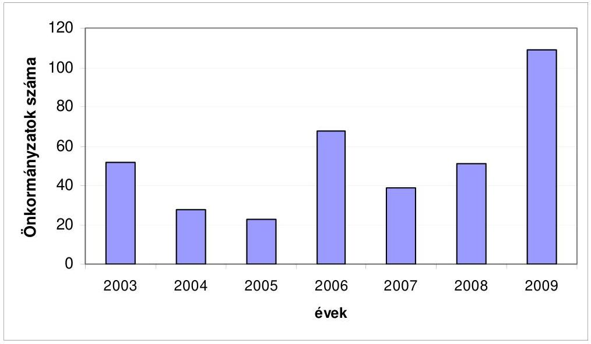

Az auditálásra nem kötelezett önkormányzatok közül ez évben, az előző évihez képest többen; 95 -en küldték meg az ÁSZ-nak a könyvvizsgálati dokumentumokat.

Az ÁSZ-nál letétbe helyezett összesen 787 jelentés feldolgozása alapján megállapítottuk, hogy 772 önkormányzatnál (98\%) látták el a könyvvizsgálók hitelesítő záradékkal az egyszerűsített beszámolót. Ez az arány az előző évi adatokkal közel azonos.

A könyvvizsgálók megállapították, hogy a beszámolók megfeleltek a számviteli alapelveknek és a vonatkozó jogszabályi előírásokban foglaltaknak. A 2009. évben megküldött, letétbe helyezett könyvvizsgálói jelentések közül csak egy községi önkormányzatnál adott elutasító záradékot a könyvvizsgáló (a 2008. évben három volt).

---

A korlátozott könyvvizsgálói záradékkal ellátott beszámolók száma az elmúlt évhez képest a felére csökkent (14). A legtöbb hibát a községi önkormányzatok követték el. A városi és fővárosi kerületi önkormányzatok közül kettőnél történt korlátozott záradék adása.

# A könyvvizsgálati záradék megoszlásának alakulása 2003-2009 között (\%-ban) 

| Záradék/év | $\mathbf{2 0 0 3 .}$   év | $\mathbf{2 0 0 4 .}$   év | $\mathbf{2 0 0 5 .}$   év | $\mathbf{2 0 0 6 .}$   év | $\mathbf{2 0 0 7 .}$   év | $\mathbf{2 0 0 8 .}$   év | $\mathbf{2 0 0 9 .}$   év |
| :-- | :--: | :--: | :--: | :--: | :--: | :--: | :--: |
| Hitelesítő | 90,0 | 91,0 | 94,0 | 95,9 | 96,1 | 96,1 | 98,1 |
| Korlátozott | 9,4 | 8,8 | 6,0 | 4,1 | 3,8 | 3,5 | 1,8 |
| Elutasító | 0,6 | 0,2 | 0,0 | 0,0 | 0,1 | 0,4 | 0,1 |
| Összesen | 100,0 | 100,0 | 100,0 | 100,0 | 100,0 | 100,0 | 100,00 |

A korlátozott záradék adásának jellemző indokai részben változtak az előző évihez képest. A korlátozott záradék indokai a 2009. évben:

- az analitikus és főkönyvi nyilvántartások egyeztetését - teljes körűen - nem lehetett elvégezni;
- az eszközök és források valódisága leltárral, illetve számviteli nyilvántartással nem volt alátámasztva;
- a vagyonkataszter hiányossága, vagy hiánya;
- a vagyonkimutatás és a beszámoló adatai közötti összhang nem volt értékelhető;
- elmaradt az előző évi auditálási különbözet elszámolása;
- nem alakították ki a belső ellenőrzést;
- hiányos volt a követelések nyilvántartása;
- hiányos volt a könyvvizsgáló számára bemutatott dokumentum;
- nem nyújtottak valós képet az aktív és passzív elszámolások;
- hiányos volt a törzstőke nyilvántartás, és
- a beszámolót nem arra jogosult készítette.

A záradék megadásának megtagadását a könyvvizsgáló azzal indokolta, hogy nem támasztották alá a mérleg valódiságot megfelelő analitikákkal és dokumentumokkal.

Az összegzés során megállapítottuk, hogy növekedett (219-ről 240-re) azon könyvvizsgálati jelentések száma, amelyek javaslatot tartalmaztak. Arányuk az összes jelentéshez viszonyítva $25 \%$-ról $30 \%$-ra nőtt.

Figyelemfelhívást a jelentések töredéke tartalmazott, de számuk nőtt. A figyelemfelhívás elsősorban a devizás hitelfelvétellel, kötvénykibocsátással össze-

---

függő jövőbeni kockázatok miatt volt. Megjegyzendő, hogy a jelentések közel fele nem tartalmazta a részletesebb értékelést magában foglaló Kiegészítést, illetve Függeléket.

Meg kell említeni, hogy országos szinten a megyéket nézve rendkívül nagy szórást mutatott a javaslatot tartalmazó jelentések megoszlása. Ez a helyzet a tavalyihoz képest nem változott. Van olyan megye, ahol a javaslatokat tartalmazó jelentések száma 0-5 között mozgott (pl. Bács-, Békés-, Fejér-, Hajdú-Bihar-, Heves-, Nógrád- és Zala megye), de vannak olyanok is amelyeknél 2535 volt (Borsod-Abaúj-Zemplén,-Pest- Szabolcs-Szatmár-Bereg és Veszprém megye). Ez a kép az előző évihez képest kevéssé változott. Ugyancsak nagy szórást mutatott megyénként azon jelentések száma, ahol a könyvvizsgáló a belső ellenőrzés működésére, továbbfejlesztésére, az ÁSZ jelentésekben megfogalmazott feladatok végrehajtásának figyelemmel kisérésére hívta fel a figyelmet.

A könyvvizsgálói javaslatot tartalmazó jelentésekben tett javaslatok jellemzően a következő témaköröket érintették:

- hasonlóan az elmúlt évekhez képest a legtöbb, visszatérő javaslat a számviteli rendszer fejlesztésére, a tárgyi eszközök, készletek értékesítésének, nyilvántartásának rendjére és az auditálási különbözet elszámolására vonatkozott;
- továbbra is jelentős a leltározási tevékenységre, a belső ellenőrzés továbbfejlesztésére, a szabályzatok aktualizálására, az előirányzat-módosítások szabályszerűségére, a követelések értékelésére és az értékvesztés elszámolására irányuló javaslatok száma, és
- új elemként jelent meg a szakmai teljesítés igazolására vonatkozó szabályok betartása, és az ÁSZ jelentéseiben leírt javaslatok hasznosítása.

A megyékből érkezett könyvvizsgálói jelentések feldolgozása során szerzett további tapasztalatok közül kiemeljük, hogy:

- a könyvvizsgálat -a jelenlegi jogi szabályozás miatt-a települések 75\%-át nem érintette, ezek zömében kistelepülések, amelyeknél egyedül az Állami Számvevőszék végzett ellenőrzéseket, amelyek tapasztalatait jellemzően megosztották egymással az érintett önkormányzatok, akik könyvvizsgáló közreműködését nem tudták igénybe venni,
- a szükséges szakmai képesítés hiánya (mérlegképes könyvelő) továbbra is gond a kisebb településeken.

Összegzésként kiemelhető, hogy az önkormányzati gazdálkodás szabályszerűségét a független könyvvizsgálói jelentések elősegítik.

Budapest, 2009. augusztus 26.

Függelék: $\quad 1 \mathrm{db}$

---

# RÖVIDÍTÉSEK JEGYZÉKE 

| ÁAK Zrt. | Állami Autópályakezelő Zártkörűen múködő részvénytársaság |
| :--: | :--: |
| AAM Zrt. | AAM Vezető Informatikai Tanácsadó Zártkörúen múködő részvénytársaság |
| ÁBKSz | Árvízvédelmi és Belvízvédelmi Központi Szervezet Közhasznú társaság |
| ÁBPE | Államháztartási Belső Pénzügyi Ellenőrzés |
| ACEEEO | Közép- és Kelet Európai Választási Szakértők Egyesülete |
| ADAM | Adóhatósági adómegállapítás |
| ADSL | Az Asymmetrical Digital Subscriber Line technológián alapuló szolgáltatás a meglévő közcélú távbeszélő-előfizetői hálózatba telepített sodrott érpárt felhasználva a hagyományos telefon-, ill. ISDN2 típusú szolgáltatás felett nagy sebességú, aszimmetrikus adatátviteli képességet biztosít. |
| ÁEK | Állami Egészségügyi Központ |
| AES | Világméretü független villamosenergia-ipari társaság |
| áfa | általános forgalmi adó |
| Áfa tv | Az általános forgalmi adóról szóló 1992. évi LXXIV. törvény |
| Áfa tv. | az általános forgalmi adóról szóló 2007. évi CXXVII. törvény |
| ÁFSZ | Állami Foglalkoztatási Szolgálat |
| ÁHH | Államháztartási Hivatal |
| Áhsz. | az államháztartás szervezetei beszámolási és könyvvezetési kötelezettségének sajátosságairól szóló 249/2000. (XII. 24.) Korm. rendelet |
| ÁHT | Államháztartási egyedi azonosító kód |
| ÁHT(-szám) | költségvetési előirányzat azonosító száma |
| Áht. | az államháztartásról szóló 1992. évi XXXVIII. törvény |
| AKA Zrt. | Alföldi Koncessziós Autópálya Zártkörúen múködő részvénytársaság |
| ÁKK Zrt. | Államadósság Kezelő Központ Zártkörűen múködő részvénytársaság |
| Aktv. | Magyar Tudományos Akadémiáról szóló 1994. évi XL. törvény |
| ALB | Alkotmánybíróság |
| AMC | Agrármarketing Centrum |
| AMIR | Adósminősítő rendszer |
| Ámr. | az államháztartás múködési rendjéről szóló 217/1998. (XII. 30.) Korm. rendelet |
| ÁNI | Általános Nukleáris Igazgatóság |
| ÁNTSZ | Állami Népegészségügyi és Tisztiorvosi Szolgálat |
| APEH | Adó- és Pénzügyi Ellenőrzési Hivatal |
| APEH KAIG | Adó- és Pénzügyi Ellenőrzési Hivatal Kiemelt Adózók Igazgatósága |
| APEH-SZTADI | Adó- és Pénzügyi Ellenőrzési Hivatal Számítástechnikai és Adatfeldolgozó Intézet |
| ÁPV Zrt. | Állami Privatizációs Vagyonkezelő Zártkörűen múködő részvénytársaság |
| ÁROP | Államreform Operatív Program |

---

| ARSZ | Adyligeti Rendészeti Szakközépiskola |
| :--: | :--: |
| Art. | az adózás rendjéről szóló 2003. évi XCII. törvény |
| ÁSZ | Állami Számvevőszék |
| ÁSZ-FEMI | Állami Számvevőszék Fejlesztési és Módszertani Intézet |
| ÁSZI | Állami Szociális Intézetek |
| ÁSZTL | Állambiztonsági Szolgálatok Történeti Levéltára |
| ÁSZ törvény | Az Állami Számvevőszékről szóló 1989. évi XXXVIII. törvény |
| ÁT | Átmeneti Támogatás programjai |
| ÁTBP | Állami Támogatású Bérlakás Program |
| ATEV Zrt. | ATEV Fehérje Feldolgozó Zártkörűen múködő részvénytársaság |
| Atom tv. | az atomenergiáról szóló 1996. évi CXVI. törvény |
| Atv. | a Kutatási és Technológiai Innovációs Alapról szóló 2003. évi XC. törvény |
| AVF | (FVM) Agrár-vidékfejlesztési Főosztály |
| AVGHA | Agrár-Vállalkozási Hitelgarancia Alapítvány |
| AVOP | Agrár- és Vidékfejlesztési Operatív Program |
| Avtv. | a személyes adatok védelméről és a közérdekú adatok nyilvánosságáról szóló 1992. évi LXIII. törvény |
| BA Rt. | Budapest Airport Részvénytársaság |
| BÁH | Bevándorlási és Állampolgársági Hivatal |
| BB | Bíráló Bizottság |
| BC | Beruházás-ösztönzési Célelőirányzat |
| BCE | Budapesti Corvinus Egyetem |
| BEO | Belső Ellenőrzési Osztály |
| Ber. | a költségvetési szervek belső ellenőrzéséről szóló 193/2003. (XI. 26.) Korm. rendelet |
| BESzE | Belső Ellenőrzési Szervezeti Egység |
| BÉT | Budapesti Értéktőzsde Részvénytársaság |
| BETYKA | Betegjogi, Ellátott-jogi és Gyermekjogi Közalapítvány |
| BEVA | Befektető-védelmi Alap |
| BÉVER | Békéscsabai Vényellenőrző Rendszer |
| BF | Büntetőpolitikai Főosztály |
| BHSZ | Biztonsági Hitelesítés-szolgáltató (korábban IHM-es szervezet, jelenleg a MeH felügyeli) |
| BIR | Bíróságok |
| Bit. | a biztosítókról és a biztosítási tevékenységről szóló 2003. évi LX. törvény |
| Bjt. | a Bírák jogállásáról és javadalmazásáról szóló 1997. LXVII. törvény |
| BK | Belügyi Közlöny |
| BKIK | Budapesti Kereskedelmi és Iparkamara |
| BKSZ Kht. | Budapesti Közlekedési Szövetség Közhasznú társaság |
| BKV Rt. | Budapesti Közlekedési Vállalat Részvénytársaság |
| BM | Belügyminisztérium |
| BM KANYVH | Belügyminisztérium Központi Adatfeldolgozó, Nyilvántartó és Választási Hivatal |
| BM KKI | BM Központi Kórház és Intézményei |
| BM TÁSZ | Belügyminisztérium Távközlési Szolgálat |
| BME | Budapesti Műszaki Egyetem |

---

| BMGE | Budapesti Műszaki Gazdasági Egyetem |
| :--: | :--: |
| BMIK | Budapesti Munkaerőpiaci Intervenciós Központ |
| BNT | Befogadó Nemzeti Támogatás |
| BRFK | Budapesti Rendőr-főkapitányság |
| Bszi. | A bíróságok szervezetéről és igazgatásáról szóló 1997. évi LXVI. törvény |
| BSZJ | Bejelentett Személyek Jogviszonyadatai |
| BSZKI | Bűnügyi Szakértő és Kutató Intézet |
| BTT | Baromfi Termék Tanács a Baromfi- és Tojástermelők Szövetsége |
| BUÉSZ | Bányászati Utókezelő és Éjjeli Szanatórium |
| BV | Büntetés-végrehajtás |
| BVOP | Büntetés Végrehajtás Országos Parancsnoksága |
| CBC | Határ menti együttmúködés |
| CBC | cross-border co-operation programs (Határon átnyúló együttműködés programja) |
| Cct. | A helyi önkormányzatok címzett és céltámogatási rendszeréről szóló 1992. évi LXXXIX. törvény |
| CEB | Európa Tanács Fejlesztési Bank |
| CÉDE | Céljellegú decentralizált támogatás |
| CEDEFOP | Európai Szakképzés-fejlesztési Központ |
| CEER | Council of European Energy Regulators |
| CERL | Európai Tudományos Könyvtárak Társulása (Consortium of European Resecarch Libraries) |
| CERN | Conseil Européen pour la Recherche Nucléaire ( Európai Nukleáris Kutatási Szervezet ) ma:European Organization for Nuclear Research |
| CISZOK | Civil Szolgálatok Központok |
| CLAVIS | Támogatási Életút Bázis Adatok projekt |
| CNB Zrt. | Corvinus Nemzetközi Befektetési Zártkörúen múködő részvénytársaság |
| CONNECT | Coordination and stimulation of innovative ITS activities in Central and Eastern European Countries |
| CT | Computer Tomográf |
| Csjt. | A házasságról, a családról és a gyámságról szóló 1952. évi IV. törvény |
| DAOP | Dél-Alföldi Operatív Program |
| DARFÜ Kht. | Dél-alföldi Regionális Fejlesztési Ügynökség Közhasznú társaság |
| db | darab |
| DDOP | Dél-Dunántúli Operatív Program |
| DDRFÜ Kht. | Dél-dunántúli Regionális Fejlesztési Ügynökség Közhasznú társaság |
| DE | Debreceni Egyetem |
| DEB | Döntés Előkészítő Bizottság |
| DHK Zrt. | Diákhitel Zártkörűen múködő részvénytársaság |
| DIS | Decentralised Implementation System (decentralizált végrehajtási rendszer) |
| DNS | Dezoxi-ribonukleinsav |
| DOT | Days of Treatment (Terápiás Napok Száma) |
| E Ft | Ezer forint |

---

| E. Alap | Egészségbiztosítási Alap |
| :--: | :--: |
| ÉAOP | Észak-Alföldi Operatív Program |
| ÉARFÜ Kht. | Észak-alföldi Regionális Fejlesztési Ügynökség Közhasznú társaság |
| EÁV | Energetikai Állandó Választott bíróság |
| EBB | Egyesített Budapesti Bérlet |
| EBESZ | Európai Biztonsági és Együttmúködési Szervezet |
| EBEV (eBEV) | Elektronikus bevallás |
| EBF | Egészségbiztosítási Felügyelet |
| EBH | Egyenlő Bánásmód Hatóság |
| Ebptv. | az egészségbiztosítási pénztárakról szóló 2008. évi I. törvény |
| EBRD | Európai Újjáépítési és Fejlesztési Bank |
| Ebtv. | a kötelező egészségbiztosítás ellátásairól szóló 1997. évi LXXXIII. törvény |
| ECOSTAT | ECOSTAT Kormányzati Gazdaság- és Társadalomstratégiai Kutató Intézet |
| EDEM | Egységes Európai Hadfelszerelési Piac |
| EDIS | Extended Decentralisation Implementation System (kiterjesztett decentralizációs végrehajtási rendszer) |
| EDR | Egységes digitális rádiótávközlő́ rendszer |
| ÉDUKÖVIZIG | Észak-Dunántúli Környezetvédelmi és Vízügyi Igazgatóság |
| ÉEF | Építésügyi és Építészeti Főosztály |
| EEKH | az EüM Engedélyezési és Közigazgatási Hivatal |
| EFER | Elektronikus fizetési szolgáltatás és a kapcsolódó fizetési és elszámolási rendszer |
| E-Fiz | Elektronikus Fizetési Program |
| EFK | Előirányzat-Felhasználási Keretszámla |
| Eftv. | az egyházak hitéleti és közcélú tevékenységének anyagi feltételeiről szóló 1997. évi CXXIV. törvény |
| EG | Előirányzat módosításokat tartalmazó űrlap |
| EGC | Energiagazdálkodási célelőirányzat |
| EGEE | Enabling Grids for E-sciencE - gridek hasznosíthatóvá tétele az etudományok területén |
| EGR | Egységes Gazdálkodási Rendszer |
| EGT | Európai Gazdasági Térség |
| EGT FM | Európai Gazdasági Térség Finanszírozási Mechanizmus |
| EGVE | Egészségügyi Gazdasági Vezetők Egyesülete |
| EHA | Energiahatékonysági Hitel Alap |
| EHA | Európai Halászati Alap |
| EHJC | Energiafelhasználási Hatékonyság Javítása Célelóirányzat |
| EHJC | Energiahasznosítás javítása céleIőirányzat |
| eho | Egészségügyi hozzájárulás |
| EHP | Energia Hitel Pályázat |
| Eht. | az elektronikus hírközlésről szóló 2003. évi C. törvény |
| Éhtv. | az ENSZ Éghajlatváltozási Keretegyezménye és annak Kiotói Jegyzőkönyve végrehajtási keretrendszeréről szóló 2007. évi LX. törvény |
| EIA | Európai Integrációs Alap |
| EIB | Európai Beruházási Bank |

---

| EIDR | Elektronikus Irat- és Dokumentumkezelő Rendszer |
| :--: | :--: |
| EISZ | Elektronikus Információszolgáltatás |
| EK | Európai Közösség |
| EKG | Elektronikus Kormányzati Gerinchálózat |
| EKHO | Egységes Közteherviselési Hozzájárulás |
| EKK | MeH Elektronikus Kormányzati Központ |
| EKKE | Európai Uniós Közbeszerzési Koordinációs és Szabályossági Egység |
| ÉKKO Kft. | ÉKKO Építőipari, Közszolgáltató, Kereskedő és Oktató Korlátolt   Felelősségű Társaság |
| EKOP | Elektronikus Közigazgatás Operatív Program |
| EKP | Ellenőrzési Korszerűsítési Projekt |
| ELMŰ | Budapesti Elektromos Művek Nyrt. |
| ELTE | Eötvös Lóránd Tudományegyetem |
| EMA | Európai Menekültügyi Alap |
| EMGA | Európai Mezőgazdasági Garancia Alap |
| ÉMI Kht. | Építésügyi Minőségellenőrző Innovációs Közhasznú társaság |
| EMIR | Egységes Monitoring Információs Rendszer |
| EMK | az ÜMFT Egységes Múködési Kézikönyve |
| EMMA | Egységes Magyar Munkaügyi Alapnyilvántartás |
| EMOGA | Európai Mezőgazdasági Orientációs és Garancia Alap |
| ÉMOP | Észak-Magyarországi Operatív Program |
| EMPIC | EMPIC GmbH |
| ÉMRFÜ Kht. | Észak-Magyarországi Fejlesztési Ügynökség Közhasznú társaság |
| EMU | Európai Monetáris Unió |
| EMVA | Európai Mezőgazdasági Vidékfejlesztési Alap |
| Energia Központ Kht. | Energia Központ Energiahatékonysági, Környezetvédelmi és   Energia Információs Ügynökség Nonprofit Közhasznú társaság |
| ENYV | Egységes ügyviteli és nyilvántartási analitikus program |
| EP | Európa Parlament |
| EPER | Elektronikus Pályázatkezelési és Együttmúködési Rendszer |
| EPO | European Patent Office - Európai Szabadalmi Hivatal |
| EPUBIR | Építésügyi bírságok nyilvántartása |
| EQUAL | a 2000-2006-os költségvetési időszak egyik EU-s Közösségi Kezdeményezés |
| ÉRÁK | Észak-magyarországi Regionális Képző Központ |
| ERFA | Európai Regionális Fejlesztési Alap |
| ÉRFI | Értelmi Fogyatékosok Rehabilitációs Intézete |
| ERRA | Energy Regulators Regional Association |
| ESA | Európa Statisztikai Adattár |
| ESA '95 | Nemzeti Számlák Európai Rendszere (ESA 1995) |
| ESKI | Egészségügyi Stratégiai Kutató Intézet |
| ESS | Európai Neutronkutató Központ |
| ESZA | Európai Szociális Alap |
| ESZA Kht. | ESZA Európai Szociális Alap Nemzeti Programirányító Iroda,   Társadalmi Szolgáltató Közhasznú társaság |
| ESZAK | Európai Szén és Acélipari Kutatási Alap |
| ESZCSM | Egészségügyi, Szociális és Családügyi Minisztérium |
| ESZIR | Erdészeti Szakigazgatási Információs Rendszer |

---

| ESZK | Egészségügyi Szakdolgozói Kamara |
| :--: | :--: |
| ET | Európa Tanács |
| ETE | Európai Területi Együttmúködés |
| ETI | Európai Technológiai Intézet |
| ETR | Egységes Tanulmányi Rendszer |
| ETT | Egészségügyi Tudományos Tanács |
| eTÜK | Elektronikus Titkos Ügykezelés |
| EU | Európai Unió |
| EU SAVE | Európai uniós támogatásból megvalósuló programok |
| EUMETSAT | Európai Múholdmeteorológiai Szervezet |
| EUNIA | Euro overnight index average (1 napos euro index átlag) |
| EUPM | Európai Unió Rendőri Missziója |
| EUR | euró |
| EURES | Európai Foglalkoztatási Szolgálat |
| EURIBOR | Frankfurti EUR betéti kamatláb |
| EUROPAN | Nemzetközi pályázati rendszer |
| EUSZA | Európai Unió Szolidaritási Alapja |
| EüM | Egészségügyi Minisztérium |
| EVA | Európai Visszatérési Alap |
| Eva | egyszerúsített vállalkozói adó |
| EXIMBANK Zrt. | Magyar Export-Import Bank Zártkörúen múködő részvénytársaság |
| EXPO | Nemzetközi Szakmai Vásár |
| f.a. | felszámolás alatt lévő |
| FAO | Food and Agriculture Organization Egyesült Nemzetek Élelmezési és Mezőgazdasági Szervezete |
| FAT | 2003. évi LXXXVII. törvény a fogyasztási árkiegészítéséről |
| FEFK | Feladatfinanszírozási előirányzat-felhasználási keretszámla |
| Fejkezut. | a fejezeti kezelésú előirányzatok felhasználásának rendjéről szóló 8/2008. (HÉ. 41.) ÖM utasítás |
| Feot. | a felsőoktatásról szóló 2005. évi CXXXIX. törvény |
| FEUVE | Folyamatba épített előzetes és utólagos vezetői ellenőrzés |
| FF | Nemzeti Fejlesztési Ügynökség Fejezeti Főosztálya |
| FI | KvVM Fejlesztési Igazgatóság |
| FIFA | Felzárkóztatási Infrastrukturális Fejlesztési Alapprogram |
| FIK | Fejlesztési és Innovációs Központ |
| FISEM | Főigazgatói Irányítású Szervezeti Egységek és Munkakörök |
| FKA | Munkaerőpiaci Alap Fejlesztési és Képzési Alaprésze |
| FKI | Földmúvelésügyi Költségvetési Iroda |
| FKO | Fejezeti költségvetési osztály |
| Flt. | a foglalkoztatás elősegítéséről és a munkanélküliek ellátásáról szóló 1991. évi IV. törvény |
| FM | Finanszírozási Mechanizmus |
| FM hivatalok | Földmúvelésügyi Hivatalok |
| FMM | Foglalkoztatáspolitikai és Munkaügyi Minisztérium |
| FORRÁS SQL | Integrált ügyviteli rendszer |
| FÖMI | Földmérési és Távérzékelési Intézet |
| FPEP | Fővárosi és Pest Megyei Egészségbiztosítási Pénztár |
| FPMNYI | Fővárosi és Pest Megyei Nyugdijbiztosítási Igazgatóság |

---

| FSZ | Forráskezelő Szervezet |
| :--: | :--: |
| FSZH | Foglalkoztatási és Szociális Hivatal |
| FSZK | Fogyatékos Személyek Esélyegyenlőségéért Közalapítvány |
| FT | Felügyeleti Tanács |
| FTT | Felsőoktatási és Tudományos Tanács |
| FVM | Földművelésügyi és Vidékfejlesztési Minisztérium |
| FVM AVOP IH | Földművelésügyi és Vidékfejlesztési Minisztérium Agrár és Vidékfejlesztési Operatív Program Irányító Hatóság |
| FVM GH | FVM Gazdasági Hivatala |
| FVMMI GM Kht. | FVMMI GM Gépminősítő Közhasznú Társaság |
| FVMMI GM Kkt. | FVM Műszaki Intézet Gépminősítő Kkt. |
| GAK | Gazdaságorientált Agrárgazdasági Kutatások |
| GALILEO | Világméretű műholdas rádió navigációs és helymeghatározó rendszer |
| GDP | Gross Domestic Product - Bruttó hazai termék |
| GEF | Global Environment Facility(Globális Környezeti Alap) |
| GEI | Gazdasági Ellátó Igazgatóság |
| GEI (IRM) | Gazdasági Ellátó Igazgatóság (IRM) |
| GEI (SZMM) | Gazdálkodási és Ellátási Iroda (SZMM) |
| GEP | Global Enviroment Publicity |
| GF | Gazdasági Főigazgatóság (KKÜ) |
| GF | Gazdálkodási Főosztály |
| GFC | Gazdaságfejlesztési célelőirányzat |
| GFO | Gazdasági Főosztály |
| GFP IH | Gazdaságfejlesztési programok Irányító Hatósága |
| GFS | Government Financial Statistics |
| GIIR | Gazdálkodási Integrált Informatikai Rendszer |
| GKI | Gazdaság Kutató Intézet |
| GKM | Gazdasági és Közlekedési Minisztérium |
| GNI | Gross National Income (Bruttó Nemzeti Jövedelem) |
| GNP | Gross National Product (Bruttó nemzeti termék) |
| GOP | Gazdaságfejlesztési Operatív Program |
| Grid | Olyan rendszerek amelyek nagy mennyiségű adat felügyelt elosztására és menedzselésére képesek. Egy „virtuális szuperszámítógép", amely földrajzilag elosztott számítógép hálózatból áll. |
| GSZÁT | Gazdasági és Ágazatfinanszírozási Szakállamtitkár |
| GSZT | Gazdasági és Szociális Tanács |
| GT | Gazdaságbiztonsági Tartalék |
| Gt. | a Gazdasági társaságokról szóló 2006. évi IV. törvény |
| GTPER | Gazdasági Támogató és Pénzügyi Ellátó Referatúra |
| GTTSZ | Gazdálkodási és Tudományos Társaságok Szövetsége |
| GVH | Gazdasági Versenyhivatal |
| GVOP | Gazdasági Versenyképesség Operatív Program |
| GVOP-IH | Gazdasági Versenyképesség Operatív Program Irányító Hatóság |
| GYED | Gyermekgondozási díj |
| Gyer. | a gyámhatóságokról, valamint a gyermekvédelmi és gyámügyi eljárásról szóló 149/1997. (IX. 10.) Korm. rendelet |
| GYES | Gyermekgondozási segély |

---

| GYET | Gyermeknevelési támogatás |
| :--: | :--: |
| GYFA | Gyártmányfejlesztési Forgóalap |
| Gyftv. | a biztonságos és gazdaságos gyógyszer és gyógyászati segédesz-köz-ellátás, valamint a gyógyszerforgalmazás általános szabályairól szóló 2006. évi XCVIII. törvény |
| GyISM | Gyermek-, Ifjúsági és Sportminisztérium |
| GYIVI | Gyermek- és ifjúságvédelem intézetei |
| Gyöngyösi Kistérségi Társulás | Gyöngyös Körzete Kistérség Többcélú Társulás |
| GySEV Zrt. | Győr-Sopron-Ebenfurthi Vasút Zártkörúen múködő részvénytársaság |
| Gyvt. | a gyermekek védelméről és a gyámügyi igazgatásról szóló 1997. évi XXXI. törvény |
| Hatóság | Nemzeti Hírközlési Hatóság |
| HBCS | Homogén Betegség Csoport |
| HBONE | A HBONE-hálózat a magyarországi oktatási, kutatási, könyvtári és közgyűjteményi hálózat, melyet a NIIFI múködtet. |
| HC Zrt. | HungaroControl Magyar Légiforgalmi Szolgálat Zártkörúen múködő részvénytársaság |
| HCCP | Ételkészítéshez korszerú múszaki eszközök, berendezések és higiéniás eljárások rendszere |
| HÉ | Hivatalos Értesítő |
| HEFOP | Humánerőforrás-fejlesztési Operatív Program |
| HEP IH | Humán Erőforrás Programok Irányító Hatósága |
| HG Zrt. | Garantiqa Hitelgarancia Zártkörúen múködő részvénytársaság |
| HIK | Hallgatói Információs Központ |
| HIPC | Súlyosan Eladósodott Szegény Országok adósság-könnyítő program |
| HITEC | Infokommunikációs piacon levő konkrét üzleti lehetőségek |
| HK | Hajléktalanokért Közalapítvány |
| HM | Honvédelmi Minisztérium |
| HM ÁEK | HM Állami Egészségügyi Központ |
| HM FLÚ | HM Fejlesztési és Logisztikai Úgynökség |
| HM HIM | HM Hadtörténeti Intézet és Múzeum |
| HM IKH | Honvédelmi Minisztérium Ingatlankezelési Hivatal |
| HM IÚ | HM Infrastrukturális Úgynökség |
| HM IÚ AKO | HM Infrastrukturális Úgynökség Anyagi és Koordinációs Osztály |
| HM KEHH | HM Költségvetési Ellenőrzési és Hatósági Hivatal |
| HM KPSZH | Honvédelmi Minisztérium Központi Pénzügyi és Számviteli Hivatal |
| HM KPÜ | Honvédelmi Minisztérium Közgazdasági és Pénzügyi Úgynökség |
| HM KTF | HM Kommunikációs és Toborzó Főosztály |
| HM SZEF | HM Személyzeti Főosztály |
| HM SZÜO | HM Személyügyi Osztály |
| HM TD | HM Támogató Dandár |
| HM TKF | HM Tervezési és Koordinációs Főosztály |
| HM VGF | HM Védelemgazdasági Főosztály |
| HM VTISZÁT | HM Védelmi Tervezési és Infrastrukturális Szakállamtitkár |
| HO | Humánpolitikai Osztály |
| HOP | Halászati Operatív Program |

---

| HÖOK | Hallgatói Önkormányzatok Országos Konferenciája |
| :--: | :--: |
| HÖR | Határőrség |
| HÖT | Helyi önkormányzatok támogatásai fejezet |
| Hpt. | a hitelintézetekről és a pénzügyi vállalkozásokról szóló 1996. évi CXII. törvény |
| HRMS | Létszámnyilvántartó alrendszer |
| Hrsz. | Helyrajzi szám |
| Hszt. | a fegyveres szervek hivatásos állományú tagjainak szolgálati viszonyáról szóló 1996. évi XLIII. törvény |
| HTMH | Határon Túli Magyarok Hivatala |
| HTMT | Határon Túli Magyarok Titkársága |
| HUMÁN-JÖVŐ Kht. | HUMÁN-JÖVŐ 2000 Egészségmegőrző és Oktatási Közhasznú társaság |
| HVK | Honvéd Vezérkar Főnökség |
| HVKF | Honvéd Vezérkar Főnök |
| HVR | Hátralékkezelési és Végrehajtási Információs Rendszer |
| Hvt. | a honvédelemről és a Magyar Honvédségről szóló 2004. évi CV. törvény |
| IAIS | International Assocation of Insurance Supervisors |
| Iasz | az igazságügyi alkalmazottak szolgálati jogviszonyáról szóló 1997. évi LXVIII. törvény |
| IBR | Irányított Betegellátás Rendszere |
| IBRD | Nemzetközi Újjáépítési és Fejlesztési Bank |
| IBSZ | Informatikai Biztonsági Szabályzat |
| ICAO | Nemzetközi Polgári Repülési Szervezet (Civil Aviation Organization) |
| ICOMOS | International Council on Monuments and Sites (Múemlékek és Helyszínek Nemzetközi Bizottsága) |
| ICSID | International Council of Societies of Industrial Design Ipari Formatervezési Társaságok Nemzetközi Szövetsége |
| ICSID | Beruházási Viták Rendezésének Nemzetközi Központja |
| Igazgatás | FVM központi igazgatása intézmény |
| IgH | Igazoló Hatóság |
| IH | Irányító Hatóság |
| IH | Információs Hivatal |
| IH | Igazságügyi Hivatal |
| IHM | Informatikai és Hírközlési Minisztérium |
| IHM-ITP | Informatikai és Hírközlési Minisztérium - Informatikai fejlesztése Támogatása Program |
| IIER | Integrált Igazgatási és Ellenőrzési Rendszer |
| IKA | Illyés Közalapítvány |
| IKSZF | Igazságügyi Kodifikációs és Szolgáltatási Főosztály |
| ILO | Nemzetközi Munkaügyi Szervezet |
| IM | Igazságügyi Minisztérium |
| IMF | Nemzetközi Valuta Alap |
| IMI | Intézményi Humánpolitikai Munkaügyi Információs rendszer |
| IMIR | INTERREG Monitoring és Információs Rendszer |
| INRAP | Institut national de recherches archéologiques préventives (Megelőző Régészeti Kutatások Intézete) |

---

| INTERREG | Az Európai Unio belső határrégióinak fejlesztését célzó program (Interregionális Együttmúködés) |
| :--: | :--: |
| IP | Indikatív Program |
| IPC | Industrial Planning Committee |
| IRM | Igazságügyi és Rendészeti Minisztérium |
| IRM IH | IRM Igazságügyi Hivatal |
| ISDN | Integrated Services Digital Network, integrált szolgáltatású digitális hálózat. |
| ISK | Ifjúsági és Sportkommunikációs Szolgáltató Kft. |
| ISO | Az International Organization for Standardization rövidített neve, mely egy nemzetközi szövetség, ami több mint 100 nemzet szabványosítási tagszervezeteit foglalja magába, és számos nemzetközi szabványt tart karban. |
| ISPA | Instrument for Structural Policies for Pre-Accession (Strukturális Politikák Csatlakozás Előtti Eszköze) |
| ISPA GKM előirányzatok | Kohéziós Alap támogatásából megvalósuló közlekedési előirányzatok |
| ISZKI | Igazságügyi Szakértői és Kutató Intézetek |
| IT | Információs Társadalom |
| IT | informatika |
| IT Kht. | Információs Társadalom Közhasznú társaság |
| ITB | Informatikai Tárcaközi Bizottság |
| ITBF | Információtechnológiai Beszerzési Főosztály |
| ITD-H | Befektetés-ösztönzési és kereskedelemfejlesztési tanácsadás Céleióirányzat |
| JÁP | Jedlik Ányos Program |
| JEREMIE | Joint European Resources for Micro to Medium Enterprises (EU forrásból finanszírozott támogatás, pénzügyi eszköz) |
| Jöt. | a jövedéki adóról és a jövedéki termékek forgalmazásának különös szabályairól szóló 2003. évi CXXVII. törvény |
| Jst. | a jogi segítségnyújtásról szóló 2003. évi LXXX. törvény |
| JTI | Japán Tobacco International |
| JÜB | „Jogügyletek Biztonsága" |
| $\mathrm{K}+\mathrm{F}$ | Kutatás-fejlesztés |
| KA | Kohéziós Alap |
| KA IH | Kohéziós Alap Irányító Hatóság |
| KAC | Környezetvédelmi Alap Célelóirányzat |
| KAIG | Kiemelt Adózók Igazgatósága (APEH) |
| KAT | adózók költségvetési kapcsolatain alapuló kategorizálási rendszer |
| KAVOSZ Zrt. | Ka-vosz Pénzügyi Szolgáltatásokat Közvetítő Zártkörúen múködő részvénytársaság |
| KBSZ | Közlekedésbiztonsági Szervezet |
| Kbt. | a közbeszerzésekről szóló 2003. évi CXXIX. törvény |
| KDB | Közbeszerzési Döntőbizottság |
| KDOP | Közép-Dunántúli Operatív Program |
| KE | Köztársasági Elnökség |
| KE határozat | Köztársaság elnökének határozata |
| KEH | Köztársasági Elnöki Hivatal |
| KEHI | Kormányzati Ellenőrzési Hivatal |

---

| KEKKH | Közigazgatási és Elektronikus Közszolgáltatások Központi Hiva-   tala |
| :--: | :--: |
| KELER | Központi Elszámolóház és Értéktár Zártkörúen múködő rész-   vénytársaság |
| KELER Rt. | Központi Elszámolóház és Értéktár Részvénytársaság |
| KEOP | Környezet és Energia Operatív Program |
| KEOP IH | Környezetvédelmi programok Irányító Hatósága |
| KEP | Köztársasági Esélyegyenlőségi Program |
| KESZ | Kincstári Egységes Számla |
| Ket tv. | a közigazgatási hatósági eljárás és szolgáltatás általános szabá-   lyairól szóló 2004. évi CXL. törvény |
| KF | Közlekedési Felügyeletek |
| KFGH | HM Kormányzati Frekvenciagazdálkodási Hivatal |
| KFI | Kutatás-fejlesztés és Innováció |
| KFI Program | Kutatás Fejlesztés Innovációs Program |
| KFKK | Kiemelt Fejlesztési Koordinációs Központ |
| Kft. | Korlátolt felelősségú társaság |
| KfW | Kreditanstalt für Wiederaufbau (Újjáépítési és Hitelbank) |
| KGF | Központi Gazdasági Főigazgatóság |
| KGF | Költségvetési és Gazdálkodási Főosztály |
| KGFO | Költségvetési és Gazdasági Főosztály |
| KGR | Költségvetési Gazdálkodási Rendszer |
| KGY | Közgyülés |
| KH | Kifizető Hatóság |
| KHA | Külső Határok Alap |
| KHEM | Közlekedési, Hírközlési és Energiaügyi Minisztérium |
| KHR | Közösségi Hozzájárulás Rendezés |
| Kht. | Közhasznú társaság |
| KHVM | Közlekedési Hírközlési és Vízügyi Minisztérium |
| KIKSZ | Közlekedésfejlesztési Integrált Közremúködő Szervezet |
| KIKSZ Zrt. | KIKSZ Közlekedésfejlesztési Zártkörűen múködő részvénytársa-   ság |
| Kincstár | Magyar Államkincstár |
| KIOP | Környezetvédelmi és Infrastruktúra Operatív Program |
| KIR | Központi Illetményszámfejtő Rendszer |
| Kjt. | a közalkalmazottak jogállásáról szóló 1992. évi XXXIII. törvény |
| KKC | Kis- és középvállalkozói célelőirányzat |
| KKEK | Kutatás, Kutatásszervezési és Elemzési Központ |
| KKI | Központi Kárrendezési Iroda |
| KKK | Közlekedésfejlesztési Koordinációs Központ |
| KKt | a közúti közlekedésről szóló 1988. évi I. törvény |
| Kkt. | a Magyar Könyvvizsgálói Kamaráról, a könyvvizsgálói tevékenységről, valamint a könyvvizsgálói közfelügyeletről szóló 2007. évi LXXV. törvény |
| KMOP | Közép-Magyarországi Operatív Program |
| KMR | Kincstári Monitoring Rendszer |
| KNPA | Központi Nukleáris Pénzügyi Alap |
| KOK | Katasztrófavédelmi Oktatási Központ |
| KOMT | Közalkalmazottak Országos Munkaügyi Tanácsa |

---

| KOR IH | Koordinációs Irányító Hatóság |
| :--: | :--: |
| Korm. | Kormány |
| KÖH | Kulturális Örökségvédelmi Hivatal |
| KÖKIR | Közúti Központi Információs Rendszer |
| Költségvetési Törvény | a Magyar Köztársaság 2007. évi költségvetéséről szóló 2006. évi   CXXVII. törvény |
| KÖSZ | Kulturális Örökségvédelmi Szakszolgálat |
| Kőszegi Kistérségi Társulás | Kőszeg Város és Vonzáskörzete Többcélú Kistérségi Társulás |
| Kövice | Környezetvédelmi és vízügyi céleloirányzat |
| KÖVIZIG | Környezetvédelmi és Vízügyi Igazgatóságok |
| Kövt. | a Kulturális örökség védelméről szóló 2001. évi LXIV. törvény |
| Közbeszerzési Döntőbizottság | Közbeszerzések Tanácsa Közbeszerzési Döntőbizottsága |
| KÖZIG IH | Közigazgatási Reform Programok Irányító Hatóság |
| Közokt. tv. | a közoktatásról szóló 1993. évi LXXIX. törvény |
| KÖZOP | Közlekedés Operatív Program |
| KÖZOP IH | Közlekedési programok Irányító Hatósága |
| Központ | Kincstár Központ |
| Kp. | Központ |
| KPI | Kutatás-fejlesztési Pályázati és Kutatáshasznosítási Iroda |
| Kp-i | Központi |
| KPIR | Költségvetési Pénzügyi Gazdálkodási Rendszer (pénzügyi nyilvántartó rendszer) |
| KPIR | Központi Piacfelügyeleti Információs Rendszer |
| KPSZE | Központi Pénzügyi és Szerződéskötő Egység |
| KRSZ | Körmendi Rendészeti Szakközépiskola |
| KSH | Központi Statisztikai Hivatal |
| KSZ | Kollektív Szerződés |
| KSZ | Közremüködő Szervezet |
| KSZF | Központi Szolgáltatási Főigazgatóság |
| KSZI | Kutatásszervezési Intézet |
| KSZK | Kormányzati Személyügyi Szolgáltató és Közigazgatás Képzési Központ |
| KSZSZR | Kormányzati Személyügyi Szolgáltató Rendszer |
| KT | Közbeszerzések Tanácsa |
| Kt. | a közoktatásról szóló 1993. évi LXXIX. törvény |
| KTI Kht. | Közlekedéstudományi Intézet Közhasznú társaság |
| KTIA | Kutatási és Technológiai Innovációs Alap |
| KTIR | Kormányzati Távközlési és Informatikai Rendszer |
| KTIT | Kutatási és Technológiai Innovációs Tanács |
| KTK | Kincstári Tranzakciós Kód |
| KTM | Környezetvédelmi és Területfejlesztési Minisztérium |
| KTNYR | Központi Támogatás Nyilvántartó Rendszer |
| Ktv. | a köztisztviselők jogállásáról szóló 1992. évi XXIII. törvény |
| KTVF | Környezetvédelmi, természetvédelmi és vízügyi hatósági szervek |
| KüM | Külügyminisztérium |
| KVI | Kincstári Vagyoni Igazgatóság |
| Kvtv. | a Magyar Köztársaság 2008. évi költségvetéséről szóló 2007. évi CLXIX. törvény |

---

| KvVM | Környezetvédelmi és Vízügyi Minisztérium |
| :--: | :--: |
| KvVM FI | Környezetvédelmi és Vízügyi Minisztérium Fejlesztési Igazgatósága |
| KvVM OMSZ | Országos Meteorológiai Szolgálat |
| LEKI | Leghátrányosabb helyzetú kistérségek felzárkóztatásának támogatása |
| LEP | Lakóépületek Energia megtakarítási Program |
| LIBOR | London Inter Bank Offered Rate (Londoni bankközi kamatláb) |
| LRI | Légiforgalmi és Repülőtéri Igazgatóság |
| LT | Lebonyolító Testület |
| M | millió |
| M Ft | millió forint |
| MAB | Magyar Akkreditációs Bizottság |
| MABISZ | Magyar Biztosítók Szövetsége |
| MACIKA | Magyarországi Cigányokért Közalapítvány |
| MÁELGI | Magyar Állami Eötvös Lóránt Geofizikai Intézet |
| MÁFI | Magyar Állami Földtani Intézet |
| MAG Zrt. | Magyar Gazdaságfejlesztési Központ Támogatásközvetítő Zártkörúen múködő részvénytársaság |
| MAHART | Magyar Hajózási Részvénytársaság |
| MÁl | Mozgássérültek Állami Intézete |
| MAK | Magyar Alkotómúvészek Közalapítvány |
| MÁK Igazgatóság | Magyar Államkincstár Regionális (Megyei) Igazgatósága |
| MALÉV | Magyar Légiközlekedési Részvénytársaság |
| MAOE | Magyar Alkotómúvészek Országos Egyesülete |
| MAT | Munkaerőpiaci Alap Irányító Testülete |
| MÁV | Magyar Államvasutak |
| MÁV ÁBE | MÁV Általános Biztosító Egyesület |
| MÁV START Zrt. | Magyar Államvasutak START Zártkörúen múködő részvénytársaság |
| MÁV Zrt. | Magyar Államvasutak Zártkörúen múködő részvénytársaság |
| MAVIR Zrt. | Magyar Villamosenergia-ipari Átviteli Rendszerirányító Zártkörúen múködő részvénytársaság |
| MAZSIHISZ | Magyarországi Zsidó Hitközségek Szövetsége |
| MAZSÖK | Magyarországi Zsidó Örökség Közalapítvány |
| MBFH | Magyar Bányászati és Földtani Hivatal |
| MBH | Magyar Bányászati Hivatal |
| ME | Miniszterelnökség |
| ME fejezet | Miniszterelnökség fejezet |
| ME utasítás | Miniszterelnöki utasítás |
| MéBiH | Magyar Élelmiszer-biztonsági Hivatal |
| MeH | Miniszterelnöki Hivatal |
| MEH | Magyar Energia Hivatal |
| MEH IKB | Miniszterelnökség Informatikai Kormánybiztosság |
| MeH NEKF | Miniszterelnöki Hivatal Nemzeti és Etnikai Kisebbségi Főosztály |
| MeH-EKK | MeH Elektronikus Kormányzati Központ |
| MEHIB Zrt. | Magyar Exporthitel Biztosító Zártkörűen múködő részvénytársaság |
| MeHIg | Miniszterelnöki Hivatal Igazgatás |

---

| MeH-KEKKH | MeH-Közigazgatási és Elektronikus Közszolgáltatások Központi Hivatala |
| :--: | :--: |
| MeHVM | Miniszterelnöki Hivatalt Vezető Miniszter |
| MEKÜF | Miniszterelnökség Központi Üdülési és Oktatási Főigazgatósága |
| MEP | Megyei Egészségbiztosítási Pénztár |
| MEREK | Mozgássérült Emberek Rehabilitációs Központja |
| Met. | Menedékjogról szóló 2007. évi LXXX. törvény |
| METESZ | Műszaki és Természettudományi Egyesületek Szövetsége |
| MFB | Magyar Fejlesztési Bank |
| MFB Zrt. | Magyar Fejlesztési Bank Zártkörűen múködő részvénytársaság |
| MgSzH | Mezőgazdasági Szakigazgatási Hivatal |
| MGYK | Magyar Gyógyszerész Kamara |
| MH | Magyar Honvédség |
| MH TD | MH Támogató Dandár |
| MITS | Magyar Információs Társadalom Stratégia |
| MK | Magyar Közlöny |
| MK | Munkaügyi Központ |
| MKEH | Magyar Kereskedelmi Engedélyezési Hivatal |
| MKGI | Miniszterelnökség Közbeszerzési és Gazdasági Igazgatósága |
| MKI | Magyar Külügyi Intézet |
| MKIK | Magyar Kereskedelmi és Iparkamara |
| MKK | Múködési Kézikönyv |
| MKK Zrt. | Magyar Követeléskezelő Zártkörűen múködő részvénytársaság |
| MKKSZ | Magyar Köztisztviselők, Közalkalmazottak és Közszolgálati Dolgozók Szakszervezete |
| MKÜ | Magyar Köztársaság Ügyészsége |
| MLI Kht. | Magyar Lakás-innovációs Közhasznú társaság |
| MMIKL | Magyar Művészeti Intézet és Képzőmúvészeti Lektorátus |
| MMK | Magyar Mozgókép Közalapítvány |
| MNB | Magyar Nemzeti Bank |
| MNEKK | Magyarországi Nemzeti Etnikai Kisebbségekért Közalapítvány |
| MNG | Múemlékek Nemzeti Gondnoksága |
| MNV Zrt. | Magyar Nemzeti Vagyonkezelő Zártkörűen múködő részvénytársaság |
| MNVH | Magyar Nemzeti Vidéki Hálózat |
| MNYP | Magánnyugdíjpénztár |
| MOB | Magyar Olimpiai Bizottság |
| Mohácsi Kistérségi Társulás | Mohácsi Többcélú Kistérségi Társulás |
| MOK | Magyar Orvosi Kamara |
| MOL Rt. | Magyar Olaj- és Gázipari Részvénytársaság |
| MOTESZ | Magyar Orvos-társaságok és Egyesületek Szövetsége |
| MPA | Munkaerőpiaci Alap |
| MPA FA | Munkaerőpiaci Alap Foglalkoztatási Alaprész |
| MPA KA | Munkaerőpiaci Alap Képzési Alaprész |
| MPA RA | Munkaerőpiaci Alap Rehabilitációs Alaprész |
| MPA SZA | Munkaerőpiaci Alap Szolidaritási Alaprész |
| MPB | Magyar Paralimpiai Bizottság |
| Mpt. | a magánnyugdíjról és a magánnyugdíjpénztárakról szóló 1997.   évi LXXXII. törvény |

---

| Mrd | milliárd |
| :--: | :--: |
| MRFK | Megyei Rendőr-főkapitányság |
| MRI | Magnetic Resonance Imaging (Mágneses Magrezonancia Kép-   alkotás) |
| MRS | Magyar Rendészeti Sportszervezetek |
| MRSZ | Miskolci Rendészeti Szakközépiskola |
| MSH | Magyar Sport Háza |
| MSZH | Magyar Szabadalmi Hivatal |
| MSZT | Magyar Szabványügyi Testület |
| MT Zrt. | Magyar Turizmus Zártkörűen múködő részvénytársaság |
| Mt. | a Munka Törvénykönyvéről szóló 1992. évi XXII. törvény |
| MTA | Magyar Tudományos Akadémia |
| MTA GSZT | MTA Gazdasági és Szociális Tanács |
| MTA IKI | MTA Izotópkutató Intézet |
| MTA KFKI | Magyar Tudományos Akadémia KFKI Atomenergia Kutatóinté-   zet (Budapesti Kutatóreaktor) |
| MTH | Magyar Turisztikai Hivatal |
| MTI | Magyar Távirati Iroda |
| MTRFH | Magyar Terület és Regionális Fejlesztési Hivatal |
| MTV Zrt. | Magyar Televízió Zártkörűen múködő részvénytársaság |
| MüPa Kft. | Múvészetek Palotája Kft. |
| MVf Kht. | Magyar Vállalkozásfejlesztési Közhasznú társaság |
| MVH | Mezőgazdasági és Vidékfejlesztési Hivatal |
| MVM Zrt. | Magyar Villamos Múvek Zártkörűen múködő részvénytársaság |
| NA Zrt. | Nemzeti Autópálya Zártkörűen múködő részvénytársaság |
| NAT | Nemzeti Akkreditáló Testület |
| NATO | (North Atlantic Treaty Organisation) Észak-atlanti Szerződés   Szervezete |
| NAVA | Nemzeti Audiovizuális Archívum |
| NBC | Nemzeti Beruházás-ösztönzési Célelőirányzat |
| NBH | Nemzetbiztonsági Hivatal |
| NBI | Nemzetbiztonsági Iroda |
| NBI | Nukleáris Biztonsági Igazgatóság |
| NBSZ | Nemzetbiztonsági Szakszolgálat |
| NCSSZI | Nemzeti Család- és Szociálpolitikai Intézet |
| NDA | Nemzeti Digitális Adattár |
| NEFE | Nemzetközi Fejlesztési Együttmúködés |
| NEKH | Nemzeti, Etnikai és Kisebbségi Hivatal |
| NEP | Nemzeti Energiatakarékossági Program |
| NEP IH | Nemzetközi Együttmúködési Programok Irányító Hatósága |
| NFA | Nemzeti Földalap |
| NFGM | Nemzeti Fejlesztési és Gazdasági Minisztérium |
| NFH | Nemzeti Fejlesztési Hivatal |
| NFI | Nemzetközi Fejlesztési Intézet |
| Nfkt | Nonprofit Kft. |
| NFT | Nemzeti Fejlesztési Terv |
| NFÜ | Nemzeti Fejlesztési Ügynökség   (a Nemzeti Fejlesztési Hivatal jogutódja) |

---

| NHH | Nemzeti Hírközlési Hatóság |
| :--: | :--: |
| NHIT | Nemzeti Hírközlési és Informatikai Tanács |
| NIF Zrt. | Nemzeti Infrastruktúra Fejlesztő Zártkörúen múködő részvénytársaság |
| NIIF | Nemzeti Információs és Infrastruktúra Fejlesztési Program Iroda |
| NIIF Program | Nemzeti Információs Infrastruktúra Fejlesztési Program |
| NIIFI | Nemzeti Információs Infrastruktúra Fejlesztési Intézet |
| NKA | Nemzeti Kulturális Alap |
| NKH | Nemzeti Közlekedési Hatóság |
| NKÖV Kht. | Nemzeti Kulturális Örökségvédelmi Közhasznú társaság |
| NKR | Nemzeti Kutatás-nyilvántartási Rendszer |
| NKTH | Nemzeti Kutatási és Technológiai Hivatal |
| NKTH-KPI | Nemzeti Kutatási és Technológiai Hivatal Kutatás-fejlesztési Pályázati és Kutatáshasznosítási Iroda |
| NM | Népjóléti Miniszter |
| NNI | Nemzeti Nyomozó Iroda |
| NOK | Nemzeti Oktatási Központ |
| NPI | Nemzeti park igazgatóságok |
| NSIP | NATO Security Investment Programme, Biztonsági Beruházási Program |
| NSK | Nemzeti Sportközpontok |
| NSZFI | Nemzeti Szakképzési és Felnőttképzési Intézet |
| NSZFT | Nemzeti Szakképzési és Felnőttképzési Tanács |
| NT Kht. | NT Nemzetközi Technológiai Közhasznú társaság |
| NTK | Napi Terápiás Költség |
| NUSI | Nemzeti Utánpótlás-nevelési és Sportszolgáltató Intézet |
| NVT | Nemzeti Vagyongazdálkodási Tanács |
| NVT | Nemzeti Vidékfejlesztési Terv |
| Ny. Alap | Nyugdíjbiztosítási Alap |
| NYDOP | Nyugat-Dunántúli Operatív Program |
| NYDRFÜ Kht. | Nyugat-dunántúli Regionális Fejlesztési Ügynökség Közhasznú Társaság |
| Nyírbátori Kistérségi Társulás | Nyírbátor és Vonzáskörzete Többcélú Kistérségi Társulás |
| NYME | Nyugat-Magyarországi Egyetem |
| NYUFIG | Nyugdíjfolyósító Igazgatóság |
| OAH | Országos Atomenergia Hivatal |
| OAH F | Az Országos Atomenergia Hivatal Főigazgatója |
| OÁI | Országos Állategészségügyi Intézet |
| OALI | Országos Alapellátási Intézet |
| OBA | Országos Betétbiztosítási Alap |
| OBB | Országos Bünmegelőzési Bizottság |
| OBH | Országgyúlési Biztosok Hivatala |
| OBI | Országos Borminősítő Intézet |
| OBmB | Országos Baleset- megelőzési Bizottság |
| ObmT | Országos Bünmegelőzési Tanács |
| OCCR | Országos Cégnyilvántartó és Céginformációs Rendszer |
| ODÉ | Országgyúlési Dolgozók Érdekképviselete |
| ODF | Open Document Format - nyílt dokument formátum |

---

| OECD | Organisation for Economic Cooperation and Development, Gazdasági Együttmúködési és Fejlesztési Szervezet |
| :--: | :--: |
| OECF | Japan's Overseas Economic Cooperation Fund |
| OÉI | Országos Élelmiszervizsgáló Intézet |
| OEP | Országos Egészségbiztosítási Pénztár |
| OF | Oktatási Főigazgatóság |
| OFA | Országos Foglalkoztatási Közalapítvány |
| OFI | Oktatáskutató és Fejlesztő Intézet |
| OFIK | Országos Felsőoktatási Információs Központ |
| OGY | Országgyúlés |
| OGYH | Országgyúlés Hivatala |
| OGYI | Országos Gyógyszerészeti Intézet |
| OH | Oktatási Hivatal |
| OI | Oktatási Igazgatás |
| OIK | Országos Idegennyelvü Könyvtár |
| OIT | Országos Igazságszolgáltatási Tanács |
| OJA | Országos Játékalap |
| OKÉV | Országos Közoktatási Értékelési és Vizsgaközpont |
| OKF | Országos Katasztrófavédelmi Főigazgatóság |
| OKK | Fodor József Országos Közegészségügyi Központ |
| OKM | Oktatási és Kulturális Minisztérium |
| OKMTI | Oktatási és Kulturális Minisztérium Támogatáskezelő Igazgatósága |
| OKTV | Országos Középiskolai Tanulmányi Verseny |
| OKTVF | Országos Környezetvédelmi, Természetvédelmi és Vízügyi Főfelügyelőség |
| OLAF | Office Européen de Lutte Anti-Fraude (Európai Csalásellenes Hivatal) |
| OLÉH | Országos Lakás- és Építésügyi Hivatal |
| OMAI | Oktatási Minisztérium Alapkezelő Igazgatóság |
| OMFI | Országos Munkahigiénés és Foglalkozás-egészségügyi Intézet |
| OMH | Országos Mérésügyi Hivatal |
| OMMF | Országos Munkabiztonsági és Munkaügyi Főfelügyelőség |
| OMMI | Országos Mezőgazdasági Minősitő Intézet |
| OMSZ | Országos Mentőszolgálat |
| OMSZ (KvVM) | Országos Meteorológiai Szolgálat |
| OMSZI Kht. | Oktatási Minisztérium Szolgáltató Intézmény Intézményfenntartó Közhasznú társaság |
| ONB | Országgyúlés Nemzetbiztonsági Bizottsága |
| ONYF | Országos Nyugdíjbiztosítási Főigazgatóság |
| OORI | Országos Orvosi Rehabilitációs Intézet |
| OOSZI | Országos Orvosi Szakértői Intézet |
| OP | Operatív Programok |
| OPH | Országos Parancsnoki Hivatal |
| OPKM | Országos Pedagógia Könyvtár és Múzeum |
| OPNI | Országos Pszichiátriai és Neurológiai Intézet |
| OPSZ | Országos Polgárőr Szövetség |
| ORFK | Országos Rendőr-főkapitányság |
| ORFK GF | Országos Rendőr Főkapitányság Gazdasági Főosztálya |

---

| ORKI | Orvos- és Kórháztechnikai Intézet |
| :--: | :--: |
| ORSZI | Országos Rehabilitációs és Szociális Szakértői Intézet |
| ORSZK | Országos Roma Szakképzési Központ |
| OSEI | Országos Sportegészségügyi Intézet |
| OSzK | Oktatási Szolgáltatási Központ |
| OSZT | Országos Szakképzési Tanács |
| OTH | Országos Területfejlesztési Hivatal |
| OTIVA | Országos Takarékszövetkezeti Intézmény Védelmi Alap |
| OTKA | Országos Tudományos Kutatási Alapprogramok |
| OTKA Bizottság | Országos Tudományos Kutatási Alapprogramok Bizottsága |
| OTKA tv. | az Országos Tudományos Kutatási Alapprogramokról szóló 1997. évi CXXXVI. törvény |
| OTMR | Országos Támogatási Monitoring Rendszer |
| OTP Bank Nyrt. | Országos Takarékpénztár és Kereskedelmi Bank Nyílt részvénytársaság |
| OVIBER | Országos Vízügyi Beruházási, Mérnöki, Konzulens és Tervező Kft. |
| OVSZ | Országos Vérellátó Szolgálat |
| ÖBLHE | Összefogás a Budapesti Lakástalanokért és Hajléktalan Emberekért Közalapítvány |
| ÖM | Önkormányzati Minisztérium |
| ÖM PEF | Önkormányzati Minisztérium Pénzügyi és Erőforrásgazdálkodási Főosztály |
| ÖNYP | Önkéntes Nyugdípénztár |
| Öpt. | az Önkéntes Kölcsönös Biztosító Pénztárakról szóló 1993. évi XCVI. törvény |
| ÖTM | Önkormányzati és Területfejlesztési Minisztérium |
| Ötv. | a helyi önkormányzatokról szóló 1990. évi LXV. törvény |
| PA Zrt. | Paksi Atomerőmú Zártkörúen múködő részvénytársaság |
| PANKKK | Program a Nemzeti Kortárs Könnyúzenei Kultúráért |
| PATLIB Központ | Az Európai Szabadalmi Rendszer keretében múködő hálózat magyarországi múködtetése |
| PEF | ÖM Pénzügyi Erőforrás-gazdálkodási Főosztály |
| PEJ | projekt előrehaladási jelentés |
| PEK | Postai Elszámoló Központ |
| PÉP | Prémium Évek Program |
| PH | Professzorok Háza |
| PHARE | Poland-Hungary Assistance for Restructuring the Economy |
| PIR | Pályázati Információs Rendszer |
| PK | Pénzügyi Közlöny |
| PKD | Program-kiegészítő Dokumentum |
| PKKB | Pesti Központi Kerületi Bíróság |
| PKN | Pénztárak Központi Nyilvántartása |
| PM | Pénzügyminisztérium |
| PM NAO Iroda | Pénzügyminisztérium Nemzeti Programengedélyező Iroda |
| PM SZB | Pénzügyminisztérium Szakszervezeti Bizottsága |
| PM TVI | Pénzügyminisztérium Támogatásokat Vizsgáló Iroda |
| PM ÜZIG | Pénzügyminisztérium Üzemeltetési Igazgatósága |
| PMI | Philip Morris International |

---

| PmISZK | Pénzügyminisztérium Informatikai Szolgáltató Központ |
| :--: | :--: |
| PMRFK | Pest Megyei Rendőr-főkapitányság |
| PNSZ | Polgári Nemzetbiztonsági Szolgálatok |
| PNSZ IH | PNSZ Információs Hivatal |
| POLEBISZ | Polgári Légiközlekedés Biztonsági Szervezet |
| PÖO | Pályáztatási Önálló Osztály |
| PPO | Projektek Pénzügyi Osztálya |
| PPP | Public Private Partnership, Közfeladatok megoldása a közszféra és a magántőke együttmúködésével, |
| Priv. tv. | az állam tulajdonában lévő vállalkozói vagyon értékesítéséről szóló 1995. évi XXXIX. törvény |
| PROMEI Kht. | PROMEI Modernizációs és Euroatlanti Integrációs Projekt Iroda Közhasznú Társaság |
| ProRégió | Pro Régió Közép-Magyarországi Regionális Fejlesztési és Szolgáltató Közhasznú Társaság |
| PSZÁF | Pénzügyi Szervezetek Állami Felügyelete |
| PSZO | Pénzügyi és Számviteli Osztály |
| Psztv. | a Pénzügyi Szervezetek Állami Felügyeletéről szóló 2007. évi CXXXV. törvény |
| PTE | Pécsi Tudományegyetem |
| Ptk. | a Polgári Törvénykönyvről szóló 1959. évi IV. törvény |
| PTNM | polgári nemzetbiztonsági szolgálatokat irányító tárca nélküli miniszter |
| PÜNYIR | Pénzügyi Nyilvántartási Rendszer |
| REF | Regionális Egyeztető Fórum |
| REFT | Regionális Egészségügyi Fejlesztési Terv |
| Reménysugár | Reménysugár Habilitációs Intézet |
| RET | Regionális Egészségügyi Tanács |
| RFT | Részletes Felhasználási Terv |
| RFT | Regionális Fejlesztési Tanács |
| RFT | XXI. fejezet 2008. évi fejezeti kezelésú előirányzatainak Részletes Felhasználási Terve" - |
| RFÜ | Regionális Fejlesztési Ügynökség |
| RHFT | Radioaktív Hulladék Feldolgozó és Tároló |
| RHK Kft. | Radioaktív Hulladékokat Kezelő Közhasznú Nonprofit Korlátolt Felelősségú Társaság |
| RIB | Regionális Idegenforgalmi Bizottság |
| RIG | Regionális Igazgatóság |
| RIK | Regionális Illetékességú Kirendeltség |
| Rinyamenti Kistérségi Társulás | Rinyamenti Többcélú Kistérségi Társulás |
| RIÜ | Regionális Innovációs Ügynökség |
| RJK | Regionális Jövedéki Központ |
| RKH | Regionális Közigazgatási Hivatal |
| RKI | Regionális Közlekedésszervezési Irodák |
| RKK | Regionális képző központok |
| RMK | Regionális munkaügyi központok |
| ROK | Regionális Oktatási Központ |
| Ro-La | Gördülő országút |

---

| ROP | Regionális Fejlesztés Operatív Program |
| :--: | :--: |
| ROP IH | Regionális Fejlesztés Operatív Programok Irányító Hatósága |
| RRI | Repülőtéri Rendőri Igazgatóság |
| RSZVSZ | Rendvédelmi Szervek Védelmi Szolgálata |
| Rt. | Részvénytársaság |
| RTF | Rendőrtiszti Főiskola |
| SA | strukturális alap(ok) |
| SAPARD | Special Accession Programme for Agriculture and Rural Development - EU Előcsatlakozási alapból finanszírozott mezőgazdasági és vidékfejlesztési célú támogatás |
| SAPS | Single Area Payment Scheme - Egységes Területalapú Támogatás |
| SDR | Special Drawing Rights, Különleges Lehívási Jogok |
| SE | Semmelweis Egyetem |
| SGSZ | Sajátosan Gazdálkodó Szervezet |
| SLA szerződés | Service-Level Agreement a KSZ-ekkel kötött feladat-ellátási szerződés |
| SMART Hungary | Nemzeti Beruházás-ösztönzési Program keretében meghirdetett pályázat |
| SOSZ | Sportegyesületek Országos Szövetsége |
| SPS | Összevont gazdaságtámogatási rendszer   a pályakezdő fiatalok, az ötven év feletti munkanélküliek, valamint a gyermek gondozását, illetve a családtag ápolását követően munkát keresők foglalkoztatásának elősegítéséről, továbbá az ösztöndíjas foglalkoztatásról szóló 2004. évi CXXIII. Törvény alapján kiállított, a törvényben biztosított kedvezményekre a jogosultságot igazoló kártya |
| STRAPI | Strukturális Alapok Programiroda |
| sz. | számú |
| SZA | Szülőföld Alap |
| Szabályzat 1 | a 11/2008. (IK 3.) IRM utasítás |
| Szabályzat 2 | a 20/2008. (HÉ 48.) IRM utasítás |
| SzAI | Szülőföld Alap Iroda |
| SZÁMADÓ | SZÁMADÓ könyvelési program |
| Számv. tv. | A számvitelről szóló 2000. évi C. törvény |
| Szatv. | a Szülőföld Alapról szóló 2005. évi II. törvény |
| Szátv. | a szomszédos állomokban élő magyaroktól szóló 2001. évi LXII. törvény |
| SzBEKK | Szervezett Bűnözés Elleni Koordinációs Központ |
| SZBKI | FVM Szőlészeti és Borászati Kutatóintézet |
| Szentgotthárdi Kistérségi Társulás | Szentgotthárd Város és Térsége Többcélú Kistérségi Társulás |
| SZÉSZEK | Szénbányászati és Szerkezet-átalakítási Központ |
| SZF | Szerencsejáték Felügyelet |
| Szht. | a szakképzési hozzájárulásról és a képzés fejlesztésének támogatásáról szóló 2003. évi LXXXVI. törvény |
| SZIE | Széchenyi István Egyetem |
| SzJ | Szolgáltatások Jegyzéke |
| Szja | személyi jövedelemadó |
| SZMI | Szociálpolitikai és Munkaügyi Központ |

---

| SzMM | Szociális és Munkaügyi Minisztérium |
| :--: | :--: |
| SzMSz | Szervezeti és Múködési Szabályzat |
| Szoc. tv. | a szociális igazgatásról és szociális ellátásról szóló 1993. évi III. törvény |
| SZRSZ | Szegedi Rendészeti Szakközépiskola |
| Szt. | a számvitelről szóló 2000. évi C. törvény |
| SZTE | Szegedi Tudományegyetem |
| SZT-TU | Széchenyi Terv Turisztikai Pályázatok |
| TÁH | Területi Államháztartási Hivatal |
| TAJ | Társadalombiztosítási Azonosító Jel |
| TÁMOP | Társadalmi Megújulás Operatív Program |
| Tanács | Nemzeti Hírközlési Hatóság Tanácsa |
| TÁSZ | Távközlési Szolgálat |
| TB | Tárcaközi Bizottság |
| TB alapok | Társadalombiztosítás pénzügyi alapjai |
| TB járulék | társadalombiztosítási járulék |
| TBE | Magyar vállalkozások tőzsdei bevezetésének támogatása |
| TC | Turisztikai Célelóirányzat |
| TCr. | A Turisztikai Célelóirányzat felhasználásának és kezelésének részletes szabályairól szóló 14/2002. (XI. 16.) MeHVM rendeletet |
| TEA kód | Tervezési Alapegység kód |
| TEAOR | Tevékenységek Egységes Ágazati Osztályozási Rendszere |
| TÉBA | Értékpapír kereskedési rendszer |
| TED | Tenders Electronic Daily - hirdetmények elektronikus napilapja (EU) |
| TeIR | Területi Információs Rendszer |
| TEKI | területi kiegyenlító támogatás |
| TEMI | Területi Múvelődési Intézmények Egyesület |
| TEN-T | Transzeurópai Közlekedési Hálózat |
| TER | Tárgyi Eszköznyilvántartó Rendszer |
| TÉR | a köztisztviselői teljesítményértékelés és jutalmazás szabályairól szó 301/2006. (XII. 23.) Korm. rendelet szerinti teljesítményértékelési rendszer |
| TESZ | Térségi Egészségszervezési Szolgálat |
| TESZI Alapítvány | Települések Európai Színvonalú Infrastruktúrájáért Kiemelten Közhasznú Alapítvány |
| TÉSZÁT | Területfejlesztési és Építésügyi Szakállamtitkárság |
| TÉT | Tudomány és Technológiai Alapítvány |
| TF | Transition Facility (TF) "Nemzetközileg harmonizált kibocsátási ár megfigyelési rendszer kifejlesztése meghatározott szolgáltató ágazatokban" |
| TFC | Területfejlesztési Célelóirányzat |
| Thgys | Terhességi gyermekágyi segély |
| TIFO | Társasági és Intézmény-felügyeleti Főosztálya |
| TIG Kht. | Tartalékgazdálkodási Közhasznú társaság |
| TIOP | Társadalmi Infrastruktúra Operatív Program |
| TISZK | Térségi Integrált Szakképző Központok |
| TJKF | MÁK Támogatásokat és Járadékokat Kezelő Főosztály |
| TJKSZ | Támogatásokat és Járadékokat Kezelő Szervezet |

---

| TKA | Tempus Közalapítvány |
| :--: | :--: |
| TKFO | Támogatás Koordinációs Főosztály |
| TKH | Területpolitikai Kormányzati Hivatal |
| TKI | Támogatott Kutatóhelyek Irodája |
| TNM | Tárca Nélküli Miniszter |
| Tny. | a társadalombiztosítási nyugellátásról szóló 1997. évi LXXXI. törvény |
| top-up | Nemzeti területalapú kiegészítő támogatás |
| többcélú kistérségi társulás | önkormányzati többcélú kistérségi társulás |
| Tpr. | a tankönyvpiac rendjéről szóló 2001. évi XXXVII. törvény |
| Tpt. | a 2001. évi CXX. törvény a tőkepiacról szóló |
| Tpvt. | a tisztességtelen piaci magatartás és a versenykorlátozás tilalmáról szóló 1996. évi LVII. törvény |
| TRFC | Terület és Régiófejlesztési Célelőirányzat |
| TS | Technikai Segélynyújtás |
| TSE | Transmissibilis Spongiform Encephalopathia (fertőző agyvelősorvadás) |
| TSH | Elöirányzat-nyilvántartó Rendszer (Kincstár) |
| TSM | Testnevelési és Sportmúzeum |
| Tszt. | a távhőszolgáltatásról szóló 2005. évi XVIII. törvény |
| TTI | Tudomány-, technológia- és innováció-politikai stratégia |
| TTPK | Tudomány- és Technológiapolitikai Kollégium |
| TTT | Társadalmi Tanácsadó Testület |
| TTTT | Tudomány- és Technológiapolitikai Tanácsadó Testület |
| Ttv. | a helyi önkormányzatok társulásairól és együttmúködéséről szóló 1997. évi CXXXV. törvény |
| tv. | törvény |
| TVK | Teljesítmény Volumen Korlát |
| UFCE | Útfenntartási és fejlesztési célelőirányzat |
| új Get. | a Get. és a 2008. évben szakaszosan hatályba lépő 2008. évi XL. Törvény |
| UKIG | Útgazdálkodási és Koordinációs Igazgatóság |
| ÚMFT | Új Magyarország Fejlesztési Terv |
| ÚMVP | Új Magyarország Vidékfejlesztési Program |
| UMZE | Új Magyar Zene Egyesület |
| UNHCR | United Nations High Commisioner for Refugees - ENSZ Menekültügyi Főbiztosság |
| UPI | Nemzeti Utánpótlás-nevelési Intézet |
| USD | amerikai dollár |
| ÚTINFORM | Információs bázis a hazai közutat használók számára |
| UVATERV | Út-, Vasúttervező Részvénytársaság |
| Üvegzseb tv. | a közpénzekből nyújtott támogatások átláthatóságáról szóló 2007. évi CLXXXI. törvény |
| VÁI | Vakok Állami Intézete |
| VÁTI Kht. | VÁTI Magyar Regionális Fejlesztési és Urbanisztikai Közhasznú társaság |
| Vet. | a villamos energiáról szóló 2007. évi LXXXVI. Törvény |
| VHT | Vágóállat- és Hús Szakmaközi Szervezet és Terméktanács |
| VICE | Vízügyi Célelóirányzat |

---

| VIES | Árinformációs Csererendszer |
| :--: | :--: |
| VIR | Vezetői Információs Rendszer |
| VITUKI | Környezetvédelmi és Vízgazdálkodási Tudományos Kutató Közhasznú társaság |
| Vkht | Vasútegészségügyi Szolgáltató Közhasznú társaság |
| VKK | Gazdasági Versenyhivatal Versenykultúra Központja |
| VKKI | KvVM Vízügyi és Környezetvédelmi Központi Igazga tóság |
| VoIP | Voice over Internet Protocol: Összefoglaló fogalom beszéd, telefax átvitelére és ezzel kapcsolatos szolgáltatások nyújtására részben vagy teljes egészében csomagkapcsolt, IP alapú hálózaton keresztül. |
| VOP | Végrehajtási Operatív Program |
| VP | Vám- és Pénzügyőrség |
| VPIF | VPOP Informatikai Főosztálya |
| VPIÜK | Vám- és Pénzügyőrség Informatikai Üzemeltetési Központ |
| VPOP | Vám- és Pénzügyőrség Országos Parancsnoksága |
| VPOP JIG | VPOP Jövedéki Igazgatósága |
| VPRK | Vám- és Pénzügyőrség Rendszerfejlesztő Központ |
| VPSZP | Vám- és Pénzügyőrség Számlavezető Parancsnoksága |
| VPÜSZK | Vám- és Pénzügyőrség Ügyvitel-szervezési és Számítástechnikai Központja |
| Vtv. | az állami vagyonról szóló 2007. évi CVI. törvény |
| WMA | Wesselényi Miklós Ár- és Belvízvédelmi Kártalanítási Alap |
| ZMNE | Zrínyi Miklós Nemzetvédelmi Egyetem |
| Zrt. | Zártkörűen múködő részvénytársaság |
| 2007. évi Kvtv. | A Magyar Köztársaság 2007. évi költségvetéséről szóló 2006. évi CXXVII. törvény |
| 2008. évi Kvtv. | A Magyar Köztársaság 2008. évi költségvetéséről szóló 2007. évi CLXIX. törvény |
| 2009. évi Kvtv. | A Magyar Köztársaság 2009. évi költségvetéséről szóló 2008. évi CII. törvény   A helyi önkormányzatok címzett és céltámogatásának, a céljellegú decentralizált támogatásának igénybejelentési, döntés- |
| 9/1998. (I. 23.) Korm. rendelet | előkészítési és elszámolási rendjéről, valamint a Magyar Államkincstár finanszírozási, elszámolási és ellenőrzési feladatairól, továbbá a Magyar Államkincstár Területi Igazgatóságai feladatairól szóló 9/1998. (I. 23.) Korm. rendelet |
| 104/1998. (V. 22.) Korm. rendelet | A helyi önkormányzatok címzett és céltámogatási igénybejelentéséhez kapcsolódó megvalósíthatósági tanulmány tartalmáról és értékelésének rendjéről szóló 104/1998. (V. 22.) Korm. rendelet |
| 19/2005. (II. 11.) Korm. rendelet | A helyi önkormányzatok címzett és céltámogatása felhasználásának részletes szabályairól szóló 19/2005. (II. 11.) Korm. rendelet |
| 11/1994. (VI. 8.) MKM rendelet | A nevelési oktatási intézmények múködéséről szóló 11/1994. (VI. 8.) MKM rendelet |
| 14/1994. (VI. 24.) MKM rendelet | A képzési kötelezettségről és a pedagógiai szakszolgála-tokról szóló 14/1994. (VI. 24.) MKM rendelet |

---

1/2000. (I. 7.) SzCsM rendelet

2/2005. (III. 1.) OM rendelet

2/2008. (I. 30.) PM-ÖTM együttes rendelet

Áhsz.
Ámr.
Ber.

A személyes gondoskodást nyújtó szociális intézmények szakmai feladatairól és múködésük feltételeiről szóló 1/2000. (I. 7.) SzCsM rendelet
A Sajátos nevelési igényú gyermekek óvodai nevelésének irányelve és a Sajátos nevelési igényú tanulók iskolai oktatásának irányelve kiadásáról szóló 2/2005. (III. 1.) OM rendelet
A helyi önkormányzatokat és kistérségi társulásokat 2008. évben egyes központi költségvetési kapcsolatokból megillető forrásokról szóló 2/2008. (I. 30.) PM-ÖTM együttes rendelet
Az államháztartás szervezeti beszámolási és könyvvezetési kötelezettségének sajátosságairól szóló 249/2000. (XII. 24.) Korm. rendelet
Az államháztartás múködési rendjéről szóló 217/1998. (XII. 30.) Korm. rendelet
A költségvetési szervek belső ellenőrzéséről szóló 193/2003. (XI. 26.) Korm. rendelet