# ÁLLAMI   SZÁMVEVŐSZÉK 

## JELENTÉS

a Magyar Nemzeti Vagyonkezelő Zrt. 2008. évi tevékenységének ellenőrzéséről

---

# 2. Államháztartás Központi Szintjét Ellenőrző Igazgatóság 

2.3. Átfogó Ellenőrzési Főcsoport

Iktatószám: V-2016-134/2008-2009.
Témaszám: 923
Vizsgálat-azonosító szám: V0427

## Az ellenőrzést felügyelte:

Bihary Zsigmond
főigazgató
Az ellenőrzés végrehajtásáért felelős:
Hegedűsné dr. Müllern Veronika
főcsoportfőnök

## Horváth Sándor

főigazgató helyettes (a központi költségvetés végrehajtásához kapcsolódó tevékenységet érintően)

## Az ellenőrzést vezette:

dr. Podonyi László
igazgatóhelyettes
A számvevői jelentések feldolgozásában és a jelentés összeállításában közreműködtek:

| Koós Lászlóné   számvevő tanácsos,   főtanácsadó | Biró Endre   számvevő tanácsos,   tanácsadó | Fülöppné Nagy   Marianna   számvevő |
| :-- | :-- | :-- |

## Az ellenőrzést végezték:

| Beck Miklós   számvevő tanácsos | Biró Endre   számvevő tanácsos,   tanácsadó | Dalmayné Szerző Ildikó   számvevő |
| :-- | :-- | :-- |
| Fülöppné Nagy   Marianna   számvevő | György Mária   számvevő tanácsos | Koós Lászlóné   számvevő tanácsos,   főtanácsadó |
| Kovácsi Tamás   számvevő tanácsos | Dr. Majoros Sándor   számvevő tanácsos,   főtanácsadó | Sinka Zoltán Lajos   számvevő tanácsos |
| Vitányi István   számvevő tanácsos | Vati László   külső munkatárs |  |

A témához kapcsolódó eddig készített számvevőszéki jelentések:
címe
sorszáma
Jelentés az Állami Vagyonügynökség 1991. évi tevékenységéről 113
Jelentés az Állami Vagyonkezelő Rt. tevékenységének ellenőrzéséről 157
Jelentés az Állami Vagyonügynökség 1992. évi tevékenységének 158 ellenőrzéséről

Jelentéseink az Országgyűlés számítógépes hálózatán és az Interneten a www.asz.hu címen is olvashatók.

---

Jelentés az Állami Vagyonügynökség 1993. évi tevékenységének 214 ellenőrzéséről
Jelentés az Állami Vagyonkezelő Rt. 1993. évi tevékenységének 224 ellenőrzéséről
Jelentés az Állami Vagyonügynökség költségvetési cím pénzügyigazdasági ellenőrzéséről
Jelentés az Állami Vagyonkezelő Rt. által a Budapest Bank Rt.-nek juttatott tőketartalék-átadás ellenőrzéséről
Jelentés az Állami Vagyonügynökség és az Állami Vagyonkezelő 285
Rt. 1994. évi tevékenységének, valamint a jogutód szervezet megalakulási költségeinek az Állami Privatizációs és Vagyonkezelő Rt.nél végzett ellenőrzésről
Jelentés az Állami Privatizációs és Vagyonkezelő Rt. 1995. évi tevékenységéről
Jelentés az Állami Privatizációs és Vagyonkezelő Rt. 1996. évi tevékenységének ellenőrzéséről
Jelentés az Állami Privatizációs és Vagyonkezelő Rt. hozzárendelt 9830 vagyonnal kapcsolatos 1997. évi tevékenységének ellenőrzéséről
Jelentés az Állami Privatizációs és Vagyonkezelő Rt. Rt. 1998. évi 9926
működésének és a központi költségvetés végrehajtásához kapcsolódó tevékenységének ellenőrzéséről
Jelentés az Állami Privatizációs és Vagyonkezelő Rt. tevékenységé- 0031
nek ellenőrzéséről, a hozzárendelt vagyon alakulásának, privatizációjának és működésének ellenőrzéséről
Jelentés az Állami Privatizációs és Vagyonkezelő Rt. 2000. évi működésének és a központi költségvetés végrehajtásához kapcsolódó tevékenységének ellenőrzéséről
Jelentés az Állami Privatizációs és Vagyonkezelő Rt. 2001. évi működésének és a központi költségvetés végrehajtásához kapcsolódó tevékenységének ellenőrzéséről
Jelentés az Állami Privatizációs és Vagyonkezelő Rt. 2002. évi működésének és a központi költségvetés végrehajtásához kapcsolódó tevékenységének ellenőrzéséről
Jelentés az Állami Privatizációs és Vagyonkezelő Rt. 2003. évi működésének és a központi költségvetés végrehajtásához kapcsolódó tevékenységének ellenőrzéséről
Jelentés az Állami Privatizációs és Vagyonkezelő Rt. 2004. évi működésének és a központi költségvetés végrehajtásához kapcsolódó tevékenységének ellenőrzéséről
Jelentés az Állami Privatizációs és Vagyonkezelő Rt. 2005. évi működésének és a központi költségvetés végrehajtásához kapcsolódó tevékenységének ellenőrzéséről
Jelentés az Állami Privatizációs és Vagyonkezelő Rt. 2006. évi működésének és a központi költségvetés végrehajtásához kapcsolódó tevékenységének ellenőrzéséről

---

Jelentés az Állami Privatizációs és Vagyonkezelő Zrt. 2007. évi működésének és a központi költségvetés végrehajtásához kapcsolódó tevékenységének ellenőrzéséről

---

# TARTALOMJEGYZÉK 

BEVEZETÉS ..... 7
I. ÖSSZEGZŐ MEGÁLLAPÍTÁSOK, KÖVETKEZTETÉSEK, JAVASLATOK ..... 11
II. RÉSZLETES MEGÁLLAPÍTÁSOK ..... 24

1. A társaság működési rendje, szabályozása ..... 24
1.1. A vagyonkezelői rendszer jogi szabályozása, a törvényhozó
szándékok, elvárások teljesülése ..... 24
1.1.1. A vagyontörvény, a végrehajtási rendeletek, az Áht., a Ftv.
pontatlanságai, hiányosságai ..... 28
1.1.2. Az ÁPV Zrt., KVI, NFA megszüntetése, az MNV Zrt. alapítása ..... 34
1.1.3. A gazdálkodás kereteinek kialakítása, a szervezet működése ..... 38
1.2. Az MNV Zrt. beszámolási és nyilvántartási rendszere ..... 47
1.2.1. Az MNV Zrt. beszámolási rendszere ..... 47
1.2.2. Az MNV Zrt. vagyon-nyilvántartási rendszere ..... 50
2. A rábízott vagyonnal való gazdálkodás ..... 55
2.1. Az állami ingatlanvagyon kezelése ..... 55
2.1.1. Az ingatlangazdálkodás ..... 55
2.1.2. A moszkvai Magyar Kereskedelmi Képviselet
ingatlanértékesítése ..... 58
2.2. A Nemzeti Földalap tevékenysége ..... 59
2.2.1. Az NFA irányítása és ellenőrzése ..... 64
2.2.2. A Sukoró-Pilis/Albertirsa ingatlancsere ..... 67
2.3. Az állami tulajdonú társaságok vagyonkezelése ..... 68
2.3.1. Az állam erdőgazdasági, társasági részesedései ..... 70
2.3.2. A Volán társaságcsoport támogatása ..... 70
2.3.3. A költségvetési szervezetek részére hasznosítási szerződéssel
átadott társaságok ..... 71
2.3.4. A Bábolna csoport, a Malév Zrt., a Budapest Airport Zrt. ..... 72
2.3.5. A vagyonkezelésbe adás kockázatai, a MÁV Zrt., a Magyar
Posta Zrt. székház és központi irodai elhelyezésének ügye ..... 75
3. A társaság saját vagyonának működése ..... 77
4. A Társaság ellenőrzési rendszere ..... 79
5. Az Állami Számvevőszék 2008. évi ellenőrzési megállapításainak
hasznosulása ..... 82

---

# MELLÉKLETEK 

1. sz. melléklet A jelentéstervezetre tett észrevételek és az arra adott válaszok
2. sz. melléklet Az MNV Zrt. működéséhez kapcsolódó feladat és hatásköri rendszer
3. sz. melléklet A Nemzeti Vagyongazdálkodási Tanács egyes döntési folyamatainak bemutatása
4. sz. melléklet A Magyar Nemzeti Vagyonkezelő Zrt. 2008. évben működtetett beszámolási rendszere
5. sz. melléklet A Magyar Nemzeti Vagyonkezelő Zrt. 2008. évben működtetett vagyon-nyilvántartási rendszere
6. sz. melléklet Kérdések és válaszok az MNV Zrt. 2008. évi működése szabályozottságának ellenőrzéséhez
7. sz. melléklet MNV Zrt. szervezeti felépítése 2008. január 1-jén és december 31-én.
8. sz. melléklet Pénzügyminisztériumi vélemény az ÁSZ 2. sz. jelentéstervezetére a Vtv. megalkotásának előzményeiről és az új szabályozás eredményeiről
9. sz. melléklet Tanúsítványok

## FÜGGELÉKEK

1. sz. függelék Az állami ingatlanvagyon kezelése
2. sz. függelék A Nemzeti Földalap tevékenysége
3. sz. függelék Az állami tulajdonú társaságok vagyonkezelése

---

# RÖVIDÍTÉSEK JEGYZÉKE 

| AK | Aranykorona |
| :--: | :--: |
| áfa | Általános forgalmi adó |
| Áht. | Az államháztartásról szóló 1992. évi XXXVIII. törvény |
| Ámr. | Az államháztartás működési rendjéről szóló 217/1998. (XII. 30.) Korm. rendelet |
| AO | Az MNV Zrt. 1083/2007. (X. 17.) Korm. határozattal megállapított Alapító Okirata |
| ÁPV Zrt. | Állami Privatizációs és Vagyonkezelő Zártkörűen működő Részvénytársaság |
| ÁSZ | Állami Számvevőszék |
| Avtv. | A személyes adatok védelméről és a közérdekű adatok nyilvánosságáról szóló 1992. évi LXIII. törvény |
| ÁVÜ | Állami Vagyonügynökség |
| BA | BUSINESS ASSISTANT integrált pénzügyi-számviteli nyilvántartási rendszer |
| BA Rt. | Budapesti Airport Zrt. |
| BUSZPORT | Szegedi Új Buszpályaudvar Beruházás |
| BVOP | Büntetés Végrehajtási Országos Parancsnokság |
| DMRV Zrt. | Duna Menti Regionális Vízmű Zrt. |
| EB | Ellenőrző Bizottság |
| EBP | Az egészségbiztosítási pénztárakról szóló 2008. évi I. törvény |
| Eisztv. | Az elektronikus információszabadságról szóló 2005. évi XC. törvény |
| EU | Európai Unió |
| EURO | Egységes európai fizetőeszköz |
| Eurostat | Az Európai Unió Statisztikai Hivatala |
| EVEREST | Az MNV Zrt. 2009. évtől érvényes új egységes vagyonnyilvántartási rendszere |
| „fa." | felszámolás alatt |
| FALAP | Az MNV Zrt. Nemzeti Földalap vagyon-nyilvántartási információs rendszere |
| Forrás SQL | A KVI és MNV Zrt. vagyon-nyilvántartási információs rendszere |
| FB | Felügyelő Bizottság |
| FHB Jelzálogbank Nyrt. | Földhitel és Jelzálogbank Nyilvános Részvénytársaság |
| FÖMI | Földmérési és Távérzékelési Intézet |
| FVM | Földművelési és Vidékfejlesztési Minisztérium |
| financial audit | A költségvetési beszámolók ellenőrzési rendszere |

---

| Ftv. | A felsőoktatásról szóló 2005. évi CXXXIX. törvény |
| :--: | :--: |
| GKM | Gazdasági és Közlekedési Minisztérium |
| Gt. (régi) | A gazdasági társaságokról szóló 1997. évi CXLIV. törvény |
| Gt. (új) | A gazdasági társaságokról szóló 2006. évi IV. törvény |
| HM | Honvédelmi Minisztérium |
| Hvt. | A honvédelemről és a Magyar Honvédségről szóló 2004.   évi CV. törvény |
| IBA | Ingatlanbefektetési Alap |
| IG | Igazgatóság |
| IFUA | IFUA Horváth és Partner Vezetési és Informatikai Tanácsadó Kft. |
| Kbt. | A közbeszerzésekről szóló 2003. évi CXXIX. törvény |
| KEFAG Zrt. | Kiskunsági Erdészeti és Faipari Zrt. |
| KESZ | Kincstári Egységes Számla |
| KHEM | Közlekedési, Hírközlési és Energiaügyi Minisztérium |
| KÜM | Külügyminisztérium |
| KVI | Kincstári Vagyoni Igazgatóság |
| kvtv. | A Magyar Köztársaság 2008. évi költségvetésről szóló 2007. évi CLXIX. törvény |
| KVVM | Környezetvédelmi és Vízügyi Minisztérium |
| KSZF | Központi Szolgáltatási Főigazgatóságról szóló 272/2003. (XII. 24.) Korm. rendelet |
| MALÉV | Magyar Légiközlekedési Vállalat Zrt. |
| MÁK | Magyar Államkincstár |
| MÁV Zrt. | Magyar Államvasutak Zrt. |
| MeH | Miniszterelnöki Hivatal |
| MFB | Magyar Fejlesztési Bank |
| MNB | Magyar Nemzeti Bank |
| MNV Zrt. | Magyar Nemzeti Vagyonkezelő Zártkörű Részvénytársaság |
| MNV Zrt., | Társaság |
| MOL | Magyar Olaj és Gázipari Nyilvános Részvénytársaság |
| MP Zrt. | Magyar Posta Zrt. |
| Mt. | Munka Törvénykönyve |
| MVM Csoport | A Magyar Villamos Művek Zrt. és az általa irányított társaságok |
| NFA | Nemzeti Földalapkezelő Szervezet |
| NFA EB | Nemzeti Földalapkezelő Szervezet Ellenőrző Bizottsága |
| NIF Zrt. | Nemzeti Infrastruktúra Fejlesztő Zrt. |

---

NVT, Tanács
OGY
ONYF
OTP
PM
PR
privatizációs törvény, Priv. tv.

Ptk.
RFH Zrt.
RJGY
ROE
státusztörvény
SZMSZ
SZP
Sztv.
TRB
"va"
vagyontörvény, Vtv.
VDSZSZ
Vig.
VIR
Vhr

Nemzeti Vagyongazdálkodási Tanács
Országgyűlés
Országos Nyugdíjfolyósító Igazgatóság
Országos Takarékpénztár Nyrt.
Pénzügyminisztérium
Public Relations
Az állam tulajdonában lévő vállalkozói vagyon értékesítéséről szóló 1995. évi XXXIX. törvény
Polgári Törvénykönyv 1959. évi IV. törvény
Regionális Fejlesztési Holding Zrt.
Részvényesi Jogok Gyakorlója
Return on Equity
A költségvetési szervek jogállásáról és gazdálkodásáról szóló 2008. évi CV. Törvény
Szervezeti és Működési Szabályzat
Számviteli Politika
A számvitelről szóló 2000. évi C. törvény
Tranzakciós Értékelő Bizottság
végelszámolás alatt
Az állami vagyonról szóló 2007. évi CVI. törvény
Villamosenergia-ipari Dolgozók Szakszervezeti Szövetsége
vezérigazgató
Vagyonkezelési Információs Rendszer
Az állami vagyonnal való gazdálkodásról szóló 254/2007. (X. 4.) Korm. rendelet

---

# 6

---

# JELENTÉS 

## a Magyar Nemzeti Vagyonkezelő Zrt. 2008. évi tevékenységének ellenőrzéséről

## BEVEZETÉS

Az Országgyűlés új törvényt alkotott az állami vagyonnal kapcsolatos tulajdonosi jogok gyakorlásáról, valamint az állami vagyon hasznosításáról, kezeléséről. ${ }^{1}$ Az állami vagyonról szóló 2007. évi CVI. törvény, azaz a vagyontörvény (Vtv.), új alapokra helyezte az állam tulajdonát képező vagyon kezelésével és gazdálkodásával kapcsolatos feladatokat. A korábbi intézményrendszert (Állami Privatizációs és Vagyonkezelő Zrt., Kincstári Vagyoni Igazgatóság, Nemzeti Földalap Kezelő Szervezet) megszüntette, új intézményrendszert (Nemzeti Vagyongazdálkodási Tanács, munkaszervezete a Magyar Nemzeti Vagyonkezelő Zrt. és az Ellenőrző Bizottság) alakított ki. A vagyontörvény 19. § (3) bekezdése felhatalmazta az Állami Számvevőszéket a Magyar Nemzeti Vagyonkezelő Zrt. tevékenységének évenkénti ellenőrzésére.

Az MNV Zrt.-re bízott (a Vtv. szerint rábízott) vagyon bevételeit és kiadásait - ez utóbbiak között az MNV Zrt. működését finanszírozó költségvetési támogatást - az éves költségvetési törvényekben (az állami vagyonnal kapcsolatos önálló fejezet) határozzák meg. A fejezetben a kiadások valamennyi tétele az MNV Zrt. rábízott vagyonával kapcsolatban merült fel. A bevételek közül a koncesszióból származókat nem az MNV Zrt., hanem a koncesszió tulajdonosai teljesítik. Az MNV Zrt. egyszemélyes zártkörűen működő
 részvénytársaság, a részvényesi jogokat (RJGY) a pénzügyminiszter gyakorolja, a gazdasági társaságokról szóló 2006. évi IV. törvény (Gt.) szerint működik, de a költségvetési intézményekre vonatkozó egyes szabályokat is be kell tartania.

Az MNV Zrt. a saját vagyonától elkülönítetten tartja nyilván azt a vagyont, amely felett az állam nevében tulajdonosi jogot gyakorol. A Társaság saját vagyonánál a számvitelről szóló 2000. évi C. törvényt (Szvt.), rábízott vagyonánál az Szvt. és az MNV Zrt. könyvvezetésének és beszámoló készítésének kormányrendeletben előírt szabályait, előírásait kell alkalmazni. Ez utóbbi utal az államháztartás működési rendje egyes szabályainak - előzetes, végleges éves mérlegjelentés - előírásaira is.

[^0]
[^0]:    ${ }^{1}$ Az állami vagyonról szóló 2007. évi CVI. törvény 2007. szeptember 25-étől, egyes rendelkezéseiben 2008. január 1-jétől hatályos. A 2008. január 1-jétől hatályos szakaszok: a 28. § (2) bekezdése, a 30. § (2) bekezdése, a 47. §, a 48. § (4) bekezdése, az 56. § (1) bekezdésének e) pontja, az 56. § (1) bekezdés g) pontjának a hitelintézetekről és a pénzügyi vállalkozásokról szóló 1996. évi CXII. törvény 51. § (2) bekezdés j) pontja módosítására irányuló rendelkezése, az 56. § (1) bekezdésének n) pontja, az 58. § (1) bekezdésének p) pontja és a 66. §.

---

Az új intézményrendszer döntéshozóinak (Kormány, részvényesi jogok gyakorlója, Tanács, vezérigazgató) és a végrehajtásban részvevőknek a feladatait és a hatáskörét a vagyontörvény, a Gt., a kapcsolódó jogszabályok és az MNV Zrt. Szervezeti és Működési Szabályzata tartalmazza.

Az MNV Zrt. rábízott vagyonába tartozó - MNV Zrt. közvetlen tulajdonosi joggyakorlásában lévő - gazdálkodó szervezetek száma 2009. június végén 278, a hasznosításra átengedett társaságok száma $80(57+23)^{2}$ volt. A társaságok tulajdonrészére jutó adózás előtti eredménye a 2008-as mérlegadatok alapján 12,2 Mrd Ft. Az MNV Zrt. a rábízott vagyona részeként év végén 847,9 Mrd Ft követelést és 703,6 Mrd Ft kötelezettséget tartott nyilván.

Az MNV Zrt. a 7. sz. mellékletben bemutatott szervezeti felépítéssel végzi a tevékenységét. Létszáma 2008. január 1-jén 343 fő, december 31-én 406 fő volt. A Társaság saját vagyona 2008. december 31-én 7 Mrd Ft, a saját vagyonának működésének támogatása 10,2 Mrd Ft volt. Az MNV Zrt. saját vagyonának üzleti tervét az RJGY 2008-ban, illetve ezt követően sem hagyta jóvá, így a társaságnak 2008-ban nem volt a részvényesi jogok gyakorlója által elfogadott terve, ezért a terv teljesítése sem kérhető számon. A saját vagyon összes bevétele 10,7 Mrd Ft, költsége és ráfordítása 7,8 Mrd Ft, mérleg szerinti eredménye 2,9 Mrd Ft volt.

Az ellenőrzés célja annak értékelése volt, hogy

- az állami vagyon átlátható, szabályszerű, gazdaságos, hatékony és eredményes hasznosításának, kezelésének javítására kialakított vagyonkezelői rendszer és a tevékenység gyakorlata megfelelt-e a törvényhozó céloknak; a rendszer kereteit meghatározó stratégia és jogi szabályozás világos, egyértelmű és elégséges volt-e az állami vagyonkezelés érvényesítéséhez;
- az állami vagyon kezelésére és hasznosítására létrehozott intézményrendszer - a rábízott vagyonnal való gazdálkodásban - biztosította-e az állami ingatlanvagyon, a Nemzeti Földalapba tartozó földvagyon és az állami tulajdonú társasági részesedéssel működő társaságok vagyona felett az állami vagyon hatékony működtetését, állagának védelmét, értékének megőrzését, hasznosítását, gyarapítását;
- a társaság működési bevételei, ráfordításai az üzleti tervében meghatározott célkitűzéseknek és a költségvetési törvényben meghatározott előirányzatnak megfelelően alakultak-e; saját vagyona gazdálkodásában érvényesültek-e a szabályszerűségi, célszerűségi, takarékossági, gazdaságossági, hatékonysági, eredményességi szempontok;
- megfelelt-e a szabályoknak, a vagyontörvény céljainak és a döntéshozók elvárásainak - a rábízott és a saját vagyon elkülönített nyilvántartásában is - a könyvvezetés, a pénzügyi, számviteli, beszámolási és a vagyon nyilvántartások rendszere; kiépítettek és megbízhatók-e a kontrollrendszerek; biztosítot-

[^0]
[^0]:    ${ }^{2} 57$ működő társaság, 23 végelszámolás alatt lévő Egészségbiztosítási Pénztár.

---

ták-e a kialakított informatikai rendszerek a kimutatások, nyilvántartások teljes körűségét.

Az ellenőrzést az állami vagyon ellenőrzésére készített Segédlet szerint folytattuk le. (A Segédletet az ellenőrzéssel érintett szervezetek véleményére is figyelemmel dolgoztuk ki.) Az ellenőrzés során a vagyontörvény által meghatározott intézményrendszer működtetésének/működésének eredményességét, hatékonyságát, gazdaságosságát, az alkalmazott megoldások célszerűségét előre meghatározott kritériumrendszer alapján értékeltük. Fontos szempont volt a szervezeti, irányítási, és finanszírozási változások és a kitűzött célok, az elért eredmények összhangjának mérése, megítélése, továbbá, hogy a vagyontörvény világos, egyértelmű, elégséges és végrehajtható eligazítást adott-e a törvényalkotói akarat megvalósításához.

Az ellenőrzési kérdéseket, kritériumokat a 6. sz. melléklet, a tanúsítványokat a 9. sz. melléklet tartalmazza. A jelentéshez csatolt további mellékletek a számvevők részletes megállapításait és kiegészítő információkat tartalmaznak a teljesítmény-ellenőrzés eredményéről. A jelentéshez csatolt három függelék az ingatlanvagyon, az NFA és a gazdasági társaságok vagyonkezelésének gyakorlatát részletes megállapításokkal, illetve ezek alátámasztásával együtt tartalmazza (a Bábolna csoporthoz tartozó konkrét ügyekben országgyűlési képviselői indítvány alapján is ellenőrzést végeztünk).

A helyszíni ellenőrzés megkezdése előtt és alatt is az ellenőrzés hatókörébe tartozó egyes gazdasági eseményekkel kapcsolatban (Bábolna Nemzeti Ménesbirtok Kft. működése, a Kerteskői Gazdaság értékesítése, a sukorói ingatlancsere) az ügyészi szervek vizsgálatot kezdeményeztek. Ezért a párhuzamosságok, ismétlődések elkerülése érdekében, a korábbi években kialakult és tudomásul vett gyakorlatunknak megfelelően ezen ügyekben nem vizsgáltuk a személyi felelősség kérdését. Az ügyészi szervek munkáját a szükséges dokumentumok rendelkezésre bocsátásával segítettük és segítjük.

A jelentés tervezetét több körben egyeztettük az érintettekkel és a tulajdonosi jogok gyakorlójával, s a fennmaradt véleményeltéréseket a szövegben feltüntetve véglegesítettük a dokumentumot. A véglegesítés során megismertük és figyelembe vettük a Magyar Nemzeti Vagyonkezelő Zrt. és a Nemzeti Vagyongazdálkodási Tanács tárgyidőszakról szóló beszámolóját is, indokolt esetben lábjegyzetben utaltunk a benne foglaltakra.

---

Az ellenőrzés annak értékelésére is kiterjedt ${ }^{3}$, hogy a 2008. évi költségvetési törvényben az állami vagyonnal kapcsolatos, a társaság tevékenységét érintő előirányzatok megalapozottak és célszerűek voltak-e; megfelelt-e az előírásoknak a költségvetési törvény XLIII. fejezetében meghatározott, az állami vagyonnal kapcsolatos bevételek és kiadások teljesülése; a teljesítések és azok elszámolásai megbízhatóak, az előirányzatok terhére történt kifizetések szabályszerűek voltak-e Az ellenőrzést a pénzügyi- szabályszerűségi ellenőrzés módszerével - ezen belül a nemzetgazdasági elszámolások ellenőrzésére kialakított módszer alkalmazásával - folytattuk le. Az ellenőrzés megállapításait a Magyar Köztársaság 2008. évi költségvetése végrehajtásának (zárszámadás) ellenőrzéséről készített ÁSZ jelentés tartalmazza.

Az ellenőrzés jogszabályi alapját az Állami Számvevőszékről szóló 1989. évi XXXVIII. törvény 2. § (1) és (6) bekezdései, az ellenőrzés szempontjait, szabályait a 16. § (1) bekezdése, valamint a 17. § (1) bekezdése, az államháztartásról szóló 1992. évi XXXVIII. törvény (Áht.) 104. § (3) bek. előírásai, továbbá az állami vagyonról szóló 2007. évi CVI. törvény 19. § (3) bekezdésében foglaltak képezték.

A jelentést véglegesítés előtt egyeztettük a pénzügyminiszterrel, a jelentéstervezetet a KHEM kabinetfőnökével, a FVM és a KüM szakállamtitkárával, az MNV Zrt. EB és az NFA EB elnökével, az NVT elnökével, az MNV Zrt. jelenlegi és korábbi vezérigazgatójával, a Magyar Posta Zrt. és a MÁV Zrt. vezérigazgatójával. Az észrevételeket és az arra adott válaszokat az 1. sz. melléklet tartalmazza. A 2009. augusztus 10-éig postázott jelentéstervezetre az NVT elnöke és az MNV Zrt. volt vezérigazgatója - a jelentés aláírásáig - nem küldött észrevételt.

[^0]
[^0]:    ${ }^{3}$ Az állami vagyonnal kapcsolatos bevételek teljesülését, a teljesülés könyvelési és bizonylati alátámasztását - a koncessziós bevételek kivételével - felülvizsgálni nem lehetett, mert a kincstári adatbázisból leválogatott tranzakciók jogszerűségét és összegszerű helyességét alátámasztó dokumentációt az MNV Zrt. nem az ellenőrzés szempontjai szerint bocsátotta rendelkezésre.
    A kiadások teljesítési adatainak elszámolása minden lényeges szempontból a vonatkozó elszámolás készítési elveknek megfelelően történt. Az ÁSZ elfogadó véleménnyel minősítette az állami vagyonnal kapcsolatos kiadások elszámolását, amelyhez figyelemfelhívásokat és megjegyzéseket rendelt.

---

# I. ÖSSZEGZŐ MEGÁLLAPÍTÁSOK, KÖVETKEZTETÉSEK, JAVASLATOK 

Az előző évi jelentésünkben felhívtuk a döntéshozók figyelmét a vagyontörvény ${ }^{4}$ és a kapcsolódó jogszabályok pontatlanságaira, ellentmondásaira, a határidőben el nem végzett feladatokra, illetve mindezek következményeire. Javasoltuk a hiányosságok megszüntetését, illetve a mulasztások miatti felelősség megállapítását.

A Pénzügyminisztérium, a Nemzeti Vagyongazdálkodási Tanács és az MNV Zrt. által megtett intézkedések azonban elégtelennek bizonyultak a jelzett hiányosságok megszüntetéséhez. Ebben jelentős szerepe volt a törvényjavaslat nem megfelelő előkészítésének: a Kormány koncepcionális javaslatot nem tárgyalt; ütemterv, intézkedési terv nem készült; a gazdasági hatásokat nem számszerűsítették, nem készült hatástanulmány; nem mérték fel a vagyontörvény hatálybalépése előtt eltérő jogszabályok alapján eltérő szervezeti formában, beszámolási rendben, munkavállalói jogviszonyban működő ÁPV Zrt., KVI és az NFA 2007. december 31-ei megszüntetésével, az MNV Zrt. megalapításával, folyamatos működésével összefüggő szabályozási és gyakorlati feladatokat, illetve azok megvalósíthatóságának időigényét; a kapcsolódó jogszabályok előkészítése nem volt megfelelő. A törvényalkotási folyamat erőltetett gyorsítása pedig nem tette lehetővé a normaszöveg megfelelő parlamenti kontrollját. A törvény hatályba léptetése jelentős késéssel valósult meg, ami esetenként a végrehajtási határidők teljesíthetőségét gátolta. Mindez, illetve a kellő időben meg nem hozott döntések, a döntések körüli nézetkülönbségek tisztázása, a feladatok és a felelősség pontos meghatározásának hiánya a vagyontörvény végrehajthatóságát korlátozta.

A vagyontörvénnyel kialakított vagyonkezelői rendszer jogi szabályozása több ponton nem volt egyértelmű, rendelkezései hiányosak voltak, ezért a jogszabályok értelmezésével kapcsolatos - még 2009-ben is fennálló - döntéshozók közötti nézetkülönbségeket eredményeztek. Következménye az el nem, illetve a törvényes határidőig el nem végzett feladatok, a jogszabályoknak való nem megfelelés, a felelősségre vonás elmaradása volt.

Nem hagyták jóvá törvényes határidőben az ÁPV Zrt. 2007. évi hozzárendelt vagyona éves beszámolóját, az MNV Zrt. 2008. évi saját vagyonáról szóló éves

[^0]
[^0]:    ${ }^{4}$ A vagyontörvény célja az volt, hogy javuljon az állami vagyonnal való gazdálkodás átláthatósága, hatékonysága. Megteremtődjenek a feltételek az állami vagyon hosszú távú hasznosítása terén az új, a korábbinál hatékonyabb és költségtakarékosabb megoldások alkalmazásához. Cél volt az is, hogy a jogi szabályozás egyértelműbb és áttekinthetőbb legyen, a vagyongazdálkodásért felelős egyetlen szervezet az állami vagyon teljes körére egységesen irányadó jogszabály, valamint egységes elvek és követelmények szerint, a korábbi rendszernél lényegesen hatékonyabban működjön.

---

beszámolóját, valamint a rábízott vagyonáról szóló előzetes beszámolóját, ${ }^{5}$ mivel azok nem feleltek meg teljes körűen a Vtv. és Sztv. előírásainak. A gazdasági társaságok feletti tulajdonosi joggyakorlás sem valósult meg a törvényes határidőben. A jogszabályok (Vtv., Áht., Ftv.) közötti összehangolási hibák megmaradtak, az ún. státusztörvénnyel újak is keletkeztek. Az ÁSZ 2008-as javaslata ellenére a vagyontörvény felülvizsgálata, módosítása elmaradt. A vagyonkezelési és a költségvetési szervek ingatlanbérleti szerződéseiben nem sikerült elérni a piaci alapú vagyonkezelési és bérleti díjak bevezetését. Az MNV Zrt. számviteli, pénzügyi és vagyon-nyilvántartása nem lett egységes, teljes körű és megbízható. A 3 megszűnt szervezet és az MNV Zrt. között leltárral alátámasztott átadás-átvétel nem volt, a Társaság az elődszervezetek adatállományát vette át, amelyek közül az
 NFA, a KVI adatai nem voltak teljes körűek.

Bár a hiányosságok, a megoldásra váró feladatok a döntéshozók számára ismertek voltak, a feladatok el nem végzésének, a törvényes és vállalt határidők be nem tartásának nem volt következménye, a hiányosságok elkerülhető költségeket, kifizetéseket is eredményeztek. (Pl. a KVI 2007. évi beszámolójának utólagos elkészítése 9,4 M Ft, a 2008. évi ún. vagyonátadó mérlegek elkészítése 12 M Ft, a KVI vagyonátadási jelentése 3 M Ft, a vagyonátadó mérlegek auditálásának pályázati kiírására vonatkozó közbeszerzési eljárás költsége, valamint a munkavállalói perek költsége.) A feladat-, hatás- és felelősségi kör együttes, összehangolt szabályozása a Vtv.-ben, a kapcsolódó jogszabályokban, az MNV Zrt. SZMSZ-ében nem valósult meg, ami megnehezítette, vitathatóvá tette a felelősség egyértelmű megállapítását. Ezért nagy részben csak a döntéshozók közös felelőssége vethető fel.

A döntéshozók (Kormány, RJGY, Tanács, vezérigazgató) beavatkozásai összességükben nem voltak kellően eredményesek, esetenként nem a vagyontörvény meghirdetett céljait szolgálták. Bár a Nemzeti Vagyongazdálkodási Tanács igyekezett az általa elkészített - tervként maradt - stratégiai elképzeléseket követni, ebben nem lehetett következetes. Az állami vagyongazdálkodás benyújtott stratégiáját ugyanis a Kormány nem tárgyalta meg.

A testület „kettős nyomás" alatt működött. Autonómiája - a döntési folyamat eseményeiből, a kapcsolódó dokumentumokból kitűnően - esetenként sérült. Az RJGY a hatáskörébe tartozó legfontosabb döntéseket (éves tervek, éves beszámolók elfogadása stb.) határidőben nem hozta meg. A Tanács döntési jogköre csak részben érvényesülhetett. A különböző kormányzati akaratmegnyilvánulásoknak megfelelően döntéseket odáztak el, vontak vissza, függesztettek fel, míg másokról rendelkeztek, majd felhagytak megvalósításukkal. Egyes határozatok megfogalmazásából nem volt megállapítható, hogy miről döntöttek, illetve hoztak-e döntést egyáltalán.

[^0]
[^0]:    ${ }^{5} \mathrm{~A}$ PM véleménye szerint a beszámolók határidőben való el nem fogadásának az oka az, hogy az MNV Zrt. máig nem tett eleget a Vtv.-ben előírt, a három elődszervezet megszűnéséből adódó feladatainak.

    Az MNV Zrt. véleménye szerint a felügyeleti szerv általi el nem fogadás egyetlen esetben sem abból adódott, mert a társaság határidőre nem tett volna eleget a beszámoló elkészítési kötelezettségének.

---

További, a döntési mozgásteret szűkítő tényező volt, hogy nagy részben a vezérigazgató hatáskörében volt a döntések kezdeményezése, ami, a döntési értékhatárok értelmezésében, majd a vezérigazgató hatáskörét, intézkedési lehetőségeit is bővítő megemelésében, s főképpen a döntések meghozatalának előkészítésében jutott kifejezésre. A Tanács a döntés-előkészítés hiányosságai miatt kiszolgáltatott helyzetbe került. A vezérigazgató saját és átruházott hatáskörében hozott döntéseinek átláthatósága nem volt biztosítva, a döntés-előkészítés hiányossága miatt a döntéshozatal formálissá vált, a belső vélemények figyelembevétele nélkül történt. A döntések egy része ellentétes volt a jogszabályokkal, hatáskör túllépés is előfordult.

A Tanácsnak tett számvevőszéki ajánlások részben hasznosultak. Az állami vagyon fejlesztésével, hasznosításával, elidegenítésével kapcsolatos középtávú stratégiát a Tanács 2008. július 14-én a pénzügyminiszternek megküldte, aki azt 2008. november 24-én átdolgozásra a Tanács részére visszaküldte. Az átdolgozás után, 2009. március 18-án az RJGY-nek egyeztetésre nem hivatalosan megküldött stratégiáról döntés nem születhetett.

A Tanács intézkedése az MNV Zrt. működési szabályzatainak felülvizsgálatáról, elkészítéséről, a saját határozatai betartásáról és betartatásáról szóló javaslat részben hasznosult. A korábban ideiglenesen elfogadott szabályzatok felülvizsgálatáról szóló intézkedési tervben, a felülvizsgálat határideje 2008. februárja volt, amit a Tanács megváltoztatott. A szabályzatok kiadására az SZMSZ módosítása után 2008. novemberében került sor. Az NVT határozatok végrehajtásának ellenőrzése abban az esetben valósult meg, amikor a határozat határidőt is tartalmazott. Ha a határozat határidőt nem tartalmazott, a határozatok végrehajtásáról az MNV Zrt. vezérigazgatójának beszámoltatása elmaradt.

A vagyon kezelésének rendszerét a szabályozási háttér, a feladat és szervezet összhangja, valamint az irányítás és felügyelet mellett meghatározza a nyilvántartások, ezen belül a számviteli-beszámolási rendszer megbízhatósága.

Az állam tulajdonát képező rábízott vagyont 2008-ban jóváhagyott számviteli politika nélkül tartották nyilván. Az elődszervezetek nem készítették el a 2007. december 31-ei záró állományt, a vagyonmérleget és a vagyonleltárt. A 2008. január 1-jei nyitó állományt - az elődszervezetek 2007. december 31-ei megszűnését követően - az MNV Zrt. közel 1,5 éves késéssel, 2009. I. negyedévét követően - vette nyilvántartásba. Az állami vagyon mérlegszerű nyilvántartás hiányában teljes körűen nem volt ismert. ${ }^{6}$ A nyilvántartás nem biztosítja a teljes körűséget és ellenőrizhetőséget, ezért a 2008. január 1-jei nyitó és a 2008. december 31-ei záró állomány meghatározása sem fogadható el. Mivel az elődszervezetek nem kaptak időben utasítást a megszűnés előkészítésére, a vagyonmérleg, a vagyonleltár összeállítására, a 2008. január 1-jei nyitó állomány megállapítására - az elődszervezetek 2007. évi beszámolóiból utólag külön megbízás alapján összeállított - ún. „vagyonátadó mérleg" alapján került sor. ${ }^{7}$

A vagyonátadó mérlegben a rábízott vagyon 2008. január 1-jei nyitó értékét 1771,2 Mrd Ft-ban állapították meg. Az elődszervezetek vagyonnyilvántartásában meglévő hiányosságok miatt a nyitó állományt - az ÁSZ helyszíni ellenőrzése alatt (2009. június elején) - korrigálni kellett az NFA-ba tartozó állami tulajdonú földterületek, a központi költségvetési szervek kezelésében lévő vagyon és az egyéb vagyonkezelők által kezelt vagyon állományának hiányos meghatározása miatt. A korrekciók hatására a közvetlen kezelésű vagyon 2008. január 1-jei nyitó értéke 15 966,9 Mrd Ft lett.

A Nemzeti Földalap nyilvántartásából kimaradt földterületek - a magyar állam tulajdonában lévő, 0 értékkel nyilvántartott és egyéb tételek - miatt végrehajtott nyilvántartási korrekció eredményeképpen pl. a Nemzeti Földalapban lévő földterület 948,4 ezer ha-ról 1922,3 ezer ha-ra, nyilvántartási értéke 288,8 Mrd Ft-ról 627,5 Mrd Ft-ra nőtt.

Az MNV Zrt. informatikai rendszerében a vagyonnyilvántartás egységes rendszere 2008-ban nem épült ki. Az ÁPV Zrt.-től átvett informatikai rendszer, mivel nem az MNV Zrt. feladatai elvégzésének és ellenőrzésének támogatásához készült, ezekhez kevésbé illeszkedett.

Az NFA-tól átvett Falap nyilvántartórendszer adatállománya részlegesen volt naprakész, az adatok nem teljes körűen voltak hitelesek és valódiak, az adatállomány teljes körűsége részben volt biztosított. Nem történt meg pl. a több ezer módosított szerződés Falap-ban való korrigálása, ami miatt a bérleti díjak kiszámlázása elmaradt. A hiányosság miatt az MNV Zrt. és a Magyar Állam jelentős bevételtől esett el. A Falap az életjáradéki szerződések módosításait is részlegesen követte, a védelemre tervezett földterületeket nem tartalmazta, nem voltak naprakészek a haszonbérleti szerződések adatai.

A ForrásSQL a központi vagyonkatasztert támogatja, ami az állami vagyonelemek, illetve a befektetési eszközök adatait (külön modullal) gyűjti az MNV Zrt. vagyonkezelési feladatai ellátása céljából, a vagyonkezelők adatai alapján. A vagyonkezelők elmaradt vagy késve pótolt jelentései miatt az MNV Zrt. nyilvántartásának pontossága, naprakészsége, és teljes körűsége a vagyonkezelők adatszolgáltatásától, annak pontosságától is függött.

A (VIR) az ÁPV Zrt.-hez rendelt (hozzárendelt) vagyonelemekkel - társaságok, ingatlanok stb. - való gazdálkodás támogatására készült. A VIR rendszer a tranzakciók adatainak visszamenőleges módosítását nem tiltotta, 2008-ban főkönyvi feladás nem történt, az analitikus és főkönyvi nyilvántartás nem épült egymásra, az MNV Zrt. nyilvántartása nem képezett egy egységet.

A BA informatikai rendszer 2008. januárjától a négy rendszer (BA, VIR, Falap, ForrásSQL) által használt közös törzsállományok számára az egységes törzs-

[^0]
[^0]:    ${ }^{7}$ Az MNV Zrt. véleménye szerint a hiányosság felszámolására az ÁSZ illetve az EB javaslatait figyelembe véve 2009-ben intézkedések születtek.

---

adatot, a pénzügyi folyamatok támogatását, a főkönyvi könyvelést volt hivatott biztosítani. A BA rendszerbe a számlázáshoz a manuális adatbevitel az adathibák kockázatát hordozta. A pénzügyi nyilvántartásból a befolyt haszonbérleti díjak összege éves bontásban nem volt lekérdezhető. Hiányoztak adatok az immateriális javakat és tárgyi eszközöket nyilvántartó alrendszerben, adatállománya nem volt teljes körű.

Az MNV Zrt. rábízott vagyona kezelésében az elődszervezetektől átvett feladatok leképezésével három kiemelt vagyoncsoport (ingatlanok, Nemzeti Földalap, társasági részesedések) különül el, amelyet a Társaság működésének szabályozása és gyakorlata is követ. Az állami vagyont az MNV Zrt. vagy maga, vagy hasznosítási szerződéssel másnak átengedve kezeli.

Az állami ingatlanvagyon hasznosításával kapcsolatban a Vtv. célja, hogy azt az állami vagyon egészével való gazdálkodás egységes szervezeti és működési rendszerébe illessze, s ennek eredményeként az ingatlanvagyon hasznosításával kapcsolatban is javuljon a hasznosítás átláthatósága és hatékonysága. Ezt a célt az ellenőrzött időszakban csak részben sikerült elérni szabályozási (a vonatkozó jogszabályok közötti ellentmondás) és szervezeti (hatáskör, létszám) hiányosságok miatt.

A Vtv. kiemelt célja, hogy - a központi költségvetési szervek működéséhez szükséges állami vagyont az MNV Zrt. az állam teherbíró képességéhez igazodva, a társadalmi szükségletek, a célszerűség és a gazdaságosság szempontjai figyelembevételével elégítse ki - sem teljesült. Az állam üzleti alapon hasznosítható, értékesíthető vagyonába tartozó ingatlanokat a központi költségvetési szervek nem az általános piaci feltételek szerint, ellenérték fejében kapták használatba.

Az állami ingatlanvagyon egyes vagyoncsoportjainak hasznosításra irányuló tevékenység indítását késleltette a vagyongazdálkodási stratégia hiánya. (A Kormány nem tárgyalta.) Az elkészített, de nem hatályos stratégia a központi költségvetési szervek ingatlanhasználatának kérdésére összpontosított, az inhomogén portfólió több elemére csak általános útmutatást ad.

Az MNV Zrt. az egyéb ingatlanok értékesítéséből származó bevételi előirányzatát túlteljesítette. A bevétel zöme néhány nagy értékű tranzakcióból származott. (A 2008-ban megkötött 136 db szerződés 10%-a adta a bevétel 90%-át). Az állami ingatlanvagyonnal kapcsolatos kiadásokat törvényben előírt ingatlanvásárlási kötelezettségek, továbbá a meglévő szerződéseken alapuló fenntartási kiadások determinálták. Az ellenőrzött egyéb vagyonkezelési szerződések nem voltak összhangban a megváltozott jogszabályokkal. A szerződések nem minden esetben tettek eleget a mellékkötelezettségekkel (foglaló, kötbér stb.) kapcsolatos jogszabályi előírásoknak. A tulajdonosi ellenőrzési rendszer nem épült ki, a tulajdonosi ellenőrzési szabályzat és terv nem készült el.

A Külügyminisztérium vagyonkezelésében lévő moszkvai Magyar Kereskedelmi Képviselet ingatlanának zártkörű pályázat keretében történő értékesítése nem adott lehetőséget a Moszkvában lévő magyar érdekeltséggel bíró társaságok pályázati részvételére. A 2008. november 5-én megkötött adásvételi

---

szerződés egyik pontja a korábban ${ }^{8}$ megkötött és teljesített - jogszabályi rendelkezésekbe ütköző, így semmisnek tekinthető - megállapodásra hivatkozik. A pályázatot és az adásvételt az NVT hozzájárulásával a vagyonkezelő KüM bonyolította le.

Az ingatlan végleges vételára (21,3 M USD, 3529,4 M Ft) az MNV Zrt. kincstári értékesítési bevételi számlán már 93 munkanappal korábban jóváírásra került, mint ahogy az NVT az ingatlan zártkörű pályázat keretében történő értékesítéséhez és a minimális vételár megállapításához 2008. július 30-án hozzájárult. Az összeget az a luxemburgi illetőségű társaság utalta át 2008. március 17-én, amelyet az NVT 2008. november 5-ei határozata a pályázat nyertesének nyilvánított.

A moszkvai Magyar Kereskedelmi Képviselet ingatlan a
 3529,4 M Ft vételárának összegét - a jogcím beazonosíthatóságának, valamint az adásvételi szerződés hiánya miatt - az MNV Zrt. 2008. december 23-án a vonatkozó kincstári nemzetgazdasági számláról az MNV Zrt. letéti számlájára vezette át. A Társaság az intézkedéssel a letéti számlán lévő összeget kivonta a központi költségvetésből.

A Nemzeti Földalapra vonatkozó törvényi szabályozás nem volt egyértelmű, ebből következően nem lehetett teljesen egyértelmű a belső szabályozás sem. Több esetben az MNV Zrt. nem tett eleget jogszabályi kötelezettségeinek, nem teljesítette a költségvetési előirányzatok egy részét (termőföldvásárlás és értékesítés). Részlegesen teljesültek, illetve részben voltak ellenőrizhetők a vagyonkezelési, termőföld hasznosítási tervben előírtak, birtokhasznosítási stratégia nem volt. Nem volt teljes körűen megalapozott a termőföld hasznosítási terv. Az értékesítési és haszonbérbe adási folyamatok nem voltak teljes mértékben átláthatóak. Az értékesítési egységek összeállítására nem voltak részletes szempontok, az értékbecslések a kiválasztott értékesítési egységek esetén nem álltak rendelkezésre. 2008-ban nem volt biztosított a földek valós áron való meghirdetése és értékesítése.

Részlegesen valósult meg az NFA szakterület ellenőrzése. A jogszabályoknak megfelelő tulajdonosi ellenőrzési rendszer kialakítása, működésének biztosítása, az ellenőrzési tervek elkészítése, elfogadása, végrehajtása összességében csak részben történt meg, a vizsgált időszakban a Belső Ellenőrzési Iroda - a Bábolna Zrt. fa. és a Bábolna Nemzeti Ménesbirtok Kft. kivételével - nem végzett az NFA működésére vonatkozó ellenőrzést. Az NFA Ellenőrző Bizottság a jogszabályokban meghatározott feladatokkal és az ügyrendjével összhangban működött. Az NFA EB elhelyezésével kapcsolatos működési feltételek a 2008-ban - az MNV Zrt. által - nem voltak megfelelően biztosítva és 2009-ben is csak részben volt megoldott.

A földalapba tartozó sukorói földterületek cseréje a pilisi/albertirsai ingatlanokra nem volt szabályos, és nem volt célszerű. 2008. július 30-án írták alá az MNV Zrt. és a cserepartner közötti csereszerződést. A csereszerződést a Ma-

[^0]
[^0]:    ${ }^{8}$ Az MNV Zrt. észrevétele alapján a Társaságnak nincs a 2005-ös megállapodásról tudomása.

---

gyar Állam nevében eljárva az MNV Zrt. vezérigazgatója úgy kötötte meg, hogy azzal nem jutottak érvényre maradéktalanul az NFA tv. előírásai, így a szerződés, amely a törvény megkerülésével jött létre, semmisnek tekinthető. A csereingatlanok teljes területére nem állt fenn az NFA törvényben meghatározott, útépítésre vonatkozó, közérdekű cél. A cserepartner által felajánlott három ingatlan összterülete megközelítőleg 182,89 ha, ebből az útépítéshez megközelítőleg 10,31 ha volt szükséges, amely a teljes terület 5,63%-a. A befektetők és a magyar Kormány képviselői közötti 2008. május 21-ei megbeszélésről készült emlékeztető szerint az MNV Zrt. vezérigazgatójának feladata volt határidő megjelöléssel a csere előkészítése. A területért felelős irodavezető által adott tájékoztató földérték és a cserében ténylegesen beszámított érték között nagy összegű, több száz millió forint eltérés van. A tájékoztató földérték és az értékbecslés jelentős eltérése a sukorói ingatlanok beszámítási értékének megalapozottságát is befolyásolhatja.

A társasági portfólió összesített vagyontömege 1414 Mrd Ft, darabszáma 335 volt az MNV Zrt. kimutatása szerint. A többségi részesedések 1234 Mrd Ft-ot, a kisebbségi részesedések 180 Mrd Ft-ot tettek ki. A kisebbségi tulajdon 92%-át a Richter és a BA Zrt. részvényei adják.

A vagyontörvény 2007. szeptember 25-ével megszüntette a központi költségvetési szervek állami tulajdonú társaságok feletti vagyonkezelői jogát és a tulajdonosi joggyakorlást a Tanácshoz rendelte. E rendelkezésből eredően az állami tulajdonú társasági részesedéseket a korábbi vagyonkezelő központi költségvetési szerveknek át kellett adniuk az állam nevében tulajdonosi jogokat gyakorló szervezet részére. E feladatok végrehajtása 2008-ban is még folyamatban volt. Így a vagyontörvénnyel elérni kívánt általános cél 2008-ban részben valósult meg, az érintett társaságok átadásának teljes körűsége nem ellenőrizhető. 2008-ban az állami társasági tulajdon nyilvántartása sem naturáliában, sem értékben nem tükrözte a tényleges állapotokat, a megszűnt vagyonkezelő szervezetek nyilvántartásainak összesítésével sem lehetett számukat és értéküket egzakt módon meghatározni.

A vagyontörvény hibája, hogy tárgyi hatálya nem terjed ki a közvetett állami tulajdonú cégekre és azok leányvállalataira, amelyekben az állami tulajdon csak közgazdasági értelemben áll fenn, a Gt. általános szabályai az irányadók. További probléma, hogy az állami tulajdonú társaságok vagyonkezelésbe adásával - a vagyontörvény, a vagyonkezelő és az MNV Zrt. ellenőrzésének hiányossága miatt - az állami vagyon megőrzése, gyarapítása, a vagyontörvényben megfogalmazott célok nem érvényesíthetők.

További probléma a társaságok tőkeemelése - pl. veszteséges társaságok tőkeemelése - amely nem felel meg a veszteség finanszírozását tiltó EU előírásoknak. Az állami tulajdonú gazdasági társaságok tőkeemelésének a Tanács döntését megelőző, az EU előírások betartása érdekében történő előzetes vizsgálatára és jóváhagyására kötelező előírás nincs.

Az állami tulajdonú társaságok hatékony és célszerű vagyonkezelése mind a saját kezelésű, mind a hasznosításra szerződéssel átengedett társaságok esetében teljes mértékben nem valósult meg.

---

Az MNV Zrt. saját kezelésében lévő Tisza Volán Zrt. a szegedi új Buszpályaudvar (BUSZPORT) beruházás előkészítésére és megvalósítására a SAL Kft.-vel kötött együttműködési megállapodása tartalmazza, hogy a Buszport megépülése után mikor és milyen ingatlanokkal kapcsolatos szerződéseket fognak a szerződő felek egymással megkötni. A felek között nem egy elvi jellegű megállapodás - figyelemmel arra, hogy a jognyilatkozatokban nem az elnevezés, hanem azok tartalma az irányadó - hanem a Ptk. szerinti, jogokat és kötelezettségeket tartalmazó előszerződés jött létre. A Tisza Volán Zrt. - a Tanács 2008. október 15-ei határozatával kiadott közgyűlési mandátuma szerint jóváhagyott - a megállapodás megkötésével megsértette a Kbt.-t.

A regionális víziközmű társaságok integrációja során az egyes állami tulajdonú vízközmű szolgáltatók vagyonkezelésbe adását készítette elő a vagyonkezelő. A cél az volt, hogy az NVT a hatékony és gazdaságos működtetés érdekében - az egyes társaságok másik vízközmű társaság vagyonkezelésébe adása útján - a jelenlegi 5 állami tulajdonban lévő regionális vízközmű szolgáltató társaságból Kelet-Magyarországon egy társaságcsoportot alakítson ki. Az MNV Zrt. vagyonkezelési szerződés útján történő közvetett tulajdonlása kockázatot jelent a nemzeti vagyon megőrzése és gyarapítása biztosításában. A megkötött vagyonkezelési szerződés feltételrendszere ellentétes a vízgazdálkodásról szóló törvény előírásaival.

A KHEM vagyonkezelésében lévő MÁV Zrt. és az MNV Zrt. saját kezelésében lévő Magyar Posta Zrt. (MP Zrt.) központi irányításának új irodaházban történő elhelyezésénél a társaságok a megkötött bérleti szerződéseket - az Alapító Okiratban meghatározott döntési hatáskört átlépve - az alapító külön felhatalmazása nélkül írták alá. A tranzakciók előkészítése nem tette lehetővé a teljes körűen megalapozott döntéshozatalt. Mind a MÁV Zrt., mind a MP Zrt. székház értékesítését azonos értékesítési szempontok szerint és azonos értékelési elvek alapján készítették elő. Nem mérték fel körültekintően az árfolyamkockázat hatásait és nem készítettek - a döntést megelőzően alkalmazott paraméterekből kiindulva - összehasonlító elemzést a kitűzött célok megvalósulásáról, a székházak értékesítésének célszerűségéről. A társaságok területi igényének mértékéből és a hosszú időtartamból adódó, a piaci viszonyokhoz mérten kedvező bérleti díjakat nem sikerült érvényesíteni. A székházak értékesítésének és a központ költözésének indoklásában szereplő magas üzemeltetési költségek az új helyen nem csökkentek. A székházak értékesítéséből tervezett bevételek realizálása az MP Zrt.-nél 23%-kal elmaradt, illetve a MÁV Zrt.-nél időben jelentősen késik, ami utal a döntést megalapozó számítások hiányosságaira. A központi apparátus elhelyezésére kiírt közbeszerzési eljárások paramétereinek a megválasztása meghatározta a pályázók körét.

A MÁV Zrt.-nél nem egy átfogó, a tevékenység és létszám racionalizálását előtérbe helyező irányvonal került végrehajtásra. A döntéshozatal előtt nem mérlegelték az „A" kategóriás irodaházi elhelyezésének célszerűségét és időszerűségét a költségvetésre gyakorolt hatását.

A korábbi vagyonkezelők (ÁPV Zrt., KVI és NFA) működése idején értékesített társaságokkal, vagyonelemekkel (MALÉV Zrt., Budapest Airport Zrt., Bábolna csoport) kapcsolatos hiányosságok következményei az MNV Zrt. meg-

---

alakulása után is megmaradtak, amelyeket az MNV Zrt. sem kezelt megfelelően.

A Malév Zrt. privatizációs eljárásának következményei úgy értékelhetőek, hogy a privatizációs célok nem valósultak meg. Elsősorban a hitelek miatti állami kezesség beváltása fenyeget, amennyiben nem sikerül konszolidálni a Társaság gazdálkodását. A technikai társaság bevonása a privatizációs eljárásba tovább rontotta az átláthatóságot, egyben többletkiadásokat jelentett a vagyonkezelőnek. Egy esetleges felszámolási eljárás során, a 2006 végén prognosztizált 52-62 Mrd Ft-os állami kötelezettség jelentősen megnövekedhet, azon túl, hogy a légiközlekedés jövőbeni fenntartásához további, nem számszerűsíthető kockázatok járulnak. A Budapest Airport Zrt. privatizációs szerződésében vállalt vevői kötelezettségek teljesítése a jogszabályváltozás miatt Állami Kockázati Eseménynek minősülhet, ebben az esetben ez akadályozza, vagy gátolja a specifikus fejlesztési kötelezettségvállalások teljesítését, mert a felek kötelesek jóhiszemű tárgyalásokat folytatni a Specifikus Fejlesztési Kötelezettségvállalások időszakának meghosszabbításáról. Ezért a vállalt fejlesztéseket átütemezték.

Az egységes állami vagyonkezelésre létrejött szervezet megalakítása után sem sikerült feltárni a Bábolna csoport tényleges vagyoni helyzetét. A vagyon felélése 2008-ban tovább folytatódott. A felszámolási eljárásokkal olyan további vagyonvesztések következtek be, amelyeket az időben történő hatékony tulajdonosi döntések megakadályozhattak volna, erre a korábbi ÁSZ jelentések ${ }^{9}$ rámutattak. A Kerteskői Gazdaság értékesítésénél az ajánlattevők az eszközök értékére az irányárnak csak 9-11%-át ajánlották fel. A győztes pályázó 9,3%-on jutott az irányárként meghatározotthoz képest a vagyonrészhez. Az elbírálás nem volt szabályos. Az MNV Zrt. úgy bízta meg a Bábolna Ménesbirtok Kft.-t a volt anyavállalatának mintegy 13 ezer ha földterülete kényszerhasznosítására, hogy a Kft.-nek sem eszköze, sem szakértelme nem volt hozzá. A 2008. május 27-én aláírt megállapodást a Bábolna Zrt. "fa." és a Bábolna Ménesbirtok Kft. között a gazdasági eseményeket nem tükröző adatok és tények alapján kötötték. A kártérítés jogcímén átutalt 365 M Ft nem volt megalapozott.

Az MNV Zrt.-nek saját vagyonára vonatkozó, RJGY által jóváhagyott üzleti terve 2008-ban nem volt. Az éves költségvetési törvényben a Társaság működési céljára biztosított költségvetési támogatása 8,9 Mrd Ft volt. Az MNV Zrt. februártól jelezte a PM-nek a Társaság által kalkulált költségvetés forráshiányát, amelyre érdemi intézkedés az év végén történt, a december 22-ei 1,1 Mrd Ft átutalásával. A költségvetési támogatás végleges nagyságának bizonytalansága miatt az MNV Zrt. költségtakarékossági intézkedéseket hajtott végre, az engedélyezett létszámkeret tervezettnél lassúbb ütemű feltöltésével, a tervezett beruházások alacsonyabb szintű teljesítésével stb. Ezek és a többlettámogatás decemberi utalása miatt a Társaság 2,3 Mrd Ft-os mérleg szerinti nyereséget realizált,

[^0]
[^0]:    ${ }^{9} 0541, 0626, 0725, 0825$ sz. jelentések az Állami Privatizációs és Vagyonkezelő Zrt. 2004-2007. évi működésének és a központi költségvetés végrehajtásához kapcsolódó tevékenységének ellenőrzéséről, valamint a 0611 sz. jelentés a tartósan veszteségesen működő állami tulajdonú gazdasági társaságok gazdálkodásának ellenőrzéséről

---

amely a teljes évi költségvetési támogatás 22,6%-a. A 2,3 Mrd Ft-os nyereség sorsáról az RJGY még nem döntött. ${ }^{10}$

Csak részben volt összhang a létszámgazdálkodás és az MNV Zrt. tevékenysége között. A tényleges bérjellegű kiadások a tervadatokat nem érték el, azok alatt teljesültek. A megbízási jogviszonyban foglalkoztatottak egy részénél (4 szerződés esetében) a szerződés időtartama aránytalanul hosszú, ill. indokolatlanul határozatlan idejű, díjazásuk az
 elvégzendő feladatokhoz viszonyítva magas, aránytalan volt.

Az új szervezet feladatainak ellátásához szükséges eszközök egy része (2,6 Mrd Ft) a saját vagyonba került, a tőketartalékkal szemben számolták el. A működéshez szükséges eszközök további hányadát (406 M Ft-nak) a rábízott vagyon könyveiben tartották nyilván, használatukért a Társaság 1 Ft jelképes összeget fizetett. Az eltérő nyilvántartás oka a működéshez szükséges eszközök társasági tulajdonba adása - jogszabályi vagy egyéb módon - teljes körű rendezésének elmaradása volt.

Nem készült a külső szakértők által összeállított olyan döntés-előkészítő anyag, az ellátandó tevékenységek felmérése, az ahhoz javasolt szervezeti felépítés SzMSz- és létszám, a létszám szakmai összetétele, pénzügyi hatástanulmány, megtakarítás számítások stb., amely a létrehozott új szervezet alkalmasságát a 2008. évi feladatellátás és finanszírozás összhangját a működtetett apparátus szükségleteivel, igényeivel - bemutatta.

Az állami vagyon működtetésének ellenőrzési rendszerét - a tulajdonosi ellenőrzés kivételével - szabályozták és működtették. Hiányosság volt, hogy az ellenőrzést támogató kontrolling rendszer társaságokkal kapcsolatos döntéselőkészítő mechanizmusát a döntés meghozatalához nem alkalmazták. Az ellenőrzési rendszer lehetővé teszi - különösen az NFA Ellenőrző Bizottsága szerepkörének szabályozatlansága, összehangolási hiányossága miatt - a párhuzamos ellenőrzést. További hiányosság volt, hogy az Ellenőrző Bizottság megállapításait nem követte azok hasznosulása.

Az Állami Számvevőszék a 2008. évi jelentésében a helyszíni ellenőrzés megállapításainak hasznosítása mellett a pénzügyminiszternek, mint a közgyűlési és részvényesi jogok gyakorlójának, a Tanácsnak és az MNV Zrt. vezérigazgatójának fogalmazott meg ajánlásokat.

A pénzügyminiszternek a vagyontörvény céljainak elérése érdekében tett ajánlások nem hasznosultak. A vagyontörvényben lévő pontatlanságok, joghézagok kiküszöbölése a Vtv. módosításával nem valósult meg.

A Vtv.-ben megfogalmazott célok elérésére, a hatékonyságjavulás, a költségtakarékosság megvalósítását elősegítő módszereket nem dolgoztak ki, a PM véleménye szerint a vagyonelemek különbözősége miatt egységes gyakorlatot nem is lehet kialakítani.

[^0]
[^0]:    ${ }^{10} \mathrm{~A}$ PM tájékoztatása szerint az adózott eredmény osztalékként való elvonására a saját vagyon 2008. évi beszámolójának RJGY általi jóváhagyásakor kerülhet sor.

---

A pénzügyminiszter a felsorolt hiányosságok (elődszervezetek éves beszámolói, munkajogi viták, kárigények) miatt a felelősségre vonást nem tartotta szükségesnek, mert véleménye szerint az EB e témakörben végzett ellenőrzési jelentésében felelősségre vonás nem fogalmazódott meg. Felelősségre vonás azokban az esetekben sem történt, amikor az EB ellenőrzési jelentésében felvetette a Tanács és a vezérigazgató felelősségét.

Az MNV Zrt. alapító okiratának módosításában kötelező tartalmi elemeket pótoltak, a tőkeszerkezet - 50 M Ft-os jegyzett tőke - felülvizsgálata elmaradt. Az MNV Zrt. működéséhez szükséges tárgyi eszközökről, a Társaság saját vagyona 2008. évi éves beszámolójáról, amely a 2008. január 1-jei főkönyvi nyitást is tartalmazza, az RJGY a törvényes határidőben (2009. május 31.) nem döntött.

A Hajógyári Sziget Vagyonkezelő Kft.-ben lévő műemlékingatlan állami tulajdonba vétele érdekében az ingatlan adásvételi szerződését 2009. március 4-én a Magyar Állam képviseletében eljáró MNV Zrt. és az Álom Sziget 2004 Ingatlanfejlesztő Kft. között megkötötték. A Magyar Állam tulajdonjoga a földhivatalnál bejegyzésre került.

A helyszíni ellenőrzés megállapításainak hasznosítása mellett javasoljuk:

# a pénzügyminiszternek: 

1. tekintse át és kezdeményezze - a joghézagok kiküszöbölése, a hatáskörök egyértelművé tétele, a felelősség megállapíthatósága, a pontatlanságok és koherencia zavarok megszüntetése érdekében - az állami vagyonról szóló 2007. évi CVI. törvény, valamint a kapcsolódó más törvények és a vagyoncsoportokat érintő jogszabályok módosítását.
2. vizsgálja felül és kezdeményezze az MNV Zrt. alapító okiratának módosítását, a jelentésben jelzett hiányosságok megszüntetésére és a működéshez szükséges tárgyi eszközök teljes körű meghatározására;
3. kezdeményezze a szükséges felelősségre vonást azokkal szemben, akik miatt az ún. „előd" szervezetek és az MNV Zrt. éves beszámolóinak törvényessége, hitelessége, a felelősség megállapítása nem volt biztosított;
4. vizsgáltassa ki és indokolt esetben kezdeményezze a felelősségre vonást azokkal szemben, akik miatt az RJGY döntések a törvényes határidőben nem születtek meg;
5. intézkedjen a moszkvai Magyar Kereskedelmi Képviselet ingatlanértékesítése körülményeinek kivizsgálása érdekében;
6. vizsgáltassa ki az NVT, az MNV Zrt. és a KHEM bevonásával a MÁV Zrt. és a Magyar Posta Zrt. székházakkal kapcsolatos döntéseit, kezdeményezze a szerződések felülvizsgálatát, gondoskodjon a társaságok érdekeinek érvényesítéséről;
7. gondoskodjon az MNV Zrt. működésének támogatási előirányzata megalapozottságáról, az előirányzat és a teljesítés összhangjáról a túlfinanszírozás elkerülése és a takarékosságra való ösztönzés érdekében;

---

8. intézkedjen az állami tulajdonú, különösen a veszteséges gazdasági társaságok tőkeemelésének - az EU előírások betartása érdekében történő - teljes körű előzetes felülvizsgáltatásáról;
9. gondoskodjon az Ellenőrző Bizottság jelentéseinek hasznosításáról;
10. kérje fel a NVT elnökét, hogy intézkedjen az MNV Zrt. vezérigazgatója feladatkörébe tartozó döntések végrehajtásáról.

# a Nemzeti Vagyongazdálkodási Tanács elnökének 

1. intézkedjen az állami vagyon fejlesztésével, hasznosításával, elidegenítésével kapcsolatos, a Tanács feladatai közé tartozó, az RJGY elvárásainak megfelelő középtávú stratégia kidolgozásáról, kezdeményezze az RJGY-nél a Kormány általi elfogadást, döntéseit a stratégia alapján annak figyelembe vételével hozza meg;
2. biztosítsa, hogy a megfontolt döntéshozatalhoz szükséges valamennyi információ, vélemény az előterjesztésekben megjelenjen;
3. intézkedjen a Tanács határozatainak pontos megfogalmazásáról, a döntések átláthatóságáról, a döntések végrehajtásáról és a végrehajtás ellenőrzéséről;
4. intézkedjen a tulajdonosi ellenőrzési szabályzat megalkotásáról és a szabályzatban foglaltak következetes betartásáról;
5. hozza meg, illetve kellő időben hozza meg a Tanács a döntést - a jelentésben leírt és kifogásolt eljárásokra figyelemmel - a hatáskörébe tartozó ügyekben, gondoskodjon a törvényes határidők, és a jogszabályokban foglaltak betartásáról és betartatásáról;
6. alakítasson ki a Tanács olyan, következetesen számon kérhető érdekeltségi rendszert, amelyben a vagyontörvény indoklásában megfogalmazott - a rugalmasságra, a teljesítménykövetelményekre, a gazdaságosságra és a hatékonyságra vonatkozó - célok a részvénytársasági formában megvalósulnak.
7. intézkedjen az MNV Zrt. vezérigazgatója felé, hogy

- biztosítsa az állami pénzeszközből megrendelt, külső szakértők által készített helyzetértékelések, tanulmányok, javaslatok, tanácsadások, szakértői anyagok (ideértve a megbízási szerződéses jogviszonyúak szakértői anyagait is) esetén, a többmilliós nagyságú szerződéseknél az elkészített (írásbeli) dokumentumok szakmai hozzáférhetőségét (papír- és elektronikus alapú); azok hasznosítási lehetőségét, illetve előírt határidőig való megőrzését, visszakereshetőségét;
- intézkedjen a moszkvai Magyar Kereskedelmi Képviselet ingatlanának értékesítéséből származó 3,5 Mrd Ft költségvetésbe történő befizetése érdekében, az összeg egyértelmű rendeltetésének tisztázása mellett;
- vizsgáltassa felül a Tisza Volán Zrt. és a SAL Kft. között létrehozott együttműködési megállapodást, amely a szegedi új Busz-pályaudvar (BUSZPORT) beruházás előkészítéséről és megvalósításáról szól, mivel a Tisza Volán Zrt. az együttműködési megállapodás megkötésével megsértette a Kbt.-ben meghatározott közbeszerzési eljárás lefolytatásának kötelezettségét;

---

- módosítsa a 212/2009. (IV. 01.) NVT sz. határozattal jóváhagyott SzT-31036 sz. hatályba a helyszíni vizsgálat végéig nem lépett - Vagyonkezelési Szerződés 4.2. pontjába foglalt döntését, amelynek megfogalmazása ellentétes a vízgazdálkodásról szóló 1995. évi LVII. törvény 9. § (1) bekezdésben leírtakkal;
- gondoskodjon a hatáskörébe tartozó, kellően megalapozott döntéshozatali (Társaság és Tanács) folyamat megteremtéséről a jelentésben leírt hiányosságok megszüntetése érdekében.

---

# II. RÉSZLETES MEGÁLLAPÍTÁSOK 

## 1. A TÁRSASÁG MŰKÖDÉSI RENDJE, SZABÁLYOZÁSA

### 1.1. A vagyonkezelői rendszer jogi szabályozása, a törvényhozói szándékok, elvárások teljesülése

Az állami vagyonról szóló 2007. évi CVI. törvényt (vagyontörvény, Vtv.) 2007. szeptember 17-én hirdették ki és szeptember 25-én lépett hatályba. A törvény kidolgozásának alapját képező koncepcionális javaslatot nem tárgyalta meg a Kormány. ${ }^{11}$ Törvényegyeztetési-elfogadási menetrendet, ütemtervet/intézkedési tervet feladat, határidő, felelősök megjelölésével nem hagytak jóvá, a várható gazdasági hatásokat nem mérték fel, hatástanulmány nem készült.

A PM készítette törvénytervezetet a Parlament 2007. június 25-én fogadta el. A köztársasági elnök észrevételeinek a figyelembevétele miatt a törvény 2007. szeptember 25-én lépett hatályba, de a törvényben rögzített határidők (2007. december 31., 2008. január 1., 2008. június 30.) nem változtak. Így a jogszabályban előírt határidők az elvégzendő, de korábban fel nem mért feladatokhoz képest nem teljesíthető követelményeket támasztottak. A Vtv. hatályba lépése és 2007. december 31. közötti átmeneti időszak intézkedéseit a tervszerű, megfontolt lépések helyett a menet közben felmerült probléma gyors megoldási módjának megkeresése jellemezte. Mindez csak 2008. I. féléve - III. negyedéve végéig elvégezhetőnek tervezett feladatok sokaságát eredményezte. ${ }^{12}$ Ezek nagy részét azonban 2009. június 19-ig - az ez évi helyszíni ellenőrzés befejezéséig sem végezték el. A feladatok elvégzésének elmaradása a tervezett és a tényleges hatálybalépés között eltelt közel 2,5 hónapos késéssel ma már nem indokolható.

A vagyontörvény szabályozási körébe vonja - tárgyi hatályát tekintve - az ingó és ingatlanvagyont, a dolog módjára hasznosítható természeti erőt, az államot megillető társasági részesedéseket, a vagyonértékű jogokat.

A vagyontörvény szerint az állam tulajdona egységes. Az Államot - mint tulajdonost - a Nemzeti Vagyongazdálkodási Tanács (NVT, Tanács), illetve az irányítása alatt álló vagyonkezelő szervezet (MNV Zrt., Társaság) személyesíti meg, az állami vagyon feletti tulajdonosi jogok és kötelezettségek összességét - ha törvény eltérően nem rendelkezik - a Tanács az állami vagyonkezelő szervezet útján gyakorolja. Az MNV Zrt. 100%-ban állami tulajdonban van, a közgyűlési és részvényesi jogokat (RJGY) az állami vagyonért felelős miniszter (pénzügyminiszter) gyakorolja.

[^0]
[^0]:    ${ }^{11}$ A Pénzügyminisztérium szakállamtitkárának a jelentéstervezethez tett - a Vtv. megalkotása előzményeivel, illetve körülményeivel, az új szabályozás eredményeivel kapcsolatos - észrevétele a 8. sz. mellékletben található.
    ${ }^{12} 0825$ sz. jelentés az Állami Privatizációs és Vagyonkezelő Zrt. 2007. évi működésének és a központi költségvetés végrehajtásához kapcsolódó tevékenységének ellenőrzéséről.

---

A vagyontörvény célja az volt, hogy javuljon az állami vagyonnal való gazdálkodás átláthatósága, hatékonysága. Megteremtődjenek a feltételek az állami vagyon hosszú távú hasznosítása terén az új, a korábbinál hatékonyabb és költségtakarékosabb megoldások alkalmazásához. Cél volt az is, hogy a jogi szabályozás egyértelműbb és áttekinthetőbb legyen, a vagyongazdálkodásért felelős egyetlen szervezet az állami vagyon teljes körére egységesen irányadó jogszabály, valamint egységes elvek és követelmények szerint, a korábbi rendszernél lényegesen hatékonyabban működjön. Az állami vagyongazdálkodással szemben megfogalmazott hatékonysági, felelősségi elvárások, valamint a hatékony, átlátható, rugalmas döntési mechanizmusok és a teljesítménykövetelményekre épülő, megfelelő belső érdekeltségi rendszer biztosítása, kialakítása érdekében az új vagyonkezelő szervezet zártkörű részvénytársasági formában működik.

A döntések meghozatalára való törekvések, a megtett intézkedések, a folyamatos egyeztetések ellenére a kitűzött általános célok 2008-ban nem teljesültek. Az állami vagyonnal való gazdálkodás átláthatósága nem javult. Pl. Az MNV Zrt. rábízott vagyona 2008. január 1-jei auditált nyitómérlege 2009. június 19-ig - a helyszíni ellenőrzés befejezéséig - sem készült el. A saját vagyonnal való gazdálkodásról szóló 2008. évi beszámolót az RJGY 2009. május 31-éig, a törvényes határidőig nem fogadta el, mert a Társaság működéséhez szükséges tárgyi eszközök meghatározására vonatkozó a PM szakállamtitkárával írásban előzetesen egyeztetett vezérigazgatói előterjesztésen alapuló Tanácsi határozattal, és az ezen az elven készített éves beszámoló tartalmával - a Fehérvári úti irodaház saját vagyonba vitelével - nem értett egyet.

A Tanács a 200/2009. (IV. 1.) számú határozatában tudomásul vette, hogy az ÁPV Zrt. 2007. évi tárgyi eszközállománya - a Fehérvári úti ingatlant is
 beleértve - záró könyv szerinti értéke legyen az alapja az MNV Zrt. saját vagyonába kerülő tárgyi eszközök nyitó értékének, ami a tőketartalékkal szemben kerül elszámolásra.

A Tanács az említett határozatában megállapította, hogy az MNV Zrt. működéséhez nemcsak az ÁPV Zrt. tárgyi eszközállománya szükséges, hanem a volt KVI és NFA tárgyi eszközeinek egy része is, amelyek viszont nem a saját, hanem az MNV Zrt. rábízott vagyonába kerültek. Az NVT egyetértett azzal, hogy ez utóbbiak használata után 1 Ft használati díjat fizessen az MNV Zrt. A Tanács előzetes hozzájárulását adta ahhoz, hogy a rábízott vagyonban kimutatott, de a saját vagyon működését szolgáló eszközök és kötelezettségek (az ingatlanok kivételével) 2009. január 1-jével kerüljenek a saját vagyonba. A Tanács e határozatban kezdeményezte az MNV Zrt. saját vagyonával és a rábízott vagyonnal kapcsolatos 5/2008. (I. 22.) Korm. rendelet vezérigazgatói előterjesztés melléklete szerinti módosítását. Az átadott dokumentumok alapján nem volt megállapítható, született-e döntés arról, hogy az ÁPV Zrt. 2007. december 31-ei teljes tárgyi eszközállománya szükséges volt az MNV Zrt. működéséhez. (Vtv. 60. § (4) bekezdés)

Az MNV Zrt. működéséhez ténylegesen szükséges tárgyi eszközök meghatározásának hiánya miatt 2008-ban nem teljesült a Vtv. 22. § (6) bek. előírása, amely szerint az MNV Zrt. saját vagyonával való gazdálkodásától el kell különíteni az MNV Zrt.-re bízott vagyont, valamint ennek értékesítésével és hasznosításával

---

összefüggő bevételeket és kiadásokat. Emiatt a két vagyonnal való gazdálkodás átláthatósága, az MNV Zrt. működéséhez szükséges költségvetési források meghatározásának megalapozottsága sem biztosított. ${ }^{13}$

A sajátvagyon tárgyi eszköz nyitóállományáról készített vagyonleltárt a PM 2009. május 28-án vette át. A kísérőlevél szerint a Fehérvári úti irodaház a vagyonleltárban szerepel, mert az a számviteli törvény szerint tárgyi eszköznek minősül. Az MNV Zrt. a Vtv. 60. § (4) bekezdésében meghatározott tárgyi eszköz szóhasználatot az Sztv. szerint értelmezte. Az MNV Zrt. 2009. május 28-án ismételten kérte a 2009. április 21-én elküldött a saját vagyon 2008. évi éves beszámolójának az elfogadását. RJGY döntés nem született.

Az MNV Zrt. saját és rábízott vagyona 2008. január 1-jei főkönyvi nyitásával kapcsolatos egyeztetések - a rendelkezésre álló dokumentumok szerint - az MNV Zrt. és a PM között 2008. október 6-án kezdődtek. (emlékeztető) Ekkor arról állapodtak meg, hogy az MNV Zrt. javaslatot készít az 5/2008. (I. 22.) Korm. rendelet módosítására. Ezen túlmenően a Társaság előterjesztést készít a Tanács részére arról, hogy a rábízott vagyonból mely - korábban az ÁPV Zrt., KVI., NFA nyilvántartásában szereplő - eszközök kerülnek a saját vagyonba a Tanács döntése útján.

Az állami vagyonnal való gazdálkodás hatékonyságának javulása viszonyítási alap hiányában nem mérhető, mivel nem készült olyan számítás, amely a korábbi 3 szervezet hatáskörében lévő vagyont felmérte, működését átvilágította, elvégzett feladatait, illetve annak kiadásait, továbbá az új szervezet elvégezendő feladatait és annak kiadásait összevetette. A 3 szervezet megszüntetésével és a megalapítással járó egyszer felmerülő tervezett és ténylegesen felmerült kiadások sem ismertek összességükben. ${ }^{14}$ (Pl. Az ÁPV Zrt. munkavállalóinak munkaviszonya megszüntetésével kapcsolatos kilépési költsége 631 M Ft volt, az NFA által el nem végzett MNV Zrt.-s kiadásokra az FVM 366,6 M Ft-ot fizetett. A KVI-vel kapcsolatos hasonló típusú kiadások a PM-től kapott dokumentum szerint 64,5 M Ft-ot tettek ki. Az alapítással, az integrációval, az MNV Zrt. szervezetének kialakításával, a vagyon érték alapú meghatározásával összefüggő szakértői megbízásokra a PM 24,4 M Ft-ot, az MNV Zrt. 80,1 M Ft-ot költött.)

Nem készült olyan tanulmány, amely bemutatta az állami vagyon hosszú távú hasznosításának a korábbinál hatékonyabb és költségtakarékosabb megoldásait. Az állami vagyon fejlesztésével, hasznosításával, elidegenítésével kapcsolatos, a Tanács feladatai közé tartozó középtávú stratégia elkészült. 2008. július 9-én a Tanács elfogadta a stratégiát, az RJGY július 14-én átvette azt, majd november 24-én átdolgozásra (vagyonelem csoportok szerinti konkrétabb elvek kidolgozása hiánya miatt) a Tanács részére visszaküldte. 2009. június 19-éig a helyszíni ellenőrzés befejezéséig az RJGY nem terjesztette a Kormány elé az állami vagyon fejlesztésével, hasznosításával, elidegenítésével kapcsolatos középtávú stratégiát.

[^0]
[^0]:    ${ }^{13}$ Az MNV Zrt. szerint 2008-ban biztosított volt az elkülönítés, mert azt a Tanács 2009. április 1-jei, illetve az RJGY 2009. július 7-ei döntése biztosította.
    ${ }^{14} 0825$ sz. Jelentés az Állami Privatizációs és Vagyonkezelő Zrt. 2007. évi működésének és a központi költségvetés végrehajtásához kapcsolódó tevékenységének ellenőrzéséről

---

Az állami vagyongazdálkodással szemben megfogalmazott hatékonysági, felelősségi elvárások, valamint a hatékony, átlátható, rugalmas döntési mechanizmusok és a teljesítménykövetelményekre épülő, megfelelő belső érdekeltségi rendszer biztosítása, kialakítása érdekében az új vagyonkezelő szervezet Zrt. formában működik a Vtv. indoklása szerint. A zártkörű részvénytársasági forma lehetőséget ad, de nem teremti meg, nem biztosítja a megfogalmazott hatékonysági, átláthatósági, felelősségi, rugalmas döntési mechanizmusok és a teljesítménykövetelményekre épülő, megfelelő belső érdekeltségi rendszer követelményét.

2008-ban az intézményi döntéshozók (Kormány, RJGY, NVT) nem teremtették meg a megfogalmazott hatékonysági, átláthatósági, felelősségi, rugalmas döntési mechanizmusok és a teljesítménykövetelményekre épülő, belső érdekeltségi rendszert, illetve nem fogalmazták meg az ezt biztosító követelményeket. Pl. Az MNV Zrt.-nek RJGY által elfogadott 2008. évi üzleti terve sem a saját, sem a rábízott vagyonra nem volt. A 2008. évi gazdálkodásról szóló beszámolókat (saját vagyon, rábízott vagyon előzetes beszámolója) a törvényes határidőben nem fogadták el, ${ }^{15}$ mivel azok nem feleltek meg teljes körűen a Vtv. és Sztv. előírásainak. Az MNV Zrt. vezérigazgatója prémiumfeladatát 2008. június 11-én írták ki (434/2008. (VI. 11.) sz. NVT határozat), amelyben arról döntöttek, hogy a prémium összegének 40%-át az üzleti tervhez kapcsolódóan később határozzák meg. A 720/2008. (XI. 19.) sz. NVT határozatban a 40%-ot az üzleti tervhez nem, hanem szakmai feladatok elvégzéséhez kötötték, a teljesítési határidő 2008. december 15.

A jogi szabályozás 2008-ban nem lett egyértelműbb és áttekinthetőbb. A vagyontörvény és a végrehajtására kiadott kormányrendelet nem egyértelmű, ellentmondásos, rendelkezései hiányosak, ezért jogértelmezési problémák merültek fel, ami gyors megoldási módok megkereséséhez és alkalmazásához vezetett. ${ }^{16}$ A teljesség igénye nélkül: összehangolási hiányosság volt a vagyontörvény és a kapcsolódó kormányrendeletek, ${ }^{17}$ az államháztartásról, ${ }^{18}$ a felsőoktatásról, ${ }^{19}$ a költségvetési szervek jogállásáról szóló törvény ${ }^{20}$ és a kapcsolódó kormányrendeletek között. Ezek hozzájárultak - az MNV Zrt. gazdálkodásával, pénzügyi, számviteli, könyvvezetési, nyilvántartási hiányosságain túlmenően - a piaci alapú vagyonkezelési díjak, a költségvetési szervek ingatlanjai után pi-

[^0]
[^0]:    ${ }^{15}$ A PM véleménye szerint a beszámolók határidőben való el nem fogadásának az oka az, hogy az MNV Zrt. máig nem tett eleget a Vtv.-ben előírt, a három elődszervezet megszűnéséből adódó feladatainak.

    Az MNV Zrt. véleménye szerint a felügyeleti szerv általi el nem fogadás egyetlen esetben sem abból adódott, mert a társaság határidőre nem tett volna eleget a beszámoló elkészítési kötelezettségének.
    ${ }^{16} 0825$ sz. jelentés az Állami Privatizációs és Vagyonkezelő Zrt. 2007. évi működésének és a központi költségvetés végrehajtásához kapcsolódó tevékenységének ellenőrzéséről
    ${ }^{17}$ 5/2008. (I. 22.) Korm. rendelet, 254/2007. (X. 4.) Korm. rendelet
    ${ }^{18}$ Az államháztartásról szóló 1992. évi XXXVIII. törvény
    ${ }^{19}$ A felsőoktatásról szóló 2005. évi CXXXIX. törvény
    ${ }^{20}$ A költségvetési szervek jogállásáról és gazdálkodásáról szóló 2008. évi CV. törvény

---

aci alapú bérleti díjak bevezetésének, a felsőoktatási intézményekkel a vagyonkezelési szerződések megkötésének az elmaradásához, a jogszabályokban megfogalmazott határidők be nem tartásához. Az összehangolási, jogértelmezési, gyakorlati problémák feloldása nem valósult meg, a költségvetési szervek jogállásáról szóló törvénymódosítással új összehangolási hiányosságok is keletkeztek, mert a költségvetési szervek társaságaira szigorúbb szabályokat ír elő, mint a Vtv.

A vagyontörvényben kitűzött általános célok teljesülése elmaradásának oka a vagyontörvény indokolatlan gyors bevezetése, a vagyontörvényben és a végrehajtási rendeletekben lévő pontatlanságok, az ún. elődszervezetek megszüntetése és az alapítás hiányosságai, a feladatok és a felelősség pontos meghatározásának hiánya, a döntéshozók kellő időben meg nem hozott döntései, illetve a döntések nézetkülönbségek tisztázása miatti elhúzódása volt. A feladatok el nem végzésének, a törvényes és vállalt határidők be nem tartásának nem volt következménye, a hiányosságok elkerülhető költségeket, kifizetéseket is eredményeztek. A hiányosságokra már 2008-ban mind az ÁSZ, mind az EB felhívta a figyelmet.

2007-2008-2009-ben (2009. június 19-éig) az el nem végzett feladatok, a törvényes határidők be nem tartása, az MNV Zrt. alapításával, az elődszervezetek megszüntetésével kapcsolatos hiányosságok megmaradása, a döntések meghozatalának elodázása volt jellemző. A hibák megszüntetése érdekében végzett tevékenységben az RJGY-t, a Tanácsot, az MNV Zrt.-t a valamennyi fél számára elfogadható döntés meghozatalának hiánya - a törvényes megoldás megkeresése és elfogadása helyett -, a nézetkülönbségek fennmaradása jellemezte.

# 1.1.1. A vagyontörvény, a végrehajtási rendeletek, az Áht., a Ftv. pontatlanságai, hiányosságai 

Központi költségvetési szerv állami tulajdonú gazdálkodó szervezetben az állam nevében tulajdonosi jogokat (tagsági, részvényesi) az MNV Zrt.-vel kötött szerződés alapján gyakorolhat. (Vtv. 29. § (5) bek.) A központi költségvetési szervekkel társasági részesedések vagyonkezelésére kötött szerződések a Vtv. hatálybalépésével megszűntek. (59. § (6) bek.) A Priv. törvény mellékletében felsorolt társasági részesedések a Vtv. hatálybalépésével kerültek a Tanács tulajdonosi joggyakorlása alá. (59. § (7) bek.)

A Vtv. társaságok tulajdonlásával kapcsolatos rendelkezéseinek betartása a törvény hatályba lépésével (2007. szeptember 25.) nem valósulhatott meg. Egyrészt a Tanács tagjait még nem nevezték ki ${ }^{21}$ és az MNV Zrt.-t még nem alapították meg, ${ }^{22}$ másrészt nem volt felmérve az a társasági vagyoni kör, amelyekre nézve a tulajdonosi joggyakorlást érvényesíteni kellett, nem hozták meg azokat a döntéseket, szabályokat, amelyek a tulajdonosi joggyakorlással össze-

[^0]
[^0]:    ${ }^{21}$ A Tanács tagjait 2007. október 16-án nevezték ki.
    ${ }^{22}$ Az MNV Zrt.-t 2007. október 17-én alapították, cégbejegyzés november 20.

---

függő számviteli, cégjogi intézkedésekről rendelkeztek. Az elvégzendő feladatok számbavétele sem történt meg. ${ }^{23}$
2007. szeptember 25. és 2007. december 31-e közötti időszakban, majd 2008-ban - a folyamatos átvétel mellett - sem valósult meg a tulajdonosi jogok gyakorlásának teljes körű átvétele.

A Tanács a 2/2007. (X. 16.) NVT sz. és a 14/2007. (X. 24.) NVT sz. határozataiban rendelkezett a társasági részesedések feletti tulajdonosi jogok gyakorlásáról, amit 2007. december 31-éig az ÁPV Zrt. útján látott el.

A Tanács nem döntött arról, hogy az ÁPV Zrt. a tulajdonosi jogok gyakorlásának átvételével kapcsolatban milyen átadás-átvételi, számviteli és cégjogi feladatokat lásson el és annak mi az ütemterve. Az a helyzet is előállhatott, hogy a gazdasági társaságok vagyona átmenetileg sem a költségvetési
 intézmények, sem más szervezet éves beszámolójában nem szerepelt, államháztartáson kívülre került. ${ }^{24}$

A tulajdonosi jogok átvétele elmaradásának a következménye az volt, hogy az ÁPV Zrt. hozzárendelt vagyona 2007. évi éves beszámolóját az RJGY a törvényes határidőben (2008. augusztus 31.) nem, hanem csak 2009. március 31-én a (10/2009. (III. 31.) RJGY határozat) fogadta el.

Az ÁPV Zrt. hozzárendelt vagyona 2007. évi előzetes beszámolójában (2008. április 2.) nem szerepeltette a költségvetési szervek vagyonkezelésében lévő, de dokumentáltan át nem vett társasági részesedéseket. Az RJGY véleménye szerint (2008. június 12.) a tulajdonosi jogok gyakorlása a nyilvántartásban való kimutatást is jelenti. A nézetkülönbségek lezárása az IRM-től kért állásfoglalás (2008. szeptember) után, ami a PM véleményét támasztotta alá, fejeződött be. ${ }^{25} 2009$. február 4-ig rendelkezésre álló ismeretek figyelembe vételével készült el a 2007-es beszámoló, amelyet a Tanács 2009. február 4-én hagyott jóvá. (A beszámolóban szerepeltek azok a társaságok is, amelyek a beszámoló elfogadásáig nem kerültek átadásra.)

A társaságok átvétele 2007. november 11-én kezdődött, 2008. decemberében is folyamatban volt. A költségvetési szervek teljességi nyilatkozatot nem tettek, így a társaságok teljes körű átvétele nem igazolható.

A Társaság 2009. május 29-én 482 társaság felett gyakorolta a tulajdonosi jogokat, ebből 79 társaságot szerződéssel hasznosításra átengedett. A hasznosítást vagyonkezelési szerződéssel (23), nagyobb részben az állami vagyon hasznosítására irányuló egyéb szerződéssel (Ptk. szerinti megbízási szerződés) végzi.

[^0]
[^0]:    ${ }^{23} 0825$ sz. Jelentés az Állami Privatizációs és Vagyonkezelő Zrt. 2007. évi működésének és a központi költségvetés végrehajtásához kapcsolódó tevékenységének ellenőrzéséről
    ${ }^{24} 0825$ sz. Jelentés az Állami Privatizációs és Vagyonkezelő Zrt. 2007. évi működésének és a központi költségvetés végrehajtásához kapcsolódó tevékenységének ellenőrzéséről
    ${ }^{25}$ A könyvvizsgáló 2008. október 27-én a PM-től annak megerősítését kérte, hogy a társasági részesedéseket az ÁPV Zrt.-nek be kell vezetni a könyveibe, a költségvetési szerveknek pedig egyidejűleg ki kell vezetni könyveikből azokat.

---

Ez utóbbi megoldással kikerülte a vagyonkezelői jog átengedése esetén fennálló vagyonkezelési díj megfizetése, amire a költségvetés nem biztosított forrásokat kötelezettséget. (A hasznosítási konstrukciót egyik jogszabály sem tiltja, a vagyontörvény pedig (Vtv. 27. § (2.)) csak a vagyonkezelési szerződések esetén írja elő a díjfizetési kötelezettséget). A visszterhességet a vagyonkezelői szerződésekben nem díj, hanem más (egyéb) kötelezettségként jelenítették meg. ${ }^{26}$ RJGY döntés alapján 13 társaság vagyonkezelési, 12 társaság megbízási típusú szerződését kötötték meg.

A vagyontörvényben megfogalmazott célok elérése érdekében a Vtv. 71. § (1) bekezdésében felhatalmazást kapott a Kormány végrehajtással kapcsolatos kormányrendeletek megalkotására. A vagyontörvény és a végrehajtására 2007-ben kiadott kormányrendeletek jogértelmezési problémákat eredményeztek, amelyeket sem a jogszabályok módosításával, sem az intézményi rendszer döntéshozói - egységes elvek alapján, közösen kialakított és elfogadott - döntések meghozatalával nem szüntettek meg.

Az MNV Zrt. 2008. november 13-ig hatályos SZMSZ-e 7. § (1) y) pontja szerint a Tanács hatáskörébe tartozik jogszabályalkotásra vagy módosításra, valamint a Társaságra bízott állami vagyonra vonatkozó kormánydöntés kezdeményezése. A Tanács e feladatával összefüggő döntéseket nem, illetve késéssel hozta meg.

2008-ban folyamatban volt a vagyontörvény végrehajtására készített, az állami vagyonnal való gazdálkodásról szóló 254/2007. (X. 4.) Korm. rendelet (Vhr.) és az MNV Zrt. saját vagyonával és a rábízott állami vagyonnal kapcsolatos éves beszámoló készítési és könyvvezetési kötelezettségről szóló 5/2008. (I. 22.) Korm. rendelet módosítása. A Kormány e rendeletek 2007-es megalkotásával formailag ugyan eleget tett a Vtv. 71. § (1) bek.-ben foglalt felhatalmazásnak, de a helyenként nem egyértelmű vagy hiányos rendelkezések miatt a felülvizsgálat szükségességét mind az MNV Zrt., mind az ÁSZ szorgalmazta. A 254/2007. (X. 4.) Korm. rendeletet néhány jogszabályi helyen 2008-ban módosították, a tartalmilag átfogóbb, problémaközpontú módosítás előkészítése, egyeztetése 2008. decemberétől folyamatban volt, ez utóbbi módosítása azonban nem történt meg. Az 5/2008. (I. 22.) Korm. rendelet módosítása több hónapos egyeztetési folyamat után 2009. július 23-án (150/2009. (VII. 23.) Korm. rend.) valósult meg.

A 254/2007. (X. 4.) Korm. rendeletet 2008-ban egyszer módosították (48/2008. (III. 11.) Korm. rendelet), az 5/2008. (I. 22.) Korm. rendelet módosítására 2009. június 19-éig nem került sor. A Vhr. hiányosságai is hozzájárultak ahhoz, hogy a vagyontörvényben megfogalmazott célok nem valósultak meg.

Az állami vagyonnal való gazdálkodásról szóló 254/2007. (X. 4.) Korm. rendelet átfogó felülvizsgálata nem volt. A PM által készített módosítás tervezetet 2008. decemberében a minisztériumok, az MNV Zrt., a könyvvizsgáló véleményezték. Módosítása a PM tájékoztatása szerint folyamatban van.

[^0]
[^0]:    ${ }^{26}$ 2009. VII. 9-től hatályba lépett a közteherviselés rendszerének alakítását célzó törvénymódosításokról szóló 2009. évi LXXVII. törvény, amelynek 160. §-a módosította a Vtv. 27. § (2) bekezdését. A módosítás mentesítette a központi költségvetési szerveket a vagyonkezelési díj, vagy a szerződésben előírt más kötelezettség teljesítése alól.

---

Az MNV Zrt. vezetői értekezletére 2008. április 16-án készült előterjesztés a Korm. rendelet módosításával kapcsolatos egyes kérdésekről. A 328/2008. (IV. 17.) Vig. határozatban az NVT 2008. április 23-ai ülésére terjesztette elő a Társaság. A Tanács a hatáskörébe tartozó döntést nem hozta meg.

Az 5/2008. (I. 22.) Korm. rendelet módosításának folyamata - a rendelkezésre álló dokumentumok szerint - az MNV Zrt. saját és rábízott vagyona 2008. január 1-jei főkönyvi nyitásával kapcsolatos egyeztetésen az MNV Zrt. és a PM között 2008. október 6-án kezdődött.

Megállapodtak, hogy az MNV Zrt. javaslatot készít az 5/2008. (I. 22.) Korm. rendelet módosítására. A Társaság előterjesztést készít a Tanács részére arról, hogy a rábízott vagyonból mely (korábban az ÁPV Zrt., KVI., NFA nyilvántartásában szereplő) eszközök kerülnek a saját vagyonba a Tanács döntése szerint. A Tanács ez irányú döntését (200/2009. (IV. 1.) határozata) 2009. április 8-án a Korm. rendelet módosítástervezettel együtt továbbították a PM részére.

Az egyeztetések 2009. április 21-én folytatódtak, 2009. május 14-én folyamatban voltak, átdolgozott változatukat az MNV Zrt. 2009. május 27-én küldte meg a PM-nek, a rábízott vagyon mérlegsémájával együtt, kérve ez utóbbira vonatkozó PM állásfoglalást is. A kormányrendelet módosítása 2009. június 19-éig nem valósult meg. (Az egyeztetési folyamatban az MNV Zrt. könyvvizsgálója több alkalommal írásban is véleményt fogalmazott meg mind az MNV Zrt., mind az RJGY részére.)

A Vtv. megváltoztatta a költségvetési szervek állami tulajdonon fennálló vagyonkezelői jogait. Az államháztartásra vonatkozó hatályos szabályok ${ }^{27}$ ugyanakkor akadályozták a törvény végrehajtását (pl. vagyonkezelői jog ingyenes átadásának korlátozása, a vagyonkezelői jog átruházás áfa mentességének megszüntetése).

Az Áht. a 108. § (2) pontban külön kiemelten szabályozza a vagyonkezelési jog továbbadásának feltételeit. E szerint az államháztartás alrendszereihez kapcsolódó vagyon vagyonkezelői jogát ingyenesen átruházni csak törvényben meghatározott módon és esetekben lehet.

A vagyonkezelői jog ingyenes átruházásának tilalma miatt a Központi Szolgáltatási Főigazgatósággal (KSZF) kapcsolatban merültek fel gyakorlati problémák. A KSZF nem tudja átvenni térítésmentesen azokat az eszközöket, amelyeket a költségvetési szervek szereztek be, mert az MNV Zrt. a hozzájárulást az ingyenes átvételhez az Áht. 108. § (2) bekezdésében megfogalmazott tilalom miatt nem adta meg. ${ }^{28}$

A Vtv.-n kívül a változó kormányzati elképzelések, a szervezeti változások, a végrehajtás elhúzódása vagy elmaradása, a következetlen és egymásnak ellentmondó jogszabályok miatt az állami tulajdonra vonatkozó vagyonkezelői jogok helyzete és nyilvántartása a mai napig nem teljes mértékben rendezett.

Pl. a vagyontörvény szerint a központi költségvetési szervek elhelyezésének biztosítása az MNV Zrt. feladata. Ugyanakkor a Központi Szolgáltatási Főigazgatóságról szóló 272/2003. (XII. 24.) Korm. rendelet a vagyongazdálkodási feladatokat a KSZF feladataként határozza meg.

Az MNV Zrt. jogi álláspontja szerint az Áht. 108. § (2) bekezdésének 2009. január 1-jei módosítása sem teszi lehetővé a vagyonkezelői jog ingyenes átadását.

Az MNV Zrt. és a PM között vita van a vagyonkezelői jog forgalomképességének megítélésében (önállóan forgalomképes, vagy korlátozottan forgalomképes), továbbá az ingyenes átadás áfa fizetési kötelezettségének fennállására vonatkozó eltérő jogi álláspont miatt. Az MNV Zrt. 2009. június 3-ai törvény módosítási javaslata: központi költségvetési szerv feladatellátásához biztosítandó ingó vagy ingatlan vagyonelemhez kapcsolódóan a vagyonkezelői jog átruházása térítésmentesen történhet, valamint mentes az áfa- és illetékfizetési kötelezettség alól. (T/9817. számú törvényjavaslat a közteherviselés rendszerének átalakítását célzó törvénymódosításokról.)

A 272/2003. (XII. 24.) Korm. rendelet alapján az MNV Zrt.-nek a KSZF-fel kell megkötni a minisztériumi elhelyezéshez, működéshez szükséges vagyonelemekre vonatkozó vagyonkezelési szerződéseket, az elhelyezéshez, működtetéshez nem köthető vagyonelemeken felüli vagyonelemekre viszont a minisztériumokkal. Ezért az MNV Zrt. az egyes tárcákkal is folytatott megbeszéléseket a vagyonkezelési (bérleti) szerződések tervezetéről. A szerződések megkötésére a vagyonkezelői jog gyakorlásáért fizetendő ellenérték és az áfa miatt nem kerülhetett sor.

A Vtv. az ingatlanok tekintetében úgy rendelkezett, hogy a központi költségvetési szervekkel kötött, a törvény hatályba lépésekor hatályos vagyonkezelési szerződéseket 2008. június 30-áig felül kell vizsgálni és módosítani kell. A felülvizsgálat alapján történő módosítás az előírt határidőig nem történt meg.

Az MNV Zrt. által június 30-ig kiküldött szerződések egyeztetése során vita tárgyát képezte a tervezett bérleti és vagyonkezelési díjak megállapításának alapja és mértéke. (A költségvetési szervek fedezet nélkül nem vállalhatnak kötelezettséget, ezért a szerződések aláírására csak akkor kerülhetne sor, ha arra a költségvetési törvény biztosítja a forrást.) A 254/2007. (X. 4.) Korm. rendelet az ingatlan használatáért kikötött ellenértéket a MNV Zrt. határozza meg (nyilvános szabályzat alapján, a településrészi átlagértékek és értékövezetek alapulvételével).

A PM intézkedése alapján került sor az Áht. 108. § (2) bekezdésének módosítására, melynek az állami vagyonra vonatkozó 2009. január 1. napjától hatályos szövege szerint az államháztartás alrendszereihez kapcsolódó vagyon tulajdonjogát, vagy a vagyonhoz kapcsolódó önállóan forgalomképes vagyoni értékű jogot ingyenesen átruházni csak törvényben meghatározott módon és esetekben lehet.

Miután az MNV Zrt. jogértelmezése szerint ezen módosítás a jelzett problémát nem oldotta meg, ezért 2009 folyamán javasolták, hogy az Áht-ban a vagyonkezelői jog átruházásának ingyenessége, valamint annak áfa- és illetékmentessége kerüljön kimondásra pl. a T/9817 sz. törvényjavaslat kapcsán is. A PM álláspontja azonban az, hogy miután a Vtv. 27. §-ának (4) bekezdése egyértelműen előír-

---

ja, hogy a vagyonkezelői jog az MNV Zrt. és a vagyonkezelő közötti szerződéssel kivételesen törvényi rendelkezéssel - jön létre, így ezen jog az MNV Zrt.-vel történő szerződéskötést megelőzően nem létezik, ezért a vagyonkezelői jog joghatást kiváltó átruházásáról a jelenleg hatályos jogszabályi környezetben ab ovo nem lehet beszélni. (Szemben pl. az Áht. korábban hatályos 109/F. § (2) bekezdés
 d.) pontjával, amely alapján a vagyonkezelői jog átruházása önmagában vagyonkezelői jogot keletkeztet.)

A vagyonkezelői jognak a „címzettnél" joghatás kiváltására nem alkalmas átruházása formailag megjelenik ugyan a 254/2007. (X. 4.) Korm. rendelet 9. § (8) bekezdésében, azonban tartalma szerint ez csupán azt biztosítja, hogy az új vagyonkezelő MNV Zrt.-vel kötött vagyonkezelési szerződésének megkötésekor az adott vagyon a régi és az új vagyonkezelő között közvetlenül átadható legyen. A Vtv-vel megváltozott jogszabályi környezetre figyelemmel volt szükség az Áht. hivatkozott 108. § (2) bekezdésének módosítására, amely a vagyonkezelői jog átruházására vonatkozó rendelkezést még a kincstári vagyonra vonatkozó Áht.ban foglalt jogszabályi rendelkezésekre figyelemmel tartalmazta. Ebből következőleg a KSZF részére történő „vagyonkezelői jog átruházása" kapcsán a ma hatályos szabályok alapján ki kell emelni, hogy miután az nem alapozza meg, nem keletkezteti a vagyonkezelői jogot, így jogszerzésről, gazdasági eseményről (sem ingyenesen, sem ellenérték fejében) nincs szó, ezért áfa-fizetési kötelezettség sem keletkezhet.

Az áfa fizetési kötelezettség valós problémát az MNV Zrt.-vel, az állami vagyon bármely jogcímen történő használatára vonatkozóan kötött szerződésben előírásra kerülő használati díj kapcsán jelent (a Vtv. alapján ugyanis nem a vagyonkezelési jogért, hanem a vagyon használatáért jár ellenérték). A használat a központi költségvetési szerveknél - ma már - lehet ingyenes is, ám ez nem mentesít az áfa fizetési kötelezettség alól. Az ezzel kapcsolatos jogszabálymódosítás ellentétes lenne az EU irányelvekkel.

A fentiekkel legutóbb a 10060/1/2009. számon az MNV Zrt.-nek megküldött levelében foglalkozott a PM, amelyben egyúttal tájékoztatták az MNV Zrt.-t arról is, hogy a Jelentésben is megemlített illetékfizetési kötelezettségre vonatkozóan jogszabály módosítása nem szükséges, figyelemmel arra, hogy az illetékekről szóló 1990. évi XCIII. törvény 26. § (1) bekezdésének e) pontjában - immár 1996. január 1. napja óta hasonló tartalommal - az állami vagyon vagyonkezelői jogának megszerzése a tárgyi illetékmentes kategóriába került besorolásra, így az alanyi illetékmentes MNV Zrt. mellett, a vagyonkezelői jogot megszerző központi költségvetési szerveknek, vagy bármely más vagyonkezelőnek nem kell illetéket fizetnie, függetlenül attól, hogy a vagyonkezelési szerződésben került-e sor ellenérték fizetési kötelezettség megállapítására vagy sem.

A felsőoktatásról szóló 2005. évi CXXXIX. törvény (Ftv.) a költségvetési szervekétől eltérő lehetőségeket határoz meg a felsőoktatási intézmények vagyon kezelésére, gazdálkodására (társaságalapítás, részesedés szerzés gazdasági társaságban, ingatlan értékesítés). Az előírások módosultak a Vtv. 2007. évi megalkotásával és az Ftv. ezt követő módosításaival. Mindezek eredményeként összehangolási hiányosságok jelentkeztek a társasági tulajdonjogok, az ingatlanok bérleti díja, a vagyontárgyak értékesítésének szabályozásában, amelyek az érintettek között (NVT, MNV Zrt., felsőoktatási intézmények) jogvitákat ered-

---

ményeztek. ${ }^{29}$ A vagyonkezelési szerződések megkötésére 2009. június 19-éig nem került sor.

Az MNV Zrt. tájékoztatása szerint a Tanács 2009. június 10-én elfogadta a Szegedi Tudományegyetem vagyonkezelői szerződését. amelyben a korábbi vitás kérdésekhez képest (ingatlanhasználat ellenértéke a fenntartói megállapodásban foglaltak szerint, továbbhasznosítás engedélyezésének, illetve a ingatlanok feleslegessé válása kritériumainak meghatározása) új probléma az ingatlanok értékesítésével összefüggésben a vagyonnal való elszámolás időpontja volt. Az ellentmondás feloldására a „Felek kötelezettséget vállalnak, hogy legkésőbb 2009. augusztus 31-ig külön megállapodásban rendezik az Ftv. 122. § (4) és (5) bekezdésében meghatározott kifogás-emelési és jogszerűségi vizsgálat eljárási rendjének részletes szabályait.

A 2009. január 1-jén hatályba lépett a költségvetési szervek jogállásáról és gazdálkodásáról szóló 2008. évi CV. törvény (státusztörvény) módosította az Áht. - az állami tulajdonú társasági részesedések hasznosításával kapcsolatos rendelkezéseit, amelyek a központi költségvetési intézmények részére írnak elő konkrét feladatokat. Az Áht. társaságokra vonatkozó kiegészítése párhuzamos jogi szabályozást eredményezett. Módosításra szorul a törvény, amelyet a PM véleménye szerint a Vtv. és a státusztörvény módosításával fognak kiküszöbölni.

A költségvetési szervek egyes típusai állami vagyonnal való gazdálkodásának speciális szabályait a Kormány - a Vtv. 71. § (1) bekezdésével összhangban - rendeletben nem határozta meg. A Vtv. hatályba lépését követően nem került sor a vonatkozó rendeletek egységes módosítására sem (pl. a honvédelmi szervek működésének az államháztartás működési rendjétől eltérő szabályairól szóló 226/2004. (VII. 27.) Korm. rendelet is csak 2009. június 9-én került módosításra), ami rontja a szabályozás átláthatóságát.

Nem készült el a Vtv. 71. § d) pontja szerinti tulajdonosi ellenőrzés részletes szabályait rögzítő szabályozás. A szabályozás szintjén nem valósult meg az MNV Zrt.-vel szerződéses jogviszonyban lévő személyek, szervezetek állami vagyonnal való gazdálkodásának ellenőrzése.

# 1.1.2. Az ÁPV Zrt., KVI, NFA megszüntetése, az MNV Zrt. alapítása 

A vagyontörvény hatályba lépése előtt az eltérő jogszabályok alapján, eltérő szervezeti formában, beszámolási rendben, eltérő munkavállalói jogviszonyban működő ÁPV. Zrt, KVI és az NFA 2007. december 31-én megszűnt, jogai és kötelezettségei ettől az időponttól a MNV Zrt.-re szálltak. (Vtv. 60. § (1), 61. § (1), (3) bek.)

A szabályozás hiányossága, a megfelelő döntések elmaradása miatt (az MNV Zrt. általános jogutód-e) eltérő jogértelmezést eredményezett az MNV Zrt. és a PM között. A megszűnő szervezetek - KVI és az NFA - 2007-es éves beszámolóit pl. kinek kell elkészíteni és a beszámolók elkészítéséért és aláírásáért ki a fele-

[^0]
[^0]:    ${ }^{29} 0915$ sz. jelentés a felsőoktatási törvény végrehajtásának ellenőrzéséről

---

lős. Az „előd" szervezetek éves beszámolóinak törvényessége, hitelessége, a felelősség megállapítása vitatható volt.

A KVI beszámolóját jóval a határidő után, az MNV Zrt. döntően külső megbízottakkal (EFENDER Bt., KVI volt számviteli szakemberei, könyvvizsgálat CC Audit Kft.) készíttette el és vezérigazgatója 2008. június 23-án írta alá. A beszámolók utólagos elkészíttetése 9,4 M Ft-ba került. Az NFA éves beszámolóját az FVM készíttette el, mint felügyeleti szerv 2008. március 6-án elfogadta azt.

A 3 megszűnt szervezet és az MNV Zrt. között leltárral alátámasztott átadás-átvétel nem volt. Pl. a megszűnt szervezetek dolgozói munkaviszonya megszüntetésével kapcsolatos megmaradt feladatokat (pl. felmentési időre járó illetmények, elmaradt járandóságok kifizetése, a jogviszonyok igazolása stb.) kinek kell elvégezni, a Vtv. 61. §-a szerint munkáltatói jogutódlás szabályozása egyértelmű-e.

A jogértelmezési vita következménye peres eljárások megindítása volt, a kifizetett összeg 3,4 M Ft, a folyamatban levő ügyek perértéke 12,3 M Ft volt.

A munkáltatói jogutódlással összefüggő feladatok elvégzésére 2008. március 10-én a PM, az FVM és az MNV Zrt. háromoldalú megállapodást kötött. A megállapodás szerint a feladatot az MNV Zrt. végezte, amelynek költségét az alapítók (PM, FVM) fizetik meg. Az FVM a költségeket megfizette, a PM nem.

A KVI áthúzódó kötelezettségeire a PM-től kapott az MNV Zrt. működési többlettámogatási igényét véleményező levelében 64,5 M Ft szerepelt Az RJGY összesen 1129,4 M Ft átcsoportosítását engedélyezte a fejezeti tartalékból, amelynek része volt a 64,5 M Ft is. (7/2008. sz. pénzügyminiszteri engedély, 2008. november 25.) Az egyösszegű átcsoportosítás miatt az MNV Zrt. gazdálkodásának átláthatósága romlott.

A Vtv. 62. § a) pontja szerint a 3 szervezet tevékenységét lezáró beszámolót, vagyonmérleget és az azt alátámasztó vagyonleltárt készít a hatályos (számviteli, adózási vagy egyéb) jogszabályok szerint 2007. december 31-ei fordulónappal. A Vtv. 62. § b) pontja alapján elvégzi mindazon feladatokat, melyeket számára a számviteli, az adózási vagy egyéb jogszabályok előírnak. A KVI, az NFA beszámolója a vagyontörvény előírásainak nem felelt meg.

A törvény 62. § c)-e) pontja szerint a 3 szervezet a folyamatban lévő ügyekről tájékoztatást, a hatályos szerződésekről jegyzéket készít és azok iratanyagát átadásra előkészíti, a folyamatban lévő ügyek iratairól, valamint az állami vagy szolgálati titkot tartalmazó iratokról iratjegyzéket készít és azokat, valamint az irattárakat átadásra előkészíti. Az átadás nem valósult meg teljes körűen. (Részletesen kifejtve az 1.2.1., 1.2.2. pontokban.)

A 2008. január 1-jei szervezeti változást - a 3 szervezet integrációja előkészítő munkák a PM-ben későn, csak a vagyontörvény hatályba lépése körüli időpontokban kezdődtek meg tanácsadók (az IFUA és a Telkes cégek) bevonásával.

Az MNV Zrt. is adott megbízást az IFUA és a Telkes cégeknek 2008. I. félévében. 80,1 M Ft értékben. A megbízások hasznossága nem bizonyított, a felsőoktatási intézményekkel a szerződést nem kötötték meg, a kialakított szervezetet, a műkö-

---

dési rendet - többek között a felelősségi hatáskörök meghatározásának hiányosságai miatt - 2008 végén módosították, az érték alapú nyilvántartást a számviteli nyilvántartásokban nem hasznosítják.

Az ÁPV Zrt. saját vagyona - az MNV Zrt. működéséhez szükséges tárgyi eszközök kivételével - a Magyar Államra szállt. Az MNV Zrt. működéséhez szükséges tárgyi eszközök az MNV Zrt. saját vagyonába kerültek (60. § (4) bek.) E törvényi előírásoknak az alapító 2009. július 7-én (RJGY határozat) tett eleget. Az MNV Zrt. működéséhez a szükséges forrásokat - az MNV Zrt. működési támogatása - a központi költségvetés biztosítja. Mivel a 2008. január 1-jén induló működéséhez a szükséges eszközöket 2008-ban nem, csak 2009-ben határozták meg (a működéshez szükséges eszközökön kívül teljes körűen nem voltak ismertek az átvett kötelezettségek és követelések sem), ${ }^{30}$ nem volt megalapozott a Kvtv. 2008. évi - az MNV Zrt. működési támogatása - kiadási előirányzata. Ezt a saját vagyon - az MNV Zrt. gazdálkodásából keletkezett - nagy összegű, 2,3 Mrd Ft-os nyeresége, a pénzeszköz számlán tartása is alátámasztja.

Az eredeti előirányzat:
$8895,4 \mathrm{M} \mathrm{Ft}$
Működési hiány Tanácsi határozat (2008. február 20.) szerint: 928 M Ft
Átcsoportosítás ${ }^{31}$ az MNV Zrt. sürgetésére a fejezeti tartalékból: 1129,4 M Ft
MNV Zrt. saját vagyonmérleg szerinti nyeresége:
$2294,7 \mathrm{M} \mathrm{Ft}$
Az MNV Zrt. saját vagyona mérleg szerinti nyereségéről, a 2294,7 M Ft-ról az RJGY nem döntött, a Társaság számláján (2009. június 19-én) volt. Az RJGY nem hozott döntést arról, hogy milyen eszközökkel érhető el a Vtv. általános céljaként megjelölt hatékonyságjavulás és költségtakarékosság, milyen célt szolgál a nagy összegű pénzeszköz számlán tartása.

Az állami vagyon feletti tulajdonosi jogok és kötelezettségek összességét a 7 tagú Nemzeti Vagyongazdálkodási Tanács (testületi vezető szerv) gyakorolja, feladatait az MNV Zrt. útján, annak ügyvezető szerveként látja el. Az MNV Zrt.-t a 1083/2007. (X. 17.) Korm. határozattal alapították. A Társaság Magyar Állam által alapított egyszemélyes részvénytársaság, Alapító Okiratának elfogadása és módosítása a Kormány hatásköre. Az MNV Zrt. alapítására és működésére a Gt. szabályait kellett alkalmazni, a Magyar Állam részvényesi és közgyűlési jogait az állami vagyon felügyeletéért felelős miniszter (jelenleg a pénzügyminiszter) gyakorolja, aki a Tanács részére írásban utasítást adhat, a felelősség átvállalása mellett.

A Tanács tagjainak kinevezése 2007. október 16-án megtörtént. A Tanács és az MNV Zrt. tevékenységét a 11 tagú Ellenőrző Bizottság (EB) ellenőrzi. A Társaság alapítása a Társaság feladatainak számbavétele, a feladatok elvégzésé-

[^0]
[^0]:    ${ }^{30}$ Pl. a volt ÁPV Zrt.-s dolgozók lakáskölcsönével kapcsolatos követelés a rábízott vagyonba került.
    ${ }^{31}$ Pénzügyminiszteri engedély 2008. november 25.

---

hez szükséges szervezet, létszám, tárgyi és egyéb eszközök, a működést biztosító források meghatározása nélkül a
 cégbejegyzéshez szükséges legfontosabb formai követelmények teljesítésével történt.

Az MNV Zrt. vagyona 50 M Ft-os jegyzett tőke, a Tanács tagjainak, az EB tagjainak, a vezérigazgatónak a megnevezése - 2007. december 31-éig szóló kinevezéssel az ÁPV Zrt. egyik vezérigazgató-helyettese -, a könyvvizsgáló megnevezése 2008. május 31-éig, aki az ÁPV Zrt. könyvvizsgálója is, akivel a feladatra szerződést nem kötöttek. ${ }^{32}$ Nem történt meg a könyvvizsgáló megválasztásától számított 90 napon belüli szerződéskötés, ami ellentétes a hatályos Gt. előírásaival. (2006. évi IV. törvény 42. § (1)-(3) bek.) A könyvvizsgálati szerződést a 2008. június 6-án írták alá.

2008-ban az Alapító Okiratot a Kormány kétszer módosította. A módosítások kötelező tartalmi elemeket pótoltak. Nem változott a Társaság 50 M Ft-os jegyzett tőkéje. A tőkerendezés 2009. június 19-ig nem történt meg. ${ }^{33}$ Az MNV Zrt. saját vagyona 2008. évi éves beszámolója, rábízott vagyona előzetes beszámolója - törvényes határidőben történő - elfogadása elmaradásának az oka többek között az alapítás később sem orvosolt hiányossága volt.

Az MNV Zrt. könyvvizsgálójával 2008. január 1. és 2008. október 6. között nem volt írásos megállapodás. A választására irányuló közbeszerzési eljárás az RJGY 7/2008. (IV. 22.) határozatával indult, a 2008. október 6-án aláírt, de 2008. január 1-jére visszaható hatályú szerződéskötéssel zárult.

Az MNV Zrt. gazdálkodását érintő rendelkezések felülvizsgálata nem valósult meg, annak ellenére, hogy a Vtv.-ben megfogalmazott célok megvalósításának feltétele az, hogy azok elérését a jogszabályok előírásai - a gyakorlati tapasztalatokkal alátámasztva - garantálják.

Az állami vagyonnal való gazdálkodás szabályozásáért, az állami vagyon felügyeletéért a pénzügyminiszter a felelős. (169/2006. (VII. 28.) Korm. rendelet) A pénzügyminiszter nem vizsgálta a kialakított vagyonkezelési, intézményi rend-

[^0]
[^0]:    ${ }^{32} 0825$ sz. Jelentés az Állami Privatizációs és Vagyonkezelő Zrt. 2007. évi működésének és a központi költségvetés végrehajtásához kapcsolódó tevékenységének ellenőrzéséről
    ${ }^{33}$ A PM észrevétele szerint a tőkerendezésről a Vtv. rendelkezik, azt - a tulajdonosi joggyakorló Tanács, illetve munkaszervezete, az MNV Zrt. útmutatásai alapján - részben a jogelődöknek, részben magának az MNV Zrt.-nek kellett volna előkészítenie és jóváhagyásra előterjesztenie, ami nem történt meg, függetlenül attól, hogy ahhoz a PM apparátusa a szükséges szakmai segítséget is megadta.
    A Vtv. vonatkozó előírásai ellenére az MNV Zrt. a 2008. évi saját vagyon beszámolóját a Tanáccsal úgy fogadtatta el, majd a közgyűlési jogokat gyakorló RJGY-hez úgy továbbította, hogy figyelmen kívül hagyta a Vtv. 60.§-ának (4) bekezdésében foglaltakat.
    A hivatkozott jogszabályhely rendelkezése végrehajtásának részeként, többszöri hiánypótlást követően, kiadásra került az RJGY 20/2009. (VII. 7.) számú határozat, melyben a miniszter jóváhagyta az Állami Privatizációs és Vagyonkezelő Zrt. (ÁPV Zrt.) saját vagyonában nyilvántartott, a 2007. december 31. napjára készült vagyonleltár szerinti, az MNV Zrt. működéséhez szükséges tárgyi eszközök listáját, illetve az RJGY rendelkezett arról is, hogy az eszközök vagyonleltár szerinti értéke az MNV Zrt. jegyzett tőkén felüli vagyona javára kerüljön elszámolásra.

---

szer működését, nem hozta meg a hibákat kiküszöbölő, az átlátható és hatékony vagyongazdálkodást biztosító, az egész rendszert átfogó és szükséges szabályozási intézkedéseket. Koncepció nélküli egyedi döntéseket hozott, illetve a szükséges döntéseket (pl. éves tervek jóváhagyása) nem hozta meg. Mindez az átláthatóságot, a hatékonyságot rontotta, a vagyongazdálkodási célok elérését gátolta.

A Pénzügyminisztérium véleménye szerint jogszabályi előírások alapján ilyen feladata az állami vagyonért felelős miniszternek nincs.

A Vtv. 11. § (1) bekezdése szerint a Kormány, a Tanács 2007. évi működéséről a tárgyévet követő év augusztus 31-éig beszámol az Országgyűlésnek. A pénzügyminiszter késve, 2008 szeptemberében készítette el a Nemzeti Vagyongazdálkodási Tanács 2007. évi működéséről és az állami vagyonnal való gazdálkodásáról szóló J/6221. sz. jelentését. A jelentés a Tanács 2007. évi átmeneti időszakban végzett tevékenységét eredményesnek ítélte meg, megállapította, hogy döntéseivel hozzájárult a Vtv. végrehajtásához, és a törvénynek megfelelő szervezeti változások végrehajtásához. A beszámoló szerint „számos megoldatlan probléma is fennáll, ezek azonban alapvetően a 2008. január 1-jei szervezeti változást követően kerültek felszínre, így részletezésük, megoldásuk a 2008. évről készülő beszámoló tárgya lehet."

# 1.1.3. A gazdálkodás kereteinek kialakítása, a szervezet működése 

Az állami vagyongazdálkodással szemben megfogalmazott hatékonysági, felelősségi elvárások, valamint a hatékony, átlátható, rugalmas döntési mechanizmusok és a teljesítménykövetelményekre épülő, megfelelő belső érdekeltségi rendszer biztosítása, kialakítása érdekében az új vagyonkezelő szervezet zártkörű részvénytársasági formában működik a Vtv. indoklása szerint.

A hatékonyság mérésére a jogszabályokban nem alakítottak ki mutatószámokat, viszonyítási alap hiányában a kialakított új intézményi rendszer működésének hatékonysága nem mérhető. Hatékonysági, gazdaságossági elemek a középtávú vagyonhasznosítási stratégiában fellelhetőek, de az állami vagyon fejlesztésével, hasznosításával, elidegenítésével kapcsolatos a Tanács feladatai közé tartozó, Kormány által elfogadott középtávú stratégia 2008-ban nem volt.

Hatékonysági, gazdaságossági előírásokra a zártkörű részvénytársasági forma lehetőséget ad. Az ezek mérhetőségével, összehasonlíthatóságával kapcsolatos előírásokat (mutató- és mérőszámokat) 2008-ban a Kormány, az RJGY, az NVT nem fogalmazott meg, illetve nem fogalmazta meg az ezt biztosító követelményeket sem.

Az MNV Zrt.-nek RJGY által elfogadott 2008. évi üzleti terve sem a saját, sem a rábízott vagyonra nem volt. A Társaság működési kiadásait rögzítő költségvetési előirányzat nem volt megalapozott. Az MNV Zrt. vezérigazgatója prémiumfeladatát 2008. június 11-én írták ki, de a prémium összegének 40%-ára 2008. június 11-e és november 19-e között nem volt előírás. A 40%-ra november 19-én kiírt feladat teljesítési határideje december 15-dike volt.

A felelősségi és döntési hatáskörök egyértelmű, az átláthatósági követelménynek is megfelelő szétválasztása nem valósult meg. A vagyontörvény ha-

---

tásköri kérdésekben is pontosításra szorul. A Kormánynak szűk körben, míg a Tanácsnak - a Vtv. és a Kvtv. alapján - széles körben van döntési jogköre, egyes esetekben pedig a döntéshozók hatásköre (pl. RJGY) nem tisztázott.

A költségvetési törvények rövid távú - éves szintű - korlátokat szabnak, ingyenes vagyonátadásról 2008-ban 1 Mrd Ft felett a Kormány dönt, tulajdonosi hitel/kölcsön nyújtása esetén a Kormány előzetes jóváhagyása szükséges értékhatártól függetlenül. A Tanács hatásköre az állami vagyon fejlesztésével, hasznosításával, elidegenítésével kapcsolatos középtávú stratégia kialakítása, amit a Kormány elé kell terjeszteni. A Vtv. 7. § (3) bekezdése szerint az RJGY bármely ügyben utasítást adhat a Tanácsnak a felelősség átvállalása mellett, közvetlen beavatkozást biztosítva ezzel az RJGY-nek a már előkészített ügymenetbe is. ${ }^{34}$

A döntési hatáskörök nem terjednek ki teljes körűen a Vtv., a Kvtv. és egyéb jogszabályokban megfogalmazott követelmények teljesítésére. Mivel jogszabály nem rendelkezik az állami tulajdonú gazdasági társaságok tőkeemelésének - az EU előírások betartása érdekében történő - előzetes vizsgálatáról és jóváhagyásáról.

A pénzügyminiszter, a feladat és hatásköréről szóló 169/2006. (VII. 28.) Korm. rendelet szerint felelős az állami vagyonnal való gazdálkodás szabályozásáért, az állami vagyon felügyeletéért. A hatásköri rendelet és a Vtv. nincs összhangban, mert a rendelet nem határozza meg egyértelműen és átlátható módon - a Gt.ben meghatározott közgyűlési hatáskörökkel is összhangban - a pénzügyminiszter állami vagyongazdálkodással kapcsolatos feladat- és hatáskörét, illetve az állami vagyon felügyeletéért való - feladatokhoz köthető - felelősség körét.

Az MNV Zrt. a XLIII. Az állami vagyonnal kapcsolatos bevételek és kiadások fejezeten keresztül kapcsolódik az államháztartáshoz, azonban a pénzügyminiszter fejezethez kapcsolódó jogosítványait az Áht. nem kezeli egyértelműen. A Társaság a költségvetési típusú szervekre vonatkozó kimutatásokat is készít, azonban az azokra vonatkozó kockázatokat csökkentő szabályzatok készítésére nincs előírás. (Pl. kockázatkezelési szabályzat, szabálytalanságok kezelésének eljárási rendje.)

A feladat-, hatás- és felelősségi kör együttes, összehangolt szabályozása sem a Vtv.-ben, sem az SZMSZ-ben nem valósult meg. Pl. a rábízott vagyon kezelési tervének jóváhagyása kinek a feladata, döntés a középtávú vagyongazdálkodási stratégiáról, döntés a Tulajdonosi Ellenőrzési Szabályzatról. (Az MNV Zrt. működéséhez kapcsolódó feladat- és hatásköri rendszert, a hatáskörök gyakorlását/nem gyakorlását, illetve ezek eredményeit a 2. sz. melléklet mutatja be.)

A Kormány 2008-ban 19, 2009-ben 2 határozatot (1000-es, 2000-es határozatok) hozott az MNV Zrt. 2008-as tevékenységével kapcsolatban. A Vtv.-hez kiadott kormányhatározatok nem voltak célszerűek és eredményesek, összességében nem segítették elő a Vtv.-ben, illetve indoklásában megfogalmazott célok megvalósítását. A kormányhatározatok nem kapcsolódtak vagyonpolitikai irányelvekhez, elfogadott középtávú stratégia nem volt, a Kormányzati negyedhez, az Új tulajdonosi programhoz kapcsolódó döntéseket felfüggesztették,

[^0]
[^0]:    ${ }^{34} 0825$ sz. Jelentés az Állami Privatizációs és Vagyonkezelő Zrt. 2007. évi működésének és a központi költségvetés végrehajtásához kapcsolódó tevékenységének ellenőrzéséről

---

a Nitrogénművek Zrt. hiteleihez kapcsolódó költségvetési készfizető kezességvállalásról szólót 2009-ben 1 hónapon belül módosították. A Korm. határozatok egyes esetekben (Bábolna Nemzeti Ménesbirtok Kft., Hollóházi Porcelán Manufaktúra Zrt.) állami tulajdonú gazdasági társasággal kapcsolatos tulajdonosi döntések elodázását eredményezték. Az alapító okirathoz kapcsolódóak korábbi formai hiányosságot pótoltak, de a tőkeszerkezet - valóságot tükröző ${ }^{35}$ - módosításáról nem intézkedtek.

Az RJGY felelőssége az állami vagyonpolitika céljainak, elveinek meghatározása, az állami vagyonnal való gazdálkodás szabályozása. A Vtv. 19. § (1) bekezdése szerint - az MNV Zrt. működése során - dönt a közgyűlés hatáskörébe tartozó - a Gt. 231. § (2) bekezdése szerinti - ügyekben. Feladata többek között az MNV Zrt. saját vagyonáról és a rábízott vagyonról készített beszámolók, valamint az SZMSZ jóváhagyása; a könyvvizsgáló kijelölése; a Tanács és az EB tagjai javadalmazásának meghatározása; a Tanács által kialakított - az állami vagyon fejlesztésével, hasznosításával, elidegenítésével kapcsolatos - középtávú stratégia és az 1 Mrd Ft egyedi könyv szerinti bruttó értékű vagyontárgy ingyenes átruházásáról szóló előterjesztés Kormány elé terjesztése.

Az RJGY határozatok kormányhatározatokkal való összhangja a Nitrogénművek Zrt. hiteleihez kapcsolódó költségvetési készfizető kezességvállalás esetében nem volt biztosított még akkor sem, ha azt később hatályon kívül helyezték.

Az RJGY 2008-ban 28, 2009-ben 15 határozatot hozott, 2008-ban 9 esetben kormányhatározatban foglaltakról adott ki határozatot, 19 döntést saját hatáskörben hozott. Az RJGY 2008-as tevékenységét a hatáskörébe tartozó legfontosabb döntések meghozatalának hiánya (teljes körűen, illetve határidőben) jellemezte. (Éves tervekkel, beszámolókkal, stratégiai tervvel, ${ }^{36}$ könyvvizsgáló kiválasztásával kapcsolatos döntések hiánya, a jogszabályok érvényesülése felülvizsgálatának, módosításának elhúzódása.) Az MNV Zrt. 2008-as saját vagyona gazdálkodásáról szóló éves beszámolója törvényes határidőn túli elfogadása az Sztv. 153. § (1) bek.-ben (letétbe helyezés) és a cégnyilvánosságról, a bírósági cégeljárásról szóló 2006. évi V. törvény 18. § (1) bek., valamint az ennek elmulasztásával együtt járó következményeket (a cégbíróság az MNV Zrt.-t megszűntnek nyilvánítja) vonhatja maga után.

A Tanács feladata - tulajdonosi joggyakorlásának és a vagyonkezelésének keretében - az állami vagyon megóvása, a hatékony és gazdaságos működtetése a nemzeti vagyon megőrzése és gyarapítása érdekében. A Vtv. 7. § (4) bekezdé-

[^0]
[^0]:    ${ }^{35}$ Az AO jóváhagyásáról a Kormány részére 2007-ben készített előterjesztésben az MNV Zrt. további tőkerendezését (emelését), az MNV Zrt. tulajdonába kerülő vagyon

 (apport) ismeretében tervezték elvégezni.
    ${ }^{36}$ Az RJGY feladata a stratégia Kormány elé terjesztése, ami nem történt meg, a Tanács részére visszaküldte azt. Az indoklás önmagában helyes - a stratégia nem tartalmazza, hogy az egyes vagyonelem-csoportok (pl. ingatlanok, termőföldek, társaságok) tekintetében a Tanács milyen konkrétabb elvek mentén kívánja azt végrehajtani -, azonban a késlekedés nem volt indokolt. Az RJGY döntése előzetes egyeztetési hiányosságokat is mutat, mert a stratégia elkészítésében/kialakításában részt vett a Pénzügyminisztérium vagyongazdálkodásért felelős szakállamtitkára is.

---

se szerint a Tanács tagjai feladataikat fokozott gondossággal, az állam érdekeinek elsődlegessége alapján kötelesek ellátni.

A Tanács Vtv.-ben rögzített jogköre teljes körűen nem érvényesült.
A Tanács az MNV Zrt. 2008. évi vagyonkezelési tervét (rábízott vagyon) a 144/2008. (III. 19.) NVT határozattal „tájékoztató jelleggel" tudomásul vette, azonban azt sem az Ellenőrző Bizottság részére véleményezésre, sem az RJGY felé - az Áht. 109. § (2)-(3) bekezdésében foglalt előírásokra, valamint a 2008. november 12-ig hatályos SZMSZ 7. § s) pontjában foglaltakra figyelemmel - döntésre nem küldte.

Éves tulajdonosi ellenőrzési tervet nem fogadott el, összességében nem biztosította a (közel 300 cég) tulajdonosi ellenőrzésének feltételeit. A Tanács nem teljesítette a Vtv. 59. §-ában és a Gt. 244. § (2) bekezdésében előírt kötelezettségét. A társasági részesedések átvételére vonatkozó - a Vtv. foglalt - rendelkezést. a Gt., nem tárgyalta az MNV Zrt. saját-, illetve rábízott vagyonáról készített 2008. évi negyedéves tájékoztató jelentéseket.

A Tanács csak az ÁSZ jelentését ${ }^{37}$ követően kezdeményezte a halaszthatatlan intézkedések megtételét. (Pl. 2008. december 31-ei határidőben jelölte meg az MNV Zrt. könyvviteli nyilvántartásainak 2008. évi megnyitását, 2008. november 5-ei és december 17-ei határidőt szabott a 2008. évi saját és rábízott vagyon számviteli politika és számlarend kialakítására). Ezt megelőzően intézkedési tervet nem készített, így nem segítette elő az MNV Zrt. szabályos működési feltételeinek kialakítását.

A Tanács döntéseit (2008-ban 838 határozat) úgy hozta meg, hogy az RJGY illetve a Kormány nem fogadta el a középtávú vagyongazdálkodási stratégiát.

2008-ban a hatékony, átlátható döntéshozatali rendszer nem alakult ki - a döntések nem épültek egymásra -, a felelősségi elvárások nem érvényesültek. A 2008-ban meghozott NVT határozatok teljes körűen nem voltak célszerűek, és az ügyek egyes csoportjai a Vtv. céljaitól elszakadó szándékokat tükröztek. (Pl. a Nemzeti Földalapba tartozó területek 27. értékesítési portfóliójának meghirdetése; az erdőgazdasági társaságokkal, Balatoni Halászati Zrt.-vel, a Regionális Fejlesztési Holding Zrt.-vel, a Budavári Vagyonkezelő és Innovációs Kht.-val kapcsolatos döntések.) (A Nemzeti Vagyongazdálkodási Tanács egyes döntési folyamatait a 3. sz. melléklet mutatja be.)

A Tanács, az MNV Zrt. portfóliójába tartozó erdőgazdasági társaságok egységes számviteli, ügyviteli, szakmai és vezetői információs rendszerének kialakítására vonatkozó döntései - egyéb szempontok mérlegelésének, különböző alternatívák ütköztetésének, gazdaságossági számításokkal való alátámasztásának hiányában - nem mutattak a Vtv.-ben megfogalmazott célok teljesülésének irányába. ${ }^{38}$

[^0]
[^0]:    ${ }^{37} 0825$ sz. jelentés az Állami Privatizációs és Vagyonkezelő Zrt. 2007. évi működésének és a központi költségvetés végrehajtásához kapcsolódó tevékenységének ellenőrzéséről
    ${ }^{38} \mathrm{Az}$ MNV Zrt. álláspontja szerint „a Tanács hivatkozott döntései célszerűek voltak, ezzel együtt a Vtv.-ben megfogalmazott célok teljesülését támogatták."

---

A Tanács hozzájárult a Balatoni Halászati Zrt. részére az Agrárgazdasági Vagyonkezelő Zrt. részéről - ingatlanfedezet kikötése mellett - történő kölcsön nyújtásához. A Tanács döntése a Vtv. 6. § (2) és 23. § (2) bekezdésének és a Kvtv. 7. § (2) bekezdésének megkerülését jelentette, valamint növelte a Balatoni Halászati Zrt. gazdasági függőségét. ${ }^{39}$

A Tanács a 689/2008. (XI. 05.) NVT sz. határozattal intézkedési tervet fogadott el „az MNV Zrt. rábízott vagyoni körébe tartozó gazdasági társaságokra vonatkozóan a megváltozott gazdasági körülmények miatt kialakult pénzügyi helyzetre tekintettel". Célként határozta meg többek között a tartalékok feltárását, a likviditási helyzet folyamatos vizsgálatát, döntött a gazdasági társaságok 2009. évi üzleti tervei elkészítésének szempont-rendszeréről. Az ezt követően kiadott határozatok egyes esetekben nem tettek eleget a határozatban foglaltaknak. (Pl. a Magyar Posta Zrt. 2008. évi többlet bér és járulékai kifizetése 2039 M Ft összeghatárig)

A vezérigazgató feladata az MNV Zrt. munkaszervezetének vezetése a hatályos jogszabályok, az MNV Zrt. Alapító Okirata, az RJGY határozatai, valamint a Tanács döntéseinek keretei között. Egyrészt saját-, másrészt átruházott hatáskörben dönt. A Vtv. lehetőséget ad arra, hogy a Tanács, a hatáskörébe tartozó ügyek közül a Vtv. 6. § (4) bekezdésében meghatározottakat (500 M Ft értékhatárig) a vezérigazgató hatáskörébe helyezze. A saját és átruházott hatáskörű döntéshozatal átláthatósága nem volt biztosított.

A vezérigazgatói határozatok nem tartalmaznak utalást a saját hatáskörben történő határozat-hozatalra. Az MNV Zrt. SZMSZ-e által előírt - havonta készített vezérigazgatói tájékoztatók nem tartalmazzák elkülönítve a saját és átruházott hatáskörben hozott döntéseket.

Az MNV Zrt. vezérigazgatója döntéseit a Vezetői Értekezlet ülésén vagy azon kívül hozta meg. 2008-ban 1249 határozatot hozott, amelynek közel 70%-a a Tanács döntésének kezdeményezéséhez kapcsolódik.

A döntés-előkészítés munkafolyamatát a 3/2008. sz. vezérigazgatói utasítás szabályozza. A szabályzat szerint a vezérigazgató döntéseit előterjesztés alapján hozza meg. Az előterjesztések előkészítése során kiemelt jelentőségű a külső - és a Társaságon belüli egyeztetési kötelezettség, amit - mint koordinációs alapelvet a 2008. november 13-ától hatályos SZMSZ úgy határoz meg, hogy a döntések előkészítése és meghozatala során minden esetben jogi és gazdasági kontrollt kell

[^0]
[^0]:    ${ }^{39}$ Az MNV Zrt. véleménye szerint „a Kormány - Magyar Köztársaság 2008. évi költségvetéséről szóló 2007. évi CLXIX. törvény 7. § (2) bekezdése szerinti - előzetes jóváhagyása abban az esetben lett volna szükséges, amennyiben a tulajdonosi kölcsönt a Magyar Nemzeti Vagyonkezelő és nem a társaság nyújtotta volna. Sem a Vtv., sem a Kvtv. nem tiltja, hogy az MNV Zrt.-n kívül másik társaság kölcsönt nyújtson.

    A soron kívüli kölcsönnyújtás az igen súlyos likviditási helyzetbe került BH Zrt.-nél előállt helyzetet volt hivatott rendezni. A BH Zrt. jelentős vagyontömeggel rendelkezik, mely működési célt szolgáló vagyonon a kölcsönnyújtás időpontjában (a vagyon összegét el nem érő, attól lényegesen kisebb kölcsönösszegek miatt) több bank jelzálogjoga is szerepelt, egy esetleges lejárt szállítói tartozás miatti eljárás kezdeményezés, majd ezt követően a banki gyakorlatnak megfelelő (szállító részéről történő eljárás megindítása esetén a bankok „csatlakoznak" az eljáráshoz) jelzálogjog-érvényesítés indokolatlan kockázatot jelentett volna. A döntés az állami vagyon értékének megőrzését, az állami és közfeladatok ellátásának elősegítését szolgálta."

---

kérni. Az előterjesztések véleményezésre történő kiadása megtörtént, azonban a vélemény kialakítása a szűkös határidő miatt egyes esetekben nem valósult meg.

A Tanács 2008 júniusában vizsgálta a döntések előkészítésének és végrehajtásának folyamatát, amelyről - a hibák feltárásával - írásos dokumentumot is készített. ${ }^{40}$ A Vezetői Értekezleten 2008-ban rendszeres gyakorlattá vált, hogy az előre meghirdetett napirendek több ponton is változtak, esetenként helyszíni kiosztással felvételre kerültek napirenden nem szereplő előterjesztések. A helyszínen kiosztott előterjesztések növelték a meghozott döntésekben rejlő kockázatot, mert az ülésen résztvevők ezen ügyekben nem tudtak felkészülni, így a döntéshozatal formálissá vált.

A vezérigazgató vezetői értekezlet ülésén és azon kívül meghozott egyes határozatai alátámasztották az átgondolt határozathozatal hiányát, illetve a Vezetői Értekezleteken átruházott hatáskörben hozott döntései egyes esetekben nem voltak összhangban a Vtv. 6. § (4) bekezdésében, illetve a Kvtv. 7. § (2) bekezdésében foglalt rendelkezésekkel. (Pl. DMRV Zrt. mandátum kiadás, az Újfehértói Gyümölcstermesztési Kutató és Szaktanácsadó Kht. 144 M Ft vissza nem térítendő tulajdonosi támogatása - tulajdonosi kölcsön visszafizetése céljából -, Balatoni Halászati Zrt.-vel kapcsolatos elvi döntés.)

A vezérigazgató a belső vélemények figyelmen kívül hagyása mellett hozta meg ${ }^{41}$ pl. a 724/2008. (VII. 21.) Vig. határozatot, amelyben arról rendelkezett, hogy az MNV Zrt. székház „B" épületének felújításával a Hungalu-Service Kft.-t „kell" megbízni. A döntés a felújítási költség megtérülését kimutató számítás és három árajánlat bekérésének hiányában történt. Ez utóbbi ellentétes a Kbt. 299. § (1) bekezdésben foglaltakkal.

Hatáskör túllépés volt ${ }^{42}$ pl. a Magyar Állam tulajdonában álló egyes társasági részesedések árverés útján történő értékesítéséről szóló 1220/2008. (XII. 17.) Vig. határozat vezérigazgatói kiadása esetében, a termőföld értékesítés 26. portfóliójába tartozó termőföld területeknél a pályázati egységek értékelési sor-

[^0]
[^0]:    ${ }^{40}$ A 22/10/NVT/2008. 06. 25. sorszámú előterjesztés.
    ${ }^{41}$ Az MNV Zrt. véleménye szerint: „a vezérigazgatónak, mint döntéshozónak mindenkor jogában áll, hogy a döntéshozatal során a belső véleményektől eltekintsen, különös tekintettel arra, hogy meghozott döntéseiért a felelősség őt terheli, a belső vélemények a döntése megalapozásául szolgálnak, azok őt a döntéshozatalnál nem kötik."
    „A közbeszerzésekről szóló 2003. évi CXXIX. törvény 296. § c) bekezdése alapján: A IV. rész szerinti eljárást (építés-beruházás esetén: 15 és 90 millió forint közötti érték esetén) nem kell alkalmazni, ha az ajánlatkérő által előre nem látható okból előállt rendkívüli sürgősség miatt nem lehetséges az egyszerű eljárás lefolytatása; a rendkívüli sürgősséget indokoló körülmények azonban nem eredhetnek az ajánlatkérő mulasztásából. Ezen szabályok alapján jelen esetben három árajánlat bekérésére sem volt szükség. A leendő bérlő úgy jelentette be bérleti igényét a „B" épületre 2008. szeptember 1-i hatállyal, ha az irodákat felújított állapotban veheti át. A felújítás elvégzése ezért volt sürgős."
    ${ }^{42} \mathrm{Az}$ MNV Zrt. véleménye szerint: a „döntési hatáskör megállapításánál az értékesíteni kívánt vagyonelem értékéből kell kiindulni, amely árverés útján történő értékesítés esetén árverési tételenkénti, azaz értékesítésenként megvalósuló vizsgálatot igényel."

---

rendjének jóváhagyásáról meghozott 275/2008. (IV. 10.) Vig. határozat és a 311/2008. (IV. 17.) Vig. határozat esetében.

A Vezetői Értekezleteken - különösen a 2008. decemberi üléseken - általánossá vált, hogy a vezérigazgató (egy-két órával) az ülés megkezdését követően érkezett, illetve onnan előbb távozott. Ezekben az esetekben az agrárportfólióért felelős vezérigazgató-helyettes helyettesítette a vezérigazgatót (egyes esetekben ő volt az előterjesztésért felelős), és a saját nevében a vezérigazgató helyett írta alá a vezérigazgatói határozatot.
(A Tanács döntési hatáskörébe tartozó vezérigazgatói határozatok pl. a Bábolna Nemzeti Ménesbirtok Kft. tulajdonosi kölcsön, a Balatoni Halászati Zrt. helyzetének rendezése, „Tervezési Irányelvek" 2009., a Regionális Fejlesztési Holding Zrt. részére 6 Mrd Ft tőkeemelés, az MNV Zrt. saját vagyonának várható adatai, és 2009. évi működési keretszámai, a Bábolna Nemzeti Ménesbirtok Kft. 2008. évi gazdasági helyzete, a Nemzeti Kataszteri Program Kht. tőkehelyzetének rendezése, 1,7 Mrd Ft tőkeemelés.)

A 3/2008. sz. és az azt módosító vezérigazgatói utasítás V. pontjának „Belső véleményekről" rendelkező bekezdései szerint a belső véleményeket a Vezetői Értekezlet részére készített előterjesztéshez kell, míg a Tanács részére azokat csak véleményeltérés, illetve vezetői döntés esetén szükséges mellékletként csatolni. A vezérigazgatói határozathozatalt követően a
 Tanács részére készített előterjesztések egyes esetekben a pontos belső véleményeket, illetve a mellékleteket nem tartalmazták, ugyanakkor a Tanács alakította ki a végső véleményt a hatás- és felelősségi körébe tartozó ügyekben. Ez az eljárás azt eredményezte, hogy a Tanács döntéshozatala a döntés előkészítésen keresztül irányíthatóvá vált. A Tanács ezzel kiszolgáltatott helyzetbe került.

Pl. a Nemzeti Földalapba tartozó területek 27. értékesítési portfóliójának meghirdetése, a Nemzeti Kataszteri Program Kht. tőkehelyzetének rendezése, Sukoró/Pilis/Albertirsa ingatlancsere, a Honvédelmi Minisztérium vagyonkezelésében lévő, Budapest, IX. kerület Üllői út 133-135 sz. alatti ingatlan értékesítése.

A saját és átruházott hatáskörben hozott vezérigazgatói határozatok egyes esetekben nem voltak összhangban a meghozott kormány- és RJGY határozatokkal. (Pl. a Kormányzati Negyeddel kapcsolatos előkészítő feladatok lezárása és a hozzájuk kapcsolódó ráfordításokkal történő tételes elszámolás)

Az 1010/2008. (II. 29.) Korm. határozat alapján az RJGY (5/2008. (III. 17.) sz. határozatában) 2008. május 30-ai határidőt jelölt meg a feladatok teljesítésére. 2008 szeptemberében a KVI és a TEAM Kft. között létrejött (Kormányzati Negyed Projekt) tervezési szerződés Tanácsi döntést követő lezárására és 330,6 M Ft+ÁFA összeg kifizetésére, 2008 decemberében a KVI és a Vibrocomp Kft. között létrejött szerződés vezérigazgatói döntést követő lezárására és 5,6 M Ft+ÁFA kifizetésére került sor. A szerződések 2008 szeptemberi és decemberi lezárása nem volt összhangban a hivatkozott Kormány és RJGY határozatokkal.

A 2008-ban kiadott 87 vezérigazgatói utasítás mindegyike belső szabályzathoz, illetve jogszabályok alapján kidolgozott részletszabályokhoz kapcsolódott.

A döntési folyamatok egyes esetekben nem épültek egymásra, így a döntési folyamatok átláthatósága nem volt biztosított. A döntéshozók határozataikat

---

- az RJGY által elfogadott középtávú vagyongazdálkodási stratégia hiányában - nem átgondolt koncepció alapján hozták meg. A döntések határozatba foglalása nem segítette az átláthatóságot, mert a határozatok egyes esetekben nem tartalmazták pontosan a döntés tárgyát, általában nem utaltak a döntési hatáskörre (pl. saját/átruházott), és nem fejtették ki a döntések indoklását. Ezzel összességében a döntéshozó szervek nem a célok elérését tartották fontosnak.

A Tanács és a vezérigazgató havonta készített beszámolói sem biztosították a döntési folyamatok átláthatóságát, a havi beszámolók eltérő szempontok alapján, így eltérő tartalommal - egyes esetekben a döntéshozatal bemutatása nélkül - készültek.

A Társaság a működését és gazdálkodását szabályozó belső szabályzatokat többségében elkészítette és vezérigazgatói utasítással kiadta. (Kivéve pl. Tulajdonosi Ellenőrzési Szabályzat, a szerződésmenedzseléssel kapcsolatos eljárásrend; a termőföldek forgalmi értéke meghatározására 2007. október 4. és 2008. szeptember 19. között nem volt hatályos szabályzat). A szabályzatok egy része késve, ideiglenes jelleggel, hiányosan vagy (pl. a vagyon-nyilvántartási szabályzat esetében) a teljes körűséget nem biztosítva készült el. A gyakorlat a szabályozástól néhány esetben eltért.

A Társaságra bízott vagyon Számviteli Politikáját és Számlarendjét 2008. december 29-én fogadta el a Tanács, a gyakorlatot utólag legalizálta. A Társaság 2008. évi működésére és könyvvezetési tevékenységére e szabályzatok nem voltak hatással, ami ellentmond az Sztv. 161. § (2) bekezdésében előírtaknak. A Versenyeztetési Szabályzat felülvizsgálata a 2008. április 30-ai határidőhöz képest egy éves késéssel 2009. április 1-jével valósult meg. Az MNV Zrt. Vagyonnyilvántartási Szabályzata alapján az egységes vagyonnyilvántartás rendszere 2008-ban nem alakult ki.

A közérdekű adatok szolgáltatását és közzétételének rendjét meghatározó szabályozás ellenére a közzétételi kötelezettség sérült, mert az MNV Zrt. nem tette teljes körűen, áttekinthető formában közzé az államháztartás pénzeszközei felhasználásával, az államháztartáshoz tartozó vagyonnal történő gazdálkodással összefüggő - az Áht. 15/B. § (1) bekezdése alapján a nettó ötmillió forintot elérő vagy azt meghaladó értékű - szerződéseket, nem biztosította az államháztartás pénzeszközei felhasználásának átláthatóságát, nyilvánosságát.

Vezérigazgatói utasítás szabályozza az MNV Zrt. Szerződéstárának működési rendjét. Az egységes szerződésnyilvántartás azonban nem valósult meg, ezért a jogelődök szerződésállománya nem átlátható.

A szerződések átadás-átvétele - az elődszervezetek 2007. december 31-ei megszűnését követően - még 2008 júniusában sem zárult le, mert a jogelőd szervezetektől átvett szerződések száma 2008. április 7-én összesen 81493 db, 2008 júniusában 1044-gyel több, összesen 82537 db volt. Az EB elnökét a vezérigazgató 2008. I. félév végén arról tájékoztatta, hogy az összes szerződés feldolgozása után állapítható meg a szerződések teljes körű átkerülése.

Az MNV Zrt.-nek vezérigazgatói utasítással kiadott - a Magyar Országos Levéltárral egyeztetett - Iratkezelési szabályzata van. Az iratkezelés rendszere és gyakorlata azonban nem teszi lehetővé a tárgyhoz kapcsolódó iratok teljes körűségének megítélését. Az iratkezelési rendszer bonyolultsága megnöveli az iratkeresés időtartamát.

A Társaság 2008. november 12-éig hatályos SZMSZ-ében a hatás- és felelősségi körök meghatározása nem volt pontos, ami akadályozta a Társaság átlátható és hatékony működését, és nehezítette a felelősség megállapítását. A 12 hónapon keresztül hatályban lévő SZMSZ a vezérigazgató közvetlen irányítása alá tartozó egységek közül a három, az állami vagyon kezelését végző szakterületet irányító vezérigazgató-helyetteshez rendelt felelősségi kör megfogalmazása túl általános, ugyanakkor az alárendeltségükben lévő hat igazgatónak - köztük a gazdasági, jogi és vagyonhasznosítási és a kontrolling - a felelősségi köre egyáltalán nem volt meghatározva.

A szervezeti működés és - a 2008. november 12-ig hatályos - SZMSZ nem volt összhangban.

Az SZMSZ nem szabályozta pontosan a szerződésmenedzseléssel kapcsolatos feladatokat, a vagyongazdálkodással kapcsolatos nyilvántartási feladatellátást (az mind az informatikai és nyilvántartási-, mind a kontrolling igazgató feladatát képezi), nem határozta meg a feladat végrehajtásáért felelőst; illetve a vagyonkataszter naprakészségének, teljes körűségének, illetve megbízhatóságának biztosításáért felelőst.

A szervezeti kialakítással kapcsolatos feladatok felmérésének, az elvégzéséhez szükséges humánerőforrás biztosításának az elmaradása a számviteli területen időben el nem végzett feladatokhoz vezetett. Többek között ez is oka volt a könyvvezetési, beszámoló készítési feladatok törvényes határidőn túli elvégzésének, illetve el nem végzésének. (2008. január 1-jén 1 fő, július és december 15-e között nem volt vezető menedzser, 2009. január 1-jén 9 fő dolgozott számviteli területen.)

A 2008. november 12-ig hatályban lévő SZMSZ-ben a vezérigazgató közvetlen irányítása alá tartozó gazdasági igazgató, az SZMSZ megfogalmazása szerint a Társaság saját és rábízott vagyonával kapcsolatos pénzügyi és számviteli feladatokat látta el, felelősségi köre nem volt meghatározva.

A vezérigazgató a Tanács által előírt 2008. július 31-ei határidőben felülvizsgálta az MNV Zrt. SZMSZ-ét, de az SZMSZ tervezett átfogó módosításának következményeit a Társaság nem vizsgálta. Az SZMSZ-t a vállalt határidőn túl novemberben módosították. Az RJGY 24/2008. (XI. 13.) sz. határozatával jóváhagyott 2008. november 13-ától hatályos SZMSZ-ben a feladatellátás és az azért való felelősségi rendszer kialakítása elkezdődött.

2008-ban az MNV Zrt. szervezeti egységek közötti feladatmegosztás rendje nem volt szabályozva.

Az MNV Zrt.-nek 2008. évre vonatkozóan az RJGY által jóváhagyott létszámterve nem volt. A 2008. január 1-jén induló státusz 403 volt, amelyet a PM tanácsadó társaság és szakértői bizottság javaslata alapján - határozott meg. A Társaság vezetése 2008. december 31-ére a státuszhelyeket 420-ra emelte. Az emelés indokoltságát számításokkal, hatásvizsgálattal nem támasztották alá, a munkaszervezési szempontokat nem vették figyelembe.

---

Az RJGY 2008. november 12-én arról tájékoztatta a Társaság vezérigazgatóját, hogy 6 új státusz létrehozását tartja elfogadhatónak, így az RJGY engedélyével az álláshely 403-ról 409-re növekedett.

A megkötött munkaszerződések összességében összhangban voltak a munkaköri leírásokkal. A munkaszerződésekben egyes alapbér kategóriákon belül az elődszervezetektől átvett munkavállalók egységes szempontok szerinti alapbér kialakításának hiánya miatt - nagy mértékű (átlag 450 E Ft/hó) eltérések vannak. Az egyes kategóriákhoz tartozó alapbérek meghatározása nem volt összhangban a Munka Törvénykönyvéről szóló 1992. évi XXII. törvény 142/A § (1) bekezdésében foglaltakkal, amely az egyenlő bánásmód követelményéről rendelkezik.

Az MNV Zrt. 2008-ban nem, csak 2009 májusában hajtott végre - a kategóriánkénti egységes alapbérek kialakítása érdekében, az egyéni teljesítményekre figyelemmel - differenciált béremelést.

# 1.2. Az MNV Zrt. beszámolási és nyilvántartási rendszere 

### 1.2.1. Az MNV Zrt. beszámolási rendszere

Az állam tulajdonát képező rábízott vagyont 2008. év folyamán jóváhagyott Számviteli politika nélkül kezelték. Azt, az NVT csak a 834/2008. (XII. 29.) sz. határozattal fogadta el, de 2008. január 1-jétől, visszamenőleges hatállyal való alkalmazását írta elő. A Számviteli politika hiánya a 2008. év folyamán akadályozta a vagyonváltozások könyvviteli nyilvántartásokban történő rögzítését, késleltette a vagyonváltozások hatásának könyvelését. (A részletes megállapítások a 4. sz. mellékletben találhatóak.)

A rábízott vagyon számviteli politikáját kiegészítő számlarend - az Sztv. 161. § (1) bekezdés c) pontjában foglaltakkal szemben - nem tartalmazza többek között a főkönyvi számla és az analitikus nyilvántartás kapcsolatát. Az analitika és a főkönyvi könyvelés közötti összhang biztosítása az egyezőségi követelmények és egyeztetési lehetőségek bemutatása a könyvvezetés átláthatósága, a beszámoló megbízhatósága és ellenőrizhetősége szempontjából nem nélkülözhető.

A számviteli alapelvek egy részét a számviteli törvénytől eltérően határozták meg, vagy azok a gyakorlati alkalmazás során nem érvényesültek. A Számviteli politika nem tartalmazta az állami vagyon elemeinek értékelési elveit.

A rábízott vagyont általában a piaci értékkel szemben, bekerülési értéken mutatják ki, annak ellenére, hogy az Sztv. szerint bekerülési értéken az MNV Zrt. vagyonkezelésébe átalakulás, vásárlás, vagy csere útján került immateriális javak és tárgyi eszközök értékelhetők.

Mivel az elődszervezetek nem készítettek a rábízott vagyon 2007. december 31-ei záró állományáról vagyonmérleget és vagyonleltárt. Az MNV Zrt. 2008. január 1-jei nyitó állományáról sem készült - olyan, az éves beszámoló alátámasztására alkalmas - leltár, amely tételesen és ellenőrizhető módon mennyiségben és értékben tartalmazza a mérleg fordulónapján meglévő eszközöket és azok forrásait.

---

Az NVT a Vtv. hatályba lépése és az elődszervezetek megszüntetése közötti átmeneti időszak alatt a tulajdonosi jogok gyakorlását a kincstári vagyonkezelő szerv, a földalapkezelő szerv és az állami privatizációs és vagyonkezelő szervre ruházta át, tevékenységüket ugyanakkor nem korlátozta. Az átmeneti időszak alatt a tulajdonosi jogok átadása - tekintettel az elődszervezetek megszűnésének törvényben rögzített határidejére - akadályozta az elődszervezetek tevékenységet lezáró beszámolójának elkészítésével kapcsolatos feladatok végrehajtását, és a rábízott vagyon szabályszerű nyilvántartásba vételéhez szükséges leltár és vagyonmérleg dokumentumainak határidőben való elkészítését is.

Mivel az állami vagyont az MNV Zrt. az elődszervezetek 2007. december 31-ével történő megszűnését $^{43}$ követően - 2008. január 1-je helyett - csak 2009 májusban vette nyilvántartásba, ezen időszak alatt a rábízott vagyon - a főkönyvi, mérlegszerű nyilvántartás hiánya miatt - nem volt ismert.

A rábízott vagyon pontos mennyisége és értéke vagyonleltár és vagyonmérleg hiányában 2008. december végére sem vált ismertté. A 2008. január 1-jei nyitóállomány csak 2009 májusában került megállapításra és az MNV Zrt. főkönyvi nyilvántartásába bevezetésre. A rábízott vagyon 2008. évi előzetes beszámolóját a Tanács 2009. május 27-ei ülésén 419/2009. (V. 27.) sz. határozattal fogadta el.

A tulajdonosi joggyakorló, a Tanács nem határozta meg a vagyon átadásának módját, nem szervezte meg lebonyolítását, arra az elődszervezetek nem kaptak időben utasítást, iránymutatást, az eljárás menetét nem szabályozták. Szabályosan összeállított vagyonmérleg és vagyonleltár hiányában a rendelt vagyon mennyiségének és értékének az MNV Zrt. nyitómérlegében - a vagyonátadó mérleg alapján történő
 - megállapítása a szabályszerűség és teljes körűség szempontjából nem biztosított.

A rábízott vagyon 2008. január 1-jei nyitóértékének megállapítására vagyonmérleg és vagyonleltár hiányában az elődszervezetek 2007. évi beszámolóiból összeállított „vagyonátadó mérleg" alapján került sor. A vagyonátadó mérleg elkészítésére az EX ASSE Zrt.-t kérték fel. ${ }^{44}$ A rábízott vagyon nyitóértékét az elődszervezetek mérlegéből, a befektetett eszközök átcsoportosításával, utólagos átforgatásával alakították ki.

Az MNV Zrt. rábízott vagyonába került az ÁPV Zrt. saját vagyona, a korábban MNV Zrt. saját vagyonába került tárgyi eszközök kivételével, a KVI intézményi, elhelyezési és kezelt vagyona, valamint az NFA teljes vagyona a pénzmaradványok kivételével.

[^0]
[^0]:    ${ }^{43}$ A Vtv. 60. § (1) és 61. § (1) és (3) bekezdése szerint az elődszervezetek megszűnésének időpontjától szálltak az elődszervezetek jogai és kötelezettségei az MNV Zrt.-re.
    ${ }^{44}$ Az MNV Zrt. és az EX ASSE Zrt. között létrejött Megbízási Szerződés 2009. március 3-án kelt.

---

A vagyonátadó mérleg nem nyújt megbízható és valós képet - az elődszervezetek mérlegbeszámolói alapján összeállított - rábízott vagyon nyitóállományáról. ${ }^{45}$

A három elődszervezet eltérő szerkezetű mérleget készített. A KVI beszámolói nem tartalmazták az ún. vagyonkataszteri nyilvántartás adatait, a vagyonkezelésbe adott vagyonelemek értékét. Az NFA mérlege nem mutatta ki a teljes Nemzeti Földalapot, amely az életjáradék alapján vásárolt külterületi földeken túlmenően minden olyan ingatlant nyilvántartott, amely az NFSZ vagyonkezelésébe került. Az elődszervezetek közül a KVI beszámolójára és az ÁPV Zrt. beszámolójára a könyvvizsgálók korlátozott véleményt adtak; az NFA beszámolója nem volt könyvvizsgálatra kötelezett.

A vagyonátadó mérleg a rábízott vagyon 2008. január 1-jei nyitó állományának értékét 1771,2 Mrd Ft-ban állapította meg. Az elődszervezetek vagyonnyilvántartásában meglévő hiányosságok miatt a rábízott vagyon 2008. évi nyitó állományának meghatározásakor - 2009 májusban - korrigálásra kényszerültek, melynek hatására a 2008. január 1-jei nyitó értékét 15 966,9 Mrd Ft-ban határozták meg.

A közvetlen kezelésű vagyon értékét 333,8 Mrd Ft-tal növelték meg, mivel az NFA záró mérlegében jelentős mennyiségű földingatlan 0 értéken szerepelt. Az állami tulajdonban lévő földvagyont a közhiteles ingatlan-nyilvántartástól eltérően mutatták ki. A közvetlenül kezelt részesedések nyilvántartása hiányos volt. A KVI beszámolójában nem mutatták ki a hagyatékból származó értékpapírokat. A rábízott vagyon 2008. január 1-jei nyitóállományának értéke 10 115,3 Mrd Ft-tal megnövekedett, ennek oka, hogy az elődszervezetek (KVI) mérlegükben nem mutatták ki a központi költségvetési szervek kezelésében lévő vagyon értékét. Az egyéb vagyonkezelők kezelésében lévő eszközök nyitó állományának értéke 3741,2 Mrd Ft-tal növekedett meg, mivel azt korábban nem tartották nyilván.

A főkönyvi könyvelést a Business Assistant (BA) integrált, pénzügy-számviteli, nyilvántartási rendszer látja el. A főkönyvi rendszer nem alkalmas a rábízott vagyon változásának folyamatos nyomon követésére, nincs szabályozva és rögzítve az analitikus és a főkönyvi könyvelés kapcsolata.

A rábízott vagyonban bekövetkezett változások figyelemmel kísérése a vagyon nyitó-záró állományának nyilvántartása a főkönyvi rendszerhez kapcsolódó Nemzeti Földalap nyilvántartást támogató FALAP, a volt KVI BEF nyilvántartásában szereplő ingatlanokat és a vagyonkataszterben lévő vagyonelemeket kezelő FORRÁS, valamint a társasági portfóliót kezelő VIR - az analitikus könyvelési rendszerek keretében történik.

Az MNV Zrt. 2008. évi előzetes beszámolója nem szolgáltat megbízható adatokat és nem ad megbízható valós képet a rábízott vagyon nyitóállományáról.

[^0]
[^0]:    ${ }^{45}$ Az eltérő szabályok szerint összeállított mérlegekből a rábízott vagyon egységes elvek szerint történő számbavételét nem oldották meg, a mennyiségi nyilvántartást pedig tételes leltár nem támasztotta alá.

---

A rábízott vagyonról nem alakítottak ki egységes mennyiségi és értékelési elvek szerinti nyilvántartást. A Vtv. nem szabályozta a rábízott vagyon MNV Zrt.-hez kerülésének módját. A rábízott vagyon adatait az analitikus és főkönyvi számviteli nyilvántartásokban késedelmesen rögzítették és adták fel a főkönyvi könyvelés részére. Az elődszervezetek záró adatait az MNV Zrt. nyitó mérlegében - vagyonmérleg és vagyonleltár hiányában - késedelmesen rögzítették. A 2007. évi záró, illetve a 2008. január 1-jei nyitó vagyon mennyiségi és érték helyességét független könyvvizsgáló nem hitelesítette.

A FALAP rendszerbe csak 2009 májusában vették fel a Magyar Állam tulajdonát képező, de a nyilvántartásból kimaradt 0 értékű és egyéb földterületeket. Ennek alapján Nemzeti Földalapban lévő föld területe 948360,2898 ha-ról 1922300,9052 ha-ra, értéke 288,8 Mrd Ft-ról 627,5 Mrd Ft-ra növekedett.

A Nemzeti Földalapba tartozó ingatlanok csoportosítása nem felel meg a Vtv. előírásainak. A főkönyvi nyilvántartásokban és a mérlegben a Nemzeti Földalap önálló vagyonelemként nem jelent meg.

A NFA-ban szereplő földingatlan záró-állománya 287,9 Mrd Ft volt. A FALAP rendszerbe az ÁPV Zrt. hozzárendelt vagyonából 191,2 M Ft értékű ingatlant, a KVI BEF rendszerében kimutatott vagyonból 717,4 M Ft értékű ingatlant vettek át.

A Nemzeti Földalap nyilvántartásában 0 Ft értéken nyilvántartott földterületek értéke 4,9 Mrd Ft felértékelést követően került át a FALAP nyilvántartásba. A NFA eredeti nyilvántartásában nem szerepeltek a Földmérési Intézet hiteles nyilvántartásban szereplő, NFA vagyoni körébe tartozó ingatlanok. A 0 értékkel szereplő ingatlanokról (91811 db) a nyilvántartás alapján egyértelművé vált, hogy azok a Magyar Állam tulajdonát képezik, értékelésüket követően 333,8 Mrd Ft-tal növekedett meg az NFA eredeti nyitó értéke.

A 2001. évi CXVI. törvény 6-7. §-a a Nemzeti Földalapba tartozó területek körét nem határozza meg egyértelműen, ezért azokat az ingatlanokat „melyek tulajdonosa nem ismert" - ezért számszakilag és a nyilvántartás tekintetében is nehezen fogható kategória - nem tartják nyilván a Nemzeti Földalap körében.

# 1.2.2. Az MNV Zrt. vagyon-nyilvántartási rendszere 

Az MNV Zrt. vagyon-nyilvántartási rendszere 2008-ban kétszintű volt. A főkönyvi nyilvántartásnak az ÁPV Zrt. Bussines Assistant (BA) rendszere, a tranzakciós nyilvántartásnak (a főkönyvi nyilvántartás analitikus alátámasztására) - az elődszervezeteknél kialakított és működtetett - nyilvántartó informatikai rendszerek, mint analitikák kerültek kiválasztásra. A Falap a Nemzeti Földalapkezelő Szervezet (NFA) vagyoni körébe tartozó földek, a VIR a társasági részesedések, a ForrásSQL az ingatlanvagyon nyilvántartására. A Társaság vagyonnyilvántartása az átvett informatikai rendszerek egyfajta integrált verziójával került kialakításra. (A részletes megállapításokat az 5. sz. melléklet mutatja be.)

Az elődszervezetek a saját feladataik ellátásához szükséges nyilvántartási rendszert úgy alakították ki, hogy informatikai felépítésük és tartalmi struktúrájuk az elődszervezetek döntési folyamataihoz illeszkedjen. Az elődszervezetek nyilvántartási rendszerei a rendszerek közötti átjárhatóságot nem biztosították. A

---

nyilvántartási rendszer az MNV Zrt. hatályos jogszabályok szerinti feladataihoz kevésbé illeszkedett. Az MNV Zrt. a feladatait, a nem egységes alapú nyilvántartási struktúra miatt, részlegesen tudta ellátni.

A 2008. évi ÁSZ jelentés ${ }^{46}$ az ÁPV Zrt. működésének ellenőrzésével kapcsolatban megállapította, hogy „a vagyonelemek nyilvántartása nem megbízható". Az MNV Zrt. 2008. év januárjától változatlan formában, állapotban vette át és működtette - az elődszervezeteknél 2007. év végéig működtetett - vagyonnyilvántartó rendszereket, vagyis a Társaság az elődszervezetek adatállományait használta, ami azt eredményezte, hogy 2008-ban az MNV Zrt. vagyonelemeinek a nyilvántartása nem volt megbízható.

A Falap a NFA számára a törvényben előírt vagyon nyilvántartási kötelezettségének megvalósítására kialakított, az ügyviteli tevékenységét támogató informatikai rendszer, az NFA nyilvántartási körébe tartozó földvagyon és szerződés állományokat is tartalmaz. A Falap adatainak alapját a közhiteles földhivatali nyilvántartás adja, amelyből az információk helyrajzi szám vagy tulajdonos alapján kérhetők le.

A Falap nyilvántartórendszer adatállománya részlegesen volt naprakész, az adatok nem teljes körűen hitelesek, az adatállomány teljes körűsége részben volt biztosított. A rendelkezésre bocsátott feljegyzések áttekintése alapján megállapítható, hogy az NFA körébe tartozó földvagyon nyilvántartását biztosító Falaprendszer pontatlan, és hiányos, mert nem tartalmaz naprakész adatokat. (Pl. a Falaprendszer a 26. és a 27. portfólióban meghirdetett termőföldek értékesítésének adatait nem tartalmazta.)

A Nemzeti Földalap vagyoni körét érintő szerződések nyilvántartása nem volt teljes körű. Nem történt meg a több ezer módosított szerződés Falap-ban való korrigálása, ${ }^{47}$ ezért a bérleti díjak kiszámlázása nem történt meg. Ennek következtében az MNV Zrt. és a Magyar Állam bevételtől esett el. A Falap az életjáradéki szerződések módosításait 2008-ban részlegesen követte. A védelemre tervezett földterületeket nem tartalmazta. ${ }^{48}$ A Falap-ban nem voltak naprakészek a haszonbérleti szerződések adatai.

A Falap-nyilvántartás súlyos hiányossága miatt az MNV Zrt. 2008. év nyitómérlegében szereplő NFA vagyoni körébe tartozó ingatlanvagyon értéken történő meghatározása csak 2009 május végével valósult meg. Ennek során az NFA va-

[^0]
[^0]:    ${ }^{46}$ Jelentés az Állami Privatizációs és Vagyonkezelő Zrt. 2007. évi működésének és a központi költségvetés végrehajtásához kapcsolódó tevékenységének ellenőrzéséről. (2008. augusztus)
    ${ }^{47}$ 2008. december 2-ai MNV Zrt. feljegyzés szerint a Területi Irodáknál az NFA haszonbérleti szerződéseinek felülvizsgálata, illetve a szerződésmódosítások Falap-ba való rögzítése - a 2005. 2006. és 2007. években kötött szerződésmódosítások átvezetése- elkezdődött.
    ${ }^{48}$ A Vtv. hatályba lépését megelőzően az NFA tv. a védelemre tervezett földterületek adatainak szolgáltatását nem írta elő, illetve ezen ingatlanok az esetek jelentős számában nem a Magyar Állam tulajdonában lévő ingatlanok, ezért a Vtv. hatályba lépésétől számított rövid idő miatt az adatok a Falap-ból hiányoznak.

---

gyoni körébe tartozó ingatlanok 2007. év végi nyilvántartási értéke 287,87 Mrd Ft-ról, több mint 115%-kal (333,78 Mrd Ft-tal), 627,46 Mrd Ft-ra nőtt olyan ingatlanok nyilvántartásba vétele miatt, amelyek addig a Falap-ban nem szerepeltek.

A nagy mennyiségű szerződéses adatok Falap rendszerbe történő manuális felvitele a pontatlan adatrögzítés kockázatát hordozza. A területi irodákban az adatbevitel kontrollálása nem megoldott.

A Falap adatállományban a tulajdon (vagyonkezelő) azonosítása és megtalálása esetenként nem egyértelmű, az elgépelések a pontos lekérdezést nehezítik. Pl. a Falap-ban a természetvédelmi területeket közvetlenül, egyértelműen lekérdezni nem lehet, mert a természeti védettség jelölése négy különböző módon történik, emiatt a szükséges „meta" információk teljes bizonyossággal, emberi feldolgozással és többlet idő felhasználással állapíthatók meg, a nyilvántartási rendszerből közvetlenül nem.

A ForrásSQL a központi vagyonkataszter nyilvántartását támogatja, amely az állami vagyonelemeket gyűjti, illetve a befektetési eszközök nyilvántartása modulon keresztül az MNV Zrt. vagyonkezelési feladatainak az ellátását segíti. A szakterület nem ellenőrizte a vagyonkezelők adatait, jelentéseit, ezért a vagyonkezelők adatszolgáltatásától, és annak pontosságától függően részleges volt az MNV Zrt. nyilvántartásának pontossága, naprakészsége és teljes körűsége.

A vagyonkataszterben a vagyonkezelési szerződések módosítása a valóságos állapotot nem követte a szabályozás alkalmazásának hiánya miatt.

Az MNV Zrt. az adatszolgáltatási jelentésekben elmaradó vagyonkezelőket a jelentések határidőben történő átadására felszólította. A naprakész adatok hiánya miatt az MNV Zrt. a vagyonkezelőkkel az elszámolást nem tudta lebonyolítani a vagyonkezelés során előforduló olyan gazdasági események során, amelyek a vagyonkezelt eszközökben változást, mozgást eredményeztek. A nyilvántartás a vagyonkezelők összeolvadását, szétválását, megszűnését nem követte, illetve az adatok átvezetése nem minden esetben történt meg, ez a nyilvántartásban az adatok megkettőzését okozta.

A Vagyonkezelési Információs Rendszer (VIR) az ÁPV Zrt.-hez rendelt (hozzárendelt) vagyonelemekkel, mint társaságok, ingatlanok, történő gazdálkodás támogatására
 került megvalósításra. A VIR rendszer a tranzakciók adatainak visszamenőleges módosítását nem tiltotta, azonban 2008-ban főkönyvi feladás nem történt, így az analitikai és főkönyvi nyilvántartás fizikailag egymástól elvált, az MNV Zrt. nyilvántartása fizikailag nem képezett egységet. A főkönyvi nyilvántartó rendszer, a VIR, a Falap, és a ForrásSQL közötti közvetlen elektronikus adatkapcsolat csak 2008 decemberére került kialakításra, ami egy elektronikusan zárt pénzügyi, számviteli rendszer megvalósítását eredményezte.

A BA informatikai rendszer 2008 januárjától a négy rendszer (BA, VIR, Falap, ForrásSQL) által használt közös törzsállományok számára az egységes törzsadatot, a pénzügyi folyamatok támogatását, a főkönyvi könyvelést volt hivatott biztosítani. A BA rendszerbe (a számlázáshoz) a manuális adatbevitel az adatpontatlanságok, adathibák kockázatát hordozta.

---

A pénzügyi nyilvántartásból a befolyt haszonbérleti díjak összege éves bontásban nem volt lekérdezhető. Az immateriális javakat és eszközöket nyilvántartó alrendszerben az adatállomány nem volt teljes körű.

2008-ban az elődszervezetek nyilvántartását támogató informatikai rendszereken kisebb fejlesztések (lekérdezések, menü megjelenítések) történtek.

A Vtv. 6. § (2) bekezdés p) pontjában előírt, a Magyar Közlönyben megjelentetett vagyon-nyilvántartási szabályzat csak 2008 júniusában, az MNV Zrt. szervezetének kialakítása után több mint öt hónappal később az NVT 429/2008. sz. határozatával került bevezetésre. Az MNV Zrt. alapfeladatát támogató tevékenység szabályozása késett, hosszú ideig csak ideiglenes szabályozással volt megoldva, ezzel az NVT a törvényi előírásban rögzített feladatának késve tett eleget.

Nem történt meg az ideiglenes szabályzat Magyar Közlönyben történő hatvan napon belüli közzététele. Nem történt meg a 270/2007. (XII. 19.) NVT határozat szerint a 2008. január 30-áig az ideiglenes vagyon-nyilvántartási szabályzat felülvizsgálata. Hiányosság, hogy a szabályzat nem elég részletezettséggel rögzíti az egyes informatikai rendszerek (BA, ForrásSQL, Falap, VIR) működtetéséhez kapcsolódó ellenőrzési kontrollokat. A 208/2009. (IV. 01.) NVT sz. határozattal az MNV Zrt. vagyon-nyilvántartási szabályzata módosításra került, azonban az új szabályzatban - a régiben is tapasztalt - hiányosságok megmaradtak.

Informatikai biztonsági politikával, valamint informatikai stratégiával a Társaság nem rendelkezett. Az MNV Zrt. 2008 májusától a 44/2008. sz. Vig. utasítással hatályba léptette az Informatikai Biztonsági Szabályzatot. A Társaságnak nem volt üzletmenet folytonossági terve, de a katasztrófatervet kialakította. Hiányosság, hogy az informatikai biztonság belső ellenőrzésének eredményeiről a felső vezetés rendszeres és közvetlen tájékoztatására előírás, szabályzat nincs.

A Tanács által nem került kialakításra 2009 február végéig a Vtv.-ben előírt tulajdonosi ellenőrzési szabályzat, ehhez nem került kialakításra az éves, illetve stratégiai tulajdonosi ellenőrzési terv, így a vagyonnyilvántartás ellenőrzési szabályozása sem. 2008-ban az MNV Zrt. vagyonnyilvántartása területén a Belső Ellenőrzési Iroda ellenőrzést nem végzett. A terület vizsgálata az Ellenőrzési Bizottság (EB) 2009. évi feladattervében sem szerepelt.

Az MNV Zrt. - a Tanács 2008. március 5-ei ülését követően - a vagyonnyilvántartási feladatok ellátására új, egységes vagyon-nyilvántartási rendszer (EVEREST) kialakításáról döntött.

Az EVEREST fejlesztése három fázisban került meghatározásra. Az I. fázis tervezett határideje 2008. december 19-e volt, a fázis teljes körű tesztelése, átadásátvétele 2009 január végével történt meg, a megvalósítása nettó értéken mintegy 362,1 M Ft-ba került. Az EVEREST I. fázisának késve történő átadása miatt az MNV Zrt. a vállalkozóval szemben 56,1 M Ft kötbért érvényesített. A II. fázis határidőben, 2009 május elején átadásra került. A III. fázis befejezésének tervezett határideje 2009. november 30-a. Az EVEREST megvalósításának tervezett költsége nettó 1383,7 M Ft.

---

Az EVEREST kialakított közös adatbázisa, az új, központi adatállomány - tekintettel arra, hogy a központi adatbázis az elődszervezetek adatbázisán migrálással került kialakításra - pontatlan és hiányos lesz, viszont megteremtette a lehetőségét a duplikációk, triplikációk kiszűrésének.
2008. január 1-jétől az MNV Zrt. SZMSZ-e értelmében az Informatikai és Nyilvántartási Igazgatóság a vezérigazgató közvetlen irányítása és felügyelete alá tartozott, 2008. november 13-ától az MNV Zrt. új SZMSZ-e szerint az SZMSZ-el létrehozott gazdasági vezérigazgató-helyettes alá rendelt szervezet lett. Az új szervezeti besorolásban nem teljesül a hazai és a nemzetközi informatikai ajánlásokban az informatikai terület szervezeten belüli elhelyezkedésére vonatkozó ajánlás, amely szerint az informatikai területet az első számú vezető felügyelje.

Az MNV Zrt. 2008 januárjától a portfóliójába tartozó társaságok monitoring rendszerére nem alakított ki új figyelmeztető rendszert, az elődszervezet (ÁPV Zrt.) 2007-ben már működtetett beavatkozást biztosító figyelmeztető rendszerét, a Kontrolling Információs Rendszert működtette, más területeken beavatkozást biztosító jelzőrendszert nem üzemeltetett. A feladatokat a Kontrolling Igazgatóság végezte. 2008-ban a KIR, mintegy 360 társaság adatait tartalmazta.

2008-ban a tulajdonosi kontrollt a társaságok működésének, nem kedvező irányú/mértékű változásainak előrejelzésére az 5+1 fokozatú riasztási rendszer biztosította. A szabályozás és a havi jelentések ellenére az MNV Zrt. portfóliójába tartozó társaságok közül összesen egy esetben, a REORG Zrt. esetében került sor a tájékoztató jelentés alapján tulajdonosi értékelő értekezlet összehívására, pedig a rendszeres tájékoztatókban a 4., 5., és a 6. riasztási fokozatban összesen 149 társaság került a figyelem fókuszába.

A Kontrolling Igazgatóság a NVT és Vig. határozat nagy száma és a szükséges emberi erőforrás kapacitáshiánya miatt nem rendelkezett információval arról, hogy a társasági és NVT határozatból az adott társasággal kapcsolatban a korai riasztás eredményeként melyik NVT határozat, milyen döntéssel született meg. Ez rontotta az átláthatóságot.

A szerződések átadás-átvétele a KVI és az NFA elődszervezetektől nem tételesen, hanem részlegesen és „dobozosan" 2008 márciusában, áprilisában valósult meg, ezért 2008-ban az MNV Zrt. szerződések nyilvántartása nem volt teljes körű. Az ÁPV Zrt. szerződések átadás-átvétele 2007. december 29-ével megtörtént.

A Szerződéstár helyszíni vizsgálatánál bemutatott KVI szerződéseket tartalmazó excel táblázatban 45293 db szerződés szerepelt, a táblázat listája szerint az átadó KVI-nél 3573 db szerződés hiányzott.

Az új SZMSZ hatályba lépésével a Szerződéstár feladat átadás-átvételéről készült 2008. november 28-ai jegyzőkönyv szerint a Szerződéstár szerződéseinek közelítő száma 86200 db volt. A jegyzőkönyv az adatot „nagyságrend"-ként adta meg, mert a KVI-s és az NFA-s szerződések nem számszerűsítve, hanem körülbelüli értéken kerültek átadásra, mivel pontos szerződésszámok nem álltak rendelkezésre.

---

# 2. A RÁbízOTT VAGYONNAL VALÓ GAZDÁLKODÁS 

Az MNV Zrt. rábízott vagyona kezelésében három kiemelt vagyoncsoport (ingatlanok, Nemzeti Földalap, társasági részesedések) különül el, amelyet a Társaság működésének szabályozása és gyakorlata is követ.

A Társaság kimutatása szerint 2008. január 1-jén az MNV Zrt.-re bízott vagyon nyitó értéke összesen 15966 Mrd Ft, ebből saját kezelésben 2093 Mrd Ft értékű vagyon volt. 2008. december 31-én a rábízott vagyon értéke összesen 16099 Mrd Ft, ebből saját kezelésben 2090 Mrd Ft volt.

A rábízott vagyon nyitómérlegének auditálása nem történt meg, azonban a rábízott vagyon előzetes éves beszámolóját a Tanács a 419/2009. (V. 27.) sz. határozatával elfogadta.

A megszűnt szervezetekhez tartozott és az új szervezethez rendelt egyéb vagyonelemek számviteli nyilvántartásba vétele, az auditált nyitómérleg elkészítése 2009. június 19-éig nem történt meg. Az ellenőrzési időszakban megvalósult gazdasági események folyamatos és naprakész nyilvántartása sem tekinthető megbízhatónak.

A 5/2008. (I. 22.) Korm. rendelet 8. § (3) bekezdésében foglaltaknak az MNV Zrt. megalakulásától kezdve 2009. június 19-éig nem tett eleget, mivel a rábízott vagyon változásáról félévenként az ÁSZ-t nem tájékoztatta.

### 2.1. Az állami ingatlanvagyon kezelése ${ }^{49}$

### 2.1.1. Az ingatlangazdálkodás

A KVI megszüntetésével és az MNV Zrt. megalakításával kapcsolatos jogszabályi előírások - amelyeket a Vtv. 61. és 62. §-a tartalmaz - csak részben teljesültek.

A pénzügyminiszter a KVI megszüntetéséről megszüntető okiratban intézkedett, rendelkezett a jogutódlásról. A KVI címhez tartozó költségvetési beszámolók 2008. május 14-re készültek el. A szervezet tevékenységét lezáró dokumentumok nem készültek el határidőre, és tartalmukban sem feleltek meg a jogszabályi előírásoknak. A KVI vezérigazgatója 2007 decemberében helyettesének adta át a folyamatban lévő ügyek jegyzékét. Az iratátadás az MNV Zrt. részére 2008-ban folyamatosan történt.

A KVI 2007. december 31-ei megszűnése után annak jogai és kötelezettségei - a Vtv. 61. § (1) bekezdésének megfelelően, a Vtv. 66. § (1) bekezdésében megjelölt feladat kivételével - az MNV Zrt.-re szálltak. Az MNV Zrt. alapításának előkészítő dokumentumaiból nem állapítható meg, hogy teljes körűen megtörtént-e a KVI működésének átvilágítása, értékelése, illetve, hogy a tapasztalatokat milyen mértékben vették figyelembe az új szervezet kialakítása során.

[^0]
[^0]:    ${ }^{49}$ Részletes megállapítások az 1. sz. Függelékben.

---

Az MNV Zrt. ingatlanvagyonért felelős vezérigazgató-helyettese az NVT részére 2008 áprilisában készített tájékoztatójában kifogásokat fogalmazott meg a támogató területek működésével kapcsolatban (informatikai és kontrolling rendszer, valamint a pénzügyi és gazdasági támogatás hiánya, az iktató rendszer problémái, a háttér- és előzmény dokumentumok megszerzésének nagy időigénye).

A közbeszerzések bonyolítása a gyakorlatban eltért az SZMSZ 2008. január 1-jétől hatályos változatában rögzítettekről (az SZMSZ szerint ez a gazdasági támogató terület feladata lett volna, ténylegesen azonban a jogi terület végezte). Problémát okozott továbbá, hogy a területi irodák irányítása két vezérigazgató-helyettes feladatkörébe tartozott anélkül, hogy a munkamegosztást az SZMSZ szabályozta volna. A 2008. november 13-án hatályba lépett módosított SZMSZ mindkét említett kérdést rendezte. Az ingatlanvagyonért felelős vezérigazgató-helyettes felelősségi körébe sorolt állami vagyon hasznosításának tulajdonosi ellenőrzése teljes körűen nem valósult meg.

Az ellenőrzés során valamennyi megkérdezett vezető csak létszámbővítéssel tartotta reálisnak az ügyintézési idő lerövidítését. A létszám növelésének igényét az NVT is megalapozottnak ítélte. A területi irodáknál a jelentős fluktuáció okozott késedelmet a feladatellátásban.

Az éves vagyonkezelési tervet nem a vagyongazdálkodási stratégiából vezették le. Egyrészt ez utóbbi később készült el és nem volt Kormány által elfogadott, másrészt csak a költségvetési szervek ingatlanhasználatával, illetve a műemlékkezeléssel kapcsolatban tartalmazott ténylegesen stratégiai elemeket, egyéb területekre vonatkozóan jövőbeli feladatként jelölte meg a stratégia kialakítását. A vagyongazdálkodás fő követelményeként meghatározott eredményesség kritériumait is csak az állami ingatlanvagyon hasznosításának egy szűk körére vonatkozóan határozta meg.

A felsorolt kritériumok: piaci alapú bérleti, illetve vagyonkezelési díjak érvényesítése, valamint az állami feladatok ellátásához szükséges és elégséges mennyiségű ingatlannak a költségvetési szervek számára történő biztosítása.

A finanszírozási források belső arányai tükrözték a Vtv. prioritásait. A 2008. évi költségvetési törvény kiadási előirányzatai közül az ingatlan beruházások előirányzata csak részben volt megalapozott.

A tervezett 3,500 M Ft értékű ingatlan-beruházások közül az Amerikai Követség épületének felújítása valósult meg, a többi projekt esetében az előkészítés, a finanszírozási konstrukció kialakításának elhúzódása miatt maradt el a pénzügyi teljesítés a tervezettől.

Az egyéb ingatlanok vásárlása jogcím kiadási előirányzat 1027,6 M Ft volt. Az előirányzat a Nemzeti Lóverseny Kft.-től történt ingatlan vásárlás fedezetének biztosítása érdekében módosításra került, a módosított előirányzat teljesült.

Az ingatlanvagyonért felelős vezérigazgató-helyettes irányítása alatt álló szakterületen belső ellenőrzést a Belső Ellenőrzési Iroda nem végzett.

A megvizsgált, egyéb vagyonkezelőkkel kötött szerződések - az egyéb vagyonkezelőket érintő, a Ptk. XXIII. fejezet 243-276. §-ában felsorolt mellékkötelezett-

---

ségek kivételével - tartalmazzák a jogszabályi követelményeket, elvárásokat. A szerződések jogszabályi hivatkozásai azonban - mivel a szerződések a jogszabályok változásait követően nem kerültek módosításra - nincsenek összhangban a jelenlegi
 jogszabályi környezettel.

A mellékkötelezettségekkel kapcsolatos előírásoknak a megvizsgált szerződések nem tettek eleget. Ez a megállapítás a Vtv. hatályba lépését megelőzően és azt követően kötött szerződésekre egyaránt vonatkozik.

A Vtv. 59. § (5) bekezdése szerint a Társaságnak 2008. június 30-ig kellett elvégeznie a központi költségvetési szervekkel kötött, a törvény hatálybalépésekor hatályos vagyonkezelési szerződések felülvizsgálatát és a törvény előírásainak megfelelően történő módosítását. Ez a feladat nem teljesült. A központi költségvetési szervek fedezet hiányára hivatkozva a szerződéseket nem igazolták vissza. Az MNV Zrt. folyamatosan jelezte a végrehajtás – részben az MNV Zrt.-n kívül eső okokra visszavezethető – várható elhúzódását. ${ }^{50}$ A végrehajtást az NVT folyamatosan figyelemmel kísérte, határozatának megfelelően a szakterület a végrehajtásról folyamatosan beszámolt.

A tárcákkal előzetesen több körben lefolytatott egyeztetések ellenére a központi költségvetési szervek a hatályos vagyonkezelési szerződéseket módosító új szerződéseket – a HM kivételével – nem írták alá. Valamennyi központi költségvetési szerv azt az álláspontot képviselte, hogy a kötelezettségvállalásnak az Áht.-ben és az Ámr.-ben rögzített feltételei – amely szerint költségvetési szerv kötelezettséget csak jóváhagyott kiadási előirányzat mértékéig vállalhat – nem adottak.

A központi költségvetési szervek további észrevétele az volt, hogy hiányzik a jogszabályi összhang a Központi Szolgáltatási Főigazgatóságról szóló 272/2003. (XII. 24.) Korm. rendelet és az állami vagyonnal való gazdálkodásról szóló 254/2007. (X. 4.) Korm. rendelet között. Problémát jelentett, hogy a 272/2003. (XII. 24.) Korm. rendelet végrehajtása nem történt meg a Vtv. hatályba lépéséig, az azt követő rendezést pedig éppen a Vtv. és az Áht. által teremtett új jogszabályi környezetnek a vagyonkezelői jog ingyenes átadására vonatkozó rendelkezései nem tették lehetővé. Azoknál a központi költségvetési szerveknél, amelyek a 272/2003. (XII. 24.) Korm. rendeletet végrehajtották, a vagyonkezelői feladatok ellátásának pénzügyi és humánerőforrás oldali feltételei egyaránt felszámolódtak: a kiadási

[^0]
[^0]:    ${ }^{50}$ A PM álláspontja szerint az MNV Zrt. által egyoldalúan elkészített szerződéstervezetek korrekt hatékonysági és az általános piaci feltételeknek megfelelő feltételeket nem tartalmaztak.
    E szerződés-tervezeteket – pl. az idő hiánya miatt – nem előzte meg sem a piaci feltételek, sem a hatékonysági követelmények felderítése, de még pl. az állami ingatlanvagyon állapotfelmérése sem. Ráadásul piaci viszonyok között a másik félnek is joga van a feltételeket alakítani, amelyre a költségvetési szervek esetében az MNV Zrt. nem kívánt lehetőséget adni.
    Megemlítendő, hogy az MNV Zrt., pl. 2009. június 29-én küldte meg a PM-be azt a szakértővel elkészíttetett tanulmányt, amelyben kidolgozták a központi költségvetési szervek vagyonkezelési, illetve bérleti szerződései során alkalmazandó díjszámítási struktúrát, illetve az MNV Zrt. a vagyonfejezet terhére mintegy 2 Mrd Ft költségráfordítással kívánta volna ebben az évben elindítani a költségvetési szervek használatában levő ingatlanvagyon műszaki állapotának a felmérésére irányuló munkákat.

---

előirányzatok a KSZF-nél jelennek meg, az ingatlanok üzemeltetését ellátó alkalmazottak munkaviszonya a központi költségvetési szerveknél megszűnt.

A szerződés-tervezetekben a Társaság megjelenítette a Vtv. által az állami vagyongazdálkodással szemben támasztott hatékonysági követelményt, az ingatlanok általános piaci elvek szerinti használati feltételeit és a törvénynek az egységes szervezeti és működési rendszer kialakítására vonatkozó elvárását.

A központi költségvetési szervek által használt ingatlanok hasznosítása gazdaságosságának, indokoltságának vizsgálata szabályszerűen elindult és folyamatban van. 2008 augusztusától – a tárcákkal folytatott egyeztetések eredménytelensége és a központi költségvetés fedezet hiánya miatt – a központi költségvetési szervek ingatlanhasználatának tervezett konstrukciójában háttérbe szorultak a használatot piaci eszközökkel szabályozó elemek.

# 2.1.2. A moszkvai Magyar Kereskedelmi Képviselet ingatlanértékesítése ${ }^{51}$ 

Az NVT a moszkvai Magyar Kereskedelmi Képviselet zártkörű pályázat keretében történő értékesítéséhez és minimális vételárának a megállapításához az 503/2008. (VII. 30.) számú határozatával járult hozzá. Az ingatlan végleges vételára azonban már több hónappal korábban – 2008. március 17-én – az MNV Zrt. kincstári értékesítési bevételi számlán jóváírásra került.

A zártkörű pályázati kiírása a Vtv. 35. § (5) bekezdése szerint csak kivételesen kerülhet sor. A pályáztatási forma nem tette lehetővé a Moszkvában lévő magyar érdekeltséggel bíró társaságok pályázaton való részvételét.

Az MNV Zrt. Gazdasági Igazgatósága és a vezető gazdasági menedzser a (végleges vételár) bevétel jóváírásáról a jóváírás napján (2008. március 17.) már értesült és 2008. március 28-án az MNB-től kapott tájékoztatás alapján már ismerte az ingatlan nevét és címét, a vételárat és hogy további információkat mely cégektől (név, postacím, telefon, vezető neve) – többek között a későbbi pályázati nyertestől – lehet elkérni. A tájékoztató továbbá tartalmazott egy szerződéskötési dátumot (2005. december 8.) is, amely mögött – mint utóbb kiderült – a későbbi pályázat nyertese és azok a személyek álltak, akik végül is 2008. november 5-én az ingatlan adásvételi szerződést aláírták. A moszkvai magyar nagykövet a 2005. december 8-ai szerződés aláírásához felhatalmazással nem rendelkezett.

Az NVT 2008. július 30-án úgy hozta meg az 503/2008. (VII. 30.) számú határozatát egyrészt, hogy nem tisztázta az ingatlan vételáraként korábban átutalt összeg előzményeit, másrészt az előkészítés hiányosságai miatt nem volt pontos információja az ügyletről (pl. magyar nyelvű információk hiánya).

Az MNV Zrt. vezérigazgatója 2008. augusztus 19-én úgy írta alá a Külügyminisztériummal az ingatlan eladására vonatkozó megbízási szerződést, hogy nem vette figyelembe a végleges vételár jóváírását, a későbbi pályázati nyertest, továbbá a megbízási szerződésben pályázati biztosítékot is előírt.

[^0]
[^0]:    ${ }^{51}$ Részletes megállapítások az 1. sz. Függelék 1. sz. mellékletében

---

Az MNV Zrt. észrevétele szerint a 2008. november 5-én aláírt adásvételi szerződés időpontjában sem tudtak a pénzügyi teljesítésről. Ugyanakkor a hivatkozott szerződés 4.1. pontjában „A felek által korábban megkötött és teljesített megállapodásoknak megfelelően...” leírt szövegrész után rögzítették – a 2008. március 17-én már pénzügyileg teljesített – a vételárat.

A 2005-ös tranzakció megkövetelte azt, hogy a KVI információval rendelkezzen a szerződéssel kapcsolatban. A Vtv. 62. §-a előírta a folyamatban lévő ügyletek teljes körű átadását. Az MNV Zrt. észrevétele alapján ez a feladat nem lett végrehajtva.

A 2008. november 5-én megkötött adásvételi szerződés egyik pontja korábban megkötött és teljesített – jogszabályi rendelkezésekbe ütköző, így semmis megállapodásra hivatkozik.

Az MNV Zrt. az adásvételt nem tudta beazonosítani, ezért 2008. december 23-án a 3500,0 M Ft-ot kivonta a központi költségvetés bevételei közül.

# 2.2. A Nemzeti Földalap tevékenysége ${ }^{52}$ 

A vizsgált időszakban az MNV Zrt. SZMSZ-ében az NFA feladatok nem voltak megfelelően elhatárolva, szabályozva. Az NFA működtetésére kialakított szervezeti rendszer részben volt célszerű és eredményes. Az NFA-ra vonatkozó jogszabályok (NFA tv. és a Vtv. törvényi kivételeinek összehangolása, a Ptk. és a Tftv. ideiglenes földhasználati engedélyre, tájékoztatásra, jogosultakra vonatkozó eltérő értelmezése) nem voltak egyértelműek. Az MNV Zrt. ${ }^{53}$ az elővásárlá-

[^0]
[^0]:    ${ }^{52}$ Részletes megállapítások a 2. sz. Függelékben.
    ${ }^{53}$ Az MNV Zrt. észrevétele szerint „a Jelentés által hivatkozott, a Pénzügyminisztérium részére 2009 májusában megküldött levélre érkezett válasz figyelembevételével a Nemzeti Vagyongazdálkodási Tanács 588/2009. (VII. 01.) NVT számú határozatával elfogadta a Nemzeti Földalapba tartozó földterületek haszonbérbe adására irányuló pályázati szabályzat módosítását. Az egységes szerkezetbe foglalt új szabályozás a Pénzügyminisztérium álláspontját is tükröző szabályokat ír elő az elfogadott ajánlat előhaszonbérletre jogosultakkal történő közlésére vonatkozóan." A PM véleménye szerint a jelentés a Nemzeti Földalap tevékenysége kapcsán megállapítja, hogy az elővásárlási és előhaszonbérleti jogokkal kapcsolatos problémákról 2009. májusában az MNV Zrt. tájékoztatta a Pénzügyminisztériumot, jelezve egyúttal, hogy nem rendelkeznek jogszabály-módosítási kötelezettséggel. A fent jelzett, a termőföldek értékesítéséhez, hasznosításához kapcsolódó ügyben az MNV Zrt. intézett megkeresést a Pénzügyminisztériumhoz. Azonban a PM részéről már ezt megelőzően – 2008 novemberében két alkalommal is – jelezték, hogy nem tartják megfelelőnek, a hatályos jogi szabályozással egyezőnek az MNV Zrt. ez irányú jogalkalmazási gyakorlatát. Jelezték egyúttal azt is, hogy amennyiben a hatályos szabályozást vagyongazdálkodási, vagy más szempontból nem tartják megfelelőnek, úgy kezdeményezzék annak megváltoztatását. Az MNV Zrt. ezen felvetésekre csak fél évvel később az ügyben az NFA EB, az IRM, az FVM és a PM részvételével tartott, részben ugyanazon kritikákat megfogalmazó megbeszélést követően – reagált májusi megkeresésében. Ennek kapcsán azonban jogszabály-módosítás nem is került szóba, miután az MNV Zrt. a megkeresésben foglalt problémát akként oldotta meg, hogy – részben a jogelődtől átvett – gyakorlatát a hatályos jogszabályokhoz igazította.

---

si és az előhaszonbérleti jogokkal kapcsolatos problémákról 2009. májusában tájékoztatta a Pénzügyminisztériumot.

A törvényi szabályozás hiányossága is hozzájárult ahhoz, hogy nem volt egyértelmű a belső szabályozás.

Az MNV Zrt.-nek birtokhasznosítási stratégiája nem volt, az NVT az állami tulajdonban lévő termőföldek hasznosításának 2008. évi tervéről döntött.

Az MNV Zrt. tulajdonosi ellenőrzése – az NFA szakterületen a Bábolna Zrt. fa.-t és a Bábolna Nemzeti Ménesbirtok Kft.-t kivéve – nem valósult meg tekintettel arra, hogy a Belső Ellenőrzési Iroda az NFA 2008. évi tevékenységét érintő átfogó vizsgálatot nem végzett. Szabályozási hiányosság volt, hogy az értékesítéshez, illetve a haszonbérbeadáshoz kapcsolódó utasítások, szabályzatok hiányosan tartalmazták a folyamatba épített ellenőrzés elemeit.

A Társaság több esetben megsértette az előterjesztések tartalmi és formai kellékeiről, valamint a döntések során keletkezett iratok kezeléséről szóló vezérigazgatói utasítás vonatkozó részét. (Pl. NVT 550/2008. (VIII. 13.) sz., a vezérigazgató 189/2009. (III. 03.) sz. és a vezérigazgató 730/2008. (VII. 24.) sz. határozataihoz kapcsolódó előterjesztés.)
„A belső vélemények” cím alatt kell utalni a belső egyeztetés eredményére, valamint röviden be kell mutatni a belső szervezeti egységek írásban megküldött véleményét. Az előterjesztőnek ismertetnie kell az el nem fogadott észrevételek, javaslatok elvetésének indokát.

A haszonbérbe adások részben voltak szabályszerűek, átláthatóak és eredményesek. Nem sikerült teljes körű szakmai konszenzust kialakítani a haszonbérbe adásra vonatkozó szabályozásban.

A haszonbérleti pályáztatás során érvényesítendő szempontrendszer nem volt kellően részletezett. A haszonbérbeadásról szóló pályázatban előírtak betartásának ellenőrzését nehezítette, hogy a szabályzat szerint a kiíró fenntartja magának a jogot a haszonbérleti pályázaton való részvétel, illetve a pályázati eljárás részletes feltételeinek az egyes hirdetményekben, illetve kiírásokban eltérő módon történő szabályozására.

Az NVT az 522/2008. (VIII. 13.) számú határozatával fogadta el „A Nemzeti Földalapba tartozó földterületek hasznosításának stratégiája a 2008. évre” tárgyú határozat mellékletének módosítását. Ennek vonatkozó része szerint: „A haszonbérleti pályáztatás során érvényesülő szempontok megegyeznek az értékesítés kapcsán kifejtettekkel, így többek között segíteni kell az állattartó telepek létrehozását és működtetését, valamint a földbérlet-koncentráció versenyképességhez igazodó fenntartását. Ezek érvényesítését szolgálja a megfelelő bírálat pontrendszer kialakítása.”

HB-FEJ-ENYING, illetve a HB-BAR-BÓLY haszonbérleti pályázati egységekhez kapcsolódó pályázati felhívásnak a 21. pontja olyan rendelkezést tartalmaz, amely csak elméleti lehetőséget biztosít egy új haszonbérlő számára, mivel a pályázat érvényességét az új haszonbérlőtől független feltételhez „a Kiíró és a hatályos haszonbérlő egymással egyezséget kössön a
 hatályos szerződés lezárására" köti. Ezen haszonbérbe adásokat elsősorban nem szakmai szempontok, hanem

---

a költségvetési bevételek indokolták. A költségvetési bevételek mellett a két cég érdekei is szempontot jelentettek a pályázati kiírásban.

Az állami vagyonnal való gazdálkodásról szóló 254/2007. (X. 4.) Korm. rendelet 54. § (5) bekezdésében előírt határidőre, 2008. december 31-ére, nem fejeződött be a haszonbérleti szerződések felülvizsgálata. ${ }^{54}$

A hivatkozott jogszabály olyan feladatot - a szerződésmódosítások haladéktalan kezdeményezését - írt elő az MNV Zrt.-nek, amelynek a sikeres befejezéséhez tehát a tényleges szerződésmódosításhoz nem volt jogköre, ezt ugyanis csak egyoldalú szerződésmódosítással lehetett volna teljes körűen elérni.

A 2008. évi haszonbérleti díjak kiszámlázása 2008 decemberében egyösszegben történt, annak ellenére, hogy a szerződések szerint a bérlőknek egy évben kétszer kell bérleti díjat fizetniük. Nem volt olyan ténylegesen működő mechanizmus, amely teljes körűen biztosította volna a díjak időben történő számlázását. A haszonbérleti díjakból származó bevételek a Magyar Köztársaság 2008. évi költségvetésének - a termőföldért életjáradékot programra fordítandó - a bevételét képezik. A bevételek késedelmes beérkezése a 2008-as költségvetésben bevétel elmaradást eredményezett.

A vizsgált időszak értékesítései nem voltak teljes körűen szabályozottak, átláthatóak, és eredményesek. 2008-ban nem sikerült szakmai konszenzust kialakítani az értékesítés szabályozására. A szakmai konszenzus az MNV Zrt. érintett területeinek (Nemzeti Földalapért Felelős Igazgatóság, Értékesítési Jogi Igazgatóság), az FVM, az NFA EB közös álláspontját jelenti. A legfontosabb probléma a 27. értékesítési körben megváltoztatott értékelési szempontok voltak. Az értékelési szempontok kialakításával befolyásolni lehet a nyertesek körét. A szabályozás nem tartalmazott a tulajdonjog átruházásához szükséges nyilatkozatok kiadására vonatkozó rendelkezést, az ellenőrzött egységek esetén ezek kiadása azonban csak a vételár befizetése után történt meg.

A 27. értékesítési körben az értékelési szempontok változtatásával az NFA EB, az FVM, az NFA területek nem értettek egyet. Az Értékesítési Jogi Igazgatóság álláspontja nem állt rendelkezésre. Az értékelési szempontok megváltoztatásáról információt a kapcsolódó előterjesztés szöveges része nem tartalmazott.

A hasznosítási terv előírta az értékesítésre vonatkozó legfontosabb szempontokat.

[^0]
[^0]:    ${ }^{54}$ Az MNV Zrt. véleménye szerint a hivatkozott jogszabályhely csupán azon szerződésekre vonatkozik, amelyeknél a haszonbérleti díj nem éri el a helyben kialakult díjtételt, illetve nem felel meg a hatályos jogszabályi feltételeknek, és ott is csak szerződés-módosítás-kezdeményezési kötelezettséget ír elő.
    Az ÁSZ szerint a hivatkozott jogszabályi szakasz egyértelműen fogalmaz, először el kell végezni a felülvizsgálatot, ezt követően pedig a szükséges módosításokat. A jogszabályi hely szó szerint: „Az MNV Zrt. jogelödei által állami tulajdonú termőföldre kötött haszonbérleti szerződéseket - figyelemmel a külön jogszabályok szerinti védettségi szempontokra is 2008. december 31-ig kell felülvizsgálni és e rendelet szabályainak megfelelő módosításukat kezdeményezni. A felülvizsgálat alapján azon szerződéseknél, ahol a haszonbérleti díj mértéke nem éri el a helyben kialakult díjtételt, illetve amelyek nem felelnek meg a jogszabályi feltételeknek, az MNV Zrt. a szerződés módosítását haladéktalanul köteles kezdeményezni."

---

Az értékesítés során a 48/2002. (VII. 19.) OGY határozatban foglalt földbirtokpolitikai irányelvek, azon belül is elsősorban a következő szempontok érvényesítésére kell törekedni: megfelelő földbirtok struktúra kialakítása, állattartó telepek létesítésének és működésének támogatása, helyi magángazdálkodók, valamint kisméretű agrárvállalkozások termőföldszerzésének elősegítése.

Az állattartó telepek létesítésének és működésének támogatását, a helyi magángazdálkodók termőföldszerzésének elősegítését a pályázatos értékesítéseknél az NFA hozzáadott pontokkal támogatta. A megfelelő földbirtok struktúra kialakítása illetve a kisméretű agrárvállalkozások termőföldszerzésének elősegítése irányelvek megvalósulását - ezen két szempont pontos meghatározásának hiányában - nem lehetett megítélni.

Az értékbecslésekre vonatkozó szabályozást az állami vagyonnal való gazdálkodásról szóló 254/2007. (X. 4.) Korm. rendelet 25. §-ának (6)-(7) bekezdése tartalmazza.

A 25. § (6) bekezdés szerint az értékesítésre vonatkozó döntés megalapozásához független szakértővel el kell végeztetni - a tőzsdén jegyzett részvény kivételével - az érintett vagyonelem forgalmi értékbecslését (vagyonértékelését). Az értékesítésre vonatkozó döntés a szakvéleményben rögzített érvényességi időn belül hozható meg. A (7) bekezdés alapján a Nemzeti Földalapba tartozó termőföld esetén az MNV Zrt. a forgalmi értéket a (6) bekezdéstől eltérően, egyszerűsített értékbecsléssel is megállapíthatja. Ennek módszerét az MNV Zrt. külön szabályzatban teszi közzé.

2008-ban, majdnem egész évben, az NFA-hoz tartozó területek nagy részére vonatkozóan (pl. a 27. értékesítési portfólió lebonyolításának 2008. augusztus 13-ai elfogadásakor) az MNV Zrt.-nek nem volt olyan - az NFA területre vonatkozó - belső szabályzata, amely alapján értékbecslést lehetett volna végezni. A szabályozás hiányán felül az értékbecslések hiánya miatt nem volt biztosított a valós piaci áron történő értékesítés. A 2008. évi értékesítések esetében - a hiányosságok miatt - az értékesített földek valós piaci áron történő meghirdetése, és értékesítése teljes körűen nem ítélhető meg.

A Magyar Közlöny 2008/41. számában jelent meg a Magyar Nemzeti Vagyonkezelő Zrt. közleménye a Nemzeti Földalapba tartozó földterületek értékesítési szabályzatának kibocsátásáról. A szabályzat I. fejezetének 2. pontjában a kiíró fenntartja magának a jogot, hogy az értékesítés részletes feltételeit az egyes hirdetményekben, illetve kiírásokban a szabályzattól eltérő módon szabályozza, de nem határozták meg, hogy a szabályzatból mi számít részletes feltételnek. A szabályzatban lévő feltételek egy részének a teljesülése nem kérhető számon, a másik része a különböző jogszabályi előírásokból fakadó előírás, amelyeknek a vizsgált esetekben az MNV Zrt. eleget tett.

Az ellenőrzött négy értékesítési egység értékbecslése, illetve három esetben a kiválasztott értékesítési egység összeállítása szempontjaira vonatkozó dokumentum a vizsgálat alatt nem állt rendelkezésre. Az értékbecslések hiányában az MNV Zrt. nem tett eleget az állami vagyonnal való gazdálkodásról szóló 254/2007. (X. 4.) Korm. rendelet 25. § (6) bekezdésében előírt kötelezettségnek.

---

A portfólióba való bekerülés szempontjainak ismerete azért fontos, mert a portfóliót alkotó pályázati egységek összetétele, nagysága és ára befolyásolhatja a vásárlók körét.

Az értékesítési egységek összeállítása az irodavezetők javaslata alapján történt, de volt rá példa - ZAL-2701/08. pályázat -, hogy az egység összeállítása az MNV Zrt. vezérigazgatójának közvetlen és részletes utasítása alapján történt meg.

Az árveréseknél nem voltak érvényesíthetők többletpontok az állattartó telepek létesítésének és működésének támogatására a helyi magángazdálkodók termőföldszerzése elősegítésének támogatására, így ez az értékesítési mód csak közvetetten - elővásárlás esetén, és akkor is csak a helyi magángazdálkodók termőföldszerzése elősegítésének támogatásához - tudott hozzájárulni a 48/2002. (VII. 19.) OGY. határozat 4 kiválasztott irányelvének a megvalósulásához.

Részben volt eredményes a költségvetési előirányzatok és a vagyonkezelési terv teljesülése.

Az NFA termőföldvásárlásra vonatkozó előirányzata nem teljesült. Az eredeti 110 M Ft előirányzatból csak 8,6 M Ft került felhasználásra, ami 7,8%-os felhasználást jelent. A termőföldvásárlás előirányzatból történő felhasználás nem volt szabályszerű, mert a kifizetéseket nem ebből az előirányzatból fizették ki.

A termőföld értékesítés előirányzatának teljesítése nem valósult meg, az eredeti bevételi előirányzat 7257,6 M Ft volt, a teljesítés 59%, 4279,2 M Ft lett. ${ }^{55}$

Az éves vagyonkezelési terv NFA-ra vonatkozó részében megfogalmazott követelmények tartalmazták a 2008. évi költségvetésben rögzített előirányzat adatait. A Nemzeti Földalapról szóló a 2001. évi CXVI. tv. 13. § (1) bekezdése alapján a 2008. év során mintegy 17 ezer ha termőföld árverés és nyilvános pályázat útján történő értékesítését tervezte a Társaság. A termőföld értékesítés előirányzatának teljesítése 59% volt.

Részben volt eredményes a Nemzeti Földalapba tartozó földterületek 2008. évre szóló hasznosítási stratégiájának megvalósítása.

Nem teljesült a termőföld értékesítésből elérendő - a Magyar Köztársaság 2008. évi költségvetéséről szóló 2007. évi CLXIX. törvényben előírt - bevételi előirányzat, mert a tényleges teljesítés az előirányzat 59%-a lett. Ezzel összefüggésben nem valósultak meg az értékesítéshez kapcsolódó naturális mutatók -hektárban, AK érték - sem.

Nem valósult meg teljes körűen az a - hasznosítási tervben is előírt - 254/2007. (X. 4.) Korm. rendelet 54. § (5) bekezdésében foglalt jogszabályi kötelezettség, mely szerint az MNV Zrt. jogelődjei által termőföldekre kötött haszonbérleti szerződéseket felül kell vizsgálni és módosításukat kell kezdeményezni.

[^0]
[^0]:    ${ }^{55}$ Az MNV Zrt. észrevétele szerint az előirányzat teljesítését lehetővé tevő értékesítési portfóliók összeállítása megtörtént, azonban az értékbecslések beszerzésének elhúzódása, és a meghirdetés követően a pénzügyi-gazdasági válság következtében megnehezült hitelfelvételi lehetőségek miatt az értékesítésből származó bevételek egy része csak a 2009-ben realizálódhatott.

---

Nem valósult meg a megközelítőleg 17636,2932 ha, 309579,15 AK értékű föld haszonbérbeadása, amit a 2008. évre szóló stratégia előírt.

A Nemzeti Földalapba tartozó földterületek 2008. évre szóló hasznosítási stratégiája vállalt felülvizsgálatának elmaradása miatt, 2008-ban nem készült el a hosszú távú koncepció.

Az éves terv szerint a felülvizsgálat alapján aktualizálásra kerül a Nemzeti Földalapba tartozó, haszonbérleti jogviszonnyal érintett földterületek nyilvántartása. Az ideiglenes földhasználati engedéllyel hasznosított vagy hasznosítatlan területek esetében hosszú távú koncepció kerül kidolgozásra, a földbirtok-politikai irányelvek figyelembe vételével.

# 2.2.1. Az NFA irányítása és ellenőrzése 

A Nemzeti Vagyongazdálkodási Tanács 2008. február 6-án fogadta el a 39/2008. (II. 06.) sz. határozatát „Tájékoztató a Nemzeti Földalapkezelő Szervezet 2007. december 20. és december 31-e közötti működéséről". Az előterjesztés részét képezte az MNV Zrt. gazdasági igazgatójának feljegyzése, amely több (kiküldött számlákhoz kapcsolódó reklamációk, számlák kiállításának elmaradása) a haszonbérleti szerződéshez kapcsolódó problémára hívta fel a figyelmet. Az NVT a tájékoztatást tudomásul vette, az abban lévő problémák megoldására vagy azokról való újbóli beszámolási kötelezettségére vonatkozóan nem írt elő feladatot. E miatt az NVT hozzájárult a haszonbérleti szerződések 2008. december 31-éig történő felülvizsgálata elmaradásához.

Az NVT a 26. értékesítési portfólió meghirdetéséről 2007 decemberében döntött a 268/2007. (XII. 19.) sz. határozatával. A MNV Zrt. Ellenőrzési Bizottsága vizsgálta a 26. portfólió értékesítésének lebonyolítását és 11/2008 (XII. 18.) sz. határozatával fogadta el „a termőföld értékesítés 26. portfóliójába tartozó termőföld területek értékesítése szabályszerűségének vizsgálatáról" készült Ellenőrzési jelentést. A jelentés többek közt megállapította az értékbecslések, a portfólióba való bekerülés dokumentumainak hiányát, a határidők be nem tartását, illetve azt, hogy egy esetben olyan pályázó nyert, akinek ajánlatát annak érvénytelensége miatt el kellett volna utasítani. Az NVT válasz hiányossága volt, hogy - miután nem vitatta a megállapítást - nem „reagált" arra a felvetésre, hogy az ellenőrzés nem kapott információt a portfólióba való bekerülés szempontjaira, nem voltak meg az értékbecslések, illetve, hogy egy esetben valaki a pályáztatás szabályaitól eltérő módon lett nyertes. Az NVT válasza szakmailag hiányos volt.

Az NVT 35/2007. (X. 31.) számú határozathoz készült előterjesztésből, amely egy ügyvédi képviselet megerősítéséről szól, tudomást szerzett arról, hogy egy ingatlan meghirdetési ára egy későbbi értékbecsléshez képest alacsony volt. Az NVT annak ellenére, hogy az előterjesztésből értesült arról, hogy a kiíró nem a jogszabályban foglaltaknak megfelelően járt el, nem indított vizsgálatot.

Az előterjesztés szerint: „A 254/2002. (XII. 13.) Kormányrendelet - mely a Nemzeti Földalap vagyonnyilvántartásának, vagyonkezelésének és hasznosításának részletes szabályairól rendelkezik - alapján az NFA-nak mint kiírónak értékbecslést kellett volna készíttetnie a meghirdetendő ingatlanra. A hivatkozott
 kormányrendelet 11. §-a alapján a Földalapnak az ajánlati árat egyszerűsített értékbecsléssel avagy részletes értékbecsléssel

---

kell megállapítania. Mivel jelen per tárgyát képező eljárásban az említett szakvélemények egyike sem készült el, arra kizárólag az NFA illetékes vezetője javasolt, így leszögezhető, hogy a Kiíró nem a jogszabályban foglaltaknak megfelelően járt el."

A 113/2009. (II. 25.) NVT határozat tárgya az MNV Zrt. a Nemzeti Földalap vagyoni körébe tartozó 26. és 27. értékesítési körökben értékesített ingatlanokra megkötött adásvételi szerződésekben szereplő fizetési határidők meghosszabbításának kérelme.

A határozat előterjesztése szerint: „Néhány esetben az MNV Zrt.-től független, objektív okok miatt a 26. értékesítési kör elhúzódó szerződéskötéseinél is jelentkezhet ez a probléma". A 2007 decemberében, azaz 14 hónappal korábban meghirdetett értékesítésekre vonatkozóan 2009 februárjában a tanácsi döntést megalapozó előterjesztés nem tartalmazott információt arról, hogy konkrétan hány szerződésről van szó, és hogy azok milyen értéket képviselnek. Az NVT a döntés meghozatalakor nem volt minden információ birtokában, nem kérte az előterjesztés kiegészítését, pedig az értékesítésből származó bevételek a Magyar Köztársaság 2008. évi költségvetésének részét képezik.

A 26. értékesítési körhöz kapcsolódóan került elfogadásra a 736/2008. (VII. 24.) Vig. sz. „A termőföld értékesítés 26. portfóliójára a NÓG-2602/07. értékesítési egységre pályázatot benyújtók rangsorának helyesbítése" című határozat. A rangsorhelyesbítés többletbevételt eredményezett az MNV Zrt. számára, a régi ár 31414000 Ft, az új ár 62818000 Ft, a többletbevétel összege 31404000 Ft volt. A két pályázó közül a vesztes élt az eredményt illetően jogos kifogással. Az eredeti döntés érvénybe maradása esetén a 2008. évi költségvetést több mint 30000000 Ft kár érte volna. A vezérigazgató az ügyben nem indított vizsgálatot.

Az MNV Zrt. NFA-t érintő együttműködési feladata az RJGY 24/2008. (XI. 13.) határozata, a Magyar Nemzeti Vagyonkezelő Zrt. SZMSZ-ének módosítása szerint, az agrárportfólióért felelős vezérigazgató-helyettes feladatkörébe tartozik. A feladatot az agrárportfólióért felelős vezérigazgató-helyettes irányítása és felügyelete alatt a Nemzeti Földalapért Felelős Igazgatósága látja el. Az MNV Zrt. SZMSZ-ben, NVT határozatokban, szabályzatokban, együttműködési megállapodásokban szabályozta, illetve a 2008., 2009. éves hasznosítási tervek elkészítésekor nyomon követte az együttműködést igénylő feladatok helyzetét, teljesülését.

Az MNV Zrt. Nemzeti Földalapért Felelős Igazgatóság (NFAFI) külső szervezetekkel (FVM, KvVM, HM, NIF Zrt.,) történő, jogszabályokban rögzített együttműködési kötelezettsége döntően a földet érintő vagyonkezelési szerződések megkötésének és a földdel kapcsolatos tervek, stratégiák elkészítésének folyamatában van.

Külső szervezetekkel (FVM, HM, KvVM, NIF Zrt.) az együttműködés megtörténik, dokumentált, a feladatellátás szabályozott, de a külső szervezetek álláspontja, pl. a Vtv. értelmezése esetében, egymástól eltérő. Az érdekellentétek döntően a Vtv. eltérő értelmezésére vezethetők vissza.

Az MNV Zrt. az NFA törvényben előírtaknak megfelelően eleget tett együttműködési kötelezettségének és - az agrárpolitikáért felelős miniszter egyetértésével - elkészítette a termőföldek hasznosításának éves tervét.

---

Az együttműködési feladatok során nem teljesült - eredeti határidő 2007. december 31-éig - a védett és védelemre tervezett erdőterületek vagyonkezelői jogainak átadása a nemzeti park igazgatóságok részére, amelyet a „2082/2007. (V. 15.) Korm. határozat az állami erdőgazdálkodás rendszerének a felülvizsgálatáról, valamint egyes természetvédelmi rendeltetésű erdőterületek vagyonkezelői jogának megváltoztatásáról" írt elő. A nemzeti parkok részére történő vagyonkezelői jog átadása 2008-ban nem történt meg.

Az MNV Zrt. a vagyonkezelési szerződés tervezetét előkészítette. A KvVM és az MNV Zrt. között meglévő szakmai véleményeltérések miatt még nem került sor az aláírásra.

A központi költségvetési szervnek nem minősülő szakoktatási intézményekkel az egyeztetések, vagyonkezelési szerződések helyzete nem rendeződött teljes körűen.

Az NFA-ra vonatkozó, a jogszabályoknak megfelelő ellenőrzési rendszer kialakítása, működésének biztosítása, az ellenőrzési tervek elkészítése, elfogadása, végrehajtása összességében csak részben történt meg.

A kialakított ellenőrzési rendszer nem biztosította teljes körűen az előírt feladatok végrehajtását. Az ellenőrzések által feltárt problémák megoldására intézkedések csak részben történtek. Az ellenőrzési rendszer megszervezése és hatékony működtetése nem volt teljes körű. Az ellenőrzési rendszer nem járult hozzá a célkitűzések megvalósulásához. Kockázatot jelent az ellenőrzés hatékonyságának és visszacsatolásának hiánya.

Az MNV Zrt. szervezetén belül az NFA ellenőrzését három egymástól elkülönült ellenőrzési szervezet végzi, két független ellenőrzési szervezet a Nemzeti Vagyongazdálkodási Tanács és Magyar Nemzeti Vagyonkezelő Zrt. Ellenőrző Bizottsága és a Nemzeti Földalap Ellenőrző Bizottsága (NFA EB), a harmadik a tulajdonosi ellenőrzést végző MNV Zrt. Belső Ellenőrzési Iroda.

Az NFA Ellenőrző Bizottság a jogszabályokban meghatározott feladatokkal és az ügyrendjével összhangban működött. A határozatok teljesülését a következő üléseken nyomon követték, az elnök és a tagok tevékenységeikről beszámoltak. A Nemzeti Földalapról szóló 2001. évi CXVI. törvényben nem határozták meg pontosan a működés feltételeit, így az NFA EB csak javaslatot tesz a működéséhez szükséges feltételekre, de az MNV Zrt. dönt. A működési feltételeket - pl. a tagok irodai elhelyezése - 2008-ban az MNV Zrt. nem biztosította megfelelően. A szabályozás pontatlansága az NFA EB függetlensége rovására megy. Az NFA törvény nem szabályozta az NFA EB beszámolási kötelezettségét és annak módját.

Az MNV Zrt. EB az NFA-ra vonatkozó három ellenőrzési jelentést készített. Az ellenőrzések tapasztalatai részben hasznosultak, intézkedési tervek az NVT és az MNV Zrt. részéről nem készültek. Az MNV Zrt.-n belül az MNV Zrt. EB és az NFA EB, illetve az NFA EB és MNV Zrt. Belső Ellenőrzési Irodája között az együttműködés és a tájékoztatás hatékonyabb ellenőrzést biztosít.

---

# 2.2.2. A Sukoró-Pilis/Albertirsa ingatlancsere ${ }^{56}$ 

A Sukoró-Pilis/Albertirsa ingatlancsere lebonyolítása nem volt szabályos, és nem volt célszerű. A csereszerződést a Magyar Állam nevében eljárva az MNV Zrt. vezérigazgatója úgy kötötte meg, hogy azzal nem jutottak érvényre maradéktalanul az NFA tv. előírásai, így a szerződés, amely a törvény megkerülésével jött létre, semmisnek tekinthető. A csereingatlanok teljes területére nem állt fenn az NFA törvényben meghatározott, útépítésre vonatkozó, közérdekű cél. A területért felelős irodavezető által adott tájékoztató földérték és a cserében ténylegesen beszámított érték között nagy összegű, több százmillió forint, eltérés volt. A tájékoztató földérték és az értékbecslés között is jelentős eltérés volt.

Több hónapos előzetes egyeztetés után került sor, 2008. 05. 21-én a külföldi befektetők és a Kormány képviselői, illetve az MNV Zrt. vezérigazgatója közötti találkozóra, amelynek tárgya a King's City ingatlanfejlesztés volt. A találkozóról készült emlékeztető részét képező összefoglaló 2. pontja szerint előkészítik a beruházás helyszínéül szolgáló Fejér megyei földterületek befektető általi hasznosítását (csereingatlanok értékbecslése, tulajdonjog rendezés), amely három különböző földterületet jelent, az előkészítésért az MNV Zrt. vezérigazgatója a felelős.

Ezt követően került sor az MNV Zrt. vezetői értekezletének, illetve az NVT tagjainak az informálására. Ezt szolgálta a „A King's City Kft. sukorói ingatlanokon tervezett beruházásával kapcsolatos tájékoztató", amely 2008. június 18-án került megtárgyalásra, és 625/2008. (VI. 19.) Vig. számú határozatával elfogadásra. Ezt követően történt meg, a 2008. június 25-ei ülésen, NVT tagjainak az informálása.

Az ingatlancsere elsődleges oka a Velence-tó északi partján található területek - a King'S City ingatlanfejlesztés megvalósítása céljából - az azt megvalósítani kívánó befektetői csoport tulajdonába juttatása volt.

A szerződés semmisnek tekinthető, mivel a csereingatlanok teljes területe vonatkozásában nem állt fenn az NFA törvény 13. § (4) bekezdésében meghatározott közérdekű cél. A Nemzeti Vagyongazdálkodási Tanács 2008. július 30-án hozta meg az 507/2008. (VII. 30.) számú határozatát, amely alapján még aznap sor került a csereszerződés aláírására. A cserepartner által felajánlott három ingatlan összterülete megközelítőleg 182,89 ha, amelyből a közérdekű célként megjelölt útépítéshez megközelítőleg 10,31 ha szükséges, amely a teljes terület 5,63%-a. A csereszerződést a Magyar Állam nevében eljárva az MNV Zrt. vezérigazgatója úgy kötötte meg, hogy azzal nem jutottak érvényre maradéktalanul az NFA tv. rendelkezései, így a létrejött szerződés - figyelemmel a Ptk. 200. § (2) bekezdésében foglaltakra - semmisnek tekinthető. A záradékolt kisajátítási tervek birtokában a NIF Zrt.-nek lehetősége lett volna a ténylegesen szükséges földterületek megvásárlással vagy kisajátítási eljárással történő megszerzésére.

A Pest Megyei Területi irodavezető által adott földérték és a ténylegesen beszámított érték között nagymértékű eltérés áll fenn, és ez hatással lehet a sukorói ingatlanok beszámítási értékeire. A Pest Megyei Területi iroda vezetője

[^0]
[^0]:    ${ }^{56}$ Részletesen kifejtve a 2. sz. Függelék mellékletében.

---

által küldött feljegyzés, amely az albertirsai földárak vonatkozásában arról tájékoztat, hogy: „A környéken a termőföld átlagárak 450 000-650 000 Ft között mozognak. A telephely értékét csak értékbecsléssel lehetne meghatározni." A feljegyzésben megadott termőföld átlagárak az Albertirsa 0188/3 helyrajzi számú ingatlanra vonatkoztak. Az ingatlan területe 81,5077 ha, értéke, az alsó határt jelentő 450000 Ft-tal számolva 36678465 Ft, a felső határt jelentő 650000 Ft-tal számolva pedig 52980005 Ft. A termőföldcsere során ugyanez az ingatlan, Albertirsa 0188/3, 291000000 Ft összegben került beszámításra, ezt az adatot tartalmazta az előterjesztés.

Az 507/2008. (VII. 30.) számú NVT határozat meghozatalát támogató NVT tagok nem jártak el „az állami vagyonról" szóló 2007. CVI. törvény 7. § (4) bekezdésében előírt elvárható fokozott gondossággal, tekintettel arra, hogy korábbról már ismert volt előttük a Pest Megyei területi irodavezető által készített feljegyzés, azzal együtt, hogy a határozatához tartozó előterjesztés szöveges része nem tartalmazott információt a nagymértékű eltérésre vonatkozóan, illetve a feljegyzés nem volt része az előterjesztéshez mellékelt dokumentációnak. Az előterjesztés szöveges része nem tartalmazta az agrárportfólióért felelős vezérigazgató-helyettes 2008. június 5-ei feljegyzésének - a feljegyzés nem volt csatolva az előterjesztéshez - azon részeit, amely szerint: „A használati viszonyok tisztázatlansága a későbbiekben számos jogi probléma, vita forrása lehet, így a helyzet feltárása és rendezése előtt a szerződéskötés semmiképpen sem kívánatos. A fent leírtak alapján a tervezett csere ügylet szakmailag nehezen támogatható, megalapozható, jogi szempontból pedig megvalósítása jelentősebb akadályokba ütközhet." Az előterjesztés szöveges része nem tartalmazta a KvVM véleménye - az állásfoglalás nem volt az előterjesztéshez csatolva - összefoglaló részének záró mondatait, mely szerint: „Magyarország adottságai, környezeti és természeti állapota - tekintettel az éghajlatváltozás káros hatásaira is - a zöldterületek, ökológiai kapcsolatok ilyen mértékű megszüntetését egyre nehezebben tudja befogadni. Aggályosnak tartjuk ezért a megjelölt beruházás megvalósítását." A határozat előterjesztésének szövegezése, illetve a hozzátartozó dokumentáció hiányossága lehetőséget adott az NVT döntésének irányítására.

A belső szabályozás hibája, hogy nincs kötelező jellegű előírás arra vonatkozóan, hogy az NVT előterjesztések részét képezze a csereszerződés tervezete is. Ez nem biztosítja, hogy az előterjesztésben vállaltak belekerüljenek a végleges szerződésbe. Ez történt ebben az esetben.

A belső szabályozás nem tartalmazott olyan részt, amely biztosította volna, hogy az NVT előterjesztésben vállalt kötelezettségek - jelen esetben a szerződésre vonatkozóan - teljesüljenek, illetve, hogy a határozatban elfogadottak - a határozattal teljes összhangban - megvalósuljanak.

# 2.3. Az állami tulajdonú társaságok vagyonkezelése ${ }^{57}$ 

A vagyontörvénnyel elérni kívánt általános cél az volt, hogy javuljon az állami
 vagyonnal való gazdálkodás átláthatósága, hatékonysága, megteremtődjenek a feltételek az állami vagyon hosszú távú hasznosítása terén új, a jelenleginél

[^0]
[^0]:    ${ }^{57}$ Részletes megállapítások a 3. sz. Függelékben

---

hatékonyabb és költségtakarékosabb megoldások alkalmazásához, a jogi szabályozás egyértelműbb, áttekinthetőbb legyen.

A vagyontörvény 2007. szeptember 25-ével megszüntette a központi költségvetési szervek állami tulajdonú társaságok feletti vagyonkezelői jogát és a tulajdonosi joggyakorlást a Tanácshoz rendelte. E rendelkezésből eredően az állami tulajdonú társasági részesedéseket a korábbi vagyonkezelő központi költségvetési szerveknek át kellett adniuk az állam nevében tulajdonosi jogokat gyakorló szervezet részére. E feladatok végrehajtása 2008. évben is még folyamatban volt. Az érintett társaságok átadásának teljes körűsége nem ellenőrizhető. A vagyontörvény általános célja 2008-ban teljes körűen nem valósult meg.

Az állami társasági tulajdon nyilvántartása sem naturáliában, sem értékben nem tükrözte a tényleges állapotot, a megszűnt vagyonkezelő szervezetek nyilvántartásaik összesítésével sem lehetett számukat és értéküket egzakt módon meghatározni. A vagyongazdálkodásért felelős szervezet az állami tulajdonú társaságok átvételét 2008-ban folyamatosan valósította meg. Az állami tulajdonú társaságok hatékony és célszerű vagyonkezelése mind a saját kezelésű, mind a hasznosításra szerződéssel átengedett társaságok között teljes mértékben nem valósult meg.

A 335 elemszámú társasági portfólió összesített vagyontömege a saját tőke szerint 1414 Mrd Ft-ot tett ki, ebből 1234 Mrd Ft-ot képviselnek a többségi cégek, míg 180 Mrd Ft-ot a kisebbségi tulajdoni részesedések. Az utóbbi döntő hányadát ( $92 \%$-át) két társaság, a Richter, és a BA Zrt. részvényei adják.

Az MNV Zrt. a rábízott társasági portfóliót a saját tőke társaságokra jutó hányada értékén tartja nyilván, a tőzsdére bevezetett cégeknél a forgalommal súlyozott 180 napos tőzsdei átlagárfolyamot vette figyelembe. A különböző helyen található nyilvántartások, ill. adatbázisok nem azonos elvek alapján készültek, különböző szempontok szerint összeállított adattartalmaik egymással nehezen összevethetők, illetve összegezhetők. Az adatbázisok - illetve a nyilvántartásokra fordított költségvetési pénzeszközök - hatékony hasznosítását akadályozza az egységes, komplementer rendszerbe foglalás hiánya.

A költségvetési szervek könyvvezetési és beszámolási kötelezettségéről szóló 249/2000. (XII. 24.) Korm. rendelet 19. § (3) bekezdése előírja a (vagyon) kezelésben lévő társasági részesedés nyilvántartását. Pontosan rögzíti az egyéb tartós részesedésként kimutatandó állami tulajdonrészeket. Ennek ellenére előfordultak esetek, amelyek azt bizonyítják, hogy a költségvetési szervek - közöttük a minisztériumok - a vagyontörvény alapján tartós vagy ideiglenes jellegűnek minősített tulajdonrészeket a mérlegükben nem jelenítik meg, megsértve ezzel a mérlegvalódiság elvét. ${ }^{58}$

Az állami társasági tulajdon nyilvántartása nem fedi a tényleges állapotokat. Az MNV Zrt. társaságait a tulajdoni hányadra eső saját tőke értékén tartja

[^0]
[^0]:    ${ }^{58}$ Jelentés a kincstári vagyon kezelésének és működtetésének ellenőrzéséről és Jelentés államháztartáson kívüli állami feladatellátás rendszerének vizsgálatáról. (2005)

---

nyilván. Vannak olyan részesedések, amelyeket még az ÁPV Rt. vásárolt, ezek a 2000. január 1-jétől a vételkor érvényes piaci vételáron - és nem a saját tőke értékén - szerepelnek. A saját tőkeértéken történő nyilvántartás is különböző tartalmakat takar. Az átalakuláskor könyv szerinti értéken átalakulókat ma is ezen az értéken tartják nyilván. Az állami vagyonelemek összesítése, tekintettel arra, hogy inhomogén tartalmat takar, értékben nem mutat reális összeget.

# 2.3.1. Az állam erdőgazdasági, társasági részesedései 

Az ország 1,8 millió ha erdőterületéből az MNV Zrt. portfóliójába tartozó 19 erdőgazdasági társaság mintegy 976 ezer hektár állami erdőt (54\%) és egyéb földterületet kezel. A kezelt területből 370 ezer hektár - az erdőterületek több mint egyharmada - esik természetvédelmi védettség, tiltás alá (nemzeti park, tájvédelmi körzet, egyéb védett terület). 2008-ban folytatódott az erdőművelési közmunka program 17 társaság részvételével. Az MNV Zrt. a programhoz szükséges önrész biztosításához - az előző évek gyakorlatának megfelelően - 700+300 M Ft-os támogatást folyósított. A természeti károk kezelésére 240,3 M Ft, a közjóléti feladatok elvégzésére közel 800 M Ft és erdőtelepítési támogatására 346,8 M Ft került felhasználásra. Az erdőgazdaságok 2008. évi adózás előtti eredménye meghaladta a 3082 M Ft-ot, ami kedvezőbb a prognosztizált 2713 M Ft-nál. 2008-ban az állami erdőgazdaságok nem részesültek normatív támogatásban, megszűnt az erdő-felújítási járulék rendszere is.

### 2.3.2. A Volán társaságcsoport támogatása

A Volán társaságok gazdálkodását alapvetően meghatározza, hogy - a 2004. évi XXXIII. tv. 9. §-ában meghatározott előírás alapján - közszolgáltatási feladatokat végeznek. Szerződéses kötelezettségekből adódóan azonban olyan területeken is járatokat üzemeltetnek, amelyek jelentős veszteséget eredményeznek. Feladatuk elsősorban a helyi és helyközi menetrendszerinti közszolgáltatási tevékenység ellátása, amelyre általában 2012-ig szóló közszolgáltatási szerződést kötöttek. A hatósági árak, amelyeket az éves maximált tarifaemelési lehetőség alapján állapítottak meg, a jelenlegi menetrendi kötelezettség mellett nem biztosítják a társaságok hosszú távú biztonságos működését.

A Volán társaságcsoport 2008. évben 5,8 Mrd Ft adózás előtti eredményt ért el, 4,7 Mrd Ft-tal többet, mint az előző évben. A cégcsoport azonban 2008 végére csak az évközben (2004. évi XXXIII. tv. 10. § (1) bekezdése szerint) kifizetett veszteségtérítésnek köszönhetően zárhatta pozitív eredménnyel az évet. Az elfogadott üzleti tervek alapján az éves gazdálkodásuk kockázatát a társaságcsoport eladósodottsága és likviditása jelentette. A csoporton belül veszteséges volt a menetrendszerinti helyi közlekedési tevékenység, a társaságok 22,2 Mrd Ft árbevétel mellett -2,1 Mrd Ft adózás előtti eredményt értek el.

Az MNV Zrt. 2008. évi költségvetési előirányzat terhére 8 Mrd Ft-ot tőkeemelést biztosított a Volán társaságok részére. A Volán társaságok a tőkeemelésből biztosított forrásokból az elhasználódott, elöregedett autóbusz-állomány rekonstrukcióját az Autóbusz-Invest Kft. által lebonyolítandó összesített közbeszerzési eljárások útján pótolták. A támogatást megalapozta a társaságok alap-

---

tevékenységéből származó bevételek az eszközök pótlására nem biztosítanak megfelelő forrást, ezért a járműpark folyamatosan elöregszik.

A Tisza Volán Zrt. a SAL Kft.-vel - a közbeszerzési eljárás mellőzésével - kötött együttműködési megállapodást a szegedi új autóbusz pályaudvar létrehozására. A Megállapodás tartalmazza, hogy a Buszport megépülése után mikor és milyen ingatlanokkal kapcsolatos szerződéseket fognak a szerződő felek egymással megkötni. A felek között nem egy elvi jellegű megállapodás - figyelemmel arra, hogy a jognyilatkozatokban nem az elnevezés, hanem azok tartalma az irányadó -, hanem a Ptk. 208. § (1) bekezdése szerinti, jogokat és kötelezettségeket tartalmazó előszerződés jött létre. Fentiek alapján a Tisza Volán Zrt. - a Tanács 634/2008. (X.15.) sz. NVT határozatával kiadott közgyűlési mandátuma szerint jóváhagyott - a Megállapodás megkötésével megsértette a Kbt.-ben meghatározott közbeszerzési eljárás lefolytatásának kötelezettségét. ${ }^{59}$

# 2.3.3. A költségvetési szervezetek részére hasznosítási szerződéssel átadott társaságok 

Az MNV Zrt. portfóliójából 2008. december 31-éig összesen 78 társaság, ebből 56 működő társaság teljes állami tulajdonú részesedése került különböző intézmények részére (túlnyomó részben minisztériumoknak, felsőoktatási intézményeknek, illetve a BVOP-nak) vagyonkezelésbe, vagy hasznosításra, átadásra.

Az 56 átadott cégen felül 22 db végelszámolás alatt álló, részvénytársasági formában működő Egészségbiztosítási Pénztár (EBP) található, amelyek a PM részére kerültek átadásra annak érdekében, hogy a tulajdonosi joggyakorlás gyors, hatékony és költségtakarékos legyen, továbbá a végelszámolási eljárás során is érvényesülhessen az egészségbiztosítási pénztárakról szóló 2008. évi I. törvény 4. § (1) bekezdése szerint azon előírás, amely szerint az EBP-k felett az állami vagyon felügyeletéért felelős miniszter jár el a Magyar Állam nevében az alapítás során és gyakorolja a Magyar Állam részvényesi jogait.

A PM a végelszámolási eljárás alatt teljes jogkörrel gyakorolja az Állam nevében a hasznosítási megállapodásban rögzített tulajdonosi jogokat a végelszámolási eljárás jogerős befejezéséig. A PM köteles a végelszámolási eljárásokról - azok jogerős befejezését követő 30 napon belül - az MNV Zrt.-nek írásbeli összefoglalót készíteni az eljárások alatt megtett intézkedéseiről.

A hasznosításra átadott társaságok esetében a vonatkozó megállapodásokban meghatározott feltételekkel és korlátozásokkal illetik meg az átvevő intézményt a tulajdonosi jogok és terhelik a tulajdonos kötelezettségei. A vonatkozó megállapodás szerint a társaságok átalakulásához, tőkeszerkezetének változásához

[^0]
[^0]:    ${ }^{59}$ Az MNV Zrt. véleménye szerint nem sértette meg a Kbt. szabályait. A Társaság indoklása meglévő építményre vonatkozik, ebben az eljárásban azonban új építményről van szó. Ugyanis a kereskedelmi központ beruházás megvalósítására a jogügylet aláírását követően kerül sor, vagyis új építményről van szó, ezért nem teljesül a Kbt. 174. §-ának a) pontja, illetve a 296. §-ának a) pontjában hivatkozott, valamint a 29. § (2) bekezdésének a) pontja szerinti „meglévő építmény"-re vonatkozó fordulat.

---

az MNV Zrt. előzetes jóváhagyása szükséges. Az átvevő intézmény köteles az állami vagyon értékét megőrizni, és gyarapítani, továbbá az MNV Zrt.-t haladéktalanul értesíteni amennyiben az adott társaság saját tőke értéke a jegyzett tőke kétharmadára csökkent, vagy a fizetéseit megszüntette és vagyona a tartozásokat nem fedezi.

A hasznosításra átengedésről szóló megállapodások szerint az átvevő intézmények negyedévente kötelesek adatokat szolgáltatni az MNV Zrt. részére a társaságok mérleg- és eredményadatairól, benne a saját tőke alakulásáról, illetve a vagyon értékének változásáról. A társaságok/vagyonkezelők többsége - az előírt adatszolgáltatási kötelezettségének megfelelően - rendszeresen biztosítja a Kontrolling Igazgatóság részére az adatokat.

# 2.3.4. A Bábolna csoport, a Malév Zrt., a Budapest Airport Zrt. ${ }^{60}$ 

Az egységes állami vagyonkezelésre létrejött szervezet megalakítása után sem sikerült feltárni a Bábolna csoport tényleges vagyoni helyzetét. A vagyon felélése 2008-ban tovább folytatódott. A felszámolási eljárásokkal olyan további vagyonvesztések következtek be, amelyeket az időben történő hatékony tulajdonosi döntések megakadályozhattak volna, erre a korábbi ÁSZ jelentések ${ }^{61}$ rámutattak.

A 2003-tól rohamosan leépülő vállalatcsoport érdekében hozott tulajdonosi döntések szoros kormányzati felügyelet mellett történtek. A Magyar Fejlesztési Bank, a Kincstári Vagyoni Igazgatóság, az ÁPV Rt., valamint annak technikai társaságai között történő vagyoncserék körforgásában, nem volt biztosított az állami vagyon megőrzése és a vagyonkezelés átláthatósága is romlott. A végelszámolási eljárások alatt a Bábolna csoport cégeinél tovább folytatódott az állami vagyon leépülése. A különböző szintű tulajdonosok (ÁPV Rt., Bábolna Rt., Bábolna Élelmiszeripari Rt., Agrárgazdasági Vagyonkezelő Kft.) rendre elmulasztották a tulajdonosi kötelezettségeik teljesítését. Az eljárások tovább növelték az állami tulajdonú társaságok által okozott költségvetési kiadásokat. Valamennyi végelszámolási eljárást felszámolási eljárás követte.

A tevékenységet lezáró beszámoló szerint 2008-ban a Bábolna Zrt.-nél a mérleg szerinti eredménye 200,5 M Ft veszteség, a rövid lejáratú kötelezettségei 11965 M Ft, míg a forgótőke állománya 2500 M Ft-tal alacsonyabb volt ( 9530 M Ft ). A független könyvvizsgálói záradék korlátozott volt, mivel a Társaság hiányos nyilvántartásai miatt a szerződéses kötelezettségekből adódható további követelési igények felbukkanása nem volt kizárható, illetve a társaság mérlegében nyilvántartott olyan nem egyeztetett követelések és kötelezettségek is szerepeltek, amelyek alapdokumentumokkal nem alátámasztottak.

A Bábolna Zrt. által használt földterületből az NVT a 156/2008. (III. 26.) sz. határozatával annak ellenére adott 13487 hektárt kényszerhasznosításba a Bábolna

[^0]
[^0]:    ${ }^{60}$ Részletesen kifejtve a 3. sz. Függelék 1. sz. mellékletében
    ${ }^{61}$ 0541, 0626,

 0725, 0825 sz. jelentések az Állami Privatizációs és Vagyonkezelő Zrt. 2004-2007. évi működésének és a központi költségvetés végrehajtásához kapcsolódó tevékenységének ellenőrzéséről, valamint a 0611 sz. jelentés a tartósan veszteségesen működő állami tulajdonú gazdasági társaságok gazdálkodásának ellenőrzéséről

---

Ménesbirtok Kft.-nek nettó 465 M Ft kényszerhasznosítási előleg folyósítása mellett, hogy a gazdasági év végéig lehetőség volt a földek művelésére. Nem volt pontos kimutatás, amikor a használt földterület elvonták a Társaságtól. A 13457 hektár földterület elvonása után, 2008. április 10-én, miután a Bábolna Zrt. közgyűlése kimondta a felszámolási eljárás megindítását, de a Cégbíróság még azt nem tette közzé, 376 hektárra ideiglenes vagyonkezelési szerződést kötött az MNV Zrt. a „Vaddisznóskert" megnevezésű ingatlanokra 2017. február 28-áig terjedő időszakra a Bábolna Zrt.-vel. Az MNV Zrt. a 156/2008. (III. 26.) NVT sz. határozat visszavonása nélkül (miután a teljes 13487 hektár terület, amely a 24278. számú kezelési szerződés alapján volt a használatában az elvonásig), annak ellenére adta bérbe, hogy ahhoz nem volt jogosultsága és előzetesen a Vagyontanács nem járult hozzá. A teljes földterületre vonatkozó elvonás utáni bérbeadással bevételkiesése keletkezett a Bábolna Zrt. „f.a."-nak, mert azt a felszámoló is aktiválhatta volna, és kérhette volna a vadászati jogra vonatkozó bérleti díjat.

A felmondott földbérleti szerződések és a megkötött új kényszerhasznosítási és hosszú távú földbérleti szerződések ellentmondásai alapján a Vagyontanács döntéseit úgy hozta, hogy vagy nem számolt azok következményeivel, vagy az előterjesztés nem mutatta be megfelelően a döntések következtében beálló felelősséget. A tranzakció alapján sem az egyben történő értékesítési eljárások, sem a helyben lakók földhöz juttatása nem valósulhatott meg.

A Kerteskői Gazdaság értékesítésének a példája a Bábolna csoport vagyonának elértéktelenedését jelzi, mivel az ajánlattevők az eszközök értékére az irányárnak csak 9-11%-át ajánlották fel. A győztes pályázó a vagyonrészhez 9,3%-on jutott az irányárként meghatározotthoz képest. Az elbírálás nem felelt meg a pályázati kiírásnak.

A pályázatok összesített pontszámának jegyzőkönyvi rögzítéséből nem állapítható meg, hogy melyik pályázó milyen összesített pontszámmal lett a nyertes. A pályázati kiírásnak megfelelően a jegyzőkönyvnek részletesen tartalmazni kellett volna a pályázók ajánlatai által elért összesített pontszámokat, bemutatva, hogy az egyes pontszámok milyen követelményeket elégítenek ki, és közölni kellett volna a kiszámítás módját is. Az alkalmazott számítási mód azonban nem felelt meg a pályázati kiírásnak.

A Bábolna Nemzeti Ménesbirtok Kft. esetében 2008-ban is elmaradt a tulajdonosi beavatkozás, amelynek következtében a Társaság továbbra is veszteségesen gazdálkodott és a hitelállományának görgetésére kényszerült.

A Bábolna Zrt. „fa." az MNV Zrt. által 2008. március 31-ei fordulónappal felmondott haszonbérleti szerződéssel érintett területek piaci alapon történő 2008. évi kényszerhasznosítójának a Nemzeti Ménesbirtok Kft.-t jelölte ki, amelynek sem megfelelő eszközállománya, sem személyi állománya, sem szakértelme nem volt a feladat ellátásához. ${ }^{62}$ A pontos területi kimutatás, valamint a mezei leltár felmérése elmaradt.

A Vagyontanács úgy hozta meg döntését (156/2008. (III. 26.) sz. határozat), hogy nem követelte meg a Bábolna Zrt. földhasznosítási szerződésének felmondásakor

[^0]
[^0]:    ${ }^{62}$ A társaság a kényszerhasznosításra megkapott terület művelését - eszközök, létszám hiányában - a Bábolna Zrt. „fa."-ra bízta, akitől azt megelőzően az MNV Zrt. elvonta.

---

a korábban használt területekkel történő elszámolást, valamint - konszolidált beszámoló hiányában - nem ismerte a valós vagyoni-pénzügyi helyzetét az átadó és átvevő társaságoknak.

A Bábolna Zrt. „fa." és a Bábolna Ménesbirtok Kft. között 2008. május 27-én a gazdasági eseményeket nem tükröző adatok és tények alapján megállapodás történt, amelyet tanúként aláírt a Bábolna Zrt. vezérigazgatója is.

A megállapodás szerint a haszonbérleti szerződés felmondása a Bábolna Zrt.-nek az éves árbevételtől történő elesése, a földalapú támogatások meghiúsulása és az elmaradt haszon miatt 365 M Ft kára keletkezett, amely összeg a felszámolás jogerőre emelkedése előtt a leendő felszámolóval folytatott tárgyalás során a kényszerhasznosító Ménesbirtok Kft.-vel történt egyeztetés alapján alakult ki.

A Bábolna Ménesbirtok Kft. ügyvezető igazgatója 2008. május 28-ai levelében, amelyet az MNV Zrt. vezérigazgatójának írt, 375 M Ft átutalását kéri abból a 800 M Ft-os 2039/2008. (III. 29.) Korm. határozat alapján járó összegből, amelyből addig 400 M Ft-ot már megkaptak. A mezei leltár pontos számbavételét nélkülöző vagyonállományt nem a kényszerhasznosító állította elő, de a betakarítási, szállítási és raktározási feladatok majdani elvégzését is szolgáltatást végzőkkel (a Bábolna Zrt.-vel) végezteti el a Bábolna Ménesbirtok Kft. A megkötött szerződések mögött valós teljesítmény és károkozás nem létezik, ezért a kényszerhasznosítási eljárás és a kártérítési megállapodás nem volt megalapozott.

A 156/2008. (III. 26.) NVT sz. határozatban a mezei leltárral történő elszámolás az MNV Zrt. és a Bábolna Zrt. között történik, a bérleti szerződés felmondását követő 30 napon belül. A Bábolna Ménesbirtok Kft. a 800 M Ft-os tulajdonosi kölcsönből, - amelyet a kényszerhasznosítási feladatokat amúgy sem fedező összegre folyósított az MNV Zrt. - átutalt ${ }^{63}$ a Bábolna Zrt. „fa." felszámolójának - kártalanításként a mezei leltár értékével közel azonos nagyságrendben - 365 M Ft-ot.

A Malév Zrt. privatizációja során a privatizációs eljárásban és a Részvény Adásvételi Szerződésben a kitűzött célok nem valósultak meg. Elsősorban azért, mert a hitelek miatt állami kezesség beváltása következik be abban az esetben, ha nem sikerül konszolidálni a Társaság gazdálkodását. Egy technikai társaság bevonása a privatizációs eljárásba rontotta az eljárás átláthatóságát, egyben többletkiadásokat jelentett a vagyonkezelőnek. Egy esetleges felszámolási eljárásban a 2006 végén prognosztizált 52-62 Mrd Ft-os állami kötelezettségvállalás összege megnő és a légiközlekedés jövőbeni fenntartásához további, nem számszerűsíthető kockázatok járulnak.

A Budapest Airport Zrt. privatizációs szerződésében vállalt vevői kötelezettségek teljesítésénél a Vagyonkezelési Szerződés alapján a közigazgatási hatósági ügyekben való jóváhagyások, kormányzati döntések, szabályozási tervek és a műszaki szabályozás elmaradása Állami Kockázati Eseménynek minősül, ami akadályozza, vagy gátolja a specifikus fejlesztési kötelezettségvállalások teljesítését, a felek kötelesek jóhiszemű tárgyalásokat folytatni a Specifikus Fejlesztési Kötelezettségvállalások időszakának meghosszabbításáról. A

[^0]
[^0]:    ${ }^{63}$ MNV Zrt. belső ellenőrzési jelentéséhez a Ménesbirtok Kft. vezérigazgatója által tett észrevétel szerint az átutalást az MNV Zrt. kérésére tette.

---

szerződésben leírt kockázati események bekövetkeztek, ezért a vállalt fejlesztéseket átütemezték.

# 2.3.5. A vagyonkezelésbe adás kockázatai, a MÁV Zrt., a Magyar Posta Zrt. székház és központi irodai elhelyezésének ügye ${ }^{64}$ 

A vagyontörvény hatálya alá tartoznak többek között az állami tulajdonban lévő ingatlanok, értékpapírok és az Államot megillető társasági részesedések és más vagyoni értékű jogok, nem terjed ki, azonban a közvetett állami tulajdonú cégekre és azok leányvállalataira.

Ennek különösen akkor van jelentősége, amikor az adott társaság olyan szervezeti struktúrával rendelkezik, amelyben egyes tevékenységeit és a működéshez szükséges vagyont kiszervezte. Ebből következően csak a közvetlen állami tulajdonra érvényesülnek az állami vagyongazdálkodás szabályai, azokban az esetekben, amikor maguk a társaságok a tulajdonosok (tehát jogilag társasági tulajdonról van szó) és az állami tulajdon csak közgazdasági értelemben áll fenn, a Gt. általános szabályai az irányadók.

További problémát okoz a társaságok vagyonkezelésbe adása esetén a vagyonkezelő és az MNV Zrt. ellenőrzésének elmaradása.

A MÁV Zrt. elfogadott ingatlanhasznosítási koncepció nélkül döntött a székház értékesítéssel összefüggő Ingatlanbefektetési Alap (IBA) létrehozásáról, hogy a MÁV Zrt. közvetlen üzemi célokra nem használt ingatlanjait (pl. Andrássy úti székház) a legkedvezőbb feltételekkel, szakmai keretek között hasznosítsa. Az alapkezelői feladatok ellátására a MÁV Zrt. megvásárolta a Prudent-Invest Zrt. 50,59% tulajdoni hányadát. Az alap létrehozása és az ingatlanok átadása nem valósult meg. A tulajdonos nevében eljáró KHEM miniszter a nélkül zárta le az IBA létrehozását a korábbi miniszter határozatának hatályon kívül helyezésével, hogy döntött volna az alapkezelőről és a MÁV Zrt. eddig eszközölt befektetéseinek a további sorsáról. A Prudent-Invest Zrt. működése 344 M Ft kiadást jelentett a MÁV Zrt.-nek, amiből eddig 38 M Ft térült meg. A MÁV Zrt.-t ért veszteség tényleges mértékének a megállapítására az alapkezelő működésének a lezárását követően kerülhet sor.

A székház értékesítéséről és a központi elhelyezés megváltoztatásáról való döntéskor átgondolt stratégia nem volt. A megvalósítás folyamán a célkitűzések változtak. A döntéshozók számára az előterjesztések az átfogó döntés meghozatalához nem biztosítottak teljes körű információt.

A központi irányítás elhelyezésére vonatkozó szerződést a MÁV Zrt. vezérigazgatója - a Gt. 284. § (2) bekezdése (hatáskör átadás) alapján készült - a MÁV Zrt. Alapító Okiratában meghatározott döntési szintet átlépve írta alá.

A közbeszerzési eljárás tárgyalási szakaszában kialakított bérleti viszonyok több ponton eltérnek az előző pályázati szakaszban foglaltaktól. A szerződéstervezetben és az igazgatóság részére készített előterjesztésben alkalmazott ki-

[^0]
[^0]:    ${ }^{64}$ A MÁV és a Posta székház ügye részletesen kifejtve a 3. sz. Függelék 1. sz. mellékletében

---

mutatások alkalmasak a döntéshozó értékelés befolyásolására. A tárgyalási szakaszban jelentősen romlott a hasznos irodaterület aránya a kiszolgáló és garázsszinti helységek javára. A változtatás alkalmat adott a bérleti szerződésben is alkalmazott „területekkel súlyozott" kedvezőbb bérleti díj kimutatására. A MÁV Zrt. bérleti díjában nem eredményezett csökkenést, hogy a bérelt irodaház frekventált földszinti és első emeleti részeit egy autókereskedelmi Kft bérli. Az üzemeltetési költségek terén sem volt költségmegtakarítás.

A Magyar Posta (MP) Zrt. új irodaházban történő elhelyezését az ingatlanok korszerűsítésének szükségességével, valamint gazdasági és irányítási hatékonysági szempontokkal indokolta a társaság menedzsmentje. A tervezési/döntéshozatali szakaszban, valamint a megvalósítást követően ezt egyértelműen alátámasztó számítások, elemzések nem készültek.

A MP Zrt. székházának és a Szugló u.-i ingatlan értékesítéséből tervezett 7,2 Mrd Ft bevétel helyett mindössze 5,5 Mrd Ft realizálódott. A döntés előkészítésben megfogalmazott célok megvalósulása az elmaradt bevételek miatt nem teljesült, az értékesítés és a bérelt irodaházi elhelyezés célszerűsége nem volt indokolt.

Az MP Zrt. a központi apparátus elhelyezésével kapcsolatban különféle gazdasági számításokat végzett, a pénzügyi konstrukciók közül elvetette a hitel igénybevételével megvalósítható saját tulajdonú irodaépítés gazdasági vonatkozásait, elsősorban az MP alacsony jövedelemtermelő képességére tekintettel.

A közbeszerzési eljárást követő szerződést az MP Zrt. vezérigazgatója írta alá, azonban a közbeszerzési pályázat végén, annak aláírására csak a pályázat kiírásakor adott előzetes alapítói felhatalmazása volt. A gazdasági társaságokról szóló törvény (284. § (2) bekezdése) szerint a hivatkozott szerződés aláírására a tulajdonosi jogokat gyakorló ÁPV Zrt. vezérigazgatója volt jogosult.

Az alapítói határozatban megfogalmazott feltételek szerint 10 évre, 2007. évi árakon számolva maximálisan 12 Mrd Ft elkötelezettség vállalható a szerződésben. A kötelezettségvállalási nyilatkozatban szereplő EUR Ft-ra átszámított összege a szerződés aláírásakor meghaladta a 12 Mrd Ft-ot, a döntéskor azonban alatta volt. A közbeszerzési eljárásban kiválasztott irodaház 13,5 EUR/hó/m² bérleti díja nem csökkent a szokásos piaci ár alá. A hosszú távú időtartam, valamint a megbízható és fizetőképes bérlő személye miatti kedvező feltételek nem érvényesültek az árban megfelelően.

A regionális víziközmű társaságok integrációját előkészítő első lépés, a vezető testületek átalakítása
 2008. évben megtörtént. A második lépés az egyes állami tulajdonú víziközmű szolgáltatók másik víziközmű szolgáltató vagyonkezelésbe adása, amelynek célja, hogy az NVT a hatékony és gazdaságos működtetés érdekében - az egyes társaságok vagyonkezelésbe adása útján - a jelenlegi 5 állami tulajdonban lévő regionális víziközmű szolgáltató társaságból a kelet-magyarországi szolgáltatási területen egy társaságcsoportot alakítson ki. Az MNV Zrt. vagyonkezelési szerződés útján történő közvetett vagyonkezelése kockázatot jelent a Vtv. 2. § (1) bekezdése szerinti nemzeti vagyon megőrzése és gyarapítása biztosításában. A megkötött vagyonkezelési szerződés feltételrendszere ellentétes a vízgazdálkodásról szóló törvény előírásaival.

---

# 3. A TÁRSASÁG SAJÁT VAGYONÁNAK MŰKÖDÉSE 

Az ÁPV Zrt. saját vagyona a Társaság megszűnését követően - az újonnan alapított MNV Zrt. működéséhez szükséges tárgyi eszközök kivételével (Vtv. 60. § (4)) - a Magyar Államra szállt. Nem volt jogszabályi rendelkezés, fellelhető dokumentum a feladatok és az azok ellátásához szükséges személyi és tárgyi feltételek összehangolásáról, valamint a „szükséges tárgyi eszközök" fogalmi meghatározásáról.

A KVI és az NFA tárgyi eszközökben megtestesült vagyonelemei, immateriális javai, továbbá az ÁPV Zrt. immateriális javai is, az MNV Zrt. rábízott vagyonába kerültek. Itt rögzítették azokat a vagyonelemeket is, amelyeket az MNV Zrt. 2008-ban a működéséhez használt, összesen 406 M Ft nettó értékű eszközt, immateriális javat.

Az MNV Zrt. által 2008-ban ténylegesen használt tárgyi eszközök leltár szerinti átadása, átvétele és ezeknek az MNV Zrt. saját vagyonában történő nyilvántartásba vétele nem valósult meg.

Nem történt meg az eszközök (bútorok, szőnyegek, számítógépek, hűtőszekrények, lámpák stb.) tételes átadása. Az elődszervezetek fölöslegessé vált eszközeit az MNV Zrt. Fehérvári úti ingatlanában található mintegy $2500 \mathrm{~m}^{2}$-es raktárába szállították ki. A költöztetés során megvalósult eszközáthelyezések dokumentáltságának hiányossága a szervezeti változásra, rendelkezésre álló rövid határidőre vezethető vissza. (A tételes leltárfelvételre 2009 elején került sor.)

A vagyonelemek átadásához szükséges jogszabály módosítás 2008-ban, az MNV Zrt. folyamatos, PM-mel való szakértői szintű egyeztetése ellenére sem valósult meg. 2009-ben a rendezés folyamatát az alábbiak jellemezték.

Az NVT - 200/2009. (IV. 01.) határozat - tudomásul vette a Társaság saját vagyona rendezésére vonatkozó társasági előterjesztést.

Az MNV Zrt. 2008. évi, nyitó, tárgyi eszközök nyilvántartási értéke megegyezik az ÁPV Zrt. 2007. évi (december 31-ei) záró értékével 2,6 Mrd Ft (2 562 189 E Ft); a nyitóértéket az MNV Zrt. saját vagyonának mérlegében a tőketartalékkal szemben számolták el; az ÁPV Zrt. 2007. évi vagyonfelosztási javaslatának többi eleme (az immateriális javak 43,1 M Ft; tartós kölcsönök 121,9 M Ft; dolgozókhoz kapcsolódó követelések 31,4 M Ft; a pénzeszközök 77,653 M Ft) a rábízott vagyonba került.

A KVI és az NFA beszámolói szerinti, az MNV Zrt. működéséhez szükséges eszközök is az MNV Zrt. rábízott vagyonába kerültek. Ezek használatáért az MNV Zrt. (saját vagyon) évente, összesen: 1 Ft használati díjat fizet a rábízott vagyon javára, 2008. és 2009. évre, április 30-áig. Felmerült üzemeltetési költségeit, javítási, karbantartási kiadásait (az értékcsökkenési leírás kivételével) a Társaság a saját vagyon ráfordításai között számolta el.

Az MNV Zrt.-nek 2008. évi saját vagyonra vonatkozó, RJGY által jóváhagyott üzleti terve nem volt. A 2008. évi költségvetési törvényben rögzített működési támogatást a Társaság nem tartotta elégségesnek, az év során több ízben átcsoportosítást kértek (fejezeti tartalék terhére) az RJGY-t gyakorló pénz-

---

ügyminisztertől. A pénzügyminiszter novemberben engedélyezte a fejezeti átcsoportosítást, 1,1 Mrd Ft-ot. A többlettámogatást 2008. december 22-én utalták az MNV Zrt. számlájára. A Társaság 2008-ban összesen 10,2 Mrd Ft költségvetési forrást kapott.
2008. december 31-én az MNV Zrt. saját vagyonának mérleg szerinti főösszege 6,4 Mrd Ft volt. 10,7 Mrd Ft-os összes bevétele valamint a 8,4 Mrd Ft-os összes költségek és ráfordítások összegzése után a mérleg szerinti eredménye 2,3 Mrd Ft nyereség, amely az év során folyósított működési költségvetési támogatás 22,6%-a. (A saját vagyon auditált, 2008. évi beszámolóját az RJGY július 7-én hagyta jóvá.) A Társaság év végi pénzeszköz állománya csaknem 2,9 Mrd Ft volt. A költségvetési tartalék terhére 1,1 Mrd Ft 2008. december 22-én történt átutalása megalapozatlan, célszerűtlen intézkedés volt.

Az MNV Zrt.-nek a saját tőkéje 4,9 Mrd Ft (ebből a jegyzett tőke 50 M Ft), a tőketartaléka 2,6 Mrd Ft 2008. év végén. A Társaság 8,4 Mrd Ft-os költségstruktúrájában a személyi jellegű (65,3%) és az anyagjellegű költségek (34,7%) domináltak.

Az anyagjellegű ráfordításokban (2,6 Mrd Ft) az igénybe vett (anyag és nem anyag jellegű) szolgáltatások összege 2,3 Mrd Ft, aránya meghatározó. Itt könyvelték a KVI-től „megörökölt" gépkocsik bérlésére megkötött szerződés éves összegét, 33,9 M Ft-ot.

A megalakuló új szervezet előkészítési munkáival párhuzamosan külső szakértőket bíztak meg. A feladat- és létszámmal, összefüggő kérdésekkel a Telkes Tanácsadó Kft.-t (és az IFUA Horváth & Partners Kft.-t) bízták meg. Felmérésük, és az e célra létrehozott szakértői bizottság javaslata alapján a PM államtitkára (2007. december 5-étől az MNV Zrt. vezérigazgatója) az új szervezet induló létszámát 2008. január 1-jével 403 státuszhelyben hagyta jóvá. Tanulmányok, kimutatások a tanácsadó cég részéről készültek, azonban az induló szervezet létszámával kapcsolatos döntést igazoló dokumentum és az azt megalapozó végleges - a megrendelő részéről jóváhagyott - tanulmány, illetve annak elfogadását igazoló dokumentum nem készült.

Az MNV Zrt. 2008. december 31-én betöltött álláshelyeinek száma 406 fő, az átlagos állományi létszám 387 fő volt.

2008-ban az MNV Zrt.-nél egységes bérfejlesztés nem volt (az elődszervezetek továbbfoglalkoztatott dolgozóinál a jövedelemkülönbségek csökkentése érdekében átlagosan 10%-os bérfejlesztést hajtottak végre, és a közalkalmazotti és köztisztviselői pótlékok az illetményekkel együtt az alapbérekbe beépítésre kerültek). 2008-ban a havi átlagkereset 590 E Ft/fő/hó volt. A kevesebb létszám foglalkoztatása és azok alacsonyabb átlagkeresete, a személyi jellegű kiadások csökkenését (18,2%-kal alacsonyabb) eredményezte.

A 238 M Ft-os összegű állományon kívüliek bérjellegű kifizetéseiből 207 M Ft tiszteletdíj címén, a Nemzeti Vagyongazdálkodási Tanács elnöke és tagjai, valamint az Ellenőrző Bizottság tagjai részére fizettek ki. (15 M Ft-ot költségtérítés címén fizettek.)

---

A megbízási díjak összege 31,4 M Ft volt. Az éves szinten megkötött 22 db megbízási szerződések formailag nem kifogásolhatóak, de egyes szerződések tartalma/szükségessége nem volt teljes körűen megalapozott.

Az SZT 27263, 27316, 27985. számú szerződések egy évre, illetve határozatlan időre szólnak. A feladatok megfogalmazása általános, szakmai tanácsadásra vonatkoznak, nem tartalmaznak elegendő konkrétumot. A szerződésekben megjelölt feladatok nem eseti jellegűek. (Az érintett szakterületeken - Kommunikációs Irodán, vezérigazgatói titkárságon, NVT titkárságon - 2008. évben nem volt a feladatok ellátására vonatkozóan betöltetlen státusz.). Nem dokumentált, hogy a feladat elvégzéséből az MNV Zrt. milyen tevékenységével összefüggésben profitál, arányos-e a díjazás nagysága (436 E Ft/hó, 500 E Ft/hó) a szakmai tanácsadás által előállított értékkel, mi az indoka az éves, ill. a határozatlan idejű jogviszonynak.

# 4. A TÁRSASÁG ELLENŐRZÉSI RENDSZERE 

Az új vagyonkezelői rendszer döntéshozó és végrehajtó szervezeteinek ellenőrzési rendszerét a Tanács és az MNV Zrt. működésének, valamint az állami vagyonnal való gazdálkodásának ellenőrzését végző Ellenőrző Bizottság és az Ellenőrzési Bizottság elnökének szakmai felügyelete alatt álló Ellenőrzési Igazgatóság, a vezérigazgatóhoz tartozó - a vezetői és a tulajdonosi ellenőrzését ellátó - Belső Ellenőrzési Iroda, valamint a Társaság Nemzeti Földalappal kapcsolatos tevékenységét ellenőrző NFA Ellenőrző Bizottság alkotja. Az ellenőrzési rendszeren kívül említendő a Kontrolling Igazgatóság, amely a társasági vezetést támogató kontrollingrendszer gazdája.

A 2007 végén megalakult testületek (Tanács, Ellenőrző Bizottság) ügyrendjüket elkészítették, elfogadták. Elkészült és módosították az MNV Zrt. SZMSZ-ét is, ezekben a testületek és a Társaság egymás közötti munkakapcsolata szabályozva van.

2008-ban elkészült és elfogadásra került az Ellenőrzési Szabályzat is. A szabályzat tartalmazza, hogy az MNV Zrt. munkaszervezetében 3 egymástól elkülönített ellenőrzési szervezet működik, azonban az ellenőrző szervezetek ellenőrzéseinek rendszer alapú összehangolása nincs szabályozva.

A Tanács és az MNV Zrt. ellenőrzésére készített Ellenőrzési Szabályzatot az EB 2008. március 11-ei ülésén fogadta el. Az EB ügyrendjét az RJGY 2007. december 12-én hagyta jóvá, aminek alapján az Ellenőrzési Szabályzatot 2008. április 7-én vette tudomásul. Ez szabályozza az EB szakmai felügyelete és irányítása mellett működő Ellenőrzési Igazgatóság tevékenységét is. (Az ellenőrzési szabályzatban említett Tulajdonosi Ellenőrzési Szabályzat még nem készült el, elfogadása a Tanács hatáskörébe tartozik a Vtv. 6. § (2) p) pontja szerint.)

Az EB 2008-ban vizsgálatait féléves munkatervei alapján végezte. Az EB szakmai irányítása és felügyelete alá tartozó Ellenőrzési Igazgatóságon keresztül lefolytatott vizsgálatok megállapításait 2008-ban 21 (nagyobb) ellenőrzési jelentésbe foglalta. Megállapításairól, a Társaság működésében tapasztalt hiányosságokról az ellenőrzési jelentések megküldésével és közvetlenül levélben is folyamatosan tájékoztatta a Társaság döntéshozó szerveit, az RJGY-t is. Ellenőrzési jelentéseit az ÁSZ részére is megküldte. Egy esetben fordult intézkedést kérve

---

az RJGY-hez a Ctv. 18. §-ában foglaltak (éves beszámoló Cégbíróságon történő letétbe helyezése) megsértése miatt. Megállapításait az RJGY konkrét intézkedései/határozatai (felelősség megállapítása, felelősségre vonás) nem követték. ${ }^{65}$

Az EB a Tanács és a Társaság működésével összefüggő - rendszerszemléletben végzett ellenőrzései alapján - figyelemfelhívó, felelősséget felvető határozatai:

Az EB a 88/2008. (X. 28.) sz. határozatában az MNV Zrt. működésével kapcsolatban megállapította, hogy addig az időpontig többek között nem került elfogadásra az MNV Zrt. 2008. évi saját vagyonára vonatkozó üzleti terv, az ÁPV Zrt. hozzárendelt vagyonára vonatkozó 2007. évi beszámoló, az MNV Zrt. rábízott vagyonának számviteli politikája, nem történt meg az MNV Zrt. könyveinek 2008. évi megnyitása, nem került a Tanács által elfogadásra a tulajdonosi ellenőrzési szabályzat, valamint nem került beterjesztésre a stratégiai és éves (tulajdonosi) ellenőrzési terv.

Az EB a 21/2009. (III. 3.) sz. határozatával elfogadta „az MNV Zrt. szervezeti felépítésének és 2008. évi működésének a Vtv.-ben meghatározott követelményeknek való megfelelés szempontjából történő elemző vizsgálatáról" szóló ellenőrzési jelentést. A jelentés megállapította többek között, hogy 2008. év végére sem vált ismertté az a vagyontömeg, ami a Vtv. alapján az MNV Zrt. rábízott vagyonát képezi. Az MNV Zrt. főkönyvi könyveinek megnyitása 2008. év folyamán nem történt meg, az MNV Zrt. a rábízott vagyont elfogadott Számviteli Politika és Számlarend nélkül kezelte, nem készültek el a Társaság negyedéves tevékenységét bemutató beszámolói.

Az EB a 2008-ban végzett vizsgálatainak tapasztalata alapján megállapította, hogy nem valósult meg maradéktalanul a Vtv.-ben elérni kívánt azon általános cél, hogy javuljon az állami vagyonnal való gazdálkodás átláthatósága, valamint nem teljesült az a szempont sem, hogy a vagyongazdálkodásért felelős egyetlen szervezet az állami vagyon teljes körére egységesen irányadó jogszabály, valamint egységes elvek, és követelmények szerint lényegesen hatékonyabban működjön.

Az EB ellenőrzési jogosítványai gyakorlati érvényesítésekor több alkalommal nem kapott az általa feltüntetett időpontra dokumentumokat, vagy feltett kérdéseire választ. Ezért az ellenőrzések végzésében akadályoztatva volt.
 Az AO módosítása (1080/2008. (XII. 13.) Korm. határozat) ezt a szabályozási hiányosságot pótolta.

Az EB vizsgálta a 2008. I. féléves munkaterve alapján elvégzett vizsgálatokban és az EB határozatokban megfogalmazott észrevételekre, információkérésekre kapott menedzsmenti válaszok teljesítését. A jelentés megállapította, hogy az MNV Zrt. menedzsmentje figyelemmel kísérte az észrevételezésre megküldött vizsgálati jelentésekre vonatkozó válasz megadását, azonban megállapította, hogy a meg-

[^0]
[^0]:    ${ }^{65}$ Pl. 2009. április 10-én a pénzügyminiszter levélben arról tájékoztatta az EB elnökét, hogy ő „szintén aggályosnak tartja", hogy sem az MNV Zrt. saját vagyonának, sem a rábízott vagyonnak nem készült el az auditált 2008. január 1-jei nyitómérlege, és elismerte a különböző beszámolók elkészítésének és jóváhagyásának késedelmeit/elmaradásait.

---

kért dokumentumok rendelkezésére bocsátása során az EB egyetlen esetben sem kapta meg a dokumentumokra vonatkozó teljességi nyilatkozatot.

A Belső Ellenőrzési Iroda feladatát a 2008. november 12-ig hatályos SZMSZ 24. §-a nem határozta meg pontosan (pl. vonatkozó jogszabályokban foglalt kötelezettségek ellenőrzése). A 2008. november 13-ától hatályos SZMSZ feladatát módosította, a szerződésmenedzseléssel kapcsolatos feladatok a belső ellenőrzéstől a jogi vezérigazgató-helyettes irányítása alá kerültek. Az SZMSZ meghatározza, hogy a Belső Ellenőrzés a vezérigazgató irányításával végzi a Társaságra bízott vagyonnal kapcsolatos tulajdonosi ellenőrzési feladatokat, valamint az MNV Zrt. vezetői ellenőrzési feladatait, azonban e feladatok körének meghatározását a szabályzat nem tartalmazza. A Belső Ellenőrzés munkáját (belső ellenőrzési, illetve tulajdonosi ellenőrzési) szabályzat és éves feladatait meghatározó munkaterv nélkül végezte. Az SZMSZ aránytalan, felmérés nélkül meghatározott (előírt) feladatokat (pl. szerződésmenedzselés) terhelt a Belső Ellenőrzési Irodára, amelyekhez a vezérigazgató nem biztosította a személyi feltételeket. A Belső Ellenőrzési Iroda 4 fővel - a vezérigazgató megbízásából - 2008-ban összesen 15 vizsgálatot végzett. A tulajdonosi ellenőrzés a feladatok mennyisége és a belső ellenőrzés kapacitás hiánya miatt 2008-ban korlátozottan valósult meg, így pl. nem volt biztosított a közel 300 cég tulajdonosi ellenőrzése.

A kontrolling működtetése lehetőséget biztosít a tulajdonosi jogok gyakorlásának elősegítésére, a privatizációs tranzakciók előkészítéséhez megfelelő gazdálkodási információk megszerzésére, a döntések alapos előkészítésére, a szükséges beavatkozások kellő időben történő megtételére. A Kontrolling Igazgatóság működését az SZMSZ szabályozza, feladata többek között a Társaság stratégiai, vagyonkezelési és üzleti terv teljesítésének az ellenőrzése. A kialakított kontrolling információs rendszer „korai riasztás" funkciója segítségével a döntéshozó felső vezetésnek lehetősége van arra, hogy az MNV Zrt. portfóliójába tartozó társaságoknál kedvezőtlenül alakuló folyamatok esetén a tulajdonosi intézkedéseket időben meghozza.

A Kontrolling Igazgatóság feladatát képezte a Társaság üzleti és pénzforgalmi terv teljesülésének ellenőrzése, az előterjesztések véleményezése. A Kontrolling Igazgatóság a véleményezéskor esetenként nem utalt az előterjesztésben foglalt feladat teljesítéséhez szükséges - a XLIII. fejezetben az állami vagyonnal kapcsolatos kiadási - előirányzat rendelkezésre állására, az új kötelezettség előirányzati oldalról történő vállalhatóságára. A Kontrolling Igazgatóság a tevékenységéről havonta a Vezetői Értekezleten beszámolt a Tanácsnak, bemutatta a hozzárendelt vagyon változását, az MNV Zrt. portfóliójába tartozó társaságok gazdálkodását, vagyoni és pénzügyi helyzetét, a társaságok eredményeit és az előírt gyakorisággal tájékoztatta a Tanácsot a 2008. évi előirányzatok teljesüléséről.

Az Országgyűlés Mezőgazdasági Bizottsága által megválasztott (MNV Zrt.-től független) Nemzeti Földalap Ellenőrző Bizottság az NFA tv. 4. §-ában foglaltak szerint ellenőrzi a Társaság Nemzeti Földalappal kapcsolatos tevékenységét. Üléseinek rendjét az általa 2008. április 21-én elfogadott Ügyrend szabályozza, 2008. évi feladatairól munkatervet készített. Az SZMSZ nem határozza meg

---

pontosan az NFA EB és az MNV Zrt. kapcsolatát, valamint nem rendelkezik az MNV Zrt. ellenőrzési szervezeteivel való kapcsolattartásról.

A Társaság könyvvizsgálója 2007-ben (2008. május 31-ig) az AO-ban megnevezett Ernst és Young Kft., akivel a feladatra szerződést nem kötöttek. ${ }^{66} \mathrm{Az}$ írásbeliség hiánya, (a könyvvizsgálati megbízás elfogadása) ellentétes a hatályos Gt. előírásaival. (2006. évi IV. törvény 42. § (3) bek.) A szerződési feltételeket a 2008. június 6-án pótolták.

Az MNV Zrt.-nek 2008. január 1-jétől (2008-as gazdasági évre) nem volt könyvvizsgálója, kellő időben történő kiválasztását az RJGY elmulasztotta (Gt. 41. § (1) (2) bek.). A mulasztást 2008-ban pótolta, a szerződést visszaható hatállyal 2008. október 6-án kötötték.

Az RJGY 7/2008. (IV. 22.) sz. határozatában felhatalmazta a Tanácsot az MNV Zrt. könyvvizsgálójának kiválasztásával összefüggő közbeszerzési eljárás lefolytatására. Az RJGY 18/2008. (IX. 25.) sz. határozatában felhatalmazta a Tanácsot a közbeszerzési eljárás eredményhirdetésére, az eljárás lezárásához szükséges teendők elvégzésére. Az RJGY 22/2008. (X. 6.) sz. határozatában az MNV Zrt. könyvvizsgálójával kötendő megbízási szerződés lényeges elemeiről döntött. A szerződést 2008. október 6-án írták alá, a megbízás 2008., 2009., 2010. évi éves beszámolók auditálására vonatkozott, illetve a 2008. január 1-jei nyitómérleg auditálása is az elvégzendő feladatok része.

# 5. Az Állami Számvevőszék 2008. ÉVI ELLENŐRZÉSI MEGÁLLAPÍTÁSAINAK HASZNOSULÁSA 

Az Állami Számvevőszék 2008. évi jelentésében a helyszíni ellenőrzés megállapításainak hasznosítása mellett a pénzügyminiszternek, a Tanácsnak és az MNV Zrt. vezérigazgatójának fogalmazott meg ajánlásokat. Az ajánlásokat nem, vagy részben hasznosították.

A pénzügyminiszternek a vagyontörvény céljainak elérése érdekében tett ajánlások nem hasznosultak. A vagyontörvényben lévő pontatlanságok, joghézagok kiküszöbölése a Vtv. módosításával nem valósult meg.

A pénzügyminiszter intézkedése olyan módszerek kialakítására és alkalmazására, amelyekkel elérhető a Vtv. általános céljaként megjelölt hatékonyságjavulás és költségtakarékosság ajánlás nem hasznosult, a Vtv.-ben megfogalmazott általános célok elérését segítő módszereket nem dolgozott ki. Válaszában arról tájékoztatta az Állami Számvevőszéket, hogy a feladat alapvetően az MNV Zrt.-nél kezelhető és végrehajtható, azonban a vagyonelemek közötti jelentős eltérések miatt egységes gyakorlat nem alakulhat ki.

Az MNV Zrt. Alapító Okiratának módosításával formai hiányosságokat pótoltak, a tőkeszerkezet - 50 M Ft-os jegyzett tőke - felülvizsgálata elmaradt. Az MNV Zrt. működéséhez szükséges tárgyi eszközök meghatározása a Társaság

[^0]
[^0]:    ${ }^{66}$ 0825 sz. jelentés az Állami Privatizációs és Vagyonkezelő Zrt. 2007. évi működésének és a központi költségvetés végrehajtásához kapcsolódó tevékenységének ellenőrzéséről

---

saját vagyona 2008. évi éves beszámolóját, amely a 2008. január 1-jei főkönyvi nyitást is tartalmazza a törvényes határidő után sem fogadta el az RJGY.

A pénzügyminiszter az ún. „előd" szervezetek éves beszámolóinak törvényessége, hitelessége, a felelősség megállapításának biztosításának hiánya, valamint a megszűnt szervezetek dolgozói munkaviszonya megszüntetésével kapcsolatos eltérő jogértelmezés, a kellő időben meg nem hozott döntések miatt az alkalmazottak egy csoportját ért hátrány okainak kivizsgálására és azok okozóinak felelősségre vonására tett javaslat nem hasznosult. A felsorolt hiányosságok megszüntetésére, személyi felelősség megállapítására vonatkozó intézkedés nem történt.

A pénzügyminiszter válaszában arról tájékoztatta az ÁSZ-t, hogy az MNV Zrt. Ellenőrző Bizottsága vizsgálta az MNV Zrt. szervezeti integrációja teljes körűségét és szabályszerűségét. (31/2009. (III. 24.) EB határozattal elfogadott véglegesített jelentés.) Mivel ebben - az RJGY számára megküldött - a jelentésben megfogalmazott javaslatok között konkrét felelősségre vonás nem fogalmazódott meg, így az RJGY erre való hivatkozással nem kezdeményezte a felelősség megállapítását.

Az Ellenőrző Bizottság ugyanakkor 2008. október 28-ai ülésén javaslatot fogalmazott meg, és felhívta a tulajdonos, a Tanács és az MNV Zrt. figyelmét az ÁSZ jelentésében foglalt hiányosságok megszűntetése érdekében szükséges intézkedések késlekedés nélküli meghozatalára. Az EB a 88/2008. (X. 28.) sz. határozatában 2008. október 20-ig feltárt hiányosságokat mutatott be az MNV Zrt. 2008. évi működésében. Felhívta a döntéshozók figyelmét arra, hogy az MNV Zrt. 2008. évi működésének jogszabályi megfelelősége nem biztosított.

A Részvényesi Jogok Gyakorlójának intézkedése a Hajógyári Sziget Vagyonkezelő (HSZV) Kft.-ben lévő műemlékingatlan állami tulajdonba vétele érdekében tett javaslat hasznosult.

A Hajógyári Sziget Vagyonkezelő Kft.-ben lévő műemlékingatlan állami tulajdonba vétele érdekében szükséges intézkedéseket a pénzügyminiszter meghozta. Az NVT a 390/2008. (V. 28.) sz. határozatában - a 2003. augusztus 4-én aláírt opciós adásvételi szerződés tartalmi feltételrendszerének megtartása mellett - hozzájárult az adásvételi szerződés megkötéséhez, a vételár MNV Zrt. részéről történő letétbe helyezéséhez. Az ingatlan adásvételi szerződés 2009. március 4-én a Magyar Állam képviseletében eljáró MNV Zrt. és az Álom Sziget 2004 Ingatlanfejlesztő Kft. között létrejött, a Magyar Állam tulajdonjoga a Földhivatalnál bejegyzésre került. A pénzügyminiszter az ÁSZ-nak adott válasza szerint az intézkedések a visszavásárlás érdekében megtörténtek, kiemelte azonban, hogy a tranzakció lezárását a földhivatali rendezetlen ügyek rendezése hátráltatja. ${ }^{67}$

[^0]
[^0]:    ${ }^{67}$ 2003-ban nem gondoskodtak arról, hogy az opció a Földhivatalnál bejegyzésre kerüljön.

---

A Tanács intézkedése az állami vagyon fejlesztésével, hasznosításával, elidegenítésével kapcsolatos középtávú stratégia elkészítéséről és a Kormány elé terjesztéséről ajánlás részben hasznosult.

A Tanács 2008. július 14-én a pénzügyminiszternek (RJGY) megküldte a Tanács 473/2008. (VII. 9.) határozatának elfogadásával kialakított középtávú stratégiát, amit az RJGY 2008. november 24-én átdolgozásra visszaküldött a Tanács részére. A Tanács elnöke válaszában arról tájékoztatta az ÁSZ-t, hogy a Tanács 2009. március 18-án az RJGY-nek egyeztetésre küldte a módosított stratégiát. Annak elfogadásáról azonban 2009. júniusáig nem született döntés, így jelenleg az állami vagyonnal történő gazdálkodás elfogadott stratégiai terv hiányában valósul meg.

A Tanács intézkedése az MNV Zrt. működési szabályzatainak felülvizsgálatáról, elkészítéséről, a saját határozatai betartásáról és betartatásáról javaslat részben hasznosult.

A Tanács a 663/2008. (X. 22.) NVT sz. határozatával intézkedési tervet fogadott el az ÁSZ jelentésben feltárt hiányosságok megszüntetésére. Az intézkedési terv olyan, az NVT 270/2007. (XII. 19.) NVT határozatával ideiglenesen elfogadott szabályzatok felülvizsgálatát is tartalmazza, amelyek 2008. februári - határidős - módosítása nem valósult meg, arra az intézkedési terv szerint az SZMSZ módosítását követően került sor.

A Tanács a határozataiban előírt feladatok teljesítésének figyelemmel kísérését havi rendszerességgel - az MNV Zrt. beszámoltatásán keresztül - részben teljesítette, amennyiben szükséges volt, döntött a határozatban megfogalmazott teljesítési határidő módosításáról. A határozatok végrehajtásának ellenőrzése azonban csak abban az esetben valósult meg, ha a határozat határidőt tartalmazott. Ellenkező esetben a határozatok végrehajtásáról beszámoltatás nem volt.

A vezérigazgató intézkedései a szerződésmenedzselési szakterület szervezeti különválasztásáról a Belső Ellenőrzési Iroda munkaszervezetétől, a tulajdonosi ellenőrzéstől, létszámának megerősítéséről a vevői kötelezettségek ellenőrzésének, behajtásának biztonsága érdekében javaslat részben hasznosult. 2008. november 13-ától, az SZMSZ módosítása után a feladat a jogi vezérigazgató-helyettes irányítása alá került.

A Poner Kft. (MP Euromédia Zrt.) SZT 26607 sz. reklámszerződésének, a MULTI Kereskedelmi és Szolgáltató Kisszövetkezet SZT 19481. sz. szerződésének, a KELLER Zrt. 2002. szeptember 10-én megkötött SZT 24938. sz. szerződésének a felülvizsgálatára vonatkozó javaslat hasznosult.

Az MNV Zrt. vezérigazgatója 879/2008. (IX. 16.) Vig. sz. határozata szerint a szerződéseket javaslatunk alapján felülvizsgáltatta és módosíttatta. A vezérigazgató a Poner Kft. (MP Euromédia Zrt.) SZT 26607. sz. reklám szerződését az elszámolási díjtételek, a MULTI Kereskedelmi és Szolgáltató Kisszövetkezet SZT 19481. sz. szerződését - az alkalmazott díjtételek tekintetében - felülvizsgálta, és módosította. A KELLER Zrt. 2002. szeptember 10-én megkötött SZT 24938. sz.

---

szerződését módosította a tárolt demateralizált és fizikai formában meglévő részvények mennyiségének csökkenése miatt.

Budapest, 2009. augusztus 31.
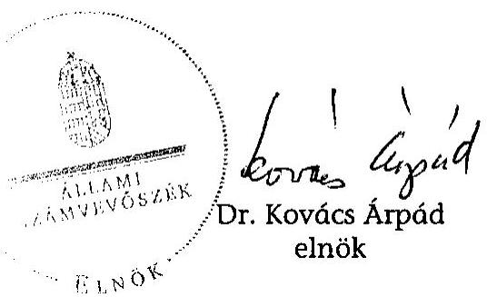

| Melléklet: | 9 db | 95 lap |
|

 :-- | :-- | :-- |
| Függelék: | 3 db | 43 lap |

---

# Mellékletek

---

# Mellékletek jegyzéke 

| 1. sz. melléklet | A jelentésre és a jelentéstervezetre tett észrevételek és az arra adott válaszok |
| :--: | :--: |
| 2. sz. melléklet | Az MNV Zrt. működéséhez kapcsolódó feladat és hatásköri rendszer. |
| 3. sz. melléklet | A Nemzeti Vagyongazdálkodási Tanács egyes döntési folyamatainak bemutatása. |
| 4. sz. melléklet | A Magyar Nemzeti Vagyonkezelő Zrt. 2008. évben működtetett beszámolási rendszere |
| 5. sz. melléklet | A Magyar Nemzeti Vagyonkezelő Zrt. 2008. évben működtetett vagyon-nyilvántartási rendszere |
| 6. sz. melléklet | Kérdések és válaszok az MNV Zrt. 2008. évi működése szabályozottságának ellenőrzéséhez |
| 7. sz. melléklet | MNV Zrt. szervezeti felépítése 2008. január 1-jén és december 31-én. |
| 8. sz. melléklet | Pénzügyminisztériumi vélemény az ÁSZ 2. sz. jelentéstervezetére a Vtv. megalkotásának előzményeiről és az új szabályozás eredményeiről |
| 9. sz. melléklet | Tanúsítványok |

---

# A jelentésre és a jelentéstervezetre tett észrevételek és az arra adott válaszok 

1. Pénzügyminisztérium észrevétele
2. Közlekedési, Hírközlési és Energiaügyi Minisztérium észrevétele
3. Földművelési és Vidékfejlesztési Minisztérium észrevétele
4. Külügyminisztérium észrevétele
5. MNV Zrt. EB elnökének észrevétele
6. NFA EB elnökének észrevétele
7. MNV Zrt. vezérigazgatójának észrevétele és az arra adott válaszunk
8. Magyar Posta Zrt. vezérigazgatójának észrevétele és az arra adott válaszunk
9. A MÁV Zrt. vezérigazgatójának észrevétele és az arra adott válaszunk

---

1. sz. melléklet a V-2016-134/2008-2009. sz. jelentéshez

H-1051 BUDAPEST V., JÓZSEF NÁDOR TÉR 2-4. POSTACIM: 1369 BUDAPEST, POSTAFIÓK 481.

TELEFON: (36-1) 327-2100, (+36) 30 371-2100
FAX: (36-1) 318-2570

PÉNZÜGYMINISZTER

Dr. Kovács Árpád úr
elnök
Állami Számvevőszék
Budapest

E-MAIL: peter.oszko@pm.gov.hu

Ikt.szám: 5233/15/2009.
Hsz: V-2016-132/2008-2009.

Hegdely
Podor: K osz9.he
Vili. 29.

ÁLLAMI SZÁMVEVŐSZÉK
ÜGYVITELI IRÓDA
Érk.: G437/2008
MUG 29 2009

Iktatószám: U-2016-132/08-09
Melléklet:

Tisztelt Elnök Úr!

A Magyar Nemzeti Vagyonkezelő Zrt. 2008. évi tevékenységének ellenőrzéséről készített jelentéstervezet 3. változatában foglaltakkal kapcsolatosan észrevételt nem teszek.

A jelentéstervezet egyeztetése során tapasztalt konstruktív együttműködést, észrevételeink figyelembevételét köszönöm.

Budapest, 2009. augusztus 28.

Üdvözlettel:

Dr. Oszkó Péter

---

# 1294109 

1. sz. melléklet

Ügyiratszám: KHEM/7243/2/2009. Hiv.szám: V-2016-113/2008-2009.

## Bihary Zsigmond úr

főigazgató
Állami Számvevőszék

## Budapest

## Tisztelt Főigazgató Úr!

## ÁLLAMI SZÁMVEVŐSZÉK ÜGYVITELI IRODA

$6518 / 2009$
Érk.: AUG 24 2009
Iktatószám: $11-2016-130198-05$
Melléklet:
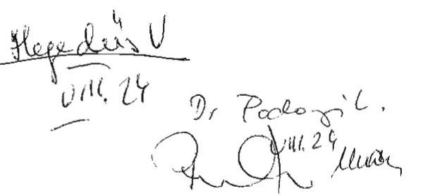

Köszönettel vettem az Állami Számvevőszék által részemre megküldött V-2016-113/2008-2009. sz. jelentés-tervezetet a Magyar Nemzeti Vagyonkezelő Zrt. 2008. évi tevékenységének ellenőrzéséről.

Tárcánk érintettsége a vizsgálati anyagban MÁV Zrt. székház ügyével kapcsolatban merült fel (3. sz. Függelék 1. sz. melléklet). Az előzetes egyeztetések eredményeként véleményeltérés nem maradt közöttünk, észrevételt a tervezetre nem teszünk.

Szeretném megköszönni a tárcánk javaslatainak, észrevételeinek konstruktív kezelését, figyelembevételét.

Budapest, 2009. augusztus 24.
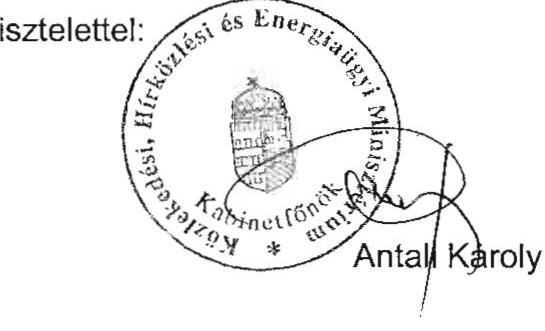

---

FÖLDMŰVELÉSÜGYI ÉS VIDÉKFEJLESZTÉSI MINISZTÉRIUM SZAKÁLLAMTITKÁR

# Bihary Zsigmond úr 

főigazgató
Állami Számvevőszék
2. Igazgatóság

Budapest 4.
Pf. 54
1364
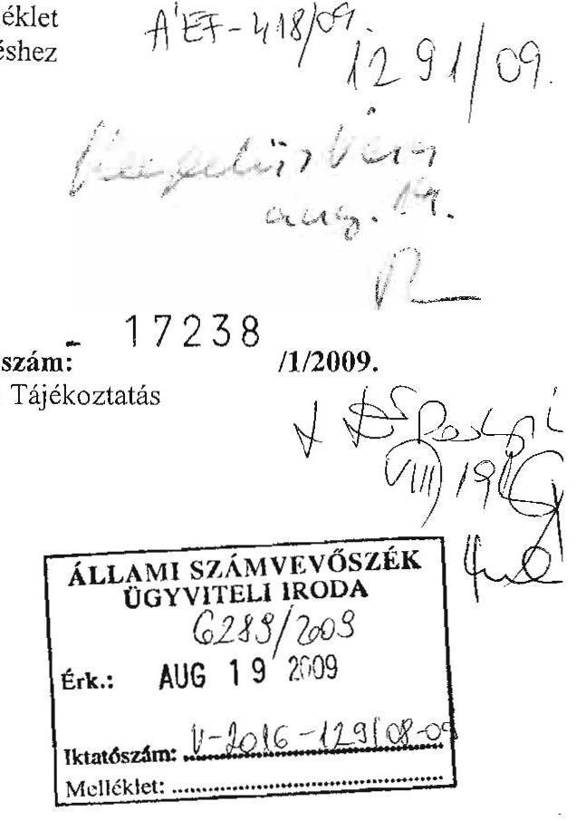

Tisztelt Főigazgató Úr!

Hivatkozva a V-2016-113/2008-2009. számú megkeresésére, a Magyar Nemzeti Vagyonkezelő Zrt. 2008. évi tevékenységének ellenőrzéséről készített jelentéstervezetre az alábbi észrevételt teszem.

A Nemzeti Földalapról szóló 2001. évi CXVI. törvény 15. §-a alapján ,,a termőföld értékesítésére, illetve haszonbérletére irányuló pályázati felhívás kiírásának, valamint elbírálásának részletes szabályait az MNV Zrt. által kiadott és az agrárpolitikáért felelős miniszter által - az NFA ellenőrző bizottság véleménye figyelembevételével - jóváhagyott szabályzat határozza meg".

Az Állami Számvevőszék által vizsgált időszakban a fenti rendelkezés alapján az MNV Zrt. által tárcánkhoz eljuttatott pályázati szabályzat tervezeteket a tárca minden esetben alaposan áttanulmányozta és részletesen véleményezte.

A V-2016-113/2008-2009. számú jelentés 2. sz. függelékének 3. oldalán az olvasható, hogy ,,az FVM és az MNV Zrt. közötti szakmai vitára utal az MNV Zrt. észrevétele, amely szerint a Földművelésügyi és Vidékfejlesztési Minisztérium több alkalommal egymástól eltérő véleményt adott és a haszonbérleti szabályzat 2008. novemberi módosítása nem is érintette a 2008. májusában kelt FVM 4360/3/2008. ügyirat sz. levélben foglaltakat".

Az MNV Zrt.-től olyan tartalmú visszajelzés írásban nem érkezett a tárca által küldött véleményekre, miszerint az FVM több alkalommal, egymástól eltérő véleményt

---

fogalmazott volna meg az ÁSZ jelentésben fent beidézett, az MNV Zrt. által tett megállapítás szerint. Ezért a visszajelzés hiánya miatt az MNV Zrt. ezen véleményéről nem volt tudomásunk, de nem is értek vele egyet.

Tekintettel arra, hogy a jelentésben az FVM feladatkörét érintő egyéb megállapítás nem található, további észrevételt nem teszek.

Budapest, 2009. augusztus
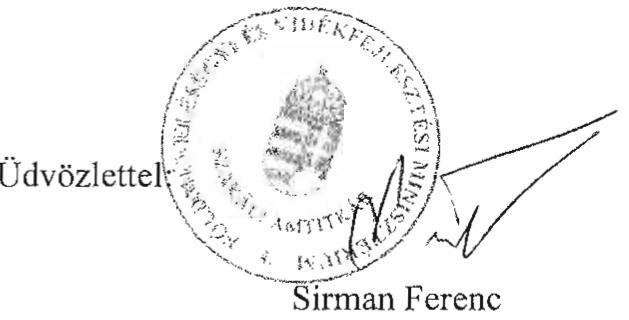

---

# 11364/Adm/2009. 

Bihary Zsigmond úr
főigazgató
ÁLLAMI SZÁMVEVŐSZÉK

## Budapest

Tisztelt Főigazgató Úr!

Hivatkozással V-2016-113/2008-2009 számú, 2009. augusztus 10-én kelt megkeresésére a Magyar Nemzeti Vagyonkezelő Zrt. 2008. évi tevékenységének ellenőrzéséről, az alábbiakról tájékoztatom:

A Külügyminisztérium a Moszkvai Magyar Kereskedelmi Képviselet ingatlanának értékesítése során a Magyar Köztársaság moszkvai, szófiai és varsói külképviseleti ingatlanainak jogi helyzetével összefüggő nemzetközi szerződések módosításáról szóló 2072/2006. (IV. 4.) Korm. határozat, valamint a nemzetközi szerződésekkel kapcsolatos eljárásról szóló 2005. évi L. törvény rendelkezéseinek figyelembe vételével járt el.

Budapest, 2009. augusztus 14.
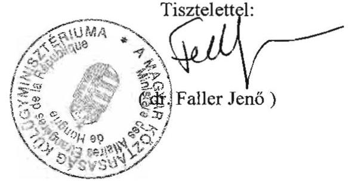

---

# 1. sz. melléklet 

a V-2016-134/2008-2009. sz. jelentéshez

## MNV

MAGYAR NEMZETI VAGYONKEZELŐ ZRT.

## Ellenőrző Bizottság Elnöke

## Állami Számvevőszék   Bihary Zsigmond   Főigazgató

1364 Budapest 4.
Pf.: 54

## Tisztelt Főigazgató Úr!

A 2009. augusztus 7-én részemre megküldött, MNV-01/31659/22. számon iktatott a Magyar Nemzeti Vagyonkezelő Zrt. 2008. évi tevékenységének ellenőrzéséről készített - 923. témaszámú, V0427 azonosító számú - számvevői jelentéstervezet észrevételezési lehetőségét megköszönöm.

Tájékoztatom, hogy a jelentéstervezetet mellékleteivel együtt - munkatársaim közreműködésével - ismételten áttanulmányoztuk.
Köszönettel tapasztaltam, hogy a korábbiakban tett - döntően technikai jellegű, pontosítást célzó - észrevételeinket figyelembe vették, azokat a jelentéstervezeten átvezették.

A jelentéstervezethez további tartalmi észrevételt nem teszek, a konstruktív együttműködés lehetőségét köszönöm.

Budapest, 2009. augusztus 10.
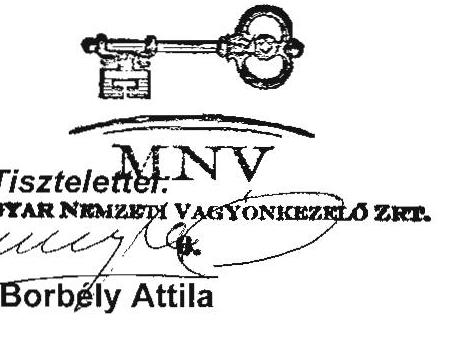

---

NFA Ellenőrző Bizottság
elnök

Bihary Zsigmond főigazgató úr
Állami Számvevőszék
Budapest

Tisztelt Főigazgató Úr!

Az Állami Számvevőszéknek a Magyar Nemzeti Vagyonkezelő Zrt. 2008. évi tevékenységének ellenőrzéséről készített jelentéstervezetét áttanulmányoztam, ahhoz észrevételt nem teszek.

Budapest, 2009. augusztus 18.

Tisztelettel:

---

# MNV 

MAGYAR NEMZETI VAGYONKEZELŐ ZRT.
VEZÉRIGAZGATÓ

1133 BUDAPEST, POZSONYI ÚT 56., 1399 BUDAPEST, PF. 708
TELEFON: (06 1) 2374400, FAX: (06 1) 2374100
HONLAP: WWW.MNVZRT.HU, E-MAIL: INFO@MNVZRT.HU
MNV/01/234/5/1/2009

Bihary Zsigmond főigazgató úr részére

Állami Számvevőszék Budapest
Apáczai Csere János u. 10. 1052
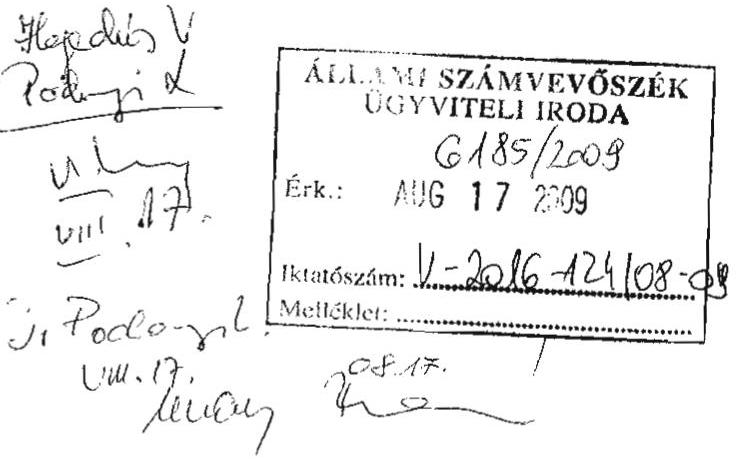

Tárgy: A Magyar Nemzeti Vagyonkezelő Zrt. 2008. évi tevékenységének ellenőrzéséről készült 2. jelentéstervezet véleményezése

## Tisztelt Főigazgató Úr!

Jelen levelem mellékleteként megküldöm a Magyar Nemzeti Vagyonkezelő Zrt. 2008. évi tevékenységének ellenőrzéséről készült ÁSZ jelentéstervezetre vonatkozó, az MNV Zrt. álláspontját tartalmazó észrevételeket.

A Magyar Nemzeti Vagyonkezelő Zrt. 2008. évi tevékenységének ellenőrzése, és az azt megalapozó vizsgálati módszertan alkalmazása mind az Állami Számvevőszék ellenőrei, mind az MNV Zrt. alkalmazottai számára komoly kihívásnak bizonyult, fokozott együttműködést, kölcsönös toleranciát igényelt.

Észrevételeink különösen nagy számát az is indokolhatja, hogy az ellenőrzést végzőket és az ellenőrzötteket egyaránt szorító időhiány miatt elmaradtak azok a bevett személyes konzultációk, amelyeken a vizsgálatot végzők és az MNV Zrt. illetékes szakterületei álláspontjuk megjelenítésével és ütköztetésével számos kérdésben esetleg közös nevezőre juthattunk volna, illetve rögzíthettük volna, melyek azok a kérdések, amelyekben az írásos egyeztetések után is fennmarad a véleményeltérés. Álláspontom szerint a további egyeztetés

---

az ÁSZ és az MNV Zrt. számára egyaránt fontos lett volna az egységes állami vagyonkezelés első teljes évének bemutatása és objektív értékelése szempontjából.

A fentiekre tekintettel a mellékletben az ÁSZ által eddig el nem fogadott észrevételeinket részletesen indokoljuk. Észrevételeinket általában a jelentéstervezetbeli előfordulás sorrendjében közöljük. Terjedelmi okokból nem minden esetben utalunk az összefoglaló részben és a részletes megállapítások közt több helyen előforduló, azonos tartalmú megállapításokra, véleményünk értelemszerűen a külön nem jelzett előfordulásokra is vonatkoznak.

Az Állami Számvevőszék az MNV Zrt. 2008. évi tevékenységének ellenőrzése keretében vizsgálatát kiterjesztette a Magyar Posta Zrt., valamint a MÁV székház és központi irodai elhelyezésének ügyére. A vagyonkezelés kockázatait illusztráló 3.3.5 pontban elhelyezett, tartalmi indoklás nélkül összekapcsolt két ügyre vonatkozó megállapítások a MÁV esetében olyan társaságra vonatkoznak, amely felett a tulajdonosi jogokat nem az MNV Zrt. gyakorolja, így a társaság vagy a vagyonkezelő tárca döntéseiről teljes körű információkkal nem rendelkezünk. A Magyar Posta - a MÁV-val ellentétben - nincs vagyonkezelésbe adva, azonban - a MÁV-hoz hasonlóan - meghatározó piaci szereplőként, az ország egyik legnagyobb közszolgáltató cégeként beszerzéseit önállóan készíti elő és bonyolítja le. Ilyen nagyságrendű társaság esetében az MNV Zrt. vizsgálata kizárólag az alapítói hatáskörben hozott döntések szabályszerűségére, eredményességére, célszerűségére korlátozódhat, ami nem teszi lehetővé egy-egy tranzakció teljes körű megítélését. Ezért levelemhez függelékként csatolom a két társaság észrevételeit, egyben kérem, hogy az azokban foglaltakat a vizsgálat lezárását megelőzően figyelembe venni szíveskedjenek.

Sajnálatosnak tartom, hogy a fokozott sajtóérdeklődéssel övezett Sukoró/Pilis-Albertirsa ingatlancsere ügyében még mindig rendkívül nagyszámú észrevétel maradt fenn, amelyek megjelenítése nélkülözhetetlen az ügy - az ÁSZ és az MNV Zrt. számára egyaránt fontos objektív megítélése szempontjából. Ezért kérem észrevételeink ismételt mérlegelését és figyelembevételét.

A jelentéstervezetet véleményezésre megkapta a Nemzeti Vagyongazdálkodási Tanács elnöke is, azonban a néhány napos véleményezési határidőre figyelemmel testületi álláspont kialakítására nem volt mód. Az állami vagyon feletti tulajdonosi jogokat gyakorló testület véleményének ismerete nélkül az MNV Zrt. 2008. évi tevékenysége reálisan nem ítélhető meg, ezért javaslom a Tanács véleményének bevárását.

Budapest, 2009. augusztus 14.
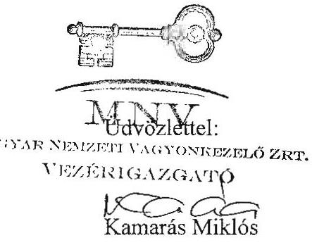

---

# I. 

## Összegző megállapítások, következtetések, javaslatok

## 1. Beszámolási kötelezettség

Álláspontunk szerint az MNV Zrt. saját vagyonáról szóló 2008. évi beszámolót, valamint a rábízott vagyonáról szóló előzetes beszámolót az NVT a törvényes határidőn belül elfogadta (2009. április 1-jén, illetve 2009. május 27-én), és jóváhagyásra határidőben felterjesztette.
2. Az „elődszervezetek" által kezelt állami vagyon átadás-átvétele

Továbbra sem értünk egyet az „elkerülhető költségek" megfogalmazással tekintettel arra, hogy 2008 elején összehangolt szabályozás esetén sem lett volna olyan helyzetben az MNV Zrt., hogy saját alkalmazottaival, külső szakértők igénybevétele nélkül elvégezhette volna a feladatokat (a jelentéstervezet a szabályozást illetően éppen a szabályozás hiányosságát, ellentmondásosságát rögzíti).

Az MNV Zrt. 2008 második felében és 2009 első félévében jelentős erőfeszítéseket tett a hiányosságok felszámolására, ennek eredményeként a 2009. év során határidőben teljesíteni tudta valamennyi beszámolási és jelentéstételi kötelezettségét.

## 3. A számviteli politika hiánya

A jóváhagyott számviteli politika hiánya nem akadályozta a gazdasági események pontos, korrekt nyilvántartását, mivel a rábízott vagyon számviteli politikáját az NVT 834/2008. (XII. 29.) számú határozatával elfogadta, rendelkezéseinek 2008. január 1-jei hatállyal történő alkalmazását előírva. Az MNV Zrt. a jóváhagyásig a számviteli törvény és az 5/2008. Korm. rendelet rendelkezései szerint vezette könyveit és nyilvántartásait, tehát a számviteli politika formális hiánya nem vezetett szabályozatlansághoz, jogszerűtlenséghez.

## 4. Vagyonmérleg, vagyonleltár hiánya

A vagyonmérleg, vagyonleltár hiányára vonatkozó megjegyzéseknél indokoltnak tartjuk észrevételezni, hogy ebben az ügyben az MNV Zrt. felelőssége korlátozott. Az elődszervezetek vagyona záró-állományát tartalmazó beszámolókat a felügyeleti szervek elfogadták, a 2008. évi nyitóállománynak pedig ezzel meg kell egyeznie. Nincs jogszabályi előírás arra, hogy az MNV Zrt. nyitóállományát leltárral kellett volna alátámasztani, ennek ellenére a Pénzügyminisztérium kérésére elkészült a „vagyonátadó mérleg", a nyitómérleg auditálása pedig megtörtént.

## 5. A nyilvántartások teljesség

Az elődszervezetek vagyonnal kapcsolatos nyilvántartásai hiányosságait az MNV Zrt. megörökölte. Megítélésünk szerint a 2008. december 31-i auditált mérleg és a 2008. évi

---

számviteli-nyilvántartási feladatok ellátása
 alapján az állapítható meg, hogy a 2007. december 31-ei záró állományok, illetve a 2008. január 1-ei nyitóállomány teljes körűen reprodukálható (megállapítható), amennyiben azzal a feltételezéssel élünk, hogy az elődszervezetek nyilvántartásai teljes körűek voltak (ezt alátámasztja az elődszervezetek beszámolóinak elfogadása). Az MNV Zrt. tételesen ellenőrzi a több mint félmillió tételt jelentő vagyonát, ami természetesen hosszabb időt vesz igénybe. Fentiek alapján megállapítható, hogy az elődszervezetek vagyona átadás-átvétele nyilvántartásokon történő átvezetése körüli problémák nem okoztak, nem okozhattak vagyonvesztést.

# 6. Analitikus rendszerekkel kapcsolatos egyéb észrevételek 

Értelmezésünk szerint az a mondat, miszerint: „A BA rendszerbe a számlázáshoz a manuális adatbevitel az adathibák kockázatát hordozta", olyan magától értetődő evidencia, amely minden adatot tartalmazó rendszerre igaz, éppen ezért az MNV Zrt.-nél a belső szabályozások többszörös ellenőrzések beiktatásával rendelkeznek a manuális adatbeviteli kockázatok csökkentéséről, minimalizálásáról.

Nem értünk egyet „A főkönyvi rendszer nem alkalmas a vagyon értékben, mennyiségben és összetételben bekövetkezett változásának folyamatos nyomon követésére...." mondat tartalmával, tekintettel arra, hogy a vagyonmozgások követése az analitikus rendszerek feladata, a főkönyv csak összevont adatokat tartalmaz.

Nem értünk továbbá azzal sem egyet, hogy „A rábízott vagyont általában a piaci értékkel szemben, bekerülési értéken mutatják ki, annak ellenére, hogy az Sztv. szerint bekerülési értéken az MNV Zrt. vagyonkezelésébe átalakulás, vásárlás, vagy csere útján került immateriális javak és tárgyi eszközök értékelhetők". Az MNV Zrt. nem átalakulással jött létre, ezért az eszközök piaci értékre történő átértékelésére a számviteli törvény legfeljebb csak értékhelyesbítés és értékelési tartalék alkalmazásával ad lehetőséget.
7. MNV Zrt. saját vagyon és rábízott vagyon eszközkörre vonatkozó megjegyzések

A jelentéstervezet megállapítja, hogy „Az MNV Zrt. működéséhez ténylegesen szükséges tárgyi eszközök meghatározásának hiánya miatt 2008-ban nem teljesült a Vtv. 22. § (6) bek. előírása, amely szerint az MNV Zrt. saját vagyonával való gazdálkodásától el kell különíteni az MNV Zrt.-re bízott vagyont, valamint ennek értékesítésével és hasznosításával összefüggő bevételeket és kiadásokat. Emiatt a két vagyonnal való gazdálkodás átláthatósága, az MNV Zrt. működéséhez szükséges költségvetési források meghatározásának megalapozottsága sem biztosított." Jelezzük, hogy az MNV Zrt. működéséhez ténylegesen szükséges tárgyi eszközök meghatározását a 2008. december 31-i fordulónappal felvett tételes leltárfelvétel támasztja alá, amelyet az RJGY a korábban hivatkozott 20/2009. (VII.7.) sz. RJGY határozatával jóvá is hagyott. Az MNV Zrt. működéséhez szükséges költségvetési források megalapozását és a bevételek és költségek elkülönítését pedig biztosította a 200/2009 (IV.01.) sz. NVT határozat.

## 8. Az üzleti tervek hiánya

Nem értünk egyet azzal a megállapítással, hogy a mérleg szerinti nyereség az NVT által elfogadásra felterjesztett üzleti terv megalapozatlanságának a következménye, hiszen az „eredmény" a Pénzügyminisztérium döntésének elhúzódásának (az átcsoportosítások engedélyezése 2008. november 25-én történt meg) a következménye (a késői döntés miatt az eredeti célokra a többletforrásokat a közbeszerzési kötelezettség, a MÁK év végi zárása, stb.

---

miatt felhasználni nem lehetett). Nem értünk tehát azzal sem egyet, hogy a jelentés a mérleg szerinti eredmény mértékével támasztja alá az üzleti terv megalapozatlanságára, a túlzó forrásigényre vonatkozó megállapításokat. Megjegyezzük továbbá, hogy az MNV Zrt. a Pénzügyminisztérium 2008. évi állásfoglalása miatt nem készített üzleti tervet a rábízott vagyonról.

# 9. A könyvvizsgáló megbízására vonatkozó észrevételek 

A jelentés szerint az MNV Zrt. könyvvizsgálójával 2008. január 1. és 2008. október 6. között nem volt írásos megállapodás, amely ellentétes a gazdasági társaságokról szóló 2006. évi IV. törvény („Gt.") vonatkozó előírásaival.
Valójában a könyvvizsgálat elfogadására vonatkozó írásbeli elfogadó nyilatkozatot az Ernst & Young Kft. 2007. október 16-án kiadta. Az MNV Zrt. 2007. évi éves beszámolójának könyvvizsgálójáról a Magyar Nemzeti Vagyonkezelő Zártkörűen működő Részvénytársaság Alapító Okiratának elfogadásáról szóló 1083/2007. (X. 17.) Korm. határozat döntött, erről külön RJGY vagy NVT-döntés nem született. A Gt. 231. § (2) bekezdés d) pontja szerint a közgyűlés kizárólagos hatáskörébe tartozik a könyvvizsgáló megválasztása, visszahívása, díjazásának megállapítása. Az MNV Zrt. Alapító Okirata csak a könyvvizsgáló megválasztásáról rendelkezett, és nem tért ki a díjazásának megállapítására. A könyvvizsgálatra vonatkozó díjajánlatát a könyvvizsgáló 2008. április 17-én küldte meg az MNV Zrt.-nek, amelyet az NVT az MNV Zrt. éves beszámolójával együtt 2008. április 30-án fogadott el. Ez a döntés tette teljessé a Gt. előírásai szerinti, a könyvvizsgáló választására vonatkozó előírásoknak való megfelelést, és az ezt követő 90 napon belül, 2008. június 6-án a könyvvizsgálatra vonatkozó szerződés aláírásra került.

Nem értünk egyet azzal a megállapítással sem, hogy a könyvvizsgáló megbízása a nyitó állomány hitelesítésére vonatkozóan összeférhetetlen lenne az állandó könyvvizsgálóként három évre szóló megbízásával. Az MNV Zrt. rábízott vagyonának 2008. január 1-jei nyitómérlege nem a Gt.-ben szabályozott jogi tranzakciók (pl. beolvadás, összeolvadás, stb.) alapján jött létre, sem formáját, sem tartalmát jogszabály nem szabályozza, ily módon a nyitómérlegre a Gt.-ben meghatározott függetlenségi szabályok nem alkalmazhatók.
10. Nem értünk egyet az „Egyes határozatok megfogalmazásából nem volt megállapítható, hogy miről döntöttek, illetve hoztak-e döntést egyáltalán" mondat tartalmával, a megállapítás konkrét példák hiányában indokolatlanul általánosító jellegű.
11. Az NVT elnökének címzett azon javaslattal kapcsolatban, amely szerint „intézkedjen a döntések végrehajtásának ellenőrzéséről", megjegyezzük, hogy a Tanács a döntések végrehajtását folyamatosan ellenőrzi, erről a vezérigazgató rendszeres beszámolót készít a Tanács számára.
12. Ellentmondás tapasztalható a jelentéstervezet megállapításai között. Nyilvánvalóan ütközik a „Tanács döntéseit (2008-ban 838 határozat) - középtávú stratégia hiányában - nem átgondolt koncepció mentén hozta meg" és a „Bár a Nemzeti Vagyongazdálkodási Tanács igyekezett az általa elkészített - tervként maradt - stratégiai elképzeléseket követni, ebben nem lehetett következetes." megállapítás, álláspontunk szerint az utóbbi tükrözi a valóságot.
13. A jelentéstervezet nem támasztja alá, hogy „A 2008-ban meghozott NVT határozatok összességükben nem voltak célszerűek, mert az ügyek egyes csoportjai a Vtv. céljaitól elszakadó szándékot tükröztek". A korábbi egyeztetések folyamán lényegében minden konkrét

---

ügyben az MNV Zrt. igazolta az adott ügyben történő eljárásának célszerűségét, ezekről az ÁSZ álláspontja természetesen lehet eltérő, de a határozatok teljes körű elemzése nélkül nem tartjuk elfogadhatónak az általánosítást.

# II. 

## A vagyontörvény, a végrehajtási rendeletek, az Áht., a Ftv. pontatlanságai, hiányosságai

1. A jogszabályalkotás kezdeményezésével kapcsolatos megállapítások:

A jelentéstervezetnek az MNV Zrt.-re irányadó jogszabályok összhangjának hiányára, a kormányzati és az RJGY-döntések helytállóságára vonatkozó megállapításai vitatására az MNV Zrt. álláspontunk szerint nem rendelkezik hatáskörrel. Az MNV Zrt. ugyanis nem jogalkotó, hanem jogalkalmazó szervezet, amely a rá irányadó jogszabályi keretek, valamint tulajdonosi döntések között jogosult és köteles eljárni. A jogalkalmazás során felmerülő jogszabályi ütközésekre felhívhatja a jogalkotásban részt vevő szervek, illetve a tulajdonos figyelmét, illetve javaslatot tehet a jogszabályok módosítására, a jogalkotási folyamatokat és a tulajdonosi döntéseket egyéb módon befolyásolni nem tudja és nem is feladata.

A jelentéstervezet szerint: „Az MNV Zrt. 2008. november 13-ig hatályos SZMSZ-e 7. § (1) y) pontja szerint a Tanács hatáskörébe tartozik jogszabályalkotásra vagy módosításra, valamint a Társaságra bízott állami vagyonra vonatkozó, kormánydöntés kezdeményezése. A Tanács e feladatával összefüggő döntéseket nem, illetve jelentős késéssel hozta meg."

A megállapítással összefüggésben megjegyezzük, hogy az MNV Zrt. 2008. január 1. napjával kezdte meg tényleges működését. Ahhoz, hogy a működésére irányadó jogszabályok ellentmondásai napvilágra kerüljenek, megfelelő időnek kell eltelnie, és megfelelő tapasztalatnak kell összegyűlnie ahhoz, hogy a következmények levonását követően a társaság konkrét javaslatot tudjon megfogalmazni a jogalkotók felé.

Álláspontunk szerint nem várható el egy újonnan megalakított szervezettől, hogy működését követő fél év elteltével megfelelő tapasztalat hiányában azonnal, a rá irányadó jogszabályok módosítását kezdeményezze, tekintettel arra, hogy az meggondolatlan és elhamarkodott jogszabálymódosítást eredményezne, ami tovább bonyolítaná az egyébként sem ellentmondásoktól mentes jogszabályi környezetben való működést.

Egyébiránt pedig azzal, hogy az NVT 2008. év végén kezdeményezte a Vhr. módosítását, maradéktalanul eleget tett a jelentésben említett SZMSZ-beli feladatának.

Megjegyezzük egyébként, az NVT-re semmilyen határidős vagy anélküli törvényi kötelezettség nem hárul a jogszabályok módosításának kezdeményezésére, az SZMSZ hivatkozott pontja arra vonatkozik, hogy amennyiben ezzel a lehetőséggel az MNV Zrt. élni kíván, azt az NVT döntése alapján teheti meg. (A Vhr.-módosítással kapcsolatos egyeztetéseket és az MNV Zrt. javaslatait egyébként a jelentéstervezet másutt maga is helyesen elismeri, sőt kifejezetten kiemeli.)
Az MNV Zrt. egyébiránt folyamatosan fogalmazott meg javaslatokat és jelezte a problémákat az érintett minisztériumok felé a jogszabályok ellentmondásainak kiküszöbölésére. )

---

# III. 

## A szervezet működése és a döntéshozatal kapcsán tett számvevőszéki megállapítások észrevételezése:

1. A jelentéstervezet számos helyen utal az MNV Zrt. döntéshozatali mechanizmusainak hiányosságaira, külön kiemelve a döntéshozók döntéseinek előkészítése során a vizsgálat által tapasztalt hiányosságokat, a vezérigazgató saját és átruházott hatáskörében hozott határozatait a döntéshozatal formalitását, a szabálytalanságokat és a hatáskörtúllépéseket. Kifogásolja továbbá a jelentéstervezet egyes döntésekkel kapcsolatban, hogy az NVT az előterjesztéseken keresztül irányíthatóvá vált.
A tanácsi döntések előkészítésének rendje egyértelműen szabályozott. Minden döntéselőkészítés célja a döntéshozó minél megalapozottabb, átfogó felkészítése, az előkészítők által helyesnek ítélt döntésre orientálása, ha több döntési változat ismert, a helyes döntés szakmai feltételeinek megteremtése.
A vezérigazgatónak mint döntéshozónak mindenkor jogában áll, hogy a döntéshozatal során a belső véleményektől eltekintsen, különös tekintettel arra, hogy meghozott döntéseiért a felelősség őt terheli, a belső vélemények a döntése megalapozásául szolgálnak, azok őt a döntéshozatalnál nem kötik. A belső vélemények figyelmen kívül hagyása önmagában nem feltétlenül kifogásolható, ha utóbb a döntéselőkészítést felülbíráló vezérigazgatói döntés tartalmilag helyesnek bizonyul. A konkrét példák felsorolása nélkül mind az erre, mind a hatáskörtúllépésre vonatkozó utalások indokolatlanul általánosítóak. A jelentéstervezet szerint: „A vezetői értekezleteken különösen a 2008 decemberi üléseken - általánossá vált, hogy a vezérigazgató (egy-két órával) az ülés megkezdését követően érkezett, illetve onnan előbb távozott. Ezekben az esetekben az agrárportfolioért felelős vezérigazgató-helyettes helyettesítette a vezérigazgatót (egyes esetekben ő volt az előterjesztésért felelős), és a saját nevében a vezérigazgató helyett írta alá a vezérigazgatói határozatot". A vezérigazgatónak bármely vezetőhöz hasonlóan - elfoglaltságaira tekintettel - mindenkor jogában áll a vezetői értekezletről távozni, ill. oda később érkezni, amennyiben a távolléte okán az ülést levezető, őt helyettesítő személy kijelöléséről gondoskodott. Véleményünk szerint nem összeférhetetlen - amennyiben a vezérigazgató távollétében, mint általános helyettes a határozatokat az agrárportfolioért felelős vezérigazgató-helyettes írja alá.
A jelentéstervezet szerint: „A Tanács hatásköre az állami vagyon fejlesztésével, hasznosításával, elidegenítésével kapcsolatos középtávú stratégia kialakítása, amit a Kormány elé kell terjeszteni, de arra vonatkozóan nincs előírás, hogy azt a Kormánynak jóvá kell-e hagyni". Álláspontunk szerint nem lehet kétséges a középtávú stratégia kérdésében való döntéshozatal: az előkészítés az NVT feladata, a Kormány elé terjesztésről az RJGY gondoskodik, a Kormány elé terjesztés a Kormány ügyrendje és a kormányzati döntéshozatali rend szerint a megfogalmazás pongyolaságától függetlenül nyilvánvalóan a Kormány döntését jelenti.
2. A Nitrogénművek Zrt. hiteleihez kapcsolódó költségvetési
 készfizető kezesség

A jelentéstervezet szerint „Az RJGY határozatok kormányhatározatokkal való összhangja a Nitrogénművek Zrt. hiteleihez kapcsolódó költségvetési készfizető kezességvállalás esetében nem volt biztosított, még akkor sem, ha azt később hatályon kívül helyezték.".

---

A Nitrogénművekre vonatkozó megállapítás okafogyottá vált. Amint azt az észrevételezés során korábban is jeleztük, az RJGY határozatát visszavonta, amely következtében az opciós szerződések nem kerültek aláírásra.
3. A jelentéstervezet szerint: „Az MNV Zrt. 2008-as saját vagyona gazdálkodásáról szóló éves beszámolója törvényes határidőn túli elfogadása az Sztv. 153. § (1) bek.-ben (letétbe helyezés) és a cégnyilvánosságról, a bírósági cégeljárásról szóló 2006. évi V. törvény 18. § (1) bek., valamint az ennek elmulasztásával együtt járó következményeket (a cégbíróság az MNV Zrt.-t megszűntnek nyilvánítja) vonhatja maga után."

A megszűntnek nyilvánításra abban a kivételes esetben van lehetősége a cégbíróságnak (Ctv. 81. § (6.) bekezdés), amennyiben a törvényes működés a cégbíróság által tett intézkedés (Ctv. 81. § (1.) bekezdés szerinti) ellenére nem áll helyre. Tekintettel arra, hogy ilyen lépésre vagy ennek felvetésére a cégbíróság részéről nem került sor, és csupán egy irreális, elméletileg létező lehetőségről van szó, a jelentéstervezetben való szerepeltetése nem indokolt.
4. A humánerőforrás-gazdálkodáshoz kapcsolódó megállapítások

A jelentéstervezet hiányosságként rögzíti, hogy „2008-ban a Zrt. szereplői (Kormány, RJGY, NVT) nem teremtették meg a megfogalmazott hatékonysági, átláthatósági, felelősségi, rugalmas döntési mechanizmusok és a teljesítménykövetelményekre épülő, belső érdekeltségi rendszert, illetve nem fogalmazták meg az ezt biztosító követelményeket." A megállapítás alátámasztását célzó példaként említik, hogy „Az MNV Zrt. vezérigazgatója prémiumfeladatát 2008. június 11-én írták ki (434/2008. (VI. 11.) sz. NVT határozat), amelyben arról döntöttek, hogy a prémium összegének 40%-át az üzleti tervhez kapcsolódóan később határozzák meg. A 720/2008. (XI. 19.) sz. NVT határozatban a 40%-ot az üzleti tervhez nem, hanem szakmai feladatok elvégzéséhez kötötték, a teljesítési határidő 2008. december 15.".

Megítélésünk szerint a példa ismertetésénél nem kapott kellő hangsúlyt az a tény, hogy az NVT a 434/2008. (VI. 11.) sz. NVT határozatával eredetileg a MNV Zrt. vezérigazgatójának 2008. évi prémiumkitűzését is - az MNV Zrt. beosztott munkavállalóira kidolgozott, teljesítménykövetelményekre épülő belső érdekeltségi rendszerben foglaltakkal összhangban - akként kívánta meghatározni, hogy az éves prémiumot részben (40%) az üzleti terv teljesítéséhez kötött feladatok teljesítéséhez köti. Tekintettel arra, hogy 2008 novemberében sem rendelkezett az MNV Zrt. RJGY által elfogadott üzleti tervvel, ezért az üzleti terv egyes sorainak teljesüléséhez kötött prémiumfeladat helyett - figyelembe véve a vezérigazgató munkaszerződésében rögzített éves prémium-mértéket - az üzleti terv teljesítése helyett újabb szakmai prémiumfeladat kitűzése vált indokolttá.

A jelentéstervezet a számviteli területen időben el nem végzett feladatok okát a feladatok elvégzéséhez szükséges humánerőforrás biztosításának elmaradásában is látja. Ennek ellentmond, hogy a területen - a jelentéstervezetben is bemutatott - létszámbővülés következett be: az eredetileg engedélyezett 409-en felüli 11 új státuszhelyből 10 új státuszhely (2008. júliusig bezárólag 6 új státusz, 2008. október 1. napjáig további 4 új státusz) a Gazdasági Igazgatóságon került betöltésre.

---

5. A Balatoni Halászati Zrt. tulajdonosi kölcsönével kapcsolatos megállapítás

A 723/2208. (XI.26.) NVT határozat (a Balatoni Halászati Zrt. 50 M Ft névértékű részvénycsomagjának Agrárgazdasági Vagyonkezelő Kft. részére történő vagyonkezelésbe adása, az AV Kft. részéről 180 M Ft összegű tulajdonosi kölcsön nyújtása a BH Zrt. részére ingatlanfedezet kikötése mellett) nem jelentette sem a Vtv., sem a Kvtv. megkerülését, nem mond ellent a Vtv 6. § (2) bekezdésében foglaltaknak. Az NVT az Agrárgazdasági Vagyonkezelő Kft. 100%-os tulajdonosaként eljárva a taggyülés jogkörben adott ki alapítói határozatot arra vonatkozóan, hogy hozzájárul ahhoz, hogy az Agrárgazdasági Vagyonkezelő Kft. (és nem az MNV Zrt.) 180 M Ft. tulajdonosi kölcsönt nyújtson a Balatoni Halászati Zrt. részére. Döntése a Vtv. 6. § (2.) bekezdés d.) pontja szerinti alapítói határozat kiadásának, és nem a Vtv. 6. § (2.) bekezdés o.) pontja szerinti tulajdonosi kölcsönnyújtásra vonatkozó döntésnek minősül. A Kormány - Magyar Köztársaság 2008. évi költségvetéséről szóló 2007. évi CLXIX. törvény 7. § (2) bekezdése szerinti - előzetes jóváhagyása abban az esetben lett volna szükséges, amennyiben a tulajdonosi kölcsönt a Magyar Nemzeti Vagyonkezelő és nem a társaság nyújtotta volna. Sem a Vtv., sem a Kvtv. nem tiltja, hogy az MNV Zrt-n kívül másik társaság kölcsönt nyújtson.

A soron kívüli kölcsönnyújtás az igen súlyos likviditási helyzetbe került BH Zrt-nél előállt helyzetet volt hivatott rendezni. A BH Zrt. jelentős vagyontömeggel rendelkezik, mely működési célt szolgáló vagyonon a kölcsönnyújtás időpontjában (a vagyon összegét el nem érő, attól lényegesen kisebb kölcsönösszegek miatt) több bank jelzálogjoga is szerepelt, egy esetleges lejárt szállítói tartozás miatti eljárás kezdeményezés, majd ezt követően a banki gyakorlatnak megfelelő (szállító részéről történő eljárás megindítása esetén a bankok „csatlakoznak" az eljáráshoz) jelzálogjog-érvényesítés indokolatlan kockázatot jelentett volna. A döntés az állami vagyon értékének megőrzését, az állami és közfeladatok ellátásának elősegítését szolgálta. Nem növelte a BH Zrt. gazdasági függőségét, hiszen éven túli lejáratú (végső lejárata 2011. december 15.) kölcsönt kapott, szemben a sürgető rendezésre váró, hatvan napon túl lejárt szállítói tartozásokkal. Fentieken túl a fedezetként felajánlott ingatlan nem termelő ingatlan (székház), a Társaság feladatainak ellátásához szervesen nem kapcsolódik (a banki hitelek fedezetei a tógazdaságok voltak).

A jelentéstervezet a vezérigazgató átgondolatlan döntéshozatalának alátámasztását szolgáló példaként említi a BH Zrt-vel kapcsolatos 1127/2008. (XII.08.) Vig. sz. határozatot, és az azt módosító 1214/2008. (XII.16.) Vig. sz. határozatot, és azokat helytelenül - a Vtv. 6§ (4) bekezdésében foglalt átruházott hatáskörben hozott döntéseknek minősíti. Ezek a határozatok egyrészt az NVT döntését kezdeményező vezérigazgatói határozatok voltak, másrészt a módosítást éppen az átgondolt döntéshozatal biztosítása indokolta. A 2008. 12. 08-i vezetői értekezletre készült előterjesztés három megoldási változatot tartalmazott, de a Vezetői Értekezlet - a véleményező, döntés-előkészítő tevékenységének eredményeként - valamennyi szükséges körülmény mérlegelésével ezektől eltérő megoldási javaslatot támogatott. Az újabb alternatívát részletező előterjesztést a 2008. december 16-i Vezetői Értekezlet vitatta meg, melynek eredményeként - a jogi vélemény elfogadásával - módosította a korábbi vezérigazgatói határozatot. Ezt követően került az egységes szerkezetű előterjesztés benyújtásra az NVT részére, így biztosítva, hogy a testület minden szükséges információ ismeretében hozhassa meg döntését. (790/2008. (XII.17.) NVT sz. határozat)

---

Az MNV Zrt. álláspontja szerint a Budavári Kht. kapcsán hozott NVT határozatok célszerűek és a Vtv. céljainak megfeleltek.

A Budavári Kht. részére történő tulajdonosi kölcsön összegéről és kondícióiról a 701/2008. (XI.12.) NVT sz. határozattal született döntés, a határozat a kölcsön folyósítását a Kormány jóváhagyásához kötötte, a jóváhagyás pedig a szerződéskötést és a 2008. december 19-i folyósítást megelőzően megérkezett. Az NVT 2008. december 10-én a pénzügyminiszter 2008. november 25-i keltezésű levelében foglalt, a Kormány 2008. november 12-i ülésén hozott előzetes hozzájárulását követően döntött a Budavári Kht. részére történő tulajdonosi kölcsön folyósításáról. A Tanács a tulajdonosi szerződés folyósításáról a Budavári Kht. és az NFÜ között létrejövő támogatási szerződés aláírását megelőzően döntött, hiszen a kölcsön célja többek között az előkészítés során felmerülő költségek átmeneti finanszírozása volt, amely a projekt megvalósulásával az NFÜ által nyújtott támogatásból lett volna finanszírozható. A 768/2008. (XII. 10.) NVT határozat részletesen tartalmazza a kölcsön összegét és folyósításának feltételeit a határozat elválaszthatatlan mellékleteként csatolt, a Budavári Kht-val megkötésre kerülő kölcsönszerződés formájában.
7. A Nemzeti Vagyongazdálkodási Tanács egyes döntési folyamatainak bemutatása az erdőgazdasági társaságok egységes számviteli, ügyviteli, szakmai és vezetői információs rendszerének kialakítása.

A jelentéstervezet szerint „a Tanács, az MNV Zrt. portfoliójába tartozó erdőgazdasági társaságok egységes számviteli, ügyviteli, szakmai és vezetői információs rendszerének kialakítására vonatkozó döntései egyéb szempontok mérlegelésének, különböző alternativák ütköztetésének, gazdaságossági számításokkal való alátámasztásának hiányában - nem hatottak a Vtv.-ben megfogalmazott célok teljesülésének irányába."
Az MNV Zrt. álláspontja szerint a Tanács hivatkozott döntései célszerűek voltak, ezzel együtt a Vtv.-ben megfogalmazott célok teljesülését támogatták. A jelentéstervezetben hiányolt „koncepciót" a Kormány határozta meg a közfeladatok felülvizsgálatával kapcsolatos további feladatokról szóló 2233/2007. (XII.12.) Korm. határozatban megfogalmazott -„az egységes állami erdőkezelés rendszerének kialakítása, az állami tulajdonú erdészeti Zrt-k szervezeti ésszerűsítése"- feladat végrehajtása érdekében. Ennek megfelelően az NVT 2008. június 11-i ülésén döntött az erdészeti társaságok egységes számviteli, ügyviteli, szakmai és vezetői információs rendszerének kialakítására vonatkozó közbeszerzési eljárás megindításáról.
A kormányhatározathoz illeszkedően az MNV Zrt. a portfoliójába tartozó erdészeti társaságok vonatkozásában célul tűzte ki az általános portfolió szintű jövedelemelvárás, esetenként az egyedi, a konkrét üzemhez vagy tevékenységhez kötődő eredményesség, összességében a vagyonkezelés módszereinek fejlesztését, a társaságok adottságaihoz igazodó tulajdonosi elvárási és értékelési rendszer kialakítását. A cél elérésének egyik eszköze az egységes informatikai rendszer kialakítása, aminek keretében egységesítésre kerülnek a társaságok irányítási, számviteli és elszámolási rendszerei. A cél megvalósítása érdekében az MNV Zrt. kidolgozta a társaságok egységes számviteli rendszerének kialakítását elősegítő fontosabb szabályzatokat és dokumentumokat (számviteli politika, önköltségszámítási szabályzat, analitikus számlarend, ágazati lap, kiegészítő melléklet, üzleti jelentés).

---

A társaságok jelenleg is a számviteli törvénynek megfelelően, az MNV Zrt. által elfogadott beszámolási rendszert alkalmazzák. Az egységes számviteli, ügyviteli, szakmai és vezetői információs rendszer kialakításának egyik legfontosabb indoka, hogy lehetővé teszi az erdészet szintű gazdálkodás tervezésének, végrehajtásának és ellenőrzésének a megvalósítását, a gazdálkodás eredményességének, a kezelt erdővagyon értékváltozásának nyomon követését.
A fejlesztés megvalósításával az európai országok gyakorlatához hasonlóan, a magyar állami erdők kezelése a jelenleginél egységesebb, áttekinthetőbb, jövedelmezőbb és versenyképesebb rendszerben működhet.
A rendszerfejlesztésben meghatározott feladatok közül a fejlesztés elmaradása esetén sem lett volna elhagyható több olyan munkafolyamat, amelynek segítségével a jelenlegi informatikai rendszerek az elvárt adatszolgáltatás érdekében fejlesztendők. A részleges fejlesztéssel csak a kapcsolódási pontban történt volna előrelépés, az egységes adatfeldolgozás és adatszolgáltatás megvalósítása nélkül.
A Kormány a közfeladatok felülvizsgálatával kapcsolatos további feladatokról szóló 2171/2008. (XII.12.) Korm. határozata szerint továbbra is kiemelt feladatnak tekinti az egységes állami erdőkezelés rendszerének kialakítását.
8. Az erdészeti társaságok 2009. évi közjóléti tevékenységének vissza nem térítendő támogatásával kapcsolatos megállapítások

Az MNV Zrt. álláspontja szerint az erdészeti társaságok 2009. évi közjóléti tevékenységének vissza nem térítendő támogatása megfelelt az MNV Zrt. rábízott vagyoni körébe tartozó gazdasági társaságokra vonatkozóan a megváltozott gazdasági körülmények miatt kialakult pénzügyi helyzetre tekintettel kidolgozott intézkedési tervet elfogadó 689/2008. (XI. 05.) NVT. sz. határozatban rögzített elvárásoknak.

A Tanácsnak, mint az állami vagyon - így az állami tulajdonban álló társaságok - feletti tulajdonosi jogok gyakorlójának joga és egyben kötelessége, hogy a konkrét döntések során minden olyan össztársadalmi szempontot-elvárást is mérlegeljen, így például a közjóléti tevékenységek (erdei iskola, erdei vasút, közjóléti berendezések, erdei utak fenntartása) fenntartásának szükségességét is, amelyek az általános elvektől eltérhetnek, de azokkal nem ellentétesek.

A hivatkozott 689/2008. (XI. 05.) NVT határozat 1.
 és 2.a. pontja az alábbiakat fogalmazta meg:

1. A kialakult pénzügyi-gazdasági helyzetre figyelemmel az MNV Zrt. rábízott vagyoni körébe tartozó gazdasági társaságok tekintetében fel kell tárni a tartalékokat, a gazdálkodási körülményekkel összefüggő, valószínűsíthető problémákat, a pénzügyi feltételeket, valamint meg kell vizsgálni a folyamatos likviditási helyzetet annak érdekében, hogy a rendelkezésre álló forrásokat át lehessen csoportosítani a cégek működőképessége fenntartása, folyamatos működésének biztosítása, a foglalkoztatottak jelenlegi létszámának megtartása érdekében.
2. Az MNV Zrt. rábízott vagyoni körébe tartozó gazdasági társaságok 2009. évi üzleti terveit az alábbi szempontok szerint szükséges elkészíteni, és a döntéshozó számára elfogadásra benyújtani.
a) A 2009. évben a legalább többségi állami tulajdonú társaságokkal szemben támasztott alapvető követelmény a működőképesség fenntartása a kedvezőtlen

---

piaci körülmények között, azzal, hogy elsődleges szempont a foglalkoztatottak létszámának megőrzése.

A társaságok a Tanács határozatának megfelelően készítették el 2009. évi üzleti terveiket. Az elfogadott tervekben 2009. évben a közjóléti szolgáltatások, a közjóléti létesítmények fenntartása, (erdei iskola, erdei vasút, közjóléti berendezések, erdei utak fenntartása) a társaságok előrejelzése alapján mintegy 754 M Ft veszteséggel kalkulál, előrevetítve azt, hogy a gazdasági válság következtében sérül ezen feladatok ellátása a munkahelymegőrzés és működés fenntartása elsőbbségével szemben.

A támogatás célja az volt, hogy a társaságok a gazdasági válság okozta kedvezőtlen hatások ellenére is elvégezhessék a társadalom által leginkább elvárt és kötelező közjóléti feladatokat, a működőképesség és a foglalkoztatási szint megtartása mellett.
9. A DMRV Zrt. 2008.03.17-i rendkívüli közgyűlésére történt mandátum kiadás
„A vezérigazgató a Vezetői Értekezlet ülésén kívül meghozott egyes határozatai alátámasztották az átgondolt döntéshozatal hiányát, illetve a Vezetői Értekezleteken átruházott hatáskörben hozott döntései egyes esetekben ellentétesek voltak a Vtv. 6. § (4) bekezdésben, illetve a Kvtv. 7. § (2) bekezdésben foglalt rendelkezésekkel.
(Pl. DMRV Zrt. mandátum kiadás, az Újfehértói Gyümölcstermesztési Kutató és Szaktanácsadó Kht. 144 M Ft vissza nem térítendő tulajdonosi támogatása - tulajdonosi kölcsön visszafizetése céljából - , Balatoni Halászati Zrt-vel kapcsolatos elvi döntés.") megállapítás kapcsán (lásd 9. és 10. pont):

A jelentéstervezet a rendkívüli közgyűlési határozattal kapcsolatban "az átgondolt döntéshozatalt" hiányolja, jóllehet az MNV Zrt. vezérigazgatójának újabb egyeztetést elrendelő, kifogásolt döntése a gondos és átgondolt döntéshozatal része volt. Egyrészt a gyors és minden érintett részvételével lebonyolított egyeztetés eredményeként az MNV Zrt. vezérigazgatója a vezetői értekezleten kívüli határozatát megalapozottan tudta meghozni, másrészt ezzel az eljárással biztosítható volt, hogy a DMRV Zrt. 2008. március 17. napjára meghirdetett rendkívüli közgyűlésére az NVT időben ki tudta adni a mandátumot, nem kellett újabb közgyűlést összehívni. A mandátum kiadása nem volt ellentétes a Vtv.-ben foglaltakkal. Megjegyezzük, hogy a közszolgáltató társaságok esetében az MNV Zrt. fontosnak tartja a közgyűlések eredetileg meghirdetett napon történő, problémamentes megtartását. Véleményünk szerint ezen társaságok (köztük a DMRV Zrt.) fogyasztói megítélésében fontos a kiegyensúlyozott működés biztosítása.

A vezérigazgató a március 6-i vezetői értekezleten azért javasolta a nemleges mandátum kiadását, mert az MNV Zrt. Kontrolling Igazgatósága az előterjesztés véleményezése során a Társaság céltartalék-képzésével kapcsolatban személyes konzultációt kezdeményezett a Társaság könyvvizsgálójával, első számú vezetőjével és gazdasági vezetőjével.

Az MNV Zrt. vezérigazgatója a 2008. március 6-i vezetői értekezleten kérte, hogy az egyeztetés soron kívül történjen meg, egyben elmondta, hogy amennyiben az egyeztetés eredményes lesz, úgy - mivel más szakterületnek nem volt kifogásoló véleménye - vezetői értekezlet nélkül, soron kívüli határozathozatalra kerülhet sor annak érdekében, hogy a Társaság rendkívüli közgyűlése az eredetileg meghirdetett időpontban megtörténjen. Az egyeztetésre 2008. március 6-án délután került sor, melynek eredményeként a vezetői

---

értekezleten kívüli határozathozatal megtörténhetett. A 170/2008.(III.10.) Vig. határozat alapján az NVT a 2008. március 12-i ülésén 127/2008. (III.12.) NVT szám alatt a közgyűlési mandátumot kiadta.

A vezetői értekezlet ülésén kívül meghozott, a DMRV Zrt. 2008. március 17-ei rendkívüli közgyűlésére történő mandátum kiadást kezdeményező 170/2008.(III.10.) Vig. határozat az átgondolt döntéselőkészítést és döntéshozatalt támasztja alá.
10. Az Újfehértói Gyümölcstermesztési Kutató és Szaktanácsadó Kht. tulajdonosi támogatásával kapcsolatos megállapítás:

Az MNV Zrt. vezérigazgatója az Újfehértói Gyümölcstermesztési Kutató és Szaktanácsadó Kht. részére 144 M Ft vissza nem térítendő tulajdonosi támogatásról döntött, és nem tulajdonosi kölcsön nyújtásáról, melyhez szükséges a Kvtv. 7. § (2) bekezdése szerint a Kormány előzetes hozzájárulása.

Az MNV Zrt. a támogatás nyújtását megelőzően megkérte a PM Támogatásokat Vizsgáló Iroda véleményét, amely vélemény alapján a Támogatási szerződés is módosításra került. A TVI a 2008. július 10-én küldött válaszában kifejti, hogy a nem gazdasági tevékenységnek minősülő kutatási, fejlesztési, innovációs tevékenységek nem tartoznak a tiltott támogatások kategóriájába. A támogatás nyújtása kizárólag a társaság közcélú feladatainak ellátása, illetve a közcélú feladatok ellátása érdekében felvett hitel és kölcsön visszafizetésére vonatkozik. (A PM Támogatásokat Vizsgáló Iroda 2008. május 18-án küldött levele a Ceglédi Gyümölcstermesztési Kutató- Fejlesztő Intézet Nonprofit Kft. ügyét érintette).

A 2007. évben nyújtott tulajdonosi kölcsönnel kapcsolatosan továbbá megjegyezzük, hogy a társaság, mint kiemelten közhasznú szervezet többek között törvényben meghatározott állami feladatokat lát el, amelyekre a Magyar Államot nemzetközi szerződéseken alapuló jogszabályok is kötelezik. Az állami feladatok finanszírozásával kapcsolatosan megállapítható, hogy a szaporító anyagok előállításáról és forgalomba hozataláról szóló 2003. évi LII. törvény 25. § (1) bekezdése szerinti feladat - a törvény 4. § (1) bekezdésében meghatározott genetikai anyagok és a referencia fajták megőrzése, fenntartása, telepítése, valamint a Központi Törzsültetvények létesítése, fejlesztése, fenntartása, továbbá ezekben a növényfajták és klónok vírusmentesítése - finanszírozását a központi költségvetésből kell biztosítani.
A társaság részére 2007. és 2008. évben ez a forrás nem volt biztosítva, az ÁPV Zrt. tulajdonosi kölcsönt, az MNV Zrt. tulajdonosi támogatást nyújtott a közcélú feladatok ellátása érdekében.
11. Belső vélemények figyelmen kívül hagyása, az MNV Zrt. székháza „B" épületének felújítása

A jelentéstervezet szerint „A vezérigazgató a belső vélemények figyelmen kívül hagyása mellett hozta meg pl. a 724/2008. (VII.21.) Vig határozatot, amelyben arról rendelkezett, hogy az MNV Zrt. székház „B" épületének felújításával a Hungalu-Service Kft.-t „kell" megbízni. A döntés a felújítási költség megtérülését kimutató számítás és három árajánlat bekérésének hiányában történt. Ez utóbbi ellentétes a Kbt. előírásaival."

Az MNV Zrt. a székház „B" épületének felújítása során a székházat üzemeltető, 100%-os MNV Zrt. tulajdonú céggel szabályszerűen és jogszerűen járt el.

---

A közbeszerzésekről szóló 2003. évi CXXIX. törvény 296. § c) bekezdése alapján: A IV. rész szerinti eljárást (építés-beruházás esetén: 15 és 90 millió forint közötti érték esetén) nem kell alkalmazni, ha az ajánlatkérő által előre nem látható okból előállt rendkívüli sürgősség miatt nem lehetséges az egyszerű eljárás lefolytatása; a rendkívüli sürgősséget indokoló körülmények azonban nem eredhetnek az ajánlatkérő mulasztásából. Ezen szabályok alapján jelen esetben három árajánlat bekérésére sem volt szükség. Az ORFK úgy jelentette be bérleti igényét a „B" épületre 2008. szeptember 1-i hatállyal, ha az irodákat felújított állapotban veheti át. A felújítás elvégzése ezért volt sürgős.

Megjegyezzük, hogy a Hungalu-Service Kft. és az MNV Zrt. közötti SZT-15632 számú szerződés is tartalmaz olyan rendelkezést, mely alapján a közbeszerzési szabályok figyelembevétele nélkül is elvégezhető lett volna a felújítás:
12. Az 1220/2008. (XII.17.) Vig. határozat meghozatala

Az MNV Zrt. álláspontja szerint a Magyar Állam tulajdonában álló egyes társasági részesedések árverés útján történő értékesítéséről szóló 1220/2008. (XII. 17.) Vig. határozat vezérigazgatói kiadása esetében hatáskörtúllépés nem történt, tekintettel arra, hogy az értékesíteni tervezett társasági részesedések vonatkozásában a döntési kompetencia minden egyes társaságra külön-külön került meghatározásra. A döntési hatáskör megállapításánál az értékesíteni kívánt vagyonelem értékéből kell kiindulni, amely árverés útján történő értékesítés esetén árverési tételenkénti, azaz értékesítésenként megvalósuló vizsgálatot igényel. Az árverés nem az együttes, hanem az egymást követő értékesítések technikája, amely alkalmas arra, hogy az értékesítési költségeket minimalizálja.
13. A Nemzeti Kataszteri Program Kht.-vel kapcsolatos megállapítás:

A jelentéstervezet szerint: „A Nemzeti Kataszteri Program Kht. 1700 M Ft értékű pótbefizetését az NVT hagyta jóvá figyelemmel a 1238/2008. (XII. 22.) Vig. sz. határozatra és a Pénzügyminiszter 13331/4/2008. ikt. sz. levelében foglaltakra. A társaság negatív saját tőke rendezésének kötelezettsége a 2007. évet záró mérlegkimutatás alapján (-947,5 M Ft értékű saját tőke) volt indokolt. A 2008. évben várható mintegy 700 M Ft mérleg szerinti negatív eredmény tényleges értékét pedig majd a tárgyévi mérlegbeszámoló alapozza meg. 2008. év december végén biztosított 1700 M Ft értékű pótbefizetés nem volt teljes körűen megalapozott."

Álláspontunk szerint az NVT a tőle elvárható gondossággal, az óvatosság elvének betartása mellett, a törvényi előírásoknak való megfelelés érdekében a rendelkezésre álló adatok teljes körű figyelembevételével, megalapozottan hozta meg döntését a pótbefizetésről.

A Nemzeti Kataszteri Program Kht. (NKP Kht.) az állami vagyonról szóló 2007. évi CVI. törvény hatályba lépése előtt az FVM vagyonkezelésében állt. Az NKP Kht. a Nemzeti Kataszteri Program végrehajtása érdekében állami alapfeladatot végez, gondoskodik az ország digitális alaptérképekkel történő ellátásáról. Az állami feladat ellátásához az NKP Kht. 1998. és 2003. évben összesen 16,4 milliárd Ft banki hitelt vett fel két kereskedelmi banktól kormányzati kezességvállalás mellett. A hitelfelvételről és a kezességvállalásról kormányhatározatok rendelkeztek. A vonatkozó kormány-előterjesztések szerint már a

---

hitel felvételekor látható volt, hogy az NKP Kht. csupán a felvett hitel tőketörlesztésének fedezetét képes előteremteni, a kamattörlesztését pedig nem. A kamattörlesztés fedezetét az akkori elképzelések szerint az éves központi költségvetésben kell szerepeltetni, de 2007. évtől erre forrást nem állítottak be. Az NKP Kht. a 2008. évben önellenőrzést hajtott végre, ami alapján módosította a korábbi évek beszámolóit. Ez alapján megállapítható, hogy az NKP Kht. saját tőkéjét már a 2005. évben elvesztette. Az NKP Kht. tőkehelyzetét az MNV Zrt-nek rendeznie kellett, mert a törvényi szabályozás nem ad lehetőséget negatív saját tőkével történő működtetésre. A 2008. évben helyre kellett állítani a törvényes működést, mindezt kellő biztonsággal, a rendelkezésre álló források figyelembevételével. Az intézkedés során az MNV Zrt. figyelembe vette azt, hogy az NKP Kht. fizetésképtelensége esetén az Állam kezesként történő helytállására ne kerülhessen sor.

Az NKP Kht. 2008. december 2-án benyújtott üzleti terve a mérleg szerinti eredményre 707 millió Ft 2008. évi várható adatot mutatott be. Az MNV Zrt. ennek megfelelően a negatív saját tőke rendezésére a várható mérleg szerinti eredmény figyelembevétele mellett az MNV Zrt. üzleti terve alapján rendelkezésére álló keretből 1,7 milliárd Ft pótbefizetést kezdeményezett. A Pénzügyminisztérium levélben kérte fel az MNV Zrt. vezérigazgatóját, hogy haladéktalanul tegye meg „a szükséges és még lehetséges intézkedéseket annak érdekében, hogy a saját tőke hiánya miatti jogszerűtlen állapot megszüntetésre kerüljön, továbbá, hogy az NKP Kht. likviditási problémái miatt a banki hitelekkel kapcsolatosan az állam kezesként történő helytállására ne kerülhessen sor". Az NVT az előterjesztés alapján 2008. december 29-én
 döntött 1,7 milliárd Ft értékű pótbefizetésről az NKP Kht. Magyar Államkincstárnál vezetett számlájára. Az NKP Kht. 2009. január 19-én tájékoztatta az MNV Zrt-t arról, hogy az üzleti terv leadását és a tulajdonosi döntést követően összesen 486,7 M Ft nettó értékű árbevételhez jutott, ami a 2008. évi eredményt javítja. A nettó árbevétel 30%-a földhivatalok részesedése, ami az NKP Kht-nál költségként jelentkezik. Az NKP Kht. mérleg szerinti eredménye a várható eredményhez képest javult, ami elsősorban a fent leírt módosító tételeknek köszönhető. A 2009. májusában elfogadott beszámoló szerinti 2008. évi végleges adatok valóban azt mutatják, hogy az MNV Zrt. a minimálisan indokoltnál többet teljesített pótbefizetésként. Megjegyezzük azonban, hogy az MNV Zrt-nek lehetősége van a pótbefizetés visszafizettetésére, amennyiben az NKP Kht. (jelenleg Nemzeti Kataszteri Program Nonprofit Kft.) 2009. évi mérlegadatai ezt indokolják.
14. A Kormányzati Negyed Projekttel kapcsolatos megállapítások

A jelentés kiemeli, hogy a vezérigazgatói határozatok teljes körűen nem voltak összhangban a meghozott kormány- és RJGY-határozatokkal, példaként a Kormányzati Negyeddel kapcsolatos előkészítő feladatok lezárását és a hozzájuk kapcsolódó ráfordításokkal történő tételes elszámolást említi. Az MNV Zrt. részéről fel kell hívnunk a figyelmet arra, hogy a jelentéstervezetben kifogásolt két szerződés alapján történt 2008. szeptemberi és decemberi kifizetés teljesítése a KVI jogutódjaként szállt az MNV Zrt.-re, és mindkét szerződéses kötelezettség - mint elszámolásra váró tétel - feltüntetésre került az RJGY részére megküldött, majd a Kormány által 2008. augusztus 15-én elfogadott elszámolásban.

---

15. Az iratkezelés rendszerére vonatkozó megállapítás

A jelentés-tervezet 1.1.3. pontja szerint: „Az MNV Zrt.-nek vezérigazgatói utasítással kiadott - a Magyar Országos Levéltárral egyeztetett - Iratkezelési szabályzata van. Az iratkezelés jelenlegi rendszere és gyakorlata nem teszi lehetővé a tárgyhoz kapcsolódó iratok teljes körűségének megítélését, és megnöveli az iratkeresés időtartamát."

Az MNV Zrt. tanúsított iratkezelési rendszerrel rendelkezik, mely alapvetően lehetővé teszi a tárgyhoz kapcsolódó iratok teljes körűségének megítélését. Az iratok jellemzőinek rögzítését az MNV Zrt. a jogszabályi elvárásoknál részletesebben szabályozza. Az iratkezelési rendszerrel kapcsolatos konkrét kifogás - az elődszervezetek iratanyagának átadás-átvétele kivételével - nem merült fel. Az iratkezelés gyakorlatán természetesen lehet és kell is javítani.
16. A szerződésmenedzselésre tett megállapítás

A jelentéstervezet szerint „A Társaság a működését és gazdálkodását szabályozó kötelezően kidolgozandó belső szabályzatokat többségében elkészítette és vezérigazgatói utasítással kiadta. (Kivéve pl. Tulajdonosi Ellenőrzési Szabályzat, szerződésmenedzseléssel kapcsolatos eljárásrend)"

A szerződésmenedzseléssel kapcsolatos eljárásrend hiányára vonatkozó megjegyzés okafogyottá vált, mivel 2009. áprilisában a 12/2009. VIG utasítás formájában elfogadásra és kiadásra került.
17. A Versenyeztetési Szabályzatra tett megállapítás

A jelentéstervezet szerint „A Versenyeztetési Szabályzat felülvizsgálata a 2008. április 30-ai határidőhöz képest egy éves késéssel 2009. április elsejével valósult meg."

A megállapítás tényszerű, hiányzik azonban annak jelzése, hogy a szabályzat elkészítésére semmilyen törvényi határidő, előírás nem volt, azt az NVT maga állapította meg.
18. A Szerződéstár működése kapcsán tett megállapítás

A jelentéstervezet szerint „Vezérigazgatói utasítás szabályozza az MNV Zrt. Szerződéstárának működési rendjét. Az egységes szerződés nyilvántartás azonban nem valósult meg, mert nem megoldott a jogelődök szerződésállományának számítógépes rögzítése."

A jelentéstervezetből hiányzik annak rögzítése, hogy a szerződések egységes feldolgozása érdekében a szükséges intézkedéseket az MNV Zrt. megtette, az egységes informatikai rendszerben való feldolgozásra felkérte a vele szerződéses viszonyban lévő PRIV-DAT Kft.-t.

Jelezzük, hogy a szerződésmenedzseléssel kapcsolatos feladatokat az SZMSZ hatályba lépését követően a jogi vezérigazgató-helyettes szakmai irányítása alá tartozó munkavállalók látták el, majd 2009. 03. 01.-től a menedzselésre kötelezett szerződések feladatainak elvégzésére a jogi igazgatóságon belül 5 fős szerződésmenedzselési csoport külön kialakítására került sor, akik a menedzselésre kötelezett szerződésekben foglalt,

---

szerződő felek által vállalt követelések, kötelezettségek nyilvántartását, nyomon követését, valamint teljesülésük ellenőrzését látják el.
19. Az MNV Zrt. ügyrendjének hiányával kapcsolatos megállapítás

A jelentéstervezet szerint: „2008-ban az MNV Zrt. egyes szervezeti egységeinek ügyrendje nem volt, a szervezeti egységek közötti feladatmegosztás rendje nem volt szabályozva."

Az MNV Zrt. egyes szervezeti egységeinek működésére ügyrend készítését sem az SZMSZ, sem a vonatkozó jogszabályok nem írják elő, a szervezeti egységek munkáját és az egyes szervezetek közötti munkamegosztás kérdését az SZMSZ-en kívül a mindenkor hatályos belső utasítások rendezik, így külön ügyrendek készítése indokolatlan volna és a túlszabályozottságot eredményezné.

# IV. 

## Az MNV Zrt. beszámolási rendszere

1. A jelentéstervezet megállapítja, hogy „A Vtv. rendelkezései szerint az átmeneti időszakban (2007. IX. 25.-2007. XII. 31.) az NVT a tulajdonosi jogok gyakorlását a kincstári vagyonkezelő szervezet, a földalapkezelő szervezet és az Állami privatizációs és vagyonkezelő Zrt.-re ruházta át. Az elődszervezetek tevékenységét nem korlátozta, a szervezetek nem csak a törvény hatálybalépésekor már megkezdett, folyamatban lévő ügyeket bonyolították, hanem jelentős mértékben privatizáltak is." A megállapítás privatizációra vonatkozó része nem világos, az nem illeszthető bele a jelentéstervezet ezen részébe.

Az állami vagyon értékesítése esetén az állami vagyonnal való gazdálkodásról szóló 254/2007. (X.4.) számú Korm. rendelet 25. § (6) bekezdése alapján az értékesítésre vonatkozó döntés megalapozásához független szakértővel el kell végeztetni az érintett vagyonelem forgalmi értékbecslését (vagyonértékelés). Ennek elkészítése során a nyilvántartási érték nem befolyásolhatja a piaci érték megállapítását. Állami vagyon ingyenes átruházása esetén is független szakértővel kell végeztetni az érintett vagyonelem forgalmi értékbecslését, az így meghatározott összeg képezi a mindenkori költségvetési törvényben maghatározott, ingyenesen átadható vagyonelemek adott évi összesített értékét.

## V.

## Az MNV Zrt. vagyon-nyilvántartási rendszere

1. A Nemzeti Földalap vagyonnyilvántartásával (FALAP) kapcsolatos észrevételek:

A FALAP-ban az állami tulajdon azonosítása és megtalálása egyértelmű, az adatok pontosan lekérdezhetők. A FALAP-rendszer adatai a közhiteles ingatlan-nyilvántartáson alapulnak. A FALAP-ban a Nemzeti Földalapba tartozó ingatlanok nyilvántartása tulajdonosi szemléletű (a tulajdonosi jogok gyakorlója az MNV Zrt.), azaz az összes vagyonelemet teljes körűen tartja nyilván, és a „vagyonkezelés" mint az egyik „hasznosítási forma" jelenik meg, hasonlóan, mint a „haszonbérlet", vagy az „ideiglenes

---

földhasználat". A felhasználói segédletek a rendszerek szakszerű felhasználói kezelését biztosítják, ezen segédletek Vig. utasítás formában történő kiadása nem volt indokolt.
2. Vagyon-nyilvántartási Szabályzat, informatikai biztonsági politika (IBP), katasztrófaelhárítási terv (DRP), üzletmenet-folytonossági terv

A 254/2007. (X. 4.) Korm. rendelet 2007. október 4-én lépett hatályba. A rendelet 14. § (3) bekezdésében megjelölt szabályzatot az MNV Zrt-nek elvileg a rendelet hatálybalépését követő hatvan napon belül, 2007. december 4-ig kellett volna közzé tennie a Magyar Közlönyben, miközben az MNV Zrt. bejegyzése csak 2007. november 20-án (a megjelentetési határidő előtt 15 nappal) történt meg. A Vagyon-nyilvántartási Szabályzattal az Informatikai és Nyilvántartási Igazgatóság felelősségi körébe tartozó terület szabályozása megvalósult, a szakterületek belső szabályozásai is elkészültek.
Az IBP követelményeinek az MNV Zrt. az Informatikai Biztonsági Szabályzat (44/2008. sz. Vezérigazgatói utasítás) útján tesz eleget, amely Szabályzat az értelmezés szerint „szabványos formában bemutatja az ügyfelek, a partnerek, a tulajdonosok és a dolgozók felé az intézmény informatikai biztonsági tevékenységét".
Az MNV Zrt rendelkezik katasztrófa-elhárítási tervvel (DRP - Disaster Recovery Planning) is. A katasztrófaelhárítás-tervezés - hagyományos értelmezésben - csak a katasztrófa eseményeknek az informatikai rendszerek kritikus elemeire vonatkozó hatásait elemzi, és tervet ad olyan globális helyettesítő megoldásokra, valamint megelőző és elhárító intézkedésekre, amelyekkel a bekövetkezett katasztrófa esemény után az informatikai rendszer funkcionalitása eredeti állapotában visszaállítható.
Az MNV Zrt. közpénzek hatékony felhasználása céljából nem készített külön tanulmányt, hanem a DRP-ben valósította meg az üzletmenet-folytonossági tervet. A felső vezetés indokolatlan leterheltségének csökkentése érdekében, csak a közvetlen informatikai biztonságot érintő rendkívüli eseményekről kap tájékoztatást.
3. Az EVEREST-program bekerülési költsége, kötbér érvényesítése:

Az EVEREST megvalósításának tervezett költsége: 712 128 753,- Ft, a három éves support költsége 671 566 700,- Ft, melynek együttes összege 1 383 695 453,- Ft. Az EVEREST I. fázisának késett átadása miatt a vállalkozóval szemben 56 129 957,- Ft kötbért érvényesített az MNV Zrt.
4. A vagyonkataszterrel kapcsolatos észrevételek:

A több száz vagyonkezelő és a vagyonkezelésükben lévő 800 ezer-1 millió db vagyonelem tételes ellenőrzése - amelyet a jelentés hiányosságként jelöl meg - a jelenlegi működési feltételek között gyakorlatilag lehetetlen feladat. A vagyonkezelő jogszabályban előírt kötelessége és felelőssége, hogy az általa vagyonkezelt vagyonelemekről a jogszabályokban és a vagyon-nyilvántartási szabályzatban előírtaknak megfelelően teljesítse az adatszolgáltatását egységes módon a leltár, mérleg, illetve az irányító szerv által felülvizsgált beszámoló adataival egyező módon.

A vagyonkezelési szerződések és az állami vagyonnal való gazdálkodásról szóló 254/2007. (X.4.) számú kormányrendelet alapján is ugyanúgy a vagyonkezelő kötelessége, hogy a törzsadatokban bekövetkezett változásokat, vagyonmozgásokat, jogutódlások bekövetkeztét jelentse, amelyek elmaradása az esetleges duplikációk fő oka.

---

A vagyonkezelői jog ingatlan-nyilvántartásba történő bejegyeztetése szintén a vagyonkezelő kötelessége.
5. A Külügyminisztérium és külképviseletek használatában lévő ingatlanok nyilvántartásával kapcsolatos megállapítás:

A Berlini Magyar Nagykövetség ingatlanára a Kincstári vagyoni Igazgatóság 320023/1998/0101. számon kötött vagyonkezelési szerződést a Külügyminisztérium Külképviselettel. A vagyonkezelési szerződés 3. számú melléklete szerint a Nagykövetség telekingatlana a Külügyminisztérium által készített két független értékbecslés adatai alapján 9.807.300.000,-Ft értékén került nyilvántartásba vételre. A vagyonkezelési szerződést az ÁSZ ellenőrzésének rendelkezésére bocsátottuk. Az MNV Zrt. vagyonkataszterében csak a vagyonkezelő által szolgáltatott adatok alapján lehet nyilvántartani az ingatlanokat.

# VI. 

## A rábízott vagyonnal való gazdálkodás

1. A jelentéstervezet szerint „A 254/2008. (I. 22.) Korm. rendelet 8. § (3) bekezdésében foglaltaknak az MNV Zrt. megalakulásától kezdve 2009. május 31-éig nem tett eleget, mivel a rábízott vagyon változásáról félévenként az ÁSZ-t nem tájékoztatta."

A megállapítás nem pontos. Az MNV Zrt. saját vagyonával és rábízott állami vagyonnal kapcsolatos éves beszámoló készítési és könyvvezetési kötelezettségéről szóló 5/2008. (I. 22.) Korm. rendelet 9. §-a alapján a rendelet rendelkezéseit, - így annak a 8. § (3) bekezdésben előírt féléves tájékoztatási kötelezettségre vonatkozó előírásait is - az MNV Zrt.-nek első ízben a 2008. évre vonatkozó könyvvezetési, nyilvántartási, adatszolgáltatási és beszámolási kötelezettségeinek teljesítése során kell alkalmaznia.

Megjegyezzük, hogy a hivatkozott rendelet 3. § (1) bekezdése alapján az MNV Zrt. a Vtv. 2. §-ának (1) bekezdésében meghatározott feladatok ellátásáról, a rábízott állami vagyon változásáról, működtetésének hatékonyságáról és gazdaságosságáról az üzleti év könyveinek zárását követően a tárgyévet követő üzleti év május 31. napjáig előzetes éves beszámolót, valamint a tárgyévet követő üzleti év augusztus 15. napjáig éves beszámolót készít. Az ÁSZ tájékoztatására ennek megfelelően nem a 2009. május 31.-i határidő vonatkozik.

## VII.

## Az állami ingatlanvagyon kezelése és kapcsolódó megállapítások

1. Az állami ingatlanvagyon hasznosításának stratégiájához kapcsolódó megállapítások

A társadalmi szervezetek tulajdonába került ingatlanokkal kapcsolatosan a hasznosítási stratégia nem értelmezhető, tekintettel arra, hogy a TÁSZ tv. az állam, mint a 15 évre szóló elidegenítési és terhelési tilalom jogosultja számára a jogszerű használat ellenőrzésének lehetőségét biztosítja, más állami döntési jogosultság, kötelezettség nincs.

---

2. A piaci feltételek szerinti ingatlanhasználat elmaradására

A Vtv. az ingatlanok tekintetében úgy rendelkezett, hogy a központi költségvetési szervekkel kötött, a törvény hatályba lépésekor hatályos vagyonkezelési szerződéseket 2008. június 30-áig kell felülvizsgálni és módosítani.
 Az MNV Zrt. 2008. június 30-áig tárcaközi munkabizottságban történő előzetes egyeztetést követően 326 db vagyonkezelési és 206 db bérleti szerződést küldött ki az érintett központi költségvetési szerveknek, illetve folyamatosan személyes egyeztetést folytatott a szerződés-tervezetekről, felmerülő kérdésekről. Az ingatlanhasználat ellenértékeként fizetendő díj és az ÁFA-tartalom tekintetében fennálló fedezethiány, illetve a Kvtv., az Áht. és az Ámr. összhangjának hiánya miatt a szerződések megkötésére az előírt határidőig nem kerülhetett sor. (Vtv., végrehajtási rendeletek, Áht., Ftv. pontatlanságai, hiányosságai)

Az MNV Zrt. felülvizsgálta a hatályos szerződéseket, a szerződéstervezeteket a vagyontörvény rendelkezéseinek megfelelő módon készítette el. A kiküldött szerződéstervezetek egyeztetésére folyamatosan rendelkezésre állt, a beérkezett tárcaészrevételek alapján azokat - amennyiben megfeleltek a Vtv. előírásainak - pontosította, a specialitásokat beillesztette. Ebből következően az a megállapítás, hogy az MNV Zrt. nem kívánt lehetőséget adni a költségvetési szerveknek a feltételek kialakításában történő közreműködésnek, nem helytálló. A jelentés rögzíti, hogy „a tárcákkal előzetesen több körben lefolytatott egyeztetések" ellenére nem írták alá a szervek a szerződést, így a fenti megállapítás nem felel meg a tényeknek, és a jelentéstervezet más részeivel is ellentétes. Az MNV Zrt. által megállapított használati díj mértékének alapja az adott ingatlan piaci forgalmi értékéhez közelítő képzett érték, és azt a szakmai álláspontot tükrözte, amely szerint a meghatározott összegeknek az ingatlanvagyonra történő tényleges ráfordítása mellett megelőzhető a további állagromlás és belátható időn belül elérhető az ingatlan állomány megfelelő műszaki színvonalra hozatala. Miután a használati díjak - 2009. évre összességében 66 Mrd Ft bérleti, 78 Mrd Ft vagyonkezelési díj - megállapítása a piaci szemléletű megközelítésben történt, eltérően az eddig bevett gyakorlattól - amely szerint a költségvetési szervek által számított értékcsökkenés alapja, az adott ingatlan piaci, valós forgalmi értékét messzemenően nem tükröző nyilvántartási érték - a használati díjak fedezetének biztosítása jelentős mértékű kiadást eredményezett volna az államháztartás számára. Ezen túl a hatékonyabb helykihasználás érdekében az általános jellegű bérleti elhelyezésekre vonatkozóan normatívák bevezetésére tettünk javaslatot, amelynek bevezetésére 2010. január 1-től került volna sor.
3. A vagyonkezelési szerződések összhangja a megváltozott jogszabályokkal

A jelentéstervezet szerint „az ellenőrzött egyéb vagyonkezelési szerződések nem voltak összhangban a megváltozott jogszabályokkal. A szerződések nem minden esetben tettek eleget a mellékkötelezettségekkel (foglaló, kötbér stb.) kapcsolatos jogszabályi előírásoknak." Mivel a jelentéstervezet konkrét példákat, esetszámot nem említ (egyéb vagyonkezelési szerződések), így a megállapítás alaptalanul általánosító. A vagyonkezelési szerződéseket a megkötéskor hatályos és irányadó jogszabályok szerint kell megkötni, és mivel azok polgári jogi szerződések, így egyoldalúan nem csupán a szerződő felek közös akaratnyilvánításán alapuló megegyezéssel módosíthatóak.

---

4. A vagyonkezelési szerződések 2008. június 30-áig történő felülvizsgálata

A vagyonkezelési szerződések felülvizsgálatának elmaradása az előzőekben jelzettek szerint az MNV Zrt.-n kívüli okok miatt következett be, ennek egyértelmű rögzítése azonban elmaradt.

# VIII. 

## A moszkvai Magyar Kereskedelmi Képviselet ingatlanértékesítése

A pályázat zártkörűségével kapcsolatban figyelembe kell venni, hogy a Magyar Népköztársaság Kormánya és a Szovjet Szocialista Köztársaságok Szövetségének Kormánya között a Magyar Népköztársaság Nagykövetsége Kereskedelmi Tanácsosi Hivatala telkének kijelöléséről és épületének építéséről Moszkvában 1973. március 2-án aláírt jegyzőkönyv 1. cikk c) pontja alapján az épület nem adható el, vagy nem engedhető át senkinek az SzSzKSz Kormánya egyetértése nélkül. Székely Árpád nagykövet nyilatkozata alapján az Oroszországi Föderáció Külügyminisztériuma, az Elnöki Hivatal és a Szövetségi Biztonsági Szolgálat a tanácsi előterjesztésben felsorolt három cég esetében járult hozzá az elidegenítéshez.

A jelentéstervezet úgy tekint a 2008. március 17-i 3,5 Mrd Ft-os átutalásra, mint amit az MNV Zrt.-nek teljesített vételárként figyelembe kellett volna vennie, holott az erre vonatkozó szerződést csak 2008. november 5-én kötötték meg, és az MNV Zrt. erről a tényről is csak 2009. március végén szerezhetett tudomást.

A Diamond Air 2008. március 17-i átutalásának semmilyen szerződéses jogcíme nem volt. A 2008. november 5-én megkötött szerződésről az MNV Zrt. csak a KÜM 2009. március 27-i keltezésű és 5083/Adm/KÜM/2009. számú levele után értesült.

A gazdasági igazgatóság által teljesített átvezetés minden tekintetben az MNV Zrt. utalványozási rendjéről szóló utasítás alapján történt a szakmai terület által írt feljegyzésnek megfelelően. Tekintettel arra, hogy a birtokbaadás nem történt meg 2008 végéig, ezért addig a befizetett összeget kizárólag kötelezettségként lehet a könyvekben nyilvántartani, és ennek megfelelően az értékesítési bevételek számlán sem lehet kimutatni.

## IX.

## A Nemzeti Földalap tevékenysége és kapcsolódó megállapítások

1. NFA-feladatok az MNV Zrt. SZMSZ-ében

A jelentéstervezet szerint „Az NFA-ra vonatkozó jogszabályok nem voltak egyértelműek. Az MNV Zrt. az elővásárlási és az előhaszonbérleti jogokkal kapcsolatos problémákról, 2009 májusában tájékoztatta a Pénzügyminisztériumot. Intézkedés nem történt. ${ }^{1}A$ törvényi szabályozás hiányosságai miatt nem volt és nem is lehetett egyértelmű a belső szabályozás sem."

---

Ezzel szemben a PM idézett leveléből is kitűnik, hogy 2009 májusában az MNV Zrt. a belső szabályzatainak módosítását kezdeményezte, melyre sor is került. A módosítás ugyan nem oldja meg az összes értelmezési problémát, de mindenképpen előrelépésnek tekinthető. A jelentéstervezet is elismeri, hogy a törvényi szabályozás hiányosságai miatt nem volt, és nem is lehetett egyértelmű a belső szabályozás sem. Ez a szabályozási rendezetlenség azonban nem a PM - MNV Zrt. együttműködésén múlik kizárólag, hanem az FVM, a PM, az IRM, az NFA EB és az MNV Zrt. közötti konszenzust igénylő agrárszakmai és jogalkotási kérdéseket vet fel. A PM-mel történt egyeztetés levélváltás mélységű ismertetése azt a látszatot keltheti, hogy a probléma eredete az MNV Zrt. és a PM közötti kommunikációs problémában keresendő, ami nem fedi a valóságot.
2. A jelentéstervezet szerint „A Társaság több esetben megsértette az előterjesztések tartalmi és formai kellékeiről, valamint a döntések során keletkezett iratok kezeléséről szóló vezérigazgatói utasítás vonatkozó részét".

Konkrét példa hiányában az általánosító megállapítás indokolatlan.
3. A jelentéstervezet szerint: „A haszonbérbe adásra vonatkozó szabályozás részben volt szabályszerű, átlátható és eredményes. Ugyanis nem sikerült szakmai konszenzust kialakítani a haszonbérbe adásra vonatkozó szabályozásban."

A fenti megállapítással összefüggésben felhívjuk a figyelmet az NFA tv. 15. § foglalt előírásra, amely szerint a termőföld értékesítésére, illetve haszonbérletére vonatkozó szabályzat az agrárportfolióért felelős miniszter jóváhagyásával - az NFA Ellenőrző Bizottság véleménye figyelembevételével - kerül megállapításra, illetve a Magyar Közlönyben történő közzétételre. Erre a haszonbérleti szabályzatok tekintetében az alábbiak szerint került sor: Magyar Közlöny 2008/42. szám, Hivatalos Értesítő 2008/38, 2009/1, 2009/21. szám. A fentiekben kifejtettek alapján megállapítható, hogy mind az NFA EB, mind az FVM elfogadta társaságunk haszonbérleti szabályzatát, ami a szakmai konszenzus fennállását igazolja.
4. A jelentéstervezet szerint „HB-FEJ-ENYING, illetve a HB-BAR-BÓLY haszonbérleti pályázati egységekhez kapcsolódó pályázati felhívásnak a 21. pontja versenykorlátozó rendelkezést tartalmaz. A pályázati felhívásnak ez a pontja versenykorlátozó rendelkezést tartalmaz, mivel az a pályázat érvényességének végső feltételét, új haszonbérlő esetén tőle független feltételhez „a Kiíró és a hatályos haszonbérlő egymással egyezséget kössön a hatályos szerződés lezárására" köti."

Korábbi észrevételeink során már jeleztük, hogy a pályázati felhívás vizsgált pontja a pályázat kiírásához a haszonbérlő írásos nyilatkozatban történő hozzájárulását követeli meg. Ezt követően kerül sor a pályázat kiírására, melyben a haszonbérlőt a Tftv. 21. § (1) bekezdés a) pontja alapján első helyen előhaszonbérleti jog illeti meg - csakúgy mint a volt haszonbérlőt lejárt haszonbérleti szerződés esetén. Csak amennyiben a (volt) haszonbérlő nem él előhaszonbérleti jogával, abban az esetben kerülhet sor szerződés megkötésére más személlyel. Ennek megfelelően megállapítható, hogy az előhaszonbérleti jogot maga a Tftv. biztosítja a (volt) haszonbérlő részére.

Ugyanakkor a felek között érvényesen fennálló (rendszerint határozott időtartamú) haszonbérleti jogviszonyt - hatályos haszonbérleti szerződések esetén - a felek közös megegyezéssel történő szerződés megszüntetése (Ptk. 319. § (1)-(2) bekezdései) zárhatja

---

le. Amennyiben a megszüntetésre a haszonbérlő valamilyen okból nemleges választ ad, úgy társaságunk vagy peres úton kérheti a bíróságtól a haszonbérleti szerződés megszünésének megállapítását (a haszonbérlő által a pályázati kiíráshoz kért írásos hozzájáruló nyilatkozat alapján) - amely a jelenlegi bírósági rendszerben akár több évre bizonytalan használati helyzetet eredményez az állami termőföldterület tekintetében, vagy pedig a hivatkozott rendelkezés alapján dönthet a pályázat érvénytelenítéséről. Hivatkozással a Szabolcs-Szatmár-Bereg Megyei Bíróság 2.P.20.145/2008/25. számú ítéletére megállapítható, hogy társaságunk pályázati kiírása nem jelent szerződéskötési kötelezettséget, amennyiben azt társaságunk kizárja (Ptk. 211. § (1) bekezdés). Ennek megfelelően a pályázati kiírás önmagában még olyan ajánlatként sem értelmezhető, amely alapján a pályázatra kiírt ingatlan(egységet) társaságunk minden esetben köteles lenne haszonbérbe adni.

Megjegyezzük továbbá, hogy a Tpvt. 7. §-a a verseny tisztaságára vonatkozó olyan általános szabály, amelyet a külön törvényben nem szabályozott magatartásokra kell alkalmazni. A tárgyi kérdéskörben a Tpvt. hivatkozott rendelkezése azért nem alkalmazandó, mivel azt az NFA tv. (különösen annak 13. §) szabályozza részletesen.

Ennek megfelelően a haszonbérleti szabályzatok egyes pontjai a hivatkozott jogszabályhely alapján nem minősülnek versenykorlátozó rendelkezésnek - azok jogalapját a Tftv. 13. § - amely a határozott időtartamra történő szerződéskötést teszi kötelezővé - illetve annak 21. § alapján biztosított előhaszonbérleti jogok alapozzák meg. Mint az köztudomású, határozott időre kötött szerződéseknél rendes felmondásnak - erre vonatkozó szerződési kikötés hiányában - helye nincs (v.ö.: Ptk. kommentár a Ptk. 321. §-hoz), ugyanakkor a Ptk. 457. § illetve a Tftv. 18-19. §§ rendelkeznek a rendkívüli felmondás lehetőségeiről.

Ezek hiányában a haszonbérlővel fennálló - ám nyilatkozata által függővé vált haszonbérleti szerződés megszűnésének megállapítása is kérelmezhető bírósági úton, amely azonban az állami tulajdonban álló ingatlanok hasznosítását nagyban akadályozná (az érintett területekre felvezetett perfeljegyzésekkel, valamint a haszonbérlőkkel folytatott perek alatt kiesett haszonbérleti díjakkal). Ennek megfelelően - a fenti rendkívüli felmondási okok hiányában - a haszonbérlővel közös megegyezéssel megkötött szerződésmegszüntetés a legcélravezetőbb módja a fennálló haszonbérleti jogviszonyok lezárásának.
5. A jelentéstervezet szerint: „Az állami vagyonnal való gazdálkodásról szóló 254/2007. (X. 4.) Korm. rendelet 54. § (5) bekezdésében előírt határidőre, 2008. december 31-ére, nem fejeződött be a haszonbérleti szerződések felülvizsgálata."

Ismételten felhívjuk a figyelmet arra, hogy a hivatkozott jogszabályhely csupán azon szerződésekre vonatkozik, melyeknél a haszonbérleti díj nem éri el a helyben kialakult díjtételt, illetve nem felel meg a hatályos jogszabályi feltételeknek, és ott is csak szerződésmódosítás-kezdeményezési kötelezettséget ír elő. Ennek következtében az a megállapítás, miszerint a haszonbérleti szerződések felülvizsgálata nem zárult le, illetve az nem fejeződött be, a fenti jogszabályhely alapján érthető, ugyanakkor társaságunk tekintetében nem jelent jogszabálysértést, mivel a határidőre történő szerződésmódosításkezdeményezéssel társaságunk már a jogszabályban foglalt kötelezettségének eleget tett.

---

6. A jelentéstervezet szerint: „A szabályozás nem tartalmazott a tulajdonjog átruházásához szükséges nyilatkozatok kiadására vonatkozó részt, az ellenőrzött egységek esetén ezek kiadása azonban csak a vételár befizetése után történt meg."

Jelezzük, hogy a tulajdonjog bejegyzéshez történő hozzájárulást - a vételár-hátralék befizetését
 követően - adja ki társaságunk. Az értékesítési egységekkel összefüggésben megkötött szerződések esetében a tulajdonjog fenntartással történő elidegenítéssel - a vevő tulajdonjogának ingatlan-nyilvántartási bejegyzése függőben tartásával - történtek (ld. pályázati adásvételi szerződés 9. pont). A tulajdonosi hozzájárulás nem belső szabályozó, hanem a vevők számára is egyértelmű szerződési pontban kerültek rögzítésre. Ennek megfelelően a vételár-hátralék befizetését követően társaságunk 15 napon belül külön nyilatkozatban adja hozzájárulását a vevő(k) tulajdonjog bejegyzéséhez. A befizetés igazolását a 2008. évben a Gazdasági Igazgatóság kizárólagos hatáskörben végezte a szakmai igazgatóságok irányában.
7. A jelentéstervezet szerint: „Az értékesítési egységek összeállítása - az irodavezetők javaslata alapján történt, de volt rá példa - ZAL-2701/08. pályázat -, hogy az egység összeállítása az MNV Zrt. Vezérigazgatójának közvetlen és részletes utasítása alapján történt meg."

Tekintettel arra, hogy hasonló megállapítás a V-2016-51/2008-2009. sz. ÁSZ jelentésben is szerepelt, a hivatkozott jelentés mellékletéhez csatolt vezérigazgatói levél részletes utasításokat nem a területkijelöléssel kapcsolatban tartalmazott.
8. Jogszabályi hivatkozás pontosítása

A vagyon-nyilvántartás módját és tartalmát a rábízott vagyon vonatkozásában az állami vagyonról szóló 2007. évi CVI. törvényen kívül szabályozza még az NFA törvény és a 254/2007. (X. 4.) Korm. rendelet is.
9. Az összefoglaló megállapítások és a részletes jelentés közti eltérés

Megítélésünk szerint az összefoglaló és a részletes jelentés között több eltérés van, ami eltérő következtetésekhez vezethet. Az összefoglalóban „nem teljesült" „nem felelt meg" tartalmú kijelentésekről a részletes jelentésben leírt helyzetfeltárás után több esetben kiderül, hogy azok nem megfelelősége vagy nem teljesülése nem az MNV Zrt. hiányosságaiból vagy szabálytalan működéséből vezethető le, hanem olyan külső okokból, melyre sok esetben az MNV Zrt-nek nincs hatása.
10. Az „NFA által el nem végzett MNV Zrt-s kiadások"

Az elmúlt időszak során nem találkoztunk olyan üggyel vagy anyaggal, amely alátámasztotta volna azt a megállapítást, amely szerint „az NFA az általa el nem végzett MNV Zrt-s kiadásokra 366,6 M Ft-ot fizetett".
11. Az NFA beszámolójának megfelelősége

Az a megállapítás, amely szerint az NFA beszámolója a vagyontörvény előírásainak nem felelt meg, azt a látszatot kelti, mintha az NFA beszámolója jogszabályellenesen készült volna el, ugyanakkor tény, hogy az NFA beszámolója megfelelt az NFA-ra vonatkozó

---

jogszabályi előírásoknak. Helyesebb lett volna azt rögzíteni, hogy az NFA beszámolója a saját beszámolójára vonatkozó jogszabályoknak megfelelően elkészült, azonban ez a vagyontörvény előírásainak már nem felelt meg.

# 12. Hatáskörtúllépés kérdése 

A jelentéstervezet nem mutatja be, hogy a 275/2008. (IV. 10.) és 311/2008. (VI. 17.) Vig. számú határozatok esetében minek alapján állapította meg a hatáskörtúllépés tényét. Ennek hiányában szükséges megjegyezni, hogy az MNV Zrt. SzMSz-e értelmében a döntés alapjául szolgáló érték meghatározása során nem az egy előterjesztésben szereplő teljes portfolió értékét, hanem az egyes ingatlanok (értékesítési egységek) értékét kell alapul venni.

## 13. A FALAP-rendszer pontatlanságának kérdése

A rendszer pontatlanságára és hiányosságára utaló kijelentéssel továbbra sem tudunk egyetérteni, mivel nem világos, hogy milyen adatokat kellene a 26. és a 27. portfolióban meghirdetett termőföldek esetében tartalmaznia. Az ingatlanokat és az ingatlan adatait tartalmazza. Ha a felvetés arra irányul, hogy nincs az ingatlannál megjelölve, hogy mely portfolió része, az helytálló, azonban ennek az adatnak a nyilvántartását jogszabály nem írja elő, így véleményünk szerint egy jogszabály által elő nem írt adat hiányából nem lehet következtetni arra, hogy a rendszer hiányos. A levonható következtetés csak az lehetne, hogy a hasznosítási tevékenységet jobban támogatná, ha - bár nem kötelező - ezen adatot is tartalmazná a rendszer. Egyébként a rendszer alkalmas ennek az adatnak a tárolására, még egy elődszervezetnél lefolytatott fejlesztés következtében, azonban ez az elődszervezetnél is csak tesztelés jelleggel volt alkalmazva, bevezetésre annak megszünéséig nem került.
14. A szerződésmódosítások FALAP rendszerben való módosítása

Nem felel meg a valós helyzetnek, hogy „Nem történt meg a több ezer módosított szerződés FALAP-ban való korrigálása, ezért a bérleti díjak kiszámlázása elmaradt. A hiányosság miatt az MNV Zrt. és a Magyar Állam jelentős bevételtől esett el." A szerződések módosítása valóban nem került rögzítésre (még az elődszervezetnél), azonban ez csak az elődszervezetnél - 2008-at megelőzően, egyéb okok mellett - hatott úgy, hogy a tételek nem kerültek kiszámlázásra. Az MNV Zrt. területi irodái bevonásával a szerződésállomány felülvizsgálatát megkezdte, melynek első lépése volt a számlázások felülvizsgálata, és ahol megállapításra került, hogy az elődszervezet nem állított ki számlát, ott a követelést visszamenőleg, a jogszabály adta kereteken belül kiszámláztuk a partnereknek. Így az MNV Zrt. esetében nem volt bevételtől való elesés, sőt a tárgyidőszaki tervezhető bevételhez képest lényegesen nagyobb bevételhez jutott. Az Állam esetében pedig, a bevétel szintén megjelent, igaz, hogy nem a megfelelő időben, hanem annál később, de ez nem az MNV Zrt. hibája, hanem éppen ellenkezőleg egy olyan intézkedés az MNV Zrt. részéről, mely arra irányult, hogy az elmaradt állami bevételek is beszedésre kerüljenek.
15. A FALAP életjáradéki szerződés módosításainak követési kérdése

Vélhetően nem az életjáradéki szerződések módosításainak követéséről, hanem az azokhoz kapcsolódó haszonbérleti szerződések módosításainak követéséről van szó.

---

16. A FALAP adatállományában a tulajdon azonosítása és megtalálása

A jelentéstervezet nem teszi egyértelművé, hogy az adatállománnyal kapcsolatban jelzett probléma (,Falap adatállományban a tulajdon (vagyonkezelő) azonosítása és megtalálása esetenként nem egyértelmű") azért jelenik meg, mert a rendszer a közhiteles ingatlannyilvántartás tartalmának megfelelően az ott nyilvántartottakat hűen követve tartja nyilván az adatokat, és ez a hiányosság a közhiteles ingatlan-nyilvántartásban jelenik meg. Ennek megszüntetésére csak úgy van mód, ha a vagyonnyilvántartásunkban a közhiteles ingatlan-nyilvántartás adatain túl egy egységesített szinonima szótáron keresztül, módosítva is nyilvántartanánk az adatokat. (Az új fejlesztés során erre gondoltunk.)
17. Az elővásárlási és előhaszonbérleti joggal kapcsolatos problémák tárgyában való intézkedés

A jelentéstervezet tévesen állapítja meg, hogy az elővásárlási és előhaszonbérleti joggal kapcsolatos problémákkal kapcsolatosan „intézkedés nem történt". A jelentéstervezetben is említett, a Pénzügyminisztérium részére 2009 májusában megküldött levélre érkezett válasz figyelembevételével az NVT 588/2009. (VII. 01.) NVT számú határozatával elfogadta a Nemzeti Földalapba tartozó földterületek haszonbérbe adására irányuló pályázati szabályzat módosítását. Az egységes szerkezetbe foglalt új szabályozás a Pénzügyminisztérium álláspontját is tükröző szabályokat ír elő az elfogadott ajánlat előhaszonbérletre jogosultakkal történő közlésére vonatkozóan
18. A haszonbérleti díj összegének meghatározása

A 28/2008. számú vezérigazgatói utasítás 4. számú melléklete rendelkezik arról, hogy a 2008. évre vonatkozóan a haszonbérleti díj összegét 800 Forint/Aranykorona értékben kell megállapítani, ezért a jelentéstervezet tévesen állapítja meg, hogy erre vonatkozó dokumentum nem áll rendelkezésre. A haszonbérleti díj mértékéről való döntés az MNV Zrt. SZMSZ-e értelmében nem tartozott az NVT kizárólagos hatáskörébe. Megjegyzendő továbbá, hogy a Nemzeti Földalappal való gazdálkodási elvek kialakításában hatáskörrel rendelkező Földművelésügyi és Vidékfejlesztési Minisztérium a 2008. évre vonatkozóan ugyancsak a $800 \mathrm{Ft} /$ Aranykorona éves díjtétel alkalmazását rendelte el.
19. Az új haszonbérleti díjak elfogadásáról

Az MNV Zrt. a Magyar Államot megillető bevételek beszedésének kötelezettségét szem előtt tartva, az általános polgári jogi szabályoknak megfelelően járt el. A haszonbérlők saját elhatározások alapján tettek az új haszonbérleti díj elfogadására vonatkozó nyilatkozatot. Ezért nem tartjuk elfogadhatónak azt a megállapítást, amely szerint az új haszonbérleti díjakat nem minden haszonbérlő fogadta el, és ebben az esetben a haszonbérlőnek a régi módon kiszámított alacsonyabb összeget kellett fizetnie.
20. Hasznosítási terv és annak teljesülése

A hasznosítási tervvel kapcsolatban általában véve megjegyezzük, hogy az valamennyi földbirtok-politikai irányelv érvényesítését előírja, az „elsősorban" szóval csupán kiemeli azok közül a jelentéstervezetben hivatkozott irányelveket.

---

Az értékesítési és haszonbérleti egységek esetében nyilvánvalóan nem lehet és nem is szükséges tételesen vizsgálni, hogy a földbirtok-politikai irányelvekről szóló 48/2002. (VII. 19.) OGY határozatban meghatározott földbirtok-politikai irányelvek maradéktalanul érvényesültek-e a meghirdetés során. A földbirtok-politikai irányelvek teljesülését elvi szinten, csak a Nemzeti Földalapba tartozó földrészletekre meghirdetett valamennyi értékesítési portfolió vonatkozásában, együttesen lehet vizsgálni, különös tekintettel arra, hogy még a pályázaton nyertes vevő vagy haszonbérlő személyétől is függ, hogy adott esetben melyik irányelv érvényesül.
Az egyes értékesítési/haszonbérleti portfoliók esetében más-más földbirtok-politikai irányelvek érvényesítésére került sor (pl. földbirtok-koncentráció versenyképességhez igazodó fenntartása; családi és középgazdaságok 300 ha méretű felső határig történő ösztönzése). Előfordult olyan eset is, hogy egyszerre több irányelv rendelkezéseit szem előtt tartó értékesítési kör meghirdetésére került sor. A Nemzeti Földalapba tartozó földterületek hasznosítása - így az értékesítési egységek kialakítása - során valamennyi földbirtok-politikai irányelv egyidejű alkalmazása nyilvánvalóan kizárt, mivel azok egymással ellentétes hasznosítási elveket fogalmaznak meg.
21. Egyéb földértékesítések céloknak való megfelelése, az értékesítések megalapozottsága és szabályszerűsége

A 26. értékesítési kör meghirdetésére a Nemzeti Földalapkezelő Szervezet döntése alapján került sor. A Vtv. 2007. évi CVI. törvény 59. § (3) bekezdése értelmében a Vtv. hatálybalépését megelőzően megkezdett, de be nem fejezett értékesítésre irányuló eljárásokban az annak megkezdésekor jogszabályok alapján kell a döntést előkészíteni. Az előzményi iratok alapján megállapítható, hogy a 26. értékesítési körhöz kapcsolódó értékesítési eljárás megkezdésére a Vtv. 2007. szeptember 25-i hatálybalépését megelőzően került sor. Az értékesítendő ingatlan forgalmi értékének megállapítására a Nemzeti Földalapról vagyonnyilvántartásának, vagyonkezelésnek és hasznosításának részletes szabályairól szóló 254/2002. (XII. 13.) Korm. rendelet előírásai voltak irányadók, amelynek 11. § (1) bekezdése értelmében az ingatlan értéke egyszerüsített ingatlan értékbecslésnek minősül, ha a Nemzeti Földalapkezelő Szervezet az ajánlati árat (forgalmi értéket) saját nyilvántartásának adatai alapján állapítja meg.
Az MNV Zrt. álláspontja szerint nem vehető figyelembe az olyan iratok „hiányáról" szóló megállapítás, amelyek meglétét sem jogszabály, sem egyéb rendelkezés nem írja elő.
22. Állattartó telepek többletpontként való értékelése

A jogszabályban foglalt árveréses termőföld-értékesítés esetén a vizsgálat indokolatlanul hibaként értelmezi, hogy az állattartó telepekre nem voltak többletpontok. Az árverés jellegéből adódóan a pontozás rendszere fogalmilag kizárt, így ennek hiánya sem állapítható meg hibaként.

A Nemzeti Földalapról szóló 2001. évi CXVI. törvény 13. § (1) bekezdése értelmében a Nemzeti Földalapba tartozó földterületek árverés útján is értékesíthetők. Az árverés, mint értékesítési mód jellegéből adódóan a vevő személyének kiválasztására kizárólag a megajánlott vételár összege alapján kerül sor. A 48/2002. (VII. 19.) OGY határozat szerinti földbirtok-politikai irányelvek az árverések során is érvényesülnek, mivel az árverésre kerülő, jellemzően kisebb térmértékű földterületek értékesítése a földpiac élénkítését és a kisméretű birtokok legalább 100 hektárig történő elsődleges fejlesztésének ösztönzését is szolgálja.

---

# X. 

## A Sukoró-Pilis/Albertirsa ingatlancsere

1. A jelentéstervezet az ingatlancsere kiváltó okaként nem az MNV Zrt. határozatokban rögzített céljaiból, hanem a cserepartnerének Joáv Blumnak feltételezett szándékaiból von le következtetést.
2. Az MNV Zrt. álláspontja szerint a Sukoró-Pilis/Albertirsa ingatlancsere szerződés nem tekinthető semmisnek az alábbi indokrendszer alapján:

A Nemzeti Földalapról szóló 2001. évi CXVI. törvény 13. § (4) bekezdése szerint a vonalas létesítmények, továbbá közérdekű cél megvalósítása érdekében történő eladás, csere, illetőleg haszonbérbe adás esetén a 13. §
 (1) bekezdésében foglaltakat (nyilvános pályázat és árverés) nem kell alkalmazni.

A törvény csupán a célt definiálja, tehát azt, ha vonalas létesítmény megvalósítása érdekében történik a csere vagy az adásvétel, úgy nem kell nyilvános versenyeztetési eljárást lefolytatni. Arról a törvény nem rendelkezik, hogy a versenyeztetés mellőzésére csak az ingatlan vonalas létesítmény nyomvonalával érintett része vonatkozásában van lehetőség, tehát lehetővé teszi, hogy közérdekűség esetén az ingatlan teljes területe kerüljön nyilvános versenyeztetés mellőzésével állami tulajdonba.
3. A jelentéstervezet szerint: „A záradékolt kisajátítási tervek birtokában a NIF Zrt.-nek lehetősége lett volna a ténylegesen szükséges földterületek megvásárlással vagy kisajátítási eljárással történő megszerzésére"
Számos esetben a kisajátítási eljárás elkerülése érdekében a NIF Zrt. a teljes ingatlant, és nem csak annak az útépítéshez szükséges részét vásárolja meg, továbbá a kisajátításról szóló 2007. évi CXXIII. törvény 6. §-a tartalmazza azon eseteket, mikor a teljes ingatlant a tulajdonos kérésére, illetve egyéb indokból ki kell sajátítani. Jelentős számban fordul elő, hogy nem csak az útépítéssel közvetlenül érintett ingatlanrészek megszerzésére kerül sor. Így például az autópálya építések során több száz hektár ún. maradékterület marad állami tulajdonban, ami útépítés céljára nem került felhasználásra. A maradékterületek gyakori előfordulását támasztja alá, hogy a Nemzeti Földalapról szóló 2001. évi CXVI. törvény 7. § (3) bekezdése törvényi szinten rendelkezik ezen területek jogi sorsáról.
4. A jelentéstervezet szerint: „A Pest Megyei Területi irodavezető által adott földérték és a ténylegesen beszámított érték között nagymértékű eltérés áll fenn, és ez hatással lehet a sukorói ingatlanok beszámítási értékeire."
Jelezzük, hogy az MNV Zrt. Területi Irodáinak nincsen arra jogosultsága és hatásköre, hogy az ingatlanok értékét meghatározza, illetve hogy arra vonatkozóan javaslatot tegyen. Az állami vagyonnal való gazdálkodásról szóló 254/2007. (X.4.) Korm. rendelet 25. § (6) bekezdése kötelező jelleggel előírja, hogy az értékesítésre vonatkozó döntés megalapozásához minden esetben független szakértővel el kell készíttetni az érintett vagyonelem forgalmi értékbecslését.

E kötelezettségének az MNV Zrt. eleget tett azáltal, hogy a PERFEKTING Mérnöki Iroda Kft.-vel elkészíttette valamennyi ingatlanra vonatkozóan az értékbecslést, és az azokban meghatározott áron kötötte meg a csereszerződést.

---

5. A jelentéstervezet „A feljegyzésben megadott termőföld átlagárak" kezdetű szövegrésze kapcsán felhívjuk a figyelmet arra, hogy a feljegyzésben a Pest Megyei Területi Iroda vezetője által közölt érték átlagár, és nem konkrétan a jelentésben hivatkozott, Albertirsa 0188/3 helyrajzi számú ingatlanra vonatkozik.
6. A jelentés idézi a területi irodavezetőt, azonban azt az alábbi mondatot kihagyja: „Az ingatlanok értékének meghatározását figyelemmel az ingatlanok tulajdoni lapján található jelzálogjogok nagyságára Területi Irodánk nem tudja meghatározni."
7. A jelentéstervezet „A belső szabályozás hibája" kezdetű szövegrész kapcsán észrevételezzük, hogy amennyiben a csereszerződés szövege a tanácsi határozat kötelező mellékletét képezné, úgy annak technikai kiegészítése (pl. KSH szám, cégjegyzékszám, aláíró személye, egyéb biztosítékok megjelenítése, stb.) esetén ismételten a Tanács döntése válna szükségessé - ami a belső eljárásrendet lassító, akadályozó tényezőként merülne fel. Ugyanakkor egyértelműen megállapítható, hogy az előterjesztés alapján meghozott tanácsi határozatban foglaltaknak a tárgyi megállapodás mindenben megfelel.
8. A jelentéstervezet „a határozatához tartozó előterjesztés szöveges része nem tartalmazott információt" kezdetű szövegrész kapcsán álláspontunk szerint az előterjesztés szövegezése, illetve a hozzátartozó dokumentáció összeállítása nem adott lehetőséget az NVT döntéseinek irányítására. A jelentésben hivatkozott, hiányolt dokumentumok a Tanács részére készített tájékoztatóhoz mellékletként már csatolásra kerültek, és azok lényege az 507/2008. (VII.30.) NVT sz. határozat alapját képező előterjesztésben is ismertetésre került. Az, hogy a dokumentumok teljes tartalma nem került az előterjesztésben ismételten kifejtésre, az előterjesztést nem teszi félrevezetővé.
9. A jelentéstervezet 2. sz. Függelék 1. sz. mellékletében „A földcseréről szóló döntés" kezdetű szövegrész kapcsán jelezzük, hogy a döntés történt 2008. július 30-án, az előterjesztés korábban kelt.
10. A jelentéstervezet 2. sz. Függelék 1. sz. mellékletében „Ehhez csak keretet nyújtott" kezdetű szövegrészben a „csak keretet nyújtott" kifejezés véleménynyilvánítás, ezért annak elhagyását javasoljuk a jelentés tényszerűsége érdekében. A lehetséges hasznosítási, értékesítési mód kiválasztásában jelentős szerepet játszott az, hogy a Joav Blum tulajdonát képező Albertirsa külterület 0188/2 és 0188/3, valamint Pilis külterület 0188/2 helyrajzi számú ingatlanokra a Magyar Államnak útépítés céljára szüksége volt.
11. A jelentéstervezet 2. sz. Függelék 1. sz. melléklete „az NVT teljes körű informálása miatt" kezdetű szövegrész kapcsán felhívjuk a figyelmet arra, hogy sem jogszabály, sem az MNV Zrt. belső szabályzata nem írja elő, hogy az útépítéshez szükséges ingatlanokat kisajátítási tervvel kell dokumentálni. A NIF Zrt. a beruházási támogatási igazgató, valamint a beruházási igazgató együttes aláírásával ellátott, 2008. július 29-én kelt hivatalos levélben adott tájékoztatást arról, hogy a cserével érintett mindhárom ingatlant érinteni fogja az M4 autópálya építése. Megítélésünk szerint a NIF Zrt. hivatalos tájékoztatása elegendő annak dokumentálására, hogy az adott ingatlanok útépítés céljára szükségesek.
12. A jelentéstervezet 2. sz. Függelék 1. sz. melléklete a NIF Zrt.-vel kapcsolatos levelezés kapcsán jelezzük, hogy a kisajátítási tervrészletek korábban már megérkeztek a NIF Zrt.-től, azonban a 2006-ban készült kisajátítási tervek nem számolhattak az Albertirsa 0188/3

---

hrsz-ú ingatlan 2007-ben 41336/2007.07.26. számon történt ingatlan-megosztással, amely miatt az eredeti kisajátítási terveket 2008 nyarán ennek megfelelően módosítani kellett. Az eltérést éppen az MNV Zrt. szakembere vette észre és jelezte a NIF felé, ezt követően került sor a 2006-os kisajátítási terv módosítására a 2008. évi állapotok szerint. A módosított terv hiányában a NIF levélben erősítette meg az Albertirsa 0188/3 hrsz. érintettségét a nyomvonal vonatkozásában.
13. A jelentéstervezet 2. sz. Függelék 1. sz. melléklete „a vizsgálat során ..." kezdetű szövegrésszel kapcsolatban jelezzük, hogy az előterjesztés készítése során az MNV Zrt.-nek csak azon információkat állt módjában figyelembe venni, melyről a NIF Zrt. tájékoztatta. A NIF Zrt. 2009. június 10-én kelt levelében foglaltakról az MNV Zrt.-nek a döntéselőkészítés során nem volt tudomása, ugyanakkor az abban foglaltak nem mondanak ellent annak, hogy az érintett ingatlanok (illetve azok egy része) útépítéshez szükségesek.
14. A pontos területi adatok vonatkozásában az MNV Zrt.-nek a NIF Zrt. 2008. nyarán kelt adatai állhattak rendelkezésre.
15. A jelentéstervezet 2. sz. Függelék 1. sz. melléklete „az NVT 507/2008. (VII.30.) számú határozatának" kezdetű szövegrész kapcsán álláspontunk szerint nincs jelentősége annak, hogy az 507/2008. (VII.30.) NVT sz. határozat meghozatalakor a kisajátítási tervek még nem voltak záradékolva. A kisajátítási tervek a kisajátítási eljárások befejeződéséig valamennyi kisajátítás esetében, számos alkalommal módosulhatnak.
16. A jelentéstervezet 2. sz. Függeléke 1. sz. melléklete autópálya építésre vonatkozó része nem veszi figyelembe a hazai autópálya építés technológiai és jogi folyamatát, így azt, hogy a kiszabályozott nettó terület ténylegesen mikor kerül/het ily módon használatba vételre. A jelentés számítása két okból téves: egyrészt a csere időpontjában nem létező ingatlanokkal számol, másrészt a számítás csak 10,31 ha vételére vonatkozik, noha 182,89 ha került megvételre. A jelentéstervezetben hivatkozott 10,31 ha nagyságú ingatlan kialakításához szükség lett volna a cserepartner hozzájárulására, amely nem állt fenn, így a Ptk. 108.§ (2) bek. alapján követelhette volna a teljes ingatlan megvételét.
17. A jelentéstervezet 2. sz. Függelék 1. sz. melléklete 5. oldal 2. bekezdés „a záradékolt kisajátítási tervek birtokában" kezdetű szövegrész kapcsán a korábbi észrevételünk alapján a mondat kiegészítésre került azzal, hogy a záradékolt kisajátítási tervek birtokában a NIF Zrt.-nek lehetősége lett volna a ténylegesen szükséges területek megvásárlással vagy kisajátítási eljárással történő megszerzésére. Mivel a kisajátításról szóló 2007. évi CXXIII. törvény 3. §-a szerint a kisajátítást megelőzően meg kell kísérelni az ingatlan adásvétel útján történő megszerzését, ez nem vagylagos megoldási lehetőség. A kisajátítási eljárás megindítását megelőzően a NIF Zrt.-nek meg kellett volna kísérelnie az ingatlan tulajdonosával a megállapodást.
18. A jelentéstervezet 2. sz. Függelék 1. sz. melléklet „a NIF Zrt. levelének figyelembevétele alapján" kezdetű szövegrész kapcsán jelezzük, hogy félreértésre adhat okot, hogy az útépítéshez szükséges 10,31 ha terület értéke került összehasonlításra a három ingatlan teljes, 182,89 ha területének értékével.
19. A jelentéstervezet 2. sz. Függelék 1. sz. melléklete „a csereszerződés I. 1-20. pontjaiban szereplő ingatlanok" kezdetű szövegrész kapcsán felhívjuk a figyelmet arra, hogy a

---

csereszerződés I. 1-20. pontjaiban szereplő ingatlanok darabszám szerinti többsége nem tartozik a Nemzeti Földalapba.
20. A jelentéstervezet 2. sz. Függelék 1. sz. melléklete teljesen figyelmen kívül hagyja, hogy a hivatkozott NFA tv. jogszabályhelye az állami tulajdonú ingatlanok mely részére terjed ki, így a jogszabályi feltételek hiánya miatt sem lehetett „teljes területről" illetve az NFA tv. rendelkezéseinek „maradéktalan" érvényre juttatásáról beszélni. A jelentés nem veszi figyelembe, hogy az adott esetben az NFA tv.-t és a Vtv.-t együttesen kell alkalmazni.
21. A jelentéstervezet 2. sz. Függelék 1. sz. melléklete kapcsán jelezzük, hogy az, hogy csak 10,31 ha területet érint az útépítés, még nem jelenti azt, hogy a NIF Zrt. az ingatlan tulajdonosával folytatott egyeztetés alapján nem szerezte volna meg az ingatlanok teljes területét.
22. A Nemzeti Földalapról szóló 2001. évi CXVI. törvény 13. § (4) bekezdése szerint a vonalas létesítmények, továbbá közérdekű cél megvalósítása érdekében történő eladás, csere, illetőleg haszonbérbe adás esetén a 13. § (1) bekezdésében foglaltakat (nyilvános pályázat és árverés) nem kell alkalmazni.

A törvény csupán a célt definiálja, tehát azt, ha vonalas létesítmény megvalósítása érdekében történik a csere vagy az adásvétel, úgy nem kell nyilvános versenyeztetési eljárást lefolytatni. Arról a törvény nem rendelkezik, hogy a versenyeztetés mellőzésére csak az ingatlan vonalas létesítmény nyomvonalával érintett része vonatkozásában van lehetőség, tehát lehetővé teszi, hogy közérdekűség esetén az ingatlan teljes területe kerüljön nyilvános versenyeztetés mellőzésével állami tulajdonba.
23. A jelentéstervezet 2. sz. Függelék 1. sz. melléklet „nem történt meg a szerződésben a kötbér kikötése" kezdetű szövegrész kapcsán jelezzük, hogy a kötbérfizetési kötelezettség az 507/2008. (VII.30.) NVT. sz. határozatot módosító 726/2008. (XI.26.) NVT. sz. határozattal került be a csereszerződés módosításba, oly módon, hogy amennyiben a cserepartner a Sukoró külterület 018/3 és 018/4 helyrajzi számú ingatlanokra vonatkozó szolgalmi jog alapítására vonatkozó kötelezettségét megszegi, úgy napi 10.000,- Ft, de mindösszesen legfeljebb 1.500.000,- Ft összegű kötbért köteles az MNV Zrt. javára megfizetni.
24. A jelentéstervezet 2. sz. Függelék 1. sz. melléklete „az előterjesztés további hiányossága" kezdetű szövegrész kapcsán jelezzük, hogy a Tanács 507/2008. (VII.30.) NVT. sz. határozatával jóváhagyott, a határozat mellékletét képező vagyonkezelési szerződés módosítások szerint a vagyonkezelőkkel az elszámolások tekintetében a szerződés módosítások aláírását követő 90 napon belül, külön megállapodásban kell megegyezni, ezért nem szerepeltek az előterjesztésben az elszámolásra vonatkozó pénzügyi adatok. Az ügy megítéléséhez tartozik, hogy az érintett vagyonkezelők többsége központi költségvetési szerv, amelyek központi költségvetésből gazdálkodnak, így a velük történő
 „elszámolás”, eltér az egyéb vagyonkezelőkre vonatkozó szabályoktól.
25. A jelentéstervezet 2. sz. Függelék 1. sz. melléklet „az előterjesztés - amelyben idéztek a KVVM leveléből -” kezdetű szövegrész kapcsán felhívjuk a figyelmet arra, hogy a KVVM levelének idézett mondatai a beruházással kapcsolatos környezetvédelmi szakmai véleményt tükröznek, jogszabályi tiltást nem nevesítenek.

---

26. A jelentéstervezet 2. sz. Függelék 1. sz. melléklete „a csereszerződés I. 1-20. pontjaiban szereplő ingatlanok” kezdetű szövegrész kapcsán felhívjuk a figyelmet arra, hogy a csereszerződés I. 1-20. pontjaiban szereplő állami ingatlanok közül 20-ból 6 darab tartozik a Nemzeti Földalapba és területének is csak kisebbik része - $32 \%$ - a Nemzeti Földalapról szóló 2001. évi CXVI. törvény 13. § (1) bek. alapján releváns termőföld.
27. A jelentéstervezet 2. sz. Függelék 1. sz. melléklet „az idézett bekezdés is azt jelenti” kezdetű szövegrész kapcsán felhívjuk a figyelmet arra, hogy a csereügylet folytán a Magyar Állam tulajdonába több termőföld került, mint amely a csere folytán kikerült.
28. A jelentéstervezet 2. sz. Függelék 1. sz. melléklete kapcsán észrevételezzük, hogy a 17/2008. sz. vezérigazgatói utasítás 14. pontja arra ad lehetőséget a Tanács, illetve az MNV Zrt. vezérigazgatója számára, hogy abban az esetben is engedélyezze a cserét, ha a csereingatlanok közötti értékkülönbözet az utasításban meghatározottnál nagyobb mértékű, illetve a cserét egyéb, a 14. pontban meghatározott ok indokolja. A 14. pont semmiképpen sem a jogszabályoktól való, hanem az utasítás 11. és 12. pontjában foglaltaktól eltérésre történő felhatalmazás.

A 17/2008. sz. vezérigazgatói utasításban foglalt általános szabályoktól való eltérésre a közösségi cél, mint útépítés lehetőséget biztosított.
29. A jelentéstervezet 2. sz. Függelék 1. sz. mellékletében hivatkozott az Agrárportfolióért felelős vezérigazgató-helyettes 2008. június 5-én írt feljegyzésére az ingatlanvagyonért felelős vezérigazgató-helyettes a 2008. június 17-én kelt, MNV/01/28559-43/08. iktatószámú feljegyzésében válaszolt. Az agrárportfolióért felelős vezérigazgató-helyettes feljegyzésében foglalt észrevételek az előterjesztésbe, illetve a csereszerződésbe feltételként, illetve tájékoztatásként beépítésre kerültek.
30. A jelentéstervezet 2. sz. Függelék 1. sz. melléklete „ez annak következménye” kezdetű szövegrész kapcsán észrevételezzük, hogy az 507/2008. (VII.30.) NVT sz. határozat módosítása nem azért vált szükségessé, mert nem kerültek figyelembevételre az agrárportfolióért felelős vezérigazgató-helyettes feljegyzésében foglaltak. A határozat, illetve a csereszerződés módosításának egyik indoka éppen az agrárportfolióért felelős vezérigazgató-helyettes feljegyzésében foglalt észrevétel volt, mely alapján a tulajdonjog bejegyzési engedély kiadásának feltételeként rögzítésre került: az Albertirsa 0188/3 hrsz-ű ingatlanon található földgázszállító vezetékre vonatkozóan vezetékjogot kell a cserepartnernek az ingatlan-nyilvántartásba bejegyeztetnie.

Az MNV Zrt. - fenti feltétel teljesítése érdekében történő - megkeresésére, a MOL Nyrt. földgázszállító tevékenységét ellátó FGSZ Földgázszállító Zrt. arról adott tájékoztatást, hogy a bányászatról szóló 1993. évi XLVIII. törvény 38. § (3) bekezdése értelmében a szállítóvezetékre a bányavállalkozó nem vezetékjog, hanem bányaszolgalmi jog alapítását igényelheti. Tekintettel arra, hogy a bányaszolgalmi jog már bejegyzésre került az ingatlan-nyilvántartásba, és vezetékjog alapítására lehetőség nincs, így e teljesíthetetlen feltételt törölni kellett a tulajdonjog bejegyzési engedély kiadásának feltételei közül.
31. A jelentéstervezet 2. sz. Függelék 1. sz. melléklet „az ingatlancserének ez a módja” kezdetű szövegrész kapcsán álláspontunk az, hogy a fent kifejtettek alapján, a csere szabályszerű és célszerű volt.

---

32. A Sukoró-Pilis/Albertirsa ingatlancsere megnevezésű fejezetet javasoljuk a már korábban is kért módon önálló fejezetként (3.3.) megjelölni és a 3.3. sorszámú fejezet sorszámát 3.4-re módosítani. Az erre vonatkozó részletes indoklásunkat továbbra is fenntartjuk
33. A csereingatlanok teljes területére vonatkozóan tett megállapítással összefüggésben továbbá a következőket észrevételezzük: A tárgyi ügylet érvényességének szempontjából nincs jelentősége annak, hogy a csereingatlanok egyike nem tartozott a Tftv. 3. § a) pontjában meghatározott „termőföld” kategóriába. A csereszerződés megkötésének időpontjában ugyanis a Tftv. 4. § a tárgyi csereügylet megkötésekor hatályos szövege a cserével összefüggésben korlátozásokat nem tartalmazott. Ezzel összefüggésben a bírósági ítéletek is érvényesnek ismertek el olyan esetet, amikor a cserélő fél termőföld tulajdoni hányadát egy Nokia 6230 típusú mobil telefonra cserélte el (v.ö. Bács-Kiskun Megyei Bíróság 7.P.21.126/2008/20. sz. ítélet). Az NFA tv. 13. § (4) bekezdés a közérdekű cél fennállása esetén mind a cserét, mind az eladást lehetővé teszi. Ennek megfelelően nem helytálló az a megállapítás, hogy a 2008. július 30-án megkötött csereszerződés 1.) azért semmis, mert nem felel meg a Tftv. 2008. augusztus 1-én hatályba lépő módosításának (v.ö.: a 2008. évi XXXVI. tv. 1. § módosított Tftv. 4. § - Hatályos: 2008. VIII. 1.-től); illetve 2.) azért semmis, mert nem a teljes terület tekintetében áll fenn az NFA tv. 13. § (4) bekezdésében meghatározott közérdekű cél. A közérdekű cél fennállásával összefüggésben felhívjuk a figyelmet arra, hogy a NIF Zrt. nyilatkozata az M4-es gyorsforgalmi út megvalósítására - azaz a konkrét útszakaszra vonatkozó megállapításokat tartalmaz. Ugyanakkor közismert az is, hogy az ilyen útszakaszokkal szomszédos ingatlanokon bekötőutak, parkolók, töltőállomások, egyéb kiszolgáló épületek kialakítására kerül sor - melyek abban az esetben, amennyiben a kisajátításra (vagy a kisajátítást pótló adásvételre) az útvonal nyilvánosságra kerülését követően kerül sor, többszörös áron valósíthatóak meg. A tárgyi tulajdonszerzés esetén tehát nem csupán az útvonalszakasz által érintett $5,63 \%$-kal szükséges kalkulálni, hanem a gyorsforgalmi út közvetlen szomszédságában elhelyezkedő ingatlan (fennmaradó hányada) értékének többszörösére emelkedésével (ez utóbbival összefüggésben v.ö.: a 730/2008. (VII. 24.) Vig. határozat, továbbá az 507/2008. (VII. 30.) NVT sz. határozat 22. oldalán 2. sz. mellékletben csatolt NIF Zrt. 2008. július 22. kelt - a számvevői jelentésben is hivatkozott - levél utolsó bekezdésében foglaltak), illetve annak jövőbeni hasznosításával.
34. A kisajátítással kapcsolatos megállapítással összefüggésben felhívjuk a figyelmet a kisajátításról szóló 2007. CXXIII. törvény 1. § (1) bekezdésére - amely szerint a kisajátítás csak mint kivételes tulajdonszerzési mód jelenhet meg - amennyiben az adásvétel, illetve csereszerződés megkötésére nincs mód (v.ö.: 2003. évi CXXVIII. törvény 7. § (1) bekezdés, illetve az előbbiekben hivatkozott kisajátítási törvény 1. § (1) bekezdés). Ennek megfelelően félrevezető az az álláspont, mely szerint a kisajátítás az első, és egyben célravezető ingatlan-tulajdonszerzési mód - akár a tárgyi ingatlanok, akár más ingatlanok megszerzése esetén - illetve hogy a NIF Zrt. által megajánlott - relatíve alacsony - fajlagos vételáron a korábbi tulajdonosok a kisajátítást elfogadják, az arra vonatkozó határozatot nem támadják meg. Ennek megfelelően továbbra is fenntartjuk, hogy a tárgyi megállapodás a megkötés időpontjában - azaz 2008. július 30-án - hatályos jogszabályoknak megfelelt.

Egyúttal megjegyezzük, hogy a NIF Zrt. által közölt kisajátítást pótló adásvételre megajánlott árak el nem fogadása esetén a telektulajdonosok a kisajátítási határozat bírósági úton történő megtámadásával nem csupán az ingatlanok megszerzésének

---

folyamatát nyújthatják el, de a bizonyítási eljárástól függően a kisajátítást kérő által felajánlott ingatlan-árak többszörösét is megkaphatják ingatlanaikért.

A jelentés tervezetben bemutatott számítás két okból téves. Egyrészt a csere időpontjában még nem létező ingatlanokkal számol, másrészt a számítás csak 10,31 ha vételére vonatkozik, noha 182,89 ha került megvételre. Nem azonos szempontok szerint hasonlítja össze az elcserélt ingatlanok szerződés szerinti értékét, nevezetesen: a Magyar Állam által cserébe adott 70,1084 hektár földterület négyzetméterre számított egységnyi értéke 1,546,- forint, ugyanakkor Joáv Blum által cserében adott 182,8953 ha földterület 431,- forint négyzetméter értéken került figyelembe vételre, ami rendkívül közel áll a NIF Zrt. tervezett (!) árajánlatában foglalthoz. Közismert, hogy a kisajátítási eljárások során a bíróságok által kirendelt igazságügyi ingatlanforgalmi szakértők értékelése alapján az ítéletekben foglalt kártalanítási összegek túlnyomó részben jelentősen meghaladják a NIF Zrt. által felajánlott kártalanítási összegeket. A jelentés tévesen azt a látszatot kelti, mintha a Magyar Állam a jogügylet folytán mindösszesen csak 10,31 hektár tulajdonjogát szerezte volna meg és ehhez társítja a megszerzett, ténylegesen 182,8953 ha területű ingatlanok teljes értékét. Az értékegyenlőséget a megállapított különbözet $100 \%$-os kiegyenlítése biztosítja. Nem értékeli, hogy a csere következtében a Magyar Állam a cserébe adott, széttagolt ingatlanokhoz képest jelentős többletterületű, egybefüggő, jó földrajzi fekvésű termőföld ingatlanokhoz jutott, a kivett ingatlan természetben határos a termőfölddel, telephelyként a mezőgazdasági termelést szolgálónak minősül. Ennek megfelelően összességében a jelentés hivatkozott része olyan adatokat hasonlít össze, amelyek összehasonlításra alkalmatlanok, nem veszi továbbá figyelembe az autópálya kialakítással többszörösére emelkedő ingatlan árakból származó különbséget (v.ö.: a 730/2008. (VII. 24.) Vig. határozat, továbbá az 507/2008. (VII. 30.) NVT sz. határozat 22. oldalán 2. sz. mellékletben csatolt NIF Zrt. 2008. július 22. kelt - a korábban átadott számvevői jelentésben is hivatkozott - levél utolsó bekezdésében foglaltak).

A fent kifejtettek alapján tehát nem értünk egyet a jelentés azon megállapításával, hogy a csereszerződés jogszabályba ütközik, így az a Ptk. 200. § (2) bekezdése alapján semmisnek tekinthető.

# XI. 

## Állami tulajdonú társaságok vagyonkezelése

1. Társaságok vagyonkezelésével kapcsolatos, általános megállapítások

Az MNV Zrt. nem ért egyet a jelentéstervezetben található olyan általános tartalmú megállapításokkal, amelyek szerint:
(i) „az állami tulajdonú társaságok vagyonkezelésbe adásával - a vagyontörvény, a vagyonkezelő és az MNV Zrt. ellenőrzésének hiányossága miatt - az állami vagyon megőrzése, gyarapítása, vagyontörvényben megfogalmazott célok nem érvényesíthetők,
(ii) az MNV Zrt. vagyonkezelési szerződés útján történő, közvetett tulajdonlása kockázatot jelent a nemzeti vagyon megőrzése és gyarapítása biztosításában, továbbá

---

(iii) az állami tulajdonú társaságok hatékony és célszerű vagyonkezelése mind a saját kezelésű, mind a hasznosításra szerződéssel átengedett társaságok esetében teljes mértékben nem valósult meg.”

Az MNV Zrt. álláspontja szerint a jelentéstervezet nem támasztja alá ezeket az általánosító megállapításokat az alábbi okok miatt:
(i) Maga a jelentés is tartalmazza, hogy a társasági részesedések hasznosításának átengedéséről szóló megállapodások szerint (ideértve a vagyonkezelési szerződéseket is) a hasznosító szervezeteket (a vagyonkezelőket is) negyedéves adatszolgáltatási kötelezettség terheli, amely kötelezettségnek a szervezetek többsége rendszeresen eleget tesz, biztosítva a vagyontörvényben, valamint az MNV Zrt.-vel kötött szerződésben meghatározott célok MNV Zrt. általi ellenőrzését.
(ii) A vagyonkezelési szerződések nem hoznak létre közvetett tulajdonlást, a vagyonkezelői jogviszonyokban a tulajdonosi jogosítványok egy része átengedésére kerül sor, számos, e részjogosítványok gyakorlását korlátozó rendelkezés kikötése mellett.
(iii) A jelentéstervezet a vizsgált, az MNV Zrt. portfoliójába tartozó 335 db társasági részesedés közül csak néhány esetében, azaz elenyésző számmal talált, álláspontja szerint kifogásolható ügyet. Ugyanakkor a társasági portfoliónál elért - a jelentésben is hivatkozott - magasabb eredmények, különösen a jelentős társaságoknál, a vagyonkezelés javulását jelzik.
2. Tisza Volán Zrt. BUSZPORT projekttel kapcsolatos észrevétel

A Tisza Volán Zrt.-nek a szegedi új Busz-pályaudvar (BUSZPORT) beruházás előkészítésére és megvalósítására a SAL Kft.-vel megkötött együttműködési megállapodása nem sérti a közbeszerzésekről szóló 2003. évi CXXIX. törvényt (Kbt.).

A Tisza Volán Zrt. a közbeszerzésekről szóló 2003. évi CXXIX. tv. (továbbiakban Kbt.) hatálya alá tartozik a Kbt. V. fejezete értelmében, tekintettel arra, hogy „közszolgáltatónak”, a közlekedési
 ágazatban működő egyes ajánlatkérőnek minősül.
A Megállapodás IV. részében említett szerződések hatálya alá tartozó ingatlanok a Kbt. V. fejezet 174. § a) pontjában meghatározott kivétel hatálya alá esnek, amely szerint „ezen fejezet szerinti eljárást nem kell alkalmazni meglévő építmény vagy egyéb ingatlan vétele vagy ingatlanra vonatkozó egyéb jognak a megszerzése esetében."
A Kbt. VII. fejezet 272. § (6) bekezdése is kimondja, hogy az e fejezet szerinti eljárás során az V. fejezet szabályait, beleértve az V. fejezet szerinti kivételeket is - a VII. fejezet rendelkezései szerint - kell megfelelően alkalmazni.
A megállapodás IV. részében említett ingatlanokra vonatkozó szerződések megkötésére vonatkozó kötelezettségvállalás nem sérti a Kbt. rendelkezéseit a kivételre való hivatkozáson felül arra való tekintettel sem, hogy a Kbt. rendelkezéseit a Kbt. 2. § (1) bekezdése értelmében csak visszterhes szerződések megkötése esetén kell alkalmazniuk az ajánlatkérőknek, ezen megállapodás pedig nem tekinthető visszterhesnek.
Fentiekre tekintettel tehát álláspontunk szerint sem a közösségi értékhatárokat elérő értékű, sem a nemzeti értékhatárokat elérő értékű ingatlan vásárlás esetén nem kell alkalmazniuk a közszolgáltatóknak, így a Tisza Volán Zrt.-nek sem a Kbt. rendelkezéseit,

---

azaz az ingatlan vásárlás (és az ingatlanra vonatkozó egyéb jog megszerzése) a közszolgáltatók esetében kivételt képez a Kbt. hatálya alól.
Előzőekben ismertetetteken felül a megállapodás IV. részének 11. pontja, ugyanúgy, mint a 634/2008. (X.15.) NVT. határozat tartalmazza a szerződések tekintetében azt az érvényességi feltételt, mely szerint a végleges ingatlan adás-vételi szerződések jóváhagyását a Közgyűlés elé kell terjeszteni.

# 3. A MALÉV Zrt.-vel kapcsolatos megállapítások 

Az MNV Zrt. nem ért egyet azzal, hogy a Malév Zrt. privatizációs eljárásának következményei úgy értékelhetőek, hogy a privatizációs célok nem valósultak meg, és a technikai társaság bevonása a privatizációs eljárásba tovább rontotta az átláthatóságot, egyben többletkiadásokat jelentett a vagyonkezelőnek, továbbá színlelt szerződésnek kell tekinteni a vagyonelemek projekttársaságba történt kiszervezését.

Nem a Malév Zrt. privatizációs eljárásának következménye a Malév Zrt. kedvezőtlen pénzügyi helyzete, amint arra a jelentés is utal, a társaság piaci értéke az értékesítéskor 0 Ft volt, fennállt a felszámolási fenyegetettség. A privatizációs eljárás arra adott lehetőséget, hogy további állami források bevonása nélkül kínáljon reális alternatívát a társaság működésének folytatásához.

A MALÉV Vagyonkezelő Kft. létrehozását a privatizációs struktúra tette szükségessé, ennek megfelelően az állami tulajdonú projekttársaság nem rontotta a privatizációs struktúra átláthatóságát, annak része volt. A MALÉV Vagyonkezelő Kft. működésében tapasztalható fizetési nehézségek a MALÉV Zrt. fizetési késedelmére vezethetők vissza, ami pedig a privatizációs vevő társasággal kapcsolatos terveinek átértékeléséből ered, figyelemmel arra is, hogy a privatizációkor jelzett, orosz piacról várt forgalombővülés és a társaság költségszerkezetének gyors javítása nem hozta meg a várt, üzleti tervben számított eredmény és likviditásjavulást. Ez a helyzet szintén nem a MALÉV Vagyonkezelő Kft. tevékenységének átláthatóságával kapcsolatos, hanem egyértelműen a vevői kötelezettségvállalások pénzügyi teljesítésének hiányára vezethető vissza.

Téves az a megállapítás is, hogy a MALÉV Vagyonkezelő Kft. által átvett eszközök tulajdonosi szerkezetének tisztázása elmaradt volna, valamint a vagyonelemek kiszervezését színlelt szerződésnek kellene tekinteni. A MALÉV Vagyonkezelő Kft. által megvásárolt eszközök tulajdonjoga az alábbiak szerint egyértelmű volt: (i) a Kerozinvezeték korábban is és jelenleg is állami tulajdonban van, (ii) a MALÉV Márkanév védjegy jogosultja a MALÉV Zrt. helyett a MALÉV Vagyonkezelő Kft. lett, (iii) a MALCO LLC megvásárlásakor az eladó MALÉV Zrt. az üzletrész átruházása kapcsán kötött szerződésben kifejezetten nyilatkozott nemcsak a MALCO üzletrész, hanem a MALCO tulajdonában lévő Boeing 767-200 ER repülőgép kapcsán is, hogy perterhes és igénymentesen adja el azt a MALÉV Vagyonkezelő Kft.-nek. Színlelt szerződés pedig akkor jön létre, ha a felek szerződéses nyilatkozatot tesznek, noha valós ügyletkötési akaratuk nincs, vagy az a kinyilvánítottól eltérően részben vagy egészben másra irányul. Ilyen eltérő szándékról az MNV Zrt.-nek nincs tudomása, és arra a jelentés sem utal.

Az MFB Bank Zrt. által - eredetileg a MALÉV Zrt. részére 2003. novemberében kötött szerződés alapján nyújtott alárendelt kölcsönt, amelyet a MALÉV Vagyonkezelő Kft. a

---

MALÉV Zrt. privatizációja keretében 2007. december 31-i hatállyal vállalt át. A hitel lejárata 2017. december 31., a törlesztés lejáratkor egy összegben esedékes, a hitel biztosítékait a MALÉV Vagyonkezelő Kft. eszközein és üzletrészén alapított zálogjog képezi. A hitel kamatainak megfizetésére a Vnesheconombank hiteltörlesztési bankgaranciát nyújtott. Az SPA 8. sz. mellékletének rendelkezései értelmében a MALCO üzletrész és annak egyetlen eszköze azért került az MFB Bank Zrt. hitele mögé biztosítékul, hogy az abból származó hozamok (repülőgép éves bérleti díj) biztosítsák az MFB hitel tőkefedezetét, valamint a MALÉV Vagyonkezelő Kft. működési költségeit. Szó nincs tehát színlelt szerződésről, a jelentés ezen megállapítása nem fogadható el. Nevezett MFB hiteltörlesztéssel szoros összefüggésben van a bérleti szerződés és márkanév használati szerződés is, nevezetesen ezen szerződéseket jogosult a MALÉV Zrt. felmondani, azzal, hogy amennyiben a MALÉV Vagyonkezelő Kft.-nek az MFB hitelszerződés szerinti további kötelezettsége van, az Airbridge Zrt. szerez vételi jogot a MALCO üzletrészre és a Márkanévre. Az SPA 8.sz. mellékletének hatályos rendelkezései szerint a Repülőgép bérleti szerződés felmondása a Márkanév használati szerződés felmondásához kapcsolódó aktus, ami elválaszthatatlan az MFB hitelszerződés futamidejétől. Tehát nem színlelt szerződés, a privatizációs szerződéssel és kapcsolódó szerződésekkel alkot egységet, kerek egészet.

A BOEING 767-200ER repülőgép banki jelzáloggal terheltsége:
A tagsági érdekeltségi átruházási szerződésben (MALCO üzletrész) az Átruházó, MALÉV Zrt. 2007. május 24-én jogszavatosság mellett és bármely zálogjogtól és egyéb tehertől mentesen ruházta át nevezett tagsági érdekeltségét és a szerződés 4.1.e) pontjában a „Repülőgépre" is kifejezetten jogszavatosságot vállalt.
4. A Budapest Airport Zrt.-vel kapcsolatos megállapítások

A Specifikus Fejlesztési Kötelezettségvállalások átütemezése nem jogszabályváltozás miatt történt, hanem a Vagyonkezelési Szerződés 9. sz. mellékletében rögzített utasforgalmi adatok elmaradása - ún. elégtelen utasforgalom - miatt, illetve amiatt, hogy egyes állami szervek, hatóságok jelentős késedelemmel hoztak meg a repülőtér fejlesztése szempontjából szükséges, jelentős döntéseket.
5. A Magyar Posta Zrt.-vel és MÁV Zrt.-vel kapcsolatos megállapítások

Az MNV Zrt. álláspontja szerint a Magyar Posta Zrt. székház értékesítése kapcsán tett megállapításokat a jelentés megalapozatlanul nem választja külön a MÁV Zrt. székház értékesítésével kapcsolatos megállapításoktól, jóllehet maga a jelentés is utal arra, hogy a MÁV Zrt. a KHEM vagyonkezelésében van, míg a Magyar Posta Zrt. az MNV Zrt. saját kezelésében. Tekintettel arra, hogy a MÁV Zrt., valamint a MÁV Ingatlanbefektetési Alap (IBA) és a Prudent-Invest Zrt. jelentésben vizsgált ügyei nem az MNV Zrt., hanem a KHEM és a MÁV Zrt. felelősségi körébe tartoznak, ezeknek a társaságoknak és vizsgált ügyleteiknek az MNV Zrt. 2008. évi tevékenységéről szóló jelentésben történő szerepeltetését nem tartjuk indokoltnak, de legalábbis - álláspontunk szerint - azok elkülönült mellékletben történő szerepeltetése lenne elvárható.

Az MNV Zrt. határozott álláspontja, hogy a Magyar Posta Zrt. székház ügyével kapcsolatosan a döntéshozók megfelelően előkészített anyagokat, információkat kaptak. Rögzíteni szükséges továbbá, hogy az ÁPV Zrt. Igazgatósága a fővárosi irányító apparátus

---

elhelyezési koncepciójáról döntött, megállapítva egyes fő peremfeltételeket, felhatalmazva a Társaságot a végrehajtásra, utólagos tájékoztatási kötelezettség előírása mellett. Tekintettel arra, hogy a konkrét végrehajtás a társaság hatáskörébe került, a célszerűséget és gazdaságosságot részletesen alátámasztó információkat a Társaságon belüli döntéshozatalnál kellett bemutatni. A tulajdonos által jóváhagyott koncepció illeszkedett a Társaság elfogadott stratégiájához, amely az ingatlanállomány összetételének és tulajdonviszonyainak racionalizálására irányult, olyan bérleti konstrukciók követésével, amelyek megfelelő rugalmasságot teremtenek a tevékenység szervezésénél. Ugyanakkor az ÁPV Zrt. Igazgatósága által tárgyalt előterjesztés mellékletei részletesen bemutatták az akkori elhelyezés helyzetét, a lehetséges megoldási módozatokat, azok SWOT analízisét, és a pénzügyi elemzés részeként mind az eredeti elhelyezést biztosító épületek fejlesztése, mind a lízing, mind a bérlet működési cash-flow és szabad (free) cash-flow alapján számított nettó jelenértékét, mérleg és eredmény hatását. A jelenértékek a súlyozott átlagos tőkeköltség (WACC) alapján kerültek meghatározásra, melybe beépítésre került a külső finanszírozás becsült költsége is - azaz a finanszírozás módjától (saját erő, vagy külső forrás, pl. hitel) függetlenül lehetővé tette az alternatívák összehasonlítását. A hitel felvétele elvetésre került, mert a Posta jövedelmezősége a várható hitelpiaci kamatoknál alacsonyabb volt, így összességében eredményrontó hatású lett volna. Az időközben bekövetkezett hitelpiaci válság a döntés helyességét megerősíti. A döntést megalapozó pénzügyi értékelés foglalkozik az árfolyamkockázattal, annak konkrét számszerűsítésére is sor került.
A döntés felelősségteljes meghozatalához szükséges információk rendelkezésre álltak.
A tulajdonosnak azon jogát, hogy a meghatározott lényeges peremfeltételek (mint pl. közbeszerzési eljárással, azaz a piaci szereplők legjobb ajánlatainak figyelembe vételével, 10 évre meghatározott időtartamra a kedvezőbb ár elérése érdekében, maximált összeghatáron belül, a későbbiekben lehetségessé váló költségcsökkentés érdekében a terület visszamondásának kikötése) betartása mellett a végrehajtást és szerződés megkötését a Társaságra delegálja sem a Gt., sem az Alapító Okirat sem a vagyontörvény nem tiltja - így nem sérült a döntési jogkör gyakorlása sem.

Az ingatlan értékesítéssel elért bevételek az Állami Számvevőszék megállapítása szerint jelentősen elmaradtak a tervezettől. Ennek oka, hogy a jelentés csak két ingatlan értékesítéséből származó bevételt vesz figyelembe (Ebben az esetben az elmaradás csupán 23,6 %-os szemben az anyagban szereplő 30 %-al) míg az előterjesztésben eredetileg három ingatlan eladásáról volt szó, amelyek eladásából a tervezett 7,5 Mrd forinttal szemben összesen 7,4 Mrd forint bevétel származott, azaz az elmaradás minimális.
Az igénybevett irodabérlettel kapcsolatos megállapításnál a jelentés helytelenül számolja ki a szerződés teljes értékét, a megadott kedvezmények alapján a 12 Mrd Ft-os értékhatárt nem érte el az érték az aktuális árfolyamon, így megalapozatlan a megállapítás, miszerint a szerződésben vállalt kötelezettség meghaladta az alapítói határozatban megállapított maximum összeget. A Vagyontanács 478/2008.07.09. határozatában - a bemutatott 11835709141 Ft-os értékkel - a lefolytatott közbeszerzési eljárásról szóló tájékoztatást tudomásul vette, tekintettel arra, hogy a Társaság a hivatkozott 3 havi kedvezményt ténylegesen megkapta és így az eredeti határozatnak megfelelően került sor a végrehajtásra.
A fizetendő közműdíjak - összhangban a szokásos ingatlanbérleti szerződésekkel - nem számítandók bele a bérleti díjba.
Tekintettel arra, hogy a tulajdonos felhatalmazta a Társaság vezérigazgatóját a végrehajtásra, és a hatáskör gyakorlásával összefüggésben a végrehajtás delegálását a

---

vizsgált ügylettel kapcsolatosan nem zárja ki jogszabály, a Társaságnál nem sérült a döntési jogkörök gyakorlása.

A döntési jogköröktől függetlenül, attól elkülönülten vizsgálandó a bérleti szerződés aláírása, amely a Társaság cégjegyzési jogának megfelelően történt.
6. A regionális víziközmű-szolgáltatók integrációja

Az egyes regionális víziközmű-szolgáltatók vagyonkezelésbe adásával kapcsolatos megállapításokkal, amelyek szerint az MNV Zrt. vagyonkezelési szerződés útján történő közvetett tulajdonlása kockázatot jelent a nemzeti vagyon megőrzése és gyarapítása biztosításában, valamint a megkötött vagyonkezelési szerződés feltételrendszere ellentétes a vízgazdálkodásról szóló törvény előírásaival, az MNV Zrt. nem ért egyet.

A vagyonkezelési szerződések nem hoznak létre közvetett tulajdonlást, a vagyonkezelői jogviszonyokban ugyanis a tulajdonosi
 jogosítványok egy részének korlátozott átengedésére kerül sor, összhangban a vagyontörvény 27. § (2) bekezdésében foglaltakkal (Vtv. 27. § (2) bekezdés: a vagyonkezelési szerződés alapján a vagyonkezelő jogosult meghatározott állami tulajdonba tartozó dolog birtoklására, használatára és hasznai szedésére).
Ennek megfelelően a vagyonkezelésbe adás nem változtat a társaságok tulajdonosi szerkezetén, a vagyonkezelt társasági részesedések továbbra is állami tulajdonban maradnak, ily módon a vagyonkezelésbe adás nem ellentétes a vízgazdálkodásról szóló törvény előírásaival sem. A döntés felülvizsgálata törvényességi oldalról nem, szakmai szempontból azonban indokolt.

# XII. 

## A társaság ellenőrzési rendszerével kapcsolatos megállapítások

1. Az MNV Zrt. álláspontja szerint az EB ellenőrzési joga kapcsán tett megállapítás, mely szerint „Az EB ellenőrzési jogosítványai gyakorlati érvényesítésekor több alkalommal nem kapott az általa feltüntetett időpontra dokumentumokat, vagy feltett kérdéseire választ. Ezért az ellenőrzések végzésében akadályoztatva volt. Az AO módosítása (1080/2008. (XII. 13.) Korm. határozat) ezt a szabályozási hiányosságot pótolta.", nem helytálló.

A Vtv. 13. § (3.) bekezdésében az EB részére biztosított ellenőrzési jogosultságát a társaság Alapító Okiratában meghatározott módon és határidőn belül kell teljesíteni. (Megjegyezzük, hogy az EB ellenőrzési jogának gyakorlásával kapcsolatos szabályok Alapító Okiratban való meghatározásának szükségessége a Gt. 35. § (2.) bekezdésében foglalt szabályozásból adódik. A Gt. fentebb hivatkozott szakasza alapján: a felügyelőbizottság a vezető tisztségviselőktől, illetve a gazdasági társaság vezető állású munkavállalóitól felvilágosítást kérhet, amelyet a társasági szerződésben meghatározott módon és határidőn belül kell teljesíteni. A felügyelőbizottság a társaság könyveit és iratait - ha szükséges, szakértők bevonásával - megvizsgálhatja. E rendelkezésnek eleget téve az MNV Zrt. 2008. december 13. napjától hatályos Alapító Okirata az EB ellenőrzési joga gyakorlásának szabályait az alábbiak szerint határozza meg:
„Az Ellenőrző Bizottság, illetve annak tagja az Ellenőrző Bizottság elnöke útján a Tanács tagjaitól és a Társaság vezető állású munkavállalóitól írásban felvilágosítást kérhet.

---

A Tanács tagjai a megkeresésre saját maguk válaszolnak a megkeresés kézhezvételét követő 30 napon belül.
A Társaság vezető állású munkavállalói szintén a megkeresés kézhezvételét követő 30 napon belül kötelesek válaszolni a vezérigazgató útján.
Amennyiben a megkeresés 30 napon belül nem teljesíthető, a Tanács tagjainak saját maguk, a Társaság vezető állású munkavállalónak pedig a vezérigazgató útján az Ellenőrző Bizottság elnökétől határidő-hosszabbítást kell kérniük.
A Tanács tagjai, valamint a vezérigazgató a megkeresésnek köteles eleget tenni, illetőleg a vezérigazgató a vezető állású munkavállalók válaszát továbbítani."

A fentiek alapján látható, hogy az EB ellenőrzési joga nem került korlátozásra, hiszen annak módját a társaság 1083/2007 (X. 17.) Korm. határozattal jóváhagyott Alapító Okirata is rögzíti. A Társaság létesítő okiratában tehát egyértelműen rögzítésre került, hogy az EB megkeresésére adott válaszok a vezérigazgató útján kerülnek megküldésre. Az Alapító Okirat módosításának elfogadását követően ez nem megkérdőjelezhető.

A létesítő okirat ezen módosítását megelőzően is véleményünk szerint a vezérigazgatónak, mint az MNV Zrt. munkaszervezetének vezetéséért felelős személynek mindenkor jogában állt azon igény fenntartása, hogy az EB - vel való írásbeli kapcsolattartás jogát magának fenntartsa oly módon, hogy kizárólagos hatáskörében tartja azon iratok aláírását, amelyeknek címzettje az EB elnöke, tagja, illetve az Ellenőrzési Igazgatóság vezetője és ezt belső szabályzatban rögzítse. Az Alapító Okirat módosítását megelőzően nem volt határidő előírva az adatszolgáltatásra. Így azt hiányosságként az MNV Zrt. felé nem lehet felróni.

Megjegyezzük továbbá, hogy az Alapító Okirat módosítását megelőzően került elfogadásra (Elfogadva EB 2008. március 11.-ei ülésén) az MNV Zrt. RJGY által jóváhagyott ellenőrzési szabályzata, melynek 34. pontja is megerősíti a Tanács elnöke mellett a vezérigazgató azon jogosultságát, hogy az EB munkájának elősegítése során a dokumentációk és információk átadása utasításainak megfelelően történjen.

A fenti indokaink alapján a korlátozásra vonatkozó megjegyzés indokolatlan, konkrétan nem jelenik meg, hogy az EB melyik ügyben és milyen határidőre nem kapott választ.
2. A tulajdonosi ellenőrzéshez kapcsolódó megállapítások

Az ingatlanvagyonért felelős vezérigazgató-helyettes felelősségi körébe sorolt állami vagyon hasznosításának tulajdonosi ellenőrzését a Belső Ellenőrzési Iroda létszámhiánya akadályozta. A tulajdonosi ellenőrzési rendszer kiépülésével kapcsolatban jelezzük, hogy a tulajdonosi ellenőrzési rendszer a vizsgált időszakban valóban nem teljesen épült ki, a tulajdonosi ellenőrzési szabályzatot a Tanács 562/2009.(VI.24.) NVT sz. határozatával 2009. június 24-én fogadta el, a tulajdonosi ellenőrzési terv pedig nem készült el. A jelentéstervezetben szereplő javaslatok, továbbá a hiányzó belső szabályozások között a tulajdonosi ellenőrzési szabályzat elkészítésének szerepeltetése ennek megfelelően indokolatlan.

# XIII. 

## Az Állami Számvevőszék 2008. évi ellenőrzési megállapításainak hasznosulása

Az MNV Zrt. a munkáltatói jogutódlással kapcsolatos vitás kérdések, és kárigények rendezése érdekében 2008-ban is mindent megtett, amit jól példáz az MNV Zrt. a PM és az FVM között

---

megkötött, a jelentéstervezetben is említett háromoldalú megállapodás. A szerződésmenedzseléssel kapcsolatos feladatok ellátása az SZMSZ módosítását követően maradéktalanul megvalósult.

# XIV. 

## A Bábolna-csoportra vonatkozó megállapítások

1. A Bábolna Zrt-vel kapcsolatos tulajdonosi intézkedések vizsgálata kapcsán a Nemzeti Vagyongazdálkodási Tanács a „Válasz az MNV Zrt. Ellenőrzési Bizottsága 69/2008. (IX. 30.) sz. határozatával elfogadott Ellenőrzési Jelentésére" tárgyú, 163/2008. (III. 18.) NVT számú határozatával elfogadta az MNV Zrt. Ellenőrző Bizottság 69/2008. (IX. 30.) számú Ellenőrzési Jelentésre adott válaszlevelet.
A válaszlevél részletesen reagál az ún. „Vaddisznóskert" elnevezésű ingatlanokra a Bábolna Zrt-vel kötött ideiglenes vagyonkezelési szerződéssel kapcsolatosan felmerült kérdésekre. Az Ellenőrző Bizottság az észrevételek jelentős részét elfogadta, és az Ellenőrzési Jelentést ennek megfelelően módosította. Az MNV Zrt. az ideiglenes vagyonkezelési jogviszony létesítésével oldotta meg azt, hogy az erdő- és vadgazdálkodási célok illetve feladatok ellátása érdekében a „Vaddisznóskert" által érintett erdők vonatkozásában az intenzív vadgazdálkodási célra létesített vadaskertben az erdőgazdálkodó (ideiglenes vagyonkezelő) és a vadászatra jogosult továbbra is azonos maradt. A Bábolna Zrt-vel érvényben volt földhaszonbérleti szerződés felbontását követően a „Vaddisznóskert" által érintett ingatlanoknak mással történő hasznosítása a vadaskert működtetéséhez szükséges föld elvonásával lett volna egyenlő, melynek elkerülését célozta a megállapodás megkötése. Ezen álláspont helyességét az FVM is megerősítette. Ezen túl nem helytálló az a megállapítás sem, hogy az MNV Zrt-nek nem volt jogosultsága a szerződés megkötésére, tekintettel arra, hogy az MNV Zrt. SZMSZ-e értelmében a Bábolna Zrt-vel kötött ideiglenes vagyonkezelési szerződés megkötésére az MNV Zrt. vezérigazgatója jogosult volt, továbbá a szerződés a 156/2008. (III. 26.) NVT számú határozattal sem volt ellentétes. Ebből következik, hogy a jelentéstervezettel ellentétben - amely tévesen bérbeadást említ -, nem volt szükség az NVT jóváhagyására az ideiglenes vagyonkezelési szerződés megkötéséhez, hiszen a vezérigazgató döntési hatáskörébe tartozó ügyről volt szó.

A jelentéstervezetben szereplő megállapítással szemben nem az ingatlanok, hanem az ingatlanokhoz kapcsolódó vadászati jog, illetve a vadászati jog gyakorlása jelent vagyoni értékű jogot. A Bábolna Zrt. földhaszonbérleti szerződésének felmondása a vadaskert vonatkozásában a vadászati joghoz kapcsolódóan károkozással járt, és ezen károkozás előtti állapot helyreállítását célozta a szerződés megkötése. A Bábolna Zrt. „f.a." felszámolója azt is jelezte, hogy a „Vaddisznóskert" ingatlanainak egyoldalú elvonása esetén a hitelezők védelme érdekében kénytelen lenne az MNV Zrt-vel szemben kártérítési igénnyel fellépni. Ezért nem helytálló a jelentéstervezet azon megállapítása, amely szerint a korábban a Bábolna Zrt. által haszonbérelt teljes földterületre vonatkozó haszonbérleti jogviszony megszüntetése után az ideiglenes vagyonkezelésbe adással kára keletkezett volna a Bábolna Zrt. „f.a."-nak, hiszen éppen így maradhatott egy kézben a vadászati jog gyakorlása és az ahhoz elengedhetetlenül szükséges földterület.

---

2. A jelentéstervezet „Ennek ellenére az MNV Zrt. utasította a Bábolna Ménesbirtok Kft.-t, hogy a 800 M Ft-tulajdonosi kölcsönből, amelyet a kényszerhasznosítási feladatokat amúgy sem fedező összegre folyósított, utaljon át a Bábolna Zrt. "f.a." felszámolójának-kártalanításként a mezei leltár értékével közel azonos nagyságrendben - 365 M Ft-ot." megállapítása kapcsán a következő észrevételt tesszük:

A 365 millió Ft átutalását eredményező megállapodás megkötésével kapcsolatosan az MNV Zrt-nek nem volt utasítási joga a Bábolna Nemzeti Ménesbirtok Kft. irányában. Ezzel kapcsolatban felhívom a figyelmet az Áht. megállapodás megkötésekor hatályos szövegében a 95/A. § (6) bekezdésében foglaltakra, mely szerint „az állami vagy a 87. § (2) bekezdésében említett önkormányzati költségvetési szervek egyszemélyes gazdasági vagy közhasznú társasága esetében a tag (részvényes) a vezető tisztségviselő hatáskörét nem vonhatja el. A vezető tisztségviselő felelősségére a gazdasági társaságokról szóló törvény szabályai irányadók.". Az MNV Zrt. vezérigazgatója, apparátusa nem utasíthatta tehát a társaságot a megállapodás megkötésére (ilyen döntést a Tanács hozhatott volna). A Bábolna Nemzeti Ménesbirtok Kft. ügyvezetője döntéseit (jogkövetkezménnyel járó cselekményeket a Kft. nevében) tehát saját hatáskörben, önállóan hozta meg.
Piaci alapon működő, tartósan veszteséges cégnek tőkeemelés nyújtása tiltott állami támogatásnak minősül, így az MNV Zrt-nek nem volt lehetősége tőkeemelést végrehajtani.

A jelentéstervezet állításával szemben az NVT pontos tájékoztatást kapott a Bábolna Zrt. pénzügyi helyzetéről, amely megalapozta a felszámolási eljárás megindítását. Tekintettel a Bábolna Zrt. pénzügyi helyzetére - nem volt elegendő pénzeszköz a munkák elvégzésére - nem volt lehetőség a gazdasági év végéig a földek művelésére.

A Bábolna Nemzeti Ménesbirtok Kft-t érintően a Tanács a társaság gazdasági helyzetéről is részletes tájékoztatást kapott, ennek ismeretében döntött a tulajdonosi támogatás és a tulajdonosi kölcsön nyújtásáról. Sem a BNMB Kft., sem az MNV Zrt. kényszerhasznosítási előleget nem fizetett (nem volt tehát kényszerhasznosítási előleg).

A BNMB Kft. bankhitelei kiváltásra kerültek az MNV Zrt. tőkeemelésének köszönhetően, ezért a bankok már érvényesítik a jelzálogosításban foglaltakat. Ezek alapján a jelentés vonatkozó szövegrésze értelmét veszti.

A BNMB Kft. kényszerhasznosítónak történő kijelölését az indokolta, hogy egy olyan cég kerüljön megbízásra a kényszerhasznosítói feladatokra amely helybéli, mezőgazdasági tevékenységet folytat, 100%-ban állami tulajdonban van. A döntés tehát megalapozott volt.

A 800 M Ft-os kölcsön nyújtásával kapcsolatban megjegyzendő, hogy a 156/2008 (III. 26.) NVT sz. határozathoz készített előterjesztésből egyértelműen kiderül, hogy az átvett növényállomány termelési költsége mintegy 1,1 Mrd Ft-ot tett ki. Tekintettel arra, hogy már az adott termelési ciklusra - a Bábolna Zrt. nyilatkozata szerint - mezei leltárként keletkezett több mint 300 M Ft, a fennmaradó költségek fedezetére kapta a Társaság a 800 M Ft tulajdonosi kölcsönt. Bevételként az előterjesztésben 1,335 Mrd Ft-ot kalkuláltak, további, mintegy 350 M Ft pedig földalapú támogatásként került kiszámításra. E bevételekből a Bábolna Zrt. kötelezettségeit ki tudta volna egyenlíteni, így az előterjesztés

---

szerint meghozott döntés stabilizálhatta volna a Társaság kritikus gazdasági helyzetét, ha az előre nem látható gazdasági, gabonapiaci események nem következtek volna be.

Az MNV Zrt. nem utasította a Bábolna Zrt-t a 365 M Ft átutalására (megalapozatlan az az állítás is, hogy az MNV Zrt. a 2008. július 10-i vezetői értekezletre - egyébként teljesen más témában és céllal - készült előterjesztés alapján tette volna ezt). A kártalanítási megállapodás megkötése ugyanis májusban - tehát másfél hónappal korábban - történt. A 2008. július 10-i vezetői értekezleten az előterjesztésről nem
 volt határozathozatal. A kölcsönszerződésre vonatkozó szövegrész szintén értelmezhetetlen, mert a mezei leltár értékét a Bábolna Ménesbirtok Kft.-nek a terményei értékesítéséből kellett volna megfizetnie a gazdasági év végén az MNV Zrt.-nek.

Nincs arról tudomásunk, hogy a kártalanítási szerződés tervezetét az MNV Zrt. vezérigazgatója futárral küldte volna ki a Kft. vezetőjének azonnali aláírásra. Ez valójában az ideiglenes vagyonkezelési szerződés esetében (aláírva 2008. április 10-én) történt így.

A 2008. márciusában pályázat útján megválasztott ügyvezetőnek szakmai végzettsége, termelési, vállalatirányítási gyakorlata volt. Szakértelmét jól jellemezte a kényszerhasznosítás során megtermelt, több mint 36.000 t termény, amely rekordterménynek tekinthető.
3. A jelentéstervezet a Bábolna Zrt. tevékenységét kiragadja a makrogazdasági környezetből, ezért a gazdasági szempontú megítélések nem minden esetben helytállóak. A korábbi részjelentésekhez tett észrevételeinkben több pontosító szövegjavaslatot is megfogalmaztunk, melyek közül több jelen tervezetben sem került átvezetésre. Mivel a jelen tervezet még mindig jelentős számú tárgyi pontatlanságot, tévedést tartalmaz, feltétlenül indokolt lenne a módosítása.

# XV. 

## Tulajdonosi kölcsönök kérdése

A jelentéstervezet szerint: „A 2008. évi kormányhatározatok kiadását megelőzően készültek döntést megalapozó előterjesztések. A Vtv. hatálya alá tartozó állami tulajdonú gazdasági társaságok részére nyújtott tulajdonosi kölcsön esetében azonban az MNV Zrt. eljárásrendje és a Kvtv. 7. § (2) bekezdésében foglaltak összhangja 2008. december 17-ig nem volt biztosított, mert a Kormány megkapja az előterjesztést, azonban nem előzetesen dönt a kölcsön nyújtásáról."

Azon megállapítás, mely szerint e rendelkezés és az MNV Zrt. eljárásrendje nincs összhangban, így a Kvtv.-ben rögzített feltétel - szabályozás oldalról - nem teljesül, véleményünk szerint nem helytálló, mivel a Tanács döntése mindaddig nem lépett hatályba, így az esetleges szerződések sem kerülhettek aláírásra addig, amíg a kölcsön nyújtására a Kormány jóváhagyását meg nem adta. A Kormány jóváhagyása gyakorlatilag előzetesnek minősül, mivel a szerződés addig, amíg a Kormány jóváhagyása nem született meg, nem került aláírásra.

Budapest, 2009. augusztus 14.

---

# Kamarás Miklós úr 

vezérigazgató
MNV Zrt.

Budapest

## Tisztelt Vezérigazgató Úr!

Köszönettel megkaptam a Magyar Nemzeti Vagyonkezelő Zrt. 2008. évi tevékenységének ellenőrzéséről készített jelentéstervezetre adott észrevételt. A levelében, illetve annak mellékletében foglaltakat körültekintően mérlegeltük és álláspontunkat levelünk mellékletében foglaltuk össze.
Tájékoztatom Vezérigazgató urat, hogy a RJGY képviselője - a vagyontörvény bevezetéséből és a vagyonkezelés átalakításából adódó elkerülhetetlenül felmerülő problémák jelzése mellett - elfogadta ellenőrzésünk megállapításait, és az Önök által utólag kért és megjelenített észrevételekkel több esetben nem értett egyet, amit a tervezetben a PM kérésére feltüntettünk.

Kérem Vezérigazgató urat, hogy a levelem mellékletében foglaltakat elfogadni, illetve tudomásul venni szíveskedjék.

Tájékoztatásul megemlítem, hogy a kialakult gyakorlatunknak megfelelően a továbbiakban a jelentés mellékletét képezi az észrevételeit tartalmazó levelének és az arra adott válaszomnak a másolata.

Budapest, 2009. augusztus 25.
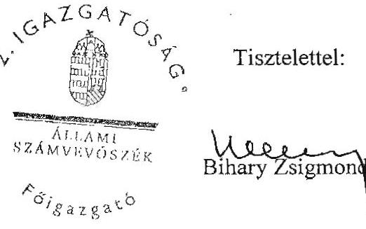

---

# A Magyar Nemzeti Vagyonkezelő Zrt. 2008. évi tevékenységének ellenőrzéséről készült V-2016-113/2008-2009. sz. jelentéstervezetre tett észrevételekre adott részletes válaszok 

## I.

## Az összegző megállapításokban leírtakkal kapcsolatos MNV Zrt. észrevételek

1. Beszámolási kötelezettség

A PM és az MNV Zrt. előző észrevételét már korábban lábjegyzetben megjelenítettük. A dátumokat a részletes megállapítások fejezet több helyen is tartalmazza. Az NVT úgy hozott döntést, hogy a beszámolók egyike sem felelt meg a törvényi előírásoknak, a beszámolók nyitóadatai nem voltak auditálva, illetve a beszámolók nem a hatályos szabályozás alapján készültek. A Tanács beszámolókat elfogadó döntése azért is kifogásolható, mert az eszközök társasági tulajdonba adása (RJGY döntés meghozatala) csak 2009. július 7-én született meg.
2. Az „elődszervezetek" által kezelt állami vagyon átadás-átvétele

Változatlanul az a véleményünk, hogy a szabályozás egyértelművé tételével, a döntések meghozatalával a kiadások elkerülhetők lettek volna. A jelentéstervezetben nem állapítottuk meg, hogy ezek a kiadások csak az MNV Zrt. hibájából következtek be. Az MNV Zrt. erőfeszítéseit a részletes megállapítások fejezet több helyen is tartalmazza.
3. A számviteli politika hiánya

Változatlanul az a véleményünk, hogy a számviteli politika alapvető szabály a gazdasági események könyvvezetéséhez, nem formai, hanem tartalmi okokból. A számviteli politika elfogadását törvény írja elő, az MNV Zrt. ennek nem tett eleget. A 2008. decemberében elfogadott számviteli politika sem felelt meg a hatályos számviteli szabályozásnak, amelyet a PM a jelentéstervezetre tett észrevételében meg is erősített.
4. Vagyonmérleg, vagyonleltár hiánya

Jelentésünkben tényszerűen megállapítottuk, hogy az MNV Zrt. nyitó mérlegéhez nem készült leltár. Másodlagos szempont az, hogy kinek a hibájából nem készültek el a leltárak, ugyanis ebben vita volt és van az MNV Zrt. és a PM között.
5. A nyilvántartások teljessége

Egyetértünk a - jelentéstervezetünkben is leírtuk - úgy hozták létre az új vagyonkezelő szervezetet és annak „egységes” nyilvántartását, hogy az elődszervezetek (ÁPV Zrt. kivételével) vagyonnal kapcsolatos nyilvántartásai hiányosságait nem szüntették meg. Megítélésünk szerint a 2008. január 1-jei nyitóállomány feltételezésen nem alapulhat. Ezért a vagyonvesztés nem zárható ki.

---

6. Analitikus rendszerekkel kapcsolatos egyéb észrevételek

Véleményünket fenntartjuk. Részletes kifejtés az 5. sz. mellékletben. A főkönyvi nyilvántartó rendszer (BA) és a VIR, a Falap, illetve a ForrásSQL közötti közvetlen, elektronikus adatkapcsolat csak 2008. év decemberére került kialakításra, ami biztosította egy elektronikusan zárt pénzügyi, számviteli rendszer megvalósítását. 2008. decembere előtt a BA-ba papíralapú rögzítéssel részlegesen kerültek adatok.

A főkönyvi rendszer nem alkalmas a rábízott vagyon változásának folyamatos nyomon követésére, nincs szabályozva és rögzítve az analitikus és a főkönyvi könyvelés kapcsolata.

Az MNV Zrt. nem átalakulással, az elődszervezetek beolvadásával, hanem új alapítású társaságként jött létre. A rábízott vagyon bekerülése értéke - a vagyonnak az elődszervezetektől az MNV Zrt.-hez kerülése esetére - nem értelmezhető. A rábízott vagyon átértékeléséről nincs szó, csupán az egységes elveknek megfelelő értékeléséről, ami számviteli törvényi előírás. Amennyiben az MNV Zrt. nyitóállományába az eszközök az elődszervezeteknél nyilvántartott értéken kerülhettek be, az sérti az eszközök egységes elvek szerint való értékelésére vonatkozó előírásokat.
7. MNV Zrt. saját vagyon és rábízott vagyon eszközkörre vonatkozó megjegyzések

Véleményünket fenntartjuk. A 2009-ben meghozott döntések a 2008-as működésre nem voltak hatással.
8. Az üzleti tervek hiánya

Az üzleti tervek hiányát Önök sem cáfolják. A saját tevékenységre vonatkozó üzleti tervet nem lehet jónak minősíteni, ha az üzleti év végén milliárdos nagyságrendű forrásigényük áll fenn a költségek fedezetére, miközben egész évre vonatkozóan több mint 2 Mrd Ft nyereséget mutatnak ki.
9. A könyvvizsgáló megbízására vonatkozó észrevételek

Ez a vélemény feltehetően nem az összegző megállapításokra, következtetésekre, javaslatokra vonatkozik. Véleményünket fenntartjuk. A könyvvizsgáló megnevezése nem azonos a megválasztással, az AO-ban való megnevezés nem azonos a könyvvizsgálat elfogadásával, a díjajánlat 2008. április 30-i megküldése, továbbá a szerződés aláírása is a 90 napos határidőn túl történt.
10. Megállapítás az NVT és a Vezérigazgató döntéseiről.

A megállapítás összefoglalás. A határozatok hiányosságai a részletes megállapítások fejezetben konkrétan vannak kifejtve. A kifejtett tartalmi hiányosságokon túl egyes határozatok formailag sem felelnek meg, nem jelenik meg, hogy miben született döntés, mit fogadtak el, mit jelent a tudomásulvétel, nincs határidő megjelölés a feladat számonkérésére. Pl.: a vezérigazgatói beszámoló tudomásulvétele
11. Javaslat az NVT elnökének

Javaslatunkat fenntartjuk. Ugyanis, ha a Tanács határozata nem tartalmazott határidőt, a határozat végrehajtásáról a vezérigazgató beszámoltatása elmaradt.

---

# 12. Középtávú stratégia 

Véleményünket fenntartjuk, mivel nincs ellentmondás abban, hogy Tanács döntéseit a Kormány és az RJGY által el nem fogadott - az RJGY által kifogásolt - középtávú stratégia hiányában hozta meg, bár a Nemzeti Vagyongazdálkodási Tanács igyekezett az általa elkészített - saját terveként maradt - stratégiai elképzeléseket követni.
13. Az NVT határozatok célszerűsége

Nem volt a vagyontörvénynek megfelelő Kormány és az RJGY által elfogadott stratégia, ezért a Tanácsi határozatok ennek hiányában születtek. 2008-ban a hatékony, átlátható döntéshozatali rendszer nem alakult ki - a döntések nem épültek egymásra -, a felelősségi elvárások nem érvényesültek. A 2008-ban meghozott NVT határozatok teljes körűen nem voltak célszerűek, és az ügyek egyes csoportjai a Vtv. céljaitól elszakadó szándékokat tükröztek. (Pl. a Nemzeti Földalapba tartozó területek 27. értékesítési portfóliójának meghirdetése; az erdőgazdasági társaságokkal, Balatoni Halászati Zrt.-vel, a Regionális Fejlesztési Holding Zrt.-vel, a Budavári Vagyonkezelő és Innovációs Kht.-val kapcsolatos döntések.) (A Nemzeti Vagyongazdálkodási Tanács egyes döntési folyamatait a 3. sz. melléklet mutatja be.)

## II.

A vagyontörvény, a végrehajtási rendeletek, az Áht., az Ftv. pontatlanságai, hiányosságai

1. A jogi szabályozás 2008-ban nem lett egyértelműbb és áttekinthetőbb. A vagyontörvény és a végrehajtására kiadott kormányrendelet nem egyértelmű, ellentmondásos, rendelkezései hiányosak, ezért jogértelmezési problémák merültek fel, ami gyors megoldási módok, megkereséséhez és alkalmazásához vezetett. A teljesség igénye nélkül: összehangolási hiányosság volt a vagyontörvény és a kapcsolódó kormányrendeletek, az államháztartásról, a felsőoktatásról, a költségvetési szervek jogállásáról szóló törvény és a kapcsolódó kormányrendeletek között. Ezek hozzájárultak - az MNV Zrt. gazdálkodásával, pénzügyi, számviteli, könyvvezetési, nyilvántartási hiányosságain túlmenően - a piaci alapú vagyonkezelési díjak, a költségvetési szervek ingatlanjai után piaci alapú bérleti díjak bevezetésének, a felsőoktatási intézményekkel a vagyonkezelési szerződések megkötésének az elmaradásához, a jogszabályokban megfogalmazott határidők be nem tartásához. Az összehangolási, jogértelmezési, gyakorlati problémák feloldása nem valósult meg, a költségvetési szervek jogállásáról szóló törvény miatt új összehangolási hiányosságok is keletkeztek, mert a költségvetési szervek társaságaira szigorúbb szabályokat ír elő, mint a Vtv. Megállapításunkat fenntartjuk.

## III.

## A szervezet működése és a döntéshozatal kapcsán tett számvevőszéki megállapítások észrevételezése

1. Továbbra is fenntartjuk az MNV Zrt. döntéshozatali mechanizmusainak hiányosságaira tett megállapításainkat, külön kiemelve a döntéshozók döntéseinek előkészítése során a vizsgálat által tapasztalt hiányosságokra, a vezérigazgató saját és átruházott hatáskörében hozott határozataira a döntéshozatal formalitására, a szabálytalanságokra és a hatáskörtúllépésekre vonatkozóan. A belső vélemények figyelmen kívül hagyására vonatkozó 39. oldal 3. bekezdésében foglalt megállapítás a jelentésben - az észrevételt követően - nem módosult, mert a vezérigazgató nem tekinthet el azon belső véleményektől (jogi, könyvszakértői), amelyek a helyes döntéshozatalát befolyásolják. Azzal együtt sem, hogy meghozott döntéseiért ő a felelős, mert egyes döntésekkel pl. kárt okozhat, különösen akkor, ha az adott szerv állami pénzből gazdálkodik.

A Vezetői Értekezlet ügyrendjének VI. pontja szerint az ülés előkészítésével, levezetésével kapcsolatos feladatokban helyettesítheti a vezérigazgató-helyettes a vezérigazgatót. A 2008. december 17-ig hatályos 3/2008. sz. vezérigazgatói utasítás a vezérigazgatói határozatok aláírását nem helyezte a mindenkori helyettes jogkörébe. Ezen felül összeférhetetlenség is fennáll abban az esetben, ha egy olyan előterjesztéshez kapcsolódóan vezérigazgatói határozat kerül kiadásra, amelynél az előterjesztő és a Vig. határozatot aláíró személye megegyezik.

Pl.: Olyan fontos Tanács elé menő döntéseknél nem volt jelen a vezérigazgató, és nem ő írta alá a tanácsnak szóló határozati javaslatról rendelkező Vig. határozatot, mint pl. a Bábolna Nemzeti Ménesbirtok tulajdonosi kölcsöne, a Balatoni Halászati Zrt. helyzetének rendezése, a 2009. évi tervezési irányelvek, a Regionális Fejlesztési Holding részére 6 Mrd Ft tőkeemelés, az MNV Zrt. saját vagyonának várható adatai, a 2009. évi működés keretszámai, a Bábolna
 Nemzeti Ménesbirtok Kft. 2008. évi gazdasági helyzete, a Nemzeti Kataszteri Program Kht. 1,7 Mrd Ft tőkeemelése.

A Jelentés tervezet szerint: „A Tanács hatásköre az állami vagyon fejlesztésével, hasznosításával, elidegenítésével kapcsolatos középtávú stratégia kialakítása, amit a Kormány elé kell terjeszteni. de arra vonatkozóan nincs előírás, hogy azt a Kormánynak jóvá kell-e hagyni." A mondat utolsó részét a jelentéstervezetből töröltük.
2. Időbeni összehangolatlanság volt a Nitrogénművek Zrt. hiteleihez kapcsolódó költségvetési készfizető kezességvállalásról szóló 1086/2008. (XII. 20.) Korm. határozat és annak módosítása, valamint a 3/2009. (I. 28.) RJGY határozat és az azt visszavonó 5/2009. (II. 17.) RJGY határozatok között.
3. „Az MNV Zrt. 2008-as saját vagyon gazdálkodásáról szóló éves beszámolója törvényes határidőn túli elfogadása az Sztv. 153. § (1) bek.-ben (letétbe helyezés) és a cégnyilvánosságról, a bírósági cégeljárásról szóló 2006. évi V. törvény 18. § (1) bek., valamint az ennek elmulasztásával együtt járó következményeket (a cégbíróság az MNV Zrt.-t megszűntnek nyilvánítja) vonhatja maga után." Megállapításunkat fenntartjuk, mivel a vagyontörvény által kijelölt állami vagyonkezelő (MNV Zrt.), aki több mint 300 állami tulajdonú társaság vagyonkezelését végzi, nem engedheti meg a 2006. évi V. törvény 18. § (1) bek., valamint az ennek elmulasztásával együtt járó eljárás kezdeményezésének lehetőségét sem.
4. Továbbra is hiányosságként értékeljük, hogy „2008-ban az intézményrendszer szereplői (Kormány, RJGY, NVT) nem teremtették meg a megfogalmazott hatékonysági, átláthatósági, felelősségi, rugalmas döntési mechanizmusok és a teljesítménykövetelményekre épülő, belső érdekeltségi rendszert, illetve nem fogalmazták meg az ezt biztosító követelményeket. Egyetértünk avval a megállapításukkal, hogy a Nemzeti Vagyongazdálkodási Tanács a 434/2008. (VI. 11.) sz. NVT határozatával eredetileg az MNV Zrt. vezérigazgatójának 2008. évi prémiumkitűzését is - az MNV Zrt. beosztott munkavállalóira kidolgozott, teljesítménykövetelményekre épülő belső érdekeltségi rendszerben foglaltakkal összhangban - akként kívánta meghatározni, hogy az éves prémiumot részben

---

(40%) az üzleti terv teljesítéséhez kötött feladatok teljesítéséhez köti", de nem ez valósult meg.

Az, hogy az egyes területeken a megfelelő létszám nem állt rendelkezésre még önmagában nem mond ellent annak, hogy a munkaszervezési szempontokat szem előtt kell tartani. A státusznövekedés indokoltsága nem alátámasztott, mivel más területeken létszámfelesleg volt, illetve korábban olyan szakemberek leépítése történt meg, amelyek pótlásáról később ismételten gondoskodni kellett (ad hoc jellegű számviteli terület létszámemelkedése).
2008. évre vonatkozóan a munkavállalók egységes szempontok szerinti alapbér kialakítására vonatkozó megállapításunkat fenntartjuk.
5. A Balatoni Halászati Zrt. részére történő kölcsön nyújtás formája, illetve a kölcsönt jóváhagyó tanácsi határozatban foglaltak a jogszabályok megkerülését jelentik, mert tulajdonosi kölcsön nyújtásához a 2008. évi Kvtv. 7. § (2) bekezdése értelmében a Kormány előzetes jóváhagyása szükséges. A Balatoni Halászati Zrt. 97,77%-ban állami tulajdonú társaság - a tulajdonosi jogokat a Tanács gyakorolja -, így tulajdonosi kölcsönt a Kormány előzetes jóváhagyásával a Tanács adhat. A hivatkozott jelzálog és az azzal kapcsolatos kockázatok megfogalmazása pedig annak tükrében kiemelendő, hogy az Agrárgazdasági Vagyonkezelő Kft. ingatlan fedezet kikötése mellett biztosította az igen súlyos likviditási helyzetbe került BH Zrt.-nek a kölcsönt, ami a Balatoni Halászati Zrt. előtt még nehezebb és kiszolgáltatottabb helyzetet teremtett.

A jelentés a vezérigazgató átgondolatlan döntéshozatalát támasztja alá a BH Zrt.-vel kapcsolatos 1127/2008. (XII. 08.) Vig. sz. határozat, amelyet már a jogi vélemény figyelembevételével módosított (korábban miért nem volt jogi állásfoglalás?) a 1214/2008. (XII. 16.) Vig. sz. határozat. Ezt követően került az előterjesztés benyújtásra a Tanács részére.
6. A Budavári Vagyonkezelő és Innovációs Kht. kölcsönszerződése a jelentés megállapítása szerint kockázatosan megtérülő tulajdonosi kölcsönt biztosított, az NFÜ által nyújtott támogatási szerződés aláírása előtt.
7. A Tanács az MNV Zrt. portfoliójába tartozó erdőgazdasági társaságok egységes számviteli, ügyviteli, szakmai és vezetői információs rendszerének kialakítására vonatkozó döntésénél nem vette figyelembe, hogy még nem dőlt el az erdészeti társaságokkal kapcsolatban mi lesz a stratégia (holding rendszerbe való összevonás, jelenlegi helyzet fenntartása). A társaságok egy részénél jelentős befektetések voltak az informatikai rendszerek fejlesztésével kapcsolatos szoftverekre, amelyek az új rendszer miatt részben szükségtelenné válnak. Az új rendszer bevezetésének üteme az eredeti szerződéses megállapodáshoz képest csúszik.
8. Erdészeti társaságok 2009. évi közjóléti tevékenységének vissza nem térítendő támogatásával kapcsolatos megállapításunkat a jelentéstervezet 40. oldal második bekezdésében pontosítottuk.
9. A Vezetői Értekezlet ülésén kívül meghozott DMRV Zrt. 2008. március 17-ei rendkívüli közgyűlésére történő mandátum kiadásról szóló 170/2008. (III. 10.) Vig. határozat az átgondolatlan döntéshozatalt támasztja alá, mivel a Vezetői Értekezlet 2008. március 6-án a vezérigazgató 166/2008. (III. 06.) Vig. határozattal a DMRV Zrt. 2008. március

---

17-ei rendkívüli közgyűlésére történő mandátum kiadásról szóló előterjesztés Tanács elé viteléről határozott (a mandátum a közgyűlésen szereplő napirendi pontokban „nem"-mel történő szavazásra vonatkozott), majd négy nap múlva a vezérigazgató a 170/2008. (III. 10.) Vig. határozatban - a 166/2008. (III. 6.) Vig. határozat hatályon kívül helyezése mellett - döntött eltérő mandátum kiadásáról szóló előterjesztés és határozati javaslat Tanács elé viteléről.
10. Újfehértói Gyümölcstermesztési Kutató és Szaktanácsadó Kht. tulajdonosi támogatásával kapcsolatos megállapítás az átgondolatlan döntéshozatalt támasztja alá, mivel a vezérigazgató a 605/2008. (VI. 11.) Vig. határozatban, majd a TVI ellentétes véleményének megérkezését követően az eredeti határozatot módosítva a (768/2008. (VIII. 06.) Vig. határozatban) az Újfehértói Gyümölcstermesztési Kutató és Szaktanácsadó Kht. részére - a likviditási problémák rendezésére - 144 M Ft vissza nem térítendő tulajdonosi támogatásról döntött, ami egyrészt ellentmond a Kvtv. 7. § (2) bekezdésében foglaltaknak (hitel és kölcsön nyújtás esetén is előzetes Kormány hozzájárulás szükséges), másrészt utóbbi határozatban célként tulajdonosi kölcsön visszafizetésének megjelölése szerepelt.
11. „A vezérigazgató a belső vélemények figyelmen kívül hagyása mellett hozta meg pl. a 724/2008. (VII. 21.) Vig határozatot, amelyben arról rendelkezett, hogy az MNV Zrt. székház „B" épületének felújításával a Hungalu-Service Kft.-t „kell" megbízni. A döntés a felújítási költség megtérülését kimutató számítás és három árajánlat bekérésének hiányában történt. Ez utóbbi ellentétes a Kbt. előírásaival." Véleményünket továbbra is fenntartjuk, mivel nem állt fenn a rendkívüli sürgésséget indokoló körülmény (életveszély elhárítása, nagyobb kárt megelőző indokolt elhárítás stb.), továbbá az egybeszámítási kötelezettség is fennáll.
12. Hatáskör túllépéssel (egyes társasági részesedések árverés útján történő értékesítésével, valamint a termőföld értékesítés 26. portfóliójába tartozó termőföld területekkel) kapcsolatos észrevétel a jelentés 41. oldalának 2. bekezdésében foglalt megállapítás törlésére vonatkozott. Az észrevétel megfogalmazza, hogy az MNV Zrt. SZMSZ-e szerint az értékhatárok szerinti hatáskört ügyletenként kell érteni, mert - a számvevői jelentésre tett észrevétel szerint - pl. az árverési tételeknek nincs összértékük, hanem árverési tételenként ügyleti értékük. A jelentés a hatáskör gyakorlásánál a teljes összértéket vette figyelembe, mert a döntéshozatal ebből a szempontból értékelhető. A jelentésben megfogalmazott megállapítás részben az EB által is vizsgált 26. értékesítési portfólióba tartozó termőföld értékesítéssel kapcsolatos példán alapul.
13. Nemzeti Kataszteri Program Kht.-vel kapcsolatos megállapítás szerint az NVT faxos szavazás útján 1700 M Ft értékű pótbefizetését hagyta jóvá figyelemmel a 1238/2008. (XII. 22.) Vig. sz. határozatra és a Pénzügyminiszter 13331/4/2008. ikt. sz. levelében foglaltakra. Továbbra is fenntartjuk azon álláspontunkat, hogy a társaság negatív saját tőke rendezésének kötelezettsége a 2007. évet záró mérlegkimutatás alapján (-947,5 M Ft értékű saját tőke) tekintetében volt indokolt. Az MNV Zrt. véleményét a Jelentéstervezetben megjelenítjük.
14. A 1010/2008. (II. 29.) Korm. határozat alapján az RJGY (5/2008. (III. 17.) sz. határozatában) 2008. május 30-ai határidőt jelölt meg a feladatok teljesítésére. 2008 szeptemberében a KVI és a TEAM Kft. között létrejött (Kormányzati Negyed Projekt) tervezési szerződés Tanácsi döntést követő lezárására és 330,6 M Ft + ÁFA összeg kifizetésére, 2008 decemberében a KVI és a Vibrocomp Kft. között létrejött szerződés vezérigazgató

---

i döntést követő lezárására és 5,6 M Ft + ÁFA kifizetésére került sor. A szerződések 2008. szeptemberi és decemberi lezárása nem volt összhangban a hivatkozott Kormány és RJGY határozatokkal.
15. A szöveg pontosítására vonatkozó javaslatot elfogadjuk: a jelentéstervezetet módosítjuk az alábbi szövegrészre: „... Az iratkezelés jelenlegi gyakorlata nem teszi lehetővé a tárgyhoz kapcsolódó iratok teljes körűségének megítélését, az iratkezelési rendszer bonyolultsága megnöveli az iratkeresés időtartamát."
16. „A Társaság a működését és gazdálkodását szabályozó kötelezően kidolgozandó belső szabályzatokat többségében elkészítette és vezérigazgatói utasítással kiadta. (Kivéve pl. Tulajdonosi Ellenőrzési Szabályzat, szerződésmenedzseléssel kapcsolatos eljárásrend;"...megállapításunkat fenntartjuk, mivel az ellenőrzésünk időszaka a 2008. évre szólt.
17. A jelentéstervezet szerint „A Versenyeztetési Szabályzat felülvizsgálata a 2008. április 30-ai határidőhöz képest egy éves késéssel 2009. április elsejével valósult meg." Megállapításunk megalapozott, nem módosítjuk.
18. A jelentéstervezet szerint „Vezérigazgatói utasítás szabályozza az MNV Zrt. Szerződéstárának működési rendjét. Az egységes szerződésnyilvántartás azonban nem valósult meg, ezért a jogelődök szerződésállománya nem átlátható." Megállapításunkat pontosítottuk.
19. A jelentéstervezetet módosítottuk: „2008-ban az MNV Zrt. egyes szervezeti egységeinek ügyrendje nem volt, a szervezeti egységek közötti feladatmegosztás rendje nem volt szabályozva.

# IV. 

## Az MNV Zrt. beszámolási rendszere

1. A 4. sz. mellékletben tett megállapításunkat, amely az átmeneti időszakban az elődszervezeteknél történt eseményekről szól, továbbra is fenntartjuk, mivel a folyamatban lévő ügyekről az elődszervezetek elkülönített beszámolót nem készítettek.

## V.

## Az MNV Zrt. vagyon-nyilvántartási rendszere

1. A Nemzeti Földalap vagyonnyilvántartásával (FALAP) kapcsolatos megállapításunkat fenntartjuk, mivel a Nemzeti Földalapba tartozó ingatlanok csoportosítása nem felel meg a Vtv. előírásainak. A földkönyvi nyilvántartásokban és a mérlegben a Nemzeti Földalap önálló vagyonelemként nem jelent meg.
2. A Vagyon-nyilvántartási Szabályzat, informatikai biztonsági politika (IBP), katasztrófaelhárítási terv (DRP), üzletmenet-folytonossági terve összefüggésben az ,,Informatikai Biztonsági Szabályzat (44/2008. sz. Vezérigazgatói utasítás)" szövegjavaslatot a jelentéstervezetbe beépítettük.

---

3. Az EVEREST bekerülési költsége, kötbér érvényesítése adat

Az EVEREST megvalósításának együttes összege: 1 383,7 M Ft. Adatpontosítást elvégeztük. Az EVEREST I. fázisának késett átadása miatt a vállalkozóval szemben 56,1 M Ft kötbért érvényesített az MNV Zrt." szövegjavaslatot, a jelentéstervezetbe beépítettük.
4. A vagyonkataszterrel kapcsolatos kiegészítés, amely szerint a vagyonelemek tételes ellenőrzése a jelenlegi működési feltételek között gyakorlatilag lehetetlen feladat, nem mond ellent a megállapításunknak.
5. Külügyminisztérium és külképviseletek használatában lévő ingatlanok nyilvántartásával kapcsolatosan tett észrevételük a jelentéstervezetben és annak mellékleteiben nem szerepel.

# VI. 

## Rábízott vagyonnal való gazdálkodás

1. „A jelentéstervezet szerint „Az 5/2008. (I. 22.) Korm. rendelet 8. § (3) bekezdésében foglaltaknak az MNV Zrt. megalakulásától kezdve 2009. május 31-éig nem tett eleget, mivel a rábízott vagyon változásáról félévenként az ÁSZ-t nem tájékoztatta" megállapításunkat a hivatkozott Korm. rendelet szerint fenntartjuk.
2. § (1) A Kormány a 3. § (1) bekezdés szerinti éves beszámoló alapján teljesíti a Vtv. 11. §-ának (1) bekezdése szerinti beszámolási kötelezettségét az Országgyűlésnek.
(2) Az MNV Zrt. saját vagyonáról, valamint a rábízott állami vagyonról készített éves beszámolót a részvényesi jogok gyakorlója - azok jóváhagyását követően haladéktalanul - megküldi az Állami Számvevőszéknek.
(3) Az MNV Zrt. a saját
 vagyona, valamint a rábízott állami vagyon változásáról félévenként köteles tájékoztatni az Állami Számvevőszéket.

## VII.

## Az állami ingatlanvagyon kezelése és kapcsolódó megállapítások

1. Az állami ingatlanvagyon hasznosításának stratégiájához kapcsolódó megállapítások: A megállapításunkat az 1. sz. Függelékben módosítottuk: „A dokumentum (a 473/2008. (VII. 09.) NVT sz. hat.) - határidők megjelölése nélkül - elhalasztja a társadalmi szervezetek ingatlanaival, az egyházak vagyonkezelésében lévő, a sport- és a külföldi ingatlanokkal, a PPP földhasználati jogok biztosításával, az ingyenes önkormányzati ingatlan juttatással és az autópálya konstrukciókkal kapcsolatos stratégia kidolgozását."
2. Piaci feltételek szerinti ingatlanhasználat elmaradására, köszönjük a kiegészítést az 1. számú függelékben és a jelentéstervezet 57. oldalán tett megállapításainkat ez is alátámasztja.
3. Vagyonkezelési szerződések összhangja a megváltozott jogszabályokkal. A jelentéstervezetet az alábbiak szerint pontosítottuk:

---

„A megvizsgált, egyéb vagyonkezelőkkel kötött szerződések - az egyéb vagyonkezelőket érintő, a Ptk. XXIII. fejezet 243-276. §-ában felsorolt mellékkötelezettségek kivételével - tartalmazzák a jogszabályi követelményeket, elvárásokat. A szerződések jogszabályi hivatkozásai azonban - mivel a szerződések a jogszabályok változásait követően nem kerültek módosításra - nincsenek összhangban a jelenlegi jogszabályi környezettel."
4. A vagyonkezelési szerződések 2008. június 30-áig történő felülvizsgálata a jelentéstervezetet az alábbiak szerint pontosítottuk:
„A Vtv. 59. § (5) bekezdése szerint a Társaságnak 2008. június 30-ig kellett elvégeznie a központi költségvetési szervekkel kötött, a törvény hatálybalépésekor hatályos vagyonkezelési szerződések felülvizsgálatát és a törvény előírásainak megfelelően történő módosítását. Ez a feladat nem teljesült. A központi költségvetési szervek fedezet hiányára hivatkozva a szerződéseket nem igazolták vissza. Az MNV Zrt. folyamatosan jelezte a végrehajtás - részben az MNV Zrt.-n kívül eső okokra visszavezethető - várható elhúzódását. A végrehajtást az NVT folyamatosan figyelemmel kísérte, határozatának megfelelően a szakterület a végrehajtásról folyamatosan beszámolt."

# VIII. 

## A moszkvai Magyar Kereskedelmi Képviselet ingatlanértékesítése

1. A zártkörű pályázati kiírása a Vtv. 35. § (5) bekezdése szerint csak kivételesen kerülhet sor. A pályáztatási forma nem tette lehetővé a Moszkvában lévő magyar érdekeltséggel bíró társaságok pályázaton való részvételét. Megállapításunkat továbbra is fenntartjuk az idegen országokban lévő magyar tulajdonú ingatlanok értékesítése során is alkalmazni kell a Vtv. pályáztatási rendszerre vonatkozó általános előírását, nem kizárva az érdeklődők körét.
2. Az MNV Zrt. vezetői a 2008. november 5-én aláírt adásvételi szerződés 4.1. pontja ellenére sem tudtak a pénzügyi teljesítésről, holott a 4.1. pontban „A felek által korábban megkötött és teljesített megállapodásoknak megfelelően..." leírt szövegrész után került rögzítésre a 2008. március 17-én már pénzügyileg teljesített vételár. Megállapításunkat fenntartjuk.
3. A 2008. november 5-én megkötött szerződésről az MNV Zrt. csak a KÜM 2009. március 27-i keltezésű és 5083/Adm/KÜM/2009. számú levele után értesült; információt nem tudjuk elfogadni. Az 1. sz. függelék 1. sz. mellékletében foglaltak szerint a Tanács a 687/2008 (IX. 05.) sz. határozatában „az ingatlan értékesítésére kiírt zártkörű pályázatot érvényesnek és eredményesnek minősítette, és a KÜM javaslata alapján a pályázat nyertesének a 21,3 M USD összegű (illetve ennek az összegnek az ajánlattétel napján érvényes MNB középárfolyam szerinti forint összegű) vételi ajánlatot tevő Diamond Air S.A.R.L. (Luxemburg) társaságot nyilvánította. Ezzel együtt az NVT felkérte a KÜM-öt, hogy a megbízási szerződés 11. pontja alapján - az NVT előbbi döntésének a kézhezvételétől számított 60 napon belül - az adásvételi szerződést a nyertes vevővel megkösse, s hogy az adásvételi szerződés 1 db eredeti példányát az adásvételi szerződés aláírását követő 15 napon belül a megbízónak, az MNV Zrt. vezérigazgatójának tájékoztatásul küldje meg."
„Az ingatlan adásvételi szerződést az oroszországi magyar nagykövet még az NVT határozathozatala napján, 2008. november 5-én megkötötte/aláírta."

---

4. Az MNV Zrt. az adásvételt nem tudta beazonosítani, ezért 2008. december 23-án a 3500,0 M Ft-ot kivonta a központi költségvetés bevételei közül. Megállapításunk tényszerű adatokon alapszik és ezt az MNV Zrt. is megerősíti.

# IX. 

## Nemzeti Földalap tevékenysége és kapcsolódó megállapítások

Általánosságban megjegyezni kívánjuk, hogy az NFA EB elnöke a jelentéstervezetre nem tett észrevételt.

1. NFA feladatok az MNV Zrt. SZMSZ-ben

A jelentéstervezet 59. oldalának lábjegyzetében foglaltak tartalmazzák a módosítást. Figyelemmel észrevételükre a hivatkozott bekezdésből „az intézkedés nem történt mondat" törlésre kerül.
2. A jelentéstervezet szerint „A Társaság több esetben megsértette az előterjesztések tartalmi és formai kellékeiről, valamint a döntések során keletkezett iratok kezeléséről szóló vezérigazgatói utasítás vonatkozó részét."

A jelentéstervezet 2-ben szereplő konkrét példákat már előző, a Jelentés-tervezet 1. észrevételét követően küldött válaszunkban felsoroltuk. (Pl. NVT 550/2008. (VIII. 13.) sz., a vezérigazgató 189/2009. (III. 03.) sz. és a vezérigazgató 730/2008. (VII. 24.) sz. határozataihoz kapcsolódó előterjesztés) A példák is alátámasztották, hogy a Társaság több esetben megsértette az előterjesztések tartalmi és formai kellékeiről, valamint a döntések során keletkezett iratok kezeléséről szóló vezérigazgatói utasítás vonatkozó részét, ezért a megállapításunkat fenntartjuk.
3. A jelentéstervezet szerint: „A haszonbérbe adásra vonatkozó szabályozás részben volt szabályszerű, átlátható és eredményes. Ugyanis nem sikerült szakmai konszenzust kialakítani a haszonbérbe adásra vonatkozó szabályozásban."

Nem vitatva, a szabályzatok FVM általi jóváhagyását álláspontunk szerint nem lehet teljes körű szakmai konszenzusról beszélni. A teljes körű szakmai konszenzus hiányát mutatja - többek között - a 2. sz. függelékben idézett az FVM szakállamtitkára által 2008. december 19-én és 2009. január 13-án az MNV Zrt.-nek küldött leveleinek vonatkozó része, ezért a megállapításunkat fenntartjuk.
4. Figyelembe véve észrevételüket a vonatkozó rész az alábbiak szerint módosult: „HB-FEJ-ENYING, illetve a HB-BAR-BÓLY haszonbérleti pályázati egységekhez kapcsolódó pályázati felhívásnak a 21. pontja olyan rendelkezést tartalmaz, amely csak elméleti lehetőséget biztosít egy új haszonbérlő számára, mivel a pályázat érvényességét az új haszonbérlőtől független feltételhez „a Kiiró és a hatályos haszonbérlő egymással egyezséget kössön a hatályos szerződés lezárására" köti. Ezen haszonbérbe adásokat elsősorban nem szakmai szempontok, hanem a költségvetési bevételek indokolták. A költségvetési bevételek mellett a két cég érdekei is szempontot jelentettek a pályázati kiírásban."
5. A jelentéstervezet szerint: „Az állami vagyonnal való gazdálkodásról szóló 254/2007. (X. 4.) Korm. rendelet 54. § (5) bekezdésében előírt határidőre, 2008. december 31-ére, nem fejeződött be a haszonbérleti szerződések felülvizsgálata."

---

A megállapításunkat alátámasztja a 254/2007. (X. 4.) Korm. rendelet 54. § (5) bekezdése, amely szerint „Az MNV Zrt. jogelődei által állami tulajdonú termőföldre kötött haszonbérleti szerződéseket - figyelemmel a külön jogszabályok szerinti védettségi szempontokra is - 2008. december 31-ig kell felülvizsgálni és e rendelet szabályainak megfelelő módosításukat kezdeményezni. A felülvizsgálat alapján azon szerződéseknél, ahol a haszonbérleti díj mértéke nem éri el a helyben kialakult díjtételt, illetve amelyek nem felelnek meg a jogszabályi feltételeknek, az MNV Zrt. a szerződés módosítását haladéktalanul köteles kezdeményezni." A hivatkozott jogszabály alapján a haszonbérleti szerződéseket felül kell vizsgálni. A megállapításunk ennek elmaradására vonatkozott, ezért azt továbbra is fenntartjuk.
6. A Jelentéstervezet szerint: „A szabályozás nem tartalmazott a tulajdonjog átruházásához szükséges nyilatkozatok kiadására vonatkozó részt, az ellenőrzött egységek esetén ezek kiadása azonban csak a vételár befizetése után történt meg."

Tekintettel arra, hogy észrevételük tartalmazza, hogy „a tulajdonosi hozzájárulás nem belső szabályozó, hanem a vevők számára is egyértelmű szerződési pontban kerültek rögzítésre" - megállapításunkat fenntartjuk.
7. A Jelentés tervezet szerint: „Az értékesítési egységek összeállítása - az irodavezetők javaslata alapján történt, de volt rá példa - ZAL-2701/08. pályázat - hogy az egység összeállítása az MNV Zrt. Vezérigazgatójának közvetlen és részletes utasítása alapján történt meg."

Az NFA ügyvezető igazgatója által a Zala megyei irodavezetőnek küldött fax idézett mondatai kellően alátámasztják megállapításunkat, mely szerint ezen egység összeállítása „az MNV Zrt. Vezérigazgatójának közvetlen és részletes utasítása alapján történt meg."
8. Jogszabályi hivatkozás pontosítását tudomásul vettük.
9. Az Összefoglaló és a részletes jelentés közti eltérés

Az ÁSZ jelentés összefoglaló megállapítások, következtetések, javaslatok fejezetében leírt megállapításokat a részletes megállapítások, mellékletek, függelékek tételes indoklásai támasztják alá. A jelentés nem csak az MNV Zrt. tevékenységéről, hanem - ellenőrzési programunknak megfelelően - az új intézményi rendszer működéséről, működtetéséről mond véleményt.
10. Az NFA által el nem végzett MNV Zrt.-s kiadásokra vonatkozó MNV Zrt. vélemény, amely szerint nem találkozott olyan üggyel vagy anyaggal, amely alátámasztotta volna a megállapítást, szíves figyelmükbe ajánljuk a gazdasági igazgatóság ezt alátámasztó, az ÁSZ rendelkezésére bocsátott dokumentumait.
11. Az NFA beszámolójának megfelelősége:

Az MNV Zrt. kiegészítése, amely szerint az NFA beszámolója a saját beszámolójára vonatkozó jogszabályoknak megfelelően elkészült, azonban ez a vagyontörvény előírásainak már nem felelt meg, nem cáfolja megállapításunkat. Ugyanis jelentésünkben azt állapítottuk meg, hogy az NFA beszámolója a Vtv. előírásainak nem felelt meg.

---

Jelentésünk szövege: „A Vtv. 62. § a) pontja szerint a 3 szervezet tevékenységét lezáró beszámolót, vagyonmérleget és az azt alátámasztó vagyonleltárt készít a hatályos (számviteli, adózási vagy egyéb) jogszabályok szerint 2007. december 31-ei fordulónappal. A Vtv. 62. § b) pontja alapján elvégzi mindazon feladatokat, melyeket számára a számviteli, az adózási vagy egyéb jogszabályok előírnak. A KVI, az NFA beszámolója a vagyontörvény előírásainak nem felelt meg."
12. Hatáskör túllépés kérdése

A vezérigazgató 275/2008. (IV. 10.) és a 311/2008. (IV. 17.) sz. Vig. határozatokban 311 M Ft, illetve 4651 M Ft minimálárú termőföld terület értékelési sorrendjének jóváhagyásáról döntött. A Vtv, illetve az SZMSZ 250 M Ft értékhatár felett a Tanácsot illette meg. Nem értünk egyet azzal az érveléssel, hogy az értékesítési egységeket nem összeszevontaban vették figyelembe.
13. A FALAP rendszer pontatlanságának kérdése

A Falap adathiányosságait, a pontatlan adatokat, a szerződések, hasznosítási adatok naprakészségének hiányát, illetve a következményeit a szervezeten belüli feljegyzések mutatták. Az agrárportfólióért felelős vezérigazgató-helyettes által az MNV Zrt. vezérigazgatójának küldött 2008. február 7-ei feljegyzésben az alábbiak olvashatók:

- „Több esetben mind a KVI, mind pedig az NFA nyilvántartásában szerepelt ugyanazon ingatlan, sok esetben ráadásul különböző adattartalommal. Ez több esetben ellentmondáshoz, az állam számára káros döntéshez is vezethet."
- „A szerződések, hasznosítási adatok nem voltak naprakész állapotban az NFA nyilvántartásában. A felvitel hiányosságai miatt sok esetben eltérő adatok jelentek meg a nyilvántartásban."
- „Az NFA nyilvántartása több esetben a FOMI bevonásával került frissítésre. Az újabb betöltések és a régi adatok közötti eltérések lekezelése, rendezése nem történt meg. Ezen okból volt olyan ingatlan, mely több módon (pl. a régi és az új helyrajzi számával) is felvételre került. A megosztás során létrejövő ingatlanok az NFA nyilvántartásában nem vitték tovább az eredeti ingatlannál szereplő jogokat, kötelezettségeket."

Fentiekre tekintettel a megállapításainkat a FALAP rendszer pontatlanságaira vonatkozóan fenntartjuk.
14. A szerződésmódosítások FALAP rendszerben való módosítása

Megállapításunkat az alábbiak szerint pontosítottuk: „Nem történt meg a módosított szerződések (több ezer szerződés) Falap-ban való korrigálása, ezért a bérleti díjak kiszámlázása nem történt meg, aminek következtében az MNV Zrt. és a Magyar Állam jelentős bevételtől esett el."
 2008-ban,
15. A FALAP életjáradéki szerződés módosításainak követési kérdése

Megállapításunkat az alábbiak szerint pontosítottuk: „A szakterület az életjáradéki program során átvett haszonbérleti szerződések módosításával kapcsolatban elismerte, hogy

---

a FALAP nyilvántartási rendszer a szerződésmódosításokat 2008-ban részlegesen követte."
16. A FALAP adatállományában a tulajdon azonosítása és megtalálása

A FALAP nyilvántartásában szereplő
szerződések, adatok pontatlanságát, illetve hiányát mutatja az agrárportfólióért felelős vezérigazgató-helyettes 2008. december 2-ai feljegyzése, amelyben a Területi Irodáknál az NFA haszonbérleti szerződéseinek a felülvizsgálatát, illetve e szerződésmódosítások FALAP-ba való rögzítését rendelte el, mert a 2005-2007. években kötött szerződésmódosítások „FALAP-ban való megtalálhatósága kétséges volt"
17. Elővásárlási és előhaszonbérleti joggal kapcsolatos problémák tárgyában való intézkedés

A jelentéstervezet 2. - amire jelen észrevételük is vonatkozott - 59. oldal lábjegyzetében már tartalmazta, hogy 2009. július 1-jével módosították a haszonbérbe adásra irányuló pályázati szabályzatot.
18. Megállapításunk szerint nem volt olyan NVT által elfogadott dokumentum, amely a haszonbérleti díj összegét tartalmazta volna. Ezen megállapításunkat észrevételük sem cáfolja. A megállapításunkat azonban kiegészítettük a következőkkel: „A 28/2008. Vig. utasítás 4. sz. melléklete rendelkezik arról, hogy a 2008. évre vonatkozóan a haszonbérleti díj összegét 800 Ft/AK értékben kell megállapítani."
19. Az új haszonbérleti díjak elfogadásáról

Észrevételük nem tartalmazott olyan tényt, amely cáfolta volna megállapításainkat. A megállapítás nem állította, hogy a haszonbérlők nem saját elhatározásuk alapján tettek volna az új haszonbérleti díj elfogadására vonatkozó nyilatkozatot. Tény, hogy azokban az esetekben (pl. 2/2009. (II. 12.) AVIGH), amikor az új haszonbérleti díjakat a haszonbérlő nem fogadta el, a haszonbérlőnek a régi módon kiszámított alacsonyabb összeget kellett fizetnie, ezért a jelentéstervezetünkben tett megállapításunkat fenntartjuk.
20. Hasznosítási terv és annak teljesülése

Az MNV Zrt. levelében - iktatószám: MNV/01/1/17952/14/09.; kelt: 2009. május 14. az ÁSZ ellenőrzés során feltett kérdésre mely szerint „c) milyen szempontok érvényesültek a pályázati, árverési egységek kialakításakor, érvényesültek-e az OGY földbirtok politikai irányelvei" a következő választ adta: „Az alkalmazott földbirtok politikai irányelvek az alábbiak voltak: megfelelő földbirtok struktúra kialakítása, állattartó telepek létesítésének és működésének támogatása, helyi magángazdálkodók, valamint kisméretű agrárvállalkozások termőföldszerzésének elősegítése." Ezen irányelvek megegyeztek a hasznosítási tervben kiemelt irányelvekkel, ezért került sor az ellenőrzés során ezen irányelvek megvalósulásának vizsgálatára. Megjegyezni kívánjuk, hogy észrevételüket alátámasztó dokumentum nem került átadásra, ezért a megállapításunkat fenntartjuk.

---

21. Egyéb földértékesítések céloknak való megfelelése, az értékesítések megalapozottsága és szabályszerűsége

Megállapításunk arra vonatkozott, hogy az EB jelentés - az értékbecslések hiányát kifogásoló - megállapítására az NVT nem „reagált", azaz nem fejtett ki semmilyen - pl. az észrevételükkel megegyező - álláspontot, azaz észrevételük nem cáfolja megállapításunkat.

Álláspontunk szerint, egyébként, észrevételük nem megalapozott a következők miatt: A 254/2002. (XII. 13.) Korm. rendelet 11. § (1) bekezdése, mely szerint: „11. § (1) Az NFA az ajánlati árat a) részletes ingatlan értékbecslés, vagy b) a rendelet szerint megvalósított egyszerűsített ingatlan értékbecslés alapján állapítja meg." A kormányrendelet 11. § (2) azt tartalmazza, hogy. ,,(2) Egyszerűsített ingatlan értékbecslésnek minősül, amikor az NFA az ajánlati árat saját nyilvántartása, a földhivatal által az NFA részére külön megállapodás alapján a termőföld adásvételére kötött szerződésekben szereplő ár információk alapján nyújtott, vagy termőföld esetén a rendelet 1. számú mellékletében, míg erdő esetében a rendelet 2. számú mellékletében foglaltak szerinti egyszerűsített módszerrel állapítja meg. A megállapodás kötelező tartalmi eleme, hogy a költségeket az NFA megtéríti." Álláspontunk szerint tehát a hivatkozott jogszabályi rész alapján rendelkezésre kellett volna állniuk az egyszerűsített értékbecslést megalapozó földhivatal által nyújtott információt tartalmazó dokumentumoknak.
22. Állattartó telepek többletpontként való értékelése

Észrevételük alapján a hivatkozott mondat vonatkozó részét kiegészítettük az „érvényesíthetők" szóval, ez azonban nem befolyásolja megállapításunkat, mely szerint az árverések kevésbé tudtak hozzájárulni a kiválasztott OGY irányelvek megvalósulásához.

# $\mathbf{X}$. 

## A Sukoró-Pilis/Albertirsa ingatlancsere

## 1. Az ingatlancsere alapvető oka

Általánosságban megjegyezni kívánjuk, hogy az Állami Számvevőszék - mint minden ellenőrzése során - jelen esetben is dokumentumokból állapít meg tényeket, nem pedig „feltételezett szándékokból" von le következtetéseket.

A Jelentés-tervezetben megfogalmazott megállapításainkat változatlanul fenntartjuk. A 2. sz. függelék 1. sz. mellékletében, a tények bemutatásának teljes körűségére törekedve, az alábbi kiegészítést tettük.
„A lebonyolítás következő lépése volt az MNV Zrt. vezetői értekezletének, illetve az NVT tagjainak az informálása. Ezt szolgálta a „A King's City Kft. sukorói ingatlanokon tervezett beruházásával kapcsolatos tájékoztató", amely 2008. június 18-án került megtárgyalásra, és 625/2008. (VI. 19.) Vig. számú határozatával elfogadásra. Ezt követően került sor az NVT tagjainak az informálására, amelyre a 2008. június 25-ei ülésen került sor. A Tájékoztató többek közt az alábbiakat tartalmazta:
„A kezdeti elképzelések szerint a projekt a beruházók rendelkezésére álló albertirsai ingatlanokon került volna kivitelezésre, azonban a beruházás teljességéhez tartozó játékkaszinó engedély megszerzése Pest megyében akadályokba ütközött.

---

Erre tekintettel a beruházás megvalósításához más, Pest megyén kívüli helyszín kiválasztása vált szükségessé. Ekkor került a befektetők látókörébe a Velencei-tó északi partján, Sukoró község külterületén elhelyezkedő állami tulajdonba tartozó terület.

A kormányzati szinten folytatott egyeztetések során, azaz álláspont került kialakításra, hogy meg kellene vizsgálni, hogy a befektetők által megjelölt sukorói ingatlanokat el lehet-e cserélni a befektető tulajdonában lévő, a Magyar Állam számára útépítéshez részben szükséges albertirsai ingatlanokkal, mivel a csereként felajánlott ingatlanok egyikét érinti a 4. sz. főút Monor-Pilis elkerülő szakaszának nyomvonala."
2. A törvény a célt definiálja

A törvény úgy rendelkezik, hogy a célhoz szükséges terület cseréjéhez nem kell versenyeztetés.
3. A záradékolt kisajátítási tervek birtokában

Eltérően az álláspontjuktól a NIF általános gyakorlata, hogy csak az útépítéshez szükséges földterületeket szerzi meg, maradékterületek megszerzésére akkor kerül sor, ha azok nem megközelíthetők.
4. A Pest megyei területvezető által adott földérték

Megállapításunk arra vonatkozott, hogy a földcsere lebonyolítása során nem került sor a Pest megyei területi irodavezető által adott földérték és a tényleges beszámított érték közötti nagymértékű eltérés tisztázására.
5. A feljegyzésben megadott termőföld átlagárak

A feljegyzésben foglalt termőföld átlagárakat, az Albertirsa 0188/2, 0188/3 ingatlanok helyszíni szemléjére vonatkozó feljegyzés tartalmazta. Két ingatlan közül az Albertirsa 0188/2 ingatlan kivett terület, ezért állítottuk, hogy a feljegyzésben szereplő termőföld átlagárak az Albertirsa 0188/3 ingatlanra vonatkoznak.
6. Jelzálogjogok nagysága

Az a tény, hogy az ingatlanok tulajdoni lapján jelzálogjogok találhatóak, és emiatt a Területi Iroda nem tudja annak értékét meghatározni, álláspontom szerint azt jelenti, azok tényleges értéke az irodavezető által megadott átlagárak alatt lehet csak.
7. A belső szabályozás hiánya

Álláspontunk szerint szükséges lenne, hogy a szerződés tervezetek az előterjesztés mellékletét képezzék, mert az hozzájárulhatna, hogy az előterjesztésben vállaltak belekerüljenek a végleges szerződésbe. Ennek elmaradása történt ez esetben.
8. Az előterjesztés szöveges része nem tartalmazta

Az 507/2008. (VII. 30.) NVT határozathoz tartozó előterjesztéshez nem lett csatolva sem az AVH 2008. június 5-i feljegyzése, sem a Pest Megyei Területi Iroda feljegyzése. Az előterjesztés szöveges része nem tartalmazott információt a nagymértékű eltérésre vonatkozóan. Az előterjesztés szöveges része nem tartalmazta az AVH 2008. június 5-i feljegyzésének vonatkozó részét, mely szerint: „A használati viszonyok tisztázatlansága a későbbiekben számos jogi probléma, vita forrása lehet, így helyzet feltárása és rendezése előtt a szerződéskötés semmiképpen sem kívánatos." Álláspontunk szerint ezen információk elhallgatása lehetőséget adott az NVT döntésének irányítására.

---

9. A földcseréről szóló döntés

Nem zárjuk ki, hogy a termőföldcseréről szóló előterjesztés 2008. július 30-a előtt készült, de jelezni kívánjuk, hogy az előterjesztésen szereplő dátum 2008. július.
10. Csak keretet nyújtott

Álláspontunk szerint az ehhez csak keretet nyújtott megfogalmazás az áttekintett dokumentumok alapján tényszerű, de megállapításunk további alátámasztását is jelentik a Tájékoztató idézett bekezdései.
11. Az NVT teljes körű informálása miatt

Nem a jogszabályok, illetve a belső szabályzatok miatt kifogásoltuk a kisajátítási terv hiányát, hanem amiatt, hogy az NVT nem kapott teljes körű információt.
12. NIF Zrt.-vel kapcsolatos levelezés

Köszönettel vettük jelzésüket, de nem látjuk szükségesnek módosítani jelentésüket, jelen esetben ezt Önök sem kérik.
13. A vizsgálat során

Jelentésünkben az általunk kért adatokat szerepeltettük.
14. MNV. Zrt.-nek rendelkezésre álló anyagai

A Jelentés nem tartalmazott olyat, hogy a 2009-ben megkapott NIF leveleket az MNV Zrt.-nek 2008-ban ismernie kellett volna.
15. Kisajátítási tervek

Azért van jelentősége, mert mint ahogy az észrevételük is tartalmazza, a kisajátítási tervek számos alkalommal módosulhatnak, illetve mert a záradékolt kisajátítási tervvel kezdi meg a NIF Zrt. a kisajátítást.
16. Technológiai és jogi folyamat

A Jelentés a kisajátítási tervben az autópálya építéshez szükséges területtel 10,31 hektár számolt.
17. A záradékolt kisajátítási tervek birtokában.

Észrevételük alapján „A záradékolt kisajátítási tervek birtokában" kezdetű mondatban a *vagy* szó helyett az *illetve* kerül.
18. A NIF Zrt. levelének figyelembe vétele alapján

Álláspontunk szerint nincsen félreértés, az összehasonlítás arra vonatkozik, hogy mennyire lett volna szükség és hogy ténylegesen mennyi cseréltek.

---

19. Az ingatlanok Nemzeti Földalapba tartozása

Köszönettel vettük észrevételüket, azonban megállapításunkat az érdemben nem befolyásolja.
20. Maradéktalan teljes terület

Az NFA törvény a közérdekű cél érdekében ad lehetőséget a versenyeztetés nélküli cserére. A maradéktalan jelen esetben azt jelenti, hogy a közérdekű cél csak 5,63 %-ban áll fenn, a többi több mint 90 %-ban pedig nem.
21. Az összes ingatlan megszerzése

Álláspontunk szerint észrevételük jövőre vonatkozó feltevés, nem pedig tény. A NIF Zrt.-től kapott és az MNV Zrt. által is megismert dokumentumok alapján, a csere jogcímét jelentő útépítéshez a NIF Zrt.-nek 10,31 hektárra van szüksége.
22. Indoklásunkat az 1. pont kapcsán már ismertettük.
23. Kötbér kikötése

Köszönettel vettük észrevételüket, de tekintettel arra, hogy a megállapításunknak nem mond ellent, azt továbbra is fenntartjuk.
24. Az előterjesztés további hiányossága

Álláspontunk szerint, amely megegyezik az MNV. Zrt. Kontrolling Igazgatójának álláspontjával, szükség lett volna a vagyonkezelő jogokért fizetendő összegek bemutatására, pontosan azon ok miatt, amit a Kontrolling Igazgató levele is tartalmazott, azaz hogy: ,, a tanács valamennyi döntés figyelembevételével hozhassa meg a döntését."
25. KvVM levele

A jelentés nem állította, hogy a KvVM levele jogszabályi tiltást tartalmazott volna.
26. A földingatlanok csak kisebb része releváns termőföld

Köszönettel vettük észrevételüket, azonban az megállapításunkat érdemben nem befolyásolja.

Figyelemfelhívását köszönjük, amelyből nem derül ki, hogy melyik 6 ingatlanra vonatkozik, de megállapításunkra nincs hatással.
27. Az idézett bekezdés is azt jelenti

Köszönettel vettük figyelemfelhívó észrevételüket, amely nincs ellentmondásban megállapításunkkal.
28. 17/2008. számú vezérigazgatói utasítás

Álláspontunk szerint a 17/2008. számú vezérigazgatói utasításban foglalt általános szabályoktól való eltérésre a közösségi cél, mint útépítés jelen esetben nem adott volna lehetőséget.

---

29. 2008. június 05-én kelt feljegyzés

Az Agrárportfólióért felelős vezérigazgató-helyettes 2008. június 05-én kelt feljegyzésének vonatkozó mondata, melyet a megállapítás hiányolt, nem lett megjelenítve az előterjesztésben.
30. Ez annak következménye

Álláspontunk szerint, melyet észrevételük nem cáfol, szükséges lett volna a szerződéskötés előtt tisztázni a helyzetet, úgy ahogy az Agrárportfólióért felelős vezérigazgató-helyettes javasolta feljegyzésében. Észrevételük szerint ez egy „teljesíthetetlen feltétel", ilyen információt viszont az 507/2008. (VIII. 31.) NVT határozatot megalapozó előterjesztés nem tartalmazott.
31. Az ingatlancserének ez a módja

Észrevételük szerint „a fent kifejtettek alapján,
 a csere szabályszerű és célszerű volt." Tekintettel arra, hogy nem megállapítható, hogy mit értenek „fent kifejtettek alapján" alatt, ezen észrevételükre érdemben nem tudunk válaszolni. Álláspontunkat a jelentés tartalmazza.
32. Önálló fejezetként való feltüntetés

Megállapításainkat az NFA-ra vonatkozó törvény alapján tettük, illetve a termőföldcseréről volt szó.
33. Csereingatlanok teljes területére tett megállapítás

A jelentés nem állította, hogy a 2008. július 30-án kötött szerződés azért semmis „mert nem felelt meg a Tftv 2008. augusztus 1-én hatályba lépett módosításának." A Jelentés vonatkozó része azt állította, hogy „a termőföldcserét ebben a formában a szerződés aláírásának időpontja - 2008. július 30-a - után két nappal már nem lehetett volna lebonyolítani.

A közérdekű cél fennállására vonatkozóan az ÁSZ ellenőrzés a NIF Zrt. által átadott dokumentumokból nyilvánvaló, és az MNV Zrt. által sem cáfolt, tényt tekinti mérvadónak, mely szerint, az összesen mintegy 183 hektár területű csereingatlanból mind összesen 10,31 hektár területet érint a tervezett útépítés.
34. Kisajátítással kapcsolatos megállapítás

Nem állítottuk, hogy a kisajátítást nem előzheti meg egyezség. A 10,31 hektár a közcélú útépítéshez szükséges területet jelenti, ennyire lett volna szükség, a Jelentés nem állította, hogy csak ennyi került a magyar állam tulajdonába.

---

# XI. 

## Állami tulajdonú társaságok vagyonkezelése

1. Társaságok vagyonkezelésével kapcsolatos, általános megállapítások

Fenti vagyonkezelésével kapcsolatos megállapításainkat a jelentéstervezet több helyen részletesen tartalmazza. Kiemelném, hogy a vagyontörvény hiányossága miatt is nem kezelték megfelelően a kiemelten vizsgált Magyar Posta Zrt. és MÁV Zrt. központi apparátusának elhelyezésével kapcsolatos eljárást. Továbbá az MNV Zrt. vagyonkezelési szerződés útján történő közvetett vagyonkezelése kockázatot jelent a Vtv. 2. § (1) bekezdése szerinti nemzeti vagyon megőrzése és gyarapítása biztosításában. A vagyonkezelésbe adásnál az MNV Zrt.-nek az átadás után a gazdálkodásba érdemi intézkedési joga nincs. Az állami társaságok leánytársaságainak csak társasági tulajdonként való kezelése nem biztosítja az állami vagyonnal való felelős gazdálkodást.
2. Tisza Volán Zrt. BUSZPORT projekttel kapcsolatos észrevételt nem fogadjuk el az alábbiak miatt.

A Megállapodás III. 4. és III. 6.3. pontjaiból egyértelműen kitűnik, hogy a buszpályaudvar, illetve az új kereskedelmi központ beruházás megvalósítására a jogügylet aláirását követően kerül sor, nem teljesül a Kbt. 174. §-ának a) pontja, illetve a 296. §-ának a) pontjában hivatkozott, valamint a 29. § (2) bekezdésének a) pontja szerinti „meglévő építmény"-re vonatkozó fordulata. A Megállapodás III. pontjából az is kitűnik, hogy a felek - a „kötelezettséget vállal" kitétel gyakori alkalmazásával - a buszpályaudvar és kereskedelmi központ építési beruházással való megvalósítása tárgyában kerültek kötelmi jogviszonyba.

A Megállapodás tartalmazza, hogy a Buszport megépülése után mikor és milyen ingatlanokkal kapcsolatos szerződéseket fognak a szerződő felek egymással megkötni. Erre való tekintettel a felek között nem egy elvi jellegű megállapodás - figyelemmel arra, hogy a jognyilatkozatok vonatkozásában nem az elnevezés, hanem azok tartalma az irányadó -, hanem a Ptk. 208. §-ának (1) bekezdése szerinti, jogokat és kötelezettségeket tartalmazó visszterhes előszerződés jött létre.
3. MALÉV Zrt.-vel kapcsolatos megállapításainkat a jelentéstervezetben továbbra is fenntartjuk.

A 3. sz. függelékben a színlelt szerződésre vonatkozó megállapításunkat fenntartjuk, mert: „A megörökölt szerződések alapján nem teljesült az a feladat, hogy a Malév Vagyonkezelő Kft. a hitelfedezetül megvásárolt eszközöket működtesse és hasznosítsa, (mivel a kerozinvezetéket csak a MOL Nyrt. üzemeltetheti a bányatörvény értelmében, az átvett repülőgépre pedig banki jelzálogjog van bejegyezve), ezért színlelt szerződésnek kell tekinteni a vagyonelemek kiszervezését, amely nem szerepelt a privatizációs eljárás meghirdetésekor. A szerződésekben vállalt feltételek nem teljesüléséből a vagyonkezelőnek kára származik, amelyért a tulajdonosának kell helyt állni."
4. Budapest Airport Zrt. -vel kapcsolatos észrevételek figyelembevételével a megállapításunkat az alábbiak szerint módosítottuk:
„A Budapest Airport Zrt. privatizációs szerződésében a vállalt vevői kötelezettségek teljesítésénél a Vagyonkezelői szerződés alapján, a közigazgatási hatósági ügyekben való

---

jóváhagyások, kormányzati döntések, szabályozási tervek és a műszaki szabályozás elmaradása Állami Kockázati Eseménynek minősülhet,...
5. Magyar Posta Zrt.-vel és MÁV Zrt.-vel kapcsolatos megállapítások

A Magyar Posta Zrt. és MÁV Zrt. ellenőrzési megállapításokkal kapcsolatos észrevételekre a társaságoknak adott válaszainkat csatoljuk.

A Magyar Posta Zrt. és a MÁV Zrt. központi irodaházainak értékesítésével, illetve új bérlésével kapcsolatos döntések hosszú távon meghatározzák a gazdálkodást, ezért nem tehet úgy a vagyonkezelő, - még ha az egyik társaságot vagyonkezelésbe is adta - mintha a tranzakció csak társasági belügy volna. Éppen ezt a szemléletet kifogásoltuk korábbi ellenőrzéseinknél is, illetve a vagyontörvény egyik hiányosságának tartjuk a problémakör nem megfelelő súlyú kezelését.
6. Regionális víziközmű szolgáltatók integrációja tekintetében a jelentéstervezetben és 3. sz. Függelékben tett megállapításainkat továbbra is fenntartjuk az alábbiak szerint:

Az MNV Zrt. vagyonkezelési szerződés útján történő közvetett vagyonkezelés kockázatot jelent a Vtv. 2. § (1) bekezdése szerinti nemzeti vagyon megőrzése és gyarapítása biztosításában. A megkötött vagyonkezelési szerződés feltételrendszere ellentétes a vízgazdálkodásról szóló törvény előírásaival.

# XII. 

## Társaság ellenőrzési rendszere és kapcsolódó megállapítások

„Az EB ellenőrzési jogosítványai gyakorlati érvényesítésekor több alkalommal nem kapott az általa feltüntetett időpontra dokumentumokat, vagy feltett kérdéseire választ. Ezért az ellenőrzések végzésében akadályoztatva volt. Az AO módosítása (1080/2008. (XII. 13.) Korm. határozat) ezt a szabályozási hiányosságot pótolta." Megállapításunkat fenntartjuk az EB által bemutatott dokumentumok alapján.

1. Tulajdonosi ellenőrzéshez kapcsolódó megállapításainak továbbra is fenntartjuk, mivel a Belső Ellenőrzési Iroda 4 fővel - a vezérigazgató megbízásából - 2008-ban összesen csak 15 vizsgálatot végzett. A tulajdonosi ellenőrzés a feladatok mennyisége és a belső ellenőrzés kapacitás hiánya miatt 2008-ban korlátozottan valósult meg.
2. A Jelentéstervezetben megfogalmazott állításunk „A tulajdonosi ellenőrzési rendszer nem épült ki, a tulajdonosi ellenőrzési szabályzat és terv nem készült el." tényszerű, mivel szabályzatot a Tanács 562/2009.(VI.24.) NVT sz. határozatával 2009. június 24-én fogadta el és a tulajdonosi ellenőrzési terv nem készült el.

## XIII.

## Az Állami Számvevőszék 2008. évi ellenőrzési megállapításainak hasznosulása

A pénzügyminiszter intézkedése az ún. „előd" szervezetek éves beszámolóinak törvényessége, hitelessége, a felelősség megállapítása érdekében; a megszűnt szervezetek dolgozói munkaviszonya megszüntetésével kapcsolatos eltérő jogértelmezés, a kellő időben meg nem hozott döntések miatt jelentkező munkajogi viták, kárigények érdemi lezárása javaslat nem

---

hasznosult. A felsorolt hiányosságok megszüntetésére, személyi felelősség megállapítására vonatkozó intézkedés nem történt. Megállapításunkat továbbra is fenntartjuk.

A vezérigazgató intézkedései a szerződésmenedzselési szakterület szervezeti különválasztásáról a Belső Ellenőrzési Iroda munkaszervezetétől, a tulajdonosi ellenőrzéstől, létszámának megerősítéséről a vevői kötelezettségek ellenőrzésének, behajtásának biztonsága érdekében javaslat csak részben hasznosult, mivel az SZMSZ módosítása csak 2008. november 13-tól, helyezte a feladatot a Jogi vezérigazgató-helyettes irányítása alá.

# XIV. 

## Bábolna Csoport megállapítások

1. A Bábolna Zrt.-vel kapcsolatos tulajdonosi intézkedések vizsgálata kapcsán

A hivatkozott jelentések nem mondanak ellent a korábbi Bábolna csoportra és a mostani Vaddisznóskertre vonatkozó megállapításainknak. A Vaddisznóskerttel kapcsolatos megállapításnál nem az Ellenőrző Bizottság szempontjai szerint értelmeztük az átadást. Az ideiglenes vagyonkezelésbe adás ellentétes a jelentésben hivatkozott 156/2008. NVT határozattal, mert az a teljes földterületet (13487 hektár) elvonta, és szétosztotta (Ménesbirtok Kft., Vértesi Erdő Zrt.). A kényszerhasznosítási területátadás módosítása nélkül abból kivett 376 hektárt és arra kötött ideiglenes hasznosítási szerződést a Vaddisznóskert hasznosítására. Attól, hogy egy ügy a vezérigazgató döntési hatáskörébe tartozik, nem lehet ellentétes az NVT határozatával.
2. A Bábolna Ménesbirtok Kft. tőkejuttatása

A Bábolna Ménesbirtok Kft. tőkejuttatásával kapcsolatban a megállapításokat kiegészítettük, azzal, hogy a belső vizsgálatra adott észrevételben jelezte a Ménesbirtok korábbi vezérigazgatója, hogy a mezei leltárral közel azonos átutalást az MNV Zrt. kérésének megfelelően tette.

Mint a korábbi jelentéseinkben már többször jeleztük a Bábolna csoporttal kapcsolatban konszolidált beszámolót a tulajdonos nem igényelt.

Azt a társaságot jelölték ki kényszerhasznosításra, aki ezt a feladatot nem tudta ellátni. Ezt bizonyítja az, hogy a BNMV Kft. a Bábolna Zrt.-vel kötött szerződést a feladatok ellátására, akitől ezt a feladatot korábban az MNV Zrt. elvonta.

A BNMV Kft. bankhitelének kiváltására vonatkozó tájékoztatást a jelentéstervezetben megjelenítjük, azonban ez nem befolyásolja az ellenőrzési időszakra vonatkozó megállapításainkat.

A mezei leltár megfelelő alátámasztására nem áll rendelkezésre teljes körű leltár, ezt a belső vizsgálatok is megállapították.

---

3. A Bábolna csoport gazdálkodása

A Bábolna Ménesbirtok Kft. tőkejuttatásával kapcsolatos vagyonvesztés részbeni külső piaci okait az ÁSZ sem vitatta, azonban egy évtizedes veszteséges gazdálkodást csak erre a tényre nem lehet visszavezetni.

# XV. 

## Tulajdonosi kölcsön kérdése

Véleményünket fenntartjuk. A szabályozás hiányosságára példa a Budavári Vagyonkezelő és Innovációs Kht. részére Tanácsi határozat alapján adott kölcsön. A kölcsön nyújtásáról a Kormány nem hozott határozatot.

---

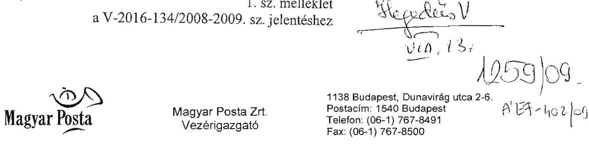

Állami Számvevőszék
Bihary Zsigmond úr
főigazgató részére
Budapest
Apáczai Csere János utca 10.
1052

Tárgy: Észrevételek a V-2016-113/2008-2009. sz. jelentéshez

Budapest, 2009.08.12.
Úgyiratszám: 341748/2009.

# ÁLLAMI SZÁMVEVŐSZÉK 

ÚGYVITELI IRODA
$6127/2009$
Erk.: AUG 13 2009
Iktatószám: U-2016-123/08/09
Melléklet:

## Tisztelt Főigazgató úr!

Először is szeretném megköszönni, hogy a Magyar Nemzeti Vagyonkezelő Zrt. 2008. évi tevékenységének ellenőrzéséről szóló jelentéstervezet előzetes véleményezésére lehetőséget biztosított.

A tegnapi és mai napon lefolytatott egyeztetések eredményeképpen a V-2016-113/2008-2009. számon megküldött jelentéstervezethez füzött észrevételeink nagy része elfogadásra került, ugyanakkor a tervezet 2009. augusztus 12-i, délutáni munkaanyagában még az alábbiak pontosítását kérem.

1. Mind a Jelentés 16. oldala, mind a 3. számú Függelék 1. számú melléklete együtt kezeli a MÁV Zrt. és Magyar Posta Zrt. székházával kapcsolatos kérdéseket. Tekintettel arra, hogy az együttkezelésből adódóan a megállapított hiányosságok mindkét társaságra vonatkoztathatónak tűnnek, kérem, hogy a Magyar Posta Zrt.-re tett megállapítások szerkezetileg is különüljenek el a dokumentumban.
2. Nem értünk egyet a Jelentés 16. oldalán tett megállapítással, mely szerint az „új irodaházban történő elhelyezése nem egy átfogó, a tevékenység és létszám racionalizálását előtérbe helyező irányvonal mentén került végrehajtásra."

A Magyar Posta Zrt. előterjesztése bemutatta, hogy az összevont elhelyezésből milyen logisztikai megtakarítások érhetők el, továbbá jelezte, hogy az összevont elhelyezés a karbantartói és az ingatlangazdálkodási területen jelent létszámcsökkenést. Az összevont elhelyezés ténylegesen a létszám 15 fős csökkentését eredményezte a beköltözéskor.

---

Az előterjesztés tartalmazta azt is, hogy önmagában az összevont irodaházi elhelyezés az irányítási létszám csökkentésével nem jár, ugyanakkor a későbbi létszámcsökkentések kezelésére olyan szerződést kíván kötni, amely a létszámcsökkentések kezelését lehetővé teszi.

Ezzel összefüggésben a bérleti szerződéses feltételek között szerepel, hogy a bérelt terület évente legfeljebb 10%-kal, 10 év alatt maximum 50%-kal csökkenthető.

A Társaság menedzsmentje 2009. évben tervezett létszámkorrekciót, a stratégiai irányítási illetve a szolgáltató szinteken. Ugyanakkor az MNV Zrt. az alábbi elvárást fogalmazta meg: „A gazdálkodási körülményekkel kapcsolatos problémák feltárása érdekében kérem, hogy a társaság kiemelten mutassa be a finanszírozással összefüggő kritikus területeket, valamint a foglalkoztatási szint megtartásának illetve növelésének lehetőségeit, és erről külön számoljon be 2008. november 25-ig."

Ennek az elvárásnak megfelelően készült el és került elfogadásra a bértárgyalások során a 2009. évi Foglalkoztatási Terv, amely a Posta Partner Programon felül nem tartalmazott lehetőséget a létszám leépítésére.
3. Nem értünk egyet a Jelentés 16. oldalán tett megállapítással, mely szerint „a központi apparátus elhelyezésére kiírt közbeszerzési eljárások paramétereinek
 a megválasztása nem segítette elő a valós piaci verseny kialakulását".

A közbeszerzési paramétereket az elhelyezési igény alapján határozta meg a Magyar Posta Zrt. piacsemleges módon, ebből következően igényeink megfogalmazása nem gátolta a valós piaci versenyt.
4. Nem értünk egyet a 3. számú Függelék 1. számú melléklet 1. oldalán tett alábbi észrevétellel: „Az euró alapú bérleti díjak forintban történő fizetése előre nem látható költségnövekedést idézett elő, ami a döntést megelőző előterjesztésekhez képest előre nem kalkulált többletköltségterhet jelent a társaságok számára. „

Hangsúlyozzuk, hogy az euróban megállapított bérleti díj fizetése euróban történik a szerződés futamideje alatt, és az egyéb díjak nem euróban, hanem forintban kerültek meghatározásra.

Tisztelt Főigazgató úr!
Kérem Önt, hogy az anyag véglegesítése során a jelzett észrevételeket figyelembe venni szíveskedjenek.
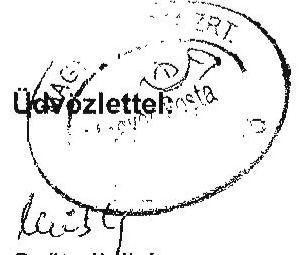

Szűts Ildikó
Vezérigazgató

---

# Szűcs Ildikó úrhölgy 

vezérigazgató
Magyar Posta Zrt.

## Budapest

## Tisztelt Vezérigazgató Asszony!

A Magyar Nemzeti Vagyonkezelő Zrt. 2008. évi tevékenységének ellenőrzéséről készített jelentéstervezetre tett észrevételeket megköszönöm, azokkal kapcsolatban az észrevételek sorrendjében a következőkről tájékoztatom.
A Magyar Posta Zrt. és a MÁV Zrt. székházával kapcsolatos részletes megállapításokat mind a jelentéstervezetünkben, mind annak függelékében külön-külön tárgyaltuk. A tranzakciókkal kapcsolatos közös általánosítható megállapításokat vontunk le az összefoglaló részekben. Kérésére, az egyes társaságokra vonatkozó jellemzőbb megállapításokat az összefoglalóban is megjelenítjük.

A bérlemények kiválasztása, a székház és egyéb irodaházak értékesítése egymástól független szemléletben történt. Mint megállapítást nyert az eredményre gyakorolt hatását tekintve, a legkisebb költséget jelentő megoldást a korábbi állapot fenntartása jelentette volna. A létszámra vonatkozó észrevételét már korábban is tartalmazta a jelentéstervezet, mely szerint az MNV Zrt. elvárásai miatt nem csökkentették 2008-ban a foglalkoztatási szintet, a tény az, hogy érdemben nem csökkent a létszám az ellenőrzött időszakban.

A közbeszerzési kiírásban megfogalmazott paraméterek behatárolták a pályázatban résztvevők körét.

Az euró alapú bérleti díjak fizetése - mivel a bevételük döntő része Ft-ban jelentkezik - az euró árfolyamának növekedése miatt többletkiadást jelent.

Kérem Vezérigazgató asszonyt, hogy a levelemben foglaltakat elfogadni, illetve tudomásul venni szíveskedjék.

---

Tájékoztatásul megemlítem, hogy a kialakult gyakorlatunknak megfelelően a továbbiakban a jelentés mellékletét képezi az észrevételeit tartalmazó levelének és az arra adott válaszomnak a másolata.

Budapest, 2009. augusztus

Tisztelettel:

Bihary Zsigmond

---

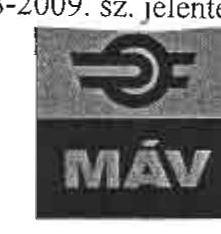

VEZÉRIGAZGATÓ

ÁLLAMI SZÁMVEVŐSZÉK

Ikt.szám: 1398/T/2009. Hiv.szám: V-2016-113/2008-2009.

Bihary Zsigmond Úr Főigazgató

Tisztelt Főigazgató Úr!

A Magyar Nemzeti Vagyonkezelő Zrt. 2008. évi tevékenységének ellenőrzéséről készített, V-2016-113/2008-2009. számon megküldött jelentéstervezethez kapcsolódó észrevételeimet az alábbiakban foglalom össze.

Köszönettel vettem az előzetesen megküldött eltérő véleményünk részbeni megjelenítését, egyes tételes pontosítási javaslataink átvezetését. Tekintettel arra, hogy észrevételeink megjelenítése nem teljeskörű, és csupán a részletes megállapításaikat tartalmazó mellékletben jelenik meg, szükségesnek tartom egyes kérdésekben véleményünk megerősítését, illetve részletesebb kifejtését az alábbiak szerint:

A MÁV székház értékesítése és a központi elhelyezés összehangoltan, előkészített ingatlangazdálkodási stratégia mentén került kidolgozásra. Az Igazgatóság egy napon tárgyalt a székház-értékesítéssel összefüggő Ingatlanbefektetési Alap létrehozásáról és az ingatlangazdálkodási stratégiáról. Utóbbit - a tárgyaláson elhangzottak szerint - módosításra visszaadta. A MÁV Zrt. Igazgatósága 2007. március 27-i ülésének 26/2007.(03.27.) számú határozata szerinti stratégiai célok egyike, hogy „Az ingatlanvagyon és az ingatlanstratégia megvalósítása segítse elő a MÁV Zrt. fejlesztési finanszírozási, likviditási gondjainak megoldását."

A pénz és ingatlanpiaci válság miatt meghiúsult IBA alapítási költségei a létrejövő alap útján megtérültek volna a MÁV Zrt. számára. A Prudent-Invest Zrt. részére a MÁV Zrt. által biztosított tagi kölcsön és tőkeemelés az alap létrehozásával kapcsolatos költségek megelőlegezését, illetve a befektetési alapkezelő társaságokra vonatkozó 2001. évi CXX. Törvény a tőkepiacról, és a kapcsolódó speciális jogszabályi követelmények előírásainak való megfelelést szolgálta. Szeretném megjegyezni, hogy a fenti döntések meghozatalánál - 2007. tavaszán - egyetlen egy szakértő sem látta a 2008. őszén bekövetkezett gazdasági válságot, és annak a MÁV IBA-ra gyakorolt hatását.

A MÁV Zrt. esetében a központi elhelyezésre vonatkozó célkitűzés nem változott, mivel kezdettől fogva a MÁV Zrt. - amelynek ekkor még része a későbbi MÁV Trakció Zrt. és MÁV Gépészet Zrt. - és a MÁV Start Zrt. irányító létszámának elhelyezését kívánta megoldani az új irodaházban. Az előterjesztések tartalmazták a szükséges információkat (gazdasági számítások, piaci elemzés, műszaki feltételekre vonatkozó információk és számítások, melyeket szakértőinek átadtuk). A döntést megelőzően készült gazdaságossági számítások a költözés gazdaságosságát mutatták. Az összevont elhelyezésből adódó létszám racionalizálás, illetve a logisztikai megtakarítások értékelése tovább javították a költözési folyamat hatékonyságát, abban az esetben is, ha erre konkrét számítások nem készültek.

# MÁV MAGYAR ÁLLAMVASUTAK ZÁRTKÖRŰEN MŰKÖDŐ RÉSZVÉNYTÁRSASÁG 

1087 Budapest, Könyves Kálmán körút 54-60. - Postacím: 1940 Budapest - Telefon: (1) 342-8795 - Fax: (1) 343-8535
A Fővárosi Bíróság, mint Cégbíróság CG. 01-10 042272

---

MÁV Zrt. mérlegelte az „A" kategóriás elhelyezés célszerűségét, az előkészítés során ezt a kérdést is vizsgálta a MÁV Zrt. a kapcsolódó előterjesztésben (ez az előterjesztés is az Önök birtokában van). Az előterjesztés tartalmazza, hogy a MÁV Zrt. elhelyezéséhez szükséges méretű irodaház csak „A" kategóriás található a piacon, a fejlesztők nem is építenek ilyen méretben „B" kategóriást. A 2007. októberi Igazgatósági ülésen is komoly vita volt az új elhelyezés színvonaláról. Az Igazgatósági tagok is arra a véleményre jutottak, hogy „A" kategóriának megfelelő színvonalúba szabad költözni, ha a költözés mellett dönt a MÁV Zrt. A piaci kínálat alapján a „B" kategóriás bérleti díjak 8-14 EUR/m²/hó ársávban bérelhetőek, azaz a MÁV által igényelt minimális kiépítettség mellett (informatika, telefon, étterem, mélygarázs, légcsere) ennek is a felsőbb ársávjába került volna a MÁV Zrt., így jelentős ármegtakarítást sem lehetett volna elérni. A MÁV által készített elemzés 52 db 10-36 ezer m2 közötti budapesti irodaház bérleti díjait vizsgálta, a belváros nélküli átlag bérleti díj 13,66-14,94 EUR/m2/hó. A MÁV Zrt. által alkudott fajlagos bérleti díj 12,36 EUR/m2/hó. Az üzemeltetési díj fajlagos értéke valóban minimálisan csökkent, de a szolgáltatási színvonal jelentősen emelkedett (pl.: valamennyi helyiség klimatizált, teljesen új infrastruktúrával rendelkezik - villamos, informatikai, telefonhálózat, liftek). A szervezetek által használt terület az új bérleményben 1/3-val csökkent, tehát lényegében azonos fajlagos üzemeltetési költség mellett a teljes üzemeltetési ráfordítás 100 millió Ft-os mértékű csökkenést eredményez évente.

A MÁV Zrt. korábbi székházát még nem értékesítette, jelenleg van folyamatban, így az értékesítés hatásának utóvizsgálata még nem történhetett meg.

A közbeszerzés nyilvánosan meghirdetett eljárással indult, azaz a piaci verseny érvényesülhetett. A tárgyalásos eljárás - a kiíró elképzelése és a pályázó által felkínált épület tényleges adottságai egyeztetése útján - a költségek további csökkentését szolgálta.
Az új székház közbeszerzési eljárása során a MÁV Zrt. az Alapító okirata rendelkezéseinek megfelelően járt el. Azzal, hogy az Igazgatóság döntött a közbeszerzési eljárás eredményéről és az alapján a MÁV Zrt. vezérigazgatója kötötte meg a bérleti szerződést, nem sérültek az alapító okirati rendelkezések, illetve nem sérültek az alapítói hatáskörök az alábbi okokból:
Az alapító okirat 6.5. w.) pontja kimondja, hogy az alapító által jóváhagyott közbeszerzési tervben nem szereplő 2 Mrd Ft-ot meghaladó beszerzésre vonatkozó közbeszerzési eljárás lefolytatásának előzetes jóváhagyása tartozik az alapító hatáskörébe. Az alapító a konkrét közbeszerzési eljárást előzetesen jóváhagyta a 39/2007 (XII. 13.) részvényesi határozatával. A 6.5. sz. pont, mely szerint az üzleti tervben nem szereplő, 2 mrd Ft-ot meghaladó kötelezettségvállalásról való döntés alapítói hatáskör, esetünkben nem releváns, mert a közbeszerzési eljárásra vonatkozó, speciális 6.5. w. pontot kell alkalmazni, amely alapján az alapítói döntési hatáskör a közbeszerzési eljárás lefolytatásának előzetes jóváhagyása. Közbeszerzési eljárás esetén ugyanis a Kbt. 82. §-a szerint az ajánlatkérő köteles az ajánlatokat elbírálni, ha nincs olyan általa előre nem látható és elháríthatatlan ok következtében beállott lényeges körülmény, amely miatt a szerződés megkötésére, illetőleg a szerződés megkötése esetén a teljesítésre nem lenne képes. A Kbt. (91-92. §) tételesen meghatározza, hogy mikor lesz eredménytelen az eljárás, illetve hogy ki az eljárás nyertese. Így közbeszerzési eljárás esetén az eredmény megállapítása kapcsán a törvény szerint kell eljárni, tehát nincs nyitott döntési pozíció. Ezért közbeszerzési eljárás esetén az alapító az ügyletről nem utólag, hanem előzetesen dönt. A tárgyalásos közbeszerzési eljárás lényege pedig, hogy a felek a szerződés szövegét a tárgyalások során egyeztetik, így nyilvánvaló következmény, hogy annak tartalma a közbeszerzési tárgyalások végére alakul ki. Így a MÁV Zrt. az alapító okirati előírásoknak megfelelően járt el, amikor az Igazgatóság döntött a közbeszerzési eljárás eredményéről, ezzel az alapítótól nem vett át hatáskört. Az egyértelműség kedvéért még rögzítésre is került a 39/2007.(XII.13.) részvényesi határozat alapjául szolgáló, GKM Tulajdonosi és Intézményfelügyeleti Bizottsága részére készített előterjesztésben, hogy a közbeszerzési eljárás

---

eredményéről az Igazgatóság dönt. Erre vonatkozóan a 39/2007.(XII.13.) számú részvényesi határozat még külön is megadja a felhatalmazást. Ez semmiképp sem ütközik a Gt. rendelkezéseibe. Az alapító okirat 6.5. w, illetve (álláspontunk szerint egyébként esetünkben nem releváns) sz. pontja nem a Gt. kötelező rendelkezései alapján tartozik alapítói hatáskörbe, hanem a MÁV Zrt. alapítója ezen kérdésekben való döntést saját elhatározásából vonta magához. Így saját elhatározásából hozhat olyan döntést is, hogy az így magához vont kérdésekben mást hatalmaz fel a döntés meghozatalára.
Fentiek alapján hozta meg a MÁV Zrt. Igazgatósága a 157/2008. (10.21.) sz. határozatát, amelyben a közbeszerzési eljárást eredményesnek nyilvánítja, és megállapította a pályázat nyertesét, jóváhagyta a vonatkozó bérleti szerződést, valamint felhatalmazta a MÁV Zrt. vezérigazgatóját, hogy a bérleti szerződést aláírja.
A vezérigazgató a bérleti szerződést 2008. október 30-án írta alá, amikor egyébként már az alapító az alapító okirat 6.5. i. pontja (az éves üzleti terv részeként az 500 M Ft feletti közbeszerzésekre vonatkozó éves közbeszerzési terv jóváhagyása) alapján jóváhagyta a 2008-as üzleti tervvel együtt a 2008 évi, az 500 millió Ft feletti - székház közbeszerzést is tartalmazó - közbeszerzési tervet is (2008. 10. 27.). A szerződéskötés időpontjában így már az alapító okirat 6.5. w. pontját sem kellett alkalmazni, mert az csak a közbeszerzési tervben nem szereplő beszerzésekre vonatkozik.
Fentieken túlmenően a MÁV Zrt. alapítója a 24/2008 (XI. 27.) sz. határozatával még utólag meg is erősítette az ügyletet, amikor a saját határozatai és a MÁV Zrt. Igazgatóságának 157/2008 (10. 21.) sz. határozatára hivatkozással elrendelte a MÁV Zrt. Budapest, Andrássy út 73-75. sz. alatti székháza értékesítésének előkészítését.

Kérem, hogy a jelentésre tett észrevételeimet elfogadni, és a jelentés véglegesítése során az anyagban megjeleníteni szíveskedjenek.

Támogató együttműködésüket előre is köszönöm!

Budapest, 2009. augusztus 11.
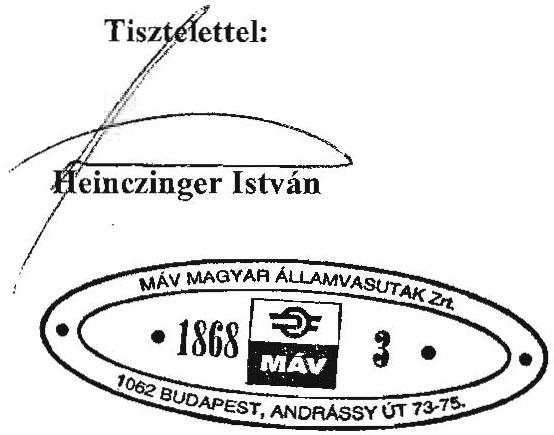

---

# 1. sz. melléklet 

a V-2016-134/2008-2009. sz. jelentéshez

FŐIGAZGATÓ

ÁLLAMI
SZÁMVEVŐSZÉK

V-2016-122/2008-2009.

## Heinczinger István úr

vezérigazgató
Magyar Államvasutak Zrt.

Budapest

## Tisztelt Vezérigazgató Úr!

A Magyar Nemzeti Vagyonkezelő Zrt. 2008. évi tevékenységének ellenőrzéséről készített jelentéstervezetre tett észrevételeket és kiegészítéseket megköszönöm, azokkal kapcsolatban az észrevételek sorrendjében a következőkről tájékoztatom.
Elöljáróban szeretném jelezni, hogy a levelében jelzett észrevételei döntő részét már beépítettük a jelentéstervezetbe, elsősorban a részletes megállapításokba, illetve a

 függelékbe, terjedelmi korlátok miatt az összefoglalóba erre nincs lehetőség.

Mint korábbi jelentésünkben, illetve előző észrevételeire adott válaszunkban már többször tényszerűen megállapítottuk azt, hogy a székház értékesítésére vonatkozó döntéskor a Társaságnak még nem volt elfogadott ingatlangazdálkodási stratégiája.

Nem vitatjuk a pénz- és ingatlanpiaci válság esetleges hatását az IBA-ra, az azonban tény, hogy az alapítás költségei nem térültek meg.

Az ellenőrzés végéig sem volt tisztázott a MÁV csoport jövőbeni hosszú távú stratégiája, ami miatt kifogásoltuk a székház eladásával, illetve új bérlésével kapcsolatos döntéseket.

A jelenlegi költségvetési helyzetben célszerűtlen volt hosszú távú szerződést kötni egy „A" kategóriás magas rezsijű irodaház bérlésére, amely árában nem tükröződik a hosszú távú szerződés előnye.

Mint már korábban is jeleztük az Alapító Okirat f. pontja egyértelműen cáfolja a közbeszerzéssel (új székházbérléssel) kapcsolatos észrevételüket, mivel a döntéshez be kellett volna szerezni az alapító jóváhagyását. Megállapításunkat az Önök tulajdonosi joggyakorlója a KHEM is elfogadta.

---

Kérem Vezérigazgató urat, hogy a levelemben foglaltakat elfogadni, illetve tudomásul venni szíveskedjék.

Tájékoztatásul megemlítem, hogy a kialakult gyakorlatunknak megfelelően a továbbiakban a jelentés mellékletét képezi az észrevételeit tartalmazó levelének és az arra adott válaszomnak a másolata.

Budapest, 2009. augusztus $\boldsymbol{\Delta} \boldsymbol{\Gamma}^{\prime}$
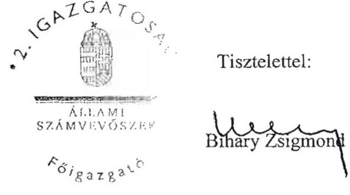

---

Az MNV Zrt. működéséhez kapcsolódó feladat és hatásköri rendszer a V-2016-134/2008-2009. sz. jelentéshez

|  Hatáskör gyakorló | Hatáskör gyakorló főbb feladatai | Feladatot előíró jogszabály | Feladat teljesítési határidő | Feladat teljesítése  |
| --- | --- | --- | --- | --- |
|  Kormány | MNV Zrt. Alapító Okirat elfogadása, módosítása | Ptk. 54. § (1), Vtv. 18. § (1) | Társaság alapítása | 1083/2007.(X.17.),1001/2008.(I.25.), 1080/2008.(XII.13.) Korm.hat.  |
|   | Hitel, kölcsön előzetes jóváhagyása | 2008. évi Kvtv. 7. § (2) | 2008. |   |
|   | Ingyenes vagyonátruházás 1 Mrd Ft felett | 2008. évi Kvtv. 7. § (7) | 2008. |   |
|  Pénzügyminiszter | RJGY - közgyűlési jogok | Vtv. 19. § (1) |  |   |
|   | MNV Zrt. cégbírósági bejegyeztetése | Ctv. 34. § (1), Gt. 17. § (1) | Kérelem Cégbír. 2007.11.16. | Teljesült, bejegyzés 2007.11.20.  |
|   | MNV Zrt. SZMSZ jóváhagyása | Vtv. 21. § (4) | Szervezet 2008.01.01-jével működik. | 2007.11.28., mód. 2008.11.13.  |
|   | Könyvvizsgáló megválasztás, visszahívás, díjazás | Vtv.19.§(1),Gt.42.§(1),231.§(2) | Alapító Okirat elfogadása előtt |   |
|   | 2007. évhez kapcsolódó könyvvizsgálatra MNV /MNV előtársasági és 2007. évi éves beszámoló/ |  | 2007.10.16 | Megbízás késve 2008.06.06-án. Ellentétes a Gt. 42. § (3) bek.-vel.  |
|   | 2008. évhez kapcsolódó könyvvizsgálatra MNV /2008.01.01-jei nyitómérleg auditálása, 2008.,2009.,2010. évi éves beszámolók/ |  | 2008.01.01 | Megbízás késve 2008.10.06-án  |
|   | Üzleti terv jóváhagyása - saját és rábízott vagyon | SZMSZ 7. § (1) |  |   |
|   | MNV Zrt. saját vagyon üzleti terv 2008. |  | Nincs előírás,adott évre 03.31. | Nem teljesült, RJGY nem döntött.  |
|   | MNV Zrt. rábízott vagyon kezelési terv 2008. |  | Nincs előírás,adott évre 04.30. | Nem teljesült, RJGY nem döntött.  |
|   | MNV Zrt. saját vagyon üzleti terv 2009. |  | Nincs előírás,adott évre 03.31. | Teljesült, 11/2009.(IV.07.)RJGY h.  |
|   | MNV Zrt. rábízott vagyon kezelési terv 2009. |  | Nincs előírás,adott évre 04.30. | Teljesült, 15/2009.(V.21.)RJGY h.  |
|   | Beszámoló jóváhagyása - saját és rábízott vagyon | Vtv. 19.§ (1), Gt. 231.§ (2) e) |  |   |
|   | ÁPV Zrt. saját vagyon 2007. beszámoló | Ctv. 18.§(1),(3);Sztv. 153.§(1) | Elkészítési határidő 2008.05.31. | Késve teljesült,12/2008.(VI.04.)RJGY  |
|   | ÁPV Zrt. hozzárendelt vagyon 2007. beszámoló |  | Elkészítési határidő 2008.08.31. | Elfogadás késve 10/2009.(III.31.)h.  |
|   | NFA 2007. évi beszámoló |  | Elkészítési határidő 2008.02.28. | Késve teljesült, elkészítés 2008.03.06.  |
|   | KVI 2007. évi beszámoló |  | Elkészítési határidő 2008.02.28. | Késve teljesült, elkészítés 2008.06.23.  |
|   | MNV Zrt. 2007. előtársasági beszámoló |  | Elkészítési határidő 2008.02.17. | Elfogadás késve 2/2009.(I.15.)RJGY  |
|   | MNV Zrt. 2007. évi beszámoló (saját vagyon) |  | Elkészítési határidő 2008.05.31. | Elfogadás késve 2/2009.(I.15.)RJGY  |
|   | MNV Zrt. 2008.01.01 rábízott vagyon vagyonleltár |  | Nyilvántartás kötelezettség 2008.01.01-ig | Nem teljesült 2009.06.19-ig sem  |
|   | MNV Zrt. 2008.01.01-jei nyitómérleg(rábízott v.) |  | Nyitás a könyvekben 2008.01.01 | Nem teljesült 2009.06.19-ig sem  |
|   | MNV Zrt. 2008. Lfélév saját vagyon beszámoló |  | Elkészítési határidő 2008.08.30. | Nem teljesült, EB és ÁSZ nem kapta  |
|   | MNV Zrt. 2008. Lfélév rábízott vagyon beszámoló |  | Elkészítési határidő 2008.08.30. | Nem teljesült, EB és ÁSZ nem kapta  |
|   | MNV Zrt. 2008. saját vagyon éves beszámoló |  | Elkészítési határidő 2009.05.31. | RJGY nem döntött, elkészítés 2009.04.01  |
|   | MNV Zrt. 2008. rábízott vagyon előzetes beszám. | 5/2008. (I.22.) Korm.r. 3.§ (1) | Elkészítési határidő 2009.05.31. | EB visszaküldte, elkészítés 2009.05.27.  |
|   | Állami vagyon felügyelete, | 169/2006.(VII.28.) Korm.r. |  |   |
|   | állami vagyonnal való gazdálkodás szabályozása | 169/2006.(VII.28.) Korm.r. |  |   |
|   | Középtávú vagyon stratégia Kormány elé terjesztése | Vtv. 6. § (2) bek., SZMSZ | Nincs előírás, 2008.06.30. | RJGY visszaküldte 2008.11.24-én  |

---

Az MNV Zrt. működéséhez kapcsolódó feladat és hatásköri rendszer a V-2016-134/2008-2009. sz. jelentéshez

|  Hatáskör gyakorló | Hatáskör gyakorló főbb feladatai | Feladatot előíró jogszabály | Feladat teljesítési határidő | Feladat teljesítése  |
| --- | --- | --- | --- | --- |
|  Tanács | Állami vagyon feletti tulajdonosi jogok gyakorlása | Vtv. 6. § (1) |  |   |
|   | MNV Zrt. működésével kapcs. jogok gyakorlása | Vtv. 6. § (1) |  |   |
|   | Középtávú vagyon stratégia kialakítása | Vtv. 6. § (2) | Nincs előírás,2008.06.30. | Megtörtént, 2008.07.  |
|   | SZMSZ elfogadása | Vtv. 6. § (2) | Szervezet 2008.01.01-jével működik. | 92/2007.(XI.21.),574/2008.(IX.10.)h.  |
|   | Számviteli politika elfogadása (saját) | Vtv. 6. § (2) | Alapítástól 90 nap | 270/2007(XII.19.),mód. késve 2008.11  |
|   | Számviteli politika elfogadása (rábízott) | Vtv. 6. § (2) | Alapítástól 90 nap | Késve teljesült, 834/2008.(XII.29.)NVT  |
|   | Tulajdonosi ellenőrzési szabályzat elfogadása | Vtv. 6. § (2) | 2008.04.30 | Nem teljesült  |
|   | Stratégiai és éves tulajdonosi ellenőrzési terv elfogadása | Vhr. VI.fejezet 20. § (3) | Nincs előírás,03.31. | Nem teljesült  |
|   | MNV Zrt. üzleti tervének elkészítése | Vtv. 6. § (2) |  |   |
|   | MNV Zrt. saját vagyon üzleti terv 2008. |  | Nincs előírás,adott évre 03.31. | Teljesült, 2008.02.  |
|   | MNV Zrt. rábízott vagyon kezelési terv 2008. |  | Nincs előírás,adott évre 04.30. | Teljesült, 2008.03.  |
|   | MNV Zrt. saját vagyon üzleti terv 2009. |  | Nincs előírás,adott évre 03.31. | Teljesült, 2009.02.  |
|   | MNV Zrt. rábízott vagyon kezelési terv 2009. |  | Nincs előírás,adott évre 04.30. | Teljesült, 2009.02.  |
|   | Éves beszámoló elkészítése | Vtv. 6. § (2) |  |   |
|   | ÁPV Zrt. saját vagyon 2007. beszámoló |  | Elkészítési határidő 2008.05.31. | Teljesült, 2008.04.  |
|   | ÁPV Zrt. hozzárendelt vagyon 2007. beszámoló |  | Elkészítési határidő 2008.08.31. | Késve teljesült, 2009.02.  |
|   | MNV Zrt. 2007. évi beszámoló (saját vagyon) |  | Elkészítési határidő 2008.05.31. | Késve teljesült, 2008.12.  |
|   | MNV Zrt. 2008. saját vagyon I-III.n.év táj. jelentés | Számviteli Politika | Elkészítési határidő n.évet követő 60 nap | Nem teljesült  |
|   | MNV Zrt. 2008.rábízott vagyon I-III.n.év táj.jelentése | Számviteli Politika | Elkészítési határidő n.évet követő 60 nap | Nem teljesült  |
|   | EB részére jelentés készítése | Gt. 244. § (2) | Negyedévet követően | Nem teljesült  |
|   | Társasági részesedések átvétele | Vtv. 59. § | 2007.12.31 | Nem teljesült 2007-ben  |
|   | Vtv. szerint saját hatáskörben döntés |  | 2008. |   |
|  Vezérigazgató | MNV tevékenysége operatív irányítása,vezetése | Vtv. 20. § (2) |  |   |
|   | Stratégiai és éves tulajdonosi ellenőrzési terv készítése | Vhr. VI.fejezet 20. § (3) | Nincs előírás, 03.31. | Nem teljesült  |
|   | MNV Zrt-vel szerződéses jogviszonyban lévő személyek, szervezetek állami vagyonnal gazdálkodásának ellenőrzése | Vtv. 17. § d) | 2008. | Személyi feltételek biztosításának hiánya  |
|   | Saját és rábízott vagyon elkülönített nyilvántartása | Vhr. IV.fejezet 13. § (1)-(2) | 2008. | Nem teljesült 2008-ban  |
|   | SZMSZ szerinti szervezeti kereteken belül hatáskör, feladat megosztás rendjéről rendelkezés | SZMSZ 21. § (2) d) | 2008.01.01 | Ügyrend nem készült.  |
|   | MNV Zrt. időközi mérlegjelentés elkészítése | Ámr. 145. § | Tárgynegyedévet követő 20. nap | Nem teljesült határidőre  |
|   | Saját és rábízott vagyon változásáról ÁSZ tájékoztatás | 5/2008. (I.22.) Korm.r. 8.§ (3) | Félévenként | Nem teljesült  |
|   | Központi költségvetési szervek vagyonkezelési szerződés felülvizsgálata | Vtv. 59. § (5) | Felülvizsgálat 2008.06.30-ig | Nem teljesült határidőre  |
|   | Pártokkal a használt ingatlanra bérleti szerződés kötése | Vtv. 67. §

 (3) | Bérleti szerződés 2007.12.25-ig | Teljesült határidőben  |
|   | Piaci alapú bérleti díjak kialakítása | Vhr. 5. § (1) | Nyilvános szabályzat, 2008. | Nem vezettek be piaci al. bérleti díjakat  |

---

# A Nemzeti Vagyongazdálkodási Tanács egyes döntési folyamatainak bemutatása 

Az MNV Zrt., a portfóliójába tartozó erdőgazdasági társaságok egységes számviteli, ügyviteli, szakmai és vezetői információs rendszerének kialakítására a 406/2008. (VI. 11.) NVT sz. határozattal közbeszerzési eljárást írt ki (1,5 Mrd Ft fejlesztési forrás megjelölésével). Az eljárás lezárását követően a Tanács a 756/2008. (XII. 3.) NVT sz. határozattal döntött 19 erdészeti társaság esetében összesen 1,5 Mrd Ft tulajdonosi jegyzett tőke emelés végrehajtásáról. A Tanács, a fejlesztéseket annak tudatában kezdeményezte - és hozta meg döntését -, hogy az állami erdőgazdaságok helyzetének, gazdálkodásának elemzéséhez szükséges feladatokat a 626/2008. (X. 8.) NVT sz. határozattal vette tudomásul, illetve a 689/2008. (XI. 5.) NVT sz. határozattal az MNV Zrt. rábízott vagyoni körébe tartozó gazdasági társaságokra vonatkozóan a megváltozott gazdasági körülmények miatt kialakult pénzügyi helyzetre tekintettel (a tartalékok feltárása érdekében) intézkedési tervet fogadott el.

A 626/2008. (X. 8.) NVT határozathoz kapcsolódó előterjesztés, illetve annak egy nappal a Tanács ülését megelőzően készített kiegészítése holding szervezet megalapítását - egységes, holding szintű információs és kontrolling rendszer kialakítását -, és az erdészeti társaságok holding alá szervezésének szándékát tartalmazta.

Az erdészeti társaságok - térinformatikai és ügyviteli szoftverfejlesztésre - 2006-ban 706 M Ft vissza nem térítendő támogatásban részesültek, és 2003-2007 között 245 M Ft saját forrást használtak fel, ami összesen 950 M Ft-ot tett ki. Az egységes információs rendszer kialakításához kapcsolódó 2008. május 23-án a Tanács részére készült előterjesztés tartalmazza, hogy a végbement informatikai fejlesztések nem célozták meg az informatikai rendszerek egységesítését.

A Tanács, a 723/2008. (XI. 26.) NVT határozatával döntött a Balatoni Halászati Zrt. 50 M Ft névértékű részvényének Agrárgazdasági Vagyonkezelő Kft. részére történő vagyonkezelésbe adásáról, és felhatalmazást adott a 100%-ban állami tulajdonú Agrárgazdasági Vagyonkezelő Kft.-nek a Balatoni Halászati Zrt. részére (ingatlan fedezet kikötése mellett) 180 M Ft összegű tulajdonosi kölcsön nyújtásához, ami ellentmond a Vtv. 6. § (2) bekezdésében, valamint a 23. § (2) bekezdésében foglaltaknak. A Balatoni Halászati Zrt. 97,77%-ban állami tulajdonú társaság - a tulajdonosi jogokat a Tanács gyakorolja -, így tulajdonosi kölcsönt a Kormány előzetes jóváhagyásával a Tanács adhat. A Vtv. 23. § (2) bekezdése kimondja, hogy az állami vagyon hasznosítására kötött szerződések elsődleges célja az állami vagyon hatékony működtetése, állagának védelme, értékének megőrzése, illetve gyarapítása, az állami és közfeladatok ellátásának elősegítése.

A Tanács a BH Zrt. 2008-2010. évekre szóló stratégiai tervén belül az ún. holding struktúra elfogadásáról a 417/2008. (VI. 11.) NVT határozatot adta ki, azonban a strukturális átszervezésre vonatkozó konkrét javaslatot nem tárgyalta. Az MNV Zrt. vezérigazgatója a 823/2008. (VIII. 28.) határozattal a BH Zrt.

---

strukturális átszervezésével kapcsolatos koncepciók - mint mandátum kiadás a BH Zrt. 2008. szeptember 5-ei rendkívüli közgyűlésére - Tanács elé viteléről döntött (erről az NVT nem határozott), azonban a Tanács a 790/2008. (XII. 17.) NVT határozattal kiadott határozatában már a holding struktúrával érintett tógazdaságok és a feldolgozó üzem tulajdonjogának 100%-os értékesítéséről döntött.

A Kormány a 2093/2008. (VII. 16.) Korm. határozattal előzetes jóváhagyását adta 150 M Ft tulajdonosi kölcsön nyújtásához, amit NVT döntéssel az MNV Zrt. 2008. augusztus 28-án teljesített.

A Tanács a 785/2008. (XII. 17.) NVT határozattal a Regionális Fejlesztési Holding Zrt. részére 6 Mrd Ft tőkeemelésről döntött, azonban a forrásjuttatás indoka (a Regionális Fejlesztési Holding Zrt. kormányzati fejlesztési projektek lebonyolítását láthatja el), valamint a határozat meghozatala nem volt összhangban a 689/2008. (XI. 5.) NVT határozatban foglaltakkal. A 785/2008. (XII. 17.) NVT határozat kapcsolódó előterjesztése a Kormány 2008. július 25-i ülésén elfogadott jegyzőkönyvi határozatra utal azzal, hogy a jóváhagyás előtt álló Kormányhatározat fejlesztéspolitikai célok megvalósulásához biztosít pénzeszközt a Regionális Fejlesztési Holding Zrt. részére az MNV Zrt. forrásaiból. Az előterjesztés tartalmazza, hogy „a tőkeemelés abban az esetben történik meg, ha a Kormány és az RJGY azonos tartalmú vonatkozó határozata kiadásra kerül." A Kormány és az RJGY azonos tartalmú vonatkozó határozata kiadásra nem került, azonban a tőkeemelés 2008. december 30-án (a tőkeemeléshez szükséges forrás átcsoportosításról rendelkező 2182/2008. (XII. 22.) Korm. határozat alapján) megtörtént.

A Tanács a 768/2008. (XII. 10.) NVT határozattal döntött a határozat mellékletét képező, a Budavári Vagyonkezelő és Innovációs Kht.-val megkötésre kerülő kölcsönszerződés jóváhagyásáról. A tulajdonosi kölcsön összegét - 485,6 M Ft - a határozat nem tartalmazza. A Tanács a 669/2008. (XI. 5.) NVT határozattal a döntést megelőzően kezdeményezte a Pénzügyminiszternél az elkészített kormány-előterjesztés Kormány elé történő benyújtását. Az előterjesztés tartalmazta, hogy a tulajdonosi kölcsön visszafizetésére a Kht.-nak akkor nyílik lehetősége, ha az NFÜ-vel megtörténik - a budavári projekt - támogatási szerződés aláírása, mert ellenkező esetben a tulajdonosi kölcsön visszafizetése nem biztosított. A Pénzügyminiszter 2008. november 25-én a Tanács elnökét arról tájékoztatta, hogy a Kormány előzetes hozzájárulását adta a tulajdonosi kölcsön folyósításához. A 2008. december 10-én elfogadott NVT határozat kapcsolódó előterjesztése szintén tartalmazta, hogy amennyiben az NFÜ-vel kötendő támogatási szerződés nem kerül aláírásra, a projekt meghiúsul, így a tulajdonosi kölcsön visszafizetését a Kht. nem tudja teljesíteni. A tulajdonosi kölcsön összegéről és a kölcsönszerződés aláírásáról (269,4 M Ft felhasználhatóságának korlátozása mellett) az NVT a támogatási szerződés (NFÜ-Kht. közötti) létrejöttét, és a tulajdonosi kölcsönre vonatkozó Korm. határozat kiadását megelőzően döntött, ami nincs összhangban a Vtv.-ben és a Kvtv. 7. § (2) bekezdésében foglaltakkal.

---

# A Magyar Nemzeti Vagyonkezelő Zrt. 2008-ban működtetett beszámolási rendszere 

Az MNV Zrt. saját vagyonával kapcsolatos könyvvezetési és beszámoló készítési kötelezettségének a számvitelről szóló 2000. évi C. törvény (továbbiakban: Sztv.) előírásai szerint tesz eleget. Az állam tulajdonát képező rábízott vagyonról és az értékesítésével, hasznosításával összefüggő bevételekről és ráfordításokról a Vtv. 22. § (6) bekezdésében előírtak szerint elkülönített nyilvántartási rendszert alakított ki. A rábízott vagyonnal kapcsolatos könyvvezetési és beszámoló készítési kötelezettséget - az 5/2008. (I. 22.) Korm. rendelet 3-8. §-ban foglalt eltérésekkel - a Sztv. határozza meg.

A rábízott vagyont 2008. év folyamán a számvitelről szóló 2000. évi C. törvény 14. § (4) bekezdésben foglaltakkal ellentétben jóváhagyott Számviteli politika és számlarend nélkül kezelték. A Számviteli politika és a számlarend jelentős késéssel 2008. év végére készült el; az NVT a 834/2008. (XII. 29.) sz. határozat alapján fogadta el és 2008. január 1-jétől visszamenőleges hatállyal alkalmazták. A Számviteli politika hiánya 2008. év folyamán akadályozta a rábízott vagyon nyitóállományának megfelelő időben történő rögzítését a könyvviteli nyilvántartásokban, késleltette a vagyonváltozások könyvelését.

A hatályos Számviteli Politikában nem rendelkeztek többek között: a főkönyvi kivonat készítés és könyvviteli zárlat időpontjáról, a gazdasági események könyvelésének határidejéről, nem mutatták be az analitikus és főkönyvi könyvelés közötti összhang biztosításának módját, az egyezőségi követelményeket és egyeztetési lehetőségeket.

A számviteli alapelvek közül a valódiság elvét a Számviteli politikától eltérően határozták meg, miszerint: „az egyes vagyonelemek értékelése a Számviteli Politikában meghatározott módon, esetenként az Sztv.-ben előírt értékelési elvektől eltérően történik."

A számviteli alapelv érvényesülését akadályozta, hogy a rábízott vagyonról nem készült az MNV Zrt.-hez került állami vagyon mennyiségét és értékét, a 2008. évi záró állomány mennyiségét és értékét megfelelően alátámasztó hézagmentes, tételes kimutatás.

A teljesség számviteli elvének érvényesülését akadályozta, hogy az elődszervezetek nem készítettek vagyonmérleget és vagyonleltárt, és nem történt meg a rábízott vagyon nyitóállományának teljes körű kimutatása.

A rábízott vagyon 2008. január 1-jei nyitó állományáról nem készült „az éves mérlegjelentés alátámasztására alkalmas leltár, amely tételesen és ellenőrizhető módon tartalmazza a mérleg fordulónapján meglévő eszközöket és azok forrásait mennyiségben és értékben".

A Számviteli politika nem tartalmaz a vagyon értékelésére részletes és pontos előírást, általánosságban megállapítható, hogy az állami vagyont a piaci érték helyett bekerülési értéken mutatják ki. Az Sztv. szerint bekerülési értéken azon immateriális javak és tárgyi eszközök értékelhetők, amelyek az MNV Zrt. kezelésébe átalakulás, vásárlás, vagy csere útján kerültek. Mivel a rábízott vagyon körébe tartozó immateriális javak és tárgyi eszközök nem a fenti módon kerültek az MNV Zrt.-hez, ezért ezeket piaci értéken kell értékelni.

Az immateriális javakat, tárgyi eszközöket (az ingatlanok közé tartozó épületeket, építményeket) piaci értéken kell kimutatni. Amennyiben az eszközök piaci értéke jelentősen meghaladja a bekerülési értéket, az értékelési tartalékkal értékhelyesbítést kell elszámolni.

Az NFA-ba tartozó földterületek értékelése nem egységes. A Számviteli politika, az értékelési szabályzat és az NFA-t kezelő igazgatóság által adott tájékoztatások eltérő információkat tartalmaznak.

A vagyoni értékű jogok között nem mutatják ki a használati, koncessziós, játék márkanév és licenc, valamint az ingatlanhoz nem kapcsolódó egyéb jogokat, ezért kimutatásuk nem teljes körű.

A rábízott vagyon számviteli politikáját kiegészítő számlarend nem biztosítja a beszámoló készítés maradéktalan teljesítését, mivel a 2000. évi C. törvény 161. § (1) bekezdés c) pontjában foglaltakkal szemben a számlarend nem tartalmazza többek között, a főkönyvi számla és az analitikus nyilvántartás kapcsolatát.

Az analitikus és főkönyvi könyvelés közötti összhang biztosítása, az egyezőségi követelmények és egyeztetési lehetőségek bemutatása a könyvvezetés átláthatósága, a beszámoló megbízhatósága és ellenőrizhetősége szempontjából nem nélkülözhető, mivel az adatok zártkörű rendszerben történő főkönyvi feladása önmagában a megbízhatóság és átláthatóság követelményét még nem elégíti ki.

Az 5/2008. (I. 22.) Korm. rendelet nem biztosította a nemzeti vagyon hatékonyabb, költségtakarékosabb kezelését, védelmét és értékének megőrzését. Az MNV Zrt. 2009. március hónapban a Kormányrendelet módosítását kezdeményezte. A Kormány a rendelet módosítását még nem fogadta el, ennek ellenére a 2008. évi előzetes mérlegben a rábízott vagyon induló tőkéjét már a javasolt módosítás tervezete szerint, tehát életbe nem lépett, nem hatályos jogszabály alapján határozták meg.

A rábízott vagyon induló tőkéjének a fenti módosító tervezet szerinti meghatározása más szempontból torzítja az induló rábízott vagyon értékét, megnehezíti a vagyon változásának nyomon követését és ellenőrizhetőségét, mivel a módosítás a rábízott vagyon induló tőkéjét a Rendelet tervezet módosító 5/A § (4) bekezdése szerint a 2008. január 1-jei nyitómérlegben kimutatott eszközök és kötelezettségek különbözeteként határozza meg.

Az ellenőrzés álláspontja szerint a rábízott vagyon indulótőkéje mind mennyiségben, mind pedig értékben kizárólag a rábízott vagyon részét képező eszközök forrásával azonos.

A rábízott vagyont a Vtv.-ben meghatározott vagyonkategóriáktól eltérően - az 5/2008. (I. 22.) Korm. rendelet módosításának tervezete szerinti - vagyonkezelőnként, azon belül az Sztv. tagolásának megfelelő csoportosítása megnehezíti

---

a rábízott vagyon 2007. évi záró és 2008. évi nyitó állományának összehasonlítását és a vagyon változásának vizsgálatát.

A mérlegtételek besorolása nem megfelelő, mivel a befektetett eszközök közül a forgatási célú értékpapírokon kívül ingatlanokat,
 földterületeket és egyéb befektetett eszközöket is a forgóeszközök (készletek közé) soroltak.

A saját és rábízott vagyon elkülönítése az MNV Zrt. működtetését szolgáló eszközök egy részének saját vagyon céljára történő átadásával csak részben valósult meg, mivel a működéséhez használt eszközök nagyobb része (ingatlanok, járművek, számítógépek stb.) továbbra is a rábízott vagyon részét képezik.

Az elődszervezetek – a 2007. évi tevékenységet lezáró mérleg – az MNV Zrt. a 2008. évi előzetes beszámolója készítése során – nem tettek eleget az Sztv. mérlegtételek leltárral történő alátámasztására vonatkozó előírásának. A rábízott vagyon 2008. január 1-jei nyitó állományának és a 2008. évi záró állományának alátámasztásához nem készült – a számvitelről szóló 2000. évi C. törvény 69. § (1) bek.-ben foglaltakkal ellentétesen – olyan „az éves beszámolót alátámasztó leltár, amely tételesen és ellenőrizhető módon tartalmazza a mérleg fordulónapján meglévő eszközöket és azok forrásait mennyiségben és értékben”. ${ }^{1}$

Az MNV Zrt. a számvitelről szóló 2000. évi C. törvény 12. § (1) bekezdésében foglaltaknak nem tett eleget, mivel a rábízott vagyon helyzetéről, az arra kiható gazdasági eseményekről nem vezetett a számviteli törvényben rögzített szabályok szerint folyamatos nyilvántartást, megnehezítve annak ellenőrzését és a nyilvántartás átláthatóságát.

A fentiek miatt a rábízott vagyonról nem áll rendelkezésre olyan hézagmentes, mennyiségben és értékben vezetett, tételes kimutatás, amely szabályszerűen támasztaná alá az MNV Zrt.-hez került állami vagyon 2007. évi záró állományát, a vagyonelemek változását és a 2008. évi nyitó és záró állomány adatait.

A 2007. december 31-ével megszűnő elődszervezetek 2007. december 31-én meglévő állami tulajdont képező vagyonát egységes nyilvántartási, értékelési elvek szerint 2008. január 1-jével kellett volna nyilvántartásba venni. A Vtv. szerint az elődszervezetek megszűnésének időpontjától szálltak az elődszervezetek jogai és kötelezettségei az MNV Zrt.-re.

A Vtv. rendelkezései szerint az átmeneti időszakban (2007. IX. 25.–2007. XII. 31.) az NVT a tulajdonosi jogok gyakorlását a kincstári vagyonkezelő szervezet, a földalapkezelő szervezet és az Állami privatizációs és vagyonkezelő Zrt.-re ruházta át. Az elődszervezetek tevékenységét nem korlátozta, a szervezetek nem csak a törvény hatálybalépésekor már megkezdett, folyamatban lévő ügyeket bonyolították, hanem jelentős mértékben privatizáltak is. Az átmeneti időszak alatt a rábízott vagyon kezelése az eredményesség, a hatékonyság és szabályszerűség szempontjából teljes körűen nem értékelhető, azokról az elődszervezetek elkülönített beszámolót nem készítettek.

[^0]
[^0]:    ${ }^{1}$ A 2000. évi C. törvény 69. § rendelkezik a mérlegtételek leltárral történő alátámasztásáról, a (2) bekezdés a leltározás lebonyolításának módját részletezi, amely történhet egyeztetéssel, vagy mennyiségi felvétellel a nyilvántartás módjától függően.

---

A Vtv. a vagyonátadás határidejéről és módjáról nem rendelkezett, nem határozta meg az elődszervezetek által készítendő tevékenységet lezáró beszámoló, vagyonmérleg és vagyonleltár készítésének határidejét és módját. Az elődszervezetek beszámolási kötelezettségüknek a határidőt meghaladóan ${ }^{2}$ tettek eleget. Az ÁPV Zrt. hozzárendelt vagyona 2007. évi beszámolója 2009. februárra készült el.

Az átmeneti időszak alatt a tulajdonosi jogok átadása – tekintettel az elődszervezetek megszűnésének törvényben rögzített határidejére – veszélyeztette az elődszervezetek tevékenységét lezáró beszámoló elkészítésével kapcsolatos feladatok végrehajtását és a rábízott vagyon szabályszerű nyilvántartásba vételéhez szükséges vagyonleltár és vagyonmérleg határidőben való elkészítését.

A Tanács a tulajdonosi joggyakorlást azon vagyonelemekre is kiterjesztette, amelyek felett a Vtv. hatálybalépésének napját követő napon – 2007. szeptember 26-án – az elődszervezeteket a tulajdonjoga már nem illette meg. Az NVT az elődszervezetek tevékenységét nem korlátozta, ezért azok nem csak a törvény hatálybalépésekor már megkezdett, folyamatban lévő ügyeket bonyolították, hanem privatizáltak is.

Az elődszervezetek megszűnése és beszámoló közötti időben az állami vagyon főkönyvi nyilvántartása nem történt meg. Az állami vagyon 2008. január 1-jei nyitó állományát – az elődszervezetek 2007. december 31-ei megszűnését követően – nem vették nyilvántartásba.

A rábízott vagyon átadás-átvételhez szükséges – a vagyon mennyiségét és értékét alátámasztó – a Vtv. 62. § szerinti dokumentumok (vagyonmérleg és vagyonleltár) nem készültek el, ezért a vagyon átadására, átvételére, a Vtv. előírásai szerint szabályszerűen nem kerülhetett sor. Ezen túlmenően a tulajdonosi joggyakorló nem határozta meg a vagyon átadásának módját, nem szervezte meg annak lebonyolítását, arra az elődszervezetek nem kaptak időben utasítást, iránymutatást, az eljárás menetét nem szabályozták. Szabályosan összeállított vagyonmérleg és vagyonleltár hiányában a rendelt vagyon mennyiségének és értékének az MNV Zrt. nyitómérlegében – a vagyonátadó mérleg alapján – történő megállapítása a szabályszerűség és teljes körűség szempontjából nem biztosított.

Az állami vagyon az elődszervezetek által összeállított, szabályos vagyonleltár és vagyonmérleg hiányában – külső szerv által összeállított – „vagyonátadó mérleg alapján” közel másfél éves késéssel 2009 májusában került az MNV Zrt. 2008. évi nyitó állományába. Az egyes eszközök értékét az elődszervezetek főkönyvi könyvelésében szereplő értékekhez igazítva, utólagos hozzárendeléssel, vagy az analitika és főkönyv közötti értékbeli egyeztetés alapján állapították meg.

A vagyonleltár és vagyonmérleg hiányában az állam tulajdonát képező rábízott vagyon pontos mennyisége és értéke 2008. december végére sem vált

[^0]
[^0]:    ${ }^{2}$ Az NFA és a KVI 2007. évi beszámoló készítési határideje 2008. 02. 28-a; az ÁPV Zrt. saját vagyona 2007. évi, valamint hozzárendelt vagyona 2007. évi beszámolójának elkészítési határideje 2008. 05. 31-e, illetve 2008. 08. 31-e volt.

---

ismertté. Ezért a rábízott vagyon nyitóértékének meghatározására és az állomány MNV Zrt. részére történő átadására vagyonátadó mérleg alapján került sor, amelynek elkészítésére külső szervezetet az EX ASSE Zrt.-t meghatározott szakmai és teljesítési feltételek kikötése mellett kérték fel. ${ }^{3}$

A rábízott vagyon ÁPV Zrt., a KVI és az NFA, valamint MNV Zrt. közötti átadás-átvételére vonatkozóan dokumentumok nem állnak rendelkezésre. Az EB ellenőrzés szerint az átadás-átvétel szabályszerűségéről és teljes körűségéről meggyőződni nem tudtak.

A rábízott vagyon nyitóállományának vagyonátadó mérleg alapján történő átadása szabálytalan volt. A vagyon átadásával kapcsolatban nem tisztázták az átadó személyét, az átadás módját és tényét, nem rögzítették átadás-átvételi dokumentumban (vagy az Alapító Okiratban annak módosításával) az átadott vagyon mennyiségét és értékét. Az állami vagyon szabályos átadására – vagyonmérleg és vagyonleltár alapján alapítói juttatás, vagy tőkeemelés címén az állami tulajdon feletti tulajdonosi jogokat gyakorló (pénzügyminiszter) közvetítésével (apport útján) lett volna lehetőség.

Az elődszervezetek az állami vagyonról 6 beszámolóban számoltak be. Ezekből került sor a „vagyonátadó mérleg” összeállítására és a rábízott vagyon nyitóértékének a megállapítására. A rábízott vagyon nyitó értékét az elődszervezetek mérlegéből, a befektetett eszközök átcsoportosításával, utólagos átforgatásával alakították ki.

A vagyonátadó mérleg nem nyújt megbízható és valós képet a – az elődszervezetek mérlegbeszámolói alapján összeállított – rábízott vagyon nyitóállományáról.

A vagyon egységes elvek szerint történő számbavételét nem oldották meg, a mennyiségi nyilvántartást pedig tételes leltár nem támasztotta alá.

A KVI beszámolói nem tartalmazták az ún. vagyonkataszteri nyilvántartás adatait, a vagyonkezelésbe adott vagyonelemek értékét.

Az NFA mérlege nem mutatta ki a teljes Nemzeti Földalapot, csak az életjáradék alapján vásárolt külterületi földeket tartotta nyilván.

Az elődszervezetek közül a KVI beszámolóra a könyvvizsgáló korlátozó véleményt adott, az NFA beszámolóját nem vizsgálta felül könyvvizsgáló, az ÁPV Zrt. könyvvizsgálója szintén korlátozást alkalmazott.

A használatba, hasznosításra átadott vagyon értékben és mennyiségben történő (épület, földingatlan) nyilvántartása a vagyonkezelésbe adó MNV Zrt. esetében nincs megfelelően megoldva.

A Vtv. 60. § (1), a 61. § (1) és (3) bekezdései szerint az ÁPV Zrt., a Kincstári Vagyoni Igazgatóság, valamint a Nemzeti Földalap 2007. december 31-ével szűnt

[^0]
[^0]:    ${ }^{3}$ Az MNV Zrt. és az EX ASSE Zrt. között létrejött Megbízási Szerződés 2009. március 3-án kelt.

---

meg, a Vtv. vonatkozó előírásai szerint ettől az időponttól az elődszervezetek jogai és kötelezettségei MNV Zrt.-re szálltak.

Az MNV Zrt. a rábízott vagyon nyitóállományát 2008. január 1-je helyett, 2009 májusában úgy vette állományba, hogy a nyitóállományban lévő vagyonelemek egységes rendszerben és értékelési elvek szerint történő nyilvántartását nem alakította ki.

Az átmeneti időszak alatt az NVT az elődszervezetek tevékenységét nem korlátozta, ezért azok nem csak a törvény hatálybalépésekor már megkezdett, folyamatban lévő ügyeket bonyolították, hanem privatizáltak is.

Az elődszervezetek eltérő beszámoltatási rendszere miatt a 2008. január 1-jei nyitás nem volt zökkenőmentes. A rábízott vagyonról 2008. év folyamán nem vezettek – a számvitelről szóló 2000. évi C. törvény 159. § szerinti olyan könyvviteli nyilvántartást, amely annak változását – „a valóságnak megfelelően, folyamatosan zárt rendszerben, áttekinthetően mutatja”.

A folyamatos nyilvántartás hiányát mutatja, hogy a 2008. január 1-jei nyitóállományt csak 2009. májusban került megállapításra és az előzetes beszámoló készítéséhez a főkönyvi nyilvántartásokba bevezetésre.

A rábízott vagyon értékének az MNV Zrt. nyitó mérlegében – vagyonátadó mérleg alapján – történő kimutatása a szabályszerűség és teljes körűség szempontjából nem biztosított. A nyilvántartás teljes körűsége nem bizonyítható, nem ellenőrizhető, ezért a nyitó érték meghatározása sem fogadható el.

A külső cég által összeállított vagyonátadó mérleg szerint a 2008. január 1-jei nyitó mérleghez a közvetlen kezelésű rábízott vagyon értékét 1771,2 Mrd Ft-ban állapították meg.

Az elődszervezetek vagyonnyilvántartása nem volt teljes körű, ezért a rábízott vagyon 2008. évi nyitó állományának meghatározásakor az ÁSZ ellenőrzés (2009. májusban) időtartama alatt a nyitó állomány értékének korrigálására kényszerültek, amelynek eredményeképpen az MNV Zrt. rábízott vagyonának 2008. január 1-jei végleges nyitó értékét 15 966,9 Mrd Ft-ban határozták meg.

A korrekció során a közvetlen kezelésű vagyon értékét 333,8 Mrd Ft-tal növelték meg, mivel az NFA záró mérlegében jelentős mennyiségű földingatlan 0 értéken szerepelt, az állami tulajdonban lévő földvagyont nem a közhiteles ingatlan nyilvántartással egyezően mutatták ki. A közvetlenül kezelt részesedések nyilvántartása hiányos volt. A KVI beszámolójában nem mutatták ki a hagyatékból származó értékpapírokat.

A rábízott vagyon 2008. január 1-jei nyitó állományának értéke összességében 10 115,3 Mrd Ft-tal növekedett meg, mivel az elődszervezetek (KVI) mérlegükben nem mutatták ki a központi költségvetési szervek kezelésében lévő vagyon értékét. Az egyéb vagyonkezelők kezelésében lévő eszközök értéke miatt – mivel azt korábban nem tartották nyilván – 3741,2 Mrd Ft-tal nőtt a nyitó állomány.

---

A külső körülmények mellett a nyitó vagyonérték meghatározása során a rábízott vagyon átadásával-átvételével kapcsolatos előkészítési és végrehajtási munka során nem vették figyelembe a következőket:

A NVT által elfogadott Számviteli Politikában nem szabályozták a rábízott vagyon MNV Zrt. nyilvántartásába kerülésének módját.

Az NVT tulajdonosi joggyakorlása alapján a Vtv. hatálybalépésével egyidejúleg az állami tulajdonú társasági részesedések az ÁPV Zrt. tulajdonába kerültek, amelyet az ÁPV Zrt. hozzárendelt vagyonának 2007. december 31-ei beszámolója (elfogadva: 2009. február) tartalmazott.

A nyilvántartási ár kialakítása vagyonelemenként eltérő elvet követett, nem volt egységes. A központi költségvetési szervek által kezelt – átadásra kötelezett – társasági részesedésekről tételes leltár nem készült, ezért nem állítható bizonyosan, hogy a beszámoló tartalmazza az összes olyan részesedést, amely a törvény erejénél fogva szállt át az ÁPV Zrt.-re. (MNV Zrt. vezetőségének 2009. február 4-én kelt, a
 könyvvizsgálat részére készült teljességi nyilatkozata.)

Az MNV Zrt. saját vagyonának 2008. évi beszámolóját a Nemzeti Vagyongazdálkodási Tanács 2009. április 1-jei ülésén tárgyalta meg. Az EB szerint a számviteli törvénnyel összhangban készült el, az NVT a 201/2009. (IV. 1.) határozattal fogadta el, a társaság könyvvizsgálója hitelesítette. Ugyanakkor a saját vagyon nyitóállományát az ÁPV Zrt. nyilvántartásaival azonos értékben, könyvvizsgálói hitelesítés nélkül a tőketartalékkal szemben vették nyilvántartásba.

A működéséhez szükséges eszközöket a tulajdonos Magyar Állam biztosította, ezért, független könyvvizsgáló által megállapított apport értéken, a jegyzett tőkében, tőkeemelés címén kellett volna a saját vagyon rendelkezésére bocsátani.

A rábízott vagyon 2008. évi előzetes beszámolóját a Nemzeti Vagyongazdálkodási Tanács 2009. május 27-ei ülésén 419/2009. (V. 27.) sz. határozattal fogadta el.

A Vtv. 4. § (1) bekezdése a rábízott állami vagyont két fő - kincstári és üzleti vagyonkategória szerint csoportosítja. Ezen belül a kincstári vagyont forgalomképtelennek és korlátozottan forgalomképesnek minősíti.

Az MNV Zrt. rábízott vagyonába kerül az ÁPV Zrt. saját vagyona - a már saját vagyonba került tárgyi eszközök kivételével - a KVI intézményi, elhelyezési és kezelt vagyona, valamint az NFA teljes vagyona a pénzmaradványok kivételével.

Az MNV Zrt. 2008. évre érvényes beszámoló rendszere nem szolgáltat megbízható - mennyiségi és egységes elvek szerint kialakított érték - adatokat a rábízott vagyonról, ezért nem biztosít arról megbízható valós összképet sem.

A Vtv. nem szabályozta a rábízott vagyon MNV Zrt.-hez kerülésének módját.
A rábízott vagyon adatait az analitikus és főkönyvi számviteli nyilvántartásokban késedelmesen rögzítették és adták fel a főkönyvi könyvelés részére. A rábízott vagyonról 2008-ban nem vezettek naprakész mennyiségi és értékbeli, mérlegszerű kimutatást.

---

Az elődszervezetek záró adatait az MNV Zrt. nyitó mérlegében szintén késedelmesen rögzítették a nyitó vagyonmérleg és vagyonleltár hiányában.

A 2007. évi záró, illetve a 2008. január 1-jei nyitó vagyon mennyiségi és érték helyességét független könyvvizsgáló nem hitelesítette.

A 2008. évi előzetes mérleg tagolása nem biztosítja a rábízott vagyonnal kapcsolatban az átláthatóság Vtv.-ben megfogalmazott alapkövetelményének az érvényesülését.

A főkönyvi, szintetikus könyvelést ellátó Business Assistant integrált, pénzügyszámviteli, nyilvántartási rendszer feladata a kettős könyvvitel alkalmazásával a saját és a rábízott vagyonnal való gazdálkodás elkülönített kezelésének a biztosítása. A rendszer nem készít automatikusan beszámolót, az analitikus és főkönyvi nyilvántartások nem tartalmaznak beépített ellenőrzési és automatikus egyeztetési pontokat, nincs szabályozva és rögzítve az analitikus könyvelés és a főkönyvi könyvelés kapcsolata. A társaság kettős könyvviteli rendszere nem alkalmas a számvitelről szóló 2000. évi C. törvény 159. §-ában foglaltak végrehajtására, a vagyon értékében, mennyiségében és összetételében bekövetkezett változások folyamatos nyomon követésére. A rábízott vagyonnal kapcsolatban csak összesített értékadatokat mutat ki.

A rábízott vagyonban bekövetkezett változások könyvelése, a vagyon nyitózáró állományának nyilvántartása, értékének kialakítása a főkönyvi rendszerhez kapcsolódó - a Nemzeti Földalap nyilvántartást támogató FALAP, a társasági portfóliót kezelő VIR, valamint a volt KVI BEF nyilvántartásában szereplő ingatlanokat és a vagyonkataszterben lévő vagyonelemeket kezelő FORRÁS analitikus könyvelési rendszerben történik.

Az MNV Zrt. 2008. évi beszámoló rendszere nem biztosít megbízható - mennyiségi és egységes elvek szerint kialakított érték - adatokat. Ennek következtében a 2008. évi előzetes mérleg a rábízott vagyon pénzügyi, vagyoni és jövedelmi helyzetéről nem biztosítja a számvitelről szóló 2000. évi C. törvény 18. §-ban előírt megbízható és valós képet.

Az MNV Zrt. számlarendje a számvitelről szóló 2000. évi C. törvény 161. § (1) bekezdésében foglaltakkal ellentétben nem biztosítja maradéktalanul a 2000. évi C. törvény előírásainak megfelelő könnyű kezelést és a beszámoló készítését.

A rábízott vagyonban bekövetkezett változások hatásának nyomon követése, a vagyon nyitó-záró állományának nyilvántartása, értékének kialakítása az analitikus könyvelési rendszerben történik. Ennek ellenére a számviteli politika mellékletét képező számlarend a számvitelről szóló 2000. évi C. törvény 161. § (2) bekezdésében foglaltakkal szemben nem mutat be minden főkönyvi számlát és annak a tartalmát, a számlát érintő gazdasági eseményeket, a főkönyvi számla és az analitikus nyilvántartás kapcsolatát és a bizonylati rendet.

Az analitikus könyvelési rendszerek megbízhatóságát kérdőjelezi meg, hogy bár biztosítanak lekérdezési lehetőségeket - az elszámolás szabályai szerint - a főkönyvi könyvelés és analitikus nyilvántartás között az egyezőségi követelmények - a teljesség és a világosság elve szerinti - érvényesülését nem biztosítják maradéktalanul.

---

Az MNV Zrt. könyvvezetési rendszere, számlarendje kialakítása során az Sztv. 161/A. § (2) bekezdésben foglaltakkal ellentétesen nem vette figyelembe, hogy abból a Vtv. 1. § (2) bekezdésben foglalt adatok rendelkezésre álljanak a köztulajdon (rábízott vagyon) változásának nyomon követése (nyilvánossága) és ellenőrizhetősége érdekében.

Az ingatlanokat könyv szerinti bruttó értéken tartják nyilván. Befolyásolhatja az eladási ár kialakítását a forgalmi (piaci) és nyilvántartási érték között esetenként tapasztalható feltűnő értékkülönbözet.

A vagyonkezelésbe adott ingatlanok nyilvántartása nincs megfelelően szabályozva. Az MNV Zrt. a vagyonkezelésébe adott ingatlanokat nem azok egyedi értékelése alapján megállapított piaci érték alapján tartja nyilván, hanem a vagyonkezelő által megállapított (nettó) értéken.

Az MNV Zrt. ingatlan portfoliójában a Külügyminisztérium és a külképviseletek használatában lévő ingatlanok nyilvántartása ellentétes a Vtv. és 254/2007. (X. 4.) Korm. rendeletben foglaltakkal, mivel a külképviseletek által használt ingatlanokat a piaci érték alatt, a vagyonkezelő által jelentett értéken tartják nyilván.

A Berlini nagykövetség épületének a nyilvántartási értékét a vagyonkezelő Külügyminisztérium, az általa felkért független ingatlanszakértői értékelésre hivatkozva a bekerülési értékkel 16,9 Mrd Ft-tal szemben 6,5 Mrd Ft-ra értékelte le. Az MNV Zrt. az ingatlanportfolióban a nagykövetségi épületet, mint felépítményt, nem tartja nyilván. A korábbi (2004-ben megkötött) KVI-s vagyonkezelési szerződés még nem tartalmazta az Unter der Linden felépült követségi épületet.

A Nemzeti Földalap főkönyvi nyilvántartása és beszámolóban való megjelenítése nem felel meg az állami vagyonnal való gazdálkodásról szóló 254/2007. (X. 4.) Korm. rendelet 15. § (1) bekezdésében, valamint Vtv. 1. § (2) bekezdésben foglaltaknak, mivel a főkönyvi nyilvántartásban és a mérlegben nem jelenítik meg önállóan a Nemzeti Földalapot.

A Nemzeti Földalap nyilvántartását a FALAP analitikus rendszer látja el, amely lehetővé teszi a Nemzeti Földalapba tartozó ingatlanok jogi jelleg szerinti lekérdezését.

A Nemzeti Földalapkezelő Szervezettől az NFA 2007. december 31-ei záró állománya CD-n került átadásra és a FALAP analitikai nyilvántartási rendszerbe bevezetésre. A NFA-ban kimutatott földingatlanok záróállománya 2007. december 31-én az elődszervezet záró beszámolójával megegyezően 287,9 Mrd Ft (85999 db tétel) volt. Mivel az NFA nyilvántartás nem volt teljes körű a 2008. évi nyitóállomány megállapítása érdekében korrigálásra került sor a következők szerint:

A FALAP rendszer nyilvántartásába az ÁPV Zrt. hozzárendelt vagyonából (238 db) 191,2 M Ft értékű ingatlant vették át.

A KVI BEF rendszerében kimutatott az NFA vagyoni körébe tartozó ingatlanból (1902 db) 717,4 M Ft értékű került át a FALAP nyilvántartásba.

---

A Nemzeti Földalap nyilvántartásában 9036 önálló 0 Ft értéken nyilvántartott földterület - felértékelést követően - 4,9 Mrd Ft értékben került bevezetésre a FALAP nyilvántartásba.

A NFA eredeti nyilvántartásában nem szerepeltek a FÖMI által előállított hiteles nyilvántartásban szereplő, NFA vagyoni körébe tartozó ingatlanok. A 0 értékkel szereplő ingatlanokról (91811 db) a nyilvántartás alapján egyértelműen megállapítást nyert, hogy azok a Magyar Állam tulajdonát képezik. Felértékelésüket követően további 333,8 Mrd Ft-tal növekedett meg az NFA nyitó állománya.

A 2001. évi CXVI. törvény 6-7. §-a a Nemzeti Földalapba tartozó területek körét nem határozza meg egyértelműen ezért a számszakilag és nyilvántartásilag is nehezen fogható vagyonkategóriába tartozó azon ingatlanokat „melyeknek tulajdonosa nem ismert" továbbra sem tartják nyilván a Nemzeti Földalapban. ${ }^{4}$

A FALAP rendszerbe csak 2009 májusában vették nyilvántartásba - az ÁSZ ellenőrzés alatt a Földmérési Intézet kimutatásának megfelelően - a magyar állam tulajdonát képező, a Nemzeti Földalap nyilvántartásból kimaradt, vagy 0 értékkel nyilvántartott földterületeket. A korrekció hatására a Nemzeti Földalap 2008. január 1-jei nyitó állománya a jogelőd szervezeteknél 2007. december 31-ei záró állománnyal szemben 948360,2898 ha-ról 1922300,9052 ha-ra, az értéke 288,8 Mrd Ft-ról 627,5 Mrd Ft-ra növekedett.

MNV Zrt. agrárportfólióért felelős vezérigazgató-helyettes adatszolgáltatása és június 5-én kelt levele alapján.

A vagyonnyilvántartásban jelenleg nincs megoldva az olyan sajátosságok, mint pl. az állami öröklés, a különböző vagyonértékű jogok köztük a koncessziós jog, valamint az állam tulajdonát képező művészeti alkotások, műtárgyak naprakész és hiteles nyilvántartása. Az állami öröklésből származó vagyonnyilvántartás nehezen tekinthető át, mivel önálló vagyonkategóriaként, azon belül vagyonfajtánként a főkönyvi könyvelésben nem tartják nyilván.

A könyvvizsgáló megbízása (személye) összeférhetetlen, mivel állandó könyvvizsgálóként a rábízott vagyon 2008. évi nyitó állományának hitelesítése mellett három évre szóló szerződést kötött a rábízott és saját vagyon előzetes és éves beszámolóinak állandó könyvvizsgálatára is. Emellett az ÁPV Zrt. saját és hozzárendelt vagyona könyvvizsgálatát több éven keresztül látta el.

[^0]
[^0]:    ${ }^{4}$ Agrárportfólióért felelős vezérigazgató-helyettes 2009. június 5-én kelt levele

---

# A Magyar Nemzeti Vagyonkezelő Zrt. 2008. évben működtetett vagyon-nyilvántartási rendszere 

2008. évben a Magyar Nemzeti Vagyonkezelő Zrt. (MNV Zrt.) saját és rábízott vagyon nyilvántartásának az alapját a három elődszervezet (ÁPV Zrt., KVI, NFA) által 2007. év végéig kezelt vagyonelemekre vonatkozó nyilvántartásai alapozták meg. Az elődszervezetek az informatikai rendszereiket a 2008. év előtti eltérő jogszabályi környezet, a működési forma, a szervezeti felépítés, az ügyviteli folyamatok, beszámolási kötelezettségek, az iratkezelési gyakorlatnak megfelelően eltérő szemléletben és különböző informatikai háttérrel - informatikai platformmal, architektúrával, adatstruktúrában, technológiában, stb. alakították ki. Ennek következtében az informatikai rendszerek informatikai felépítése, a tartalom struktúrája az elődszervezetek döntési folyamataihoz illeszkedett, viszont az MNV Zrt. hatályos jogszabályok szerinti feladataihoz kevésbé.

Ezért az MNV Zrt.-nél, 2008. évben, a saját és a rábízott vagyon nyilvántartási rendszere az átvett informatikai rendszerek egyfajta integrált verzióján került kialakításra. Az elődszervezetek nyilvántartási rendszerei a rendszerek közötti átjárhatóságot nem biztosították, egységes nyilvántartási rendszer hiányában az MNV Zrt. feladatait részlegesen tudta ellátni.

A korábbi ÁSZ jelentés ${ }^{1}$ az ÁPV Zrt. működésének ellenőrzésével kapcsolatban rögzíti, hogy „a vagyonelemek nyilvántartása nem megbízható". Mivel az MNV Zrt. 2008 januárjától változatlan formában használta és működtette az elődszervezeteknél 2007. év végéig működtetett vagyonnyilvántartó rendszereket, az elődszervezetek ugyanazon adatállományait használta, ezért az MNV Zrt.-nek 2008. év elején a vagyonelemek nyilvántartása ugyancsak nem volt megbízható. A 2008. évi ÁSZ jelentés továbbá megállapítja, hogy „Az állami vagyonnal való gazdálkodás átláthatósága nem javult, egyenlőre nem ismert teljes körűen az a vagyontömeg, amellyel gazdálkodni kellene. Ez a helyzet a vizsgált időszakban továbbra is fennállt.

Az MNV Zrt. vezetői döntése alapján a főkönyvi nyilvántartó rendszernek az ÁPV Zrt. BA rendszere (Business Assistant) került kiválasztásra, a főkönyvi nyilvántartás analitikus alátámasztását az elődszervezeteknél kialakított és működtetett nyilvántartó informatikai rendszerek biztosították.

A FALAP a NFA számára a törvényben előírt vagyon nyilvántartási kötelezettségeinek megvalósítására kialakított az NFA ügyviteli tevékenységét támogató

[^0]
[^0]:    ${ }^{1}$ Jelentés az Állami Privatizációs és Vagyonkezelő
 Zrt. 2007. évi működésének és a központi költségvetés végrehajtásához kapcsolódó tevékenységének ellenőrzéséről. (2008. augusztus)

---

informatikai rendszer, amely az NFA nyilvántartási körébe tartozó földvagyon és szerződésállományokat is tartalmazza. A Falap adatainak alapját a közhiteles földhivatali nyilvántartás adja, amelyből az információk helyrajzi szám vagy tulajdonos alapján kérhetők le.

A Falap az állományokat több forrásból (KVI, ÁPV Zrt.) elektronikus úton excel táblákban vette át, ezen adatok utókövetése csak időszakosan történt meg, így ezen adatok naprakészsége a Falap-ban nem volt biztosított.

A Falap nyilvántartása a valós állapotot, a nyilvántartás pontatlanságai, hiányosságai miatt nem követte. Mivel a Falap adatai közül a Földmérési és Távérzékelési Intézettől a TAKARNET adatgyűjtő rendszerén keresztül átvett, évente egyszer vagy kétszer frissített közhiteles földhivatali adatok statikus adatok, ezért a Falap adatainak e része részlegesen naprakész adatok.

A Falap szerződések adatai a rendszerbe az MNV Zrt. ügyintézői (Területi Irodák) által papír alapú szerződések alapján manuálisan kerülnek feltöltésre, a nagy mennyiségű szerződéses adatok rendszerbe történő manuális felvitele a pontatlan adatrögzítés kockázatát hordozza, mert a területi irodákban az adatbevitel kontrollálása nem megoldott.

A Falap-ban esetenként a helyrajzi szám adatai és a tulajdoni lapon szereplő adatok között nem egyezőség alakult ki, amikor a földek adataival egyszerre, automatikusan a szerződés adatai betöltésre kerültek, viszont a tulajdoni lap a szerződéshez még nem volt hozzárendelve. Az ilyen esetekben az adatok közötti konzisztencia csak a későbbi TAKARNET-es adatfrissítésnél volt biztosított. A Falap adatállományban a tulajdon (vagyonkezelő) azonosítása és megtalálása esetenként nem egyértelmű, tekintettel arra, hogy a Falap a földhivatali közhiteles adatokat tartalmazza, és a földhivatali rendszer törzsadatokat viszont nem használ, ezért a tulajdonosok esetében az elgépelések a pontos lekérdezést nehezítik, ezért a rendszerből a lekérdezés csak pontos adatok alapján biztosított.

A Falap-ban az állami vagyont, vagy a természetvédelmi területeket közvetlenül egyértelműen lekérdezni nem lehet, illetve a közhiteles ingatlannyilvántartás szerkezete miatt körülményes, annak ellenére, hogy a védettségre utaló adatokat tartalmazza. A tulajdoni lapoknak az eltérő értelmezése és például a természeti védettség különböző jelölése miatt a szükséges meta információk teljes bizonyossággal csak többlet humánerőforrás felhasználásával állapíthatók meg, a nyilvántartási rendszerből közvetlenül nem.

A ForrásSQL (a volt KVI vagyonnyilvántartó rendszere) két teljesen elkülönült feladatot támogat, az egyik a központi vagyonkataszter nyilvántartása, amely az állami vagyonelemeket gyűjti, a másik a befektetési eszközök nyilvántartása (BEF) modulon keresztül az MNV Zrt. vagyonkezelési feladatainak az ellátására szolgált. A vagyonkataszterbe a BEF is, és évente legalább egy alkalommal a több mint 700 területi vagyonkezelő is szolgáltat adatot.

A szakterület a vagyonkataszteri nyilvántartásba (ForrásSQL-be) a vagyonkezelők adatait, jelentéseit létszámkapacitás hiánya miatt ellenőrizni nem tudta, ezért a vagyonkezelők adatszolgáltatásától, annak pontosságától függően az

---

MNV Zrt. nyilvántartásának pontossága, naprakészsége, és teljes körűsége részleges.

A Vagyonkezelési Információs Rendszer (VIR) eredetileg az ÁPV Zrt.-hez rendelt (rábízott) vagyonelemekkel, mint társaságok, ingatlanok, történő gazdálkodás támogatására került megvalósításra. A VIR a vagyonelemek és a szerződések nyilvántartását, követését végzi, továbbá a társaságok kontrolling adatainak és a kapcsolódó változásainak rögzítését, felügyeletét biztosítja.

A VIR nyilvántartási rendszer a tranzakciók adatainak visszamenőleges módosítását nem tiltotta, ez a rendszer funkcionalitását nem zavarta, azonban 2008-ban főkönyvi feladás nem történt, így az analitikai és főkönyvi nyilvántartás fizikailag egymástól elvált, az MNV Zrt. nyilvántartása fizikailag nem képezett egységet. A nyilvántartás egységesítése az EVEREST rendszer fejlesztésének befejezésével, 2009. év végére várható.

Az MNV Zrt. pénzügyi és számviteli folyamatainak teljes ügykezelését a Business Assistant (BA) főkönyvi rendszer valósítja meg. Az ÁSZ korábbi jelentése ${ }^{2}$ szerint „az MNV Zrt. 2008. június 5-ei tájékoztatása szerint a Társaság saját és rábízott vagyonának elkülönítése .... nem történt meg" a tárgyi eszközök vonatkozásában. 2008. évben a BA rendszerbe a számlázáshoz az adatok a papír alapú dokumentumok alapján kézzel kerültek rögzítésre, ami az adatpontatlanságok, adathibák kockázatát hordozta. A kockázatok csökkentését célozta az MNV Zrt. számlázási (48/2008. számú Vig. utasítás) szabályzata, illetve utalványozási rendje (50/2008. számú Vig. utasítás).

A főkönyvi nyilvántartó rendszer (BA) és a VIR, a Falap, illetve a ForrásSQL közötti közvetlen, elektronikus adatkapcsolat csak 2008. év decemberére került kialakításra, ami biztosította egy elektronikusan zárt pénzügyi, számviteli rendszer megvalósítását. 2008 decembere előtt a BA-ba papír alapú rögzítéssel részlegesen kerültek adatok.
2008. évben az elődszervezetek nyilvántartását támogató informatikai rendszereken kisebb fejlesztések történtek, mely fejlesztések a felhasználók számára a rendszerek használatát nem nehezítették. Az új munkatársak a rendszerek használatához oktatásban részesültek, az oktatást tanúsító dokumentumok az Informatikai és Nyilvántartási Igazgatóságon lefüzésre kerültek.

Az állami vagyonnal való gazdálkodásról szóló 254/2007. (X. 4.) Korm. rendeletben, illetve a Vtv.-ben előírt, a Magyar Közlönyben megjelentetett vagyonnyilvántartási szabályzat csak 2008 júniusában, az MNV Zrt. megalakulását követően több mint öt hónappal később az NVT 429/2008. sz. határozatával került bevezetésre. Az MNV Zrt. alapfeladatát támogató tevékenység szabályozása késett, az NVT a törvényi előírásban rögzített feladatának késve tett eleget.

[^0]
[^0]:    ${ }^{2}$ Jelentés az Állami Privatizációs és Vagyonkezelő Zrt. 2007. évi működésének és a központi költségvetés végrehajtásához kapcsolódó tevékenységének ellenőrzéséről. (2008. augusztus)

---

Nem történt meg az ideiglenes szabályzat Magyar Közlönyben történő hatvan napon belüli közzététele (a kormányrendelet szerint a szabályzatot 2007. december 4-én közzé kellett volna tenni), illetve nem történt meg 2008. január 30-ig az ideiglenes vagyon-nyilvántartási szabályzat felülvizsgálata.

A Magyar Közlönyben (100. számban) közzé tett vagyon-nyilvántartási szabályzat a 37/2008. (IV. 24.) Vig sz. határozat után 2008. június 11-én meghozott 429/2008. (VI. 11.) NVT sz. határozatot követően a 46/2008. sz. Vig. utasítással került bevezetésre. A szabályzat az MNV Zrt. egységes vagyonnyilvántartási rendszerének kialakításáig, átmeneti időszakra érvényes.

A szabályzat a feladatokat egyértelműen szétválasztotta, az INYIG az informatikai rendszerek adatbiztonságáért, elérhetőségéért és a fejlesztéséért felel, az adatállományok adattartalmáért a felelősségi mátrix szerint a vagyonelemenkénti szakterületek (a tranzakciós vagyon-nyilvántartási felelősök) a felelősek.

A vizsgálat véleménye szerint a szabályzat egyes pontjai nem kellő részletezettséggel rögzíti az egyes informatikai rendszerek működtetéséhez kapcsolódó ellenőrzési kontrollokat, például a 2.4. pontban rögzítettek. A szabályzat egyes pontokban nem határozza meg a felügyeleti, ellenőrzési rend adatszolgáltatási határidők be nem tartásának ellenőrzését. Ugyancsak hiányosság, hogy a szabályzat nem határozza meg pontosan a Falap felügyeleti, ellenőrzési rendjében rögzítettek megvalósítását.
2009. április 3-ai hatállyal a 208/2009. (IV. 01.) NVT sz. határozattal (a 8/2009. sz. Vig. utasítással) az MNV Zrt. vagyon-nyilvántartási szabályzata módosításra került, viszont az új szabályzatban a korábbi szabályzat fenti hiányosságaira vonatkozóan nem történt módosítás.

Nem került kialakításra az Informatikai biztonsági politika (IBP), mint az MNV Zrt. informatikai területére vonatkozó alapvetően fontos dokumentuma, továbbá a Társaság nem alkotta meg az Informatikai stratégiáját.

Az Informatikai stratégia kialakításának előfeltétele az MNV Zrt. általános üzleti stratégiája, amiből az informatikai terület stratégiája levezethető, viszont az MNV Zrt.-nek a helyszíni vizsgálat befejezéséig (2009. június 20-áig) az RJGY által elfogadott általános üzleti stratégiája nem volt.

Az MNV Zrt. 2008. májusától a 44/2008. sz. Vig. utasítással hatályba léptette az Informatikai Biztonsági Szabályzatot (IBSZ), mely szabályzat a feladatokat, eljárásokat, tevékenységeket részletekre kiterjedően rögzíti. Az IBSZ a 2009. április 2-ai 326/2009. sz. Vig. határozattal (10/2009. (IV. 03.) sz. Vig. utasítással) módosításra került.

A Társaság nem rendelkezik üzletmenet-folytonossági tervvel, ami egy bekövetkezett katasztrófa helyzetben az üzleti folyamatok helyreállítását biztosítja. A szervezet rendelkezik katasztrófa-elhárítási tervvel. Hiányosság, hogy az informatikai biztonság belső ellenőrzésének eredményeiről a felső vezetés rendszeres és közvetlen tájékoztatására vonatkozóan előírás, szabályzat nincs.

---

Az MNV Zrt. vagyon-nyilvántartása 2008. évben nem volt megbízható, mert a Társaság az elődszervezetek nem megbízható adatállományait változatlan formában, állapotban vette át és használta.

A Falap nyilvántartó rendszer adatállománya nem teljes körű, részlegesen naprakész, az adatok nem teljes körűen hitelesek, nem teljes körűen valódiak. A rendelkezésre bocsátott feljegyzések áttekintése azt mutatta, hogy az NFA körébe tartozó földvagyon nyilvántartását biztosító Falap rendszer adatai részben pontatlanok, hiányosak. A szakterület, a 2008. év folyamán a létszámkapacitás hiánya mellett, a szerződések felülvizsgálatával, év közben hozott belső utasításokkal folyamatosan javította az adatállomány naprakészségét, teljes körűségét kialakítani.

A Falap adathiányosságait, a pontatlan adatokat, a szerződések, hasznosítási adatok naprakészségének hiányát, illetve a következményeit a szervezeten belüli feljegyzések mutatták. Az agrárportfolióért felelős vezérigazgató-helyettes által az MNV Zrt. vezérigazgatójának küldött 2008. február 7-ei feljegyzésben az alábbiak olvashatók:

- „Több esetben mind a KVI, mind pedig az NFA nyilvántartásában szerepelt ugyanazon ingatlan, sok esetben ráadásul különböző adattartalommal. Ez több esetben ellentmondáshoz, az állam számára káros döntéshez is vezethet."
- „A szerződések, hasznosítási adatok nem voltak naprakész állapotban az NFA nyilvántartásában. A felvitel hiányosságai miatt sok esetben eltérő adatok jelentek meg a nyilvántartásban."
- „Az NFA nyilvántartása több esetben a FÖMI bevonásával került frissítésre. Az újabb betöltések és a régi adatok közötti eltérések lekezelése, rendezése nem történt meg. Ezen okból volt olyan ingatlan, mely több módon (pl. a régi és az új helyrajzi számával) is felvételre került. A megosztás során létrejövő ingatlanok az NFA nyilvántartásában nem vitték tovább az eredeti ingatlannál szereplő jogokat, kötelezettségeket"
- „Az NFA nyilvántartása, annak adattartalma nem felel meg a jelenleg hatályos jogszabályi előírásoknak."

A Falap rendszer adatai a Gazdasági Igazgatóság (GI) véleménye szerint nem naprakész adatokat tartalmaz (lásd a 11/7/VÉ/2008. 02. 08. sorszámú előterjesztést). A Falap rendszer a 26. és a 27. portfolióban meghirdetett termőföldek értékesítésének adatait nem tartalmazza.

Nincs minden szerződés rögzítve a Falap-ban, a rögzített szerződésekben bekövetkezett változások, módosítások a Falap-ban részlegesen kerültek átvezetésre, mutatja az MNV/01/19190/0/2008. ikt. sz.-ú gazdasági igazgatói feljegyzés. Az MNV/01/39163/0/2008. hiv. sz.-ú agrárportfolióért felelős vezérigazgató-helyettesi feljegyzés szerint a Falap rendszer nem biztosítja a szükséges megbízható adatokat.

---

Nem történt meg a módosított szerződések (több ezer szerződés) Falap-ban való korrigálása, ezért a bérleti díjak kiszámlázása nem történt meg, aminek következtében az MNV Zrt. és a Magyar Állam jelentős bevételtől esett el 2008-ban, illetve a szervezetnek a hibás számlák miatt a reklamációk tömegét kellett kezelnie (lásd a 6895/0/2008. ikt. sz. (2008. január 25.) gazdasági igazgatói feljegyzést). A szakterület az életjáradéki program során átvett haszonbérleti szerződések módosításával kapcsolatban elismerte, hogy a Falap nyilvántartási rendszer a szerződésmódosításokat 2008-ban részlegesen követte (lásd a 2009. május 14-ei (ikt. sz. MNV/01/17952/1/09.) levelet).

A Falap nem tartalmazza a védelemre tervezett földterületeket, mivel a Vtv. hatályba lépését megelőzően az NFA tv. ezen adatok szolgáltatását nem írta elő, illetve ezen ingatlanok az esetek jelentős számában nem a Magyar Állam tulajdonában lévő ingatlanok, ezért a Vtv. hatályba lépésétől számított rövid idő miatt az adatok a Falap-ból hiányoznak (lásd az MNV/01/39163/0/2008. hiv. sz.-ú feljegyzést). Ezen adatok nyilvántartására a KvVM ilyen irányú adatszolgáltatását követően kerülhet sor.

Nem voltak naprakészek a haszonbérleti szerződések adatai a
 Falapban (2008. augusztus 25-ei INYIG igazgatói véleményezés). Tekintettel arra, hogy a Falapban nem volt teljes körű a Nemzeti Földalap vagyoni körét érintő szerződések nyilvántartása, ezért az agrárportfólióért felelős vezérigazgató-helyettes 2008. szeptember 17-én az MNV Zrt. Területi Irodáinak a szerződések nyilvántartási rendszerben történő rögzítésére feljegyzésben adott utasítást. Ugyancsak a Falap nyilvántartásában szereplő szerződések, adatok pontatlanságát, illetve hiányát mutatja az agrárportfólióért felelős vezérigazgató-helyettes 2008. december 2-ai feljegyzése, amelyben a Területi Irodáknál az NFA haszonbérleti szerződéseinek a felülvizsgálatát, illetve ezen szerződésmódosítások Falapba való rögzítését rendelte el, mert a 2005-2007. években kötött szerződésmódosítások „Falapban való megtalálhatósága kétséges volt".

Az osztatlan közös tulajdonban lévő tulajdoni hányadot az értékesítésért felelős igazgatóság nyilvántartása nem tartalmazza, a Falapból ezeket az adatokat kimutatni csak manuális, több hetes munkával lehet kigyűjteni.

Az állami vagyon használóját a vagyonnyilvántartás hiteles vezetése érdekében adatszolgáltatási kötelezettség terheli, viszont a termőföld haszonbérlőket nem, ezért a Nemzeti Földalapért Felelős Igazgatóság az ezen vagyonkezelők pontos adatait nem ismeri, így a szakterület vagyoni körébe tartozó termőföldek adatai a szakterület nyilvántartásában nem teljes körűek.

A Falap nyilvántartás 2008. évi súlyos hiányosságát mutatja, hogy az MNV Zrt. 2008. év nyitómérlegében szereplő Nemzeti Földalap vagyoni körébe tartozó ingatlanvagyon értéken történő meghatározása csak 2009 május végével történt meg, illetve ennek során az NFA vagyoni körébe tartozó ingatlanok 2007. év végi nyilvántartási értéke 287,87 Mrd Ft-ról, több mint 115%-kal (333,78 Mrd Ft-tal), 627,46 Mrd Ft-ra nőtt olyan ingatlanokkal, amelyek addig a Falapban nem szerepeltek.

A vagyonkataszterben, a szabályozás alkalmazásának hiánya miatt, a vagyonkezelési szerződések módosítása a valóságos állapotot nem követte, mert

---

először adott időpontban a vagyontömeg változása alakult ki, és ennek rögzítése a vagyonkezelési szerződésből később történt meg.

Az újonnan alakult szervezetek esetében esetenként probléma volt, hogy vagyonkezelési szerződések a nyilvántartási rendszerből hiányoztak, illetve később kerültek be. A 2008. évi gyakorlat azt mutatta, hogy a megszűnő vagyonkezelők a vagyont (sokszor) az MNV Zrt.-nek nem adták át, hanem az átadás az újabb vagyonkezelőnek közvetlenül történt meg, ezáltal a vagyonelemek az MNV Zrt. nyilvántartási rendszerében nem kerültek átvezetésre, így a nyilvántartott adatok ellenőrizhetősége nem volt biztosított. Ez a számviteli nyilvántartás pontosságát, hitelességét, illetve a nyomon követhetőségét rontotta.

Az MNV Zrt.-nél a vagyonkezelői jelentések ellenőrzése megvalósult, a nem jelentő vagyonkezelőket felszólították, illetve a póthatáridőt követően a jelentésekkel, a mulasztás miatt az MNV Zrt. a felügyeleti szerveket megkereste. Viszont az elmaradt, illetve később pótolt jelentések miatt, valamint az ezekből eredő adathiányok, pontatlanságok következtében az MNV Zrt. vagyonnyilvántartási rendszere részlegesen hiteles, és nem teljes körű. A vagyonkezelői szerződések mellékletét képező vagyonelemek adatainak és a vagyonkezelői jelentések összecsatolásának hiánya ellenőrizhetetlen állapotot eredményezett.

Az MNV Zrt. részére nyújtott MÁK nyilvántartás a vagyonkezelők által szolgáltatott mérleg adatok egyezőségének az ellenőrzési lehetőségét biztosította, viszont létszámkapacitás hiánya miatt ezen MÁK modulban rendelkezésre állt adatok, eltérések ellenőrzése részlegesen történt meg, pedig az ellenőrzéssel az adatok pontossága fokozható lett volna.

Az állami vagyonra vonatkozó nyilvántartások pontatlanságát eredményezte az is, hogy az állami vagyont birtokló/kezelő szervezetek adatszolgáltatási kötelezettségüknek esetenként nem, vagy nem teljes körűen, nem pontosan tettek eleget. A vagyonkezelői jelentések esetenként elmaradtak, elkavarodtak, vagy késve jutottak célba, mert a korábbi gyakorlatot követve a jelentések pontatlan szervezeti címzéssel érkeztek, ami a nyilvántartás naprakészségét rontotta. A terv-tény jelentések ellenőrzése a vagyonnyilvántartás hitelességét, és naprakészségét fokozta volna.

A vagyon-nyilvántartásban duplikációt okozott az, amikor a vagyontárgy több vagyonkezelőnél és több programban szerepelt. Az erdőgazdasági társaságok, a vízgazdálkodási társulatok esetében a duplikációk kiszűrésére ellenőrzési folyamat kezdődött el.

A nyilvántartás a vagyonkezelők gyors szervezeti változását, a vagyonkezelők összeolvadását, szétválását, megszűnését nem követte, illetve az adatok átvezetése nem minden esetben történt meg, ezáltal az nyilvántartásban a duplikált adatok száma nőtt, így az adatállományban az adatok későbbi tisztítását kellett elvégezni. Az EVEREST fejlesztésével az egyik cél az, hogy az adatok a vagyonnyilvántartásba ellenőrzötten kerüljenek be. Az adatok pontatlanságához hozzájárult a vagyonkezelőknél gyakori munkaerőváltásból és fluktuációból eredő a programot megfelelően kezelni tudó képzett munkaerő hiánya is.

---

A nyilvántartás pontatlanságát, hiányát mutatta az MNV Zrt. 2009 májusában az állami vagyonkataszterrel kapcsolatban a „Tények a vagyonnyilvántartásról" dokumentum keretében tartott sajtótájékoztató, amelyben az alábbiak szerepeltek: „az MNV Zrt. „hozománya": duplikált, triplikált adatok, hiányzó mértékegységek, hibás vagy értelmetlen adatok". Illetve a „folyamatban ..., lévő feladatokra vonatkozóan: „Ingatlanok vonatkozásában: átfogó adattisztítás, a vagyonkezelt ingatlanoknál, a földeknél: egyeztetéses adattisztítás" szükséges. Az EVEREST I. fázisában (2009. január) az algoritmikus, matematikailag megállapítható duplikációk kiszűrésre kerültek.

Az ingatlan-nyilvántartó rendszerben az ingatlan előélete a korábban nem állami tulajdonú ingatlanok esetében nem található meg, az ilyen értékesített ingatlan esetében a befolyt összeg, a vevő adatai és az ingatlan adatai bizonytalansággal futtathatók össze. 2007 december végéig ezen adatok a KVKban voltak, míg 2008-ban nem.

Az állami vagyonkörből kikerült vagyonelemek 2007. év végéig a KVK-ban voltak kigyűjthetők, illetve ezen vagyonelemek vevő szerinti csoportosítását a KVK biztosította, míg 2008-ban nem. A vagyonkataszterben becsült adatok csak abban az esetben szerepeltek, ha a vagyonkezelők a becsült adatokat a felügyeleti szervük által elfogadott beszámolóban, illetve az éves mérlegükben az adatlapokon szolgáltatták.

A pénzügyi nyilvántartásból a befolyt haszonbérleti díjak összege éves bontásban nem volt lekérdezhető, mert a pénzügyi nyilvántartási rendszer nem tette lehetővé az éves bontásban történő lekérdezést (az éves befizetések tekintetében), így a befolyt haszonbérleti díjak éves bontásban történő ellenőrzése nem volt biztosított. A nyilvántartás listázható adataiba nem került rögzítésre az, hogy a haszonbérleti díj melyik évet érinti.

Hiányoztak adatok az immateriális javakat és eszközöket nyilvántartó alrendszerben, az alrendszer adatállománya nem volt teljes körű.

Az MNV Zrt. SZMSZ-e értelmében az Informatikai és Nyilvántartási Igazgatóság (INYIG) 2008. január 1-jétől a vezérigazgató közvetlen irányítása és felügyelete alá tartozott, így az INYIG igazgatója a vezetői értekezletnek tagja volt. Ennek következtében az INYIG a feladatok végrehajtását a Társaságon belüli különböző szervezetekkel közvetlen kapcsolatban, esetleg a vezérigazgatón keresztül intézte.

Az SZMSZ szerint a Társaságra bízott állami vagyon kezelését végző szakterületet irányító vezérigazgató-helyettesnek és szervezetének a feladata - többek között - a terület vagyonnyilvántartását támogató informatikai rendszerek adatállománya naprakészségének, teljes körűségének, megbízhatóságának biztosítása.

Az új SZMSZ szerint (a 24/2008. (XI. 13.) sz. RJGY határozat) az INYIG szervezete a gazdasági vezérigazgató-helyettes alá rendelt szervezet. Az ellenőrzés álláspontja szerint a szervezeti változtatással az informatikai terület (INYIG) a Társaság összetett feladatainak, a fontosságának nem a megfelelő helyére került, hanem a korábbi szintről egy alacsonyabb szintre helyeződött át. Az információk, döntési, végrehajtási feladatok a különböző szervezeti egységek kö-

---

zött a gazdasági vezérigazgató-helyettesen keresztül, áttételesen áramlanak, ami a döntési, végrehajtási folyamatokat nehézkesebbé, lassúbbá teszik.

Az új szervezeti hierarchiával nem teljesül a hazai és a nemzetközi informatikai ajánlásokban az informatikai terület szervezeten belüli elhelyezkedésére vonatkozóan megfogalmazottak, mely szerint az informatikai területnek az első számú vezetőhöz célszerű közvetlen tartoznia.

Az MNV Zrt. a Vtv.-ben, a 254/2007. (X. 4.) Korm. rendelet 14. §-ában, az 5/2008. (I. 22.) Korm. rendeletben meghatározott vagyonnyilvántartás vezetésével és működtetésével kapcsolatos feladatok ellátását egy új, egységes adatbázison nyugvó integrált vagyon-nyilvántartási rendszerben látta biztosítottnak, ezért a Társaság az NVT 2008. március 5-ei ülésén új, egységes vagyonnyilvántartási rendszer (EVEREST) kialakításáról döntött.

Az EVEREST fejlesztése három fázisban került meghatározásra. Az I. fázis tervezett határideje 2008. december 19-e volt, az első fázis teljes körű tesztelése, át-adás-átvétele 2009. január végével történt meg. A II. fázis a tervezett határidőben, 2009. május elején átadásra került. A III. fázis, a rendszer fejlesztése befejezésének tervezett határideje 2009. november 30-a. Az EVEREST megvalósításának tervezett költsége nettó 712,13 M Ft, a három éves szoftvertámogatás (support) költsége nettó 671,57 M Ft.

Az EVEREST közös adatbázisa, tekintettel arra, hogy ez a központi adatbázis az elődszervezetek adatbázisán migrálással került kialakításra, az elődszervezetek adathiányait, pontatlanságait, adatduplikációit tartalmazza, ezért az új, közös, központi adatállomány ugyanolyan pontatlan, hiányos, nem naprakész adatállomány, mint a korábbi adatállományok. Az új központi adatállomány a duplikációk, triplikációk, valamint az algoritmikusan kiszűrhető hibák elkülönítésének lehetőségét teremtette meg.

Az EVEREST fejlesztés első fázisának kialakításával a korábbi rendszerek (ForrásSQL, VIR, Falap) felhasználói, kezelői felületei nem változtak, a rendszerek továbbra is a megszokott funkcionalitásokat, felhasználói igényeket biztosították, a rendszereket használó ügyintézők, menedzserek munkája nem változott, a rendszer használatához oktatásra nem volt szükség.

A II. fázisban a dokumentumtár és a hozzá kapcsolódó szerződéstár, továbbá a törzsadat-lekérés, HR nyilvántartás és a pernyilvántartás funkcionális egységek kerültek megvalósításra, míg az EVEREST III. fázisa a rendszer végső funkcionalitását és integráltságát fogja biztosítani.

Nem került elfogadásra 2009 február végéig a Tanács által a Vtv.-ben előírt tulajdonosi ellenőrzési szabályzat, ehhez éves, illetve stratégiai tulajdonosi ellenőrzési terv, így a vagyonnyilvántartás ellenőrzés szabályozása sem került kialakításra.

Az MNV Zrt. vagyonnyilvántartása területén 2008. évben a Belső Ellenőrzési Iroda kapacitáshiány miatt (4 fő) ellenőrzést nem végzett. A terület ellenőrzése, vizsgálata az Ellenőrző Bizottság (EB) 2008. évi feladat tervében nem sze-

---

repelt; vizsgálatot, ellenőrzést az EB a vagyonnyilvántartás vonatkozásában nem folytatott. ${ }^{3}$

Az állami vagyonnal való gazdálkodásról szóló 254/2007. (X. 4.) Korm. rendelet 14. § (2) bekezdése szerint évente felülvizsgált állományi adatokat kell biztosítani, amely adattömeg az MNV Zrt. éves beszámolójának az alapját biztosítja. Az MNV Zrt. 2008-ban a felülvizsgált állományi adathalmazt a vagyonkezelők teljességi nyilatkozatával próbálta biztosítani, és nem a saját szervezeti egység kontrolljával, ami a tulajdonosi ellenőrzést nem helyettesíti.

A vagyon-nyilvántartási szabályzatban rögzített felelősségi mátrixban megjelölt felelősök által az összegyűjtött információk, adatok ellenőrzése részlegesen valósult meg, ezért a nyilvántartásban megjelenő adatok hitelessége nem egyértelmű. Továbbá létszámkapacitás hiánya miatt nem valósult meg az érintett szakmai igazgatóságok felelősségi körében a vagyonkezelésbe adott vagyonelemek és az azokhoz kapcsolódó főbb számviteli adatok tételes kimutatásának nyomon követése.

A MNV Zrt. vagyonnyilvántartását biztosító analitikai és főkönyvi nyilvántartó rendszerek közül a VIR működtetésére és ellenőrzésére a 12/2008. sz. Vig. utasítás kiadásra került. Az utasítás a VIR-be kerülő információk feldolgozását szabályozta, továbbá a VIR adatkezelő csoport feladatait, a jogosultsági rendszert, illetve a VIR adatellenőrzését előírja. A VIR rendszer műszaki-technikai környezetét, a működési rendet, a rendszerfelügyeletet ellátó INYIG biztosította.

Az információk és az adatkezelés szakmai kontrollját, illetve a rendszer szakmailag megalapozott működésének biztosítását a Kontrolling Igazgatóságon kialakított VIR adatcsoport biztosította. A rendszer adatbázisába kerülő adatok tartalmi, formai és mennyiségi ellenőrzése az adatcsoport által biztosított volt, az adatcsoport az MNV Zrt. tranzakciójairól született határozatokat (NVT, vezérigazgatói, vezérigazgató-helyettesi, igazgatói) figyelte, a tranzakcióról készült változási adatlapokkal, illetve a portfólió menedzserek által a VIR rendszerbe rögzített változás adatokkal összevetette.

Hiányosság, hogy a felhasználói jogosultságok rendszeres ellenőrzése nem történt meg, például a jogosultságok visszavonása,
 és a visszavonás ellenőrzése rendszeresen nem történt meg, aminek következtében az adatot változtató személy azonossága megbízhatóan nem állapítható meg, ami az adatoknál illetéktelen adatváltoztatást, esetleg adatvesztést eredményezhet.

A Falap rendszerben fellelhető pontatlanságok, adathiányok megszüntetésére, a rögzítendő adatok értelmezésére, a helyes adatok rögzítésére 2008. évben különböző felhasználói segédletek kiadására került sor. Az ellenőrzés hiányosságnak tartja azt, hogy a felhasználói segédletek nem magasabb szinten, Vig. utasítások formájában kerültek kiadásra.

[^0]
[^0]:    ${ }^{3}$ Az Ellenőrző Bizottság 2009. II. félévi munkatervének 9. pontja tartalmazza „Az MNV Zrt. integrált vagyongazdálkodási rendszer (EVEREST) kialakítása szabályszerűségének, és az állami vagyon nyilvántartására kialakított rendszer jogszabályoknak történő megfelelésének vizsgálata (szakértő igénybevételével)" tárgyú vizsgálatot.

---

Az MNV Zrt. 2008. évben a rábízott vagyoni körébe tartozó társaságok vonatkozásában a Kontrolling Információs Rendszert (KIR), mint tulajdonosi ellenőrzési rendszert működtette, más területeken (agrárportfólióért felelős vezérigazgató-helyettesi, ingatlanvagyonért felelős vezérigazgató-helyettesi területeken) beavatkozást biztosító figyelmeztető jelzőrendszert nem üzemeltetett. Az MNV Zrt. 2008. januárjától az elődszervezet (ÁPV Zrt.) 2007-ben már működtetett figyelmeztető rendszerét működtette, a feladatokat a Kontrolling Igazgatóság végezte. Az MNV Zrt. az EVEREST fejlesztésével 2009. év végére tervezi megvalósítani a rendszert átfogó figyelmeztető jelzőrendszert.

A KIR-ben az MNV Zrt. portfóliójába tartozó összes működő (végelszámolás, illetve felszámolás alatt nem lévő) gazdasági társaság és állami vállalat szerepelt. A rendszerben az MNV Zrt. tulajdoni hányadától függően az adatok köre, részletezettsége és az adatok gyakorisága (havi, negyedéves, éves) változott. A KIR tartalmazta a portfolioba tartozó társaságok gazdálkodásáról, vagyoni, pénzügyi helyzetéről összefoglaló tájékoztatót, a társaságok havi gazdálkodását, az üzleti tervek várható teljesítését, továbbá gyorsjelentéseket a kiemelt társaságcsoportokról, heti jelentéseket az aktuális gazdálkodási helyzetükről, valamint a „korai riasztás" aktuális adatait.
2008. évben a tulajdonosi kontrollt a társaságok működésének nem kedvező irányú/mértékű változásainak előrejelzése vonatkozásában az 5+1 fokozatú riasztási rendszer biztosította.

A korai riasztás 5+1 fokozatú rendszere a társaságok által beküldött adatok alapján 2008-ban kiemelten a 4. (jövedelmezőség romlás), az 5. (törvényi elégtelenség) és a „figyelmeztetés válságos helyzetre" (az eladósodottság meghaladja a 70%-ot és/vagy a negatív adózás előtti eredmény összege eléri a saját tőke 1/3-át) riasztással 149 különböző társaság esetében a tulajdonosi beavatkozás szükségességét jelezte előre.

A Társaság a 45/2008. Vezérigazgatói utasítással (egységes szerkezetben a 85/2008. sz. Vig. utasítással) szabályozta a negyedéves tulajdonosi értékelő értekezletek működését, mely értekezletek célzott feladata volt a társaságoknál kedvezőtlenül alakuló folyamatok esetén azok okainak a feltárása, illetve a tulajdonos részéről történő időbeni beavatkozás lehetőségének biztosítása.
2008. évben az MNV Zrt. portfóliójába tartozó társaságok közül összesen egy esetben, a REORG Zrt. esetében került sor tulajdonosi értékelő értekezlet összehívására, pedig a havi, féléves tájékoztatókban a 4., 5., és a 6. riasztási fokozatban összesen 149 társaság került a figyelem fókuszába.

A Kontrolling Igazgatóság munkatársai a NVT és Vig. határozat nagy száma és a szükséges emberi erőforrás kapacitás hiánya miatt nem rendelkeztek információval arról, hogy a nagyszámú társasági és NVT határozatból az adott társasággal kapcsolatban a korai riasztás eredményeként melyik NVT határozat, milyen döntéssel született meg. Az igazgatóság humán erőforrás kapacitáshiánya miatt nyilvántartás erre vonatkozóan nem volt.

A korai riasztás 5+1 fokozatú rendszere 2008. évben is folyamatosan jelezte a tulajdonosi szintet igénylő beavatkozások megalapozott végrehajtásának szükségességét, viszont az átláthatóság hiánya miatt annak vizsgálata, hogy a tu-

---

lajdonos MNV Zrt. a társaságok esetében a kedvezőtlen folyamatok leállításához a szükséges intézkedéseket meghozta-e, nem volt lehetséges.

Az MNV Zrt.-nek 2008. január 1-jétől az elődszervezetek (ÁPV Zrt., KVI, NFA) szerződés-állományáról az ÁPV Zrt. szerződései kivételével nem állt rendelkezésre teljes körű információ. A KVI és NFA szerződések átadás-átvétele az elődszervezetektől nem tételesen, hanem csak részlegesen és „dobozosan" valósult meg 2008. év márciusában, áprilisában, ezért 2008-ban az MNV Zrt. szerződéseinek nyilvántartása nem teljes körű. Az elődszervezetek a szerződéseik nyilvántartására különböző szerződés-nyilvántartási rendszereket használtak.
2008. január 1-je és február 10-e között az MNV Zrt. a Szerződéstárat szabályozottan nem működtette, ezen időszakban a szerződések számsorrendben történő iktatása nem történt meg, ezért ezen időszakban fennállt a szerződések „elvesztésének" a kockázata. A szerződések, február 10-étől, folyamatos számsorrendben (27200-tól) a VIR Szerződéstárba felvitelre kerültek.

Az MNV Zrt. a Szerződéstár működési rendjéről kiadott 37/2008. számú Vig. utasítással a szerződések nyilvántartását szabályozta. A szabályzat szerint a szerződéstár gyűjti, tárolja és tartja nyilván az MNV Zrt. által kötött szerződéseket, valamint az elődszervezetek (ÁPV Zrt., ÁV Rt., ÁVÜ, KVI, NFA) által aláírt szerződéseket, illetve 1995. június 15-éig visszamenőleg az általuk alapított társaságok alapító okiratait is.

A szabályzat szerint a szerződések egységes és teljes körű nyilvántartásáért a Szerződéstár a felelős, rögzíti, hogy az MNV Zrt. és az elődszervezetek szerződéseinek nyilvántartása a VIR alrendszerében történik, viszont a KVI által kötött szerződéseket a ForrásSQL rendszerből készült Excel táblázat, míg az NFA szerződéseket a Falap program tartalmazza. Az 1991-1995. június 15-e között kötött előprivatizációs szerződéseket a PRIV-DAT a Fehérvári úton papír alapon tárolja.

Nem történt meg 2008. január 1-ével tételesen a szerződések átadása-átvétele az MNV Zrt. és a KVI és az NFA elődszervezetek között. Az MNV Zrt. - ÁPV Zrt. közötti átadás-átvétel 2007. december 29-én vezérigazgatói szinten megvalósult.

A rendelkezésre bocsátott dokumentumok alapján a KVI teljes szerződés állományát (1992-2007 közötti szerződések) tartalmazó CD-t az ingatlanvagyonért felelős vezérigazgató-helyettes csak 2008. március 17-én - mint MNV Zrt. vezető - adta át az igazgatási és koordinációs igazgató-helyettesnek átadás-átvételi jegyzékkel. A Szerződéstár helyszíni vizsgálatánál bemutatott KVI szerződéseket tartalmazó Excel táblázatban 45293 db szerződés szerepelt, a táblázat listája szerint az átadó KVI-nek 3573 db szerződés hiányzott, amiből csak a 2007-es hiányzó szerződések száma 665 db volt.

A hiányzó szerződések számát egyértelműen meghatározni nem lehetett, mert a véletlenszerűen ellenőrzésre kiválasztott hiányzó szerződések között, a feldolgozás eredményeként, létező szerződéseket találtak. A listán találomra kiválasztott hiányzó 6 szerződésből 2 szerződést az ellenőrzés megtalált.

---

Nem történt meg az NFA szerződések átadása 2008. január 1-jével, a szerződések Szerződéstárnak történő átadására az agrárportfólióért felelős vezérigazgatóhelyettes és a humánpolitikai és koordinációs igazgató között csak 2008. április folyamán a 313/2008. (IV. 17.) számú Vig. határozatot követően került sor.

Az ÁPV Zrt., illetve jogelődei által kötött szerződések átadás-átvételére 2007. december 29-ei jegyzőkönyvvel az ÁPV Zrt. és az MNV Zrt. vezérigazgatója közötti feladat átadással került sor. A jegyzőkönyv mellékletét képező szerződéstári átadás-átvétel szerint 2007. december 17-én az ÁPV Zrt. Szerződéstárában 23 170 db szerződés volt, folyamatban lévő, sorszámot kapott szerződés 22 db, míg 2007. december 31-éig le nem zárult szerződés 437 db volt.

Az új SZMSZ-el a Szerződéstár és annak működtetése a Humánpolitikai és Koordinációs Igazgatóságtól a Jogi Vezérigazgatóság feladatkörébe került át. Az SZMSZ 28. §-a szerint a szerződésmenedzseléssel kapcsolatos feladatokat a jogi vezérigazgató-helyettes látja el, ezen belül a Szerződéstár működtetését is.

A szerződésmenedzseléssel kapcsolatos feladatokat az SZMSZ hatályba lépését követően a jogi vezérigazgató-helyettes szakmai irányítása alá tartozó munkavállalók látták el. 2009. 03. 01-jétől a menedzselésre kötelezett szerződések feladatainak elvégzésére a jogi igazgatóságon belül 5 fős szerződésmenedzselési csoport kialakítására került sor, akik a szerződések teljesülésével kapcsolatosan a szerződő felek által vállalt követelések, a kötelezettségek teljesítésének nyilvántartását, és nyomon követését látják el, illetve a nem teljesítések esetén a követelések érvényesítése iránti intézkedéseket végzik.

A feladat átadás kapcsán a jogi vezérigazgató-helyettes és a humánpolitikai és koordinációs főigazgató közötti Szerződéstár átadás-átvételéről készült jegyzőkönyv szerint a Szerződéstár szerződéseinek közelítő száma 86200 db volt. A jegyzőkönyv az adatot „nagyságrend"-ként adta meg, mert a KVI-s és az NFA-s szerződések nem számszerűsítve, hanem körülbelüli értéken kerültek átadásra.

A 86200 szerződésből 23221 db az ÁPV Zrt. által, kb. 36000 db a KVI által, kb. 25000 db az NFA által és 2055 db az MNV Zrt. által kötött szerződés volt.

A 2009. május 6-án a Tanács részére készült előterjesztés szerint, a Szerződéstár adatai alapján, az MNV Zrt. 2008. és 2009. évben összesen 2971 db szerződést kötött. A 2971 db-os szerződés állományból 1042 db menedzselésre kötelezett szerződés volt, amelyek közül az előterjesztés napjáig 484 db szerződés rögzítése megtörtént, 558 szerződés rögzítése még hátra volt. Az MNV Zrt. szerződésállományának nagyobb része számítógépes adatrögzítés és feldolgozás után kerül szerződésmenedzselésre alkalmas állapotba. Az MNV Zrt. a jogelődszervezetek szerződésállományának szerződésmenedzselési adatai számítógépes rögzítését a PRIV-DAT Kft.-vel - körülbelül 1 év alatt 12-20 fővel - tervezi megoldani.

---

# Kérdések és válaszok az MNV Zrt. 2008. évi működése szabályozottságának ellenőrzéséhez 

Fő kérdés: A kialakított vagyonkezelői rendszer stratégiai és jogi szabályozása világos, egyértelmű és elégséges-e a törvényhozói szándékok érvényesítéséhez, a működés gyakorlata biztosította-e a vagyongazdálkodással kapcsolatos célok, elvárások teljesülését. Az MNV Zrt. szervezeti rendje teljes körűen szabályozott volt-e, összhangban volt-e az elvégzendő feladatokkal, a vagyontörvény, illetve más jogszabályok előírásaival. Eredményesek, szabály- és célszerúek voltak-e a döntéseket meghozók (Korm., RJGY, Tanács, vezérigazgató) beavatkozásai, döntései, biztosított volt-e a döntési folyamatok átláthatósága, hatásának mérése, a felelősség megállapítása.

A kialakított vagyonkezelői rendszer stratégiai és jogi szabályozása több ponton nem egyértelmű, ellentmondásos, rendelkezései hiányosak, lezáratlan jogvitákat eredményeztek. A stratégiai és jogi szabályozás 2008-ban nem volt elégséges a törvényhozói szándékok érvényesítéséhez, a Vtv. céljai nem valósultak meg. A vagyontörvényben kitűzött általános célok nem teljesülésének okai a vagyontörvény nem indokolható gyorsaságú bevezetésére, a vagyontörvényben és a végrehajtási rendeletekben lévő pontatlanságokra, az alapítás hiányosságaira, az ún. elődszervezetek megszüntetése körülményeire, a feladatok és a felelősség pontos meghatározásának hiányára, a döntéshozók kellő időben meg nem hozott döntéseire, illetve a döntések nézetkülönbségek tisztázása miatti elhúzódására vezethető vissza. Következményei az el nem, illetve a törvényes határidőig el nem végzett feladatok sokasága, a jogszabályoknak való nem megfelelés voltak. A feladatok el nem végzésének, a törvényes és vállalt határidők be nem tartásának nem volt következménye, a hiányosságok elkerülhető költségeket, kifizetéseket is eredményeztek. A hiányosságokra már 2008-ban mind az ÁSZ, mind az EB felhívta a figyelmet, azok a döntéshozók számára ismertek voltak.

Az MNV Zrt. szervezeti rendje nem volt teljes körűen szabályozva egyrészt, mert a 2008. november 12-éig hatályos SZMSZ hiányos volt a döntési és felelősségi hatáskörök meghatározásában, illetve nem volt összhangban az elvégzendő feladatokkal, másrészt egyes törvényekben, illetve belső utasításokban előírt szabályzatok nem készültek el. (Pl. Tulajdonosi ellenőrzési szabályzat.)

A feladat-, hatás- és felelősségi kör együttes, összehangolt szabályozása sem a Vtv.-ben, sem az SZMSZ-ben nem valósult meg, ami megnehezítette, vitathatóvá tette a felelősség egyértelmű megállapítását. A mulasztásokért a döntéshozók közös felelőssége vethető fel.

A döntési folyamatok átláthatósága részben volt biztosított, a döntési folyamatok egyes esetekben nem épültek egymásra, a meghozott határozatok pedig

---

több esetben nem tartalmazták pontosan a döntés tárgyát, általában nem utaltak a
 döntési hatáskörre (pl. saját/átruházott), és nem fejtették ki a döntések indoklását. A döntések hatását nem mérték.

Az MNV Zrt.-re kialakított szabályozási és működési rendszer gyakorlata nem eredményezett hatékonyságjavulást, mert az új vagyonkezelési rendszerben a jogszabályok nem érvényesültek teljes körűen, a szervezet működése és egyes szabályzatok nem voltak összhangban, a döntési folyamatok egyes esetekben nem épültek egymásra, illetve egyes döntések egymással nem voltak összhangban. Az ellenőrzési rendszer nem működött teljes körűen, illetve a feltárt problémák több hónapos késéssel sem oldódtak meg. Így az új vagyonkezelési rendszer gyakorlata nem biztosította a vagyongazdálkodással kapcsolatos célok megvalósítását.

A döntéseket meghozók (Korm., RJGY) beavatkozásai nagy részben szabályszerűek voltak, egy részük visszavonásra került, más részük formai volt, összességükben nem voltak célszerűek és eredményesek. Az RJGY 2008-as tevékenységét a hatáskörébe tartozó legfontosabb döntések meg nem hozatala (teljes körűen, illetve határidőben) jellemezte. (Éves tervekkel, beszámolókkal, stratégiai tervvel, könyvvizsgáló kiválasztásával kapcsolatos döntések hiánya, a jogszabályok érvényesülése felülvizsgálatának, módosításának elhúzódása.) A Tanács és az MNV Zrt. ellenőrzését végző EB megállapításait az RJGY nem hasznosította, azokat az RJGY konkrét intézkedései/határozatai (felelősség megállapítása, felelősségre vonás) nem követték. A Kormány és az RJGY saját döntéseinek hatását nem mérte, több döntés - visszavonás/felfüggesztés - elkerülhető költségeket eredményezett.

A Tanács és a vezérigazgató beavatkozásai, döntései összességében nem voltak célszerűek és eredményesek, nem egy átgondolt stratégia mentén, egyes esetekben a Vtv.-ben és a Kvtv.-ben foglaltakkal és egymással ellentétesen születtek, így nem segítették elő a Vtv.-ben, illetve indoklásában megfogalmazott célok megvalósítását. A döntéshozó és hatáskörrel bíró szervek döntéseiket nem rendszerszemléletben hozták, egyes döntések között kapcsolat nem állt fenn, nem épültek egymásra, a döntések meghozatalát és végrehajtását követő beszámoltatás a rendszerben gondolkodás hiányát támasztotta alá. A Tanács döntéshozatala a döntés-előkészítésen keresztül irányíthatóvá vált.

| Kérdések | Válaszok |
| :-- | :-- |
| 1. | A kialakított vagyonkezelői rendszer stratégiai és jogi szabályozá-   sa világos, egyértelmű és elégséges-e a törvényhozói szándékok ér-   vényesítéséhez, a működés gyakorlata biztosítja-e a vagyongaz-   dálkodással kapcsolatos célok, elvárások teljesülését?   Nem. |
| A kialakított vagyonkezelői rendszer stratégiai és jogi szabályozása több pon- |  |

---

ton nem egyértelmű, ellentmondásos, rendelkezései hiányosak, lezáratlan jogvitákat eredményeztek. A stratégiai és jogi szabályozás 2008-ban nem volt elégséges a törvényhozói szándékok érvényesítéséhez, a Vtv. céljai nem valósultak meg.

A döntések meghozatalára való törekvések, a megtett intézkedések, a folyamatos egyeztetések ellenére a kitűzött általános célok 2008-ban nem teljesültek. Az állami vagyonnal való gazdálkodás átláthatósága nem javult. Pl. az MNV Zrt. rábízott vagyona 2008. január 1-jei auditált nyitómérlege 2009. június 19-éig - az ez évi helyszíni ellenőrzés befejezéséig sem készült el.

Az állami vagyonnal való gazdálkodás hatékonyságának javulása viszonyítási alap hiányában nem mérhető, mivel nem készült olyan számítás, amely a korábbi 3 szervezet hatáskörében lévő vagyont felmérte, működését átvilágította, elvégzett feladatait, illetve annak kiadásait, továbbá az új szervezet elvégezendő feladatait és annak kiadásait összevetette.

Nem készült olyan tanulmány, amely bemutatta az állami vagyon hosszú távú hasznosításának a korábbinál hatékonyabb és költségtakarékosabb megoldásait. Az állami vagyon fejlesztésével, hasznosításával, elidegenítésével kapcsolatos, a Tanács feladatai közé tartozó középtávú stratégia sem hatályos még.

A jogi szabályozás egyelőre nem lett egyértelműbb és áttekinthetőbb. A vagyontörvény és a végrehajtására kiadott kormányrendelet helyenként nem egyértelmű, ellentmondásos, rendelkezései hiányosak, ezért jogértelmezési problémák merültek fel, ami gyors megoldási módok megkereséséhez és alkalmazásához vezetett. A jogszabályokban előírt törvényes határidőket nem tartották be, a 2008. II. - III. negyedévben elvégezhetőnek tervezett feladatokat 2009. június 19-ig (helyszíni ellenőrzés vége) sem végezték el.
1.1. A vagyontörvény (Vtv.), a végrehajtására és a könyvvezetésre kiadott kormányrendeletek, az államháztartásról szóló törvény (Áht.) világos, egyértelmű és elégséges volt-e a vagyongazdálkodási célok eléréséhez, meghatározta-e az MNV Zrt. gazdálkodásával kapcsolatos legfontosabb szabályokat?

# Nem. 

Összehangolási hiányosság volt a vagyontörvény és a kapcsolódó kormányrendeletek, az államháztartásról, a felsőoktatásról, a költségvetési szervek jogállásáról szóló törvények és a kapcsolódó kormányrendeletek között. Ezek következménye is volt - az MNV Zrt. gazdálkodásával, pénzügyi, számviteli, könyvvezetési, nyilvántartási hiányosságain túlmenően - a piaci alapú vagyonkezelési díjak, a költségvetési szervek ingatlanjai után piaci alapú bérleti díjak bevezetésének, a felsőoktatási intézményekkel a vagyonkezelési szerződések megkötésének az elmaradása, a jogszabályokban megfogalmazott határidők be nem tartása. Az összehangolási, jogértelmezési, gyakorlati problémák feloldása nem valósult meg, a költségvetési szervek jogállásáról szóló törvény 2009. január 1-jétől hatályos módosítása miatt új összehangolási

---

|  | hiányosságok is keletkeztek. Az MNV Zrt. működésével kapcsolatos legfontosabb szabályok formailag elkészültek ugyan, de a szabályozás több helyen pontatlan volt. Nem készült el a tulajdonosi ellenőrzés részletes szabályozása. |
| :--: | :--: |
| 1.2. | Megvalósult-e a jogszabályok, az MNV Zrt. gazdálkodását érintő rendelkezések felülvizsgálata, a gyakorlati tapasztalatok értékelése, készült-e javaslat és milyen indokkal azok módosítására?   Részben.   A pénzügyminiszter felelős az állami vagyonnal való gazdálkodás szabályozásáért, az állami vagyon felügyeletéért. (169/2006. (VII. 28.) Korm. rendelet.) A pénzügyminiszter nem vizsgálta a kialakított vagyonkezelési, intézményi rendszer működését, nem hozta meg a hibákat kiküszöbölő, az átlátható és hatékony vagyongazdálkodást biztosító, az egész rendszert átfogó és szükséges szabályozási intézkedéseket. Egyedi döntéseket hozott, illetve a szükséges döntéseket nem hozta meg. A hibákat kiküszöbölő szabályozási intézkedések meghozatalának hiánya rontotta az átláthatóságot és a hatékonyságot, illetve akadályozta a vagyongazdálkodási célok elérését.   A Vhr. és a könyvvezetésre vonatkozó kormányrendeletek módosítási javaslatai több hónapos egyeztetési folyamat után 2008-ban nem realizálódtak.   A módosítás indoka pl. a vagyonkezelési szerződések visszterhességének, a piaci alapú bérleti díjak bevezethetőségének, az MNV Zrt. saját és rábízott vagyona nyitómérlege elkészítésének a megvalósíthatósága volt. |
| 1.3. | A Vtv. és a kapcsolódó jogszabályok a szabályozottság szintjén kialakították-e az állami vagyonnal való hatékonyabb, eredményesebb, átláthatóbb felelős gazdálkodás kereteit, az összehasonlítás és mérés mutatószámait vagy annak egyéb lehetőségeit?   Kis részben.   Az állami vagyongazdálkodással szemben megfogalmazott hatékonysági, felelősségi elvárások, valamint a hatékony, átlátható, rugalmas döntési mechanizmusok és a teljesítménykövetelményekre épülő, megfelelő belső érdekeltségi rendszer biztosítása, kialakítása érdekében az új vagyonkezelő szervezet zártkörű részvénytársasági formában működik a Vtv. indoklása szerint.   A hatékonyság mérésére a jogszabályokban nem alakítottak ki mutatószámokat. Hatékonysági, gazdaságossági előírásokra a zártkörű részvénytársasági forma lehetőséget ad. Az ezek mérhetőségével, összehasonlíthatóságával kapcsolatos előírásokat (mutató- és mérőszámokat) 2008-ban az intézményi döntéshozók (Kormány, RJGY, NVT) nem fogalmaztak meg, illetve nem fogalmazták meg az ezt biztosító követelményeket sem.   Hatékonysági, gazdaságossági elemek a középtávú vagyonhasznosítási stratégiában fellelhetőek, de az állami vagyon fejlesztésével, hasznosításával, elidegenítésével kapcsolatos, a Tanács feladatai közé tartozó középtávú stra- |

---

tégia 2008-ban nem volt hatályos. (2008. július 9-én a Tanács a stratégiát elfogadta, az RJGY július 14-én átvette, november 24-én átdolgozásra (vagyonelem csoportok szerinti konkrétabb elvek kidolgozása hiánya miatt) a Tanács részére visszaküldte, a stratégiát a Kormány nem tárgyalta.)
1.4. A kialakított vagyonkezelői rendszer szabályozása és gyakorlata biztosította-e az állami vagyonnal való hatékonyabb, eredményesebb, átláthatóbb felelős gazdálkodást?

# Nem. 

Az intézményi rendszer hatékonysága, eredményessége mérésére a jogszabályokban nem alakítottak ki mutatószámokat, ilyeneket a döntéshozók sem fogalmaztak meg. Viszonyítási alap hiányában a kialakított új intézményi rendszer működésének hatékonysága nem mérhető.

Pl. A Tanács 64/2008. (II. 20.) sz. határozata szerint a saját vagyon működési költségének hiánya 928 M Ft és kezdeményezte a működési hiány fedezetére a forrásátcsoportosítást. Az átcsoportosítás a 2008. november 25-ei engedéllyel megtörtént. Az átcsoportosításra a 2008. évi mérleg szerinti nyereség összegének ismeretében nem volt szükség, a döntés megalapozatlan volt. Az MNV Zrt. saját vagyona mérleg szerinti nyereségéről, a 2294,7 M Ft-ról az RJGY nem döntött, az a Társaság számláján van. Az RJGY nem hozott döntést arról, hogy milyen eszközökkel érhető el a Vtv. általános céljaként megjelölt hatékonyságjavulás és költségtakarékosság.
Az eredeti előirányzat: 8895,4 M Ft
Működési hiány: $\quad 928,0 \mathrm{M} \mathrm{Ft}$
Átcsoportosítás: $\quad 1129,4 \mathrm{M} \mathrm{Ft}$
MNV Zrt. nyeresége: $\quad 2294,7 \mathrm{M} \mathrm{Ft}$
2. Szabályozták-e a hatáskörrel rendelkező szervezetek és testületek az MNV Zrt. működését, mindezek biztosították-e a Vtv.-ben megfogalmazott célok elérését?

## Részben.

A Társaság 2008. november 12-éig hatályos SZMSZ-ében a hatás- és felelősségi körök meghatározása nem volt pontos, ami akadályozta a Társaság átláthatóbb és hatékonyabb működését. A felelősségi kapcsolatok a szervezeti felépítés 2008 novemberében történt módosításával - törzskari szervezet kialakításával - váltak egyértelművé, a feladatok végrehajtásához kialakított szervezeti struktúra a módosítással vált célszerűbbé.

A Társaság a működését és gazdálkodását szabályozó kötelezően kidolgozandó belső szabályzatokat többségében elkészítette és vezérigazgatói utasítással kiadta. (Kivéve pl. Tulajdonosi Ellenőrzési Szabályzat, a Társaságra bízott vagyon Számviteli Politikáját és Számlarendjét (egyeztetésre hivatkozással) a Tanács 2008. december végén elfogadta, azonban 2008. január 1-jétől helyezte hatályba. A Tanács 2007 decemberében ideiglenesen hatályba helyezett szabályzatainak felülvizsgálata egyes esetekben (pl. az állami va-

---

|  | gyon hasznosítására és értékesítésére irányuló Versenyeztetési Szabályzat) a 2008. április 30-ai határidőben nem valósult meg. A vezérigazgató 2008. december 5-én készítette el az MNV Zrt. belső szabályzatainak az SZMSZ módosításával összhangban történő felülvizsgálatáról, a megtett intézkedésekről szóló tájékoztatóját. |
| :--: | :--: |
| 2.1. | Kidolgozta-e és rendelettel hatályba helyezte-e a Kormány a Vtv. 71. § (1) bekezdésében foglalt szabályokat?   Részben.   A Vtv. 71. § (1) bekezdésében foglalt szabályokat a Kormány a 254/2007. (X. 4.) és az 5/2008. (I. 22.) Korm. rendeletekben részben kidolgozta, azonban e szabályok és más jogszabályok közötti összhang teljes körűen nem volt biztosított. Nem valósult meg pl. a tulajdonosi ellenőrzés részletes szabályainak kidolgozása, és nem teljesült a költségvetési szervek egyes típusai állami vagyonnal való gazdálkodása speciális szabályainak kialakítása. |
| 2.2. | Készült-e döntést megalapozó előterjesztés a kormányhatározatok kiadását megelőzően?   Részben.   A 2008. évi kormányhatározatok kiadását megelőzően készültek döntést megalapozó előterjesztések. A Vtv. hatálya alá tartozó állami tulajdonú gazdasági társaságok részére nyújtott tulajdonosi kölcsön esetében azonban az MNV Zrt. eljárásrendje és a Kvtv. 7. § (2) bekezdésében foglaltak összhangja 2008. december 17-ig nem volt biztosított, mert a Kormány megkapja az előterjesztést, azonban nem előzetesen dönt a kölcsön nyújtásáról. |
| 2.3. | Célszerűek és eredményesek voltak-e a vagyontörvényhez kiadott kormányhatározatok?   Nem.   A kormányhatározatok összességében nem segítették elő a Vtv.-ben, illetve indoklásában megfogalmazott célok megvalósítását. A kormányhatározatok nem egy átgondolt stratégia mentén születtek, nem kapcsolódtak vagyonpolitikai irányelvekhez és nem járultak hozzá az átláthatóbb vagyongazdálkodás megteremtéséhez. |
| 2.4. | Az állami vagyon felügyeletéért felelős miniszter (RJGY) vizsgálta-e a jogszabályok érvényesülését, a vizsgálatok eredményei alapján szükség volt-e döntéshozó beavatkozásra a törvényben megfogalmazott célok eléréséhez?   Nem.   Az RJGY

 az új vagyonkezelői rendszer létrehozását követően nem vizsgálta az állami vagyongazdálkodást szabályozó jogszabályok érvényesülését. Az RJGY

---

határozatok 60%-ában sor került döntéshozó beavatkozásra, azonban azok nem a vizsgálatok eredményei alapján és a Vtv.-ben megfogalmazott célok elérése érdekében történtek.
2.5. A kiadott RJGY határozatok összhangban voltak-e a Vtv. rendelkezéseivel, valamint az állami vagyon fejlesztésével, hasznosításával, gyarapításával, elidegenítésével kapcsolatos középtávú stratégiával?

# Részben.

A kiadott RJGY határozatok teljes körűen nem voltak összhangban a Vtv. rendelkezéseivel. (pl. az ÁPV Zrt. hozzárendelt vagyona 2007. évi beszámolójának elfogadása) Az RJGY döntések - vagyongazdálkodási stratégia hiányában - nem átgondolt rendszerben születtek.
2.6. Az állami vagyon felügyeletéért felelős miniszter (RJGY) adott-e írásban utasítást az NVT részére, amennyiben igen, úgy annak végrehajtása megtörtént-e?

## Igen.

Az RJGY 2008. évi határozatai 60%-ában élt az NVT felé utasítási jogával. A Tanács részére kiadott RJGY határozatokat követően az NVT határozatok kivéve az 5/2008. (III. 17.) RJGY határozathoz kapcsolódó NVT határozatot kiadásra kerültek, azonban egyes esetekben közöttük az összhang nem volt biztosított. (pl. az egyes állami tulajdonban lévő gazdálkodó szervezetek vagyonkezelési szerződésének megkötése, az Új Tulajdonosi Program átmeneti felfüggesztése)
2.7. Érvényesült-e a Nemzeti Vagyongazdálkodási Tanács (NVT) Vtv.-ben rögzített jogköre, a gazdálkodással összefüggő jogosítványok és kötelezettségek érvényre jutottak-e az NVT határozataiban?

## Részben.

Az NVT Vtv.-ben rögzített jogköre teljes körűen nem érvényesült, a gazdálkodással összefüggő jogosítványok és kötelezettségek teljes körűen nem jutottak érvényre az NVT határozatokban. Az NVT pl. nem tárgyalta az MNV Zrt. saját, illetve rábízott vagyonáról készített 2008. évi negyedéves beszámolókat, nem fogadott el éves és stratégiai ellenőrzési tervet. Későn, 2008 novemberében döntött az MNV Zrt. - felelősségi kapcsolatokat egyértelművé tevő - szervezeti felépítésének módosításáról, 2008 decemberében fogadta el a Társaság rábízott vagyonának számviteli politikáját. 2008-ban nem kezdeményezett a 2008. november 12-ig hatályos SZMSZ szerint hatáskörébe tartozó - jogszabályt módosító kormánydöntést, illetve az SZMSZ módosítását követően nem dolgozott ki és nem továbbított a PM részére a Társaságra bízott állami vagyonra vonatkozó jogszabály módosítására, kormánydöntésre vonatkozó javaslatot. Az SZMSZ szerint a hatáskörébe tartozó e feladatát nem teljesítette.

---

2.8. A meghozott NVT döntések és határozatok célszerűen biztosították-e az állami vagyon feletti tulajdonosi jogok és kötelezettségek összességének maradéktalan ellátását, valamint az állami vagyon megóvásával kapcsolatos feladatok teljes körű ellátását?

# Részben.

A 2008-ban meghozott NVT határozatok nem biztosították célszerűen az állami vagyon feletti tulajdonosi jogok és kötelezettségek összességének maradéktalan ellátását, valamint az állami vagyon megóvásával kapcsolatos feladatok teljes körű ellátását, mert a döntések nem épültek egymásra, egyes esetekben nem voltak áttekinthetőek, és nem kapcsolódtak vagyongazdálkodási koncepcióhoz. (pl. a Nemzeti Földalapba tartozó területek 27. értékesítési portfóliójának meghirdetése, az erdészeti társaságokkal, valamint a Balatoni Halászati Zrt.-vel kapcsolatos döntések).
2.9. Az MNV Zrt. vezérigazgatója részt vett-e a döntés-előkészítés munkafolyamatának irányításában, illetve a saját hatáskörben hozott döntéseiről havonta beszámolt-e az NVT-nek?

## Részben.

Az MNV Zrt. vezérigazgatója egyes esetekben nem vett részt a döntéselőkészítés munkafolyamatának irányításában. (pl. a vezérigazgató egyes vezetői értekezleteken történő helyettesítése.) A vezérigazgató egyes esetekben a döntést megalapozó előterjesztés belső véleményezése nélkül alakította ki véleményét, illetve a Tanács döntését igénylő egyes ügyekben a vezérigazgató a döntés előkészítésen keresztül irányította a Tanács döntéshozatalát. A vezérigazgató havonta készített tájékoztatókat a Tanács részére, azonban azok nem tartalmazták elkülönítve a saját és az átruházott hatáskörben hozott döntéseket.
2.10. Az MNV Zrt. vezérigazgatójának volt-e hatásköre határozatok és utasítások kiadására, illetve azok összhangban voltak-e a meghozott kormány-, RJGY- és NVT határozatokkal?

## Részben.

Az MNV Zrt. vezérigazgatójának egyes kivételeket leszámítva (pl. az 1220/2008. (XII. 17.) Vig. határozat társasági részesedések értékesítése; a 275/2008. (IV. 10.), 311/2008. (IV. 17.) Vig. határozatok termőföld értékesítés 26. portfólió; a 768/2008. (VIII. 06.) Vig. határozat vissza nem térítendő tulajdonosi támogatás) volt hatásköre határozatok, illetve - a közzétételi kötelezettség teljesítésére is figyelemmel - utasítások kiadására. A vezérigazgató közvetett hatásköre volt, de nem kezdeményezte a Társaság könyvvezetését is szabályozó Számviteli Politika, valamint a Társaságra bízott vagyonra vonatkozó, a főkönyvi számlák és analitikus nyilvántartás kapcsolatát is meghatározó Számlarend határidőben történő elfogadtatását, ami ellentmond a számviteli törvény könyvvezetésre, számviteli szabályzatok elkészítésre vonatkozó előírásainak. A vezérigazgatói határozatok egyes esetekben nem biztosították az összhangot a meghozott Kormány- és RJGY határozatokkal. (pl. a kormányzati negyeddel kapcsolatos előkészítő feladatok lezárása, a kapcsolódó ráfordításokkal történő elszámolás)

---

Az MNV Zrt. nem tett eleget az 5/2008. (I. 22.) Korm. rendelet 8. § (3) bek.ben foglaltaknak. A saját és a rábízott vagyon változásáról nem tájékoztatta az ÁSZ-t.
2.11. A felelősségi és döntési hatáskörök egyértelműek és átláthatók voltak-e, biztosított volt-e a hatékony, átlátható, rugalmas, teljesítménykövetelményekre épülő döntési mechanizmus, a döntések végrehajtásának ellenőrzése?

Nem.
A 2008. november 12-éig hatályos SZMSZ a döntési és felelősségi hatásköröket nem határozta meg pontosan és teljes körűen. A döntési folyamat nem volt átlátható, hatékony és teljesítménykövetelményekre épülő. A döntések végrehajtásának ellenőrzése beszámoltatáson keresztül részben valósult meg. A szervezetben hiányosan építették ki a folyamatba épített ellenőrzés rendszerét.
2.12. Biztosított volt-e az NVT és az MNV Zrt. működését ellenőrizni hivatott Ellenőrző Bizottság (EB) Vtv.-ben rögzített jogköre, az ellenőrzéssel összefüggő jogosítványok és kötelezettségek érvényre jutottak-e az EB határozataiban?

Részben.
A 2007 végén megalakult testületek (Tanács, Ellenőrző Bizottság) ügyrendjüket elkészítették, elfogadták. Elkészült és módosították az MNV Zrt. SZMSZ-ét is. Ezekben a testületek és a Társaság egymás közötti munkakapcsolata szabályozva van. 2008-ban elkészült és elfogadásra került az Ellenőrzési Szabályzat is.

Az EB ellenőrzési jogosítványai gyakorlati érvényesítésekor több alkalommal nem kapott az általa feltüntetett időpontra dokumentumokat, vagy feltett kérdéseire választ. Ezért az ellenőrzések végzésében akadályoztatva volt. Az AO módosítása (1080/2008. (XII. 13.) Korm. határozat) ezt a szabályozási hiányosságot pótolta.

Az EB 2008-ban vizsgálatait féléves munkatervei alapján végezte. Megállapításairól, a Társaság működésében tapasztalt hiányosságokról az ellenőrzési jelentések megküldésével és közvetlenül levélben is folyamatosan tájékoztatta a Társaság döntéshozó szerveit. Ellenőrzési jelentéseit az ÁSZ részére is megküldte. Egy esetben fordult intézkedést kérve az RJGY-hez törvénysértés megvalósulása miatt. Megállapításait az RJGY konkrét intézkedései/határozatai (felelősség megállapítása, felelősségre vonás) nem követték.

---

3. Összhangban voltak-e az MNV Zrt. belső szabályzatai a vizsgált időszakban hatályos szakmai, társasági és gazdálkodást érintő jogszabályokkal?

# Részben.

Az MNV Zrt. belső szabályzatai teljes körűen nem voltak összhangban a vizsgált időszakban hatályos jogszabályokkal, egyes esetekben felülvizsgálatukra és összehangolásukra az SZMSZ 2008. november 13-ától hatályos módosítását követően került sor. Nem volt biztosított az összhang pl. a vagyonnyilvántartási szabályzat és a számviteli törvény, az MNV Zrt. bérjellegű és béren kívüli juttatásainak szabályzata és a Munka Törvénykönyve, a közérdekű adatok szolgáltatásának és közzétételének rendjéről szóló szabályzat és az elektronikus információszabadságról szóló törvény között. Az SZMSZ 2008. november 12-ig nem határozta meg pontosan a hatás- és felelősségi köröket, ami ellentétes a Vtv.-ben megfogalmazott célokkal.
3.1. Megvalósult-e a Társaság működését és gazdálkodását szabályozó, kötelezően kidolgozandó belső szabályzatok teljes körű elkészítése, jóváhagyta-e és felülvizsgálta-e azokat a hatáskörrel bíró szervezet?

## Részben.

A Társaság a működését és gazdálkodását szabályozó kötelezően kidolgozandó belső szabályzatokat többségében elkészítette és vezérigazgatói utasítással kiadta. (Kivéve pl. Tulajdonosi Ellenőrzési Szabályzat, a szerződésmenedzseléssel kapcsolatos eljárásrend). A Társaságra bízott vagyon Számviteli Politikáját és Számlarendjét (egyeztetésre hivatkozással) a Tanács 2008. december végén elfogadta, azonban azokat (szabálytalanul) 2008. január 1-jétől helyezte hatályba. A Tanács 2007 decemberében ideiglenesen hatályba helyezett szabályzatainak felülvizsgálata egyes esetekben (pl. az állami vagyon hasznosítására és az értékesítésére irányuló Versenyeztetési Szabályzat) a 2008. április 30-ai határidőben nem valósult meg. A vezérigazgató 2008. december 5-én készítette el az MNV Zrt. belső szabályzatainak az SZMSZ módosításával összhangban történő felülvizsgálatáról, a megtett intézkedésekről szóló tájékoztatóját.
3.2. Összhangban voltak-e az MNV Zrt. belső szabályzatai a hatályos jogszabályokkal és az államigazgatás egyéb eszközeiben megfogalmazott követelményekkel?

## Részben.

Az MNV Zrt. belső szabályzatai a hatályos jogszabályokkal többségében igen, azonban egyes esetekben (pl. Vagyon-nyilvántartási Szabályzat, az MNV Zrt. bérjellegű és béren kívüli juttatásainak szabályzata) nem voltak összhangban a hatályos jogszabályokkal.

---

| 3.3. | Szabályozta-e a Társaság az államháztartás pénzeszközei felhasználásával kapcsolatos közzétételi kötelezettség teljesítését, illetve azt a vonatkozó jogszabályoknak megfelelően teljesítette-e?   Részben.   A Társaság szabályozta az államháztartás pénzeszközei felhasználásával kapcsolatos közzétételi kötelezettség teljesítését, azonban nem tette teljes körűen, áttekinthető formában közzé az államháztartáshoz tartozó vagyonnal történő gazdálkodással összefüggő - az Áht. 15/B. §-a alapján a nettó ötmillió forintot elérő vagy azt meghaladó értékű - szerződéseket nem biztosította az államháztartás pénzeszközei felhasználásának átláthatóságát, nyilvánosságát. |
| :--: | :--: |
| 3.4. | Célszerű és eredményes volt-e a feladatok végrehajtásához kialakított szervezeti struktúra, illetve a Szervezeti és Működési Szabályzat?   Nem. (2008. november 12-éig).   A Társaság 2008. november 12-éig hatályos SZMSZ-ében a hatás- és felelősségi körök meghatározása nem volt pontos, ami akadályozta a Társaság átláthatóbb és hatékonyabb működését. Az SZMSZ a vezérigazgató közvetlen irányítása alá tartozó egységek közül a három, az állami vagyon kezelését végző szakterületet irányító vezérigazgató-helyetteshez rendelt (túl általános) felelősségi kört, azonban a hat igazgató - köztük a gazdasági, jogi és vagyonhasznosítási és a kontrolling - felelősségi körrel nem rendelkezett. A felelősségi kapcsolatok a szervezeti felépítés 2008 novemberében történt módosításával - törzskari szervezet kialakításával - váltak egyértelművé, a feladatok végrehajtásához kialakított szervezeti struktúra a módosítással vált célszerűbbé. |
| 3.5. | Változott-e a Társaság szervezeti felépítése, készült-e felülvizsgálaton alapuló előterjesztés új szervezeti egység létrehozására, illetve a régi megszüntetésére, vizsgálták-e a változtatás következményeit?   Részben.   A Társaság szervezeti felépítése változott. 2008. szeptember 3-án készített előterjesztés utalást tesz arra, hogy a szervezeti problémák feltárására interjúk készültek a Társaság egyes területeinek vezetőivel, az ügyvezető igazgatókkal és az igazgatókkal. A kérdések a szervezet hatékonyságának megítélésére, a szervezeten belüli kommunikáció és működés, a konfliktusok főbb csomópontjaira vonatkoztak. Az SZMSZ átfogó módosításának következményeit a Társaság nem vizsgálta, a változtatás indoklása - az MNV Zrt.-ben folytatott egyeztetések és az elkészített interjúk elemzését követően levont következtetések - az előterjesztéseknek nem képezték részét. |

---

| 3.6. | Összhangban voltak-e a szervezeti működés és az SZMSZ, az SZMSZ és   az egyes szervezeti egységek ügyrendje, az ügyrendek és a vezető kinevezések, a munkaszerződések és a munkaköri leírások?   Részben.   A szervezeti működés és a 2008. november 12-éig hatályos SZMSZ nem volt   összhangban. Az SZMSZ nem szabályozta pontosan pl. a szerződésmenedzseléssel kapcsolatos feladatokat, a vagyongazdálkodással kapcsolatos nyilvántartási feladatellátást, nem határozta meg a feladat pontos végrehajtásáért   felelőst; nem határozta meg a vagyonkataszter naprakészségének, teljes körűségének, illetve megbízhatóságának biztosításáért felelőst, ami összességében rontotta a szervezet működésének átláthatóságát. Az MNV Zrt.

 egyes   szervezeti egységei ügyrenddel nem rendelkeztek. Az SZMSZ alapján ügyrend   nem szabályozta a szervezeti egységek közötti feladatmegosztás rendjét.   A Társaság létrehozását követően megkötött munkaszerződések összességé-  ben összhangban voltak a munkaköri leírásokkal. A munkaszerződések, va-  lamint a munkaköri leírások - abban az esetben, ha a 2008. november 13-  ától hatályos változás érintette a munkakört - az SZMSZ-szel összhangban   módosultak. |
| 4. | A kialakított szabályozási és működési rendszer eredményezett-e   hatékonyságjavulást, illetve az új vagyonkezelési rendszer gyakor-  lata biztosította-e a vagyongazdálkodással kapcsolatos célok meg-  valósulását?   Nem.   A kialakított szabályozási és működési rendszer nem eredményezett haté-  konyságjavulást, mert az új vagyonkezelési rendszerben a jogszabályok nem   érvényesültek teljes körűen, a szervezet működése és egyes szabályzatok nem   voltak összhangban, a döntési folyamatok egyes esetekben nem épültek   egymásra, illetve egyes döntések egymással nem voltak összhangban. Az el-  lenőrzési rendszer nem működött teljes körűen, illetve a feltárt problémák   több hónapos késéssel sem oldódtak meg. Így az új vagyonkezelési rendszer   gyakorlata nem biztosította a vagyongazdálkodással kapcsolatos célok meg-  valósítását. |
| 4.1. | Eredményesek, szabály- és célszerűek voltak-e a döntéseket meghozók   (Kormány, RJGY, NVT, vezérigazgató) beavatkozásai, döntései?   Nem.   A Kormány, az RJGY, az NVT, valamint a vezérigazgató beavatkozásai, dön-  tései összességében nem voltak célszerűek és eredményesek, nem egy átgondolt  stratégia mentén, egyes esetekben a Vtv.-ben és a Kvtv.-ben foglaltakkal   és egymással ellentétesen születtek, így nem segítették elő a Vtv.-ben, illetve   indoklásában megfogalmazott célok megvalósítását. A döntéshozó és hatás-  körrel bíró szervek döntéseiket nem rendszer szemléletben hozták, egyes dön- |

---

tések között kapcsolat nem állt fenn, a döntések meghozatalát és végrehajtását követő beszámoltatás alátámasztotta az egy rendszerben gondolkodás hiányát.
4.2. Biztosított volt-e a döntési folyamatok átláthatósága, hatásának mérése, a felelősség megállapítása?

# Részben. 

A feladat-, hatás- és felelősségi kör együttes, összehangolt szabályozása sem a Vtv.-ben, sem az SZMSZ-ben nem valósult meg, ami megnehezítette a felelősség egyértelmű megállapítását. Ezzel a jó viszonyítási alap hiányzott a Vtv.ben megfogalmazott célok teljesüléséhez. A döntési folyamatok átláthatósága részben, hatásuk mérése nem volt biztosított, mert a döntési folyamatok egyes esetekben nem épültek egymásra, a meghozott határozatok pedig több esetben nem tartalmazták pontosan a döntés tárgyát, általában nem utaltak a döntési hatáskörre (pl. saját/átruházott), és nem fejtették ki a döntések indoklását.
4.3. Megvalósult-e az új vagyonkezelési rendszer döntéshozó és végrehajtó szervezeteinek ellenőrzése?

## Részben.

Az új vagyonkezelői rendszer döntéshozó és végrehajtó szervezeteinek ellenőrzési rendszerét az Ellenőrző Bizottság, a Belső Ellenőrzési Iroda, valamint az NFA Ellenőrző Bizottság alkotja. Az új vagyonkezelői rendszer döntéshozó és végrehajtó szervezeteinek ellenőrzése részben valósult meg, mert a Belső Ellenőrzési Iroda a feladatkörébe tartozó tulajdonosi ellenőrzési feladatokat (azok mennyisége és az Iroda kapacitás hiánya miatt) 2008-ban korlátozottan látta el, így nem volt biztosított a közel 300 cég tulajdonosi ellenőrzése. Az Ellenőrző Bizottság jelentései nem érték el céljukat, az azokban feltárt szabálytalanságok és az azért való felelősség felvetését követően a döntéshozók nem tették meg a szükséges lépéseket, így a megállapításoknak nem volt eredménye. Ez szintén felveti a döntéshozók felelősségét.

---

2008. január 1-jei állapot

Az MNV Zrt. szervezeti felépítése
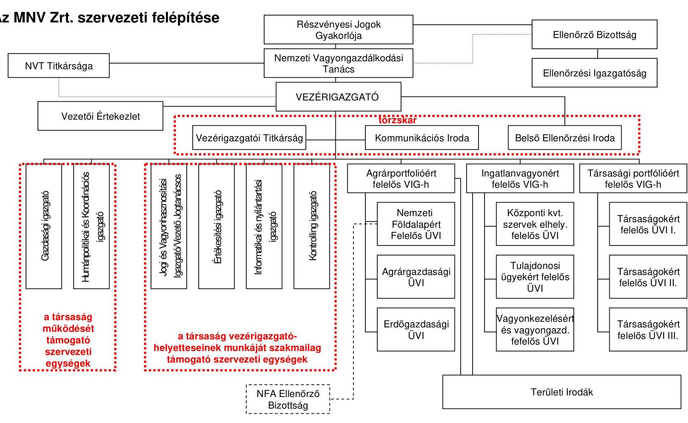

---

2008. december 31-ei állapot

# Az MNV Zrt. szervezeti felépítése 

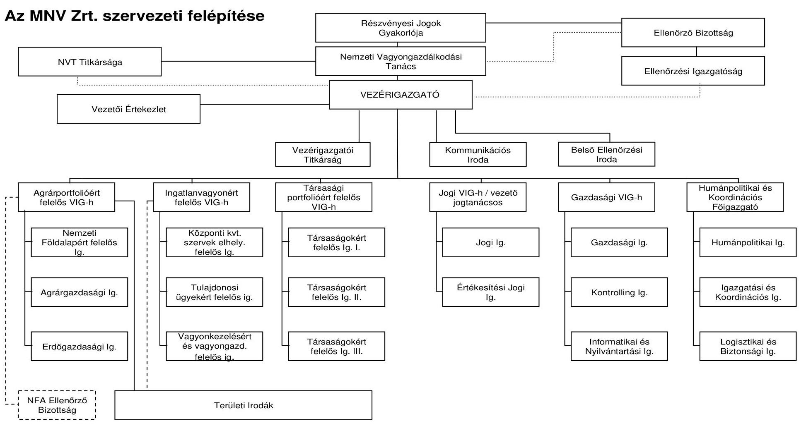

---

# Pénzügyminisztériumi vélemény az ÁSZ 2. sz. jelentéstervezetére a Vtv. megalkotásának előzményeiről és az új szabályozás eredményeiről ${ }^{1}$ 

Az állami vagyonnal való gazdálkodás terén meglevő komoly hiányosságok, a széttagolt, az egyes vagyonelem csoportokra nézve más-más elvi alapon kialakított szabályozásból, szervezeti struktúrából, az állami vagyon hasznosításával/használatával kapcsolatos bevételek és kiadások nyomon követhetőségének a hiányából stb. adódó problémák miatt új állami vagyontörvény mielőbbi bevezetését az ÁSZ is egyre erőteljesebben sürgette az elmúlt években.

Tény, hogy a rendkívül erőltetett ütemű jogalkotói szakasz, a jelentősen lerövidült átállási időszak számos jogosnak ítélhető kritikát alapoz meg. Ugyanakkor e bírálatok kapcsán mindenképpen mérlegelni kell azt is, hogy:

- a fokozatos bevezetés mindig az új rend lassú eróziójának, az eredeti változtatási elképzelések menet közbeni elsikkadásának a kockázatát rejti magában, ezért ha valóban komoly a szándék az érdemi változtatásokra, azt mindenképpen indokolt a lehető legrövidebb idő alatt végrehajtani, továbbá
- minden hasonló horderejű változásnál szükségképpen kell bizonyos türelmi idő is, bármilyen alaposan előkészített is, egyetlen törvénytől nem várható el, hogy - a hosszú évtizedek során kialakult jogi szabályozás és gyakorlat után - egy fordulónappal minden alapjaiban megváltozzon.

Évtizedeken keresztül nélkülözhettük például úgy az egységes állami vagyonkatasztert, hogy közben az állami vagyon arányait tekintve elveszítette a (túl)súlyát, meghatározó szerepét, döntő hányada privatizálásra, értékesítésre, különböző törvények alapján, más módon „újraelosztásra" került (pl. önkormányzatok, társadalmi szervezetek, egyházak között).

Ehhez képest az új vagyonkezelő szervezetnek felróják a bírálói, hogy nem tudta egyetlen fordulónappal egy teljesen új egységes informatikai rendbe integrálni a jogelődök merőben eltérő alapokon nyugvó nyilvántartásait úgy, hogy közben - értelemszerűen - vezetnie kell (és ma is vezeti) a korábbiakat is.

Paradox módon a vagyontörvény hatályba lépését követően a transzparencia, a hatékonyság, számon kérhetőség, stb. javulását éppen a feltárt problémák sokasága bizonyítja. Ennek kapcsán - az átállás gondjaitól eltekintve, azokat nem kicsinyítve - mérlegelésre javasoljuk azt a szempontot is, hogy:

- az új egységes jogi szabályozásnak, a tulajdonosi joggyakorlás új rendjének, az állami vagyon hasznosításával kapcsolatos ellenőrzési és beszámolási rendnek köszönhetően, részben azért is tűnik problémásabbnak az állami vagyon új rend szerinti kezelése, hasznosítása, mert

[^0]
[^0]:    ${ }^{1}$ A Pénzügyminisztérium szakállamtitkárának a jelentéstervezethez tett - a Vtv. megalkotása előzményeivel, illetve körülményeivel, az új szabályozás eredményeivel kapcsolatos - észrevétele

---

- felszínre kerültek mindazok az ellentmondások, visszásságok, stb., amelyek korábban is léteztek, csak éppen, pl. a korábbi jogi szabályozásból, szervezeti struktúrából, beszámolási- és ellenőrzési rendből adódóan, nem kerültek, kerülhettek a figyelem középpontjába, sőt
- azt is indokolt figyelembe venni, hogy a vagyontörvény számos területen csak egy példát említve - a Nemzeti Földalapot illetően nem módosította alapjaiban a korábbi jogi szabályozást, az MNV Zrt. az NFA-ra kialakított korábbi szabályozási közegben és alapvetően a megszűnt vagyonkezelő szervezet gyakorlatát folytatva gazdálkodik ezen állami vagyonelemekkel;
- fontos továbbá - éppen a transzparencia tekintetében - az, hogy a Kincstári Vagyoni Igazgatóság és a Nemzeti Földalapkezelő Szervezet tevékenysége összességének az átfogó, illetve konkrét tranzakcióinak az egyedi vizsgálatára, figyelemmel kísérésére - olyan mélységben, mint ahogyan most az új vagyonkezelő szervezetnél történik - nem, vagy csak korlátozottan kerülhetett sor, miután e szervezeteknél nem volt könyvvizsgáló és nem működött a vagyontörvény szerinti Ellenőrző Bizottság sem.

A vagyontörvény megalkotásának előzményeinél - a Jelentésben foglaltakon túl - figyelemmel kell lenni a következőkre is:
A Kormány reformelképzeléseinek az egyik fontos elemét jelentő, egységes új állami vagyontörvény megalkotását több évet felölelő előzetes szakmai munkák előzték meg. Ezeket - majd a 2005-2006. évben lefolytatott (esetenként a később kialakult koncepciót tekintve utólag nem feltétlenül szükséges és indokolt, nem is minden esetben a valóban érdemi kérdésekre irányuló) szakmai és politikai vitákat - követően a törvény szakmai előkészítő szakasza 2006. év végén zárult le.
A) Az első - a vagyontörvény legfontosabb alapelemeit tartalmazó, egyeztetési/elfogadási/végrehajtási menetrenddel is kiegészült - véglegesnek szánt koncepcionális javaslatot a miniszterelnök vezetésével 2007. január 23-án lefolytatott politikai egyeztetés után, a Gazdasági Kabinet a 2007. január 29-ei ülésén tárgyalta.
B) Ezt követően került benyújtásra a koncepció a Kormány 2007. január 31-i ülésére azzal, hogy azt - a Kormány általi elfogadását követően széleskörű társadalmi és szakmai vitára is kell bocsátani. Az előterjesztés tartalmazta az állami tulajdonú vagyonnal való gazdálkodást új alapokra helyező törvényi szabályozásra való - fél éves időtartamra tervezett - átállással, az állami vagyonkezelés és hasznosítás új szervezeti rendszerének a kialakításával összefüggő egyes 2007. évi feladatokról, intézkedésekről szóló Kormányhatározat tervezetét is.

Utóbbi, igen feszes, konkrét határidők kitűzésével és a felelősök megjelölésével írta volna elő az új szabályozásra való átállást megelőzően, annak előkészítéseként:

- az állami részesedéssel működő gazdasági társaságok felülvizsgálatának elvégzését, és a portfolióvagyon jövőbeli összetételére a javaslat kidolgozását;

---

- a közfeladat-ellátás infrastrukturális feltételeinek optimális kialakítása, a rendelkezésre álló erőforrások minél hatékonyabb felhasználása érdekében a központi költségvetési szervek által használt ingatlanállománynak, hasznosítása módjának, az egyes szervek által ellátott közfeladathoz szükséges ingatlankörnek a tételesen felmérését;
- az állami vagyonkezelés új szervezeti kereteinek kialakításához az akkori vagyonkezelő intézmények (Kincstári Vagyoni Igazgatóság, Nemzeti Földalapkezelő Szervezet, Állami Privatizációs és Vagyonkezelő Zrt.) szervezeti átvilágításának, feladataik felmérésének elvégzését.
A) A Kormány az előterjesztést végül - tényszerűen - nem tárgyalta, így az abban előirányzott előkészítő munkákra, illetve a tervezett társadalmi vitákra, szakmai egyeztető fórumok megtartására sem került sor.
B) A jogalkotói munkára rendelkezésre álló - eleve igen szűkre szabott időt jelentősen lerövidítette az a háttérben folyó egyeztetési folyamat is, amelynek során megállapodás született a tartós állami tulajdonban tartandó, stratégiai fontosságú, vagy más okokból e körbe sorolandó állami cégekről. Ezen egyeztetés ideje alatt az új törvény koncepciójának az egyeztetési folyamata gyakorlatilag leállt.
C) A törvénnyel kapcsolatos - sok tekintetben megalapozott - bírálatok részben erre is visszavezethetők, másrészt arra is, hogy az eredetileg elképzelthez képest néhány - de mindenképpen érdemi módosulást jelentő - elemében új alapokra helyezett koncepció törvényi megjelenítésére, az eredeti konstrukcióra kialakított jogszabálytervezet érdemi átdolgozására, a szükséges előzetes egyeztetések lefolytatására gyakorlatilag alig néhány hét alatt került sor.
D) Az állami vagyonnal kapcsolatos tulajdonosi joggyakorlást érintően a kettős szerepkörű Nemzeti Vagyongazdálkodási Tanács és Ellenőrző Bizottság „életre hívása", egyidejűleg a Kormány és az állami vagyon felügyeletéért felelős miniszter hatáskörének minden korábbi szabályozáshoz képest érdemi leszűkítése. A központi költségvetési szervek korábbi jogosítványainak a megvonása, a későbbi végrehajtás során nem csak állandó értelmezési problémákat hozott felszínre, de a központi költségvetési szervek körében komoly ellenállást, feszültségeket is kiváltott a vagyontörvénnyel és az új állami vagyonkezelő szervezettel szemben egyaránt.

Ez utóbbiak közül megemlíthető a központi költségvetési szervek ingatlanhasználatát új alapokra helyező - eredetileg fokozatosan, több lépcsőben, az általános elvek tisztázását, a szükséges műszaki állapotfelmérést, stb. követően, legkorábban a 2008. évet követően bevezetésre tervezett - (bérleti, vagyonkezelési) díjfizetés minden előkészítés, felkészülés nélküli, 2009-ben törvénymódosítással meg is szüntetett kötelező előírása. E körbe sorolható az a törvényi rendelkezés is, amely a vagyontörvény hatályba lépésével azonnal megszüntette a központi költségvetési szerveknek a társaságok feletti vagyonkezelési jogát, miközben sem a még létező ÁPV Zrt., sem a jogutód MNV Zrt. nem volt felkészülve az állami társaságok átvételére.

---

A benyújtott - az eredeti elképzelésekhez képest is
 már jelentősen átdolgozott törvénytervezethez tömegével benyújtott egyéni képviselői, majd bizottsági módosító indítványok nyomán a törvénytervezet még a parlamenti szakaszban is jelentősen módosult.

Így például a parlamenti szakaszban:

- a Nemzeti Földalappal kapcsolatos további garanciális szabályok épültek be a törvényszövegbe;
- képviselői módosító indítványra kerültek be a pártingatlanok jövőbeni sorsát rendező szabályok;
- az OÉT munkavállalói oldalának kifogása nyomán kerültek átemelésre (bizottsági módosító indítvánnyal) a törvényszövegbe a privatizációs törvényből a kedvezményes privatizációs technikák (pl. vezetői és munkavállalói kivásárlás, MRP stb.) alkalmazhatóságát biztosító előírások;
- kapcsolódó módosító indítvány alapján kerültek beépítésre a kisebbségi részesedéseket differenciáltabb szabályok alá vonó - azóta már módosított rendelkezések (a kisebbségi részesedés is fenntartható, ha annak objektív oka van, egyéb esetekben viszont a különböző más módokon szerzett kisebbségi részesedések értékesítését a megszerzésüktől számított egy éven belül el kell indítani);
- a benyújtott normaszöveg még jelentősen leszűkítette azon állami cégek körét, amelyeknél igazgatóságot kell/lehet működtetni. Koherencia keretében került pontosításra, hogy csak a kizárólagos vagy többségi állami részesedésű zártkörűen működő részvénytársaságnál érvényes a szabály, hogy igazgatóság választására csak abban az esetben kerül sor, amennyiben ezt a társaság jelentősége, mérete, működésének jellege indokolja, illetve ezzel összhangban került pontosításra, hogy a felügyelő bizottság létrehozása csak többségi állami tulajdonú gazdasági társaságnál kötelező;
- a benyújtott normaszöveghez képest jelentősebben módosultak az állami vagyon ingyenes tulajdonba adásának szabályai is, illetve
módosult (kiegészült) a törvény mellékletében felsorolt tartós állami tulajdonú cégek listája is, egyes esetekben a tartós állami részesedéshányad mértéke is változott (nőtt).

ÁSZ vélemény: a PM tájékoztatója felvázolja a vagyontörvény előkészítésének történetét, a céljait, az eredetileg tervezett egyeztetés menetét és bevezetésének ütemezését és az elfogadott törvény meglévő hibáinak okait, a törvény jelenlegi és várható jövőbeni pozitív hatásait. Az ÁSZ jelentéstervezete a ténylegesen elfogadott törvény bevezetésének hatásáról, a vizsgált időszakra vonatkozó ellenőrzési megállapítások alapján készült.

---

# Tanúsítványok

---

# Tanúsítványok jegyzéke 

1. sz. tanúsítvány Az állami vagyonnal kapcsolatos bevételek és kiadások 2008. évben
2. sz. tanúsítvány Az MNV Zrt. rábízott vagyon változása 2008. évben összesített kimutatás
3. sz. tanúsítvány Az MNV Zrt. rábízott vagyon változása a tranzakciók alapján 2008. évben
4. sz. tanúsítvány Hasznosításra átengedett társaságok
5. sz. tanúsítvány Az MNV Zrt. saját tőkével csökkentett forrásainak alakulása 2008. évben
6. sz. tanúsítvány Az MNV Zrt. saját vagyonának eszközállomány változása 2008. évben
7. sz. tanúsítvány Az MNV Zrt. saját vagyona forrásösszetételének változása 2008. évben
8. sz. tanúsítvány Az MNV Zrt. működéséhez kapcsolódó anyagjellegű ráfordítások alakulása 2008. évben
9. sz. tanúsítvány Az MNV Zrt. átlagos állományi létszámának alakulása 2008. évben
10. sz. tanúsítvány Az MNV Zrt. állományi létszám változása 2008. évben
11. sz. tanúsítvány Az MNV Zrt. működésével kapcsolatos személyi jellegű ráfordítások alakulása 2008. évben
12. sz. tanúsítvány Az MNV Zrt. munkavállalóinak beosztásonkénti átlagkeresete 2008. évben
13. sz. tanúsítvány Az MNV Zrt. 2008. évi forrásallokációja a felhasználás célja szerint
14. sz. tanúsítvány Az MNV Zrt. portfóliójába tartozó társaságok egyes gazdálkodási adatainak alakulása 2008. évben
15. sz. tanúsítvány A szervezeti átalakulással összefüggésben indult, befejezett munkaügyi perek
16. sz. tanúsítvány A szervezeti átalakulással összefüggésben indult és folyamatban lévő munkaügyi perek

---

Magyar Államkincstár Nemzeti Vagyon Éjszámolások Osztálya

A. 1. szám

|  Cím
cím | Al-ním
cím | Jog-
cím | Cím nét | Al-ním
nét | Jog-
cím
csíp.
nét | XLIII. AZ ÁLLAMI VAGYONNAL
KAPCSOLATOS BEVÉTELEK | 2008. évi rendei
ellévényes | Módosítás | 2008. évi módosított
ellévényes | 2008.1-XII. hó | Töljesítés
N-ben  |
| --- | --- | --- | --- | --- | --- | --- | --- | --- | --- | --- | --- |
|  1 |  |  |  |  |  | Az állami vagyonnal kapcsolatos bevételek: |  |  |  |  |   |
|   |  |  |  |  |  | Értékesítési bevételek | 40 800 500 000,0 | 0,0 | 40 800 500 000,0 | 17 473 881 938 | 42,8%  |
|   |  |  |  |  |  | Ingatlan értékesítésből származó bevételek | 40 550 500 000 |  | 40 550 500 000 | 17 092 029 661 | 42,1%  |
|   |  |  |  |  |  | Tervefésé: értékesítésből származó bevételek | 7 257 600 000 |  | 7 257 600 000 | 4 279 247 980 | 59,0%  |
|   |  |  |  |  |  | Kormányzati ingatlanok értékesítéséből származó bevételek | 10 000 000 000 |  | 10 000 000 000 | 0 | 0,0%  |
|   |  |  |  |  |  | Egyéb ingatlanok értékesítésből származó bevételek | 5 292 900 000 |  | 5 292 900 000 | 12 812 782 061 | 389,1%  |
|   |  |  |  |  |  | Egyéb tárgyi eszköz értékesítésből származó bevételek | 250 000 000 |  | 250 000 000 | 381 852 277 | 152,7%  |
|   |  |  |  |  |  | Hasznosítási bevételek | 55 542 600 000,0 | 0,0 | 55 542 600 000,0 | 44 975 516 338 | 81,0%  |
|   |  |  |  |  |  | Bérleti díjak | 23 898 800 000 | 0,0 | 23 898 800 000 | 4 610 912 000 | 19,3%  |
|   |  |  |  |  |  | Haszonkérleti díj | 5 500 900 000 |  | 5 500 900 000 | 4 228 150 000 | 120,8%  |
|   |  |  |  |  |  | A kézponti költségvetési szervek által fizetett ingatlan bérleti díj | 20 000 000 000 |  | 20 000 000 000 | 0 | 0,0%  |
|   |  |  |  |  |  | Egyéb bérleti díj | 598 800 000 |  | 598 800 000 | 382 762 000 | 96,0%  |
|   |  |  |  |  |  | Vagyonkezelői díj | 555 400 000 |  | 555 400 000 | 2 741 796 779 | 771,5%  |
|   |  |  |  |  |  | Osztalékbevételek | 8 780 000 000 |  | 8 780 000 000 | 55 091 563 000 | 399,7%  |
|   |  |  |  |  |  | Koncessziós díjak | NED | 22 508 400 000 | 0,0 | 22 508 400 000 | 2 531 444 559  |
|   |  |  |  |  |  | Személygépkocsi koncessziós díj | 1 768 000 000 |  | 1 768 000 000 | 1 492 036 454 | 85,5%  |
|   |  |  |  |  |  | Járulékos koncesszióból származó díj | 20 762 400 000 |  | 20 762 400 000 | 1 039 009 605 | 5,0%  |
|   |  |  |  |  |  | Vegyes bevételek | 90 000 000,0 | 0,0 | 90 000 000,0 | 9 296 395 677,0 | 10329,3%  |
|   |  |  |  |  |  | Egyéb bevételek | 90 000 000 |  | 90 000 000 | -132 436 955 | -147,3%  |
|   |  |  |  |  |  | Nemzeti Földalap 2007. évi maradványa |  |  |  | 9 428 832 652 |   |
|   |  |  |  |  |  | ÖSSZESÉN: | 96 433 100 000 | 0 | 96 433 100 000 | 71 745 793 953 | 74,4%  |

---

Magyar Államkincstár Nemzeti

---

2. sz. tanúsítvány V-2016-0008-2009. sz. jelentőshez

|  Megnevezés |  |  |  |  |  |  |  |  |  |  |  |  |  |  |  |  |  |  |  |  |  |  |  |  |  |  |  |  |  |  |  |  |  |   |
| --- | --- | --- | --- | --- | --- | --- | --- | --- | --- | --- | --- | --- | --- | --- | --- | --- | --- | --- | --- | --- | --- | --- | --- | --- | --- | --- | --- | --- | --- | --- | --- | --- | --- | --- | --- | --- |
|   |  |  |  |  |  |  |  |  |  |  |  |  |  |  |  |  |  |  |  |  |  |  |  |  |  |  |  |  |  |  |  |  |  |  |  |   |
|   |  |  |  |  |  |  |  |  |  |  |  |  |  |  |  |  |  |  |  |  |  |  |  |  |  |  |  |  |  |  |  |  |  |  |  |   |
|  A. |  |  |  |  |  | 

 |  |  |  |  |  |  |  |  |  |  |  |  |  |  |  |  |  |  |  |  |  |  |  |  |  |  |  |  |  |   |
|   |  |  |  |  |  |  |  |  |  |  |  |  |  |  |  |  |  |  |  |  |  |  |  |  |  |  |  |  |  |  |  |  |  |  |  |   |
|  I. |  |  |  |  |  |  |  |  |  |  |  |  |  |  |  |  |  |  |  |  |  |  |  |  |  |  |  |  |  |  |  |  |  |  |  |   |
|   |  |  |  |  |  |  |  |  |  |  |  |  |  |  |  |  |  |  |  |  |  |  |  |  |  |  |  |  |  |  |  |  |  |  |  |   |
|   |  |  |  |  |  |  |  |  |  |  |  |  |  |  |  |  |  |  |  |  |  |  |  |  |  |  |  |  |  |  |  |  |  |  |  |   |
|   |  |  |  |  |  |  |  |  |  |  |  |  |  |  |  |  |  |  |  |  |  |  |  |  |  |  |  |  |  |  |  |  |  |  |  |   |
|   |  |  |  |  |  |  |  |  |  |  |  |  |  |  |  |  |  |  |  |  |  |  |  |  |  |  |  |  |  |  |  |  |  |  |  |   |
|   |  |  |  |  |  |  |  |  |  |  |  |  |  |  |  |  |  |  |  |  |  |  |  |  |  |  |  |  |  |  |  |  |  |  |  |   |
|   |  |  |  |  |  |  |  |  |  |  |  |  |  |  |  |  |  |  |  |  |  |  |  |  |  |  |  |  |  |  |  |  |  |  |  |   |
|   |  |  |  |  |  |  |  |  |  |  |  |  |  |  |  |  |  |  |  |  |  |  |  |  |  |  |  |  |  |  |  |  |  |  |  |   |
|   |  |  |  |  |  |  |  |  |  |  |  |  |  |  |  |  |  |  |  |  |  |  |  |  |  |  |  |  |  |  |  |  |  |  |  |   |
|   |  |  |  |  |  |  |  |  |  |  |  |  |  |  |  |  |  |  |  |  |  |  |  |  |  |  |  |  |  |  |  |  |  |  |  |   |
|   |  |  |  |  |  |  |  |  |  |  |  |  |  |  |  |  |  |  |  |  |  |  |  |  |  |  |  |  |  |  |  |  |  |  |  |   |
|   |  |  |  |  |  |  |  |  |  |  |  |  |  |  |  |  |  |  |  |  |  |  |  |  |  |  |  |  |  |  |  |  |  |  |  |   |
|   |  |  |  |  |  |  |  |  |  |  |  |  |  |  |  |  |  |  |  |  |  |  |  |  |  |  |  |  |  |  |  |  |  |  |  |   |
|   |  |  |  |  |  |  |  |  |  |  |  |  |  |  |  |  |  |  |  |  |  |  |  |  |  |  |  |  |  |  |  |  |  |  |  |   |
|   |  |  |  |  |  |  |  |  |  |  |  |  |  |  |  |  |  |  |  |  |  |  |  |  |  |  |  |  |  |  |  |  |  |  |  |   |
|   |  |  |  |  |  |  |  |  |  |  |  |  |  |  |  |  |  |  |  |  |  |  |  |  |  |  |  |  |  |  |  |  |  |  |  |   |
|   |  |  |  |  |  |  |  |  |  |  |  |  |  |  |  |  |  |  |  |  |  |  |  |  |  |  |  |  |  |  |  |  |  |  |  |   |
|   |  |  |  |  |  |  |  |  |  |  |  |  |  |  |  |  |  |  |  |  |  |  |  |  |  |  |  |  |  |  |  |  |  |  |  |   |
|   |  |  |  |  |  |  |  |  |  |  |  |  |  |  |  |  |  |  |  |  |  |  |  |  |  |  |  |  |  |  |  |  |  |  |  |   |
|   |  |  |  |  |  |  |  | 

 |  |  |  |  |  |  |  |  |  |  |  |  |  |  |  |  |  |  |  |  |  |  |  |  |  |  |  |  |   |
|   |  |  |  |  |  |  |  |  |  |  |  |  |  |  |  |  |  |  |  |  |  |  |  |  |  |  |  |  |  |  |  |  |  |  |  |   |
|   |  |  |  |  |  |  |  |  |  |  |  |  |  |  |  |  |  |  |  |  |  |  |  |  |  |  |  |  |  |  |  |  |  |  |  |   |
|   |  |  |  |  |  |  |  |  |  |  |  |  |  |  |  |  |  |  |  |  |  |  |  |  |  |  |  |  |  |  |  |  |  |  |  |   |
|   |  |  |  |  |  |  |  |  |  |  |  |  |  |  |  |  |  |  |  |  |  |  |  |  |  |  |  |  |  |  |  |  |  |  |  |   |
|   |  |  |  |  |  |  |  |  |  |  |  |  |  |  |  |  |  |  |  |  |  |  |  |  |  |  |  |  |  |  |  |  |  |  |  |   |
|   |  |  |  |  |  |  |  |  |  |  |  |  |  |  |  |  |  |  |  |  |  |  |  |  |  |  |  |  |  |  |  |  |  |  |  |   |
|   |  |  |  |  |  |  |  |  |  |  |  |  |  |  |  |  |  |  |  |  |  |  |  |  |  |  |  |  |  |  |  |  |  |  |  |   |
|   |  |  |  |  |  |  |  |  |  |  |  |  |  |  |  |  |  |  |  |  |  |  |  |  |  |  |  |  |  |  |  |  |  |  |  |   |
|   |  |  |  |  |  |  |  |  |  |  |  |  |  |  |  |  |  |  |  |  |  |  |  |  |  |  |  |  |  |  |  |  |  |  |  |   |
|   |  |  |  |  |  |  |  |  |  |  |  |  |  |  |  |  |  |  |  |  |  |  |  |  |  |  |  |  |  |  |  |  |  |  |  |   |
|   |  |  |  |  |  |  |  |  |  |  |  |  |  |  |  |  |  |  |  |  |  |  |  |  |  |  |  |  |  |  |  |  |  |  |  |   |
|   |  |  |  |  |  |  |  |  |  |  |  |  |  |  |  |  |  |  |  |  |  |  |  |  |  |  |  |  |  |  |  |  |  |  |  |   |
|   |

---

2. sz. tanúsítvány V-2016-02008-2009. sz. jelentéshez

|  2. Egyéb vagyonkezelő | 0 | 0 | 0 | 0 | 0 | 0  |
| --- | --- | --- | --- | --- | --- | --- |
|  3. Közvetlenül kezelt rábízott vagyon (£42-46) | 0 | 0 | 0 | 0 | 415 | 415  |
|  3.1. Anyagok | 0 | 0 | 0 | 0 | 419 | 419  |
|  3.2. Ertékesítési célú immateriális javak | 0 | 0 | 0 | 0 | 0 | 0  |
|  3.3. Ertékesítési célú ingatlanok | 0 | 0 | 0 | 0 | 0 | 0  |
|  3.4. Egyéb értékesítési célú eszközök, áruk | 0 | 0 | 0 | 0 | 0 | 0  |
|  3.5. Készletekre adott előlegek | 0 | 0 | 0 | 0 | 0 | 0  |
|  8. KÖVETELÉSEK (£48-53) | 504 991 | 345 343 | 329 605 | 520 728 | 751 948 | 409 047  |
|  1. Központi költségvetési szerv | 493 747 | 345 343 | 329 605 | 493 747 | 253 267 | 521  |
|  2. Közvetlenül kezelt rábízott vagyon (£51-54) | 11 244 | 0 | 0 | 26 082 | 498 681 | 408 426  |
|  2.1. Követelések áruszállításból és szolgáltatásnyújtásból | 5 012 | 33 543 | 35 518 | 3 039 | 38 911 | 41 279  |
|  2.2. Váltókövetelések | 0 | 0 | 0 | 0 | 0 | 0  |
|  2.3. Vagyonkezelésbe adott eszközökkel kapcsolatos | 0 | 0 | 0 | 0 | 26 036 | 26 036  |
|  2.4. Egyéb követelések | 6 232 | 311 800 | 294 089 | 22 543 | 433 734 | 367 147  |
|  III. ÉRTÉKPAPÍROK (£56-58) | 30 308 | 842 665 | 842 662 | 30 311 | 7 054 | 4 867  |
|  1. Központi költségvetési szerv | 25 358 | 842 665 | 842 662 | 25 358 | 3 951 | 29  |
|  2. Egyéb vagyonkezelő | 0 | 0 | 0 | 0 | 0 | 0  |
|  3. Közvetlenül kezelt rábízott vagyon (59+62) | 4 950 | 842 665 | 842 662 | 4 953 | 3 103 | 4 838  |
|  3.1. Forgatási célú állami tulajdonú részesedések (60) | 4 889 | 842 665 | 842 662 | 4 892 | 3 100 | 4 838  |
|  - Többségi tulajdonban lévő részesedés | 2 782 | 842 665 | 842 662 | 2 785 | 3 100 | 2 745  |
|  - Kisebbségi tulajdonban lévő részesedés | 2 107 | 842 665 | 842 662 | 2 107 | 0 | 2 093  |
|  3.2. Forgatási célú hitelviszonyt megtestesítő értékpapír | 61 | 61 | 61 | 61 | 0 | 64  |
|  IV. PÉNZESZKÖZÖK (£64-65) | 499 681 | 103 995 | 78 102 | 525 574 | 740 733 | 574 949  |
|  1. Központi költségvetési szerv | 499 093 | 498 093 | 498 093 | 498 093 | 636 737 | 498 846  |
|  2. Közvetlenül kezelt rábízott vagyon (66+67) | 588 | 103 995 | 78 102 | 26 481 | 103 995 | 78 103  |
|  2.1. Penziók, csekélyek | 0 | 0 | 0 | 0 | 0 | 0  |
|  2.2. Bankbetétek | 588 | 103 995 | 78 102 | 26 481 | 103 995 | 78 103  |
| 

 V. KÖLTSÉGVETÉSI SZERVEK EGYÉB AKTÍV PÉNZÜGYI | 84 367 | 84 367 | 84 367 | 84 367 | 125 088 | 84 239  |
|  C. AKTÍV IDŐBELI ELHATÁROLÁSOK (£70-72) | 5 | 3 996 | 0 | 4 001 | 9 440 | 5 179  |
|  1. Készletek aktív időbeli elhatárolása | 0 | 3 996 | 0 | 3 996 | 9 440 | 5 179  |
|  2. Költségek, ráfordítások aktív időbeli elhatárolása | 5 | 5 | 0 | 5 | 0 | 1  |
|  3. Halasztott ráfordítások | 0 | 0 | 0 | 0 | 0 | 0  |
|  ESZKÖZÖK (AKTIVAK) ÖSSZESEN (1+37+69) | 14 558 986 | 1 310 394 | 1 287 599 | 14 601 781 | 2 657 028 | 1 571 498  |

Budapest, 2009. augusztus 12

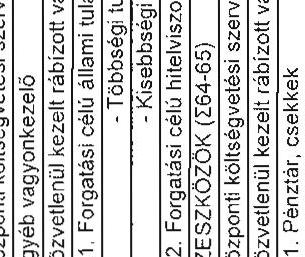

---

## 3. sz. tanúsítvány a V-2016-13/1/2008-2009. sz. jelentéshez

|  Megnevezés | Nyitó adatok
2008. 01. 01. |  |  |  |  |  |  |  |  |  |  |  |  |  |  |  |  |  |  |  |  |  |  |  |  |  |  |  |  |  |  |  |  |  |  |  |  |  |  |  |  |  |  |  |  |  |  |  |  |  |  |  |  |  |  |  |  |  |  |  |  |  |  |  |  |  |  |  |  |  |  |  |  |  |  |  |  |  |  |  |  |  |  |  |  |  |  |  |  |  |  |  |  |  |  |  |  |  |  |  |  |  |  |  |  |  |  |  |  |  | 

---

# 3. sz. tanúsítvány

## a V-2016-131/2008-2009. sz. jelentéshez

|  3.4. Egyéb értékesítés szőlő eszközök, kisk | 0 | 0 | 0 | 0 | 0 | 0 | 0  |
| --- | --- | --- | --- | --- | --- | --- | --- |
|  3.5. Készletek a szőlő előállításhoz | 0 | 0 | 0 | 0 | 0 | 0 | 0  |
|  1. 6.  | 0 | 0 | 0 | 0 | 0 | 0 | 0  |

---

|  Hasznosításra átengedett társaságok 2008.XII.31-i állapot |  |  |  |   |
| --- | --- | --- | --- | --- |
|   | Társaság megnevezése | Hasznosító
szervezet | Szerződés száma, kelte | Szerződéskötés alapja  |
|  1 | Energia Központ Kht. | KHEM | SZT-29133, 2008.09.12 | 15/2008. (VII.11.) sz. RJGY hat.  |
|  2 | Magyar Közút Állami Közútkezelő, Fejlesztő, Műszaki és Információs Kht. | KHEM | SZT-29137, 2008.09.12 | 15/2008. (VII.11.) sz. RJGY hat.  |
|  3 | ITDH Magyar Befektetési és Kereskedelemfejlesztési Kht. | NFGM | SZT-29301, 2008.10.15 | 15/2008. (VII.11.) sz. RJGY hat.  |
|  4 | Nemzeti Infrastruktúrafejlesztő Zrt. | KHEM | SZT-29136, 2008.09.12 | 15/2008. (VII.11.) sz. RJGY hat.  |
|  5 | Bányavagyon Hasznosító Kht. | KHEM | SZT-29132, 2008.09.12 | 15/2008. (VII.11.) sz. RJGY hat.  |
|  6 | MÁV Magyar Államvasutak Zrt. | KHEM | SZT-29135, 2008.09.12 | 15/2008. (VII.11.) sz. RJGY hat.  |
|  7 | Közlekedéstudományi Intézet Kht. | KHEM | SZT-29134, 2008.09.12 | 15/2008. (VII.11.) sz. RJGY hat.  |
|  8 | Győr-Sopron-Ebenfurti Vasút Zrt. | KHEM | SZT-29138, 2008.09.12 | 15/2008. (VII.11.) sz. RJGY hat.  |
|  9 | Tartalékgazdálkodási Kht. | FVM | SZT-28936 | 14/2008. (VI. 24.) sz. RJGY hat.  |
|  10 | CONCORDIA Közraktár Kereskedelmi Zrt. | FVM | SZT-28935 | 14/2008. (VI. 24.) sz. RJGY hat.  |
|  11 | HM ARMCOM Zrt. | HM | SZT-28425, 2008.05.29 | 87/2008. (II.27.) sz. NVT hat.  |
|  12 | HM CURRUS Zrt. | HM | SZT-28425, 2008.05.29 | 87/2008. (II.27.) sz. NVT hat.  |
|  13 | HM ARZENÁL Zrt. | HM | SZT-28425, 2008.05.29 | 87/2008. (II.27.) sz. NVT hat.  |
|  14 | HM EI Zrt. | HM | SZT-28425, 2008.05.29 | 87/2008. (II.27.) sz. NVT hat.  |

---

|   | Társaság megnevezése | Hasznosító
szervezet | Szerződés száma, kelte | Szerződéskötés alapja  |
| --- | --- | --- | --- | --- |
|  15 | HM Honvéd Kulturális Szolgáltató Kht. | HM | SZT-28425, 2008.05.29 | 87/2008. (II.27.) sz. NVT hat.  |
|  16 | HM Zrínyi Kommunikációs Kht. | HM | SZT-28425, 2008.05.29 | 87/2008. (II.27.) sz. NVT hat.  |
|  17 | HM Térképészeti Kht. | HM | SZT-28425, 2008.05.29 | 87/2008. (II.27.) sz. NVT hat.  |
|  18 | HM Budapest Erdőgazdaság Zrt. | HM | SZT-28425, 2008.05.29 | 87/2008. (II.27.) sz. NVT hat.  |
|  19 | HM Verga Erdőgazdaság Zrt. | HM | SZT-28425, 2008.05.29 | 87/2008. (II.27.) sz. NVT hat.  |
|  20 | HM Kaszó Erdőgazdaság Zrt. | HM | SZT-28425, 2008.05.29 | 87/2008. (II.27.) sz. NVT hat.  |
|  21 | Állampusztai Mezőgazdasági és Kereskedelmi Kft. | BVOP | SZT-27978, 2008.05.23 | 8/2008.(IV.30.) sz. RJGY hat.  |
|  22 | Annamajori Mezőgazdasági és Kereskedelmi Kft. | BVOP | SZT-27978, 2008.05.23 | 8/2008.(IV.30.) sz. RJGY hat.  |
|  23 | Nagyfa-Alföld Mezőgazdasági és Vegyesipari Kft. | BVOP | SZT-27978, 2008.05.23 | 8/2008.(IV.30.) sz. RJGY hat.  |
|  24 | Pálhalmai Agrospeciál Mezőgazdasági Termelő, Értékesítő és Szolgáltató Kft. | BVOP | SZT-27978, 2008.05.23 | 8/2008.(IV.30.) sz. RJGY hat.  |
|  25 | Ábránd Ágynemű és Fehérneműgyártó Kft. | BVOP | SZT-27978, 2008.05.23 | 8/2008.(IV.30.) sz. RJGY hat.  |
|  26 | DUNA-PAPÍR Termelő, Kereskedelmi és Szolgáltató Kft. | BVOP | SZT-27978, 2008.05.23 | 8/2008.(IV.30.) sz. RJGY hat.  |
|  27 | Ipoly Cipőgyár Kft. | BVOP | SZT-27978, 2008.05.23 | 8/2008.(IV.30.) sz. RJGY hat.  |
|  28 | Kalocsai Konfekcióipari Kft. | BVOP | SZT-27978, 2008.05.23 | 8/2008.(IV.30.) sz. RJGY hat.  |
|  29 | Nostra Vegyesipari Kft. | BVOP | SZT-27978, 2008.05.23 | 8/2008.(IV.30.) sz. RJGY hat.  |

---

|   | Társaság megnevezése | Hasznosító
szervezet | Szerződés száma, kelte | Szerződéskötés alapja  |
| --- | --- | --- | --- | --- |
|  30 | Sopronkőhidai Szövő és Ruhaipari Kft. | BVOP | SZT-27978, 2008.05.23 | 8/2008.(IV.30.) sz. RJGY hat.  |
|  31 | Budapesti Faipari Termelő és Kereskedelmi Kft. (BUFA) | BVOP | SZT-27978, 2008.05.23 | 8/2008.(IV.30.) sz. RJGY hat.  |
|  32 | Duna-Mix Kft. | BVOP | SZT-27978, 2008.05.23 | 8/2008.(IV.30.) sz. RJGY hat.  |
|  33 | ESZA Kht. | SZMM | SZT-28457, 2008.06.10 | 165/2008. (III.26.) sz. NVT hat.  |
|  34 | Radioaktív Hulladékokat Kezelő Közhasznú Nonprofit Kft. | Országos Atomenergia
Hivatal | SZT-28462, 2008.06.10 | 165/2008. (III.26.) sz. NVT hat.  |
|  35 | Hungarofest Nemzeti Rendezvényszervező Kht. | OKM | SZT-28517, 2008.06.30 | 165/2008. (III.26.) sz. NVT hat.  |
|  36 | Nemzeti Kulturális Örökségvédelmi Kht. | OKM | SZT-28517, 2008.06.30 | 165/2008. (III.26.) sz. NVT hat.  |
|  37 | Magyar Nemzeti Filharmonikus Zenekar, Énekkar és Kottatár Kht. | OKM | SZT-28517, 2008.06.30 | 165/2008. (III.26.) sz. NVT hat.  |
|  38 | Honvéd Együttes Művészeti Nonprofit Kft. | OKM | SZT-28517, 2008.06.30 | 165/2008. (III.26.) sz. NVT hat.  |
|  39 | EDUCATIO Kht. | OKM | SZT-28517, 2008.06.30 | 165/2008. (III.26.) sz. NVT hat.  |
|  40 | Magyar Cirkusz és Varieté Kht. | OKM | SZT-28517, 2008.06.30 | 165/2008. (III.26.) sz. NVT hat.  |
|  41 | Nemzeti Táncszínház Kht. | OKM | SZT-28517, 2008.06.30 | 165/2008. (III.26.) sz. NVT hat.  |
|  42 | Művészetek Palotája Kulturális Szolgáltató Kft. | OKM | SZT-28517, 2008.06.30 | 165/2008. (III.26.) sz. NVT hat.  |
|  43 | Nemzeti Színház Zrt. | OKM | SZT-28517, 2008.06.30 | 165/2008. (III.26.) sz. NVT hat.  |
|  44 | OMSZ Légimentő Kht. | Országos Mentőszolgálat | SZT-27846, 2008.05.30 | 165/2008. (III.26.) sz. NVT hat.  |

---

|   | Társaság megnevezése | Hasznosító
szervezet | Szerződés száma, kelte | Szerződéskötés alapja  |
| --- | --- | --- | --- | --- |
|  45 | PROMEI Modernizációs és Euroatlanti Integrációs Projekt Iroda Kht. | NFGM | SZT-27559, 2008.05.30 | 165/2008. (III.26.) sz. NVT hat.  |
|  46 | VÁTI Kht. | NFGM | SZT-27559, 2008.05.30 | 165/2008. (III.26.) sz. NVT hat.  |
|  47 | Hitelintézeti Felszámoló Kht. | PSZÁF | SZT-28027, 2008.05.20 | 165/2008. (III.26.) sz. NVT hat.  |
|  48 | Design Terminál Kht. | Szabadalmi Hivatal | SZT-27553, 2008.04.28 | 165/2008. (III.26.) sz. NVT hat.  |
|  49 | Magyar Turizmus Zrt. | ÖM | SZT-28993, 2008.07.14 | 165/2008. (III.26.) sz. NVT hat.  |
|  50 | Hőgyes Endre Patika Bt. | Semmelweis Egyetem | SZT-28964, 2008.07.15 | 75/2008. (II.20.) sz. NVT hat.  |
|  51 | PMMF Politechnika Kutató, Tervező és Szolgáltató Kft. | Pécsi Tudományegyetem | SZT-28904, 2008.07.21 | 75/2008. (II.20.) sz. NVT hat.  |
|  52 | Építésügyi Minőségellenőrző Innovációs Kht. (EMI Kht.) | NFGM | SZT-29096, 2008.08.29 | 15/2008. (VII.11.) sz. RJGY hat.  |
|  53 | Human-Jövő
 2000 Egészségmegőrző és Oktatási Kht. | MEH | SZT-29078, 2008.11.28. | 15/2008. (VII.11.) sz. RJGY hatályú |
|  54 | Duna Múzeum Ingatlanfejlesztő Kft. | OKM | SZT/30340, 2008.12.03. | 746/2008. (XII.03.) sz. NVT hatályú |
|  55 | Hagyományok Háza Ingatlanfejlesztő Kft. | OKM | SZT/30340, 2008.12.03. | 746/2008. (XII.03.) sz. NVT hatályú |
|  56 | Nemzeti Filharmónia Ingatlanfejlesztési Kft. | OKM | SZT/30340, 2008.12.03. | 746/2008. (XII.03.) sz. NVT hatályú |
|  57 | Hallgatói Centrum Kht. | Nyíregyházi Főiskola | SZT-30645, 2008.12.22. | 75/2008. (II.20.) sz. NVT hatályú |

---

|   | Társaság megnevezése | Hasznosító szervezet | Szerződés száma, kelte | Szerződéskötés alapja  |
| --- | --- | --- | --- | --- |
|  1 | Bács-Kiskun Megyei Egészségbiztosítási Pénztár Zártkörűen Működő Részvénytársaság "v.a." | PM | SZT-28781, 2008.06.05 | 437/2008. (VI.17.) NVT sz. hatályú |
|  2 | Baranya Megyei Egészségbiztosítási Pénztár Zártkörűen Működő Részvénytársaság "v.a." | PM | SZT-28781, 2008.06.05 | 437/2008. (VI.17.) NVT sz. hatályú |
|  3 | Békés Megyei Egészségbiztosítási Pénztár Zártkörűen Működő Részvénytársaság "v.a." | PM | SZT-28781, 2008.06.05 | 437/2008. (VI.17.) NVT sz. hatályú |
|  4 | Borsod-Abaúj-Zemplén Megyei Egészségbiztosítási Pénztár Zártkörűen Működő Részvénytársaság "v.a." | PM | SZT-28781, 2008.06.05 | 437/2008. (VI.17.) NVT sz. hatályú |
|  5 | Buda és Környéke Egészségbiztosítási Pénztár Zártkörűen Működő Részvénytársaság "v.a." | PM | SZT-28781, 2008.06.05 | 437/2008. (VI.17.) NVT sz. hatályú |
|  6 | Csongrád Megyei Egészségbiztosítási Pénztár Zártkörűen Működő Részvénytársaság "v.a." | PM | SZT-28781, 2008.06.05 | 437/2008. (VI.17.) NVT sz. hatályú |
|  7 | Dél-Pest és Környéke Egészségbiztosítási Pénztár Zártkörűen Működő Részvénytársaság "v.a." | PM | SZT-28781, 2008.06.05 | 437/2008. (VI.17.) NVT sz. hatályú |
|  8 | Észak-Pest és Környéke Egészségbiztosítási Pénztár Zártkörűen Működő Részvénytársaság "v.a." | PM | SZT-28781, 2008.06.05 | 437/2008. (VI.17.) NVT sz. hatályú |
|  9 | Fejér Megyei Egészségbiztosítási Pénztár Zártkörűen Működő Részvénytársaság "v.a." | PM | SZT-28781, 2008.06.05 | 437/2008. (VI.17.) NVT sz. hatályú |
|  10 | Győr-Moson-Sopron Megyei Egészségbiztosítási Pénztár Zártkörűen Működő Részvénytársaság "v.a." | PM | SZT-28781, 2008.06.05 | 437/2008. (VI.17.) NVT sz. hatályú |
|  11 | Hajdú-Bihar Megyei Egészségbiztosítási Pénztár Zártkörűen Működő Részvénytársaság "v.a." | PM | SZT-28781, 2008.06.05 | 437/2008. (VI.17.) NVT sz. hatályú |
|  12 | Heves Megyei Egészségbiztosítási Pénztár Zártkörűen Működő Részvénytársaság "v.a." | PM | SZT-28781, 2008.06.05 | 437/2008. (VI.17.) NVT sz. hatályú |
|  13 | Jász-Nagykun-Szolnok Megyei Egészségbiztosítási Pénztár Zártkörűen Működő Részvénytársaság "v.a." | PM | SZT-28781, 2008.06.05 | 437/2008. (VI.17.) NVT sz. hatályú |
|  14 | Kelet-Pest és Környéke Egészségbiztosítási Pénztár Zártkörűen Működő Részvénytársaság "v.a." | PM | SZT-28781, 2008.06.05 | 437/2008. (VI.17.) NVT sz. hatályú |

---

|   | Társaság megnevezése | Hasznosító szervezet | Szerződés száma, kelte | Szerződéskötés alapja  |
| --- | --- | --- | --- | --- |
|  15 | Komárom-Esztergom Megyei Egészségbiztosítási Pénztár Zártkörűen Működő Részvénytársaság "v.a." | PM | SZT-28781, 2008.06.05 | 437/2008. (VI.17.) NVT sz. hatályú |
|  16 | Nógrád Megyei Egészségbiztosítási Pénztár Zártkörűen Működő Részvénytársaság "v.a." | PM | SZT-28781, 2008.06.05 | 437/2008. (VI.17.) NVT sz. hatályú |
|  17 | Somogy Megyei Egészségbiztosítási Pénztár Zártkörűen Működő Részvénytársaság "v.a." | PM | SZT-28781, 2008.06.05 | 437/2008. (VI.17.) NVT sz. hatályú |
|  18 | Szabolcs-Szatmár-Bereg Megyei Egészségbiztosítási Pénztár Zártkörűen Működő Részvénytársaság "v.a." | PM | SZT-28781, 2008.06.05 | 437/2008. (VI.17.) NVT sz. hatályú |
|  19 | Tolna Megyei Egészségbiztosítási Pénztár Zártkörűen Működő Részvénytársaság "v.a." | PM | SZT-28781, 2008.06.05 | 437/2008. (VI.17.) NVT sz. hatályú |
|  20 | Vas Megyei Egészségbiztosítási Pénztár Zártkörűen Működő Részvénytársaság "v.a." | PM | SZT-28781, 2008.06.05 | 437/2008. (VI.17.) NVT sz. hatályú |
|  21 | Veszprém Megyei Egészségbiztosítási Pénztár Zártkörűen Működő Részvénytársaság "v.a." | PM | SZT-28781, 2008.06.05 | 437/2008. (VI.17.) NVT sz. hatályú |
|  22 | Zala Megyei Egészségbiztosítási Pénztár Zártkörűen Működő Részvénytársaság "v.a." | PM | SZT-28781, 2008.06.05 | 437/2008. (VI.17.) NVT sz. hatályú |
|  23 | Balatoni Halászati Zrt. (részben vagyonkezelésben) | Balatoni Fejlesztési Tanács 32%, Agrárgazdasági Vagyonkezelő Kft. 8% | SZT/27250, 2008.02.20. | 723/2008. (XI.26.) NVT sz. hatályú |

Budapest, 2009. július 10.

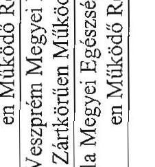

25.

24.

23. 2021. 06. 17. 2021.

---

Az MNV Zrt. saját tőkével csökkentett forrásainak alakulása 2008. évben

5. sz. tanúsítvány a V-2016-1311/2008-2009. sz. jelentéshez. Adatok e Ft-ban

|   | 2008.01.01-i nyitó |  | Növekedés | Csökkenés | 2008.12.31-i záró |   |
| --- | --- | --- | --- | --- | --- | --- |
|  E. Céltartalékok |  | 68 011 |  | 1 187 |  | 66 524  |
|  1. Céltartalék a várható kötelezettségekre |  | 68 011 |  | 1 187 |  | 66 524  |
|  2. Céltartalék a jövőbeni kötelezettségekre |  |  |  |  |  |   |
|  E.1. Tartalékok |  | 464 487 | 218 529 |  |  | 683 016  |
|  F. Kötelezettségek |  | 680 829 | 235 323 | 212 508 | 624 862 | 703 644  |
|  1. Hátrasorolt kötelezettségek |  |  |  |  |  |   |
|  II. Hosszú lejáratú kötelezettségek |  | 390 000 | 7 839 | 174 387 |  | 223 452  |
|  1. Központi költségvetési szerv hosszú lejáratú kötelezettsége |  | 109 893 | 2 666 |  |  | 112 559  |
|  II.1. Hosszú lejáratra kapott kölcsönök |  |  |  |  |  | 0  |
|  II.2. Átváltozatható kötvények |  |  | 1 | 1 |  | 0  |
|  II.3. Tartozások kötvénykibocsátásból |  | 161 891 |  | 161 891 |  | 0  |
|  II.4. Beruházási és fejlesztési hitelek |  |  |  |  |  | 0  |
|  II.5. Egyéb hosszú lejáratú hitelek |  | 17 494 |  | 12 495 |  | 4 999  |
|  II.6. Egyéb hosszú lejáratú kötelezettségek |  | 100 722 | 5 172 |  |  | 105 894  |
|  III. Rövid lejáratú kötelezettségek |  | 175 120 | 227 484 | 1 194 |  | 401 410  |
|  1. Központi költségvetési szerv rövid lejáratú kötelezettsége |  | 157 399 | 37 228 |  |  | 194 627  |
|  III.1. Rövid lejáratú kölcsönök |  |  |  |  |  | 0  |
|  III.2. Rövid lejáratú hitelek |  |  | 2 499 |  |  | 2 499  |
|  III.3. Vevőktől kapott előlegek |  | 165 | 2 867 |  |  | 3 032  |
|  III.4. Kötelezettségek áruszállításból és szolgáltatásból |  | 1 604 |  | 1 194 |  | 410  |
|  III.5. Váltótartozások |  |  |  |  |  | 0  |
|  III.6. Egyéb rövid lejáratú kötelezettségek |  | 15 952 | 184 890 |  |  | 200 842  |
|  IV. Egyéb passzív elszámolások |  | 115 709 |  | 36 927 |  | 78 782  |
|  G. Passzív időbeli elhatárolások |  | 430 | 11 478 | 430 |  | 11 478  |
|  ebből halasztott bevételek |  |  |  |  |  |   |
|  Mindösszesen: |  | 1 213 757 | 465 330 | 214 125 |  | 1 464 962  |

Budapest, 2009. augusztus 12.

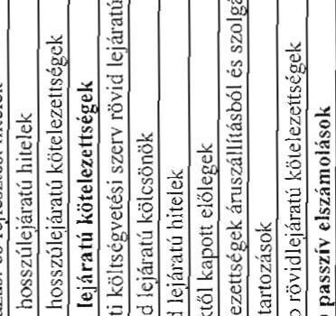

26.

---

Az MNV Zrt. saját vagyonának eszközállomány változása 2008. évben

|  Megnevezés | 2007. évi záró állomány (nyitó) | Növekedés | Változás csökkenés | Áll. vált. | 2008. évi záró állomány  |
| --- | --- | --- | --- | --- | --- |
|  Immateriális javak | - | 114 349 | 6 655 | 107 694 | 107 694  |
|  Tárgyi eszközök | - | 2 991 593 | 239 440 | 2 752 153 | 2 752 153  |
|  Befektetett pénzügyi eszközök | - | 22 292 | - | 22 292 | 22 292  |
|  Befektetett eszközök összesen | - | 3 128 234 | 246 095 | 2 882 139 | 2 882 139  |
|  Készletek | - | - | - | - | -  |
|  Követelések | 150 | 655 158 | - | 655 158 | 655 308  |
|  Pénzeszközök | 50 037 | 13 513 611 | 10 687 137 | 2 826 474 | 2 876 511  |
|  Forgóeszközök | 50 187 | 14 168 769 | 10 687 137 | 3 481 632 | 3 531 819  |
|  Aktív időbeli elhatárolások | - | 11 701 | - | 11 701 | 11 701  |
|  Eszközök összesen | 50 187 | 17 308 704 | 10 933 232 | 6 375 472 | 6 425 659  |

Budapest, 2009. július 16.

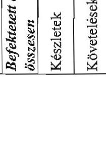

MAGYAR NEMZETI VAGYONKEZELŐ ZRT. 20.

---

7. sz. tanúsítvány a V-2016-131/2008-2009. sz. jelentéshez

Az MNV Zrt. saját vagyonának forrásösszetételének változása 2008. évben

|  Megnevezés | 2007. évi záró állomány | Növekedés | Változás csökkenés | Áll. vált. állomány | 2008. évi záró állomány  |
| --- | --- | --- | --- | --- | --- |
|  Saját tőke

 | 47 379 | 4 856 342 |  | 4 856 342 | 4 903 721  |
|  Céltartalék | - | 52 359 | - | 52 359 | 52 359  |
|  Kötelezettségek | 908 | 1 302 179 | 908 | 1 301 271 | 1 302 179  |
|  Passzív időbeli elhatárolások | 1 900 | 165 500 | - | 165 500 | 167 400  |
|  Források összesen | 50 187 | 6 376 380 | 908 | 6 375 472 | 6 425 659  |

Budapest, 2009. július 16.

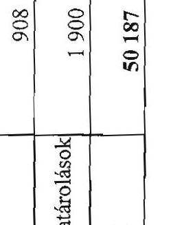

---

# Az MNV Zrt. működéséhez kapcsolódó anyagjellegű ráfordítások alakulása 2008. évben

|  Megnevezés | 2008. év |  |  |  | %  |
| --- | --- | --- | --- | --- | --- |
|   | terv (E Ft) | % | tény (E Ft) | tény% | Tervhez  |
|  Energia | 136 557 | 45,70 | 149 803 | 51,15 | 1,10  |
|  Üzemanyag | 50 000 | 16,73 | 49 468 | 16,89 | 0,99  |
|  Nyomtatvány, irodaszer | 67 000 | 22,42 | 52 789 | 18,03 | 0,79  |
|  Egyéb ki nem emelt anyagköltség | 45 276 | 15,15 | 40 792 | 13,93 | 0,90  |
|  1. Anyagköltség összesen | 298 833 | 100,00 | 292 852 | 100,00 | 0,98  |
|  Utazás- és szállásköltség | 4 915 | 0,21 | 5 440 | 0,24 | 1,11  |
|  Fenntartás, javítás és karbantartás | 106 957 | 4,52 | 113 153 | 4,91 | 1,06  |
|  Posta, telefon, futárszolgálat | 81 939 | 3,46 | 81 363 | 3,53 | 0,99  |
|  Székház fenntartás, üzemeltetés | 410 217 | 17,34 | 410 728 | 17,82 | 1,00  |
|  Egyéb ki nem emelt anyagjellegű szolgáltatás | 27 195 | 1,15 | 12 589 | 0,55 | 0,46  |
|  Egyéb ki nem emelt anyagjellegű szolgáltatás | 1 735 094 | 73,32 | 1 681 295 | 72,95 | 0,97  |
|  2. Anyagjellegű szolgáltatás összesen | 2 366 317 | 100,00 | 2 304 568 | 100,00 | 0,97  |
|  3. Anyagjellegű ráfordítások összesen (1 + 2) | 2 665 150 |  | 2 597 420 |  | 0,97  |

Budapest, 2009. július 16.

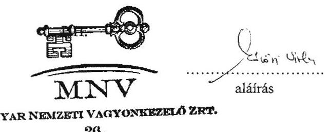

---

9. sz. tanúsítvány a V-2016-2008-2009. sz. jelentéshez

Az MNV Zrt. átlagos állományi létszámának alakulása 2008. évben

|  Megnevezés | 2008. év |  |   |
| --- | --- | --- | --- |
|   | terv | tény | Teljesítés % tervhez  |
|  Teljes munkaidőben fogl. (fő) | 399 | 386 | 96,74%  |
|  Részmunkaidőben fogl. (fő) | 1 | 1 | 100,00%  |
|  Állományi létszám összesen (fő) | 400 | 387 | 96,75%  |
|  Keresetfejlesztés (%) |  |  |   |

Budapest, 2009. április 27.

P.H.

MAGYAR NEMZETI VAGYONKEZELŐ ZRT.

27.

aláírás

---

1. sz. tanúsítvány a V-2016-13/4/2008-2009. sz. jelentéshez

Az MNV Zrt. állományi létszám változása 2008. évben

|  Megnevezés | 2008. január 1. | 2008. december 31. | Változás % | Változás %  |
| --- | --- | --- | --- | --- |
|   | Státusz | Betöltött állás | Státusz | Betöltött állás  |
|  Vezető | 25 | 23 | 29 | 116,00  |
|  Vezető-helyettes | 20 | 12 | 19 | 95,00  |
|  Menedzser | 289 | 248 | 293 | 101,38  |
|  Ügyintéző | 69 | 60 | 79 | 114,49  |
|  Összesen | 403 | 343 | 420 | 104,22  |

Budapest, 2009. április 27.

P.H.

MAGYAR NEMZETI VAGYONKEZELŐ ZRT.

27.

aláírás

---

Az MNV Zrt. működésével kapcsolatos személyi jellegű ráfordítások alakulása 2008. évben

|  Megnevezés |  | 2008. év |  |  |   |
| --- | --- | --- | --- | --- | --- |
|   | terv (E Ft) | % | tény (E Ft) | % | Telj. tervhez %  |
|  Bérköltség | 3470556 | 59,55 | 3010322 | 63,13 | 86,74  |
|  ebből: jutalmak | 478084 | 8,20 | 236959 | 4,97 | 49,56  |
|  Személyi jellegű kifizetések | 2357009 | 40,45 | 1758097 | 36,87 | 74,59  |
|  ebből: szerzői díjak | 0 | 0,00 | 0 | 0,00 | 0,00  |
|  étkezési hozzájárulás | 57600 | 0,99 | 57891 | 1,21 | 100,51  |
|  üdülési hozzájárulás | 5000 | 0,09 | 3702 | 0,08 | 74,04  |
|  albérleti hozzájárulás | 1000 | 0,02 | 0 | 0,00 | 0,00  |
|  utazási hozzájárulás | 16000 | 0,27 | 16186 | 0,34 | 101,16  |
|  reprezentáció | 18000 | 0,31 | 13140 | 0,28 | 73,00  |
|  segélyek | 3000 | 0,05 | 1536 | 0,03 | 51,20  |
|  saját gépjármű hivatali célú használata | 2000 | 0,03 | 1721 | 0,04 | 86,05  |
|  belföldi napidíj | 1000 | 0,02 | 549 | 0,01 | 54,90  |
|  külföldi napidíj | 1000 | 0,02 | 429 | 0,01 | 42,90  |
|  betegszabadság | 23000 | 0,39 | 22107 | 0,46 | 96,12  |
|  egyéb személyi jellegű kifizetés | 898216 | 15,41 | 534501 | 11,21 | 59,51  |
|  munkáltatót terhelő táppénz | 5000 | 0,09 | 2988 | 0,06 | 59,76  |
|  nyugdíjpénztári hozzájárulás | 95000 | 1,63 | 104492 | 2,19 | 109,99  |
|  dolgozók életbiztosítása | 0 | 0,00 | 0 | 0,00 | 0,00  |
|  belső továbbképzés | 0 | 0,00 | 0 | 0,00 | 0,00  |
|  egészségpénztári hozzájárulás | 56183 | 0,96 | 49539 | 1,04 | 88,17  |
|  munkaruha | 0 | 0,00 | 0 | 0,00 | 0,00  |
|  társadalombiztosítási járulék | 1175010 | 20,16 | 949316 | 19,91 | 80,79  |
|  Személyi jellegű ráfordítások összesen | 5827565 |  |  |  | 81,83  |

Budapest, 2009. április 27.

---

Az MNV Zrt. munkavállalóinak beosztásonkénti átlagkeresete 2008. évben

|  Sorszám | Állománycsoport | 2008. évi átlagkereset Ft/fő/hó  |
| --- | --- | --- |
|  1 | vezérigazgató és vezérigazgató-helyettesek | 3484932  |
|  2 | igazgatók, ügyvezető igazgatók | 1470486  |
|  3 | igazgató-helyettesek, ügyvezető igazgató-helyettesek | 1010497  |
|  4 | vezető menedzserek | 723635  |
|  5 | menedzserek | 453638  |
|  6 | ügyintézők | 296926  |
|  7 | MNV Zrt. munkavállalóinak éves átlagkeresete | 590641  |

Budapest, 2009. április 27.

PH.

aláírás

---

MNV Zrt. 2008. évben kifizetett végkielégítéseinek összesített adatai

|  Sorsz. | Állománycsoport | 2008. évi végkielégítések Ft-ban  |
| --- | --- | --- |
|  1 | vezérigazgató és vezérigazgató-helyettesek | 0  |
|  2 | igazgatók, ügyvezető igazgatók | 0  |
|  3 | igazgató-helyettesek, ügyvezető igazgató-helyettesek | 0  |
|  4 | vezető menedzserek | 0  |
|  5 | menedzserek | 0  |
|  6 | ügyintézők | 0  |
|   | Összesen: | 0  |

Budapest, 2009. augusztus 18.

---

ÁPV Zrt. 2007. évben kifizetett végkielégítéseinek összesített adatai

|  Sorsz. | Állománycsoport | 2007. évi végkielégítések Ft-ban  |
| --- | --- | --- |
|  1 | vezérigazgató és vezérigazgató-helyettesek | 0  |
|  2 | igazgatók, ügyvezető igazgatók | 1183506  |
|  3 | igazgató-helyettesek, ügyvezető igazgató-helyettesek | 0  |
|  4 | vezető menedzserek | 0  |
|  5 | menedzserek | 4996257  |
|  6 | ügyintézők | 0  |
|   | Összesen: | 6179763  |

Budapest, 2009. augusztus 18.

---

Az MNV Zrt. 2008. évi forrásallokációja a felhasználás célja szerint

|  Társaság | Tőkeemelés | Támogatás | Környezetvédelmi támogatás | Tulajdonos kölcsön kifizetés | Osztalék | Tulajdonos kölcsön visszafizetés  |
| --- | --- | --- | --- | --- | --- | --- |
|  Jelentős súlyú, kiemelt cégek | 0 | 0 | 0 | 0 | 33107339 | 0  |
|  1) Állami Autópálya Kezelő Zrt. |  |  |  |  | 25000000 |   |
|  2) Budapest Airport Zrt. |  |  |  |  |  |   |
|  3) Magyar Posta Zrt. |  |  |  |  | 3000000 |   |
|  4) Magyar Villamos Művek Zrt. |  |  |  |  | 1000935 |   |
|  5) Richter Gedeon Rt. |  |  |  |  | 2106404 |   |
|  6) Szerencsejáték Zrt. |  |  |  |  | 2000000 |   |
|  Erdőgazdasági csoport | 1776200 | 2386140 | 200000 | 0 | 500000 | 0  |
|  7) Bakonyi Erdészeti és Faipari Rt. | 57360 | 34810 |  |  | 38000 |   |
|  8) Délalföldi Erdészeti Rt. | 73870 | 123850 |  |  | 3000 |   |
|  9) Egererdő Erdészeti Rt. | 90180 | 406560 |  |  | 16000 |   |
|  10) Észak-Magyarországi Erdőgazdasági Rt. | 90580 | 126500 |  |  | 60000 |   |
|  11) Gemenci Erdő- és Vadgazdaság Rt. |  |  |  |  |  |  |

 | 84690 | 109075 |  |  | 5000 |   |
|  12) GVULAI Erdészeti és Vadászati Rt. | 91820 | 67645 |  |  | 4000 |   |
|  13) Ipoly Erdő Rt. | 116710 | 215920 |  |  | 12000 |   |
|  14) Kisalföldi Erdőgazdaság Rt. | 26580 | 33700 |  |  | 12000 |   |
|  15) Kiskunsági Erdészeti és Faipari Rt. | 35710 | 134890 |  |  | 31000 |   |
|  16) Mecseki Erdészeti Rt. | 106120 | 84965 |  |  | 4000 |   |
|  17) Nagykunsági Erdészeti és Faipari Rt. | 22870 | 119380 |  |  | 11000 |   |
|  18) Nyírségi Erdészeti Rt. | 196870 | 370425 | 49000 |  | 64000 |   |
|  19) Püspöki Parkerdőgazdaság Rt. | 81350 | 119200 | 151000 |  | 32000 |   |
|  20) Somogyi Erdészeti és Faipari Rt. | 90790 | 132650 |  |  | 29000 |   |
|  21) Szombathelyi Erdészeti Rt. | 96220 | 65430 |  |  | 18000 |   |
|  22) Tanulmányi Erdőgazdaság Rt. | 228950 | 11200 |  |  | 3000 |   |
|  23) VADEX Mezőföldi Erdő- és Vadgazd. Rt. | 91470 | 101200 |  |  | 3000 |   |
|  24) Vértesi Erdészeti és Faipari Rt. | 75320 | 74000 |  |  | 7000 |   |
|  25) Zalai Erdészeti és Faipari Rt. | 118740 | 54740 |  |  | 148000 |   |
|  Volán csoport | 7999997 | 0 | 796094 | 0 | 0 | 355000  |
|  26) Agria Volán Rt. | 264000 |  | 10000 |  |  |   |
|  27) Alba Volán Rt. | 416000 |  | 39136 |  |  |   |
|  28) Bakony Volán Rt. | 212000 |  | 55600 |  |  |   |
|  29) Balaton Volán Rt. | 253000 |  | 17560 |  |  |   |
|  30) Bács Volán Rt. | 136000 |  | 10040 |  |  |   |
|  31) Borsod Volán Rt. | 816000 |  | 62166 |  |  |   |
|  32) Gemenc Volán Rt. | 342000 |  | 62880 |  |  |   |
|  33) HAJDÚ Volán Rt. | 362000 |  | 16076 |  |  |   |
|  34) Hatvani Volán Rt. | 145000 |  | 6640 |  |  |   |
|  35) Jászkun Volán Rt. | 214000 |  | 9129 |  |  |   |
|  36) Kapos Volán Rt. | 292000 |  | 45920 |  |  |   |
|  37) Kisalföld Volán Rt. |  |  | 73360 |  |  |   |
|  38) Körös Volán Rt. | 221000 |  | 52471 |  |  |   |
|  39) Kunság Volán Rt. | 326000 |  | 30666 |  |  |   |
|  40) Mátra Volán Rt. | 117999 |  | 34600 |  |  |   |
|  41) Nógrád Volán Rt. | 292000 |  | 14866 |  |  |   |
|  42) Pannon Volán Rt. | 480000 |  | 25766 |  |  |   |
|  43) Somló Volán Rt. | 194000 |  | 13600 |  |  |   |
|  44) Szabolcs Volán Rt. | 348000 |  | 39600 |  |  |   |
|  45) Tisza Volán Rt. | 423999 |  | 26900 |  |  |   |
|  46) Vas Volán Rt. | 304000 |  | 6840 |  |  | 140000  |
|  47) Vértes Volán Rt. | 398000 |  | 90476 |  |  |   |
|  48) VOLÁNBUSZ Rt. | 1131000 |  | 14202 |  |  | 215000  |
|  49) Zala Volán Rt. | 311999 |  | 37600 |  |  |   |
|  Hitelintézetek és biztosító | 0 | 0 | 0 | 0 | 0 | 0  |
|  50) Földhitel és Jelzálogbank Rt. |  |  |  |  |  |   |
|  51) Hitelgarancia Zrt. |  |  |  |  |  |   |
|  52) Magyar Export-Import Bank Rt. |  |  |  |  |  |   |
|  53) Magyar Exporthitel Biztosító Rt. |  |  |  |  |  |   |
|  54) UNIO Garancia Szövetkezet |  |  |  |  |  |   |
|  Profitorientált többségi tulajdonú cégkör | 7422000 | 540000 | 8750000 | 4022438 | 922500 | 4188810  |
|  55) AGORA KFT. |  |  |  |  |  |   |

---

|  Türaszáig | Tőkecelés | Támogatás | Környezetvédelmi támogatás | Tulajdonos kölcsön kifizetés | Összérték | Tulajdonos kölcsön visszafizetés  |
| --- | --- | --- | --- | --- | --- | --- |
|  56 Agrárgazdasági Vagyonkezelő Kft. (MFB-Proxy) |  |  |  |  |  | 750000  |
|  57 AGROSTER Rt. |  |  |  |  |  |   |
|  58 ALFÖLDI Müemlékhelyreállító Kft. |  |  |  |  |  |   |
|  59 AT Kft. |  |  |  |  |  |   |
|  60 AUTOBUSZ-INVEST Kft. |  |  |  |  | 400000 |   |
|  61 Autókut Rt. |  |  |  |  |  |   |
|  62 Bábolna Nemzeti Ménesbirtok Kft. |  | 260000 |  | 800000 |  | 400000  |
|  63 Balatoni Halászati Zrt. |  |  |  | 150000 |  |   |
|  64 BM HEROS Zrt. |  |  |  |  |  |   |
|  65 BMSK Zrt. |  |  |  |  |  |   |
|  66 Budapest Filmstúdió Kft. |  |  |  |  |  |   |
|  67 CLUB ALIGA Zrt. |  |  |  |  |  |   |
|  68 Corvinus Támogatásközvetítő Zrt. |  |  |  |  |  |   |
|  69 Diákhitel Zrt. |  |  |  |  |  |   |
|  70 Dialóg Filmstúdió Kft. |  |  |  |  |  |   |
|  71 DMRV Zrt. |  |  |  |  |  |   |
|  72 DRV Zrt. |  |  |  |  |  |   |
|  73 DUNAKÖ KFT. |  |  |  |  |  |   |
|  74 EDV Zrt. |  |  |  |  |  |   |
|  75 Egyetemi Centrum Kft. |  |  |  |  |  |   |
|  76 ÉKKO Kft. |  |  |  |  |  |   |
|  77 ÉP VIZKÖR KFT. |  |  |  |  |  |   |
|  78 ÉRV. Zrt. |  |  |  |  |  |   |
|  79 EsVÁ Kft. |  |  |  |  |  |   |
|  80 Fűzfői Szennyvíz Szolgáltató Kft. |  |  |  |  |  |   |
|  81 Helena Biokozmetikai Szalon Bt. |  |  |  |  |  |   |
|  82 Hollóházi Porcelán Zrt. |  |  |  | 85000 |  |   |
|  83 Hortobágyi Halgazdaság Zrt. |  |  |  |  |  |   |
|  84 Hógyes Endre Bt. |  |  |  |  |  |   |
|  85 HUNGALU-SERVICE Kft. |  |  |  |  |  |   |
|  86 HUNGARORING Zrt. |  |  |  |  |  |   |
|  87 HUNNIA Filmstúdió Kft. |  |  |  |  |  |   |
|  88 Informatikai és Technológiai Innovációs Park Zrt. |  |  |  |  |  |   |
|  89 Kés Delfín Bt. |  |  |  |  |  |   |
|  90 Kisvállalkozás-fejlesztő Pénzügyi Zrt. |  |

 1000000 |  |  |  |   |
|  91 KIVING Kft. |  |  |  |  |  |   |
|  92 KOPINT-DATORG Zrt. |  |  |  |  |  |   |
|  93 Kormányzati Negyed Projekt Kft. |  | 90000 |  |  |  |   |
|  94 Magyar Közlöny Lap és Könyvkiadó Kft. |  |  |  |  |  |   |
|  95 Magyar Lóverseny Fogadást Szervező Kft. |  |  |  |  |  |   |
|  96 Magyar Turizmus Zrt. |  |  |  |  |  |   |
|  97 MAHART Magyar Hajózási Zrt. |  |  |  |  |  |   |
|  98 MAHART Szabadkikötő Zrt. |  |  |  |  |  |   |
|  99 MALÉV Vagyonkezelő Kft. |  |  |  | 2987438 |  | 3038810  |
|  100 Mecsek ÖKO Rt. |  |  | 4500000 |  |  |   |
|  101 MECSEKÉRC Környezetvéd. Zrt. |  |  |  |  |  |   |
|  102 Mezöhegyesi Állami Ménes Kft. |  | 210000 |  |  |  |   |
|  103 Mozgóképforgalmazási Zrt. |  | 70000 |  |  |  |   |
|  104 MTKI Kft. |  |  |  |  | 472000 |   |
|  105 MULTINOVA Kft. |  |  |  |  |  |   |
|  106 MŰVÉSZETEK PALOTÁJA Kft. |  |  |  |  |  |   |
|  107 NEFELÉB Egyesülés |  |  |  |  |  |   |
|  108 Nemzeti Lóverseny Kft. |  |  |  |  |  |   |
|  109 Nemzeti Színház Zrt. |  |  |  |  |  |   |
|  110 Nereus Park Hotel Kft. |  |  |  |  |  |   |
|  111 Nitrokémia Vegyipari Zrt. |  |  | 4250000 |  |  |   |
|  112 Objektív Filmstúdió Kft. |  |  |  |  |  |   |
|  113 OFFI Zrt. |  |  |  |  | 16000 |   |
|  114 Pannóniafilm Kft. |  |  |  |  |  |   |
|  115 Piller Kft. |  |  |  |  | 25000 |   |
|  116 PMMF Politechnika Kft. |  |  |  |  |  |   |
|  117 Polgári Kézilőfegyver és Lőszerváll. Kft. |  |  |  |  |  |   |
|  118 PRIV-DAT Dok. Archiváló és Tároló Kft. |  |  |  |  | 9500 |   |

---

|   | Társaság | Tőkeemelés | Támogatás | Környezetvédelmi támogatás | Tul. kölcsön kifizetés | Osztalék | Tul. kölcsön visszafizetés  |
| --- | --- | --- | --- | --- | --- | --- | --- |
|  119 | RADAR Zrt. |  |  |  |  |  |   |
|  120 | Regionális Fejlesztési Holding Rt. | 6332000 |  |  |  |  |   |
|  121 | REORG Gazdasági és Pénzügyi Zrt. |  |  |  |  |  |   |
|  122 | RÖNA-IM Kft. |  |  |  |  |  |   |
|  123 | SAVARIA Nett-Pack Kft. |  |  |  |  |  |   |
|  124 | SPORTLÉTESÍTMÉNYEK Zrt. |  |  |  |  |  |   |
|  125 | Szegedi SZEFO Zrt. |  |  |  |  |  |   |
|  126 | Tiszavíz Vízmű Kft. |  |  |  |  |  |   |
|  127 | TLA Vagyonkezelő Kft. |  |  |  |  |  |   |
|  128 | Tokaj Kereskedőház Zrt. |  |  |  |  |  |   |
|  129 | TV Zrt. |  |  |  |  |  |   |
|  130 | VEIKI Zrt. |  |  |  |  |  |   |
|  131 | VETERINORG Kft. |  |  |  |  |  |   |
|  132 | ZKI Zrt. |  |  |  |  |  |   |
|   | "Profiterientált kisebbségi tulajdonosi cégkör" | 0 | 0 | 0 | 0 | 301696 | 0  |
|  133 | AES Tisza Erőmű Kft. |  |  |  |  |  |   |
|  134 | ÁFÉSZ Bajna |  |  |  |  |  |   |
|  135 | ÁFÉSZ Fehérgyarmat |  |  |  |  |  |   |
|  136 | AGENDA-H Szövetkezet |  |  |  |  |  |   |
|  137 | AGROCONSULT Kft. |  |  |  |  |  |   |
|  138 | AGROGEO Kft. |  |  |  |  |  |   |
|  139 | AGROPRODUKT Mg. Rt. |  |  |  |  | 3 |   |
|  140 | Agrosystem Mg. Zrt. (Herceghalmi) |  |  |  |  |  |   |
|  141 | Alomsziget (ex-Hajógyári Sziget) Vagyonkez. Kft. |  |  |  |  |  |   |
|  142 | ARANYHÍD-COOP Zrt. |  |  |  |  |  |   |
|  143 | Bajai OKK Kft. |  |  |  |  | 5000 |   |
|  144 | Bakonyi Erőmű Zrt. |  |  |  |  |  |   |
|  145 | Balatonhoglári Borg. Rt. |  |  |  |  |  |   |
|  146 | Balatoni Hajózási Rt. |  |  |  |  |  |   |
|  147 | BME BIOPROCESS Kft. |  |  |  |  |  |   |
|  148 | Borsod Megyei Fodrász Szövetkezet |  |  |  |  |  |   |
|  149 | Budapesti Elektromos Művek Zrt. |  |  |  |  | 2 |   |
|  150 | Budapesti Erőmű Zrt. |  |  |  |  |  |   |
|  151 | Budapesti Szabadkikötő Logisztikai Rt. |  |  |  |  |  |   |
|  152 | Csepreg és Vidéke ÁFÉSZ |  |  |  |  |  |   |
|  153 | Dalmandi Mg. Zrt. |  |  |  |  |  |   |
|  154 | Dél-Pest megyei ÁFÉSZ |  |  |  |  |  |   |
|  155 | Dél-Pest Megyei Mezőgazdasági Rt. |  |  |  |  |  |   |
|  156 | DÉMÁSZ Zrt. |  |  |  |  |  |   |
|  157 | DEPO Kft. |  |  |  |  |  |   |
|  158 | Dózsa MGTSZ. Berettyóújfalu |  |  |  |  |  |   |
|  159 | DÓZSA Zrt. |  |  |  |  |  |   |
|  160 | DRAGÓN KING Kft. |  |  |  |  |  |   |
|  161 | Duna Múzeum Kft. |  |  |  |  |  |   |
|  162 | Duna menti Erőmű Zrt. |  |  |  |  |  |   |
|  163 | E.ON Dél-dunántúli Áramszolgáltató Zrt. |  |  |  |  |  |   |
|  164 | E.ON Dél-dunántúli Gázszolgáltató Zrt. |  |  |  |  |  |   |
|  165 | E.ON Észak-dunántúli Áramszolgáltató Zrt. |  |  |  |  | 2 |   |
|  166 | E.ON Közép-dunántúli Gázszolgáltató Zrt. |  |  |  |  |  |   |
|  167 | E.ON Tiszántúli Áramszolgáltató Zrt. |  |  |  |  |  |   |
|  168 | Égáz-Dégáz Zrt. |

 |  |  |  |  |  |   |
|  169 | EMÁSZ Nyrt. |  |  |  |  | 2 |   |
|  170 | ERSTE BANK Nyrt. |  |  |  |  |  |   |
|  171 | Fazekaszugi Vízhasznosítási Kft. |  |  |  |  |  |   |
|  172 | Fegyverneki és vidéke ÁFÉSZ |  |  |  |  |  |   |
|  173 | Fertő-vidéki Helyi Érdekű Vasút Rt. |  |  |  |  |  |   |
|  174 | GANZSZOLG Zrt. |  |  |  |  |  |   |
|  175 | Geodéziai Zrt. |  |  |  |  |  |   |
|  176 | Gödöllői Tangazdaság Zrt. |  |  |  |  |  |   |
|  177 | GÖDÖLLŐI AGRÁR Zrt. |  |  |  |  |  |   |
|  178 | GSE Kft. |  |  |  |  |  |   |
|  179 | GYNK Ingatlanfejlesztő Zrt. |  |  |  |  |  |   |
|  180 | Gyomródi ÁFÉSZ |  |  |  |  |  |   |

---

|  Társaság | Tőkefelés | Támogatás | Környezetvédelmi támogatás | Tulajdonos kölcsön kifizetés | Osztalék | Tulajdonos kölcsön visszafizetés  |
| --- | --- | --- | --- | --- | --- | --- |
|  181. Hagyományok Háza Kft. |  |  |  |  |  |   |
|  182. Hajdúhadház Mg. Vállalkozók Szövetkezete |  |  |  |  |  |   |
|  183. HÁTTER Kft. |  |  |  |  |  |   |
|  184. Herendi Porcelánmanufaktúra Rt. |  |  |  |  | 25257 |   |
|  185. Herz Szalámigyár Rt. |  |  |  |  |  |   |
|  186. Hídasháti Mg. Rt. |  |  |  |  |  |   |
|  187. Hungaropharma Gyógyszerker. Rt. |  |  |  |  | 2 |   |
|  188. Hungaroton Music Rt. |  |  |  |  |  |   |
|  189. Hungexpo Rt. |  |  |  |  |  |   |
|  190. Ifjúsági és Sportkommunikációs Kft. |  |  |  |  |  |   |
|  191. Irodapark Ingatlanhasznosító Zrt. |  |  |  |  |  |   |
|  192. K&H Bank Nyrt. |  |  |  |  |  |   |
|  193. Kalocsai Fűszerpaprika Rt. |  |  |  |  |  |   |
|  194. Kapos-Coop Kereskedelmi Zrt. |  |  |  |  |  |   |
|  195. KLIMA Zrt. |  |  |  |  |  |   |
|  196. Koppánymenti Mezőgazdasági Szövetkezet |  |  |  |  |  |   |
|  197. Körháztechnikai Zrt. |  |  |  |  |  |   |
|  198. Kossuth Mezőgazdasági Termelőszövetkezet |  |  |  |  |  |   |
|  199. KÖTIVIERB Kft. |  |  |  |  |  |   |
|  200. Közúti Vendégház Kft. |  |  |  |  |  |   |
|  201. Kutatópark Ingatlanhasznosító Zrt. |  |  |  |  |  |   |
|  202. La Prima Kft. |  |  |  |  |  |   |
|  203. Lajta-Hanság Rt. |  |  |  |  | 2 |   |
|  204. Magyar Gördülőcsapágy Művek Zrt. |  |  |  |  |  |   |
|  205. Magyar Telekom Rt. |  |  |  |  | 7 |   |
|  206. MAJORGAZDA Szövetkezet |  |  |  |  |  |   |
|  207. MAKÖI HAGYMAKERTÉSZ Kft. |  |  |  |  |  |   |
|  208. Mátrai Erőmű Zrt. |  |  |  |  | 43883 |   |
|  209. MAVIR Zrt. |  |  |  |  |  |   |
|  210. Mezőfalvai Mg. Termelő és Szolgáltató Zrt. |  |  |  |  |  |   |
|  211. Mezőkövesdi Szövetkezeti Zrt. |  |  |  |  |  |   |
|  212. Mezőtárkányi Aranykalász Mgtsz. |  |  |  |  |  |   |
|  213. MHT Figyelés |  |  |  |  |  |   |
|  214. MKB Zrt. |  |  |  |  |  |   |
|  215. MOL Magyar Olaj- és Gázipari Rt. |  |  |  |  | 29 |   |
|  216. Móricz park Ingatlanhasznosító Zrt. |  |  |  |  |  |   |
|  217. MUNDUS Kiadói Kft. |  |  |  |  |  |   |
|  218. Nágocsi Mezőgazdasági Zrt. |  |  |  |  |  |   |
|  219. Nagykáta és Vidéke ÁFÉSZ |  |  |  |  |  |   |
|  220. Nemzeti Filharmónia Kft. |  |  |  |  |  |   |
|  221. Nemzeti Tankönyvkiadó Rt. |  |  |  |  | 224190 |   |
|  222. NORD-OST Kft. |  |  |  |  |  |   |
|  223. Normon-Tool Kft. |  |  |  |  |  |   |
|  224. NYIRSÉGVÍZ Zrt. |  |  |  |  |  |   |
|  225. Öcsa-Soroksár Szövetkezet |  |  |  |  | 137 |   |
|  226. OMT Zrt. |  |  |  |  |  |   |
|  227. OTP Bank Rt. |  |  |  |  |  |   |
|  228. OVIT Zrt. |  |  |  |  | 0 |   |
|  229. Paksi Atomerőmű Zrt. |  |  |  |  | 0 |   |
|  230. Pannon Hőerőmű Zrt. |  |  |  |  |  |   |
|  231. PANNONMEDICINA Zrt. |  |  |  |  |  |   |
|  232. PATÁR Zrt. |  |  |  |  |  |   |
|  233. PROMONTÓRIA Zrt. |  |  |  |  |  |   |
|  234. Psz-Salgó Kft. |  |  |  |  |  |   |
|  235. Ráckevei Vendégház Kft. |  |  |  |  |  |   |
|  236. Richárd Ingatlanhasznosító Zrt. |  |  |  |  |  |   |
|  237. Ropp Gyógynövény Kutató Kft. (2007. évben alakult) |  |  |  |  |  |   |
|  238. RÓNA Mezőgazdasági Szövetkezet |  |  |  |  |  |   |
|  239. Sárbogárdi Vagyonhasznosító Szövetkezet |  |  |  |  |  |   |
|  240. Sárvári Mg. Rt. |  |  |  |  |  |   |
|  241. SPECIÁL Zrt. |  |  |  |  | 3176 |   |
|  242. Szákszendi Mezőgazdasági Zrt. |  |  |  |  |  |   |
|  243. Szarvasi Általános Informatikai Kft. |  |  |  |  |  |   |

---

1. sz. tanúsítvány a V-2016-13/2008-2009. sz. jelentéshez "adatok" b. Ft-ban

|  Társaság | Tőkefelés | Támogatás | Környezetvédelmi támogatás | Tulajdonos kölcsön kifizetés | Osztalék | Tulajdonos kölcsön visszafizetés  |
| --- | --- | --- | --- | --- | --- | --- |
|  244. Szarvasi Mg. Termelő és Élelmiszerfeldolgozó Rt. |  |  |  |  |  |   |
|  245. Szeghalom és Vidéke ÁFÉSZ |  |  |  |  |  |   |
|  246. SZIMF - TRAFFIC Kft. |  |  |  |  |  |   |
|  247. Szombathelyi Tangazdaság Rt. |  |  |  |  | 3 |   |

  |
|  248. T. S. APARTMAN-CLUB Nyrt. |  |  |  |  |  |   |
|  249. TABI COOP Zrt. |  |  |  |  |  |   |
|  250. TBP Ingatlanhasznosító Zrt. |  |  |  |  |  |   |
|  251. TIGÁZ Zrt. |  |  |  |  |  |   |
|  252. Tiszakeszi "Tiszamenti" Szövetkezet |  |  |  |  |  |   |
|  253. T6-COOP Zrt. |  |  |  |  |  |   |
|  254. TORNA Szövetkezet |  |  |  |  |  |   |
|  255. Törökszentmiklósi Mg. Zrt. |  |  |  |  |  |   |
|  256. Transelektro Ganz Rőck Rt. |  |  |  |  |  |   |
|  257. UNIKER Zrt. |  |  |  |  |  |   |
|  258. Várogi AGRO-TUR 99 Kft. |  |  |  |  |  |   |
|  259. Vértesi Erőmű Zrt. |  |  |  |  |  |   |
|  260. Villért Rt. |  |  |  |  |  |   |
|  261. Vörösmarty Mg. Kft. |  |  |  |  |  |   |
|  262. Zábony és térsége Fejlesztési Kft. |  |  |  |  |  |   |
|  Nonprofit társaságok | 1 740 000 | 656 023 | 0 | 585 568 | 0 | 15 000  |
|  263. Árvízvédelmi és Belvízvédelmi Kp. Szerv. Kht. |  |  |  |  |  |   |
|  264. BKSZ Budapesti Kht. |  |  |  |  |  |   |
|  265. Budapesti Kamaraszínház Kht. |  |  |  |  |  |   |
|  266. Budavári Kht. |  |  |  | 485 568 |  |   |
|  267. Ceglédi Gyümölcstermesztési Kht. |  | 69 000 |  |  |  |   |
|  268. DEBRECENI CAMPUS Nonprofit Kft. |  |  |  |  |  |   |
|  269. Debreceni Lovasakadémia Kht. |  |  |  |  |  |   |
|  270. Debreceni Nyári Egyetem Kht. |  |  |  |  |  |   |
|  271. DEBRECENI UNIVERSITAS Nonprofit Kft. |  |  |  |  |  |   |
|  272. Dél-Dunántúli Idegenforgalmi Kht. |  |  |  |  |  |   |
|  273. Design Terminal Kht. |  |  |  |  |  |   |
|  274. DTMP Kht. |  |  |  |  |  |   |
|  275. Duna Palota Kht. |  |  |  |  |  |   |
|  276. EDUCATIO Társadalmi Szolgáltató Kht. |  |  |  |  |  |   |
|  277. EMI Kht. |  |  |  |  |  |   |
|  278. Érdi Gyümölcs- és Dísznövényterm. Kht. |  | 21 000 |  |  |  |   |
|  279. ERFO Kht. |  |  |  |  |  |   |
|  280. ESZA Kht. |  |  |  |  |  |   |
|  281. Európa Centrum (Pécs 2010) Kht. |  |  |  |  |  |   |
|  282. EX-SELL Kht. |  |  |  |  |  |   |
|  283. Fertődi Gyümölcstermesztési Kht. |  | 40 000 |  |  |  | 15 000  |
|  284. Filharmónia - Keleti Régió Kht. |  |  |  |  |  |   |
|  285. Filharmónia Budapest és Felső-Dunántúl Kht. |  |  |  |  |  |   |
|  286. Filharmónia Dél-Dunántúli Kht. |  |  |  |  |  |   |
|  287. FÖKÉFE Kht. |  |  |  |  |  |   |
|  288. Fűszerpaprika Kht. |  | 36 000 |  |  |  |   |
|  289. Gabonatermesztési Kutató Kht. |  |  |  |  |  |   |
|  290. GAK Kht. |  |  |  |  |  |   |
|  291. Gálfi Béla Kht. |  | 140 023 |  |  |  |   |
|  292. Gödöllői Királyi Kastély Kht. |  |  |  |  |  |   |
|  293. Helikon Kht. |  | 24 000 |  |  |  |   |
|  294. Hévízgyógyfürdő Kht. |  |  |  |  |  |   |
|  295. Hitelintézeti Felszámoló Kht. |  |  |  |  |  |   |
|  296. Honvéd Együttes Nonprofit Kft. |  |  |  |  |  |   |
|  297. Hortobágyi Kht. |  |  |  |  |  |   |
|  298. HUMAN-JÖVŐ 2000 Kht. |  |  |  |  |  |   |
|  299. Hungarofest Kht. |  |  |  |  |  |   |
|  300. Játékszín Kht. |  |  |  |  |  |   |
|  301. Károly Róbert Kht. |  |  |  |  |  |   |
|  302. KEZMÚ Kht. |  |  |  |  |  |   |
|  303. KHVT Kht. |  |  |  |  |  |   |
|  304. Könyvtáreltátó Nonprofit Kft. |  |  |  |  |  |   |
|  305. Környezetbarát Termék Kht. |  |  |  |  |  |   |

---

|   | Társaság | Tőkecmelés | Támogatás | Környezetvédelmi támogatás | Tulajdonos kölcsön kifizetés | Osztalék | Tulajdonos kölcsön visszafizetés  |
| --- | --- | --- | --- | --- | --- | --- | --- |
|  306 | MACIVA Kht. |  |  |  |  |  |   |
|  307 | Magyar Fotográfusok Háza Kht. |  |  |  |  |  |   |
|  308 | Magyar Nemzeti Filharmonikus Kht. |  |  |  |  |  |   |
|  309 | Monostori Kht. | 40 000 | 182 000 |  |  |  |   |
|  310 | Műcsarnok Kiemelten Közhasznú Non-Profit Kft. |  |  |  |  |  |   |
|  311 | Nemzeti Filmszínház Kht. |  |  |  |  |  |   |
|  312 | Nemzeti Kataszteri Program Kht. | 1 700 000 |  |  |  |  |   |
|  313 | Nemzeti Táncezínház Kht. |  |  |  |  |  |   |
|  314 | NKÖV Kht. |  |  |  |  |  |   |
|  315 | OHKI Országos Húsipari Kutatóintézet Kht. |  |  |  |  |  |   |
|  316 | OMSz Légimentő Kht. |  |  |  |  |  |   |
|  317 | OMSZI Kht. |  |  |  |  |  |   |
|  318 | Opusztaszeri Nemzeti Tört. Emlékp. Kht. |  |  |  |  |  |   |
|  319 | PROMEI Kht. |  |  |  |  |  |   |
|  320 | Radioaktív Hulladékokat Kezelő Kht. |  |  |  |  |  |   |
|  321 | SZÉPMŰVÉSZETI Kht. |  |  |  | 100 000 |  |   |
|  322 | Újfehértői GYKSZ Gyümölcstermesztési Kht. |  | 144 000 |  |  |  |   |
|  323 | Vasútegészségügyi Kht. |  |  |  |  |  |   |
|  324 | VÁTI Kht. |  |  |  |  |  |   |
|  325 | VITUKI Kht. |  |  |  |  |  |   |
|  326 | Zánkai Gyermek és Ifjúsági Centrum Kht. |  |  |  |  |  |   |
|

   | Vagyonkezelésben lévő cégek | 0 | 0 | 0 | 0 | 0 | 0  |
|  327 | ÁBRÁND-ÁGYNEMŰ KFT. |  |  |  |  |  |   |
|  328 | Állampusztai Kft. |  |  |  |  |  |   |
|  329 | Annamajori Kft. |  |  |  |  |  |   |
|  330 | ATEV ZRT. |  |  |  |  |  |   |
|  331 | Bányavagyon-hasznosító Kht. |  |  |  |  |  |   |
|  332 | BUFA Kft. |  |  |  |  |  |   |
|  333 | Concordia Közraktár Zrt. |  |  |  |  |  |   |
|  334 | DUNA PAPÍR Kft. |  |  |  |  |  |   |
|  335 | DUNA-MIX Kft. |  |  |  |  |  |   |
|  336 | Energiaközpont Kht. |  |  |  |  |  |   |
|  337 | GYSEV Zrt. |  |  |  |  |  |   |
|  338 | HM ARMCOM Zrt. |  |  |  |  |  |   |
|  339 | HM ARZÉNÁL Zrt. |  |  |  |  |  |   |
|  340 | HM Bp. Erdőgazdaság Zrt. |  |  |  |  |  |   |
|  341 | HM CURRUS Zrt. |  |  |  |  |  |   |
|  342 | HM EI Zrt. |  |  |  |  |  |   |
|  343 | HM Honvéd Klubok Kht. |  |  |  |  |  |   |
|  344 | HM KASZÓ Zrt. |  |  |  |  |  |   |
|  345 | HM Térképészeti Közhasznú Társaság |  |  |  |  |  |   |
|  346 | HM VERGA Zrt. |  |  |  |  |  |   |
|  347 | HM ZRÍNYI Kht. |  |  |  |  |  |   |
|  348 | HungaroControl Zrt. |  |  |  |  |  |   |
|  349 | Ipoly Cipógyár Kft. |  |  |  |  |  |   |
|  350 | ITDH Kht. |  |  |  |  |  |   |
|  351 | Kalocsai Konfekcióipari Kft. |  |  |  |  |  |   |
|  352 | Kisrákus 2000 Kft. |  |  |  |  |  |   |
|  353 | Közlekedéstudományi Intézet Kht. |  |  |  |  |  |   |
|  354 | Magyar Közút Kht. |  |  |  |  |  |   |
|  355 | MÁV Zrt. |  |  |  |  |  |   |
|  356 | MFB Rt. |  |  |  |  |  |   |
|  357 | Millenáris Tud. Kulturális (ex-Jövő Háza) Kht. |  |  |  |  |  |   |
|  358 | Nagyfa-Alföld Kft. |  |  |  |  |  |   |
|  359 | Nemzeti Infrastruktúrafels fejlesztő Zrt. |  |  |  |  |  |   |
|  360 | Neumann Kht. |  |  |  |  |  |   |
|  361 | NOSTRA Kft. |  |  |  |  |  |   |
|  362 | Pálhalmai Agrospeciál Kft. |  |  |  |  |  |   |
|  363 | Sopronkőhidai Kft. |  |  |  |  |  |   |
|  364 | TIG Kht. |  |  |  |  |  |   |
|   | Portfólióból kikerült cégek | 0 | 0 | 0 | 0 | 259828 | 24105  |
|   | MM Spec. Rt. va. |  |  |  |  |  |   |
|   | Ganz Danubius va. |  |  |  |  |  |   |

---

MNV Zrt.

1. sz. tanúsítvány a V-2016- (14/2008-2009. sz. jelentéshez

|  Társaság | Tökeemelés | Támogatás | Környezet- védelmi támogatás | Tulajdonos kölcsön kifizetés | Osztalék | Tulajdonos kölcsön visszafizetés  |
| --- | --- | --- | --- | --- | --- | --- |
|  Siotour Rt. |  |  |  |  |  |   |
|  Szabad Föld Rt. |  |  |  |  |  |   |
|  Kisrákus 2000 Kft. |  |  |  |  |  |   |
|  CSM Rugév va. |  |  |  |  |  |   |
|  Tolnatej |  |  |  |  |  |   |
|  Csavaripari Vállalat va. |  |  |  |  |  |   |
|  Szerszámgépipari művek va. |  |  |  |  |  |   |
|  Budaflas |  |  |  |  |  |   |
|  Aranykereszt Gondoskodás Háza Rt. va. |  |  |  |  |  | 6 965  |
|  MAFILM |  |  |  |  |  | 17 140  |
|  FVM-es cégek 2007. évről |  |  |  |  | 259 828 |   |
|  |   |   |   |   |   |   |
|  |   |   |   |   |   |   |
|  |   |   |   |   |   |   |
|  Mindösszesen | 18 938 197 | 3 582 163 | 9 746 094 | 4 608 006 | 35 091 363 | 4 582 915  |
|  MNV tulajdonosi joggyakorlásúak összesen | 18 938 197 | 3 582 163 | 9 746 094 | 4 608 006 | 35 091 363 | 4 582 915  |

Budapest, 2009. július " 10 "

MNV

MAGYAR NEMZETI VAGYONKEZELŐ ZRT.

25.

7

---

.

---

1. sz. tanúsítvány a V-2016-134/2008-2009. sz. jelentéshez

|  Sz. | Társaság |  |  |  |  |  |  | Adózás előtti eredmény MNV hányada |  |   |
| --- | --- | --- | --- | --- | --- | --- | --- | --- | --- | --- |
|   |  |  |  |  |  |  |  | 2007. év tény
(akt. portf.) | 2008. évi tény
(akt. portf.) | 2008. év tény
(akt. portf.)  |
|   |  |  |  |  |  |  |  | 78 683 815 | 79 028 920 |   |
|   | Jelentős súlyú, kiemelt cégek |  |  |  |  |  |  |  |  |   |
|   | 1. Állami Autópálya Kezelő Zrt. |  |  |  |  |  |  |  |  |   |
|   | 2. Budapest Airport Zrt. |  |  |  |  |  |  |  |  |   |
|   | 3. Magyar Posta Zrt. |  |  |  |  |  |  |  |  |   |
|   | 4. Magyar Villamos Művek Zrt. |  |  |  |  |  |  |  |  |   |
|   | 5. Richter Gedeon Rt. |  |  |  |  |  |  |  |  |   |
|   | 6. Szerencsejáték Zrt. |  |  |  |  |  |  |  |  |   |
|   | 7. Erdőgazdasági csoport |  |  |  |  |  |  |  |  |   |
|   | 8. Bakonyerdő Erdészeti és Fajpari Zrt. |  |  |  |  |  |  |  |  |   |
|   | 9. DALERD Délalföldi Erdészeti Zrt. |  |  |  |  |  |  |  |  |   |
|   | 10. Észekerdő Erdőgazdasági Zrt. |  |  | 

 |  |  |  |  |  |   |
|   | 11. Gemenci Erdő- és Vadgazdaság Zrt. |  |  |  |  |  |  |  |  |   |
|   | 12. Gyulaj Erdészeti és Vadászati Zrt. |  |  |  |  |  |  |  |  |   |
|   | 13. Ipoly Erdő Zrt. |  |  |  |  |  |  |  |  |   |
|   | 14. Kisalföldi Erdőgazdaság Zrt. |  |  |  |  |  |  |  |  |   |
|   | 15. KEFAG Kiskunsági Erdészeti Zrt. |  |  |  |  |  |  |  |  |   |
|   | 16. Mecseki Erdészeti Zrt. |  |  |  |  |  |  |  |  |   |
|   | 17. NEFAG Nagykunsági Erdészeti Zrt. |  |  |  |  |  |  |  |  |   |
|   | 18. Nyírerdő Nyírségi Erdészeti Zrt. |  |  |  |  |  |  |  |  |   |
|   | 19. Pilisi Parkerdőgazdaság Zrt. |  |  |  |  |  |  |  |  |   |
|   | 20. SEFAG Erdészeti és Faipari Zrt. |  |  |  |  |  |  |  |  |   |
|   | 21. Szombathelyi Erdészeti Zrt. |  |  |  |  |  |  |  |  |   |
|   | 22. Tanulmányi Erdőgazdaság Rt. |  |  |  |  |  |  |  |  |   |
|   | 23. VADEX Mezölföldi Erdő- és Vadgazd. Zrt. |  |  |  |  |  |  |  |  |   |
|   | 24. Vértesi Erdészeti és Faipari Zrt. |  |  |  |  |  |  |  |  |   |
|   | 25. Zalaerdő Erdészeti Zrt. |  |  |  |  |  |  |  |  |   |
|   | 26. Volán Zrt. |  |  |  |  |  |  |  |  |   |
|   | 27. Alba Volán Zrt. |  |  |  |  |  |  |  |  |   |
|   | 28. Bakony Volán Zrt. |  |  |  |  |  |  |  |  |   |
|   | Kontrolling Igazgatóság |  |  |  |  |  |  |  |  |   |

14. sz. tanúsítvány a V-2016-134/2008-2009. sz. jelentéshez

---

|  14. sz. tanúsítvány a V-2016-134/2008-2009. sz. jelentéshez |  |  |  |  |  |  |  |  |   |
| --- | --- | --- | --- | --- | --- | --- | --- | --- | --- |
|  Sz. | Társaság | Tartós állami tulajdoni hányad | MNV Zrt. tulajdoni hányad | Adózás előtti eredmény MNV hányada |  |  |  |  |   |
|   |  | 2008. XII. 31. | 2008. XII. 31. | 2007. 1-11. hó tény | 2008. 1-11. hó tény | index évközi / évközi | 2007. év tény (akt. portf.) | 2008. évi tény (akt. portf.) | 2008. év tény (akt. portf.)  |
|  29 | Balaton Volán Zrt. | 0,00% | 97,75% | -8 946 | 31 150 | javult | 675 | -409 738 | -134 212  |
|  30 | Bács Volán Zrt. | 0,00% | 97,40% | 24 413 | -35 964 | -147,3% | 2 959 | -287 478 | 29 255  |
|  31 | Borsod Volán Zrt. | 0,00% | 98,56% | -36 891 | 1 040 895 | javult | 9 440 | -1 514 487 | 86 041  |
|  32 | Gemenc Volán Zrt. | 0,00% | 99,19% | 16 775 | 142 854 | 851,6% | 11 007 | -382 971 | 17 873  |
|  33 | Hajdú Volán Zrt. | 0,00% | 97,40% | 114 475 | 637 475 | 556,9% | 98 503 | -482 313 | 149 500  |
|  34 | Hatvani Volán Zrt. | 0,00% | 98,66% | -5 850 | -37 442 | romlott | 2 009 | -147 110 | 611  |
|  35 | Jászkunság Volán Zrt. | 0,00% | 97,51% | 81 521 | 40 677 | 49,9% | 10 585 | -701 653 | 3 081  |
|  36 | Kapos Volán Zrt. | 0,00% | 97,62% | -92 830 | 486 040 | javult | 10 207 | -877 610 | 404 592  |
|  37 | Közép-Dunántúl Volán Rt. | 0,00% | 73,34% | -13 280 | -155 329 | romlott | 6 781 | -933 949 | 178 555  |
|  38 | Körös Volán Rt. | 0,00% | 98,69% | 21 227 | -55 695 | -262,4% | 34 492 | -584 565 | 37 110  |
|  39 | Kunság Volán Zrt. | 0,00% | 98,26% | -165 391 | 256 339 | javult | 21 243 | -588 645 | 137 577  |
|  40 | Mátra Volán Zrt. | 0,00% | 97,19% | -73 915 | 109 775 | javult | 7 913 | -377 927 | 104 985  |
|  41 | Nógrád Volán Zrt. | 0,00% | 98,45% | -8 024 | 176 761 | javult | 78 133 | -423 223 | 20 243  |
|  42 | Pannon Volán Zrt. | 0,00% | 97,47% | 202 977 | 468 716 | 230,9% | 322 551 | -921 511 | 301 239  |
|  43 | Somogy Volán Zrt. | 0,00% | 97,07% | 43 871 | 292 077 | 665,8% | 30 660 | -334 411 | 111 611  |
|  44 | Szabolcs Volán Zrt. | 0,00% | 97,76% | -126 712 | 291 430 | javult | 2 512 | -641 241 | 120 163  |
|  45 | Tisza Volán Zrt. | 0,00% | 99,02% | -6 338 | 504 105 | javult | 33 185 | -876 807 | 158 056  |
|  46 | Várpalotai Volán Zrt. | 0,00% | 97,99% | -206 186 | 451 635 | javult | -274 308 | -635 715 | 74 621  |
|  47 | Veszprém Volán Zrt. | 0,00% | 98,48% | -213 780 | -126 049 | javult | 25 238 | -705 484 | -252 104  |
|  48 | VOLÁNBUSZ Zrt. | 0,00% | 100,00% | 772 705 | 4 147 969 | 536,8% | 543 276 | -5 338 021 | 3 898 569  |
|  49 | Zala Volán Zrt. | 0,00% | 96,60% | -7 737 | -500 459 | romlott | 74 429 | -440 877 | 50 432  |
|   | Hitelintézetek és biztosítók |  |  | 483 474 | 908 097 | 187,8% | 1 370 895 | 741 322 | 1 061 761  |
|  50 | Földhitel és Jelzálogbank Rt. | 0,00% | 4,11% | 217 946 | 305 350 | 140,1% | 270 217 | 287 882 | 384 359  |
|  51 | Garantiqua Hitelgarancia Zrt. | 50%+1 sz. | 50,02% | 0 | 261 723 |  | 790 934 | 192 876 | 291 641  |
|  52 | Magyar Export-Import Bank Zrt. | 25%+1 sz. | 25,05% | 230 205 | 239 974 | 104,2% | 307 608 | 193 132 | 210 165  |
|  53 | Magyar Exporthitel Biztosító Zrt. | 25%+1 sz. | 25,06% | 35 323 | 86 153 | 243,9% | 8 718 | 67 433 | 135 905  |
|  54 | UNIO Garancia Szövetkezet | 0,00% | 99,19% | 0 | 14 897 |  | -6 581 | 0 | 39 690  |
|   | Profitorientált többségi tulajdonú cégkör |  |  | 1 109 983 | 8 057 415 | 725,9% | -88 321 | 826 601 | 7 604 635  |
|  55 | AGORA Kft. | 0,00% | 100,00% | 0 | 256 298 |  | 44 540 | 254 597 | 240 019  |
|  56 | Agrárgazdasági Vagyonkezelő Kft. (MFB-Proxy) | 0,00% | 100,00% | 257 072 | 348 876 | 135,7% | -1 134 289 | 47 889 | 192 183  |
|  57 | Agria Mandátumkezelő 2004 Kft. | 0,00% | 100,00% | 0 | 0 |  | 0 | 0 | 0  |
|  58 | AGROSTER Rt. | 0,00% | 100,00% | 0 | 9 086 |  | 1 994 | 1 000 |

 | 4 084  |
|  59 | ALFÖLDI Műemlékhelyreállító Kft. | 0,00% | 95,24% | 0 | 0 |  | 2 065 | 1 897 | -7 454  |
|  60 | ATEV ZRT. | 0,00% | 100,00% | 0 | 301 569 |  | 33 518 | 34 760 | 60 167  |
|  61 | ÁT Kft. | 0,00% | 100,00% | 0 | 37 726 |  | 12 889 | 13 310 | 13 619  |

Kontrolling igazgatóság

---

|  Ssz. | Társaság | Tartós állami
talajdoni
hányad | MNV Zrt.
talajdoni
hányad | Adózás előtti eredmény MNV hányada |  |  |  |  |   |
| --- | --- | --- | --- | --- | --- | --- | --- | --- | --- |
|   |  | 2008. XII. 31. | 2008. XII. 31. | 2007. 1-11. hó
tény | 2008. 1-11. hó
tény | index
évközi
évközi | 2007. év tény
(akt. portf.) | 2008. évi tény
(akt. portf.) | 2008. év tény
(akt. portf.)  |
|  62 | AUTÓBUSZ-INVEST Kft. | 0,00% | 100,00% | 479 146 | 491 976 | 102,7% | 509 758 | 486 700 | 518 316  |
|  63 | Autókut Rt. | 0,00% | 59,76% | 15 007 | 16 906 | 112,7% | 10 492 | 11 055 | 13 658  |
|  64 | Bábolna Nemzeti Ménesbirtok Kft. | 100,00% | 100,00% | 0 | -73 216 |  | -57 402 | -331 751 | -436 982  |
|  65 | Balaton Kft. | 0,00% | 90,00% | 0 | 0 |  |  | 0 | 0  |
|  66 | Balatoni Halászati Zrt. | 0,00% | 97,77% | 0 | 0 |  | 34 979 | 13 600 | -276 226  |
|  67 | BM HEROS Zrt. | 0,00% | 100,00% | 0 | 52 969 |  | 30 130 | 43 974 | 49 843  |
|  68 | BMSK Zrt. | 0,00% | 100,00% | 0 | 49 611 |  | 54 641 | 56 386 | 58 215  |
|  69 | Budapest Filmstúdió Kft. | 0,00% | 100,00% | 0 | 0 |  | 0 | 0 | 2 222  |
|  70 | Champignon Trade Kft. | 0,00% | 50,00% | 0 | 0 |  | 0 | 0 | 0  |
|  71 | Diákhátel Zrt. | 0,00% | 100,00% | 0 | 194 |  | 83 | 0 | 380  |
|  72 | Dialóg Filmstúdió Kft. | 0,00% | 100,00% | 16 788 | 31 859 | 189,8% | 18 360 | 13 450 | 11 114  |
|  73 | DMRV Zrt. | 0,00% | 90,09% | 0 | -43 228 |  | 139 448 | 137 349 | 167 637  |
|  74 | DRV Zrt. | 0,00% | 90,09% | 0 | 344 237 |  | 167 779 | 164 968 | 212 518  |
|  75 | DUNAKŐ KFT. | 0,00% | 80,00% | 0 | 0 |  | 0 | 0 | 0  |
|  76 | EDV Zrt. | 0,00% | 91,74% | 0 | 122 437 |  | 36 708 | 36 696 | 53 240  |
|  77 | EKKO Kft. | 0,00% | 100,00% | 0 | 108 960 |  | 77 353 | 79 000 | 103 932  |
|  78 | Engbau 2004 Kft. | 0,00% | 90,00% | 0 | 0 |  | 0 | 0 | 0  |
|  79 | ERV. Zrt. | 0,00% | 100,00% | 0 | 197 810 |  | 107 460 | 127 903 | 193 729  |
|  80 | ExVA Kft. | 100,00% | 100,00% | 0 | -7 130 |  | 1 949 | 2 110 | -10 436  |
|  81 | Füzfői Szennyvíz Szolgáltató Kft. | 0,00% | 100,00% | -50 367 | 13 977 javult |  | -88 127 | -63 742 | -19 139  |
|  82 | Helena Biokozmetikai Szalon Bt. | 0,00% | 96,77% | 0 | 0 |  | 0 | 0 | 0  |
|  83 | Hollóbágyi Porcelán Zrt. | 0,00% | 75,64% | -11 528 | -107 506 romlott |  | -25 597 | -64 964 | -65 007  |
|  84 | Hozzábágyi Halgazdaság Zrt. | 0,00% | 100,00% | 0 | 4 019 |  | 194 828 | 23 000 | 25 512  |
|  85 | HUNGALU-SERVICE Kft. | 0,00% | 100,00% | 14 411 | 16 817 | 116,7% | 886 | 2 250 | 7 552  |
|  86 | HUNGARORING Zrt. | 0,00% | 69,84% | 0 | 36 057 |  | 4 470 | 5 589 | -94 628  |
|  87 | HUNNIA Filmstúdió Kft. | 0,00% | 100,00% | 0 | 0 |  | -6 391 | 0 | 174  |
|  88 | Kék Delfin Bt. | 0,00% | 50,00% | 0 | 0 |  | 0 | 0 | 0  |
|  89 | Kisvállalkozás-fejlesztő Pénzügyi Zrt. | 50%+1 sz. | 88,24% | 0 | -21 234 |  | -90 064 | 13 607 | 3 271  |
|  90 | KIVING Kft. | 0,00% | 100,00% | 0 | 86 272 |  | -78 082 | 45 482 | 56 337  |
|  91 | KOPINT-DATORG Zrt. | 100,00% | 100,00% | 0 | 9 103 |  | 11 735 | 10 165 | 11 053  |
|  92 | Kormányzati Negyed Projekt Kft. | 0,00% | 100,00% | 0 | -89 639 |  | 0 | 0 | -60 978  |
|  93 | Magyar Közlöny Lap és Könyvkiadó Kft. | 0,00% | 100,00% | 0 | 43 280 |  | 61 327 | 35 500 | -168 660  |
|  94 | Magyar Lóverseny Fogadást Szervező Kft. | 0,00% | 100,00% | -53 987 | -42 555 |  | -32 611 | -151 350 | -15 249  |
|  95 | MAHART Magyar Hajózási Zrt. | 0,00% | 100,00% | -4 693 | 267 380 javult |  | -10 012 | 11 781 | 59 482  |
|  96 | MAHART Szabadkikötő Zrt. | 0,00% | 100,00% | -13 009 | -15 828 romlott |  | -24 655 | -39 999 | -27 768  |

Kontrolling Igazgatóság

---

|  14. sz. tanúsítvány a V-2016- 431/2008-2009. sz. jelentéshez |  |  |  |  |  |  |  |  |   |
| --- | --- | --- | --- | --- | --- | --- | --- | --- | --- |
|  Ssz. | Társaság | Tartós állami tulajdoni hányad | MNV Zrt.
tulajdoni
hányad | Adózás előtti eredmény MNV hányada |  |  |  |  |   |
|   |  | 2008. XII. 31. | 2008. XII. 31. | 2007. 1-11. hó
tény | 2008. 1-11. hó
tény | index
évközi
évközi | 2007. év tény
(akt. portf.) | 2008. évi tény
(akt. portf.) | 2008. év tény
(akt. portf.)  |
|  97 | MALÉV Vagyonkezelő Kft. | 0,00% | 100,00% | 14 122 | -205 134 |  | -55 645 | 2 136 | 0  |
|  98 | MECSÉK ÖKÖ Rt. | 0,00% | 100,00% | 92 043 | 51 749 | 56,2% | 83 118 | 27 199 | 38 473  |
|  99 | MECSÉKÉRC Környezetvédő Zrt. | 0,00% | 100,00% | 106 243 | 0 |  | 153 984 | 175 700 | 222 506  |
|  100 | Megépítünk Kft. | 0,00% | 95,00% |  |  |  |  |  | 0  |
|  101 | Mezőhegyesi Állami Ménes Kft. | 100,00% | 100,00% | 0 | 156 432 |  | 36 385 | 4 446 | 58 868  |
|  102 | MTKI Kft. | 0,00% | 100,00% | 14 970 | 14 545 | 97,2% | 21 317 | 22 000 | -129 578  |
|  103 | MULTINOVA Kft. | 0,00% | 100,00% | 0 | 0 |  | 0 | 14 | 0  |
|  104 | NEFELA Egyesülés | 0,00% | 81,12% | 0 | 0 |  | 0 | 0 | 42  |
|  105 | Nemzeti Lóverseny Kft. | 0,00% | 100,00% | -743 751 | 4 520 140 javult |  | -1 022 150 | -999 600 | 5 198 935  |
|  106 | Nitrokémia Vegyipari Zrt. | 0,00% | 100,00% | -76 291 | -93 688 romlott |  | -47 156 | 35 490 | 187 435  |
|  107 | Objektív Filmműtődió Kft. | 0,00% | 100,00% | 0 | 0 |  | 0 | 0 | -732  |
|  108 | OMFI Piraut Kft. | 0,00% | 100,00% | 0 | 0 |  | 0 | 0 | -6 304  |
|  109 | OFFI Zrt. | 0,00% | 100,00% | 0 | 72 195 |  | 35 074 | 53 544 | 50 103  |
|  110 | MOKÉP-Pannónia Kft. |

 0,00% | 100,00% | 0 | 0 |  | 0 | 0 | -434  |
|  111 | Petró-Autó Kft. | 0,00% | 90,00% | 0 | 0 |  | 0 | 0 | 0  |
|  112 | Pillér Kft. | 0,00% | 100,00% | 0 | 51 108 |  | 38 525 | 43 676 | 55 935  |
|  113 | Polgári Kézilőfegyver és Lőszerv. Kft. | 0,00% | 100,00% | 0 | 44 501 |  | 37 554 | 22 058 | 32 353  |
|  114 | PRIV-DAT Dok. Archiváló és Tároló Kft. | 0,00% | 100,00% | 8 510 | 152 156 | 1788,0% | 10 637 | 10 889 | 161 641  |
|  115 | RADÁR Zrt. | 0,00% | 100,00% | 0 | -1 934 |  | 214 | 10 241 | -6 132  |
|  116 | Regionális Fejlesztési Holding Rt. | 100,00% | 100,00% | 0 | -80 814 |  | -86 153 | 7 145 | 11 409  |
|  117 | REORG Gazdasági és Pénzügyi Zrt. | 0,00% | 99,99% | -55 292 | -48 552 javult |  | -104 824 | 1 788 | -121 385  |
|  118 | RÓNA-IM Kft. | 0,00% | 97,67% | 0 | -114 112 |  | 1 833 | 1 463 | 0  |
|  119 | SAVARIA Nett-Pack Kft. | 0,00% | 100,00% | 0 | 0 |  | 0 | 0 | 43 267  |
|  120 | Sportlétesítmények Zrt. | 0,00% | 100,00% | 0 | -35 160 |  | -26 612 | -21 713 | -48 441  |
|  121 | Stassaz Kft. | 0,00% | 50,00% | 0 |  |  |  |  | 0  |
|  122 | Szegedi SZÉFO Zrt. | 0,00% | 100,00% | 0 | -37 579 |  | -124 286 | 34 750 | -89 256  |
|  123 | Tiszavíz Vízügyi Kft. | 100,00% | 100,00% | 1 246 105 | 1 332 131 | 106,9% | 828 126 | 276 010 | 959 179  |
|  124 | TLA Vagyonkezelő Kft. | 0,00% | 100,00% | 0 | 0 |  | 0 | 0 | -295  |
|  125 | Tokaj Kereskedőház Zrt. | 0,00% | 99,99% | -145 515 | -260 349 javult |  | 114 092 | 87 285 | 94 519  |
|  126 | TV Zrt. | 0,00% | 100,00% | 0 | 12 170 |  | 2 436 | 3 260 | 6 587  |
|  127 | VEIKI Zrt. | 0,00% | 100,00% | 0 | -39 449 |  | 3 734 | 4 500 | 805  |
|  128 | ZKI ZRT. | 0,00% | 100,00% | 0 | 119 975 |  | 1 313 | 2 107 | 9 406  |
|   | Profitorientált kisebbségi tulajdonú cégkör |  |  | 477 252 | 854 118 | 179,0% | 220 613 | 47 274 | 154 183  |
|  129 | ÁFÉSZ Fehérgyarmat | 0,00% | 0,01% | 0 | 0 |  | 0 | 0 | 0  |
|  130 | AGENDA-H Szövetkezet | 0,00% | 0,00% | 0 | 0 |  | 0 | 0 | 0  |

Kontrolling Igazgatóság

---

|  Ssz. | Társaság | Tartós állami
tulajdoni
hányad | MNV Zrt.
tulajdoni
hányad | Adózás előtti eredmény MNV hányada |  |  |  |  |   |
| --- | --- | --- | --- | --- | --- | --- | --- | --- | --- |
|   |  | 2008. XII. 31. | 2008. XII. 31. | 2007. 1-11. hó
tény | 2008. 1-11. hó
tény | index
évközi /
évközi | 2007. év tény
(akt. portf.) | 2008. évi tény
(akt. portf.) | 2008. év tény
(akt. portf.)  |
|  131 | AGROGEO Kft. | 0,00% | 23,00% | 0 | 0 | 0 | 0 | 0 | 0  |
|  132 | AGROPRODUKT Mg. Rt. | 0,00% | 0,00% | 0 | 0 | 0 | 0 | 0 | 0  |
|  133 | Agrosystem Mg. Zrt. (Herceghalmi) | 0,00% | 0,00% | 0 | 0 | 0 | 0 | 0 | 0  |
|  134 | ARANYHÍD-COOP Zrt. | 0,00% | 0,02% | 0 | 0 | 0 | 0 | 0 | 0  |
|  135 | Bajai OKR Kft. | 0,00% | 33,33% | 0 | 4 514 | 0 | 6 235 | 4 952 | 8 504  |
|  136 | Bakonyi Erőmű Zrt. | 0,00% | 0,00% | 0 | 0 | 0 | 0 | 0 | 0  |
|  137 | Balatonboglári Borg. Rt. | 0,00% | 0,02% | 0 | 0 | 0 | 0 | 0 | 0  |
|  138 | Betontheem Plusz 98 Kft. | 0,00% | 5,00% | 0 | 0 | 0 | 0 | 0 | 0  |
|  139 | Borsod Megyei Fodrász Szövetkezet | 0,00% | 0,08% | 0 | 0 | 0 | 0 | 0 | 0  |
|  140 | Budapesti Elektromos Művek Zrt. | 0,00% | 0,00% | 0 | 0 | 0 | 0 | 0 | 17  |
|  141 | Budapesti Szabadkikötői Logisztikai Rt. | 0,00% | 1,01% | 0 | 0 | 0 | 0 | 0 | 4 528  |
|  142 | Dalmandi Mg. Zrt. | 0,00% | 0,00% | 0 | 0 | 0 | 0 | 0 | 0  |
|  143 | Dél-Pest Megyei Mezőgazdasági Rt. | 0,00% | 0,00% | 0 | 0 | 0 | 0 | 0 | 0  |
|  144 | DEPO KFT. | 0,00% | 3,78% | 0 | 0 | 0 | 0 | 0 | 9 878  |
|  145 | DÓZSA ZRT. | 0,00% | 0,11% | 0 | 0 | 0 | 0 | 0 | 0  |
|  146 | DRAGON KING Kft. | 0,00% | 30,00% | 0 | 0 | 0 | 0 | 0 | 0  |
|  147 | Dunamenti Erőmű Zrt. | 0,00% | 0,00% | 0 | 0 | 0 | 0 | 0 | 0  |
|  148 | Elektro-Medika Kft. | 0,00% | 6,67% | 0 | 0 | 0 | 0 | 0 | 0  |
|  149 | Egáz-Dégáz Zrt. | 0,00% | 0,00% | 0 | 0 | 0 | 0 | 0 | 0  |
|  150 | EMÁSZ Nyrt. | 0,00% | 0,00% | 0 | 0 | 0 | 0 | 0 | 0  |
|  151 | Fazekaszugi Vizhasznosítási Kft. | 0,00% | 23,00% | 0 | 0 | 0 | 0 | 0 | 0  |
|  152 | Felszabadulás Mezőgazdasági Termelőszövetkezet | 0,00% | 0,27% | 0 | 0 | 0 | 127 | 0 | 0  |
|  153 | Fertő-vidéki Helyi Erőművek Vízút Rt. | 0,00% | 1,14% | 0 | 0 | 0 | 0 | 0 | 41  |
|  154 | GANZSZOLG ZRT. | 0,00% | 12,99% | 0 | 0 | 0 | 8 332 | 0 | 21 980  |
|  155 | Geodéziai Zrt. | 0,00% | 25,01% | 0 | -16 135 | 0 | 6 947 | 7 553 | 3 368  |
|  156 | Gödöllői Tangazdaság Zrt. | 0,00% | 0,00% | 0 | 0 | 0 | 0 | 0 | 0  |
|  157 | GÖLLEI AGRÁR Zrt. | 0,00% | 0,93% | 0 | 0 | 0 | 0 | 0 | 0  |
|  158 | GSE KFT | 0,00% | 16,67% | 0 | 0 | 0 | 0 | 0 | 0  |
|  159 | GYNK Ingatlanfejlesztő Zrt. | 0,00% | 25,49% | 0 | 0 | 0 | -23 668 | 0 | -5 649  |
|  160 | Hajduföld Mg. Vállalkozók Szövetkezet | 0,00% | 0,66% | 0 | 0 | 0 | 0 | 0 | 0  |
|  161 | Hamaha (Magyar Gördülőcsapágy Művek Zrt.) | 0,00% | 0,71% | 0 | 0 | 0 | 0 | 0 | 156  |
|  162 | HÁTTÉR Kft. | 0,00% | 15,00% | 0 | 0 | 0 | 137 | 0 | 0  |
|  163 | Herendi Porcelánmanufaktúra Rt. | 0,00% | 25,00% | 87 920 | 94 711 | 107,7% | 66 419 | 9 558 | 6 649  |
|  164 | Hidasháti Mg. Rt. | 0,00% | 0,00% | 0 | 0 | 0 | 0 | 0 | 0  |
|  165 | Holiday Center Kft. | 0,00% | 0,59% | 0 | 0 | 0 | 0 | 0 | 0  |

Kontrolling Igazgatóság

---

|  Ssz. | Társaság | Tartós állami
tulajdoni
hányad | MNV Zrt.
tulajdoni
hányad | Adózás előtti eredmény MNV hányada |  |  |  |  |   |
| --- | --- | --- | --- | --- | --- | --- | --- | --- | --- |
|   |  | 2008. XII. 31. | 2008. XII. 31. | 2007. 1-11. hó
tény |

 2008. 1-11. hó
tény | index
évközi /
évközi | 2007. év tény
(akt. portf.) | 2008. évi tény
(akt. portf.) | 2008. év tény
(akt. portf.)  |
|  166 | Hungaroton Music Rt. | 0,00% | 0,79% | 0 | 0 | 0 | 0 | 0 | -8  |
|  167 | Hungexpo Rt. | 0,00% | 0,00% | 0 | 0 | 0 | 0 | 0 | 0  |
|  168 | Kalocsai Füszerpaprika Rt. | 0,00% | 0,00% | 0 | 0 | 0 | 0 | 0 | 0  |
|  169 | Kapos-Coop Kezeskedelmi Zrt. | 0,00% | 0,01% | 0 | 0 | 0 | 0 | 0 | -2  |
|  170 | Kapospulai Ezüstkalász MgSz. | 0,00% | 0,84% | 0 | 0 | 0 | 0 | 0 | 0  |
|  171 | KLIMA Zrt. | 0,00% | 0,07% | 0 | 0 | 0 | 0 | 0 | 0  |
|  172 | Koppásymenti Mezőgazdasági Szövetkezet | 0,00% | 0,12% | 0 | 0 | 0 | 0 | 0 | 45  |
|  173 | Kórháztechnikai Zrt. | 0,00% | 5,88% | 0 | 0 | 0 | 0 | 0 | 0  |
|  174 | Kossuth Mezőgazdasági Termelőszöv. | 0,00% | 0,02% | 0 | 0 | 0 | 0 | 0 | 21  |
|  175 | KÖTIVIÉPB Kft. | 0,00% | 41,67% | 0 | 0 | 126 882 | 0 | 12 280 | 0 |
|  176 | Könáti Vendégház Kft. | 0,00% | 10,20% | 0 | 0 | 0 | 0 | 0 | 0  |
|  177 | Kutatópark Ingatlanhasznosító Zrt. | 0,00% | 0,00% | 0 | 0 | 0 | 0 | 0 | 0  |
|  178 | La Prima Kft. | 0,00% | 5,00% | 0 | 0 | 0 | 0 | 0 | 0  |
|  179 | Lajta-Hanság Rt. | 0,00% | 0,00% | 0 | 0 | 0 | 0 | 0 | 0  |
|  180 | Magyar Telekom Rt. | 0,00% | 0,00% | 0 | 0 | 0 | 0 | 0 | 101  |
|  181 | MAJORGAZDA Szövetkezet | 0,00% | 1,37% | 0 | 0 | 0 | 0 | 0 | 33  |
|  182 | MAKÓI HAGYMAKERTÉSZ Kft. | 0,00% | 0,56% | 0 | 0 | 0 | 0 | 0 | 195  |
|  183 | Mátrai Erőmű Zrt. | 0,00% | 0,59% | 0 | 0 | 0 | 0 | 0 | 0  |
|  184 | MAVIR Zrt. | 0,00% | 0,01% | 429 | 1 751 | 408,4% | 1 488 | 1 272 | 1 562  |
|  185 | Mezőfalvai Mg. Term. és Szolg. Zrt. | 0,00% | 0,00% | 0 | 0 | 0 | 0 | 0 | 0  |
|  186 | Mezőkövesdi Szövetkezeti Zrt. | 0,00% | 0,10% | 0 | 0 | 0 | 0 | 0 | 0  |
|  187 | Mezőtárkányi Aranykalász Mgsz. | 0,00% | 1,52% | 0 | 0 | 0 | 0 | 0 | 507  |
|  188 | MKB ZRt. | 0,00% | 0,26% | 0 | 0 | 0 | 0 | 0 | 0  |
|  189 | MOL Magyar Olaj- és Gázipari Rt. | 0,00% | 0,00% | 0 | 0 | 0 | 0 | 0 | -2  |
|  190 | MÜNDUS Kiadói KFT. | 0,00% | 26,67% | 0 | 0 | 152 | 0 | 0 | 75  |
|  191 | Nágocsi Mezőgazdasági Zrt. | 0,00% | 0,16% | 0 | 0 | 0 | 0 | 0 | 0  |
|  192 | Négy-határ 99 Kft. | 0,00% | 0,06% | 0 | 0 | 0 | 0 | 0 | 0  |
|  193 | NORD-OST KFT. | 0,00% | 48,33% | 0 | 0 | 0 | 0 | 0 | 0  |
|  194 | Normen-Tool Kft. | 0,00% | 17,01% | 0 | 0 | 0 | 0 | 0 | 22  |
|  195 | NYIRSÉGVÍZ Zrt. | 0,00% | 0,00% | 0 | 0 | 0 | 0 | 0 | 0  |
|  196 | Öcsa-Soroksár Szövetkezet | 0,00% | 0,16% | 0 | 0 | 0 | 0 | 0 | 0  |
|  197 | OMT Zrt. | 0,00% | 25,00% | 0 | 0 | 0 | 0 | 0 | 4 071  |
|  198 | OTP BANK Rt. | 0,00% | 0,29% | 388 890 | 773 537 | 198,9% | 0 | 0 | 169 025  |
|  199 | ÖVIT Zrt. | 0,00% | 0,00% | 0 | 0 | 112,7% | 0 | 1 | 1  |
|  200 | Paksi Atomerőmű Zrt. | 0,00% | 0,00% | 12 | 221 | 188,8% | 8 | 13 | 22  |

14. sz. tanúsítvány a V-2016-(3)/2008-2009. sz. jelentéshez adassék, erv-ban

Kontrolling Igazgatóság

---

|  Ssz. | Társaság | Tartós állami
talajdoni
hányad | MNV Zrt.
talajdoni
hányad | Adózás előtti eredmény MNV hányada |  |  |  |  |   |
| --- | --- | --- | --- | --- | --- | --- | --- | --- | --- |
|   |  | 2008. XII. 31. | 2008. XII. 31. | 2007. 1-11. hó
tény | 2008. 1-11. hó
tény | index
évközi /
évközi | 2007. év tény
(akt. portf.) | 2008. évi tény
(akt. portf.) | 2008. év tény
(akt. portf.)  |
|  201 | Petőfi Mezőgazdasági Szövetkezet | 0,00% | 1,68% | 0 | 0 | 0 | 0 | 0 | 581  |
|  202 | PANNONMEDICINA Zrt. | 0,00% | 0,10% | 0 | 0 | 0 | 0 | 0 | 0  |
|  203 | PATÁR Zrt. | 0,00% | 0,10% | 0 | 0 | 0 | 0 | 0 | 0  |
|  204 | PROMONTÓRIA Zrt. | 0,00% | 0,13% | 0 | 0 | 0 | 0 | 0 | 0  |
|  205 | PSzF-Salgó Kft. | 0,00% | 32,36% | 0 | 0 | 0 | 15 | 0 | 0  |
|  206 | ProNatur Kft. | 0,00% | 5,00% | 0 | 0 | 0 | 0 | 0 | 0  |
|  207 | Rackevei Vendégház Kft. | 0,00% | 7,05% | 0 | 0 | 0 | 0 | 0 | 0  |
|  208 | Richárd Ingatlanhasznosító Zrt. | 0,00% | 0,00% | 0 | 0 | 0 | 0 | 0 | 0  |
|  209 | RÓNA Mezőgazdasági Szövetkezet | 0,00% | 0,09% | 0 | 0 | 0 | 0 | 0 | 57  |
|  210 | Sárvári Mg. Rt. | 0,00% | 0,00% | 0 | 0 | 0 | 0 | 0 | 0  |
|  211 | Sonnogyvári Mg. Zrt. | 0,00% | 0,05% | 0 | 0 | 0 | 0 | 0 | 0  |
|  212 | SPECIÁL Zrt. | 0,00% | 15,89% | 0 | 0 | 0 | 26 015 | 26 074 | 7 047  |
|  213 | Szabolcs-Coop Zrt. | 0,00% | 0,01% | 0 | 0 | 0 | 0 | 0 | 0  |
|  214 | Szarvasi Általános Informatikai Kft. | 0,00% | 7,17% | 0 | 0 | 0 | 0 | 0 | 4 090  |
|  215 | Szarvasi Agrár Zrt. | 0,00% | 0,00% | 0 | 0 | 0 | 0 | 0 | 0  |
|  216 | Vasútbiztonsági (ex-SZIMF) - Traffic Kft. | 0,00% | 10,00% | 0 | 0 | 0 | 0 | 0 | 16  |
|  217 | Szombathelyi Tangazdaság Rt. | 0,00% | 0,00% | 0 | 0 | 0 | 0 | 0 | 0  |
|  218 | T. S. APARTMAN - CLUB Nyrt. | 0,00% | 0,01% | 0 | 0 | 0 | 0 | 0 | 0  |
|  219 | TBP Ingatlanhasznosító Zrt. | 0,00% | 0,00% | 0 | 0 | 0 | 0 | 0 | 0  |
|  220 | TIGÁZ Zrt. | 0,00% | 0,81% | 0 | 0 | 0 | 0 | 0 | -93 277  |
|  221 | Tiszakeszi "Tiszamenti" Szövetkezet | 0,00% | 0,02% | 0 | 0 | 0 | 0 | 0 | 0  |
|  222 | Tó-Coop Zrt. | 0,00% | 0,01% | 0 | 0 | 0 | 0 | 0 | 0  |
|  223 | TÓRNA Szövetkezet | 0,00% | 6,47% | 0 | 0 | 0 | 0 | 0 | 0  |
|  224 | Törökszentmiklóai Mg. Zrt. | 0,00% | 0,00% | 0 | 0 | 0 | 0 | 0 | 0  |
|  225 | Transelektro Ganz Röck Rt. | 0,00% | 0,17% | 0 | 0 | 0 | 0 | 0 | 0  |
|  226 | Traxe Kft. | 0,00% | 3,02% | 0 | 0 | 0 | 0 | 0 | 4  |
|  227 | UNIKER ZRt. | 0,00% | 8,85% | 0 | 0 | 0 | 0 | 0 | 0

 | 0 | 1 395 | 0 | 0  |
|  228 | Várongi AGRO-TUR 99 Kft. | 0,00% | 0,64% | 0 | 0 | 0 | 0 | 0 | 0  |
|  229 | Vértesi Szőmű Zrt. | 0,00% | 0,00% | 1 | 3 | 0 | -3 | 0 | -7  |
|  230 | Villert Rt. | 0,00% | 4,89% | 0 | 0 | 0 | 0 | 0 | -3 292  |
|  231 | Vörösmarty Mg. Kft. | 0,00% | 9,58% | 0 | 0 | 0 | 0 | 0 | 1 428  |
|  232 | WINFORM Kft. | 0,00% | 14,89% | 0 | 0 | 0 | 0 | 0 | 0  |
|  233 | Záhony és térsége Fejlesztési Kft. | 0,00% | 45,96% | 0 | -4 285 | 0 | 134 | -2 129 | -159  |
|   | Neoprofit társaságok |  |  | -74 626 | 206 222 | javult | 148 671 | -130 288 | 846 379  |
|  234 | Árvízvédelmi és Belvízvédelmi Kp. Szerv. Kht. | 0,00% | 100,00% | 2 125 | 42 | 0 | 7 191 | 690 | 925  |

Kontrolling Igazgatóság

---

|  Ssz. | Társaság | Tartós állami
tulajdoni
hányad | MNV Zrt.
tulajdoni
hányad | Adózás előtti eredmény MNV hányada |  |  |  |  |   |
| --- | --- | --- | --- | --- | --- | --- | --- | --- | --- |
|   |  | 2008. XII. 31. | 2008. XII. 31. | 2007. 1-11. hó
tény | 2008. 1-11. hó
tény | index
évközi /
évközi | 2007. év tény
(akt. portf.) | 2008. évi tény
(akt. portf.) | 2008. év tény
(akt. portf.)  |
|  235 | BKSZ Budapesti Kht. | 0,00% | 33,33% | 0 | 0 | 0 | 0 | 0 | 0  |
|  236 | Budapest: Kamaraszínház Kht. | 0,00% | 100,00% | 0 | 0 | 0 | 0 | 0 | 884  |
|  237 | Budavári Kht. | 0,00% | 91,22% | 0 | -11 867 | 0 | 340 | 0 | 449  |
|  238 | Ceglédi Gyümölcstermesztési Kht. | 0,00% | 100,00% | -47 353 | -22 900 | javult | -39 633 | -48 925 | 3 330  |
|  239 | Debreceni Nyári Egyetem Kht. | 0,00% | 100,00% | 0 | 0 | 0 | 1 439 | 0 | -9 663  |
|  240 | Dél-Dunántúli Idegenforgalmi Kht. | 0,00% | 16,67% | 0 | 0 | 0 | 0 | 0 | 0  |
|  241 | Duna Palota Kht. | 0,00% | 100,00% | 0 | -12 072 | 0 | 52 919 | 213 | -66 327  |
|  242 | Érdi Gyümölcs és Dísznövényterm. Kht. | 0,00% | 100,00% | -24 322 | -79 680 | romlott | -5 760 | 0 | -28 135  |
|  243 | ERFO Kht. | 0,00% | 100,00% | 0 | 20 964 | 0 | 30 412 | 11 802 | 21 339  |
|  244 | EX-SELL Kht. | 0,00% | 25,86% | 0 | 0 | 0 | 0 | 0 | 0  |
|  245 | Fertődi Gyümölcstermesztési Kht. | 0,00% | 100,00% | -20 032 | -4 881 | javult | -14 342 | 15 750 | 3 830  |
|  246 | Filharmónia - Keleti Régió Kht. | 0,00% | 100,00% | 0 | 30 614 | 0 | 7 467 | 222 | 1 582  |
|  247 | Filharmónia Budapest és Felső-Dunántúli Kht. | 0,00% | 100,00% | 0 | 0 | 0 | 0 | 0 | 0  |
|  248 | Filharmónia Dél-Dunántúli Kht. | 0,00% | 100,00% | 0 | -3 946 | 0 | 385 | 545 | 570  |
|  249 | FÖKEFE Kht. | 0,00% | 100,00% | 0 | 485 957 | 0 | 158 910 | 229 160 | 249 684  |
|  250 | Fűszerpaprika Kht. | 0,00% | 100,00% | 0 | -34 435 | 0 | 584 | 250 | -60 850  |
|  251 | Gabonatermesztési Kutató Kht. | 0,00% | 100,00% | 0 | -384 229 | 0 | -35 295 | 41 | -33 958  |
|  252 | Gálfi Béla Kht. | 0,00% | 100,00% | 0 | 304 176 | 0 | 30 384 | 251 341 | 267 211  |
|  253 | Gödöllői Királyi Kastély Kht. | 0,00% | 84,18% | 0 | 107 625 | 0 | -24 126 | 311 | 91 019  |
|  254 | Helikon Kht. | 0,00% | 100,00% | 0 | 41 374 | 0 | 66 216 | 53 664 | 26 061  |
|  255 | Hévízgyógyfürdő Kht. | 0,00% | 74,00% | 0 | 333 986 | 0 | 116 117 | 77 780 | 282 784  |
|  256 | Hortobágyi Kht. | 100,00% | 100,00% | 0 | -224 430 | 0 | 369 544 | 40 000 | 44 522  |
|  257 | Jászkázin Kht. | 0,00% | 100,00% | 0 | 12 932 | 0 | 0 | 0 | 8  |
|  258 | KAPOS I. T. K. Kht. | 0,00% | 1,10% | 0 | 0 | 0 | 0 | 0 | 38  |
|  259 | KEZMŰ Kht. | 0,00% | 100,00% | 0 | 4 701 | 0 | 291 879 | 3 835 | 24 905  |
|  260 | KHVT Kht. | 0,00% | 100,00% | 0 | -33 939 | 0 | -169 646 | 38 541 | -248 281  |
|  261 | Kizrőkus 2000 Nonprofit Kft. | 0,00% | 100,00% | 278 559 | 239 520 | 86,0% | 0 | 0 | 350 945  |
|  262 | Könyvtárcikkátó Nonprofit Kft. | 0,00% | 100,00% | 0 | -112 789 | 0 | 2 645 | 1 436 | 1 940  |
|  263 | Környezetbarát Termék Kht. | 0,00% | 100,00% | 0 | 3 297 | 0 | -5 320 | 100 | -544  |
|  264 | Magyar Fotográfusok Háza Kht. | 0,00% | 9,60% | 0 | 0 | 0 | 0 | 0 | 282  |
|  265 | Millenáris Tud. Kulturális (ex-Jövő Háza) Kht. | 0,00% | 100,00% | -178 476 | -188 350 | romlott | 0 | 0 | -110 885  |
|  266 | Monostori Kht. | 0,00% | 93,69% | 0 | 51 140 | 0 | 14 118 | 0 | 18 687  |
|  267 | Múcsarnok Kiemelten Közhasznú Non-Profit Kft. | 0,00% | 100,00% | 0 | 0 | 0 | 0 | 0 | 813  |
|  268 | Nemzeti Filmszínház Kht. | 0,00% | 100,00% | 0 | 27 137 | 0 | 532 | 206 | 433  |
|  269 | Nemzeti Kataszteri Program Kht. | 0,00% | 100,00% | 0 | -395 609 | 0 | -939 950 | -814 620 | -293 618  |

Kontrolling Igazgatóság

---

|  Ssz. | Társaság | Tartós állami
tulajdon
hányad | MNV Zrt.
tulajdon
hányad | Adózás előtti eredmény MNV hányada |  |  |  |  |   |
| --- | --- | --- | --- | --- | --- | --- | --- | --- | --- |
|   |  | 2008. XII. 31. | 2008. XII. 31. | 2007. 1-11. hó
tény | 2008. 1-11. hó
tény | index
évközi
évközi
(akt. portf.) | 2007. év tény
(akt. portf.) | 2008. évi tény
(akt. portf.) | 2008. év tény
(akt. portf.)  |
|  270 | Neumann Kht. | 0,00% | 100,00% | -20 978 | 400 javult | 0 | 0 | 0 | 57  |
|  271 | OHKI Országos Húsipari Kutatóintézet Kht. | 0,00% | 100,00% | -33 683 | -51 836 romlott | -38 891 | 100 | -37 968 |   |
|  272 | OMSZI Kht. | 0,00% | 100,00% | 0 | 4 799 | 1 719 | 0 | 41 021 |   |
|  273 | Örökségvédelmi Nemzeti Történeti Emlékp. Kht. | 0,00% | 2,07% | 0 | 0 | 0 | 0 | 0 | 0  |
|  274 | SZÉPMŰVÉSZETI Kht. | 0,00% | 100,00% | 0 | 0 | 0 | 0 | 0 | 0  |
|  275 | Újfehértói GYKSZ Gyümölcstermesztési Kht. | 0,00% | 100,00% | -30 466 | 62 860 javult | -31 770 | 690 | 71 122 |   |
|  276 | Vasútegészségügyi Kht. | 0,00% | 81,89% | 0 | 537 342 | 225 771 | 0 | 229 564 |   |
|  277 | VITUKI Kht. | 0,00% | 100,00% | 0 | -501 682 | 73 115 | 4 500 | 495 |   |
|  278 | Zánkai Gyermek és Ifjúsági Centrum Kht. | 0,00% | 100,00% | 0 | 0 | 1 716 | 2 080 | 2 110 |   |
|   | Vagyonkezelésben lévő cégek |  |  | 7 642 010 | -4 202 529 | -55,0% | 1 008 459 | -731 445 | 44 877 582
  |
|  279 | ÁBRAND-ÁGYNEMŰ KFT. | 0,00% | 100,00% | 0 | -18 303 | -8 372 | -28 354 | -21 784 |   |
|  280 | Allampusztai Kft. | 0,00% | 100,00% | 0 | -44 242 | 123 035 | 20 557 | 166 905 |   |
|  281 | Annamajori Kft. | 0,00% | 100,00% | 0 | 152 972 | -32 059 | 1 491 | 89 458 |   |
|  282 | Bányavagyon-hasznosító Kht. | 0,00% | 100,00% | 113 335 | 48 878 | 43,1% | 0 | 0 | 146 508  |
|  283 | BUFA Kft. | 0,00% | 100,00% | 0 | -32 454 | 336 | 544 | -59 979 |   |
|  284 | Concordia Közzaktár Zrt. | 100,00% | 100,00% | 0 | -101 667 | 129 183 | 82 037 | 16 767 |   |
|  285 | Design Terminal Kht. | 0,00% | 100,00% | 0 | -357 | 0 | 0 | 301 |   |
|  286 | DÚNA PAPÍR Kft. | 0,00% | 100,00% | 0 | 83 950 | 99 550 | 85 000 | 86 311 |   |
|  287 | DÚNA-MIX Kft. | 0,00% | 100,00% | 0 | -3 132 | 18 608 | 586 | -5 987 |   |
|  288 | Duna Múzeum Kft. | 0,00% | 0,00% | 0 | 0 | 0 | 0 | 0 |   |
|  289 | EDÚCATIO Társadalmi Szolgáltató Kht. | 0,00% | 100,00% | 0 | -647 037 | -602 136 | -328 623 | -118 279 |   |
|  290 | EMI Kht. | 0,00% | 100,00% | 0 | 146 144 | 165 538 | 173 540 | 188 518 |   |
|  291 | Energiaközpont Kht. | 0,00% | 100,00% | 0 | 23 278 | 0 | 0 | 33 618 |   |
|  292 | ESZA Kht. | 0,00% | 100,00% | 0 | 344 839 | 375 595 | 215 007 | 943 |   |
|  293 | GYSEV Zrt. | 50%+1 sz. | 76,08% | -2 413 | -60 443 | 0 | 0 | 23 233 |   |
|  294 | Hagyományok Háza Kft. | 0,00% | 0,00% | 0 | 0 | 0 | 0 | 0 |   |
|  295 | Hallgatói Centrum Kht. |  |  |  |  |  |  |  |   |
|  296 | Hitelintézeti Felszámoló Kht. | 0,00% | 100,00% | 0 | 8 617 | 1 376 | 2 038 | 91 |   |
|  297 | HM ARMCGM Zrt. | 50%+1 sz. | 100,00% | 0 | 108 756 | 0 | 0 | 206 135 |   |
|  298 | HM ARZENÁL Zrt. | 50%+1 sz. | 100,00% | 0 | -249 098 | 18 280 | 36 550 | 19 944 |   |
|  299 | HM Bp. Erdőgazdaság Zrt. | 100,00% | 100,00% | 0 | 76 101 | 0 | 0 | 48 431 |   |
|  300 | HM CURRUS Zrt. | 50%+1 sz. | 100,00% | 0 | -179 260 | 0 | 0 | 15 125 |   |
|  301 | HM EI Zrt. | 100,00% | 100,00% | 0 | 430 195 | 0 | 0 | 494 939 |   |
|  302 | HM Honvéd Klubok Kht. | 0,00% | 100,00% | 0 | -116 573 | 0 | 0 | -55 839 |   |
|  303 | HM KASZÓ Zrt. | 100,00% | 100,00% | 0 | 12 620 | 0 | 0 | 42 532 |   |

Kontrolling Igazgatóság

---

|  14. sz. tanúsítvány a V-2016- 13/4/2008-2009. sz. jelentéshez adatok csatolásán |   |
| --- | --- |
|  |   |

|  Ssz. | Társaság | Tartós állami tulajdoni hányad | MNV Zrt. tulajdoni hányad | Adózás előtti eredmény MNV hányada  |
| --- | --- | --- | --- | --- |
|   |  | 2008. XII. 31. | 2007. 1-11. hó tény | 2008. 1-11. hó tény  |
|  304. | HM Térképészeti Közhészítő Társaság | 0,00% | 100,00% | 0  |
|  305. | HM VERŐA Zrt. | 100,00% | 100,00% | 0  |
|  306. | HM ZRÍNYI Kht. | 0,00% | 100,00% | 0  |
|  307. | Honvéd Egyetemi Nonprofit Kft. | 0,00% | 100,00% | 0  |
|  308. | Högyes Endre Bt. | 0,00% | 74,00% | 0  |
|  309. | HUMAN-JÖVŐ 2000 Kht. | 0,00% | 100,00% | 0  |
|  310. | Hungarofest Kht. | 0,00% | 100,00% | 0  |
|  311. | Ipoly Cipőgyár Kft. | 0,00% | 100,00% | 0  |
|  312. | ITDH Kht. | 50%+1 sz. | 100,00% | 325 751  |
|  313. | Kalocsai Konfekcióipari Kft. | 0,00% | 100,00% | 0  |
|  314. | Közlekedésudományi Intézet Kht. | 0,00% | 100,00% | 67 511  |
|  315. | MACIVA Kht. | 0,00% | 100,00% | 0  |
|  316. | Magyar Közút Kht. | 0,00% | 100,00% | 865 674  |
|  317. | Magyar Nemzeti Filharmonikus Kht. | 0,00% | 100,00% | 0  |
|  318. | Magyar Turizmus Zrt. | 0,00% | 100,00% | 0  |
|  319. | MÁV Zrt. | 100,00% | 100,00% | 5 100 000  |
|  320. | MŰVÉSZETEK PALOTAJA Kft. | 0,00% | 100,00% | 0  |
|  321. | Nagyfa-Alföld Kft. | 0,00% | 100,00% | 0  |
|  322. | Nemzeti Filharmónia Kft. | 0,00% | 0,00% | 0  |
|  323. | Nemzeti Infrastruktúrafejlesztő Zrt. | 0,00% | 100,00% | 1 561 215  |
|  324. | Nemzeti Színház Zrt. | 0,00% | 100,00% | 0  |
|  325. | Nemzeti Táncszínház Kht. | 0,00% | 100,00% | 0  |
|  326. | NKÖV Kht. | 0,00% | 100,00% | 0  |
|  327. | NOSTRA Kft. | 0,00% | 100,00% | 0  |
|  328. | OMSz Légimenző Kht. | 0,00% | 100,00% | 0  |
|  329. | Páltalmai Agrospeciál Kft. | 0,00% | 100,00% | 0  |
|  330. | PMMF Politechnika Kft. | 0,00% | 100,00% | 0  |
|  331. | PROMEI Kht. | 0,00% | 100,00% | 0  |
|  332. | Radioaktív Hulladékokat Kezelő Kht. | 100,00% | 100,00% | 0  |
|  333. | Sopronkóhídai Kft. | 0,00% | 100,00% | 0  |
|  334. | TIG Kht. | 0,00% | 100,00% | 407 498  |
|  335. | VÁTI Kht. | 0,00% | 100,00% | -796 561  |
|   | Mindösszesen |  |  |   |
|   | Kontrolling Igazgatóság |  |  |   |

---

|  Ssz. | Társaság | Tartós állami
tulajdoni
hányad | MNV Zrt.
tulajdoni
hányad | Adózás előtti eredmény MNV hányada  |
| --- | --- | --- | --- | --- |
|   |  | 2008. XII. 31. | 2008. XII. 31. | 2007. 1-11. hó
tény  |
|  |   |   |   |   |
|   | MNV tulajdoni joggyakorlásúak összesen |  |  | 27 166 014  |
|  |   |   |   |   |
|  |   |   |   |   |
|  |   |   |   |   |
|  |   |   |   |   |
|  |   |   |   |   |
|  |   |   |   |   |
|  |   |   |   |   |
|  |   |   |   |   |
|  |   |   |   |   |
|  |   |   |   |   |
|  |   |   |   |   |
|  |   |   |   |   |
|  |   |   |   |   |
|  |   |   |   |   |
|  |   |   |   |   |
|  |   |   |   |   |
|  |   |   |   |   |
|  |   |   |   |   |
|  |   |   |   |   |
|  |   |   |   |   |
|  |   |   |   |   |
|  |   |   |   |  

 |
|  |   |   |   |   |
|  |   |   |   |   |
|  |   |   |   |   |
|  |   |   |   |   |
|  |   |   |   |   |
|  |   |   |   |   |
|  |   |   |   |   |
|  |   |   |   |   |
|  |   |   |   |   |

---

# MNV Zrt.

1. sz. tanúsítvány a V-2016-13/2008-2009. sz. jelentéshez

|  Ssz. | Társaság | Tartós állami tulajdoni hányad | MNV Zrt. tulajdoni hányad | Adózás előtti eredmény MNV hányada  |
| --- | --- | --- | --- | --- |
|   |  | 2008. XII. 31. | 2008. XII. 31. | 2007. 1-11. hó tény  |
|  6 | Jelentős súlyú, kiemelt cégek |  |  | 22 268 459  |
|   | Állami Autópálya Kezelő Zrt. |  |  | 7 324 649  |
|   | Budapest Airport Rt. |  |  | -716 859  |
|   | Magyar Posta Rt. |  |  | 10 836 261  |
|   | Magyar Villamos Művek Rt. |  |  | -3 650 607  |
|   | Richter Gedeon Rt. |  |  | 6 654 352  |
|   | Szerencsejáték Rt. |  |  | 1 820 664  |
|  19 | Erdégazdasági csoport |  |  | 2 720 422  |
|  24 | Volán csoport |  |  | 181 049  |
|  5 | Hitintézetek és biztosító |  |  | 483 474  |
|  74 | Profitorientált többségi tulajdonú cégkör |  |  | 1 109 983  |
|  105 | Profitorientált kisebbségi tulajdonú cégkör |  |  | 477 252  |
|  45 | Nonprofit társaságok |  |  | -74 626  |
|  57 | Vagyonkezelésben lévő cégek |  |  | 7 642 010  |
|  335 | Mindösszesen (anyacégek) |  |  | 34 808 024  |
|  278 | MNV tulajdonosi joggyakorlásúak összesen |  |  | 27 166 014  |
|   | Jelentős társaságcsoportok |  |  | 55 006 948  |
|   | MVM Rt. csoport |  |  | 48 134 651  |
|   | FHB csoport |  |  | 217 946  |
|   | Richter Rt. csoport |  |  | 6 654 352  |
|   | Mindösszesen II.* |  |  | 78 951 271  |

*Az MNV joggyakorlású cégkör, a jelentős társaságcsoportok adataival Az MNV Zrt.-re jutó eredmények az aktuális tulajdoni hányaddal számolva

Budapest 2009. július 10.

FH

MNV AR NEMZETI VAGYONKEZELŐ ZRT. 25.

Kontrolling Igazgatóság 12

14. sz. tanúsítvány a V-2016-13/2008-2009. sz. jelentéshez

Adózás előtti eredmény MNV hányada

|  2007. év tény (akt. portf.) | 2008. évi tény (akt. portf.) | 2008. évi tény (akt. portf.) | 2007. év tény (akt. portf.) | 2008. évi tény (akt. portf.) | 2008. évi tény (akt. portf.)  |
| --- | --- | --- | --- | --- | --- |
|  58 909 317 | 78 683 815 | 78 683 815 | 78 683 815 | 78 683 815 | 78 683 815  |
|  2 267 576 | 58 909 317 | 58 909 317 | 58 909 317 | 58 909 317 | 58 909 317  |
|  2 268 459 | 58 909 317 | 58 909 317 | 58 909 317 | 58 909 317 | 58 909 317  |
|  2 268 459 | 58 909 317 | 58 909 317 | 58 909 317 | 58 909 317 | 58 909 317  |
|  2 267 576 | 58 909 317 | 58 909 317 | 58 909 317 | 58 909 317 | 58 909 317  |
|  2 268 459 | 58 909 317 | 58 909 317 | 58 909 317 | 58 909 317 | 58 909 317  |
|  2 268 459 | 58 909 317 | 58 909 317 | 58 909 317 | 58 909 317 | 58 909 317  |
|  2 268 459 | 58 909 317 | 58 909 317 | 58 909 317 | 58 909 317 | 58 909 317  |
|  2 268 459 | 58 909 317 | 58 909 317 | 58 909 317 | 58 909 317 | 58 909 317  |
|  2 268 459 | 58 909 317 | 58 909 317 | 58 909 317 | 58 909 317 | 58 909 317  |
|  2 268 459 | 58 909 317 | 58 909 317 | 58 909 317 | 58 909 317 | 58 909 317  |
|  2 268 459 | 58 909 317 | 58 909 317 | 58 909 317 | 58 909 317 | 58 909 317  |
|  2 268 459 | 58 909 317 | 58 909 317 | 58 909 317 | 58 909 317 | 58 909 317  |
|  2 268 459 | 58 909 317 | 58 909 317 | 58 909 317 | 58 909 317 | 58 909 317  |
|  2 268 459 | 58 909 317 | 58 909 317 | 58 909 317 | 58 909 317 | 58 909 317  |
|  2 268 459 | 58 909 317 | 58 909 317 | 58 909 317 | 58 909 317 | 58 909 317  |
|  2 268 459 | 58 909 317 | 58 909 317 | 58 909 317 | 58 909 317 | 58 909 317  |
|  2 268 459 | 58 909 317 | 58 909 317 | 58 909 317 | 58 909 317 | 58 909 317  |
|  2 268 459 | 58 909 317 | 58 909 317 | 58 909 317 | 58 909 317 | 58 909 317  |
|  2 268 459 | 58 909 317 | 58 909 317 | 58 909 317 | 58 909 317 | 58 909 317  |
|  2 268 459 | 58 909 317 | 58 909 317 | 58 909 317 | 58 909 317 | 58 909 317  |
|  2 268 459 | 58 909 317 | 58 909 317 | 58 909 317 | 58 909 317 | 58 909 317  |
|  2 268 459 | 58 909 317 | 58 909 317 | 58 909 317 | 58 909 317 | 58 909 317  |
|  2 268 459 | 58 909 317 | 58 909 317 | 58 909 317 | 58 909 317 | 58 909 317  |
|  2 268 459 | 58 909 317 | 58 909 317 | 58 909 317 | 58 909 317 | 58 909 317  |
|  2 268 459 | 58 909 317 | 58 909 317 | 58 909 317 | 58 909 317 | 58 909 317  |
|  2 268 459 | 58 909 317 | 58 909 317 | 58 909 317 | 58 909 317 | 58 909 317  |
|  2 268 459 | 58 909 317 | 58 909 317 | 58 909 317 | 58 909 317 | 58 909 317  |
|  2 268 459 | 58 909 317 | 58 909 317 | 58 909 317 | 58 909 317 | 58 909 317  |
|  2 268 459 | 58 909 317 | 58 909 317 | 58 909 317 | 58 909 317 | 58 909 317  |
|  2 268 459 | 58 909 317 | 58 909 317 | 58 909 317 | 58 909 317 | 58 909 317  |
|  2 268 459 | 58 909 317 | 58 909 317 | 58 909 317 | 58 909 317 | 58 909 317  |
|  2 268 459 | 58 909 317 | 58 909 317 | 58 909 317 | 58 909 317 | 58 909 317  |

---

1. sz. tanúsítvány a V-2016-13/2008-2009. sz. jelentéshez

|  Eljáró Bíróság | Jogelőd szervezet | Felperes | Alperes (elegendő.sz
I. rendű vagy I. rendű
és Társai jelzése) | Per tárgya (konkrét adat a
perre, pl. a jogcímen belül
mely céggel, szerződéssel
kapcsolatos) | Kötelezés összege
(bruttó) | Kifizetés
időpontja | Kifizetés
összege Ft
(bruttó) | Kifizetés
összege Ft
(nyitó)  |
| --- | --- | --- | --- | --- | --- | --- | --- | --- |

 | --- | --- |
| Fővárosi Munkaügyi Bíróság | KVI | Jogelőd szervezet dolgozója | MNV Zrt. | Munkaviszony jogellenes megszüntetése | 1.848.392 Ft végkielégítés és illetmény | 2008. Július 18. | 1.848.392 | 1.848.392  |
| Fővárosi Munkaügyi Bíróság | NFA | Jogelőd szervezet dolgozója | FVM I. r. MNV Zrt. II. r | Munkabér megfizetése | Felperes kérése elutasításra került | Nem történt kifizetés |  |   |
| Salgótarjáni Munkaügyi bíróság | NFA | Jogelőd szervezet dolgozója | MNV Zrt. | Felmentési időre járó állagkereset | Fizetési meghagyásos eljárás, ellentmondás után megszűnt | Nem történt kifizetés |  |   |
| Tolna Megyei Bíróság | KVI | Jogelőd szervezet dolgozója | MNV Zrt. MÁK, PM | Közalkalmazotti jogviszony megszüntetése | MNV Zrt. a pert jogerősen megnyerte | Kifizetés nem történt |  |   |
| Pécsi Munkaügyi Bíróság | KVI | Jogelőd szervezet dolgozója | MNV Zrt. | Munkaviszony jogellenes megszüntetése | 1.547.790.- Ft bér + 2008. januártól a kifizetés napjáig járó törvényes kamata | Kifizetés megtörtént 2009. február 18-án | 1.547.790 | 893.842  |
| Fővárosi Munkaügyi Bíróság | NFA | Jogelőd szervezet dolgozója | MNV Zrt. | Közszolgálati jogviszonyból eredő elszámolás | Felperes részére folyósított önkéntes nyugdíjpénztári támogatásra fennálló 1.750 Ft | Kifizetés megtörtént 2008. október 10-én | 1750 | 1750  |
| Összes kifizetés: |  |  |  |  |  |  |  3.397.932 | 2.743.984  |

Budapest, 2009. május 26.

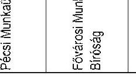

---

1. sz. tanúsítvány a V-2016-131/2008-2009. sz. jelentéshez

| Perszám | Eljáró bíróság | Ügyszak | Felperes | Alperes | Per tárgya | Kereseti követelés összege tőke (kamatok nélkül)  |
| --- | --- | --- | --- | --- | --- | --- |
| 5. M. 2842/2008 | Fővárosi Munkaügyi Bíróság | elsőfokú eljárás | Jogelőd szervezet dolgozója | MNV Zrt. | Megállapodás érvénytelenségének megállapítása | 5.895.980,- Ft  |
| 10. M. 657/2008 | Fővárosi Munkaügyi Bíróság | elsőfokú eljárás | Jogelőd szervezet dolgozója | MNV Zrt. (jogelőd NFA) | Munkaviszony | 2.000.000,- Ft  |
| 5.M.2842/2008 | Fővárosi Munkaügyi Bíróság | első fok | Jogelőd szervezet dolgozója | MNV Zrt. | Munkaügyi per | 2.530.000,- Ft  |
| 30.M.2869/2008 | Fővárosi Munkaügyi Bíróság | első fok | Jogelőd szervezet dolgozója | MNV Zrt. | Munkaügyi per | 1.843.500,- Ft  |

Budapest, 2009. május 26.

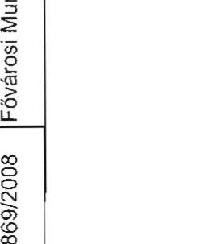

---

# Függelékek

---

# Függelékek jegyzéke 

1. Az állami ingatlanvagyon vagyonkezelése
2. A Nemzeti Földalap tevékenysége
3. Az állami tulajdonú társaságok vagyonkezelése

---

# Az állami ingatlanvagyon vagyonkezelése 

## TARTALOMJEGYZÉK

1. Az állami ingatlanvagyon hasznosításának stratégiája ..... 4
2. Az állami ingatlanvagyon vagyonkezelési tervének és finanszírozási forrásainak összhangja ..... 5
3. Az ingatlanvagyon használatát biztosító hasznosítási szerződések szabályszerűsége és célszerűsége ..... 5
4. A központi költségvetési szervek elhelyezésével kapcsolatos rendelkezések végrehajtása ..... 6
5. Az állami ingatlanvagyon értékesítésének szabályszerűsége ..... 7
6. Az állami vagyon hasznosításának tulajdonosi ellenőrzése ..... 8

---

# 2

---

# Az állami ingatlanvagyon vagyonkezelése 

A KVI megszüntetése érdekében a pénzügyminiszter - mint alapító - a Vtv. 61. § (1) bekezdése szerinti intézkedéseket megtette, a költségvetési szerv megszüntető okiratát kiadta.

A KVI és az MNV Zrt. közötti feladatátadásnak a Vtv. 62. § a)-e) pontjaiban meghatározott teendőit nem hajtották végre teljes körűen.
2007. december 29-én a KVI vezérigazgatója az irányítása alá tartozó szervezeti egységek folyamatban lévő ügyeinek jegyzékét helyettesének adta át, az iratok átadása az MNV Zrt. megalakulását követően is folyamatosan zajlott. Az MNV Zrt. vezérigazgatója a két szervezet közötti átadás-átvétel tényét alátámasztó dokumentumokat 2008. szeptember 26-án küldte meg az EB elnöke részére.

Az állami ingatlanvagyon kezelésére kialakított szervezeti rendszerben a Vtv.-ben előírt valamennyi feladat „gazdára talált”.

Az állami tulajdonú ingatlanvagyonnal és egyéb állami vagyonelemekkel ${ }^{1}$ történő gazdálkodással kapcsolatos feladatok ellátását a Társaság SZMSZ-e szerint az ingatlanvagyonért felelős vezérigazgató-helyettes irányítja.

A vezérigazgató-helyettest feladatainak ellátásában a központi költségvetési szervek elhelyezéséért felelős igazgató, a tulajdonosi ügyekért felelős igazgató, valamint a vagyonkezelésért és vagyongazdálkodásért felelős igazgató segíti. Az SZMSZ-ben meghatározott feladatok ellátásában - amelyek a vezérigazgató-helyettes által irányított tevékenységeken felül az értékesítéshez kapcsolódó feladatokat is felölelnek - a Társaság 19 területi irodája működik közre.

Az ingatlanvagyonért felelős vezérigazgató-helyettes - az NVT részére készített tájékoztatójában - kifogásolta a kiszolgáló funkciók működését, így az informatikai és kontrolling rendszer, ${ }^{2}$ valamint a pénzügyi és gazdasági támogatás hiányát, az iktató rendszer problémáit, a háttér- és előzmény dokumentumok megszerzésének nagy időigényét.

Az MNV Zrt. alapításának előkészítésébe a PM tanácsadó cégek bevonását tervezte. ${ }^{3}$ Mivel a tanácsadó cégek munkájának dokumentumai a korábbi ellenőrzésnek és a jelenleginek sem álltak rendelkezésére, nincs mód annak megállapítására, hogy az ingatlanvagyon hasznosítását ellátó szervezeti rendszer kialakításakor értékelték-e, illetve figyelembe vették-e a KVI működésének tapasztalatait, valamint hogy az eredményes feladatellátás szempontjából előzetesen összehasonlítottak-e különböző szervezeti megoldásokat.

[^0]
[^0]:    ${ }^{1}$ Ide nem értve az agrárportfólióért felelős vezérigazgató-helyettes hatáskörébe sorolt ingatlanokat és egyéb vagyonelemeket.
    ${ }^{2}$ A vagyongazdálkodáshoz kapcsolódó kiadások kontrolling rendszerét az új szervezetben nem alakították ki, a KVI rendszerét ugyanakkor nem vették át.
    ${ }^{3}$ Az Állami Számvevőszék 0825. számú Jelentése az Állami Privatizációs és Vagyonkezelő Zrt. 2007. évi működésének és a központi költségvetés végrehajtásához kapcsolódó tevékenységének ellenőrzéséről, 2008 augusztus.

---

Az ellenőrzés során megkérdezett valamennyi vezető a szervezeti egységének feladatához mérten kevésnek tartotta a rendelkezésre álló létszámot.

# 1. Az állami ingatlanvagyon hasznosításának stratégiája 

Az állami vagyon fejlesztésével, hasznosításával, elidegenítésével kapcsolatos középtávú stratégiát az NVT a 473/2008. (VII. 09.) NVT sz. határozatával fogadta el. A stratégia a Kormány elé terjesztése - a Vtv. 6. § (2) b) szerint - nem történt meg.

2008 novemberében a pénzügyminiszter levélben kérte az NVT-t, hogy az általános elveken túl konkrét elveket fogalmazzon meg az egyes vagyoncsoportokkal kapcsolatban. A dokumentum átdolgozása 2009 márciusára elkészült, annak hivatalos előterjesztése a helyszíni ellenőrzés lezárásáig nem történt meg.

A dokumentum az ingó és ingatlan vagyongazdálkodásra vonatkozó szakterületi sajátosságokon belül a költségvetési szervek ingatlan használatának kérdésével, illetve a műemlékkezeléssel kapcsolatban tartalmaz tényleges stratégiai elemeket. Az ingó- és ingatlanvagyon hasznosítását érintő többi kérdésben szabályozás, illetve vagyongazdálkodási elvek kidolgozását írja elő, anélkül, hogy azok irányait meghatározná.

A dokumentum - határidők megjelölése nélkül - elhalasztja a társadalmi szervezetek ingatlanaival, az egyházak vagyonkezelésében lévő, a sport- és a külföldi ingatlanokkal, a PPP földhasználati jogok biztosításával, az ingyenes önkormányzati ingatlan juttatással és az autópálya konstrukciókkal kapcsolatos stratégia kidolgozását.

A vagyongazdálkodás fő követelményeként meghatározott eredményesség kritériumait is csak az állami ingatlanvagyon hasznosításának egy szűk körére vonatkozóan határozza meg: piaci alapú bérleti, illetve vagyonkezelési díjak érvényesítésére, valamint az állami feladatok ellátásához szükséges és elégséges mennyiségű ingatlannak a költségvetési szervek számára történő biztosítására.

Összefoglalóan megállapítható, hogy az MNV Zrt. stratégiájának az állami vagyon - és ennek részeként az állami ingatlanvagyon - hasznosítására vonatkozó célkitűzései megegyeznek a Vtv. rendelkezéseivel. A stratégia arra nem tér ki, hogy az ingatlanok különböző hasznosítási módjainak milyen arányait tartja kialakítandónak az általános célkitűzések elérése érdekében.

A stratégia kialakításának elhúzódása az állami ingatlanvagyon hasznosítását hátráltatta 2008-ban.

Ez érintette a portfólió tisztítás keretében az 1/1 tulajdoni hányadok értékesítésével, hasznosításával, továbbá az ingyenes önkormányzati tulajdonba adással kapcsolatos döntés-előkészítést, döntéshozatalt, illetve a műemlékek hasznosításával kapcsolatos döntés előkészítést.

---

# 2. Az állami ingatlanvagyon vagyonkezelési tervének és finanszírozási forrásainak összhangja 

Az MNV Zrt. vagyonkezelési tervét a középtávú stratégia kialakítását megelőzően dolgozta ki.

A Társaság vagyonkezelési tervében kiemelt súllyal kezelte a központi költségvetési szervek elhelyezésével kapcsolatos rendelkezések végrehajtását.

Az ingatlanvagyonnal kapcsolatos bevételek és kiadások vagyonkezelési tervbe beállított mértékét nem egy stratégia specifikus célkitűzései, hanem az értékesítési tranzakciók előkészítettsége, törvényi előírások, korábban kötött szerződések rendelkezései, időbeli, illetve az ingatlanok állapotával összefüggő alapvető műszaki determinációk határozták meg.

Bevételi oldalon az egyéb ingatlanok értékesítéséből a terv a ténylegesen megvalósultnál alacsonyabb, 3243 M Ft bevétellel számolt. Az egyéb bérleti díjak és a vagyonkezelői díjak mértékét a meglévő szerződések alapvetően meghatározták.

Az ingatlanvagyonhoz kapcsolódó kiadásokon belül a felhalmozási kiadások ingatlan vásárlásra fordítandó összegét a kulturális örökségvédelemről szóló 2001. évi LXIV. törvény szerint állami tulajdonba megszerzendő ingatlan vételára határozta meg. Az eredeti előirányzat a Hadrianus Palota megvételére biztosított fedezetet. A pénzügyminiszter 2008 novemberében engedélyezte 1469,5 M Ft átcsoportosítását erre a kiadási előirányzatra a Nemzeti Lóverseny Kft. egyes ingatlanjainak megvásárlásához. A Klebelsberg villa csere útján történt megszerzése szintén a 2001. évi LXIV. törvény alapján történt, a fedezetet 229,9 M Ft pénzügyminiszteri engedély alapján történt átcsoportosítása teremtette meg.

Az ingatlan beruházások 4224 M Ft előirányzatából 3500 M Ft az Amerikai Követség épületének felújításának fedezete, amelyre az Amerikai Egyesült Államok és a Magyar Köztársaság közötti kormányközi megállapodás értelmében került sor.

Az ingatlanok fenntartásával járó kiadások mértékét az üzemeltetést, fenntartást, karbantartást, javítást, illetve az ingatlanok őrzését biztosító szerződések determinálták.

A moszkvai Magyar Kereskedelmi Képviselet ingatlanának értékesítését az 1. sz. Függelék 1. sz. melléklete ismerteti.

## 3. Az ingatlanvagyon használatát biztosító hasznosítási szerződések szabályszerűsége és célszerűsége

A megvizsgált vagyonkezelési szerződések rendelkeznek mindazokban a kérdésekben, amelyeket a Vtv. és a 254/2007. (X. 4.) Korm. rendelet ezzel kapcsolatban előír; tartalmazzák azokat az elvárásokat, amelyeket a jogszabályok a vagyon hasznosításával szemben támasztanak. Ebben a formai értelemben a vagyonkezelési szerződések célszerűsége megállapítható.

A Vtv. hatályba lépése előtt egyéb vagyonkezelőkkel megkötött, megvizsgált szerződések nincsenek összhangban a megváltozott jogszabályi környezettel.

---

A szerződő felek jogait és kötelezettségeit, vagy a kezelt vagyon megterhelésének szabályait, például a szerződések az Áht.-nek éppen a Vtv.-vel hatályon kívül helyezett rendelkezései alapján határozzák meg. Előfordul a szerződésekben, hogy a kincstári vagyon értékesítésére vonatkozó versenyeztetési szabályzat jóváhagyásáról szóló 1048/1997. (V. 13.) Korm. határozatra hivatkoznak, amelyet 2005-ben helyeztek hatályon kívül.

A 254/2007. (X. 4.) Korm. rendelet 8. § (5) bekezdése szerint az egyéb vagyonkezelő vagyonkezelési szerződésben vállalt kötelezettségeinek teljesítését szerződést biztosító mellékkötelezettségekkel ${ }^{4}$ kell biztosítani. Ennek az előírásnak az ellenőrzött - a Vtv. hatályba lépése előtt kötött - szerződések teljes körűen nem tesznek eleget.

A mellékkötelezettséggel kapcsolatos előírásnak a Vtv. hatályba lépését követően például: a Hévízgyógyfürdő és Szent András Reumakórház Kht-vel megkötött vagyonkezelési szerződés sem tesz eleget. A szerződésben a „Vagyonkezelő kijelenti, hogy az általa vállalt kötelezettségek fedezete rendelkezésére áll”.

# 4. A központi költségvetési szervek elhelyezésével kapcsolatos rendelkezések végrehajtása 

A Vtv. 59. § (5) bekezdése 2008. június 30-ai határidővel írta elő az MNV Zrt.-nek a központi költségvetési szervekkel kötött, a törvény hatálybalépésekor hatályos vagyonkezelési szerződések felülvizsgálatát és a törvény előírásainak megfelelő, valamint a külön törvényekben, így különösen a 2004. évi CV. tv. 89. § (1) bekezdésében foglaltakat ${ }^{5}$ is figyelembe vevő módosítását.

Az
 érintett vagyonkezelői szerződések módosítására - a Honvédelmi Minisztérium kivételével - az előírt határidőre nem került sor.

A szerződéstervezetek jóváhagyását ${ }^{6}$ követően az MNV Zrt. 2008. június 26-30. között 206 db bérleti és 326 db vagyonkezelési szerződést küldött ki a központi költségvetési szerveknek.

A tárcákkal előzetesen több körben lefolytatott egyeztetések ellenére a központi költségvetési szervek a hatályos vagyonkezelési szerződéseket módosító új szerződéseket - a már említett HM kivételével - elsősorban jogszabályi előírásokra hivatkozva nem írták alá, a módosítás koncepciójához és szövegéhez is számos kifogást, észrevételt, kiegészítési és változtatási javaslatot fogalmaztak meg.

[^0]
[^0]:    ${ }^{4}$ Mellékkötelezettség a Ptk. szerint a foglaló, kötbér, bankgarancia, jogvesztés kikötése, zálogjog, óvadék, kezesség. (Ptk. XXIII. fejezet, 243-276. §)
    ${ }^{5}$ „89. § (1) A Honvédség szervezeteinek elhelyezéséhez, illetve feladatai ellátásához rendelkezésre bocsátott ingatlanok állami tulajdonban, a honvédelemért felelős miniszter által vezetett minisztérium vagyonkezelésében állnak."
    ${ }^{6}$ Az NVT a 338/2008. (V. 28.) számú határozatával fogadta el a központi költségvetési szervekre vonatkozó előterjesztést. Tekintettel a felsőoktatási intézmények ingatlan használatának sajátosságaira, ezek módosított vagyonkezelési szerződéseinek tervezetéről külön előterjesztés készült, amit a Tanács 449/2008. (VI. 25.) számú határozatával fogadott el.

---

A központi költségvetési szervek egyöntetű álláspontja szerint a kötelezettségvállalásnak az Áht.-ben és az Ámr.-ben rögzített feltételei - különösen, amely szerint költségvetési szerv kötelezettséget csak jóváhagyott kiadási előirányzat mértékéig vállalhat - nem voltak adottak. Észrevételezték, hogy nincs összhang a Központi Szolgáltatási Főigazgatóságról szóló 272/2003. (XII. 24.) Korm. rendelet és az állami vagyonnal való gazdálkodásról szóló 254/2007. (X. 4.) Korm. rendelet között. ${ }^{7}$

További problémát jelent, hogy a 272/2003. (XII. 24.) Korm. rendelet végrehajtása teljes körűen nem történt meg a Vtv. hatályba lépéséig, az azt követő rendezést pedig éppen a Vtv. és az Áht. által teremtett jogszabályi környezetnek a vagyonkezelői jog ingyenes átadására vonatkozó rendelkezései akadályozták.

Azok a központi költségvetési szervek pedig, amelyek a 272/2003. (XII. 24.) Korm. rendeletet végrehajtották, ezt követően a vagyonkezelői feladatok ellátásának sem pénzügyi, sem humán erőforrás feltételeivel nem rendelkeztek.

A módosított vagyonkezelői és bérleti szerződések aláírása eddig felsorolt akadályainak elhárítására, ezáltal a törvényben meghatározott határidő betartásának biztosítására az MNV Zrt.-nek saját hatáskörében nem volt módja.
2008. augusztustól a központi költségvetési szervek ingatlanhasználatának tervezett konstrukciójában háttérbe szorultak a használatot piaci eszközökkel szabályozó elemek, illetve ezek alkalmazása több éves távlatba tolódott.

A központi költségvetési szervek általános piaci feltételek szerinti ingatlanhasználatára vonatkozó Vtv.-beli rendelkezés megalapozatlanságára utal, hogy 2009. júniusban a rendelkezés módosítása került napirendre.

# 5. Az állami ingatlanvagyon Értékesítésének Szabályszerűsége

Az MNV Zrt. 2008. évi ingatlan értékesítési tevékenységét az új szervezeti keretek, a megváltozott jogszabályi környezet, végül - az év végétől - a kedvezőtlen gazdasági folyamatok alakították. Annak ellenére, hogy a felsoroltak az értékesítés lendületét visszavetették, az egyéb ingatlanok értékesítéséből származó bevételi előirányzat 2008-ban túlteljesült.

A HM ingatlanok értékesítése a Vtv. és a 254/2007. (X. 4.) Korm. rendelet, valamint az MNV Zrt. belső szabályzatai szerint, azoknak megfelelően történik.

A pártok éltek a Vtv.-ben biztosított lehetőséggel, és 136 ingatlan megvételére kötöttek szerződést 2126823706 Ft vételáron. 2008-ban a vételár 42,6%-a érkezett meg a Társasághoz. A pártingatlanokkal kapcsolatos feladatát az MNV Zrt. határidőre teljesítette.

[^0]
[^0]:    ${ }^{7}$ A KSZF működésére részletesen kitér az ÁSZ 0901 számú Jelentése a magyar központi közigazgatás modernizációjának ellenőrzéséről (2009 január)

---

Az EB és a Belső Ellenőrzési Iroda által a vizsgált időszakban lefolytatott ellenőrzések kisebb hányada volt az, amelyik kizárólag az állami ingatlanvagyon hasznosításának értékelésére irányult.

Az EB 2008. I. félévi munkatervében előirányzott 11 célvizsgálat között nem szerepelt olyan, amely kizárólag az állami ingatlanvagyon hasznosítására irányult, a II. félévi munkaterv 15 célvizsgálata között 1 ilyen volt, a 2009. I. félévi munkatervben szereplő 20 vizsgálatból szintén 1 koncentrált erre a szakterületre (a célvizsgálatok, illetve a rendszeres vizsgálatok, feladatok között természetesen több is volt, amely más szakterületek mellett érintette azt).

A Belső Ellenőrzési Iroda 15 befejezett vizsgálata közül 2, folyamatban lévő 6 vizsgálata közül 0, elrendelt, de kapacitáshiány miatt meg nem kezdett 2 vizsgálata közül 1 irányult az állami ingatlan hasznosítás területére.

A KVI által 2007. szeptember 25-e és december 31-e közötti időszakban lebonyolított értékesítési tranzakcióinak szabályszerűségéről készült ellenőrzési jelentés jogszerűnek, szabályosnak és megalapozottnak találta a tranzakciókat. Nem minden esetben volt dokumentált a vételár szabályszerű kifizetése és a birtokbaadás megtörténte.

Az EB 2008-ban ellenőrizte a „FRADI-pálya" néven ismert ingatlanok privatizációs értékesítését. A jelentés megállapította, hogy az értékesítésre vonatkozó NVT döntés megfelelt a Vtv. és a 254/2007. (X. 4.) Korm. rendeletnek, kifogásolta azonban, hogy ez utóbbi 29. §-ában a zártkörű pályázat kiírása esetére előírt szigorú indoklási kötelezettségnek a kiírás nem tett eleget.

A Belső Ellenőrzési Iroda folyamatos feladata az átruházott hatáskörben hozott döntések vizsgálata. Ehhez az Iroda szabályzat tervezetet dolgozott ki, amelynek véglegesítésére a folyamatban lévő tételes ellenőrzés tapasztalatainak birtokában kerül sor.

# 6. Az állami vagyon hasznosításának tulajdonosi ellenőrzése

Az MNV Zrt.-nek 2008-ban és 2009-ben - a helyszíni ellenőrzés lezárásáig - nem volt elfogadott tulajdonosi ellenőrzési szabályzata.

Az SZMSZ szerint Belső Ellenőrzési Iroda feladata a tulajdonosi ellenőrzések elvégzése és az erre vonatkozó terv készítése. Ez a terv sem 2008-ban, sem 2009-ben nem készült el.

A tulajdonosi ellenőrzések végzésére ténylegesen rendelkezésre álló létszámmal a jogszabályoknak ezen ellenőrzésre vonatkozó elvárásai tekintettel az érintett hasznosítási szerződések több százas nagyságrendjére, az ellenőrizendő vagyonelemek sajátosságaira, a nyilvántartás hiányosságaira az ingatlan portfólióért felelős vezérigazgató-helyettes felelősségi körébe tartozó állami vagyonelemekkel kapcsolatban nem voltak teljesíthetők.

---

1. sz. Függelék 1. sz. melléklete a V-2016-134/2008-2009. sz. jelentéshez

# A moszkvai Magyar Kereskedelmi Képviselet ingatlanának értékesítése

A Nemzeti Vagyongazdálkodási Tanács (NVT/Tanács) 2008. július 30-án megtárgyalta a Külügyminisztérium javaslata alapján a „Döntés a Külügyminisztérium vagyonkezelésében lévő Magyar Köztársaság moszkvai Nagykövetsége Kereskedelmi Képviselet Moszkva, Ulica Krasznaja Prezsnya 1-7. szám alatti ingatlanon található épületének zártkörű pályázat útján történő értékesítéséről" tárgyú előterjesztést.

A Kormány a Magyar Köztársaság moszkvai, szófiai és varsói külképviseleti ingatlanainak jogi helyzetével összefüggő nemzetközi szerződések módosításáról szóló 2072/2006. (IV. 4.) Korm. határozatban döntött a Magyar Köztársaság moszkvai külképviseleti ingatlanának ésszerű hasznosításáról, és ennek érdekében az ingatlan jogi helyzetét szabályozó nemzetközi szerződés módosításával egyidejűleg felhatalmazta a pénzügyminisztert, hogy a Kincstári Vagyoni Igazgatósággal együttműködve lefolytassa az államháztartásról szóló 1992. évi XXXVIII. törvény, valamint a kincstári vagyonnal való gazdálkodásról szóló 58/2005. (IV. 4.) Korm. rendelet alapján a kincstári vagyonkörbe tartozó ingatlan zártkörű értékesítésére vonatkozó eljárást.

Az előterjesztés alapján a Tanács meghozta az 503/2008. (VII. 30.) NVT számú határozatot, ami az alábbiakat tartalmazta:
1.) Az NVT a Külügyminisztérium (KüM) javaslata alapján, a Vtv. 35. § (5) bekezdésére tekintettel hozzájárult a Magyar Köztársaság moszkvai Nagykövetsége Kereskedelmi Képviseletének fenti címen található épülete zártkörű pályázat keretében történő értékesítéséhez.
(A Vtv. 35. § (5) bekezdése kimondja: „Ha a kiíró - megfelelő határidők kitűzésével - az érdekelteket kizárólag közvetlenül hívja fel ajánlattételre, a pályázat zártkörű pályázatnak minősül. Zártkörű pályázat kiírására csak kivételesen kerülhet sor.")
A zártkörű pályázat nem adott lehetőséget a Moszkvában lévő magyar érdekeltséggel bíró társaságok (pl. Richter) pályázati részvételére.
Az NVT az értékesítés vételárának minimális összegét, az előterjesztéshez csatolt és a vagyonkezelő (KüM) által készíttetett (Cushman&Wakefield ingatlanszakértő) értékbecslés alapján nettó 19,9 millió USD-ben állapította meg.

Az ingatlanforgalmi értékbecslés azonban magyar nyelven nem tartalmazott információkat, annak pontos tartalmáról - a helyben kialakult értékviszonyokról, a viszonyítási alapokról, a becsült értékkalkulációt befolyásoló körülményről - a Tanács nem tudott megbizonyosodni, így a pályázat kiírás-

---
 Értékelő Bizottság a 2008. szeptember 29-én kelt jegyzőkönyvében az alábbiakat javasolta:
„Az OAO VO Masinoimport ajánlata 17 millió USA dollár volt. A benyújtott pályázat tartalmilag nem felel meg az ajánlati felhívásban foglaltaknak, ugyanis hiánypótlás ellenére sem tartalmazta a 30 napnál nem korábbi cégkivonatot. A Daimond Air S.a.r.l. társaság megajánlott vételára 21320626 USA dollár volt. A benyújtott pályázat mind formailag, mind tartalmilag megfelel az ajánlati felhívásban foglaltaknak."

A bíráló bizottság tagjai a pályázat nyertesének a Daimond Air S.a.r.l.-t javasolták az eljárás nyertesének nyilvánítani, azzal az indokkal, hogy érvényessége mellett az tartalmazta a legelőnyösebb ajánlatot."

Az ingatlan adásvételi szerződést az oroszországi magyar nagykövet még az NVT határozathozatalának a napján, 2008. november 5-én megkötötte/aláírta.

A Kincstár tranzakciós bizonylatai, valamint az MNV Zrt. Értékesítési bevételek számla 2008. éves forgalmi kimutatásának, továbbá a kincstári adatbázis alapján megállapítható, hogy az NVT 687/2008. (XI. 05.) számú határozatában a nyertes pályázónak megnevezett Diamond Air S.A.R.L. a moszkvai ingatlan vételárát, a 21,3 M USD-t, illetve az MNB átváltása után az annak megfelelő 3529,4 M Ft-ot az MNB-n keresztül már 2008. március 17-én - az adásvételi szerződés aláírását közel nyolc hónappal megelőzve - az MNV Zrt.-nek megfizette. E vételár Ft összege az MNB Zrt. Kincstárnál vezetett Értékesítési bevételek számláján jóváírásra került.

Az ingatlan adásvételi szerződés 4.1. pontja az alábbiakat tartalmazza:
„A Felek által korábban megkötött és teljesített megállapodásoknak megfelelően, a Vevő 21,3 millió USD dollárt köteles fizetni az összegnek az Eladó által megadott számlára történő átutalásával."

Az MNB 2008. március 28-án kelt MNV Zrt.-nek eljuttatott levele szerint 2005. december 8-án az akkori moszkvai magyar nagykövet az ingatlan vonatkozásában adásvételi megállapodást kötött a luxemburgi székhelyű Diamond Air S.A.R.L. társasággal. A nagykövet az adásvételi megállapodás aláírásával a megállapodás megkötésekor hatályos rendelkezések, nevezetesen az államháztartásról szóló 1992. évi XXXVIII. törvény 109/C §-ának (1) és (2) bekezdésében előírtak ellenére vállalt kötelezettséget. Figyelemmel a Ptk. 200. §-ának (2) bekezdésében foglaltakra, a 2005. december 8-án megkötött adásvételi megállapodás semmis.

A 2008. november 5-én megkötött adásvételi szerződés 4.1. pontja „korábban megkötött és teljesített" semmis megállapodásra hivatkozik.

Az ingatlan adásvételi szerződés 7.2. pontja rögzíti, hogy a szerződés, az aláírását megelőzően 2 nappal, 2008. november 3-án lépett hatályba. Az oroszorszá-

gi magyar nagykövet felhatalmazása a 2008. évi szerződés aláírására 2008. július 31-én kelt.

A vételár összeg jóváírásáról az MNV Zrt.-t a Kincstár jóváírási értesítőben tájékoztatta. Az MNV Zrt. Gazdasági Igazgatósága a 2008. március 19-én kelt és az MNB-nek címzett MNV01/21231/0/2008. ügyiratszámú levelében a vételár összeg jóváírásának a beazonosításához az MNB-től adatokat kért.

Az MNB a 2008. március 28-án kelt válaszlevelében pontokba szedve tájékoztatta az MNV Zrt. gazdasági vezető menedzserét, hogy az MNB jóváírásával kapcsolatban a berni UBS AG. Banktól milyen információkat kaptak:

1. Az épület Moszkvában, a Krasznaja Presnya utca 3. szám alatt található.
2. Az ingatlan adásvételi megállapodást 2005. december 8-án az oroszországi magyar nagykövet írta alá a DIAMOND AIR. igazgatójával. A megállapodás nem állt az ellenőrzés rendelkezésére, azt az MNB MNV Zrt.-nek megküldött tájékoztatása tartalmazza.

A 3. és a 4. pontokban a UBS Bank két cég nevét és azok pontos elérhetőségét adta meg: a WEDGWOOD MANAG LTD. (Larnaca, Cyprus) és a DIAMOND AIR. (Luxemburg) társaságokét.

Az oroszországi magyar nagykövet felhatalmazása e szerződés aláírására 2006. december 13-án kelt.

Az MNB előzőekben bemutatott tájékoztatása alapján már 2005. december 8-án sor került egy megállapodásra, amelyet ugyanazok a személyek írtak alá, mint akik a 2008. évi szerződést.

Az MNV Zrt. a 3529,4 M Ft összegű bevételt 2008. április 9-én az MNV Zrt. Értékesítési bevételek 10032000-01034303-00000000 számú számlán belül az ÁHT „0"-ás azonosító helyett az ÁHT „278145"-ös azonosítóval látta el, azaz a bevételt az Egyéb ingatlanok értékesítéséből származó bevételnek minősítette.

A számvevőszéki ellenőrzés 2009. május 19-ei, telefonon történt megkeresésére a KüM Gazdálkodási Főigazgatója két (a 2008. október 29-ei és a 2008. december 29-ei) levelet küldött faxon. A KüM Gazdálkodási Főosztályának főosztályvezetője 2008. október 29-én levélben fordult az MNV Zrt. Értékesítési Jogi Igazgatójához, miszerint tudomása van arról, hogy a Moszkvai Kereskedelmi Képviselet ingatlana a 2008. év második felében értékesítésre került, s hogy ennek megfelelően az ingatlan értékét a Külképviseletek igazgatása alcím mérlegéből és a leltári nyilvántartásból kivezetheti-e.

A KüM megkeresésére az MNV Zrt. Ingatlanvagyonáért felelős vezérigazgató-helyettese 2008. december 2-án levélben válaszolt, amelyben közölte az NVT 687/2008. (XI. 05.) számú határozatának, s a Megbízási szerződés tartalmát. A levél hivatkozik az állami vagyonnal való gazdálkodásról szóló 254/2007. (X. 4.) Korm. rendelet 26. § (4) bekezdésére, mely szerint „Az értékesítést megelőzően az értékesítendő vagyonelemre vonatkozó vagyonkezelési szerződést meg kell szüntetni és a feleknek egymással az V. fejezet szabálya szerint el kell számolniuk." Majd a vezérigazgató-helyettes kifejti, hogy ha a KüM az adásvételi szerződést megköti, a vevő a vételárat maradéktalanul kiegyenlíti, s erről a KüM az MNV Zrt.-t kiértesíti, akkor kerülhet sor a vagyonkezelői szerződés megszüntetésére. A leltári nyilvántartásból az ingatlant a KüM a birtokbaadással egy időben törölheti. A vezérigazgató-helyettes tájékoztatta a KüM képviselőjét, hogy az MNV Zrt. a vagyonkezelői szerződés módosításának a tervezetét elkészítette, aminek az aláírására a KüM előbbiekben sorolt kötelezettségeinek a megtétele után kerülhet sor. A vagyonkezelői szerződés módosításának a tervezetét a vezérigazgatóhelyettes a leveléhez csatolta. A vezérigazgató-helyettes a levele végén a következőket írja: „A vagyonkezelési szerződés megszüntetésére vonatkozó megállapodás eredményeként a jelenlegi vagyonkezelő érintett vagyonelemre vonatkozó vagyonkezelői joga a 254/2007. (X. 4.) Korm. rendelet 12. § (5) bekezdésében meghatározott időpontban szűnik meg." A hivatkozott jogszabály azt tartalmazza, hogy ingatlan esetében a vagyonkezelői szerződés megszűnése az ingatlanra vonatkozó vagyonkezelői jogot akkor szünteti meg, amikor a vagyonkezelői szerződés az ingatlan nyilvántartásban törlésre kerül.

Az MNV Zrt. értékesítési igazgatója egy 2008. november 10-ei belső feljegyzésben arról tájékoztatta az MNV Zrt. gazdasági igazgatóját, hogy a 3529,4 M Ft bevétellel „kapcsolatban semmilyen jogcímet, illetve szerződést nem találtam, aminek alapján az utalás időpontjában vagy azt megelőzően az MNV Zrt.-t az összeg feletti rendelkezés megilletné".

Az MNV Zrt. értékesítési igazgatója az MNV Zrt. vezető jogtanácsosával történt egyeztetésre hivatkozva az MNV Zrt. gazdasági vezérigazgató-helyettesének, valamint tájékoztatásul az ingatlanvagyonért felelős vezérigazgató-helyettesnek 2008. december 22-én írt feljegyzésében megerősíti a 2008. november 10-ei feljegyzésében írtakat, s a DIAMOND AIR. S.A.R.L. társaság közli továbbá „a nevezett összeg felett információim szerint továbbra is az utalás elrendelője rendelkezhet".

Az MNV Zrt. Gazdasági Igazgatósága 2008. december 23-án a 3529,4 M Ft-ot, mint egyéb ingatlan értékesítéséből származó bevételt (ÁHT = 278145) a beazonosíthatóság hiányában átvezettette a Társaság letéti számlájára.

A volt kereskedelmi képviselet épületét a KüM 2009. március 31-ével a vevőnek birtokba adta. A birtokbaadási jegyzőkönyvet 2009. március 31-én aláírta a Magyar Köztársaság oroszországi rendkívüli és meghatalmazott nagykövete és a DIAMOND AIR. igazgatója.

# A Nemzeti Földalap tevékenysége 

## TARTALOMJEGYZÉK

1. Az NFA működtetésére kialakított társasági szervezeti rendszer ..... 3
2. A földbirtok-politikai irányelvekben és egyéb jogszabályokban meghatározott előírások ..... 9
2.1. Az állami tulajdonban lévő védett természeti területek, műemlékingatlanok, műkincsek és védett földterületek értékesítése ..... 9
2.2. Az előző pontban nem szereplő földértékesítések céloknak való megfelelése, az értékesítések megalapozottsága és szabályszerűsége ..... 9
2.3. A termőföldért életjáradékot programban, a szociális termőföld és erdő programban és a Nemzeti Vidékfejlesztési tervben megfogalmazott célok teljesülése ..... 13
3. Az agrárportfólió részét képező Nemzeti Földalap tevékenysége ..... 15
3.1. Az NFA külső szervezetekkel történő, jogszabályokban rögzített együttműködési kötelezettsége, az együttműködés összhangja és eredménye ..... 15
3.2. Az NFA működésének ellenőrzési rendszere ..... 16

# 2

# 1. Az NFA működtetésére kialakított társasági szervezeti rendszer 

Az állami vagyonról szóló 2007. évi CVI. törvény 21. § (2) bekezdésében előírt a Nemzeti Földalapra (továbbiakban: NFA) vonatkozó - szervezeti egység felállítása, illetve az SZMSZ-ben történő nevesítése megtörtént, de az SZMSZ nem tartalmazza, hogy a benne felsorolt feladatok közül melyek tartoznak az NFA egység hatáskörébe. Az NFA területhez kapcsolódó feladatokat - a Nemzeti Földalapért felelős igazgató döntési jogkörébe rögzítetten - a „Javaslat az MNV Zrt. SZMSZ 11. § (4) bekezdése szerinti hatáskörök továbbruházására" tárgyú 620/2008. (X. 01) számú határozata tartalmazott, ami azt is jelenti, hogy addig - azaz 2008. október 1-jéig, tehát a vizsgált időszak nagyobb részében - ilyen típusú szabályozás nem volt. A vizsgált időszakban az MNV Zrt.-n belül az NFA területet érintő feladatok nem voltak teljesen megfelelően elhatárolva.

A Nemzeti Vagyongazdálkodási Tanács (továbbiakban: NVT) 2008. 02. 06-án fogadta el a 39/2008. (II. 06.) számú határozatát „Tájékoztató a Nemzeti Földalapkezelő Szervezet 2007. december 20. és december 31-e közötti működéséről" tárgyban. Az előterjesztés részét képezte az MNV Zrt. gazdasági igazgatójának a feljegyzése, amely több a haszonbérleti szerződéshez kapcsolódó problémára felhívta a figyelmet. Az NVT a tájékoztatást tudomásul vette, az abban lévő problémák megoldására vagy azokról való újbóli beszámolási kötelezettségére vonatkozóan nem írt elő feladatot. Ezek elmaradásával az NVT hozzájárult ahhoz, hogy a haszonbérleti szerződések 2008. december 31-éig történő felülvizsgálata nem valósult meg. Ellenőrzésünk megállapította, hogy 2007 decemberében a Nemzeti Földalapkezelő Szervezet Gazdasági Igazgatósága, a pénzügyi-számviteli szabályozással ellentétes módon, tudatosan hibás számlákat állított ki.

Nem voltak egyértelműek az NFA-ra vonatkozó jogszabályok. Az MNV Zrt. az elővásárlási és elő-haszonbérleti jogokkal kapcsolatos problémákról 2009 májusában tájékoztatta a Pénzügyminisztériumot ${ }^{1}$, azzal együtt, hogy az MNV Zrt. nem rendelkezik jogszabály-módosítási kötelezettséggel. A törvényi szabályozás hiányossága is hozzájárult ahhoz, hogy nem volt egyértelmű belső szabályozás sem.

A 254/2007 (X. 4.) Korm. rendelet az állami vagyonnal való gazdálkodásról 54. § (5) bekezdésében előírt határidőre, 2008. december 31. - nem fejeződött be, a haszonbérleti szerződések felülvizsgálata. A hivatkozott jogszabály olyan feladatot - a szerződésmódosítások haladéktalan kezdeményezését - írt elő az MNV Zrt.-nek, amelynek a sikeres befejezéséhez tehát a tényleges szerződésmódosításhoz nem volt jogköre, ezt ugyanis csak egyoldalú szerződésmódosítással lehetett volna teljes körűen elérni. Az MNV Zrt, hogy eleget tegyen jogszabályi kötelezettségének, 2008 decemberében küldte ki haszonbérlőinek „sablonlevelét". Az ellenőrzés a következő megállapításokat tette:

[^0]
[^0]:    ${ }^{1}$ A PM részéről már ezt megelőzően - 2008 novemberében két alkalommal is - jelezték, hogy nem tartják megfelelőnek, a hatályos jogi szabályozással egyezőnek az MNV Zrt. ez irányú jogalkalmazási gyakorlatát. (Részletesen a jelentés 53. lábjegyzetében.)

- A 2008. évi haszonbérleti díjak kiszámlázása 2008 decemberében egy összegben történt, annak ellenére, hogy a szerződések szerint a bérlőknek egy évben kétszer (félévben és az év végén) van fizetési kötelezettsége. A haszonbérleti díjakból származó bevételek a Magyar Köztársaság 2008. évi költségvetésének bevételét jelentették volna. A bevételek késedelmes beérkezése a költségvetésnek
 időbeni kiesést okozott.
- Az ellenőrzés nem ért egyet a sablonlevélben szereplő mondatrésszel, mely szerint „a díjmegállapításra vonatkozó kezdeményezést eddig minden egyes haszonbérlőnk elfogadta”, tekintettel arra, hogy az nem valós állítás és így megtévesztő.
- Az új haszonbérleti díjakat nem mindenki fogadta el. ${ }^{2}$ Ezekben az esetekben az MNV Zrt. visszavonta a számlát és a haszonbérlőnek a korábbi szerződés szerint kiszámított alacsonyabb összeget kellett befizetnie. Ez eredményét tekintve, egyenlőtlen helyzetet teremtett, hisz aki elfogadta, annak az eredeti helyzethez képest többet kellett fizetnie, mint annak, aki nem.

A vizsgált időszakban nem sikerült szakmai konszenzust kialakítani az értékesítés szabályozására. A szakmai konszenzus alatt értjük: az MNV Zrt. érintett területeinek (Nemzeti Földalapért Felelős Igazgatóság, Értékesítési Jogi Igazgatóság), az FVM, az NFA EB közös álláspontját. A legfontosabb probléma a 27. értékesítési körben megváltoztatott értékelési szempontok voltak. Ezzel a változtatással az NFA EB, az FVM, az NFA területek nem értenek egyet. A vizsgálat során az Értékesítési Jogi Igazgatóság álláspontja nem állt rendelkezésre. Az értékelési szempontok megváltoztatásáról információt „A Nemzeti Földalapba tartozó területek 27. értékesítési portfóliójának meghirdetése” című előterjesztés szöveges része nem tartalmazott. Az értékelési szempontok kialakításával a kiíró által befolyásolni lehet az értékesítés nyerteseinek a körét. Az értékesítésre vonatkozó szabályozás nem tartalmazott a tulajdonjog átruházásához szükséges nyilatkozatok kiadására vonatkozó részt, az ellenőrzött értékesítési egységek esetén ezek kiadása azonban csak a vételár befizetése után történt.

Nem sikerült teljes körű szakmai konszenzust kialakítani a haszonbérbe adásra vonatkozó szabályozás tekintetében, azzal együtt, hogy a haszonbérbe adásra vonatkozó szabályzatokat az FVM miniszter jóváhagyta. A szakmai konszenzus alatt értjük: az MNV Zrt. (Nemzeti Földalapért Felelős Igazgatóság), az FVM, az NFA EB közös álláspontját. Az FVM eltérő véleményét tükrözi az FVM szakállamtitkár 2008. december 19-én az MNV Zrt. vezérigazgatójának írt levele is. Ennek vonatkozó része tartalmazza a következőket:
„Több ízben jeleztem már, a „haszonbérleti egységgel” kapcsolatos kifogásomat. A egység akár egymástól távolabb elhelyezkedő, több földrészletet foglalhat magában, s ezzel kapcsolatosan az előhaszonbérleti jogosultság igen nehezen állhat fenn a haszonbérleti

[^0]
[^0]:    ${ }^{2}$ Az MNV Zrt. nem tartja elfogadhatónak azt a megállapítást, amely szerint az új haszonbérleti díjakat nem minden haszonbérlő fogadta el, és ebben az esetben a haszonbérlőnek a régi módon kiszámított alacsonyabb összeget kellett fizetnie.
    Véleményünk szerint pl. a 2/2009. (II. 12.) AVIGH sz. határozat azt támasztja alá, hogy az MNV Zrt. egyetértett a haszonbérlő igényével, aki az új haszonbérleti díjat nem fogadta el, mert a régit tartotta jogszerűnek.

---

egység egésze tekintetében. A bírósági joggyakorlattal ellentétes az olyan jogértelmezés, amely az előhaszonbérleti jog gyakorlását az egész haszonbérleti egység vonatkozásában kiterjesztené, jóllehet a jogosultság nyilvánvalóan csak a haszonbérleti egység részét képező (egyes) földrészleteken áll fenn. "A fentiek alapján továbbra sem értünk egyet a „haszonbérleti egység” intézményével.”

Az FVM további véleményeltérését mutatja be az FVM szakállamtitkárának 2009. január 13-án kelt és agrárportfólióért felelős vezérigazgató-helyettes részére írt levelének vonatkozó része:
„Az MNV Zrt. a pályázatok értékelése során valamely földrészletre vonatkozó legmagasabb jogosultsági prioritást veszi alapul egyénenként és azt kiterjeszti az értékesítési (haszonbérleti) egység valamennyi földrészletére. Továbbá együttműködői csoport esetében ugyan az egyes személyek legmagasabb jogosultsági prioritásainak számtani átlagát veszi, de amennyiben valamely csoporttag nem rendelkezik jogosultsággal, a pontozási érték rá is kiterjesztésre kerül.

Véleményünk szerint a jogszabályokkal ellentétes és a bírósági gyakorlattal ellentétes az olyan jogértelmezés, amely az elővásárlási (elő-haszonbérleti) jog gyakorlását az egész értékesítési (haszonbérleti) egységre kiterjeszti, jóllehet a jogosultság nyilvánvalóan csak az egység részét képező (egyes) földrészlet(ek)en áll fenn, különböző prioritással.
Az elővásárlási joggal rokon intézmény, az előhaszonbérleti jog kapcsán mondta ki a Legfelsőbb Bíróság, hogy az csak önálló ingatlanokra, egyénenként gyakorolható abban az esetben is, ha a haszonbérleti szerződéskötésre irányuló, harmadik személytől származó ajánlatban több ingatlan szerepel (BH2007.256). Azt különösen aggályosnak és az egyenlő elbánás elvét sértőnek találom, hogy érvénytelen pályázatot benyújtó személy is élhet elővásárlási (elő-haszonbérleti) jogával.”
A haszonbérbe adására irányuló pályázati szabályzat módosítására, az NVT számára, 2008 novemberében, készült előterjesztés tartalmazta az FVM 4360/3/2008. ügyiratszámú, 2008 májusában kelt levelét, amely 23 oldalon keresztül sorolja a haszonbérbe adásra, illetve az értékesítési pályázati szabályzatokkal szembeni kifogásait, azzal együtt, hogy a szabályzat kiadására csak az FVM miniszter előzetes jóváhagyása után kerülhet sor. Az előterjesztés a vonatkozó részében, külső belső vélemények, nem tartalmazott állásfoglalást a benne ismertetett problémákra. További hiányosság, hogy az FVM levél, tekintettel annak 2008. májusi dátumára, nem lett becsatolva a haszonbérbe adására irányuló pályázati szabályzat júliusi módosítását megalapozó előterjesztéshez. Az FVM és az MNV Zrt. közötti szakmai vitára utal az MNV Zrt. észrevétele, amely szerint: „a Földművelési és Vidékfejlesztési Minisztérium több alkalommal egymástól eltérő véleményt adott és a haszonbérleti szabályzat 2008. novemberi módosítása nem is érintette a 2008 májusában kelt FVM 4360/3/2008. ügyirat sz. levélben foglaltakat.” ${ }^{3}$

Az NVT a 656/2008 (X. 22.) számú határozatával fogadta el „Az első ütemben haszonbérleti pályáztatással hasznosítandó területek felterjesztése jóváhagyásra” tárgyú előterjesztést és döntött az érintett öt megyét - Baranya; Bács-Kiskun;

[^0]
[^0]:    ${ }^{3}$ Az FVM 2009. augusztus 19-én kézhezvett levele szerint „Az MNV Zrt.-től olyan tartalmú visszajelzés írásban nem érkezett a tárca által küldött véleményekre, miszerint az FVM több alkalommal, egymástól eltérő véleményt fogalmazott volna meg az ÁSZ jelentésben fent beidézett, az MNV Zrt. által tett megállapítás szerint. Ezért a visszajelzés hiánya miatt az MNV Zrt. ezen véleményéről nem volt tudomásunk, de nem is értek vele egyet.”

---

Békés; Fejér; Heves - illetően. Az öt megye kiválasztása nem szakmai koncepció alapján történt. A haszonbérleti pályáztatás csak részleges eredményt hozott, tekintettel arra, hogy csak két megyében volt érvényes a pályázat, de szerződéskötésre ezek vonatkozásában 2009-ben került sor, azaz a 2008-ban meghirdetett haszonbérleti pályázatokból a 2008. évi költségvetésnek bevétele nem volt.

Az NVT az 522/2008. (VIII. 13.) számú határozatával fogadta el „A Nemzeti Földalapba tartozó földterületek hasznosításának stratégiája a 2008. évre” tárgyú határozat mellékletének módosítását. Ennek vonatkozó része szerint: „A haszonbérleti pályáztatás során érvényesülő szempontok megegyeznek az értékesítés kapcsán kifejtettekkel, így többek között segíteni kell az állattartó telepek létrehozását és működtetését, valamint a földbérlet-koncentráció versenyképességhez igazodó fenntartását. Ezek érvényesítését szolgálja a megfelelő bírálat pontrendszer kialakítása.” A vizsgálat során áttekintett dokumentumok alapján ennél több információ a haszonbérleti egységek összeállításának szempontjaira vonatkozóan nem állt rendelkezésre. A hasznosítási terv, és ezen belül az értékesítés és a haszonbérleti pályáztatás nem volt teljes körűen megalapozott.

Nem valósult meg a megközelítőleg 17 636,2932 ha, 309 579,15 AK értékű föld haszonbérbeadása, amit „a Nemzeti Földalapba tartozó földterületek hasznosításának stratégiája a 2008. évre” írt elő.

A helyszíni vizsgálat során 2009-ben meghirdetett HB-FEJ-ENYING, illetve a HB-BAR-BÖLY haszonbérleti pályázati egységekhez kapcsolódó megállapítások: Az NVT a 242/2009. (IV. 15.) számú határozatával a HB-FEJ-ENYING haszonbérleti pályázati egység, a 327/2009. (V. 13.) számú határozatával pedig a HB-BAR-BÖLY haszonbérleti pályázati egység pályázati kiírásáról. Mind a két esetben olyan területek haszonbérlete került meghirdetésre, amelyek egy adott vállalathoz (Enyingi Agrár Zrt, Bólyi Mezőgazdasági Zrt) tartoztak. A haszonbérleti szerződések Enying esetén 2016. december 31-én, Bóly esetén 2017. december 31-én fog lejárni. A pályázati felhívásnak a 21. pontja olyan rendelkezést tartalmaz, amely csak elméleti lehetőséget biztosít egy új haszonbérlő megjelenése számára, mivel a pályázat érvényességét az új haszonbérlőtől független feltételhez „a Kiíró és a hatályos haszonbérlő egymással egyezséget kössön a hatályos szerződés lezárására” köti. Ezen haszonbérbe adásokat elsősorban nem szakmai szempontok, hanem a költségvetési bevételek indokolták. A költségvetési bevételek mellett a két cég érdekei is szempontot jelentettek a pályázati kiírásban.

A MNV Zrt. vezetői értekezlete 2008. november 25-ei ülésén meghozta, 1071/2008. (XI. 25.) Vig. sz. határozatát, az „Intézkedési terv az MNV Zrt. Szervezeti és Működési Szabályzatának hatályba lépésével kapcsolatos feladatokról” tárgyban. A határozat 2. pontja foglalkozott a szabályzatok, vezérigazgatói utasítások felülvizsgálatával.

Úgymint:

- a 90/2009. (II. 03.) Víg. sz. határozat fogadta el „A Magyar Nemzeti Vagyonkezelő Zrt. területi irodáinak irányításáról, működtetéséről és az egyes szakterületekkel való kapcsolattartásról” 4/2009. számú vezérigazgatói utasítást.

---

- az NFA-t érintően, ha a határidőhöz képest késve is, de megtörtént a 684/2009. (VI. 02.) Vig. sz. határozat elfogadásával a 15/2008., 17/2008., 18/2008., 19/2009., 28/2008., 54/2008., 58/2008. számú vezérigazgatói utasítások módosítása.

Szabályozási hiányosság, hogy a 2008. április 22-én készült az MNV Zrt. Belső Ellenőrzési Iroda által készített jelentés „Az NFA és egy magánszemély közötti ingatlanértékesítésekről, és azok következményeiről”, amely személyi felelősségre utaló megállapításokat is tartalmazott, a helyszíni ellenőrzés befejezéséig nem került megtárgyalásra.

Az NVT elfogadta az MNV Zrt. 2008. évi vagyonkezelési tervét, egyben az állami tulajdonban lévő termőföldek hasznosításának éves tervét. Az MNV Zrt.-nek egyáltalán nem volt birtokhasznosítási stratégiája.

Az NFA a termőföldvásárlásra vonatkozó előirányzata nem teljesült. Az eredeti 110 M Ft előirányzatból csak 8,6 M Ft került felhasználásra, ami 7,8%-os felhasználást jelent, azonban az MNV Zrt. 2008. évi költségvetése végrehajtásának ellenőrzése során megállapításra került, hogy a termőföldvásárlás előirányzatból történő felhasználás nem volt jogszerű. Nem valósult meg, a termőföld értékesítés eredeti bevételi előirányzat 7257,6 M Ft volt, a teljesítés pedig 59%, azaz 4279,2 M Ft lett. Ezzel összefüggésben nem valósultak meg az értékesítéshez kapcsolódó naturális mutatók - területnagyság hektárban, AK érték sem.

Az 522/2008. (VIII. 13.) határozatának tárgya „Az 506/2008. (VII. 30.) NVT sz. „A Nemzeti Földalapba tartozó földterületek hasznosításának stratégiája a 2008. évre” tárgyú határozat mellékletének módosítása” volt. Az elfogadott határozat tartalmazta: „A Nemzeti Földalapba tartozó földterületek hasznosításának stratégiája a 2008. évre” végleges változatát. A hasznosítási terv, vonatkozó része írta elő az értékesítésre vonatkozó legfontosabb szempontokat, mely szerint: Az értékesítés során a 48/2002. (VII. 19.) OGY határozatban foglalt földbirtok-politikai irányelvek, azon belül is elsősorban a következő szempontok érvényesítésére kell törekedni: „megfelelő földbirtok struktúra kialakítása, állattartó telepek létesítésének és működésének támogatása, helyi magángazdálkodók, valamint kisméretű agrárvállalkozások termőföldszerzésének elősegítése.”

Az állattartó telepek létesítésének és működésének támogatását, a helyi magángazdálkodók termőföldszerzésének elősegítését a pályázatos értékesítéseknél az NFA hozzáadott pontokkal támogatta. A megfelelő földbirtok struktúra kialakítása illetve a kisméretű agrárvállalkozások termőföldszerzésének elősegítése irányelvek megvalósulása - kialakított kritériumrendszer hiányában - nem értékelhető. Ezek a megállapítások érvényesek a haszonbérleti pályáztatásra vonatkozóan is.

Nem valósult meg teljes körűen az a - hasznosítási tervben is előírt - jogszabályi kötelezettség, mely szerint az MNV Zrt. jogelődjei által termőföldekre kötött haszonbérleti szerződéseket felül kell vizsgálni, és módosításukat kell kezdeményezni. A haszonbérleti díjakból származó bevételi előirányzat eredeti összege 3500 M Ft volt, a teljesítés ennél több 4228,2 M Ft.
 lett.

---

Az MNV Zrt. tulajdonosi ellenőrzése - az NFA szakterületen a Bábolna Zrt. fa. és a Bábolna Nemzeti Ménesbirtok Kft. kivételével - nem valósult meg a vizsgált időszakban (tekintettel arra, hogy a Belső Ellenőrzési Iroda az NFA 2008. évi tevékenységét érintő átfogó vizsgálatot nem végzett). Hiányosság, hogy az értékesítéshez, illetve a haszonbérbeadáshoz kapcsolódó utasítások, szabályzatok nem tartalmazták a folyamatba épített ellenőrzés elemeit. A vizsgált időszakban nem volt megfelelően szabályozva a területi irodák működése.

Az állampolgári jogok országgyűlési biztosának jelentése az OBH 3076/2008. számú ügyben, amely egy kiadatlan részarány tulajdonra vonatkozott, együttműködési problémákra mutat rá:

- Az OBH álláspontja szerint az MNV Zrt. a földkiadás hatásköre tekintetében az Obtv. 29. § (1) bekezdés a) pontja szerinti közigazgatási feladatot ellátó szerv. Ezzel az állásponttal a PM és az MNV Zrt. nem ért egyet.

Az MNV Zrt. álláspontja szerint: „Összegezve megállapítható, hogy az MNV Zrt. ugyan az állami vagyon hasznosításával kapcsolatos feladatokat lát el és polgári jogviszonyba képviseli az államot, azonban nem minősül az Obtv 29. § (1) pontja szerinti közigazgatási feladatait ellátó szervnek." nem került rögzítésre az OBH jelentésre írt levélben, iktatószám: MNV01/12513/2/2009., 2009. március 16-án kelt, pedig ez jelentette az MNV Zrt.-t érintő vizsgálat jogszabályi alapját, illetve ebből következik az OBH jelentés legfontosabb kritikája a 30 napos határidővel történő ügyintézés elmaradása.

A PM véleménye szerint: „a Jelentés a 3076/2008. számú OBH jelentésre, valamint arra, hogy a vizsgálat során nem került a jelentésre írt levélben rögzítésre az a belső álláspont, amely szerint az MNV Zrt. nem minősül az Obtv 29. § (1) bekezdése szerinti közigazgatási feladatokat ellátó szervek, továbbá tisztázandónak tartja, hogy az MNV Zrt. bármely szempontból tekinthető-e államigazgatási szervnek". A Pénzügyminisztérium azonban - az MNV Zrt. válaszától függetlenül - a kérdést vizsgálta és írásban kifejtette azon álláspontját az OBH felé, mely szerint „a vizsgált ügyben az MNV Zrt. - feladatkörében eljárva - nem közigazgatási feladatot látott el, hanem mint tulajdonosi joggyakorló az állami vagyon tekintetében gyakorolta a tulajdonost megillető jogokat, illetve teljesítette a tulajdonost terhelő kötelezettségeket. Az MNV Zrt. e tevékenysége nem minősül közigazgatási feladatellátásnak, így nem tekinthető sem hatóságnak, sem közszolgáltatást végző szervnek." Ugyanakkor az OBH ezen állásponttal továbbra sem ért egyet;

- az MNV Zrt. egyik a vizsgálathoz kapcsolódóan írt levelében az előzményi iratok rendelkezésre állásának hiányát „vélhetően a jogutódlással összefüggő iratátadások során felmerült nehézségek folytán" indoklással magyarázta.
- a jelentéshez adott válaszlevelében a Társaságnak ki kellett volna térni arra, az ombudsman publikus jelentésében rögzített tényre, amely a megkeresésre adott válaszok ellentmondásaira vonatkozott.
- egyrészt a válaszlevél nem ismerteti azokat a lépéseket, amelyeket az MNV Zrt. azért kíván tenni, hogy ilyen helyzet a jövőben ne forduljon újra elő, másrészt hogy nem történtek ilyen lépések.

A 3/2008. számú, illetve az azt módosító az előterjesztések tartalmi és formai kellékeiről, valamint a döntések során keletkezett iratok kezeléséről szóló utasítás tartalmazta a „sajtóban történő közzététel formája - sajtóközlemény" című részt. Az NFA-t érintő és az ellenőrzés által áttekintett különböző szintű előterjesztések a fenti követelménynek eleget tettek.

# 2. A FÖLDBIRTOK-POLITIKAI IRÁNYELVEKBEN ÉS EGYÉB JOGSZABÁLYOKBAN MEGHATÁROZOTT ELŐÍRÁSOK 

### 2.1. Az állami tulajdonban lévő védett természeti területek, múemlékingatlanok, múkincsek és védett földterületek értékesítése

A vizsgált időszakban az NFA területét érintően a fenti kategóriák közül a NATURA 2000 területeket és az erdőket érintette az értékesítés. Az erdőt is magában foglaló PES-2707/08. pályázati egység vizsgálatát a következő rész tartalmazza. Ezek értékesítésére vonatkozóan nem kerültek meghatározásra külön szempontok, de a NATURA 2000 területek értékesítése kapcsán az MNV Zrt.-nek együttműködési kötelezettsége volt. Ezt a jogszabályi kötelezettséget az állami vagyonnal való gazdálkodásról szóló 254/2007. (X. 4.) Kormányrendelet 25. § (5) bekezdése tartalmazta, mely szerint: „(5) A 15. § (1) bekezdése szerinti nyilvántartásban védett természeti területként, illetve Natura 2000 területként nyilvántartott ingatlan értékesítéséhez a természetvédelemért felelős miniszter előzetes egyetértése szükséges."

Az ÁSZ ellenőrizte az SSB-2701/08. számú egység értékesítését és a következő megállapításokat teszi:

- Nem készült értékbecslés, illetve az értékesítési egység összeállítására vonatkozó dokumentum.
- A kiírásban helyesen tüntették fel, hogy: „A jelzett Natura 2000 terület(ek) értékesítéséhez a természetvédelemért felelős miniszter előzetes egyetértése szükséges. Amennyiben a Környezetvédelmi és Vízügyi Minisztérium a jóváhagyást nem adja meg, a szerződésre nem kerülhet sor.
- Az aláírt szerződés tartalmazta azokat - a NATURA 2000 területeket érintő szövegrészeket, amelyeket a KvVM előírt.

A KvVM előzetes egyetértésének megadására az értékesítési döntés után, a szerződéskötést megelőzően kerül sor, ez azonban azt is jelentheti, hogy ha a minisztérium nem adja meg az engedélyt, akkor az értékesítés nem valósulhatott volna meg.

### 2.2. Az előző pontban nem szereplő földértékesítések céloknak való megfelelése, az értékesítések megalapozottsága és szabályszerűsége

A vizsgált időszakban a 26. és 27. portfóliók értékesítése zajlott. A 26. értékesítési portfólió meghirdetéséről 2007 decemberében döntött 268/2007. (XII. 19.) számú határozatával az NVT. A MNV Zrt. Ellenőrzési Bizottsága vizsgálta a 26. portfólió értékesítésének lebonyolítását és 11/2008 (XII. 18.) sz. határozatával fogadta el „a termőföld értékesítés 26. portfóliójába tartozó termőföld területek értékesítése szabályszerűségének vizsgálatáról" készült ellenőrzési jelentést. Az EB jelentés többek közt megállapította, az értékbecslések, a portfólióba való kerülés dokumentumainak hiányát, a határidők be nem tartását, és hogy egy esetben a megkötött szerződés érvénytelen.

Az NVT válasz hiányossága, hogy nem „reagált" arra, hogy az ellenőrzés nem kapott információt a portfolióba való kerülés szempontjaira, nem voltak meg az értékbecslések, illetve, hogy egy esetben valaki a pályáztatás szabályaitól eltérő módon jutott a föld tulajdonába. Az NVT válasza szakmailag hiányos volt.

Az NVT 35/2007. (X. 31.) számú határozathoz készült előterjesztésből, amely egy ügyvédi képviselet megerősítéséről szól az NVT tudomást szerzett arról, hogy egy ingatlan eladása egy későbbi értékbecsléshez képest alacsony áron történt. Az előterjesztés szerint: „A 254/2002. (XII. 13.) Kormányrendelet - mely a Nemzeti Földalap vagyonnyilvántartásának, vagyonkezelésének és hasznosításának részletes szabályairól rendelkezik - alapján az NFA-nak mint kiírónak értékbecslést kellett volna készíttetnie a meghirdetendő ingatlanra. A hivatkozott Kormányrendelet 11. §-a alapján a Földalapnak az ajánlati árat egyszerüsített értékbecsléssel avagy részletes értékbecsléssel kell megállapítania. Mivel jelen per tárgyát képező eljárásban az említett szakvélemények egyike sem készült el arra kizárólag az NFA illetékes vezetője javasolt, így leszögezhető, hogy az Kiíró nem jogszabályban foglaltaknak megfelelően járt el." Az NVT annak ellenére, hogy az előterjesztésből értesült arról, hogy a Kiíró nem jogszabályban foglaltaknak megfelelően járt el, nem indított vizsgálatot.

A 26. értékesítési körhöz kapcsolódóan került elfogadásra a 736/2008. (VII. 24.) Vig. sz. A termőföld értékesítés 26. portfóliójára a NÓG-2602/07 értékesítési egységre pályázatot benyújtók rangsorának helyesbítése című határozata. A rangsorhelyesbítés többletbevételt eredményezett az MNV Zrt. számára, a régi ár 31,4 MFt, az új ár 62,8 MFt a többletbevétel összege pedig 31,4 MFt. A két pályázó közül, a vesztes (a magasabb árat adó) élt az eredményt illetően jogos kifogással. Az eredeti döntés érvényben maradása esetén a 2008. évi költségvetést több mint 30 MFt kár érte volna, ennek ellenére a vezérigazgató nem indított vizsgálatot.

Az NVT 550/2008. (VIII. 13.) számú határozatával döntött a Nemzeti Földalapba tartozó területek 27. értékesítési portfóliójának meghirdetéséről. Az előterjesztés vonatkozó része szerint: „A területi irodák az ingatlanok minimális árát a korábban alkalmazott módszerek egyszerüsített értékszámítás, helyben kialakult ár, jövőbeni hasznosítás stb. - alapján kalkulálták és szerepeltették a javaslatban, ezért az értékesítési minimális árak felülvizsgálata szükséges." Az ellenőrzés során, nem volt dokumentum az értékesítési minimális árak felülvizsgálatáról.

Az NFA terület levelében - iktatószám: MNV/01/1/17952/14/09.; kelt: 2009. május 14. - adott tájékoztatás szerint az értékesítési egységek kialakításakor a hasznosítási tervben nevesített 4 földbirtok-politikai irányelvet vették figyelembe. A hivatkozott földbirtok-politikai irányelvek, mint szempontok megjelenése, már előrelépés a 26. értékesítési portfolióhoz képest, ott ugyanis nem állt rendelkezésre semmilyen szempont az értékesítési egységek kialakítására vonatkozóan, de ennél konkrétabb szempontok meghatározására lett volna szükség.

---

Az értékbecslésekre vonatkozó szabályozást tartalmaz 254/2007. (X. 4.) Korm. rendelet az állami vagyonnal való gazdálkodásról:
„25. § (6) Az értékesítésre vonatkozó döntés megalapozásához független szakértővel el kell végeztetni - a tőzsdén jegyzett részvény kivételével - az érintett vagyonelem forgalmi értékbecslését (vagyonértékelését). Az értékesítésre vonatkozó döntés a szakvéleményben rögzített érvényességi időn belül hozható meg.
(7) A Nemzeti Földalapba tartozó termőföld esetén az MNV Zrt. a forgalmi értéket a (6) bekezdésétől eltérően, egyszerüsített értékbecsléssel is megállapíthatja. Ennek módszerét az MNV Zrt. külön szabályzatban teszi közzé."

Az értékbecslések szabályozásával kapcsolatban megállapítható, hogy:

- a 27. értékesítési portfólió lebonyolításának elfogadásakor (2008. VIII. 13.) az MNV Zrt. még nem rendelkezett olyan - az NFA területre vonatkozó - szabályzattal, amely alapján - 2008. VIII. 13-áig - értékbecslést lehetett volna végezni.
- a vizsgált időszak, 2008. év, nagy részében, az NFA-hoz tartozó területek nagy részére vonatkozóan az MNV Zrt. nem rendelkezett olyan - az NFA területre vonatkozó - szabályzattal, amely alapján értékbecslést lehetett volna végezni.

A Nemzeti Földalapba tartozó területek 27. értékesítési portfoliójának meghirdetése tárgyú, 550/2008. (VIII. 13.) NVT számú határozat 2. pontja rendelkezik „Az értékesítési egységek illetve ingatlanok értékesítési árának felülvizsgálatáról", amelynek végrehajtása nem MNV Zrt. szervezeti és működési szabályzata értelmében nem a Nemzeti Földalapért Felelős Igazgatóság hatáskörébe tartozik.

Az értékbecslések hiánya esetén nem volt biztosított, hogy a meghirdetett ár, és különösen azokban az esetekben, ahol a meghirdetett ár megegyezett az eladási árral, maga a tényleges eladási ár a valós piaci árat jelentette-e. Ez azt jelenti, hogy a 2008. évi értékesítések esetén nem volt biztosított, hogy az értékesített földek mindegyike valós piaci áron lett meghirdetve és értékesítve. Összegezve a vizsgált időszakban történt értékesítések nem voltak teljes körűen szabályozottak, átláthatóak, és eredményesek. Az ellenőrzésbe bevont 4 értékesítési egység eladási ára 757300 MFt volt, amely a teljes értékesítésből 2008. évben befolyó 4279,3 MFt közel 18%-át jelentette.

A megvizsgált négy értékesítési egység értékbecslése, illetve három esetben a kiválasztott értékesítési egység összeállítása szempontjaira vonatkozó dokumentum, a vizsgálat alatt nem állt rendelkezésre. A portfólióba való bekerülés szempontjainak ismerete azért fontos, mert a portfóliót alkotó pályázati egységek összetétele, nagysága, és ára befolyásolhatja a vásárlók körét. Az értékbecslések hiánya azt jelentette, hogy az MNV Zrt. nem tett eleget „az állami vagyonnal való gazdálkodásról" szóló 254/2007. (X.4.) Korm. rendelet 25. § (6) bekezdésében előírt kötelezettségének.

A Csongrád megyei egységek árainak megállapítására vonatkozóan rendelkezésre álló (tárgy: 27. értékesítési kör minimál árainak meghatározása) dokumentum szerint:

---

„Csongrád megyében a 27. értékesítési kör árainál háromféle módszert alkalmaztunk: Egyszerüsített számítást (amely a korábbi képleten alapul), összehasonlító számítást
 (figyelembe véve, hogy mekkora összegért vásároltuk pl. életjáradék során), a térség piaci árait figyelve (értékesítési tapasztalatainkat levonva, ill. az irodához érkező elővásárlási joggal kapcsolatos megkeresésekben szereplő árakat vizsgálva)

A ZAL-2701/08. egység értékesítéshez kapcsolódóan három dokumentum tartalmaz az értékbecslésre, illetve az egység összeállításának szempontjaira vonatkozóan információt:

- Kiegészítés a 27. számú portfólió pályázati értékesítési javaslatához ZAL2701/08., melynek vonatkozó része az alábbiakat tartalmazta: „Az értékesítési egységek összeállítása a 48/2002. (VII. 19.) OGY határozatában foglalt irányelvek alapján kerül összeállításra, különös tekintettel az állattenyésztő telepek működéséhez szükséges termőföld biztosítása érdekében.” Az OGY határozat irányelveinél pontosabb szempontrendszert kellett volna kialakítani az MNV Zrt.-nek a pályázati egység összeállításához, különösen ebben az esetben, amikor a pályázati egység 7 helység 39 helyrajzi számából állt össze. Az ellenőrzés során áttekintett dokumentumok alapján megállapítható, hogy volt igény a pályázati egység kisebb részekben történő megvásárlására is.
- Feljegyzés - küldi: Zala megyei területi irodavezető; iktatószám: MNV01/30317/62/2008.; dátum: 2008. augusztus 11. - vonatkozó része szerint: „A mellékelt táblázatban szereplő, meghirdetésre kerülő ingatlanok minimális értékesítési árai tájékoztató jellegűek. Az ármegállapításhoz Központi állásfoglalást kérünk.” Az ármegállapításhoz kapcsolódó központi állásfoglalásra vonatkozó dokumentum a vizsgálat során nem állt rendelkezésre, az ingatlanokat tájékoztató jellegű áron hirdették meg.
- A NFA Ügyvezető Igazgatója által a megyei irodavezetőnek 2008. 08. 08-án küldött fax, amelynek vonatkozó része a következőket tartalmazza: „Vezérigazgató ár utasításának megfelelően mellékelten - részletes kimutatásban - megküldöm mintegy 1100 ha területű ingatlan kimutatását, melyekkel szükséges a 27. Értékesítési portfólió kiegészítése. Kérem a tisztelt Irodavezető urat, hogy a mellékelt kimutatás szerint a 27. értékesítési portfólió pályázati egységeit kiegészíteni szíveskedjék.” Ezen egység összeállítása, tehát az MNV Zrt. vezérigazgatójának közvetlen és részletes utasítása alapján történt. Tekintettel a meghirdetett és még inkább a tényleges eladási ár nagyságára megállapítható, hogy azt csak jelentős anyagi erőforrással rendelkezők tudták megvásárolni.

|  | Meghirdetett ár | Eladási ár |
| :-- | --: | --: |
| CSO-2741/08 (árverés) | 8700000 | 8700000 |
| ZAL-2701/08 (pályázat | 347068000 | 620000000 |
| PES-2732/08 (árverés) | 1700000 | 13150000 |
| PES-2735/08 (pályázat) | 111268600 | 115450000 |

---

A Magyar Közlöny 2008/41. számában jelent meg a Magyar Nemzeti Vagyonkezelő Zrt. közleménye a Nemzeti Földalapba tartozó földterületek értékesítési szabályzatának kibocsátásáról. A szabályzat I. fejezetének 2. pontjában a kiíró fenntartja magának a jogot, hogy az értékesítés részletes feltételeit az egyes hirdetményekben, illetve kiírásokban a szabályzattól eltérő módon szabályozza, de nem határozták meg, hogy a szabályzatból mi számít részletes feltételnek. A szabályzatban lévő feltételek egy részének a teljesülése nem kérhető számon, a másik része a különböző jogszabályi előírásokból fakadó előírás, amelyeknek a vizsgált esetekben az MNV Zrt. eleget tett.

Az árverések esetén nem voltak érvényesíthetők többletpontok az állattartó telepek létesítésének és működésének támogatására, a helyi magángazdálkodók termőföldszerzésének elősegítésének támogatására, azaz ez az értékesítési mód csak közvetetten az elővásárlás esetén, és akkor is csak a helyi magángazdálkodók termőföldszerzésének elősegítésének támogatásához tudott hozzájárulni a 48/2002 (VII. 19.) OGY határozatból 4 kiválasztott irányelv megvalósulásához.

A 113/2009. (II. 25.) NVT határozat tárgya az MNV Zrt. a Nemzeti Földalap vagyoni körébe tartozó 26. és 27. értékesítési körökben értékesített ingatlanokra megkötött adásvételi szerződésekben szereplő fizetési határidők meghosszabbításának kérelme. A határozat előterjesztése szerint: „Néhány esetben az MNV Zrt.-től független, objektív okok miatt a 26. értékesítési kör elhúzódó szerződéskötéseinél is jelentkezhet ez a probléma.” A 2007 decemberében, azaz 14 hónappal korábban meghirdetett értékesítésekre vonatkozóan a 2009. februári tanácsi döntést megalapozó előterjesztés nem tartalmazott információt arról, hogy konkrétan hány szerződésről van szó, és hogy azok milyen értéket képviselnek. Az NVT a döntés meghozatalakor nem volt minden információ birtokában, nem kérte az előterjesztés kiegészítését, pedig az értékesítésből származó bevételek a Magyar Köztársaság 2008. évi költségvetésének bevételét kellett volna képezzék.

# 2.3. A termőföldért életjáradékot programban, a szociális termőföld és erdő programban és a Nemzeti Vidékfejlesztési tervben megfogalmazott célok teljesülése 

A Termőföldért életjáradék program jogszabályi alapját a termőföld állam által életjáradék fizetése ellenében történő megszerzéséről szóló 210/2004. (VII. 9.) Korm. rendelet elfogadása jelentette. A jogszabályt 2008-ban egy alkalommal módosították. A vizsgált évben új a program keretében pályázat meghirdetésére nem került sor, a IV. pályázati kör befejezése, illetve a V. pályázati kör előkészítése zajlott. A program elindítása még az NFA azon időszakában történt, amikor az még az FVM-hez tartozott. Az ellenőrzés során nem állt rendelkezésre a programot megalapozó tanulmány, számítási metodika. Az EB vizsgálta a program megvalósulását, és azt rendben lévőnek találta.

Az MNV Zrt. 2008-ban kezdte el és 2009-ben is folytatta az életjáradéki program keretében az NFA által megvásárolt területeken levő bérleti díjak kiszám-

---

lázását a 2005-2007. közötti időszakra vonatkozóan, tekintettel arra, hogy a kiszámlázásokra 2007. december 31-éig nem került sor.

Elhúzódott a 98/2007. (XI. 28.) sz. NVT határozatban szereplő Veszprém megyei a Termőföldért életjáradék programba bevont földek helyzetének rendezése. A 2007 decemberi döntést követően a kifizetésre csak 2009 februárja után került sor, az elhunytak esetén pedig nem valósulhattak meg a program céljai, azzal együtt, hogy ilyen kifizetési határidőre vonatkozó jogszabályi előírás nem volt.

Az előterjesztés nem tartalmazta sem az erdőgazdasági ügyvezető igazgató észrevételeire, sem a Jogi Igazgatóság idézett bekezdésére vonatkozó véleményt. Ezzel megsértették az előterjesztések tartalmi és formai kellékeiről, valamint a döntések során keletkezett iratok kezeléséről szóló vezérigazgatói utasítás vonatkozó részét mely szerint: „A „belső vélemények” cím alatt kell utalni a belső egyeztetés eredményére, valamint röviden be kell mutatni a belső szervezeti egységek írásban megküldött véleményét. Az előterjesztőnek ismertetnie kell az el nem fogadott észrevételek, javaslatok elvetésének indokát.” Hiányosság, hogy az előterjesztés nem tért ki az értékbecslésekre vonatkozó észrevételekre, pedig az értékbecslések pontatlansága vagy a költségvetésnek, vagy a kedvezményezetteknek okoz kárt.

A Szociális Földprogram jogszabályi alapját „a termőföldnek és erdőnek a szociális földprogram folytatása céljából ingyenesen történő önkormányzati tulajdonba vagy vagyonkezelésbe adásának feltételeiről és eljárási rendjéről” szóló 19/2006. (III. 14.) FVM rendelet teremtette meg. Az MNV Zrt. 2008. február 28-án meghirdette a Magyar Állam tulajdonában lévő földterületek ingyenes önkormányzati tulajdonba vagy vagyonkezelésbe adására. A meghirdetésre nyújtotta be pályázatát Ózdfalu Község Önkormányzata, amelyet az MNV Zrt. Baranya megyei területi irodája megvizsgált és megfelelőnek talált, és támogató javaslattal továbbította az MNV Zrt. NFAÜVI-nek. A pályázatot az NVT 657/2008. (X. 22.) számú és Ózdfalu Község Önkormányzatának ingyenes tulajdonba adási kérelme a 2008. évben meghirdetett szociális földprogram keretében (Ózdfalu 060/1 hrsz.) tárgyú határozatával fogadta el.

A Nemzeti Erdőprogram jogszabályi alapját a Nemzeti Erdőprogramról szóló 1110/2004. (X. 27.) Korm. határozat teremtette meg. „A kormányhatározathoz kapcsolódóan az MNV Zrt. részt vett új erdőtörvény megalkotásában, az egységes állami erdővagyon-kezelés rendszerének kidolgozásában, ennek keretében folyamatban van az egységes, integrált informatikai és számviteli rendszer bevezetése valamennyi erdőgazdaságnál.”

Az NFA terület a Nemzeti Vidékfejlesztési Terv megvalósulásához a hozzá tartozó ingatlanokat érintő tulajdonosi hozzájárulások kibocsátásával járult hozzá. Ennek érdekében került elfogadásra a Nemzeti Földalapba tartozó ingatlanokat érintő tulajdonosi hozzájárulások rendjéről szóló 16/2008. számú vezérigazgatói utasítás.

A Sukoró-Albertirsa/Pilis ingatlancserét a 2. sz. Függelék 1. sz. melléklete ismerteti.

---

# 3. Az AGRÁRPORTFÓLIÓ RÉSZÉT KÉPEZŐ NEMZETI FÖLDALAP TEVÉKENYSÉGE 

### 3.1. Az NFA külső szervezetekkel történő, jogszabályokban rögzített együttműködési kötelezettsége, az együttműködés összhangja és eredménye

Az Országgyűlés a Nemzeti Földalapról szóló 2001. évi CXVI. törvénnyel létrehozta a Nemzeti Földalapot. A Földalap létrehozásának célja az állami tulajdonban lévő termőföldvagyonnal való ésszerű gazdálkodás, a termőföldnek a mezőgazdasági termelés ökológiai feltételeire, valamint a gazdaságosság és a jövedelmezőség szempontjaira figyelemmel történő hasznosításának elősegítése, továbbá a családi gazdaságokon alapuló korszerű birtokszerkezet kialakításának előmozdítása volt azzal, hogy az állami tulajdonban lévő termőföldvagyont a lehető legrövidebb időn belül hasznosítja.

Az állami vagyonról szóló 2007. CVI. törvényt 2007. szeptember 17-én hirdették ki és 2007. szeptember 25-én lépett hatályba. A vagyontörvény hatálybalépésétől a Magyar Állam nevében a Nemzeti Földalap feletti tulajdonosi jogokat és kötelezettségeket a Nemzeti Vagyongazdálkodási Tanács az MNV Zrt. útján gyakorolja. A törvény szerint az NFA 2007. december 31-én megszűnt, jogutódja - a Vtv. 61. § (4) bekezdése szerint - az MNV Zrt. lett.

Az MNV Zrt.-n belül a vezérigazgató közvetlen irányítása alatt állnak az egyes szakterületeket irányító vezérigazgató-helyettesek, az ingatlanportfolióért és az agrárportfolióért felelős vezérigazgató-helyettesek által meghatározott feladatokat a Társaság területi irodái látják el. 2008. évben az NFA igazgatósági szint konkrét feladatai nem voltak meghatározva. Az MNV Zrt.-re bízott állami vagyon kezelését végző szakterületek esetében a feladatok csak a három portfólió vezérigazgató-helyettes szintig voltak előírva, az igazgatóságoknak nem részletezték a feladatokat.

Az MNV Zrt. együttműködési feladatai az NFA vonatkozásában. A Részvényesi Jogok Gyakorlójának 24/2008. (XI. 13.) határozata a Magyar Nemzeti Vagyonkezelő Zrt. Szervezeti és Működési Szabályzatának módosítása szerint az agrárportfolióért felelős vezérigazgató-helyettes feladatkörébe tartozik. A feladatot az agrárportfolióért felelős vezérigazgató-helyettes irányítása és felügyelete alatt a Nemzeti Földalapért Felelős Igazgatósága látja el.

Az MNV Zrt. Nemzeti Földalapért Felelős Igazgatóság (továbbiakban: NFAFI) külső szervezetekkel (FVM, KvVM, HM, NIF Zrt.) történő, jogszabályokban rögzített együttműködési kötelezettsége döntően a földet érintő vagyonkezelési szerződések megkötésének és a földdel kapcsolatos tervek, stratégiák elkészítése során vannak. A külső szervezetekkel (FVM, HM, KvVM, NIF Zrt.) való együttműködés megtörténik, dokumentált, a feladatellátás szabályozott, a külső szervezetek álláspontja, véleménye eltérő a Vtv. értelmezése kapcsán. Az MNV Zrt. az NFA törvényben előírtaknak megfelelően eleget tett együttműködési kötelezettségének és - az agrárpolitikáért felelős miniszter egyetértésével - elkészítette az MNV Zrt. a termőföldek hasznosításának éves tervét.

---

Az MNV Zrt. SZMSZ-ben, NVT határozatokban, szabályzatokban, együttműködési megállapodásokban szabályozta, és a 2008., 2009. éves hasznosítási tervek elkészítésekor nyomon követték az együttműködést igénylő feladatok helyzetét, teljesülését.

Az együttműködési feladatok során nem teljesült - eredeti határidő 2007. december 31. - a védett és védelemre tervezett erdőterületek vagyonkezelői jogainak átadása a nemzeti park igazgatóságok részére, amelyet a „2082/2007. (V. 15.) Korm. határozat az állami erdőgazdálkodás rendszerének a felülvizsgálatáról, valamint egyes természetvédelmi rendeltetésű erdőterületek vagyonkezelői jogának megváltoztatásáról” írt elő. A nemzeti parkok részére történő vagyonkezelői jog átadása a 2008. év folyamán nem került sor. Az MNV Zrt. a vagyonkezelési szerződés tervezetet előkészítette. A KvVM és az MNV Zrt. között meglévő szakmai véleményeltérések miatt még nem került sor az aláírásra.

A központi költségvetési szervnek nem minősülő szakoktatási intézmények kapcsán történő egyeztetések, vagyonkezelési szerződések helyzete 2008. évben nem rendeződött.

# 3.2. Az NFA működésének ellenőrzési rendszere 

Az NFA-ra vonatkozóan a jogszabályoknak megfelelő ellenőrzési rendszer kialakítása, működésének biztosítása, az ellenőrzési tervek elkészítése, elfogadása, végrehajtása összességében csak részben történt meg. Az ellenőrzések által feltárt problémák megoldására
 intézkedések csak részben történtek. Az ellenőrzési rendszer megszervezése és hatékony működtetése nem teljes körűen teljesült. A kialakult ellenőrzési rendszer nem járult hozzá a célkitűzések megvalósulásához. Kockázatot jelent az ellenőrzés hatékonyságának és visszacsatolásának hiánya. A vizsgálat során az alábbiakban részletezett problémák merültek fel.

Az MNV Zrt. szervezetén belül az NFA ellenőrzését három egymástól elkülönült ellenőrzési szervezet végzi, két független ellenőrzési szervezet a Nemzeti Vagyongazdálkodási Tanács és a Magyar Nemzeti Vagyonkezelő Zrt. Ellenőrző Bizottsága (továbbiakban: MNV Zrt. EB) és a Nemzeti Földalap Ellenőrző Bizottsága (továbbiakban: NFA EB), a harmadik a tulajdonosi ellenőrzést végző MNV Zrt. Belső Ellenőrzési Iroda.

Az MNV Zrt. vezérigazgatója nem készített jelentést a tárgyévet követő év május 31-ig, az éves ellenőrzési tapasztalatokról, ezek nyomán tett intézkedésekről, így az NFA-ra vonatkozóan sem. Az SZMSZ szerinti éves vezetői ellenőrzési terv nem készült.

A 254/2007. (X. 4.) Korm. rendelet 20. §-a több feladatot határozott meg, előírta a stratégiai és éves ellenőrzési terv készítését. A stratégiai és éves tulajdonosi ellenőrzési terv nem készült, és ezáltal a Tanács nem is hagyhatta jóvá és az NFA-hoz kapcsolódó átfogó ellenőrzés nem volt. Az MNV Zrt. készített tulajdonosi ellenőrzési szabályzatot, melyet a Vezetői Értekezlet elfogadott, de az NVT nem fogadta el.
Az MNV Zrt. Belső Ellenőrzési Irodája 2008-ban 2 fővel ad hoc ellenőrzéseket végzett. A vizsgált időszakban a Belső Ellenőrzési Iroda nem végzett az

---

NFA működésre vonatkozó ellenőrzést, ezáltal az ellenőrzések tapasztalatainak figyelembevételéről és hasznosulásáról nem lehet beszélni. A létszám problémát már az MNV Zrt. Ellenőrző Bizottsága korábban jelezte, de a helyzet továbbra is fennáll.

A Nemzeti Földalapról szóló 2001. évi CXVI. törvény az alábbiak szerint szabályozza a NFA EB-t:
„4. § (1) Az MNV Zrt. működését, különösen a földbirtok-politikai irányelvek az MNV Zrt. által történő érvényesítését az öttagú Nemzeti Földalap Ellenőrző Bizottság (a továbbiakban: NFA ellenőrző bizottság) ellenőrzi."
„(3) Az NFA ellenőrző bizottság tagjai közül elnököt választ, és az összes tag többségével elfogadott ügyrend szerint működik.
(4) Az NFA ellenőrző bizottság tagja - az (1) bekezdésben írt feladatainak ellátása során - jogosult az MNV Zrt. alkalmazottaitól tájékoztatást kérni, továbbá - a titokvédelmi szabályok betartása mellett - bármely, a Nemzeti Földalapba tartozó vagyonelem hasznosításával összefüggő iratba betekinteni. (5) Az NFA ellenőrző bizottság működési feltételeiről az MNV Zrt. gondoskodik."

Az NFA Ellenőrző Bizottság a jogszabályokban meghatározott feladatokkal és az ügyrendjével összhangban működött. Az NFA EB működését ügyrendje, munkaterve szabályozta. A 11/2008. (IV. 11.) számú határozattal 2008. április 21-én az NFA EB korábbi ügyrendjét módosították, és 2008. évi munkatervét elfogadták.

Az NFA EB 2008-ban - a minimálisan előírt - négy ülést tartott és összesen 35 határozatot hozott. A határozatok teljesülését a következő üléseken nyomon követték, az elnök és a tagok tevékenységeikről beszámoltak. Az NFA EB tevékenységét dokumentálták, jegyzőkönyvek készültek. Az ellenőrzéseket maguk a tagok, az elnök végzik, szakértők alkalmazása nem történt. Az elnök megbízólevelet állít ki, az ellenőrzésekről program és ellenőrzési jelentés készül. Az ellenőrzések menetét az ügyrendben szabályozták.

Az MNV Zrt. SZMSZ szerint „A Nemzeti Földalap Ellenőrző Bizottság 17. § (1) A Társaság Nemzeti Földalappal kapcsolatos tevékenységét a Nemzeti Földalapról szóló 2001. évi CXVI. törvény (a továbbiakban: NFA tv.) 4. §-ában foglaltak szerint az Országgyűlés Mezőgazdasági Bizottsága által megválasztott, öt tagból álló Nemzeti Földalap Ellenőrző Bizottság (a továbbiakban: NFA Ellenőrző Bizottság) ellenőrzi.(2) Az NFA Ellenőrző Bizottság üléseinek rendjét az általa elfogadott ügyrend szabályozza.(3) Az NFA Ellenőrzési Bizottság tagjai részére az NFA tv. 4. § (4) bekezdése által biztosított tájékoztatási és irat betekintési jog gyakorlásának részletes szabályait - a törvény keretei között - a vezérigazgató utasításban állapítja meg."

Az MNV Zrt. SZMSZ szerint „17. § (4) Az NFA Ellenőrző Bizottság munkájának elvégzéséhez szükséges feltételek megteremtéséről a Társaság vezérigazgatója gondoskodik.(5) Az NFA Ellenőrző Bizottsággal az agrárportfölióért felelős vezérigazgató-helyettes tartja a kapcsolatot."

A Nemzeti Földalapról szóló 2001. évi CXVI. törvényben nem határozták meg pontosan a működés feltételeit, az NFA EB csak javaslatot tesz a működéséhez szükséges feltételekre és az MNV Zrt. dönt. A működési feltételek 2008-ban - az MNV Zrt. által - nem voltak biztosítva, 2009-ben a létszám és az elhelyezés is csak részben volt megoldva. Ezáltal is függ az MNV Zrt.-től.

---

A tájékoztatási és irat betekintési jog gyakorlásának részletes szabályozása nem történt meg, a hivatalos tájékoztatás 2008 decemberétől kizárólag az MNV Zrt. vezérigazgatóján keresztül történhet, míg az NFA tv. 4. § (4) bekezdése az MNV Zrt. alkalmazottait említi.

Az NFA EB szabályozási rendszerében (az NFA tv., SZMSZ, NFA EB ügyrend) nem határozták meg a felelősségi szinteket, a jelentések elfogadásának módját és annak következményeit. Nem realizálódott együttműködés az MNV Zrt. Ellenőrző Bizottsággal. Az NFA EB esetében célszerű lenne szabályozni, rendezni az együttműködést, a jelentésküldést tájékoztatás céljából. Az NFA EB nem rendelkezik Ellenőrzési Szabályzattal. Az NFA törvény nem szabályozta az NFA EB beszámolási kötelezettségét, és annak módját.

Az MNV Zrt. Ellenőrző Bizottságának feladatait az NFA tekintetében is körülhatárolták, a jogszabályoknak megfelelően működik, belső szabályozottsága megfelelő, éves ellenőrzési terv alapján hajtja végre az ellenőrzéseket. Az EB munkáját Ellenőrzési Igazgatóság segíti.

A 2007. évi CVI. törvény az állami vagyonról: „A Tanács feladatai, jogállása 6. § (1) A Tanács az állami vagyon feletti tulajdonosi jogok, valamint az MNV Zrt. működésével kapcsolatos, e törvényben meghatározott jogok gyakorlására létrehozott testület. (2) A Tanács hatáskörébe tartozik: r) az ellenőrző bizottság részére beszámoló készítése.
Az Ellenőrző Bizottság 12. § (1) A Tanács és az MNV Zrt. működésének, valamint az állami vagyonnal való gazdálkodásának ellenőrzését legfeljebb tizenegy tagból álló Ellenőrző Bizottság végzi. Az Ellenőrző Bizottság elnökének és tagjainak megbízatása öt évre szól, tisztségükből bármikor visszahívhatók.
13. § (3) Az Ellenőrző Bizottság, illetve annak tagja az Ellenőrző Bizottság elnöke útján a Tanács tagjaitól, illetve az MNV Zrt. vezető állású munkavállalóitól felvilágosítást kérhet, amelyet az MNV Zrt. alapító okiratában meghatározott módon és határidőn belül kell teljesíteni. Az Ellenőrző Bizottság az MNV Zrt. könyveit és iratait - szükség esetén szakértők bevonásával - megvizsgálhatja."

Az MNV Zrt. EB a 2007. évi CVI. törvény az állami vagyonról szóló törvényben előírt feladatait végrehajtva folyamatosan figyelemmel kísérte a Nemzeti Vagyongazdálkodási Tanács és a Magyar Nemzeti Vagyonkezelő Zrt. működését. A feltárt problémákról és késedelmekről tájékoztatást kért a Vagyongazdálkodási Tanácstól és az MNV Zrt. vezérigazgatójától, illetve tájékoztatta az RJGY-t.

Az MNV Zrt. EB 2008. évben a képviseleti szabályzatban és az aláírási szabályzatban foglaltak szerint, csak az MNV Zrt. vezérigazgatóján keresztül kaphat tájékoztatást és dokumentumokat.

A MNV Zrt. EB Ellenőrzési Szabályzatát a 12/2008. (III. 11.) sz. EB határozattal jóváhagyta és az RJGY 2008. 04. 07-én tudomásul vette. Az Ellenőrzési Szabályzat általánosan rendezi az ellenőrzési szervezetek együttműködését, mivel ebben a témában nem történt megegyezés.

A Nemzeti Vagyongazdálkodási Tanács és Magyar Nemzeti Vagyonkezelő Zrt. Ellenőrző Bizottságának Ügyrendjét a 1/2007. (X. 16.) sz. EB határozattal elfogadták és az RJGY 2007. 12. 12-én jóváhagyta.

---

Az MNV Zrt. Ellenőrző Bizottsága NFA-ra vonatkozóan három ellenőrzési jelentést készített. Az ellenőrzések tapasztalatai részben hasznosultak, intézkedési tervek az NVT és az MNV Zrt. részéről nem készültek.

Az MNV Zrt. Ellenőrző Bizottsága elkészítette - a Vtv.-ben tárgyévet követő augusztus 31-éig előírt - a 2007. évi működéséről szóló éves beszámolóját. Az EB határozattal elfogadta. ${ }^{4}$ A beszámoló nem tartalmazott az NFA területére vonatkozó megállapításokat, mivel ebben az időszakban nem volt NFA-s ellenőrzés. Az MNV Zrt. EB határozataiban határidőt állapít meg a válaszadásra (általában 30 nap) és 2008. december 13-ától az Alapító Okiratban is előírt az általános 30 napos határidő, ennek ellenére több esetben is elhúzódott a válaszadás.

Az MNV Zrt.-n belül az MNV Zrt. EB és az NFA EB, illetve az NFA EB és MNV Zrt. Belső Ellenőrzési Irodája között az együttműködés és a tájékoztatás nem volt elégséges.

[^0]
[^0]:    ${ }^{4}$ Az Ellenőrző Bizottság a 2008. évi működéséről szóló éves beszámolóját a 2009. június 23-i EB ülésen határozattal elfogadta, és továbbította az RJGY és az ÁSZ felé.

---

2. sz. Függelék 1. sz. melléklete a V-2016-134/2008-2009. sz. jelentéshez

# A Sukoró-Albertirsa/Pilis ingatlancsere 

A Magyar Állam tulajdonát képező Sukoró külterület 018/3, 018/4, 018/9, 019/10, 019/11, 019/12, 019/19, 022/4, 022/5, 022/6, 022/7, 022/8, 022/9, 022/10, 022/11, 022/12, 024/1, 032/1, 032/2, és 032/3 helyrajzi számú ingatlanok cseréje az állam számára az útépítéshez szükséges Pilis külterület 0188/2 valamint Albertirsa külterület 0188/2 és 0188/3 helyrajzi számú ingatlanokkal

A 2008. május 8-áig történteket mutatja be a King's City Ingatlan és a King's City Management Kft. ügyvédje (továbbiakban: Ügyvéd) által az MNV Zrt. Vezérigazgatójának (továbbiakban: Vezérigazgató) küldött - 2008. május 6-án kelt - levele:
„A King's City elnevezés egy Magyarországon létesítendő mintegy 1,3 milliárd eurós befektetést jelentő nagy turisztikai beruházást takar. A projekt mögött olyan befektetők állnak, mint (...) - aki többek között a (...) csoport tulajdonosa - és az általa vezetett beruházáshoz meghívott jelentős külföldi pénzügyi és szakmai befektetők tartoznak. A projektről hónapok óta tárgyalások folynak az Önkormányzati és Területfejlesztési Minisztériummal, valamint a Pénzügyminisztériummal. A projektről mindkét minisztérium vezetése folyamatosan tájékoztatva van. A projekt a tárgyalások alapján a kiemelt projekt besorolást élvezheti."

A folyamatnak ebben a szakaszában tehát még nem dőlt el, hogy milyen megoldással „értékesítés, vagyonkezelői megállapodás, bérlet, csere stb." oldják meg az érintett állami tulajdonú ingatlanoknak a beruházás céljára történő felhasználásának lehetővé tételét. A levélben jelzett találkozó 2008. 05. 21-én valósult meg. A találkozóról egy oldalas emlékeztető készült a Parlament Nándorfehérvári termében. Az emlékeztető szerint 2008. 05. 21-én egyeztetés történt a Nándorfehérvári teremben, amelynek témája a King's City Ingatlanfejlesztés. Az egyeztetésen részt vett többek között a Magyar Köztársaság miniszterelnöke, a Nemzeti Gazdasági és Fejlesztési miniszter, a Pénzügyminisztérium államtitkára, az MNV Zrt. vezérigazgatója, illetve a külföldi befektetői csoport 5 képviselője (továbbiakban: Cserepartner) és a befektetői csoport ügyvédje. Az emlékeztető részét képező összefoglaló 2. pontja szerint előkészítik a beruházás helyszínéül szolgáló Fejér megyei földterületek befektető általi hasznosítását (csereingatlanok értékbecslése, tulajdonjog rendezés), amely három különböző földterületet jelent, az előkészítésért az MNV Zrt. vezérigazgatója a felelős, aki közvetlenül tartja a kapcsolatot a befektetővel és határideje 2 hónap.

Az állami vagyonról szóló 2007. évi CVI. törvény (a továbbiakban: Vtv.) 6. §-a (2) bekezdésének c) pontja alapján a Nemzeti Vagyongazdálkodási Tanács kizárólagos hatáskörébe tartozik - többek között - az állami vagyon hasznosításával, elidegenítésével és megterhelésével kapcsolatos ügyekben való döntés. A Vtv. 7. §-ának (3) bekezdése szerint a részvényesi jogok gyakorlója a Tanács
 részére írásban utasítást adhat, amelyet az végrehajtani köteles, de ez esetben a tagok mentesülnek a (4) - (5) bekezdésben foglalt felelősség alól, illetve a Vtv. 17. §-ának a) pontja szerint az MNV Zrt. előkészíti és végrehajtja a Nemzeti Vagyongazdálkodási Tanács állami vagyonnal kapcsolatos döntéseit.

A lebonyolítás következő lépése volt az MNV Zrt. vezetői értekezletének, illetve az NVT tagjainak az informálása. Ezt szolgálta a „A King's City Kft. sukorói ingatlanokon tervezett beruházásával kapcsolatos tájékoztató", amely 2008. június 18-án került megtárgyalásra, és 625/2008. (VI. 19.) Vig. számú határozatával elfogadásra. Ezt követően került sor az NVT tagjainak az informálására, amelyre a 2008. június 25-ei ülésen került sor.

A Tájékoztató többek közt az alábbiakat tartalmazta:
„A kezdeti elképzelések szerint a projekt a beruházók rendelkezésére álló albertirsai ingatlanokon került volna kivitelezésre, azonban a beruházás teljességéhez tartozó játékkaszinó engedély megszerzése Pest megyében akadályokba ütközött.

Erre tekintettel a beruházás megvalósításához más, Pest megyén kívüli helyszín kiválasztása vált szükségessé. Ekkor került a befektetők látókörébe a Velencei-tó északi partján, Sukoró község külterületén elhelyezkedő állami tulajdonba tartozó terület.

A kormányzati szinten folytatott egyeztetések során, azaz álláspont került kialakításra, hogy meg kellene vizsgálni, hogy a befektetők által megjelölt sukorói ingatlanokat el lehet-e cserélni a befektető tulajdonában lévő, a Magyar Állam számára útépítéshez részben szükséges albertirsai ingatlanokkal, mivel a csereként felajánlott ingatlanok egyikét érinti a 4. sz. főút Monor-Pilis elkerülő szakaszának nyomvonala."

Az eddig leírtak azt is jelentik, hogy a címben nevesített ingatlancserének elsődleges oka a Velence-tó északi partján található területek - a King's City Ingatlanfejlesztés megvalósítása céljából - az azt megvalósítani kívánó befektetői csoport tulajdonába juttatása volt. Ehhez csak keretet nyújtott annak lehetősége, hogy az albertirsai ingatlanok, illetve a később megvásárolt pilisi ingatlan érinti fogják az M4 autópálya nyomvonalát. 2008. 05. 21-én a pilisi ingatlan még nincsen bejegyezve a Cserepartner tulajdonába. ${ }^{1}$ A Cserepartner tehát kétféleképpen is érintett, egyrészt, mint magyar állampolgársággal is rendelkező magánszemély, aki az ingatlancserében az MNV Zrt. cserepartnere, másrészt, mint egy külföldi cég vezetője, amely érdekelt a cserével megkapott Velence-tavi ingatlanok területén megvalósuló ingatlanfejlesztésben.

A földcseréről szóló döntés - figyelemmel a 2008. június 19-ei tájékoztatásra - a 2008. július 30-ai előterjesztés alapján történt.

A MNV Zrt. vezetői értekezlete 2008. július 24-én tárgyalta meg „A Magyar Állam tulajdonát képező Sukoró külterület 018/3, 018/4, 018/9, 019/10, 019/11, 019/12, 019/19, 022/4, 022/5, 022/6, 022/7, 022/8, 022/9, 022/10, 022/11, 022/12, 024/1, 032/1, 032/2, és 032/3 helyrajzi számú ingatlanok cseréje az állam számára az útépítéshez szükséges Pilis külterület 0188/2. valamint Albertirsa külterület 0188/2 és 0188/3 helyrajzi számú ingatlanokkal" című előterjesztést és hozta

[^0]
[^0]:    ${ }^{1}$ Az MNV Zrt. tájékoztatása szerint az NVT döntésének időpontjában - 2008. július 30-án - a Cserepartner pilisi ingatlanra vonatkozó tulajdonjoga már be van jegyezve az ingatlan-nyilvántartásba.

meg 730/2008. (VII. 24.) Vig. sz. határozatát, amely szerint az MNV Zrt. vezetői értekezlete megtárgyalta az előterjesztést, és támogatta annak benyújtását a Nemzeti Vagyongazdálkodási Tanács részére.

A Nemzeti Vagyongazdálkodási Tanács 2008. július 30-án tárgyalta meg az ugyanilyen című előterjesztést, és hozta meg az 507/2008. (VII. 30.) számú határozatát. A határozat előterjesztésének I-II. pontjai megegyeztek a 730/2008. (VII. 24.) Vig. sz. határozat azonos pontjaival. A két határozattal megteremtődtek a feltételek, hogy a sukorói területek a King's City ingatlanfejlesztést megvalósítani kívánó befektetői csoport tulajdonába jussanak, illetve hogy a tervezett M4 autópálya nyomvonalán található ingatlanok állami tulajdonba kerüljenek. A szerződés (továbbiakban: Csereszerződés) aláírása az NVT határozat meghozatalának napján, azaz 2008. július 30-án megtörtént.

Részlet az előterjesztésből:
A befektető „megkeresésében tájékoztatta az MNV Zrt.-t, hogy a tulajdonát képező Pilis külterületen 0188/2 helyrajzi számú, valamint Albertirsa külterület 0188/2 és a 0188/3 helyrajzi számú ingatlant el kívánja cserélni a Magyar Állam tulajdonát képező Velencei-tó partján, Sukoró község külterületén található 20 db ingatlannal. A cserügylet létrejöttét a Magyar Állam oldaláról indokolja, hogy a Nemzeti Infrastruktúra Fejlesztő Zrt. tájékoztató levele alapján mindhárom ingatlan területét érinti fogja az M4 autópálya nyomvonala. (2. sz. melléklet)."

Az előterjesztés szöveges része szerint tehát az ingatlancsere kezdeményezője a befektető képviselője. Az előterjesztés szöveges részében nincs információ arra nézve, hogy miért a megjelölt sukorói területeket kéri, de itt még a csatolt dokumentumokból kiderül. Ezzel szemben ez az NVT előterjesztés szöveges része alapján - a dokumentumok hiánya miatt - nem állapítható meg. Az előterjesztésben - 2. számú mellékletként - hivatkozott tájékoztató levél, melynek dátuma 2008. július 22-e, küldője a Nemzeti Infrastruktúra Fejlesztő Zrt. (továbbiakban: NIF Zrt.), vonatkozó része szerint:
„Kéréseinek megfelelően, az alábbiakban tájékoztatom az Albertirsa 0188/2, illetve a megosztás után kialakuló új 0188/3. és a Pilis 0188/2. hrsz-ú területek vonatkozásában. Mind a három területet érinti az M4 autópálya, ezért a közeljövőben mindegyik terület vonatkozásában adásvételi ajánlatot tettünk volna a - az autópálya építéshez szükséges területek vonatkozásában - a területek megszerzése érdekében, 300-400 Ft/nm áron.

Tájékoztatjuk továbbá, hogy általában ezek a területek, amelyek az autópálya mellett helyezkednek el, az önkormányzatok által fejlesztési területekké kerülnek kijelölésre, és általában az értékük az út megépítését követően 3-4 szeresére növekszik. "

A 2. számú mellékletként csatolt levél szerint, az „eredeti" Albertirsa 0188/3 hrsz-ú ingatlanra vonatkozóan nem tartalmaz információt. Az előterjesztésnek 13. számú mellékletként része egy másik NIF Zrt.-től érkező - az MNV Zrt. vezérigazgatójának címzett levél - melynek dátuma 2008. július 29. A levél a következőket tartalmazza:
„Kérésének megfelelően, az alábbiakban tájékoztatom az Albertirsa 0188/2, 0188/3, és a Pilis 0188/2 hrsz-ú területek vonatkozásában. Mint ahogy már korábban is jeleztük, mind a három megosztás előtti területet érinti az M4 autópálya építése. A mellékelt változási vázrajzokon és az átnézeti térképeken látható az a terület, amely az autópálya részére megszerzésre kerülne. Az érintett szakasz 4. sz. főút Monor-Pilis elkerülő néven került engedélyezésre, amely keresztmetszeti kialakításban átminősíthető autópályává a forgalomba helyezést követően."

Az NVT teljes körű informálása miatt szükség volt - különös tekintettel arra, hogy az előterjesztés szerint ez az ingatlancsere kiindulópontja - a két fenti levélen kívül az autópálya építéshez kapcsolódó kisajátítási terv csatolására is. A 2008. július 25-én kelt, és a tulajdonosi ügyekért felelős ügyvezető igazgató által aláírt feljegyzés vonatkozó része is ezt támasztja alá:
„Mellékelten megküldöm a (...a befektetővel) történt ingatlancserével kapcsolatos tanácsi előterjesztés tervezetét, melyet a Vezérigazgató úr döntése alapján a jövő Tanács ülésére be kell nyújtani, ezért a mai nap 12 óráig a nyomdába kell adni. Az előterjesztés mellékletei között a csereszerződés tervezete, valamint a Nemzeti Infrastruktúra Fejlesztő Zrt.-től beszerzendő kisajátítási terv, és vázrajz azért nem szerepel, mert azok beszerzését és előkészítését végző értékesítési Igazgató Úrtól még nem kaptuk meg."

Az áttekintett dokumentumok alapján az Albertirsa külterület 0188/2 helyrajzi számú, valamint a Pilis külterület 0188/2 helyrajzi számú ingatlanokra vonatkozóan álltak rendelkezésre - nem eredeti, hanem átfaxolt - kisajátítási terv részletek. Az MNV Zrt.-nél az Albertirsa 0188/3. ingatlanra vonatkozóan nem állt rendelkezésre kisajátítási tervre vonatkozó dokumentum.

Részlet az előterjesztésből:
„A Magyar Köztársaság gyorsforgalmi közúthálózatának közérdekűségéről és fejlesztéséről szóló 2003. CXXVIII. törvény 1. § (1) bekezdése, valamint a kisajátításról szóló 2007. évi CXXIII. törvény 2.§ e) pontja a gyorsforgalmi közúthálózat, illetve a közlekedési infrastruktúra fejlesztését fontos közérdekű és közcélú tevékenységként definiálja.

A fentiek alapján a kedvezményezett csere lebonyolítására a Nemzeti Földalapról szóló 2001. évi CXVI. törvény 13. § (4) bekezdése alapján közérdekű cél megvalósítása céljából kerül sor. Mivel a (...befektető) tulajdonát képező csereingatlanok az M4 autópálya építéshez szükségesek, a Nemzeti Földalapról szóló törvény közérdekűségre vonatkozó feltétele teljesül."

A vizsgálat során a Nemzeti Infrastruktúra Fejlesztő Zrt. igazgatója 2009. június 10-én az alábbi tájékoztatást adta:
„Engedélyeztetés:
A főpálya építési engedélye 2006. november 27-én került kiadásra, mely 2007. január 29-én vált jogerőssé.

A 30 m-nél nagyobb nyílású műtárgyak vonatkozásában az építési engedély 2006. december 11-én került kiadásra, mely 2007. január 22-én vált jogerőssé.

Kisajátítási tervek záradékoltatása:
Albertirsát érintő vázrajzokat 2009. február 4-én záradékolta a földhivatal, a pilisi ingatlanra vonatkozó vázrajzot viszont még nem záradékolta a földhivatal, mert egy megosztásra vár, ami még nem jött létre.

Tárgyi ingatlanok új közúttal történő igénybevétele:

Az Albertirsa 0188/2 hrsz. területe -2,2 ha, amelyből $129 \mathrm{~m}^{2}$ kell közútra, az Albertirsa 0188/3 hrsz. területe - 81,5 ha, amelyből közútra - 4,3 ha szükséges. Mellékelem a vázrajzot és a terület-kimutatást a pontos adatok és beazonosíthatóság miatt."

A NIF Zrt. - 2009. június 10-ei - tájékoztatásának a Pilis 0188/2. ingatlanra vonatkozó része szerint, a Pilis 0188/2. hrsz. területe 99 hektár, amelyből 6 hektár kell a közútra.

Az NVT 507/2008. (VII. 30.) számú határozatának meghozatalakor, azaz 2008. július 30-án, még nem történt meg a három ingatlan kisajátítási tervének záradékoltatása.

A három ingatlan összterülete megközelítőleg 182,89 ha, amelyből az útépítéshez - a NIF Zrt. 2009. június 10-ei tájékoztatása szerint - megközelítőleg 10,31 ha szükséges, amely a teljes terület 5,63%-a. A termőföldcsere során a három ingatlant 787400000 Ft értékben vették figyelembe.

A záradékolt kisajátítási tervek birtokában a NIF Zrt.-nek lehetősége lett volna a ténylegesen szükséges földterületek megvásárlással, illetve kisajátítási eljárással történő megszerzésére. A NIF Zrt. 2008. július 22-én kelt, az MNV Zrt. vezérigazgatójának címzett levelének - a levél az 507/2008. (VII. 30.) NVT határozatot megalapozó előterjesztés 2. sz. melléklete - vonatkozó része szerint:
„Mind a három területet érinti az M4 autópálya, ezért a közeljövőben mindegyik terület vonatkozásában adásvételi ajánlatot tettünk volna - az autópálya építéshez szükséges területek vonatkozásában - a területek megszerzése érdekében, 300-400 Ft/nm áron."

A NIF Zrt. levelének figyelembe vétele alapján, a $300 \mathrm{Ft} / \mathrm{nm}$ termőföld árat, illetve a 129 nm kivett telephelyet érintő az értékbecslésben megadott 4200 $\mathrm{Ft} / \mathrm{nm}$ árat figyelembe véve, a kisajátítás összege 10,31 ha esetén 3144180 Ft, a $400 \mathrm{Ft} / \mathrm{nm}$ termőföld árat, illetve a 129 nm kivett telephelyet érintő, az értékbecslésben megadott $4200 \mathrm{Ft} / \mathrm{nm}$ árat figyelembe véve pedig a kisajátítás összege 10,31 ha esetén 41741800 Ft lett volna, szemben a ténylegesen beszámított 787400000 Ft-tal.

A Magyar Állam és a befektető között 2008. július 30-án létrejött csereszerződés vonatkozásában a következők állapíthatók meg.

A Csereszerződés I.1-20. pontjaiban szereplő ingatlanok - mint a Nemzeti Földalapról szóló 2001. CXVI. törvény (a továbbiakban: NFA tv.) 1. §-ának hatálya alá eső földterületek - elidegenítését főszabály szerint nyilvános pályázat vagy árverés útján lehet realizálni.

Az MNV Zrt. - az NVT 507/2008. (VII. 30.) számú határozatát megalapozó előterjesztése szerint, a nyilvános pályázat mellőzését az MNV Zrt. az NFA tv. 13.
 § (4) bekezdésével látta indokoltnak, mivel a csereingatlanok a jövőbeli M4 autópálya megépítéséhez szükségesek, így azok vonatkozásában a hivatkozott jogszabályhelyben előírt közérdekű célt vélelmezték.

A Nemzeti Infrastruktúra Fejlesztő Zrt. igazgatója által 2009. június 10-én adott tájékoztatás szerint azonban az összesen mintegy 183 ha területű csereingatlanból mindössze 10,31 ha területet érint a tervezett útépítés.

---

Mindezt alátámasztja a Nemzeti Infrastruktúra Fejlesztő Zrt. által az MNV Zrt.-nek 2008. július 22-én írt tájékoztatása is, mely szerint a majdani M4 autópálya építése miatt a csereingatlanoknak az autópálya építéséhez szükséges területeire a Nemzeti Infrastruktúra Fejlesztő Zrt. a jövőben vételi ajánlatot kívánt tenni.

A fentiek alapján a csereingatlanok teljes területe vonatkozásában nem állt fenn az NFA 13. § (4) bekezdésében meghatározott közérdekű cél. A csereszerződést a Magyar Állam nevében eljárva az MNV Zrt. vezérigazgatója úgy kötötte meg, hogy azzal nem jutottak érvényre maradéktalanul az NFA tv. rendelkezései, így a létrejött szerződés – figyelemmel a Ptk. 200. § (2) bekezdésében foglaltakra – semmisnek tekinthető.

A 730/2008. (VII. 24.) Vig. sz. határozatot megalapozó előterjesztés része volt a Pest Megyei Területi Iroda vezetője által küldött feljegyzés. A feljegyzés kelte: 2008. június 5-e; iktatószám: MNV/01/28559/20/2009., tárgya: Földcserekérelem helyszíni szemléje Albertirsa 0188/2., 0188/3., volt. A feljegyzés vonatkozó része szerint: „Az ingatlanok értékének meghatározását figyelemmel az ingatlanok tulajdoni lapján található jelzálogjogok nagyságára Területi Irodánk nem tudja meghatározni. A környéken a termőföld átlagárak 450000 – 650000 Ft között mozognak. A telephely értékét csak értékbecsléssel lehetne meghatározni.”

A feljegyzésben megadott termőföld átlagárak az Albertirsa 0188/3. helyrajzi számú ingatlanra vonatkoztak. Az ingatlan területe 81,5077 ha, értéke, az alsó határt jelentő 450000 Ft-tal számolva 36678465 Ft, a felső határt jelentő 650 000 Ft-tal számolva pedig 52980005 Ft.

A termőföldcsere során ugyanez az ingatlan, Albertirsa 0188/3., 291000000 Ft összegben került beszámításra, ezt az adatot tartalmazta az előterjesztés. A két összeg közti különbség, 450000 Ft-tal számolva 254321535 Ft, 650000 Ft-tal számolva pedig 238019995 Ft.

Az értékbecslést végző Kft. értékbecslésében és az MNV Zrt. területi irodájának tájékoztatásában szereplő jelentős értékkülönbözet tisztázására nem került sor. Az értékbecslést végző Kft. a végleges forgalmi érték meghatározását – az értékbecslés szerint – a hasonló ingatlanok piaci összehasonlító adatai alapján végezte. A végleges m2 ár alapját – az Albertirsa 0188/2. hrsz-ú ingatlan esetén – 5 internetről levett kínálati ár matematikai átlaga jelentette. Az értékbecslést végző Kft. a termőföldcseréhez kapcsolódóan 3 értékbecslést készített. A Pilis 0188/2. hrsz-ú ingatlanról készített értékbecslés, VI. Piaci összehasonlító adatokon alapuló értékelés, alkalmazott módszer, része – többek közt – a következőket tartalmazta: „Álláspontunk szerint az összehasonlításban szereplő adatoknál megbízhatóbb adat a vizsgált ingatlan mellett konkrét adásvétel alapján meghatározható telek négyzetméterár, ezért ezen adatot vettük figyelembe az érték meghatározásánál.” A vizsgált ingatlan mellett konkrét adásvétel alapján meghatározható telek négyzetméterár nem szerepelt az értékbecslésben. Ez a szempont nem jelenik meg az Albertirsa külterület 0188/2., és 0188/3. hrsz-ú ingatlanokra vonatkozó értékbecslésben, annak ellenére, hogy egyébként a VI. Piaci összehasonlító adatokon alapuló értékelés, alkalmazott módszer többi része teljesen megegyezik.

---

Az előterjesztés szöveges része nem tartalmazott információt a nagymértékű eltérésre vonatkozóan. A feljegyzés nem volt része az NVT 507/2008. (VII. 30.) számú határozatát megalapozó előterjesztésnek, az csak a 291 M Ft értéket tartalmazta, de része volt mellékletként a 625/2008. (VI. 19.) Vig. sz. határozatot megalapozó előterjesztésnek, amelyet az NVT tagjai a 2008. június 25-ei ülésen megismertek. Ez azt jelenti, hogy az NVT tagjai az 507/2008. (VII. 30.) számú határozatuk meghozatalakor már ismerték a hivatkozott feljegyzés tartalmát.

Az 507/2008. (VII. 30.) számú NVT határozat meghozatalát támogató NVT tagok nem jártak el „az állami vagyonról” szóló 2007. CVI. törvény 7. § (4) bekezdésében előírt elvárható fokozott gondossággal. A törvény vonatkozó része szerint: „7. § (4) A Tanács tagjai feladataikat az ilyen tisztséget betöltő személyektől elvárható fokozott gondossággal és az állam érdekeinek elsődlegessége alapján kötelesek ellátni. A Tanács tagjai – a Ptk. közös károkozásra vonatkozó szabályai szerint – korlátlanul és egyetemlegesen felelnek a Magyar Állammal és az MNV Zrt.-vel szemben a jogszabályok, az alapító okirat, illetve a részvényesi joggyakorló által hozott határozatok, illetve kötelezettségeik felróható megszegésével okozott károkért.”

A 730/2008. (VII. 24.) Vig. sz. határozathoz kapcsolódó hitelesített jegyzőkönyvkivonat nem tartalmazott többlet információt tekintettel arra, hogy annak tanúsága szerint hangfelvétel nem készült. Az ülés e részén a magnó ki volt kapcsolva, emiatt nem teljesült az SZMSZ 13. § (8) pontja, mely szerint: „A Vezetői Értekezlet üléseiről digitalizált hangfelvétel készült, amely jegyzőkönyvnek minősül.”

A 730/2008 (VII. 24.) Víg. Sz. határozat, illetve az NVT 507/2008. (VII. 30.) számú határozatának előterjesztés részében található határozati tervezet szerint a csereszerződés hatálybalépésének egyik feltétele: „A parti sáv leválasztásával kapcsolatos, a Sukoró külterület 022/4, 022/5. 022/6 és 019/13 (új hrsz: 019/19) helyrajzi számú ingatlanokat érintő telekalakítás kerül az ingatlan-nyilvántartásba.” Az elfogadott NVT 507/2008. (VII. 30.) számú határozata azonban „áthelyezte” ezt a feltételt a csereszerződés hatálybalépésének feltételei közül a csereszerződésben rögzítendő feltételek (a tulajdonjog bejegyzési engedély kiadásának feltételei) közé, azaz a csereszerződés aláírása ennek hiányában is megtörténhetett. Ennek okára, különös tekintettel arra, hogy csak hat nap telt el a 730/2008 (VII. 24.) Víg. sz. határozat, illetve a NVT 507/2008. (VII. 30.) számú határozata elfogadása között, az ellenőrzés során nem állt rendelkezésre dokumentum.

A csereszerződésben a javasolt szerződési feltételek ellenére

- nem történt meg a kötbér kikötése;
- nem hívták fel a Cserepartner figyelmét az ingatlanok védő szerepére és a természetvédelmi szempontokra.

Az előterjesztés nem mutatta be teljes körűen a vagyonkezelői jogokért fizetendő összegeket. Ezt kifogásolja a kontrolling igazgató 2008. július 25-én kelt levelének vonatkozó része mely szerint:
„A Vadex Zrt. ellenszolgáltatás fejében mond le az érintett területek vagyonkezelői jogáról, a KÖDUKÖVIZIG pedig a tevékenysége folytatásához (nád deponálása, hajók üzemeltetéséhez, fenntartásához, tárolásához) alkalmas csereterületek biztosítását kéri. Az elő-

---

terjesztésben javasoljuk bemutatni a két szervezet igényeinek teljesítése érdekében felmerülő költségeket annak érdekében, hogy a tanács valamennyi körülmény figyelembe vételével hozhassa meg a döntését.”

Az ingatlancsere megvalósításához az MNV Zrt.-nek három az ingatlanokra vonatkozó vagyonkezelői joggal rendelkező szervezettel kellett szerződést kötnie. Ezek a következők voltak: VADEX Mezőföldi Erdő és Vadgazdálkodási Zrt., Közlekedésfejlesztési Koordinációs Központ, Közép-dunántúli Környezetvédelmi és Vízügyi Igazgatóság.

A 730/2008 (VII. 24.) Víg. Sz. határozat, illetve az NVT 507/2008. (VII. 30.) számú határozatának előterjesztés részében található határozati tervezet szerint a csereszerződés hatálybalépésének egyik feltétele: „a vagyonkezelő szervezetekkel kötendő vagyonkezelési szerződésmódosítások hatályba lépnek.” Az elfogadott NVT 507/2008. (VII. 30.) számú határozata azonban kivette ezt a feltételt a Csereszerződés hatálybalépésének feltételei közül, és a határozatban az alábbi mondatba „tette”, azaz így a csereszerződés – a vagyonkezelői szerződések aláírása nélkül is – aláírhatóvá vált.
„3. A tanács felhatalmazza az MNV Zrt. vezérigazgatóját, hogy az alább felsorolt hatálybaléptető rendelkezésekkel, valamint feltételekkel az MNV Zrt. képviseletében írja alá a jelen határozat-tervezet 1. sz. mellékletét képező csereszerződést, valamint 2-4. sz. mellékletét képező Vagyonkezelési Szerződések módosítását.”

A Csereszerződés hatálybalépésének feltételei közül történő kivétel okára – különös tekintettel arra, hogy csak hat nap telt el a 730/2008 (VII. 24.) Víg. Sz. határozat, illetve a NVT 507/2008. (VII. 30.) számú határozatának elfogadása között – a vizsgálat során nem állt rendelkezésre dokumentum.

Az előterjesztés – amelyben idéztek a KvVM 2008. június 16-ai véleményéből „A Minisztérium felhívta…” kezdetű része – nem tartalmazta a levél összefoglaló részének záró mondatait:
„Magyarország adottságai, környezeti és természeti állapota – tekintettel az éghajlatváltozás káros hatásaira is – a zöldfelületek, ökológiai kapcsolatok ilyen mértékű megszüntetését egyre kevésbé tudja befogadni. Aggályosnak tartjuk ezért a megjelölt beruházás megvalósítását.”

A záró mondatok elhagyása azért is kifogásolandó, mert a 2008. évi júniusi „A King’s City Kft. sukorói ingatlanokon tervezett beruházásával kapcsolatos tájékoztató” még ismerteti azokat. A levélből történő idézetek nem jelzik azt a tényt, ami a KvVM leveléből világosan kitűnik, hogy az azokban levő vélemény/információ a beruházásra nem pedig az ingatlanok cseréjére vonatkozik.

A belső szabályozás hibája, hogy nincs kötelező jellegű előírás arra vonatkozóan, hogy az NVT előterjesztések részét képezze a csereszerződés tervezete is. Ez nem biztosítja, hogy az előterjesztésben vállaltak belekerüljenek a végleges szerződésbe. Ez történt ebben az esetben.

Részletek az előterjesztésből:
„A termőföldről szóló 1994. évi LV. törvény 2008. június 9-én elfogadott, 2008. augusztus 1-én hatályba lépő módosítása értelmében termőföldek cseréjére csak meghatározott

---

feltételek esetében kerülhet sor. A módosítás értelmében „termőföld tulajdonjogát csere jogcímén csak akkor lehet megszerezni, ha a csere tárgyát képező földrészlet az azt megszerző cserepartnernek már a tulajdonában álló földrészletével azonos településen fekszik, vagy a cserepartnerek egyikének bejelentett lakóhelye azon a településen van, amely település közigazgatási területén fekszik a csere címén általa megszerzendő földrészlet. A csereügylet jogszabályi feltételei 2008. augusztus 1. napját követően is teljesülnek tekintettel arra, hogy a Magyar Állam Albertirsa és Monor területén is rendelkezik a törvénymódosításban a csere feltételeként előírt másik földterülettel.”

A termőföldről szóló törvény 2008. augusztus 1-jén hatályba lépett verziójának vonatkozó része szerint:
„(2) Termőföld tulajdonjogát csere jogcímén akkor lehet megszerezni, ha a csereszerződésben a felek termőföld tulajdonjogának kölcsönös átruházására vállalnak kötelezettséget, és
a) a csere tárgyát képező egyik földrészlet az azt megszerző cserepartnernek már a tulajdonában álló földrészletével azonos településen fekszik, vagy
b) a cserepartnerek egyikének bejelentett lakóhelye azon a településen van, amely település közigazgatási területén fekszik a csere címén általa megszerzendő földrészlet.”

Az idézett bekezdés azt is jelenti, hogy 2008. augusztus 1-jétől termőföldet már csak termőföldért lehetett elcserélni. A termőföld definícióját a Termőföldről szóló 1994. évi LV. törvény 3. §-a tartalmazza, amely szerint:
„E törvény alkalmazásában a) termőföld: az a földrészlet, amelyet a település külterületén az ingatlan-nyilvántartásban szántó, szőlő, gyümölcsös, kert, rét, legelő (gyep), nádas, erdő, fásított terület művelési ágban vagy halastóként tartanak nyilván.”

A Cserepartner által felajánlott ingatlanok közül az egyik, az Albertirsa 0188/2 hrsz.-ú ingatlan megjelölése kivett telephely, így ez nem minősül termőföldnek, azaz ezt a termőföldcserét a szerződés aláírásának időpontja – 2008. július 30-a – után két nappal már nem lehetett volna lebonyolítani, mert az új jogszabály csak a termőföldek cseréjét tette lehetővé.

A termőföldcserére vonatkozó szerződés megkötését, tekintettel a két érték nagyságára és százalékos eltérésére, a termőföldcsere kérelmek ügyintézésének eljárására vonatkozó 17/2008. sz. vezérigazgatói utasítás 14. pontja tette lehetővé, mely szerint:
„A különösen nagy értékű ingatlanok esetében, vagy a közösségi célt szolgáló, vagy egyéb szakmapolitikai indok (pl. földbirtok-politikai irányelvek) alapján – az SZMSZ-ben meghatározott értékhatártól függően – a vezérigazgató/Tanács a földcsere lebonyolításáról egyedi döntést hozhat.”

A 14. pont a
 „vagylagos” megfogalmazás miatt úgy is értelmezhető, hogy „A különösen nagy értékű ingatlanok esetében a vezérigazgató/Tanács a földcsere lebonyolításáról szóló egyedi döntést hozhat”. Azon túl, hogy a vezérigazgatói utasítás alanyi hatálya nem terjedhetne ki a Nemzeti Vagyongazdálkodási Tanácsra, a fenti rendelkezés ellentmond és így megsérti a Nemzeti Földalapról szóló CXVI. törvény - A Nemzeti Földalapba tartozó földrészletek hasznosítása - részét képező alábbi bekezdéseket:

---

„13. § (1) Az MNV Zrt. a Nemzeti Földalapba tartozó termőföldvagyont a földrészlet nyilvános pályázat vagy árverés útján történő eladásával, illetve nyilvános pályázat útján haszonbérbe adásával vagy vagyonkezelésbe adásával hasznosítja.
(4) Vonalas infrastrukturális létesítmények, továbbá közérdekű cél megvalósítása érdekében történő eladás, csere, illetőleg haszonbérbe adás esetén az (1) bekezdésben foglaltakat nem kell alkalmazni. Közérdekű célnak minősül különösen a hulladékgazdálkodási, a közszolgáltatási, a szociális és egészségügyi létesítmény létesítése.”

A 17/2008. számú utasítás 11. pontja szerint a 30 M Ft-nál nagyobb forgalmi értékkel rendelkező ingatlanok esetén a cserébe kért és a felajánlott területek értéke közötti %-os eltérés nem lehet több 11%-nál. Az utasítás 12. pontja szerint: „A fentieknél nagyobb értékkülönbözet esetén a cserét el kell utasítani.”

Az ingatlanok közötti - 787,4 M Ft, 1084,01 M Ft - eltérés meghaladta a 11%-ot. A termőföldcserét ezen különösen nagy értékű ingatlanok esetén 17/2008. sz. Vezérigazgatói utasítás 14. pontja tette lehetővé, amely azonban eltért az Nemzeti Földalapról szóló CXVI. törvény 13. § (1) illetve a 13. § (4) bekezdéseitől.

Jelen esetben nem állt fent olyan a 17/2008. sz. Vezérigazgatói utasítás 14. pontjában rögzített törvényes jogcím, amely lehetőséget adott volna a 17/2008. számú utasítás alapján, a földcsere szerződés megkötésére.

A 2008. július 24-ei Vezetői Értekezletre készült előterjesztésnek része volt az, az agrárportfólióért felelős vezérigazgató-helyettes (AVH) által küldött 2008. június 5-ei feljegyzés, amely tartalmazta az albertirsai, illetve a sukorói ingatlanok helyszíni szemléjének tapasztalatait is, és összegezve megállapította, hogy „A fent leírtak alapján a tervezett csere-ügylet szakmailag nehezen támogatható, megalapozható, jogi szempontból pedig megvalósítása jelentősebb akadályokba ütközhet.” Ez a mondat nem jelenik meg az előterjesztés szöveges részében annak ellenére, hogy az egyik előterjesztő a három közül a feljegyzést aláíró AVH. Ezzel megsértették az előterjesztések tartalmi és formai kellékeiről, valamint a döntések során keletkezett iratok kezeléséről szóló 3/2008. sz. Vezérigazgatói utasítás vonatkozó részét mely szerint:
„25. A „belső vélemények” cím alatt kell utalni a belső egyeztetés eredményére, valamint röviden be kell mutatni a belső szervezeti egységek írásban megküldött véleményét. Az előterjesztőnek ismertetnie kell az el nem fogadott észrevételek, javaslatok elvetésének indokát.”

A feljegyzésből kitűnik, hogy a három ingatlan közül az értékben is legnagyobbnál (Pilis 0188/2) a területi iroda nem tartott helyszíni szemlét. Ezzel a folyamat során eltértek a termőföldcsere kérelmek ügyintézésének eljárására vonatkozó 17/2008. sz. Vezérigazgatói utasítástól, amely előírta helyszíni szemlelap jelentés készítését.

A 2008. július 30-ai ülésre készült NVT előterjesztésnek ez a feljegyzés - hasonlóan a Környezetvédelmi és Vízügyi Minisztérium leveléhez, illetve a King City Development prezentációhoz - nem volt része, annak ellenére, hogy az NVT előterjesztésnek a megtárgyalására 6 nap múlva került sor, így a benne felvetett problémák még fennálltak, illetve, hogy az egyik előterjesztő továbbra is az

---

AVH volt. Az NVT 507/2008 (VII. 30.) számú határozatának 1. pontja kimondta, hogy: „A tanács hozzájárul ahhoz, hogy az alább felsorolt 70,1084 ha összalapterületű ingatlanok 1084010100 Ft értéken elcserélésre kerüljenek a Magyar Állam számára útépítéshez szükséges, (...befektető) a tulajdonát képező, összesen 787400.000 Ft értékű, 182,8954 ha összterületű, alább felsorolt pilisi és albertirsai ingatlanokkal. Az ingatlanok közötti 296610100 Ft összegű értékkülönbözetet (...befektető) megfizeti a Magyar Állam részére.” A Cserepartner a különbözetet 2008. október 3-án átutalta az MNV Zrt.-nek.

Az NVT 726/2008 (XI. 26) számú határozatában, melynek tárgya „A Magyar Állam tulajdonát képező Sukoró külterület 018/3, 018/4, 018/9, 019/10, 019/11, 019/12, 019/19, 022/4, 022/5, 022/6, 022/7, 022/8, 022/9, 022/10, 022/11, 022/12, 024/1, 032/1, 032/2, és 032/3 helyrajzi számú ingatlanok cseréje az állam számára az útépítéshez szükséges Pilis külterület 0188/2, valamint Albertirsa külterület 0188/2 és 0188/3 helyrajzi számú ingatlanokkal” tárgyában hozott 507/2008. (VII. 30.) NVT számú határozat módosítása” volt, foglalkozott újra az ingatlancserével. Az előterjesztés vonatkozó része szerint:
„Az Agrárportfólióért Felelős vezérigazgató-helyettes úr észrevétele alapján az NVT határozatban 1. számú feltételként került meghatározásra, hogy a Magyar Állam tulajdonába kerülő, Albertirsa külterület 0188/3. helyrajzi számú ingatlanon található földgázszállító vezetékre vonatkozóan vezetékjog kerüljön bejegyeztetésre az ingatlannyilvántartásba. A feltétel teljesítése érdekében az MNV Zrt. megkereste a MOL Magyar Olaj- és Gázipari Nyilvánosan Működő Részvénytársaságot, és jelezte felé, hogy a csereszerződésben a cserepartner vállalta, hogy erre irányuló igény esetén vezetékjogot biztosít az ingatlanon keresztülhaladó földalatti gázvezetékre.

Tekintettel arra, hogy az Albertirsa külterület 0188/3. helyrajzi számú ingatlanon keresztülhaladó földgázszállító vezetékre a hatályos jogszabályok alapján vezetékjog nem alapítható, a bányaszolgalmi jog pedig már be van jegyezve az ingatlannyilvántartásba - a MOL Nyrt. javára, az FGSZ Zrt. jogának átvezetése még nem történt meg -, az 507/2008. (VII. 30.) NVT számú határozatból, valamint a csereszerződés II/9. pontjából a tulajdonjog bejegyzési engedély kiadásának elsőként meghatározott feltételét törölni szükséges.”

Ez annak a következménye, hogy nem vették figyelembe az AVH 2008. június 5-ei feljegyzésében foglaltakat, miszerint „A használati viszonyok tisztázatlansága a későbbiekben számos jogi probléma, vita forrása lehet, így helyzet feltárása és rendezése előtt a szerződéskötés semmiképpen sem kívánatos”. Az előterjesztés vonatkozó része szerint:
„A határozat 2. számú feltétele értelmében - az Agrárportfolióért Felelős vezérigazgatóhelyettes javaslata alapján - a cserepartnernek az Albertirsa külterület 0188/2. helyrajzi számú ingatlanon található GSM adótoronyra vonatkozóan használati jogot kell bejegyeztetnie az ingatlan-nyilvántartásba. A csereszerződés II/9. pontjában a feltétel pontosításra került azzal, hogy a használati jogot az adótoronyra vonatkozó bérleti szerződés időtartamára kell alapítani. A cserepartnernek a Pannon GSM Távközlési Zrt.-vel, 2009. június 30-ig tartó, határozott idejű Bérleti Szerződése van, melynek 14. pontjában szabályozásra került, hogy a bérlő igénye esetén a szerződés egy alkalommal, további 7,5 évvel meghosszabbítható. (4. számú dokumentum: Bérleti Szerződés) Ennek ellenére - a csereszerződésben foglaltakkal ellentétben - a cserepartner 2008. október 20-án határozatlan idejű Földhasználati- és szolgalmi jogot alapító szerződést kötött.

---

Emiatt nem teljesül továbbá a csereszerződés I/4. pontjában meghatározott azon kötelezettségvállalás, hogy a Magyar Állam per-, teher-, és igénymentes tulajdonjogot szerez. A cserepartner kezdeményezte a Pannon GSM Zrt.-nél a szerződés módosítását.”

A Cserepartner egyoldalúan módosított egy általa vállalt feltételt, amely az előterjesztők szerint „kedvezőtlen a Magyar Állam számára”, illetve „emiatt nem teljesül továbbá a csereszerződés I/4. pontjában meghatározott azon kötelezettségvállalás, hogy a Magyar Állam per-, teher-, és igénymentes tulajdonjogot szerez”. Az előterjesztés, és az annak elfogadásáról szóló 726/2008. (XI. 26.) számú NVT határozat nem tartalmazott az ügy rendezésére vonatkozósan további feladatokat, információkat. A Cserepartner az eredeti helyzet visszaállítását biztosító szerződést a Pannon GSM-mel aláírta 2008. december 5-én, így ez a kérdés rendeződött.

Az előterjesztésből nem derül ki, hogy ki kezdeményezte a szerződés módosítását. Ezen kívül az előterjesztésnek az a mondata, mely szerint „A csereszerződés II/9. pontjában a feltétel pontosításra került azzal, hogy a használati jogot az adótoronyra vonatkozó bérleti szerződés időtartamára kell alapítani” azt jelenti, hogy MNV Zrt. az NVT engedélye nélkül eltért az 507/2008 (VII. 30.) határozatban foglaltaktól. Ez igaz a másik feltételre is, a szerződést megalapozó 507/2008. (VII. 30.) NVT sz. határozat vonatkozó része szerint:
„A csereszerződésben rögzítendő feltételek (a tulajdonjogi bejegyzési engedély kiadásának feltételei):

- az Albertirsa külterület 0188/3 helyrajzi számú ingatlan tulajdoni lapjára bejegyzésre kerül a vezetékjog,
- az Albertirsa külterület 0188/2 helyrajzi számú ingatlan tulajdoni lapjára bejegyzésre kerül az ott létesített GSM adótoronyra vonatkozó használati jog.”

Összevetve a 2008. VII. 30-án aláírt csereszerződés vonatkozó részeivel megállapítható a különbség:
„II/9- A felek rögzítik, hogy az MNV Zrt. részéről (...befektető) tulajdonjogának bejegyzéséhez hozzájáruló nyilatkozatok az értékkülönbözet megfizetésén túl további feltételei az alábbiak:

- amennyiben az Albertirsa külterületi 0188/3 hrsz. alatti ingatlant érinti a közelben húzódó gázvezeték, abban az esetben vezetékjog bejegyeztetése az ingatlan nyilvántartásba a jogosult MOL Nyrt. javára.
- Az Albertirsa 0188/2 hrsz. alatt felvett ingatlanon létesült Pannon GSM adótoronyra vonatkozóan (...befektető) vállalja, hogy az adótorony tulajdonosa javára használati jogot enged az ingatlanra az arra vonatkozó bérleti szerződés időtartamára.”

A belső szabályozás nem tartalmazott olyan részt, amely biztosította volna, hogy az NVT előterjesztésben vállalt kötelezettségek - jelen esetben a szerződésre vonatkozóan - teljesüljenek, illetve, hogy a határozatban elfogadottak - a határozattal teljes összhangban - valósuljanak meg. Az ingatlancsere nem volt szabályszerű és nem volt célszerű. A csereszerződést a Magyar Állam nevében eljárva az MNV Zrt. vezérigazgatója úgy kötötte meg, hogy azzal nem jutottak érvényre maradéktalanul az NFA tv. előírásai, így a szerződés, amely a törvény megkerülésével jött létre, semmisnek tekinthető, mivel a csereingatlan-

---

ok teljes területére nem állt fenn az NFA törvényben meghatározott, útépítésre vonatkozó, közérdekű cél. A területért felelős irodavezető által adott tájékoztató földérték és a cserében ténylegesen beszámított érték között nagy összegű eltérés van, mivel a beszámítási érték és a tájékoztató érték közötti különbség több száz millió forint. A tájékoztató földérték és az értékbecslés között jelentős eltérés volt.

---

# AZ ÁLLAMI TULAJDONÚ TÁRSASÁGOK VAGYONKEZELÉSE 

## TARTALOMJEGYZÉK

AZ ÁLLAMI TULAJDONÚ TÁRSASÁGOK VAGYONKEZELÉSE ..... 1

1. A megszűnt szervezetektől (ÁPV Zrt., NFA, KVI) és a költségvetési szervezetektől átvett társaságok nyilvántartása. ..... 4
2. A tartós állam tulajdonában maradó társasági portfólió ..... 5
3. Az MNV Zrt. kezelésében lévő értékesítésre szánt társasági portfólió ..... 6
4. A költségvetési szervezetek részére hasznosítási szerződéssel átadott társasági portfólió ..... 9
5. A Bábolna csoport ..... 10
6. A Malév Zrt. privatizációs eljárásának következményei ..... 17
7. A vagyonkezelésbe adás kockázatai, a MÁV Zrt., a Magyar Posta Zrt. Székház és központi ügyintézés elhelyezése ..... 19

---

# 2

---

# Az állami tulajdonú társaságok vagyonkezelése 

A vagyontörvénnyel elérni kívánt általános cél, hogy javuljon az állami vagyonnal való gazdálkodás átláthatósága, hatékonysága, alakuljanak ki a feltételek az állami vagyon hosszú távú hasznosítása terén új, a jelenleginél hatékonyabb és költségtakarékosabb megoldások alkalmazásához, a jogi szabályozás egyértelműbb, áttekinthetőbb legyen, a számvevői jelentések megállapításai szerint, 2008-ban sem határidőben, sem a teljes körűséget illetően nem valósult meg. A vagyongazdálkodásért felelős szervezet az állami Társaságok átvételét 2008-ban folyamatosan készítette elő és hajtotta végre, az ellenőrzés időszakában a társaságok átvétele nem fejeződött be. Az állami tulajdonú társaságok szabályos, gazdaságos, hatékony és célszerű vagyonkezelése mind a saját kezelésű, mind a hasznosításra szerződéssel átengedett társaságok között nem valósult meg.

Az MNV Zrt. portfóliójába 2008. december 31-én 335 működő (végelszámolás, illetve felszámolás alá nem
 tartozó) társaság tartozott. A társasági portfólió saját tőke alapon számított - vagyonának megoszlását a következő ábra szemlélteti:

Az MNV 2009. évi társasági vagyonának megoszlása (331 cég, 1.415 MrdFt)
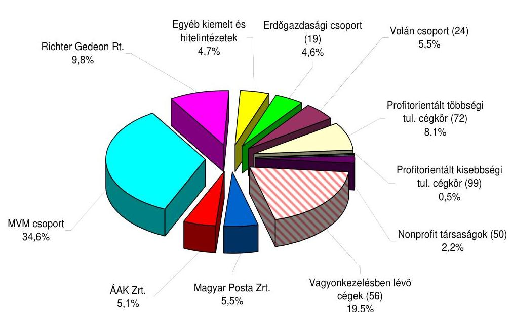

A 335 elemszámú társasági portfólió összesített vagyontömege 1414 Mrd Ft-ot tesz ki, ebből 1234 Mrd Ft-ot képviselnek a többségi cégek, míg 180 Mrd Ft-ot a kisebbségi tulajdoni részesedések. Az utóbbi döntő hányadát (92\%-át) két társaság, a Richter, és a BA Zrt. részvényei adják.

---

# 1. A MEGSZÜNT SZERVEZETEKTŐL (ÁPV ZRT., NFA, KVI) ÉS A KÖLTSÉGVETÉSI SZERVEZETEKTŐL ÁTVETT TÁRSASÁGOK NYILVÁNTARTÁSA 

Az MNV Zrt. a rábízott vagyon nyilvántartását elkülönítetten kezeli a saját vagyon nyilvántartásától, amely felett a Magyar Állam nevében a Tanács a Társaság útján gyakorolja a tulajdonosi jogokat. Az MNV Zrt. a rábízott társasági portfóliót a saját tőkéjük társaságra jutó hányada értékén tartja nyilván, a tőzsdére bevezetett cégeknél a forgalommal súlyozott 180 napos tőzsdei átlagárfolyamon veszi figyelembe.

Az MNV Zrt. 2009. május 4-ei adatai szerint 331 db állami tulajdonú társaságot tart nyilván az MNV Zrt. Ezek közül - a Társaság saját besorolása szerint - jelentős súlyú, kiemelt cég, az ÁAK Zrt., a BA Zrt., az MP Zrt., az MVM Zrt., a Richter Zrt., és a Szerencsejáték Zrt. Az erdőgazdasági társaságok 19, a Volán portfólió 24 és a hitelintézeti cégek 5 társaságot képviselnek. A profitorientált többségi tulajdonú cégkör 72 db, a profitorientált kisebbségi tulajdonú cégkör 99 db társaságot jelent, a nonprofit társaságok száma 50 db.

A társaságok adatszolgáltatása rendszeres, negyedéves ütemességben, a Kontrolling Igazgatóság által meghatározott irányelvek alapján történik. Az Igazgatóság negyedévente tájékoztatja a Tanácsot a társasági portfólió gazdálkodásának eredményeiről, a kritikus portfólióelemek helyzetéről, a kiemelt vagyonkezelési ügyekről. Bemutatja a portfólióba tartozó társaságok jövedelmezőségi helyzetét a tulajdonosi szempontból meghatározó jelentőségű tőkehatékonyságot jelző ROE mutatószámmal.

Az MNV Zrt. társasági portfóliójának összesített 2008. évi tőkehatékonysági mutatója 11,1\%-os szintet jelent, ami elérte, sőt el is hagyta a hosszabb távú állampapír-piaci referenciahozamok 2008. évi szintjét. ${ }^{1}$ A kiemelt többségi társaságok (MVM, Magyar Posta, Szerencsejáték Zrt.) az összesített ROE mutató alapján kiemelkedően jó, 16,2\%-os hozamot biztosítottak.

A költségvetési szervek könyvvezetési és beszámolási kötelezettségével foglalkozó 249/2000. (XII. 24.) Korm. rendelet előírja a (vagyon)kezelésben álló társasági részesedés nyilvántartását. Így a 19. § (3) pontosan rögzíti az egyéb tartós részesedésként kimutatandó állami tulajdonrészeket. Ennek ellenére a költségvetési szervek - közöttük a minisztériumok - az állami vagyonról szóló 2007. évi CVI. törvény (a továbbiakban Vtv.) által tartós vagy ideiglenes jellegűnek minősített tulajdonrészeket a mérlegükben esetenként nem jelenítik meg, sértve ezzel a mérlegvalódiság elvét. ${ }^{2}$ A költségvetési szervek mérlegeiben le nem könyvelt társasági részesedések között a Vtv. mellékletében felsorolt, tartós állami tulajdoni hányaddal rendelkező, vagy ideiglenes jellegűnek minősített állami tulajdonú társasági részesedések is szerepeltek.

[^0]
[^0]:    ${ }^{1}$ Az állampapír piaci referenciahozamok 2008 decemberében a következők szerint alakultak: 1 éves papírok 9,0\%; 5 éves papírok 9,4\%; 10 éves papírok 8,3\%
    ${ }^{2}$ Jelentés a kincstári vagyon kezelésének és működtetésének ellenőrzéséről és jelentés államháztartáson kívüli állami feladatellátás rendszerének vizsgálatáról. (2005)

---

A társaságokban meglévő vagyon hatékony többszintű ellenőrzésének lehetőségét a jogszabályok megteremtik. A társasági vagyon nyilvántartásának hiányosságai (az előzőekben hivatkozott ÁSZ jelentésekben kimutatott szabálytalanságok, anomáliák) a jogszabályok be nem tartásából, illetve nem megfelelő értelmezéséből fakadnak. A különböző helyen található nyilvántartások, ill. adatbázisok nem egyforma rendszerben készültek és a különböző szempontok szerint összeállított adattartalmaik egymással nehezen összevethetők, illetve összegezhetők. Az adatbázisok - illetve a nyilvántartásokra fordított költségvetési pénzeszközök - eredményes felhasználását jelentheti egységes, komplementer rendszerbe foglalásuk.

Az állami tulajdon nyilvántartása sem naturáliában, sem összegben nem fedi a tényleges állapotokat, azt még a több nyilvántartás összesítésével sem lehet egzakt módon meghatározni. ${ }^{3}$ Az MNV Zrt. társaságait a tulajdoni hányadra eső saját tőke értékén tartja nyilván. Az ÁPV Rt. által korábban vásárolt részesedések közül előfordult, hogy a vételkor érvényes piaci vételáron - és nem a saját tőke értékén - tartják nyilván. Azonban a saját tőkeértéken történő nyilvántartás is különböző tartalmakat takar. A társaságok átalakulásakor a könyv szerinti értéken átalakulók ma is ezen szerepelnek a nyilvántartásban. A vagyonértékeléssel érintettek mérleg szerinti saját tőkéje, és így nyilvántartási értéke jobban közelíti a reális értéket. Az állami vagyonelemek összesítése, tekintettel arra, hogy inhomogén tartalmat takar, értékben nem mutat reális összeget.

# 2. A TARTÓS ÁLLAMI TULAJDONBAN MARADÓ TÁRSASÁGI PORTFÓLIÓ 

A Magyar Posta és a Szerencsejáték Zrt. esetében 2008. évben az eredmény mintegy 60\%-ban alultervezett volt. A portfólió gazdálkodási eredményei és osztalékbevétele jelentősen meghaladja a tervezett értékeket.

Az ország 1,8 millió ha erdőterületéből az MNV Zrt. portfóliójába tartozó 19 erdőgazdasági társaság mintegy 976 ezer hektár állami erdőt (54\%) és egyéb földterületet kezel. A 2007. évi CVI. törvény (Vagyontörvény) alapján az erdőgazdaságok által kezelt állami földterületek 2008. január 1-től az MNV Zrt. rábízott vagyonába kerültek. A kezelt területből 370 ezer hektár - az erdőterületek több mint egyharmada - esik természetvédelmi védettség, tiltás alá (nemzeti park, tájvédelmi körzet, egyéb védett terület). A 2008. évben is folytatódott az erdőművelési közmunka program 17 társaság részvételével. Az MNV Zrt. a programhoz szükséges önrész biztosításához 2008. évben összesen 1 Mrd Ft-os támogatást folyósított. A természeti károk kezelésére 240,3 M Ft, a közjóléti feladatok elvégzésére közel 800 M Ft és erdőtelepítési támogatására 346,8 M Ft került felhasználásra. Az erdőgazdaságok 2008. éves adózás előtti eredménye meghaladta a 3082 M Ft-ot, ami kedvezőbb a 2008. évi tervben prognosztizált 2713 M Ft-nál. A vizsgált évben az állami erdőgazdaságok nem részesültek normatív támogatásban, viszont megszűnt az erdőfelújítási járulék rendszere is.

[^0]
[^0]:    ${ }^{3}$ Jelentés a kincstári vagyon kezelésének és működtetésének ellenőrzéséről. (2005)

---

Az erdőgazdasági társaságokban az MNV Zrt. által tervezett 1776 M Ft tőkeemelés célja a meglévő feldolgozó kapacitások piaci igényekre alapozott technológiai szinten tartása, bővítése, természetkímélő és a természetvédelmi igényeknek megfelelő technológiák fejlesztése, speciális erdőgazdasági, faipari technológiai fejlesztések megvalósítása, valamint az informatikai fejlesztés állt.
A Nemzeti Kataszteri Program KHT 1700 M Ft értékű pótbefizetését az NVT hagyta jóvá figyelemmel a 1238/2008. (XII. 22.) Vig. sz. határozatra és a Pénzügyminiszter 13331/4/2008. ikt. sz. levelében foglaltakra. A társaság negatív saját tőke rendezésének kötelezettsége a 2007. évet záró mérlegkimutatás alapján (-947,5 M Ft értékű saját tőke) vált szükségessé a Gt. 143. § (2) a) pontja figyelembevételével. A 2008. évben várható mintegy 700 M Ft mérleg szerinti veszteség tényleges értékét pedig a tárgyévi mérlegbeszámoló határozza meg. 2008. év december végén biztosított 1700 M Ft értékű pótbefizetés nem volt indokolt. ${ }^{4}$

# 3. Az MNV ZRT. KEZELÉSÉBEN LÉVŐ ÉRTÉKESÍTÉSRE SZÁNT TÁRSASÁGI PORTFÓLIÓ 

A Volán társaságok gazdálkodását alapvetően meghatározza, hogy - 2004. évi XXXIII. tv. 9. §-ban meghatározott előírások alapján - közszolgáltatási feladatokat végeznek. A vonatkozó jogszabályok erősen korlátozzák, behatárolják döntési lehetőségeiket gazdálkodásuk terén. Szerződéses kötelezettségekből adódóan azonban olyan területeken is járatokat üzemeltetnek, amelyek jelentős veszteséget eredményeznek. Feladatuk elsősorban a helyi és helyközi menetrendszerinti közszolgáltatási tevékenység ellátása, melyek általában 2012-ig szóló közszolgáltatási szerződésekkel rendelkeznek. A hatósági árak, melyek az éves maximált tarifaemelési lehetősége alapján kerülnek megállapításra, a jelenlegi menetrendi kötelezés mellett nem fedezik a társaságok hosszú távú gazdaságos működését.

A Volán társaságcsoport 2008. évben 5,8 Mrd Ft adózás előtti eredményt ért el, 4,7 Mrd Ft-tal többet, mint az előző évben. A cégcsoport azonban 2008. év végére csak az év közben kifizetett veszteségtérítésnek köszönhetően zárhatta pozitív eredménnyel az évet. A nullszaldó feletti eredményszint pedig az előző évek veszteségtérítéseinek 2008. évi elszámolásából adódik. Az elfogadott üzleti tervek alapján az év legnagyobb kockázatát a társaságcsoport eladósodottsága és alacsony likviditása jelentette, a veszteségtérítésnek köszönhetően e két mutató értéke a bázisszinten várható. A társaságok 22,2 Mrd Ft árbevétel mellett 2,1 Mrd Ft adózás előtti eredményt értek el menetrendszerinti helyi közlekedési tevékenységből.

[^0]
[^0]:    ${ }^{4}$ Az MNV Zrt. véleménye szerint a 2009 májusában elfogadott beszámoló szerinti 2008. évi végleges adatok valóban azt mutatják, hogy az MNV Zrt. a minimálisan indokoltnál többet teljesített pótbefizetésként. Megjegyezzük azonban, hogy az MNV Zrt.-nek lehetősége van a pótbefizetés visszafizettetésére, amennyiben az NKP Kht. (jelenleg Nemzeti Kataszteri Program Nonprofit Kft.) 2009. évi mérlegadatai ezt indokolják.

---

Az MNV Zrt.-re bízott állami tulajdonú társaságokban tervezett 2008. évi tőkeemelésből 8 Mrd Ft-ot a Volán társaságok kaptak a 158/2008. (III. 26.) NVT sz. határozat szerinti megbontásban. A terv azzal számolt, hogy a Volán társaságoknak biztosított forrásokból az elhasználódott, előregedett autóbuszállomány rekonstrukcióját az Autóbusz-Invest Kft. által lebonyolítandó összesített közbeszerzési eljárások útján pótolták. A támogatást az is indokolta volt, hogy az érvényben lévő szabályozás mellett a társaságok alaptevékenységéből származó bevételei az eszközök pótlására sem biztosítanak megfelelő forrást, amelynek következtében a járműpark folyamatosan előregszik.

Az éves ellenőrzés során vizsgáltuk a Tisza Volán Zrt. a szegedi új Buszpályaudvar (BUSZPORT) beruházás előkészítésére és megvalósítására a SAL Kft.-vel hozott létre együttműködési megállapodást. ${ }^{5}$

A megállapodás szerint, az új létesítmény használatba vételi engedélyének kézhezvételét követően a Tisza Volán Zrt. megvásárolja a komplett Buszportot (a pályaudvari létesítményt a hozzá tartozó telek részlettel együtt) a beruházó partnertől. A vételár tartalmazza a szerződéshez csatolt helyszínrajz szerinti közel 18000 m² pályaudvari külső üzemi területet és ezen belül a kiszolgáló épületből bruttó 6000 m² üzemi területet és az irodákat.

Mindezen szolgáltatások „ellenszolgáltatásaként" a Tisza Volán értékesíti a SAL Kft. részére a 25592 hrsz.-ú és a 25856/2 hrsz.-ú, - 2008. november 5-én létrehozott együttműködési megállapodás (a továbbiakban: Megállapodás) 2. pontjaiban körülírt - ingatlanait. Az ingatlanok értékesítésére a felépített, új Buszport használatba vételét követően kerül sor, és a befolyó vételár az új Buszport Tisza Volán által kifizetendő vételárának pénzügyi kompenzációjára szolgál.

A Megállapodás III. 4. és III. 6.3. pontjaiból azonban egyértelműen kitűnik, hogy a buszpályaudvar, illetve a kereskedelmi központ beruházás megvalósítására a jogügylet aláírását követően kerül sor, nem teljesül a Kbt. 174. §-ának a) pontja, illetve a 296. §-ának a) pontjában hivatkozott, valamint a 29. § (2) bekezdésének a) pontja szerinti „meglévő építmény"-re vonatkozó fordulat. A Megállapodás III. pontjából az is kitűnik, hogy a felek - a „kötelezettséget vállal" kitétel gyakori alkalmazásával - a buszpályaudvar és kereskedelmi központ megvalósítása tárgyában kerültek kötelmi jogviszonyba.

A Megállapodás tartalmazza, hogy a Buszport megépülése után mikor és milyen ingatlanokkal kapcsolatos szerződéseket fognak a szerződő felek egymással megkötni. Erre való tekintettel a felek között nem egy elvi jellegű megállapodás - figyelemmel arra,
 hogy a jognyilatkozatok vonatkozásában nem az elnevezés, hanem azok tartalma az irányadó -, hanem a Ptk. 208. §-ának (1) bekezdése szerinti, jogokat és kötelezettségeket tartalmazó előszerződés jött létre.

[^0]
[^0]:    ${ }^{5}$ Bodó Imre országgyűlési képviselő Fidesz Polgári Szövetség, a Mezőgazdasági Bizottság tagja 2009. február 26-án tett bejelentést az ÁSZ elnökének, amely szerint a Tisza Volán Zrt. a szegedi új Busz-pályaudvar (BUSZPORT) beruházás előkészítésére és megvalósítására a SAL Kft.-vel létrehozott együttműködési megállapodás nem transzparens módon és nem célszerűen lett megkötve.

---

Fentiek alapján a Tisza Volán Zrt. - a Tanács 634/2008. (X.15.) sz. NVT határozatával kiadott közgyűlési mandátuma szerint jóváhagyott - Megállapodás megkötésével az ÁSZ jogi állásfoglalása szerint, megsértette a Kbt.-ben meghatározott közbeszerzési eljárás lefolytatásának kötelezettségét.

A regionális víziközmű társaságok integrációját előkészítő első lépés, a vezető testületek átalakítása 2008. évben megtörtént. A második lépés az egyes állami tulajdonú víziközmű szolgáltatók vagyonkezelésbe adása, amelynek célja, hogy az NVT a hatékony és gazdaságos működtetés érdekében - az egyes társaságok vagyonkezelésbe adása útján - a jelenlegi 5 állami tulajdonban lévő regionális víziközmű szolgáltató társaságból a kelet-magyarországi szolgáltatási területen egy társaságcsoportot alakítson ki.

Az NVT, a fenti cél megvalósítása miatt a 212/2009. (IV. 01.) NVT sz. határozatával az Észak-magyarországi Regionális Vízművek (ÉRV Zrt.) vagyonkezelésébe adta a Duna Menti Regionális Vízmű Zrt. (DMRV Zrt.) és a Tiszamenti Regionális Vízművek Zrt. (TRV Zrt.) állami tulajdonú részesedéseit. ${ }^{6}$

A vagyonkezelésbe adással az érintett regionális víziközmű társaságok tulajdonosi szerkezetében nem következett be változás, de az MNV Zrt. vagyonkezelési szerződés útján történő közvetett vagyonkezelése kockázatot jelent a Vtv. 2. §-ának (1) bekezdése szerinti nemzeti vagyon megőrzése és gyarapítása biztosítása tekintetében. A Tanács 405/2009. (V. 20.) NVT sz. határozatának 2. pontjában a Vagyonkezelési Szerződés hatálybaléptetéséről szóló döntést - figyelemmel a Gazdasági Versenyhivatal állásfoglalására - magához vonta.

Áttekintve a Vagyonkezelési szerződést megállapítható, hogy a 4.2. pontban megfogalmazott kitétel, amely szerint:
„A Vagyonkezelő a szerződés tárgyát képező vagyont - állami tulajdonú részesedéseket - rendeltetésének, a szerződésnek, továbbá a rendes gazdálkodás szabályainak megfelelően, az ilyen személytől elvárható gondossággal birtokolhatja, használhatja, hasznosíthatja".

A fenti szerződéses feltétel, a hasznosítás lehetősége miatt, ellentétes a vízgazdálkodásról szóló 1995. évi LVII. törvény 9. § (1) a) pontjával ${ }^{7}$ ezért szükséges az SzT-31036 sz. Vagyonkezelési Szerződés módosítása.

[^0]
[^0]:    ${ }^{6}$ A Tanács 212/2009. (IV. 01.) NVT sz. döntését Dr. Bóth János országgyűlési képviselő, Vác város polgármestere is nehezményezte, és 2009. május 7-én kelt levelében célvizsgálatot kért az ÁSZ elnökétől.
    ${ }^{7}$ Az állam a kizárólagos tulajdonában, valamint az önkormányzat (önkormányzati társulás) a törzsvagyonában lévő víziközmű létesítmények létesítéséről, fenntartásáról, üzemeltetéséről (a továbbiakban együttesen: működtetés) a következő módokon gondoskodhat:
    a) olyan gazdálkodó szervezetet hoz létre, amelyben kizárólagos részesedéssel rendelkezik, ide nem értve a munkavállalói résztulajdont.

---

# 4. A KÖLTSÉGVETÉSI SZERVEZETEK RÉSZÉRE HASZNOSÍTÁSI SZERZŐDÉSSEL ÁTADOTT TÁRSASÁGI PORTFÓLIÓ 

Az MNV Zrt. portfóliójából 2008. december 31-éig összesen 78 társaság, ebből 56 működő társaság teljes állami tulajdonú részesedése került különböző intézmények részére (túlnyomó részben minisztériumoknak, felsőoktatási intézményeknek, illetve a BVOP-nak) vagyonkezelésbe, vagy hasznosításra átadásra.

Az 56 átadott cégen felül 22 db végelszámolás alatt álló, részvénytársasági formában működő Egészségbiztosítási Pénztár (EBP) található, amelyek a PM felügyelete alá kerültek annak érdekében, hogy a tulajdonosi joggyakorlás gyors, hatékony és költségtakarékos legyen, továbbá a végelszámolási eljárás során is érvényesülhessen az egészségbiztosítási pénztárakról szóló 2008. évi I. törvény 4. § (1) bekezdése szerinti azon előírás, amely szerint az EBP-k felett az állami vagyon felügyeletéért felelős miniszter jár el a Magyar Állam nevében az alapítás során és gyakorolja a Magyar Állam részvényesi jogait.

A PM a végelszámolási eljárás alatt teljes jogkörrel gyakorolja az állam nevében a vagyonkezelési megállapodásban rögzített tulajdonosi jogokat a végelszámolási eljárás jogerős befejezéséig. A PM köteles a végelszámolási eljárásokról - azok jogerős befejezését követő 30 napon belül - az MNV Zrt.-nek írásbeli összefoglalót készíteni az eljárások alatt megtett intézkedéseiről. Előzőek értelmében ezekről a társaságokról a végelszámolási folyamat alatt az MNV Zrt. adatokat nem kap.

A hasznosításra átadott társaságok esetében a vagyonkezelési megállapodásokban meghatározott feltételekkel és korlátozásokkal illetik meg az átvevő intézményt a tulajdonosi jogok és terhelik a tulajdonos kötelezettségei. A megállapodás szerint a társaságok átalakulásához, tőkeszerkezetének változásához az MNV Zrt. előzetes jóváhagyása szükséges. Az átvevő intézmény (a Vtv. 27. § (2) bekezdése szerint) köteles az állami vagyon értékét megőrizni, és gyarapítani, továbbá az MNV Zrt.-t haladéktalanul értesíteni amennyiben az adott társaság saját tőke értéke a jegyzett tőke kétharmadára csökkent, vagy a fizetéseit megszüntette és vagyona a tartozásokat nem fedezi.

A hasznosításra átengedésről szóló megállapodások szerint az átvevő intézmények negyedévente kötelesek adatokat szolgáltatni az MNV Zrt. részére a társaságok mérleg- és eredményadatairól, benne a saját tőke alakulásáról, illetve a vagyon értékének változásáról. A társaságok/vagyonkezelők többsége az előírt adatszolgáltatási kötelezettségüknek megfelelően - rendszeresen biztosítják a Kontrolling Igazgatóság részére az adatokat.

A minisztériumok és egyéb állami szervezetek szerződéses vagyonkezelésében lévő állami tulajdonú társaságok köre 2008. december 31-ei állapot szerint 78 db. A megkötött vagyonkezelési szerződések szerinti adatszolgáltatás folyamatosan javuló tendenciát mutat. Az I.-III. negyedévi adatszolgáltatást 86,8%-ban, az év végi nyersmérlegről szóló tájékoztatást 90,6%-ban teljesítette a vagyonhasznosításra átadott társaságok köre.

---

# 5. A BÁBOLNA CSOPORT 

Az egységes állami vagyonkezelésre létrejött szervezet megalakítása után sem sikerült feltárni a Bábolna csoport tényleges vagyoni helyzetét, konszolidált beszámolót nem készítettek. A vagyon felélése 2008-ban tovább folytatódott, a Bábolna Zrt.-nek 200 M Ft vesztesége keletkezett.

A 2003-tól rohamosan leépülő vállalatcsoport érdekében hozott tulajdonosi döntések szoros kormányzati felügyelet mellett történtek. A Magyar Fejlesztési Bank, a Kincstári Vagyoni Igazgatóság, az ÁPV Rt., valamint annak technikai társaságai között történő vagyoncserék körforgásában nem biztosított az állami vagyon megőrzése és a vagyonkezelés átláthatósága is romlik. A végelszámolási eljárások alatt a Bábolna csoport cégeinél tovább folytatódott az állami vagyon leépülése. A különböző szintű tulajdonosok (ÁPV Rt., Bábolna Rt., Bábolna Élelmiszeripari Rt., Agrárgazdasági Vagyonkezelő Kft.) rendre elmulasztották a tulajdonosi kötelezettségeik teljesítését. Az eljárások tovább növelték az állami tulajdonú társaságok által okozott költségvetési kiadásokat. Végezetül valamennyi végelszámolási eljárást felszámolási eljárás követte.

A felszámolási eljárásokkal olyan további vagyonvesztések következtek be, amelyeket az időben történő hatékony tulajdonosi döntések megakadályozhattak volna.

Az MNV Zrt. a Bábolna Zrt. 2008. március 10-ei közgyűlésére javasolta előkészíteni a felszámolási eljárás megindítását, mivel a privatizációs stratégiákban és kormányhatározatokban rögzített feladatok csak részben valósultak meg. Korábbi jelentéseinkben ${ }^{8}$ ezeket ismertettük. A korábbi közgyűléseken elrendelt intézkedések a társaság tőkehelyzetének rendezésére vonatkozóan, nem valósultak meg. Felelősségre vonás ez ügyben sem történt. Mivel a tulajdonos MNV Zrt. a tőkeemelés lehetőségét nem tartotta indokoltnak, ezért csak a felszámolási eljárás jöhetett szóba. Az NVT 125/2008. (III. 12.) sz. határozatával döntött a felszámolási eljárás megindításáról, amelyet a Cégbíróság 2008. április 17-én tett közzé.

A tevékenységet lezáró beszámoló szerint a Társaság mérleg szerinti eredménye 200,5 M Ft veszteség, a rövid lejáratú kötelezettségei 11965 M Ft, míg a forgótőke állománya 2500 M Ft-tal alacsonyabb volt (9530 M Ft). A tevékenységet lezáró beszámolót a független könyvvizsgáló korlátozott záradékkal látta el, mivel: nem volt előtte ismeretes a Társaság hiányos nyilvántartásai miatt a szerződéses kötelezettségekből adódható további követelési igények felbukkanása; a társaság mérlegében nyilvántartott olyan nem egyeztetett követelések és kötelezettségek, amelyek alapdokumentumokkal nem alátámasztottak; a Bábolna Élelmiszeripari Rt. „v.a." 2006. január 1-jén megindult végelszámolásának lezáratlan folyamata, amely valószínűleg felszámolási eljárással végződik.

A 2006 januárjában a végelszámolási eljárásból történő visszavonás után is felszámolási eljárásnak megfelelő helyzet alakult ki, ugyanúgy, mint a 2004. évi végelszámolási eljárás megindítása előtt. A 0541, 0611, 0626, 0725 és 0825 sz. Je-

[^0]
[^0]:    ${ }^{8}$ 0541, 0626, 0725, 0825 sz. jelentések az Állami Privatizációs és Vagyonkezelő Zrt. 2004-2007. évi működésének és a központi költségvetés végrehajtásához kapcsolódó tevékenységének ellenőrzéséről, valamint a 0611 sz. jelentés a tartósan veszteségesen működő állami tulajdonú gazdasági társaságok gazdálkodásának ellenőrzéséről

---

lentéseink Bábolna csoporttal foglalkozó részében részletesen jeleztük a rossz döntések miatti vagyonvesztéseket, illetve megállapítottuk, hogy 2004-ben nem végelszámolási helyzet alakult ki, hanem felszámolási helyzet volt. A végelszámolási időszak tovább növelte a Társaság veszteségeit és folytatódott a vagyonvesztés.

A felszámolási eljárás befejezése után lehet megállapítani a vagyonvesztés pontos nagyságát. A vagyonvesztés következtében a Magyar Államnak több 10 Mrd Ft vesztesége keletkezett (0825. sz. jelentés 35. oldala).

A Bábolna Zrt. által használt földterületből az NVT a 156/2008. (III. 26.) sz. határozatával annak ellenére adott 13487 hektárt kényszerhasznosításba a Bábolna Ménesbirtok Kft.-nek (nettó 465 M Ft kényszerhasznosítási előleg folyósítása mellett), hogy a gazdasági év végéig lehetősége volt a földek művelésére. (A 2001. március 9-én kötött földhaszonbérleti szerződés alapján, ha a haszonbérlő gazdasági társaság ellen jogerős felszámolási eljárás indul, a gazdasági év végén szűnik meg a haszonbérleti szerződés). Pontos kimutatás nélkül történt meg a használt földterület elvonása a Társaságtól.

A 13457 hektár földterület elvonása után, 2008. április 10-én, miután a Bábolna Zrt. közgyűlése kimondta a felszámolási eljárás megindítását, de a Cégbíróság még azt nem tette közzé, 376 hektárra ideiglenes vagyonkezelési szerződést kötött az MNV Zrt. a „Vaddisznóskert" megnevezésű ingatlanokra 2017. február 28-ig terjedő időszakra a Bábolna Zrt.-vel. Az MNV Zrt. a 156/2008. (III. 26.) NVT sz. határozat visszavonása nélkül (miután a teljes 13487 hektár terület, amely a 24 278. számú kezelési szerződés alapján volt a használatában az elvonásig), annak ellenére adta bérbe, hogy ahhoz előzetesen a Vagyontanács nem járult hozzá.

A Vaddisznóskert megnevezésű ingatlanok, mivel vagyoni értékű jogot testesítettek meg a Bábolna Zrt. eszközállományában (amelyek nem voltak aktiválva), a teljes földterületre vonatkozó elvonás utáni bérbeadással bevételkiesése keletkezett a Bábolna Zrt. „f.a."-nak, mert azt a felszámoló is aktiválhatta volna, és kérhette volna a vadászati jogra vonatkozó bérleti díjat.

A vagyonkezelésbe adott földterületek nem egyeznek meg a Bábolna Zrt. utolsó módosított földhaszonbérleti kimutatásaival.

A 2004. február 9-én módosított bérleti szerződés alapján a 2001. évi adásvételt követő 3 adásvételi szerződéssel és további 7 szerződéssel a Társaság területe 17897 hektár volt. Az NFA-val kötött bérleti szerződés III. sz. módosítása után 18 179 hektár szerepel a haszonbérleti szerződésben. Az Agrárportfolioért felelős vezérigazgató-helyettes 2008 februári feljegyzése szerint a Bábolna Zrt. haszonbérletében 18248 hektár terület szerepel. Az eltérés 68 hektár. A felszámolási eljárás megindításáról szóló döntéskor a vezérigazgató-helyettes szerint 15869 hektár terület volt a Társaság haszonbérletében.

A felmondott földbérleti szerződések és a megkötött új kényszerhasznosítási és hosszú távú földbérleti
 szerződések ellentmondásai alapján a Vagyontanács döntéseit úgy hozta, hogy vagy nem számolt azok következményeivel, vagy az előterjesztés nem mutatta be megfelelően a döntések következtében beálló felelősséget. A tranzakció alapján sem az egyben történő értékesítési eljárás, sem a helyben lakók földhöz juttatása nem valósulhatott meg.

---

2007-ben a Szendrői Gazdaság eszközvagyonára és a hozzátartozó termőföldterületre benyújtott két ajánlatot (300 M Ft + ÁFA) nem tekintették érvényesnek a kiírók. Az ÁPV Zrt. Igazgatósága az értékesítés jóváhagyásáról döntött, és ennek megfelelő mandátumot adott ki a Bábolna Zrt. közgyűlésére. A közgyűlésen jelen lévő tulajdonos képviselője a kiadott mandátumtól eltérő szavazását az ÁPV Zrt. Igazgatósága utólagosan jóváhagyta, az RJGY-nek küldött egyidejű tájékoztatással.

Az intézkedés tovább súlyosbította a Bábolna Zrt. finanszírozási nehézségeit, és fokozta a tőkevesztésből adódó tulajdonosi kényszerintézkedések megtételét. Az intézkedés indítéka nem ismeretes, felelősségre vonás nem történt ebben az esetben sem, annak ellenére, hogy érvényes kormányhatározatot és RJGY utasítást nem hajtottak végre.

Az NVT 2008 márciusában (a Kerteskői és Szendrői gazdaság eszközvagyonának és földterületének háromszori sikertelen eladási kísérlete után) ismételten napirendre tűzte a gazdaságok egyben történő privatizációját.

Az értékesítést megelőzően az NFA által készített értékbecslés a földek értékét Kerteskő esetében 192,7 M Ft-ban, Szendrő esetében 896 M Ft-ban állapította meg. A Bábolna Zrt. által készített értékbecslés a kerteskői 31,8 M Ft könyv szerinti értékű eszközök értékét 200 M Ft-ban, a Szendrői Gazdaság 409 M Ft könyv szerinti értékű eszközeit pedig 491 M Ft-ban állapította meg. Valamennyi pályázati eljárásban ezek az értékek képezték az irányárat. A korábbi első két eljárásban ajánlattevő nem volt, azok eredménytelenül zárultak. A harmadik fordulóban (2007 februárjában) a kerteskői eszközökre 33 és 208 M Ft közötti vételárat ajánlott a négy pályázó, a szendrői eszközökre pedig a 2 pályázó 100 és 300 M Ft közötti vételár ajánlatot tett (ezen ajánlat ellen szavazott a tulajdonos képviselője a Bábolna Zrt. közgyűlésén az ÁPV Zrt. igazgatósági határozata ellenére).

A Bábolna Zrt. 2008. március 10-ei közgyűlése úgy döntött, hogy mivel a társaság vagyona a tartozásait továbbra sem fedezi (saját tőkéje negatív) elhatározta jogutód nélküli megszűnését, és előzetesen egyetértett a társaság igazgatósága által felszámolási eljárás lefolytatása iránti kérelem, bírósághoz történő benyújtásával.

Az elhatározásra tett intézkedésekből ismételten elmaradt a társaságcsoport teljes átvilágítása, amelyet már a 2004. évi végelszámolás megindításakor, valamint a 2006. évi végelszámolási folyamatból való visszavételkor is kifogásolt az ÁSZ ellenőrzés. Konszolidált beszámoló készítéssel lehetett volna pontosan felmérni a társaság-csoport valós pénzügyi-jövedelmi helyzetét.

A tulajdonos szerint a Bábolna Zrt. jogutód nélküli megszüntetését indokolta, hogy nem valósult meg a stratégiai cél, hogy a Bábolna vállalatcsoport vagyonát érintő kérdésekben csak akkor szabad döntéseket hozni, amennyiben biztosítható a tranzakciók hatására a Bábolna Élelmiszeripari Zrt. „v.a." végelszámolási eljárás befejezése, és a Bábolna Zrt. alkalmassága a privatizációra.

A Kerteskői Gazdaság értékesítésénél a 2008. február 25-ei módosított pályázat-beadási határidőre 4 pályázó közül kettőt érvénytelennek nyilvánított az értékelő bizottság, kettőt pedig érvényesnek.

---

Az MNV Zrt. 9/1/NVT/2008. 03. 06. számú előterjesztésének (125/2008. (III. 06.) NVT határozatához), 10. oldalán a 2.1. Az eszközkiírás főbb adatai címszó alatt az eszközök irányára alatt $200 \mathrm{MFt} + ÁFA$, az értékelési szempontrendszernél pedig a megajánlott legmagasabb vételár 100 pontot jelent, az adható pontszám az alacsonyabb és a legmagasabb vételár %-os arányában határozható meg. Az értékelés során a vételárajánlaton kívül más szempont nem került figyelembevételre: Az ajánlattevőnek külön nyilatkoznia kellett arról, hogy a földterületre elővásárlási joggal eredményesen élő természetes személy (mint konzorciumi tag) részére biztosítja azt a jogot, hogy a Kerteskői Gazdasághoz tartozó vagyonelemekre vonatkozó adásvételi szerződést az elővásárlási jogot eredményesen gyakorlóval kösse meg a Bábolna Zrt.

Nem ismeretes, hogy az értékelő bizottság miért adott 4 ponttal magasabb értéket az eszközökre alacsonyabb ajánlatot tevőnek, annak ellenére, hogy csak 220 M Ft hiteligérvénnyel rendelkezett, míg a másik érvényes ajánlatot benyújtó pályázónak 300 M Ft-os fedezetigazolása volt egy banktól. A jobb ajánlatot tevő az eszközök irányárának 11,3%-ában (a könyv szerinti érték 71,3%-a) jelölte meg a vételárat, szemben az előző pályázó 9,3%-ával (a könyv szerinti érték $58,2\%$-a). A nyertesnek minősített pályázó csoport egyik, helyben lakó tagja a termőföldre vonatkozóan haszonbérleti szerződése alapján elővásárlási jogot jelölt meg, a további két együttműködő pályázó nem rendelkezett elővásárlási jogosultsággal. Az eszközértékekre magasabb árajánlatot tevő vesztes pályázó csoportnál mind a négy tag rendelkezett elővásárlási jogosultsággal, és a csoportból két együttműködő pályázó helyben lakó családi gazdálkodó, míg a csoport másik kettő tagja helyben lakó őstermelői jogosultsággal rendelkező volt.

A pályázatok összesített pontszámának jegyzőkönyvi rögzítéséből nem állapítható meg, hogy melyik pályázó milyen összesített pontszámmal lett a nyertes. A pályázati kiírásnak megfelelően a jegyzőkönyvnek részletesen tartalmazni kellett volna a pályázók ajánlatai által elért összesített pontszámokat, bemutatva, hogy az egyes pontszámok milyen követelményeket elégítenek ki, és közölni kellett volna a kiszámítás módját is.

Az alkalmazott számítási mód nem felel meg a pályázati kiírásnak, mivel az összesített pontszám kialakításánál figyelembe vettek olyan pályázót is, akinek nem volt érvényes ajánlata a földterületre vonatkozóan, és ez a tény a kiírás értelmében érvénytelenséget jelentett a vagyonelemekre tett pályázat vonatkozásában is.

A Bábolna csoport vagyonának elértéktelenedését jelzi, hogy az értékesítési folyamatban az érvényes ajánlattevők vételárként az eszközök értékére az irányárnak csak 9-11%-át ajánlották fel. A győztes pályázó az irányárként meghatározotthoz képest 9,3%-on vásárolhatta meg a vagyonrészt.

A pályázati kiírásban szereplő 200 M Ft-os eszközvagyon értékhez viszonyított 18,5 M Ft-os megajánlott vételár elfogadása miatt - feltűnő értékaránytalanság - tovább folytatódik a Bábolna csoport többi vagyonelemének elértéktelenedése.

A Szendrői Gazdaság eladására érkezett kettő pályázatot az értékelő bizottság érvénytelennek minősítette. Az eszközvagyonra megajánlott vételár 160 és

---

225 M Ft volt, amely az irányárnak 39, illetve 55%-át tették ki. A pályázatokat az 1994. évi LV. tv. alapján, mivel a megszerezhető földterület meghaladta volna a 300 hektárt, el kellett utasítani a kiírásnak megfelelően. A gazdaságot újabb privatizációs pályázat kiírásával sem sikerült 2008-ban értékesíteni.

A Bábolna Nemzeti Ménesbirtok Kft. a 2007/2001. (I. 17.) és a 2040/2001. (II. 28.) Korm. határozatok alapján 2001 márciusában jött létre a Bábolna Rt. alapításában, azzal a céllal, hogy a bábolnai hagyományok, a lótenyésztés, az erdő- és vadgazdálkodás, a nemzeti kulturális örökség részét képező kastélyegyüttes, mint nemzeti érték megőrzését, fejlesztését és hasznosítását szolgálja.

Bábolna nemzetközi hírnevét az 1789 óta folyó lótenyésztésnek köszönheti, amely a hazai tenyésztés egyik utolsó működő és bemutatható intézménye a történelmi ménesek közül.

A Társaság 3 M Ft törzstőkével indult, majd az alapító energiaszolgáltatási üzletág apporttal és készpénzzel tőkeemelést hajtott végre, 1593 M Ft értékben. A 2001 augusztusi működés megkezdése után a tulajdonos Bábolna Rt. eladta a Társaságot az ÁPV Rt.-nek 2001. szeptember 21-én. Ezt követően ugyanezen év november 16-án a Kincstári Vagyoni Igazgatóság kezelésébe került. Kormányhatározattal 100%-ban tartós állami tulajdonnak minősül a Társaság.

Az alapítás körülményeire jellemző, hogy a feladatok ellátásához képest alacsony tőkeellátottság miatt elmaradt a lótenyésztés szükségleteit kielégítő földterület biztosítása is. A társaság jogcím nélkül használt 500 hektár területet a Bábolna Zrt. haszonbérletében szereplő birtoknagyságból.

A Társaság tevékenységi köre a lótenyésztésen kívül a műemlék és egyéb ingatlanok fenntartására és hasznosítására, valamint az apportként kapott energiaszolgáltató üzletág hasznosításaként energiaszolgáltatásból tevődik össze. A Társaság piaci alapon működő nyereségtermelő ágazatai nem tudják finanszírozni a hagyományőrző tevékenységek veszteségeit, így fennállása óta veszteséges a gazdálkodás.

Veszteségeinek pótlására az alábbi összetételű forrásbevonások történtek:

|  |  |  |  |  |  |  | M Ft |
| :-- | --: | --: | --: | --: | --: | --: | --: |
| Hitel és támogatás | 2002 | 2003 | 2004 | 2005 | 2006 | 2007 | 2008 |
| Működési célú tá-   mogatás | 325 | 0 | 0 | 255 | 296 | 260 | 260 |
| Fejlesztési célú tá-   mogatás | 125 | 0 | 0 | 0 | 0 | 0 | 0 |
| Tulajdonosi kölcsön | 0 | 0 | 60 | 49 | 0 | 0 | 800 |
| Banki hitelállo-   mány | 0 | 0 | 340 | 466 | 466 | 466 | 466 |

Azokban az években (2003. és 2004.), amikor állami támogatást nem kapott a Társaság, bankhitel felvételére kényszerült, amelyet saját erejéből visszafizetni nem képes. Az állami támogatás elmaradás mértéke mintegy 500 M Ft-ot tesz ki. A CIB bank Zrt.-től 2004-ben felvett 340 M Ft, és a Raiffeisen Bank Zrt.-től 2005-ben felvett 126 M Ft hiteleket a működés finanszírozására fordította a Társaság,

---

amelyek visszafizetésére és a kamatok megfizetésére esély sincs. A hitelrendezés jelenlegi lehetősége azok futamidejének évenkénti meghosszabbítása mindaddig, amíg a bankok el nem szánják magukat a jelzálogosításban foglaltak érvényesítésére.

2008-ban is elmaradt a tulajdonosi beavatkozás, amelynek következtében a Társaság továbbra is veszteségesen gazdálkodott és a hitelállományának görgetésére kényszerült.

A tőkehelyzet rendezése érdekében az MNV Zrt. 355 M Ft tulajdonosi kölcsön nyújtásával próbálta megoldani a hitelállomány rendezését. Ennek érdekében 2008 októberében a PM Támogatásokat Vizsgáló Irodához fordult, hogy a tervezett tulajdonosi kölcsön nyújtásához járuljon hozzá a 2007. évi CLXIX. tv. 7. § (3) bekezdése szerint. A PM 2008 novemberében az MNV Zrt. munkatársaival folytatott egyeztetés alapján közölte, hogy amennyiben a műemlék-kezelést és a fajtafenntartó lótenyésztést nem a versenytársakkal rendelkező piaci tevékenységként végzi a Társaság, abban az esetben a tulajdonosi támogatás nem minősül az EK Szerződés 87. cikk (1) bekezdése szerinti tiltott állami támogatásnak.

A Bábolna Zrt. „f.a." az MNV Zrt. által 2008. március 31-ei fordulónappal felmondott haszonbérleti szerződéssel érintett területek piaci alapon történő 2008. évi kényszerhasznosítójának a Bábolna környéki erdők kivételével az NVT a 156/2008. (III. 26.) sz. határozatával a Nemzeti Ménesbirtok Kft.-t jelölte ki, amelynek sem megfelelő eszközállománya, sem személyi állománya, sem szakértelme nem volt a feladat ellátásához. A pontos területi kimutatás, valamint a mezei leltár felmérése elmaradt. A Vagyontanács úgy hozta meg döntését, hogy nem követelte meg a Bábolna Zrt. földhasznosítási szerződésének felmondása alkalmából a korábban használt területekkel történő elszámolást, azon túl, hogy nem ismerte a valós vagyoni-pénzügyi helyzetét az átadó és átvevő társaságoknak.

A Bábolna Zrt. "f.a" és a Bábolna Ménesbirtok Kft. között 2008. május 27-én a gazdasági eseményeket nem tükröző adatok és tények alapján megállapodás történt, amelyet tanúként aláírt a Bábolna Zrt. vezérigazgatója is.

A megállapodás szerint a haszonbérleti szerződés felmondása a Bábolna Zrt.-nek az éves árbevételtől történő elesése, a földalapú támogatások meghiúsulása és az elmaradt
 haszon miatt 365 M Ft kára keletkezett, amely összeg a felszámolás jogerőre emelkedése előtt a leendő felszámolóval folytatott tárgyalás során a kényszerhasznosító Ménesbirtok Kft.-vel történt egyeztetés alapján alakult ki.

A Bábolna Ménesbirtok Kft. ügyvezető igazgatója 2008. május 28-ai levelében, amelyet az MNV Zrt. vezérigazgatójának írt, 375 M Ft átutalását kéri abból a 800 M Ft-os kormányhatározat alapján járó összegből, amelyből addig 400 M Ft-ot már megkaptak, mivel a kényszerhasznosítás optimális végrehajtása, lebonyolítása érdekében a fenti összeg szükséges, tekintettel arra, hogy a Társaság alkupozíciója emelkedik az összeggel a betakarítást, szállítást, tárolást végző szolgáltatókkal folyó tárgyalásokon. A mezei leltár pontos számbavételét nélkülöző vagyonállományt nem a kényszerhasznosító állította elő, de a betakarítási, szállítási és raktározási feladatok majdani elvégzését is szolgáltatást végzőkkel (a Bábolna Zrt.-vel) szándékozik elvégeztetni a Bábolna Ménesbirtok Kft. A megkötött szerződések mögött valós teljesítmény és károkozás nem léte-

---

zik, ezért a kényszerhasznosítási eljárás és a kártérítési megállapodás teljes körűen nem megalapozott.

A kényszerhasznosítási megbízáshoz a tulajdonos MNV Zrt. 800 M Ft tulajdonosi kölcsönt folyósított a Kormány 2039/2008. (III. 29.) határozata alapján, amely nem fedezte a mezei leltárként átvett növényállomány és megtermelt javak előállítása érdekében felmerült költségeket (a 156/2008. (III. 26.) NVT határozatban szereplő több mint 1 Mrd Ft-ot), ezzel tovább rontotta a Társaság kritikus gazdasági helyzetét.

A 156/2008. (III. 26.) NVT sz. határozat megalapozásához benyújtott 11/9NVT/2008. sz. előterjesztés 13. oldalán a következő olvasható: „A Bábolna Ménesbirtok Kft. és a Bábolna Zrt. tevékenységi köre egymástól eltérő, ezért nem lehet felkészülve a mintegy 7000 ha szántó megművelésére, hasznosítására. Azonban a több mint 1 Mrd forint költséget felemésztő kényszerhasznosítás fokozott figyelmet és kontrollt igényel a tulajdonos részéről, ezért a felügyelő bizottság személyi összetételének változtatása indokolt.

A mezei leltár alapján történő elszámolás tárgyát képező, mintegy 376 M Ft-tal a gazdasági év végén, illetve a bevételek realizálását követően a Bábolna Ménesbirtok Kft., mint kényszerhasznosító elszámol az MNV Zrt.-vel".

A 156/2008. (III. 26.) NVT sz. határozatban a mezei leltárral történő elszámolás az MNV Zrt. és a Bábolna Zrt. között történik, a bérleti szerződés felmondását követő 30 napon belül. A Bábolna Ménesbirtok Kft. a 800 M Ft-os tulajdonosi kölcsönből, - amelyet a kényszerhasznosítási feladatokat amúgy sem fedező összegre folyósított az MNV Zrt. - átutalt ${ }^{9}$ a Bábolna Zrt. felszámolójának - kártalanításként a mezei leltár értékével közel azonos nagyságrendben - 365 M Ft-ot. A tulajdonos nem tartotta be a kölcsönszerződésben vállaltakat, amelyben a 800 M Ft-os tulajdonosi kölcsön elszámolásából kellett volna levonni a mezei leltár értékét a termények betakarítása, illetve azok értékesítése után. Így valójában az 1 Mrd Ft-ot meghaladó kényszerhasznosítási feladatokra a Társaságnak csak 435 M Ft állt rendelkezésre.

Az NVT 5/2008. (I. 16.) sz. határozatával a szakmai képesítéssel rendelkező ügyvezetőjét a 2007. decemberi sikertelen szavazás után visszahívta tisztségéből.

Az ügyvezető felmentésének folyamatában Bábolna város polgármestere 2008. január 2-án második alkalommal írt levelet az MNV Zrt. vezérigazgatójának az ügyvezető felmentését kérve. A felmentett ügyvezető oly módon is igyekezett védeni a Társaság épületeit, építményeket, hogy azokat múemléki védelem alá igyekezett helyeztetni a Kulturális Örökségvédelmi Hivatallal. A polgármesteri levél az akkori menedzsment hibájaként rója fel, hogy 2004. év végén az alapítói vagyont értékelési vagyonképzéssel duplájára értékelték. A Polgármesteri Hivatal megállapította, hogy a Társaság túl sok lovat tart, túl nagy költséggel, ugyanakkor a tenyészállomány minősége folyamatosan romlik. Ennek a bejelentésnek és tényfeltáró folyamatnak egyik állomása volt az ügyvezető felmentése.

[^0]
[^0]:    ${ }^{9}$ MNV Zrt. belső ellenőrzési jelentéséhez a Ménesbirtok Kft. vezérigazgatója által tett észrevétel szerint az átutalást az MNV Zrt. kérésére tette.

---

A felmentett ügyvezetőt pályázat útján kísérelte meg pótolni a tulajdonos, amelyet 2008 márciusában tudott megoldani, amikor olyan személyt állított ügyvezetőnek, akinek a pályázók közül a legkevesebb agrárgazdasági vezetői szakmai tapasztalata volt a feladat ellátására.

A vezetőváltás után a tulajdonos többszöri felkérésére és utasítására sem sikerült kidolgoztatni a Társasággal a hosszú távú fejlesztési koncepciót az új ügyvezető működése során.

# 6. A MalÉv ZRT. PRIVATIZÁCIÓS ELJÁRÁSÁNAK KÖVETKEZMÉNYEI 

A Malév Zrt. a Kormány 2016/2007. (II. 6.) sz. határozata alapján 2007. február 23-án kelt privatizációs adásvételi szerződéssel a részvényeinek 99,5%-a került az Airbrigde Vagyonkezelő Zrt. tulajdonába. A privatizációt megelőző vagyonértékelés szerint a Társaság valós piaci értéke 0 Ft volt, figyelembe véve a 37033 M Ft-os, kamatokkal terhelt hitelkötelezettségeket is. A vevő 200 M Ft-ért vásárolta meg a céget.

Az értékesítési eljárásban elsődleges szempont volt, hogy a Malév Zrt. állami kezességgel felvett hiteleitől a Magyar Állam megszabaduljon, és egy esetleges felszámolási eljárás során 60 Mrd Ft körüli költséget ne az állam viseljen. A privatizációs tárgyalási szakaszban technikai társaságon (Malév Vagyonkezelő Kft.) keresztül a Malév Zrt. hiteleit kiszervezték. Olyan társaságot hoztak létre, amelynek sem apparátusa, sem szakmai hozzáértése nem volt a kiszervezett feladatok ellátására. A technikai társaság kizárólag a Részvény Adásvételi Szerződés 8. sz. mellékletében rögzített Hitelkezelési Javaslattal (az MFB hitel átvállalásával és kezelésével kapcsolatban átvett eszközökhöz kapcsolódó szükséges és felmerülő tevékenységek elvégzése) kapcsolatos teendők ellátásával volt megbízva. Az átvett eszközök tulajdonosi szerkezetének tisztázása elmaradt, (Kerozinvezeték tulajdonosa nem csak a Malév Zrt. volt; a Malco LLC-től átvett BOEING 767-200ER repülőgépen banki jelzálogjog volt az átvételkor). A megörökölt szerződések alapján nem teljesült az a feladat, hogy a Malév Vagyonkezelő Kft a hitelfedezetül megvásárolt eszközöket működtesse és hasznosítsa, (mivel a kerozinvezetéket csak a MOL Nyrt. üzemeltetheti a bányatörvény értelmében, az átvett repülőgépre pedig banki jelzálogjog van bejegyezve), ezért színlelt szerződésnek kell tekinteni a vagyonelemek kiszervezését, amely nem szerepelt a privatizációs eljárás meghirdetésekor. A szerződésekben vállalt feltételek nem teljesüléséből a vagyonkezelőnek kára származik, amelyért a tulajdonosának kell helyt állni.

A privatizációs eljárás 2007. április 24-én Zárási jegyzőkönyv aláírásával fejeződött be. A felek megállapították, hogy a zárási feltételek maradéktalanul teljesültek. A tranzakció zárását követően 2007-2008. években kettő alkalommal módosították a Részvény Adásvételi Szerződést.

A Zárási jegyzőkönyv első módosítása a Malév állami készfizető kezességgel fedezett 76 M EUR hitelének kiszervezési koncepciója és annak tervezett végrehajtási formája közti összhang hiánya miatt vált szükségessé.

A Nemzeti Vagyongazdálkodási Tanács 254/2007. (XII. 19.) sz. határozatával módosította a Malév Vagyonkezelő Kft., és a Malév Zrt. - MFB Bank Zrt. között létrehozott Tartozásátvállalási és Módosító Szerződést, valamint az MFB és Malév Vagyonkezelő Kft. közötti Óvadéki Szerződés és kapcsolódó biztosítéki szerződést, amelynek lényegesebb elemei a következők:

---

A Malév Zrt. helyett a vevő kötelezettséget vállalt, hogy a Társaság által, ill. a hitelállomány-kezelési szerződések alapján a Vagyonkezelő által az MFB hitelszerződés szerint a 2007-2017. években fizetendő kamatok fedezete rendelkezésre álljon, és a hitelszerződéshez kapcsolódóan vállalt állami kezességvállalás igénybe vételére ne kerüljön sor, ezért a Vevő köteles a Vagyonkezelő rendelkezésére bocsátani az MFB hitel visszafizetéséhez hiányzó fedezetet.

A Márkanév Hasznosítási Szerződés tekintetében a vevő köteles az eredményrészesedés megfizetésére. A Márkanév Használati Szerződés Malév Zrt. általi felmondása esetén az eladási jogot a Vagyonkezelő a Vevővel szemben gyakorolhatja.

A Vevő kötelezettséget vállalt arra, hogy legkésőbb a Márkanév visszavásárlásakor megvásárolja a Malco üzletrészt a repülőgép mindenkori nyilvántartási értékén a vagyonkezelőtől.

A Zárási jegyzőkönyv második módosítására az 508/2008. (VII. 30.) és az 571/2008. (IX. 3.) sz. NVT határozatokkal történt, amelyeknek egyik fő indoka az MFB hitel kamattörlesztésének rendezése volt, ugyanis az eredeti szerződésben a márkanév használati díja várhatóan nem fedezte a kamatfizetési kötelezettséget (a különbség éves szinten mintegy 800 E EUR, ami a hatályban volt rendelkezések szerint a Vagyonkezelő Kft.-t terhelte volna).

Az adás-vételi szerződésben ${ }^{10}$ vállaltak több ponton nem teljesültek. A 2008. december 31-éig vállalt 30 M EUR tőkejuttatási kötelezettségből 2008. szeptember 10-éig 12 M EUR teljesült, tulajdonosi kölcsönként. Az MNV Zrt. 28/25/NVT/2008. 09. 17. sorszámú levelével kiadta a Tőkejuttatási Bankgarancia hatálytalanná válására szolgáló nyilatkozatát.

A Malév Zrt. 2008. évi gazdálkodása során kritikus pénzügyi helyzetbe került. A 28/25/NVT/2008. (09. 17.) sorszámú előterjesztés szerint a Társaság az I. félévi gazdálkodása során 61,3 Mrd Ft-os mérlegfőösszeggel, 7 Mrd Ft veszteséggel, -4,7 Mrd Ft saját és 3,6 Mrd Ft jegyzett tőkével, 62,7 Mrd Ft kötelezettséggel - amelyből 58,4 Mrd Ft rövid lejáratú - rendelkezik. A negatív saját tőke miatt a Gt. alapján a részvényeseknek alaptőke biztosításáról kell gondoskodni.

A Malév Zrt. felszámolás előtti helyzetbe került 2008-ban. A lehetséges megoldások a Társaság felszámolása ellen az alábbiak:

- A jelenlegi tulajdonosi kör együttműködik a felszámolás elkerülésére.
- A jelenlegi tulajdonosi kör nem együttműködő a felszámolás elkerülése érdekében, a VEB nem kíván részt venni a Malév Zrt. működésének fenntartásában.
- A Magyar Állam helyt áll a Malév Zrt. adósságaiért.

[^0]
[^0]:    ${ }^{10}$ Az NVT 105/2007. (XI. 28.) sz. határozatával a Malév Zrt. privatizációs adásvételi szerződésében az 5.2.4. pontban foglalt vevői kötelezettség teljesítéséhez szükséges rugalmas döntéshozatalt biztosító jogkörét az SZMSZ-nek megfelelően az MNV Zrt. vezérigazgatójára ruházta.

---

- A Magyar állam tűri a felszámolási eljárás megindítását.

A kialakult helyzet alapján a privatizációs eljárás és a Részvény Adásvételi Szerződés teljesülése, a kitűzött célok szerint nem valósult meg. Elsősorban a hitelek miatti állami kezesség beváltása fenyeget, ha nem sikerül konszolidálni a Társaság gazdálkodását. A technikai társaság bevonása a privatizációs eljárásba tovább fokozta az átláthatatlan helyzetet, amely egyben többletkiadásokat jelent a vagyonkezelőnek. Egy esetleges felszámolási eljárás során, a 2006 végén prognosztizált 52-62 Mrd Ft-os állami kötelezettség jelentősen megnövekedhet, azon túl, hogy a légiközlekedés jövőbeni fenntartásához további, nem számszerűsíthető kockázatok járulnak.

A Budapest Airport Zrt. privatizációs szerződésében vállalt vevői kötelezettségek teljesítése csak részben valósult meg.

A 194/2008. (IV. 09.) sz. NVT határozatban felhatalmazást kapott az MNV Zrt. vezérigazgatója, hogy szólítsa fel a Budapest Airport Zrt.-vel a 2006-2007. évre a Specifikus Fejlesztési kötelezettségvállalások tekintetében elmaradt 46,5 M EUR értékű beruházások nem teljesítését. A BA Zrt. válaszlevelében kifogással élt. Részben rajta kívül álló okok miatt nem tudta vállalását teljesíteni. Az egyes közigazgatási hatósági ügyek (polgári repülőtér fejlesztési kormányzati jóváhagyás elmaradása, Vecsés Város Önkormányzata és a BA Zrt. között 2006-ban kezdeményezett szabályozási terv módosítására irányuló eljárás, a repülőterek zajgátló övezetéről szóló kormányrendelet, valamint a repülőterek környezetében létesítendő zajgátló védőövezetek kijelölésének, hasznosításának és megszüntetésének részletes műszaki szabályairól szóló rendelet módosításának elmaradása) elhúzódása miatt nem valósulhattak meg a vállalt fejlesztések.

A Vagyonkezelési Szerződés alapján a fenti közigazgatási hatósági ügyekben való jóváhagyások, kormányzati döntések, szabályozási tervek és a műszaki szabályozás elmaradása Állami Kockázati Eseménynek minősülhet, ennek következtében akadályozza, vagy gátolja a specifikus fejlesztési kötelezettségvállalások teljesítését, a felek kötelesek jóhiszemű tárgyalásokat folytatni a Specifikus
 Fejlesztési Kötelezettségvállalások időszakának meghosszabbításáról. A vállalt fejlesztéseket átütemezték.

# 7. A vagyonkezelésbe adás kockázatai, a MÁV Zrt., a Magyar Posta Zrt. székház és központi ügyintézés elhelyezése 

A MÁV Zrt. és a Magyar Posta Zrt. központi irodaházai értékesítésével kapcsolatos döntéseket, illetve azok végrehajtását a 3. sz. Függelék 1. sz. melléklete ismerteti.

---

3. sz. Függelék 1. sz. melléklete a V-2016-134/2008-2009. sz. jelentéshez

# A MÁV Zrt. és a Magyar Posta Zrt. székház ügye 

A MÁV Zrt. és a Magyar Posta Zrt. központi irányításának új irodaházakban történő elhelyezésére közel azonos időben és körülmények között került sor. A bérlemények kiválasztása és a székházak értékesítése a stratégiai céloktól független, nem a tevékenység és létszám racionalizálását előtérbe helyező és a társaságok jövőképével összhangban lévő folyamat mentén zajlott. Az előkészítés során felvázolt kritériumok a megvalósítás során változtak, a kiinduló és a megvalósult állapot adatait nem hasonlították össze. A döntés-előkészítő anyagok a döntéshozók számára nem biztosítottak teljes körű információt a döntések meghozatalához.

A székház értékesítést és a központi irányítás elhelyezését a korszerűtlen elhelyezés és a magas felújítási költségek indokolták a kezdeti előterjesztésekben, annak ellenére, hogy a MP Zrt. esetében megállapítást nyert, hogy „eredményre gyakorolt hatását tekintve a legkisebb költséget jelentő megoldás a jelenlegi állapot fenntartása". A jövőben várható fejlesztések forrásigényének a székház értékesítési bevételekből történő pótlása nem szerepelt a kezdeti indoklásban. ${ }^{1}$ A MÁV Zrt. tevékenysége - államilag finanszírozott, kötelező közszolgáltatás - és alacsony, vagy negatív jövedelemtermelő képessége miatt, az „állóeszköz felszabadításból" származó bevételek felhasználásával megvalósított fejlesztések jövedelemtermelő képességre gyakorolt pozitív hatása nem állapítható meg. ${ }^{2}$ A tulajdonosi jogok gyakorlója és a döntésben résztvevő igazgatósági tagok nem tartották szükségesnek a megalapozott döntéshozatalhoz a székházak értékesítési bevételei és az abból megvalósítandó fejlesztések megtérülése közötti összefüggések bemutatását. A MP Zrt. ingatlanértékesítése lezárult, az abból származó bevétel 23% elmaradt a tervezettől. Az euró alapú bérleti díjak forintban történő fizetése előre nem látható költségnövekedést idézett elő, ami a döntést megelőző előterjesztésekhez képest előre nem kalkulált többletköltségterhet jelent a társaságok számára. Az irodaházi elhelyezést elhatározó döntésben megfogalmazott célok nem valósíthatók meg maradéktalanul. A bérelt irodaházi elhelyezést követően nem készült a döntést megelőző azonos tartalmú összehasonlító elemzés az elérni kívánt eredményekről, gazdaságossági és hatékonysági javulásról. Az IBA létrehozásának az előkészületeivel kapcsolatban felmerült költségek - a MÁV Zrt. más, ingatlangazdálkodással foglalkozó szervezeti egységeinek a működésével együtt - megtérülése nem biztosított.

[^0]
[^0]:    ${ }^{1}$ A MÁV Zrt. szerint a 26/2007. (03. 27.) Ig. határozat alapján a stratégiai célok egyike, hogy az ingatlanvagyon és az ingatlanstratégia megvalósítása segítse elő a MÁV Zrt. fejlesztési, finanszírozási, likviditási gondjainak a megoldását.
    ${ }^{2}$ A MÁV Zrt. szerint az ingatlanértékesítés tervezett bevétele a veszteséget csökkenti.

---

A székház értékesítésével és a központi irányítás elhelyezésével kapcsolatos előterjesztések és döntések szétválasztása gátolta a szorosan egymáshoz kapcsolódó témák közötti összefüggések transzparenciáját

A MÁV Zrt. Igazgatósága 2007. január 30-ai ülésén döntött a MÁV Ingatlanbefektetési Alap (IBA) létrehozásáról, azzal a szándékkal, hogy a MÁV Zrt. közvetlen üzemi célokra nem használt ingatlanjait a legkedvezőbb feltételekkel, szakmai keretek között hasznosítani tudja. Az IBA létrehozásának idején a MÁV Zrt. nem rendelkezett az igazgatóság által elfogadott átfogó ingatlanhasznosítási koncepcióval, ezért a létrehozását elhatározó döntés nem képezte egy átfogó ingatlangazdálkodási stratégia részét. ${ }^{3}$ Az Igazgatóság ápr. 17-ei határozatával jóváhagyta a már létező Ép-Tech Aqua Kft. által tulajdonolt 43 M Ft névértékű Prudent-Invest Zrt. alapkezelő többségi (50,59%) tulajdoni hányadának 22,816 M Ft vételáron történő megszerezését. Az Igazgatóság 127/2007. (10. 02.) határozatában döntött az ingatlanalapba helyezhető ingatlanokról, amelyek között meghatározó szerepet töltött be a MÁV Zrt központi irányításának helyt adó Andrássy úti székház. A tulajdonosi jogokat gyakorló akkori GKM miniszter 43/2007. (XII. 28.) sz. határozatával hagyta jóvá a MÁV Zrt. Andrássy út 73-75. alatti központi irodaházának, valamint a Pécs, Szabadság úti irodaház ingatlanalapba történő apportálását összesen 7424 M Ft értéken és 9 másik ingatlan IBA részére történő értékesítését összesen 6656 M Ft értéken. A tulajdonos nevében eljáró akkori KHEM miniszter - tekintettel arra, hogy a befektetők bevonására irányuló kísérletek eredménytelennek bizonyultak - a 24/2008. (XI. 27.) sz. határozattal hatályon kívül helyezte a korábbi miniszter ingatlanbefektetési alap részvényeinek jegyzéséről szóló határozatát. Az alap létrehozása és az ingatlanok átadása nem valósult meg.

A MÁV Zrt. Igazgatósága 2007. szeptember 25-ei előterjesztésében foglalkozott a MÁV Zrt. központi irányításának elhelyezési alternatíváiról, amelynek eredményeképpen meg kell kezdeni a MÁV Zrt. központi irányításának bérelt irodaházban történő elhelyezését. Az előterjesztés a központi irányítás elhelyezéséről szólt, ennek ellenére a MÁV Zrt. vezetése 2007. október 2-án a MÁV Zrt. és a MÁV Start Zrt. meghatározott ${ }^{4}$ irodaházaiban elhelyezett irányítói létszámának bérelt irodaházi elhelyezésére kiírandó közbeszerzési eljárásról döntött. A döntés meghozatalakor (2007. október 2.) a MÁV Zrt. vezetésének nem volt pontos információja a költöztetni kívánt szervezeti egységekről és létszámról. ${ }^{5}$ A gazdaságossági számításokat a költözéssel érintett társaságok üzleti terveivel nem egyeztették előzetesen. ${ }^{6}$ A tulajdonosi döntést megalapozó előterjesztés sze-

[^0]
[^0]:    ${ }^{3}$ Az Igazgatóság együtt tárgyalta a két anyagot, de az ingatlanhasznosítási koncepciót átdolgozásra visszaadta. A módosított koncepciót 2007. 03. 22-én fogadta el az Ig.
    ${ }^{4}$ Bp., Andrássy út 72-75., Bp., Izabella u. 51, Bp. Kerepesi út 1-5., Bp., Bajcsy Zs. út 25., Bp., Hunyadi út 12-14.
    ${ }^{5}$ Az eredeti előterjesztésben és a tulajdonos számára 2007. 10. 02. után készített döntés előkészítő előterjesztésben is a költözéssel érintett szervezeti egységek MÁV Vagyonkezelő Kft., MÁV Informatika Kft., MÁV Vasútőr Kft., MÁV Start Kft., MÁV Ingatlankezelő Kft., MÁVTI Kft. A MÁV Zrt. szerint ezért tárgyalásos eljárással írta ki a közbeszerzést.
    ${ }^{6}$ A MÁV Zrt. és a társaságok ebben az időben nem rendelkeztek 2008. évi üzleti tervvel. A MÁV Zrt. üzleti tervét 2007. 10. 27-én fogadta el az Igazgatóság.

---

rint „a székház jelenlegi üzemeltetését" megvizsgálva, „azt mutatta, hogy a jelenlegi elhelyezés sem gazdaságilag, sem területkihasználtság alapján nem gazdaságos". A tulajdonos számára készített előterjesztés csak a székház adataiból kiindulva végezte el a számításokat anélkül, hogy előzetesen a futamidővel kapcsolatos optimum számításokat. ${ }^{7}$ A székház értékesítésére, illetve az abból felszabaduló forrás felhasználására vonatkozóan nem tartalmazott információkat a tulajdonos számára készített döntést megalapozó előterjesztés. ${ }^{8}$ A székház értékesítésével és a központi irányítás elhelyezésével kapcsolatos előterjesztések és döntések szétválasztása nem tette lehetővé a szorosan egymáshoz kapcsolódó témák komplex módon történő kezelését.

A bérelt irodaházban történő elhelyezés a bérlet 5-15 éves időtartama alatt minden évben 1,2 Mrd Ft-ot meghaladó mértékű kiadást jelent a MÁV csoport gazdálkodásában. A nyereséget termelő árufuvarozási tevékenység értékesítését követően a MÁV veszteséges gazdálkodása a költségvetésre is kihatással van. A bérelt irodaházi elhelyezés többletkiadásai a pályaműködtetés és a személyszállítás - mint alaptevékenységek - közszolgáltatási szerződésben foglalt indokolt költségeinek az elszámolása során nem érvényesíthetők. A 2007. 09. 25-ei igazgatósági előterjesztésétől a szerződés aláírásának 2008. 10. 30-ai aláírásáig változó területi igényszint nagysága (21000 m² feletti területigény) jelentősen korlátozta az elhelyezési lehetőségeket. (A 2008. évi Piaci jelentés szerint 2008/3.-4. negyedévben és 2009. évben összesen 5 db 20000 m² feletti „A" kategóriás irodaház átadás várható.) A teljes irodaház bérbevételét is lehetővé tevő területi igény okán elérhető kedvező bérleti díj ugyanakkor a szerződött árban nem érvényesült a piaci viszonyokhoz mérten. ${ }^{9}$ A folyamatban lévő, illetve várható átszervezések és a társaságokban lévő állami tulajdon mértékének a csökkentését előirányzó elképzelések nem indokolták az együttköltözéssel járó hosszú távú elkötelezettség vállalását.

A MÁV Zrt. vezetése a MÁV START Zrt.-t „stratégiai jelentőségű és kiemelt szerepű társaságnak" tekintette, ezért szükségesnek ítélte meg a két társaság együttköltözését. A MÁV Zrt. tulajdonosa az állami tulajdoni hányad csökkentését határozta el a kiemelt leánycégekben.

[^0]
[^0]:    ${ }^{7}$ Az összehasonlíthatóság érdekében egységesen 21 év időtartamot vizsgáltak, tekintettel arra, hogy a bemutatott lízingkonstrukció 20 éves."
    ${ }^{8}$ A MÁV Zrt. szerint az ingatlangazdálkodási stratégia tartalmazta, hogy a felszabaduló forrásokat a vasútüzem fejlesztésére kell fordítani. A KHEM szerint az előterjesztés tartalmazta az elhelyezési lehetőségek bemutatását, valamint azok gazdaságossági összehasonlítását.
    ${ }^{9}$ Az előkészítő anyagokban 12-14 EUR/m²/hó iroda bérleti díjjal számoltak, a szerződést követő számítások a jelentősen megnövekedett, nem irodai célú helységeket is figyelembe vevő „a jelenlegi területekkel súlyozott" 12,36 EUR/m²/hó bérleti díjat vesz figyelembe. A Budapesti irodaterületekre vonatkozó 2008. évközi Piaci jelentés/ingatlanelemzés szerint a „jó közlekedéssel bíró „A" kategóriás irodák esetében 12,5-13.5 euró/hó/m² között mozgott a bérleti díj a 2008. év elején. Most azonban a tulajdonosok arra kényszerülnek, hogy 10-20%-os kedvezménnyel csábítsák magukhoz a bérlőket, a kedvezmény pedig az idő múlásával egyre inkább a 20%-ot közelíti. Új építésű „A" kategóriás irodaházak esetében maximum 12 euro/m²/hó nettó effektív díj lehet az irányadó" Colliers ingatlanelemzés 2008.

---

A 2007. 09. 25-ei Ig. előterjesztés a MÁV Zrt. és további 6 a MÁV csoportba tartozó bp.-i irodákban működő leányvállalat új székházban történő elhelyezésének területigényét 31436 m²-ben mérte fel, 2412 fő létszám mellett. A döntés előkészítő jelentés a központi székház területi, létszám és üzemeltetési adatait felhasználva mutatta be az irodai elhelyezés alternatíváit. Az előkészítés során a MÁV Zrt. eladósodottsági mértékére, kedvezőtlen finanszírozási helyzetére tekintettel, a pénzügyi konstrukciókkal (hitel, pénzügyi lízing, PPP) történő megvalósítást nem vizsgálták. A pénzügyi konstrukciók a kedvezőtlen eladósodottság ellenére is kedvező lehetőségek voltak, mivel az irodaházi projektben szokásos 12-15 éves megtérülés után a MÁV Zrt. vagyonába marad a székház. Az Ig. az értékesítésről és az új irodaház bérletére kiírandó közbeszerzési eljárásról hozott 128/2007. (10. 02.) Ig. határozatot 2008. 03. 03-án módosította, pontosítva a költöző leányvállalatok körét, ${ }^{10}$ és a döntés előkészítés során alkalmazott peremfeltételeket. A költözéssel érintett szervezeti egységek létszámadatai pontos ismeretének hiányában, az igazgatósági határozat a létszám véglegesítésére a közbeszerzési eljárás tárgyalási szakaszát jelölte meg. ${ }^{11}$

A közbeszerzési kiírásban szereplő főbb paraméterek 1650 fő + 20% elhelyezése 21000 m² + 30% (27300 m²) területigénnyel és 220 db + 30% parkolóhellyel.

A tulajdonosi jogokat képviselő akkori miniszter a MÁV Zrt. által előterjesztett javaslatot változatlan formában hagyta jóvá a 39/2007. (12. 13.) sz. részvényesi határozatában. A határozat a közbeszerzési eljárás lefolytatására a vezérigazgatót, a közbeszerzési eljárás eredményének a megállapítására a MÁV Zrt.

[^0]
[^0]:    ${ }^{10}$ A költözéssel érintett szervezeti egységek köre a következőképpen változott: MÁV Vagyonkezelő Kft., MÁV Informatika Kft., MÁV Vasútőr Kft., MÁV Start Kft., MÁV Ingatlankezelő Kft., MÁVTI Kft.
    ${ }^{11}$ A MÁV Zrt. szerint a tárgyalásos eljárás során történt a létszám véglegesítése.

 Igazgatóságát hatalmazta fel. A határozat nem rendelkezett a döntési és felelősségi jogkör átadására vonatkozóan. ${ }^{12}$ A határozatot saját hatáskörében március 31-én (7/2008. (03. 31.) sz. határozat) az akkor hivatalban lévő GKM miniszter módosította, mivel a korábbi határozat a közbeszerzési eljárás részletes feltételeit nem tartalmazta és pontosították az irodai elhelyezésben érintett társaságok körét. A címében is megváltozott határozatban „A Társaság irányításának elhelyezése" a közbeszerzési eljárás lefolytatására vonatkozó pontok változatlanok maradtak. A gazdasági társaságokról szóló tv. 19. § (5) bek. szerint a gazdasági társaság legfőbb szervének (közgyűlés) a törvényben illetve a társasági szerződésben meghatározott hatáskörében az egyedüli tag (részvényes) írásban határoz. A 284. § (2) bek szerint egyszemélyes részvénytársaságnál a közgyűlés hatáskörébe tartozó ügyekben a részvényes - GKM miniszter írásban dönt, amelyről a vezető tisztségviselőket - MÁV Zrt. Igazgatósága - értesíteni köteles. A törvény nem teszi lehetővé a végleges szerződés aláírásához szükséges döntési jogkör átadását.

A MÁV Zrt. központi irányításának elhelyezése tárgyában kiírt közbeszerzési eljárást a MÁV Zrt. Igazgatósága a 157/2008. (10. 21.) sz. határozatával hagyta

[^0]
[^0]:    ${ }^{10}$ MÁV-START Zrt., MÁV-TRAKCIÓ Zrt., MÁV Gépészet Zrt. a társaságok megalapítását követően.
    ${ }^{11}$ A MÁV Zrt. szerint a folyamatban lévő hatékonyságjavító intézkedésekkel a létszám is folyamatosan csökkent.
    ${ }^{12}$ A KHEM szerint „a minisztérium ilyet nem határozhatott el, hiszen a leánycégekben nincs állami tulajdon".

---

jóvá. A határozat szabálytalanul, a MÁV Zrt. Alapító Okiratától eltérően saját hatáskörben tartotta a közbeszerzési eljárást követő döntési jogot és hatalmazta fel a vezérigazgatót a szerződés aláírására. A hatáskör túllépés miatt a felelősség a döntést megszavazó igazgatósági ülésen résztvevő tagokat terheli (4 igen, 1 tartózkodás). A szerződést a MÁV Zrt. vezérigazgatója írta alá anélkül, hogy azt az alapító megismerte, illetve arról az alapító döntött volna.

A MÁV Zrt. észrevétele szerint az Igazgatóság a határozatát az Alapító okirat 6.5. i. pontja alapján hozta meg, ami az éves üzleti terv és annak részeként az 500 M Ft feletti közbeszerzésekre vonatkozó éves üzleti terv jóváhagyását utalja az alapító hatáskörébe. Az Alapító okirat 6.5. w. pontja minden, az i. pont szerint közbeszerzési tervben nem szereplő, 2 Mrd Ft-ot meghaladó közbeszerzési eljárás lefolytatásának előzetes jóváhagyását utalja alapítói hatáskörbe. A MÁV Zrt. által nem hivatkozott, 6.5. sz. pont minden döntést, az üzleti tervben nem szereplő keretet meghaladó kötelezettségvállalásról, ha annak értéke meghaladja a 2 Mrd Ft-ot alapítói hatáskörbe utal. Jóváhagyott üzleti tervvel nem rendelkezett a MÁV Zrt. a 157/2008. (10. 21.) lg. határozat meghozatalakor. A 6.5. w. pont nem a döntési hatáskört, hanem a közbeszerzési eljárás lefolytatásának előzetes jóváhagyását utalja alapítói hatáskörbe megtartva a 6.5. sz. pontban foglalt döntési hatáskört.

Az aláírt szerződés tartalmát a tulajdonosi jogok gyakorlója nem ismerte meg, ezért sérült a törvényben megfogalmazott döntési jogkör gyakorlása. ${ }^{13}$ A tulajdonosi jogok gyakorlója az Alapítói határozatban megfogalmazott feltételek teljesülését utólag sem ellenőrizte.

A közbeszerzési eljárásban MÁV Zrt. fenntartotta a jogot, hogy a bérelt területet évente maximum 10-10%-kal, a bérelt időszak alatt max. 40%-kal csökkentse. A kedvezőbb tárgyalási feltételek elérése érdekében a részvételi felhívás lényeges eleme volt a vételi (bérleti) opció biztosítása, ami szerint az 5 éves szerződési periódus 2x60 hónappal meghosszabbítható. A három pályázati ajánlat közül kettő ajánlatot a MÁV Zrt. vezérigazgatója 2008. 08. 14-én érvénytelennek nyilvánított, mivel az egyik pályázó nem tudta a meghatározott időpontra és létszámra vonatkozóan biztosítani a bérleményt, a másik pályázatban megjelölt irodaház pedig a kiírás 600 méteres távolságával ellentétben 682 méterre helyezkedett el egy létező metró megállótól. A közbeszerzési eljárás tárgyalási szakaszában egy pályázó vett részt. A szerződéskötést megelőző igazgatósági előterjesztés és annak dokumentumai több szempontból sem támasztották alá a köz-

[^0]
[^0]:    ${ }^{13}$ A KHEM szerint „a tulajdonosi jogok gyakorlója az Alapítói határozatban megfogalmazott feltételek teljesülését utólag nem ellenőrizte, a Bíráló Bizottságban azonban képviseltette magát és ily módon az eljárás lefolytatását figyelemmel kísérte".

---

ponti irányítás tervezett bérleti szerződéses elhelyezését a társaság vezetőinek véleménye alapján. ${ }^{14}$

A bérleti szerződést 2008. október 30-án összesen $27256 \mathrm{~m}^{2}$ területre és 266 db parkolóra kötötte meg a MÁV Zrt. vezetése. Az irodaházba költöző létszám 1814 fő. A megkötött szerződés eltér a közbeszerzési kiírásban foglaltaktól. ${ }^{15}$ A változtatásokra a közbeszerzési eljárás tárgyalási szakaszában egyedül maradt pályázóval egyetértésben került sor. Az irodaház frekventált földszinti és első emeleti részére a bérbeadó más bérlővel áll szerződéses jogviszonyban. Ennek következtében a MÁV Zrt. nem irodai elhelyezés céljára tervezett irodaházi területeket is használ a funkció megváltoztatásával (pl. garázsszint). A közbeszerzési kiírásban egyértelmű szándék ellenére (kizárólagosan használt, ajánlatkérő biztonsági szolgálata által felügyelt recepción, liftmagon és lépcsőházon keresztül megközelíthető, a kiíró által egy recepciót feltételezve) az épület második recepcióját nem kizárólagosan a MÁV Zrt. használja, illetve a MÁV Zrt. kizárólagos irodaházi megközelítése csak az egyik bejáraton biztosított. ${ }^{16}$

A 2007. május és 2008. október közötti időszakban, eltérő tartalommal végzett számításokban használt alapértékek nem teszik lehetővé a korrekt összehasonlítást. (Pl. a döntés előkészítő anyagban alkalmazott alapadatokat az iroda elhelyezési folyamatban készült későbbi számításokban nem alkalmazták) Az Andrássy úti irodaház költségelemzéséhez alkalmazott alapadatok - nettó alapterület, iroda terület, aktív terület - tartalmának a konkrét meghatározása nélkül pontos kalkulációt nem lehet elvégezni.

A megkötött bérleti szerződésben alkalmazott bérleti díj kategóriák eltérnek a közbeszerzési pályázatban beadott nyertes ajánlatban alkalmazott kategóriáktól. Az ellenőrzés során azonos tartalommal készített összehasonlító táblázat (lásd 1. sz. melléklet) alapján az ajánlatban szereplő $12,0 \mathrm{~m}^{2} /$ Euró/hó jellemző irodaterületi bérleti díj 12,7 Euró $/ \mathrm{m}^{2} /$ hó értéken történő kimutatása az előterjesztésben alkalmas a döntéshozói értékelés befolyásolására. Az ajánlattevő ajánlatában szereplő összes bérelhető területet ( $24543 \mathrm{~m}^{2}$ ) a szerződésben $27256 \mathrm{~m}^{2}$-re növelték, a 421548 Euró/hó+ÁFA-ról az összes bérleti díjat 397624 Eu-ró/hó+ÁFA összegre csökkentve a tárgyalási szakaszban. A $2713 \mathrm{~m}^{2}$ területnövekedés és díjcsökkenés ellenére az irodaszinten bérelt terület $1825 \mathrm{~m}^{2}$-rel csökkent,

[^0]
[^0]:    ${ }^{14}$ „Szükségesnek tartjuk egy olyan döntéshozatal előkészítésére vonatkozó táblázat megalkotását is, amely tényleges adatokon alapul, tartalmazva minden olyan elemet, mely költségként vagy egyéb elemként jelentkezik olyan formában, hogy azok az adott elemek ténylegesen összehasonlíthatóak legyenek." „A szerződés időtartamára vonatkozó gazdaságossági számítás hiánya." „A korábbi anyagok szerint a Vezérigazgatóság épületének felújításához 1 Mrd Ft kellett volna két év alatt, most viszont az anyag 5,7 Mrd Ft felújításról beszél. Jó lenne a korábbi értékelés szerint megvizsgálni ezt az ajánlatot, és nem új metodika szerint összehasonlítani, hogy bejöttek-e a várakozások." „Az Igazgatósági határozatban szereplő alapelvek csak részben teljesülnek, ezért megfontolandónak tartanánk új pályázat kiírását." „Az irodaház ügylet elszámolása, hatékonyságának bemutatása túlzottan célra orientáltan történik."
    ${ }^{15}$ A MÁV Zrt. észrevétele szerint a közbeszerzési törvény keretein belül történt változtatások történtek.
    ${ }^{16}$ A MÁV Zrt. észrevétele szerint az egyik földszinti recepció és a liftmag kizárólagos használatú.

---

míg a kiszolgáló területek és a garázsszint $4533 \mathrm{~m}^{2}$-es növekedett. A bútorzat és parkolóhelyek nélkül számított eredeti ajánlatban szereplő 291536 Euró/hó+ÁFA bérleti díj a tárgyalási szakaszt követően 336809 Euró/hó+ÁFA-ra emelkedett, a 11,87 Euró/hó/m²+ÁFA fajlagos bérleti díjat 12,36 Eu-ró/hó/m²+ÁFA összegre emelve.

Az eredeti ajánlatban szereplő $24543 \mathrm{~m}^{2}$ összes bérelt területből a jellemző 17683 $\mathrm{m}^{2}$ (72\%) irodai terület bérleti díja 12,00 Euro/m²/hó, míg a bérleti szerződésben a $27256 \mathrm{~m}^{2}$-ből a $17841 \mathrm{~m}^{2}$ (65\%) irodaterület díja 12,7 Euró/m²/hó. A közbeszerzési eljárás tárgyalási szakaszában 7%-kal romlott az eredeti funkciónak helyt adó hasznos irodaterület aránya. A garázsszinten bérelt helységek $747 \mathrm{~m}^{2}$-ről $3460 \mathrm{~m}^{2}$ növelt területe az ajánlati 8 Euró/m²/hó díjról 10 Euró/m²/hó díjra emelkedtek ${ }^{17}$, míg a $3678 \mathrm{~m}^{2}$ kiszolgáló terület $5499 \mathrm{~m}^{2}$-re bővült a 12 Eu ró $/ \mathrm{m}^{2} /$ hó ajánlati árral szemben 12,7 Euró $/ \mathrm{m}^{2} /$ hó bérleti díjra változva. A tárgyalási szakaszban a hasznos irodaterület mindössze $158 \mathrm{~m}^{2}$-rel nőtt, míg az irodaszinten található különleges funkciójú helységek $2433 \mathrm{~m}^{2}$-ről $456 \mathrm{~m}^{2}$-re csökkentek. Ugyanakkor a garázsszinten bérelt különleges funkciójú területek $2715 \mathrm{~m}^{2}$-rel nőttek, ami azt jelenti, hogy a megajánlott $20116 \mathrm{~m}^{2}$-ről a szerződés szerint $18297 \mathrm{~m}^{2}$ - kiszolgáló területnek nem minősülő - helységet bérel a MÁV Zrt. A szerződésben az $1 \mathrm{~m}^{2}$ irodaterületre jutó kiszolgáló területek aránya 21%-ról 31%-ra romlott. A közlekedő területek arányának 231%-os növelése az irodaterületek arányának 1%-os változása mellett indokolatlan volt a központi irányítás elhelyezése nem volt hatékony és célszerű.

A kialakult 12,36 Euro/M²/hó díj nem az ajánlatkérő által is alkalmazott általánosan használt irodaterületre vonatkozik, hanem a területekkel súlyozott érték.

Az új irodaházban az új bútorok használatának az évi 506340 EUR (126,6 M Ft) költsége 10 éves időtartamra vetítve sem költségtakarékos megoldás.

Az üzemeltetési költségek összehasonlítását lehetővé tevő kimutatás szerint az üzemeltetési költség a kiinduló $1056,8 \mathrm{Ft} / \mathrm{hó} / \mathrm{m}^{2}$-ről bérelt irodaházban 1056,4 $\mathrm{Ft} /$ hó/m²-re változott. ${ }^{18}$ A döntést elhatározó 2007. 09. 25-ei igazgatósági előterjesztés csak az Andrássy úti székház $1006 \mathrm{Ft} / \mathrm{hó} / \mathrm{m}^{2}$ üzemeltetési költségadatait tartalmazta. A központi irányítás új irodaházi elhelyezésének hatékonyságát és célszerűségét az üzemeltetési adatok nem támasztják alá.

A MÁV Zrt. központi irodaházának helyt adó Andrássy út 73-75. értékesítésére kiírt pályázat sikertelenül zárult, a második pályázat még nem fejeződött be.

A MÁV Zrt. 2007. 01. 29-én terjesztette be az ÁPV Zrt.-hez a Társaság összevont irodaházi elhelyezésének megvalósítására vonatkozó előterjesztést.

[^0]
[^0]:    ${ }^{17}$ A MÁV Zrt. észrevétele szerint más funkciók kerültek oda (nyomda, irattár, szerver szoba), addig csak parkolóhelyekre tettek ajánlatot.
    ${ }^{18}$ A kiindulási érték számításánál figyelembe lett véve a 2007-2009. évek inflációs hatása. A MÁV Zrt. észrevétele szerint a szolgáltatási színvonal jelentősen magasabb, a szervezetek által használt terület 1/3-val csökkent, a teljes üzemeltetési megtakarítás összességében éves szinten 100 M Ft megtakarítást jelent.

---

Az előterjesztés szerint a MÁV 1560 fős irányító apparátusának négy fővárosi helyszínen történt az elhelyezése. Az 1560 főből 705 a Krisztina krt.-i ingatlanban, 458 fő a Szugló u.-i ingatlanban volt elhelyezve. Az új irodaházban történő elhelyezést az ingatlanok korszerűsítésének szükségessége, valamint a gazdasági és az irányítási hatékonyság szempontok indokolták az előterjesztés szerint. További konkrét számszerűsíthető meghatározást a megtakarítás várható mértékéről és a hatékonyság javulásáról nem tartalmazott az előterjesztés (mikor melyik ingatlan milyen ütemezés szerinti felújítása indokolt, mit tartalmaz a gazdasági szempont és milyen mértékű hatékonyság javulás érhető el).

Az ÁPV Zrt. Igazgatósága
 által készített előterjesztés 3 alternatívát vizsgált: a jelenlegi elhelyezés korszerűsítése, új bérelt irodai elhelyezés és új székházépítés saját tulajdonú ingatlanon. A MP Zrt. Igazgatósága a bérelt irodaházban történő elhelyezést tartotta a leggazdaságosabb és ezért megvalósításra ajánlott konstrukciónak. A székház értékesítéshez valamint az új irodaházi bérlemény kiválasztásához kapcsolódó előterjesztések és döntések szétválasztása akadályozta - a szorosan egymáshoz kapcsolódó témákban - a körültekintő információkra alapozott felelősségteljes döntések meghozatalát.

Az előterjesztésben közölt információk szerint a Váci út 96-98. sz. alatti ingatlanra tervezett új irodaház építési költségei parkoló és informatikai kiépítés nélkül 23000 m² bruttó területtel számolva 413 E Ft/m², amely jelentősen meghaladja a piaci viszonyok közötti, a kivitelezés minőségétől függő 290-390 E Ft/m² jellemző árat. Az informatikai kiépítéssel, de gépkocsi tároló nélkül számított bekerülési érték már 506 E Ft/m² az előzetes számítások szerint. ${ }^{19}$

Az MP Zrt. eladósodottsági mutatója alapján kedvező hitelbesorolással rendelkezik, ennek ellenére - a megvalósítás hosszú, 2-3 éves lebonyolítási időtartamára tekintettel - elvetették a hitellel történő finanszírozás, és a PPP, mint lehetséges alternatívákat. ${ }^{20}$ A saját erőből és hitelből történő finanszírozással megvalósítható új irodaház-építés lehetőségének a vizsgálatát a MP FB is hiányolta, de annak elkészítését nem kezdeményezte.

Az előterjesztésben a Krisztina krt.-i és a Szuglói u.-i ingatlan értékesítéséből 7,2 Mrd Ft bevétellel számoltak, az értékesítési ár viszont 5,5 Mrd Ft volt, amelyből a Krisztina krt.-i ingatlan bevétele 4 Mrd Ft. Az értékesítések elsődleges célja (eltérően a bérelt irodaházban történő elhelyezést megalapozó előterjesztéstől), hogy a tartós állóeszköz értékesítéséből származó bevételi forrás a fejlesztések finanszírozását, ezáltal a tevékenység eredményességét javítsa. Az irodaház értékesítésből származó bevételek felhasználását az előterjesztések nem tartalmazták. A MP FB határozati javaslatára a tulajdonosi jogok gyakorlója előírta a bevételek

[^0]
[^0]:    ${ }^{19}$ A MP Zrt. észrevétele szerint a piaci viszonyok alapján a 290000-390000 Ft/m² ár a járulékos költségek nélküli átlagár, ami egyebek között a kerületi szabályozási tervben foglalt, illetőleg az adott ingatlanra irányadó költséget nem veszi figyelembe.
    ${ }^{20}$ A hitel vagy hitel típusú finanszírozás tehát nem költség, cash-flow, hanem a finanszírozási képesség szempontjából került elvetésre, tekintettel arra, hogy egyrészt a MP Zrt. jelentős cash pozitív tartományban tartózkodik, másrészről a hosszú lejáratú források elérhetősége más fejlesztésekhez egy nagyobb eladósodottsági szint, és egy esetlegesen szűkülő hitelpiac mellett korlátozott.

---

fejlesztési célú felhasználását és az elszámolási kötelezettséget is. Az irodaház értékesítés bevételéből megvalósuló fejlesztések költséghatékonyságát, eredményre gyakorolt hatását nem elemezték. ${ }^{21}$ Az ingatlanok értékesítése során 23% bevételkiesés keletkezett, ami a döntéshozók számára előzetesen készített információk megalapozatlanságát támasztja alá.

Az ÁPV Zrt. Igazgatósága 2007. 02. 21-én tárgyalta a Magyar Posta Zrt. fővárosi apparátusának elhelyezési lehetőségeit. A MP Zrt. Igazgatósága által készített javaslat szerint a meglévő ingatlanok értékesítése és egy új iroda bérlése nyújtja a legkedvezőbb feltételeket. Az ÁPV Zrt. Igazgatósága jóváhagyta és az MP Zrt. hatáskörébe utalta a 10 év időtartamra szóló 1560 fő elhelyezését biztosító, 2007. évi árfolyamon számított nettó 12 Mrd Ft elkötelezettséget jelentő irodaházi bérlet pályáztatás útján történő lebonyolítását, és a felszabaduló ingatlanok értékesítését. Az előterjesztés szerint „az irodaház 10 éves bérbevétele - az informatikai és biztonsági igényekkel kiegészítve - 2007. évi árakon számolva maximum nettó 11-12 000 M Ft elkötelezettséget jelent a MP Zrt. számára, amely tartalmazza az üzemeltetési dijat is." A létszám évente 10%-kal, 10 év alatt maximum 50%-kal csökkenthető. ${ }^{22}$

A 2007. 02. 21-ei ÁPV Zrt. igazgatósági előterjesztés 1. sz. mellékletének táblázata tartalmazza a meglévő irodák felújításához és működtetéséhez kapcsolódó üzemeltetési és beruházási költségekre vonatkozó információkat, azonban nem tartalmazza a posta tulajdonú épületek üzemeltetési költségeire vonatkozó kimutatást, az új irodaházi konstrukciók vizsgálatánál pedig nem elemzi részletesen az üzemeltetési költségek hatásait, ezért a döntéshozók hiányos információk birtokában hozták meg határozatukat. A Ig. előterjesztés szerint az előzetes „értékelés nem tartalmazza a saját erőből és hitelből történő új irodaház létesítés vizsgálatát", annak ellenére, hogy a MP Zrt. hitel nélkül gazdálkodik. Az előterjesztésben megállapítást nyert, hogy a „MP Zrt. vagyoni helyzetére gyakorolt hatás komplex módon nem határozható meg". Ugyancsak tartalmazza az előterjesztés, hogy a „felszabaduló ingatlanok értékesítéséből származó bevétel felhasználásával kapcsolatos részletes információkat a vizsgált anyagok nem tartalmaznak".

A közbeszerzési eljárásban nyertes Global Immo Kft. nettó ajánlata 409468 Euro/hó, amely magába foglalja a bérleti díjat (311783 Euro/hó), és az üzemeltetési költségeket (97685 Euro/hó) is. A döntés időpontjában érvényes árfolyamon - 245,5 Ft/Euro - számolva 10 éves időszakra a teljes összeg 12,063 Mrd Ft. A nyertes pályázatban szereplő összeg meghaladja a döntési kompetenciát, vi-

[^0]
[^0]:    ${ }^{21}$ A MP Zrt. szerint az Országos Logisztikai központ tovább fejlesztése már 2012-ig 1,7 Mrd Ft kamat és adók előtti eredményjavulást eredményez.
    ${ }^{22}$ Az MP Zrt. észrevétele szerint: A Társaság menedzsmentje 2009. évben tervezett létszámkorrekciót, a stratégiai irányítási illetve a szolgáltató szinteken. Ugyanakkor az MNV Zrt. az alábbi elvárást fogalmazta meg: „A gazdálkodási körülményekkel kapcsolatos problémák feltárása érdekében kérem, hogy a társaság kiemelten mutassa be a finanszírozással összefüggő kritikus területeket, valamint a foglalkoztatási szint megtartásának illetve növelésének lehetőségeit, és erről külön számoljon be 2008. november 25-ig."
    Ennek az elvárásnak megfelelően készült el és került elfogadásra a bértárgyalások során a 2009. évi Foglalkoztatási Terv, amely a Posta Partner Programon felül nem tartalmazott lehetőséget a létszám leépítésére.

---

szont a bérbeadó a bérleti díj tekintetében 3 hónap időtartamra díjmentességet ajánlott. A bérelt irodai elhelyezés bérleti díja évente az infláció mértékével növekszik.

A szerződést 2007. 07. 26-án írta alá a MP Zrt. vezérigazgatója. A szerződésben foglaltak szerint az egy havi bérleti díj + üzemeltetési havidíj együttes összege 102367 E Ft - az üzemeltetési költségek nélkül -, amely alapján a szerződésben, annak 5.1. pontjában foglaltak figyelembevételével vállalt kötelezettség - a 120 hónapra szóló bérleti időszak első három hónapjának díjmentessége miatt 11,977 Mrd Ft - nem haladja meg az alapítói határozatban meghatározott maximum 12,000 Mrd Ft értéket. Az egyéb díjak, mint a bérelt terület arányában fizetendő havi közmű átalánydíj összege (2978250 Ft/hó)

A végleges szerződés tervezetet aláírás előtt nem küldték meg a tulajdonosi jogok gyakorlójának. Az 57/2007. (III. 08.) Alapító Határozat 2 pontja szerint a "Magyar Posta Zrt. folytassa le a tárgyalásos közbeszerzési eljárást, és annak eredményeként kösse meg a 10 éve határozott idejű bérleti szerződést". A gazdasági társaságokról szóló törvény 19. § (5), 231. § (2) m) és 284. § (2) bekezdései szerint egyszemélyes részvénytársaságnál a közgyűlés hatáskörébe tartozó ügyekben a részvényes - ÁPV Zrt. Igazgatósága - írásban dönt, amelyről a vezető tisztségviselőket - MP Zrt. Igazgatósága - értesíteni köteles. Az 57/2007. (III. 08.) sz. Alapítói határozat a MP Zrt.-t - és nem annak Igazgatóságát - bízta meg a közbeszerzési eljárás lefolytatásával és a bérleti szerződés megkötésével. A törvény nem teszi lehetővé a végleges szerződés aláírásához szükséges döntési jogkör átadását. Az ÁPV Zrt.-nek 2007. 06. 30. és 2007. 08. 09. között nem volt Igazgatósága, ami miatt a tulajdonosi jogok gyakorlója nem tudott döntést hozni. Az aláírt szerződés tartalmát a tulajdonosi jogok gyakorlója nem ismerte meg, ezért sérült a törvényben megfogalmazott döntési jogkör gyakorlása. A közbeszerzési eljárás lezárásáról és a szerződés aláírásáról a MP Zrt. vezérigazgatója a szerződés aláírásának napján (2007. 07. 26.) levélben tájékoztatta az ÁPV Zrt. vezérigazgatóját. A tulajdonosi jogok gyakorlója az Alapítói határozatban megfogalmazott feltételek teljesülését nem ellenőrizte. A közbeszerzési eljárásról a MP Zrt. 2008. 06. 09-én készített előterjesztést a tulajdonosi jogok gyakorlója részére. Az MNV Zrt. Vezetői Értekezlete 2008. 06. 30-ai előterjesztése a 10 éves időszakra számított, három hónapi bérleti díjjal csökkentett összköltséget 11835709141 Ft-ban határozta meg és terjesztette a Vagyontanács elé. A Vagyontanács 478/2008. 07. 09. határozatában az egy évvel korábban lefolytatott közbeszerzési eljárásról szóló tájékoztatást tudomásul vette.

A bérelt 23357 m² területre számolva az 1 m² bérleti díj 13,5 Euro/m²/hó, az üzemeltetési költségek tekintetében 4,2 Euro/m²/hó. ${ }^{23}$ A bérelt terület nagysága és a bérlet hosszú időtartama, valamint a bérlő fizetőkészsége és megbízhatósága nem eredményezett a piaci viszonyokhoz mérten kedvezőbb bérleti díjat a bérlő számára annak ellenére, hogy a 2007 januárjában a tulajdonosi jogok képviselője számára készített előterjesztésben a nagy irodaterület hosszú távú bérlete miatt „az átlagos piaci kondícióknál jelentősen kedvezőbb bérleti díjak elérését" prog-

[^0]
[^0]:    ${ }^{23}$ A MP Zrt. szerint az informatikai és biztonsági rendszerek megvalósításából származó 4 euro/m²/hó+ÁFA összegű bérleti díjat tartalmaz. E nélkül a bérleti díj 9,35 euro/m²/hó+ÁFA.

---

nosztizálták. A közbeszerzési pályázaton nyertes Global IMMO Kft. 409468 EU/hó bérleti díja a szerződéskötés időpontjában 17,53 Euro/m²/hó, ami nem tükrözi a kedvező bérleti díj elérését.

A szerződést 2008. 03. 10-én módosították, amelynek keretében a bérelt területet 2058 m²-rel növelték. Az új terület bérleti díja 15,2 Euro/m²/hó+ÁFA, az üzemeltetési költség 2608360 Ft/hó+ÁFA, amely tartalmazza a központi hűtő/fűtő energiaellátás költségeit és a víz-csatornadíjat. A bérleti díjakat minden évben az EUSTAT által megállapított szolgáltatási infláció mértékével indexálják.

Az új irodaházban bérelt egy főre jutó nettó alapterület 11,63 m²/fő 10%-kal haladja meg az eredeti elhelyezés szerinti értéket.

A döntést megalapozó előterjesztés - az alkalmazott kritériumok és az összehasonlításra alkalmatlan számítások miatt - nem biztosított elegendő információt a döntéshozók számára.

A 2007. 02. 21-ei előterjesztés három irodafejlesztési koncepció - a jelenlegi felújítása, a tartós bérlet és új iroda építése operatív lízing konstrukcióban - gazdaságossági elemzését végezte el, amely eredménye szerint „a 10 évi összköltség alakulása tekintetében a bér-irodaház 10 éves határozott időre történő bérbevétele a legkedvezőbb változat." A MP FB megállapította, hogy „10 éves időtartamra kidolgozott számítások - részben a várható postai liberalizációnak, részben az informatikai fejlődésnek, a gazdasági szabályozók változásainak, a postai tevékenységre és azok erőforrásaira gyakorolt, és jelenleg még nem ismert hatásai miatt - sok bizonytalanságot tartalmaznak, amit a tulajdonosi döntés meghozatalánál is mérlegelni szükséges". A MP Zrt. vezetése, - annak ellenére, hogy erre gazdálkodása és pénzügyi helyzete lehetőséget biztosított volna, - a külső forrásból finanszírozott új irodaház-építés hosszú távú gazdasági hatásait nem vizsgálta.

Az új, összevont irodaházi elhelyezést biztosító központi irodaépület bérbevételét az ingatlanállomány átstrukturálása, és a nem termelő erőforrások mobilizálása indokolta. A menedzsment javaslata szerint az „eszközök mérlegben való
 tartása kedvezőtlen és ésszerűtlen, mivel a tulajdonosi érdekeltség a jövedelemtermelő képességnek a tőkeértékében van, nem az eszközállomány értéknövelésében". Az előterjesztett alternatívák csak részben támasztják alá az indoklást. „Alapvető problémát jelent, hogy a jelenlegi helyzetben a kor követelményeinek megfelelő, az irányítási tevékenység hatékonyságát jelentősen növelő munkaszervezés sem a négy épület között, sem pedig az épületen belül önállóan nem oldható meg a technikai adottságok hiányában." A kétfajta indoklás eltérő megoldások kidolgozását feltételezte volna. Az ÁPV Zrt. vezetése részére készített javaslat nem értékeli az ingatlanértékesítésből felszabadított forrás által megvalósítandó fejlesztés jövedelemtermelő képességét, a befektetett eszköz megtérülését.

A Krisztina krt. 6. sz. alatti Postapalota 2007. 05. 23-ai értékbecslése a 114-es posta területére vonatkozó bérleti joggal terhelten 3385-2810 M Ft között van. A Magyar Telekom Rt. használati jogának a megváltása 1124 M Ft. Az ingatlanra a második meghirdetés alkalmával, az értékesítési feltételek kedvezőbbé tételével sikerült vevőt találni. Az off-shore tulajdonú WPR Primus Kft. 4020 M Ft vételárért vásárolta meg az ingatlant. Az értékbecslés szerint az ingatlan forgalmi

---

értéke az ingatlannal kapcsolatban fennálló jogosultságok megszüntetésétől függően $2810-3385 \mathrm{M}$ Ft volt, ami $275 \mathrm{E} \mathrm{Ft} / \mathrm{m}^{2}$ árat jelent.

Mind a MÁV Zrt. székház, mind a MP Zrt. székház értékesítés előkészítése azonos értékesítési szempontok szerint és azonos értékelési elvek alapján lett végrehajtva. Mindkét értékesítést megelőzően megállapítást nyert, hogy a társaságok „létszámához igazodóan a jelenlegi bér irodaházi kínálatban nincs csak „A" kategóriás irodaház". A további összehasonlításokat ezen kiindulási pontból végezték el. Egyik irodaháznál sem készítettek a döntést megelőzően olyan jellegű gazdaságossági számításokat, amelyek az összevont elhelyezésből adódó létszám racionalizálás, illetve a logisztikai megtakarítások eredményét értékelte volna.

Az előterjesztések a meglévő elhelyezés működési költségeit, nettó jelenértékét hasonlították össze az új székház építésével, saját tulajdonú ingatlanon, az új irodaház bérlésével és az új székházépíttetést lízing konstrukcióban. A számítások eredménye szerint a meglévő elhelyezés a leggazdaságtalanabb, míg „a bérlet és a lízing közötti különbség között nincs szignifikáns különbség".
„A MÁV Zrt. ingatlangazdálkodását az ingatlanok és a felépítmények tulajdonjogi rendezésének a hiánya, az áttekinthetetlen ingatlanvagyont terhelő korlátozások, az ingatlangazdálkodást érintő gyakori koncepció- és vezetőváltás jellemzi" az ÁSZ 2007. évi jelentése szerint.

A MÁV Ingatlanbefektetési Alap létrehozását a MÁV Zrt. Igazgatósága 127/2007. (X. 02.) határozatával hagyta jóvá 15 Mrd Ft induló vagyonnal. Az alap létrehozásának a célja, hogy a MÁV Zrt. ingatlanjainak a hasznosításához 7,5 Mrd Ft értékben kibocsátott befektetési jegyek értékesítésével külső befektetőket szerezzenek. A MÁV Zrt. alapítójának képviseletében eljáró miniszter a 43/2007. (XII. 28.) sz. határozatában hagyta jóvá az ingatlanalap részére történő apportálást és ingatlanértékesítést. A MÁV Zrt. könyveiben kimutatott összesen 3,9 Mrd Ft nyilvántartási értékű ingatlanból meghatározó szerepet töltött be a MÁV Zrt. központi irányításának helyt adó Andrássy úti székház. A határozat szerint a MÁV Zrt. Andrássy út 73-75. alatti központi irodaházának, valamint a Pécs, Szabadság úti irodaház ingatlanalapba történő apportálása összesen 7424 M Ft értéken, míg a 9 másik ingatlan IBA részére történő értékesítése összesen 6656 M Ft értéken történt volna. A MÁV Zrt. vezetése döntött az alapkezelési engedéllyel rendelkező, de veszteséges, valódi tevékenységet nem végző PrudentInvest Zrt. 50,69% tulajdoni hányadának a megvásárlásáról az ingatlanalap kezelői feladatainak ellátása céljából. A tulajdonszerzést követően a MÁV Zrt. 100 M Ft értékben tulajdonosi tőkepótlást hajtott végre és 38 M Ft értékben tagi kölcsönt nyújtott.

Az ingatlanalap előkészítése során felmerült költségeket a 2007. november 19-ei közgyűlési határozat alapján az ingatlanalapra terhelték volna. Az ingatlan befektetési alap 2008 októberi alapítása és a befektetési jegyek jegyzésére több szálon folytattak tárgyalásokat - Grupo Cenit, G.K. Management Ltd., Archeri Ltd. - eredménytelenül.

2008 szeptemberében a MÁV INA Új Tulajdonosi Program (ÚTP) keretében az MNV Zrt. és a Pénzügyminisztérium részéről folytatott tárgyalások sem vezettek eredményre (átdolgozott alapítási modell, alapkezelési szabályzat) 2008. október

---

10-én a Kormány az ÚTP elhalasztásáról döntött a nemzetközi pénzpiacon kialakult helyzet magyarországi hatásaira tekintettel. Az Eqilor Befektetési Zrt.-vel 2008. 10. 17-én kezdődött tárgyalások is eredménytelenül zárultak, mivel 2008. november 25-én a társaság jelezte, hogy „a jelenlegi pénzpiaci helyzetben nem tartják reálisnak az Alap létrejöttét" és a MÁV IBA befektetési jegyeinek az értékesítését. Az igazgatóság részére készült értékelés szerint az eredeti ingatlanalap konstrukcióban szereplő ingatlanok közül egyedül az Andrássy út 73-75. ingatlan nyíltpiaci értékesítése lehetséges, „a többi ingatlan esetében stratégiai jellegük miatt jelenleg megfontolandó a nyíltpiaci értékesítés". (2008. nov. 27. Ig. előterj. 8. old.) Az igazgatóság véleménye szerint „a MÁV fejlesztésének finanszírozásához minden forrásra szükség van. Az ingatlanban lekötött tőke felszabadítása a vállalat finanszírozásának fontos célja. A MÁV Zrt. pénzügyi helyzete szükségessé teszi, hogy az eredeti ingatlanalap portfóliót módosítva a központi irodaházat önállóan, piaci körülmények között, pályázat útján, legkésőbb 2009. I. félévben értékesíteni lehetne." Az ingatlanalap sikertelen létrehozását az alapító KHEM miniszter anélkül zárta le az alapítói határozat hatályon kívül helyezésével, hogy döntött volna az alap és a MÁV Zrt. eddig eszközölt befektetéseinek a további sorsáról. ${ }^{24}$

A tervezett ingatlanalap és az alapkezelő Prudent-Invest Zrt. működése a MÁV Zrt. számára eddig 343,8 M Ft többletkiadást jelentett, amiből 38 M Ft már visszafizetésre került és a MÁV Zrt. további megtérülésekkel számol. Az alapítás előkészítésével kapcsolatban felmerült költségek és veszteség végleges összesítésére az alapkezelő működésének a lezárását követően kerülhet sor. A MÁV IBA „meg nem valósulásának okairól" és az előkészítésével kapcsolatban felhasznált pénzeszközök hasznosulásáról a tulajdonosi jogokat képviselő miniszter és a MÁV Zrt. vezetése által kezdeményezett vizsgálat megállapította, hogy „a veszteségek összegét a körülményekhez képest sikerült korlátozni. A vizsgálat során nem került felszínre olyan jellegű hiányosság, amely személyi felelősség felvetését indokolná."

A 43/2007. (XII. 28.) sz. egyszemélyes részvényesi határozat az IBA létrehozásáról határozott. Az alap létrehozására, az ingatlanok apportálására és értékesítésére nem került sor, így a Prudent-Invest Zrt. és az IBA ingatlanalap költségeinek a megtérülése nem biztosított. Az ingatlanalap előkészítése során a Társaság a MÁV Zrt. tulajdonában álló ingatlanokból választotta ki az IBA várható portfólióját, ami nem tartozott az alapkezelői feladatok közé. A Prudent-Invest Zrt. működési költségeit részben az alvállalkozói megbízási szerződések kötötték le. A megbízási szerződések között átfedések tapasztalhatók, az elvégzett munka túlmutat az alapítói határozatban megfogalmazott célokon. ${ }^{25}$

[^0]
[^0]:    ${ }^{24}$ A KHEM szerint „mivel az alap nem jött létre, annak sorsáról a továbbiakban dönteni nem lehetett. Az üggyel kapcsolatos egyéb befektetés (Prudent-Invest Zrt.) vonatkozásában a Tulajdonos a MÁV Zrt. vezérigazgatójának címzett levelében különböző vizsgálatokat kért. Végül az igazgatóság döntött a cég további sorsáról. E kérdésben a Tulajdonos nem rendelkezett döntési jogkörrel."
    ${ }^{25}$ A MÁV Zrt. észrevétele szerint „Az alapkezelő és a szakértők egymást kiegészítő feladatokat végeztek."

---

# A MÁV Zrt. központi irányításának elhelyezésére kiírt közbeszerzési eljárásban nyertes pályázó ajánlata és szerződött értékei 

| Helységcsoport |  | Közbeszerzési ajánlat |  | Szerződés |  |
| :--: | :--: | :--: | :--: | :--: | :--: |
|  |  | Összes nettó terület | Fajlagos bérleti dí nettó | Összes nettó terület | Fajlagos bérleti dí nettó |
|  |  | $\mathrm{m}^{2}$ | $\mathrm{m}^{2} /$ Euró/hó | $\mathrm{m}^{2}$ | $\mathrm{m}^{2} /$ Euró/hó |
| Irodák, tárgyalók |  | 17683 | 12,0 | 17841 | 12,7 |
| Különleges funkció | Irodaszinten | 2433 | 12,0 | 456 | 12,7 |
|  | garázsszinten | 747 | 8.0 | 3460 | 10,0 |
| Kiszolgáló területek | Közlekedő | 1701 | 12.0 | 3931 | 12,7 |
|  | Szociális helység | 960 | 12,0 | 1470 | 12,7 |
|  | Egyéb | 1017 | 12,0 | 98 | 12,7 |
| Összesen |  | 24543 | 11,87 | 27256 | 12,35 |

