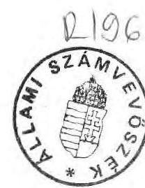
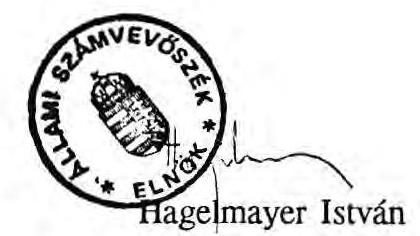

# Allami Számbeböséé 

## JELENTÉS

a környezet- (természet)védelmi és a vízügyi szervezetek szétválasztásának célvizsgálatáról

---

# A vizsgálatot végezték: 

Czunyi Lajos számvevő tanácsos
Csizmadia József szakértő

A vizsgálatot vezette:
Hegedűsné dr. Müllern Veronika osztályvezető főtanácsos

---

# J E L E N T É S 

a környezet- (természet)védelmi és a vízügyi szervezetek szétválasztásának célvizsgálatáról

A környezetvédelmi tevékenység és a természeti erőforrásokkal való gazdálkodás állami irányításának egységesítésére 1987. decemberében - az Országos Környezet- és Természetvédelmi Hivatal (OKTH), valamint az Országos Vízügyi Hivatal (OVH) összevonásával - létrejött a Környezetvédelmi és Vízgazdálkodási Minisztérium (KVM). A két megszűnt hivatal felügyelete alatt működő területi szervek összevonására 1988. nyarán került sor.

Az új Kormány 1990. májusi megalakulása után a tárcák közötti munkamegosztás módosításával létrejött a Környezetvédelmi és Területfejlesztési Minisztérium (KTM), illetve a Közlekedési, Hírközlési és Vízügyi Minisztérium (KHVM). Még ez év decemberében sor került a területi szervek szétválasztására is. Ezt követően a jogutód szervek kapcsolatában több tekintetben nézeteltérés alakult ki, ami a feladatokon és hatáskörökön túl jelentős vagyoni kört, költségvetési pénzeszközt is érintett ( 1,8 milliárd Ft költségvetési ráfordítást, ezen belül 3.591 létszámhoz kapcsolódóan 0,6 milliárd Ft béralapot, illetve az érintett két alap tekintetében 2,7 milliárd Ft-ot). A felvetett kérdések miatt döntött úgy az Állami Számvevőszék, hogy megvizsgálja a "szétválasztás" körülményeit, lebonyolítását.

Vizsgálatunk célja az volt, hogy a csaknem 3 évig (1988. januártól 1990. decemberig) tartó összevonást, illetve szétválasztást követő - környezetvédelmi és vízügyi feladatok, hatáskörök változásával összefüggő - működési költségeket, a létszám- és a vagyontárgyak megosztását a törvényességi, célszerűségi, eredményességi (gazdaságossági) szempontok szerint értékeljük.

Megállapításaink az érintett két tárcánál, illetve azok felügyelete alá tartozó szervezeteknél (1. sz. melléklet) szerzett helyszíni tapasztalatainkra, elemzéseinkre épülnek.

---

Vizsgálati eljárásunk nem volt szokványos, ugyanis az "osztozkodás" folyamata még a helyszíni ellenőrzések befejezéséig - 1992. március - sem zárult le. A szétválást követő másfél év alatt a lerendezettnek vélt ügyek egy része újra nyitott kérdéssé vált, sőt a tárgyszerűen elválasztható ágazati tulajdonon túlmutató igények is megfogalmazásra kerültek. Ez utóbbiak már az 1991. évi önálló gazdálkodás során területenként felmerült pénzügyi gondokkal is összefüggésben voltak. Kedvezőtlen volt az is, hogy a területi szervek vezetőinek körében jelentős változások következtek be. (A szétválasztás vagyoni-pénzügyi kérdéseinek lerendezését nehezítette, hogy a KTM területi szerveinek kétharmadánál nem volt jelen pénzügyi-számviteli szakember.)

A helyszíni ellenőrzésekkel - amelyek általában az érintett felek képviselőivel együtt történtek - párhuzamosan folytak azok a tárgyalások, ahol a központi és a területi szervek egyezségre próbáltak jutni, nem egy esetben a Számvevőszék munkatársainak közreműködésével (pl. Budapesten, Gyulán).

A tárcák közötti megosztást követően kialakult nézeteltérések miatt - amit parlamenti interpelláció, illetve a médiákban elhangzott nyilatkozatok is megerősítettek - ellenőrzésünket azzal indítottuk, hogy felkértük a KTM-et mutassa be területi egységenként, illetve a központi szervekre vonatkozóan melyek azok a vagyontárgyak, létszámok, költségvetési előirányzatok, amelyek az osztozkodás során - mint jogos ágazati tulajdon - nem kerültek a környezetvédelem jogkörébe, hatáskörébe. Kérdésünkre a vizsgálat befejezéséig sem érkezett teljes körű tételes felsorolás. Így a területi egységektől bekért nyilatkozatok és a helyszíni ellenőrzések alapján igyekeztünk felmérni a vitatott kérdéseket, illetve azt a kört, melyre a vizsgálatunkat kiterjesztettük.

Vizsgálatainkban a legtöbb gondot az okozta, hogy a KTM területi egységei úgy az összevonás, mint a szétválás idejére vonatkozóan alig rendelkeznek adatokkal - és azok egy része is csak számított volt -, ami nehezítette az eredeti állapot rekonstruálását, illetve az összehasonlítást. Ezt részben az magyarázta, hogy a környezetvédelmi szervek sem az összevonás előtt, sem az után nem gazdálkodtak önállóan. (1988-ban részben önálló szervek voltak, 1988-tól a KÖVÍZIG-ek részét képezték.)

Az ellenőrzést nehezítette, egyben lassította, hogy jó néhány esetben a vizsgált KTM, illetve KHVM szervektől igen pontatlan - nagyfokú hibaszázalékkal megküldött adatokat kaptunk. (Pl. a vízügyi szervek közül a Nyíregyházán készült tanúsítvány 1 db házas ingatlant tartalmaz, amit korrigálni kellett, a valós adat: 185 db . A Gyulán kimutatott állóeszközök bruttó értékét 300 millió Ft-tal kellett csökkenteni. A győri összesített tanúsítványok első és második változata azonos időpontra a 122 db ingatlan

---

helyett 458 db -ot mutat ki. A budapesti KÖFE több tekintetben félrevezető információkat szolgáltatott, a tényleges adatokhoz képest 1:3, 1:8 arányú eltérések is voltak.)

Gondot jelentett az is, hogy ugyanazt a fogalmat eltérően alkalmazták az egyes területi szervek. (Pl. Gyulán csak a védelmi és szakmérnökségi állományú eszközöket tekintették alapfeladatba tartozónak, Szombathelyen valamennyi eszközt, így a teljes jármúparkot is az alapfeladathoz sorolták. Szegeden viszont fordítva, a teljes környezetvédelmi állományt vállalkozásba tartozónak nyilvánították.)

# I. 

## Következtetések, javaslatok

Az új Kormány megalakulását követően létrejött a Környezetvédelmi és Területfej-lesztési- (KTM) és a Közlekedési, Hírközlési és Vízügyi Minisztérium (KHVM). A munkamegosztás keretében a két tárca között szétválasztásra kerültek a "vízügyi" feladatok. Ezzel egyidejűleg 18 meglévő szervezetből 36 környezet- (természet)védelmi és vízügyi szervezet jött létre.

A szakmai feladatok megosztása mindkét tárcánál gondot okozott, amely alapvetően a keret jellegű jogi szabályozással volt összefüggésben. Törvényi szinten ugyanis a feladatok - a vízháztartás-vízminőség szabályozása, ellenőrzése, illetve a vízgazdálko-dás-vízügyi igazgatás - elhatárolása nem volt egyértelmű, nem történt meg azok egyidejű pontos definiálása.

A törvényi pontatlanságok a végrehajtást szolgáló rendeletekben - melyek a környezet(természet)védelmi, illetve a vízügyi szervek működését szabályozták - is megjelentek. Ennek következményeként a szakmai feladatellátásban párhuzamosságok voltak tapasztalhatók, így pl. a szétválással leginkább érintett hatósági, szakhatósági jogkörben, a vízminőségi kárelhárítás irányításában. Mindemellett adott területeken a vízügyi igazgatóságok "önengedélyezési" gyakorlata is folytatódott, majd felemás megoldással zárult. Ezek az anomáliák összefüggésben vannak azzal, hogy a vízügyi hatósági feladatokat még az Országos Vízügyi Hivatal 8-20 éves rendelkezései szabályozzák.

A törvényi szinten érintett területek müködési feltételrendszerének megosztását vagyonát, létszámát, múködési költségeit - a két tárca vezetőinek együttes utasításai

---

helyett 458 db -ot mutat ki. A budapesti KÖFE több tekintetben félrevezető információkat szolgáltatott, a tényleges adatokhoz képest 1:3, 1:8 arányú eltérések is voltak.)

Gondot jelentett az is, hogy ugyanazt a fogalmat eltérően alkalmazták az egyes területi szervek. (Pl. Gyulán csak a védelmi és szakmérnökségi állományú eszközöket tekintették alapfeladatba tartozónak, Szombathelyen valamennyi eszközt, így a teljes járműparkot is az alapfeladathoz sorolták. Szegeden viszont fordítva, a teljes környezetvédelmi állományt vállalkozásba tartozónak nyilvánították.)

# I. 

Következtetések, javaslatok

Az új Kormány megalakulását követően létrejött a Környezetvédelmi és Területfej-lesztési- (KTM) és a Közlekedési, Hírközlési és Vízügyi Minisztérium (KHVM). A munkamegosztás keretében a két tárca között szétválasztásra kerültek a "vízügyi" feladatok. Ezzel egyidejűleg 18 meglévő szervezetből 36 környezet- (természet)védelmi és vízügyi szervezet jött létre.

A szakmai feladatok megosztása mindkét tárcánál gondot okozott, amely alapvetően a keret jellegű jogi szabályozással volt összefüggésben. Törvényi szinten ugyanis a feladatok - a vízháztartás-vízminőség szabályozása, ellenőrzése, illetve a vízgazdálko-dás-vízügyi igazgatás - elhatárolása nem volt egyértelmű, nem történt meg azok egyidejű pontos definiálása.

A törvényi pontatlanságok a végrehajtást szolgáló rendeletekben - melyek a környezet(természet)védelmi, illetve a vízügyi szervek múködését szabályozták - is megjelentek. Ennek következményeként a szakmai feladatellátásban párhuzamosságok voltak tapasztalhatók, így pl. a szétválással leginkább érintett hatósági, szakhatósági jogkörben, a vízminőségi kárelhárítás irányításában. Mindemellett adott területeken a vízügyi igazgatóságok "önengedélyezési" gyakorlata is folytatódott, majd felemás megoldással zárult. Ezek az anomáliák összefüggésben vannak azzal, hogy a vízügyi hatósági feladatokat még az Országos Vízügyi Hivatal 8-20 éves rendelkezései szabályozzák.

A törvényi szinten érintett területek múködési feltételrendszerének megosztását vagyonát, létszámát, múködési költségeit - a két tárca vezetőinek együttes utasításai

---

szabályozták. Ezek - részben a magasabb szintű jogszabályokra visszavezethetően együttesen sem alkalmasak arra, hogy a megosztást mindkét fél számára megnyugtatóan biztosítsák (különösen a KTM ezirányú észrevételei voltak gyakoriak). Ehhez hozzájárult az is, hogy a szétválasztás folyamata alapvetően előkészítetlen volt, nem álltak rendelkezésre a pontos záró vagyonleltárak, nem történt meg az 1990. évi zárómérleg közös felülvizsgálata, illetve ezek alapján az induló vagyon felmérése, az új nyitómérlegek összeállítása. (Az átadó-átvevő leltárak teljeskörűen még másfél év után sem fejeződtek be.)

Mindezek következményeként a létrejött új szervezetek csaknem fele a szétválás idején (1990. december 1-én) nem tudott megállapodni az induló vagyoni és létszám kérdésekben, illetve a pénzügyi kondíciókban. Olyannyira nem, hogy a mindkét fél által elfogadott egyezségre még 1992. I. negyedévében sem került sor, sőt - ismerve az 1991. évi önálló működés pénzügyi gondjait - a már lezárt viták is újraéledtek. Hozzájárult ehhez az is, hogy az ingatlanok kezelői jogának rendezése több helyen másfél éve húzódik, sőt olyan eset is van, ahol a telekkönyvi bejegyzés még az összevonáskori állapotot sem tükrözi.

A költségvetési pénzeszközök szétosztásáról is az együttes utasítások rendelkeztek, megfeledkezve arról, hogy a megszűnt, nagy volumenű, eredményérdekeltségű költségvetési szervekből (1990. évi teljesített bevételi főösszege: 17 milliárd Ft) az újonnan létrejött vízügyi eredményérdekeltségű és környezetvédelmi maradványérdekeltségű költségvetési szervek potenciálisan nehezebb pénzügyi, vagyoni feltételekkel indultak, ami a későbbi gazdálkodásra is kihatással lesz. (Az 1991. évi teljesített bevételi főösszeg a VÍZIG-eknél 13,9, míg a KÖFE-knél 2,9 milliárd Ft.)

Az új maradványérdekeltségű szervek elestek mindazon anyagi előnytől, amit a közös gazdálkodás számukra biztosított. Így pl. az állami feladatok finanszírozásából 1990-ben az érdekeltségi tevékenység 57,7 millió Ft-ot fedezett, az 1990. évi érdekeltségi alapból lehetőség nyílott arra, hogy jóléti, szociális, kultúrális célokra 25,7 millió Ft-ot, illetve beruházásra, rekonstrukcióra 292,8 millió Ft-ot felhasználhattak, amiből az állami feladatok is részesedtek. Intézkedést igényelt volna az év végén meglévő kötvényvagyon, befektetett eszközök, illetve azok hozadékának, valamint a rendezetlen tételeknek - pl. kintlevőségeknek - elszámolása, felülvizsgálata is. A költségvetési pénzeszközök megosztásánál elsősorban a támogatási előirányzatok, a működési bevételek szétválasztására került sor. A költségvetési támogatás megosztása során 61,7 millió Ft KÖFE-khez rendelésének szakmai indokoltságát, feladatokkal való alátámasztását számszaki elemzések, felmérések nem bizonyítják. A müködési bevételeknél 3,7 millió Ft (siófoki üdülő bevétele) máig rendezetlen a KTM és a PM között.

---

A szétválást követően másfél év után még nem megfelelően lerendezett kérdés a két - a Központi Környezetvédelmi és a Vízügyi - Alap (KKA, illetve VA) tartozása. A KKA végleges elszámolására - amely 232 millió Ft-ot érintett - határidőn túl, fél évvel később került sor, addig ezt az összeget a vízügyi szervek mintegy forgóeszköz hitelként ingyen, kamat nélkül használták. A kamatterhek megtérítésétől a KTM eltekintett.

A VA az 1980-as évek végén felvett adósságterheket ( 525 millió Ft-ot) meg kívánja osztani a KKA-val. A KTM, mint a KKA gazdája a rá "kiszabott" fizetési részarányt elvállalta.

A létszám átcsoportosítás általában az együttes utasítás figyelembevételével történt, ami viszont nem a teljes állomány felmérésére alapozott. A megosztást a felek közötti százalékos arányban, vagy egy-egy fő kiemelésével végezték. A konkrét feladatok ismeretének, illetve a koordináció hiányának következményeként az utasítás előírásai a helyi erőviszonyok függvényében realizálódtak. Ennek következményeként a hatósági munka létszámellátottsága - az előírt $60-40 \%$ helyett - országosan eltérő arányokat mutat. Szakmailag indokolhatóbb lett volna a szakfeladatonkénti megbontást alkalmazni, erre azonban nem kerülhetett sor, mivel azok sok esetben, úgy létszám, mint költség tekintetében, jelentős torzításokat takartak. Így a kompromisszumkeresés jegyében létrejött egyezségeknél előfordult, hogy a környezetvédelem létszámigényének kielégítése során belső ellentmondások keletkeztek.

A létszám átcsoportosításokat nem minden esetben követte a szükséges béralap, illetve a járulék átadása, amit a KTM fejezet év közben pótelőirányzattal igyekezett ellensúlyozni.

A vízügyi területek szétválásának folyamatában a vagyonmegosztás okozta a legtöbb gondot annak ellenére, hogy mindkét fél összességében rendelkezik a feladatellátáshoz szükséges vagyontárgyakkal. Ezzel szemben a centrális, frekventált elhelyezés miatt az ingatlanok egy részéért - csaknem másfél évig - viták folytak, illetve folynak ma is. A vita tárgyát elsősorban az irodahelyiségek, az üdülők, illetve üdülési célokat szolgáló létesítmények képezték. Ez utóbbi jelentőségét aláhúzza, hogy a vízügyi szervek jelentős üdülési lehetőséget biztosító, de eredendően ár- és belvízvédelmi létesítményként nyilvántartott ingatlanokkal rendelkeznek (ennek mértékéről a KHVMnek pontos adatai nincsenek). Ezek folyamatos üzemeltetése viszont nem biztosított.

A meglévő ingatlanok kapacitáskihasználása jónéhány esetben nem volt megfelelő. A használaton kívüli létesítményeket igyekeztek értékesítéssel, bérbeadással hasznosítani. Néhány esetben azonban a közpénzek pazarló felhasználásával találkoztunk. Ésszerüt-

---

lennek minősíthető az a létesítményberuházás, melyet nem az eredeti céljának termelést szolgáló műhelyközpontnak - megfelelően hasznosítottak, hanem azt az üzembehelyezést követően bérbe adták. Nem tekintettük takarékos megoldásnak azt sem, amikor gátőrház címén vendégház épült. Előfordult olyan eset is, hogy alacsony áron értékesített ingatlan helyett újat építettek, azonos funkcióval, de már az eladási ár nyolc-tízszereséért. Mindezek a szabálytalanságok az érintett tárca vezetésénél intézkedést igényelnek.

# A környezetvédelmi és vízügyi szervek szétválasztása körül tapasztalt anomáliák miatt javasoljuk a KTM, illetve a KHVM vezetésének: 

1. a) A jelenleg folyó környezetvédelmi és vízügyi törvények előkészítését indokolt meggyorsítani, illetve gondoskodni azok összehangolásáról. Ennek során egyértelműen szét kell választani a vizekkel kapcsolatos államigazgatási feladatokat, pontosan definiálni szükséges az ezzel kapcsolatos fogalomrendszert.
b) Mindkét tárcának - miniszteri rendelet keretében - meg kell határozni a törvény szabta keretek között az ágazati feladatokat, ezzel összhangban felül kell vizsgálni és a szakmai feladatokhoz igazítani a meglévő szervezeti egységeket, azok működési feltételrendszerét.
c) Az egyeztetett tárcarendeletek megfogalmazásakor - figyelembe véve a külső megrendelők, az ügyfélforgalom számának növekedését - szükségesnek tartjuk az állami beavatkozások körének, illetve azok formájának rögzítését. El kell határolni a szabályozással, az operatív beavatkozással és a felügyeleti jogkör gyakorlásával lerendezhető feladatokat. Kisebb ügyekben a közvetlen intézkedések helyett a keretfeltételek - szabványok, műszaki irányelvek, elvi állásfoglalások - meghatározásával célszerű csökkenteni az ügyintézést.
d) Szabályozni szükséges a két tárca közötti adatcserével, illetve vízminőségi kárelhárítással kapcsolatos feladatokat is, az 1/1990. számú együttes miniszteri utasítás értelmében.
2. a) A törvénymódosítások megszületéséig a két tárca közösen határolja el az eddig párhuzamosan végzett szakmai feladatokat.
b) Ezzel összhangban - átmeneti jelleggel - módosítani szükséges a területi szervek szervezeti és működési szabályzatát, ennek figyelembevételével felül kell vizsgálni az egyes szakfeladatok belső (szakmai) tartalmát.

---

c) A területi szerveknél - szükség esetén tárca közreműködéssel - záros határidőn belül létre kell hozni az egyezséget, az állami feladatok érdekeinek előtérbe helyezésével:

- A lezárt megállapodások alapján az átrendezett vagyontárgyak szerint módosítani kell az intézmények vagyonmérlegét.
- Az 1990. novemberi megállapodások után átvett ingatlanokhoz, létszámokhoz kapcsolódó üzemeltetési, fenntartási költséget, illetve béralapot át kell csoportosítani az érintett tárcához.
- Ismételten célszerű áttekinteni a KÖFE-k költségvetési támogatási előirányzatát és a két tárca közötti kölcsönös megállapodással - az 1991. évi múködési tapasztalatok ismeretében - biztosítani szükséges a feladatarányos támogatási előirányzatokat (különös tekintettel a béralap és a tb-járulék fedezetére, illetve az ingatlanok üzemeltetési, fenntartási költségeire). Ezzel egyidejűleg törekedni kell arra, hogy a VÍZIG-ek eredményérdekeltségű tevékenységeit saját bevételei fedezzék, ennek érdekében gondoskodni kell a kihasználatlan vízügyi ingatlanok intenzívebb hasznosításáról. Törekedni kell arra, hogy az ebből származó bevétel az állami pénzeszközök kímélését szolgálja.
- A KTM kezdeményezze a PM-nél a siófoki üdülő működési bevételének zárolását.
d) Azoknál a területi szerveknél, ahol 1991-ben a KÖVÍZIG- ek zárómérlegei alapján nem készültek nyitó mérlegek, a két fél kölcsönös megállapodása, illetve önrevíziója alapján meg kell bontani a zárómérleg sorait, ezzel helyesbíteni kell a könyvviteli elszámolásokat, a főkönyvi zárlatot. Ennek keretében a kintlevőségeket is rendezni szükséges.

3) A két tárca vezetője:
a) a pénzügyi-gazdasági ellenőrzés során vizsgáltassa felül a területi szervek lezárt megállapodásainak pénzügyi-számviteli realizálását, a megosztott vagyon nyilvántartásba vételét,
b) intézkedjen a nem megfelelően hasznosított ingatlanokért, a vagyon kezeléséért, a szétválasztást követő rendezetlen pénzügyi kérdésekért, a pontatlan adatszolgáltatásokért felelős személyek felelősségre vonása iránt.

---

# II. 

## Megállapítások

A) A környezet- (természet)védelmi és vízügyi szervezetek szétválasztása, illetve annak előzményei

1) Szervezeti változások

A KVM megalakulásával 1988. nyarán a volt két központi fejezet összevonását követően - OKTH, illetve OVH - területi szervei is egyesítésre kerültek, ezzel 12 környezetvédelmi és vízügyi igazgatóság (KÖVÍZIG) alakult meg.

A két hivatal területi egységei - vagyon és létszám tekintetében - nem voltak egy "súlycsoportban".

Az OVH 12 vízügyi igazgatósága került összevonásra az OKTH 7 környezetvédelmi felügyelóségével és 7 mérőállomásával, így jött létre a 12 KÖVÍZIG. A környezetvédelem létszáma az összes létszám alig $2 \%$-át, az egyesített vagyonnak $0,5 \%$-át jelentette. (A költségvetés volumenéről a KTM-nek nincs pontos információja, mivel a felügyelóségek részben önálló költségvetési szervként müködtek.) Az egyesítési folyamat nem érintette a 4 nemzeti parkot, mint természetvédelmi egységet, az Árvizvédelmi és Belvízvédelmi Központi Szervezetet (ÁBKSZ), illetve csak fáziskéséssel a Környezetgazdálkodási Intézet (KGI) jogelódjeit.

A környezetvédelmi-vízügyi feladatok, illetve a területi szervek szétválasztására 1990. december 1-ével került sor, de az érintett két miniszter a területet már jóval korábban - július végétől - együttesen irányította, felkészülve a várható változásokra. A feladat- és hatásköröket a szeptember 15 -én kiadott kormányrendelet szabályozta. Megjegyezzük, hogy ellenőrzésünk során mindvégig az előkészítés hiányosságaiba ütköztünk, amit a nem megfelelő jogi szabályozás, a pénzügyi-gazdasági felmérések és elemzések teljes hiánya, a vagyontárgyak nem teljes körű számbavétele jellemzett.

Összességében a szétválás és átszervezés azt jelentette, hogy az érintett 18 szervezetből 36 új szervezet alakult meg.

Ezen belül a 12 KÖVÍZIG-ből, továbbá egyes minisztériumi egységekből 30 önálló költségvetési szerv jött létre:

---

- 2 középirányító országos hatáskörű államigazgatási szerv, a Környezetvédelmi Főfelügyelőség (KVFF), mint részben önálló költségvetési szerv és az Országos Vízügyi Főigazgatóság (OVF), mint önálló költségvetési szerv;
- 12 környezetvédelmi felügyelőség (KÖFE) - önálló maradványérdekeltségű szervekként - 12 vízügyi igazgatóság (VÍZIG) - önálló eredményérdekeltségủ szervekként -, mint területi egységek.

A természetvédelem területén is alapvető változást jelentett, hogy létrejött 1 új nemzeti park (a meglévő 4 mellé) és 3 igazgatóság. (Ezeket az ugyancsak újonnan alakított Természetvédelmi Hivatal felügyeli, ami viszont nem önálló egység, hanem a tárca szervezeti részeként müködik.)

A 4 nemzeti parkot, az ÁBKSZ, illetve KGI szervezetét a szétválás nem érintette, az utóbbi sorsa a vizsgálat befejezéséig sem lerendezett.
2) A környezet- (természet)védelmi és vízügyi szervezetek 1990. év végi megosztásának technikai lebonyolítása

A szétválasztásról, az új területi szervek megszervezéséről, illetve annak feltételrendszeréről - a két miniszter együttes intézkedése alapján - az érintett igazgatóknak közös megállapodást kellett kötni, a közigazgatási államtitkárok jóváhagyásával. Kölcsönös megegyezés alapján ezzel az aktussal - már 1990. év végén - befejeződhetett volna az átszervezés folyamata.

A megállapodások megkötésére igen rövid idő (kb. 10 nap) állt rendelkezésre, az előkészítés pedig a vizsgált területi szervek többségében nem volt megfelelő, nem készült teljes körű vagyonfelmérés, nem álltak rendelkezésre a szükséges költségvetési- pénzügyi adatok. Gondot okozott az is, hogy a területi egységek kétharmadánál a KTM részéről a munkákban nem vett részt pénzügyi-számviteli szakember.

Bonyolította a megállapodások folyamatát, hogy a környezetvédelmi és a vízügyi szervek szétválását követően csak a második ütemben került sor a környezetés a természetvédelem megosztására.

Végeredményben 1990. decemberére a 12 területen 7 megállapodás a két fél közös megegyezésével zárult. (1992. márciusára már csak 5 terület egyezsége látszik biztosnak, mivel Budapesten és Gyulán a szétválás óta nem tudtak megegyezni, 5 területen a viták viszont azóta újra kiéleződtek.) A felügyeleti szervek (elsősorban vízügy) részéről presszionált megállapodások - a mindenáron megegyezésre való

---

törekvés - azonban úgy formailag, mint tartalmilag, illetve a felügyeleti elbírálás szempontjából igen sok kívánnivalót hagytak maguk után:

- A megegyezéssel végződő megállapodások közül három tartalmilag olyan kirívóan hiányos volt, hogy ebben a formában nem lett volna szabad elfogadni (Baján, Győrben, Szegeden).
- Egy alkalommal előfordult, hogy a felügyeleti szerv hamarabb elbírálta a közös megállapodást, mint ahogy az a központba beérkezett volna (Nyíregyháza).
- Három esetben (Székesfehérvár, Debrecen, Budapest) a megállapodást előbb "elfogadták", majd kérték annak indoklását.

Kifogásolható - egyben a megállapodások érvényességét is megkérdőjelezi -, hogy a miniszterek együttes utasítása ellenére a közös megállapodások egyikét sem írta alá a két közigazgatási államtitkár. (A KHVM részéről a helyettes államtitkár ellenjegyezte azokat, a KTM részéről a megállapodásokon "sk" jelzés található egy-egy tanácsadással megbízott személy szignója mellett.)

Nem véletlen, hogy az átszervezéssel kapcsolatos vitasorozatban a 12 KÖFE vezetője 1991. szeptember 6-án a miniszternek és a helyettes államtitkárnak írt levelében azt jelezte, hogy a szétválás a KTM részéről nem lett jóváhagyva.

Indokolt lett volna az is, hogy az "osztozkodás" technikai lebonyolítását, "eredményét" a felügyeleti szervek figyelemmel kísérjék, illetve visszamérjék, ellenőrizzék azt, erre azonban csak a KHVM-nél volt elvétve példa. A tárcák az 1990. évi szétválasztásról értékelést nem készítettek annak ellenére, hogy 1990-ben a miniszteri megbízottak erre többször is felhívták a minisztériumok vezetésének figyelmét. (Megjegyezzük, hogy a környezetvédelemnél erre már az 1988. évi összevonáskor sem került sor!)

Nem kedvezett az átszervezés folyamatának az sem, hogy a szétválást követően igen jelentős volt a vezetők fluktuációja (a KÖFE-knél háromnegyed, a VÍZIG-eknél kétharmad része kicserélődött), az új vezetők munkába állítása pedig igen elhúzódott. A KÖFE-k működését nehezítette az is, hogy az első félévben az álláshelyeik 20-30 \%-a betöltetlen volt.

---

B) A központi és a területi szervek szétválását követően vitatott kérdések

1) A szétválasztás jogi feltételrendszere

Az 1990. évi szétválasztás alapvető problémája - az előkészítés hiányával összefüggésben - a nem egyértelmű jogi szabályozás volt. Ennek következményeként nem lehetett a vízügyi feladatokat konkrétan megosztani, azok gyakran párhuzamosságokat takartak. Így a vagyontárgyak, létszámok, pénzügyi eszközök szétosztása is gyakran nem az ágazati vagyon objektív elhatárolására, hanem a személyek közötti megállapodásra épült. Kölcsönös megállapodás hiányában viszont továbbra is rendezetlen kérdések maradtak.

A szétválasztás jogilag az 1990. évi LXVIII. törvénnyel kezdődött, amikor is - a kormányzati munkamegosztás változása miatt - a korábbi vízügyi hatósági jogkörök egy része közvetlenül a környezetvédelemhez (KTM), míg a fennmaradó területek új tárca hatáskörébe (KHVM) kerültek.

Ez a jogszabály módosította az 1964. évi vízügyi törvény két szakaszát (41. és 42. par.), ezzel az eddig homogén vízügyi-jogi szabályozás, mely kizárólag a vízügyi szervekhez kapcsolódott, kettévált. Ezt követően
—a vízgazdálkodás és vízügyi igazgatás a KHVM feladata lett, ez a tárca gyakorolja a vízügyi államigazgatási ügyekben a hatósági jogköröket is (a környezetvédelmi és más jogszabályban meghatározott feladatok kivételével),
—a "vízháztartás, vízminőség, a felszíni és a felszín alatti vizek védelmével összefüggő szabályozási és ellenőrzési feladatok teljes hatáskörrel" a KTM-hez kerültek.

Ez a törvényi rendelkezés számos pontatlanságot takar, ami a végrehajtást segítő további jogi szabályozások - kormány, illetve tárcarendeletek - hibaforrásává vált.

Míg a "vízgazdálkodás" fogalmát a törvény pontosan definiálja (ide rendeli pl. a "mennyiségi, minőségi védelmet" is), addig a "vízháztartás", mint új fogalom, nem került meghatározásra, így nem egyértelmű annak tartalma.

Gondot okoz az is, hogy a KTM hatásköre "szabályozási és ellenőrzési" feladatokra terjed ki, ugyanakkor a törvény nem fogalmaz egyértelműen a hatósági (szakhatósági) jogkörökkel kapcsolatban.

---

Ez az előírás azt eredményezte, hogy a vízminőség védelmét szolgáló létesítmények engedélyezését is a vízügyi hatóság látja el, környezetvédelmi szakhatósági közremüködéssel.

Mindezek következményeként a tárcák között alapvetően eltérő, szélsőséges értelmezések alakultak ki. (Egyik fél szerint a KTM csak keretszabályokat határozzon meg a hatósági vizsgálatokhoz, míg a másik fél szerint a KTM feladata, hogy a hatáskörébe tartozó ügyekben minden vízügyi jogkört ő gyakoroljon.)

Ezek a visszásságok a törvény végrehajtását szolgáló rendeletekben is megjelennek. Míg a vízügyi szolgálatról szóló 4/1990. (X.24.) KHVM rendelet a hatósági jogkört igen részletes bontásban mutatja be, addig az 1/1990. (XI.13.) KTM rendelet - mely a környezetvédelmi felügyelőségekre vonatkozik - a szakhatósági jogkört igen szintetizáltan fogalmazza meg. (Ez utóbbi szűkebb jogkört jelent, mint a hatósági jogkör gyakorlása.)

A környezetvédelmi felügyelőségek első fokú szakhatósági jogkörét szabályozó rendelet szerint a "felszíni és felszín alatti vizekbe való beavatkozás esetén ... meghatározzák a mennyiségi és minőségi védelem érdekében szükséges követelményeket." Ez az összevont feladat többnyire 4-5, de Budapesten 9 vízügyi jogkört foglalt magába.

Gyakorlatilag a vízügyekkel kapcsolatos hatósági (szakhatósági) jogkörök nem szétválasztásra, hanem megosztásra kerültek, ami alapvetően párhuzamosságokhoz vezetett és a tárcák között gyakori feszültségek forrásává vált. (A tapasztalatok szerint a duplikáció miatt az eljárások 20-25 nappal meghosszabbodtak és az 1990. évi létszámhoz mérten $50 \%$-kal többet igényeltek.) Jó néhány esetben mindkét szervezet - anyagi-jogi szabályok, szabványok, műszaki irányelvek tekintetében - ugyanazon feltételek meglétét vizsgálja (pl. szennyvíztisztító, kút létesítése, felszíni vízkiviteli mű). A környezetvédelem vízügyekkel kapcsolatos szakhatósági jogkörei konkrét szakmai szempontjainak meghatározása máig sem történt meg.

A vizek minőségét és a vízkészleteket érintő kérdésekben is fennáll a túlszabályozás miatt a kettős eljárás veszélye. Példaként említhető a szennyvíztisztító telep építése, üzemeltetése.

Egy szennyvíztisztító telep építésekor a vízügy engedélyez, a környezetvédelmi felügyelőség szakhatóság. Ha megépül a létesítmény, a tisztított szennyvíz vizsgálata és a szennyvízbírságolási eljárás a felügyelőség feladata. Ha egyedi (pl. jogszabálytól eltérő) határértéket kér a telep üzemeltetője, a felügyelőség az eljáró hatóság, a vízügy szakhatóság. Ha nem megfelelően üzemel a létesítmény, akkor a felügyelőség szakhatóságként kezdeményezi az eljáró vízügyi hatóságnál a telep engedélyének módosítását, kötelezését, vagy esetleg

---

bezárását. Ha a telepről, esetleges havária (káresemény) esetén, az elfolyó szennyvíz rendkívüli szennyezést okoz, a kárelháritás irányítója a felügyelőség, az operatív irányító és végrehajtó a VÍZIG, ehhez a feladathoz megfelelő felszereltséggel és emberállománnyal rendelkezik. A méréseket jobbára a felügyelőség végzi.

További párhuzamosságot jelent a "vízminőségi kárelháritás irányítása" témakör is. A Kormány ugyanis egyazon napon kiadott két rendelete ezt a feladatot egyaránt előírta - tartalmi megkülönböztetés nélkül - a környezetvédelmi és a vízügyi szervek számára is (43/1990. /IX.15./ és az 52/1990. /IX.15./ Korm. rendeletek).

Az átfedések részbeni rendezésére több, mint egy év elteltével került sor. Az adott témakört háromfelé bontották. 1991 végén kormányrendelettel az "operatív irányítást" a KHVM-hez rendelték, míg a fennmaradó két feladat értelmezésére átmeneti tárcaközi megállapodás született (a kormányrendelet végrehajtására!). Eszerint a "felderítést" közösen végzik, a "minősítést" a KTM végzi.

A vízügyi igazgatóságoknál nem történt meg a hatósági, kezelési (üzemeltetési, fenntartási) és a termelőtevékenység szétválasztása, ezzel egyidejűleg tovább folytatódott az "önengedélyezési" gyakorlat is.

Ezt a megoldást a KHVM vezetése sem tartja megfelelőnek, "nem lehet kimondani, hogy a hatósági jogkörre szükség van, csak azt, hogy azok jelenleg ide tartoznak". Az önengedélyezési eljárás feloldására átmenetinek tekinthető intézkedésként a VÍZIG-ek saját ügyeihez (pl. tervezés, kivitelezés) az OVF jelöli ki, hogy ki lesz a hatóságként eljáró társ VÍZIG. Bár az ehhez kapcsolódó ügyíratforgalom nem jelentős ( $5-8 \%$ ), de "egészében lefedi az állami fömüvek kezeléséhez szükséges engedélyezéseket".

A kialakult helyzet összefüggésben van azzal, hogy a vízügyi hatósági feladatokat 8-20 éves - volt OVH - rendelkezések szabályozzák. Némi módosulás csak az önkormányzati törvénnyel összefüggésben történt, ami azt jelentette, hogy néhány kérdés hatósági engedélyezése önkormányzati hatáskörbe került.

A feladatleadás esetenként elgondolkodtató "eredménnyel" járt. A vízállások (pl. horgász-stégek) engedélyezéséhez az építésügyi hatóságot képviselő területileg illetékes jegyző mellett 4 szakhatósági (környezet-, területvédelem, vízügyi és közegészségügyi) engedély szükséges.

Addig, amíg a szétválasztáshoz szükséges alapvető rendelkezéseket, feladatokat törvény, illetve kormányrendelet - magas szintű jogszabály - írja elő, a müködés

---

feltételrendszerét - pl. vagyoni kérdések, költségvetési támogatás, létszám, információáramlás - jogszabálynak nem minősülő együttes utasítások szabályozzák.

A szabályozás kronológiai furcsasága, hogy a KÖFE-k, illetve a VÍZIG-ek feladatait, jogkörét meghatározó kormányrendeletek csaknem egy hónappal később léptek életbe, mint a müködés feltételrendszerét szabályozó utasítások, vagyis hamarabb intézkedtek pl. a pénzeszközök, mint a feladatok szétosztásáról.

A KÖFE-k és a VÍZIG-ek megszervezésével foglalkozó két utasítás (1/1990. sż., illetve a 2/1990. sz.) együttesen sem alkalmas arra, hogy a feladatmegosztás végrehajtható legyen.

Az 1/1990. (X.1.) sz. utasítás (a két miniszter együttes aláírásával) hiányosságait vélhetően a két tárca igen hamar érzékelte, ezért ennek korrekciójaként megjelentette a 2/1990. (XI.6.) sz. utasítást az előző "értelmezéséről és módosításáról". (Ezt viszont már a két közigazgatási államtitkár írta alá.)

Az utasítások általános problémái az alábbiakban foglalhatók össze (a részletes kérdéseket a 2. és a 3. pontok tartalmazzák):

- Hatálybalépésük előtt nem történt meg a szétválasztással érintett területek teljes körű felmérése sem a vagyoni kérdésekben, sem a létszámban, sem a pénzügyi eszközöket illetően. Ennek következménye, hogy nem szétosztásra került sor, hanem pl. létszám esetén néhány fő kiválasztására, vagy a területek \%-os megosztására (teljes körű volumenének ismerete nélkül).
- A szétosztás "mércéje" nem konkrét, általában a "feladatarányos" előírás jellemzi, mivel a jogszabályok nem osztják meg egyértelműen a szakmai feladatokat. Így alapvetően nem értelmezhető - a későbbi viták alapját képező - az az elvárás, hogy "a feladatok ellátásához szükséges személyi, anyagi-technikai feltételek mindkét szervezet számára rendelkezésre álljanak".
- Külön utasítás kiadását rendelték el az adatforgalom szabályozására, illetve a kárelhárítás érdekében szükséges laboratóriumi mérések igénybevételére. Ezek azonban az ellenőrzés befejezéséig nem készültek el.

---

2) A költségvetési elöirányzatok és a létszám szétválasztása
a) Költségvetési pénzeszközök

Az 1990. augusztusában megjelent kormányhatározat úgy intézkedik, hogy a volt KÖVÍZIG-ek jogutódjai 1990. december végéig együtt gazdálkodnak, egy beszámolót készítenek és 1991-től válnak szét, amikor is mindkét fél önálló költségvetést készít.

Az együttes költségvetési bevétel fó összege év végén 17 milliárd Ft volt (ebből a költségvetési támogatás 2,7 milliárd Ft), ami 42 környezet- (természet)védelmi és vízügyi szakfeladatot foglalt magába.

A szétválást követő évben, 1991-ben a 12 VÍZIG teljesített bevételi főösszege 13,9 , míg a 12 KÖFE-é 2,9 milliárd Ft volt.

A szétválás 6 szakfeladatot érintett 1,8 milliárd Ft ráfordítással (2.sz. melléklet).
Tekintettel arra, hogy a feladatok egyértelmű elhatárolása törvény szintjén nem történt meg, ezért az érintett szakfeladatok előirányzatait sem lehetett egyértelműen megosztani. Az együttes miniszteri utasítás sem vállalkozott arra, hogy a költségeket szakmai feladatokhoz rendelten ossza meg. Ehelyett kizárólag a költségvetési támogatás, a működési bevétel, nyereség és az érdekeltségi alap megosztását rendeli el oly módon, hogy - a szétosztás keretében - nem lehet többletfeladatokra fedezetet teremteni.

Az utasításba foglalt előírások nem alkalmasak arra, hogy mindkét fél megnyugtatónak érezze a pénzügyi kérdések lerendezését. A szétválást követő másfél év óta rendszeresen újraéledtek a pénzeszközök körüli viták, bár ebben már nem kis része volt annak is, hogy az 1991. évben az adott költségvetési kereteket - elsősorban a környezetvédelem - igen szűkösnek ítélte.

A tárcák által a Parlament elé 1990. év végén beterjesztett - már az új kormányzati feladatmegosztást tükröző - 1991. évi költsévetési támogatás összege a területi szervekre vonatkozóan 3.167,3 millió Ft volt. Ennek kiszámítása az előző évi bázis támogatásból történt, azaz 2.734,1 millió Ft-ból. Ez utóbbi előirányzaton belül a környezet- (természet)védelem előirányzata 514,2, míg a vízügyé 2.219,9 millió Ft volt.

Az előirányzatok szétosztásának indokoltságát, szakmai feladatokkal való összhangját számszaki levezetéssel nem lehet alátámasztani (3.sz. melléklet).

---

Az eredeti megállapodásokban rögzített támogatási összeg a környezet- (természet)védelemnél 452,5 , a vízügynél 2.281,6 millió Ft volt. A két terület között - tárcaközi megállapodással - 61,7 millió Ft átcsoportosítás történt, melynek indokoltsága, mértéke utólagosan számszaki felmérésekkel nem igazolható. A tárcaközi egyeztetésre a környezet- (természet)védelem egyébként 606,5 millió Ft támogatási igényt nyújtott be. (Megjegyezzük, hogy a kompromisszumos döntésre igen rövid idő állt a felek rendelkezésére.)

A müködési bevételek megosztása mindenhol megtörtént, lerendezetlen-maradt azonban a KHVM-hez kerülő siófoki üdülő ilyen típusú bevétele. Ugyanis a jogutód tárca - KHVM - megtervezte az intézmény tejes bevételét, ezen belül a működési bevételeket is ( 3,7 millió Ft). Ez utóbbi azonban a KTM költségvetésében továbbra is megmaradt. Az előirányzat zárolását a KTM-PM között rendezni szükséges.

A szétválást az jellemezte, hogy területenként egy nagy volumenű eredményédekeltségű szervezetből (KÖVÍZIG) kivált egy eredményérdekeltségű VÍZIG és egy lényegesen kisebb maradványérdekeltségű tevékenységet folytató KÖFE (VÍZIGKÖFE arány kb. 83:17 \%). A közös gazdálkodás, a "nagy kassza" előnye volt, hogy a maradványérdekeltségű tevékenységek - melyek elsősorban az állami alapfeldatokat foglalják magukba - általános költségeinek egy részét "lenyelte" a termelőtevékenység eredménye, vagyis az állami támogatás hiányát fedezte a termelő, vállalkozási tevékenység eredménye. Ez 1990-ben 57,7 millió Ft-ot jelentett. A szétválást követően erre már nincs lehetőség, így azt a támogatásnál indokolt lett volna elismerni.

Jól jelzi ezt a folyamatot, hogy a kiválásra kerülő szakfeladatok egy része 1990. év végén " 0 " eredményt mutatott.

Pl. Pécsen 5 szakfeladaton 197,5 millió Ft bevételi előírást és ugyanannyi ráfordítást szerepeltetnek, mivel az állami feladatoknál felmerült költségekből 15,2 millió Ft-ot érdekeltségi tevékenységükre terhelték.

Székesfehérváron 4 szakfeladatnál 267,5 millió Ft a bevételi előirás, illetve a ráfordítás. Itt 9,7 millió Ft-ot könyveltek át az érdekeltségi tevékenységre. Budapesten az "átkönyvelt" összeg 10,8 millió Ft, ugyenez Miskolcon 14,9 millió Ft.

Ez a költségfelosztás is - a termelőtevékenység visszaszorulása mellett - hozzájárult ahhoz, hogy míg a KÖVÍZIG-ek 1989-ben 560,5 millió Ft eredményt értek el, addig 1990-ben már csak 187,6 millió Ft-ot.

Ezen belül a szétválással érintett szakfeladatok eredménye is jelentősen csökkent, 48,8 millió Ft-ról 11,1 millió Ft-ra.

---

(Az átkönyvelésre lehetőséget adó számviteli szabályozás egyben azt is jelentette, hogy a költségvetési szervek jelentősen csökkentett eredmény után fizettek vállalkozási nyereségadót.)

A KÖVÍZIG-ek jelentős nagyságrendű érdekeltségi alappal rendelkeztek (1990. évben 950 millió Ft volt). Ebből olyan jóléti-, szociális-, sport célú kiadásokat, lakásépítési támogatást, beruházást, felújítást, rekonstrukciókat tudtak fedezni, amelyből mind a maradvány-, mind az eredményérdekeltségű tevékenységek részesedtek. Szétválás után erre szintén nincs mód. A megosztás tárgyát viszont még érinti a közös eredménnyel létrehozott 1990. évi érdekeltségi alap, melynek elhatárolása megtörtént.

Pl. 1990-ben az érdekeltségi alapból jóléti, szociális kiadásokra 21,7; kultúrá-lis-sport-ifjúsági célokra 3,8; hivatali étkeztetésre 4,0; beruházásra, felújításra, rekonstrukcióra 292,8; lakásépítési támogatásra 3,5; tanfolyami költségekre, külföldi tanulmányútra 2,3 millió Ft-ot fordítottak.

Az utasítás hiányossága, hogy nem rendelkezett arról, miszerint a költségvetési pénzeszközök megosztását az 1990. évi mérleg közös lezárásával, felülvizsgálatával, illetve ezt követően az 1991. évet két új nyitómérleg elkészítésével kell kezdeni (vagyontárgyak szétosztását igazoló, illetve számbavevő leltárakkal alátámasztva).

Ehelyett a KÖVÍZIG-ek záró eszközeinek és forrásainak értéke teljeskörűen a VÍZIG-ek 1991. évi mérlegében szerepel, a beszámoló részeként. Így a KÖFE-knél nyitó eszköz és forrás érték nincs feltüntetve.

A nyitómérlegekből nyomon követhető lett volna az egyes mérlegsorok megosztása, illetve az év végi kintlevőségek lerendezése. Ez utóbbira sem történt külön intézkedés, így a végelszámolásra (áthúzódó tételek felülvizsgálatára, mely a jogutód szervek 1991. évi fizetési kötelezettségeire, illetve várható bevételeire vonatkozott) általában nem került sor.

A KÖVÍZIG-ek 1990. évi mérlegében 68,9 millió Ft függő kiadás (mint 1991-ben várható bevétel) és 45,4 millió Ft függő bevétel szerepelt. A rendezetlen átfutó tételek nagyságrendje 760,9 millió Ft volt. Igen jelentős az "adósok, vevők" év végi állománya is ("vevők" 1.126,4 millió Ft, "szállítók" 461 millió Ft).

Az utasításban intézkedni kellett volna a KÖVÍZIG-ek 1990. év végén meglévő kötvényeinek 26,6 millió Ft, illetve a befektetett eszközeinek (48,8 millió Ft) hovatartozásáról, illetve ezek 1991. évi hozadékáról is.

---

Mivel az utasítás nem a szakmai feladatokhoz rendeli az előirányzatok megbontását, ezért a területi szervek egy részénél gondot okoz, hogy az átvett ingatlan fenntartására, üzemeltetésére nincs fedezete (pl. Budapest: kb. 2,5 millió Ft). Ez a kérdés különösen élesen vetődik fel az 1992. évi államtitkári látogatások alkalmával átadott néhány ingatlan esetében (pl. Szolnok, Székesfehérvár, Gyula körzete).

A költségvetési pénzeszközök szétosztása körüli viták - 2-3 hely kivételével (pl. Miskolc, Szombathely, Győr) - jórészt lezárultak. Az elvi és gyakorlati problémák ellenére mint ahogy ezt már az 1991. év is bizonyította - a szétvált szervezetek - ezen belül a KÖFE-k - müködőképességüket mindenhol megőrizték. Év közben jelentős likviditási gondjaik nem voltak, az évet 22,5 millió Ft pénzmaradvánnyal zárták.
b) Alapok

Az utasítás értelmében az elkülönített alapokat - Központi Környezetvédelmi Alap (KKA) és a Vízügyi Alap (VA) - 1991-től a jogutód szervek kezelik. A KKA 1990. év végéig át nem utalt bevételeit 1991. január 31-ig a VÍZIG-eknek át kellett utalni a KÖFE-k számlájára.

A KKA esetében a teljes elszámolásra és a kintlevőségek rendezésére - határidőn túl - csak fél évvel később került sor, amely mintegy 232 millió Ft-ot érintett. A fél éves késedelem ingyenhitelt jelentett (tulajdonképpen forgóalap megelőlegezést) a VÍZIG-ek érdekeltségi, termelési-vállalkozási tevékenységéhez. Amennyiben ezt az összeget banktól kellett volna meghitelezni, jelentős - közel 35-40 \%-os - kamatterhet fizettek volna érte. Az 1992. januárjában kelt "Emlékeztető"-ben (melyet a két közigazgatási államtitkár írt alá) a KTM eltekintett a kamattérítési igényétől többek között azért, mivel - szerintük - a késedelmi kamat fizetési kötelezettsége gazdálkodó szervek kapcsolatára jellemző. (Megjegyezzük, hogy a kamatigény érvényesítése a költségvetési szervek között is legalizált, amit bizonyít az 1991. évi XCI tv. 9. paragrafusa, ahol az éves $40-44 \%$-os fizetési kötelezettség az állami költségvetés és az önkormányzatok között áll fenn.)

A KKA pénzügyi kondíciója központilag lehetőséget adott arra, hogy az elmúlt években folyamatosan jelentős nagyságrendű pénzkihelyezésekre kerüljön sor, illetve abból kamatbevételt realizáljon.

1988-ban 73 millió Ft tőkekihelyezés történt, ezek után összesen 27,5 millió Ft kamatot kaptak, amivel az Alap bevételeit növelték. (Az Alap 1990. évi összbevétele 577 millió Ft volt, amihez képest tehát a kihelyezés átlag $13 \%$.)

---

Ugyancsak az 1992. évi "Emlékeztető" rögzíti, hogy a KTM - 1988. évvel bezárólag - a Vízügyi Alap felvett kölcsöneivel kapcsolatos adósságterhek - összesen 525 millió Ft-nak - egy részét magára vállalja. (Az Alap 1990. évi bevétele 2,2 milliárd Ft.)

A KHVM számítása szerint az adósságszolgálati teher KTM-et illető része 73,5 millió Ft (14 \%), melynek 1991-1992-es törlesztő része mintegy 30 millió Ft, megközelítően annyi, mint a KKA után elmaradt kamattérités.

A VA hitelfelvétele - a beruházások fedezeteként - a bevételek megelőlegezését szolgálta. 1991. január 1-ig ugyanis a szennyvízbírság a VA jelentős bevétele volt. Ezt követően ez a forrás a KKA bevételét képezi, viszont az adósságszolgálat a VA-ot terheli. Ezzel kapcsolatban felvetjük, hogy
-a VA jelenlegi szabályozása mellett nem lehet megítélni, hogy a hitelek szennyvízbírságot előlegeztek-e meg.
— Kiadási oldalon a VA feladatai között termelő és nem termelő (pl. vízminőség-védelmi) beruházások is szerepelnek, így a hitelek egy része termelőberuházást is fedezhetett.
-A törlesztés jogosságának elismerése esetén sem indokolt a KTM-re rótt teljes részarány elfogadása, mivel a költségvetési törvény értelmében a szennyvízbírságok már megoszlanak - 70-30 \% arányban - a KTM és az önkormányzatok között.

A hitelfelvétel ellenére a VA 1988. októberiól 1990. decemberig 68,8 millió Ft tőkét helyezett ki, ami után 36 millió Ft kamatot realizált!
c) A létszám- és a bérelőirányzatok szétosztása

Az 1988. évi összevonáskor a vízügyi területből 18.016 fővel, a környezet- (természet)védelem mintegy 340 fővel (számított adat) hozták létre a KÖVÍZIG-eket. Míg a környezet- (természet)védelem létszámának mindössze $20 \%$-a volt fizikai, addig a vízügyeseknél ez az arány $75 \%$ volt. Az átlagkeresetek tekintetében a vízügyesek $10-15 \%$-kal magasabb jövedelemmel rendelkeztek.

A KÖVÍZIG-ek müködési ideje alatt a vízügyi területek létszáma jelentősen több, mint 4 ezer fővel - csökkent a termelés és a vállalkozási tevékenység visszaszorulásával.

---

Szétváláskor a KÖVÍZIG-eknek 15.833 fó átlaglétszámuk volt, ebből 1.165 fő a környezet- (természet)védelemhez került (KÖFE-khez), a többi a vízügyi szervekhez (VÍZIG-ekhez), míg a tárcák között 138 fős áthelyezés történt (KTM-ből KHVM-be).

Az 1990. év végi megállapodás szerint a 138 fóból 44 fó a KHVM, míg 94 fó az OVF állományát növeli. Ez utóbbi létszáma 1991. évben ténylegesen 120 fót jelentett.

A környezet- (természet)védelem létszámbővülése csaknem három és félszeres volt a két és fél év alatt a vizsgált területeken. (Ha az összevonás előtti funkcionális feladatokat ellátó központi létszámot is figyelembe vesszük, ennél kisebb, kb. háromszoros növekedés számítható.)

Ezen belül a KÖFE-knek 1991-ben az átkerült létszámmal együtt összesen 954 fó átlaglétszámuk volt, 264 millió Ft eredeti béralap előirányzattal, amihez 114 millió Ft tb-járulék tartozott. A maradványérdekeltségủ tevékenységet ellátó intézmények 604 millió Ft állami támogatást kaptak szakmai feladatok ellátásához (az összes bevétel $94 \%$-át). Vagyis a bér és tb a támogatás $63 \%$-át jelentette.

Létszám tekintetében az utasítások hibája, hogy nem a teljes körű felmérésből kiindulva bontották meg a rendelkezésre álló állományt. Ehelyett a százalékos megosztást választották, illetve egy-egy szakmai területről egy-egy főt "kiemeltek" és azt a KÖFE-khez rendelték. Ezek szükségessége, feladathoz rendelt indokoltsága számításokkal nem bizonyított.

Jól példázza az eljárás hibáját a feladatmegosztás frekventált területén a hatósági munkában bekövetkezett létszámváltozás. Az utasítás egyértelműen rendelkezik, miszerint az álláshelyek - 167 fő - $60 \%$-ának a KÖFE-khez, míg $40 \%$-ának a VÍZIG-ekhez kell kerülnie. A gyakorlatban a tényleges szétválás $56-44 \%$-os volt, mivel csak így biztosítható - a VÍZIG szerint - a "vízikönyv" vezetése.

Ezen belül is jelentős eltérés volt tapasztalható. Míg Miskolcon, Baján kétharmad-egyharmad az arány a KÖFE javára, addig Debrecenben a létszám több, mint fele a VÍZIG-ekhez került.

A bérelőirányzatok reális szétosztásához sem nyújtottak megfelelő eligazítást az utasítások. A béralap elosztásáról úgy intézkedtek, hogy kulcsszámonként a "számított átlagkeresetet" kell figyelembe venni. A béralap járulékáról ( $43 \%$ ) egyáltalán nem szólnak. Figyelmen kívül hagyják azt is, hogy a kulcsszámokhoz kapcsolható keresettömegen túl a béralap megmaradó része is a szétosztás tárgyát képezi (pl. üres állások bére, tartós bérmegtakarítás, év végén fel nem használt béralap maradvány).

---

A bérelőirányzatok és a létszám elosztása reálisabb lett volna, ha az a szakfeladatok 1990. évi bérköltségének és létszámadatainak figyelembevételével történik. Erre azonban a megosztással érintett szakfeladatok irreális belső tartalma miatt nem kerülhetett sor.

A területi szervek egy része a környezetvédelmi szakigazgatási tevékenységet is a vízügynél mutatta ki.

A laboratóriumok szakfeladati hovatartozása sem tisztázott. A 12 KÖVIZIG-ből 4-nél (Baja, Győr, Gyula, Szolnok) az 1990. évi beszámolóban nem szerepelt "vízminőségvédelmi" szakfeladat, holott rendelkeztek laboratóriumokkal. Ezeket az adatokat jórészt a "környezetvédelmi" szakfeladaton szerepeltették. Így a laboratóriumok létszámigényét, költségeit sem lehet egyértelmüen szétválasztani.

A "környezetvédelmi" szakfeladat (77190-6) teljeskörüen a KÖFE-khez került. Az 1990. évi beszámoló adatai erre vonatkozóan jelentős torzitást tükröznek: Debrecenben 30 fö átlaglétszámhoz 6,8, míg Szolnokon 70 föhöz 7,0 millió Ft bérköltség tartozik. Ugyanakkor Szegeden 35 fő éves bére csak 1 millió Ft volt a beszámoló szerint ( 2,3 ezer Ft/hó/fö).

Jelentős volt a kontraszt 1990-ben létszám- és bérellátottság tekintetében is. A "vízrendezés" szakfeladaton (61124-8) Debrecenben 113 före 13,7 millió Ft bérköltség jutott, Győrben csaknem 13,0 millió Ft 84 fő bérét fedezte.

A "vízügyi szakigazgatás" szakfeladaton (61132-5) Pécsett 26,2 millió Ft 143 fö bérköltsége volt, mig Szegeden közel azonos összeg 25,6 millió Ft 110 fö béreként lett elszámolva.

Mindezen anomáliák miatt a létszám és a béralap (illetve annak járuléka) megosztásánál induláskor az utasítás taxatív előírásait követték, majd ezután - 1990. novembertől 1992. márciusig - a környezetvédelmi szervek a közben felmerült igények kielégítésére többletlétszámot igyekeztek "szerezni". Erre néhány területi szervnél - a kompromisszumkeresés jegyében - lehetőség is volt. Gondot okozott viszont, hogy a létszámmozgás nem jelentette mindig a teljes bérfedezet átcsoportosítását. Erre a fejezetnek év közben pótelőirányzatot kellett biztosítani. (Összesen 26,9 millió Ft bérelőirányzat került átcsoportosításra, melynek nagy része ezt a célt szolgálta.)

A vízügyi szerveknek az 1989-1990-es években nem voltak létszámgondjaik. Mind a szellemi (alkalmazotti), mind a fizikai állomány az állami feladatokhoz mérten igen magas létszámot ért el. A többletlétszám összefüggésben volt a termelő vállalkozási tevékenységgel. Pl. szakaszmérnökségek, termelőüzemek a

---

központi apparátus mellett saját funkcionális (pénzügyi-gazdasági, munkaügyi, jogi stb.) apparátust is kiépítettek.

Az így felfuttatott - elsősorban a fizikai - létszám a maximális árvizi védekezés létszámigényéhez igazodott, melynek fedezetét eredményérdekeltségủ tevékenységével is igyekezett biztosítani. A létszám felülvizsgálatára tulajdonképpen csak a szétváláskor került sor, ezt követően jelentős létszámcsökkenés indult meg (pl. Baján egy év alatt $30 \%$. Béralap elvonásra ezzel párhuzamosan nem került sor, így nem volt akadálya annak, hogy az év során az eredetileg előirányzott $11 \%$ helyett $42 \%$-os bérfejlesztést hajtsanak végre).

# A környezet- (természet)védelem létszámigényének kielégítése - a tényleges szükséglet ismeretének hiányában - belső ellentmondásokat takar. 

A KÖVÍZIG-ek funkcionális létszámának szétosztásánál - az erőviszonyok függvényében - a KÖFE-k részesedése igen eltérő, 7-23 \% között szóródik. Pl. Debrecenben a KÖFE a funkcionális létszám $20 \%$-át kapta meg, de ezt és további 3 fő létszámot a VÍZIG már csak mint többletigényt ismert el béralap nélkül ( 6,2 millió Ft). A KÖFE a VÍZIG álláspontját elfogadta a "Megállapo-dás"-ban.

Szegeden a két fél "lehető legnagyobb körültekintéssel" történő vizsgálata azt eredményezte, hogy az igen magas ( 123 fö) funkcionális létszám mellett csak 6 fő, - ebből 1 közgazdasági létszám - fedezetét adták át. A megállapodást egyébként a két fél "minden tekintetben egyetértően" hagyta jóvá. Székesfehérvárott "elfelejtkeztek" a 14 fős igazgatási létszám megosztásáról.

A megállapodások alapján létrejött KÖFE-létszámok egymás közötti összehasonlítása is igen nagy eltérést mutat.

Nyíregyházán az 51 fő szakmai létszámhoz 6 fő, Debrecenben az ugyancsak 51 főhöz 15 fő funkcionális álláshely tartozik. Ugyanez az arány Szombathelyen 54:14, Székesfehérvárott 78:7, Pécsett 78:5 fö. Baján a gazdasági terület önmagában egyharmada a KÖFE összlétszámának.

Ellenőrzésünk során találkoztunk olyan esettel is, hogy a KÖFE a megkapott álláshelyeket nem töltötte fel, nem használta fel a szakmai feladatok ellátásához, hanem abból jelentős bérfejlesztést hajtott végre.

Nyíregyházán a szétváláskor a KÖFE induló létszáma 57 fő volt, míg 1991-re 70 főt terveztek. Mivel a béralap jelentősebb bérfejlesztésre nem adott lehetőséget, ezért a felügyelőség vezetője úgy döntött, hogy az átlagot meghaladó béremelkedés érdekében - ami esetenként az előrelépéseket is fedezte - "minden felügyelőségi dolgozónak minimum $50 \%$-kal nagyobb teljesítményt kell nyújtania, mint az előző munkahelyén." (A dolgozók egyharmada egyébként nem a

---

KÖVÍZIG-től került áthelyezésre.) Az így végrehajtott bérfejlesztés következtében a dolgozók átlagkeresete 55-57 \%-kal nőtt, feladataikat viszont 53 fővel meg tudták oldani. Más, nagyságrendileg hasonló KÖFE-nél viszont - ugyancsak az előirányzottat meghaladó bérfejlesztés mellett - a 76-78 fős létszámot a feladatok ellátásához keveslik, s 94-95 fős létszámkeretet igényelnének.

# 3) A vagyonmegosztás helyzete 

Az 1/1990. sz. utasítás úgy intézkedik, hogy az új szervezet létrehozásánál az "állami alapfeladat ellátását szolgáló (kincstári) vagyont (ingatlanok, irodai-, számítástechni-kai-, hírközlési-, szállítóeszközök, egyéb ingóságok) feladatarányosan kell megosztani."

Mivel ez a fogalom nem konkrét, ezért a vagyontárgyak többségénél nem ad egyértelmű eligazítást. A 2/1990. sz. utasítás néhány kérdésben - laboratóriumok, kezelői jog pontosítani igyekezett, ezt azonban csak a laboratóriumok esetében sikerült egyértelműsíteni, mivel azokat tételesen megosztotta a környezetvédelem és a vízügy között.

Tekintettel arra, hogy a KÖVÍZIG-ek vagyonának szétosztására feladatarányos számítások nem készültek, az utasítások a közös vagyonmérleg megosztását, átadó-átvevő leltár elkészítését nem rendelték el, ezért az "osztozkodást" gyakran a kompromisszumkeresés, illetve a szubjektív erőviszonyok határozták meg az objektíven elhatárolható ágazati tulajdon helyett. (A vagyonátadások teljeskörűen még 1992 elején sem zárultak le pl. Budapest, Gyula.)

A kialakult helyzetet jellemzi, hogy voltak olyan ingatlanok, amelyeknél a vízügyi, illetve a környezetvédelmi jogelődőktől a KÖVÍZIG részére történő kezelői jog átírása még 1988-1990 között sem történt meg (pl. Nyíregyházán az összes, Budapesten, Győrött 3-5 db).

A jogszabályok és az utasítások hibájának, hiányosságának következménye igen hosszan - másfél évre - elnyúlt és még mindig nem sikerült mindkét fél számára megnyugtatóan lerendezni. A kialakult helyzetet jól illusztrálja a kezelői joggal kapcsolatos viták sora (az utasítás előírása szerint erről egyedileg kellett dönteni):

[^0]
[^0]:    - Előfordult, hogy a VÍZIG a területet átadta, de az utasítás ellenére a kezelői jogot önmagának jegyeztette be (pl. budapesti Kvassay zsilip-labor, Rákóczi úti központi épületrész).

---

- Több területen már létrejött a megállapodás, de még 1992 elején sem jegyezték be a kezelői jogot a KÖFE javára (pl. Nyíregyháza, Debrecen, Miskolc).
- Gyulán, Budapesten még nincs megállapodás. Az utóbbi területen a KÖFE az állóeszközöket ugyan a VÍZIG-től hivatalosan még nem vette át, de ez nem gátolta abban, hogy azok egy részét már továbbadja a helyi természetvédelmi egységnek. A vizsgálat során a KÖFE elfogadhatatlan vagyonkezelését, a több, mint 1,5 millió Ft-ot kitevő hiányzó gép-múszer állományt, külön (helyszíni) jegyzőkönyvben rögzítettük.
- Miskolcon az iroda épületrész kezelői jogát azért vitatta el a KÖFE-től a VÍZIG, mert az ingatlanberuházás forrásának a saját termelési bevételeit tekintette. Felvetése vizsgálatunk szerint nem volt jogos, részben azért, mert a beruházás idején még mint KÖVÍZIG-ek együtt gazdálkodtak, így a források is közösek voltak, részben viszont a források kétharmad részét fedezte az állami költségvetés és csak egyharmadát a termelésböl eredő bevétel. Időközben - 1992. márciusában - az államtitkári látogatást követően megegyeztek a kezelői jog átadásában.

Az "osztozkodás" 1990. évi eredményeként a KÖVÍZIG-ek 1990. év végi bruttó 78,1 milliárd Ft nagyságrendű állóeszköz vagyonából 683 millió Ft a 12 KÖFE-hez (ebből: 247 millió Ft a természetvédelmi egységekhez), 77,4 milliárd Ft a VÍZIG-ekhez került. Az eszközcsoportokon belül a vízügy kezeli az ingatlanok 99,1 \%-át. Ugyanakkor a műszerek $58 \%$-a a VÍZIG-eké, míg $42 \%$-a a KÖFE-ké (a természetvédelemé gyakorlatilag nulla).

Az 1988. évi összevonáskor a környezet- (természet)védelmi állóeszköz vagyon 338-360 millió Ft volt (különböző kimutatások szerint), míg a vízügyes területé 68,5 milliárd Ft.

Így tehát a közösbe vitt vagyonhoz képest a környezetvédelmi terület (vízügyi feladatokkal bővülve) $90 \%$-kal (mintegy 325 millió Ft-tal), a vízügyi pedig $11 \%$-kal ( 9 milliárd Ft-tal) nagyobb bruttó értékkel vált ki. (A KTM szervek közül a környezetvédelmi egységekre vonatkozott a vagyonnövekedés zöme ( $97 \%$ ), a természetvédelem növekménye kb. $3 \%$ volt.

A vagyon körüli viták alapvetően az iroda- és üdülőépületekre (helyiségekre), valamint a járművekre vonatkoztak (és vonatkoznak ma is) annak ellenére, hogy ellenőrzési tapasztalataink szerint a feladat (létszám) függvényében általában nem a KÖFE-k ingatlanellátottsága (illetve használati lehetősége) szűk, hanem a VÍZIGeké igen bő.

---

Mindkét fél összességében rendelkezik a megfelelő ingatlanvagyonnal (illetve használati lehetőséggel). Amennyiben ezek területi megoszlása nem mindenhol megfelelő - a felesleges, használaton kívüli ingatlanok hasznosításával - új ingatlanfejlesztések válhatnak lehetővé.
a) Ingatlanellátottság

Vizsgálati megállapításaink szerint:

# - A szétvált VÍZIG-ek mintegy 72 milliárd Ft bruttó ingatlanvagyonnal rendelkeznek. 

Ezen belül a különféle töltések 22, a csatornák 19, az egyéb, fóként műszaki építmények (árvíz, belvíz, partvédő létesítmények) a hozzá tartozó telkek és erdőterületek 27,5, a laboratóriumok és az ún. házas ingatlanok (pl. meder-, gát-, csatorna őrházak, lakóingatlanok, iroda, szolgálati ingatlanok, termelő-, jóléti-, sportlétesítmények) 3,5 milliárd Ft-ot képviselnek.

A termelői, vállalkozói tevékenység visszaszorulása, illetve a felesleges kapacitások miatt jelentős a bérbeadással, kisebb mértékben értékesítéssel hasznosított ingatlan. Igazgatóságonként 10-40 a száma a különféle helyiségek, iroda, raktár, panzió, üdülő, műhely, garázs célú bérbeadásának. Ezeket földterületek, kaszálók, halastavak, strandok - igen alacsony térítési díj ellenében történő - használatba adása egészíti ki. Az ebből származó bevételek 1991-ben - VÍZIG-enként változó nagyságrendben - 1,8-11,5 millió Ft között szóródtak.

A bajal gépészeti telepet, melynek bruttó értéke 13,2 millió Ft ( 1,5 ha-on fekszik, a rajta lévő épület 2,6 ezer $\mathrm{m}^{2}$ ), egy magánvállalkozónak adták bérbe 1996-ig (1991. évi bérleti díja 1,2 millió Ft), azzal a kikötéssel, hogy a bérlő 29 fő VÍZIG-es dolgozót átvesz). Ugyanitt egy $457 \mathrm{~m}^{2}$-es irodaépület több, mint felét a Mezőbank és egy Kft bérli 2,5 millió Ft-ért. Egy másik irodaházban kereskedelmi Kft müködik. Több, mint 10 ha partmenti területet üdülési telekként magánszemélyeknek adtak bérbe névleges összegért (1991-ben összesen 307 ezer Ft-ért).

Székesfehérváron a központi telepen mintegy 2 ezer $\mathrm{m}^{2}$-t műhely, iroda, raktár, üzlet stb. céljára adtak bérbe évenként 5,4 millió Ft-ért.

Budapesten a Szabadkikötő úton 2 db raktárt - mintegy $980 \mathrm{~m}^{2}$ területtel - és $700 \mathrm{~m}^{2}$ műhelyt 8 millió Ft/év bérleti díjért hasznosítanak. Ugyanitt egy 2.080 $\mathrm{m}^{2}$-es 100 férőhelyes munkásszálló több év óta üresen áll.

Pécsett, miközben ingatlanviták folynak, ezzel egyidejűleg a VÍZIG cserkúti géptelepe - a termelőmunka visszaesése miatt - kihasználatlanul áll ( $2.500 \mathrm{~m}^{2}$

---

iroda, szociális helyiségek, $3.700 \mathrm{~m}^{2}$ termelő-szolgáltató épületegyüttes), amit szeretnének bérbeadni, vagy eladni.

Beindult a vízügyi ingatlanok - eddig elsősorban a gát-, csatorna-őrházak, lakóépületek - értékesítése is. Az értékesítések általában meglehetősen nyomott áron történtek.
1988. január és 1991. december között Nyíregyházán 13 db házas ingatlant, elsősorban őrházként nyilvántartottakat adtak el 60-844 ezer Ft értékben, Székesfehérváron 9 ingatlant értékesítettek 3 millió és 412 ezer Ft közötti értékben. A szolnoki regionális területen lakóépületet adtak el a Kiskőrei Önkormányzatnak 14,5 millió Ft összegben, ennek ellenére 20 db lakás most is üresen áll.

Az 1988-1990. években jelentős volt a vízügyi földterületek eladása, illetve könyvjóváírással történő átadása is.

Pl. Szolnokon 78 ha-ral csökkent a terület, döntően MgTSz-ek, állami gazdaságok, vízgazdasági társulatok részére történt térítésmentes átadással. A miskolci VÍZIG-nél 8,4 ha földet adtak el 100 ezer Ft/ha egységáron egy MgTSz-nek.

A vízügyi területen a termelési feladatok csökkenése már évek óta tart. (Míg 1989-ben 7,9 milliárd Ft volt az ebből származó bevétel, addig 1990-ben már csak 5,7 milliárd Ft.) Éppen ezért a közpénzek ésszerűtlen pazarlását jelenti az olyan termelési ingatlanfejlesztés, amelyet üzembehelyezés után nem állítanak a termelés szolgálatába. Ilyen létesítmény a Siófok-Kiliti új műhelyközpont.

Korábbi döntés alapján, alapvetően a "leszálló ágban" 1988-tól folyó beruházás 1991-ben fejeződött be. A bekerülési költség mintegy 130 millió Ft volt, aminek $96 \%$-át költségvetési forrás fedezte. A $3.900 \mathrm{~m}^{2}$-es épület több, mint $50 \%$-át 1991-ben saját szükséglet hiányában bérbe adták egy Kft-nek 542 ezer Ft/hó dij fejében. (A Kft fizetési gondjai miatt később felmondták a szerződést.)

Ugyancsak ésszerűtlennek minősíhető az a megoldás is, amikor azonos körzetben több, hasonló célú ingatlanból 1-2 db-ot áron alul értékesítettek, s az eladási ár 8-10-szereséért ugyanott új, hasonló célú létesítményt építettek.

Dombrádon 5 különböző gátőrházból másfél rész eladásával 640 ezer Ft bevételt értek el, viszont egy új épületre 5,5 millió Ft-ot költöttek állami beruházásból.

Az sem tekinthető az állami forrásokkal való takarékos fejlesztésnek, amikor tószabályozás címén gyakorlatilag vendégház építés történik (Alsóőrsi gátőrház).

---

- A szétválást követően a KÖFE-k mintegy 240 millió Ft ingatlanvagyonnal rendelkeztek. A környezetvédelem területére is igaz, hogy általában biztosított számukra a feladatellátásukhoz szükséges létesítményállomány. Sőt - területenként eltérő mértékben ugyan, de - ezen túl is rendelkeznek ingatlannal (ingatlanrészekkel), melyek egy részét bérbeadással hasznosítják.

Baján a KÖVÍZIG az irodaépületében mintegy $470 \mathrm{~m}^{2}$-t főiskolai kollégiumi célra adott bérbe. A KÖFE megalakulása után ezt a bérleti jogviszonyt felmondta, a terület egy részét saját céljára igénybe vette, a fennmaradó 227 $\mathrm{m}^{2}$-t az APEH megyei igazgatóságának kiadta. Igen bő laboratóriumi területéből $40 \mathrm{~m}^{2}$-t egy GMK bérel.

Budapesten a szétválást követően a Kvassay zsilipnél lévő laboratórium épületében a környezetvédelem területe $335 \mathrm{~m}^{2}$-rel bővült, ennek egy kisebbik részét Kft-nek bérbe adta ( $27 \mathrm{~m}^{2}$ ), emellett azonban több, mint $100 \mathrm{~m}^{2}$ üresen áll.

A Környezetgazdálkodási Intézet (KGI) - melyet a szétválás folyamata még nem érintett - igen jelentős ( 14 db ) ingatlannal rendelkezik. Ebből a legjelentősebbek az V. ker. Alkotmány u. 27, illetve 29. sz. alatti (iroda)házak, melyek területéből több mint $7.000 \mathrm{~m}^{2}$ területet, 8,2 millió Ft/év bérleti dijért hasznosit. A bérlők között van a Környezetvédelmi Főfelügyelőség (KVFF) is. Szentendrén is van több, s ezen belül 3 db házas ingatlana az intézetnek, egy részét kemping célokra egy leányvállalat használja, a többi üres.

Még a szétválasztást megelőzően folyt, de azt követően is tart a természetvédelmet érintően a földingatlanok el(át)adása és vétele, ami a nemzeti parkokra is vonatkozott. A (föld)terület vételeket főként a Központi Környezetvédelmi Alap fedezte (1988-1990 között 47 millió Ft összegben) $96 \%$-ban a nemzeti parkokkal összefüggésben.

A Pécshez tartozó Lipótfán 15 ezer $\mathrm{m}^{2}$ természetvédelmi területet $67 \mathrm{~m}^{2}$-es épülettel szinte névleges értéken ( 200 ezer Ft-ért) adtak el egy MÉM tervező irodának, Kémesen 5 ezer $\mathrm{m}^{2}$-es területet, $27 \mathrm{~m}^{2}$-es őrházzal 150 ezer Ft-ért értékesítettek egy vadásztársaságnak. Babócsán 13,8 ha - értéken nem nyilvántartott terület, ami a természetvédelem ági vagyona volt - a helyi önkormányzathoz került.

A szombathelyi KÖVÍZIG 19,8 ha mezőgazdasági földterületet adott el 4 millió Ft összegben.

Emellett épületvásárlásra is sor került, ugyancsak a jelentős pénztartalékokkal rendelkező KKA terhére, természetvédelmi területen.

---

1988-ban az aggteleki "Tengerszem" Szállót vették meg 13,5 millió Ft összegben, amihez még 3,2 millió Ft fogyóeszköz-beszerzés is párosult, mindez alapvetően a vendéglátás célját szolgálta. (Igaz, hogy ez nem a KÖVÍZIG-ek szétválásával, hanem a nemzeti park vagyonnövekedésével volt kapcsolatban.)

# A KÖVÍZIG-ek föld, ültetvény, telek vagyonának átvilágításával, mobilizálásával kímélni lehetett volna az Alap forrásait. 

Az állami pénzekkel való pazarló gazdálkodásra utal egyes - jelenleg már KÖFE kezelésben lévő - laboratóriumi épületek fejlesztése is. Egyben jelzi, hogy a tárca szintű szakmai-gazdasági felülvizsgálat a beruházások előkészítésekor elmaradt.

A nyfregyházi laboratórium épületének bővítésére 1990-ben készítettek kiviteli tervet, melyben a beruházás több, mint fele nem szakmai célú, mivel $245 \mathrm{~m}^{2}$-en 7 db vendégszobát terveztek (a laboratórium bővítés $250 \mathrm{~m}^{2}$ volt). A bekerülési költség terv szerint 15 millió Ft volt. Ezt az összeget már felhasználták, a beruházás befejezése azonban további 5-6 millió Ft-ot igényel. A szétválás után a fejlesztési koncepciót megváltoztatták, de a kiviteli terveket nem módosították.

A miskolci labor-iroda valóban szűk $370 \mathrm{~m}^{2}$-es területét 1990-ben bővíteni kívánták. Ezért egy igen nagy új objektumot terveztek, melynek teljes költségét (102 millió Ft-ot) kizárólag a KKA-ból akarták fedezni. A tárca nem ösztönözte a területi szervet, hogy saját forrást teremtve - termelésből, felszabadult területek hasznosításából - kíméljék az Alap forrásait. Szétváláskor 1,3 millió Ft, mint befejezetlen beruházás került átadásra a KÖFE-hez, a 2,7 millió Ft-ot kitevő tervdokumentáció viszont selejtezésre került. Ezt követően nem új építés, hanem egy hasonló méretű ingatlanvásárlás - laboratóriumi, iroda célokra történt. Pozitívum, hogy ehhez már mintegy $12 \%$ saját forrást is beterveztek, a jelenleg kihasználatlan épületek értékesítésének figyelembevételével.
b) Az ingatlanmegosztás során néhány kiemelten kezelt vagyonkör

A centrális elhelyezésért, egy-egy frekventált épület megtartásáért, illetve megszerzéséért (még üzemeltetési-fenntartási költség nélkül is) éles viták folytak, ezek közül néhány még ma sem lerendezett.

## Irodahelyiségek

A környezetvédelem és a vízügyi szervek hivatali apparátusának elhelyezésére szolgáló épületek többségét közösen használják. Néhány esetben a szakigazgatási dolgozók egy részét nem a központi irodaházban, hanem a laboratórium épületében lévő irodákban helyezték el. Az irodahelyiségekkel kapcsolatban négy területen folyt a vita (a többi esetben létrejött az egyezség), ahol általában a vízügyesek voltak pozíció előnyben.

---

Budapesten nem volt, illetve még 1992. márciusában sincs egyetértés sem a KTM és az OVF, sem a területi szervek között.

- Az 1988-ban megalakult KVM központi székháza az I. ker. Fö u. és Iskola u. sarkán lévő épületegyüttesben volt. A szétválás után ezt az épületet a KTM és az OVF közösen használja, jelenleg az összes ( 197 db ) irodahelyiség $78 \%$-át a KTM, a fennmaradó részét ( $22 \%$ ) az OVF foglalja el. A területi megosztás a többszöri egyeztetés ellenére ma sem lezárt. (Az OVF a f. év elejei felső szintü megállapodás szerinti 7 db helyiséget a helyszíni ellenőrzés befejezéséig még nem ürítette ki.) A kezelői jog bejegyzése nem történt meg. Az OVF 1991-re - 1992. I. negyedévéig - nem térítette meg az üzemelteté-si-fenntartási költségeket, 1992. évre pedig még nem állapodtak meg a fenntartási költségekről.
- Budapesten a KÖFE és VÍZIG apparátusának egy része közös irodaépületben a Rákóczi út 41 . sz. alatt van elhelyezve. A szétválás időpontjában, illetve azt követően az épületben lévő VÍZIG egység létszáma bővült 27 fővel, akik főként termelési feladat irányitásával foglalkoznak. A felügyeletet ellátó szervek megegyezést segítő közremüködése eredménytelen maradt, mivel intézkedésük a helyszíni viszonyok ismerete nélkül született, s nem egyértelmü. (Pl. a "földszint fele a Felügyelőség részére biztosítandó.") Nem szól arról, hogy az UVATERV által tartósan használt $284 \mathrm{~m}^{2}$, vagy a színházterem, illetve annak kiszolgáló helyiségei ( $215 \mathrm{~m}^{2}$ ) az osztozkodás részét képezik, vagy sem.

Gyulán nyitott, Szolnokon nem szerencsésen lerendezett kérdés az irodahelyiségek sorsa, annak ellenére, hogy jelentős használaton kívüli, vagy bérbeadott helyiségeik is vannak.

Gyulán a VÍZIG 1991. decemberében a központi irodaépületbe visszaköltöztette a termelési tevékenységhez kapcsolódó müszaki tervezési osztályát több, mint 30 fővel. Rendelkezésére áll vendégszoba, üres gondnoki lakás. Ügyvédnek irodát adott bérbe, két nagyméretű számítógépes helyiséget alakított ki, stb. Ugyanebben az épületben a KÖFE-nek viszont nem volt módja arra, hogy tárgyalót, illetve irattári helyiséget hozzon létre.

Mindezek mellett a KÖFE-nek a központi irodaépülettől alig 1-1,5 km-re van egy épülete, ahol labor és irodahelyiség is van ( $525 \mathrm{~m}^{2}$ ), ennek $1 / 4$-e azonban üres, használaton kívüli. Mellette található a VÍZIG-nek is egy irodaháza, aminek alig felét használják, $98 \mathrm{~m}^{2}$-t bérbe adtak, 143 m 2 pedig üresen áll.

Szolnokon a KÖVÍZIG-nek egy társas irodaházban volt a központja, illetve a IV-XIV. emeletek kezelői jogát birtokolta, ennek $1 / 4$-ét bérbe adta. A szétválást követően a KÖFE a IV. és a XIII. emeletet kapta meg az eredetileg felajánlott (XIII-XIV.) két emelet helyett. Az átvett irodaterület $17 \%$-át ( $148 \mathrm{~m}^{2}$-t) bérbe adással hasznosítja.

---

# Laboratóriumok (mérőállomások) (Függelék) 

A környezet- vízminőségvédelmi mérőállomások szétválasztásának szabályozását illetően a két kiadott utasítás tartalma lényegesen eltért. Előbb a KÖVÍZIG-ek laboratóriumainak (szak)ágazatok szerinti teljes elkülönítését írták elő azzal a kitétellel, hogy ahol egyedi műszerek találhatók, azok a KÖFE-khez kerüljenek, melyek a .vízügyi szervek számára az eszközök pótlásáig a szükséges méréseket ingyenesen végezzék. Ez a megoldás a vízügyek területén a mérőállomások kapacitásának megduplázását jelentette volna. A második közös utasítás már ésszerűbb megoldást választott, ugyanis nevesítette a jelentős központi laboratóriumok szervezeti hovatartozását. Kimondta, hogy a volt 12 KÖVÍZIG-ekhez kapcsolódó laboratóriumból 10 helyen a központi mérőállomások megosztás nélkül a KÖFE-k állományába kerüljenek ( 16 db ). Két területen rendelt el valóságos megosztást (Szolnok, Székesfehérvár) azzal, hogy ott a regionális laboratóriumok a VÍZIG-ekhez kerüljenek (4 db).

Környezetvédelmi oldalról a szétválás óta - főként területi indíttatással - permanensen vitatott a 4 db laboratórium VÍZIG-hez rendelése.

Tapasztalataink szerint a feladatok tisztázatlansága miatt a laboratóriumok között kezdenek kiépülni a párhuzamos létszám- és eszköz kapacitások, sőt beruházások is (pl. Szolnok, Székesfehérvár), ami az állami terhek indokolatlan növekedését jelenti.

## Jóléti, szociális célú létesítmények

A két utasítás a témakörben kiegészíti egymást. Míg az első úgy intézkedik, hogy a "létesítmények igénybevételének rendjét megállapodásban kell rögzíteni", addig a másik úgy, hogy ide tartozónak kell tekinteni a vízügyi szakfeladatok ellátásához szükséges (pl. gátőrház) építményeket is, a védekezési időszakon kívül.

Ez utóbbi különösen fontos, ugyanis igen kevés olyan épülete volt a KÖVÍZIG-nek, amelyet kifejezetten üdülőként tartottak nyilván, viszont annál jelentősebb a különféle vízügyi létesítményekben lévő, üdülési célra is használt, esetleg vendégszobaként funkcionáló helyiségek száma (ennek pontos számát a KHVM sem ismeri, becslések szerint megközelíti az ezret), melyek a szétválást követően a VÍZIG-ek kezelésébe kerültek. Ezek elsődlegesen - árvíz- és belvízveszély esetén - a vízügyi

---

védekezést szolgálják. Amennyiben ilyen esemény nincs, az üres helyiségek más célra is felhasználhatók.

Több helyen árvizvédelmi központ, zsilip-osztagtelep, meder-örtelep, munkásszállás, koordinációs központ címén lényegében 8-30 szobás üdülőobjektumok találhatók (pl. Gyula-Szanazug, Balatonkenese, Hajdúszoboszló, Tass, BudapestPünkösdfürdő, Miskolc-Tapolca, Mezőkövesd, Hernád, Keszthely).

Különösen feltünő és drága megoldás az, amikor az említett, többnyire alulhasznált épületek közvetlen közelében még külön gátörtelep is található (pl. Gyula, Körösladány). Ezek egy részében is van 1-3 vendégszoba.

Helyenként a VÍZIG-ek vendégszobáinak száma igen magas (pl. Miskolcon 120 $\mathrm{db}, 2.368 \mathrm{~m}^{2}$-rel, Gyulán $117 \mathrm{db}, 2.523 \mathrm{~m}^{2}$-rel, Györben $84 \mathrm{db}, 1.270 \mathrm{~m}^{2}$-rel. Férőhelyeik sorrendben: $348,431,226$ ).

Jellemző kuriózum, hogy a vízkár elhárítási központként nyilvántartott épület Köszegen dombra épült, a Szabóhegyre. Természetesen az ingatlan üdülő célokat szolgál. A szombathelyi igazgatóság keszthelyi üdülője "árvízvédelmi műszaki osztag készenléti munkásszálló"-ként van nyilvántartva.

A nagyszámú üdülési, pihenési célokat szolgáló lehetőségek ismeretében érthető a KÖFE-k azon észrevétele, hogy az utasítás a létesítmények "igénybevételi rendjét" rendezi és nem szándékozik megosztani a létesítményeket, így azok a VÍZIG-eknél maradnak. Emiatt a környezetvédelmi terület csak elvétve (pl. Baja, Pécs, Miskolc) kapott jóléti (vagy vegyes) célú ingatlant a szétváláskor. (Azóta már néhány területen történtek megegyezések pl. Szolnokon, Székesfehérváron.)

A szétválást követő másfél év alatt nem sikerült lezárni a siófoki üdülőközpont ügyét sem.

A KTM az üdülőt 1990. decemberében átadta az OVF-nek azzal a kikötéssel, hogy a használati jog megosztását külön rendezik. 1992. januárjában még mindig nem eldöntött, hogy használati jog átadására, vagy tényleges megosztásra kerül-e sor.
c) Járművek megosztása

Az 1988. évi összevonáskor a KÖVÍZIG-eknek 3.125 db járművük volt, összesen 1.013 millió Ft bruttó értékben. Ezen belül a környezet- (természet)védelem minimális - 35 db - állománnyal rendelkezett (bruttó érték: 10,5 millió Ft). Szétváláskor (1990. december) is 2.950 db járművük volt, ebből a környezet(természet)védelem 95 db-ot "vitt el" (bruttó értéke: 13,5 millió Ft), melynek csaknem egyötödét már nullára leírták (pl. Debrecenben 50, Miskolcon $45 \%$-a).

---

Az 1/1990. sz. együttes utasítás szerint a "szállítóeszközöket" is feladatarányosan kellett megosztani. Az azonban, hogy kinek mennyi, milyen típusú jármű jutott, nemigen hozható összefüggésbe a szakmai feladatokkal, itt is a kompromisszum, illetve a kialakult erőviszonyok döntöttek. A legtöbb helyen a környezet- (természet)védelem területi szervei a bevitt és már használt gépkocsikat kapták meg. A szétválás központi koordinálásának hiánya itt is érezhető, mivel KÖVÍZIG-enként 5 és 36 közötti központi (igazgatási, hatósági, funkcionális) célú - gépkocsi került megosztásra, ami az igénybevevők számához viszonyítva igen nagy szóródást jelent.

Nyíregyházán a KÖFE-hez a 19 db személygépkocsiból 2 került, azaz 28 fóre 1 db . A 163 db egyéb (pl. teher, lakókocsi, vízi jármű) eleve a VÍZIG tulajdona lett.

Miskolcon a környezet- (természet)védelem összevonásakor 6 db gépjárművet vitt be. Szétváláskor 13 db gépjárművet kapott ( 8 fóre 1 db jutott). Ennek csaknem fele 0 -ra leírt volt.

Debrecenben a KÖFE-nek 17 fôre 4 db gépkocsi jutott, amit összevonáskor bevittek (ebből 2 db nullára leírt).

Csak kevés KÖFE kapott egyéb járművet is (pl. Baja: 7 csónak, 2 lakókocsi, Győr: 4 nagyobb, 12 kisebb értékű vízi jármű). A járművekkel kapcsolatos problémák a KÖFE-knél 1992 elejére jórészt rendeződtek. A szétválást követően a felhasznált járműberuházások részben az elavult gépkocsik cseréjére, részben új, főképp nyugati típusú - elsősorban Opel Kadett - gépkocsik fejlesztésére irányultak. (Ilyen gépkocsi vásárlásra ott is sor került, pl. Gyulán, ahol rendszeresen anyagi gondokat jeleztek.) Emellett azonban esetenként egyéb jármű beszerzésére is sor került (pl. Szolnokon 1,1 millió Ft-os kishajó). Helyenként 1-1 motorcsónakot a VÍZIG-ek utólag adtak át.

Budapest, 1992. május
Melléklet: 1. sz. melléklet 1 old.
2. sz. melléklet 1 old.
3. sz. melléklet 1 old.

Függelék 8 old.

---

1. sz. melléklet
a V-145-47/1991-92. számhoz

Helyszíni ellenőrzés során felkeresett felügyelő́ségek és igazgatóságok listája

1. Közép-Dunavölgyi KOFE: Budapest
2. Közép-Dunavölgyi VIZIG: Budapest
3. Eszak-Magyarországi KOFE: Miskolc
4. Eszak-Magyarországi VIZIG: Miskolc
5. Felsö-Tiszavidéki KOFE: Nyíregyháza
6. Felsö-Tiszavidéki VIZIG: Nyíregyháza
7. Közép-Tiszavidéki KOFE: Szolnok
8. Közép-Tiszavidéki VIZIG: Szolnok
9. Körös-Vidéki KOFE: Gyula
10. Körös-Vidéki VIZIG: Gyula
11. Dél-Dunántúli KOFE: Pécs
12. Dél-Dunántúli VIZIG: Pécs
13. Alsó-Dunavölgyi KOFE: Baja
14. Alsó-Dunavölgyi VIZIG: Baja
15. Közép-Dunántúli KOFE: Székesfehérvár
16. Közép-Dunántúli VIZIG: Székesfehérvár

---

2. sz. melléklet a V-145-117/1991-92. számhoz

A környezetvédelem-vizügy szétválasztás kapcsán érintett szakfeladatok föbb létszám és pénzügyi mutatói (1990. év)

|  Szakfeladatok száma-megnevezése | Átlaglétszám (fő) | Közvetlen bérkölts. | Bevételi előírás | Ráfordítás | Eredmény  |
| --- | --- | --- | --- | --- | --- |
|  77190-6 Környezet- és természetvédelmi feladatok | 518 | 70.436 | 255.841 | 254.507 | 1.334  |
|  61131-4 Vízminőségvédelem | 136 | 23.046 | 267.221 | 266.293 | 928  |
|  61132-5 Vízügyi szakigazgatás | 1.734 | 292.227 | 533.177 | 533.810 | -633  |
|  61124-8 Vízrendezés, bel-vizmentesítés, belterületi csapadékvíz elvezetés |  |  | 596.470 | 595.497 | 973  |
|  61130-3 Vízrajzi tevékenység | 1.203 | 184.730 | 70.193 | 70.193 | -  |
|  61133-6 Vízkészlet-gazdálkodás és egyéb vízgazdasági tevékenység |  |  | 106.717 | 98.233 | 8.484  |
|  összesen: | 3.591 | 570.439 | 1,829.619 | 1,818.533 | 11.086  |

Készült a KTM tanúsítványa szerint.

---

# 3. sz. melléklet 

a V-145- h7/1991-92. számhoz
1990. évi KOVIZIG költségvetési támogatás-előirányzatok lebontása *
millió Ft-ban

| Terület (székhely szerint) | $\begin{aligned} & \text { KOVIZIG } 1990 . \text { évi } \\ & \text { előirányzata } \\ & \text { Eredeti Módosított } \\ & \text { (csökkentett) } \end{aligned}$ | A támogatás módosított, 1990. évi előirányzatának megosztása   Környezet-természetvédelem   Változás   $(+-$ |  |  |  |  |  | Környezet- (természet) védelmi támogatás részaránya \%-ban |
| :--: | :--: | :--: | :--: | :--: | :--: | :--: | :--: | :--: |
| Győr | 252,0 | 246,7 | 42,0 | 42,8 | $+0,8$ | 204,7 | 203,9 | 17,3 |
| Budapest | 219,0 | 214,8 | 47,2 | 56,9 | $+9,7$ | 167,6 | 157,9 | 26,4 |
| Baja | 176,0 | 172,0 | 47,9 | 47,8 | $-0,1$ | 124,1 | 124,2 | 27,8 |
| Székesfehérvár | 350,0 | 341,7 | 57,5 | 69,7 | $+12,2$ | 284,2 | 272,0 | 20,3 |
| Pécs | 200,0 | 195,2 | 61,5 | 63,8 | $+2,3$ | 133,7 | 131,4 | 32,6 |
| Szombathely | 175,0 | 170,7 | 37,4 | 44,5 | $+7,1$ | 133,3 | 126,2 | 26,0 |
| Nyiregyháza | 206,0 | 200,9 | 21,1 | 31,1 | $+10,0$ | 179,8 | 169,8 | 15,4 |
| Miskolc | 272,0 | 265,9 | 36,9 | 46,1 | $+9,2$ | 229,0 | 219,8 | 17,3 |
| Debrecen | 199,0 | 194,1 | 22,3 | 26,8 | $+4,5$ | 171,8 | 167,3 | 13,8 |
| Szolnok | 335,0 | 328,8 | 26,7 | 32,5 | $+5,8$ | 302,1 | 296,3 | 9,8 |
| Szeged | 205,0 | 200,7 | 27,7 | 28,5 | $+0,8$ | 173,0 | 172,2 | 14,2 |
| Gyula | 207,0 | 202,6 | 24,3 | 23,7 | $-0,6$ | 178,3 | 178,9 | 11,6 |
| Összesen: | 2.796,0 | 2.734,1 | 452,5 | 514,2 | 61,7 | 2.281,6 | 2.219,9 |  |
| Atlag | 233,0 | 227,8 | 37,7 | 42,8 | 5,1 | 190,1 | 185,0 | 18,8 |
| ABESZ *** | 60,0 | 58,5 | $x$ | $x$ | $x$ | $x$ | 58,5 | $x$ |

* Ez szolgált bázisul az egységek 1991. évi költségvetése tervezéséhez.
** OVF (dr. Tábori László igazolása) szerint, felsővezetői hitelesítésű anyag nem állt rendelkezésre.
*** Ar- és Belvizzvédelmi Készenléti Szolgálat, ami kiegésziti a vizügyi igazgatóságok védelmi tevékenységét.

---

# A laboratóriumok (mérőállomások) megosztásának összehasonlító értékelése 

## 1) A szétválasztás lebonyolítása, a környezetvédelem részéről vitatott kérdések

A környezetvédelem-vízügy területén az összevonás ideje alatt a mérőállomások alapvetően 4 szintet képviseltek, nagyságrendi sorrendben: csúcs-, területi- (székhelyközponti) és kislaboratóriumokat, illetve monitor (bioszféra) állomásokat jelentve. A KGI környezetvédelmi és a VITUKI vízügyi "csúcs" laboratóriumára a szétválasztás nem terjedt ki; az előbbit a KTM, az utóbbit a KHVM felügyelete alá helyezték.

Az együttes utasítások szerint - melyek közül a második alapján történt meg a tényleges szétválasztás - 15 területi szervhez ( 12 KÖFE és 3 VÍZIG) kapcsolódóan 20 laboratórium, ezzel együtt mintegy 340 fő hovatartozása dőlt el, bár nem minden esetben véglegesen.

A volt 12 KÖVÍZIG 10 telephelyén levő - összesen 15 db - mérőállomás, valamint a fonyódi kiemelten kezelt kislaboratórium a KÖFE-k kezelésébe került. (Az utóbbi az érintett VÍZIG lemondásával.) Két telephelyen rendeltek el valóságos megosztást azzal, hogy a regionális mérőállomások a VÍZIG-ek kezelésébe tartozzanak. Ezeken kívül további két laboratórium - a keszthelyi és a kiskörei - is VÍZIG hatáskörbe került az együttes miniszteri utasítás értelmében.

A környezetvédelmi szervek a szétválás óta folyamatosan vitatják a 4 laboratórium VÍZIG hatáskörbe csatolását, mondván, hogy tipikusan vízélettani (ökológiai) feladatokat látnak el, ami a KÖFE-k szakterülete. Kiemelten igényt tartanak a két regionális laboratóriumra, mivel - szerintük - ezek utasításnak megfelelő elhatárolása soha nem létezett feladatokat takar.

---

A területeken végzett helyszíni ellenőrzés alapján - melyben a két érintett tárca szakértői is közreműködtek - az alábbiak állapíthatók meg:
—a KÖFE-k laboratóriumai a hagyományos környezetvédelmi (levegő, zaj, hulladék) vizsgálatok mellett elsősorban a szabványokban, műszaki irányelvekben definiált szintű vízkémiai vizsgálatokat végeznek. Néhol speciális (pl. radiológiai) mérésekre is alkalmasak (elsősorban Baja, részben Budapest);

- a regionális laboratóriumok feladatai konkrétan, felső szintű szabályozásban eddig nem kerültek megfogalmazásra (pl. mérési helyek, pontok, gyakoriság, a KÖFE laboratóriumokkal történő együttműködés, adatcsere). Inkább arra lehetett példát találni, hogy a hagyományos, pl. felszíni mérési tevékenységeket a felek (VÍZIG KÖFE) egymás között megosztották (pl. Szolnok);

Szolnokon a szétválasztást erősen motiválta, hogy a biológusok - akik főként kutatásokkal foglalkoznak - hova kívántak tartozni. Legvégül mindegyik a VÍZIGhez került.

A székesfehérvári telephelyhez tartozó balatonkenesei labor további sorsa is vita tárgya volt a területi szétválasztáskor. A tipikusan egyszerű, rutin, gyakorlatilag szezonális jellegű vizsgálatokat végző, a mai (hordozható) műszerezettség mellett alig szükséges egység végül a VÍZIG-hez került a "jóváhagyás" során (3 fő, 65 $\mathrm{m}^{2}$ terület, ebből $32 \mathrm{~m}^{2}$ labor; 2,5 millió Ft költség, állóeszköznek minősülő telepített műszer nélkül).

A szakmai feladatok pontos elhatárolásának hiánya a mérőállomások munkájában is negatív következményekkel járt, ugyanis egyre inkább érzékelhető - mindkét fél részéről -, hogy igyekeznek azonos típusú feladatokra párhuzamos létszám-, eszközkapacitást kiépíteni.

Amennyiben a feladat nem kerül egyértelműen felosztásra, várható, hogy hatása ingatlanberuházásokban is meg fog jelenni. Mindez jelentős és felesleges állami terheket jelent már most is és jelenthet a jövőben is.
—Szolnokon az apparátus szétválasztása - ami átépítésekkel is járt - azt eredményezte, hogy a VÍZIG labor létszáma az induló létszámhoz viszonyítva 1991-ben már 25 $\%$-kal magasabb volt.
— Ugyancsak a szolnoki térségre jellemző, hogy a VÍZIG-nek 2 - a regionális és a kiskörei - laboratóriụma van, egymástól 60 km -es körzetben, több esetben hasonló

---

funkció mellett (összesen $760 \mathrm{~m}^{2}$-rel, 34 fő átlaglétszámmal). Eközben a KÖFE a saját laboratórium fejlesztésével számol, arra hivatkozva, hogy "a Tisza ökológiai vizsgálatára sem szakemberrel, sem felszereléssel nem rendelkezik ... Ahhoz, hogy a laboratórium az előírásoknak megfelelő színvonalú munkát el tudja végezni, létszám, műszer, felszerelés és elhelyezési alapterület bővítésre van szükség, de nehézségeket jelent, hogy a vízügyi épületekkel körülépített laboratórium nem bővíthető, más megoldást kell találni." A beruházás előkészítése tudomásunk szerint megkezdődött (a VÍZIG ökológiai laboratóriuma viszont ott van mellette).

- A székesfehérvári KÖFE kiemelt feladatának tartja - a KTM oldalon is deklaráltan beindult - párhuzamos létszám és eszközkapacitások kiépítését (pl. kiemelt tevékenységként tartja nyilván a Velencei tó algásodásának biológiai vizsgálatát, s ezen belül a Balatonon és más tavaknál a növényi tápanyagterhelés mikrobiológiai mérését, amely "jelentős múszer és szakemberfejlesztést igényel"). Ezeket a vizsgálatokat egyébként az ugyanazon telken levő VÍZIG labor is végzi.

A megosztás nem vonatkozott két környezetvédelmi ági vagyonként "bevitt" mérőállomásra.
-A Debrecenben levő - s 10,5 millió Ft bruttó értékben az összevonás évében befejezett - épület a Hortobágyi Nemzeti Park (tehát KTM szerv) részére került időközben átadásra. Ez utólagos vita tárgyát nem képezte.
-A pécsi volt környezetvédelmi laboratóriumot a KÖVÍZIG még a szétválás előtt értékesítette, ugyanis feladatai ellátásához erre nem volt szüksége, mivel rendelkezett egy jelentős nagyságú (volt vízügyes) laboratóriummal.

A KÖFE ági vagyonként igényt tartott az értékesítésből származó bevételre, mondván, hogy ezt az összeget eleve laborfejlesztésre különítette el a KÖVÍZIG. Erre írásos dokumentum nincs, tény viszont, hogy az árbevételt a volt intézmény belső önálló elszámoló egységének nyilvántartott laboratóriumnál "eredményként" számolták el (s 1/5-ét ahhoz kapcsolódó fejlesztésekre vették igénybe a szétválasztásig). Mivel a KÖVÍZIG-en belül mind a környezet- (természet)védelem, mind a vízügy egységes közös gazdálkodást folytatott, ezért az eladás a KÖVÍZIG központ intézkedéseként kezelhető. Nem tekinthető ténylegesen sem vízügyi termelő-, sem környezetvédelmi labortevékenység eredményének.

A KÖFE a bevitt és eladott épület helyett feladatai ellátására alkalmas méretű, felújított épületeket kapott laboratórium és iroda céljára egyaránt. A VÍZIG-nek

---

pedig a szétválás után jelentős üres, kihasználatlan ingatlanai vannak, többek között éppen a KÖFE labor mellett is.

Mindezek alapján a vitatott témában indokoltnak tartjuk a KTM és a KHVM közös döntését. Célszerű elrendelni, hogy a jelzett, s megosztandó összeget csak központi forrásokat kímélő fejlesztésekre használhatják.

# 2/ A megosztás néhány jellemző műszaki-gazdasági mutatója 

A mérőállomások területén az osztozkodás mintegy 12 ezer $\mathrm{m}^{2}$ nettó területre terjedt ki, aminek 36-38 \%-át jelentették a tisztán labor-, kb $20 \%$-ot az irodaterületek, 9-10 \% a szociális, kb. hasonló nagyságrendet a raktári, kiszolgáló részek, a többi folyosó, lépcsőházi, kazánházi terület.

A 16 KÖFE laborra együtt az összesből 10,6-10,7 ezer $\mathrm{m}^{2}(90 \%)$ nettó szintterület, s ezen belül durván 3,7 ezer $\mathrm{m}^{2}(84 \%)$ tiszta laborterület, 2,3 ezer $\mathrm{m}^{2}(95 \%)$ iroda, 950 illetve $980 \mathrm{~m}^{2}$-re tehető szociális ( $87 \%$ ), illetve raktár ( $93 \%$ ) jut. A VÍZIG-ek az összesből 1,2 ezer $\mathrm{m}^{2}(10 \%)$ nettó területtel, ezen belül $657 \mathrm{~m}^{2}(16 \%)$ tiszta labor, $115 \mathrm{~m}^{2}(5 \%)$ iroda, $125 \mathrm{~m}^{2}(13 \%)$ szociális és $70 \mathrm{~m}^{2}(7 \%)$ körüli raktári helyiséggel rendelkeznek az utasításban érintett állományból. (A zárójeles \%-ok az egyes helyiségcsoportoknak a megosztás előtti összesenjéhez mért arányát jelölik.)

Összességében a 16 KÖFE laborra átlag 660-670 $\mathrm{m}^{2}$ nettó terület, a VÍZIG-ekhez kerülő 4 db-ra pedig ennek kevesebb, mint fele ( $305-310 \mathrm{~m}^{2}$ ) jut. A tisztán laboratóriumi részek átlagmérete a KÖFE-knél 225-230 m², a VÍZIG-eknél ennek háromnegyede, $165-170 \mathrm{~m}^{2}$. Az irodaterületek átlaga a környezetvédelmi egységeknél $145 \mathrm{~m}^{2}$ : a vízügyieknél ennek egyötöde ( $28-30 \mathrm{~m}^{2}$ ). Ha a két kisméretű (Fonyód, Budapest /levegős/) laborépületet elhanyagoljuk, a méretarányok a KÖFE-k számára még kedvezőbbek.

Ebből messze a legnagyobb összes nettó terület - az együttes érték egyötöde Baján található ( 2,2 ezer $\mathrm{m}^{2}$ ), amit az óriási lépcsőházi és folyosóterületek jelentősen csökkentenek, de így is $470 \mathrm{~m}^{2}$ labor, $620 \mathrm{~m}^{2}$ körüli iroda, s $230 \mathrm{~m}^{2}$ szociális célú helyiségekkel lehet számolni. Jelentős a budapesti ( 2 db ) és a pécsi épület összes szintjének közel 2.000 , illetve $1.300 \mathrm{~m}^{2}$-e, s ebből a tiszta labor ( 400 , illetve $515 \mathrm{~m}^{2}$ ), valamint az iroda ( 600 , illetve $250 \mathrm{~m}^{2}$ ) területe is. A legkisebb a fonyódi vizes labor, $125 \mathrm{~m}^{2}$ összesen, ebből $56 \mathrm{~m}^{2}$ vizsgáló területtel, 3 fővel, s hasonló méretű a budapesti "levegős" állomás, viszont már 13 fővel.

---

Az 1 fôre vetített $\mathbf{m}^{\mathbf{2}}$ a nem teljesen megbízható területi adatok miatt csak nagyságrendi becsléssel határozható meg. Összesen a szétválasztással érintett laborok nettó területére vetítve $35 \mathrm{~m}^{2} /$ fó körüli érték jut. Megosztás után a KÖFE-knél a mintegy $6.000 \mathrm{~m}^{2}$ tiszta labor és irodaterületre $18 \mathrm{~m}^{2} /$ fó fajlagos érték jut, a VÍZIG-eknél $700 \mathrm{~m}^{2}$ körüli területre $15-16 \mathrm{~m}^{2} /$ fó. Megjegyezzük, hogy a labor és irodaterületek dolgozói nem mindenütt határolhatók el értelemszerủen, illetve az egyes kiszolgáló részek (pl. mosogató) nem teljesen egyöntetűen lettek figyelembe véve.

Szélső értékek: iroda + laborterületre vetítve Baja $40 \mathrm{~m}^{2} /$ fó , Budapest vizes labor a jelentős üres területek miatt $33 \mathrm{~m}^{2} /$ fó, ugyanitt a levegős labornál 7,7 $\mathrm{m}^{2} /$ fó, Szombathelyen $11 \mathrm{~m}^{2} /$ fó a "vegyes" létszámra.

A szétválást követően a megosztott mérőállomások közül a KÖFE-khez került laboratóriumoknál volt épületfejlesztés- felújítás (Nyíregyházán 15,2-, Győrött 4,0-, Szegeden 2,4 millió Ft, összesen 21,6 millió Ft beruházás mellett).

A 4 VÍZIG laboratórium mindegyike megfelelő múszaki állapotú, a KÖFE-ké viszont vegyes képet mutat. Az utóbbiak közül többnek a felújítása 1990-91-ben megtörtént (Pécs, Fonyód, Baja, Szombathely, Nyíregyháza, Debrecen), de megfelelő a szegedi, veszprémi épületek állaga is. Kisebb-nagyobb javítási-felújítási munka a budapesti, gyulai, székesfehérvári területeken indokolt. (Budapesten a központi irodaházrész helyrehozatala mellett kisebb-nagyobb laborfelújítás is szükséges, Győrött a vizes labort részben kiváltó beruházás folyik stb.)

Az állóeszköznek minősülő gépek, műszerek a KÖVÍZIG minőségvizsgáló állomásoknál összességében 1990-ben bruttó 183, nettó 131 millió Ft értéket képviseltek. Ebből bruttóban 84-16, nettó értékben 82-18 volt a százalékos megoszlás a KÖFEVÍZIG viszonylatban, tehát a nettó/bruttó értékarány a VÍZIG-eknél kissé kedvezőbb volt, mint a környezetvédelmi szerveknél. A két valóban szétvált terület közül Szolnokon a KÖFE, Székesfehérvárott a VÍZIG labor értéke volt a nagyobb. Az utóbbi helyen 1990-ben minden jelentősebb vízminőségi műszer lényegében a VÍZIG-eknél maradt (nettó értékben a 22,5 millió Ft $80 \%$-a).

Egy év múlva, 1991 végére összesen $35 \%$-os ( 64 millió Ft) értéknövekedést jelentettek az új beszerzések (a kimutatások szerint). A miskolci adat 1991-re hiányzik, mivel nem tudták a KÖFE mérőállomási eszközeit elkülöníteni az egész állománytól (leltár hiányában). Az átlag bruttó érték 1 KÖFE laborra a szétváláskor 7,7 millió Ft-ot, a VÍZIG-eknél ettől kissé elmaradó 7,3 millió Ft-ot jelentett. Az 1991. év végén ez 11, illetve 7,6 millió Ft-ra változott, tehát a fejlesztések a környezetvédelemben voltak sokkal jelentősebbek (az utasításokban megjelölt laboroknál).

---

Az 1990-ről áthúzódó KÖFE tételek önmagukban 24,3 millió Ft-ot jelentettek, amit növelt az új induló fejlesztés 27 millió Ft-ja, s ezekhez társultak még az ingyenes pl. Phare programbeli eszközök, melyek általában jelentős 1,5-6,0 millió Ft/db értéket képviseltek (spektrofotométerek, gázkromatográfok stb.).

A mérőállomások mintegy 340 fős zárólétszámból 283-285 (84-85 \%) jutott a KÖFE-k és 55-57 (15-16 \%) a VÍZIG-ek állományába. (A kislaborok létszámába kerülő 18-20 főt ez az állomány nem tartalmazza.) A szétválasztáskori átlag a KÖFE-knél 18-19 fő, a VÍZIG labornál 15 fő körüli volt.

#### Abstract

A KÖFE-k területén a legnagyobb létszám Budapesten, Székesfehérváron (a két laborban) és Pécsett (40-42 fó), a kisebbek Nyíregyházán és Debrecenben (16-18 fő) volt. A VÍZIG-eknél 10 fő (Kisköre) és 20 fő (Szolnok) között változott az állomány. Jelentősebb (5-6 fős) növekedés a pécsi KÖFE-nél és a szolnoki VÍZIG-nél volt az elmúlt évben. A KÖFE-k vízminőség-vízsgáló állománya az összlétszámon belül átlag 7-40 \% között mozgott, a levegő, hulladék és többnyire zajvédelmi létszámnál is jelentős eltérések mutatkoznak 3 (Gyula)-15 (Veszprém). Ezen belül nem mindenütt volt található zajvédelemmel foglalkozó szakember a szétváláskor (pl. Nyíregyháza, Szolnok).

Érdekes, hogy Budapesten 1991 közepéig 3 fős zaj- rezgésvizsgáló létszám múködött külsök igénybevétele mellett, azóta viszont egy sem, ugyanakkor a talajvízsgálókból - amire nincs jogosultsága a KÖFE-nek - van 3 alkalmazottja és igényelné a "megszüntetett" 3 fő zajmérőt is. Van, ahol 4-6 fős biológiai csoport müködik (pl. Baja, Székesfehérvár, Győr, Pécs), másutt a vízminőségvizsgálókon belül található 1-2 fő biológus (Debrecen, Nyíregyháza).

A mérőállomásokhoz rendelt létszám aránya az összállományhoz képest jelentős szórásokat mutat a KÖFE-k területén (pl. Pécsett közel $45 \%$, Baján $25 \%$ ). A KÖFE laboratóriumok feladat-létszám összhangjának összehasonlító szakmaigazdasági elemzését feltétlenül szükségesnek tartjuk.

# 3/ Kislaborok, monitor- és bioszféra-állomások 

Az egyes területeken a szétválást megelőzően már működtek - elsősorban néhány alapvető vízparamétert mérő - kislaborok ( $0-1$ fős telepített létszám mellett), melyek a szétválást követően a VÍZIG kezelésében maradtak (pl. a miskolci területen 4 db , Budapest körzetében 1 db ). Ezek $25-86 \mathrm{~m}^{2}$-es épületrészként, általában szakaszmérnökséghez telepítetten müködtek, többnyire szezonális (teszt) jelleggel (pl. öntözési idényben), állóeszköznek nem minősülő 100-150 ezer Ft összetételű múszerállománnyal.

---

A szétváláskor a kislaborokra, helyenként új feladatok miatt, - pl. "észlelés-üzemeltetés" címén - általában elvontak a VÍZIG-ek 1-3 létszámot és 0,7-1,1 (Székesfehérvárott 2,5 ) millió Ft-ot.

Az elvonások többnyire bér- és dologi vonzat tekintetében is meghaladták a KÖFE-kre jutó fajlagos értéket (Gyulán 25-30 \%-kal).

A VÍZIG-eknél vállalkozási feladatokra - a vízlétesítmények megépítéséhez szükséges talajmechanikai vizsgálatok végrehajtásához - már több éve elkülönített vízügyi laboratóriumok működnek. A szétválás után ezek tevékenységét bővítették a vízgazdálkodáshoz kapcsolódó vízminőség-vizsgálatokkal. Az ehhez szükséges műszerállomány egy részét - 150-200 ezer Ft értékben - a környezetvédelemtől vonták el, másrészt beindult a - több, mint 20 paraméter - gyorsértékelésére alkalmas, 780 ezer Ft/db bekerülési költségű hordozható mérőböröndök (kézi laboratóriumok) beszerzése (pl. halastavi tápvizek, öntözővizek vizsgálatára) is. Ezekkel (szakértői vélemény szerint) a VÍZIG-ek el tudják látni - minimális épület- és létszámigénnyel - a legszükségesebb vizsgálatokat.

A mérések elvégzésének és az adatok automatikus továbbításának szándékával több helyen a 70-es évek végén, illetve a 80-as évek első felében telepítettek a határszelvényekre, természetvédelmi területekre ún. monitorállomásokat. Három válfajuk a víz-, a levegőminőség (bioszféra), illetve a kettő együttesének mérésére alkalmas. Ezek a szétváláskor a KÖFE-khez kerültek. Vizsgálati tapasztalataink meglehetősen kedvezőtlenek:

A miskolci KÖFE pl. összesen 9 db monitorállomást vett át. Ezek nagyobbrészt a VÍZIG területén levő $25-33 \mathrm{~m}^{2}$ nettó területű, 375-990 ezer Ft értékű tégla, illetve faházba telepített műszer-telemechanikai eszközökből álló egységet képeztek.

A vizsgálat idején ezekből kettőben műszer sem volt, kettőben 200-735 ezer Ft bruttó, 12-121 ezer Ft nettó értékű műszert mutattak ki, de ezek sem üzemeltek az elmúlt évben. Kettő lényegében csak a VÍZIG részére adott napi vízállás jelzéseket, kettő 1991. szeptember közepéig működött. Ugyanakkor egy pedig (a hernádszurdoki) - a legújabb koncepció szerint - az addigi 291 ezer Ft bruttó értékű műszerállományhoz további 8,3 millió Ft értékben került fejlesztésre folyamatos levegő, víz és meteorológiai mérés-adatgyűjtés céljából.

---

Indokoltnak tartjuk a kisebb mérőállomások helyzetét, fejlesztésük szükségességét - a tételes helyszíni ellenőrzések tapasztalataira építve - ismét áttekinteni, beleértve az eszközök védelmét, az adattovábbítás megfelelő megoldását.

Megemlíthető még, hogy pl. a szétváláskor KÖFE által átvett kislaboratóriumnak nevezett egyes létesítmények nem rendelkeztek; sem álló-, sem fogyóeszközzel a kimutatások szerint (pl. a bajai KÖFE soltvadkerti $72 \mathrm{~m}^{2}$-es laboratóriuma).

Budapest, 1992. május 8.