# JELENTÉS 

Budapest Főváros Önkormányzatának egyes hatósági díjak megállapítására irányuló tevékenysége ellenőrzéséről

---

# 3. Önkormányzati és Területi Ellenőrzési Igazgatóság 

3.3. Átfogó Ellenőrzési Főcsoport

Iktatószám: V-3007-61/2008-2009.
Témaszám: 905
Vizsgálat-azonosító szám: V0420

## Az ellenőrzést felügyelte:

Dr. Lóránt Zoltán
főigazgató
Az ellenőrzés végrehajtásáért felelős:
Dr. Sepsey Tamás
főigazgató-helyettes
Az ellenőrzést vezette:
Németh Gábor
igazgató-helyettes
Az összefoglaló jelentést készítette:
Németh Gábor
igazgató-helyettes
Nagy Istvánné dr.
főtanácsadó
A számvevői jelentések feldolgozásában és a jelentés összeállításában
közreműködött:
Nagy Istvánné dr.
főtanácsadó
Az ellenőrzést végezték:
Dr. Csermák Judit
számvevő tanácsos
Kozma Gábor
számvevő tanácsos
Köllődné Gátai Mária
számvevő

Nagy Istvánné dr.
főtanácsadó

---

# TARTALOMJEGYZÉK 

BEVEZETÉS ..... 13
I. ÖSSZEGZŐ MEGÁLLAPÍTÁSOK, KÖVETKEZTETÉSEK, JAVASLATOK ..... 23
II. RÉSZLETES MEGÁLLAPÍTÁSOK ..... 34

1. A közszolgáltatások hatósági díjai megállapításának szabályozottsága ..... 34
1.1. A közszolgáltatások hatósági díjaival kapcsolatos országos szintű szabályozás ..... 34
1.2. A hatósági díjmegállapítás szabályozása a Fővárosi Önkormányzatnál ..... 36
1.3. A hatósági díjjavaslat meghatározásának szabályozása a közszolgáltató szervezeteknél ..... 39
2. A közszolgáltatások hatósági díjjavaslatainak alátámasztottsága, megalapozottsága ..... 41
2.1. A közszolgáltatások hatósági díjainak alakulása ..... 41
2.2. A közszolgáltatások hatósági díjjavaslatainak alátámasztottsága ..... 43
2.3. A hatósági díjak kalkulációjának módszere és a hatósági díjjavaslatok megalapozottsága ..... 59
2.4. A hatósági díjak hatása a közszolgáltatások folyamatos és biztonságos ellátására ..... 64
2.5. A működés hatékonyságának növelése a közszolgáltatóknál ..... 68
2.5.1. A költségek csökkentésére irányuló intézkedések ..... 68
2.5.2. A díjhátralék beszedésére tett intézkedések ..... 70
2.5.3. A fejlesztési döntések működési költségekre gyakorolt hatásának vizsgálata ..... 72
2.5.4. Szabad kapacitások az egyes közszolgáltatásoknál ..... 73
3. A díjmegállapítás folyamatába épített kontrollok működésének ellenőrzése ..... 75
3.1. A díjjavaslat összeállítása során a belső kontrollok működése a közszolgáltatóknál ..... 75
3.2. A díjmegállapítás folyamatába épített kontrollok működése a Fővárosi Önkormányzatnál ..... 75
MELLÉKLETEK
4. számú Ikvai-Szabó Imre főpolgármester-helyettes úr észrevétele (5 oldal)
5. számú Dr. Oszkó Péter pénzügyminiszter úr észrevétele (3 oldal)
6. számú Dr. Demszky Gábor főpolgármester úrnak írt válaszlevél (1 oldal)
7. számú Dr. Oszkó Péter pénzügyminiszter úrnak írt válaszlevél (2 oldal)

---

# RÖVIDÍTÉSEK JEGYZÉKE 

## Az Európai Unió szabályai

a közösségi keretszabály
a 2005/842/EK bizottsági határozat

## Törvények

ártörvény
az egyes közszolgáltatások kötelező igénybevételéről szóló törvény
Hgtv.
Ötv.
Számv. tv.
távhő törvény
távhő versenyképesség törvény
temetőkről szóló törvény

Vgtv.

## Rendeletek

## Távhődíj:

távhődíj önkormányzati rendelet
távhő kormányrendelet

## Vízdíj, csatornahasználati díj:

a víz-, a csatornahasználati díjról szóló rendelet

38/1995. (IV. 5.) Korm. rendelet
a közszolgáltatással járó ellentételezés formájában nyújtott állami támogatásról szóló közösségi keretszabály (2005/C 297/04)
bizottsági határozat az EK-szerződés 86. cikke (2) bekezdésének az általános gazdasági érdekű szolgáltatások működtetésével megbízott vállalkozásoknak közszolgáltatással járó ellentételezés formájában megítélt állami támogatásokra történő alkalmazásáról
az árak megállapításáról szóló 1990. évi LXXXVII. törvény
az egyes helyi közszolgáltatások kötelező igénybevételéről szóló 1995. évi XLII. törvény
a hulladékgazdálkodásról szóló 2000. évi XLIII. törvény
a helyi önkormányzatokról szóló 1990. évi LXV. törvény
a számvitelről szóló 2000. évi C. törvény
a távhőszolgáltatásról szóló 2005. évi XVIII. törvény
a távhőszolgáltatás versenyképesebbé tételéről szóló 2008. évi LXVII. törvény
a temetőkről és a temetkezésről szóló 1999. évi XLIII. törvény
a vízgazdálkodásról szóló 1995. évi LVII. törvény

a Fővárosi Önkormányzat 84/2005. (XII. 16.) számú rendelete a lakossági távhőszolgáltatási díjakról, az áralkalmazási és díjfizetési feltételekről, valamint a távhőszolgáltatási csatlakozási díjakról
a 157/2005. (VIII. 15.) Korm. rendelet a távhőszolgáltatásról szóló 2005. évi XVIII. törvény végrehajtásáról
a Fővárosi Önkormányzat 4/1995. (II. 13.) számú rendelete a fővárosi önkormányzati tulajdonú víziközműből szolgáltatott ivóvíz, valamint a fővárosi önkormányzati tulajdonú víziközmű által biztosított szennyvízelvezetés, szennyvíztisztítás és -kezelés legmagasabb hatósági díjának Budapest főváros közigazgatási területén történő megállapításáról, továbbá a díjalkalmazás feltételeiről a közműves ivóvízellátásról és a közműves szennyvízelvezetésről szóló 38/1995. (IV. 5.) számú Korm. rendelet

---

# Szilárd- és folyé- 

konyhulladékkezelés díjai:
242/2000. (XII. 23.) a települési hulladék-kezelési közszolgáltatási díj megállapításának részletes szakmai szabályairól szóló 242/2000. (XII. 23.) Korm. rendelet
60/2002. (X. 18.) ön- a Fővárosi Önkormányzat 60/2002. (X. 18.) számú rende-
kormányzati rendelet lete a települési folyékonyhulladék-gazdálkodással összefüggő önkormányzati feladatokról, különösen a települési folyékony hulladékkal kapcsolatos hulladék-kezelési közszolgáltatásról
61/2002. (X. 18.) ön- a Fővárosi Önkormányzat 61/2002. (X. 18.) számú rende-
kormányzati rendelet lete a települési szilárdhulladék-gazdálkodással összefüggő önkormányzati feladatokról, különösen a települési szilárd hulladékkal kapcsolatos hulladék-kezelési közszolgáltatásról
224/2004. (XII. 22.) a hulladék-kezelési közszolgáltató kiválasztásáról és a
Korm. rendelet közszolgáltatási szerződésről szóló 224/2004. (VII. 22.) Korm. rendelet
70/2006. (XII. 22.) ön- a Fővárosi Önkormányzat 70/2006. (XII. 22.) számú rendelete a települési folyékonyhulladék-gazdálkodással összefüggő önkormányzati feladatokról, különösen a települési folyékony hulladékkal kapcsolatos hulladék-kezelési közszolgáltatásról szóló 60/2002. (X. 18.) Fővárosi Közgyűlés rendeletének módosításáról
63/2007. (XII. 14.) ön- a Fővárosi Önkormányzat 63/2007. (XII. 14.) számú rendelete a települési folyékonyhulladék-gazdálkodással összefüggő önkormányzati feladatokról, különösen a települési folyékony hulladékkal kapcsolatos hulladék-kezelési közszolgáltatásról szóló 60/2002. (X. 18.) Fővárosi Közgyűlés rendeletének módosításáról
64/2008. (III. 28.) Korm. a települési hulladék-kezelési közszolgáltatási díj megállapításának részletes szakmai szabályairól szóló 64/2008. (III. 28.) Korm. rendelet

## Kegyeleti közszolgáltatások díjai:

a temetőkről szóló tör- a 145/1999. (X. 1.) Korm. rendelet a temetőkről és a tevény végrehajtására metkezésről szóló 1999. évi XLIII. törvény végrehajtásáról vonatkozó kormányrendelet
köztemetőkről szóló a Fővárosi Önkormányzat 58/2000. (X. 26.) számú rende-
rendelet lete a köztemetőkről és a temetkezés rendjéről kegyeleti közszolgáltatás díjairól szóló rendelet a kővárosi Önkormányzat 65/2000. (XII. 19.) számú rendelete a kegyeleti közszolgáltatás díjairól

---

# Kéményseprő-ipari 

díjak:
kéményseprő-ipari köz- a kötelező kéményseprő-ipari közszolgáltatásról szóló BM 27/1996. (X. 30.) BM rendelet
rendelet
kéményseprő-ipari köz- a Fővárosi Önkormányzat 74/1997. (XII. 30.) számú renszolgáltatásról szóló delete a kötelező kéményseprő-ipari közszolgáltatásról önkormányzati rendelet

## Szórövidítések

ÁSZ
BTI Zrt.
Csatornázási Múvek Zrt.
DHK Zrt.
Felügyelő Bizottság
FKF Zrt.
folyékonyhulladék-
kezelés
FŐKÉTÜSZ Kft.
Főpolgármesteri hivatal
Főpolgármesteri Kabinet

FŐTÁV Zrt.
FTSZV Kft.
Fővárosi Önkormányzat
Gazdasági Bizottság
halotthűtés
Hálózat Alapítvány
hivatali SzMSz és ügyrend

Állami Számvevőszék
Budapesti Temetkezési Intézet Zártkörűen Működő Részvénytársaság
Fővárosi Csatornázási Művek Zártkörűen Működő Részvénytársaság
DHK Hátralékkezelő és Pénzügyi Szolgáltató Zártkörűen Működő Részvénytársaság
a közszolgáltatást nyújtó gazdasági társaságok Felügyelő Bizottsága
Fővárosi Közterület-fenntartó Zártkörűen Működő Részvénytársaság
a folyékony hulladék begyűjtése, szállítása, előkezelése, tárolása, hasznosítása, ártalmatlanítása
Fővárosi Kéményseprő-ipari Korlátolt Felelősségű Társaság
Budapest Főváros Önkormányzata Közgyűlésének Főpolgármesteri Hivatala
az időszerű önkormányzati, főpolgármesteri működéshez kapcsolódóan, az egyes feladatok meghatározására, a feladatok teljesítésének áttekintése céljából létrehozott fórum.
A Főpolgármesteri Kabinet tagjai: a főpolgármester, illetve a főpolgármester által meghívott személyek.
Budapesti Távhőszolgáltató Zártkörűen Működő Részvénytársaság
Fővárosi Településtisztasági és Környezetvédelmi Korlátolt Felelősségű Társaság
Budapest Főváros Önkormányzata
Budapest Főváros Önkormányzata Közgyűlésének Gazdasági Bizottsága
a kegyeleti közszolgáltatások közül a halotthűtők karbantartása, működtetése közszolgáltatás
Hálózat - Budapesti Díjfizetőkért és Díjhátralékosokért Alapítvány
a Főpolgármester és a Főjegyző 525/2005. számú intézkedése a Budapest Főváros Önkormányzata Főpolgármesteri Hivatala Szervezeti és Működési Szabályzatáról, Ügyrendjéről

---

Hulladékgazdálkodási Illosztály

Jogi és Közgazdasági
Alosztály

Jogi és Ügyrendi Bizottság
Közmű Közszolgáltatási
Alosztály

Kommunális Ügyosztály

Közgyűlés
Közmű Ügyosztály

közszolgáltatási szerződés
közszolgáltatások
közszolgáltatók
KSH
önkormányzati SzMSz

Pénzügyi és Közbeszerzési Bizottság
ravatalozás

Budapest Főváros Főpolgármesteri Hivatala Kommunális Ügyosztályának szervezeti egysége volt 2005. július 1-től 2009. március 15-ig. Az alosztály feladatai 2009. március 15-től a Közmű Ügyosztály Kommunális és Közszolgáltatási Alosztályára kerültek
Budapest Főváros Főpolgármesteri Hivatala Kommunális Ügyosztályának szervezeti egysége volt 2005. július 1-től 2009. március 15-ig. Az alosztály feladatai 2009. március 15-től a Közmű Ügyosztály Közgazdasági Alosztályára kerültek
Budapest Főváros Önkormányzata Közgyűlésének Jogi és Ügyrendi Bizottsága
Budapest Főváros Főpolgármesteri Hivatala Kommunális Ügyosztályának alosztálya volt 2005. július 1-től 2009. március 15-ig. Az alosztály feladatai 2009. március 15-től a Közmű Ügyosztály Kommunális és Közszolgáltatási Alosztályára kerültek
Budapest Főváros Közgyűlése Főpolgármesteri Hivatalának szervezeti egysége volt 2005. július 1-től 2009. március 15-ig. 2009. március 15-től összevonásra került a Közmű Ügyosztállyal
Budapest Főváros Önkormányzatának Közgyűlése
Budapest Főváros Közgyűlése Főpolgármesteri Hivatalának szervezeti egysége, amelyhez 2009. március 15-től a volt Kommunális Ügyosztály feladatai tartoznak
Budapest Főváros Önkormányzata és a közszolgáltatók között a közszolgáltatási feladat ellátására kötött közszolgáltatási szerződés (BTI Zrt., FKF Zrt., FŐKÉTÚSZ Kft., FTSZV Kft.), közüzemi szolgáltatási szerződés (Csatornázási Művek Zrt.), együttműködési megállapodás (FŐTÁV Zrt.), szindikátusi és menedzsment szerződés (Vízművek Zrt.) közös megnevezése
az ellenőrzött közüzemi közszolgáltatások, a távhőszolgáltatás, a vízszolgáltatás, a szennyvízelvezetés, a szilárd- és folyékonyhulladék-kezelés, a kegyeleti közszolgáltatások, valamint a kéményseprő-ipari közszolgáltatások együttes megnevezése
az ellenőrzött közszolgáltatásokat ellátó gazdasági társaságok (FŐTÁV Zrt., Vízművek Zrt., Csatornázási Művek Zrt., FKF Zrt., FTSZV Kft., BTI Zrt., FŐKÉTÚSZ Kft.) közös megnevezése
Központi Statisztikai Hivatal
a Fővárosi Önkormányzat 7/1992. (III. 26.) számú rendelete a Fővárosi Önkormányzat Szervezeti és Működési Szabályzatáról
Budapest Főváros Önkormányzata Közgyűlésének Pénzügyi és Közbeszerzési Bizottsága
a kegyeleti közszolgáltatások közül a ravatalozók karbantartása, működtetése közszolgáltatás

---

részvényesi szerződés

A Fővárosi Önkormányzat és a szakmai befektetők (a Compagnie Generale des Eaux és a Berliner Wasser Betriebe) között 1997. november 3-án létrejött részvényesi szerződés a Fővárosi Csatornázási Művek Zrt. irányításáról, a tulajdonosok jogainak és kötelezettségeinek szabályozásáról
szennyvízelvezetés
szilárdhulladék-kezelés
szórás
távhő-szolgáltatás
temetőn belüli szállítás
Városüzemeltetési és Környezetgazdálkodási Bizottság
Vízművek Zrt.
vízszolgáltatás

Az önkormányzati tulajdonú víziközmű által biztosított szennyvízelvezetés, szennyvíztisztítás és -kezelés
a szilárd hulladék begyűjtése, szállítása, előkezelése, tárolása, hasznosítása, ártalmatlanítása
a kegyeleti közszolgáltatások közül a szóróparcella berendezéseinek karbantartása, működtetése közszolgáltatás
lakossági távhőszolgáltatás
a kegyeleti közszolgáltatások közül az elhunytak, hamvak temetőn belüli szállítása közszolgáltatás
Budapest Főváros Önkormányzata Közgyűlésének Városüzemeltetési és Környezetgazdálkodási Bizottsága

Fővárosi Vízművek Zártkörűen Működő Részvénytársaság
az önkormányzati tulajdonú víziközmű által szolgáltatott ivóvíz ellátás

---

# ÉRTELMEZŐ SZÓTÁR 

alapdíj
csatornahasználati díj
díjelem, díjtétel
díjév
díjfedezet
díjhátralék kezelése
díjhátralékosok
díképlet
díjkalkuláció
díjkompenzáció
elméleti díj

A távhőszolgáltatás folyamatos igénybevételének lehetőségéért és a távhőszolgáltatás igénybevételéért fizetendő 1 $\mathrm{Im}^{3}$-re, illetve 1 MW -ra megállapított díj (távhődíj önkormányzati rendelet 2. § a) pontja előírása alapján).
A szennyvízelvezetés és szennyvíztisztítás díja.
A díjképlet összetevői az egyes díjelemek, amelyek további díjtételekre oszthatóak. A díjképlet egyes díjelemeit és díjtételeit további képletek segítségével határozzák meg. A díjelemenként/díjtételenként alábontott számítások módszertanát, az egyes díjelemek és díjtételek kalkulációjának értelmezését, a felhasználható alapadatok meghatározását a szindikátusi és menedzsment szerződés és a közüzemi szolgáltatási szerződés tartalmazza. A jelentésben az egyes díjelemeket és díjtételeket idézőjelben, a díjelem és díjtétel megnevezés feltüntetésével jelöltük.
Az a díjfizetési időszak, amelyre vonatkozóan a díjat meghatározzák.
Azok a költség-, ráfordítás- és nyereségelemek, amelyekre a díj fedezetet nyújt.
A pénzügyileg nem rendezett követelések nyilvántartása, fizetési felszólítások kiküldése, jogi úton történő rendezése.
Az adott közszolgáltatásnál azon lakossági fogyasztók köre, akik a fizetőképességük fenntartása érdekében díjkompenzációban, illetve hátralékkiegyenlítő támogatásban részesültek.
A hatósági díj meghatározásának képlet formában rendezett számítási metódusa. A szindikátusi és menedzsment szerződésben, valamint a közüzemi szolgáltatási szerződésben szabályozott díjszámítási módszer, amely az 1997. évi bázis költségadatok valorizációján, illetve évenkénti korrekcióján alapul.
A közszolgáltató által a hatósági díjjavaslatnak az előkalkuláció során, megfelelő módszerrel történő kimunkálása.
A Fővárosi Önkormányzat kezdeményezésére a Hálózat Alapítványba történő befizetés fedezetére a Vízmű Zrt. és a Csatornázási Művek Zrt. esetében a díjképletben szereplő díjelem, valamint a FŐTÁV Zrt., és az FKF Zrt. részéről fizetendő összeg. A díjkompenzáció célja, azon fogyasztói csoportok segítése, akiknek jövedelme nem teszi lehetővé a hatósági díj teljes összegű megfizetését.
A díjképlettel meghatározott, az 1997. évi bázis költségadatok valorizációján, illetve évenkénti korrekcióján alapuló elméleti költségekre épített díj.

---

elméleti érték
elméleti költség
előkalkuláció
fajlagos önköltség
fedezeti összeg
fejlesztési hányad
folyamatszabályozás
hatósági díj
hődíj
hulladékkezelés
jogi monopólium
kalkulációs egység
kalkulációs séma

A távhődíj számítási módszerében használt kifejezés. Fogalma: az az érték, amelyet a díjelemek induló értékeinek a díjmechanizmusban meghatározott indexekkel való évenkénti valorizációja alapján határozzák meg.
Az 1997. évi bázis költségadatok valorizációja, illetve évenkénti korrekciója alapján számított költség.
Az a műszaki-gazdasági tevékenység, amellyel a közszolgáltatás megkezdése előtt meghatározzák a felhasználható élő- és holtmunka mennyiségét, ebből az érvényben lévő árak és díjtételek, valamint személyi jellegű ráfordítások figyelembevételével kiszámításra kerül a szolgáltatás

 tervezett önköltsége.
A közszolgáltatás természetes mértékegységben kifejezett mutatószáma egységére jutó költség.
A hatósági díjbevétel és a közvetlen költségek különbözete.
A Fővárosi Önkormányzat fejlesztési tervében meghatározott csatornamű beruházások alapján, az évenként megkötött pénzeszköz-átadási megállapodásban meghatározott fajlagos összeg. A távhődíj díjmechanizmusában külön díjelemként meghatározott tétel.
A Főpolgármesteri Hivatal Kommunális Ügyosztálya alosztályainak feladataira a minőségügyi eljárás keretében kidolgozott, a résztevékenységek tematikus és logikai rendszerén alapuló, a felelősök megjelölésével párosuló szabályozás.
A közszolgáltatások igénybevételének ellentételezéseként a Fővárosi Önkormányzat Közgyűlése által megállapított összeg.
A hődíj a felhasználó által vételezett (felhasznált) hőmennyiség után fizetendő egy GJ-ra megállapított díj (távhődíj önkormányzati rendelet 2. § b) pontja előírása alapján).
A szilárd és folyékony hulladék összegyűjtése, elszállítása és ártalommentes elhelyezése.
A közszolgáltatás kizárólagos ellátásának jogi szabályozás útján történő biztosítása. Jogi monopólium esetén az adott közszolgáltatás elvégzésére pályázati eljárás eredményeként, önkormányzati rendeletben kijelölik a kizárólagos közszolgáltatót. A kizárólagos jog általában meghatározott időre szól. Ebbe a körbe tartoznak a szilárd- és a folyékonyhulladék-kezelés, valamint a kéményseprő-ipari közszolgáltatási tevékenységek közszolgáltatói.
Az önköltségszámítás tárgya, a közszolgáltatásnak az az egységnyi mennyisége, vagy folyamata, amelyre az önköltséget számítják.
Az önköltség szerkezetére és részletezettségére vonatkozó általános jellegű minta.

---

kegyeleti közszolgáltatások
keresztfinanszírozás
közszolgáltatások
közszolgáltatáson kívüli tevékenységek
közvetlen költségek
közvetett költségek
menedzsment díj

A köztemető fenntartására, továbbá üzemeltetésére kiterjedő egyéni és közösségi kegyeleti célú, az elhunyt emlékének megőrzésére irányuló önkormányzati tevékenységek összessége. A BTI Zrt. kegyeleti közszolgáltatói tevékenységei: köztemetők fenntartása, sírásás, szórás, ravatalozás, halotthűtés, temetőn belüli szállítás.
Adott közszolgáltatási tevékenység eredményének felhasználása a közszolgáltató más közszolgáltatási tevékenysége, illetve a közszolgáltatáson kívüli tevékenysége veszteségének finanszírozására, illetve egy közszolgáltatás ráfordításainak más közszolgáltatások hatósági díjai általi finanszírozása.
Azok a közérdekű szolgáltatások, amelyek esetében a közösségi feladat végrehajtását legalább részben közösen szervezik meg. A közszolgáltatások olyan hatósági engedély vagy hatósági kötelezettség alapján végzett nyilvános szolgáltató tevékenységek, amelyek egy település vagy településrész közellátását biztosítják, használatuk nem korlátozott, illetve nem korlátozható. A közszolgáltatásokon belül külön csoportok alkotnak a humán (egészségügyi, oktatási) és közüzemi (a közművek szolgáltatásával összefüggő) közszolgáltatások.
A közszolgáltatáson kívüli tevékenységek magukba foglalják a közszolgáltatók szabad áras, vállalkozási tevékenységeit, egyéb tevékenységeit, valamint pénzügyi műveleteit.
Azok a költségek, amelyekről tervezésük, felmerülésük időpontjában egyértelműen megállapítható, hogy a közszolgáltató által ellátott egyes tevékenységeket, közöttük a közszolgáltatást, illetve a közszolgáltatáson kívüli tevékenysége(ke)t milyen mértékben terhelik. A közszolgáltatás közvetlen költségei a tevékenységhez egyértelműen hozzárendelhetők, azzal szoros kapcsolatban vannak, és a közszolgáltatásra megfelelő mutatók, jellemzők segítségével elszámolhatók.
Azok a költségek, amelyekről tervezésük, felmerülésük időpontjában nem állapítható meg, hogy a közszolgáltató által ellátott egyes tevékenységeket milyen mértékben terhelik.
A menedzsment díj a szakmai befektetők részére kifizetett, tulajdonosi (osztalék jellegű) díjazás, nem része a menedzsment személyi kifizetéseinek, könyveléstechnikailag a költségek között, igénybe vett szolgáltatásként számolják el. Számítása önálló képlet segítségével történik, amely a vízdíj meghatározására szolgáló díjképletnek nem része. A menedzsment díjat a vízdíj kiszámítására szolgáló díjképlet egyes díjelemeiből számított ösztönzők (költségmegtakarítás, vevőállomány csökkenés, egyéb bevételek növelése) alapján számítják ki.

---

monopólium
mutatószám
önköltség
önköltségszámítás
„pénzmozgással járó kiadások" díjelem
sormunka
szakmai törvények
távhő díjmechanizmus
természetes monopólium

Az a közszolgáltatói helyzet, amikor nincs versenytárs az adott közszolgáltatás ellátása terén.
A közszolgáltatási tevékenységre jellemző, a hatósági díjjavaslat kalkulációjának alapjául szolgáló természetes mértékegységben kifejezett mérőszám, amelynek nagysága meghatározza, változása befolyásolja a költségek alakulását. A mutatószám vetítési alapul szolgálhat a közvetett költségek igénybe vevők közti felosztásánál.
A közszolgáltatás egységére jutó élő- és holtmunka pénzértékben, közvetlen és közvetett költségként kifejezett összege. A tervezett önköltség a felhasználandó, a tényleges önköltség a felhasznált közvetlen és közvetett költségek összegét tartalmazza.
Az a műszaki-gazdasági kalkulációs tevékenység, amely során kimunkálják a közszolgáltatás ellátásának tervezett és tényleges önköltségét.
A szindikátusi és menedzsment szerződésben, illetve a közüzemi szolgáltatási szerződésben meghatározott díjelem, amely a díjképlet 1997. évi kialakítása során azokat a költségeket foglalta magában, amelyek pénzforgalommal jártak együtt. A díjelem elkülönítésére a díjképlet pénzforgalmi szemléletű kialakítása miatt volt szükség, mivel a díjképlet alkalmazásának célja a szolgáltatások zavartalan ellátásához szükséges pénzalap biztosítása volt. A pénzforgalommal nem járó költségeket (pl. értékcsökkenés, értékvesztés elszámolása) további díjelemekben, speciális szabályok figyelembe vételével határozták meg.
A használatban lévő egyedi és gyűjtő kémények rendszeres ellenőrzésének, tisztításának, műszaki felülvizsgálatának olyan szervezése, amely során egy kéményseprői körzetben folyamatosan, egymás után haladva látják el a kötelező közszolgáltatási feladatot.
Az adott közszolgáltatással kapcsolatos törvény. A szakmai törvények közé soroltuk a távhő törvényt, a vízgazdálkodásról, a hulladékgazdálkodásról, a temetőkről szóló törvényt, valamint az egyes közszolgáltatások kötelező igénybevételéről szóló törvényt.
A lakossági (háztartási) célú és a nem lakossági (nem háztartási) célú távhődíjak meghatározására szolgáló számítási módszer, amelyet a távhőszolgáltatásra kötött együttműködési megállapodás mellékletében rögzítenek.
A közszolgáltatás kizárólagos nyújtása a tevékenység egyedi jellegű infrastruktúrális (hálózati rendszerű) adottságán alapul. A szolgáltatás hálózatos, megoszthatatlan jellege miatt csak egy szolgáltató képes a közszolgáltatást nyújtani. Ide sorolandók a vízellátás, a szennyvízelvezetés és szennyvíztisztítás, a távhőellátás.

---

terv-tényelemzés

utókalkuláció
üzleti eredmény
valorizálás, valorizáció
vetítési alap
vízdíj

A szindikátusi és menedzsment szerződésben, valamint a közüzemi szolgáltatási szerződésben rögzített számítási mód (díjképlet) díjelemei és díjtételei terv és tény adatainak összehasonlításán alapuló elemzés.
Az a műszaki-gazdasági tevékenység, amely során a közszolgáltatás ellátását követően határozzák meg a ténylegesen felhasznált élő- és holtmunka mennyisége és értéke alapján, a közszolgáltatás tényleges önköltségét.
Az eredmény-kimutatás üzemi (üzleti) tevékenység eredmény kategóriája.
Értékelés, utólagos felértékelés. A közszolgáltatások hatósági díjainál a valorizáció az árak, a jogszabályi előírások (adójogszabályok) változásával összefüggő, valamint a közszolgáltatás tartalmában, a hatósági díjjal kapcsolatos körülményeiben bekövetkezett változások figyelembevételével számított felértékelést jelentette.
A közvetett költségek felosztásánál a közszolgáltató belső szervezeti egységei által nyújtott szolgáltatás költségeinek felosztási alapjául szolgáló viszonyítási alap (munkaóra, $\mathrm{m}^{2}, \mathrm{~lm}^{3}$ )
Az ivóvíz minőségű vízszolgáltatás díja.

---

BEVEZETÉS

---

# JELENTÉS 

## Budapest Főváros Önkormányzatának egyes hatósági díjak megállapítására irányuló tevékenysége ellenőrzéséről

## BEVEZETÉS

A Fővárosi Önkormányzat gazdálkodása keretében a hatósági díjak megállapítása ellenőrzésének jogszabályi alapját az Ötv. 92. § (1) bekezdése, az Állami Számvevőszékről szóló 1989. évi XXXVIII. törvény 2. § (3) bekezdése, valamint az államháztartásról szóló 1992. évi XXXVIII. törvény 120/A. § (1) bekezdése képezték.

Az ÁSZ a stratégiájában megfogalmazott elvek között rögzítette, hogy ellenőrzéseivel segíti a közszféra elszámoltathatóságát, átlátható és hatékony működését. A célkitűzéssel összhangban az ÁSZ a helyi önkormányzatok költségvetési gazdálkodási rendszerének ellenőrzése keretében a Fővárosi Önkormányzatnál ellenőrizte a közüzemi közszolgáltatások hatóságidíj-megállapítási feladatainak ellátását. A Fővárosi Önkormányzat hatóságidíj-megállapító tevékenységét a távhőellátás, az ivóvízellátás, a szennyvízelvezetés, a szilárd- (ezen belül a háztartási kommunális hulladék rendszeres elszállítása) és folyékonyhulladék-kezelés, a kéményseprő-ipari, valamint a kegyeleti közszolgáltatások díjainál ellenőriztük.

A Magyar Köztársaság Alkotmányáról szóló 1949. évi XX. törvény 9. § (1)-(2) bekezdéseiben az Alkotmány elismeri és támogatja a vállalkozás jogát és a verseny szabadságát, egyben rögzíti azt is, hogy Magyarország gazdasága piacgazdaság. Piacgazdaságban - az ártörvény preambuluma szerint - „az árak legfőbb szabályozója a piac és a gazdasági verseny”. Meghatározott, közvetlen árbeavatkozásra a piacgazdaság körülményei között is szükség van, ha a piac szabályozó funkciója különböző okokból nem, vagy korlátozottan érvényesül. Ezek az árbeavatkozások nem sértik a piacgazdaság működését, ha szűk körre korlátozódnak, és feltételeik törvényben szabályozottak. Az árbeavatkozások egyik területe a közüzemi közszolgáltatások hatóságidíj-megállapításának szabályozása. Az ártörvény melléklete az ivóvíz-szolgáltatásra, a szennyvízelvezetésre, valamint a lakossági távhőszolgáltatásra tartalmazza, hogy a fővárosban a Közgyűlés a hatósági ár megállapítója. A távhőszolgáltatás versenyképesebbé tételéről szóló 2008. évi LXVII. törvény 11. §-a alapján 2009. július 1-jétől a távhő díj-megállapítására vonatkozó feladatokat a Magyar Energia Hivatal látja el. A távhődíjjal kapcsolatos javaslatoknál tekintettel voltunk arra, hogy a díj-megállapítási feladatot 2009. július 1-jétől nem a Fővárosi Önkormányzat gyakorolja.

---

A Hgtv. 23. § f) pontja a szilárd- és folyékonyhulladék-kezelésre, a temetőkről szóló törvény 40. § (2) bekezdése a kegyeleti közszolgáltatásokra, az egyes közszolgáltatások kötelező igénybevételéről szóló törvény 2. § f) pontja a kéményseprő-ipari közszolgáltatásokra vonatkozóan írja elő az önkormányzatok kötelezettségeként a hatósági díj meghatározását.

A közüzemi közszolgáltatások közérdekű szolgáltatások, amelyek esetében a közösségi feladat végrehajtását legalább részben közösen szervezik meg. A közszolgáltatások olyan hatósági engedély, vagy hatósági kötelezettség alapján végzett nyilvános szolgáltató tevékenységek, amelyek egy település, vagy településrész közellátását biztosítják, használatuk nem korlátozott, illetve nem korlátozható. A közüzemi közszolgáltatásokat egy adott közösség minden tagja azonos feltételek mellett veheti igénybe. A közszolgáltatásokkal szemben magas a lakosság ellátás-biztonsági igénye, mivel az életviteléhez alapvetően szükséges szolgáltatások tartoznak ebbe a körbe. Az ellátás biztonságát a szerződésekben foglalt kötelezettségekkel, valamint az irányítás és az érdekérvényesítés különböző eszközeivel lehet elősegíteni. A közüzemi közszolgáltatásokat hagyományosan monopolhelyzetben lévő szervezetek nyújtják. A közszolgáltatók monopolhelyzete természetes, vagy jogi monopóliumon alapul. A monopol helyzetükből eredően a piac árszabályozó hatása nem, vagy korlátozottan érvényesül, ezért van szükség a hatóságidíj-szabályozásra.

Az Ötv. 63/A. §-a a hatósági díjakkal összefüggő közszolgáltatási feladatok ellátásáról való gondoskodást $^{1}$ a Fővárosi Önkormányzat feladat- és hatáskörébe utalta. A Fővárosi Önkormányzat a közüzemi közszolgáltatások ellátását, a közszolgáltatások biztosításának felelőseként, szabályozó szervként, a feladatokat ellátó szervezetek (részbeni) tulajdonosaként, meghatározott közszolgáltatások esetében árhatóságként, valamint a főváros lakosai által választott, fogyasztói érdekeket is képviselő szervezetként valósította meg. A közüzemi közszolgáltatásokat a Fővárosi Önkormányzat többségi tulajdonában lévő gazdasági társaságok, illetve a települési szilárd-és folyékonyhulladék-kezelés esetében konzorciumok látták el. A hatóságidíj-javaslatok alátámasztottságát, megalapozottságát a távhődíj esetében a FŐTÁV Zrt-nél, a vízdíjnál a Vízművek Zrt-nél, a csatornahasználati díjnál a Csatornázási Művek Zrt-nél, a szilárd-és a folyékonyhulladék-kezelés díjai esetében az FKF Zrt-nél, valamint az FTSZV Kft-nél, a kegyeleti közszolgáltatások díjainál a BTI Zrt-nél, a kéményseprő-ipari közszolgáltatások hatósági díjai esetében a FŐKÉTÚSZ Kft-nél ellenőriztük. Öt közszolgáltató (FŐTÁV Zrt., FKF Zrt., FTSZV Kft., BTI Zrt., FŐKÉTÚSZ Kft.) a Fővárosi Önkormányzat által alapított egyszemélyes gazdasági társaság, míg a Vízművek Zrt., valamint a Csatornázási Művek Zrt. a Fővárosi Önkormányzat többségi tulajdona mellett privatizált gazdasági társaság.

A FŐTÁV Zrt. fő tevékenységi köre a távhőszolgáltatás, amelyen belül közszolgáltatási feladatként a lakossági felhasználók részére, szolgáltatásként az egyéb felhasználók részére biztosította a távhőellátást. A FŐTÁV Zrt. a Fővárosi

[^0]
[^0]:    $^{1}$ Az Ötv. 63/A. §-a nem tartalmazta a Fővárosi Önkormányzat feladat- és hatásköreként a kéményseprő-ipari közszolgáltatást, annak kötelező feladatként történő ellátását az egyes közszolgáltatások kötelező igénybevételéről szóló törvény 1. § (1) bekezdése írta elő.

---

Önkormányzattal kötött együttműködési megállapodásokban Budapesten a főváros távhőszolgáltatási feladatainak ellátására vállalt kötelezettséget. A FŐTÁV Zrt. 2007. évi árbevétele és egyéb árbevétele (az aktivált saját teljesítmények értékével együtt) 55058 millió Ft volt, amellyel szemben felmerült költségek összege 54807 millió Ft, egyenlegükként az üzleti tevékenység eredménye 251 millió Ft. A 2007. évi értékesítési árbevételnek 82%-a származott a lakossági távhőszolgáltatás hatósági díjaiból. A FŐTÁV Zrt-nél a 2007. évben 981 fő dolgozott, 42%-a szellemi foglalkoztatottként. A könyvviteli mérlegük szerint 52507 millió Ft vagyonnal rendelkeztek a 2007. év végén. A FŐTÁV Zrt. vagyona az előző év
 végi állományhoz képest 4%-kal növekedett.

A Vízművek Zrt. a Fővárosi Önkormányzat által alapított, többszemélyes zártkörű részvénytársaság, a részvények 73,6%-át a Fővárosi Önkormányzat, 23,65%-át a szakmai befektetők (Lyonnaise des Eaux és az RWE Aqua GmbH.), valamint további befektetők (Suez Environnement 0,87%, RWE Energy AG. 0,84%), illetve az agglomerációhoz tartozó, a vízszolgáltatást igénybe vevő önkormányzatok (1,04%) birtokolták. A Vízművek Zrt. 1997. évi részleges privatizációját követően tevékenységeit, illetve a díjképzés elveit és részletes módszertanát a szindikátusi és menedzsment szerződés határozta meg. A Vízművek Zrt. fő tevékenységi köre a vízszolgáltatás, melynek szolgáltatási tartalma ivóvíz és ipari víztermelésre, valamint a vízminőség biztosítására terjedt ki. A Vízművek Zrt. 2007. évi értékesítési nettó árbevétele 25662 millió Ft volt, ennek 93%-a, 23758 millió Ft származott a vízszolgáltatás hatósági díjából. A Vízművek Zrt. vállalati szintű üzleti tevékenységének eredménye 1818 millió Ft volt, ebből a vízszolgáltatásra jutó üzleti eredmény 1570 millió Ft. A Vízművek Zrt.-nél a 2007. évben 1276 fő dolgozott. A könyvviteli mérlegük szerint 101035 millió Ft vagyonnal rendelkeztek a 2007. év végén. A Vízművek Zrt. vagyona az előző év végi állományhoz képest 5%-kal növekedett, adózott eredménye a jegyzett tőke arányában a 2007. évben 2,53% volt.

A Csatornázási Művek Zrt. a Fővárosi Önkormányzat által alapított, többszemélyes zártkörű részvénytársaság, a részvények 75%-át a Fővárosi Önkormányzat, 25%-át a szakmai befektetők (közvetlenül, illetve az általuk alapított holding társaságon keresztül) birtokolták. A Csatornázási Művek Zrt. 1997. évi részleges privatizációját követően tevékenységeit, illetve a díjképzés elveit és részletes módszertanát a közüzemi szolgáltatási szerződés határozta meg. A Csatornázási Művek Zrt. fő tevékenységi köre a csatornaszolgáltatás, mely a szennyvizek elvezetésére (egyesített rendszerű szennyvízelvezetés esetében a csapadékvíz összegyűjtésére és elvezetésére), tisztítására, befogadóba történő elvezetésére és a csatornahulladék elhelyezésére terjedt ki. A Csatornázási Művek Zrt. 2007. évi nettó értékesítési árbevétele és egyéb bevétele 44702 millió Ft volt, amellyel szemben felmerült üzemi költségek összege 36882 millió Ft, egyenlegükként az üzleti tevékenység eredménye 7820 millió Ft. A 2007. évi 30932 millió Ft nettó értékesítési árbevétel 95%-a származott a csatornaszolgáltatás hatósági díjából. A Csatornázási Művek Zrt.-nél a 2007. évben 1114 fő dolgozott. A könyvviteli mérlegük szerint 115490 millió Ft vagyonnal rendelkeztek a 2007. év végén. A Csatornázási Művek Zrt. vagyona az előző év végi állományhoz képest 4%-kal növekedett, adózott eredménye a jegyzett tőke arányában a 2007. évben 5,72% volt.

---

Az FKF Zrt. a szilárdhulladék-kezelés közszolgáltatási feladat ellátása mellett úttisztítási, közútfenntartási közszolgáltatási tevékenységet, vállalkozási tevékenységként végzett hulladékkezelést és agglomerációból történő hulladékszállítást, ipari tevékenységet és egyéb vállalkozási tevékenységet folytatott. A Fővárosi Önkormányzattal az 1998-ban kötött közszolgáltatási szerződésben az FKF Zrt. - kilenc társvállalkozóval együtt - a főváros közigazgatási területén a települési szilárd hulladék gyűjtését, elszállítását és ártalommentes elhelyezését biztosító komplex helyi közszolgáltatás teljesítésére vállalt kötelezettséget, tíz évre. Az FKF Zrt. 2007. évi árbevétele és egyéb árbevétele ² (az aktívált saját teljesítmények értékével együtt) 31506 millió Ft volt, amellyel szemben felmerült költségek összege 31274 millió Ft, egyenlegükként az üzleti tevékenység eredménye 232 millió Ft. A 2007. évi értékesítési árbevételnek 76%-a származott az elszállított szilárd hulladékkal kapcsolatos közszolgáltatás hatósági díjából. Az FKF Zrt.-nél a 2007. évben 3053 fő dolgozott. Az FKF Zrt. a könyvviteli mérlege szerint 49858 millió Ft vagyonnal rendelkezett a 2007. év végén, amely az előző évhez viszonyítva 462 millió Ft-tal, azaz 1%-kal csökkent.

Az FTSZV Kft. fő tevékenységi körei a folyékonyhulladék-kezelés közszolgáltatási feladat ellátása, a veszélyes hulladék begyűjtése, szállítása és ártalmatlanítása, valamint a csatornatisztítás. Az FTSZV Kft. 2007. évi árbevétele és egyéb árbevétele (az aktívált saját teljesítmények értékével együtt) 772 millió Ft volt, amellyel szemben felmerült költségek összege 785 millió Ft, egyenlegükként 13 millió Ft veszteség keletkezett. A könyvviteli mérleg főösszege 817 millió Ft volt, ami 5%-kal haladta meg az előző évi értéket. A 2007. évi értékesítési árbevételnek 41%-a származott a Budapesten végzett folyékonyhulladék-szállítás hatósági díjaiból. Az FTSZV Kft.-nél a 2007. évben 137 fő dolgozott. A 2008. évben a foglalkoztatottak 77%-a fizikai dolgozó volt. A Fővárosi Önkormányzat a folyékonyhulladék-kezelés közszolgáltatási feladat ellátására - a feladatellátásra együttesen pályázó - az FTSZV Kft.-vel és 11 társvállalkozóval közszolgáltatási szerződést kötött. A társvállalkozók a Fővárosi Önkormányzattal szembeni közös képviseletükkel az FTSZV Kft.-t bízták meg. A 2009. január 28-án kötött közszolgáltatási szerződés alapján a közszolgáltatási feladatot a 2009. évtől kizárólag az FTSZV Kft. látta el.

A BTI Zrt. fő tevékenységi köre a temetkezés, amelyen belül teljes körű szolgáltatást biztosított, azaz a kegyeleti közszolgáltatási feladatok ellátása mellett temetkezési szolgáltatásokat is nyújtott. A BTI Zrt. a Fővárosi Önkormányzattal kötött közszolgáltatási szerződésben 13 köztemető fenntartására és üzemeltetésére vállalt kötelezettséget Budapesten. A BTI Zrt. 2007. évi árbevétele és egyéb árbevétele (az aktívált saját teljesítmények értékével együtt) 4535 millió Ft volt, amellyel szemben felmerült költségek összege 4232 millió Ft, egyenlegükként az üzleti tevékenység eredménye 303 millió Ft. A 2007. évi értékesítési árbevételnek 46%-a származott a kegyeleti közszolgáltatások hatósági díjaiból. A kegyeleti közszolgáltatások hatósági díjaiból származó árbevétel a temetkezési szolgáltatások árával együtt a temetések árában realizálódott, a hagyományos temetés árában 56%-os, a hamvasztásos temetés árában 36%-os, a szórásos temetés árában 32%-os arányt képviselt. A BTI Zrt.-nél a 2007. évben 488 fő

[^0]
[^0]:    ² Az egyéb bevétel adata - a halmozódás kiszűrése érdekében - nem tartalmazza a Díjbeszedő Faktorház Zrt.-nek eladott vevőkövetelésből származó bevételt.

---

dolgozott, 38%-a szellemi foglalkoztatottként. A könyvviteli mérlegük szerint 8472 millió Ft vagyonnal rendelkeztek a 2007. év végén. A BTI Zrt. vagyona az előző év végi állományhoz képest 13%-kal növekedett.

A FŐKÉTÚSZ Kft. tevékenysége közszolgáltatási és egyéb kéményseprő-ipari tevékenységeket foglalta magába. A közszolgáltatási tevékenysége a tüzelőberendezés égéstermékének elvezetésére szolgáló kémény járatának és tartozékainak időszakos ellenőrzésére, tisztítására, műszaki felülvizsgálatára, valamint az új, újjáépített épületek, lakások kéményei megfelelőségét tanúsító szakvélemény kiadására terjedt ki. Az egyéb kéményseprő-ipari tevékenysége a tervfelülvizsgálatra, valamint a természetes és jogi személyek általi megrendelésen alapuló kéményvizsgálatra irányult. A Fővárosi Önkormányzat 1997-ben és 2008-ban kötött közszolgáltatási szerződést a FŐKÉTÚSZ Kft.-vel, Budapest közigazgatási területén a kéményseprő-ipari tevékenység ellátására. A kéményseprő-ipari szolgáltatást a 18 kirendeltségen dolgozó kéményseprők látták el. A FŐKÉTÚSZ Kft. 2007. évi értékesítési és egyéb árbevétele 3016 millió Ft volt, amellyel szemben felmerült költségek összege 2991 millió Ft, egyenlegükként az üzleti tevékenység eredménye 25 millió Ft. A FŐKÉTÚSZ Kft.-nél a 2007. évben 305 fő dolgozott, 34%-a szellemi foglalkoztatottként. A könyvviteli mérlegük szerint 708 millió Ft vagyonnal rendelkeztek a 2007. év végén. A FŐKÉTÚSZ Kft. vagyona az előző év végi állományhoz képest 6,2%-kal növekedett.

A FŐTÁV Zrt., a Vízművek Zrt., a Csatornázási Művek Zrt., valamint az FKF Zrt. évente a Fővárosi Önkormányzat Közgyűlése által meghatározott összeget fizetett be a Hálózat Alapítványba. A Hálózat Alapítvány magánszemélyek által, 1995-ben létrehozott, közhasznú tevékenységet folytató alapítvány. Az alapító okirat szerint a Hálózat Alapítvány létrehozásának és működtetésének céljai a szociális tevékenység ellátása, rászorult családok megsegítése, hátrányos helyzetű csoportok társadalmi esélyegyenlőségének elősegítése voltak. A Hálózat Alapítvány támogatást nyújtott a távhő-, a vízszolgáltatás, a szennyvízelvezetés, valamint a szilárdhulladék-kezelés díjtartozásának kiegyenlítésében. A rászoruló lakosság fizetőképessége fenntartása céljából nyújtott támogatások jogcímei voltak:

- díjkompenzáció a távhő-, a víz-, a csatornahasználati- és a szilárdhulladék-kezelés díjai kiegészítéséhez,
- téli lakásrezsi támogatás: a távhőszolgáltatást, illetve az egyéb fűtési módot igénybe vevőknek,
- fővárosi támogatás a távhőszolgáltatást igénybe vevők részére,
- hátralékkiegyenlítő támogatás a távhő-, a víz-, a csatornahasználati- és a szilárdhulladék-kezelés díjaknál keletkezett hátralék kiegyenlítéséhez.

A rászoruló családok egyedi kérelme alapján a Kuratórium döntött az alapítványi támogatásról. Az ÁSZ a Hálózat Alapítvány ellenőrzését külön vizsgálat keretében fogja elvégezni.

A hatósági díjakat a távhő-, a vízszolgáltatásnál, valamint a szennyvízelvezetésnél díjképlet, a szilárd- és folyékonyhulladék-kezelés, a kegyeleti, valamint a kéményseprő-ipari közszolgáltatások esetében költségelemzés alapján, illetve

---

önköltségszámítás alapján határozták meg. A közszolgáltatások évenkénti díjára a közszolgáltató társaságok készítettek előkalkuláció alapján díjjavaslatot, amelyet a Főpolgármesteri hivatal megbízásából szakértő véleményezett. A szakértői véleménnyel ellátott díjjavaslatot - a közgyűlési előterjesztést megelőzően - a Közgyűlés három bizottsága ³ tárgyalta meg, és alakította ki álláspontját. A Közgyűlés rendeletben döntött a közszolgáltatások következő évi hatósági díjáról.

A közszolgáltatások hatósági díjai* a 2006-2009. években

| Közszolgáltatások | Évek |  |  |  |
| :-- | --: | --: | --: | --: |
|  | **2006.** | **2007.** | **2008.** | **2009.** |
| Távhő-szolgáltatás** (Ft/átlagos   fogyasztó/év) | 123919 | 189944 | 210611 | 212300 |
| Vízszolgáltatás (fogyasztási díjnál   Ft/m³, az alapdíjnál Ft/ bekötés/ | 139 | 153 | 167 | 181 Ft/m³   150 Ft/hónap |
| Szennyvízelvezetés (Ft/m³) | 197 | 216 | 237 | 261 |
| Szilárdhulladék-kezelés (Ft/laza m³) | 3555 | 3855 | 4382 | 5000 |
| Folyékonyhulladék-kezelés (Ft/m³) | 1239 | 1358 | 1475 | 1578 |
| Kegyeleti közszolgáltatások***   (Ft/sírhely) | 1741 | 1897 | 2106 | 2266 |
| Kéményseprő-ipari közszolgáltatá-   sok (Ft/egyedi, működő kémény) | 1204 | 1269 | 1325 | 1418 |

Jelmagyarázat:

* A hatósági díjak általános forgalmi adó nélküli, Ft-ra kerekített értékei.
** A távhődíj az átlagos lakossági felhasználóra jutó éves díj.
***A legnagyobb gyakorisággal bíró rátemethető egyes sírhely újraváltási díjára vonatkozóan, az Újköztemető II. övezetében.

[^0]
[^0]:    ³ A közszolgáltatások hatósági díjjavaslatait a Közgyűlés Jogi és Ügyrendi Bizottsága, a Pénzügyi és Közbeszerzési Bizottsága, a Városüzemeltetési és Környezetgazdálkodási Bizottsága tárgyalta meg.

---

A közszolgáltatások hatósági díjai változásának mértéke* a 2006-2009. évek között
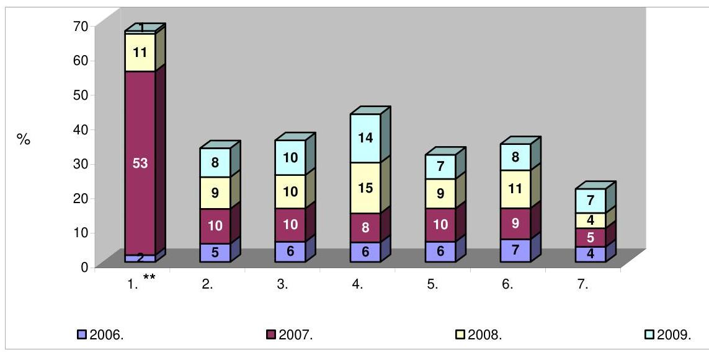

Jelmagyarázat:

* A hatósági díjak változásának mértékét az előző év Ft-ra kerekített értékéből számított dinamikus viszonyszámok alapján határoztuk meg.
**Az oszlopok sorszámainak hozzárendelése a közszolgáltatásokhoz:

1. Távhőszolgáltatás
2. Vízszolgáltatás
3. Szennyvízelvezetés
4. Szilárdhulladék-kezelés
5. Folyékonyhulladék-kezelés
6. Kegyeleti közszolgáltatások
7. Kéményseprő-ipari közszolgáltatások

A fővárosban a közszolgáltatások közül a folyékonyhulladék-kezelés közszolgáltatás részesült normatív állami támogatásban. Ugyanezen közszolgáltatás fenntartásához a Fővárosi Önkormányzat a 2007-2008. években 30 millió Ft működési támogatással járult hozzá. A Fővárosi Önkormányzat a távhőszolgáltatásnál, a vízszolgáltatásnál, a szennyvízelvezetésnél, a szilárdhulladék-kezelésnél, a kegyeleti közszolgáltatásoknál, valamint a kéményseprő-ipari közszolgáltatásoknál közvetlen működési támogatást nem nyújtott, de az üzleti tervek elfogadásakor, illetve a hatósági díjak megállapításakor a tulajdonosként járó osztalékról való lemondással, mint közvetett támogatással hozzájárult a közszolgáltatások fenntartásához, fejlesztéséhez. A Főpolgármesteri Hivatalban - a Pénzügyminisztérium Támogatásokat Vizsgáló Irodájának útmutatása alapján a számvevői ellenőrzés időszaka alatt és azt
 követően - folyt a közszolgáltatások ellátására kötött szerződések 2005/842/EK bizottsági határozaton és a közösségi keretszabályon alapuló önkormányzati felülvizsgálata. A felülvizsgálat a közszolgáltatással járó ellentételezés formájában megítélt állami támogatásra irányult, amelyet vonatkoztattak

---

- a Fővárosi Önkormányzat által nyújtott támogatásokra, mivel a közösségi keretszabály 11. pontja értelmében az „állam" kifejezés a központi, regionális és helyi hatóságokat jelenti, valamint
- a közszolgáltatókra, akik a 2005/842/EK bizottsági határozat 2. cikk (1) bekezdésében meghatározott alkalmazási kör hatálya alá tartoztak.

Az ellenőrzés célja annak értékelése volt, hogy a Fővárosi Önkormányzat megfelelő gondossággal járt-e el a közüzemi közszolgáltatások hatósági díjának megállapításánál. Ehhez értékelni kellett, hogy

- megfelelően szabályozott-e a közszolgáltatások hatósági díjának megállapítása az országos, az önkormányzati és a közszolgáltató szervezetek szabályozási szintjein;
- alátámasztottak, megalapozottak voltak-e a közszolgáltatók költségkalkuláción, illetve díjképleten alapuló, jóváhagyásra előterjesztett díjjavaslatai;
- megfelelően működtek-e a hatósági díjmegállapítás folyamatába épített, a fogyasztói és a tulajdonosi érdekeket érvényesítő kontrollok.

A közszolgáltatások hatósági díjai megállapításával összefüggő szabályozási környezet megfelelőségének ellenőrzése a szabályozás minőségére, következményeire irányult. A hatósági díjmegállapítás folyamatába épített, a fogyasztói és a tulajdonosi érdekeket érvényesítő kontrollok megfelelő, eredményes működtetésének vizsgálata az ellenőrzések hatásaira, megállapításaik hasznosulására helyezte a hangsúlyt.

# Az ellenőrzés típusa: teljesítmény ellenőrzés 

Az ellenőrzött időszak: a közszolgáltatások hatósági díjainak megállapításával kapcsolatos ellenőrzési feladatokat a 2007. és a 2008. évek díjai megállapítására vonatkozóan végeztük el. A hatósági díjak, a közszolgáltatók teljesítménye, üzleti tevékenységük eredménye, a díjhátralék és a kapacitás kihasználás alakulását a 2004-2008. évekre vonatkozóan elemeztük.

Az ÁSZ a közszolgáltatások hatósági díjaihoz kapcsolódó ellenőrzést korábban nem végzett.

Az ellenőrzés a Fővárosi Önkormányzat árhatósági (hatóságidíj-megállapítási) feladatai ellátásának megítélésére irányult, ezen belül a hatóságidíjmegállapítási tevékenység rendjére (eljárásaira), megalapozottságára, valamint eredményességére terjedt ki. A Fővárosi Önkormányzat hatóságidíjmegállapító tevékenységét a távhő-ellátás, az ivóvízellátás, a szennyvízelvezetés, a szilárd- (ezen belül a háztartási kommunális hulladék rendszeres elszállítása) és folyékonyhulladék-kezelés, a kéményseprő-ipari, valamint a kegyeleti közszolgáltatások díjainál ellenőriztük. A 2007. és a 2008. években a Főpolgármesteri hivatal szervezetén belül a Kommunális Ügyosztály belső működési szabályzata szerint a Hulladékgazdálkodási, a Jogi és Közgazdasági, valamint a Közmű Közszolgáltatási alosztályok szakértők igénybevételével véleményeztették a beérkezett díjjavaslatokat, előkészítették a közszolgáltatási hatósági díjak évenkénti felülvizsgálatára, és a díjemelés mértékére vonatkozó közgyűlési

---

előterjesztéseket, megküldték az előterjesztés tervezetét a szakhatóságoknak, a gazdasági kamaráknak, a fogyasztói érdekvédelmi szervezeteknek, a civil szervezeteknek. A Fővárosi Önkormányzat Szervezeti és Működési Szabályzatáról szóló 7/1992. (III. 26.) rendelet módosításáról szóló 6/2009. (II. 3.) rendelet 1. § (2) bekezdése alapján a Főpolgármesteri hivatalban a 2009. március 15-én végrehajtott szervezeti változás eredményeként a Kommunális Ügyosztályt ${ }^{4}$ összevonták a Közmű Ügyosztállyal, így a 2010. évi hatósági díjavaslatokkal kapcsolatos ügyosztályi feladatokat a Közmű Ügyosztály alosztályai látják el.

Az eredményesség minősítésére irányulva értékeltük, hogy a Fővárosi Önkormányzat megfelelő gondossággal járt-e el a közüzemi közszolgáltatások hatósági díjának megállapításánál. Eredményesnek tekintettük a Fővárosi Önkormányzat közszolgáltatások hatósági díjai megállapítására irányuló tevékenységét, ha megfelelő szabályozással és a díjmegállapítás folyamatába épített kontrollok megfelelő működtetésével gondoskodott a hatósági díjak megalapozottságáról, továbbá a megállapított díj a közszolgáltatónak fedezetet nyújtott az ártörvény, illetve a szakmai törvény szerinti költségekre és eredményre, valamint a hatóságidíj-megállapítás során a fogyasztói és a tulajdonosi érdekeket a közszolgáltatás folyamatosságának és biztonságának fenntartása mellett érvényesítette. A közszolgáltatások - előkalkuláció eredményeként meghatározott - hatósági díjjavaslatai alapadatainak, továbbá a hatósági díjaknak a megalapozottságát a lényegességi szinthez való viszonyítás alapján ítéltük meg. A lényegességi szinthez viszonyítottuk a közszolgáltatások hatósági díjkalkulációja költségfajtánkénti alapadatainak eltéréseit. Az eltéréseket feltáró összehasonlítást, a díjévet megelőző év költségeinek várható (tervezett tényadatok) és a tényleges adatai között végeztük. Megalapozottnak minősítettük a hatósági díjjavaslatot, ha a díjkalkuláció költségfajtánkénti alapadatainak eltérései 5%-ot és legalább 1 millió Ft-ot nem haladták meg. A hatósági díjak megalapozottságához, az utólagos elszámolás, a visszaigazolás indokoltságának alátámasztásához, a lényegességi szinthez viszonyítottuk a hatósági díj elő- és az utókalkuláció szerinti költségadatának különbségét. Megalapozottnak minősítettük a hatósági díjat, ha a hatósági díj elő- és az utókalkuláció szerinti költségadatának különbsége 5%-ot és legalább 1 millió Ft-ot nem érte el.

A közszolgáltatóknál és a Fővárosi Önkormányzatnál végzett helyszíni ellenőrzés módszere a dokumentumok vizsgálata, a kérdésfeltevés (interjú) és az elemzés volt. Dokumentumok vizsgálatán alapult a hatósági díjak elő- és utókalkulációjának, a keresztfinanszírozásnak, a közszolgáltatóknál a költségek, illetve a díjhátralék állományának csökkentésére irányuló intézkedések ellenőrzése. Az elemző eljárás módszerével értékeltük a közszolgáltatói díjak alakulásának, a közszolgáltató szervezet teljesítményével, jövedelmezőségével, a kapacitáskihasználással és az inflációval való összefüggéseit, valamint a díjhátralék állományának változását a 2004-2008. évek között. Az elemzés módszerét alkalmaztuk a hatósági díj megállapítására irányuló tevékenység szabályozási környezete megfelelőségének vizsgálatánál, a szabályozás hatásának, következményeinek értékelésével. Interjú keretében gyűjtöttünk információt a köz-

[^0]
[^0]:    ${ }^{4}$ A jelentésben az ellenőrzött időszakra, azaz a 2007. és a 2008. évekre vonatkozó szervezeti felépítéshez igazodtunk.

---

szolgáltató szervezeten belül az információs szolgálat, az ügyfélszolgálat működéséről.

A helyszíni ellenőrzés eredményeként közszolgáltatásonként számvevői jelentés készült, amelyeket a városfejlesztési, gazdálkodási és szociálpolitikai főpolgármester-helyettes részére adtunk át. A közszolgáltató szervezetek számára biztosítottuk a számvevői jelentésekben foglaltak megismerését. A számvevői jelentések részletes megállapításain nyugvó javaslatainkra kezdeményeztük intézkedési terv készítését.

A jelentést az ÁSZ-ról szóló 1989. évi XXXVIII. tv. 25. § (1) bekezdése alapján egyeztettük a Budapest Főváros Önkormányzat főpolgármesterével és a pénzügyminiszterrel. Az egyeztetés során kapott észrevételeket, valamint az arra adott válaszokat a jelentés (1-4. számú mellékletei) tartalmazzák.

---

# I. ÖSSZEGZŐ MEGÁLLAPÍTÁSOK, KÖVETKEZTETÉSEK, JAVASLATOK 

A Fővárosi Önkormányzat számára a közszolgáltatások hatósági díjai megállapítására vonatkozó jogkört az ártörvényben és a szakmai törvényekben rögzítették. A Fővárosi Önkormányzatnál a közszolgáltatási szerződések felülvizsgálata során figyelembe vették a 2005/842/EK bizottsági határozat előírásait. A 2005/842/EK bizottsági határozat és az ártörvény rendelkezései között azonban nem volt teljes összhang. A 2005/842/EK bizottsági határozat előírta a közszolgáltatások és a közszolgáltatáson kívül eső tevékenységek végzése esetén a költségek és a bevételek azonosításának, elkülönített nyilvántartásának kötelezettségét, meghatározta a figyelembe veendő költségek körét, a költség-elszámolási elveket. Az ártörvény viszont a fentiek figyelembe vételére nem tartalmazott rendelkezést. Eltért a hatósági díj fedezetének meghatározásával összefüggésben a nyereség szabályozása, mivel az ártörvény - a nyereség mértékének megjelölése nélkül - a működéshez szükséges nyereség fedezetének biztosítását írta elő, míg a 2005/842/EK bizottsági határozat az ésszerű nyereség mértékét jelölte meg.

A Fővárosi Önkormányzat, mint árhatóság nem rendelkezett díjkoncepcióval, amelynek hiányában nem határozták meg azokat az elveket, amelyek a Fővárosi Önkormányzat árhatósági feladatainak a közszolgáltatók többségi tulajdonosaként a tulajdonosi feladatokhoz való viszonyával, a közszolgáltatók díjkalkulációval összefüggő szabályozásának követelményeivel, betartásuk ellenőrzésével, a fejlesztések finanszírozásának forrásaival, a közszolgáltatások igénybevétele alakulásának költségekre, fejlesztésekre gyakorolt hatásával, a hatósági díjak eredménytartalmával és annak mértékével, a keresztfinanszírozással, a közszolgáltatók működése hatékonyságának növeléséhez fűzőtt követelményekkel, valamint az előkalkuláció alapján meghatározott hatósági díjra vonatkozóan a tényadatokon alapuló utólagos elszámolási kötelezettséggel kapcsolatosak.

A Fővárosi Önkormányzat a közszolgáltatói feladatok ellátására közszolgáltatási szerződést kötött, az FKF Zrt-vel, az FTSZV Kft-vel, a BTI Zrt-vel, valamint a FŐKÉTÚSZ Kft-vel, közüzemi szolgáltatási szerződést a Csatornázási Művek Zrt-vel, együttműködési megállapodást a FŐTÁV Zrt-vel, szindikátusi és menedzsment szerződést a Vízművek Zrt-vel. A közszolgáltatási szerződésekben, a közüzemi szolgáltatási szerződésben, az együttműködési megállapodásban, valamint a szindikátusi és menedzsment szerződésben az egyes közszolgáltatások - díjképzés alapjául szolgáló - tartalmát a szakmai törvényekben előírtakkal összhangban rögzítették. A Fővárosi Önkormányzat a szakmai befektetőkkel 25 évre kötötte meg a vízszolgáltatásra a szindikátusi és menedzsment szerződést, a szennyvízelvezetésre a részvényesi szerződést, 1997-ben. A vízdíj vonatkozásában a szindikátusi és menedzsment szerződés, a csatornahasználati díj esetében a részvényesi szerződés, illetve a közüzemi szolgáltatási szerződés nem tartalmazta a díjképlet alkalmazásának alapjául szolgáló 1997. évi bázis adatok teljes körű felülvizsgálatának időszakonkénti kötelezettségét a költségelemek, költségtételek tényleges adatokhoz igazítása érdekében.

---

A szindikátusi és menedzsment szerződés 1997. évi megkötésekor a Vízművek Zrt. veszteséges gazdálkodást folytatott, a privatizáció egyik feltétele a szakmai befektetők részére - az üzemi eredmény terhére költségként elszámolt - menedzsment díj fizetése volt. A 2001-2007. évek közötti időszakban a Vízművek Zrt. folyamatosan nyereségesen gazdálkodott, ezért a menedzsment díj költségként történő elszámolása célszerűtlenné vált, mert eredményesen működő gazdasági társaság esetében ez a megoldás eltér az általános gyakorlattól. A Fővárosi Önkormányzat és a szakmai befektetők a 2008. május 29-i megállapodásukban rendelkeztek a szindikátusi és menedzsment szerződés 2008. november 15-i határidővel történő módosításáról és a menedzsment díj megszüntetéséről, továbbá a szakmai befektetők jövedelmének osztalékalapon történő biztosításáról, azonban 2009. június hóig a szindikátusi és menedzsment szerződést nem módosították. A Fővárosi Önkormányzat a közszolgáltatás ellátására kötött szerződésekben, együttműködési megállapodásban nem adott útmutatást a közszolgáltatóknak (FŐTÁV Zrt., FKF Zrt., FTSZV Kft., BTI Zrt., FŐKÉTÚSZ Kft.) az önköltség-számítás előírásainak, tartalmának kialakításához, nem írta elő a közszolgáltatás (távhő-szolgáltatás, kéményseprő-ipari közszolgáltatás) költségeinek elkülönített számviteli nyilvántartási követelményét, tekintettel a közszolgáltatáson kívüli tevékenység végzésére. A közszolgáltatás költségei elkülönítésének hiányában a FŐTÁV Zrt. - a Számv. tv-ben előírtak ellenére - nem készített a lakossági távhődíjakra utókalkulációt. A Fővárosi Önkormányzat egyes közszolgáltatások (folyékonyhulladék-kezelés, kegyeleti, kéményseprőipari közszolgáltatások) esetében nem rendelkezett a díjkalkuláció módszeréről.

A Fővárosi Önkormányzat az egyes közszolgáltatások hatósági díjait rendeletben szabályozta. Az önkormányzati SzMSz tartalmazta a hatósági díjak megállapítására vonatkozóan a Közgyűlés illetékes bizottságainak feladat- és hatásköreit. A hivatali SzMSz-ben és ügyrendben foglaltak szerint a Kommunális Ügyosztály készítette elő a hatósági díjak megállapításáról és a díjalkalmazás feltételeiről szóló önkormányzati rendeletek tervezetére és módosítására vonatkozó előterjesztéseket, amelynek során feladatát képezte a saját szervezeten belüli szakmai ellenőrzési feladatok ellátása. A Kommunális Ügyosztály a 2007. és a 2008. években eleget tett az egyes közszolgáltatások hatósági díjjavaslataival kapcsolatos rendelettervezet előkészítési feladatainak, amelynek keretében előkészítette, egyeztette és az előterjesztő részére átadta a hatósági díjak rendelettervezeteit. A Közgyűlés a 2007. és a 2008. évekre vonatkozó hatósági díjakról közszolgáltatásonként rendeletet alkotott.

A 2007. és a 2008. években a FŐTÁV Zrt. eltérő díjmechanizmus alapján képezte a lakossági felhasználók távhődíját. Mindkét évben elmaradt a díjmechanizmusokban rögzített elméleti értékek tényleges költségekhez történő igazítása, amelyek hatásaként a 2003-2007. közötti időszakban, illetve a díjmechanizmus szabályozása alapján 2008-tól 2012-ig nem került sor a tényleges költségeken alapuló távhődíj (alapdíj-hődíj) megállapítására. A 2007. évi díjmechanizmusnak az értékcsökkenés távhőszolgáltatási tevékenységet szolgáló tárgyi eszközöket meghaladó számbavétele, a 2008. évi díjmechanizmusnak a személyi jellegű ráfordításokhoz nem illeszkedő változásindexek kijelölése, a díjelemekbe tartozó tényezők tartalmi meghatározásának elmaradása nem biztosította a díjjavaslatok megalapozottságát. A vízszolgáltatásnál, valamint a szennyvízelvezetésnél a díjkalkuláció módszere, a díjképlet hozzájárult a díjjavaslat megalapozottságához. A díjkalkuláció módszerének pontosságát,

---

megalapozottságát a Vízművek Zrt. és a Csatornázási Művek Zrt. Igazgatósága által elfogadott, a
 díjképlet díjelemei, díjtételei terv és tény adatainak összehasonlító elemzése igazolta vissza. A kegyeleti közszolgáltatásoknál a BTI Zrt. által alkalmazott díjkalkuláció nem biztosított megfelelő pontosságot, alátámasztottságot, mivel lényeges -68,9% és 171,1%, azaz -35,2 és 26,9 millió Ft közötti eltérést eredményezett a 2007. évi díjjavaslat tervezett és az utókalkuláció szerinti tényleges költségei között. A FŐKÉTÚSZ Kft.-nél a hatósági díjjavaslat elkészítéséhez elvégzett költségelemzés a társaság közszolgáltatási és közszolgáltatáson kívüli tevékenységeinek költségeit együttesen tartalmazta. A költségelemzés nem helyettesítette az előkalkulált önköltség meghatározását, mert nem a közszolgáltatási tevékenységek költségeire, hanem a társasági szintű költségekre irányult. A folyékonyhulladék-kezelés díjjavaslata az előző évi díj inflációval, az üzemanyag árváltozással és a csatornahasználati díj változásának figyelembe vételével valorizált értékén alapult, annak ellenére, hogy a hatósági díjat önköltségszámításnak kell alátámasztania.

A FŐTÁV Zrt., a Vízművek Zrt., a Csatornázási Művek Zrt. és az FKF Zrt. együttesen a 2007. évre 2012 millió Ft-ot, a 2008. évre 1846 millió Ft-ot utaltak át a Hálózat Alapítvány részére. A FŐTÁV Zrt., és az FKF Zrt. a távhő, illetve szilárdhulladék-kezelési díjkalkulációjában a tervezett nyereség részeként, annak terhére vették számba az alapítványi befizetés Közgyűlés által meghatározott összegét. Mindkét közszolgáltató közérdekű felajánlás jogcímen teljesítette befizetési kötelezettségét a Hálózat Alapítvány részére. A vízdíj és a csatornahasználati díj díjképletének egyik díjeleme kiadásként tartalmazta a Hálózat Alapítvány támogatását. Az alapítványi befizetéssel a rászoruló lakossági fogyasztók fizetőképességének fenntartását segítő szociális elem épült be a távhő-, a vízszolgáltatás, a szennyvízelvezetés, valamint a szilárdhulladék-kezelés hatósági díjába, annak ellenére, hogy sem az ártörvény, sem a Hgtv. nem rendelkezett annak beépítési lehetőségéről.

A Fővárosi Önkormányzat a Hálózat Alapítványnak átutalandó összeg meghatározására vonatkozó döntésénél nem érvényesítette a fogyasztók érdekeit, mivel a lakossági fogyasztók fizetőképessége fenntartásának terhét - a közszolgáltatók, a Fővárosi Önkormányzat, és a fogyasztók közötti megosztás helyett - a fizető fogyasztókra hárította. Nem érvényesítette a fogyasztók érdekeit azáltal sem, hogy nem tette átláthatóvá a lakossági fogyasztók fizetőképessége fenntartásának áthárított terhét, mivel az igénybevett közszolgáltatás számláján a közszolgáltatók ennek mértékét nem jelenítették meg, valamint nem ellenőrizhető módon szervezte meg az egyes közszolgáltatók által a Hálózat Alapítvány részére átutalt összegnek az adott közszolgáltatás díjhátralékosai segítésére történő felhasználását. A Vízművek Zrt., a Csatornázási Művek Zrt. és az FKF Zrt. a 2007. évre együttesen 1186 millió Ft-ot fizetett be a Hálózat Alapítványba. A Hálózat Alapítvány a vízszolgáltatást, a szennyvízelvezetést és a szilárdhulladék-kezelést igénybe vevő lakossági fogyasztók fizetőképessége fenntartása céljából 778 millió Ft-ot használt fel díjkompenzációra és hátralékkiegyenlítő támogatásra. A befizetett és a támogatásra felhasznált rész különbözete 408 millió Ft, amely a távhőszolgáltatást és az egyéb fűtési módot igénybe vevők támogatását, valamint a maradványképződést szolgálta. A Vízművek Zrt., a Csatornázási Művek Zrt., az FKF Zrt. által a 2007. évre befizetett és az általuk nyújtott közszolgáltatásokat igénybe vevő lakossági fogyasztók fizetőképessége fenntartására szolgáló támogatás 408 millió Ft összegű különbözete az indokolt

---

mértéket meghaladó alapítványi befizetési kötelezettség előírására, valamint a távhőszolgáltatás és az egyéb fűtési mód keresztfinanszírozására mutatott rá.

A közszolgáltatások fejlesztése fedezetéül az adott évi értékcsökkenési leírás összege, a közszolgáltató nyeresége, a felvett fejlesztési célú hitel, illetve támogatás szolgálhat. A közszolgáltatók a közszolgáltatás fejlesztésének forrásait eltérő módon tervezték meg a hatósági díjban. A BTI Zrt.-nél a fejlesztések fedezeteként - mindkét évben - a közszolgáltatási tevékenységeket szolgáló eszközök adott évi értékcsökkenési leírás összegét, a közszolgáltatási tevékenységek nyereségét, valamint a hiányzó összegre a közszolgáltatáson kívüli tevékenységek nyereségét és az értékcsökkenési leírási összegét jelölték meg. A FŐKÉTÚSZ Kft.-nél a tervezett fejlesztések, eszközpótlások forrásaiként a lekötött tartalékként képzett fejlesztési tartalék, az értékcsökkenési leírás összege, valamint a realizált eredmény szolgált. A FŐTÁV Zrt. a fejlesztések fedezeteként a fejlesztési hányadot (a 2007. évben 1069 millió Ft-ot) önálló díjelemként tervezte a távhődíjban, annak ellenére, hogy külön nyereség díjelemet is képzett. A Fővárosi Önkormányzat a szennyvízelvezetés közszolgáltatásnál a fejlesztési fedezet meghatározása során egyrészt a fejlesztési hányad (a 2007. évben 3225 millió Ft, a 2008. évben 1675 millió Ft) díjtétel kalkulációjával a tervezett önkormányzati beruházások fedezetét, másrészt a tárgyévben tervezett egyik díjtétel részeként elszámolt bérleti díj kalkulációjával az üzemeltetésre átadott eszközök amortizációját építette be a csatornahasználati díjba. A tervezett önkormányzati beruházások saját forrásigényének fejlesztési hányadként történő meghatározásával és a csatornahasználati díjba díjképző elemként történő beépítésével, illetve elszámolásával a Fővárosi Önkormányzat a fejlesztési forrásigényt önálló díjtételként vette figyelembe a díjmeghatározás és díjelszámolás során.

A Fővárosi Önkormányzat távhődíj és a csatornahasználati díjban a fejlesztési hányad jóváhagyására vonatkozó döntésénél nem érvényesítette a fogyasztók érdekeit, mivel a nyereség (fejlesztési célú hitel, támogatás) helyett önálló díjelemként hagyta jóvá a fejlesztések fedezetét. Az FKF Zrt.-nél a szilárdhulladék-kezelés díjjavaslatában a kalkulált nyereség tartalmazta a fejlesztési források díjból fedezendő részét. A díjbevételből a fejlesztések forrását, valamint a felhasználásig történő befektetésből származó hozamát a számviteli rendszerben nem különítették el, emiatt a fejlesztések fedezeteként nem voltak számba vehetők. A Fővárosi Önkormányzat szilárdhulladék-kezelés hatósági díjával összefüggő szabályozásából hiányzott a hatósági díjban beszedett fejlesztési források, és befektetési hozamaik elkülönített számviteli nyilvántartásának követelménye, emiatt a hatósági díjban rögzített cél szerinti felhasználás nem teljesült. A Közgyűlés elé terjesztett, a 2007-2008. évekre vonatkozó szilárdhulladék-kezelési díjjavaslatok nem tartalmaztak a tulajdonos részére - osztalék célját szolgáló - érdekeltségi díjelemet, ennek ellenére a Fővárosi Önkormányzat Gazdasági Bizottságának 2007. május 23-i és 2008. május 27-i döntése alapján a Fővárosi Önkormányzat 600 millió Ft, illetve 648 millió Ft értékben osztalékot vett fel. A Fővárosi Önkormányzat a 2007. és a 2008. években az osztalék felvételénél nem vette figyelembe a fogyasztók érdekeit, mivel a tervezettel ellentétben vett fel osztalékot, amelynek következményként a fogyasztók által megfinanszírozott felhasználási céltól (fejlesztéstől) vonta el a fedezetet.

---

A távhő-, a vízszolgáltatás, a szennyvízelvezetés, a szilárd- és a folyékonyhulladék-kezelés, valamint a kéményseprő-ipari közszolgáltatások hatósági díjai egyaránt tartalmaztak a közszolgáltatáshoz közvetlenül, illetve közvetett módon nem kapcsolódó költségeket. A közszolgáltatások természetes, illetve jogi monopóliuma, valamint a hatékony működés nem indokolta a távhőszolgáltatásnál az üzleti ajándékok, a nem FŐTÁV Zrt.-ét terhelő költségek elszámolását, azon dolgozók jutalmát, akik a Hálózat Alapítvány helyett rögzítettek a számlázási rendszerben, a vízszolgáltatásnál és a szennyvízelvezetésnél az alapítványok, társadalmi szervezetek részére nyújtott támogatásokat, a szilárdhulladék-kezelésnél a személygépkocsik magánhasználata adóterhének, a folyékonyhulladék-kezelésnél a balatoni és budapesti ingatlanok, továbbá fogorvosi rendelő fenntartásának közvetett költségei, a személygépkocsik magánhasználata adóterhének, valamint a közszolgáltatáson kívüli tevékenység egyes költségeinek számbavételét, a kéményseprő-ipari közszolgáltatásnál az ajándékozási tárgyak, továbbá a reklám- és propaganda tevékenység szakértői költségei elszámolását. A Fővárosi Önkormányzat a távhődíj, a vízdíj, a csatornahasználati díj, a szilárd- és folyékonyhulladék-kezelés díjai, valamint a kéményseprő-ipari díjjavaslatoknál nem érvényesítette a fogyasztók érdekeit, mivel a díjmegállapítás folyamatába épített kontrollok működtetése keretében nem írta elő a szakértői megbízásokban a hatósági díjjavaslatokból a piaci viszonyok között működő gazdasági társaságokra jellemző költségek, valamint a közszolgáltatás sajátosságaival, a hatékony működéssel nem összefüggő költségek kiszűrését.

A hatósági díjak a vízszolgáltatás, a szennyvízelvezetés, a szilárdhulladékkezelés, a kegyeleti közszolgáltatások közül a szórás, a sírásás, valamint a ravatalozás esetében biztosították a közszolgáltatás folyamatos és biztonságos ellátását, mivel fedezetet nyújtottak a közszolgáltatások ráfordításaira. Nem volt megítélhető a távhőszolgáltatás és a kéményseprő-ipari közszolgáltatás hatósági díj általi fedezettsége a közszolgáltatás költségeinek számviteli elkülönítése hiányában, valamint a folyékonyhulladék-kezelésnél a díjkalkuláció megalapozatlansága miatt. A 2007. évben a hatósági díj nem nyújtott fedezetet a köztemetők fenntartása (hiány 34,7 millió Ft), a halotthűtés (hiány 1,4 millió Ft) és a temetőn belüli szállítás (hiány 3,6 millió Ft) kegyeleti közszolgáltatások költségeire. A kegyeleti közszolgáltatások bevételt meghaladó költségeit a nyereséges közszolgáltatási tevékenységek 105,1 millió Ft eredményéből finanszírozták, a temetőkről szóló törvényben foglaltak ellenére. A 2007. évben a fővárosban ellátott szilárdhulladék-kezelés közszolgáltatás kivételével az FKF Zrt. többi tevékenysége veszteséges volt, az együttesen 1682 millió Ft értékű veszteségüket a szilárdhulladék-kezelés 2128 millió Ft összegű eredményéből finanszírozták. A szilárdhulladék-kezelés közszolgáltatási tevékenység eredményének a közszolgáltatáson kívüli tevékenységek vesztesége finanszírozására történő felhasználásánál nem tartották be a Hgtv. előírását.

A működés hatékonyságának növelése érdekében valamennyi közszolgáltató hozott a költségek csökkentésére irányuló intézkedéseket a 2007. és a 2008. években. A költségek csökkentésére irányuló intézkedések kiemelt területe a létszámgazdálkodás volt, az ellenőrzött közszolgáltatásoknál a 2007. és a 2008. években együttesen 392 fővel csökkent a létszám. A közszolgáltatók a hatósági díjak, illetve a díjhátralék beszedését eltérő módon szervezték. A FŐTÁV Zrt. saját szervezetén belül látta el a távhődíjak számlázását, beszedését, valamint a

---

nem lakossági felhasználók esetében a díjhátralék kezelését. A lakossági felhasználók díjhátralékának kezelésére a DHK Zrt.-vel kötött követelés-értékesítési szerződést. A Vízművek Zrt., valamint a Csatornázási Művek Zrt. a lakossági kisfogyasztói, az FKF Zrt. a teljes lakossági vevőállomány, a FŐKÉTÚSZ Kft. a sormunka hatósági díjainak kezelésével a Díjbeszedő Holding Zrt.-t bízta meg. A közszolgáltatók követeléseik Díjbeszedő Holding Zrt. által be nem szedett részét értékesítették - 35-95% közötti faktorálási értéken - a Díjbeszedő Faktorház Zrt. részére. A közszolgáltatók folyamatosan figyelemmel kísérték az általuk kezelt díjhátralék nagyságát és alakulását. A közszolgáltatás területén jelentkező szabad kapacitást a Vízművek Zrt. és az FTSZV Kft. hasznosította.

A díjmegállapítás folyamatába épített kontrollként a Főpolgármesteri Hivatal a 2007. és a 2008. évi hatósági díjjavaslatok véleményezésére szakértői megbízási szerződést kötött egy-egy gazdasági társasággal. A szakértői véleményezést a pénzügyi és árképzési kérdésekre, ezen belül a költségelemzésre és az egyes költségelemek előző évihez viszonyított emelkedésének indokoltságára irányították. A szakértői véleményezési feladatok kijelölésénél a kegyeleti és a kéményseprő-ipari közszolgáltatások esetében nem utaltak az önköltségszámítási szabályzat előírásai érvényesítésének ellenőrzésére, a hatósági díj önköltségszámítással való alátámasztottságának, az egyes díjtételek megalapozottságának helyszíni vizsgálatára. A szilárd hulladék-kezelés hatósági díj felülvizsgálatával kapcsolatos megbízás nem terjedt ki a működési költségek csoportjainak, valamint a számviteli alátámasztottságnak az ellenőrzésére, elemzésére. A szakértők a szakértői véleményekben foglaltak alapján mindkét évben elfogadták a javasolt díjak mértékét, nem javasoltak változtatást a díjjavaslat egyes elemein a szilárdhulladék-kezelés, a kegyeleti és a kéményseprőipari közszolgáltatásoknál. A szakértők kiegészítő javaslatot tettek a távhődíjjavaslatok felülvizsgálata eredményeként, kiegészítő javaslataikat a díjjavaslatok előterjesztése során nem vették figyelembe. A víz- és csatornahasználati díjjavaslat felülvizsgálata során a díjmegállapítás módszerében, illetve tartalmában feltárt eltéréseket a szakértő egyeztette és javíttatta a közszolgáltatókkal. Nem minősítették megalapozottnak a szakértők az FTSZV Kft. díjjavaslatait, a díjszámítás hiányosságai miatt, véleményüket a díjmegállapítás során figyelmen kívül hagyták. A Közgyűlés bizottságai a közszolgáltatások 2008. évi hatósági díjjavaslatait megtárgyalták⁵. A Fővárosi Önkormányzat megkérte a fogyasztók területileg illetékes érdek-képviseleti szerveinek véleményét. A fogyasztók területileg
 illetékes érdek-képviseleti szervei eltérő véleményeinek összefoglalását (az előterjesztő álláspontjával) - az önkormányzati SzMSz-ben előírtak ellenére - a hatósági díj-javaslatok közgyűlési előterjesztései nem tartalmazták.

A Fővárosi Önkormányzat a 2007-2008. években nem járt el megfelelő gondossággal a távhőszolgáltatás hatósági díjának megállapításánál, mivel nem volt eredményes a távhődíj megállapítására irányuló tevékenysége, tekintettel arra, hogy a távhődíj megalapozottsága érdekében az együttműködési megállapodásban nem írta elő a lakossági távhőszolgáltatás költségeinek elkülönített

[^0]
[^0]:    ${ }^{5}$ A 2007. évi díjjavaslatok bizottsági véleményezése nem történt meg, mivel a 2006. évi önkormányzati választásokat követően a díjjavaslatok véleményezésének időszakában a bizottságokat még nem hozták létre.

---

számviteli nyilvántartását, nem megfelelően rendelkezett a 2007. és a 2008. évi díjmechanizmus egyes elemeiről, továbbá a díjmegállapítás folyamatába épített kontrollokat nem terjesztette ki az utókalkuláció ellenőrzésére. A lakossági távhőszolgáltatás költségeinek számviteli elkülönítése hiányában nem volt megítélhető a távhőszolgáltatás távhődíj általi fedezettsége. A Fővárosi Önkormányzat a távhőszolgáltatás folyamatosságának és biztonságának fenntartása mellett nem érvényesítette a fogyasztók érdekeit szabályozásában a fejlesztések fedezetének önálló díjelemként történő meghatározásánál, a Hálózat Alapítvány részére történő befizetés előírásánál a lakossági fogyasztók fizetőképessége fenntartása terhének áthárítása, az átláthatóság és az ellenőrizhetőség tekintetében, valamint a díjmegállapítás folyamatába épített kontrollok működtetésénél a távhőszolgáltatáshoz közvetlenül, illetve közvetett módon nem kapcsolódó költségek ellenőrzésének hiánya miatt.

A Fővárosi Önkormányzat a 2007-2008. években nem járt el megfelelő gondossággal a vízszolgáltatás hatósági díjának megállapításánál, mivel összességében annak ellenére nem volt eredményes a tevékenysége, hogy a megállapított vízdij a Vízművek Zrt-nek fedezetet nyújtott az ártörvény és a szakmai törvény szerinti költségekre és eredményre. Azonban a vízdij megalapozottsága érdekében a szindikátusi és menedzsment szerződésben nem írta elő a díjképlet alkalmazásának alapjául szolgáló 1997. évi bázis adatok teljes körű felülvizsgálatának időszakonkénti kötelezettségét, nem rendelkezett a szindikátusi és menedzsment szerződés módosításáról, és a menedzsment díj megszüntetéséről tekintettel a megváltozott körülményekre. A Fővárosi Önkormányzat a vízszolgáltatás folyamatosságának és biztonságának fenntartása mellett nem érvényesítette a fogyasztók érdekeit szabályozásában a Hálózat Alapítvány részére történő befizetés előírásánál a lakossági fogyasztók fizetőképessége fenntartása terhének áthárítása, az átláthatóság és az ellenőrizhetőség tekintetében, valamint a díjmegállapítás folyamatába épített kontrollok működtetésénél a vízszolgáltatáshoz közvetlenül, illetve közvetett módon nem kapcsolódó költségek ellenőrzésének hiánya miatt.

A Fővárosi Önkormányzat a 2007-2008. években nem járt el megfelelő gondossággal a szennyvízelvezetés hatósági díjának megállapításánál, mivel összességében annak ellenére nem volt eredményes a csatornahasználati díj megállapítására irányuló tevékenysége, hogy a megállapított csatornahasználati díj a Csatornázási Művek Zrt-nek fedezetet nyújtott az ártörvény és a szakmai törvény szerinti költségekre és eredményre. A csatornahasználati díj megalapozottsága szempontjából azonban a részvényesi szerződés nem tartalmazta a díjképlet alkalmazásának alapjául szolgáló 1997. évi bázis adatok teljes körű felülvizsgálatának időszakonkénti kötelezettségét, valamint a Fővárosi Önkormányzat a közüzemi szolgáltatási szerződésben nem írta elő a Csatornázási Művek Zrt. önköltség-számítási szabályzata hatályának kiterjesztését a szennyvízelvezetés közszolgáltatási tevékenységre. A Fővárosi Önkormányzat a szennyvízelvezetés folyamatosságának és biztonságának fenntartása mellett nem érvényesítette a fogyasztók érdekeit a fejlesztések fedezetének önálló díjelemként történő meghatározásánál, a Hálózat Alapítvány részére történő befizetés előírásánál a lakossági fogyasztók fizetőképessége fenntartása terhének áthárítása, az átláthatóság és az ellenőrizhetőség tekintetében, valamint a díjmegállapítás folyamatába épített kontrollok működtetésénél a szennyvízel-

---

vezetéshez közvetlenül, illetve közvetett módon nem kapcsolódó költségek ellenőrzésének hiánya miatt.

A Fővárosi Önkormányzat a 2007-2008. években nem járt el megfelelő gondossággal a szilárdhulladék-kezelés közszolgáltatás hatósági díjának megállapításánál, mivel nem volt eredményes a díjmegállapító tevékenysége, tekintettel arra, hogy a hatósági díj megalapozottsága érdekében szabályozása keretében nem adott útmutatást az FKF Zrt-nek az önköltség-számítás előírásainak, tartalmának kialakításához, nem írta elő a szilárdhulladék-kezelés hatósági díjában beszedett fejlesztési források, és befektetési hozamaik elkülönített számviteli nyilvántartását, nem rendelkezett a közszolgáltatás eredményéből a közszolgáltatáson kívüli tevékenységek veszteségének finanszírozási tilalmáról, valamint a díjmegállapítás folyamatába épített kontrollok működtetésénél nem gondoskodott a működési költségcsoportok és a számviteli alátámasztottság ellenőrzéséről. A Fővárosi Önkormányzat a szilárdhulladék-kezelés folyamatosságának és biztonságának fenntartása mellett nem érvényesítette a fogyasztók érdekeit a Hálózat Alapítvány részére történő befizetés előírásánál a lakossági fogyasztók fizetőképessége fenntartása terhének áthárítása, az átláthatóság és az ellenőrizhetőség tekintetében, továbbá a nem tervezett osztalékfelvételénél a más felhasználási céltól történő fedezetelvonás miatt, valamint a díjmegállapítás folyamatába épített kontrollok működtetésénél a szilárdhulladék-kezeléshez közvetlenül, illetve közvetett módon nem kapcsolódó költségek ellenőrzésének hiánya miatt.

A Fővárosi Önkormányzat a 2007-2008. években nem járt el megfelelő gondossággal a folyékonyhulladék-kezelés közszolgáltatás hatósági díjának megállapításánál, mivel nem volt eredményes a hatósági díj megállapítására irányuló tevékenysége, tekintettel arra, hogy a díjak megalapozottsága érdekében szabályozása keretében nem rendelkezett a díjkalkuláció módszeréről, nem adott útmutatást az FTSZV Kft-nek az önköltség-számítás előírásainak, tartalmának kialakításához, valamint a díjmegállapítás folyamatába épített kontrollok működtetésénél figyelmen kívül hagyta a díjavaslatok megalapozatlanságára utaló szakértői véleményeket. A folyékonyhulladék-kezelésnél a díjkalkuláció megalapozatlansága miatt nem volt megítélhető a közszolgáltatás hatósági díj általi fedezettsége. A Fővárosi Önkormányzat a folyékonyhulladékkezelés folyamatosságának és biztonságának fenntartása mellett nem érvényesítette a fogyasztói érdekeket a díjmegállapítás folyamatába épített kontrollok működtetésénél, a folyékonyhulladék-kezeléshez közvetlenül, illetve közvetett módon nem kapcsolódó költségek ellenőrzésének hiánya miatt.

A Fővárosi Önkormányzat a 2007-2008. években nem járt el megfelelő gondossággal a kegyeleti közszolgáltatások hatósági díjai megállapításánál, mivel nem volt eredményes a hatósági díjak megállapítására irányuló tevékenysége, tekintettel arra, hogy a díjak megalapozottsága érdekében nem rendelkezett a közszolgáltatási szerződésben a díjkalkuláció módszeréről, nem adott útmutatást a BTI Zrt-nek az önköltség-számítás előírásainak, tartalmának kialakításához, továbbá a díjmegállapítás folyamatába épített kontrollokat nem terjesztette ki az önköltség-számítási szabályzat előírásai érvényesítésének ellenőrzésére, a hatósági díj önköltségszámítással való alátámasztottságának, az egyes díjtételek megalapozottságának vizsgálatára. A Fővárosi Önkormányzat a kegyeleti közszolgáltatások folyamatosságának és biztonságának fenntartása

---

mellett nem teremtette meg az ellátás pénzügyi feltételeit, mivel a 2007. évben a köztemetők fenntartása, a halotthűtés és a temetőn belüli szállítás közszolgáltatási tevékenységek hatósági díjai nem nyújtottak fedezetet a BTI Zrt-nek a temetőkről szóló törvény szerinti költségekre.

A Fővárosi Önkormányzat a 2007-2008. években nem járt el megfelelő gondossággal a kéményseprő-ipari közszolgáltatás hatósági díjainak megállapításánál, mivel nem volt eredményes a hatósági díjak megállapítására irányuló tevékenysége, tekintettel arra, hogy a díjak megalapozottsága érdekében nem írta elő a közszolgáltatási szerződésben a közszolgáltatás költségeinek elkülönített számviteli nyilvántartását, nem rendelkezett a díjkalkuláció módszeréről, nem adott útmutatást a FŐKÉTÚSZ Kft-nek az önköltség-számítás előírásainak, tartalmának kialakításához, továbbá a díjmegállapítás folyamatába épített kontrollokat nem terjesztette ki a hatósági díj önköltségszámítással való alátámasztottságának, az egyes díjtételek megalapozottságának ellenőrzésére. A közszolgáltatás költségeinek számviteli elkülönítése hiányában nem volt megítélhető a kéményseprő-ipari tevékenység hatósági díj általi fedezettsége. A Fővárosi Önkormányzat a kéményseprő-ipari közszolgáltatás folyamatosságának és biztonságának fenntartása mellett nem érvényesítette a fogyasztói érdekeket a díjmegállapítás folyamatába épített kontrollok működtetésénél a kéményseprő-ipari közszolgáltatáshoz közvetlenül, illetve közvetett módon nem kapcsolódó költségek ellenőrzésének hiánya miatt.

A helyszíni ellenőrzés megállapításainak hasznosítása mellett javasoljuk:

# a pénzügyminiszternek 

gondoskodjon az ártörvény előírásainak és az Európai Unió 2005/842/EK bizottsági határozata a közszolgáltatással járó ellentételezés formájában megítélt állami támogatással összefüggő szabályainak összeegyeztetéséről;

## a főpolgármesternek

1. kezdeményezze, hogy a számvevőszéki jelentésben foglaltakat a Közgyűlés tárgyalja meg;
2. kezdeményezze, hogy a Közgyűlés határozza meg a közszolgáltatások hatósági díjaira vonatkozó díjkoncepciót, amelyben állást foglal a Fővárosi Önkormányzat árhatósági feladatainak a közszolgáltatók többségi tulajdonosaként a tulajdonosi feladatokhoz való viszonyával, a közszolgáltatók díjkalkulációval összefüggő szabályozásának követelményeivel, betartásuk ellenőrzésével, a fejlesztések finanszírozásának forrásaival, a közszolgáltatások igénybevétele alakulásának költségekre, fejlesztésekre gyakorolt hatásával, a hatósági díjak eredménytartalmával és annak mértékével, a keresztfinanszírozással, a közszolgáltatók működése hatékonyságának növeléséhez fűzött követelményekkel, valamint az előkalkuláció alapján meghatározott hatósági díjra vonatkozóan a tényadatokon alapuló utólagos elszámolási kötelezettséggel kapcsolatos kérdésekben;

---

3. kezdeményezze a hatósági díjak megalapozottsága érdekében
a) a vízdíjjal összefüggésben a szindikátusi és menedzsment szerződés, a csatornahasználati díjjal kapcsolatban a részvényesi szerződés, illetve a közüzemi közszolgáltatási szerződés kiegészítését a díjképlet alkalmazásának alapjául szolgáló 1997. évi bázis adatok teljes körű felülvizsgálatának időszakos kötelezettsége előírásával;
b) a Fővárosi Önkormányzat és a Vízművek Zrt. szakmai befektetői 2008. május 29-i megállapodásában foglaltaknak megfelelően a menedzsment díj megszüntetését és a szakmai befektetők jövedelmének osztalékalapon történő biztosítását;
c) a közszolgáltatási szerződések, együttműködési megállapodás kiegészítését az önköltség-számítás előírásaira, tartalmára vonatkozó útmutatással a szilárd- és folyékonyhulladék-kezelés, a kegyeleti és a kéményseprő-ipari közszolgáltatásoknál, a díjkalkuláció módszerének rögzítésével a díjjavaslatok pontosabbá, alátámasztottabbá tétele céljából a folyékonyhulladék-kezelés, a kegyeleti és a kéményseprő-ipari közszolgáltatásoknál, a számviteli elkülönítés előírásával a közszolgáltatás költségeire vonatkozóan a távhőszolgáltatásnál és a kéményseprő-ipari közszolgáltatásoknál, valamint a hatósági díjban beszedett fejlesztési források és befektetési hozamaik esetében a szilárdhulladék-kezelés közszolgáltatásnál, továbbá a lakossági távhőszolgáltatásra vonatkozó utókalkuláció elvégzésével;
d) a távhő-díjak kalkulációja során a díjmechanizmusnak az elméleti értékek tényleges költségekhez történő igazítására vonatkozó előírás betartását, valamint a díjmechanizmusban az értékcsökkenésnek a távhőszolgáltatási tevékenységet szolgáló tárgyi eszközökön alapuló számbavételével, a személyi jellegű ráfordításokhoz illeszkedő változásindexek kijelölésével, a díjelemekbe tartozó tényezők tartalmának meghatározásával kapcsolatos előírások rögzítését;
4. kezdeményezze, a fogyasztói érdekek érvényesítése érdekében
a) hogy a tervezett eszközpótlások, felújítások, fejlesztések értékcsökkenési leírás összegét meghaladó fedezetéül a fejlesztési hányad helyett a nyereség, valamint az egyéb források (fejlesztési célú hitel, támogatás) szolgáljanak a távhődíjban, a csatornahasználati díjban;
b) a távhő-, a vízszolgáltatás, a szennyvízelvezetés, valamint a szilárdhulladék-kezelés közszolgáltatásoknál keletkezett lakossági díjhátralékkal rendelkezők támogatási rendszerének - az ártörvény 8. § (1) bekezdésében, valamint a Hgtv. 25. § (1)(4) bekezdéseiben foglaltak figyelembevételével történő - átalakítását, annak érdekében, hogy a díjhátralék terhe kerüljön megosztásra a fogyasztók, a közszolgáltatók és a Fővárosi Önkormányzat között és átláthatósága céljából jelenítsék meg mértékét a közszolgáltatások számláin, valamint biztosítsa a felhasználás ellenőrizhetőségét;
c) a fogyasztók által a szilárdhulladék-kezelés hatósági díjában megfinanszírozott felhasználási cél fedezetének biztosítását, a nem tervezett (tulajdonosi osztalék) kifizetésre történő felhasználás megszüntetésével;

---

5. kezdeményezze a Közgyűlésnél, hogy a szilárdhulladék-kezelés hatósági díja jóváhagyása során a Hgtv. 25. § (1)-(4) bekezdéseiben, a kegyeleti közszolgáltatásokon belül a köztemető fenntartása, a halotthűtés, valamint a temetőn belüli szállítás közszolgáltatások hatósági díjai jóváhagyásánál a temetőkről szóló törvény 40. § (2) bekezdésében foglaltakat betartva a keresztfinanszírozás elkerülésével teremtsék meg a közszolgáltatás folyamatos és biztonságos ellátásának pénzügyi feltételeit;

# a főjegyzőnek 

1. gondoskodjon a díjmegállapítás folyamatába épített kontrollok hatékony működtetéséért arról, hogy
a) a szakértői megbízás terjedjen ki a szilárdhulladék-kezelés hatósági díja felülvizsgálatánál a működési költségek csoportjainak, valamint a számviteli alátámasztottságnak az ellenőrzésére, elemzésére, a kegyeleti és a kéményseprő-ipari közszolgáltatások esetében az önköltség-számítási szabályzat előírásai érvényesítésének ellenőrzésére, a hatósági díj önköltségszámítással való alátámasztottságának, az egyes díjtételek megalapozottságának helyszíni vizsgálatára, a távhőszolgáltatás esetében az utókalkuláció elvégzésének ellenőrzésére;
b) hasznosítsák a folyékonyhulladék-kezelés hatósági díjai felülvizsgálatának szakértői véleményét;
c) a vízszolgáltatás, a szennyvízelvezetés, a
 szilárd- és a folyékonyhulladék-kezelés, valamint a kéményseprő-ipari közszolgáltatások díjavaslatainak felülvizsgálata terjedjen ki a közszolgáltatás sajátosságaival és a hatékony működéssel nem összefüggő költségek feltárására;
2. biztosítsa, hogy az önkormányzati SzMSz 2. számú melléklete 6. c) és d) pontjai alapján a hatósági díjavaslatok közgyűlési előterjesztése tartalmazza a fogyasztók területileg illetékes érdek-képviseleti szervei eltérő véleményének összefoglalását.

---

# II. RÉSZLETES MEGÁLLAPÍTÁSOK 

## 1. A KÖZSZOLGÁLTATÁSOK HATÓSÁGI DÍJAI MEGÁLLAPÍTÁSÁNAK SZABÁLYOZOTTSÁGA

### 1.1. A közszolgáltatások hatósági díjaival kapcsolatos országos szintű szabályozás

Az önkormányzatok, közöttük a Fővárosi Önkormányzat számára a közszolgáltatások hatósági díjai megállapítására vonatkozó jogkört törvényekben rögzítették. A hatósági díjak megállapításának törvényi szabályozása fokozatosan teljesedett ki.

A hatósági díjmegállapítás törvényi szabályozása
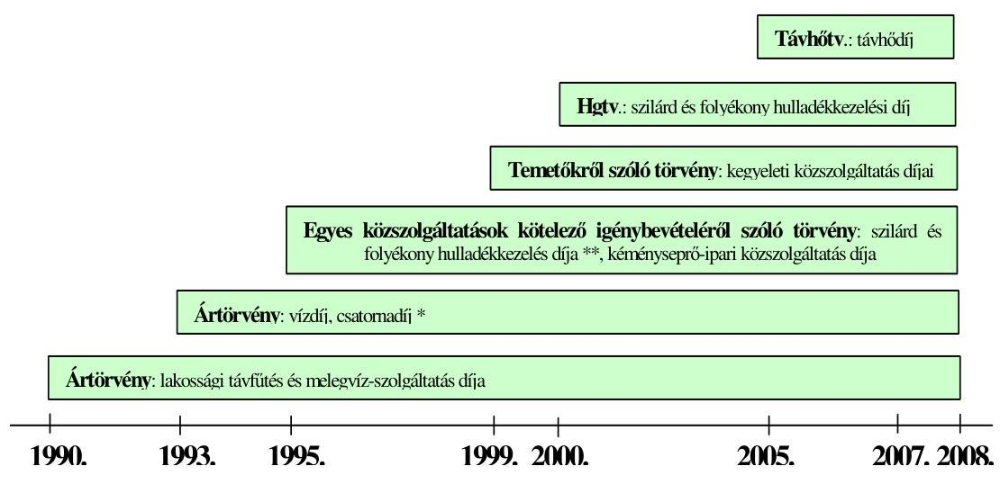

Jelmagyarázat:

* Az önkormányzati tulajdonú viziközműből szolgáltatott ivóvíz díja, illetve az önkormányzati tulajdonú viziközmű által biztosított szennyvízelvezetés, szennyvíztisztítás és -kezelés díja.
** A szilárd- és folyékonyhulladék-kezelés hatósági díjaira vonatkozó törvényi szabályozást 2000-ig az egyes közszolgáltatások kötelező igénybevételéről szóló törvény, azt követően a Hgtv. tartalmazta.

A Fővárosi Önkormányzat hatósági díjmegállapítással kapcsolatos feladatairól rendelkezett még kormányrendelet a távhőszolgáltatás, a vízszolgáltatás, a szennyvízelvezetés, a szilárd- és folyékonyhulladék-kezelés, valamint a kegyeleti közszolgáltatások díjai esetében, illetve miniszteri rendelet a kéményseprőipari közszolgáltatásra vonatkozóan.

---

Az országos szintű jogi szabályozás a hatósági díjak megállapítójának kijelölésén túl a hatósági díjjal összefüggésben az ellátandó közszolgáltatási feladatok, a díjfedezet, a fogyasztóvédelmi előírások, valamint a díjjal kapcsolatos egyéb körülmények meghatározására irányult. A közszolgáltatási feladatok tartalmát a szakmai törvények határozták meg. A szakmai törvények szerint az egyes közszolgáltatások a következő feladatokat foglalták magukba:

- a távhőszolgáltatás esetében a lakossági felhasználó részére a távhőtermelő létesítményből a távhővezeték-hálózaton keresztül, az engedélyes által végzett, üzletszerű tevékenység keretében történő hőellátásával fűtési, illetve egyéb hőhasznosítási célú energiaellátást;
- a vízszolgáltatás a települések lakott területén, az önkormányzati tulajdonú viziközműből szolgáltatott, az ivóvíz minőségű vízre vonatkozó előírásoknak megfelelő vízellátást;
- a szennyvízelvezetés esetében az önkormányzati tulajdonú viziközmű által biztosított szennyvízelvezetést, szennyvíztisztítást;
- a szilárd-és folyékonyhulladék-kezelés keretében a környezetvédelmi előírások megtartása mellett a települési hulladék ingatlantulajdonosoktól történő begyűjtését, elszállítását a települési hulladékkezelő telepre, illetőleg a települési hulladék kezelését, a kezelő létesítmény üzemeltetését, a szolgáltatás folyamatosságának biztosítását;
- a kegyeleti közszolgáltatások esetében a köztemető fenntartását, továbbá az üzemeltetését magába foglaló egyéni és közösségi kegyeleti célú, az elhunyt emlékének megőrzésére irányuló önkormányzati tevékenységek összességét;
- a kéményseprő-ipari közszolgáltatás esetében a lakásban és más helyiségben használatban lévő kémények, valamint tartozékaik műszaki felülvizsgálatát, ellenőrzését és tisztítását, valamint az új, újjáépített épületek, lakások kéményei megfelelőségét igazoló szakvélemény nyújtását.

A közszolgáltatásokkal kapcsolatos törvényi szabályozás nem egységes tartalommal határozta meg a hatósági díjak fedezetét.

A távhődíj, a vízdíj és a csatornahasználati díj esetében az ártörvény 8. § (1) bekezdése tartalmazta, hogy a hatósági díj biztosítson fedezetet a hatékonyan működő vállalkozó ráfordításaira és a működéséhez szükséges nyereségre, tekintettel az elvonásokra és a támogatásokra. A szilárd- és folyékonyhulladék-kezelés közszolgáltatási díjait a Hgtv. 25. § (1) bekezdése szerint a közszolgáltatás jellegét, a kezelt hulladék mennyiségét, minőségét, valamint a közszolgáltató hatékony működéséhez szükséges folyamatos ráfordításaihoz és a működés fejleszthető fenntartásához szükséges költségeket figyelembe véve kell meghatározni. A kegyeleti közszolgáltatások hatósági díjaira vonatkozóan a temetőkről szóló törvény 40. § (2) bekezdése előírta, hogy a hatósági díjat a köztemető üzemeltetésével és fenntartásával kapcsolatosan felmerült szükséges és indokolt költségek alapján állapítsák meg. A kéményseprő-ipari közszolgáltatásoknál az egyes közszolgáltatások kötelező igénybevételéről szóló törvény 5. § (1) bekezdése alapján a hatósági díjaknak a hatékonyan működő vállalkozás ráfordításaira és a működés fejleszthető fenntartására kell fedezetet biztosítani.

---

A hatósági díjak fedezete tartalmára vonatkozó egységes törvényi szabályozás hiánya, a hatósági díjakban a fejlesztések fedezete és a nyereségtartalom eltérő számbavételéhez vezetett.

A Fővárosi Önkormányzatnál a közszolgáltatási szerződések önkormányzati felülvizsgálata során figyelembe vették a 2005/842/EK bizottsági határozat előírásait. Az ártörvény előírásainak és az Európai Uniónak a közszolgáltatással járó ellentételezés formájában megítélt állami támogatással összefüggő szabályainak együttes alkalmazása az összhang hiánya miatt nem volt biztosított, mivel a 2005/842/EK bizottsági határozat 5. cikk (5) bekezdése előírta a közszolgáltatások és a közszolgáltatáson kívül eső tevékenységek végzése esetén a költségek és a bevételek elkülönített nyilvántartásának kötelezettségét, az 5. cikk (2) bekezdésében meghatározta a figyelembe veendő költségek körét, a költség-elszámolási elveket, az ártörvény azonban ezek figyelembe vételére nem tartalmazott előírást. Eltért a hatósági díj fedezetének meghatározásával összefüggésben a nyereség szabályozása, mivel az ártörvény 8. § (1) bekezdésében - a nyereség mértékének megjelölése nélkül - a működéshez szükséges nyereség fedezetének biztosítását írta elő, míg a 2005/842/EK bizottsági határozat 5. cikk (4) bekezdése az ésszerű nyereség mértékét jelölte meg.

Valamennyi a hatósági díjakkal kapcsolatos országos szintű jogi szabályozás magában foglalt fogyasztóvédelemmel kapcsolatos előírásokat.

Az ártörvény 9. § (2) bekezdése a hatósági díj alkalmazási feltételeivel (minőségi követelmények, a fizetési feltételek), együtt történő megállapítását, a 15. §-a a lakosságot közvetlenül érintő hatósági díj változtatásával kapcsolatban a tájékoztatás kötelezettségét rögzítette. A távhő kormányrendelet 20. §-a előírta az 1000, vagy annál több ellátott díjfizetővel rendelkező távhőszolgáltató számára a kormányrendelet hatályba lépését követő 120 napon belül honlap létrehozását és működtetését, valamint a honlapon található információk ügyfélszolgálaton való hozzáférhetőségének megteremtését. A hulladékkezelési közszolgáltató kiválasztására vonatkozó 224/2004. (XII. 22.) Korm. rendelet 12. § (1) bekezdés i) pontja a közszolgáltató közszolgáltatási szerződésben rögzített kötelezettségeként tartalmazta a fogyasztói kifogások és észrevételek elintézési rendjének megállapítását, továbbá h) pontja az ügyfélszolgálat és a tájékoztatási rendszer működtetését. A temetőkről szóló törvény 40. § (5) bekezdésében, valamint az egyes közszolgáltatások kötelező igénybevételéről szóló törvény 5. § (4) bekezdésében rögzítették, hogy a Közgyűlés a díj megállapításakor kikéri a fogyasztók területileg illetékes érdek-képviseleti szerveinek véleményét.

A hatósági díjakkal kapcsolatos egyéb körülmények között szabályozták a hulladékkezelés közszolgáltatás díjainál a közszolgáltatás fejleszthető fenntartásához szükséges költségek tartalmát, a kegyeleti közszolgáltatások díjainál a díjcsoportokat (temetési hely megváltási díj, temető fenntartási hozzájárulás, létesítmények igénybevételének díja), a kéményseprő-ipari díjak esetében azok részletezettségét (kémény típusa, tüzelési mód, kéményseprő körzet szerint).

# 1.2. A hatósági díjmegállapítás szabályozása a Fővárosi Önkormányzatnál 

A Fővárosi Önkormányzat hatósági díjakkal összefüggő szabályozása a 2007. és 2008. években összhangban volt a hazai jogi szabályozással, azonban a Fő-

---

városi Önkormányzat, mint árhatóság nem rendelkezett díjkoncepcióval. Díjkoncepció hiányában nem határozták meg azokat az elveket, amelyek

- a Fővárosi Önkormányzat árhatósági feladatainak a közszolgáltató szervezetek többségi tulajdonosaként a tulajdonosi feladatokhoz való viszonyával,
- a közszolgáltatók díjkalkulációival összefüggő szabályozásának követelményeivel, betartásuk ellenőrzésével, a fejlesztések finanszírozásának forrásaival, a közszolgáltatások igénybevétele alakulásának költségekre, fejlesztésekre gyakorolt hatásával,
- a hatósági díjak eredménytartalmával és annak mértékével, a közszolgáltatások hatósági díjai, valamint a közszolgáltatáson kívüli tevékenység piaci árainak viszonyával, a közszolgáltatások és a közszolgáltatáson kívüli tevékenységek közötti, valamint az egy közszolgáltató által ellátott több, önálló hatósági díjjal rendelkező közszolgáltatási feladat közötti keresztfinanszírozással, a közszolgáltatók működése hatékonyságának növeléséhez fűzött követelményekkel,
- az előkalkuláció alapján meghatározott hatósági díjra vonatkozóan a tényadatokon alapuló utólagos elszámolási kötelezettséggel voltak kapcsolatosak. Az utólagos elszámolási kötelezettség előírása visszajelzést biztosított volna a hatósági díjbevétel és a közszolgáltatás ellátása tényleges költségeinek alakulásáról, a költségeknél alacsonyabb, vagy a költségeket a nyereség tervezett mértékén túl meghaladó hatósági díjbevételről. A hatósági díjbevétel és a tényleges költségek különbsége figyelembe vehető a következő évi díjkalkulációban. Az utólagos elszámolási kötelezettség információt szolgáltat a díjmegállapítás módszerének megfelelőségéről, pontosságáról is.

Díjkoncepció hiányában a szabályozás egységes álláspontot nélkülöző volt.
A közbenső egyeztetés során a városfejlesztési, gazdálkodási és szociálpolitikai főpolgármester-helyettes észrevétele szerint: „Szinte valamennyi társaság esetén kifogás tárgya, hogy a Fővárosi Önkormányzat, mint árhatóság nem rendelkezik az adott ár/díj esetében díjkoncepcióval. Ennek kapcsán jelzem, hogy díjkoncepció készítésére vonatkozóan kötelezettséget egyik vonatkozó jogszabály sem tartalmaz, így ennek hiánya a Fővárosi Önkormányzat ár/díjmegállapító tevékenységének megítélését nem ronthatja. Egyben vitatom megállapításának lehetőségét, mivel arra felhatalmazást sem az ártörvény, sem pedig az ágazati törvények nem adnak. Valamennyi esetben a vonatkozó rendeleteink ugyanakkor tartalmazzák az ár/díjképzés rendjét és módját, valamint a mögöttes, az adott társasággal kötött megállapodások annak részleteit is tartalmazzák."

A díjkoncepcióval kapcsolatos észrevétel nem megalapozott, mivel az ellenőrzés a díjkoncepció készítésének szükségességére nem jogszabályi előírásra hivatkozva tett javaslatot. Az ellenőrzés a díjkoncepció hiányát a Fővárosi Önkormányzat díjképzési elveket és az egységes álláspontot nélkülöző szabályozása díjmegállapító tevékenységére gyakorolt hatása miatt vetette fel.

A Fővárosi Önkormányzat a közszolgáltatás ellátására közszolgáltatási szerződést kötött az FKF Zrt-vel, az FTSZV Kft-vel, a BTI Zrt-vel, a FŐKÉTÚSZ Kft-vel, valamint közüzemi szolgáltatási szerződést a Csatornázási Művek Zrt-

---

vel, együttműködési megállapodást a FŐTÁV Zrt-vel, szindikátusi és menedzsment szerződést a Vízművek Zrt-vel.

A közszolgáltatási szerződésekben, a közüzemi szolgáltatási szerződésben, az együttműködési megállapodásban, valamint a szindikátusi és menedzsment szerződésben az egyes közszolgáltatások - díjképzés alapjául szolgáló - tartalmát a szakmai törvényi szabályozással összhangban rögzítették.

A Fővárosi Önkormányzat a közszolgáltatások tartalmát a szakmai törvényekben:

- a távhőellátás esetében az Ötv. 63/A. §-ának d) pontja alapján a távhő törvény 3. § q) pontja szerinti tartalommal a távhő törvény 6. § (1) bekezdésében,
- a vízszolgáltatásnál a Vtv. 4. § (2) bekezdésében,
- a szennyvízelvezetés tartalmát, minőségi követelményeit a Vtv. 13. § (4) bekezdése alapján a 38/1995. (IV. 5.) kormányrendelet 20. §-ban,
- a hulladékkezelési közszolgáltatással kapcsolatos önkormányzati feladatokat, a Hgtv. 21. § (3)-(5) bekezdéseiben,
- a kegyeleti közszolgáltatásoknál a temetőkről szóló törvény 3. § h) pontja alapján a 13. § (1)-(2) bekezdéseiben, valamint a 16. §-ban,
- a kéményseprő-ipari közszolgáltatás esetében az egyes közszolgáltatások kötelező igénybevételéről szóló törvény 3. § f) pontjában, valamint a kötelező kéményseprő-ipari közszolgáltatásra vonatkozó BM rendelet 1. § (1) bekezdésében előírtakat figyelembe véve határozta meg.

A Fővárosi Önkormányzat a szakmai befektetőkkel 1997-ben, 25 évre kötötte meg a vízszolgáltatásra a szindikátusi és menedzsment szerződést, a szennyvízelvezetésre a részvényesi szerződést. Mindkét szerződés 2022-ben jár le. A szindikátusi és menedzsment szerződésben rögzített, a hatósági díj meghatározását szolgáló díjképletet kétévenként vizsgálták felül, azonban a szindikátusi és menedzsment szerződés nem tartalmazta a díjképlet alkalmazásának alapjául szolgáló 1997. évi bázis adatok teljes körű felülvizsgálatának időszakonkénti (4-6 évenkénti) kötelezettségét a költségelemek, költségtételek tényleges adatokhoz igazítása érdekében. Az elméleti költségek és ráfordítások tényleges költségekhez, ráfordításokhoz való igazításának elmaradása hozzájárult ahhoz, hogy megteremtődött a fedezete a szakmai befektetők növekvő menedzsment díjának. A Csatornázási Művek Zrt-vel kötött közüzemi szolgáltatási szerződésben az 1997. évben meghatározott díjképletet a 2001. évben a részvényesi és a közüzemi szolgáltatási szerződés módosítását tartalmazó megállapodásban vizsgálták felül. A 25 évre kötött részvényesi, illetve a határozatlan időre kötött közüzemi szolgáltatási szerződés annak ellenére, hogy a hatósági díjban indokolt a tényleges költségek összetétele változásának, alakulásának hatását érvényesíteni, nem tartalmazott olyan kikötést, amely a díjképlet rendszeres (4-6 évenkénti) időközönkénti felülvizsgálatát írta volna elő az elméleti
 költségeknek és ráfordításoknak a tényleges költségekhez és ráfordításokhoz történő igazítása céljából. A díjképlet rendszeres időközönkénti felülvizsgálata a díjképlet módszertanának esetleges korrigálását is szolgálta volna. Az elméleti és a tényleges költségek meghatározott időszakonkénti összehasonlításának elmaradása miatt a hatósági díjban a költségek összetétele változásának, alakulásának hatása nem jelent meg. A Fővárosi Önkormányzat

---

a közszolgáltatás ellátására kötött szerződésekben, megállapodásokban nem adott útmutatást a közszolgáltatóknak (FKF Zrt., FTSZV Kft., BTI Zrt., FŐKÉTÚSZ Kft.) az önköltség-számítás előírásainak, tartalmának kialakításához, nem írta elő a közszolgáltatás (távhő-szolgáltatás, kéményseprő-ipari közszolgáltatás) költségeinek elkülönített számviteli nyilvántartási követelményét közszolgáltatáson kívüli tevékenység végzése esetén, nem gondoskodott a közszolgáltatók hatósági díjjal összefüggő szabályozása tartalmának, érvényesülésének ellenőrzéséről. Egyes közszolgáltatások (folyékonyhulladék-kezelés, kegyeleti, kéményseprő-ipari közszolgáltatások) esetében nem rendelkezett a díjkalkuláció módszeréről.

A közbenső egyeztetés során a városfejlesztési, gazdálkodási és szociálpolitikai főpolgármester-helyettes észrevétele szerint a Fővárosi Önkormányzat a közszolgáltató társaságok alapítójaként jogszabályi felhatalmazás hiányában: „.... nem határozta meg, illetve fogadta el az érintett társaságok számviteli politikáját, a kalkulációs egységeket, az elő- és utókalkulációját."

A jelentés-tervezet a Fővárosi Önkormányzat egyes közszolgáltatások hatósági díjaira irányuló szabályozása keretében a közszolgáltatási szerződésekben azt az útmutatást hiányolta, amely az önköltség-számítás előírásainak, tartalmának kialakításához szükséges. Nem vetettük fel a közszolgáltató társaságok számviteli politikájának, elő- és utókalkulációs rendjének Fővárosi Önkormányzat általi meghatározását, ezért az észrevétel nem megalapozott.

Az önkormányzati SzMSz tartalmazta a hatósági díjak megállapítására vonatkozóan a Közgyűlés illetékes bizottságainak feladat- és hatásköreit. A hivatali SzMSz-ben és ügyrendben foglaltak szerint a Kommunális Ügyosztály készítette elő a hatósági díjak megállapításáról és a díjalkalmazás feltételeiről szóló önkormányzati rendeletek tervezetére és módosítására vonatkozó előterjesztéseket, amelyek során feladatát képezte a saját szervezeten belüli szakmai ellenőrzési feladatok ellátása. A Kommunális Ügyosztály belső működési szabályzata, valamint alosztályainak ${ }^{6}$ folyamatszabályozása részletezte az egyes közszolgáltatások hatósági díjavaslataival kapcsolatos önkormányzati rendelettervezet előkészítési feladatait. A Kommunális Ügyosztály a 2007. és a 2008. években eleget tett az egyes közszolgáltatások hatósági díjjavaslataival kapcsolatos rendelettervezet előkészítési feladatainak, előkészítette, egyeztette és az előterjesztő részére átadta a hatósági díjak rendelettervezeteit. A Közgyűlés a 2007. és a 2008. évre vonatkozó hatósági díjakról közszolgáltatásonként rendeletet alkotott.

# 1.3. A hatósági díjjavaslat meghatározásának szabályozása a közszolgáltató szervezeteknél 

A közszolgáltatók - az FTSZV Kft. kivételével - a hatósági díjjavaslat összeállításával kapcsolatos számviteli, önköltség-számítási előírásaikat a számviteli politikában, a számlarendben és az önköltség-számítási szabályzatban rögzítették. (Az integrált vállalat-irányítási rendszerhez igazodóan az önköltség-

[^0]
[^0]:    ${ }^{6}$ A Kommunális Ügyosztály alosztályai a 2005. július 1-2009. március 1. közötti időszakban a Hulladékgazdálkodási Alosztály, a Jogi és Közgazdasági Alosztály, valamint a Közmű Közszolgáltatási Alosztály voltak.

---

számítási szabályzat mellett segédletként a közvetett költségek felosztására kiegészítő szabályozást is alkalmaztak, illetve az önköltségszámítás előírásait kontrolling szabályzatba foglalták.)

Az FTSZV Kft. nem szabályozta a díjjavaslat készítésével összefüggő számviteli, önköltség-számítási eljárásokat, a díjkalkulációt megalapozó számviteli adatok rendelkezésre állását, a figyelembe vehető költségek meghatározását és a díjszámítást meghatározó közszolgáltatáshoz kapcsolódó bevételek elkülönített nyilvántartását. A tárgyévre vonatkozó hatósági díjat az előző évi díj valorizált értéke alapján határozták meg.

A közszolgáltatók (FŐTÁV Zrt., FŐKÉTÜSZ Kft.) számlarendjükben a közszolgáltatásokkal összefüggésben hiányosan szabályozták a költségelszámolást, mivel nem gondoskodtak a közszolgáltatás és a közszolgáltatáson kívüli tevékenységek költségei elkülönített nyilvántartásának szabályozásáról, ennek következményeként nem biztosították a közszolgáltatás közvetlen önköltségének a Számv. tv. 51. § (2) bekezdése szerinti meghatározását. A FŐTÁV Zrt-nél nem szabályozták az állandó és a változó költségek számviteli nyilvántartási rendjét, annak ellenére, hogy a hatósági díj alap- és hődíj bontása ezt igényelte volna. A BTI Zrt. és a FŐKÉTÜSZ Kft. a közvetett költségek felosztásának vetítési alapjaként az igénybevételt kifejező mutatószám helyett a közszolgáltatás és a közszolgáltatáson kívüli tevékenységek bevételének arányát jelölte meg, annak ellenére, hogy az árbevétel már tartalmazta azt a jövedelmezőséget, amelynek megállapítása volt a cél.

A Vízművek Zrt. kivételével a közszolgáltatók önköltségszámítással összefüggő szabályozása hiányos volt, mert az önköltség-számítási szabályzat nem tartalmazta a FŐTÁV Zrt-nél a hatósági díjjal összefüggő utókalkuláció készítési kötelezettségét, az FKF Zrt-nél a közszolgáltatás sajátosságait figyelembe vevő, a díjjavaslatot megalapozó önköltség-számítási módszert, az FTSZV Kft-nél az önköltség-számítás és az utókalkuláció módszerét, a FŐKÉTÜSZ Kft-nél kalkulációs egységeket és a kalkulációs sémát. A kegyeleti közszolgáltatásoknál kalkulációs egységként nem azt a mutatószámot (sírásásnál a kiásandó sírhelyet, halotthűtésnél a hűtési napot, ravatalozásnál, temetőn belüli szállításnál a ravatalozási, a szállítási alkalmat) jelölték meg, amelyre vonatkozóan meghatározták a hatósági díjat, hanem magát a közszolgáltatási tevékenységet. A közszolgáltatási tevékenység kalkulációs egységkénti kijelölésével a tervezett és a tényleges önköltség a hatósági díj alátámasztása helyett a tevékenység ellátásának tervezett és tényleges költségét mutatta. A Csatornázási Művek Zrt. - a Számv. tv. 14. § (7) bekezdésében foglaltakat megsértve - nem terjesztette ki az önköltség-számítási szabályzat hatályát a szennyvíztisztítás-és kezelés közszolgáltatási tevékenységre, ennek hatásaként a tevékenységek közül a legnagyobb arányt képviselő közszolgáltatói tevékenység került ki az önköltség-számítási szabályzat hatálya alól.

---

# 2. A közszolgáltatások hatósági díjjavaslatainak alátámasztottsága, megalapozottsága 

### 2.1. A közszolgáltatások hatósági díjainak alakulása

A közszolgáltatások hatósági díjai ${ }^{7}$ a 2006-tól 2009-ig terjedő időszakban folyamatosan emelkedtek.

A közszolgáltatások hatósági díjainak az előző évhez viszonyított alakulása a 2006-2009. évek között
(adatok %-ban)

| Közszolgáltatások | 2006. év | 2007. év | 2008. év | 2009. év |
| :-- | :--: | :--: | :--: | :--: |
| Távhő-szolgáltatás | 102,0 | 153,3 | 110,9 | 100,8 |
| Vízszolgáltatás* | 105,3 | 110,1 | 109,2 | 108,4 |
| Szennyvízelvezetés | 105,9 | 109,6 | 109,7 | 110,1 |
| Szilárdhulladék-kezelés | 105,7 | 108,4 | 114,7 | 114,1 |
| Folyékonyhulladék-kezelés | 105,9 | 109,6 | 108,6 | 107,0 |
| Kegyeleti közszolgáltatá-   sok** | 106,6 | 109,0 | 111,0 | 107,6 |
| Kéményseprő-ipari köz-   szolgáltatások*** | 104,4 | 105,4 | 104,4 | 107,0 |

Jelmagyarázat:

* A 2009. évi változás nem tartalmazza a lakossági alapdíjat, az előző évi viszonyítási alap hiánya miatt.
** A legnagyobb gyakorisággal bíró rátemethető egyes sírhely újraváltási díjára vonatkozóan, az Újköztemető II. övezetében.
*** A sormunka, egyedi, működő kémény díjtétele alapján.
A hatósági díjak növekedésének éves átlagos mértéke a legmagasabb a távhőszolgáltatás ( $16,8 \%$ ), a legalacsonyabb a kéményseprő-ipari közszolgáltatás (5,3\%) díjainál volt a 2006-tól 2009-ig terjedő időszakban. A legmagasabb átlagos díjnövekedés ( $15,1 \%$ ) a 2007. évet, a legalacsonyabb (5,1\%) a 2006. évet jellemezte. A közszolgáltatások hatósági díjai, a 2006. évben a távhődíjak, a 2007. és a 2008. évben a kéményseprő-ipari díjak kivételével a fogyasztói árin-

[^0]
[^0]:    ${ }^{7}$ A közszolgáltatások hatóságai díjai alakulását - tekintettel az egy közszolgáltatónál előforduló több közszolgáltatási tevékenységre, illetve tevékenységfajtára - a legnagyobb igénybevétellel bíró tevékenység díjaira vonatkozóan elemeztük.

---

dexet ${ }^{8}$ meghaladóan emelkedtek ${ }^{9}$. A 2006. évben az ipar belföldi értékesítési árindexéhez (108,3\%) viszonyítva valamennyi közszolgáltatás hatósági díj növekedése alacsonyabb volt. A 2007. évben a kéményseprő-ipari díjak emelkedése maradt alatta, a 2008. évben a szilárdhulladék-kezelés közszolgáltatás díja kivételével, valamennyi közszolgáltatás díjának növekedése alatta maradt az ipar belföldi értékesítési árindexe (111,6\%) alakulásának.

Az igénybevételhez igazodóan a 2004-2008. évek ${ }^{10}$ között a közszolgáltatók előző évhez viszonyított teljesítménye ${ }^{11}$ a vízszolgáltatás, a szennyvízelvezetés, a folyékonyhulladék-kezelés, valamint a kéményseprő-ipari közszolgáltatásoknál enyhén, de folyamatosan csökkent. Ugyanezen időszak alatt teljesítménynövekedés jellemezte a szilárdhulladék-kezelést, míg növekedés és csökkenés egyaránt előfordult a távhőszolgáltatás és a kegyeleti közszolgáltatások területén. A közszolgáltatások hatósági díjainak emelkedése hatására a fogyasztók mérsékelték az egyes közszolgáltatások igénybevételét, amely a távhőszolgáltatás, a vízszolgáltatás és a szennyvízelvezetés területén volt jellemző. A távhőszolgáltatás díja az átlagos lakossági fogyasztó esetében a 2008. évre a 2004. évhez viszonyítva $82,0 \%$-kal növekedett, ugyanezen időszak alatt az egy lakossági fogyasztó által igénybevett éves hőmennyiség 8,9\%-kal csökkent. A vízdíj a 2008. évre a 2004. évhez viszonyítva $33,7 \%$-kal emelkedett, az egy fogyasztóra jutó vízfogyasztás - ugyanezen időszak alatt - 14,8\%-kal mérséklődött. A csatornahasználati díj a 2004. évről a 2008. évre 46,2\%-kal növekedett, míg ugyanezen időszak alatt az egy fogyasztóra jutó kiszámlázott szennyvízmennyiség 13,5\%-kal csökkent.

A közszolgáltatók üzleti tevékenységének évenkénti eredménye erősen ingadozó volt a 2006-tól 2008-ig terjedő időszakban, a legjelentősebb változások a FŐTÁV Zrt-nél a 2006. évről a 2007. évre 82,3\%-os, a BTI Zrt-nél a 2007. évről a 2008. évre 66,4\%-os csökkenés volt. A közszolgáltatások hatósági díjainak növekedésével nem növekedett egyenes arányban a közszolgáltatók üzleti tevékenységének eredménye, mivel nagyságára a közszolgáltatáson kívüli tevékenység eredményessége is hatást gyakorolt.

[^0]
[^0]:    ${ }^{8}$ A fogyasztói árindexek forrásai a „Statisztikai adattáblák, Általános gazdasági mutatók" KSH kimutatások voltak. A fogyasztói árindex a 2006-2008. évek közötti időszakban $103,9 \%, 108,0 \%$ és $106,1 \%$ volt. A 2009. első félévében a havonkénti fogyasztói árindex $102,9 \%$ és $103,8 \%$ között változott a KSH Tájékoztatási adatbázisa szerint.
    ${ }^{9}$ A hatósági díjaknak az árindexekhez viszonyított alakulásánál figyelembe vettük, hogy a közszolgáltatók bérköltségeire a fogyasztói árindex, anyagköltségeire az ipari árindex hatott.
    ${ }^{10}$ A közszolgáltatók a 2008. évre várható teljesítmény adatokat közöltek, mivel az adatszolgáltatás időpontjában még nem rendelkeztek tényadatokkal.
    ${ }^{11}$ A közszolgáltatók teljesítményét a legnagyobb igénybevétellel bíró közszolgáltatás legjellemzőbb természetes mutatószáma alapján értékeltük.

---

Az üzleti tevékenység eredményének előző évhez viszonyított alakulása
(adatok %-ban)
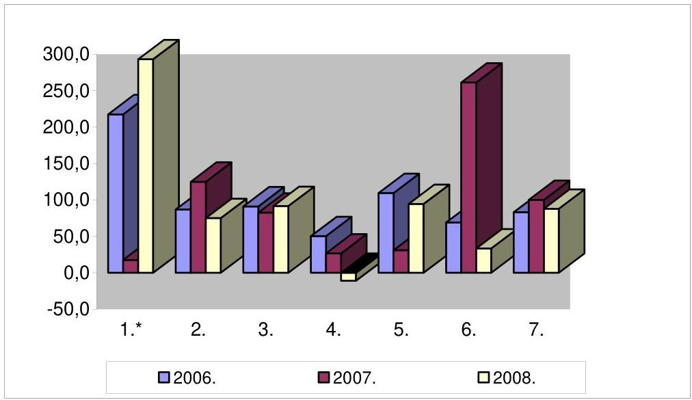

Jelmagyarázat:
*A számok megfeleltetése a közszolgáltatásoknak:

1. Távhőszolgáltatás
2. Vízszolgáltatás
3. Szennyvízelvezetés
4. Szilárdhulladék-kezelés
5. Folyékonyhulladék-kezelés
6. Kegyeleti közszolgáltatások
7. Kéményseprő-ipari közszolgáltatások

A 2004-től 2008-ig terjedő időszakban a legmagasabb üzleti eredményt négy közszolgáltató (Csatornázási Művek Zrt., FKF Zrt., az FTSZV Kft. és a FŐKÉTÚSZ Kft.) a 2005. évben, egy (FŐTÁV Zrt.) a 2006. évben, kettő (Vízművek Zrt., BTI Zrt.) a 2007. évben érte el.

# 2.2. A közszolgáltatások hatósági díjjavaslatainak alátámasztottsága 

A FŐTÁV Zrt. az előterjesztett, számításokkal alátámasztott 2007. évi díjkalkulációjában 44,6\%-os díjnövekedést javasolt, a gázártámogatási rendszer megváltozása miatt. A Főpolgármesteri Kabinet az előterjesztés átdolgozását kérte a távhődíjak két ütemű emelését javasolva, hogy „az első ütemben egy jelentősebb mértékű emelés, a második ütemben a fütési szezon lezárását követően - előreláthatólag április 1-je után - egy 10\% alatti mértékű díjkorrekcióra kerüljön sor ${ }^{12}$."

[^0]
[^0]:    ${ }^{12}$ A távhődíjak kétütemű emelését a Főpolgármesteri Kabinet 2006. december 4-i 38/2006. számú döntése tartalmazta.

---

A két ütemű díjemelés második ütemének díjjavaslata nem volt megalapozott, mivel arra vonatkozóan számítási anyag nem állt rendelkezésre. Az április 1-től hatályos díjmódosítás ellentmondott a díjmechanizmusban foglaltaknak, mivel abban a díjmódosítás időpontjaként szeptember 1-ét jelölték meg. Az előírttól eltérő időpontban megvalósított díjmódosításnál egy korrekciós tényező ${ }^{13}$ időben előre hozott, díjban való
 érvényesítését valósították meg, amely idő előtti díjemelést jelentett. A 2007. évben elmaradt a szeptember elsejei induló díjak meghatározása, emiatt nem teljesültek a 2007. évi díjmechanizmusban a távhődíjaknak a tényleges költségekhez való igazítására vonatkozó előírások.

A 2007. évi díjkalkuláció nem volt megalapozott a következő díjelemeknél:

- az értékcsökkenési leírás költségeinek meghatározásánál nemcsak a távhőszolgáltatási tevékenységet szolgáló tárgyi eszközök, hanem az üzemkörön kívüli tárgyi eszközök értékcsökkenésének értékét is számba vették;
- a személyi jellegű ráfordítások díjelemben a közszolgáltatáshoz közvetlenül nem kapcsolódó, ezért nem indokolt költségeket terveztek, mivel a bérköltségek között figyelembe vették az üzleti ajándékok értékét, valamint azon dolgozók jutalmát, akik a Hálózat Alapítvány helyett a távhőszolgáltatási díjkompenzációra jogosultakat rögzítették a számlázási rendszerben. A tervezett bérköltség tartalmazott fix vezetői prémiumot, amelyet a vezetők külön feladat kijelölése nélkül, az általános vezetői feladatok ellátására, negyedévenkénti rendszerességgel kaptak. A fix vezetői prémium nem ösztönzött a távhőszolgáltatás költségeivel való hatékonyabb gazdálkodásra, mivel a bérköltség a közszolgáltatás eredményességétől függetlenül fedezetet biztosított a prémium kifizetésére;

A fix vezetői prémiumot a FŐTÁV Zrt. új vezetése már a 2007. év második félévétől konkrét feladatok teljesítéséhez kötötte. A társasági szintű prémium és jutalom együttes aránya a bérköltségben a 2006. és 2007. évi tényadatok, valamint a 2008. évi terv adatok alapján 18%-17%-16% volt.

- az anyagjellegű ráfordításoknál - a kiválasztott főkönyvi számlán ${ }^{14}$ könyvelt gazdasági események és a kapcsolódó dokumentáció szerint - figyelembe vettek nem a FŐTÁV Zrt.-t terhelő költséget;

A Főpolgármesteri hivatal épülete fűtési berendezésének üzemeltetésével kapcsolatban kiszámlázott bevételek nem fedezték az azzal kapcsolatosan elszámolt kiadásokat, ezáltal a FŐTÁV Zrt. viselte ezen tevékenység veszteségét. A költségekhez kapcsolódó szerződés alapján a 2006. szeptemberében teljesítettek utoljára kifizetést, a feladatot más vállalkozásnak adták át.

[^0]
[^0]:    ${ }^{13}$ A díjmechanizmus alapján, amennyiben nem az előírt időpontban (szeptember 1-én) történik a díjmódosítás, a díjmegállapítás késéséből adódó korrekciót figyelembe kell venni. A 2006. évben nem szeptember 1-én, hanem szeptember 18-án történt díjmódosítás, ennek hatását építették be 2007. április 1-től 2007. szeptember 1. helyett.
    ${ }^{14}$ A nagyságrend alapján kiválasztott főkönyvi számla az 512210 Más szervekkel végeztetett üzemeltetés főkönyvi számla volt.

---

A távhődíj négyévenkénti tényleges költségekhez való igazításának elmaradása miatt ezek a költségek azonban továbbra is az alapdíj részét képezték, annak ellenére, hogy korábban sem, valamint a megváltozott körülmények között sem voltak indokoltak;

- a nyereség díjrész a 2007. évi díjmechanizmus szabályozása alapján a társaság jegyzett tőkéjének maximum 8%-a lehet (2269 millió Ft). A 2003. évben, az induló díj meghatározásakor 5,74%-os aránnyal, 1625 millió Ft-ot terveztek a díjbevételekben, azóta a díjmegállapítás során a KSH hivatalos ipari belföldi értékesítési árindexével (az élelmiszeripar, villamosenergia-, gáz-, hő- és vízellátás nélkül) valorizálták, a 2004. évi és 2006. évi díjmódosításkor. A 2007. évi díjmegállapításkor a nyereségrész értéke 2097 millió Ft volt. A nyereség összegét a díjhátralékkal rendelkező lakosok segítésére a Hálózat Alapítványba befizetendő közérdekű felajánlás, és a DHK Zrt. felé értékesítendő követelésekből származó veszteség értékével egyezően határozták meg, annak ellenére, hogy a 2007. évi díjmechanizmus ezt a számítási módot nem tartalmazta. A FŐTÁV Zrt. a 2007. évben 825 millió Ft, a 2008. évben 660 millió Ft lakossági díjkompenzációt szolgáló alapítványi befizetést teljesített. Az alapítványi befizetéssel a rászoruló lakossági fogyasztók fizetőképességének fenntartását segítő szociális elem épült be a távhőszolgáltatás díjába, annak ellenére, hogy az ártörvény a 8. § (1) bekezdésében nem rendelkezett annak beépítési lehetőségéről. A Fővárosi Önkormányzat a Hálózat Alapítványnak utalandó összeg meghatározására vonatkozó döntésénél nem érvényesítette a fogyasztók érdekeit, mivel a lakossági fogyasztók távhődíj kompenzációjának és hátralékának terhét - a FŐTÁV Zrt., a Fővárosi Önkormányzat, és a fogyasztók közötti megosztás helyett - a fizető fogyasztókra hárította. Nem érvényesítette a fogyasztók érdekeit azáltal sem, hogy nem tette átláthatóvá a lakossági fogyasztók fizetőképessége fenntartásának áthárított terhét, mivel a távhődíj számlán ennek mértéke nem jelent meg, továbbá nem ellenőrizhető módon szervezte meg a FŐTÁV Zrt. által a Hálózat Alapítvány részére átutalt összegnek a távhődíj-hátralékosok segítésére történő felhasználását;
- a fejlesztések finanszírozására a nyereség helyett a fejlesztési hányadot önálló díjelemként vették számba, ezáltal a fejlesztési igény forrás fedezetét előre beépítették, azaz előre megfinanszíroztatták a lakossági felhasználókkal. (A 2007. évben 1069 millió Ft volt a képzett fejlesztési hányad összege.) A fejlesztési hányadban figyelembe vették az új belépőkkel kapcsolatos beruházási költségeket is, annak ellenére, hogy távhőszolgáltatási csatlakozási díjat is megállapítottak. A távhőszolgáltatás csatlakozási díját nem fizettették meg az új, vagy növekvő távhőigénnyel jelentkezőkkel, így kétszeres fedezetképzés nem történt, az új belépőkkel kapcsolatos szabályozásban állt fenn párhuzamosság. A 2008. évi díjmechanizmus nem tartalmazta a fejlesztési hányadban az új belépőkkel kapcsolatos beruházási költségeket. A Fővárosi Önkormányzat a távhődíjban a fejlesztési hányad jóváhagyására vonatkozó döntésénél nem érvényesítette a fogyasztók érdekeit, mivel a nyereség (valamint fejlesztési célú hitel, támogatás) helyett önálló díjelemként hagyta jóvá a fejlesztések fedezetét.

A közbenső egyeztetés során a városfejlesztési, gazdálkodási és szociálpolitikai főpolgármester-helyettes észrevétele szerint: „a távhőszolgáltatási díj esetében az árak megállapításáról szóló 1990. évi LXXXVII. törvény határozza meg pontosan, hogy

---

milyen módon kell képezni az árakat. Kifogás tárgya a fejlesztési díjhányad alkalmazása. A hivatkozott ártörvény úgy fogalmaz, hogy: a legmagasabb árat úgy kell megállapítani, hogy a hatékonyan működő vállalkozó ráfordításaira és a működéséhez szükséges nyereségre fedezetet biztosítson, tekintettel az elvonásokra és a támogatásokra is (8. § (2) bek.). A távhőszolgáltatásról rendelkező 2005. évi XVIII. törvény és a kapcsolódó jogszabály ugyanakkor meghatározza a hőközpontok szétválasztásának feladatát. A 48. § (2) bekezdése szerint a távhőszolgáltató az önkormányzat rendeletében meghatározott határidőig, de legkésőbb a törvény hatálybalépését követő öt éven belül köteles felhasználói hőközpontok létesítésével és mérők beépítésével a hőmennyiségmérés feltételeit biztosítani. Ez a kötelezettség akkor terheli a távhőszolgáltatót, ha a hőközpontból ellátott valamennyi felhasználó a berendezés, valamint a bekötővezeték elhelyezésére alkalmas épületrészt és annak üzemeltetés céljára történő használatát a távhőszolgáltató részére díjmentesen biztosítja.

Fentiekre tekintettel a Fővárosi Közgyűlés által elfogadott díjtartalom meghatározása jogszerűen fogalmazza meg, hogy a távhő díj fedezze az indokolt költségeket és ráfordításokat, nyújtson fedezetet a jogszabályban előírt beruházásokra, vagyis a gazdálkodónak ki kell termelnie a jogszabályban előírt beruházások forrásait is."

A távhőszolgáltatási díjban a fejlesztési hányadra irányuló észrevétel nem fogadható el, mivel az árak megállapításáról szóló 1990. évi LXXXVII. törvény 8. § (1) bekezdésében meghatározott legmagasabb ártartalom a nyereségben adja meg a fejlesztések megvalósításának forrását. A távhőszolgáltatásról szóló 2005. évi XVIII. törvény 48. § (2) bekezdése szerint köteles a távhőszolgáltató a felhasználói hőközpontok létrehozására, azonban ez feladatmeghatározást jelent, és nem jelenti külön a fejlesztésekre jövőben felhasználható díjelem beépítésének lehetőségét a hatósági díjba.

A 2007. évi díjkalkuláció megalapozottságának visszaigazolásához, az elő- és utókalkuláció költségadatainak összehasonlításával a lakossági távhőszolgáltatási díjaknál a lényegességi szinttől való eltérés meghatározására - a lakossági távhőszolgáltatási díjak, az egyes szolgáltatás típusok, díjelemek költségeinek elkülönített gyűjtése hiányában - nem volt mód.

A 2008. évi díjjavaslatban szereplő értékek megalapozottsága nem volt biztosított, mivel:

- a 2007. évi második ütemben végrehajtott, számításokkal alá nem támasztott 2007. április 1-től hatályos díjemelésen alapult;
- a 2007. évi új induló díjak megállapításának elmaradása miatt nem igazodott a tényleges költségekhez, mert nem történt meg a tervezett és a várható adatok korrekciója, a tervezett valorizációs indexek tényleges indexre való igazítása. (A következő induló díj meghatározása a 2008. évi díjmechanizmus alapján - a távhődíj kalkulációs módszere szerint - 2012. február 1-től történik.);
- a 2007. évi díjemelésnél jelzett számbavételi indokolatlanság továbbra is fennállt, azaz a lakossági felhasználók részére végzett távhőszolgáltatási tevékenységgel való szoros kapcsolat hiánya miatt kifogásolt költségeket továbbra is tartalmazta;
- a 2008. évi díjjavaslatba a díjképletek szerinti díjelemek nem számításokkal alátámasztottan épültek be, a díjképletek elemeinek fajlagos értékét igazoló számítás nem állt rendelkezésre.

---

A 2007. évben szükséges volt a díjak módosítása, mivel megváltozott a gázár támogatási rendszere. A valamennyi lakossági gáz- és távhőfelhasználó részére támogatást biztosító jogszabályt hatályon kívül helyezték ${ }^{15}$, az alanyi jogon járó támogatást szociális alapon járó támogatás váltotta fel. A díjmódosítás mértékét a FŐTÁV Zrt. a díjkalkulációjában számításokkal alátámasztotta.

A 2008. évi díjmódosítás szükségességét egyrészt a gázár szabályozás változása indokolta, másrészt a Közgyűlés októberi döntése alapján a FŐTÁV Zrt. távhőszolgáltatás versenyhátrányának csökkentésére elfogadott cselekvési programjának távhőszolgáltatás díját érintő elvei. A cselekvési program távhőszolgáltatás díját érintő elvei: az alapdíj-hődíj arány módosítása, a díjmechanizmus egyszerűsítése, átláthatóvá tétele, a távhődíj mérséklése, az ÖKO-Program ${ }^{16}$ elindításának tervezése voltak.

A FŐTÁV Zrt. a 2003. évben kimunkáltatta a hosszú távra (2004-2018. évre) tervezett fejlesztéseit ${ }^{17}$, illetve ezek megvalósításának forrásigényét. A nyereséget, mint elsődleges fejlesztési forrást sem a hosszú távú beruházási tervben, sem a 2007. évre, illetve a 2008. évre vonatkozó beruházási és üzleti tervekben nem határozták meg. A beruházási tervekben a 4779 millió Ft 2007. évre tervezett, valamint 7135 millió Ft 2008. évre tervezett beruházás fejlesztési forrásaként a fejlesztési hányadot, az értékcsökkenési leírás összegét és a hitelt jelölték meg. A FŐTÁV Zrt. az évek során képzett fejlesztési hányadot, az éves beszámolóban kimutatottak szerint beruházási célokra fordította.

A távhő díjkalkulációja során közvetlenül érvényesítettek fogyasztói szempontokat a 2007. évi díjmódosítás két ütemben történő bevezetésével, valamint - a lakosság teherviselő-képességére és jövedelmi viszonyaira tekintettel - a 2008. évben, mivel a fogyasztói érdekvédelmi szervezetek véleményét figyelembe véve alakították ki a 35-65%-os alapdíj-hődíj arányt az átlagos lakossági felhasználóra. A díjkalkuláció elkészítése előtt a FŐTÁV Zrt. egyeztetett a felhasználói érdek-képviseletek szervezeteivel.

A Vízművek Zrt., valamint a Csatornázási Művek Zrt. a 2007. és 2008. évi díjjavaslatokat a szindikátusi és menedzsment szerződésben, illetve a közüzemi szolgáltatási szerződésben meghatározott díjképlet tartalmi előírása szerint készítették el. A díjképlet szerinti díjelemeket, illetve díjtételeket meghatározó aránymutatókat, illetve a tételesen meghatározott díjelemeket és díjtételeket alapadatokként a díjmeghatározás évét megelőző év főkönyvi

[^0]
[^0]:    ${ }^{15}$ A kedvezményes gázellátás igénybevételéről szóló 50/2003. (VIII. 14.) GKM rendeletet hatályon kívül helyezte a lakosság energiafelhasználásának szociális támogatásáról szóló 231/2006. (XI. 22.) Korm. rendelet 11. § (3) bekezdés a) pontja.
    ${ }^{16}$ A lakáscélú állami támogatásokról szóló 12/2001. (I. 31.) Korm. rendelet 28. § (2) bekezdésében (hatályos 2007. december 23-tól) célként határozták meg „A távhővel ellátott lakóépületek hőfogyasztása szabályozási lehetőségének megteremtésére (a továbbiakban: ÖKO-Program)" támogatás nyújtását. A FŐTÁV Zrt. ehhez kapcsolódóan tervezte saját ÖKO-Programját.
    ${ }^{17}$ Az Igazgatóság elfogadta a FŐTÁV Zrt. stratégiáját, amelynek részét képezte a hosszú
 távú fenntartástervezés koncepciója is.

---

könyvelési adatai, a díjmeghatározás évének az ismertté vált $^{18}$ főkönyvi könyvelési adatai és az erre épülő becsült adatok, valamint az árszabályozás évére vonatkozó tervezett adatok megalapozták. A valorizációs indexek alkalmazása a díjkalkuláció időszakában ismert, illetve becsült gazdasági mutatószámokon alapult, amelyeket a tervezési dokumentációk alátámasztottak.

A vízdíj 2007. és 2008. évi szerkezetét a következő táblázat szemlélteti:
(adatok: $\mathrm{Ft} / \mathrm{m}^{3}$-ben)

| Megnevezés | $\mathbf{2 0 0 7 .}$ | $\mathbf{2 0 0 8 .}$ |
| :-- | --: | --: |
| Működés fedezetére | 124,20 | 137,15 |
| Fejlesztési fedezet | 28,90 | 29,35 |
| Összesen: | 153,10 | 166,50 |

A Vízművek Zrt. Igazgatósága a 2007. évi, a Fővárosi Önkormányzat által elfogadott díjavaslattal megegyező szerkezetű, a vízdíj díjelemeire és díjtételeire vonatkozó terv, tény adatok eltéréseinek elemzését tartalmazó előterjesztést fogadott el $^{19}$. Az elemzés tényadatait a főkönyvi könyvelés a 2007. évre vonatkozó főkönyvi zárással alátámasztott adatai, a valorizációs indexekben felhasznált becsült gazdasági mutatószámok ismertté vált tényadatai megalapozták.

A 2007. évben a vízdíjban elismert, „pénzmozgással járó kiadások" díjelem tervezett összege 21841 millió Ft volt, a tényadat 20621 millió Ft. A „pénzmozgással járó kiadások" díjelem a szindikátusi és menedzsment szerződésben meghatározott képlet alapján valorizált, illetve a korrekciós tényezőkkel módosított 1997. évi kiindulási értékadatot tartalmazta. A 2007. és a 2008. években a „pénzmozgással járó kiadások" díjelem tervezésénél a vízdíj indokolt ráfordításaihoz közvetlenül, illetve közvetett módon nem kapcsolódó kiadást szerepeltettek.

Az alapítványok, társadalmi szervezetek részére a 2007. évben 388,3 millió Ft összegű, a 2008. évben 434,3 millió Ft összegű támogatást vettek számba a vízdíjban. A kifizetett támogatások meghatározó részét (mindkét évben 360 millió Ft-ot) a Hálózat Alapítvány támogatása jelentette.

A Fővárosi Önkormányzat a Hálózat Alapítványnak utalandó összeg meghatározására vonatkozó döntésénél nem érvényesítette a fogyasztók érdekeit, mivel a lakossági fogyasztók fizetőképessége fenntartásának terhét - a Vízművek Zrt., a Fővárosi Önkormányzat és a fogyasztók közötti megosztás helyett - a fizető fogyasztókra hárította. Nem érvényesítette a Fővárosi Önkormányzat a fogyasztók érdekeit azáltal sem, hogy nem tette átláthatóvá a lakossági fogyasztók fizetőképessége fenntartásának áthárított terhét, mivel a vízdíj számlán nem jelent meg (az áthárított összeg), valamint nem ellenőrizhető módon szer-

[^0]
[^0]:    $^{18}$ A 2006. és 2007. években januártól és szeptember hónapig könyvelt és a havi zárások során egyeztetett adatai, amelyeket a 2006. és 2007. október hónapban elvégzett díjkalkuláció során figyelembe vettek.
    $^{19}$ Az előterjesztést a Vízművek Zrt. Igazgatósága az 5/2008. (V. 16.) számú határozatával fogadta el.

---

vezte meg a Vízművek Zrt. által a Hálózat Alapítvány részére átutalt összegnek a vízdíj-hátralékosok segítésére történő felhasználását. A Hálózat Alapítvány a 2007. évben a vízszolgáltatást igénybe vevő lakossági fogyasztók fizetőképessége fenntartása céljából a díjkompenzációra és hátralékkiegyenlítő támogatásra $^{20}$ a befizetett összeg 80,7%-át, azaz 291 millió Ft-ot használt fel.

A közbenső egyeztetés során a városfejlesztési, gazdálkodási és szociálpolitikai főpolgármester-helyettes észrevétele szerint: „A támogatások díjban való figyelembe vételével kapcsolatban jelzem, hogy a hatályos díjképlet finanszírozási szemléletű, a nyújtott támogatások is kiadást jelentenek. Korrekciós elemként azért szerepelnek a díjban, mivel az induló értékek ezeket a kiadásokat nem tartalmazták. Az alkalmazott gyakorlat teljes mértékben megfelel az SZMSZ-ben, valamint a 2000. évi tulajdonosi Megállapodásban foglaltaknak.

A Hálózat Alapítványnak fizetett támogatást a társaság a Fővárosi Közgyűlés döntése alapján biztosítja, helyes célt szolgál és rendkívül jól működik az utóbbi évek tapasztalatai szerint."

A támogatások (alapítványi és egyéb szervezetek támogatása) vízdíjban történő figyelembevételére vonatkozó észrevétel nem megalapozott, mivel a támogatások díjban történő tervezése és elszámolása nem a szindikátusi és menedzsment szerződés feltételeiből következik. Az alapítványi és az egyéb szervezetek részére juttatott, a hatósági díjból finanszírozott támogatások a vízdíj indokolt ráfordításaihoz közvetlenül, illetve közvetett módon nem kapcsolódó kiadások.

A 2007. évi díjkalkuláció díjelemei és díjtételei terv és tényadatainak eltérései nem érték el a lényegességi határt a „saját forrásból megvalósítandó beruházások" díjelem, a „forgótőke változás" díjelem, az „egyéb bevételek összege" díjelem, a „kompenzáció az áthúzódó hatás miatt" díjelem és a „kiszámlázott szennyvíz mennyisége" díjelem esetében. A „pénzmozgással járó kiadások" díjelemnél a terv- és tényadatok elemzésén alapuló, a lényegességi szintet meghaladó teljes eltérés (6%) a tulajdonosok intézkedése miatt szükségessé vált korrekcióra vezethető vissza. A terv- és tényadatok eltérését meghatározó ok, hogy a díjelemben a Fővárosi Önkormányzat és a szakmai befektetők között 2008. május 29-én megkötött megállapodás alapján a menedzsment díj összegének csökkentésével összefüggésben 1750 millió Ft díjelemet csökkentő tételt számoltak el. A 2007. és a 2008. években a pénzmozgással járó kiadások díjelem számításánál a vízszolgáltatás ráfordításaihoz nem kapcsolható kiadások nem érték el a díjelem összegéhez viszonyított lényegességi szintet.

A szindikátusi és menedzsment szerződés 1997. évi megkötésekor a Fővárosi Vízművek Zrt. veszteséges gazdálkodást folytatott, a privatizáció egyik feltétele a szakmai befektetők részére fizetendő, az üzemi eredmény terhére - költségként elszámolt - menedzsment díj volt $^{21}$. A 2001-2007. évek közötti időszakban a Fővárosi Vízművek Zrt. folyamatosan nyereségesen gazdálkodott, ezért a menedzsment díj költségként történő elszámolása célszerűtlen volt,

[^0]
[^0]:    $^{20}$ A Hálózat Alapítvány 2007. évi közhasznúsági jelentésének a díjkompenzáció közszolgáltatásonkénti arányait alkalmaztuk a hátralékkiegyenlítő támogatás közszolgáltatásonként részletezett adatainak hiányában, a díjfajtánkénti megosztáshoz.
    $^{21}$ A szakmai befektetők tulajdonrészére vetített éves menedzsment díj a 2006. évben 23,47%, a 2007. évben 18,52% volt.

---

mert eredményesen működő gazdasági társaság esetében ez a megoldás eltér az általános gyakorlattól.

A menedzsment díj a 2007. évben 2566 millió Ft, a 2008. évben 2487 millió Ft volt. A menedzsment díj összege a 2006. évig emelkedett és ebben az évben érte el a legmagasabb összegét, 3254 millió Ft-ot.

A Fővárosi Önkormányzat és a szakmai befektetők a 2008. május 29-i megállapodásukban rendelkeztek a szindikátusi és menedzsmentszerződés 2008. november 15-i határidővel történő módosításáról és a menedzsment díj megszüntetéséről, továbbá a szakmai befektetők jövedelmének osztalékalapon történő biztosításáról. A szindikátusi és menedzsment szerződést azonban 2009. június hóig nem módosították.

A csatornahasználati díj 2007. és 2008. évi szerkezetét mutatja be a következő táblázat:
(adatok: $\mathrm{Ft} / \mathrm{m}^{2}$-ben)

| Megnevezés | 2007. | 2008. |
| :-- | --: | --: |
| Működés fedezetére | 149,96 | 158,86 |
| Fejlesztési fedezet | 40,65 | 39,18 |
| Áthárított vízterhelési díj | 24,89 | 38,96 |
| Összesen: | 215,50 | 237,00 |

A Csatornázási Művek Zrt. Igazgatósága a 2007. évi díjavaslattal egyező szerkezetű, a csatornahasználati díj terv-tény adatai eltéréseinek elemzését és az azokból levont következtetéseket tartalmazó előterjesztést fogadott el $^{22}$. Az elemzés tényadatait a főkönyvi könyvelés 2007. évi adatai, a valorizációs indexekben felhasznált becsült gazdasági mutatószámok ismertté vált tényadatai megalapozták.

A 2007. évben a csatornahasználati díjban elismert, „pénzmozgással járó kiadások" díjelem tervezett összege 16345 millió Ft volt, a tényadat 16273 millió Ft, a terv teljesítése 99,56%. A „pénzmozgással járó kiadások" díjelem a közüzemi szolgáltatási szerződésben meghatározott képlet alapján valorizált, illetve a korrekciós tényezőkkel módosított 1997. évi kiindulási értékadatot tartalmazta. A 2007. és a 2008. években az egyéb, a tárgyévben tervezett „egyszeri pénzmozgással járó kiadások" díjtétel számításánál a közüzemi szolgáltatási szerződésben meghatározott kritériumokkal összhangban nem lévő, a csatornahasználati díj ráfordításaihoz közvetlenül, illetve közvetett módon nem kapcsolódó kiadást szerepeltettek.

Egy sportegyesület, illetve egy sportkör támogatása a 2007. évi díj tervezése során összesen 31 millió Ft értékben a díjtétel részét képezte, a 2007. évi tényadatok elszámolása során a tényleges támogatási összeg 43 millió Ft volt. A 2008. évben a

[^0]
[^0]:    $^{22}$ Az előterjesztést a Csatornázási Művek Zrt. Igazgatósága a 2/2008. (III. 19.) számú határozatával fogadta el.

---

sportegyesület, illetve a sportkör támogatására összesen 31 millió Ft-ot terveztek a díjtétel részeként. A Főpolgármesteri Hivatal részéről megbízott külső szakértők a támogatási összegeket nem kifogásolták, mivel a támogatások az 1997. évi meghatározáskor épültek be a díjelemekbe, és a szakértők feladatköre a változások ellenőrzésére terjedt ki.

A 2007. és a 2008. években a Hálózat Alapítványba befizetett összeg tervezett és tény értéke megegyezett, 400 millió Ft volt. A támogatásra fordított összeg nem tekinthető üzemgazdasági szempontból, az indokolt költségek elszámolása tekintetében a szennyvízelvezetéshez közvetlenül, illetve közvetett módon kapcsolódó költségnek, ezért a közüzemi szolgáltatási szerződésben rögzített díjképletben díjelemként történő meghatározása, illetve a közüzemi szolgáltatási szerződés alapján díjelemként történő elszámolása nem volt megalapozott. A Fővárosi Önkormányzat a Hálózat Alapítványnak utalandó összeg meghatározására vonatkozó döntésénél nem érvényesítette a fogyasztók érdekeit, mivel a lakossági fogyasztók fizetőképessége fenntartásának terhét - a Csatornázási Művek Zrt., a Fővárosi Önkormányzat, és a fogyasztók közötti megosztás helyett - a fizető fogyasztókra hárította. Nem érvényesítette a fogyasztók érdekeit azáltal sem, hogy nem tette átláthatóvá a lakossági fogyasztók fizetőképessége fenntartásának áthárított terhét, mivel a szennyvízelvezetési számlán ennek mértéke nem jelent meg, valamint nem ellenőrizhető módon szervezte meg a Csatornázási Művek Zrt. által a Hálózat Alapítvány részére átutalt összegnek a csatornahasználati díjhátralékosok segítésére történő felhasználását. A Hálózat Alapítvány a 2007. évben a szennyvízelvezetés közszolgáltatást igénybe vevő lakossági fogyasztók fizetőképessége fenntartása céljából a díjkompenzációra és hátralékkiegyenlítő támogatásra $^{23}$ a befizetett összeg 69,5%-át, azaz 278 millió Ft-ot használt fel. A Csatornázási Művek Zrt-nél a 2007. évben a "saját forrásból megvalósítandó beruházások" elnevezésű díjelem $^{24}$ tervezett összege 10315 millió Ft volt, a tényadat 9661 millió Ft, a terv teljesítése 94%. A „saját forrásból megvalósítandó beruházások" díjelem csökkenését a Fővárosi Csatornázási Művek Zrt. eszközei után számított 2007. évi „értékcsökkenés" tervezett díjtételének 97%-os, valamint a „fejlesztési hányad" tervezett díjtételének 82%-os teljesítése okozta. A „fejlesztési hányad" díjtétel csökkenése a Fővárosi Önkormányzat és a Csatornázási Művek Zrt. között a fejlesztési fedezet részét képező szerződésben szabályozott - díjtétel éves szintű csökkenésére vezethető vissza. A tervezett önkormányzati beruházások saját forrásigényének fejlesztési hányad díjképző elemként történő meghatározásával (a 2007. évben nettó 3225 millió Ft, a 2008. évben nettó 1675 millió Ft) a Fővárosi Önkormányzat a fejlesztési forrásigényt halmozottan vette figyelembe a díjképlet kialakítása, a díjmeghatározás, valamint a díj elszámolása során.

[^0]
[^0]:    $^{23}$ A Hálózat Alapítvány 2007. évi közhasznúsági jelentésének a díjkompenzáció közszolgáltatásonkénti arányait alkalmaztuk a hátralékkiegyenlítő támogatás közszolgáltatásonként részletezett adatainak hiányában, a díjfajtánkénti megosztáshoz.
    $^{24}$ A „saját forrásból megvalósítandó beruházások" elnevezésű díjelem a Fővárosi Önkormányzat részére - a részvényesi megállapodás, a közüzemi szolgáltatási szerződés, valamint az évenként megkötött pénzeszköz-átadási megállapodás alapján - beszedett fejlesztési hányadból, a Fővárosi Csatornázási Művek Zrt. eszközei után számított

 értékcsökkenésből és a passzív időbeli elhatárolás díjelemben korrigált közműfejlesztési hozzájárulásból tevődött össze.

---

A közbenső egyeztetés során a városfejlesztési, gazdálkodási és szociálpolitikai főpolgármester-helyettes észrevétele szerint: „a csatorna-szolgáltatás esetében a csatornahasználati díjban képzett fejlesztési díjhányad álláspontunk szerint nem kifogásolható, különös tekintettel arra, hogy az FCSM a hatályos jogszabályi előírások és a Közüzemi Szerződés alapján végzi tevékenységét, a csatornahasználati díj megállapítására szolgáló, jelenleg hatályos díjképlet tartalmi elemeivel, illetve a díjszámítás módszertanával összefüggésben jogszabálysértés megállapítására nem került sor. Tájékoztatom, hogy a díjképlet időközönkénti felülvizsgálata, módszertanának pontosítása, továbbá a díjkompenzációra fordított összeg díjelem, illetve a fejlesztési hányad megszüntetése a Részvényesi Szerződés és a Közüzemi Szerződés módosítását igényli, amelyhez a részvényesek közös döntése szükséges. A vizsgálat megállapításaira tekintettel a részvényesek döntéshozatalát kérő előterjesztést készítünk a végleges jelentés ismeretében. Amennyiben az Állami Számvevőszék ajánlásának eleget téve, a fejlesztési hányad nem kerül beépítésre a csatornaszolgáltatás díjába, úgy a Fővárosi Önkormányzatnak az így kieső önerő helyett több idegen forrást kellene bevonnia a beruházások finanszírozásába. Az idegen forrás megtérülési igénye azonban a csatornaszolgáltatás díját terhelő tétel lesz, így gyakorlatilag ugyanúgy (csak esetleg költségesebb) díjképző elemként kell majd figyelembe venni, mint a fejlesztési hányadot."

A csatornahasználati díjban képzett fejlesztési hányaddal kapcsolatos észrevétel nem megalapozott, mivel a tervezett önkormányzati beruházások forrásigényének fejlesztési hányad díjképző elemként történő meghatározásával a Fővárosi Önkormányzat a fejlesztési forrásigényét halmozottan vette figyelembe. A szükséges fejlesztések ésszerű mértékű nyereségági finanszírozási fedezetét a díjképlet módszertanának megfelelően, a bázis költségek valorizációjával célszerű és indokolt megképezni.

A 2007. és a 2008. években a „saját forrásból megvalósítandó beruházások" elnevezésű díjelemet a fejlesztési forrásigényt halmozottan tartalmazó „fejlesztési hányad" díjtátel beépítésével tervezték meg, amelynek díjelemen belüli aránya mindkét évben meghaladta az 5%-os lényegességi szintet.

A közbenső egyeztetés során a városfejlesztési, gazdálkodási és szociálpolitikai főpolgármester-helyettes észrevétele szerint: „a Fővárosi Önkormányzat hatósági díjmegállapító tevékenységének hatékonyságát és eredményességét, az elő- és utókalkuláció költségadatainak összehasonlítását olyan lényegességi szint mértékével határozták meg (5%, illetve 1 millió Ft.), amely mind a vizsgált feladat, mind az érintett társaságok gazdálkodásának nagyságrendjére tekintettel aránytalanul alacsonynak tekinthető. Ezen módszer alkalmazásának alapjai egyebekben számunkra változatlanul nem ismertek."

A lényegességi szint mértékére vonatkozó észrevétel nem megalapozott, mert az egyes közszolgáltatások hatósági díja megalapozottságának megítélése nem a közszolgáltatást nyújtó gazdasági társaságok gazdálkodásának nagyságrendjén, hanem egységes módon az előkalkuláció keretében - a tervezett költségek alapján - meghatározott hatósági díj és az utókalkuláció során a tényleges költségek különbségén alapulhat. Az előbbieket figyelembe véve a számvevőszéki ellenőrzés szakmai szabályai alapján meghatározott lényegességi szint mértéket a közszolgáltató társaságok gazdálkodása nagyságrendjének különbségei is indokolták.

A „fejlesztési hányad" díjtátel a 2007. évben a „saját forrásból megvalósítandó beruházások" elnevezésű díjelem 31,3%-át, a 2008. évben 19,2%-át jelentette, emiatt a „saját forrásból megvalósítandó beruházások" elnevezésű díjelem tervezése nem volt megalapozott. A Fővárosi Önkormányzat a csatornahasználati díj-

---

ban a fejlesztési hányad jóváhagyására vonatkozó döntésénél nem érvényesítette a fogyasztók érdekeit, mivel a nyereség (valamint fejlesztési célú hitel, támogatás) helyett önálló díjelemként hagyta jóvá a fejlesztések fedezetét.

Az FKF Zrt. az integrált pénzügyi és számviteli rendszerben a költségeit elsődlegesen költségnemek szerint tartotta nyilván, amelyhez az alkalmazott könyvelési program segítségével költséghelyek, költségviselők szerinti felosztást rendelt. A szilárdhulladék-kezelés díjkalkulációjának kiinduló, díjelemenként csoportosítva nyilvántartott alapadatait a számviteli nyilvántartásokban elkülönítetten gyűjtötték, melyek között a hatékony működéshez és a fejleszthető fenntartáshoz figyelembe vehető, illetve figyelembe nem vehető költségek szabályozásának hiányában a díj számításánál nem indokolt költségeket is számba vettek.

A díjjavaslat meghatározásánál a személygépkocsi magánhasználata miatt befizetett adó, a reprezentációs költség nem a hatékony működéshez szükséges folyamatos ráfordítás, illetve fejleszthető fenntartás része. A bérköltségek között elszámolt jutalom fedezete a fedezeti összeg, így annak a díjkalkuláció költségelemei között történő elszámolása nem indokolt.

A díjkalkulációban figyelembe vett nyereségigény a 2007. évi javaslatban a tervezett díjbevétel 9,7%-a, a 2008. évi díjjavaslatban 6,5% volt. A díjjavaslatban kalkulált nyereség tartalmazta a Hálózat Alapítványba történő befizetést, a fejlesztési források díjból fedezett részét. Az alapítványi befizetésről a Közgyűlés határozatban ${ }^{25}$ döntött, annak alapján az FKF Zrt. a Hálózat Alapítványnak közérdekű felajánlás formájában a szolgáltatást igénybe vevő, rászoruló fogyasztók fizetőképességének fenntartása céljából, évi 426 millió Ft értékben forrást biztosított. A Hálózat alapítványi befizetés a 2007-2008. évekre megállapított 426 millió Ft összege 99,8%-kal haladta meg a 2006. évre előírt befizetést ${ }^{26}$. A Hgtv. 25. § (1)-(4) bekezdései alapján a hulladékkezelési közszolgáltatási díj elemei között szociális elem nem szerepelt, a közérdekű felajánlás formájában - a díjkalkuláció nyereségigényének részeként szereplő - alapítványi befizetésről dönthet a tulajdonos, de annak fedezetét az egyéb vállalkozási tevékenység eredményéből kell biztosítani. Az alapítványi befizetés a közszolgáltatási feladat működtetéséhez és a fejleszthető fenntartáshoz nem kapcsolódó költség volt. A Fővárosi Önkormányzat a Hálózat Alapítványnak utalandó összeg meghatározására vonatkozó döntésénél nem érvényesítette a fogyasztók érdekeit, mivel a lakossági fogyasztók szilárdhulladék-kezelési díj kompenzációjának és hátralékának terhét - az FKF Zrt., a Fővárosi Önkormányzat, és a fogyasztók közötti megosztás helyett - a fizető fogyasztókra hárította. Nem érvényesítette a Fővárosi Önkormányzat a fogyasztók érdekeit azáltal sem, hogy nem tette átláthatóvá a lakossági fogyasztók fizetőképessége fenntartásának áthárított terhét, mivel a szilárdhulladék-kezelés számlán ennek mértéke nem jelent meg, valamint nem ellenőrizhető módon szervezte meg az FKF Zrt. által a Hálózat Alapítvány részére átutalt összegnek a szilárdhulladék-kezelés díjhátralékosai segítésére történő felhasználását. A Hálózat Alapítvány a 2007. év-

[^0]
[^0]:    ${ }^{25}$ A Közgyűlés az alapítványi befizetés összegéről az 1781/2007. (XI. 29.) számú határozatában döntött.
    ${ }^{26}$ A Fővárosi Önkormányzat által meghatározott befizetés 2006. évre 214 millió Ft volt.

---

ben a szilárdhulladék-kezelés közszolgáltatást igénybe vevő lakossági fogyasztók fizetőképessége fenntartása céljából díjkompenzációra és a hátralékkiegyenlítő támogatásra ${ }^{27}$ a befizetett összeg 49,1%-át, azaz 209 millió Ft-ot használt fel.

A Vízművek Zrt., a Csatornázási Művek Zrt. és az FKF Zrt. a 2007. évre együttesen 1186 millió Ft-ot fizetett be a Hálózat Alapítványba. A Hálózat Alapítvány a vízszolgáltatást, a szennyvízelvezetést és a szilárdhulladék-kezelést igénybe vevő lakossági fogyasztók fizetőképessége fenntartása céljából 778 millió Ft-ot használt fel díjkompenzációra és hátralékkiegyenlítő támogatásra. A befizetett és a támogatásra felhasznált rész különbözete 408 millió Ft, amely a távhőszolgáltatást és az egyéb fűtési módot igénybe vevők támogatását, valamint a maradványképződést szolgálta. A Vízművek Zrt., a Csatornázási Művek Zrt., az FKF Zrt. által a 2007. évre befizetett és az általuk nyújtott közszolgáltatásokat igénybe vevő lakossági fogyasztók fizetőképessége fenntartására szolgáló támogatás 408 millió Ft összegű különbözete az indokolt mértéket meghaladó alapítványi befizetési kötelezettség előírására, valamint a távhőszolgáltatás és az egyéb fűtési mód keresztfinanszírozására mutatott rá.

A Hgtv. 25. § (1) bekezdés d) pontja alapján a hulladékkezelési közszolgáltatási díj tartalmazta a hulladékkezelő létesítmény bezárásának költségeit, lerakó esetén a bezárást követő utógondozás és a harminc évig történő monitorozás költségeit. A 242/2000. (XII. 23.) Korm. rendelet ${ }^{28}$ szerint az utógondozás és monitorozás költségei csak abban az esetben számolhatók el, ha feladatellátásra a közszolgáltató tervet készít, és amennyiben a feladat céljára szükséges „fedezetet csak közelíteni lehet, akkor az időközönként ismétlődő jövőbeni költségekre céltartalékot képez". Az FKF Zrt. a Pusztazámori Regionális Hulladékkezelő Központ és a Dunakeszi lerakó utógondozására a 2003. illetve a 2007. években tervet készített, a végzett számítások alapján a díjban beszedett céltartalék, illetve azok befektetéseiből eredő hozamok képezték a tervezett feladat költségeinek fedezetét. A 2007. évre benyújtott díjjavaslat céltartalékként 146 millió Ft-ot utógondozásra és monitorozásra, a 2008. évi díjjavaslat 1743 millió Ft-ot utógondozásra, monitorozásra és rekultivációra tartalmazott az elkészített tervnek megfelelően. A képzett céltartalékból a 2007. évben 96 millió Ft-t, 2008 évben 184 millió Ft-ot terveztek felhasználni. A felhalmozott céltartalék pénzügyi befektetéséből származó hozamát nem a ténylegesen realizált hozam alapján különítették el, hanem a tervben szerepeltetett értékben. A monitoringra és rekultivációra képzett céltartalékból a terv alapján a 2007. évben 96 millió Ft-ot felhasználtak, de a felhasználás összegével a képzett céltartalékot nem csökkentették. A díjban - a jövőbeni fejlesztések megvalósítására -

[^0]
[^0]:    ${ }^{27}$ A Hálózat Alapítvány 2007. évi közhasznúsági jelentésének a díjkompenzáció közszolgáltatásonkénti arányait alkalmaztuk a hátralékkiegyenlítő támogatás közszolgáltatásonként részletezett adatainak hiányában, a díjfajtánkénti megosztáshoz.
    ${ }^{28}$ Az utógondozás és a monitorozás költségeinek elszámolására 2008. március 30-ig a 242/2000. (XII. 23.) Korm. rendelet 6. § (5) bekezdése, 2008. március 31-től a 64/2008. (III. 28.) Korm. rendelet 3. § (4) bekezdése tartalmazott előírást. A 64/2008. (III. 28.) Korm. rendelet 3. § (4) bekezdése kizárólag az utógondozási és a monitorozási feladatok ellátására készített terv esetén tette lehetővé az utógondozási és a monitorozási költségek hatósági díjban történő érvényesítését.

---

beszedett fejlesztési hányadot, illetve annak a felhasználásig történő befektetéséből származó hozamát a számviteli rendszerben nem különítették el, emiatt azt a fejlesztési fedezet meghatározásánál nem tudták figyelembe venni. A Fővárosi Önkormányzat szilárdhulladék-kezelés hatósági díjával összefüggő szabályozásából hiányzott a hatósági díjban beszedett fejlesztési források, és befektetési hozamaik elkülönített számviteli nyilvántartásának követelménye, emiatt a hatósági díjban rögzített cél szerinti felhasználás nem teljesült. A Közgyűlés elé terjesztett a 2007-2008. évekre vonatkozó díjjavaslatok nem tartalmaztak a tulajdonos részére - osztalék célját szolgáló - érdekeltségi díjelemet, a nyereségigény kizárólag a hulladékkezelési feladatokat szolgálta. A szilárdhulladék-kezelési díjjavaslat előterjesztésével nem állt összhangban ${ }^{29}$ a Fővárosi Önkormányzat Gazdasági Bizottságának 2007. május 23-i ${ }^{30}$ és 2008. május 27-i döntése ${ }^{31}$, mely alapján a Fővárosi Önkormányzat 600 millió Ft, illetve 648 millió Ft értékben osztalékot vett fel. A Fővárosi Önkormányzat a 2007. és a 2008. években az osztalék felvételénél nem vette figyelembe a fogyasztók érdekeit, mivel a tervezettel ellentétben vett fel osztalékot, emiatt a fogyasztók által megfinanszírozott felhasználási céltól (fejlesztés) vonta el a fedezetet. Az FKF Zrt. a 2007-2008. években a gazdálkodó szervezetek körében a lakossági hatósági díjnál alacsonyabb díjat alkalmazott ${ }^{32}$ az elszállításra kerülő hulladék mennyiségére, fizikai jellemzőjére, a szolgáltatás nyújtásához használt eszközök hatékonyabb kihasználtságára, a szolgáltatás ellátásához használt eszközök tulajdonára és a szolgáltatás tartalmára való tekintettel.

Az FTSZV Kft. a 2007-2008. évek folyékonyhulladék-kezelésre vonatkozó díjjavaslatát a 2006. évi, illetve a 2007. félévi - számviteli nyilvántartással alátámasztott - tényadatokból kiindulva határozta meg. A féléves tényadatokból számított, várható éves értékek meghatározása nem volt megalapozott, az egyes költségnemek éves értékei meghatározásának módjáról dokumentált számítás nem volt. A folyékonyhulladék-kezelés díjjavaslata az előző évi díj valorizált értéke volt, amit az infláció, az üzemanyag árváltozás és a csatornahasználati díj változásának figyelembe vételével
 határoztak meg.

A könyvviteli elszámolás során a közvetlen költségek meghatározásához a szippantó autók használatával kapcsolatban felmerült költségeket elkülönítve

[^0]
[^0]:    ${ }^{29}$ A szilárdhulladék-kezelés díjjavaslatának előterjesztése tartalmazta, hogy „Az FKF Zrt. - mint az Önkormányzat tulajdonában lévő társaság - nem tervez olyan jellegű profitelemeket beépíteni a díjba, amelyek egy kiosztható osztalék célját szolgálnák".
    ${ }^{30}$ A Közgyűlés a Fővárosi Önkormányzat vagyonáról, a vagyontárgyak feletti tulajdonosi jogok gyakorlásáról szóló 27/1995. (V. 15.) számú rendeletének - 2008. febr. 1-ig hatályban lévő - 20. § (2) bekezdésében az önkormányzati tulajdonú gazdasági társaságok feletti tulajdonosi jogok gyakorlását az osztalékfelvétellel kapcsolatosan a Gazdasági Bizottságra ruházta át.
    ${ }^{31}$ A Közgyűlés a Fővárosi Önkormányzat vagyonáról, a vagyontárgyak feletti tulajdonosi jogok gyakorlásáról szóló - az akkor hatályos - 75/2007. (XII. 28.) számú rendelete 52. § (2) bekezdése b) pontjában az önkormányzati tulajdonú gazdasági társaságok feletti tulajdonosi jogok gyakorlását az osztalékfelvétellel kapcsolatosan a Gazdasági Bizottságra ruházta át.
    ${ }^{32}$ A gazdálkodó szervezeteknél a laza formában történő hulladékkezelés legalacsonyabb díja a 2007. évben $1435 \mathrm{Ft} / \mathrm{m}^{3}$, a 2008. évben $2327 \mathrm{Ft} / \mathrm{m}^{3}$ volt.

---

gyűjtötték. A közvetett költségek felosztása - a vetítési alap szabályozása hiányában - a két vizsgált évben eltért, a 2006. évben a költségek felosztását részben bérarányosan, részben bevételarányosan végezték el, a 2007. évben csak bérarányos felosztást alkalmaztak. A közvetett költségek összes költséghez viszonyított aránya kiemelkedően magas volt, a 2007. évi díjjavaslatban 60,5%-ot, a 2008. évi díjjavaslatban 61,5%-ot ért el. A szabályozás hiánya miatt a közvetett költségek között a közszolgáltatáshoz nem kapcsolódó közvetett költségeket számoltak el és osztottak fel, ezek fedezetét - mivel a vállalkozási tevékenységgel voltak összefüggésben - a vállalkozási tevékenység bevételéből kellett volna biztosítani.

A 2007. évben felosztott közvetett költségek között szerepelt az önálló költséghelyként nyilvántartott két balatoni ingatlan, egy fogorvosi rendelő, egy budapesti ingatlan közvetett költsége, személygépkocsi magánhasználata miatt befizetett adó, a kizárólag vállalkozási tevékenységgel kapcsolatos találmányi díj, oktatás, reklám, lízingdíj, káresemény, engedélyezési és hatósági díj, jóléti szolgáltatás tagdíja, előző évi társadalombiztosítási befizetési kötelezettség.

A díjkalkuláció fejlesztési hányadot, illetve nyereséget nem tartalmazott, a folyékonyhulladék-kezelés feladata a csatornázott területek növekedése miatt fokozatosan csökken. A fogyasztói érdekek szempontjainak érvényesülését az információs ügyfélszolgálat és a végzett közszolgáltatásra vonatkozó tájékoztatási rendszer kialakításával biztosították.

A BTI Zrt. kegyeleti közszolgáltatási díjjavaslatainak kiinduló alapadatai a 2007. évi díjjavaslatnál a 2006. évi, a 2008. évi díjjavaslatnál a 2007. évi várható költségek voltak ${ }^{33}$. A várható költségadatok kimunkálásához rendelkezésre álltak az előző évi tényadatok, a közszolgáltatási tevékenységek előző évi utókalkulációja, a díjjavaslat készítése évének tervadatai, az első féléves beszámoló, illetve a már ismert júliusi, augusztusi tényadatok. Mindezek birtokában az utolsó négy hónap gazdasági folyamatainak felmérésével állapították meg a díjjavaslat kiinduló adatait képező, várható költségeket. A díjjavaslat összeállítása során a várható költségadatokat valorizálták ${ }^{34}$, és az ennek eredményeként kapott értékek képezték a díjjavaslat költségtervének adatait. A 2007. évi díjjavaslatban a kiinduló adatokat képező 2006. évi várható és az utókalkuláció szerinti tényleges költségek lényegességi szintet meghaladó (-68,9% és 171,1%, azaz -35,2 és 26,9 millió Ft közötti) eltérése alapján indokolt, de megalapozatlan adatok fordultak elő.

Nem voltak megalapozottak a 2006. évi várható költségek a tényleges adatokhoz mérten a köztemetők fenntartása közszolgáltatási tevékenységnél az anyagköltségek (eltérés -10,8%, azaz -8,9 millió Ft), az igénybe vett szolgáltatások (eltérés 10,8%, azaz -67,5 millió Ft), a személyi jellegű egyéb ráfordítások (eltérés 17,7%, azaz 11,5 millió Ft), a szórás, valamint a ravatalozás közszolgáltatási tevékeny-

[^0]
[^0]:    ${ }^{33}$ A 2006. évi várható költségeket 2006. szeptember hó folyamán, a 2007. évi várható költségeket 2007. szeptemberében határozták meg.
    ${ }^{34}$ A közszolgáltatások hatósági díjainál a valorizáció az anyagjellegű ráfordításoknál az ipar belföldi értékesítési árindexeinek adatai alapján, a személyi jellegű ráfordításoknál a központi költségvetés tervezésénél jelzett bérnövekedéssel számított felértékelést jelentette.

---

ségeknél az anyagköltségek (eltérés 66,2%, azaz 1,8 millió Ft, illetve 21,9%, azaz 10,3 millió Ft), az igénybe vett szolgáltatások (eltérés 147,7%, azaz 3,9 millió Ft, illetve -68,9%, azaz -35,2 millió Ft), a bérköltségek (eltérés -62,8%, azaz 8,6 millió Ft, illetve 19,5%, azaz 25,9 millió Ft), és a személyi jellegű egyéb ráfordítások (eltérés -57,9%, azaz -2,3 millió Ft, illetve 36,2%, azaz 25,9 millió Ft) értékei. Meghaladták a lényegességi szintet a sírásás közszolgáltatási tevékenységnél a személyi jellegű egyéb ráfordítások (5,2%-kal, azaz 2,6 millió Ft-tal), a halotthűtésnél, a temetőn belüli szállításnál az anyagköltségek (15,4%-kal, azaz 3,3 millió Ft-tal, illetve 171,1%-kal, azaz 26,9 millió Ft-tal), az igénybe vett szolgáltatások (-41,0%-kal, azaz -5,5 millió Ft-tal, illetve -60,3%-kal, azaz 19,5 millió Ft-tal) valamint a bérköltségek (-19,5%-kal, azaz -2,8 millió Ft-tal, illetve -8,4%-kal, azaz -4,2 millió Ft-tal) adatainak eltérései.

A 2006. évi várható költségek meghatározásában jelentős kockázati tényező volt a közszolgáltatási tevékenységek év eleji tartalmában (a ravatalozó termek személyzet nélküli igénybevételi lehetősége, a temetőn belüli szállítás elkülönítése) és számában (a temetőn belüli szállítás önálló közszolgáltatási tevékenységként történő kijelölése) bekövetkezett változás közvetlen költségek átrendeződésére, és a közvetett költségek felosztására gyakorolt hatása.

A 2008. évi díjjavaslat indokolt, de nem alátámasztott adatokat tartalmazott a díjkalkuláció kiinduló adatait képező 2007. évi várható és az utókalkuláció szerinti tényleges költségek összehasonlítása alapján.

Nem voltak megalapozottak a 2007. évi várható költségek a tényleges adatokhoz mérten a köztemetők fenntartása közszolgáltatási tevékenységnél az igénybe vett szolgáltatások (eltérés 12,1%, azaz 72,3 millió Ft), a személyi jellegű egyéb ráfordítások (eltérés 15,9%, azaz 9,7 millió Ft), a sírásás, a ravatalozás közszolgáltatási tevékenységeknél az anyagköltségek (eltérés 53,8%, azaz 4,6 millió Ft, illetve 15,9%, azaz 6,7 millió Ft), az igénybe vett szolgáltatások, valamint a személyi jellegű egyéb ráfordítások (eltérés 45,4%, azaz 1,8 millió Ft, illetve 40,9%, azaz 15,8 millió Ft) esetében. Meghaladták a lényegességi szintet a halotthűtésnél az igénybe vett szolgáltatások (8,3%-kal, azaz 1,5 millió Ft-tal), a temetőn belüli szállításnál az anyagköltségek (-14,8%-kal, azaz -3,9 millió Ft-tal), az igénybe vett szolgáltatások (14,9%-kal, azaz 5,1 millió Ft-tal) valamint a bérköltségek (-3,3%-kal, azaz -3,0 millió Ft-tal) adatai.

Mindkét évben befolyásolták az utókalkuláció során meghatározott tényadatokat - a tervezetthez képest - a díjjavaslat összeállítását követő események, így az infláció tervezettől eltérő alakulása (ősszel bejelentett áremelések), a tervezettől eltérően alakuló gazdasági események (létszám-racionalizálás egy hónapos késedelme), valamint a rendkívüli események (viharkár).

A 2007. és a 2008. évi díjjavaslatok tervezett bérköltsége magában foglalta a vezetők részére tervezett prémium kifizetéseket. A vezetői prémiumra fedezetet az értékesítés árbevétele és a közvetlen költségek különbözeteként számított fedezeti összeg nyújthatott volna.

A bérköltségek között tervezett prémiumra és annak növekedésére a hatósági díj a kegyeleti közszolgáltatások eredményességétől függetlenül fedezetet biztosított. A vezetői prémium fedezetének a bérköltségek közötti tervezése nem ösztönzött a közszolgáltatási tevékenység eredményes teljesítése érdekében a költségekkel való hatékony gazdálkodásra.

---

A kegyeleti közszolgáltatás díjairól szóló rendelet 2. § (5) bekezdése, valamint a 2008. május 15-ig hatályban lévő közszolgáltatási szerződés 6. pontja tartalmazta, hogy a BTI Zrt. minden évben egy alkalommal, a legkésőbb szeptember 30-ig beérkezett díjjavaslata alapján kezdeményezheti a kegyeleti közszolgáltatások díjainak felülvizsgálatát, a közszolgáltatási tevékenységekkel kapcsolatos költségek - önköltségszámítással alátámasztott, a Fővárosi Közgyűlés által elismert és műszakilag indokolt fejlesztéseket is tartalmazó - változása mértékének függvényében. A BTI Zrt. a 2007. és a 2008. évben is kezdeményezte a kegyeleti közszolgáltatási díjak, költségek változásával összefüggő felülvizsgálatát. A díjkalkulációban számba vették az anyagköltségeknél az ipar belföldi értékesítési árai növekedése, az igénybevett közszolgáltatások árainak emelkedése, az adójogszabályok (általános forgalmi adó mértéke) változásainak, a bérköltségeknél a fogyasztói árak emelkedése, valamint a közszolgáltatási feladat változása, az ellátási színvonal fejlesztésével kapcsolatos döntések következményeinek díjra gyakorolt növelő hatását, a valorizáció során.

Az infláció kiemelten éreztette hatását az energiahordozóknál (elsősorban a halotthűtés és a hamvasztás tevékenységeknél), a szerszámok, a munkaeszközök áralakulásában, valamint a víz-, csatorna- és a hulladékszállítás díjainál.

A BTI Zrt. a 2007. évre 151 millió Ft, a 2008. évre 184 millió Ft beruházási és felújítási kiadást tervezett. A felhalmozási feladatok a meglévő eszközállomány felújítására, cseréjére irányultak, illetve új beruházásként a parcella kialakítások jelentek meg. A felújításokat és a cseréket a ravatalozók műszaki állapota, a műszaki berendezések használhatósága (a 2007. évi elhasználódási szint 92,4%) indokolta. A fejlesztési kiadások fedezeteként mindkét évben a közszolgáltatási tevékenységeket szolgáló eszközök adott évi értékcsökkenési leírási összegét, a közszolgáltatási tevékenységek nyereségét, valamint a hiányzó összegre az egyéb tevékenység nyereségét és az értékcsökkenési leírás összegét jelölték meg.

A FŐKÉTŰSZ Kft. számviteli rendszerében - az egyes közszolgáltatások kötelező igénybevételéről szóló törvény 5. § (3) bekezdésében foglaltak ellenére - a közszolgáltatási tevékenységek költségeit nem különítették el az egyéb kéményseprő-ipari, valamint az egyéb nem kéményseprő-ipari tevékenységek költségeitől. A közszolgáltatási tevékenységek költségei elkülönítésének hiányában a 2007. és a 2008. évi hatósági díjjavaslatokat önköltségszámítás nem támasztotta alá. A hatósági díjjavaslat elkészítéséhez elvégzett költségelemzés a társaság közszolgáltatási és közszolgáltatáson kívüli tevékenységeinek költségeit együttesen tartalmazta. A költségelemzés nem helyettesítette az előkalkulált önköltség meghatározását, mert nem a közszolgáltatási tevékenységek költségeire, hanem a társasági szintű költségekre irányult, a költségtömeg és nem a fajlagos önköltség számításán alapult, valamint elvonatkoztatott a közszolgáltatási tevékenységek mutatószámának (a kémények számának) alakulásától. A díjjavaslatokhoz elvégzett költségelemzés várható bérköltség tömege annak ellenére magában foglalta a vezetők tervezett prémium kifizetéseit, hogy a prémiumfeladatok az adózás előtti eredmény kitűzött összegének elérésével voltak kapcsolatosak. A vezetői prémium fedezetének a díjjavaslatban a bérköltségek között történő tervezése nem ösztönzött a költségekkel való hatékony gazdálkodásra. A közszolgáltatás eredményességével összefüggő vezetői prémiumra fedezetet a fedezeti összeg nyújthat.

---

A Fővárosi Önkormányzat hiányosan szabályozta a hatósági díj felülvizsgálatát, mivel a kéményseprő-ipari közszolgáltatásról szóló önkormányzati rendelet 10. § (2) bekezdésében előírta a felülvizsgálat kezdeményezhetőségét, nem határozta meg azonban a hatóságidíj-módosítás indokait és a módosítás indokokkal összefüggő, elfogadható mértékét (infláció %-a, alátámasztott költségnövekedés mértéke). A FŐKÉTŰSZ Kft. az ellenőrzött időszak mindkét évében kezdeményezte a kéményseprő-ipari hatósági díjak felülvizsgálatát. A 2007. évre 5,4%-os, a 2008. évre 4,4%-os díjemelést javasoltak. A díjmódosítás szükségességének indokaként a 2007. és a 2008. évben egyaránt az infláció működési költségekre gyakorolt hatásának díjemeléssel történő kompenzálását, a személyi jellegű ráfordítások mérsékelt (a 2007. évben 4%-os, a
 2008. évben 6,6%-os) növekedését, valamint a szolgáltatás fejlesztésének (különös tekintettel a preventív élet-, tűz- és vagyonvédelmi feladatokra, az EU szabványok alkalmazási kötelezettségeire) költségeit nevesítették. A FŐKÉTŰSZ Kft.-nél a tervezett fejlesztések, eszközpótlások forrásaiként a lekötött tartalékként képzett fejlesztési tartalékot, az értékcsökkenési leírás összegét, valamint a realizált eredményt jelölték meg.

A FŐKÉTŰSZ Kft.-nél a közvetlen élet- vagy tűzveszély elhárítási feladatok miatt ügyeleti és készenléti szolgálatot szerveztek a kémény és a fűtési problémák megoldására. Az ügyfélfogadást rugalmasan, a kéményseprő-ipari közszolgáltatás idény jellegéhez igazodóan szervezték, mivel tekintettel voltak az őszi fűtési szezon indulásakor a nagyobb számú megrendelésre, megkeresésre. A sormunka előre bejelentett időpontjainak esetenkénti, igény szerinti módosítását egyszeri változtatási lehetőség mellett figyelembe vették. Ingyenes, szakmai tanácsadást szerveztek a kémények szakszerű és biztonságos kialakítása céljából. Folyamatos tájékoztatást nyújtottak az épülettervezéssel foglalkozók, valamint a kéménykivitelezők részére az új műszaki előírásokról. A honlapról a legfontosabb nyomtatványok (megrendelő, kivitelező, tervezői, tulajdonosváltozás nyilatkozat) és a díjtételek letölthetők voltak. Az ügyeleti és készenléti szolgálat, valamint az ügyfélfogadás fenntartási költségei beépültek a kéményseprő-ipari közszolgáltatás hatósági díjaiba.

# 2.3. A hatósági díjak kalkulációjának módszere és a hatósági díjavaslatok megalapozottsága 

A távhő-szolgáltatás díjai megállapításának szabályozás szerinti első lépése az összes, elméleti árbevétel meghatározása volt. Az egyes szolgáltatástípusok díjait úgy határozták meg, hogy az azonos díjelemeket súlyozták az adott díjhoz tartozó tervezett értékesítési mennyiségekkel. A díjelemek évenkénti megállapítására kétféle módszert alkalmaztak. A díjelemek egy részénél (hődíj, gázdíj, teljesítménydíj, értékcsökkenési leírás, pénzügyi eredmény) a tervezett értéket határozták meg a díjévre, ezen díjelemeknél a tervezett és a tényleges értékek közötti különbözetet beépítették a következő díjmeghatározáskor. A díjelemek másik része (személyi jellegű ráfordítások, anyagjellegű ráfordítások, nyereséghányad) elméleti érték volt, amelyet a díjelemek induló értékeinek a díjmechanizmusban meghatározott indexekkel való évenkénti valorizációja alapján határozták meg.

Az árindexeket három területen alkalmazták: az ipar belföldi értékesítési árindexe az élelmiszeripar, villamosenergia-, gáz-, hő- és vízellátás nélkül az anyagjel-

---

legű költségeknél, a villamosenergia és hőellátás belföldi értékesítési árindexe a villamosenergia anyagköltségnél, valamint a fogyasztói árindex a személyi jellegű ráfordításoknál valorizálta az induló adatokat. Az indexeket a díjmegállapítás évét megelőző év május 1-től a díjmegállapítás évének április 30-áig tartó időszakára vették figyelembe. Ezáltal biztosított volt, - mivel a díjév a díjmegállapítás évének szeptember 1-jétől a következő év augusztus 31-ig tartott, - hogy tényleges indexek segítségével valorizáljanak.

A távhődíj elméleti értéken alapuló díjelemeinél az elméleti érték és a tényleges ráfordítások különbözete, amennyiben az elméleti érték meghaladta a tényleges ráfordítást szabadon felhasználható pénzügyi eszközt jelentett a FŐTÁV Zrt. számára. Az elméleti és a tényleges ráfordítások különbözete nem volt számszerúsíthető, mivel a tényleges ráfordítások díjelemenként és szolgáltatástípusonként nem álltak rendelkezésre.

Az alapdíj-hődíj arányát az átlagos lakossági felhasználóra a 2007. évre (és a korábbi évekre) 48%-ban, illetve 52%-ban határozták meg, a 2008. évre 35%-ra, illetve 65%-ra változtak az arányok. A 2007. évi díjmechanizmus 1., illetve 4.7. pontjai tartalmazták a Fővárosi Önkormányzat részére azt lehetőséget, hogy a díjjavaslatban meghatározott alapdíj és hődíj arányokat megváltoztassa. A Fővárosi Önkormányzat 2008. évi arányváltoztatásra vonatkozó döntése következtében a díjmechanizmusban az alapdíj, illetve hődíj összegének megállapítására szolgáló díjelemek az arányváltoztatás miatt elvesztették a díjmechanizmus szerinti tartalmukat, továbbá nem teljesült a távhő önkormányzati rendelet 4. § (1) bekezdésében az alapdíjra, illetve a 4/A. § (1) bekezdésében a hődíj tartalmára vonatkozó előírása.

# A 2007. évi díjmechanizmusban foglaltak nem biztosították a díjjavaslat megalapozottságát a következő területeken: 

- a díjmechanizmus 4.3. pontjában az alapdíjak meghatározásánál rögzítették, hogy a FŐTÁV Zrt. az összes immateriális jószág és tárgyi eszköz utáni terv szerinti értékcsökkenést veszi számba ${ }^{35}$, nemcsak a távhőszolgáltatási tevékenységhez kapcsolódót;
- a fejlesztési hányad díjelem tartalmának meghatározásánál figyelembe vették a Fővárosi Közgyűlés által jóváhagyott feladatok ellátásához szükséges beruházások, fejlesztések, új belépő felhasználókkal kapcsolatos fejlesztések, energetikai fejlesztések finanszírozására szolgáló fejlesztési hányad fedezetét biztosító bevételt. Az új belépő felhasználókkal kapcsolatos beruházások fejlesztési hányadban történő számbavételével megsértették a távhő törvény 6. § (2) bekezdés e) pontjában foglaltakat, miszerint az új belépőkre vonatkozóan az önkormányzat képviselő-testülete rendeletben határozza meg az új vagy növekvő távhőigénnyel jelentkező felhasználási hely tulajdonosától kérhető csatlakozási díjat. (A 2008. évi díjmechanizmus nem tartalmazta a

[^0]
[^0]:    ${ }^{35}$ A 2007. évi díjmechanizmus 3.2. pontjában előírtak alapján, az értékcsökkenési leírás induló összegeit a 2.4. függelékben megjelölt főkönyvi számlaszámok alapján kell számbavenni, mely számlaszámok tartalmazzák a FŐTÁV Zrt. összes immateriális jószágát és tárgyi eszközeit.

---

fejlesztési hányadban az új belépő felhasználókkal kapcsolatos fejlesztési költségeket.)

A lakossági hatósági díjakra vonatkozóan nem készült tényadatokon nyugvó utólagos önköltségszámítás, így nem volt megállapítható, hogy a díjszámítás módszere összességében mennyire szolgálta a díjavaslat megalapozottságát.

A 2008. évben bevezetett új díjmechanizmus az árképzés módszerének áttekinthetőségét és ellenőrizhetőségét célozta meg. A módszer az új induló díjak megállapításáig (amire négyévente kerül sor), számítási képlettel igyekszik követni a piaci árváltozásokat és az inflációs hatásokat.

# A 2008. évi díjmechanizmus módszere nem szolgálta a díjjavaslat megalapozottságát a következők miatt: 

- új módszer bevezetése történt, amely szerint az induló díjakra vonatkozóan a 2008. évi díjmechanizmus (a 3. pontban) rögzítette, hogy az árhatóság első alkalommal díjtételenként (dícképletben és a díjtételek mértékegységeiben kifejezve) szabályozza a 2008. január 1-től alkalmazandó új induló díjakat. A 2008. január 1-jei induló díjakat a régi módszer által megállapított díjakból vezették le, ez ellentmondott a 2008. évi díjmechanizmus 2. pontjában foglaltaknak, miszerint a tényleges költségekhez való díjigazítás a négyévenként meghatározott új induló díjakon keresztül valósul meg;
- elmaradt a díjelemekbe tartozó tényezők meghatározása, költségtartalmuk pontos rögzítése;
- az alapdíjban külön fejlesztési hányadot határoztak meg - a távhő törvény 48. § (2) bekezdése szerinti felhasználói hőközpontok létrehozásának részbeni fedezetére - ezzel a fejlesztési igény forrás fedezetét külön díjelemként építették be a hatósági díjba. Az ártörvény 8. § (1) bekezdésében foglaltak szerint a legmagasabb árat úgy kell meghatározni, hogy a hatékonyan működő vállalkozó ráfordításaira és a működéséhez szükséges nyereségre biztosítson fedezetet, tekintettel az elvonásokra és a támogatásokra is. Az ártörvény szerint a működéshez szükséges nyereség képezi a fejlesztések megvalósításának forrását, mivel a fejlesztésekre külön forrást nem jelölt meg. A távhő törvény 48. § (2) bekezdése alapján köteles a távhőszolgáltató a felhasználói hőközpontok létrehozására, azonban ez feladat-meghatározást jelent, és nem jelenti külön fejlesztésre a jövőben felhasználható díjelem beépítésének lehetőségét a hatósági díjba.
- a díjmechanizmus a 4. pontjában rögzítette, hogy „a korrekt árkövetés érdekében az adott költségekhez - azok sajátosságának - legjobban megfelelő változásindexek tartoznak", ennek ellenére a személyi jellegű ráfordításokhoz díjkövető indexként a KSH ipari belföldi értékesítési árindexét jelölték meg az élelmiszeripar, villamosenergia-, gáz-, hő-, és vízellátás nélkül.

A 2007. évben a 2007. évi díjmechanizmus 3. pontjában foglaltak, továbbá a 2008. évi díjmechanizmusban a négyévenkénti tényleges költségekhez való igazítás előírása ellenére mindkét évben elmaradt az elméleti értékek tényleges költségekhez történő igazítása, amelyek hatásaként a 2003-tól 2012-ig terjedő időszakban nem került sor a tényleges költségeken alapuló távhődíj (alapdíj-

---

hődíj) megállapítására. A távhődíjban az elméleti értékek tényleges költségekhez igazításának elmaradásával hiányzott a közszolgáltatás költségeivel való hatékony gazdálkodás ösztönzője, mivel nem tárták fel a díjakban megjelenő indokolatlan költségeket, a költségtartalékokat. A FŐTÁV Zrt. - megsértve a Számv. tv. 14. § (7) bekezdésében foglaltakat - nem készített a lakossági távhőszolgáltatásra vonatkozóan utókalkulációt a díjkalkuláció megalapozottságának visszaigazolására.

A vízszolgáltatásnál, valamint a szennyvízelvezetésnél az elméleti díj kalkulációja során figyelembe vett díjkalkuláció hozzájárult a díjjavaslat megalapozottságához. A díjkalkuláció módszerének pontosságát, megalapozottságát a Vízművek Zrt. és a Csatornázási Művek Zrt. Igazgatósága által elfogadott a díjképlet díjelemei, díjtételei terv és tény adatainak elemzése igazolta vissza. A 2007. évi díj megállapításához kapcsolódó a díjelemekre, díjtételekre irányuló terv-tény elemzés által feltárt eltérések nem utaltak a díjképlet módszerének vagy alkalmazásának gyengeségeire. A díjképlet díjelemei, díjtételei terv és tény adatainak elemzése alapján a következő évi díjjavaslat elkészítése során a „forgótőke változás" elnevezésű díjelem ${ }^{36}$ kalkulációjában negatív, illetve pozitív korrekciós díjtételként számolták el a Vízművek Zrt.-nél a díjelemek eltéréséinek több éves átlagos értékét, a Csatornázási Művek Zrt.-nél a díjelemek eltéréséinek összegzett értékét.

# A szilárdhulladék-kezelés díjjavaslata kidolgozásához a tárgyév tényleges féléves adataiból becsült éves adatok alapján határozták 

meg a működési változás nélküli önköltséget, majd a működési változás figyelembevételével munkálták ki a szilárd hulladékszállítás, az ártalmatlanítás és a szelektív hulladékgyűjtés várható következő évi díját. A díjkalkulációval egyező szerkezetű utókalkuláció nem készült. A 2006-2007. években a beszámolóhoz kapcsolódóan társasági szintű utókalkulációt készítettek, amelyben a társaság valamennyi tevékenységére, költségviselők szerinti részletezettségben mutatták ki az árbevétel, a költség és a nyereség adatait.

A folyékonyhulladék-kezelés Közgyűlés elé terjesztett díjjavaslata az infláció és az üzemanyag árváltozásának és a csatornahasználati díj változásának figyelembevételével kialakított, az előző évi díj valorizált értéke volt. A közszolgáltatás tényleges önköltségének megállapítására készítettek utókalkulációt, annak adatait a díjjavaslat kimunkálásánál nem vették figyelembe. A díjjavaslat és az utókalkuláció alapján számolt tényleges önköltség közötti eltérés lényegességi szinthez viszonyított vizsgálata nem volt elvégezhető, mivel a díjszámítás és az utókalkuláció módszere szabályozás hiányában nem egyezett, valamint a Fővárosi Önkormányzat által az FTSZV Kft. közszolgáltatáson kívüli tevékenységét is érintő - évi 30 millió Ft értékű - véglegesen átadott működési célú pénzeszköz esetében nem határozták meg a közszolgáltatási feladat ellátására adott rész nagyságát, továbbá a kapacitás kihasználásból származó

[^0]
[^0]:    ${ }^{36}$ A „forgótőke változás" elnevezésű díjelem a díjképlet pénzforgalmi szemléletű kialakítása miatt a vízdíj adott évben kiszámlázott, de be nem folyt részére biztosított fedezetet. A díjelem részeként számolták el a terv-tény eltérések korrekcióját, melyet a statisztikai ingadozás miatt átlagszámítással határozták meg.

---

díjcsökkentő hatású bevételeket a számviteli rendszerben nem különítették el.

A kegyeleti közszolgáltatásoknál az előkalkuláció keretében a hatósági díjak kalkulációja azonos módszerrel történt a 2007. és a 2008. években.

A kegyeleti közszolgáltatási tevékenységek hatósági díjkalkulációjának módszere:

- az adott közszolgáltatási tevékenység díjévre tervezett költségeinek és eredményének meghatározása,
- a díjév díjbevételi igényének kiszámítása (a díjév díjbevételi igénye a díjévre tervezett költségek és tervezett eredmény összege),
- a díjbevételi igény növekedése mértékének meghatározása (a növekedés mértéke a díjév díjbevételi igényének és a díjévet megelőző év várható díjbevételének hányadosa),
- a hatósági díj számítása: a díjévet megelőző év hatósági díjának és a díjbevételi igény növekedése mértékének szorzata alapján.

A kegyeleti közszolgáltatásoknál alkalmazott díjkalkulációs módszer hiányossága a tervezett költségeknek, és az eredménynek az egyes tevékenységeket jellemző mutatószámok egy egységére (sírásásnál egy sírhelyre, ravatalozásnál egy alkalomra, halotthűtésnél egy napra, temetőn belüli szállításnál
 egy alkalomra) vetítésének, azaz a fajlagos önköltség számításának mellőzése volt. A kegyeleti közszolgáltatások díjkalkulációja során annak ellenére nem határozták meg az egyes közszolgáltatásokat jellemző fajlagos önköltséget, hogy a hatósági díj jóváhagyása, díjjegyzékben közlése, valamint az igénybe vevő általi megfizetése ennek alapján történt. A fajlagos önköltség számításának mellőzése miatt a díjkalkuláció során nem vették figyelembe a mutatószámok (sírhelyek száma, ravatalozási, temetőn belüli szállítási alkalmak száma, halottütési napok száma) - temetések számának csökkenésével összefüggő - mérséklődésének hatását.

A 2007. évben az utókalkuláció szerinti tényleges, és a díjkalkulációban tervezett költségek közötti eltérés mértéke a köztemetők fenntartása közszolgáltatási feladatnál a lényegességi határon belül volt (1,1%), a további öt közszolgáltatási tevékenységnél meghaladta azt.

Az utókalkuláció szerinti tényleges költségek

- a szórásnál 22,2%-kal magasabbak,
- a sírásásnál 5,7%-kal,
- a ravatalozásnál 16,5%-kal,
- a halotthűtésnél 7,4%-kal,
- a temetőn belüli szállításnál 6,6%-kal alacsonyabbak voltak a díjkalkulációban tervezett költségeknél.

Az utókalkuláció adatai alapján a díjkalkuláció módszere a fenti öt közszolgáltatási tevékenységnél nem biztosított megfelelő pontosságot, alátámasztottságot, mivel a lényegességi szintnél magasabb eltérést eredményezett.

---

A FŐKÉTÚSZ Kft-nél nem különítették el a kéményseprő-ipari közszolgáltatások költségeit, emiatt az önköltség-számításhoz nem álltak rendelkezésre a számviteli adatok. A díjkalkuláció módszerének kijelölése hiányában a FŐKÉTÚSZ Kft. a társasági szintű költségelemzésen alapuló díjkalkulációs módszert alkalmazta, 1997-től. Az alkalmazott díjkalkulációs módszer nem nyújtott információt az egyes közszolgáltatási tevékenységek költségei és a hatósági díjai viszonyáról, a közszolgáltatási tevékenységek eredményességéről, minden költséget szükségesnek és indokoltnak minősített, nem vette figyelembe a közvetlen és a közvetett költségek arányait, a költségek oldaláról figyelmen kívül hagyta a kémények darabszámának díjévre várható csökkenését. A 2007. évben nem a Számv. tv. 51. § (2)-(4) bekezdéseiben előírtak szerinti tartalommal végezték el az utókalkulációt, azaz nem határozták meg a kéményseprőipari közszolgáltatások végzése során felmerült közvetlen költségeket, továbbá azokat a költségeket, amelyek a közszolgáltatások nyújtásával szoros kapcsolatban voltak, valamint amelyek a közszolgáltatásra megfelelő mutatók, jellemzők segítségével elszámolhatók lettek volna. A közszolgáltatási és a közszolgáltatáson kívüli tevékenységekre elvégzett utókalkuláció valamennyi költség árbevétel arányos felosztásán alapult. Az utókalkuláció keretében a közszolgáltatás kötelező igénybevétele ellenére elszámoltak piaci viszonyok között működő gazdasági társaságra jellemző költségeket. A közszolgáltatás kötelező igénybevétele mellett nem volt indokolt a költségek között az 5000 Ft feletti ajándékozási tárgyak 9,1 millió Ft összege, valamint ennek 4,9 millió Ft személyi jövedelemadó vonzata, továbbá a határozatlan időre, reklám-és propaganda tevékenységre kötött szerződés szerinti havi 450 ezer Ft összegű szakértői költség elszámolása.

# 2.4. A hatósági díjak hatása a közszolgáltatások folyamatos és biztonságos ellátására 

A távhőszolgáltatáson belül a lakossági, az egyéb felhasználói, valamint egyes szolgáltatástípusokhoz kapcsolódó távhődíj fajtánkénti fedezettségét - a ténylegesen felmerülő költségek ilyen szempontú gyűjtésének hiányában - a FÖTÁV Zrt. nem mutatta ki. Társasági szinten vette számba a távhőszolgáltatás, illetve a közszolgáltatáson kívüli tevékenység fedezettségét. A 2007. évi 251 millió Ft társasági szintű üzleti eredmény alapján a távhőszolgáltatás díjai elegendő forrást biztosítottak a lakossági és az egyéb felhasználókkal kapcsolatos távhő-szolgáltatási feladatok ellátására.

A vízszolgáltatás, valamint a csatorna-használat díjjavaslataiban szereplő, a Fővárosi Önkormányzat által megállapított hatósági díj a 2004-2008. évek közötti időszakban fedezetet biztosított a vízszolgáltatás, illetve a csatornahasználat ráfordításaira. Sem a Vízművek Zrt. sem a Csatornázási Művek Zrt. nem alkalmazott keresztfinanszírozást. A 2007. évben az üzemi tevékenység eredménye a vízszolgáltatásnál 1570 millió Ft, a szennyvízelvezetés esetében 7820 millió Ft volt.

---

A vízdíj és a teljes önköltség 2004-2008. évek közötti alakulását mutatja be a következő táblázat:

| Megnevezés | Vízdíj |  | Vízszolgáltatás teljes   önköltsége |  |
| :--: | :--: | :--: | :--: | :--: |
|  | összege   (Ft/m3) | változása (\%)* | összege   (Ft/m3) | változása   (\%)* |
| 2004. | 124,50 | - | 103,57 | - |
| 2005. | 131,60 | 105,70 | 112,33 | 108,46 |
| 2006. | 139,40 | 105,93 | 120,60 | 107,36 |
| 2007. | 153,10 | 109,83 | 126,96 | 105,27 |
| 2008. | 166,50 | 108,75 | 138,79 | 109,32 |
| 2009. | 180,50 | 108,41 | - | - |

Jelmagyarázat:
*A vízdíj és a teljes önköltség alakulását az előző évhez viszonyítva határoztuk meg.

A csatornahasználati díj és a Csatornázási Művek Zrt. számviteli adataiból az ÁSZ vizsgálat ideje alatt összeállított teljes önköltség adatok 2004-2008. évek közötti alakulását szemlélteti a következő táblázat:

| Megnevezés | Csatornahasználati díj |  | Csatornaszolgáltatás   teljes önköltsége* |  |
| :--: | :--: | :--: | :--: | :--: |
|  | összege   (Ft/m3) | változása   (\%)** | összege   (Ft/m3) | változása   (\%)** |
| 2004. | 162,10 | - | 90,97 | - |
| 2005. | 186,10 | 114,81 | 100,43 | 110,40 |
| 2006. | 197,00 | 105,86 | 115,30 | 114,81 |
| 2007. | 215,50 | 109,89 | 123,39 | 107,02 |
| 2008. | 237,00 | 109,47 | 144,42 | 117,04 |
| 2009. | 260,50 | 109,91 | - | - |

Jelmagyarázat:
*Vízterhelési díj (2004. évben 19,94 Ft/m³, 2005. évben 8,29 Ft/m³, 2006. évben 7,6 Ft/m³, 2007. évben 24,89 Ft/m³, 2008. évben 38,96 Ft/m³, 2009. évben 32,32 Ft/m³) és szennyvízbírság, illetve fejlesztési hányad (2004. évben 20,96 Ft/m³, 2005. évben 42,61 Ft/m³, 2006. évben 43,88 Ft/m³, 2007. évben 28,59 Ft/m³, 2008. évben 15,35 Ft/m³, 2009. évben 9,0 Ft/m³) nélkül szereplő teljes önköltség adatok.
** A csatornahasználati díj és a teljes önköltség alakulását az előző évhez viszonyítva határoztuk meg.

---

A Csatornázási Művek Zrt. mérlegében jóváhagyott osztalék jelentős mértékű osztalék kifizetési lehetőséget biztosított a szakmai befektetők számára. A jóváhagyott osztalék (a 2006. évben 3219 millió Ft, a 2007. évben 3825 millió Ft) mértéke a szakmai befektetők tulajdonrészére vetítve a 2006. évben 18,4%, a 2007. évben 21,8% volt.

A közszolgáltatási feladatként ellátott szilárdhulladék-kezelés hatósági díja fedezetet nyújtott a ráfordításokra, eredményéből az FKF Zrt. a veszteséges egyéb közszolgáltatási és vállalkozási tevékenységét finanszírozta. A társasági szintű utókalkuláció alapján a 2006. évben a szilárdhulladékkezelésből származó 1856 millió Ft eredmény nyújtott fedezetet az agglomerációból elszállított hulladék, az úttisztítás, az ipari tevékenység, az egyéb tevékenység, valamint a „pénzügyi és rendkívüli" gazdasági események területein keletkező 1019 millió Ft veszteségre. A 2007. évben a Budapest területén végzett szilárdhulladék-kezelés közszolgáltatás kivételével az FKF Zrt. többi tevékenysége veszteséges volt, amelyeknek az együttesen 1682 millió Ft veszteségét a szilárdhulladék-kezelés közszolgáltatás 2128 millió Ft összegű eredményéből finanszírozták. A közszolgáltatási tevékenység eredményének a társaság vállalkozási és egyéb tevékenysége területein keletkezett veszteségének finanszírozására történő felhasználásával megsértették a Hgtv. 25. § (1)-(4) bekezdéseiben foglaltakat, amelyek a közszolgáltatási dí fedezettartalmának meghatározása keretében nem adtak lehetőséget a közszolgáltatáson kívüli tevékenységek bevételt meghaladó költségeinek finanszírozására. A keresztfinanszírozást a közszolgáltatás díjába beépített fejlesztési nyereségelemek tették lehetővé, amelyek fel nem használt részét nem különítették el, és nem a díjban meghatározott fejlesztésre fordítottak. Az FKF Zrt. nem elemezte, hogy miből származott a szilárd hulladékkezelés eredményének a fel nem használt fejlesztési forrásokat meghaladó része, így nem volt módja ezt a következő évi díjjavaslat kialakításánál díjcsökkentő tételként figyelembe venni.

A folyékonyhulladék-kezelés díjkalkulációjának számviteli megalapozatlansága és az önköltségszámítás szabályozatlansága miatt nem volt kimutatható, hogy a közszolgáltatási feladat ellátásánál fennállt-e keresztfinanszírozás, illetve szükség volt-e a Fővárosi Önkormányzat támogatására ${ }^{37}$.

Az FTSZV Kft. a hatósági díjjavaslat közgyűlési előterjesztésében keresztfinanszírozott tevékenységként mutatta be a folyékonyhulladék-kezelést. A Fővárosi Önkormányzat a 2007-2008. években évi 30 millió Ft működési támogatást hagyott jóvá költségvetésében a FTSZV Kft. számára.

[^0]
[^0]:    ${ }^{37}$ Az FTSZV Kft. mérleg szerinti eredménye 2006. évben 51 millió, 2007. évben 13 millió Ft veszteség volt.

---

A kegyeleti közszolgáltatások 2007. évi tervezett és tényleges üzleti eredménye:

| Közszolgáltatási   tevékenységek | Díjavaslat szerinti |  | Tényadatok szerinti |  |
| :-- | :--: | :--: | :--: | :--: |
|  | Eredmény*   (ezer Ft) | Eredmény-   mutató**   (\%) | Eredmény*   (ezer Ft) | Eredmény-   mutató**   (\%) |
| Köztemetők fenntartása | -34891 | - | -34741 | - |
| Szórás | 20707 | 43,4 | 29589 | 47,4 |
| Sírásás | 16789 | 8,6 | 26382 | 13,8 |
| Ravatalozás | 8008 | 2,0 | 49162 | 12,8 |
| Halotthűtés | 683 | 1,2 | -1377 | - |
| Temetőn belüli szállítás | 4032 | 3,2 | -3580 | - |
| Közszolgáltatás összesen | $\mathbf{15327}$ | $\mathbf{0,8}$ | $\mathbf{65888}$ | $\mathbf{3,5}$ |

Jelmagyarázat:
*Üzleti eredmény
**Az eredmény árbevételhez viszonyított aránya (árbevétel arányos eredmény)
A 2007. évi hatósági díjavaslat öt közszolgáltatási tevékenységnél együttesen 50,2 millió Ft üzleti eredményt, a köztemetők fenntartásánál 34,9 millió Ft veszteséget, ezek eredőjeként a közszolgáltatás egészére 15,3 millió Ft eredményt tartalmazott. Az utókalkuláció szerinti tényleges adatok alapján a kegyeleti közszolgáltatási tevékenységek együttes eredménye 105,1 millió Ft, együttes vesztesége 39,7 millió Ft volt, és ezek egyenlegeként a 2007. évi eredménye 65,9 millió Ft. A szórás, a sírásás, valamint a ravatalozás közszolgáltatási tevékenységek hatósági díjai fedezetet nyújtottak a tevékenységek ráfordításaira. A 2007. évben a köztemetők fenntartása, a halotthűtés és a temetőn belüli szállítás közszolgáltatási tevékenységek bevételt meghaladó költségeit keresztfinanszírozással, a nyereséges közszolgáltatási tevékenységek eredményéből finanszírozták, amellyel megsértették a temetőkről szóló törvény 40. § (2) bekezdésében foglaltakat, amely szerint a felmerült szükséges és indokolt költségek alapján kell megállapítani a temetési hely, valamint a temetői létesítmények igénybevételének díját. A keresztfinanszírozással a nyereséges közszolgáltatást igénybe vevő finanszírozta meg az általa igénybe nem vett közszolgáltatási tevékenység veszteségét.

A FŐKÉTŰSZ Kft-nél a kéményseprő-ipari közszolgáltatási, az egyéb kéményseprő-ipari tevékenységek és az egyéb, nem szakmai tevékenységek költségei elkülönítésének, valamint a közvetett költségek felosztásának hiányában nem rendelkeztek információval az egyes tevékenységek eredményéről, vagy veszteségéről. Az egyes közszolgáltatási tevékenységeket terhelő közvetlen és közvetett költségek ismerete nélkül nem volt megítélhető, hogy a hatósági díj elegendő forrást biztosított-e a tevékenység ellátásához, valamint hogy veszteség esetén mely tevékenység eredménye finanszírozta a díjbevétellel nem fedezett ráfordításokat. A FŐKÉTŰSZ Kft. 2007. évi utókalkulációja szerint

---

a társaságnál nem volt veszteséges tevékenység, következtetése azonban nem volt megalapozott, mivel az utókalkulációt a Számv. tv. 51. § (2)-(4) bekezdéseiben előírtakat megsértve a társasági szintű költségek árbevétel arányos felosztásával végezte. A
 FŐKÉTÚSZ Kft. a 2007. évben - társasági szinten 25 millió Ft üzleti eredményt ért el.

# 2.5. A működés hatékonyságának növelése a közszolgáltatóknál 

A Fővárosi Önkormányzat a közszolgáltatók részére nem határozta meg a működés hatékonysága növelésének egyes évekre vonatkozó elvárásait, mértékét.

### 2.5.1. A költségek csökkentésére irányuló intézkedések

A működés hatékonyságának növelése érdekében valamennyi közszolgáltató hozott a költségek csökkentésére irányuló intézkedéseket a 2007. és a 2008. években.

A FŐTÁV Zrt. a 2007. évben kidolgozta a rövid- és középtávra szóló cselekvési programját a távhőszolgáltatás versenyhátrányának csökkentésére, a távhőszolgáltatás versenyképessé tételére.

A hatékonyságnövelés kijelölt területei a következők voltak: új szervezeti struktúra kialakítása, üzemegységek összevonása, szabad kapacitások racionalizálása, beszállítói szerződések újratárgyalása, a kintlévőségek értékesítésének optimalizálása, alternatív fizetési mód kidolgozása, beszerzési folyamatok optimalizálása, informatikai projektek megvalósítása, a fogyasztói kör bővítése, a távfelügyelet kiépítése, saját hőközpontok építése, pályázati rendszer kiépítése, új szolgáltatás (távhűtés) lehetőségének kidolgozása.

A cselekvési programhoz kapcsolódóan zajlott az új szervezeti struktúra kialakítása, egy hatékonyabban működő szervezet létrehozása érdekében. A szervezeti átalakítások hatásaként a 2007. és a 2008. évek együttes létszámcsökkenése 233 fő volt. Megvalósították az informatikai eszközökkel való racionálisabb gazdálkodást, szerződésmódosítással csökkentették a fizetendő havi szolgáltatási díjakat. Bővítették a saját üzemeltetésű rendszereket, így a telefonos ügyfélszolgálat működtetését, és tevékenységének értékelését saját munkavállalókon keresztül látták el. A beszállítói szerződések újratárgyalásával, módosításával megtakarítást értek el. Új fizetési módot dolgoztak ki a távhőszolgáltatás díjának megfizetésére, eredményeként a 2008. év májusától lehetővé vált a tárgyhavi számlák ATM-en keresztül való kiegyenlítése (kidolgozás alatt van a mobiltelefonon való fizetési lehetőség). Alternatív fizetési módot dolgoztak ki előterjesztésre a távhődíj fizetési kötelezettség egyenletesebbé tételére.

A részszámlázás rendszere a lakossági felhasználók részére választási lehetőséget biztosít - meghagyva a tényfogyasztáson alapuló utólagos hődíjfizetés lehetőségét - a tekintetben, hogy 11 hónapig a FŐTÁV Zrt. és a lakossági felhasználó közötti megállapodásban meghatározott havi azonos mértékű hőfelhasználás után történjen a díjfizetés, a 12. hónapban pedig tényleges felhasználás alapján elszámoló számla készüljön.

---

Az informatikai területen a 2008. évben megteremtették az ÖKOPlusz program informatikai hátterét, előkészítették az elektronikus irat- és dokumentumkezelő rendszert, az intranet rendszer bevezetését. A cselekvési programban meghatározott költségcsökkentő intézkedések hatása részben áthúzódott a 2009. évre.

A Vízművek Zrt. és a Csatornázási Művek Zrt. üzleti tervei a 2004-2008. évek közötti időszakban kiemelt célként rögzítették a hatékony, illetve a költségeket optimalizáló gazdálkodást. A célkitűzés megvalósítása érdekében kontrolling rendszert működtettek, amely év közben folyamatosan figyelemmel kísérte az egyes szervezeti egységek költséggazdálkodását. A Vízművek Zrt-nél a 2004-2008. évek közötti időszakban az évenként 1-4%-kal (összesen 52 fővel) csökkenő létszámot nem pótolták, a foglalkoztatottak száma ezért folyamatosan mérséklődött.

Az FKF Zrt. a 2007. évben a társaság valamennyi tevékenységét magába foglaló reorganizációs koncepciót fogadott el, amelynek keretében a 2007. évre 600 millió Ft, a 2008. évre 400 millió Ft költségcsökkentést tervezett. A koncepcióban meghatározott ütemterv 2007. március végére, részletes reorganizációs terv elkészítését irányozta elő. A terv nem készült el, a reorganizációval kapcsolatos terveket évente az üzleti tervben fogalmazták meg. A reorganizációs koncepció hatása a 2007. évben a hulladékkezelési közszolgáltatási feladat ellátásában nem volt kimutatható, mivel a 159 fős társasági szintű létszámcsökkentés mellett a hulladékkezelési feladatokat ellátó alkalmazottak száma 23 fővel emelkedett, továbbá az igazgatási költségek a 2007. évben az előző évhez viszonyítva 9,6%-kal növekedtek.

Az FTSZV Kft. a 2006-2007. években veszteséges gazdálkodási tevékenysége javítása érdekében a 2007. évben 19 fővel, a 2008. évben 31 fővel csökkentette az alkalmazotti létszámát. A díjkalkuláció készítésénél a hatékonyság növelésének díjcsökkentő hatása nem volt kimutatható, mivel a tárgyévi díj meghatározása az előző évi díj valorizálásán alapult.

A BTI Zrt. 2007. évi üzleti tervében a hatékonyság növelése a fő célkitűzések között szerepelt. A költségracionalizálás hangsúlyos területeiként a létszámgazdálkodást és az igénybe vett szolgáltatásokat jelölték meg. A BTI Zrt-nél a 2007. évben 34 fő létszámcsökkentésről döntöttek, amely a 2006. évi átlaglétszámnak 6,7%-a volt. A létszámcsökkentés személyi jellegű kifizetésekre gyakorolt hatása a 2007. évben - a végkielégítések és a korengedményes nyugdíjazással összefüggő kifizetések miatt korlátozott mértékben érvényesült - a 2008. évben 64 millió Ft bér- és munkáltatói járulék költségmegtakarítást eredményezett. Az igénybe vett szolgáltatások körében felülvizsgálták a jogi megbízási szerződéseket, az indokoltakat átváltották eseti megbízásra. A felülvizsgálat hatására 11,2 millió Ft megtakarítást értek el. Közbeszerzési pályázatot írtak ki az őrzés-védés szolgálat ellátására, a pályázat nyertese havonként 0,5 millió Ft-tal alacsonyabb áron látta el a szolgáltatást. Versenyeztetési eljárás eredményeként a temetőbe behajtás ellenőrzési feladatainak végrehajtását 20 millió Ft megtakarítással szervezték meg. Egy használaton kívüli ingatlan cseréjével megszereztek egy, korábban bérelt hamvasztó üzemet, így 31,5 millió Ft bérleti díj megtakarítást értek el. A használaton kívüli ingatlanok értékesítésével megtakarításként jelentkeztek az értékesített ingatlanok fenntartási, és állagmegóvási költségei. Átszervezték a bérszámfejtési feladatok ellátását, meg-

---

szüntették a külső vállalkozó általi végzését, amelynek hatásaként 8,5 millió Ft megtakarítás keletkezett. A 2008. évben 8 fő elbocsátásáról hoztak döntést.

A FŐKÉTÚSZ Kft-nél a költségek csökkentésére irányuló intézkedések kiemelt területe a létszámgazdálkodás volt. A 2006. évtől a 2008. évig folyamatosan csökkent a foglalkoztatottak száma. A 2007. évben 9 főt bocsátottak el, amely a 2006. évi átlaglétszámnak 2,9%-a volt. A 2008. évre tervezett négy fős létszámcsökkentést végrehajtották. A létszámcsökkentés személyi jellegű kifizetésekre gyakorolt hatása a 2007. évben korlátozottan érvényesült a végkielégítések, a korengedményes nyugdíjazással összefüggő kifizetések miatt. A 2008. évben tervezett béremelés egyhatodát a létszámcsökkentésből elért bérmegtakarításból finanszírozták.

# 2.5.2. A díjhátralék beszedésére tett intézkedések 

A közszolgáltatók a hatósági díjak, illetve a díjhátralék beszedését eltérő módon szervezték. A FŐTÁV Zrt. saját szervezetén belül látta el a távhődíjak számlázását, beszedését, valamint a nem lakossági felhasználók esetében a díjhátralék kezelését. A lakossági felhasználók díjhátralékának kezelésére a DHK Zrt-vel kötött követelés-értékesítési szerződést. A Vízművek Zrt., valamint a Csatornázási Művek Zrt. a lakossági kisfogyasztói, az FKF Zrt. a teljes lakossági vevőállomány, a FŐKÉTÚSZ Kft. a sormunka hatósági díjainak kezelésével a Díjbeszedő Holding Zrt.-ét bízta meg. Ezen közszolgáltatók követeléseik Díjbeszedő Holding Zrt. által be nem szedett részét értékesítették (faktorálták) a Díjbeszedő Faktorház Zrt. részére.

Az értékesített követelések faktorálási értéke a 2007. évben 95% (sormunka hatósági díjainál) és 35% (távhődíj esetében) közé esett. A FŐTÁV Zrt-nél a 2007. és a 2008. évben is módosították a DHK Zrt-vel megkötött faktorálási szerződést a kedvezőbb követelés-értékesítés kialakítására.

A BTI Zrt. a kegyeleti közszolgáltatások megrendelésekor gondoskodott a hatósági díj beszedéséről, emiatt nem rendelkezett a közszolgáltatással összefüggő díjhátralékkal. A folyékony hulladék-kezelés lakossági igénybevételénél a közszolgáltatás teljesítését követően, azonnal ki kellett egyenlíteni az ellenértéket, ezért lakossági díjhátralék az FTSZV Kft-nél nem keletkezett.

A közszolgáltatók folyamatosan figyelemmel kísérték az általuk kezelt díjhátralék nagyságát és alakulását.

---

A közszolgáltatóknál nyilvántartott 2007. évi díjhátralék
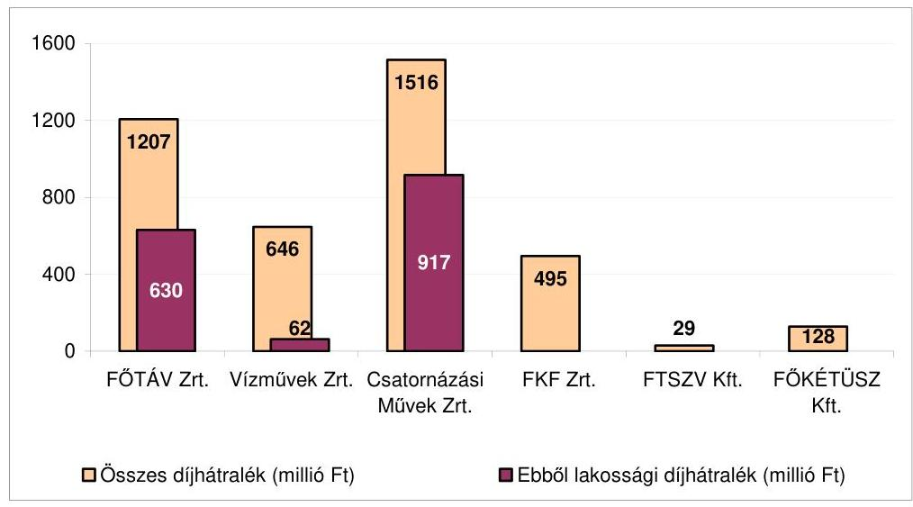

A díjhátralék állományának előző évhez viszonyított alakulása a 2005-2009-ig terjedő időszakban
(adatok %-ban)
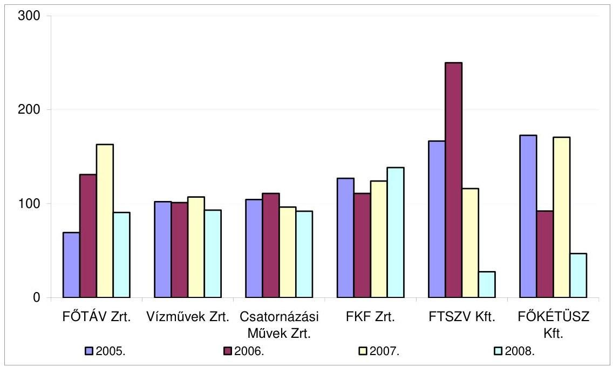

A FŐTÁV Zrt-nél a díjhátralékok alakulását számítógépes program segítségével követték. A számítógépes program lakossági és egyéb felhasználók szerinti bontásban, a fizetési késedelem időtartama szerint szolgáltatott információkat, kezelte a beszedésre vonatkozó intézkedéseket (felszólítási szintek, késedelmi kamatok, átadás díjhátralék-kezelésre a lakossági felhasználók tekintetében, illetve jogi úton való rendezés az egyéb felhasználó tekintetében). Elkülönítette az egyedi mérővel rendelkező lakossági fogyasztókat, akiknél nem fizetés esetén már két felszólítás után jogi úton való rendezést alkalmaztak.

---

A Vízművek Zrt-nél a díjhátralék alakulását a vevőállomány változásához rendelten, a vevőállomány összetételének elemzésével kísérték figyelemmel. A vevőállományt kezelő szervezeti egység vezetője írásos intézkedésben szabályozta a fizetési felszólítások rendjét. Az intézkedések eredményeképpen a lakossági díjhátralék a 2004-2006. évek közötti időszakban fokozatosan csökkent. A nem lakossági díjhátralék összege a 2004-2007. évek között növekedett, majd a 2008. évi behajtási intézkedések hatására mérséklődött. A Csatornázási Művek Zrt-nél kiemelten kezelték a fizetési elmaradás futamideje szerint megbontott, legnagyobb összegű, a jellemzően nem lakossági fogyasztók hátralékából álló állomány-csoportot. A behajtási tevékenységet év közben folyamatosan végezték. Az FKF Zrt. a fizetési késedelemmel érintett vevőállományra vonatkozó intézkedések rendjét belső szabályzatban rögzítette. A 30-90 nap közötti fizetési késedelemmel bíró díjhátralékosoknak fizetési felszólítást küldtek, 90 nap után saját behajtóik kezelték a követelésállományt. A 180 napon túli követeléseket külső (behajtó) szervezetek segítségével érvényesítették. A FŐKÉTÚSZ Kft. által alkalmazott számítógépes program a vevőköveteléseknél a fizetési határidő lejártát követően automatikusan előállította a fizetési felszólítást. A pénzügyi teljesítés fizetési felszólításra történő elmaradása esetén bírósági eljárást kezdeményeztek. A követelések bírósági eljárás keretében történő érvényesítésére ügyvédi megbízást rendszeresítettek. A díjhátralék beszedésére hozott intézkedéseik eredményesek voltak, a 2004-2008-ig terjedő időszak valamennyi évében 90%-ot meghaladó eredményességgel szedték be a díjhátralékot.

# 2.5.3. A fejlesztési döntések működési költségekre gyakorolt hatásának vizsgálata 

A FŐTÁV Zrt. fejlesztési döntéseit a távhő törvény előírásai befolyásolták, amely szerint 2010. június 30-ig be kell fejezni a felhasználói hőközpontok kialakítását. A FŐTÁV Zrt. elkészíttette a hosszútávú hőközpont újjáépítési programját ${ }^{38}$, melynek keretében a 2004-től 2018-ig terjedő időszakra vizsgálták a tervezett beruházások szükségességét, több változatban azok költség- és megtakarítás vonzatát, a finanszírozás forrásait, valamint a távhőszolgáltatás díjaira gyakorolt hatást. A 2008. évi beruházások tervezése során energiahatékonyságot javító projektek indítását tervezték.

A Vízművek Zrt. és a Csatornázási Művek Zrt. a fejlesztési döntéseknél elsődleges szempontként az ellátás biztonságát, műszaki indokoltságát vették figyelembe. A Vízművek Zrt-nél a műszaki és egyéb gazdálkodási kockázatokat elemző és értékelő monitoring rendszert fejlesztettek ki a hálózati rekonstrukciók tekintetében. A beruházási döntések előkészítése során az egyes beruházások gazdaságosságát és műszaki indokait komplex módon értékelték. A Csatornázási Művek Zrt-nél az egyes beruházások működtetésre gyakorolt hatását nem vizsgálták, a szervezési intézkedések, fejlesztések eredményre gyakorolt hatását a kontrolling rendszer működtetésével kísérték figyelemmel.

[^0]
[^0]:    ${ }^{38}$ Az Igazgatóság a 029/2003. számú határozatával döntött a megbízási szerződés keretében elkészített „a FŐTÁV Rt. hosszú távú fenntartási és fejlesztési elképzelései keretében megvalósítani tervezett hőközpont újjáépítési program" elfogadásáról.

---

Az FKF Zrt-nél a fejlesztési döntéseket elsősorban a feladat ellátása, a jogszabályi előírásoknak való megfelelés határozta meg, költségcsökkentő hatékonysági szempontokat a fejlesztéseknél nem vették figyelembe. A 2008. évi díjjavaslat számításakor a hatékonyság növeléséből származó költségmegtakarítás nem szerepelt.

Az FTSZV Kft. a 2006-2007. években fejlesztést nem végzett, mivel a csatornázott területek növekedésével az ellátandó közszolgáltatási feladat folyamatosan csökkent a főváros területén, a felszabaduló kapacitást vállalkozási tevékenység keretében - csatornatisztítás, fővároson kívüli folyékony hulladékszállítás, veszélyes hulladékszállítás - hasznosították.

A BTI Zrt-nél nem vizsgálták a fejlesztések működtetésre gyakorolt hatását a felújítási feladatoknál (ravatalozók tetőszerkezetének felújításánál), a sírhely gazdálkodási terv és a temető adottságok által meghatározott parcella kialakításoknál, valamint a sírrongálások miatt kiemelt hangsúlyt kapott biztonságot fokozó intézkedéseknél. Költséghatékonysági
 vizsgálatot végeztek a leghatékonyabb megoldásra egy hamvasztó üzem videó megfigyelő rendszere telepítésénél. A működtetés gazdaságossági szempontjai figyelembevételével döntöttek az új kerítésrendszer telepítéséről. A kiválasztott (bonthatatlan egységet képező) kerítésrendszer megakadályozza a temetői rongálásokat, elkerülve ezzel a szükséges javítások költségeit.

A FŐKÉTÚSZ Kft-nél a műszaki, illetve az ingatlan fejlesztési döntéseknél költséghatékonysági vizsgálatot nem végeztek. Mind a hazai, mind a külföldi szakkereskedelemben napjainkban jelentek meg a kémények ellenőrzésének hatékonyságát és a minőségvédelmet szolgáló eszközök. A szakmai eszközök, felszerelések választékának szélesedésével - a műszaki-szolgáltatási stratégiában foglaltak szerint - a következő időszak beszerzéseinél válik érvényesíthető szemponttá a műszaki-biztonsági követelményeknek megfelelő, hatékonyságot növelő fejlesztések előtérbe helyezése.

# 2.5.4. Szabad kapacitások az egyes közszolgáltatásoknál 

A FŐTÁV Zrt. a 2004-2008. évek között a távhőszolgáltatás terén kiépített kapacitását átlagosan 93%-ban használta ki, a szabad kapacitását nem hasznosította. A szabad kapacitás alakulását befolyásolta a hőfogyasztó objektumok számának 339 db-bal (a lakások számának 297 db-bal) való csökkenése a 2008. év harmadik negyedév végéig. A szabad kapacitások hasznosításának területi akadályai lettek volna, mivel a társasági szintű hőteljesítmény-kapacitás eltérő erőművi, fűtőművi kapacitáson alapult, amelyekből a hasznosítás csak a hozzájuk tartozó területen lett volna lehetséges a távhőszolgáltatás műszaki jellemzőiből adódóan.

A Vízművek Zrt. a számlázott vízmennyiség folyamatos csökkenése miatt növekvő szabad kapacitásokkal rendelkezett a közfeladatok ellátása terén. A 2004. évi 41%-os szabad kapacitás a 2008. évre 47%-ra növekedett. A Vízművek Zrt. szabad kapacitásait az agglomerációban elhelyezkedő települések részére átadott vízmennyiséggel hasznosította. A hasznosított szabad kapacitást a 2004-2007. évek közötti időszakban folyamatosan növelték

---

(13 millió $\mathrm{m}^{3}$-ről 16 millió $\mathrm{m}^{3}$-re), 2008-ban a hasznosított szabad kapacitás 15 millió $\mathrm{m}^{3}$-re csökkent. A szabad kapacitás hasznosításából származó egyéb bevétel a 2004. évi 718 millió Ft-ról 2008-ra 1042 millió Ft-ra emelkedett ${ }^{39}$.

A Csatornázási Művek Zrt. a főváros területén összegyűjtött és elvezetett szennyvíz tisztításához nem rendelkezett szabad szennyvíztisztító kapacitással.

Az FKF Zrt-nél a szilárdhulladék-kezelés tároló edények térfogatán alapuló kapacitásának kihasználása a 2004-2008. években 78-83% között alakult. A közszolgáltatás jellegéből adódóan a szabad kapacitás más tevékenységre nem volt hasznosítható. A tárolóedények kapacitás kihasználásának növelésére a kisebb térfogatú tárolóedények használata esetén díjkedvezményt biztosított az FKF Zrt.

Az FTSZV Kft. által ellátott folyékonyhulladék-kezelés közszolgáltatási feladat nagysága folyamatosan csökkent, a csatornázott területek növekedésével. Az ellátott közszolgáltatási feladat csökkenésével a 2008. évre a kapacitás kihasználás 41,3%-ra mérséklődött. A közszolgáltatásnál felszabaduló kapacitást a vállalkozási tevékenység keretében - csatornatisztítás, fővároson kívüli folyékony hulladékszállítás, veszélyes hulladékszállítás területén hasznosították. A szabad kapacitás hasznosításának legeredményesebb éve a 2006. volt, amelyben a hasznosításból elért árbevétel a 100 millió Ft-ot meghaladta.

A BTI Zrt. a temetések számának csökkenése miatt a kegyeleti közszolgáltatásoknál foglalkoztatott sírásók és ravatalozók felszabaduló munkaidejét belső munkaszervezéssel hasznosította, más közszolgáltatási feladatok, elsősorban a temető fenntartási tevékenység ellátásába történő bevonással. A temetői létesítmények közül a halotthűtők - temetések számának csökkenésével összefüggő - szabad kapacitás hasznosítása érdekében megkeresték a Fővárosi Önkormányzat kórházait, de kezdeményezésük sikertelen maradt.

A FŐKÉTÚSZ Kft. a közszolgáltatási feladatokkal összefüggésben nem rendelkezett szabad kapacitással. A kémények száma a 2004-2008. évek közötti időszakban évente átlagosan 5500 darabbal csökkent, ugyanezen időszak alatt a kéményseprők száma is mérséklődött. A változások hatásaként az egy kéményseprőre jutó kémények száma a 2006. évben 5253 darab, a 2007. évben 5283 darab volt.

[^0]
[^0]:    ${ }^{39}$ A Vízművek Zrt. a szabad kapacitás hasznosítása során a kitermelés helyétől az átadási pontig terjedően a vízkitermelés és a vízelvezetés arányos működtetési és fejlesztési költségei alapján kalkulált egyedi árat, melyet a vizet átvevő vízszolgáltató társaságokkal külön megállapodásban rögzített. Az átadott víz átlagára 2004-ben 55,23 Ft/m³, 2008-ban $69,46 \mathrm{Ft} / \mathrm{m}^{3}$ volt.

---

# 3. A díjmegállapítás folyamatába épített kontrollok működésének ellenőrzése 

### 3.1. A díjjavaslat összeállítása során a belső kontrollok működése a közszolgáltatóknál

A díjjavaslat kidolgozásának folyamatában az adatszolgáltatások egyeztetésén túl, a díjkalkuláció ellenőrzésére belső kontrollt nem alakítottak ki. A Vízművek Zrt., a Csatornázási Művek Zrt., az FKF Zrt., a BTI Zrt. Igazgatósága, és Felügyelő Bizottsága, a FŐKÉTÚSZ Kft-nél a vezetői értekezlet, valamint a Felügyelő Bizottság megtárgyalta a díjjavaslatokat. Az FTSZV Kft-nél a Felügyelő Bizottság alakította ki véleményét a díjjavaslatról. A FŐTÁV Zrt. Igazgatósága a 2007. évi, a Felügyelő Bizottsága a 2007. és a 2008. évi díjjavaslatot utólag - a Fővárosi Önkormányzathoz történő elküldést követően - tárgyalta meg, és fogalmazta meg véleményét. Az utólagos döntések a véleményezési feladatok formális elvégzését jelezték.

Az igazgatósági, a vezetői üléseken a díjjavaslattal kapcsolatos határozathozatal - az FKF Zrt. kivételével - egységes volt. Az FKF Zrt. igazgatósági ülésén a 2008. évi díjjavaslat határozathozatalánál fordult elő nem szavazat. A felügyelő bizottsági üléseken a 2007. évi díjjavaslat véleményezése során egyhangú vélemény a FŐKÉTÚSZ Kft-nél alakult ki. A többi közszolgáltatónál ${ }^{40}$ egy tartózkodás mellett hozták meg az előterjesztést elfogadó döntést. A felügyelő bizottsági tartózkodó szavazatok mögött egy esetben, illetve a 2008. évi díjjavaslat kegyeleti közszolgáltatások hatósági díjára vonatkozó „nem" szavazat mögött a díjak mértékével kapcsolatos ellenvetés húzódott meg.

A távhődíj 2008. évi díjjavaslatának véleményezése során - a felügyelő bizottsági ülés jegyzőkönyve szerint - a tulajdonosi érdekek képviseletével kapcsolatban felvetődött a Hálózat Alapítványba történő befizetések, a Hálózat Alapítvány működése felülvizsgálatának, valamint a távhő törvényben előírt beruházásokra képzett fejlesztési hányad díjban történő számbavételének kérdése.

### 3.2. A díjmegállapítás folyamatába épített kontrollok működése a Fővárosi Önkormányzatnál

A Fővárosi Önkormányzat szabályozása magában foglalta a díjmegállapításhoz kötődő ellenőrzési feladatokat. A főjegyző megbízásából a részére megállapított ellenőrzési feladat- és hatásköröket a Kommunális Ügyosztály látta el. A hivatali SzMSz és ügyrend 40. § (2) bekezdés m) pontjában a Kommunális Ügyosztály által ellátandó feladatok között rögzítette az egyes közszolgáltatásokra vonatkozó díjmegállapítás előkészítése során a szakmai ellenőrzési feladatok teljesítését. A Kommunális Ügyosztály belső működési szabályzata

- a Hulladékgazdálkodási Alosztály feladatául jelölte ki a települési szilárd- és folyékonyhulladék-kezeléssel, a kéményseprő-ipari és a kegyeleti közszolgáltatásokkal kapcsolatos hatósági díjak évenkénti felülvizsgálatára, és a

[^0]
[^0]:    ${ }^{40}$ A BTI Zrt. Felügyelő Bizottsága a 2007. évi díjjavaslatot nem tárgyalta meg.

---

díjemelés mértékére vonatkozó közgyűlési előterjesztések előkészítését, a közszolgáltatókkal kötött közszolgáltatási szerződésben foglalt szakmai feladatok, követelmények ellenőrzését,

- a Jogi és Közgazdasági Alosztály feladataként rögzítette az ivóvíz és a csatornadíj megállapítására vonatkozó közgyűlési előterjesztés előkészítését,
- a Közmű Közszolgáltatási Alosztály feladatkörébe sorolta a távhődíj megállapítására vonatkozó közgyűlési előterjesztés előkészítését.

A Közmű Közszolgáltatási Alosztály folyamatszabályozása nem tartalmazta a hatósági díjak ellenőrzésének feladatát, a 2008. évben életbe lépett negyedévenkénti hődíjváltozások FŐTÁV Zrt. által tájékoztatásul beküldött értékének ellenőrzési kötelezettségét. A Hulladékgazdálkodási és a Jogi és Közgazdasági Alosztályok folyamatszabályozásában előírták a beérkezett díjjavaslatok szakértői véleményeztetését. Mind a 2007. évi, mind a 2008. évi hatósági díjjavaslatok véleményezésére a Főpolgármesteri hivatal szakértői vélemény készítésére megbízási szerződést kötött egy-egy gazdasági társasággal. A megbízási szerződésekben a szerződés tárgyaként mindkét évben a díjjavaslat anyagának szakmai, szakértői véleményezését írták elő, a véleményezési feladatot a pénzügyi és árképzési kérdésekre, ezen belül a költségelemzésre és az egyes költségelemek előző évhez viszonyított emelkedésének indokoltságára irányították. A szakértői véleményezési feladatok kijelölésénél a kegyeleti közszolgáltatások és a kéményseprő-ipari közszolgáltatások hatósági díjai felülvizsgálatánál annak ellenére nem utaltak az önköltség-számítási szabályzat előírásai érvényesítésének ellenőrzésére, a hatósági díj önköltségszámítással való alátámasztottságának, az egyes díjtételek megalapozottságának helyszíni vizsgálatára, hogy a Fővárosi Önkormányzat szabályozásában a díjkalkuláció módszerét nem jelölte meg. A szilárd hulladék-kezelés hatósági díj felülvizsgálatával kapcsolatos megbízás nem terjedt ki a működési költségek csoportjainak, valamint a számviteli alátámasztottság ellenőrzésére, elemzésére.

A szakértőknek két hét és egy hónap közötti időtartam állt rendelkezésükre a véleményük kialakításához. A szakértői véleményekben foglaltak alapján a szakértők mindkét évben elfogadták a közszolgáltatók által javasolt hatósági díj emelési mértéket, nem változtattak a díjjavaslat egyes elemein a szilárd hulladék-kezelés, a kegyeleti és a kéményseprő-ipari közszolgáltatásoknál, illetve kiegészítő javaslatot tettek a távhődíj-javaslatok felülvizsgálata eredményeként. A szakértők kiegészítő javaslatait a díjjavaslatok előterjesztése során nem vették figyelembe.

A közbenső egyeztetés során a városfejlesztési, gazdálkodási és szociálpolitikai főpolgármester-helyettes észrevétele szerint: „A díjak megalapozatlanságára, az ellenőrzés hiányára vonatkozó megállapításuk pontosítást igényel, mivel a társaság által benyújtott javaslatot a szakmai ügyosztályok, a fogyasztóvédelem, a civil szervezetek, a Közgyűlés szakmai bizottságai és a miniszter véleménye - és ezek beépítése az előterjesztésbe - kerül jóváhagyásra, biztosítva a megfelelő kontrollt. Ennek a folyamatnak a részét képezi - és ezt az Együttműködési Megállapodás tartalmazza - az is, hogy az önkormányzat lakossági távhőszolgáltatás ármegállapítási kérelem Díjmechanizmus szerinti szabályszerűségét, valamint a hátteréül szolgáló számítások és adatok helyességét célzó ellenőrzés feladatának elvégzését megbízott szakértő vizsgálja felül, s alakít ki írásos álláspontot a díj jóváhagyását megelőzően."

---

A távhőszolgáltatás díj-megállapítási folyamatába épített kontrollokkal kapcsolatos észrevétel nem megalapozott, mivel az ellenőrzés nem a kontrollfolyamatok szabályozását, hanem azok működését, megfelelőségét kifogásolta.

A víz- és csatornadíj-javaslat felülvizsgálata során a díjmegállapítás módszerében, illetve tartalmában feltárt eltéréseket a szakértő dokumentáltan egyeztette és javította a közszolgáltatókkal. Nem minősítették megalapozottnak a szakértők az FTSZV Kft. díjjavaslatait a díjszámítás hiányosságai miatt, a véleményüket a bizottságok a díjjavaslat tárgyalása során figyelmen kívül hagyták.

A Közgyűlés bizottságai a közszolgáltatások 2008. évi hatósági díjjavaslatait a 2007. évi novemberi és decemberi üléseiken tárgyalták meg. (A 2007. évi díjjavaslat bizottsági véleményezése nem történt meg, mivel a 2006. évi önkormányzati választásokat követően a díjjavaslat véleményezésének időszakában a bizottságokat még nem hozták létre.) A Jogi és Ügyrendi Bizottság a hét közszolgáltatás hatósági díjjavaslatairól azonos szavazatarány - 67% „igen" szavazat és 33% „tartózkodás" - mellett alakította ki véleményét. A Jogi és Ügyrendi Bizottság ülésén egy-egy képviselői hozzászólás volt a kegyeleti közszolgáltatások díjaival kapcsolatban, amely a tájékoztatásban a szabad árak megjelenítését, illetve az előző évhez viszonyított díjnövekedés mértékét vitatta. A Pénzügyi és Közbeszerzési Bizottság ülésein a szilárd- és folyékonyhulladék-kezelés közszolgáltatások hatósági díjjavaslatai kivételével valamennyi hatósági díjjavaslatnál előfordult „nem" szavazat. A „nem" szavazatok átlagos aránya 19% volt. A Városüzemeltetési és Környezetgazdálkodási Bizottság hatósági díjjavaslatokkal összefüggő határozathozatalánál volt a legmagasabb az „igen" szavazatok aránya (89%).

Szavazati arány a Pénzügyi és Közbeszerzési Bizottság ülésén
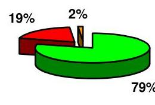

Szavazati arány a Jogi és Ügyrendi Bizottság ülésén
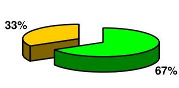

Igen Nem Tartózkodás

---

# Szavazati arány a Városüzemeltetési és Környezetgazdálkodási Bizottság ülésén 

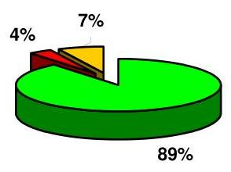

Igen Nem ■Tartózkodás

A nemmel szavazó, illetve tartózkodó bizottsági tagok nem fejtették ki álláspontjuk indokait.

A Fővárosi Önkormányzat betartva távhő törvény 10. § a) pontjában, a temetőkről szóló törvény 40. § (5) bekezdésében, az egyes közszolgáltatások kötelező igénybevételéről szóló törvény 5. § (4) bekezdésében foglaltakat, valamint az Ötv. 63/A. § j) pontjának vonatkozó előírását kikérte a fogyasztók területileg illetékes érdek-képviseleti szerveinek véleményét. A Fővárosi Civil Díjegyeztető
 Fórum szervezeteinek ${ }^{41}$ a közszolgáltatások 2007. évi és 2008. évi hatósági díjjavaslatát az előterjesztés aláírását követően, a bizottsági előterjesztésekkel egyidejűleg küldték meg. A szervezeteknek öt és 13 nap közötti időtartam állt a rendelkezésükre véleményük kialakítására. A fogyasztók területileg illetékes érdek-képviseleti szerveinek véleménye sokrétű volt.

A 2008. évre vonatkozó távhődijjavaslat esetében a fogyasztóvédelmi hatóság írásos véleményében támogatta az alapdíj-hődíj arány 35-65%-ra való módosítását, azonban nem tartotta a két induló díj közötti hődíjtételek megállapítását a fogyasztók részéről áttekinthetőnek. A felhasználói érdekképviseleti szervezetek a véleményezés során kifogásolták, hogy nem kaptak olyan alapadatokat, amelyek birtokában a bázis (induló) díjakról véleményt formálhattak volna. Ellentétesnek tartották a választható díjtételeknél a fizetésre vonatkozó feltétel kikötését a távhő törvényben előírtakkal. Egy felhasználói érdekképviseleti szervezet kifogást emelt az együttműködési megállapodás, a díjmechanizmus és a távhődíj önkormányzati rendeletet módosító rendelettervezetben rögzítettekkel kapcsolatban. Az együttműködési megállapodásban kifogásolta a díjkompenzációs rendszer jelenlegi formában való működtetését. Elfogadhatatlannak tartották, hogy a nem fizető fogyasztók miatti árbevétel-kiesést díjképző tételként a becsületesen fizető fogyasztókra terheljék. A távhődíj képzésének ellenőrzési feladataihoz szükségesnek tartották a formát és a módszert rögzíteni, s ennek eredményéről az elő-

[^0]
[^0]:    ${ }^{41}$ A Fővárosi Önkormányzat és a fogyasztók érdekképviseleti szerveinek kapcsolattartására kialakított és működtetett civil szervezeti fórum a Fővárosi Civil Díjegyeztető Fórum. A Fővárosi Civil Egyeztető Fórum tagjai: Lakásszövetkezetek és Társasházak Érdekvédelmi Egyesületének Budapesti Szervezete, Lakásszövetkezetek Országos Szövetsége, Magyar Energiafogyasztás Szövetsége, Nemzeti Fogyasztóvédelmi Hatóság, Nyugdíjasok Budapesti Szövetsége, Országos Fogyasztóvédelmi Egyesület, Panel Érdekképviseleti Egyesület.

---

terjesztésekben a Közgyűlést tájékoztatni. A Fővárosi Civil Díjegyeztető Fórum ülésén a 2008. évi szilárdhulladék-kezelés hatósági díjával kapcsolatban a hozzászólások között elhangzott, hogy a díjhátralékosokat támogató alapítványi befizetés ne legyen díjképző elem, valamint a 13,7%-os emelést magasnak tartották. A kegyeleti közszolgáltatások 2008. évi díjjavaslataihoz kötődően egy szervezet fogalmazott meg a részletfizetés lehetőségeire, a temetkezési szolgáltatást végző vállalkozások ellenőrzésére, valamint a szórásos temetés bővítésére kérdéseket. A kéményseprő-ipari közszolgáltatások 2008. évi díjjavaslatához kötődően két szervezet kifogásolta a tartalék kémények hatósági díját, illetve annak mértékét. Egy fogyasztóvédelmi szervezet nem tartotta előterjesztésre alkalmasnak az anyagot, tájékoztató jellegűnek minősítette azt.

A Fővárosi Civil Díjegyeztető Fórum szervei eltérő véleményeinek összefoglalását - az önkormányzati SzMSz 2. számú mellékletének 6. c) és d) pontjaiban előírtak ellenére, amely szerint a közgyűlési előterjesztéseknél a szakmai koordináció eredményeként az egyetértés vagy az egyet nem értés tényét, illetőleg azt a körülményt, hogy a megkérdezett szerv nem tett észrevételt, az előterjesztés első lapján fel kell tüntetni, valamint véleményezés esetén az előterjesztőnek csatolnia kell az eltérő vélemény lényegét, és ki kell térnie az ezzel kapcsolatos álláspontjára - a hatósági díjjavaslatok közgyűlési előterjesztései nem tartalmazták.

A Fővárosi Önkormányzat a 2007-2008. években nem járt el megfelelő gondossággal a távhőszolgáltatás hatósági díjának megállapításánál, mivel nem volt eredményes a távhődíj megállapítására irányuló tevékenysége, tekintettel arra, hogy a távhődíj megalapozottsága érdekében az együttműködési megállapodásban nem írta elő a lakossági távhőszolgáltatás költségeinek elkülönített számviteli nyilvántartását, nem megfelelően rendelkezett a 2007. és a 2008. évi díjmechanizmus egyes elemeiről, továbbá a díjmegállapítás folyamatába épített kontrollokat nem terjesztette ki az utókalkuláció ellenőrzésére. A lakossági távhőszolgáltatás költségeinek számviteli elkülönítése hiányában nem volt megítélhető a távhőszolgáltatás távhődíj általi fedezettsége. A Fővárosi Önkormányzat a távhőszolgáltatás folyamatosságának és biztonságának fenntartása mellett nem érvényesítette a fogyasztók érdekeit szabályozásában a fejlesztések fedezetének önálló díjelemként történő meghatározásánál, a Hálózat Alapítvány részére történő befizetés előírásánál a lakossági fogyasztók fizetőképessége fenntartása terhének áthárítása, az átláthatóság és az ellenőrizhetőség tekintetében, valamint a díjmegállapítás folyamatába épített kontrollok működtetésénél a távhőszolgáltatáshoz közvetlenül, illetve közvetett módon nem kapcsolódó költségek ellenőrzésének hiánya miatt.

A Fővárosi Önkormányzat a 2007-2008. években nem járt el megfelelő gondossággal a vízszolgáltatás hatósági díjának megállapításánál, mivel összességében annak ellenére nem volt eredményes a tevékenysége, hogy a megállapított vízdíj a Vízművek Zrt-nek fedezetet nyújtott az ártörvény és a szakmai törvény szerinti költségekre és eredményre. Azonban a vízdíj megalapozottsága érdekében a szindikátusi és menedzsment szerződésben nem írta elő a díjképlet alkalmazásának alapjául szolgáló 1997. évi bázis adatok teljes körű felülvizsgálatának időszakonkénti kötelezettségét, nem rendelkezett a szindikátusi és menedzsment szerződés módosításáról, és a menedzsment díj megszüntetéséről tekintettel a megváltozott körülményekre. A Fővárosi Önkormányzat a vízszolgáltatás folyamatosságának és biztonságának fenntartása mellett nem érvényesítette a fogyasztók érdekeit szabályozásában a Hálózat Alapítvány részére történő befizetésnél a lakossági fogyasztók fizetőképessége fenntartása terhének áthárítása, az átláthatóság és az ellenőrizhetőség tekintetében, valamint a díjmegállapítás folyamatába épített kontrollok működtetésénél a vízszolgáltatáshoz közvetlenül, illetve közvetett módon nem kapcsolódó költségek ellenőrzésének hiánya miatt.

A Fővárosi Önkormányzat a 2007-2008. években nem járt el megfelelő gondossággal a szennyvízelvezetés hatósági díjának megállapításánál, mivel összességében annak ellenére nem volt eredményes a csatornahasználati díj megállapítására irányuló tevékenysége, hogy a megállapított csatornahasználati díj a Csatornázási Művek Zrt-nek fedezetet nyújtott az ártörvény és a szakmai törvény szerinti költségekre és eredményre. Azonban a csatornahasználati díj megalapozottsága szempontjából a részvényesi szerződés nem tartalmazta a díjképlet alkalmazásának alapjául szolgáló 1997. évi bázis adatok teljes körű felülvizsgálatának időszakonkénti kötelezettségét, valamint a Fővárosi Önkormányzat a közüzemi szolgáltatási szerződésben nem írta elő a Csatornázási Művek Zrt. önköltség-számítási szabályzata hatályának kiterjesztését a szennyvízelvezetés közszolgáltatási tevékenységre. A Fővárosi Önkormányzat a szennyvízelvezetés folyamatosságának és biztonságának fenntartása mellett nem érvényesítette a fogyasztók érdekeit a fejlesztések fedezetének önálló díjelemként történő meghatározásánál, a Hálózat Alapítvány részére történő befizetés előírásánál a lakossági fogyasztók fizetőképessége fenntartása terhének áthárítása, az átláthatóság és az ellenőrizhetőség tekintetében, valamint a díjmegállapítás folyamatába épített kontrollok működtetésénél a szennyvízelvezetéshez közvetlenül, illetve közvetett módon nem kapcsolódó költségek ellenőrzésének hiánya miatt.

A Fővárosi Önkormányzat a 2007-2008. években nem járt el megfelelő gondossággal a szilárdhulladék-kezelés közszolgáltatás hatósági díjának megállapításánál, mivel nem volt eredményes a díjmegállapító tevékenysége, tekintettel arra, hogy a hatósági díj megalapozottsága érdekében szabályozása keretében nem adott útmutatást az FKF Zrt-nek az önköltség-számítás előírásainak, tartalmának kialakításához, nem írta elő a szilárdhulladék-kezelés hatósági díjában beszedett fejlesztési források, és befektetési hozamaik elkülönített számviteli nyilvántartását, nem rendelkezett a közszolgáltatás eredményéből a közszolgáltatáson kívüli tevékenységek veszteségének finanszírozási tilalmáról, valamint a díjmegállapítás folyamatába épített kontrollok működtetésénél nem gondoskodott a működési költségcsoportok és a számviteli alátámasztottság ellenőrzéséről. A Fővárosi Önkormányzat a szilárdhulladék-kezelés folyamatosságának és biztonságának fenntartása mellett nem érvényesítette a fogyasztók érdekeit a Hálózat Alapítvány részére történő befizetés előírásánál a lakossági fogyasztók fizetőképessége fenntartása terhének áthárítása, az átláthatóság és az ellenőrizhetőség tekintetében, továbbá a nem tervezett osztalékfelvételénél a más felhasználási céltól történő fedezetelvonás miatt, valamint a díjmegállapítás folyamatába épített kontrollok működtetésénél a szilárdhulladék-kezeléshez közvetlenül, illetve közvetett módon nem kapcsolódó költségek ellenőrzésének hiánya miatt.

A Fővárosi Önkormányzat a 2007-2008. években nem járt el megfelelő gondossággal a folyékonyhulladék-kezelés közszolgáltatás hatósági díjának megállapításánál, mivel nem volt eredményes hatósági díj megállapítására irányuló tevékenysége, tekintettel arra, hogy a díjak megalapozottsága érdekében szabályozása keretében nem rendelkezett a díjkalkuláció módszeréről, nem adott útmutatást az FTSZV Kft-nek az önköltség-számítás előírásainak, tartalmának kialakításához, valamint a díjmegállapítás folyamatába épített kontrollok működtetésénél figyelmen kívül hagyta a díjjavaslatok megalapozatlanságára utaló szakértői véleményeket. A folyékonyhulladék-kezelésnél a díjkalkuláció megalapozatlansága miatt nem volt megítélhető a közszolgáltatás hatósági díj általi fedezettsége. A Fővárosi Önkormányzat a folyékonyhulladék-kezelés folyamatosságának és biztonságának fenntartása mellett nem érvényesítette a fogyasztói érdekeket a díjmegállapítás folyamatába épített kontrollok működtetésénél, a folyékonyhulladék-kezeléshez közvetlenül, illetve közvetett módon nem kapcsolódó költségek ellenőrzésének hiánya miatt.

A Fővárosi Önkormányzat a 2007-2008. években nem járt el megfelelő gondossággal a kegyeleti közszolgáltatások hatósági díjai megállapításánál, mivel nem volt eredményes a hatósági díjak megállapítására irányuló tevékenysége, tekintettel arra, hogy a díjak megalapozottsága érdekében nem rendelkezett a közszolgáltatási szerződésben a díjkalkuláció módszeréről, nem adott útmutatást a BTI Zrt-nek az önköltség-számítás előírásainak, tartalmának kialakításához, továbbá a díjmegállapítás folyamatába épített kontrollokat nem terjesztette ki az önköltség-számítási szabályzat előírásai érvényesítésének ellenőrzésére, a hatósági díj önköltségszámítással való alátámasztottságának, az egyes díjtételek megalapozottságának vizsgálatára. A Fővárosi Önkormányzat a kegyeleti közszolgáltatások folyamatosságának és biztonságának fenntartása mellett nem teremtette meg az ellátás pénzügyi feltételeit, mivel a 2007. évben a köztemetők fenntartása, a halotthűtés és a temetőn belüli szállítás közszolgáltatási tevékenységek hatósági díjai nem nyújtottak fedezetet a BTI Zrt-nek a temetőkről szóló törvény szerinti költségekre.

A Fővárosi Önkormányzat a 2007-2008. években nem járt el megfelelő gondossággal a kéményseprő-ipari közszolgáltatás hatósági díjainak megállapításánál, mivel nem volt eredményes a hatósági díjak megállapítására irányuló tevékenysége, tekintettel arra, hogy a díjak megalapozottsága érdekében nem írta elő a közszolgáltatási szerződésben a közszolgáltatás költségeinek elkülönített számviteli nyilvántartását, nem rendelkezett a díjkalkuláció módszeréről, nem adott útmutatást a FŐKÉTÚSZ Kft-nek az önköltség-számítás előírásainak, tartalmának kialakításához, továbbá a díjmegállapítás folyamatába épített kontrollokat nem terjesztette ki a hatósági díj önköltségszámítással való alátámasztottságának, az egyes díjtételek megalapozottságának ellenőrzésére. A közszolgáltatás költségeinek számviteli elkülönítése hiányában nem volt megítélhető a kéményseprő-ipari tevékenység hatósági díj általi fedezettsége. A Fővárosi Önkormányzat a kéményseprő-ipari közszolgáltatás folyamatosságának és biztonságának fenntartása mellett nem érvényesítette a fogyasztói érdekeket a díjmegállapítás folyamatába épített kontrollok működtetésénél a kéményseprő-ipari közszolgáltatáshoz közvetlenül, illetve közvetett módon nem kapcsolódó költségek ellenőrzésének hiánya miatt.

A közbenső egyeztetés során a városfejlesztési, gazdálkodási és szociálpolitikai főpolgármester-helyettes észrevétele szerint: „eltérő szempontú következtetésekre ad alapot a vizsgálat azon megközelítése, miszerint akkor hatékony, illetve eredményes a Fővárosi Önkormányzat hatósági díjak megállapítására irányuló tevékenysége, ha

- szabályozta a hatósági díjak megállapításával kapcsolatos feladatokat és hatásköröket,
- gondoskodott a díjjavaslatok alátámasztottsága érdekében azok felülvizsgálatáról,
- a felülvizsgálat megállapításainak figyelembevételéről,
- előírta és érvényesítette a díjakkal való utólagos elszámolás kötelezettségét,
- a megállapított díj a közüzemi szolgáltatónak az ártörvény, illetve a szakmai törvény szerinti tartalomra biztosította a fedezetet, és a hatósági díj megállapítás során a tulajdonosi és a fogyasztói érdekeket a közszolgáltatás folyamatosságának és biztonságának fenntartása mellett érvényesítette.

Az észrevételezésre megkapott, egységes szerkezetű számvevőszéki jelentés ismeretében látható, hogy az ivóvíz- és csatorna hatósági ármegállapítás kivételével valamennyi esetben végkövetkeztetésként azt fogalmazták meg, hogy a Fővárosi Önkormányzat nem járt el megfelelő hatékonysággal és gondossággal hatósági díjának megállapításánál, mivel:

- nem rendelkezett a lakossági díjakat megalapozó költségek elkülönített nyilvántartásáról, a hatósági díjak utólagos elszámolási kötelezettségéről; a díjmegállapítás módszeréről,
- nem határozta meg a díjban figyelembe nem vehető költségelemeket, a közszolgáltatási díjak utólagos elszámolási kötelezettségét,
- az alátámasztó számítások hiánya miatt nem győződött meg a jóváhagyásra előterjesztett díjjavaslatok megalapozottságáról;
- a hatósági díjmegállapítás folyamatába épített kontrollok nem, vagy formális működése folytán nem győződött meg a díjjavaslatok megalapozottságáról
- utólagos elszámolási kötelezettséggel nem igazoltatta vissza a díjképzés módszerének megfelelőségét, valamint az előző évi díjak megalapozottságát.

A lefolytatott
 ellenőrzés ugyanakkor a Fővárosi Önkormányzat jogsértő eljárására nem tesz megállapítást, ily módon szabályszerűségi, célszerűségi javaslatot nem fogalmaz meg."

Az eredményesség megítélését szolgáló szempontrendszer nem ad lehetőséget eltérő következtetésekre, mivel kizárólag „igen" és „nem" válaszra nyújt lehetőséget, emiatt az észrevétel nem megalapozott.

Az eredményesség megítélésének szempontrendszerében nem szerepelt meghatározott jogszabályi előírásnak való megfelelés, ezért nem állapítottunk meg az eredményesség minősítésénél jogszabálysértést, emiatt az észrevétel nem megalapozott. Megállapítottuk azonban a közszolgáltatások hatósági díjavaslatai alátámasztottságának vizsgálata során, hogy a Fővárosi Önkormányzat a Hálózat Alapítványnak utalandó összeg meghatározására vonatkozó döntésénél megsértette az árak megállapításáról szóló 1990. évi LXXXVII. törvény 8. § (1)

---

bekezdésében, valamint a hulladékgazdálkodásról szóló 2000. évi XLIII. törvény 25. § (1)-(4) bekezdéseiben foglaltakat. (A jelentés-tervezetben a Fővárosi Önkormányzat egyes hatósági díjak megállapítására irányuló tevékenységének eredményességét ítéltük meg, hatékonyságát nem minősítettük.)

Budapest, 2009. szeptember „ 1 "
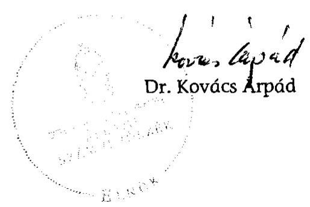

---

# BUDAPEST 

## Városfejlesztési, Gazdálkodási és Szociálpolitikai Főpolgármester-helyettes

Ikt. szám:
Hiv.sz.: V-3007-56/2008-2009.
Tárgy: a hatósági díjak megállapításáról szóló vizsgálati jelentés észrevételezése

$$
V-3007-57 / 2008-09
$$

## Állami Számvevőszék

Dr. Kovács Árpád elnök úr részére

## Tisztelt Elnök Úr!

A „Budapest Főváros Önkormányzatának egyes hatósági díjak megállapítására irányuló tevékenysége ellenőrzéséről" szóló [V-3007-56 sz.] számvevőszéki jelentésüket köszönettel kézhez kaptam. Az elmúlt évben megkezdett, hét fővárosi gazdasági társaságra, valamint a Fővárosi Önkormányzatra kiterjedő helyszíni vizsgálatuk alapján az elmúlt időszakban munkatársaival több személyes és írásos egyeztetésre került sor. A végleges jelentés alapján úgy ítélem meg, hogy a 2007. és 2008. évekre vonatkozó szilárd- és a folyékony hulladék, a távhőszolgáltatás, a kéményseprés, a kegyeleti, az ivóvíz és a csatornadíj megállapítás megalapozottságának és eredményességének megítélése tekintetében az eltérő vélemények fennmaradtak.

Korábbi részletes észrevételeinkre tekintettel a következőkben valamennyi díj-megállapítást, társaságot és javaslataikat is érintő általános észrevételt tesszük.

A teljesítményellenőrzés módszerével végzett vizsgálatuk jellegére tekintettel a helyi önkormányzatokról szóló 1990. évi LXV., az árak megállapításáról szóló 1990. évi LXXXVII., a gazdasági társaságokról szóló 2006. évi IV. törvény és az ágazati törvények által meghatározott keretekben a Fővárosi Önkormányzat feladatkörébe utalt ár/díjmegállapító feladat végrehajtásának és további lehetőségeinek megítélése szakmai nézetkülönbségre ad okot, noha a vizsgálat korrekt, egymást segítő légkörben zajlott le.

Tiszteletben tartva az alkalmazott vizsgálati módszert és megállapításaikat, változatlan az az álláspontunk, hogy a vizsgált társaságok gazdálkodási nagyságrendjére figyelemmel az elő- és utókalkulációs költségadatai tekintetében alkalmazott un. lényegességi szint mértéke aránytalanul alacsony (az egyes költségadatok különbsége az 5%-ot és legalább 1 millió Ft.-ot nem haladhatja meg.)

[^0]
[^0]:    1052 Budapest, Városház utca 9-11. | levélcím: 1840 Budapest | telefon: 06-1-327-1870| fax: 06-1-327-1983, e-mail: ikvaiszl(budapest.hu]

---

Fenntartott álláspontjuk és egyben javaslatuk is, hogy a Fővárosi Önkormányzatnak, mint árhatóságnak rendelkeznie kell díjkoncepcióval. E tekintetben ismételten jelzem, hogy díjkoncepció készítésének kötelezettségét egyik érintett jogszabály sem tartalmazza. Önök által sem vitatottan ugyanakkor valamennyi díj esetében a vonatkozó rendeleteink tartalmazzák az ár/díjképzés rendjét és módját, valamint a mögöttes, az adott társasággal kötött megállapodások annak részleteit is tartalmazzák. A díjkoncepció hiánya a Fővárosi Önkormányzat ár/díjmegállapító tevékenységének megítélését nem ronthatja.

Az érintett társaságok számviteli politikáját, a kalkulációs egységeket, az elő és utókalkulációját érintő megállapításaik és javaslataik tekintetében utalni kell a gazdasági társaságokról szóló 2006. évi IV. törvény (továbbiakban: Gt.) hatályos jogszabályi követelményeire. A Gt. szabályozza az alapítói, illetve részvényesi feladat- és hatásköröket, kimondja, hogy a gazdasági társaság legfőbb szervének feladata elsősorban a társaság alapvető, stratégiai ügyeiben való döntés." (Gt. 19.§. (3) bek.), és többek között a számviteli törvény szerinti beszámoló elfogadása, a könyvvizsgáló kiválasztására és beszámolójának megvitatása. A Gt. egyidejűleg szabályozza az ügyvezetés társaság irányításával összefüggő feladatokat is (21.§ (1) bek.). Egyértelműen rögzíti, hogy a gazdasági társaság ügyvezetésének vezető tisztségviselője feladatát önállóan látja el, és e minőségében csak a jogszabályoknak, a társasági szerződésnek, valamint a társaság legfőbb szerve határozatainak van alávetve, a gazdasági társaság tagjai (részvényesei) által nem utasítható. A Gt. szabályozza továbbá a gazdasági társaság működésének tulajdonosi és közérdekvédelmi ellenőrzésével összefüggő feladatokat is, így a felügyelőbizottság létrehozásának, illetve a könyvvizsgáló alkalmazásának feltételeit. A felügyelőbizottság alapfeladata a társaság ügyvezetésének ellenőrzése a tulajdonosok érdekében, tevékenységéért a tagoknak (részvényeseknek) tartozik felelősséggel. Ellenőrzési feladatkörében véleményezi a társaság számviteli törvény szerinti beszámolót is (35.§ (2) bek.). A könyvvizsgáló feladata, hogy gondoskodjon a számviteli törvényben meghatározott könyvvizsgálat elvégzéséről, és ennek során mindenekelőtt annak megállapításáról, hogy a gazdasági társaság számviteli törvény szerinti beszámolója megfelel-e a jogszabályoknak, továbbá megbízható és valós képet ad-e a társaság vagyoni és pénzügyi helyzetéről, működésének eredményéről (Gt. 40. § (1) bek.).

Előzőekből következően, figyelemmel az Ötv. által az önkormányzati feladat- és hatáskörökre tekintettel vitatom, hogy az egyes társaságok önköltség-számítási előírásai tartalmának kialakításához útmutatást a Fővárosi Önkormányzatnak lehet meghatároznia. E tekintetben sem feladat-, sem hatásköre nem állapítható meg az önkormányzatnak.

A társasági gazdasági eseményekkel összefüggő - függetlenül attól, hogy a fogyasztók mely irányába irányult - szolgáltatás nyújtása, ellenértékének megállapítása elsődlegesen a társaság gazdálkodásáért felelős ügyvezetői kör felelőssége, így annak is, hogy a közszolgáltatás irányába milyen mértékű díjak, kalkulációk rendszere alakítandó ki. E folyamatokra a Fővárosi Önkormányzatnak - mint alapítónak -, sajátos jogi helyzetéből adódóan van ráhatása. A Fővárosi Önkormányzatnak ugyanakkor szükségszerűen támaszkodnia kell az adott társaság Felügyelő Bizottságának, könyvvizsgálójának munkája mellett azon szakértők tevékenységére és véleményére, amelyek a tárgyévi ár/díj-megállapítási javaslat elfogadási javaslatát alátámasztják.

Álláspontunk szerint a Fővárosi Önkormányzat rendeleteiben, mögöttes megállapodásaiban maximálisan törekedett arra, hogy a valóságos költségek mentén alakítsa ki díjavaslatát.

---

A távhőszolgáltatási díj esetében tett megállapításaik tekintetében kifogás tárgya a fejlesztési díjhányad alkalmazása. Az árak megállapításáról szóló 1990. évi LXXXVII. törvény határozza meg pontosan az árképzés módját, azaz a legmagasabb árat úgy kell megállapítani, hogy a hatékonyan működő vállalkozó ráfordításaira és a működéséhez szükséges nyereségre fedezetet biztosítson, tekintettel az elvonásokra és a támogatásokra is (8.§ (2) bek.). Erre tekintettel a Fővárosi Közgyűlés által elfogadott díjtartalom meghatározása jogszerűen fogalmazza meg, hogy a távhődíj fedezze az indokolt költségeket és ráfordításokat, nyújtson fedezetet a jogszabályban előírt beruházásokra, vagyis a gazdálkodónak ki kell termelnie a jogszabályban előírt beruházások forrásait is.
Az ártörvény egyebekben további díjkoncepció kialakítására nem jogosít fel. Felhívnám egyben a figyelmet arra is, hogy ugyanezen törvény hatálya alá tartozik a gáz árának megállapítása is amely a távhőszolgáltatás egyik alapja -, viszont ármegállapító hatáskört nem a főváros számára biztosít.

A díjak megalapozatlanságára, az ellenőrzés hiányára vonatkozó megállapításuk pontosítást igényel, mivel a társaság által benyújtott javaslatot a szakmai ügyosztályok, a fogyasztóvédelem, a civil szervezetek, a Közgyűlés szakmai bizottságai és a miniszter véleménye és ezek beépítése az előterjesztésbe kerül jóváhagyásra, biztosítva a megfelelő kontrollt. Ennek a folyamatnak a részét képezi - és ezt az Együttműködési Megállapodás tartalmazza - az is, hogy az önkormányzat lakossági távhőszolgáltatás ár-megállapítási kérelem Díjmechanizmus szerinti szabályszerűségét, valamint a hátteréül szolgáló számítások és adatok helyességét célzó ellenőrzés feladatának elvégzését megbízott szakértő vizsgálja felül, s alakít ki írásos álláspontot a díj jóváhagyását megelőzően.

Javaslataikat illetően e helyütt szükséges jeleznem, hogy a távhőszolgáltatás versenyképesebbé tételéről szóló 2008. évi LXVII. törvény 2009. január 1-i hatállyal módosította az árak megállapításáról szóló 1990. évi LXXXVII. törvény előírásait is, új alapokra helyezte a távhőszolgáltatással kapcsolatos feladat- és hatásköröket, jelentősen módosítva a főváros díjmegállapító feladatait. A távhőszolgáltatás versenyképesebbé tételéről szóló 2008. évi LXVII. törvény 11.§-a szerint 2009. július 1-jétől a Magyar Energia Hivatal látja el az ármegállapítással összefüggő feladatokat. Ugyanezen törvény 14. §-a szerint A távhőszolgáltatás csatlakozási díjának és a lakossági távhőszolgáltatás díjának megváltoztatását a távhőszolgáltató kezdeményezi, amely kezdeményezésről a Magyar Energia Hivatal közigazgatási hatósági eljárás keretében 30 napon belül dönt. A jogerős határozatot és a távhőszolgáltató kezdeményezését együtt kell megküldeni az önkormányzatnak, amely azokat képviselő-testületi ármegállapítás előtt 5 nappal köteles a honlapján.
Ezen új törvényi szabályozás mindenképpen igényli javaslataik felülvizsgálatát.

Az ivóvíz-szolgáltatás esetében a Fővárosi Önkormányzat irányába megfogalmazott kifogásuk tekintetében a bázis adatok időszakos felülvizsgálata, az osztalékalapú elszámolás, valamint a támogatások díjban való figyelembe vételének kérdései a Szindikátusi-és Menedzsment Szerződés feltételeit érintik. Ezekben a kérdésekben a jelenleg folyamatban lévő, szerződésmódosításra irányuló tárgyalásokon a Tulajdonosoknak kell megegyezni. A bázisadatok időszakos felülvizsgálatával kapcsolatos javaslatot megfelelő óvatossággal kell kezelni, mivel a nem megfelelően gondos, automatikus alkalmazás kockázatot jelenthet a Társaság jövedelmezőségére vonatkozóan. A tényadatokhoz való igazítás esetén is biztosítani kell a megfelelő jövedelmezőséget, az árak megállapításáról szóló 1990. évi LXXXVII. Törvény

---

rendelkezéseinek ${ }^{1}$, valamint az EU Víz Keretirányelveknek megfelelően ${ }^{2}$. Nem indokolt a bázisadatok felülvizsgálata, mivel azok tényadatokra épülnek, folyamatos korrekcióval.
A támogatások díjban való figyelembe vételével kapcsolatban jelzem, hogy a hatályos díjképlet finanszírozási szemléletű, a nyújtott támogatások is kiadást jelentenek. Korrekciós elemként azért szerepelnek a díjban, mivel az induló értékek ezeket a kiadásokat nem tartalmazták. Az alkalmazott gyakorlat teljes mértékben megfelel az SZMSZ-ben, valamint a 2000. évi tulajdonosi Megállapodásban foglaltaknak.
A Hálózat Alapítványnak fizetett támogatást a társaság a Fővárosi Közgyűlés döntése alapján biztosítja, helyes célt szolgál és rendkívül jól működik az utóbbi évek tapasztalatai szerint.

A csatorna-szolgáltatás esetében a csatornahasználati díjban képzett fejlesztési díjhányad álláspontunk szerint nem kifogásolható, különös tekintettel arra, hogy az FCSM a hatályos jogszabályi előírások és a Közüzemi Szerződés alapján végzi tevékenységét, a csatornahasználati díj megállapítására szolgáló, jelenleg hatályos díjképlet tartalmi elemeivel, illetve a díjszámítás módszertanával összefüggésben jogszabálysértés megállapítására nem került sor.

A díjképlet időközönkénti felülvizsgálata, módszertanának pontosítása, továbbá a díjkompenzációra fordított összeg díjelem, illetve a fejlesztési hányad megszüntetése a Részvényesi Szerződés és a Közüzemi Szerződés módosítását igényli, amelyhez a részvényesek közös döntése szükséges. A vizsgálat megállapításaira tekintettel a részvényesek döntéshozatalát kérő előterjesztést készítünk a végleges jelentés ismeretében.
Amennyiben az Állami Számvevőszék ajánlásának eleget téve, a fejlesztési hányad nem kerül beépítésre a csatornaszolgáltatás díjába, úgy ez azt is jelenti, hogy a Fővárosi Önkormányzat elesik attól a lehetőségtől, hogy a lakossági teherviselő-képességet figyelembe véve, a fokozatosság elve alapján beépítse a csatornaszolgáltatás díjába azokat a fejlesztési forrásigényeket, amelyekre a bérleti díj nem nyújt fedezetet. ${ }^{3}$
A fejlesztési hányad törlésére vonatkozó ajánlás jogszabályi megalapozottságát a számvevői jelentés nem tartalmaz.

[^0]
[^0]:    ${ }^{1}$ 8.§ (1) A legmagasabb árat úgy kell megállapítani, hogy a hatékonyan működő vállalkozó ráfordításaira és a működéshez szükséges nyereségre is fedezetet biztosítson, tekintettel az elvonásokra és a támogatásokra is.
    2 A Víz Keretirányelv a minőségi kötelezettségeken túl előírja, hogy

    - a tagállamoknak a vízszolgáltatásoknál figyelembe kell venniük a költség-visszatérülés elvét, valamint a környezeti- és vízkészlethez kapcsolódó költségeket,
    - a vízdíjak megállapításánál biztosítani kell a teljes

 költségmegtérülés elvét, beleértve a beruházásokat is,
    - a vízáraknak a vízkészletek hatékony felhasználására való ösztönzést kell támogatniuk,
    - az okozó fizet elv figyelembe vételével megfelelő díjat kell megállapítani a különböző használók felé.

    A tagállamok a végrehajtás során szociális, földrajzi és gazdasági hatásokat és környezeti szempontokat is figyelembe vehetnek. A költségeket fedező vízárak követelményének végrehajtását 2010-ig teljes mértékben meg kell valósítani.
    ${ }^{3}$ Megjegyzés: A víziközművek ágazati sajátossága a beruházás-igényesség. A rendszerváltást megelőzően ebben az ágazatban állami forrásból valósultak meg a víziközmű fejlesztések. A rendszerváltást követően az önkormányzatokra hárult a feladat, de nem kaptak hozzá forrást, ezért fejlesztés esetén a korábbi csak amortizációt tartalmazó (egyszeri újratermelést biztosító) ár helyett olyan díjat alkalmaztak, mely fejlesztési hányadot is tartalmazott (azaz a bővített újratermelés egy részére is fedezetet nyújtott). Magyarországon és ezen belül Budapesten sem teljes a csatornahálózat, azaz nem $100 \%$-os sem a csatornázottság, sem a szennyvíztisztítás. Minden fővárosi lakost megilleti a közműcsatlakozás joga, egy olyan szolgáltatás esetében, ami közegészségügyi és környezetvédelmi szempontokból egyaránt fontos. Ennek biztosításához szükséges a csatornahálózat (szennyvíz-elevezetés, -átemelés és -tisztítás) fejlesztése. Fejlesztés hiányában a meglévő „ellátatlan" állapot konzerválódik.

---

A megfogalmazott javaslataik észrevételünkben foglaltakra figyelemmel hajthatók végre. Külön kiemelem ugyanakkor a szilárd-, a folyékony hulladékkezelés, a kegyeleti szolgáltatások esetében, hogy a közszolgáltatás ellátására az Európai Unió 842/2005/EK (2005. november 28.) irányelveinek megfelelő közszolgáltatási keretszerződés, és 2009. évre vonatkozó éves szerződések megkötésére került sor.
A Főváros az EK-Szerződés 86. cikke (2) bekezdésének az általános gazdasági érdekű szolgáltatások működtetésével megbízott vállalkozásoknak közszolgáltatással járó ellentételezés formájában megítélt állami támogatásokra történő alkalmazásáról szóló, az Európai Bizottság 842/2005/EK számú (2005. november 28.) határozatának rendelkezéseivel összhangban kidolgozta a 10 éves futamidejű Közszolgáltatási Keretszerződést, melyet a PM Támogatásokat Vizsgáló Irodája is jóváhagyott. A Főváros Közgyűlése a Közszolgáltatási Keretszerződés és a Keretszerződésen alapuló, az éves közszolgáltatási feladatokról és díjszámításról szóló Éves Közszolgáltatási Szerződés jóváhagyásával határozza meg a közszolgáltatások díjára vonatkozó díjkoncepciót, tekintettel arra, hogy a Közszolgáltatási Keretszerződés szabályozza a díjak (kompenzáció) tervezésének általános számítási modelljét, mellyel összhangban az Éves Közszolgáltatási Szerződések határozzák meg a tárgyévi díjakat. A Keretszerződés részletesen meghatározza a díjba beépíthető indokolt költség- és ráfordítástételeket, szabályozza, hogy az indokolt költségeken felül közszolgáltató a díjban ésszerű nyereséget is jogosult érvényesíteni. A Közszolgálati Keretszerződések, illetve Éves Szerződések ugyancsak rendelkeznek a keresztfinanszírozás, a társasági működés hatékonysága ösztönzése kérdésében. A közszolgálati keretszerződések felülvizsgálata, szükség esetén kiegészítése az Éves Szerződés tapasztalatai alapján, a következő éves szerződés előkészítése időszakában célszerű.

A díjkialakítás rendjére vonatkozóan örömmel láttam, hogy javaslattal élnek a Pénzügyminisztérium irányába is, amely szerint Önök is szükségesnek tartják az ártörvény előírásainak és az Európai Unió előzőekben hivatkozott irányelveinek összeegyeztetését. Ennek megvalósulása várhatóan nagymértékben elősegíti jövőbeni munkánkat, az egységes eljárást és megítélést.

Végezetül megköszönöm Ön és munkatársai munkáját, egyben kérem észrevételeink figyelembevételét.

Budapest, 2009. augusztus 10.

# Üdvözlettel: 

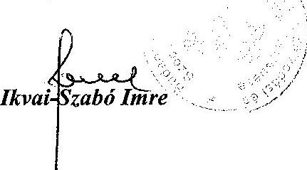

---

2. számú melléklet a V-3007/2008-2009. számú jelentéshez

H-1051 BUDAPEST V., JÓZSEF NÁDOR TÉR 2-4. POSTACIM: 1369 BUDAPEST, POSTAFIÓK 481.

TELEFON: (36-1) 327-2100, (+36) 30 371-2100
FAX: (36-1) 318-2570

PÉNZÜGYMINISZTER

# ÁLLAMI SZÁMVEVŐSZÉK 

$6215 / 2009$ 28.17.
Iktatószám: $\qquad$
Melléklet: $\qquad$

## Dr. Kovács Árpád úr

elnök

## Állami Számvevőszék

Budapest

## Tisztelt Elnök Úr!

Az Állami Számvevőszék Budapest Főváros Önkormányzatának egyes hatósági díjak megállapítására irányuló tevékenysége ellenőrzéséről készített jelentését köszönettel megkaptam.

A jelentés pénzügyminiszternek címzett javaslata tekintetében a következőkről tájékoztatom.
A kormány már korábban felismerte, hogy a hatósági árszabályozás folyamatos korszerűsítésére szükség van. Ezt 2004-ben a J/9450. sz. jelentésében (előterjesztő: Dr. Draskovics Tibor pénzügyminiszter) az Országgyűlés elé tárta. A jelentésben lefektetett szakmai álláspont szerint az egyes szakterületeket azok műszaki és gazdasági sajátosságainak megfelelően kell szabályozni, beleértve az esetleges árszabályozási kérdéseket is, arra az árak megállapításáról szóló 1990. évi LXXXVII. tv. (ártörvény) keretjellege miatt nem alkalmas. Ennek megfelelően a hatósági árszabályozás folyamatosan szaktörvényi keretekbe kerül át.

A szaktörvényi alapú árszabályozás egyes területeken már régóta működik (pl. hulladékgazdálkodás), több jelentős területen az elmúlt években megvalósult (pl. villamos energia), más területeken előkészítés előtt áll (pl. vízgazdálkodás).

Legutóbbi ilyen változás az új gázpiaci modellt tartalmazó törvény - benne az árszabályozási fejezettel - életbeléptetése, illetve a távhőszolgáltatásról szóló törvény árfejezetének bővítése volt. Ezen és más (korábban életbe lépett) szaktörvények vagy felhatalmazásuk alapján kiadott rendeletek részletes és specifikus szabályokat tartalmaznak - többek között - a költségek számba vételére, elkülönítésre, a hatósági ár megállapításának részleteire, illetve az egyetemes szolgáltató ár kiszámításának és jóváhagyásának menetére. A jövőre nézve is ezen irányvonal továbbvitelét tartom szakmailag megalapozottnak.

---

A kormány folyamatosan dolgozik az önkormányzatok árhatósági szabályozásának felülvizsgálatán, és a felmerülő anomáliákra a törvényi környezet megváltoztatásának kezdeményezésével ad választ. Erre példa, hogy a távhőszolgáltatásról szóló törvény ármegállapításról szóló fejezetének említett bővítése - amelyre a kormány javaslata alapján került sor - számos, az Állami Számvevőszék jelentésében a FŐTÁV Zrt. által alkalmazott díjak kapcsán most felvetett kérdés megoldására alkalmas azzal, hogy szakhatósági vizsgálat előírásával erősíti a hatósági ár megalapozottságát.

A kormány a jövőben is folytatja a hatósági árszabályozás modernizálására irányuló munkát, amely során az ÁSZ ezen jelentéséből leszűrhető tanulságokat is fel fogja használni.

Az ártörvénynek a 2005/842/EK bizottsági határozattal való összeegyeztetésével kapcsolatban a jelentésben megfogalmazott állításokra vonatkozó meglátásom a következő.

Véleményem szerint a két szabályozás fókusza nem azonos. A bizottsági határozat a közszolgáltatási tevékenységhez nyújtott állami ellentételezés mértékének megállapításáról, illetve annak minősítéséről, míg az ártörvény egyes hatósági árak megállapításának keretszabályairól szól. Az ártörvény szándéka szerint nem irányul a közszolgáltatások teljes körű szabályozására.

A közgazdasági-szabályozási logika alapján egy közszolgáltatást végző vállalat (közszolgáltatási tevékenységével összefüggésben) elfogadható indokolt bevétele az indokolt, ellenőrzött költségek és indokolt, ellenőrzött profit összege. Ha ez a közszolgáltatás árbevételéből nem biztosított, a szükséges mértékig állami támogatás adható (a bizottsági határozat alapján a támogatás mértékének megállapításakor kell vizsgálni, hogy nem áll-e elő túlzott mértékű nyereség). Az ártörvény az árbevételre (a hatósági ármegállapításra) koncentrálva adottságként tekint a támogatásra, míg a bizottsági határozat a támogatásra koncentrálva az árbevételt tekinti adott tényezőnek.

A bizottsági határozatban, illetve az ártörvényben a közszolgáltatással összefüggésben realizálható, elismerhető és indokolt mértékű nyereségre használt fogalmak jól működő szabályozás esetén azonos eredményre vezetnek. Az ártörvény - mivel keretjellegű jogszabályként funkcionál, valamint nem kizárólag közszolgáltatásokra vonatkozik - tágabb és általánosabb megfogalmazást használ. Ez nem lehet akadálya annak, hogy a közszolgáltatások esetleges támogatása (árbevétellel nem fedezett indokolt költségek megtérítése) vizsgálatakor további, szigorúbb szabályok érvényesüljenek. Ennek megfelelően álláspontom szerint a két megközelítés között nincs közgazdasági-szabályozási ellentmondás.

Mindezek miatt nem tartom ellentétesnek a bizottsági határozat „ésszerű" és az ártörvényben megfogalmazott „működéshez szükséges" nyereség meghatározását. A bizottsági határozat megfogalmazása szerint az ellentételezés számításához a „ésszerű nyereség" az ágazat átlagos nyeresége (vagy más hasonló ágazatok nyeresége alapján kalkulált mérték), utóbbi pedig az ártörvény 8. §-a szerint a „hatékonyan működő" vállalkozásra vonatkozik („tekintettel az elvonásokra és támogatásokra is"). Az elfogadható, indokolt nyereség konkrét mértéke csak az adott ország adott közszolgáltatása aktuális költségeinek és a piaci viszonyok ismeretében határozható meg. A jogszabályi előírásnak megfelelő nyereség mértékének konkretizálása a hatósági ár megállapítójának feladata. A vizsgálat tárgya Budapest Főváros Önkormányzata képviselőtestülete önálló árhatósági tevékenysége volt. Az önkormányzatok ezen jogosítványára a kormánynak, így a pénzügyminiszternek közvetlen ráhatása nincs.

---

Az Állami Számvevőszék által tett azon megállapítás, mely szerint a Fővárosi Önkormányzat árhatóságként nem rendelkezik díjkoncepcióval és így elégtelenül látta el árhatósági funkcióját, véleményem szerint nem vezethető le a jelentésben vélelmezett - álláspontom szerint a vizsgált formában nem releváns - hiányosságból.

Budapest, 2009. augusztus 14.

Üdvözlettel:
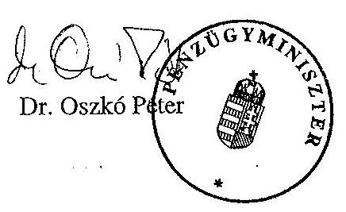

---

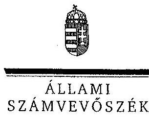

ELNÖK

# Dr. Demszky Gábor úr 

főpolgármester
Budapest Főváros Önkormányzat
Főpolgármesteri Hivatala

## Budapest

## Tisztelt Főpolgármester Úr!

Köszönettel vettem Budapest Főváros Önkormányzatának egyes közszolgáltatások hatósági díjai megállapítására irányuló tevékenysége ellenőrzéséről készült jelentéshez, Iklvai-Szabó Imre Főpolgármester-helyettes úr által tett észrevételeit, magyarázatát, amelyekkel kapcsolatban az alábbiakban tájékoztatom.

Jelzem, hogy a 70/595/2/2009. számú észrevételében foglaltakkal egyező véleménye az észrevételére adott válaszainkkal együtt már beillesztésre került a jelentésbe.

A távhőszolgáltatás díj-megállapítási feladataira vonatkozó - a távhőszolgáltatás versenyképesebbé tételéről szóló 2008. évi LXVII. törvénynek a 2009. július 1-jével hatályba lépő rendelkezései alapján - észrevétele figyelembevételével módosítottuk a főpolgármesternek tett 5. számú, illetve a főjegyzőnek tett 1/b. számú javaslatainkat. Megítélésem szerint a távhődíjjal kapcsolatos további javaslataink a távhőszolgáltatással összefüggő, módosuló szabályozása során hasznosíthatók.

A vízdíj megalapozottsága érdekében fenntartjuk javaslatunkat a díjképlet alkalmazásának alapjául szolgáló 1997. évi bázisadatok teljes körű felülvizsgálatának időszakonkénti kötelezettségére vonatkozóan, mivel az ellenőrzés tapasztalatai alapján a bázisadatok felülvizsgálata nem volt teljes körű.

Az ellenőrzés lefolytatásához nyújtott segítő közreműködését köszönöm.
Budapest, 2009. augusztus 26.
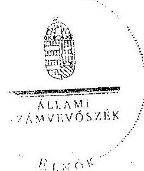

Tisztelettel:
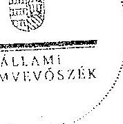

Dr. Kovács Árpád

---

# Dr. Oszkó Péter úr pénzügyminiszter 

Pénzügyminisztérium

Budapest
József nádor tér 2-4.
1051

## Tisztelt Miniszter Úr!

Köszönettel vettem Budapest Főváros Önkormányzatának egyes közszolgáltatások hatósági díjai megállapítására irányuló tevékenysége ellenőrzéséről készült jelentéshez tett észrevételeit, kiegészítő magyarázatát. Örömömre szolgált, hogy a hatósági árszabályozás korszerűsítése során felhasználást nyernek a jelentés egyes megállapításai. Észrevételeivel kapcsolatban az alábbiakban tájékoztatom.

A Fővárosi Önkormányzatnak az árhatósági feladatai ellátása során egyidejűleg kellett alkalmaznia az ártörvény előírásait és az Európai Uniónak a közszolgáltatással járó ellentételezés formájában megítélt támogatással összefüggő szabályait. A jelentésben az ártörvény és a 2005/842/EK bizottsági határozat szabályozásának összehasonlításából levont következtetésünk és a szabályozás általános elveinek összeegyeztetésére irányuló javaslatunk az együttes alkalmazást, az egységes jogértelmezést és eljárást szolgálja, segítve az önkormányzatok árhatósági feladatainak ellátását. Az államtitkári egyeztetés során a Pénzügyminisztérium is elismerte, hogy részben „az Árt. jogértelmezése pótolja" a részletes költségszámítási és ármegállapítási szabályokat. Jogállami keretek között, a jogbiztonság elvét is szem előtt tartva, továbbra is indokoltnak tartjuk a javasolt jogszabályok összeegyeztetését. Megjegyzem, hogy a Fővárosi Önkormányzat észrevételében jelezte az ártörvény és az Európai Unió hivatkozott irányelveinek összeegyeztetésének szükségességét.

---

Az Állami Számvevőszék a Fővárosi Önkormányzatnál a díjkoncepció készítését a díjképzési elvek és az egységes álláspontot nélkülöző szabályozás hiánya miatt tartotta indokoltnak. A díjkoncepció léte, vagy hiánya azonban nem szerepelt a díj-megállapítási tevékenység eredményessége megítélésének szempontjai között, így ez a körülmény nem befolyásolta annak megítélését, hogy a Fővárosi Önkormányzat megfelelő gondossággal járt-e el a közüzemi közszolgáltatások hatósági díjának megállapításánál.

Budapest, 2009. augusztus 26.
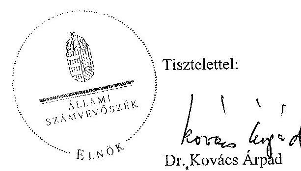

