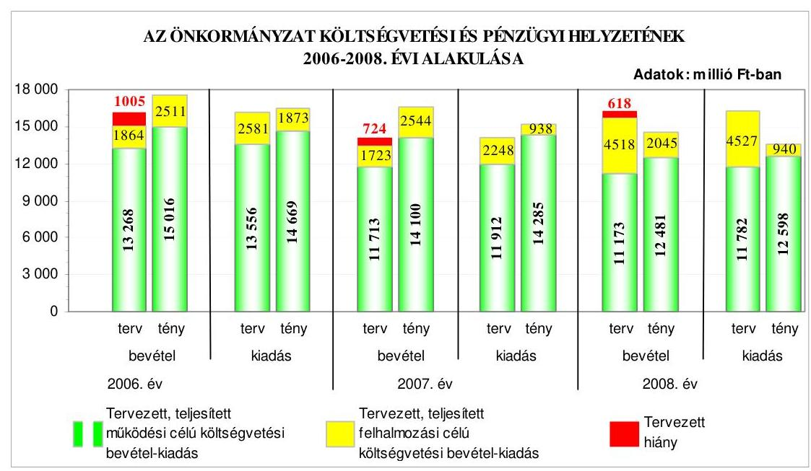
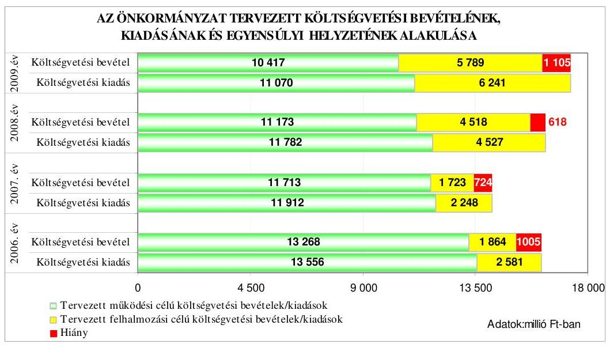
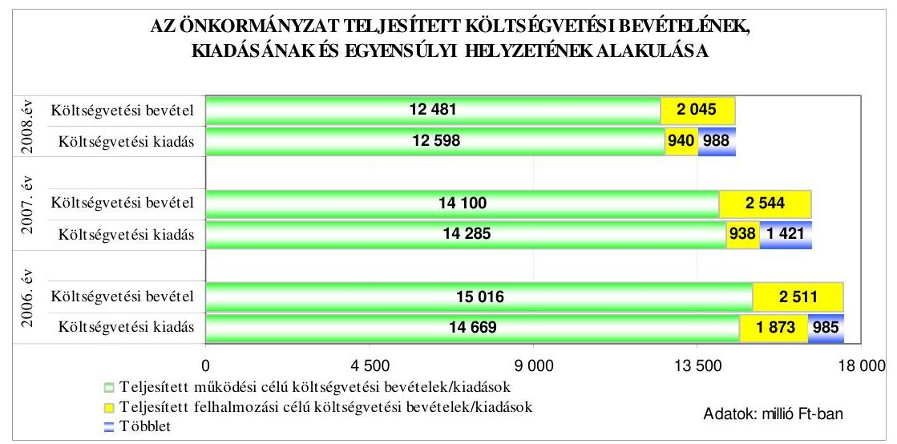
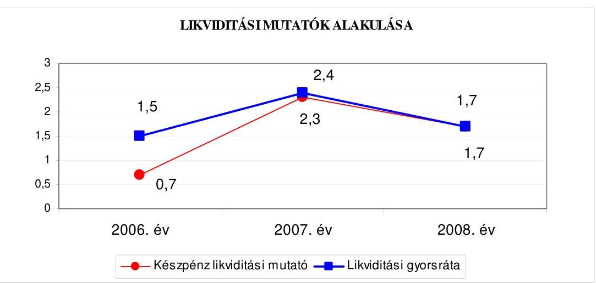
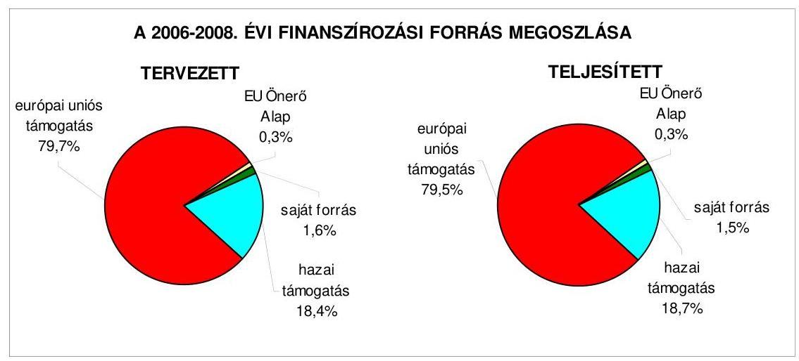
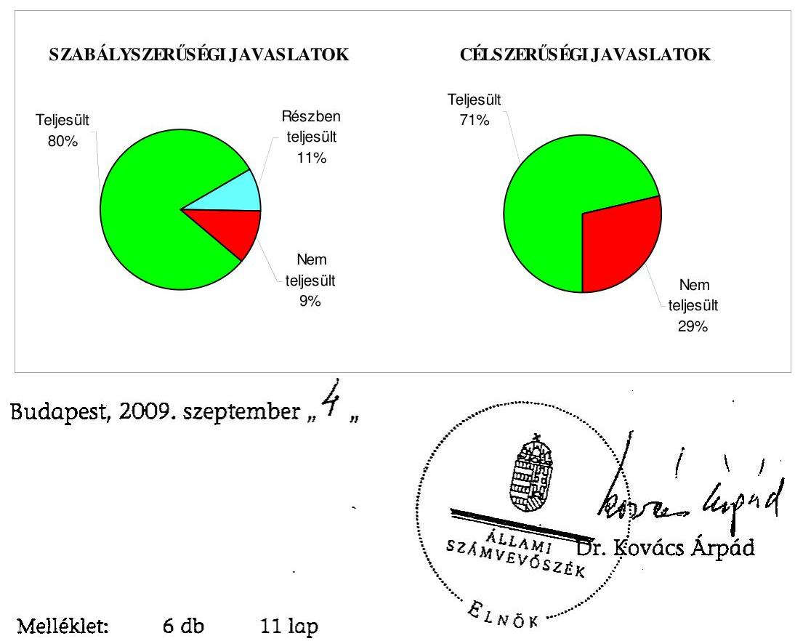
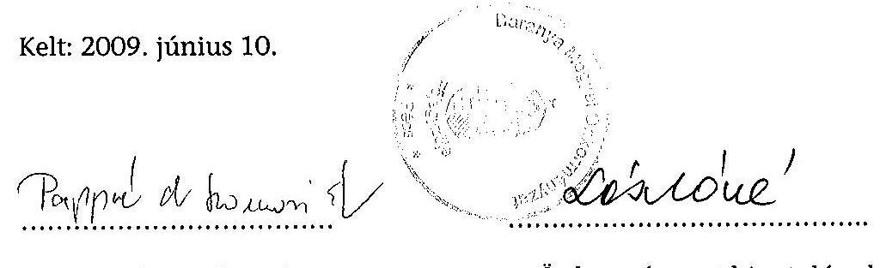
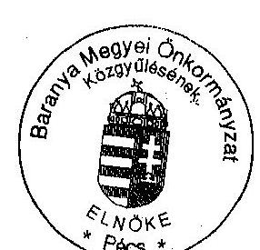

# ÁLLAMI   SZÁMVEVŐSZÉK 

## JELENTÉS

a Baranya Megyei Önkormányzat gazdálkodási rendszerének 2009. évi ellenőrzéséről

---

3. Önkormányzati és Területi Ellenőrzési Igazgatóság
3.3. Átfogó Ellenőrzések Főcsoport

Iktatószám: V-3001-4/26/18/2009.
Témaszám: 933
Vizsgálat-azonosító szám: V0438

# Az ellenőrzést felügyelte: 

Dr. Lóránt Zoltán
főigazgató
Az ellenőrzés végrehajtásáért felelős:
Dr. Sepsey Tamás
főigazgató-helyettes
Az ellenőrzést vezette:
Dr. Csikai Zsolt
főtanácsadó, irodavezető
Az ellenőrzést végezték:
Pappné dr. Szamosi Dr. Horváth Klára Keszthelyi Zoltán
Éva számvevő tanácsos számvevő tanácsos
számvevő tanácsos

## A témához kapcsolódó eddig készített számvevőszéki jelentések:

## címe

Jelentés a Baranya Megyei Önkormányzat gazdálkodási rendszerének 2006. évi átfogó ellenőrzéséről
A Magyar Köztársaság 2006. évi költségvetése végrehajtásának 0724 ellenőrzéséről
Függelék:

- a helyi önkormányzatok 2006. évi normatív hozzájárulás igénylésének és elszámolásának ellenőrzéséről
Jelentés a helyi és a helyi kisebbségi önkormányzatok gazdálkodási 0726 rendszerének 2006. évi átfogó és egyéb szabályszerűségi ellenőrzéséről
Az önkormányzati kórházak és bentlakásos szociális intézmények 0820 ápolásra, gondozásra fordított pénzeszközei felhasználásának ellenőrzéséről
A Magyar Köztársaság 2007. évi költségvetése végrehajtásának 0824 ellenőrzéséről
Függelék:
- a helyi önkormányzatok beruházásaihoz és rekonstrukcióihoz nyújtott 2007. évi felhalmozási célú támogatások ellenőrzéséről

---

# TARTALOMJEGYZÉK 

BEVEZETÉS ..... 11
I. ÖSSZEGZŐ MEGÁLLAPÍTÁSOK, KÖVETKEZTETÉSEK, JAVASLATOK ..... 16
II. RÉSZLETES MEGÁLLAPÍTÁSOK ..... 27

1. Az Önkormányzat költségvetési és pénzügyi helyzete ..... 27
1.1. A tervezett költségvetési bevételek és kiadások alapján a költségvetési egyensúly, a költségvetési hiány oka, finanszírozásának tervezett módja és a költségvetési hiány megállapításának szabályszerűsége ..... 27
1.2. A teljesített költségvetési bevételek és kiadások alapján a pénzügyi egyensúly, a pénzügyi hiány oka, finanszírozásának módja és hatása a pénzügyi helyzet alakulására az eladósodás, valamint a fizetőképesség szempontjából ..... 30
2. Az Önkormányzat felkészültsége az európai uniós források igénylésére és felhasználására, valamint az elektronikus közszolgáltatási feladatok ellátására ..... 37
2.1. Az európai uniós források igénybevételére és a várható támogatás felhasználására történt felkészülés szabályozottságának, szervezettségének eredményessége ..... 37
2.1.1. Az európai uniós forrásokra történő pályázatok benyújtására vonatkozó döntések összhangja a fejlesztési célkitűzésekkel ..... 37
2.1.2. Az európai uniós forrásokhoz kapcsolódóan a pályázatfigyelés, a pályázatkészítés, valamint az európai uniós támogatással megvalósuló fejlesztés lebonyolítása belső rendjének szabályozottsága, a végrehajtás személyi, szervezeti feltételei, az ellenőrzési feladatok meghatározása ..... 44
2.1.3. A fejlesztési feladat lebonyolításánál a feladatellátás rendjére, az ellenőrzési feladatok teljesítésére, valamint a felelősségi szabályokra vonatkozó előírások betartása ..... 48
2.2. Az elektronikus közszolgáltatás feltételeinek kialakítása, a közérdekú gazdálkodási adatok elektronikus közzététele ..... 52
3. A költségvetési gazdálkodás belső kontrolljai ..... 54
3.1. A szabályozottság kockázata a költségvetés tervezési, gazdálkodási, beszámolási és a folyamatba épített, előzetes és utólagos vezetői ellenőrzési feladatoknál ..... 54
3.2. A belső kontrollok múködése az önkormányzati források szabályszerű felhasználásában, a költségvetési tervezés, gazdálkodás, beszámolás folyamataiban ..... 56

---

3.3. A belső ellenőrzési kötelezettség teljesítése, javaslatainak hasznosulása ..... 59
4. Az ÁSZ korábbi ellenőrzési javaslatai alapján készített intézkedési terv végrehajtása, eredményessége ..... 61
4.1. Az Önkormányzat gazdálkodási rendszerének átfogó ellenőrzése során tett javaslatok végrehajtására tervezett intézkedések megvalósulása ..... 61
4.2. A zárszámadáshoz kapcsolódó (állami hozzájárulások, támogatások igénylésének és felhasználásának ellenőrzése), valamint a további vizsgálatok esetében a megállapítások, javaslatok alapján tett intézkedések ..... 65

# MELLÉKLETEK 

1. számú Az Önkormányzat gazdálkodását meghatározó adatok, mutatószámok (1 oldal)
2. számú Az önkormányzati vagyon alakulása (1 oldal)

2/a. számú Az önkormányzati kötelezettségek alakulása (1 oldal)
3. számú Az Önkormányzat 2006-2009. évi költségvetési előirányzatainak és 20062008. évi pénzügyi teljesítéseinek alakulása (1 oldal)
4. számú Tanúsítvány az európai uniós forrásokkal támogatott célok és programok 2006-2009. évi tervezett és teljesített adatairól (2 oldal)
5. számú Adatlap az európai uniós forrással támogatott ROP 1.1. „A Dráva medence komplex ökoturisztikai fejlesztése - Dráva II." fejlesztésről (4 oldal)
6. számú Dr. Hargitai János úr, a Baranya Megyei Önkormányzat Közgyűlése elnökének észrevétele (1 oldal)

---

# RÖVIDÍTÉSEK JEGYZÉKE 

## Törvények

Áht.
Eisztv.

Kbt.
Ket.

Közokt. tv.
Ötv.
Számv. tv.
Szoc. tv.

## Rendeletek

Ámr.
Ber.
18/2005. (XII. 27.) IHM rendelet
ellenőrzési nyomvonal ${ }_{1}$
ellenőrzési nyomvonal ${ }_{2}$

Vhr.
2006. évi költségvetési rendelet
2007. évi költségvetési rendelet
2008. évi költségvetési rendelet
2009. évi költségvetési rendelet
az államháztartásról szóló 1992. évi XXXVIII. törvény
az elektronikus információszabadságról szóló 2005. évi XC. törvény
a közbeszerzésekről szóló 2003. évi CXXIX. törvény
a közigazgatási hatósági eljárás és szolgáltatás általános szabályairól szóló 2004. évi CXL. törvény
a közoktatásról szóló 1993. évi LXXIX. törvény
a helyi önkormányzatokról szóló 1990. évi LXV. törvény
a számvitelről szóló 2000. évi C. törvény
a szociális igazgatásról és szociális ellátásokról szóló 1993. évi III. törvény
az államháztartás múködési rendjéről szóló 217/1998. (XII. 30.) Korm. rendelet
a költségvetési szervek belső ellenőrzéséről szóló 193/2003. (XI. 26.) Korm. rendelet
a közzétételi listákon szereplő adatok közzétételéhez szükséges közzétételi mintákról szóló 18/2005. (XII. 27.) IHM rendelet
Baranya Megyei Önkormányzatnak az Önkormányzat és Szervei Szervezeti és Müködési Szabályzatáról szóló 6/2003. (VI. 16.) számú rendeletének 8. számú mellékletéhez kapcsolódó 2. számú melléklete a Baranya Megyei Önkormányzat Hivatala folyamatba épített előzetes és utólagos vezetői ellenőrzési rendszere II. pontja, (hatályos 2005. november 17 -től)
Baranya Megyei Önkormányzatnak az Önkormányzat és Szervei Szervezeti és Müködési Szabályzatáról szóló 3/2007. (III. 24.) számú rendeletének 8. számú mellékletéhez kapcsolódó 2. számú melléklete a Baranya Megyei Önkormányzat Hivatala folyamatba épített előzetes és utólagos vezetői ellenőrzési rendszere II. pontja, (hatályos 2007. június 28 -től)
az államháztartás szervezetei beszámolási és könyvvezetési kötelezettségének sajátosságairól szóló 249/2000.
(XII. 24.) Korm. rendelet
Baranya Megyei Önkormányzat 2/2006. (II. 22.) számú rendelete az Önkormányzat 2006. évi költségvetéséről
Baranya Megyei Önkormányzat 2/2007. (II. 22.) számú rendelete az Önkormányzat 2007. évi költségvetéséről
Baranya Megyei Önkormányzat 4/2008. (II. 27.) számú rendelete az Önkormányzat 2008. évi költségvetéséről
Baranya Megyei Önkormányzat 3/2009. (III. 7.) számú rendelete az Önkormányzat 2009. évi költségvetéséről

---

| $\mathrm{SzMSz}_{1}$ | Baranya Megyei Önkormányzat 6/2003. (VI. 16.) számú rendelete a Baranya Megyei Önkormányzat és Szervei Szervezeti és Múködési Szabályzatáról |
| :--: | :--: |
| $\mathrm{SzMSz}_{2}$ | Baranya Megyei Önkormányzat 3/2007. (III. 24.) számú rendelete a Baranya Megyei Önkormányzat és Szervei Szervezeti és Múködési Szabályzatáról |
| vagyongazdálkodási rendelet | Baranya Megyei Önkormányzat 26/1999. (XII. 30.) számú rendelete a Baranya Megyei Önkormányzat vagyonáról és vagyongazdálkodásáról |
| Szórövidítések |  |
| APEH | Adó és Pénzügyi Ellenőrzési Hivatal |
| ÁSZ | Állami Számvevőszék |
| DDOP | ÚMFT Dél-Dunántúli Operatív program |
| e-közigazgatás | elektronikus közigazgatás |
| ellenőrzési nyomvonal ${ }_{3}$ | Baranya Megyei Önkormányzat Hivatalának Ellenőrzési Nyomvonala, (hatályos 2008. április 30-tól, kiadta a főjegyzö) |
| ESZA Kht. | Európai Szociális Alap Nemzeti Programirányító Iroda Társadalmi Szolgáltató Kht. |
| EU Önerő Alap támogatás | a Magyar Köztársaság 2007. évi költségvetéséről szóló 2006. évi CXXXVII. törvény - 5. számú mellékletének 12. pontja alapján - központi költségvetési hozzájárulást biztosít a helyi önkormányzatok és jogi személyiségú társulásaik számára, azok európai uniós fejlesztési célú pályázataihoz szükséges saját forrás kiegészítésére. |
| Fejlesztési és közgazdasági főosztály | Baranya Megyei Önkormányzat Hivatalának Fejlesztési és Közgazdasági Főosztálya |
| FEUVE | folyamatba épített, előzetes és utólagos vezetői ellenőrzés |
| főjegyzö | Baranya Megyei Önkormányzat Főjegyzője |
| gazdasági program ${ }_{1}$ | Baranya Megyei Önkormányzat Közgyűlésének 53/2003. (IV. 17.) számú határozata az Önkormányzat Közgyűlésének 2003-2006. évekre szóló középtávú munkaprogramjáról |
| gazdasági program ${ }_{2}$ | Baranya Megyei Önkormányzat Közgyűlésének 31/2007. (III. 22.) számú határozata az Önkormányzat Közgyűlésének a 2007-2010. évekre szóló középtávú munka- és gazdasági programjáról |
| Gazdasági, terület- és vidékfejlesztési iroda | Baranya Megyei Önkormányzat Hivatalának Gazdasági, Terület- és Vidékfejlesztési Irodája |
| GESZ | Baranya Megyei Önkormányzat Gazdasági Ellátó Szervezete (2006. július 1-jétől Baranya Megyei Önkormányzat Gazdasági Igazgatósága) |
| HEFOP | NFT Humánerőforrás-fejlesztési Operatív Program |
| Informatikai csoport | Baranya Megyei Önkormányzat Hivatalának Informatikai csoportja |
| INTERREG | Határon átnyúló, transznacionális és interregionális együttműködés |

---

Jogi és szervezési főosztály
Jogi és ügyrendi bizottság
kórház
Költségvetési és gazdasági bizottság
Költségvetési, gazdasági és foglalkoztatási bizottság
Közgazdasági iroda
Közgyűlés
Közgyűlés elnöke
MÁK
NFT
OKÉV
Önkormányzat hivatala
Önkormányzat hivatalának ügyrend ${ }_{1}$-je

Önkormányzat hivatalának ügyrend ${ }_{2}$-je
Önkormányzat hivatalának ügyrend ${ }_{3}$-je
pályázati szabályzat ${ }_{1}$
pályázati szabályzat ${ }_{2}$
pénzkezelési szabályzat ${ }_{1}$
pénzkezelési szabályzat ${ }_{1}$
pénzkezelési szabályzat ${ }_{2}$
PM
ROP
TÁMOP
Területfejlesztési, idegenforgalmi, informatikai és foglalkoztatási bizottság
TIOP

Baranya Megyei Önkormányzat Hivatalának Jogi és Szervezési Főosztálya
Baranya Megyei Önkormányzat Jogi és Ügyrendi Bizottsága
Baranya Megyei Kórház
Baranya Megyei Önkormányzat Költségvetési és Gazdasági Bizottsága (2003. június 16-tól 2007. március 24-ig)
Baranya Megyei Önkormányzat Költségvetési, Gazdasági és Foglalkoztatási Bizottsága (2007. március 24-től 2008. április 17-ig)
Baranya Megyei Önkormányzat Hivatalának Közgazdasági Irodája
Baranya Megyei Önkormányzat Közgyűlése
Baranya Megyei Önkormányzat Közgyűlésének elnöke
Magyar Államkincstár
Nemzeti Fejlesztési Terv
Országos Közoktatási Értékelési és Vizsgaközpont
Baranya Megyei Önkormányzat Hivatala
Baranya Megyei Önkormányzat Hivatalának Ügyrendje, hatályos 2004. december 16-tól, az SzMSz ${ }_{1}$ 8. számú melléklete
Baranya Megyei Önkormányzat Hivatalának Ügyrendje, 2007. április 1-től hatályos, az SzMSz ${ }_{2}$ 8. számú melléklete Baranya Megyei Önkormányzat Hivatalának Ügyrendje, a Közgyűlés a 42/2008. (IV. 17.) számú határozatával hagyta jóvá, 2008. április 30-tól hatályos
Baranya Megyei Önkormányzat pályázati eljárási rendjéről és az európai uniós társfinanszírozású pályázatai megvalósításának módjáról szóló a Közgyűlés 171/2005. (XII. 15.) számú határozatában jóváhagyott szabályzat

Baranya Megyei Önkormányzat Pályázati Szabályzata, (jóváhagyta a Közgyűlés elnöke és a főjegyző, 2009. január 24-én, 2009. február 1-től hatályos)
Baranya Megyei Önkormányzat Hivatala 2005. december 22-től hatályos Pénzkezelési szabályzata, (jóváhagyta a Közgyűlés elnöke és a főjegyző)
Baranya Megyei Önkormányzat Hivatala 2008. január 1től hatályos Pénzkezelési szabályzata, (jóváhagyta a Közgyűlés elnöke és a főjegyző)
Pénzügyminisztérium
NFT Regionális Fejlesztés Operatív program
ÚMFT Társadalmi Megújulás Operatív Program
Baranya Megyei Önkormányzat Területfejlesztési, Idegenforgalmi, Informatikai és Foglalkoztatási bizottsága (2005. február 17-től 2007. március 24-ig)

ÚMFT Társadalmi Infrastruktúra Operatív Program

---

TISZK
ÚMFT
VÁTI Kht.

NFT-HEFOP Térségi Integrált Szakképző Központ
Új Magyarország Fejlesztési Terv
VÁTI Magyar Regionális fejlesztési és Urbanisztikai Közhasznú Társaság

---

# ÉRTELMEZŐ SZÓTÁR 

1. elektronikus szolgáltatási szint
2. elektronikus szolgáltatási szint
3. elektronikus szolgáltatási szint
4. elektronikus szolgáltatási szint
európai uniós források
fejlesztési feladat (projekt)
fejlesztési célkitúzés
hazai társfinanszírozás
irányító hatóság

Az 1044/2005. (V. 11.) Korm. határozat alapján olyan információs, tájékoztató szolgáltatás, amely csak általános információkat közöl az adott üggyel kapcsolatos teendőkről és a szükséges dokumentumokról.
Az 1044/2005. (V. 11.) Korm. határozat alapján olyan egyirányú kapcsolatot biztosító szolgáltatás, amely az 1. szinten túl biztosítja az adott ügy intézéséhez szükséges dokumentumok, nyomtatványok letöltését, és azok ellenőrzéssel, vagy ellenőrzés nélküli elektronikus kitöltését, amely esetben a dokumentumok benyújtása hagyományos úton történik.
Az 1044/2005. (V. 11.) Korm. határozat alapján olyan kétirányú kapcsolatot biztosító szolgáltatás, amely közvetlen, vagy ellenőrzött kitöltésű dokumentum segítségével biztosítja az elektronikus adatbevitelt és a bevitt adatok ellenőrzését. Az ügy indításához, intézéséhez személyes megjelenés nem szükséges, de az ügyhöz kapcsolódó közigazgatási döntés (határozat, egyéb aktus) közlése, valamint a kapcsolódó illeték-, vagy díjfizetés hagyományos úton történik.
Az 1044/2005. (V. 11.) Korm. határozat alapján olyan teljes közvetlen kétirányú ügyintézési folyamatot biztosító szolgáltatás, amikor az ügyhöz kapcsolódó közigazgatási döntés is elektronikus úton kerül közlésre, illetve a kapcsolódó illeték-, vagy díjfizetés elektronikus úton is intézhető.
A támogatott projekt megvalósítása érdekében, a fejlesztés lebonyolítása során felmerült kiadások finanszírozási forrása.
A fejlesztési feladat (projekt) tartalmilag és formailag részletesen kidolgozott, megfelelő pénzügyi háttérrel és végrehajtási ütemezéssel rendelkező fejlesztési terv, amely illeszkedik az Európai Unió, illetve a Nemzeti Fejlesztési Terv és az Új Magyarország Fejlesztési Terv által támogatott programokhoz.
Az önkormányzat által ellátott kötelező, vagy önként vállalt feladatok biztosításának mennyiségi, vagy minőségi fejlesztésére vonatkozó terv. A mennyiségi fejlesztés megvalósulhat beszerzéssel, létesítéssel, bővítéssel, átalakítással.
A központi költségvetési és az elkülönített állami pénzalapokból származó finanszírozás.
A strukturális alapok és a Kohéziós alap forrásainak szabályszerű, hatékony és eredményes felhasználásához szükséges intézményrendszer felső eleme. Az irányító hatóság általános és átfogó felelősséget visel a programok, projektek hatékony és szabályszerű végrehajtásáért. Felelősségi köréből eredően ellenőrzi a közösségi, valamint a

---

kedvezményezett
közreműködő szervezet
lebonyolítás
hazai jogszabályok betartását, koordinálja az európai uniós források szétosztásának folyamatát, irányítja az intézményrendszer, a statisztikai és a pénzügyi nyilvántartási rendszer múködését. Az Új Magyarország Fejlesztési Terv Irányító Hatósága közreműködik az Operatív Program véglegesítésében, irányítja az Operatív Program Program-kiegészítő Dokumentum kidolgozását, és közremüködő szerepet vállal e dokumentumoknak az Európai Bizottsággal történő tárgyalásaiban. Az Irányító Hatóság részt vesz továbbá a költségvetési tervezésében, valamint közreműködő szervezetek bevonásával irányítja a meghirdetett pályázatok és a központi programok végrehajtását.
Az a helyi önkormányzat, amely a támogatási szerződést kedvezményezettként aláírja, a projektet, illetve a központi programhoz kapcsolódó támogatott önkormányzati programot végrehajtja.
A közreműködő szervezet az európai uniós támogatást elnyert kedvezményezettekkel kapcsolatot tartó szerv. Az operatív programok közreműködő szervezetei befogadják, nyilvántartják, döntésre előkészítik a pályázatokat, rögzítik a támogatással kapcsolatos adatokat az Egységes Monitoring Informatikai Rendszerben, elvégzik a támogatások előzetes (szerződéskötést megelőző), közbenső (a pénzügyi elszámolás, finanszírozás folyamatában végzett) és utólagos (a támogatott projekt pénzügyi lezárását megelőző) ellenőrzését. Az önkormányzatoknál a leggyakrabban előforduló operatív program a Regionális Fejlesztési Operatív Program végrehajtásában közreműködő szervezetek a VÁTI Kht. és a regionális fejlesztési ügynökségek.
A Kohéziós alap kettő közreműködő szervezete (Nemzeti Fejlesztési és Gazdasági Minisztérium, Környezetvédelmi és Vízügyi Minisztérium) a támogatott projektek végrehajtásához kapcsolódó operatív feladatokat látják el. Ennek keretében megkötik a szerződéseket a projekt kedvezményezettjével, folyamatosan nyomon követik a teljesítéseket, lebonyolítják a támogatások kifizetését, vezetik az Egységes Monitoring Informatikai Rendszert.
Az európai uniós források felhasználásával megvalósuló fejlesztésre irányuló műszaki, gazdasági (pénzügyi) tevékenységet magában foglaló szervezési, irányítási szolgáltatás. A szervezési szolgáltatás kiterjedhet a pályázatkészítésre, a közbeszerzési eljárás lebonyolításán keresztül a folyamatos műszaki ellenőrzésre, a pénzügyi elszámolásra, a műszaki átadás-átvételre, az üzembe helyezésre, illetve a fejlesztési folyamat egyes elemeire.

---

operatív program

Nemzeti Fejlesztési Terv
regionális program

Új Magyarország Fejlesztési Terv

Az Európai Bizottság által jóváhagyott, a Közösségi Támogatási Keret végrehajtására vonatkozó, több évre szóló intézkedésekhez kapcsolódó prioritások egységes rendszerét tartalmazó dokumentum.
Helyzetelemzést, stratégiát a tervezett fejlesztési területek prioritásait, azok céljait és pénzügyi forrásaik megjelölését tartalmazó dokumentum, amelyet a Magyar Köztársaság készített az Európai Unió programozási irányelveinek, célkitűzéseinek megfelelően a fejlődésben lemaradó régiók fejlődésének és strukturális átalakulásának elősegítésére a kiemelt szükségletekre figyelemmel. A Nemzeti Fejlesztési Terv stratégiai fejezetének célja, hogy a 2004-2006 közötti időszakra kijelölje a strukturális alapokból támogatható fejlesztéspolitikai célkitűzéseit és prioritásait. A strukturális alapok operatív programjai: Agrár és Vidékfejlesztési Operatív Program (AVOP); Gazdasági Versenyképesség Operatív Program (GVOP); Humánerőforrás-fejlesztési Operatív Program (HEFOP); Környezetvédelmi és Infrastruktúra-fejlesztési Operatív Program (KIOP); Regionális Fejlesztési Operatív Program (ROP).
Az ágazati és regionális prioritásokat egyaránt tartalmazó operatív program regionális prioritása, illetve támogatási konstrukciója.
Az Új Magyarország Fejlesztési Terv célja a foglalkoztatás bővítése és a tartós növekedés feltételeinek megteremtése. Ennek érdekében 2007-2013 között hat kiemelt területen indított el összehangolt állami és európai uniós fejlesztéseket: a gazdaságban, a közlekedésben, a társadalom megújulása érdekében, a környezet és az energetika területén, a területfejlesztésben és az államreform feladataival összefüggésben. Az Új Magyarország Fejlesztési Terv operatív programjai: Államreform Operatív Program (ÁROP); Elektronikus Közigazgatás Operatív Program (EKOP); Gazdaságfejlesztés Operatív Program (GOP); Környezet és Energia Operatív Program (KEOP); Közlekedés Operatív Program (KÖZOP); Dél-Alföldi Operatív Program (DAOP); Dél-Dunántúli Operatív Program (DDOP); Észak-Alföldi Operatív Program (ÉAOP); Észak-Magyarországi Operatív Program (ÉMOP); Közép-Dunántúli Operatív Program (KDOP); Közép-Magyarországi Operatív Program (KMOP); Nyugat-Dunántúli Operatív Program (NYDOP); Társadalmi Infrastruktúra Operatív Program (TIOP); Társadalmi Megújulás Operatív Program (TÁMOP).

---

támogatási szerződés

A strukturális alapok esetében az irányító hatóságnak, illetve a Kohéziós Alap esetében a közremúködő szervezeteknek a kedvezményezett önkormányzattal kötött szerződése, amely a támogatás felhasználásának részletes feltételeit tartalmazza. Az Új Magyarország Fejlesztési Terv keretében támogatott projektek esetében a támogatási szerződést a kedvezményezett és a Nemzeti Fejlesztési Ügynökség nevében eljáró közremüködő szervezet között jön létre. Nagyprojekt esetén a támogatási szerződést az Nemzeti Fejlesztési Ügynökség ellenjegyzi. A támogatási szerződés képezi a megvalósítás nyomon követésének, finanszírozásának és ellenőrzésének alapját.

---

# JELENTÉS   a Baranya Megyei Önkormányzat gazdálkodási rendszerének 2009. évi ellenőrzéséről 

## BEVEZETÉS

Az Ötv. 92. § (1) bekezdése, az Állami Számvevőszékről szóló 1989. évi XXXVIII. törvény 2. § (3) bekezdése, valamint az Áht. 120/A. § (1) bekezdése alapján az önkormányzatok gazdálkodását az Állami Számvevőszék ellenőrzi. Az ellenőrzésre az Országgyúlés illetékes bizottságai részére is átadott, országosan egységes ellenőrzési program szerint került sor.

Az Állami Számvevőszék a stratégiájában foglalt célkitűzéseknek megfelelően a helyi önkormányzatok költségvetési gazdálkodási rendszere átfogó ellenőrzésének programját a 2007. évtől megújította, azt kiegészítette további - teljesít-mény-ellenőrzési - elemekkel.

Az ellenőrzés célja annak értékelése volt, hogy az Önkormányzat:

- milyen módon biztosította a költségvetési és a pénzügyi egyensúlyt a költségvetésében és annak teljesítése során, valamint változott-e a hiányzó bevételi források pótlásában a finanszírozási célú pénzügyi műveletek jelentősége, hatása;
- eredményesen készült-e fel a szabályozottság és a szervezettség terén az európai uniós források igénylésére és felhasználására, továbbá biztosította-e az elektronikus közszolgáltatás feltételeit, a gazdálkodási adatok közzétételével a gazdálkodás nyilvánosságát;
- kialakította-e és múködtette-e a külső és a belső feltételeknek megfelelően a költségvetés tervezési, gazdálkodási és zárszámadási feladatai belső kontrollrendszerét ${ }^{1}$, ezen tevékenységek szabályszerű ellátásához hozzájárult-e a folyamatba épített, előzetes és utólagos vezetői ellenőrzés, valamint a belső ellenőrzés;

[^0]
[^0]:    ${ }^{1}$ A gazdálkodás szabályszerűségét biztosító kontrollrendszer alatt értjük a kiépített és múködő pénzügyi irányítási és szabályozási rendszert, valamint a belső ellenőrzési funkciók ellátásának rendszerét.

---

- megfelelően hasznosították-e a korábbi számvevőszéki ellenőrzések megállapításait, szabályszerűségi ${ }^{2}$ és célszerűségi javaslatait.

Az ellenőrzés típusa: átfogó ellenőrzés, amely - egy ellenőrzés keretében meghatározott területekre összpontosítva alkalmazza a szabályszerűségi, valamint a teljesítmény-ellenőrzés jellemzőit.

Az ellenőrzött időszak: az 1., 2. és 4. programpontok tekintetében a 20062008. évek, a 3. ellenőrzési programpontnál a 2008. év.

Baranya megye lakosainak száma 2009. január 1-jén 246620 fő volt. A 2006. évi önkormányzati választást követően az Önkormányzat 40 tagú Közgyűlésének munkáját kilenc állandó bizottság segítette. A helyi önkormányzat mellett a 2007. március 4-én megtartott területi kisebbségi önkormányzati választásokat követően három kisebbségi önkormányzat ${ }^{3}$ működött. A Közgyűlés elnöke a 2006. évi önkormányzati választás óta tölti be tisztségét, a főjegyző személye 1998. július 1-je óta változatlan.

Az Önkormányzat feladatainak végrehajtása érdekében a 2008. évben 21 költségvetési intézményt múködtetett, amelyekből három részben önállóan gazdálkodott. A feladatok ellátásában részt vett kilenc gazdasági társasága, továbbá három alapítványa. Az Önkormányzat a 2008. évi költségvetési beszámolója szerint 14526 millió Ft költségvetési bevételt ért el és 13538 millió Ft költségvetési kiadást teljesített. A könyvviteli mérleg szerint 2008. december 31én 16419 millió Ft értékű vagyonnal rendelkezett. Az Önkormányzat vagyona a 2006. év végi állományhoz viszonyítva 2,0\%-kal csökkent. A vagyon csökkenése azért következett be, mert a pénzeszközök több mint kétszeres (104\%-os) növekedésének hatásánál nagyobb súlya volt a beruházások állományának 80,9\%-os, a befektetett pénzügyi eszközök 2008. évi értékének 76,6\%-os és a követelések 92,7\%-os csökkenésének. A befektetett pénzügyi eszközök csökkenését a Zsigmondy Vilmos Harkányi Gyógyfürdőkórház Kht-nak 2006. évben adott támogatási kölcsön visszatérülése, a követelések csökkenését az illetékekhez ${ }^{4}$ kapcsolódó követelések nyilvántartásból való kivezetésének és a Baranya Megyei Múzeumok Igazgatósága autópálya-építés régészeti feltárások projektjeivel kapcsolatosan a vevőkkel szembeni követelések csökkenése okozta. A pénzeszközök több mint kétszeres, 3348 millió Ft-ra való növekedését a kötvénykibocsátásból származó bevétel betétkénti elhelyezése eredményezte. Az összes költségvetési bevétel 29,6\%-át a saját bevétel biztosította a 2008. évben. Az összes költségvetési kiadásból a felhalmozási célú kiadás részaránya a 2008. évben 6,9\% volt. A 2009. évi költségvetési rendeletben 16206 millió Ft költségvetési bevételt és 17311 millió Ft költségvetési kiadást irányoztak elő. Az Ön-

[^0]
[^0]:    ${ }^{2}$ A törvényi előírások betartásának elmulasztásakor a részletes megállapítások fejezetben egységesen a törvénysértés megjelölést alkalmazzuk, mivel az ÁSZ nem tehet különbséget a törvényi előírások között.
    ${ }^{3}$ Területi kisebbségi önkormányzatok: cigány, horvát, német
    ${ }^{4}$ Az egyes pénzügyi tárgyú törvények módosításáról szóló 2006. évi LXI. törvény 249. § (1) bekezdése alapján 2007. január 1-jétől a Fővárosi Illetékhivatal és a megyei illetékhivatalok megszűntek, ezzel egyidejűleg az illetékhivatalok feladatainak ellátását az APEH regionális igazgatóságai vették át.

---

kormányzat hivatalában dolgozó köztisztviselők száma 2008. december 31-én 72 fő, a költségvetési intézményekben foglalkoztatott közalkalmazottak száma 2467 fő volt. Az Önkormányzat gazdálkodását meghatározó adatokat, mutatószámokat az 1-3. számú mellékletek tartalmazzák.

Az Önkormányzat költségvetési és pénzügyi helyzetét az elemző eljárás módszerével vizsgáltuk. E körben elemeztük a költségvetés egyensúlyi helyzetének alakulását, a tervezett és tényleges költségvetési hiány okait, a mérséklésére tett intézkedéseket, finanszírozásának módját, az Önkormányzat adósságállományának alakulását, összetevőit. Az európai uniós támogatás igénylésére, felhasználására történt felkészülésre vonatkozóan teljesítményellenőrzést végeztünk. Az európai uniós források figyelésére, igénylésére és felhasználására a felkészülést akkor minősítettük eredményesnek, ha a meghatározott szempontok szerinti feltételeknek megfelelt a felkészülés szabályozottsága, szervezettsége, továbbá értékeltük, hogy az igényelt európai uniós támogatások az Önkormányzat által meghatározott fejlesztési célkitűzésekhez kapcsolódtak-e. Az ellenőrzés során felmértük, hogy az e-közszolgáltatási feladat ellátása, illetve bevezetése, működtetése érdekében milyen intézkedéseket tettek, valamint biztosí-tották-e a közérdekű adatok közzétételét. A költségvetési gazdálkodás belső kontrolljainak ellenőrzése során értékeltük, hogy az Önkormányzat hivatalánál a költségvetés tervezési, gazdálkodási, zárszámadás készítési feladatok belső kontrolljainak kiépítettsége és múködése megfelelő biztosítékot ad-e a gazdálkodási feladatok megfelelő, szabályszerű ellátására. Felmértük és minősítettük a költségvetés tervezési, a gazdálkodási, a zárszámadás készítési feladatokkal, továbbá a pénzügyi-számviteli területen az informatikával kapcsolatosan kialakított kontrollok megfelelőségét, valamint a kialakított belső kontrollok működésének megbízhatóságát. Értékeltük a belső ellenőrzés szabályozottságát, működési feltételeinek kialakítását, továbbá működésének megbízhatóságát.

Az Önkormányzat hivatalánál értékeltük a gazdálkodás folyamatában kulcsszerepet betöltő belső kontrollok múködésének megbízhatóságát, ennek keretében ellenőriztük a szakmai teljesítésigazolásra és az utalvány ellenjegyzésére kialakított kontrollok végrehajtását. Az ellenőrzést a következő, kiemelt kockázatuk alapján kiválasztott ${ }^{5}$ kifizetésekre folytattuk le ${ }^{6}$ :

- a külső szolgáltató által végzett karbantartási, kisjavítási szolgáltatásokra,

[^0]
[^0]:    ${ }^{5}$ Az önkormányzatok kiemelt előirányzataira vonatkozóan, a vertikális folyamatokra elvégeztük a kockázatok becslését, amelynek eredményeként határoztuk meg a magas kockázatú területeket.
    ${ }^{6}$ A korábbi ellenőrzési tapasztalataink szerint ezeken a területeken a jegyzők nem, vagy hiányosan szabályozták a megbízás, megrendelés, illetve beszerzés indokoltságának, szükségességének elbírálására, igazolására, valamint a teljesítések dokumentálására, a kiadások jogosultságának, összegszerűségének ellenőrzésére irányuló kontrollokat. További kockázatot jelentett, ha a külső szolgáltató által végzett karbantartási, kisjavítási munkák 50 ezer Ft alatti megrendeléseire vonatkozóan a jegyzők nem alakították ki a kötelezettségvállalások rendjét és nyilvántartási formáját, valamint a szabályozás elmulasztása esetén nem történt meg az írásbeli kötelezettségvállalás és annak az ellenjegyzése sem.

---

- a gépek, berendezések, felszerelések beszerzésére, továbbá
- az államháztartáson kívülre teljesített múködési és felhalmozási célú pénzeszköz átadásokra.

Az ellenőrzés hatékony elvégzése céljából a vizsgálandó területek kiválasztása során a kockázatokon alapuló megközelítés érvényesült, ezáltal az ellenőrzési erőforrásokat azokra a területekre fókuszáltuk, amelyeken legnagyobb a hibák előfordulási valószínűsége. Az ellenőrzési erőforrások ilyen típusú összpontosításával minimálisra csökkenthető a kívánt ellenőrzési bizonyosság eléréséhez szükséges időráfordítás.

A pénzügyi-számviteli folyamatokban alkalmazott belső kontrollok létezésének és múködésének ellenőrzésére a vizsgált három terület 2008. évi könyvviteli tételeiből területenként egyszerű véletlen mintát vettünk. A kijelölt gazdasági eseményre elvégzett megfelelőségi tesztek alapján értékeltük a kontrollok múködésének megbízhatóságát a vizsgált három területre külön-külön, majd öszszefoglalóan ${ }^{7}$. A helyszíni ellenőrzés megállapításainak részletes dokumentálását megfelelőségi tesztlapokon, elővizsgálati és helyszíni ellenőrzési munkalapokon biztosítottuk. Ezeken a teszt- és munkalapokon a minősítés alapjául szolgáló kérdések és a vonatkozó konkrét jogszabályhelyek megjelölése mellett értékeltük a kialakított belső kontrollokban rejlő kockázatokat ${ }^{8}$ és a kialakított kontrollok múködésének megbízhatóságát ${ }^{9}$.

Az ÁSZ korábbi ellenőrzési javaslatai alapján tett intézkedéseket, illetve azok megvalósítását utóellenőrzés keretében vizsgáltuk. A gazdálkodási rendszer átfogó ellenőrzése során megfogalmazott javaslatok végrehajtására tett intézkedések megvalósítását ellenőriztük, az egyéb számvevőszéki ellenőrzések során tett javaslatok esetében pedig a kiadott intézkedéseket tekintettük át.

A helyszíni ellenőrzés során kitöltött - az ellenőrzést végző számvevő és az Önkormányzat hivatalának felelős köztisztviselője által aláírt - elővizsgálati és

[^0]
[^0]:    ${ }^{7}$ A vizsgált három terület egyedi értékelési pontszámait a területek költségvetési súlyával arányosan összegeztük.
    ${ }^{8}$ A kialakított belső kontrollokban rejlő kockázatot alacsonynak minősítettük, ha a kontrollok - végrehajtásuk esetén - megfelelő védelmet nyújtanak a hibák bekövetkezése ellen. Közepesnek minősítettük a belső kontrollokban rejlő kockázatot, amennyiben a kontrollok - végrehajtásuk esetén - a lehetséges hibák többsége ellen védelmet nyújtanak. Magasnak értékeltük a kockázatot, ha a kontrollok - kialakításuk hiányában, vagy hiányos kialakításuk miatt - nem nyújtanak elegendő védelmet a lehetséges hibákkal szemben.
    ${ }^{9}$ A kontrollok múködésének megbízhatóságát kiválónak értékeltük abban az esetben, ha azok múködése - esetleges apróbb hiányosságoktól eltekintve - megfelelt a hibák megelőzésére és kijavítására meghatározott szabályozásnak és a legmagasabb szintű elvárásoknak. Jónak minősítettük a kontrollok múködését, ha a hiányosságok száma ugyan jelentős volt, de nem veszélyeztette az ellenőrzött terület hibáinak megelőzését és kijavítását. Amennyiben a kontrollok - kialakításuk hiánya, illetve hiányosságai miatt - nem biztosították a hibák megelőzését, feltárását, kijavítását és ez veszélyeztette az eredményes, megbízható múködést, a kontroll múködésének megbízhatósága gyenge minősítést kapott.

---

helyszíni ellenőrzési munkalapokat, azok kitöltési útmutatóit, továbbá a megfelelőségi tesztek dokumentumait a Közgyűlés elnöke részére a számvevői jelentéssel egyidejűleg átadtuk.

A jelentést az ÁSZ-ról szóló 1989. évi XXXVIII. tv. 25. § (1) bekezdése alapján észrevétel közlése céljából megküldtük a Baranya Megyei Önkormányzat Közgyűlése elnökének. A kapott észrevételt a jelentés 6 . számú melléklete tartalmazza.

---

# 1. ÖSSZEGZŐ MEGÁLLAPÍTÁSOK, KÖVETKEZTETÉSEK, JAVASLATOK 

Az Önkormányzatnak a 2006-2009. évek között tervezett költségvetési bevételei és előirányzott költségvetési kiadásai az előző évhez viszonyítva a 2007. évben csökkentek, míg a 2008. és a 2009. évben növekedtek, a tervezett múködési célú költségvetési bevételek egyik évben sem nyújtottak fedezetet a múködési célú költségvetési kiadásokra. A tervezett felhalmozási célú költségvetési kiadások a 2006-2009. években meghaladták a tervezett felhalmozási célú költségvetési bevételeket. A költségvetési egyensúly biztosításához az Önkormányzat rövid lejáratú múködési célú hitel igénybevételét, valamint kiadási megtakarítást, illetve a költségvetési bevételek növelését eredményező intézkedések érvényesítését tervezte a 2006-2009. években. A 2006. évi költségvetési rendeletben hosszú lejáratú hitelek felvételéről döntöttek. A 2006. évben eredeti előirányzatként nem tervezték az előző évről áthúzódó feladatok ellátásához teljesíthető jóváhagyott kiadásokat és a teljesítendő várható bevételeket, annak ellenére, hogy ezen feladatok ellátásához teljesíthető kiadások és azok forrásai az eredeti előirányzatok tervezésekor ismertek voltak. Az Önkormányzatnál - az ÁSZ korábbi ellenőrzési javaslatainak eleget téve - a 2007. évtől az Áht. rendelkezését betartották, finanszírozási célú pénzügyi múveleteket nem vettek figyelembe költségvetési hiányt módosító bevételként, illetve kiadásként. A főjegyző a költségvetés tervezése során a költségvetés végrehajtása, a folyamatos likviditás biztosítása érdekében folyószámla hitelkeretet tervezett, valamint - az Ámr. előírásának megfelelően - a pénzállomány alakulását bemutató éves előirányzat felhasználási ütemtervet és likviditási tervet készített a 2006-2009. években. A teljesített költségvetési bevételek és a teljesített költségvetési kiadások föösszegei az Önkormányzatnál a 2006-2008. években folyamatosan csökkentek az előző évhez viszonyítva. A teljesített költségvetési bevételek és költségvetési kiadások egyenlege mindhárom évben többletet mutatott.

---

Hiányzó forrás a teljesített múködési célú költségvetési kiadásoknál a 2007. és a 2008. években volt, a teljesített felhalmozási célú költségvetési kiadások egyik évben sem haladták meg a teljesített felhalmozási célú költségvetési bevételeket. A 2006-2008. években a teljesített költségvetési bevételek éves szinten - a felvett hitelek nélkül - fedezetet nyújtottak a költségvetési kiadásokra. Ennek ellenére az Önkormányzat a 2006. évben hosszú lejáratú hiteleket vett fel, a 2007. évben pedig 20 millió svájci frank össznévértékű, hosszú lejáratú múködési és felhalmozási célú kötvényt bocsátott ki. A forint svájci frankhoz viszonyított árfolyamváltozása, valamint a változó kamatérték miatt az Önkormányzat számára a kötvénykibocsátás kockázatot jelent. A felhalmozási célú költségvetési kiadások teljesítéséhez a hitelek igénybevétele nem volt szükséges, mivel e kiadásokra fedezetet nyújtott a felhalmozási célú költségvetési bevétel a felvett hitelek nélkül.

Az évközi likviditás biztosítása érdekében az Önkormányzat a 2006-2008. években folyószámla hitelt vett fel. A 2006-2008. években a költségvetés végrehajtása során érvényesített intézkedések eredményeként a folyószámla hitellel zárt napok száma, a ténylegesen felvett folyószámla hitel átlagos állománya, valamint a felvett folyószámla hitel minimum-, illetve maximum összege folyamatosan csökkent. A pénzügyi többletet a tervezettet meghaladó bevételek, a kiadási megtakarítást eredményező intézkedések, valamint a felhalmozási kiadások feladatáthúzódás miatti elmaradásai okozták. A tervezett európai uniós és hazai pályázatok saját forrásainak biztosításához, a 2004-2005. évben felvett beruházási célú hitelek kiváltásához, valamint a 2007. december 31-ig felhalmozott múködési célú költségvetési bevétel hiányának rendezéséhez tervezték felhasználni a 2007. év decemberében 3065 millió Ft értékben kibocsátott kötvényből származó bevételt. A tervezett célra történő felhasználásig a 2008. évben a kötvénykibocsátásból befolyt bevételt az Önkormányzat - folyamatosan csökkenő összegű, változó kamatozású és időtartamú - betétként lekötötte, illetve a végrehajtott határidős deviza adásvételekkel árfolyamnyereséget realizált, valamint a 2004-2005. évben felvett beruházási célhiteleket váltotta ki.

Az Önkormányzat pénzügyi helyzete eladósodási szempontból 2006-2008 között kedvezőtlenül változott, mert a hosszú és rövid lejáratú fizetési kötelezettségek összes forráson belüli aránya növekedett a könyvviteli mérleg szerinti fizetési kötelezettségek növekedése és az összes forrás csökkenése hatására. Az Önkormányzat fizetőképessége a 2006-2007. évek között javult, a 2008. év végén romlott az előző év végéhez képest, de a 2008. év végi követelések és a pénzeszközök együttesen így is 1,7-szeres mértékben nyújtottak fedezetet a rövid lejáratú fizetési kötelezettségek kiegyenlítéséhez. Az Önkormányzat pénzügyi helyzete a 2006-2008. évek közötti fizetőképességének javulása ellenére - a kötvénykibocsátás miatti fokozódó eladósodásának hatására - összességében kedvezőtlenül alakult.

Az Önkormányzat a középtávú fejlesztési célkitűzéseit a 2006-2008. évekre a gazdasági program ${ }_{1,2}$-ben, valamint részletesen az ágazati, szakmai koncepciókban, -tervekben, -programokban határozta meg, összhangban az NFT-ben, valamint az ÜMFT-ben foglalt célokkal. Az Önkormányzatnál a 2006-2009. évre vonatkozóan európai uniós forrásokkal összefüggő fejlesztési feladatokról 43 alkalommal döntöttek. A 43 döntés során az Önkormányzatnál 32 esetben

---

döntöttek pályázat benyújtásáról és 11 döntés európai uniós forrással támogatott projekt megvalósításában partnerségi, konzorciumi megállapodás alapján való részvételre vonatkozott. A 32 benyújtott pályázat $87,5 \%-a-28$ pályázat sikeres volt, három pályázatot 2009 márciusáig nem bíráltak el, valamint egy intézményi pályázatot minősítettek eredménytelennek. Az Áht-ban és az Ámrben előírtakat a 2006-2007. évi költségvetési rendelettervezetek előterjesztésénél nem vették figyelembe, mivel a rendelet-tervezetek egy projekt esetében nem tartalmazták a projekt bevételi és kiadási eredeti előirányzatait, valamint annak felhalmozási célú kiadásait. Az Ámr-ben előírtak ellenére a 2006-20072008. évi költségvetési rendeletek az európai uniós forrással támogatott projektek közül összesen nyolc projektben bevételi és kiadási előirányzatait elkülönítetten nem tették közzé. A 2009. évi költségvetési rendelettervezet összeállításánál az Áht-ban és az Ámr-ben előírtakat figyelembe vették. A befejezett fejlesztési feladatok teljesített kiadásai és a fedezetüket biztosító források a tervezetthez képest $98,2 \%$-ban teljesültek, amelyet a tervezettnél alacsonyabb kiadási kötelezettség okozott.

Az Önkormányzat hivatalában a 2006-2008. évekre vonatkozóan szabályozták az európai uniós források igénybevétele és felhasználása feladatait, de a szabályzatban nem jelölték ki az Önkormányzat hivatalán belül az önkormányzati szintű pályázatkoordinálás feladatainak felelősét, valamint az önkormányzati szintű pályázati nyilvántartás vezetésének felelősét. A külső szervezet által történő pályázatkészítésnél és külső szervezet bevonásával lebonyolított fejlesztési feladatok esetében az információáramlás rendjét a szabályzatban nem rögzítették. Az Önkormányzat hivatalán belüli pályázatkészítésre és a fejlesztési feladat lebonyolítására vonatkozóan a kapcsolattartás, információáramlás rendjét nem szabályozták. Az érintett köztisztviselők munkaköri leírásában, megbízási szerződéseiben a pályázatkészítés és a projekt megvalósítás során a kapcsolattartás és információáramlás rendjét nem határozták meg. A 2009. február 1-től hatályos pályázati szabályzat ${ }_{2}$-ban kijelölték az Önkormányzat hivatalán belül az európai uniós forrásokra vonatkozó pályázatokkal összefüggésben az önkormányzati szintű pályázatkoordinálás feladatainak felelősét, és az önkormányzati szintű pályázati nyilvántartás vezetésének felelősét. Magába foglalta a pályázati szabályzat a pályázatkészítés, a projekt megvalósítás eljárási rendjét, mely tartalmazta a kapcsolattartás és információ szolgáltatás rendjét is. A 2006-2008. években az Önkormányzat hivatalában az európai uniós támogatással megvalósuló fejlesztési feladatok lebonyolításával kapcsolatos folyamatba épített előzetes és utólagos ellenőrzési feladatokat az ellenőrzési nyomvonal ${ }_{1,2,3}$, valamint a pénzkezelési szabályzat ${ }_{1,2}$ tartalmazta. Az Önkormányzat hivatalán belül a 2006-2008. években az európai uniós források megszerzésére irányuló pályázatfigyelés, pályázatkészítés, valamint az európai uniós támogatással megvalósuló fejlesztések lebonyolítási feladatainak szervezeti és személyi feltételeit biztosították, illetve a pályázatfigyelésre és egy fejlesztési feladat lebonyolítására vállalkozói szerződéseket kötöttek. A pályázatfigyelésre kötött megbízási szerződésben a pályázatfigyelés koordinálásával megbízott projektvezető és az Önkormányzat képviselője közötti kapcsolattartás kötelezettségét előírták, azonban az információk átadásának formáját, tartalmát és módját nem határozták meg.

Az Önkormányzat „A Dráva medence komplex ökoturisztikai fejlesztése - Dráva II." fejlesztési feladatának lebonyolítása a támogatási szerződésben rögzített

---

kezdő napon elkezdődött, valamint a szakmai megvalósítása a támogatási szerződésben meghatározott záró napon befejeződött. A közreműködő szervezet öt alkalommal, öt kifizetési kérelemmel összefüggésben szólította fel hiánypótlásra az Önkormányzatot. A felülvizsgálatok az európai uniós támogatás kifizetésének igénylésénél nem hátráltatták a támogatás igénybevétel tervezett ütemezésének tartását. Az ellenőrzési nyomvonal ${ }_{1,2,3}$-ban, valamint a pénzkezelési szabályzat ${ }_{1,2}$-ban előírt ellenőrzési feladatokat az arra kijelölt személyek telesítették. A Váti Kht. két alkalommal ellenőrizte a projekt lebonyolítását, az ellenőrzései során szabálytalanságot nem állapított meg.

Az Önkormányzat a szabályozottság és szervezettség tekintetében a 2006-2008 között eredményesen készült fel az európai uniós források igénybevételére és a várható támogatások felhasználására, mivel a gazdasági program ${ }_{1,2}$-ben, ágazati, szakmai koncepciókban, -tervekben megfogalmazott fejlesztési célkitűzésekhez kapcsolódtak az európai uniós forrásokra benyújtott pályázatok. A Közgyűlés szabályozta a pályázatfigyelést végzők és a döntési, illetve a döntés előterjesztési jogkörrel rendelkezők közötti információszolgáltatási kötelezettséget. A főjegyző meghatározta a folyamatba épített, előzetes és utólagos vezetői ellenőrzési feladatokat. Az Önkormányzat hivatalán belül kialakították - esetenként külső szervezet megbízásával - a pályázatfigyelés, a pályázatkészítés és a fejlesztési feladat lebonyolításának szervezeti, személyi feltételeit, valamint előírták a fejlesztési feladat lebonyolítását végző ellenőrzési kötelezettségeit. Az európai uniós forrásokkal támogatott fejlesztési feladatokra, azok nagy számát figyelmen kívül hagyva, a belső ellenőrzési stratégiát, éves ellenőrzési tervet megalapozó kockázatelemzések és a 2006-2008. évi éves ellenőrzési tervek azonban nem terjedtek ki.

Az Önkormányzat a 2008. évben középtávú informatikai stratégiával nem rendelkezett. A főjegyző által kiadott és 2009. január 1-től hatályba léptetett információs stratégia középtávú célként rögzítette, hogy az Önkormányzat az elektronikus szolgáltatás 2. szintjét tervezi elérni. Az Önkormányzat hivatalában működtetett e-közigazgatási feladatokat ellátó informatikai rendszer 2. elektronikus szolgáltatási szintjét a 2008. évben még nem érték el, mivel az Önkormányzat honlapjáról letölthető adatlapok elektronikusan nem tölthetők ki. A 2008. évben az intézmények pénzeszközei felhasználásával, a vagyonnal történő gazdálkodásával összefüggő, nettó öt millió Ft-ot elérő, vagy azt meghaladó értékű építési beruházásra, árubeszerzésre, szolgáltatás megrendelésére vonatkozó szerződések meghatározott adatainak közzétételénél nem tartották be a 18/2005. (XII. 27.) IHM rendeletben előírtakat, mert a közzétett intézményi szerződések adatait nem a „Közérdekü adatok" menü pont alatt tették közzé. A céljellegú múködési és fejlesztési támogatások kedvezményezettjeinek nevét, a támogatás célját, valamint a támogatás összegét a 2008. évben a honlapon közzétették, azonban a közzétételnél nem vették figyelembe az Áht-ban előírtakat, mivel a támogatási program megvalósítási helyét nem tették közzé. A főjegyző a 2008. évben gondoskodott az Önkormányzat hivatala pénzeszközei felhasználásával, a vagyonnal történő gazdálkodással összefüggő, nettó öt millió forintot elérő, vagy azt meghaladó értékű szolgáltatás megrendelésére, vagyonértékesítésre és vagyonhasznosításra vonatkozó szerződések megnevezésének, tárgyának, a szerződést kötő felek nevének, a szerződések értékének, valamint a határozott időre kötött szerződések időtartamának megjelentetéséről. A 2008. évben az intézmények pénzeszközei felhasználásával, a vagyonnal tör-

---

ténő gazdálkodásával összefüggő, nettó öt millió Ft-ot elérő, vagy azt meghaladó értékű egy építési beruházásra és egy árubeszerzésre vonatkozó szerződések tárgyát, valamint két szolgáltatás megrendelésére és egy árubeszerzésre vonatkozó szerződések megnevezését, tárgyát, a szerződést kötő felek nevét, a szerződés értékét, a határozott időre kötött szerződés időtartamát az Áht-ban meghatározottakat figyelmen kívül hagyva nem tették a honlapon közzé. Az Önkormányzat hivatala a 2007. évi költségvetési beszámolójának szöveges indoklását az Ámr-ben foglaltak ellenére nem tette közzé.

Az Önkormányzat hivatalánál a költségvetés tervezési és a zárszámadás készitési folyamatok szabályozottsága alacsony kockázatot jelentett a feladatok megfelelő, szabályszerű végrehajtásában, mivel a főjegyző a pénzügyi irányítási és ellenőrzési rendszer keretében az Önkormányzat hivatalának ügy-rend ${ }_{2,3}$-jében, a gazdasági szervezet ügyrendjében, az ellenőrzési nyomvonal ${ }_{2,3}$ ban, a munkaköri leírásokban, és körlevelekben szabályozta a költségvetési tervezés és a zárszámadás készítés rendjét, meghatározta az intézmények részére a költségvetési javaslat összeállításával kapcsolatos követelményeket. A költségvetés tervezési és zárszámadás készítési folyamatban a múködésbeli hibák megelőzésére, feltárására, kijavítására kialakított belső kontrollok múködésének megbízhatósága kiváló volt, mivel a szabályozásban foglaltaknak megfelelően ellenőrizték a költségvetési javaslat összeállításával kapcsolatban meghatározott követelmények érvényesülését, a költségvetési igények indokoltságát, teljesíthetőségét. A zárszámadás készítés folyamatában ellenőrizték az intézményi pénzmaradványok megállapításának szabályszerűségét, az eredeti és a módosított előirányzatok, valamint a teljesítési adatok eltérésének indokoltságát.

A gazdálkodási, a pénzügyi-számviteli és a folyamatba épített ellenőrzési feladatok szabályozottsága összességében alacsony kockázatot jelentett a feladatok megfelelő, szabályszerű végrehajtásában, mivel az Önkormányzat hivatala az előírt, és aktualizált szabályzatokkal rendelkezett, a főjegyző meghatározta a gazdasági szervezet ügyrendjét. Annak ellenére összességében alacsony volt a kockázat, hogy a főjegyző nem készítette el az önköltségszámítás rendjére vonatkozó belső szabályzatot; a számviteli szabályzatban nem határozta meg a selejtezett eszközök ármegállapításának szabályait, az analitikus nyilvántartások adataiból készült összesítő bizonylatok (feladások) elkészítésének határidejét, a bizonylati rendet, az analitikus nyilvántartások formáját, tartalmát, vezetésének módját, a főkönyv és az analitikus nyilvántartások egyeztetése dokumentálását; nem írta elő az ellenőrzési nyomvonal ${ }_{2,3}$-ban az egyes tevékenység, feladat elvégzését igazoló dokumentum fellelhetési helyét a rendszerben. Az Önkormányzat hivatalánál a múködésbeli hibák megelőzésére, feltárására, kijavítására kialakított belső kontrollok múködésének megbízhatósága a gépek, berendezések és felszerelések beszerzésénél, és a külső szolgáltatók által végzett karbantartásokkal, kisjavításokkal kapcsolatos kifizetéseknél összességében kiváló volt, annak ellenére, hogy a szakmai teljesítés igazolásra kijelölt személy a külső szolgáltatók által végzett karbantartásokkal, kisjavításokkal kapcsolatos kiadás teljesítése során a kiadás jogosultságát, öszszegszerúségét, és a megrendelés teljesítését eseti hiányossággal ellenőrizte, valamint az utalvány ellenjegyzője nem kifogásolta az írásbeli kötelezettségvállalás hiányát az Ámr-ben foglaltak ellenére. Az államháztartáson kívülre nyújtott múködési célú pénzeszközátadásokkal kapcsolatos kifizetések teljesítése so-

---

rán a kontrollok múködésének megbízhatósága gyenge volt, mivel az utólagos elszámolási kötelezettséggel nyújtott támogatások kiadásainak teljesítését megelőzően - az Ámr. szabályait figyelmen kívül hagyva - elmaradt azok jogosultságának, összegszerűségének ellenőrzése, az utalványok ellenjegyző̉je az Ámrben előírtak ellenére nem állapította meg a szakmai teljesítés igazolás eseti elmaradását, illetve az előírt módtól eltérő elvégzését, az alapítványi támogatások kifizetésénél nem kifogásolta, hogy az utalványozás sérti a gazdálkodásra vonatkozó szabályokat, mivel az Ötv. rendelkezése ellenére a Közgyűlés helyett a Közgyűlés elnöke döntött. Az Önkormányzat hivatalánál a külső szolgáltatók által végzett karbantartásokkal, kisjavításokkal, a gépek, berendezések, felszerelések beszerzéseivel, valamint az államháztartáson kívülre történő múködési célú pénzeszközátadásokkal kapcsolatos kifizetések során - ezen területek költségvetési súlyának figyelembevételével összefoglalóan értékelve - a belső kontrollok múködésének megbízhatósága összességében gyenge volt a múködési célú pénzeszközátadások államháztartáson kívülre teljesített kifizetéseivel kapcsolatos szakmai teljesítés igazolás és az utalvány ellenjegyzés hiányosságai miatt.

Az Önkormányzat hivatalában a pénzügyi-számviteli feladatoknál alkalmazott informatikai rendszer múködésére vonatkozó szabályok hiányosságai közepes kockázatot jelentettek a feladatok szabályszerű végrehajtásában, mivel a hozzáférési jogosultságokra vonatkozó eljárásrend a jogosultságok módosítására, ellenőrzésére rendelkezést nem tartalmazott, az informatikai biztonsági szabályzat a külső fejlesztők hozzáférését az éles rendszerhez nem tiltotta, a pénzügyi-számviteli rendszerből lekérhető ellenőrzési lista (napló) vizsgálatáért felelős személyt nem jelöltek ki, a pénzügyi-számviteli szoftver-változások ellenőrzésére, tesztelésére vonatkozó eljárást nem szabályozták. A hiányosságok ellenére a kialakított belső kontrollok - végrehajtásuk esetén - a lehetséges hibák többsége ellen védelmet nyújtottak. A 2008. évben informatikai stratégiával nem rendelkeztek, azt 2009. január 1-jei hatállyal készítették el. Az Önkormányzat hivatalánál az informatikai rendszer múködésénél a kontrollok megbízhatósága gyenge volt, mivel nem tesztelték az elmúlt két évben a katasztrófa elhárítási tervet, a pénzügyi-számviteli adatok elektronikus tárolása nem az Önkormányzat hivatalában történt, az alkalmazott szoftver változáskezelési eljárásának ellenőrzését, tesztelését az ellenőrzési feladat szabályozásának hiánya miatt nem végezték el, nem állították elő az adathozzáférésekről, adatmódosításokról, adattörlésekről az ellenőrzési listákat, nem történt meg az elmúlt egy évben annak ellenőrzése, hogy az elmentett állományokból a pénzügyi számviteli adatok teljes körűen helyreállíthatóak-e.

A belső ellenőrzés szervezeti kereteinek kialakítása és szabályozása a belső ellenőrzési feladatok megfelelő szabályszerű végrehajtásában összességében alacsony kockázatot jelentett, mivel a feladatok ellátásának módját és az eljárásrendet az előírásoknak megfelelően szabályozták, öt fős belső ellenőrzési egységet hoztak létre, a főjegyző által jóváhagyott belső ellenőrzési kézikönyvvel rendelkeztek. Annak ellenére összességében alacsony volt a kockázat, hogy a 2008. és a 2009. évi belső ellenőrzési terveket alátámasztó kockázatelemzés nem terjedt ki európai uniós forrásból megvalósított feladatok végrehajtására, továbbá az Önkormányzat többségi irányítást biztosító befolyása alatt múködő gazdasági társaság múködtetésére. A belső ellenőrzés múködésénél a kialakított kontrollok megbízhatósága kiváló volt, mivel a 2008. évi belső ellenőrzési terv-

---

ben szereplő, és a soron kívüli ellenőrzéseket ellenőrzési program alapján végrehajtották, a főjegyző a nyilatkozattételi kötelezettségét teljesítette, a Közgyűlés elnöke a 2007 évi összefoglaló jelentést a Közgyűlés elé terjesztette. A hibák feltárásával és az intézkedések kezdeményezésével, a javaslatok realizálásának ellenőrzésével a belső ellenőrzés hozzájárult a hiányosságok csökkentéséhez.

Az Önkormányzat gazdálkodási rendszerének 2006. évi átfogó ellenőrzéséről készített számvevőszéki jelentés 27 szabályszerűségi és 10 célszerűségi javaslatot tartalmazott. A jelentést a Közgyűlés megtárgyalta, és intézkedési tervben jóváhagyta a tervezett feladatokat és azok elvégzésének határidejét, felelősét. Az ÁSZ ellenőrzés által tett javaslatokból az intézkedési tervben foglalt határidőre $70 \%$ hasznosult, $8 \%$ részben hasznosult és $22 \%$ nem teljesült. A szabályszerűségi javaslatok $70 \%$-a realizálódott, $11 \%$-a részben, $19 \%$-a nem hasznosult. A célszerűségi javaslatok közül hét teljesült, három nem valósult meg. Az intézkedési tervben foglalt határidőre teljesült a költségvetési rendelet tartalmára, a jóváhagyott előirányzatokon belüli gazdálkodásra, a gazdasági eseményeket magukba foglaló bizonylatok alaki és tartalmi követelményeire, valamint azok adatainak könyvekben történő rögzítésére vonatkozó javaslatok, elkészült az Önkormányzat akadálymentesítési terve, amely a 2009-2010. évekre ütemezte elő a feladatokat. Módosították az $\mathrm{SzMSz}_{1}$-et annak érdekében, hogy a kötelezettségvállalási jogkörrel csak a Közgyűlés elnöke által felhatalmazott személy rendelkezzen, a főjegyző kijelölte a szakmai teljesítés igazolására jogosultakat. Az intézkedési tervben előírt határidőben nem gondoskodtak az Önkormányzat hivatala ügyrendje, módosításáról, valamint elmaradt a számlarend kiegészítése az analitikus nyilvántartások adataiból készült összesítő bizonylatok (feladások) elkészítésének határidejével. A költségvetési gazdálkodási és ellenőrzési jogkörök gyakorlása során az utalványozók és a pénztárellenőrök feladataikat az előírásoknak megfelelően teljesítették.

Részben teljesült az érvényesítő és az utalvány ellenjegyző ellenőrzési feladatai elvégzésére vonatkozó javaslat, mivel az érvényesítő a feladatának eleget tett, az utalvány ellenjegyzője azonban nem győződött meg a gazdálkodásra vonatkozó szabályok betartásáról a külső szolgáltatók által végzett karbantartási, kisjavítási szolgáltatásokkal kapcsolatos kifizetés, és az alapítványok számára céljelleggel nyújtott támogatások esetében, valamint szakmai teljesítés hiányában is elvégezte az utalványok ellenjegyzését a múködési célú pénzeszközátadások államháztartáson kívülre teljesített kifizetései során. Nem valósult meg a kötelezettségvállalások írásba foglalására, és a kötelezettségvállalások ellenjegyzésére vonatkozó javaslat, mivel a külső szolgáltatók által végzett karbantartási, kisjavítási szolgáltatás 50 ezer Ft alatti kifizetése esetében, annak indokoltsága ellenére elmaradt az írásbeli kötelezettségvállalás, a kötelezettségvállalás ellenjegyzője nem győződött meg a gazdálkodásra vonatkozó szabályok betartásáról az alapítványok számára céljelleggel nyújtott támogatások során. A vagyongazdálkodási, és közpénzek felhasználásának nyilvánosságára vonatkozó feladatok esetében az értékesítésre kijelölt ingatlan pályáztatási eljárása során a főjegyző a pályázati felhívást az előírt módon közzé tette, a Közgyűlés a vagyongazdálkodási rendeletét módosította. A céljellegú támogatások adatainak közzétételénél a támogatott program megvalósítási helyét nem tüntették fel. A céljelleggel nyújtott támogatásoknál a támogatásokról készített számadások ellenőrzését elvégezték, a nem rendeltetésszerű, valamint jogszabálysértő felhasználás estén a visszafizetési kötelezettség érvényesítését szabá-

---

lyozták. Részben teljesült az alapítványi, közalapítványi támogatásoknál a kizárólagos közgyűlési döntésre vonatkozó javaslat, mivel az alapítványi támogatásokról a 2008. évben a Közgyűlés helyett a Közgyűlés elnöke döntött. A belső ellenőrzési rendszer kialakítására vonatkozó javaslat ellenére csak az intézkedési tervben rögzített határidő után biztosították, hogy a belső ellenőröket az ellenőrzési tevékenységen kívül más tevékenység végrehajtásába ne vonják be. A célszerűségi javaslatok esetében írásba foglalták az informatikai rendszer üzemeltetési leírását, és a hozzáférési jogosultságokat, a főjegyző szabályozta a céljellegú támogatások elszámolása ellenőrzésének módját, feltételeit, valamint kialakította a céljellegú támogatások egységes nyilvántartási rendszerét. Nem az intézkedési tervben meghatározott határidőben realizálódtak az informatikai stratégia elkészítésével, a munkaköri leírások kiegészítésével kapcsolatos javaslatok.

Az Önkormányzatnál az ÁSZ a 2006-2008. évek között a Magyar Köztársaság 2006., illetve 2007. évi költségvetései végrehajtásának ellenőrzése keretében a 2007. évben vizsgálta az Önkormányzatot megillető 2006. évi normatív állami hozzájárulás igénylését és elszámolását. A szabályszerűségi javaslatok realizálása érdekében a főjegyző felhívta a szociális és közoktatási intézmények vezetőinek figyelmét a szociális intézményekben a nyilvántartás szerinti létszámok, a nevelési-, közoktatási intézményekben a csoport- és osztálylétszámok, a bejáró gyermekek- és tanulók, a kollégiumi-, a napközis ellátások, a szervezett kedvezményes étkeztetés, a tanulók ingyenes tankönyvellátása elszámolásának költségvetési törvényben előírtak szerinti betartására és a felelősök tájékoztatására. A célszerűségi javaslatok közül intézkedtek arról, hogy az Önkormányzat 2008. évi belső ellenőrzési tervébe valamennyi intézmény normatív állami hozzájárulásának ellenőrzése beépítésre kerüljön, illetve a munkafolyamatba épített ellenőrzés keretében az intézmények adatszolgáltatásának helyességét a tervezéskor, az évközi módosításkor, valamint az elszámoláskor - minden egyes jogcímnél - a szociális és közoktatási intézmények vezetői és az Önkormányzat hivatalának költségvetési ügyintézője vizsgálják felül.

Az Önkormányzat beruházásaihoz és rekonstrukcióihoz nyújtott 2007. évi felhalmozási célú támogatások vizsgálatáról a 2008. évben készített ellenőrzési jelentést a Közgyűlés megtárgyalta, a három szabályszerűségi javaslat megvalósítása érdekében a főjegyző intézkedett. Az önkormányzati kórházak és bentlakásos szociális intézmények ápolására, gondozására fordított pénzeszközei felhasználásának 2008. évi ellenőrzésekor az ÁSZ négy szabályszerűségi javaslatot tett. A szociális intézményekre vonatkozóan az ápolás-gondozás tárgyi feltételeinek javítására és a térítési díjak kidolgozásáról intézkedtek. A szociális intézmények közül két szociális intézmény esetében intézkedtek a szakmai minimumfeltételekhez előírt szakdolgozói létszámot biztosítása érdekében.

Az Önkormányzatnál végzett ÁSZ ellenőrzések javaslatai összességében 78\%ban hasznosultak, 7\%-ban részben és 15\%-ban nem teljesültek.

---

A helyszíni ellenőrzés megállapításainak hasznosítása mellett javasoljuk:

# a Közgyülés elnökének 

a munka színvonalának javítása érdekében
kezdeményezze, hogy a számvevőszéki jelentésben foglaltakat a Közgyűlés tárgyalja meg és a feltárt hiányosságok megszüntetése érdekében készíttessen intézkedési tervet a határidők és felelősök megjelölésével;

## a föjegyzönek

a jogszabályi előírások maradéktalan betartása érdekében
1. gondoskodjon a közérdekú gazdálkodási adatok közzétételénél arról, hogy:
a) a céljellegú múködési és fejlesztési támogatások közzététele az Áht. 15/A. (1) bekezdésében előírtaknak megfelelően tartalmazza a támogatási program megvalósítási helyét;
b) az intézmények pénzeszközei felhasználásával, a vagyonnal történő gazdálkodásával összefüggő, nettó öt millió Ft-ot elérő, vagy azt meghaladó értékű építési beruházásra, árubeszerzésre, szolgáltatás megrendelésére vonatkozó szerződések megnevezését, tárgyát, a szerződést kötő felek nevét, a szerződés értékét, határozott időre kötött szerződés esetén annak időtartamát az Áht. 15/8. § (1) bekezdésében meghatározottak szerint, valamint a 18/2005. (XII. 27.) IHM rendelet 2. § (1) bekezdésében előírtakat figyelembe véve az Önkormányzat honlapján a „Közérdekú adatok" menüpont alatt tegyék közzé;
c) az Önkormányzat hivatala éves költségvetési beszámolója szöveges indoklását az Ámr. 157/D. § (1) bekezdésében foglaltak alapján a 22. számú melléklet 1.2.5. pontjában előírtakat betartva tegyék közzé;
2. gondoskodjon az operatív gazdálkodás során a müködésbeli hibák megelőzése, feltárása, kijavítása érdekében arról, hogy az utalványok ellenjegyzői az államháztartáson kívülre nyújtott pénzeszközátadásokkal, továbbá valamennyi karbantartási, kisjavítási szolgáltatással kapcsolatos kiadás teljesítése előtt az Ámr. 137. § (3) bekezdésének előírása alapján győződjenek meg arról, hogy az utalványozás nem sérti-e a gazdálkodásra vonatkozó jogszabályokat, az alapítványok, közalapítványok támogatásáról az Ötv. 10. § (1) bekezdés d) pontjában foglaltaknak megfelelően a Közgyűlés döntött-e, az Ámr. 134. § (8) bekezdése szerint írásbeli kötelezettségvállalás, valamint a szakmai teljesítés igazolás megtörtént-e;
3. a gazdálkodási, a pénzügyi-számviteli és a folyamatba épített ellenőrzési feladatok szabályszerű végrehajtási feltételeinek kialakítása érdekében
a) készíttesse el a Vhr. 8. § (4) bekezdés c) pontja, valamint az Ámr. 157/C. § (1)(2) bekezdéseiben előírtak alapján az Önkormányzat hivatala önköltségszámítás rendjére vonatkozó szabályzatát;

---

b) egészítse ki az Ámr. 145/B. § (1) bekezdésében előírtak, és az Ámr. 145/A. § (3) bekezdésében hivatkozott „Útmutató az ellenőrzési nyomvonal kialakításához" módszertan alapján az ellenőrzési nyomvonalat, hogy az tartalmazza az egyes tevékenység, feladat elvégzését igazoló dokumentum fellelhetési helyét a rendszerben;
4. gondoskodjon az Önkormányzat gazdálkodásának 2006. évi átfogó ellenőrzés során az ÁSZ által részére tett és nem teljesült szabályszerűségi és célszerűségi javaslatok végrehajtásáról;
a munka színvonalának javítása érdekében
5. tájékoztassa - évente végzett számítások alapján - a Közgyűlést az Önkormányzat eladósodásának növekedésére figyelemmel arról, hogy a hosszú lejáratú, adósságot keletkeztető kötelezettségvállalásokból adódó tőke és kamatfizetési kötelezettségét az Önkormányzat milyen feltételek biztosítása mellett tudja teljesíteni;
6. gondoskodjon arról, hogy az érintett köztisztviselők munkaköri leírásában, megbízási szerződéseiben a pályázatkészítés és a projekt megvalósítás során a kapcsolattartás és információáramlás rendjét határozzák meg;
7. biztosítsa, hogy a külső szervezettel pályázatfigyelési feladatra kötött szerződések tartalmazzák az Önkormányzat képviselőjével való kapcsolattartás keretében az információ átadás formáját, tartalmát, módját;
8. egészítse ki a selejtezési szabályzatot az ármegállapítás szabályaival;
9. gondoskodjon az informatikai rendszer szabályozottságának biztosítása, a belső kontrolljainak müködtetése érdekében
a) a hozzáférési jogosultságokra vonatkozó eljárásrend kiegészítéséről a jogosultságok módosítására és ellenőrzésére vonatkozóan;
b) a külső fejlesztők éles rendszerhez való hozzáférésének tiltásáról;
c) a pénzügyi-számviteli rendszerből lekérhető ellenőrzési lista (napló) vizsgálatáért felelős személy kijelöléséről, minden adathozzáférésről, adatmódosításról, adattörlésről ellenőrzési lista (napló) készítéséről és ellenőrzéséről;
d) a pénzügyi-számviteli szoftver-változások ellenőrzésére, tesztelésére vonatkozó eljárás szabályozásáról, és annak szabályozás szerinti dokumentált elvégzéséről;
e) a katasztrófa elhárítási terv teszteléséről;
f) a pénzügyi-számviteli adatok Önkormányzat hivatalában történő elektronikus tárolásáról;
g) annak ellenőrzéséről, hogy az elmentett állományokból a pénzügyi számviteli adatok teljes körűen helyreállíthatóak;

---

10. gondoskodjon arról, hogy a belső ellenőrzési stratégiát megalapozó kockázatelemzés terjedjen ki az Önkormányzat hivatalában és az intézményeknél európai uniós forrásokból megvalósított feladatok végrehajtására, továbbá az Önkormányzat többségi irányítást biztosító befolyása alatt múködő gazdasági társaság múködésére.

---

# II. RÉSZLETES MEGÁLLAPÍTÁSOK 

## 1. Az ÖNKORMÁNYZAT KÖLTSÉGVETÉSI ÉS PÉNZÜGYI HELYZETE

### 1.1. A tervezett költségvetési bevételek és kiadások alapján a költségvetési egyensúly, a költségvetési hiány oka, finanszírozásának tervezett módja és a költségvetési hiány megállapításának szabályszerűsége

Az Önkormányzatnál a tervezett költségvetési bevételek föösszege a 2006-2009. években 15 132-13 436-15 691-16 206 millió Ft volt, az előző évhez viszonyítva a 2007. évben csökkent, míg a 2008. és a 2009. években növekedett. A tervezett költségvetési kiadás főösszege a 2006. évi 16137 millió Ft-ról a 2007. évre 14160 millió Ft-ra csökkent, majd a 2008. és a 2009. években 1630917311 millió Ft-ra növekedett. A 2006-2009. évi eredeti előirányzatok alapján nem volt biztosított a költségvetési egyensúly, a működési célú költségvetési kiadásoknál mind a négy évben hiányzó forrással számoltak, a tervezett múködési célú költségvetési bevételek és kiadások egyenlege hiányt mutatott. A tervezett felhalmozási célú költségvetési kiadások a 2006-2009. években meghaladták a tervezett felhalmozási célú költségvetési bevételeket, a költségvetések hiányát mind a négy évben a tervezett múködési célú költségvetési bevételek hiánya, és a felhalmozási célú költségvetési bevételeket meghaladó összegben tervezett felhalmozási célú költségvetési kiadások okozták.

A 2006-2009. évi költségvetési rendeletekben a költségvetési egyensúly biztosításához rövid - éven belüli - lejáratú hitel felvételét, valamint kiadási megtakarítást, illetve a bevételek növelését eredményező intézkedések megtételét tervezték. A 2006. évi költségvetési rendeletben hosszú lejáratú hitel felvételéről döntöttek. Meglévő, hitelviszonyt megtestesítő forgatási célú értékpapír értékesí-

---

tésével egyik évben sem számoltak. Az Önkormányzat hitelviszonyt megtestesítő befektetési célú értékpapírokkal nem rendelkezett.

A 2006. évi költségvetési rendeletben 462 millió Ft felhalmozási célú hitel felvételéről döntöttek. A 2006-2009. évi költségvetési rendeletekben az Önkormányzat likviditásának biztosítására 1014 millió Ft, 1287 millió Ft, 1393 millió Ft és 1172 millió Ft rövid lejáratú (likvid) hitel igénybevételét tervezték.

Az Önkormányzat a 2006-2009. évi költségvetési rendeletekben, illetve ahhoz kapcsolódó külön határozatokban ${ }^{10}$ intézkedett az évközi többletbevétel felhasználásának szabályairól, az intézmények kiskincstári rendszerú finanszírozásáról, a létszámleépítésekkel kapcsolatosan foglalkoztatási irányelvek meghatározásáról, valamint költségvetési, takarékossági intézkedések kidolgozásáról. A Közgyúlés utasította az intézmények vezetőit, hogy tekintsék át a részmunkaidőben foglalkoztatható munkavállalók körét, és tegyék meg az ezzel kapcsolatos intézkedéseket. Az intézmények a gazdálkodásuk során - a saját bevételeik teljesülése ütemében - a jóváhagyott kiadási előirányzatig vállalhattak tárgyévi fizetési kötelezettséget. A fejlesztési kiadások teljesítésére csak a fejlesztési pénzeszköz átadójának kötelezettségvállalása után kerülhetett sor.

A Közgyűlés a 2006. évben döntött a Mohácson, Komlón, illetve Pécsváradon múködő közoktatási intézmények település szintű szakmai és gazdasági összevonásának, a pécsi székhelyű, egy közoktatási és egy gyermekvédelmi intézmény gazdasági összevonásának, valamint öt közművelődési intézmény GESZ-el történő gazdasági és vagyongazdálkodási integrációjának előkészítéséről, a szederkényi és a mecsekjánosi szociális intézmények működtetésének - jogutódlással - civil szervezeteknek történő átadásáról. Az Önkormányzat hivatalában egyéb intézkedésekkel a 2006. évben 80 millió Ft, a 2007. évben 30 millió Ft, a két szociális intézmény átadásával a 2007. évben 34 millió Ft elérendő megtakarítást terveztek. A 2006. évben a képviselők tiszteletdíját 20\%-kal mérsékelték, a képviselők közlekedési költségtérítését a 2007. évtől megszüntették, a külső bizottsági tagok létszámát 35 főről 21 főre, az Önkormányzat hivatalában dolgozók illetményen kívüli juttatásait $50 \%$-kal, valamint a külső megbízások díjait $33 \%$-kal csökkentették. A 2006. és a 2007. évben a nemzetközi kapcsolatok kiadási előirányzatát szintén mérsékelték. A 2009. évi költségvetési rendelet végrehajtásával összefüggésben a Közgyűlés döntött arról, hogy a kórház működőképességének biztosítása érdekében fel kívánja gyorsítani a pécsi telephelyű egészségügyi intézmények integrációját, a Tüdőszanatórium megüresedett épületének értékesítéséből származó bevételt pedig a kórház adósságállományának csökkentésére kívánja felhasználni. A Közgyűlés felkérte a kórház főigazgatóját, hogy kezdeményezzen tárgyalásokat a szállítókkal az adósságállomány átütemezéséről.

A bevételek növelése érdekében döntöttek a Harkányi Gyógyfürdő Zrt. részvényeinek értékesítéséről, továbbá arról, hogy a Közgyűlés elnöke folytasson tárgyalásokat a felújítási munkák biztosításához azon városok polgármestereivel, amelyek tulajdonában lévő ingatlanban megyei fenntartású intézményi feladatellátás valósul meg, valamint Pécs Megyei Jogú Város Önkormányzatával a megyei fenntartású gyermekvédelmi férőhelyeken elhelyezett pécsi gyermekek és fiatal felnőttek ellátásához a normatív állami hozzájáruláson felüli költségekhez való

[^0]
[^0]:    ${ }^{10}$ A Közgyűlés az Önkormányzat 2006-2009. évi költségvetések végrehajtásával összefüggő intézkedésekről a 9/2006. (II. 16.), a 6/2007. (II. 15.), a 8/2008. (II. 21.) és a 10/2009. (II. 26.) számú határozatában döntött.

---

hozzájárulásáról. A 2009. évben kezdeményezték a közel 100 milliós Ft-os megyei illetékbevétel kiesés központi költségvetésből történő pótlását.

A Közgyűlés a 2006-2009. évi költségvetési rendeletek végrehajtásával összefüggő határozatokban csoportos létszámleépítésről döntött ${ }^{11}$ (a szociális intézményekben 72 fős, a közoktatási intézményekben 91 fős, a gyermek- és ifjúságvédelmi intézményekben 29 fős, a közművelődési intézményekben 42 fős, a GESZ-ben három fős, az Önkormányzat hivatalában 13 fős). A létszámleépítésből elérendő megtakarítást a 2006. évre 446 millió Ft-ban, a 2007. évre 185 millió Ft-ban, a 2008. évre 161 millió Ft-ban, a 2009. évre pedig 243 millió Ft-ban tervezték.

A 2006-2009. évek közötti időszakban a személyes gondoskodást nyújtó (szociális és gyermekvédelmi) ellátások intézményi térítési díjának növelését évenként, a lakások és helyiségek bérleti díjának ${ }^{12} 2008$. évi emelését a tervezésnél figyelembe vették.

A főjegyző a költségvetés tervezése során a költségvetés végrehajtása, a folyamatos likviditás biztosítása érdekében folyószámla hitelkeretet tervezett a 20062009. években, valamint az Ámr. 139. § (1) bekezdése előírásának megfelelően - a pénzállomány alakulását bemutató - éves előirányzat felhasználási ütemtervet és likviditási tervet ${ }^{13}$ készített.

Az ÁSZ korábbi ellenőrzési javaslatainak eleget téve a 2007-2009. évi költségvetési bevételek és kiadások főösszegeinek költségvetési rendeletben történt megállapításakor betartották az Áht. 8/A. § (7) bekezdésében előírtakat, nem számoltak el finanszírozási célú pénzügyi műveleteket a költségvetési hiányt, illetve költségvetési többletet módosító költségvetési bevételként, illetve költségvetési kiadásként.

[^0]
[^0]:    ${ }^{11}$ A csoportos létszámleépítésből származó megtakarítások tartalmazták az egyes munkakörök részmunkaidejűvé történő átalakítását, az „olcsóbb" munkaerő foglalkoztatását, az egyéb személyi juttatások részelőirányzatinak (pl. betegszabadság, túlóra) csökkentését, a nem kötelező (adható) béren kívüli juttatások mérséklését, illetve eltörlését, a külső megbízási díjak csökkentését, megszüntetését.
    ${ }^{12}$ A lakások és helyiségek bérleti díját a 2006. évben az önkormányzat tulajdonában lévő lakások és nem lakás céljára szolgáló helyiségek bérletéről, valamint elidegenítésükről egyes szabályairól szóló 7/1998. (III. 6.) számú rendeletet módosító 7/2006. (V. 18.) számú rendelettel, a 2007. évben az Önkormányzat 2007. évi költségvetési rendelet módosításáról szóló 7/2007. (VI. 28.) számú rendeletben módosították.
    ${ }^{13}$ Az éves előirányzat-felhasználási tervek az Önkormányzat költségvetéséről szóló rendeleteinek mellékleteként kerültek jóváhagyásra, amelyek havi részletezettséggel készültek. A költségvetési rendeletekben előírták, hogy az intézményeknek a saját költségvetésükre vonatkozóan havi bontású, éves előirányzat-felhasználási ütemtervet kell készíteniük. Az éves likviditási tervről havi bontású terveket készítettek.

---

1.2. A teljesített költségvetési bevételek és kiadások alapján a pénzügyi egyensúly, a pénzügyi hiány oka, finanszírozásának módja és hatása a pénzügyi helyzet alakulására az eladósodás, valamint a fizetőképesség szempontjából

Az Önkormányzatnál a teljesített költségvetési bevételek és kiadások föösszegei 2006-2008 között folyamatosan csökkentek. A teljesített költségvetési bevétel a 2006. évi 17527 millió Ft-ról a 2007. évben 16644 millió Ftra, a 2008. évre pedig 14526 millió Ft-ra mérséklődött. A teljesített költségvetési kiadások főösszege a 2006-2008. évek között 16 542-15 223-13 538 millió Ft volt. A teljesített költségvetési bevételek 2006-2008 között fedezetett nyújtottak a költségvetési kiadásokra, bevételi többlet keletkezett.

Hiányzó forrás a teljesített működési célú költségvetési kiadásoknál a 2007. és a 2008. években volt, a teljesített felhalmozási célú költségvetési kiadások egyik évben sem haladták meg a teljesített felhalmozási célú költségvetési bevételeket. Az Önkormányzatnak a 2006. évben 347 millió Ft működési célú pénzügyi többlete, a 2007. évben 185 millió Ft, a 2008. évben pedig 117 millió Ft múködési célú pénzügyi hiánya keletkezett az éves költségvetések végrehajtása során.

A teljesített költségvetési kiadások költségvetési bevételekből történt fedezettsége 2006-2008 között 1,3 százalékponttal emelkedett. A 2007. évben 3,3 százalékponttal erősödött, a 2008. évben 2,0 százalékponttal gyengült az előző évhez viszonyított fedezettségi arány.

Az Önkormányzatnál a 2006-2009. években tervezett és a 2006-2008. években teljesített múködési és felhalmozási célú költségvetési kiadásokra a következő arányban biztosítottak fedezetet a költségvetési bevételek:

---

Adatok: \%-ban

| Megnevezés | 2006.   év |  | 2007.   év |  | 2008.   év |  | 2009.   év |
| :--: | :--: | :--: | :--: | :--: | :--: | :--: | :--: |
|  | Terv | Tény | Terv | Tény | Terv | Tény | Terv |
| Múködési célú költségvetési kiadások fedezettsége múködési célú költségvetési bevételekből | 97,9 | 102,4 | 98,3 | 98,7 | 94,8 | 99,1 | 94,1 |
| Felhalmozási célú költségvetési kiadások fedezettsége felhalmozási célú költségvetési bevételekből | 72,2 | 134,1 | 76,6 | 271,3 | 99,8 | 217,6 | 92,8 |
| Költségvetési kiadások fedezettsége költségvetési bevételekből | 93,8 | 106,0 | 94,9 | 109,3 | 96,2 | 107,3 | 93,6 |

Az Önkormányzat tervezett költségvetési bevételei a 2006-2008. években nem fedezték a tervezett költségvetési kiadásokat, azonban a tervezett költségvetési kiadási főösszegre vonatkozóan a fedezettség mutató értéke a 2006. évről a 2008. évre 2,4 százalékponttal javult, a 2009. évben pedig 2,6 százalékponttal romlott az előző évhez viszonyítva. A teljesített költségvetési kiadások fedezettsége a 2006. évről a 2007. évre növekedett, a 2008. évben 2,0 százalékponttal csökkent az előző évhez viszonyítva. A költségvetési kiadási főösszegre vonatkozó fedezettség mutató tervezettől történő eltérését, javulását a múködési célú kiadásokat meghaladó múködési célú bevételek túlteljesítése, a 2006. és a 2007. évben eredetileg nem tervezett felhalmozási célú bevételek teljesülése, a 2006-2007. években a tervezett beruházások műszaki teljesítésének elhúzódása, illetve a 2007. és a 2008. évben - a 2008-2009. évi fejlesztések forrásainak biztosítására - képzett céltartalék fel nem használása együttesen eredményezték.

A 2006-2008. években a költségvetés végrehajtása során az Önkormányzatnál a költségvetési hiány csökkentése érdekében évről évre a tervezett finanszírozási célú pénzügyi múveleten túlmenően kiadási megtakarítást, illetve bevételnövelést eredményező egyéb intézkedéseket hoztak. A tervezettet meghaladó bevételekből (pénzmaradvány felhasználás, a tervezetnél nagyobb összegű normatív hozzájárulás, illetékbevétel, a központosított támogatások és múködési célú pénzeszköz átvételek és a megelőző régészeti feltárásra kapott többletbevétel), valamint az érvényesített, az eredeti költségvetésben nem tervezett intézkedések eredményeként a költségvetési bevételek és kiadások egyensúlyban voltak, az évközi többletbevételt a tervezett költségvetési hiány csökkentésére fordították.

A költségvetési kiadások tervezetten túlmenő csökkentésére irányuló intézkedésként a 2008. évben a kórház Tüdőszanatóriumának kiürítésével együtt - a Közgyűlés által jóváhagyott 128 és 16 álláshely megszüntetése helyett - összesen 110 fős csoportos létszámleépítést hajtott végre, amely 76 millió Ft dologi, illetve 240 millió Ft bér megtakarítását, továbbá a gyermek járó- és fekvő betegellátási kapacitás egy részének a Pécsi Tudományegyetemnek történő átadása 81 millió Ft múködési célú kiadás megtakarítását eredményezte. A közoktatási intézmények gazdaságos múködtetése érdekében Mohácson két közoktatási in-

---

tézmény megszüntetéséről és feladatainak meglévő másik intézményben történő ellátásáról, egy komlói közoktatási intézményben összesen 14 álláshely megszüntetéséről döntöttek. Az álláshelyek megszüntetése a 2007. évben 17 millió Ft, a 2008. évben 6 millió Ft megtakarítást eredményezett. Az Önkormányzat a 2007. évben a Baranya Megyei Illetékhivatal ingóságainak APEH részére történő értékesítésével 42 millió Ft-ot ${ }^{14}$, egyéb bevételt növelő intézkedésekkel 95 millió Ft-ot ${ }^{15}$ realizált.

Az Önkormányzat a 2006. évi felhalmozási célú tervezett bevételét a Harkányi Gyógyfürdő Zrt. részvénycsomagjának pályázati úton történő értékesítésével 1650 millió Ft-tal, a 2007. évi múködési és felhalmozási célú bevételét pedig a kötvénykibocsátás bevételéből 3065 millió Ft-tal növelte.

A 2006. évben eredeti előirányzatként nem tervezték az előző évről áthúzódó feladatok ellátásához teljesíthető jóváhagyott kiadásokat és a teljesítendő várható bevételeket, annak ellenére, hogy ezen feladatok ellátásához teljesíthető kiadások és azok forrásai az eredeti előirányzatok tervezésekor ismertek voltak.

A 2006. évben eredeti előirányzatként múködési célra tervezett pénzmaradvány igénybevétel 60 millió Ft, a felhalmozási célra tervezett pénzmaradvány igénybevétel 6,7 millió Ft, a 2005. évi önkormányzati szintű költségvetési beszámoló 29. Pénzmaradvány-kimutatás elnevezésű űrlapon a módosított pénzmaradvány 419 millió Ft volt.

A beruházási kiadási előirányzatnál a tervezetthez viszonyított 2006. és 2007. évi 50-92,4\%-os teljesítés a beruházások műszaki teljesítésének elhúzódásával függött össze. A 2008. évi eredeti beruházási kiadási előirányzatot 235,7\%-ban teljesítették. Az Önkormányzat a tervezett felújítási kiadásokat a 2006. évben 6,8\%-kal alul-, a 2007-2008. években 137,7-34,0\%-kal túlteljesítette. A beruházási és felújítási kiadási előirányzatok tervezetthez viszonyított túlteljesítését az Önkormányzat intézményei által - az eredeti bevételi előirányzatán felül befolyt bevételi többleteinek felhasználásával - végrehatott beruházások, illetve felújítások eredményezték. Az eredeti előirányzatokhoz viszonyított eltérések tervezési hiányosságokra nem vezethetők vissza.

A 2006-2008. években a teljesített költségvetési bevételek a felvett hitelek nélkül is fedezetet nyújtottak a költségvetési kiadásokra. Ennek ellenére az Önkormányzat a költségvetés végrehajtása során a 2006. évben hosszú lejáratú hiteleket vett fel, a 2007. évben pedig hosszú lejáratú múködési és felhalmozási célú kötvényt bocsátott ki. Hitelviszonyt megtestesítő forgatási célú értékpapírt nem értékesített. A finanszírozási célú pénzügyi műveletek bevételei (hitelfelvétel, kötvénykibocsátás) az Önkormányzat bevételeit növelték. A 2006. évben 985 millió Ft-tal, a 2007. évben 1421 millió Ft-tal, a 2008. évben 988 millió Fttal haladták meg a teljesített bevételek a kiadásokat. A bevételi többletekből a

[^0]
[^0]:    ${ }^{14}$ A Közgyűlés a 157/2006. (XII. 7.) számú határozat 1. pontjában döntött a Baranya Megyei Illetékhivatal ingóságainak 51 millió Ft vételár ellenében az APEH részére történő értékesítésének felajánlásáról.
    ${ }^{15}$ Az egyéb bevételt növelő intézkedések között a központi, valamint a munkaügyi támogatások bevonásának, a kulturális ágazatban - a tevékenységek mennyiségi és minőségi növelése mellet - a szolgáltatói díjbevételek növelése, illetve a kistérségi kapcsolatok bővítése szerepeltek.

---

finanszírozási célú pénzügyi műveletek bevételeinek figyelembe vétele nélkül számított évenkénti költségvetési többleteket a 2006. évben a normatív hozzájárulások kiegészítő felmérés alapján lehetővé tett többletigényléséből származó bevétel, a 2007. évben pedig a Baranya Megyei Múzeumok Igazgatóságának - megelőző régészeti feltárásra kapott - többletbevétele eredményezte. A bevételi többlet a 2006-2007. évben a tervezettet meghaladó előző évi pénzmaradvány igénybevételéből, a 2006. és a 2008. évben a terven felüli illetékbevételből, a 2007-2008. évben a tervezetnél nagyobb összegű központosított támogatások és működési célú pénzeszköz átvételekből származott. A felhalmozási célú bevételek eredeti előirányzathoz viszonyított túlteljesítését a 2006. évben a Harkányi Gyógyfürdő Zrt. részvénycsomagjának értékesítése, a 2007. évben pedig a kötvénykibocsátás eredményezte, e felhalmozási célú bevételeket eredeti bevételi előirányzatként nem tervezték.

Az Önkormányzat hosszú lejáratú hitelállománya a 2006. év végén 931 millió Ft, a 2007. év végén 839 millió Ft, a 2008. év végén 259 millió Ft volt. A 2006. évben a számlavezető bankkal a „Sikeres Magyarországért" önkormányzati infrastruktúra fejlesztési hitelprogram keretében öt kölcsönszerződéssel öszszesen 482 millió Ft, valamint egy 54 millió Ft összegű hitelszerződést kötöttek, valamennyi szerződésnél 10 év 4 hónapos futamidőre, 1 év 6 hónap türelmi idővel változó évi kamattal ${ }^{16}$, az alábbi célokkal:

| Szerződés megnevezése | Szerződés   szerint | Ténylegesen fel-   vett 2008. decem-   ber 31-ig |
| :-- | :--: | :--: |
| 0092 Információs rendszer fejlesztése (millió   Ft-ban) | 53 | 46 |
| 0093 Egészségügyi szolgáltatások fejlesztése   (millió Ft-ban) | 223 | 91 |
| 0094 Kulturális infrastruktúra kialakítása   (millió Ft-ban) | 98 | 16 |
| 0095 Közoktatási intézmények műszaki fej-   lesztése (millió Ft-ban) | 53 | 45 |
| 0096 Önkormányzati tulajdonú létesítmé-   nyek felújítása (millió Ft-ban) | 55 | 40 |
| 0097 Célhitel a 2006. évi költségvetésben   tervezett felújítási és beruházási feladatokra   (millió Ft-ban) | 54 | 53 |

A hosszú lejáratú hitelek visszafizetésekor a tőketörlesztések, és annak kamatfizetési kötelezettségei időben elváltak egymástól. A felhalmozási célú költségvetési kiadások teljesítéséhez a hitelek igénybevétele nem volt szükséges, mivel a felhalmozási célú költségvetési kiadások teljesítéséhez a felvett hitelek nélkül is fedezetett nyújtott a felhalmozási célú költségvetési bevétel.

[^0]
[^0]:    ${ }^{16}$ A 0092-0096 számú kölcsönszerződések szerint a szerződés aláírásának időpontjában a megállapított ügyleti kamatérték 4,191\%, míg a 0097 számú hitelszerződésnél 7,28\% volt.

---

A Közgyűlés a 105/2007. (XI. 22.) számú határozat 1. pontjában 20 millió svájci frank (CHF) össznévértékű, zártkörű kötvény kibocsátásáról döntött. A kötvénykibocsátás céljaként az Önkormányzat a 2004-2005. évben felvett 394 és 473 millió Ft összegű beruházási célhitelek kiváltását, a 2008-2009. évi költségvetésben tervezett fejlesztések és európai uniós pályázatok saját forrásainak biztosítását, valamint a 2007. december 31-ig felhalmozott múködési célú költségvetési bevétel hiányának rendezését határozta meg. A névre szóló kötvényt, amelynek futamideje 20 év, 2007. december 20-i értéknappal bocsátották ki. A kibocsátott kötvény változó kamatozású, a kamatfizetés a 2008. évtől félévente esedékes, kamatlába 6 havi CHF LIBOR ${ }^{17}+0,7 \%$, a tőketörlesztés kétéves türelmi idő után, a 2009. év decemberétől kezdődően félévente esedékes. A forint svájci frankhoz viszonyított árfolyamváltozása, valamint a változó kamatérték miatt az Önkormányzat számára a kötvénykibocsátás kockázatot jelent. A kötvénykibocsátásból rendelkezésre álló pénzügyi forrásnak a tervezett felhasználást megelőző - folyamatosan csökkenő összegű, változó kamatozású, és időtartamú - betétlekötéséből az Önkormányzatnak a 2008. év végéig 194 millió Ft kamatbevétele származott, a kamatfizetési kötelezettség első évi összege 108 millió Ft volt. A kötvénykibocsátásból származó bevételből 2008. március hónapban - a 2004. és a 2005. évben felvett hosszú lejáratú beruházási célhitelek kiváltására - 548 millió Ft-ot használtak fel. A beruházási célhitelek kiváltásának célja a fejlesztési célú hitelállomány egységesítése volt. A kibocsátáskor meghatározott további 2008. évi felhasználási célkitűzések megvalósítására még nem került sor. Az Önkormányzat a 2008. évben a kötvénykibocsátásból származó bevételből végrehajtott határidős devizaügyletekkel (adásvételekkel) 161 millió Ft árfolyamnyereséget realizált ${ }^{18}$.

Az Önkormányzat adósságszolgálata növekedett, a 2006. évben 585 millió Ft, a 2007. évben 676 millió Ft, a 2008. évben pedig 932 millió Ft volt.

[^0]
[^0]:    ${ }^{17}$ LIBOR: a London Interbank Offered Rate (londoni bankközi kamatláb) egy kamatláb, amelyet bankok számolnak fel egymásnak a londoni bankközi piacon az általuk nyújtott hitelek után. CHF LIBOR: kamatláb svájci frankban nyújtott hitelek után a londoni bankközi piacon.
    ${ }^{18}$ A Jogi és ügyrendi bizottság 35/2008. (VII. 31.) határozatának 1. pontja értelmében felhatalmazást kapott a Közgyűlés elnöke 20 millió CHF határidős deviza adásvételi szerződés megkötésére, legfeljebb 142 HUF/CHF azonnali és 145,5 HUF/CHF határidős árfolyam mellett, 2008. december 20-i lejáratra. A határozat 2. pontja szerint a határidős deviza adásvétel lezárására legalább 151 HUF/CHF eladási árfolyam mellett kerülhet sor. A döntést követően bekövetkezett forintárfolyam-gyengülés miatt a Jogi és ügyrendi bizottság a 37/2008. (VIII. 19.) számú határozatában - a 35/2008. (VII. 31.) határozat hatályon kívül helyezése mellett - a Közgyűlés elnökének az ügyletkötésekre konkrét árfolyamok kikötése nélkül adott felhatalmazást.

---

A 2006-2008. években a folyószámlahitellel kapcsolatos jellemzőket mutatja be a következő táblázat:

| Megnevezés | 2006.   év | 2007.   év | 2008.   év |
| :-- | :--: | :--: | :--: |
| A folyószámlahitel keretösszege (millió Ft-   ban) | 1475 | 1500 | 1500 |
| Év végén fennálló folyószámlahitel (millió   Ft-ban) | 471 | 195 | 0 |
| Folyószámlahitellel zárt napok száma | 357 | 320 | 128 |
| A ténylegesen felvett folyószámlahitel   átlagos állománya (millió Ft-ban) | 716 | 599 | 166 |
| A felvett folyószámlahitel minimum ösz-   szege (millió Ft-ban) | 30 | 1,3 | 1,0 |
| A felvett folyószámlahitel maximum ösz-   szege (millió Ft-ban) | 1102 | 1050 | 634 |

Az Önkormányzat a 2006. év során az évközi likviditás biztosítása céljából a folyószámlahitel keretösszegét az eredeti költségvetésben jóváhagyott 1014 millió Ft-ról 1475 millió Ft-ra emelte. Az Önkormányzatnak a 2006. és a 2007. év végén vissza nem fizetett folyószámla hitele volt annak ellenére, hogy az év végi pénzeszközök állománya - a 2006. év végén a Harkányi Gyógyfürdő Zrt. részvényeinek értékesítéséből származó bevételből, a 2007. év végén a kötvénykibocsátásból befolyt bevételekből - e tartozás összegét mindkét évben fedezte, azonban ezen összeget nem a költségvetési elszámolási számlán, hanem elkülönítetten - betétként lekötve - tartotta nyilván. A 2007. december 31-i folyószámla hitelállománya az előző évihez képest 58,6\%-kal mérséklődött. A folyószámla hitellel zárt napok száma, a ténylegesen felvett folyószámla hitel átlagos állománya, valamint a felvett folyószámla hitel minimum, illetve maximum összege folyamatosan csökkent, ennek ellenére az Önkormányzat 2009. I. negyedévi folyószámla hitelkerete továbbra is 1500 millió Ft. A költségvetés végrehajtása során a 2006-2008. években a fizetőképesség biztosításához a folyószámla hitelen túlmenően nem vett fel további, likviditást biztosító hitelt.

Az éves könyvviteli mérleg adataiból számított eladósodási mutató ${ }^{19}$ és az esedékességi aránymutató ${ }^{20}$ az Önkormányzat eladósodásának mértékét mutatja.

Az eladósodási mutató a 2006-2008. években folyamatosan emelkedett, 19,4-32,9-35,1\% volt. A mutatószám a 2006. év végéhez viszonyítva a 2008. év végére 15,7 százalékponttal nőtt, ami az eladósodás növekedését jelzi. A 20072008. években a rövid és a hosszú lejáratú kötelezettségek év végi állománya

[^0]
[^0]:    ${ }^{19}$ Az eladósodási mutató a hosszú és rövid lejáratú fizetési kötelezettségek önkormányzati összes forráson belüli arányát mutatja.
    ${ }^{20}$ Az esedékességi aránymutató a rövid lejáratú fizetési kötelezettségek arányát fejezi ki az összes - rövid és hosszú lejáratú - fizetési kötelezettségen belül.

---

együttes értékének az összes forráson belüli aránya évről évre nőtt. A rövid lejáratú kötelezettségek állománya a 2006. év végéről a 2007. év végére 425 millió Ft-tal (17,6\%) csökkent, a 2008. év végén 38 millió Ft-tal (1,9\%) növekedett az előző év végéhez viszonyítva. A hosszú lejáratú kötelezettségek 2007. évi végi állománya a kötvénykibocsátás miatt a 2006. év végéhez képest 4,5 szeresére (2942 millió Ft-tal) növekedett.

Az esedékességi aránymutató a 2006. év végi 74,2\%-ról a 2007. év végén 34,4\%-ra csökkent, amely a 2008. év végén 35,0\%-ra növekedett. A 2007. évben - az egyéb passzív pénzügyi elszámolások nélküli - összes fizetési kötelezettség 2517 millió Ft-os (77,6\%) növekedése mellett a rövid lejáratú kötelezettségek összege és aránya csökkent, ez által a rövidtávon teljesítendő kötelezettségek fizetőképességre gyakorolt hatása mérséklődött. Az esedékességi mutató 2008. évi 0,6 százalékpontos növekedésének oka, hogy a rövid lejáratú fizetési kötelezettség állomány növekedésének aránya meghaladta az összes fizetési kötelezettség növekedését. Erősödött a rövidtávon teljesítendő kötelezettségek fizetőképességre gyakorolt hatása.

Az Önkormányzat pénzügyi helyzete - a 2006-2008. évek között - eladósodási szempontból kedvezőtlenül változott a kötvénykibocsátással öszszefüggésben keletkezett kötelezettség miatt.

Az Önkormányzat fizetőképességének alakulását a következő ábra szemlélteti:

A készpénz likviditási mutató ${ }^{21}$ a 2006-2008. évek között változóan alakult, a 2006. év végéről a 2007. év végére növekedett ${ }^{22}$. A 2008. év végére a mutató a 2007. év végéhez képest ugyan csökkent, de a 2006. év végi mértéket meghaladta, a rövid lejáratú kötelezettségek csökkenése és a pénzeszközök értékének növekedése következtében.

[^0]
[^0]:    ${ }^{21}$ A készpénz likviditási mutató kifejezi, hogy a pénzeszközök év végi állománya milyen arányban nyújt fedezetet a rövid lejáratú fizetési kötelezettségekre.
    ${ }^{22}$ A 2007. évben az előző évhez viszonyítva a pénzeszközök év végi záró állománya 2907 millió Ft-tal ( 1,8 szeresére) növekedett, a rövid lejáratú kötelezettségek év végi állománya 425 millió Ft-tal ( $17,6 \%$-kal) csökkent.

---

A likviditási gyorsráta ${ }^{23}$ a 2007. év végén növekedett az előző év végéhez képest, mivel a rövid lejáratú kötelezettségek év végi állományának csökkenése mellett a követelések és a pénzeszközök együttes összege növekedett. A mutató a 2008. év végére csökkent az előző évi mértékhez viszonyítva, de a követelések és a pénzeszközök együttesen 1,7 szeres fedezetet nyújtottak a rövid lejáratú kötelezettségek kiegyenlítéséhez.

Az Önkormányzat pénzügyi helyzete a 2006-2008. évek között a fizetőképességének javulása ellenére a kötvénykibocsátás miatti eladósodás következményeként összességében kedvezőtlenül alakult.

# 2. Az ÖNKORMÁNYZAT FELKÉSZÜLTSÉGE AZ EURÓPAI UNIÓs FORRÁSOK IGÉNYLÉSÉRE ÉS FELHASZNÁLÁSÁRA, VALAMINT AZ ELEKTRONIKUS KÖZSZOLGÁLTATÁSI FELADATOK ELLÁTÁSÁRA 

### 2.1. Az európai uniós források igénybevételére és a várható támogatás felhasználására történt felkészülés szabályozottságának, szervezettségének eredményessége

### 2.1.1. Az európai uniós forrásokra történő pályázatok benyújtására vonatkozó döntések összhangja a fejlesztési célkitűzésekkel

Az Önkormányzat a középtávú fejlesztési célkitűzéseit a 2006-2008. évekre a gazdasági program ${ }_{1,2}$-ben, valamint részletesen az ágazati, szakmai koncepciókban, -tervekben, -programokban határozta meg.

A fejlesztési célkitűzéseket helyzetelemzéssel alapozták meg, melyeket a megye, az Önkormányzat gazdasági helyzetének, a foglalkoztatottság, a munkanélküliség alakulásának, a területfejlesztés, területrendezés, az idegenforgalom, a nemzetközi kapcsolatok körében elért eredmények, az intézmények feladatellátásban betöltött sajátosságainak, az igénybevevők, valamint az ellátottak száma alakulásának a figyelembe vételével támasztottak alá.

A gazdasági program ${ }_{1}$ kiemelte, hogy az Önkormányzatnak olyan stratégiai irányokat, célokat kell meghatározni, melyek illeszkednek az NFT célkitűzéseihez, prioritásaihoz. A gazdasági program ${ }_{1}$ tartalmazta a fejlesztési irányokat, célokat a humán szolgáltatás (egészségügyi, szociális, gyermekvédelmi, közoktatási, kulturális, közművelődési, sport feladatok) a területrendezés, területfejlesztés, a nemzetközi kapcsolatok, az önként vállalt feladatok, valamint az Önkormányzat hivatalának korszerű és hatékony szervezeti felépítése, és munkája vonatkozásában.

A gazdasági program ${ }_{1}$-ben kötelező feladathoz illesztett fejlesztési célként határozták meg kiemelten: a szociális, oktatási intézmények feladatellátása feltételei-

[^0]
[^0]:    ${ }^{23}$ A likviditási gyorsráta mutatja, hogy a rövid lejáratú fizetési kötelezettségek kiegyenlítéséhez a pénzeszközökön túl bevonható követelések, forgatási célú értékpapírok milyen arányban nyújtanak fedezetet.

---

nek biztosítását, fejlesztését, a munkaerő képzettségének javítását. Fejlesztési célként határozták meg a falusi turizmus, ökoturizmus, idegenforgalom támogatását, az ökorégió mintaprogramok megvalósítását. Kiemelték a hátrányos helyzetű tanulók képességfejlesztését, integrációját, szocializációját segítő programok megvalósítását. A nemzetközi kapcsolatok terén rögzítették a határmenti együttműködések fejlesztése érdekében közös projektek megvalósítását, valamint a közös európai fejlesztési feladatokhoz való csatlakozást.

A gazdasági program ${ }_{2}$ fő célkitűzésként rögzítette, hogy ki kell jelölni azokat a pontokat, amelyek segítségével az Önkormányzat kötelező feladatainak ellátása a középtávon hatékonyan, célszerűen biztosítható, fejleszthető. A gazdasági program ${ }_{2}$ a fejlesztési irányokat, -célokat a területfejlesztés, idegenforgalom, humánszolgáltatás, nemzetközi kapcsolatok és a hivatali szervezet, -müködés tekintetében határozott meg.

Fejlesztési célként kiemelten meghatározták: az oktatás és képzés rendszerének a gazdaság igényeivel összhangban történő fejlesztését, a szakképzés javítását, a hátrányos helyzetű fiatalok esélyegyenlőségének biztosítását, a nevelés, oktatás pedagógiai és tárgyi feltételeinek a fejlesztését. Rögzítették, hogy a Pécs Európa Kulturális Fővárosa programban az Önkormányzat két projekttel vesz részt. Meghatározták, hogy a terület- és idegenforgalom fejlesztésére közös projekteket kell megvalósítani a települési önkormányzatokkal, a kistérségi társulásokkal, a szomszédos magyar és horvát megyékkel, valamint az európai uniós partnerekkel. Fejlesztési célként rögzítették a gyermekvédelmi szakellátás szolgáltatásainak, valamint a lakásotthonoknak a fejlesztését. Részletezték az NFT stratégiai céljaival összhangban a kiemelt oktatáspolitikai fejlesztési célokat, a Baranyai Pedagógiai Szakszolgálatok és Szakmai Szolgáltatások Központja szakmai szolgáltatásainak kiterjesztését, regionális szerepvállalásának fejlesztését. A nemzetközi kapcsolatok körében kiemelték a közös európai projektekben való részvétel jelentőségét.

A gazdasági program ${ }_{1,2}$-ben a fejlesztési célok megvalósításához európai uniós, valamint hazai pályázati források igénybevételét tervezték. Az Önkormányzat a gazdasági program ${ }_{1}$-et nem módosította, mivel a meghatározott fejlesztési célkitűzések összhangban voltak az európai uniós forrásokhoz kapcsolódóan az NFT-ben meghatározott operatív programok célkitűzéseivel. A 2007-2010. évek célkitűzéseit az ÜMFT célkitűzéseivel összhangban határozták meg.

Az Önkormányzatnál a 2006-2008. évre vonatkozóan európai uniós forrásokkal összefüggő fejlesztési feladatokról 43 alkalommal döntöttek. A 43 döntés során az Önkormányzatnál 32 esetben döntöttek pályázat benyújtásáról és 11 döntés európai uniós forrással támogatott projekt megvalósításában partnerségi, konzorciumi megállapodás alapján való részvételre vonatkozott. Az Önkormányzat hivatala által kezdeményezett pályázatok száma 19, az intézmények által benyújtott pályázatok száma 13 volt. A 32 benyújtott pályázat 87,5\%-a - 28 pályázat - sikeres volt, három pályázatot 2009 márciusáig nem bíráltak el, valamint egy intézményi pályázatot minősítettek eredménytelennek. A pályázatokban szereplő célok összhangban voltak a gazdasági program ${ }_{1,2}$, és az ágazati, szakmai koncepciók, -tervek, -programok célkitűzéseivel. A NFT célkitűzéseihez 16 projekt, az ÜMFT programjaihoz kettő projekt megvalósítása kapcsolódott. A támogatásban részesült pályázatok, projektek tervezett és teljesített kiadásait, a kiadást finanszírozó forrásokat a jelentés 4. számú melléklete (tanúsítvány) tartalmazza.

---

A 2006. év előtt összesen 29 döntést hoztak, melyből az Önkormányzat hivatala 18 döntést és az intézmények 11 döntést kezdeményeztek. A döntéssel érintett 29 projektből a 4. számú tanúsítványban 26 projekt szerepel, mivel három projekt megvalósításában az Önkormányzat részt vett, de a projektek bekerülési költségéből teljesítési kötelezettséget nem vállalt, támogatásban nem részesült ${ }^{24}$. A 2006-2008. évek között összesen 14 döntés született, melyből kilenc döntést az Önkormányzat hivatalánál kezdeményeztek és öt esetben intézményvezető döntött. A 14 projektből a 4. számú tanúsítvány nyolc projekt vonatkozó adatait tartalmazza, mivel az Önkormányzat hivatala által benyújtott pályázatokból 2009. márciusáig három pályázat elbírálása folyamatban volt, egy, nem az Önkormányzat által benyújtott pályázat elbírálása nem zárult le, melynek megvalósításában az Önkormányzat konzorciumi megállapodás alapján vesz részt, de támogatásban nem részesül, kötelezettséget a megvalósításban nem vállal. Az intézményi öt döntést követően egy benyújtott pályázat eredménytelen volt, egy pályázat támogatási szerződésének előkészítése 2009. márciusáig nem fejeződött be.

A 2006-2008. években európai uniós forrással támogatott projektek közül az Önkormányzat hivatala a 2006. évet megelőzően 13 pályázatot nyújtott be európai uniós forrás igénylésére, illetve öt európai uniós támogatásban részesült projekt megvalósításához csatlakozott. A pályázatok benyújtásáról, valamint a projektek megvalósításában való részvételről 12 alkalommal a Közgyűlés, négy esetben a Közgyűlés elnöke döntött, valamint két pályázat benyújtását bizottság hagyta jóvá. A támogatási szerződések, partneri megállapodások alapján a projektek megvalósításának Önkormányzatra jutó tervezett költsége 592,9 millió Ft volt, melynek forrását 567,6 millió Ft európai uniós és hazai támogatás, valamint 25,3 millió Ft saját forrás jelentette.

Az Önkormányzat hivatalánál a 2006-2008. években kilenc esetben döntöttek európai uniós forrás igénylésére pályázatok benyújtásáról, valamint európai uniós támogatásban részesült projekt megvalósításában való részvételről. Pályázatok benyújtásáról két esetben a Közgyűlés elnöke, valamint négy esetben a Közgyűlés, európai uniós támogatásban részesült projekt megvalósításában való részvételről két alkalommal a Közgyűlés elnöke, egy alkalommal a Közgyűlés döntött:

- az Európai Bizottság EU VI. Kutatás-Fejlesztés programja keretében a „Területi Intelligenciák Európai Hálózatának kutatási együttmüködései" című projekt pályázatát a francia besanconi egyetem nyújtotta be a 2005. évben, melynek megvalósításában az Önkormányzat partnerként vett részt. A projekt célja volt az együttműködő intézmények, térségek hálózatában a partnerek közötti munkakapcsolatok fejlesztése, kutatási eredményeik közzététele virtuális kutatóhely létrehozásán keresztül. A támogatási szerződést a pályázatot benyújtó egyetem írta alá, aki az Önkormányzattal 2006. április 10-én konzorciumi megállapodást kötött. A projekt teljes bekerülési költségéből az Önkormányzatra eső költség 3,4 millió Ft volt. A projekt megvalósítása folyamatban van;

[^0]
[^0]:    ${ }^{24}$ A három érintett projekt: HEFOP 3.2.2. „PANNON TISZK létrehozása és múködtetése a szakképzés hatékonyságának növelése érdekében", HEFOP 4.1.1. „PANNON TISZK létrehozása és múködtetése a szakképzés hatékonyságának növelése érdekében", EQUAL „Társadalmi változás=Esély" (I. szakasz).

---

- az Európai Bizottság „Fiatalok Lendületben" programja keretében a 2007. évben nyújtották be az „Antidiszkriminációs tréningek az oktatás minden szintjén" című projekt pályázatát. A projekt célkitűzése volt, hogy a kisebbségpolitikai szakemberek segítségével kidolgozásra kerüljön tréningkoncepció, melynek segítségével a résztvevő ifjúsági munkát végző fiatalok saját szervezeteiken belül adnák tovább a diszkriminációról és annak leküzdéséről szerzett ismereteiket. A támogatási szerződést 2008. március 25 -én írták alá. A támogatási szerződésben a projekt teljes bekerülési költsége 0,8 millió Ft volt, melynek forrását 0,7 millió Ft európai uniós támogatás és 0,1 millió Ft saját forrás biztosította. A projekt a 2009. január hóban befejeződött;
- az Európai Bizottság „Európa a Polgárokért Program 2007-2013." programja keretében a 2007. évben nyújtották be az „Idősellátás az Európai Unióban" című projekt pályázatát. A projekt célként a projekt partnerek által kijelölt szakemberek közötti együttmúködés kialakítását és ennek eredményeként, hosszú távon az idősek ellátásának javítását határozta meg. A projekt megvalósítására támogatási szerződést nem írtak alá, helyette az Európai Bizottság Oktatási Audiovizuális és Kulturális Végrehajtó Ügynöksége által meghozott döntésről szóló 2008. május 30 -ai keltezésú dokumentum tartalmazta a projekt lebonyolításával kapcsolatos előírásokat. A projekt megvalósításában az Önkormányzatra jutó tervezett bekerülési költség 2,6 millió Ft-ot, az európai uniós támogatás 2,3 millió Ft-ot, a saját forrás 0,3 millió Ft-ot tett ki. A projekt a 2009. évben fejeződik be;
- a DDOP-4.1.3. intézkedésre a 2008. évben nyújtották be „A Dél-Dunántúli Regionális Könyvtár és Tudásközpont megvalósitása" című pályázatot európai uniós forrás megszerzésére. A pályázat benyújtásáról a 2008. évben a Közgyűlés döntött. A program célja olyan könyvtár- és tudásközpont megvalósítása, amely biztosítja a jelenlegi megyei, városi integrált könyvtárak szervezetének, valamint az egyetemi könyvtárnak, és a könyvtárak anyagának elhelyezését, korszerű kezelését. A támogatási szerződést 2008. december 19-én írták alá. A támogatási szerződés alapján a projekt befejezési időpontja 2010. november 27-e. A projekt elszámolható teljes költségéből az Önkormányzatra tervezett összeg 3004,4 millió Ft, az európai uniós, hazai támogatás és EU Önerő Alap összesen 2689,5 millió Ft, valamint a saját forrás 314,9 millió Ft volt. A projekt megvalósítása folyamatban van, a támogatási szerződés alapján a projekt befejezési időpontja 2010. november hó;
- az „Európa a Polgárokért Program 2007-2013." keretében benyújtott és kedvezményes elbírálásban részesült „Sport in 3D - A sport három hatásdimenziója - közegészségügy, aktív állampolgárság, társadalmi beilleszkedés" című pályázat megvalósításában az Önkormányzat a Közgyűlés elnökének 2008. évi döntése alapján vesz részt. A pályázatot a Steiermarki Tartományi Hivatal, mint főkedvezményezett 2008. július 1-én nyújtotta be az európai uniós forrásokat kezelő Oktatási Audiovizuális és Kulturális Végrehajtó Ügynökséghez és a támogatási szerződést 2009. január 19-én írta alá, majd a megvalósításban résztvevő Önkormányzattal 2009. március 3-án partnerségi megállapodást kötött. A projekt a partnerségi megállapodás alapján 2009. január 1. és 2009. október 31-e között kerül megvalósításra. A program elsődleges célja, hogy a nők sporttal kapcsolatos véleménye, javaslata érvényesüljön az Európai Unió sportpolitikájában. A projekt megvalósításában az Önkormányzatra tervezett kiadás összege 5,0 millió Ft, melynek forrása 3,0 millió Ft európai uniós támogatás, valamint 2 millió Ft saját forrás. A projekt megvalósítása folyamatban van;

---

- a DDOP-3.1.2./2F intézkedésre a 2008. évben benyújtott „Kökönyösi Oktatási Központ kialakítása" című projekt megvalósításához az Önkormányzat konzorciumi tagként csatlakozott. A fejlesztés célja volt, hogy az Önkormányzat fenntartásában múködő Baranya Megyei Önkormányzat Nagy László Gimnáziuma, Szakközép- és Szakiskolája, Speciális Szakiskolája, Kollégiuma, Komló intézményben a nevelés, oktatás feltételei az épületek korszerűsítése eredményeként javuljanak. A pályázat az első fordulóban 1200 millió Ft öszszegű támogatásban részesült. A pályázat második fordulója még nem zárult le. Az Önkormányzat a projekt bekerülési költségéből kötelezettséget nem vállalt, támogatásban nem részesül;
- az Önkormányzat a DDOP-2.1.1/A.B intézkedés pályázati felhívására a 2008. évben pályázatot nyújtott be „Baranyai Élménykörüt" címmel. A pályázat célja a turizmus fejlesztése céljából nemzetközi szinten versenyképes turisztikai termékcsomagok megvalósítása. Az orfúi aquapark és aktív víziturisztikai központ kialakítását az Önkormányzat vállalta fel feladatként. A pályázatban a projekt teljes bekerülési költségéből az Önkormányzatra tervezett költség öszszege 1399,4 millió Ft, amelyhez 716,9 millió Ft európai uniós és hazai támogatást igényelt 682,5 millió Ft saját forrás biztosításával. A pályázat elbírálása még nem történt meg;
- a TÁMOP 3.1.4./08./2. intézkedés keretében „Komp a tudáshoz" című projekt pályázatát a 2009. évben nyújtották be. A pályázat a kompetencia alapú oktatás módszertanának és eszközeinek széles körű elterjesztését célozta meg. A pályázatban a projekt megvalósítására tervezett teljes bekerülési költséget 59 millió Ft-ban határozták meg, egyezően az európai uniós támogatással. A pályázat elbírálása még nem történt meg;
- a DDOP-4.1.3. intézkedésre „Nagy kiállítótér - Múzeum utca" címmel a 2008. évben pályázatot nyújtottak be. A projekt kiemelt célként hét múzeumi épület felújítását határozta meg. A pályázatban a projekt teljes bekerülési költségéből az Önkormányzatra tervezett bekerülési költség 1442,9 millió Ft, 1224,0 millió Ft európai uniós és hazai támogatási igény mellett, 218,9 millió Ft saját forrás vállalásával. A pályázat elbírálása még nem történt meg.

A 2006-2008. években európai uniós forrással támogatott pályázatok közül az intézmények a 2006. évet megelőzően nyolc pályázatot nyújtottak be európai uniós forrás igénylésére, illetve három európai uniós támogatásban részesült projekt megvalósításában partnerként vettek részt. A pályázatok benyújtásáról, valamint a projektek megvalósításában való részvételről egy alkalommal a Közgyűlés és 10 esetben az intézmény vezetője döntött. A támogatási szerződések, partnerségi megállapodások alapján a projektek megvalósításának intézményekre eső tervezett költsége 328,7 millió Ft volt, melynek forrását 323,4 millió Ft európai uniós és hazai támogatás, valamint 5,3 millió Ft saját forrás biztosította.

Az intézmények közül a 2006-2008. években európai uniós forrásra a Baranya Megyei Gyermekvédelmi Központ a következő öt fejlesztési feladat megvalósításához nyújtott be pályázatot:

- a HEFOP 2.2.1. intézkedésre a 2006. évben az intézmény társpályázóként három pályázatot nyújtott be európai uniós forrás megszerzésére. Az „Együttmüködés Közös Céljainkért a Dél-Dunántúlon" című projekt céljaként a hátrányos helyzetű, állami gondoskodásból kikerült roma fiatalok munkaerőpiaci esélyeinek javítását határozták meg, a velük foglalkozó szakemberek és civil szervezetek önkéntes dolgozóinak képzése eredményeként. A támogatási szerződést 2007. július 27 -én írták alá, melyben a projekt megvalósításának tervezett befejezési időpontját 2008. március 31 -ében rögzítették. A megkötött támogatási szerződésben a teljes bekerülési költségből az intézményre tervezett

---

költség összege 1,1 millió Ft volt, saját forrást nem tartalmazott. A projekt megvalósítása a 2008. évben befejeződött. Az „Életerő 2 - Ifjúságvédelmi szakemberek képzése a hátrányos helyzetü fiatalok esélyeinek növelése érdekében" című projekt céljai a Dél-Dunántúli régióban felkeresni azokat a szervezeteket, amelyek munkatársai a képzésben részt vennének ismereteik bővítése, készségeik fejlesztése érdekében, valamint a személyiség fejlesztési tréninghez szakemberek biztosítása volt. A támogatási szerződést 2007. július 27 -én írták alá, melyben a projekt megvalósításának tervezett befejezési időpontját 2008. március 31-ében határozták meg. A megkötött támogatási szerződésben a teljes bekerülési költségből az intézményre tervezett költség összege 2,3 millió Ft volt, saját forrást nem tartalmazott. A projekt lebonyolítása a 2008. évben befejeződött. A „Távoktatás szociális szakemberek, pártfogó felügyelők részére a hajléktalan, illetve e tekintetben veszélyeztetett emberek munkaerő-piaci belépését segitő ismeretek, készségek megszerzéséért" című projekt célként a lakásotthonokban dolgozó munkatársak, és a hivatásos nevelőszülők képzését határozta meg annak érdekében, hogy segíteni tudják a fiatalok pályaválasztását, elhelyezkedését. A támogatási szerződést 2007. augusztus 1-én írták alá, a projekt megvalósításának tervezett befejezési időpontja 2008. augusztus 31. A projekt intézményre vonatkozó bekerülési költségét 5,1 millió Ft-ban határozták meg, melynek forrását 3,8 millió Ft európai uniós támogatás és 1,3 millió Ft hazai társfinanszírozás jelentette. A projekt 2008. évben megvalósult, pénzügyi elszámolása folyamatban van;

- az intézmény a TÁMOP 5.2.5. intézkedésre a 2008. évben nyújtotta be a „Lépésről Lépésre" című pályázatát. A projekt célja volt, hogy három egymásra épülő elemével (terápia - tehetséggondozás - pályaorientáció) biztosítsa a gyermekvédelmi szakellátásban lévő gyermekek számára azokat az eszközöket, amelyek fejlődésüket a legmegfelelőbben támogatják. A pályázatban a projekt tervezett teljes bekerülési költsége 20,0 millió Ft volt, melynek forrását teljes mértékben európai uniós és hazai támogatás biztosította. Az intézmény az ESZA Kht. 2008. december 18-ai leveléből értesült arról, hogy a pályázat eredménytelen volt. Az elutasítás oka, hogy nem lehetett megállapítani a pályázatból, hogy a tervezett költségek reálisak-e, valamint a szakmai tevékenységekhez tartozó módszerek bemutatása nem volt kellően részletes;
- a TIOP 3.4.2 intézkedés keretében az intézmény a 2008. évben nyújtotta be a „Baranya megyei lakásotthonok korszerüsítése" címú pályázatát. A projekt célja 13 intézményi lakásotthon korszerűsítése, felújítása, valamint három lakásotthon bővítése annak érdekében, hogy az intézmény a végleges múködési engedélyt a lakásotthonokra megkapja. A projekt tervezett teljes bekerülési költsége 121,3 millió Ft-ban került meghatározásra, melynek forrását 114,0 millió Ft európai uniós és hazai támogatás, valamint 7,3 millió Ft saját forrás biztosította. Az ESZA Kht. a 2008. december 8-án értesítette az intézményt arról, hogy a pályázat befogadták. A támogatási szerződést még nem kötötték meg.

A 2006-2007. évi költségvetési rendelettervezetek előterjesztésénél megsértették az Áht. 69. § (1) bekezdésében és az Ámr. 29. § (1) bekezdés d) és k) pontjában előírtakat, mivel a rendelettervezetek nem tartalmazták a HEFOP 4.4 „Egészségügyi információ-technológiai fejlesztés a Dél-Dunántúli Régióban" projekt támogatási szerződése alapján a 2006. évre 167 millió Ft bevételi és kiadási előirányzatot, a 2007. évre a 2006. évben megkapott támogatás és a felhasználásával csökkentett összeg bevételi és kiadási előirányzatát, a projektnek a 2006-2007. évekre tervezett felhalmozási célú kiadásait, valamint elkülönítetten az európai uniós támogatással megvalósuló projekt bevételi és kiadási előirányzatait.

---

Az Áht. 118. § (1) bekezdés 2. b. pontjában ${ }^{25}$ és az Ámr. 29. § 1) bekezdés g) pontjában előírtakat a 2006. évi költésvetési rendelettervezet előterjesztésekor megsértették, mivel az nem tartalmazta a Baranya Megyei Múzeumok Igazgatósága által kezdeményezett Cultura 2000 - „Európai Tájak múltja jelene jövője" projekt többéves kihatással járó bevételi és kiadási előirányzatait: a 2006. évre 3,6 millió Ft, a 2007. évre 3,8 millió Ft bevételi és kiadási előirányzatot.

Az Ámr. 29. § (1) bekezdés k) pontjában előírtak ellenére a 2006. és a 2008. évi költségvetési rendeletek nem tartalmazták sem eredeti, sem módosított előirányzatként elkülönítetten:

- a 2006. évben az európai uniós forrással támogatott Leonardo Da Vinci Mobilitás „ACERISH 2", és a ROP 1.1. „Pécs Világöröksége turisztikai vonzerő fejlesztése" fejlesztési feladatok összesen 48,9 millió Ft bevételi és kiadási előirányzatait,
- a 2008. évben az európai uniós forrással támogatott a HEFOP 2.2.1. „Együttmüködés Közös Céljainkért a Dél-Dunántúlon", a HEFOP 2.2.1. „Életerő 2 - Ifjúságvédelmi szakemberek képzése a hátrányos helyzetú fiatalok esélyeinek növelése érdekében", a HEFOP 2.2.1. „Távoktatás szociális szakemberek, pártfogó felügyelők részére a hajléktalan, illetve e tekintetben veszélyeztetett emberek munkaerő-piaci belépését segitő ismeretek, készségek megszerzéséért", a HEFOP 3.1. „Tanulva taníts", valamint a HEFOP 2.1. „Tét az ESÉLY" fejlesztési feladatok összesen 21,7 millió Ft bevételi és kiadási előirányzatait.

A 2009. évi költségvetési rendelettervezet az Áht. 69. § (1) bekezdésében előírtaknak megfelelően már tartalmazta az európai uniós támogatással tervezett fejlesztési feladatok bevételi és kiadási előirányzatait, az Áht. 118. § (1) bekezdés 2. b. és az Ámr. 29. § (1) bekezdés g) pontjaiban rögzítettek alapján a többéves kihatással járó fejlesztési feladatok előirányzatait éves bontásban, valamint az Ámr. 29. § (1) bekezdés d) és k) pontjaiban rögzítetteket figyelembe véve az európai uniós támogatással megvalósuló projektek tervezett felhalmozási kiadásait és elkülönítetten a projektek bevételi, kiadási előirányzatait.

A 2006-2008. években az Önkormányzat hivatala és az intézmények 615,2 millió Ft európai uniós, 147,3 millió Ft hazai és az EU Önerő Alapból 2,8 millió Ft támogatásban részesültek, valamint önkormányzati szinten 55,1 millió Ft saját forrást biztosítottak a projektek megvalósításához.

[^0]
[^0]:    ${ }^{25}$ A több évre vonatkozó fejlesztési feladatokra vonatkozó előírást a 2006. évben az Áht. 118. §-ában hivatkozott Áht. 116. § 9. pont tartalmazta.

---

A 2006-2008. évek között befejezett fejlesztési feladatok tervezett és teljesített kiadásai, valamint a fedezetüket biztosító források megoszlása az alábbiak szerint alakult:

A befejezett fejlesztési feladatok teljesített kiadásai és a fedezetüket biztosító források a tervezethez képest $98,2 \%$-ban teljesültek. Hét projektnél a tervezett és teljesített költségvetési kiadások és fedezetüket biztosító források alulteljesülése $1 \%$ feletti volt, mely nem járt feladatelmaradással. Az eltéréseket elsősorban az okozta, hogy a tréningek, konferenciák, rendezvények a tervezetthez viszonyítva kedvezőbb pénzügyi feltételekkel valósultak meg, megtakarítás jelentkezett a bérköltség és járulékai kiadásoknál, mivel a projekt lebonyolításában résztvevő érintett személyek megbízási szerződéseit a tervezettnél rövidebb időre kötötték meg, valamint a háromnyelvű szakmai kiadvány angol nyelvre történő fordítását a horvát fél az Önkormányzat részére térítésmentesen teljesítette.

# 2.1.2. Az európai uniós forrásokhoz kapcsolódóan a pályázatfigyelés, a pályázatkészítés, valamint az európai uniós támogatással megvalósuló fejlesztés lebonyolítása belső rendjének szabályozottsága, a végrehajtás személyi, szervezeti feltételei, az ellenőrzési feladatok meghatározása 

A 2006-2008. évekre a pályázati források igénybevétele és felhasználása feladatait a pályázati szabályzat ${ }_{1}{ }^{26}$, az Önkormányzat hivatalának ügy-rend ${ }_{1}, 2,3$-je, valamint a 2009. február 1-től az Önkormányzat hivatalának ügy-rend ${ }_{3}$-je mellett a pályázati szabályzat ${ }_{2}$ határozta meg. A pályázati szabályzat ${ }_{1}$ nem jelölte ki az Önkormányzat hivatalán belül az európai uniós forrásokra vonatkozó pályázatokkal összefüggésben az önkormányzati szintü pályázatkoordinálás feladatainak felelősét, valamint az önkormányzati szintű pályázati nyilvántartás vezetésének felelősét.

Az Önkormányzat hivatalának ügyrend ${ }_{2,3}$-je tartalmazta a pályázat figyelés feladatát, melynek ellátását a Fejlesztési és közgazdasági főosztály feladatai

[^0]
[^0]:    ${ }^{26}$ Hatálya az Önkormányzat hivatalára terjedt ki.

---

között határozta meg. A pályázati szabályzat ${ }_{1}$-ben a pályázat figyelés feladatának előírása mellett a szabályozás kiterjedt a pályázatfigyelést végzők és a döntési, döntés-előterjesztési jogkörrel rendelkezők közötti információ-szolgáltatási kötelezettség előírására, és rögzítették a pályázat figyelés eljárási rendjét.

#### Abstract

A pályázati szabályzat1-ben előírtak szerint: „A szabályzat hatálya alá eső pályázati rendszerekben a Baranya Megyei Önkormányzat minden ágazati irodája folytat pályázat figyelési tevékenységet, azonban a feladatellátás fő felelőse az Európai Fejlesztési Iroda és a Gazdasági, Terület- és Vidékfejlesztési Iroda. Amennyiben a hivatal köztisztviselője az önkormányzat valamely tevékenységét érintő pályázati kiírást talált, úgy a következő módon szükséges a pályázathoz kapcsolódó feladatokat ellátni: - a köztisztviselő írásban értesíti az illetékes tisztségviselőt, főjegyzőt és az illetékes iroda vezetőjét, röviden bemutatva a lehetséges projekt ötletet; - az illetékes tisztségviselő és a főjegyző kezdeményezésére előzetes pályázat egyeztetést kell összehívni, melyen részt vesz az összes érintett fél. Mivel minden pályázat jogi, közbeszerzési, pénzügyi feladatokkal is jár, így a kezdettől fogva szükséges az illetékes kollégákat bevonni a projektgenerálási folyamatba."

A pályázatkészítés feladatát az Önkormányzat hivatala ügyrend ${ }_{1,2,3}$-je tartalmazta és a feladatellátást a Közgazdasági iroda, illetve 2007. április 1-i hatálylyal a Fejlesztési és közgazdasági főosztály feladatkörében írta elő.

A pályázati szabályzat ${ }_{1}$ meghatározta az Önkormányzat hivatalán belüli pályázatkészítésnél a projekttervezés részletes feladatait, a pályázatkészítés feladatát, és rögzítette, hogy az Önkormányzat hivatalának köztisztviselői készítik el egy szakmai csoport keretében a pályázatot a projektvezető és a projektmenedzser irányítása alatt. A pályázati szabályzat ${ }_{1}$ előírása szerint a pályázat készítés eljárási rendjét, az utasítási rend szabályait a pályázatkészítésben résztvevők munkaköri leírásában, megbízási szerződéseiben kell meghatározni, valamint az adott pályázatkészítés jellegének megfelelően a mátrix jellegű feladatellátást be kell építeni az Önkormányzat hivatalának hierarchikus munkarendjébe. Az érintett köztisztviselők munkaköri leírásában szerepelt a pályázatkészítés feladata, de a kapcsolattartás-, információáramlás rendjét nem határozták meg, a mátrix jellegű feladatellátást az Önkormányzat hivatalának hierarchikus munkarendjébe nem építették be. A pályázati szabályzat ${ }_{1}$ rögzítette, hogy amennyiben az Önkormányzat a projekt gesztora és a pályázatot külső szervezet készíti el, létre kell hozni egy szakmai csoportot és ki kell jelölni a projekt koordinátort. A szakmai csoport és a projekt koordinátor segíti és ellenőrzi a külső szervezet pályázatkészítését, valamint a projekt koordinátor közremúködik a pályázatkészítésében is. A pályázati sza-bályzat ${ }_{1}$-ban a külső szervezet által készített pályázatoknál az információ áramlásának rendjét nem határozták meg.

Az Önkormányzat hivatalának ügyrendje ${ }_{2,3}$-ben előírták a projektek megvalósítása feladatát. Az európai uniós forrással támogatott fejlesztési feladat lebonyolítására vonatkozóan a pályázati szabályzat ${ }_{1}$ meghatározta, hogy az Önkormányzat hivatala köztisztviselői által lebonyolított fejlesztési feladatok esetében szakmai csoport felel a projekt megvalósításáért és a monitoring feladatok ellátásáért. A szakmai csoport vezetője a projektmenedzser. Az Önkormányzat hivatalán belüli projekt megvalósítás eseteire a pályázati szabályzat ${ }_{1}$

---

a kapcsolattartás és információáramlás eljárásrendjét nem szabályozta. A pályázati szabályzat ${ }_{1}$-ban rögzítették, hogy külső szervezet bevonásával megvalósuló projekteknél szakmai csoport segíti és ellenőrzi a külső szervezet munkáját és a kijelölt projektkoordinátor a projekt megvalósítás önkormányzati felelőse, aki részt vesz valamennyi résztevékenység ellátásában. A pályázati szabályzat ${ }_{1}$ a külső szervezet bevonásával lebonyolított fejlesztési feladatok esetében tartalmazta a kapcsolattartás feladatát, de az információ áramlás rendjét nem szabályozta. Meghatározta, hogy azokban az esetekben, amikor az Önkormányzat partnerként vesz részt a projekt lebonyolításában, a kapcsolattartásban és a feladat ellátásában a projektkoordinátor képviseli az Önkormányzatot, de az információ áramlás rendjét nem rögzítette.

A 2006-2008. években a fejlesztési feladat megvalósításában résztvevő köztisztviselők munkaköri leírásai, megbízási szerződései a projekt megvalósítására vonatkozóan a feladatokat, a hatásköröket és az ellenőrzési kötelezettségeket előírták, de a kapcsolattartás és információ szolgáltatás rendjét nem tartalmazták.

A 2009 február 1-től hatályos pályázati szabályzat ${ }_{2}$ kijelölte az Önkormányzat hivatalán belül az európai uniós forrásokra vonatkozó pályázatokkal összefüggésben az önkormányzati szintű pályázatkoordinálás feladatainak felelősét, valamint az önkormányzati szintű pályázati nyilvántartás vezetésének felelősét.

A pályázati szabályzat ${ }_{2}$ hatálya kiterjedt az Önkormányzat hivatalára, valamint azokra a részben önállóan gazdálkodó költségvetési szervekre, melyek pénzügyi-, gazdasági feladatait az Önkormányzat hivatala látta el. A pályázati szabályzat ${ }_{2}$ hatálya kiterjedt azokra az önállóan és részben önállóan gazdálkodó költségvetési szervekre is, amelyek nem készítettek önálló szabályzatot. Önálló pályázati szabályzat készítése esetén az intézményeknek a nyilvántartási feladatokat a pályázati szabályzat ${ }_{2}$ előírásaival összhangban kellett kialakítaniuk, illetve saját szabályzataikba be kellett építeni a pályázati szabályzat ${ }_{2} 2$. pontjában előírt jelzési kötelezettséget, hogy az önkormányzati pályázat-koordinátor nyilvántartási kötelezettségének eleget tudjon tenni.

A pályázati szabályzat ${ }_{2}$-ben a szabályozás kiterjedt a pályázatfigyelést végzők és a döntési, döntés-előterjesztési jogkörrel rendelkezők közötti információszolgáltatási kötelezettség előírására, és rögzítette a pályázatfigyelés eljárási rendjét. A pályázati szabályzat ${ }_{2}$ magába foglalta a pályázatkészítés eljárási rendjét, a pályázat elkészítéséért és annak koordinálásáért felelős köztisztviselő - projektfelelős - feladatait, mely tartalmazta a kapcsolattartás és információ szolgáltatás rendjét is. Előírta, hogy a projektfelelős írásbeli megbízásában is rögzíteni kell az önkormányzati pályázat-koordinátorral és közremúködőkkel történő kapcsolattartás, információáramlás eljárási rendjét. Amennyiben a pályázatot külső szervezet készíti el, a projektfelelős egyben kapcsolattartó az Önkormányzat és a külső szervezet között és ellátja a pályázati szabályzat ${ }_{2}$-ben előírt kapcsolattartási, információszolgáltatási feladatait. A külső szervezet feladatait a megbízási szerződés rögzíti. A pályázati szabályzat ${ }_{2}$ a projekt megvalósításának eljárási rendjét is szabályozta. Meghatározta a projektmenedzser feladatait, ezen belül a kapcsolattartási és tájékoztatási, információszolgáltatási kötelezettségét, valamint felelősségét. Előírta a projekt megvalósítása, ellenőrzése feladatát, a projekt lezárásával, beszámolásával kapcsolatos kötelezett-

---

ségeket. Rögzítette, hogy a közremúködő köztisztviselők a munkaköri leírásukban meghatározott feladatok ellátásával kapcsolódnak be a projekt megvalósításába. Amennyiben a projekt megvalósítását külső szervezet végzi, a projektfelelős a kapcsolattartó az Önkormányzat és a külső szerv között és ellátja a pályázati szabályzat ${ }_{2}$-ben, valamint írásbeli megbízásában előírt kapcsolattartási, információszolgáltatási feladatait. A külső szervezet feladatait a megbízási szerződés írja elő.

A 2006-2008. években az Önkormányzat hivatalában az európai uniós támogatással megvalósuló fejlesztési feladatok lebonyolításával kapcsolatos folyamatba épített előzetes és utólagos ellenőrzési feladatokat az ellenőrzési nyomvonal ${ }_{1,2,3}$, valamint a pénzkezelési szabályzat ${ }_{1,2}$ tartalmazta. Az ellenőrzési nyomvonal ${ }_{1,2,3}$ részét képezte az Önkormányzat hivatalának gazdálkodás ellenőrzési nyomvonala, mely tartalmazta az európai uniós forrásból megvalósuló pályázatok pénzforgalmi kezelése, elszámolása ellenőrzési feladatát. Az ellenőrzési nyomvonal ${ }_{3}$ kiegészítéseként a pályázati és projektfeladatok ellenőrzési nyomvonala 2009. február 1-jei hatállyal készült el, mely részletesen és összefoglalóan meghatározta a pályázat készítéstől kezdve a projekt megvalósítás lezárásáig a támogatott fejlesztési feladatok lebonyolításával öszszefüggő folyamatba épített előzetes és utólagos vezetői ellenőrzési feladatokat.

A belső ellenőrzési stratégiát, valamint az éves ellenőrzési tervet megalapozó kockázat elemzés indokoltsága ellenére nem terjedt ki az európai uniós forrásokkal támogatott fejlesztési feladatokra. A 2006-2008. évek ellenőrzési tervei az európai uniós forrással támogatott projektek ellenőrzési feladatát nem írták elő. A 2009. évi ellenőrzési terv az európai uniós forrással támogatott intézményi kezdeményezésű projektek pénzügyi elszámolásának ellenőrzését egy intézménynél tartalmazta.

Az Önkormányzatnál az európai uniós források megszerzésére irányuló pályázatfigyelés és pályázatkészítés személyi feltételeit a 2006-2008. években az Önkormányzat hivatalán belül kialakították. A 2006-2007. években 10 köztisztviselőt, a 2008. évben és 2009. január hóban 13 köztisztviselőt bíztak meg munkaköri leírásukban a pályázatfigyelési feladattal, valamint a pályázatkészítés feladata a 2006-2008. években, illetve 2009. január hóban 10 köztisztviselő munkaköri feladata volt. Az Önkormányzat hivatala köztisztviselői mellett a pályázatfigyelés feladatának ellátását a 2006-2008. évek között egy külső szervezet bevonásával is biztosították. Az Önkormányzat 2008. április 1-én egy kft-vel határozott időre megbízási szerződést kötött, melyben az ellátandó feladatok között előírták a pályázatfigyelést is. A megbízási szerződésben a kft. által nevesített és a pályázatfigyelés koordinálásával megbízott projektvezető és az Önkormányzat képviselője közötti kapcsolattartás kötelezettségét előírták, azonban az információk átadásának formáját, tartalmát, módját nem határozták meg. A megbízási szerződésben a felelősség szabályait rögzítették.

A 2006-2008. években az európai uniós támogatással megvalósuló fejlesztések lebonyolítási feladatainak szervezeti és projektenkénti személyi feltételeit az Önkormányzat hivatalán belül és az intézményeknél biztosították, illetve egy fejlesztési feladat megvalósítását 2006. június 30 -án kötött vállalkozási szerződés alapján gazdasági társasággal oldották meg. Az Önkormányzat hivatalá-

---

ban 14 köztisztviselő munkaköri leírásában szerepelt a nevesített fejlesztési feladatok lebonyolításában való részvétel, illetve a projekt menedzseri feladatok ellátása. A munkaköri leírásokban rögzített projekt lebonyolítási feladatokon felül 11 fő köztisztviselő egyedi megbízás alapján is részt vett a projektek megvalósításában. A HEFOP 4.2 „Támasz-pont: hajléktalan személyek nappali ellátó rendszerének fejlesztése" című nyertes pályázat projektmenedzseri feladatainak ellátására 2006. június 30 -án kötött határozott idejű vállalkozói szerződés tartalmazta a feladatellátás kötelezettségét, az Önkormányzat hivatala képviselőjével való kapcsolattartás rendjét, az információk átadásának formáját, tartalmát, módját. Meghatározta az ellenőrzés feladatát és az ellenőrzés rendjét, valamint előírta a személyre szóló felelősségi szabályokat.

# 2.1.3. A fejlesztési feladat lebonyolításánál a feladatellátás rendjére, az ellenőrzési feladatok teljesítésére, valamint a felelősségi szabályokra vonatkozó előírások betartása 

Az Önkormányzat, mint főkedvezményezett a projektben együttműködő $15^{27}$ partnerével közösen 2004. november 4-én pályázatot nyújtott be a ROP 1.1. intézkedésre a „A Dráva medence komplex ökoturisztikai fejlesztése - Dráva II." címmel.

A támogatási szerződést 2006. március 27 -én írták alá. A projekt teljes bekerülési költsége 345,6 millió Ft volt, melynek forrásaiból az Önkormányzatra jutó európai uniós támogatás 13,0 millió Ft, a hazai társfinanszírozás 4,3 millió Ft, az EU Önerő Alap kiegészítés összege 0,2 millió Ft, valamint a saját forrást 0,2 millió Ft.

A támogatási szerződést öt alkalommal módosították, melyből az első és az ötödik módosítás érintette az Önkormányzatot. A módosítások következményeként az Önkormányzatra eső tervezett költség 1,7 millió Ft-tal csökkent.

A támogatási szerződésben rögzítettek szerint a projekt megvalósításának kezdő napja 2006. március 28 -a volt, a fizikai megvalósítás befejezésének időpontját 2008. március 26 -ában határozták meg.

A projekt lebonyolításában a projektmenedzsment feladatát az Önkormányzat hivatalában három fő köztisztviselőként látta el.

A projektvezetői, a műszaki vezetői, a pénzügyi vezetői, valamint pénzügyi aszszisztensi feladatokat a munkaköri leírások, megbízási szerződés, valamint a Projekt irányító bizottsága által elfogadott megvalósítási ütemterv szakmai dokumentum tartalmazta.

[^0]
[^0]:    ${ }^{27}$ Partnerek voltak: Somogy Megyei Önkormányzat, Duna-Dráva Nemzeti Park Igazgatósága, Drávamenti Tájvédelmi és Turisztikai Egyesület, Örtilos Község Önkormányzata, Somogybükkösd Község Önkormányzata, Porrog Község Önkormányzata, Porrogszentkirály Község Önkormányzata, Csurgó Város Önkormányzata, Berzence Község Önkormányzata, Cún Község Önkormányzata, Szaporca Község Önkormányzata, Kémes Község Önkormányzata, Drávapiski Község Önkormányzata, Diósviszló Község Önkormányzata, valamint Harkány Város Önkormányzata.

---

A projekt megvalósítása a támogatási szerződésben rögzített időpontban megkezdődött. A Költségvetési és gazdasági bizottság a 2006. március 28-ai ülésén az 59/2006. (III. 28.) számú határozatával hagyta jóvá a projekt közbeszerzési szolgáltatásait végző szervezet kiválasztására irányuló egyszerű közbeszerzési eljárás ajánlattételi felhívását, az ajánlattételi dokumentációt és döntött az eljárás megindításáról. A támogatási szerződés 4.9. pontjában rögzítették, hogy a projekt befejezettnek, megvalósultnak akkor tekinthető, ha a szerződésben megjelölt, támogatott feladat, cél a szerződésben meghatározottak szerint és a hatósági engedélyekben foglaltaknak megfelelően teljesült. Előírták, hogy 2008. március 26-ig az Önkormányzatnak zárójelentést kell a közremúködő szervezet felé benyújtani. Az Önkormányzat a záró jelentést és a záró fizetési kérelmet 2008. március 27 -én nyújtotta be. A tervezettnek megfelelően a projekt fizikailag 2008. március 26-án befejeződött, a projektben vállalt építések az építési engedélyekben előírtaknak megfelelően megvalósultak, a műszaki átadások-átvételek megtörténtek. A projektben kitűzött eszközbeszerzések teljesültek. Az indikátorok teljesülésének igazolása a zárójelentésben megtörtént. A VÁTI Kht. a beruházásokat befejezettnek tekintette, és hiánypótlásként további nyolc jogerős használatba vételi engedély benyújtását kérte, melyeket a 2008. július 3-án megkapott.

Az Önkormányzat hivatalának kapcsolattartója volt egyben a projektvezető, aki a Közgyűlést, a Közgyűlés elnökét, a főjegyzőt, a Költségvetési, gazdasági és foglalkoztatási bizottságot, valamint a Gazdasági, terület- és vidékfejlesztési iroda vezetőjét tájékoztatta a projekt megvalósításáról. A projektvezető kapcsolattartó volt a projektpartnerek és a közreműködő szerv felé is.

A támogatási szerződés költségvetése évenkénti bontásban tartalmazta a támogatások összegét, melyek igénybevételét az alábbi előírásokkal szabályozta:

- a támogatási szerződés 6.2. pontja alapján kifizetési kérelmeket folyamatosan lehetett benyújtani, ha a kifizetési kérelemben igényelt támogatás összege elérte legalább a projektre megítélt támogatási összeg 4\%-át. A cselekvési és ütemterv végrehajtása és a kifizetési kérelmek benyújtására előírt minimum 4\%-os támogatási összeg szabálya együttesen generálták a támogatás igénybevételi menetét;
- a benyújtott kifizetési kérelmek mellékletét képező számlák támogatási részeit kifizették, amíg a kifizetések halmozott összege el nem érte a megítélt támogatás teljes összegének $80 \%$-át. A fennmaradó $20 \%$ támogatási összeget a záró kifizetési kérelem tartalmazta, melyet a zárójelentéssel együtt kellett benyújtani 2008. március 26 -ig.

A támogatási szerződés 7. pontja alapján az Önkormányzatnak a szerződéskötéstől számított negyedévente, a negyedév letelte után 10 naptári napon belül kellett részletes projekt előrehaladási jelentést a közreműködő szervezet felé benyújtania. Ennek megfelelően készült el az első és a második projekt előrehaladási jelentés. A támogatási szerződés 2. számú módosítása alapján 2007. január 31-től félévenként írták elő a projekt előrehaladási jelentés benyújtását azzal a kiegészítéssel, hogy minden kifizetési kérelemhez csatolni kell egyszerűsített projekt előrehaladási jelentést. A projekt lebonyolítása során négy projekt előrehaladási jelentést és egy zárójelentést nyújtott be az Önkormányzat a közreműködő szerv felé, melyek közül a zárójelentés tartalmazott kifizetési kérelmet.

---

A projekt előrehaladási jelentés szakmai részében a cselekvési és ütemterv, valamint a projekt indikátorainak teljesülésén keresztül kellett bemutatni a projekt előrehaladását. Amennyiben az előrehaladás a belső ütemezéstől eltért, az eltérést az Önkormányzat formabejelentőn jelezte a közremúködő szervezet felé, mely minden esetben elfogadásra került.

A projekt lebonyolítása során a támogatás folyósításának évenkénti ütemezése eltért a támogatási szerződésben tervezettől ${ }^{28}$, de az utolsó kifizetési kérelem benyújtására előírt határidőt betartották. Az eltérést a támogatási szerződés mellékletét képező cselekvési és ütemtervben a közbeszerzések megvalósításának tervezett befejezési időpontjánál később befejezett közbeszerzési eljárások okozták, mivel hat esetben az eljárást annak eredménytelensége miatt megismételték.

Az eredménytelen közbeszerzési eljárásokat az okozta, hogy nem jelentkeztek kivitelezők az ajánlattételi felhívásokra, illetve magasabb összegű ajánlatot adtak annál, mint amit az adott projektelem megvalósítására terveztek. A pályázat benyújtása, valamint a támogatási szerződés aláírása között eltelt másfél év infláció növekedésének hatása jelentkezett a beadott árajánlatokban.

A közbeszerzések lefolytatásának időbeli csúszása következtében a beruházások megvalósításának üteme is eltért a tervezettől. A részletes projekt előrehaladási jelentések, valamint az egyszerűsített projekt előrehaladási jelentések tartalmazták a módosított cselekvési és ütemterveket, melyeket minden esetben elfogadott a közreműködő szervezet. A változásokról a Projekt irányító bizottsága ülésein ${ }^{29}$ a bizottsági tagok, valamint a Közgyűlés elnöke a projektvezetőtől minden esetben tájékoztatást kapott.

A projekt magvalósítása során az Önkormányzat a zárójelentéssel együtt 13 alkalommal nyújtott be kifizetési kérelmet, és kifizetési kérelmekhez 11 egyszerűsített projekt előrehaladási jelentést csatolt. A közreműködő szervezet öt alkalommal, öt kifizetési kérelem benyújtása után szólította fel hiánypótlásra az Önkormányzatot, melyek elsősorban mellékletek pótlására, illetve a számlaösszesítők javítására vonatkoztak. A hiánypótlásokat a közreműködő szervezet minden esetben elfogadta. A felülvizsgálatok az európai uniós támogatás kifizetésének igénylésénél nem hátráltatták a támogatás igénybevétel tervezett ütemezésének tartását.

Az Önkormányzat a projekt megvalósításához az összesen 0,2 millió Ft saját forrást a 2006-2007. évek költségvetési rendeleteiben biztosította, a támogatási szerződésben foglalt lehetőség alapján az utófinanszírozást, valamint a szállítói finanszírozást is alkalmazta. A projektmenedzsment bére és járulékai, valamint az ellátmány és útiköltség tekintetében az Önkormányzat megelőlegezte a költségeket, majd utófinanszírozással kapta meg a vonatkozó támogatási részt. A

[^0]
[^0]:    ${ }^{28}$ Az Önkormányzatra vonatkozóan a támogatás tervezett évenkénti ütemezése a 2006-2007-2008. években: 3,5-11,6-0,7 millió Ft, a támogatás tényleges évenkénti ütemezése a 2006-2007-2008 között: 1,1-8,4-6,1 millió Ft volt.
    ${ }^{29}$ A projekt megvalósítása során öt ülést tartottak (2006.05.24., 2006.07.05., 2006.09.18., 2007.04.26., 2007.10.29.).

---

személyi jellegű költségek megelőlegezése mellett az Önkormányzat a szállítói finanszírozást alkalmazta.

A fejlesztési feladat befejezését követően 2008. szeptemberében a Közgyűlés és bizottságai tájékoztatást kaptak arról, hogy a projektben meghatározott célok és feladatok teljesültek.

Az ellenőrzési nyomvonal ${ }_{1,2,3}$-ban, valamint a pénzkezelési szabályzat ${ }_{1,2}$-ban előírt folyamatba épített ellenőrzési feladatokat az arra kijelölt személyek elvégezték. A kiadási bizonylatok esetében a kötelezettségvállalás ellenjegyzését az arra felhatalmazott személy elvégezte. A szakmai teljesítés igazolását a főjegyző által kijelölt személyek a pénzkezelési szabályzat ${ }_{1,2}$-ban előírt módon elvégezték. A főjegyző által a pénzkezelési szabályzat ${ }_{1,2}$-ban érvényesítéssel megbízott és megfelelő szakmai képesítéssel rendelkező személyek a szakmai teljesítés igazolás alapján ellenőrizték az összegszerűséget, a fedezet meglétét és az előírt követelmények betartását. Az utalvány ellenjegyzője az aláírásával igazoltan ellenőrizte, hogy a szakmai teljesítés igazolása és az érvényesítés, valamint a gazdálkodásra vonatkozó szabályok betartása a vonatkozó szabályozás szerint történt.

A belső ellenőrzés a projekt megvalósítását nem vizsgálta. A projekt előrehaladását a Váti Kht. 2006. augusztus 29-én az Önkormányzat hivatalában tartott helyszíni vizsgálat során ellenőrizte. Az ellenőrzésben szakértőként részt vettek a Dél-Dunántúli Regionális Fejlesztési Ügynökség képviselői is. Az ellenőrzés során megállapították, hogy a projekt megvalósítása a tervezett ütem szerint halad, a projekt menedzselése, a megvalósítás dokumentálása a támogatási szerződésben előírtak szerint történt. A projekt zárásakor, a 2008. április 23-25-e között tartott bejárást követően a közreműködő szervezet képviselői a 2008. május 8 -ai jegyzőkönyvben rögzítették, hogy minden helyszínen befejeződtek a beruházások a cselekvési és ütemtervnek megfelelően, valamint a projekt megvalósulásának becsült aránya 100\%. A jegyzőkönyvben szabálytalanságot nem, hiánypótlási igényt rögzítettek. A VÁTI Kht. a 2008. július 17-ei elfogadó nyilatkozatával a zárójelentést a hiánypótlásokkal elfogadta.

Az Önkormányzat a szabályozottság és szervezettség tekintetében a 20062008 között eredményesen készült fel az európai uniós források igénybevételére és a várható támogatások felhasználására, mivel a gazdasági program ${ }_{1,2}$ ben, ágazati, szakmai koncepciókban, -tervekben megfogalmazott fejlesztési célkitűzésekhez kapcsolódtak az európai uniós forrásokra benyújtott pályázatok. A Közgyűlés szabályozta a pályázatfigyelést végzők és a döntési, illetve a döntés előterjesztési jogkörrel rendelkezők közötti információszolgáltatási kötelezettséget. A főjegyző meghatározta a folyamatba épített, előzetes és utólagos vezetői ellenőrzési feladatokat. Az Önkormányzat hivatalán belül kialakították - esetenként külső szervezet megbízásával - a pályázatfigyelés, a pályázatkészítés és a fejlesztési feladat lebonyolításának szervezeti, személyi feltételeit, valamint előírták a fejlesztési feladat lebonyolítását végző ellenőrzési kötelezettségeit. Az európai uniós forrásokkal támogatott fejlesztési feladatokra, azok nagy számát figyelmen kívül hagyva, a belső ellenőrzési stratégiát, éves ellenőrzési tervet megalapozó kockázatelemzések és a 2006-2008. évi éves ellenőrzési tervek nem terjedtek ki.

---

A 2009. évi ellenőrzési terv az európai uniós forrással támogatott projekt pénzügyi elszámolásának ellenőrzését egy intézménynél tartalmazta.

A pályázati szabályzat ${ }_{2}$ kockázatelemzés nélkül rögzítette, hogy magas kockázatúnak kell tekinteni azokat a projekteket, amelyeknél a teljes bekerülési költség meghaladja a 200 millió Ft-ot. A magas kockázatú projekteket évente legalább egyszer, illetve a záró elszámolást megelőzően e belső ellenőrzésnek ellenőriznie kell.

# 2.2. Az elektronikus közszolgáltatás feltételeinek kialakítása, a közérdekú gazdálkodási adatok elektronikus közzététele 

Az Önkormányzat a 2008. évben középtávú informatikai stratégiával nem rendelkezett. A főjegyző által kiadott és 2009. január 1-től hatályba léptetett információs stratégia tartalmazta az Önkormányzat informatikai és eközigazgatási céljait, valamint a helyzetelemzést, és erre építve határozta meg a rövid és a középtávú célokat. Az Önkormányzat középtávú célként az elektronikus szolgáltatás 2. szintjét tervezte elérni. Az Önkormányzat hivatalában működtetett e-közigazgatási feladatot ellátó informatikai rendszer 2. elektronikus szolgáltatási szintjét a 2008. évben még nem érték el, mivel az Önkormányzat honlapjáról letölthető adatlapok elektronikusan nem tölthetők ki.

Az 1. elektronikus szolgáltatási szint tájékoztatási feladatellátásának személyi feltételeit az Önkormányzat hivatalában biztosították. A honlap elkészítését ${ }^{30}$ és a karbantartását az Informatikai csoport két munkatársa a munkaköri leírásukban rögzítettek szerint, valamint az informatikai szabályzat előírásai alapján teljesítette.

Az Önkormányzat hivatalában az elektronikus tájékoztatási feladatot saját számítógépes információs rendszerrel oldották meg, és saját fejlesztésű szoftverrel látták el. Az Önkormányzat a Ket. 160. § (1) bekezdésében kapott felhatalmazás alapján az elektronikus ügyintézés közigazgatási hatósági eljáráshoz történő kizárásáról szóló 17/2005. (XI. 25.) számú rendeletében rögzítette, hogy „A közigazgatási hatósági eljárás során az ügyek elektronikus úton - azon ügyek kivételével, amelyek esetében magasabb szintü jogszabály rendelkezései alapján biztosítani kell az elektronikus út ügyfél által történő igénybevételének lehetőségét - nem intézhetők." A további fejlesztéshez szoftverfejlesztés szükséges. A 2008. évben az Önkormányzatnál az e-közigazgatási feladatot ellátó informatikai rendszer ügyfelek általi igénybevételét nem vizsgálták. A honlap látogatottságáról az alkalmazott szoftver látogatottsági statisztikát készít.

Az Önkormányzat az Eisztv. 21. § (3) bekezdésében előírtakat figyelembe véve a közérdekű adatok elektronikus úton történő közzétételére 2007. január 1-től kötelezett. A közérdekű adatok közzétételének eljárási rendjét, az adatok honlapon történő megjelenítésének felelőseit a Közgyűlés elnöke és a főjegyző a 132/2006. számú együttes utasításban, valamint a 2009. január 1-től hatályba

[^0]
[^0]:    ${ }^{30}$ www.baranya.hu

---

lépett közzétételi szabályzatban ${ }^{31}$ határozta meg. Az Önkormányzat a 2008. évi költségvetési rendeletében szabályozta, hogy a közzétételi kötelezettség nem terjed ki „a 200 ezer forint összeg alatti nem normativ céljellegú támogatásokra, valamint a nettó 5 millió forint összeg alatti, a vagyonnal történő gazdálkodással összefüggő árubeszerzésre, építési beruházásra, szolgáltatás-megrendelésre, vagyonértékesitésre, vagyonhasznosításra, vagyon, vagy vagyoni értékú jog átadására, valamint koncesszióba adásra vonatkozó szerződésekre".

Az Önkormányzat a 18/2005. (XII. 27.) IHM rendelet 2. § (1) bekezdésében előírt „közérdekú adatok" jegyzékét kialakította, honlapján a rendelet 1. számú melléklete szerinti tagolásban a 2. számú melléklet szerinti közzétételi egységeket között a gazdálkodási adatok közzétételi egységet elhelyezte. A 2008. évben az intézmények pénzeszközei felhasználásával, a vagyonnal történő gazdálkodásával összefüggő, nettó öt millió Ft-ot elérő, vagy azt meghaladó értékű építési beruházásra, árubeszerzésre, szolgáltatás megrendelésére vonatkozó szerződések meghatározott adatainak közzétételénél nem tartották be a 18/2005. (XII. 27.) IHM rendelet 2. § (1) bekezdésében előírtakat, mert a közzétett intézményi szerződések adatai nem a „Közérdekú adatok" menü pont alatt, hanem az üvegzseb/intézmények elérési útvonalon tekinthetők meg.

A céljellegű működési és fejlesztési támogatások kedvezményezettjeinek nevét, a támogatás célját, valamint a támogatás összegét a 2008. évben a honlapon közzétették. A közzétételnél megsértették az Áht. 15/A. § (1) bekezdésében előírtakat, mivel a támogatási program megvalósítási helyét nem tették közzé.

A főjegyző a 2008. évben gondoskodott az Önkormányzat hivatala pénzeszközei felhasználásával, a vagyonnal történő gazdálkodással összefüggő, nettó öt millió Ft-ot elérő, vagy azt meghaladó értékű szolgáltatás megrendelésére, vagyonértékesítésre és vagyonhasznosításra vonatkozó szerződések megnevezésének, tárgyának, a szerződést kötő felek nevének, a szerződések értékének, valamint a határozott időre kötött szerződések időtartamának megjelentetéséről az Áht. 15/B. § (1) bekezdésében előírtaknak megfelelően.

A 2008. évben az intézmények pénzeszközei felhasználásával, a vagyonnal történő gazdálkodásával összefüggő, nettó öt millió Ft-ot elérő, vagy azt meghaladó értékű egy építési beruházásra és egy árubeszerzésre vonatkozó szerződések tárgyát, valamint két szolgáltatás megrendelésére és egy árubeszerzésre vonatkozó szerződések megnevezését, tárgyát, a szerződést kötő felek nevét, a szerződés értékét, a határozott időre kötött szerződés időtartamát az Áht. 15/B. § (1) bekezdésében meghatározottakat megsértve nem tették a honlapon közzé, mellyel a 13-2/2006. számú együttes utasításban előírtakat sem tartották be.

Az Önkormányzat hivatala a 2007. évi költségvetési beszámolójának szöveges indoklását az Ámr. 157/D. § (1) bekezdésében hivatkozott 22. számú melléklet 1.2.5. pontjában foglaltak ellenére nem tette közzé.

[^0]
[^0]:    ${ }^{31}$ Kiadta a Közgyűlés elnöke és a főjegyző, hatálya az Önkormányzat hivatalára terjedt ki.

---

# 3. A KÖLTSÉGVEtÉSI GAZDÁLKODÁS BELSŐ KONTROLLJAI 

### 3.1. A szabályozottság kockázata a költségvetés tervezési, gazdálkodási, beszámolási és a folyamatba épített, előzetes és utólagos vezetői ellenőrzési feladatoknál

Az Önkormányzat hivatalánál a költségvetés tervezési és a zárszámadás készítési folyamatok szabályozottsága alacsony kockázatot jelentett a feladatok megfelelő, szabályszerű végrehajtásában, mivel a főjegyző a pénzügyi irányítási és ellenőrzési rendszer keretében az Önkormányzat hivatalának ügyrend ${ }_{2,3}$-jében, a gazdasági szervezet ügyrendjében, az ellenőrzési nyomvonal $_{2,3}$-ban, a munkaköri leírásokban, és körlevelekben szabályozta a költségvetési tervezés és a zárszámadás készítés rendjét, meghatározta az intézmények részére a költségvetési javaslat összeállításával kapcsolatos követelményeket.

A gazdálkodási, a pénzügyi-számviteli és a folyamatba épített ellenőrzési feladatok szabályozottsága összességében alacsony kockázatot jelentett a feladatok megfelelő, szabályszerű végrehajtásában, mivel a főjegyző a pénzügyi irányítási és ellenőrzési rendszer keretében meghatározta a gazdasági szervezet ügyrendjét, a pénzkezelési szabályzat ${ }_{2}$-ban szabályozta a gazdálkodási és ellenőrzési jogkörök gyakorlásának rendjét, kiadta és aktualizálta a számviteli politikát, ennek keretében a pénzügyi-számviteli szabályzatokat, elkészítette az ellenőrzési nyomvonal ${ }_{2,3}$-at, a kockázatkezelésre és a szabálytalanságok kezelésére vonatkozó szabályozást. Annak ellenére összességében alacsony volt a kockázat, hogy a főjegyzó az 50 ezer Ft alatti kifizetésekhez kapcsolódó kötelezettségvállalások rendjét és nyilvántartási formáját indokoltsága ellenére belső szabályzatban nem rögzítette ${ }^{32}$; a pénzügyi-gazdasági területen foglalkoztatott köztisztviselők munkaköri leírásában ${ }^{33}$ nem határozta meg a kötelezettségvállalás, utalványozás és ellenjegyzés, a szakmai teljesítés igazolás, az ügyfélterminálon keresztüli banki utalások engedélyezésének feladatát; nem készítette el az önköltségszámítás rendjére vonatkozó belső szabályzatot; nem rögzítette a selejtezési szabályzatban az ármegállapítás szabályait; a számlarend nem tartalmazta az analitikus nyilvántartások adataiból készült összesítő bizonylatok (feladások) elkészítésének határidejét, a számlarendben foglaltakat alátámasz-

[^0]
[^0]:    ${ }^{32}$ Az Önkormányzat hivatalában a 2008. évben éltek az Ámr. 134. § (3) bekezdésében biztosított lehetőséggel, amely szerint nem szükséges írásbeli kötelezettségvállalás a gazdasági eseményenként 50 ezer Ft-ot el nem érő kifizetések esetében.
    ${ }^{33}$ Egy fő esetében a kötelezettségvállalás, utalványozás és ellenjegyzés, 16 fő esetében a szakmai teljesítés igazolás, nyolc fő esetében az ügyfélterminálon keresztüli banki utalások engedélyezésének feladata hiányzott a munkaköri leírásokból.

---

tó bizonylati rendet ${ }^{34}$, az analitikus nyilvántartások formáját, tartalmát, vezetésének módját ${ }^{35}$, a főkönyv és az analitikus nyilvántartások egyeztetése dokumentálását; nem írta elő az ellenőrzési nyomvonal ${ }_{2,3}$-ban az egyes tevékenység, feladat elvégzését igazoló dokumentum fellelési helyét a rendszerben.

Az 50 ezer Ft alatti kifizetésekhez kapcsolódó kötelezettségvállalások rendjét és nyilvántartási formáját 2008. november 1-i hatállyal belső szabályzatban megállapították, a munkaköri leírások kiegészítése 2009. április 1-ig megtörtént.

Az ÁSZ 2006. évben végzett átfogó ellenőrzését követően - a még fennálló hiányosságok ellenére - javult a gazdálkodási, a pénzügyi-számviteli és a folyamatba épített ellenőrzési feladatok szabályozottsága, mivel a főjegyző gondoskodott a pénzügyi-számviteli szabályzatok kiegészítéséről.

Az Önkormányzat hivatalában a pénzügyi-számviteli feladatoknál alkalmazott informatikai rendszer múködésére vonatkozó szabályok hiányosságai közepes kockázatot jelentettek a feladatok szabályszerű végrehajtásában, mivel a hozzáférési jogosultságokra vonatkozó eljárásrend a jogosultságok módosítására, ellenőrzésére rendelkezést nem tartalmazott, az informatikai szabályzat a külső fejlesztők hozzáférését az éles rendszerhez nem tiltotta, a pénzügyi-számviteli rendszerből lekérhető ellenőrzési lista (napló) vizsgálatáért felelős személyt nem jelöltek ki, a pénzügyi-számviteli szoftverváltozások ellenőrzésére, tesztelésére vonatkozó eljárást nem szabályozták. A hiányosságok ellenére a kialakított belső kontrollok - végrehajtásuk esetén a lehetséges hibák többsége ellen védelmet nyújtottak.

A gazdálkodás 2006. évi átfogó ellenőrzése során tett javaslatok eredményeként javult a belső kontrollok szabályozottsága, mivel az informatikai szabályzatot kiegészítették, a hozzáférési jogosultságokat rögzítették, és 2009. január 1i hatállyal elkészült az informatikai stratégia.

[^0]
[^0]:    ${ }^{34}$ A számlarendet alátámasztó bizonylati rend a 3. számlaosztályhoz, és - a szállítói kötelezettségek, fejlesztési célú hitelek kivételével - a 4. számlaosztályhoz kapcsolódó bizonylatok esetében hiányzott. A közbenső egyeztetés során a Közgyűlés elnöke által adott tájékoztatás szerint gondoskodtak a számlarend kiegészítéséről, tartalmazza az analitikus nyilvántartások adataiból készült összesítő bizonylatok elkészítésének határidejét, a számlarendet alátámasztó bizonylati rendet, a függő, átfutó és kiegyenlítő kiadások és bevételek analitikus nyilvántartásainak formáját, tartalmát, vezetésének módját, valamint a főkönyv és az analitikus nyilvántartások egyeztetése dokumentálását.
    ${ }^{35}$ Az analitikus nyilvántartások formáját, tartalmát, vezetésének módját a 3. és 4. számlaosztálynál a függő, átfutó és kiegyenlítő kiadások és bevételek esetében nem határozták meg.

---

# 3.2. A belső kontrollok múködése az önkormányzati források szabályszerű felhasználásában, a költségvetési tervezés, gazdálkodás, beszámolás folyamataiban 

Az Önkormányzat hivatalánál a költségvetés tervezési és zárszámadás készítési folyamatban a múködésbeli hibák megelőzésére, feltárására, kijavítására kialakított belső kontrollok múködésének megbízhatósága kiváló volt, mivel a szabályozásban foglaltaknak megfelelően ellenőrizték, hogy a költségvetési intézmények teljesítették-e a költségvetési javaslat összeállításával kapcsolatban részükre meghatározott követelményeket. Vizsgálták a költségvetési igények indokoltságát, teljesíthetőségét, valamint a tervezett saját bevételek előirányzatai és azok megalapozását szolgáló helyi rendeletek összhangját. A zárszámadás készítés folyamatában ellenőrizték az intézményi pénzmaradványok megállapításának szabályszerűségét, az eredeti és a módosított előirányzatok, valamint a teljesítési adatok eltérésének indokoltságát, felülvizsgálták az intézményi számszaki beszámolók belső, illetve azoknak az adatszolgáltatással való összhangját.

Az Önkormányzat hivatala az elemi költségvetésében a külső szolgáltatók által végzett karbantartási, kisjavítási szolgáltatásokkal kapcsolatos kiadások fedezetére 0,8 millió Ft eredeti és 0,9 millió Ft módosított előirányzatot tervezett. A 2008. évi teljesítés 0,9 millió Ft volt. A tervezett dologi kiadásokból az eredeti és módosított előirányzat a 2008. évben 0,4\%-os, a teljesítés 0,6\%-os részarányt képviselt. Az előirányzat felhasználására vonatkozó kötelezettségvállalások tárgya ${ }^{36}$ összhangban volt az Önkormányzat által ellátott feladatokkal.

Az Önkormányzat hivatalánál a külső szolgáltatók által végzett karbantartási, kisjavítási szolgáltatásokkal kapcsolatos kifizetések során a szakmai teljesítés igazolás, és az utalvány ellenjegyzés múködésének megbízhatósága összességében kiváló volt, mivel a szerződésben, megrendelésben meghatározott feladatok teljesítésének, a kiadások jogosultságának, összegszerűségének ellenőrzését a szakmai teljesítés igazolásra a főjegyző által kijelölt személyek a pénzkezelési szabályzat ${ }_{2}$-ben előírt módon elvégezték. Az utalványok ellenjegyzője a gazdálkodásra vonatkozó szabályok érvényesüléséről, továbbá a szakmai teljesítés igazolás és az érvényesítés elvégzéséről meggyőződött. Annak ellenére összességében kiváló volt a kontrollok múködésének megbízhatósága, hogy a szakmai teljesítés igazolásra kijelölt személy a kórház épületének viharkár elhárítás munkáival kapcsolatos kiadás teljesítése során a kiadás jogosultságát, összegszerűségét, és a megrendelés teljesítését alapdokumentum hiányában nem el-

[^0]
[^0]:    ${ }^{36}$ A megfelelőségi teszt elvégzése során tételesen ellenőrzött külső szolgáltatók által elvégzett karbantartások, kisjavítások épületben okozott viharkár elhárításra, hullámpala bontásra, visszafedésre, tető bádogozásra, homlokzat javításra, kaszálásra, szállításra irányultak.

---

lenőrizte ${ }^{37}$. Az utalvány ellenjegyzője nem kifogásolta a gazdálkodásra vonatkozó szabályok be nem tartását, az írásbeli kötelezettségvállalás elvégzésének hiányát.

A gépek, berendezések és felszerelések beszerzésére az Önkormányzat hivatala a 2008. évi elemi költségvetésében 15,9 millió Ft eredeti előirányzatot tervezett, melyet az év közbeni módosításokkal a 22,5 millió Ft-ra emeltek, a 2008. évi teljesítés 12,9 millió Ft volt. A 2008. évi eredeti előirányzat 8,4\%-os, a módosított előirányzat $9,3 \%$-os, a teljesítés $8,4 \%$-os részarányt képviselt a felhalmozási kiadások előirányzatából. Az előirányzat felhasználásra vonatkozó kötelezettségvállalások az Önkormányzat által fenntartott intézmények feladatainak megvalósítását szolgálták ${ }^{38}$.

Az Önkormányzat hivatalánál a gépek, berendezések és felszerelések vásárlásával, létesítésével kapcsolatos kifizetések során a szakmai teljesítés igazolás és az utalvány ellenjegyzés múködésének megbízhatósága kiváló volt, mivel a szakmai teljesítés igazolásra a főjegyző által kijelölt személyek a szerződésekben, megrendelésekben meghatározott feladatok teljesítésének, a kiadások jogosultságának és összegszerűségének ellenőrzését az előírt módon elvégezték. Az utalványok ellenjegyzője a szakmai teljesítés igazolás és az érvényesítés megtörténtéről, a gazdálkodásra vonatkozó szabályok érvényesüléséről meggyőződött.

Az Önkormányzat hivatala az elemi költségvetésében a múködési és felhalmozási célú pénzeszközátadások államháztartáson kívülre teljesített kifizetéseire a 2008. évben 229,3 millió Ft eredeti és 379,1 millió Ft módosított előirányzatot tervezett, a 2008. évi teljesítés 255 millió Ft volt. Az államháztartáson kívülre átadott pénzeszközök kiadásaiból a működési célú pénzeszközátadások tervezett és módosított előirányzata 79,1\%-os, illetve 64,0\%-os, a teljesítés $71,7 \%$-os, a felhalmozási célú pénzeszközátadások 20,9 \%-os, illetve 36,0 \%-os, a teljesítés 28,3\%-os részarányt képviselt. A támogatási szerződésekben meghatározott célok összhangban voltak az Ötv. 69-70. §-aiban foglalt önkormányzati feladatokkal ${ }^{39}$.

Az Önkormányzat hivatalnál a működési célú pénzeszközátadások államháztartáson kívülre teljesített kifizetései során a szakmai teljesítés igazolás és az utalvány ellenjegyzés múködésének megbízhatósága gyenge volt, mert

[^0]
[^0]:    ${ }^{37}$ A közbenső egyeztetés során a Közgyűlés elnöke által adott tájékoztatás szerint valamennyi karbantartási, kisjavítási szolgáltatással kapcsolatos kifizetések, valamint az államháztartáson kívülre nyújtott pénzeszközátadások esetében kialakították a jogszabályi előírásoknak megfelelő gyakorlatot, mivel a főjegyző által kijelölt személyek a kiadások teljesítése előtt okmányok alapján ellenőrzik, szakmailag igazolják azok jogosultságát, összegszerűségét, a szerződés, megrendelés, megállapodás teljesítését.
    ${ }^{38}$ A megfelelőségi teszt elvégzése során tételesen ellenőrzött gépek, berendezések és felszerelések vásárlása az intézmények számára egészségügyi berendezés, bútorok, és számítástechnikai eszközök beszerzésére irányultak.
    ${ }^{39}$ A megfelelőségi teszt elvégzése során tételesen ellenőrzött támogatások sport, oktatási és kulturális feladatok ellátását szolgálták.

---

- a szakmai teljesítés igazolására a főjegyző által kijelölt személyek az Ámr. 135. § (1)-(2) bekezdéseiben előírtak ellenére a kiadás jogosultságának, öszszegszerúségének ellenőrzését az alapítványi rendezvény, rockopera megrendezése, és eszköz beszerzési célok támogatására nyújtott múködési célú pénzeszközátadásokkal kapcsolatos kiadások teljesítését megelőzően nem végezték el. A sportversenyek szervezéséhez, valamint a nyári színházi program megvalósításához nyújtott támogatás esetében a szakmai teljesítés igazolására kijelölt személyek a kifizetés alapját képező bizonylatokat aláírásukkal ellátták, amely aláírások azonban önmagukban nem jelentették a kiadások jogosultságának és összegszerűségének ellenőrzését, a szakmai igazolást, mert a rájegyzés a pénzkezelési szabályzat ${ }_{2}$ előirása ellenére nem tartalmazta az igazolás dátumát, és az igazolási kötelezettség végrehajtásának megjelölését;
- az utalványok ellenjegyzője az államháztartáson kívülre nyújtott múködési célú pénzeszközátadásokkal kapcsolatos kifizetések utalványainak ellenjegyzése során a kiadások teljesítését megelőzően az Ámr. 137. § (3) bekezdésének előírása ellenére nem állapította meg a kiadások jogosultsága és öszszegszerúsége ellenőrzésének elmaradását az alapítványi rendezvény, rockopera megrendezése, és eszköz beszerzési célok támogatása esetében, valamint nem észrevételezte, hogy a sportversenyek szervezéséhez, és a nyári színházi program megvalósításához nyújtott támogatás esetében nem az előírt módon történt a szakmai teljesítés igazolása, továbbá az alapítványi támogatások ${ }^{40}$ kifizetésénél nem kifogásolta, hogy az utalványozás sérti a gazdálkodásra vonatkozó szabályokat, mivel az alapítványok részére történő pénzeszközátadásról nem az arra kizárólagos hatáskörrel rendelkező Közgyűlés határozott, hanem az Ötv. 10. § (1) bekezdés d) pontjában foglaltakat megsértve a Közgyűlés elnöke döntött.

Az Önkormányzat hivatalánál a külső szolgáltatók által végzett karbantartásokkal, kisjavításokkal, a gépek, berendezések, felszerelések beszerzéseivel, valamint az államháztartáson kívülre történő működési célú pénzeszközátadásokkal kapcsolatos kifizetések során - ezen területek költségvetési súlyának figyelembevételével összefoglalóan értékelve ${ }^{41}$ - a belső kontrollok múködésének megbízhatósága összességében gyenge volt, mert a múködési célú pénzeszközátadások államháztartáson kívülre teljesített kifizetései során a szakmai teljesítés igazolására a főjegyző által kijelölt személyek a kiadás jogosultságának, összegszerűségének ellenőrzését a kiadások teljesítését megelőzően

[^0]
[^0]:    ${ }^{40}$ Alapítványok támogatására 2008. március 4-én 40 ezer Ft, március 19-én 40 ezer Ft, május 21-én 40 ezer Ft, június 27-án 80 ezer Ft, július 28-án 80 ezer Ft, december 19-én 50 ezer Ft került kifizetésre a Közgyűlés elnöke által hozott határozatok alapján, a 2008. évi költségvetési rendelet 25. § (8) bekezdésében meghatározott elnöki keret terhére. A közbenső egyeztetés során a Közgyűlés elnöke által adott tájékoztatás szerint a 2009. évben az alapítványok, közalapítványok támogatásáról a Közgyűlés döntött.
    ${ }^{41}$ A kontrollok megbízhatóságának értékelése során az ellenőrzött három terület egyedi értékelési pontszámait az Önkormányzat hivatal 2007. évi költségvetési beszámolójának - a területekre vonatkozó - teljesítési adataiból képzett súlyokkal arányosan összegeztük. Ennek megfelelően a külső szolgáltatókkal végzett karbantartás esetében 28\%os, a gépek, berendezések felszerelések vásárlásánál $25 \%$-os, az államháztartáson kívülre történő múködési célú pénzeszközátadások esetében 47\%-os súllyal számoltunk.

---

nem végezték el, az utalványok ellenjegyzője ezt nem kifogásolta, az alapítványi támogatások kifizetésénél nem észrevételezte a gazdálkodásra vonatkozó szabályok megsértését, azt, hogy a Közgyűlés helyett a Közgyűlés elnöke döntött.

Az Önkormányzat hivatalánál a pénzügyi-számviteli feladatok ellátásánál alkalmazott informatikai rendszer belső kontrolljainak megbízhatósága gyenge volt, mivel

- nem tesztelték az elmúlt két évben a katasztrófa elhárítási tervet;
- a pénzügyi-számviteli adatok elektronikus tárolása nem az Önkormányzat hivatalában történt;
- a változáskezelési eljárások ellenőrzését, tesztelését az ellenőrzési feladat szabályozásának hiánya miatt nem végezték el;
- nem állították elő az adathozzáférésekről, adatmódosításokról, adattörlésekről az ellenőrzési listákat;
- nem történt meg az elmúlt egy évben annak ellenőrzése, hogy az elmentett állományokból a pénzügyi számviteli adatok teljes körűen helyreállíthatóak.

# 3.3. A belső ellenőrzési kötelezettség teljesítése, javaslatainak hasznosulása 

Az Önkormányzat a belső ellenőrzési feladatok ellátására a főjegyzőnek közvetlenül alárendelt öt fős belső ellenőrzési egységet - Ellenőrzési csoportot ${ }^{42}$ - hozott létre.

A belső ellenőrzés szervezeti kereteinek kialakítása és szabályozása a belső ellenőrzési feladatok megfelelő szabályszerű végrehajtásában összességében alacsony kockázatot jelentett, mivel a belső ellenőrzési kötelezettséget, az egység jogállását és feladatait az Önkormányzat hivatalának ügy-rend $_{2,3}$-jében meghatározták, a belső ellenőrök funkcionális függetlenségét biztosították, a belső ellenőrzési kézikönyvet a főjegyző jóváhagyta, a belső ellenőrzés rendelkezett kockázatelemzéssel alátámasztott stratégiai tervvel és éves ellenőrzési tervvel, az ellenőrzések lefolytatásához ellenőrzési programot készítettek. Annak ellenére összességében alacsony volt a kockázat, hogy a 2008. és a 2009. évi belső ellenőrzési terveket alátámasztó kockázatelemzés nem terjedt ki az európai uniós forrásból megvalósított feladatok végrehajtására, továbbá az Önkormányzat többségi irányítást biztosító befolyása alatt működő gazdasági társaság múködtetésére.

[^0]
[^0]:    ${ }^{42}$ Az Ellenőrzési csoport létszáma: egy fő belső ellenőrzési vezető, négy fő belső ellenőr.

---

A stratégiai tervet alátámasztó kockázatelemzés nem tárt fel magas kockázatú területeket. A Közgyűlés által jóváhagyott ${ }^{43}$ - a 2008. és 2009. évekre vonatkozó - belső ellenőrzési terveket a stratégiai tervben szereplő célkitűzésekkel összhangban készítették el. A 2008. évi belső ellenőrzési tervet megalapozó kockázatelemzésben nem volt magas kockázatú terület az Önkormányzat hivatalánál, az intézményeknél egy szociális intézmény esetében a múködés szabályozottságát, és a pénzügyi elszámolások, számviteli nyilvántartások ellenőrzését minősítették magas kockázatúnak. A 2009. évi belső ellenőrzési tervet alátámasztó kockázatelemzés csak a magas kockázatú területeket tartalmazta, amelyeket a tervben szerepeltettek.

Az Önkormányzat hivatalában a 2008. évi belső ellenőrzési terv szerint a múködési és a felhalmozási célú pénzeszközátadások államháztartáson kívülre teljesített kifizetései elszámolását 150 támogatottnál, valamint egy közbeszerzési eljárás ellenőrzését tervezték.

Az Önkormányzat intézményeinél a 2008. évben öt témában terveztek ellenőrzést: 14 intézménynél a 2007. évi normatív állami hozzájárulások és kötött felhasználású támogatások elszámolásának, kettő intézménynél nyolc közbeszerzési eljárásnak, kettő intézménynél a múködés szabályozottságának vizsgálatát, valamint egy oktatási intézménynél a múködés és forrásfelhasználás gazdaságosságát, hatékonyságát, eredményességét, egy intézménynél a pénzügyi elszámolások, számviteli nyilvántartások ellenőrzését tervezték.

A 2009. évi belső ellenőrzési terv szerint az Önkormányzat hivatalában a múködési és a felhalmozási célú pénzeszközátadások államháztartáson kívülre teljesített kifizetései elszámolását 150 támogatottnál, és öt közbeszerzési eljárás szabályszerűségi ellenőrzését tervezték.

A 2009. évben 14 intézménynél a 2008. évi normatív állami hozzájárulások és normatív kötött felhasználású támogatások, három intézménynél a pályázati elszámolások, öt intézménynél a 2008. évi zárszámadás, hét intézménynél a pénz és értékkezelés, öt intézménynél a közbeszerzési eljárások, négy intézménynél a múködési szabályzatok, három intézménynél az élelmezési tevékenység elemzését és gazdasági mutatók számítását, egy intézménynél az informatikai rendszer ellenőrzését tervezték.

A belső ellenőrzés szabályozottsága a 2006. évi átfogó ÁSZ ellenőrzés során tett javaslatok hasznosítása következtében javult, mivel a belső ellenőrzési vezető és helyettese munkaköri leírásában az ellenőrzési tevékenységen kívüli más tevékenységet nem írtak elő.

[^0]
[^0]:    ${ }^{43}$ A 2008. évi belső ellenőrzési tervet a Közgyűlés a 123/2007. (XII. 5.) számú, a 2009. évi belső ellenőrzési tervet a 117/2008. (XI. 27.) számú határozatában hagyta jóvá. A 2008. évi belső ellenőrzési tervet a 113/2008. (XI. 27.) számú határozattal módosították, a közérdekú adatok közzététele, és a pécsi székhelyú intézmények gazdasági integrációjának átalakítása szabályszerűségi, egy intézmény múködése szabályozottsága és teljesítmény ellenőrzése intézményi ellenőrzést töröltek, egy intézménynél pedig szükségessé vált pénzügyi és múködés szabályszerűségének vizsgálata.

---

A belső ellenőrzés működésénél a kialakított kontrollok megbízhatósága kiváló volt, mivel a 2008. évi belső ellenőrzési tervben szereplő ellenőrzéseket végrehajtották, a kockázatelemzésben magas kockázatúnak értékelt területeket a kijelölt egy intézménynél vizsgálták.

Az éves ellenőrzési tervben foglaltakon felül az Önkormányzat hivatalában négy témában folytattak le soron kívüli ellenőrzést, ennek keretében a múködési és a felhalmozási célú pénzeszközátadások államháztartáson kívülre teljesített kifizetéseit terven felül 104 esetben, a 2008. március 9-i népszavazás elszámolását nyolc választási irodánál, további egy közbeszerzési eljárást, és a 2006. évi ÁSZ vizsgálat intézkedési tervének végrehajtását ellenőrizték.

Az intézményekben soron kívüli ellenőrzésre három témában került sor, melynek során a FEUVE rendszer kiépítettségét és múködését 11 intézménynél, a múködés szabályozottságát öt intézménynél, a pénzügyi elszámolásokat hat intézménynél vizsgálták.

Az ellenőrzésekről készített jelentések a jogszabályi előírásoknak megfeleltek.
Az ellenőrzött szervezetek kettő alkalommal tettek észrevételt, és 15 esetben készítettek intézkedési tervet. A feltárt hiányosságok megszüntetéséről utóvizsgálat, és az intézkedési tervek végrehajtásáról készített beszámoló keretében győződött meg a belső ellenőrzés.

A belső ellenőrzési vezető az előírt tartalommal vezette a nyilvántartást az elvégzett ellenőrzésekről, a főjegyző teljesítette nyilatkozattételi kötelezettségét, és értékelte a belső kontrollok múködését. A Közgyűlés elnöke az Ötv. 92. § (10) bekezdés előírásainak megfelelően a Közgyűlés elé terjesztette ${ }^{44}$ a költségvetési szervek éves ellenőrzési jelentései alapján készített 2007. évi összefoglaló jelentést a zárszámadási rendelettervezettel egyidejűleg.

# 4. Az ÁSZ korÁbbi ELLENŐRZÉSI JAVASLATAI ALAPJÁN KÉSZíTETT INTÉZKEDÉSI TERV VÉGREHAJTÁSA, EREDMÉNYESSÉGE 

### 4.1. Az Önkormányzat gazdálkodási rendszerének átfogó ellenőrzése során tett javaslatok végrehajtására tervezett intézkedések megvalósulása

Az ÁSZ az Önkormányzat gazdálkodási rendszerét a 2006. évben ellenőrizte átfogó jelleggel, amelynek során 27 szabályszerűségi és 10 célszerűségi javaslatot tett. A javaslatok megvalósulása érdekében a főjegyző intézkedési tervet készített a felelősök és a határidők megjelölésével, melyet a Közgyűlés megtárgyalt és a 108/2006. (IX. 26.) számú határozatában jóváhagyta a tervezett feladatokat és azok elvégzésének határidejét, felelősét.

[^0]
[^0]:    ${ }^{44}$ A Közgyűlés az 51/2008. (IV. 17.) számú határozatával fogadta el a 2007. évi összefoglaló jelentést.

---

Az ÁSZ által tett javaslatokból az intézkedési tervben foglalt határidőre $\mathbf{7 0 \%}$ hasznosult, $\mathbf{8 \%}$ részben hasznosult és $\mathbf{2 2 \%}$ nem teljesült. A szabályszerűségi javaslatok 70\%-a realizálódott, 11\%-a részben, 19\%-a nem hasznosult. A célszerűségi javaslatok közül hét teljesült, három nem valósult meg.

A következő szabályszerűségi javaslatok valósultak meg:

- a 2007. évi költségvetési rendeletben biztosították, hogy a költségvetési kiadások eredeti előirányzata nem tartalmazott finanszírozási célú pénzügyi műveletet, hiteltörlesztést, a főjegyző a 2007. és 2008. évi költségvetési rendelettervezet előterjesztésekor a közvetett támogatásokat szöveges indoklással bemutatta;
- az Önkormányzat a 2006. évben a jóváhagyott előirányzatokon belüli gazdálkodott;
- módosították az $\mathrm{SzMSz}_{1}$-et $^{45}$ annak érdekében, hogy a kötelezettségvállalási jogkörrel csak a Közgyűlés elnöke által felhatalmazott személy rendelkezzen. A főjegyző kijelölte a szakmai teljesítés igazolására jogosult személyeket, a számviteli politikában rögzítette a beszerzett, illetve előállított immateriális javak, tárgyi eszközök üzembe helyezése dokumentálásának szabályait, a leltározási szabályzatban módosította az üzemeltetésre, kezelésre átadott eszközök leltározási módját, a számlarend módosításával az analitikus nyilvántartás rendjét oly módon alakította ki, hogy abból a törzsvagyon részét képező eszközök értéke megállapítható;
- az utalványozók, és a pénztárellenőrök a feladataikat az előírásoknak megfelelően elvégezték;
- a bizonylatok a bizonylat azonosítóját, a kiállítójának megjelölését, a gazdasági esemény tartalmának leírását és értékadatait tartalmazták, a pénzmozgással járó gazdasági események adatait a számviteli nyilvántartásokban az előírt időben rögzítették, az utalványrendeletek a kötelezettségvállalás nyilvántartásba vételének sorszámát tartalmazták;
- az intézkedési terv 2006. szeptember 12-ei aláírását követően a Közgyűlés 158/2006. (XII. 7.) számú határozatával értékesítésre kijelölt Pécs belterület 41629/3. hrsz. Pécs, Hengermalom utca 4. szám alatti ingatlan pályáztatási eljárása során a főjegyző a pályázati felhívást a 2006. december 7-én hatályos értékesítési szabályzat II. fejezet 6.2. pontjában előírtak alapján a honlapon és a megyei napilapban tette közzé. Az intézkedési tervben előírt határidőre a Közgyűlés a 14/2006. (XII. 7.) számú rendeletével módosította a vagyongazdálkodási rendeletét és a rendelet 6 . számú mellékletében az értékesítési szabályzatot, mely a módosítás előtt a pályázati felhívás megjelentetését egy megyei napilapban, valamint szükség szerint legalább egy országos napilapban írta elő. Az intézkedési terv aláírása után a vagyongazdálkodási rendeletben szabályozott módon és esetben döntött a Közgyűlés a 12/2007. (II. 15.) számú határozatával arról, hogy Siklós Város Önkormányzata részére térítésmentesen átadja az Önkormányzat tulajdonát képező, és

[^0]
[^0]:    ${ }^{45}$ A Közgyűlés 12/2006. (X. 16.) számú rendelete az $\mathrm{SzMSz}_{1}$ módosításáról.

---

a Baranya Megyei Túzoltó Parancsnokság jogutódja a Baranya Megyei Katasztrófavédelmi Igazgatóság földhasználati jogával terhelt Siklós belterület 2107/215. hrsz. tűzoltóság megnevezésű ingatlanját;

- a céljellegű támogatásokról készített számadások ellenőrzését a 2007. évben elvégezték, valamint a belső ellenőrzés a célszerinti felhasználást ellenőrizte ${ }^{46}$. A főjegyző az „Utasítás a Baranya Megyei Önkormányzat által nyújtott támogatások eljárásrendjé"-ben szabályozta, hogy a támogatások nem rendeltetésszerű, valamint jogszabálysértő felhasználása esetén a visszafizetési kötelezettség érvényesítése iránt intézkedni kell. A közhasznú szervezetek részére a 2007. évben a juttatott céljellegú támogatások rendeltetésszerú felhasználásáról a számadási kötelezettséget előírták, melyben rögzítették a támogatásokkal való elszámolások feltételeit és módját. A 2007. évben az Önkormányzat által nyújtott támogatás jogszabálysértő és nem rendeltetésszerú felhasználása a belső ellenőrzés megállapításai szerint nem volt;
- a főjegyző 2007. február 21-én jóváhagyta az Önkormányzat akadálymentesítési tervét. A terv a 2009-2010. évekre ütemezte elő az akadálymentesítési feladatokat. A 2006. évben hat intézmény ingatlanjainál végeztek teljes körű, illetve részleges akadálymentesítést.

A következő szabályszerűségi javaslatok részben hasznosultak:

- az érvényesítő a feladatának eleget tett, az utalványok ellenjegyzője azonban az Ámr. 134. § (9) bekezdés c) pontjában és 137. § (3) bekezdésében foglaltak ellenére nem győződött meg a gazdálkodásra vonatkozó szabályok betartásáról a külső szolgáltatók által végzett karbantartási, kisjavítási szolgáltatásokkal kapcsolatos kifizetés, és az alapítványok számára céljelleggel nyújtott támogatások esetében, valamint szakmai teljesítés igazolás nélkül, illetve nem az előírt módon elvégzett igazolás ellenére is ellenjegyezte az utalványokat a múködési célú pénzeszközátadások államháztartáson kívülre teljesített kifizetései során;
- a főjegyző a 2007. évben közzétette az Önkormányzat honlapján a nettó 5 millió Ft-ot meghaladó értékű építési beruházásokra, szolgáltatások megrendelésére, valamint az árubeszerzésekre vonatkozó szerződések megnevezését, tárgyát, a szerződést kötő felek nevét, a szerződés értékét, a határozott időre kötött szerződés időtartamát, azonban az Áht. 15/A. § (1) bekezdésében előírtakat megsértve a céljellegú támogatások adatainak közzétételénél a program megvalósítási helyét nem tette közzé;
- az alapítványok, közalapítványok támogatásáról a 2007. évben a Közgyűlés rendelkezett, a 2008. évben az Ötv. 10. § (1) bekezdés d) pontjában előírtakat megsértve a Közgyűlés elnöke döntött.

[^0]
[^0]:    ${ }^{46}$ A 2006. évben a céljellegú támogatásokról készített számadások ellenőrzését a 2006. évi költségvetési rendelet a Pénzügyi bizottság feladataként határozta meg. A 2007. január 1-től hatályos „Utasítás a Baranya Megyei Önkormányzat által nyújtott támogatások eljárásrendje" a számadások ellenőrzését a nevesített szakmai ügyintézők, a célszerinti felhasználás ellenőrzését a belső ellenőrzés feladataként írta elő.

---

A következő szabályszerűségi javaslatok nem, vagy nem az intézkedési tervben meghatározott határidőn belül teljesültek:

- az intézkedési terv szerinti határidőt követően gondoskodtak arról, hogy az Önkormányzat hivatalának ügyrendje ${ }_{1}$ az Önkormányzat hivatala alapító okiratának keltét, számát tartalmazza ${ }^{47}$ az Ámr. 10. § (5) bekezdés a) pontjában ${ }^{48}$ előírtak szerint;
- nem egészítették ki a számlarendet az analitikus nyilvántartások adataiból készült összesítő bizonylatok (feladások) elkészítésének határidejével a Számv. tv. 161. § (2) bekezdés c) pontjában és a Vhr. 49. § (4) bekezdésében foglaltakat megsértve;
- a külső szolgáltatók által végzett karbantartási, kisjavítási szolgáltatás 50 ezer Ft alatti kifizetése esetében az Ámr. 134. § (8) bekezdésében előírtak ellenére elmaradt az írásbeli kötelezettségvállalás;
- a kötelezettségvállalás ellenjegyzője az Ámr. 134. § (9) bekezdés c) pontjában foglaltak ellenére nem győződött meg a gazdálkodásra vonatkozó szabályok betartásáról, mivel az alapítványok számára a 2008. évben céljelleggel nyújtott támogatások esetében nem észrevételezte a döntési hatáskör be nem tartását;
- az intézkedési terv szerinti határidőt követően gondoskodtak ${ }^{49}$ arról, hogy a belső ellenőröket az ellenőrzési tevékenységen kívül más tevékenység végrehajtásába ne vonják be a Ber. 6. § (3) bekezdése szerint, ezt a munkaköri leírásokban rögzítették.

A következő célszerűségi javaslatok hasznosultak:

- írásba foglalták az informatikai rendszer üzemeltetési leírását, és a hozzáférési jogosultságokat;
- a főjegyző az intézkedési tervben előírt - 2006. december 31. - határidőig, „a Baranya Megyei Önkormányzat által nyújtott támogatások eljárási rendjéről" szóló utasításában szabályozta a céljellegú támogatások elszámolása ellenőrzésének módját, feltételeit, valamint kialakította a céljellegú támogatások egységes nyilvántartási rendszerét;
- a Közgyűlés elnöke a számvevőszéki jelentésről a Közgyűlést 2006. szeptember 26-án tájékoztatta, és intézkedési tervet készíttetett határidők és felelősök megjelölésével;
- a főjegyző kivizsgáltatta, hogy a Komló külterület 0172/11. hrsz. alatti gyermekotthon értékesítési szerződésében a vevő megjelölése indokoltan tért-

[^0]
[^0]:    ${ }^{47}$ Az Önkormányzat hivatalának ügyrend ${ }_{1}$-ét a 2006. október 16-a helyett 2007. március 24-én módosították a 3/2007. (III. 24.) számú önkormányzati rendelettel.
    ${ }^{48}$ A 2009. január 1-től az Ámr. 13/A. § (3) bekezdés b) pontjában előírtak szerint.
    ${ }^{49}$ A belső ellenőrzési vezető és helyettese munkaköri leírását a 2006. december 31-e helyett 2007. május 24-én, valamint 2007. április 2-án módosították.

---

e el a Gazdasági bizottság ${ }^{50}$ ezen ingatlan értékesítésére vonatkozó döntésében foglaltaktól. Tudomásul vette az illetékes köztisztviselő tájékoztatását, és mivel az Önkormányzatot érdeksérelem nem érte, felelősségre vonást nem kezdeményezett;

- a Közgyűlés a 14/2006. (XII. 7.) számú rendeletével módosította a vagyongazdálkodási rendeletét, amelyben szabályozta a vagyonhasznosítás és vagyonhasználat jogának átadása esetén alkalmazandó versenyeztetési eljárási rendet;
- a főjegyző előírta, hogy társaságalapítást megelőzően részletes gazdaságossági számításokat kell végezni. A 2006-2008. években az Önkormányzat társaságot nem alapított.

A következő célszerúségi javaslatok nem az intézkedési tervben meghatározott határidőn belül teljesültek:

- az informatikai stratégia az intézkedési tervben előírt 2006. december 31-e helyett 2009. január 1-i hatállyal készült el;
- a Fejlesztési és közgazdasági főosztály dolgozóinak munkaköri leírását a főjegyző nem az intézkedési tervben előírt 2006. december 31-i határidőben ${ }^{51}$, hanem 2008-2009-ben egészítette ki a munkakörhöz szükséges informatikai rendszer használatával, illetve a szabályzatokban rögzített ellenőrzésre, egyeztetésre vonatkozó előírásokkal.

A javaslatok hasznosítása eredményeként összességében javult az önkormányzati gazdálkodás, a költségvetési rendeletkészítés szabályszerűsége, a jóváhagyott előirányzatokon belüli gazdálkodás, a gazdálkodási és pénzügyiszámviteli feladatok szabályozottsága és múködése, a céljellegú támogatások elszámolásának szabályszerűsége.

# 4.2. A zárszámadáshoz kapcsolódó (állami hozzájárulások, támogatások igénylésének és felhasználásának ellenőrzése), valamint a további vizsgálatok esetében a megállapítások, javaslatok alapján tett intézkedések 

Az Önkormányzatnál az ÁSZ a 2006. évi átfogó ellenőrzésen túl a 2006-2008. évek között három vizsgálatot végzett.

A Magyar Köztársaság 2006., illetve 2007. évi költségvetés végrehajtásának ellenőrzése keretében:

[^0]
[^0]:    ${ }^{50} \mathrm{Az} \mathrm{SzMSz}_{1}$-ben a Költségvetési és gazdasági bizottsága.
    ${ }^{51}$ A munkaköri leírásokat a 2006. december 31-i helyett 2008. április, december, valamint 2009. január és április hónapokban egészítették ki.

---

- a 2006. évi normatív állami hozzájárulás igénylésének és elszámolásának ellenőrzésekor az ÁSZ a Közgyűlés elnökének kettő célszerűségi, a főjegyzőnek 13 szabályszerűségi és egy célszerűségi javaslatot tett, amelyekre egy célszerűségi javaslat kivételével intézkedés történt. A Közgyűlés elnöke nem tájékoztatta a Közgyűlést, intézkedési tervet sem készíttetett. A Közgyűlés elnöke intézkedett annak érdekében, hogy az Önkormányzat 2008. évi belső ellenőrzési tervébe valamennyi intézmény normatív állami hozzájárulásának ellenőrzése beépítésre kerüljön ${ }^{52}$. A szabályszerűségi javaslatok hasznosítására a főjegyző - a 727-7/2007. számú 2007. július 15-i keltezésű intézkedésben - felhívta a szociális és közoktatási intézmények vezetőinek figyelmét a normatív állami hozzájárulások elszámolásának költségvetési törvényben előírtak szerinti betartására és a felelősök tájékoztatására;

A figyelemfelhívás kiterjedt a fogyatékos személyek, pszichiátriai és szenvedélybetegek, valamint az átlagos ápolást, gondozást nyújtó bentlakásos szociális intézmények nyilvántartás szerinti létszámok alapján történő igénybevételére, az óvodai-, iskolai szakképzési csoport és osztálylétszámok Közokt. tv. szerinti meghatározására, létszámtúllépés esetén az OKÉV engedélyek beszerzésére. A szakközépiskolai és szakiskolai szakképzés, a gyógypedagógiai ellátás, a korai fejlesztés, gondozás, a kollégiumi-, a napközis ellátások, az óvodába, iskolába járó bejáró gyermekek, a szervezett kedvezményes étkeztetés, a tanulók ingyenes tankönyvellátása, a magántanulók jogcímeknél az igényjogosultságot igazoló dokumentumok és a költségvetési törvény, illetve a szakági jogszabályok előírásai szerinti elszámolások, valamint a jogcímenként előforduló tört létszámok esetében, az önkormányzati szintű kerekítési szabályok betartására.
a célszerűségi javaslat realizálására a hivatkozott intézkedésben és a költségvetési ügyintéző munkaköri leírásában a főjegyző előírta, hogy a munkafolyamatba épített ellenőrzés keretében az intézmények adatszolgáltatásának helyességét a tervezéskor, az évközi módosításkor, valamint az elszámoláskor - minden egyes jogcímnél - a szociális és közoktatási intézmények vezetői és az Önkormányzat hivatalának költségvetési ügyintézője vizsgálják felül;

- az Önkormányzat beruházásaihoz és rekonstrukcióihoz nyújtott 2007. évi felhalmozási célú támogatások vizsgálatáról készített számvevői jelentés a Közgyűlés elnökének egy célszerűségi, a főjegyzőnek három szabályszerűségi javaslatot tartalmazott, amelyet hasznosítottak. A vizsgálat realizálásaként a Közgyűlés a számvevői jelentésben foglaltakat a 2008. június 26-i ülésén a lejárt idejű határozatok végrehajtásáról szóló előterjesztés alapján - megtárgyalta ${ }^{53}$. A szabályszerűségi javaslatok hasznosítására a főjegyző a 206/2008. számú, 2008. június 5-i keltezésű intézkedésében - a közbeszerzésben érdekelt főosztályvezetők és önálló csoportvezetők - figyelmét felhívta a vállalkozási szerződések módosításáról szóló (Kbt-ben foglaltak szerinti) tájékoztató készítésére, annak hirdetmény útján történő közzétételére, az Önkormányzat által lefolytatott közbeszerzési eljárások belső ellenőrzésére, a

[^0]
[^0]:    ${ }^{52}$ A Közgyűlés az Önkormányzat 2008. évi belső ellenőrzési tervét a 123/2007. (XII. 5.) számú határozatával jóváhagyta.
    ${ }^{53}$ A Közgyűlés a 81/2008. (VI. 26.) számú határozat 1. pontjában a lejárt idejű közgyűlési határozatok végrehajtásáról szóló beszámolót elfogadta.

---

közbeszerzési eljárások során az ajánlatok elbírálására létrehozott bíráló bizottsági tagok indoklással ellátott bírálati lapjait is tartalmazó jegyzőkönyv készítésére.

Az önkormányzati kórházak és bentlakásos szociális intézmények ápolására, gondozására fordított pénzeszközei felhasználásának ellenőrzésekor az ÁSZ négy szabályszerűségi javaslatot tett, amelyből három javaslat (kettő javaslatnál csak egy része) a szociális intézményekre, három javaslat (kettő javaslatnál szintén csak egy része) a kórházra vonatkozott. A kórháznál az ápolásgondozás tárgyi feltételeinek, illetve a szakmai minimumfeltételekhez előírt szakdolgozói létszámnak a biztosítása, valamint a szolgáltatásokkal arányos ápolás-gondozás térítési díj mértékének megállapítása nem vált szükségessé, mivel az ellátást a Betegápoló Irgalmasrend Pécsi Háza részére átadta az Önkormányzat ${ }^{54}$. A szociális intézményekben az ápolás-gondozás tárgyi feltételeinek javítására vonatkozó intézkedéseket a Baranya megye szociális szolgáltatástervezési koncepciójában rögzítették ${ }^{55}$. Intézkedtek - a Szoc. tv. előírásainak megfelelően - a térítési díjak kidolgozásáról, amelyet a Közgyűlés a 2008. és a 2009. évre vonatkozóan rendelettel fogadott el ${ }^{56}$. A Közgyűlés elnöke két szociális intézmény esetében tájékoztatta a Dél-dunántúli Regionális Közigazgatási Hivatal Szociális és Gyámhivatalát arról, hogy a szakmai minimumfeltételekhez előírt szakdolgozói létszámot a két intézményben biztosítja az Önkormányzat ${ }^{57}$.

Az ÁSZ által az Önkormányzat gazdálkodásának 2006. évi átfogó ellenőrzése, valamint a 2007-2008. években végzett további ellenőrzések során tett szabályszerűségi és célszerűségi javaslatok összességében 78\%-ban hasznosultak, 7\%-ban részben és 15\%-ban nem teljesültek.

[^0]
[^0]:    ${ }^{54}$ A Jogi és ügyrendi bizottság a 30/2008. (VII. 17.) számú határozatában döntött a kórház 30 ápolási + öt hospice ágyának a Betegápoló Irgalmasrend Pécsi Háza részére történő átadásával összefüggő feladatellátási szerződését elfogadásáról.
    ${ }^{55}$ A 2008. évben felülvizsgált Baranya megye szociális szolgáltatástervezési koncepciót a Közgyűlés a 93/2008. (VI. 26.) számú határozatával hagyta jóvá.
    ${ }^{56}$ A megyei fenntartású szociális intézmények térítési díjait a 2008. évben a 3/2008. (II. 25.) számú, a 2009. évben az 5/2009. (III. 2.) számú önkormányzati rendeletek tartalmazták.
    ${ }^{57}$ Az Önkormányzat Boróka Otthona Helesfáról szóló intézkedésről a 484/2008. számú, 2009. január 5-i keltezésű, az Önkormányzat Fogyatékos Személyek Otthona, Mozsgóról szóló intézkedésről a 22-3/2009. számú, 2009. március 12-i keltezésű levélben értesítette az Önkormányzat a Dél-dunántúli Regionális Közigazgatási Hivatal Szociális és Gyámhivatalát.

---

A javaslatok hasznosulásának szabályszerűségi és célszerűségi javaslatok szerinti csoportosításban való megoszlását a következő ábra szemlélteti:

---

Baranya Megyei Önkormányzat Önkormányzat

# Az Önkormányzat gazdálkodását meghatározó adatok, mutatószámok 

| Megnevezés |  |
| :--: | :--: |
| A megye állandó lakosainak száma (fő) 2009. január 1-jén* | 246620 |
| A Közgyűlés tagjainak a száma (fő) (2008. december 31-én) | 40 |
| A Közgyűlés munkáját segítő állandó bizottságok száma (2008. december 31-én) | 9 |
| Az Önkormányzat hivatalában foglalkoztatott köztisztviselők száma (fő) (2008. december 31-én) | 72 |
| Az összes vagyon értéke a 2008. december 31-i könyvviteli mérleg szerint (millió Ft) | 16419 |
| Az adósságállomány (hosszú és rövid lejáratú kötelezettség) 2008. december 31-én (millió Ft) | 5770 |
| Az egy lakosra jutó adósságállomány 2008. december 31-én (Ft) | 23396 |
| Az összes 2008. évben teljesített költségvetési bevétel (millió Ft) | 14526 |
| Ebből: saját bevétel (millió Ft), melyből | 4301 |
| helyi adóbevétel (millió Ft) | 0 |
| Az egy lakosra jutó 2008. évi költségvetési bevétel (Ft) | 58900 |
| Az egy lakosra jutó 2008. évi saját bevétel (Ft) | 17440 |
| Az egy lakosra jutó 2008. évi helyi adóbevétel (Ft) | 0 |
| Saját bevétel/Összes költségvetési bevétel aránya a 2008. évben (\%) | 29,6 |
| Helyi adó bevétel/Összes költségvetési bevétel aránya a 2008. évben (\%) | 0,0 |
| Az összes teljesített költségvetési kiadás a 2008. évben (millió Ft) | 13538 |
| Ebből: felhalmozási célú költségvetési kiadás (millió Ft) | 940 |
| A 2008. évi költségvetési kiadásból a felhalmozási célú költségvetési kiadás aránya (\%) | 6,9 |
| Az egy lakosra jutó 2008. évi költségvetési kiadás (Ft) | 54894 |
| Az egy lakosra jutó 2008. évben teljesített felhalmozási célú költségvetési kiadás (Ft) | 3812 |
| A költségvetési intézmények száma 2008. december 31-én (db) | 21 |
| Ebből: részben önállóan gazdálkodó (db) | 3 |
| A költségvetési intézményekben foglalkoztatott közalkalmazottak száma (fő) (2008. december 31-én) | 2467 |

---

# Az önkormányzati vagyon alakulása

|  Mérlegsor
megnevezése | 2006.év
(millió Ft) | 2007. év
(millió Ft) | 2008. év
(millió Ft) | Változás \%-a (Előző év=100\%) |  |   |
| --- | --- | --- | --- | --- | --- | --- |
|   |  |  |  | 2007/2006. | 2008/2007. | 2008/2006.  |
|  Immateriális javak | 48 | 88 | 72 | 183,3 | 81,8 | 150,0  |
|  Tárgyi eszközök | 8939 | 8890 | 8944 | 99,5 | 100,6 | 100,1  |
|  ebből: ingatlanok | 7397 | 7519 | 7816 | 101,6 | 103,9 | 105,7  |
|  beruházások | 298 | 223 | 57 | 74,8 | 25,6 | 19,1  |
|  Befektetett pénzügyi eszközök | 725 | 173 | 170 | 23,9 | 98,3 | 23,4  |
|  Üzemeltetésre átadott eszközök | 2839 | 3000 | 3001 | 105,7 | 100,0 | 105,7  |
|  Befektetett eszközök összesen | 12551 | 12151 | 12187 | 96,8 | 100,3 | 97,1  |
|  Forgóeszközök összesen | 4198 | 5355 | 4232 | 127,6 | 79,0 | 100,8  |
|  ebből: követelések | 1889 | 148 | 138 | 7,8 | 93,2 | 7,3  |
|  pénzeszközök | 1641 | 4549 | 3348 | 277,2 | 73,6 | 204,0  |
|  Eszközök összesen | 16749 | 17506 | 16419 | 104,5 | 93,8 | 98,0  |
|  Saját tőke összesen | 11464 | 6766 | 6791 | 59,0 | 100,4 | 59,2  |
|  Tartalék összesen | 1190 | 4080 | 3233 | 342,9 | 79,2 | 271,7  |
|  Kötelezettségek összesen | 4095 | 6660 | 6395 | 162,6 | 96,0 | 156,2  |
|  ebből: hosszú lejáratú kötelezettségek | 839 | 3781 | 3750 | 450,7 | 99,2 | 447,0  |
|  rövid lejáratú kötelezettségek | 2407 | 1982 | 2020 | 82,3 | 101,9 | 83,9  |
|  Források összesen: | 16749 | 17506 | 16419 | 104,5 | 93,8 | 98,0  |

Forrás: Magyar Államkincstár éves költségvetési beszámoló "01" számú űrlap adatai.

---

Baranya Megyei Önkormányzat

# Az önkormányzati kötelezettségek alakulása

|  Mérlegsor megnevezése | 2006.év
(millió Ft) | 2007. év
(millió Ft) | 2008. év
(millió Ft) | Változás \%-a (Előző év=100\%) |  |   |
| --- | --- | --- | --- | --- | --- | --- |
|   |  |  |  | 2007/2006. | 2008/2007. | 2008/2006.  |
|  Hosszú lejáratú kötelezettségek összesen
ebből: | 839 | 3781 | 3750 | 450,7 | 99,2 | 447,0  |
|  hosszú lejáratra kapott kölcsönök | 0 | 0 | 0 | 0,0 | 0,0 | 0,0  |
|  tartozások fejlesztési célú kötvénykibocsátásból | 0 | 3048 | 3524 | 0,0 | 115,6 | 0,0  |
|  tartozások működési célú kötvénykibocsátásból | 0 | 0 | 0 | 0,0 | 0,0 | 0,0  |
|  beruházási és fejlesztési hitelek | 839 | 733 | 226 | 87,4 | 30,8 | 26,9  |
|  müködési célú hosszú lejáratú hitelek | 0 | 0 | 0 | 0,0 | 0,0 | 0,0  |
|  egyéb hosszú lejáratú kötelezettségek | 0 | 0 | 0 | 0,0 | 0,0 | 0,0  |
|  Rövid lejáratú kötelezettségek összesen
ebből: | 2407 | 1982 | 2020 | 82,3 | 101,9 | 83,9  |
|  rövid lejáratú kölcsönök | 0 | 0 | 0 | 0,0 | 0,0 | 0,0  |
|  rövid lejáratú hitelek | 471 | 195 | 0 | 41,4 | 0,0 | 0,0  |
|  kötelezettségek áruszállításból, szolgáltatásból | 1720 | 1558 | 1817 | 90,6 | 116,6 | 105,6  |
|  garancia- és kezességvállalásból származó kötelezettség | 0 | 0 | 0 | 0,0 | 0,0 | 0,0  |
|  hosszú lejáratra kapott kölcsön következő évet terhelő törlesztő részlete | 0 | 0 | 0 | 0,0 | 0,0 | 0,0  |
|  felhalm.c.kötvény kibocsátásból szárm.tartozás következő évet terh.részlete | 0 | 0 | 32 | 0,0 | 0,0 | 0,0  |
|  műk.c.kötvény kibocsátásból szárm.tartozás következő évet terh.részlete | 0 | 0 | 0 | 0,0 | 0,0 | 0,0  |
|  beruházási c hosszú lejáratú hitel következő évet terhelő törlesztő részlete | 92 | 106 | 32 | 115,2 | 30,2 | 34,8  |
|  müködési c.hosszú lejáratú hitel következő évet terhelő törlesztő részlete | 0 | 0 | 0 | 0,0 | 0,0 | 0,0  |
|  egyéb hosszú lejáratú kötelezettség következő évet terhelő törlesztő részlete | 0 | 0 | 0 | 0,0 | 0,0 | 0,0  |

Forrás: Magyar Államkincstár éves költségvetési beszámoló "01" számú űrlap adatai.

---

3. számú melléklet

Baranya Megyei Önkormányzat

Az Önkormányzat 2006-2009. évi költségvetési előirányzatainak és 2006-2008. évi pénzügyi teljesítéseinek alakulása

|  Megnevezés | 2006. év |  |  |  | 2007. év |  |  |  | 2008. év |  |  |  | 2009.  |
| --- | --- | --- | --- | --- | --- | --- | --- | --- | --- | --- | --- | --- | --- |
|   | Eredeti | Módosított | Teljesítés | Teljesítés/ eredeti előirány- zat % | Eredeti | Módosított | Teljesítés | Teljesítés/ eredeti előirány- zat % | Eredeti | Módosított | Teljesítés | Teljesítés/ eredeti előirány- zat % | Eredeti  |
|   | előirányzat (millió Ft) | (millió Ft) | (millió Ft) |  | előirányzat (millió Ft) | (millió Ft) | (millió Ft) |  | előirányzat (millió Ft) | (millió Ft) | (millió Ft) |  | előirány- zat (millió Ft)  |
|  Működési célú költségvetési bevételek összesen | 13 268 | 15 018 | 15 016 | 113,2 | 11 713 | 14 513 | 14 100 | 120,4 | 11 173 | 12 394 | 12 481 | 111,7 | 10 417  |
|  Működési célú költségvetési kiadások összesen | 13 556 | 15 424 | 14 669 | 108,2 | 11 912 | 14 989 | 14 285 | 119,9 | 11 782 | 13 444 | 12 598 | 106,9 | 11 070  |
|  Működési célú költségvetési bevételek és kiadások egyenlege: hiány-, többlet + | -288 | -406 | 347 | 220,5 | -199 | -476 | -185 | 93,0 | -609 | -1 050 | -117 | 19,2 | -653  |
|  Felhalmozási célú költségvetési bevételek összesen | 1 864 | 2 735 | 2 511 | 134,7 | 1 723 | 2 702 | 2 544 | 147,6 | 4 518 | 5 668 | 2 045 | 45,3 | 5 789  |
|  Felhalmozási célú költségvetési kiadások összesen | 2 581 | 3 380 | 1 873 | 72,6 | 2 248 | 5 893 | 938 | 41,7 | 4 527 | 5 236 | 940 | 20,8 | 6 241  |
|  Felhalmozási célú költségvetési bevételek és kiadások egyenlege: hiány-, többlet+ | -717 | -645 | 638 | 189,0 | -525 | -3 191 | 1 606 | 405,9 | -9 | 432 | 1 105 | 12 377,8 | -452  |
|  Költségvetési bevételek összesen | 15 132 | 17 753 | 17 527 | 115,8 | 13 436 | 17 215 | 16 644 | 123,9 | 15 691 | 18 062 | 14 526 | 92,6 | 16 206  |
|  Költségvetési kiadások összesen | 16 137 | 18 804 | 16 542 | 102,5 | 14 160 | 20 882 | 15 223 | 107,5 | 16 309 | 18 680 | 13 538 | 83,0 | 17 311  |
|  Költségvetési bevételek és kiadások egyenlege: hiány-, többlet+ | -1 005 | -1 051 | 985 | 198,0 | -724 | -3 667 | 1 421 | 296,3 | -618 | -618 | 988 | 259,9 | -1 105  |
|  Finanszírozási célú pénzügyi bevételek | 1 476 | 1 522 | 763 |  | 1 288 | 4 231 | 3 260 |  | 1 393 | 1 393 | 1 |  | 1 172  |
|  Finanszírozási célú pénzügyi kiadások | 471 | 471 | 471 |  | 564 | 564 | 564 |  | 775 | 775 | 775 |  | 67  |
|  Finanszírozási célú pénzügyi műveletek egyenlege | 1 005 | 1 051 | 292 |  | 724 | 3 667 | 2 696 |  | 618 | 618 | -774 |  | 1 105  |

*Forrás: -* Magyar Államkincstár éves költségvetési beszámoló "80" számú űrlap adatai; - a 2009. évi adatok esetében az Önkormányzat 2009. évi költségvetése; - a költségvetési bevétel-kiadás működési-felhalmozási célra történt megosztásánál az analitikus nyilvántartás.

---

|  4. számú metéklet |  |  |  |  |  |  |  |  |  |  |  |  |  |  |  |  |  |  |  |  |   |
| --- | --- | --- | --- | --- | --- | --- | --- | --- | --- | --- | --- | --- | --- | --- | --- | --- | --- | --- | --- | --- | --- |
|  TANÚSÍTVÁNY |  |  |  |  |  |  |  |  |  |  |  |  |  |  |  |  |  |  |  |  |   |
|  Szám | Az európai uniós forrásokkal támogatott tájékoztás megnevezése |  |  |  |  |  |  |  |  |  |  |  |  |  |  |  |  |  |  |  |   |
|   |  |  |  |  |  |  |  |  |  |  |  |  |  |  |  |  |  |  |  |  |   |
|  Szám | Az európai uniós forrásokkal támogatott fejlesztés megnevezése |  |  |  |  |  |  |  |  |  |  |  |  |  |  |  |  |  |  |  |   |
|   |  |  |  |  |  |  |  |  |  |  |  |  |  |  |  |  |  |  |  |  |   |
|  1. | Cultura 2000 - „Európai Tajak múllyi, jelene, jóváje" (Baranya Megye) Múzkumok Szakásfokája |  |  |  |  |  |  |  |  |  |  |  |  |  |  |  |  |  |  |  |   |
|  2. | INTERREG III B CADSES „Dráva vízgyűjéi medence" |  |  |  |  |  |  |  |  |  |  |  |  |  |  |  |  |  |  |  |   |
|  3. | HU2000064-347-000-0504, „Tanulva tanítani" (Baranya Megye) |  |  |  |  |  |  |  |  |  |  |  |  |  |  |  |  |  |  |  |   |
|  4. | Önkormányzat Övostája, Áll Iskolája, Szakásfokája, Név Tanácsadója, Koléiguma és Gyermekvidzsna, Mohács |  |  |  |  |  |  |  |  |  |  |  |  |  |  |  |  |  |  |  |   |
|  5. | HU2000065-315.01.05, „Igy trunk mi" (Baranya Megye) |  |  |  |  |  |  |  |  |  |  |  |  |  |  |  |  |  |  |  |   |
|  6. | Önkormányzat Övostája, Áll Iskolája, Szakásfokája, Név Tanácsadója, Koléiguma és Gyermekvidzsna, Mohács |  |  |  |  |  |  |  |  |  |  |  |  |  |  |  |  |  |  |  |   |
|  7. | ROP 1.1. „Pécs Világórrásága turisztikai vonzard fejlesztése" |  |  |  |  |  |  |  |  |  |  |  |  |  |  |  |  |  |  |  |   |
|  8. | Leonardo AG4/5/F/PP-104.112, „Információs tanulás a szociális tanlásten" (Baranya Pedagógiai Szakszolgálatok és Szakmai Szolgáltatások Központja, Pécs) |  |  |  |  |  |  |  |  |  |  |  |  |  |  |  |  |  |  |  |   |
|  9. | HEFOP 4.4. „Égészségügyi információ-technológiai fejlesztés a Dél-Dunántúli Rájabban" (Baranya Megye) Köhész. Pécs) |  |  |  |  |  |  |  |  |  |  |  |  |  |  |  |  |  |  |  |   |
|  10. | HU/Cro/63/0413, „Gazdaságifejlesztési együttműködési lehetőségek feltételei Baranya megyében és az Eszék-Baranyai Zszpáncsájban" |  |  |  |  |  |  |  |  |  |  |  |  |  |  |  |  |  |  |  |   |
|  11. | ROP 3.2. „Baranya Párkum Partnereig a Baranya foglalkoztatási helyzet javításáért" |  |  |  |  |  |  |  |  |  |  |  |  |  |  |  |  |  |  |  |   |
|  12. | HEFOP 2.2. „Segítő, támogató gondozási részlet erősítése a szabályozók képzésével" (Baranya Megye) Önkormányzat „Kastélypark" Músizeriami Othona, Görzebny) |  |  |  |  |  |  |  |  |  |  |  |  |  |  |  |  |  |  |  |   |
|  13. | INTERREG III A „Komplex Kulturális Egyébműködés Eszék, Eszék-Baranya, Pécs és Baranya között" |  |  |  |  |  |  |  |  |  |  |  |  |  |  |  |  |  |  |  |   |
|  14. | INTERREG III A „Hafárus átnyúló gyógynövény-gyújtó - termelő és felvásárító hákbusi kifejlesztése a határmenti térség gazdaságának fejlesztése érdekében" |  |  |  |  |  |  |  |  |  |  |  |  |  |  |  |  |  |  |  |   |
|  15. | ROP 1.1. „A Dráva-medence komplex ökolutisztikai fejlesztése - DRAVA I" |  |  |  |  |  |  |  |  |  |  |  |  |  |  |  |  |  |  |  |   |
|  16. | ROP 1.1. „A Dráva-medence komplex ökolutisztikai fejlesztése - DRAVA II" |  |  |  |  |  |  |  |  |  |  |  |  |  |  |  |  |  |  |  |   |
|  17. | ROP 1.1. „A Dráva-medence komplex ökolutisztikai fejlesztése - DRAVA III" |  |  |  |  |  |  |  |  |  |  |  |  |  |  |  |  |  |  |  |   |
|  18. | INTERREG III A „Access. az információs társadalom fejlesztési, stratégiaválatási projekte" |  |  |  |  |  |  |  |  |  |  |  |  |  |  |  |  |  |  |  |   |
|  19. | ROP 3.2. „Díthon a faluban - esély a nagyvilágban" (Baranya Pedagógiai Szakszolgálatok és Szakmai Szolgáltatások Központja, Pécs) |  |  |  |  |  |  |  |  |  |  |  |  |  |  |  |  |  |  |  |   |
|  20. | HEFOP 2.1. „Tél az ESZL F" (Baranya Pedagógiai Szakszolgálatok és Szakmai Szolgáltatások Központja, Pécs, Baranya Megye) |  |  |  |  |  |  |  |  |  |  |  |  |  |  |  |  |  |  |  |   |
|  21. | Önkormányzat Övostája, Általános Iskolája, Speciális Szakásfokája és Koléiguma, Komlói |  |  |  |  |  |  |  |  |  |  |  |  |  |  |  |  |  |  |  |   |
|  22. | HEFOP 2.2.1. „Egyébműködés Közte Céljainkért a Dél-Dunántúton" (Baranya Megyei Gyermekvédelmi Központ, Pécs) |  |  |  |  |  |  |  |  |  |  |  |  |  |  |  |  |  |  |  |   |

---

|  Sorszám | Az európai uniós forrásokkal támogatott fejlesztés megnevezése |  |  |  |  |  |  |  |  |  |  |  |  |  |  |  |  |  |  |  |  |  |  |  |  |  |  |  |  |  |  |  |  |  |  |  |  |  |  |  |  |  |  |  |   |
| --- | --- | --- | --- | --- | --- | --- | --- | --- | --- | --- | --- | --- | --- | --- | --- | --- | --- | --- | --- | --- | --- | --- | --- | --- | --- | --- | --- | --- | --- | --- | --- | --- | --- | --- | --- | --- | --- | --- | --- | --- | --- | --- | --- | --- | --- | --- |
|   |  |  |  |  |  |  |  |  |  |  |  |  |  |  |  |  |  |  |  |  |  |  |  |  |  |  |  |  |  |  |  |  |  |  |  |  |  |  |  |  |  |  |  |  |   |
|   |  |  |  |  |  |  |  |  |  |  |  |  |  |  |  |  |  |  |  |  |  |  |  |  |  |  |  |  |  |  |  |  |  |  |  |  |  |  |  |  |  |  |  |  |   |
|   |  |  |  |  |  |  |  |  |  |  |  |  |  |  |  |  |  |  |  |  |  |  |  |  |  |  |  |  |  |  |  |  |  |  |  |  |  |  |  |  |  |  |  |  |   |
|   |  |  |  |  |  |  |  |  |  |  |  |  |  |  |  |  |  |  |  |  |  |  |  |  |  |  |  |  |  |  |  |  |  |  |  |  |  |  |  |  |  |  |  |  |   |
|   |  |  |  |  |  |  |  |  |  |  |  |  |  |  |  |  |  |  |  |  |  |  |  |  |  |  |  |  |  |  |  |  |  |  |  |  |  |  |  |  |  |  |  |  |   |
|   |  |  |  |  |  |  |  |  |  |  |  |  |  |  |  |  |  |  |  |  |  |  |  |  |  |  |  |  |  |  |  |  |  |  |  |  |  |  |  |  |  |  |  |  |   |
|   |  |  |  |  |  |  |  |  |  |  |  |  |  |  |  |  |  |  |  |  |  |  |  |  |  |  |  |  |  |  |  |  |  |  |  |  |  |  |  |  |  |  |  |  |   |
|   |  |  |  |  |  |  |  |  |  |  |  |  |  |  |  |  |  |  |  |  |  |  |  |  |  |  |  |  |  |  |  |  |  |  |  |  |  |  |  |  |  |  |  |  |   |
|   |  |  |  |  |  |  |  |  |  |  |  |  |  |  |  |  |  |  |  |  |  |  |  |  |  |  |  |  |  |  |  |  |  |  |  |  |  |  |  |  |  |  |  |  |   |
|   |  |  |  |  |  |  |  |  |  |  |  |  |  |  |  |  |  |  |  |  |  |  |  |  |  |  |  |  |  |  |  |  |  |  |  |  |  |  |  |  |  |  |  |  |   |
|   |  |  |  |  |  |  |  |  |  |  |  |  |  |  |  |  |  |  |  |  |  |  |  |  |  |  |  |  |  |  |  |  |  |  |  |  |  |  |  |  |  |  |  |  |   |
|   |  |  |  |  |  |  |  |  |  |  |  |  |  |  |  |  |  |  |  |  |  |  |  |  |  |  |  |  |  |  |  |  |  |  |  |  |  |  |  |  |  |  |  |  |   |
|   |  |  |  |  |  |  |  |  |  |  |  |  |  |  |  |  |  |  |  |  |  |  |  |  |  |  |  |  |  |  |  |  |  |  |  |  |  |  |  |  |  |  |  |  |  |   |
|   |  |  |  |  |  |  |  |  |  |  |  |  |  |  |  |  |  |  |  |  |  |  |  |  |  |  |  |  |  |  |  |  |  |  |  |  |  |  |  |  |  |  |  |  |  |   |
|   |  |  |  |  |  |  |  |  |  |  |  |  |  |  |  |  |  |  |  |  |  |  |  |  |  |  |  |  |  |  |  |  |  |  |  |  |  |  |  |  |  |  |  |  |  |   |
|   |  |  |  |  |  |  |  |  |  |  |  |  |  |  |  |  |  |  |  |  |  |  |  |  |  |  |  |  |  |  |  |  |  |  |  |  |  |  |  |  |  |  |  |  |  |   |
|   |  |  |  |  |  |  |  |  |  |  |  |  |  |  |  |  |  |  |  |  |  |  |  |  |  |  |  |  |  |  |  |  |  |  |  |  |  |  |  |  |  |  |  |  |  |   |
|   |  |  |  |  |  |  |  |  |  |  |  |  |  |  |  |  |  |  |  |  |  |  |  |  |  |  |  |  |  |  |  |  |  |  |  |  |  |  |  |  |  |  |  |  |  |   |
|   |  |  |  |  |  |  |  |  |  |  |  |  |  |  |  |  |  |  |  |  |  |  |  |  |  |  |  |  |  |  |  |  |  |  |  |  |  |  |  |  |  |  |  |  |  |   |
|   |  |  |  |  |  |  |  |  |  |  |  |  |  |  |  |  |  |  |  |  |  |  |  |  |  |  |  |  |  |  |  |  |  |  |  |  |  |  |  |  |  |  |  |  |  |   |
|   |  |  |  |  |  |  |  |  |  |  |  |  |  |  |  |  |  |  |  |  |  |  |  |  |  |  |  |  |  |  |  |  |  |  |  |  |  |  |  |  |  |  |  |  |  |   |
|   |  |  |  |  |  |  |  |  |  |  |  |  |  |  |  |  |  |  |  |  |  |  |  |  |  |  |  |  |  |  |  |  |  |  |  |  |  |  |  |  |  |  |  |  |  |   |
|   |  |  |  |  |  |  |  |  |  |  |  |  |  |  |  |  |  |  |  |  |  |  |  |  |  |  |  |  |  |  |  |  |  |  |  |  |  |  |  |  |  |  |  |  |  |   |
|   |  |  |  |  |  |  |  |  |  |  |  |  |  |  |  |  |  |  |  |  |  |  |  |  |  |  |  |  |  |  |  |  |  |  |  |  |  |  |  |  |  |  |  |  |  |   |
|   |  |  |  |  |  |  |  |  |  |  |  |  |  |  |  |  |  |  |  |  |  |  |  |  |  |  |  |  |  |  |  |  |  |  |  |  |  |  |  |  |  |  |  |  |  |   |
|   |  |  |  |  |  |  |  |  |  |  |  |  |  |  |  |  |  |  |  |  |  |  |  |  |  |  |  |  |  |  |  |  |  |  |  |  |  |  |  |  |  |  |  |  |  |  |   |
|   |  |  |  |  |  |  |  |  |  |  |  |  |  |  |  |  |  |  |  |  |  |  |  |  |  |  |  |  |  |  |  |  |  |  |  |  |  |  |  |  |  |  |  |  |  |  |   |
|   |  |  |  |  |  |  |  |  |  |  |  |  |  |  |  |  |  |  |  |  |  |  |  |  |  |  |  |  |  |  |  |  |  |  |  |  |  |  |  |  |  |  |  |  |  |  |   |
|   |  |  |  |  |  |  |  |  |  |  |  |  |  |  |  |  |  |  |  |  |  |  |  |  |  |  |  |  |  |  |  |  |  |  |  |  |  |  |  |  |  |  |  |  |  |  |   |
|   |  |  |  |  |  |  |  |  |  |  |  |  |  |  |  |  |  |  |  |  |  |  |  |  |  |  |  |  |  |  |  |  |  |  |  |  |  |  |  |  |  |  |  |  |  |  |   |
|   |  |  |  |  |  |  |  |  |  |  |  |  |  |  |  |  |  |  |  |  |  |  |  |  |  |  |  |  |  |  |  |  |  |  |  |  |  |  |  |  |  |  |  |  |  |  |   |
|   |  |  |  |  |  |  |  |  |  |  |  |  |  |  |  |  |  |  |  |  |  |  |  |  |  |  |  |  |  |  |  |  |  |  |  |  |  |  |  |  |  |  |  |  |  |  |   |
|   |  |  |  |  |  |  |  |  |  |  |  |  |  |  |  |  |  |  |  |  |  |  |  |  |  |  |  |  |  |  |  |  |  |  |  |  |  |  |  |  |  |  |  |  |  |  |   |
|   |  |  |  |  |  |  |  |  |  |  |  |  |  |  |  |  |  |  |  |  |  |  |  |  |  |  |  |  |  |  |  |  |  |  |  |  |  |  |  |  |  |  |  |  |  |  |   |
|   |  |  |  |  |  |  |  |  |  |  |  |  |  |  |  |  |  |  |  |  |  |  |  |  |  |  |  |  |  |  |  |  |  |  |  |  |  |  |  |  |  |  |  |  |  |  |   |
|   |  |  |  |  |  |  |  |  |  |  |  |  |  |  |  |  |  |  |  |  |  |  |  |  |  |  |  |  |  |  |  |  |  |  |  |  |  |  |  |  |  |  |  |  |  |  |  |   |
|   |  |  |  |  |  |  |  |  |  |  |  |  |  |  |  |  |  |  |  |  |  |  |  |  |  |  |  |  |  |  |  |  |  |  |  |  |  |  |  |  |  |  |  |  |  |  |  |   |
|   |  |  |  |  |  |  |  |  |  |  |  |  |  |  |  |  |  |  |  |  |  |  |  |  |  |  |  |  |  |  |  |  |  |  |  |  |  |  |  |  |  |  |  |  |  |  |  |   |
|   |  |  |  |  |  |  |  |  |  |  |  |  |  |  |  |  |  |  |  |  |  |  |  |  |  |  |  |  |  |  |  |  |  |  |  |  |  |  |  |  |  |  |  |  |  |  |  |   |
|   |  |  |  |  |  |  |  |  |  |  |  |  |  |  |  |  |  |  |  |  |  |  |  |  |  |  |  |  |  |  |  |  |  |  |  |  |  |  |  |  |  |  |  |  |  |  |  |   |
|   |  |  |  |  |  |  |  |  |  |  |  |  |  |  |  |  |  |  |  |  |  |  |  |  |  |  |  |  |  |  |  |  |  |  |  |  |  |  |  |  |  |  |  |  |  |  |  |   |
|   |  |  |  |  |  |  |  |  |  |  |  |  |  |  |  |  |  |  |  |  |  |  |  |  |  |  |  |  |  |  |  |  |  |  |  |  |  |  |  |  |  |  |  |  |  |  |  |   |
|   |  |  |  |  |  |  |  |  |  |  |  |  |  |  |  |  |  |  |  |  |  |  |  |  |  |  |  |  |  |  |  |  |  |  |  |  |  |  |  |  |  |  |  |  |  |  |  |   |
|   |  |  |  |  |  |  |  |  |  |  |  |  |  |  |  |  |  |  |  |  |  |  |  |  |  |  |  |  |  |  |  |  |  |  |  |  |  |  |  |  |  |  |  |  |  |  |  |   |
|   |  |  |  |  |  |  |  |  |  |  |  |  |  |  |  |  |  |  |  |  |  |  |  |  |  |  |  |  |  |  |  |  |  |  |  |  |  |  |  |  |  |  |  |  |  |  |  |   |
|   |  |  |  |  |  |  |  |  |  |  |  |  |  |  |  |  |  |  |  |  |  |  |  |  |  |  |  |  |  |  |  |  |  |  |  |  |  |  |  |  |  |  |  |  |  |  |  |   |
|   |  |  |  |  |  |  |  |  |  |  |  |  |  |  |  |  |  |  |  |  |  |  |  |  |  |  |  |  |  |  |  |  |  |  |  |  |  |  |  |  |  |  |  |  |  |  |  |  |   |
|   |  |  |  |  |  |  |  |  |  |  |  |  |  |  |  |  |  |  |  |  |  |  |  |  |  |  |  |  |  |  |  |  |  |  |  |  |  |  |  |  |  |  |  |  |  |  |  |  |   |
|   |  |  |  |  |  |  |  |  |  |  |  |  |  |  |  |  |  |  |  |  |  |  |  |  |  |  |  |  |  |  |  |  |  |  |  |  |  |  |  |  |  |  |  |  |  |  |  |  |   |
|   |  |  |  |  |  |  |  |  |  |  |  |  |  |  |  |  |  |  |  |  |  |  |  |  |  |  |  |  |  |  |  |  |  |  |  |  |  |  |  |  |  |  |  |  |  |  |  |  |   |
|   |  |  |  |  |  |  |  |  |  |  |  |  |  |  |  |  |  |  |  |  |  |  |  |  |  |  |  |  |  |  |  |  |  |  |  |  |  |  |  |  |  |  |  |  |  |  |  |  |   |
|   |  |  |  |  |  |  |  |  |  |  |  |  |  |  |  |  |  |  |  |  |  |  |  |  |  |  |  |  |  |  |  |  |  |  |  |  |  |  |  |  |  |  |  |  |  |  |  |  |  |   |
|   |  |  |  |  |  |  |  |  |  |  |  |  |  |  |  |  |  |  |  |  |  |  |  |  |  |  |  |  |  |  |  |  |  |  |  |  |  |  |  |  |  |  |  |  |  |  |  |  |  |   |
|   |  |  |  |  |  |  |  |  |  |  |  |  |  |  |  |  |  |  |  |  |  |  |  |  |  |  |  |  |  |  |  |  |  |  |  |  |  |  |  |  |  |  |  |  |  |  |  |  |  |   |
|   |  |  |  |  |  |  |  |  |  |  |  |  |  |  |  |  |  |  |  |  |  |  |  |  |  |  |  |  |  |  |  |  |  |  |  |  |  |  |  |  |  |  |  |  |  |  |  |  |  |   |
|   |  |  |  |  |  |  |  |  |  |  |  |  |  |  |  |  |  |  |  |  |  |  |  |  |  |  |  |  |  |  |  |  |  |  |  |  |  |  |  |  |  |  |  |  |  |  |  |  |  |   |
|   |  |  |  |  |  |  |  |  |  |  |  |  |  |  |  |  |  |  |  |  |  |  |  |  |  |  |  |  |  |  |  |  |  |  |  |  |  |  |  |  |  |  |  |  |  |  |  |  |  |   |
|   |  |  |  |  |  |  |  |  |  |  |  |  |  |  |  |  |  |  |  |  |  |  |  |  |  |  |  |  |  |  |  |  |  |  |  |  |  |  |  |  |  |  |  |  |  |  |  |  |  |   |
|   |  |  |  |  |  |  |  |  |  |  |  |  |  |  |  |  |  |  |  |  |  |  |  |  |  |  |  |  |  |  |  |  |  |  |  |  |  |  |  |  |  |  |  |  |  |  |  |  |  |   |
|   |  |  |  |  |  |  |  |  |  |  |  |  |  |  |  |  |  |  |  |  |  |  |  |  |  |  |  |  |  |  |  |  |  |  |  |  |  |  |  |  |  |  |  |  |  |  |  |  |  |   |
|   |  |  |  |  |  |  |  |  |  |  |  |  |  |  |  |  |  |  |  |  |  |  |  |  |  |  |  |  |  |  |  |  |  |  |  |  |  |  |  |  |  |  |  |  |  |  |  |  |  |   |
|   |  |  |  |  |  |  |  |  |  |  |  |  |  |  |  |  |  |  |  |  |  |  |  |  |  |  |  |  |  |  |  |  |  |  |  |  |  |  |  |  |  |  |  |  |  |  |  |  |  |   |
|   |  |  |  |  |  |  |  |  |  |  |  |  |  |  |  |  |  |  |  |  |  |  |  |  |  |  |  |  |  |  |  |  |  |  |  |  |  |  |  |  |  |  |  |  |  |  |  |  |  |   |
|   |  |  |  |  |  |  |  |  |  |  |  |  |  |  |  |  |  |  |  |  |  |  |  |  |  |  |  |  |  |  |  |  |  |  |  |  |  |  |  |  |  |  |  |  |  |  |  |  |  |  |   |
|   |  |  |  |  |  |  |  |  |  |  |  |  |  |  |  |  |  |  |  |  |  |  |  |  |  |  |  |  |  |  |  |  |  |  |  |  |  |  |  |  |  |  |  |  |  |  |  |  |  |  |   |
|   |  |  |  |  |  |  |  |  |  |  |  |  |  |  |  |  |  |  |  |  |  |  |  |  |  |  |  |  |  |  |  |  |  |  |  |  |  |  |  |  |  |  |  |  |  |  |  |  |  |  |   |
|   |  |  |  |  |  |  |  |  |  |  |  |  |  |  |  |  |  |  |  |  |  |  |  |  |  |  |  |  |  |  |  |  |  |  |  |  |  |  |  |  |  |  |  |  |  |  |  |  |  |  |   |
|   |  |  |  |  |  |  |  |  |  |  |  |  |  |  |  |  |  |  |  |  |  |  |  |  |  |  |  |  |  |  |  |  |  |  |  |  |  |  |  |  |  |  |  |  |  |  |  |  |  |  |  |   |
|   |  |  |  |  |  |  |  |  |  |  |  |  |  |  |  |  |  |  |  |  |  |  |  |  |  |  |  |  |  |  |  |  |  |  |  |  |  |  |  |  |  |  |  |  |  |  |  |  |  |  |  |  |   |
|   |  |  |  |  |  |  |  |  |  |  |  |  |  |  |  |  |  |  |  |  |  |  |  |  |  |  |  |  |  |  |  |  |  |  |  |  |  |  |  |  |  |  |  |  |  |  |  |  |  |  |  |  |  |   |
|   |  |  |  |  |  |  |  |  |  |  |  |  |  |  |  |  |  |  |  |  |  |  |  |  |  |  |  |  |  |  |  |  |  |  |  |  |  |  |  |  |  |  |  |  |  |  |  |  |  |  |  |  |  |  |   |
|   |  |  |  |  |  |  |  |  |  |  |  |  |  |  |  |  |  |  |  |  |  |  |  |  |  |  |  |  |  |  |  |  |  |  |  |  |  |  |  |  |  |  |  |  |  |  |  |  |  |  |  |  |  |  |  |   |
|   |  |  |  |  |  |  |  |  |  |  |  |  |  |  |  |  |  |  |  |  |  |  |  |  |  |  |  |  |  |  |  |  |  |  |  |  |  |  |  |  |  |  |  |  |  |  |  |  |  |  |  |  |  |  |  |  |   |
|   |  |  |  |  |  |  |  |  |  |  |  |  |  |  |  |  |  |  |  |  |  |  |  |  |  |  |  |  |  |  |  |  |  |  |  |  |  |  |  |  |  |  |  |  |  |  |  |  |  |  |  |  |  |  |  |  |  |   |
|   |  |  |  |  |  |  |  |  |  |  |  |  |  |  |  |  |  |  |  |  |  |  |  |  |  |  |  |  |  |  |  |  |  |  |  |  |  |  |  |  |  |  |  |  |  |  |  |  |  |  |  |  |  |  |  |  |  |  |  |  |   |
|   |  |  |  |  |  |  |  |  |  |  |  |  |  |  |  |  |  |  |  |  |  |  |  |  |  |  |  |  |  |  |  |  |  |  |  |  |  |  |  |  |  |  |  |  |  |  |  |  |  |  |  |  |  |  |  |  |  |  |  |  |  |  |   |
|   |  |  |  |  |  |  |  |  |  |  |  |  |  |  |  |  |  |  |  |  |  |  |  |  |  |  |  |  |  |  |  |  |  |  |  |  |  |  |  |  |  |  |  |  |  |  |  |  |  |  |  |  |  |  |  |  |  |  |  |  |  |  |  |   |
|   |  |  |  |  |  |  |  |  |  |  |  |  |  |  |  |  |  |  |  |  |  |  |  |  |  |  |  |  |  |  |  |  |  |  |  |  |  |  |  |  |  |  |  |  |  |  |  |  |  |  |  |  |  |  |  |  |  |  |  |  |  |  |  |  |  |  |   |
|   |  |  |  |  |  |  |  |  |  |  |  |  |  |  |  |  |  |  |  |  |  |  |  |  |  |  |  |  |  |  |  |  |  |  |  |  |  |  |  |  |  |  |  |  |  |  |  |  |  |  |  |  |  |  |  |  |  |  |  |  |  |  |  |  |  |  |   |
|   |  |  |  |  |  |  |  |  |  |  |  |  |  |  |  |  |  |  |  |  |  |  |  |  |  |  |  |  |  |  |  |  |  |  |  |  |  |  |  |  |  |  |  |  |  |  |  |  |  |  |  |  |  |  |  |  |  |  |  |  |  |  |  |  |  |  |  |  |   |
|   |  |  |  |  |  |  |  |  |  |  |  |  |  |  |  |  |  |  |  |  |  |  |  |  |  |  |  |  |  |  |  |  |  |  |  |  |  |  |  |  |  |  |  |  |  |  |  |  |  |  |  |  |  |  |  |  |  |  |  |  |  |  |  |  |  |  |  |  |  |  |   |
|   |  |  |  |  |  |  |  |  |  |  |  |  |  |  |  |  |  |  |  |  |  |  |  |  |  |  |  |  |  |  |  |  |  |  |  |  |  |  |  |  |  |  |  |  |  |  |  |  |  |  |  |  |  |  |  |  |  |  |  |  |  |  |  |  |  |  |  |  |  |  |  |  |  |  |   |
|   |  |  |  |  |  |  |  |  |  |  |  |  |  |  |  |  |  |  |  |  |  |  |  |  |  |  |  |  |  |  |  |  |  |  |  |  |  |  |  |  |  |  |  |  |  |  |  |  |  |  |  |  |  |  |  |  |  |  |  |  |  |  |  |  |  |  |  |  |  |  |  |  |  |  |  |  |  |  |  |  |   |
|   |  |  |  |  |  |  |  |  |  |  |  |  |  |  |  |  |  |  |  |  |  |  |  |  |  |  |  |  |  |  |  |  |  |  |  |  |  |  |  |  |  |  |  |  |  |  |  |  |  |  |  |  |  |  |  |  |  |  |  |  |  |  |  |  |  |  |  |  |  |  |  |  |  |  |  |  |  |  |  |  |  |  |  |  |  |  |  |  |  |  |  |  |  |  |  |  |  |  |  | 

---

# ADATLAP 

## az európai uniós forrással támogatott   ROP 1.1. „A Dráva medence komplex ökoturisztikai fejlesztése-DRÁVA II." fejlesztésröl

## 1. A PÁLYÁZÓ ADATAI

1.1. A pályázó Önkormányzat neve: Baranya Megyei Önkormányzat
1.2. A pályázó Önkormányzat címe: 7621 Pécs, Széchenyi tér 9.

## 2. A PROJEKT ÖSSZEGZŐ ADATAI

2.1. A pályázott program megnevezése: ROP 1.1. „Turisztikai vonzerők fejlesztése"
2.2. A pályázott programon belül a projekt címe: „A Dráva medence komplex ökoturisztikai fejlesztése-DRÁVA II."
2.3. A pályázatot készítô megnevezése: Dél-Dunántúli Regionális Fejlesztési Rt.
2.4. A pályázat benyújtásának idópontja: 2004. november 4.

### 2.5. A projekt tervezett

- teljes kiadásának összege: 17758200 Ft
- saját forrás: 221975 Ft
- támogatás: 17536225 Ft
- európai uniós: 12985687 Ft
- hazai társfinanszírozás: 4328563 Ft
- EU Önerő Alap: 221975 Ft
- hitel: 0 Ft
- egyéb forrás: 0 Ft

---

- a megvalósítás tervezett időpontja (év, hó, nap): 2008. március 26.
2.6 A pályázat elbírálásáról szóló döntés kelte: Országos Területfejlesztési Hivatal, 2006. március 23.
2.7 A pályázat elbírálásának eredménye: támogatásra megítélt

# 2.8 A projekt teljesített: 

- kiadásának összege: 15771480 Ft
- saját forrás: 197142 Ft
- támogatás: 15574338 Ft
- európai uniós: 11532825 Ft
- hazai társfinanszírozás: 3844370 Ft
- EU Önerő Alap: 197143 Ft
- hitel: 0 Ft
- egyéb forrás: 0 Ft
- a megvalósítás időpontja: 2006.03.28-2008.03.26.

## 3. A TÁMOGATÁSI SZERZŐDÉS ADATAI

### 3.1. A támogatási szerződés:

- megkötésének időpontja: 2006. 03. 27., módosítások: az 1. számú szerződésmódosítás (2006.05.24.) és az 5. számú szerződésmódosítás (2008.03.17.) érintette az Önkormányzat költségvetési tervét.
- a projekt kezdési és befejezési időpontja: 2006.03.28-2008.03.26.
- a projekt összköltsége (kiadása): 16014296 Ft
- a projekt megvalósítás forrásai:
- saját forrás: 200178 Ft
- európai uniós támogatás: 11710454 Ft
- hazai társfinanszírozás: 3903485 Ft
- EU Önerő Alap: 200179 Ft
- hitel: 0 Ft
- egyéb forrás: 0 Ft
- előírt támogatási határidők: -

---

- előírt fizetési kötelezettségek: 2008. március 26-át követően a zárójelentés elfogadása után a projekt pénzügyi teljesítésének lezárása

4. A KIFIZETÉSI KÉRELEM ÉS TÁMOGATÁS FOLYÓSÍTÁS ADATAI

| Kifizetési kérelem (PEI/EPEI) benyújtásának időpontja |  | Számla   bruttó   összege   (Ft) | Igényelt támogatási összeg   (Ft) | Folyósított   támogatás   összege   (Ft) | Támogatás   folyósításának   időpontja   (év,hó,nap) | Benyújtás és a folyósítás között eltelt időtartam (nap) |
| :--: | :--: | :--: | :--: | :--: | :--: | :--: |
|  | Előleg | 0 | 0 | 0 | 0 | 0 |
| 1 | 2006.10.16. | 1132448 | 1104137 | 1104139 | 2006.12.20. | 64 |
| 2a | 2007.02.13. | 1138985 | 1110510 | 1110510 | 2007.05.02. | 77 |
| 2A | 2007.02.13.* | 1725000 | 1681875 | 1681875 | 2007.04.27. | 72 |
| 3a | 2007.04.19. | 455214 | 443834 | 443833 | 2007.05.21. | 31 |
| 3A | 2007.04.19.* | 102000 | 99450 | 99450 | 2007.05.18. | 28 |
| 4a | 2007.05.14. | 238401 | 232441 | 232440 | 2007.07.05. | 51 |
| 4A | 2007.05.14.* | 2156250 | 2102344 | 2102344 | 2007.06.27. | 43 |
| 5 | 2007.06.12. | 237226 | 231295 | 231295 | 2007.07.10. | 27 |
| 6 | 2007.06.18. | 2924 | 2851 | 2851 | 2007.07.20. | 31 |
| 7 | 2007.07.19. | 227346 | 221662 | 221662 | 2007.08.17. | 28 |
| 8 | 2007.08.08 | 17052 | 16626 | 16626 | 2007.08.22. | 13 |
| 9 | 2007.09.24. | 449267 | 438035 | 438035 | 2007.10.15. | 20 |
| 10 | 2007.10.10.* | 1560000 | 1521000 | 1521000 | 2007.11.05. | 25 |
| 11 | 2007.10.29. | 221062 | 215535 | 215535 | 2007.12.05. | 36 |
| 12a | 2007.12.12. | 149379 | 145645 | 145644 | 2008.01.24. | 42 |
| 12A | 2007.12.12.* | 2156250 | 2102344 | 2102344 | 2008.01.23. | 41 |
| 13 | 2008.03.27.** | 3802676 | 3707611 | 3707612 | 2008.07.28. | 122 |
|  | Összesen | 15771480 | 15377195 | 15377195 |  |  |

* megjegyzés: szállítói kifizetések
** megjegyzés: szállítói kifizetéseket is tartalmazott

---

# 5. EllenőrzéSEK 

### 5.1. A külső ellenőrzések:

- az ellenőrzések száma: 2 db (2006.08.29., 2008.04.23-25.)
- az ellenőrzést végző szervek megnevezése: VÁTI Kht.

### 5.2. Szabálytalanságokra vonatkozó adatok:

- mely előírást nem tartotta be az Önkormányzat: -
- az előírás nem teljesítésének okai: -
- a rendezésre előírt kötelezettségek: -
- a rendezésre előírt kötelezettséget mennyi időn belül teljesítették: -
- mekkora időbeli csúszást eredményezett ez a projekt megvalósításában (év, hó, nap): -

Kelt: 2009. június 10.

---

Szám: 1105-2/2009
6. számú melléklet a V-3001-4/26/2009. számú jelentéshez

Szám: 1105-2/2009

Tárgy: Észrevételek a számvevői jelentés megállapításaira

# Dr. Kovács Árpád 

elnök

## Állami Számvevőszék

## Budapest

Apáczai Csere János u. 10.
1364

## Tisztelt Elnök Úr!

Az Állami Számvevőszék a V-3001-4/2009. számú ellenőrzési program alapján elvégezte a Baranya Megyei Önkormányzat gazdálkodási rendszerének ellenőrzését.

A Számvevői Jelentés megállapításaival kapcsolatosan észrevételeket nem kívánunk tenni, azokkal egyetértünk.

Az ellenőrzés alapján elrendelt intézkedésekről az Állami Számvevőszékről szóló 1989. évi XXXVIII. sz. tv. 25. § (1) bekezdés figyelembevételével a tájékoztatást megküldöm.

Ezúton szeretnénk köszönetet mondani az ellenőrzés lefolytatása során az önkormányzat szakmai- pénzügyi tevékenységét segítő együttműködésükért.

Pécs, 2009. augusztus 27.

Dr. Hargitai János