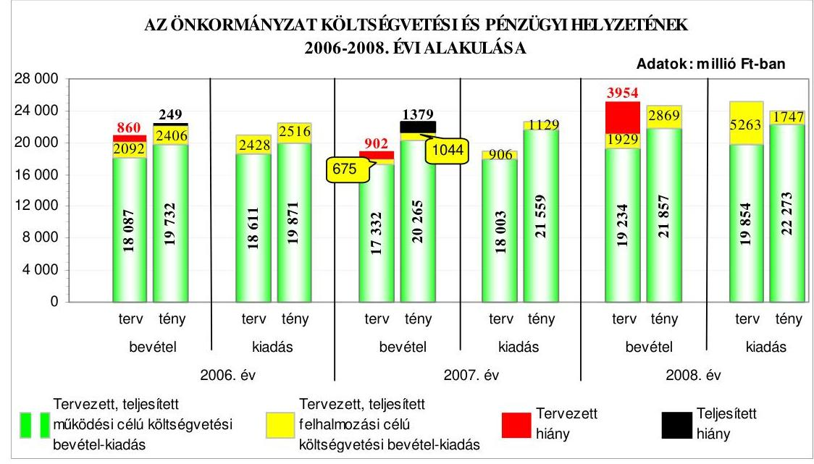
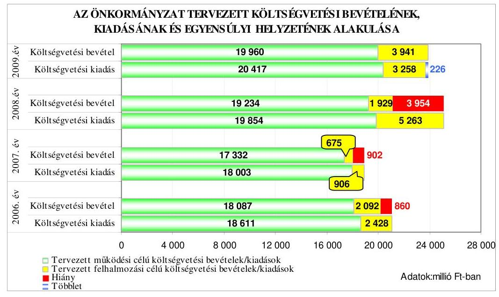
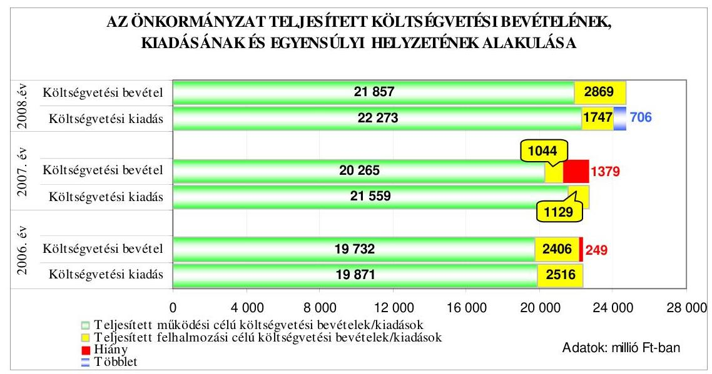
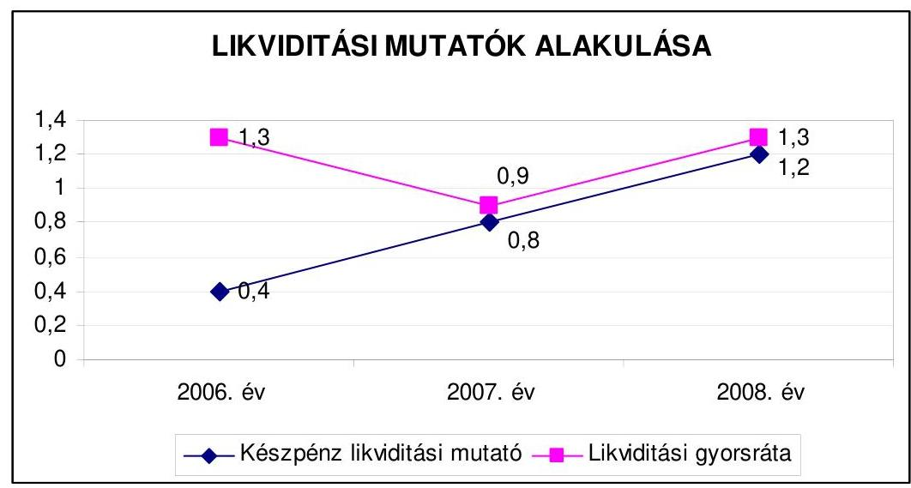
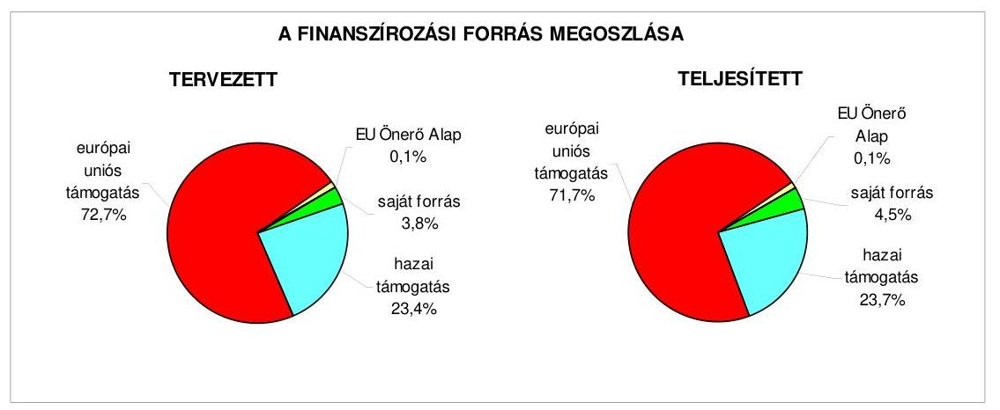
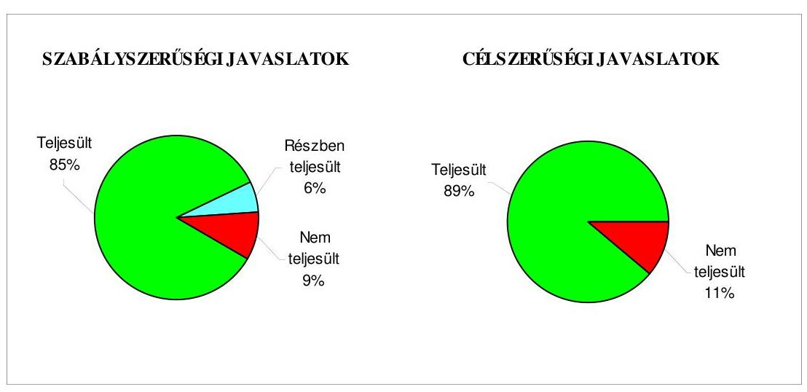
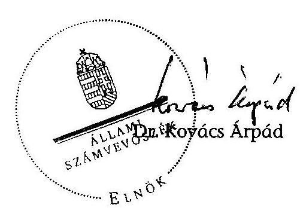
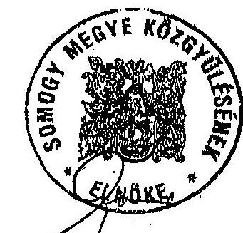

# JELENTÉS 

a Somogy Megyei Önkormányzat gazdálkodási rendszerének 2009. évi ellenőrzéséről

---

3. Önkormányzati és Területi Ellenőrzési Igazgatóság
3.3. Átfogó Ellenőrzések Főcsoport

Iktatószám: V-3001-4/33/18/2009.
Témaszám: 933
Vizsgálat-azonosító szám: V0439

# Az ellenőrzést felügyelte: 

Dr. Lóránt Zoltán
főigazgató
Az ellenőrzés végrehajtásáért felelős:
Dr. Sepsey Tamás
főigazgató-helyettes
Az ellenőrzést vezette:
Dr. Hegedüs György
főtanácsadó, irodavezető
Az ellenőrzést végezték:
Csepreginé
Tancsik Erzsébet
számvevő tanácsos

Groholy Andrásné
Hangyál Márta
számvevő tanácsos

Reichert Margit
számvevő

## A témához kapcsolódó eddig készített számvevőszéki jelentések:

## címe

Jelentés a Somogy Megyei Önkormányzat gazdálkodásának átfogó 0632 ellenőrzéséről
Jelentés a helyi és a helyi kisebbségi önkormányzatok gazdálkodási 0726 rendszerének 2006. évi átfogó és egyéb szabályszerűségi ellenőrzéséről
Jelentés az önkormányzati kórházak és bentlakásos szociális intézmények ápolásra, gondozásra fordított pénzeszközei felhasználásának ellenőrzéséről
Jelentés a Magyar Köztársaság 2007. évi költségvetése végrehajtásának ellenőrzéséről
Függelék:

- a helyi önkormányzatokat 2007. évben megillető normatív állami hozzájárulás elszámolása

---

# TARTALOMJEGYZÉK 

BEVEZETÉS ..... 11
I. ÖSSZEGZŐ MEGÁLLAPÍTÁSOK, KÖVETKEZTETÉSEK, JAVASLATOK ..... 16
II. RÉSZLETES MEGÁLLAPÍTÁSOK ..... 25

1. Az Önkormányzat költségvetési és pénzügyi helyzete ..... 25
1.1. A tervezett költségvetési bevételek és kiadások alapján a
költségvetési egyensúly, a költségvetési hiány oka,
finanszírozásának tervezett módja és a költségvetési hiány
megállapításának szabályszerűsége ..... 25
1.2. A teljesített költségvetési bevételek és kiadások alapján a pénzügyi
egyensúly, a pénzügyi hiány oka, finanszírozásának módja és
hatása a pénzügyi helyzet alakulására az eladósodás, valamint a
fizetőképesség szempontjából ..... 27
2. Az Önkormányzat felkészültsége az európai uniós források igénylésére és
felhasználására, valamint az elektronikus közszolgáltatási feladatok
ellátására ..... 35
2.1. Az európai uniós források igénybevételére és a várható támogatás
felhasználására történt felkészülés szabályozottságának,
szervezettségének eredményessége ..... 35
2.1.1. Az európai uniós forrásokra történő pályázatok benyújtására
vonatkozó döntések összhangja a fejlesztési célkitűzésekkel ..... 35
2.1.2. Az európai uniós forrásokhoz kapcsolódóan a
pályázatfigyelés, a pályázatkészítés, valamint az európai
uniós támogatással megvalósuló fejlesztés lebonyolítása
belső rendjének szabályozottsága, a végrehajtás személyi,
szervezeti feltételei, az ellenőrzési feladatok meghatározása ..... 42
2.1.3. A fejlesztési feladat lebonyolításánál a feladatellátás
rendjére, az ellenőrzési feladatok teljesítésére, valamint a
felelősségi szabályokra vonatkozó előírások betartása ..... 44
2.2. Az elektronikus közszolgáltatás feltételeinek kialakítása, a
közérdekű gazdálkodási adatok elektronikus közzététele ..... 46
3. A költségvetési gazdálkodás belső kontrolljai ..... 47
3.1. A szabályozottság kockázata a költségvetés tervezési, gazdálkodási,
beszámolási és a folyamatba épített, előzetes és utólagos vezetői
ellenőrzési feladatoknál ..... 47
3.2. A belső kontrollok működése az önkormányzati források
szabályszerű felhasználásában, a költségvetési tervezés,
gazdálkodás, beszámolás folyamataiban ..... 49

---

3.3. A belső ellenőrzési kötelezettség teljesítése, javaslatainak hasznosulása ..... 51
4. Az ÁSZ korábbi ellenőrzési javaslatai alapján készített intézkedési terv végrehajtása, eredményessége ..... 55
4.1. Az Önkormányzat gazdálkodási rendszerének átfogó ellenőrzése során tett javaslatok végrehajtására tervezett intézkedések megvalósulása ..... 55
4.2. A zárszámadáshoz kapcsolódó (állami hozzájárulások, támogatások igénylésének és felhasználásának ellenőrzése), valamint a további vizsgálatok esetében a megállapítások, javaslatok alapján tett intézkedések ..... 58

# MELLÉKLETEK 

1. számú Az Önkormányzat gazdálkodását meghatározó adatok, mutatószámok (1 oldal)
2. számú Az önkormányzati vagyon alakulása (1 oldal)

2/a. számú Az önkormányzati kötelezettségek alakulása (1 oldal)
3. számú Az Önkormányzat 2006-2009. évi költségvetési előirányzatainak és 2006-2008. évi pénzügyi teljesítéseinek alakulása (1 oldal)
4. számú Tanúsítvány az európai uniós forrásokkal támogatott célok és programok 2006-2009. évi tervezett és teljesített adatairól (1 oldal)
5. számú Adatlap az európai uniós forrással támogatott „Múlt és jövő kapcsolata a közös Európában" fejlesztésről (3 oldal)
6. számú

Gelencsér Attila úr, a Somogy Megyei Önkormányzat Közgyűlése elnökének észrevétele (1 oldal)

---

# RÖVIDÍTÉSEK JEGYZÉKE 

| Törvények |  |
| :--: | :--: |
| Áht. | az államháztartásról szóló 1992. évi XXXVIII. törvény |
| Eisztv. | az elektronikus információszabadságról szóló 2005. évi XC. törvény |
| Htv. | a helyi önkormányzatok és szerveik, a köztársasági megbízottak, valamint egyes centrális alárendeltségű szervek feladat- és hatásköreiről szóló 1991. évi XX. törvény |
| Ket. | a közigazgatási hatósági eljárás és szolgáltatás általános szabályairól szóló 2004. évi CXL. törvény |
| Ötv. | a helyi önkormányzatokról szóló 1990. évi LXV. törvény |
| Számv. tv. | a számvitelről szóló 2000. évi C. törvény |
| Rendeletek |  |
| Ámr. | az államháztartás működési rendjéről szóló 217/1998. (XII. 30.) Korm. rendelet |
| Ber. | a költségvetési szervek belső ellenőrzéséről szóló 193/2003. (XI. 26.) Korm. rendelet |
| $\mathrm{SzMSz}_{1}$ | a Somogy Megyei Önkormányzat 8/2003. (V. 5.) számú rendelete az Önkormányzat Szervezeti és Működési Szabályzatáról |
| $\mathrm{SzMSz}_{2}$ | a Somogy Megyei Önkormányzat 10/2007. (V. 22.) számú rendelete az Önkormányzat Szervezeti és Működési Szabályzatáról |
| Vhr. | az államháztartás szervezetei beszámolási és könyvvezetési kötelezettségének sajátosságairól szóló 249/2000.   (XII. 24.) Korm. rendelet |
| 18/2005. (XII. 27.) IHM rendelet | a közzétételi listákon szereplő adatok közzétételéhez szükséges közzétételi mintákról szóló 18/2005. (XII. 27.) IHM rendelet |
| 2006. évi költségvetési rendelet | a Somogy Megyei Önkormányzat 1/2006. (III. 6.) számú rendelete az Önkormányzat 2006. évi költségvetéséről |
| 2007. évi költségvetési rendelet | a Somogy Megyei Önkormányzat 1/2007. (III. 13.) számú rendelete az Önkormányzat 2007. évi költségvetéséről |
| 2008. évi költségvetési rendelet | a Somogy Megyei Önkormányzat 2/2008. (II. 8.) számú rendelete az Önkormányzat 2008. évi költségvetéséről |
| 2009. évi költségvetési rendelet | a Somogy Megyei Önkormányzat 1/2009. (III. 10.) számú rendelete az Önkormányzat 2009. évi költségvetéséről |
| 2006. évi zárszámadási rendelet | a Somogy Megyei Önkormányzat 9/2007. (V. 2.) számú rendelete az Önkormányzat 2006. évi költségvetési zárszámadásáról |
| 2007. évi zárszámadási rendelet | a Somogy Megyei Önkormányzat 6/2008. (V. 13.) számú rendelete az Önkormányzat 2007. évi költségvetési zárszámadásáról |

---

2008. évi zárszámadási rendelet
pályázatok előkészítésének és megvalósításának rendelete
vagyongazdálkodási rendelet

Szórövidítések
akcióterv ${ }_{1}$
akcióterv $_{2}$

Alelnöki iroda
APEH
áfa
ÁROP
ÁSZ
Belső ellenőrzési iroda
EU Önerő Alap támogatás

DDOP
Duránczky József Közoktatási Intézmény

EKOP
e-közigazgatás
Fejlesztési iroda
fejlesztési terv $_{1}$
fejlesztési terv $_{2}$
főjegyző
a Somogy Megyei Önkormányzat 7/2009. (V. 12.) számú rendelete az Önkormányzat 2008. évi költségvetési zárszámadásáról
Somogy Megyei Önkormányzat 10/2008. (VII. 1.) számú rendelete az államháztartás alrendszereiből, az európai uniós forrásokból és egyéb programokból származó támogatásokhoz kapcsolódó pályázatok előkészítésének és megvalósításának eljárásrendjéről
Somogy Megyei Önkormányzat 16/2005. (XII. 26.) számú rendelete az önkormányzati tulajdon- és vagyongazdálkodás szabályairól

Somogy Megyei Önkormányzat Közgyűlésének 9/2007. (II. 16.) számú határozatával jóváhagyott 2007-2009. évekre vonatkozó európai uniós akcióterve
Somogy Megyei Önkormányzat Közgyűlésének 88/2007. (VII. 5.) számú határozatával jóváhagyott 2007-2008. évre vonatkozó akcióterve
Somogy Megyei Önkormányzati Hivatal Alelnöki Irodája
Adó és Pénzügyi Ellenőrzési Hivatal
általános forgalmi adó
ÚMFT Államreform és Elektronikus Közigazgatási Operatív Program
Állami Számvevőszék
Somogy Megyei Önkormányzati Hivatal Belső Ellenőrzési Irodája
a Magyar Köztársaság 2007. évi költségvetéséről szóló 2006. évi CXXVII. törvény - 5. számú mellékletének 12. pontja alapján - központi költségvetési hozzájárulást biztosít a helyi önkormányzatok és jogi személyiségű társulásaik számára, azok európai uniós fejlesztési célú pályázataihoz szükséges saját forrás kiegészítésére
ÚMFT Dél-Dunántúli Operatív Program
Somogy Megyei Önkormányzat fenntartásában, kaposvári székhellyel működő Duránczky József Óvoda, Általános Iskola, Diák- és Gyermekotthon
ÚMFT Elektronikus Közigazgatási Operatív Program elektronikus közigazgatás
Somogy Megyei Önkormányzati Hivatal Fejlesztési Irodája
Somogy Megyei Önkormányzat Közgyűlésének 134/2007. (XII. 14.) számú határozatával jóváhagyott 2007-2010. évekre vonatkozó fejlesztési terve
Somogy Megyei Önkormányzat Közgyűlésének 3/2008. (II. 8.) számú határozatával jóváhagyott 2008-2010. évekre vonatkozó fejlesztési terve
Somogy Megyei Önkormányzat Főjegyzője

---

| FEUVE | folyamatba épített, előzetes és utólagos vezetői ellenőrzés |
| :--: | :--: |
| gazdasági program ${ }_{1}$ | Somogy Megyei Önkormányzat Közgyűlésének 54/2003. (VI. 12.) számú határozatával jóváhagyott 2003-2006. évekre vonatkozó ciklus programja |
| gazdasági program ${ }_{2}$ | Somogy Megyei Önkormányzat Közgyűlésének 44/2007. (IV. 27.) számú határozatával jóváhagyott 2007-2010. évekre vonatkozó gazdasági programja |
| gazdasági szervezet | Somogy Megyei Önkormányzati Hivatal Pénzügyi Főosztálya |
| gazdasági szervezet ügyrendje | Somogy Megyei Önkormányzati Hivatal Gazdasági Szervezetének Ügyrendje |
| GVOP | NFT Gazdasági Versenyképesség Operatív Program |
| HEFOP | NFT Humánerőforrás-fejlesztési Operatív Program |
| Hétszínvirág Módszertani Intézmény | Somogy Megyei Önkormányzat fenntartásában, Marcali székhellyel működő Hétszínvirág Egységes Gyógypedagógiai Módszertani Intézmény |
| Illetékhivatal | Somogy Megyei Önkormányzat fenntartásában 2006. december 31-ig működő Illetékhivatal |
| Informatikai iroda | Somogy Megyei Önkormányzati Hivatal Informatikai Irodája |
| informatikai stratégia | Somogy Megyei Önkormányzat Közgyűlésének 28/2001. (IV. 24.) számú határozatával elfogadott informatikai stratégiája |
| INTERREG IIIC | Határon átnyúló, transznacionális és interregionális együttműködés |
| Kincstári Szervezet | Somogy Megyei Önkormányzati Kincstári Szervezet |
| Kórház | Somogy Megyei Önkormányzat Kaposi Mór Oktató Kórháza |
| Költségvetési ellenőrzési társulás | Somogy Megyei Önkormányzat Költségvetési Ellenőrzési Társulása |
| Közgyűlés | Somogy Megyei Önkormányzat Közgyűlése |
| Közgyűlés elnöke | Somogy Megyei Önkormányzat Közgyűlésének Elnöke |
| MÁK | Magyar Államkincstár |
| MNB | Magyar Nemzeti Bank |
| Nemzetközi iroda | Somogy Megyei Önkormányzati Hivatal Nemzetközi Irodája |
| Nevelési Tanácsadó | Marcali Város Önkormányzata fenntartásában működő Egységes Pedagógiai Szakszolgálat |
| NFT | Nemzeti Fejlesztési Terv |
| NFÜ | Nemzeti Fejlesztési Ügynökség |
| ÖNHIKI | önhibáján kívül hátrányos helyzetben lévő önkormányzatok támogatása |
| Önkormányzat | Somogy Megyei Önkormányzat |
| Önkormányzati hivatal | Somogy Megyei Önkormányzati Hivatal |
| SzMSz-e | a Somogy Megyei Önkormányzati Hivatal Ügyrendi Szabályzata, az SzMSz ${ }_{2}$ 7. számú függeléke |

---

pályázati szabályzat

Pályázati iroda
Pénzügyi bizottság
PHARE
PM
ROP
Stratégiai fejlesztési főosztály
Testvérmegyei találkozó

TÁMOP
TIOP
TISZK
ÚMFT

Somogy Megyei Önkormányzat pályázati eljárásrendjéről szóló 4/2008. számú főjegyzői utasítás
Somogy Megyei Önkormányzati Hivatal Pályázati Irodája
Somogy Megyei Önkormányzat Pénzügyi Bizottsága
PHARE (Pologne, Hongrie Aide a la Reconstruction Économique) program
Pénzügyminisztérium
NFT Regionális Fejlesztés Operatív Program
Somogy Megyei Önkormányzati Hivatal Stratégiai Fejlesztési Főosztálya
„Múlt és jövő kapcsolata a közös Európában" címet viselő háromnapos rendezvény
ÚMFT Társadalmi Megújulás Operatív Program
ÚMFT Társadalmi Infrastruktúra Operatív Program
Térségi Integrált Szakképző Központ
Új Magyarország Fejlesztési Terv

---

# ÉRTELMEZŐ SZÓTÁR 

1. elektronikus szolgáltatási szint
2. elektronikus szolgáltatási szint
3. elektronikus szolgáltatási szint
4. elektronikus szolgáltatási szint

Európai uniós források
fejlesztési feladat (projekt)
fejlesztési célkitűzés
hazai társfinanszírozás
kedvezményezett

Az 1044/2005. (V. 11.) Korm. határozat alapján olyan információs, tájékoztató szolgáltatás, amely csak általános információkat közöl az adott üggyel kapcsolatos teendőkről és a szükséges dokumentumokról.
Az 1044/2005. (V. 11.) Korm. határozat alapján olyan egyirányú kapcsolatot biztosító szolgáltatás, amely az 1. szinten túl biztosítja az adott ügy intézéséhez szükséges dokumentumok, nyomtatványok letöltését, és azok ellenőrzéssel, vagy ellenőrzés nélküli elektronikus kitöltését, amely esetben a dokumentumok benyújtása hagyományos úton történik.
Az 1044/2005. (V. 11.) Korm. határozat alapján olyan kétirányú kapcsolatot biztosító szolgáltatás, amely közvetlen, vagy ellenőrzött kitöltésű dokumentum segítségével biztosítja az elektronikus adatbevitelt és a bevitt adatok ellenőrzését. Az ügy indításához, intézéséhez személyes megjelenés nem szükséges, de az ügyhöz kapcsolódó közigazgatási döntés (határozat, egyéb aktus) közlése, valamint a kapcsolódó illeték-, vagy díjfizetés hagyományos úton történik.
Az 1044/2005. (V. 11.) Korm. határozat alapján olyan teljes közvetlen kétirányú ügyintézési folyamatot biztosító szolgáltatás, amikor az ügyhöz kapcsolódó közigazgatási döntés is elektronikus úton kerül közlésre, illetve a kapcsolódó illeték-, vagy díjfizetés elektronikus úton is intézhető.
A támogatott projekt megvalósítása érdekében, a fejlesztés lebonyolítása során felmerült kiadások finanszírozási forrása.
A fejlesztési feladat (projekt) tartalmilag és formailag részletesen kidolgozott, megfelelő pénzügyi háttérrel és végrehajtási ütemezéssel rendelkező fejlesztési terv, amely illeszkedik az Európai Unió, illetve a Nemzeti Fejlesztési Terv és az Új Magyarország Fejlesztési Terv által támogatott
 programokhoz.
Az önkormányzat által ellátott kötelező, vagy önként vállalt feladatok biztosításának mennyiségi, vagy minőségi fejlesztésére vonatkozó terv. A mennyiségi fejlesztés megvalósulhat beszerzéssel, létesítéssel, bővítéssel, átalakítással.
A központi költségvetési és az elkülönített állami pénzalapokból származó finanszírozás.
Az a helyi önkormányzat, amely a támogatási szerződést kedvezményezettként aláírja, a projektet, illetve a központi programhoz kapcsolódó támogatott önkormányzati programot végrehajtja.

---

közreműködő szervezet
lebonyolítás

Nemzeti Fejlesztési Terv
lebonyolítás

Operatív program
regionális program

A közreműködő szervezet az európai uniós támogatást elnyert kedvezményezettekkel kapcsolatot tartó szerv. Az operatív programok közreműködő szervezetei befogadják, nyilvántartják, döntésre előkészítik a pályázatokat, rögzítik a támogatással kapcsolatos adatokat az Egységes Monitoring Informatikai Rendszerben, elvégzik a támogatások előzetes (szerződéskötést megelőző), közbenső (a pénzügyi elszámolás, finanszírozás folyamatában végzett) és utólagos (a támogatott projekt pénzügyi lezárását megelőző) ellenőrzését. Az önkormányzatoknál a leggyakrabban előforduló operatív program a Regionális Fejlesztési Operatív Program végrehajtásában közreműködő szervezetek a VÁTI Kht. és a regionális fejlesztési ügynökségek.
Az európai uniós források felhasználásával megvalósuló fejlesztésre irányuló műszaki, gazdasági (pénzügyi) tevékenységet magában foglaló szervezési, irányítási szolgáltatás. A szervezési szolgáltatás kiterjedhet a pályázatkészítésre, a közbeszerzési eljárás lebonyolításán keresztül a folyamatos műszaki ellenőrzésre, a pénzügyi elszámolásra, a műszaki átadás-átvételre, az üzembe helyezésre, illetve a fejlesztési folyamat egyes elemeire.
Helyzetelemzést, stratégiát a tervezett fejlesztési területek prioritásait, azok céljait és pénzügyi forrásaik megjelölését tartalmazó dokumentum, amelyet a Magyar Köztársaság készített az Európai Unió programozási irányelveinek, célkitűzéseinek megfelelően a fejlődésben lemaradó régiók fejlődésének és strukturális átalakulásának elősegítésére a kiemelt szükségletekre figyelemmel. A Nemzeti Fejlesztési Terv stratégiai fejezetének célja, hogy a 2004-2006 közötti időszakra kijelölje a strukturális alapokból támogatható fejlesztéspolitikai célkitűzéseit és prioritásait. A strukturális alapok operatív programjai: Agrár és Vidékfejlesztési Operatív Program (AVOP); Gazdasági Versenyképesség Operatív Program (GVOP); Humánerőforrás-fejlesztési Operatív Program (HEFOP); Környezetvédelmi és Infrastruktúra-fejlesztési Operatív Program (KIOP); Regionális Fejlesztési Operatív Program (ROP).
Az Európai Bizottság által jóváhagyott, a Közösségi Támogatási Keret végrehajtására vonatkozó, több évre szóló intézkedésekhez kapcsolódó prioritások egységes rendszerét tartalmazó dokumentum.
Az ágazati és regionális prioritásokat egyaránt tartalmazó operatív program regionális prioritása, illetve támogatási konstrukciója.

---

támogatási szerződés

Új Magyarország Fejlesztési Terv

A strukturális alapok esetében az irányító hatóságnak, illetve a Kohéziós Alap esetében a közreműködő szervezeteknek a kedvezményezett önkormányzattal kötött szerződése, amely a támogatás felhasználásának részletes feltételeit tartalmazza. Az Új Magyarország Fejlesztési Terv keretében támogatott projektek esetében a támogatási szerződés a kedvezményezett és a Nemzeti Fejlesztési Ügynökség nevében eljáró közreműködő szervezet között jön létre. Nagyprojekt esetén a támogatási szerződést a Nemzeti Fejlesztési Ügynökség ellenjegyzi. A támogatási szerződés képezi a megvalósítás nyomon követésének, finanszírozásának és ellenőrzésének alapját.
Az Új Magyarország Fejlesztési Terv célja a foglalkoztatás bővítése és a tartós növekedés feltételeinek megteremtése. Ennek érdekében 2007-2013 között hat kiemelt területen indított el összehangolt állami és európai uniós fejlesztéseket: a gazdaságban, a közlekedésben, a társadalom megújulása érdekében, a környezet és az energetika területén, a területfejlesztésben és az államreform feladataival összefüggésben. Az Új Magyarország Fejlesztési Terv operatív programjai: Államreform Operatív Program (ÁROP); Elektronikus Közigazgatás Operatív Program (EKOP); Gazdaságfejlesztés Operatív Program (GOP); Környezet és Energia Operatív Program (KEOP); Közlekedés Operatív Program (KÖZOP); Dél-Alföldi Operatív Program (DAOP); Dél-Dunántúli Operatív Program (DDOP); Észak-Alföldi Operatív Program (ÉAOP); Észak-Magyarországi Operatív Program (ÉMOP); Közép-Dunántúli Operatív Program (KDOP); Közép-Magyarországi Operatív Program (KMOP); Nyugat-Dunántúli Operatív Program (NYDOP); Társadalmi Infrastruktúra Operatív Program (TIOP); Társadalmi Megújulás Operatív Program (TÁMOP).

---

.

---

# JELENTÉS 

## a Somogy Megyei Önkormányzat gazdálkodási rendszerének 2009. évi ellenőrzéséről

## BEVEZETÉS

Az Ötv. 92. § (1) bekezdése, az Állami Számvevőszékről szóló 1989. évi XXXVIII. törvény 2. § (3) bekezdése, valamint az Áht. 120/A. § (1) bekezdése alapján az önkormányzatok gazdálkodását az Állami Számvevőszék ellenőrzi. Az ellenőrzésre az Országgyűlés illetékes bizottságai részére is átadott, országosan egységes ellenőrzési program szerint került sor.

Az Állami Számvevőszék a stratégiájában foglalt célkitűzéseknek megfelelően a helyi önkormányzatok költségvetési gazdálkodási rendszere átfogó ellenőrzésének programját a 2007. évtől megújította, azt kiegészítette további - teljesítményellenőrzési - elemekkel.

Az ellenőrzés célja annak értékelése volt, hogy az Önkormányzat:

- milyen módon biztosította a költségvetési és a pénzügyi egyensúlyt a költségvetésében és annak teljesítése során, valamint változott-e a hiányzó bevételi források pótlásában a finanszírozási célú pénzügyi műveletek jelentősége, hatása;
- eredményesen készült-e fel a szabályozottság és a szervezettség terén az európai uniós források igénylésére és felhasználására, továbbá biztosította-e az elektronikus közszolgáltatás feltételeit, a gazdálkodási adatok közzétételével a gazdálkodás nyilvánosságát;
- kialakította-e és működtette-e a külső és a belső feltételeknek megfelelően a költségvetés tervezési, gazdálkodási és zárszámadási feladatai belső kontrollrendszerét ${ }^{1}$, ezen tevékenységek szabályszerű ellátásához hozzájárult-e a folyamatba épített, előzetes és utólagos vezetői ellenőrzés, valamint a belső ellenőrzés;
- megfelelően hasznosította-e a korábbi számvevőszéki ellenőrzések megállapításait, szabályszerűségi ${ }^{2}$ és célszerűségi javaslatait.

[^0]
[^0]:    ${ }^{1}$ A gazdálkodás szabályszerűségét biztosító kontrollrendszer alatt értjük a kiépített és működő pénzügyi irányítási és szabályozási rendszert, valamint a belső ellenőrzési funkciók ellátásának rendszerét.
    ${ }^{2}$ A törvényi előírások betartásának elmulasztásakor a részletes megállapítások fejezetben egységesen a törvénysértés megjelölést alkalmazzuk, mivel az ÁSZ nem tehet különbséget a törvényi előírások között.

---

Az ellenőrzés típusa: átfogó ellenőrzés, amely - egy ellenőrzés keretében meghatározott területekre összpontosítva - alkalmazza a szabályszerűségi, valamint a teljesítmény-ellenőrzés jellemzőit.

Az ellenőrzött időszak: az 1., 2. és 4. programpontok tekintetében a 2006-2008. évek és 2009. I. negyedév, a 3. ellenőrzési programpontnál a 2008. év.

Somogy megye lakosainak száma 2008. január 1-jén 265970 fő volt. A 2006. évi önkormányzati választást követően az Önkormányzat 40 tagú Közgyűlésének munkáját 13 állandó bizottság segítette. Az Önkormányzat mellett a 2006. évi önkormányzati választásokat követően kettő kisebbségi önkormányzat ${ }^{3}$ működött. A Közgyűlés elnöke a 2006. évi választás óta tölti be tisztségét, a főjegyző személye 1999. év óta változatlan.

Az Önkormányzat feladatainak végrehajtása érdekében a 2008. évben 27 költségvetési intézményt működtetett, amelyekből három önállóan gazdálkodott. A feladatok ellátásában részt vett kettő gazdasági társasága, továbbá hat alapítványa. Az Önkormányzat a 2008. évi költségvetési beszámolója szerint 24726 millió Ft költségvetési bevételt ért el és 24020 millió Ft költségvetési kiadást teljesített. A könyvviteli mérleg szerint 2008. december 31-én 23729 millió Ft értékű vagyonnal rendelkezett. Az Önkormányzat vagyona a 2006. év végi állományhoz viszonyítva 2,3%-kal csökkent, amit a tárgyi eszközök 2006. évi állományában mutatkozó halmozódás ${ }^{4}$ okozott. Az Önkormányzat vagyona - a kétszeres számbavételből adódó halmozódás kiszűrésével - a 2006. évről a 2008. évre 14,9%-kal emelkedett. A 2007. és a 2008. évi, összesen 6000 millió Ft összegű kötvénykibocsátásból származó bevételek, illetve azok betétként történő elhelyezése hatására a pénzeszközök 212,6%-kal (2813 millió Ft-ra), valamint a befektetett pénzügyi eszközök 328,5%-kal (2027 millió Ft-ra) növekedtek. Az Önkormányzat kötelezettségeinek állománya 2006-2008 között több mint duplájára, 137,6%-kal (10 572 millió Ft-ra) nőtt. A forgóeszközökön belül a követelések állománya 90,5%-kal csökkent az illetékekhez ${ }^{5}$ kapcsolódó követelések nyilvántartásból való kivezetése következtében. A saját tőke csökkenését az Illetékhivatal megszűnése, valamint a tárgyi eszközök 2006. évi állományában bemutatott halmozódás okozta. A 2008. évben az összes költségvetési bevétel 23,6%-át a saját bevétel biztosította, az összes költségvetési kiadásból a felhalmozási célú kiadások részaránya 7,3% volt. A 2009. évi költségvetési rendeletben 23901 millió Ft költségvetési bevételt és 23675 millió Ft költségvetési kiadást irányoztak elő. Az Önkormányzati hivatalban dolgozó köztisztviselők száma 2008. december 31-én 81 fő, a költségvetési intézményekben foglalkoztatott közalkalmazottak száma 4073 fő volt. Az Önkormányzat gazdálkodását meghatározó adatokat, mutatószámokat az 1-3. számú mellékletek tartalmazzák.

[^0]
[^0]:    ${ }^{3}$ Területi kisebbségi önkormányzatok: cigány, horvát.
    ${ }^{4}$ Az Önkormányzat 2006. évi mérlegében folyamatban lévő beruházásként mutatta ki a Kórház fejlesztéséhez kapcsolódó, 3628 millió Ft értékű tárgyi eszköz beszerzést, amelyet - a kivitelezői számlák alapján - a Kórház a tárgyi eszközök között szintén nyilvántartásba vett, annak ellenére, hogy azt az Önkormányzat, a beruházás 2007. évi aktiválását követően adta át a részére.
    ${ }^{5}$ Az egyes pénzügyi tárgyú törvények módosításáról szóló 2006. évi LXI. törvény 249. § (1) bekezdése alapján, 2007. január 1-jétől a Fővárosi Illetékhivatal és a megyei illetékhivatalok megszűntek, ezzel egyidejűleg az illetékhivatalok feladatinak ellátását az APEH regionális igazgatóságai vették át.

---

Az Önkormányzat költségvetési és pénzügyi helyzetét az elemző eljárás módszerével vizsgáltuk. E körben elemeztük a költségvetés egyensúlyi helyzetének alakulását, a tervezett és tényleges költségvetési hiány okait, a mérséklésére tett intézkedéseket, finanszírozásának módját, az Önkormányzat adósságállományának alakulását, összetevőit. Az európai uniós támogatás igénylésére, felhasználására történt felkészülésre vonatkozóan teljesítményellenőrzést végeztünk. Az európai uniós források figyelésére, igénylésére és felhasználására a felkészülést akkor minősítettük eredményesnek, ha a meghatározott szempontok szerinti feltételeknek megfelelt a felkészülés szabályozottsága, szervezettsége, továbbá értékeltük, hogy az igényelt európai uniós támogatások az Önkormányzat által meghatározott fejlesztési célkitűzésekhez kapcsolódtak-e. Az ellenőrzés során felmértük, hogy az e-közszolgáltatási feladat ellátása, illetve bevezetése, működtetése érdekében milyen intézkedéseket tettek, valamint biztosították-e a közérdekű adatok közzétételét.

A költségvetési gazdálkodás belső kontrolljainak ellenőrzése során értékeltük, hogy az Önkormányzati hivatalnál a költségvetés tervezési, gazdálkodási, zárszámadás készítési feladatok belső kontrolljainak kiépítettsége és működése megfelelő biztosítékot ad-e a gazdálkodási feladatok megfelelő, szabályszerű ellátására. Felmértük és minősítettük a költségvetés tervezési, a gazdálkodási, a zárszámadás készítési feladatokkal, továbbá a pénzügyi-számviteli területen az informatikával kapcsolatosan kialakított kontrollok megfelelőségét, valamint a kialakított belső kontrollok működésének megbízhatóságát. Értékeltük a belső ellenőrzés szabályozottságát, működési feltételeinek kialakítását, továbbá működésének megbízhatóságát.

Az Önkormányzati hivatalnál értékeltük a gazdálkodás folyamatában kulcsszerepet betöltő belső kontrollok működésének megbízhatóságát, ennek keretében ellenőriztük a szakmai teljesítésigazolásra és az utalvány ellenjegyzésére kialakított kontrollok végrehajtását. Az ellenőrzést a következő, magas kockázatuk alapján kiválasztott ${ }^{6}$ kifizetésekre folytattuk le ${ }^{7}$:

- a külső szolgáltató által végzett karbantartási, kisjavítási szolgáltatásokra,

[^0]
[^0]:    ${ }^{6}$ Az önkormányzatok kiemelt előirányzataira vonatkozóan, a vertikális folyamatokra elvégeztük a kockázatok becslését, amelynek eredményeként határoztuk meg a magas kockázatú területeket.
    ${ }^{7}$ A korábbi ellenőrzési tapasztalataink szerint ezeken a területeken a jegyzők nem, vagy hiányosan szabályozták a megbízás, megrendelés, illetve beszerzés indokoltságának, szükségességének elbírálására, igazolására, valamint a teljesítések dokumentálására, a kiadások jogosultságának, összegszerűségének ellenőrzésére irányuló kontrollokat. További kockázatot jelentett, ha a külső szolgáltató által végzett karbantartási, kisjavítási munkák 50 ezer Ft alatti megrendeléseire vonatkozóan a jegyzők nem alakították ki a kötelezettségvállalások rendjét és nyilvántartási formáját, valamint a szabályozás elmulasztása esetén nem történt meg az írásbeli kötelezettségvállalás és annak az ellenjegyzése sem.

---

- a gépek, berendezések, felszerelések beszerzésére, továbbá
- az államháztartáson kívülre teljesített működési és felhalmozási célú pénzeszköz átadásokra.

Az ellenőrzés hatékony elvégzése céljából a vizsgálandó területek kiválasztása során a kockázatokon
 alapuló megközelítés érvényesült, ezáltal az ellenőrzési erőforrásokat azokra a területekre fókuszáltuk, amelyeken legnagyobb a hibák előfordulási valószínűsége. Az ellenőrzési erőforrások ilyen típusú összpontosításával minimálisra csökkenthető a kívánt ellenőrzési bizonyosság eléréséhez szükséges időráfordítás.

A pénzügyi-számviteli folyamatokban alkalmazott belső kontrollok létezésének és működésének ellenőrzésére a vizsgált három terület 2008. évi könyvviteli tételeiből területenként egyszerű véletlen mintát vettünk. A kijelölt gazdasági eseményre elvégzett megfelelőségi tesztek alapján értékeltük a kontrollok működésének megbízhatóságát a vizsgált három területre külön-külön, majd összesítően ${ }^{8}$. A helyszíni ellenőrzés megállapításainak részletes dokumentálását megfelelőségi tesztlapokon, elővizsgálati és helyszíni ellenőrzési munkalapokon biztosítottuk. Ezeken a teszt- és munkalapokon a minősítés alapjául szolgáló kérdések és a vonatkozó konkrét jogszabályhelyek megjelölése mellett értékeltük a kialakított belső kontrollokban rejlő kockázatokat ${ }^{9}$ és a kialakított kontrollok működésének megbízhatóságát ${ }^{10}$.

Az ÁSZ korábbi ellenőrzési javaslatai alapján tett intézkedéseket, illetve azok megvalósítását utóellenőrzés keretében vizsgáltuk. A gazdálkodási rendszer átfogó ellenőrzése során megfogalmazott javaslatok végrehajtására tett intézkedések megvalósítását ellenőriztük, az egyéb számvevőszéki ellenőrzések során tett javaslatok esetében pedig a kiadott intézkedéseket tekintettük át.

A helyszíni ellenőrzés során kitöltött - az ellenőrzést végző számvevő és az Önkormányzati hivatal felelős köztisztviselője által aláírt - elővizsgálati és hely-

[^0]
[^0]:    ${ }^{8}$ A vizsgált három terület egyedi értékelési pontszámait a területek költségvetési súlyával arányosan összegeztük.
    ${ }^{9}$ A kialakított belső kontrollokban rejlő kockázatot alacsonynak minősítettük, ha a kontrollok - végrehajtásuk esetén - megfelelő védelmet nyújtanak a hibák bekövetkezése ellen. Közepesnek minősítettük a belső kontrollokban rejlő kockázatot, amennyiben a kontrollok - végrehajtásuk esetén - a lehetséges hibák többsége ellen védelmet nyújtanak. Magasnak értékeltük a kockázatot, ha a kontrollok - kialakításuk hiányában, vagy hiányos kialakításuk miatt - nem nyújtanak elegendő védelmet a lehetséges hibákkal szemben.
    ${ }^{10}$ A kontrollok működésének megbízhatóságát kiválónak értékeltük abban az esetben, ha azok működése - esetleges apróbb hiányosságoktól eltekintve - megfelelt a hibák megelőzésére és kijavítására meghatározott szabályozásnak és a legmagasabb szintű elvárásoknak. Jónak minősítettük a kontrollok működését, ha a hiányosságok száma ugyan jelentős volt, de nem veszélyeztette az ellenőrzött terület hibáinak megelőzését és kijavítását. Amennyiben a kontrollok - kialakításuk hiánya, illetve hiányosságai miatt - nem biztosították a hibák megelőzését, feltárását, kijavítását és ez veszélyeztette az eredményes, megbízható működést, a kontroll működésének megbízhatósága gyenge minősítést kapott.

---

színi ellenőrzési munkalapokat, azok kitöltési útmutatóit, továbbá a megfelelőségi tesztek dokumentumait a Közgyűlés elnöke részére a számvevői jelentéssel egyidejűleg átadtuk.

A jelentést az ÁSZ-ról szóló 1989. évi XXXVIII. tv. 25. § (1) bekezdése alapján észrevétel közlése céljából megküldtük a Somogy Megyei Önkormányzat Közgyűlése elnökének. A kapott észrevételt a jelentés 6. számú melléklete tartalmazza.

---

# 1. ÖSSZEGZŐ MEGÁLLAPÍTÁSOK, KÖVETKEZTETÉSEK, JAVASLATOK 

Az Önkormányzatnál a 2006-2009. években a tervezett költségvetési bevételek és kiadások főösszege növekedett, azonban ez a növekedés nem volt folyamatos, mert a 2007. évi költségvetésben a költségvetési bevételek és kiadások az előző évihez képest csökkentek, amihez hozzájárult az Illetékhivatal APEH-hez történő átadása miatti bevételkiesés és az átengedett központi adók csökkenése. A költségvetési bevételek és kiadások egyensúlya a 2006-2008. évi költségvetési rendeletekben nem volt biztosított, a tervezett költségvetési bevételek nem nyújtottak fedezetet a költségvetési kiadásokra, amit a tervezett működési célú költségvetési bevételek hiánya és a felhalmozási célú költségvetési bevételeket meghaladó összegben tervezett felhalmozási célú költségvetési kiadások okoztak. Az Önkormányzat a 2006-2008. évi költségvetési rendeleteiben a költségvetési egyensúly biztosításához működési és felhalmozási célú hitelek felvételét, értékpapírok értékesítését, kötvénykibocsátást és kiadási megtakarítást eredményező intézkedéseket tervezett. Az Önkormányzat a 2006-2007. évi költségvetési rendeletekben a költségvetési bevételek és kiadások különbözetét jelentő hiány összegét nem mutatta be, valamint a 2008-2009. évi költségvetési rendeletekben a költségvetés kiadási főösszegének megállapításakor - az Áht. előírása ellenére - finanszírozási célú pénzügyi műveleteket (hiteltörlesztéssel kapcsolatos kiadásokat) is figyelembe vett költségvetési hiányt módosító költségvetési kiadásként. A 2009. évi költségvetési rendelet módosításában a költségvetés bevételi és kiadási főösszegének megállapításakor - az Áht. előírásának megfelelően - finanszírozási célú pénzügyi műveleteket nem vettek figyelembe költségvetési hiányt, illetve többletet módosító bevételként, illetve kiadásként.

Az Önkormányzatnál a 2006-2007. évi költségvetések teljesítése során a realizált költségvetési bevételek nem nyújtottak fedezetet a teljesített költségvetési

---

kiadásokra, az Önkormányzat a pénzügyi egyensúlyt a 2006. évben 100 millió Ft összegű, fejlesztési célú, hosszú lejáratú hitel felvételével, ezen túl ÖNHIKI igénybevételével, és hitelviszonyt megtestesítő befektetési célú értékpapírok értékesítésével, a 2007. évben összesen 2000 millió Ft összegű svájci frank alapú, változó kamatozású kötvény kibocsátásával biztosította. A 2008. évben azonban a felhalmozási célú költségvetési bevételek - hozam és kamatbevételek realizálásából, valamint az előző évi pénzmaradvány igénybevételéből adódó - közel 1000 millió Ft-os túlteljesítése, továbbá a felhalmozási célú költségvetési kiadási előirányzatok mindössze egyharmadának teljesítése következtében a tervezett költségvetési hiánnyal szemben bevételi többlet keletkezett. A 2008. évben a realizált költségvetési bevételek és a teljesített költségvetési kiadások egyensúlya mellett 4000 millió Ft összegű svájci frank alapú, változó kamatozású kötvényt bocsátottak ki a tervezett feladatok finanszírozására.

A 2007-2008. években (a három alkalommal összesen 6000 millió Ft összegben) kibocsátott kötvényekből fennálló kötelezettségek mérleg szerinti értéke a 2008. év végén 6614 millió Ft volt. A kötvénykibocsátás az Önkormányzat számára kockázatot jelent a forint svájci frankhoz viszonyított árfolyamváltozása, valamint a változó kamatmérték miatt. A kötvénykibocsátásból származó forrásból a 2008. év végéig - a tervezett célokra - hitelek törlesztésére, szállítói számlák kiegyenlítésére, a Kórház működésének támogatására, valamint működési és fejlesztési feladatok finanszírozására összesen 2181 millió Ft-ot használtak fel. A kötvénykibocsátásból származó bevételeket felhasználásig egyrészt állampapírokba fektették, illetve lekötött betétben kamatoztatták, ezen túl - a pénzpiaci feltételek bizonytalansága miatt kockázattal járó - azonnali és határidős deviza ügyleteket is kötöttek. Az Önkormányzat az évközi likviditás biztosítása érdekében a 2006-2008. években folyószámlahitelt, a bérkifizetésekhez munkabérhitelt vett igénybe, amelyekből a 2008. év végén 130 millió Ft kötelezettség állt fenn. A költségvetési egyensúlyi helyzet javítása érdekében a 2007-2008. évi létszámleépítéssel kapcsolatos döntések alapján a fenntartott intézményekben 461 fő közalkalmazotti és az Önkormányzati hivatalnál 30 fő köztisztviselői létszám leépítését valósították meg, amelyek hatásaként évente 1098 millió Ft-os megtakarítással számoltak, a létszámcsökkentések következtében a 2008. évben összesen 654 millió Ft megtakarítást értek el.

Az Önkormányzat pénzügyi helyzete 2006-2008 között eladósodási szempontból kedvezőtlenül változott, mert a hosszú és rövid lejáratú fizetési kötelezettségek összes forráson belüli aránya nőtt a könyvviteli mérleg szerinti fizetési kötelezettségek (közel két és félszeresére történő) növekedésének és az összes forrás csökkenésének hatására. Az eladósodási mutató folyamatos növekedése mellett az esedékességi aránymutató évről-évre történő csökkenése a rövid lejáratú fizetési kötelezettségek év végi állományának és a kötelezettségeken belüli részarányának csökkenését jelezte. Az Önkormányzat fizetőképessége a 2006. évről a 2008. évre - a kötvénykibocsátásból származó bevételek realizálása hatására - javult, a 2008. év végén a pénzeszközök, a követelések és a hitelviszonyt megtestesítő forgatási célú értékpapírok együttesen 1,3-szeres mértékben nyújtottak fedezetet a rövid lejáratú fizetési kötelezettségek kiegyenlítéséhez. Az Önkormányzat pénzügyi helyzete a 2006-2008. évek között fizetőképességének javulása ellenére - a kötvénykibocsátás következményeként fokozódó eladósodásának hatására - összességében kedvezőtlenül alakult.

---

Az Önkormányzat középtávú fejlesztési célkitűzéseit gazdasági programban ${ }_{1,2}$ ágazati, szakmai koncepciókban, akciótervben ${ }_{1,2}$ és fejlesztési tervben ${ }_{1,2}$ rögzítette. A helyzetelemzésen alapult fejlesztési célkitűzések összhangban voltak az NFT és az ÚMFT intézkedései keretében megjelenő pályázati lehetőségekkel. A Közgyűlés és az intézményvezetők a 2006-2009. I. negyedév között európai uniós és közösségi kezdeményezés támogatására összesen 54 pályázatot nyújtottak be, amelyekből 32 eredményes volt, nyolc pályázatot forráshiány, hármat formai hiányosság miatt elutasítottak, 11 elbírálása még nem történt meg, emellett 2004-2005 között benyújtott, nyertes pályázatok közül 11 fejlesztési feladat a 2006-2008. években valósult meg. Az Önkormányzat 2006-2009. évi költségvetési rendeletei tartalmazták az európai uniós támogatással megvalósuló működési és felhalmozási feladatok kiadási és bevételi előirányzatait, valamint a felhalmozási kiadásokat feladatonként, azonban az Ámr. előírása ellenére nem mutatták be a több éves kihatással járó európai uniós támogatással megvalósuló feladatok előirányzatait éves bontásban. A főjegyző 2009. június hónapban elrendelte a több éves kihatással járó európai uniós támogatással megvalósuló feladatok előirányzatainak bemutatását az éves költségvetési rendeletekben. Az európai uniós támogatással megvalósuló programok, projektek bevételi és kiadási előirányzatait elkülönítetten a 2006-2009. évi költségvetési rendeletekben nem, azonban a 2009. évi költségvetési rendelet módosítása során bemutatták. A 2006-2008 között nyertes, valamint a 2004-2005. évekről áthúzódó európai uniós támogatással megvalósuló fejlesztések 55,8%-a befejeződött.

Az Önkormányzat az európai uniós források igénybevételének és felhasználásának önkormányzati feladatait az $\mathrm{SzMSz}_{1,2}$-ben, a köztisztviselők munkaköri leírásaiban, valamint 2008. évtől pályázati szabályzatban meghatározta. Rögzítette a pályázatfigyelést végzők és a döntési, illetve a döntés előterjesztési jogkörrel rendelkezők közötti információszolgáltatási kötelezettséget, a pályázatok lebonyolításának feladatait, a pályázati monitoringgal kapcsolatos feladatköröket és felelősségi köröket, az önkormányzati szintű pályázatokról vezetendő nyilvántartások rendszerét, felelőseit és a felelősség rendjét, a folyamatba épített előzetes és utólagos vezetői ellenőrzést. A 2006-2009. évi belső ellenőrzési terveket megalapozó kockázatelemzés nem terjedt ki az európai uniós forrásokkal megvalósított fejlesztési feladatokra. Az Önkormányzati hivatalban a pályázatfigyelés, pályázatkészítés és a fejlesztési feladat lebonyolításának személyi és szervezeti feltételeit kialakították. A pályázatfigyelés, pályázatkészítés és lebonyolítás feladataival a Közgyűlés elnöke és az intézmények vezetői külső személyt, szervezetet is megbíztak. A pályázatfigyelésre kötött szerződésekben a feladat ellátási kötelezettséget előírták, azonban nem határozták meg az Önkormányzati hivatal és a megbízott közötti kapcsolattartás és felelősség szabályait, az információ átadás formáját, tartalmát, módját. A külső szervezetekkel kötött megállapodásban rögzítették a pályázatkészítéssel kapcsolatosan ellátandó feladatot, meghatározták a külső szervezet és az Önkormányzati hivatal képviselői közötti kapcsolattartás szabályait, az információk átadásának formáját, tartalmát, módját, a pályázat szakmai és formai követelményeinek biztosítása érdekében a pályázatkészítést végző felelősségét. A fejlesztési feladat lebonyolítására kötött szerződésekben előírták a feladat ellátási, kapcsolattartási kötelezettséget, a személyre szóló felelősségi szabályokat, továbbá a fejlesztési feladat lebonyolítását végző ellenőrzési kötelezettségét. A főjegyző 2009. június hónapban elrendelte a pályázatfigyelésre kötött szerződések kiegészíté-

---

sének kezdeményezését, annak érdekében, hogy azok tartalmazzák az Önkormányzati hivatal és a külső szervezet közötti kapcsolattartás, információ áramlás rendjét, a felelősségi szabályokat.

Az Önkormányzat 2007. évben sikeresen pályázott az Európai Bizottságnál a „Múlt és jövő kapcsolata a közös Európában" címet viselő háromnapos konferencia megszervezésére, melyre a németországi és a horvátországi testvérmegyék képviselőit várták. A lebonyolítás akadályáról - a németországi testvérmegyei küldöttség távolmaradásáról - a pályázati szabályzatban foglaltaknak megfelelő tájékoztatót elkészítették, amely alapján a Közgyűlés elnöke kérésére az Európai Bizottság hozzájárult a program megrendezéséhez. A Testvérmegyei találkozó
 a németországi küldöttség távolmaradása ellenére, a tervezett időben, a megítélt támogatás 48,6%-ából megvalósult. A záró beszámolót határidőben megküldték a támogató részére, a támogatás összegét a beszámolót követő 93. napon folyósították. A támogatás utófinanszírozása nem okozott pénzügyi zavarokat az Önkormányzat gazdálkodásában, mivel a Testvérmegyei találkozó költségeinek fedezetét a Közgyűlés az éves költségvetéséből biztosította. A folyamatba épített ellenőrzési feladatok végrehajtása az Önkormányzati hivatalban nyomon követhető volt. Belső, illetve külső ellenőrzés keretében nem vizsgálták a program megvalósítását.

Az Önkormányzat a szabályozottság és szervezettség tekintetében 2006-2008 között összességében eredményesen készült fel az európai uniós források igénybevételére és a várható támogatások felhasználására, mivel a gazdasági programban, ágazati, szakmai koncepciókban, tervekben megfogalmazott fejlesztési célkitűzésekhez kapcsolódtak az európai uniós forrásokra benyújtott pályázatok, szabályozták a pályázatfigyelést végző és a döntési, illetve a döntés előterjesztési jogkörrel rendelkezők közötti információszolgáltatás kötelezettségét, előírták a folyamatba épített, előzetes és utólagos vezetői ellenőrzési feladatokat. Az Önkormányzati hivatalon belül és külső szervezet igénybevételével kialakították a pályázatfigyelés, a pályázatkészítés és a fejlesztési feladat lebonyolításának szervezeti, személyi feltételeit. Meghatározták a külső személlyel, szervezettel kötött szerződésekben a pályázat szakmai és formai követelményeire vonatkozóan a pályázatkészítést végző felelősségét, előírták a fejlesztési feladat lebonyolítását végző ellenőrzési kötelezettségét. Annak ellenére eredményes volt az Önkormányzat felkészültsége, hogy a 2006-2009. évi belső ellenőrzési terveket megalapozó kockázatelemzés nem terjedt ki az európai uniós forrásokkal megvalósított fejlesztési feladatokra. A főjegyző 2009. június hónapban elrendelte az éves belső ellenőrzési terveket megalapozó kockázatelemzések kiegészítését az európai uniós forrásokkal megvalósított fejlesztési feladatokkal.

A Közgyűlés az informatikai stratégiában meghatározta a közép- és hosszú távú célokat, az e-közigazgatás ellátás személyi és tárgyi feltételeit biztosította. Az Önkormányzat elektronikus tájékoztató rendszert működtetett, amely az 1. elektronikus szolgáltatási szint követelményeinek felelt meg. A Közgyűlés rendelkezett a szakosított szociális intézményi ellátáshoz kapcsolódó ügyek elektronikus úton történő intézésének kizárásáról. Az Önkormányzat az Eisztv. előírásának eleget téve - a vonatkozó IHM rendeletben előírtaknak megfelelően - honlapján közzétette a 2008. évben nyújtott céljellegű működési és fejlesztési támogatások kedvezményezetteinek nevét, a támogatás célját, összegét, a támogatási program megvalósítási helyét, az Önkormányzat pénzeszközei fel-

használásával, a vagyonnal történő gazdálkodással összefüggő, nettó ötmillió Ft-ot elérő, vagy azt meghaladó értékű szerződések esetében a szerződések megnevezését, tárgyát, a szerződést kötő felek nevét, a szerződés értékét, határozott időre kötött szerződés esetében annak időtartamát. Az Ámr. előírásával ellentétesen a 2007. évi költségvetési beszámoló szöveges indoklását az Önkormányzat nem tette közzé. A 2008. évi költségvetési beszámoló szöveges indoklásának közzététele, 2009. május hónapban, az Ámr. és Vhr. előírásainak megfelelően az Önkormányzat honlapján megtörtént.

Az Önkormányzati hivatalban a 2008. évben a költségvetés tervezési és a zárszámadás készítési folyamatok szabályozottsága alacsony kockázatot jelentett a feladatok megfelelő, szabályszerű végrehajtásában, mivel a főjegyző a pénzügyi irányítási és ellenőrzési rendszer keretében, az Önkormányzati hivatal SzMSz-ében és főjegyzői utasításokban szabályozta a költségvetési tervezés és a zárszámadás elkészítésének rendjét, meghatározta az intézmények részére a költségvetési javaslat összeállításával kapcsolatos követelményeket. A költségvetés tervezési és zárszámadás készítési folyamatban a kontrollok működésének megbízhatósága összességében kiváló volt, mivel a belső szabályozásban foglaltaknak megfelelően a főjegyző ellenőriztette, hogy a költségvetési intézmények teljesítették-e a költségvetési javaslat összeállításával kapcsolatban részükre meghatározott követelményeket. Annak ellenére összességében kiváló volt a kontrollok megbízhatósága, hogy az előírások ellenére nem ellenőrizték az intézményi számszaki beszámoló belső, valamint annak a Közgyűlés által meghatározott adatszolgáltatással való összhangját. A főjegyző 2009. június hónapban elrendelte az intézményi számszaki beszámolók és a Közgyűlés által előírt adatszolgáltatás összhangjának ellenőrzését.

A 2008. évben a gazdálkodási, a pénzügyi-számviteli és a folyamatba épített ellenőrzési feladatok szabályozottsága összességében alacsony kockázatot jelentett a feladatok megfelelő, szabályszerű végrehajtásában, mivel a főjegyző elkészítette az Önkormányzati hivatal SzMSz-ét, a számviteli politikát és a kapcsolódó szabályzatokat, számlarendet, és kialakította az ellenőrzési nyomvonalat, a kockázatkezelésre és a szabálytalanságok kezelésére vonatkozó eljárásrendet. Annak ellenére összességében alacsony volt a kockázat, hogy a főjegyző a gazdasági szervezet felépítését, működésének rendjét, a pénzügyigazdasági tevékenységet ellátó személyek feladatkörét az Önkormányzati hivatal SzMSz-ében nem rögzítette. Az önköltség-számítási szabályzatban nem írták elő a közérdekű adatszolgáltatáshoz kapcsolódó költségtérítés összegének megállapítási szabályait, a selejtezési szabályzat nem tartalmazta a döntéshozatalra jogosultak körét az üzemeltetésre átadott eszközök vonatkozásában. Az önköltség-számítási és a selejtezési szabályzatot, valamint az Önkormányzati hivatal SzMSz-ét 2009. április hónapban kiegészítették, a szabályozási hiányosságokat megszüntették.

Az Önkormányzati hivatalnál a külső szolgáltatók által végzett karbantartási, kisjavítási feladatokkal, a gépek, berendezések és felszerelések vásárlásával, valamint az államháztartáson kívülre történő működési és felhalmozási célú pénzeszközátadásokkal kapcsolatos kifizetések során a szakmai teljesítésigazolás és az utalvány ellenjegyzés működésének megbízhatósága kiváló volt, mivel a szakmai teljesítésigazolására a főjegyző által kijelölt személyek a szerződések, megrendelések, megállapodások teljesítésének, a kiadások jogosultságának, összegszerűségének ellenőrzését a helyi szabályozásban előírt módon elvégezték. Az utalványok ellenjegyzője a gazdálkodásra vonatkozó szabályok érvényesüléséről, továbbá a szakmai teljesítésigazolás és az érvényesítés elvégzéséről meggyőződött. Az érvényesítő a Vhr-ben foglaltak ellenére a karbantartási anyag és az üzemanyag vásárlása során nem a gazdasági esemény tartalmának megfelelően jelölte ki a könyvviteli elszámolásra szolgáló főkönyvi számlaszámot, hanem azokat a külső szolgáltató által végzett karbantartási, kisjavítási munkák kiadásaihoz számolták el. A főjegyző 2009. június hónapban elrendelte a karbantartási anyag és az üzemanyag vásárlással kapcsolatos gazdasági események tartalmának megfelelő könyvviteli elszámolását.

Az Önkormányzati hivatalban az informatikai rendszer szabályozottsága összességében alacsony kockázatot jelentett az informatikai feladatok szabályszerű végrehajtásában, mivel rendelkeztek a Közgyűlés által elfogadott informatikai stratégiával, a főjegyző által kiadott informatikai biztonsági szabályzattal, katasztrófa elhárítási tervvel. A hozzáférési jogosultságokra vonatkozó eljárásrendet kialakították, valamint a pénzügyi-számviteli rendszerből lekérhető ellenőrzési lista alapján beazonosítható a rögzítés időpontja és tartalma. Annak ellenére összességében alacsony volt a kockázat, hogy a pénzügyi számviteli szoftverek esetében a külső fejlesztők számára a szabályozásban nem tiltották meg az éles rendszerhez való hozzáférést, valamint az ellenőrzési napló vizsgálatáért az informatikai irodán belül nem jelöltek ki külön dolgozót. Az Önkormányzati hivatalban az informatikai rendszer működtetésénél a működésbeli hibák megelőzésére, feltárására, kijavítására kialakított kontrollok megbízhatósága jó volt, mivel az alkalmazott számítógépes program biztosította a főkönyv és a költségvetési beszámoló adatainak egyezőségét, az integrált rendszerben tárolt hozzáférési jogosultságok ellenőrizhetők voltak. A szoftverekben a jelszavakra előírt szabályokat betartatták, megoldották a rögzített, de hibás, törölt bizonylatok kezelését, azonban a szabályzatokban előírt rendszerességgel nem ellenőrizték az ellenőrzési listákat (naplókat), a szoftver elemeire vonatkozó változáskezelési eljárások ellenőrzését, tesztelését nem dokumentálták, továbbá a 2007. és a 2008. években elmaradt a katasztrófa elhárítási terv tesztelése, valamint nem történt meg annak ellenőrzése, hogy az elmentett állományokból a pénzügyi számviteli adatok teljes körűen helyreállíthatók-e. A megállapított hiányosságok nem veszélyeztették az alkalmazott informatikai rendszer megbízható működését.

Az Önkormányzat a belső ellenőrzési feladatok ellátására a főjegyzőnek közvetlenül alárendelt belső ellenőrzési egységet hozott létre négy fő létszámmal, amely szervezet funkcionális függetlenségét biztosították. A belső ellenőrzés szervezeti keretei kialakításának és szabályozásának hiányosságai közepes kockázatot jelentettek a belső ellenőrzési feladatok megfelelő végrehajtásában, mivel a belső ellenőrzési feladatok ellátásának szabályozása hiányos, illetve ellentmondásos volt, mert az Önkormányzati hivatal SzMSz-ében nem határozták meg a 2006. évben létrehozott Belső ellenőrzési iroda jogállását, feladatait, ugyanakkor az SzMSz még tartalmazta azt a rendelkezést, amely szerint az Önkormányzat a belső ellenőrzési feladatok ellátásáról a Költségvetési ellenőrzési társulás útján gondoskodik. Az Önkormányzatnál a stratégiai terv nem kockázatelemzésen alapult, valamint a 2008. és a 2009. évi belső ellenőrzési terveket alátámasztó kockázatelemzések nem terjedtek ki az Önkormányzati hivatalban és a költségvetési intézményeknél az európai uniós forrásból meg-

valósított feladatok végrehajtására, a közbeszerzések, illetve a közbeszerzési eljárások lebonyolítására, továbbá az Önkormányzat többségi irányítást biztosító befolyása alatt működő gazdasági társaságok működtetésére. A kialakított szervezet azonban - szabályszerű működtetése esetén - a lehetséges hibák többsége ellen védelmet nyújtott. Az ÁSZ helyszíni vizsgálatának ideje alatt a Belső ellenőrzési iroda jogállását és részletes feladatait az Önkormányzat meghatározta, az ellentmondásos szabályozást megszüntette. A belső ellenőrzés működésénél a kialakított kontrollok megbízhatósága összességében kiváló volt, mivel a főjegyző a - tartós távollétekből adódó ellenőri kapacitás csökkenés miatt - módosított 2008. évi ellenőrzési tervben foglaltaknak megfelelően gondoskodott a költségvetési szervek ellenőrzésének végrehajtásáról. A Belső ellenőrzési iroda az Önkormányzati hivatalban tervezett hat ellenőrzést, és a költségvetési intézményeknél tervezett 13 ellenőrzést az ütemezésnek megfelelően elvégezte, a tartalék kapacitás terhére további hét ellenőrzést folytatott le. Az ellenőrzésekről készített jelentések megfeleltek a Ber-ben foglaltaknak, értékelték a rendelkezésre álló információkat, tartalmaztak ajánlásokat, következtetéseket és javaslatokat. A végrehajtott ellenőrzések megállapításaival kapcsolatban az ellenőrzöttek észrevételt nem tettek, a feltárt hiányosságok megszüntetése érdekében intézkedési tervet készítettek. Az intézkedési tervben foglaltak végrehajtásáról, a feltárt hiányosságok megszüntetéséről a belső ellenőrök utóellenőrzéssel, valamint az intézkedési terv végrehajtásáról készített beszámoló áttekintésével meggyőződtek. A főjegyző a 2008. évi költségvetési beszámoló keretében beszámolt a FEUVE, valamint a belső ellenőrzés működéséről. A Közgyűlés elnöke - az Ötv. előírásainak megfelelően - a zárszámadással egyidejűleg a Közgyűlés elé terjesztette az Önkormányzat felügyelete alá tartozó költségvetési szervek ellenőrzési jelentései alapján készített 2007. és 2008. évi összefoglaló jelentéseket. Annak ellenére összességében kiváló volt a belső ellenőrzés működésének a megbízhatósága, hogy az Önkormányzati hivatalnál, valamint a költségvetési intézményeknél kockázatelemzésben nem értékelték és a 2008. évben nem ellenőrizték az európai uniós forrásból megvalósított feladatok végrehajtását, továbbá a közbeszerzések, illetve a közbeszerzési eljárások lebonyolítását. A főjegyző 2009. június hónapban elrendelte, hogy az éves ellenőrzési terveket alátámasztó kockázatelemzésekben értékeljék és ez alapján ellenőrizzék az európai uniós forrásokból megvalósított fejlesztési feladatokat, a közbeszerzési eljárások lebonyolítását, valamint az Önkormányzat többségi tulajdonú gazdasági társaságait.

Az ÁSZ az Önkormányzat gazdálkodását a 2006. évben ellenőrizte átfogó jelleggel, melynek során 26 szabályszerűségi és hat célszerűségi javaslatot tett. A javaslatok realizálása érdekében a főjegyző - a felelősöket és a határidőket tartalmazó - intézkedési tervet készített, amit a Közgyűlés elfogadott. Az ÁSZ ellenőrzés által tett javaslatok közül 28-at megvalósítottak, kettő részben, kettő pedig nem valósult meg. Az intézkedések eredményeként az Önkormányzat gazdálkodásának szabályozottsága, a belső kontrollok működésének megbízhatósága javult. A végrehajtott javaslatok a költségvetési rendelet-tervezet előkészítésére, tartalmára, a költségvetés módosítására, a gazdálkodás és a pénzügyi-számviteli feladatellátás szabályozottságára, a költségvetési gazdálkodási, ellenőrzési jogkörök gyakorlásának szabályszerűségére, a bizonylatok alaki, tartalmi követelményeknek való megfelelésére, a követelések, részesedések év végi értékelésére, a vagyongazdálkodási feladatok és döntési hatáskörök meghatározására, a céljelleggel nyújtott támogatásokról szóló döntések, a támogatások felhasználásának, elszámolásának szabályszerűségére, a közbeszerzési eljárások lefolytatására, a belső ellenőrzési rendszer megfelelő kialakítására és működésére vonatkoztak. Részben érvényesítették a költségvetés és zárszámadás előterjesztésekor tájékoztatásul
 bemutatandó mérlegekkel, kimutatásokkal kapcsolatos javaslatot, mivel a bemutatandó mérlegek és kimutatások tartalmi követelményeit meghatározó rendeletet módosították a többéves kihatással járó döntések és a közvetett támogatások szöveges indoklásának kötelezettségével, azonban a költségvetési és zárszámadási rendeletek - az Áht. előírása ellenére - nem tartalmazták a szöveges indoklásokat. Nem hasznosult a költségvetések főösszegének és a hiány összegének megállapítására vonatkozó ÁSZ javaslat, mivel az Áht. előírása ellenére a 2006-2007. évi költségvetési rendeletekben a költségvetési bevételek és kiadások különbözetét jelentő hiány összegét nem mutatták be, valamint a 2008-2009. évi költségvetési rendeletekben a költségvetés kiadási főösszegének megállapításakor finanszírozási célú pénzügyi műveleteket (hiteltörlesztéssel kapcsolatos kiadásokat) is figyelembe vettek költségvetési hiányt módosító költségvetési kiadásként, továbbá a Kbt. előírása ellenére nem valósult meg a közbeszerzési eljárások szabályszerűségének belső ellenőrzés keretében történő vizsgálatára vonatkozó javaslat.

A munka színvonalának javítása érdekében tett javaslatokat hasznosították, a belső ellenőrzési vezető munkaköri leírását módosították, a céljellegű támogatások adatainak nyilvántartására szolgáló számítógépes programot bővítették, a 2007. évi költségvetés készítése során a megtévesztő önkormányzati pénzalapok elnevezés helyett a pénzkeret kifejezést használták, továbbá a vagyongazdálkodási rendeletben az ingatlanok értékbecslésének érvényességét hat hónapban állapították meg.

Az Önkormányzatnál az ÁSZ a 2006. évi átfogó ellenőrzésen túl a 2006-2008. évek között kettő vizsgálatot végzett. A kórházak és bentlakásos szociális intézmények ápolásra, gondozásra fordított pénzeszközei felhasználásáról készített számvevői jelentésben az ÁSZ a Közgyűlés elnökének egy célszerűségi javaslatot tett, a Közgyűlés elnöke nem intézkedett a két ágazat komplex felülvizsgálatáról. A helyi önkormányzatokat a 2007. évben megillető normatív hozzájárulás és átengedett személyi jövedelemadó elszámolásának ellenőrzéséről készített számvevői jelentés a főjegyző részére hat szabályszerűségi és kettő célszerűségi javaslatot fogalmazott meg. A szabályszerűségi javaslatok hasznosítása, a hiányosságok megszüntetése érdekében a főjegyző az érintett intézmények vezetőinek szóló levélben intézkedett, hogy a szenvedélybetegek további elhelyezésének indokoltságát vizsgálják felül. A 2008. évi normatív állami hozzájárulások elszámolása kapcsán valamennyi intézmény figyelmét felhívták az előfordult hibákra, illetve a pontos adatszolgáltatásra. Az ÁSZ javaslata ellenére a főjegyző nem intézkedett egy gyermekvédelmi intézmény működési engedélyének felülvizsgálatáról, továbbá a gyermekvédelmi ellátásban részesülők gondozási napjainak egységes nyilvántartásáról.

Az ÁSZ által a 2006-2008. években végzett ellenőrzések javaslatainak összességében 85%-a hasznosult, 10%-a részben, 5%-a nem teljesült. A gazdálkodás 2006. évi átfogó ellenőrzése és a zárszámadáshoz kapcsolódó ellenőrzés javaslatainak végrehajtása eredményeként javult a költségvetés és a zárszámadás készítés rendje, valamint az Önkormányzat gazdálkodásának szabályszerűsége.

---

A helyszíni ellenőrzés megállapításainak hasznosítása mellett javasoljuk:

# a Közgyűlés elnökének 

a munka színvonalának javítása érdekében

1. gondoskodjon a Kórházak és bentlakásos szociális intézmények ápolásra, gondozásra fordított pénzeszközei felhasználásának ellenőrzése során az ÁSZ által részére tett és nem teljesült célszerűségi javaslat végrehajtásáról;
2. kezdeményezze, hogy a számvevőszéki jelentésben foglaltakat a Közgyűlés tárgyalja meg és a feltárt hiányosságok megszüntetése érdekében készíttessen intézkedési tervet a határidők és felelősök megjelölésével;

## a főjegyzőnek

a jogszabályi előírások maradéktalan betartása érdekében

1. gondoskodjon az Önkormányzat gazdálkodásának 2006. évi átfogó ellenőrzése, valamint a zárszámadáshoz kapcsolódó vizsgálatok során az ÁSZ által részére tett és nem teljesült szabályszerűségi és célszerűségi javaslatok végrehajtásáról;
a munka színvonalának javítása érdekében
2. tájékoztassa - évente végzett számítások alapján - a Közgyűlést az Önkormányzat eladósodásának növekedésére figyelemmel arról, hogy a hosszú lejáratú, adósságot keletkeztető kötelezettségvállalásokból adódó tőke és kamatfizetési kötelezettségét az Önkormányzat milyen feltételek biztosítása mellett tudja teljesíteni;
3. intézkedjen az informatikai rendszerek szabályozottságának célszerűbbé tétele érdekében, hogy a pénzügyi-számviteli szoftverek esetében a külső fejlesztők éles rendszerhez való hozzáférési jogosultságát tiltsák meg, valamint az ellenőrzési listákat, a szabályzatban előírt rendszerességgel vizsgálják meg, továbbá jelölje ki azt a személyt, aki az ellenőrzési listák vizsgálatáért felelős;
4. gondoskodjon, arról hogy megfelelően dokumentálják a szoftverek elemeire vonatkozó változáskezelési eljárások tesztelését, valamint ellenőriztesse, hogy az elmentett állományokból a pénzügyi számviteli adatok teljes körűen helyreállíthatók legyenek.

---

# II. RÉSZLETES MEGÁLLAPÍTÁSOK 

## 1. Az ÖNKORMÁNYZAT KÖLTSÉGVETÉSI ÉS PÉNZÜGYI HELYZETE

### 1.1. A tervezett költségvetési bevételek és kiadások alapján a költségvetési egyensúly, a költségvetési hiány oka, finanszírozásának tervezett módja és a költségvetési hiány megállapításának szabályszerűsége

Az Önkormányzatnál a 2006-2009. években a tervezett költségvetési bevételek főösszege 20179 millió Ft-ról 23901 millió Ft-ra, a költségvetési kiadások főösszege 21039 millió Ft-ról 23675 millió Ft-ra növekedett, azonban ez a növekedés nem volt folyamatos. A 2007. évi költségvetésben a költségvetési bevételek és kiadások főösszege, az előző évihez képest 10,8%-kal, illetve 10,1%-kal csökkent¹¹, amelyhez hozzájárult az illetékhivatal APEH-hez történő átadása miatti bevételkiesés és az átengedett központi adók csökkenése.

Az Önkormányzat 2006-2008. évi költségvetési rendeleteiben a költségvetési bevételek és kiadások nem voltak egyensúlyban, a tervezett költségvetési bevételek évről-évre növekvő összegben nem nyújtottak fedezetet a tervezett költségvetési kiadásokra. A tervezett költségvetési hiány költségvetési kiadásokhoz viszonyított részaránya a 2006-2008. években 4,1%, 4,8% és 15,7% volt. A 2009. évi költségvetési rendeletben a költségvetési egyensúlyt biztosították, a tervezett költségvetési bevételek 226 millió Ft-tal meghaladták a tervezett költségvetési kiadásokat. A 2006-2009. évi költségvetési rendeletekben a működési célú költségvetési kiadásoknál hiányzó forrással számoltak, amelyek részaránya a működési célú költségvetési kiadásokhoz viszonyítva 2,8%, 3,7%, 3,1% és 2,2% volt. A 2006-2008. évi tervezett felhalmozási célú költségvetési kiadások meghaladták a felhalmozási célú költségvetési bevételek előirányzatát, amely a felhalmozási célú költségvetési kiadásokhoz viszonyítva 13,8%-ot, 25,6%-ot és 63,3%-ot jelentett, míg a 2009. évi költségvetési rendeletben a felhalmozási célú költségvetési bevételek haladták meg (683 millió Ft-tal) a felhalmozási költségvetési kiadásokat. A 2006-2008. években a költségvetés hiányát a tervezett működési célú költségvetési bevételek hiánya és a felhalmozási célú költségvetési bevételeket meghaladó összegben tervezett felhalmozási költségvetési kiadások okozták.

¹¹ A tervezett költségvetési bevételek főösszege 2172 millió Ft-tal, a költségvetési kiadások főösszege 2130 millió Ft-tal csökkent a 2007. évben az előző évihez képest, amely összegből az Illetékhivatal átadása miatti tervezett bevételcsökkenés 333 millió Ft, az átengedett központi adók csökkenése 1020 millió Ft volt.

---

Az Önkormányzat a 2006-2008. évi költségvetési rendeleteiben a költségvetési egyensúly biztosításához működési, illetve felhalmozási célú hitelek felvételét, értékpapírok értékesítését, kötvény kibocsátását, továbbá kiadási megtakarítást eredményező intézkedések megtételét tervezte.

A 2006. évi költségvetési rendeletben 878 millió Ft likviditási, 100 millió Ft felhalmozási célú hitelfelvételt, 319 millió Ft értékben hosszú lejáratú értékpapír értékesítését tervezték. A 2007. évi költségvetési rendeletben 882 millió Ft likviditási hitelfelvételt, továbbá 440 ezer Ft értékben hosszú lejáratú értékpapír értékesítését, valamint 2000 millió Ft összegű fejlesztési és működési célú kötvénykibocsátást terveztek. A Közgyűlés 2008. február 8-án további 4000 millió Ft összegű kötvény kibocsátásáról döntött¹². Az Önkormányzatnál a költségvetési egyensúlyi helyzet javítása érdekében a feladatellátás racionálisabb megszervezését, a 2007. és a 2008. évben intézményi körben összesen 500 fő közalkalmazotti és az Önkormányzati hivatalnál 30 fő köztisztviselői létszámcsökkentést rendelték el.

A Közgyűlés az intézményeknél és az Önkormányzati hivatalnál 210 fős közalkalmazotti és 30 fős köztisztviselői létszámcsökkentésről döntött. A közművelődési intézmények közös gazdasági szervezetének létrehozásával hét fő, a Kórháznál 114 fős közalkalmazotti létszámleépítést terveztek, továbbá a közoktatási intézmények átszervezését érintő döntésekben 71 fővel történő csökkentésről, a Kincstári Szervezet létrehozásával 42 fő létszám leépítéséről határoztak, mivel a megyei fenntartású intézmények - kivéve Kórház, valamint a Somogy Megyei Gyermektábor - önálló gazdálkodási jogkörét megszüntették. A bentlakásos szociális otthoni és gyermekvédelmi feladatokat ellátó intézményeknél a mosodák megszüntetéséről, egy gazdasági társaságnak történő átadásáról szóló határozatban összesen 35 fős létszám leépítését irányozták elő, továbbá a siófoki intézményekben a közétkeztetési feladatok átadásához kapcsolódóan 21 fő létszámleépítésről döntöttek. A 2007. és a 2008. években tervezett létszámcsökkentések hatásaként éves szinten 971 millió Ft, illetve 127 millió Ft megtakarítással számoltak.

¹² A Közgyűlés 71/2007. (VII. 5.) és az 5/2008. (II. 8.) számú határozatai a kötvények kibocsátásáról.

---

tásaként éves szinten 971 millió Ft, illetve 127 millió Ft megtakarítással számoltak.

A költségvetés tervezése során a főjegyző a költségvetés végrehajtása, a folyamatos likviditás biztosítása érdekében folyószámla hitelkeretet és munkabérhitelt tervezett, valamint az Ámr. 139. § (1) bekezdése alapján a pénzállomány alakulásáról likviditási tervet készített.

Az Önkormányzat a 2006-2007. évi költségvetési rendeletekben a költségvetési bevételek és kiadások különbözetét jelentő hiány összegét az Áht. 8. § (1) bekezdésében előírtakat megsértve nem mutatta be¹³, továbbá a 2008-2009. évi költségvetési rendeletekben a költségvetés kiadási főösszegének megállapításakor az Áht. 8/A. § (7) bekezdésében előírtakat megsértve finanszírozási célú pénzügyi műveleteket (hiteltörlesztéssel kapcsolatos kiadásokat¹⁴) is figyelembe vettek költségvetési hiányt módosító költségvetési kiadásként¹⁵. A 2009. április 17-ei Közgyűlés elé terjesztették a 2009. évi költségvetési rendelet módosítását, melyben a költségvetési bevételek és kiadások főösszege nem tartalmazott finanszírozási célú pénzügyi műveleteket.

¹³ A tervezett költségvetési bevételek és kiadások különbözeteként 2006. évben 860 millió Ft, a 2007. évben 902 millió Ft összegű hiányt nem mutatták be.
¹⁴ A 2008. évben 801 millió Ft és a 2009. évben 734 millió Ft hiteltörlesztést vettek figyelembe a költségvetési kiadások megállapításánál.
¹⁵ A közbenső egyeztetés során a Közgyűlés elnöke által adott tájékoztatás szerint a főjegyző a 11/2009. számú főjegyzői utasításban intézkedett arra vonatkozóan, hogy későbbi évek költségvetési rendelet tervezeteiben a költségvetési kiadás összegének megállapítása finanszírozási célú kiadások nélkül történjen.

---

# 1.2. A teljesített költségvetési bevételek és kiadások alapján a pénzügyi egyensúly, a pénzügyi hiány oka, finanszírozásának módja és hatása a pénzügyi helyzet alakulására az eladósodás, valamint a fizetőképesség szempontjából 

Az Önkormányzatnál a 2006-2008. évek között a teljesített költségvetési bevételek főösszege 22138 millió Ft-ról 24726 millió Ft-ra, a költségvetési kiadások főösszege 22387 millió Ft-ról 24020 millió Ft-ra növekedett, azonban a költségvetési bevételek főösszege a 2007. évben az előző évihez képest 3,7%-kal csökkent, amelyet az Illetékhivatal APEH-hez történő átadása miatti bevételkiesés, valamint az átengedett adókból származó bevételek csökkenése okozott, míg a 2007. évi költségvetési kiadások főösszege a 2006. évihez viszonyítva 1,3%-kal növekedett.

Az Önkormányzatnál a 2006-2007. évi költségvetések teljesítése során a realizált költségvetési bevételek nem nyújtottak fedezetet a teljesített költségvetési kiadásokra, a 2008. évben azonban a felhalmozási célú költségvetési bevételek - hozam és kamatbevételek realizálásából, valamint az előző évi pénzmaradvány igénybevételéből adódó - közel 1000 millió Ft-os túlteljesítése, továbbá a felhalmozási célú költségvetési kiadási előirányzatok

---

mindössze egyharmadának teljesítése következtében a tervezett költségvetési hiánnyal szemben bevételi többlet keletkezett.

A működési célú költségvetési bevételek a 2006-2008. években nem nyújtottak fedezetet a működési célú költségvetési kiadásokra, a hiányzó forrás összege 139 millió Ft, 1294 millió Ft és 416 millió Ft volt. A 2006-2007. években a felhalmozási célú költségvetési
 bevételek a felhalmozási célú költségvetési kiadásoktól 110 millió Ft-tal, illetve 85 millió Ft-tal maradtak el, míg a 2008. évben a teljesített felhalmozási költségvetési bevételek 1122 millió Ft-tal haladták meg az azonos célú költségvetési kiadásokat.

Az Önkormányzatnál a 2006-2009. években tervezett és a 2006-2008. években teljesített működési és felhalmozási célú költségvetési kiadásokra a következő arányban biztosítottak fedezetet a költségvetési bevételek:

Adatok: %-ban

| Megnevezés | 2006.   év |  | 2007.   év |  | 2008.   év |  | 2009.   év |
| :--: | :--: | :--: | :--: | :--: | :--: | :--: | :--: |
|  | Terv | Tény | Terv | Tény | Terv | Tény | Terv |
| Működési célú költségvetési kiadások fedezettsége működési célú költségvetési bevételekből | 97,2 | 99,3 | 96,3 | 94,0 | 96,9 | 98,1 | 97,8 |
| Felhalmozási célú költségvetési kiadások fedezettsége felhalmozási célú költségvetési bevételekből | 86,2 | 95,6 | 74,5 | 92,5 | 36,7 | 164,2 | 120,9 |
| Költségvetési kiadások fedezettsége költségvetési bevételekből | 95,9 | 98,9 | 95,2 | 93,9 | 84,3 | 102,9 | 101,0 |

---

Az Önkormányzatnál a 2006-2008. években a tervezett költségvetési bevételek a költségvetési kiadásokra nem biztosítottak fedezetet, a fedezettségi arány az időszak folyamán 11,6 százalékponttal gyengült, majd a 2009. évben az előző évihez viszonyítva 6,7 százalékponttal javult, így a tervezett költségvetési bevételek és kiadások egyensúlya biztosított volt. A teljesített költségvetési kiadások költségvetési bevételekből történt fedezettsége 2006-2008 között - a 2007. évi, előző évhez viszonyított 5 százalékpontos gyengülése ellenére - 4 százalékponttal javult, amihez hozzájárult a felhalmozási célú költségvetési bevételek (463 millió Ft-os) növekedése ${ }^{16}$ mellett a felhalmozási célú költségvetési kiadások 769 millió Ft összegű csökkenése ${ }^{17}$.

A teljesített költségvetési kiadási főösszegre vonatkozó fedezettségi mutató a 2006. évben a tervezetthez képest kedvezően alakult 3,0 százalékponttal nőtt, míg a 2007. évben 1,3 százalékponttal gyengült, amihez a 2006. évben a működési és a felhalmozási célú költségvetési bevételek azonos célú kiadásokat meghaladó túlteljesítése, a 2007. évben pedig a működési célú költségvetési bevételeket meghaladó működési célú kiadások túlteljesítése járult hozzá. Az Önkormányzat a 2006. és a 2007. évi költségvetések eredeti előirányzatainak kialakításakor - megsértve az Áht. 7. § (2) bekezdésében foglaltakat - az előző évi pénzmaradvány igénybevételét az előző évről áthúzódó feladatok (kötelezettségek) előirányzatainak fedezeteként ${ }^{18}$ nem tervezte meg. A 2008. évben a költségvetési kiadási főösszegre vonatkozó fedezettségi mutató a tervezetthez képest 18,6 százalékponttal növekedett, amit a felhalmozási célú költségvetési kiadások eredeti előirányzatokhoz viszonyított 66,8%-os (3516 millió Ft) elmaradása, valamint a felhalmozási célú költségvetési bevételek (köztük a hozam és kamatbevételek, valamint az előző évi pénzmaradvány igénybevétel) összesen 48,7%-os (940 millió Ft) túlteljesítése eredményezett. A 2008. évben a tervezett tartalék felhalmozási célú részét (3216 millió Ft-ot) nem használták fel, valamint a beruházási és a felújítási kiadások 65%-ban, illetve 79,2%-ban teljesültek, ami a fejlesztések műszaki teljesítésének elhúzódására vezethető vissza.

Az Önkormányzat a 2006-2007. évi költségvetések végrehajtása során a pénzügyi egyensúlyt likviditási célú és hosszú lejáratú hitelek felvételéből, ezen túl a 2006. évben ÖNHIKI-ből (231 millió Ft), valamint hitelviszonyt megtestesítő befektetési célú értékpapírok értékesítéséből, a 2007. évben 2000 millió Ft összegű kötvény kibocsátásának bevételeiből biztosította. A 2008. évben a realizált költségvetési bevétele és a teljesített költségvetési kiadások egyensúlya mellett 4000 millió Ft összegű kötvényt bocsátott ki az Önkormányzat.

[^0]
[^0]:    ${ }^{16}$ A 2008. évben (a 2006. évhez viszonyítva) a felhalmozási célú költségvetési bevételek az előző évi pénzmaradvány igénybevétel 913,7 millió Ft-os, a hozam és kamatbevételek 756,6 millió Ft-os növekedésének, valamint az önkormányzati költségvetési támogatások 1332,8 millió Ft-os csökkenésének együttes hatására nőttek.
    ${ }^{17}$ A 2008. évben a felhalmozási célú költségvetési kiadások (a 2006. évihez viszonyítva) csökkentek, ami beruházási kiadások 907 millió Ft-os csökkenésének, valamint a kamatkiadások 325,8 millió Ft összegű növekedésének együttes hatására vezethető vissza.
    ${ }^{18}$ A 2006. évben 285 millió Ft működési célú, 315 millió Ft felhalmozási célú, a 2007. évben 168 millió Ft működési célú, 244 millió Ft felhalmozási célú pénzmaradvány igénybevételét nem tervezték meg az előző évről áthúzódó feladatok (kötelezettségek) előirányzatainak fedezeteként.

---

Az önkormányzati feladatok ellátását szolgáló beruházások, felújítások finanszírozásához a 2006. évben a „Sikeres Magyarországért" önkormányzati infrastruktúra fejlesztési hitelprogram keretében 100 millió Ft fejlesztési célú hitel felvételére került sor, 15 éves futamidővel, egy év türelmi idővel, változó kamattal. A hosszú lejáratú hitel felhasználásával a hitelfelvétel céljának megfelelően intézményi épületek rekonstrukciója, kórházi gép-műszer beszerzés, gépjárműbeszerzés valósult meg. Az Önkormányzat hosszú lejáratú hitelállománya a 2006. év végén 922 millió Ft volt, amely a 2008. év végére 731 millió Ft-ra csökkent a hiteltörlesztésekből ${ }^{19}$ adódóan.

Az Önkormányzat a 2007-2008. években három alkalommal összesen 6000 millió Ft összegben bocsátott ki svájci frank alapú kötvényt.

- a 2007. szeptember 6-án a „SOMOGY 2017" elnevezésű, 1200 millió Ft összegű, svájci frank alapú kötvényt bocsátott ki a pénzügyi egyensúly és a likviditási helyzet javítására. A kötvény változó kamatozású, futamideje 10 év 22 nap, a kamatfizetés a 2007. év szeptemberétől negyedévente esedékes, kamatlába 3 havi CHF LIBOR +0,45 %, a tőketörlesztés 2 év 22 nap türelmi idő után, 2009. szeptember hónaptól kezdődően negyedévente esedékes;
- a 2007. december 20-án kibocsátott „SOMOGY MEGYE" elnevezésű, 800 millió Ft összegű kötvény fejlesztési feladatok megvalósítását célozta, a svájci frank alapú, változó kamatozású kötvény futamideje 10 év 8 nap, a kamatfizetés a 2007. év december hónaptól negyedévente esedékes, kamatlába 3 havi CHF LIBOR +0,70 %, a tőketörlesztés 2 év 8 nap türelmi idő után, 2009. december hónaptól kezdődően negyedévente esedékes;
- a 2008. március 17-én kibocsátott „SOMOGY 2028" elnevezésű svájci frank alapú változó kamatozású, 4000 millió Ft összegű kötvény célja fejlesztési feladatok megvalósítása és a pénzügyi helyzet javítása volt. Futamideje 20 év 4 nap, a kamatfizetés a 2008. év március hónaptól negyedévente esedékes, kamatlába 3 havi CHF LIBOR +1,08 %, a tőketörlesztés 4 év 14 nap türelmi idő után, 2012. március hónaptól kezdődően negyedévente esedékes. A Közgyűlés 2008. június 6-án döntött a 2008. évben kibocsátott 4000 millió Ft összegű kötvénytartozás devizanemének váltásáról, a döntés alapján - a forint árfolyamának erősödése miatt - a svájci frankban fennálló adósságot visszafizették és 4000 millió Ft összegű forint alapú kötvényt bocsátottak ki, majd 2008. november 10-én a 4000 millió Ft összegű forint alapú tartozást svájci frank alapúra váltották ${ }^{20}$.

A kötvények kibocsátásából fennálló kötelezettségek összege a 2008. év végén a könyvviteli mérleg szerint 6614 millió Ft volt. A Közgyűlés a kötvénykibocsátásokról szóló határozatok meghozatalakor a döntéskor ismert pénzpiaci feltételekkel számolt. A forint svájci frankhoz viszonyított árfolyamváltozása, valamint a változó kamatmérték miatt az Önkormányzat számára a kötvénykibocsátás kockázatot jelent.

[^0]
[^0]:    ${ }^{19}$ A 2006-2008. években összesen 224 millió Ft volt a hosszú lejáratú hitelek törlesztése.
    ${ }^{20}$ Az ügyletek az Önkormányzat számára összesen 371 millió Ft árfolyamnyereséget eredményeztek.

---

A kötvénykibocsátások bevételeiből működési célra 2223,8 millió Ft-ot, felhalmozási célra 3700 millió Ft-ot, a korábban felvett működési célú hitel törlesztésére 76,2 millió Ft-ot terveztek felhasználni, a felhasználást megelőzően 2000 millió Ft-ért államilag garantált értékpapírt ${ }^{21}$, államkötvényeket vásároltak, valamint 1200 millió Ft-ot lekötött betét formájában kamatoztattak, ezen túl - a pénzpiaci feltételek bizonytalansága miatt kockázattal járó - azonnali és határidős deviza ügyleteket (adásvételeket) is kötöttek ${ }^{22}$.

A 2007. évi kötvénykibocsátásokból származó svájci frankból 1000 millió Ft-nak megfelelő összeget a Közgyűlés döntése alapján 2008. március 4-én forintra váltottak ${ }^{23}$. A 2008. évi kötvénykibocsátás bevételeiből a kibocsátás értéknapjával 2000 millió Ft-nak megfelelő svájci frankot forintra váltottak át, majd 2008. október 10-én további határidős ügylettel ${ }^{24} 10$ millió svájci frankot értékesítettek.

Az Önkormányzat a kötvénykibocsátásból származó forrásból - a tervezett célokra - a 2007. évben hiteltörlesztésre, szállítói számlák kiegyenlítésére, valamint a Kórház működésének támogatására összesen 1000 millió Ft-ot használt fel. A 2008. évben a 2007. évi kötvénykibocsátásból származó bevétel előző évben fel nem használt részét működési célokra és a Kórház fejlesztésére teljes egészében felhasználták. A 2008. évben kibocsátott 4000 millió Ft összegű kötvényből a 2008. évben 181 millió Ft-ot beruházások megvalósításához használtak fel. A 2008. évi kötvénykibocsátás bevételeiből fel nem használt összegből az év végén rendelkezésre állt 2095 millió Ft${ }^{25}$ lekötött betét pénzeszközként, illetve 2000 millió Ft államkötvényben befektetett pénzügyi eszközként, amelyből a 2009. évben 1825 millió Ft-ot terveztek felhasználni ${ }^{26}$.

Az Önkormányzat adósságszolgálatra a 2006. évben 234 millió Ft, a 2007. évben 269 millió Ft, a 2008. évben 763 millió Ft kiadást teljesített.

Az Önkormányzat a 2006-2007. évben diszkont kincstárjegy értékesítésből 72 millió Ft, a 200 millió Ft értékű portfolió értékesítéséből 246 millió Ft bevételt realizált.

[^0]
[^0]:    ${ }^{21}$ Az Önkormányzat 1000 millió Ft értékben MÁK 2011/C kötvényt (lejárat 2011. 04. 22.), valamint 1000 millió Ft értékben MÁK 2009/E kötvényt (lejárat 2009. 04. 24.) vásárolt.
    ${ }^{22}$ A kötvénykibocsátások bevételeiből a felhasználást megelőzően kötött azonnali és határidős deviza ügyletekkel a 2008. évben összesen 206 millió Ft árfolyamnyereséget realizáltak.
    ${ }^{23}$ A 2007. évi kötvénykibocsátásból származó forrásból 1000 millió Ft-nak megfelelő svájci frankot (a kibocsátáskori 155,32 HUF/CHF árfolyam helyett) 164 HUF/CHF árfolyamon váltottak át.
    ${ }^{24}$ A 2008. évi kötvénykibocsátás bevételeiből 2008. október 10-én határidős ügylettel 1640 millió Ft összegű svájci frankot értékesítettek 2009. március 10-ei határidővel, 175,6 HUF/CHF árfolyamon.
    ${ }^{25}$ A 11793700 CHF 2008. december 31-ei árfolyamon számítva.
    ${ }^{26}$ A 2008. évi kötvénykibocsátás bevételeiből a 2009. évben 500 millió Ft-ot működésre, 144 millió Ft-ot a megyei feladatot ellátó városok támogatására, 1181 millió Ft fejlesztési feladatok megvalósítására terveztek felhasználni.

---

A 2006-2008. években a folyószámlahitellel kapcsolatos jellemzőket mutatja be a következő táblázat:

| Megnevezés | 2006.   év | 2007.   év | 2008.   év |
| :-- | :--: | :--: | :--: |
| A folyószámlahitel keretösszege (millió Ft-ban) | 767 | 1231 | 755 |
| Év végén fennálló folyószámlahitel (millió Ft-ban) | 330 | 1034 | 733 |
| Folyószámlahitellel zárt napok száma | 365 | 365 | 365 |
| A ténylegesen felvett folyószámlahitel átlagos ál-

   lománya (millió Ft-ban) | 635,3 | 976,9 | 704,9 |
| A felvett folyószámlahitel minimum összege   (millió Ft-ban) | 396 | 331 | 582 |
| A felvett folyószámlahitel maximum összege   (millió Ft-ban) | 767 | 1231 | 755 |

A 2006-2008. években a folyószámla-hitelkeret szerződést a költségvetési rendeletben megállapított összegben kötötték meg a pénzintézettel ${ }^{27}$. A folyószámlahitelen kívül a bérkifizetésekhez munkabérhitelt ${ }^{28}$ vett fel az Önkormányzat, mely 2008. december 31-ei állománya 130 millió Ft volt.

A Közgyűlés 2007-2008. évi létszámleépítéssel kapcsolatos döntései alapján központi forrás igénybevételével - 461 fős közalkalmazotti és 30 fős köztisztviselői létszámleépítést hajtottak végre, amelyek hatására a 2008. évben összesen 654 millió Ft megtakarítást értek el.

A 2007. évben az intézményeknél és az Önkormányzati hivatalnál 189 közalkalmazotti és 30 köztisztviselői létszámcsökkentés valósult meg. A közművelődési intézmények közös gazdasági szervezetének létrehozása következtében hét fő közalkalmazotti létszám leépítésére került sor. A Kórháznál 75 fős, a közoktatási intézmények átszervezését követően 71 fős csökkentést hajtottak végre. A 2008. évben a Kincstári Szervezet létrehozása 42 fő, egyéb intézményi létszámcsökkentés 21 fő, az intézményekben a mosodák megszüntetése 35 fő, a 2009. évben a siófoki intézményekben az étkeztetési feladat átadása 21 fő leépítését jelentette.

Az Önkormányzat eladósodása 2006-2008 között folyamatosan növekedett, mivel a hosszú és rövid lejáratú kötelezettségek év végi állományának növekedése meghaladta az összes forrás állományának növekedését. Az eladósodási mutató ${ }^{29}$ a 2006-2008. években 14,6%-os, 25,9%-os és 41,4%-os arányt mutatott, amely a 2006-2007. évek között 11,3 százalékponttal, a 2007-2008.

[^0]
[^0]:    ${ }^{27}$ A 2008. április 16-án kötött folyószámla-hitelkeret szerződésben 755 millió Ft-ban állapították meg a hitelkeret összegét 2008. április 17-től 2009. április 16-ig tartó időszakra.
    ${ }^{28}$ A 2006-2008. években a munkabérhitel maximum összegét 350 millió Ft-ban határozták meg a költségvetési rendeletekben.
    ${ }^{29}$ Az eladósodási mutató a hosszú és rövid lejáratú fizetési kötelezettségek önkormányzati összes forráson belüli arányát mutatja.

---

évek között 15,5 százalékponttal emelkedett a kötvénykibocsátásból származó kötelezettségek növekedése miatt.

A 2006. év végéhez viszonyítva a 2008. év végére a hosszú és rövid lejáratú kötelezettségek állományának együttes értéke 3556 millió Ft-ról 9817 millió Ft-ra (176,0%-kal) emelkedett a hosszú lejáratú kötelezettségek év végi állományának folyamatos növekedéséből adódóan, ezzel szemben az összes forrás 24285 millió Ft-ról 23729 millió Ft-ra csökkent.

Az esedékességi aránymutató ${ }^{30}$ a 2006-2008. években folyamatosan csökkent, 67,6%-os, 43,8%-os és 23,9%-os arányt mutatott, mivel a hosszú lejáratú kötelezettségek év végi állománya a kötvénykibocsátás hatására gyorsabban nőtt, mint a rövid lejáratú és az összes kötelezettség állománya. A hosszú lejáratú kötelezettségek aránya az összes fizetési kötelezettségen belül évről-évre emelkedett, míg a rövid lejáratú kötelezettségeké évente csökkent, ezáltal a rövid távon teljesítendő kötelezettségek fizetőképességre gyakorolt hatása mérséklődött.

Az összes kötelezettség év végi állománya 137,6%-kal, a hosszú lejáratú kötelezettségeké 549,2%-kal nőtt, a rövid lejáratú kötelezettségeké 2,5%-kal csökkent 2006-2008 között. A hosszú lejáratú kötelezettségek év végi állománya az előző évihez képest a 2007. évben 159,6%-kal, a 2008. évben 150,1%-kal nőtt, az összes kötelezettségen belüli aránya 25,9%-ról 49,5%-ra, illetve 70,7%-ra emelkedett. A rövid lejáratú kötelezettség összes kötelezettségen belüli aránya a 2006. évi 54,1%-ról a 2007. évben 38,6%-ra, a 2008. évben 22,2%-ra csökkent, év végi állománya az előző évihez képest a 2007. évben 3,1%-kal csökkent, a 2008. évben 0,6%-kal nőtt.

Az eladósodási mutatók 2006-2008 közötti alakulása az Önkormányzat pénzügyi helyzetének eladósodás szempontjából kedvezőtlen változását jelezte, annak ellenére, hogy az esedékességi aránymutató javult az évek folyamán.

Az Önkormányzat fizetőképességének és likviditásának a 2006-2008. évek közötti alakulását mutatja a készpénz likviditási mutató ${ }^{31}$ és a likviditási gyorsráta${ }^{32}$:

[^0]
[^0]:    ${ }^{30}$ Az esedékességi aránymutató a rövid lejáratú fizetési kötelezettségek arányát fejezi ki az összes - rövid és hosszú lejáratú - fizetési kötelezettségen belül.
    ${ }^{31}$ A készpénz likviditási mutató kifejezi, hogy a pénzeszközök év végi állománya milyen arányban nyújt fedezetet a rövid lejáratú fizetési kötelezettségekre.
    ${ }^{32}$ A likviditási gyorsráta mutatja, hogy a rövid lejáratú fizetési kötelezettségek kiegyenlítéséhez a pénzeszközökön túl bevonható követelések, forgatási célú értékpapírok milyen arányban nyújtanak fedezetet.

---

Az Önkormányzat fizetőképessége 2006-2008 között évről-évre erősödött, mert a pénzeszközök év végi állománya egyre nagyobb arányban nyújtott fedezetet a rövid lejáratú fizetési kötelezettségek rendezésére. A készpénz likviditási mutató növekedését 2006-2008 között a pénzeszközök év végi állományának növekedése ${ }^{33}$, valamint a rövid lejáratú kötelezettségek év végi állományának csökkenése ${ }^{34}$ eredményezte.

A 2006. és a 2008. év végén a pénzeszközök mellett a követelések és a hitelviszonyt megtestesítő forgatási célú értékpapírok együttesen 1,3-szoros fedezetet nyújtottak a rövid lejáratú fizetési kötelezettségek kiegyenlítéséhez. A likviditási gyorsráta a 2007. év végén csökkent az előző év végéhez képest, a mutató visszaesését az Illetékhivatal APEH-hoz történő áthelyezése miatti (2104,2 millió Ft összegű) követelés csökkenés okozta. A likviditási gyorsráta a 2008. év végére növekedett az előző évi mértékhez viszonyítva, a mutató fizetőképességi szempontból kedvező alakulását a kötvénykibocsátás miatti pénzeszköz növekedés eredményezte.

A likviditási mutatók 2006-2008 közötti alakulása azt mutatta, hogy az Önkormányzat pénzügyi helyzete fizetési szempontból kedvezően alakult, mivel a pénzeszközök a 2008. évben, a követelések, a hitelviszonyt megtestesítő forgatási célú értékpapírok és pénzeszközök együttes összege pedig a 2006. és a 2008. évben fedezetet biztosított a rövid lejáratú fizetési kötelezettségek pénzügyi teljesítésére. Az Önkormányzat pénzügyi helyzete 2006-2008 között a fizetőképességének javulása ellenére, a kötvénykibocsátás miatti eladósodás következményeként összességében kedvezőtlenül alakult.

[^0]
[^0]:    ${ }^{33}$ A pénzeszközök év végi záró állománya 2006-2008 között 1912,4 millió Ft-tal (212,4%-kal) növekedett.
    ${ }^{34}$ A rövid lejáratú kötelezettségek év végi állománya a 2006. évről a 2008. évre 60,6 millió Ft-tal (2,5%-kal) csökkent.

---

# 2. Az ÖNKORMÁNYZAT FELKÉSZÜLTSÉGE AZ EURÓPAI UNIÓs FORRÁSOK IGÉNYLÉSÉRE ÉS FELHASZNÁLÁSÁRA, VALAMINT AZ ELEKTRONIKUS KÖZSZOLGÁLTATÁSI FELADATOK ELLÁTÁSÁRA 

2.1. Az európai uniós források igénybevételére és a várható támogatás felhasználására történt felkészülés szabályozottságának, szervezettségének eredményessége

### 2.1.1. Az európai uniós forrásokra történő pályázatok benyújtására vonatkozó döntések összhangja a fejlesztési célkitűzésekkel

Az Önkormányzat helyzetelemzéssel alátámasztott fejlesztési célkitűzéseit gazdasági programban${ }_{1,2}$, ágazati, szakmai, fejlesztési koncepciókban ${ }^{35}$, akciótervben${ }_{1,2}$, valamint fejlesztési tervben${ }_{1,2}$ határozta meg. A Közgyűlés a gazdasági programban${ }_{2}$ a 2007-2010. évekre prioritásként fogalmazta meg az önkormányzati szolgáltatások színvonalának fejlesztését; az önkormányzati vagyon gyarapítását, a meglévő ingatlan vagyon megóvását; az Önkormányzat forrás-szerző képességének erősítését az európai uniós források elérése terén. A gazdasági programmal${ }_{1,2}$ összhangban pályázati források igénybevételével tervezték megvalósítani többek között, az intézmények akadálymentesítését; az oktatási és szociális intézmények infrastrukturális fejlesztését; az esélyegyenlőségi programok megvalósítását; az oktatási intézmények integrációjához, valamint a kompetencia alapú oktatás bevezetéséhez szükséges fejlesztéseket; a Kórház rekonstrukciós programját. A fejlesztési tervben${ }_{1,2}$, valamint az akciótervben${ }_{1,2}$ tartalmazta a fejlesztési feladatok tervezett bekerülési költségeit, valamint azok megvalósításának lehetséges pénzügyi forrásait.

A fejlesztési tervben${ }_{1,2}$ és az akciótervben${ }_{2}$ meghatározott fejlesztési célkitűzések aktualizálása során a Közgyűlés figyelemmel volt az NFT és az ÜMFT intézkedések keretében megjelenő pályázati lehetőségekre, valamint az Önkormányzat pénzügyi forrásaira.

Az Önkormányzat 2006-2009. I. negyedéve között európai uniós támogatásokra 54 pályázatot (az Önkormányzati hivatal 23, az intézmények 31) nyújtott be, amelyek 59,3%-a támogatásban részesült, 20,4%-át elutasították, 20,3%-ának az elbírálása 2009. március 31-ig folyamatban volt. Ezen túlmenően a 2004-2005. években benyújtott pályázatok közül 11 fejlesztési feladat megvalósítása áthúzódott ${ }^{36}$ a 2006-2008. évekre.

[^0]
[^0]:    ${ }^{35}$ Az Önkormányzat 2008-2010. évekre vonatkozó Szakképzési szakmai fejlesztési koncepciója, Somogy Megyei Ifjúságpolitikai Koncepciója, az Önkormányzat Szociális Szolgáltatásszervezési Koncepciója, Somogy megye turizmusának stratégiai és operatív programja, az Önkormányzat 2008-2011. évekre vonatkozó Ifjúsági Cselekvési Terve, az Önkormányzat 2008-2014. évekre vonatkozó Közoktatási intézmények feladatellátási, intézményhálózat-múködtetési és fejlesztési terve.
    ${ }^{36}$ A benyújtott, nyertes pályázatok közül az Önkormányzati hivatalnál öt, az intézményeknél hat fejlesztési feladat 2006-2008 között valósult meg.

---

A Közgyűlés 2006-2008 között 16 európai uniós források, valamint hét közösségi támogatások ${ }^{37}$ megszerzésére irányuló pályázat benyújtásáról döntött, továbbá - a 2004-2005. években hozott döntései alapján - öt európai uniós forrással támogatott fejlesztési feladat lebonyolításában társpályázóként vett részt. A benyújtott pályázatok fejlesztési céljai, programjai összhangban voltak a gazdasági programban${ }_{1,2}$, az akciótervben${ }_{1,2}$ és fejlesztési tervben${ }_{1,2}$ meghatározott célkitűzésekkel.

Az Önkormányzati hivatal pályázatai az alábbiak voltak:

- A ROP-3.2.1. intézkedés keretében a 2004. évben „Együtt a fejlődésért Foglalkoztatási stratégia és paktum kialakítása Somogyban" címen a Somogy Megyei Munkaügyi Központtal, mint főkedvezményezettel közösen nyújtott be pályázatot az Önkormányzat 41,5 millió Ft európai uniós támogatásra, a támogatás a 2007. évben a Somogy Megyei Munkaügyi Központnál realizálódott.
- Az INTERREG IIIC közösségi kezdeményezés keretében, a 2004. évben a Gent University partnereként benyújtott és a 2008. évben megvalósult „Épített örökség és regionális fejlesztés - Borút fejlesztési projekt" című pályázaton az Önkormányzat 45 ezer euró (11,9 millió Ft) európai uniós támogatásban részesült, a saját forrás összege 3,7 millió Ft volt.
- A ROP-1.1.1. intézkedés keretében a 2005. évben „Turisztikai vonzerők fejlesztése a Dráva medencében" című a DRÁVAI, a DRÁVAII és a DRÁVAIII projektekben a Baranya Megyei Önkormányzattal közösen, társpályázóként vett részt az Önkormányzat. A 2008. évben befejezett DRÁVA I-II-III programból az Önkormányzatra jutó teljes kiadás összege 37,5 millió Ft volt, amely fedezete 27,4 millió Ft európai uniós és 9,1 millió Ft hazai támogatás, valamint 0,5-0,5 millió Ft EU Önerő Alap és saját forrás volt.
- A Twinning közösségi kezdeményezés keretében, a 2006. évben benyújtott és megvalósult „Hasonló gyökerek - különböző országok" című pályázaton az Önkormányzat 22,9 ezer euró (5,9 millió Ft) európai uniós támogatásban részesült, a saját forrás összege 16,5 ezer euró (4,2 millió Ft) volt.
- A Youth in Action közösségi kezdeményezés keretében, a 2007. évben benyújtott és megvalósult „Vidám színházi napok" című pályázaton az Önkormányzat 8,8 ezer euró (2,2 millió Ft) európai uniós támogatásban részesült.
- A Grundtvig közösségi kezdeményezés keretében a 2007. évben benyújtott „INEXTEX - Textilörökség innovativ feldolgozása" címú pályázaton az Önkormányzat 26,5 ezer euró (6,8 millió Ft) támogatásban részesült, a program megvalósítása folyamatban van.
- A Leonardo közösségi kezdeményezés keretében a 2007. évben benyújtott, és a 2008. évben megvalósított „Szakképzési szakértők tanulmányútja" címú pályázaton

 az Önkormányzat 9,6 ezer euró (2,4 millió Ft) európai uniós támogatásban részesült.
- Az Active citizenship közösségi kezdeményezés keretében a 2007. évben benyújtott és a 2008. évben megvalósított, „Múlt és jövő kapcsolata a közös Európában" című pályázaton az Önkormányzat 13,6 ezer euró (3,3 millió Ft) európai uniós támogatásra pályázott.

[^0]
[^0]:    ${ }^{37}$ A közösségi programok támogatása és elszámolása a szerződés megkötésekor érvényes MNB devizaárfolyamon euróban, a pénzügyi teljesítése a jóváíráskor érvényes árfolyamon, forintban történt.

---

- A Youth in Action közösségi kezdeményezés keretében, a 2008. évben a „Finnugor színek az ifjúság szemével" című pályázaton 9,3 ezer euró (2,4 millió Ft) európai uniós támogatásra pályázott az Önkormányzat, a program a 2008. évben megvalósult, a támogatás folyósítása folyamatban van.
- A DDOP-3.1.1. intézkedés keretében, a 2007. évben benyújtott pályázatokon az Önkormányzat a „Mathiász János Szakközépiskola, akadálymentesítése"-nek 23,9 millió Ft költségéhez 16,9 millió Ft európai uniós és 2,9 millió Ft hazai támogatásban részesült, a saját forrás összege 4,1 millió Ft volt. A „Somogy Megyei Gyermekvédelmi Központ akadálymentesítése"-nek 19,6 millió Ft kiadását 14,2 millió Ft európai uniós támogatás, 2,5 millió Ft hazai társfinanszírozás, 2,9 millió Ft saját forrás fedezte. A fejlesztési feladatok megvalósítása folyamatban van.
- A Norvég Alap 1713 intézkedés keretében, a 2008. évben benyújtott pályázatokon a „Park Szociális Otthon akadálymentesítéséhez" 4,2 millió Ft európai uniós, 0,8 millió Ft hazai támogatásban, a „Magas Cédrus Szociális Otthon akadálymentesítéséhez" 5,1 millió Ft európai uniós és 0,9 millió Ft hazai támogatásban részesült az Önkormányzat, valamint a saját forrás összege 3,3 millió Ft, illetve 9,5 millió Ft volt. A fejlesztési feladatok megvalósítása folyamatban van.
- A TÁMOP-2.2.3. intézkedés keretében az Önkormányzat a 2008. évben „TISZK rendszer továbbfejlesztése NEM a Közép-Magyarországi Régióban, Somogyi TISZK szervezeti feltételeinek megteremtése" fejlesztési feladathoz 400 millió Ft támogatásra pályázott, amelyből 380,5 millió Ft támogatást - 323,4 millió Ft európai uniós és 57,1 millió Ft hazai forrás - nyert. A fejlesztés megvalósítása a jelenlegi helyszíni vizsgálat idején kezdődött meg.
- A TIOP-3.1.1. intézkedés keretében, a 2008. évben az Önkormányzat „TISZK infrastrukturális feltételeinek megteremtése" fejlesztési feladatot 1200 millió Ft kiadással tervezte, amely megvalósításához 871,8 millió Ft támogatást nyert. A fejlesztés pénzügyi forrása 741 millió Ft európai uniós, 130,8 millió Ft hazai támogatás és 299,9 millió Ft saját forrás volt.
- Az Önkormányzati hivatal a 2008. évben sikeresen pályázott a TIOP-1.1.1. intézkedés keretében számítástechnikai eszközökre az „Oktatási intézmények informatikai fejlesztésére" című pályázaton. A TIOP-3.4.2. intézkedés keretében a „Dr. Takács Imre Szociális Otthon korszerűsítésére" vonatkozó pályázatban tervezett kiadása 46,2 millió Ft, amelynek pénzügyi forrása 36,9 millió Ft európai uniós támogatás, 6,5 millió Ft hazai társfinanszírozás és 2,8 millió Ft saját forrás volt. A „Kékmadár Gyermekotthon bővítése anyás gondozási egységgel, épületrekonstrukció" fejlesztése pályázat kiadása 80,2 millió Ft volt, amelyet 62,6 millió Ft európai uniós támogatás, 11 millió Ft hazai társfinanszírozás és 6,5 millió Ft saját forrás fedezett. A támogatási szerződések megkötése folyamatban van.
- A DDOP-2.1.1. intézkedés keretében a 2008. évben a „Rippl-Rónai Villa infrastrukturális fejlesztése és kiállításokhoz kapcsolódó fejlesztések" címen 230 millió Ft összegben pályázott, melynek pénzügyi forrása 155,6 millió Ft európai uniós támogatás, 27,4 millió Ft hazai társfinanszírozás, 25,7 millió Ft saját forrás, valamint 21,3 millió Ft egyéb forrás (Kaposvár Megyei Jogú Város Önkormányzat támogatása) volt. A pályázat elbírálása még nem történt meg.
- A TÁMOP-3.3.2. intézkedés keretében a 2008. évben „Rudnay Gyula, a Nagyváthy János és a Nagyatádi Szakképző iskolákban esélyegyenlőségi programok" című pályázatban 100 millió Ft kiadást tervezett, melynek forrása 85 millió Ft európai uniós, valamint 15 millió Ft hazai támogatás volt. A pályázat elbírálása még nem történt meg.

---

- A TÁMOP-3.1.4. intézkedés keretében az Önkormányzat a 2008. évben a „Kompetencia alapú oktatás bevezetése a Somogy Megyei Önkormányzat nyolc oktatási intézményében" címen 200 millió Ft összegben pályázott, melynek pénzügyi forrása 170 millió Ft európai uniós, valamint 30 millió Ft hazai támogatás volt. A pályázat elbírálása még nem történt meg.

Az Önkormányzati hivatal a 2006-2008. években benyújtott pályázatai közül öt pályázat nem részesült támogatásban, kettő pályázatot forráshiány, három pályázatot formai hiányosságok miatt utasítottak el.

- A PHARE HU-SLO-HR intézkedés keretében „Balaton-Verőce kerékpárút előkészítése" címen 2006. évben 56 millió Ft európai uniós forrásra a horvátországi Verőce várossal közösen pályázott az Önkormányzat, a saját forrás összege 3,6 millió Ft volt. Az NFÜ a pályázatot elutasította, mivel a horvát partner a pályázatot elektronikus úton (CD-n) nem nyújtotta be.
- A DDOP-3.1.1. intézkedés keretében a 2007. évben „Park Szociális Otthon akadálymentesítése" címen 22,4 millió Ft európai uniós támogatásra; a „Somogy Megyei Óvoda, Általános Iskola, speciális Szakiskola és Diákotthon (Somogyvár) általános iskolai részlegének akadálymentesítése" címén 19,7 millió Ft európai uniós támogatásra pályáztak, a pályázatokat a rehabilitáció szakmérnök aláírásának hiánya miatt utasították el.
- A TIOP-3.4.2. intézkedés keretében a 2008. évben „Százszorszép Gyermekotthonban élő gyermekek és fiatal felnőttek számára lakásotthoni ellátási forma kialakítása, ezzel életminőségük javítása" című programot 59,7 millió Ft kiadással tervezte megvalósítani az Önkormányzat, amelyhez 56,1 millió Ft európai uniós forrásra pályázott, azonban a pályázatot forráshiány miatt elutasították.
- Az „Tematikus hálózatépítés és tapasztalatcsere a turisztikai szezonok meghosszabbítására" című közösségi kezdeményezésre a 2008. évben benyújtott pályázatot forráshiány miatt utasították el.

Az Önkormányzat intézményvezetői a 2006-2009. I. negyedév között 31 európai uniós forrásokra irányuló pályázat benyújtásáról döntöttek, amelyből 17 támogatásban részesült, hatot elutasítottak, nyolc pályázatnál a döntés folyamatban van, továbbá a 2004-2005 között benyújtott hat pályázatban támogatott fejlesztési feladatot a 2006-2008. években bonyolítottak le. A benyújtott pályázatok ${ }^{38}$ fejlesztési feladatai összhangban voltak a Közgyűlés által elfogadott akcióterv ${ }_{1,2}$-ben és fejlesztési terv ${ }_{1,2}$-ben meghatározott célkitűzésekkel.

Az Önkormányzat intézményvezetői az alábbi pályázatok benyújtásáról döntöttek:

- A Somogy Megyei Óvoda, Általános Iskola, Speciális Szakiskola és Gyermekotthon, (Somogyvár) a PHARE intézkedés keretében a 2004. évben „Információs technológia az Általános Iskolákban" című 42,1 millió Ft kiadással tervezett fejlesztés támogatásában részesült, amely pénzügyi forrása 20,5 millió Ft európai uniós és 16,8 millió Ft hazai támogatás, valamint 4,8 millió Ft saját forrás volt. A fejlesztés a 2006. évben megvalósult.

[^0]
[^0]:    ${ }^{38}$ A pályázatokban meghatározott célok a közoktatás és az egészségügyi ellátás fejlesztésére irányultak.

---

- A Duránczky József Közoktatási Intézmény a 2004. évben pályázatot nyújtott be a PHARE intézkedés keretében „Elektronikus tananyagokkal támogatott anyanyelvi és szaktárgyi fejlesztés hallássérültek, integráltan tanuló hallássérültek számára" címen. A fejlesztési feladat tervezett kiadása 8,9 millió Ft volt, amely fedezetét 4,4 millió Ft európai uniós és 3,6 millió Ft hazai támogatás, valamint 0,9 millió Ft saját forrás biztosította. A fejlesztés a 2006. évben megvalósult.
- A Hétszínvirág Módszertani Intézmény a PHARE intézkedés keretében a 2005. évben a XXI. század iskolája „Információs technológia az Általános Iskolákban" című pályázata eredményesen zárult. A projekt 74,1 millió Ft összegű kiadását 33,1 millió Ft európai uniós, 27,2 millió Ft hazai támogatás, valamint 13,8 millió Ft saját forrás fedezte. A HEFOP-2.1.2. intézkedés keretében „Hétszínes Centrum" című pályázata a 2005. évben részesült támogatásban, amely 37,5 millió Ft kiadását 28,1 millió Ft európai uniós, valamint 9,4 millió Ft hazai támogatás finanszírozta. A programok a 2006. évben megvalósultak.
- A Kórház 2005. évben, a Pécsi Tudományegyetem Orvostudományi és Egészségtudományi Centrummal konzorciumi partnereként HEFOP-4.4.1. intézkedés keretében az „Egészségügyi információtechnológiai fejlesztés a Dél-Dunántúli régióban" címen 1350,1 millió Ft összegben pályázatot nyújtott be, amelyből a Kórház a 2005-2008. években 278,8 millió Ft összegű fejlesztést valósított meg. A fejlesztési feladat pénzügyi forrása 209,1 millió Ft európai uniós, valamint 69,7 millió Ft hazai támogatás volt.
- Krúdy Gyula Szakközépiskola és Szakiskola (Siófok) a HEFOP-3.1.2. intézkedés keretében a 2005. évben „Kompetenciaalapú oktatás, nevelés és képzés komplex bevezetése a Dél-Dunántúli Régióban" címen 16,4 millió Ft összegben pályázott. A 2007. évben megvalósult fejlesztés pénzügyi forrása 12,1 millió Ft európai uniós, négy millió Ft hazai támogatás, valamint 0,2 millió Ft saját forrás volt.
- A Hétszínvirág Módszertani Intézmény, valamint Somogy Megyei Óvoda, Általános Iskola és Gyermekotthon, (Nagyszakácsi) a HEFOP-2.1.6. intézkedés keretében a 2005. évben - konzorciumi partnerként - a Nevelési Tanácsadóval az „Integráció támogatása a Marcali Kistérségben" címen 35 millió Ft összegben pályázott. A 2007. évben a kettő intézmény 17,8 millió Ft összegű fejlesztést valósított meg, 13,4 millió Ft európai uniós, valamint 4,4 millió Ft hazai támogatási forrásból.
- Hétszínvirág Módszertani Intézmény a HEFOP-3.1.3. intézkedés keretében a 2006. évben a „Kompetenciaalapú oktatás" című, a 18 millió Ft összköltségű pályázata 17,4 millió Ft támogatásban részesült, a 2008. évben megvalósult program pénzügyi forrása 13 millió Ft európai uniós, valamint 4,4 millió Ft hazai támogatás volt.
- A Kórház a HEFOP-4.3.2. intézkedés keretében a 2007. évben „A Kaposi Mór Oktató Kórház szűrő és diagnosztikai súlyponti tevékenységének fejlesztése" megvalósításához támogatást nyert. A beruházás összköltsége 411,2 millió Ft volt, amely finanszírozására 292,5 millió Ft európai uniós és 97,5 millió Ft hazai támogatás, valamint 21,2 millió Ft saját forrás állt a rendelkezésre. A fejlesztés a 2008. évben megvalósult.
- A Mathiász János Középiskola és Szakiskola, (Balatonboglár) a Tempus Alapítvány Leonardo da Vinci közösségi kezdeményezés keretében a 2007. évben „Mobilitási projekt" című pályázaton 19,7 ezer euró (5,1 millió Ft) támogatásban részesült.

---

- A Somogy Megyei Múzeumok Igazgatósága partnerként ${ }^{39}$ a 2007. évben eredményesen pályázott az Egész Életen át tartó Tanulás Grundtvig közösségi kezdeményezés keretében a „INEXTEX - Textilörökség innovatív feldolgozása" című 28,9 ezer euró (6,9 millió Ft) összegű programra, melynek megvalósítása folyamatban van.
- Az I. számú Gyermekvédelmi Intézmény, (Nagybajom) a HEFOP-2.2.1-A intézkedés keretében „Társadalmi befogadás elősegítése a szociális területen dolgozó szakemberek képzésével" címen a 2007. évben eredményesen pályázott. A 12,5 millió Ft összegű program kiadását 9,4 millió Ft európai uniós támogatás és 3,1 millió Ft hazai társfinanszírozás biztosította, amely megvalósítása folyamatban van.
- A Somogy Megyei Óvoda, Általános Iskola, Speciális Szakiskola, Diákotthon és Gyermekotthon, (Somogyvár) a 2007. évben a Norvég Alap „Az intézményben diákotthon és gyermekotthon kialakítása a meglévő épület korszerűsítésével, bővítésével és felújításával, az intézmény szakmai profiljának bővítése fogyatékos emberek esélyegyenlőségének növelése érdekében" 341 millió Ft kiadású program megvalósításához 289,9 millió Ft európai uniós forrásra pályázott, 51,1 millió Ft saját erő biztosítása mellett. A pályázat elbírálása folyamatban van.
- A Dráva Völgye Középiskola (Barcs) a Tempus Alapítvány Leonardo da Vinci közösségi kezdeményezés keretében a 2007. évben „Mobilitási projekt" címen 15230 euró (négy millió Ft), a „Comenius - Iskolai együttműködések" címen
 18 ezer euró ( 4,5 millió Ft), a 2008. évben „Mobilitási projekt" címen 15,5 ezer euró ( 3,7 millió Ft) támogatásra nyújtott be pályázatot. Az „Iskolai együttműködések" és a 2008. évi „Mobilitási projekt" megvalósítása folyamatban van.
- A Megyei és Városi Könyvtár a 2007. és a 2008. évben az Európai Bizottság „Europe Direct" pályázatán 12-12 ezer euró, (három-három millió Ft) támogatásra pályázott, mindkét program megvalósítása befejeződött.
- Hétszínvirág Módszertani Intézmény a HEFOP-2.1.9. intézkedés keretében a 2008. évben a „Hét-színes-tábor sajátos nevelési igényű tanulók nyári táboroztatása" címen 3,6 millió Ft támogatásra pályázott. A 2008. évben megvalósult program pénzügyi forrása 2,7 millió Ft európai uniós támogatás, valamint 0,9 millió Ft hazai társfinanszírozás volt.
- A Durácky József Közoktatási Intézmény Tempus Alapítványhoz 2008. évben benyújtott „Egész életen át tartó tanulás" című nyertes pályázatán 0,8 ezer euró ( 0,2 millió Ft) támogatásban részesült, amely megvalósult.
- A TÁMOP-5.2.5. intézkedés keretében a 2008. évben „Gyermekvédelmi szocializációs és felzárkóztató programok megvalósítása, nyári tábor a gyermekeknek" című programon három intézmény ${ }^{40}$ összesen 51,5 millió Ft - 85%-ban európai uniós és 15%-ban hazai - támogatást nyert. A támogatási szerződések megkötése folyamatban van.
- A Kórház, a TIOP-2.2.7. intézkedés keretében 2008. évben "A súlyponti Kaposi Mór Oktató Kórház komplex infrastruktúra fejlesztése az integrált Somogy megyei, balatoni egészségügyi ellátórendszer érdekében" című 12 385,6 millió Ft összköltségű program megvalósításához 11 147,4 millió Ft európai uniós forrásra pályázott, az 1238,2 millió Ft összegű saját forrást a Közgyűlés 2008.

[^0]
[^0]:    ${ }^{39}$ A főkedvezményezett a svédországi Vasternorrland megye volt.
    ${ }^{40}$ A Somogy Megyei Gyermekvédelmi Központ, a II. számú Gyermekvédelmi Intézmény - Százszorszép Gyermekotthon (Marcali), valamint a Somogy Megyei Óvoda, Általános Iskola, Speciális Szakiskola, Diákotthon és Gyermekotthon (Somogyvár).

---

évben kibocsátott kötvényből biztosította. Az NFÜ 2009. február 18-án támogató döntést hozott, a második forduló beadási határideje 2009. május 11. volt.

- A TÁMOP-3.1.6. intézkedés keretében kettő ${ }^{41}$ intézmény a 2008. évben pályázatot nyújtott be „Egységes gyógypedagógiai módszertani szolgáltatások fejlesztése a sajátos nevelésű igényű gyermekek, tanulók együttnevelése érdekében" címen, 20-20 millió Ft összegű európai uniós támogatásra. A döntés folyamatban van.
- A TÁMOP-2.2.2. intézkedés keretében a 2008. évben a Kórház a 690 millió Ft költségből megvalósítandó „A Kaposi Mór Oktató Kórház sürgősségi betegellátó osztályának (SO1) Sürgősségi Betegellátó Centrummá fejlesztése az integrált Somogy megyei és regionális sürgősségi ellátórendszer kialakítása érdekében" programhoz 621 millió Ft európai uniós támogatásra pályázott. A döntés folyamatban van.
- A Megyei és Városi Könyvtár a 2008. évben a TIOP-1.2.3. intézkedés keretében a „TUDÁSDEPÓ- EXPRESS: könyvtárak infrastruktúra fejlesztése" címen 47,3 millió Ft, a 2009. évben a TÁMOP-3.2.4. intézkedés keretében 48,8 millió Ft támogatásra pályázott. A pályázatok elbírálása folyamatban van.
- A Somogy Megyei Múzeumok Igazgatósága 2009. évben a TIOP-1.2.2. intézkedés keretében „Foglalkoztató helyiségek kialakítása az iskolabarát múzeum jegyében" program megvalósításához 38 millió Ft támogatásra pályázott. A pályázat elbírálása folyamatban van.

A 2007-2008. években az intézményvezetők közreműködésével benyújtott pályázatok közül hat pályázatot elutasítottak.

Forráshiány miatt a 2007. évben a Norvég Alaphoz négy intézmény - életminőség javítása, épület rekonstrukció, energiaellátás korszerűsítése feladataihoz 387 millió Ft európai uniós támogatására vonatkozó -, a 2008. évben a DDOP-2007-2.1.1.D intézkedés keretében „Liget Gyermekfesztivál megrendezése Fonyódligeten", valamint a „Comenius Iskolai együttműködések" pályázatait elutasították.

Az Önkormányzat 2006-2009. évi költségvetési rendeletei tartalmazták az európai uniós támogatással megvalósuló működési és felhalmozási feladatok kiadási és bevételi előirányzatait. A 2007-2009. évi költségvetési rendeletek tartalmazták a felhalmozási kiadásokat feladatonként, azonban az Ámr. 29. § (1) bekezdés k) és g) pontjában foglalt előírás ellenére elkülönítetten nem mutatták be az európai uniós forrásból ${ }^{42}$ megvalósuló programok bevételi és kiadási előirányzatát, valamint a többéves kihatással járó fejlesztési feladatok előirányzatait éves bontásban ${ }^{43}$. A 2009. évi költségvetési

[^0]
[^0]:    ${ }^{41}$ A Duránczky József Közoktatási Intézmény és a Hétszínvirág Módszertani Intézmény.
    ${ }^{42}$ A 2006. évi költségvetési rendeletben négy, a 2007. évi költségvetési rendeletben egy, 2008. évi költségvetési rendeletben kettő európai uniós támogatással megvalósuló fejlesztés bevételi és kiadási előirányzatát elkülönítetten bemutatták.
    ${ }^{43}$ A közbenső egyeztetés során a Közgyűlés elnöke által adott tájékoztatás szerint a főjegyző a 11/2009. számú főjegyzői utasításban intézkedett arra vonatkozóan, hogy a költségvetési rendelet tervezetben elkülönítetten, éves bontásban be kell mutatni a többéves kihatással járó európai uniós forrással megvalósuló fejlesztési feladatokat.

---

rendelet módosítása ${ }^{44}$ során elkülönítetten bemutatták az európai uniós forrásból megvalósuló programok bevételi és kiadási előirányzatait.

Az Önkormányzatnál a 2009. március 31-ig európai uniós forrással megvalósult, valamint folyamatban lévő fejlesztési feladatok tervezett és teljesített kiadásait, annak forrásait a jelentés 4. számú melléklete tartalmazza. A 2006-2008. évek között nyertes és a 2004-2005. évekről áthúzódó európai uniós támogatással megvalósuló fejlesztési feladatok, programok 55,8%-a 2009. március 31-ig befejeződött, 44,2%-a folyamatban van. Az európai uniós forrásokkal támogatott befejezett fejlesztési feladatok tényleges kiadásai a tervezett kiadásokhoz viszonyítva 98,8%-ra teljesültek.

Az Önkormányzat a 2006-2008 közötti európai uniós forrásokkal támogatott befejezett fejlesztési feladatainál a finanszírozási források tervezett és tényleges megoszlását a következő ábra mutatja:

2.1.2. Az európai uniós forrásokhoz kapcsolódóan a pályázatfigyelés, a pályázatkészítés, valamint az európai uniós támogatással megvalósuló fejlesztés lebonyolítása belső rendjének szabályozottsága, a végrehajtás személyi, szervezeti feltételei, az ellenőrzési feladatok meghatározása

Az európai uniós források igénybevételének és felhasználásának önkormányzati szintű feladatait a 2006-2007. években az SzMSz ${ }_{1,2}$-ben és a köztisztviselők munkaköri leírásában határozták meg. A Közgyűlés a 2003. évtől Európai Koordinációs és Nemzetközi bizottságot működtetett, melynek feladata volt többek között az európai uniós pályázati lehetőségek figyelemmel kísérése. Az önkormányzati szintű pályázati munka összehangolását, valamint az európai uniós tervezéssel kapcsolatos megyei feladatok koordinálását a 2006. évben az Alelnöki iroda vezetője végezte. A 2007. évben létrehozott Stratégiai fejlesztési főosztály köztisztviselőinek ${ }^{45}$ feladata volt a hazai és nemzetközi, ezen belül az

[^0]
[^0]:    ${ }^{44}$ Az Önkormányzat 2009. évi költségvetési rendelet módosításáról szóló 8/2009. (V. 12.) számú rendelete.
    ${ }^{45}$ A Stratégiai fejlesztési főosztály, a Fejlesztési, a Nemzetközi, valamint a Pályázati irodák vezetői, beosztottai, a jogi és közbeszerzési referens.

---

európai uniós pályázatok figyelése; az Önkormányzati hivatal és az intézmények pályázati munkájának koordinálása; a megjelenő pályázatokról tájékoztató készítése a Közgyűlés részére, valamint az ügyviteli feladatok ellátása.

Az Önkormányzatnál a 2008. évtől a pályázatok előkészítésével, a hazai és európai uniós forrással támogatott és a fejlesztési feladatok lebonyolításával kapcsolatos eljárás rendjét a pályázatok előkészítésének és megvalósításának rendeletében, valamint a pályázati szabályzatban határozták meg. A pályázati szabályzat tartalmazta a pályázatfigyelést végzők és a döntési, illetve a döntés előterjesztési jogkörrel rendelkezők közötti információ szolgáltatási kötelezettséget, a pályázatok lebonyolításának feladatait, a pályázati monitoringgal kapcsolatos feladat- és felelősségi köröket, az önkormányzati szintű pályázatokról vezetendő nyilvántartások rendszerét, felelőseit és a felelősség rendjét.

Az Önkormányzati hivatalban az európai forrásokkal támogatott fejlesztési feladatok lebonyolításával kapcsolatos folyamatba épített, előzetes és utólagos vezetői ellenőrzést a pályázati szabályzat 4. számú melléklete tartalmazta. A belső ellenőrzés stratégiai tervet nem alapozta meg kockázatelemzés, valamint az éves ellenőrzési tervet alátámasztó kockázatelemzés a 2006-2009. években nem terjedt ki az európai forrásokkal támogatott fejlesztések lebonyolításával kapcsolatos ellenőrzési feladatokra.

Az Önkormányzati hivatalban a pályázatfigyelés szervezeti és személyi feltételeit kialakították. A 2006. évben az Alelnöki iroda vezetője, a 2007. évtől a Stratégiai fejlesztési főosztály köztisztviselői a munkaköri leírásaikban foglalt előírások figyelembevételével végezték a pályázatfigyeléssel kapcsolatos feladatokat. A Közgyűlés elnöke a 2008. évben pályázatfigyelési feladatok ellátására kettő alkalommal határozott idejű megbízást adott külső szervezet részére. A pályázatfigyelési feladatok ellátására kötött szerződésekben a feladat ellátási kötelezettséget előírták, azonban nem határozták meg az Önkormányzati hivatal és a megbízott közötti kapcsolattartás, információ átadás formáját, tartalmát, módját, a felelősség szabályait ${ }^{46}$.

Az Önkormányzati hivatalban a pályázatkészítés személyi és szervezeti feltételeit a Stratégiai fejlesztési főosztályon belül kialakították, a Nemzetközi iroda, valamint a Pályázati iroda köztisztviselői a munkaköri leírásukban foglaltaknak megfelelően vettek részt a pályázatok elkészítésében. Az intézményi pályázatok kidolgozása az intézményvezetők feladata volt. A Közgyűlés elnöke a 2007. évben egy, a 2008. évben négy, a 2009. évben egy pályázat elkészí-

[^0]
[^0]:    ${ }^{46}$ A közbenső egyeztetés során a Közgyűlés elnöke által adott tájékoztatás szerint a főjegyző a 11/2009. számú főjegyzői utasításban rendelkezett a pályázatfigyelésre kötött szerződések módosításáról, melynek során a szerződéseket ki kell egészíteni az Önkormányzati hivatal és a megbízott közötti kapcsolattartás, információ áramlás rendjével és a felelősségi szabályokkal.

---

tése ${ }^{47}$ céljából összesen négy szerződést kötött, az intézményvezetők a 2007. évben egy, a 2008. évben kettő pályázat elkészítésére adtak megbízást. A külső szervezetekkel kötött megállapodásban rögzítették a pályázatkészítéssel kapcsolatosan ellátandó feladatot, a feladatellátás rendjét, amelynek keretében meghatározták a külső szervezet és az Önkormányzati hivatal képviselői közötti kapcsolattartás szabályait, az információk átadásának formáját, tartalmát, módját, a pályázat szakmai és formai követelményeinek biztosítása érdekében a pályázatkészítést végző felelősségét.

A 2006-2008. években az európai uniós források elnyerésére benyújtott 54 pályázatból 17 pályázatot az Önkormányzati hivatal köztisztviselői, kilenc pályázatot külső szervezetek, 28 pályázatot az intézmények dolgozói készítettek el.

Az európai uniós támogatással megvalósított fejlesztések lebonyolítási feladatait az Önkormányzati hivatal köztisztviselői, illetve az intézmények közalkalmazottai végezték. A Közgyűlés elnöke kettő fejlesztés - a TÁMOP-2.2.3. intézkedés keretében „TISZK rendszer továbbfejlesztése NEM a Közép-Magyarországi Régióban, Somogyi TISZK szervezeti feltételeinek megteremtése", valamint a TIOP-3.1.1 intézkedések keretében „TISZK infrastrukturális feltételeinek megteremtése" - lebonyolítási feladataira megbízási szerződést kötött külső személyekkel, szervezettel, amelyekben előírta a feladatellátást, a kapcsolattartást, az ellenőrzési kötelezettséget, valamint a személyre szóló felelősségi szabályokat.

# 2.1.3. A fejlesztési feladat lebonyolításánál a feladatellátás rendjére, az ellenőrzési feladatok teljesítésére, valamint a felelősségi szabályokra vonatkozó előírások betartása 

Az Önkormányzat 2007. november 29-én az Aktív Európai Polgárság, Testvérvárosok Tematikus Hálózata közösségi kezdeményezés „Múlt és jövő kapcsolata a közös Európában" címen pályázott, melynek célja, háromnapos rendezvény megszervezése volt. Az Európai Bizottság 2008. június 6-án kelt értesítő levele szerint az Önkormányzat 13,6 ezer euró ( 3,3 millió Ft) összegű támogatásban részesült, a program megvalósítása saját forrást nem igényelt. A 2008. szeptember 18. és 20. napja között megrendezendő, három napos Testvérmegyei találkozón a németországi és horvátországi testvérmegyékből vártak résztvevőket. A programot 70 Somogy megyei és 60 külföldi résztvevővel tervezték megvalósítani.

A Nemzetközi iroda köztisztviselője, a munkaköri leírásában foglaltak szerint, gondoskodott a Testvérmegyei találkozó - támogatási szerződésnek minősülő

[^0]
[^0]:    ${ }^{47}$ A Közgyűlés elnöke a TÁMOP-2.2.3. intézkedés keretében a „TISZK rendszer
 továbbfejlesztése", a TIOP-3.4.2. intézkedés keretében a „Dr. Takács Imre Szociális Otthon korszerűsítésére", a „Kékmadár Gyermekotthon bővítése anyás gondozási egységgel", a „Százszorszép Gyermekotthonban élő gyermekek és fiatal felnőttek számára lakásotthoni ellátási forma kialakítása, ezzel életminőségük javítása", a TÁMOP-3.3.2. intézkedés keretében az „Esélyegyenlőségi programok végrehajtásának támogatása", a TÁMOP-3.1.4. intézkedés keretében a „Kompetencia alapú oktatás bevezetése" című pályázatok elkészítésére adott megbízást.

---

kiértesítő levélben rögzített - kezdési és befejezési határidők közötti megvalósításról. A Testvérmegyei találkozó lebonyolítása során akadályozó tényező volt, hogy szervezési időszak lezárása előtt a németországi testvérmegye visszamondta részvételét. A fejlesztési feladat lebonyolítója a pályázati szabályzatban előírtaknak megfelelően tájékoztatta az Önkormányzati hivatal kapcsolattartóját. A Közgyűlés elnökének kérésére az Európai Bizottság 2009. szeptember 10-én kelt levelében hozzájárult a Testvérmegyei találkozó - a németországi testvérmegye részvétele nélküli - megrendezéséhez.

Az Önkormányzat számára nem okozott pénzügyi zavarokat az európai uniós támogatások utófinanszírozási rendszere, mivel a Testvérmegyei találkozó megrendezésének 1,6 millió Ft összegű kiadásának fedezetét a 2008. évi költségvetés nemzetközi kapcsolatok előirányzatából biztosította. A kiértesítő levélben előírtaknak megfelelően a záró beszámolót 6,6 ezer euró (1,6 millió Ft) összegben 2008. november 17-én elkészítették. Az Európa Bizottság 2009. február 19-én kelt levelében a beszámoló elfogadásáról értesítette az Önkormányzatot. A támogatás elszámolása átalányban, a résztvevő személyek száma és a részvételi napok alapján történt. A záró beszámoló leadását követően a támogatást a 93. napon az Önkormányzat számláján jóváírták. A Testvérmegyei találkozó megrendezése során - az euró árfolyamváltozása következtében - 0,3 millió Ft többletbevételt realizált az Önkormányzat.

Az Önkormányzati hivatalnál a Testvérmegyei találkozó megszervezése kiadásaival és bevételeivel összefüggő folyamatba épített, előzetes és utólagos vezetői ellenőrzési feladatokat a pályázati és pénzkezelési szabályzatban előírtak szerint elvégezték. A kötelezettségvállalás ellenjegyzését az arra felhatalmazott személy, a szakmai teljesítés igazolását a főjegyző által kijelölt személy a pénzkezelési szabályzatban előírt módon teljesítette, valamint az érvényesítéssel írásban megbízott személy ellátta ellenőrzési feladatait. Az utalvány ellenjegyzője a gazdálkodásra vonatkozó szabályok érvényesüléséről, továbbá a szakmai teljesítésigazolás és az érvényesítés elvégzéséről meggyőződött.

A belső, valamint külső ellenőrzés a Testvérmegyei találkozó megvalósítását a 2008. évben nem vizsgálta.

Az Önkormányzat a szabályozottság és szervezettség tekintetében 2006-2008 között összességében eredményesen készült fel az európai uniós források igénybevételére és a várható támogatások felhasználására, mivel a gazdasági programban, ágazati, szakmai koncepciókban, tervekben megfogalmazott fejlesztési célkitűzésekhez kapcsolódtak az európai uniós forrásokra benyújtott pályázatok, szabályozták a pályázatfigyelést végző és a döntési, illetve a döntés előterjesztési jogkörrel rendelkezők közötti információszolgáltatás kötelezettségét, előírták a folyamatba épített, előzetes és utólagos vezetői ellenőrzési feladatokat. Az Önkormányzati hivatalon belül és külső szervezet igénybevételével kialakították a pályázatfigyelés, a pályázatkészítés és a fejlesztési feladat lebonyolításának szervezeti, személyi feltételeit. Meghatározták a külső személlyel, szervezettel kötött szerződésekben a pályázat szakmai és formai követelményeire vonatkozóan a pályázatkészítést végző felelősségét, előírták a fejlesztési feladat lebonyolítását végző ellenőrzési kötelezettségét. Annak ellenére eredményes volt az Önkormányzat felkészültsége, hogy a 2006-2009. évi belső

---

ellenőrzési terveket megalapozó kockázatelemzés nem terjedt ki az európai uniós forrásokkal megvalósított fejlesztési feladatokra ${ }^{48}$.

# 2.2. Az elektronikus közszolgáltatás feltételeinek kialakítása, a közérdekű gazdálkodási adatok elektronikus közzététele 

Az Önkormányzat 2001. évben elfogadott ${ }^{49}$ informatikai stratégiája tartalmazta a helyzetelemzést, meghatározta a közép- és hosszú távú célokat. A főjegyző 2008. október hónapban készített előterjesztése alapján a Közgyűlés elfogadta ${ }^{50}$ az informatikai stratégiában meghatározott középtávú feladatok megvalósulásáról szóló beszámolót, s elrendelte az informatikai stratégia felülvizsgálatát.

Az informatikai stratégiában megfogalmazott céloknak megfelelően megtörtént az alapinfrastruktúra kiépítése, az önkormányzati internetes portál ${ }^{51}$ fejlesztése, az Önkormányzati hivatal és az intézmények közötti közvetlen, informatikai kapcsolat kiépítése, megkezdődött a dokumentumkezelő ügyviteli rendszer bevezetése.

Az Önkormányzat a GVOP, az ÁROP, valamint az EKOP intézkedés keretében az e-közigazgatás fejlesztésére kiírt pályázatokon a 2006-2009. I. negyedévében nem vett részt.

Az e-közigazgatási feladatok ellátásának személyi feltételeit az Önkormányzati hivatalon belül biztosították, az e-közigazgatási szolgáltatás keretében a saját számítógépes információs rendszeren alkalmazott, vásárolt szoftverek üzemeltetését, az önkormányzati honlap frissítését, karbantartását az Informatikai iroda köztisztviselői végezték, a munkaköri leírásukban foglaltak szerint. A Közgyűlés az $\mathrm{SzMSz}_{1}$ 2004. évi módosításával ${ }^{52}$ előírta rendeleteinek, döntéseinek az Önkormányzat honlapján történő közzétételét.

Az Önkormányzat elektronikus hatósági ügyintézést nem működtetett, honlapja az Önkormányzat működéséről, gazdálkodásáról, a Közgyűlés döntéseiről közölt információt, tájékoztatót, amely az 1. elektronikus szolgáltatási szint követelményeinek felelt meg.

Az Önkormányzat - a Ket. 160. § (1) bekezdésének felhatalmazása alapján - a szakosított szociális intézményi ellátásokról szóló 12/2002. (XII. 31.)

[^0]
[^0]:    ${ }^{48}$ A közbenső egyeztetés során a Közgyűlés elnöke által adott tájékoztatás szerint a főjegyző a 11/2009. számú főjegyzői utasításban elrendelte az éves ellenőrzési terveket alátámasztó kockázatelemzések kiterjesztését az európai uniós forrásokból megvalósított fejlesztési feladatokra.
    ${ }^{49}$ A Közgyűlés 28/2001. (IV. 24.) számú határozatával fogadta el az Önkormányzat informatikai stratégiáját.
    ${ }^{50}$ A Közgyűlés 25/2009. (II. 13.) számú határozata.
    ${ }^{51}$ www.som-onkorm.hu
    ${ }^{52}$ Az Önkormányzat 13/2004. (X. 18.) számú rendelete az SzMSz ${ }_{1}$ módosításáról.

---

számú rendeletében az e rendelet alapján lefolytatott hatósági ügyek elektronikus úton történő intézését kizárta.

Az Eisztv. 21. § (3) bekezdése alapján az Önkormányzat 2007. január 1-jétől kötelezett a közérdekű adatok elektronikus úton történő közzétételére. A közérdekű adatok elektronikus közzétételére vonatkozó eljárási rendet, az adatok honlapon történő megjelenítésének és frissítésének felelőseit a 2008. évben kiadott főjegyzői utasítás tartalmazta. A 200 ezer Ft alatti támogatások közzétételének mellőzését - az Áht. 15/A. § (2) bekezdése alapján - a 2006-2009. évi költségvetési rendeletekben a Közgyűlés lehetővé tette. Az Önkormányzat nem élt az Áht. 15/B. § (1) bekezdésében foglalt lehetőséggel és nem írta elő a nettó ötmillió Ft-nál alacsonyabb összegű szerződések adatainak közzétételi kötelezettségét.

A közérdekű adatok közzététele során betartották a 18/2005. (XII. 27.) IHM rendelet 2. § (1) és (2) bekezdésének előírását, a közérdekű adatokra való hivatkozást az Önkormányzat honlapján a megnyitáskor megjelenő oldalon helyezték el, valamint a közzétett információk honlapon történő elérhetősége, elrendezése és tartalmi szerkezete a meghatározott tagolásban történt.

A főjegyző a 2008. évben nyújtott céljellegű működési és fejlesztési támogatások kedvezményezetteinek nevét, a támogatás célját, összegét, a támogatási program megvalósítási helyét az Áht. 15/A. § (1) bekezdésében foglaltaknak megfelelően az Önkormányzat honlapján közzétette. Az Áht. 15/B. § (1) bekezdésében foglaltaknak megfelelően az Önkormányzat pénzeszközei felhasználásával, a vagyonnal történő gazdálkodással összefüggő, nettó ötmillió Ft-ot elérő, vagy azt meghaladó értékű - árubeszerzésre, építési beruházásra, szolgáltatás megrendelésére, vagyonértékesítésre, vagyonhasznosításra vonatkozó - szerződések esetében a szerződések megnevezését, tárgyát, a szerződést kötő felek nevét, a szerződés értékét, határozott időre kötött szerződés esetében, annak időtartamát az Önkormányzat honlapján nyilvánosságra hozta, koncesszióba adásra vonatkozó szerződést nem kötöttek. Az Ámr. 157/D. § (1) bekezdésében és a 22. számú mellékletének 1.2.5. pontjában előírtak ellenére a 2007. évi költségvetési beszámoló szöveges indoklását nem tette közzé. A 2008. évi beszámoló szöveges indoklásának közzététele - az Ámr. 157/D. § (1) bekezdésének és a 22. számú mellékletének 1.2.5. pontjában előírtak szerint, a Vhr. 40. § (4)-(11) bekezdései tartalmi követelményeinek megfelelően - 2009. május hónapban az Önkormányzat honlapján megtörtént.

# 3. A KÖLTSÉGVETÉSI GAZDÁLKODÁS BELSŐ KONTROLLJAI 

### 3.1. A szabályozottság kockázata a költségvetés tervezési, gazdálkodási, beszámolási és a folyamatba épített, előzetes és utólagos vezetői ellenőrzési feladatoknál

A 2008. évben az Önkormányzati hivatalban a költségvetés tervezési és a zárszámadás készítési folyamatok szabályozottsága alacsony kockázatot jelentett a feladatok megfelelő, szabályszerű végrehajtásában, mivel a főjegyző a pénzügyi irányítási és ellenőrzési rendszer keretében az Önkor-

---

mányzati hivatal SzMSz-ében és főjegyzői utasításokban szabályozta a költségvetési tervezés és a zárszámadás készítés rendjét, meghatározta az intézmények részére a költségvetési javaslat összeállításával kapcsolatos követelményeket.

Az Önkormányzati hivatalban a 2008. évben a gazdálkodási, a pénzügyi-számviteli és a folyamatba épített ellenőrzési feladatok szabályozottsága összességében alacsony kockázatot jelentett a feladatok megfelelő, szabályszerű végrehajtásában, mivel a főjegyző elkészítette az Önkormányzati hivatal SzMSz-ét, jóváhagyta a gazdasági szervezet ügyrendjét, a számviteli politikáját és a kapcsolódó szabályzatokat, számlarendet, elkészítette az ellenőrzési nyomvonalat, a kockázatkezelésre és a szabálytalanságok kezelésére vonatkozó eljárásrendet. A főjegyző a pénzügyi irányítási és ellenőrzési rendszer szabályozása keretében jóváhagyta a gazdasági szervezet felépítését, feladatait. Annak ellenére összességében alacsony volt a kockázat, hogy az Önkormányzati hivatal SzMSz-e nem tartalmazta a gazdasági szervezet meghatározását, felépítését, működésének rendszerét, valamint a pénzügyi gazdasági tevékenységet ellátó személyek feladatait. A főjegyző nem írta elő az önköltség-számítási szabályzatban a közérdekű adatszolgáltatáshoz kapcsolódó költségtérítés összegének megállapítási szabályait, továbbá az elkészített selejtezési szabályzat nem tartalmazta a döntéshozatalra jogosultak körét az üzemeltetésre átadott eszközök vonatkozásában. Az Önkormányzati hivatal SzMSz-ét 2009. április hónapban módosították ${ }^{53}$, abban meghatározták a gazdasági szervezet felépítését, a pénzügyi gazdasági tevékenységet ellátó személyek feladatait, valamint a főjegyző az önköltség számítási és a selejtezési szabályzat kiegészítésével a szabályozási hiányosságokat megszüntette.

Az Önkormányzati hivatalban a pénzügyi-számviteli feladatoknál alkalmazott informatikai rendszerek működésének szabályozottsága alacsony kockázatot jelentett a feladatok megfelelő, szabályszerű végrehajtásában, mivel az Önkormányzati hivatal rendelkezett katasztrófa elhárítási tervvel, a hozzáférési jogosultságokra vonatkozó eljárásrendet kialakították. A pénzügyi számviteli rendszerből lekérhető ellenőrzési lista alapján a műveletekről beazonosítható azok rögzítési időpontja és pontos tartalma. Annak ellenére összességében alacsony volt a kockázat, hogy a külső cég által fejlesztett pénzügyi-számviteli szoftverek éles rendszerének hozzáférését a szabályzatokban nem tiltották meg a külső fejlesztők számára. A szoftverfejlesztők a szolgáltatási szerződésük szerint végezték tevékenységüket, amely lehetővé tette a hozzáférést. A pénzügyi számviteli rendszerből lekérhető ellenőrzési lista (napló) vizsgálatáért felelős dolgozót nem jelöltek ki. A szabályozásban az Informatikai iroda felelősségét rögzítették.

[^0]
[^0]:    ${ }^{53}$ Az Önkormányzat SzMSz ${ }_{2}$-ének módosításáról szóló 9/2009. (IV. 17.) számú rendelete.

---

# 3.2. A belső kontrollok működése az önkormányzati források szabályszerű felhasználásában, a költségvetési tervezés, gazdálkodás, beszámolás folyamataiban 

Az Önkormányzati hivatalnál a költségvetés tervezési és zárszámadás készítési folyamatban a kontrollok működésének megbízhatósága összességében kiváló volt, mivel a szabályozásban foglaltaknak megfelelően a főjegyző ellenőriztette, hogy a költségvetési intézmények teljesítették-e a költségvetési javaslat összeállításával kapcsolatban a részükre meghatározott követelményeket, az intézmények és az Önkormányzati hivatal szervezeti egységeinek költségvetési igényei megalapozottak, indokoltak és teljesíthetők-e, továbbá, hogy az intézmények által az állami támogatásokkal, hozzájárulásokkal történő elszámoláshoz közölt mutatószámok adatai megbízhatóak-e. A Belső ellenőrzési iroda elvégezte a költségvetés tervezéséhez készített intézményi mutatószámok megalapozottságának ellenőrzését, valamint a költségvetés tervezés folyamatában a saját bevételek előirányzatai és a költségvetés megalapozását szolgáló önkormányzati rendeletek összhangjának vizsgálatát. Annak ellenére összességében kiváló volt a belső kontrollok megbízhatósága, hogy az előírások ellenére nem ellenőrizték
 az intézményi számszaki beszámoló belső, valamint annak a Közgyűlés által meghatározott adatszolgáltatással való összhangját ${ }^{54}$.

Az Önkormányzati hivatal az elemi költségvetésben a külső szolgáltatók által végzett karbantartási, kisjavítási szolgáltatásokkal kapcsolatos kiadások fedezetére a 2008. évben 17 millió Ft eredeti, 22 millió Ft módosított előirányzatot tervezett. A 2008. évben előirányzat-túllépés nem volt, a teljesítés 22 millió Ft volt. Az eredeti előirányzat 5,0\%-át, a módosított 5,6\%-át, a teljesítés 5,7\%-át képezte a dologi kiadások előirányzatának, illetve teljesítésének. Az előirányzat felhasználására vonatkozó kötelezettségvállalások (szerződések, megrendelések) tárgya ${ }^{55}$ összhangban volt az Önkormányzat által ellátott kötelező és önként vállalt feladatokkal.

Az Önkormányzati hivatalnál a külső szolgáltatók által végzett karbantartási, kisjavítási feladatokkal kapcsolatos kifizetések során a szakmai teljesítésigazolás és az utalvány ellenjegyzés működésének megbízhatósága kiváló volt, mert a szakmai teljesítés igazolására a főjegyző által kijelölt személyek a szerződésekben, megrendelésekben meghatározott feladatok, célok teljesítésének, a kiadások jogosultságának, összegszerűségének ellenőrzését a helyi szabályozásban előírt módon elvégezték. Az 50 ezer Ft alatti kifizetések esetében az egyedi kötelezettségvállalásról kiállított belső bizonylatok alapján történt a szakmai teljesítés igazolása. Az utalványok ellenjegyzője a gazdálkodásra vonatkozó szabályok érvényesüléséről, továbbá a szakmai teljesítésigazolás és az érvényesítés elvégzéséről meggyőződött.

[^0]
[^0]:    ${ }^{54}$ A közbenső egyeztetés során a Közgyűlés elnöke által adott tájékoztatás szerint a főjegyző a 11/2009. számú főjegyzői utasításban intézkedett arra vonatkozóan, hogy a zárszámadás folyamatában a Belső ellenőrzési iroda vizsgálja meg az intézményi számszaki beszámolók és a Közgyűlés által előírt adatszolgáltatás összhangját.
    ${ }^{55}$ A külső szolgáltatók által végzett karbantartások, kisjavítások az önkormányzati gépek, járművek, továbbá épületek karbantartási munkáira irányultak.

---

Az érvényesítő nem a gazdasági esemény tartalmának megfelelően jelölte ki a könyvviteli elszámolásra szolgáló főkönyvi számlaszámot, mert a Vhr. 9. számú mellékletének 9. c) pontjában foglalt előírásokkal ellentétesen a külső szolgáltató által végzett karbantartási, kisjavítási szolgáltatások kiadásainak főkönyvi számláját jelölte ki a karbantartási anyag (ablakmosó folyadék, üzemanyag) beszerzésekor az anyagbeszerzés, üzemanyag vásárlás főkönyvi számla helyett ${ }^{56}$.

Az Önkormányzati hivatal az elemi költségvetésében a gépek, berendezések és felszerelések beszerzésére a 2008. évben 28 millió Ft eredeti és 21 millió Ft módosított előirányzatot tervezett. Az eredeti előirányzat 4,0\%-ot, a módosított előirányzat 4,6\%-ot képviselt a felhalmozási célú kiadások előirányzatából. A teljesítés elmaradt a módosított tervtől, 16 millió Ft volt. Az előirányzat felhasználásra vonatkozó kötelezettségvállalások tárgya ${ }^{57}$ összhangban volt az Önkormányzat által ellátott kötelező és önként vállalt feladatokkal.

Az Önkormányzati hivatalnál a gépek, berendezések és felszerelések vásárlásával kapcsolatos kifizetések során a szakmai teljesítésigazolás és az utalvány ellenjegyzés működésének megbízhatósága kiváló volt, mivel a szerződésekben, megrendelésekben meghatározott feladatok, célok teljesítésének, a kiadások jogosultságának, összegszerűségének ellenőrzését a szakmai teljesítés igazolására kijelölt személyek a helyi szabályozásban előírt módon végezték. Az utalványok ellenjegyzője a gazdálkodásra vonatkozó szabályok érvényesüléséről, továbbá a szakmai teljesítésigazolás és az érvényesítés elvégzéséről meggyőződött.

Az Önkormányzati hivatal az elemi költségvetésben a működési és felhalmozási célú pénzeszközátadások államháztartáson kívülre teljesített kifizetéseire a 2008. évben 207 millió Ft eredeti, 205 millió Ft módosított előirányzatot tervezett, a teljesítés 204 millió Ft volt. Az eredeti előirányzat 99,5\%-ot, a módosított előirányzat 85,3\%-ot képviselt az összes államháztartáson kívüli pénzeszközátadások kiadási előirányzatából. A támogatási szerződésekben meghatározott célok ${ }^{58}$ összhangban voltak az Ötv. 8. § (1) bekezdésében foglalt önkormányzati feladatokkal.

Az Önkormányzati hivatalnál a működési és felhalmozási célú pénzeszközátadások államháztartáson kívülre teljesített kifizetései során a szakmai teljesítésigazolás és az utalvány ellenjegyzés működésének megbízhatósága kiváló volt, mivel a megállapodásokban, támogatási szerződésekben meghatározott célok teljesítésének, a kiadás jogosultságának, összegszerűségének ellenőrzését a szakmai teljesítés igazolására kijelölt személyek a helyi szabályozásban előírt

[^0]
[^0]:    ${ }^{56}$ A közbenső egyeztetés során a Közgyűlés elnöke által adott tájékoztatás szerint a főjegyző a 11/2009. számú főjegyzői utasításban elrendelte a karbantartási anyag és az üzemanyag vásárlással kapcsolatos gazdasági események tartalmának megfelelő könyvviteli elszámolását.
    ${ }^{57}$ Számítástechnikai, biztonságtechnikai eszközök, az Önkormányzati hivatal konditermének felszerelései.
    ${ }^{58}$ A támogatások a sport, oktatási, kulturális, egyházi és nyugdíjas szervezetek különböző rendezvényeinek, kiadványainak támogatására irányultak.

---

módon végezték. Az utalványok ellenjegyzője a gazdálkodásra vonatkozó szabályok érvényesüléséről, továbbá a szakmai teljesítésigazolás és az érvényesítés elvégzéséről meggyőződött.

Az Önkormányzati hivatalban a külső szolgáltatók által végzett karbantartással, kisjavítással, a gépek, berendezések, felszerelések beszerzéseivel, valamint az államháztartáson kívülre történő működési és felhalmozási célú pénzeszközátadásokkal kapcsolatos kifizetések során a belső kontrollok működésének megbízhatósága kiváló volt, mivel a karbantartási, kisjavítási szolgáltatásokkal, a gépek, berendezések és felszerelések beszerzéseivel, valamint az államháztartáson kívülre történő működési célú pénzeszköz-átadásokkal kapcsolatos kifizetéseknél a szakmai teljesítésigazolásra kijelölt személyek ellenőrizték a kifizetések jogosultságát, összegszerűségét és a szerződések, megrendelések, megállapodások szakmai teljesítését, valamint az utalványok ellenjegyzője meggyőződött a gazdálkodásra vonatkozó szabályok betartásáról, továbbá ellenőrizte a szakmai teljesítésigazolás és az érvényesítés megtörténtét.

Az Önkormányzati hivatalnál az informatikai rendszer 2008. évi működtetésénél a működésbeli hibák megelőzésére, feltárására, kijavítására kialakított kontrollok megbízhatósága jó volt, mivel az alkalmazott számítógépes program biztosította a főkönyv és a költségvetési beszámoló adatainak egyezőségét, az integrált rendszerben tárolt hozzáférési jogosultságok ellenőrizhetők. A szoftverekben a jelszavakra előírt szabályokat betartatták, megoldották a rögzített, de hibás, törölt bizonylatok kezelését, azonban a szabályzatokban előírt rendszerességgel nem ellenőrizték az ellenőrzési listákat (naplókat), a szoftver elemeire vonatkozó változáskezelési eljárások ellenőrzését, tesztelését nem dokumentálták, továbbá a 2007. és a 2008. években elmaradt a katasztrófa-elhárítási terv tesztelése, valamint nem történt meg annak ellenőrzése, hogy az elmentett állományokból a pénzügyi számviteli adatok teljes körűen helyreállíthatók-e. A megállapított hiányosságok nem veszélyeztették az alkalmazott informatikai rendszer megbízható működését.

# 3.3. A belső ellenőrzési kötelezettség teljesítése, javaslatainak hasznosulása 

Az Önkormányzat a belső ellenőrzési feladatok ellátására a főjegyzőnek közvetlenül alárendelt belső ellenőrzési egységet - Belső ellenőrzési irodát hozott létre. A tevékenységet végző szervezeti egység funkcionális függetlenségét biztosították.

A belső ellenőrzés szervezeti keretei kialakításának és szabályozásának hiányosságai a belső ellenőrzési feladatok végrehajtásában közepes kockázatot jelentettek, mivel a feladatok ellátásának szabályozása hiányos, illetve ellentmondásos volt. Az Önkormányzati hivatal SzMSz-ében nem határozták meg - a belső ellenőrzési feladatok ellátására a 2006. évben létrehozott - belső ellenőrzési egység, Belső ellenőrzési iroda jogállását, feladatait, ugyanakkor az $\mathrm{SzMSz}_{2}$ még tartalmazta azt a rendelkezést, amely szerint az Önkormányzat a belső ellenőrzési feladatok ellátásáról a Költségvetési ellenőrzési társulás útján gondoskodik. Az Önkormányzatnál a stratégiai terv nem kockázatelemzésen alapult, valamint a 2008. és a 2009. évi belső ellenőrzési

---

terveket alátámasztó kockázatelemzések nem terjedtek ki az Önkormányzat hivatalában és az intézményeknél az európai uniós forrásból megvalósított feladatok végrehajtására, a közbeszerzési eljárások lebonyolítására, továbbá az Önkormányzat többségi irányítást biztosító befolyása alatt működő gazdasági társaságok működtetésére, azonban a kialakított szervezet - szabályszerű működése esetén - a lehetséges hibák többsége ellen védelmet nyújtott. A helyszíni ellenőrzés ideje alatt az $\mathrm{SzMSz}_{2}$ módosításával megszűntették az ellentmondásos szabályozást, rögzítették, hogy a belső ellenőrzési feladatokat az Önkormányzatnál a Belső ellenőrzési iroda látja el, valamint az Önkormányzati hivatal SzMSz-ében meghatározták a Belső ellenőrzési iroda jogállását és feladatait.

A 2008. és a 2009. évi ellenőrzési tervet alátámasztó kockázatelemzés magas kockázatúnak értékelte a költségvetési koncepció, illetve a költségvetési javaslat, elemi költségvetés elkészítésének, valamint a vagyongazdálkodás, a kötelezettségvállalás és a leltározási tevékenység folyamatát. Az intézményeknél az engedélyezett férőhely-számok megállapítása a normatíva-igénylés megalapozatlansága miatt került a magas kockázatú területek közé. Az ellenőrzési terveket a Belső ellenőrzési iroda munkaidő-mérlege alapján készítették el, a soron kívüli feladatokra a munkanap kapacitás 5\%-át tartalékolták.

A Pénzügyi bizottság által jóváhagyott 2008. évi ellenőrzési terv készítésének időpontjában a Belső ellenőrzési iroda egy fő belső ellenőrzési vezető és három fő belső ellenőri létszámmal működött. Az Önkormányzat intézményeinél tervezett (szabályszerűségi, illetve pénzügyi) ellenőrzésekből 33 ellenőrzés a magas kockázatúnak minősített területeket érintette, 10 ellenőrzés tervezése nem kockázatelemzésen alapult.

A Belső ellenőrzési iroda személyi feltételeiben bekövetkezett változások - a tartós távollétekből adódó belső ellenőri kapacitás-csökkenése ${ }^{59}$ - miatt, a Pénzügyi bizottság a 2008. évi belső ellenőrzési munkatervet módosította, melynek során az Önkormányzati hivatalnál négy, a költségvetési intézményeknél 21 ellenőrzést töröltek ${ }^{60}$.

A 2008. évi módosított belső ellenőrzési terv szerint az Önkormányzati hivatalban hat szabályszerűségi, illetve pénzügyi ellenőrzés keretében, a költségvetésből céljelleggel nyújtott támogatások elszámolási rendjének, a munkába járás költségtérítése jogcímen történt kifizetések jogosságának és szabályszerűségének, a házipénztár, illetve a banki átutalások szabályszerűségének ellenőrzését,

[^0]
[^0]:    ${ }^{59}$ A Belső ellenőrzési iroda létszámából a 2007. év decemberében egy fő áthelyezéssel véglegesen távozott, helyére 2008. május 1-től pályakezdőt vettek fel, a belső ellenőrzési vezető 2008. I. negyedévtől tartósan távol volt, továbbá a belső ellenőrzési vezető helyettesítésére kijelölt személy a második félévben tartósan beteg volt.
    ${ }^{60}$ Az Önkormányzati hivatalnál a 2008. évi ellenőrzési tervből törölték a kötelezettségvállalások analitikus nyilvántartásának, a közpénzek felhasználásához kapcsolódó nyilvántartási és közzétételi kötelezettségnek való megfelelés ellenőrzését, valamint az iratkezelési szabályzat rendelkezései betartásának vizsgálatát. Az ellenőri kapacitás csökkenése miatt 20 intézménynél törölték az éves ellenőrzési tervből a gazdálkodás szabályszerűségének, a közalkalmazottak fizetési besorolásának és a saját gépkocsik hivatalos célú használatának ellenőrzését.

---

valamint az ÁSZ korábbi átfogó ellenőrzése kapcsán készült intézkedési terv végrehajtásának vizsgálatát, továbbá a 2007. évi selejtezési és leltározási tevékenység ellenőrzését tervezték. Az Önkormányzat költségvetési intézményeinél szabályszerűségi és pénzügyi ellenőrzés keretében tervezték 12 intézménynél (levéltári feladatokat ellátó intézménynél, kincstári szervezetnél, kettő szociális otthon, kettő gyermekvédelmi központ, öt oktatási intézménynél és a múzeumnál) a pénzgazdálkodással kapcsolatos szabályozottság, a munkaköri leírások, a szabadságok kiadásának és az előző vizsgálat alapján készített intézkedési tervek végrehajtásának ellenőrzését.

A 2009. évi belső ellenőrzési terv az Önkormányzati hivatalban hat, az önkormányzati intézményeknél 13 szabályszerűségi, illetve pénzügyi ellenőrzést tartalmazott. Ennek keretében tervezték az Önkormányzati hivatalnál a közbeszerzési eljárások szabályszerűségének, a működési és a felhalmozási célú pénzeszközátadások elszámolásának, a költségvetés és a zárszámadás készítés folyamatának ellenőrzését. Az intézményeknél a normatív állami hozzájárulás igényléséhez szolgáltatott létszámadatok jelentésére vonatkozó szabályok betartását, a pályázati elszámolások rendjének, a 2008. évi zárszámadás, a pénz és értékkezelési rend betartásának ellenőrzését tervezték.

Az ÁSZ előző - 2006. évi gazdálkodás átfogó - ellenőrzése során tett javaslatok eredményeként javult az Önkormányzati hivatal által ellátott belső ellenőrzési feladatok szabályozottsága, mivel a belső ellenőrzési feladatokat ellátó szervezet funkcionális függetlenségét biztosították, az éves ellenőrzési terveket a határidőben jóváhagyták.

A belső ellenőrzés működésénél a kialakított kontrollok megbízhatósága összességében kiváló volt, mivel a főjegyző a 2008. évi módosított ellenőrzési tervben foglaltaknak megfelelően gondoskodott a költségvetési szervek ellenőrzésének végrehajtásáról. Az ellenőrzésekről
 készített jelentések értékelték a rendelkezésre álló információkat, tartalmaztak ajánlásokat, következtetéseket és javaslatokat. A végrehajtott ellenőrzések megállapításaival kapcsolatban az ellenőrzöttek észrevételt nem tettek, a feltárt hiányosságok megszüntetése érdekében intézkedési tervet készítettek. Az intézkedési tervben foglaltak, illetve a feltárt hiányosságok megszüntetéséről a belső ellenőrök utóellenőrzéssel, valamint az intézkedési terv végrehajtásáról készített beszámolók alapján meggyőződtek. A főjegyző a jogszabályban előírt formában teljesítette a 2008. évi nyilatkozattételi kötelezettségét az Önkormányzati hivatal FEUVE rendszerének, valamint a belső ellenőrzésnek a működtetéséről. A Közgyűlés elnöke az Ötv. 92. § (10) bekezdés előírásainak megfelelően a Közgyűlés elé terjesztette a zárszámadással egyidejűleg az Önkormányzat felügyelete alá tartozó költségvetési szervek ellenőrzési jelentései alapján készített 2007. és 2008. évi összefoglaló jelentéseket. Annak ellenére összességében kiváló volt a belső ellenőrzés működésének a megbízhatósága, hogy az Önkormányzati hivatalnál, valamint a költségvetési intézményeknél kockázatelemzésben nem értékelték és a 2008. évben

---

nem ellenőrizték az európai uniós forrásból megvalósított feladatok végrehajtását, továbbá a közbeszerzési eljárások lebonyolítását ${ }^{61}$.

A 2008. évi módosított belső ellenőrzési terv szerint az Önkormányzati hivatalban tervezett hat ellenőrzést, és a költségvetési intézményeknél tervezett 13 ellenőrzést az ütemezésnek megfelelően végrehajtották. A tervezett 5%-os tartalék kapacitás terhére, a munkaterven felül hét ellenőrzést végeztek.

Az Önkormányzati hivatalban az Önkormányzat költségvetéséből céljelleggel nyújtott támogatások elszámolási rendjének, a munkába járás költségtérítése jogcímen történt kifizetések jogosságának és szabályszerűségének, a házipénztár, illetve a banki átutalások szabályszerűségének ellenőrzését, továbbá az ÁSZ korábbi átfogó ellenőrzése kapcsán készült intézkedési terv végrehajtásának, valamint a 2007. évi selejtezési és leltározási tevékenységének ellenőrzését végezték el.

A pénzgazdálkodás szabályozottságát, a munkaköri leírásokat, a szabadságok kiadását, az előző vizsgálat alapján készített intézkedési tervek végrehajtását 12 költségvetési intézménynél ellenőrizték. Ellenőrzésre került a 2007. évi beszámoló alapján megállapítható előirányzat-túllépések okainak és felelősségi vonzatainak vizsgálata. A FEUVE rendszer működését 11 intézménynél vizsgálták.

A tartalék kapacitás terhére a munkaterven felül hajtották végre az Önkormányzati hivatal közbeszerzési tevékenységének ellenőrzését, az Önkormányzat költségvetéséből céljelleggel nyújtott támogatások rendeltetés szerinti felhasználásának helyszíni ellenőrzését, gyermekotthon tevékenysége ellen érkezett bejelentés alapján végzett vizsgálatot. Az Önkormányzat tulajdonában lévő gazdasági társaságok közül soron kívül a Somogy Televízió Kht. pénzgazdálkodásának ellenőrzését végezték el.

A 2008. évben végrehajtott intézményi ellenőrzések során a belső ellenőrök 87 javaslatot tettek, az Önkormányzati hivatalban készült jelentések 20 javaslatot tartalmaztak. A javaslatok 22%-a a szabályozottságra, 68%-a a szabályszerű működésre, 10%-a a rendelkezésre álló források gazdaságosabb felhasználására irányult. Fegyelmi eljárás kezdeményezésére okot adó cselekményt egy esetben, a Somogy Televízió Kht. pénzgazdálkodásával kapcsolatban tárt fel az ellenőrzés.

A társaságnál az ellenőrzés során a központi, valamint a belső szabályozások előírásainak megsértéséért, a szabálytalan pénzkezelési gyakorlatért, a volt ügyvezető felelősségét állapították meg. Az ellenőrzés során feltártak alapján a bűncselekmény gyanúja is felmerült. Az üggyel kapcsolatban a Közgyűlés a büntetőeljárás megindítását kezdeményezte.

A 2008. évi ellenőrzési jelentés készítésekor a megbízott belső ellenőrzési vezető értékelte a belső ellenőrzés személyi és tárgyi feltételeit és megállapította, hogy az elvégzendő belső ellenőrzési feladatok ellátásához a személyi feltételek (a továbbra is fennálló tartós távollétek miatt) nem biztosítottak.

[^0]
[^0]:    ${ }^{61}$ A közbenső egyeztetés során a Közgyűlés elnöke által adott tájékoztatás szerint a főjegyző a 11/2009. számú főjegyzői utasításban elrendelte, hogy az éves ellenőrzési terveket alátámasztó kockázatelemzésekben értékeljék és ez alapján ellenőrizzék az európai uniós forrásokból megvalósított fejlesztési feladatokat, a közbeszerzési eljárások lebonyolítását, valamint az Önkormányzat többségi tulajdonú gazdasági társaságait.

---

# 4. Az ÁSZ korábbi Ellenőrzési Javaslatai alapján Készített Intézkedési Terv Végrehajtása, Eredményessége 

### 4.1. Az Önkormányzat gazdálkodási rendszerének átfogó ellenőrzése során tett javaslatok végrehajtására tervezett intézkedések megvalósulása

Az ÁSZ az Önkormányzat gazdálkodását a 2006. évben ellenőrizte átfogó jelleggel, melynek során 26 szabályszerűségi és hat célszerűségi javaslatot tett. A javaslatok realizálása érdekében a főjegyző - a felelősöket és a határidőket tartalmazó - intézkedési tervet készített. Az intézkedési tervet - és az Önkormányzat gazdálkodási rendszerének átfogó ellenőrzéséről készült tájékoztatót - a Közgyűlés megtárgyalta és a 141/2006. (XII. 15.) számú határozatával elfogadta.

Az ÁSZ ellenőrzés által tett javaslatok 87,5%-át realizálták, 6,2%-a részben hasznosult, és 6,3%-a nem teljesült. A szabályszerűségi javaslatok 84,6%-a realizálódott, 7,7%-a részben hasznosult, 7,7%-a nem teljesült. A célszerűségi javaslatok realizálódtak.

A következő szabályszerűségi javaslatok valósultak meg:

- a 2007. évi költségvetési és zárszámadási rendeletekben bemutatták az intézmények felújítási, felhalmozási kiadásait feladatonként, illetve felújítási célonként, valamint az Önkormányzati hivatal költségvetésének teljesítését a költségvetési rendeletben jóváhagyott feladatonkénti tagolásban;
- az Önkormányzati hivatal a 2007. évi jóváhagyott előirányzaton belül gazdálkodott, a 2007. év végén nyolc intézménynél állapítottak meg kiemelt előirányzat-túllépést, ezért a 2007. évi intézményi kiemelt előirányzatok túllépésének okait a 2008. évben belső ellenőrzés keretében vizsgálták, ennek során megállapították, hogy az intézmények ezen előirányzatok esetében a költségvetési előirányzatuk módosítását megelőzően vállaltak kötelezettséget, továbbá hogy a Kórház a jóváhagyott költségvetési kiadási előirányzatot 3,7%-kal lépte túl, melynek forrása az OEP által december hónapban átutalt 2008. évi finanszírozás volt. A belső ellenőrzés nem javasolt felelősségre vonást a kiemelt előirányzatokat túllépő intézmények vezetői esetében;
- az Önkormányzati hivatal SzMSz-ét 2006. július 17-én módosították a Somogy Megyei Önkormányzat Szolgáltató Szervezetének megszüntetése miatt, valamint megtörtént a Belső ellenőrzési iroda szervezeti besorolása, mely szerint a Belső ellenőrzési irodát közvetlenül a főjegyzőhöz rendelték, a szervezeti besorolás változásának átvezetése a Belső Ellenőrzési Kézikönyvben is megtörtént;

---

- a leltározási és leltárkészítési szabályzatot kiegészítették ${ }^{62}$ az üzemeltetésre, kezelésre átadott eszközök leltározásának szabályaival, a 2006. évben ezen eszközök leltározását a belső szabályozásnak megfelelően végrehajtották;
- az eszközök és források értékelési szabályzatát kiegészítették, melynek 6. pontja tartalmazta az illetékkövetelések értékelésére, valamint az értékvesztés elszámolására vonatkozó szabályokat;
- az illetékkövetelésekre vonatkozó analitikus nyilvántartások formájának, tartalmának, vezetése módjának, a főkönyvi nyilvántartással való egyeztetésének és annak dokumentálásának, az összesítő bizonylatok elkészítési határidejének meghatározása a számlarendben megtörtént, a nyilvántartás vezetésére a 2006. évben új számítógépes programot vezettek be;
- a főjegyző kiadta a szabálytalanságok kezelésének eljárásrendjét és az ellenőrzési nyomvonalat;
- a kötelezettségvállalások ellenjegyzője és az érvényesítő a munkafolyamatba épített ellenőrzési kötelezettségét teljesítette a személyi juttatásoknál, a dologi kiadásoknál és a kölcsönök nyújtásánál. Az utalványok ellenjegyzője a készpénzfelvételeknél és a házipénztárból elszámolásra kiadott előlegeknél is elvégezte az ellenőrzési feladatát, a gazdasági eseményekről kiállított pénztárbizonylatok az előírt alaki és tartalmi követelményeknek megfelelően tartalmazták az utalványozás és az utalvány ellenjegyzés elvégzésének igazolását;
- a belső ellenőrzési vezető munkaköri leírásából a főjegyző törölte a házipénztár ellenőrzéshez kapcsolódó munkafolyamatba épített ellenőrzési feladatokat;
- az illetékkövetelések, valamint a részesedések és értékpapírok értékelése a 2006. évi mérlegkészítés során a számviteli politikában foglalt értékelési elveknek megfelelően megtörtént;
- a 2006. évi könyvviteli mérlegben az illetékkövetelések bemutatásakor a bruttó elszámolás elvét betartották;
- a felszámolt gazdasági társaságban, a Déli Autópálya Rt-ben lévő részesedések után hárommillió Ft értékvesztést számoltak el a 2006. évben;
- a vagyongazdálkodási rendeletet 2006. október 23-án módosították, törölték a versenyeztetési kötelezettség alól felmentést lehetővé tevő szabályokat, továbbá az Áht. 15/B. § (1) bekezdésének előírását figyelembe véve a 4/2006. számú főjegyzői utasításban a nettó ötmillió Ft-ot meghaladó - a szolgáltatás megrendelésre, vagyonhasznosításra, vagyon vagy vagyoni értékű jog átadására vonatkozó - szerződések közzétételére vonatkozó szabályozást kiegészítették;

[^0]
[^0]:    ${ }^{62}$ A főjegyző a PÜ/168/3/2006. számú ügyiratában rendelkezett a leltározási és leltárkészítési szabályzat kiegészítéséről, a szabályzat 4.3. pontja tartalmazza az üzemeltetésre, kezelésre átadott eszközök leltározásának sajátosságait.

---

- a portfolió-kezelési szerződés ${ }^{63}$ - értékpapírok adásvételével kapcsolatos tranzakcióinak végrehajtási hatáskörére vonatkozó - módosítását az Önkormányzat 2006. június 29-én kezdeményezte a banknál, annak érdekében, hogy az Önkormányzat tulajdonában lévő értékpapírok adás-vételével kapcsolatos tranzakciót csak a Közgyűlés elnökének döntését követően hajthasson végre a portfolió kezelő. A szerződés 2006. december 31-én lejárt, annak módosítására már nem került sor;
- a céljelleggel nyújtott támogatások szabályszerűsége érdekében az alapítványok, közalapítványok támogatásáról a 2007. évben minden esetben a Közgyűlés döntött, valamint az Önkormányzat intézményei társadalmi szervezeteket nem támogattak. A 2006. évi költségvetési rendelet végrehajtási szabályai között meghatározták a céljelleggel nyújtott támogatások felhasználására vonatkozó elszámolás benyújtásának határidejét és a számadási kötelezettség elmulasztásának szankcióját ${ }^{64}$ A 2007. évi költségvetési előirányzatok terhére támogatott szervezetek a részükre előírt számadási kötelezettséget teljesítették;
- a 2008. évben az intézményi felújításoknál a közbeszerzések szabályszerű végrehajtása érdekében a becsült érték megállapítása során az egybeszámítás követelményének eleget tettek, a közbeszerzési eljárásokat lefolytatták ${ }^{65}$;
- a megfelelő időben elkészített előterjesztéssel ${ }^{66}$ biztosították az intézmények és az Önkormányzati hivatal éves ellenőrzési tervének határidőn belüli jóváhagyását;
- a középületek akadálymentessé tétele érdekében az intézményi beruházásokhoz és felújításokhoz kapcsolódóan tovább folytatták az akadálymentesítést. A 2006-2008. években kettő gyermekvédelmi intézmény és négy szociális otthon akadálymentesítése történt meg.

A szabályszerűségi javaslatok közül egy részben hasznosult. A Közgyűlés elnökének előterjesztése alapján a költségvetés és zárszámadás előterjesztésekor tájékoztatásul bemutatandó mérlegek, kimutatások tartalmi követelményeit meghatározó rendeletet ${ }^{67}$ módosították a többéves kihatással járó döntések és a közvetett támogatások szöveges indoklásának kötelezettségével, azonban a 2007. évi költségvetési és a zárszámadási rendelet - az Áht. 118. §-ában előírtakat megsértve - nem tartalmazta a szöveges indoklást.

A következő szabályszerűségi javaslatok nem teljesültek:

- az Önkormányzat a 2006-2007. évi költségvetési rendeletekben a költségvetési bevételek és kiadások különbözetét jelentő költségvetési hiány összegét az Áht. 8. § (1) bekezdésében előírtakat megsértve nem mutatta be, a 2008-2009. évi költségvetési rendeletekben a költségvetés kiadási főösszegének megállapításakor az Áht. 8/A. § (7) bekezdésében előírtakat megsértve finanszírozási célú pénzügyi műveleteket (hiteltörlesztéssel kapcsolatos kiadásokat) is figyelembe vettek költségvetési hiányt módosító költségvetési kiadásként;
- a közbeszerzési eljárások lebonyolításának kockázatát a 2008. évi belső ellenőrzési tervet megalapozó kockázatelemzésben nem értékelték, a 2008. évben lefolytatott közbeszerzési eljárások szabályszerűségét a belső ellenőrzés keretében
 - az ÁSZ javaslata ellenére, a Kbt. 308. § (2) bekezdésének előírását megsértve, nem vizsgálták.

A célszerűségi javaslatok hasznosultak:

- az Önkormányzat által céljellegű támogatásban részesített szervezetek és személyek nyilvántartására szolgáló számítógépes program bővítésére intézkedés történt, a nyilvántartásból lekérhető információk segítik a támogatások folyósításának és a számadási kötelezettség teljesítésének az ellenőrzését;
- a Közgyűlés elnöke a számvevőszéki jelentésről a Közgyűlést tájékoztatta és intézkedési tervet készíttetett a határidők és a felelősök megjelölésével. Az intézkedési tervben megfogalmazottakat a Közgyűlés tudomásul vette és utasította a főjegyzőt az intézkedési tervben foglaltak végrehajtására;
- a 2007. évi költségvetés készítése során a megtévesztő önkormányzati pénzalapok elnevezés helyett a pénzkeret kifejezést használták;
- a vagyongazdálkodási rendeletet 2006. július 17-én módosították, az ingatlanok értékbecslésének érvényességét hat hónapban állapították meg.

# 4.2. A zárszámadáshoz kapcsolódó (állami hozzájárulások, támogatások igénylésének és felhasználásának ellenőrzése), valamint a további vizsgálatok esetében a megállapítások, javaslatok alapján tett intézkedések 

Az Önkormányzatnál az ÁSZ a 2006. évi átfogó ellenőrzésen túl a 2006-2008. évek között kettő vizsgálatot végzett:

- a kórházak és bentlakásos szociális intézmények ápolásra, gondozásra fordított pénzeszközei felhasználásáról készített számvevői jelentésben az ÁSZ a Közgyűlés elnökének egy célszerűségi javaslatot tett. A Közgyűlés elnöke nem intézkedett az ápolás, gondozás eredményességének javítása érdekében a két ágazat komplex felülvizsgálatáról;

---

- a helyi önkormányzatokat a 2007. évben megillető normatív hozzájárulás és átengedett személyi jövedelemadó elszámolásának ellenőrzéséről készített számvevői jelentés a főjegyző részére hat szabályszerűségi és kettő célszerűségi javaslatot fogalmazott meg. A főjegyző a számvevői jelentésről előterjesztés készítésével a Közgyűlést tájékoztatta. A szabályszerűségi javaslatok hasznosítása, a hiányosságok megszüntetése érdekében a főjegyző az érintett intézményeknek szóló levélben ${ }^{68}$ intézkedett, hogy a három bentlakásos szociális intézményben elhelyezett szenvedélybetegek további elhelyezésének indokoltságát vizsgálják felül. A 2008. évi normatív állami hozzájárulások elszámolása kapcsán valamennyi intézmény figyelmét felhívták az előfordult hibákra, illetve a pontos adatszolgáltatásra. Nem történt intézkedés a Somogy Megyei Óvoda, Általános Iskola Szakszolgálat, Módszertani Központ és Gyermekotthon működési engedélyének felülvizsgálatára. A gyermekvédelmi ellátásban részesülők gondozási napjainak egységes nyilvántartására vonatkozóan nem történt intézkedés.

Az ÁSZ által a 2006-2008. években végzett ellenőrzések javaslatainak összességében 85,4 %-a hasznosult, 9,8 %-a részben, 4,8 %-a nem teljesült. A gazdálkodás 2006. évi átfogó ellenőrzése és a zárszámadáshoz kapcsolódó ellenőrzések javaslatainak végrehajtása eredményeként javult a költségvetés és a zárszámadás készítés rendje, valamint az Önkormányzat gazdálkodásának szabályszerűsége.

Budapest, 2009. szeptember 10.

Melléklet: $\quad 7 \mathrm{db} \quad 9$ lap

[^0]
[^0]:    ${ }^{68}$ A főjegyző PÜ/159/2008. számú, 2008. július 8-án kelt levelében felhívta szenvedélybetegeket ellátó intézmények vezetőinek a figyelmét szakértői felülvizsgálatok elvégzésére.

---

# Az Önkormányzat gazdálkodását meghatározó adatok, mutatószámok 

| Megnevezés |  |
| :--: | :--: |
| A megye állandó lakosainak száma (fő) 2008. január 1-jén* | 265970 |
| A Közgyűlés tagjainak a száma (fő) (2008. december 31-én) | 40 |
| A Közgyűlés munkáját segítő állandó bizottságok száma (2008. december 31-én) | 13 |
| Az Önkormányzati hivatalban foglalkoztatott köztisztviselők száma (fő) (2008. december 31-én) | 81 |
| Az összes vagyon értéke a 2008. december 31-i könyvviteli mérleg szerint (millió Ft) | 23729 |
| Az adósságállomány (hosszú és rövid lejáratú kötelezettség) 2008. december 31-én (millió Ft) | 9817 |
| Az egy lakosra jutó adósságállomány 2008. december 31-én (Ft) | 36910 |
| Az összes 2008. évben teljesített költségvetési bevétel (millió Ft) | 24726 |
| Ebből: saját bevétel (millió Ft), melyből | 5826 |
| helyi adóbevétel (millió Ft) | 0 |
| Az egy lakosra jutó 2008. évi költségvetési bevétel (Ft) | 92965 |
| Az egy lakosra jutó 2008. évi saját bevétel (Ft) | 21905 |
| Az egy lakosra jutó 2008. évi helyi adóbevétel (Ft) | 0 |
| Saját bevétel/Összes költségvetési bevétel aránya a 2008. évben (%) | 23,6 |
| Helyi adó bevétel/Összes költségvetési bevétel aránya a 2008. évben (%) | 0,0 |
| Az összes teljesített költségvetési kiadás a 2008. évben (millió Ft) | 24020 |
| Ebből: felhalmozási célú költségvetési kiadás (millió Ft) | 1747 |
| A 2008. évi költségvetési kiadásból a felhalmozási célú költségvetési kiadás aránya (%) | 7,3 |
| Az egy lakosra jutó 2008. évi költségvetési kiadás (Ft) | 90311 |
| Az egy lakosra jutó 2008. évben teljesített felhalmozási célú költségvetési kiadás (Ft) | 6568 |
| A költségvetési intézmények száma 2008. december 31-én (db) | 27 |
| Ebből: részben önállóan gazdálkodó (db) | 24 |
| A költségvetési intézményekben foglalkoztatott közalkalmazottak száma (fő) (2008. december 31-én) | 4073 |

[^0]
[^0]:    * Megjegyzés: A megyék esetében a lakosságszám a megyei jogú város lakosságszáma nélkül értendő!

---

.

---

Somogy Megyei Önkormányzat

# Az önkormányzati vagyon alakulása

|  Mérlegsor
megnevezése | 2006.év
(millió Ft) | 2007. év
(millió Ft) | 2008. év
(millió Ft) | Változás %-a (Előző év=100\%) |  |   |
| --- | --- | --- | --- | --- | --- | --- |
|   |  |  |  | 2007/2006. | 2008/2007. | 2008/2006.  |
|  Immateriális javak | 85 | 150 | 142 | 176,5 | 94,7 | 167,1  |
|  Tárgyi eszközök* | 19783 | 17960 | 17907 | 90,8 | 99,7 | 90,5  |
|  ebből: ingatlanok* | 11723 | 14801 | 14789 | 126,3 | 99,9 | 126,2  |
|  beruházások* | 5171 | 180 | 285 | 3,5 | 158,3 | 5,5  |
|  Befektetett pénzügyi eszközök | 473 | 28 | 2027 | 5,9 | 7239,3 | 428,5  |
|  Üzemeltetésre átadott eszközök | 433 | 105 | 103 | 24,2 | 98,1 | 23,8  |
|  Befektetett eszközök összesen | 20774 | 18243 | 20179 | 87,8 | 110,6 | 97,1  |
|  Forgóeszközök összesen | 3511 | 2325 | 3550 | 66,2 | 152,7 | 101,1  |
|  ebből: követelések | 2299 | 195 | 218 | 8,5 | 111,8 | 9,5  |
|  pénzeszközök | 900 | 1820 | 2813 | 202,2 | 154,6 | 312,6  |
|  Eszközök összesen | 24285 | 20568 | 23729 | 84,7 | 115,4 | 97,7  |
|  Saját tőke összesen | 19534 | 13373 | 10794 | 68,5 | 80,7 | 55,3  |
|  Tartalék összesen | 302 | 1162 | 2363 | 384,8 | 203,4 | 782,5  |
|  Kötelezettségek összesen | 4449 | 6033 | 10572 | 135,6 | 175,2 | 237,6  |
|  ebből: hosszú lejáratú kötelezettségek | 1151 | 2987 | 7472 | 259,5 | 250,2 | 649,2  |
|  rövid lejáratú kötelezettségek | 2405 | 2332 | 2345 | 97,0 | 100,6 | 97,5  |
|  Források összesen: | 24285 | 20568 | 23729 | 84,7 | 115,4 | 97,7  |

Az Önkormányzat a 2006. évi mérlegében folyamatban lévő beruházásként mutatta ki a Kórház fejlesztéséhez kapcsolódó, 3628 millió Ft értékű tárgyi eszköz beszerzést, amelyet - a kivitelezői számlák alapján - a Kórház a tárgyi eszközök között szintén nyilvántartásba vett, annak ellenére, hogy azt az Önkormányzat, a beruházás 2007. évi aktiválását követően adta át a Kórháznak. Forrás: Magyar Államkincstár éves költségvetési beszámoló "01" számú űrlap adatai.

---

Somogy Megyei Önkormányzat

# Az önkormányzati kötelezettségek alakulása

|  Mérlegsor megnevezése | 2006.év
(millió Ft) | 2007. év
(millió Ft) | 2008. év
(millió Ft) | Változás %-a (Előző év=100\%) |  |   |
| --- | --- | --- | --- | --- | --- | --- |
|   |  |  |  | 2007/2006. | 2008/2007. | 2008/2006.  |
|  Hosszú lejáratú kötelezettségek összesen
ebből: | 1151 | 2987 | 7472 | 259,5 | 250,2 | 649,2  |
|  hosszú lejáratra kapott kölcsönök |  |  | 143 | 0,0 | 0,0 | 0,0  |
|  tartozások fejlesztési célú kötvénykibocsátásból |  | 978 | 5369 | 0,0 | 549,0 | 0,0  |
|  tartozások működési célú kötvénykibocsátásból |  | 1000 | 1148 | 0,0 | 114,8 | 0,0  |
|  beruházási és fejlesztési hitelek | 922 | 827 | 731 | 89,7 | 88,4 | 79,3  |
|  működési célú hosszú lejáratú hitelek |  |  |  | 0,0 | 0,0 | 0,0  |
|  egyéb hosszú lejáratú kötelezettségek | 229 | 182 | 81 | 79,5 | 44,5 | 35,4  |
|  Rövid lejáratú kötelezettségek összesen
ebből: | 2405 | 2332 | 2345 | 97,0 | 100,6 | 97,5  |
|  rövid lejáratú kölcsönök |  |  |  | 0,0 | 0,0 | 0,0  |
|  rövid lejáratú hitelek | 330 | 1034 | 864 | 313,3 | 83,6 | 261,8  |
|  kötelezettségek áruszállításból, szolgáltatásból | 875 | 1091 | 1133 | 124,7 | 103,8 | 129,5  |
|  garancia- és kezességvállalásból származó kötelezettség |  |  |  | 0,0 | 0,0 | 0,0  |
|  hosszú lejáratra kapott kölcsön következő évet terhelő törlesztő részlete |  |  | 32 | 0,0 | 0,0 | 0,0  |
|  felhalm.c.kötvény kibocsátásból származó tartozás következő évet terhelő részlete |  |  | 91 | 0,0 | 0,0 | 0,0  |
|  műk.c.kötvény kibocsátásból származó tartozás következő évet terhelő részlete |  |  | 6 | 0,0 | 0,0 | 0,0  |
|  beruházási célú hosszú lejáratú hitel következő évet terhelő törlesztő részlete | 89 | 97 | 94 | 109,0 | 96,9 | 105,6  |
|  működési célú hosszú lejáratú hitel következő évet terhelő törlesztő részlete |  |  |  | 0,0 | 0,0 | 0,0  |
|  egyéb hosszú lejáratú kötelezettség következő évet terhelő törlesztő részlete | 86 | 106 | 120 | 123,3 | 113,2 | 139,5  |

Forrás: Magyar Államkincstár éves költségvetési beszámoló "01" számú űrlap adatai.

---

3. számú melléklet

Somogy Megyei Önkormányzat a V- 3001-4/33/2009. számú jelentéshez

Az Önkormányzat 2006-2009. évi költségvetési előirányzatainak és 2006-2008. évi pénzügyi teljesítéseinek alakulása

|  Megnevezés | 2006. év |  |  |  | 2007. év |  |  |  |

 2008. év |  |  |  | 2009.  |
| --- | --- | --- | --- | --- | --- | --- | --- | --- | --- | --- | --- | --- | --- |
|   | Eredeti | Módosított | Teljesítés (millió Ft) | Teljesítés/ eredeti előirányzat 5) | Eredeti | Módosított | Teljesítés/ (millió Ft) | Teljesítés/ eredeti előirányzat 5) | Eredeti | Módosított | Teljesítés/ (millió Ft) | Teljesítés/ eredeti előirányzat 5) | Eredeti előirányzat (millió Ft)  |
|  Működési célú költségvetési bevételek összesen | 18 087 | 19 889 | 19 732 | 109,1 | 17 332 | 19 831 | 20 265 | 116,9 | 19 234 | 21 675 | 21 857 | 113,6 | 19 960  |
|  Működési célú költségvetési kiadások összesen | 18 611 | 20 402 | 19 871 | 106,8 | 18 003 | 21 182 | 21 559 | 119,8 | 19 854 | 22 806 | 22 273 | 112,2 | 20 417  |
|  Működési célú költségvetési bevételek és kiadások egyenlege: hiány-, többlet + | -524 | -513 | -139 | 26,5 | -671 | -1 351 | -1 294 | 192,8 | -620 | -1 131 | -416 | 67,1 | -457  |
|  Felhalmozási célú költségvetési bevételek összesen | 2 092 | 2 819 | 2 406 | 115,0 | 675 | 1 164 | 1 044 | 154,7 | 1 929 | 2 985 | 2 869 | 148,7 | 3 941  |
|  Felhalmozási célú költségvetési kiadások összesen | 2 428 | 3 005 | 2 516 | 103,6 | 906 | 2 566 | 1 129 | 124,6 | 5 263 | 5 809 | 1 747 | 33,2 | 3 258  |
|  Felhalmozási célú költségvetési bevételek és kiadások egyenlege: hiány-, többlet+ | -336 | -186 | -110 | 32,7 | -231 | -1 402 | -85 | 36,8 | -3 334 | -2 824 | 1 122 | -33,7 | 683  |
|  Költségvetési bevételek összesen | 20 179 | 22 708 | 22 138 | 109,7 | 18 007 | 20 995 | 21 309 | 118,3 | 21 163 | 24 660 | 24 726 | 116,8 | 23 901  |
|  Költségvetési kiadások összesen | 21 039 | 23 407 | 22 387 | 106,4 | 18 909 | 23 748 | 22 688 | 120,0 | 25 117 | 28 615 | 24 020 | 95,6 | 23 675  |
|  Költségvetési bevételek és kiadások egyenlege: hiány-, többlet+ | -860 | -699 | -249 | 29,0 | -902 | -2 753 | -1 379 | 152,9 | -3 954 | -3 955 | 706 | -17,9 | 226  |
|  Finanszírozási célú pénzügyi bevételek | 1 296 | 1 135 | 172 |  | 1 321 | 3 172 | 2 928 |  | 4 755 | 4 756 | 12 130 |  |   |
|  Finanszírozási célú pénzügyi kiadások | 436 | 436 | 105 |  | 419 | 419 | 87 |  | 801 | 801 | 10 267 |  | 226  |
|  Finanszírozási célú pénzügyi műveletek egyenlege | 860 | 699 | 67 |  | 902 | 2 753 | 2 841 |  | 3 954 | 3 955 | 1 863 |  | -226  |

Forrás: - Magyar Államkincstár éves költségvetési beszámoló "80" számú űrlap adatai; - a 2009. évi adatok esetében az Önkormányzat 2009. évi költségvetése; - a költségvetési bevétel-kiadás működési-felhalmozási célra tört

---

Barnagy Magyar Önkormányzat 1920 Képesítés Zárkanyá c.2.

# 10000000000000000000000000000000000000000000000000000000000000000000000000000000000000000000000000000000000000000000000000000000000000000000000000000000000000000000000000000000000000000000000000000000

---

# ADATLAP 

## az európai uniós forrással támogatott "Múlt és jövő kapcsolata a közös Európában" fejlesztésről

## 1. A PÁLYÁZÓ ADATAI

1.1. A pályázó Önkormányzat neve: Somogy Megyei Önkormányzat
1.2. A pályázó Önkormányzat címe: 7400 Kaposvár, Csokonai u. 3.

## 2. A PROJEKT ÖSSZEGZŐ ADATAI

2.1. A pályázott program megnevezése: Active citizenship - thematic networking
2.2. A pályázott programon belül a projekt címe: Learning from the past - A link to a future Europe „Múlt és jövő kapcsolata a közös Európában"
2.3. A pályázatot készítő megnevezése: Somogy Megyei Önkormányzat Hivatalának Nemzetközi Irodája
2.4. A pályázat benyújtásának időpontja: 2007. november 29.

### 2.5. A projekt tervezett

- teljes kiadásának összege: 3345174 Ft (13 648,2 euro)
- támogatásának összege: 3345174 Ft (13 648,2 euro)
- európai uniós: 3345174 Ft (13 648,2 euro)
- a megvalósítás tervezett időpontja: 2008. 09. 18. - 2008. 09. 21.
2.6 A pályázat elbírálásáról szóló döntés kelte: 2008. június 6.
2.7 A pályázat elbírálásának eredménye: nyertes
2.8. Az elutasított pályázatnál az elutasítás okai:
2.9. A pályázat tartalék státuszba helyezett-e: igen- nem

---

# 2.10. A projekt teljesített: 

- kiadásának összege: 1626827 Ft (6637,4 euro)
- támogatásának összege: 1626827 Ft (6637,4 euro)
- európai uniós: 1626827 Ft (6637,4 euro)
- a megvalósítás időpontja: 2008. 09. 18. - 2009. 09. 21.

## 3. A TÁMOGATÁSI SZERZŐDÉS ADATAI

### 3.1. A támogatási szerződés:

- megkötésének időpontja: Education, Audiovisual and Culture Executive Agency, 2008. június 6-án kelt értesítő levele.
- a projekt kezdési és befejezési időpontja: 2008. 09. 18., 2008. 09. 21.
- a projekt összköltsége (kiadása): 3345174 Ft (13 648,2 euro)
- a projekt megvalósítás forrásai:
- európai uniós támogatás: 3345174 Ft (13 648,2 euro)
- előírt támogatási határidők:
- előírt fizetési kötelezettségek:

4. A KIFIZETÉSI KÉRELEM ÉS TÁMOGATÁS FOLYÓSÍTÁS ADATAI

| Kifizetési kérelem   (PEJ/EPEJ) benyújtásának   időpontja | Számla   bruttó   összege   (Ft) | Igényelt   támogatási   összeg   (Ft) | Folyósított   támogatás   összege   (Ft)* | Támogatás   folyósításának   időpontja   (év, hó, nap) | Benyújtás és   a folyósítás   között   eltelt időtartam   (nap) |
| :--: | :--: | :--: | :--: | :--: | :--: |
| Előleg |  |  |  |  |  |
| 2008. 11. 17. | átalánydíj | 1626827 | 1937868 | 2009.02.19 | 93 |
| Összesen |  | 1626827 | 1937868 | 2009.02.19 | 93 |

- A támogatás igénylése és elszámolása euróban történt, a folyósítás napján érvényes árfolyammal átszámolt támogatási összeg.

---

# 5. Ellenőrzések 

### 5.1. A külső ellenőrzések: -

- az ellenőrzések száma:
- az ellenőrzést végző szervek megnevezése:

### 5.2. Szabálytalanságokra vonatkozó adatok:

- mely előírást nem tartotta be az Önkormányzat/intézmény:
- az előírás nem teljesítésének okai:
- a rendezésre előírt kötelezettségek:
- a rendezésre előírt kötelezettséget mennyi időn belül teljesítették:
- mekkora időbeli csúszást eredményezett ez a projekt megvalósításában (év, hó, nap):

Kelt: 2009. április 8.

Csepreginé Tancsik Erzsébet
számvevő tanácsos

Baranyó Aliz
önkormányzati hivatal képviselője

---

# SOMOGY MEGYE KÖZGYÜLÉSÉNEK 

ELNÖKE

7400 KAPOSVÁR, Megyeháza, Csokonai u. 3. Tel: 82/508-101 Fax: 82/312-634

Ügyiratszám: PÜ/62-7/2009.
Ügyintéző: Szentgróti József
Telefon: (82/508-130)

## Dr. Kovács Árpád úr részére

elnök

Állami Számvevőszék

## Tisztelt Elnök Úr!

Ezúton jelezzük, hogy a 2009. augusztus 3-án kelt számvevőszéki jelentéssel kapcsolatosan, amely a Somogy Megyei Önkormányzat gazdálkodási rendszere 2009. évi ellenőrzésének megállapításait tartalmazza, észrevételt nem kívánunk tenni.

Egyúttal megköszönöm az ellenőrzést végző munkatársak segítő szándékát és szakmai együttműködését.

Kaposvár, 2009. szeptember 1.

Gelénesúr Attila

