# TÁJÉKOZTATÓ 

az európai uniós támogatások 2008. évi felhasználásának ellenőrzéséről

2009. szeptember
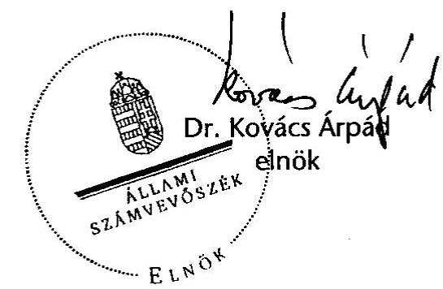

---

# 2. Államháztartás Központi Szintjét Ellenőrző Igazgatóság 2.4 Koordinációs Főcsoport 

Iktatószám: VE-03-031/2009.

## A tájékoztató elkészítését felügyelte:

Bihary Zsigmond
föigazgató

A tájékoztató összeállításáért felelős:
Dr. Becker Pál
általános főigazgató-helyettes

A tájékoztató összeállításában részt vettek:
Bartolák Márta
mb. osztályvezető
Laczkovich Rita
számvevő

---

# TARTALOMJEGYZÉK 

BEVEZETÉS ..... 7
A. UNIÓS KITEKINTÉS A 2007-ES ADATOK TÜKRÉBEN ..... 9
B. ÖSSZEGZŐ ÉRTÉKELÉS, KÖVETKEZTETÉSEK ..... 17

1. Magyarország és az EU pénzügyi kapcsolatai ..... 17
1.1. Magyarország és az EU pénzügyi kapcsolatai 2004-2008 között ..... 17
1.2. Magyarország és az EU pénzügyi kapcsolatai 2008-ban ..... 18
1.3. Az Európai Bizottság által közvetlenül kezelt források ..... 21
2. Az uniós támogatások hazai feltételrendszerének bemutatása ..... 21
2.1. Az uniós támogatások hazai intézményrendszere ..... 21
2.2. Az uniós támogatások hazai ellenőrzési rendszere ..... 24
2.3. Az uniós támogatások hazai nyilvántartási rendszerei ..... 28
2.3.1. Egységes Monitoring Információs Rendszer ..... 28
2.3.2. Országos Támogatási Monitoring Rendszer ..... 29
2.3.3. Integrált Igazgatási és Ellenőrzési Rendszer ..... 29
2.3.4. Számviteli és nyilvántartási rendszerek ..... 30
2.4. Szabálytalanság-kezelés ..... 32
3. Az Európai Uniós források felhasználásával kapcsolatos, a 2008-as évre vonatkozó ellenőrzések legfontosabb megállapításai, következtetései ..... 34
3.1. A 2000-2006-os programozási periódus támogatásai ..... 34
3.1.1. Nemzeti Fejlesztési Terv ..... 34
3.1.2. Közösségi kezdeményezések ..... 39
3.1.3. Kohéziós Alap ..... 41
3.1.4. Schengen Alap ..... 44
3.1.5. PHARE és Átmeneti Támogatás ..... 44
3.1.6. Az EGT és Norvég Finanszírozási Mechanizmusok program ..... 45
3.2. A 2007-2013-as programozási periódus támogatásai ..... 46
3.2.1. Új Magyarország Fejlesztési Terv ..... 46
3.2.2. Nemzetközi együttműködési támogatások ..... 51
3.2.3. Szolidaritási és migrációs alapok ..... 54
3.2.4. Svájci-Magyar Együttmúködési Program ..... 55
3.3. Agrártámogatások ..... 56
3.3.1. Az agrártámogatások finanszírozási és intézményrendszere ..... 56
3.3.2. Az agrártámogatások hazai ellenőrzési rendszere ..... 57
3.3.3. SAPARD ..... 63

---

# MELLÉKLETEK 

1. sz. Európai Uniós költségvetési kapcsolatok
2. sz. A Magyar Köztársaság 2008. évi költségvetésének végrehajtásáról szóló törvényjavaslatban megjelenő EU-támogatások és a hozzájuk kapcsolódó hazai finanszírozás összege
3. sz. Az EU-költségvetés szerkezeti változásai a 2000-2006-os és a 2007-2013-as költségvetési periódus között
4. sz. A mezőgazdasági támogatások szerkezeti változásai a 2000-2006-os és a 2007-2013-as költségvetési periódus között
5. sz. A Tájékoztató alapjául szolgáló, 2008. évre vonatkozó ellenőrzések és öszszefoglalók

## FÜGGELÉK

1. sz. Az uniós támogatások 2008. évi felhasználásának ellenőrzéséről szóló Tájékoztató összegző értékelés, következtetések fejezetében foglaltak részletes bemutatása

---

# RÖVIDÍTÉSEK JEGYZÉKE 

| ÁROP | Államreform Operatív Program |
| :--: | :--: |
| ÁSZ | Állami Számvevőszék |
| AVOP | Agrár- és Vidékfejlesztési Operatív Program |
| DDOP | Dél-dunántúli Operatív Program |
| EGT (FM) | Európai Gazdasági Térség (Finanszírozási Mechanizmus) |
| EHA | Európai Halászati Alap |
| EKOP | Elektronikus Közigazgatás Operatív Program |
| EMIR | Egységes Monitoring Információs Rendszer |
| EMOGA | Európai Mezőgazdasági Orientációs és Garancia Alap |
| EMGA | Európai Mezőgazdasági Garancia Alap |
| EMK | Egységes Múködési Kézikönyv |
| EMVA | Európai Mezőgazdasági Vidékfejlesztési Alap |
| ENPI | European Neighbourhood Partnership Instrument Európai Szomszédsági és Partnerségi Eszköz |
| ERFA | Európai Regionális Fejlesztési Alap |
| ESZA | Európai Szociális Alap |
| ETE | Európai Területi Együttmúködés |
| EU | Európai Unió |
| FEUVE | folyamatba épített előzetes és utólagos vezetői ellenőrzés |
| FVM | Földmúvelésügyi és Vidékfejlesztési Minisztérium |
| GDP | Gross Domestic Product (Bruttó Hazai Termék) |
| GNI | Gross National Income (Bruttó Nemzeti Jövedelem) |
| GOP | Gazdaságfejlesztés Operatív Program |
| GVOP | Gazdasági Versenyképesség Operatív Program |
| HEFOP | Humánerőforrás-fejlesztési Operatív Program |
| HOP | Halászati Operatív Program |
| HOPE | Halászati Orientációs Pénzügyi Eszköz |
| IH | Irányító Hatóság |
| IIER | Integrált Igazgatási és Ellenőrzési Rendszer |
| IMIR | INTERREG Monitoring és Információs Rendszer |
| INTERACT | INTERREG Animation Cooperation and Transfer INTERREG ösztönzés, együttmúködés és átadás |
| IPA | Instrument for Pre-Accession Assistance - Előcsatlakozási Támogatási Eszköz |
| IRM | Igazságügyi és Rendészeti Minisztérium |
| ISPA | Instrument for Structural Policies for Pre-Accession (Strukturális Politikák Csatlakozás Előtti Eszköze) |
| ISZ | Igazoló Szerv |
| JEREMIE | Joint European Resources for Micro to Medium Enterprises (Közös európai források a kis- és középvállalkozásoknak) |
| KA | Kohéziós Alap |
| KEHI | Kormányzati Ellenőrzési Hivatal |

---

| KEOP | Környezet és Energia Operatív Program |
| :--: | :--: |
| KESZ | Kincstári Egységes Számla |
| KH | Kifizető Hatóság |
| Kincstár | Magyar Államkincstár |
| KIOP | Környezetvédelmi és Infrastruktúra Operatív Program |
| KKK-KIKSZ | Közlekedésfejlesztési Koordinációs Központ Közlekedésfejlesztési Integrált Közremúködő Szervezet |
| KMOP | Közép-magyarországi Operatív Program |
| KÖZOP | Közlekedés Operatív Program |
| KPSZE | Központi Pénzügyi és Szerződéskötési Egység |
| KSZ | Közreműködő Szervezet |
| KvVM FI | Környezetvédelmi és Vízügyi Minisztérium Fejlesztési Igazgatósága |
| LEADER | Liaison Entre Actions pour le Developpement de l'Economie Rurale (Akciók a vidék gazdaságfejlesztéséért) |
| MK | Működési Kézikönyv |
| MVH (BEF) | Mezőgazdasági és Vidékfejlesztési Hivatal Belső Ellenőrzési Főosztály |
| PM NAO Iroda | National Authorising Office   Pénzügyminisztérium Nemzeti Programengedélyező Iroda |
| NFGM | Nemzeti Fejlesztési és Gazdasági Minisztérium |
| NFT | Nemzeti Fejlesztési Terv |
| NFÜ BEF | Nemzeti Fejlesztési Ügynökség (Belső Ellenőrzési Főosztálya) |
| NVT | Nemzeti Vidékfejlesztési Terv |
| NYDOP | Nyugat-Dunántúli Operatív Program |
| OLAF KI | Office Européen de Lutte Anti-Fraude (Európai Csalásellenes Hivatal) Koordinációs Iroda |
| OP | Operatív Program |
| OTMR | Országos Támogatási Monitoring Rendszer |
| PM | Pénzügyminisztérium |
| RFÜ | Regionális Fejlesztési Ügynökség |
| ROP | Regionális Fejlesztés Operatív Program |
| SA | Strukturális Alapok |
| SAPARD | Special Accession Programme for Agriculture and Rural Development (Különleges Előcsatlakozási Program a Mezőgazdaság és Vidékfejlesztés támogatására) |
| SAPS | Single Area Payment Scheme (Egyszerúsített Területalapú Támogatás) |
| SzMSz | Szervezeti és Múködési Szabályzat |
| TÁMOP | Társadalmi Megújulás Operatív Program |
| TEN-T | Trans-European Transport Network (Transzeurópai Közlekedési Hálózat) |
| TIOP | Társadalmi Infrastruktúra Operatív Program |
| TS | Technikai Segítségnyújtás |

---

| ÚMFT | Új Magyarország Fejlesztési Terv |
| :-- | :-- |
| ÚMVP | Új Magyarország Vidékfejlesztési Program |
| VOP | Végrehajtás Operatív Program |
| VP KEP | Vám- és Pénzügyőrség Központi Ellenőrzési Parancsnok- |
|  | sága |
| VPOP | Vám- és Pénzügyőrség Országos Parancsnoksága |
| Zárszámadás | Jelentés a Magyar Köztársaság 2008. évi költségvetése |
|  | végrehajtásának ellenőrzéséről |

---

.

---

# BEVEZETÉS 

A 2008. év Magyarország számára a 2007-2013-as EU költségvetési periódus második évét, a 2000-2006-os EU költségvetési periódus vonatkozásában az uniós források felhasználásának maximalizálására való törekvés mellett a program pénzügyi zárásra való felkészülés évét, illetve az előcsatlakozási alapok szempontjából a pénzügyi zárást követő fenntartási időszak megkezdését jelentette. Ebből eredően Magyarország és az EU támogatás-felhasználással öszszefüggő kapcsolatát a 2007-2013-as EU költségvetési periódus szempontjából a megfelelőségi vizsgálatok többségének sikeres lezárását követően a programok és az uniós forráslehívások fokozatos beindulása, a 2000-2006-os EU költségvetési periódus vonatkozásában a kifizetések és a forráslehívások kedvező alakulása mellett a kitűzött program célok változó teljesülése jellemezték.

Az Európai Unió részéről már 2003-ban felmerült az igény, hogy az Európai Számvevőszék és a nemzeti számvevőszékek évenként készítsenek áttekintő értékelést az európai uniós pénzeszközök hasznosításának ellenőrzési tapasztalatairól. Az Európai Uniós országok számvevőszékeinek elnökeiből álló Kapcsolattartó Bizottság a 2005. évi stockholmi ülésén megerősítette, hogy az EU tagállamok parlamentjeinek saját, illetve a tagállamok közös érdekében áll az EU Alapok ellenőrzésének fejlesztése. Ennek egyik lényeges eleme, hogy a független nemzeti számvevőszékek készítsenek jelentést az EU pénzeszközök tárgyévi tagállami felhasználásáról és a gazdálkodás fejlesztéséről. Ez közvetve és közvetlenül is hozzájárulhat az EU költségvetés hatékonyabb, átláthatóbb felhasználásához. Egyetértve a Kapcsolattartó Bizottság szándékával fokozatosan bővülő körben 2008-ra már kilenc ország készített összefoglalót az uniós források tagállami felhasználásának tapasztalatairól.

Az Állami Számvevőszék 2004 óta aktívan közreműködik az uniós pénzeszközök tagállami felhasználásáról szóló számvevőszéki jelentések módszertanának kidolgozásában. Az e célból létrehozott munkacsoport 2009. évi ülésének az ÁSZ adott otthont. A munkacsoport az uniós pénzfelhasználásról szóló jelentéseken túlmenően a téma feldolgozását, valamint a tagállamok összehasonlíthatóságát elősegítő sablonok és útmutatók kidolgozását vitatta meg.

A Tájékoztató - összhangban a Kapcsolattartó Bizottság törekvéseivel, valamint az Állami Számvevőszék (ÁSZ) 2004. évi tevékenységéről szóló jelentés elfogadásáról szóló 43/2005. (V. 26.) OGY határozat 4. pontjában előírtakkal ${ }^{1}$ az előzőekben vázolt körülmények között kívánja bemutatni Magyarország európai uniós pénzügyi kapcsolatait és a támogatásokkal kapcsolatos ellenőrzések 2008-as tapasztalatait.

[^0]
[^0]:    ${ }^{1}$ „...az Állami Számvevőszék a teljes uniós pénzfelhasználás gyakorlatáról átfogó képet adjon, ennek keretében az uniós forrásokkal összefüggő pénzmozgások ellenőrzését végző hazai szervezetek munkáját szakmai szempontból áttekintse és mutassa be az ellenőrzések tapasztalatait."

---

Az egyes témakörök bemutatása során a 2008. évhez kapcsolódó információkat és adatokat, illetve ellenőrzési megállapításokat helyezzük a középpontba, azonban az átfogó kép kialakítása érdekében szükség szerint történeti áttekintést adunk, illetve kitekintünk a 2009. évi aktuális eseményekre, fejleményekre. A tagállami beszámolók és adatszolgáltatások feldolgozásán alapuló éves jelentéseket az Európai Bizottság a tárgyévet követő második év elején teszi közzé, ennek következtében a nemzetközi összehasonlító adatok jelen Tájékoztatónk elkészítésének időpontjában csak 2007. évre vonatkozóan állnak rendelkezésre.

A tavalyihoz hasonlóan a Tájékoztató kitér azon 2008-ban érvényben lévő hazai és nemzetközi jogszabályokra, amelyek meghatározták az EU-támogatások felhasználásában közreműködő intézményrendszer működését és ellenőrzési tevékenységét. Átfogó képet ad a különböző szervezetek feladat- és hatásköréről, az ellenőrzések során betöltött szerepükről. Az átláthatóság érdekében bemutatja Magyarország EU költségvetésbe történő befizetéseit, továbbá a Magyar Köztársaság központi költségvetésében megjelenő és a költségvetésen kívüli tételként szereplő támogatások és az Uniótól közvetlenül igényelhető támogatások felhasználását, az uniós források önkormányzatoknak, mint kedvezményezetteknek nyújtott támogatások felhasználásának értékelését.

A Tájékoztató elemzi Magyarország támogatás felhasználását - abszorpciós képességét - és elfoglalt helyét elsősorban a 2004-ben csatlakozott új tagországok között.

A Tájékoztató kiemelten kezeli a szabálytalanság kérdéskörét, a korrupció jelenségét azonban nem tudjuk mélységében feltárni, mivel a Tájékoztató a tárgyév során lezárult ellenőrzések eredményeire támaszkodik, elkészítése során nem került sor külön ellenőrzés elvégzésére. Az ÁSZ azonban tevékenysége során országgyűlési felhatalmazás alapján ${ }^{2}$ aktívan közreműködik a korrupció tipikus kiváltó okainak bemutatásában, területeinek beazonosításában és a kapcsolatos jogalkalmazási hiányosságok feltárásában.

A Tájékoztató összeállításához mind a belső, mind a külső, hazai és uniós ellenőrzési intézményrendszer tapasztalatait felhasználtuk. Bár ezek közül néhány ellenőrzés (pl. ÁSZ) eredményei nyilvánosak, de az átfogó kép kialakítása érdekében szükségesnek tartottuk ezek ismertetését is. Az EU Bizottság, a Kormányzati Ellenőrzési Hivatal és a belső ellenőrzési egységek ellenőrzési eredményei szintetizáltan jelennek meg a Tájékoztatóban, mivel jelentéseik nem nyilvánosak ${ }^{3}$.

Együttműködésükért, segítőkészségükért ezúton mondunk köszönetet a Pénzügyminisztérium, a Kormányzati Ellenőrzési Hivatal, a Nemzeti Fejlesztési Ügynökség, a Földművelésügyi és Vidékfejlesztési Minisztérium, a Mezőgazdasági és Vidékfejlesztési Hivatal, valamint a Vám- és Pénzügyőrség Országos Parancsnoksága vezetőinek és munkatársainak.

[^0]
[^0]:    ${ }^{2}$ Az Állami Számvevőszék 2007. évi tevékenységéről szóló jelentés elfogadásáról szóló 72/2008. (VI. 10.) OGY határozat 2./c) pontja
    ${ }^{3}$ A Tájékoztató alapjául szolgáló ellenőrzések listáját az 5. sz. melléklet tartalmazza.

---

# A. UNIÓS KITEKINTÉS A 2007-ES ADATOK TÜKRÉBEN 

A hazai forrás felhasználási adatok értékelése érdekében megvizsgáltuk, hogy hazánk milyen pozíciót foglal el az uniós tagországok sorrendjében a pénzügyi eredményesség, illetve az abszorpció tekintetében.

Egy költségvetési periódusban minden ország számára meg van határozva, hogy évenként mekkora támogatást vehet igénybe, vagyis mekkora előirányzat áll rendelkezésére. A tagállam optimális esetben az előirányzat teljes összegét az uniós szabályoknak megfelelő projektekkel leköti. Az EU-val történő végleges pénzügyi elszámolásra a projektek szabályszerű lezárása után kerülhet sor.

Az abszorpciós képesség megállapítása érdekében tehát azt vizsgáljuk, hogy Magyarország a többi tagországhoz viszonyítva a támogatási előirányzatokból mennyit kötött le, illetve mennyi volt a tényleges kifizetés 2007 vonatkozásában. A nemzetközi összehasonlítást az EU Bizottság 2007. évi ${ }^{4}$ közzétett éves jelentéseire alapozva állítottuk össze.

## Strukturális Alapok

Az Unió egyik legfontosabb céljának, a versenyképesség érdemi javításának elérése érdekében a Strukturális Alapokból és a Kohéziós Alapból származó támogatások EU-s költségvetésen belüli arányának növelésére törekszik. A Strukturális Alapokból minden tagország részesedik. A négy alapból (ESZA, ERFA, EMOGA, HOPE) származó összeg az uniós költségvetésben a teljes kötelezettségvállalási előirányzatok több mint 30\%-át teszi ki.

A Bizottság a Strukturális Alapok végrehajtásáról készített éves jelentésében a 2007. évet mind a négy alap vonatkozásában kedvezőnek ítélte meg; az ESZA és ERFA kifizetési előirányzatok 99,9\%-át, az EMOGA 100\%-át, a HOPE 97,5\%át használták fel.

A 2007-es év a 2000-2006-os programozási időszakon belül a nyolcadik (új tagországok részére negyedik) év volt, amelynek során az Európai Bizottság a Strukturális Alapok és közösségi kezdeményezések vonatkozásában összesen 659 program irányításáért, ebből a hazánkat is érintő 1. és 2. célkitúzés keretében 226 -ért felelt.

A programok végrehajtásánál magas arányt felmutató tagállamok és régiók elkezdték a felkészülést a támogatások lezárására.

[^0]
[^0]:    ${ }^{4}$ Az EU Bizottság által készített uniós szintű összefoglalók, beszámolók adatai - a tagállami beszámolók és adatszolgáltatások benyújtási határidejére tekintettel - 2007. évre vonatkoznak.

---

A kötelezettségvállalás automatikus visszavonásának szabálya (a továbbiakban: „n+2" szabály ${ }^{5}$ ) 2007-ben is hatékony eszköznek bizonyult a tagállamok ösztönzésére a tekintetben, hogy forrásokat mozgósítsanak és erőfeszítéseket tegyenek az európai programok határidőn belüli végrehajtása érdekében. Az ESZA vonatkozásában tizenkét programra alkalmazták a kötelezettségvállalás visszavonását, 92,2 M euró összeget érintve. A becslések alapján a lehetséges kötelezettségvállalás-visszavonások kockázata a vidékfejlesztési alapoknál kb. 70 M euró, az ERFA esetében 140 M euró, a HOPE esetében 54 M euró.

Valamennyi tagországot egybevéve az ERFA-támogatások felhasználása 2007 végéig a 2000-2006-os programozási időszakban rendelkezésre álló pénzügyi támogatások 79\%-ának felelt meg. 2007-ben az új tagállamok által igénybevett támogatások összege minden eddiginél magasabb volt, 3 Mrd euró; ez csaknem ugyanannyi, mint a 2004-2006 között felhasznált összeg (3,5 Mrd euró). 2007 végéig a 2004-2006-os időszakra a tagállamok a számukra rendelkezésre bocsátott keretösszegből átlagosan 71\%-ot használtak fel, míg az ERFA-támogatások felhasználásának aránya az EU-15-ök esetében (a 2000-2006-os időszakban) átlagosan $85 \%$ volt.

A teljes programozási idöszakra vonatkozó adatokból megállapítható, hogy valamennyi tagország a programozási időszakra rendelkezésére álló keretet teljes mértékben lekötötte, a kifizetések kerethez viszonyított aránya (1. táblázat) azonban nagy szórást mutatott (66-92\% között). Az új és régi tagországok elkülönülése már nem olyan markáns, bár a régi tagországok többsége kedvezőbb felhasználási adatokkal rendelkezett.

Magyarország az SA végrehajtását tekintve a 2000-2006-os időszakban - az EU 25 átlagát teljesítve - az újonnan csatlakozók élmezőnyében van (2. helyen, csak Észtország előzi meg kis mértékben), az EU-25 között a 10. helyen áll a kifizetés tekintetében.

A Bizottság jelentésében értékelte az ellenőrzési tevékenységet. Az ERFA vonatkozásában a 2000-2006-os időszakra vonatkozóan az ellenőrzések két szakaszban zajlottak, sor került egy rendszer-felülvizsgálatra és egy reprezentatív módon kiválasztott projekteket tartalmazó minta vizsgálatára. 2007 végéig összesen 214 ellenőrző látogatásra került sor (ebből 13 az INTERREG programoknál) és 95 programot ellenőriztek; ezáltal az ERFA-programok 61\%-át fedték le. Az ESZA vonatkozásában a 2000-2006-os időszakra vonatkozóan 95 ellenőrző látogatásra került sor, amely a korábban nem ellenőrzött operatív programra, illetve a korábbi ellenőrzések során tett javaslatok végrehajtásának, illetve az Európai Számvevőszék által végzett ellenőrzések eredményeinek nyomon követésére terjedt ki. A 2007 folyamán elvégzett lényegi vizsgálati folyamat 433 projektet fedett le a dokumentumok ellenőrzése, és 270 projektet a helyszíni ellenőrzések által. A 2000-2006-os programozási időszak vonatkozásában ezzel -

[^0]
[^0]:    ${ }^{5}$ A Bizottság automatikusan visszavonja a kötelezettségvállalásoknak azt a részét, amelyre nem kapott elfogadható kifizetési kérelmet a kötelezettségvállalás évét követő második év végéig, ezért az alapoktól származó hozzájárulás ezzel az összeggel csökken. Ennek értelmében hazánk adott évi kötelezettségvállalását n+2 év december 31-ig kell kérelmezni az Európai Bizottságtól (ebbe a Bizottság által utalt előlegek is beleszámítanak).

---

beleértve a nemzeti szinten ellenőrzött projekteket is - szinte a teljes program ellenőrzése megtörtént.

Az EMOGA vonatkozásában 2007-ben a 2000-2006-os időszakra vonatkozóan a Bizottság 19 programot ellenőrzött. Így az EMOGA Orientációs Részlege keretében jóváhagyott 152 program közül a Bizottság 2007 végéig összesen 87-et, azaz a programok $57 \%$-át ellenőrizte.

# 1. táblázat 

A Strukturális Alapok végrehajtása 2000-2007 közötti időszakban nemzetközi összehasonlításban (millió euró)

| Tagország | Keret   $\mathbf{2 0 0 0 - 2 0 0 6}$ | Kifizetés a keret   \%-ában   $\mathbf{2 0 0 7 . 1 2 . 3 1 .}$ |
| :-- | --: | --: |
| Írország | 3184,24 | $91,92 \%$ |
| Ausztria | 1587,29 | $91,34 \%$ |
| Svédország | 1997,91 | $90,29 \%$ |
| Németország | 30234,29 | $90,00 \%$ |
| Portugália | 20507,07 | $88,45 \%$ |
| Spanyolország | 46429,95 | $88,10 \%$ |
| Finnország | 1955,56 | $87,56 \%$ |
| Belgium | 1932,38 | $86,73 \%$ |
| Észtország | 371,36 | $86,63 \%$ |
| Magyarország | $\mathbf{1 9 9 5 , 7 2}$ | $\mathbf{8 4 , 9 0 \%}$ |
| Egyesült Királyság | 16308,56 | $84,33 \%$ |
| Franciaország | 15540,31 | $82,57 \%$ |
| Szlovénia | 237,51 | $82,39 \%$ |
| Dánia | 591,64 | $82,34 \%$ |
| Málta | 63,19 | $81,73 \%$ |
| Görögország | 22698,04 | $81,64 \%$ |
| Olaszország | 30661,70 | $80,53 \%$ |
| Litvánia | 895,17 | $77,57 \%$ |
| Luxemburg | 79,58 | $76,31 \%$ |
| Lengyelország | 8275,81 | $75,85 \%$ |
| Lettország | 625,57 | $75,27 \%$ |
| Cseh Köztársaság | 1584,36 | $74,68 \%$ |
| Szlovákia | 1121,76 | $73,58 \%$ |
| Ciprus | 49,97 | $70,61 \%$ |
| Hollandia | 2523,08 | $66,00 \%$ |
| Összesen | $\mathbf{2 1 1 4 5 2 , 0 2}$ | $\mathbf{8 4 , 9 6 \%}$ |

Forrás: EU Bizottság 2007. Éves Jelentése a Strukturális Alapok végrehajtásáról

## Kohéziós Alap

A legelmaradottabb területek fejlesztése, felzárkóztatása érdekében 1993-tól létrehozták az ún. Kohéziós Alapot. Az akkori feltételek szerint négy régi tagország volt jogosult e támogatásra: Spanyolország, Írország, Portugália és Görögország. 2007-ben 15 ország részesült a Kohéziós Alapból (a 12 új tagállam, valamint Görögország, Portugália és Spanyolország). A Bizottság jelentése a

---

2000-2006-os időszakra elfogadott projektek megvalósítását mutatta be, nem terjed ki Bulgáriára és Romániára, valamint Írországra sem, mely utóbbi a gazdasági növekedésének köszönhetően, 2004. január 1-jétől már nem támogatható az Alapból.

A Kohéziós Alap végrehajtásáról készített 2007. évi Bizottsági Éves Jelentés a költségvetés végrehajtásának értékelésekor rámutatott, hogy miután a Kohéziós Alapból a 2000-2006-os programozási időszak költségvetéséből támogatott projektekre megkötötték a támogatási szerződést 2006. év végéig, a 2007-es évre már csak kifizetési előirányzatok álltak rendelkezésre.

A tagállami kedvezőtlen igénybevételi adatokból (különösen négy tagország vonatkozásában) fakadóan a Kohéziós Alap eredeti ( 3250 M eurós) előirányzatát összesen 672 M euróval csökkentették. Az év vége felé növekvő mértékủ kifizetési igény benyújtásának köszönhetően ez az előirányzat 100\%-ra teljesült (hazánk részére a Kohéziós Alapból közel 122,5 M euró, ISPA projektekre 85 M euró kifizetést teljesített az unió).

2007 végén - a jelenleg támogatásban részesülő összes országot figyelembe véve - a rendelkezésre álló források átlagos felhasználási aránya (a kötelezettségvállalásokhoz mért kifizetések) a Kohéziós Alap és a korábbi ISPA-projektek tekintetében 55\% volt. A legalacsonyabb arány Bulgária, Románia és Lengyelország esetében, míg a legmagasabb két országnál (Portugália és Spanyolország) mutatkozott. Hazánk 47,26\%-os felhasználási aránnyal a középmezőnyben található (2. táblázat).

# 2. táblázat 

A Kohéziós Alap végrehajtása 2000-2007-ben (millió euró)

| Tagország | Kötelezettség-   vállalás   (nettó) | Kifizetés   (2007 decemberéig) | Kifizetés a keret   $\%$-ában   2007.12 .31 . |
| :-- | :--: | :--: | :--: |
| Spanyolország | 12935,25 | 9198,98 | $71,12 \%$ |
| Portugália | 3505,11 | 2239,88 | $63,90 \%$ |
| Görögország | 3623,59 | 2255,05 | $62,23 \%$ |
| Málta | 21,97 | 12,29 | $55,95 \%$ |
| Lettország | 713,99 | 399,46 | $55,95 \%$ |
| Észtország | 427,16 | 218,84 | $51,23 \%$ |
| Cseh Köztársaság | 1228,10 | 624,50 | $50,85 \%$ |
| Szlovákia | 766,25 | 384,23 | $50,14 \%$ |
| Magyarország | $\mathbf{1 4 8 2 , 6 0}$ | $\mathbf{7 0 0 , 6 8}$ | $\mathbf{4 7 , 2 6 \%}$ |
| Litvánia | 825,40 | 376,04 | $45,56 \%$ |
| Szlovénia | 254,19 | 113,34 | $44,59 \%$ |
| Ciprus | 54,01 | 22,84 | $42,29 \%$ |
| Lengyelország | 5634,53 | 2087,13 | $37,04 \%$ |
| Románia | 2042,73 | 720,47 | $35,27 \%$ |
| Bulgária | 879,91 | 296,57 | $33,70 \%$ |
| Összesen | $\mathbf{3 4 3 9 4 , 7 9}$ | $\mathbf{1 9 6 5 0 , 3 0}$ | $\mathbf{5 7 , 1 3 \%}$ |
| Forrás: EU Bizottság 2007. Éves Jelentése a Kohéziós Alap végrehajtásáról |  |  |  |

---

A kifizetések aránya az új tagországok vonatkozásában alacsonyabb, 33\%-tól (Bulgária) 56,5\%-ig (Málta és Lettország) terjed. Hazánk az új tagországok között a 6. helyet foglalja el.

A régi tagországok - kedvező felhasználási és projektmegvalósítási tevékenységüknek köszönhetően - további projekteket zártak le. Ennek eredményeként a 2000-2006-os időszakban a Kohéziós Alapból támogatásban részesült, lezárt projektek száma összességében 117-re nőtt, 721 projektet pedig még nem zártak le. Az új tagországok 2007-ben még nem rendelkeztek lezárt Kohéziós Alapból finanszírozott projekttel. A 354 ISPA projektből 2007. év végéig 50-et zártak le. Hazánk a 37 ISPA/KA projektből 7-et zárt le.

A viszonylag kedvező pénzügyi felhasználási mutatók mellett azonban az Éves jelentés több ponton kedvezőtlenül értékeli hazánkat. 2007 folyamán a Cseh Köztársaság, Magyarország és Lengyelország esetében túlzott költségvetési hiány miatt további intézkedéseket léptettek életbe, azonban egyik ország esetében sem volt szükség az Alapból történő támogatások kifizetésének felfüggesztésére.

Magyarország esetében a 2004-es első (a túlzott költségvetési hiány miatti) eljárás óta kétszer is megállapították - 2005 januárjában és 2005 novemberében -, hogy nem tett hatékony intézkedéseket a Tanács ajánlásaira válaszul. A Bizottság azonban egyik alkalommal sem javasolta a Tanácsnak a Kohéziós Alap kötelezettségvállalásainak felfüggesztését. A Magyarország túlzott költségvetési hiányára vonatkozó legutóbbi ajánlásokat a Tanács 2006 októberében fogadta el, és 2007 júliusában megállapította, hogy hazánk követte a megfogalmazott ajánlásokat.

A 2000-2006-os időszakot érintő 2007. évi bizottsági ellenőrzések elsősorban a nyomon követésre összpontosultak, hogy ellenőrizzék a rendszerekre vonatkozóan a korábban megfogalmazott ajánlások hatékony végrehajtását, továbbá a projektekre fordított kiadásokat. A Bizottság különös hangsúlyt helyezett a nemzeti ellenőrző szervek munkájának felülvizsgálatára, beleértve a rendszerellenőrzések minőségét, a mintavételes ellenőrzéseket és a támogatások lezárásáról szóló nyilatkozat elkészítésével kapcsolatos más munkákat. Összesen 20 ellenőrző látogatásra került sor: hét látogatás a Kohéziós Alap felhasználásának a kedvezményezett tagállamokban történő vizsgálatára, 2 (egyik hazánkban) a közbeszerzési eljárások vizsgálatára, három a támogatások lebonyolításáért felelős szervek vizsgálatára és további 8 Románia és Bulgária vizsgálatára terjedt ki.

Az Európai Bizottság Regionális Politikai Főigazgatósága a 2007. évi tevékenységéről szóló jelentésében az irányítási és ellenőrzési rendszerek múködéséről hat tagállam (Bulgária - környezetvédelmi ágazat; Görögország, Írország, Litvánia, Románia, Spanyolország - mindkét ágazat) esetében minősített véleményt fogalmazott meg a rendszer lényeges elemeire mérsékelt hatással bíró jelentős hiányosságok miatt. Öt tagállam esetében minősített véleményt fogalmazott meg a rendszer lényegét jelentős mértékben érintő súlyos hiányosságok miatt (Bulgária esetében a közlekedési ágazatra vonatkozóan, a Cseh Köztársaság és Magyarország esetében a környezetvédelemre vonatkozóan, valamint Lengyelország és Szlovákia esetében mindkét ágazatra vonatkozóan). Mivel a rendszer jelentős hiányosságai 2007-ben a kifizetések elfogadhatatlan

---

kockázatát jelentették, a Főigazgatóság az általa e tekintetben megállapított kritériumok figyelembevételével a fenti öt tagállam esetében fenntartást fogalmazott meg.

# Szabálytalanságok nemzetközi összehasonlításban 

Az Európai Csaláselleni Hivatal (OLAF) a Strukturális Alapok által finanszírozott intézkedésekkel kapcsolatban 2007 folyamán 37 alkalommal tett ellenőrző látogatást a tagállamokban. Ebből 19 esetben helyszíni ellenőrzést végzett (ezek során 26 alkalommal végeztek helyszíni ellenőrzést különböző gazdasági szereplőknél), míg 18 esetben más célja volt, például információgyűjtés vagy a nemzeti hatóságok, illetve igazságügyi szervek támogatása.

2007-ben az 1681/94/EK rendelet értelmében a tagállamok közel 3740 esetben tájékoztatták a Bizottságot összesen 717 M eurót érintő, az 1994-99-es és a 2000-2006-os programozási időszakokban társfinanszírozott intézkedésekkel összefüggésben álló szabálytalanságról.

A Kohéziós Alap vonatkozásában a tagállamok 92 esetben jelentettek szabálytalanságot, melyek 110,2 M euró összegű közösségi hozzájárulást érintettek. Az ügyek többségét Görögország és Spanyolország jelentette.

Az OLAF részére megküldött szabálytalansági bejelentések száma az elmúlt évhez képest csökkent (2006-ban a bejelentett esetek száma 228; a bejelentések által érintett összeg 186,6 M euró volt). A bejelentések a nem támogatható kiadások finanszírozása és a közbeszerzési eljárásokra vonatkozó szabályok megsértésére vonatkoztak. E két kategória a bejelentett esetek csaknem 75\%-ában fordult elő. Az Éves Jelentés rámutatott, hogy a „régi kedvezményezett országok" jobban teljesítik bejelentési kötelezettségüket, ugyanakkor az újonnan csatlakozott tagállamok bejelentési fegyelmét javítani kell.

A szabálytalansági jelentések értékelése során az adatokat kellő körültekintéssel kell értelmezni, mivel az egyes tagállamok igen eltérő módon tesznek eleget jelentési kötelezettségüknek.

Az uniós szabályozás alapján - melynek részletszabályait a vonatkozó magyar jogszabályok is tartalmazzák - a tagállamok minden negyedévet követő két hónapon belül jelentést tesznek az adott negyedévben tapasztalt szabálytalanságokról az OLAF felé.

Az egyik legrégebbi problémát a jelentési kötelezettséget keletkeztető esemény nem kellően pontos definíciója adja, melynek következtében - függően a tagállam jogi rendszerétől, s értelmezésétől - uniós szinten egy adott eset eltérő állapotban kerülhet jelentésre az OLAF felé (bizonyos tagállamok jelentik a szabálytalansági eljárás megindítását megalapozó szabálytalansági gyanúkat, egyes tagállamok csupán a megállapított szabálytalanságokat, míg mások kizárólag a jogerős bírósági ítélettel rendelkező eseteket). Az OLAF által készített statisztikai jelentésben szereplő adatok körültekintő értelmezést igényelnek.

---

# Éves összegző jelentések az EU módosított Költségvetési Rendeleté- 

nek $^{6}$ 53b. cikke szerint

Az Európai Számvevőszéktől pozitív megbízhatósági nyilatkozat („Declaration d'assurance", DAS) megszerzése érdekében hozott intézkedések eredményeképpen a 2007-2013-as költségvetési periódusra vonatkozó EU jogszabályi háttérbe már beépítésre kerültek új, a tagállamok számára kötelező (belső) kontroll elemek. Ezek egyike a Strukturális Alapok esetében - az EU módosított Költségvetési Rendeletének 53b. cikke szerint - a tagállamok által kijelölt Ellenőrzési Hatóság (Magyarországon a KEHI) által a rendelkezésre álló ellenőrzésekről és nyilatkozatokról készített, és a Bizottság részére benyújtott éves összegző jelentés („Annual Summary").

Az éves összegző jelentés pénzügyi adatokat, a tagállami irányítási és ellenőrzési rendszerekről, valamint a tagállami hatáskörben elvégzett ellenőrzésekről szóló információkat tartalmaz a tárgyévre vonatkozóan, melyek jelentőségét a Strukturális Alapok esetében a programok, az ellenőrzések, és a költségvetési elszámolás többéves jellege adja (szemben a mezőgazdasági támogatások esetében alkalmazott éves elszámolási rendszerrel).

A Strukturális Alapok programjai kilenc éves periódus alatt kerülnek végrehajtásra (a program elfogadásának dátumától az utolsó kedvezményezetti kifizetés támogathatóságának végső dátumáig), az ezt követő 15 hónapos időszakban történik a végső kifizetési kérelem EU Bizottsághoz történő benyújtása, illetve a zárónyilatkozat kiadása. Az adott program Európai Bizottság általi pénzügyi zárására csak ezután kerül sor. A Strukturális Alapok esetében a 2000-2006-os költségvetési periódusra vonatkozó jogszabályok nem rendelkeztek a programok éves, vagy részleges zárásáról, illetve a költségek éves elszámolásáról.

Az éves összegző jelentések segítséget nyújtanak az Európai Bizottságnak az irányítási és ellenőrzési rendszerek értékeléséhez, illetve a kiadások jogszerűségére és szabályszerűségére vonatkozó bizonyosság megszerzéséhez és a megbízhatósági nyilatkozat kiadásához.
Az Európai Számvevőszék a Strukturális Alapok esetében előírt éves összefoglalókról 6/2007 sz. véleményében foglalt állást, mely szerint: „az éves összefoglalók a belső kontroll-rendszer szerves részét képezik, azaz a Számvevőszék beépíti azokat a standard ellenőrzési eljárásaiba....".

A tagállamoknak az első éves összegző jelentést 2008. február 15-ig kellett benyújtaniuk a Bizottság részére. A jelentésekben a tagállamoknak mind a 2000-2006-os, mind a 2007-2013-as programozási időszakra vonatkozóan kell adatokat szolgáltatniuk, az első jelentések (mindkét költségvetési periódusra vonatkozóan) a 2007. évben teljesített kifizetésekről, illetve elvégzett ellenőrzésekről készültek.

A Bizottság Regionális Politikai Főigazgatósága értékelése alapján a 2008-2009. években benyújtott (az első és a második) éves összegző jelentések minősége vegyes képet mutatott, amely részben annak tudható be, hogy az elkészítésről

[^0]
[^0]:    ${ }^{6}$ A Tanács többször módosított 1605/2002/EK Rendelete

---

szóló Útmutatót az Európai Bizottság csak 2007. decemberben adta ki (majd 2008 novemberében felülvizsgálta). Az Európai Bizottság megállapította, hogy a jelentésekben szereplő információk, adatok teljessége vonatkozásában a tagállamok többsége általában megfelelt a Költségvetési Rendeletben, illetve a Bizottság által kiadott Útmutatóban foglalt minimum követelményeknek. Hiány esetén a tagállamokat felkérték kiegészítő információk, vagy javított éves összefoglaló jelentés benyújtására. 2008-ban két tagállam (Ausztria és Németország) nem nyújtott be éves összefoglalót, 2009-ben mind a 27 tagállam benyújtotta éves összegző jelentését, amelyek közül hat nem teljesítette a minimum követelményeket. Magyarország határidőben, az előírt tartalommal, a Bizottság által előírt kritériumok szerint elkészítette és megküldte az éves összegzést a Bizottság részére.

Az első éves összegző jelentésekhez kilenc tagállam csatolt átfogó elemzést vagy a kiadások megbízhatóságáról szóló átfogó nyilatkozatot, a második, 2009-es éves összefoglalókhoz már tizenkét tagállam csatolt átfogó elemzést és hét tagállam jelentése tartalmazott átfogó nyilatkozatot a kiadások megbízhatóságáról. Ez utóbbi esetekben a Regionális Politikai Főigazgatóság a nyilatkozatok tartalmát összevetette saját, a tagállami irányítási és ellenőrzési rendszerre vonatkozó értékelésével, és a megállapításokról tájékoztatta az adott tagállamot. A jelentésekben foglalt információk EU Bizottság részére történő hivatalos benyújtása megerősíti a felhasznált EU források elszámoltathatóságát, átláthatóságát a tagállamban, illetve hozzájárul ahhoz, hogy az Európai Bizottság megfelelő bizonyosságot szerezzen a kiadások jogszerűségéről és szabályszerűségéről.

A 2007. évi költségvetés végrehajtására vonatkozó mentesítésről szóló, 2009. április 23-án kiadott határozatában az Európai Parlament üdvözölte, hogy a tagállamok 2008 óta rendelkezésre bocsátják az ellenőrzések éves összefoglalóit, illetve az EU Bizottság Strukturális Alapok tekintetében érintett főigazgatóságai 2007-es (és 2008-as) éves tevékenységi jelentésében szerepeltetik az erre vonatkozó értékelést és nyilatkozatokat. Az Európai Parlament felkérte a Bizottságot, hogy tegyen erőfeszítéseket annak érdekében, hogy ezeket az éves összefoglalókat a Bizottság válaszával együtt közzé lehessen tenni. Az Európai Parlament véleménye szerint a tagállamok által összeállított éves összefoglalók nyilvános dokumentumok, amelyeket a költségvetés-mentesítési eljárás során a Parlament illetékes bizottságának is továbbítani kell. (A KEHI által Magyarországra vonatkozóan kiadott Éves összefoglaló jelentés nem nyilvános kezelésű.)

---

# B. ÖSSZEGZŐ ÉRTÉKELÉS, KÖVETKEZTETÉSEK 

## 1. MAGYARORSZÁG ÉS AZ EU PÉNZÜGYI KAPCSOLATAI

### 1.1. Magyarország és az EU pénzügyi kapcsolatai 2004-2008 között

Az Európai Uniótól érkező források az egyes időszakokban folyamatosan növekvő mértékűek. A PHARE előcsatlakozási támogatást 1990 óta biztosítja hazánk részére az Európai Unió, a további előcsatlakozási alapokból (ISPA, SAPARD) a 2000. évtől részesülünk. Ezek a csatlakozás évétől a Strukturális Alapokból és a Kohéziós Alapból, valamint egyéb forrásokból érkező támogatásokkal (Schengen Alap, Norvég Alap + EGT, Svájci-Magyar Együttmúködési Program) egészültek ki. A 2007-2013 közötti programozási időszakban a korábbi támogatási szint jelentősen növekedett. A pénzügyi források trendjének 1990-2013 közötti alakulását - az agrártámogatások nélkül - az 1. ábra tartalmazza.

1. ábra
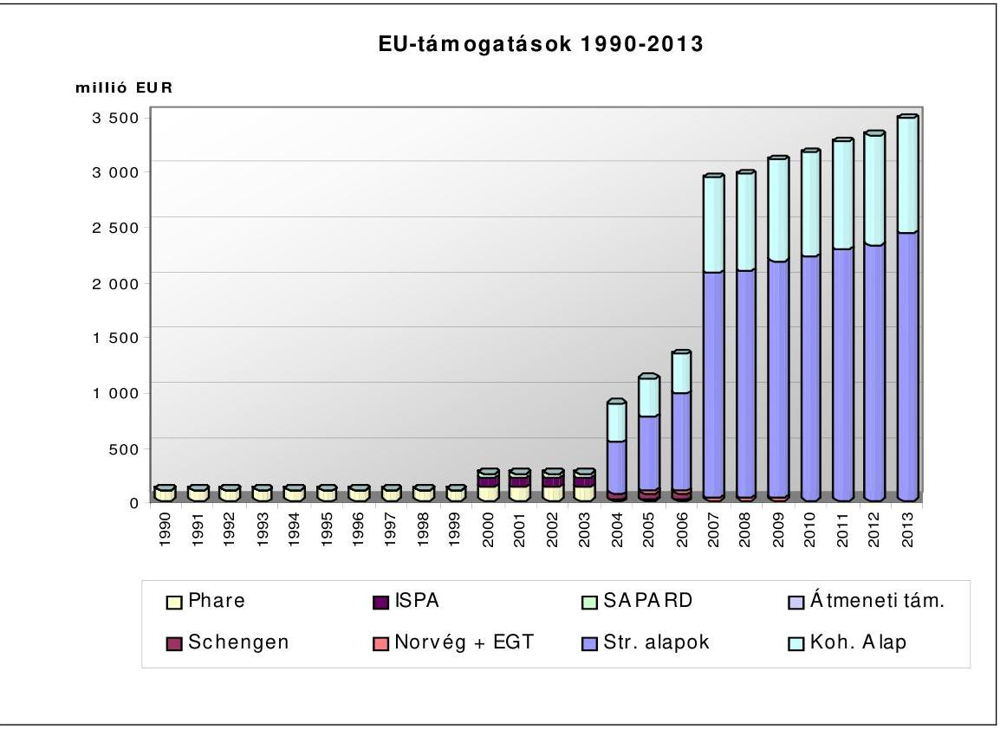

2004-től ezen támogatások részben vagy egészben megjelennek a Magyar Köztársaság költségvetésében (1. sz. melléklet).

---

A Magyar Köztársaság költségvetése végrehajtása során elszámolt és a költségvetésen kívüli EU transzferek 2004 és 2008 közötti időszakát vizsgálva megállapítható, hogy a 2004. évi 133 Mrd Ft összeget követően 2005-2008 között közel azonos szinten ( 215 és 220 Mrd Ft között) alakult az EU költségvetéséhez való hozzájárulásunk. A nemzeti hozzájárulás és tradicionális saját források belső szerkezete és a befizetési jogcímek arányai kisebb mértékben változtak a 2005-2007. közötti időszakban. 2008. évben a nemzeti hozzájárulás növekvő, míg a tradicionális saját forrás jelentős csökkenő tendenciát mutatott. A 2004. évi összeg nagyságát befolyásolta, hogy a csatlakozás évében csak arányos befizetési kötelezettség állt fenn, illetve a tradicionális saját források között megjelenő cukorilletéket a követő évben kellett teljesíteni, ennek megfelelően ilyen jogcímen 2004. évben nem keletkezett befizetési kötelezettségünk.

A költségvetésben megjelenő (hazai társfinanszírozást is magában foglaló) EU források fokozatos növekedést - 2007-ben kismértékű visszaeséssel - mutattak a 2004-2008 közötti időszakban. A költségvetésben megjelenő EU források 2004. évi közel 127 Mrd Ft-ja 2008-ra meghaladta az 520 Mrd Ft-ot. A támogatások összegének alakulása alaponként eltérő képet mutatott. A Strukturális Alapokra kifizetett összegek a 2006-ig tartó felfutás után 2007-ben kis mértékben csökkentek, majd 2008-ban ismét kis mértékben növekedtek. A belső szerkezetben azonban 2008. évre jelentős változás állt be: az NFT kifizetéseit meghaladta az ÚMFT-ben végrehajtott kifizetések összege. A Kohéziós Alap vonatkozásában a trendek a kezdeti évek lassú beindulását követően a 2006-2008 közötti időszakban a projektek előrehaladásának megfelelően a kiegyenlítettebb felhasználást mutatták. A két meghatározó alap vonatkozásában a nagymértékű növekedést a 2005. évben a felhasználás gyorsítására hozott intézkedések és a projektek megvalósításának beindulása okozta. A Nemzeti Vidékfejlesztési Terv a kezdeti viszonylagos késedelmes beindulás után növekvő felhasználást mutatott 2006-2007-ben. A 2008. évi jelentős csökkenést az ÚMVP kifizetéseinek nagymértékű növekedése kompenzálta.

A költségvetésen kívüli agrárpiaci támogatások évenként változó képet mutattak. A támogatások összegét az intervenció finanszírozási szükséglete nagymértékben befolyásolta. A közvetlen támogatások esetében az elszámolási szabályok a kifizetések tárgyévi és az azt követő évi elszámolását is lehetővé teszi. Nagyrészt erre vezethető vissza az évek közötti eltérő felhasználás.

# 1.2. Magyarország és az EU pénzügyi kapcsolatai 2008-ban 

A közösségi és hazai jogszabályokkal összhangban az Uniót 2008-ban öszszesen 210581,0 M Ft illette meg Magyarországról, amely 38534,0 M Ft áfa alapú hozzájárulást, 149643,8 M Ft GNI alapú hozzájárulást és 22 403,2 M Ft brit korrekciót tartalmazott. 2008-ban tradicionális saját forrás jogcímen 9 756,9 M Ft-ot fizettünk be a közösségi költségvetésbe (2. ábra, illetve 1. sz. melléklet).

Magyarország fizetési kötelezettségét a közösségi jogszabályoknak megfelelően a Magyar Nemzeti Banknál vezetett „Saját források" elnevezésű forintszámláról, havonta történő átutalásokkal teljesíti forintban, az előző év december 31ei középárfolyamon.

---

A 2008. évi befizetési kötelezettségek hazai kiszámításában, illetve lebonyolításában a kiemelt szerepet játszó Pénzügyminisztérium mellett a Vám- és Pénzügyőrség Országos Parancsnoksága (vám), a Mezőgazdasági és Vidékfejlesztési Hivatal (cukorilleték), az Adó- és Pénzügyi Ellenőrzési Hivatal (áfa alapú hozzájárulás), a Magyar Államkincstár (áfa alapú hozzájárulás), valamint a Központi Statisztikai Hivatal (áfa, illetve GNI alapú hozzájárulás) vettek részt.
2. ábra
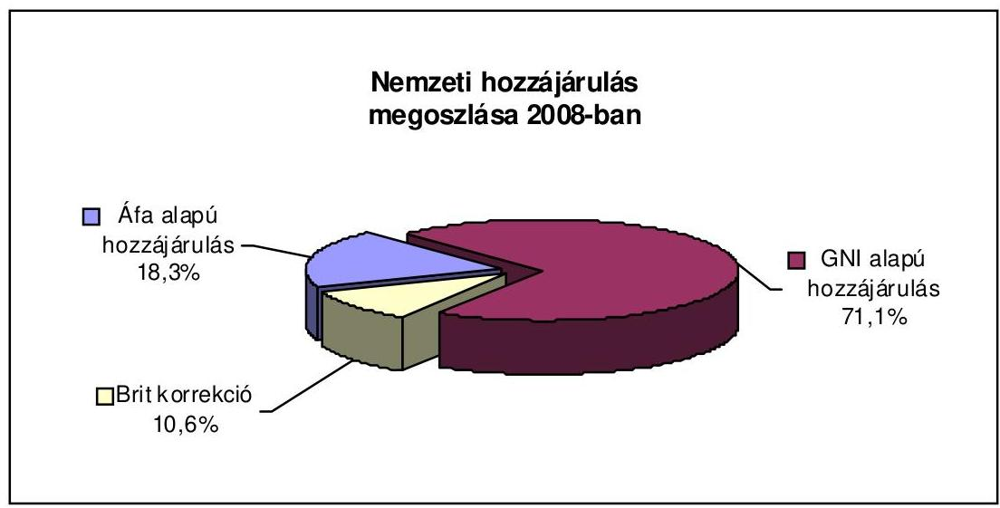

Az Európai Uniótól származó támogatások, illetve az EU-s integrációval kapcsolatos kiadások a Magyar Köztársaság 2008. évi költségvetésében az EU támogatások (NFT, Kohéziós Alap, UMFT, Egyéb strukturális támogatások, Nemzeti Vidékfejlesztési Terv, Új Magyarország Vidékfejlesztési Program, Halászati Operatív Program, Schengen Alap, Átmeneti Támogatás, egyéb európai uniós támogatások) és a hozzájuk kapcsolódó hazai társfinanszírozás 468 996,4 M Ft összegben jelentek meg. A költségvetésben megjelenő uniós források $329005,0 \mathrm{M}$ Ft-ot, a hazai társfinanszírozás 139 991,4 M Ft-ot tett ki (3. ábra, 2 sz. melléklet).

A költségvetésben megjelenő uniós források 45,2\%-kal elmaradtak a tervezettől ( 601090,8 M Ft), ugyanakkor a központi költségvetési eszközök felhasználása csak 36,9\%-kal maradt el a tervezett előirányzattól (221 730,2 M Ft). Így az uniós forrásokat is tartalmazó előirányzatok teljesülése összesen 43,0\%-kal maradt el a tervezett összegtől ( $822821,0 \mathrm{MFt}$ ). Az NFT-hez tartozó operatív programok végrehajtása során a kifizetések jelentősen felgyorsultak, meghaladva az előirányzott mértéket, mivel az n+2 szabály szerint az ezekre a programokra kifizethető támogatások kifizetési határideje 2008. december 31-én járt le. (Az Európai Bizottság időközben engedélyezte az eredeti elszámolhatósági határidő meghoszszabbítását 2009. június 30-ig, így még 2009. évben is teljesíthetőek az NFT-hez kapcsolódó kifizetések.) A Kohéziós Alap esetében jelentős elmaradás tapasztalható a tervezetthez képest. A közlekedési projektek esetében - az eljárás időigényéből fakadóan - sok számla kifizetése áthúzódott 2009-re, a környezetvédelmi projektek esetében az önerő hiánya késleltette a számlák kifizethetőségét. A kivitelezés időtartamának elhúzódásához pedig több esetben hozzájárult a közbeszerzési eljárások elhúzódása. A legnagyobb elmaradás - amely az összes elmaradás háromnegyedét adja - az UMFT programjaival kapcsolatban figyelhető meg a kifizetések folyósításának késedelmes beindulásából fakadóan.

---

A további programok teljesítésének elmaradása a programok elhúzódó elfogadására (ETE, IPA HOP), a pályáztatási eljárások és projektek lassú előrehaladására (ÚMVP, TEN-T) vezethető vissza.

# 3. ábra 

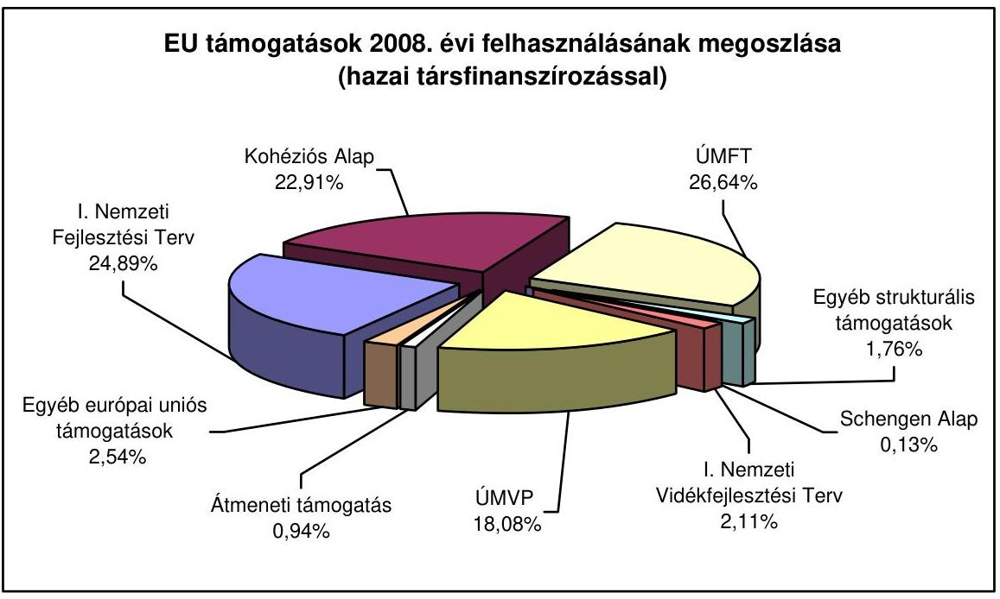

Ez az uniós források felhasználásának tervezettől történő - a 2007. évben tapasztaltakhoz hasonló - jelentős és arányaiban kissé növekvő mértékű elmaradása összhangban van az ellenőrzések során tett megállapításokkal és rámutat arra, hogy elengedhetetlen a programok végrehajtásának jelentős felgyorsítása, mert hazánk forrásokat veszíthet a 2007-2013-as időszakban biztosított jelentős mennyiségú uniós támogatásból.

A költségvetésen kívüli támogatási formák (a közvetlen területalapú támogatások, az agrárpiaci támogatások és az intervenciós felvásárlások) összege 2008. évre vonatkozóan 203 796,7 M Ft-ot tett ki (agrárpiaci támogatás: 36671,3 M Ft, területalapú támogatások: $156173,0 \mathrm{M}$ Ft, intervencióhoz kapcsolódó költségtérítések: 10952,47 Mrd Ft), amelyet a Kifizető Ügynökség a KESZ-ről megelőlegezett, és az Unió utólag téríti meg az államháztartás számára.
2008. évben az Uniós támogatások utólagos megtérülése ${ }^{7}$ címen - a tervezettet meghaladó - 51 102,6 M Ft folyt be a költségvetésbe. Ezek a 2006. évben záródó SAPARD program utolsó 5\%-ának megtérüléséből, egyes Kohéziós Alap projektek utolsó 20\%-ának megtérüléséből és egyéb programok elszámolásából, illetve a korábban tisztán hazai forrásból megkezdett, de uniós finanszírozásba be-

[^0]
[^0]:    ${ }^{7}$ Az unió a strukturális alapok esetében csupán a megállapított uniós keret 95\%-át biztosítja, a fennmaradó 5\%-ot a tagországnak kell megelőlegezni és azt csak a program lezárását követően kapja meg a tagország.

---

vonandó M7 autópálya és 4-es metró projektek kiadásaira jutó uniós forrás elszámolásából adódtak.

# 1.3. Az Európai Bizottság által közvetlenül kezelt források 

A Magyar Köztársaság érdekében történő beazonosított kifizetésként az EU Bizottság 2008. évben 2178,4 M eurót tartott nyilván Ez az összeg uniós költségvetési kiadási fejezetenkénti ${ }^{8}$ bontásban tartalmazta a kifizetett támogatásokat, tehát mindazokat, aminek a felhasználása magyar közintézmények közreműködésével, az EU Bizottsághoz közvetlenül benyújtott pályázatok útján, vagy Magyarország támogatás felhasználásával kapcsolatosak. Ennek döntő többségét a Magyar Köztársaság költségvetési beszámolójában szereplő (költségvetésében megtervezett és a költségvetésen kívüli Kincstári Egységes Számláról finanszírozott) tételek alkották. A költségvetési beszámolóban nem szereplő tételek közül a két legjelentősebb az oktatási-képzési és az ifjúsági célokra fordított támogatások voltak.

Az oktatás területén kiemelt jelentőséggel bírnak az Egész életen át tartó tanulás program és a Fiatalok Lendületben Program, melyek megvalósítása nemzeti szinten történik.

Magyarországon a nemzeti hatóság szerepét az „Egész életen át tartó tanulás" Program esetében az Oktatási és Kulturális Minisztérium, a „Fiatalok Lendületben" Program esetében a Szociális és Munkaügyi Minisztérium tölti be. Az „Egész életen át tartó tanulás" Program lebonyolítója, a Nemzeti Iroda pedig a Minisztérium felügyelete alatt álló Tempus Közalapítvány, csakúgy, mint az elmúlt években. A „Fiatalok Lendületben" Program végrehajtására kijelölt Nemzeti Ügynökség pedig a hazai ifjúsági szolgáltatások, illetve ifjúságpolitika szerves részét képző Foglalkoztatási és Szociális Hivatalon belül múködő Mobilitás Országos Ifjúsági Szolgálat.

## 2. AZ UNIÓs TÁMOGATÁSOK HAZAI FELTÉTELRENDSZERÉNEK BEMUTATÁSA

### 2.1. Az uniós támogatások hazai intézményrendszere

Az EU-ból érkező források fogadásához, illetve lebonyolításához szükséges intézményrendszert Magyarország az EU előírásainak megfelelően, a hazai jogszabályokat figyelembe véve alakította ki.

A hazánkba érkező, sokrétű és a 2007-2013-as programozási időszakban a korábbit meghaladó nagyságrendű uniós fejlesztési támogatások minél teljesebb körű igénybevételéhez és a meghatározott támogatási célok hatékony felhasználásához a feladatokat gazdaságosan, hatékonyan, eredményesen ellátó in-

[^0]
[^0]:    ${ }^{8}$ Fenntartható növekedés, Természeti erőforrások, Szabadság, biztonság és a jog érvényesülése, az EU, mint globális partner, valamint az Igazgatásra fordított kiadások és a Visszatérítések

---

tézményrendszer (stabil szervezeti háttér, megfelelő kapacitás, valamint egységes eljárásrend) megléte és működése szükséges.

Az EU-ból érkező növekvő mértékű források fogadásához, illetve felhasználásának lebonyolításához szükséges hatékony intézményrendszer kialakítása érdekében a Kormány 2006. július 1-jével a Nemzeti Fejlesztési Hivatal általános jogutódjaként létrehozta a Nemzeti Fejlesztési Ügynökséget (NFÜ), amelynek keretében látták el feladataikat az új és korábbi programozási időszak Operatív Programjainak Irányító Hatóságai ${ }^{9}$.

Az NFÜ felelőssége továbbá kiterjedt a PHARE programokkal és a Schengen Alappal, az Átmeneti Támogatással, a Norvég Finanszírozási Mechanizmussal, illetve az EGT Finanszírozási Mechanizmussal, Svájci-Magyar Együttmúködési Programmal kapcsolatos előkészítési, szervezési és koordinációs feladatokra is. Az NFÜ szervezetében kiemelt szerepet kapott a Koordinációs IH, amely figyelemmel kíséri a Közösség Támogatási Keret végrehajtását és az irányító hatóságok tevékenységét, irányítja a programok értékelését.

A kormányzati struktúra változásából következően az NFÜ 2008. május 15-étől a nemzeti fejlesztési és gazdasági miniszter felügyelete alatt működik (ezen időpontig tevékenységét a Miniszterelnöki Hivatalt vezető miniszter, majd az önkormányzati és területfejlesztési miniszter irányította).

# Az Irányító Hatóságok feladataik egy részét Közremúködő Szervezetekre delegálták. Az ÚMFT OP-k végrehajtására 15 közreműködő szervezet - 

miniszteri rendeletekben - került kijelölésre.

Az EU Bizottság az OP-k megfelelőségi vizsgálatát elfogadó levelében felhívta a figyelmet arra a tényre, hogy mivel a KSZ-ek kiválasztása nem közbeszerzéssel történt, az NFÜ vállalta a TS terhére elszámolt költségek szabályosságának éves felülvizsgálatát.

Az ÚMFT-re vonatkozóan az intézményi felkészülést és ezen belül az irányítási és ellenőrzési rendszerek kialakításának megfelelőségét az uniós ${ }^{10}$ és hazai ${ }^{11}$ szabályozással összhangban a KEHI mint Ellenőrzési Hatóság „Megfelelőségi vizsgálatról" szóló (akkreditációs) jelentésének kell igazolnia.

Az ÚMFT intézményrendszerének megfelelőségi vizsgálatáról szóló akkreditációs jelentéseket az EU Bizottság 2008. év folyamán a KÖZOP és a KMOP 2. prioritás kivételével jóváhagyta és a KEHI által benyújtott nem mi-

[^0]
[^0]:    ${ }^{9}$ Az AVOP irányító hatóság és az új programozási időszak agrár- és vidékfejlesztési, illetve halászati támogatásai irányító hatóságainak kivételével.
    Az AVOP Irányító Hatósága az FVM Agrár-vidékfejlesztési Főosztálya.
    ${ }^{10}$ A Tanács 2006. július 11-i 1083/2006/EK rendelete az Európai Regionális Fejlesztési Alapra, az Európai Szociális Alapra és a Kohéziós Alapra vonatkozó általános rendelkezések megállapításáról és az 1260/1999/EK rendelet hatályon kívül helyezéséről.
    ${ }^{11}$ 281/2006. (XII. 23.) Kormányrendelet a 2007-2013 programozási időszakban az ERFA, ESZA és a Kohéziós Alapból származó támogatások fogadásához kapcsolódó pénzügyi lebonyolítási és ellenőrzési rendszerek kialakításáról

---

nösített véleményt elfogadta. A Bizottság 2009. június 12-én mind a KÖZOP, mind a KMOP 2. prioritására vonatkozó irányítási és ellenőrzési rendszert elfogadta, így valamennyi operatív program irányítási és ellenőrzési rendszerének jóváhagyása megtörtént.

A megfelelőségi vizsgálatok során feltárt hibák kiküszöbölésére készült intézkedési tervek utóellenőrzésének eredményét az Ellenőrzési Hatóság által készített, az ÚMFT OP-kra vonatkozó éves ellenőrzési jelentések tartalmazták.

A Kohéziós Alapból származó támogatások megvalósítására kijelölt IH szektoronként egy KSZ-t vont be. A KSZ-ek feladataik egy részét lebonyolító szervezetekre, illetve a projekt kedvezményezettjeire ruházták át.

Az NFT és ÚMFT operatív programokat felügyelő végleges monitoring bizottságok 2008 folyamán 3-4 alkalommal tartottak ülést, melyen jellemzően az ügyrend módosítását, az érintett OP előrehaladását, kommunikációs stratégiáját, a pályázatok kiválasztási kritériumát, az értékelési stratégiát, az indikátorokat, az OP végrehajtási jelentését, az akciótervet, illetve a horizontális tevékenységeket tárgyalták meg.

A PM Nemzeti Programengedélyezö Iroda (a továbbiakban Kifizető/Igazoló Hatóság) ellátja az Európai Unió strukturális és kohéziós alapjaiból származó támogatásokkal kapcsolatosan a kifizető és az igazoló hatósági feladatköröket. Az EGT és Norvég Finanszírozási Mechanizmussal, valamint más támogatási eszközökkel összefüggésben ellátja a vonatkozó nemzetközi szerződésekből a Pénzügyminisztérium feladatkörébe rendelt pénzügyi lebonyolítással, számviteli nyilvántartással, költségigazolási és ellenőrzési tevékenységgel összefüggő feladatokat. Továbbá ellátja az Európai Unió által támasztott követelményeknek megfelelő és a Pénzügyminisztérium feladatkörébe rendelt pénzügyi lebonyolítási, számviteli és intézményfejlesztési feladatokat az előcsatlakozási eszközök és az Átmeneti Támogatás tekintetében.

Az ellenőrzések rámutattak, hogy 2008-ban az NFÜ illetve az uniós támogatások lebonyolításában érintett intézményrendszer feladatai jelentősen megnövekedtek, mivel a 2004-2006-os programozási időszak lebonyolítási és zárási feladatainak végrehajtása mellett beindult az ÚMFT végrehajtása is.

A feladatellátást befolyásoló állandó külső tényezők közül - a korábbi évekhez hasonlóan - az egyik legfontosabb az intézményrendszer folyamatos átalakulása (szervezeti változások, vezetőváltások), a kapacitáshiány, illetve a magas fluktuáció, melyek a feladatellátásban az előző évekhez hasonlóan 2008-ban is problémákat, fennakadásokat okoztak, és amelyek hatásai a pénzügyi feladatok ellátása terén is érezhetőek voltak (hitelesítési jelentések hiányos és/vagy késedelmes benyújtása, kifizetések elhúzódása).

Az ellenőrzések a feladatellátás kapacitáshiányra és fluktuációra visszavezethető hiányosságait elsősorban a szabálytalanságkezelés, a FEUVE és a pénzügyi folyamatok területén tárták fel.

Az uniós agrár-, vidékfejlesztési- és halászati támogatások lebonyolítását a Földművelésügyi és Vidékfejlesztési Minisztérium mint Illetékes és Irányító Ha-

---

tóság, és a Mezőgazdasági és Vidékfejlesztési Hivatal mint Kifizető Ügynökség, illetve Közreműködő Szervezet látta el.

# 2.2. Az uniós támogatások hazai ellenőrzési rendszere 

A támogatások pénzügyi ellenőrzéséért az Európai Bizottság az Európai Közösségek főköltségvetése végrehajtásáért való felelőssége sérelme nélkül, elsődlegesen a tagállamok vállalnak felelősséget. Minden tagállamnak kötelessége gondoskodni a rá vonatkozó ellenőrzési feladatok olyan ellátásáról, amellyel megvalósítja az alapelvek és ellenőrzési célok érvényesítését.

A feladatok ellátásához kapcsolódóan a tagállamoknak az ellenőrzések három szintjét kell ellátniuk.

Az első szintü ellenőrzés az úgynevezett folyamatba épített ellenőrzés, amely révén ellenőrizni lehet a társfinanszírozott termékek tényleges leszállítását, az ilyen szolgáltatások nyújtását, objektumok kivitelezését, továbbá a bejelentett kiadások valós voltát, valamint ezek megfelelését a közösségi és nemzeti jogszabályoknak.

A második szintet a rendszer- és mintavételes ellenőrzések adják, melyek során a tagállamok vizsgálják az irányítási és ellenőrzési rendszerek múködésének hatékonyságát, az ellenőrzési nyomvonal megfelelőségét, a számviteli nyilvántartások és az azokat alátámasztó bizonylatok valódiságát, összhangját a jogszabályi előírásokkal, valamint a társfinanszírozás rendelkezésre állását.

A harmadik szint a programok zárásához kapcsolódóan a támogatások végelszámolását megalapozó záró költségnyilatkozatok ellenőrzését foglalja magában.

Az Állami Számvevőszék - mint az Országgyűlés pénzügyi-gazdasági ellenőrző szerve, az állam legfőbb pénzügyi ellenőrző szerve- egyrészt jogosult az államháztartás teljes körét érintő vizsgálatokra, másfelől az EU-ból érkező támogatások felhasználását, illetve a Közösséget megillető befizetéseket ellenőrizve hatékonyan részt vesz a Közösség pénzügyi érdekeinek védelmében.

Az ÁSZ tevékenységét az uniós támogatások felhasználásának ellenőrzése során a nemzetközi standardoknak megfelelően, az uniós követelményeket kielégítő módszerek alkalmazásával végzi. Rendszervizsgálatok keretében a szabályszerűségi és a teljesítményellenőrzés módszerével vizsgálja a szabályozási környezetet, az intézményrendszert, a monitoring rendszert, illetve a kiválasztott programokat.

Az Államháztartási Belső Pénzügyi Ellenőrzési rendszer keretében a pénzügyminiszter felel ${ }^{12}$ a FEUVE és a belső ellenőrzési rendszer szabályozásáért, fejlesztéséért, koordinációjáért és harmonizációjáért.

[^0]
[^0]:    ${ }^{12}$ Az államháztartásról szóló 1992. évi XXXVIII. törvény 121/B. §-a

---

A pénzügyminiszter a fenti koordinációs és harmonizációs feladatai keretében múködtette 2008-ban is az Államháztartási Belső Pénzügyi Ellenőrzési Tárcaközi Bizottságot melynek feladata a belső ellenőrzési rendszert is magában foglaló államháztartási belső pénzügyi ellenőrzési rendszer múködésének áttekintése, a pénzügyminiszter támogatása a koordináció, harmonizáció, a továbbfejlesztésre vonatkozó javaslatok előkészítése, valamint az európai uniós támogatásokhoz kapcsolódó ellenőrzési feladatok koordinációja terén. A Tárcaközi Bizottság egy konzultatív testület. Az európai uniós támogatásokhoz kapcsolódó ellenőrzési feladatok koordinációja az EU Támogatások Albizottságon keresztül valósul meg.

A hazai jogszabályok a Kormányzati Ellenőrzési Hivatalt jelölték ki az Európai Regionális Fejlesztési Alapból, az Európai Szociális Alapból és a Kohéziós Alapból, továbbá a Szolidaritás és migrációs áramlások igazgatása általános program által finanszírozott támogatások, illetve a MagyarországHorvátország és a Magyarország-Szerbia IPA Határon Átnyúló Együttmúködési Programok és az ETE programok tekintetében az ellenőrzési hatósági feladatok ellátására a 2007-2013 közötti programozási időszakra.

A KEHI ellátja továbbá a 2004-2006 közötti programozási időszak tekintetében a Strukturális Alapokkal, a Kohéziós Alappal, az EQUAL és az INTERREG IIIA Közösségi Kezdeményezés programokkal kapcsolatos - az uniós pénzügyi rendeletekben ${ }^{13}$ előírt - ellenőrzéseket, az európai uniós előcsatlakozási eszközök, az Átmeneti Támogatás és a Schengen Alap támogatásai felhasználásának ellenőrzését. Az EGT és a Norvég Alap Finanszírozási Mechanizmusokból támogatott projektek ellenőrzését végzi. A KEHI feladata a Svájci-Magyar Együttmúködési Program általános pénzügyi ellenőrzése is.

A KEHI ellenőrzési tevékenységét szabályozó, az európai uniós és egyéb nemzetközi támogatások ellenőrzésére vonatkozó elnöki utasítással kiadott Ellenőrzési Kézikönyvét 2008. év folyamán átdolgozta. A KEHI elkészítette a 2007-2009. évi ellenőrzési stratégiáját, mely a 2004-2006 közötti időszakra kidolgozott stratégiára épült, megtartotta annak továbbra is érvényes elemeit, kiemelve a programok zárásával összefüggő ellenőrzési feladatokat. A KEHI összeállította a 2007-2017. évi ellenőrzési stratégiákat az ÚMFT OP-jaira, melyeket a Bizottság 2008 szeptemberében elfogadott.

A végrehajtást szabályozó hazai jogszabályokban ${ }^{14}$ előírt belső ellenőrzési funkciót az érintett szervezetek funkcionálisan független belső ellenőrzési rész-

[^0]
[^0]:    ${ }^{13}$ A Bizottság 438/2001/EK rendelete (2001. március 2.) a strukturális alapok keretében nyújtott támogatások irányítási és ellenőrzési rendszerei tekintetében az 1260/1999/EK tanácsi rendelet végrehajtása részletes szabályainak megállapításáról, valamint a Bizottság 1386/2002/EK rendelete (2002. július 29.) a Kohéziós Alapból nyújtott támogatások irányítási és ellenőrzési rendszere, valamint a pénzügyi korrekciós eljárás tekintetében az 1164/94/EK tanácsi rendelet végrehajtására vonatkozó részletes szabályok megállapításáról
    ${ }^{14}$ A Nemzeti Fejlesztési Terv operatív programjai, az EQUAL Közösségi Kezdeményezés program és a Kohéziós Alap projektek támogatásainak fogadásához kapcsolódó pénzügyi lebonyolítási, számviteli és ellenőrzési rendszerek kialakításáról szóló 360/2004. (XII. 26.) Korm. Rendelet, valamint a 281/2006. (XII. 23.) Kormányrendelet a 20072013 programozási időszakban az ERFA, ESZA és a Kohéziós Alapból származó támogatások fogadásához kapcsolódó pénzügyi lebonyolítási és ellenőrzési rendszerek kialakításáról

---

lege látja el. A belső ellenőrzési feladatokat valamennyi olyan támogatás tekintetében, amelynek végrehajtásában az NFÜ részt vesz, az NFÜ Belső Ellenőrzési Főosztálya látja el.

A közreműködő és lebonyolító szervezetek esetében azok belső ellenőrzési egységei végezték el a belső ellenőrzési feladatokat.

Az NFÜ BEF ellátta az NFÜ-be integrált irányító hatóságok belső ellenőrzését, valamint az uniós támogatások lebonyolításában résztvevő szervezeteknél és a kedvezményezetteknél rendszerellenőrzést végzett (kivéve a Kifizető/Igazoló Hatóság).

Az ellenőrzések a korábbi években is rámutattak, hogy - az NFÜ belső ellenőrzésének kiterjedt és erősen koncentrált feladatait figyelembe véve - a kapacitáshiány és magas fluktuáció magas kockázatot hordoz magában annak ellenére, hogy 2008-ban a szervezeti létszám vonatkozásában kismértékű javulás volt tapasztalható. 2008-tól a belső ellenőrzési jelentések, a külső ellenőrző szervek által végzett ellenőrzések, az ellenőrzések alapján készített intézkedési tervek nyilvántartása az EMIR Ellenőrzési Nyilvántartó Rendszerében valósult meg.

A PM Nemzeti Programengedélyező Iroda - mint Kifizető/Igazoló Hatóság - kiemelt feladatot lát el az uniós támogatások ellenőrzési rendszerében, a kiadások megfelelő igazolása érdekében a pénzügyi lebonyolítás tekintetében a teljes rendszer ellenőrzésére jogosult. A Kifizető/Igazoló Hatóság egyéb pénzügyi és igazolási tevékenysége mellett tényfeltáró látogatásokat és tényfeltáró vizsgálatokat végez annak érdekében, hogy az EU Bizottság felé megalapozottan tanúsítsa a költségnyilatkozatban szereplő kiadásokat hitelesítő irányító hatóság, valamint a közreműködő szervezetek irányítási és ellenőrzési rendszerének hatékony működését, továbbá a jogszabályi előírásokkal való összhangját.

A 2007. évtől a jogszabályban kijelölt KSZ-ek kapacitása, humánerőforrásháttere nem tudta biztosítani a két programozási időszakhoz kötődő előírt ellenőrzési kötelezettség teljesítését, így a záró helyszíni ellenőrzések lebonyolítására 2008-ban a korábban a KSZ funkciókat ellátó és a hazai támogatási rendszerben is komoly gyakorlatot felmutató Magyar Államkincstárral az NFÜ Együttmüködési Megállapodást kötött.

A Kincstár az ellenőrzés keretében utólagosan, és mintavételezés alapján kiválasztott elszámolásokon keresztül ellenőrzi a kedvezményezettek által benyújtott elszámolások KSZ-ek által történő feldolgozását és a tranzakciók EMIR-ben történő rögzítésének szabályosságát. A Kincstár ellenőrzi továbbá a KSZ-ek által készített kifizetési előrejelzéseket az EMIR-ben szereplő adatok és az NFÜ által rendelkezésre bocsátott útmutató alapján.

A Kincstár ellenőrzési tevékenysége 2008-ban elsősorban az EMIR-ben történő rögzítések ellenőrzésére, valamint a helyszíni ellenőrzések lebonyolítására terjedt ki.

---

Az ellenőrzési rendszer erősítése érdekében a KEHI a működéséről és feladatairól szóló kormányrendelet ${ }^{15}$ alapján, illetve az uniós költségvetési rendelet ${ }^{16}$ és a végrehajtására kiadott részletes szabályokat tartalmazó EU Bizottsági rendeletben ${ }^{17}$ foglalt előírások teljesítése érdekében összegezte a rendelkezésre álló ellenőrzési jelentéseket, véleményeket, igazolásokat és nyilatkozatokat, azaz február 15-éig összeállította az éves összegző jelentést (Annual Summary).

Az éves összegző jelentésben a Kormányzati Ellenőrzési Hivatal bemutatta a 2007-2013-as programozási időszak kiadásait, melyekről az Igazoló Hatóság úgy nyilatkozott, hogy azok megfelelnek a kiadások elszámolhatósági feltételeinek, illetve a kiadásokat a kedvezményezettek részére az operatív program keretében kiválasztott műveletek végrehajtása során a közpénzből való hozzájárulásnak az általános uniós rendelet vonatkozó feltételeivel összhangban fizették ki. A 2004-2006-os programozási időszak vonatkozásában bemutatta az igazolt kiadásokat, melyekről a Kifizető Hatóság a - költségigazolási tevékenysége keretében 2008ban - úgy nyilatkozott, hogy azok megfelelnek az érintett programot vagy projektet jóváhagyó bizottsági határozatokban megállapított célkitűzéseknek és a Strukturális Alapokra vonatkozó általános rendelet, illetve a Kohéziós Alapra vonatkozó általános uniós rendelet rendelkezéseinek.

Az éves összegző jelentésben a KEHI összefoglalta az egyes programozási időszakra vonatkozó ellenőrzési tevékenységet. (Ezek megállapításait jelen Tájékoztató részletesen tartalmazza.) A 2007-2013-as időszakra vonatkozóan az Ellenőrzési Hatóság két OP vonatkozásában (VOP KA és GOP ERFA) adott ki nem minősített éves véleményt.

Az éves összegző jelentés szerint az igazolási tevékenység és az ellenőrzési összefoglalók eredményei arra utalnak, hogy a 2008. december 31-én zárult évben a strukturális intézkedések irányítási és ellenőrzési rendszereinek múködése alapvetően megfelelt a vonatkozó szabályozási követelményeknek. Az elvégzett ellenőrzési tevékenység eredményei arra utalnak, hogy az igazolt költségnyilatkozatok helyesek és tekintettel arra, hogy az irányítási és ellenőrzési rendszerek múködése 2008. évben nem mutatott jelentős hiányosságokat az ellenőrzések során, így az azok alapjául szolgáló ügyletek jogszerúnek és szabályosnak tűnnek.

Az ellenőrzési funkciók hiányos múködésére vonatkozó megállapítások a korábbi években tapasztaltakhoz hasonlóan - 2008. évben lefolytatott ellenőrzések során is megfogalmazódtak, amely arra utal, hogy az ellenőrzési rendszer további erősítése szükséges az IH-k és KSZ-ek vonatkozásában.

# A KSZ-ek első szintű és az IH által elvégzendő felülvizsgálati ellenőrzésének nem kielégítő volta magas kockázatot hordoz a programok szabályszerú és a támogatási célnak megfelelő végrehajtá- 

[^0]
[^0]:    ${ }^{15}$ 312/2006. (XII. 23.) Korm. rendelet a Kormányzati Ellenőrzési Hivatalról.
    ${ }^{16}$ A Tanács 2002. június 25-i 1605/2002/EK, Euratom rendelete az Európai Közösségek általános költségvetésére alkalmazandó költségvetési rendeletről.
    ${ }^{17}$ A Bizottság 2002. december 23-i 2342/2002/EK, Euratom rendelete az Európai Közösségek általános költségvetésére alkalmazandó költségvetési rendeletről szóló 1605/2002/EK, Euratom tanácsi rendelet végrehajtására vonatkozó részletes szabályok megállapításáról.

---

sa/megvalósulása tekintetében. Az ellenőrzések hangsúlyozták az első szintű ellenőrzések IH általi felülvizsgálatának fontosságát, mert a KSz előírásszerűen végrehajtott első szintű ellenőrzései kell, hogy kiszűrjék a kedvezményezettek által elkövetett szabálytalanságokat pl. az el nem ismerhető költségeket.

Az ellenőrzési feladatokat több szervezet - az NFÜ BEF-hoz hasonlóan - a kapacitáshiány és a speciális szakértelem igénybevételének szükségessége miatt külső szervezetek bevonásával látja el.

# 2.3. Az uniós támogatások hazai nyilvántartási rendszerei 

Tekintettel arra, hogy az Európai Unióval történő elszámolások megbízhatósága és a források hatékony felhasználása érdekében a gazdálkodásról naprakész, pontos adatokat szolgáltató nyilvántartási és monitoring rendszerek fenntartása elengedhetetlen, a 2008-ban lefolytatott ellenőrzések kiemelt területként kezelték a monitoring rendszer múködésének és különös tekintettel az EU-s alapok elszámolásait támogató informatikai rendszerek (Egységes Monitoring és Információs Rendszer - EMIR és az Integrált Igazgatási és Ellenőrzési Rendszer - IIER) múködésének vizsgálatát.

### 2.3.1. Egységes Monitoring Információs Rendszer

Az uniós rendelet előírásai szerint a tagállamnak megfelelően kiépített informatikai rendszerrel kell rendelkezni, amely a közösségi források felhasználásáról megbízható adatokat és információkat szolgáltat a Kormány, az intézményrendszer és az Európai Unió számára.

Az Európai Uniós támogatások felhasználásának átláthatósága érdekében, és egyúttal a lebonyolítási intézményrendszer munkájának informatikai támogatására az NFÜ az EMIR-t múködteti. Az EMIR egy olyan adminisztratív és napi menedzsment munkát is támogató, átfogó rendszer, mely nyomon követi a finanszírozott projektek előrehaladását a befogadástól a kifizetésig, azzal, hogy a projekteket a fenntartási időszakban is nyomon követi.

Az EMIR-t integrált rendszerelemek alkotják. Az alrendszerek felhasználói funkcionalitását modulok (főbb logikai funkció csoportok) támogatják.

A rendszerelemeket a keretrendszer, az EMIR alkalmazás támogatáskezelő alrendszerei és azok moduljai, az EMIR HelpDesk rendszer, az EMIR elektronikus pályázatkitöltő program és adatlapjai, az EMIR WEB alrendszer, az EMIR adattárház modul és az EMIR interfész modul (külső adatkapcsolatok) képezik. Az EMIR alkalmazás támogatáskezelő alrendszerei kilenc alrendszerből tevődnek össze: Strukturális Alapok, Kohéziós Alap, EQUAL, PHARE és Átmeneti Támogatás, Schengen Alap, EGT/Norvég Alap, Projekt Előkészítő Alap és Új Magyarország Fejlesztési Terv alrendszer és a Projekt Értékelő és Fejlesztő Eszköz.

A rendszer kidolgozásának kezdete (2003.) óta a Welt 2000 Kft. üzemelteti és fejleszti az EMIR-t.

Az NFÜ tájékoztatása szerint az EMIR a 2008. évi szoftver- és hardverfejlesztéseknek köszönhetően a korábbiaknál magasabb színvonalon képes támogatni

---

az Európai Uniós források hatékony felhasználását. Az intézményi felhasználók oldaláról az EMIR-rel szemben megfogalmazott kritikák ugyan jelentős mértékben csökkentek, azonban nem szűntek meg.

Hiányosságok jelentkeztek néhány alrendszer számviteli moduljának működése, a pénzügyi modul részét képező követeléskezelés funkció kialakítása, a kötelezettségvállalások analitikus alátámasztása terén.

Az Ellenőrzési Hatóság által a megfelelőségi vizsgálatok során feltárt, az EMIR-t érintő hiányosságokat az NFÜ megszüntette.

# 2.3.2. Országos Támogatási Monitoring Rendszer 

A Magyar Államkincstár által működtetett Országos Támogatási Monitoring Rendszer (OTMR) végzi a költségvetési és uniós támogatással megvalósuló pályázatok adatainak nyilvántartását. Feladata többek között a döntés-előkészítő funkció működtetésével a köztartozással rendelkező gazdálkodók azonosítása és a projektenkénti támogatáshalmozódás kiszűrése.

Az uniós csatlakozást követően az adatbevitel más nyilvántartási rendszerekből történő elektronikus adatátvitellel is történik. Ennek megfelelően az OTMR adattartalmának naprakészsége, pontossága, megbízhatósága nagymértékben függ az adatokat szolgáltató többi nyilvántartási rendszer működésének színvonalától is. A korábbi évekhez hasonlóan 2008-ban sem volt problémamentes az OTMR-EMIR adatátadás.

Az adatcsere technikai feltételei adottak, azonban a rendszeres adatküldés nem történik meg az EMIR oldaláról, illetve az adatküldés nem teljes körű. Jellemzően a pályázati adatok érkeznek meg, a döntési és finanszírozási adatok nem. Az interfésznek megfelelő informatikai megoldást a rendszer tartalmazza. Az EMIR adatminősége és töltöttsége miatt azonban a teljes körű adatküldések nem valósultak meg.

### 2.3.3. Integrált Igazgatási és Ellenőrzési Rendszer

A közös agrárpolitikát szabályozó uniós rendelet alapján a tagországnak ki kell alakítania az Integrált Igazgatási és Ellenőrzési Rendszert (IIER), amelyet elsősorban a termőföld- és állatállomány alapú közvetlen támogatások kezelésére, nyilvántartására, kifizetésére, illetve a kifizetés jogosságának ellenőrzésére kötelesek felállítani a tagállamok. Az IIER integráltságát az adja, hogy egyrészt magában foglalja mindazokat a nyilvántartási rendszereket, amelyek az eljárások végrehajtásához szükségesek, másrészt tartalmazza mindazokat az eljárásokat, amelyek a közösségi intézkedések keretében benyújtott támogatási kérelmek elbírálását és ellenőrzését szolgálják.

A rendszer tartalmazza a mezőgazdasági parcellák nyilvántartását, a mezőgazdasági termelői nyilvántartást, a támogatási kérelmek nyilvántartását, az állatállomány nyilvántartását (szarvasmarha, juh, kecske). A támogatás alapját képező földterület és a gazdálkodók kapcsolata az IIER-ben a támogatási kérelmek kitöltésével alakul ki, ez tartalmazza a konkrét földterületet és a gazdálkodó adatait, amelyekkel az integrált rendszer további műveleteket végez. A rendszer köte-

---

lező eleme az integrált ellenőrző rendszer, amely gyakorlatilag a fenti nyilvántartások összekapcsolása.

A 2008. évről készített igazoló szervi jelentés egy nagy jelentőségű és számos közepes, illetve kis jelentőség megállapítást fogalmazott meg.

A megállapítások között szerepelt az IIER alkalmazással kapcsolatos fejlesztések tesztelési terv alapján történő elvégzése, illetve az eredmények dokumentálása, amely feladatot az MVH teljesítette. További intézkedést igényelnek a jogosultság kezelés több területére, az IIER adatok és a papíralapú dokumentumok adattartalma eltéréseire, pontatlanságaira, a fizikai ellenőrzési múveletek IIER-ben történő nyomon követhetőségére, 3. évi agrár-környezetgazdálkodási kifizetési kérelmeknél IIER szoftverproblémára vonatkozó megállapítások.

# 2.3.4. Számviteli és nyilvántartási rendszerek 

Az Európai Bizottság és a pénzügyminiszter felé a beszámolási és adatszolgáltatási kötelezettséget elkülönítetten vezetett, eredményszemléletű kettős könyvviteli nyilvántartások alapján kell teljesíteni.

A 2004-2006 programozási időszakra vonatkozóan a számviteli nyilvántartást a Kifizető Hatóságnak a Strukturális Alapokra és a Kohéziós Alapra vonatkozóan, az IH-knak (közreműködő szervezeteknek) a Strukturális Alapokra vonatkozóan, míg a Kohéziós Alap közreműködő szervezeteknek a Kohéziós Alapra vonatkozóan kell vezetni a külön megjelentetett PM tájékoztató alapján.

A 2004-2006-os programozási időszak zárási feladatai vonatkozásában továbbra is akadályozó tényező az irányító hatóságok és közreműködő szervezetek záráshoz szükséges nyilatkozatainak elmaradása, illetve jelentős késése, a zárást megelőző egyeztetések elhúzódása, az EMIR számviteli moduljának működési hibái.

A Strukturális Alapok vonatkozásában a 2004. év zárása megtörtént, a 20052007. évekre vonatkozóan a KSZ szintű számviteli nyilvántartásokban feltárt könyveléstechnikai hibák javítását követően lehetséges a zárás. A 2008. év tekintetében a KSZ-ek könyvelése nem volt teljes körű. A KA záró főkönyvi kivonatai 2004-2006. év vonatkozásában elkészültek. Az előcsatlakozási eszközök számviteli nyilvántartásai naprakészek. Az INTERREG program számviteli beszámoló tervezete elkészült. Az EQUAL program tekintetében a szükséges nyilatkozatok beérkezése után zárni lehet az egyes gazdasági éveket és a beszámolók elkészítése folyamatos lesz.

A 2007-2013. programozási időszakban 2008. január 1-jétől az ÚMFT-re vonatkozóan az irányító hatóságok és közreműködő szervezetek európai uniós támogatások lebonyolításával kapcsolatos feladataihoz kötődő számviteli nyilvántartási kötelezettséget a Nemzeti Fejlesztési Ügynökség által átruházott feladatként a Magyar Államkincstár teljesíti.

Az ÁSZ zárszámadási jelentésében rámutatott, hogy a számviteli nyilvántartás megkezdését hátráltatta, hogy az EMIR rendszer számviteli moduljában a Kincstárnál történő adatrögzítéshez szükségessé vált egy funkció kifejlesztése, amely szeptemberre készült el. Az EMIR-ben visszamenőleg kiállított és beérkezett 2007-2008. évi bizonylatok utólagos feldolgozása 2008. december elejére

---

megtörtént. A még be nem érkezett - decemberi és egyéb késedelmes - bizonylatok, valamint a VOP-ban elszámolt előlegekhez kapcsolódó kiegészítő bizonylatok beérkezése és feldolgozása után az évek zárása biztosított volt.

A Kincstár tájékoztatása szerint a számviteli nyilvántartás bizonylati alátámasztását szolgáló hiteles dokumentumok továbbítása azonban nem volt zökkenőmentes.

Az ÚMFT tekintetében a 2007. évi és a 2008. évi rész-beszámolókat a Kincstár az Igazoló Hatóság és a Nemzeti Fejlesztési Ügynökség részére 2009. május 7-én megküldte. A 2007. évi rész-beszámolót az Igazoló Hatóság elkészítette. A 2008. évi KH szintű rész-beszámoló elkészítéséhez további EMIR fejlesztés szükséges, a fejlesztés egyeztetése a fejlesztővel folyamatban volt. A 2007. évi összevont éves beszámoló elkészítése a Tájékoztató készítésének időpontjában folyamatban volt.

Az ÁSZ zárszámadásról szóló ellenőrzése megállapította, hogy az NFÜ a számviteli bizonylati alátámasztását szolgáló pénzügyi eljárási renddel késve és hiányosan egészítette ki az EMK-t.

A Magyarország számára átutalt és felhasznált - illetve a fel nem használt agrár vonatkozású támogatási összegekről az Európai Bizottsággal való elszámolását az MVH-nak a számvitelről szóló 2000. évi C. törvényben foglalt alapelvek figyelembevételével vezetett, elkülönített eredményszemléletű kettős könyvviteli nyilvántartásokkal kell biztosítani. A pénzügyi és számviteli rendszer kialakításáról szóló 82/2007. (IV. 25.) Korm. rendelet megjelenését követően az FVM, az MVH és a Magyar Államkincstár együttműködési megállapodást írt alá az EMVA, EHA és az EMGA által finanszírozott intézkedésekkel kapcsolatos pénzügyi, számlavezetési, átutalási és könyvvezetési feladatok lebonyolítására.

A fenti rendelet és az Együttmüködési Megállapodás szellemében az MVH havonta tájékoztatja az FVM-et az általa átutalt nemzeti és a közösségi forrás felhasználásáról, valamint negyedévente feladást készít a követelések és a kötelezettségek állományáról és erről ugyancsak tájékoztatja a forrásgazda FVM-et.

A likviditáskezelés célja, hogy a támogatások folyósításához mindig a szükséges és csak a szükséges mennyiségú előirányzat, illetve forrás álljon rendelkezésre a megfelelő törvényi soron (kiemelt előirányzatokon), illetve előirányzatfelhasználási keretszámlákon. A rendszer megfelelő működtetése esetén likviditási problémák nem késleltetik a kifizetéseket, ugyanakkor a rendszer adatszolgáltatásával hozzájárul a Kincstári Egységes Számla hatékonyabb likviditásmenedzseléséhez.

A cél megvalósítása érdekében az Igazoló Hatóság az Irányító Hatóságok és a Közremüködő Szervezetek részére Likviditáskezelési útmutatót bocsátottak ki, melynek előírásai szerint az IH-k és KSZ-ek forgalmi előrejelzései alapján az NFÜ intézkedik a támogatás lehívásról, illetve az előirányzat-átcsoportosításról. A közösségi hozzájárulásnak a központi költségvetés által előfinanszírozott összegét az Igazoló Hatóság az EMIR finanszírozási modulja segítségével utólagosan számolja el, a támogatás kifizetését követő 10 munkanapon belül. Ennek keretében az Igazoló Hatóság az előfinanszírozott összeget átutalja a vonatkozó operatív program forint bankszámlájáról a vonatkozó fejezeti kezelésű előirányzat-

---

felhasználási keretszámlára. Az NFÜ a Likviditáskezelési útmutatójának megfelelően múködtette a kapcsolódó folyamatokat.

A Magyar Köztársaság 2008. évi költségvetése végrehajtásának ellenőrzése során pénzügyi (szabályszerúségi) ellenőrzés keretében az ÁSZ minősítette az Uniós Fejlesztések fejezetnél a fejezeti kezelésű előirányzatok megbízhatóságát és a számviteli törvényben, valamint az államháztartás szervezetei beszámolási és könyvvezetési kötelezettségeinek sajátosságairól szóló 249/2000. (XII. 24.) Korm. rendeletben foglaltaknak való megfelelését.

A XIX. Uniós Fejlesztések fejezet fejezeti kezelésű előirányzatainak 2008. évi felhasználásáról 31 beszámoló készült, melyről beszámolónként és az Egyéb Európai Uniós előirányzatok ${ }^{18}$ tekintetében beszámoló csoportonként adott az ÁSZ véleményt. Ennek eredményeképpen 26 beszámolót/beszámolócsoport minősítése történt meg.

Ezek közül 1 (KA környezetvédelem) maradéktalanul megfelelt az előírásoknak, 22-őt (GVOP, HEFOP, KIOP, ROP, KA közlekedés, EQUAL, INTERREG, ÁROP, EKOP, GOP, KEOP, TÁMOP, TIOP, KDOP, NYDOP, DDOP, ÉAOP, ÉMOP, DAOP, VOP + Egyéb Uniós előirányzatok ETE, INTERACT 2007-2013) figyelemfelhívással látott el, egy beszámoló (AVOP) korlátozó záradékot kapott. A KMOP beszámolóját az ÁSZ elutasította, mert az a vagyoni, pénzügyi helyzetről nem ad megbízható valós képet.

A KÖZOP esetében az NFÜ a nyilvántartási és könyvelési tevékenysége során az államháztartás szervezetei beszámolási és könyvvezetési kötelezettségeinek sajátosságairól szóló 249/2000. (XII. 24.) Korm. rendeletben előírtak szerint járt el, számviteli előírást nem sértett, ugyanakkor az a speciális helyzet állt elő, hogy szabályozás hiányában a KÖZOP beszámoló mégsem mutat reális valós képet, mert a felhasználást és ennek következtében a jövőben felhasználható forrásokat nem a tényleges helyzetnek megfelelően tükrözi.

# 2.4. Szabálytalanság-kezelés 

A megosztott igazgatással kezelt programok esetében a tagállam felelős többek között az uniós forrásokkal kapcsolatos szabálytalanságok, és egyéb visszaélések kivizsgálásáért és kezeléséért, valamint az ezek alapján szükséges korrekciós intézkedések elvégzéséért.

A vonatkozó hazai szabályozás a szabálytalanságok kezelését az IH-k felelősségi körében határozza meg.

Az irányító hatóság gondoskodik szabálytalanságok kivizsgálásáról, a szükséges intézkedések megtételéről, a szabálytalanul kifizetett források visszafizettetéséről, a megfelelő számvitelei és egyéb nyilvántartások vezetéséről, a követelések tételes nyilvántartásáról, továbbá a szükséges pénzügyi korrekciók végrehajtásáról. Az irányító hatóság köteles a szabálytalansággal kapcsolatos eljárások során kelet-

[^0]
[^0]:    ${ }^{18}$ Magában foglalja a Kvtv. XIX. Uniós Fejlesztések fejezet Egyéb Uniós előirányzatok, Szakmai fejezeti kezelésű előirányzatok, Uniós programok céltartaléka és a Fejezeti egyensúlyi tartalék alcímeket.

---

kezett valamennyi adatot rögzíteni, illetve frissíteni az EMIR rendszerben. Amennyiben az 5-15\%-os ellenőrzések (a 2007-2013-as periódus esetén „mintavételes ellenőrzések") során a KEHI mint Ellenőrzési Hatóság szabálytalansági gyanút tár fel, ennek tényéről köteles haladéktalanul tájékoztatni az Irányító Hatóságot. az Irányító Hatóság a szabálytalansági eljárások indításáról, a megtett intézkedésekről és azok eredményeiről meghatározott formában jelentést küld a Kifizető/Igazoló Hatóság részére, ez a dokumentum képezi az OLAF KI felé tett jelentés alapját.

Az első szintű ellenőrzések során a szabálytalansági gyanú észlelése általában a dokumentumok/számlák ellenőrzése, a helyszíni ellenőrzés vagy a közbeszerzési eljárás ellenőrzése során történt. A szabálytalansági eljárások túlnyomó részét a Közreműködő Szervezetek folytatták le, kisebb részét pedig a Nemzeti Fejlesztési Ügynökség. A szabálytalansági eljárások többségében szabálytalansági vizsgálat is lefolytatásra került.

A kedvezményezettek által elkövetett legtipikusabb szabálytalanságok a közbeszerzésekről szóló törvény és az EU-s irányelvek megsértése, a projektek a pályázat benyújtása előtti megkezdése, a projekt teljesítése során a versenyegyenlőség megszegése, csalás elkövetése, téves elszámolások (valótlan vagy nem szabályszerű dokumentumok benyújtása), jogosultatlan tételek, a projekt szintű elkülönített pénzügyi nyilvántartás hiánya, nem megfelelően megvalósított projekt, a Támogatási Szerződéstől való eltérés a KSZ értesítése nélkül, nem elszámolható költségek elszámolása a projektben, valamint az indikátorok alulteljesülése.

A nyilvántartások alapján megállapítható, hogy a gyanúk nagyobbik hányadánál (55\%) bebizonyosodott a szabálytalanság. A szabálytalansággal érintett összegek nagy része a HEFOP-nál és a KIOP-nál összpontosul. Várható, hogy az utolsó 2004-2006-os SA kifizetési év kapcsán - ahol a projektek 2009-ben zárnak - a végső kifizetések/ellenőrzések miatt a kedvezményezetteknél több szabálytalanságot találnak a KSZ-ek, melyek megoldása a 2009-2010 évekre várható. 2009. évben az ÜMFT esetén jelentős szabálytalansági tételszám nem várható.

# Az ellenőrzések hangsúlyozták, hogy a szabálytalanságok kezelésében feltárt hiányosságok a program zárása tekintetében magas kockázatot jelentenek. 

Az ellenőrzések és az elemzések rámutattak, hogy a szabálytalansági modul adatokkal való feltöltöttsége nem teljes körű, az adatbevitel a munkacsúcsok következtében gyakran késedelmesen (nem a vonatkozó jogszabályokban és a szabálytalanságkezelésről szóló szabályzatban meghatározott határidők betartásával) történik, az adatok utólagos pótlásával; a szabálytalansági eljárásokkal kapcsolatos adatok időnként hibásan kerülnek a modulban rögzítésre, ezért az EMIR-ből kinyert adatok statisztikai célokra nem alkalmasak.

A rendszerellenőrzések kockázatos területnek ítélték a szabálytalanságkezelést, mivel ezen feladatokat ellátó személyeknél magas a fluktuáció, illetve a szabálytalansági felelős szinte minden esetben egyéb teendői mellett látja el ezeket a feladatokat. Ezáltal nem teljes mértékben biztosítható a jogszabályban előírt szabálytalanságkezelési feladatok maradéktalan teljesítése, illetve a határidők pontos betartása. Az ellenőrzés hiányolta a szervezetek közötti információáramlás szabályozását.

---

Az ellenőrzések több hiányosságra mutattak rá a jelentéstételi rendszert érintően: a jelentések több esetben pontatlanok, hiányosak, számszaki hibát tartalmaznak, illetve késedelmesen kerülnek megküldésre.

Az OLAF KI rámutatott, hogy a szabálytalanságkezelést érintő uniós, valamint az erre épülő magyarországi szabályozás több tekintetben pontatlan, nem nyújt kellő iránymutatást, vagy túlzottan általános a szabálytalanságkezelési rendszer követelményeit illetően, melynek következtében a hiányosságok a szabálytalanságok jelentési rendszerét is érzékenyen érintik.

A jelentéstételre kötelezett szervezetek pontos iránymutatás nélkül eltérően kezelhetnek és jelenthetnek hasonló eseteket. Évek óta húzódó probléma - nemzeti és közösségi szinten - a szabálytalanság definíciójának eltérő jogértelmezése, aminek következtében eltérő gyakorlat alakul ki, hogy mely ügyeket kell szabálytalansági eljárás keretében kezelni, s ez alapján mely ügyekről kell jelentést készíteni. Ebből következően a szabálytalansági jelentések darabszáma, illetve a szabálytalanságban érintett összegek önmagukban nem jellemzik a szabálytalanságkezelési rendszer megfelelőségét.

Jelentős fejlesztés az ANTI-LOP nevezetű internetes korrupcióellenes közérdekű honlap megjelenése. 2007 novemberétől elektronikus úton is lehet közérdekű bejelentéseket tenni. A weboldalon bárki bejelentést tehet, ha szabálytalanság, visszaélés jut a tudomására az uniós támogatásokkal kapcsolatban. Ezen bejelentéseket minden esetben kivizsgálják. A honlap indulásától, azaz 2007. november 13. napjától 2008. december 31-ig beérkezett 415 db bejelentés $14 \%$-a kivizsgálás alatt volt, $40 \%$-ot megalapozatlanság miatt elutasítottak, $15 \%$-ot az illetékes szervnek megküldtek, 23\%-ban intézkedés kezdeményezése volt indokolt, illetve $8 \%$-ot zártak le „kivizsgálás után elutasítva" eredménnyel.

# 3. Az EurÓPai Uniós forRÁsOK felhASZNÁlÁsÁval KAPCSOLATOS, A 2008-AS ÉVRE VONATKOZÓ ELLENŐRZÉSEK LEGFONTOSABB MEGÁLLAPÍTÁSAI, KÖVETKEZTETÉSEI 

### 3.1. A 2000-2006-os programozási periódus támogatásai

### 3.1.1. Nemzeti Fejlesztési Terv

Hazánk az Európai Unió strukturális alapjainak az ún. 1. célkitűzéséből részesült támogatásból, amelynek feladata a gazdaságilag elmaradt régiók fejlődésének és strukturális átalakulásának elősegítése.

A támogatások felhasználásának stratégiai terve, a Nemzeti Fejlesztési Terv (NFT) és annak pénzügyi kerete, a Közösségi Támogatási Keret hosszú távon az életminőség javítását és az Unióhoz viszonyított, illetve az országon belüli területi fejlettségi különbségek csökkentését tűzte ki célul. E célok megvalósítására az NFT négy ágazati és egy regionális operatív programot alakított ki: Agrár- és Vidékfejlesztési Operatív Program, Gazdasági Versenyképesség Operatív program, Humánerőforrás-fejlesztési Operatív Program, Környezetvédelem és Infrastruktúra Operatív Program és a Regionális Fejlesztés Operatív Program.

---

A 2004-2006 programozási időszak vonatkozásában a 2008-2009. év kiemelt feladata a projektek sikeres befejezése, valamint az operatív programok pénzügyi zárása. Az NFT sikerességének, a további forrásvesztés elkerülésének feltétele a megfelelő arányú abszorpció (a források közel 100\%-os hatékony felhasználása) mellett a szabályos és eredményes felhasználás és zárás megvalósítása.

Magyarország kérelmet nyújtott be a Bizottsághoz, amelyben a Gazdasági Versenyképesség Operatív Program, a Környezetvédelem és Infrastruktúra Operatív Program, a Humánerőforrás-fejlesztési Operatív Program, az Agrár- és Vidékfejlesztés Operatív Program és az EQUAL Közösségi Kezdeményezéssel kapcsolatos kiadások támogathatóságára megállapított határidő 2009. június 30ig történő meghosszabbítását kérte. A Bizottság határozatában az elszámolhatósági időszak meghosszabbítását engedélyezte.

Az AVOP esetében a LEADER és HOPE abszorpció növelése érdekében; a GVOP esetében az ÚMFT konstrukciók (GOP és KMOP) NFT-ből történő finanszírozása ${ }^{19}$ (a GVOP 2. prioritás gyengébb teljesítménye miatt); a KIOP TS prioritás forrásainak a KÖZOP intézményrendszer aktuális átalakítására és felkészítésére történő felhasználás érdekében; a HEFOP ESZA abszorpció növelése érdekében kezdeményezték a hosszabbítást.

Ezen időszakot követően lehetséges az NFT pénzügyi szempontból történő értékelése, melyet a záráshoz, illetve a szabálytalansági ügyek lezárásához kapcsolódó korrekciók tovább módosíthatnak.

Az abszorpció értékelése során kiemelt figyelemmel kell lenni a szabálytalansági esetek befolyásoló szerepére (a HEFOP-ban kiemelkedően magas a szabálytalansággal érintett esetek száma), különös tekintettel arra, hogy valamennyi OP rendszerellenőrzési jelentése elmarasztaló megállapítást tartalmaz a sza-bálytalanság-kezelés témakörében, és rámutat, hogy a szabálytalanságkezelés és nyilvántartás gyakorlata magas kockázatot jelent a projekt- és programzárásra, ezért sürgős és kiemelt kezelése indokolt.

Az öt operatív programra a 2004-2006 közötti időszakra összesen 2696,2 M euró ( 687,5 Mrd Ft) ${ }^{20}$ keret állt rendelkezésre. Az uniós hozzájárulás 1995,7 M eurót (508,9 Mrd Ft-ot) tett ki.

A Nemzeti Fejlesztési Terv pályázati kiírásaira, azok 2004. januári megjelenésétől közel 42,5 ezer db pályázat érkezett be. A kötelezettségvállalások (IH támogatások) értéke 2008 végére 727 Mrd Ft-ot tett ki (közel 20 ezer pályázat támo-

[^0]
[^0]:    ${ }^{19}$ A 2004-2006-os időszak esetében a jogosultsági határidő végéig lehetőség van újabb projektek bevonására és ezekkel kapcsolatos kifizetések teljesítésére. Ennek feltétele, hogy illeszkedjenek a vonatkozó OP céljaihoz és megfeleljenek az OP kiválasztási kritériumainak. Újonnan bevont projektek lehetnek hazai költségvetési forrásból finanszírozott, vagy ÚMFT keretében támogatott projektek is.
    ${ }^{20}$ A támogatási összegeket 255-ös Ft/euró árfolyamon számítottuk át, kivéve az Európai Bizottságtól igényelt és az Európai Bizottság által átutalt összegeket. A támogatási öszszegek - ahol nem szerepel külön megbontás - tartalmazzák a közösségi, a nemzeti központi és a nemzeti helyi forrásokat is.

---

gatásával), ami összességében meghaladja a három éves keretet (108\%). A hatályba lépett támogatási szerződések értéke meghaladta a 724 Mrd Ft-ot, ez a hároméves keret 108\%-a. A leszerződött összeg azonban prioritásonként eltérő képet mutatott, két prioritás esetében nem érte el a 100\%-ot (4. ábra).

A kifizetett összeg 676,7 Mrd Ft, mely a leszerződött összeg 96\%-a. Bár a kifizetések aránya összességében kedvező képet mutat, az egyes OP-k és alapok tekintetében nagyon eltérően alakult. A tavalyi évhez hasonlóan a HOPE-AVOP és ESZA-HEFOP mutattak kritikus értékeket.

A leszerződött és 2008-ban kifizetett támogatások arányában prioritásonként nagy szórás volt tapasztalható.

# 4. ábra 

A leszerződött és számlaalapon kifizetett összegek prioritásonként
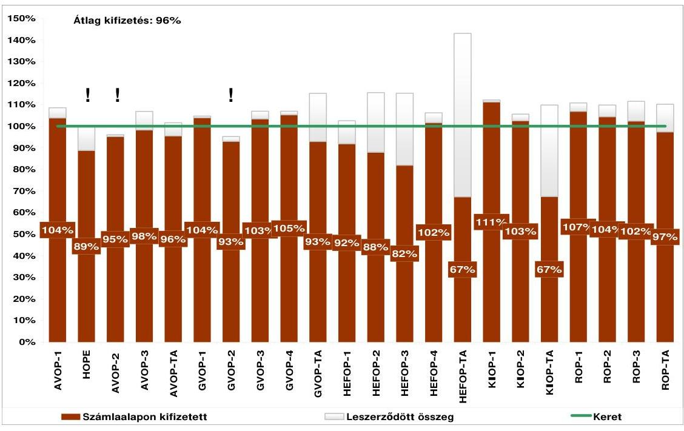

Forrás: NFÜ jelentés az Európai Unió fejlesztési támogatásainak felhasználásáról, 2009. február

A tagállami forráslehívások tekintetében Magyarország az uniós átlag felett teljesít ( $94 \%$, míg az átlag $90,6 \%$ ), az új tagállamok között Magyarországot csak Málta, illetve a balti államok előzik meg.

Az NFT abszorpciós, azaz pénzügyi teljesülésének értékelése mellett - a záráshoz kapcsolódóan is - egyre nagyobb hangsúlyt kell az eredményességi célok teljesülésének értékelésére helyezni.

A programok (indikátorok) teljesülésének részletes kiértékelése és elemezése csak a záráshoz kapcsolódóan valósul meg, néhány kiemelt indikátor vizsgálata kapcsán azonban jól láthatóak az indikátor rendszer gyengeségei (melyre már a korábbi évek jelentései is rámutattak), illetve a tervezett értékektől való (időnként jelentős) elmaradás.

---

A programok zárására való felkészülés támogatása érdekében az ellenőrzések kiemelten kezelték azokat a területeket, melyek kockázatot jelentenek a zárás sikeres lefolytatása szempontjából. Javaslataik megfogalmazásakor hangsúlyozták a feltárt hibák, hiányosságok, illetve gyenge működés hatását a zárás folyamatára.

A rendszerellenőrzések az ellenőrzési és irányítási rendszerek értékelése kapcsán arra a következtetésre jutottak, hogy a végrehajtásban résztvevő szervezetek által - a hazai és uniós jogi normák szerint - kialakított belső szabályozási rendszer, a feladatok végrehajtásának funkcionális függetlensége biztosítékul szolgál a rendszer uniós elvárásoknak megfelelő korrekt múködésére. Az OP-k vonatkozásában azonban néhány területen (szabálytalanságkezelés, első szintű ellenőrzési rendszer múködtetése) intézkedések megtételét látta szükségesnek a - különösen a programok zárásával kapcsolatos kockázatok csökkentése érdekében. A rendszerellenőrzések által feltárt egyéb hibák és hiányosságok nem veszélyeztetik a pénzeszközök célnak megfelelő, szabályszerű felhasználását, azonban azok kiküszöbölése hozzájárul a rendszer hatékonyabb és szabályosabb múködéséhez, csökkenti a szabálytalan pénzeszköz felhasználását és a csalás bekövetkeztének kockázatát.

A mintavételes ellenőrzések a rendszer múködésére vonatkozóan arra a következtetésre jutottak, hogy a projektek többsége az OP célkitűzéseivel összhangban valósult meg, a kedvezményezettek a projektek végrehajtásakor a Támogatási szerződésben foglaltaknak, valamint az esélyegyenlőségi, környezeti fenntarthatósági szempontoknak eleget tettek.

Az ellenőrzést végző szervezetek által tett megállapítások és a feltárt hiányosságok a korábbi években tapasztaltakhoz hasonlóan az első szintű ellenőrzési rendszer, a szabálytalanságkezelés és az EMIR funkcionalitásbeli és feltöltöttségi elmaradásainak területére koncentrálódnak, de továbbra is fennálló probléma a jogosulatlan költségelszámolás, a dokumentumok nem megfelelő kezelése, a közbeszerzési eljárások nem megfelelő lefolytatása.

Az Európai Bizottság Foglalkoztatási, Szociális és Esélyegyenlőségi Főigazgatósága által lefolytatott - a ROP és HEFOP-ra kiterjedő - nyomon követő és hitelesítési folyamatra összpontosító rendszerellenőrzések tőkeberuházásokat érintő kifizetéseire vonatkozó megállapításaira tekintettel a Főigazgatóság jogi szakszolgálata által kibocsátott állásfoglalás alapján szükségessé válik az elszámolt költségek felülvizsgálata.

# Önkormányzatok, mint az uniós támogatások kedvezményezettjei 

Az Állami Számvevőszék az önkormányzatok költségvetési gazdálkodási rendszere átfogó ellenőrzésének keretében a teljesítmény-ellenőrzés módszerével vizsgálta a belső szabályozottság, szervezettség terén az Önkormányzat felkészültségét az európai uniós források figyelése, igénylése és felhasználása, továbbá értékelte, hogy az igényelt európai uniós támogatások az Önkormányzat által meghatározott fejlesztési célkitűzésekhez kapcsolódtak-e.

---

Az európai uniós forrásokra irányuló pályázatok a gazdasági programokban, az ágazati, szakmai és területfejlesztési koncepciókban, tervekben megfogalmazott fejlesztési célkitűzésekhez többségükben kapcsolódtak, azonban a szabályozottság terén az ellenőrzött önkormányzatok 92\%-a, a szervezettség vonatkozásában 17\%-a 2004-2006 között nem készült fel eredményesen az európai uniós források igénybevételére és felhasználására.

A 2004-2007. években az ellenőrzött önkormányzatok 96\%-a döntött fejlesztési feladatai megvalósításához európai uniós forrásokra irányuló pályázatok benyújtásáról, amelyek több mint harmada (35\%-a) zárult eredményesen ${ }^{21}$.

A pályázatok elutasításának okai között a pályázati források hiánya, szakmai kidolgozatlanság, formai hibák, költség-hatékonyság elemzésének hiánya szerepelt.

A 2004-2007. évek költségvetési rendeletei készítésekor az ellenőrzött önkormányzatok 80\%-a gondoskodott a fejlesztési feladatok megvalósításához szükséges saját forrásról, illetve több mint fele (58\%-a) annak kiegészítésére „Önkormányzatok európai uniós, valamint hazai fejlesztés pályázati saját forrás kiegészitésének támogatására" pályázat benyújtásáról döntött ${ }^{22}$.

Az európai uniós forrással támogatott, ellenőrzött fejlesztési feladatok mintegy felének megvalósítása nem a támogatási szerződésben foglalt ütemezésben folyt. A támogatási szerződések közel felét módosították a határidők csúszása, a támogatás és kiadások évek közötti átütemezése, a projekt-költségvetésen belüli részösszegek átcsoportosítása, valamint a műszaki tartalom változása miatt. A kifizetési kérelmek benyújtása és azok teljesítése között az önkormányzatok közel felénél félév-háromnegyedév közötti különbség volt, elsősorban az igénylést alátámasztó dokumentumok alaki, tartalmi hiányosságai miatt. A közreműködő szervezetek a támogatási előlegigényléseket 30 napon belül, a hiánytalanul benyújtott fizetési kérelmeket 60 napon belül teljesítették.

A támogatásban részesült önkormányzatok többségénél az európai uniós források felhasználását a belső ellenőrzés a 2004-2007. években nem vizsgálta. Az európai uniós forrással támogatott fejlesztési feladatok megvalósulását az ÁSZ, a KEHI, illetve a közreműködő szervezetek az ellenőrzött önkormányzatok 70\%ánál vizsgálták, ennek során azok háromnegyedénél hiányosságokat állapítottak meg, amelyek megszüntetésére a jegyzők közel kétharmada intézkedéseket tett. A közreműködő szervezetek az ellenőrzések tizedénél tettek olyan szabálytalanságra vonatkozó megállapításokat, melyek miatt a támogatás kifizetését felfüggesztették, illetve visszafizetési kötelezettséget állapítottak meg.

[^0]
[^0]:    ${ }^{21}$ Az NFT 2004-2006 közötti operatív programjaira 2007. december 31-ig 2695 önkormányzat 176 Mrd Ft támogatásban részesült, amelyből 2007. december 31-ig 1913 projekthez 136,6 M Ft támogatást vett igénybe. (Forrás: EMIR)
    ${ }^{22}$ A 2004-2007. években az önkormányzatok európai uniós, valamint hazai fejlesztés pályázati saját forrás kiegészítésének támogatására a központi költségvetésben kialakított alap a helyi önkormányzatok 928 projektjének 261,3 Mrd Ft összegű beruházásához 17,6 Mrd Ft támogatást biztosított.

---

Az ÁSZ 2008-ban lefolytatott, a Nemzeti Fejlesztési Ügynökség átfogó vizsgálata az NFT megvalósulásának értékelése során rámutatott, hogy az EU források felhasználásakor nem kellően érvényesült a pályázók esélyegyenlősége, a fejlettebb régiók és a nagyobb települések pályáztak sikeresebben, ami tovább növelte már meglévő pénzügyi, gazdasági előnyüket. Ugyanakkor a nem tőkeerős pályázóknál, így egyes önkormányzatoknál likviditási nehézséget okozott az EU támogatások utólagos finanszírozása, amit gazdálkodásuk átmeneti visszafogásával, esetenként pótlólagos külső források bevonásával oldottak meg.

# 3.1.2. Közösségi kezdeményezések 

Az INTERREG III programok fő célja a határ menti régiók gazdasági és társadalmi kohéziójának erősítése a határ menti együttmúködések támogatásával. A programokat a Közösség és a tagállamok közösen finanszírozzák. Magyarország az ERFA forrásaiból 68,7 M euró összegű támogatást kapott, ez kiegészült 18,1 M euró társfinanszírozással.

Az INTERREG III program három részből állt: határ menti együttmúködés (INTERREG IIIA 86\%), transznacionális együttmúködés (INTERREG IIIB 8\%) és interregionális együttmúködés (INTERREG IIIC 6\%).

Magyarország összesen 9 INTERREG programban vett részt 2004-2006 között, amelyből négy INTERREG IIIA típusú, határ menti együttműködést célzó kezdeményezés (Ausztria-Magyarország INTERREG IIIA Közösségi Kezdeményezés Program (AT-HU), Szlovénia-Magyarország-Horvátország Szomszédsági Program (SLO-HU-CRO), Magyarország-Szlovákia-Ukrajna Szomszédsági Program (HU-SKUA), Magyarország-Románia és Magyarország-Szerbia és Montenegró Határ Menti Együttmúködési Program (HU-RO-SCG)).

A 2004-2006 közti időszakra rendelkezésre álló INTERREG Közösségi Kezdeményezés programok hazai lebonyolítása véget ért. A 2008. december 31-i kifizetési határidőre a Magyarország-Szlovákia-Ukrajna és az Ausztria-Magyarország relációban nem került az uniós forrás $100 \%$-a a költségnyilatkozatba, azaz az unió felé elszámolásra.

A programok keretében 388 projekt valósul meg mintegy 17,4 Mrd Ft támogatási kerettel. A programok végrehajtásában a késedelmet követő gyorsítás eredményeként 2008. június 30 -ig a teljes keret $87 \%$-ára teljesítettek kifizetést.

A programokhoz rendelt keretekre átlagosan 9,41\%-kal nagyobb összegben vállaltak kötelezettséget, miközben a programok pénzügyi végrehajtása eltérő eredményt mutatott, egyes programok esetében a rendelkezésre álló keretet nem sikerült felhasználni, másik program esetében többlet kötelezettségvállalás mellett a várható kifizetések meghaladják az eredeti támogatási keretet. A keretkihasználás hiánya és a többlet kötelezettségvállalás a költségvetés szempontjából veszteséget, illetve többletterhet jelent, amelyet az egyes programok maradványainak egyenlegével nem lehet elfedni.

A korábbi rendszerellenőrzés utóvizsgálata nem tárt fel kiemelt jelentőségű kockázatot az IMIR adatok megbízhatóságára, a rendszer biztonságára vonatkozóan, megállapította azonban a korábban feltárt biztonsági kockázatok részben még mindig fennállnak. A mintavételes ellenőrzések magas kockázatú

---

hibát tártak fel, mivel elmaradt az első szintű ellenőrzés során feltárt közbeszerzési törvény megsértése miatti szabálytalansági eljárás lefolytatása.

A felelős szervezetek megtették a szükséges intézkedéseket, a lefolytatott vizsgálatok alapján megállapították a visszafizetési kötelezettségeket, a korrekciós intézkedések megtörténtek.

Az Állami Számvevőszék 2008 folyamán vizsgálta az INTERREG célú költségvetési előirányzatok hasznosulását. A vizsgálat megállapította, hogy a források legkedvezőbb felhasználását többek között olyan tényezők korlátozták, mint a határon átnyúló kezdeményezések viszonylagos újszerűsége, a nemzetközi együttműködést támogató politikai akarat tényleges megnyilvánulásának időigénye, valamint a partnerség elvét érvényesítő nemzetközi együttműködés bonyolult intézményi és eljárásrendi rendszere. Hazai viszonylatban kedvezőtlenül befolyásolta a hatékony felhasználást az intézményi feltételek kialakításának késedelme és az intézményrendszer támogatásra vetített magas működési költsége. Az elfogadott programcélok általános jellegű megfogalmazása könnyítette a célszerű felhasználási feltétel teljesítését, ugyanakkor átfogó jellegük miatt nem koncentráltak a térségek főbb problémaira. A várt eredményeket és hatásokat megfogalmazó monitoring mutatók és a rendelkezésre bocsátott források egyensúlyának elemzését - és ezzel együtt a felhasználás eredményességének vizsgálatát - megnehezítette, hogy nem alakították ki a szakmai eredmény és hatásmutatók összehangolt rendszerét.

A támogatás-odaítélés folyamata (a pályázat-benyújtástól a szerződéskötésig eltelt idő) átlagosan meghaladta az egy évet. A támogatási szerződésekben foglalt feltételek és kötelezettségek biztosították a vállalt kötelezettségek nyomon követhetőségét a projekt életciklusára kiterjedően. A gyakorlat azonban azt mutatta, hogy a szerződéses feltételek teljesítésének nyomon követésére kialakított jelentési rendszer hiányos volt.

A vizsgálat keretében végzett önkéntes alapú véleményfelmérés visszatükrözte az INTERREG program hasznosulásának erős és gyenge pontjait. A válaszadók pozitívan értékelték a projektek településekre gyakorolt általános hatását, de jelezték, hogy a helyi konkrét problémák megoldására a program forrásai nem voltak elégségesek, illetve a célkitűzések általános jellegűek voltak. A válaszadók túlnyomó többsége nem tapasztalt korrupciót, de a mintegy 10\%-os arányú korrupciós jelzés (gyenge és közepes mértékű) mutatja a korrupció-ellenes tevékenység fontosságát.

Az INTERACT program az INTERREG Közösségi Kezdeményezés része, mely fő célja az INTERREG programok megvalósítása során a területfejlesztés és a határ menti-, transznacionális- és interregionális együttműködések terén felhalmozódott sokrétű tapasztalat átadása, hasznosítása. A programhoz kapcsolódó 2008. évi társfinanszírozási szerződés nem került megkötésre, így kifizetés sem történt.

Az EQUAL Közösségi Kezdeményezés az ESZA-ból finanszírozott program, amelynek célja a munkaerőpiacon az egyenlő esélyek megteremtése és a hátrányos megkülönböztetés különböző formáinak megszüntetésére irányuló kísérleti, innovatív projektek nemzetközi együttműködésben történő megvalósításának támogatása.

---

Az EQUAL rendelkezésre álló teljes összege 40,4 M euró, amelyből 30,3 M eurót az ESZA, 10,1 M eurót pedig a központi költségvetés biztosít.

A rendszerellenőrzés eredménye szerint a belső szabályozottság összhangban állt a hazai és közösségi előírásokkal, az irányítási és ellenőrzési rendszer pedig megfelelő bizonyossággal tanúsította a kiadások elszámolhatóságát.

Az ellenőrzések hiányosságokat tártak fel az eljárásrendi kötelezettségek teljesítése tekintetében, a vezetői ellenőrzésekkel kapcsolatosan, az ellenőrzési nyomvonal megfelelősége vonatkozásában projektdokumentáció rendelkezésre állása, illetve a tájékoztatási és nyilvánossági követelmények teljesítése, valamint a szabálytalanságkezelés terén.

A LEADER+ támogatási program (2000-2006) Magyarországon az Agrár- és Vidékfejlesztési Operatív Program (AVOP) keretén belül, a harmadik prioritás (vidéki térségek fejlesztése) egyik intézkedéseként került meghirdetésre.

A LEADER+ program azonban olyan sajátosságokat mutat, amelyek más AVOP intézkedésekre nem jellemzőek. Ezek közül a legfontosabb az alulról jövő kezdeményezés, valamint a helyi, vidéki közösségek összefogása és együttmúködése az egész pályázati folyamat során. További eltérés, hogy az AVOP többi intézkedése projektfinanszírozású, a LEADER+ viszont programfinanszírozású, vagyis egy program több projektet ölel fel.

A LEADER+ AVOP részprogram kifizetéseinek üteme felgyorsult, és 2008-ban a teljesítés aránya a többi részprograméval megegyezővé vált (2008. évi kifizetés 4,031 Mrd Ft volt), azaz az MVH csaknem a teljes támogatási keretet a kedvezményezetteknek folyósította.

A LEADER+ Programra 2004-2006 között rendelkezésre álló keretösszeg 4,57 Mrd Ft volt, amelyet a nagy érdeklődésre való tekintettel hazai forrásból kiegészítettek.

# 3.1.3. Kohéziós Alap 

A Kohéziós Alap infrastrukturális fejlesztésekre felhasználható támogatásokat nyújt, amely a környezetvédelmi beruházásokra (levegő szennyezettségének mérséklése, hulladékgazdálkodás, szennyvízkezelés) és gazdasági kohéziót elősegítő vasúti, folyami és tengeri közlekedés, közlekedés-irányítás, tiszta városi közlekedés és tömegközlekedés, intermodális közlekedési rendszerek kiépítésére fordítható.

A Kohéziós Alap Irányító Hatóság teendőit a Nemzeti Fejlesztési Ügynökségen belül működő Környezetvédelmi Programok Irányító Hatósága látta el. A Kohéziós Alap Irányító Hatóság feladata kibővült a 2007-2013 Környezet és Energia Operatív Program (KEOP) irányító hatósági feladataival is és 2007. január 1-jével felvette a Környezetvédelmi Programok Irányító Hatósága nevet. A Környezetvédelmi Operatív Programok Irányító Hatósága a Kohéziós Alap keretstratégia megvalósítása céljából szektoronként egy-egy közremúködő szervezetet vont be a végrehajtási folyamatokba. 2008. december 6-tól a közlekedési szektorban a Közreműködő Szervezet feladatait a KIKSZ Közlekedésfejlesztési ZRt. (KIKSZ Zrt.) látja el. A környezetvédelmi programok esetében a KvVM Fejlesztési Igazgatósága maradt a Közreműködő Szervezet.

---

A KA-ból származó 1500 M euró közösségi támogatás áll rendelkezésünkre a 2000-2006-os időszakban, amelynek felhasználására 2010. december 31-ig van lehetőség.

A Kohéziós Alap vonatkozásában évek óta jellemző probléma a projektek megvalósításának időbeli elhúzódása, a nagymértékű költségtúllépés és műszaki tartalomváltozás, illetve az ellenőrzések által - elsősorban a közbeszerzési eljárások terén - feltárt jelentős hiányosságok.

A szerződéssel való lekötés a közlekedési projekteknél a várható összköltség EU támogatási részének $82 \%$-át, környezetvédelmi projekteknél pedig a $75 \%$-át érte el. A közlekedési szektorban a KA támogatási keret $64 \%$-át, a környezetvédelmi szektorban pedig közel $53 \%$-át fizették ki az elvégzett teljesítményekkel arányosan a kivitelezők részére (5. ábra).
5. ábra
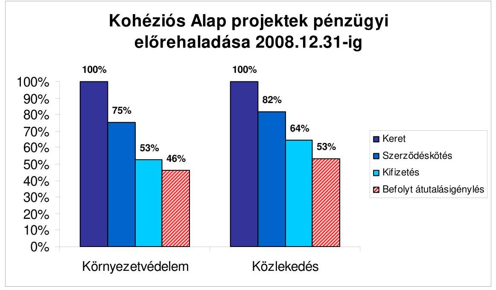

A közlekedési projektek kapcsán az Állami Számvevőszék zárszámadás keretében végzett ellenőrzése a kifizetések előtti szakmai ellenőrzések hiányosságaira mutatott rá.

Összességében a rendszerellenőrzések alapján a jelentésekben megfogalmazott megállapítások és javaslatok alapján megtett, illetve tervezett intézkedések arra utaltak, hogy a Kohéziós Alap irányítási rendszere kisebb adminisztratív és eljárási hibákkal ugyan, de súlyos rendszerbeli hiba nélkül a támogatási célnak megfelelően múködött. Az ellenőrzési tevékenység eredményei nem mutattak lényeges hiányosságot az irányítási és ellenőrzési rendszer tényleges múködésében, azonban a rendszerellenőrzés eredményei, valamint a szabálytalansági nyilvántartások adatai alapján a szabálytalanságok kezelésének rendszere, az elszámolható költségek ellenőrzése, valamint a számviteli nyilvántartás hiányossága kockázatot jelent a projekt zárások tekintetében, ezért további intézkedéseket igényelnek, ellenkező esetben pénzügyi korrekciót indokolhatnak.

---

A rendszerellenőrzések a számviteli nyilvántartások vezetésében, a költségvetés előfinanszírozás és a megelőlegezett források költségvetésbe való visszapótlásának folyamatában, a közbeszerzési szabályok be nem tartása terén, el nem ismerhető költségek elszámolásában tapasztalható hiányosságokra hívták fel a figyelmet.

A rendszerellenőrzés az eredményszemléletű kettős könyvvitel vezetését érintő problémákat tárt fel.

Az EMIR számviteli moduljában a számviteli nyilvántartások vezetése nem naprakész, a könyvvezetést végző KH és KSZ-ek nyilvántartásainak feltöltöttségi szintje nem azonos. Ennek következtében sem a rendszeres egyeztetéseket, sem az éves zárásokat nem végezték el, valamint az éves beszámolók sem készültek el, melyhez a Kifizető Hatóság 2004 óta fennálló munkaerő-kapacitás hiánya is hozzájárult. Nem minden esetben történt meg a projektek gazdasági eseményeinek a kedvezményezett könyvvezetésében történő nyilvántartásba vétele.

A 2008. évi mintavételes ellenőrzések eredményei alapján szabálytalansági gyanúk állapíthatóak meg a szerződéskötési gyakorlat, különösen a közbeszerzési eljárás mellőzésével kötött szerződések módosítása terén. A megvizsgált nyolc projektből 4 projekt esetében állapítottak meg szabálytalansági gyanúval érintett igazolt támogatást. Ennek alapján az ellenőrzött projektekre vonatkozó hibaarány $10,8 \%$ volt. Lényeges hibákat elsősorban a közbeszerzési eljárások kapcsán állapítottak meg. A feltárt szabálytalanságok esetén a szükséges intézkedések végrehajtása többnyire megtörtént, illetve esetenként folyamatban van.

A mintavételes ellenőrzések a közlekedés terén megállapításokat tettek a közbeszerzési szabályok be nem tartására, el nem ismerhető költségek elszámolására és a vállalkozói teljesítési határidő lejáratot követően elvégzett szerződésmódosításra vonatkozóan. Az ellenőrzés rámutatott, hogy a számlákhoz mellékelt indikátoralapú felbontásokból nem követhető a pénzügyi teljesítés és a fizikai előrehaladás összhangja.

A környezetvédelmi szektort érintő mintavételes ellenőrzések el nem számolható költségeket tártak fel, továbbá arra vonatkozó megállapításokat is tettek, hogy több vizsgált projekt esetében a közbeszerzések során a nyilvánosság elve nem teljes mértékben érvényesült, mivel a közbeszerzési eljárás eredménye- és a szerződésmódosítás közzétételére vonatkozó szabályait az ajánlatkérő nem minden esetben tartotta be.

A 2008. évben két Kohéziós Alap projekt kapcsán került sor zárónyilatkozat kiadására. Egy esetben a lefolytatott ellenőrzés a hibák mérsékelt előfordulását állapította meg, a projekt keretében elszámolható támogatást csökkentő hiányosság vagy szabálytalanság feltárására nem került sor. A vizsgálat alapján a projekt keretében elszámolt költségek elismerhetőnek minősültek, a záró költségnyilatkozatban szereplő adatok helytállónak bizonyultak, így a projekt keretében rendelkezésre álló uniós forrás utolsó részlete teljes összegben lehívható volt. A másik projekt ellenőrzése a fizikai megvalósítás és a pénzügyi lebonyolítás kapcsán - elsősorban a projekt üzemeltetését érintő - hiányosságokat állapított meg, melyek figyelembevételével minősített vélemény került kiadásra. A

---

feltárt hiányosságok rendezése érdekében a korrekciós intézkedések folyamatban vannak, ezt követően kerül sor a végső egyenleg elszámolására.

Az Európai Számvevőszék 2008 januárjában vizsgálta az adminisztratív és számviteli irányítást szabályozó nemzeti irányító- és kontrollrendszereket. A vizsgálatról készült jelentés többek között súlyos hiányosságként állapította meg, hogy a végső kedvezményezett nem megfelelő közbeszerzési formát választott. Az ellenőrzés lezárásaként a nemzeti hatóságok elfogadták a 40497367 euró összegű pénzügyi korrekciót, amely a Bizottság részére benyújtandó költségnyilatkozatból és kifizetési kérelemből levonásra kerül.

# 3.1.4. Schengen Alap 

A Schengen Alap 2004 és 2006 között pénzügyi segítséget nyújtott az érintett tagállamoknak annak érdekében, hogy az EU új külső határain a schengeni vívmányok érvényesülését és a külső határellenőrzés előírt feltételeit biztosíthassák. Magyarország számára a Csatlakozási Okmányban rögzítettek szerint mintegy 165,8 M eurót támogatás állt rendelkezésre.

A schengeni csatlakozással kapcsolatos beruházások, beszerzések, intézményfejlesztések és képzések lebonyolítására 2007. szeptember végéig volt lehetőség. A 2006. december 31-ig tartó szerződéskötési határidőre közel 300 szerződéskötés valósult meg, a források lekötési aránya elérte a $99,8 \%$-ot. A fejlesztések megvalósítása 2007. szeptember 30-ig lezárult, a kifizetések a 2007. év végi határidőre teljesültek.
2008. március 26-án a Schengen Alap Monitoring Bizottság megtartotta záró ülését, amelyen áttekintette a megvalósított fejlesztéseket.

A megvalósított fejlesztéseket magába foglaló program szakmai és pénzügyi teljesítéséről szóló Zárójelentést a Felelős Hatóság véglegesítette, a Schengen Alap Tárcaközi Bizottság jóváhagyta, a KEHI az ellenőrzések alapján a vonatkozó költségigazolást kiállította. A Jelentést 2008. július 18-án a Felelős Hatóság megküldte az Európai Bizottságnak.
2008. szeptember 8-19. között az Európai Bizottság lefolytatta a Schengen Alap záró audithoz kapcsolódó pénzügyi, majd 2009 februárjában helyszíni ellenőrzéseit, amelynek keretében az érintett hazai intézményeknél vizsgálatokat folytatott le.

### 3.1.5. PHARE és Átmeneti Támogatás

A PHARE tekintetében rendszerellenőrzésre 2008 folyamán már nem került sor. A mintavételes ellenőrzések elvégzéséért felelős KEHI egy projektet vizsgált, ahol az alprojektek esetében hiányosságokat tárt fel, amelyek kivizsgálása folyamatban van.

A PM NAO Iroda éves beszámolójában megállapította, hogy a PHARE programok zárása rendkívül hosszadalmasan történik, aminek legfőbb oka a Bizottság hozzáállása, illetve a hazai intézményrendszer személyi állományának fluktuációja.

---

Az Európai Bizottság folyamatosan végzi a PHARE programok végrehajtását, a Tájékoztató készítésének időpontjáig a magyarországi programok 20\%-át zárta le.

Magyarország a PHARE programból csak a csatlakozást megelőző utolsó teljes évben - azaz 2003-ban - részesedhetett. A csatlakozás időpontja és 2006 vége közötti időszakban az Európai Unió ideiglenes pénzügyi támogatást, ún. Átmeneti Támogatást nyújtott az új tagállamoknak a közösségi jogszabályok végrehajtása és érvényesítése terén igazgatási kapacitásaik fejlesztésére és megerősítésére, valamint a bevált gyakorlatok kölcsönös cseréjének előmozdítása érdekében. A Program mind célkitűzései, mind eljárásrendje tekintetében a PHARE intézményfejlesztési fejezete továbbélésének tekinthető.

A 2004-2006 között időszakra a program keretében az Unió által megítélt támogatás mértéke Magyarország számára 35,83 M euró, amelyhez hozzájárult a nemzeti társfinanszírozás közel 10,9 M eurót kitevő összege. A projektek nyolc szakmai területen valósulnak meg: mezőgazdaság; környezetvédelem és vízgazdálkodás, közlekedés, valamint belső piac; bel-és igazságügyi együttmúködés; pénzügy és vámügy; valamint politikai kritériumok, egészségügy és szociális gondoskodás.

A futó projektek végrehajtásának menetét a Nemzeti Segélykoordinátor havi rendszerességgel monitoring megbeszélések keretében nyomon követi. A teljesítés határideje 2009. december 15., a kifizetési határidő 2010-ben esedékes.

Több projekt esetében reallokációra került sor a rendelkezésre álló forrás minél hatékonyabb felhasználása érdekében. Az Oktatási és Kulturális Minisztérium a szükséges társfinanszírozási forrás, illetve a humán erőforrás hiánya miatt a projekt megvalósításának leállítását kezdeményezte.

A rendszer- és projektellenőrzések megállapításai arra utaltak, hogy a PHARE és Átmeneti Támogatás hazai rendszere alapvetően megfelelően szabályozott volt a jogszabályi környezet és a végrehajtó szervezetek tekintetében.

# 3.1.6. Az EGT és Norvég Finanszírozási Mechanizmusok program 

Az EGT és Norvég Finanszírozási Mechanizmusok támogatási konstrukciókat Norvégia, Izland és Liechtenstein annak érdekében hozták létre 2004-ben, hogy elősegítsék a társadalmi és gazdasági kohézió megteremtését a kibővült Európai Gazdasági Térségben. Az Együttmúködési Megállapodások értelmében Magyarország számára 2004-2009 közötti időszakban összesen 135 M euró áll rendelkezésre. A kormányzat a projektekhez nem járul hozzá ún. „hazai forrás" biztosításával, az önerőt a pályázónak kell előteremtenie.

A Finanszírozási Mechanizmusok keretében elsősorban közcélt szolgáló, alapvetően nem profit szerzésére irányuló tevékenységek, projektcélok finanszírozhatóak. Az EGT FM prioritásai a környezetvédelem, fenntartható fejlődés, az európai örökség megőrzése, humánerőforrás fejlesztés és oktatás; egészségügy; gyermek és ifjúság; tudományos kutatás. A Norvég FM ezek mellett további két prioritási területtel egészül ki: regionális fejlesztés és határon

---

átnyúló együttműködés, valamint bel- és igazságügyi együttműködés. A két támogatási alapra egységes szabály-, illetve intézményrendszer vonatkozik.

Az EGT és Norvég Finanszírozási Mechanizmusok 2004-2009 program keretében a Nemzeti Kapcsolattartó három pályázati fordulót hirdetett meg. A harmadik pályázati kör eljárási rendje a korábbiakhoz képest megváltozott, a támogatásra javasolt projektek kiválasztása már két szakaszban történt.

A Finanszírozási Mechanizmus Iroda részére megküldött 65 db támogatásra javasolt projekt közül 51-re érkezett jóváhagyó döntés. Ezen projektek végrehajtása megkezdődhetett annak ellenére, hogy a Támogatási Megállapodás, illetve a Végrehajtási Szerződés megkötése egy későbbi időpontban történt/történik meg.

A Nemzeti Kapcsolattartó által lefolytatott helyszíni monitoring látogatások megállapították, hogy a kritikus szakaszt a közbeszerzések előkészítése és lebonyolítása jelenti. További tapasztalat, hogy sikeresen működnek a pályázati alapok, különösen regionális szinten, amelyek lehetővé teszik az alacsony öszszegű, ugyanakkor kisebb közösségek számára hasznos és látványos eredményeket felmutató kisprojektek megvalósítását.

A támogatási konstrukciók pénzügyi lebonyolítása a vártnál lassabban indult be, mindössze 18 projekt lépett a pénzügyi megvalósítás szakaszába. A számviteli nyilvántartással megbízott közreműködő szervezet 2008-ban még nem alakította ki az eljárásrendjét és nem teljesítette nyilvántartási kötelezettségét.

A program 2004-2009-es periódusának keretében a pályázati kiírások lezárultak. Ugyanakkor az Európai Bizottság felvette a kapcsolatot a támogatást nyújtó államokkal a program következő 5 éves periódusban történő folytatása érdekében, így várhatóan 2010 folyamán ismét lehetőség lesz a program keretében pályázati kiírások megnyitására. Az esedékes tagállami támogatások meghatározására vonatkozó számítási kulcsok és egyéb alapvető eljárási elemek tisztázása ügyében a Bizottság a tárgyalási mandátumának kialakítása érdekében az előzetes tárgyalásokat megkezdte a kedvezményezett országokkal is. Magyarország szempontjából alapvető elvárás, hogy az első periódusban biztosított allokáció ne kerüljön csökkentésre a következő ciklus során.

# 3.2. A 2007-2013-as programozási periódus támogatásai 

### 3.2.1. Új Magyarország Fejlesztési Terv

2007. január 1-jével megkezdődött Magyarország számára a második programozási időszak, amely 2013-ig közel 8000 Mrd Ft-nyi fejlesztési forrás szétosztását jelentheti az Új Magyarország Fejlesztési Terv (ÚMFT) keretében.

Az EU költségvetés szerkezeti változásait a 2000-2006-os és a 2007-2013-as költségvetési periódus között a 3. sz. melléklet mutatja be.

Az általános uniós rendeletben foglaltaknak megfelelően a közösségi támogatásokra való jogosultság feltételei szerint a hét magyar régió közül hat - KözépDunántúl, Nyugat-Dunántúl, Dél-Dunántúl, Észak-Magyarország, Észak-

---

Alföld, Dél-Alföld - a „konvergencia", a Közép-Magyarországi régió pedig a „regionális versenyképesség és foglalkoztatás" célkitúzés alá tartozik. Emellett hazánk részesül a Kohéziós Alap eszközeiből is ${ }^{23}$.

A „konvergencia" célkitúzés alá az a NUTS-II szintű régió tartozik, amelynek a 2000-2002-es időszakra vonatkozó, közösségi adatok alapján számított egy főre jutó GDP-je - vásárlóerő-paritáson mérve - kevesebb a közösségi átlag 75\%-ánál. A Közép-Magyarországi régió nem tartozik a „konvergencia" célkitúzés alá, mert 2000-2002-ben az egy főre jutó GDP-je meghaladta az EU-25 átlagának 75\%-át. A régió azonban 2006-ban még az 1260/1999/EK tanácsi rendeletben meghatározott 1. célkitúzés alá tartozott, és az egy főre jutó GDP-je 2000 és 2002 között meghaladta az EU-15 átlagának 75\%-át. Így a „Regionális versenyképesség és foglalkoztatás" célkitúzés alapján jogosult átmeneti és egyedi alapon nyújtott (ún. phasing-in) támogatásra.

Az új programozási időszakban megnövekedett források hatékony és eredményes felhasználása érdekében létrehozott intézményrendszer 2007-ben túlnyomórészt kialakult, az akkreditációs eljárások a KÖZOP és a KMOP 2. prioritás kivételével sikeresen lezárultak.

Az intézményi felkészülést és ezen belül a monitoring és ellenőrzési rendszerek kialakításának megfelelőségét tanúsító akkreditációs jelentéseket az Európai Bizottság 2008. év folyamán a KÖZOP és a KMOP 2. prioritás kivételével jóváhagyta és a KEHI által benyújtott nem minősített véleményt elfogadta. A megfelelőségi vizsgálat eredményeként kiadott minősítés Bizottság általi jóváhagyása a 2007-2013-as programozási időszakban az első időközi kifizetési kérelem benyújtásának feltétele. Az elutasított OP, illetve prioritás elfogadása 2009-ben történt meg.

A jogszabályi környezetet érintő 2008. évi változások szempontjából a pályázati rendszer egyszerűsítésére, a programok gyorsítására és a projektgazdák terheinek csökkentésére irányuló törekvések mellett kiemelendők a pénzügyi válság és ennek hatásaképpen szétterjedő gazdasági válság kapcsán hozott intézkedések.

Az NFÜ az ÚMFT-re vonatkozóan, a rendelkezésre álló támogatási források szabályos, hatékony és eredményes felhasználásának elősegítése céljából Egységes Működési Kézikönyvet (EMK) fogadott el. Az éves felülvizsgálat keretében (többek között az ellenőrzések megállapításai alapján), illetve a felhasználást szabályozó hazai jogszabályok módosításainak megfelelően az EMK-t aktualizálták.

A hazai jogalkotás a nemzeti hatáskörbe meghatározandó (és ezáltal nagyobb rugalmasságot biztosító) elszámolhatósági szabályokat csak 2008. évben alkotta meg, mivel az ellenőrzések és jogszabály módosítások miatt többszöri átdolgozására volt szükség.

[^0]
[^0]:    ${ }^{23}$ Magyarország egy főre jutó bruttó nemzeti jövedelme (GNI) vásárlóerő-paritáson 2001 és 2003 között 11666 euró volt, ami az EU-25 átlag (21 254 euró) 54,9\%-a. Magyarország elkészítette az EK-szerződés 104. cikkelyében meghatározott konvergenciaprogramot: a két feltétel alapján Magyarország jogosult a Kohéziós Alap forrásainak igénybevételére.

---

Az új programozási időszak stratégiai terve, az ÚMFT tartalmazza a 2007-2013as időszak fejlesztési célkitűzéseit, melynek az Uniótól lehívható pénzügyi kerete a hét év vonatkozásban mintegy 7000 Mrd Ft. További források állnak rendelkezésre a hét évben az FVM gondozásában készült ÚMVP-n keresztül.) Az ÚMFT megvalósítását biztosító 15 operatív programot az Európai Bizottság 2007. július-szeptember között elfogadta. Az ÚMFT végrehajtása 2007. évben megindult.

Az ÚMFT végrehajtásának módja az NFT-hez képest alapvetően megváltozott, a pályázati megvalósítás mellett előtérbe került a pályáztatás nélkül, ún. kiemelt projektként történő felhasználás. A stratégiai fontosságú fejlesztési, beruházási elképzelésekről a Kormány nem pályázatok útján, hanem az adott fejlesztés fontosságát, az ÚMFT céljaihoz való illeszkedését mérlegelve egyedileg dönt. A nagyprojektek ( 50 M euró feletti, környezetvédelmi beruházások esetén 25 M eurós támogatási összeget meghaladó fejlesztések) esetében a Kormány első körös javaslatára a Tagállam által összeállított Támogatási Kérelem alapján a végleges döntést az EU Bizottság hozza meg.

Az ÚMFT keretében lehetőség van pénzügyi eszközök ún. Jeremie (mikrohitel program, kkv-hitel program, kockázati tőke-alapok, portfólió-garancia) igénybevételére (6. ábra).
6. ábra

A pénzügyi eszközök rendszere
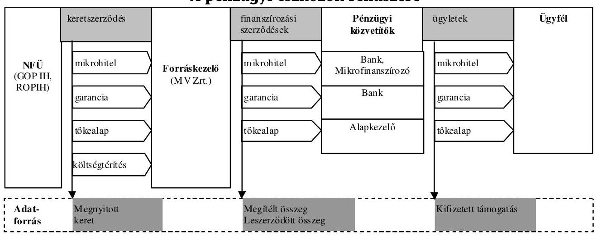

Forrás: NFÜ jelentés az Európai Unió fejlesztési támogatásainak felhasználásáról, 2009. február

Az ÚMFT teljes keretének több, mint 50\%-a meghirdetésre került, 24\%-ára döntés és 19\%-ára szerződéskötés történt. (3. táblázat)

Az összesített adatok kedvező alakulását a kiemelt projektekben látható előrehaladás nagymértékben befolyásolta. A pályázatos konstrukciók esetében a teljes ÚMFT keret 24\%-át kitevő összegre lehetett pályázatot benyújtani, mindöszsze 6\%-ára született döntés, illetve 4\%-ára szerződés. A kiemelt projektek esetében a teljes ÚMFT keret 25\%-át nyitották meg, 15\%-a döntéssel és 13\%-a szerződéssel rendelkezett.

---

A Kormány mintegy 335 kiemelt projektet hagyott jóvá 1900 Mrd Ft értékben. Az NFÜ felelős Irányító Hatóságai több mint 1100 Mrd Ft értékű részletesen kidolgozott kiemelt projektet hagytak jóvá 2008 végéig, és több mint 900 Mrd Ft értékű támogatási szerződést kötöttek meg.

A Kormány 19 nagyprojektet hagyott jóvá, melyből 2008-ban 15-öt küldtek meg az Európai Bizottsághoz. A „Debreceni városi villamoshálózat fejlesztése" nagyprojektet az EU már jóváhagyta.

Kifizetésre a kiemelt projekteknél 148,9 Mrd Ft értékben került sor, legnagyobb mértékben a KÖZOP (133,2 Mrd Ft) programjaira. A pályázatos konstrukciók esetében 2008-ban 23,3 Mrd Ft értékben történt kifizetés. Ebből a legnagyobb arányt (15,2 Mrd Ft-tal) a GOP tette ki.

# 3. táblázat 

ÚMFT előrehaladása, eljárásrendek szerint bontva

|  | ÚMFT   keret |  | Megnyitott   keret* |  | Megítélt   támogatás |  | Leszerződött   támogatás |  | Kifizetés |
| :--: | :--: | :--: | :--: | :--: | :--: | :--: | :--: | :--: | :--: |
|  | M euró | Mrd Ft | Mrd Ft | $\%^{* *}$ | Mrd Ft | $\%^{* *}$ | Mrd Ft | $\%^{* *}$ | Mrd Ft |
| Kiemelt   projektek |  |  | 1902,80 | $25 \%$ | 1108,20 | $15 \%$ | 904,6 | $13 \%$ | 148,9 |
| Pályázatos   konstrukciók |  |  | 1843,70 | $24 \%$ | 481,3 | $6 \%$ | 291,5 | $4 \%$ | 23,3 |
| Pénzügyi   eszközök |  |  | 196,2 | $3 \%$ | 74,8 | $1 \%$ | 65,2 | $1 \%$ | 4,9 |
| TS |  |  | 159,6 | $2 \%$ | 118,2 | $2 \%$ | 112 | $1 \%$ |  |
| ÚMFT | 29319 | 7622,90 | 4102,40 | $54 \%$ | 1782,50 | $24 \%$ | 1373,30 | $19 \%$ | 177,1 |

Forrás: NFÜ jelentés az Európai Unió fejlesztési támogatásainak felhasználásáról, 2009. február

Az ÚMFT-ben meghatározott közel 25 Mrd euró uniós forrásból 2008. december végéig összesen 1,4 Mrd euró, - közel 370 Mrd Ft - érkezett Magyarországra, amely a teljes uniós keret 6\%-a. Az EU által automatikusan folyósított előleg értéke 1,37 Mrd euró - 355 Mrd Ft - a teljes átutalt összeg 96\%-a.

Az első időközi átutalás igénylések benyújtására csak az OP megfelelőségi vizsgálati dokumentumainak Európai Bizottság általi elfogadását követően nyílt lehetőség. A Bizottság részére benyújtott költségnyilatkozatok és kifizetési kérelmek összértéke meghaladta a 66,6 M eurót, ami jelentősen magasabb a múlt évi szintnél (ebből a GOP 49,9 M eurót tett ki). Emellett 2008. február és május között összesen 834 M euró értékben érkeztek a Bizottságtól a 2008-ra vonatkozó előlegek.
2008. évben nem minden OP/alap esetében került, illetve kerül sor időközi kifizetési kérelem benyújtására. A KEOP, KÖZOP, TIOP, TÁMOP, DDOP és KMOP esetében 2009-ben került, illetve kerül sor időközi kifizetési kérelem benyújtására.

---

A Pénzügyi eszközökön belül (mikrohitel program, kkv-hitel program, kockázati tőke-alapok, portfólió-garancia) a pénzügyi közvetítők és az ügyfelek között majdnem 900 ügylet született. Néhány portfólió-garancia ügylettől eltekintve mindegyik mikrohitel-program keretében került kihelyezésre.

Az n+3 szabály teljesítési kötelezettsége ${ }^{24}$ első ízben 2010. december 31-én lesz aktuális. A 2007. évi kötelezettségvállalást figyelembe véve a megítélt támogatások aránya a legtöbb OP/alap vonatkozásában azt jellemzően többszörösen meghaladja, 6 esetben azonban elmaradás tapasztalható. A 24 kockázatosnak ítélt prioritásból (a megítélt támogatás aránya a teljes kerethez viszonyítva nem haladja meg az 5\%-ot) 18 ezekhez kapcsolódik.

Az NFÜ tájékoztatása szerint a Bizottság által közzétett kimutatások alapján hazánk az ERFA-ból, illetve az ESZA-ból finanszírozott OP elfogadás és időközi lehívás benyújtása, valamint a nagyprojektek benyújtása és elfogadása tekintetében kedvező helyen szerepel.

Az ÚMFT pályáztatási rendszerében is fennáll az NFT-ben is tapasztalt hatékonysági probléma, amely a határidők jelentős túllépéseként mutatkozik meg.

Az ÚMFT döntéshozatal átlagos átfutási ideje a nem normatív pályázatok esetében 156 nap (az előírt 105 nap helyett). Ezen belül azonban néhány KSZ vonatkozásában jelentős (akár kétszeres) határidő túllépés is tapasztalható. A szerződéskötésre rendelkezésre álló 60 napos jogszabályi határidőt a KSZ-ek - egy kivételével - jellemzően 10-20 nappal túllépik, azonban néhány KSZ esetében előfordulnak 100 napot meghaladó átfutási idők is. A kifizetési folyamat esetében a támogatás-kifizetési határidőket - a kimutatások szerint - valamennyi KSZ betartotta (mind a kedvezményezetti, mind a szállítói számla esetében). A késedelmesen kifizetett támogatás öt KSZ esetében jelentkezett problémaként, egy esetben azonban ez jelentős mértékű volt.

Az elkövetkezendő években fokozott figyelmet kell fordítani az ÚMFT kiemelt jelentőségű közlekedési és környezetvédelmi projektjeinek végrehajtására (4-es metró, Margit híd felújítása, környezetvédelmi nagyprojektek). Ezen komplex projektek megvalósítása során el kell kerülni a Kohéziós Alap felhasználását kísérő negatív tendenciákat a végrehajtás elhúzódása és a költségek tervezetthez képest történő jelentős túllépése és a közbeszerzési eljárásokat érintő szabálytalanságok tekintetében.

A panaszok kezelésére biztosított jogszabályi (30+30 napos) határidőt egyik OP esetében sem tudta az intézményrendszer betartani. Ez a döntési folyamat elhúzódásához vezethet. Az elutasított pályázatok és a KSZ döntés ellen beérkezett panaszok aránya három regionális OP (DA, ÉM, NYD) esetében volt kiemelkedő ( $71 \%, 79 \%$ és $98 \%$ ) 2007-2008. évben. A jogos panaszok aránya az összes OP tekintetében 38\% volt; 50\%-nál magasabb jogos panaszarány csak az ÉMOP esetében fordult elő.

[^0]
[^0]:    ${ }^{24}$ Az Európai Unió hazánk felé tett, adott (pl. 2007.) évi kötelezettségvállalását n+3 év (pl. 2010.) december 31-ig kell kérelmezni az Európai Bizottságtól (ebbe a Bizottság által utalt előlegek is beleszámítanak)

---

A 2008. évben lefolytatott rendszervizsgálatok a megfelelőségi vizsgálatok utóvizsgálatára és a projekt kiválasztási és a szerződéskötési rendszer ellenőrzésére koncentráltak.

A VOP projektek kiválasztási folyamatait előíró belső eljárásrendet az általános eljárási szabályokat rögzítő jogszabályban foglaltaktól, illetve az EMK-tól eltérően alakították ki. Az egyértelmú szabályozási háttér hiánya kockázatot jelenthet a projekt kiválasztási rendszer vonatkozásában, főként az akciótervben való nevesítést megelőző szakaszban. A GOP vonatkozásában az ellenőrzés felhívta a figyelmet a munkaköri leírások aktualizálására, a MÁK feladatait szabályozó eljárásrendek kiegészítésére, a hiányzó belső szabályok kidolgozására, hatályba léptetésére.

Az OP-k döntő részénél az Ellenőrzési Hatóság nem adott ki éves véleményt tekintettel arra, hogy az ellenőrzési időszakban a megfelelőségi vizsgálatok lefolytatására került sor, valamint a referencia időszakban (2007. év) nem történt költségigazolás. 2008. év folyamán az Európai Halászati Alap intézményrendszerére kiterjedő vagy az abból finanszírozandó támogatások felhasználását érintő ellenőrzés lefolytatására nem került sor, tekintettel arra, hogy a programdokumentáció csak 2008 szeptemberében került jóváhagyásra.

A megfelelőségi vizsgálat alapján elfogadott intézkedései tervben vállalt határidőkre, a megfelelőségi vizsgálat utóellenőrzését és a pályáztatás és szerződéskötés folyamatát is magába foglaló rendszerellenőrzéseket jellemzően 2008. II. félévében lehetett lefolytatni, így annak eredményei részben a következő évi jelentés tárgyát képezik.

A rendszerellenőrzések - a megfelelőségi vizsgálatok utóellenőrzése keretében megállapították, hogy az intézkedési tervekben foglaltak végrehajtására az intézményrendszer megtette a szükséges intézkedéseket. Néhány esetben azonban a feladatok nem kielégítően teljesültek, illetve az előírt intézkedés elmaradt.

A PM NAO Iroda belső ellenőrzés egységének vizsgálata megállapította, hogy az Igazoló Hatóság ÚMFT-vel kapcsolatos folyamatai a Működési Kézikönyvnek és a vonatkozó uniós, illetve hazai jogszabályok előírásainak megfelelően múködtek. A pénzügyi kimutatások napra készek és pontosak, azonban a számviteli beszámoló 2009 januárjáig nem készült el.

Az Igazoló Hatóság tényfeltáró látogatásai során vizsgálta az IH-k és KSZ-ek hitelesítési tevékenységhez kapcsolódó folyamatait, tevékenységét. A VOP és a DDOP kivételével a vizsgálatok nem tártak fel jelentős hiányosságokat.

A vizsgálat hiányosságokat állapított meg a VOP esetében az alkalmazott számviteli nyilvántartásból eredő nem megfelelően kialakított eljárási rend terén. A DDOP KSZ-nél végzett vizsgálat a feladatmegosztás dokumentáltságára és a helyszíni ellenőrzési tevékenységet szabályozó Módszertani útmutató módosítására, illetve az alkalmazott ellenőrzési listák aktualizálására tett javaslatot.

# 3.2.2. Nemzetközi együttmúködési támogatások 

Az INTERREG Közösségi Kezdeményezés a 2007-2013-as időszakban a kohéziós politika önálló célkitúzéseként („Európai Területi Együttmúködés" - ETE) került elindításra. Magyar részvétellel 7 határ menti (6 kétoldalú és 1 négyoldalú), 2

---

transznacionális és 4 interregionális program került kidolgozásra. A programok uniós forrását az ERFA, illetve az Unió külső határain az IPA (Előcsatlakozási Támogatási Eszköz) és ENPI (Európai Szomszédsági és Partnerségi Eszköz) alapok biztosítják. A határ menti együttmúködési programokban - 2004-2006-os időszak jellemzően háromoldalú szomszédsági programjaitól eltérően - a két ország határ menti megyéi múködnek együtt a határon átnyúló gazdasági és szociális kapcsolatok fejlesztése érdekében.

A pénzügyi források túlnyomó többsége a határ menti programokra jut, melyekben a beavatkozás fő területei: helyi gazdaságfejlesztési kapcsolatok, város és vidékfejlesztés, turizmus, emberi erőforrás fejlesztés, $\mathrm{K}+\mathrm{F}$, kultúra, egészségügy, oktatás, környezetvédelem, megújuló energia, közlekedési, információs és vízügyi együttmúködés, jogi és közigazgatási együttmúködés.

A programdokumentumokban rögzített fejlesztési célok és beavatkozási területek mentén lehetséges az együttmúködési tevékenységek finanszírozása. Az egyes programok regionális fejlesztési jellegűek, de a regionális fejlesztésnek kizárólag azon területeit ölelik fel, ahol a nemzeti határokon átlépő együttmúködések a főáramú fejlesztésekhez képest hozzáadott értéket hordoznak, illetve olyan közös problémákat céloznak megoldani, melyek gátolják a résztvevő országok kapcsolódó területei tekintetében az egymásra ható fejlesztések összehangolását, kölcsönös kihasználását.

Az NFÜ által kezelt Nemzetközi Programok között mintegy 510 M euró áll rendelkezésre az Unión belüli határon átnyúló projektekre (Európai Területi Együttmúködések):

- Ausztria-Magyarország relációban 2009 júniusáig 39 pályázat részesült támogatási forrásban ( 48,2 M euró ERFA).
- Szlovénia-Magyarország relációban 20 projekt részesül támogatásban 14 M euró ERFA értékben.
- Magyarország-Szlovákia és Magyarország-Románia relációban 2008 őszén került sor az első pályázati kiírásokra, értékelésük folyamatban van.

A 2008. év külső tényezők szempontjából az eljárások kidolgozásának, az irányítási és ellenőrzési rendszerleírások elkészítésének, az egyes programokban közremúködő országok között létrejövő megállapodások szövegezésének, hazai és nemzetközi egyeztetésének, illetőleg ezzel párhuzamosan a pályázati kiírások megjelenésének éve volt; a megfelelőségi vizsgálatok az év végén kezdődtek meg.

A 2007 óta létező Előcsatlakozási Támogatási Eszköz (IPA) a tagjelölt és „potenciálisan tagjelölt" országokra fókuszál. Az IPA keretében Magyarország két együttműködésben vesz részt Horvátország, illetve Szerbia vonatkozásában. A Programok finanszírozását 85\%-ban közösségi hozzájárulás biztosítja, a fennmaradó forrást a nemzeti hozzájárulás és/vagy önerő jelenti.

Mindkét program programdokumentumát 2008 márciusában hagyta jóvá az Európai Bizottság. 2007 vége és 2008 eleje elsősorban a programozással, a program indításához szükséges dokumentumok előkészítésével és az intézményi struktúra kialakításával telt.

---

A Magyarország-Horvátország IPA Program esetében az 1. pályázati felhívás megjelenése a nem egyértelmű uniós jogszabályi háttér, az állami támogatás és a közbeszerzési kérdések tisztázása okán 2009-re tolódott.

A Magyarország-Szerbia Program tekintetében a 2008-ban nem teljesült célkitűzések csúszásának legfőbb oka Szerbia politikai helyzete volt. A Monitoring Bizottság felállítására 2008 őszén, a szerbiai választásokat követően kerülhetett csak sor. Pályázati kiírás legkorábban 2009 szeptemberére várható. Problémát okoz továbbá a szerb fél előfinanszírozáshoz, valamint a Monitoring Bizottság múködésére vonatkozó előre leegyezetett eljárási rend megváltoztatásához való ragaszkodása.

Az Európai Szomszédsági és Partnerségi Eszköz (ENPI) határon átnyúló komponense a közösség külső határai mentén elhelyezkedő, egyelőre tartósan az EU-n kívül maradó partnerországok érintett területi egységeivel való együttműködést támogatja.

A Magyarország-Szlovákia-Románia-Ukrajna Európai Szomszédsági és Partnerségi Eszköz Határon Átnyúló Együttmúködési Program 2007-2013 keretében kizárólag olyan projektek támogatására van lehetőség, amelyekben ukrán partner is részt vesz. Az OP általános célkitűzése az együttmúködés fokozása és elmélyítése Ukrajna három kijelölt régiója és a tagállamok régiói között.

Az Európai Bizottság 2008 szeptemberében fogadta el az Operatív Programot, az első pályázati kiírásra 2009 júniusában került sor.

A transznacionális együttmúködési programok keretében egy adott szempontból egy területi egységként értelmezhető, de több országból álló területek közösen keresnek megoldásokat a térséget érintő problémákra.

A Délkelet-Európai Transznacionális Együttmúködési Program 2007-2013 támogatási területei az innováció és a vállalkozások támogatása, a környezet védelme és fejlesztése, az elérhetőség javítása, valamint a transznacionális szinergiák erősítése a térségek fenntartható növekedése érdekében. Az Együttmúködési Program teljes költségvetése a 2007-2013 periódusra 206,7 M euró, amely még kiegészül a nemzeti társfinanszírozás összegével ( $38,4 \mathrm{M}$ euró).

A 2008 májusában meghirdetett első kiírás második pályázati kör elbírálásának 2008. év végi határidejét a beérkezett pályázatok magas száma miatt a Közös Technikai Titkárság nem tudta tartani, az ütemterv módosítását a Monitoring Bizottság jóváhagyta. A pályázatok végső elbírálása 2009 I. negyedévben zajlott.

A Közép-Európa Transznacionális Együttmúködési Program 2007-2013 támogatási területei az innováció erősítése Közép-Európában; Közép-Európa külső és belső elérhetőségének javítása; a környezet felelős használata; városok és régiók versenyképességének és vonzerejének növelése, valamint technikai segítségnyújtás. Az Egyetértési Megállapodás aláírása 2008. november 25 -én megtörtént. Az Együttmúködési Program teljes költségvetése a 2007-2013 periódusra 246 M euró, amely még kiegészül a nemzeti társfinanszírozás összegével (52,3 M euró).

---

Az első pályázati kiírás eredményei 2008. év végéig megszülettek. A projektekben érintett magyar partnerekkel kötendő nemzeti támogatási szerződések aláírása 2009. II. félévére húzódott át a nyertes projektek Vezető Partnerei és az Irányító Hatóság között közösségi támogatási szerződések megkötésének csúszása, valamint folyamatban lévő jogszabály-módosítások miatt. A második pályázati kiírás, melynek jóváhagyása írásos eljárás keretében zajlott, 2009. január 8-án került meghirdetésre.

A regionális és kistérségi szintű közigazgatási szervek együttműködését támogató INTERREG IVC Interregionális Együttmúködési Program keretében az 1. pályázati felhívásban 41 projekt került jóváhagyásra, mely a programra allokált forrásból közel 70 M euró lekötését jelenti. A magyar partnerek ERFA részesedése 2,5 M euró. A szerződéskötés és a projektek megvalósítása folyamatban van. A második pályázati felhívás 2009. január 30-án zárult, a mintegy 500 beérkezett pályázat feldolgozásának időigénye miatt a projektekről szóló döntés 2009 novemberében várható.

# 3.2.3. Szolidaritási és migrációs alapok 

A „Szolidaritás és migrációs áramlások igazgatása" általános program négy pénzügyi eszközt határoz meg a 2007-2013 közötti időszakra a tagállami programok finanszírozásához: az Európai Integrációs Alapot, az Európai Menekültügyi Alapot, az Európai Visszatérési Alapot és az Európai Külső Határok Alapot.

Az alapokhoz a tagállamok projektek által juthatnak hozzá és társfinanszírozás rendszerére épülnek. Az alapok elsődleges célja, hogy a tagállamokban fennálló helyzetet a közösségi színvonal szintjére fejlesszék vagy összehangolt vagy közös akciók végrehajtása által kollektív előnyöket jelentsenek az EU szintjén.

A négy eszköz múködésére többnyire azonos rendelkezések vonatkoznak, ezek jellemzően a Bizottság iránymutatási alapján kialakított többéves stratégiai programozási ciklusok, éves forrásleosztás és múködési programozás, valamint többéves értékelések. Ugyancsak többnyire azonos rendelkezések vonatkoznak az alapok kezelésével kapcsolatos igazgatási, pénzügyi ellenőrzési szabályozásra is. A finanszírozás tekintetében az alapok a társfinanszírozás elve alapján múködnek.

Magyarország a 2007-2013-as periódusban az alapokból 92 M euró uniós forrásban részesül.

A hazai intézményrendszerben a Felelős Hatóság, valamint a Hitelesítő Hatóság szerepét is az IRM tölti be, az Ellenőrzési Hatóság pedig a KEHI.

Az Ellenőrzési Hatóság megállapította, hogy nem jelölték ki a hitelesítő hatóságot, elmaradt a miniszteri rendelet, illetve a Múködési Kézikönyv hatálybalépése, rendezetlen a felelős hatóság irányítási és felügyeleti jogköre, nem történt meg teljes mértékben a feladatok átlátható szétválasztása. Ennek alapján az ellenőrzési jelentés elkészítéséig nem került sor a 2008. február 29-én kelt rendszerleírás - az Ellenőrzési Hatóság vezetője általi - megerősítésére.

---

Az ellenőrzés feltárta továbbá, hogy a program mind a négy alapja tekintetében a rendszerleírásban bemutatottak az Ellenőrzési Hatóság helyszíni ellenőrzésének időpontjára jelentősen megváltozott, ezért a rendszerleírás adatai nem feleltethetők meg az akkori állapotnak. Az ellenőrzés javaslatot tett arra, hogy rendezzék a feltárt problémákat és az aktuális állapotnak, illetve az EU Bizottság észrevételeinek megfelelően módosított rendszerleírást nyújtsanak be a KEHI elnökének aláírás céljából.

# 3.2.4. Svájci-Magyar Együttmúködési Program 

Az Európai Unió és Svájc között 2006. február 27-én létrejött kétoldalú megállapodást értelmében Svájc a 2004-ben csatlakozott 10 tagország részére öt éven keresztül összesen 1 milliárd svájci frank hozzájárulást biztosít. Ebből Magyarország részesedése bruttó 130738000 svájci frank. A kötelezettségvállalási periódus a pénzügyi keret jóváhagyását követően 2007 júniusában kezdődött meg.
2007. december 20-án a Svájci Szövetségi Tanács és a Magyar Kormány aláírta a Svájci-Magyar Együttmúködési Program végrehajtásáról szóló, a hozzájárulás biztosításának általános intézményi, pénzügyi és eljárásrendi feltételeit rögzítő Keretmegállapodást. A megállapodást a 348/2007. (XII. 20.) Korm. rendelet hirdette ki, 2008-ban pedig újabb Korm. rendelet született (237/2008. (IX. 26.)), amely rögzítette a Svájci Hozzájárulás végrehajtási szabályait.

A lebonyolítás további részletszabályait rögzítő bilaterális és intézményközi megállapodások egyeztetése eredményeként a Technikai Segítségnyújtás szabályait és költségvetését rögzítő megállapodás, illetve a Projekt Előkészítési Alapról szóló megállapodás 2009 áprilisában, illetve májusban került aláírásra.

A Program keretében elsősorban közcélt szolgáló, alapvetően nem profitszerzésre irányuló tevékenységek, projektcélok finanszírozhatóak. A támogatás legalább $40 \%$-át a leghátrányosabb helyzetben lévő északmagyarországi és észak-alföldi régiókban kell felhasználni. A Program négy fő területre koncentrál: Biztonság, Stabilitás, Reformok; Környezet és infrastruktúra; A magánszektor támogatása, valamint Humánerőforrás- és társadalomfejlesztés. A projektek kiválasztása főszabályként kétkörös döntési eljárással folyik. Az első körben a projekttervezetek kerülnek elbírálásra, és a második körben csak a nyertes projektötleteket kell teljes részletességgel kidolgozni.

Az első két pályázati felhívás 2008. július 31-én jelent meg két terület vonatkozásában. A beadási határidőre összesen 42 pályázat érkezett. A projekttervezetek első fordulójának hazai értékelési-kiválasztási szakasza 2008. év végén lezárult, a hazai értékelő bizottság összesen 17 projekttervezetet javasolt további kidolgozásra.

---

# 3.3. Agrártámogatások 

### 3.3.1. Az agrártámogatások finanszírozási és intézményrendszere

Az EU Közös Agrárpolitikája megvalósításának egyik alapelve a pénzügyi szolidaritás, azaz az agrárpolitika körébe tartozó intézkedések közösség által történő finanszírozása.

Az agrárpolitikai intézkedések megvalósítását 2007-ig az EMOGA két (Orientációs és Garancia) részlege finanszírozta, melyek helyébe 2007-től két új alap (EMGA, EMVA) lépett (4. sz. melléklet).

Az EMOGA Orientációs Részleg a struktúrapolitikai intézkedések, a Garancia Részleg pedig a piaci rendtartások finanszírozását szolgálta.

Az Európai Mezőgazdasági Garancia Alap (EMGA) célja az agrárpiaci támogatások/egyéb beavatkozások és a jövedelemtámogatások finanszírozása, az Európai Mezőgazdasági Vidékfejlesztési Alap (EMVA) minden vidékfejlesztési kiadás finanszírozására szolgál, függetlenül annak típusától és földrajzi elhelyezkedésétől. Ezzel megvalósul a Közös Agrárpolitika két pillérének (piaczsabályozás és közvetlen támogatások, illetve a vidékfejlesztési intézkedések) világos elkülönítése.

Az EMVA forrásból hazánk az Európai Unió új költségvetési időszakában 5,159 Mrd euró- 1400 Mrd Ft - (uniós és hazai) forrás felhasználására jogosult ( 3,8 Mrd euró uniós forrással).

A 2007-2013-as programozási időszak stratégiai elképzeléseit az Új Magyarország Vidékfejlesztési Stratégiai Terv tartalmazza, melynek célja, hogy - összhangban az Új Magyarország Fejlesztési Tervvel és a vonatkozó közösségi és hazai fejlesztési dokumentumokkal - kijelölje az agrár-vidékfejlesztés irányait, célkitűzéseit, és meghatározza a célok elérésének módját, eszközeit. Az Új Magyarország Vidékfejlesztési Program a Stratégiai Terv továbbrészletezett változata, amely intézkedésszinten tartalmazza a 2007 és 2013 közötti fejlesztési időszak agráriumra és vidékfejlesztésre vonatkozó prioritásait.

Magyarország éves költségvetésében az FVM fejezetében szerepelnek a vidékfejlesztési és halászati támogatások (NVT, ÜMVP és HOP) uniós és nemzeti forrásai együttesen. Az FVM fejezetben nem megjelenő jogcímekhez tartozó támogatásokat a Magyar Állam megelőlegezi és azt követően az EU megtéríti. A költségvetésen kívüli transzferek csoportjába tartozik az egységes területalapú támogatás, az intervenciós intézkedések, exporttámogatások, bizonyos belpiaci támogatások, amelyeket részben vagy egészben az EMOGA Garancia Részleg, illetve az EMGA finanszíroz.

A nemzeti kiegészítő támogatásokkal az Egységes területalapú támogatást ki lehet egészíteni.

A Koppenhágai Megállapodásban felkínált lehetőséget elfogadva Magyarország 2004. május 1-jétől, legfeljebb 3 éves, indokolt esetben kétszer 1 esztendővel meghosszabbítható átmeneti időszakra a közvetlen agrártámogatások egyszerűsített kifizetése (SAPS), valamint ezek nemzeti költségvetésből történő kiegészítése (top-up) mellett döntött. A magyar mezőgazdaság közösségi költségvetésből finanszírozott közvetlen támogatásai fokozatosan emelkednek, a 100\%-os szintet 2013-ban érik el.

---

Az EMGA, EMVA és EHA végrehajtásában résztvevő szervek feladatait, eljárásuk rendjét a hazai jogszabályok meghatározták. Az illetékes és irányító hatóság a földművelésügyi és vidékfejlesztési miniszter, az EMVA, EMGA és EHA-val kapcsolatos, kifizető ügynökségi feladatokat az MVH látja el.

Az MVH jogszabályokban meghatározott feladatait Központja, illetve önálló jogi személyiséggel nem rendelkező területi szervei által látja el (Kirendeltségek), melyekből hét regionális hatáskörrel rendelkezik. A 2007. december 4-től hatályos SzMSz jelentős strukturális átalakulást is eredményezett.

Az átruházott feladatokat ellátó szervek múködésének tekintetében a Törvény részletes követelményeket tartalmaz.

Az átruházott feladatot ellátó szerv az MVH nevében jár el, az átruházott feladat elvégzéséért harmadik fél felé az MVH felel.

Az engedélyezés funkció egyes elemeit a Hivatal más szervek bevonásával, együttműködésével látja el, vagy a feladat kihelyezése útján gondoskodik ellátásukról.

Átruházott feladatokat a Mezőgazdasági Szakigazgatási Hivatal, illetve a Földmérési és Távérzékelési Intézet lát el. Együttmúködési megállapodás keretében rögzített feladatokat 8 szervezet végez. A Vám- és Pénzügyőrség Országos Parancsnoksága irányításával végzik a 386/1990/EGK tanácsi rendelet által szabályozott, visszatérítésre jogosult mezőgazdasági termékek kiviteli eljárásához kapcsolódó folyamatba épített fizikai és kicserélési ellenőrzéseket. Ezen felül a Központi Ellenőrzési Parancsnokságon felállított Különleges Szolgálat feladata a 485/2008/EK (Korábban: 4045/89/EGK) tanácsi rendeletben szabályozott utólagos vállalatellenőrzések végrehajtása.

# 3.3.2. Az agrártámogatások hazai ellenőrzési rendszere 

Az agrártámogatások ellenőrzési rendszere Magyarországon az EU-hoz történő csatlakozás óta négy szinten működött.

A Földművelésügyi és Vidékfejlesztési Minisztériummal 2006. november 30-án kötött szerződés alapján az EMGA és EMVA pénzügyi alapok igazoló szervi tevékenységeit a 2008. EMGA, EMVA pénzügyi évre (2007. október 16. és 2008. október 15. közötti időszakban) a KPMG Hungária Kft. látta el.

Az Igazoló Szerv (ISZ) elvégezte a Kifizető Ügynökség az EMGA (végleges nettó összkiadás: 486553 484,46 euró), az EMOGA Garancia Részleg által a Nemzeti Vidékfejlesztési Terv keretében finanszírozott kiadások (végleges nettó összkiadás: 90290 537,46 euró), és az EMVA (végleges nettó összkiadás: 148,9 M euró) szerinti, a 2008. EMGA/EMVA pénzügyi évre vonatkozó éves beszámolójának vizsgálatát, valamint ellenőrizte a Kifizető Ügynökség által működtetett belső ellenőrzési rendszereket.

Az első ellenőrzési szintet a tagállami kifizető ügynökség, az MVH jelenti, mely valamennyi alap vonatkozásában megfelelt az akkreditációs követelményeknek.

A Mezőgazdasági és Vidékfejlesztési Hivatalt az EMOGA Garancia Részleg támogatási jogcímekre vonatkozóan a földművelésügyi és vidékfejlesztési miniszter

---

akkreditálta a 2005. december 8-i okiratban foglaltak szerint. Az akkreditáció tovább él az EMOGA Garancia Részleg utódját képező EMGA tekintetében is. Az MVH 2007. április 26-án nyert akkreditációt EMVA jogcímek végrehajtására.

Az Igazoló Szerv ellenőrzése során elvégezte az EMGA és EMVA akkreditációs feltételeknek való megfelelés ellenőrzését a kifizetési, kifizetés engedélyezési, könyvelési és jelentési, az előleg és biztosításkezelési, a követeléskezelési eljárások tekintetében. A Kifizető Ügynökség akkreditációs kritériumoknak való megfelelés vizsgálata során az ISZ megállapította, hogy a kifizető ügynökség belső ellenőrzési eljárásai kielégítően (azaz minden lényeges vonatkozásban hatékonyan) múködtek az EMGA és az EMVA tekintetében egyaránt.

A kifizetési, a könyvelési és jelentési, az előleg és biztosításkezelési, a követeléskezelési eljárásokat az ISZ megfelelőnek minősítette.

Az ISZ az EMGA kifizetések ellenőrzésekor közepes jellegű hibaként megállapította a mezőgazdasági területek erdősítése jogcím kapcsán, hogy a 2007-es kifizetési kérelmeket megelőző helyszíni ellenőrzések kiértékelését végző IIER modul fejlesztése késett, ezért e jogcím esetében számos helyszíni ellenőrzésre kiválasztott kérelem ügyintézése kézi módszerrel zajlott, mely több esetben hibás kalkulációhoz és ebből fakadóan téves kifizetéshez vezetett. A feltárt hibák esetleges pénzügyi következményei rendezésre kerültek, a kiértékelő szoftver fejlesztése során kiemelt figyelmet fordítottak a kiértékelő modulra. A SAPS jogcím végrehajtási időszaka alatt az aktualizált végrehajtási kézikönyv hiánya azt eredményezte, hogy nem teljesül az akkreditációs követelmény, miszerint a Kifizető Ügynökség részletes eljárásokat készít a kérelmek fogadásáról, nyilvántartásáról és feldolgozásáról, beleértve az összes erre a célra használt dokumentum leírását, a munka igazgatói iránymutatások szerint folyt, az MVH tájékoztatása szerint a végrehajtási kézikönyv elkészült és elfogadásra került.

A további akkreditációs követelmények közül az ISZ az információs rendszerek biztonságát érintően állapított meg nagy és közepes jelentőségű hiányosságokat (fejlesztések tesztelése dokumentációjának hiányosságai, a hozzáférési és jogosultsági szabályok megsértése).

Az ISZ a múködési ügyletek vizsgálata alapján mindkét alap tekintetében fenntartás nélküli véleményt adott ki és megállapította, hogy a 2008. október 15-én lezárult EMGA és EMVA évekre vonatkozó éves beszámoló a valóságnak megfelelő, teljes és pontos dokumentációja az alapra terhelt összegeknek.

Az EMVA kifizetés engedélyezési folyamatot érintően az ISZ megállapította, hogy az Agrár környezetgazdálkodás jogcím kezelése során az IIER több speciális esetet nem kezelt megfelelően, illetve az ügyfelek tájékoztatása nem kielégítő. Problémát tártak fel ugyanezen jogcím esetében az IIER automatikus keresztellenőrzési és szankcionálási funkcióival kapcsolatban. Az ISZ rámutatott, hogy az ÜMVP jogcímek esetében az MVH nem megfelelően követi az írásos eljárásrendek kialakításával és aktualizálásával kapcsolatos követelményeket. A problémák kezelésére született intézkedési tervek végrehajtása folyamatosan történik.

Az ISZ megállapította, hogy az MVH intézkedéseivel kapcsolatos könyvvezetését és elszámolásait a kettős könyvvitel szabályai szerint, elkülönült módon, az EMVA és EMGA alapok számára elkülönített főkönyvben végzi a számviteli alapelveknek megfelelően. A könyvvezetés és a jelentések készítése 2007. október 16tól a 883/2006/EK rendeletnek megfelelően euróban történik magyar nyelven.

---

Az ISZ az MVH feladatellátását érintően a SAPS határozatok kezelését érintően tárt fel közepes jelentőségű hibát.

Az 1290/2005/EK tanácsi rendelet szerinti nyilatkozat az EU Bizottsági iránymutatásnak megfelel.

Az ellenőrzések második szintjét a kifizető ügynökség rendszerbe épített adminisztratív, valamint helyszíni ellenőrzései képezik, amelyek 2008-ban a szabályoknak megfelelően múködtek.

Az MVH a 2008. évben rendelkezett elfogadott ellenőrzési szabályzatokkal, kockázatelemzésekkel, mintavételi rendszerrel. Az MVH szakmai és funkcionális tevékenységének folyamatos ellenőrzését a Belső Ellenőrzési Főosztály munkája, valamint a támogatási rendszerekbe épített, az IIER által támogatott, munkafolyamatokba épített kontrollok múködése biztosította.

A területi egységek 2008-ban összesen 34096 db ellenőrzést végeztek (a kirendeltségek a közremúködő szervezetekkel együtt).

Az ISZ a megfelelési ellenőrzés keretében végzett újraellenőrzések során megállapította, hogy a helyszíni ellenőrzések rendszere és múködtetése a kifizető ügynökségnél hatékony és szabályszerű. A helyszíni ellenőrök felkészültsége és a megyei kirendeltségek felszereltségét megfelelőnek minősítették, bár az autók és egyéb technikai eszközök viszonylag szűkösen álltak rendelkezésre. A helyszíni ellenőrzésekre vonatkozó adatok nyilvántartását azonban nem megfelelőnek ítélték (a helyszíni ellenőrzésekre vonatkozó pontos és megbízható statisztikai adatok szolgáltatását biztosító informatikai rendszer kialakítása szükséges).

Az ISZ a Belső Ellenőrzési Főosztály feladatellátását érintően megállapította, hogy a feladatait a rájuk vonatkozó jogszabályok és elnöki utasítások követésével látja el. A Főosztály munkatársai által végzett munka megfelelő alapot biztosít az EMVA és EMGA alapok keretében nyújtott támogatások lebonyolításában előforduló hiányosságok felderítésére. A belső ellenőrzés által alkalmazott follow-up rendszerben az adatok, belső észrevételek egységes nyomon követhetősége biztosított.

Az ISZ a nem működési ügyletekhez kapcsolódóan javaslatot fogalmazott meg egy olyan belső szabályozó dokumentum kidolgozására, mely az éves EMGA közvetlen támogatások és EMVA statisztikai adatszolgáltatás vonatkozásában meghatározza a feladatokat, felelősségi köröket, az adatlekérdezés részleteit, a kapcsolódó adategyeztetéseket.

Az AVOP LEADER ${ }^{6}$ ellenőrzése a benyújtott elszámolások és adatszolgáltatások pontatlanságára hívta fel a figyelmet, illetve a határidők betartása és a dokumentáltság terén állapított meg hiányosságokat.

Az ÚMVP EMVA program belső szabályozottságának vizsgálata a késedelmes jogszabályalkotásra és a gyakori jogszabály módosításra hívta fel a figyelmet, mely megnehezítette a megfelelő belső szabályozási és informatikai háttér kialakítását. Ezt a megállapítást az egyes jogcímek végrehajtásának ellenőrzése is megerősítette. A jogcímek végrehajtására vonatkozó vizsgálatok az ügyintézési határidők be nem tartását mutatta ki.

---

Harmadik szinten a Vám- és Pénzügyőrség Országos Parancsnoksága - a VPOP és MVH közötti Együttmúködési Megállapodásban foglaltaknak megfelelően a közösségi és nemzeti jogszabályokon alapulva nem delegált feladatként hajtja végre az EMOGA Garancia Részleg kifizetéseihez kapcsolódó exportvisszatérítéses kiviteli eljárásokhoz kapcsolódóan a folyamatba épített ellenőrzéseket és az EMOGA Garancia Részlegből, illetve az EMGA-ból finanszírozott kifizetésekhez kapcsolódó utólagos vállalatellenőrzéseket.

A VP KEP Különleges Szolgálat a 2007/2008. évi ellenőrzési időszakra vonatkozóan az ellenőrzési tervben szereplő utólagos ellenőrzés közül 4 felfüggesztés miatt nem került lezárásra. A 485/2008/EK rendeletben meghatározott minimális vizsgálati szám, valamint a kedvezményezettek kockázati tényezők szerinti kockázatelemzése alapján a 2008/2009-es ellenőrzési időszakra 138 gazdálkodó került kiválasztásra. Külföldi megkeresés alapján a Különleges Szolgálat 2008-ban 5 vizsgálatot kezdett meg és zárt le. A Különleges Szolgálat 2008-ban 8 ízben élt megkereséssel külföldi különleges szolgálatok felé. Az ellenőrzések terv szerinti végrehajtását hátráltatja - a bizottsági audit által jó gyakorlatnak minősített keresztellenőrzések jelentős száma.

A 2008. év során kiadásra került az EMGA utólagos ellenőrzésekkel összefüggő feladatok ellátásáról szóló 103/2008 (XI. 03) VPOP utasítás. Ennek célja az EMGA finanszírozási rendszerébe tartozó ügyletek tagállamok által végzett vizsgálatokról szóló 485/2008/EK tanácsi rendelet hatálya alá tartozó vizsgálatok esetében a támogatások ellenőrzésével kapcsolatos olyan szabályozás, illetve iránymutatás kiadása, amely illeszkedik az unió által kiadott - egységes ellenőrzési rendszer megvalósulására irányuló - Ex Post Control Packageben foglalt elvekhez, valamint meghatározza az egyes részfeladatok ellátása során alkalmazandó eljárásokat.

A Strukturális Alapokból finanszírozott AVOP program irányítási és ellenőrzési rendszere a Strukturális Alapok rendszeréhez igazodik.

Az AVOP rendszerellenőrzése alapján megállapítható, hogy a pénzügyi lebonyolítási és nyilvántartási feladatok ellátása összességében megfelelt az alapvető jogszabályi követelményeknek. A szabálytalanságkezelési tevékenység körében feltárt hibák azonban kockázatot jelentettek a rendszer múködés és a programzárás vonatkozásában, mivel az IH nem minden esetben hajtotta végre vagy alkalmazta megfelelően a jogszabályi, eljárásrendi előírásokat.

A rendszerellenőrzés az IH tevékenységével kapcsolatosan megállapította, hogy az a vizsgált időszakban nem végzett a KSZ pénzügyi elszámolási, hitelesítési és adatrögzítési tevékenységének megbízhatóságára irányuló ellenőrzést a forráslehívást megelőzően.

A vizsgálat megállapítása alapján folyamatossá vált a KSZ által a szabálytalansági eljárásokról küldött dokumentumok adatainak egyeztetése az EMIR szabálytalansági moduljával.

Az ellenőrzés a KSZ eljárásrendi hiányosságának minősítette, hogy az ellenőrzési lista nem tartalmazza feladatként az alvállalkozói szerződések és a számlák kifizetések előtti ellenőrzésének kötelezettségét.

---

A mintavételes ellenőrzés eredményeként az ellenőrzött projektekre vonatkozó hibaarányt - a szabálytalansági gyanúval érintett EMOGA támogatás összegének következtében jelentős mértékűnek (11,41\%) minősítette.

A jelentős hibaarány három projekt esetében a pályázatkezelési hiányosságokból eredően megállapított szabálytalansági gyanúk eredménye, melyeket az ellenőrzés eseti jellegű hibaként értékelt.

A mintavételes ellenőrzés mind a HOPE, mind az EMOGA vonatkozásában hiányosságot tapasztalt a pályázatkezelés és a Múködési Kézikönyv vonatkozásában.

Késedelem volt tapasztalható a támogatási döntéshozatalban és a hiánypótlásra való felhívás határidejét illetően. Az értékelést végzők és a DEB tagjai nem tettek összeférhetetlenségi és titoktartási nyilatkozatot. A jogszabály módosításból fakadó változásokat az IH Múködési Kézikönyvében nem vezették át.

A mintavételes ellenőrzésre kiválasztott EMOGA projektekből három esetében a pályáztatás során tapasztalt hiányosságok következtében állapítottak meg szabálytalansági gyanút.

Az FVM belső ellenőrzése által lefolytatott projekt ellenőrzések során az IH megállapította, hogy a projektek végrehajtása a támogatási célkitúzéseknek megfelelően történt, a kisebb formai hiányosságokon kívül az IH helyszíni ellenőrzései jelentős hibát nem tártak fel.

A negyedik ellenőrzési szintet az éves pénzügyi elszámolások, azok bizottsági ellenőrzései jelentik. Az EU Bizottság többéves megfelelőségi vizsgálata a kifizető ügynökség éves beszámolóját az igazoló szerv igazolásával együttesen értékeli.

Az EU Bizottság a csatlakozás óta az MVH tevékenységét rendszeresen vizsgálta, ajánlásaira az MVH intézkedési terveket dolgozott ki, azok utóellenőrzése folyamatos. Az Európai Számvevőszék 3 alkalommal végzett a 2007-es megbízhatósági nyilatkozathoz kapcsolódó SAPS, Szőlőszerkezet és szőlőterületek termelésből való kivonása és kísérő intézkedések témákban ellenőrzést.

Az Európai Számvevőszék a 2008. évre vonatkozó DAS ellenőrzés keretében 2008. november és december hónapokban ellenőrzést folytatott le hazánkban az EMVA kiadások megbízhatósága tekintetében.

Az ellenőrzés hiányosságot tárt fel az ÚMVP keretében (készségek elsajátítása, ösztönzése és végrehajtása) a Helyi Vidékfejlesztési Irodák támogatásánál az irodavezetőre vonatkozó kiválasztási szempontok figyelmen kívül hagyása miatt. A vizsgálat agrár-környezetgazdálkodás jogcím esetében az ellenőrzési rendszer nem hatékony múködésére mutatott rá, kifogásokat fogalmazott meg adminisztratív ellenőrzés teljes körűségének hiányára és helyszíni ellenőrzések nem megfelelő eloszlására vonatkozóan. Az ellenőrzés kifogásolta, hogy a magyar hatóságok - az uniós előírások ellenére - az adminisztratív ellenőrzések nem terjednek ki az összes olyan hosszú távú kötelezettségvállalásra, amelyek ellenőrzése lehetséges és indokolt lenne. Az ellenőrzések éves eloszlását tekintve felhívták a figyelmet, hogy a helyszíni vizsgálatokat az egész évre elosztva kell végezni.

---

Az Európai Számvevőszék a 2008. évre vonatkozó DAS ellenőrzés keretében 2008 júliusában ellenőrzést folytatott le hazánkban a területalapú támogatási rendszer működésére vonatkozóan. Az ellenőrzés a helyszíni látogatások (mérések) során a támogatott, illetve a támogatásra jogosult (méréssel alátámasztott adatok) területek között több esetben állapított meg különbséget. Ennek kapcsán az ellenőrzés rendszerbeli hiányosságként kifogásolta, hogy az igénylésekkel teljes mértékben le nem fedett blokkok esetén az egyes túligényléseket az adminisztratív ellenőrzés nem képes feltárni. A rendszerbeli hiányosság mellett problematikus, hogy a gazdálkodók a földhivatali nyilvántartások szerinti kerekített földterület alapján nyújtják be igényléseiket, mely jelentős túligénylésekhez vezethetnek.

Az Európai Számvevőszék az IIER helyszíni ellenőrzések megbízhatósága az új tagállamokban című, több tagországra kiterjedő ellenőrzés keretében 2008. ja-nuár-február hónapban ellenőrzést folytatott hazánkban, melynek legfőbb célja volt annak megállapítása, hogy a Kifizető Ügynökség a közösségi jogszabályoknak megfelelően végzi-e a SAPS irányítását és kontrollját.

A számvevőszéki ellenőrzés több hiányosságot állapított meg a terület támogathatóságát alátámasztó adatok, ellenőrzések terén, az ellenőrzéseket megalapozó kockázatelemzést hatékonysága, illetve a visszaosztási ráta számításának időpontja kérdésében. Az MVH az ellenőrzés által érintett időszakra (2006 és 2007. évi kifizetések) feltárt hiányosságok megszüntetésére tett intézkedéseket.

Az ellenőrzés rámutatott, hogy a támogatható területre irányuló adminisztratív keresztellenőrzések pontatlan adatokon alapultak, mivel a Mezőgazdasági Parcella Azonosító Rendszerben regisztrált támogatható területre vonatkozó adatok több, mint 27 ezer referencia parcella esetében nem megbízhatóak, ebből következően fennáll a kockázata, hogy a keresztellenőrzés nem tölti be a funkcióját. Az ellenőrzés kifogásolta, hogy a kérelmekben a parcellahatárok elhelyezkedésének előírt grafikai pontossága nem felelt meg a közösségi rendelkezéseknek. A 2006. évre nem kellő hatékonyságúnak minősített kockázatelemzés kérdésében 2007-ben javulást értek el a magyar hatóságok. Az vizsgálat feltárta, hogy a viszszaosztási ráta kiszámításához alapul vett összterület nagyságát a közösségi jogszabályokban rögzített határidő lejártát követően állapították meg, mely késedelem a helyszíni ellenőrzések elhúzódására volt visszavezethető. Az ellenőrzés rámutatott, hogy az aktuális adatok szerint hazánk túllépte a 2006. évi tagországi keretet, mely a kifizetések (a fellebbezési eljárások, korrekciók következtében) változó összegére vezethető vissza.

Az Európai Bizottság Mezőgazdasági és Vidékfejlesztési Főigazgatósága 2008. októberben ellenőrzést végzett a termelési csoportok elismerési tervei és a termelői szervezetek múködési programjaira vonatkozóan a gyümölcs és zöldség ágazatban. Az ellenőrzés során vizsgálták a termelői csoportok elismerésének folyamatát, a támogatási összegek kifizetésének megállapítását és folyamatát. Az ellenőrzés kiemelt hangsúlyt helyezett az ellenőrzési eljárások, illetve a hazai hatóságok közötti információáramlás, munkamegosztás vizsgálatára. Az ellenőrzés nem tárt fel hiányosságot, azzal az ajánlással zárták le, hogy a magyar hatóságok biztosítsák az értékesített termelés értékére irányuló ellenőrzés elvégzésének átláthatóbb kimutatását, valamint az ellenőrzött számlák és az azoknak megfelelő bankkivonatok egyezőségét. Felkérték a magyar hatóságo-

---

kat továbbá, hogy fokozottabban ellenőrizzék az elismerési tervek keretében finanszírozott berendezések használatát.

A vizsgálat a VP KEP Különleges Szolgálata által elvégzett utólagos ellenőrzés gyakorlatát, különös tekintettel a számlák és elszámolásokhoz kapcsolódó (a másik fél elszámolásaival) ütköztető ellenőrzéseket jó gyakorlatnak minősítették.

# 3.3.3. SAPARD 

A SAPARD Program keretében Magyarország 2000-2006 között összesen közel 160 M euró összegű támogatáshoz juthatott. Az EU Bizottság 2007. december 10-i C/2007/6047 számú határozatával elfogadta Magyarország 2000-2006. SAPARD Terve teljesítésére vonatkozó végső végrehajtási Jelentését és pénzügyi elszámolását, melynek alapján került sor 2008-ban a Program végső pénzforgalmi elszámolására, a végső átutalásra. 2008-ban közösségi és hazai forrásból történő kifizetésre már nem került sor.

Ennek megfelelően igazoló szervi ellenőrzése a projektek múködtetési időszakát érintő, valamint a fennálló követelések kezelésére vonatkozó SAPARD ügynökségi feladatok vizsgálatára irányult. Külön szempontként a 2008. évi SAPARD ISZ vizsgálat kiterjedt a projektek 2008-as pénzügyi zárására, az elállással, valamint szabálytalanságkezeléssel kapcsolatos eljárásrendek és érintett projektek vizsgálatára.

Az ISZ az MVH monitoring tevékenységének értékelése során kis jelentőségű hiányosságokat tárt fel a monitoring tevékenység humán erőforrást érintően. A regionális illetőségű megyei kirendeltségek (ezek látják el a SAPARD-dal kapcsolatos feladatokat) monitoringgal foglalkozó munkatársainak egyéb feladatokkal való leterheltsége a dokumentum alapú monitoring elemzések és az adatok informatikai rendszerbe való feltöltésének időbeli eltolódását eredményezte. Ugyanezen okokra volt visszavezethető az ex-post helyszíni ellenőrzési tervekben való elmaradás.

Tekintve, hogy a SAPARD projektek pénzügyi zárására első alkalommal 2008ban került sor, az ISZ vizsgálta az MK pénzügyi zárással kapcsolatos fejezetét, és a projektek pénzügyi zárásának gyakorlatát. A pénzügyi záráshoz kapcsolódóan megállapították, hogy az eljárásrend nem tartalmaz előírásokat a projektakta kötelező tartalmára nézve. Javaslatot fogalmaztak meg egy olyan ellenőrzési lista kialakítására, mely a pénzügyi zárással kapcsolatos, kedvezményezett és Hivatal közötti levelezésre, valamint a biztosítékok felszabadítására is kiterjed. A projekt meghiúsulás, valamint szabálytalanságból fakadó - a szerződéstől való - elállásokat vizsgálva az ISZ rámutatott, hogy a vizsgált esetek döntő többségében semmiféle, a támogatási szerződés felbontását alátámasztó ügyirat nem volt fellelhető a projekt aktában.

Az ellenőrzés hiányosságokat állapított meg a követeléskezelési eljárások tekintetében. A SAPARD Program keretében kötött támogatási szerződések alapján kifizetett támogatások és az ezek kapcsán keletkezett követelések nyilvántartása az akkreditációnak megfelelően, a különböző osztályokon külön-külön, papír alapon történik kizárólag alapszintű számítógépes támogatást használva mind a kifizetések, mind a követelések kezelésekor. Az osztályok közötti adatátadás a Múködési Kézikönyvben meghatározásra került, azonban az osztá-

---

lyok közötti adatátadás teljessége nem ellenőrzött. Az ellenőrzés javaslatot fogalmazott meg a különböző osztályok által nyilvántartott követelések rendszeres, formális egyeztetésére, annak érdekében, hogy a különböző osztályok által nyilvántartott követelések adatbázisa egyező legyen.

A PM NAO Iroda belső ellenőrzése megállapította, hogy a Nemzeti Alap SAPARD programmal kapcsolatos pénzügyi folyamatai a SAPARD Múködési Kézikönyvnek és a vonatkozó európai uniós, illetve hazai jogszabályok előírásainak megfelelően működtek. A pénzügyi kimutatások és a számviteli nyilvántartás pontos és megbízható adatokat tartalmaztak.

Melléklet: $\quad 5 \mathrm{db} \quad 14$ lap

---

# MELLÉKLETEK 

1. sz. Európai Uniós költségvetési kapcsolatok
2. sz. A Magyar Köztársaság 2008. évi költségvetésének végrehajtásáról szóló törvényjavaslatban megjelenő EU-támogatások és a hozzájuk kapcsolódó hazai finanszírozás összege
3. sz. Az EU-költségvetés szerkezeti változásai a 2000-2006-os és a 2007-2013-as költségvetési periódus között
4. sz. A mezőgazdasági támogatások szerkezeti változásai a 2000-2006-os és a 2007-2013-as költségvetési periódus között
5. sz. A Tájékoztató alapjául szolgáló, 2008. évre vonatkozó ellenőrzések és öszszefoglalók

---

.

---

# 1. SZ. MELLÉKLET 

## Európai Uniós költségvetési kapcsolatok

| Az uniós költségvetésbe történt befizetések | 2004 | 2005 | 2006 | 2007 | 2008 |
| :--: | :--: | :--: | :--: | :--: | :--: |
| Tradicionális saját források összesen | 13461,0 | 28118,5 | 27513,8 | 27921,5 | 9756,9 |
| vámok | 13461,0 | 26571,9 | 26913,8 | 27980,9 | 9211,1 |
| cukorilletékek | - | 1546,6 | 600,0 | $-59,4$ | 545,8 |
| Nemzeti hozzájárulás összesen | 119721,4 | 186270,1 | 185611,9 | 189520,0 | 210581,0 |
| Áfa alapú hozzájárulás | 19111,5 | 26820,8 | 30456,5 | 34905,2 | 38534,0 |
| GNI alapú hozzájárulás | 88320,3 | 141970,7 | 139025,9 | 135668,5 | 149643,8 |
| Brit korrekció | 12289,6 | 17478,6 | 16129,5 | 18946,3 | 22403,2 |
| Egyéb |  | 374,4 | - | - | - |

| A Költségvetésben megjelenő támogatási jogcímek | 2004 | 2005 | 2006 | 2007 | 2008 |
| :--: | :--: | :--: | :--: | :--: | :--: |
| Támogatások összesen (EU+központi költségvetési forrás) | 84026,3 | 284685,0 | 470492,0 | 459011,5 | 468 996,4 |
| Strukturális Alapok | 5610,1 | 122 802,9 | 241 069,0 |  |  |
| 1. Nemzeti Fejlesztési Terv |  |  |  | 209521,4 | 116 753,8 |
| ÜMFT |  |  |  | 10003,1 | 124 957,5 |
| Egyéb strukturális támogatások |  |  |  | 11642,3 | 8251,2 |
| Kohéziós Alap/ISPA | 19625,1 | 44410,6 | 100 188,0 | 94682,6 | 107444,4 |
| Schengen Alap | 0,0 | 3248,9 | 9678,6 | 35580,3 | 591,1 |
| Nemzeti Vidékfejlesztési Terv | 0,0 | 49681,8 | 65 938,4 | 66 835,7 | 9911,8 |
| ÜMVP |  |  |  | 18704,2 | 84 803,0 |
| SAPARD | 14949,5 | 29712,0 | 9 196,3 | 1398,3 | - |
| PHARE/Átmeneti támogatás | 43841,6 | 32801,5 | 39 937,6 | 5203,5 | 4386,8 |
| Egyéb európai uniós támogatások | - | 2027,3 | 4484,1 | 5440,1 | 11 896,8 |
| Visszatérítés | 42813,4 | 8457,7 | 7773,9 | - | 51 102,6 |
| Költségvetésben megjelenő EU források | 126 839,7 | 293 142,7 | 478 265,9 | 459011,5 | 520 099,0 |

---

| KESZ által finanszí-   rozott költségvetésen   kívüli tételek | $\mathbf{2 0 0 4}$ | $\mathbf{2 0 0 5}$ | $\mathbf{2 0 0 6}$ | $\mathbf{2 0 0 7}$ | $\mathbf{2 0 0 8}$ |
| :-- | :--: | :--: | :--: | :--: | :--: |
| Agrárpiaci támogatá-   sok* | 855,0 | 159133,3 | 19826,5 | 47653,2 | 47623,7 |
| Közvetlen területalapú   támogatások | 77647,0 | 148022,9 | 93405,7 | 119992,1 | 156173,0 |
| Összesen | $\mathbf{7 8 5 0 2 , 0 ,}$ | $\mathbf{3 0 7 1 5 6 , 2}$ | $\mathbf{1 1 3 2 3 2 , 2}$ | $\mathbf{1 6 7 6 4 5 , 3}$ | $\mathbf{2 0 3 7 9 6 , 7}$ |

* agrárpiaci és intervenciós támogatások

Forrás: ÁSZ adott évi Költségvetés végrehajtásáról szóló jelentései

---

# 2. SZ. MELLÉKLET 

## A Magyar Köztársaság 2008. évi költségvetésének végrehajtásáról szóló törvényjavaslatban megjelenő EUtámogatások és a hozzá kapcsolódó hazai finanszírozás összege

|  |  |  | millió Ft |
| :--: | :--: | :--: | :--: |
| A központi költségvetésben megjelenő, az EU-tól érkezett és az EU-nak átutalt összegek, illetve az ezekhez kapcsolódó hazai források | Kiadás EU forrásból | Kiadás központi költségvetési forrásból | Kiadás összesen |
| Nemzeti Fejlesztési Terv | 101633,5 | 15 120,3 | 116753,8 |
| Kohéziós Alap | 43587,3 | 63857,1 | 107444,4 |
| ÚMFT | 94423,5 | 30534,0 | 124957,5 |
| Egyéb strukturális támogatások | 8875,9 | $-624,7$ | 8251,2 |
| Nemzeti Vidékfejlesztési Terv | 0,0 | 9911,8 | 9911,8 |
| Új Magyarország Vidékfejlesztési Program | 73721,9 | 11081,1 | 84 803,0 |
| Halászati Operatív Program | 0,0 | 0,0 | 0,0 |
| Schengen Alap | 0,0 | 591,1 | 591,1 |
| Átmeneti támogatás programjai | 2482,1 | 1904,7 | 4386,8 |
| Egyéb európai uniós támogatások | 4280,8 | 7616,0 | 11 896,8 |
| Támogatások összesen | 329 005,0 | 139991,4 | 468 996,4 |
| Hozzájárulás az EU költségvetéséhez |  | 210581,0 |  |

---

# A költségvetésen kívüli finanszírozással lebonyolított EUtámogatások 

| KESZ által finanszírozott költségvetésen kívüli tételek | Összes KESZ   finanszírozás   (M Ft) |
| :-- | --: |
| Közvetlen termelői támogatások (SAPS) | $156173,0$ |
| 2006. évi jogalap után 2008-ban kifizetett támogatások | 137,7 |
| Ebből EU által nem finanszírozott | $-137,7$ |
| 2007. évi jogalap után 2008-ban kifizetett támogatások | 47799,3 |
| Ebből EU által nem finanszírozott | $-1,5$ |
| 2008. évi jogalap után 2008-ban kifizetett támogatások | 108379,0 |
| 2008. évben megtérült követelések | $-3,8$ |
| Agrárpiaci támogatások | 36671,3 |
| Exporttámogatások | 3608,8 |
| Belpiaci támogatások | 21600,1 |
| Egyéb agrárpiaci támogatások | 11462,4 |
| Ebből elkülönített cukortámogatás | 8037,1 |
| Intervenciók | 10952,4 |
| Intervencióhoz kapcsolódó raktározási szállítási költségtérítés | 10216,1 |
| Intervencióhoz kapcsolódó finanszírozási költségtérítés | 736,3 |
| Költségvetésen kívüli tételek összesen | 203796,7 |

---

# Az EU-költségvetés szerkezeti változásai a 2000-2006-os és a 2007-2013-as költségvetési periódus között 

---

.

---

# A mezőgazdasági támogatások szerkezeti változásai a 2000-2006-os és a 2007-2013-as költségvetési periódus között 

A Közös Agrárpolitika szerkezete 2006-ig
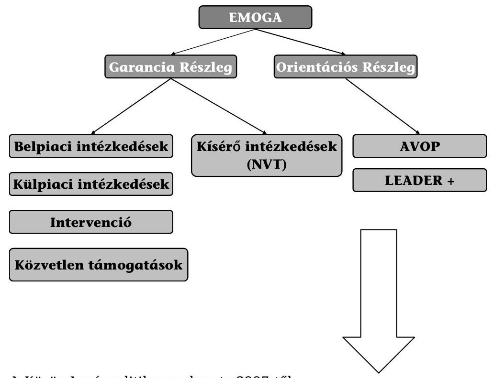

A Közös Agrárpolitika szerkezete 2007-től

## Európai Mezőgazdasági Garancia Alap (EMGA)

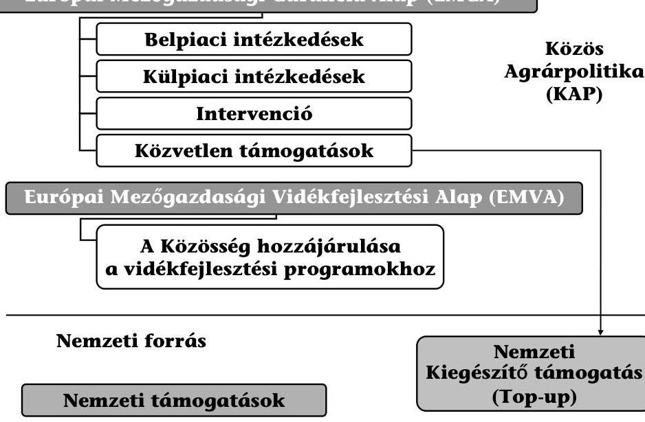

---

EMVA tengelyek
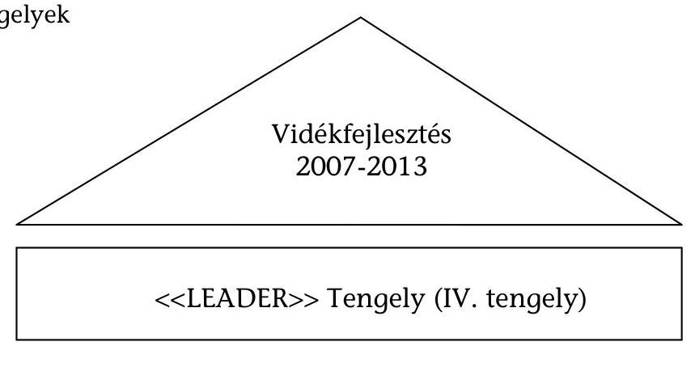
<<LEADER>> Tengely (IV. tengely)
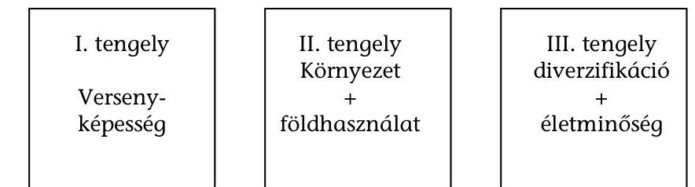

Egységes programozás, finanszírozás, monitoring, auditálás

Egységes Vidékfejlesztési Alap

---

# A Tájékoztató alapjául szolgáló, 2008. évre vonatkozó ellenőrzések és beszámolók 

Az ÁSZ által lefolytatott ellenőrzések

## Ellenőrzés címe

Jelentés az INTERREG célú költségvetési előirányzatok hasznosulásának ellenőrzéséről

## A KEHI által összeállított jelentések

2008. évi összefoglaló jelentés a 438/2001/EK Rendelet 13. cikke alapján az Agrár- és Vidékfejlesztési Operatív Programról
2008. évi összefoglaló jelentés a 438/2001/EK Rendelet 13. cikke alapján a Regionális Fejlesztés Operatív Programról
2008. évi összefoglaló jelentés a 438/2001/EK Rendelet 13. cikke alapján a Humánerőforrás-fejlesztési Operatív Programról
2008. évi összefoglaló jelentés a 438/2001/EK Rendelet 13. cikke alapján az EQUAL Közösségi Kezdeményezésről
2008. évi összefoglaló jelentés a 438/2001/EK Rendelet 13. cikke alapján a Gazdasági Versenyképesség Operatív Programról
2008. évi összefoglaló jelentés a 438/2001/EK Rendelet 13. cikke alapján a Környezetvédelem és Infrastruktúra Operatív Programról
2008. évi összefoglaló jelentés az 1386/2002/EK Rendelet 12. cikke alapján a Kohéziós Alapról

Magyarország-Szlovákia-Ukrajna INTERREG IIIA Program 2008. évi összefoglaló jelentés magyar része a 438/2001/EK Rendelet 13. cikke alapján

Magyarország-Románia-Szerbia és Montenegró INTERREG IIIA Program 2008. évi összefoglaló jelentés magyar része a 438/2001/EK Rendelet 13. cikke alapján

Ausztria-Magyarország INTERREG IIIA Program 2008. évi összefoglaló jelentés magyar része a 438/2001/EK Rendelet 13. cikke alapján

Szlovénia-Magyarország-Horvátország INTERREG IIIA Program 2008. évi összefoglaló jelentés magyar része a 438/2001/EK Rendelet 13. cikke alapján

PHARE és Átmeneti Támogatás 2008. évi összefoglaló jelentés
Tájékoztatás az EGT és Norvég Finanszírozási Mechanizmusok ellenőrzéséről

Hivatkozási szám
0845

13-5/97/2009.
13-5/98/2009.
13-5/99/2009.
13-5/100/2009.
13-5/101/2009.
13-5/102/2009.
13-5/108/2009.
13-5/106/2009.
13-5/76/2009.
13-5/71/2009.
13-5/72/2009.

---

Éves összegző jelentés a strukturális intézkedésekről és az Európai 13-24/2/2009. Halászati Alapról - 2008. év

Felülvizsgálat ellenőrzési stratégia az 1083/2006/EK rendelet 62. cikk (1) bekezdés c) pontja szerint - Gazdaságfejlesztési Operatív Program - 2007-2017

Éves ellenőrzési jelentés az 1083/2006/EK tanácsi rendelet 62. cikk 13-304/14/2008. (1) bekezdés d) pontja alapján az Államreform Operatív Program és Elektronikus Közigazgatás Operatív Program 2007. január 1. 2008. június 30. közötti időszakáról

Éves ellenőrzési jelentés az 1083/2006/EK tanácsi rendelet 62. cikk 13-304/15/2008. (1) bekezdés d) pontja alapján a Gazdaságfejlesztés Operatív Program 2007. január 1. - 2008. június 30. közötti időszakáról

Éves ellenőrzési jelentés az 1083/2006/EK tanácsi rendelet 62. cikk 13-304/16/2008. (1) bekezdés d) pontja alapján a Környezet és Energia Operatív Program 2007. január 1. - 2008. június 30. közötti időszakáról

Éves ellenőrzési jelentés az 1083/2006/EK tanácsi rendelet 62. cikk 13-304/17/2008. (1) bekezdés d) pontja alapján a Közép-Magyarország Operatív Program 2007. január 1. - 2008. június 30. közötti időszakáról

Éves ellenőrzési jelentés az 1083/2006/EK tanácsi rendelet 62. cikk 13-304/18/2008. (1) bekezdés d) pontja alapján a Közlekedés Operatív Program 2007. január 1. - 2008. június 30. közötti időszakáról

Éves ellenőrzési jelentés az 1083/2006/EK tanácsi rendelet 62. cikk 13-304/19/2008. (1) bekezdés d) pontja alapján a Konvergencia célkitúzés alá tartozó regionális operatív programok 2007. január 1. - 2008. június 30. közötti időszakáról

Éves ellenőrzési jelentés az 1083/2006/EK tanácsi rendelet 62. cikk 13-304/20/2008. (1) bekezdés d) pontja alapján a Társadalmi Megújulás Operatív Program és a Társadalmi Infrastruktúra Operatív Program 2007. január 1. - 2008. június 30. közötti időszakáról

Éves ellenőrzési jelentés az 1083/2006/EK tanácsi rendelet 62. cikk 13-304/21/2008. (1) bekezdés d) pontja alapján a Végrehajtás Operatív Program 2007. január 1. - 2008. június 30. közötti időszakáról

Ellenőrzési jelentés az 1083/2006/EK tanácsi rendelet 71. cikk (2) 32-3/108/2009 bekezdés szerinti megfelelőségi vizsgálatról (Közlekedés Operatív Program)

Ellenőrzési jelentés az 1083/2006/EK tanácsi rendelet 71. cikk (2) 32-3/109/2009 bekezdés szerinti megfelelőségi vizsgálatról (Közép-Magyarországi Operatív Program 2. prioritás)

Az 1083/2006/EK tanácsi rendelet 71. cikkének (2) bekezdése, valamint az 1828/2006/EK bizottsági rendelet 25. cikke szerint az irányítási és ellenőrzési rendszerek megfelelőségéről kiadott vélemény (Közlekedés Operatív Program)

---

Az 1083/2006/EK tanácsi rendelet 71. cikkének (2) bekezdése, valamint az 1828/2006/EK bizottsági rendelet 25. cikke szerint az irányítási és ellenőrzési rendszerek megfelelőségéről kiadott vélemény (Közép-Magyarországi Operatív Program 2. prioritás)

Az 1083/2006/EK tanácsi rendelet 62. cikk (1) bekezdés d) ii. alpontja, valamint az 1828/2006/EK bizottsági rendelet 18. cikk (2) bekezdése szerinti éves vélemény kiadásának elutasítása (Környezet és Energia Operatív Program)

Az 1083/2006/EK tanácsi rendelet 62. cikk (1) bekezdés d) ii. alpontja, valamint az 1828/2006/EK bizottsági rendelet 18. cikk (2) bekezdése szerinti éves vélemény kiadásának elutasítása (Végrehajtás Operatív Program)

Ellenőrzési jelentés a „Szolidaritás és a migrációs áramlások igazgatása" általános program keretében a 2007-2013-as időszakra a Külső Határok Alap létrehozásáról szóló 2007/574/EK európai parlamenti és tanácsi határozatban foglalt igazgatási és ellenőrzési rendszer leírásának vizsgálatáról a hazai intézményrendszerben

Ellenőrzési jelentés a „Szolidaritási és a migrációs áramlások igazgatása" általános program keretében a 2007-2013-as időszakra az Európai Menekültügyi Alap létrehozásáról szóló 2007/573/EK európai parlamenti és tanácsi határozatban, a 2007-2013-as időszakra a Harmadik Országok Állampolgárainak Beilleszkedését Segítő Európai Alap, valamint a 2008-2013-as időszakra az Európai Viszszatérési Alap létrehozásáról szóló 2007/575/EK európai parlamenti és tanácsi határozatban foglalt igazgatási és ellenőrzési rendszer leírásának vizsgálatáról a hazai intézményrendszerben

Közös ellenőrzési stratégia a szolidaritás és a migrációs áramlások igazgatása általános programra - Magyarország

## A Kifizető/Igazoló Hatóság vizsgálatai

## Ellenőrzés címe

Pénzügyminisztérium Nemzeti Programengedélyező Iroda beszámoló az Iroda 2008. évi szakmai tevékenységéről

PM NAO Iroda Belső Ellenőrzés Éves ellenőrzési jelentése 2008.
$13-37 / 7 / 2009$.

13-304/6/2008.

13-304/10/2008.

23-55/10/2008.

23-56/2/2008.

## Hivatkozási szám

5149/2009.
tényfeltáró látogatásokhoz kapcsolódó jelentések

---

# A Nemzeti Fejlesztési Ügynökség jelentései 

## Jelentés címe

EMIR fejlesztés és üzemeltetés 2008 - Összefoglaló éves jelentés
Jelentés az Európai Unió fejlesztési támogatásainak felhasználásáról - Új Magyarország Fejlesztési Terv (2007-13), a Nemzeti Fejlesztési Terv (2004-2006) és a Nemzetközi programok

NFÜ Belső Ellenőrzési Főosztály - Éves ellenőrzési jelentés a 2008. évben végzett tevékenységekről

## Az Európai Bizottság vizsgálatai

## Ellenőrzés címe

Nyomon követő ellenőrzés a ROP-nál (2008. április)
Nyomon követő és hitelesítésre kiterjedő ellenőrzés a HEFOP-nál (2008. április)

Termelési csoportok elismerési tervei és a termelői szervezetek múködési programjai a gyümölcs- és zöldségágazatban (2008. október)

## Az Európai Számvevőszék vizsgálatai

## Ellenőrzés címe

IIER és az Egységes Területalapú Támogatási Rendszer (SAPS) ellenőrzése az új tagállamokban

2008-as megbízhatósági nyilatkozat (DAS) keretében az EMGA kiadásaira vonatkozó ellenőrzés

2008-as megbízhatósági nyilatkozat (DAS) keretében az EMVA kiadásaira vonatkozó ellenőrzés

Hivatkozási szám

## Hivatkozási szám

PF-2758

PF-2983

PF-3085

## Agrártámogatásokkal kapcsolatos tagállami ellenőrzések jelentései

Jelentés az EMGA és EMVA 2007/2008. évi végrehajtása tekintetében végzett igazoló szervi ellenőrzésről

VPOP Különleges Szolgálat éves jelentése
MVH Belső Ellenőrzési Főosztály éves jelentése

---

# Egyéb beszámolók 

Beszámoló az ÁBPE Tárcaközi bizottság EU Támogatások Albizottság 2008. évi tevékenységéről

Fiatalok Lendületben Program év végi beszámolója (2008)
Egész életen át tartó tanulás programja - A Nemzeti Iroda jelentése - 2008. január 1 - december 31.

A Magyar Államkincstár éves beszámolója a 281/2006. (XII.23.) Korm. rendelet 7/A.§-ban és a 360/2004. (XII. 26.) Korm. rendelet 52. §-ában rögzített feladatok ellátásáról

OLAF Koordinációs Iroda - Összefoglaló a Pénzügyminiszter részére

---

1. sz. függelék a 0933. sz. Tájékoztatóhoz

Az uniós támogatások 2008. évi felhasználásának ellenőrzéséről szóló Tájékoztató összegző értékelése, következtetéseinek részletes bemutatása

---

# TARTALOMJEGYZÉK 

1. Magyarország és az EU pénzügyi kapcsolatai 2008-ban ..... 7
1.1. Az Uniós tagsággal összefüggő hazai befizetések ..... 7
1.2. Hazánk uniós támogatásai ..... 10
1.3. Az Európai Bizottság által közvetlenül kezelt források ..... 12
2. Az uniós támogatások hazai feltételrendszerének bemutatása ..... 14
2.1. Az uniós támogatások hazai intézményrendszere ..... 14
2.4. Az uniós támogatások hazai ellenőrzési rendszere ..... 19
2.5. Az uniós támogatások hazai nyilvántartási rendszerei ..... 27
2.5.1. Egységes Monitoring Információs Rendszer ..... 27
2.5.2. Országos Támogatási Monitoring Rendszer ..... 29
2.5.3. Integrált Igazgatási és Ellenőrzési Rendszer ..... 30
2.5.4. Számviteli nyilvántartási rendszer ..... 31
2.6. Szabálytalanság-kezelés ..... 37
3. Az Európai Uniós források felhasználásával kapcsolatos, a 2008-as évre vonatkozó ellenőrzések legfontosabb megállapításai, következtetései ..... 43
3.1. A 2000-2006-os programozási periódus támogatásai ..... 43
3.1.1. Nemzeti Fejlesztési Terv ..... 43
3.1.2. Közösségi Kezdeményezések támogatásai ..... 53
3.1.2.1. INTERREG ..... 53
3.1.2.2. EQUAL ..... 56
3.1.2.3. LEADER+ Program ..... 58
3.1.3. Kohéziós Alap ..... 59
3.1.4. Schengen Alap ..... 64
3.1.5. PHARE és Átmeneti Támogatás ..... 65
3.1.6. Az EGT és Norvég Finanszírozási Mechanizmusok program ..... 67
3.2. A 2007-2013-as programozási periódus támogatásai ..... 70
3.2.1. Új Magyarország Fejlesztési Terv ..... 70
3.2.2. Nemzetközi együttműködési támogatások ..... 78
3.2.2.1. Európai Területi Együttműködések ..... 78
3.2.2.2. Előcsatlakozási Támogatási Eszközök (IPA) ..... 79
3.2.2.3. Európai Szomszédsági és Partnerségi Eszköz (ENPI) ..... 81
3.2.2.4. Transznacionális Együttműködési Programok és Interregionális Együttműködés ..... 82
3.2.3. Szolidaritási és migrációs alapok ..... 83
3.2.4. Svájci-Magyar Együttműködési Program ..... 85
3.3. Agrártámogatások ..... 86
3.3.1. Az agrártámogatások finanszírozási és intézményrendszere ..... 86
3.3.2. Az agrártámogatások hazai ellenőrzési rendszere ..... 90

---

3.3.3. SAPARD ..... 97

---

# RÖVIDÍTÉSEK JEGYZÉKE 

| ÁBPE TB | Államháztartási Belső Pénzügyi Ellenőrzési   Tárcaközi Bizottság |
| :--: | :--: |
| Ámr. | Az államháztartás múködési rendjéről szóló 217/1998. (XII. 30.) Korm. rendelet |
| APEH | Adó- és Pénzügyi Ellenőrzési Hivatal |
| ÁROP | Államreform Operatív Program |
| ÁSZ | Állami Számvevőszék |
| ÁT | Átmeneti Támogatás |
| AVOP | Agrár- és Vidékfejlesztési Operatív Program |
| COBIT | Control Objectives for Information and Related Technology   (informatikai szabálykönyv) |
| DDOP | Dél-dunántúli Operatív Program |
| EDIS | Extended Decentralisation Implementation System (Kiterjesztett Decentralizációs Végrehajtási Rendszer) |
| EFK | Elöirányzat-felhasználási Keretszámla |
| EGT (FM) | Európai Gazdasági Térség (Finanszírozási Mechanizmus) |
| EHA | Európai Halászati Alap |
| EKKE | Európai Uniós Közbeszerzési és Koordinációs Szabályossági Egység |
| EKOP | Elektronikus Közigazgatás Operatív Program |
| EMA | Európai Menekültügyi Alap |
| EMIR | Egységes Monitoring Információs Rendszer |
| EMOGA (GR) | Európai Mezőgazdasági Orientációs és Garancia Alap (Garancia Részleg) |
| EMGA | Európai Mezőgazdasági Garancia Alap |
| EMK | Egységes Múködési Kézikönyv |
| EMVA | Európai Mezőgazdasági Vidékfejlesztési Alap |
| ENPI | European Neighbourhood Partnership Instrument Európai Szomszédsági és Partnerségi Eszköz |
| ERFA | Európai Regionális Fejlesztési Alap |
| ESZA | Európai Szociális Alap |
| ETE | Európai Területi Együttmúködés |
| EU | Európai Unió |
| FEUVE | folyamatba épített előzetes és utólagos vezetői ellenőrzés |
| FVM | Földmúvelésügyi és Vidékfejlesztési Minisztérium |
| GDP | Gross Domestic Product (Bruttó Hazai Termék) |
| GNI | Gross National Income (Bruttó Nemzeti Jövedelem) |
| GOP | Gazdaságfejlesztés Operatív Program |
| GVOP | Gazdasági Versenyképesség Operatív Program |
| HEFOP | Humánerőforrás-fejlesztési Operatív Program |
| HEP IH | Humán Erőforrás Program Irányító Hatóság |

---

| HOP | Halászati Operatív Program |
| :--: | :--: |
| HOPE | Halászati Orientációs Pénzügyi Eszköz |
| IA | Európai Integrációs Alap |
| IgH | Igazoló Hatóság |
| IH | Irányító Hatóság |
| IIER | Integrált Igazgatási és Ellenőrzési Rendszer |
| IMIR | INTERREG Monitoring és Információs Rendszer |
| IMK | Interaktív Múködési Kézikönyv |
| INTERACT | INTERREG Animation Cooperation and Transfer INTERREG ösztönzés, együttmúködés és átadás |
| IPA | Instrument for Pre-Accession Assistance - Előcsatlakozási Támogatási Eszköz |
| IRM | Igazságügyi és Rendészeti Minisztérium |
| ISPA | Instrument for Structural Policies for Pre-Accession (Strukturális Politikák Csatlakozás Előtti Eszköze) |
| ISZ | Igazoló Szerv |
| JEREMIE | Joint European Resources for Micro to Medium Enterprises (Közös európai források a kis- és középvállalkozásoknak) |
| JMC | Joint Monitoring Committee   (Közös Monitoring Bizottság) |
| KA | Kohéziós Alap |
| KAP | Közös Agrárpolitika |
| Kbt | Közbeszerzési törvény |
| KDB | Közbeszerzési Döntő Bizottság |
| KEHI | Kormányzati Ellenőrzési Hivatal |
| KEOP | Környezet és Energia Operatív Program |
| KESZ | Kincstári Egységes Számla |
| KH | Kifizető Hatóság |
| KHA | Európai Külső Határok Alap |
| KHR | Közösségi Hozzájárulás Rendezés |
| KIH | Koordinációs Irányító Hatóság (NFÜ) |
| Kincstár | Magyar Államkincstár |
| KIOP | Környezetvédelmi és Infrastruktúra Operatív Program |
| KKK-KIKSZ | Közlekedésfejlesztési Koordinációs Központ Közlekedésfejlesztési Integrált Közremúködő Szervezet |
| KMOP | Közép-magyarországi Operatív Program |
| KÖZOP | Közlekedés Operatív Program |
| KPSZE | Központi Pénzügyi és Szerződéskötési Egység |
| KSZ | Közremúködő Szervezet |
| KTK | Közösségi Támogatási Keret |
| KTK IH | Közösségi Támogatási Keret Irányító Hatóság |
| KÜ | Kifizető Ügynökség |
| KvVM FI | Környezetvédelmi és Vízügyi Minisztérium Fejlesztési Igazgatósága |

---

| LEADER | Liaison Entre Actions pour le Developpement de l'Economie Rurale   (Közösségi kezdeményezés a vidék gazdaságfejlesztésére) |
| :--: | :--: |
| MÁK | Magyar Államkincstár |
| MePAR | Mezőgazdasági Parcella Azonosító Rendszer |
| MK | Múködési Kézikönyv |
| MOISZ | Mobilitás Országos Ifjúsági Szolgálat |
| MVH | Mezőgazdasági és Vidékfejlesztési Hivatal |
| MVH BEF | Mezőgazdasági és Vidékfejlesztési Hivatal Belső Ellenőrzési Főosztály |
| PM NAO Iroda | National Authorising Office   Pénzügyminisztérium Nemzeti Programengedélyező Iroda |
| NFGM | Nemzeti Fejlesztési és Gazdasági Minisztérium |
| NFT | Nemzeti Fejlesztési Terv |
| (NFÜ) NEP IH | Nemzeti Fejlesztési Ügynökség Nemzetközi Együttmúködési Programok Irányító Hatósága |
| NFÜ | Nemzeti Fejlesztési Ügynökség |
| NFÜ BEF | Nemzeti Fejlesztési Ügynökség Belső Ellenőrzési Főosztálya |
| NVT | Nemzeti Vidékfejlesztési Terv |
| NYDOP | Nyugat-Dunántúli Operatív Program |
| OFA (ENPI) | Országos Foglalkoztatási Közalapítvány (EQUAL Nemzeti Programiroda) |
| OKM | Oktatási és Kulturális Minisztérium |
| OLAF | Office Européen de Lutte Anti-Fraude (Európai Csalásellenes Hivatal) |
| OLAF KI | OLAF Koordinációs Iroda |
| OP | Operatív Program |
| OTMR | Országos Támogatási Monitoring Rendszer |
| PM | Pénzügyminisztérium |
| PRAG | Practical Guide to Contract procedures for EC external actions   (Gyakorlati útmutató az Európai Bizottság külső akcióinak szerződési eljárásaihoz) |
| RFÜ | Regionális Fejlesztési Ügynökség |
| ROP | Regionális Fejlesztés Operatív Program |
| SA | Strukturális Alapok |
| SAPARD | Special Accession Programme for Agriculture and Rural Development (Különleges Előcsatlakozási Program a Mezőgazdaság és Vidékfejlesztés támogatására) |
| SAPS | Single Area Payment Scheme   (Egyszerűsített Területalapú Támogatás) |
| SLA | Service Level Agreement   (Szolgáltatási Szint Megállapodás) |

---

| SPS | Single Payment Scheme   (Egységes Mezőgazdasági Támogatási Rendszer) |
| :--: | :--: |
| SzMSz | Szervezeti és Múködési Szabályzat |
| STRAPI | Strukturális Alapok Programiroda |
| SZMM | Szociális és Munkaügyi Minisztérium |
| TÁMOP | Társadalmi Megújulás Operatív Program |
| TEN-T | Trans-European Transport Network (Transzeurópai Közlekedési Hálózat) |
| TIOP | Társadalmi Infrastruktúra Operatív Program |
| TKA | Tempus Közalapítvány |
| TS | Technikai Segítségnyújtás |
| UKIG | Útgazdálkodási és Koordinációs Igazgatóság |
| ÚMFT | Új Magyarország Fejlesztési Terv |
| ÚMVP | Új Magyarország Vidékfejlesztési Program |
| VA | Európai Visszatérési Alap |
| VOP | Végrehajtás Operatív Program |
| VP KEP | Vám- és Pénzügyőrség Központi Ellenőrzési Parancsnoksága |
| VPOP | Vám- és Pénzügyőrség Országos Parancsnoksága |
| Zárszámadás | Jelentés a Magyar Köztársaság 2008. évi költségvetése végrehajtásának ellenőrzéséről |

---

# 1. MAGYARORSZÁG És AZ EU PÉNZÜGYI KAPCSOLATAI 2008-BAN 

### 1.1. Az Uniós tagsággal összefüggő hazai befizetések

Az EU költségvetését az egyéb bevételek sérelme nélkül teljes mértékben a Közösségek saját forrásaiból finanszírozzák. Az Európai Közösségek saját forrásainak rendszeréről szóló 2000/597/EK, Euratom tanácsi határozat szerint az Európai Unió saját forrásainak minősül az ún. nemzeti hozzájárulás, valamint a tradicionális saját források.

Magyarország hozzájárulását az Európai Unió költségvetéséhez, az Európai Unió saját forrásaival kapcsolatos kötelezettségek teljesítésében részt vevő intézmények feladat- és hatásköréről, valamint a kapcsolódó eljárásrendről szóló 84/2004. (IV. 19.) Kormány rendelet szabályozza.

A nemzeti hozzájárulás az áfa alapú hozzájárulásból és a GNI alapú hozzájárulásból, illetve az ún. brit korrekció összegéből áll.

A tradicionális saját forrásokat az Európai Közösség által a tagsággal nem rendelkező országokkal folytatott kereskedelemre megállapított vámok, mezőgazdasági vámok, valamint a cukorilleték alkotják.

A vonatkozó hazai jogszabály ${ }^{1}$ értelmében az EU saját forrásokkal összefüggő koordinációs feladatok teljesítéséért a Pénzügyminisztérium a felelős.

A pénzügyminiszter az Európai Bizottság részére a Magyar Nemzeti Banknál „Európai Bizottság - Saját források" elnevezésű forintszámlát nyitott. A magyarországi hozzájárulás befizetése forintban, az elszámolás az Európai Központi Bank által meghatározott, előző év december 31-ei Ft/euró középárfolyamon történik.

A 2008. évi nemzeti hozzájárulás költségvetési előirányzata 210 581,0 M Ft összegben teljesült. Az előirányzat és a teljesítés közötti eltérés egyik oka, hogy az EU 2007. évben keletkezett költségvetési többletét 2008. évben elosztották a tagállamok között, így csökkent az ország befizetési kötelezettsége. A befizetés összegét módosította továbbá a közösségi költségvetés megállapításánál figyelembe vett alapadatok év közbeni felülvizsgálata, valamint, hogy a 2008. évi költségvetés tervezésekor alacsonyabb euró árfolyammal ( $248 \mathrm{Ft} /$ euró) számoltak, mint amely 2007. december 31-én az Európai Központi Bank által megállapított árfolyam volt ( $253,73 \mathrm{Ft} /$ euró).

A befizetett összeg az áfa alapú hozzájárulás, a GNI alapú hozzájárulás és a brit korrekció összegéből tevődik össze. Ez az összeg nem tartalmazza a tradicionális saját forrásoknak minősülő EU-t megillető összegeket. A nemzeti hozzájárulás pontos összegét minden esetben az Európai Unió határozza meg. A tagállamok feladata ebben az esetben az így meghatározott összegek átutalására

[^0]
[^0]:    ${ }^{1}$ Az Európai Unió saját forrásaival kapcsolatos kötelezettségek teljesítésében részt vevő intézmények feladat- és hatásköréről, valamint a kapcsolódó eljárásrendről szóló 84/2004. (IV. 19.) Korm. rendelet

---

korlátozódik. Az átutalásnak minden hónap első munkanapján kell megtörténnie.

Magyarország fizetési kötelezettségét 2008-ban a közösségi jogszabályoknak megfelelően, havonta történő átutalásokkal teljesítette.

Az áfa alapú hozzájárulás meghatározása minden tagállamra azonosan vonatkozó egységes kulcs alkalmazásával történt, amelyet az uniós szabályozásnak megfelelően kiszámított, harmonizált tagországi áfa alapra kellett vetíteni.

A harmonizált áfa alap kiszámításának szabályozását az 1553/89/EGK Tanácsi Rendelet tartalmazza. A tagállamoknak a rendeletet a 2006/112/EK Tanácsi Irányelv („Áfa direktíva") előírásaival együtt kell alkalmazni.

Mivel a tényleges GNI adatot a KSH még nem publikálta, ezért a PM előzetes becslést alkalmazott, miszerint a 2007. évi GNI becsült összege 23140000 M Ft. A végső harmonizált áfa alap a GNI százalékában $45,8 \%$. Mivel az arány az $50 \%$-ot nem haladja meg, így a fenti összeg képezi az uniós költségvetésbe befizetendő áfa saját forrás alapját.

A 2008. évben Magyarország 38 534,0 M Ft-ot fizetett be áfa alapú hozzájárulás címén az Európai Unió költségvetésébe; ez a befizetéseink 18,3\%-át teszi ki.

Az áfa alapú hozzájárulás meghatározásának alapjául szolgáló harmonizált áfa alap kiszámításával összefüggő feladatok ellátásáért a Pénzügyminisztérium, az Adó- és Pénzügyi Ellenőrzési Hivatal, a VPOP, a Magyar Államkincstár, és a Központi Statisztikai Hivatal a felelős.

A GNI alapú hozzájárulás összegét az összes tagállam nemzeti jövedelmének összegére vonatkoztatott egységes kulcs alkalmazásával számolják ki. A GNI alap vonatkozásában az előrejelzésért a Pénzügyminisztérium, a tényleges GNI alap kiszámításáért a KSH felelős.
2008. január 22-25. között az EUROSTAT munkatársai látogattak hazánkba, hogy a KSH GNI alap számításának módszertanát megvizsgálják. A látogatás során az EUROSTAT ajánlásokat fogalmazott meg módszertani változtatásokra, valamint további egyeztetéseket kezdeményezett melyek a 2008. év során folytatódtak .

A 2008. évben Magyarország GNI alapú befizetése 149 643,8 M Ft-ot tett ki. Ez befizetési kötelezettségünk 71,1\%-a. GNI tartalék aktiválására 2008. évben nem került sor.

A GNI tartalék felhasználására akkor kerül sor, ha a kiadások azt indokolják. A kiadások havonkénti változásának okai között szerepelhet a strukturális alapokból történő kifizetések volumenének hirtelen megnövekedése, a mezőgazdasági támogatások szezonális jellegű kifizetései.

A brit korrekció a költségvetési egyensúlytalanságok elkerülését célzó korrekciós mechanizmus részét képezi, finanszírozásában való részvételi kötelezettség összegének kiszámításával, nyomon követésével összefüggő feladatok ellátásáért a Pénzügyminisztérium a felelős.

---

A 2008. évben brit korrekció jogcímen 22 403,2 M Ft került befizetésre, amely a befizetéseink 10,6\%-át teszi ki.

A Tradicionális saját források a közös vámunió és a közös agrárpolitika múködéséből származnak, tehát tisztán uniós bevételek, és közvetlenül következnek az EU-jogszabályokból, ugyanakkor a tagállam szedi be azokat (ellentétben a nemzeti hozzájárulással, mely a tagország hozzájárulása az uniós költségvetéshez). Ezért a beszedett összeg bizonyos százalékát a tagállam visszatarthatja a beszedés költségeinek finanszírozására.

Tradicionális saját forrásnak minősülnek az Unióba történt belépésünket követően a 2000/597/EK, Euratom határozat 2. cikke szerint az Európai Közösség által a tagsággal nem rendelkező országokkal folytatott kereskedelemre megállapított vámok, mezőgazdasági vámok, valamint a cukorgyárak által fizetendő cukor-, izoglükóz- és inulin-illetékek. A beszedett vámok és illetékek 75\%-a kerül átutalásra az Európai Unió részére, míg a fennmaradó 25\% Magyarországon marad a beszedési költségek megtérítésére. Az EU-t megillető vámok és illetékek összege a 2008-as évben a vám esetében 26 689,4 M Ft, míg a cukorilleték esetében 1637,4 M Ft volt.

A központi költségvetés bevételi oldalán - amely ténylegesen megjelent a bevételi sorokon - az Európai Unió költségvetésétől 60 859,5 M Ft bevétel származott. Ez az összeg a Magyarországot megillető cukorilleték visszatérítésből, a vám visszatérítésből és az uniós támogatások utólagos megtérülése címen befolyó összegből tevődött össze.

Cukorilleték címen a 2008. évben 545,8 M Ft bevétel keletkezett a magyar költségvetésben, míg a költségvetési törvény 293,5 M Ft bevétellel számolt. Az eltérést az árfolyamváltozáson kívül az indokolja, hogy a közösségi jogszabályváltozás miatt a cukorgyártóknak 2008-ban a termelési díjon felül egyszeri, ún. kiegészítő cukorkvóta díjat is fizetniük kellett, azonban ezt a tételt a költségvetési tervezési számítások még nem tartalmazták.

A tagsággal nem rendelkező országokkal folytatott kereskedelem után beszedett vámokhoz kapcsolódóan a „vámbeszedési költség megtérítése" alcímen 9211,1 M Ft bevétel folyt be a központi költségvetésbe. A tervezett 8600 M Fthoz mért növekményt az import érték változása miatti kedvező forgalom alakulása, a tervezéskor alapul vett szabályváltozás elmaradása és a forint árfolyamgyengülése eredményezte.

A vámokkal összefüggő feladatok ellátásáért a Pénzügyminisztérium és a Vámés Pénzügyőrség Országos parancsnoksága, a cukorilletékekkel összefüggő feladatok ellátásáért a Pénzügyminisztérium és a Mezőgazdasági és Vidékfejlesztési Hivatal a felelős.

---

# 1.2. Hazánk uniós támogatásai 

A Magyar Köztársaság 2008. évi költségvetésében az EU támogatások (NFT, Kohéziós Alap, ÚMFT, Egyéb strukturális támogatások, Nemzeti Vidékfejlesztési Terv, Új Magyarország Vidékfejlesztési Program, Halászati Operatív Program, Schengen Alap, Átmeneti Támogatás, egyéb európai uniós támogatások) és a hozzájuk kapcsolódó hazai társfinanszírozás 468 996,4 M Ft összegben jelent meg. A költségvetésben megjelenő uniós források 329 005,0 M Ft-ot, a hazai társfinanszírozás 139 991,4 M Ft-ot tett ki.

A költségvetésben megjelenő uniós források 45,2\%-kal elmaradtak a tervezettől (601 090,8 M Ft), ugyanakkor a központi költségvetési eszközök felhasználása csak 36,9\%-kal maradt el a tervezett előirányzattól (221 730,2 M Ft). Így az uniós forrásokat is tartalmazó előirányzatok teljesülése összesen 43,0\%-kal maradt el a tervezett összegtől ( $822821,0 \mathrm{MFt}$ ).

Az uniós források és a hazai társfinanszírozás tényleges felhasználásának a tervezettel szembeni, egymástól eltérő mértékű tendenciáját az egyes támogatási csoportoknál eltérő indokok magyarázták.

Az NFT-hez tartozó operatív programok végrehajtása során a kifizetések jelentősen felgyorsultak, meghaladva az előirányzott mértéket. Ennek magyarázata, hogy az n+2 szabály szerint az ezekre a programokra kifizethető támogatások kifizetési határideje 2008. december 31-én járt le. A pénzügyi válságra tekintettel a nemzeti hatóságok - a ROP kivételével - kérték a határidő meghosszabbítását, melyet az Európai Bizottság jóváhagyott és az eredeti elszámolhatósági határidőt meghosszabbította 2009. június 30-ig, így még 2009. évben is teljesíthetőek az NFT-hez kapcsolódó kifizetések.

A Kohéziós Alap esetében jelentős elmaradás tapasztalható a tervezetthez képest. A közlekedési projektek esetében sok számla kifizetése áthúzódott 2009-re, melynek fő oka az, hogy a kifizetési folyamat sok szereplőt tartalmaz, időigénye így hosszú. A környezetvédelmi projektek esetében az önerő hiánya késleltette a számlák kifizethetőségét. A kivitelezés időtartamának elhúzódásához pedig több esetben hozzájárult, hogy a közbeszerzési eljárások eredménytelenül zárultak, illetve az eredményes eljárásokkal szemben az ajánlattevők jogorvoslattal éltek a Közbeszerzési Döntőbizottságnál.

A legnagyobb elmaradás - a tervezetthez képest mintegy 267 715,6 M Ft, amely az összes elmaradás háromnegyedét adja - az ÚMFT programjaival kapcsolatban figyelhető meg. Annak ellenére, hogy Magyarország a tervezéssel, programozással és a pályázatok indításával időben elkészült, a kifizetések folyósítása a költségvetésben tervezett ütemhez képest csak később indult meg, melynek következtében a 2008. évi teljesítési adatok jelentősen elmaradtak a tervezettől.

Az Egyéb strukturális támogatások kategóriába tartozó INTERREG Közösségi Kezdeményezés Program a 2007-2013-as időszakban a kohéziós politika önálló célkitűzése lett Európai Területi Együttmúködés néven. A határ-menti és transznacionális operatív programokat túlnyomó többségben 2007 nyarán nyújtották be az Európai Bizottsághoz, és többségüknek a jóváhagyása 2007 során

---

megtörtént. Az IPA (Előcsatlakozási Támogatási Eszköz, Horvátország és Szerbia tekintetében) programok Európai Bizottság általi elfogadására 2008 márciusában került sor. A két körös pályázati kiírások időbeli elhúzódása miatt a kifizetések jelentősen elmaradtak a tervezettől. Az EQUAL Közösségi Kezdeményezés kifizetési üteme a programindítás óta felgyorsult.

Az NVT esetében a 2008. évi eredeti kiadási előirányzatának megfelelően alakult a teljesítés. Tekintve, hogy az uniós szabályok értelmében az NVT keret utolsó 5\%-át csak a program teljes lezárása után téríti meg az Unió (várhatóan 2009 végén), a fenti összeg teljes egészét költségvetési forrásból biztosították. Az NVT kifizetései 2008. október 15 -ével lezárultak.

Az ÚMVP esetében a tervezettnél alacsonyabb felhasználás oka a 2007. évben induló programok elfogadásának késedelme, illetve az utófinanszírozás. A felhasználást befolyásolta, hogy a hitel- és pénzügyi válság következtében az agrárvállalkozók hitelhez jutása megnehezült, így a beruházási projektek megvalósítása lassult.

A HOP előirányzatból 2008-ban teljesítés nem történt, mert a Bizottság csak 2008. szeptember 8-án hagyta jóvá az Európai Halászati Alapból származó közösségi támogatással összefüggő magyarországi operatív programot.

A Schengen Alap fejlesztéseinek megvalósítása 2007. szeptember végén zárult, a kifizetések 2007. év végéig megtörténtek, eredeti előirányzat nem került betervezésre.

Az Átmeneti Támogatás programjai vonatkozásában a 2006. évi keretből támogatott projektek utolsó szerződéseit 2008. december 15-ig kellett megkötni. Határidőre a keret $83,06 \%$-át kötötték le. A $16,94 \%$-os elmaradás oka, hogy az Oktatási Minisztérium egyik projektje nem valósult meg.

Az egyéb európai uniós támogatások közül összegükben a legjelentősebbek az ún. TEN-T programok (közlekedési, energetikai és távközlési hálózatok fejlesztése) és a Norvég Alap támogatásai. Ezen programok eredeti tervezett kiadásai az összes egyéb uniós kiadásnak mintegy kétharmadát képviselték. Alapvetően tehát ezen programok megvalósításának elhúzódása magyarázza az egyéb európai uniós kiadások alacsonyabb teljesülését.

Költségvetésen kívüli támogatási formának minősülnek a közvetlen területalapú támogatások, az agrárpiaci támogatások és az intervenciós felvásárlások. Ezeket a Kifizető Ügynökség a KESZ-ről megelőlegezi, és az Unió utólag téríti meg az államháztartás számára.

Az Európai Unió által közvetlenül térített egységes területalapú támogatásokra (SAPS) a KESZ-ről történő finanszírozás keretében 2008-ban 156 173,0 M Ft kifizetés történt, melyet a tisztán hazai forrásból finanszírozott kiegészítő nemzeti támogatás (top-up) 74 191,2 M Ft-tal egészített ki.

A 156 173,0 M Ft tartalmazza a 2008. év során a 2006., 2007. és 2008. évi jogalap után kifizetett összegeket. Az aggregált összeg tartalmazza levonandó tételként a már kifizetett, de az EU által keret túllépés miatt nem finanszírozott 139,2 M Ft-ot, valamint a 2008. évben megtérült 3,8 M Ft összegű követeléseket.

---

Az uniós előírások értelmében az adott évi jogalap alapján járó egységes területalapú támogatásokat tárgyév december 1-től a következő év június 30-ig lehet kifizetni.

Az agrárpiaci támogatások összege ( $36671,3 \mathrm{M}$ Ft) tartalmazta az exporttámogatásokat, belpiaci támogatásokat és az egyéb agrárpiaci támogatásokat.

Az intervenciós felvásárlás esetében a Kifizető Ügynökség a KESZ útján megelőlegezi és kifizeti a termelők számára a felvásárolt termék értékét. Ezt az összeget az EU a költségek vonatkozásában utólag megtéríti, míg az értékesített termékek ellenértéke a vevőtől térül meg a KESZ javára.

Az intervenciós beavatkozás során a gabona, cukor és alkohol értékesítéséből befolyt összeg meghaladta a felvásárlás megelőlegezésének mértékét. A pozitív egyenleg azt jelenti, hogy 2008. évben sikerült értékesíteni a korábbi években intervencióra felvásárolt termékeket.

Az értékesítés vételára $45410,1 \mathrm{M}$ Ft, míg az intervenciós vételár 1283,4 M Ft volt. Az egyenleg ennek megfelelően $44126,7 \mathrm{M} \mathrm{Ft}$.

2007-ben az egyenleg +184 846,9 M Ft, 2006-ban -61 966,3 M Ft volt.
A 2008. évi költségvetési törvényben Uniós támogatások utólagos megtérülése címén 32000 M Ft-ot terveztek be bevételként. Ez azt jelenti, hogy az Unió a strukturális alapok esetében csupán a megállapított uniós keret $95 \%$-át biztosítja, a fennmaradó $5 \%$-ot a tagországnak kell megelőlegezni és azt csak a program lezárását követően kapja meg a tagország. 2008. évben ezen a címen 51 102,6 M Ft térült meg. Ez az összeg több - részben nem tervezett - tételből tevődött össze. A 2006. évben záródó SAPARD program utolsó 5\%-ának megtérüléseként 2 037,1 M Ft, egyes Kohéziós Alap projektek utolsó 20\%-ának megtérüléseként 352,6 M Ft, míg egyéb programokra 617,7 M Ft került elszámolásra. A korábban tisztán hazai forrásból megkezdett, de uniós finanszírozásba bevonandó M7 autópálya és 4-es metró projektek kiadásaira jutó uniós forrás elszámolásaként 48 095,2 M Ft került bevételezésre. Az előirányzatot meghaladó teljesítést ez utóbbi tétel magyarázza.

# 1.3. Az Európai Bizottság által közvetlenül kezelt források 

A Magyar Köztársaság érdekében történő beazonosított kifizetésként az EU Bizottság a 2008. évben 2178,4 M eurót tartott nyilván. Ez az összeg uniós költségvetési kiadási fejezetenkénti ${ }^{2}$ bontásban tartalmazta a kifizetett támogatásokat, tehát mindazokat, amelyek felhasználása magyar közintézmények közremúködésével, az EU Bizottsághoz közvetlenül benyújtott pályázatok útján, vagy Magyarország támogatás felhasználásával kapcsolatosak. Ennek döntő többségét a Magyar Köztársaság költségvetési beszámolójában szereplő (költségvetésében megtervezett és a költségvetésen kívüli Kincstári Egységes Számláról finanszírozott) tételek alkották. A közvetlenül a Bizottság által finanszíro-

[^0]
[^0]:    ${ }^{2}$ Fenntartható fejlődés, Természeti erőforrások, Szabadság, biztonság és a jog érvényesülése, az EU, mint globális partner, valamint az Igazgatásra fordított kiadások és a Visszatérítések

---

zott tételek közül a két legjelentősebb az oktatási-képzési és az ifjúsági célokra fordított támogatások voltak.

Az Európai Parlament és a Tanács az 1720/2006/EK határozattal hozta létre az „Egész életen át tartó tanulás programot", amely a 2007-2013 közötti időszakra szól, a Socrates és a Leonardo da Vinci programok összevonásával, tartalmi és szerkezeti megújításával segíti az egész életen át tartó tanulás valósággá válását, számtalan lehetőséget biztosítva mind az intézmények közötti nemzetközi tapasztalatcserére, innovatív elképzelések kidolgozására és gyakorlati megvalósítására, mind az egyéni mobilitásra/tapasztalatszerzésre, valamint a rendszerszintű fejlesztések megvalósításának elősegítésére. A program által kínált együttműködési/támogatási lehetőségek lefedik az oktatás és képzés valamennyi szintjét, szakterületét és szereplőjét, a korai gyermekkori neveléstől a közoktatáson, szakképzésen, felsőoktatáson keresztül a felnőttképzést is beleértve. A határozat alapján az indikatív pénzügyi keret a hét éves időszakra (2007-2013) európai szinten 6970 M euró.

A program megvalósítása nemzeti szinten történik, a tagállamok oktatási minisztériumainak teljes körű felügyelete mellett. Mivel a program szabályai szerint a támogatási keret decentralizált felhasználású részére az Európai Bizottság nemzeti irodákkal köt szerződést, ezért a tagállamoknak az EU által meghatározott feltételeknek megfelelő nemzeti irodákat kell működtetniük a program nemzeti szintű megvalósítása érdekében. 2006-ban az oktatásért felelős miniszter a Tempus Közalapítványt (TKA) jelölte ki a program működtetésére hét éves időszakra. A Tempus Közalapítvány a Magyar Köztársaság Kormánya által 1996-ban alapított, kiemelten közhasznú, ISO 9001:2000 tanúsítvánnyal rendelkező szervezet. A Közalapítvány esetében az alapító nevében eljárni jogosult az oktatásért felelős miniszter.

A program indításakor az Európai Bizottság által megadott feltételeknek megfelelően az Oktatási és Kulturális Minisztérium biztosította a TKA-nál a szükséges feltételeket, erről kiadta a szükséges igazolást (ex-ante declaration).

A tagállamoknak minden évben utólagos igazolást (ex-post declaration) is kell kiadniuk arra vonatkozóan, hogy a program múködtetésére kijelölt Nemzeti Iroda (Tempus Közalapítvány) a programot az előző évben az EU előírásoknak megfelelően hajtotta végre mind szakmai, mind pénzügyi szempontból, különös tekintettel az uniós pályázati pénzek kezelésére.

Az OKM 2008-ban és 2009-ben a megbízhatósági nyilatkozat kiadásának megalapozása érdekében vizsgálta a TKA éves tevékenységéről szóló jelentést, auditáltatta az éves pénzügyi beszámolót, részt vett a kedvezményezetteknél tett monitoring látogatásokon, folyamatában ellenőrizte, illetve részt vett a TKA által koordinált szakmai tevékenységekben, ellenőrizte a belső kontrollrendszereket.

Az OKM által 2009-ben kibocsátott megbízhatósági nyilatkozat többek között kimondja, hogy az Egész életen át tartó tanulás programot kezelő TKA pénzügyi rendszereinek és eljárásainak megbízhatóságáról ésszerű bizonyosságot szerzett, a forrásokat a céloknak megfelelően használták fel a megfelelő pénzügyi gazdálkodás elvének alkalmazásával. A nyilatkozat megerősíti, hogy a

---

TKA éves jelentése híven tükrözi az elvégzett tevékenységeket és a pénzügyi beszámoló valós képet nyújt a Közalapítványról, a tranzakciók jogszerúek, valamint a Bizottság által korábban javasolt intézkedéseket megfelelően végrehajtották.

Az Európai Parlament és a Tanács az 1719/2006/EK határozattal hozta létre a „Fiatalok Lendületben Programot" a 2007-2013 közötti időszakra, amelynek célja a nemformális nevelési programok támogatása a fiatalok számára. A program jelentősen hozzájárul a készségek és képességek fejlesztéséhez, és kulcsfontosságú eszközt jelent a fiatalok nemformális és informális tanulási lehetőségeinek biztosítására. A Program teljes költségvetése a 2007-2013 közötti időszakra 885 M euró.

A „Fiatalok Lendületben Program" fő célkitűzései: a fiatalok aktív polgári szerepének előmozdítása, különös tekintettel az Európa-polgári szerepükre; a fiatalok szolidaritásának fejlesztése, különös annak érdekében, hogy erősödjön a társadalmi összetartás az Európai Unióban; a különböző országokban élő fiatalok közötti kölcsönös megértés és tisztelet elősegítése; hozzájárulni az ifjúsági tevékenységeket és az ifjúsági területen tevékenykedő civil szervezeteket támogató rendszerek fejlesztéséhez; az ifjúsági területen megvalósuló európai együttműködések előmozdítása.

Magyarországon a nemzeti hatóság szerepét a Szociális és Munkaügyi Minisztérium (SZMM) tölti be, a Program végrehajtására kijelölt nemzeti ügynökség pedig a hazai ifjúsági szolgáltatások, illetve ifjúságpolitika szerves részét képző Foglalkoztatási és Szociális Hivatalon belül múködő Mobilitás Országos Ifjúsági Szolgálat (MOISZ).
2008. évben a Program keretein belül 8 alprogramra 424 pályázat érkezett be, amiből 185-öt (44\%) támogattak 2,025 M euró összegben, ami a teljes felhasználható keret $80 \%$-a.

A „Fiatalok Lendületben Programhoz" kapcsolódó, 2008. évi Magyarországon és külföldön megvalósult 64 db képzési programon összesen 999 fő vett részt. A képzésekre felhasznált összeg 199498 euró volt.

# 2. AZ UNIÓs TÁMOGATÁSOK HAZAI FELTÉTELRENDSZERÉNEK BEMUTATÁSA 

### 2.1. Az uniós támogatások hazai intézményrendszere

Az EU-ból érkező források fogadásához, illetve lebonyolításához szükséges intézményrendszert Magyarország az EU előírásainak megfelelően, a hazai jogszabályokat figyelembe véve alakította ki.

A hazánkba érkező, sokrétű és a 2007-2013-as programozási időszakban a korábbit meghaladó nagyságrendű uniós fejlesztési támogatások minél teljesebb körű igénybevételéhez és a meghatározott támogatási célok hatékony felhasználásához a feladatokat gazdaságosan, hatékonyan, eredményesen ellátó in-

---

tézményrendszer (stabil szervezeti háttér, megfelelő kapacitás, valamint egységes eljárásrend) megléte és múködése szükséges.

Az EU-ból érkező növekvő mértékű források fogadásához, illetve felhasználásának lebonyolításához szükséges hatékony intézményrendszer kialakítása érdekében a Kormány 2006. július 1-jével a Nemzeti Fejlesztési Hivatal általános jogutódjaként létrehozta a Nemzeti Fejlesztési Ügynökséget (NFÜ) ${ }^{3}$, amelynek keretében látták el feladataikat az új és korábbi programozási időszak Operatív Programjainak Irányító Hatóságai ${ }^{4}$.

Az NFÜ felelőssége kiterjedt továbbá a PHARE programokkal és a Schengen Alappal, az Átmeneti Támogatással, a Norvég Finanszírozási Mechanizmussal, illetve az EGT Finanszírozási Mechanizmussal, Svájci-Magyar Együttmüködési Programmal kapcsolatos előkészítési, szervezési és koordinációs feladatokra is. Az NFÜ szervezetében kiemelt szerepet kapott a Koordinációs IH, mely figyelemmel kíséri a Közösség Támogatási Keret végrehajtását és az irányító hatóságok tevékenységét, irányítja a programok értékelését.

A Nemzeti Fejlesztési Tanács megszűnésével és a vonatkozó jogszabály ${ }^{5}$ módosításából adódó változások értelmében 2008-tól az OP-kra és azok módosítására, illetve az akciótervekre vonatkozó előterjesztés elkészítése az NFÜ feladatává vált.

Az NFÜ irányításában - a korábbi évekhez hasonlóan - 2008-ban is változás következett be. A kormányzati struktúra változásából következően az NFÜ 2008. május 15 -étől a nemzeti fejlesztési és gazdasági miniszter felügyelete alatt múködik (ezen időpontig tevékenységét a Miniszterelnöki Hivatalt vezető miniszter, majd az önkormányzati és területfejlesztési miniszter irányította).

A nemzeti fejlesztési és gazdasági miniszter feladat- és hatásköréről szóló 134/2008. (V. 14.) Korm. rendelet 1. §-a értelmében a nemzeti fejlesztési és gazdasági miniszter a Kormánynak - többek között - a fejlesztéspolitikáért felelős tagja. A rendelet 4.§ (5) bekezdése szerint a miniszter a fejlesztéspolitikáért való felelőssége körében irányítja a Nemzeti Fejlesztési Ügynökséget.

Az NFÜ-t elnök vezeti, akinek személye 2008. év folyamán nem változott. Az elnököt munkájában elnökhelyettesek segítik, a vizsgált gazdálkodási év folyamán gazdasági és fejlesztési elnökhelyettesi funkcióban. A szervezet megalakulása óta mindketten az intézmény alkalmazottai.

[^0]
[^0]:    ${ }^{3}$ Az NFÜ a Kormány által a hosszú és középtávú fejlesztési és tervezési feladatok ellátására, az Európai Unió pénzügyi támogatásainak igénybevételéhez szükséges tervek, operatív programok elkészítésére, e támogatások felhasználásához szükséges intézményrendszer kialakítására létrehozott központi hivatal.
    ${ }^{4}$ Az AVOP irányító hatóság és az új programozási időszak agrár- és vidékfejlesztési, illetve halászati támogatásai irányító hatóságainak kivételével.
    Az AVOP Irányító Hatósága az FVM Agrár-vidékfejlesztési Főosztálya.
    ${ }^{5}$ 255/2006. (XII. 8) Korm. rendelet a 2007-2013 programozási időszakban az Európai Regionális Fejlesztési Alapból, az Európai Szociális Alapból és a Kohéziós Alapból származó támogatások felhasználásának alapvető szabályairól és felelős intézményeiről

---

Az NFÜ módosításokkal egységes szerkezetbe foglalt Alapító Okirata 2008. október 20-a óta van hatályban.

Az Alapító Okirat módosítására címváltozás miatt került sor, mert az NFÜ új székházba költözött. A költözés a korábbi széttagoltságot jelentősen csökkentette.

Az NFÜ szervezeti rendjét, a belső szervezeti egységek (szakmai munkaszervezetek) megnevezését a 2008. február 1-jén hatályba léptetett SzMSz szabályozta.

Az NFÜ szervezetén belüli jelentősebb változás, hogy a Központi Pénzügyi és Szerződéskötő Egység (KPSZE) 2008. február 1-jével beleolvadt az NFÜ szervezetébe. 2008. januártól az Európai Közbeszerzési Koordinációs és Szabályossági Egység (EKKE) integrálódott a Belső Ellenőrzési Főosztályba (NFÜ BEF).

# Az Irányító Hatóságok feladataik egy részét Közremúködő Szervezetekre delegálták, amelyek miniszteri rendeletekkel történő kijelölése többségében 2007. évben megtörtént, egy esetben nyúlt át 2008. évre. A vonatkozó 255/2006 (XII. 8.) Korm. rendelet szerint elkészült az ÜMFT intézményrendszerének minősítése, amely összesen 18 KSZ minősítését tartalmazta (köztük olyanokét is, amelyek végül nem kerültek kijelölésre a közreműködői feladatokra). A vizsgálat a szervezetek átfogó értékelésére, a korábbi teljesítmények minősítésére és a teljesítményjavítás lehetőségeinek vizsgálatára helyezte a hangsúlyt. 

A minősítés jelentősebb megállapításai, hogy a KSZ-ek a fejlesztéspolitikai célok elérése helyett inkább az abszorpciós célokat helyezték előtérbe, amely részben annak is köszönhető, hogy az IH-k ezt kérték rajtuk számon. A források lehívása, mint indikátor fontosabb szerepet kapott a kitűzött fejlesztési célok elérésénél, azaz az eredmény és hatásindikátorok értékeinél. A legtöbb KSZ esetében a múködési költségek meghaladták az előírt maximum 4\%-os mértékét és elkülönített nyilvántartásuk nem volt megoldott. A jelentés pozitívumként értékelte, hogy az újonnan létrejövő szervezetek világos elképzelésekkel rendelkeztek a jövőbeli struktúrára vonatkozóan. Megjegyzendő, hogy épp az UKIG jogutódjánál a KKK-KIKSZ-nél merültek fel a funkcionális függetlenséggel kapcsolatos problémák, amelyeket az intézményrendszer a jelentés készítésének időpontjában már megoldott.

Az értékelés alapján meghozott intézkedési terv végrehajtásának ellenőrzése azonban - a ROP kivételével - elmaradt. Az EU Bizottság a megfelelőségi vizsgálatot elfogadó levelében felhívta a figyelmet arra a tényre, hogy mivel a KSZek kiválasztása nem közbeszerzéssel történt, az NFÜ vállalta a TS terhére elszámolt költségek szabályosságának éves felülvizsgálatát.

Az ÜMFT OP-k végrehajtására 15 közreműködő szervezet került kijelölésre.
A KSZ feladatot a GOP esetében a MAG Zrt., az MV Zrt., mint Forráskezelő, a KÖZOP esetében a KKK-KIKSZ (KIKSZ Zrt.), a TÁMOP esetében az ESZA Kht. (ESZA Kft.), az ESKI STRAPI, az OKM TI, a TIOP esetében az ESZA Kht. (ESZA Kft.), az ESKI STRAPI, az OKM TI, a KEOP esetében a KvVM FI, az Energiaközpont Kht., a Nyugat-dunántúli OP esetében a NYDRFÜ Kht., a VÁTI Kht., a Közép-dunántúli OP esetében a KDRFÜ Kht., a VÁTI Kht., a Dél-dunántúli OP esetében a DDRFÜ Kht., a VÁTI Kht., az Észak-magyarországi OP esetében az ÉMRFÜ Kht., a VÁTI Kht., az Észak-alföldi OP esetében az ÉARFÜ Kht., a VÁTI Kht., a Dél-alföldi OP esetében a DARFÜ Kht., a VÁTI Kht., a Közép-magyarországi OP esetében a PRO Régió Kht., a MAG Zrt., a KKK-KIKSZ (2008. december 6-tól KIKSZ Zrt.), az ESZA

---

Kht., a STRAPI, az OKM TI, a VÁTI Kht., az MV Zrt., mint Forráskezelő, az Államreform OP esetében a VÁTI Kht., az EKOP esetében a VÁTI Kht. végezte. A VOP esetében nincs kijelölő rendelet, az irányító hatóság a Koordinációs Irányító Hatóság, a végrehajtásban pedig a Fejezeti Főosztály Közremúködőként vesz részt, ezen feladatmegosztást az NFÚ SzMSz-e rögzíti.

# Az ÚMFT-re vonatkozóan az intézményi felkészülést és ezen belül az irányítási és ellenőrzési rendszerek kialakításának megfelelőségét az 

uniós ${ }^{6}$ és hazai ${ }^{7}$ szabályozással összhangban az Ellenőrzési Hatóság „Megfelelőségi vizsgálatról" szóló (akkreditációs) jelentésének kell igazolnia.

A megfelelőségi vizsgálat célja annak felmérése, hogy az Európai Unióból a 2007-2013-as programozási periódusban hazánkba érkező támogatások fogadására és felhasználásuk irányítására felállított hazai intézményrendszer esetében fennállnak-e a feladatok ellátásához szükséges intézményi és szabályozási feltételek, továbbá a kialakított rendszer megfelel-e a vonatkozó uniós és hazai jogszabályoknak, illetve az operatív program rendszerleírásában foglaltak helytállóake. A megfelelőségi jelentést az időközi kifizetési kérelem benyújtása előtt vagy az egyes operatív programok jóváhagyását követő legkésőbb tizenkét hónapon belül kell az EU Bizottság részére benyújtani.

Az Ellenőrzési Hatóság öt ÚMFT operatív programot érintően (GOP 1-3. és 5. prioritása; KEOP; ÁROP és EKOP; VOP valamennyi prioritása) 2007. évben elkészítette és az EU Bizottság részére megküldte az Európai Regionális Fejlesztési Alapra, az Európai Szociális Alapra és a Kohéziós Alapra vonatkozó rendelet szerinti irányítási és ellenőrzési rendszerekkel szemben felállított követelményeknek való megfelelésről szóló véleményt és az azt ismertető jelentést. Az Ellenőrzési Hatóság nem minősített véleményét az EU Bizottság 2008. március 17-én elfogadta. A GOP 4. prioritásának végleges jóváhagyása 2008. november 24-én történt meg. A Regionális Operatív Programok, a TÁMOP-TIOP, KÖZOP, valamint a KMOP megfelelőségi vizsgálatok 2008 júliusában záródtak le.

Az ÚMFT intézményrendszerének megfelelőségi vizsgálatáról szóló akkreditációs jelentéseket az EU Bizottság 2008. év folyamán a KÖZOP és a KMOP 2. prioritás kivételével jóváhagyta és a KEHI által benyújtott nem minősített véleményt elfogadta. A Bizottság 2009. június 12-én mind a KÖZOP, mind a KMOP 2. prioritására vonatkozó irányítási és ellenőrzési rendszert elfogadta, így Magyarország valamennyi rendszerleírásának jóváhagyása megtörtént.

A KÖZOP esetében az elutasítás oka az volt, hogy a KSZ (Közlekedésfejlesztési Koordinációs Központ Közlekedésfejlesztési Integrált Közreműködő Szervezet) és a Kedvezményezett NIF Zrt. ugyanazon minisztérium, azaz a GKM, majd 2008. május 15 -től Közlekedési, Hírközlési és Energiaügyi Minisztérium felügyelete alá tartozott. Emiatt nem volt biztosított a funkcionális függetlenség, amely különö-

[^0]
[^0]:    ${ }^{6}$ A Tanács 2006. július 11-i 1083/2006/EK rendelete az Európai Regionális Fejlesztési Alapra, az Európai Szociális Alapra és a Kohéziós Alapra vonatkozó általános rendelkezések megállapításáról és az 1260/1999/EK rendelet hatályon kívül helyezéséről.
    ${ }^{7}$ 281/2006. (XII. 23.) Kormányrendelet a 2007-2013 programozási időszakban az ERFA, ESZA és a Kohéziós Alapból származó támogatások fogadásához kapcsolódó pénzügyi lebonyolítási és ellenőrzési rendszerek kialakításáról

---

sen a közbeszerzések tekintetében vetett fel összeférhetetlenségi problémákat. Ezt a problémát oldotta meg a KKK-KIKSZ, mint KIKSZ Közlekedésfejlesztési Zrt. kiszervezése a KSZ feladatok ellátására a Magyar Gazdaságfejlesztési Központ Zrt. alá 2008. december 6-i hatállyal.

A KMOP 2. prioritás esetében az okozta az elutasítást, hogy itt is a KKK-KIKSZ volt a KSZ egy intézkedésben, és a KSZ átalakítása a KÖZOP miatt szükségessé vált, így nem volt a KMOP 2. prioritás rendszerleírása véglegesnek tekinthető, annak ismeretében, hogy jelentős szervezeti változások voltak folyamatban az adott KSZ-nél.

A megfelelőségi vizsgálatok során feltárt hibák kiküszöbölésére készült intézkedési tervek utóellenőrzésének eredményét az Ellenőrzési Hatóság által készített, az ÚMFT OP-kra vonatkozó éves ellenőrzési jelentések tartalmazták.

A Kohéziós Alapból származó támogatások megvalósítására kijelölt IH szektoronként egy KSZ-t vont be. A KSZ-ek feladataik egy részét lebonyolító szervezetekre, illetve a projekt kedvezményezettjeire ruházták át (az intézményrendszert a Függelék Kohéziós Alap fejezete mutatja be).

Az ÚMFT operatív programok EU Bizottság általi jóváhagyását (2007. augusz-tus-szeptember) követően megalakultak az OP-kat felügyelő végleges monitoring bizottságok.

A regionális fejlesztési programok esetében a Bizottság indítványa alapján a monitoring bizottságot kettéválasztották a konvergencia régiók, valamint a versenyképességi régió tekintetében.

A monitoring bizottságok 2008 folyamán 3-4 alkalommal tartottak ülést, egy esetben rendkívüli ülést. Az ÁROP-EKOP esetében írásban történő szavazásra, a KÖZOP esetében írásban lefolytatott eljárásra (végrehajtási jelentés elfogadása) került sor. A monitoring bizottsági üléseken jellemzően az ügyrend módosítását, az érintett OP előrehaladását, kommunikációs stratégiáját, a pályázatok kiválasztási kritériumát, értékelési stratégiát, indikátorokat, az OP végrehajtási jelentését, az akciótervet, illetve a horizontális tevékenységeket tárgyalták meg.

A PM Nemzeti Programengedélyező Iroda (a továbbiakban Kifizető/Igazoló Hatóság) a Kormány által meghatározott feladatkörben megtervezi az Európai Unió kohéziós politikájának megfelelő hazai pénzügyi lebonyolítási, költségigazolási és számviteli rendszereket. Ellátja az Európai Unió strukturális és kohéziós alapjaiból származó támogatásokkal kapcsolatosan a kifizető és az igazoló hatósági feladatköröket. Eleget tesz az ebből eredő szabályozási, valamint intézményfejlesztési feladatoknak. Az EGT és Norvég Finanszírozási Mechanizmussal, valamint más támogatási eszközökkel összefüggésben ellátja a vonatkozó nemzetközi szerződésekből a Pénzügyminisztérium feladatkörébe rendelt pénzügyi lebonyolítással, számviteli nyilvántartással, költségigazolási és ellenőrzési tevékenységgel összefüggő feladatokat. Továbbá ellátja az Európai Unió által támasztott követelményeknek megfelelő és a Pénzügyminisztérium feladatkörébe rendelt pénzügyi lebonyolítási, számviteli és intézményfejlesztési feladatokat az előcsatlakozási eszközök és az Átmeneti Támogatás tekintetében.

---

Az ellenőrzések rámutattak, hogy 2008-ban az NFÚ illetve az uniós támogatások lebonyolításában érintett intézményrendszer feladatai jelentősen megnövekedtek, mivel a 2004-2006-os programozási időszak lebonyolítási és zárási feladatainak végrehajtása mellett beindult az ÜMFT végrehajtása is.

A feladatellátást befolyásoló állandó külső tényezők közül - a korábbi évekhez hasonlóan - az egyik legfontosabb az intézményrendszer folyamatos átalakulása (szervezeti változások, vezetőváltások) kapacitáshiány, illetve a magas fluktuáció, mely a feladatellátásban az előző évekhez hasonlóan 2008-ban is problémákat, fennakadásokat okozott, és amelynek hatásai a pénzügyi feladatok ellátása terén is érezhetőek voltak (hitelesítési jelentések hiányos és/vagy késedelmes benyújtása, kifizetések elhúzódása).

A Környezetvédelmi és közlekedési területen a 2007-ben megújult irányító hatóságok közül a KÖZOP irányító hatóságnál vezetôcsere, a KEOP irányító hatóságban kiemelt szakértők elmenetele okozott változást, a megfelelőségi vizsgálatban kifogásolt összeférhetetlenségi kérdés megoldására a KIKSZ új vezetővel, zártkörű részvénytársasággá került átszervezésre, függetlenül az érintett közlekedési tárcától. A környezetvédelmi szektorban múködő közreműködő szervezetnél (KvVM Fejlesztési Igazgatóság) 2008-ban vezetőváltás történt. Humán erőforrás és gazdaságfejlesztés területen a lebonyolításért felelős intézményrendszerben hivatalosan csak apróbb változások voltak 2008-ban, amelyek alapvetően a megfelelőségi vizsgálat nyomán, illetve a változó felső vezetői elvárások következtében váltak szükségessé. Ugyanakkor szinte a terület minden közreműködő szervezete folyamatos belső átszervezés, változó munkamegosztás mellett látta el feladatkörét. A Kifizető/Igazoló Hatóság szervezete 2008-ban tovább bővült az igazoló hatósági és belső ellenőrzési, valamint a módszertani feladatok megnövekedése miatt.

Az ellenőrzések a feladatellátás kapacitáshiányra és fluktuációra visszavezethető hiányosságait elsősorban a szabálytalanságkezelés, a FEUVE és a pénzügyi folyamatok területén tárták fel.

Az uniós agrár-, vidékfejlesztési és halászati támogatások lebonyolítását a Földművelésügyi és Vidékfejlesztési Minisztérium, mint Illetékes és Irányító Hatóság, és a Mezőgazdasági és Vidékfejlesztési Hivatal mint Kifizető Úgynökség, illetve Közreműködő Szervezet látta el. A szervezeti rendszert részletesen a Függelék Agrártámogatások fejezete mutatja be.

# 2.4. Az uniós támogatások hazai ellenőrzési rendszere 

Az uniós források éves felhasználási kereteinek folyamatos bővülése, valamint a szabad felhasználású hazai fejlesztési források szűkülése 2008-ban is megkövetelte, hogy a rendelkezésre álló források célszerűen és hatékonyan épüljenek be a hazai gazdaság rendszerébe. A hatékony megvalósítás eszközrendszeréhez tartozik az egyik legfontosabb tevékenységként az ellenőrzés is.

Minden tagállamnak kötelessége gondoskodni a rá vonatkozó ellenőrzési feladatok olyan ellátásáról, amellyel megvalósítja az alapelvek és ellenőrzési célok érvényesítését.

A feladatok ellátásához kapcsolódóan a tagállamoknak az ellenőrzések három szintjét kell ellátniuk.

---

Az első szintú ellenőrzés az úgynevezett folyamatba épített ellenőrzés, amely révén ellenőrizni lehet a társfinanszírozott termékek tényleges leszállítását, az ilyen szolgáltatások nyújtását, objektumok kivitelezését, továbbá a bejelentett kiadások valós voltát, valamint ezek megfelelését a közösségi és nemzeti jogszabályoknak.

A második szintet a rendszer- és mintavételes ellenőrzések adják, melyek során a tagállamok vizsgálják az irányítási és ellenőrzési rendszerek múködésének hatékonyságát, az ellenőrzési nyomvonal megfelelőségét, a számviteli nyilvántartások és az azokat alátámasztó bizonylatok valódiságát, összhangját a jogszabályi előírásokkal, valamint a társfinanszírozás rendelkezésre állását.

A harmadik szint a programok zárásához kapcsolódóan a támogatások végelszámolását megalapozó záró költségnyilatkozatok ellenőrzését foglalja magában.

Az Állami Számvevőszék - mint az Országgyűlés pénzügyi-gazdasági ellenőrző szerve, az állam legfőbb pénzügyi ellenőrző szerve- egyrészt jogosult az államháztartás teljes körét érintő vizsgálatokra, másfelől az EU-ból érkező támogatások felhasználását, illetve a Közösséget megillető befizetéseket ellenőrizve hatékonyan részt vesz a Közösség pénzügyi érdekeinek védelmében.

Az ÁSZ tevékenységét az uniós támogatások felhasználásának ellenőrzése során a nemzetközi standardoknak megfelelően, az uniós követelményeket kielégítő módszerek alkalmazásával végzi. Rendszervizsgálatok keretében a szabályszerűségi és a teljesítményellenőrzés módszerével vizsgálja a szabályozási környezetet, az intézményrendszert, a monitoring rendszert, illetve a kiválasztott programokat.

# Az Államháztartási Belső Pénzügyi Ellenőrzési rendszer keretében a pénzügyminiszter felel ${ }^{8}$ a FEUVE és a belső ellenőrzési rendszer szabályozásáért, fejlesztéséért, koordinációjáért és harmonizációjáért. 

A fentiek keretében a miniszter koordinálja és összehangolja a költségvetési, illetve nemzetközi források államháztartási belső pénzügyi ellenőrzési rendszereit, valamint javaslatokat tesz az ezekhez kapcsolódó jogszabályok kialakítására, illetve megalkotja, közzéteszi és rendszeresen felülvizsgálja az államháztartási belső pénzügyi ellenőrzés teljes rendszerében alkalmazandó irányelveket, módszertani útmutatókat, továbbá figyelemmel kíséri és vizsgálja a vonatkozó jogszabályok, módszertani útmutatók, nemzetközi belső ellenőrzési standardok alkalmazását

A pénzügyminiszter a fenti koordinációs és harmonizációs feladatai keretében múködtette 2008-ban is az Államháztartási Belső Pénzügyi Ellenőrzési Tárcaközi Bizottságot (ÁBPE TB), melynek feladata a belső ellenőrzési rendszert is magában foglaló államháztartási belső pénzügyi ellenőrzési rendszer múködésének áttekintése, a pénzügyminiszter támogatása a koordináció, harmonizáció, a továbbfejlesztésre vonatkozó javaslatok előkészítése, valamint az európai uniós támogatásokhoz kapcsolódó ellenőrzési feladatok koordinációja terén.

[^0]
[^0]:    ${ }^{8}$ Az államháztartásról szóló 1992. évi XXXVIII. törvény 121/B. §-a

---

Az ÁBPE TB egy konzultatív testület. Az európai uniós támogatásokhoz kapcsolódó ellenőrzési feladatok koordinációja az EU Támogatások Albizottságon keresztül valósul meg.

Az Albizottság feladata:

- a 2004-2006-os költségvetési periódus kapcsán az operatív programok és az EQUAL program folyamatba épített ellenőrzésére vonatkozó módszertani útmutató, a KEHI nemzeti ellenőrzési stratégiájának, nemzeti éves ellenőrzési tervének, 5-15\%-os ellenőrzéseihez kapcsolódó módszertani iránymutatások, éves összefoglaló ellenőrzési jelentéseinek és az NFT Operatív Programjainak és az EQUAL Közösségi Kezdeményezésnek, valamint a KA záró ellenőrzési jelentései tervezetének véleményezése.
- a 2007-2013-as költségvetési periódus kapcsán az Ellenőrzési Hatóság nemzeti ellenőrzési stratégiájának, éves ellenőrzési tervének, a záró ellenőrzési jelentést és a zárónyilatkozat, az Ellenőrzési Hatóság részleges lezárásról szóló nyilatkozat, valamint az Ellenőrzési Hatóság éves ellenőrzési jelentésének és véleményének a véleményezése.

2008-ban két Albizottsági ülésre és két szűk körű munkacsoport ülésre került sor.

Az Albizottság az európai uniós támogatásokkal kapcsolatosan jogszabályi kötelezettségből fakadóan tárgyalta a PHARE és Átmeneti Támogatás 2007. évi összefoglaló KEHI jelentést, a Schengen Alap 2004-2007 közötti periódusról szóló öszszesített ellenőrzési jelentést, valamint az államháztartási belső pénzügyi rendszer 2007. évi múködéséről szóló jelentést, továbbá megvitatta a Felkészülés az Európai Uniós ellenőrzésekre, a 2007-2013-as programozási időszakra vonatkozó szabálytalanságkezelési útmutató, valamint A verifikációs ellenőrzésekre vonatkozó felülvizsgált útmutató tervezetét.

A hazai jogszabályok a Kormányzati Ellenőrzési Hivatalt jelölték ki az Európai Regionális Fejlesztési Alapból, az Európai Szociális Alapból és a Kohéziós Alapból, továbbá a Szolidaritás és migrációs áramlatok igazgatása általános program által finanszírozott támogatások illetve a MagyarországHorvátország és a Magyarország-Szerbia IPA Határon Átnyúló Együttmúködési Programok és az ETE programok tekintetében az ellenőrzési hatósági feladatok ellátására a 2007-2013 közötti programozási időszakra.

A KEHI ellátja továbbá a 2004-2006 közötti programozási időszak tekintetében a strukturális alapokkal, a Kohéziós Alappal, az EQUAL és az INTERREG IIIA Közösségi Kezdeményezés programokkal kapcsolatos - az uniós pénzügyi rendeletekben ${ }^{9}$ előírt - ellenőrzéseket, az európai uniós előcsatlakozási eszközök, az Átmeneti Támogatás és a Schengen Alap támogatásai felhasználásának ellenőrzését. Az EGT és a Norvég Alap Finanszírozási Mechanizmusokból támo-

[^0]
[^0]:    ${ }^{9}$ A Bizottság 438/2001/EK rendelete (2001. március 2.) a strukturális alapok keretében nyújtott támogatások irányítási és ellenőrzési rendszerei tekintetében az 1260/1999/EK tanácsi rendelet végrehajtása részletes szabályainak megállapításáról, valamint a Bizottság 1386/2002/EK rendelete (2002. július 29.) a Kohéziós Alapból nyújtott támogatások irányítási és ellenőrzési rendszere, valamint a pénzügyi korrekciós eljárás tekintetében az 1164/94/EK tanácsi rendelet végrehajtására vonatkozó részletes szabályok megállapításáról

---

gatott projektek ellenőrzését végzi, az ellenőrzés során tapasztaltakról jelentést készít. A KEHI feladata a Svájci-Magyar Együttmúködési Program általános pénzügyi ellenőrzése is.

A 360/2004. (XII. 26.) Korm. rendeletnek, valamint a 281/2006. (XII. 23.) Korm. rendeletnek megfelelően a KEHI a nemzeti ellenőrzési stratégia, illetve a nemzeti éves ellenőrzési tervek elkészítése során áttekinti a strukturális alapok felhasználásában részt vevő központi költségvetési szervek belső ellenőrzési egységei által készített stratégiának és éves terveknek az EU támogatások felhasználásának ellenőrzésére vonatkozó fejezeteit. Továbbá a 438/2001/EK Bizottsági rendelet 1012. cikkében foglaltak alkalmazásáról készített összegző jelentés összeállítását megelőzően áttekinti a központi költségvetési szervek belső ellenőrzési egységei által végzett ellenőrzésekről szóló jelentések megállapításait, valamint az Európai Uniós ellenőrzésekről szóló jelentések megállapításait, valamint az Európai Unió illetékes szervezetei által lefolytatott ellenőrzések eredményeit is annak érdekében, hogy a belső ellenőrzések által feltárt lényeges szabálytalanságokról és azok okairól, kezeléséről információhoz jusson. Valamennyi ellenőrzés során feltárt szabálytalanság, hiba a kockázatelemzés felülvizsgálata során szintén figyelembevételre került.

A KEHI ellenőrzési tevékenységét szabályozó, az európai uniós és egyéb nemzetközi támogatások ellenőrzésére vonatkozó elnöki utasítással kiadott Ellenőrzési Kézikönyvét 2008. év folyamán átdolgozta. A felülvizsgálat során az EU Bizottság által kiadott módszertani útmutatók rendelkezéseinek figyelembevételével került kialakításra, illetve kiegészítésre a mintavételezés és az éves vélemény elkészítését megalapozó rendszerértékelés eljárásrendje. A zárással kapcsolatos útmutatások felülvizsgálata és kiegészítése megtörtént.

A KEHI elkészítette a 2007-2009. évi ellenőrzési stratégiáját, mely a 2004-2006 közötti időszakra kidolgozott stratégiára épült, megtartotta annak továbbra is érvényes elemeit, kiemelve a programok zárásával összefüggő ellenőrzési feladatokat.

Az ellenőrzési stratégia bemutatja az ellenőrzéseket végző szervezetek hosszú távú célkitűzéseit, feladatait, azaz a tervezett rendszer,- és mintavételes ellenőrzéseket, az első szintű ellenőrzésekkel összefüggő ellenőrzési feladatokat, továbbá a KEHI zárónyilatkozatok kiadásával, illetve az ellenőrzések nyomon követésével és a beszámolók összeállításával kapcsolatos feladatait.

A KEHI összeállította a 2007-2017. évi ellenőrzési stratégiákat az ÚMFT OPjaira, melyet a Bizottság 2008 szeptemberében elfogadott.

Az ellenőrzési stratégia tartalmazza az alkalmazott módszertant, az ellenőrzési megközelítést és prioritásokat, a kockázatelemzési módszertant, a szükséges erőforrásokat, valamint a jelentéskészítéssel kapcsolatos eljárásrendet. Az ellenőrzési stratégia átfogó célja annak biztosítása, hogy az Ellenőrzési Hatóság maradéktalanul és hatékony módon tegyen eleget az európai uniós alapokkal kapcsolatos ellenőrzési kötelezettségeknek.

A 2007-2017 közötti időszakban kiemelt hangsúlyt kap a közösségi támogatások ellenőrzésével kapcsolatos, az általános és végrehajtási rendeletek részeként újonnan meghatározott követelmények teljes körű teljesítése, azaz az ellenőrzendő műveletek mintájának véletlenszerű statisztikai mintavételi módszerrel történő megállapítása a megfelelő lefedettség biztosításának figyelembevételével, az

---

irányítási és ellenőrzési rendszer eredményes múködését értékelő ellenőrzések lefolytatása és azok alapján vélemény kiadása, illetve az érintett költségek jogszerűségét és szabályszerűségét értékelő részleges zárónyilatkozat kiadása.

A végrehajtást szabályozó hazai jogszabályokban ${ }^{10}$ előírt belső ellenőrzési funkciót az érintett szervezetek funkcionálisan független belső ellenőrzési részlege látja el. A belső ellenőrzési feladatokat valamennyi olyan támogatás tekintetében, amelynek végrehajtásában az NFÜ részt vesz, az NFÜ Belső Ellenőrzési Főosztálya látja el. A közremúködő és lebonyolító szervezetek esetében azok belső ellenőrzési egységei végezték el ezen feladatokat.

Az NFÜ Belső Ellenőrzési Főosztálya 2008-ban az NFÜ elnökének közvetlen felügyelete alá rendelt, funkcionálisan független szervezeti egységként múködött, jelentéseit közvetlenül az elnöknek küldte meg. Az NFÜ BEF ellátta az NFÜ-be integrált irányító hatóságok belső ellenőrzését, valamint az uniós támogatások lebonyolításában résztvevő szervezeteknél és a kedvezményezetteknél rendszerellenőrzést végzett (kivéve a Kifizető/Igazoló Hatóság).

A belső ellenőrzés ellenőrzési hatóköre kiterjedt egyrészt az NFÜ múködésével kapcsolatos jogszabályok, belső szabályzatok és eljárásrendek gyakorlati alkalmazásának, másrészt a támogatások lebonyolítását végző intézményrendszerben az uniós és egyéb nemzetközi támogatások szabályszerű és hatékony felhasználásának vizsgálatára. Az NFÜ BEF az intézményrendszert érintő rendszerellenőrzési feladatait külső szolgáltató cég bevonásával látta el, amit a rendelkezésre álló szűkös munkaerő-kapacitás, valamint az ellenőrzött terület speciális jellege indokolt.

Az NFÜ BEF 2008. évi tevékenysége során vizsgálta és értékelte a folyamatba épített, előzetes és utólagos vezetői ellenőrzési rendszerek kiépítésének, múködésének jogszabályoknak és szabályzatoknak való megfelelését; a pénzügyi irányítási és ellenőrzési rendszerek múködésének gazdaságosságát, hatékonyságát és eredményességégét; az uniós támogatások zárására való felkészültséget; továbbá megállapításokat, ajánlásokat, elemzéseket, értékeléseket készített a költségvetési szerv, illetve az ellenőrzött szervezet/szervezeti egység vezetője számára a kockázati tényezők és a felmerült problémák kezelése/megszüntetése érdekében, valamint nyomon követte az ellenőrzési jelentések alapján tett intézkedéseket.

Az ellenőrzések a korábbi években is rámutattak, hogy - az NFÜ belső ellenőrzésének kiterjedt és erősen koncentrált feladatait figyelembe véve - a kapacitáshiány és magas fluktuáció magas kockázatot hordoz magában annak ellenére, hogy a szervezeti létszám vonatkozásában kismértékű javulás volt tapasztalható 2008-ban.

Az NFÜ BEF ellenőrzési tervében meghatározott hat ellenőrzésből három valósult meg és egy soron kívüli ellenőrzést hajtott végre. Az NFÜ belső ellenőrzésének lét-

[^0]
[^0]:    ${ }^{10}$ A Nemzeti Fejlesztési Terv operatív programjai, az EQUAL Közösségi Kezdeményezés program és a Kohéziós Alap projektek támogatásainak fogadásához kapcsolódó pénzügyi lebonyolítási, számviteli és ellenőrzési rendszerek kialakításáról szóló 360/2004. (XII. 26.) Korm. rendelet, valamint 281/2006. (XII. 23.) Kormányrendelet a 2007-2013 programozási időszakban az ERFA, ESZA és a Kohéziós Alapból származó támogatások fogadásához kapcsolódó pénzügyi lebonyolítási és ellenőrzési rendszerek kialakításáról

---

számproblémái a korábbi évekhez hasonló képet mutatnak, annak ellenére, hogy a fluktuáció a felére csökkent. A létszám teljes körű feltöltésére nem került sor, a kiírt pályázatokra jelentkezők többsége nem rendelkezett az állás betöltéséhez szükséges szakmai tapasztalattal. Az üres álláshelyek betöltését tovább nehezítette, hogy az NFÜ a köztisztviselőkkel határozott idejű szerződést köt. Az elvégzett ellenőrzések felénél vontak be külső szakértőt.

2008-tól a belső ellenőrzési jelentések, a külső ellenőrző szervek által végzett ellenőrzések, az ellenőrzések alapján készített intézkedési tervek nyilvántartása az EMIR Ellenőrzési Nyilvántartó Rendszerében valósult meg.

A PM Nemzeti Programengedélyező Iroda - mint Kifizető/Igazoló Hatóság - kiemelt feladatot lát el az uniós támogatások ellenőrzési rendszerében, a kiadások megfelelő igazolása érdekében a pénzügyi lebonyolítás tekintetében a teljes rendszer ellenőrzésére jogosult. A Kifizető/Igazoló Hatóság egyéb pénzügyi és igazolási tevékenysége mellett tényfeltáró látogatásokat és tényfeltáró vizsgálatokat végez annak érdekében, hogy az EU Bizottság felé megalapozottan tanúsítsa a költségnyilatkozatban szereplő kiadásokat hitelesítő irányító hatóság, valamint a közremúködő szervezetek irányítási és ellenőrzési rendszerének hatékony múködését, továbbá a jogszabályi előírásokkal való összhangját.

A korábbi tapasztalatok alapján a $\mathrm{KH} / \mathrm{IgH}$ módszertani változásokat vezetett be: a tényfeltáró vizsgálatok során áttekintett számlák kiválasztásánál a legmagasabb összegű számlák helyett a minta EMIR által támogatott véletlenszerű kiválasztásának módszerére tértek át, illetve bevezették a havi hitelesítési jelentési rendszert az átutalási igénylésekhez kapcsolódó nyilatkozat típusú formátum helyett.

A Magyar Államkincstár alaptevékenységi körében ellátja a strukturális és kohéziós alapokkal, illetve általában az Európai Uniós pénzeszközökkel kapcsolatosan jogszabályban és nemzetközi megállapodásban meghatározott végrehajtási, pénzforgalmi (forint és deviza), valamint a 2007-2013-as programozási időszakban az Európai Regionális Fejlesztési Alapból, az Európai Szociális Alapból és a Kohéziós Alapból származó támogatások fogadásához kapcsolódó pénzügyi lebonyolítási és ellenőrzési rendszerek kialakításáról szóló 281/2006. (XII. 23.) Korm. rendelet 7/A.§-a szerinti ellenőrzési feladatokat.

A 2004-2006-os programozási időszakban a Kincstár az EU-s támogatások lebonyolításához kapcsolódóan a költségvetés végrehajtását szabályozó jogszabályokban meghatározott feladatokon túl a HEFOP és az EQUAL Közösségi Kezdeményezési keret Program keretében támogatott projektek esetében végzett a 11/2004. FMM-PM rendelt alapján közreműködői feladatokat. Ennek keretében a pénzügyi monitoring feladatokat lát el valamennyi intézkedés keretében az EQUAL programban, a HEFOP-ban ezt a feladatot az 5. prioritás és az 1.2. intézkedés esetében látja el. A tevékenység az elszámolások teljes körű pénzügyi szemléletű feldolgozását és a kifizethető támogatási összegre vonatkozó hitelesítési tevékenységet, valamint helyszíni ellenőrzések lebonyolítását jelenti.

Az NFÜ az ellenőrzési feladatok ellátásának részleteit a Kincstárral külön együttműködési megállapodásban rögzítette.

---

A Kincstár az ellenőrzés keretében utólagosan, és mintavételezés alapján kiválasztott elszámolásokon keresztül ellenőrzi a kedvezményezettek által benyújtott elszámolások KSZ-ek által történő feldolgozását és a tranzakciók EMIR-ben történő rögzítésének szabályosságát. A Kincstár ellenőrzi továbbá a KSZ-ek által készített kifizetési előrejelzéseket az EMIR-ben szereplő adatok és az NFÜ által rendelkezésre bocsátott útmutató alapján.

A Kincstár negyedéves rendszerességgel a negyedévet követő hó 15. napjáig beszámolót, a tárgyévet követő év január 10-ig pedig jelentést készít a tárgyévben végzett ellenőrzések átfogó tapasztalatairól.

A Kincstár ellenőrzési tevékenysége 2008-ban elsősorban az EMIR-ben történő rögzítések ellenőrzésére, valamint a helyszíni ellenőrzések lebonyolítására terjedt ki. 2008-ban több mint 250 db pályázat és projekt EMIR rögzítésének ellenőrzését végezte el, amelynek eredményeképpen javult a monitoring rendszer alkalmazásának szabályozási háttere, valamint feltöltöttsége is. A közreműködő szervezetek kapacitásának kiegészítéseképpen közel 300 db projekt helyszíni ellenőrzésébe kapcsolódott be.

2009-ben a tevékenység bővült az elszámolások utólagos felülvizsgálatával és a pályázatok dokumentációjának ellenőrzésével.

Az ellenőrzési rendszer erősítése érdekében az uniós költségvetési rendelet ${ }^{11}$ és a végrehajtására kiadott részletes szabályokat tartalmazó EU Bizottsági rendeletben ${ }^{12}$ foglalt előírásoknak megfelelően a KEHI február 15-éig összeállította az éves összegző jelentést (Annual Summary).

A 2008. évi éves összegző jelentésben a Kormányzati Ellenőrzési Hivatal bemutatta a 2007-2013-as programozási időszak kiadásait, melyekről az Igazoló Hatóság úgy nyilatkozott, hogy azok megfelelnek a kiadások elszámolhatósági feltételeinek, illetve a kiadásokat a kedvezményezettek részére az operatív program keretében kiválasztott műveletek végrehajtása során a közpénzből való hozzájárulásnak az általános uniós rendelet vonatkozó feltételeivel összhangban fizették ki. A 2004-2006-os programozási időszak vonatkozásában bemutatta az igazolt kiadásokat, melyekről a Kifizető Hatóság a - költségigazolási tevékenysége keretében 2008-ban - úgy nyilatkozott, hogy azok megfelelnek az érintett programot vagy projektet jóváhagyó bizottsági határozatokban megállapított célkitűzéseknek és a strukturális alapokra vonatkozó általános rendelet, illetve a Kohéziós Alapra vonatkozó általános uniós rendelet rendelkezéseinek.

A kedvezményezettek által kifizetett és a Bizottság felé igazolt elszámolható kiadások teljes összege 2007-2013-as időszakra összesen 174,112 M euró, a 2004-

[^0]
[^0]:    ${ }^{11}$ A Tanács 2002. június 25-i 1605/2002/EK, Euratom rendelete az Európai Közösségek általános költségvetésére alkalmazandó költségvetési rendeletről.
    ${ }^{12}$ A Bizottság 2002. december 23-i 2342/2002/EK, Euratom rendelete az Európai Közösségek általános költségvetésére alkalmazandó költségvetési rendeletről szóló 1605/2002/EK, Euratom tanácsi rendelet végrehajtására vonatkozó részletes szabályok megállapításáról.

---

2006-os időszakra SA-ra vonatkozóan 732,456 M euró, KA-ra vonatkozóan 195,109 M euró volt.

Az éves összegző jelentésben a KEHI összefoglalta az egyes programozási időszakra vonatkozó ellenőrzési tevékenységet. (Ezek megállapításait jelen Tájékoztató részletesen tartalmazza). A 2007-2013-as időszakra vonatkozóan az Ellenőrzési Hatóság két OP vonatkozásában (VOP KA és GOP ERFA) adott ki nem minősített éves véleményt.

Az éves összegző jelentés szerint „az ellenőrzési összefoglalók eredményei arra utalnak, hogy a 2008. december 31-én lezárult évben a strukturális intézkedések irányítási és ellenőrzési rendszereinek múködése alapvetően megfelelt a vonatkozó szabályozási követelményeknek. Az elvégzett ellenőrzési tevékenység eredményei arra utalnak, hogy az igazolt költségnyilatkozatok helyesek és tekintettel, hogy az irányítási és ellenőrzési rendszereik múködése 2008. évben nem mutatott jelentős hiányosságokat, az ellenőrzések során, így az azok alapjául szolgáló ügyletek jogszerűnek és szabályosnak tűnnek".

Az irányítási és ellenőrzési rendszerek megfelelő és megbízható múködéséről csak az IH és a KSZ vezetőjének van nyilatkozattételi kötelme, melynek keretében tárgyévről a KSZ vezetője az NFÜ vezetőjének február 28-ig, míg az NFÜ vezetője az államháztartásért felelős miniszternek május 31-ig küldi meg a nyilatkozatot. 2009. évtől a KSZ és az IH vezetőjének van nyilatkozattételi kötelezettsége.

Az ellenőrzési funkciók hiányos múködésére vonatkozó megállapítások a korábbi években tapasztaltakhoz hasonlóan - 2008. évben lefolytatott ellenőrzések során is megfogalmazódtak, amely arra utal, hogy az ellenőrzési rendszer további erősítése szükséges az IH-k és KSZ-ek vonatkozásában.

A KSZ-ek első szintű és az IH által elvégzendő ellenőrzések nem kielégítő volta nagy kockázatot hordoz a programok szabályszerű és a támogatási célnak megfelelő végrehajtása/megvalósulása tekintetében. Az ellenőrzések hangsúlyozták az első szintű ellenőrzések IH általi felülvizsgálatának fontosságát, mert a KSZ előírásszerűen végrehajtott első szintű ellenőrzései kell, hogy kiszűrjék a kedvezményezettek által elkövetett szabálytalanságokat pl. az el nem ismerhető költségeket.

Az ellenőrzési feladatokat több szervezet - az NFÜ BEF-hoz hasonlóan - a kapacitáshiány és a speciális szakértelem igénybevételének szükségessége miatt külső szervezetek bevonásával látja el.

A KIOP rendszerellenőrzése megállapította, hogy az első szintű helyszíni ellenőrzéseket lefolytató külső szervek nem minden esetben az IH és KSZ múködési kézikönyveiben foglaltak szerint jártak el, a helyszíni ellenőrzések nem az abban előírt ellenőrzési listák alapján történtek.

Jelentős hiányosságként értékelhető, hogy a KIOP IH nem végzett a 4. cikk szerinti ellenőrzések végrehajtására vonatkozó vizsgálatot (azaz nem győződött meg a pénzügyi irányítás és ellenőrzési rendszer megfelelő múködéséről).

Az NFÜ BEF KTK TS-re irányuló vizsgálatában feltárt dokumentálási hiányosságok, illetve az egyes dokumentumok közötti összhang hiánya kapcsán az ellenőr-

---

zés hangsúlyozta, hogy vezetői és folyamatba épített ellenőrzési rendszer a hibákat és hiányosságokat nem tárta fel, illetve nem volt képes azok megelőzésére.

A ROP rendszervizsgálata rámutatott, hogy a KSZ-re delegált feladatok (melyek végrehajtásáért alapvetően az IH felel) ellenőrzését az IH - humánkapacitás hiányából fakadóan - csak részben látja el, amely kockázatot jelent az OP szabályszerű végrehajtása tekintetében.

A HEFOP rendszerellenőrzése feltárta, hogy az IH - megfelelő eljárásrend hiányában - nem végzett ellenőrzéseket a delegált feladatok minőségellenőrzése tárgyában, nem gondoskodott az első szintű ellenőrzések mintavételen alapuló, forráslehívást megelőző ellenőrzési gyakorlatának helyszíni vizsgálatáról.

A Kohéziós Alap rendszerellenőrzése rámutatott, hogy a rendszerrel kapcsolatos hiányosságok (uniós forráshiány költségvetési megelőlegezésének és visszapótlásának folyamata, EMIR-ben vezetett nyilvántartások hiányosságai stb) miatt a végrehajtásért felelős IH ellenőrzési tevékenységének további erősítése szükséges.

# 2.5. Az uniós támogatások hazai nyilvántartási rendszerei 

Tekintettel arra, hogy az Európai Unióval történő elszámolások megbízhatósága és a források hatékony felhasználása érdekében a gazdálkodásról naprakész, pontos adatokat szolgáltató nyilvántartási és monitoring rendszerek fenntartása elengedhetetlen, a 2008-ban lefolytatott ellenőrzések kiemelt területként kezelték a monitoring rendszer múködésének és különös tekintettel az EU-s alapok elszámolásait támogató informatikai rendszerek (Egységes Monitoring és Információs Rendszer - EMIR és az Integrált Igazgatási és Ellenőrzési Rendszer - IIER) múködésének vizsgálatát.

### 2.5.1. Egységes Monitoring Információs Rendszer

A 438/2001/EK bizottsági rendelet előírásai szerint a tagállamnak megfelelően kiépített informatikai rendszerrel kell rendelkeznie, amely a közösségi források felhasználásáról megbízható adatokat és információkat szolgáltat a Kormány, az intézményrendszer és az Európai Unió számára.

Az Európai Uniós támogatások felhasználásának átláthatósága érdekében, és egyúttal a lebonyolítási intézményrendszer munkájának informatikai támogatására az NFÜ az EMIR-t múködteti. Az EMIR egy olyan adminisztratív és napi menedzsment munkát is támogató, átfogó rendszer, mely nyomon követi a finanszírozott projektek előrehaladását a befogadástól a kifizetésig, illetve a fenntartási időszakban is.

Az Egységes Monitoring Információs Rendszer fejlesztését 2003-ban kezdte meg a Nemzeti Fejlesztési Ügynökség (akkor: Nemzeti Fejlesztési Terv és EU Támogatások Hivatala).

Az EMIR-t integrált rendszerelemek alkotják. A rendszerelemeket a keretrendszer, az EMIR alkalmazás támogatáskezelő alrendszerei és azok moduljai, az EMIR HelpDesk rendszer, az EMIR elektronikus pályázatkitöltő program és adatlapjai, az EMIR WEB alrendszer, az EMIR adattárház modul és az EMIR interfész modul (külső adatkapcsolatok) képezik.

---

Az EMIR alkalmazás támogatáskezelő alrendszerei kilenc alrendszerből tevődnek össze: strukturális alapok, Kohéziós Alap, EQUAL, PHARE és Átmeneti Támogatás, Schengen Alap, EGT/Norvég Alap, Projekt Előkészítő Alap és Új Magyarország Fejlesztési Terv alrendszer és a Projekt Értékelő és Fejlesztő Eszköz.

Az EMIR alrendszerének felhasználói funkcionalitását modulok (főbb logikai funkció csoportok) támogatják.

A moduláris felépítésű nyilvántartási rendszer alapszoftverből és eredetileg a strukturális alapok alrendszerből, illetve a Kohéziós Alap alrendszerből állt. Ezeket egészítik ki az egyes munkafázisokhoz tartozó modulok, amelyeket az egyes irányító hatóságok és KSZ-ek igényei szerint alakítottak ki, és amelyek nélkül a teljes rendszer rendeltetésszerúen nem múködtethető.

A munkafázisokhoz tartozó modulok az iktatás, a pályáztatás, a szerződéskezelés, a finanszírozás (pénzügy), az on-line számlakitöltő, a számvitel, a nyomon követés, a pályázó tájékoztató felület, a helyszíni szemle, a szabálytalanság, a statisztikai funkcionalitás, az indikátor rendszer tervezése, a pályázó tájékoztató, és a közvélemény tájékoztató modul.

Az EMIR egyes funkciói csak megfelelő jogosultsággal rendelkező munkatársak számára érhetőek el. A jogosultságok igénylése a mindenkori felhasználó szervezetek feladata és felelőssége.

2008-ban a rendszer üzemeltetését és fejlesztését a 2007-ben kötött szerződés alapján folyamatosan végezte a Welt 2000 Kft. a szerződésben meghatározott alapvető célok, azaz a gyorsítás, átláthatóság és egyszerűsítés érdekében. A szerződés 2008. december 31-én járt le. A 2008-ban lefolytatott közbeszerzési eljárás eredményeként továbbra is a Welt 2000 Kft. üzemelteti és fejleszti az EMIR-t.

Az NFÜ tájékoztatása szerint az EMIR a 2008. évi szoftver- és hardverfejlesztéseknek köszönhetően a korábbiaknál magasabb színvonalon képes támogatni az Európai Uniós források hatékony felhasználását. Az intézményi felhasználók oldaláról az EMIR-rel szemben megfogalmazott kritikák ugyan jelentős mértékben csökkentek, azonban nem szűntek meg.

A PM NAO Iroda 2008. évi szakmai tevékenységét bemutató dokumentum szerint 2008. évben az automatikus zárás funkció három támogatási eszköznél (Kohéziós Alap, INTERREG, Strukturális Alap) hibásan múködött. A beszámoló szerint az INTERREG program számviteli beszámolóját az EMIR múködési hiányosságai miatt nem lehetett főkönyvi kivonattal alátámasztani.

Az NFÜ tájékoztatása szerint az EMIR ÚMFT alrendszer pénzügyi modulja a követeléskezelés funkciót nem tudta megfelelően kezelni. Az ezzel összefüggő fejlesztés megkezdését a szakmai követelmények végleges meghatározásáig elhalasztották.

Az EMIR-ben kötelezettségvállalás analitikus nyilvántartása az operatív programok esetében globálisan történik, azaz abból az évenkénti kötelezettségvállalás mértéke nem állapítható meg. Emiatt az Ámr. 134. § (13) bekezdése sérül. A több évet átölelő projektek jellege miatt a kötelezettségvállalás nyilvántartása az elmúlt esztendőben is ugyanezzel a módszerrel történt.

---

Az NFÜ tájékoztatása szerint az operatív programok mellett a Norvég Alapra is készül EMIR fejlesztés a pénzügyi modulban, ami viszont biztosítja az évenkénti ütemek nyilvántartását és lekérdezését.

Az EMIR rendszerből szerződések szintjén megállapítható (kigyűjthető) az öszszes kifizetés. A kifizetések operatív programok szintjére összesíthetők.

Az NFÜ által az EMIR adatállományból operatív programok szintjére legyűjtött 2008. december 31-ig történt összes kifizetés, és az NFÜ által készített beszámolókban (2007. évi és a 2008. évi beszámoló összesített adatai) megjelent ÜMFT operatív programok összes teljesített kiadás adatai között eltérések mutatkoznak.

Az Ellenőrzési Hatóság által a megfelelőségi vizsgálatok során feltárt, az EMIR-t érintő hiányosságokat az NFÜ megszüntette.
2008. év során az NFÜ összesen 593 db fejlesztési igényt kezelt, ebből 482 db volt legfeljebb 5 napnál kisebb méretű fejlesztés, 99 db 6-50 embernapos fejlesztés és 12 db 50 embernapnál nagyobb.

# 2.5.2. Országos Támogatási Monitoring Rendszer 

Az OTMR 1998 óta végzi a költségvetési támogatással megvalósuló programok adatainak nyilvántartását. Az EU-csatlakozást követően a rendszerben megjelentek az uniós támogatást is magukban foglaló programok, ezzel együtt megfogalmazódott a pályázati nyilvántartási rendszerek (elsősorban az OTMR és az EMIR) közötti adatkapcsolat igénye. Az OTMR feladata többek között, hogy a köztartozással rendelkező gazdálkodókat azonosíthatóvá tegye a pályázatok elbírálása során.

Az OTMR-re vonatkozó szabályokat tartalmazó kormányrendelet (Ámr.) több helyen is módosult a kincstári monitoring adatszolgáltatást érintően, de ezek a változások nem befolyásolták a kialakított elektronikus adatküldés feltételrendszerét. A szabályok magukban foglalták a pályázatokat elbíráló döntéshozók, valamint az APEH és a VPOP OTMR részére történő adatszolgáltatási kötelezettségeit.

Az uniós csatlakozást követően az adatbevitel már nemcsak a Kincstár saját apparátusa útján, hanem más nyilvántartási rendszerekből történő elektronikus adatátvitellel is történik. Ennek megfelelően az OTMR adattartalmának naprakészsége, pontossága, megbízhatósága nagymértékben függ az adatokat szolgáltató többi nyilvántartási rendszer működésének színvonalától is. Ennek az OTMR információit felhasználók (adóhatóságok, pályázati döntéshozók) szempontjából van jelentősége.

Az OTMR üzemeltetéséért felelős Magyar Államkincstár tájékoztatása szerint egyezően az NFÜ közlésével - az adatcsere technikai feltételei adottak, azonban a rendszeres adatküldés nem történik meg az EMIR oldaláról, illetve az adatküldés nem teljes körű. Jellemzően a pályázati adatok érkeznek meg, a döntési és finanszírozási adatok nem.

---

Az interfésznek megfelelő informatikai megoldást a rendszer tartalmazza. Az OTMR-ből érkező adatokat egy, az erre szolgáló funkció segítségével lehet beolvasni az EMIR-be. Az EMIR adatminősége és töltöttsége miatt azonban a teljes körű adatküldések nem valósultak meg. Az EMIR-ben kiszűrték azon pályázatokat, amelyek adatai az OTMR interfészdefinícióban megfogalmazott ellenőrzési szempontrendszer alapján hibásnak vagy hiányosnak minősülnek. A szigorú szűrésnek megfelelően nem a teljes EMIR adattartalmat küldtek meg a Kincstárnak, hanem azon pályázatokat, amelyeket az OTMR be tudott fogadni. Az OTMR EMIR adatkapcsolatokért felelős munkatárs kijelölése munkaköri leírás szintjén megtörtént.

# 2.5.3. Integrált Igazgatási és Ellenőrzési Rendszer 

A közös agrárpolitikát szabályozó uniós rendelet alapján a tagországnak ki kell alakítania az Integrált Igazgatási és Ellenőrzési Rendszert (IIER), amelyet elsősorban a termőföld- és állatállomány alapú közvetlen támogatások kezelésére, nyilvántartására, kifizetésére, illetve a kifizetés jogosságának ellenőrzésére kötelesek felállítani a tagállamok. Az IIER integráltságát az adja, hogy egyrészt magába foglalja mindazokat a nyilvántartási rendszereket, amelyek az eljárások végrehajtásához szükségesek, másrészt tartalmazza mindazokat az eljárásokat, amelyek a közösségi intézkedések keretében benyújtott támogatási kérelmek elbírálását és ellenőrzését szolgálják.

A rendszer tartalmazza a mezőgazdasági parcellák nyilvántartását, a mezőgazdasági termelői nyilvántartást, a támogatási kérelmek nyilvántartását, az állatállomány nyilvántartását (szarvasmarha, juh, kecske). A rendszer kötelező eleme az integrált ellenőrző rendszer, amely gyakorlatilag a fenti nyilvántartások öszszekapcsolása.

A támogatási kérelmek nyilvántartási rendszere elektronikusan tartalmazza a gazdálkodók által benyújtott támogatási kérelmek adatait olyan formában, hogy az integrált rendszer egyéb nyilvántartásaival az adatcsere problémamentesen megvalósítható legyen.

A rendszer zárt, teljes körű működését biztosítja az ügyfél-nyilvántartási rendszer, mely elvégzi az ügyfelek egyértelmú azonosítását. A földterületek azonosítását a földterület-alapegysége teszi lehetővé, melyet a mezőgazdasági parcella testesít meg. 2005-től a parcellaazonosítást térinformatikai, a Mezögazdasági Parcella Azonosító Rendszerben oldják meg (MePAR).

A támogatás alapját képező földterület és a gazdálkodók kapcsolata az IIERben támogatási kérelmek kitöltésével alakul ki, ez tartalmazza a konkrét földterületet és a gazdálkodó adatait, amelyekkel az integrált rendszer további műveleteket végez.

Az Integrált Igazgatási és Ellenőrzési Rendszer biztosítja:

- a különféle intézkedéstípusokhoz tartozó jogcímek alapján igényelt támogatások iránti kérelmek számítógépes befogadását, nyilvántartását, feldolgozását;

---

- a kérelmek feldolgozását megvalósító ügyviteli folyamatok szoftveres támogatását;
- a kérelmek feldolgozása során szükséges adminisztratív ellenőrzések manuális és automatizált számítógépes támogatását annak érdekében, hogy az agrártámogatások a jogszabályok szerinti jogosultak számára, pontosan a szabályok szerint kerüljenek odaítélésre és kifizetésre, kiszűrve a különböző okokból adódó hibákat, tévedéseket és visszaéléseket;
- a kérelmek elbírálása során a jogszabályok által előírt mértékben és módon történő helyszíni ellenőrzésekhez szükséges háttértámogatást: az ellenőrzésre történő kiválasztás alapjául szolgáló elemzéseket, az ellenőrzések elvégzésének előkészítéséhez szükséges információkat, az ellenőrzések eredményeinek visszacsatolását a számítógépes feldolgozási folyamatba;
- az érintett jogcímek alapján jogosult támogatások kérelmezőnkénti meghatározását;
- a kifizetések technikai lebonyolításához szükséges információkat a kifizetési megbízásokat kezelő rendszer számára;
- az ügyviteli folyamat monitorozásának számítógépes támogatását;
- a különböző uniós és hazai testületek és szervezetek irányába történő adatszolgáltatási, illetve jelentéskészítési kötelezettségek számítógépes támogatását.

Az EMVA, EMGA Igazoló Szerv vizsgálatokat folytatott a COBIT ${ }^{13}$ elvei szerint az Információs Rendszerek Biztonságára vonatkozó EU Bizottsági Iránymutatások és a 885/2006/EK bizottsági rendelet előírásai alapján. A 2008. évről készített igazoló szervi jelentésben a KPMG egy nagy jelentőségű és számos közepes, illetve kis jelentőség megállapítást fogalmazott. A megállapítások között szerepelt az IIER alkalmazással kapcsolatos fejlesztések tesztelési terv alapján történő elvégzése, illetve az eredmények dokumentálása, amely feladatot az MVH teljesítette. További intézkedést igényelnek a jogosultság kezelés több területére, az IIER adatok és a papíralapú dokumentumok adattartalma eltéréseire, pontatlanságaira, a fizikai ellenőrzési műveletek IIER-ben történő nyomon követhetőségére, 3. évi agrár-környezetgazdálkodási kifizetési kérelmeknél IIER szoftverproblémára vonatkozó megállapítások. Ezek azonban nem befolyásolták az „A" Fenntartás nélküli vélemény kiadását. Az MVH a megállapított hiányosságok kijavítására intézkedési tervet készített.

# 2.5.4. Számviteli nyilvántartási rendszer 

## A számviteli nyilvántartási rendszer 2008. év folyamán

A 360/2004. (XII. 26.) Korm. rendelet, és a 2007-2013. programozási időszakban az Európai Regionális Fejlesztési Alapból, az Európai Szociális Alapból és a

[^0]
[^0]:    ${ }^{13}$ Control Objectives for Information and related Technology: informatikai szabályozási keretelv-gyűjtemény

---

Kohéziós Alapból származó támogatások fogadásához kapcsolódó pénzügyi lebonyolítási és ellenőrzési rendszerek kialakításáról szóló 281/2006. (XII. 23.) Korm. rendelet, valamint azok módosításai tartalmaztak szabályokat a számviteli nyilvántartás és az adatszolgáltatás rendjére vonatkozóan.

A hivatkozott szabályok szerint elkülönítetten vezetett, eredményszemléletű kettős könyvviteli nyilvántartások alapján kell az Európai Bizottság és a pénzügyminiszter felé teljesíteni a beszámolási és adatszolgáltatási kötelezettséget.

Az előírás indokoltságát az az igény tette megalapozottá, hogy az Európai Uniótól igényelt és lehívott támogatások, valamint az ezekből a hazai kedvezményezettek számára kifizetett, illetve járó összegek egy adott naptári év vonatkozásában is megállapíthatóak legyenek, függetlenül attól, hogy azok a költségvetési szervezetek pénzfogalmi szemléletű nyilvántartásaiban melyik évben jelennek meg.

A 360/2004. (XII. 26.) Korm. rendelet szerint a számviteli nyilvántartást a Kifizető Hatóságnak a strukturális alapokra és a Kohéziós Alapra vonatkozóan, az IH-knak (közreműködő szervezeteknek) a strukturális alapokra vonatkozóan, míg a Kohéziós Alap közreműködő szervezeteknek a Kohéziós Alapra vonatkozóan kell vezetni.

A számviteli nyilvántartás részletes szabályait a Kifizető Hatóság az NFÜ egyetértésével külön tájékoztatóban jelenteti meg.

A KA számviteli nyilvántartása a 8008/2005. PM Tájékoztató és a módosításáról kiadott 8009/2007. PM Tájékoztató, míg a Strukturális Alapok számviteli nyilvántartása a 8017/2005. PM Tájékoztató és a módosításáról kiadott 8008/2007. PM Tájékoztató alapján történik. A módosítások megjelenésének időpontja 2007. december 19. volt.

A 2004-2006-os programozási időszak zárási feladatai vonatkozásában továbbra is akadályozó tényező az irányító hatóságok és közreműködő szervezetek záráshoz szükséges nyilatkozatainak elmaradása, illetve jelentős késése. A korábbi évek számviteli zárásának további akadálya, hogy a zárást megelőző egyeztetések során feltárt hibák kijavítását több szervezet jelentős késedelemmel végezte el. (Ezen tényezők indokolták, hogy az új programozási időszakban a számviteli feladatokat a Kincstárban centralizálták.)

A számviteli nyilvántartások zárásának feltétele, hogy az egyes szervezetek beküldjék a PM NAO Iroda részére a számviteli teljes körűségi nyilatkozatot. Az éves zárást a Kifizető Hatóság csak akkor hajthatja végre, ha valamennyi szervezet nyilatkozata hozzá beérkezett, illetve a végleges zárás előtti ellenőrzés során nem került könyveléstechnikai hiba feltárásra a KH részéről. Utóbbi esetben a Kifizető Hatóság felhívja az illetékes szervezetet a hiba javítására, mivel a zárást csak a hiba javítása után lehet elvégezni.

A strukturális alapok vonatkozásában a 2004. év zárása megtörtént, a 20052007. évekre vonatkozóan a KSZ szintű számviteli nyilvántartásokban feltárt könyveléstechnikai hibák javítását követően lehetséges a zárás. A 2008. év tekintetében a KSZ-ek könyvelése nem volt teljes körű. A záráshoz szükséges IH/KSZ nyilatkozatok csak a 2004. év tekintetében érkeztek be teljes körűen. A KA záró főkönyvi kivonatai 2004-2006. év vonatkozásában elkészültek, a 2004. évi összevont éves beszámoló végső egyeztetés alatt volt. A 2005-2006 évekre vonatkozó

---

beszámolókat a KSZ-ek záró főkönyvi kivonataiban feltárt hibák kiküszöbölését és a KSZ-től a szükséges nyilatkozat beérkezését követően lehet elkészíteni. Az előcsatlakozási eszközök számviteli nyilvántartásai naprakészek. Tekintve, hogy a programok zárása elhúzódik, további számviteli teendők felmerülése várható. Évenkénti számviteli beszámolók készülnek az egyes programok tekintetében. Az INTERREG program számviteli beszámoló tervezete elkészült. Az EMIR-ben keletkezett múködési hiba javítását követően válik lehetségessé a beszámolók összeállítása. A Norvég Alap tekintetében hátráltató tényező volt, hogy a számviteli nyilvántartással megbízott közremúködő szervezet 2008-ban nem alakította ki az eljárásrendjét és nem teljesítette nyilvántartási kötelezettségét. Számviteli szempontból az EQUAL program tekintetében 360/2004 (XII. 26.) Korm. rendelet 2. sz. melléklete szerinti nyilatkozatok beérkezése után zárni lehet az egyes gazdasági éveket és a beszámolók elkészítése folyamatos lesz.

Az EMIR számviteli moduljának múködése 2008-ban is kisebb fennakadásokat okozott (az automatikus zárás funkció több támogatási eszköznél, mint KA, INTERREG hibásan múködött). A kisebb rendszerhibák javítása folyamatosan történt. Az intézményrendszer szereplői pozitív elmozdulásként értékelték, hogy az NFÜ nagyobb hangsúlyt fektetett az EMIR számviteli modul megfelelő múködésére.

A 2007-2013. programozási időszakban az Európai Regionális Fejlesztési Alapból, az Európai Szociális Alapból és a Kohéziós Alapból származó támogatások fogadásához kapcsolódó pénzügyi lebonyolítási és ellenőrzési rendszerek kialakításáról szóló 281/2006. (XII. 23.) Korm. rendelet szerint 2008. január 1-jétől az ÚMFT-re vonatkozóan az irányító hatóságok és közremúködő szervezetek európai uniós támogatások lebonyolításával kapcsolatos feladataihoz kötődő számviteli nyilvántartási kötelezettséget a Nemzeti Fejlesztési Ügynökség által átruházott feladatként a Magyar Államkincstár teljesíti.

Az NFÜ-nek kell biztosítani, hogy a számviteli bizonylatok - a banki kivonatok kivételével - a Kincstárnál rendelkezésre álljanak.

A feladatokat - a 2008. június 2-án megkötött - Együttmúködési megállapodás szabályozza. A számviteli nyilvántartás részletes szabályait ennek megfelelően az Igazoló Hatóság - a 2008 szeptemberében jóváhagyott ÚMFT számviteli szabályzatban - határozta meg a Kincstárral történt egyeztetést követően.

A részletes szabályok teljes körűen tartalmazzák a számlarend és számlatükör felépítését is. Mind az Igazoló Hatóságnak, mind a Kincstárnak el kell készíteni saját számviteli kézikönyvét a hozzá kapcsolódó ellenőrzési nyomvonalakkal együtt.

A Megállapodás szerint az NFÜ kötelezettségei közé tartozik a számviteli nyilvántartást támogató EMIR2 számviteli modul folyamatos elérhetőségét biztosítása, valamint a számviteli nyilvántartás bizonylati alátámasztását szolgáló hiteles dokumentumok rendszeres és hiánytalan megküldése a Kincstár részére.

Az ÁSZ zárszámadásról szóló jelentésében rámutatott, hogy a számviteli nyilvántartás megkezdését hátráltatta, hogy az EMIR rendszer számviteli moduljában a Kincstárnál történő adatrögzítéshez szükségessé vált egy funkció kifejlesztése, amely szeptemberre készült el. Az EMIR-ben visszamenőleg kiállított és beérkezett 2007-2008. évi bizonylatok utólagos feldolgozása 2008. december elejére megtörtént. A még be nem érkezett - decemberi és egyéb késedelmes -

---

bizonylatok, valamint a VOP-ban elszámolt előlegekhez kapcsolódó kiegészítő bizonylatok beérkezése és feldolgozása után az évek zárása biztosított volt.

A Kincstárnak az éves zárások végrehajtása előtt az éves zárás végrehajtásának feltételeiről nyilatkozatot kell kiállítani és az IgH részére megküldeni.

A Kincstár 2007. évre vonatkozóan a Nyilatkozatot 2009. április 8-án küldte meg az Igazoló Hatóság részére, a 2008. évre vonatkozóan pedig 2009. április 29-én. A késést részben az okozta, hogy rövid idő alatt két év bizonylatait kellett visszamenőleg feldolgozni, részben pedig az, hogy az NFÜ-től késve érkeztek be a bizonylatok.

A Kincstár tájékoztatása szerint a számviteli nyilvántartás bizonylati alátámasztását szolgáló hiteles dokumentumok továbbítása nem volt zökkenőmentes.

A 2007. és 2008. esztendőre vonatkozó bizonylatok teljes körűen csak 2009. március 18 -ig bezárólag érkezetek meg a Kincstárba. A Kincstár tájékoztatása szerint az IH-k és a KSZ-ek a dokumentumok küldése során nem tartják be a Megállapodásban rögzített ütemezést, folyamatos késésben vannak.

Az ÚMFT tekintetében a 2007. évi és a 2008. évi rész-beszámolókat a Kincstár az Igazoló Hatóság és a Nemzeti Fejlesztési Ügynökség részére 2009. május 7-én megküldte. A 2007. évi rész-beszámolót az Igazoló Hatóság elkészítette. A 2008. évi KH szintű rész-beszámoló elkészítéséhez további EMIR fejlesztés szükséges, a fejlesztés egyeztetése a fejlesztővel folyamatban volt. A 2007. évi összevont éves beszámoló elkészítése a Tájékoztató készítésének időpontjában folyamatban volt.

Az ÁSZ zárszámadásról szóló ellenőrzése megállapította, hogy az NFÜ a számviteli bizonylati alátámasztását szolgáló pénzügyi eljárási renddel késve és hiányosan egészítette ki az EMK-t.

A PM NAO Iroda tényfeltáró látogatást folytatott le a számviteli területen (NFT esetében a KIOP IH számviteli nyilatkozatai beérkezésének késése miatt, az ÚMFT esetében pedig a VOP számviteli nyilvántartását alátámasztó számviteli bizonylatok és az azokhoz kapcsolódó elektronikus adatátadás terén felmerült hiányosságok miatt). A tényfeltáró látogatások során tett javaslatok és megállapítások hozzájárultak a zárások szabályos és gördülékenyebb lebonyolításához.

Fontos hangsúlyozni, hogy az uniós támogatásokra vonatkozó, elkülönített, eredményszemléletű könyvvezetés leírt hiányosságai az uniós támogatásokhoz és azok hazai társfinanszírozásához kapcsolódó államháztartási, pénzforgalmi szemléletű számviteli nyilvántartás vezetését és az erről szóló zárszámadás végrehajtását nem befolyásolják, az államháztartási beszámoló teljességét és megbízhatóságát nem érintik. Ugyanakkor megnehezíthetik az EU Bizottsággal történő pénzügyi zárást, végső elszámolást és hátráltathatják a pénzügyi rendezést, ami jelentős hatást gyakorolhat a Magyar Köztársaság aktuális költségvetésére, hitelfelvételeire. A zárt, integrált számviteli rendszer átláthatóbbá és megbízhatóbbá teszi az EMIR-ben tárolt pénzügyi adatokat, a rendszerben esz-

---

közölt módosítások nyomon követhetőségét és megnehezíti az adatok jogosulatlan módosítását.

# A pénzforgalmi szemléletú államháztartási könyvelés 

Az ÁSZ zárszámadásról szóló ellenőrzése megállapította, hogy az Uniós Fejlesztések előirányzatainak pénzforgalmi szemléletű könyvelését az NFÜ Fejezeti Főosztály végzi, a főkönyvi könyvelés folyamatait a Forrás SQL integrált pénzügyi és számviteli program (Forrás SQL) programjával rögzíti, a folyamat zárt, a könyvvezetés a bankszámlakivonatokból történik. Az analitikus nyilvántartások EMIR-ben történő vezetése az IH-k a KSZ-ek illetve a Kincstár feladatait képezik. Az analitikus nyilvántartások és a főkönyvi számlák között nincs automatikus kapcsolat, a beszámoló-készítéshez az analitikus nyilvántartásokat vezető szervezetek (IH-k, KSZ-ek, Kincstár) szolgáltatnak adatokat az NFÜ-nek. A szolgáltatott adatok megbízhatóságáért, szabályszerűségéért a költségvetési beszámolót készítő NFÜ felel.

Az Egyéb Uniós előirányzatok, és a Szakmai fejezeti kezelésű előirányzatok analitikus nyilvántartását - ideértve a VOP-ot is - a Forrás SQL támogatja.

Az NFÜ Fejezeti Főosztály azonos szabályok alapján készíti az Uniós Fejlesztések előirányzatainak költségvetési beszámolóit, végzi a számviteli, nyilvántartási és előirányzat-kezelési tevékenységet. Az NFÜ Számviteli Politikát, Számlarendet, Pénzkezelési, Leltározási és Értékelési szabályzatokat készített. A Számlarend és a Pénzkezelési szabályzat és a Számlatükör kialakítása megfelelő.

A beszámolási időszak alatt a Fejezeti kezelésű előirányzatok Számlarendjét három ciklusban négy elnöki utasítás szabályozta. Év elejétől a 11/2007. és a 14/2007. számú elnöki utasítás. Későbbiek során pedig a 17/2008. (VII.27) elnöki utasítás, és a 23/2008. (XII.18) sz. elnöki utasítás szabályozta.

Az ÁSZ zárszámadásról szóló ellenőrzése rámutatott, hogy az év során hatályos Eszközök és Források Értékelési Szabályzata hiányos volt, az év végén kiadott Szabályzat azonban már megszüntette a hiányosságokat. A Leltározási és Leltárkészítési Szabályzat viszont nem tartalmazza a sajátosságokat is figyelembe vevő tartalmi elemeket. Önálló Bizonylati renddel a fejezet továbbra sem rendelkezik. Az elmúlt évhez hasonlóan idén is javasolta a Bizonylati Album és Bizonylati rend elkészítését.

A Magyar Köztársaság 2008. évi költségvetése végrehajtásának ellenőrzése során az ÁSZ pénzügyi (szabályszerúségi) ellenőrzés keretében minősítette az Uniós Fejlesztések fejezetnél a fejezeti kezelésű előirányzatok megbízhatóságát és a számviteli törvényben, valamint az államháztartás szervezetei beszámolási és könyvvezetési kötelezettségeinek sajátosságairól szóló 249/2000. (XII. 24.) Korm. rendeletben foglaltaknak való megfelelését.

A XIX. Uniós Fejlesztések fejezet fejezeti kezelésű előirányzatainak 2008. évi felhasználásáról 31 beszámoló készült, melyről beszámolónként és az Egyéb

---

Európai Uniós előirányzatok ${ }^{14}$ tekintetében beszámoló csoportonként adott az ÁSZ véleményt. Ennek eredményeképpen 26 beszámoló/beszámolócsoport minősítése történt.

Ezek közül 1 (KA környezetvédelem) maradéktalanul megfelelt az előírásoknak, 22-őt (GVOP, HEFOP, KIOP, ROP, KA közlekedés, EQUAL, INTERREG, ÁROP, EKOP, GOP, KEOP, TÁMOP, TIOP, KDOP, NYDOP, DDOP, ÉAOP, ÉMOP, DAOP, VOP + Egyéb Uniós előirányzatok ETE, INTERACT 2007-2013) figyelemfelhívással látott el, egy beszámoló (AVOP) korlátozó záradékot kapott. A KMOP beszámolóját az ÁSZ elutasította, mert az a vagyoni, pénzügyi helyzetről nem ad megbízható valós képet.

A KÖZOP esetében az NFÜ a nyilvántartási és könyvelési tevékenysége során az államháztartás szervezetei beszámolási és könyvvezetési kötelezettségeinek sajátosságairól szóló 249/2000. (XII. 24.) Korm. rendeletben előírtak szerint járt el, számviteli előírást nem sértett, ugyanakkor az a speciális helyzet állt elő, hogy szabályozás hiányában a KÖZOP beszámoló mégsem mutat reális valós képet, mert a felhasználást és ez által még a jövőben felhasználható forrásokat nem a tényleges helyzetnek megfelelően tükrözi.

# Az uniós agrártámogatásokkal kapcsolatos számlavezetési rendszer 

A 82/2007. (IV. 25.) Korm. rendelet szabályozza az Európai Mezőgazdasági Vidékfejlesztési Alapból (EMVA), Az Európai Halászati Alapból (EHA), valamint az Európai Mezőgazdasági Garancia Alapból (EMGA) támogatott programok és intézkedések pénzügyi, számviteli és ellenőrzési rendszerek kialakításának és lebonyolításának a rendjét.

A Magyarország számára átutalt és felhasznált - illetve a fel nem használt támogatási összegekről az Európai Bizottsággal való elszámolását az MVH-nak a számvitelről szóló 2000. évi C. törvényben foglalt alapelvek figyelembevételével vezetett, elkülönített eredményszemléletű kettős könyvviteli nyilvántartásokkal kell biztosítani. A számviteli nyilvántartás részletes szabályait a 883/2006/EK rendelet és a 885/2006/EK rendelet tartalmazzák.

A kormányrendelet megjelenését követően az FVM, az MVH és a MÁK együttműködési megállapodást írt alá az EMVA, EHA és az EMGA által finanszírozott intézkedésekkel kapcsolatos pénzügyi, számlavezetési, átutalási és könyvvezetési feladatok lebonyolítására.

A rendelet és az Együttmúködési megállapodás szellemében az MVH havonta tájékoztatja az FVM-et az általa átutalt nemzeti és a közösségi forrás felhasználásáról, valamint negyedévente feladást készít a követelések és a kötelezettségek állományáról és erről ugyancsak tájékoztatja a forrásgazda FVM-et.

[^0]
[^0]:    ${ }^{14}$ Magába foglalja a Kvtv. XIX. Uniós Fejlesztések fejezet Egyéb Uniós előirányzatok, Szakmai fejezeti kezelésű előirányzatok, Uniós programok céltartaléka és a Fejezeti egyensúlyi tartalék alcímeket.

---

# Likviditáskezelés 

Az NFÜ operatív programok, az EQUAL Közösségi Kezdeményezés program valamint a Kohéziós Alap kezelésével összefüggésben az Igazoló Hatóság, az Iránytó Hatóságok és a Közremúködő Szervezetek részére Likviditáskezelési útmutatót bocsátott ki. A likviditáskezelés célja, hogy a támogatások folyósításához mindig a szükséges és csak a szükséges mennyiségú előirányzat illetve forrás álljon rendelkezésre a megfelelő törvényi soron (kiemelt előirányzatokon) illetve előirányzat-felhasználási keretszámlákon. A rendszer megfelelő múködtetése esetén likviditási problémák nem késleltetik a kifizetéseket, ugyanakkor a rendszer adatszolgáltatásával hozzájárul a Kincstári Egységes Számla (KESZ) hatékonyabb likviditásmenedzseléséhez.

A cél érdekében az NFÜ Fejezeti Főosztálya forgalmi előrejelzéseket kap a fent említett szervezetektől. A forgalmi előrejelzések alapján az NFÜ Fejezeti Főosztály 5 munkanapon belül intézkedik a támogatás lehívásról, illetve az elői-rányzat-átcsoportosításról.

A közösségi hozzájárulásnak a központi költségvetés által előfinanszírozott öszszegét az Igazoló Hatóság az EMIR finanszírozási modulja segítségével utólagosan számolja el, a támogatás kifizetését követő 10 munkanapon belül. Ennek keretében az Igazoló Hatóság az előfinanszírozott összeget átutalja a vonatkozó operatív program forint bankszámlájáról a vonatkozó fejezeti kezelésű elői-rányzat-felhasználási keretszámlára.

Az NFÜ a Likviditáskezelési útmutatójának megfelelően múködtette a kapcsolódó folyamatokat.

### 2.6. Szabálytalanság-kezelés

A Közösség költségvetésének jelentős részét képezik azok a kiadások, melyek lebonyolítását a tagállam és a Bizottság együttesen, a Tanács 1065/2002 EK rendelete alapján az ún. megosztott igazgatás elve alapján végzi, amelynek keretében a tagállam felelős többek között az uniós forrásokkal kapcsolatos szabálytalanságok, és egyéb visszaélések kivizsgálásáért és kezeléséért, valamint az ezek alapján szükséges korrekciós intézkedések elvégzéséért.

A vonatkozó hazai szabályozás ${ }^{15}$ előírja, hogy a szabálytalanságok kezelése során az irányító hatóság gondoskodik az egyedi vagy rendszerjellegú szabálytalanságok kivizsgálásáról, a szükséges intézkedések megtételéről, a szabálytalanul kifizetett források visszafizettetéséről, a megfelelő számviteli és egyéb nyilvántartások vezetéséről, a követelések tételes nyilvántartásáról, továbbá a

[^0]
[^0]:    ${ }^{15}$ 360/2004. (XII. 26.) Korm. rendelet a Nemzeti Fejlesztési Terv operatív programjai, az EQUAL Közösségi Kezdeményezés program és a Kohéziós Alap projektek támogatásainak fogadásához kapcsolódó pénzügyi lebonyolítási, számviteli és ellenőrzési rendszerek kialakításáról; 281/2006. (XII. 23.) Korm. rendelet a 2007-2013. programozási időszakban az Európai Regionális Fejlesztési Alapból, az Európai Szociális Alapból és a Kohéziós Alapból származó támogatások fogadásához kapcsolódó pénzügyi lebonyolítási és ellenőrzési rendszerek kialakításáról

---

szükséges pénzügyi korrekciók végrehajtásáról. Az irányító hatóság köteles a szabálytalansággal kapcsolatos eljárások során keletkezett valamennyi adatot rögzíteni, illetve frissíteni az EMIR rendszerben. Amennyiben az 5-15\%-os ellenőrzések (a 2007-2013-as periódus esetén „mintavételes ellenőrzések") során a KEHI mint Ellenőrzési Hatóság szabálytalansági gyanút tár fel, ennek tényéről köteles haladéktalanul tájékoztatni az Irányító Hatóságot.

Az Irányító Hatóság a szabálytalansági eljárások indításáról, a megtett intézkedésekről és azok eredményeiről meghatározott formában negyedévente jelentést küld a Kifizető/Igazoló Hatóság részére, ez a dokumentum képezi az OLAF KI felé tett jelentés alapját.

Az előcsatlakozási eszközök, a strukturális politikák keretében nyújtott támogatások, valamint az agrártámogatások intézményrendszerében kezelt szabálytalanságok alapján készített szabálytalansági jelentések OLAF felé történő továbbítása az OLAF KI felelősségi körébe tartozik.

Az OLAF KI az OLAF és a magyarországi közösségi forrásokat kezelő intézményrendszer közötti összekötő pontként múködik, melynek keretében egyik fő alapfeladataként koordinálja és elősegíti az OLAF, valamint a magyarországi szervezetek közötti információcserét az Európai Közösség pénzügyi érdekeit sértő tevékenységekkel kapcsolatban.

Az első szintű ellenőrzések során a szabálytalansági gyanú észlelése általában a dokumentumok/számlák ellenőrzése, a helyszíni ellenőrzés vagy a közbeszerzési eljárás ellenőrzése során történt.

A szabálytalansági eljárások túlnyomó részét a Közreműködő Szervezetek folytatták le, kisebb részét pedig a Nemzeti Fejlesztési Ügynökség. A szabálytalansági eljárások többségében szabálytalansági vizsgálat is lefolytatásra került.

A kedvezményezettek által elkövetett legtipikusabb szabálytalanságok a közbeszerzésekről szóló törvény és az EU-s irányelvek megsértése, a projektek a pályázat benyújtása előtti megkezdése, a projekt teljesítése során a versenyegyenlőség megszegése, csalás elkövetése, téves elszámolások (valótlan vagy nem szabályszerű dokumentumok benyújtása), jogosultatlan tételek, a projekt szintű elkülönített pénzügyi nyilvántartás hiánya, nem megfelelően megvalósított projekt, a Támogatási Szerződéstől való eltérés a KSZ értesítése nélkül, a projektben nem elszámolható költségek elszámolása, valamint az indikátorok alulteljesülése.

A szabálytalanság megállapításával lezárult eljárások túlnyomó részében intézkedésként a szabálytalansággal érintett összeg visszakövetelése, illetve - az ÚMFT keretében finanszírozott projektek esetében többnyire - azok kifizetésének elutasítása, súlyosabb esetekben pedig ezzel egyidejűleg a Támogatási Szerződéstől való elállásra is sor került.

---

Az NFT-t érintően az EMIR-ben ${ }^{16} 1665 \mathrm{db}$ szabálytalansági gyanú van nyilvántartva, amelyek nagy része az AVOP-ot (38 \%) és a HEFOP-ot (46\%) érinti.

A szabálytalansági gyanúk rögzítésének gyakorlata operatív programonként eltérő, ez magyarázza az AVOP esetében a szabálytalansági gyanúk rögzítésének nagy számát. Az MVH sok esetben olyan problémát is szabálytalanság gyanújaként rögzített az EMIR-ben, amelyet az eljárás végén azzal a megállapítással zárt, hogy nem történt szabálytalanság, vagy szerződésmódosítással orvosolta a felmerült problémát.

A nyilvántartott ügyek 55\%-a érintett valamilyen szabálytalansággal (amely vonatkozhat a projektre, szerződésre vagy a benyújtott számlákra), azaz a gyanúk nagyobbik hányadnál - GVOP kivételével - bebizonyosodott a szabálytalanság.

A szabálytalansággal érintett összegek nagy része a HEFOP-nál (47\%) és a KIOP-nál (39\%) összpontosul (1,2 illetve 1,06 Mrd Ft). Ez a tény jelentősen megnehezíti a két OP-ra adható abszorpciós becsléseket.

A KIOP esetében a gyanúk száma viszonylag alacsony, ugyanakkor az NFT szinten érintett összeg harmadát adja. A HEFOP esetében a szabálytalansági gyanúk száma és összege is jelentős. Míg az AVOP esetében a gyanúk száma viszonylag magas, addig a szabálytalanságok összegszerűen kisebb jelentőségűek (sok kisebb pályázat). Minden OP esetében kiemelhető néhány intézkedés, amelyeken belül a szabálytalansági gyanúk nagy aránya előfordul. (pl. a GVOP 2.1.1 konstrukció, ahol a gyanúk kb. negyede fordult elő, de ezek lefedik a GVOP-n belül érintett összeg szinte teljes egészét, ugyanígy a KIOP 1.3.1-es intézkedés).

Az agrártámogatások esetén a 2008-as évre vonatkozóan az OLAF KI-hoz beérkezett, valamint az OLAF részére továbbított jelentések 2009 elején felülvizsgálatra kerültek, mivel az OLAF által készített statisztikai jelentésben Magyarország esetén az agárkifizetésekhez képest kiugróan magas volt a szabálytalansággal érintett összeg. A szabálytalanságok döntő többsége a Közösség magyarországi gabonaintervenciós programjával kapcsolatos kifizetéseket - pontosabban az intervenciós veszteségeket - érintette. A jelentések felülvizsgálata során az Iroda megállapította, hogy a kérdéses összegek tévesen kerültek a jelentésbe, mivel azok olyan veszteségeket érintettek, melyek kizárólag a hazai költségvetést terhelik. Figyelembe véve, hogy a 49 db új ügyet érintő szabálytalansági jelentésből 47 db intervenciós intézkedéseket érintett, melyek a felülvizsgálatot követően törlésre kerültek az OLAF KI nyilvántartásából, ezért a 2008. évre vonatkozóan figyelembe vehető jelentések száma összesen 2 db . Mindkét esetben helyszíni ellenőrzések során tett megállapítások alapján derült fény a szabálytalanságokra, melyek oka a támogatási jogosultság feltételeinek nem teljesülése volt.

[^0]
[^0]:    ${ }^{16}$. A szabálytalanságokkal kapcsolatban az EMIR töltöttségében tapasztalhatók hiányosságok, így a jelen fejezetben szereplő adatok nem tekinthetőek pontosnak. Az adatok pótlását az operatív programok végrehajtásához, zárásához kapcsolódóan el kell végezni.

---

Az OLAF KI-hoz összesen a teljes intézményrendszertől 117 új (I-IV. negyedévi összesített adat) szabálytalansági ügy került jelentésre 2008 során ${ }^{17}$.

Várható, hogy az utolsó 2004-2006 SA kifizetési év kapcsán - ahol a projektek idén zárnak - a végső kifizetések/ellenőrzések miatt a kedvezményezetteknél több szabálytalanságot találnak a KSZ-ek, melyek megoldása a 2009-2010 évekre várható. 2009. évben az ÜMFT esetén jelentős szabálytalansági tételszám nem várható.

Kedvezően értékelhető, hogy a korábbi évek ellenőrzési tapasztalatai alapján az NFÜ szervezetén belül létrehozták a szabálytalanságkezelési, ellenőrzési és panaszkezelési osztályt, illetve a korábbi számvevőszéki javaslatoknak megfelelően módosították a szabálytalanságkezelési szabályzatot.

A lefolytatott KEHI rendszerellenőrzések, illetve az ÁSZ zárszámadáshoz kapcsolódó jelentése, valamint az NFÜ értékelése több hiányosságot tárt fel a szabálytalansági gyanúk kivizsgálásának (nem egységes) gyakorlatára, a szabályozás nem kielégítő voltára, valamint az EMIR és a papír alapú dokumentáció hiányosságaira, illetve az eljárás nyomon követhetőségére vonatkozóan.

# Az ellenőrzések hangsúlyozták, hogy a szabálytalanságok kezelésében feltárt hiányosságok a program zárása tekintetében magas kockázatot jelentenek. Az intézményrendszer az ellenőrzések megállapításai alapján fokozott figyelmet fordít a hiányosságok megszüntetésére. 

Az ellenőrzések és az elemzések rámutattak, hogy

- a szabálytalansági modul adatokkal való feltöltöttsége nem teljes körü, az adatbevitel a munkacsúcsok következtében gyakran késedelmesen (nem a vonatkozó jogszabályokban és a szabálytalanságkezelésről szóló szabályzatban meghatározott határidők betartásával) történik, az adatok utólagos pótlásával;
- a szabálytalansági eljárásokkal kapcsolatos adatok időnként hibásan kerülnek a modulban rögzítésre, ezért az EMIR-ből kinyert adatok statisztikai célokra korlátozottan alkalmasak;
- bizonyos speciális ügyek rögzítésére az EMIR nem alkalmas, problémát jelent, hogy a nyilvántartás nem terjed ki valamennyi NFÜ kezelésében lévő programra, (INTERREG, PHARE, Schengen Alap);
- a szabálytalansági eljárás lefolytatására rendelkezésre álló 45 napos határidőt - az EMIR-ből nyerhető 2008. évre vonatkozó adatokat alapul véve - több esetben nem tartotta be az intézményrendszer (a leghoszszabb ügyintézés 196 nap volt), az intézményrendszer véleménye szerint azonban ez a határidő a bonyolultabb eljárások esetén nem tartható.

[^0]
[^0]:    ${ }^{17}$ A 117 db jelentés tartalmazza azt a 47 db intervenciós kifizetésekhez kapcsolódó jelentést is, melyek a jelentésért felelős MVH-val történt egyeztetést követően a nyilvántartásból 2009 első felében törlésre kerültek, ám az adatok teljességének igénye miatt szükséges a statisztikai adatok között feltüntetni.

---

A rendszerellenőrzések kockázatos területnek ítélték a szabálytalanságkezelést, mivel ezen feladatokat ellátó személyeknél magas a fluktuáció, illetve a szabálytalansági felelős szinte minden esetben egyéb teendői mellett látja el ezeket a feladatokat. Ezáltal nem biztosítható teljes mértékben a jogszabályban előírt szabálytalanságkezelési feladatok maradéktalan teljesítése, illetve a határidők pontos betartása. Az ellenőrzés hiányolta a szervezetek közötti információáramlás szabályozását.

A jelentéstételi rendszer hiányosságait jól mutatja, hogy a 2008. III. negyedéves jelentéstételi kötelezettségnek 2009 januárjáig csak az AVOP és a SAPARD programokért felelős intézményrendszer (FVM/MVH) tett eleget.

Az OLAF KI adópolitikáért felelős miniszter részére készített éves összefoglaló jelentésében rámutatott, hogy a jelentések több esetben pontatlanok, hiányosak, számszaki hibát tartalmaznak, illetve késedelmesen kerülnek megküldésre. Felhívták a figyelmet, hogy a szabálytalanságkezelést érintő uniós, valamint az erre épülő magyarországi szabályozás több tekintetben pontatlan, nem nyújt kellő iránymutatást, vagy túlzottan általános a szabálytalanságkezelési rendszer követelményeit illetően, melynek következtében a hiányosságok a szabálytalanságok jelentési rendszerét is érzékenyen érintik.

A jelentéstételre kötelezett szervezetek pontos iránymutatás nélkül eltérően kezelhetnek és jelenthetnek hasonló eseteket. Évek óta húzódó probléma - nemzeti és közösségi szinten - a szabálytalanság pontos definíciójának hiánya, aminek következtében eltérő gyakorlat alakul ki, hogy mely ügyeket kell szabálytalansági eljárás keretében kezelni, s ez alapján mely ügyekről kell jelentést készíteni. Ebből következően a szabálytalansági jelentések darabszáma, illetve a szabálytalanságban érintett összegek önmagukban nem jellemzik a szabálytalanságkezelési rendszer megfelelőségét, a szabálytalansági jelentések minőségéből lehet erre következtetni.

Az OLAF KI és az OLAF adatszolgáltatása alapján a Bizottság egyes intézményei többek között a jelentések minősége és adattartalma alapján ítélik meg a tagállamokat, s ennek tükrében határozzák meg az adott országra jellemző kockázati szintet, az ellenőrzések irányultságát, illetve a javasolt intézkedéseket.

Az EMIR követeléskezelés modul átadásával a korábbi évek több lezáratlan szabálytalansági ügye került rendezésre.

Az NFÜ által 2007 novemberében indított ANTI-LOP elnevezésű internetes korrupcióellenes közérdekű honlap oldal célja, hogy az arra érkező, - különösen az NFÜ, vagy más, a fejlesztéspolitika intézményrendszeréhez tartozó szerv vagy személy, a kedvezményezettek, vagy az egyes programok, projektek kiválasztásában, értékelésében, az adott projektre vonatkozó döntés meghozatalában, végrehajtásában közreműködők tevékenységével összefüggő egyéb bejelentések, az NFT és az ÜMFT operatív programjainak végrehajtása során észlelt visszaélések - közérdekű anonim bejelentések kivizsgálása maradéktalanul megtörténjen.

---

A beérkezett bejelentéseket a rendszer sorszámmal látja el és az NFÜ Jogi Főosztályhoz továbbítja intézkedésre, valamint a bejelentő automatikus választ kap a kivizsgálás státuszának nyomon követési lehetőségéről.

A közérdekű bejelentések kivizsgálása során az európai uniós csatlakozással öszszefüggő egyes törvénymódosításokról, törvényi rendelkezések hatályon kívül helyezéséről, valamint egyes törvényi rendelkezések hatályon kívül helyezéséről, valamint egyes törvényi rendelkezések megállapításáról szóló 2004. évi XXIX. törvény 141-143. § szabályainak figyelembevételével kell eljárni.

A vizsgálatot 30 napon belül be kell fejezni, amennyiben ez nem lehetséges, erről a bejelentőt értesíteni kell a lezárás várható időpontjáról. A 60 napon túli elintézésére csak különösen indokolt esetben, az NFÜ elnökének engedélyével kerülhet sor.

A közérdekű bejelentés vizsgálata során lehetőség van a bejelentést tevővel történő kapcsolatfelvételre, beleegyezése esetén meghallgatására, jegyzőkönyv felvételére valamint rendkívüli helyszíni ellenőrzés megtartására.

Amennyiben az eljárás során szabálytalansági gyanú merül fel, a bejelentést haladéktalanul meg kell tenni az IH felé. Ha bármilyen jellegű szabálysértés, bűncselekmény vagy azoknak gyanúja merül fel a vizsgálat során, a rendőrség és vám- és pénzügyőrség illetékes szervei felé kell élni feljelentéssel.

A vizsgálat befejezéséről az NFÜ értesíti a bejelentőt, az ügyet a honlapon lezárja, a dokumentumokat irattárazza.

A honlap indulásától, azaz 2007. november 13. napjától 2008. december 31-ig összesen 415 db bejelentés érkezett, ezek státusza a következő volt:

- 56 ügy állt kivizsgálás alatt (14\%);
- A honlapon 170 esetben (40\%) jelent meg a vizsgálat eredményeként a megalapozatlanság miatt elutasítva jelzés. Ezek a bejelentések többnyire konkrétumhoz nem köthető általánosságokat tartalmaztak, illetve közéleti személyek szubjektív megítéléséről szólt, ezért érdemi vizsgálat nélküli elutasításukra került sor.
- 66 esetben (15\%) került sor a bejelentés illetékes szervnek történő megküldésére. A megküldéstől számított 30-45 nap után szinte minden esetben kapott az NFÜ tájékoztatást a bejelentés kivizsgálásának eredményéről, erről e-mailben tájékoztatták a beadványtevőt.
- 96 olyan bejelentés érkezett (23\%), amelynek alapján intézkedés kezdeményezése volt indokolt.
- A bejelentések közül 27 ügyet (8\%) zártak le „kivizsgálás után elutasítva eredménnyel".

---

# 3. Az Európai Uniós forRÁsok felhasZNÁlÁsÁval KAPCSOLATOS, A 2008-AS ÉVRE VONATKOZÓ ELLENŐRZÉSEK LEGFONTOSABB MEGÁLLAPÍTÁSAI, KÖVETKEZTETÉSEI 

### 3.1. A 2000-2006-os programozási periódus támogatásai

### 3.1.1. Nemzeti Fejlesztési Terv

Hazánk az Európai Unió strukturális alapjainak az ún. 1. célkitűzéséből részesült támogatásból, amelynek feladata a gazdaságilag elmaradt régiók fejlődésének és strukturális átalakulásának elősegítése.

Az Európai Unió az elmaradott régiók felzárkóztatására pénzügyi alapokat állított fel, amelyek ezen régiók infrastruktúráját, a helyi gazdaság diverzifikálását, a munkaerő képzettségét, valamint a különböző gazdasági ágazatok termelékenységének fejlesztését tűzték ki célul. Az Európai Regionális Fejlesztési Alap (ERFA), az Európai Szociális Alap (ESZA), az Európai Mezőgazdasági Orientációs és Garancia Alap Orientációs Része (EMOGA) és a Halászati Orientáció Pénzügyi Eszközei (HOPE) 1988-tól együttesen alkották a Strukturális Alapokat.

A támogatások felhasználásának stratégiai terve, a Nemzeti Fejlesztési Terv (NFT) és annak pénzügyi kerete, a Közösségi Támogatási Keret (KTK) hosszú távon az életminőség javítását és az Unióhoz viszonyított, illetve az országon belüli területi fejlettségi különbségek csökkentését tűzte ki célul. E célok megvalósítására az NFT négy ágazati és egy regionális operatív programot alakított ki: Agrár- és Vidékfejlesztési Operatív Program, Gazdasági Versenyképesség Operatív program, Humánerőforrás-fejlesztési Operatív Program, Környezetvédelem és Infrastruktúra Operatív Program és a Regionális Fejlesztés Operatív Program.

A 2004-2006 programozási időszak vonatkozásában a 2008-2009. év kiemelt feladata a projektek sikeres befejezése, valamint az operatív programok pénzügyi zárása. Az NFT sikerességének, a további forrásvesztés elkerülésének feltétele a megfelelő arányú abszorpció (a források 100\%-hoz közeli arányú hatékony felhasználása) mellett a szabályos és eredményes felhasználás és zárás megvalósítása.

A 2004-2006-os időszak programjai esetében az elszámolhatósági időszak (a végső kedvezményezettek esetében felmerült költségek elszámolhatósága) vége a hatályos rendelkezés értelmében 2008. december 31. volt.

A kiadások támogathatóságának határidejét megelőzően Magyarország megfelelően indokolt kérelmet nyújtott be a Bizottsághoz, amelyben a Gazdasági Versenyképesség Operatív Program, a Környezetvédelem és Infrastruktúra Operatív Program, a Humánerőforrás-fejlesztési Operatív Program, az Agrár- és Vidékfejlesztés Operatív Program és az EQUAL Közösségi Kezdeményezéssel kapcsolatos kiadások támogathatóságára megállapított határidő 2009. június 30ig történő meghosszabbítását kérte.

---

Magyarország a társadalmi-gazdasági helyzetben bekövetkezett jelentős változásokkal indokolta kérelmét. A Bizottság határozatában ${ }^{18}$ elfogadta az indoklást és az elszámolhatósági időszak 2009. június 30 -ára történő meghosszabbítását engedélyezte, mivel „a tagállam egyértelmüen bizonyította a példátlan pénzügyi válság által a társadalmi-gazdasági helyzetre és a munkaerópiacra gyakorolt hatást, valamint azt, hogy a válság következményeként lelassult a kérelem tárgyát képező programok végrehajtása".

A Regionális Fejlesztési Operatív Program esetében nem kezdeményezte hazánk a határidő meghosszabbítását. Az AVOP a LEADER és HOPE abszorpció növelése érdekében, a GVOP az ÚMFT konstrukciók (GOP és KMOP) finanszírozása NFTböl ${ }^{19}$ (GVOP-2.1.1), és az ennek lebonyolításához szükséges időtartam (a GVOP 2. prioritás gyengébb teljesítménye miatt); a KIOP: TS prioritásonkénti arányában a KÖZOP intézményrendszer aktuális átalakításának, felkészítésének érdekében; valamint egy nagyprojekt elszámolhatóságának biztosítása érdekében; a HEFOP: ESZA (1-2-3. prioritás) abszorpció növelése érdekében (pl. a 2008-ban, 3. prioritásban meghirdetett kiírások projektjeinek zárása érdekében) kezdeményezte a hosszabbítást.

Ezen időszakot követően lehetséges az NFT pénzügyi szempontból történő értékelése, melyet a záráshoz, illetve a szabálytalansági ügyek lezárásához kapcsolódó korrekciók tovább módosíthatnak.

Az abszorpció értékelése során kiemelt figyelemmel kell lenni a szabálytalansági esetek befolyásoló szerepére (a HEFOP-ban kiemelkedően magas a szabálytalansággal érintett esetek száma), különös tekintettel arra, hogy valamennyi OP rendszerellenőrzési jelentése elmarasztaló megállapítást tartalmaz a sza-bálytalanság-kezelés témakörében, és rámutat, hogy a szabálytalanságkezelési és nyilvántartási gyakorlata magas kockázatot jelent a projekt - és programzárásra, ezért sürgős és kiemelt kezelése indokolt.

Az öt operatív programra a 2004-2006 közötti időszakra összesen 2696,2 M euró ( 687,5 Mrd Ft) ${ }^{20}$ keret állt rendelkezésre. Az uniós hozzájárulás 1995,7 M eurót (508,9 Mrd Ft-ot) tett ki.

Az NFT-ből a források felével a HEFOP (27\%) és a GVOP (23\%) részesedett. A további három operatív program (AVOP, KIOP, ROP) közel egyenlő arányban (16, illetve 17\%) részesültek a forrásokból.

A Nemzeti Fejlesztési Terv pályázati kiírásaira, azok 2004. januári megjelenésétől közel 42,5 ezer db pályázat érkezett be. A kötelezettségvállalások (IH támo-

[^0]
[^0]:    ${ }^{18} \mathrm{C}(2009) 1133$ sz., 2009. február 18-án kelt határozata
    ${ }^{19}$ A 2004-2006-os időszak esetében a jogosultsági határidő végéig lehetőség van újabb projektek bevonására és ezekkel kapcsolatos kifizetések teljesítésére. Ennek feltétele, hogy illeszkedjenek a vonatkozó OP céljaihoz és megfeleljenek az OP kiválasztási kritériumainak. Újonnan bevont projektek lehetnek hazai költségvetési forrásból finanszírozott, vagy ÚMFT keretében támogatott projektek is.
    ${ }^{20}$ A támogatási összegeket 255-ös forint/euró árfolyamon számítottuk át, kivéve az Európai Bizottságtól igényelt és az Európai Bizottság által átutalt összegeket. A támogatási összegek - ahol nem szerepel külön megbontás - tartalmazzák a közösségi, a nemzeti központi és a nemzeti helyi forrásokat is.

---

gatások) értéke 2008 végére 727 Mrd Ft-ot tett ki (közel 20 ezer pályázat támogatásával), ami összességében meghaladja a három éves keretet (108\%). A hatályba lépett támogatási szerződések értéke meghaladta a 724 Mrd Ft-ot, ez a hároméves keret 108\%-a. A leszerződött összeg azonban prioritásonként eltérő képet mutatott, két prioritás esetében nem érte el a 100\%-ot).

A kifizetett összeg 676,7 Mrd Ft, mely a leszerződött összeg 96\%-a. Bár a kifizetések aránya összességében kedvező képet mutat, az egyes OP-k és alapok tekintetében nagyon eltérően alakultak. A tavalyi évhez hasonlóan - a HOPEAVOP és ESZA-HEFOP mutattak kritikus értékeket. A leszerződött és a kifizetett támogatások prioritásonkénti arányában még nagyobb szórás volt tapasztalható.

Az Európai Bizottság 2008. év végi adatai alapján megállapítható, hogy a kohéziós források lehívása ${ }^{21}$ tekintetében (beleértve a Bizottság által 2004-2005ben átutalt előleget) Magyarország az uniós átlag felett teljesít (94\%, míg az átlag 90,6\%), az új tagállamok között Magyarországot csak Málta, illetve a balti államok előzik meg.

ERFA tekintetében Magyarország már lehívta a források maximális 95\%-ot, ezzel túlteljesíti az EU-25 átlagot (90,4\%). Ugyanez mondható el az EMOGA esetében is, ahol a maximális $95 \%$-os lehívással jelentősen megelőzzük az EU25-ök 92\%-os átlagát. Az ESZA 90,9\%-os teljesítménnyel Magyarország az EU25 ESZA lehívásainak átlagán áll. A leggyengébben teljesítő alap a HOPE, ahol Magyarország az átlag alatti arányt képviselt.

A Magyar Köztársaság Kormánya megelőlegezi a hazai költségvetés terhére a kedvezményezetti kifizetések értékének közösségi társfinanszírozási részét, a költségnyilatkozatok (bizottsági lehívások) benyújtására azt követően került sor, hogy a hazai költségvetésből már kifizettük a támogatási összeget a kedvezményezett számára.

A strukturális alapokból 2008. év során 32 db átutalási igénylést nyújtott be a PM NAO Iroda. KTK szinten a benyújtott igényléseink összesített értéke 245,6 M euró volt, míg az Európai Bizottság (EQUAL támogatással együtt) közel 253,9 M euró ( 65,1 Mrd Ft) értékben utalt támogatást a Kincstárban nyitott forint számláinkra, ami jelentős csökkenés a 2007-es évhez képest. Ennek oka, hogy a legtöbb program esetén a Bizottsággal elszámolható $95 \%$-os limitet az év során már elértük, mely felett az unió csak a végső elszámolás keretében utalja Magyarországra a támogatás fennmaradó részét.

A PM NAO Iroda adatai szerint a Bizottság által befogadott költségnyilatkozatainkat alapul véve a ROP ERFA és a KIOP teljesített a legjobban, míg a HEFOP ESZA, EQUAL és a HOPE esetén várható még 2009-ben is jelentős felhasználás.

[^0]
[^0]:    ${ }^{21}$ A Bizottsági anyag által hivatkozott számok a Bizottság által ténylegesen átutalt források mértékét jelzik, vagyis az automatikusan az egyes tagállamok rendelkezésére bocsátott Bizottsági előleget (amelyre vonatkozó elszámolásokat az időszak végéig kell teljesíteni), illetve a tagállamok által átutalási kérelembe foglalt és ténylegesen át is utalt összegeket tartalmazzák. A kedvezményezettek felé kifizetett támogatási összegek ettől eltérnek.

---

Az NFT abszorpciós, azaz pénzügyi teljesülésének értékelése mellett - a záráshoz kapcsolódóan is - egyre nagyobb hangsúlyt kell az eredményességi célok teljesülésének értékelésére helyezni.

Továbbra is fennáll az ÁSZ által az NFÜ múködésének ellenőrzése során is feltárt hiányosság, miszerint az EU források felhasználásakor nem kellően érvényesült a pályázók esélyegyenlősége, a tőkeerősebb vállalkozások, a fejlettebb régiók és a gazdagabb települések pályáztak sikeresebben, ami tovább növelte a már meglevő pénzügyi, gazdasági előnyüket. Az egyik legfontosabb célként megjelölt, az egyenlőtlenségek mérséklése csak részlegesen teljesült.

Az egy főre jutó támogatás a legfejletlenebb régióban volt a legmagasabb, a megítélt támogatási összegek tekintetében viszont a legtámogatottabb régió a legfejlettebb közép-magyarországi volt.

A programok (indikátorok) teljesülésének részletes kiértékelése és elemezése csak a záráshoz kapcsolódóan valósul meg, néhány kiemelt indikátor vizsgálata kapcsán azonban jól láthatóak az indikátor rendszer gyengeségei (melyre már a korábbi évek jelentései is rámutattak), illetve a tervezett értékektől való (időnként jelentős) elmaradás.

A létrehozott, illetve megőrzött munkahelyek számának túlteljesülése várható. Jelentős elmaradás tapasztalható azonban pl. a KIOP-nál - rossz tervezésből adódóan - a Korszerűsített és újonnan épített utak hossza (km), a HEFOP Képzettséget szerzett személyek száma (fő), vagy a GVOP az Elektronikus forgalom növekedése a támogatott vállalkozásoknál (Mrd Ft) tervezett mutatóinál.

A 2009. évi zárási feladatokra való felkészülés már 2008-ban elkezdődött. A zárás sikeres végrehajtása, a megfelelő felkészülés és szigorú ütemterv kialakítása érdekében 2009 januárjában a Koordinációs Irányító Hatóság az intézményrendszer szereplői részére Programzárási útmutatót (Útmutató az Európai Bizottság 2000-2006-os programozási időszak strukturális alapokból társfinanszírozott programjainak zárására való intézményrendszeri felkészüléshez) adott ki, melyben bemutatta az elszámolhatósági (illetve annak meghosszabbítása) időszakra, a program-kiegészítő dokumentumok módosítására, a pénzügyi rugalmasságára és a dokumentumok megőrzésére vonatkozó előírásokat. A záráshoz kapcsolódó átfogó ütemtervben meghatározta a mérföldköveket és a belső határidőket, amelyek szükségesek annak érdekében, hogy a zárás tagállami szinten megfelelő felkészültséggel és eredménnyel, szabályszerűen valósulhasson meg. Az útmutató meghatározta továbbá a programszintű és a záráshoz kapcsolódó ellenőrzésekre való felkészüléshez szükséges feladatokat.

Az NFÜ továbbá irányító hatóságonként rendszeresen ülésező zárási munkacsoportokat hozott létre, kiegészítette és pontosította az egységes, valamint az OP és KSZ múködési kézikönyveket. A Koordinációs Irányító Hatóság - dokumentum alapon és a zárási munkacsoport keretében - folyamatosan nyomon követi és támogatja a zárás folyamatát.

A programok zárására való felkészülés támogatása érdekében az ellenőrzések kiemelten kezelték azokat a területeket, melyek kockázatot jelentenek a zárás sikeres lefolytatása szempontjából. Javaslataik megfogalmazásakor

---

hangsúlyozták a feltárt hibák, hiányosságok, illetve gyenge működés hatását a zárás folyamatára.

A KEHI a rendszervizsgálatok hatókörét az indikatív tervhez képest kibővítette a szabálytalanságkezelés ellenőrzésével.

A rendszer-, illetve mintavételes ellenőrzések rámutattak a projektzárás alulszabályozottságára. A projektzárások korrektsége és elhúzódásának megakadályozása érdekében a zárás részletszabályainak megállapítása szükséges.

Az ellenőrzések hangsúlyozták, hogy a szabálytalanságok kezelésében feltárt hiányosságok a program zárása tekintetében magas kockázatot jelentenek.

Az NFÜ BEF a strukturális alapokból finanszírozott projektek és programok zárásának tárgyában lefolytatott ellenőrzése több javaslatot fogalmazott meg az eljárásrendek és működési kézikönyvek kiegészítésére (részletes feladat- és ütemterv kidolgozása, záró ellenőrzések eljárásrendje). Az ellenőrzés hiányolta, hogy a felelős szervek nem tájékoztatták rendszeresen a KIH-et rendszeresen a programok megvalósulásáról, a zárás előrehaladásáról. Az ellenőrzés több témakörben javasolta az eljárások egységesítését (fenntartási időszak kezdeti időpontjának meghatározása, EMIR adattartalom) és felhívta a figyelmet a pénzügyi és egyéb indikátorok teljesíthetőségére.

# A Nemzeti Fejlesztési Tervet érintő 2008. évre vonatkozó ellenőrzések megállapításai, következtetések 

A strukturális alapokra vonatkozóan az ÁSZ a zárszámadás keretében vizsgálta az európai uniós pénzeszközök elszámolásait, a KEHI elvégezte a jogszabályokban előírt, az irányítási és ellenőrzési rendszerek működésére vonatkozó rend-szer-, és mintavételes ellenőrzéseit, valamint a Kifizető Hatóság az igazolási tevékenységének alátámasztása érdekében tényfeltáró vizsgálatokat és tényfeltáró látogatásokat és tényfeltáró vizsgálatokat folytatott le. Az NFÜ belső ellenőrzése két rendszervizsgálatot végzett a teljes intézményrendszerre vonatkozóan (közbeszerzési tevékenységhez és a záráshoz kapcsolódóan). A KSZ-ek belső ellenőrzési egységei - a KvVM FI kivételével - a támogatási rendszert érintő ellenőrzést nem végeztek.

A rendszerellenőrzések az ellenőrzési és irányítási rendszerek értékelése kapcsán arra a következtetésre jutottak, hogy a végrehajtásban résztvevő szervezetek által - a hazai és uniós jogi normák szerint - kialakított belső szabályozási rendszer, a feladatok végrehajtásának funkcionális függetlensége biztosítékul szolgál a rendszer uniós elvárásoknak megfelelő korrekt működésére. Az OP-k vonatkozásában azonban néhány területen (szabálytalanságkezelés, első szintű ellenőrzési rendszer működtetése) intézkedések megtételét látta szükségesnek a - különösen a programok zárásával kapcsolatos kockázatok csökkentése érdekében. A rendszerellenőrzések által feltárt egyéb hibák és hiányosságok nem veszélyeztetik a pénzeszközök célnak megfelelő, szabályszerű felhasználását, azonban azok kiküszöbölése hozzájárul a rendszer hatékonyabb és szabályosabb múködéséhez, csökkenti a szabálytalan pénzeszköz felhasználását és a csalás bekövetkeztének kockázatát.

---

A mintavételes ellenőrzések a rendszer múködésére vonatkozóan arra a következtetésre jutottak, hogy a projektek többsége az OP-k célkitúzéseivel összhangban valósult meg, a kedvezményezettek a projektek végrehajtásakor a Támogatási szerződésben foglaltaknak, valamint az esélyegyenlőségi, környezeti fenntarthatósági szempontoknak eleget tettek. A feltárt hibák, hiányosságok és szabálytalansági gyanúk nem utaltak rendszerjellegú problémákra.

Az ellenőrzések tapasztalatai szerint a vizsgálatok során feltárt hibák, hiányosságok mértéke és a szabálytalansági gyanúk jellege a támogatások szabályszerű felhasználásának rendszerét nem veszélyeztette. Az alapvető jogszabályi követelmények érvényesültek, a folyamatok szabályozottak voltak. Az ellenőrzések során megállapított hibákkal, hiányosságokkal és szabálytalansági gyanúkkal kapcsolatos javaslatok alapján az ellenőrzött szervezetek intézkedéseket tettek, melyeket az intézkedések nyomon követése keretében 2009-ben ellenőrizték.

Az ellenőrzést végző szervezetek által tett megállapítások és a feltárt hiányosságok a korábbi években tapasztaltakhoz hasonlóan az első szintű ellenőrzési rendszer, a szabálytalanságkezelés és az EMIR funkcionalitásbeli és feltöltöttségi elmaradásainak területére koncentrálódnak, de továbbra is fennálló probléma a jogosulatlan költségelszámolás, a dokumentumok nem megfelelő kezelése, a közbeszerzési eljárások nem megfelelő lefolytatása.

A közbeszerzési eljárások kérdése az ellenőrzések során kiemelt hangsúlyt kapott, a szabálytalansági eljárások nagy hányada a közbeszerzési szabályok be nem tartásából fakadt.

A közbeszerzési eljárás lefolytatásáért a kedvezményezett felel. Az intézményrendszer tanácsadással és útmutatók kiadásával tudja támogatni a kedvezményezetteket. A KSZ a dokumentum alapú, illetve helyszíni ellenőrzések keretében utólagosan ellenőrzi a közbeszerzési eljárások dokumentumait. A KSZ és bizonyos értékhatár felett az EKKE, illetve az IH megfigyelőként vesz részt az eljárásban (szabályossági felügyelet).

Az NFÜ Belső Ellenőrzési Főosztályának a közbeszerzési kötelezettségek kedvezményezettek általi teljesítésével kapcsolatos ellenőrzési gyakorlatának vizsgálata megállapította, hogy a Kbt.-ben a jogorvoslati eljárás megindítására rendelkezésre álló határidő az intézményrendszer részére nem elegendő. Rámutatott, hogy bár a kedvezményezett köteles a jogorvoslatra vonatkozó dokumentációt a KSZ részére megküldeni, ennek KSZ általi ellenőrzése nem megoldott. A vizsgálat rámutatott, hogy a szabálytalansággal érintett összeg és a pénzügyi szankció mértékének megállapítására alkalmazott gyakorlat nem egységes.

Az ellenőrzések több esetben (pl. KIOP és ROP) az el nem számolható költségekre vonatkozó megállapításokat tettek. A rendszer- és mintavételes ellenőrzések megállapításai a KSZ-ek kedvezményezettekre irányuló, valamint az IH-k KSZ-ekre (delegált feladatok elvégzésére) vonatkozó ellenőrzéseinek nem megfelelő múködésére utalnak.

---

A KIOP mintavételes ellenőrzése jogosulatlan áfa elszámolást, illetve el nem számolható költségeket tárt fel.

A KvVM FI-nél lefolytatott, a KIOP keretében az elszámolható költségekre irányuló ellenőrzés megállapította, hogy a nem elszámolható költségek nagy része viszszavezethető arra, hogy az ajánlatkérők egy része figyelmen kívül hagyta a pályázati kiírás követelményeit, illetve a Kbt. alapján megkövetelt feltételeket. Általános problémaként merült fel az áfa elszámolhatóságának megítélése.

A ROP mintavételes ellenőrzései több projekt esetében fogalmaztak meg szabálytalansági gyanút nem támogatható kiadások feltárása kapcsán.

A rendszer- és mintavételes ellenőrzések tapasztalatai szerint voltak hiányosságok a dokumentáltság és nyilvántartások tekintetében.

Az NFÜ BEF KTK TS-re vonatkozó vizsgálata rámutatott, hogy sok esetben nincs meg vagy hiányos a számla mögötti dokumentáció. Megállapították, hogy a szerződésben vállalt feladatok, a mérföldkövek és indikátorok nyomon követése a Projekt előrehaladási jelentéseken és teljesítésigazolásokon keresztül nehézkes, a dokumentáltság hiányos.

A KIOP mintavételes ellenőrzése egy projekt estében megállapította, hogy a pályázat értékeléshez kapcsolódó dokumentumok és a lefolytatott szabálytalansági eljárás dokumentumai nem álltak rendelkezésre.

A ROP és a GVOP rendszerellenőrzése rámutatott, hogy a lefolytatott szabálytalansági vizsgálatok dokumentáltsága nem minden esetben teljes körű, a döntés végrehajtásának nyomon követése nem minden esetben lehetséges. Mindkét OP esetében több kedvezményezettnél tárták fel az elkülönített számviteli nyilvántartás hiányát.

A ROP mintavételes ellenőrzése több projekt esetében tárt fel szabálytalansági gyanút a dokumentumok hiányából fakadóan. A vizsgálat hiányosságot állapított meg a beszerzett eszközök nyilvántartásának teljes körűségére vonatkozóan.

A HEFOP mintavételes ellenőrzése több projekt esetében súlyos hiányosságként feltárta, hogy a projekt előrehaladási jelentések teljes dokumentációja nem áll rendelkezésre sem a kedvezményezettnél, sem a KSZ-nél.

A kifizető hatósági feladatok ellátása keretében a PM NAO Iroda az igazolási tevékenység során a strukturális alapok esetén 300 db számlát kért be és ellenőrizte azok egyezőségét az informatikai rendszerben szereplő adatokkal.

A 2004-2006 időszak tekintetében 2008-ban a KH részére az egyik legfontosabb feladatot a folyamatosan átalakuló, centralizálódó és egyedi eljárási gyakorlatot folytató, nagy mennyiségű támogatást kezelő szervezetek által kezelt hu-mán- és gazdaságfejlesztési területek költségigazolása jelentette. A Kifizető Hatóság tényfeltáró látogatásai során vizsgálta az IH-k hitelesítési tevékenységhez kapcsolódó folyamatait, tevékenységét. A KIOP kivételével a vizsgálatok nem tártak fel jelentős hiányosságokat.

A KIOP-nál a vizsgálat az EMIR és a papíralapú dokumentumok közötti ellentmondásra, a hiányosan kitöltött ellenőrző listákra, valamint az EMIR Szabálytalanság modul feltöltésének hiányosságára hívta el a figyelmet. Az ellenőrzés rá-

---

mutatott a TS első szintű ellenőrzéseinek elmaradására, illetve a számviteli nyilvántartásokban található hibákra.

A rendszer- és mintavételes ellenőrzések során tett egyéb megállapítások:

- A KIOP mintavételes ellenőrzései pályázati dokumentumok nem megfelelő kezelését, jogosulatlan költségelszámolásokat és a megvalósított projektnél fenntartási kötelezettség megsértését állapítottak meg.
- A ROP rendszerellenőrzés rámutatott, hogy a kifizetési kérelmek és a Projekt előrehaladási jelentések hiánypótlására vonatkozó előírások következetese betartása elősegítené a Kedvezményezett felé a támogatások kiutalásának felgyorsítását.
- A ROP mintavételes ellenőrzései több esetben késedelmet állapítottak meg a Támogatási szerződés módosítása, a jelentéstételi kötelezettség teljesítése terén.
- A GVOP-nál általános hibaként tárta fel az ellenőrzés, hogy a KSZ a támogatási szerződések tervezeteinek megküldése során nem tartotta be a rendeletben előírt határidőket.

Az Európai Bizottság Foglalkoztatási, Szociális és Esélyegyenlőségi Főigazgatósága 2008 áprilisában a hitelesítési folyamatra és a nyomon követésre összpontosító rendszerellenőrzést végzett a HEFOP és nyomon követésre koncentráló rendszerellenőrzést a ROP tekintetében. Az irányított ellenőrzést a HEFOP esetében az indokolta, hogy a HEFOP-nál az irányítási és ellenőrzési rendszerek lényegesen megváltoztak a korábbi ellenőrzés óta.

Az ellenőrzések a korábbi években megfogalmazott megállapításokra tett intézkedéseket - a nem támogatható tőkeberuházások kivételével - elfogadták és lezártnak tekintették.

A HEFOP vonatkozásában az ellenőrzés által nem támogathatónak tekintett tőkeberuházásokat érintő kifizetések következtében az irányítási és ellenőrzési rendszerek minősítésére korlátozott véleményt bocsátottak ki. A Főigazgatóság jogi szakszolgálata által kibocsátott állásfoglalás alapján 2009-ben szükségessé válik az elszámolt költségek felülvizsgálata.

# Önkormányzatok, mint az uniós támogatások kedvezményezettjei 

Az Állami Számvevőszék az önkormányzatok költségvetési gazdálkodási rendszere átfogó ellenőrzésének keretében a teljesítmény-ellenőrzés módszerével vizsgálta a belső szabályozottság, szervezettség terén az Önkormányzat felkészültségét az európai uniós források figyelése, igénylése és felhasználása szempontjából, továbbá értékelte, hogy az igényelt európai uniós támogatások az Önkormányzat által meghatározott fejlesztési célkitűzésekhez kapcsolódtak-e. Az eredményesség szempontjából a minősítést a lényegességi szinthez való viszonyítással végezte el.

---

A helyi önkormányzatok gazdálkodási rendszerének 2008. évi átfogó és egyéb szabályszerűségi ellenőrzése is kitért az uniós források igénybevételének és felhasználásának szabályozottságára. Az utóbbi jelentés összefoglalóan megállapította, hogy az ellenőrzött megyei, megyei jogú városi, fővárosi kerületi és városi önkormányzatok kilenctizede, a szervezettség vonatkozásában közel ötöde 2004-2006 között nem készült fel eredményesen.

Az európai uniós forrásokra irányuló pályázatok a gazdasági programokban, az ágazati, szakmai és területfejlesztési koncepciókban, tervekben megfogalmazott fejlesztési célkitúzésekhez többségükben kapcsolódtak, azonban a szabályozottság terén az ellenőrzött önkormányzatok $92 \%$-a, a szervezettség vonatkozásában $17 \%$-a 2004-2006 között nem készült fel eredményesen az európai uniós források igénybevételére és felhasználására.

Az európai uniós forrásokhoz kapcsolódóan nem rendelkeztek a pályázatfigyelés és a pályázatkészítés, valamint az európai uniós forrásokkal támogatott fejlesztés lebonyolítási feladatairól, felelőseiről. Nem szabályozták az európai uniós forrásokra irányuló pályázatok koordinálásával összefüggő feladatokat, az önkormányzati szintű pályázat-nyilvántartás vezetésének felelőseit, illetve az európai uniós forrásokkal kapcsolatos információk áramlásának rendjét. Elmaradt a pályázatfigyelést végzők és a döntési jogkörrel rendelkezők közötti in-formáció-szolgáltatási kötelezettség, valamint a polgármester és a fejlesztési feladat lebonyolítója közötti kapcsolattartás rendjének előirása, továbbá nem határozták meg a pályázatfigyelés, a pályázatkészítés, valamint az európai uniós forrásokkal támogatott fejlesztési feladatok lebonyolításának ellenőrzési kötelezettségét, feladatait és felelőseit. Az ellenőrzött önkormányzati hivatalokon belül, valamint külső személy és szervezet igénybevételével a pályázatfigyelés, a pályázatkészítés személyi és szervezeti feltételeit több mint $90 \%$-nál kialakították, a fejlesztési feladat lebonyolítását mintegy négyötödénél megszervezték.

Az ellenőrzött önkormányzatok a 2004-2007. évekre vonatkozó fejlesztési célkitűzéseiket meghatározták, amelyek négyötöde a kötelező feladataik ellátásához kapcsolódott, ezen túlmenően önként vállalt feladataik ellátásának fejlesztését is tervezték. A fejlesztési feladatok költségvetési kiadási szükségletét és a lehetséges pénzügyi forrásait az ellenőrzött önkormányzatok közel kétharmada vette számba. A 2004-2006. évek fejlesztési célkitűzéseit az önkormányzatok mintegy kilenctizede a 2007. évben felülvizsgálta és meghatározta a 2007-2010. évek gazdasági programját. A helyi önkormányzatokról szóló 1990. évi LXV. törvényben foglaltak ellenére az önkormányzatok mintegy tizede előterjesztés hiányában nem, vagy az előírt határidőnél később fogadta el a gazdasági programját. A 2004-2007. években az ellenőrzött önkormányzatok $96 \%$-a döntött fejlesztési feladatai megvalósításához európai uniós forrásokra irányuló pályázatok benyújtásáról, amelyek több mint harmada ( $35 \%$-a) zárult eredményesen ${ }^{22}$.

[^0]
[^0]:    ${ }^{22}$ Az NFT 2004-2006 közötti operatív programjaira 2007. december 31-ig 2695 önkormányzat 176 milliárd Ft támogatásban részesült, amelyből 2007. december 31-ig 1913 projekthez 136,6 milliárd Ft támogatást vett igénybe. (Forrás: Egységes Monitoring Információs Rendszer)

---

A pályázatok elutasításának okai között a pályázati források hiánya, szakmai kidolgozatlanság, formai hibák, költség-hatékonyság elemzésének hiánya szerepelt. A teljesített bevételek saját forrás részarányának a tervezetthez képest négy százalékponttal magasabb mértékét elsősorban az utólagos finanszírozás miatt az európai uniós és hazai támogatás megelőlegezése, továbbá a megvalósítás során jelentkezett pót- és többletmunkák, a nem támogatott feladatok többletkiadásai okozták. A 2004-2007. évek költségvetési rendeletei készítésekor az ellenőrzött önkormányzatok $80 \%$-a gondoskodott a fejlesztési feladatok megvalósításához szükséges saját forrásról, illetve több mint fele (58\%-a) annak kiegészítésére „Önkormányzatok európai uniós, valamint hazai fejlesztés pályázati saját forrás kiegészitésének támogatására" pályázat benyújtásáról döntött ${ }^{23}$.

Az európai uniós forrással támogatott, ellenőrzött fejlesztési feladatok mintegy felének megvalósítása nem a támogatási szerződésben foglalt ütemezésben folyt. A támogatási szerződések közel felét módosították a határidők csúszása, a támogatás és kiadások évek közötti átütemezése, a projekt-költségvetésen belüli részösszegek átcsoportosítása, valamint a műszaki tartalom változása miatt. A kifizetési kérelmek benyújtása és azok teljesítése között az önkormányzatok közel felénél félév-háromnegyedév közötti különbség volt, elsősorban az igénylést alátámasztó dokumentumok alaki, tartalmi hiányosságai miatt. A közremúködő szervezetek a támogatási előlegigényléseket 30 napon belül, a hiánytalanul benyújtott fizetési kérelmeket 60 napon belül teljesítették. Az önkormányzatok az európai uniós forrással támogatott ellenőrzött fejlesztési feladataikhoz az éves költségvetési rendeleteikben a saját forrást biztosították, továbbá eleget tettek a strukturális alapok által támogatott fejlesztések esetében a megelőlegezési követelménynek. A támogatás utólagos finanszírozási rendszere az önkormányzatok mintegy ötödénél pénzügyi zavarokat okozott, melyek áthidalására tizedük likviditási és rövid lejáratú hitelt vett fel. A fejlesztési feladatok megvalósításánál az önkormányzatok közel ötödénél a pályázatokban nem szereplő, de a feladat megvalósításához kapcsolódóan teljesített többletkiadások merültek fel, amelyek fedezetét saját forrásból biztosították.

Az önkormányzati hivatalok közel kétharmadánál a folyamatba épített, előzetes és utólagos vezetői ellenőrzéseket végrehajtották. A támogatásban részesült önkormányzatok többségénél az európai uniós források felhasználását a belső ellenőrzés a 2004-2007. években nem vizsgálta. Az európai uniós forrással támogatott fejlesztési feladatok megvalósulását az ÁSZ, a KEHI, illetve a közreműködő szervezetek az ellenőrzött önkormányzatok 70\%-ánál vizsgálták, ennek során azok háromnegyedénél hiányosságokat állapítottak meg, amelyek megszüntetésére a jegyzők közel kétharmada intézkedéseket tett. A közreműködő szervezetek az ellenőrzések tizedénél tettek olyan szabálytalanságra vonatkozó megállapításokat, melyek miatt a támogatás kifizetését felfüggesztették, illetve visszafizetési kötelezettséget állapítottak meg.

[^0]
[^0]:    ${ }^{23}$ A 2004-2007. években az önkormányzatok európai uniós, valamint hazai fejlesztés pályázati saját forrás kiegészítésének támogatására a központi költségvetésben kialakított alap a helyi önkormányzatok 928 projektjének 261,3 milliárd Ft összegű beruházásához 17,6 milliárd Ft támogatást biztosított.

---

# 3.1.2. Közösségi Kezdeményezések támogatásai 

### 3.1.2.1. INTERREG

Az Európai Unió által finanszírozott ERFA terhére megvalósuló, 2005. évben indult INTERREG IIIA programok átfogó célkitűzése, hogy közelebb hozza egymáshoz a határtérség lakosait, közösségeit és gazdasági szereplőit és ezzel támogassa a határterületek gazdasági, társadalmi, környezeti és kulturális fejlesztését, valamint csökkentse a regionális egyenlőtlenségeket a határon átnyúló együttműködés eszközei által.

Az INTERREG III programok fő célja a határ menti régiók gazdasági és társadalmi kohéziójának erősítése a határ menti együttműködések támogatásával. A programokat a Közösség és a tagállamok közösen finanszírozzák. Magyarország az ERFA forrásaiból 68,7 M euró összegű támogatást kapott, ez kiegészült 18,1 M euró társfinanszírozással. Az INTERREG III program három részből állt: határ menti együttműködés (INTERREG IIIA 86\%), transznacionális együttmúködés (INTERREG IIIB 8\%) és interregionális együttműködés (INTERREG IIIC 6\%).

Magyarország összesen 9 INTERREG programban vett részt 2004-2006 között, amelyből négy INTERREG IIIA típusú, határ menti együttműködést célzó kezdeményezés (Ausztria-Magyarország INTERREG IIIA Közösségi Kezdeményezés Program (AT-HU), Szlovénia-Magyarország-Horvátország Szomszédsági Program (SLO-HU-CRO), Magyarország-Szlovákia-Ukrajna Szomszédsági Program (HU-SK-UA), Magyarország-Románia és Magyarország-Szerbia és Montenegró Határ Menti Együttmúködési Program (HU-RO-SCG)).

Az előirányzatok jogszabályi hátterét Magyarországon az INTERREG III Közösségi Kezdeményezés programok végrehajtásának részletes szabályairól szóló 359/2004 (XII.26.) Kormányrendelet biztosítja.

Az INTERREG IIIA Közösségi Kezdeményezés programok szabályszerű és hatékony végrehajtásáért a Nemzeti Fejlesztési Ügynökség a HU-SK-UA és HU-ROSCG programok esetében Irányító Hatóságként, illetve az AT-HU és a SLO-HUCRO programok esetében Nemzeti Hatóságként felel, a közös technikai titkársági és közreműködő szervezeti feladatokat a VÁTI Kht. látja el. A Kifizető Hatóság, illetve al-kifizető Hatóság feladatait a Pénzügyminisztériumon belül működő Nemzeti Programengedélyező Iroda, illetve a VÁTI Kht. látta el.

Az NFÜ Nemzeti Hatóságként az olyan programokért felelős, amelyekben nem Magyarország látja el az Irányító Hatósági feladatokat. Az Irányító Hatóságnak szoros együttműködésben kell dolgoznia a felelős Nemzeti Hatósággal, illetve a Közreműködő Szervezetekkel. A Közreműködő Szervezet az Irányító Hatóság, illetve a Nemzeti Hatóság nevében jár el, feladatait másra nem ruházhatja át.

A 2004-2006 közti időszakra rendelkezésre álló INTERREG Közösségi Kezdeményezés programok hazai lebonyolítása véget ért. A 2008. december 31-i kifizetési határidőre a Magyarország-Szlovákia-Ukrajna és az Ausztria-Magyarország relációban nem került az uniós forrás 100\%-a költségnyilatkozatba, azaz az unió felé elszámolásra.

---

Az INTERREG IIIA programjai hozzájárultak a határon átnyúló gazdasági és szociális együttműködés, továbbá a környezetvédelmi ügyek és a közlekedés fejlesztéséhez. A programok keretében 388 projekt valósul meg mintegy 17,4 Mrd Ft támogatási kerettel. A programok végrehajtásában a késedelmet követő gyorsítás eredményeként 2008. június 30 -ig a teljes keret $87 \%$-ára teljesítettek kifizetést. A programokhoz rendelt keretekre átlagosan 9,41\%-kal nagyobb összegben vállaltak kötelezettséget, miközben a programok pénzügyi végrehajtása eltérő eredményt mutatott. Az AT-HU program esetében a rendelkezésre álló keret $10,35 \%$-át várhatóan nem sikerül felhasználni. A HU-RO-SCG program esetében pedig a $10,72 \%$-os többlet kötelezettségvállalás mellett a várható kifizetések végül $4,33 \%$-kal haladják meg az eredeti támogatási keretet. A keretkihasználás hiánya és a többlet kötelezettségvállalás a költségvetés szempontjából veszteséget, illetve többletterhet jelent, amelyet az egyes programok maradványainak egyenlegével nem lehet elfedni. Az INTERREG IIIB keretében rendelkezésre álló ERFA támogatási források 70,16\%-át, az INTERREG IIIC esetében pedig a keret $81,5 \%$-át fizették ki.

A meghirdetett programok végrehajtása összességében intenzív pályázói aktivitás mellett folyt; a rendelkezésre álló források közel négyszeresére érkezett be pályázói igény. A határon átnyúló együttmúködést legjobban szimbolizáló közös programok aránya az AT-HU program esetében volt a legalacsonyabb, ahol az ilyen típusú projektek aránya a programban támogatott összes projekt 3,23\%-át tették ki. A közös projektek $21 \%$-os aránya mutatja, hogy a határon átnyúló együttmúködés szándékának gyakorlati megvalósítása még további erőfeszítéseket igényel.

A PM NAO Iroda belső ellenőrzése 2008. folyamán ellenőrzést végzett annak megállapítása érdekében, hogy az INTERREG számviteli folyamatok megfelelően szabályozottak-e, illetve a gyakorlatban múködnek-e.

Az ellenőrzött időszakra vonatkozó számviteli beszámolók (2005-2007) a vizsgálat lezárásának időpontjáig - az EMIR-ben jelentkező hiba következtében nem készültek el. A jelentés kiemelte, hogy fokozott figyelemmel kell kísérni az EMIR hiba javítását, valamint meg kell tenni a szükséges lépéseket annak érdekében, hogy a számviteli beszámolók elkészüljenek.

A KEHI, mint a rendszerellenőrzés elvégzéséért felelős szerv 2008-ban lefolytatta a 2007. évi INTERREG Monitoring és Információs Rendszer (IMIR) informatikai rendszervizsgálat utóvizsgálatát. Megállapították, hogy az intézkedések időarányos teljesítéséről szóló beszámolók nem minden esetben helytállóak, a jogszabályi előírások és környezet nem megfelelő, a jogszabályi környezet módosítása szükséges. Az ellenőrzés nem tárt fel kiemelt jelentőségű kockázatot az IMIR adatok megbízhatóságára, a rendszer biztonságára vonatkozóan azonban a korábban feltárt biztonsági kockázatok részben még mindig fennállnak. A biztonságos működtetéshez szükséges informatikai szabályzatok részben nem készültek el, illetve nem naprakészek. Az ellenőrzöttek intézkedéseket kezdeményeztek a feltárt funkcionális hiányosságok megszüntetésére.

A KEHI 2008. év végén kezdte meg a programzárásra történő felkészülés és zárónyilatkozat kiadásának előkészítése témájú rendszerellenőrzést, amelynek ré-

---

szeként sor kerül a korábban lefolytatott ellenőrzések nyomon követésére és a szabálytalanságok kezelésének vizsgálatára.

Az INTERREG IIIA programok esetében 16 projekt mintavételes ellenőrzésére került sor. Az Ausztria-Magyarország program ellenőrzése során magas kockázatú hibát tártak fel, mivel a KSZ annak ellenére nem indított szabálytalansági eljárást, hogy a közbeszerzések helyszíni ellenőrzése több projekt esetében megállapította a közbeszerzési törvény megsértését. A Nemzeti Hatóság elrendelte a KSZ-nél a magas kockázatú hibával érintett esetek felülvizsgálatát. A KSZ lefolytatta a szabálytalansági vizsgálatokat, amelynek eredményeképpen pénzügyi korrekcióra került sor.

Az ellenőrzések egyéb szabálytalanságokat, valamint hiányosságokat is tapasztaltak a vizsgált projektek esetében, pl. a támogatási döntés és a szerződéskötés között eltelt idővel, a pályáztatási folyamat dokumentációjával, az elkülönített számviteli nyilvántartás vezetésével, a beszerzett eszközök leltárával, a tájékoztatás és nyilvánosság kötelezettségével kapcsolatosan.

Az ellenőrzés elvégzéséért felelős szervek felülvizsgálata nyomán rendszerjellegűnek minősült a közbeszerzési eljárások első szintű ellenőrzéséhez kapcsolódóan megállapított magas kockázatú hiba.

Az Állami Számvevőszék 2008 folyamán vizsgálta az INTERREG célú költségvetési előirányzatok hasznosulását. A vizsgálat megállapította, hogy a források legkedvezőbb felhasználását többek között olyan tényezők korlátozták, mint a határon átnyúló kezdeményezések viszonylagos újszerűsége, a nemzetközi együttműködést támogató politikai akarat tényleges megnyilvánulásának időigénye, valamint a partnerség elvét érvényesítő nemzetközi együttműködés bonyolult intézményi és eljárásrendi rendszere. Hazai viszonylatban kedvezőtlenül befolyásolta a hatékony felhasználást az intézményi feltételek kialakításának késedelme és az intézményrendszer támogatásra vetített magas múködési költsége. Az elfogadott programcélok általános jellegű megfogalmazása könnyítette a célszerű felhasználási feltétel teljesítését, ugyanakkor átfogó jellegük miatt nem koncentráltak a térségek főbb problémaira. A várt eredményeket és hatásokat megfogalmazó monitoring mutatók és a rendelkezésre bocsátott források egyensúlyának elemzését - és ezzel együtt a felhasználás eredményességének vizsgálatát - megnehezítette, hogy nem alakították ki a szakmai eredmény és hatásmutatók összehangolt rendszerét.

A támogatás-odaítélési folyamat (a pályázat-benyújtástól a szerződéskötésig eltelt idő) átlagosan meghaladta az egy évet. A támogatási szerződésekben foglalt feltételek és kötelezettségek biztosították a vállalt kötelezettségek nyomon követhetőségét a projekt életciklusára kiterjedően. A gyakorlat azonban azt mutatta, hogy a szerződéses feltételek teljesítésének nyomon követésére kialakított jelentési rendszer hiányos volt.

A vizsgálat keretében végzett önkéntes alapú véleményfelmérés visszatükrözte az INTERREG program hasznosulásának erős és gyenge pontjait. A válaszadók pozitívan értékelték a projektek településekre gyakorolt általános hatását, de jelezték, hogy a helyi konkrét problémák megoldására a program forrásai nem voltak elégségesek, illetve a célkitűzések általános jellegűek voltak. A válasz-

---

adók túlnyomó többsége nem tapasztalt korrupciót, de a mintegy 10\%-os arányú korrupciós jelzés (gyenge és közepes mértékű) mutatja a korrupció-ellenes tevékenység fontosságát.

Az ÁSZ javasolta a 2004-2006-os periódus tapasztalatainak hasznosítását, a közös projektek számának növekedésének elősegítését a pályáztatás rendszerén keresztül, a monitoring tevékenység továbbfejlesztését a projektek teljes életciklusára kiterjedően a projektek hasznosulásának nyomon követhetősége és értékelhetősége érdekében, a szabálytalansággyanús közbeszerzési esetek felülvizsgálását és a kapcsolódó intézkedések meghozatalát.

# INTERACT 

Az INTERACT program az INTERREG Közösségi Kezdeményezés része, mely fő célja az INTERREG programok megvalósítása során a területfejlesztés és a határ menti, transznacionális és interregionális együttműködések terén felhalmozódott sokrétű tapasztalat átadása, hasznosítása. Célja ezzel az INTERREG programok minőségének javítása, a tapasztalatcsere elmélyítése, a példaértékű menedzsment módszerek bemutatásának ösztönzése és egységesen szabályozott végrehajtási eljárások, dokumentumok kidolgozását lehetővé tevő platform létrehozása.

Az INTERACT hatóköre földrajzilag lefedi a 15 régi és a 12 új tagállamot és a szomszédos országokat és az alábbi prioritásokra koncentrál: INTERREG menedzsment támogatása, INTERREG programfejlesztés - helyi és regionális kezdeményezések, együttműködés az átmeneti időszak menedzselésében a csatlakozó országok határrégióival, valamint szakmai segítségnyújtás.

A programhoz kapcsolódó 2008. évi társfinanszírozási szerződés nem került megkötésre, így kifizetés sem történt.

### 3.1.2.2. EQUAL

Az EQUAL Közösségi Kezdeményezés az ESZA-ból finanszírozott program, amelynek célja a munkaerőpiacon az egyenlő esélyek megteremtése és a hátrányos megkülönböztetés különböző formáinak megszüntetésére irányuló kísérleti, innovatív projektek nemzetközi együttműködésben történő megvalósításának támogatása. Magyarországon az EQUAL Közösségi Kezdeményezés azokat a kísérleti kezdeményezéseket támogatja, amelyek a hátrányos helyzetű emberek - többek között az etnikai vagy nemi hovatartozással, a fogyatékossággal, az életkorral kapcsolatos diszkrimináció, az alacsony iskolai végzettség, a szakképzettség hiánya, a befogadó munkahelyi gyakorlatok hiánya miatt munkát vállalni nem tudók - képzését, munkához jutását, foglalkoztatását segítik elő.

Az EQUAL rendelkezésre álló teljes összege 40,4 M euró, amelyből 30,3 M eurót az ESZA, 10,1 M eurót pedig a központi költségvetés biztosít.

Az EQUAL program szabályszerű és hatékony végrehajtásáért az NFÜ Humán Erőforrás Irányító Hatósága (HEP IH) volt felelős, a delegált feladatokat az Or-

---

szágos Foglalkoztatási Közalapítvány EQUAL Nemzeti Programiroda (OFA ENPI), valamint a Kincstár látták el.

A tárgyévben a rendszerellenőrzés elvégzéséért felelős szerv (a költségek elszámolhatóságára és a szabálytalanságok kezelésére vonatkozóan) és az NFÜ BEF (a közbeszerzési kötelezettségek kedvezményezettek általi teljesítésével kapcsolatos ellenőrzési gyakorlatra, illetve a projekt- és programzárási folyamatokra vonatkozóan) összesen három rendszerellenőrzést végzett. Az ellenőrzések megállapították, hogy az EQUAL támogatás felhasználásához kapcsolódó költ-ség-elszámolási és szabálytalanság-kezelési feladatok ellátása összességében megfelel a jogszabály követelményeknek. Az IH ugyanakkor - megfelelő eljárásrend hiányában - nem végzett ellenőrzéseket a delegált feladatok minőségellenőrzése tárgyában, nem gondoskodott az első szintű ellenőrzések mintavételen alapuló, forráslehívást megelőző ellenőrzési gyakorlatának helyszíni vizsgálatáról, a kapcsolódó tevékenységet eljárásrendben nem szabályozta.

Az EQUAL-t kezelő HEP IH, valamint a KSZ-ek Működési Kézikönyvének aktualizálása folyamatban volt az ellenőrzés idején; a MK nem tartalmazta a szabálytalanságok kezelésével kapcsolatosan bevezetett új szabályokat. Az aktualizált MK tervezete tartalmazta a szükséges előírásokat. Az OFA-nak 2007. ápri-lis-2008. január között nem volt szabálytalanság felelőse, ugyanakkor a szabálytalanságok kezelésével kapcsolatos feladatokat az OFA ellátta.

A rendszerellenőrzés eredménye szerint a belső szabályozottság összhangban állt a hazai és közösségi előírásokkal; az irányítási és ellenőrzési rendszer megfelelő bizonyossággal tanúsította a kiadások elszámolhatóságát. A szabálytalansági gyanúk vizsgálata kapcsán hiányosságok merültek fel az eljárásrendi kötelezettségek teljesítése tekintetében. Kockázatot jelentett a rendszer múködésében a vezetői ellenőrzésekkel kapcsolatos hiányosság, miszerint az IH nem alakította ki az első szintű ellenőrzések felülvizsgálatának eljárásrendjét, s nem folytatott le ellenőrzéseket. A megállapított hibák, hiányosságok korrekciója érdekében az intézményrendszer megtette a szükséges intézkedéseket.

Mintavételes ellenőrzés keretében 8 projektet választott ki az ellenőrzési feladatokért felelős szerv. Hét projekt esetében került, illetve kerül sor a számlák mintavételes ellenőrzésére, öt projektnél szabálytalansági gyanúval érintett támogatást tártak fel. A lényegességi szintet meghaladó, jelentős hibát egy esetben állapítottak meg, mely eseti jellegű hibának minősült, a KSZ által lefolytatott szabálytalansági eljárás alapján a pénzügyi rendezés megtörtént. Ezen túlmenően az ellenőrzés jelentős hiányosságokat tapasztalt a megfelelő ellenőrzési nyomvonalat biztosító projektdokumentáció rendelkezésre állása, illetve a tájékoztatási és nyilvánossági követelmények teljesítése terén.

Az EQUAL programmal kapcsolatosan a Kifizető Hatóság a 2008. év vonatkozásában négy szabálytalansági gyanút tartott nyilván.

Az ellenőrzések során megállapított hibákkal, hiányosságokkal és szabálytalansági gyanúkkal kapcsolatos javaslatok alapján az ellenőrzött szervezetek intézkedéseket tettek, amelyek megfelelő végrehajtását a KEHI a 2009. évi vizsgálatok során ellenőrzi.

---

A Kifizető Hatóság tényfeltáró látogatás keretében vizsgálta a szakmai közreműködő szervezet, az OFA első szintű ellenőrzéseinek folyamatát, az annak során alkalmazott eljárásokat. A véletlenszerűen kiválasztott projekt elszámolásainak ellenőrzésekor a Kifizető Hatóság megállapította, hogy az első szintű ellenőrzés megfelelt a hatályos szabályozásnak, valamint az eljárásrendnek, továbbá a helyszíni ellenőrzések eljárásrendi szabályozása megfelelt a vonatkozó kormányrendelet előírásainak.

A tényfeltáró látogatás rámutatott, hogy az OFA szabálytalanságok kezelésével kapcsolatos gyakorlata nem felelt meg a jogszabályi előírásnak, valamint a szervezet saját szabálytalanságkezelési eljárásrendi előírásainak sem. A KH javasolta, hogy a szabálytalanságfelelőst a KSZ szervezetén belül foglalkoztatott, állandó munkatárs személyében jelöljék ki, aki ellátja az ezzel kapcsolatos öszszes feladatot, továbbá felhívta a figyelmet a szabálytalansági jegyzőkönyv kötelező tartalmi elemeinek alkalmazására.

# 3.1.2.3. LEADER+ Program 

A LEADER+ támogatási program (2000-2006) Magyarországon az Agrár- és Vidékfejlesztési Operatív Program keretén belül, a harmadik prioritás (vidéki térségek fejlesztése) egyik intézkedéseként került meghirdetésre.

A LEADER+ program olyan sajátosságokat mutat, amelyek más AVOP intézkedésekre nem jellemzőek. Ezek közül a legfontosabb az alulról jövő kezdeményezés, valamint a helyi, vidéki közösségek összefogása és együttműködése az egész pályázati folyamat során. További eltérés, hogy az AVOP többi intézkedése projektfinanszírozású, a LEADER+ viszont programfinanszírozású, vagyis egy program több projektet ölel fel.

A helyi közösségek összefogva, ún. akciócsoportot alkotva elkészítették a helyi vidékfejlesztési tervüket, amelynek megvalósítására a nyertes térségek legfeljebb 90-100 M Ft támogatáshoz jutottak. Az akciócsoportokban képviseltették magukat az adott települések önkormányzatai, civil szervezetei és a vállalkozói szféra is.

A LEADER+ Programra 2004-2006 között rendelkezésre álló keretösszeg 4,57 Mrd Ft volt, amelyet a nagy érdeklődésre való tekintettel hazai forrásból kiegészítettek. A 2009. áprilisi állapot szerint az IH támogató döntéssel rendelkező pályázatok támogatási igénye $6,9 \mathrm{Mrd}$ Ft felett volt, amelyből 6,175 Mrd Ft-ot fizettek ki. Az eredeti keretösszegen felüli támogatások tehát hazai forrásból kerültek finanszírozásra.

A LEADER+ AVOP részprogram kifizetéseinek üteme felgyorsult, és 2008-ban a teljesítés aránya a többi részprograméval megegyezővé vált (2008. évi kifizetés 4,031 Mrd Ft volt), azaz az MVH csaknem a teljes támogatási keretet a kedvezményezetteknek folyósította.

Egyes építéssel együtt járó projektek esetében az AVOP IH-nak az EU illetékeseivel előzetesen egyeztetett hozzájárulása alapján az MVH engedélyezte, hogy 2009. június 30-ig nyújtsanak be számlákat elszámolásra. Ezzel a lehetőséggel élve a keret felhasználásának mértéke gyakorlatilag elérte a 100\%-ot.

---

A rendelkezésre álló összeg felhasználása azért is fontos volt, mert az AVOP LEADER+ esetében kiemelten érvényesültek az esélyegyenlőségi szempontok. Az Irányító Hatóság és az MVH ugyanis egyaránt arra törekedett, hogy a magukat roma származásúnak valló vállalkozók fejlesztéseiket sikeresen befejezzék, valamint a romákat foglalkoztató projektek is megvalósuljanak, a támogatási elszámolásaikat be tudják nyújtani. Különösen a LEADER+ intézkedés keretében sikerült nagy számban a roma integrációt elősegítő fejlesztéseket sikeresen lezárni.

# 3.1.3. Kohéziós Alap 

## A Kohéziós Alap célkitűzései, felhasználásának uniós és hazai szabályozása, intézményrendszere

A Maastrichti Szerződés alapján 1993-ban felállított Kohéziós Alap eredeti célja az volt, hogy az Unió kevésbé fejlett államait - ahol a vásárlóerő-paritásban mért, egy főre jutó bruttó nemzeti termék (GNP) a közösségi átlag 90\%-ánál kevesebb - segítse a Gazdasági és Pénzügyi Unióhoz szükséges felzárkózásban, azaz mentesítse a konvergencia kritériumok teljesítésére törekvő költségvetéseket bizonyos beruházási kiadások alól. Az indulástól kedvezményezett négy tagállam (Görögország, Írország, Portugália, Spanyolország) mellett a 2004 óta csatlakozott 12 ország mindegyike jogosulttá vált a Kohéziós Alapokból származó forrásokra. A Kohéziós Alap egyfelől folytatja az ISPA program már megkezdett fejlesztéseit, másfelől új beruházásokat is indít.

A Kohéziós Alap infrastrukturális fejlesztésekre felhasználható támogatásokat nyújt, amely a környezetvédelmi beruházásokra (levegő szennyezettségének mérséklése, hulladékgazdálkodás, szennyvízkezelés) és gazdasági kohéziót elősegítő vasúti, folyami és tengeri közlekedés, közlekedés-irányítás, tiszta városi közlekedés és tömegközlekedés, intermodális közlekedési rendszerek kiépítésére fordítható.

A Kohéziós Alap projektek kiválasztása nyílt pályázat nélkül, a kormány döntése alapján történt. A 1164/1994/EK rendelet értelmében a Kohéziós Alap projekteket az EU Bizottsága az érintett tagországgal egyetértésben fogadta el. A támogatott célokat és a projektek támogatási mértékét (forrásmegosztást) az Európai Unió a Magyar Köztársaság Kormányával projektenként megkötött ún. Finanszírozási Memorandumban hagyta jóvá. A Kohéziós Keretstratégia tartalmazza a tervezett projektlistát és a célkitűzéseket. A projektek megvalósításához nyújtott EU támogatás lehívási határideje a Kohéziós Alap esetében a projektek esetében az egyes projekteknél meghatározott időpont.

A 2007-2013-as programozási periódus kezdetével számos változás történt az Irányító Hatóság, illetve a közlekedési szektor közreműködő szervezetek belső felépítésében és az elnevezésekben. A Kohéziós Alap Irányító Hatóság teendőit a Nemzeti Fejlesztési Ügynökségen belül múködő Környezetvédelmi Programok Irányító Hatósága látta el. A Kohéziós Alap Irányító Hatóság feladata kibővült a 2007-2013 Környezet és Energia Operatív Program (KEOP) irányító hatósági feladataival is és 2007. január 1-jével felvette a Környezetvédelmi Programok Irányító Hatósága nevet.

---

A Környezetvédelmi Operatív Programok Irányító Hatóság a Kohéziós Alap keretstratégia megvalósítása céljából szektoronként egy-egy közremüködő szervezetet vont be a végrehajtási folyamatokba.

A környezetvédelmi programok esetében a KvVM Fejlesztési Igazgatósága maradt a Közreműködő Szervezet. A közlekedési szektorban a 18/2006. (XII.28.) MeHVM-GKM együttes rendelet 2007. január 1-től a Közlekedésfejlesztési Koordinációs Központot (KKK, az UKIG szervezeti jogutódja) jelöli ki a közlekedési projektek megvalósításához szükséges valamennyi intézkedés tekintetében közreműködő szervezetként. A feladatokat a KKK szervezetén belül működő Közlekedésfejlesztési Integrált Közreműködő Szervezet végzi, míg az UKIG, a MÁV Zrt. és az NA Zrt. lebonyolító testületi feladatait a Nemzeti Infrastruktúra Fejlesztő Zrt. (NA Zrt. jogutódja) látja el. 2008. december 6-tól a közlekedési szektorban a Közreműködő Szervezet feladatait a KIKSZ Közlekedésfejlesztési ZRt. (KIKSZ Zrt.) látja el.

A KSZ-ek feladatai egy részét a lebonyolító testületre vagy a projekt kedvezményezettjére átruházhatják támogatási szerződés keretében. E feladatok tekintetében a közlekedési szektor esetében a lebonyolító testület a Nemzeti Infrastruktúra Fejlesztő Zrt., a környezetvédelmi szektor esetében pedig a települési önkormányzatok, illetve azok társulásai, akik mint kedvezményezettek a Kohéziós Alap közreműködő szervezetek nevében járnak el. Az ő feladatuk a projekt fizikai megvalósításának irányítása, a teljesítések igazolása, a számlák kezelése, valamint a folyamatos jelentések a Közreműködő Szervezet felé.

A KA-ból származó 1500 M euró közösségi támogatás áll rendelkezésünkre a 2000-2006-os időszakban, amelynek felhasználására 2010. december 31-ig van lehetőség.

A szerződéssel való lekötés a közlekedési projekteknél a várható összköltség EU támogatási részének $82 \%$-át, környezetvédelmi projekteknél pedig a $75 \%$-át érte el. A közlekedési szektorban a KA támogatási keret $64 \%$-át, a környezetvédelmi szektorban pedig közel $53 \%$-át fizették ki az elvégzett teljesítményekkel arányosan a kivitelezők részére.

Az ÁSZ a zárszámadási ellenőrzés keretében vizsgálta a Kohéziós Alap elszámolásait, a KEHI elvégezte a rendszer és a $15 \%$-os (mintavételes) ellenőrzést, továbbá két projekt végső elszámolásához kapcsolódó zárónyilatkozat kiadásához szükséges ellenőrzéseket. Az NFÜ BEF a KA projektek monitoringjára és a támogatások kifizetését megelőző kontrollok múködésére vonatkozó rendszervizsgálatot folytatott le. A Hungarocontroll Magyar Légiforgalmi Szolgálat a szabálytalanságok kezelésére vonatkozóan rendszer-, illetve a szabályozottságra, valamint a monitoring múködésére vonatkozóan mintavételes ellenőrzést végzett. A KvVM FI belső ellenőrzése projekt ellenőrzéseket hajtott végre.

A közlekedési projektek az Állami Számvevőszék zárszámadás keretében végzett ellenőrzése során vizsgált tételeinél a kifizetések előtti szakmai ellenőrzések elvégzését tanúsító szakmai igazolások számos esetben hiányoztak. Ez a probléma háromféle esetben fordult elő: előlegek kifizetésénél és az ún. visszatartások kifizetésénél minden esetben, a „független mérnöki" tevékenység díja kifizetésénél több esetben. A hiányosság a KSZ-nél kialakult rossz gyakorlat kö-

---

vetkezménye, ugyanis a hatályos MK szerint ezekben az esetekben sem kell eltérni az általánosan alkalmazott szakmai igazolási gyakorlattól, sőt az előlegek kifizetése előtti szakmai ellenőrzés igazolásához önálló listát tartalmaz a MK. Különösen kritikus a szakmai igazolás hiánya a visszatartásoknál, mert ezek célja az esetlegesen nem, vagy nem megfelelően elvégzett munka fedezetének biztosítása, és a kivitelezőnek történő kifizetése csak akkor történhetne meg, ha előtte a projektek lebonyolításáért felelős szakmai terület alapos vizsgálatot folytat. A szakmai igazolás hiánya miatt a pénzügyi terület előzetes kontroll nélkül végez kifizetéseket. A szakmai igazolás nélkül történt kifizetések a vizsgált tételeknél 8861,3 M Ft-ot tettek ki, ami a kiadási főösszeg 14,6\%-a.

Összességében a rendszerellenőrzések alapján a jelentésekben megfogalmazott megállapítások és javaslatok alapján megtett, illetve tervezett intézkedések arra utalnak, hogy a Kohéziós Alap irányítási rendszere kisebb adminisztratív és eljárási hibákkal ugyan, de súlyos rendszerbeli hiba nélkül a támogatási célnak megfelelően múködött. Az ellenőrzési tevékenység eredményei nem mutattak lényeges hiányosságot az irányítási és ellenőrzési rendszer tényleges múködésében, azonban a rendszerellenőrzés eredményei, valamint a szabálytalansági nyilvántartások adatai alapján a szabálytalanságok kezelésének rendszere, az elszámolható költségek ellenőrzése, valamint a számviteli nyilvántartás hiányossága kockázatot jelent a projektek zárása tekintetében, ezért további intézkedéseket igényelnek, ellenkező esetben pénzügyi korrekciót indokolhatnak.

A 2008. évi rendszerellenőrzés megállapította, hogy a számviteli nyilvántartások az ellenőrzés időpontjában nem feleltek meg maradéktalanul a hazai jogszabályokban megfogalmazott és az EU Bizottság által támasztott követelményeknek. A rendszerrel kapcsolatos hiányosságok miatt a végrehajtásért felelős IH ellenőrzési tevékenységének további erősítése szükséges.

A pénzügyi lebonyolításban a rendszerellenőrzés kockázatosnak értékelte, hogy a költségvetés előfinanszírozás és a megelőlegezett források költségvetésbe való visszapótlásának folyamata során több szervezet esetében sem a szabályozásban, sem a végrehajtásban nem érvényesült maradéktalanul a költségvetési forrásokkal való hatékony gazdálkodás követelménye.

A rendszerellenőrzés rámutatott, hogy az eredményszemléletű kettős könyvvitel vezetése az EMIR számviteli moduljában nem naprakész, a könyvvezetést végző KH és KSZ-ek nyilvántartásainak feltöltöttségi szintje nem azonos. Ennek következtében sem a rendszeres egyeztetéseket, sem az éves zárásokat nem végezték el, valamint az éves beszámolók sem készültek el, melyhez a Kifizető Hatóság 2004 óta fennálló munkaerő-kapacitás hiánya is hozzájárult.

Kockázatot jelent a rendszerben, hogy nem minden esetben történt meg a projektek gazdasági eseményeinek a kedvezményezett könyvvezetésében történő nyilvántartásba vétele.

A rendszer további hiányosságának tekinthető, hogy az EMIR finanszírozási moduljának adattartalma egyes esetekben félrevezető, a tapasztalt ellentmondások és a visszatérő hibák az adatok értelmezését nehezítik, s azt a helyes következtetések levonására csak a megfelelő bizonylatok együttes vizsgálata teszi alkalmassá.

---

A 2008. évi mintavételes ellenőrzések szabálytalansági gyanút állapítottak meg a szerződéskötési gyakorlat, különösen a közbeszerzési eljárás mellőzésével kötött szerződések módosítása terén. A megvizsgált nyolc projektből négy projekt esetében állapítottak meg szabálytalansági gyanúval érintett igazolt támogatást. Ennek alapján az ellenőrzött projektekre vonatkozó hibaarány 10,8\% volt. Lényeges hibákat elsősorban a közbeszerzési eljárások kapcsán állapítottak meg. A feltárt szabálytalanságok esetén a szükséges intézkedések végrehajtása többnyire megtörtént, illetve esetenként folyamatban van.

A közlekedési szektort érintő három mintavételes ellenőrzés a szerződéskötési folyamatról megállapította, hogy a felek - a Kbt. 303. §-ára hivatkozva módosították a szerződéseket, melyek során nem tartották szükségesnek sem új, sem kiegészítő közbeszerzési eljárás lefolytatását a vállalkozási díjemelések esetében sem. Az ellenőrzés rámutatott, hogy az alkalmazott gyakorlat - figyelemmel a közbeszerzési alapelvekre, a közpénzfelhasználás átláthatóságának, széles körű ellenőrizhetőségének, valamint a verseny tisztaságának követelményére - nem felelt meg a vonatkozó közösségi irányelv rendelkezéseinek. A vizsgálat javaslatot tett a szabálytalansági eljárás lefolytatására, illetve az Európai Bizottsággal való egyeztetésre, valamint ennek eredményétől függően - szükség esetén - a pénzügyi korrekció alkalmazására.

Az ellenőrzések további megállapításokat tettek a közbeszerzési szabályok be nem tartására, el nem ismerhető költségek elszámolására és a vállalkozói teljesítési határidő lejáratát követően elvégzett szerződésmódosításra vonatkozóan. Az ellenőrzés rámutatott, hogy a számlákhoz mellékelt indikátoralapú felbontásokból nem követhető a pénzügyi teljesítés és a fizikai előrehaladás összhangja.

A környezetvédelmi szektort érintően a projektellenőrzésért felelős szerv három mintavételes ellenőrzést végzett. A vizsgálatok két projekttel kapcsolatosan megállapították, hogy a vonatkozó jogszabályok alapján nem elszámolható költségnek minősül a kifizetések áfa tartalma, ezért a KA-ból már kifizetett támogatások esetében az áfa összegének megfelelő pénzügyi korrekcióra, valamint a Támogatási Szerződés módosítására van szükség.

Az ellenőrzés egy másik projekt vizsgálatánál rámutatott arra, hogy a Támogatási Szerződésben a projekt befejezésére vonatkozó határidő (2010. december 31.) a Bizottsági Határozattal nincs összhangban, mely szerint a kapcsolódó kiadások 2010. május 30 -ig támogathatók.

Az ellenőrzés továbbá arra vonatkozó megállapításokat is tett, hogy több vizsgált projekt esetében a közbeszerzések során a nyilvánosság elve nem teljes mértékben érvényesült, mivel a közbeszerzési eljárás eredményének és a szerződésmódosítás közzétételére vonatkozó szabályait az ajánlatkérő nem minden esetben tartotta be.

A 2008. évben két Kohéziós Alap projekt kapcsán került sor zárónyilatkozat kiadására. Egy esetben a lefolytatott ellenőrzés a hibák mérsékelt előfordulását állapította meg; a projekt keretében elszámolható támogatást csökkentő hiányosság vagy szabálytalanság feltárására nem került sor. A vizsgálat alapján a projekt keretében elszámolt költségek elismerhetőnek minősültek, a záró költ-

---

ségnyilatkozatban szereplő adatok helytállónak bizonyultak, így a projektek keretében rendelkezésre álló uniós forrás utolsó részlete teljes összegben lehívható volt. A másik projekt ellenőrzése a fizikai megvalósítás és a pénzügyi lebonyolítás kapcsán - elsősorban a projekt üzemeltetését érintő - hiányosságokat állapított meg, melyek figyelembevételével minősített vélemény került kiadásra. A feltárt hiányosságok rendezése érdekében a korrekciós intézkedések folyamatban vannak, ezt követően kerül sor a végső egyenleg elszámolására.

Az ellenőrzési tervben szereplő harmadik projektzárás esetében határidő módosítása miatt az ellenőrzést 2009-re ütemezték át. Zárónyilatkozat kiadását megelőző ellenőrzésre a közlekedési szektorban nem került sor.

Az NFÜ BEF a Kohéziós Alap intézményrendszerét érintő rendszerellenőrzési feladatok esetében külső szolgáltató cégeket vett igénybe, melyre a forrást az EU TS keret biztosította. Szakértők bevonását az ellenőrzött terület speciális jellege és a rendelkezésre álló kapacitások szűkössége indokolta. A rendszerellenőrzések során az IH, valamint az érintett KSZ-ek, lebonyolító testületek és kedvezményezettek is ellenőrzésre kerültek.

A Kohéziós Alap vonatkozásában 2008. évben lefolytatott NFÜ belső ellenőrzés a projektek monitoringját, a támogatások kifizetését megelőző kontrollok múködésének ellenőrzését érintette. Az ellenőrzés többek között megállapította, hogy a monitoring és az ellenőrzési tevékenység hatékonyságának növelése szükséges, illetve hogy a projektek megvalósulására, a szabálytalanság kezelésére vonatkozó adatokat nem rögzítették az EMIR-ben pontosan és időben az előírásoknak megfelelően.

A KvVM belső ellenőrzése a KA projektek esetében a kedvezményezettek felkészültségének, a delegált feladatok ellátásának, a projekt megvalósításának végrehajtásának vizsgálatára tervezett három helyett csak két esetben került sor.

A KvVM Belső Ellenőrzési Osztály éves ellenőrzési jelentése a kedvezményezettekre irányuló vizsgálatok vonatkozásában elsősorban a projektmegvalósítás során beszerzett eszközök, létrejövő művek üzemeltetésével kapcsolatos kérdések (vagyonkezelésbe adás, koncessziós szerződés, stb. az üzemeltető kiválasztására) rendezetlenségét, a műszaki kivitelezés ütemtervétől való eltérést, a beruházással és a működtetéssel kapcsolatos elkülönített nyilvántartás hiányát, az üzemletetésbe adás során az ellenőrzés tűrés kötelezettség előírásának hiányát, valamint a projektet megvalósító egység ellenőrzési nyomvonalának hiányát, illetve elégtelenségét emeli ki.

Az EMIR pénzügyi modulja jól szolgálta mind az EU forráslehívások és költségnyilatkozatok összeállítását, mind az átutalási megbízások kiállítását, illetve bankszámla kivonatok, árfolyamok rögzítését. A Kifizető Hatóság átutalás igénylései a Kohéziós Alap esetén projektenként különböző időpontokban történtek, mivel az elszámolások folyamatosan érkeztek be. Az elszámolások, illetve azok mellékleteinek hibái rendszeresen akadályozták az átutalási igénylések gördülékeny kiküldését. Gyakori volt, hogy a költségnyilatkozat összeállításának fordulónapját követően több hónappal később lehetett csak elszámolni a Bizottsággal, mert az EMIR-ben történő elszámolások ellenőrzése során a Kifi-

---

zető Hatóságnál derült ki az IH/KSZ által rögzített alapadatok hibája, és annak javításáig az elszámolást vissza kellett tartani vagy vissza kellett utasítani.

Az EMIR követeléskezelés modul átadásával a korábbi évek több lezáratlan szabálytalansági ügye került rendezésre. Az év során a 2007. évi KA áfa problémák (környezetvédelmi projektek szabálytalan áfa kifizetései, illetve a közlekedési szektor projektjében helytelenül alkalmazott áfa szabályozása) rendeződtek.

A Kifizető Hatóság által megküldött 2008. évre vonatkozó szabálytalansági nyilvántartás alapján a közlekedési szektorra vonatkozóan két projektet érintően, a környezetvédelmi szektorra vonatkozóan egy projektet érintően két szabálytalanságot állapítottak meg. A szabálytalansággal érintett összeg a közlekedés szektort illetően összesen 24278145 euró, míg a környezetvédelmi szektort érintően összesen 94398 euró. A szabálytalanságok hibás számlákból, közbeszerzési szabályok be nem tartásából, a szerződéses kötelezettség elmaradásából adódtak.

Az Európai Számvevőszék 2008 januárjában vizsgálta az adminisztratív és számviteli irányítást szabályozó nemzeti irányító- és kontrollrendszereket. A vizsgálatról készült jelentés többek között súlyos hiányosságként állapította meg, hogy a végső kedvezményezett nem megfelelő közbeszerzési formát választott. Az ellenőrzés lezárásaként a nemzeti hatóságok elfogadták a 40497367 euró összegű pénzügyi korrekciót, amely a Bizottság részére benyújtandó költségnyilatkozatból és kifizetési kérelemből levonásra kerül.

# 3.1.4. Schengen Alap 

A Schengen Alap 2004 és 2006. között pénzügyi segítséget nyújtott az érintett tagállamoknak annak érdekében, hogy az EU új külső határain a schengeni vívmányok érvényesülését és a külső határellenőrzés előírt feltételeit biztosíthassák. A Schengen Alap tervezése során négy fő célkitúzés került meghatározásra: a külső határok őrizetével kapcsolatos fejlesztések, a mélységi ellenőrzés hatékonyságának növelése, a rendészeti szervek adatszolgáltatási képességének növelése, valamint a nemzetközi bűnügyi együttműködési képesség és kapacitás fokozása.

A Csatlakozási Szerződés Magyarország számára mintegy 165,8 M eurót biztosított a három éves időtartamra, amit a schengeni csatlakozással kapcsolatos beruházások, beszerzések, intézményfejlesztések és képzések finanszírozására lehetett fordítani. Ezek lebonyolítására 2007. szeptember végéig (a kifizetések teljesítésére 2007. december végéig) volt lehetőség.

A támogatás felhasználása során a Nemzeti Fejlesztési Ügynökség töltötte be az ún. Felelős Hatóság szerepét, a KPSZE feladata volt többek között a közbeszerzési eljárások lefolytatása és a szerződéskötés, továbbá az Alap forrásainak fogadása, továbbítása és a kifizetések szabályszerűségének biztosítása. A KEHI végezte a jogszabály által előírt rendszerellenőrzéseket és a mintavételen alapuló 10\%-os ellenőrzéseket. A támogatás fő kedvezményezettjei - az Igazságügyi és Rendészeti Minisztérium, a Vám és Pénzügyőrség Országos Parancsnoksága és a Gazdasági és a Közlekedési Minisztérium (2007. január 1-től a KKK-KIKSZ) -

---

mint Szakmai Közreműködő Szervezetek a fejlesztések szakmai megvalósításért is felelősek voltak.

A Schengen Alap terhére a 2006. december 31-ig tartó szerződéskötési határidőre közel 300 szerződéskötés valósult meg, a források lekötési aránya pedig elérte a 99,8\%-ot. A fejlesztések megvalósítása 2007. szeptember 30-ig lezárult, a kifizetések a 2007. december 31-i határidőre teljesültek.
2008. március 26-án a Schengen Alap Monitoring Bizottság megtartotta záró ülését, amelyen áttekintette a megvalósított fejlesztéseket.

A megvalósított fejlesztéseket magába foglaló program szakmai és pénzügyi teljesítéséről szóló Zárójelentést a Felelős Hatóság véglegesítette, a Schengen Alap Tárcaközi Bizottság jóváhagyta, a KEHI az ellenőrzések alapján a vonatkozó költségigazolást kiállította. A Jelentést 2008. július 18-án a Felelős Hatóság megküldte az Európai Bizottságnak.
2008. szeptember 8-19. között az Európai Bizottság lefolytatta a Schengen Alap záróaudithoz kapcsolódó pénzügyi, majd 2009 februárjában helyszíni ellenőrzéseit, amelynek keretében az érintett hazai intézményeknél vizsgálatokat folytatott le. Az ellenőrzések alapján elkészült bizottsági jelentéstervezet egyeztetése jelen beszámoló lezárásának időpontjában még folyamatban volt.

# 3.1.5. PHARE és Átmeneti Támogatás 

A PHARE tekintetében rendszerellenőrzésre 2008 folyamán már nem került sor. A mintavételes ellenőrzések elvégzéséért felelős KEHI egy projektet vizsgált. Az ellenőrzést végző szerv az egyik alprogram esetében szabálytalansági gyanút állapított meg, mivel a közreműködő szervezet a támogatás $64 \%$-át eszközbeszerzésre fordította. A másik alprogram esetében a kedvezményezett nem, illetve nem megfelelően teljesítette a Támogatási Szerződésben vállalt kötelezettségek jelentős részét. A végrehajtó szervezet nem a négy szem elvének megfelelően végezte a projekt helyszíni ellenőrzését. További hiányosságokat tárt fel az ellenőrzés a szerződések teljesítésével kapcsolatban. Egy 2007-ben vizsgált projekt esetében szabálytalansági vizsgálatot folytattak le az ellenőrzés javaslata alapján és megállapították a szabálytalanság tényét 747846 Ft-ra vonatkozóan.

A PM NAO Iroda éves beszámolójában megállapította, hogy a PHARE programok zárása rendkívül hosszadalmasan történik, aminek legfőbb oka a Bizottság eljárásrendjének időigényessége, illetve a hazai intézményrendszer személyi állományának fluktuációja.

Az Európai Bizottság folyamatosan végzi a PHARE programok végrehajtását, a Tájékoztató készítésének időpontjáig a magyarországi programok 20\%-át zárta le.

A Csatlakozási Okmány értelmében Magyarország a PHARE programból csak a csatlakozást megelőző utolsó teljes évben - azaz 2003-ban - részesedhetett. A csatlakozás időpontja és 2006 vége közötti időszakban az Európai Unió ideiglenes pénzügyi támogatást nyújtott az új tagállamoknak a közösségi jogszabályok végrehajtása és érvényesítése terén igazgatási kapacitásaik fejlesztésére és

---

megerősítésére, valamint a bevált gyakorlatok kölcsönös cseréjének előmozdítása érdekében. Az Átmeneti Támogatás mind célkitűzései, mind eljárásrendje tekintetében a PHARE program intézményfejlesztési fejezete továbbélésének tekinthető.

Magyarország számára a 3 éves Átmeneti Támogatás program (2004-2006) keretében az Európai Unió által megítélt teljes támogatás értéke 35,83 M euró, amelyhez a nemzeti társfinanszírozás összege közel 10,9 M euró (nem tartalmazza az áfa összegét, azt a projektek teljes költségvetésére a kedvezményezettek kötelesek állni).

Az Átmeneti Támogatás programozásának, döntéshozatalának és végrehajtásának intézményrendszere a PHARE program intézményi keretein és eljárásrendjén alapul. A program céljainak megvalósulási folyamatát a JMC (Monitoring Vegyesbizottság) felügyeli.

A JMC tagjai az Európai Bizottság, a Külügyminisztérium, a PM Nemzeti Programengedélyező Iroda, a Nemzeti Segélykoordinátor, KPSZE, OLAF Koordinációs Iroda, MÁK, területfejlesztésért felelős szakállamtitkár, ÁSZ, KEHI és megfigyelőként a projektek külső, független értékelését végző cég képviselői. A JMC évente legalább egy alkalommal ülésezik Budapesten.

Az Átmeneti Támogatás program pénzügyi lebonyolításáért a Programengedélyező (PAO) - az NFÜ-n belül működött KPSZE vezetője - volt felelős. Szakmai szempontból a Szakmai Programfelelősök felügyelik a projekteket, akiket az illetékes szakminiszterek neveztek ki.

A 2004. júniusi Együttmúködési Megállapodásban foglaltak szerint a lebonyolításban a programozásért, a program tervezéséért, felügyeletéért és értékeléséért a Nemzeti Segélykoordinátor (az NFÜ-t felügyelő miniszter), a közbeszerzés, szerződéskötés és kifizetések lebonyolításáért a Központi Pénzügyi és Szerződéskötő Egység, mint végrehajtó ügynökség, a projektek műszaki kivitelezéséért, a projektek igazgatási és pénzügyi végrehajtásáért a szakmai programfelelős tisztviselők a felelősek. Ezen kívül átfogó hatáskörrel és felelősséggel bír az Átmeneti Támogatás pénzeszközök végrehajtását illetően a Nemzeti Programengedélyező, akinek tisztjét a Pénzügyminisztérium szakállamtitkára tölti be.

A projektek nyolc szakmai területen valósulnak meg: mezőgazdaság; környezetvédelem és vízgazdálkodás, közlekedés, valamint belső piac; bel-és igazságügyi együttműködés; pénzügy és vámügy; valamint politikai kritériumok, egészségügy és szociális gondoskodás.

A 2004. évi allokációból finanszírozott projektek keretében megvalósuló tevékenységek 2007. november 30-ig befejeződtek, számos képzés, tagállami tapasztalatcsere, szoftverfejlesztés és eszközbeszerzés valósult meg. A kifizetési határidőig (2008. május 31.) az uniós leszerződött forrás 96,5\%-a (13,52 M euró), a lekötött hazai társfinanszírozás $98,7 \%$-a (3,16 M euró) került kifizetésre.

Hazánk a 2005. évi keretből rendelkezésre álló EU-s forrás (10,77 M euró) 88,7\%-át szerződte le az Európai Bizottság által megadott 2007. december 15-i határidőre, illetve a leszerződött összeg 97\%-át fizették ki 2009 június 15-ig. A

---

társfinanszírozás összegének 92,1\%-át szerződték le, és ezen leszerződött összeg 97,91\%-át fizették ki a 2009. június 15 -i kifizetési határidőig.

A 2006-os program EU allokációja 6,67 M euró, a hozzá tartozó nemzeti társfinanszírozás 2,13 M euró. Az EU-s támogatás $81,16 \%$-át, és a nemzeti társfinanszírozási keretnek $81,16 \%$-át sikerült leszerződni 2008. december 15 -ig, a leszerződött összeg $43,4 \%$-ának kifizetése történt meg. A társfinanszírozásból lekötött összeg $29,26 \%$-át fizették ki 2009. június 15 -ig. A projektek megvalósítása folyamatban van, a végrehajtás menetét a Nemzeti Segélykoordinátor havi rendszerességgel monitoring megbeszélések keretében nyomon követi. A teljesítés határideje 2009. december 15-e, a kifizetési határidő 2010-ben esedékes.

Az Oktatási és Kulturális Minisztérium 2008 júliusában az Átmeneti Támogatásból finanszírozott projekt megvalósításának leállítását kérte a szükséges társfinanszírozási forrás, illetve a humán erőforrás hiánya miatt. Az Európai Bizottság tájékoztatása szerint a szóban forgó uniós támogatási összeg más már futó vagy új projektekre történő átcsoportosítására a 2008. december 15-i szerződéskötési határidőig nem volt lehetőség. Ennek megfelelően az Európai Bizottságot a projekt lezárásáról az NFÜ hivatalosan értesítette.

Több projekt esetében reallokációra (Fiche módosítás) került sor a rendelkezésre álló forrás minél hatékonyabb felhasználása érdekében.

A PM NAO Iroda összesen 2 db Végső Pénzügyi Nyilatkozatot nyújtott be, azaz pénzügyileg lezárta a programokat (2004-s év), és 8 esetben, 11,5 M euró öszszegben teljesített visszafizetést a Bizottság felé.

Az Átmeneti Támogatások tekintetében az NFÜ külső cég bevonásával végzett rendszerellenőrzést, amely során hiányosságokat tapasztaltak az archiválással, a programrészek megfelelő végrehajtásának ellenőrzésével, a KPSZE szervezeti helyzetének megváltozásáról szóló tájékoztatással, valamint az elszámolások nyilvántartásával kapcsolatosan. A megállapításokhoz kapcsolódó intézkedések kidolgozása a Tájékoztató készítésének idején folyamatban volt.
2008. év során két projektellenőrzésre került sor. Az ellenőrzések során derült ki, hogy a KPSZE alapító okiratát 2001 óta a helyszíni ellenőrzés időpontjáig nem módosították számos változás ellenére. A KPSZE beszerzési szabályzatával és az egyik projekt közbeszerzési eljárásával kapcsolatban is felmerültek hiányosságok.

A rendszer- és projektellenőrzések megállapításai arra utaltak, hogy a PHARE és Átmeneti Támogatás hazai rendszere alapvetően megfelelően szabályozott volt a jogszabályi környezet és a végrehajtó szervezetek tekintetében.

# 3.1.6. Az EGT és Norvég Finanszírozási Mechanizmusok program 

Az EGT és Norvég Finanszírozási Mechanizmusok támogatási konstrukciókat Norvégia, Izland és Liechtenstein annak érdekében hozták létre 2004-ben, hogy elősegítsék a társadalmi és gazdasági kohézió megteremtését a kibővült Európai Gazdasági Térségben. Bár két támogatási alapról van szó, eljárásrendjükben egységesnek tekinthetőek, egységes szabályrendszer vonatkozik rájuk. A

---

2005 nyarán megkötött Együttmúködési Megállapodások értelmében Magyarország számára 2004-2009 közötti időszakban - a menedzsment költségeket is beleértve - összesen 135 M euró áll rendelkezésre.

Az Együttmúködési Megállapodások alapján a finanszírozási mechanizmusok magyarországi végrehajtásáért a Nemzeti Fejlesztési Ügynökség, Nemzetközi Együttmúködési Programok IH mint Nemzeti Kapcsolattartó felelős. A program nemzetközi koordinációját a brüsszeli székhelyű Finanszírozási Mechanizmus Iroda (FMI) végzi. A közreműködő szervezet feladatait az NFÜ Központi Pénzügyi és Szerződéskötő Egysége látta el, a Kifizető Hatóság pedig a Pénzügyminisztérium NAO Irodán belül múködött. A szakmai teljesítésigazolásért a szakmailag illetékes minisztériumok voltak felelősek. A KEHI végzi a finanszírozási mechanizmusok keretében támogatott projektek ellenőrzését; az ellenőrzés során tapasztaltakról jelentést készít. A program végrehajtását az EGT Finanszírozási Mechanizmus és a Norvég Finanszírozási Mechanizmus végrehajtási rendjéről szóló 242/2006. (IX. 27.) Korm. rendelet szabályozza.

Magyarországon az EGT és Norvég Finanszírozási Mechanizmusok 2004-2009 programban a Nemzeti Kapcsolattartó három pályázati fordulót hirdetett meg: kettőt 2006-ban, egyet 2007-ben. A program keretében pályázhatott minden, a Magyar Köztársaság területén székhellyel rendelkező jogi személy, jogi személyiség nélküli gazdasági társaság, valamint költségvetési szerv, amennyiben megfelelt a pályázati kiírásban szereplő feltételeknek.

A közérdek/közhasznúság kiemelkedően fontos a támogatott tevékenységek szempontjából, mivel a Finanszírozási Mechanizmusok keretében elsősorban közcélt szolgáló, alapvetően nem profit szerzésére irányuló tevékenységek, projektcélok finanszírozhatóak. A Finanszírozási Mechanizmus hozzájárulása a projekthez alapesetben a projekt teljes elszámolható költségének 60\%-a lehet. Amennyiben azonban a pályázó képes a projekt teljes elszámolható költségének $15 \%$-át központi, regionális vagy önkormányzati forrásból előteremteni, abban az esetben jogosult lehet $85 \%$-os támogatásra is. $90 \%$-os támogatásra pedig az a civil szervezet pályázó számíthatott, amelynek projektje olyan kiemelt területhez kapcsolódik, amely mindkét finanszírozási mechanizmusból támogatható.

Finanszírozási Mechanizmusok kilenc kiemelt területre koncentrálnak: Környezetvédelem; fenntartható növekedés; az európai örökség megőrzése; humánerő-forrás-fejlesztés, oktatás; egészségügy; gyermek és ifjúság; regionális fejlesztés és határon átnyúló együttmúködés; bel- és igazságügyi együttmúködés, valamint tudományos kutatás.

A harmadik pályázati kör eljárási rendje a korábbiakhoz képest megváltozott, a támogatásra javasolt projektek kiválasztása már két szakaszban történt. Az első körben beérkezett összesen 1476 db projektkoncepció feldolgozása és értékelése 2008. március elején zárult. A koncepciók közül összesen 165 db pályázó szerezte meg a jogot arra, hogy a pályáztatás második szakaszában teljes pályázati dokumentációt nyújtson be két, illetve bizonyos esetekben négy hónap alatt. (Hosszabb idő azon pályázók számára állt rendelkezésre, akik a teljes pályázati anyag kidolgozásához ún. Seed Money forrásból nyertek támogatást.)

---

A második szakaszban a kiválasztott 165 projekt koncepció közül 147 db kidolgozott pályázat érkezett be. A benyújtott teljes pályázati anyagokat elsőként formai szempontból vizsgálta a Nemzeti Kapcsolattartó: szinte minden egyes pályázótól szükség volt hiánypótlásra. A pályázatok független szakértői értékelése 2008. szeptember elejére fejeződött be. Ezt követően a pályázatokat prioritási területek szerint felállított 5 munkabizottság tárgyalta, amelyben a tagok a szakmailag illetékes minisztériumokat, az önkormányzatokat, a régiókat, a civil társadalmat, valamint a társadalmi partnereket képviselték. A bizottságok értékelésének eredményeképpen kialakult projektlisták alapján a Projekt Döntőbizottság 2008. november 21-i ülésén a rendelkezésre álló keretösszeg erejéig kiválasztotta a támogatásra javasolt pályázatokat, valamint a tartaléklistán szereplő projektek körét.

A támogatásra javasolt pályázatok benyújtása a Finanszírozási Mechanizmus Irodához a pályázati anyagok lefordítását-lektorálását követően, folyamatosan történt. A pályázatok donor államok részére történő kiküldésének végső határideje 2009. január 31. volt.

A Nemzeti Kapcsolattartó 65 db olyan projektet küldött meg a Finanszírozási Mechanizmus Iroda részére, amelyet hazai részről támogatásra érdemesnek javasolt a program keretében (beleértve a részt vevő intézményi szereplők munkáját segítő Technikai Segítségnyújtás projektet is). Összesen 51 projektre érkezett jóváhagyó döntés, azaz Támogatási Ajánlat. Ezen projektek végrehajtása megkezdődhetett annak ellenére, hogy a Támogatási Megállapodás, illetve a Végrehajtási Szerződés megkötése egy későbbi időpontban történt/történik meg. Az FMI eddig 8 esetben hozott elutasító döntést, 2 pályázó részéről pedig visszalépés történt. A többi projekt jelenleg az FMI értékelési eljárása alatt áll.

A donor államok által már jóváhagyott projektek végrehajtása megkezdődött. A program periódusa során finanszírozásra kerülő projektek befejezésének határideje 2011. április 30.

A Nemzeti Kapcsolattartó feladatai közé tartozik a monitoring tevékenység, amely a projektvégrehajtás szakaszának beindulásával egyre hangsúlyosabbá válik. A monitoring tevékenység a projekt dokumentumokban meghatározott célok és indikátorok időarányos elérésének, illetve megvalósításának ellenőrzésére irányul. A 6 db tervezett monitoring látogatás megtörtént. A lezajlott helyszíni monitoring látogatások tapasztalatai azt mutatják, hogy a kritikus szakaszt a közbeszerzések előkészítése és lebonyolítása jelenti. További tapasztalat, hogy sikeresen múködnek a pályázati alapok, különösen regionális szinten, amelyek lehetővé teszik az alacsony összegű, ugyanakkor kisebb közösségek számára hasznos és látványos kisprojektek megvalósítását.

A támogatási konstrukciók pénzügyi lebonyolítása a vártnál lassabban indult be. Mindössze 18 projekt lépett a pénzügyi megvalósítás szakaszába, a Kifizető Hatóság összesen 26 db támogatási igénylést dolgozott fel és 16 db átutalási igénylést küldött Brüsszelbe. A számviteli nyilvántartással megbízott közreműködő szervezet 2008-ban még nem alakította ki az eljárásrendjét és nem teljesítette nyilvántartási kötelezettségét.

---

A PM NAO Iroda belső ellenőrzése 2008 folyamán rendszerellenőrzés keretén belül vizsgálta a Norvég Alap folyamatokat. Az ellenőrzés vizsgálta, hogy a PM NAO Iroda EGT és Norvég Finanszírozási Mechanizmusok támogatásainak kezelésével kapcsolatos szabályozása megfelelő-e, valamint a pénzügyi lebonyolítás során a vonatkozó jogszabályokat és az EGT és Norvég FM Müködési Kézikönyv előírásait megfelelő módon alkalmazták-e.

A KEHI három projektet vizsgált, az ellenőrzések 2008. év elején lezárultak. A jelentések alapján összeállított intézkedési tervekben megfogalmazottakat az ellenőrzött szerv teljesítette (egy kivétellel, ahol az intézkedés részben teljesült).

A Nemzeti Kapcsolattartó három ellenőrzést tervezett a 2008. évre a Norvég Alapra vonatkozóan, ezek közül azonban egy sem valósult meg, mert a közreműködő szervezet 2008 februárjában integrálódott az NFÜ szervezetébe. A KPSZE ellenőrzési feladatainak külső szolgáltató cég bevonásával tett eleget, az erre vonatkozó szerződést az integrációt követően felmondták. Az NFÜ Belső Ellenőrzési Főosztálya többlet kapacitás hiányában az ellenőrzéseket nem tudta elvégezni, így ezeket átütemezték a 2009. évre.

A program 2004-2009-es periódusának keretében a pályázati kiírások lezárultak. Ugyanakkor az Európai Bizottság felvette a kapcsolatot a támogatást nyújtó államokkal a program következő 5 éves periódusban történő folytatása érdekében, így várhatóan 2010 folyamán ismét lehetőség lesz pályázati kiírások megnyitására. Az esedékes tagállami támogatások meghatározására vonatkozó számítási kulcsok és egyéb alapvető eljárási elemek tisztázása ügyében a Bizottság a tárgyalási mandátumának kialakítása érdekében az előzetes tárgyalásokat megkezdte a kedvezményezett országokkal is. Magyarország szempontjából alapvető elvárás, hogy az első periódusban biztosított allokáció ne kerüljön csökkentésre a következő ciklus során.

# 3.2. A 2007-2013-as programozási periódus támogatásai 

### 3.2.1. Új Magyarország Fejlesztési Terv

2007. január 1-jével megkezdődött Magyarország számára a második programozási időszak, amely 2013-ig közel 8000 Mrd Ft-nyi fejlesztési forrás szétosztását jelentheti az Új Magyarország Fejlesztési Terv (ÚMFT) keretében.

Az általános uniós rendeletben foglaltaknak megfelelően a közösségi támogatásokra való jogosultság feltételei szerint a hét magyar régió közül hat - KözépDunántúl, Nyugat-Dunántúl, Dél-Dunántúl, Észak-Magyarország, ÉszakAlföld, Dél-Alföld - a „konvergencia", a Közép-Magyarországi régió pedig a „regionális versenyképesség és foglalkoztatás" célkitúzés alá tartozik. Emellett hazánk részesül a Kohéziós Alap eszközeiből is ${ }^{24}$.

[^0]
[^0]:    ${ }^{24}$ Magyarország egy főre jutó bruttó nemzeti jövedelme (GNI) vásárlóerő-paritáson 2001 és 2003 között 11666 euró volt, ami az EU-25 átlag (21 254 euró) 54,9\%-a. Magyarország elkészítette az EK-szerződés 104. cikkelyében meghatározott konvergenciaprogramot: a két feltétel alapján Magyarország jogosult a Kohéziós Alap forrásainak igénybevételére.

---

A „konvergencia" célkitúzés alá az a NUTS-II szintű régió tartozik, amelynek a 2000-2002-es időszakra vonatkozó, közösségi adatok alapján számított egy főre jutó GDP-je - vásárlóerő-paritáson mérve - kevesebb a közösségi átlag 75\%-ánál. A Közép-Magyarországi régió nem tartozik a „konvergencia" célkitúzés alá, mert 2000-2002-ben az egy főre jutó GDP-je meghaladta az EU-25 átlagának 75\%-át. A régió azonban 2006-ban még az 1260/1999/EK tanácsi rendeletben meghatározott 1. célkitúzés alá tartozott, és az egy főre jutó GDP-je 2000 és 2002 között meghaladta az EU-15 átlagának 75\%-át. Így a „Regionális versenyképesség és foglalkoztatás" célkitúzés alapján jogosult átmeneti és egyedi alapon nyújtott (ún. phasing-in) támogatásra.

Az új programozási időszakban megnövekedett források hatékony és eredményes felhasználása érdekében létrehozott intézményrendszer 2007-ben túlnyomórészt kialakult.

Az intézményi felkészülést és ezen belül a monitoring és ellenőrzési rendszerek kialakításának megfelelőségét tanúsító akkreditációs jelentéseket az Európai Bizottság 2008. év folyamán a KÖZOP és a KMOP 2. prioritás kivételével jóváhagyta és a KEHI - mint Ellenőrzési Hatóság - által benyújtott nem minősített véleményt elfogadta. A megfelelőségi vizsgálat eredményeként kiadott minősítés Bizottság általi jóváhagyása a 2007-2013-as programozási időszakban az első időközi kifizetési kérelem benyújtásának feltétele. Az elutasított OP, illetve prioritás elfogadása 2009-ben történt meg.

Az uniós rendeletekben ${ }^{25}$ előírt (intézményi, pénzügyi, és eljárásrendi szabályokat tartalmazó) jogszabályokat a Kormány a költségvetési periódus megkezdésére - 2007. január 1-jéig - elfogadta.

A jogszabályi környezetet érintő 2008. évi változások szempontjából a pályázati rendszer egyszerűsítésére, a programok gyorsítására és a projektgazdák terheinek csökkentésére irányuló törekvések mellett kiemelendők a pénzügyi válság és ennek hatásaképpen szétterjedő gazdasági válság kapcsán hozott intézkedések.

Az NFÜ által irányított gyorsítási munkacsoport hatékonyság- és válságkezelés szempontjából áttekintette a kohéziós politika támogatásainak lebonyolítását szabályozó jogszabályokat. A felülvizsgálat egyes eredményei alapján - az időközben megjelenő gazdasági válságra tekintettel is - módosították a hatályos jogszabályokat. A válság 2008 végén alapvető programozási változásokat is eredményezett az operatív programokban rögzített elszámolhatósági határidő, a közösségi jogszabályok és az akciótervek tekintetében.

A jogszabályváltozások érintették továbbá az elszámolások, az ellenőrzések és a támogatások felhasználását.

[^0]
[^0]:    ${ }^{25}$ A Bizottság 1828/2006/EK rendelete (2006. december 8.) az Európai Regionális Fejlesztési Alapra, az Európai Szociális Alapra és a Kohéziós Alapra vonatkozó általános rendelkezések megállapításáról szóló 1083/2006/EK tanácsi rendelet, valamint az Európai Regionális Fejlesztési Alapról szóló 1080/2006/EK európai parlamenti és a tanácsi rendelet végrehajtására vonatkozó szabályok meghatározásáról.

---

Az ÁSZ zárszámadási jelentése rámutatott, hogy a fejezeti kezelésű előirányzatok 2008. évi felhasználásával kapcsolatos eljárást szabályozó rendelet ${ }^{26}$ hasonlóan a 2007. évi szabályozáshoz - jelentős késedelemmel került kiadásra. A közel fél éves csúszás azonban a gyakorlatban nem okozott nehézségeket, mert a két jogszabály között nem volt érdemi eltérés.

Az NFÜ az ÚMFT-re vonatkozóan, a rendelkezésre álló támogatási források szabályos, hatékony és eredményes felhasználásának elősegítése céljából Egységes Müködési Kézikönyvet (EMK) fogadott el. Az EMK jellemzője, hogy minden, az ÚMFT keretében finanszírozott program vonatkozásában egységes eljárási szabályrendszert rögzít. Az EMK az intézményrendszer egyetlen kézikönyve; a közreműködő szervezetek belső eljárásrendjei a kézikönyvben szereplő lépéseket alábonthatják, azokat azonban nem írhatják felül.

A szabályozás egyik kiemelt célja a gyakorlati alkalmazhatóság volt, azaz, a programvégrehajtás egyes fázisaihoz kapcsolódó eljárásrendi szabályozás röviden, áttekinthető formában álljon rendelkezésre, az abban részt vevő munkatársak számára. Az EMK-t jellemzően elektronikus megjelenítés formájában használják. A Kézikönyv teljes körűen tartalmazza a folyamatok és a tevékenységek leírását. Felöleli az intézményrendszer fő folyamatait a programozástól, a projektek pénzügyi lebonyolításán és monitoringján keresztül a végső értékelésig és a projektek lezárásáig. A fő folyamatok mellett a horizontális elveket (közbeszerzéssel kapcsolatos irányelvek, tájékoztatás, nyilvánosság, partnerség, ügyfélszolgálat, valamint az ellenőrzés, illetve a szabálytalanság és csalás kezelése) is tartalmazza.

Az éves felülvizsgálat keretében (többek között az ellenőrzések megállapításai alapján), illetve a felhasználást szabályozó hazai jogszabályok módosításainak megfelelően az EMK-t aktualizálták.

A hazai jogalkotás a nemzeti hatáskörbe meghatározandó (és ezáltal nagyobb rugalmasságot biztosító) elszámolhatósági szabályokat csak 2008. évben alkotta meg, mivel az ellenőrzések és jogszabály módosítások miatt többszöri átdolgozásra volt szükség.

A 2007-2013. közötti programozási időszakra az Európai Bizottság a költség elszámolhatósággal kapcsolatban nem adott ki külön jogszabályt. Az 1083/2006/EK tanácsi rendelet szerint az egyes alapokra vonatkozó el nem számolható költségeket tartalmazó negatív lista kivételével a tagállam döntésétől függően számolhatóak el a költségek. A hazai szabályozás ${ }^{27}$ szerint az NFÜ a pénzügyminiszterrel egyetértésben dolgozza ki az elszámolható költségek nemzeti szabályait.

A „Nemzeti szabályozás az elszámolható költségekről 2007-2013. programozási időszak" című dokumentumhoz a pénzügyminiszter egyetértése 2008. február 26ai keltezéssel áll rendelkezésre.

[^0]
[^0]:    ${ }^{26}$ 1/2008. (V. 24.) NFGM rendelet a XIX. Uniós Fejlesztések fejezetbe tartozó fejezeti kezelésű előirányzatok 2008. évi felhasználásának rendjéről
    ${ }^{27}$ 16/2006. (XII.28.) MeHVM-PM együttes rendelet A 2007-2013. közötti időszakban az Európai Regionális Fejlesztési Alapból, az Európai Szociális Alapból és a Kohéziós Alapból származó támogatások felhasználásának általános eljárási szabályairól

---

Az új programozási időszak stratégiai terve, az ÚMFT tartalmazza a 2007-2013as időszak fejlesztési célkitűzéseit, melynek teljes lehívható pénzügyi kerete a hét év vonatkozásban mintegy 7000 Mrd Ft. (További források állnak rendelkezésre a hét évben a FVM gondozásában készült ÚMVP-n keresztül.)

Az ÚMFT legfontosabb célja a foglalkoztatás bővítése és a tartós növekedés feltételeinek megteremtése. Ennek érdekében hat kiemelt területen indít el összehangolt állami és uniós fejlesztéseket: a gazdaságban, a közlekedésben, a társadalom megújulása érdekében, a környezet és az energetika területén, a területfejlesztésben és az államreform feladataival összefüggésben. Itt nevesítik a 2007-2013-as időszakra elfogadott operatív programokat, azok fő prioritásait, valamint az OPk közötti forrásmegosztási terveket.

Az ÚMFT megvalósítását biztosító 15 operatív programot az Európai Bizottság 2007. július-szeptember között elfogadta. Az ÚMFT végrehajtása 2007. évben megindult.

Az ÚMFT végrehajtásának módja az NFT-hez képest alapvetően megváltozott, a pályázati megvalósítás mellett előtérbe került a pályáztatás nélkül, ún. kiemelt projektként történő felhasználás. A stratégiai fontosságú fejlesztési, beruházási elképzelésekről a Kormány nem pályázatok útján, hanem az adott fejlesztés fontosságát, az ÚMFT céljaihoz való illeszkedését mérlegelve egyedileg dönt.

Az ÁSZ 2007-ben lefolytatott vizsgálatában (Nemzeti Fejlesztési Ügynökség átfogó ellenőrzése) hangsúlyozta, hogy a kiemelt projektek bevezetése nem mond ellent az uniós jogszabályoknak, fogalma az uniós rendeletekben nem szerepel, viszont hazai jogi alapja hiányos annyiban, hogy a jogszabályok csak tágan, regionális vagy országos érdekként definiálják. Mivel a kiemelt projektek jellemzően állami nagyberuházások, nem pályázat útján kapnak jelentős uniós támogatást, az átláthatóság érdekében szabályozták a kiválasztási eljárást a javaslattételtől a döntésig.

A nagyprojektek ( 50 M euró feletti, illetve környezetvédelmi beruházások esetén 25 M eurós-os támogatási összeget meghaladó fejlesztések) esetében a Kormány első körös javaslatára a Tagállam által összeállított Támogatási Kérelem alapján a végleges döntést az EU Bizottság hozza meg.

Az ÚMFT keretében lehetőség van pénzügyi eszközök ún. Jeremie (mikrohitel program, kkv-hitel program, kockázati tőke-alapok, portfólió-garancia) igénybevételére.

Az ÚMFT teljes keretének több, mint 50\%-a meghirdetésre került, 24\%-ára döntés és 19\%-ára szerződéskötés történt. (1. táblázat)

Az összesített adatok kedvező alakulását a kiemelt projektekben látható előrehaladás nagymértékben befolyásolta. A pályázatos konstrukciók esetében a teljes ÚMFT keret 24\%-át kitevő összegre lehetett pályázatot benyújtani, mindöszsze $6 \%$-ára született döntés, illetve $4 \%$-ára szerződés. A kiemelt projektek esetében a teljes ÚMFT keret $25 \%$-át nyitották meg, $15 \%$-a döntéssel és $13 \%$-a szerződéssel rendelkezett.

---

# 1. táblázat 

ÚMFT előrehaladása, eljárásrendek szerint bontva

|  | ÚMFT   keret |  | Megnyitott keret* |  | Megítélt támogatás |  | Leszerződött támogatás |  | Kifizetés |
| :--: | :--: | :--: | :--: | :--: | :--: | :--: | :--: | :--: | :--: |
|  | M euró | Mrd Ft | Mrd Ft | $\%^{* *}$ | Mrd Ft | $\%^{* *}$ | Mrd Ft | $\%^{* *}$ | Mrd Ft |
| Kiemelt projektek |  |  | 1902,80 | $25 \%$ | 1108,20 | $15 \%$ | 904,6 | $13 \%$ | 148,9 |
| Pályázatos konstrukciók |  |  | 1843,70 | $24 \%$ | 481,3 | $6 \%$ | 291,5 | $4 \%$ | 23,3 |
| Pénzügyi eszközök |  |  | 196,2 | $3 \%$ | 74,8 | $1 \%$ | 65,2 | $1 \%$ | 4,9 |
| T5 |  |  | 159,6 | $2 \%$ | 118,2 | $2 \%$ | 112 | $1 \%$ |  |
| ÚMFT | 29319 | 7622,90 | 4102,40 | $54 \%$ | 1782,50 | $24 \%$ | 1373,30 | $19 \%$ | 177,1 |

Forrás: NFÜ jelentés az Európai Unió fejlesztési támogatásainak felhasználásáról, 2009. február

A Kormány mintegy 335 kiemelt projektet hagyott jóvá 1900 Mrd Ft értékben. Az NFÜ felelős Irányító Hatóságai több mint 1100 Mrd Ft értékű részletesen kidolgozott kiemelt projektet hagytak jóvá 2008. végéig, és több mint 900 Mrd Ft értékű támogatási szerződést kötöttek meg.

A Kormány 19 nagyprojektet hagyott jóvá, melyből 2008-ban 15-öt küldtek meg az Európai Bizottsághoz. A „Debreceni városi villamoshálózat fejlesztése" nagyprojektet az EU már jóváhagyta.

Kifizetésre a kiemelt projekteknél 148,9 Mrd Ft értékben került sor, legnagyobb mértékben a KÖZOP (133,2 Mrd Ft) programjaira. A pályázatos konstrukciók esetében 2008-ban 23,3 Mrd Ft értékben történt kifizetés. Ebből a legnagyobb arányt ( 15,2 Mrd Ft-tal) a GOP tette ki.

Az ÚMFT-ben meghatározott közel 25 Mrd euró uniós forrásból 2008. december végéig összesen 1,4 Mrd euró, - közel 370 Mrd Ft - érkezett Magyarországra, amely a teljes uniós keret 6\%-a. Az EU által automatikusan folyósított előleg értéke 1,37 Mrd euró - 355 Mrd Ft - a teljes átutalt összeg 96\%-a.

Az első időközi átutalás igénylések benyújtására csak az OP megfelelőségi vizsgálati dokumentumainak Európai Bizottság általi elfogadását követően nyílt lehetőség. A Bizottság részére benyújtott költségnyilatkozatok és kifizetési kérelmek összértéke meghaladta a 66,6 M eurót, ami jelentősen magasabb a múlt évi szintnél (ebből a GOP 49,9 M eurót tett ki). Emellett 2008. február és május között összesen 834 M euró értékben érkeztek a Bizottságtól a 2008-ra vonatkozó előlegek.
2008. évben nem minden OP/alap esetében került sor időközi kifizetési kérelem benyújtására.

---

A közösségi szabályozás értelmében a Bizottság által átutalt előleget vissza kell fizetni azon OP/Alap esetében, ahol az előleg-utalást követő 2 éven belül nem nyújtanak be időközi kifizetési kérelmet (igénylést).

A KEOP, KÖZOP, TIOP, TÁMOP, DDOP és KMOP esetében 2009-ben került, illetve kerül sor időközi kifizetési kérelem benyújtására.

2008-ban az ÚMFT jelentős infrastrukturális fejlesztéseit magában foglaló operatív programok (KÖZOP, KEOP) lebonyolítása nagyon lassan indult el. Költségnyilatkozat a két operatív program egyikére sem került összeállításra 2008-ban, amelyhez hozzájárult a KÖZOP megfelelőségi vizsgálat elhúzódása is. Azonban az év végén, az aláírt M7 és 4. metró támogatási szerződések hozadékaként a korábban a költségvetés által finanszírozott költségek jelentős része megtérítésre került a költségvetésbe. A rendszerleírás elfogadását követően két költségnyilatkozat benyújtásra került a Bizottsághoz 2009. július 10-én és 15-én.

A TÁMOP-TIOP megfelelőségi vizsgálat elhúzódása, valamint a kifizetések késői beindulása miatt közösségi hozzájárulás rendezésére csak 2008. IV. negyedévben került sor. Emiatt ezen OP-k esetén nem történt átutalás igénylés dokumentáció benyújtása az Európai Bizottság felé.

Az elszámolási számlák egyenlege - a KÖZOP, KA, a VOP és a GOP kivételével - fedezetet nyújtott az összeállított KHR-k utalásaihoz, mindazonáltal valószínűsíthető, hogy 2009-ben - a kedvezményezetteknek juttatott megemelt előlegek miatt - ennél több számla esetén is likviditási problémák lesznek.

A Pénzügyi eszközökön belül (mikrohitel program, kkv-hitel program, kockázati tőke-alapok, portfólió-garancia) eddig a pénzügyi közvetítők és az ügyfelek között majdnem 900 ügylet született. Néhány portfólió-garancia ügylettől eltekintve mindegyik mikrohitel-program keretében került kihelyezésre.

Az n+3 szabály teljesítési kötelezettsége ${ }^{28}$ első ízben 2010. december 31-én lesz aktuális. A 2007. évi kötelezettségvállalást figyelembe véve a megítélt támogatások aránya a legtöbb OP/alap vonatkozásában azt jellemzően többszörösen meghaladja, hat esetben azonban elmaradás tapasztalható. A 24 kockázatosnak ítélt prioritásból (a megítélt támogatás aránya a teljes kerethez viszonyítva nem haladja meg az $5 \%$-ot) 18 ezekhez kapcsolódik.

Az NFÜ tájékoztatása szerint a Bizottság által közzétett kimutatások alapján hazánk az ERFA-ból, illetve az ESZA-ból finanszírozott OP elfogadás és időközi lehívás benyújtása, valamint a nagyprojektek benyújtása és elfogadása tekintetében kedvező helyen szerepel.

Valamennyi ESZA-ból finanszírozott OP-t (117 db) a Bizottság elfogadta, összesen azonban csak 4 olyan ESZA-ból finanszírzott OP van (Németország, Magyarország, Írország és Portugália), ahol legalább egy időközi lehívást nyújtottak be az

[^0]
[^0]:    ${ }^{28}$ A Bizottság automatikusan visszavonja a kötelezettségvállalásoknak azon részét, amelyre nem kapott elfogadható kifizetési kérelmet a kötelezettségvállalás évét követő második év végéig, ezért az alapokból származó hozzájárulás ezzel az összeggel csökken. Ennek értelmében hazánk adott évi kötelezettségvállalását n+2 év december 31-ig kell kérelmezni az Európai Bizottságtól (ebbe a Bizottság által utalt előlegek is beleszámítanak).

---

EU Bizottság részére. Valamennyi tagállam valamennyi ERFA (vagy ERFA+KA) OP-ját jóváhagyta a Bizottság (246) és valamennyi ETE OP-t is (70), 6 OP esetében regisztráltak legalább egy időközi lehívást (4 magyar és 2 német OP esetében). 949 nagyprojektet vár a Bizottság az időszak egésze alatt, ebből 62 került benyújtásra (15 magyar) és mindössze 13 jóváhagyásra (egy magyar).

Az ÚMFT pályáztatási rendszerében is fennáll az NFT-ben is tapasztalt hatékonysági probléma, amely a határidők jelentős túllépéseként mutatkozik meg. Az ÚMFT döntéshozatal átlagos átfutási ideje a nem normatív pályázatok esetében 156 nap az előírt 105 nap helyett. Ezen belül azonban néhány KSZ vonatkozásában jelentős (akár kétszeres) határidő túllépés is tapasztalható. A szerződéskötésre rendelkezésre álló 60 napos jogszabályi határidőt a KSZ-ek egy kivételével jellemzően 10-20 nappal túllépik, azonban néhány KSZ esetében előfordulnak 100 napot meghaladó átfutási idők is A kifizetési folyamat esetében a támogatás-kifizetési határidőket - a kimutatások szerint - valamennyi KSZ betartotta mind a kedvezményezetti, mind a szállítói számla esetében. A késedelmesen kifizetett támogatás öt KSZ esetében jelentkezett problémaként, egy esetben azonban ez jelentős mértékű volt.

A panaszok kezelésére biztosított jogszabályi (30+30 napos) határidőt egyik OP esetében sem tudta az intézményrendszer betartani. Ez a döntési folyamat elhúzódásához vezethet. Az elutasított pályázatok és a KSZ döntés ellen beérkezett panaszok aránya három regionális OP (DA, ÉM, NYD) esetében volt kiemelkedő ( $71 \%, 79 \%$, illetve $98 \%$ ) 2007-2008. évben. A jogos panaszok aránya az összes OP tekintetében $38 \%$ volt; 50\%-nál magasabb jogos panaszarány csak az ÉMOP esetében fordult elő.

Az ÚMFT operatív programjait az ÁSZ a zárszámadás keretében, a KEHI a rend-szer- és mintavételes ellenőrzés keretében vizsgálta. A PM NAO Iroda Igazoló Hatóságként a hitelesítési tevékenységet, a NAO Iroda Belső Ellenőrzési Egysége az igazolási tevékenységet vizsgálta. Az NFÜ BEF 2008. novemberében kezdte meg a KSZ-ek ÚMFT végrehajtásával kapcsolatban felmerült költségekre vonatkozó elkülönített nyilvántartások vezetésének és elszámolására vonatkozó rendszerellenőrzést, mely azonban áthúzódott 2009-re. A KSZ-eket múködtető szervezetek funkcionálisan független, kizárólag ezen feladatok végrehajtására kialakított belső ellenőrzési részlege 2008. évre vonatozóan nem folytatott le (rendszer)ellenőrzést.

A 2008. évben lefolytatott rendszervizsgálatok a megfelelőségi vizsgálatok utóvizsgálatára és a projekt kiválasztási és a szerződéskötési rendszer ellenőrzésére koncentráltak.

A VOP projektek kiválasztási folyamatait előíró belső eljárásrendet az általános eljárási szabályokat rögzítő jogszabályban foglaltaktól, illetve az EMK-tól eltérően alakították ki. Az egyértelmú szabályozási háttér hiánya kockázatot jelenthet a projekt kiválasztási rendszer vonatkozásában, főként az akciótervben való nevesítést megelőző szakaszban. A GOP vonatkozásában az ellenőrzés felhívta a figyelmet a munkaköri leírások aktualizálására, a MÁK feladatait szabályozó eljárásrendek kiegészítésére, a hiányzó belső szabályok kidolgozására, hatályba léptetésére.

Az OP-k döntő részénél az Ellenőrzési Hatóság nem adott ki éves véleményt tekintettel arra, hogy az ellenőrzési időszakban a megfelelőségi vizsgálatok le-

---

folytatására került sor, valamint a referencia időszakban (2007 év) nem történt költségigazolás. 2008. év folyamán az Európai Halászati Alap intézményrendszerére kiterjedő vagy az abból finanszírozandó támogatások felhasználását érintő ellenőrzést az Ellenőrzési Hatóság nem folytatott le, tekintettel arra, hogy a programdokumentációt csak 2008 szeptemberében hagyták jóvá.

A megfelelőségi vizsgálat alapján elfogadott intézkedései tervben vállalt határidőkre, a megfelelőségi vizsgálat utóellenőrzését és a pályáztatás és szerződéskötés folyamatát is magába foglaló rendszerellenőrzéseket jellemzően 2008. II. félévében lehetett lefolytatni, így annak eredményei részben a következő évi jelentés tárgyát képezik.

A rendszerellenőrzések - a megfelelőségi vizsgálatok utóellenőrzése keretében megállapították, hogy az intézkedési tervekben foglaltak végrehajtására az intézményrendszer - jellemzően határidőben - meghozta a szükséges intézkedéseket. Néhány esetben azonban a feladatok nem kielégítően teljesültek, illetve az előírt intézkedés elmaradt.

A megfelelőségi vizsgálat szükségesnek látta a KSZ-ek által végzett feladatok minőségvizsgálatával kapcsolatos módszertan kidolgozását és az EMK kiegészítését. Az éves jelentés összeállításáig azonban a szükséges iratminták és ellenőrzési listák nem készültek el, az EMK kiegészítése a módszertannal megtörtént.

Az Igazoló Hatósági feladatok ellátása keretében a PM NAO Iroda igazolási tevékenység során az ÚMFT esetén 127 számlát kért be és ellenőrizte azok egyezőségét az informatikai rendszerben szereplő adatokkal.

A PM NAO Iroda belső ellenőrzése vizsgálata megállapította, hogy az Igazoló Hatóság ÚMFT-vel kapcsolatos folyamatai a Múködési Kézikönyvnek és a vonatkozó uniós, illetve hazai jogszabályok előírásainak megfelelően múködtek. A pénzügyi kimutatások napra készek és pontosak, azonban a számviteli beszámoló 2009 januárjáig nem készült el.

Az Igazoló Hatóság a tényfeltáró látogatásai során vizsgálta az IH-k és KSZ-ek hitelesítési tevékenységhez kapcsolódó folyamatait, tevékenységét. A VOP és a DDOP kivételével a vizsgálatok nem tártak fel jelentős hiányosságokat.

A vizsgálatok kiterjedtek a helyszíni ellenőrzési tevékenységre, a KSZ-re delegált feladatok ellenőrzésére, a szabálytalanságok kezelésére, a hitelesítési jelentések készítésének folyamatára.

A vizsgálat hiányosságokat állapított meg a VOP esetében az alkalmazott számviteli nyilvántartásból eredő nem megfelelően kialakított eljárási rend terén. A DDOP KSZ-nél végzett vizsgálat a feladatmegosztás dokumentáltságára és a helyszíni ellenőrzési tevékenységet szabályozó Módszertani útmutató módosítására, illetve az alkalmazott ellenőrzési listák aktualizálására tett javaslatot.

---

# 3.2.2. Nemzetközi együttmúködési támogatások 

Az INTERREG Közösségi Kezdeményezés a 2007-2013-as időszakban a kohéziós politika önálló célkitűzéseként („Európai Területi Együttmüködés" - ETE) indult el. Magyar részvétellel 7 határ menti (6 kétoldalú és 1 négyoldalú), 2 transznacionális (közép- és délkelet-európai) és 4 interregionális (INTERREG IVC, URBACT, ESPON, INTERACT) program került kidolgozásra. A programok uniós forrását az Európai Regionális Fejlesztési Alap, illetve az Unió külső határain az IPA (Előcsatlakozási Támogatási Eszköz, Horvátország és Szerbia tekintetében) és ENPI (Európai Szomszédsági és Partnerségi Eszköz, Ukrajna tekintetében) alapok biztosítják. A határ menti együttmúködési programokban - 2004-2006-os időszak jellemzően háromoldalú szomszédsági programjaitól eltérően - a két ország határ menti megyéi múködnek együtt a határon átnyúló gazdasági és szociális kapcsolatok fejlesztése érdekében.

A pénzügyi források túlnyomó többsége a határ menti programokra jut, melyekben a beavatkozás fő területei: helyi gazdaságfejlesztési kapcsolatok, város és vidékfejlesztés, turizmus, emberi erőforrás fejlesztés, $\mathrm{K}+\mathrm{F}$, kultúra, egészségügy, oktatás, környezetvédelem, megújuló energia, közlekedési, információs és vízügyi együttmúködés, jogi és közigazgatási együttmúködés, stb. (beruházások vagy ún. szoft tevékenységek, pl. tanulmányok formájában).

A programdokumentumokban rögzített fejlesztési célok és beavatkozási területek mentén lehetséges az együttmúködési tevékenységeket finanszírozni. Az egyes programok regionális fejlesztési jellegúek, de a regionális fejlesztésnek kizárólag azon területeit ölelik fel, ahol a nemzeti határokon átlépő együttmúködések a főáramú fejlesztésekhez képest hozzáadott értéket hordoznak, illetve olyan közös problémákat céloznak megoldani, melyek gátolják a résztvevő országok kapcsolódó területei tekintetében az egymásra ható fejlesztések összehangolását, kölcsönös kihasználását. Ez lehetőséget nyújt a határ menti területek olyan fejlesztésére, mely enyhíti a helyi népesség helyenként fennálló gazdasági és társadalmi elszigeteltségét.

A határ menti, transznacionális és interregionális programok megvalósítását és a projektek nyomon követését támogató monitoring és információs rendszer, az IMIR 2007-2013 fejlesztésére vonatkozó közbeszerzési kiírás 2008 áprilisában jelent meg, a kivitelező céget júniusban választották ki.

### 3.2.2.1. Európai Területi Együttmúködések

A Nemzetközi Programok között mintegy 510 M euró áll rendelkezésre az Unión belüli határon átnyúló projektekre (Európai Területi Együttmúködések):

- Ausztria-Magyarország relációban folyamatos pályáztatási rendszer van; 2008 júliusában és decemberében döntöttek pályázatok támogatásáról. Támogatási forrásban 28 pályázat részesült, a teljes támogatási összeg 37,3 M euró ERFA volt. További 11 pályázat támogatásáról született döntés 2009 júniusában, így az odaítélt támogatás 48,2 M euróra nőtt.

---

- Szlovénia-Magyarország relációban az első pályázati felhívás 2008. június 27-én jelent meg október 30-i beadási határidővel. Az első pályázatokról szóló döntés 2009 májusában megtörtént, 20 projekt részesül támogatásban összesen 14 M euró ERFA értékben. A második pályázati felhívás a tervek szerint 2010. I. félévében jelenik meg.
- Magyarország-Szlovákia és Magyarország-Románia relációban 2008 őszén került sor az első pályázati kiírásokra, értékelésük folyamatban van.

Az ETE Operatív Programjainak hazai intézményrendszere az INTERREG programok intézményrendszerére épül, az eljárások azonban az európai uniós szabályozás miatt eltérnek a korábbi INTERREG szabályozástól. A 2008. év külső tényezők szempontjából az eljárások kidolgozásának, az irányítási és ellenőrzési rendszerleírások elkészítésének, az egyes programokban közreműködő országok között létrejövő megállapodások (ún. Egyetértési Nyilatkozatok) szövegezésének, hazai és nemzetközi egyeztetésének, illetőleg ezzel párhuzamosan a pályázati kiírások megjelenésének éve volt; a megfelelőségi vizsgálatok az év végén kezdődtek meg.
2008. év folyamán sem a szabályozási környezet, sem az informatikai támogatottság terén nem biztosították a szükséges feltételeket annak ellenére, hogy az intézményrendszer nagy erőfeszítéseket tett az ETE programok beindításának megteremtésére.

A PM NAO Iroda belső ellenőrzése 2008. évre tervezte az ETE rendszerellenőrzést. A vizsgálat célja annak megállapítása volt, hogy az Iroda felkészült-e az új programozási időszakban érkező ETE pénzügyi lebonyolítására, a folyamatok szabályozottak voltak-e és megfelelően biztosítják-e a pénzügyi lebonyolítás szabályszerű, gazdaságos, eredményes és hatékony végrehajtását, továbbá ennek érdekében kialakították-e a megfelelő pénzügyi irányítási és kontrollrendszert. A vizsgálatot a belső ellenőrzés végül a 2009. évi tervben szereplő hasonló tárgyú, ETE folyamatok ellenőrzésére irányuló vizsgálattal összevontan hajtja végre.

# 3.2.2.2. Előcsatlakozási Támogatási Eszközök (IPA) 

A 2007 óta létező Előcsatlakozási Támogatási Eszköz (Instrument for PreAccession Assistance, IPA) a tagjelölt és „potenciálisan tagjelölt" országokra (Horvátország, Törökország, Macedónia, Volt Jugoszláv Köztársaság, illetve Albánia, Bosznia-Hercegovina, Szerbia, Montenegró) fókuszál. Az IPA keretében két együttműködésre kerül sor Magyarország-Horvátország, illetve Magyaror-szág-Szerbia relációban (2. táblázat).

A Programok finanszírozását 85\%-ban közösségi hozzájárulás biztosítja, a fennmaradó forrást a nemzeti hozzájárulás (a pályázóktól elvárt önerő, illetőleg az esetleges kormányzati társfinanszírozás) jelenti.

Az IPA programok esetében az Irányító Hatóság az NFÜ nemzetközi együttmúködési programokért felelős szervezeti egysége, a Közös Technikai Titkárságot a VÁTI Kht. keretein belül alakították ki. A Közös Igazoló Hatóság a PM NAO Iro-

---

da, a hazai partnerek vonatkozásában első szintű ellenőrzési feladatokat (hitelesítési tevékenységet) a VÁTI Kht. végzi.

# 2. táblázat 

## Magyarország részvételével megvalósuló IPA programok összehasonlítása

|  | Magyarorszag-   Horvátország IPA Határon   Átnyúló Együttmúködési   Program | Magyarország- Szerbia   Határon Átnyúló Együtt-   müködési Program |
| :-- | :-- | :-- |
| Támogatásra jogosult területek | Zala megye, Somogy megye,   Baranya megye | Csongrád megye, Bács-   Kiskun megye |
| Prioritások | Fenntartható környezet és tu-   rizmus; Együttmüködő gazda-   ság és közösségek közötti hu-   mánerőforrás-fejlesztés, Tech-   nikai Segítségnyújtás | Infrastruktúra és környezet;   Gazdaság, oktatás és kultú-   ra, Technikai Segítségnyújtás |
| Közösségi hozzájá-   rulás | (2007-2009)   19,3 M euró | (2007-2013)   50,1 M euró |

Mindkét program programdokumentumát 2008 márciusában hagyta jóvá az Európai Bizottság. 2007. vége és 2008 eleje elsősorban a programozással, a program indításához szükséges dokumentumok előkészítésével és az intézményi struktúra kialakításával telt. A közbeszerzéssel összefüggésben problémaként merült fel, hogy a nemzeti vagy a PRAG ${ }^{29}$ közbeszerzési szabályai szerint kell-e eljárni. A Bizottsággal történő egyeztetés értelmében a programban a PRAG közbeszerzési szabályait kell alkalmazni.

A Magyarország-Horvátország IPA Határon Átnyúló Együttmüködési Program esetében az első pályázati felhívás előkészítése 2008-ban zajlott. Az uniós jogszabályi háttér, az állami támogatás és a közbeszerzési kérdések tisztázását követően a pályázati felhívás 2009 márciusában jelent meg.

## A Magyarország-Szerbia Határon Átnyúló Együttmüködési Program

tekintetében a legfontosabb dokumentumokat az Irányító Hatóság a Pénzügyminisztériummal leegyeztette, már csak a szerb fél hozzájárulása hiányzik. 2008-ban megtörtént a Közös Technikai Titkárság felállítása.

A 2008-ban nem teljesült célkitűzések csúszásának legfőbb oka az volt, hogy a Monitoring Bizottság felállítására - tekintettel a 2008. május 11-én megrendezett szerbiai választásokra - nem került sor. A szerb fél nem járult hozzá Monitoring Bizottság felállításához mindaddig, míg az új szerb kormány fel nem állt. Erre csak 2008 őszén került sor és ezáltal az egyeztetési folyamatok is késve

[^0]
[^0]:    ${ }^{29}$ Practical Guide to Contract procedures for EC external actions (Gyakorlati útmutató az Európai Bizottság külső akcióinak szerződési eljárásaihoz)

---

indultak el, így az első Monitoring Bizottsági ülés megrendezése 2009 júliusára tolódott. Pályázati kiírásra legkorábban 2009. szeptember végén kerülhet sor.

A szerb fél ragaszkodott az előfinanszírozáshoz, melyet azonban az Igazoló Hatóság ellenzett, mert véleménye szerint likviditási problémákat okozhat az előlegek kifizetése. A szerb fél jelezte, hogy míg az előfinanszírozás garantálása nem történik meg, várhatóan Szerbia nem írja alá az Egyetértési Megállapodást. Az előfinanszírozás kérdése 2009. június 5-én Brüsszelben tartott négyoldalú megbeszélésen megoldódott. Ezen túlmenően az előre leegyezetett eljárási rend megváltoztatását indítványozta a szerb Nemzeti Hatóság, melyben az „egy ország egy szavazat" elvét kívánta bevezetni a Monitoring Bizottság múködésében. A fenti eseteken kívül jelentősen megnehezítette az IH, illetve a Közös Technikai Titkárság munkáját a határidők figyelmen kívül hagyása is, melyek jelentős késéseket okoztak a programban.

# 3.2.2.3. Európai Szomszédsági és Partnerségi Eszköz (ENPI) 

Az Európai Szomszédsági és Partnerségi Eszköz (European Neighbourhood and Partnership Instrument) határon átnyúló komponense az EU belső határain megvalósuló európai területi együttmúködés célkitűzéstől eltérően a közösség külső határai mentén elhelyezkedő, egyelőre tartósan az EU-n kívül maradó partnerországok érintett területi egységeivel való együttműködést támogatja.

## A Magyarország-Szlovákia-Románia-Ukrajna Európai Szomszédsági és Partnerségi Eszköz Határon Átnyúló Együttmüködési Program

2007-2013 keretében kizárólag olyan projektek támogatására van lehetőség, amelyekben ukrán partner is részt vesz. Az OP általános célkitűzése az együttműködés fokozása és elmélyítése Ukrajna három kijelölt régiója és a tagállamok régiói között, környezeti, szociális a gazdasági szempontból fenntartható módon.

Az operatív program a következő területekre koncentrál: gazdasági és társadalmi fejlődés; környezeti minőség javítása; határok hatékonyságának növelése; emberek közötti együttmúködés.

A Programok finanszírozását 90\%-ban a közösségi hozzájárulás, 10\%-ban pedig a résztvevő államok biztosítják. A 10\% állami társfinanszírozás a tagállamokban a központi költségvetésből és részben a pályázói önerőből, míg Ukrajnában kizárólag a pályázói önerőből tevődik össze. A pályázóktól elvárt önerő mértéke Magyarországon, Szlovákiában és Romániában 5\%. A Program a pályázók részére $80 \%$-os előfinanszírozást biztosít. A 2007-2013-as periódusra 68,64 M euró közösségi hozzájárulás áll rendelkezésre.

A program lebonyolítása egységes szerkezetben történik függetlenül az államhatárok által meghatározott területi megosztástól, közös projektek, közös döntéshozás és közös pénzügyi keretek alkalmazásával. A program átfogó koordinációjáért a közös szervezetek felelnek. Az Irányító Hatóság és a Közös Technikai Titkárság Magyarországon múködik (NFÜ NEP IH, illetve VÁTI Nonprofit Kft.).

Az Európai Bizottság 2008 szeptemberében fogadta el az Operatív Programot, az első pályázati kiírásra 2009 júniusában került sor. Az Irányító Hatóság a

---

programországokkal és a VÁTI Nonprofit Kft-vel mint leendő munkáltatóval együttmúködve felállította a Közös Technikai Titkárságot.

# 3.2.2.4. Transznacionális Együttmúködési Programok és Interregionális Együttmúködés 

A transznacionális együttmúködési programok keretében egy adott szempontból egy területi egységként értelmezhető, de több országból álló területek közösen keresnek megoldásokat a térséget érintő problémákra.

## A Délkelet-Európai Transznacionális Együttmúködési Program 2007-

2013 támogatási területei az innováció és a vállalkozások támogatása, a környezet védelme és fejlesztése, az elérhetőség javítása, valamint a transznacionális szinergiák erősítése a térségek fenntartható növekedése érdekében. Az Együttmúködési Program teljes költségvetése a 2007-2013 periódusra 206,7 M euró, amely még kiegészül a nemzeti társfinanszírozás összegével (38,4 M euró).

A program támogatásra jogosult tagállamai Ausztria, Bulgária, Görögország, Magyarország, Szlovákia, Szlovénia, Románia, Olaszország (nem teljes területével), a tagjelölt és lehetséges tagjelölt országok közül Albánia, BoszniaHercegovina, Horvátország, Macedónia, Szerbia, Montenegró, valamint harmadik országként Moldávia és Ukrajna (nem teljes területével).

Az OP irányító hatósági, Közös Technikai Titkársági és Ellenőrzési Hatósági és Igazoló Hatósági feladatait Magyarország látja el. Korábban hazánkban csak az első szintű ellenőrzést végezték, illetve a nemzeti kontakt pont létezett.

Az első kiírás (kétfordulós pályázati rendszerben) 2008 májusában meghirdetésre került. A második pályázati kör elbírálásának 2008. év végi határidejét a beérkezett pályázatok magas száma miatt a Közös Technikai Titkárság nem tudta tartani, az ütemterv módosítását a Monitoring Bizottság jóváhagyta. (A második körre meghívott 95 pályázatból 13 esetében magyarországi a vezető partner.) A pályázatok végső elbírálása 2009 I. negyedévben zajlott.

## A Közép-Európa Transznacionális Együttmúködési Program 2007-

2013 támogatási területei az innováció erősítése Közép-Európában; KözépEurópa külső és belső elérhetőségének javítása; a környezet felelős használata; városok és régiók versenyképességének és vonzerejének növelése, valamint technikai segítségnyújtás. 2007 végén kezdődött az egyeztetés az Egyetértési Megállapodás tartalmáról, mely a program végrehajtásában résztvevő tagállamok és közös intézmények felelősségeit, kötelezettségeit szabályozza. A megállapodás aláírása 2008. november 25 -én megtörtént. Az Együttmúködési Program teljes költségvetése a 2007-2013 periódusra 246 M euró, amely még kiegészül a nemzeti társfinanszírozás összegével (52,3 M euró).

A program támogatásra jogosult tagállamai Ausztria, Csehország, Magyarország, Lengyelország, Szlovákia, Szlovénia, valamint Németország és Olaszország (nem teljes területével), a nem EU tagállamok közül Ukrajna (nem teljes területével).

---

Az OP irányító hatósági feladatait Ausztria látja el, a Közös Technikai Titkárság, valamint az Ellenőrzési Hatóság Ausztriában találhatók. A Nemzeti Hatóság szerepét az NFÚ NEP IH tölti be.

Az első pályázati kiírás eredményei 2008. év végéig születtek meg, szerződéskötések 2009. első negyedévében várhatóak. Összesen 29 db pályázat került támogatásra 84,04 M euró összértékben. A második pályázati kiírást, melynek jóváhagyása írásos eljárás keretében zajlott - 2009. január 8-án hirdették meg.

A hazai támogatási szerződés megkötésének feltétele a pályázati kiírásban nyertes projektek Vezető Partnerei és az Irányító Hatóság közötti közösségi támogatási szerződés megléte. Mivel a közösségi támogatási szerződéskötést megelőző hiánypótlási felszólításnak az említett Vezető Partnerek késedelmesen tettek eleget, a támogatási szerződések aláírása az év végére tolódott. Így a projektekben érintett magyar partnerekkel kötendő nemzeti támogatási szerződések aláírása 2009. II. félévére húzódott át.

A regionális és kistérségi szintű közigazgatási szervek együttműködését támogató INTERREG IVC Interregionális Együttmúködési Program keretében az első pályázati felhívásban 41 projekt került jóváhagyásra, mely a programra allokált forrásból közel 70 M euró lekötését jelenti. A 41-ből három projektben magyar a vezető partner és további 15 magyar partner szerepel összesen 15 projektben. A magyar partnerek ERFA részesedése 2,5 M euró. A szerződéskötés és a projektek megvalósítása folyamatban van. A második pályázati felhívás 2009. január 30-án zárult, a mintegy 500 beérkezett pályázat feldolgozásának időigénye miatt a projektekről szóló döntés 2009 novemberében várható.

# 3.2.3. Szolidaritási és migrációs alapok 

A „Szolidaritás és migrációs áramlások igazgatása" általános program négy pénzügyi eszközt határoz meg a 2007-2013 közötti időszakra a tagállami programok finanszírozásához: az Európai Integrációs Alapot, az Európai Menekültügyi Alapot, az Európai Visszatérési Alapot és az Európai Külső Határok Alapot.

Az alapokhoz a tagállamok projektek által juthatnak hozzá és a társfinanszírozás rendszerére épülnek. Az alapok elsődleges célja, hogy a tagállamokban fennálló helyzetet a közösségi színvonal szintjére fejlesszék vagy - összehangolt vagy közös akciók végrehajtása által - kollektív előnyöket jelentsenek az EU szintjén.

A négy eszköz múködésére többnyire azonos rendelkezések vonatkoznak, ezek jellemzően a Bizottság iránymutatási alapján kialakított többéves stratégiai programozási ciklusok, éves forrásleosztás és múködési programozás, valamint többéves értékelések. Ugyancsak többnyire azonos rendelkezések vonatkoznak az alapok kezelésével kapcsolatos igazgatási, pénzügyi ellenőrzési szabályozásra is. A finanszírozás tekintetében az alapok a társfinanszírozás elve alapján múködnek.

Az Integrációs Alap (IA) célja a harmadik országbeli (különböző gazdasági, társadalmi, kulturális, vallási, nyelvi és etnikai hátterú) állampolgárok számá-

---

ra a tartózkodási feltételek elérésének támogatása, beilleszkedésük megkönnyítése az európai társadalmakba, befogadási eljárások, intézkedések kidolgozása, valamint a beilleszkedési politika fejlesztése.

Az Európai Visszatérési Alap (VA) azon harmadik országbeli állampolgárokat célozza meg, akik nem, vagy már nem teljesítik a tagállamba történő belépés és tartózkodás feltételeit, a visszatérés integrált igazgatásának bevezetésével, a tagállamok közötti együttmúködés fokozásával, valamint a visszatérésre vonatkozó közös szabályok egységes alkalmazásának elősegítésével.

A Külső Határok Alap (KHA) célja a külső határokon a határellenőrzések hatékony szervezése, a személyek áramlásának hatékony kezelése a tiszteletteljes bánásmód elvével összhangban, a schengeni határellenőrzési kódex egységes alkalmazása, valamint a konzuli szolgálatok javítása.

Az Európai Menekültügyi Alap (EMA) a menedékkérők, a menekültek, az oltalmazottak, a lakóhelyüket elhagyni kényszerült személyek és az áttelepítettek befogadásai feltételeinek javítását, illetve megteremtését a tisztességes és hatékony menekültügyi eljárás alkalmazását, a menekültügyi politika fejlesztését, valamint a menekültügyi rendszerek hatékony múködésének támogatását tűzte ki célul.

Magyarország a 2007-2013-as periódusban az alapokból 92 M euró uniós forrásban részesül (3. táblázat).

A hazai intézményrendszerben a Felelős Hatóság, valamint a Hitelesítő Hatóság szerepét is az IRM tölti be, az Ellenőrzési Hatóság pedig a KEHI.

# 3. táblázat 

Magyarország részesedése a Szolidaritási Alapokból (Ezer euró)

| Alap   neve | 2007 | 2008 | 2009 | 2010 | 2011 | 2012 | 2013 | Összesen |
| :-- | --: | --: | --: | --: | --: | --: | --: | --: |
| EMA |  | 815 | 864 | 864 | 928 | 928 | 1036 | $\mathbf{5 4 3 5}$ |
| EVA |  | 1129 | 1285 | 1511 | 1949 | 2641 | 3065 | $\mathbf{1 1 5 8 0}$ |
| IA | 1203 | 649 | 1610 | 1716 | 2062 | 2474 | 2740 | $\mathbf{1 2 4 5 4}$ |
| KHA | 5760 | 6574 | 6484 | 6726 | 8354 | 11913 | 16772 | $\mathbf{6 2 5 8 3}$ |
| EU forrás | $\mathbf{6 9 6 3}$ | $\mathbf{9 1 6 7}$ | $\mathbf{1 0 2 4 3}$ | $\mathbf{1 0 8 1 7}$ | $\mathbf{1 3 2 9 3}$ | $\mathbf{1 7 9 5 6}$ | $\mathbf{2 3 6 1 3}$ | $\mathbf{9 2 0 5 2}$ |
| Hazai   forrás | $\mathbf{2 3 2 1}$ | $\mathbf{3 0 5 6}$ | $\mathbf{3 4 1 4}$ | $\mathbf{3 6 0 6}$ | $\mathbf{4 4 3 1}$ | $\mathbf{5 9 8 5}$ | $\mathbf{7 8 7 1}$ | $\mathbf{3 0 6 8 4}$ |
| Összesen | $\mathbf{9 2 8 4}$ | $\mathbf{1 2 2 2 3}$ | $\mathbf{1 3 6 5 7}$ | $\mathbf{1 4 4 2 3}$ | $\mathbf{1 7 7 2 4}$ | $\mathbf{2 3 9 4 1}$ | $\mathbf{3 1 4 8 4}$ | $\mathbf{1 2 2 7 3 6}$ |

Az Ellenőrzési Hatóság a rendszerellenőrzés során megállapította, hogy nem jelölték ki a hitelesítő hatóságot, elmaradt a miniszteri rendelet, illetve a Múködési Kézikönyv hatálybalépése, rendezetlen a felelős hatóság irányítási és fel-

---

ügyeleti jogköre, nem történt meg teljes mértékben a feladatok átlátható szétválasztása. Ennek alapján az ellenőrzési jelentés elkészítéséig nem került sor a 2008. február 29-én kelt rendszerleírás - az Ellenőrzési Hatóság vezetője általi megerősítésére.

Az ellenőrzés feltárta továbbá, hogy a program mind a négy alapja tekintetében a rendszerleírásban bemutatottak az Ellenőrzési Hatóság helyszíni ellenőrzésének időpontjára jelentősen megváltozott, ezért a rendszerleírás adatai nem feleltethetők meg az akkori állapotnak.
Az ellenőrzés javaslatot tett arra, hogy rendezzék a feltárt problémákat és az aktuális állapotnak, illetve az EU Bizottság észrevételeinek megfelelően módosított rendszerleírást nyújtsanak be a KEHI elnökének aláírás céljából.

# 3.2.4. Svájci-Magyar Együttmúködési Program 

Az Európai Unió és Svájc 2006. február 27-én kétoldalú megállapodást írt alá, amelynek értelmében Svájc a 2004-ben csatlakozott tíz tagország részére 5 éven keresztül összesen 1 milliárd svájci frank hozzájárulást biztosít. Ebből Magyarország részesedése bruttó 130738000 svájci frank. Az Európai Bizottság és Svájc által kötött megállapodás meghatározta a támogatás biztosításának keretfeltételeit, valamint a lehetséges támogatási területek listáját. Az 5 éves kötelezettségvállalási periódus 2007 júniusában kezdődött meg, miután a svájci parlament jóváhagyta a Svájci Hozzájárulás pénzügyi keretét.
2007. december 20-án a Svájci Szövetségi Tanács és a Magyar Kormány aláírta a Svájci-Magyar Együttmúködési Program végrehajtásáról szóló, a hozzájárulás biztosításának általános intézményi, pénzügyi és eljárásrendi feltételeit rögzítő Keretmegállapodást. A megállapodást a 348/2007. (XII. 20.) Korm. rendelet hirdette ki, 2008-ban pedig újabb Korm. rendelet született (237/2008. (IX. 26.)), amely rögzítette a Svájci Hozzájárulás végrehajtási szabályait.

Folyamatosan zajlik a lebonyolítás további részletszabályait rögzítő bilaterális és intézményközi megállapodások egyeztetése a svájci féllel és az érintett hazai szakmai intézményekkel. A Technikai Segítségnyújtás szabályait és költségvetését rögzítő megállapodás aláírására 2009. április 1-jén, a Projekt Előkészítési Alapról szóló megállapodás aláírására 2009 májusában került sor.

A Svájci-Magyar Együttmúködési Program koordinációjáért felelős Nemzeti Koordinációs Egység feladatait az NFÜ Nemzetközi Együttmúködési Programok Irányító Hatósága látja el. A Közreműködő Szervezet feladatainak ellátására az NFÜ Központi Pénzügyi és Szerződéskötő Egységét, míg a Kifizető Hatóság feladatainak ellátására a PM NAO Irodát jelölték ki. A rendszerellenőrzésekért és a teljes támogatható kiadások 15\%-os mintavételes ellenőrzéséért felelős szervezet a KEHI (2008 folyamán nem végzett ellenőrzést).

A Program keretében elsősorban közcélt szolgáló, alapvetően nem profitszerzésre irányuló tevékenységek, projektcélok finanszírozhatóak. A svájci fél hozzájárulása a projektekhez alapesetben nem haladhatja meg a projekt teljes elszámolható költségének 60\%-át. Amennyiben azonban a pályázó képes a projekt teljes elszámolható költségének 15\%-át központi, regionális vagy önkormányzati (helyi) költségvetésből előteremteni, abban az esetben jogosult le-

---

het 85\%-os támogatásra is. A támogatás legalább 40\%-át a leghátrányosabb helyzetben lévő észak-magyarországi és észak-alföldi régiókban kell felhasználni, külön figyelemmel Borsod-Abaúj-Zemplén, Hajdú-Bihar és Szabolcs-Szatmár-Bereg megyékre. A Program négy fő területre koncentrál: Biztonság, Stabilitás, Reformok (13\%); Környezet és infrastruktúra; A magánszektor támogatása, valamint Humánerőforrás- és társadalomfejlesztés (az egyéb allokációk, illetve a még nem allokált összegek aránya 30,4\%).

A projektek kiválasztása főszabályként kétkörös döntési eljárással folyik. Az első körben a projekttervezetek kerülnek elbírálásra, és a második körben csak a nyertes projektötleteket kell teljes részletességgel kidolgozni.

A társadalmi egyeztetést követően az első két pályázati felhívás 2008. július 31én jelent meg a Természeti katasztrófák megelőzése és kezelése (rendelkezésre álló forrás 2 millió CHF), illetve Az alapinfrastruktúra javitása/helyreállitása és modernizációja, valamint a környezet fejlesztése (rendelkezésre álló keret 30 millió CHF) kiemelt területek vonatkozásában. A 2008. szeptember 30-i beadási határidőre összesen 42 pályázat érkezett. A projekttervezetek első (előválogatási) fordulójának hazai értékelési-kiválasztási szakasza 2008. december 15-én lezárult, a hazai értékelő bizottság a 2. prioritási terület esetén 5 db , míg a 3. prioritási terület esetén 12 db projekttervezetet javasolt további kidolgozásra, amelyeket a Nemzeti Koordinációs Egység 2009. január elején nyújtott be az illetékes svájci hatóságok részére.
2008. november 3-án két újabb pályázati felhívást hirdetett meg a Nemzeti Koordinációs Egység egyrészt ösztöndíj alap a hátrányos helyzetű és marginalizált csoportbeli hallgatók számára, másrészt közös kutatási és fejlesztési projektek, valamint akadémiai kutatóévek, csereprogramok témájában, 2009. január 30-i beadási határidővel.

További egyeztetések, előrelépések történtek még a „Regionális fejlesztési kezdeményezések periférikus és hátrányos helyzetü régiókban" valamint „A magánszektor fejlesztése és a kis- és középvállalkozások exportjának elősegitése" prioritási területek lehatárolása érdekében. E területeken pályázati kiírás leghamarabb 2009. II. félévében várható.

# 3.3. Agrártámogatások 

### 3.3.1. Az agrártámogatások finanszírozási és intézményrendszere

Az EU Közös Agrárpolitikája (KAP) megvalósításának egyik alapelve a pénzügyi szolidaritás, azaz az agrárpolitika körébe tartozó intézkedések közösség által történő finanszírozása.

Az agrárpolitikai intézkedések megvalósítását 2007-ig az EMOGA két (Orientációs és Garancia) részlege finanszírozta.

Az EMOGA Orientációs Részleg a struktúrapolitikai intézkedések, a Garancia Részleg pedig a piaci rendtartások finanszírozását szolgálta. Az EMOGA pénzalapok kezeléséért az EU Bizottság felelt.

---

Az EMOGA helyébe a Tanács reformokat lefektető, a közös agrárpolitika finanszírozásáról szóló ${ }^{30}$ rendelete értelmében 2007-től két új alap lépett. Az Európai Mezőgazdasági Garancia Alap (EMGA) célja az agrárpiaci támogatások/egyéb beavatkozások és a jövedelemtámogatások finanszírozása, az Európai Mezőgazdasági Vidékfejlesztési Alap (EMVA) minden vidékfejlesztési kiadás finanszírozására szolgál, függetlenül annak típusától és földrajzi elhelyezkedésétől. Ezzel megvalósul a KAP két pillérének (piacszabályozás és közvetlen támogatások, illetve a vidékfejlesztési intézkedések) világos elkülönítése.

Az EMVA az EMOGA Garancia Részleg vidékfejlesztési részéből és az Orientációs Részlegből tevődik össze. Az EMGA a bel- és külpiaci intézkedések, az intervenció és a közvetlen támogatásokhoz kapcsolódó kifizetéseket tartalmazza.

Az EMVA forrásból hazánk az Európai Unió új költségvetési időszakában 5,159 Mrd euró - 1400 Mrd Ft - (uniós és hazai) forrás felhasználására jogosult (3,8 Mrd euró uniós forrással). A 2007-2013-as programozási időszak stratégiai elképzeléseit az Új Magyarország Vidékfejlesztési Stratégiai Terv tartalmazza, melynek célja, hogy - összhangban az Új Magyarország Fejlesztési Tervvel és a vonatkozó közösségi és hazai fejlesztési dokumentumokkal - kijelölje az agrárvidékfejlesztés irányait, célkitűzéseit, és meghatározza a célok elérésének módját, eszközeit. Az Új Magyarország Vidékfejlesztési Program a Stratégiai Terv továbbrészletezett változata, amely intézkedés-szinten tartalmazza a 2007 és 2013 közötti fejlesztési időszak agráriumra és vidékfejlesztésre vonatkozó prioritásait.

Az EMVA négy tengely mentén kívánja a vidékfejlesztés céljait megvalósítani: A mezőgazdasági és erdészeti ágazat versenyképességének javítása; a környezet és a vidék állapotának javítása; a vidéki térségek életminőségének javítása és a diverzifikáció ösztönzése; a helyi kapacitás kiépítése a foglalkoztatottság és a diverzifikáció érdekében. Az egyes intézkedések forrásmegosztása: I. Intézkedéscsoport 46\%, II. Intézkedéscsoport 32\%, III. Intézkedéscsoport 13\%, IV. Intézkedéscsoport 5\%, Technikai Segítségnyújtás 4\%-ban került meghatározásra.

A finanszírozás rendszere szerinti megkülönböztetés alapján a közös agrárpolitika egyes támogatásainak finanszírozása a hazai költségvetésen keresztül történik. Magyarország éves költségvetésében az FVM fejezetében szerepelnek a vidékfejlesztési és halászati támogatások (NVT, ÜMVP és HOP) uniós és nemzeti forrásai együttesen.

Az NVT magában foglalja az agrár-környezetgazdálkodás, az EU környezetvédelmi, állatjóléti és higiéniai követelményeinek való megfelelés elősegítését, a mezőgazdasági területek erdősítését, a félig önellátó gazdaságok támogatását, a termelői csoportok létrehozását, a kedvezőtlen adottságú területek támogatását, valamint a kapcsolódó Technikai Segítségnyújtást.

Az FVM fejezetben nem megjelenő jogcímekhez tartozó támogatásokat a Magyar Állam megelőlegezi és azt követően az EU megtéríti. A költségvetésen kívüli transzferek csoportjába tartozik az egységes területalapú támogatás, az intervenciós intézkedések, exporttámogatások, bizonyos belpiaci támogatások,

[^0]
[^0]:    ${ }^{30} 1290 / 2005 /$ EK rendelete

---

amelyeket részben vagy egészben az EMOGA Garancia Részleg, illetve az EMGA finanszíroz.

A harmadik csoportba a nemzeti kiegészítő támogatások tartoznak, amelyekkel az Egységes területalapú támogatást ki lehet egészíteni.

A Koppenhágai Megállapodásban felkínált lehetőséget elfogadva Magyarország 2004. május 1-jétől, legfeljebb 3 éves, indokolt esetben kétszer 1 esztendővel meghosszabbítható átmeneti időszakra a közvetlen agrártámogatások egyszerűsített kifizetése (SAPS), valamint ezek nemzeti költségvetésből történő kiegészítése (top-up) mellett döntött. A magyar mezőgazdaság közösségi költségvetésből finanszírozott közvetlen támogatásai fokozatosan emelkednek, a 100 százalékos szintet 2013-ban érik el.

Az EMGA, EMVA és EHA végrehajtásában résztvevő szervek feladatait, eljárásuk rendjét a mezőgazdasági, agrár-vidékfejlesztési, valamint halászati támogatásokhoz és egyéb intézkedésekhez kapcsolódó eljárás egyes kérdéseiről szóló 2007. évi XVII. törvény tartalmazza, melyet az EU vonatkozó jogi aktusaival együtt kell alkalmazni és értelmezni. Hatályát tekintve a Törvény kiterjed az EMVA, EMGA és EHA, valamint nemzeti hatáskörben hozott intézkedésekben való részvétellel kapcsolatos, az irányítási, valamint végrehajtási feladatokat ellátó szervezetek hatáskörébe tartozó eljárásokra.

A Törvény rendelkezései megkülönböztetik az irányítás és a végrehajtás intézményeit. Az irányítás intézményei között meghatározza az illetékes hatósági, valamint irányító hatósági feladatokat. A végrehajtás intézményei az alábbiak: a kifizető ügynökség („a mezőgazdasági és vidékfejlesztési támogatási szerv"), az átruházott feladatokat ellátó szerv, az együttmúködő szervezet, valamint a hatáskörrel rendelkező hatóság, a nemzeti vidéki hálózat és helyi akciócsoport.

Az illetékes és irányító hatóság a földművelésügyi és vidékfejlesztési miniszter, az EMVA-val EMGA-val és EHA-val kapcsolatos, kifizető ügynökségi feladatokat az MVH látja el. Az MVH a földművelésügyi és vidékfejlesztési miniszter irányítása alatt álló, önálló jogi személyiséggel rendelkező, országos hatáskörű központi hivatal és önállóan gazdálkodó költségvetési szerv, amely az FVM költségvetési fejezetén belül önálló címként szerepel.

Az MVH a vonatkozó jogszabály ${ }^{31}$ értelmében ellátja

- az egyes közösségi termékpálya rendtartások szabályozási eszközeinek múködtetésével kapcsolatos feladatokat,
- az EMOGA Garancia Részlege tekintetében az EU belpiaci és külpiaci támogatásainak kezelésével, az intervenciós rendszer múködésével, a közvetlen kifizetések kezelésével és ehhez kapcsolódóan az IIER és a Piaci Információs Rendszer működtetésével valamint a vidékfejlesztési (kísérő) intézkedések bonyolításával összefüggő feladatokat,
- az EMOGA Orientációs Részlege tekintetében a vidékfejlesztési intézkedések bonyolításával összefüggő feladatokat,

[^0]
[^0]:    ${ }^{31}$ 256/2007. (X.4.) számú Kormányrendelet a Mezőgazdasági és Vidékfejlesztési Hivatalról

---

- az EMVA-ból és EMGA-ból finanszírozott támogatások és egyéb intézkedések tekintetében a kifizető ügynökségi, valamint egyéb - ennek keretén belül az EHA-jogcímek végrehajtásával összefüggő feladatokat, valamint
- a SAPARD előcsatlakozási program teljesítésének szervezésével, valamint a SAPARD támogatási rendszer múködtetésével összefüggő végrehajtó és kifizető feladatokat.

Az MVH működteti a külön jogszabályban meghatározott ügyfél-nyilvántartási rendszert, az intézkedések kezelésére szolgáló nyilvántartási és ellenőrzési rendszereket, a földterület azonosítási rendszert, az intervenciós raktárregisztert, valamint az agrár de minimis nyilvántartási rendszert.

A jogszabályokban meghatározott feladatait Központja, illetve önálló jogi személyiséggel nem rendelkező területi szervei által látja el (Kirendeltségek), melyekből hét regionális hatáskörrel rendelkezik. A 2007. december 4-től hatályos SzMSz jelentős strukturális átalakulást is eredményezett.

A korábbi teljes szervezetre vonatkozó SzMSz helyett nyolc (minden központi igazgatóságra elkülönített) Szervezeti és Múködési Szabályzat került kihirdetésre. A szervezeti változásokra az új EMVA jogcímek bevezetése és azok megfelelő keretekben történő végrehajtásának, másrészt a másodfokú eljárásrend alkotmányos megfelelőségének biztosítása miatt volt szükség. A Belső Ellenőrzési Főosztály független szervezeti egységként közvetlenül az MVH elnökének alárendelten múködik.

Az átruházott feladatokat ellátó szervek múködésének tekintetében a Törvény részletes követelményeket tartalmaz.

Az átruházott feladatot ellátó szerv az MVH nevében jár el, az átruházott feladat elvégzéséért harmadik fél felé az MVH felel. Ezek az előírások teljesítik a 885/2006/EK rendelet mellékletében szereplő C/ii. akkreditációs kritériumot. A Törvény részletesen szabályozza, hogy milyen kötelező tartalmi elemei vannak az átruházott feladatok ellátásról szóló - kötelezően megkötendő - megállapodásnak. A rendelkezés céljai összhangban vannak a 885/2006/EK rendelet mellékletében szereplő C/i.-iv. akkreditációs kritérium céljaival, tehát megfelelő alapot nyújt a kritérium teljesüléséhez, azaz a vonatkozó megállapodás megfelelő tartalmú megkötéséhez és elrendeli, hogy a feladatok teljesítését az MVH ellenőrizni köteles.

Az engedélyezés funkció egyes elemeit a Hivatal más szervek bevonásával, együttműködésével látja el, vagy a feladat kihelyezése útján gondoskodik ellátásukról.

Átruházott feladatokat a Mezőgazdasági Szakigazgatási Hivatal, illetve a Földmérési és Távérzékelési intézet lát el. Együttmúködési megállapodás keretében rögzített feladatokat 8 szervezet végez. A Vám- és Pénzügyőrség Országos Parancsnoksága végzi a 386/90/EGK tanácsi rendelet által szabályozott, visszatérítésre jogosult mezőgazdasági termékek kiviteli eljárásához kapcsolódó folyamatba épített fizikai és kicserélési ellenőrzéseket. Ezen felül a Központi Ellenőrzési Parancsnokságon felállított Különleges Szolgálat feladata a 485/2008/EK (Korábban: 4045/89/EGK) tanácsi rendeletben szabályozott utólagos vállalatellenőrzések végrehajtása.

---

# 3.3.2. Az agrártámogatások hazai ellenőrzési rendszere 

Az agrártámogatások ellenőrzési rendszere Magyarországon az EU-hoz történő csatlakozás óta négy szinten múködik.

A Földművelésügyi és Vidékfejlesztési Minisztériummal 2006. november 30-án kötött szerződés alapján az EMGA és EMVA pénzügyi alapok igazoló szervi tevékenységeit a 2008. EMGA, EMVA pénzügyi évre (2007. október 16. és 2008. október 15. közötti időszakban) a KPMG Hungária Kft. látta el.

A közösségi jogszabályok alapján az igazoló szerv a tagállam által megbízott jogi személyiséggel rendelkező köz- vagy magánjogi jogalany, amely az akkreditált kifizető ügynökségek számláit igazolja, a valódiság, teljesség és pontosság szempontjából, az általuk bevezetett irányítási és ellenőrzési rendszer figyelembevételével.

Az Igazoló Szerv (ISZ) elvégezte a Kifizető Ügynökség az EMGA (végleges nettó összkiadás: 486553 484,46 euró), az EMOGA Garancia Részleg által a Nemzeti Vidékfejlesztési Terv keretében finanszírozott kiadások (végleges nettó összkiadás: 90290 537,46 euró), és az EMVA (végleges nettó összkiadás: 148,9 M euró) szerinti, a 2008. EMGA/EMVA pénzügyi évre vonatkozó éves beszámolójának vizsgálatát, valamint ellenőrizte a Kifizető Ügynökség által működtetett belső ellenőrzési rendszereket

Az első ellenőrzési szintet a tagállami kifizető ügynökség, az MVH jelenti, mely valamennyi alap vonatkozásában megfelelt az akkreditációs követelményeknek.

A Mezőgazdasági és Vidékfejlesztési Hivatalt az EMOGA Garancia Részleg támogatási jogcímekre vonatkozóan a földművelésügyi és vidékfejlesztési miniszter akkreditálta a 2005. december 8-i okiratban foglaltak szerint. Az akkreditáció tovább él az EMOGA Garancia Részleg utódját képező EMGA tekintetében is. Az MVH 2007. április 26-án nyert akkreditációt EMVA jogcímek végrehajtására.

Az Igazoló Szerv ellenőrzése során elvégezte - a 885/2006/EK bizottsági rendeletben meghatározottak szerint - az EMGA és EMVA akkreditációs feltételeknek való megfelelés ellenőrzését a kifizetési, kifizetés engedélyezési, könyvelési és jelentési, az előleg és biztosításkezelési, a követeléskezelési eljárások tekintetében. A Kifizető Ügynökség akkreditációs kritériumoknak való megfelelés vizsgálata során az ISZ megállapította, hogy a kifizető ügynökség belső ellenőrzési eljárásai kielégítően működtek az EMGA és az EMVA tekintetében egyaránt.

A kifizetési, a könyvelési és jelentési, az előleg és biztosításkezelési, a követeléskezelési eljárásokat az ISZ megfelelőnek minősítette.

Az ISZ az EMGA kifizetések ellenőrzésekor közepes súlyú hibaként megállapította a mezőgazdasági területek erdősítése jogcím kapcsán, hogy a 2007-es kifizetési kérelmeket megelőző helyszíni ellenőrzések kiértékelését végző IIER modul fejlesztése késett, ezért e jogcím esetében számos helyszíni ellenőrzésre kiválasztott kérelem ügyintézése kézi módszerrel zajlott, mely több esetben hibás kalkulációhoz és ebből fakadóan téves kifizetéshez vezetett. A feltárt hibák esetleges pénzügyi következményei rendezésre kerültek, a kiértékelő szoftver fejlesztése során kiemelt figyelmet fordítottak a kiértékelő modulra. A SAPS jogcím

---

végrehajtási időszaka alatt az aktualizált végrehajtási kézikönyv hiánya azt eredményezte, hogy nem teljesül az akkreditációs követelmény, miszerint a KÜ részletes eljárásokat készít a kérelmek fogadásáról, nyilvántartásáról és feldolgozásáról, beleértve az összes erre a célra használt dokumentum leírását. Az MVH tájékoztatása szerint az ellenőrzés lefolytatása óta a végrehajtási kézikönyv elkészült és elfogadása megtörtént.

A további akkreditációs követelmények közül az ISZ az információs rendszerek biztonságát érintően állapított meg nagy és közepes jelentőségű hiányosságokat (fejlesztések tesztelése dokumentációjának hiányosságai, a hozzáférési és jogosultsági szabályok megsértése).

Az ISZ a múködési ügyletek vizsgálata alapján mindkét alap tekintetében fenntartás nélküli véleményt adott ki és megállapította, hogy a 2008. október 15-én lezárult EMGA és EMVA évekre vonatkozó éves beszámoló a valóságnak megfelelő, teljes és pontos dokumentációja az alapra terhelt összegeknek.

Az EMVA kifizetés engedélyezési folyamatot érintően az ISZ megállapította, hogy az Agrár környezetgazdálkodás jogcím kezelése során az IIER több speciális esetet nem kezelt megfelelően, illetve az ügyfelek tájékoztatása nem kielégítő. Problémát tártak fel ugyanezen jogcím esetében az IIER automatikus keresztellenőrzési és szankcionálási funkcióival kapcsolatban. Az ISZ rámutatott, hogy az ÜMVP jogcímek esetében az MVH nem megfelelően követi az írásos eljárásrendek kialakításával és aktualizálásával kapcsolatos követelményeket. A problémák kezelésére született intézkedési tervek végrehajtása folyamatosan történik.

Az ISZ megállapította, hogy az MVH intézkedéseivel kapcsolatos könyvvezetését és elszámolásait a kettős könyvvitel szabályai szerint, elkülönült módon, az EMVA és EMGA alapok számára elkülönített főkönyvben végzi a számviteli alapelveknek megfelelően. A könyvvezetés és a jelentések készítése 2007. október 16-tól a 883/2006/EK rendeletnek megfelelően euróban történik magyar nyelven.

Az ISZ az MVH feladatellátását érintően a SAPS határozatok kezelését érintően tárt fel közepes jelentőségű hibát.

A SAPS határozatok papír alapú kezelése - a tavalyi év megállapításaival összhangban - továbbra sem megfelelő, a fizikai ellenőrzésre való kijelölés az IIER rendszerben nem megfelelően nyomon követhető.

Az intervenciós raktározás vonatkozásában az ISZ a megelőző évhez képest javulást tapasztalt és - a jelentéstétel kivételével - csak kisebb jelentőségű hibákat azonosított.

A 1290/2005/EK Tanácsi Rendelet szerinti nyilatkozat az EU Bizottsági iránymutatásnak megfelel.

Az ellenőrzések második szintjét a kifizető ügynökség rendszerébe épített adminisztratív, valamint helyszíni ellenőrzései képezik, amelyek 2008-ban a szabályoknak megfelelően múködtek.

---

Az MVH a 2008. évben rendelkezett elfogadott ellenőrzési szabályzatokkal, kockázatelemzésekkel, mintavételi rendszerrel. Az MVH szakmai és funkcionális tevékenységének folyamatos ellenőrzését a Belső Ellenőrzési Főosztály munkája, valamint a támogatási rendszerekbe épített, az IIER által támogatott, munkafolyamatokba épített kontrollok múködése biztosította.

A területi egységek 2008-ban - a kirendeltségek a közreműködő szervezetekkel együtt - összesen 34096 db ellenőrzést végeztek.

Az ellenőrzéseket szakmai és szakértői munkájukkal segítették az MVH megyei kirendeltségein kívül a delegált feladatokat ellátó, valamint az együttmúködő szervezetek is.

Az ellenőrzések kiterjedtek a Szőlő-bor temékpálya, a zöldség-gyümölcs intézkedések mellett az intervenció, a közvetlen támogatások, a kísérő intézkedések, valamint az EMVA jogcímeire is.

Az ISZ a megfelelési ellenőrzés keretében végzett újraellenőrzések során megállapította, hogy a helyszíni ellenőrzések rendszere és múködtetése a kifizető ügynökségnél hatékony és szabályszerű. A helyszíni ellenőrök felkészültségét és a megyei kirendeltségek felszereltségét megfelelőnek minősítették, bár az autók és egyéb technikai eszközök viszonylag szűkösen álltak rendelkezésre. A helyszíni ellenőrzésekre vonatkozó adatok nyilvántartását azonban nem megfelelőnek ítélték (a helyszíni ellenőrzésekre vonatkozó pontos és megbízható statisztikai adatok szolgáltatását biztosító informatikai rendszer kialakítása szükséges).

Az ISZ a Belső Ellenőrzési Főosztály feladatellátását érintően megállapította, hogy a feladatait a rá vonatkozó jogszabályok és elnöki utasítások követésével látja el. A Főosztály munkatársai által végzett munka megfelelő alapot biztosít az EMVA és EMGA alapok keretében nyújtott támogatások lebonyolításában előforduló hiányosságok felderítésére. A belső ellenőrzés által alkalmazott follow-up rendszerben az adatok, belső észrevételek egységes nyomon követhetősége biztosított.

Az MVH Belső Ellenőrzési Főosztálya 2008. évi tevékenysége során a 2008-2012. közötti időszakra kidolgozott stratégiai terv időarányos részét, a 2008. évi ellenőrzési tervben meghatározott feladatokat, valamint az MVH elnöke által elrendelt soron kívüli ellenőrzési feladatokat teljesítette. 2008-ban az MVH BEF a tervezett 52 ellenőrzéssel szemben 51 vizsgálatot végzett, 1 tervezett ellenőrzés (EHA) támogatási jogcím hiányában nem valósult meg, helyette 2 soron kívüli ellenőrzés történt az MVH elnökének kérésére ( 1 informatikai és 1 rendszerellenőrzés).
2008. év során ellenőrzésre került az EU akkreditációnak megfelelő, kijelölt főbb támogatási jogcímek végrehajtásának és pénzügyi elszámolásának tevékenysége, valamint az átruházott és együttmúködő szakértő szervezetek közreműködésével ellátott delegált feladatok vizsgálata.

A 2006. október 16. és 2007. október 15. közötti időszakot átfogó EU pénzügyi évben végrehajtott támogatásokkal kapcsolatos elszámolásokat, a 2008. évi pályá-zat- és kérelemkezelési, a kifizetéseket megelőző helyszíni ellenőrzési, számla felülvizsgálati, kifizetési és könyvelési folyamatokat, valamint informatikai rend-

---

szereket az MVH BEF osztályai az előírásoknak megfelelően, a mintavételezés és a kockázatkezelés alkalmazásával megvizsgálták.

Az ISZ a nem múködési ügyletekhez kapcsolódóan javaslatot fogalmazott meg egy olyan belső szabályozó dokumentum kidolgozására, mely az éves EMGA közvetlen támogatások és EMVA statisztikai adatszolgáltatás vonatkozásában meghatározza a feladatokat, felelősségi köröket, az adatlekérdezés részleteit, a kapcsolódó adategyeztetéseket.

Az MVH BEF a 2008-i ellenőrzéseiből 24 mezőgazdasági támogatási és informatikai (20 EMGA és 4 informatikai), 13 vidékfejlesztési (EMVA, SAPARD, AVOP, NVT) témaköröket érintett.

Az AVOP LEADER* ellenőrzése a benyújtott elszámolások és adatszolgáltatások pontatlanságára hívta fel a figyelmet, illetve a határidők betartása és a dokumentáltság terén állapított meg hiányosságokat.

Az ÜMVP EMVA program belső szabályozottságának vizsgálata a késett jogszabályalkotásra és a gyakori jogszabály módosításra hívta fel a figyelmet, mely megnehezítette a megfelelő belső szabályozási és informatikai háttér kialakítását. Ezt a megállapítást az egyes jogcímek végrehajtásának ellenőrzése is megerősítette. A jogcímek végrehajtására vonatkozó vizsgálatok az ügyintézési határidők be nem tartását mutatta ki.

Harmadik szinten a Vám- és Pénzügyőrség Országos Parancsnoksága - a VPOP és MVH közötti Együttmúködési Megállapodásban foglaltaknak megfelelően - a közösségi és nemzeti jogszabályokon alapulva nem delegált feladatként hajtja végre az EMOGA GR kifizetéseihez kapcsolódó export-visszatérítéses kiviteli eljárásokhoz kapcsolódóan a folyamatba épített ellenőrzéseket és az EMOGA GR-ből, illetve az EMGA-ból finanszírozott kifizetésekhez kapcsolódó utólagos vállalatellenőrzéseket.

A VP KEP Különleges Szolgálat a 2007/2008 évi ellenőrzési időszakra vonatkozóan az ellenőrzési tervben szereplő utólagos ellenőrzés közül négyet felfüggesztés miatt nem zártak le. A 485/2008/EK rendeletben meghatározott minimális vizsgálati szám, valamint a kedvezményezettek kockázati tényezők szerinti kockázatelemzése alapján a 2008/2009-es ellenőrzési időszakra 138 gazdálkodót választottak ki. Külföldi megkeresés alapján a Különleges Szolgálat 2008-ban 5 vizsgálatot kezdett meg és zárt le. A Különleges Szolgálat 2008-ban 8 ízben élt megkereséssel külföldi különleges szolgálatok felé. Az ellenőrzések terv szerinti végrehajtását hátráltatja - a bizottsági audit által jó gyakorlatnak minősített keresztellenőrzések jelentős száma.
2008. év során kiadásra került az EMGA utólagos ellenőrzésekkel összefüggő feladatok ellátásáról szóló 103/2008 (XI. 03) VPOP utasítás. Ennek célja az EMGA finanszírozási rendszerébe tartozó ügyletek tagállamok által végzett vizsgálatokról szóló 485/2008/EK Tanácsi rendelet hatálya alá tartozó vizsgálatok esetében a támogatások ellenőrzésével kapcsolatos olyan szabályozás, illetve iránymutatás kiadása, amely illeszkedik az unió által kiadott - egységes ellenőrzési rendszer megvalósulására irányuló Ex Post Control Package-ben foglalt elvekhez, valamint meghatározza az egyes részfeladatok ellátása során alkalmazandó eljárásokat.

---

A strukturális alapokból finanszírozott AVOP program irányítási és ellenőrzési rendszere a strukturális alapok rendszeréhez igazodik.

Az irányításért az NFÜ Koordinációs IH és a Földművelésügyi és Vidékfejlesztési Minisztérium Agrár-vidékfejlesztési Főosztálya (AVOP IH) felel, a Kifizető Hatóság feladatait a PM NAO Iroda, a 438/2001/EK rendelet 10. cikke szerinti rendszer- és mintavételes ellenőrzéseket végző szerv a KEHI, közreműködő szervezet az MVH volt.

Az AVOP rendszerellenőrzése alapján megállapítható, hogy a pénzügyi lebonyolítási és nyilvántartási feladatok ellátása összességében megfelelt az alapvető jogszabályi követelményeknek. A szabálytalanságkezelési tevékenység körében feltárt hibák azonban kockázatot jelentettek a rendszer működése és a programzárás vonatkozásában, mivel az IH nem minden esetben hajtotta végre vagy alkalmazta megfelelően a jogszabályi, eljárásrendi előírásokat.

A rendszerellenőrzés az IH tevékenységével kapcsolatosan megállapította, hogy az a vizsgált időszakban nem végzett a KSZ pénzügyi elszámolási, hitelesítési és adatrögzítési tevékenységének megbízhatóságára irányuló ellenőrzést a forráslehívást megelőzően.

A vizsgálat megállapítása alapján folyamatossá vált a KSZ által a szabálytalansági eljárásokról küldött dokumentumok adatainak egyeztetése az EMIR szabálytalansági moduljával.

Hiányosságként értékelte az ellenőrzés, hogy az IH a vizsgált időszakban nem tett eleget azon kötelezettségének sem, mely szerint évente egyszer jelentést kell küldenie a KH számára a behajtott összegek újrafelhasználásának módjáról.

Az AVOP IH tájékoztatása szerint az IH a 2008. negyedik negyedéves jelentésének részeként számolt be a követeléskezeléssel érintett projekteket illetően - amelyeknél a követeléskezelési eljárás befejeződött - az érintett összegek újrafelhasználásáról.

Az ellenőrzés a KSZ eljárásrendi hiányosságának minősítette, hogy az ellenőrzési lista nem tartalmazza feladatként az alvállalkozói szerződések és a számlák kifizetések előtti ellenőrzésének kötelezettségét.

A mintavételes ellenőrzés eredményeként az ellenőrzött projektekre vonatkozó hibaarányt - a szabálytalansági gyanúval érintett EMOGA támogatás összegének következtében jelentős mértékűnek (11,41\%) minősítette.

A mintavételes ellenőrzés mind a HOPE, mind az EMOGA vonatkozásában hiányosságot tapasztalt a pályázatkezelés és a Múködési Kézikönyv vonatkozásában.

Késedelem volt tapasztalható a támogatási döntéshozatalban és a hiánypótlásra való felhívás határidejét illetően. Az értékelést végzők és a Döntés-előkészítő Bizottság tagjai nem tettek összeférhetetlenségi és titoktartási nyilatkozatot. A jogszabály módosításból fakadó változásokat az IH MK-ben nem vezették át.

---

A mintavételes ellenőrzésre kiválasztott EMOGA projektekből három esetében a pályáztatás során tapasztalt hiányosságok következtében állapítottak meg szabálytalansági gyanút.

Az FVM belső ellenőrzése által lefolytatott projekt ellenőrzések során az IH megállapította, hogy a projektek végrehajtása a támogatási célkitűzéseknek megfelelően történt, a kisebb formai hiányosságokon kívül az IH helyszíni ellenőrzései jelentős hibát nem tártak fel.

A negyedik ellenőrzési szintet az éves pénzügyi elszámolások, azok bizottsági ellenőrzései jelentik. Az EU Bizottság többéves megfelelőségi vizsgálata a kifizető ügynökség éves beszámolóját az igazoló szerv igazolásával együttesen értékeli.

Az EU Bizottság a csatlakozás óta az MVH tevékenységét rendszeresen vizsgálta, ajánlásaira az MVH intézkedési terveket dolgozott ki, azok utóellenőrzése folyamatos. Az Európai Számvevőszék 3 alkalommal végzett a 2008-as megbízhatósági nyilatkozathoz kapcsolódóan ellenőrzést.

Az Európai Számvevőszék a 2008. évre vonatkozó DAS ellenőrzés keretében 2008. november és december hónapokban ellenőrzést folytatott le hazánkban az EMVA kiadások megbízhatósága tekintetében.

A Számvevőszék az ellenőrzés során vizsgálta az EMVA forrásból finanszírozott kiválasztott három agrár és a technikai segítségnyújtás intézkedés tekintetében megvalósított kifizetések rendszerét és 38 db kifizetési tételt, valamint 14 helyszíni ellenőrzés dokumentációt. Az ellenőrzés kiterjedt a MePaR és az IIER vonatkozó vizsgálatára, az MVH belső ellenőrzési rendszerének áttekintésére. A dokumentumok alapján tett megállapításokat 6 kedvezményezettnél tett látogatás tapasztalataival alapozták meg.

Az ellenőrzés hiányosságot tárt fel az ÚMVP keretében (készségek elsajátítása, ösztönzése és végrehajtása) a Helyi Vidékfejlesztési Irodák támogatásánál az irodavezetőre vonatkozó kiválasztási szempontok figyelmen kívül hagyása miatt. A vizsgálat agrár-környezetgazdálkodás jogcím esetében az ellenőrzési rendszer nem hatékony működésére mutatott rá, kifogásokat fogalmazott meg adminisztratív ellenőrzés teljes körűségének hiányára és helyszíni ellenőrzések nem megfelelő eloszlására vonatkozóan.

Az ellenőrzés kifogásolta, hogy a magyar hatóságok - az uniós előírások ellenére - az adminisztratív ellenőrzései nem terjednek ki az összes olyan hosszú távú kötelezettségvállalásra, amelyek ellenőrzése lehetséges és indokolt lenne. Az ellenőrzések éves eloszlását tekintve felhívták a figyelmet, hogy a helyszíni vizsgálatokat az egész évre elosztva kell végezni.

Az Európai Számvevőszék a 2008. évre vonatkozó DAS ellenőrzés keretében 2008 júliusában ellenőrzést folytatott le hazánkban a területalapú támogatási rendszer múködésére vonatkozóan. Az ellenőrzés a helyszíni látogatások (mérések) során a támogatott, illetve a támogatásra jogosult (méréssel alátámasztott adatok) területek között több esetben állapított meg különbséget. Ennek kapcsán az ellenőrzés rendszerbeli hiányosságként kifogásolta, hogy az igénylésekkel teljes mértékben le nem fedett blokkok esetén az egyes túligényléseket az adminisztratív ellenőrzés nem képes feltárni. A rendszerbeli hiányosság mellett

---

problematikus, hogy a gazdálkodók a földhivatali nyilvántartások szerinti kerekített földterület alapján nyújtják be igényléseiket, mely jelentős túligénylésekhez vezethetnek.

Az Európai Számvevőszék az IIER helyszíni ellenőrzések megbízhatósága az új tagállamokban című, több tagországra kiterjedő ellenőrzés keretében 2008. ja-nuár-február hónapban ellenőrzést folytatott hazánkban, melynek legfőbb célja volt annak megállapítása, hogy a KÜ a közösségi jogszabályoknak megfelelően végzi-e a SAPS irányítását és kontrollját.

Az ellenőrzés célja a keresztellenőrzési rendszer működésének vizsgálata, a tagállami helyszíni ellenőrzések minőségének tesztelése és annak ellenőrzése, hogy a KÜ a kifizetett SAPS támogatás helyes kalkulációjához figyelembe veszi-e a keresztellenőrzések és a terepen történő ellenőrzések során jelentkező szabálytalanságokat. 23 kifizetést dokumentumok alapján, valamint 12 helyszíni ellenőrzéssel is vizsgálták.

A számvevőszéki ellenőrzés több hiányosságot állapított meg a terület támogathatóságát alátámasztó adatok, ellenőrzések terén, az ellenőrzéseket megalapozó kockázatelemzést hatékonysága illetve, a visszaosztási ráta számításának időpontja kérdésében. Az MVH az ellenőrzés által érintett időszakra (2006 és 2007. évi kifizetések) feltárt hiányosságok megszüntetésére tett intézkedéseket.

Az ellenőrzés rámutatott, hogy a támogatható területre irányuló adminisztratív keresztellenőrzések pontatlan adatokon alapultak, mivel a MePAR-ban regisztrált támogatható területre vonatkozó adatok több, mint 27 ezer referencia parcella esetében nem megbízhatóak, ebből következően fennáll a kockázata, hogy a keresztellenőrzés nem tölti be a funkcióját. Az ellenőrzés kifogásolta, hogy a kérelmekben a parcellahatárok elhelyezkedésének előírt grafikai pontossága nem felelt meg a közösségi rendelkezéseknek. A 2006. évre nem kellő hatékonyságúnak minősített kockázatelemzés kérdésében 2007-ben javulást értek el a magyar hatóságok. Az vizsgálat feltárta, hogy a visszaosztási ráta kiszámításához alapul vett összterület nagyságát a közösségi jogszabályokban rögzített határidő lejártát követően állapították meg, mely késedelem a helyszíni ellenőrzések elhúzódására volt visszavezethető. Az ellenőrzés rámutatott, hogy az aktuális adatok szerint hazánk túllépte a 2006. évi tagországi keretet, mely a kifizetések (a fellebbezési eljárások, korrekciók következtében) változó összegére vezethető vissza.

Az Európai Bizottság Mezőgazdasági és Vidékfejlesztési Főigazgatósága 2008. októberben ellenőrzést végzett a termelési csoportok elismerési tervei és a termelői szervezetek múködési programjaira vonatkozóan a gyümölcs és zöldség ágazatban. Az ellenőrzés során vizsgálták a termelői csoportok elismerésének folyamatát, a támogatási összegek kifizetésének megállapítását és folyamatát. Az ellenőrzés kiemelt hangsúlyt helyezett az ellenőrzési eljárások, illetve a hazai hatóságok közötti információáramlás, munkamegosztás vizsgálatára. Az ellenőrzés nem tárt fel hiányosságot, azzal az ajánlással zárták le, hogy a magyar hatóságok biztosítják az értékesített termelés értékére irányuló ellenőrzés elvégzésének átláthatóbb kimutatását, valamint az ellenőrzött számlák és az azoknak megfelelő bankkivonatok egyezőségét. Felkérték a magyar hatóságokat továbbá, hogy fokozottabban ellenőrizzék az elismerési tervek keretében finanszírozott berendezések használatát.

---

A vizsgálat a VP Különleges szolgálata által elvégzett utólagos ellenőrzés gyakorlatát, különös tekintettel a számlák és elszámolásokhoz kapcsolódó (a másik fél elszámolásaival) ütköztető ellenőrzéseket jó gyakorlatnak minősítették.

# 3.3.3. SAPARD 

A SAPARD Programot az EU Tanácsának 1999. június 21-i 1268/1999/EK rendelete hozta létre a tagjelölt közép- és kelet-európai országokban a mezőgazdaság és a vidékfejlesztés támogatására. A Program keretében Magyarország 2000-2006 között összesen közel 160 M euró összegű támogatáshoz juthatott.

A szerződések támogatási forrásait a SAPARD Többéves Pénzügyi Megállapodásokban és 2000., 2001-2002., és 2003. évi Éves Pénzügyi Megállapodásokban rögzített eredeti SAPARD keretek, illetve a SAPARD számlákon felhalmozódott kamatok biztosították, kiegészítve a Nemzeti Vidékfejlesztési Terv kereteiből átcsoportosított forrásokkal, valamint a SAPARD források maradéktalan lehívását elősegíteni hivatott nemzeti többlet-kötelezettségvállalási forrással.

Az EU Bizottság 2007. december 10-i C/2007/6047 számú határozatával elfogadta Magyarország 2000-2006. SAPARD Terve teljesítésére vonatkozó végső végrehajtási jelentését és pénzügyi elszámolását, melynek alapján került sor 2008-ban a Program végső pénzforgalmi elszámolására, a végső átutalásra.

2008-as SAPARD év a magyarországi SAPARD Program zárása utáni második naptári év. Ez alatt az időszak alatt közösségi és hazai forrásból történő kifizetésre már nem került sor.

Ennek megfelelően igazoló szervi ellenőrzése a projektek múködtetési időszakát érintő, valamint a fennálló követelések kezelésére vonatkozó SAPARD ügynökségi feladatok vizsgálatára irányult. Külön szempontként a 2008. évi SAPARD igazoló szervi vizsgálat kiterjedt a projektek 2008-as pénzügyi zárására, az elállással, valamint szabálytalanságkezeléssel kapcsolatos eljárásrendek és érintett projektek vizsgálatára.

A PM Nemzeti Programengedélyező döntése alapján az EMGA igazoló szervi feladatainak teljesítéséért felelős szervezet látja el a SAPARD Igazoló Szerv 20072011. évi nyomon követési és zárás utáni feladatait.

Az ISZ az MVH monitoring tevékenységének értékelése során kis jelentőségű hiányosságokat tártak fel a humán erőforrást érintően. A regionális illetőségű megyei kirendeltségek (amelyek a SAPARD-dal kapcsolatos feladatokat látják el) monitoringgal foglalkozó munkatársainak egyéb feladatokkal való leterheltsége a dokumentum alapú monitoring elemzések és az adatok informatikai rendszerbe való feltöltésének időbeli eltolódását eredményezte. Ugyanezen okokra volt visszavezethető az ex-post helyszíni ellenőrzési tervekben való elmaradás.

Az MVH monitoring tevékenysége egyrészt a projektek megvalósításának és múködtetésének nyomon követéséből, másrészt a program monitoring feladatok ellátásából állt. A múködtetés időszaka alatt az eljárásrend alapján a regionális illetőségű megyei kirendeltségek helyszíni ellenőreinek feladata a fizikailag lezárt projektek folyamatos nyomon követése, amely magában foglalja a kedvezmé-

---

nyezett által a Hivatalhoz minden év május 31-ig benyújtott éves jelentések elemzését, illetve a helyszíni látogatások (ún. ex-post helyszíni ellenőrzések) lefolytatását. A projektek 5 éves fenntartási időszaka alatt minden projektet legalább egyszer helyszíni ellenőrzés keretében is ellenőrizni kell.

Tekintve, hogy a SAPARD projektek pénzügyi zárására első alkalommal 2008ban került sor, az ISZ vizsgálta az MK pénzügyi zárással kapcsolatos fejezetét, és a projektek pénzügyi zárásának gyakorlatát. A pénzügyi záráshoz kapcsolódóan megállapította, hogy az eljárásrend nem tartalmaz előírásokat a projekt akta kötelező tartalmára nézve. Javaslatot fogalmazott meg egy olyan ellenőrzési lista kialakítására, mely a pénzügyi zárással kapcsolatos, kedvezményezett és Hivatal közötti levelezésre, valamint a biztosítékok felszabadítására is kiterjed. A projekt meghiúsulás, valamint szabálytalanságból fakadó - a szerződéstől való - elállásokat vizsgálva az ISZ rámutatott, hogy a vizsgált esetek döntő többségében semmiféle, a támogatási szerződés felbontását alátámasztó ügyirat nem volt fellelhető a projekt aktában.

Az ellenőrzés hiányosságokat állapított meg a követeléskezelési eljárások tekintetében. A SAPARD Program keretében kötött támogatási szerződések alapján kifizetett támogatások és az ezek kapcsán keletkezett követelések nyilvántartása az akkreditációnak megfelelően, a különböző osztályokon külön-külön, papír alapon történik kizárólag alapszintű számítógépes támogatást használva mind a kifizetések, mind a követelések kezelésekor. Az osztályok közötti adatátadás a Működési Kézikönyvben meghatározásra került, azonban az osztályok közötti adatátadás teljessége nem ellenőrzött. Az ellenőrzés javaslatot fogalmazott meg a különböző osztályok által nyilvántartott követelések rendszeres, formális egyeztetésére, annak érdekében, hogy a különböző osztályok által nyilvántartott követelések adatbázisa egyező legyen.

A PM NAO Iroda belső ellenőrzése megállapította, hogy a Nemzeti Alap SAPARD programmal kapcsolatos pénzügyi folyamatai a SAPARD Múködési Kézikönyvnek és a vonatkozó európai uniós, illetve hazai jogszabályok előírásainak megfelelően működtek. A pénzügyi kimutatások és a számviteli nyilvántartás pontos és megbízható adatokat tartalmaztak.